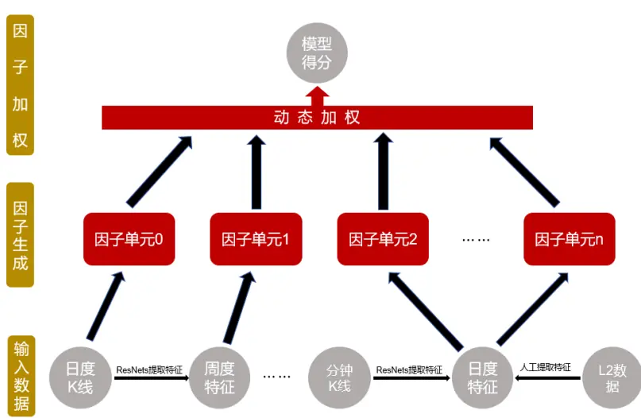
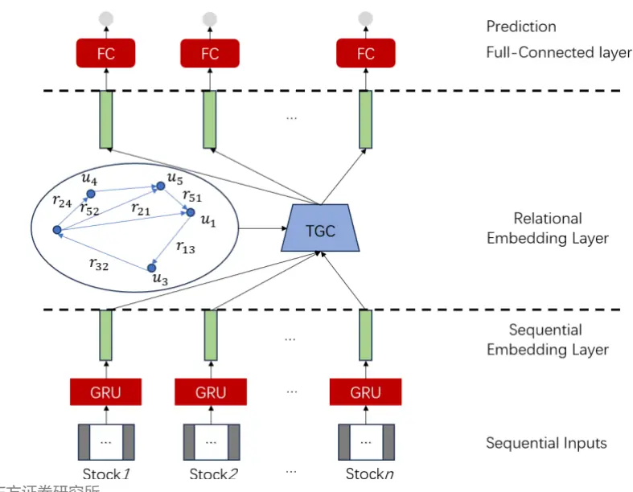
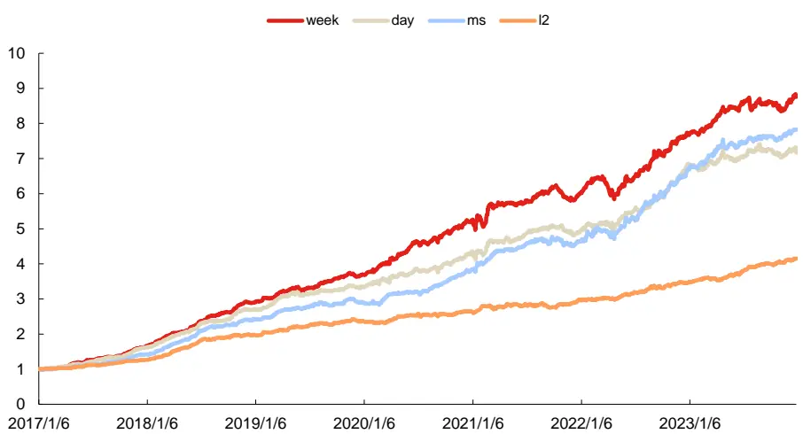
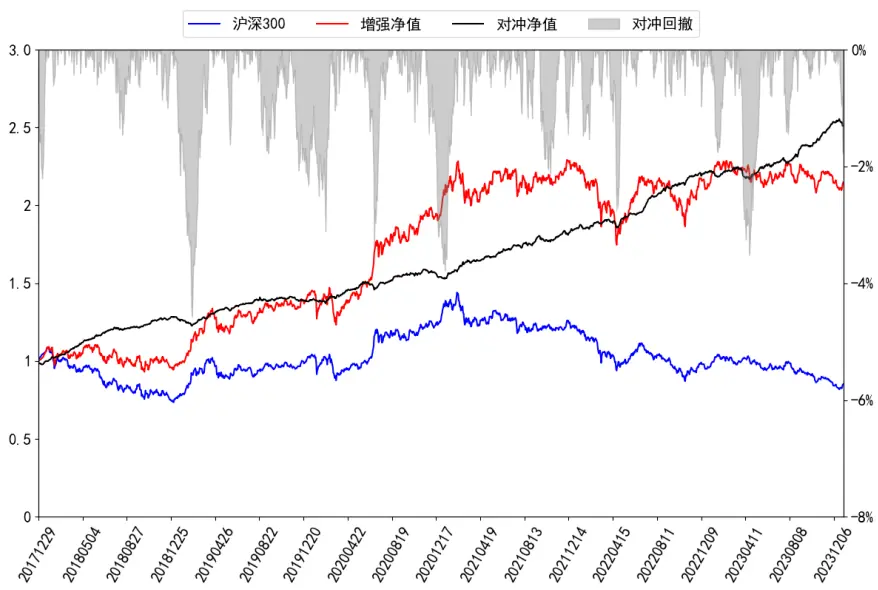
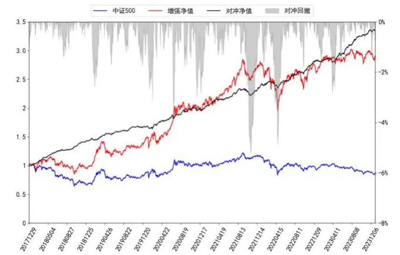
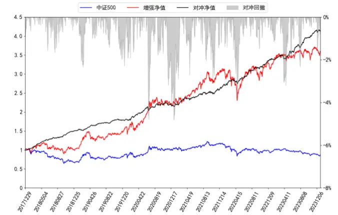
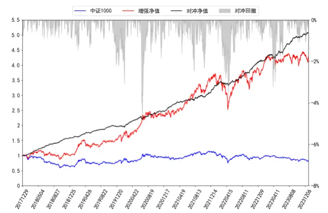
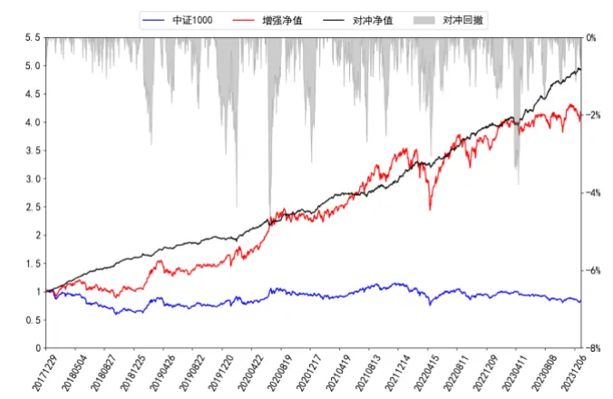

# 自适应时空图网络周频 alpha模型

因子选股系列之一〇一

## 研究结论

## 自适应图模型的优势

本文提出了一个 RNN 中嵌入自适应图的网络结构（ASTGNN）来进行因子挖掘任务。这种新的网络结构能够同时对时间和空间信息进行挖掘，既能考虑到时间维度上个股特征演化关系，又能兼顾空间截面上所有个股的交互作用。

相较于传统图模型通过行业分类、是否属于同一基金持仓或者基本面这些人为选取且滞后性较高的信息构建的邻接矩阵，新模型定义的邻接矩阵完全是数据驱动的，通过个股自身走势或者相关特征自助捕捉个股间的交互关系，因而新模型对空间截面上个股交互关系的刻画更加客观且实时性更强。

⚫ 自适应图模型邻接矩阵规模只依赖于输入数据量，而不再需要固定其规模，因而自适应图模型的灵活性更高、实用性更大。

## 单数据集上实验结论

⚫从各数据集生成因子分别的回测结果来看，我们可以得到：数据集week生成因子表现最好，RankIC 和多头收益率均显著超过另外几个数据集，但波动和回撤也较大。而 l2 数据集表现最弱，但多头最大回撤相对较低走势稳健性相对较好。近年来 day数据集出现了一定的衰减，而 l2数据集几乎未出现衰减。

从各数据集通过 ASTGNN 和 GRU 生成单因子相关系数矩阵结果来看：1. 两模型在各数据集上生成单因子的相关性均在85%~95%之间，相对较高，说明两个模型在各数据集上挖掘出的有效信息相似度较高但仍具有一定的差异性。2. ASTGNN在各数据集上生成单因子间的相关性普遍低于 GRU，说明不同数据集上挖掘出的个股关联关系有一定差异性。

## 合成因子的实验结论

从最终因子回测结果来看我们可以得到：1. 相较于 GRU，ASTGNN 模型 RankIC、ICIR、RankIC>0 占比等指标均显著提升，最大回撤也显著降低。这说明通过在因子挖掘阶段嵌入图结构确实能辅助 GRU 得到更多的的信息增量。2. 相较于 GRU，新模型换手率有所上升，这可能和邻接矩阵变化存在一定的关系，即本期和上一期RNN 部分挖掘的特征向量可能变化不大，但由于邻接矩阵变化导致两期最终生成的弱因子差异性上升，最终使得换手率上升。

基于 ASTGNN 模型在各个数据集上进行因子挖掘然后非线性加权所得打分 2018 年和 2020 年以来在中证全指、沪深 300、中证 500、中证 1000 四个指数上十日RankIC 均值分别为 16.00%、10.50%、12.30%、15.27%和 14.27%、9.68%、10.32%、12.99%，top 组年化超额分别为 46.11%、27.92%、25.28%、34.44%和37.19%、27.28%、21.91%、27.48%。相较于基准模型，各宽基指数股票池上新模型生成因子的选股效果均有明显提升。

本文生成因子也可以直接应用于指数增强策略，在各宽基指数上均能获得显著的超额收益，在成分股不低于 80%限制、周单边换手率约束为 20%约束下，2018 年以来，新模型打分在沪深 300、中证 500和中证 1000增强策略上年化超额收益率分别为 16.59%、22.32%和 31.12%。

## 风险提示

⚫ 量化模型失效

⚫ 极端市场造成冲击，导致亏损

报告发布日期

2024 年 02 月 28 日

杨怡玲

yangyiling@orientsec.com.cn

执业证书编号：S0860523040002

陶文启 taowenqi@orientsec.com.cn

基于抗噪的 AI 量价模型改进方案：——因 2023-12-24子选股系列之九十八

基于残差网络的端到端因子挖掘模型：— 2023-08-24—因子选股系列之九十六

基于循环神经网络的多频率因子挖掘：— 2023-06-06—因子选股系列之九十一

## 引言

随着人工智能学科的快速发展，以神经网络、决策树为主的机器学习模型在量化领域大放异彩，前期报告《基于循环神经网络的多频率因子挖掘》、《基于残差网络端到端因子挖掘模型》、《基于抗噪的AI量价模型改进方案》中，我们利用循环神经网络（RNN）、残差网络（ResNets）和决策树模型搭建了端到端 AI 量价模型框架，这套框架的输入是个股最原始的高开低收等，而最终的输出则是具有较强选股能力的 alpha 因子。我们将其该框架生成的因子应用于选股策略。回测结果显示该策略在样本外有着十分显著的选股效果。

这套 AI 量价模型框架主要是基于多个不同频率数据集搭建的，这些数据集分别是周度（week）、日度（day）、分钟线（ms）和Level-2（l2）数据集。其中周度和分钟线数据集我们分别是将每五个交易日日K线和每日半小时K线形成矩阵数据，然后将这些矩阵通过ResNets提取出相应时间频度的特征向量而形成的，而 Level-2 则是将原始数据通过人工合成成日频因子的方式形成的。

整个 AI量价模型框架分为三个部分，数据预处理、提取因子单元、因子加权。数据预处理包括去极值标准化和补充缺失值三个步骤，而提取因子单元则是通过RNN将输入转化成一系列具有一定选股能力的弱因子，因子加权则是利用决策树对这些RNN生成的弱因子进行短周期非线性加权形成模型最终的个股得分，部分整个流程如下图所示：

图 1：端到端 AI量价模型框架

数据来源：东方证券研究所

考虑到这套框架在因子单元生成阶段使用的是RNN模型，该模型只能学习个股自身历史序列的信息而忽略了股票之间的交互关系，而 A 股市场相似股票（比如相同产业链、相同概念板块）存在着一定程度的同涨同跌的同步效应，强势个股也可能带领整个概念板块所有个股的上涨，因此捕捉股票间交互作用显得尤为重要。为了克服RNN的这种缺陷，本文中我们在框架中因子单元生成阶段嵌入图结构，来捕捉这种交互作用。

## 一、自适应时空图循环神经网络

## 1.1 图与图神经网络简介

图是用来表示数据点之间关联关系的一种结构。对于一个数据点集 $X=\{x_{1},x_{2},\cdots,x_{n}\}$ ，这里$x_{i}$ 表示第 i 个节点对应的特征，如果我们把这些点看做图的一系列节点（node），第 i 个节点称之为 $v_{i}$ 这些节点的集合记作 V，有关联关系的顶点之间相互连接形成一系列边（edge），给这些边设置相应的权重并且把这些带权重的边构成的集合记作 E，将连接节点 i 与j 的边记为 $e_{i,j}$ 其对应权重记为 $w_{i,j}$ （当图是无向图时显然有 $w_{i,j}=w_{j,i}~)$ ，则我们可以构建一个权重图 $G=$ (V,E) 来表示这些图上节点之间的关联关系。当数据点数量趋于无穷大时，权重图则能收敛于数据分布的底层流形。因而权重图是刻画数据分布以及数据间关联关系的重要手段。

图 2：权重图示意图

数据来源：东方证券研究所

特别的，如果我们用 $u_{i}$ 作为节点 i 在这个图上的一个表示，那么我们自然希望如果节点 i、 j之间边权重 $w_{i,j}$ 越大则对应的表示 $u_{i}$ 与 $u_{j}$ 之间距离越近，显然所有节点的表示矩阵 ${\pmb u}=$ $\{u_{1},u_{2},\cdots,u_{n}\}$ 可以通过极小化以下能量函数进行求解：

$$
\mathrm{min}_{u}\sum_{i,j}w_{i,j}\big(u_{i}-u_{j}\big)^{2}
$$

记 $\begin{array}{r}{d_{i}=\sum_{i}w_{i,j}}\end{array}$ ，则我们称矩阵 $\pmb{A}=\left\{w_{i,j}\right\}_{i,j}$ 为图 G 的邻接矩阵，矩阵 $\pmb{D}=\left\{w_{i,j}\right\}_{i,j}$ 为图 G 的度矩阵，矩阵 $\pmb{D}-\pmb{A}$ 则称为图 G 的非标准化的 graph Laplacian，剔除向量 u 长度和分量全为 1的常值解影响，上述优化问题可以等价为寻找矩阵 $\pmb{L}=\pmb{I}-\pmb{D}^{-1/2}\pmb{A}\pmb{D}^{-1/2}$ 特征值和特征向量问题进行求解，这里矩阵 I 为单位矩阵，矩阵 L 则被称之为图 G 的标准化的 graph Laplacian。当采样点个数趋于无穷大时，graph Laplacian 将收敛于底层流形上的内蕴量——Laplace 算子，因而graph Laplacian 矩阵能很好的刻画权重图的关联信息。

类似傅里叶卷积变换的操作，如果以标准化的 graph Laplacian 特征向量作为一组基向量，对于一个给定向量 $_x$ ，我们也可以定义图卷积操作：

$$
g_{\theta}*x=Ug_{\theta}U^{T}x
$$

这里 $g_{\theta}$ 是对角矩阵，其对角元是一组参数，矩阵 U 是 graph Laplacian矩阵特征向量构成的。如果我们把 $g_{\theta}$ 的对角元作为一组可学习的参数，并且利用利用 1 阶切比雪夫多项式进行逼近，则图卷积操作信号输出 Z 则可近似为 [1]：

$$
\pmb{Z}=(\pmb{I}+\pmb{D}^{-1/2}\pmb{A}\pmb{D}^{-1/2})\pmb{X}\pmb{W}
$$

有关分析师的申明，见本报告最后部分。其他重要信息披露见分析师申明之后部分，或请与您的投资代表联系。并请阅读本证券研究报告最后一页的免责申明。

一个多层的图卷积神经网络结构则可表示为：

$$
\begin{array}{l}{{\pmb{Z}^{l+1}=\sigma((\pmb{I}+\pmb{D}^{-1/2}\pmb{A}\pmb{D}^{-1/2})\pmb{Z}^{l}\pmb{W}^{l})}}\end{array}
$$

这里 $W^{l}$ 表示图神经网络第 l 层可学习的权重参数， $z^{l}$ 表示第 l 层输入和第 l−1 层输出 $(\mathbf{\nabla}Z^{0}$ 为图神经网络的输入，即 $\pmb{Z}^{0}=\pmb{X})$ $\sigma(\cdot)$ 表示层之间的激活函数通常取 $\mathsf{ReLU}(\mathsf{x}){=}\mathsf{max}(\mathsf{x},0)$ 可以看到图神经网络通过将一个先验的邻接矩阵作为输入，可以辅助模型有效的学习出空间域内数据点之间的关联关系。

## 1.2自适应时空循环神经网络简介

传统的图神经网络需要预定义用于图卷积运算的邻接矩阵 A，现有方法主要是利用距离函数或者相似性度量来事先计算该矩阵，比如使用所属行业、主营业务、基本面等等来衡量相似性，但是这些方法有着许多不合理因素：

1. 滞后性较高，比如基本面需要根据业绩报告一个季度更新一次、所属行业分类则更新频率更低。因此对于中高频策略往往实用性更低。

2. 主观性较高，股票短期相似性可能受到所属概念炒作的影响，因此股票相似性很可能体现在个股自身短期走势上，所以预定义的邻接矩阵往往不能包含有关个股完整信息的空间依赖性，而导致与所需预测的未来收益率没有直接关系，最终使得邻接矩阵对个股关联关系的度量有着相当大的偏见。

3. 迁移性较差，考虑到样本外可能出现训练集和验证集都不包含的新入池的股票，因此很难将训练集学出的关联关系延拓到这些股票身上。

基于以上角度，我们使用文献 [2] 中数据驱动的方式通过数据自适应的学习节点间的内在隐藏关联关系来获取邻接矩阵。其具体做法为，首先设置可学习的节点嵌入向量 M，然后通过嵌入向量的相似度衡量节点间的关联关系，如下所示：

$$
D^{-1/2}AD^{-1/2}=softmax(ReLU(MM^{T}))
$$

上式中我们使用激活函数 ReLU 对关联矩阵进行稀疏化并剔除弱连接，而相似度度量矩阵我们使用 $MM^{T}$ 的目的是为了使得该相似度度量矩阵至少为半正定矩阵，且对角元（衡量自身与自身的相似性）为正数，并且使用 softmax 函数直接对关联矩阵进行归一化得到 $\pmb{D}^{-1/2}\pmb{A}\pmb{D}^{-1/2}$ ，像其它自适应图卷积模型一样，本方法只学习出邻接矩阵或者拉普拉斯矩阵，并没有人为预先设定。此时，模型中的自适应图卷积层可以表示为

$$
{\cal Z}=(I+softmax(ReLU(MM^{T})))XW
$$

这里 X 表示数据特征矩阵，W 表示自适应图网络的参数。

本文中，我们借助文献 [3] 的思想利用 GRU处理时间序列问题能够有效刻画时序信息的优势和图神经网络在空间域上能够有效的刻画股票间交互关系的优势，将这两者结合来解决预测股票收益率的排序预测问题。其具体做法是首先将个股对应的时间序列通过GRU提取时序信息后得到的隐层作为输入，通过一个自适应图结构层进行空间上交互关系的信息的提取，从而做到同时学习时间信息和空间信息的目的。我们把这种同时学习时空信息的网络结构称之为自适应时空图网络（Adaptive Spatio-Temporal Graph Neural Network & ASTGNN），该网络具体结构如下：

图 3：自适应时空图网络结构

数据来源：东方证券研究所

我们还可以将先验的邻接矩阵信息嵌入到我们这套自适应时空图网络框架中，具体做法为损失函数加入图临近损失项（Graph Proximity Loss） [4]，节点 i 的损失函数项可表示为：

$$
\mathcal{L}_{\mathcal{GP}}(\mathrm{i})=-\sum_{j\in\mathcal{N}(i)}log(\sigma(\pmb{o}_{i}\pmb{o}_{j}^{T}))-\sum_{j\in\mathcal{S}-\mathcal{N}(i)}log(-\sigma(\pmb{o}_{i}\pmb{o}_{j}^{T}))
$$

这里 $\pmb{o}_{i}$ 表示节点 i 的 GRU 输出的隐层， $\mathcal{N}(i)$ 表示节点 i 邻居节点构建的集合（该集合节点元素为先验知识），S 表示所有节点构建的集合，σ 表示sigmoid函数。特别的，我们也可以将图结构直接嵌入 GRU 结构中，具体可参考文献 [2]，此处不再赘述。

## 二、各数据集单因子分析

## 2.1 回测说明

第二、三章的回测结果中，各项指标计算方法如下所示：

1. RankIC均值是当天因子与隔日未来十日收益率序列进行计算的，并且每隔十个交易日计算一次，最终将这个 RankIC序列取平均得到的。

2. ICIR则是根据上述 RankIC序列均值除以序列标准差计算得到的。

3. 分组测试结果中，top 组和 bottom 组对冲年化收益（中证全指股票池上我们是将股票池分成 20组，而沪深 300、中证 500和中证 1000股票池上则是分成 5组），周度调仓，次日收盘价成交并且不考虑交易成本计算得到的。

4. 周均单边换手率是根据多头组持仓计算得到，而最大回撤和年化波动率则是根据 top 组超额收益净值计算得到的。

5. 我们还将本文模型生成因子与前期报告《基于抗噪的 AI量价模型改进方案》生成因子进行对比来体现本模型的提升效果。GRU 代表前期报告《基于抗噪的 AI 量价模型改进方案》生成因子，ASTGNN代表本报告生成因子。

## 2.2 各数据集单因子绩效分析

本节我们将对比 week、day、ms、l2 四个数据集分别通过 ASTGNN 和 GRU 模型直接生成因子在中证全指股票池上的选股效果。

图 4：各数据集生成因子汇总表现（回测期 20170101~20231231）

|  | week | day | ms | 12 |
| --- | --- | --- | --- | --- |
| RanklC | 14.22% | 13.47% | 14.14% | 12.05% |
| ICIR | 1.33 | 1.36 | 1.32 | 1.13 |
| RankIC>0占比 | 87.57% | 89.94% | 89.94% | 88.17% |
| 周均单边换手 | 62.41% | 72.62% | 60.20% | 58.04% |
| Top组超额最大回撤 | -10.10% | -5.64% | -6.69% | -4.97% |

GRU

|  | week | day | ms | 12 |
| --- | --- | --- | --- | --- |
| RanklC | 13.57% | 12.42% | 13.64% | 11.84% |
| ICIR | 1.29 | 1.21 | 1.31 | 1.29 |
| RankIC>0占比 | 89.94% | 89.35% | 88.17% | 89.35% |
| 周均单边换手 | 58.22% | 70.17% | 60.62% | 58.04% |
| Top组超额最大回撤 | -10.80% | -11.17% | -6.34% | -8.96% |

数据来源：wind、上交所、深交所、东方证券研究所

图 5：各数据集生成因子分组测试结果（回测期 20170101~20231231）

| ASTGNN |  |  |  |  | GRU |  |  |  |  |
| --- | --- | --- | --- | --- | --- | --- | --- | --- | --- |
|  | week | day | ms | 12 |  | week | day | ms | 12 |
| Top | 36.44% | 32.58% | 34.26% | 22.62% | Top | 34.29 % | 25.57% | 31.20% | 21.31% |
| Grp1 | 29.56% | 29.48% | 30.01% | 18.88% | Grp1 | 29.90 1% | 25.07 1% | 26.93% | 17.60 d% |
| Grp2 | 25.00% | 23.91% | 24.06% | 18.48% | Grp2 | 23.59% | 21.80% | 23.92% | 19.73 1% |
| Grp3 | 20.12% | 20.17% | 21.33% | 16.94% | Grp3 | 17.93% | 19.93% | 20.96% | 18.02 2% |
| Grp4 | 19.39% | 18.94% | 20.54% | 16.23% | Grp4 | 19.94% | 16.77 7% | 20.18% | 13.48% |
| Grp5 | 18.5% | 14.83% | 17.11% | 14.07% | Grp5 | 17.13% | 15.23% | 17.10% | 14.58% |
| Grp6 | 12.93% | 13.78% | 12.18% | 12.05% | Grp6 | 14.96% | 12.20% | 14.59% | 13.35% |
| Grp7 | 11.40% | 11.52% | 10.26% | 10.14% | Grp7 | 11.90% | 9.71% | 11.40% | 11.73 % |
| Grp8 | 10.50% | 8.94% | 10.06% | 9.35% | Grp8 | 9.22% | 6.43% | 9.06% | 11.62% |
| Grp9 | 8.68% | 5.44 | 8.84% | 9.00% | Grp9 | 7.63% | 7.89% | 8.29% | 8.02% |
| Grp10 | 5.27 0 | 4.26 0 | 8.42% | 7.37 | Grp10 | 5.67 | 5.08% | 7.06% | 7.15 |
| Grp11 | 3.77 6 | 4.76% | 3.51 b | 3.98 | Grp11 | 2.71 6 | 0.61% | 4.31% | 3.83 |
| Grp12 | -0.53% | -0.33% | 0.28% | 3.05 % | Grp12 | 1.11 6 | 0.76% | 0.16% | 0.97 % |
| Grp13 | -2.62 2% | -0.23% | -3.37 % | -0.53% | Grp13 | -1.90% | -1.84% | -1.92% | -0.92% |
| Grp14 | -5.2 q% | -6.06% | -5.5 7% | -3.20% | Grp14 | -6.63% | -3.27% | -5.91 1% | -1.66% |
| Grp15 | -10.00% | -7.88% | -6.79% | -5.31% | Grp15 | -10.62% | -7.74% | -8.12% | -6.1 18% |
| Grp16 | -14.56% | -12.3% | -14.09% | -10.92% | Grp16 | -13.86% | -9.31% | -14.12% | -11.42% |
| Grp17 | -21.1 19% | -17.92% | -21.53% | -18.23% | Grp17 | -20.49% | -16.82% | -19.60% | -171 % |
| Grp18 | -31.49% | -29.72% | -31.25% | -28.52% | Grp18 | -31.2 % | -28.14% | -31.86% | -27.25% |
| Bottom | -59.35% | -60.28% | -60.69% | -55.02% | Bottom | -58.041% | -56.49% | -59.39% | -55.90% |

数据来源：wind、上交所、深交所、东方证券研究所

图 6：各数据集 ASTGNN 生成因子多头净值走势（回测期 20170101~20231231）

数据来源：wind、上交所、深交所、东方证券研究所

通过上述图表结果，我们可以看出：

1. 整体来看，数据集 week 生成因子表现最好，RankIC 均值和多头收益率均显著超过另外几个数据集，但波动和回撤也较大。而 l2 数据集表现最弱但多头最大回撤相对较低，走势稳健性相对较好。

2. 近年来 day 数据集生成因子出现了一定程度的衰减，而 l2 数据集因子几乎未出现明显衰减。

3. 各数据集上 ASTGNN 直接生成因子的选股表现均好于只使用 GRU 生成因子的表现，具体体现在 RankIC和分组后的多头收益率指标都有不同程度的提升，其中数据集 day和数据集 ms上的提升效果更加明显。这说明 ASTGNN 考虑空间截面上个股之间的交互关系，使得ASTGNN相较于 GRU挖掘信息更加充分。

## 2.3 各数据集单因子相关系数分析

这一节我们绘制了 ASTGNN及 GRU在各个数据集上生成因子相关系数矩阵如下图所示：

图 7：各数据集生成因子相关系数

|  |  | GRU |  |  |  | ASTGNN |  |  |  |
| --- | --- | --- | --- | --- | --- | --- | --- | --- | --- |
|  |  | week | day | ms | 12 | week | day | ms | 12 |
| GRU | week | 1.00 | 0.83 | 0.64 | 0.50 | 0.87 | 0.78 | 0.64 | 0.46 |
|  | day | 0.83 | 1.00 | 0.74 | 0.57 | 0.77 | 0.91 | 0.75 | 0.54 |
|  | ms | 0.64 | 0.74 | 1.00 | 0.61 | 0.67 | 0.76 | 0.95 | 0.59 |
|  | 12 | 0.50 | 0.57 | 0.61 | 1.00 | 0.48 | 0.54 | 0.62 | 0.86 |
| ASTGNN | week | 0.87 | 0.77 | 0.67 | 0.48 | 1.00 | 0.81 | 0.66 | 0.46 |
|  | day | 0.78 | 0.91 | 0.76 | 0.54 | 0.81 | 1.00 | 0.75 | 0.53 |
|  | ms | 0.64 | 0.75 | 0.95 | 0.62 | 0.66 | 0.75 | 1.00 | 0.61 |
|  | 12 | 0.46 | 0.54 | 0.59 | 0.86 | 0.46 | 0.53 | 0.61 | 1.00 |

数据来源：wind、上交所、深交所、东方证券研究所

上述结果我们可以看出：

有关分析师的申明，见本报告最后部分。其他重要信息披露见分析师申明之后部分，或请与您的投资代表联系。并请阅读本证券研究报告最后一页的免责申明。

1. ASTGNN 和 GRU 在各个数据集上生成因子的相关系数普遍位于 85%~95%之间，相对较高，说明两个模型在各个数据集上挖掘出的有效信息相似度较高但仍具有一定的差异性。

2. ASTGNN 在各个数据集上生成因子之间的相关性普遍低于 GRU，这意味着不同数据集上挖掘出的个股关联关系可能有所不同。

## 三、各数据集因子非线性加权结果分析

本章展示各数据集通过自适应时空图网络（ASTGNN）生成弱因子经过非线性加权方法后得到最终因子在中证全指、沪深 300、中证 500和中证 1000四个股票池中的表现。

## 3.1 中证全指上的表现

首先，我们展示中证全指股票池上 ASTGNN 和 GRU 两个模型生成因子在 2018 年以来和2020年以来的选股表现对比：

图 8：中证全指选股汇总表现（回测期 20180101~20231231）

| 2018年以来 |  |  | 2020年以来 |  |  |
| --- | --- | --- | --- | --- | --- |
|  | GRU | ASTGNN |  | GRU | ASTGNN |
| RankIC | 15.67% | 16.00% | RankIC | 13.85% | 14.27% |
| ICIR | 1.48 | 1.52 | ICIR | 1.33 | 1.41 |
| RankIC>0占比 | 93.79% | 95.17% | RankIC>0占比 | 91.67% | 93.75% |
| 周均单边换手 | 61.55% | 62.57% | 周均单边换手 | 59.82% | 61.04% |
| 年化波动率 | 7.53% | 7.61% | 年化波动率 | 7.65% | 7.48% |
| Top组超额最大回撤 | -6.58% | -4.72% | Top组超额最大回撤 | -6.58% | -4.72% |

|  | GRU | ASTGNN |  | GRU | ASTGNN |
| --- | --- | --- | --- | --- | --- |
| Top | 42.19% | 46.11 % | Top | 34.16% | 37.19 |
| Grp1 | 36.83% | 38.20% | Grp1 | 32.30% | 33.98 % |
| Grp2 | 30.65% | 31.23% | Grp2 | 26.11% | 27.50 % |
| Grp3 | 27.08% | 27.69% | Grp3 | 23.93% | 23.19 |
| Grp4 | 23.44% | 24.05% | Grp4 | 21.16% | 21.87 % |
| Grp5 | 21.98% | 22.61 1% | Grp5 | 19.179 | 20.33 % |
| Grp6 | 18.24% | 15.64% | Grp6 | 17.26% | 15.43% |
| Grp7 | 12.88% | 14.18% | Grp7 | 12.14% | 13.06% |
| Grp8 | 9.55% | 10.23% | Grp8 | 8.96% | 10.63 |
| Grp9 | 7.08% | 8.89% | Grp9 | 6.68% | 9.44% |
| Grp10 | 8.20% | 3.14 % | Grp10 | 8.62% | 2.55% |
| Grp11 | 0.89% | 3.09% | Grp11 | 0.41% | 2.80% |
| Grp12 | -0.64% | -1.06% | Grp12 | -0.26% | -1.93% |
| Grp13 | -2.84% | -4.15% | Grp13 | -1.94% | -2.94% |
| Grp14 | -6.60% | -6.92% | Grp14 | -5.34% | -6.20% |
| Grp15 | -12.00% | -11.80% | Grp15 | -11.63% | -10.79% |
| Grp16 | -18.43% | -17.30% | Grp16 | -15.86% | -15.85% |
| Grp17 | -23.14% | -24.1 % | Grp17 | -19.38% | -20.88% |
| Grp18 | -34.20% | -34.72% | Grp18 | -31.02% | -30.26% |
| Bottom | -64.95% | -65.541% | Bottom | -62.68% | -63.38% |

数据来源：wind、上交所、深交所、东方证券研究所

## 通过上述图表结果我们可以看出：

1. 相较于基准模型，无论是 2018 年以来还是 2020 年以来，新模型 RankIC、ICIR、RankIC>0占比等指标均显著提升，最大回撤有显著降低。这说明通过在因子挖掘阶段嵌入图结构确实能挖掘出 GRU难以得到的信息。

2. 相较于基准模型，新模型周均单边换手率有所上升，这可能和邻接矩阵变化存在一定的关系，即本期和上一期RNN部分挖掘的特征向量可能变化不大，但由于邻接矩阵变化（该股票邻居股票发生变化）导致两期最终生成的弱因子差异性上升，最终使得换手率上升。

下面我们将展示两模型生成因子分年度的表现：

图 9：中证全指各年度选股表现（回测期 20180101~20231231）

| 绝对收益 |  |  |  |  |  |  |
| --- | --- | --- | --- | --- | --- | --- |
|  | 2018 | 2019 | 2020 | 2021 | 2022 | 2023 |
| GRU | 30.63% | 76.04% | 57.80% | 58.78% | 31.55% | 43.72% |
| ASTGNN | 36.87% | 81.17% | 70.13% | 66.45% | 28.54% | 41.91% |
|  | 超额收益 |  |  |  |  |  |
|  | 2018 | 2019 | 2020 | 2021 | 2022 | 2023 |
| GRU | 88.12% | 35.86% | 32.74% | 25.92% | 45.09% | 32.38% |
| ASTGNN | 97.12% | 39.76% | 43.10% | 32.13% | 41.81% | 30.69% |

数据来源：wind、上交所、深交所、东方证券研究所

上表中各模型多头组合分年度绩效表现来看，除两年表现略低于基准模型，其他年份新模型均能大幅跑赢基准模型。这说明相较于基准模型新模型能够产生稳定的提升效果。

## 3.2 各宽基指数上的表现

接着我们将基准模型和新模型在沪深300、中证500和中证1000这三个股票池上进行分组测试（分 5组），所得回测结果如下：

图 10：各宽基指数上选股表现（回测期 20180101~20231031）

| 2018年以来 | GRU | ASTGNN |
| --- | --- | --- |
| RankIC | 10.26% | 10.50% |
| ICIR | 0.7 | 0.72 |
| RankIC>0占比 | 75.86% | 75.17% |
| Top年化超额 | 27.29% | 27.92% |
| 年化波动率 | 7.60% | 7.31% |
| 最大回撤 | -8.05% | -7.17% |
| 周均单边换手 | 43.49% | 43.94% |

沪深300

| 2020年以来 | GRU | ASTGNN |
| --- | --- | --- |
| RankIC | 9.53% | 9.68% |
| ICIR | 0.7 | 0.72 |
| RankIC>0占比 | 70.65% | 73.96% |
| Top年化超额 | 27.30% | 27.28% |
| 年化波动率 | 7.96% | 7.57% |
| 最大回撤 | -8.05% | -7.17% |
| 周均单边换手 | 42.66% | 42.94% |

中证500

| 2018年以来 | GRU | ASTGNN |
| --- | --- | --- |
| RankIC | 11.87% | 12.30% |
| ICIR | 0.96 | 0.97 |
| RankIC>0占比 | 81.38% | 80.69% |
| Top年化超额 | 23.14% | 25.28% |
| 年化波动率 | 6.10% | 6.20% |
| 最大回撤 | -8.69% | -7.99% |
| 周均单边换手 | 43.95% | 44.85% |

| 2020年以来 | GRU | ASTGNN |
| --- | --- | --- |
| RankIC | 10.11% | 10.32% |
| ICIR | 0.86 | 0.86 |
| RankIC>0占比 | 79.17% | 78.12% |
| Top年化超额 | 19.90% | 21.91% |
| 年化波动率 | 6.36% | 6.39% |
| 最大回撤 | -8.69% | -7.99% |
| 周均单边换手 | 42.83% | 43.57% |

中证1000

| 2018年以来 | GRU | ASTGNN |
| --- | --- | --- |
| RankIC | 15.08% | 15.27% |
| ICIR | 1.41 | 1.41 |
| RankIC>0占比 | 91.03% | 90.34% |
| Top年化超额 | 33.45% | 34.44% |
| 年化波动率 | 5.57% | 5.56% |
| 最大回撤 | -4.18% | -3.40% |
| 周均单边换手 | 44.40% | 45.25% |

数据来源：wind、上交所、深交所、东方证券研究所

| 2020年以来 | GRU | ASTGNN |
| --- | --- | --- |
| RankIC | 12.89% | 12.99% |
| ICIR | 1.23 | 1.25 |
| RankIC>0占比 | 88.54% | 88.54% |
| Top年化超额 | 26.30% | 27.48% |
| 年化波动率 | 5.81% | 5.75% |
| 最大回撤 | -4.19% | -3.40% |
| 周均单边换手 | 43.15% | 44.00% |

有关分析师的申明，见本报告最后部分。其他重要信息披露见分析师申明之后部分，或请与您的投资代表联系。并请阅读本证券研究报告最后一页的免责申明。

通过以上结果我们可以看出无论是 2018 年以来还是 2020 年以来，在各宽基指数上，ASTGNN 模型生成因子较基准模型都有不同程度提升效果。这说明嵌入图结构带来信息增量的泛化能力相对显著。

## 四、合成因子指数增强组合表现

## 4.1增强组合构建说明

本章将展示了各数据集非线性加权得分在沪深300、中证500和中证1000指数增强的应用效果，关于指数增强组合有如下说明：

1） 回测期 20180101~20231231，组合周频调仓，假设根据每周五个股得分在次日以 vwap 价格进行交易，股票池为中证全指。

2） 风险因子库dfrisk2020（参见《东方A股因子风险模型（DFQ-2020）》）的所有风格因子相对暴露不超过 0.5，所有行业因子相对暴露不超过 2%，中证 500 增强跟踪误差约束不超过 5%，沪深 300 增强跟踪误差约束不超过 4%。

3） 指增策略组合构建时，限制指数成分股占比，成分股占比约束记为 cpct（cpct=None 表示成分股占比不进行约束），周单边换手率限制记为 delta。

4） 组合业绩测算时假设买入成本千分之一、卖出成本千分之二，停牌和涨停不能买入、停牌和跌停不能卖出。

## 4.2 沪深 300 指数增强

本节将展示新模型生成因子在沪深 300 指数增强策略应用，首先我们展示不同约束条件下，各年度超额收益以及汇总的业绩表现：

图 11：沪深 300指增组合分年度超额收益率（截至 20231231）

|  | delta=0.1 |  | delta=0.2 |  | delta=0.3 |  |
| --- | --- | --- | --- | --- | --- | --- |
|  | cpct =0.8 | cpct=None | cpct=0.8 | cpct=None | cpct=0.8 | cpct=None |
| 2018 | 15.72% | 19.75% | 28.49% | 25.91% | 30.72% | 28.24% |
| 2019 | 5.72% | 3.84% | 7.72% | 6.66% | 6.06% | 2.84% |
| 2020 | 6.42% | 8.89% | 10.94% | 10.11% | 11.13% | 10.34% |
| 2021 | 19.41% | 20.76% | 20.40% | 21.41% | 21.06% | 21.30% |
| 2022 | 19.57% | 16.27% | 20.19% | 17.93% | 18.86% | 17.89% |
| 2023 | 15.68% | 14.93% | 12.98% | 13.15% | 12.65% | 12.25% |

数据来源：wind、上交所、深交所、东方证券研究所

图 12：沪深 300指增组合汇总结果（截至 20231231）

|  | 模型 | 年化超额 | 年化波动 | 周度胜率 | 最大回撤 |
| --- | --- | --- | --- | --- | --- |
| delta=0.1 | cpct=0.8 | 13.62% | 4.58% | 68.05% | -5.88% |
|  | cpct=None | 13.93% | 4.82% | 68.05% | -7.31% |
| delta=0.2 | cpct=0.8 | 16.59% | 4.66% | 69.01% | -4.58% |
|  | cpct=None | 15.69% | 4.88% | 68.37% | -5.73% |
| delta=0.3 | cpct=0.8 | 16.49% | 4.70% | 69.01% | -4.70% |
|  | cpct=None | 15.20% | 4.89% | 67.09% | -5.80% |

数据来源：wind、上交所、深交所、东方证券研究所

图 13：沪深 300指增组合净值走势（成分股 80%限制，净值左轴，回撤右轴）

数据来源：wind、上交所、深交所、东方证券研究所

上述图表结果可以看出，ASTGNN生成因子直接用于沪深300指增任务表现良好，并且约束条件更严格的条件下，沪深 300指增组合的表现反而更加优异。

## 4.3 中证 500 指数增强

本小节将展示非线性加权生成因子打分应用于中证 500 指数增强策略表现情况。首先我们展示各个模型各年度超额收益以及汇总的业绩表现：

图 14：中证 500指增组合分年度超额收益率（截至 20231031）

|  | delta=0.1 |  | delta=0.2 |  | delta=0.3 |  |
| --- | --- | --- | --- | --- | --- | --- |
|  | cpct =0.8 | cpct=None | cpct=0.8 | cpct=None | cpct=0.8 | cpct=None |
| 2018 | 30.09% | 34.86% | 43.30% | 50.73% | 46.86% | 53.65% |
| 2019 | 13.73% | 19.01% | 17.22% | 18.44% | 18.02% | 18.65% |
| 2020 | 14.32% | 18.58% | 17.19% | 21.91% | 16.93% | 19.55% |
| 2021 | 18.81% | 22.44% | 20.31% | 21.81% | 20.75% | 23.09% |
| 2022 | 16.70% | 24.71% | 19.64% | 28.22% | 17.55% | 27.84% |
| 2023 | 14.82% | 21.29% | 18.08% | 21.92% | 17.05% | 22.64% |

数据来源：wind、上交所、深交所、东方证券研究所

有关分析师的申明，见本报告最后部分。其他重要信息披露见分析师申明之后部分，或请与您的投资代表联系。并请阅读本证券研究报告最后一页的免责申明。

图 15：中证 500指增组合汇总结果（截至 20231231）

|  | 模型 | 年化超额 | 年化波动 | 周度胜率 | 最大回撤 |
| --- | --- | --- | --- | --- | --- |
| delta=0.1 | cpct=0.8 cpct=None | 17.96% | 4.97% | 71.88% | -5.27% |
|  |  | 23.38% | 5.81% | 71.25% | -5.60% |
| delta=0.2 | cpct=0.8 | 22.32% | 5.38% | 70.93% | -5.22% |
|  | cpct=None | 26.76% | 6.11% | 73.80% | -4.82% |
| delta=0.3 | cpct=0.8 | 22.44% | 5.53% | 71.57% | -5.61% |
|  | cpct=None | 27.07% | 6.30% | 72.84% | -4.81% |

数据来源：wind、上交所、深交所、东方证券研究所

图 16：中证 500 指增组合净值走势（成分股 80%限制，净值左轴，回撤右轴）

数据来源：wind、上交所、深交所、东方证券研究所

图 17：中证 500 指增组合净值走势（成分股不限制，净值左轴，回撤右轴）

数据来源：wind、上交所、深交所、东方证券研究所

上述图表结果可以看出，ASTGNN生成因子可以直接用于中证500指增任务，且该组合表现良好。成分股占比不做约束下组合的超额收益大幅超过成分股占比 80%约束条件下组合的结果。

## 4.4 中证 1000 指数增强

本小节将展示基准模型和新模型生成因子打分应用于中证 1000指数增强策略表现情况：

图 18：中证 1000指增组合分年度超额收益率（截至 20231231）

|  | delta=0.1 |  | delta=0.2 |  | delta=0.3 |  |
| --- | --- | --- | --- | --- | --- | --- |
|  | cpct =0.8 | cpct=None | cpct=0.8 | cpct=None | cpct=0.8 | cpct=None |
| 2018 | 42.32% | 47.20% | 59.88% | 60.80% | 62.76% | 68.62% |
| 2019 | 21.34% | 18.50% | 23.36% | 20.66% | 27.23% | 22.73% |
| 2020 | 27.68% | 22.06% | 26.63% | 23.75% | 26.07% | 21.77% |
| 2021 | 30.92% | 26.16% | 28.16% | 26.57% | 27.58% | 27.52% |
| 2022 | 27.31% | 28.00% | 29.93% | 30.65% | 26.93% | 30.92% |
| 2023 | 14.37% | 20.66% | 22.06% | 24.28% | 20.17% | 24.28% |

数据来源：wind、上交所、深交所、东方证券研究所

有关分析师的申明，见本报告最后部分。其他重要信息披露见分析师申明之后部分，或请与您的投资代表联系。并请阅读本证券研究报告最后一页的免责申明。

图 19：中证 1000指增组合汇总结果（截至 20231231）

|  | 模型 | 年化超额 | 年化波动 | 周度胜率 | 最大回撤 |
| --- | --- | --- | --- | --- | --- |
| delta=0.1 | cpct=0.8 cpct=None | 27.06% | 5.43% | 75.40% | -4.48% |
|  |  | 26.78% | 5.89% | 72.84% | -4.48% |
| delta=0.2 | cpct=0.8 | 31.12% | 5.93% | 74.44% | -4.68% |
|  | cpct=None | 30.50% | 6.17% | 72.84% | -4.78% |
| delta=0.3 | cpct=0.8 | 31.14% | 6.12% | 77.00% | -4.57% |
|  | cpct=None | 31.77% | 6.39% | 73.16% | -5.57% |

数据来源：wind、上交所、深交所、东方证券研究所

图20：中证1000指增组合净值走势（成分股80%限制，净值左轴，回撤右轴）

数据来源：wind、上交所、深交所、东方证券研究所

图 21：中证 1000 指增组合净值走势（成分股不限制，净值左轴，回撤右轴）

数据来源：wind、上交所、深交所、东方证券研究所

上述图表结果可以看出，ASTGNN 生成因子直接用于中证 1000 指增任务形成组合，且该组合表现良好。随着约束条件不断放松组合的超额收益也将不断地上升。

## 五、结论

前期报告中，我们基于周度（week）、日度（day）、分钟线（ms）和Level-2（l2）四个数据集，利用 RNN、ResNet和决策树模型搭建了 AI量价模型框架，并将该框架生成的最终打分应用于选股策略，回测结果显示这套框架下生成的因子有着较强的选股能力。

但考虑到这套框架在因子单元生成阶段使用的是 RNN和 ResNet模型，该模型只能学习个股自身历史序列的信息而忽略了股票之间的交互关系，而 A 股市场相似股票存在着一定程度的同涨同跌的同步效应，因此捕捉股票间交互作用显得尤为重要。为了克服RNN的这种缺陷，本文提出了一个 RNN 中嵌入自适应图的网络结构（称之为自适应时空图循环神经网络 & ASTGNN）来进行因子挖掘任务。相较于 RNN模型和传统的图模型，该网络结构优势主要在于：

1. 能够同时对时间和空间信息进行挖掘，既能考虑到时间维度上个股特征演化关系，又能兼顾空间截面上所有个股的交互作用。

2. 实时性较强，相较于传统图模型而言，邻接矩阵的刻画往往依赖于行业分类、是否属于同一基金持仓或者基本面相关信息，这些信息滞后性高，如基本面需要根据业绩报告一个季度更新一次、所属行业分类则更新频率更低。因此对于中高频策略往往实用性更低。而自适应图模型则是根据输入 K 线数据或者个股相关特征自助捕捉交互关系，从而生成邻接矩阵，因而更能贴合市场实际的情况。

3. 更加客观，股票短期相似性可能受到所属概念炒作的影响，因此股票间相似性很可能体现在个股自身短期走势上，所以认为主观定义的邻接矩阵往往不能很好的契合这种个股的空间依赖性，因此人为定义的邻接矩阵对个股关联关系的刻画可能存在较大的偏见。而自适应图模型定义的邻接矩阵完全是数据驱动的，故相较于传统的图模型更加客观。

4. 灵活性较高，自适应图模型邻接矩阵规模只依赖于输入数据量，而不再需要固定规模，因而自适应图模型的灵活性更高。

从各数据集生成因子分别的回测结果来看，我们可以得到：数据集 week 生成因子表现最好，RankIC和多头收益率均显著超过另外几个数据集，但波动和回撤也较大。而l2数据集表现最弱，但多头最大回撤相对较低走势稳健性相对较好。近年来 day 数据集出现了一定的衰减，而 l2 数据集几乎未出现衰减。

从 ASTGNN 和 GRU 在各个数据集上生成因子的相关系数矩阵来看，我们可以得到：1.ASTGNN 和 GRU 在各个数据集上生成因子的相关系数普遍位于 85%~95%之间，相对较高，说明两个模型在各个数据集上挖掘出的有效信息相似度较高但仍具有一定的差异性。2. ASTGNN在各个数据集上生成因子之间的相关性普遍低于 GRU，这意味着不同数据集上挖掘出的个股关联关系可能有所不同。

从最终因子回测结果来看我们可以得到：1. 相较于 GRU，ASTGNN 模型 RankIC、ICIR、RankIC>0 占比等指标均显著提升，最大回撤也显著降低。这说明通过在因子挖掘阶段嵌入图结构确实能辅助 GRU得到更多的的信息增量。2. 相较于 GRU，新模型换手率有所上升，这可能和邻接矩阵变化存在一定的关系，即本期和上一期RNN部分挖掘的特征向量可能变化不大，但由于邻接矩阵变化导致两期最终生成的弱因子差异性上升，最终使得换手率上升。

基于 ASTGNN 模型在各个数据集上进行因子挖掘然后非线性加权所得打分 2018 年和 2020年以来在中证全指、沪深300、中证500、中证1000四个指数上十日RankIC均值分别为16.00%、10.50%、12.30%、15.27%和 14.27%、9.68%、10.32%、12.99%，top 组年化超额分别为46.11%、27.92%、25.28%、34.44%和 37.19%、27.28%、21.91%、27.48%。相较于基准模型各宽基指数股票池上选股效果均有明显提升。

本文生成因子也可以直接应用于指数增强策略，在各宽基指数上均能获得显著的超额收益，在成分股不低于 80%限制、周单边换手率约束为 20%约束下，2018 年以来，新模型打分在沪深300、中证 500 和中证 1000 增强策略上年化超额收益率分别为 16.59%、22.32%和 31.12%。

## 风险提示

1. 量化模型基于历史数据分析，未来存在失效风险，建议投资者紧密跟踪模型表现。

2. 极端市场环境可能对模型效果造成剧烈冲击，导致收益亏损。

## 参考文献

[1] Kipf T N, Welling M. Semi-Supervised Classification with Graph Convolutional Networks[C] International Conference on Learning Representations. 2016.

[2] Bai L, Yao L, Li C, et al. Adaptive graph convolutional recurrent network for traffic forecasting[J]. Advances in neural information processing systems, 2020, 33: 17804- 17815.

[3] Feng F, He X, Wang X, et al. Temporal relational ranking for stock prediction[J]. ACM Transactions on Information Systems (TOIS), 2019, 37(2): 1-30.

[4] Wang H, Wang T, Li S, et al. Adaptive long-short pattern transformer for stock investment selection[C] Proceedings of the Thirty-First International Joint Conference on Artificial Intelligence. 2022: 3970-3977.

## Tabl e_Disclai mer 分析师申明

每位负责撰写本研究报告全部或部分内容的研究分析师在此作以下声明：

分析师在本报告中对所提及的证券或发行人发表的任何建议和观点均准确地反映了其个人对该证券或发行人的看法和判断；分析师薪酬的任何组成部分无论是在过去、现在及将来，均与其在本研究报告中所表述的具体建议或观点无任何直接或间接的关系。

## 投资评级和相关定义

报告发布日后的12个月内行业或公司的涨跌幅相对同期相关证券市场代表性指数的涨跌幅为基准（A 股市场基准为沪深 300 指数，香港市场基准为恒生指数，美国市场基准为标普 500 指数）；

## 公司投资评级的量化标准

买入：相对强于市场基准指数收益率 15%以上；

增持：相对强于市场基准指数收益率 5%～15%；

中性：相对于市场基准指数收益率在-5%～+5%之间波动；

减持：相对弱于市场基准指数收益率在-5%以下。

未评级 —— 由于在报告发出之时该股票不在本公司研究覆盖范围内，分析师基于当时对该股票的研究状况，未给予投资评级相关信息。

暂停评级 —— 根据监管制度及本公司相关规定，研究报告发布之时该投资对象可能与本公司存在潜在的利益冲突情形；亦或是研究报告发布当时该股票的价值和价格分析存在重大不确定性，缺乏足够的研究依据支持分析师给出明确投资评级；分析师在上述情况下暂停对该股票给予投资评级等信息，投资者需要注意在此报告发布之前曾给予该股票的投资评级、盈利预测及目标价格等信息不再有效。

## 行业投资评级的量化标准：

看好：相对强于市场基准指数收益率 5%以上；

中性：相对于市场基准指数收益率在-5%～+5%之间波动；

看淡：相对于市场基准指数收益率在-5%以下。

未评级：由于在报告发出之时该行业不在本公司研究覆盖范围内，分析师基于当时对该行业的研究状况，未给予投资评级等相关信息。

暂停评级：由于研究报告发布当时该行业的投资价值分析存在重大不确定性，缺乏足够的研究依据支持分析师给出明确行业投资评级；分析师在上述情况下暂停对该行业给予投资评级信息，投资者需要注意在此报告发布之前曾给予该行业的投资评级信息不再有效。

## HeadertTabl e_Discl ai mer 免责声明

本证券研究报告（以下简称“本报告”）由东方证券股份有限公司（以下简称“本公司”）制作及发布。

。本公司不会因接收人收到本报告而视其为本公司的当然客户。本报告的全体接收人应当采取必要措施防止本报告被转发给他人。

本报告是基于本公司认为可靠的且目前已公开的信息撰写，本公司力求但不保证该信息的准确性和完整性，客户也不应该认为该信息是准确和完整的。同时，本公司不保证文中观点或陈述不会发生任何变更，在不同时期，本公司可发出与本报告所载资料、意见及推测不一致的证券研究报告。本公司会适时更新我们的研究，但可能会因某些规定而无法做到。除了一些定期出版的证券研究报告之外，绝大多数证券研究报告是在分析师认为适当的时候不定期地发布。

在任何情况下，本报告中的信息或所表述的意见并不构成对任何人的投资建议，也没有考虑到个别客户特殊的投资目标、财务状况或需求。客户应考虑本报告中的任何意见或建议是否符合其特定状况，若有必要应寻求专家意见。本报告所载的资料、工具、意见及推测只提供给客户作参考之用，并非作为或被视为出售或购买证券或其他投资标的的邀请或向人作出邀请。

本报告中提及的投资价格和价值以及这些投资带来的收入可能会波动。过去的表现并不代表未来的表现，未来的回报也无法保证，投资者可能会损失本金。外汇汇率波动有可能对某些投资的价值或价格或来自这一投资的收入产生不良影响。那些涉及期货、期权及其它衍生工具的交易，因其包括重大的市场风险，因此并不适合所有投资者。

在任何情况下，本公司不对任何人因使用本报告中的任何内容所引致的任何损失负任何责任，投资者自主作出投资决策并自行承担投资风险，任何形式的分享证券投资收益或者分担证券投资损失的书面或口头承诺均为无效。

本报告主要以电子版形式分发，间或也会辅以印刷品形式分发，所有报告版权均归本公司所有。未经本公司事先书面协议授权，任何机构或个人不得以任何形式复制、转发或公开传播本报告的全部或部分内容。不得将报告内容作为诉讼、仲裁、传媒所引用之证明或依据，不得用于营利或用于未经允许的其它用途。

经本公司事先书面协议授权刊载或转发的，被授权机构承担相关刊载或者转发责任。不得对本报告进行任何有悖原意的引用、删节和修改。

提示客户及公众投资者慎重使用未经授权刊载或者转发的本公司证券研究报告，慎重使用公众媒体刊载的证券研究报告。

## 东方证券研究所

地址： 上海市中山南路 318 号东方国际金融广场 26 楼

电话：021-63325888

传真：021-63326786

网址： www.dfzq.com.cn