# 基本面因子的重构

## 因子选股系列之一〇二

## 研究结论

## 基本面因子的重构框架

⚫ 估值、盈利、成长等常见的基本面指标往往以比值的形式来构建，存在除数效应的问题导致部分股票的取值异常高/低，而截面去极值操作并不能改变相对排序。

相比于传统基本面指标用个股的 A与 B相除构建，更强调自身指标间的绝对定价，我们将所有股票的 A与 B在截面进行整体比较，得到一个比值的中枢，以每只股票的取值离比值中枢的距离来构建相对基本面因子，即将传统经典的个体除法调整为现代统计理论支撑下的截面整体回归的方式。

## 重构的基本面因子

⚫我们对于常见的单季EP、单季SP、单季CFP、BP等估值因子，单季净利同比增速等成长因子，单季 ROE 等盈利因子以及一些衍生的相对估值、相对成长等因子都进行了重构，大部分因子的选股能力、多头超额收益均有显著的提升，提升幅度正比于因子取值异常的概率，并且例如单季净利同比增速这种近两年“失效”的因子在回归模式重构下仍然具有持续稳健的选股能力。

## 重构后基本面复合因子表现

我们将重构后的因子进行复合，复合因子的 ICIR、多头超额收益相比于原复合因子有了显著提升，以该基本面复合因子构建的中证 500 指数增强组合年化超额收益从13.17%提升到 14.48%，相对最大回撤从-9.83%下降到-6.55%，信息比从 2.2 提升到 2.51，指增模型提升效果显著。

## 风险提示

1. 量化模型失效风险。

2. 极端市场环境可能对模型效果造成剧烈冲击，导致收益亏损。

## 报告发布日期

2024 年 03 月 21 日

杨怡玲 yangyiling@orientsec.com.cn

执业证书编号：S0860523040002

自适应时空图网络周频 alpha 模型：—— 2024-02-28因子选股系列之一〇一

DFQ-HIST：添加图信息的选股因子挖掘 2024-02-07系统：——因子选股系列之一百

周频多因子行业轮动模型：——量化策略 2024-01-21研究之 七

基于异构图神经网络的股票关联因子挖 2024-01-02掘：——因子选股系列之九十九

基于抗噪的 AI 量价模型改进方案：——因 2023-12-24子选股系列之九十八

DFQ-TRA：多交易模式学习因子挖掘系 2023-11-14统：——因子选股系列之九十七

基于残差网络的端到端因子挖掘模型：— 2023-08-24—因子选股系列之九十六

DFQ 强化学习因子组合挖掘系统：——因 2023-08-17子选股系列之九十五

UMR2.0——风险溢价视角下的动量反转 2023-07-13统一框架再升级：——因子选股系列之九十四

集成模型在量价特征中的应用：——因子 2023-07-01选股系列之九十三

基于时点动量的因子轮动：——因子选股 2023-06-28系列之九十二

基于循环神经网络的多频率因子挖掘：— 2023-06-06—因子选股系列之九十一

DFQ 遗传规划价量因子挖掘系统：——因 2023-05-28子选股系列之九十

## 一、基本面因子重构框架

## 1.1 基本面指标的比值形式

早在 1934 年本杰明·格雷厄姆在《证券分析 (Security Analysis)》中就提出了用 PE 来衡量股票的价值，此后从财务角度又涌现出例如 ROE、股息率等各种衡量企业盈利能力、估值水平、分红能力、盈利质量等各种维度的基本面指标。而我们在构建基本面因子时也往往借鉴这些成熟的指标来相应构建各种基本面因子，例如：

- 估值：BP、单季 EP、单季 SP、股息率 TTM 、…

- 盈利：单季 ROE、单季 ROA、…

- 成长：单季净利同比增速、单季营收同比增速、…

可以看到，这些基本面指标往往都是以比值的形式来构建，本质都是在一个给定的参考值下衡量另一个指标的高低水平。

图 1：基本面指标的比值结构

我们知道一旦涉及到除法这种比值形式，就会遇到除数效应的问题。当分母取值接近 0 时，可能会显著放大指标的取值从而造成取值异常，当分子为 0 时会使结果取值都为 0，当分子和分母的数量级差距较大时也会导致异常的放大和缩小效应。例如下面左图展示了 20231229 当日全市场所有股票的 PETTM和市值对数的散点图。可以看到，随着股票市值越来越小，PETTM由于除数效应导致截面方差越来越大，整体呈现出一个“倒喇叭口”的形态。这时如果我们直接以PETTM对股票排序时，因子的多头/空头组中会充斥着这些除法导致的异常取值的股票，这些股票进入了下面右图的PETTM的分布直方图的两端。通过对PETTM进行传统的截面去极值的操作，只能降低股票间的因子取值的距离，并不能改变其相对排序，而我们认为这些由于除数效应导致的异常取值的股票不应该排在多头/空头的位置。

图 2：20231229 股票市值和 PETTM 的散点图
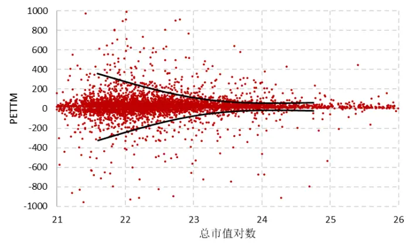
数据来源：Wind，东方证券研究所

图 3：20231229 股票 PETTM 的直方图
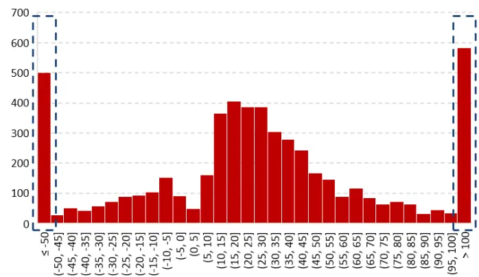
数据来源：Wind，东方证券研究所

有关分析师的申明，见本报告最后部分。其他重要信息披露见分析师申明之后部分，或请与您的投资代表联系。并请阅读本证券研究报告最后一页的免责申明。

另外这些基本面指标从其定义的出发点都是以绝对的定价为主，例如通过 ROE、增速等对股票价格进行定价，并且更关注同一只股票某项指标的时序变化，例如用估值的历史分位点来对权益资产进行择时。但是当面临选股问题时，我们并不关注每只股票的ROE的具体取值大小，我们更关注股票间的相对强弱的排序关系。因此这种个体的绝对定价取值和股票间的相对排序的供需关系并不能够完美互相匹配。因此我们想能否从量化选股的截面排序的角度，对这些基本面指标进行重构，以更适应我们的选股需求。

## 1.2 基本面因子的重构方式

传统基本面指标在每个截面上是用个体的 A 与 B 相除来构建，更强调自身指标的绝对定价。我们想能否将所有股票的 A 与所有股票的 B 整体比较，得到一个比值的中枢，而以每只股票的取值离这个比值中枢的距离来构建 A 相对于 B 的相对基本面因子取值，即将传统经典的个体除法调整为现代统计理论支撑下的截面整体回归的方式，如下图所示：

图 4：基本面指标的重构方式

$$
\begin{array}{l}{{{\underbrace{\frac{i\notin\widehat{\mathbb{B}}\widehat{\mathbb{X}}\widehat{\mathbb{Y}}\dot{\mathbb{X}}}\mu\leq\widehat{\mathbb{E}}\mu\leq\widehat{\mathbb{X}}\mu}\leq\mu\leq\widehat{\mathbb{B}}\mu\leq\widehat{\mathbb{B}}\mu\leq\widehat{\mathbb{B}}\mu\leq\widehat{\mathbb{B}}\mu}}}\\{{\mathrm{tot~istea~\leq~4\pi\widehat{\mathbb{B}}\mu\leq\mu\widehat{\mathbb{B}}\mu\leq\widehat{\mathbb{B}}\mu\widehat{\mathbb{Y}}\widehat{\mathbb{Y}}\mu\leq\widehat{\mathbb{B}}\mu\widehat{\mathbb{X}}\mu\leq\widehat{\mathbb{B}}}}}\ \ \xrightarrow{\mathrm{d}}\ \begin{array}{l}{{\frac{i\notin\widehat{\mathbb{B}}\mu\widehat{\mathbb{X}}\dot{\mathbb{Y}}\dot{\mathbb{X}}\mu\leq\widehat{\mathbb{B}}\mu\leq\widehat{\mathbb{Z}}\mu\leq\widehat{\mathbb{B}}\mu\leq\widehat{\mathbb{B}}\mu\leq\widehat{\mathbb{B}}\mu\leq\widehat{\mathbb{B}}\mu\leq\widehat{\mathbb{B}}\mu}{\mathrm{~is~}}}}\\{\mathrm{~ist~}}\mu A=\beta\cdot inB+\alpha+\widehat{\mathbb{B}}\mu\mathbb{B}\mathbb{Z}\mu\mathbb{Z}\mu\geq\mu\leq\widehat{\mathbb{B}}\mu\mathbb{Z}\mu\widehat{\mathbb{B}}\mu\geq\widehat{\mathbb{B}}\mu\widehat{\mathbb{B}}\mu\leq\widehat{\mathbb{B}}\mu\mathbb{Z}\mu\left.\widehat{\mathbb{B}}\right.\geq\widehat{\mathbb{B}}\mu\leq\mu\leq\widehat{\mathbb{B}}\mu\left.\widehat{\mathbb{B}}\right.\leq\mu\leq\widehat{\mathbb{B}}\mu\leq\widehat{\mathbb{B}}\mu\leq\widehat{\mathbb{B}}\mu\left.\widehat{\mathbb{B}}\right.\leq\mu\leq\widehat{\mathbb{B}}\mu\end{array}\end{array}
$$

考虑到大部分财务指标在截面上的分布并不正态，因此我们借鉴市值对数化的操作，对每个财务指标也都进行对数化操作以调整其分布。由于财务指标会为负或为 0，因此我们以如下方式来进行对数化调整：

我们取回归的残差作为相对的基本面因子取值。

$$
sign(x)\cdot ln(abs(x)+1)
$$

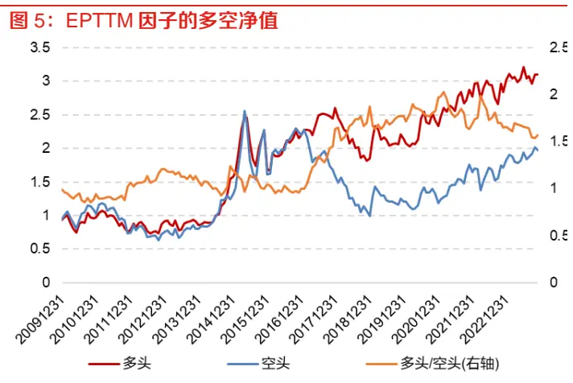
数据来源：Wind，东方证券研究所

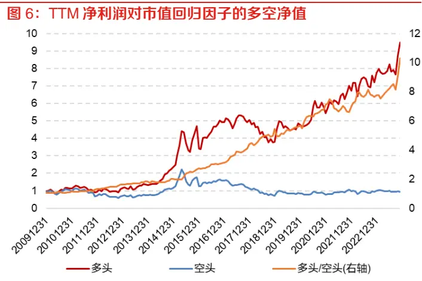
数据来源：Wind，东方证券研究所

上图分别展示了传统EPTTM因子和用回归法构建的EPTTM因子的十分组多空净值表现。可以看到，回归版本 EPTTM 因子的多空净值得到了大幅改善。这两个因子的多空净值表现差异很大，但是因子的截面相关系数有 0.89，也就是说大部分股票的排序是没有变化的，回归版本的因子仍然保持了较好的原始指标的经济含义，并且选股能力有了显著提高。下图分别展示了两个版本因子的十分组月度超额均值以及月度 IC 的累计 IC 的对比情况，可以看到多空两头的收益改善都非常显著。

有关分析师的申明，见本报告最后部分。其他重要信息披露见分析师申明之后部分，或请与您的投资代表联系。并请阅读本证券研究报告最后一页的免责申明。

图 7：两个版本因子的十分组月度超额均值
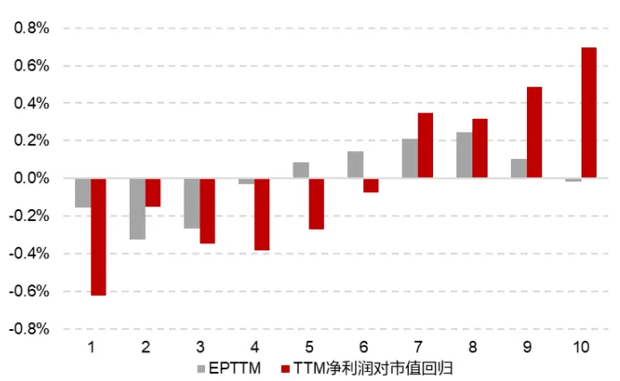
数据来源：Wind，东方证券研究所

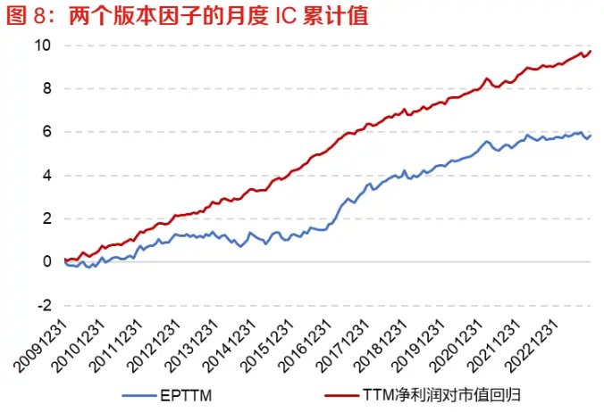
数据来源：Wind，东方证券研究所

下表展示了两个版本因子的选股能力的对比情况。回归版本因子的月度IC均值、ICIR、IC胜率、多头超额、多空收益都有了大幅提高，月度自相关系数略微下降从 0.97下降到 0.95。

表 1：两个版本因子的选股能力对比

|  | IC均值 | IC 标准差 | 年化ICIR | IC 胜率 | 月均多头超额 | 月均多空收 益 | 多头超额胜 率 | 因子月度自 相关系数 |
| --- | --- | --- | --- | --- | --- | --- | --- | --- |
| EPTTM | 0.035 | 0.136 | 0.89 | 61.90% | -0.01% | 0.14% | 49.40% | 0.97 |
| TTM净利润对市值回归 | 0.058 | 0.092 | 2.18 | 73.81% | 0.70% | 1.32% | 52.98% | 0.95 |

数据来源：Wind，东方证券研究所

我们可以总结回归版本基本面因子相比于传统基本面指标的优势：

- 回归版本不再受除法分母接近 0导致的除数效应的影响，抗噪能力更强；

- 截面回归能够剥离截面市场行情对因子的影响，时序可比性会更纯粹；

更强调截面的相对可比性，因此更适用于截面选股问题；

财务指标A和B的数量级不统一甚至不可比时也可以计算相对的财务取值，以此能够挖掘更多的相对基本面因子。

## 二、重构的基本面因子

在本节中，我们对常见的基本面指标都以截面回归的形式重新构造，并检验重构的因子表现相比于传统版本因子的效果。下图列举了常见的财务指标，包括基础版本的估值、盈利、成长因子，也包括一些衍生的相对估值、相对成长、相对盈利因子。

图 9：基本面因子集合
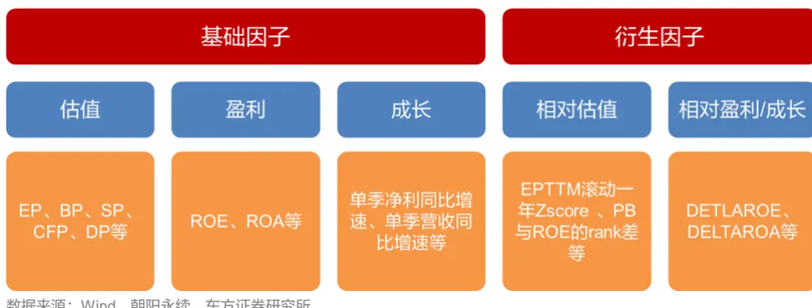
数据来源：Wind，朝阳永续，东方证券研究所

在每个因子构建时，我们都以如下图中的方式来计算因子取值，在回归得到残差因子后我们进一步对残差进行市值行业中性化处理。

图 10：回归版基本面因子计算流程
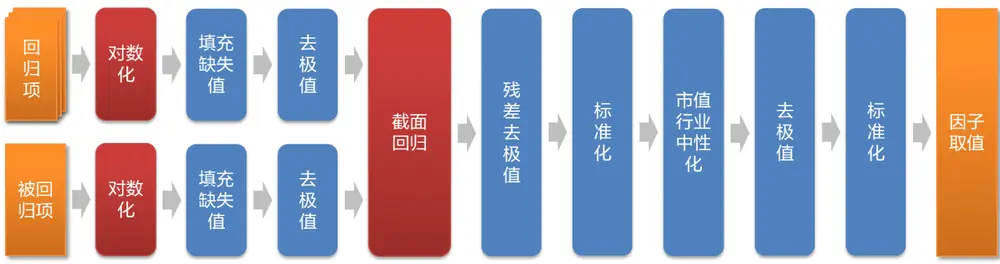
数据来源：东方证券研究所

因子回测参数如下：

- 调仓频率：月频；

- 回测区间：2010-2023 年。

对每个因子我们都检验其月度十分组的多空净值、分组超额均值、月度 IC、ICIR、IC胜率等指标。并且考虑到因子在构建指数增强模型时的实际效果，我们也对每个因子构建相对于常见的宽基指数的单因子指数增强 MFE组合，以检验其相对于各个宽基的实际增强效果。

因子 MFE组合构建方式：我们采用如下组合优化模型来构建单因子 MFE组合：

$$
\begin{array}{rl}{max~f^{T}w}&{}\\{s.t.}&{s_{i}\le X(w-w_{b})\le s_{h}}\\&{h_{i}\le H(w-w_{b})\le h_{h}}\\&{w_{i}\le w-w_{b}\le w_{h}}\\&{b_{i}\le B_{h}w\le b_{h}}\\&{\mathbf{0}\le w\le l}\\&{\mathbf{1}^{T}w=1}\\&{\chi|w-w_{1}|\le to_{h}}\end{array}
$$

该优化模型的目标函数为最大化单因子暴露，其中 f 为因子取值， $f^{T}w$ 为组合在因子上的加权暴露，w 为待求解的股票权重向量。模型的约束条件包括组合在风格因子上的偏离度、行业偏离度、个股偏离度、成分股权重占比控制、个股权重上下限控制、换手率等。

⚫ 第一个约束条件限制了组合相对于基准指数的风格暴露，X 为股票对风格因子的因子暴露矩阵， $w_{b}$ 为基准指数成分股的权重向量， $s_{l},s_{h}$ 分别为风格因子相对暴露的下限及上限；

⚫ 第二个约束条件限制了组合相对于基准指数的行业偏离，H 为股票的行业暴露矩阵，当股票i 属于行业j 时， $H_{ji}$ 为 1，否则为0； $h_{l},h_{h}$ 分别为组合行业偏离的下限以及上限；

第三个约束条件限制了个股相对于基准指数成分股的偏离， $w_{l},w_{h}$ 分别为个股偏离的下限以及上限；

⚫ 第四个约束条件限制了组合在成分股内权重的占比下限及上限， $B_{b}$ 为个股是否属于基准指数成分股的 0-1向量， $b_{l},b_{h}$ 分别为成分股内权重的下限以及上限；

⚫ 第五个约束条件限制了卖空，并且限制了个股权重上限 l；

⚫ 第六个约束条件要求权重和为 1，即组合始终满仓运作；

⚫ 第七个约束条件约束了组合的换手率， $w_{0}$ 为上一期的持仓权重， $to_{h}$ 为换手率上限。

上述模型中目标函数、风格偏离约束、个股权重偏离约束、成分股权重占比约束、换手率约束都可以转化成线性约束，因此可以通过线性规划来高效求解。

因子有效性检验：基于给定基准指数的因子 MFE 组合的有效性检验流程如下：

1. 设定单因子 MFE 组合的约束条件，包括风格暴露、行业暴露、个股权重偏离、成分股内权重占比、个股权重上下限等约束。对于沪深300、中证500、中证1000、国证2000等指数，我们控制 MFE 组合相对于基准指数在中信一级行业上相对暴露为 0，在市值风格因子上相对暴露为± 0.3， 指数成分股内权重占比不低于 80%，并且为了避免个股特质收益的影响，个股相对于成分股最大偏离权重 0.2%；

2. 在每个月末， 根据约束条件构建每个单因子的 MFE 组合；

3. 在回测期内根据各期 MFE 组合换仓，以第二天 VWAP交易扣除双边 0.3%交易费用， 计算MFE 组合相对于基准的收益风险统计指标，检验因子有效性。

## 2.1 单季 EP

单季 EP因子是用单季度净利润除以市值，我们以如下回归方式重构并取残差作为因子取值：

$$
ln(Quart\_E)=\beta\cdot ln(MV)+\alpha+\varepsilon
$$

下图分别展示了传统和回归版单季 EP 因子市值行业中性化后十分组多空净值。可以看到，回归版本因子的多头净值和多空相对强弱都有了大幅改善。

图 11：单季 EP因子多空净值
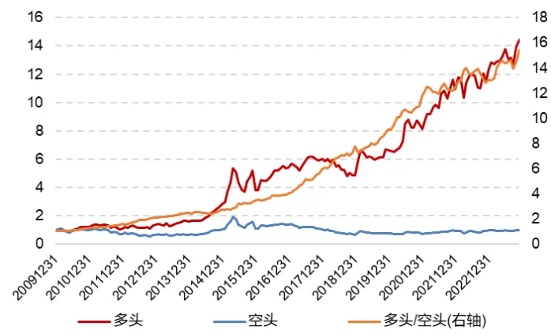
数据来源：Wind，东方证券研究所

图 12：回归版单季 EP因子多空净值
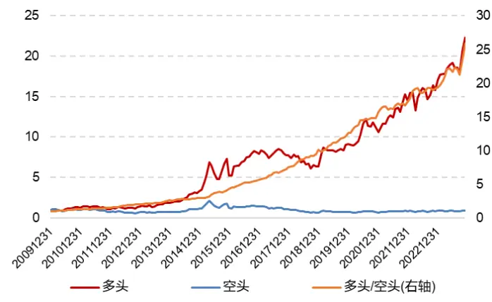
数据来源：Wind，东方证券研究所

下图分别展示了传统和回归版因子的月度 IC 和累计 IC。可以看到回归版本的 IC 的胜率和稳定性明显好于传统版本的因子。

图 13：单季 EP因子月度 IC
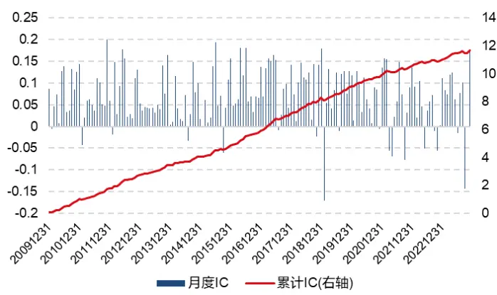
数据来源：Wind，东方证券研究所

图 14：回归版单季 EP因子月度 IC
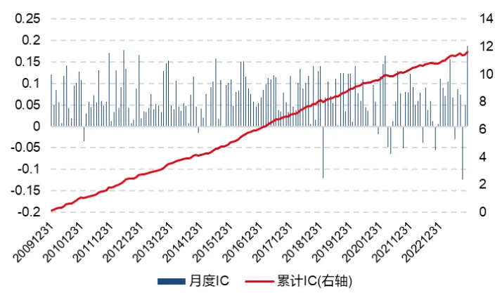
数据来源：Wind，东方证券研究所

下图是两个版本因子的十分组月度超额均值的情况，回归版本因子的多头超额得到显著提升。

图 15：两个版本单季 EP因子的十分组月度超额均值
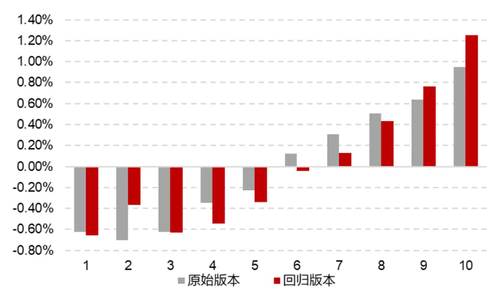
数据来源：Wind，东方证券研究所

下表是两个版本因子的选股能力对比数据，IC均值接近，但是回归版本因子的ICIR、IC胜率、多头超额、多头超额胜率都有显著提升，月均多头超额提高 0.3%。

表 2：两个版本单季 EP因子的选股能力对比

| IC 均值 IC 标准差 年化ICIR IC 胜率 月均多头超额 月均多空收益 |  |  |  |  |  |  |  |  |
| --- | --- | --- | --- | --- | --- | --- | --- | --- |
| 原始版本 | 0.069 | 0.064 | 3.74 | 88.69% | 0.95% | 1.57% | 多头超额胜率 64.29% | 月度自相关系数 0.97 |
| 回归版本 | 0.069 | 0.055 | 4.39 | 92.26% | 1.25% | 1.91% | 82.14% | 0.95 |

数据来源：Wind，东方证券研究所

下图展示了两个版本因子沪深 300MFE组合的净值表现。

图 16：两个版本单季 EP因子的沪深 300MFE组合净值
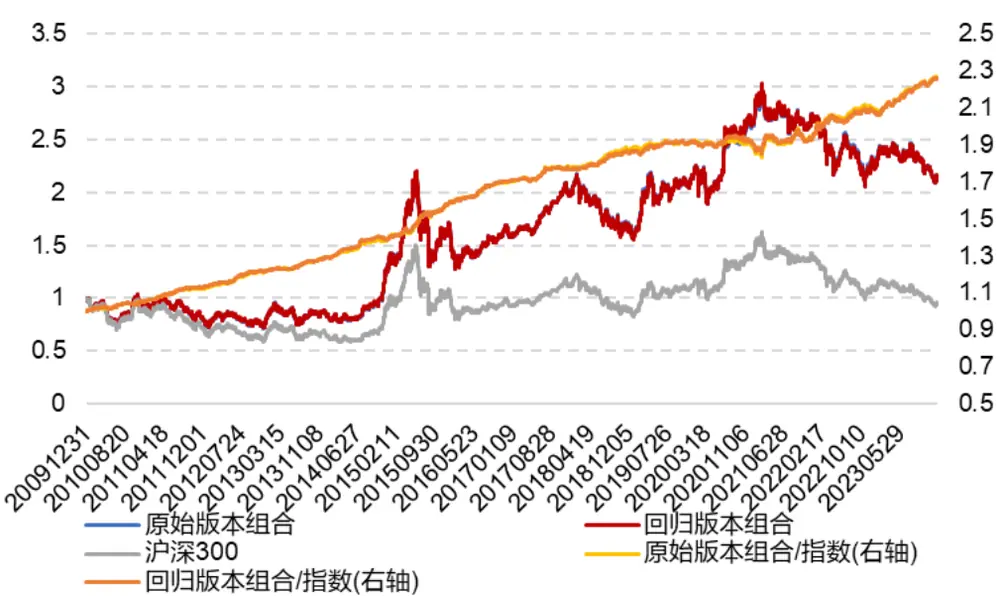
数据来源：Wind，东方证券研究所

有关分析师的申明，见本报告最后部分。其他重要信息披露见分析师申明之后部分，或请与您的投资代表联系。并请阅读本证券研究报告最后一页的免责申明。

可以看到，两个版本因子的增强净值表现非常接近，几乎完全贴合。下表展示了两个组合的各年收益对比情况，长期收益表现非常接近。说明在估值相对合理的沪深 300 基准下，两个版本因子的效果几乎是一样的。

表 3：两个版本单季 EP因子的沪深 300MFE组合收益表现

| 年份 | 原始版本 |  |  |  | 回归版本 |  |  |  |
| --- | --- | --- | --- | --- | --- | --- | --- | --- |
|  | 超额收益 | 相对最大回撤 | 信息比 | 月度胜率 | 超额收益 | 相对最大回撤 | 信息比 | 月度胜率 |
| 2010 | 5.18% | -0.72% | 4.54 | 83.33% | 5.10% | -1.14% | 3.92 | 66.67% |
| 2011 | 4.79% | -0.50% | 4.76 | 91.67% | 5.59% | -0.46% | 5.26 | 91.67% |
| 2012 | 8.92% | -0.52% | 5.88 | 100.00% | 7.81% | -0.57% | 5.26 | 91.67% |
| 2013 | 5.72% | -0.87% | 4.27 | 75.00% | 5.56% | -0.64% | 4.15 | 75.00% |
| 2014 | 11.76% | -0.74% | 4.98 | 91.67% | 12.23% | -2.02% | 4.55 | 75.00% |
| 2015 | 14.68% | -1.50% | 5.19 | 83.33% | 14.52% | -1.50% | 5.16 | 100.00% |
| 2016 | 6.56% | -0.58% | 5.52 | 91.67% | 6.64% | -0.35% | 5.56 | 100.00% |
| 2017 | 4.89% | -1.04% | 2.60 | 75.00% | 4.29% | -1.11% | 2.42 | 66.67% |
| 2018 | 4.42% | -0.83% | 3.29 | 83.33% | 3.98% | -0.69% | 3.15 | 83.33% |
| 2019 | 2.41% | -1.07% | 0.99 | 83.33% | 3.55% | -1.08% | 1.52 | 83.33% |
| 2020 | -2.76% | -3.54% | -1.11 | 50.00% | -1.41% | -3.44% | -0.59 | 50.00% |
| 2021 | 4.73% | -3.28% | 1.09 | 58.33% | 3.55% | -3.34% | 0.88 | 58.33% |
| 2022 | 4.73% | -1.69% | 1.78 | 75.00% | 4.32% | -2.03% | 1.61 | 75.00% |
| 2023 | 7.47% | -1.08% | 4.00 | 83.33% | 8.07% | -1.06% | 4.31 | 91.67% |
| 全样本期 | 6.16% | -7.79% | 2.76 | 80.36% | 6.15% | -6.25% | 2.81 | 79.17% |

数据来源：Wind，东方证券研究所

下图展示了两个版本因子中证 500MFE组合的净值表现。 可以看到，回归版本因子的超额净值持续好于传统版本因子。

图 17：两个版本单季 EP因子的中证 500MFE组合净值
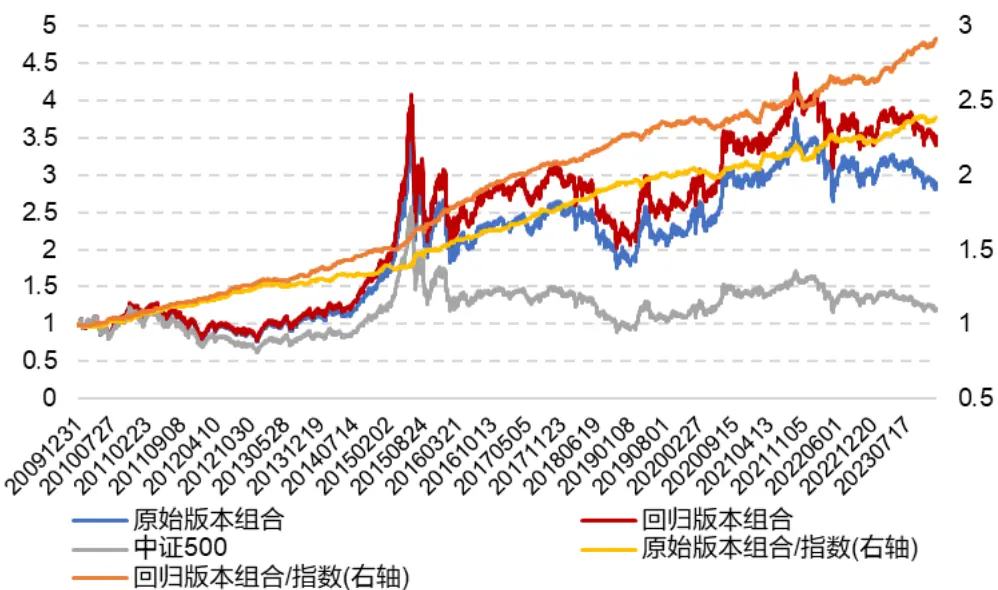
数据来源：Wind，东方证券研究所

有关分析师的申明，见本报告最后部分。其他重要信息披露见分析师申明之后部分，或请与您的投资代表联系。并请阅读本证券研究报告最后一页的免责申明。

下表展示了两个组合的各年收益对比情况，大部分年份中回归版本因子的超额表现都好于传统版本因子，年化超额收益从 6.7%提升到 8.29%，信息比从 2.35提升到 3.01，月度超额胜率从75%提升到 81.55%。

表 4：两个版本单季 EP因子的中证 500MFE组合收益表现

| 年份 | 原始版本 |  |  |  | 回归版本 |  |  |  |
| --- | --- | --- | --- | --- | --- | --- | --- | --- |
|  | 超额收益 | 相对最大回撤 | 信息比 | 月度胜率 | 超额收益 | 相对最大回撤 | 信息比 | 月度胜率 |
| 2010 | 6.51% | -2.26% | 2.09 | 66.67% | 7.88% | -1.30% | 3.06 | 58.33% |
| 2011 | 6.00% | -0.78% | 4.72 | 83.33% | 6.05% | -0.58% | 5.08 | 91.67% |
| 2012 | 9.49% | -0.92% | 4.53 | 75.00% | 10.96% | -0.56% | 5.75 | 100.00% |
| 2013 | 3.89% | -1.92% | 1.51 | 58.33% | 7.23% | -1.15% | 2.98 | 66.67% |
| 2014 | 8.22% | -1.44% | 2.45 | 66.67% | 12.89% | -1.17% | 4.34 | 91.67% |
| 2015 | 14.58% | -2.77% | 2.48 | 83.33% | 24.72% | -1.72% | 4.63 | 91.67% |
| 2016 | 6.69% | -1.30% | 3.21 | 100.00% | 9.69% | -0.55% | 5.61 | 100.00% |
| 2017 | 9.22% | -1.31% | 4.31 | 91.67% | 5.73% | -0.70% | 3.53 | 91.67% |
| 2018 | 5.48% | -0.92% | 4.31 | 91.67% | 5.59% | -0.68% | 3.74 | 83.33% |
| 2019 | 5.81% | -3.30% | 2.02 | 83.33% | 6.41% | -2.33% | 2.30 | 83.33% |
| 2020 | 1.44% | -3.19% | 0.38 | 50.00% | 0.64% | -3.07% | 0.15 | 58.33% |
| 2021 | 3.20% | -4.57% | 0.71 | 50.00% | 4.54% | -4.07% | 0.95 | 66.67% |
| 2022 | 3.91% | -3.32% | 1.50 | 66.67% | 4.67% | -2.21% | 1.63 | 66.67% |
| 2023 | 6.84% | -1.84% | 3.33 | 83.33% | 10.02% | -1.36% | 4.50 | 91.67% |
| 全样本期 | 6.70% | -4.57% | 2.35 | 75.00% | 8.29% | -4.07% | 3.01 | 81.55% |

数据来源：Wind，东方证券研究所

下图展示了两个版本因子中证 1000MFE 组合的净值表现。 可以看到，回归版本因子的超额净值持续好于传统版本因子。

图 18：两个版本单季 EP因子的中证 1000MFE组合净值
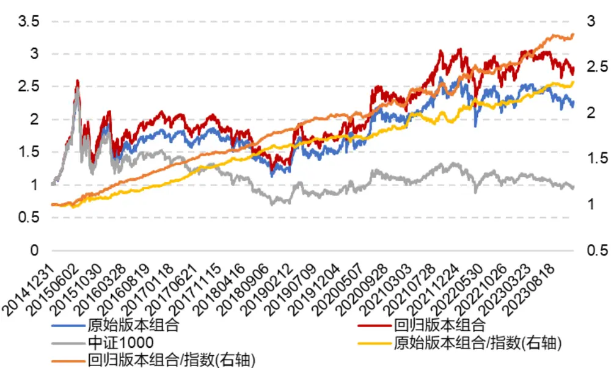
数据来源：Wind，东方证券研究所

有关分析师的申明，见本报告最后部分。其他重要信息披露见分析师申明之后部分，或请与您的投资代表联系。并请阅读本证券研究报告最后一页的免责申明。

下表展示了两个组合的各年收益对比情况，大部分年份中回归版本因子的超额表现都好于传统版本因子，年化超额收益从 10.14%提升到 12.72%，信息比从 2.14 提升到 2.68，月度超额胜率从68.52%提升到 77.78%。

表 5：两个版本单季 EP因子的中证 1000MFE组合收益表现

| 年份 | 原始版本 |  |  |  |  |  |  |  |
| --- | --- | --- | --- | --- | --- | --- | --- | --- |
|  |  |  |  |  | 回归版本 |  |  |  |
|  | 超额收益 | 相对最大回撤 | 信息比 | 月度胜率 | 超额收益 | 相对最大回撤 | 信息比 | 月度胜率 |
| 2015 | 13.47% | -6.19% | 1.28 | 58.33% | 32.46% | -3.00% | 2.94 | 83.33% |
| 2016 | 12.02% | -1.99% | 3.49 | 83.33% | 15.68% | -1.10% | 5.98 | 100.00% |
| 2017 | 14.47% | -1.39% | 5.46 | 83.33% | 9.06% | -0.96% | 4.52 | 83.33% |
| 2018 | 7.86% | -2.24% | 4.38 | 83.33% | 9.21% | -1.01% | 4.62 | 83.33% |
| 2019 | 8.50% | -2.80% | 2.33 | 66.67% | 12.56% | -1.20% | 3.62 | 83.33% |
| 2020 | 5.54% | -4.38% | 1.00 | 58.33% | 6.21% | -4.36% | 1.02 | 58.33% |
| 2021 | 8.87% | -6.98% | 1.12 | 50.00% | 11.51% | -5.93% | 1.40 | 50.00% |
| 2022 | 6.53% | -7.28% | 1.48 | 58.33% | 8.50% | -5.56% | 1.76 | 75.00% |
| 2023 | 9.17% | -2.27% | 3.06 | 75.00% | 12.22% | -2.07% | 3.75 | 83.33% |
| 全样本期 | 10.14% | -7.28% | 2.14 | 68.52% | 12.72% | -5.93% | 2.68 | 77.78% |

数据来源：Wind，东方证券研究所

下图展示了两个版本因子国证 2000MFE 组合的净值表现。 可以看到，回归版本因子的超额净值持续好于传统版本因子。

图 19：两个版本单季 EP因子的国证 2000MFE组合净值
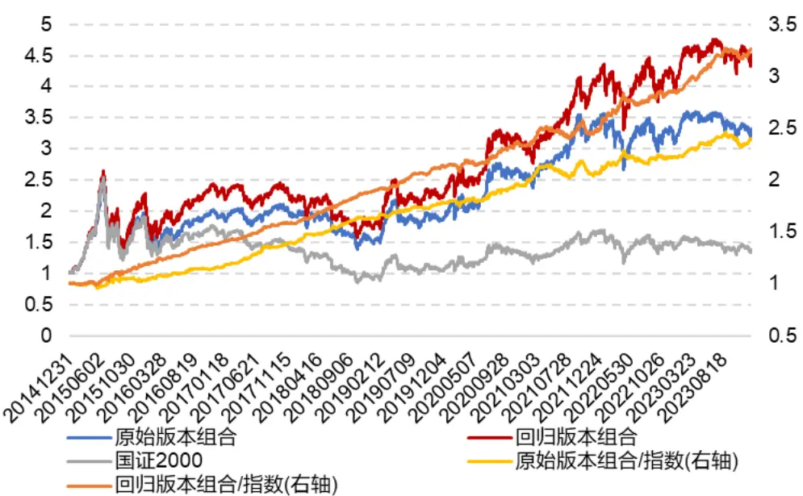
数据来源：Wind，东方证券研究所

下表展示了两个组合的各年收益对比情况，大部分年份中回归版本因子的超额表现都好于传统版本因子，年化超额收益从 10.87%提升到 14.99%，信息比从 2.12 提升到 2.90，月度超额胜率从72.22%提升到 82.41%。

表 6：两个版本单季 EP因子的国证 2000MFE组合收益表现

| 年份 | 原始版本 |  |  |  | 回归版本 |  |  |  |
| --- | --- | --- | --- | --- | --- | --- | --- | --- |
|  | 超额收益 | 相对最大回撤 | 信息比 | 月度胜率 | 超额收益 | 相对最大回撤 | 信息比 | 月度胜率 |
| 2015 | 6.04% | -9.28% | 0.55 | 66.67% | 35.86% | -3.21% | 2.69 | 91.67% |
| 2016 | 10.95% | -1.55% | 3.13 | 91.67% | 15.69% | -1.28% | 4.97 | 100.00% |
| 2017 | 17.34% | -0.99% | 5.70 | 83.33% | 11.19% | -1.16% | 4.31 | 83.33% |
| 2018 | 11.03% | -1.52% | 5.15 | 83.33% | 12.44% | -0.94% | 5.55 | 100.00% |
| 2019 | 12.06% | -2.50% | 2.81 | 75.00% | 16.97% | -1.19% | 4.45 | 91.67% |
| 2020 | 9.92% | -3.88% | 1.71 | 75.00% | 9.60% | -3.99% | 1.64 | 58.33% |
| 2021 | 8.12% | -7.41% | 1.00 | 50.00% | 9.05% | -5.79% | 1.07 | 58.33% |
| 2022 | 5.95% | -8.51% | 1.25 | 58.33% | 11.93% | -5.40% | 2.40 | 75.00% |
| 2023 | 7.59% | -6.07% | 2.00 | 66.67% | 14.15% | -3.48% | 3.84 | 83.33% |
| 全样本期 | 10.87% | -9.28% | 2.12 | 72.22% | 14.99% | -5.79% | 2.90 | 82.41% |

数据来源：Wind，东方证券研究所

从以上各基准指数下MFE组合的表现来看，在沪深300指数这种个股估值合理程度高的基准下，两个版本因子表现接近，而其他基准指数下估值合理程度越不高、噪声含量越高，回归版本因子的效果更好。

## 2.2 单季净利同比增速

单季净利同比增速因子的计算方式如下：

$$
Quart\_NP\_YOY=\frac{Quart\_E_{t}-Quart\_E_{t-4}}{abs(Quart\_E_{t-4})}
$$

因此我们以如下回归方式重构并取残差作为因子取值：

$$
ln(Quart\_E_{t})=\beta\cdot\ln\bigl(abs(Quart\_E_{t-4})\bigr)+\alpha+\varepsilon
$$

下图分别展示了传统和回归版单季净利同比增速因子市值行业中性化后十分组多空净值。可以看到，回归版本因子的多头净值和多空相对强弱都有了大幅改善，尤其是近两年传统成长因子“失效”的阶段，回归版本的因子表现仍然突出。

图 20：单季净利同比增速因子多空净值
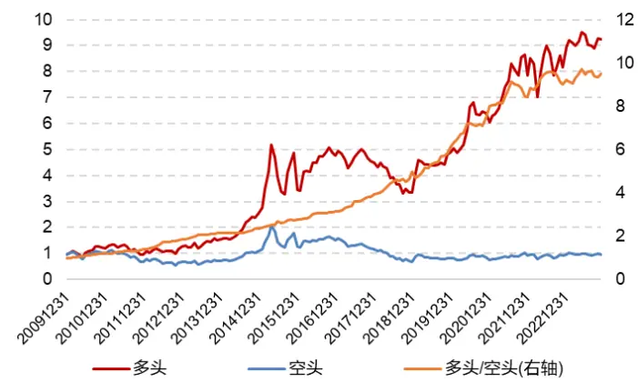
数据来源：Wind，东方证券研究所

图 21：回归版单季净利同比增速因子多空净值
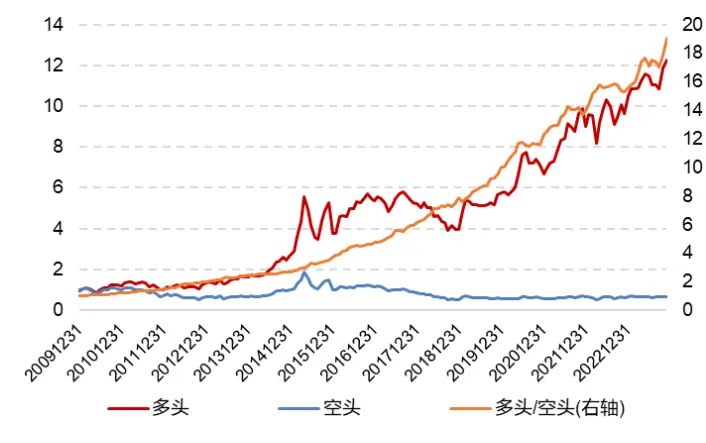
数据来源：Wind，东方证券研究所

下图分别展示了传统和回归版因子的月度 IC 和累计 IC。可以看到回归版本的 IC 的稳定性明显好于传统版本的因子。

有关分析师的申明，见本报告最后部分。其他重要信息披露见分析师申明之后部分，或请与您的投资代表联系。并请阅读本证券研究报告最后一页的免责申明。

图 22：单季净利同比增速因子月度 IC
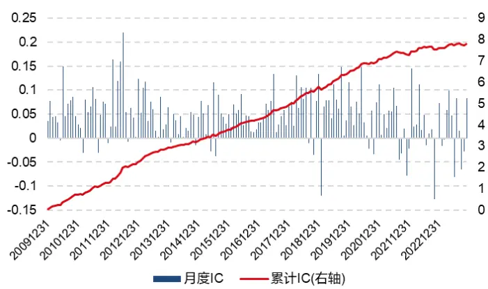
数据来源：Wind，东方证券研究所

图 23：回归版单季净利同比增速因子月度 IC
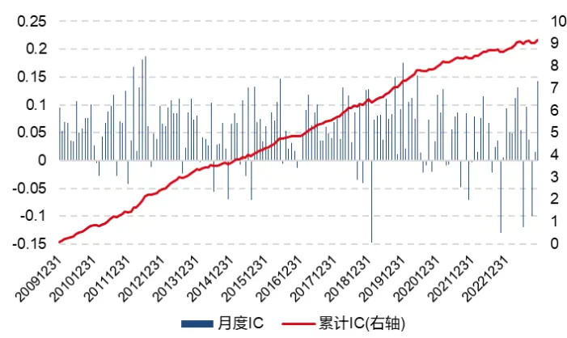
数据来源：Wind，东方证券研究所

下图是两个版本因子的十分组月度超额均值的情况，回归版本因子的多头和空头超额都得到了显著提升。

图 24：两个版本单季净利同比增速因子的十分组月度超额均值
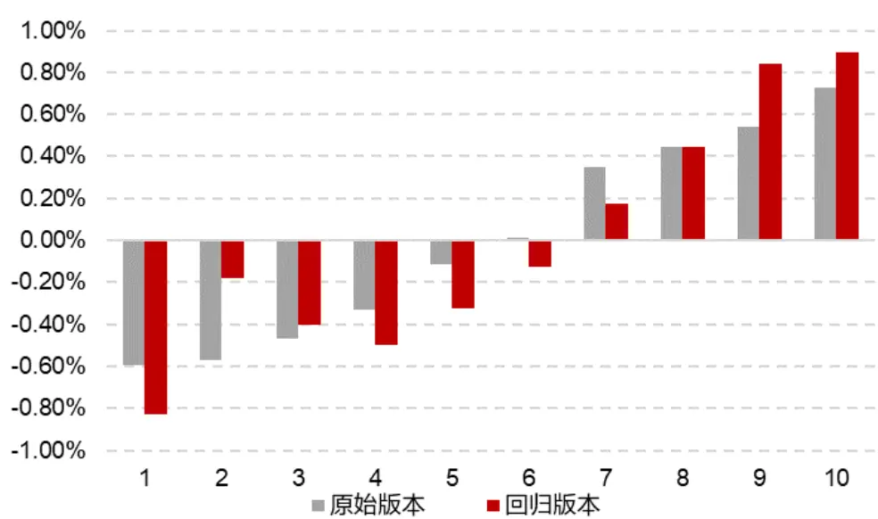
数据来源：Wind，东方证券研究所

下表是两个版本因子的选股能力对比数据，回归版本因子的 IC均值、ICIR、多头超额、多头超额胜率都有显著提升，月均多头超额从 0.73%提升到 0.9%。

表 7：两个版本单季净利同比增速因子的选股能力对比

|  | IC 均值 | IC 标准差 | 年化ICIR | IC 胜率 | 月均多头超额 | 月均多空收益 | 多头超额胜率 | 月度自相关系数 |
| --- | --- | --- | --- | --- | --- | --- | --- | --- |
| 原始版本 | 0.046 | 0.052 | 3.09 | 84.52% | 0.73% | 1.32% | 73.21% | 0.97 |
| 回归版本 | 0.055 | 0.059 | 3.21 | 82.74% | 0.90% | 1.73% | 76.79% | 0.95 |

数据来源：Wind，东方证券研究所

下图展示了两个版本因子沪深 300MFE组合的净值表现。 可以看到，回归版本因子的超额净值持续好于传统版本因子，尤其是近 2年仍然有稳定的超额表现。

有关分析师的申明，见本报告最后部分。其他重要信息披露见分析师申明之后部分，或请与您的投资代表联系。并请阅读本证券研究报告最后一页的免责申明。

图 25：两个版本单季净利同比增速因子的沪深 300MFE组合净值
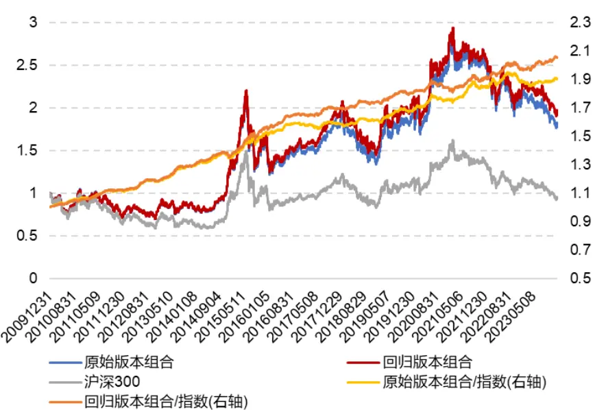
数据来源：Wind，东方证券研究所

下表展示了两个组合的各年收益对比情况，大部分年份中回归版本因子的超额表现都好于传统版本因子，年化超额收益从 4.83%提升到 5.42%，信息比从 2.01 提升到 2.33，月度超额胜率从64.29%提升到 69.64%。

表 8：两个版本单季净利同比增速因子的沪深 300MFE组合收益表现

| 年份 | 原始版本 |  |  |  | 回归版本 |  |  |  |
| --- | --- | --- | --- | --- | --- | --- | --- | --- |
|  | 超额收益 | 相对最大回撤 | 信息比 | 月度胜率 | 超额收益 | 相对最大回撤 | 信息比 | 月度胜率 |
| 2010 | 5.97% | -1.11% | 3.60 | 91.67% | 5.24% | -1.15% | 3.52 | 83.33% |
| 2011 | 3.31% | -0.84% | 2.56 | 75.00% | 4.40% | -0.73% | 3.45 | 75.00% |
| 2012 | 6.19% | -1.46% | 3.28 | 66.67% | 6.00% | -1.23% | 3.41 | 58.33% |
| 2013 | 8.59% | -0.74% | 5.05 | 83.33% | 8.74% | -1.00% | 5.04 | 91.67% |
| 2014 | 7.11% | -3.94% | 2.27 | 75.00% | 7.73% | -3.88% | 2.56 | 83.33% |
| 2015 | 14.08% | -3.76% | 3.27 | 91.67% | 15.66% | -3.71% | 3.54 | 91.67% |
| 2016 | 3.24% | -1.16% | 1.78 | 66.67% | 5.09% | -1.09% | 2.89 | 83.33% |
| 2017 | 0.17% | -2.42% | 0.07 | 33.33% | 3.12% | -1.21% | 1.35 | 50.00% |
| 2018 | 1.10% | -1.29% | 0.83 | 33.33% | 1.84% | -1.30% | 1.46 | 41.67% |
| 2019 | 5.21% | -1.46% | 1.88 | 58.33% | 4.81% | -1.35% | 1.88 | 66.67% |
| 2020 | 6.56% | -2.75% | 2.23 | 58.33% | 2.79% | -3.19% | 1.05 | 50.00% |
| 2021 | 4.72% | -2.78% | 1.70 | 58.33% | 3.30% | -2.43% | 1.13 | 66.67% |
| 2022 | 1.73% | -3.54% | 0.73 | 50.00% | 2.92% | -2.78% | 1.30 | 58.33% |
| 2023 | 0.70% | -2.44% | 0.34 | 58.33% | 3.56% | -1.28% | 1.95 | 75.00% |
| 全样本期 | 4.83% | -5.63% | 2.01 | 64.29% | 5.42% | -5.73% | 2.33 | 69.64% |

数据来源：Wind，东方证券研究所

下图展示了两个版本因子中证 500MFE组合的净值表现。 可以看到，回归版本因子的超额净值持续好于传统版本因子。

图 26：两个版本单季净利同比增速因子的中证 500MFE组合净值
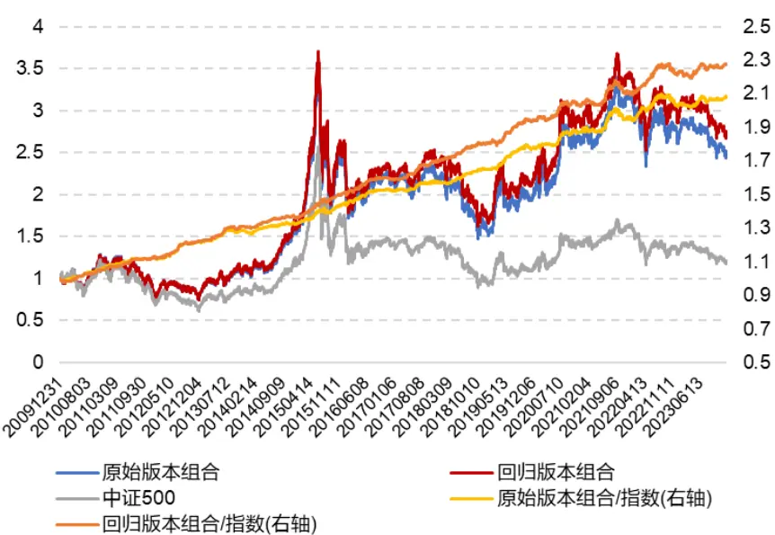
数据来源：Wind，东方证券研究所

下表展示了两个组合的各年收益对比情况，大部分年份中回归版本因子的超额表现都好于传统版本因子，年化超额收益从5.63%提升到6.34%，信息比从2.44提升到2.7，月度超额胜率从72.02%提升到 76.19%。

表 9：两个版本单季净利同比增速因子的中证 500MFE组合收益表现

| 年份 | 原始版本 |  |  |  | 回归版本 |  |  |  |
| --- | --- | --- | --- | --- | --- | --- | --- | --- |
|  | 超额收益 | 相对最大回撤 | 信息比 | 月度胜率 | 超额收益 | 相对最大回撤 | 信息比 | 月度胜率 |
| 2010 | 8.15% | -1.26% | 3.65 | 91.67% | 7.11% | -2.02% | 3.02 | 83.33% |
| 2011 | 3.23% | -0.68% | 3.32 | 83.33% | 4.11% | -0.78% | 4.11 | 83.33% |
| 2012 | 8.29% | -1.06% | 4.01 | 66.67% | 8.50% | -1.04% | 3.87 | 75.00% |
| 2013 | 5.12% | -1.70% | 2.23 | 66.67% | 7.64% | -1.34% | 3.33 | 66.67% |
| 2014 | 5.90% | -0.99% | 2.65 | 75.00% | 5.93% | -1.13% | 2.53 | 83.33% |
| 2015 | 13.22% | -1.99% | 3.35 | 91.67% | 15.75% | -1.64% | 3.81 | 100.00% |
| 2016 | 4.11% | -0.96% | 2.73 | 83.33% | 4.24% | -0.86% | 2.79 | 75.00% |
| 2017 | 3.39% | -1.05% | 2.00 | 66.67% | 7.34% | -0.91% | 4.10 | 83.33% |
| 2018 | 3.18% | -0.70% | 2.69 | 75.00% | 3.92% | -1.02% | 3.16 | 100.00% |
| 2019 | 9.64% | -1.67% | 3.64 | 83.33% | 9.45% | -2.31% | 3.49 | 75.00% |
| 2020 | 8.40% | -1.27% | 2.78 | 75.00% | 6.85% | -1.60% | 2.11 | 75.00% |
| 2021 | 2.94% | -3.59% | 0.82 | 41.67% | 2.34% | -4.00% | 0.72 | 41.67% |
| 2022 | 3.76% | -3.54% | 1.62 | 58.33% | 5.07% | -3.14% | 2.26 | 75.00% |
| 2023 | 2.13% | -1.69% | 1.10 | 50.00% | 2.17% | -2.29% | 1.04 | 50.00% |
| 全样本期 | 5.63% | -4.05% | 2.44 | 72.02% | 6.34% | -4.32% | 2.70 | 76.19% |

数据来源：Wind，东方证券研究所

下图展示了两个版本因子中证 1000MFE 组合的净值表现。 可以看到，回归版本因子的超额净值持续好于传统版本因子。

图 27：两个版本单季净利同比增速因子的中证 1000MFE组合净值
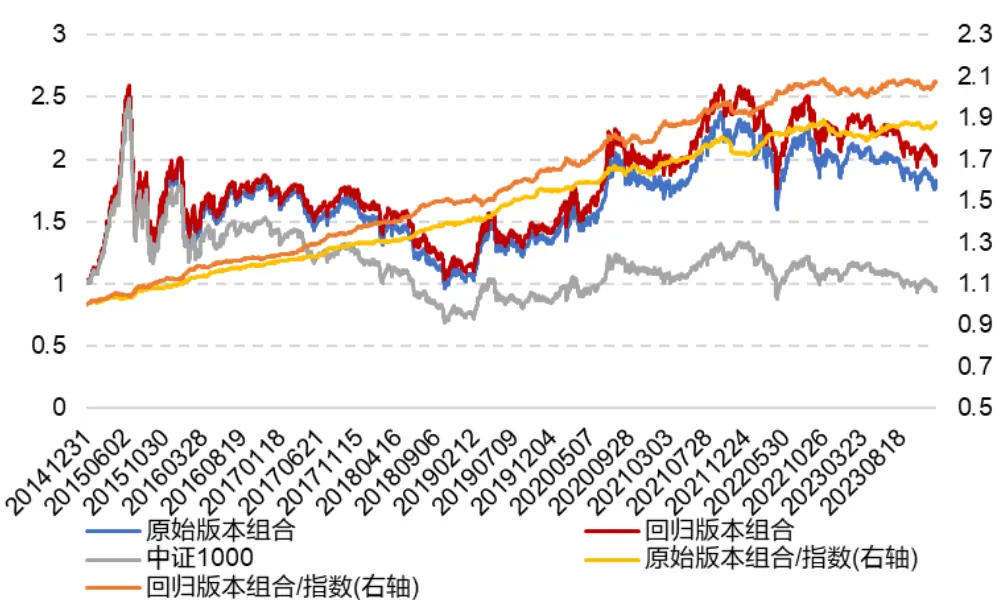
数据来源：Wind，东方证券研究所

下表展示了两个组合的各年收益对比情况，大部分年份中回归版本因子的超额表现都好于传统版本因子，年化超额收益从 7.43%提升到 8.69%，信息比从 2.83提升到 2.98。

表 10：两个版本单季净利同比增速因子的中证 1000MFE组合收益表现

| 年份 | 原始版本 |  |  |  |  |  |  |  |
| --- | --- | --- | --- | --- | --- | --- | --- | --- |
|  |  |  |  |  | 回归版本 |  |  |  |
|  | 超额收益 | 相对最大回撤 | 信息比 | 月度胜率 | 超额收益 | 相对最大回撤 | 信息比 | 月度胜率 |
| 2015 | 17.62% | -1.47% | 3.69 | 91.67% | 22.10% | -1.93% | 4.24 | 83.33% |
| 2016 | 7.67% | -0.56% | 5.12 | 100.00% | 7.93% | -1.07% | 4.21 | 100.00% |
| 2017 | 6.22% | -0.46% | 4.17 | 91.67% | 9.78% | -0.57% | 5.43 | 100.00% |
| 2018 | 4.91% | -0.94% | 4.03 | 91.67% | 5.32% | -1.62% | 4.22 | 83.33% |
| 2019 | 13.61% | -1.66% | 4.37 | 75.00% | 12.60% | -4.35% | 3.47 | 83.33% |
| 2020 | 7.22% | -2.63% | 2.13 | 75.00% | 10.68% | -2.76% | 2.58 | 66.67% |
| 2021 | 5.75% | -5.07% | 1.63 | 75.00% | 8.23% | -2.92% | 2.15 | 75.00% |
| 2022 | 4.92% | -4.12% | 1.92 | 75.00% | 4.82% | -3.94% | 1.91 | 83.33% |
| 2023 | 2.45% | -2.71% | 0.95 | 41.67% | 1.76% | -2.12% | 0.62 | 41.67% |
| 全样本期 | 7.43% | -6.00% | 2.83 | 79.63% | 8.69% | -4.65% | 2.98 | 79.63% |

数据来源：Wind，东方证券研究所

下图展示了两个版本因子国证 2000MFE 组合的净值表现。 可以看到，回归版本因子的超额净值持续好于传统版本因子。

图 28：两个版本单季净利同比增速因子的国证 2000MFE组合净值
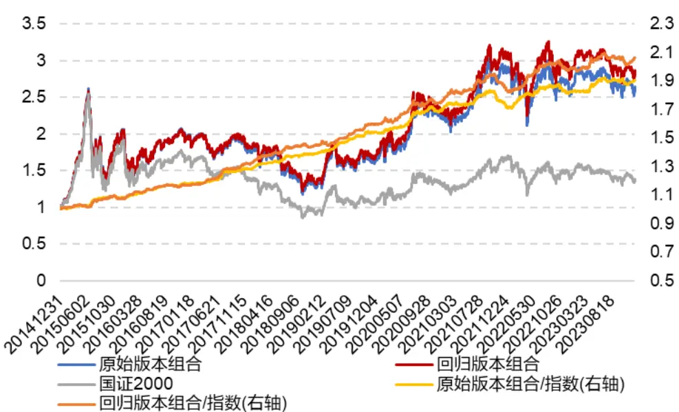
数据来源：Wind，东方证券研究所

下表展示了两个组合的各年收益对比情况，大部分年份中回归版本因子的超额表现都好于传统版本因子，年化超额收益从 7.91%提升到 8.95%。

表 11：两个版本单季净利同比增速因子的国证 2000MFE组合收益表现

| 年份 | 原始版本 |  |  |  | 回归版本 |  |  |  |
| --- | --- | --- | --- | --- | --- | --- | --- | --- |
|  | 超额收益 | 相对最大回撤 | 信息比 | 月度胜率 | 超额收益 | 相对最大回撤 | 信息比 | 月度胜率 |
| 2015 | 14.77% | -1.92% | 2.59 | 66.67% | 14.06% | -3.08% | 2.27 | 75.00% |
| 2016 | 8.06% | -1.27% | 4.45 | 83.33% | 7.55% | -1.71% | 3.73 | 75.00% |
| 2017 | 7.41% | -0.60% | 4.11 | 91.67% | 11.18% | -0.77% | 5.38 | 91.67% |
| 2018 | 5.53% | -0.69% | 4.03 | 91.67% | 6.36% | -1.99% | 3.69 | 83.33% |
| 2019 | 13.16% | -0.86% | 4.75 | 91.67% | 12.82% | -3.17% | 3.64 | 83.33% |
| 2020 | 13.54% | -2.22% | 3.71 | 91.67% | 12.36% | -2.48% | 2.84 | 75.00% |
| 2021 | -0.02% | -7.04% | 0.02 | 41.67% | 4.49% | -6.48% | 1.00 | 66.67% |
| 2022 | 5.36% | -3.51% | 1.93 | 50.00% | 7.11% | -3.42% | 2.47 | 83.33% |
| 2023 | 4.12% | -2.42% | 1.56 | 58.33% | 3.62% | -3.80% | 1.19 | 50.00% |
| 全样本期 | 7.91% | -7.41% | 2.77 | 74.07% | 8.95% | -7.00% | 2.73 | 75.93% |

数据来源：Wind，东方证券研究所

## 2.3 EPTTM

EPTTM因子是用 TTM净利润除以市值，我们以如下回归方式重构并取残差作为因子取值：

$$
ln(TTM_{-}E)=\beta\cdot ln(MV)+\alpha+\varepsilon
$$

下图分别展示了传统和回归版 EPTTM 因子市值行业中性化后十分组多空净值。可以看到，回归版本因子的多头净值和多空相对强弱都有了大幅改善。

图 29：EPTTM因子多空净值
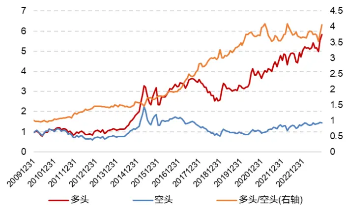
数据来源：Wind，东方证券研究所

图 30：回归版 EPTTM因子多空净值
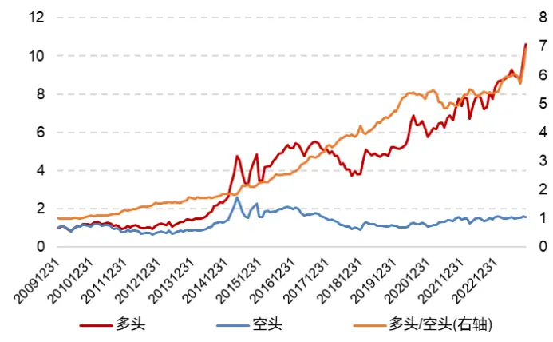
数据来源：Wind，东方证券研究所

下图分别展示了传统和回归版因子的月度 IC 和累计 IC。可以看到回归版本的 IC 的胜率和稳定性明显好于传统版本的因子。

图 31：EPTTM 因子月度 IC
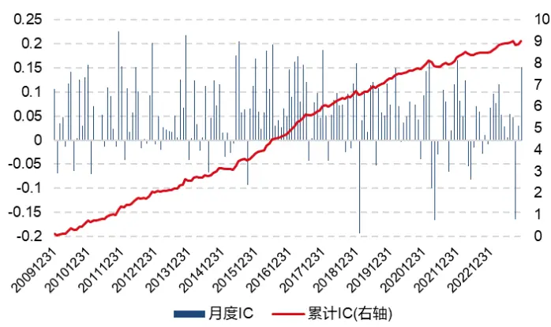
数据来源：Wind，东方证券研究所

图 32：回归版 EPTTM因子月度 IC
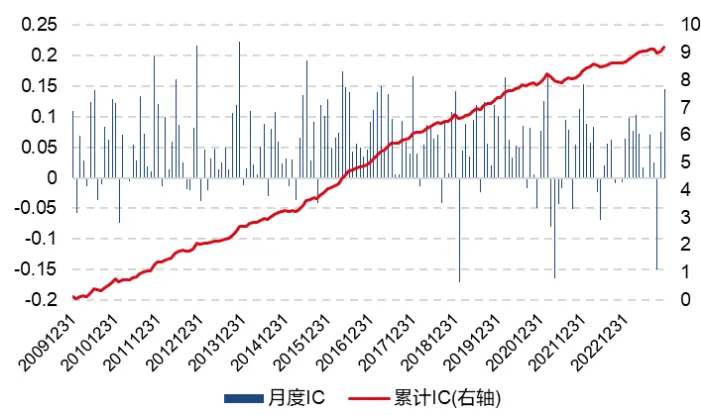
数据来源：Wind，东方证券研究所

下表是两个版本因子的选股能力对比数据，IC均值接近，但是回归版本因子的ICIR、IC胜率、多头超额、多头超额胜率都有显著提升，月均多头超额从 0.39%提升到 0.79%。

表 12：两个版本 EPTTM因子的选股能力对比

|  | IC 均值 | IC 标准差 | 年化ICIR | IC 胜率 | 月均多头超额 | 月均多空收 益 | 多头超额胜 率 | 因子月度自 相关系数 |
| --- | --- | --- | --- | --- | --- | --- | --- | --- |
| 原始版本 | 0.054 | 0.076 | 2.46 | 76.79% | 0.39% | 0.76% | 52.98% | 0.97 |
| 回归版本 | 0.055 | 0.068 | 2.81 | 79.76% | 0.79% | 1.09% | 61.31% | 0.95 |

数据来源：Wind，东方证券研究所

有关分析师的申明，见本报告最后部分。其他重要信息披露见分析师申明之后部分，或请与您的投资代表联系。并请阅读本证券研究报告最后一页的免责申明。

下面左图是两个版本因子的十分组月度超额均值的情况，回归版本因子的多头超额得到显著提升。下面右图展示了两个版本因子中证 500MFE组合的净值表现。 可以看到，回归版本因子的超额净值持续好于传统版本因子。

图 33：两个版本 EPTTM因子的十分组月度超额均值
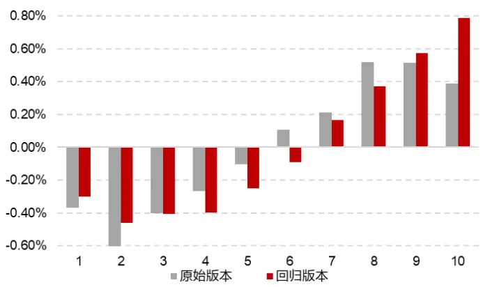
数据来源：Wind，东方证券研究所

图 34：两个版本 EPTTM因子的中证 500MFE组合净值
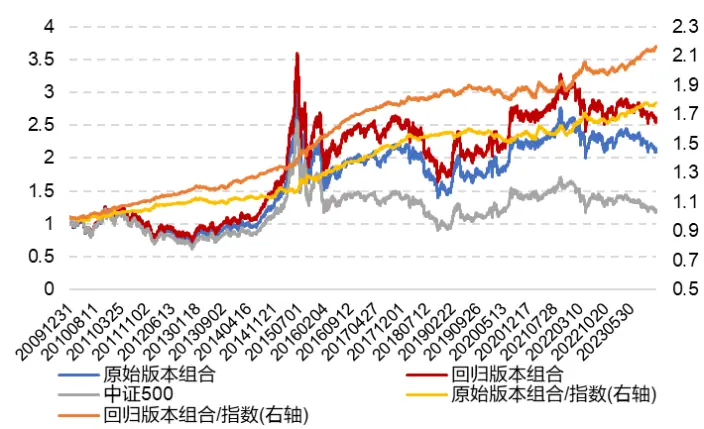
数据来源：Wind，东方证券研究所

下表展示了两个组合的各年收益对比情况，大部分年份中回归版本因子的超额表现都好于传统版本因子，年化超额收益从 4.38%提升到 5.92%，信息比从 1.32 提升到 1.97，月度超额胜率从64.88%提升到 70.83%。

表 13：两个版本 EPTTM因子的中证 500MFE组合收益表现

| 年份 | 原始版本 |  |  |  | 回归版本 |  |  |  |
| --- | --- | --- | --- | --- | --- | --- | --- | --- |
|  | 超额收益 | 相对最大回撤 | 信息比 | 月度胜率 | 超额收益 | 相对最大回撤 | 信息比 | 月度胜率 |
| 2010 | 1.67% | -3.37% | 0.40 | 50.00% | 5.06% | -1.54% | 1.73 | 66.67% |
| 2011 | 3.27% | -1.16% | 2.35 | 66.67% | 4.65% | -1.04% | 3.50 | 75.00% |
| 2012 | 5.51% | -1.44% | 2.54 | 75.00% | 7.54% | -0.87% | 3.82 | 91.67% |
| 2013 | 0.30% | -4.02% | 0.06 | 50.00% | 4.18% | -2.17% | 1.51 | 58.33% |
| 2014 | 7.08% | -2.12% | 1.67 | 58.33% | 9.99% | -1.49% | 3.10 | 75.00% |
| 2015 | 10.66% | -4.75% | 1.39 | 58.33% | 22.15% | -2.22% | 3.30 | 91.67% |
| 2016 | 7.63% | -1.22% | 2.90 | 100.00% | 8.97% | -0.69% | 5.24 | 100.00% |
| 2017 | 9.54% | -1.48% | 4.13 | 75.00% | 4.14% | -1.58% | 2.40 | 58.33% |
| 2018 | 2.00% | -2.53% | 1.48 | 75.00% | 2.57% | -1.26% | 1.75 | 58.33% |
| 2019 | 1.30% | -3.28% | 0.36 | 66.67% | 2.27% | -2.85% | 0.76 | 58.33% |
| 2020 | -2.84% | -6.37% | -0.75 | 50.00% | -2.66% | -5.75% | -0.69 | 50.00% |
| 2021 | 2.74% | -4.52% | 0.58 | 58.33% | 3.83% | -4.01% | 0.78 | 66.67% |
| 2022 | 3.89% | -5.13% | 1.26 | 50.00% | 3.74% | -4.90% | 1.17 | 58.33% |
| 2023 | 6.50% | -1.49% | 3.16 | 75.00% | 7.90% | -1.98% | 3.60 | 83.33% |
| 全样本期 | 4.38% | -8.23% | 1.32 | 64.88% | 5.92% | -7.15% | 1.97 | 70.83% |

数据来源：Wind，东方证券研究所

## 2.4 单季 SP

单季 SP因子是用单季营业收入除以市值，我们以如下回归方式重构并取残差作为因子取值：

$$
ln(Quart\_S)=\beta\cdot ln(MV)+\alpha+\varepsilon
$$

下图分别展示了传统和回归版单季 SP 因子市值行业中性化后十分组多空净值。可以看到，回归版本因子的多头净值和多空相对强弱都有了明显提升。

图 35：单季 SP因子多空净值
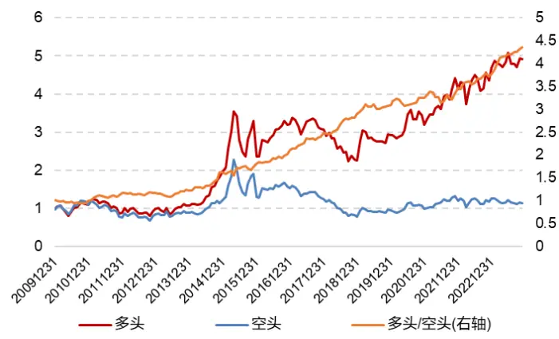
数据来源：Wind，东方证券研究所

图 36：回归版单季 SP因子多空净值
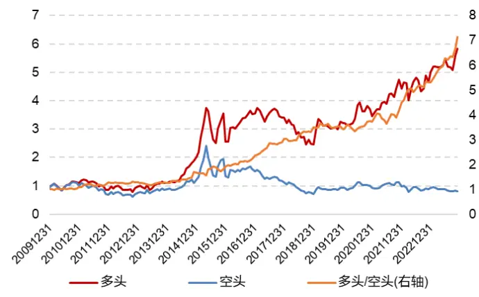
数据来源：Wind，东方证券研究所

下图分别展示了传统和回归版因子的月度 IC 和累计 IC。可以看到回归版本的 IC 的稳定性略好于传统版本的因子。

图 37：单季 SP因子月度 IC
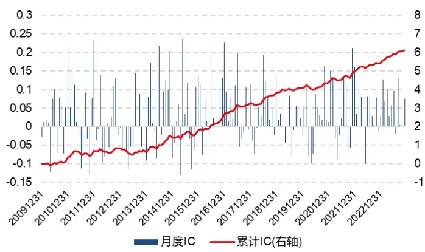
数据来源：Wind，东方证券研究所

图 38：回归版单季 SP因子月度 IC
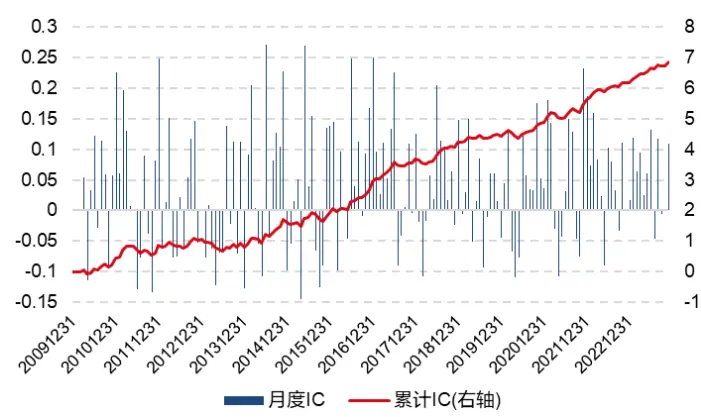
数据来源：Wind，东方证券研究所

下表是两个版本因子的选股能力对比数据，回归版本因子的 IC均值、多头超额有了显著提升，月均多头超额从 0.31%提升到 0.41%。

表 14：两个版本单季 SP因子的选股能力对比

|  | IC 均值 | IC 标准差 | 年化ICIR | IC 胜率 | 月均多头超额 | 月均多空收 益 | 多头超额胜 率 | 因子月度自 相关系数 |
| --- | --- | --- | --- | --- | --- | --- | --- | --- |
| 原始版本 | 0.036 | 0.086 | 1.46 | 65.48% | 0.31% | 0.85% | 53.57% | 0.97 |
| 回归版本 | 0.041 | 0.098 | 1.45 | 63.69% | 0.41% | 1.10% | 54.76% | 0.95 |

数据来源：Wind，东方证券研究所

有关分析师的申明，见本报告最后部分。其他重要信息披露见分析师申明之后部分，或请与您的投资代表联系。并请阅读本证券研究报告最后一页的免责申明。

下面左图是两个版本因子的十分组月度超额均值的情况，回归版本因子的多头和空头超额都得到一定提升。下面右图展示了两个版本因子中证 500MFE组合的净值表现。 可以看到，回归版本因子的超额净值略微好于传统版本因子。

图 39：两个版本单季 SP因子的十分组月度超额均值
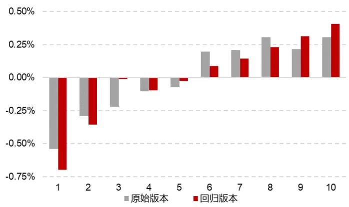
数据来源：Wind，东方证券研究所

图 40：两个版本单季 SP因子的中证 500MFE组合净值
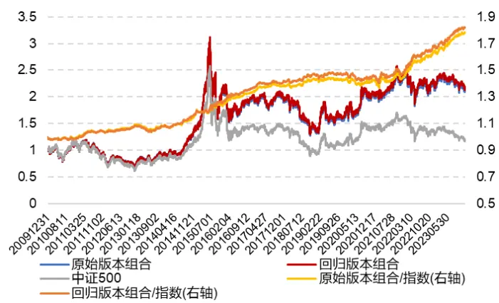
数据来源：Wind，东方证券研究所

下表展示了两个组合的各年收益对比情况，回归版本的年化超额收益从 4.38%提升到 4.55%，信息比从1.43略微提升到1.52，整体超额表现略微好于传统版本因子。我们认为主要原因是营业收入的噪声明显低于净利润，所以因子表现的改善幅度没有净利润相关类的因子明显。

表 15：两个版本单季 SP因子的中证 500MFE组合收益表现

| 年份 | 原始版本 |  |  |  | 回归版本 |  |  |  |
| --- | --- | --- | --- | --- | --- | --- | --- | --- |
|  | 超额收益 | 相对最大回撤 | 信息比 | 月度胜率 | 超额收益 | 相对最大回撤 | 信息比 | 月度胜率 |
| 2010 | -0.43% | -2.34% | -0.18 | 50.00% | -1.21% | -2.30% | -0.44 | 58.33% |
| 2011 | 3.34% | -1.84% | 2.30 | 75.00% | 3.45% | -1.90% | 2.38 | 75.00% |
| 2012 | 4.33% | -1.30% | 2.25 | 66.67% | 3.99% | -0.94% | 2.18 | 66.67% |
| 2013 | -0.99% | -4.73% | -0.42 | 33.33% | -0.41% | -4.57% | -0.22 | 33.33% |
| 2014 | 14.46% | -1.66% | 3.75 | 75.00% | 14.63% | -1.16% | 4.32 | 91.67% |
| 2015 | 8.01% | -3.71% | 1.45 | 58.33% | 11.08% | -2.28% | 2.03 | 58.33% |
| 2016 | 5.74% | -1.52% | 2.55 | 83.33% | 6.10% | -1.25% | 3.00 | 83.33% |
| 2017 | 2.52% | -1.99% | 1.54 | 58.33% | 2.68% | -1.78% | 1.51 | 41.67% |
| 2018 | 2.02% | -2.00% | 1.44 | 66.67% | 1.92% | -1.90% | 1.26 | 66.67% |
| 2019 | 0.99% | -1.71% | 0.37 | 50.00% | 1.83% | -2.23% | 0.62 | 50.00% |
| 2020 | -1.64% | -4.61% | -0.46 | 41.67% | -2.60% | -5.46% | -0.70 | 41.67% |
| 2021 | 4.00% | -3.49% | 0.81 | 75.00% | 4.43% | -3.09% | 0.92 | 75.00% |
| 2022 | 9.26% | -1.13% | 2.96 | 83.33% | 9.23% | -1.15% | 2.93 | 75.00% |
| 2023 | 7.97% | -1.63% | 3.15 | 91.67% | 7.83% | -1.70% | 3.09 | 91.67% |
| 全样本期 | 4.38% | -7.03% | 1.43 | 64.88% | 4.55% | -7.33% | 1.52 | 64.88% |

数据来源：Wind，东方证券研究所

## 2.5 单季 CFP

单季 CFP因子用单季经营现金流净额除以市值，我们以如下回归方式重构并取残差作为因子取值：

$$
ln(Quart\_CFOA)=\beta\cdot ln(MV)+\alpha+\varepsilon
$$

下图分别展示了传统和回归版单季 CFP因子市值行业中性化后十分组多空净值。可以看到，回归版本因子的多头净值和多空相对强弱都有了明显提升。

图 41：单季 CFP因子多空净值
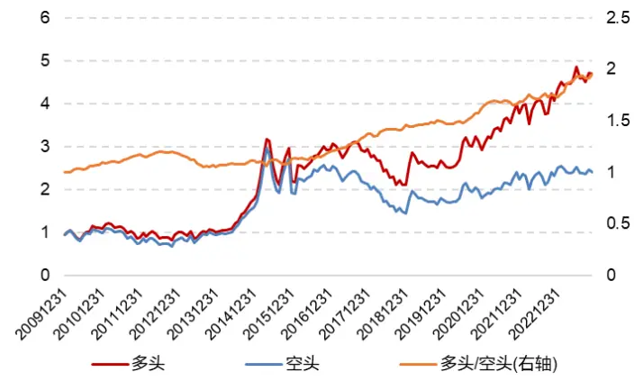
数据来源：Wind，东方证券研究所

图 42：回归版单季 CFP因子多空净值
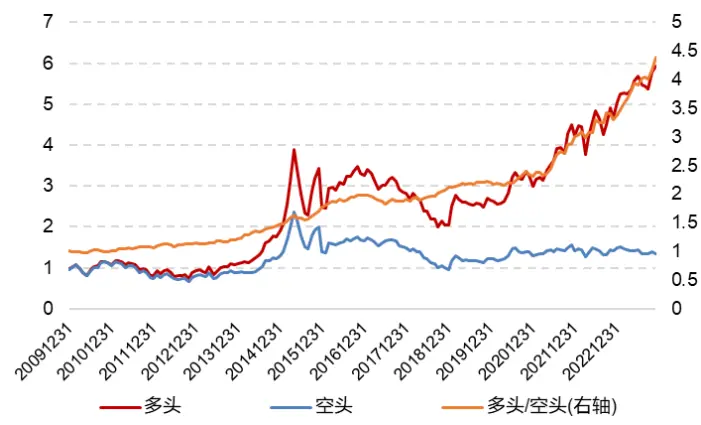
数据来源：Wind，东方证券研究所

下图分别展示了传统和回归版因子的月度 IC 和累计 IC。可以看到回归版本的 IC 的稳定性明显好于传统版本的因子。

图 43：单季 CFP因子月度 IC
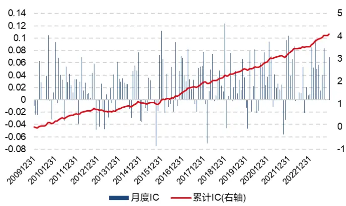
数据来源：Wind，东方证券研究所

图 44：回归版单季 CFP因子月度 IC
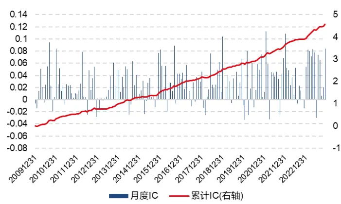
数据来源：Wind，东方证券研究所

下表是两个版本因子的选股能力对比数据，回归版本因子的IC均值、ICIR、IC胜率、多头超额、多头超额胜率都有了显著提升，月均多头超额从 0.26%提升到 0.46%。

表 16：两个版本单季 CFP因子的选股能力对比

|  | IC 均值 | IC 标准差 | 年化ICIR | IC 胜率 | 月均多头超额 | 月均多空收 益 | 多头超额胜 率 | 因子月度自 相关系数 |
| --- | --- | --- | --- | --- | --- | --- | --- | --- |
| 原始版本 | 0.024 | 0.040 | 2.13 | 70.24% | 0.26% | 0.36% | 52.38% | 0.97 |
| 回归版本 | 0.027 | 0.032 | 2.98 | 80.95% | 0.46% | 0.93% | 69.05% | 0.95 |

数据来源：Wind，东方证券研究所

有关分析师的申明，见本报告最后部分。其他重要信息披露见分析师申明之后部分，或请与您的投资代表联系。并请阅读本证券研究报告最后一页的免责申明。

下面左图是两个版本因子的十分组月度超额均值的情况，回归版本因子的多头超额得到明显提升。下面右图展示了两个版本因子中证 500MFE组合的净值表现。 可以看到，回归版本因子的超额净值持续好于传统版本因子。

图 45：两个版本单季 CFP因子的十分组月度超额均值
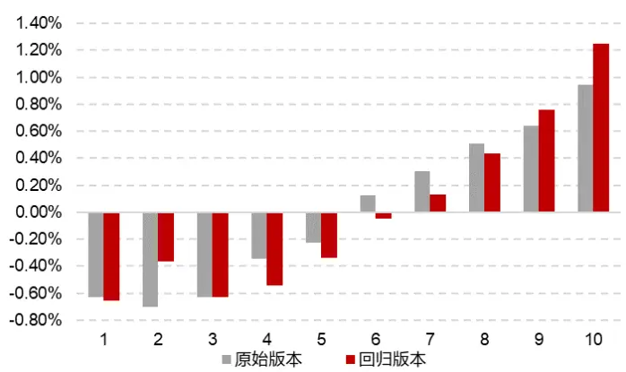
数据来源：Wind，东方证券研究所

图 46：两个版本单季 CFP因子的中证 500MFE组合净值
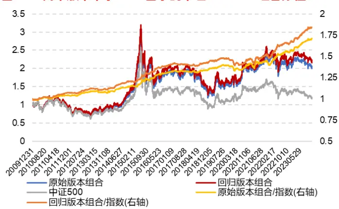
数据来源：Wind，东方证券研究所

下表展示了两个组合的各年收益对比情况，大部分年份中回归版本因子的超额表现都好于传统版本因子，年化超额收益从 4.07%提升到 4.67%，信息比从 1.59提升到 1.81。

表 17：两个版本单季 CFP因子的中证 500MFE组合收益表现

| 年份 | 原始版本 |  |  |  | 回归版本 |  |  |  |
| --- | --- | --- | --- | --- | --- | --- | --- | --- |
|  | 超额收益 | 相对最大回撤 | 信息比 | 月度胜率 | 超额收益 | 相对最大回撤 | 信息比 | 月度胜率 |
| 2010 | 0.71% | -2.53% | 0.25 | 58.33% | 1.25% | -1.75% | 0.52 | 41.67% |
| 2011 | 2.41% | -1.14% | 2.22 | 75.00% | 3.90% | -0.85% | 3.43 | 83.33% |
| 2012 | 4.34% | -1.18% | 2.82 | 66.67% | 4.53% | -1.46% | 2.81 | 58.33% |
| 2013 | 0.58% | -2.69% | 0.18 | 58.33% | 1.25% | -2.23% | 0.52 | 66.67% |
| 2014 | 7.99% | -0.96% | 3.01 | 83.33% | 9.35% | -1.02% | 3.74 | 83.33% |
| 2015 | 10.56% | -3.23% | 2.04 | 66.67% | 13.03% | -1.95% | 2.74 | 83.33% |
| 2016 | 5.13% | -0.76% | 3.41 | 91.67% | 5.56% | -0.91% | 3.70 | 91.67% |
| 2017 | -0.15% | -1.73% | -0.11 | 50.00% | -0.99% | -2.42% | -0.64 | 33.33% |
| 2018 | 2.01% | -1.58% | 1.65 | 66.67% | 2.31% | -1.51% | 1.65 | 75.00% |
| 2019 | 2.34% | -1.83% | 1.02 | 58.33% | 1.40% | -2.24% | 0.58 | 33.33% |
| 2020 | 1.61% | -4.32% | 0.39 | 58.33% | -0.34% | -4.93% | -0.14 | 58.33% |
| 2021 | 2.40% | -3.63% | 0.52 | 66.67% | 4.75% | -3.25% | 1.03 | 66.67% |
| 2022 | 7.85% | -1.46% | 2.96 | 83.33% | 8.52% | -1.54% | 3.13 | 83.33% |
| 2023 | 8.07% | -1.03% | 4.10 | 75.00% | 9.38% | -0.98% | 4.48 | 83.33% |
| 全样本期 | 4.07% | -6.27% | 1.59 | 68.45% | 4.67% | -7.40% | 1.81 | 67.26% |

数据来源：Wind，东方证券研究所

## 2.6 BP

BP因子用净资产除以市值，我们以如下回归方式重构并取残差作为因子取值：

$$
ln(Book)=\beta\cdot ln(MV)+\alpha+\varepsilon
$$

下图分别展示了传统和回归版 BP 因子市值行业中性化后十分组多空净值。可以看到，回归版本因子的多头净值和多空相对强弱都有了明显提升。

图 47：BP因子多空净值
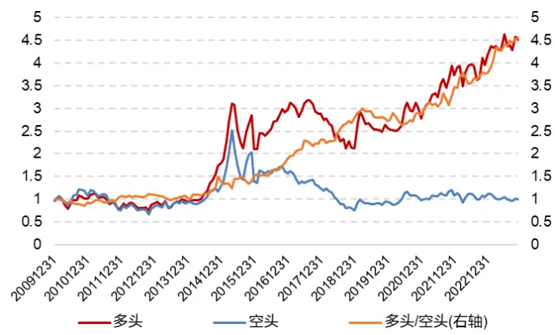
数据来源：Wind，东方证券研究所

图 48：回归版 BP因子多空净值
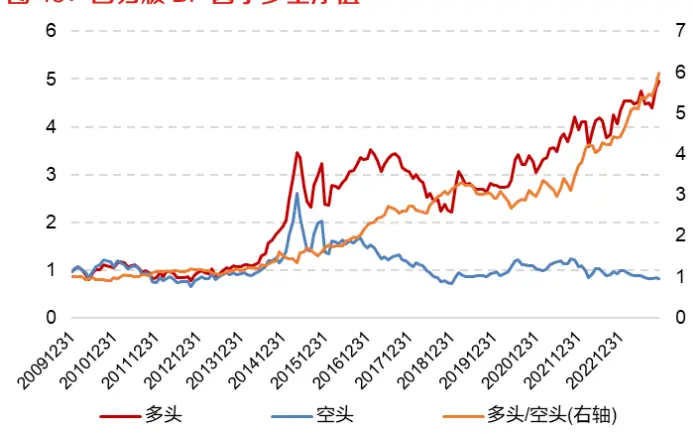
数据来源：Wind，东方证券研究所

下图分别展示了传统和回归版因子的月度 IC 和累计 IC。可以看到两个版本因子的 IC 表现非常接近。

图 49：BP 因子月度 IC
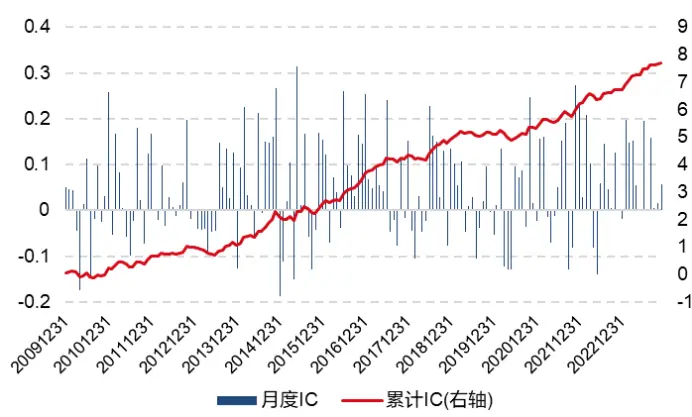
数据来源：Wind，东方证券研究所

图 50：回归版 BP因子月度 IC
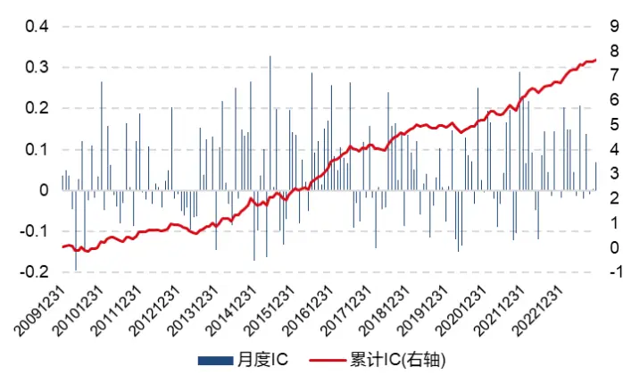
数据来源：Wind，东方证券研究所

下表是两个版本因子的选股能力对比数据，两个版本因子表现接近，回归版本因子的多头超额从0.24%提升到 0.3%。

表 18：两个版本 BP因子的选股能力对比

|  | IC 均值 | IC 标准差 | 年化ICIR | IC 胜率 | 月均多头超额 | 月均多空收 益 | 多头超额胜 率 | 因子月度自 相关系数 |
| --- | --- | --- | --- | --- | --- | --- | --- | --- |
| 原始版本 | 0.046 | 0.106 | 1.50 | 64.29% | 0.24% | 0.84% | 47.02% | 0.97 |
| 回归版本 | 0.045 | 0.112 | 1.40 | 60.71% | 0.30% | 0.99% | 49.40% | 0.95 |

数据来源：Wind，东方证券研究所

有关分析师的申明，见本报告最后部分。其他重要信息披露见分析师申明之后部分，或请与您的投资代表联系。并请阅读本证券研究报告最后一页的免责申明。

下面左图是两个版本因子的十分组月度超额均值的情况，回归版本因子的多头和空头超额都得到一定提升。下面右图展示了两个版本因子中证 500MFE组合的净值表现。 可以看到，回归版本因子的超额净值和传统版本因子的表现非常接近。

图 51：两个版本 BP因子的十分组月度超额均值
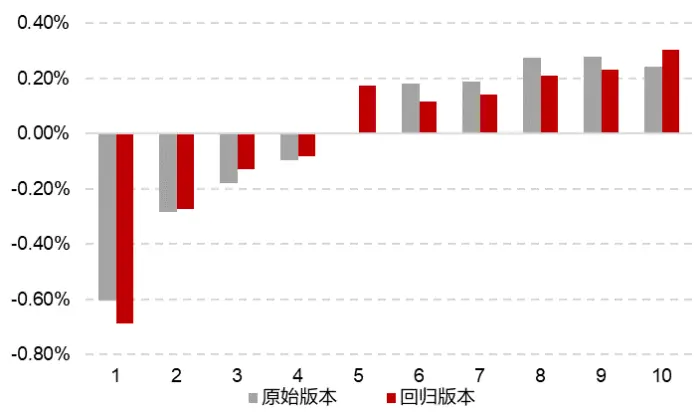
数据来源：Wind，东方证券研究所

图 52：两个版本 BP因子的中证 500MFE组合净值
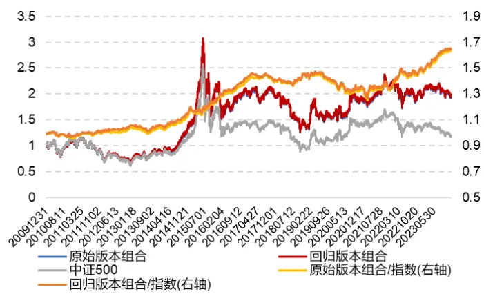
数据来源：Wind，东方证券研究所

下表展示了两个组合的各年收益对比情况，回归版本的年化超额收益从3.73%略微提升到3.8%，整体超额表现和传统版本因子非常接近。我们认为主要原因是绝大部分股票的净资产都是一个正常值，噪声含量明显低于净利润，所以因子表现的改善幅度没有净利润相关类的因子明显。

表 19：两个版本 BP因子的中证 500MFE组合收益表现

| 年份 | 原始版本 |  |  |  | 回归版本 |  |  |  |
| --- | --- | --- | --- | --- | --- | --- | --- | --- |
|  | 超额收益 | 相对最大回撤 | 信息比 | 月度胜率 | 超额收益 | 相对最大回撤 | 信息比 | 月度胜率 |
| 2010 | -3.85% | -5.02% | -1.05 | 50.00% | -2.88% | -4.55% | -0.78 | 50.00% |
| 2011 | 2.84% | -2.25% | 1.71 | 50.00% | 2.88% | -1.91% | 1.76 | 58.33% |
| 2012 | 3.03% | -1.52% | 1.31 | 66.67% | 3.85% | -1.17% | 1.72 | 66.67% |
| 2013 | 0.24% | -4.79% | -0.01 | 33.33% | 0.34% | -4.69% | 0.03 | 25.00% |
| 2014 | 20.40% | -2.08% | 4.12 | 83.33% | 18.32% | -1.90% | 4.08 | 83.33% |
| 2015 | 8.84% | -9.80% | 1.39 | 58.33% | 9.67% | -7.72% | 1.58 | 66.67% |
| 2016 | 9.31% | -1.05% | 4.07 | 91.67% | 10.14% | -1.12% | 4.51 | 91.67% |
| 2017 | -0.72% | -4.40% | -0.33 | 50.00% | -2.15% | -4.35% | -0.90 | 25.00% |
| 2018 | 1.43% | -3.10% | 0.68 | 66.67% | 1.37% | -3.10% | 0.65 | 58.33% |
| 2019 | -3.95% | -6.09% | -0.96 | 33.33% | -3.45% | -5.72% | -0.83 | 33.33% |
| 2020 | -5.88% | -8.09% | -1.11 | 50.00% | -5.45% | -7.81% | -1.04 | 50.00% |
| 2021 | 4.09% | -5.11% | 0.61 | 66.67% | 3.58% | -4.77% | 0.55 | 58.33% |
| 2022 | 6.68% | -5.31% | 1.54 | 58.33% | 6.69% | -4.81% | 1.58 | 58.33% |
| 2023 | 9.91% | -1.52% | 3.32 | 91.67% | 9.96% | -1.43% | 3.40 | 91.67% |
| 全样本期 | 3.73% | -21.33% | 0.95 | 60.71% | 3.80% | -20.05% | 0.99 | 58.33% |

数据来源：Wind，东方证券研究所

## 2.7 现金估值

现金估值因子用企业的现金和现金等价物除以市值，我们以如下回归方式重构并取残差作为因子取值：

$$
ln(Cash\_equal)=\beta\cdot ln(MV)+\alpha+\varepsilon
$$

下图分别展示了传统和回归版现金估值因子市值行业中性化后十分组多空净值。可以看到，回归版本因子的多头净值和多空相对强弱都有了明显提升。

图 53：现金估值因子多空净值
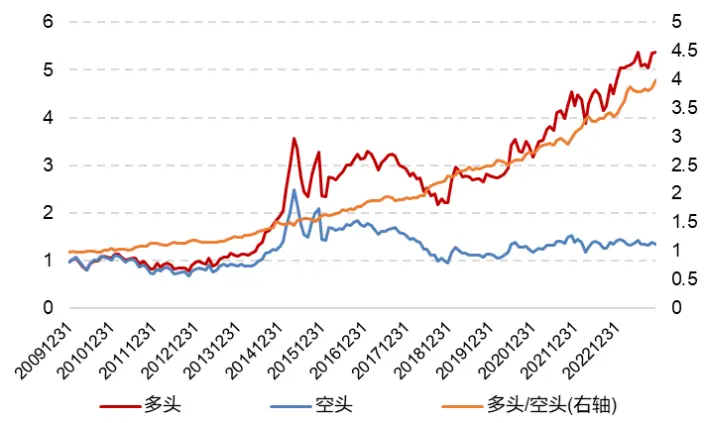
数据来源：Wind，东方证券研究所

图 54：回归版现金估值因子多空净值
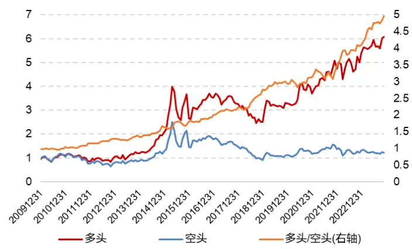
数据来源：Wind，东方证券研究所

下图分别展示了传统和回归版因子的月度 IC 和累计 IC。可以看到两个版本因子的 IC 表现非常接近。

图 55：现金估值因子月度 IC
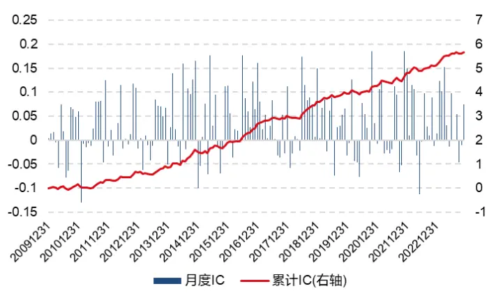
数据来源：Wind，东方证券研究所

图 56：回归版现金估值因子月度 IC
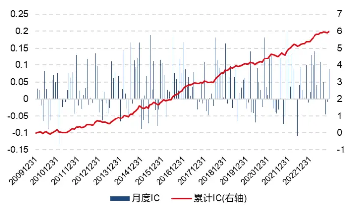
数据来源：Wind，东方证券研究所

下表是两个版本因子的选股能力对比数据，两个版本因子表现接近，回归版本因子的 IC 均值、ICIR、多头超额都有一定提升，多头月均超额从 0.35%提升到 0.44%。

表 20：两个版本现金估值因子的选股能力对比

|  | IC 均值 | IC 标准差 | 年化ICIR | IC 胜率 | 月均多头超额 | 月均多空收 益 | 多头超额胜 率 | 因子月度自 相关系数 |
| --- | --- | --- | --- | --- | --- | --- | --- | --- |
| 原始版本 | 0.034 | 0.067 | 1.74 | 64.29% | 0.35% | 0.80% | 55.36% | 0.97 |
| 回归版本 | 0.036 | 0.070 | 1.77 | 64.88% | 0.44% | 0.91% | 58.93% | 0.95 |

数据来源：Wind，东方证券研究所
有关分析师的申明，见本报告最后部分。其他重要信息披露见分析师申明之后部分，或请与您的投资代表联系。并请阅读本证券研究报告最后一页的免责申明。

下面左图是两个版本因子的十分组月度超额均值的情况，回归版本因子的多头超额得到明显提升。下面右图展示了两个版本因子中证 500MFE组合的净值表现。 可以看到，回归版本因子的超额净值持续好于传统版本因子。

图 57：两个版本现金估值因子的十分组月度超额均值
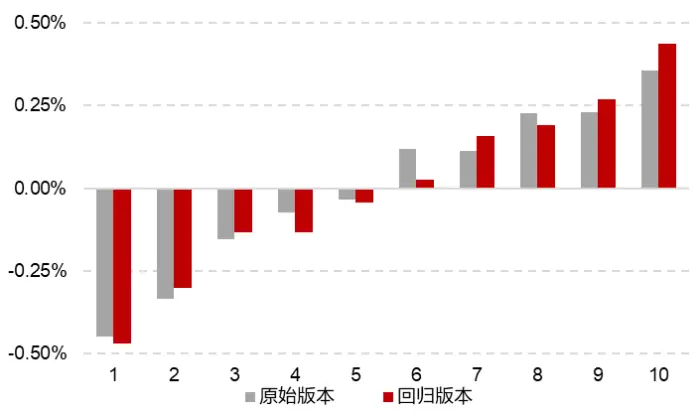
数据来源：Wind，东方证券研究所

图 58：两个版本现金估值因子的中证 500MFE组合净值
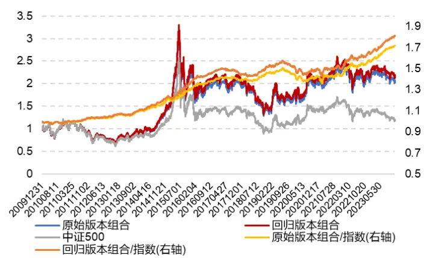
数据来源：Wind，东方证券研究所

下表展示了两个组合的各年收益对比情况，大部分年份中回归版本因子的超额表现都好于传统版本因子，年化超额收益从4.12%提升到4.53%，信息比从1.4提升到1.54，月度超额胜率从65.48%提升到 68.45%。

表 21：两个版本现金估值因子的中证 500MFE组合收益表现

| 年份 | 原始版本 |  |  |  | 回归版本 |  |  |  |
| --- | --- | --- | --- | --- | --- | --- | --- | --- |
|  | 超额收益 | 相对最大回撤 | 信息比 | 月度胜率 | 超额收益 | 相对最大回撤 | 信息比 | 月度胜率 |
| 2010 | -1.30% | -2.82% | -0.54 | 58.33% | -0.99% | -2.73% | -0.41 | 58.33% |
| 2011 | 3.02% | -1.61% | 2.14 | 66.67% | 3.11% | -1.59% | 2.13 | 66.67% |
| 2012 | 2.95% | -1.03% | 1.67 | 66.67% | 3.05% | -0.92% | 1.71 | 66.67% |
| 2013 | 4.42% | -1.66% | 2.06 | 75.00% | 4.83% | -1.57% | 2.24 | 75.00% |
| 2014 | 14.70% | -0.77% | 4.54 | 83.33% | 15.58% | -0.67% | 5.21 | 91.67% |
| 2015 | 11.86% | -3.38% | 2.17 | 58.33% | 17.83% | -2.44% | 3.26 | 66.67% |
| 2016 | 5.00% | -1.26% | 2.78 | 75.00% | 5.64% | -1.28% | 3.43 | 83.33% |
| 2017 | -0.34% | -2.83% | -0.22 | 41.67% | -2.77% | -4.52% | -1.33 | 33.33% |
| 2018 | 2.85% | -1.93% | 1.81 | 75.00% | 3.34% | -1.95% | 1.91 | 91.67% |
| 2019 | -0.54% | -4.44% | -0.18 | 41.67% | 0.15% | -4.42% | 0.07 | 41.67% |
| 2020 | -2.70% | -6.57% | -0.65 | 50.00% | -2.78% | -6.61% | -0.66 | 50.00% |
| 2021 | 4.09% | -4.30% | 0.82 | 66.67% | 4.16% | -4.20% | 0.84 | 66.67% |
| 2022 | 5.31% | -3.51% | 1.69 | 58.33% | 5.40% | -3.18% | 1.72 | 66.67% |
| 2023 | 8.95% | -1.36% | 4.63 | 100.00% | 9.44% | -1.57% | 4.76 | 100.00% |
| 全样本期 | 4.12% | -13.35% | 1.40 | 65.48% | 4.53% | -13.15% | 1.54 | 68.45% |

数据来源：Wind，东方证券研究所

## 2.8 股息率 TTM

股息率TTM因子用过去一年有分红预案的分红总金额除以市值，我们以如下回归方式重构并取残差作为因子取值：

$$
ln(TTM_{-}div)=\beta\cdot ln(MV)+\alpha+\varepsilon
$$

下图分别展示了传统和回归版现金估值因子市值行业中性化后十分组多空净值。可以看到，回归版本因子的多头净值和多空相对强弱都有了显著提升。

图 59：股息率因子多空净值
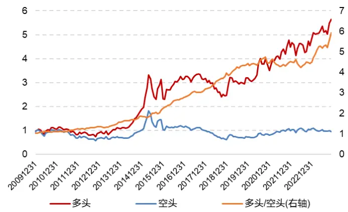
数据来源：Wind，东方证券研究所

图 60：回归版股息率因子多空净值
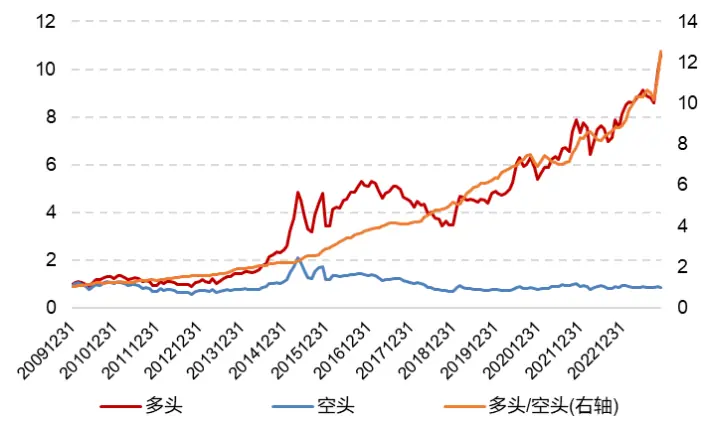
数据来源：Wind，东方证券研究所

下图分别展示了传统和回归版因子的月度 IC 和累计 IC。可以看到回归版本的 IC 的胜率和稳定性明显好于传统版本的因子。

图 61：股息率因子月度 IC
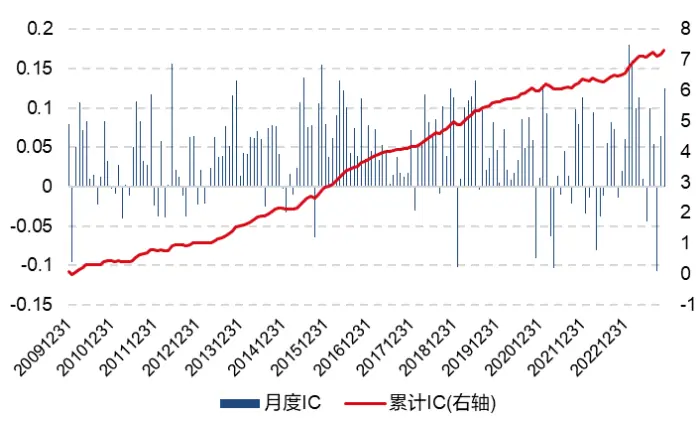
数据来源：Wind，东方证券研究所

图 62：回归版股息率因子月度IC
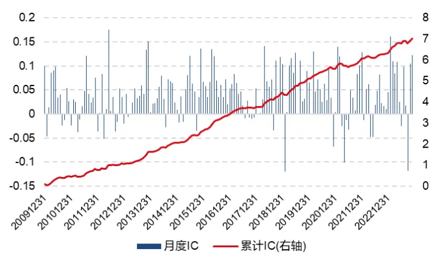
数据来源：Wind，东方证券研究所

下表是两个版本因子的选股能力对比数据，两个版本因子表现接近，回归版本因子的多头月均超额从 0.35%提升到 0.8%，多头超额胜率从 54.17%提升到 70.83%。

表 22：两个版本股息率因子的选股能力对比

|  | IC 均值 | IC 标准差 | 年化ICIR | IC 胜率 | 月均多头超额 | 月均多空收 益 | 多头超额胜 率 | 因子月度自 相关系数 |
| --- | --- | --- | --- | --- | --- | --- | --- | --- |
| 原始版本 | 0.044 | 0.057 | 2.67 | 79.17% | 0.35% | 1.03% | 54.17% | 0.97 |
| 回归版本 | 0.042 | 0.053 | 2.71 | 79.76% | 0.80% | 1.51% | 70.83% | 0.95 |

数据来源：Wind，东方证券研究所
有关分析师的申明，见本报告最后部分。其他重要信息披露见分析师申明之后部分，或请与您的投资代表联系。并请阅读本证券研究报告最后一页的免责申明。

下面左图是两个版本因子的十分组月度超额均值的情况，回归版本因子的多头超额得到明显提升。下面右图展示了两个版本因子中证 500MFE组合的净值表现。 可以看到，回归版本因子的超额净值持续好于传统版本因子。

图 63：两个版本股息率因子的十分组月度超额均值
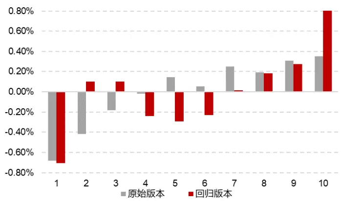
数据来源：Wind，东方证券研究所

图 64：两个版本股息率因子的中证 500MFE组合净值
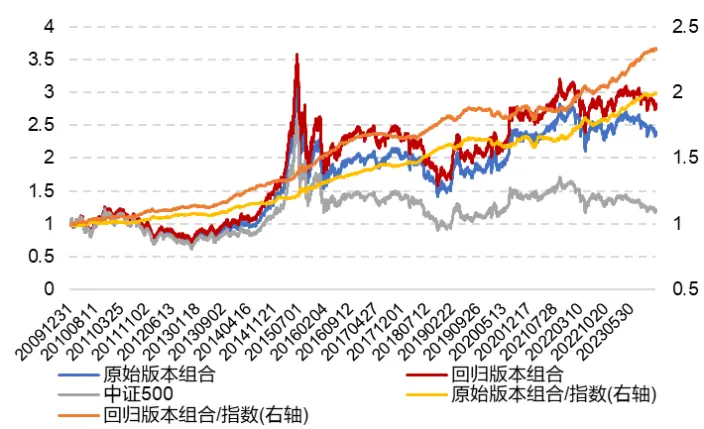
数据来源：Wind，东方证券研究所

下表展示了两个组合的各年收益对比情况，大部分年份中回归版本因子的超额表现都好于传统版本因子，年化超额收益从 5.26%提升到 6.52%，信息比从 1.87 提升到 2.32，月度超额胜率从68.45%提升到 75.6%。

表 23：两个版本股息率因子的中证 500MFE组合收益表现

| 年份 | 原始版本 |  |  |  | 回归版本 |  |  |  |
| --- | --- | --- | --- | --- | --- | --- | --- | --- |
|  | 超额收益 | 相对最大回撤 | 信息比 | 月度胜率 | 超额收益 | 相对最大回撤 | 信息比 | 月度胜率 |
| 2010 | 1.30% | -1.96% | 0.37 | 50.00% | 5.49% | -1.51% | 1.95 | 66.67% |
| 2011 | 2.71% | -2.27% | 1.92 | 50.00% | 3.23% | -1.46% | 2.27 | 75.00% |
| 2012 | 2.52% | -1.21% | 1.55 | 58.33% | 3.42% | -0.88% | 2.02 | 75.00% |
| 2013 | 5.42% | -1.81% | 2.41 | 58.33% | 8.49% | -1.74% | 3.49 | 75.00% |
| 2014 | 8.78% | -1.32% | 2.67 | 75.00% | 12.38% | -1.08% | 4.12 | 83.33% |
| 2015 | 11.93% | -2.19% | 2.14 | 83.33% | 19.23% | -2.08% | 3.50 | 83.33% |
| 2016 | 6.28% | -1.06% | 3.46 | 100.00% | 8.96% | -0.56% | 5.75 | 100.00% |
| 2017 | 3.61% | -1.38% | 1.94 | 66.67% | -1.30% | -2.53% | -0.78 | 50.00% |
| 2018 | 6.63% | -1.17% | 5.24 | 83.33% | 6.20% | -1.04% | 4.42 | 91.67% |
| 2019 | 3.84% | -2.84% | 1.25 | 58.33% | 4.67% | -2.25% | 1.58 | 66.67% |
| 2020 | -1.01% | -5.17% | -0.34 | 50.00% | -1.30% | -4.98% | -0.39 | 58.33% |
| 2021 | 4.08% | -3.33% | 0.86 | 58.33% | 3.96% | -3.48% | 0.81 | 50.00% |
| 2022 | 6.32% | -4.17% | 2.20 | 75.00% | 7.21% | -3.78% | 2.37 | 83.33% |
| 2023 | 8.54% | -0.96% | 4.18 | 91.67% | 10.85% | -1.06% | 5.23 | 100.00% |
| 全样本期 | 5.26% | -6.39% | 1.87 | 68.45% | 6.52% | -6.94% | 2.32 | 75.60% |

数据来源：Wind，东方证券研究所

## 2.9 一致预期滚动 EP

分析师一致预期滚动 EP 因子用分析师一致预期滚动净利润除以市值，我们以如下回归方式重构并取残差作为因子取值：

$$
ln(Con\_np\_roll)=\beta\cdot ln(MV)+\alpha+\varepsilon
$$

下图分别展示了传统和回归版一致预期滚动 EP 因子市值行业中性化后十分组多空净值。可以看到，回归版本因子的多头净值和多空相对强弱都有了显著提升。

图 65：一致预期滚动 EP因子多空净值
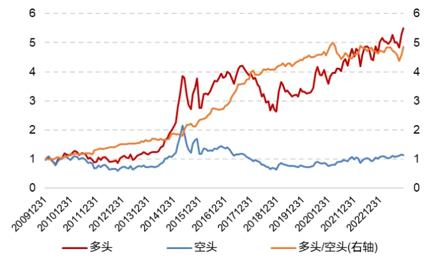
数据来源：Wind，朝阳永续，东方证券研究所

图 66：回归版一致预期滚动 EP因子多空净值
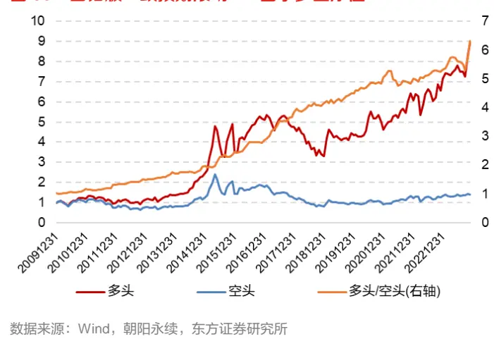

下图分别展示了传统和回归版因子的月度 IC 和累计 IC。可以看到回归版本的 IC 的胜率和稳定性明显好于传统版本的因子。

图 67：一致预期滚动 EP因子月度 IC
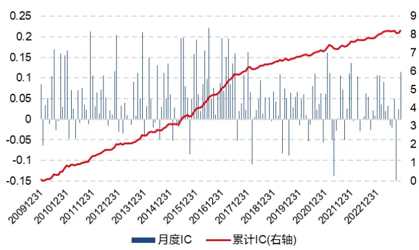
数据来源：Wind，朝阳永续，东方证券研究所

图 68：回归版一致预期滚动 EP因子月度 IC
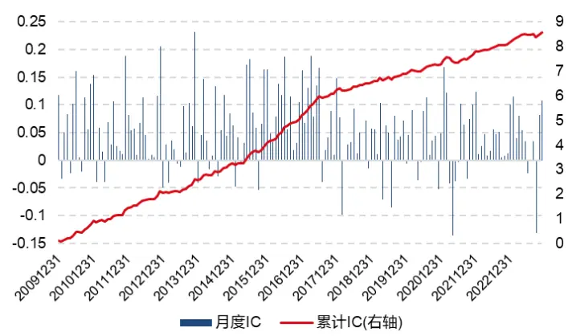
数据来源：Wind，朝阳永续，东方证券研究所

下表是两个版本因子的选股能力对比数据，回归版本因子的IC均值、ICIR、IC胜率、多头超额、多头超额胜率都有一定提升，多头月均超额从 0.38%提升到0.7%。

表 24：两个版本一致预期滚动EP因子的选股能力对比

|  | IC 均值 | IC 标准差 | 年化ICIR | IC 胜率 | 月均多头超额 | 月均多空收 益 | 多头超额胜 率 | 因子月度自 相关系数 |
| --- | --- | --- | --- | --- | --- | --- | --- | --- |
| 原始版本 | 0.049 | 0.072 | 2.35 | 75.60% | 0.38% | 0.90% | 50.60% | 0.97 |
| 回归版本 | 0.051 | 0.066 | 2.67 | 80.36% | 0.70% | 1.06% | 62.50% | 0.95 |

数据来源：Wind，朝阳永续，东方证券研究所
有关分析师的申明，见本报告最后部分。其他重要信息披露见分析师申明之后部分，或请与您的投资代表联系。并请阅读本证券研究报告最后一页的免责申明。

下面左图是两个版本因子的十分组月度超额均值的情况，回归版本因子的多头超额得到明显提升。下面右图展示了两个版本因子中证 500MFE组合的净值表现。 可以看到，回归版本因子的超额净值持续好于传统版本因子。

图69：两个版本一致预期滚动EP因子的十分组月度超额均值
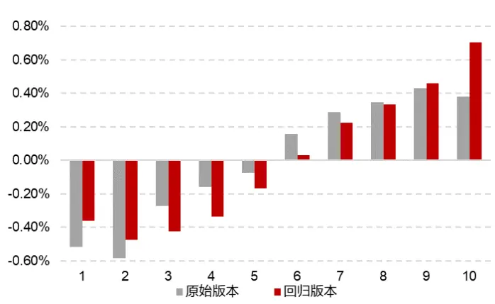
数据来源：Wind，朝阳永续，东方证券研究所

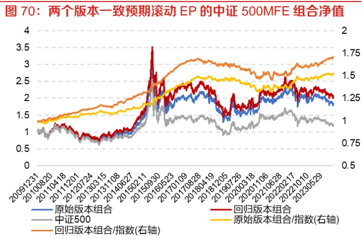
数据来源：Wind，朝阳永续，东方证券研究所

下表展示了两个组合的各年收益对比情况，大部分年份中回归版本因子的超额表现都好于传统版本因子，年化超额收益从 3.19%提升到 4.09%，信息比从 0.97提升到 1.34。

表 25：两个版本一致预期滚动EP因子的中证 500MFE组合收益表现

| 年份 | 原始版本 |  |  |  | 回归版本 |  |  |  |
| --- | --- | --- | --- | --- | --- | --- | --- | --- |
|  | 超额收益 | 相对最大回撤 | 信息比 | 月度胜率 | 超额收益 | 相对最大回撤 | 信息比 | 月度胜率 |
| 2010 | 2.01% | -3.21% | 0.54 | 50.00% | 4.34% | -1.83% | 1.43 | 58.33% |
| 2011 | 2.52% | -1.12% | 1.74 | 58.33% | 3.97% | -1.25% | 2.81 | 75.00% |
| 2012 | 5.02% | -0.79% | 2.68 | 83.33% | 6.60% | -0.78% | 3.80 | 75.00% |
| 2013 | 0.17% | -4.23% | -0.01 | 50.00% | 3.70% | -2.74% | 1.24 | 50.00% |
| 2014 | 8.17% | -2.00% | 2.23 | 66.67% | 10.62% | -1.74% | 3.22 | 83.33% |
| 2015 | 13.73% | -2.88% | 2.01 | 75.00% | 19.11% | -1.50% | 3.55 | 91.67% |
| 2016 | 7.49% | -0.97% | 3.43 | 100.00% | 9.37% | -0.46% | 6.30 | 100.00% |
| 2017 | 4.24% | -2.21% | 2.14 | 66.67% | 0.04% | -3.20% | 0.04 | 58.33% |
| 2018 | -0.95% | -3.45% | -0.40 | 41.67% | -1.65% | -3.50% | -0.72 | 33.33% |
| 2019 | -2.75% | -5.41% | -0.68 | 41.67% | -3.00% | -5.31% | -0.76 | 41.67% |
| 2020 | -5.62% | -8.28% | -1.20 | 50.00% | -5.87% | -8.74% | -1.25 | 50.00% |
| 2021 | 2.68% | -3.97% | 0.52 | 66.67% | 2.86% | -3.40% | 0.54 | 66.67% |
| 2022 | 5.26% | -3.41% | 1.83 | 58.33% | 4.35% | -3.37% | 1.53 | 50.00% |
| 2023 | 3.31% | -2.37% | 1.64 | 75.00% | 5.72% | -2.46% | 2.72 | 83.33% |
| 全样本期 | 3.19% | -15.94% | 0.97 | 63.10% | 4.09% | -17.02% | 1.34 | 65.48% |

数据来源：Wind，朝阳永续，东方证券研究所

## 2.10 单季 ROE

单季 ROE因子用单季净利润除以净资产，我们以如下回归方式重构并取残差作为因子取值：

$$
ln(Quart\_E)=\beta\cdot ln(Book)+\alpha+\varepsilon
$$

下图分别展示了传统和回归版一致预期滚动 EP 因子市值行业中性化后十分组多空净值。可以看到，回归版本因子的多空相对强弱在近 2年明显好于传统因子。

图 71：单季 ROE因子多空净值
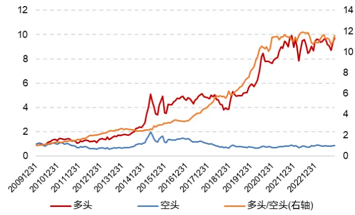
数据来源：Wind，东方证券研究所

图 72：回归版单季 ROE因子多空净值
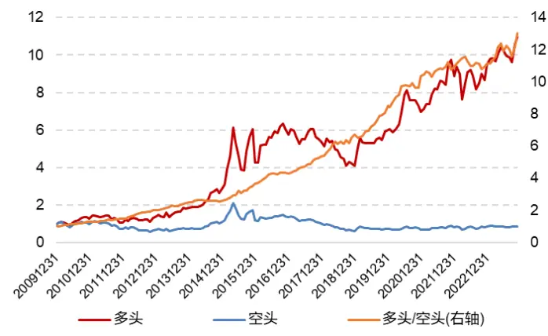
数据来源：Wind，东方证券研究所

下图分别展示了传统和回归版因子的月度 IC 和累计 IC。可以看到两个版本因子的 IC 表现非常接近。

图 73：单季 ROE因子月度 IC
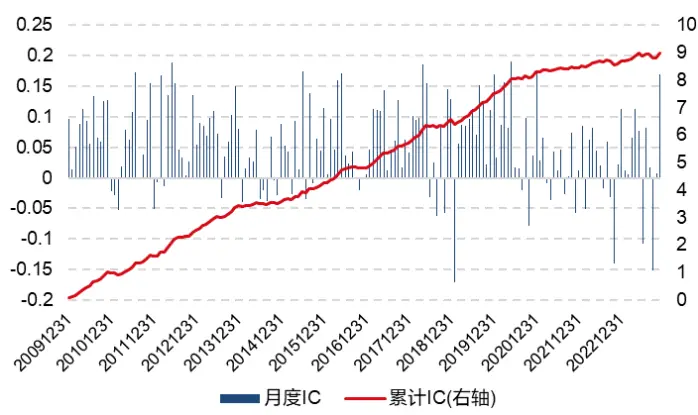
数据来源：Wind，东方证券研究所

图 74：回归版单季 ROE因子月度 IC
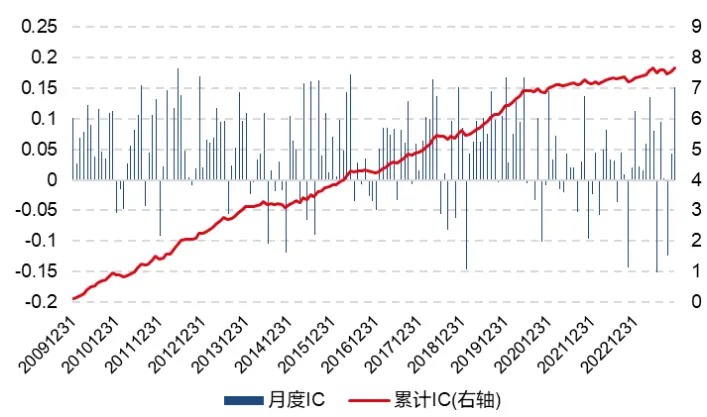
数据来源：Wind，东方证券研究所

下表是两个版本因子的选股能力对比数据，回归版本因子的IC均值、ICIR略有下降，多头月均超额从 0.72%提升到 0.84%。

表 26：两个版本单季 ROE因子的选股能力对比

|  | IC 均值 | IC 标准差 | 年化ICIR | IC 胜率 | 月均多头超额 | 月均多空收 益 | 多头超额胜 率 | 因子月度自 相关系数 |
| --- | --- | --- | --- | --- | --- | --- | --- | --- |
| 原始版本 | 0.054 | 0.069 | 2.67 | 79.17% | 0.72% | 1.41% | 66.67% | 0.97 |
| 回归版本 | 0.046 | 0.073 | 2.16 | 75.00% | 0.84% | 1.51% | 68.45% | 0.95 |

数据来源：Wind，东方证券研究所

有关分析师的申明，见本报告最后部分。其他重要信息披露见分析师申明之后部分，或请与您的投资代表联系。并请阅读本证券研究报告最后一页的免责申明。

下面左图是两个版本因子的十分组月度超额均值的情况，回归版本因子的多头超额得到明显提升。下面右图展示了两个版本因子中证 500MFE组合的净值表现。 可以看到，回归版本因子的超额净值持续好于传统版本因子，尤其是近 3年表现更好。

图 75：两个版本单季 ROE因子的十分组月度超额均值
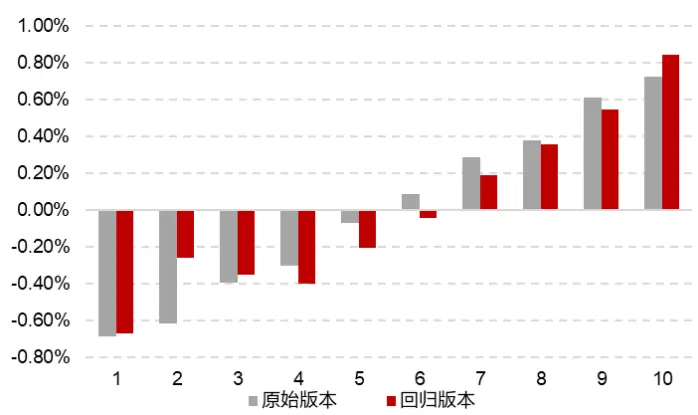
数据来源：Wind，东方证券研究所

图 76：两个版本单季 ROE因子的中证 500MFE组合净值
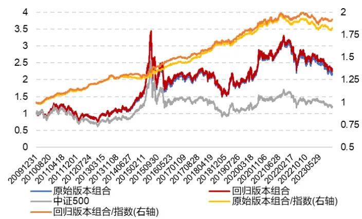
数据来源：Wind，东方证券研究所

下表展示了两个组合的各年收益对比情况，大部分年份尤其是近 3 年回归版本因子的超额表现好于传统版本因子，年化超额收益从 4.59%提升到 5%，信息比从 1.64提升到 1.78，月度超额胜率从 64.29%提升到 70.24%。

表 27：两个版本单季 ROE因子的中证 500MFE组合收益表现

| 年份 | 原始版本 |  |  |  | 回归版本 |  |  |  |
| --- | --- | --- | --- | --- | --- | --- | --- | --- |
|  | 超额收益 | 相对最大回撤 | 信息比 | 月度胜率 | 超额收益 | 相对最大回撤 | 信息比 | 月度胜率 |
| 2010 | 9.53% | -2.44% | 2.99 | 75.00% | 11.00% | -1.44% | 3.55 | 83.33% |
| 2011 | 3.54% | -1.50% | 2.66 | 66.67% | 3.22% | -1.07% | 2.53 | 66.67% |
| 2012 | 7.12% | -1.72% | 2.79 | 58.33% | 6.48% | -1.68% | 2.75 | 66.67% |
| 2013 | 5.03% | -2.44% | 1.87 | 58.33% | 5.33% | -3.56% | 1.84 | 66.67% |
| 2014 | -2.05% | -3.54% | -0.77 | 25.00% | -0.33% | -3.91% | -0.11 | 58.33% |
| 2015 | 12.28% | -2.82% | 2.36 | 66.67% | 16.62% | -2.88% | 2.82 | 75.00% |
| 2016 | 4.30% | -1.11% | 2.54 | 66.67% | 3.80% | -1.08% | 2.35 | 83.33% |
| 2017 | 7.80% | -1.12% | 3.28 | 91.67% | 5.55% | -1.40% | 2.48 | 66.67% |
| 2018 | 4.58% | -2.04% | 2.60 | 83.33% | 4.27% | -1.54% | 2.61 | 66.67% |
| 2019 | 8.06% | -3.74% | 2.32 | 83.33% | 8.95% | -3.58% | 2.66 | 91.67% |
| 2020 | 8.36% | -2.04% | 2.34 | 83.33% | 7.44% | -2.66% | 1.99 | 83.33% |
| 2021 | -0.76% | -5.12% | -0.13 | 41.67% | 0.74% | -3.52% | 0.23 | 58.33% |
| 2022 | 0.51% | -3.39% | 0.21 | 58.33% | 1.27% | -2.98% | 0.54 | 75.00% |
| 2023 | -2.98% | -5.31% | -1.37 | 41.67% | -1.39% | -5.69% | -0.60 | 41.67% |
| 全样本期 | 4.59% | -7.61% | 1.64 | 64.29% | 5.00% | -6.85% | 1.78 | 70.24% |

数据来源：Wind，东方证券研究所

## 2.11 DeltaROE

原始的 DeltaROE因子的计算方式如下：

$$
DeltaROE=Quart.ROE_{t}-Quart.ROE_{t-4}={\frac{Quart.E_{t}}{Book_{t}}}-{\frac{Quart.E_{t-4}}{Book_{t-4}}}
$$

其是一个减法操作，减法很难直接转化为除法，考虑到ROE的分母都是净资产，而净资产的时序变化较小，因此我们以分子相减比分母的形式重构该因子：

$$
DeltaROE\approx{\frac{Quart{_{-}}E_{t}-Quart{_{-}}E_{t-4}}{Book_{t}}}={\frac{Delta_{-}Quart{_{-}}E}{Book}}
$$

进而我们可以将其转化为以下的回归形式：

$$
ln(Delta_{-}Quart_{-}E)=\beta\cdot ln(Book)+\alpha+\varepsilon
$$

下图分别展示了传统和回归版 DeltaROE 因子市值行业中性化后十分组多空净值。可以看到，回归版本因子的多空相对强弱明显好于传统因子。

图 77：DeltaROE 因子多空净值
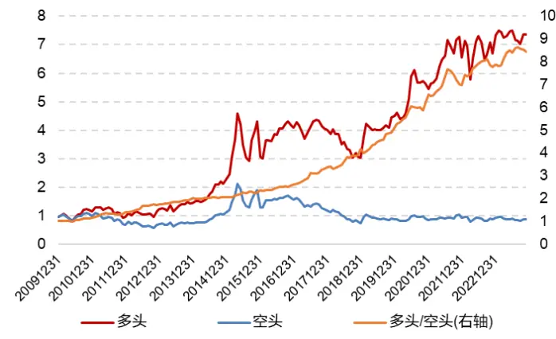
数据来源：Wind，东方证券研究所

图 78：回归版 DeltaROE因子多空净值
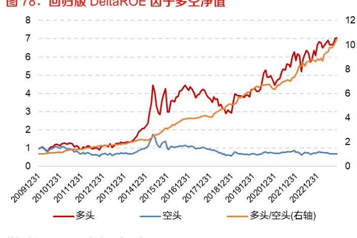
数据来源：Wind，东方证券研究所

下图分别展示了传统和回归版因子的月度 IC 和累计 IC。可以看到两个版本因子的 IC 表现非常接近。

图 79：DeltaROE 因子月度 IC
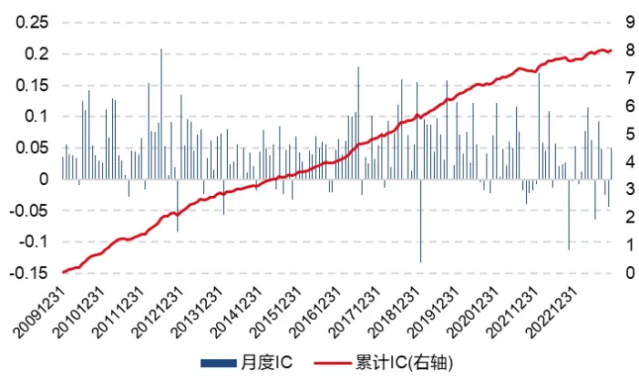
数据来源：Wind，东方证券研究所

图 80：回归版 DeltaROE 因子月度 IC
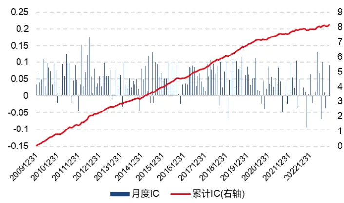
数据来源：Wind，东方证券研究所

有关分析师的申明，见本报告最后部分。其他重要信息披露见分析师申明之后部分，或请与您的投资代表联系。并请阅读本证券研究报告最后一页的免责申明。

下表是两个版本因子选股能力对比数据，回归版本因子的IC均值、ICIR、IC胜率都有一定提升。

表 28：两个版本 DeltaROE因子的选股能力对比

|  | IC 均值 | IC 标准差 | 年化ICIR | IC 胜率 | 月均多头超额 | 月均多空收 益 | 多头超额胜 率 | 因子月度自 相关系数 |
| --- | --- | --- | --- | --- | --- | --- | --- | --- |
| 原始版本 | 0.048 | 0.053 | 3.09 | 80.95% | 0.59% | 1.24% | 66.67% | 0.97 |
| 回归版本 | 0.049 | 0.047 | 3.61 | 85.71% | 0.56% | 1.44% | 68.45% | 0.95 |

数据来源：Wind，东方证券研究所

下面左图是两个版本因子的十分组月度超额均值的情况，两个版本因子的分组超额表现接近。下面右图展示了两个版本因子中证 500MFE组合的净值表现。 可以看到，回归版本因子的超额净值和传统版本因子的表现也非常接近。

图 81：两个版本 DeltaROE因子的十分组月度超额均值
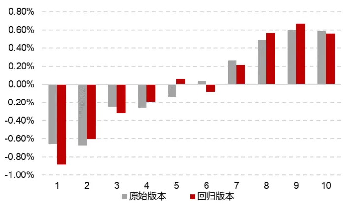
数据来源：Wind，东方证券研究所

图 82：两个版本 DeltaROE 因子的中证 500MFE 组合净值
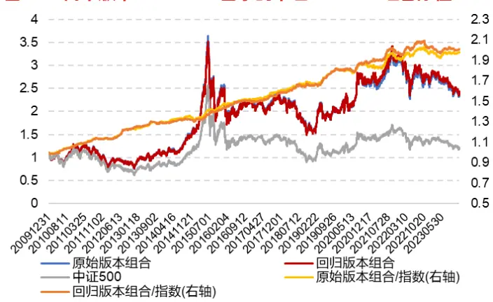
数据来源：Wind，东方证券研究所

下表展示了两个组合的各年收益对比情况，两个版本因子的表现非常接近。

表 29：两个版本 DeltaROE因子的中证 500MFE组合收益表现

| 年份 | 原始版本 |  |  |  | 回归版本 |  |  |  |
| --- | --- | --- | --- | --- | --- | --- | --- | --- |
|  | 超额收益 | 相对最大回撤 | 信息比 | 月度胜率 | 超额收益 | 相对最大回撤 | 信息比 | 月度胜率 |
| 2010 | 9.01% | -1.25% | 3.86 | 91.67% | 9.43% | -1.79% | 3.63 | 83.33% |
| 2011 | 3.65% | -1.01% | 3.55 | 91.67% | 3.57% | -1.02% | 3.13 | 83.33% |
| 2012 | 8.35% | -0.97% | 4.07 | 75.00% | 9.83% | -1.61% | 3.69 | 66.67% |
| 2013 | 5.41% | -1.97% | 2.45 | 58.33% | 2.79% | -2.55% | 1.10 | 58.33% |
| 2014 | 2.50% | -3.08% | 0.98 | 83.33% | 1.89% | -2.58% | 0.81 | 50.00% |
| 2015 | 17.27% | -1.65% | 4.10 | 83.33% | 14.49% | -1.53% | 3.40 | 83.33% |
| 2016 | 2.60% | -1.19% | 1.91 | 58.33% | 3.61% | -0.95% | 2.35 | 83.33% |
| 2017 | 5.45% | -0.84% | 3.06 | 83.33% | 5.85% | -0.70% | 3.17 | 83.33% |
| 2018 | 2.58% | -1.47% | 2.04 | 83.33% | 2.85% | -1.42% | 2.01 | 66.67% |
| 2019 | 10.44% | -1.17% | 3.85 | 83.33% | 11.41% | -1.67% | 3.79 | 83.33% |
| 2020 | 2.93% | -2.39% | 0.98 | 50.00% | 6.24% | -1.82% | 2.17 | 58.33% |
| 2021 | 3.31% | -3.65% | 0.91 | 41.67% | 3.17% | -3.57% | 0.90 | 50.00% |
| 2022 | 3.16% | -3.34% | 1.36 | 58.33% | 3.30% | -3.63% | 1.36 | 66.67% |
| 2023 | 0.06% | -3.72% | 0.04 | 41.67% | -0.97% | -3.67% | -0.53 | 41.67% |
| 全样本期 | 5.22% | -5.58% | 2.21 | 70.24% | 5.33% | -6.25% | 2.16 | 68.45% |

数据来源：Wind，东方证券研究所

有关分析师的申明，见本报告最后部分。其他重要信息披露见分析师申明之后部分，或请与您的投资代表联系。并请阅读本证券研究报告最后一页的免责申明。

## 2.12 EPTTM 滚动 ZScore

EPTTM 滚动 ZScore 因子用每只股票每日的 EPTTM 经过过去一年的滚动均值和标准差进行调整：(EPTTM − ts_wmean(EPTTM, 244))⁄ts_std(EPTTM, 244)

我们将每日回归版本的EPTTM替换其中的EPTTM得到重构后的因子取值。下图分别展示了传统和回归版EPTTM滚动ZScore因子市值行业中性化后十分组多空净值。可以看到，回归版本因子的多空相对强弱明显好于传统因子。

图 83：EPTTM 滚动 ZScore 因子多空净值
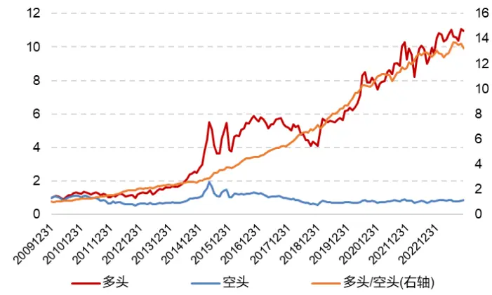
数据来源：Wind，东方证券研究所

图 84：回归版 EPTTM滚动 ZScore 因子多空净值
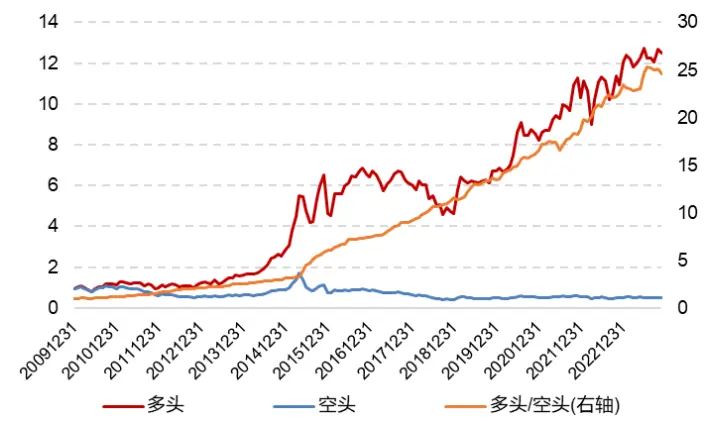
数据来源：Wind，东方证券研究所

下图分别展示了传统和回归版因子的月度 IC 和累计 IC。可以看到回归版本的 IC 的胜率和稳定性明显好于传统版本的因子。

图 85：EPTTM 滚动 ZScore 因子月度 IC
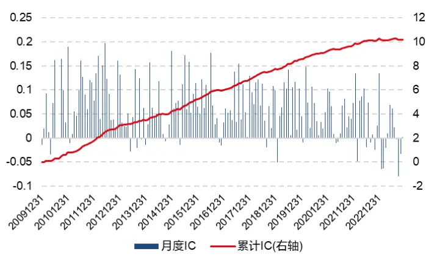
数据来源：Wind，东方证券研究所

图 86：回归版 EPTTM 滚动 ZScore 因子月度 IC
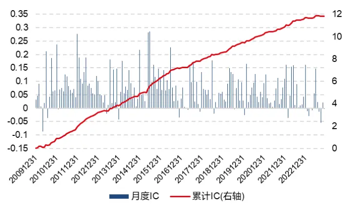
数据来源：Wind，东方证券研究所

下表是两个版本因子的选股能力对比数据，回归版本因子的IC均值、ICIR、IC胜率、多头超额、多头超额胜率都有一定提升，多头月均超额从 0.83%提升到0.9%。

表 30：两个版本 EPTTM滚动 ZScore因子的选股能力对比

|  | IC 均值 | IC 标准差 | 年化ICIR | IC 胜率 | 月均多头超额 | 月均多空收 益 | 多头超额胜 率 | 因子月度自 相关系数 |
| --- | --- | --- | --- | --- | --- | --- | --- | --- |
| 原始版本 | 0.060 | 0.059 | 3.57 | 83.33% | 0.83% | 1.53% | 73.21% | 0.97 |
| 回归版本 | 0.070 | 0.067 | 3.63 | 88.10% | 0.90% | 1.90% | 77.38% | 0.95 |

数据来源：Wind，东方证券研究所
有关分析师的申明，见本报告最后部分。其他重要信息披露见分析师申明之后部分，或请与您的投资代表联系。并请阅读本证券研究报告最后一页的免责申明。

下面左图是两个版本因子的十分组月度超额均值的情况，回归版本因子的多头和空头超额得到一定提升。下面右图展示了两个版本因子中证 500MFE组合的净值表现。 可以看到，回归版本因子的超额净值略好于传统版本因子

图 87：两个版本 EPTTM滚动 ZScore的十分组月度超额均值
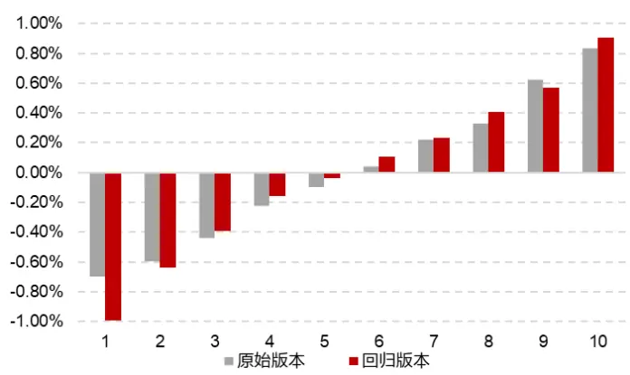
数据来源：Wind，东方证券研究所

图 88：两个版本 EPTTM 滚动 ZScore 中证 500MFE 组合净值
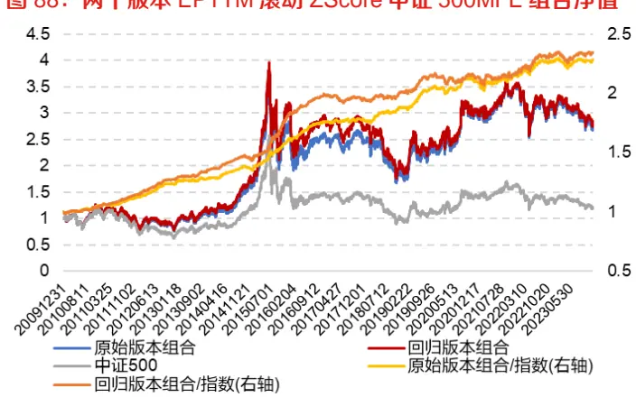
数据来源：Wind，东方证券研究所
下表展示了两个组合的各年收益对比情况，两个版本因子的表现非常接近。

表 31：两个版本 EPTTM滚动 ZScore 因子的中证 500MFE组合收益表现

| 年份 | 原始版本 |  |  |  | 回归版本 |  |  |  |
| --- | --- | --- | --- | --- | --- | --- | --- | --- |
|  | 超额收益 | 相对最大回撤 | 信息比 | 月度胜率 | 超额收益 | 相对最大回撤 | 信息比 | 月度胜率 |
| 2010 | 5.76% | -1.46% | 2.05 | 75.00% | 5.24% | -1.46% | 1.63 | 75.00% |
| 2011 | 5.14% | -2.03% | 3.96 | 83.33% | 6.65% | -1.12% | 5.13 | 91.67% |
| 2012 | 10.27% | -0.90% | 4.72 | 75.00% | 11.32% | -0.80% | 5.29 | 91.67% |
| 2013 | 3.63% | -1.32% | 1.37 | 75.00% | 7.77% | -1.39% | 2.92 | 75.00% |
| 2014 | 6.59% | -3.08% | 2.39 | 75.00% | 6.39% | -3.49% | 1.96 | 66.67% |
| 2015 | 28.50% | -1.62% | 6.10 | 91.67% | 40.66% | -1.41% | 6.09 | 100.00% |
| 2016 | 6.93% | -0.89% | 4.75 | 83.33% | 6.35% | -0.79% | 4.15 | 83.33% |
| 2017 | 0.61% | -1.43% | 0.29 | 50.00% | -1.86% | -2.92% | -0.76 | 41.67% |
| 2018 | 4.04% | -1.00% | 2.48 | 75.00% | 2.07% | -1.72% | 1.15 | 66.67% |
| 2019 | 11.75% | -1.64% | 4.23 | 83.33% | 8.82% | -1.74% | 2.97 | 83.33% |
| 2020 | 1.86% | -2.73% | 0.47 | 41.67% | -0.90% | -3.31% | -0.29 | 33.33% |
| 2021 | 3.54% | -3.13% | 0.71 | 58.33% | 2.28% | -3.16% | 0.44 | 66.67% |
| 2022 | 5.16% | -2.20% | 2.22 | 75.00% | 6.07% | -1.94% | 2.40 | 75.00% |
| 2023 | 0.02% | -3.67% | 0.03 | 50.00% | 0.40% | -3.96% | 0.18 | 50.00% |
| 全样本期 | 6.34% | -5.64% | 2.32 | 70.83% | 6.55% | -6.35% | 2.19 | 71.43% |

数据来源：Wind，东方证券研究所

## 2.13 PB-ROE

PB-ROE因子用截面上全市场股票的 PB的排名减去单季 ROE的排名：

$$
rank(PB)-rank(ROE)
$$

我们将回归版本的 PB 和 ROE 替换其中的 PB 和 ROE 从而得到重构后的因子取值。下图分别展示了传统和回归版 PB-ROE 因子市值行业中性化后十分组多空净值。可以看到，回归版本因子的多空相对强弱明显好于传统因子。

图 89：PB-ROE 因子多空净值
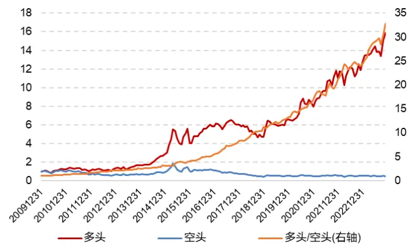
数据来源：Wind，东方证券研究所

图 90：回归版 PB-ROE因子多空净值
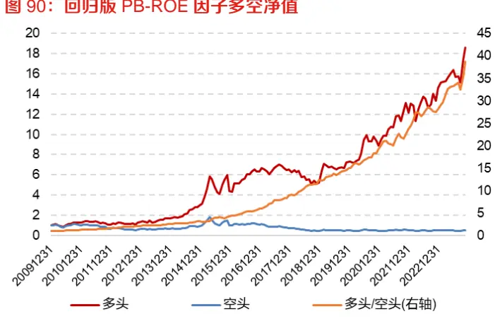
数据来源：Wind，东方证券研究所

下图分别展示了传统和回归版因子的月度 IC 和累计 IC。可以看到回归版本的 IC 的胜率和稳定性略好于传统版本的因子。

图 91：PB-ROE 因子月度 IC
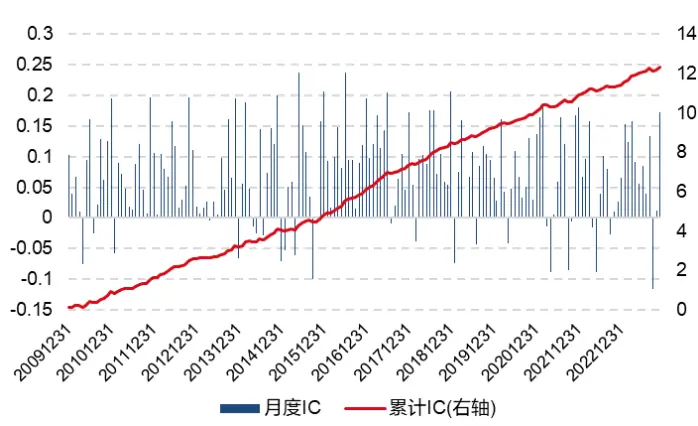
数据来源：Wind，东方证券研究所

图 92：回归版 PB-ROE 因子月度 IC
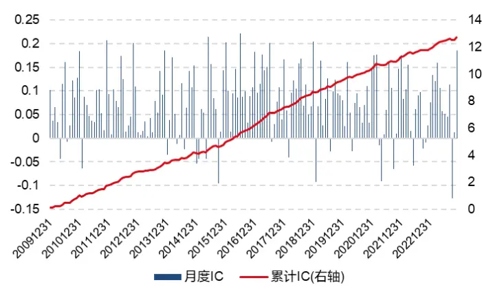
数据来源：Wind，东方证券研究所

下表是两个版本因子的选股能力对比数据，回归版本因子的IC均值、ICIR、IC胜率、多头超额、多头超额胜率都有一定提升，多头月均超额从 1.01%提升到1.11%。

表 32：两个版本 PB-ROE因子的选股能力对比

|  | IC 均值 | IC 标准差 | 年化ICIR | IC 胜率 | 月均多头超额 | 月均多空收 益 | 多头超额胜 率 | 因子月度自 相关系数 |
| --- | --- | --- | --- | --- | --- | --- | --- | --- |
| 原始版本 | 0.073 | 0.076 | 3.35 | 85.12% | 1.01% | 2.00% | 70.24% | 0.97 |
| 回归版本 | 0.076 | 0.071 | 3.70 | 86.90% | 1.11% | 2.10% | 73.81% | 0.95 |

数据来源：Wind，东方证券研究所
有关分析师的申明，见本报告最后部分。其他重要信息披露见分析师申明之后部分，或请与您的投资代表联系。并请阅读本证券研究报告最后一页的免责申明。

下面左图是两个版本因子的十分组月度超额均值的情况，回归版本因子的多头超额得到一定提升。下面右图展示了两个版本因子中证 500MFE组合的净值表现。 可以看到，回归版本因子的超额净值持续好于传统版本因子。

图 93：两个版本 PB-ROE因子的十分组月度超额均值
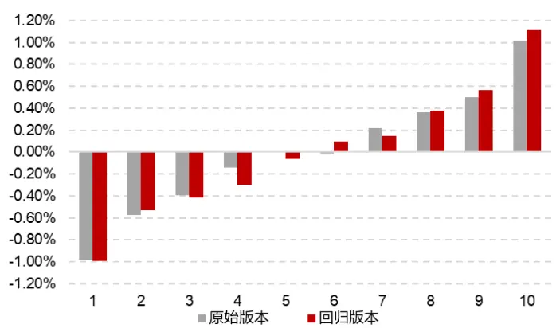
数据来源：Wind，东方证券研究所

图 94：两个版本 PB-ROE因子的中证 500MFE组合净值
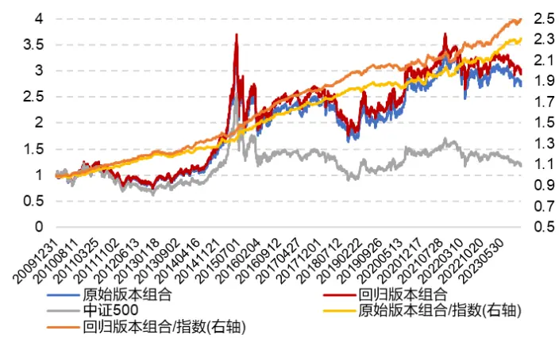
数据来源：Wind，东方证券研究所

下表展示了两个组合的各年收益对比情况，大部分年份中回归版本因子的超额表现都好于传统版本因子，年化超额收益从 6.42%提升到 7.06%，信息比从 2.08 提升到 2.47，月度超额胜率从70.83%提升到 73.21%。

表 33：两个版本 PB-ROE因子的中证 500MFE组合收益表现

| 年份 | 原始版本 |  |  |  | 回归版本 |  |  |  |
| --- | --- | --- | --- | --- | --- | --- | --- | --- |
|  | 超额收益 | 相对最大回撤 | 信息比 | 月度胜率 | 超额收益 | 相对最大回撤 | 信息比 | 月度胜率 |
| 2010 | 2.68% | -2.42% | 0.80 | 50.00% | 5.34% | -1.65% | 1.83 | 58.33% |
| 2011 | 4.93% | -1.20% | 3.64 | 75.00% | 5.25% | -0.74% | 4.09 | 83.33% |
| 2012 | 9.19% | -0.92% | 4.59 | 83.33% | 8.65% | -0.86% | 4.37 | 83.33% |
| 2013 | 2.93% | -2.99% | 1.05 | 58.33% | 4.39% | -2.84% | 1.63 | 50.00% |
| 2014 | 11.74% | -1.93% | 3.01 | 66.67% | 13.45% | -1.74% | 4.11 | 75.00% |
| 2015 | 14.24% | -2.71% | 2.31 | 75.00% | 17.30% | -2.87% | 3.06 | 83.33% |
| 2016 | 7.76% | -1.38% | 3.41 | 83.33% | 9.05% | -0.86% | 5.07 | 100.00% |
| 2017 | 6.27% | -1.77% | 3.14 | 83.33% | 4.88% | -1.35% | 3.04 | 75.00% |
| 2018 | 4.59% | -1.08% | 3.52 | 75.00% | 5.53% | -0.77% | 4.08 | 75.00% |
| 2019 | 4.12% | -2.35% | 1.46 | 66.67% | 5.34% | -2.49% | 1.90 | 75.00% |
| 2020 | 0.86% | -3.08% | 0.17 | 50.00% | 0.45% | -3.46% | 0.07 | 50.00% |
| 2021 | 4.63% | -4.28% | 0.93 | 75.00% | 2.22% | -4.39% | 0.50 | 58.33% |
| 2022 | 5.42% | -2.79% | 1.81 | 66.67% | 5.71% | -2.89% | 1.95 | 66.67% |
| 2023 | 8.58% | -1.73% | 3.65 | 83.33% | 9.74% | -1.59% | 4.09 | 91.67% |
| 全样本期 | 6.42% | -4.28% | 2.08 | 70.83% | 7.06% | -4.39% | 2.47 | 73.21% |

数据来源：Wind，东方证券研究所

## 三、重构后基本面复合因子表现

上一节中我们对常见的基础和衍生的基本面因子都做了回归版本的收益对比，从效果来看大部分因子的选股效果都有了显著改善，而因子本身噪声含量低的因子是略微改善，总体都能起到大于等于原始因子的效果。这里我们将上一节的因子进行复合，看复合因子经过回归版本改造前后的选股能力改善情况。

表 34：回归版因子的相关系数

| 一股息单季 EPTT 单季 单季 现金BP 率EP M SP 估值TTM |  |  |  |  |  |  |  |  | 致 |  |  | EPTTM滚净利 Delta PB-动同比 ROE ROEZScor |  |  |  |  |  |  |  |  |  |
| --- | --- | --- | --- | --- | --- | --- | --- | --- | --- | --- | --- | --- | --- | --- | --- | --- | --- | --- | --- | --- | --- |
|  |  |  |  |  |  |  |  |  | 预期 |  |  |  |  |  | 单季 |  |  |  |  |  |  |
|  |  |  |  |  |  |  |  |  | CFP | 估值 |  |  |  |  | 率 |  | 滚动 | ROE | 同比 | ROE | 动 |
|  |  |  |  |  |  |  |  |  |  |  |  |  |  |  | 1TM | EP |  | 增速 |  | ZScor |  |
| 单季EP | 1 | 0.68 | 0.24 | 0.15 | 0.19 | 0.18 | 0.38 | 0.48 |  | 0.85 | 0.74 | 0.38 | 0.29 | 0.87 |  |  |  |  |  |  |  |
| EPTTM | 0.68 | 1 | 0.24 | 0.13 | 0.27 | 0.25 | 0.54 | 0.66 |  | 0.50 | 0.42 | 0.18 | 0.29 | 0.64 |  |  |  |  |  |  |  |
| 单季SP | 0.24 | 0.24 | 1 | 0.14 | 0.51 | 0.40 | 0.15 | 0.30 |  | 0.00 | 0.06 | 0.01 | 0.07 | 0.40 |  |  |  |  |  |  |  |
| 单季CFP | 0.15 | 0.13 | 0.14 | 1 | 0.10 | 0.13 | 0.12 | 0.12 |  |  | 0.09 | 0.06 | 0.04 | 0.17 |  |  |  |  |  |  |  |
|  |  |  |  |  |  |  |  |  |  | 0.10 |  |  |  |  |  |  |  |  |  |  |  |
| BP现金估值 | 0.19 | 0.27 | 0.51 | 0.10 | 1 | 0.53 | 0.26 | 0.36 |  | -0.26 | -0.03 | -0.15 | 0.06 | 0.52 |  |  |  |  |  |  |  |
|  | 0.18 | 0.25 | 0.40 | 0.13 | 0.53 | 1 | 0.23 | 0.27 |  | -0.07 | 0.03 | -0.07 | 0.06 | 0.34 |  |  |  |  |  |  |  |
| 股息率TTM | 0.38 | 0.54 | 0.15 | 0.12 | 0.26 | 0.23 | 1 | 0.43 |  | 0.24 | 0.18 | -0.02 | 0.02 | 0.40 |  |  |  |  |  |  |  |
| 一致预期滚动EP | 0.48 | 0.66 | 0.30 | 0.12 | 0.36 | 0.27 | 0.43 | 1 |  | 0.28 | 0.21 | 0.04 | 0.13 | 0.53 |  |  |  |  |  |  |  |
| 单季 ROE | 0.85 | 0.50 | 0.00 | 0.10 | -0.26 | -0.07 | 0.24 | 0.28 |  | 1 | 0.74 | 0.45 | 0.24 | 0.62 |  |  |  |  |  |  |  |
| 单季净利同比增速 | 0.74 | 0.42 | 0.06 | 0.09 | -0.03 | 0.03 | 0.18 | 0.21 |  | 0.74 | 1 | 0.60 | 0.34 | 0.57 |  |  |  |  |  |  |  |
| DeltaROE | 0.38 | 0.18 | 0.01 | 0.06 | -0.15 | -0.07 | -0.02 | 0.04 |  | 0.45 | 0.60 | 1 | 0.38 | 0.27 |  |  |  |  |  |  |  |
| EPTTM滚动ZScore | 0.29 | 0.29 | 0.07 |  |  |  | 0.02 | 0.13 |  | 0.24 | 0.34 | 0.38 | 1 | 0.26 |  |  |  |  |  |  |  |
|  |  |  |  | 0.04 | 0.06 | 0.06 |  |  |  |  |  |  |  |  |  |  |  |  |  |  |  |
| PB-ROE | 0.87 | 0.64 | 0.40 | 0.17 | 0.52 | 0.34 | 0.40 | 0.53 |  | 0.62 | 0.57 | 0.27 | 0.26 | 1 |  |  |  |  |  |  |  |

数据来源：Wind，朝阳永续，东方证券研究所

上表列举了这些回归版本因子的截面相关系数，大部分因子间相关系数不高，相关系数均值为0.28。由于部分因子间具有一定高相关性，我们对这些因子在每个截面上进行对称正交剔除共线性后等权复合得到复合因子。

下图分别展示了传统和回归版复合因子十分组多空净值。可以看到，回归版本因子的多头和多空相对强弱明显好于传统因子。

图 95：原始版本复合因子多空净值
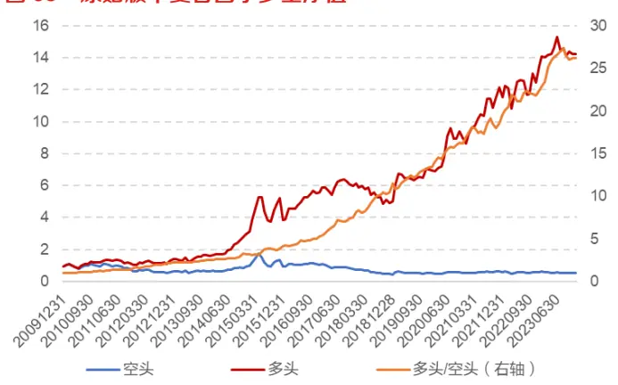
数据来源：Wind，朝阳永续，东方证券研究所

图 96：回归版本复合因子多空净值
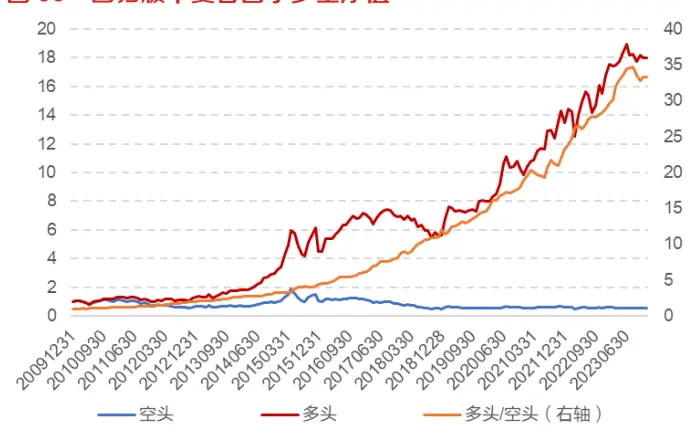
数据来源：Wind，朝阳永续，东方证券研究所

下表列举了两个版本复合因子的选股能力对比数据，IC均值表现接近，但是回归版本因子的 ICIR、IC 胜率、多头超额都有显著提升，年化 ICIR 从 3.96 提升到 4.32，多头月均超额,0.94%提升到1.1%。

表 35：两个版本复合因子的选股能力对比

| IC 均值 IC 标准差 年化ICIR IC 胜率 月均多头超额 月均多空收益 |  |  |  |  |  |  |
| --- | --- | --- | --- | --- | --- | --- |
| 原始版本 8.35% |  | 7.31% | 3.96 | 87.50% | 0.94% 1.86% |  |
| 回归版本 | 8.29% | 6.65% | 4.32 | 91.07% | 1.10% | 2.02% |

数据来源：Wind，朝阳永续，东方证券研究所

下面我们分别以这两个版本的复合因子构建中证 500 指数增强组合，约束中信一级行业 0 暴露，市值敞口±0.3，成分股内权重占比不低于 80%，个股相对于成分股权重最大偏离 1%，以第二天VWAP交易并扣除双边0.3%费用。两个版本的增强组合净值如下图所示，可以看到回归版本的增强组合净值表现显著好于传统版本的增强组合。

图 97：两个版本复合因子的中证 500指数增强组合净值
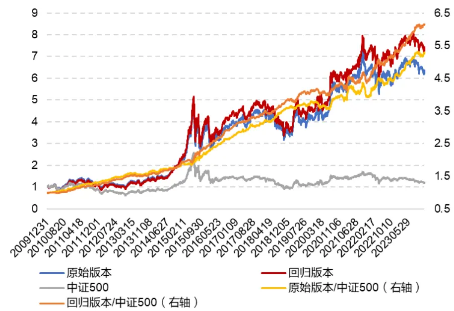
数据来源：Wind，朝阳永续，东方证券研究所
有关分析师的申明，见本报告最后部分。其他重要信息披露见分析师申明之后部分，或请与您的投资代表联系。并请阅读本证券研究报告最后一页的免责申明。

下表列举了两个版本增强组合各年的收益表现情况。大部分年份回归版本增强组合的表现都好于传统版本，年化超额收益从13.17%提升到14.48%，相对最大回撤从-9.83%下降到-6.55%，信息比从 2.2提升到 2.51，月度超额胜率从 72.02%提升到 76.19%，提升效果显著。

表 36：两个版本复合因子的中证 500指数增强组合收益表现

| 年份 | 原始版本 |  |  |  | 回归版本 |  |  |  |
| --- | --- | --- | --- | --- | --- | --- | --- | --- |
|  | 超额收益 | 相对最大回撤 | 信息比 | 月度胜率 | 超额收益 | 相对最大回撤 | 信息比 | 月度胜率 |
| 2010 | 15.71% | -2.19% | 3.10 | 75.00% | 9.56% | -2.78% | 2.01 | 66.67% |
| 2011 | 10.97% | -2.07% | 3.98 | 75.00% | 10.27% | -1.65% | 3.92 | 83.33% |
| 2012 | 18.28% | -1.64% | 4.98 | 83.33% | 19.23% | -0.94% | 4.90 | 91.67% |
| 2013 | 6.83% | -5.05% | 1.40 | 58.33% | 7.79% | -3.46% | 1.67 | 66.67% |
| 2014 | 19.30% | -3.68% | 2.89 | 83.33% | 28.97% | -2.38% | 4.23 | 91.67% |
| 2015 | 27.66% | -6.55% | 1.98 | 58.33% | 37.16% | -5.54% | 2.72 | 75.00% |
| 2016 | 18.28% | -1.35% | 4.80 | 100% | 21.49% | -0.86% | 5.99 | 100% |
| 2017 | 12.25% | -2.44% | 3.09 | 75.00% | 10.75% | -2.00% | 2.84 | 83.33% |
| 2018 | 10.35% | -2.01% | 3.71 | 91.67% | 8.16% | -3.39% | 2.74 | 66.67% |
| 2019 | 6.31% | -3.45% | 1.25 | 50.00% | 11.99% | -3.64% | 2.09 | 66.67% |
| 2020 | 2.71% | -6.22% | 0.31 | 58.33% | 2.26% | -5.23% | 0.27 | 50.00% |
| 2021 | 3.51% | -9.83% | 0.38 | 58.33% | 7.84% | -6.55% | 0.85 | 58.33% |
| 2022 | 12.56% | -5.98% | 2.15 | 66.67% | 14.11% | -4.37% | 2.44 | 83.33% |
| 2023 | 13.44% | -2.73% | 3.12 | 75.00% | 13.90% | -1.93% | 3.78 | 83.33% |
| 全样本期 | 13.17% | -9.83% | 2.20 | 72.02% | 14.48% | -6.55% | 2.51 | 76.19% |

数据来源：Wind，朝阳永续，东方证券研究所

## 四、总结

## 基本面因子的重构框架

常见的基本面指标例如估值、盈利、成长等往往以比值的形式来构建，存在除数效应的问题导致部分股票的取值异常高/低，而截面去极值操作并不能改变相对排序。

相比于传统基本面指标用个股的 A 与 B 相除构建，更强调自身指标间的绝对定价，我们将所有股票的 A 与 B 在截面进行整体比较，得到一个比值的中枢，以每只股票的取值离比值中枢的距离来构建相对基本面因子，即将传统经典的个体除法调整为现代统计理论支撑下的截面整体回归的方式。

## 重构的基本面因子

我们对于常见的单季EP、单季SP、单季CFP、BP等估值因子，单季净利同比增速等成长因子，单季ROE等盈利因子以及一些衍生的相对估值、相对成长等因子都进行了重构，大部分因子的选股能力、多头超额收益均有显著的提升，提升幅度正比于因子取值异常的概率，并且例如单季净利同比增速这种近两年“失效”的因子在回归模式重构下仍然具有持续稳健的选股能力。

## 重构后基本面复合因子表现

我们将重构后的因子进行复合，复合因子的 ICIR、多头超额收益相比于原复合因子有了显著提升，以该基本面复合因子构建的中证 500指数增强组合年化超额收益从 13.17%提升到 14.48%，相对最大回撤从-9.83%下降到-6.55%，信息比从 2.2提升到 2.51，提升效果显著。

## 风险提示

1. 量化模型基于历史数据分析，未来存在失效风险，建议投资者紧密跟踪模型表现。

2. 极端市场环境可能对模型效果造成剧烈冲击，导致收益亏损。

## Tabl e_Disclai mer 分析师申明

每位负责撰写本研究报告全部或部分内容的研究分析师在此作以下声明：

分析师在本报告中对所提及的证券或发行人发表的任何建议和观点均准确地反映了其个人对该证券或发行人的看法和判断；分析师薪酬的任何组成部分无论是在过去、现在及将来，均与其在本研究报告中所表述的具体建议或观点无任何直接或间接的关系。

## 投资评级和相关定义

报告发布日后的12个月内行业或公司的涨跌幅相对同期相关证券市场代表性指数的涨跌幅为基准（A 股市场基准为沪深 300 指数，香港市场基准为恒生指数，美国市场基准为标普 500 指数）；

## 公司投资评级的量化标准

买入：相对强于市场基准指数收益率 15%以上；

增持：相对强于市场基准指数收益率 5%～15%；

中性：相对于市场基准指数收益率在-5%～+5%之间波动；

减持：相对弱于市场基准指数收益率在-5%以下。

未评级 —— 由于在报告发出之时该股票不在本公司研究覆盖范围内，分析师基于当时对该股票的研究状况，未给予投资评级相关信息。

暂停评级 —— 根据监管制度及本公司相关规定，研究报告发布之时该投资对象可能与本公司存在潜在的利益冲突情形；亦或是研究报告发布当时该股票的价值和价格分析存在重大不确定性，缺乏足够的研究依据支持分析师给出明确投资评级；分析师在上述情况下暂停对该股票给予投资评级等信息，投资者需要注意在此报告发布之前曾给予该股票的投资评级、盈利预测及目标价格等信息不再有效。

## 行业投资评级的量化标准：

看好：相对强于市场基准指数收益率 5%以上；

中性：相对于市场基准指数收益率在-5%～+5%之间波动；

看淡：相对于市场基准指数收益率在-5%以下。

未评级：由于在报告发出之时该行业不在本公司研究覆盖范围内，分析师基于当时对该行业的研究状况，未给予投资评级等相关信息。

暂停评级：由于研究报告发布当时该行业的投资价值分析存在重大不确定性，缺乏足够的研究依据支持分析师给出明确行业投资评级；分析师在上述情况下暂停对该行业给予投资评级信息，投资者需要注意在此报告发布之前曾给予该行业的投资评级信息不再有效。

## HeadertTabl e_Discl ai mer 免责声明

本证券研究报告（以下简称“本报告”）由东方证券股份有限公司（以下简称“本公司”）制作及发布。

。本公司不会因接收人收到本报告而视其为本公司的当然客户。本报告的全体接收人应当采取必要措施防止本报告被转发给他人。

本报告是基于本公司认为可靠的且目前已公开的信息撰写，本公司力求但不保证该信息的准确性和完整性，客户也不应该认为该信息是准确和完整的。同时，本公司不保证文中观点或陈述不会发生任何变更，在不同时期，本公司可发出与本报告所载资料、意见及推测不一致的证券研究报告。本公司会适时更新我们的研究，但可能会因某些规定而无法做到。除了一些定期出版的证券研究报告之外，绝大多数证券研究报告是在分析师认为适当的时候不定期地发布。

在任何情况下，本报告中的信息或所表述的意见并不构成对任何人的投资建议，也没有考虑到个别客户特殊的投资目标、财务状况或需求。客户应考虑本报告中的任何意见或建议是否符合其特定状况，若有必要应寻求专家意见。本报告所载的资料、工具、意见及推测只提供给客户作参考之用，并非作为或被视为出售或购买证券或其他投资标的的邀请或向人作出邀请。

本报告中提及的投资价格和价值以及这些投资带来的收入可能会波动。过去的表现并不代表未来的表现，未来的回报也无法保证，投资者可能会损失本金。外汇汇率波动有可能对某些投资的价值或价格或来自这一投资的收入产生不良影响。那些涉及期货、期权及其它衍生工具的交易，因其包括重大的市场风险，因此并不适合所有投资者。

在任何情况下，本公司不对任何人因使用本报告中的任何内容所引致的任何损失负任何责任，投资者自主作出投资决策并自行承担投资风险，任何形式的分享证券投资收益或者分担证券投资损失的书面或口头承诺均为无效。

本报告主要以电子版形式分发，间或也会辅以印刷品形式分发，所有报告版权均归本公司所有。未经本公司事先书面协议授权，任何机构或个人不得以任何形式复制、转发或公开传播本报告的全部或部分内容。不得将报告内容作为诉讼、仲裁、传媒所引用之证明或依据，不得用于营利或用于未经允许的其它用途。

经本公司事先书面协议授权刊载或转发的，被授权机构承担相关刊载或者转发责任。不得对本报告进行任何有悖原意的引用、删节和修改。

提示客户及公众投资者慎重使用未经授权刊载或者转发的本公司证券研究报告，慎重使用公众媒体刊载的证券研究报告。

## 东方证券研究所

地址： 上海市中山南路 318 号东方国际金融广场 26 楼

电话：021-63325888

传真：021-63326786

网址： www.dfzq.com.cn