# DFQ-FactorVAE：融合变分自编码器和概率动态因子模型的 alpha预测方案

## 研究结论

## FactorVAE 模型架构

FactorVAE模型，来自国际人工智能会议 AAAI 2022。原论文中提出了一种新的基于变分自编码器的概率动态因子模型，以弥合噪声数据与有效因子之间的差距。本文在原论文基础上进行修改优化，所得选股因子在沪深 300指数增强组合中表现优异。

⚫FactorVAE 模型融合了变分自编码器与概率动态因子模型的思想，建立股票收益率预测模型，学习输入特征和标签之间的关系：（1）采用变分自编码器的编码器-解码器架构，有助于模型学习到数据分布的结构，并且可以在潜在空间中生成新样本；（2）采用概率动态因子模型的思想，将因子作为 VAE 模型中的潜在变量，提取动态公共因子的分布，从而起到降维降噪的作用。（3）采用一种“前验-后验”的学习方法，将预测股票收益率的问题转化成预测有效因子，使用标签收益率指导模型提取有效因子。

## DFQ-FactorVAE 模型优势

⚫ DFQ-FactorVAE模型所得因子的稳定性、在沪深 300股票池中的多头表现突出：

（1）在中证全指股票池中， DFQ-FactorVAE 模型所得到因子的稳定性明显最强，ICIR 、 RANKICIR 、 多 头 日 超 额 收 益 夏 普 比 均 为 最 高 。 测 试 集 （ 2020.01.01-2024.03.31）上 rankic 达到 15%，rankicir 达到 1.38，20 分组多头日度超额年化收益率达到 31.75%，多头日超额收益夏普比 3.52，多头日度超额收益最大回撤 8.28%，多头月度胜率 88%，月均单边换手 79%。分组单调性好。

（2）在沪深300股票池中，DFQ-FactorVAE模型所得到因子的多头表现明显最强。测试集上 rankic 达到 10.6%，rankicir 达到 0.6，5 分组多头日度超额年化收益率达到14.47%，多头日超额收益夏普比1.72，多头日度超额收益最大回撤6.74%，月均单边换手 54%。分组单调性好。分年表现上未出现明显衰减。

DFQ-FactorVAE 模型所得因子稳定性突出，与模型的 VAE 架构和概率框架有关。VAE 架构有助于模型学习到数据分布的结构，样本外泛化能力更强。概率框架考虑到了风险建模，更适合含有噪声的股票收益率预测。

DFQ-FactorVAE 模型所得因子在沪深 300 股票池中的多头表现突出，与模型的因子模型架构有关。先验因子对沪深 300 股票的解释度最高，平均能达到 36.5%，其次为中证 500 成分股的 27.95%，中证 1000 成分股的 25.45%，全市场解释度最低，为20.78%。

## DFQ-FactorVAE 模型在沪深 300 指增组合中的表现

⚫ DFQ-FactorVAE模型所得到的合成因子在沪深 300指增组合中表现十分突出：

（1）整体表现：2020 年以来年化信息比达到 2.55，年化对冲收益 13.53%，年化跟踪误差 5.03%，超额收益最大回撤仅为 5.35%，单边年换手7.67倍。

（2）分年表现：2020-2023每年取得 10%以上的正超额，2023年超额收益达 16%。
2024年前三个月超额收益为-0.36%。

（3） 风格暴露：相对基准沪深 300 指数，组合在市值、信息确定性、成长维度具有明显的负向暴露，但在 BETA、流动性、波动率、估值等维度都没有明显暴露。

（4）成分股约束：设置 100%成分内选股增强，可以明显提高组合业绩表现稳定性。跟踪误差可以降低到 4.37%，超额收益最大回撤降低到 3.31%，最大回撤恢复仅需 30天，并且仍然可以获得超过 10%的年化超额。

## 风险提示

1. 量化模型失效风险。

2. 极端市场环境对模型的影响。

报告发布日期

2024 年 05 月 14 日

杨怡玲 yangyiling@orientsec.com.cn

执业证书编号：S0860523040002

刘静涵021-63325888*3211

liujinghan@orientsec.com.cn

执业证书编号：S0860520080003

香港证监会牌照：BSX840

基本面因子的重构：——因子选股系列之 2024-03-21一〇二

自适应时空图网络周频 alpha 模型：—— 2024-02-28因子选股系列之一〇一

DFQ-HIST：添加图信息的选股因子挖掘 2024-02-07系统：——因子选股系列之一百

基于异构图神经网络的股票关联因子挖 2024-01-02掘：——因子选股系列之九十九

DFQ-TRA：多交易模式学习因子挖掘系 2023-11-14统：——因子选股系列之九十七

DFQ 强化学习因子组合挖掘系统：——因 2023-08-17子选股系列之九十五

DFQ 遗传规划价量因子挖掘系统：——因 2023-05-28子选股系列之九十

## 一、模型概述

FactorVAE 模 型 （ A Probabilistic Dynamic Factor Model Based on VariationalAutoencoder for Predicting Cross-sectional Stock Returns，基于变分自编码器的概率动态因子模型进行横截面股票收益预测），来自国际人工智能会议 AAAI 2022（Association for theAdvance of Artificial Intelligence，2022），四位作者（Yitong Duan, Lei Wang, QizhongZhang, Jian Li）都来自清华大学。原论文中提出了一种新的基于变分自编码器的概率动态因子模型，以弥合噪声数据与有效因子之间的差距。作者在 A 股中沪深 300 的数据上验证了该模型具有较好的预测效果。本文在原论文基础上进行修改优化，所得选股因子在沪深 300 指数增强组合中表现优异。

## 1.1 自编码器（Auto Encoder, AE）

自编码器一般用在数据的压缩和恢复中，通过编码器降低存储大小，利于传输，再使用解码器进行还原。自编码器主要由两部分组成：编码器（Encoder）和解码器（Decoder）。编码器用于将高维输入（如图片）映射为低维编码（code），解码器用于将低维编码（code）映射为高维输出（如生成的图片）。通过最小化编码器输入与解码器输出之间的差距（通常可用 MSE 损失）来训练网络参数。通常我们使用神经网络模型作为编码器和解码器，引入了神经网络强大的拟合能力，可以使得编码的维度能够比原始图像的维度低非常多。

但自编码器并不是一个有效的生成模型。对于一个生成模型而言，解码器部分应该是能够单独提取出来的，并且对于在规定维度下任意采样的一个编码，都应该能通过解码器产生一张清晰且真实的图片。而自编码器是将每个样本编码为固定的数值，每个数值在对应的特征空间下是一个离散值。在编码空间上点与点之间的迁移是非常没有规律的，因而自编码器的解码器只能基于出现过的数值去恢复图像，无法通过自编码器任意生成图片。

## 1.2 变分自编码器（Variational Auto-Encoder, VAE）

如何解决 AE 用于数据生成时的问题呢？我们转变思路，在编码器中不将图片映射成“数值编码”，而是将其映射成“分布”，也就是引入噪声，使得图片的编码区域得到扩大，从而掩盖掉失真的空白编码点。这种将图像编码由离散变为连续的方法，就是变分自编码的核心思想。VAE模型用于数据生成时效果较好，对于潜在变量空间中每一个取值，解码器都有能力去解码。

VAE 的损失函数由两部分组成：（1）为了使输出和输入尽可能像，用 MSE 来约束。（2）为了满足（1），随着训练不断进行，模型会倾向于产生固定的编码，即encoder输出的标准差接近 0，VAE 就会越来越像 AE。因此，我们要求潜在变量的分布要逼近标准正态分布，这里使用KL 散度来进行约束。KL 散度是一种衡量两个概率分布相似度的指标，一个主要性质就是非负性，因此最小化KL散度的结果就是使得两个分布尽可能相等，这一点的严格证明要用到变分法，这里正是 VAE中的 V的来源。VAE中有隐藏的“对抗”思想，重构的过程是希望没噪声的，而 KL 散度损失则希望有高斯噪声的，两者是对立的，需要混合起来，共同进化。

VAE 与 AE 整体结构类似，都由编码器和解码器组成，但不同的地方在于：AE 的编码器直接输出每个样本对应的编码，而VAE的编码器输出的是根据每个样本提取出的潜在变量的分布，解码器的作用是将从该分布中采样的点，映射回原始数据空间。需要注意的是，并不是所有样本共享一个正态分布，而是为每个样本构造专属的正态分布。根据高斯混合模型，任何一个数据的分布，都可以看作是若干高斯分布的叠加。因而输入的随机变量 X 的完整分布，可以看作是由无限个样本的正态分布构成。

VAE 通常被用作生成模型，用于学习数据的潜在分布并生成新的样本。但是，如果要将其应用于预测股票收益率等任务，则需要将其与因子模型等预测模型结合起来。因子模型可以捕获数据中的共享结构和变化因素，而 VAE可以帮助学习数据的复杂非线性特征。将两者结合起来可以提高预测的准确性和泛化能力。

## 1.3 因子模型（Factor Model）

在因子模型中个股收益可以分为两部分：能够被公共风险因子解释的部分，以及不能被解释的残差收益：

$$
\boldsymbol{r}_{t,i}=\beta_{i,1}{}^{t}\boldsymbol{f}_{t,1}+\beta_{i,2}{}^{t}\boldsymbol{f}_{t,2}+\cdots+\beta_{i,K}{}^{t}\boldsymbol{f}_{t,K}+\varepsilon_{t,i}\boldsymbol{t}=1,\cdots Ti=1,\cdots N
$$

其中， $r_{t,i}$ 是第 i 只股票在期间 t 的收益率， $\beta_{i,k}$ t是期间 t 开始时股票 i 在第 k 个因子上的风险暴露， $f_{t,k}$ 是第 k个因子在期间t的纯因子收益率， $\varepsilon_{t,i}$ 是第 i只股票在期间 t 的残差收益率。

直接预测股票收益往往面临很多挑战，包括数据的不稳定性、噪声干扰等，引入因子模型后，通过对因子的预期收益进行建模，可以更有效地预测股票收益，提高预测准确性。

## 1.4 概率动态因子模型（Probabilistic Dynamic FactorModel）

概率动态因子模型是因子模型的扩展，旨在通过引入动态因子和概率框架来更好地捕捉数据的动态性和不确定性，从而提供更全面、更准确的股票收益预测结果。

1. 动态因子：因子不是固定不变的，而是从市场数据中自动提取的，这使得模型能够更好地适应数据的变化。

2. 概率框架：模型是通过带有内在随机性的因子来预测股票收益的，不是直接预测因子收益和股票收益率的数据，而是预测其分布。收益率分布通过均值和标准差来确定，也就是我们会分别建立均值模型和风险模型。真实市场的股票数据是存在噪音的，考虑到风险建模对含有噪声的股票数据很重要。

## 1.5 FactorVAE

FactorVAE 模型融合了上述变分自编码器与概率动态因子模型的思想，建立股票收益率预测模型，学习输入特征和标签之间的关系：

（1）采用变分自编码器的编码器-解码器的架构，编码器从输入数据中提取潜在变量的分布，编码器从分布中采样得到编码并进行解码，输出股票收益率。VAE 架构能够学习到输入数据的分布结构，而不仅仅是确定性的映射关系。通过对潜在空间施加正态分布的假设，使得潜在表示在空间中具有连续性和平滑性，从而可以在潜在空间中生成新样本。

（2）采用概率动态因子模型的思想，将因子作为 VAE 模型中的潜在变量。VAE通常被用作个数据生成模型，而不是预测模型。为了提高股票收益预测的准确性，FactorVAE 模型创新性地引入了因子模型的思想，将因子作为 VAE模型中的潜在变量。编码器不是直接提取每只股票收益率的分布，而是提取几个动态公共因子的分布，从而起到降维降噪的作用。

（3）由于金融数据的低信噪比，采用端到端方法训练的模型，很难直接从噪声数据中提取因子，FactorVAE 模型额外设计了一种“前验-后验”学习方法，将预测股票收益率的问题转化成预测有效因子，使用标签收益率作为辅助信息，指导模型提取有效因子。首先利用标签中的股票未来收益率和股票特征估计后验因子收益率，这个后验因子用到了未来信息。在损失函数中，最小化由后验因子收益率解码出的股票收益率和标签收益率的差距，将后验因子优化为最优因子。然后根据股票特征生成先验因子收益率，这个先验因子没有用到未来信息。再通过损失函数的引导，使得先验因子收益率逼近后验因子收益率。在预测阶段，只有先验因子会被利用，不会有任何的未来信息泄露。

图 1：FactorVAE 模型示意图
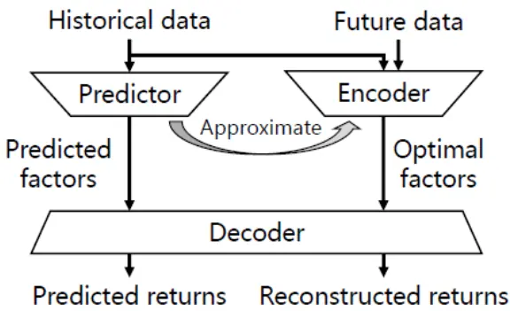
数据来源：东方证券研究所 & AAAI-22

## 二、模型架构

## 2.1 模型训练和预测过程

FactorVAE 模型训练过程如下：

Step1：特征提取器 $(\mathsf{Feature\ Extractor},\phi_{feat})$ ：从输入的股票特征历史序列x中提取股票的潜在特征。

Step2：因子编码器 $(\mathsf{Factor\ Encoder},\phi_{enc})$ ：从标签中的未来股票收益率y和潜在特征中提取后验因子 $\scriptstyle\cdot\mathbf{z}_{post}$ 的分布。在利用未来股票信息的情况下，编码器扮演了一个神谕的角色，从未来数据中提取后验因子。通过损失函数的引导，使得后验因子成为最优因子。

Step3：因子解码器（ $\mathbf{\xi}_{\mathsf{Factor~Decoder},\phi_{dec}}\mathbf{\xi})$ ：使用后验因子和潜在特征得到重构的股票收益 $\hat{\nu}_{rec}$ 。

Step4：因子预测器 $(\mathsf{Factor}\mathsf{Predictor},\phi_{pred})$ ：从股票潜在特征中提取先验因子 $z_{prior}$ 的分布。先验因子没有用到未来信息。通过损失函数的引导，使得先验因子与后验因子相近。

训练的目标函数包括两部分：

（1）训练最优的后验因子，减少后验因子模型的重建误差：使用重构的股票收益 $\widehat{y}_{rec}$ 和标签中的未来股票收益率y，计算 MSE损失；

（2）使得先验因子收益率逼近后验因子收益率：使用先验因子和后验因子分布之间的 KL 散度计算。

FactorVAE 模型预测过程如下：

Step1：特征提取器：从输入的股票特征历史序列x中提取股票的潜在特征。

Step2：因子预测器：从股票潜在特征中提取先验因子 $\mathbf{\nabla}\cdot\mathbf{z}_{prior}$ 的分布。

Step3：因子解码器：使用先验因子和潜在特征得到预测的股票收益 $\widehat{y}_{pred}.$

在预测阶段，模型只通过预测器和解码器来预测股票收益率，没有编码器的参与，因而没有任何的未来信息泄漏。

图 2：FactorVAE 模型架构
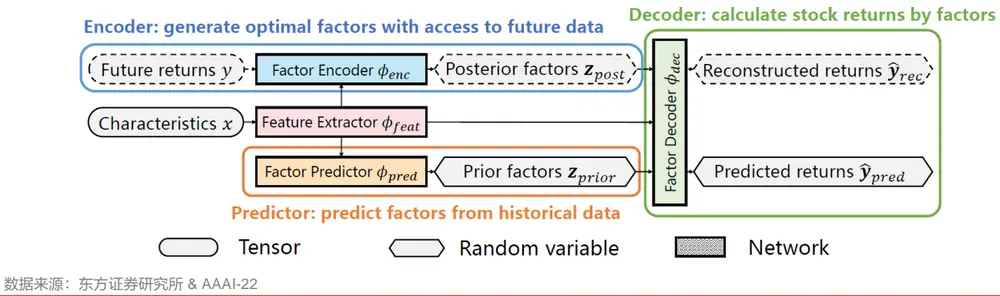

## 2.2 特征提取器

特征提取器 $\phi_{feat}$ ：从输入的股票特征历史序列中，由网络提取股票的潜在特征e，维度为n*k，n 为股票个数，k 为隐藏层个数。特征提取器通过学习将原始特征转换为低维度的潜在特征，实现对数据的降维和特征的提取。这些潜在表示通常包含了原始数据中的主要特征和变化模式，有助于更好地理解和表示数据。

特征提取器的具体做法是：首先对输入的股票特征依次进行层归一化、线性变换、LeakyReLU 激活函数处理，得到特征向量。而后将特征向量输入到 GRU 网络中，使用最后一个时间步的隐藏状态作为股票的潜在特征。

1. 层归一化（Layer Normalization）：在神经网络的每一层中对每个样本的所有特征进行归一化，有助于消除特征之间的偏差，使得每个特征的分布更加一致，有利于网络学习。

2. 线性变换层（Linear）：将输入特征进行线性变换，将输入特征映射到指定的输出维度上。它是神经网络中最基本的层之一，用于学习特征之间的线性关系。

3. LeakyReLU 激活函数：是一种修正线性单元（ReLU）的变体，用于增加神经网络的非线性拟合能力，并解决了常规 ReLU 在输入为负值时可能出现的神经元“死亡”的问题。

4. GRU（Gated Recurrent Unit）：是一种循环神经网络（RNN）的变体，提高了网络对长序列的建模能力，具有参数数量少、计算效率高、灵活性强和训练速度快等优点。

我们比较了 GRU 模型和 FactorVae 模型的效果，结果显示：FactorVae 模型效果明显占优，20 日 rankic 提高近 2%，多头组年化超额收益提高 4%。此外我们对比了不同的特征提取器，发现使用 GRU模型作为特征提取器效果最好。

图 3：不同特征提取器的效果对比（2020.01.01-2024.2.28）

| 中证全指股票池 60特征，20日标签 | IC | ICIR | rank IC | rank ICIR | long_r | long_win | long_sharp | long_drawdown | long_yearly | turnover |
| --- | --- | --- | --- | --- | --- | --- | --- | --- | --- | --- |
| GRU | 11.94% | 1.33 | 13.86% | 1.39 | 1.89% | 84.00% | 2.73 | -3.51% | 23.74% | 80.69% |
| facvae_GRU | 12.30% | 1.18 | 15.48% | 1.33 | 2.09% | 86.00% | 2.91 | -4.17% | 27.47% | 78.35% |
| facvae_AGRU | 12.06% | 1.16 | 15.14% | 1.31 | 1.96% | 84.00% | 2.71 | -4.22% | 25.85% | 77.94% |
| facvae_ALSTM | 12.00% | 1.14 | 15.08% | 1.29 | 1.87% | 80.00% | 2.34 | -5.18% | 24.82% | 79.37% |
| facvae_LSTM | 11.90% | 1.19 | 13.96% | 1.29 | 1.61% | 80.00% | 2.40 | -4.59% | 21.41% | 82.43% |

数据来源：东方证券研究所 & Wind资讯

## 2.3 因子编码器

因子编码器 $\phi_{enc}$ ：从未来股票收益率y和潜在特征e中，由网络输出后验因子 ${\bf z}_{post}$ 的分布。假设后验因子有 m 个，每个因子都是遵循独立高斯分布的随机向量，后验因子的分布可以用均值$\mu_{post}$ 和标准差 $\sigma_{post}$ 来描述，二者的维度均为 m*1。

直接从股票收益率出发提取后验因子存在几个问题：1. 不同横截面上股票数量是动态变化的，使用线性变换层进行维度变换时无法固定参数；2. 横截面股票数量较多，直接使用股票收益作为输入可能会导致非常高维的输入空间，增加模型的复杂度和训练难度；3. 直接使用大量的股票收益数据作为模型输入可能会导致过拟合，特别是在数据量不足或噪声较多的情况下。因而，我们不直接使用股票收益，而是构建一组投资组合，从而降低输入维度和参数量，提高模型的稳健性。

因子编码器具体分为三个步骤：

1.计算投资组合中各股票的权重 $\mathbf{\Delta}_{a_{p}}$ ：由组合层网络（Portfolio Layer）输出，基于股票的潜在特征动态加权。组合层网络包括一个线性变化层和一个 Softmax 函数。Softmax函数保证输出值都是大于 0 的，同时输出值的总和等于 1。

2.计算投资组合的收益率 $y_{p}\colon$ ：通过股票权重和股票收益率线性加权得到。

3.计算后验因子的均值 $\dot{\mu}_{post}$ 和标准差 $\pmb{\sigma_{post}}$ 。由映射层网络（Mapping Layer）输出。其中，均值网络模型包括一个线性变换层，标准差网络模型包括一个线性变换层和一个 Softplus 函数。Softplus 函数保证了生成的标准差始终为正，并且保留了线性变换的性质。

图 4：因子编码器结构
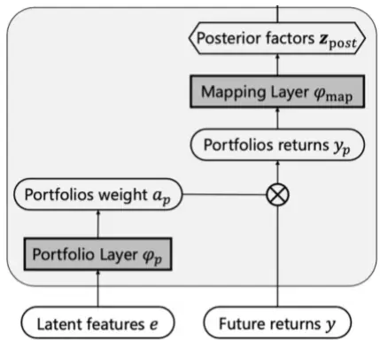
图 5：因子编码器计算公式
数据来源：东方证券研究所 & AAAI-22

$$
\begin{array}{rl}&{[\mu_{\mathrm{post}}\ ,\sigma_{\mathrm{post}}\ ]=\phi_{\mathrm{enc}}\ (y,e)}\\&{\mathbf{z}_{\mathrm{post}}\sim\mathcal{N}\left(\mu_{\mathrm{post}}\ ,\mathrm{diag}\left(\sigma_{\mathrm{post}}^{2}\right)\right)}\end{array}
$$

$$
\begin{array}{r}{a_{p}^{(i,j)}=\frac{\exp{\left(w_{p}e^{(i)}+b_{p}\right)^{(j)}}}{\sum_{i=1}^{N}\exp{\left(w_{p}e^{(i)}+b_{p}\right)^{(j)}}}}\\{y_{p}^{(j)}=\sum_{i=1}^{N}y^{(i)}a_{p}^{(i,j)}}\end{array}
$$

$$
\begin{array}{rl}&{\mu_{\mathrm{post}}=w_{\mathrm{post}_{\mu}}y_{\mathrm{p}}+b_{\mathrm{post}_{\mu}}}\\&{\sigma_{\mathrm{post}}=\mathrm{Softplus}\left(w_{\mathrm{post}_{\sigma}}y_{\mathrm{p}}+b_{\mathrm{post}_{\sigma}}\right)}\end{array}
$$

投资组合的个数是一个超参数，我们对比了20,100,500三个不同的参数，结果显示设置投资组合个数为 100效果最好。

图 6：不同投资组合数量的效果对比（2020.01.01-2024.2.28）

| 中证全指股票池 60特征，20日标签 | IC | ICIR | rank IC | rank ICIR | long_r | long_win | long_sharp | long_drwandown | long_yearly | turnover |
| --- | --- | --- | --- | --- | --- | --- | --- | --- | --- | --- |
| 组合数：100 | 12.30% | 1.18 | 15.48% | 1.33 | 2.09% | 86.00% | 2.91 | -4.17% | 27.47% | 78.35% |
| 组合数：20 | 12.02% | 1.19 | 14.87% | 1.33 | 1.87% | 82.00% | 2.62 | -3.19% | 24.79% | 78.87% |
| 组合数：500 | 12.01% | 1.07 | 15.23% | 1.25 | 1.91% | 86.00% | 2.78 | -3.45% | 25.01% | 80.65% |

数据来源：东方证券研究所 & Wind资讯

## 2.4 因子解码器

因子解码器 $\phi_{dec}$ ：使用因子z和潜在特征e，输出股票收益率ŷ，维度为n*1，n为股票数量。解码器按照因子模型的方式构建，具体步骤如下：

1. $\mathsf{\pmb{Alpha}}\mathsf{\equiv}\pi_{alp\hbar a}$ ：从潜在特征e中由网络输出特异收益α的分布。假设每只股票的特质收益都是一个遵循独立高斯分布的随机向量，那么特质收益的分布可以用均值 $\dot{\vert\mu_{\alpha}\vert}$ 和标准差$\sigma_{\alpha}$ 来描述，二者的维度均为n*1，n为股票数量。首先对输入的潜在特征进行线性变换、LeakyReLU 激活函数处理。均值网络模型包括一个线性变换层，标准差网络模型包括一个线性变换层和一个 Softplus 函数。Softplus 函数保证了生成的标准差始终为正，并且保留了线性变换的性质。

2. Beta $\pmb{\sqrt{\frac{\alpha}{2\pmb{\varepsilon}}}}\varphi_{beta}$ ：从潜在特征e中通过线性映射层输出因子暴露β。维度为 n*m，n 为股票数量，m为因子数量。Beta层网络模型包括一个线性变换层。

3. 合成层：根据特异收益α的分布、因子暴露β和因子 z 的分布，输出股票收益率ŷ的分布。由于特异收益α和因子z都遵循独立的高斯分布，因而按照线性组合方式计算出的股票收益率ŷ也遵循高斯分布，其均值 $\dot{.}\mu_{y}$ 和标准差 $\sigma_{y}$ 可以根据公式计算，二者的维度均为 $n^{\star}1$ n为股票数量。

4. 重参数化（Reparameterization）：在训练过程中，我们需要从股票收益率ŷ的分布中进行采样，然后将这些样本传递给神经网络进行计算。直接从分布中采样是不可导的，会导致梯度断裂，训练过程无法进行，所以我们需要一个合理的采样方式，让梯度正常传递。重参数化技巧的关键是将随机性从参数中移动到网络外部，并且确保采样操作是可导的。具体来说，由于标准高斯分布经过缩放，可以变成任何高斯分布。我们可以从标准高斯分布中采样一个固定的噪声（通过随机种子控制），然后通过线性变换（缩放和平移）将这个噪声转换为具有目标均值和方差的高斯分布样本。这样，采样过程就成为可导的，梯度可以正常传播到分布的参数，从而可以进行有效的训练。

图 7：因子解码器结构
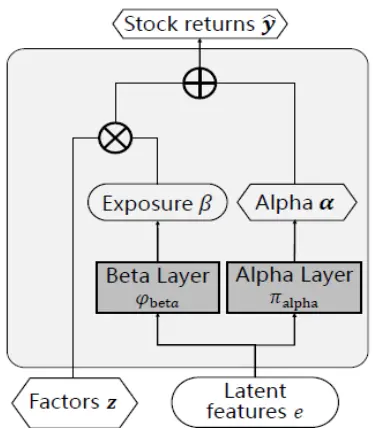
数据来源：东方证券研究所 & AAAI-22
图 8：因子解码器计算公式

$$
\begin{array}{rlr}{\hat{\mathbf{y}}=\phi_{\mathrm{dete}}(\mathbf{z},e)=\boldsymbol{\alpha}+\beta\mathbf{z}}&{}&\\{\left\{\mu_{\alpha},\sigma_{\alpha}\right\}=\boldsymbol{\pi}_{\mathrm{alph}}(e).}&{}&\\{\mu_{\alpha}^{(i)}=\mathrm{leashyerL}\left(\boldsymbol{\pi}_{\alpha}e^{(i)}+\boldsymbol{b}_{\alpha}\right)}&{}&\\{\mu_{\alpha}^{(i)}=w_{\alpha}\boldsymbol{h}_{\alpha}^{(i)}+\boldsymbol{b}_{\alpha},}&{}&\\{\sigma_{\alpha}^{(i)}=\mathrm{sohplus}\left(w_{\alpha}h_{\alpha}^{(i)}+\boldsymbol{b}_{\alpha,\alpha}\right)}&{}&\\{\beta^{(i)}=\psi_{\mathrm{ebte}}(\boldsymbol{\epsilon}^{(i)})=w_{\beta}e^{(i)}+\boldsymbol{b}_{\beta}}&{}&\\{\hat{\boldsymbol{y}}\sim N\left(\mu_{\gamma}^{(i)},\sigma_{\gamma}^{(i)}\right),}&{}&\\{\mu_{\alpha}^{(i)}=\mu_{\alpha}^{(i)}+\sum_{k=1}^{N}\beta^{(k)}\boldsymbol{\mu}_{k}^{(k)}}&{}&\\{\sigma_{\alpha}^{(i)}=\left(\sigma_{\alpha}^{(i)}+\sum_{k=1}^{N}\beta^{(k)}\boldsymbol{\mu}_{\alpha}^{(k)}\sigma_{k}^{(k)}\right)^{\frac{1}{2}}}&{}&\end{array}
$$

数据来源：东方证券研究所 & AAAI-22

有关分析师的申明，见本报告最后部分。其他重要信息披露见分析师申明之后部分，或请与您的投资代表联系。并请阅读本证券研究报告最后一页的免责申明。

如果直接取模型输出的股票收益率均值的话，效果不如原模型。这也反映了 FactorVAE 模型预测收益率分布的意义。同时考虑收益率的均值和标准差，添加风险建模，更适合含有噪声的股票收益率预测。

图 9：预测收益率分布 VS 预测收益率均值效果对比（2020.01.01-2024.2.28）

| 中证全指股票池 60特征，20日标签 | IC | ICIR | rank IC | rank ICIR | long_r | long_win | long_sharp | long_drawdown | long_yearly | turnover |
| --- | --- | --- | --- | --- | --- | --- | --- | --- | --- | --- |
| facvae（同时预测收益率均值和标准差） | 12.30% | 1.18 | 15.48% | 1.33 | 2.09% | 86.00% | 2.91 | -4.17% | 27.47% | 78.35% |
| 仅预测收益率均值 | 12.15% | 1.28 | 13.92% | 1.26 | 1.85% | 74.00% | 2.09 | -5.92% | 23.50% | 72.84% |

数据来源：东方证券研究所 & Wind资讯

## 2.5 因子预测器

因子预测器 $\varphi_{pred}$ ：从潜在特征e中，由网络输出先验因子 $z_{prior}$ 的分布。假设先验因子有 m个，每个因子都是遵循独立高斯分布的随机向量。先验因子的分布可以用均值 $\dot{}\mu_{prior}$ 和标准差$\sigma_{prior}$ 来描述，二者的维度均为 m*1，m为先验因子的数量。

考虑到一个因子通常代表市场上某一类型的风险溢价（如规模因子关注小盘股的风险溢价），模型设计了多头全局注意力机制，将市场的多种全局表征并行整合，从中提取代表市场不同风险溢价的因素。

## 因子预测器的具体计算步骤如下：

1. 线性变换：将潜在特征e，映射到隐藏空间，得到键（key）和值（value）向量；

2. 计算注意力权重：query是一个可学习的查询向量。在每个子空间中，通过计算 query 和key 之间的相似度，然后经过归一化得到注意力权重，维度均为 n*1，n为股票因子的数量；

3. 加权求和：使用注意力权重对 value 向量进行加权求和，得到当前子空间的输出表示 $\scriptstyle:h_{att}$ 维度均为 1*k，k为隐藏层个数。

4. 多头机制：将上述过程重复多次，每次使用不同的权重矩阵进行线性变换，得到多个子空间的输出表示。 将多个子空间的输出表示拼接在一起，得到多头注意力的最终输出表示 $\cdot h_{multi}$ 维度均为 m*k，k为隐藏层个数，m为先验因子的数量。

5. 先验因子的均值和标准差预测：首先对输入的 $\mathbf{h}_{multi}$ 进行线性变换、LeakyReLU 激活函数处理，而后通过均值网络模型和标准差网络模型预测先验因子的均值和标准差预测。均值网络模型包括一个线性变换层，标准差网络模型包括一个线性变换层和一个 Softplus 函数。Softplus 函数保证了生成的标准差始终为正，并且保留了线性变换的性质。

图 10：因子预测器结构
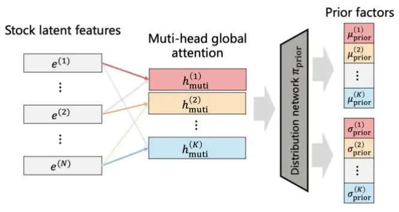
数据来源：东方证券研究所 & AAAI-22
图 11：因子预测器计算公式

$$
\begin{array}{rl}&{|\mu_{\mathrm{prior}}\ ,\sigma_{\mathrm{prior}}\ |=\phi_{\mathrm{pred}}\ \big(e\big)}\\&{\begin{array}{rl}{\mathbf{z}_{\mathrm{prior}}\ }&{\sim\ \mathcal{N}(\mu_{\mathrm{prior}}\ ,\ \mathrm{diag}\middle(\sigma_{\mathrm{prior}}^{2}\big))}\\{k^{(0)}\ }&{\sim u_{\mathrm{pref}}\ ^{(0)},\ \cdots\ \forall i=\ w_{\mathrm{srior}}\ e^{(0)}}\end{array}}\\&{\begin{array}{rl}&{a_{\mathrm{at}}^{(0)}=\displaystyle\frac{\operatorname*{max}(\mathbf{0},\frac{\phi_{\mathrm{prior}}^{(0)}}{|\mu_{\mathrm{prior}}|^{\alpha_{1}/\sigma}})}{\sum_{i=1}^{N}\operatorname*{max}\Big(0,\frac{\phi_{\mathrm{prior}}^{(0)}}{|\mu_{\mathrm{prior}}|^{\alpha_{1}/\sigma}}\Big)}}\\{\ h_{\mathrm{at}}\ }&{=\ \phi_{\mathrm{art}}\ \big(\mathbf{0}\big)=\displaystyle\sum_{i=1}^{N}a_{\mathrm{art}}^{(0)}e^{(\mu)}}\end{array}}\\&{\begin{array}{rl}{h_{\mathrm{mat}}=\mathrm{Concat}(((\rho_{\mathrm{srio}}\ ,\ \cdots,\varphi_{\mathrm{ars}}\ (e)))}\\&{[\mu_{\mathrm{prior}},\ \sigma_{\mathrm{prior}}]\ )=\eta_{\mathrm{prod}}\ (h_{\mathrm{mat}})}\end{array}}\end{array}
$$

数据来源：东方证券研究所 & AAAI-22

有关分析师的申明，见本报告最后部分。其他重要信息披露见分析师申明之后部分，或请与您的投资代表联系。并请阅读本证券研究报告最后一页的免责申明。

## 三、模型说明

## 3.1 数据说明

样本空间：中证全指同期成分股。

数据区间：（1）训练集 2014.01.01—2018.11.30；（2）验证集 2019.01.01—2019.11.30；（3）测试集 2020.01.01—2024.02.01。

数据集中额外的分割间隙是有意引入的，以避免特征和标签的泄露。训练集用于迭代训练模型，通过反向传播算法计算损失函数关于模型参数的梯度，然后按照梯度方向更新模型参数。验证集用于在模型训练过程中评估模型的性能，便于选择最优的模型和参数。测试集用于观察模型样本外的表现，在模型开发完成后评估模型的泛化性能。

数据处理方法：（1）解释变量X：截面异常值处理，标准化，填充缺失值。训练集、验证集、测试集相同处理；（2）预测标签Y：截面异常值处理，标准化，填充缺失值。训练集、验证集相同处理。

针对 Y 的多种处理方式，测试显示：（1）直接用原始收益率效果最差：用绝对收益作为预测目标，还要预测整个市场股票的平均收益在时间序列上如何变化，难度增加，准确度下降，而且实际上只需要获得个股预测收益率的相对排名即可构建投资组合。（2）使用绝对收益的zscore标准化得分，效果有明显提升。zscore标准化可以消除绝对收益率的绝对数值差异，将每只股票的收益率转化为相对于市场平均水平的标准分数。这种相对化的方法有助于削弱市场整体波动性的影响，使得预测更为稳健和准确。（3）对 Y 进行行业市值中性化，多头组合稳定性提高，但多头超额收益有所降低。多头组合超额夏普从2.9提升到3.5，超额回撤从4%降低到1%，多头超额收益从 24%降低到23%。

图 12：预测标签 Y 不同处理方式下的模型效果对比（2020.01.01-2024.2.28）

| 中证全指股票池 60特征，20日标签 | IC | ICIR | rank IC | rank ICIR | long_r | long_win | long_sharp | long_drawdown | long_yearly | turnover |
| --- | --- | --- | --- | --- | --- | --- | --- | --- | --- | --- |
| 原始y | 7.15% | 0.90 | 9.27% | 1.06 | 1.50% | 86.00% | 2.51 | -3.63% | 18.36% | 84.72% |
| y+zscore | 12.30% | 1.18 | 15.48% | 1.33 | 2.09% | 86.00% | 2.91 | -4.17% | 27.47% | 78.35% |
| ranky | 10.72% | 0.93 | 15.26% | 1.19 | 1.65% | 74.00% | 2.32 | -4.34% | 21.52% | 77.95% |
| ranky+zscore | 10.84% | 0.97 | 15.22% | 1.22 | 1.65% | 76.00% | 2.30 | -5.24% | 21.63% | 76.58% |
| 中性化（市值+行业）y | 11.78% | 1.24 | 13.88% | 1.38 | 1.80% | 88.00% | 3.45 | -1.41% | 24.09% | 75.97% |
| 中性化（10风险因子+行业）y | 10.91% | 1.38 | 11.08% | 1.49 | 1.74% | 80.00% | 2.61 | -2.79% | 23.32% | 81.56% |

数据来源：东方证券研究所 & Wind资讯

## 3.2 模型输入

我们尝试了三类输入：基础特征、alpha因子、风险因子。

（1）基础特征：包括原始日线行情、基于分钟线提取的日频特征、基于level2数据提取的日频特征等。

（2）alpha 因子：分为两部分，一部分来自于前期报告《DFQ 遗传规划价量因子挖掘系统》提出的遗传规划模型，共选取了 100个；另一部分来自于前期报告《DFQ强化学习因子挖掘系统》提出的强化学习模型，共选取了 200个。

（3）风险因子：来自于前期报告《东方 A 股因子风险模型（DFQ-2020）》提出的风险模型，共 10 个。

结果显示：用 60 个基础特征因子作为输入效果最好。我们尝试将 60 个基础特征分成两部分，将 14 个分钟特征单独拿出来作为一类，剩余 46 个其他特征作为一类，通过两个 GRU 层对特征分别进行编码，提取两个不同维度的潜在特征，然后再将这两个编码后的特征拼接在一起，并通过一个 MLP 进行进一步的处理，最终输出潜在特征e。通过双重 GRU 编码，模型可以分别从两个不同维度的特征中学习到更丰富和更准确的信息，从而提高了模型的性能。月均 rankic 可达15%，rankicir达 1.4，多头组合年化超额收益可以达到 29%，多头年化超额夏普达到 3.76。

图 13：不同输入下的模型效果对比（2020.01.01-2024.1.16）

| 中证全指股票池 20日标签 |  | IC | ICIR | rank IC | rank ICIR | long long win | long_sharp | long drawdown |  | long_yearly | turnover |
| --- | --- | --- | --- | --- | --- | --- | --- | --- | --- | --- | --- |
| 9量价 |  | 7.60% | 0.59 | 12.00% | 0.88 | 0.95% | 73.47% | 1.68 | -6.49% | 11.88% | 83.16% |
| 基础特征 | 24量价 | 9.15% | 0.87 | 13.38% | 1.26 | 1.51% | 71.43% | 2.20 | -5.61% | 19.99% | 69.01% |
|  | 13L2量价 | 8.40% | 0.76 | 12.84% | 1.11 | 1.19% | 69.39% | 2.03 | -3.55% | 14.83% | 81.44% |
|  | 20L2量价 | 8.47% | 0.80 | 12.05% | 1.11 | 1.07% | 67.35% | 2.23 | -2.79% | 12.70% | 85.24% |
|  | 14分钟量价 | 7.29% | 0.70 | 11.44% | 1.07 | 0.81% | 65.31% | 1.27 | -5.07% | 10.28% | 69.76% |
|  | 82分钟量价 | 10.19% | 1.22 | 12.88% | 1.64 | 1.15% | 69.39% | 1.93 | -4.50% | 14.90% | 80.67% |
|  | 10基本面 | -0.02% | (0.01) | 0.06% | 0.04 | -0.10% | 40.82% | (0.45) | -6.92% | -1.41% | 93.89% |
|  | 60基础特征 | 12.17% | 1.18 | 15.16% | 1.41 | 2.08% | 87.76% | 3.51 | -3.85% | 27.95% | 80.49% |
|  | (46+14)等权重 | 10.95% | 0.98 | 14.89% | 1.26 | 1.48% | 81.63% | 2.64 | -2.44% | 19.54% | 76.57% |
|  | (46+14)双GRU | 12.30% | 1.23 | 15.40% | 1.43 | 2.21% | 87.76% | 3.76 | -2.85% | 29.39% | 79.45% |
|  | gp100 | 11.80% | 1.33 | 14.01% | 1.52 | 1.76% | 84.78% | 3.00 | -3.92% | 23.39% | 81.67% |
| alpha因子 | rl200 | 9.91% | 1.05 | 11.50% | 1.30 | 0.99% | 67.35% | 1.73 | -4.96% | 12.23% | 81.58% |
| 风险因子 | risk10 | 8.00% | 0.59 | 11.97% | 0.78 | 1.62% | 83.67% | 2.05 | -7.09% | 21.22% | 57.50% |

数据来源：东方证券研究所 & Wind资讯

输入标签采用多标签结合方式，分别使用未来 5 日、10 日、15 日、20 日、25 日、30 日收益率 6 个标签分别训练，再将模型得分等权结合。采用多标签相当于考虑了股票收益率的未来分布， 实践显示可以提升指增组合的稳定性。

## 3.3 模型参数

模型涉及的主要参数设置如下图。

图 14：DFQ-FactorVAE 模型参数列表

| 参数类型 | 参数符号 | 参数设置 | 参数解释 |
| --- | --- | --- | --- |
| 数据参数 | seq_len | 30 | 每次前向传播的数据结构为过去30天 |
| 训练参数 | n_epochs | 200 | 进行200次训练，不断迭代更新模型参数 |
|  | early_stop | 20 | 若20步验证集IC无提高，则提前停止学习训练 |
|  | max_steps_per_epoch | 100 | 每次训练按批次进行，一个epoch共训练100个批次 |
|  | batch_size | -1 | 每批次训练输入一个交易日的batch |
|  | smooth_steps | 5 | 设置双端队列params_list的最大长度，用于存储模型的最近状态（参数和缓存），用于后续的参数平均或其他处理 |
| 模型参数 | Ir | 3.00E-04 | 优化模型的adam算法的学习率 |
|  | num_latent1 | 46 | 潜在特征数量1 |
|  | num_latent2 | 14 | 潜在特征数量2 |
|  | num_portfolio | 100 | 投资组合个数 |
|  | num_factor | 48 | 先验和后验因子个数 |
|  | hidden_size | 32 | 隐藏层的大小 |
|  | num_layers | 1 | 神经网络的层数 |

数据来源：东方证券研究所

我们对比了不同 batchsize 下的模型效果，结果显示：一个 epoch 训练 100 个 batch 效果更好。选择全部批次进行训练可能会导致过度拟合的问题。每个 epoch 只随机选择部分批次进行训练，可以减少模型对训练数据的记忆，使模型更好地泛化到未见过的数据上，提高模型的泛化能力。此外，选择部分批次进行训练还可以加快训练速度，节省计算资源。

图 15：不同 batchsize 下的模型效果对比（2020.01.01-2024.2.28）

| 中证全指股票池 60特征，20日标签 | IC | ICIR | rank IC | rank ICIR | long_r | long_win | long_sharp ong_drawdowr long_yearly |  |  | turnover |
| --- | --- | --- | --- | --- | --- | --- | --- | --- | --- | --- |
| batchsize50 | 11.00% | 1.10 | 14.10% | 1.31 | 1.61% | 82.00% | 2.37 | -5.24% | 20.84% | 80.49% |
| batchsize100 | 12.30% | 1.18 | 15.48% | 1.33 | 2.09% | 86.00% | 2.91 | -4.17% | 27.47% | 78.35% |
| batchsize200 | 12.24% | 1.27 | 14.59% | 1.35 | 2.00% | 86.00% | 2.96 | -4.37% | 25.89% | 80.17% |
| batchsize500 | 12.39% | 1.31 | 14.68% | 1.39 | 2.01% | 86.00% | 2.91 | -4.44% | 26.20% | 81.90% |
| batchsize全部 | 12.32% | 1.35 | 14.34% | 1.39 | 1.94% | 88.00% | 2.71 | -3.94% | 24.36% | 82.07% |

数据来源：东方证券研究所 & Wind资讯

有关分析师的申明，见本报告最后部分。其他重要信息披露见分析师申明之后部分，或请与您的投资代表联系。并请阅读本证券研究报告最后一页的免责申明。

## 四、模型结果

## 4.1 运算用时

DFQ-FactorVAE 模型在第 100 个 epoch 左右停止，训练用时 1h 左右。在中证全指成分股中训练的显存占用在 10G 以内。模型训练过程中，每个 epoch 上训练集、验证集、测试集中 IC和 rankIC都呈上升趋势，模型未出现明显过拟合。

图 16：训练集、验证集、测试集中 IC变化
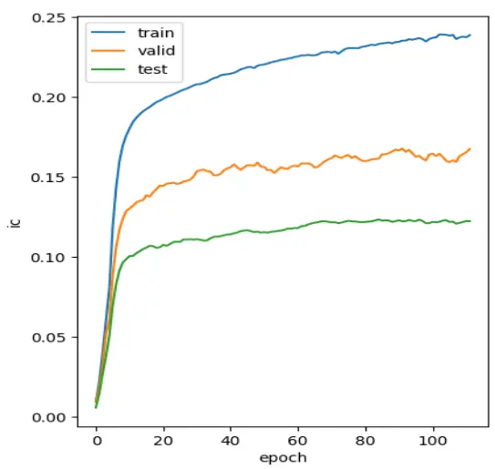
数据来源：东方证券研究所 & Wind资讯

图 17 ：训练集、验证集、测试集中 rankIC变化
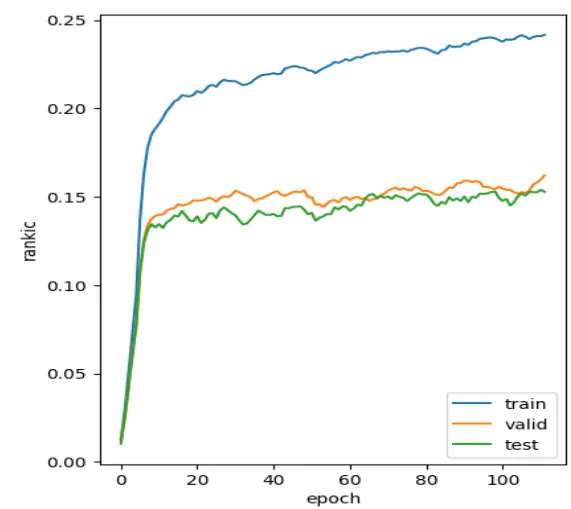
数据来源：东方证券研究所 & Wind资讯

## 4.2 因子绩效表现

本节展示 DFQ-FactorVAE 模型得到的因子得分，在中证全指、沪深 300、中证 500、中证1000 四个股票池中的表现，并与前期报告《DFQ 遗传规划价量因子挖掘系统》中的遗传规划合成因子 gp、《DFQ 强化学习因子组合挖掘系统》中的强化学习合成因子 rl、《DFQ-TRA：多交易模式学习因子挖掘系统》中的tra因子、《DFQ-HIST：添加图信息的选股因子挖掘系统》中的hist 因子进行对比。测试区间为 2020.1.1-2024.3.31。

IC 和 RANKIC 采用原始的因子得分和 20 日收益率标签计算得到，日度平均，ICIR 和RANKICIR未年化。沪深300、中证500 股票池中分组数为5，中证1000股票池中分组数为10，中证全指股票池中分组数为 20。多头组合月频调仓，绩效依次展示：日度超额年化收益率、日超额收益夏普比、日度超额收益最大回撤、月度胜率、月均单边换手。此处的多头计算不考虑交易成本，但汇报了月均单边换手率，费后收益可以根据费前收益和换手率近似估算。分年绩效表现计算时不需要进行年化处理。

结果显示：（1）在中证全指股票池中，DFQ-FactorVAE 模型所得到因子的稳定性明显最强，ICIR、RANKICIR、多头日度超额收益夏普比均为最高。测试集上 rankic 达到 15%，rankicir 达到 1.38，20 分组多头日度超额年化收益率达到 31.75%，多头日超额收益夏普比 3.52，多头日度超额收益最大回撤8.28%，多头月度胜率88%，月均单边换手79%。分组单调性好。分年表现上RANKIC 逐年提高，但多头超额有所衰减，2021-2023 年的多头表现整体不如 2020 年。

图 18：中证全指股票池各模型因子绩效表现（2020.1.1-2024.3.31）

| 中证全指 | IC | ICIR | RANKIC | RANKICIR | 多头日度超额年化收益率 | 多头日超额收益夏普比 | 多头日度超额收益最大回撤 | 多头月度胜率 | 多头月均单边换手 |
| --- | --- | --- | --- | --- | --- | --- | --- | --- | --- |
| gp | 7.90% | 0.81 | 11.60% | 1.22 | 13.72% | 1.86 | -9.02% | 68.63% | 68.73% |
| rl | 10.07% | 0.84 | 14.31% | 1.09 | 20.29% | 2.39 | -7.20% | 72.55% | 74.13% |
| tra | 10.91% | 0.83 | 16.38% | 1.14 | 23.39% | 2.35 | -10.54% | 74.51% | 57.00% |
| hist | 12.40% | 1.03 | 17.37% | 1.29 | 31.87% | 3.34 | -6.80% | 88.24% | 73.58% |
| factorvae | 12.47% | 1.30 | 15.13% | 1.38 | 31.75% | 3.52 | -8.28% | 88.24% | 79.32% |

数据来源：东方证券研究所 & Wind资讯

图 19：中证全指股票池各模型分组年化超额收益（2020.1.1-2024.3.31）
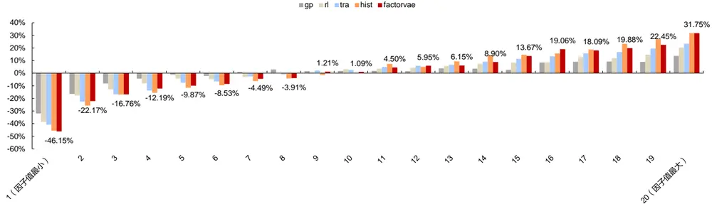
数据来源：东方证券研究所 & Wind资讯

图 20：中证全指股票池各模型多头组超额收益净值&回撤（2020.1.1-2024.3.31）
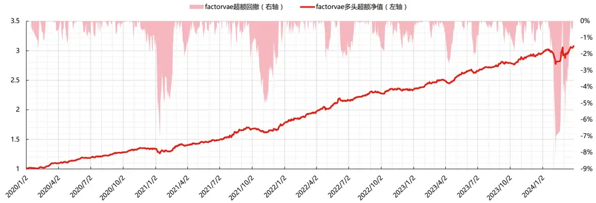
数据来源：东方证券研究所 & Wind资讯

图 21：中证全指股票池各模型分年绩效表现（2020.1.1-2023.12.31）

| 中证全指股票池各模型因子分年绩效表现 |  |  |  |  |  |  |  |  |  |
| --- | --- | --- | --- | --- | --- | --- | --- | --- | --- |
| gp | IC | ICIR |  |  | RANKIC RANKICIR 多头日度超额年度收益率 | 多头日超额收益夏普比 | 多头日度超额收益最大回撤 |  | 多头月度胜率 多头月均单边换手 |
| 2020 | 7.60% | 0.73 | 11.92% | 1.17 | 2.68% | 0.49 | -5.31% | 50.00% | 74.67% |
| 2021 | 5.97% | 0.90 | 11.37% | 1.25 | 17.92% | 2.90 | -1.68% | 66.67% | 72.37% |
| 2022 | 9.61% | 0.99 | 11.49% | 1.91 | 14.14% | 2.10 | -2.90% | 66.67% | 65.70% |
| 2023 | 9.50% | 0.73 | 14.31% | 1.62 | 23.13% | 3.11 | -2.56% | 91.67% | 61.66% |
| 2024 | 2.33% | 0.90 | -2.65% | (0.20) | -0.75% | (0.01) | -9.02% | 66.67% | 68.46% |
| rl | IC | ICIR | RANKIC RANKICIR |  | 多头日度超额年度收益率 | 多头日超额收益夏普比 | 多头日度超额收益最大回撤 | 多头月度胜率 | 多头月均单边换手 |
| 2020 | 10.50% | 0.88 | 14.83% | 1.17 | 9.95% | 1.24 | -7.20% | 66.67% | 74.60% |
| 2021 | 9.04% | 0.99 | 14.31% | 1.12 | 18.84% | 2.00 | -6.19% | 66.67% | 73.60% |
| 2022 | 11.81% | 0.98 | 14.90% | 1.49 | 31.31% | 3.85 | -2.89% | 83.33% | 73.37% |
| 2023 | 8.51% | 0.67 | 13.52% | 0.84 | 13.67% | 2.07 | -5.59% | 66.67% | 72.78% |
| 2024 | 12.21% | 0.88 | 12.56% | 0.96 | 12.15% | 0.30 | -4.40% | 100.00% | 83.47% |
| tra | IC | ICIR | RANKIC | RANKICIR | 多头日度超额年度收益率 | 多头日超额收益夏普比 | 多头日度超额收益最大回撤 | 多头月度胜率 | 多头月均单边换手 |
| 2020 2021 | 8.92% | 0.87 | 14.13% | 0.99 | 16.53% | 2.15 | -7.75% | 75.00% | 59.15% |
|  | 10.02% | 0.85 | 16.55% | 1.17 | 26.49% | 2.58 | -4.92% | 66.67% | 57.61% |
| 2022 2023 | 12.12% 13.41% | 1.13 | 16.07% | 1.68 | 25.75% | 2.84 | -3.30% | 75.00% | 55.84% |
|  |  | 0.75 | 20.30% | 1.43 | 23.12% | 3.16 | -4.65% | 83.33% | 55.40% |
| 2024 hist | 6.58% IC | 0.54 ICIR | 8.28% | 0.32 | 4.09% | 0.06 | -10.54% | 66.67% | 66.07% |
| 2020 | 11.92% | 1.03 |  | RANKIC RANKICIR | 多头日度超额年度收益率 | 多头日超额收益夏普比 | 多头日度超额收益最大回撤 | 多头月度胜率 | 多头月均单边换手 |
| 2021 | 12.06% | 1.17 | 16.51% | 1.19 | 26.79% 30.08% | 3.34 | -4.88% | 83.33% | 75.46% |
| 2022 | 13.95% | 1.33 | 17.41% | 1.31 |  | 2.98 | -5.18% | 83.33% | 74.95% |
| 2023 | 10.85% | 0.90 | 17.95% | 2.01 | 36.22% | 4.17 | -2.97% | 100.00% | 70.46% |
| 2024 | 16.89% |  | 17.41% | 1.23 | 22.56% | 3.32 | -3.39% | 83.33% | 72.17% |
|  |  | 0.70 | 18.48% | 0.77 | 13.75% | 0.22 | -6.80% | 100.00% | 84.08% |
| factorvae | IC | ICIR |  |  | RANKIC RANKICIR 多头日度超额年度收益率 | 多头日超额收益夏普比 | 多头日度超额收益最大回撤 |  | 多头月度胜率 多头月均单边换手 |
| 2020 | 12.59% | 1.33 | 14.71% | 1.48 | 35.82% | 5.22 | -1.84% | 91.67% | 84.44% |
| 2021 | 12.13% | 1.43 | 14.84% | 1.29 | 34.06% | 3.18 | -5.53% | 83.33% | 79.54% |
| 2022 | 13.67% | 1.53 | 15.81% | 2.14 | 31.89% | 4.03 | -2.35% | 91.67% | 77.98% |
| 2023 2024 | 11.81% 10.79% | 1.19 0.81 | 15.97% 10.86% | 1.46 0.48 | 26.61% 3.73% | 4.38 0.07 | -2.61% -8.28% | 91.67% 66.67% | 77.41% 76.33% |

数据来源：东方证券研究所 & Wind资讯

（2）在沪深300股票池中，DFQ-FactorVAE模型所得到因子的多头表现明显最强。测试集上rankic达到10.6%，rankicir达到0.6，5分组多头日度超额年化收益率达到14.47%，多头日超额收益夏普比1.72，多头日度超额收益最大回撤6.74%，月均单边换手54%。分组单调性好。分年表现上未出现明显衰减。

图 22：沪深 300 股票池各模型因子绩效表现（2020.1.1-2024.3.31）

| 沪深300 | IC | ICIR | RANKIC | RANKICIR | 多头日度超额年化收益率 | 多头日超额收益夏普比 | 多头日度超额收益最大回撤 | 多头月度胜率 | 多头月均单边换手 |
| --- | --- | --- | --- | --- | --- | --- | --- | --- | --- |
| gp | 1.91% | 0.16 | 3.11% | 0.26 | 1.47% | 0.25 | -15.42% | 54.90% | 49.77% |
| rl | 6.77% | 0.39 | 9.73% | 0.56 | 10.31% | 1.30 | -6.94% | 58.82% | 50.29% |
| tra | 7.99% | 0.38 | 11.34% | 0.54 | 11.59% | 1.15 | -12.06% | 52.94% | 27.91% |
| hist | 9.75% | 0.52 | 12.11% | 0.62 | 11.72% | 1.31 | -7.97% | 68.63% | 50.59% |
| factorvae | 9.23% | 0.56 | 10.60% | 0.60 | 14.47% | 1.72 | -6.74% | 66.67% | 54.22% |

数据来源：东方证券研究所 & Wind资讯

图 23：沪深 300 股票池各模型分组年化超额收益（2020.1.1-2024.3.31）
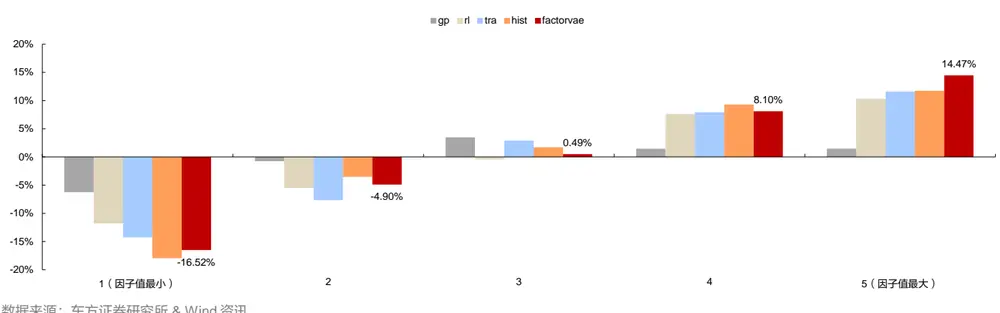
数据来源：东方证券研究所 & Wind资讯
有关分析师的申明，见本报告最后部分。其他重要信息披露见分析师申明之后部分，或请与您的投资代表联系。并请阅读本证券研究报告最后一页的免责申明。

图 24：沪深 300 股票池各模型多头组超额收益净值&回撤（2020.1.1-2024.3.31）
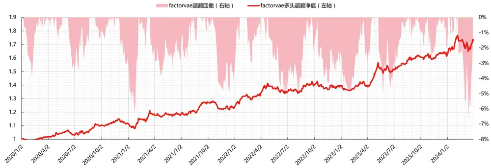
数据来源：东方证券研究所 & Wind资讯

图 25：沪深 300 股票池各模型分年绩效表现（2020.1.1-2024.3.31）
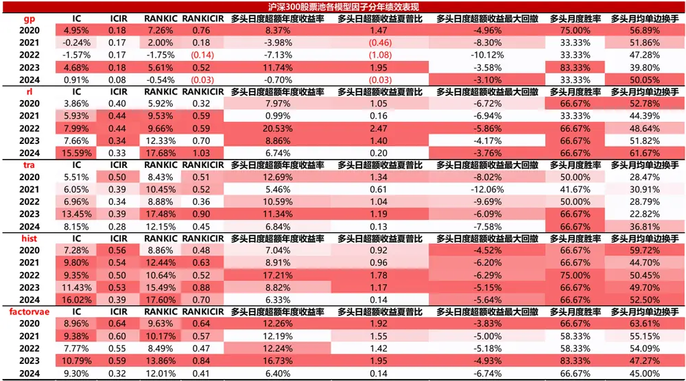
数据来源：东方证券研究所 & Wind资讯

（3）在中证 500 股票池中，DFQ-FactorVAE 模型表现次于 HIST 模型。测试集上 rankic 达到 10.54%，rankicir 达到 0.7，5 分组多头日度超额年化收益率达到 15.31%，多头日超额收益夏普比2.15，多头日度超额收益最大回撤8.29%，月均单边换手58%。分组单调性好。分年表现上未出现明显衰减。

图 26：中证 500 股票池各模型因子绩效表现（2020.1.1-2024.3.31）

| 中证500 | IC | ICIR | RANKIC | RANKICIR | 多头日度超额年化收益率 | 多头日超额收益夏普比 | 多头日度超额收益最大回撤 | 多头月度胜率 | 多头月均单边换手 |
| --- | --- | --- | --- | --- | --- | --- | --- | --- | --- |
| gp | 2.98% | 0.28 | 6.11% | 0.60 | 4.05% | 0.79 | -7.48% | 56.86% | 48.89% |
| rl | 6.48% | 0.42 | 10.70% | 0.67 | 8.79% | 1.14 | -8.97% | 58.82% | 49.41% |
| tra | 6.96% | 0.44 | 11.44% | 0.70 | 10.74% | 1.44 | -5.91% | 64.71% | 42.18% |
| hist | 8.39% | 0.53 | 12.44% | 0.75 | 17.25% | 2.15 | -6.26% | 66.67% | 53.53% |
| factorvae | 8.32% | 0.58 | 10.54% | 0.70 | 15.31% | 2.15 | -8.29% | 70.59% | 57.75% |

数据来源：东方证券研究所 & Wind资讯

图 27：中证 500 股票池各模型分组年化超额收益（2020.1.1-2024.3.31）
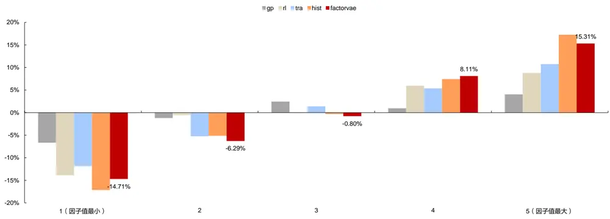
数据来源：东方证券研究所 & Wind资讯

图 28：中证 500 股票池各模型多头组超额收益净值&回撤（2020.1.1-2024.3.31）
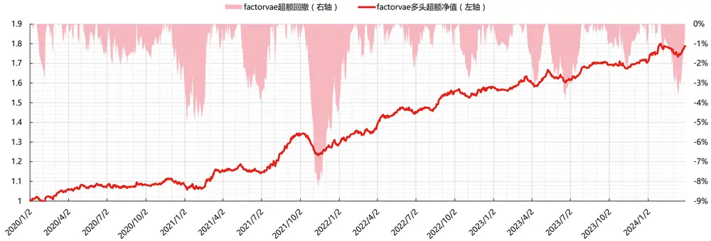
数据来源：东方证券研究所 & Wind资讯

有关分析师的申明，见本报告最后部分。其他重要信息披露见分析师申明之后部分，或请与您的投资代表联系。并请阅读本证券研究报告最后一页的免责申明。

图 29：中证 500 股票池各模型分年绩效表现（2020.1.1-2024.3.31）
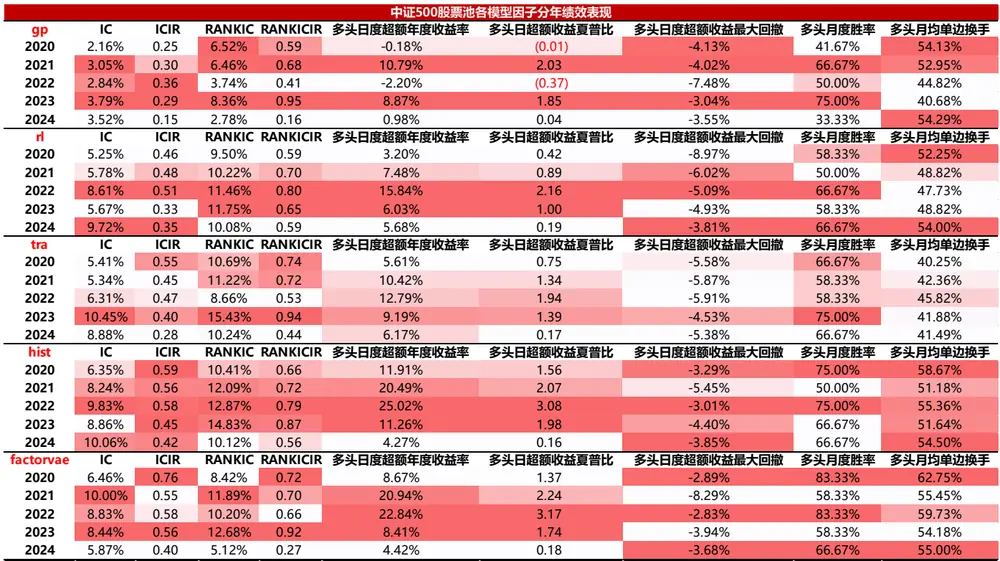
数据来源：东方证券研究所 & Wind资讯

（4）在中证 1000 股票池中，DFQ-FactorVAE 模型所得到因子的稳定性明显最强，ICIR、RANKICIR、多头日超额收益夏普比均为最高。测试集上 rankic 达到 13.36%，rankicir 达到 1.28，10 分组多头日度超额年化收益率达到 23.05%，日超额收益夏普比 3.44，日度超额收益最大回撤3.64%，月度胜率 80%，月均单边换手 74%。分组单调性好。分年表现上未出现明显衰减。

图 30：中证 1000 股票池各模型因子绩效表现（2020.1.1-2024.3.31）

| 中证1000 | IC | ICIR | RANKIC | RANKICIR | 多头日度超额年化收益率 | 多头日超额收益夏普比 | 多头日度超额收益最大回撤 | 多头月度胜率 | 多头月均单边换手 |
| --- | --- | --- | --- | --- | --- | --- | --- | --- | --- |
| gp | 7.41% | 0.68 | 10.19% | 1.01 | 8.75% | 1.40 | -6.32% | 64.71% | 60.16% |
| rl | 9.80% | 0.71 | 12.93% | 0.89 | 13.29% | 1.54 | -9.88% | 62.75% | 65.04% |
| tra | 10.12% | 0.71 | 14.01% | 0.94 | 16.46% | 1.87 | -9.77% | 70.59% | 59.35% |
| hist | 11.90% | 0.93 | 15.39% | 1.12 | 26.89% | 3.03 | -5.69% | 78.43% | 68.76% |
| factorvae | 12.01% | 1.18 | 13.36% | 1.28 | 23.05% | 3.44 | -3.64% | 80.39% | 73.98% |

数据来源：东方证券研究所 & Wind资讯

图 31：中证 1000 股票池各模型分组年化超额收益（2020.1.1-2024.3.31）
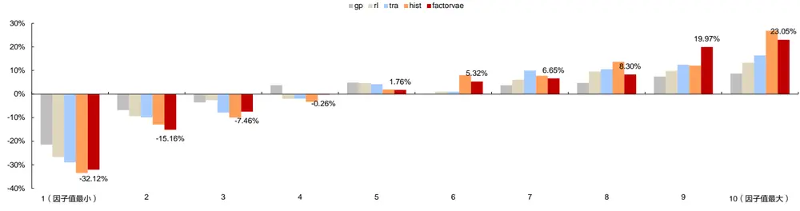
数据来源：东方证券研究所 & Wind资讯
有关分析师的申明，见本报告最后部分。其他重要信息披露见分析师申明之后部分，或请与您的投资代表联系。并请阅读本证券研究报告最后一页的免责申明。

图 32：中证 1000 股票池各模型多头组超额收益净值&回撤（2020.1.1-2024.3.31）
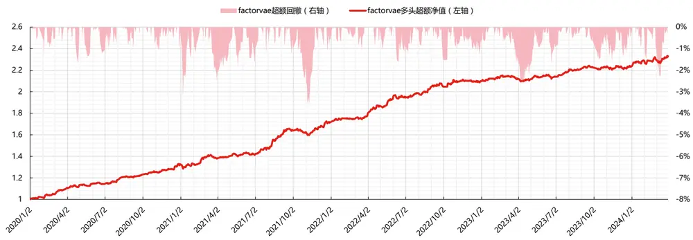
数据来源：东方证券研究所 & Wind资讯

图 33：中证 1000 股票池各模型分年绩效表现（2020.1.1-2024.3.31）
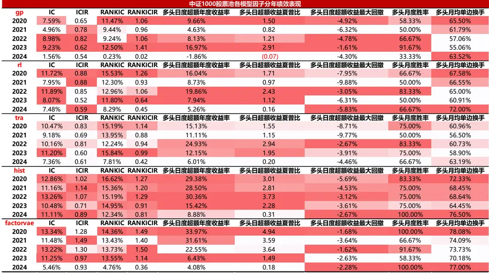
数据来源：东方证券研究所 & Wind资讯

整体来看，DFQ-FactorVAE 模型所得因子的稳定性，以及在沪深 300 股票池中的多头表现十分突出：

（1）因子稳定性突出，与模型的 VAE 架构和概率框架有关。VAE 架构有助于模型学习到数据分布的结构，样本外泛化能力更强。概率框架考虑到了风险建模，更适合含有噪声的股票收益率预测；

有关分析师的申明，见本报告最后部分。其他重要信息披露见分析师申明之后部分，或请与您的投资代表联系。并请阅读本证券研究报告最后一页的免责申明。

（2）沪深300股票池中多头表现突出，与模型的因子模型架构有关。横截面回归的Rsquare可以用来度量因子对股票收益的解释程度，由于 FactorVae 模型中的因子是动态提取的，数量不确定，因而采用考虑自变量数量的 Adjusted Rsquare 指标更为恰当，以避免过拟合问题。Adjusted Rsquare 指标越高，说明构建的因子模型能够越好地捕捉到股票收益的共同变动部分，并有效地解释股票收益的波动。我们计算了DFQ-FactorVAE模型提取出的先验因子在中证全指、沪深300、中证500、中证1000四个股票池中的横截面回归Adjusted Rsquare。结果显示，先验因子对沪深 300 股票的解释度最高，平均能达到 36.5%，其次为中证 500 成分股的 27.95%，中证 1000 成分股的 25.45%，全市场解释度最低，为 20.78%。

## 4.3 随机种子的影响

随机种子对全市场训练的 DFQ-FactorVAE 模型结果影响不大，6 个路径下得到的因子值相关系数在 90%左右。

图 34：中证全指股票池 6 随机种子得到的因子值相关系数（2020.01.01-2024.2.28）

|  | s1000 | s100 | s500 | s2000 | s0 | s5000 |
| --- | --- | --- | --- | --- | --- | --- |
| s1000 | 100.00% | 90.69% | 90.05% | 86.60% | 91.60% | 89.31% |
| s100 | 90.69% | 100.00% | 91.43% | 89.16% | 91.77% | 90.54% |
| s500 | 90.05% | 91.43% | 100.00% | 89.79% | 92.09% | 88.83% |
| s2000 | 86.60% | 89.16% | 89.79% | 100.00% | 91.06% | 87.03% |
| s0 | 91.60% | 91.77% | 92.09% | 91.06% | 100.00% | 89.49% |
| s5000 | 89.31% | 90.54% | 88.83% | 87.03% | 89.49% | 100.00% |

数据来源：东方证券研究所 & Wind资讯

图 35：中证全指股票池 6 随机种子得到的 rankIC 相关系数（2020.01.01-2024.2.28）

| s1000 | s1000 100.00% | s100 96.90% | s500 96.56% | s2000 95.20% | s0 98.09% | s5000 95.49% |
| --- | --- | --- | --- | --- | --- | --- |
| s100 | 96.90% | 100.00% | 98.90% | 96.97% | 98.71% | 97.52% |
| s500 | 96.56% | 98.90% | 100.00% | 97.45% | 99.02% | 97.51% |
| s2000 | 95.20% | 96.97% | 97.45% | 100.00% | 97.59% | 96.92% |
| s0 | 98.09% | 98.71% | 99.02% | 97.59% | 100.00% | 97.35% |
| s5000 | 95.49% | 97.52% | 97.51% | 96.92% | 97.35% | 100.00% |

数据来源：东方证券研究所 & Wind资讯

## 4.4 与其他量价模型相关性

模型间的相关性可以通过三种方式度量：截面因子值相关性日度平均值、日度 rankic序列相关性、日度多头超额收益序列相关性。整体来看，DFQ-FactorVAE模型所得因子与HIST模型的相关性最高。

图 36：中证全指股票池中各模型相关性（2020.01.01-2024.3.31）

| 截面因子值相关性日度平均985 | gp | rl | tra | hist |  | factorvae |
| --- | --- | --- | --- | --- | --- | --- |
| gp | 100% | 72% | 67% | 70% |  | 57% |
| rl | 72% | 100% | 69% | 80% |  | 66% |
| tra | 67% | 69% | 100% | 75% |  | 60% |
| hist | 70% | 80% | 75% | 100% |  | 82% |
| factorvae | 57% | 66% | 60% | 82% |  | 100% |
| 日度rankic序列相关性985 |  | 985rl | tra | hist |  | factorvae |
| gp | gp 100% | 76% | 81% |  | 76% | 77% |
| 985rl | 76% | 100% | 81% |  |  |  |
| tra | 81% | 81% | 100% |  | 86% 91% | 79% |
| hist | 76% | 86% | 91% | 100% |  | 87% 95% |
| factorvae | 77% | 79% | 87% | 95% |  | 100% |
| 日度多头超额收益序列相关性985 | gp | 985rl | tra | hist |  | factorvae |
| gp | 100% | 29% | 56% |  | 50% | 48% |
| 985rl | 29% | 100% | 60% |  | 70% | 36% |
| tra | 56% | 60% | 100% |  | 83% | 66% |
| hist | 50% | 70% | 83% |  | 100% | 75% |
| factorvae | 48% | 36% | 66% |  | 75% | 100% |

数据来源：东方证券研究所 & Wind资讯

图 37：沪深 300 股票池中各模型相关性（2020.01.01-2024.3.31）

| 截面因子值相关性日度平均300gprltrahistfactorvae日度rankic序列相关性300gp985rltrahistfactorvae日度多头超额收益序列相关性300gp985rltrahistfactorvae |  |  |  |  |  |  |  |  |  |
| --- | --- | --- | --- | --- | --- | --- | --- | --- | --- |
|  | gp | rl | tra |  |  |  |  |  |  |
|  |  |  |  | hist | factorvae |  |  |  |  |
|  | 100% | 40% | 33% | 37% | 26% |  |  |  |  |
|  | 40% | 100% | 59% | 69% | 51% |  |  |  |  |
|  | 33% | 59% | 100% | 61% | 43% |  |  |  |  |
|  | 37% | 69% | 61% | 100% | 75% |  |  |  |  |
|  | 26% | 51% | 43% | 75% | 100% |  |  |  |  |
|  | gp | 985rl | tra | hist | factorvae |  |  |  |  |
|  | 100% | 22% | 24% | 20% | 24% |  |  |  |  |
|  |  |  | 22% | 100% | 84% | 87% | 77% |  |  |
|  |  |  |  |  | 24% | 84% | 100% | 88% | 82% |
|  | 20% | 87% | 88% | 100% | 92% |  |  |  |  |
|  | 24% | 77% | 82% | 92% | 100% |  |  |  |  |
|  |  |  |  |  | factorvae |  |  |  |  |
|  | gp | 985rl | tra | hist |  |  |  |  |  |
|  | 100% | 7% | 22% | 5% | 13% |  |  |  |  |
|  | 7% | 100% | 67% | 78% | 63% |  |  |  |  |
|  |  |  | 22% | 67% | 100% | 70% | 63% |  |  |
|  |  |  | 5% | 78% | 70% | 100% | 84% |  |  |
|  |  | 13% | 63% | 63% | 84% | 100% |  |  |  |

数据来源：东方证券研究所 & Wind资讯

图 38：中证 500 股票池中各模型相关性（2020.01.01-2024.3.31）
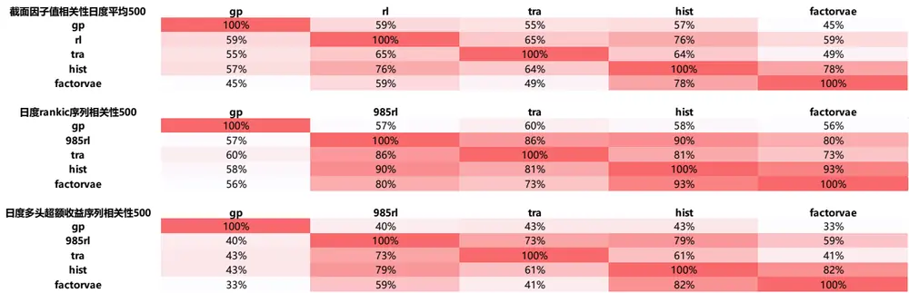
数据来源：东方证券研究所 & Wind资讯

图 39：中证 1000 股票池中各模型相关性（2020.01.01-2024.3.31）

| 截面因子值相关性日度平均1000 | gp | rl | tra | hist | factorvae |
| --- | --- | --- | --- | --- | --- |
| gp | 100% | 70% | 67% | 68% | 53% |
| rl | 70% | 100% | 71% | 79% | 62% |
| tra | 67% | 71% | 100% | 72% | 56% |
| hist | 68% | 79% | 72% | 100% | 80% |
| factorvae | 53% | 62% | 56% | 80% | 100% |
| 日度rankic序列相关性1000 | gp | 985rl | tra | hist |  |
| gp | 100% | 75% | 82% | 74% | factorvae 72% |
| 985rl | 75% | 100% | 92% | 90% | 82% |
| tra | 82% | 92% | 100% | 90% | 82% |
| hist | 74% | 90% | 90% | 100% | 92% |
| factorvae | 72% | 82% | 82% | 92% | 100% |
| 日度多头超额收益序列相关性1000 | gp | 985rl | tra | hist | factorvae |
| gp 985rl | 100% | 42% | 45% | 45% | 23% |
| tra | 42% 45% | 100% | 80% | 75% | 32% |
| hist | 45% | 80% 75% | 100% 75% | 75% | 36% |
| factorvae | 23% | 32% | 36% | 100% 61% | 61% 100% |

数据来源：东方证券研究所 & Wind资讯

## 4.5 中性化因子表现

DFQ-FactorVAE 因子进行了行业和市值中性化后，rankic 和多头收益降低， rankicir 提升。中性化后的 DFQ-FactorVAE 因子在沪深 300 股票池中，多头表现明显最强。5 分组多头日度超额年化收益率达到 8.15%，多头日超额收益夏普比 1.71，多头日度超额收益最大回撤仅为 3.86%。

图 40：中证全指股票池各模型中性化因子绩效表现（2020.1.1-2024.3.31）

| 中证全指股票池 |  |  |  |  |  |  |  |  |  |
| --- | --- | --- | --- | --- | --- | --- | --- | --- | --- |
| 中证全指股票池 | IC | ICIR | RANKIC | RANKICIR | 多头日度超额年化收益率多头日超额收益夏普比 |  | 多头日度超额收益最大回撤 | 多头月度胜率 | 多头月均单边换手 |
| 原始gp | 7.90% | 0.81 | 11.60% | 1.22 | 13.72% | 1.86 | -9.02% | 68.63% | 68.73% |
| 中性化gp | 7.69% | 0.78 | 11.93% | 1.25 | 13.23% | 1.78 | -8.53% | 70.59% | 68.08% |
| 原始rl | 10.07% | 0.84 | 14.31% | 1.09 | 20.29% | 2.39 | -7.20% | 72.55% | 74.13% |
| 中性化rl | 8.67% | 1.00 | 12.58% | 1.46 | 19.64% | 3.23 | -3.53% | 76.47% | 74.52% |
| 原始tra | 10.91% | 0.83 | 16.38% | 1.14 | 23.39% | 2.35 | -10.54% | 74.51% | 57.00% |
| 中性化tra | 9.66% | 0.99 | 14.55% | 1.37 | 20.87% | 2.62 | -8.92% | 80.39% | 57.38% |
| 原始hist | 12.40% | 1.03 | 17.37% | 1.29 | 31.87% | 3.34 | -6.80% | 88.24% | 73.58% |
| 中性化hist | 10.93% | 1.26 | 15.25% | 1.59 | 24.66% | 3.25 | -4.53% | 84.31% | 72.85% |
| 原始factorvae | 12.47% | 1.30 | 15.13% | 1.38 | 31.75% | 3.52 | -8.28% | 88.24% | 79.32% |
| 中性化factorvae | 11.01% | 1.49 | 13.38% | 1.67 | 20.91% | 2.52 | -9.85% | 78.43% | 77.74% |

数据来源：东方证券研究所 & Wind资讯

图 41：沪深 300 股票池各模型中性化因子绩效表现（2020.1.1-2024.3.31）

| 沪深300股票池 |  |  |  |  |  |  |  |  |  |
| --- | --- | --- | --- | --- | --- | --- | --- | --- | --- |
| 中证全指股票池 | IC | ICIR | RANKIC | RANKICIR | 多头日度超额年化收益率 | 多头日超额收益夏普比 | 多头日度超额收益最大回撤 | 多头月度胜率 | 多头月均单边换手 |
| 原始gp | 1.91% | 0.16 | 3.11% | 0.26 | 1.47% | 0.25 | -15.42% | 54.90% | 49.77% |
| 中性化gp | 3.32% | 0.32 | 4.99% | 0.53 | 3.51% | 0.71 | -7.02% | 58.82% | 50.78% |
| 原始rl | 6.77% | 0.39 | 9.73% | 0.56 | 10.31% | 1.30 | -6.94% | 58.82% | 50.29% |
| 中性化rl | 4.92% | 0.52 | 6.88% | 0.79 | 4.08% | 0.91 | -7.05% | 56.86% | 54.44% |
| 原始tra | 7.99% | 0.38 | 11.34% | 0.54 | 11.59% | 1.15 | -12.06% | 52.94% | 27.91% |
| 中性化tra | 4.75% | 0.42 | 7.39% | 0.65 | 5.74% | 1.06 | -6.77% | 64.71% | 36.42% |
| 原始hist | 9.75% | 0.52 | 12.11% | 0.62 | 11.72% | 1.31 | -7.97% | 68.63% | 50.59% |
| 中性化hist | 7.46% | 0.72 | 9.10% | 0.88 | 7.30% | 1.53 | -6.61% | 64.71% | 51.99% |
| 原始factorvae | 9.23% | 0.56 | 10.60% | 0.60 | 14.47% | 1.72 | -6.74% | 66.67% | 54.22% |
| 中性化factorvae | 7.39% | 0.81 | 7.94% | 0.90 | 8.15% | 1.71 | -3.86% | 74.51% | 57.42% |

数据来源：东方证券研究所 & Wind资讯

图 42：中证 500 股票池各模型中性化因子绩效表现（2020.1.1-2024.3.31）

| 中证500股票池 |  |  |  |  |  |  |  |  |  |
| --- | --- | --- | --- | --- | --- | --- | --- | --- | --- |
| 中证全指股票池 原始gp | IC 2.98% | ICIR 0.28 | RANKIC 6.11% | RANKICIR 0.60 | 多头日度超额年化收益率 4.05% | 多头日超额收益夏普比 0.79 | 多头日度超额收益最大回撤 -7.48% | 多头月度胜率 56.86% | 多头月均单边换手 48.89% |
| 中性化gp | 3.85% | 0.37 | 7.44% | 0.84 | 3.73% | 0.85 | -5.91% | 58.82% | 49.63% |
| 原始rl | 6.48% | 0.42 | 10.70% | 0.67 | 8.79% | 1.14 | -8.97% | 58.82% | 49.41% |
| 中性化rl | 4.90% | 0.50 | 8.35% | 0.96 | 5.18% | 1.19 | -5.15% | 60.78% | 53.69% |
| 原始tra | 6.96% | 0.44 | 11.44% | 0.70 | 10.74% | 1.44 | -5.91% | 64.71% |  |
| 中性化tra | 5.79% | 0.60 | 9.50% | 1.01 | 8.85% | 1.76 |  |  | 42.18% |
| 原始hist | 8.39% | 0.53 | 12.44% | 0.75 | 17.25% | 2.15 | -4.53% -6.26% | 70.59% | 43.84% |
| 中性化hist | 6.61% | 0.68 | 9.75% | 1.09 | 9.47% | 2.26 | -3.88% | 66.67% 68.63% | 53.53% 57.16% |
| 原始factorvae | 8.32% | 0.58 | 10.54% | 0.70 | 15.31% | 2.15 | -8.29% | 70.59% | 57.75% |
| 中性化factorvae | 6.36% | 0.71 | 7.99% | 1.02 | 8.31% | 2.00 | -4.16% | 70.59% | 58.86% |

数据来源：东方证券研究所 & Wind资讯

图 43：中证 1000 股票池各模型中性化因子绩效表现（2020.1.1-2024.3.31）

| 中证1000股票池 |  |  |  |  |  |  |  |  |  |
| --- | --- | --- | --- | --- | --- | --- | --- | --- | --- |
| 中证全指股票池 | IC | ICIR | RANKIC | RANKICIR | 多头日度超额年化收益率 | 多头日超额收益夏普比 | 多头日度超额收益最大回撤 | 多头月度胜率 | 多头月均单边换手 |
| 原始gp | 7.41% | 0.68 | 10.19% | 1.01 | 8.75% | 1.40 | -6.32% | 64.71% | 60.16% |
| 中性化gp | 7.03% | 0.67 | 9.88% | 1.08 | 8.30% | 1.44 | -6.14% | 64.71% | 60.07% |
| 原始rl | 9.80% | 0.71 | 12.93% | 0.89 | 13.29% | 1.54 | -9.88% | 62.75% | 65.04% |
| 中性化rl | 7.96% | 0.84 | 10.64% | 1.18 | 11.52% | 2.17 | -5.12% | 70.59% | 66.80% |
| 原始tra | 10.12% | 0.71 | 14.01% | 0.94 | 16.46% | 1.87 | -9.77% | 70.59% | 59.35% |
| 中性化tra | 8.50% | 0.91 | 11.51% | 1.27 | 14.68% | 2.54 | -5.71% | 74.51% | 58.78% |
| 原始hist | 11.90% | 0.93 | 15.39% | 1.12 | 26.89% | 3.03 | -5.69% | 78.43% | 68.76% |
| 中性化hist | 9.78% | 1.20 | 12.56% | 1.53 | 15.31% | 2.95 | -4.62% | 82.35% | 68.37% |
| 原始factorvae | 12.01% | 1.18 | 13.36% | 1.28 | 23.05% | 3.44 | -3.64% | 80.39% | 73.98% |
| 中性化factorvae | 9.96% | 1.45 | 10.94% | 1.75 | 14.97% | 2.70 | -3.41% | 66.67% | 70.75% |

数据来源：东方证券研究所 & Wind资讯

有关分析师的申明，见本报告最后部分。其他重要信息披露见分析师申明之后部分，或请与您的投资代表联系。并请阅读本证券研究报告最后一页的免责申明。

## 五、沪深 300指数增强组合

## 5.1 指数增强组合构建说明

（1）回测期：2020.01.23-2023.03.31，组合月频调仓，假设根据每月末个股得分在次日以vwap 价格进行交易。

（2）组合约束：风险因子库（参见《东方 A 股因子风险模型（DFQ-2020）》）中所有的风格因子相对暴露不超过 0.5，所有行业因子相对暴露不超过 2%。沪深 300 增强跟踪误差约束不超过4%。个股权重设置上限约束，绝对权重上限设置为1.5倍基准权重+2%。限制指数成分股权重占比不低于 80%。

（3）考虑交易成本：假设买卖手续费双边千三，停牌涨停不能买入、停牌跌停不能卖出。

## 5.2 指数增强组合的业绩表现

DFQ-FactorVAE 模型所得到的合成因子在沪深 300 指增组合中表现十分突出：

（1）整体表现：2020 年以来年化信息比达到 2.55，年化对冲收益 13.53%，年化跟踪误差5.03%，超额收益最大回撤仅为 5.35%，单边年换手 7.67倍。

（2）回撤情况：超额收益共有三次较大回撤，分别发生在 2020 年年底到 2021 年初，2021年底和 2024年初。最大回撤发生在 2024.02.07，为 5.35%，到 3月底已经恢复了 2/3。

（3）分年表现：2020-2023 每年取得 10%以上的正超额，2023 年超额收益达 16%。2024年前三个月超额收益为-0.36%。

（4）分月表现：2024年仅2月份为负超额，1月和3月均为正超额。

（5）持仓情况：平均持股数量为 78 只，最少 45 只，最多 103 只。持仓中 80%的股票都在沪深 300 指数成分股内。持仓平均市值在 2000 亿左右。

图 44：沪深 300 股票池指数增强组合绩效表现（2020.1.1-2024.3.31）

| 20200101-20240331 300月频 |  | 传统多因子 | rl | tra | hist | factorvae |
| --- | --- | --- | --- | --- | --- | --- |
| 行业暴露0.02 风格暴露0.5 跟踪误差4% 买卖手续费双边干三 |  | 沪深300全市场增强组合 | 沪深300全市场增强组合 | 沪深300全市场增强组合 | 沪深300全市场增强组合 | 沪深300全市场增强组合 |
| 绩效指标 | 信息比（年化） | 80%成分内约束 | 80%成分内约束 | 80%成分内约束 | 80%成分内约束 | 80%成分内约束 |
|  |  | 1.25 | 1.25 | 1.78 | 2.17 | 2.55 |
|  | 年化对冲收益 | 5.20% | 7.32% | 12.45% | 11.72% | 13.53% |
|  | 跟踪误差（年化） | 4.11% | 5.78% | 6.74% | 5.17% | 5.03% |
|  | 对冲收益最大回撤 | -5.92% | -8.87% | -7.34% | -9.89% | -5.35% |
|  | 对冲收益最大回撤出现时间点 | 20210107 | 20210113 | 20210902 | 20210113 | 20240207 |
|  | 对冲收益最大回撤恢复天数 | 98 | 173 | 89 | 149 |  |
|  | 单边换手率（年） 持股数量 | 3.58 | 8.32 | 6.01 | 7.49 | 7.67 |
|  | 成分内股票占比 | 87.35 | 62.02 | 62.92 80.28% | 83.84 | 78.78 |
|  |  | 80.20% 1.94% | 80.36% 0.56% | 12.64% | 80.31% | 80.20% |
| 分年收益 | 2020 | 8.21% |  | 6.02% | 9.36% | 13.85% |
|  | 2021 |  | 5.13% |  | 9.69% | 11.08% |
|  | 2022 | 6.11% | 12.46% | 18.30% 13.92% | 11.14% | 14.29% |
|  | 2023 | 4.08% | 13.12% |  | 14.05% | 16.36% |
|  | 2024 | 0.88% | -0.86% | 0.16% 0.55% | 3.26% | -0.36% |
| 分月收益 | 202401 | -0.26% | -0.89% | -2.36% | 1.42% -1.90% | 0.94% |
|  | 202402 | 0.85% | -1.81% |  |  | -3.45% |
|  | 202403 | 0.42% | 1.59% | 1.38% | 2.79% | 1.73% |

数据来源：东方证券研究所 & Wind资讯
有关分析师的申明，见本报告最后部分。其他重要信息披露见分析师申明之后部分，或请与您的投资代表联系。并请阅读本证券研究报告最后一页的免责申明。

图 45：沪深 300 股票池指数增强组合超额净值与回撤（2020.1.1-2024.3.31）
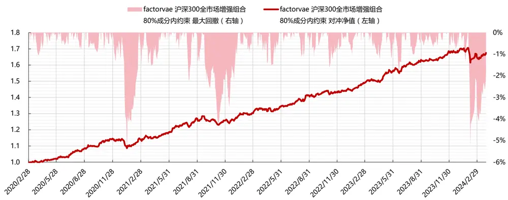
数据来源：东方证券研究所 & Wind资讯

## 5.3 指数增强组合的风格暴露

DFQ-FactorVAE 模型下的沪深 300 指增组合，相对基准沪深 300 指数，在市值、信息确定性、成长维度具有明显的负向暴露，但在 BETA、流动性、波动率、估值等维度都没有明显暴露。

图 46：沪深 300股票池指数增强组合相对基准的平均风格暴露（2020.1.1-2024.3.31）
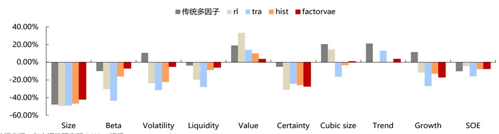
数据来源：东方证券研究所 & Wind资讯

图 47：沪深 300股票池指数增强组合相对基准的风格暴露变化（2020.1.1-2024.3.31）
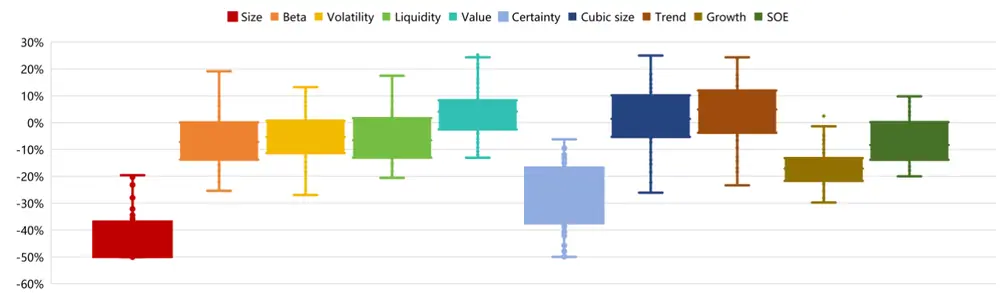
数据来源：东方证券研究所 & Wind资讯
有关分析师的申明，见本报告最后部分。其他重要信息披露见分析师申明之后部分，或请与您的投资代表联系。并请阅读本证券研究报告最后一页的免责申明。

## 5.4 组合优化约束对组合业绩的影响

组合优化约束条件的设置对于组合业绩有着较大影响：约束严格可以提升组合业绩表现的稳定性，更好地控制组合回撤，但会损失收益；约束宽松会有更大的收益提升空间，但会牺牲组合稳定性，需要权衡。

（1）成分股约束：设置 100%成分内选股增强，可以明显提高组合业绩表现稳定性，同时也会牺牲一定的组合收益。组合跟踪误差可以降低到 4.37%，超额收益最大回撤降低到3.31%，最大回撤恢复仅需 30 天，并且仍然可以获得超过 10%的年化超额。若采用DFQ-FactorVAE模型来做沪深300指增组合，约束完全在成分内选股是一个更加稳妥的方案。此外，去掉成分股约束无法明显提升组合收益，主要原因在于沪深 300 成分股的市值在样本空间内最大，市值约束的存在导致即使不做成分约束，增强组合持仓也大多数在成分股内。

图 48：不同成分股约束下，沪深 300股票池指数增强组合的绩效表现（2020.1.1-2024.3.31）

| 20200101-20240331 300月频 |  | factorvae 不同成分股占比约束 |  |  |
| --- | --- | --- | --- | --- |
| 跟踪误差4% 买卖手续费双边千三 |  | 沪深300全市场增强组合 80%成分内约束 | 沪深300全市场增强组合 100%成分内约束 | 沪深300全市场增强组合 无成分内约束 |
| 绩效指标 | 信息比（年化） |  |  |  |
|  | 年化对冲收益 | 2.55 | 2.33 | 2.35 |
|  | 跟踪误差（年化） | 13.53% | 10.61% | 13.23% |
|  | 对冲收益最大回撤 | 5.03% | 4.37% | 5.36% |
|  | 对冲收益最大回撤出现时间点 | -5.35% | -3.31% | -6.06% |
|  | 对冲收益最大回撤恢复天数 | 20240207 | 20210120 | 20240207 |
|  |  |  | 30 |  |
|  | 单边换手率（年） | 7.67 | 7.58 | 7.48 |
|  | 持股数量 | 78.78 | 62.78 | 87.82 |
|  | 成分内股票占比 2020 | 80.20% 13.85% | 100.00% 11.80% | 71.26% |
| 分年收益 | 2021 | 11.08% | 8.80% | 13.84% 12.15% |
|  | 2022 | 14.29% | 10.73% |  |
|  | 2023 | 16.36% | 11.15% | 13.86% |
|  | 2024 |  | 0.67% | 15.01% |
|  | 202401 | -0.36% 0.94% | 0.82% | -0.82% |
| 分月收益 | 202402 | -3.45% | -0.57% | 0.65% -3.95% |
|  | 202403 | 1.73% | -0.03% | 1.81% |

数据来源：东方证券研究所 & Wind资讯

图 49：不同成分股约束下，沪深 300股票池指数增强组合超额净值与回撤（2020.1.1-2024.3.31）
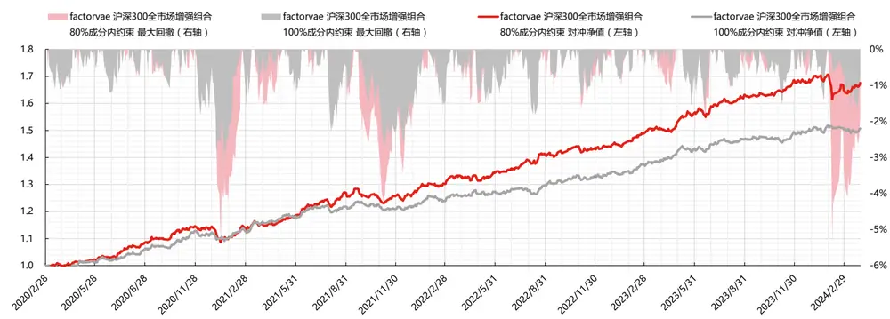
数据来源：东方证券研究所 & Wind资讯
有关分析师的申明，见本报告最后部分。其他重要信息披露见分析师申明之后部分，或请与您的投资代表联系。并请阅读本证券研究报告最后一页的免责申明。

（2）风险暴露约束：收窄风险暴露敞口，可以提升组合业绩表现稳定性，但同时也会牺牲一定的组合收益。仅市值控制中性，组合跟踪误差基本不变，超额收益最大回撤降低到 4.78%，组合年化超额收益降低到 9.99%；十个风险因子全部控制中性，组合跟踪误差降低到 4.5%，超额收益最大回撤降低到 4.43%，组合年化超额收益降低到 7.87%。十个风险因子和行业均全部控制中性，组合跟踪误差降低到 4 %，超额收益最大回撤无降低，组合年化超额收益减半，仅为 6.75%。在有 80%成分股约束的情况下，放开风险暴露敞口，对组合结果影响也很小。

图 50：不同风险暴露约束下，沪深 300股票池指数增强组合的绩效表现（2020.1.1-2024.3.31）

| 20200101-20240331 300月频 |  | factorvae 不同风险暴露敞口 |  |  |  |  |
| --- | --- | --- | --- | --- | --- | --- |
| 跟踪误差4%，80%成分股约束 买卖手续费双边干三 |  | 沪深300全市场增强组合 行业暴露0.02 | 沪深300全市场增强组合 行业暴露0.02 | 沪深300全市场增强组合 行业暴露0.02 | 沪深300全市场增强组合 行业暴露中性 | 沪深300全市场增强组合 行业暴露完全放开 |
| 绩效指标 | 信息比(年化） | 风格暴露0.5 | 市值中性其他暴露0.5 | 风格暴露中性 | 风格暴露中性 | 风格暴露完全放开 |
|  |  | 2.55 | 1.94 | 1.71 | 1.62 | 2.50 |
|  | 年化对冲收益 跟踪误差（年化） | 13.53% | 9.99% | 7.87% 4.50% | 6.75% | 13.41% |
|  | 对冲收益最大回撤 | 5.03% | 4.98% |  | 4.09% | 5.10% |
|  | 对冲收益最大回撤出现时间点 | -5.35% | -4.78% | -4.43% | -5.43% | -6.04% |
|  |  | 20240207 | 20210114 | 20240306 | 20240306 | 20240207 |
|  | 对冲收益最大回撤恢复天数 单边换手率（年） |  | 56 | 7.13 | 6.93 |  |
|  | 持股数量 | 7.67 78.78 | 6.77 57.27 | 47.39 | 53.43 | 7.60 81.80 |
|  | 成分内股票占比 | 80.20% | 82.27% | 84.41% | 85.22% | 80.22% |
|  | 2020 | 13.85% | 9.46% | 11.00% | 10.26% | 13.50% |
| 分年收益 | 2021 | 11.08% | 5.93% | 5.97% | 7.10% | 11.62% |
|  | 2022 | 14.29% | 10.13% | 11.03% | 10.13% | 15.43% |
|  |  | 16.36% | 13.22% | 5.46% | 3.16% |  |
|  | 2023 |  |  | -1.19% | -2.79% | 15.61% |
|  | 2024 | -0.36% | 1.90% | -0.66% | -1.83% | -1.29% |
| 分月收益 | 202401 | 0.94% -3.45% | 2.67% -3.60% | -1.94% | -1.92% | -0.07% -3.49% |
|  | 202402 |  |  | 1.59% | 1.18% | 1.83% |
|  | 202403 | 1.73% | 2.16% |  |  |  |

数据来源：东方证券研究所 & Wind资讯

## 六、 总结

FactorVAE 模型融合了上述变分自编码器与概率动态因子模型的思想，建立股票收益率预测模型，学习输入特征和标签之间的关系：

（1）采用变分自编码器的编码器-解码器的架构，编码器从输入数据中提取潜在变量的分布，编码器从分布中采样得到编码并进行解码，输出股票收益率。VAE 架构有助于模型学习到数据分布的结构，并且可以在潜在空间中生成新样本。

（2）采用概率动态因子模型的思想，将因子作为 VAE 模型中的潜在变量。编码器不是直接提取每只股票收益率的分布，而是利用概率动态因子模型的框架，提取动态公共因子的分布，从而起到降维降噪的作用。

（3）由于金融数据的低信噪比，采用端到端方法训练的模型，很难直接从噪声数据中提取因子，FactorVAE 模型额外设计了一种“前验-后验”学习方法，将预测股票收益率的问题转化成预测有效因子，使用标签收益率作为辅助信息，指导模型提取有效因子。

整体来看，DFQ-FactorVAE 模型所得因子的稳定性，和在沪深 300 股票池中的多头表现十分突出：

（1）因子稳定性突出，与模型的 VAE 架构和概率框架有关。VAE 架构有助于模型学习到数据分布的结构，样本外泛化能力更强。概率框架考虑到了风险建模，更适合含有噪声的股票收益率预测；

（2）沪深 300 股票池中多头表现突出，与模型的因子模型架构有关。我们计算了 DFQ-FactorVAE模型提取出的先验因子在中证全指、沪深300、中证500、中证1000四个股票池中的横截面回归 Adjusted Rsquare。结果显示，先验因子对沪深 300股票的解释度最高，平均能达到36.5%，其次为中证 500 成分股的 27.95%，中证 1000 成分股的 25.45%，全市场解释度最低，为 20.78%。

DFQ-FactorVAE模型所得到的合成因子在沪深 300指增组合中表现十分突出：

（1）整体表现：2020 年以来年化信息比达到 2.55，年化对冲收益 13.53%，年化跟踪误差5.03%，超额收益最大回撤仅为 5.35%，单边年换手 7.67倍。

（2）回撤情况：超额收益共有三次较大回撤，分别发生在 2020 年年底到 2021 年初，2021年底和 2024年初。最大回撤发生在 2024.02.07，为 5.35%，到 3月底已经恢复了 2/3。

（3）分年表现：2020-2023 每年取得 10%以上的正超额，2023 年超额收益达 16%。2024年前三个月超额收益为-0.36%。

（4）分月表现：2024年仅2月份为负超额，1月和3月均为正超额。

（5）持仓情况：平均持股数量为 78 只，最少 45 只，最多 103 只。持仓中 80%的股票都在沪深 300指数成分股内。持仓平均市值在 2000亿左右。

若采用 DFQ-FactorVAE 模型来做沪深 300 指增组合，约束 100%成分内选股是一个更加稳妥的方案。组合跟踪误差可以降低到 4.37%，超额收益最大回撤降低到 3.31%，最大回撤恢复仅需 30天，并且仍然可以获得超过 10%的年化超额。

## 参考文献

1. Duan Y, Wang L, Zhang Q, et al. Factorvae: A probabilistic dynamic factor model based on variational autoencoder for predicting cross-sectional stock returns[C]//Proceedings of the AAAI Conference on Artificial Intelligence. 2022, 36(4): 4468-4476.

## 风险提示

1. 量化模型基于历史数据分析，未来存在失效风险，建议投资者紧密跟踪模型表现。

2. 极端市场环境可能对模型效果造成剧烈冲击，导致收益亏损。

## Tabl e_Disclai mer 分析师申明

每位负责撰写本研究报告全部或部分内容的研究分析师在此作以下声明：

分析师在本报告中对所提及的证券或发行人发表的任何建议和观点均准确地反映了其个人对该证券或发行人的看法和判断；分析师薪酬的任何组成部分无论是在过去、现在及将来，均与其在本研究报告中所表述的具体建议或观点无任何直接或间接的关系。

## 投资评级和相关定义

报告发布日后的12个月内行业或公司的涨跌幅相对同期相关证券市场代表性指数的涨跌幅为基准（A 股市场基准为沪深 300 指数，香港市场基准为恒生指数，美国市场基准为标普 500 指数）；

## 公司投资评级的量化标准

买入：相对强于市场基准指数收益率 15%以上；

增持：相对强于市场基准指数收益率 5%～15%；

中性：相对于市场基准指数收益率在-5%～+5%之间波动；

减持：相对弱于市场基准指数收益率在-5%以下。

未评级 —— 由于在报告发出之时该股票不在本公司研究覆盖范围内，分析师基于当时对该股票的研究状况，未给予投资评级相关信息。

暂停评级 —— 根据监管制度及本公司相关规定，研究报告发布之时该投资对象可能与本公司存在潜在的利益冲突情形；亦或是研究报告发布当时该股票的价值和价格分析存在重大不确定性，缺乏足够的研究依据支持分析师给出明确投资评级；分析师在上述情况下暂停对该股票给予投资评级等信息，投资者需要注意在此报告发布之前曾给予该股票的投资评级、盈利预测及目标价格等信息不再有效。

## 行业投资评级的量化标准：

看好：相对强于市场基准指数收益率 5%以上；

中性：相对于市场基准指数收益率在-5%～+5%之间波动；

看淡：相对于市场基准指数收益率在-5%以下。

未评级：由于在报告发出之时该行业不在本公司研究覆盖范围内，分析师基于当时对该行业的研究状况，未给予投资评级等相关信息。

暂停评级：由于研究报告发布当时该行业的投资价值分析存在重大不确定性，缺乏足够的研究依据支持分析师给出明确行业投资评级；分析师在上述情况下暂停对该行业给予投资评级信息，投资者需要注意在此报告发布之前曾给予该行业的投资评级信息不再有效。

## HeadertTabl e_Discl ai mer 免责声明

本证券研究报告（以下简称“本报告”）由东方证券股份有限公司（以下简称“本公司”）制作及发布。

。本公司不会因接收人收到本报告而视其为本公司的当然客户。本报告的全体接收人应当采取必要措施防止本报告被转发给他人。

本报告是基于本公司认为可靠的且目前已公开的信息撰写，本公司力求但不保证该信息的准确性和完整性，客户也不应该认为该信息是准确和完整的。同时，本公司不保证文中观点或陈述不会发生任何变更，在不同时期，本公司可发出与本报告所载资料、意见及推测不一致的证券研究报告。本公司会适时更新我们的研究，但可能会因某些规定而无法做到。除了一些定期出版的证券研究报告之外，绝大多数证券研究报告是在分析师认为适当的时候不定期地发布。

在任何情况下，本报告中的信息或所表述的意见并不构成对任何人的投资建议，也没有考虑到个别客户特殊的投资目标、财务状况或需求。客户应考虑本报告中的任何意见或建议是否符合其特定状况，若有必要应寻求专家意见。本报告所载的资料、工具、意见及推测只提供给客户作参考之用，并非作为或被视为出售或购买证券或其他投资标的的邀请或向人作出邀请。

本报告中提及的投资价格和价值以及这些投资带来的收入可能会波动。过去的表现并不代表未来的表现，未来的回报也无法保证，投资者可能会损失本金。外汇汇率波动有可能对某些投资的价值或价格或来自这一投资的收入产生不良影响。那些涉及期货、期权及其它衍生工具的交易，因其包括重大的市场风险，因此并不适合所有投资者。

在任何情况下，本公司不对任何人因使用本报告中的任何内容所引致的任何损失负任何责任，投资者自主作出投资决策并自行承担投资风险，任何形式的分享证券投资收益或者分担证券投资损失的书面或口头承诺均为无效。

本报告主要以电子版形式分发，间或也会辅以印刷品形式分发，所有报告版权均归本公司所有。未经本公司事先书面协议授权，任何机构或个人不得以任何形式复制、转发或公开传播本报告的全部或部分内容。不得将报告内容作为诉讼、仲裁、传媒所引用之证明或依据，不得用于营利或用于未经允许的其它用途。

经本公司事先书面协议授权刊载或转发的，被授权机构承担相关刊载或者转发责任。不得对本报告进行任何有悖原意的引用、删节和修改。

提示客户及公众投资者慎重使用未经授权刊载或者转发的本公司证券研究报告，慎重使用公众媒体刊载的证券研究报告。

## 东方证券研究所

地址： 上海市中山南路 318 号东方国际金融广场 26 楼

电话：021-63325888

传真：021-63326786

网址： www.dfzq.com.cn