# 融合基本面信息的 ASTGNN因子挖掘模型

# 因子选股系列之一〇四

## 研究结论

## 融入基本面信息的 ASTGNN 模型

⚫ 本文使用一些量价和基本面数据作为输入，通过优化风险因子与收益率之间的 R-square、风险因子自相关系数和风险因子间的膨胀系数来训练 RNN+GAT 模型生成风险因子，并利用所生成的风险因子来计算图模型中的邻接矩阵，以期更精确的度量交易日截面上个股之间的相似度关系。

考虑到高频量价数据集与长周期数据集天然的低相关性，并且长周期数据所蕴含信息对预测短期收益率也有一定的能力，因此我们加入长周期数据集，以给全模型提供信息增量，从而进一步提升最终生成因子的选股效果。

## 单数据集上实验结论

⚫ 整体来看，今年以来截至 2024 年 4 月 30 日各个数据集中，数据集 week 和lfq_monthly表现最好，超额均超过了 20%，且最大回撤相对往年更低。

长周期数据集与其他数据集相关性较低，其中 lfq_monthly 因子相关性均低于 0.5，这意味着通过引入基本面可以给数据集带来信息增量，但日度采样的估值因子中包含了日度个股价格序列信息，在 RNN 进行时序学习的时候可能过度捕捉这一部分信息，最终导致最终生成因子与数据集 day 和 Ms 生成因子相关性相对较高

对综合打分贡献度最高的数据集是week数据集，而贡献程度最低的是l2数据集。事实上相较于其他几个数据集，l2 数据信息含量更加丰富，与其他数据集之间的相关性也更低，因此认为 l2数据集仍有较大改善空间。

## 合成因子的实验结论

⚫从最终因子回测结果来看我们可以得到：1. 相较于基准模型，加入长周期数据集之后模型 RankIC、ICIR等指标均显著提升，多头组合换手率也显著降低。这说明通过加入与高频量价数据集低相关的长周期数据集后，全模型能够得到更多的信息增量，从而大大提高最终生成因子的选股效果。2. 通过引入机器学习得到的风险因子来构建图模型的邻接矩阵后，因子 RankIC、top 组年化超额收益率等指标得到进一步提升，多头组合换手率也能进一步降低，这说明使用机器学习风险因子来进行股票相似度的刻画更加精确。

基于两种改进方案融合后，新模型非线性加权合成打分 2018 年以来截至 2024 年 4月30日在中证全指上周频RankIC均值可达16.61%，top组年化超额可达50.41%；在沪深 300、中证 500、中证 1000 这三个指数上 RankIC 均值分别为 10.70%、13.05%、16.09%。该打分可直接用于月频调仓，在中证全指上 2018 年和 2020 年以来截至 2024 年 4 月 30 日月频 RankIC 分别为 19.16%和 17.53%，ICIR 为 2.07 和2.10，分二十组多头超额为 35.03%和 35.27%。相较于基准模型，各宽基指数股票池上两种改进方案生成因子的选股能力均有明显提升效果，并且衰减速度将显著降低。

本文生成因子也可以直接应用于指数增强策略，在各宽基指数上均能获得显著的超额收益，在成分股 100%限制和周单边换手率约束为 20%约束下，2018 年以来截至2024年 4月 30日，新模型打分在沪深 300、中证 500和中证 1000增强策略上年化超额收益率分别为 16.98%、19.96%和 31.63%。

## 风险提示

⚫ 量化模型失效

⚫ 极端市场造成冲击，导致亏损

报告发布日期

2024 年 05 月 27 日

杨怡玲

yangyiling@orientsec.com.cn

执业证书编号：S0860523040002

陶文启 taowenqi@orientsec.com.cn

基本面因子的重构：——因子选股系列之 2024-03-21一〇二

自适应时空图网络周频 alpha 模型：—— 2024-02-28因子选股系列之一〇一

基于抗噪的 AI 量价模型改进方案：——因 2023-12-24子选股系列之九十八

基于残差网络的端到端因子挖掘模型：— 2023-08-24—因子选股系列之九十六

基于循环神经网络的多频率因子挖掘：— 2023-06-06—因子选股系列之九十一

## 引言

随着机器学习学科的高速发展，以神经网络、决策树为主的机器学习模型在量化领域的应用受到相关研究人员的广泛关注，前期报告《基于循环神经网络的多频率因子挖掘》、《基于残差网络端到端因子挖掘模型》、《基于抗噪的 AI 量价模型改进方案》和《自适应图神经网络周频alpha 模型》中，我们利用 循环神经网络（RNN）、残差网络（ResNets）、自适应图神经网络（ASTGCN）和决策树模型搭建了端到端AI量价模型框架，这套框架的输入是个股最原始的K线数据比如高开低收换手率等，而最终的输出则是具有较强选股能力的 alpha 因子。我们将其该框架生成的因子应用于选股策略。回测结果显示该策略在样本外有着十分显著的选股效果。

这套 AI 量价模型框架主要是基于多个不同频率数据集搭建的，这些数据集分别是周度（week）、日度（day）、分钟线（ms）和Level-2（l2）数据集。其中周度和分钟线数据集我们分别是将每五个交易日日K线和每日半小时K线形成矩阵数据，然后将这些矩阵通过ResNets提取出相应时间频度的特征向量，接着将 ResNets 提取的特征向量按照时间先后输入到 RNN 模型中进行时序学习，最终获得相应数据集的 alpha 因子。数据集 day 则是直接将预处理好的日 K 线数据通过 RNN 模型提取出相应的 alpha 因子。四个数据集中只有 Level-2 则是将原始数据通过人工合成成日频因子的方式形成的。

整个 AI量价模型框架分为三个部分，数据预处理、提取因子单元、因子单元动态加权。数据预处理包括去极值、标准化和补充缺失值三个步骤，而提取因子单元则是通过将预处理好后的特征或者残差网络提取得到的特征通过RNN和图模型转化成一系列具有一定选股能力的弱因子，因子加权则是利用决策树对这些不同数据集上生成的弱因子进行短周期非线性加权形成模型最终的个股得分，部分整个流程如下图所示：

图 1：端到端 AI量价模型框架
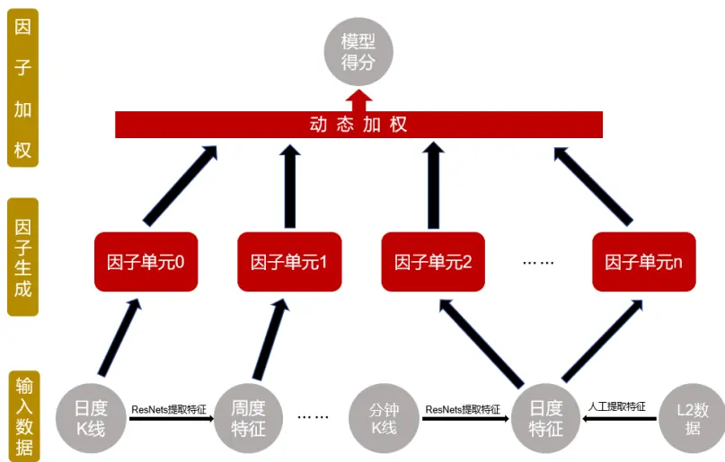
数据来源：东方证券研究所绘制

该端到端 AI 量价模型框架的因子单元提取阶段，我们借助 RNN 模型强大的时序提取能力，将输入的时间序列数据加工成含有时序信息的截面特征，最后利用图模型来考虑交易日截面个股之间的关联关系，最终得到我们所需的因子单元。

有关分析师的申明，见本报告最后部分。其他重要信息披露见分析师申明之后部分，或请与您的投资代表联系。并请阅读本证券研究报告最后一页的免责申明。

我们使用的图模型区别于传统模型，即不再使用先验信息来构建邻接矩阵，完全根据输入数据学习出短期个股的交互关系，利用两支 RNN 模型来进行学习，其中一支 RNN 模型（称为主GRU）用于生成图模型的输入，而根据另外一支 RNN 模型（称为次 GRU）的输出来计算个股之间的交互关系（即邻接矩阵）。由于我们在训练的时候损失函数部分没有考虑到生成邻接矩阵的RNN模型，因此我们学习到的邻接矩阵可能存在一些缺陷：

1. 由于我们是将次 RNN 模型输出的个股特征来刻画个股“属性”， 并利用这种“属性”来计算个股之间的相似度从而获取个股的邻接矩阵，但如果不对次GRU进行约束，可能导致所生成的特征对个股“属性”刻画比较粗糙从而使得邻接矩阵对个股相似度刻画“准确性”大打折扣。

2. 邻接矩阵代表股票间的关联关系，如果邻接矩阵变化速度过快，将会在导致模型最终生成因子换手率大幅提高，这意味着实盘中将付出更多的交易费用，另外一方面不对邻接矩阵自相关系数进行控制会导致在训练过程中更多学习到数据中的噪声，从而使得邻接矩阵鲁棒性下降，模型更加容易过拟合。

另一方面，一些长周期量价因子或者低频基本面因子对短周期预测能够起到一定的帮助，这部分数据蕴含的 alpha 信息往往与短周期量价数据的 alpha 信息相关性更低，使全模型获得更多信息增量。综合上述几个角度，本文将对原有的模型框架进行改进，以期能够让全模型的选股效果获得更大的提升。

## 一、 融入基本面信息的 ASTGNN 模型

这一章我们将介绍融入基本面信息的 ASTGNN模型，基本面信息的融入主要有两种方式：1.通过给神经网络输入一些量价与基本面数据让神经网络自助学习出一些风险因子，再利用这些风险因子构建图模型中的邻接矩阵；2.则是通过将一些基本面因子构建成数据集，通过 RNN 和DNN 提取出因子单元，从而能和原始量价数据集的因子单元形成信息互补。下面我们将分别介绍这两种改进方案。

## 1.1 图模型邻接矩阵的改进

前期报告《自适应时空图网络周频alpha模型》中，我们采用两支GRU模型的方式，利用相同的输入分别提取个股的属性特征向量和alpha因子特征向量（生成属性特征向量的GRU我们称次GRU，生成alpha因子特征向量的GRU我们称之为主 GRU），最终形成自适应图模型的邻接矩阵和输入。这种方式虽然有助于区分相同股票提取出的属性信息和 alpha 信息，但是由于我们在模型阶段没有对生成属性特征的 GRU 进行限制，因而很可能两个 GRU 提取出来信息之间的重叠度仍然较高。

为了应对上述问题，我们使用 RNN+GAT 网络来提取属性特征向量（记为 F），该网络具体结构可表示为如下形式：

图 2：RNN+GAT 网络结构
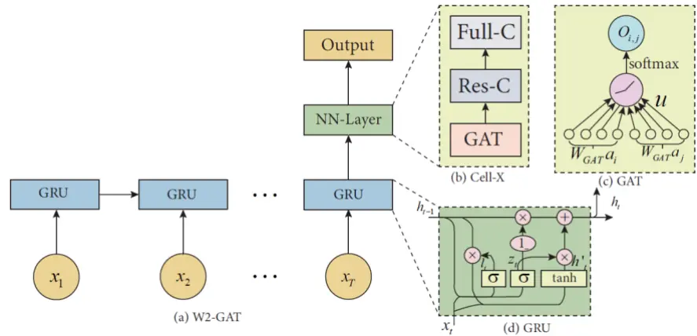
数据来源：东方证券研究所绘制

上图中 GAT 为图注意力机制，Res-C 表示残差连接，Full-C 表示全连接变换加 Batch-norm 层，并且我们还将该部分网络的损失函数进行改进。输入端主要由基础数据和 Barra 十个因子构成，而新设计的损失函数主要由两部分构成:

第一部分，我们希望相似股票在未来能有相似的表现，因此损失函数第一项我们构造属性特征向量与未来 t 期截面标准化之后的收益率（记为 $y_{t}$ ）之间的 R-square。并且我们希望邻接矩阵随时间变化程度不会过大（变化过大造成前后两期股票间依赖关系变化较大，从而最终全模型生成的 alpha因子换手率可能会较大）。

第二部分，我们希望属性特征向量各分量之间信息重叠度尽可能低，为了达到这个目标，我们引入相关系数矩阵范数的正交惩罚项作为损失函数第二项。

综合上述结果，我们最终设计损失函数可表示为：

$$
\sum_{t=1}^{T}\omega^{t-1}\mathrm{R}-\operatorname{square}(\boldsymbol{F},y_{t})+\lambda\left|\left|\operatorname{corr}(\boldsymbol{F},\boldsymbol{F})\right|\right|^{2}
$$

其中参数 ω 表示属性特征向量与未来 t 期标准收益率（记为 $y_{t}$ ）之间的 R-square 的权重，并且$0<\omega<1$ （即 t 越大则该期计算所得 R-square 损失对应权重越小）。参数 λ 表示相关系数惩罚项权重系数，是一个人为确定的超参数。上述损失函数中R-square具体计算方式可以由以下公式给出：

$$
\mathbb{R}-\operatorname{square}(\pmb{F},y_{t})=1-||y_{t}-\pmb{F}(\pmb{F}^{T}\pmb{F})^{-1}\pmb{F}^{T}y_{t}||\mathrm{{_\infty}}
$$

而 RNN+GAT 模型的输入则主要是一些长周期风险因子构成，这些风险因子主要分为十个大类，具体组成如下图所示：

图 3：风险因子提取模型的输入
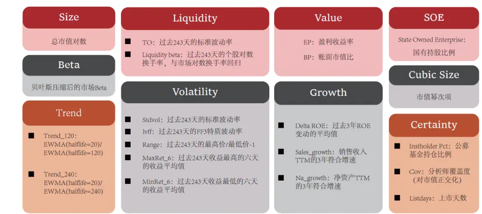
数据来源：东方证券研究所绘制

针对最终模型生成的属性特征向量，我们计算各分量与滞后五个交易日自相关系数，结果如下：

图 4：因子滞后五天自相关系数

| 因子 | 自相关系数 | 因子 | 自相关系数 |
| --- | --- | --- | --- |
| f0 | 96.30% | f9 | 87.46% |
| f1 | 94.91% | f10 | 94.49% |
| f2 | 96.91% | f11 | 95.33% |
| f3 | 93.79% | f12 | 92.47% |
| f4 | 94.05% | f13 | 95.64% |
| f5 | 92.42% | f14 | 94.67% |
| f6 | 94.62% | f15 | 91.62% |
| f7 | 93.41% | f16 | 91.67% |
| f8 | 96.20% | f17 | 92.31% |

数据来源：wind、上交所、深交所、东方证券研究所

上述结果可以看出除分量f9自相关系数外，其余分量自相关系数都高于91%，这意味着对于周频而言通过加入滞后多期R-square作为损失函数惩罚项后，前后两期股票“属性”变化不大，相似度值也变化较小。

我们因子单元提取的网络结构中图模型部分可表示为以下两种形式：

$$
\begin{aligned}\boldsymbol{Z}\;&=\;(\boldsymbol{I}+softmax(ReLU(MM^T)))\boldsymbol{X}\boldsymbol{W}\;(加法)\\\boldsymbol{Z}\;&=\;(\boldsymbol{I}-softmax(ReLU(MM^T)))\boldsymbol{X}\boldsymbol{W}\;(减法)\end{aligned}
$$

这里加法方式表示利用同类型股票来进行对股票自身 alpha 特征进行加强，可以理解为一种动量效应。而减法则可以理解为通过同类型的股票来进行中性化。整个因子单元提取的网络结构示意图可表示为：

图 5：因子单元提取网络结构
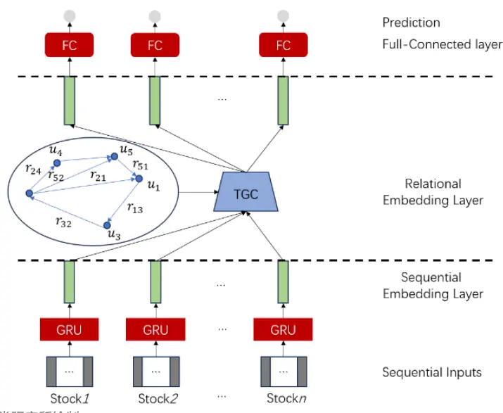
数据来源：东方证券研究所绘制

上述公式中矩阵 M 则是通过前文方式训练好的 RNN+GAT 模型在每个交易日截面所有股票输出的风险因子拼接成的。若生成风险因子个数为 K，则矩阵 M 的维度则为 N× K，这里 N表示交易日截面股票个数。

## 1.2加入基本面数据集

考虑到本模型生成的机器学习因子获得的超额收益有相当一部分来自于行业风格轮动，而长期动量、长期波动等风险因子能够协助模型更好的捕捉这一部分收益，且这些风险因子与我们模型中周度、日度、分钟线和 l2 数据集生成因子相关性不高，可以产生信息增量，因此我们构建长周期基本面数据集 lfq。

长周期基本面数据集中的基本面特征主要由以下几类因子组成：

- 估值类：EP（扣非净利润 TTM/市值）、EPTTM滚动一年 zscore、DP（过去一年分红/总市值）；

- 成长类：扣非后净利润同比增速、净资产收益率（ROE）；

- 超预期类：SUE 因子；

- 确定性类：公募基金持仓比例、分析师覆盖度；

为了克服基本面数据离群值较多，分布极其不正态等问题，我们采用了报告《基本面因子重构》中的处理方式进行回归，并且采用了与量价类数据集不同的预处理方法来促进神经网络更好的从基本面数据集中有效的提取 alpha信息。

对于长周期风险因子，许多因子取值隔日变化较小，相邻两天数据变化不大但收益率构建的标签可能发生比较大的变化，因此使用 RNN 模型很难提取出较为有效的时序信息，且容易使得RNN 模型本身对数据微小扰动变得较为敏感。为了克服上述问题，我们对数据按照不同采样模式构建数据集（日度采样对应数据集我们称为 lfq_daily，月度采样我们则称之为 lfq_monthly），并将生成因子在中证全指上选股效果列示如下表格所示：

图 6：两种采样方式下长周期数据集的表现

|  | Ifq_daily | Ifq_monthly |
| --- | --- | --- |
| RanklC | 14.48% | 10.09% |
| ICIR | 1.34 | 0.74 |
| RankIC>0占比 | 88.63% | 81.25% |
| 周均单边换手 | 53.84% | 42.19% |
| Top组年化超额 | 36.43% | 23.21% |
| Top组超额最大回撤 | -15.97% | -11.36% |
| Bottom组年化超额 | -60.81% | -37.98% |

数据来源：wind、上交所、深交所、东方证券研究所

图 7：日度采样分年度表现（回测期 20170101~20240430）

|  | 年化收益 | 回撤区间 | 年化波动率 | 夏普比率 | 最大回撤 | Calm ar |
| --- | --- | --- | --- | --- | --- | --- |
| 2017 | 38.68% | 2017-05-17 - 2017-06-01 | 6.67% | 5.86 | -3.57% | 11.27 |
| 2018 | 71.72% | 2018-07-03 - 2018-07-05 | 6.88% | 10.43 | -1.33% | 52.57 |
| 2019 | 22.82% | 2019-11-26 - 2019-12-18 | 5.28% | 4.30 | -2.33% | 9.43 |
| 2020 | 36.28% | 2020-02-04 - 2020-02-25 | 6.29% | 5.77 | -3.49% | 15.44 |
| 2021 | 28.07% | 2021-10-18 - 2021-12-08 | 7.15% | 3.92 | -8.85% | 3.29 |
| 2022 | 40.32% | 2022-04-18 - 2022-04-25 | 8.17% | 4.96 | -2.62% | 15.19 |
| 2023 | 22.26% | 2023-04-27 - 2023-05-25 | 7.04% | 3.18 | -4.12% | 4.05 |
| 20240430 | 10.40% | 2024-01-17- 2024-02-07 | 26.58% | 1.36 | -15.97% | 0.26 |
| 区间年化 | 36.43% | 2024-01-17 - 2024-02-07 | 8.69% | 4.19 | -15.97% | 1.74 |

数据来源：wind、上交所、深交所、东方证券研究所

图 8：月度采样分年度表现（回测期 20170101~20240430）

|  | 年化收益 | 回撤区间 | 年化波动率 | 夏普比率 | 最大回撤 | Calm ar |
| --- | --- | --- | --- | --- | --- | --- |
| 2017 | 10.85% | 2017-05-17 - 2017-06-01 | 6.99% | 1.57 | -3.88% | 2.80 |
| 2018 | 54.09% | 2018-06-05 - 2018-06-19 | 6.60% | 8.20 | -2.27% | 23.84 |
| 2019 | 18.15% | 2019-11-25 - 2019-12-26 | 6.97% | 2.59 | -4.17% | 4.36 |
| 2020 | 22.65% | 2020-01-02 - 2020-02-07 | 9.25% | 2.45 | -4.89% | 4.63 |
| 2021 | 6.35% | 2021-05-07 - 2021-11-29 | 11.93% | 0.53 | -11.34% | 0.56 |
| 2022 | 25.86% | 2022-02-25 - 2022-04-26 | 10.63% | 2.44 | -11.36% | 2.28 |
| 2023 | 9.22% | 2023-08-28 - 2023-11-08 | 5.40% | 1.71 | -3.27% | 2.82 |
| 20240430 | 26.95% | 2024-02-02 - 2024-02-07 | 17.38% | 8.30 | -6.39% | 3.72 |
| 区间年化 | 23.21% | 2022-02-25 - 2022-04-26 | 9.15% | 2.53 | -11.36% | 2.04 |

数据来源：wind、上交所、深交所、东方证券研究所

上述结果中年化收益率均为在回测期间统计结果，为了进一步对比两种方式下学习出来的因子性质，我们还对比了两种采样方式下长周期数据集生成打分在各种风格下暴露情况，具体结果如下表格所示：

图 9：长周期数据集生成因子暴露情况
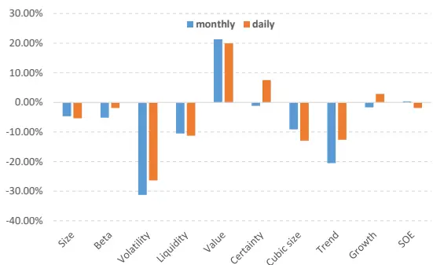
数据来源：wind、上交所、深交所、东方证券研究所

通过上述结果，我们可以得到：

1. 两个数据集生成因子的选股表现均较好，并且 lfq_daily 数据集生成因子的表现整体强于lfq_monthly 数据集，但 lfq_monthly 数据集多头组合换手率明显更低。

2. 两个数据集生成因子选股能力没有出现衰减迹象，但整体表现呈现出明显的周期变化趋势，即奇数年超额相对较低而偶数年超额则相对更高。

3. 两种采样方式下生成因子相关性较低仅仅只有46.80%，但暴露情况大致相同，主要是在波动和估值这两种风格上暴露程度较大。相对于月频采样，日频采样生成因子在非线性市值（Cubic Size）上暴露相对更大而在趋势（Trend）上相对更小。

今年以来，月度采样的长周期数据集表现明显好于日频采样。截至 2024 年 4月 30 日，该数据集生成因子在沪深300上双周频RankIC均值为12.82%，分5组top组超额收益率为12.26%，超额收益的最大回撤仅-1.50%；在中证 500 上 RankIC 均值为 9.39%，分 5 组 top 组超额收益率为 10.89%，超额收益的最大回撤-4.33%；在中证 1000 上 RankIC 均值为 16.08%，分 5 组 top 组超额收益率为 17.03%，超额收益的最大回撤仅-2.85%。

## 二、各数据集单因子分析

## 2.1 回测说明

第二、三章的回测结果中，各项指标计算方法如下所示：

1. RankIC 均值是当天因子与隔日未来十日收益率（即 T+1~T+11 收盘）序列进行计算的，并且每隔十个交易日计算一次，最终将这个 RankIC序列取平均得到的。

2. ICIR则是根据上述 RankIC序列均值除以序列标准差计算得到的。

3. 分组测试结果中，top 组和 bottom 组对冲年化收益（中证全指股票池上我们是将股票池分成 20 组，而沪深 300、中证 500 和中证 1000 股票池上则是分成 5 组），周度调仓，次日收盘价成交并且不考虑交易成本计算得到的。

4. 周均单边换手率是根据多头组持仓计算得到，而最大回撤和年化波动率则是根据 top 组超额收益净值计算得到的。

## 2.2 各数据集单因子绩效分析

本节我们将对比 week、day、ms、l2、lfq_daily 和 lfq_monthly 这六个数据集上分别生成因子在中证全指股票池上的选股效果。

图 10：各数据集因子汇总表现（回测期 20231229~20240430）

|  | week | day | ms | 12 |  | Ifq_daily Ifq_monthly |
| --- | --- | --- | --- | --- | --- | --- |
| RanklC | 13.55% | 14.10% | 14.13% | 12.06% | 14.48% | 10.09% |
| ICIR | 1.28 | 1.43 | 1.32 | 1.32 | 1.34 | 0.74 |
| RankIC>0占比 | 89.94% | 92.31% | 89.94% | 91.07% | 89.35% | 81.25% |
| 周均单边换手 | 58.22% | 69.27% | 60.20% | 61.18% | 53.84% | 42.19% |
| Top组年化超额 | 34.29% | 33.52% | 34.26% | 22.94% | 36.43% | 23.21% |
| 往年最大回撤 | -10.80% | -5.72% | -6.69% | -7.46% | -7.67% | -11.36% |
| Bottom组年化超额 | -56.86% | -62.53% | -60.69% | -55.86% | -60.81% | -37.98% |

数据来源：wind、上交所、深交所、东方证券研究所

图 11：今年以来各数据集因子多头净值走势（回测期 20231229~20240430）

| week |  | day | ms | 12 | Ifq_daily | Ifq_monthly |
| --- | --- | --- | --- | --- | --- | --- |
| 超额收益 | 24.07% | 6.40% | 4.11% | 8.71% | 10.39% | 26.95% |
| 最大回撤 -7.60% -17.79% |  |  | -18.14% -16.54% -15.97% -6.39% |  |  |  |

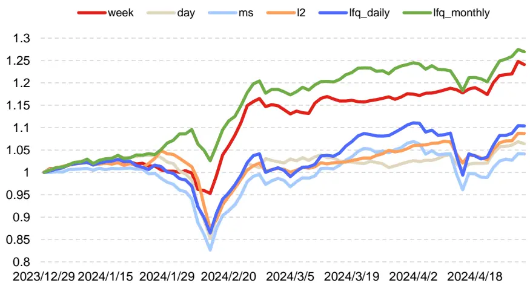
数据来源：wind、上交所、深交所、东方证券研究所

## 通过上述图表结果，我们可以看出：

1. 整体来看，各个数据集中 lfq_daily 数据集表现最好，这说明基本面相关的数据集生成短期高频 alpha因子可能拥挤度相对不高。

2. 今年以来截至2024年4月30日，各个数据集中，数据集week和lfq_monthly表现最好，超额收益均超过了 20%，且最大回撤相对往年更低。

3. 今年以来截至 2024 年 4 月 30 日，相对于数据集 day、ms 和 l2，数据集 lfq_daily 生成因子的超额收益更高且最大回撤相对更小。说明基本面数据确实带来了一些信息增量，从而使得数据集 lfq_daily在今年有着更好的表现。

## 2.3 各数据集单因子相关系数分析

这一节我们绘制各个数据集上生成因子相关系数矩阵如下图所示：

图 12：各数据集生成因子间相关系数矩阵

| Ifq_daily | Ifq_daily | Ifq_monthly | L2 | week | Ms | day |
| --- | --- | --- | --- | --- | --- | --- |
|  | 1.00 | 0.47 | 0.51 | 0.61 | 0.77 | 0.72 |
| Ifq_monthly | 0.47 | 1.00 | 0.37 | 0.48 | 0.45 | 0.43 |
| L2weekMsday | 0.51 | 0.37 | 1.00 | 0.48 | 0.62 | 0.54 |
|  | 0.61 | 0.48 | 0.48 | 1.00 | 0.64 | 0.78 |
|  | 0.77 | 0.45 | 0.62 | 0.64 | 1.00 | 0.75 |
|  | 0.72 | 0.43 | 0.54 | 0.78 | 0.75 | 1.00 |

数据来源：wind、上交所、深交所、东方证券研究所

## 上述结果我们可以看出：

1. 长周期数据集与其他数据集相关性较低，其中lfq_monthly因子相关性均低于0.5，这意味着通过引入基本面可以给数据集带来信息增量，但日度采样的估值因子中包含了日度个股价格序列信息，在 RNN 进行时序学习的时候可能过度捕捉这一部分信息，最终导致最终生成因子与数据集 day 和 Ms 生成因子相关性相对较高。

2. 各数据集之间相关性均低于 0.8，这说明数据集之间存在一定的信息差异，因而组合起来会产生信息互补作用，最终合成得到的综合打分相对单数据集有更强的选股效果。

## 2.4 各数据集特征重要性分析

这一节我们绘制了各数据集生成因子通过决策树加权时，各数据集对综合打分的贡献度占比分析，其结果如下图所示：

图 13：各数据集特征重要性分析
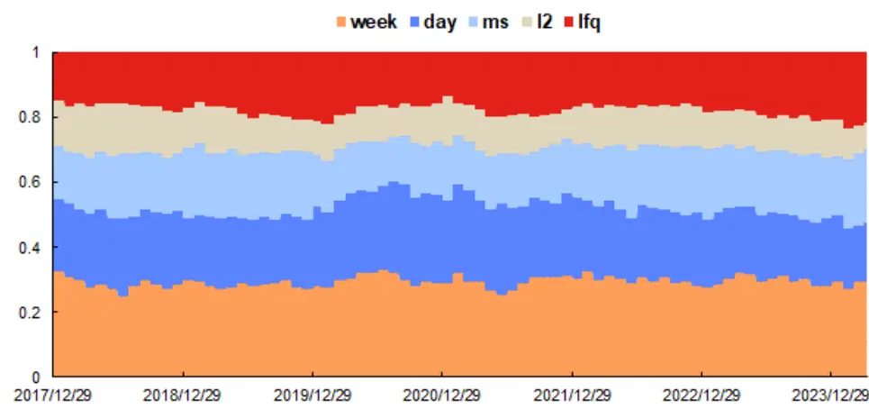
数据来源：wind、上交所、深交所、东方证券研究所

## 上述结果我们可以看出：

有关分析师的申明，见本报告最后部分。其他重要信息披露见分析师申明之后部分，或请与您的投资代表联系。并请阅读本证券研究报告最后一页的免责申明。

1. 五个数据集贡献度最高的数据集是 week 数据集，而贡献程度最低的是 l2 数据集。事实上相较于其他几个数据集，l2 数据信息含量更加丰富，与其他数据集之间的相关性也更低，因此l2数据集仍有较大改善空间。

2. 数据集 week 贡献度占比长期维持在 30%左右，数据集 day 自 2020 年以来对综合打分的贡献程度占比持续下降，而数据集lfq对综合打分贡献程度占比持续上升。这可能和day数据集上拥挤度较高、alpha 衰减较快有关，而对于低频数据集（比如 week）拥挤度较低，alpha有效性相对较高，因而 week数据集贡献度占比能够稳定维持在一个较高水平。

## 三、各数据集因子非线性加权结果分析

本章展示各数据生成弱因子经过非线性加权方法后得到最终因子在中证全指、沪深 300、中证 500和中证 1000四个股票池中的表现。

## 3.1 中证全指上的表现

首先，我们展示各种不同模型在中证全指股票池上生成因子在2018年以来的选股表现对比：

图 14：中证全指选股汇总表现（回测期 20171229~20240430）

|  | 原始 | 加入Ifq | 加法 | 减法 |
| --- | --- | --- | --- | --- |
| RanklC | 16.00% | 16.36% | 16.46% | 16.61% |
| ICIR | 1.52 | 1.56 | 1.56 | 1.57 |
| RanklC>0占比 | 95.17% | 94.48% | 94.48% | 94.48% |
| 周均单边换手 | 62.57% | 60.23% | 58.92% | 58.22% |
| 往年最大回撤 | -4.72% | -5.31% | -4.91% | -4.64% |
| 今年最大回撤 -21.13% |  | -21.32% | -20.41% -20.97% |  |

数据来源：wind、上交所、深交所、东方证券研究所

图 15：中证全指因子各分组超额表现
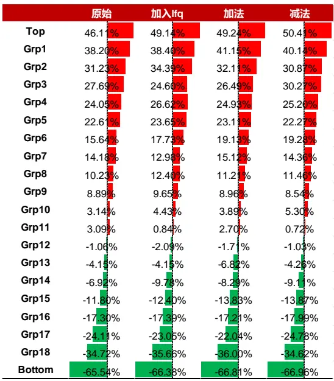
数据来源：wind、上交所、深交所、东方证券研究所
有关分析师的申明，见本报告最后部分。其他重要信息披露见分析师申明之后部分，或请与您的投资代表联系。并请阅读本证券研究报告最后一页的免责申明。

上述结果按照因子取值大小进行分组，top组为因子取值最大组，通过上述图表结果我们可以看出：

1. 通过加入长周期数据集之后（加入 lfq 栏），因子 RankIC、ICIR、因子多头和空头组超额显著提升，多头组的换手率也有所下降。这说明加入长周期数据集能够给全模型带来更多的信息增量，因而全模型选股效果能够进一步提升。

2. 通过引入机器学习风险因子来构建图模型的邻接矩阵后（减法和加法栏），因子 RankIC、ICIR、因子多头和空头组超额能够得到进一步提升，而多头组合的换手情况也能进一步下降。说明使用机器学习风险因子来进行股票相似度的刻画更加精确。

另外，经过测试合成打分直接用于月频也有着较好的选股效果，2018年和2020年以来截至2024年 4 月 30 日月频 RankIC 分别可达 19.16%和 17.53%，ICIR 可达 2.07 和 2.10，分二十组多头超额为 35.03%和 35.27%。通过引入未来二十日收益率作为标签以及将输入 RNN 模型序列长度拉长能够进一步提升该框架在月频上的表现。

下面我们将展示周频调仓下各个模型生成因子分年度多头组合的表现：

图 16：中证全指各年度多头组合选股表现（回测期 20171229~20240430）

| 绝对收益 |  |  |  |  |  |  |  |
| --- | --- | --- | --- | --- | --- | --- | --- |
|  | 2018 | 2019 | 2020 | 2021 | 2022 | 2023 | 20240430 |
| 原数据集 | 36.87% | 81.17% | 70.13% | 66.45% | 28.54% | 41.91% | -8.75% |
| 加lfq | 37.39% | 85.36% | 70.40% | 68.89% | 33.61% | 47.71% | -6.05% |
| 加法 | 35.97% | 86.30% | 68.67% | 71.58% | 34.02% | 47.79% | -5.46% |
| 减法 | 35.94% | 88.87% | 70.49% | 75.47% | 35.72% | 46.21% | -6.48% |

超额收益

|  | 2018 | 2019 | 2020 | 2021 | 2022 | 2023 | 20240430 |
| --- | --- | --- | --- | --- | --- | --- | --- |
| 原数据集 | 97.12% | 39.76% | 43.10% | 32.13% | 41.81% | 30.69% | 2.55% |
| 加lfq | 97.99% | 43.08% | 43.41% | 34.06% | 47.38% | 35.96% | 6.24% |
| 加法 | 95.91% | 43.84% | 41.97% | 36.25% | 47.81% | 36.02% | 6.91% |
| 减法 | 95.91% | 45.76% | 43.41% | 39.33% | 49.61% | 34.49% | 5.82% |

数据来源：wind、上交所、深交所、东方证券研究所

上表中各模型多头组合分年度绩效表现来看，除个别年份多头组合超额表现略低于基准模型，其他年份新模型均能大幅跑赢基准模型。这说明通过加入长周期数据集和引入机器学习风险因子刻画股票相似度能够给全模型带来较为稳定的提升效果。

## 3.2 各宽基指数上的表现

接着我们将各个模型生成因子在沪深300、中证500和中证1000这三个股票池上进行分组测试（分 5组），所得回测结果如下：

图 17：各宽基指数上选股表现（回测期 20180101~20231231）

| 沪深300 |  |  |  |  |
| --- | --- | --- | --- | --- |
|  | 原数据集 | 加lfq | 加法 | 减法 |
| RanklC | 10.50% | 10.65% | 10.74% | 10.70% |
| ICIR | 0.72 | 0.7 | 0.7 | 0.71 |
| RankIC>0占比 | 75.17% | 77.24% | 76.55% | 79.31% |
| Top年化超额 | 27.92% | 27.80% | 25.80% | 26.60% |
| 年化波动率 | 7.31% | 7.48% | 7.60% | 7.49% |
| 最大回撤 | -7.17% | -8.13% | -9.08% | -5.11% |
| 周均单边换手 | 43.94% | 43.49% | 41.22% | 40.90% |

中证500

|  | 原数据集 | 加lfq | 加法 | 减法 |
| --- | --- | --- | --- | --- |
| RanklC | 12.30% | 12.89% | 12.93% | 13.05% |
| ICIR | 0.97 | 0.99 | 1 | 1 |
| RankIC>0占比 | 80.69% | 83.45% | 83.45% | 83.45% |
| Top年化超额 | 25.28% | 25.12% | 25.39% | 24.57% |
| 年化波动率 | 6.20% | 6.29% | 6.29% | 6.29% |
| 最大回撤 | -7.99% | -9.62% | -9.12% | -10.64% |
| 周均单边换手 | 44.85% | 43.20% | 42.38% | 41.58% |

|  | 原数据集 | 加lfq | 加法 | 减法 |
| --- | --- | --- | --- | --- |
| RanklC | 15.27% | 15.87% | 16.02% | 16.09% |
| ICIR | 1.41 | 1.44 | 1.45 | 1.44 |
| RankIC>0占比 | 90.34% | 91.03% | 91.03% | 91.03% |
| Top年化超额 | 34.44% | 36.67% | 37.13% | 36.87% |
| 年化波动率 | 5.56% | 5.60% | 5.57% | 5.61% |
| 最大回撤 | -3.40% | -4.04% | -3.85% | -4.56% |
| 周均单边换手 | 45.25% | 43.44% | 42.71% | 42.36% |

数据来源：wind、上交所、深交所、东方证券研究所

通过以上结果我们可以看出各个模型生成因子的市值偏向性较低，在各个股票池上都有较强的选股能力。并且通过加入长周期数据集和引入风险因子构建图模型的邻接矩阵，所生成因子在各宽基指数上的 RankIC和 ICIR等指标能够进一步得到提升。

## 四、合成因子指数增强组合表现

## 4.1增强组合构建说明

本章将展示了减法模型下各数据集非线性加权得分在沪深300、中证500和中证1000指数增强的应用效果，关于指数增强组合有如下说明：

1） 回测期20171229~20240430，组合周频调仓，假设根据每周五个股得分在次日以vwap 价格进行交易，股票池为中证全指成分股。

2） 风险因子库dfrisk2020（参见《东方A股因子风险模型（DFQ-2020）》）的所有风格因子相对暴露不超过 0.5，所有行业因子相对暴露不超过 2%，中证 500 增强跟踪误差约束不超过 5%，沪深 300 增强跟踪误差约束不超过 4%。

3） 指增策略组合构建时，限制指数成分股占比，成分股占比约束记为 cpct（cpct=None 表示成分股占比不进行约束，cpct=0.8表示成分股占比进行 80%约束，cpct=1表示成分股占比进行100%约束），周单边换手率限制记为 delta。

4） 组合业绩测算时假设买入成本千分之一、卖出成本千分之二，停牌和涨停不能买入、停牌和跌停不能卖出。

有关分析师的申明，见本报告最后部分。其他重要信息披露见分析师申明之后部分，或请与您的投资代表联系。并请阅读本证券研究报告最后一页的免责申明。

## 4.2 沪深 300 指数增强

本节将展示新模型生成因子在沪深 300 指数增强策略应用，首先我们展示不同约束条件下，各年度超额收益以及汇总的业绩表现：

图 18：沪深 300 指增组合分年度超额收益率（回测期 20171229~20240430）

|  |  | 2018 | 2019 | 2020 | 2021 | 2022 | 2023 | 20240430 |
| --- | --- | --- | --- | --- | --- | --- | --- | --- |
| delta=0.1 | cpct=None | 17.62% | 3.50% | 10.78% | 19.11% | 18.20% | 13.90% | 1.28% |
|  | cpct=0.8 | 19.19% | 4.24% | 13.08% | 16.19% | 20.95% | 15.12% | 1.60% |
|  | cpct=1 | 15.18% | 4.26% | 21.75% | 14.13% | 20.13% | 10.86% | 8.53% |
| delta=0.2 | cpct=None | 26.03% | 3.94% | 14.44% | 24.07% 20.02% |  | 14.61% | 0.67% |
|  | cpct=0.8 | 25.88% | 5.80% | 17.38% | 24.13% | 22.18% | 15.19% | 1.43% |
|  | cpct=1 | 22.61% | 7.56% | 24.73% | 17.03% | 21.22% | 9.74% | 9.00% |
|  | cpct=None | 30.32% | 5.70% | 15.19% | 23.67% | 19.21% | 13.58% | -0.03% |
| delta=0.3 | cpct=0.8 | 27.89% | 5.44% | 20.77% | 22.42% | 20.74% | 12.91% | 1.62% |
|  | cpct=1 | 21.45% | 7.51% | 21.63% | 15.56% | 19.55% | 8.70% | 8.51% |

数据来源：wind、上交所、深交所、东方证券研究所

图 19：沪深 300 指增组合汇总结果（回测期 20171229~20240430）

|  |  | 年化超额 | 年化波动 | 历史最大回撤 | 平均持股数量 | 今年最大回撤 |
| --- | --- | --- | --- | --- | --- | --- |
| delta=0.1 | cpct=None | 13.73% | 4.54% | -3.95% | 90.35 | -7.00% |
|  | cpct=0.8 | 14.68% | 4.37% | -3.96% | 88.84 | -6.60% |
|  | cpct=1 | 14.24% | 3.96% | -3.92% | 82.68 | -1.03% |
| delta=0.2 | cpct=None | 16.96% | 4.68% | -4.83% | 87.61 | -7.46% |
|  | cpct=0.8 | 18.24% | 4.43% | -4.17% | 84.84 | -7.27% |
|  | cpct=1 | 16.98% | 4.06% | -2.89% | 79.77 | -1.82% |
| delta=0.3 | cpct=None | 17.70% | 4.72% | -4.15% | 86.46 | -8.20% |
|  | cpct=0.8 | 18.15% | 4.52% | -3.64% | 84.07 | -7.46% |
|  | cpct=1 | 15.60% | 4.18% | -3.03% | 78.35 | -1.76% |

数据来源：wind、上交所、深交所、东方证券研究所

图 20：沪深 300指增组合净值走势（成分股 100%限制，净值左轴，回撤右轴）
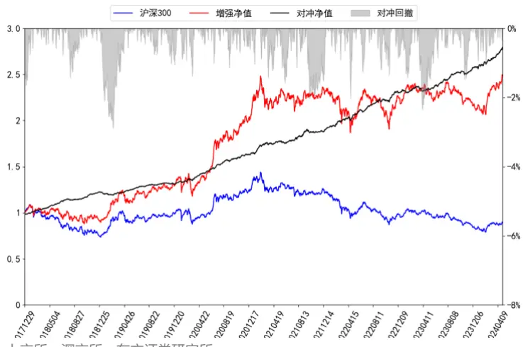
数据来源：wind、上交所、深交所、东方证券研究所

上述图表结果可以看出，新模型生成因子直接用于沪深 300 指增任务表现良好，并且约束条件较严格的条件下，沪深 300指增组合的表现反而更加优异。

## 4.3 中证 500 指数增强

本节将展示新模型生成因子在中证 500 指数增强策略应用，首先我们展示不同约束条件下，各年度超额收益以及汇总的业绩表现：

图 21：中证 500 指增组合分年度超额收益率（回测期 20171229~20240430）

|  |  | 2018 | 2019 | 2020 | 2021 | 2022 | 2023 | 20240430 |
| --- | --- | --- | --- | --- | --- | --- | --- | --- |
| delta=0.1 | cpct=None | 38.86% | 16.51% | 19.38% | 18.92% | 28.47% | 25.95% | -0.93% |
|  | cpct=0.8 | 36.69% | 15.12% | 17.56% | 27.25% | 22.66% | 13.95% | 1.59% |
|  | cpct=1 | 28.13% | 9.74% | 15.39% | 25.91% | 19.83% | 7.72% | 5.64% |
| delta=0.2 | cpct=None | 60.45% | 15.93% | 21.74% | 27.40% | 32.92% | 20.82% | -3.37% |
|  | cpct=0.8 | 52.30% | 15.79% | 19.09% | 31.08% | 18.13% | 13.21% | -0.47% |
|  | cpct=1 | 38.60% | 13.06% | 16.68% | 28.50% | 18.04% | 7.37% | 6.07% |
| delta=0.3 | cpct=None | 71.85% | 18.06% | 20.39% | 28.94% | 30.95% | 19.24% | -4.24% |
|  | cpct=0.8 | 55.46% | 16.54% | 18.98% | 33.13% | 17.58% | 14.34% | -1.40% |
|  | cpct=1 | 40.96% | 14.47% | 16.99% | 28.16% | 17.52% | 9.31% | 4.28% |

数据来源：wind、上交所、深交所、东方证券研究所

图 22：中证 500 指增组合汇总结果（回测期 20171229~20240430）

|  |  | 年化超额 | 年化波动 | 历史最大回撤 | 平均持股数量 | 今年最大回撤 |
| --- | --- | --- | --- | --- | --- | --- |
| delta=0.1 | cpct=None | 24.48% | 6.43% | -5.48% | 132.84 | -16.13% |
|  | cpct=0.8 | 21.97% | 5.40% | -4.64% | 110.41 | -7.27% |
|  | cpct=1 | 17.55% | 5.04% | -4.57% | 99.22 | -2.13% |
| delta=0.2 | cpct=None | 29.14% | 6.69% | -4.93% | 125.10 | -18.19% |
|  | cpct=0.8 | 24.28% | 5.85% | -5.55% | 102.00 | -8.67% |
|  | cpct=1 | 19.96% | 5.41% | -6.26% | 93.91 | -1.52% |
| delta=0.3 | cpct=None | 30.43% | 6.69% | -5.02% | 122.39 | -18.96% |
|  | cpct=0.8 | 25.25% | 5.95% | -4.61% | 99.40 | -9.51% |
|  | cpct=1 | 20.82% | 5.44% | -7.11% | 91.66 | -3.36% |

数据来源：wind、上交所、深交所、东方证券研究所

图 23：中证 500指增组合净值走势（成分股 100%限制，净值左轴，回撤右轴）
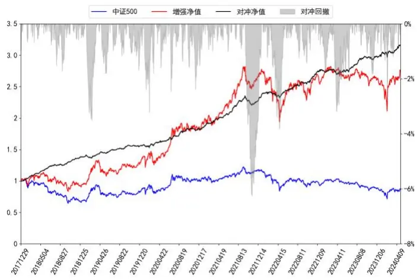
数据来源：wind、上交所、深交所、东方证券研究所

上述图表结果可以看出，新模型生成因子可以直接用于中证 500 指增任务，且该组合表现良好。成分股占比不做约束下组合的超额收益大幅超过成分股占比 80%约束条件下组合的结果。

有关分析师的申明，见本报告最后部分。其他重要信息披露见分析师申明之后部分，或请与您的投资代表联系。并请阅读本证券研究报告最后一页的免责申明。

## 4.4 中证 1000 指数增强

本小节将展示基准模型和新模型生成因子打分应用于中证 1000指数增强策略表现情况：

图 24：中证 1000 指增组合分年度超额收益率（回测期 20171229~20240430）

|  |  | 2018 | 2019 | 2020 | 2021 | 2022 | 2023 | 20240430 |
| --- | --- | --- | --- | --- | --- | --- | --- | --- |
| delta=0.1 | cpct=None | 46.50% | 22.44% | 23.13% | 27.37% | 28.86% | 21.04% | 2.81% |
|  | cpct=0.8 | 45.17% | 26.46% | 21.51% | 32.06% | 31.42% | 13.69% | 1.29% |
|  | cpct=1 | 49.73% | 20.61% | 27.20% | 26.80% | 31.58% | 17.58% | 2.12% |
| delta=0.2 | cpct=None | 65.86% | 24.52% | 23.63% | 32.48% | 34.58% | 21.78% | -0.08% |
|  | cpct=0.8 | 70.56% | 27.79% | 22.71% | 31.36% | 29.64% | 12.87% | -2.07% |
|  | cpct=1 | 71.04% | 20.18% | 23.78% | 29.72% | 34.40% | 18.67% | -0.29% |
| delta=0.3 | cpct=None | 75.05% | 28.29% | 18.87% | 28.02% | 32.33% | 21.23% | -0.83% |
|  | cpct=0.8 | 79.61% | 32.38% | 19.40% | 28.92% | 28.17% | 14.98% | -2.33% |
|  | cpct=1 | 63.76% | 32.57% | 20.57% | 30.67% | 21.65% | 14.08% | -1.18% |

数据来源：wind、上交所、深交所、东方证券研究所

图 25：中证 1000 指增组合汇总结果（回测期 20171229~20240430）

|  |  | 年化超额 | 年化波动 | 历史最大回撤 | 平均持股数量 | 今年最大回撤 |
| --- | --- | --- | --- | --- | --- | --- |
| delta=0.1 | cpct=None | 28.54% | 6.37% | -5.19% | 133.09 | -10.95% |
|  | cpct=0.8 | 28.04% | 5.82% | -4.42% | 122.09 | -8.89% |
|  | cpct=1 | 26.73% | 5.42% | -3.80% | 112.97 | -4.10% |
| delta=0.2 | cpct=None | 31.92% | 6.61% | -5.43% | 125.28 | -14.45% |
|  | cpct=0.8 | 31.40% | 6.22% | -4.77% | 115.14 | -11.42% |
|  | cpct=1 | 31.63% | 5.91% | -4.40% | 107.48 | -6.63% |
| delta=0.3 | cpct=None | 32.82% | 6.30% | -5.67% | 125.28 | -15.68% |
|  | cpct=0.8 | 32.46% | 6.51% | -4.98% | 111.89 | -12.03% |
|  | cpct=1 | 29.66% | 6.17% | -4.29% | 105.61 | -6.84% |

数据来源：wind、上交所、深交所、东方证券研究所

图 26：中证 1000指增组合净值走势（成分股 100%限制，净值左轴，回撤右轴）
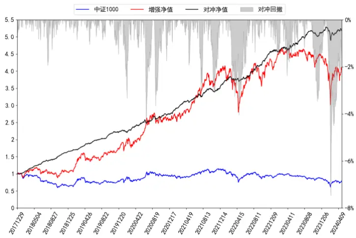
数据来源：wind、上交所、深交所、东方证券研究所

上述图表结果可以看出，新模型生成因子直接用于中证1000指增任务形成组合，且该组合表现良好。随着约束条件不断放松组合的超额收益也将不断地上升。

## 五、结论

前期报告中，我们基于周度（week）、日度（day）、分钟线（ms）和Level-2（l2）四个数据集，利用RNN、ResNet、GNN和决策树模型搭建了AI量价模型框架，并将该框架生成的最终打分应用于选股策略，回测结果显示这套框架下生成的因子有着较强的选股能力。

我们使用的图模型完全根据输入数据学习出短期个股的交互关系，利用两支RNN模型来进行学习，其中一支 RNN 模型（称为主 GRU）用于生成图模型的输入，而根据另外一支 RNN 模型（称为次 GRU）的输出来计算个股之间的交互关系（即邻接矩阵）。由于我们在训练的时候损失函数部分没有考虑次 RNN模型，因此我们学习到的邻接矩阵可能存在一些缺陷：

1. 由于我们是将次 RNN 模型输出的隐藏层来刻画个股“属性”， 并利用这种“属性”来计算个股之间的相似度从而获取个股的邻接矩阵，但如果不对次GRU进行一定的约束，可能导致所生成的特征对个股“属性”刻画比较粗糙从而使邻接矩阵对个股间相似度刻画“准确性”大打折扣。

2. 邻接矩阵代表股票间的关联关系，如果邻接矩阵变化速度过快，将会在导致模型最终生成因子换手率大幅提高，这意味着实盘中将付出更多的交易费用。

另一方面，一些长周期量价因子或者低频基本面因子对短周期预测能够起到一定的帮助，这部分数据蕴含的 alpha 信息往往与短周期量价数据的 alpha 信息相关性更低，对全模型信息起到较补充作用。综合上述几个角度，本文将对原有的模型框架进行改进，以期能够让全模型的选股效果获得更大的提升。本文则综合上述角度对原有模型框架进行了一系列改进。

从各数据集生成因子分别的回测结果来看，我们可以得到：

1. 今年以来截至2024年4月30日各个数据集中，数据集week和lfq_monthly表现最好，超额收益均超过了 20%，且相对往年不产生最大回撤。

2. 长周期数据集与其他数据集相关性较低，其中 lfq_monthly 因子相关性均低于 0.5，这意味着通过引入基本面可以给数据集带来信息增量，但日度采样的估值因子中包含了日度个股价格序列信息，在RNN进行时序学习的时候可能过度捕捉这一部分信息，最终导致最终生成因子与数据集 day 和 Ms 生成因子相关性相对较高

3. 对综合打分贡献度最高的数据集是 week 数据集，而贡献程度最低的是 l2 数据集。事实上相较于其他几个数据集，l2 数据信息含量更加丰富，与其他数据集之间的相关性也更低，因此认为 l2数据集仍有较大改善空间。

从最终因子回测结果来看我们可以得到：1. 相较于基准模型，加入长周期数据集之后模型RankIC、ICIR等指标均显著提升，多头组合换手率也显著降低。这说明通过加入与高频量价数据集低相关的长周期数据集后，全模型能够得到更多的信息增量，从而大大提高最终生成因子的选股效果。2. 通过引入机器学习得到的风险因子来构建图模型的邻接矩阵后，因子 RankIC、top 组年化超额收益率等指标得到进一步提升，多头组合换手率也能进一步降低，这说明使用机器学习风险因子来进行股票相似度的刻画更加精确。

基于两种改进方案融合后，新模型非线性加权合成打分 2018 年以来截至 2024 年 4 月 30 日在中证全指上周频 RankIC 均值可达 16.61%，top 组年化超额可达 50.41%；在沪深 300、中证500、中证 1000 这三个指数上 RankIC 均值分别为 10.70%、13.05%、16.09%。相较于基准模型，各宽基指数股票池上两种改进方案生成因子的选股能力均有明显提升效果。

有关分析师的申明，见本报告最后部分。其他重要信息披露见分析师申明之后部分，或请与您的投资代表联系。并请阅读本证券研究报告最后一页的免责申明。

本文生成因子也可以直接应用于指数增强策略，在各宽基指数上均能获得显著的超额收益，在成分股100%限制和周单边换手率约束为20%约束下，2018年以来截至2024年4月30日，新模型打分在沪深300、中证500和中证1000增强策略上年化超额收益率分别为16.98%、19.96%和 31.63%。

## 风险提示

1. 量化模型基于历史数据分析，未来存在失效风险，建议投资者紧密跟踪模型表现。

2. 极端市场环境可能对模型效果造成剧烈冲击，导致收益亏损。

## Tabl e_Disclai mer 分析师申明

每位负责撰写本研究报告全部或部分内容的研究分析师在此作以下声明：

分析师在本报告中对所提及的证券或发行人发表的任何建议和观点均准确地反映了其个人对该证券或发行人的看法和判断；分析师薪酬的任何组成部分无论是在过去、现在及将来，均与其在本研究报告中所表述的具体建议或观点无任何直接或间接的关系。

## 投资评级和相关定义

报告发布日后的12个月内行业或公司的涨跌幅相对同期相关证券市场代表性指数的涨跌幅为基准（A 股市场基准为沪深 300 指数，香港市场基准为恒生指数，美国市场基准为标普 500 指数）；

## 公司投资评级的量化标准

买入：相对强于市场基准指数收益率 15%以上；

增持：相对强于市场基准指数收益率 5%～15%；

中性：相对于市场基准指数收益率在-5%～+5%之间波动；

减持：相对弱于市场基准指数收益率在-5%以下。

未评级 —— 由于在报告发出之时该股票不在本公司研究覆盖范围内，分析师基于当时对该股票的研究状况，未给予投资评级相关信息。

暂停评级 —— 根据监管制度及本公司相关规定，研究报告发布之时该投资对象可能与本公司存在潜在的利益冲突情形；亦或是研究报告发布当时该股票的价值和价格分析存在重大不确定性，缺乏足够的研究依据支持分析师给出明确投资评级；分析师在上述情况下暂停对该股票给予投资评级等信息，投资者需要注意在此报告发布之前曾给予该股票的投资评级、盈利预测及目标价格等信息不再有效。

## 行业投资评级的量化标准：

看好：相对强于市场基准指数收益率 5%以上；

中性：相对于市场基准指数收益率在-5%～+5%之间波动；

看淡：相对于市场基准指数收益率在-5%以下。

未评级：由于在报告发出之时该行业不在本公司研究覆盖范围内，分析师基于当时对该行业的研究状况，未给予投资评级等相关信息。

暂停评级：由于研究报告发布当时该行业的投资价值分析存在重大不确定性，缺乏足够的研究依据支持分析师给出明确行业投资评级；分析师在上述情况下暂停对该行业给予投资评级信息，投资者需要注意在此报告发布之前曾给予该行业的投资评级信息不再有效。

## HeadertTabl e_Discl ai mer 免责声明

本证券研究报告（以下简称“本报告”）由东方证券股份有限公司（以下简称“本公司”）制作及发布。

。本公司不会因接收人收到本报告而视其为本公司的当然客户。本报告的全体接收人应当采取必要措施防止本报告被转发给他人。

本报告是基于本公司认为可靠的且目前已公开的信息撰写，本公司力求但不保证该信息的准确性和完整性，客户也不应该认为该信息是准确和完整的。同时，本公司不保证文中观点或陈述不会发生任何变更，在不同时期，本公司可发出与本报告所载资料、意见及推测不一致的证券研究报告。本公司会适时更新我们的研究，但可能会因某些规定而无法做到。除了一些定期出版的证券研究报告之外，绝大多数证券研究报告是在分析师认为适当的时候不定期地发布。

在任何情况下，本报告中的信息或所表述的意见并不构成对任何人的投资建议，也没有考虑到个别客户特殊的投资目标、财务状况或需求。客户应考虑本报告中的任何意见或建议是否符合其特定状况，若有必要应寻求专家意见。本报告所载的资料、工具、意见及推测只提供给客户作参考之用，并非作为或被视为出售或购买证券或其他投资标的的邀请或向人作出邀请。

本报告中提及的投资价格和价值以及这些投资带来的收入可能会波动。过去的表现并不代表未来的表现，未来的回报也无法保证，投资者可能会损失本金。外汇汇率波动有可能对某些投资的价值或价格或来自这一投资的收入产生不良影响。那些涉及期货、期权及其它衍生工具的交易，因其包括重大的市场风险，因此并不适合所有投资者。

在任何情况下，本公司不对任何人因使用本报告中的任何内容所引致的任何损失负任何责任，投资者自主作出投资决策并自行承担投资风险，任何形式的分享证券投资收益或者分担证券投资损失的书面或口头承诺均为无效。

本报告主要以电子版形式分发，间或也会辅以印刷品形式分发，所有报告版权均归本公司所有。未经本公司事先书面协议授权，任何机构或个人不得以任何形式复制、转发或公开传播本报告的全部或部分内容。不得将报告内容作为诉讼、仲裁、传媒所引用之证明或依据，不得用于营利或用于未经允许的其它用途。

经本公司事先书面协议授权刊载或转发的，被授权机构承担相关刊载或者转发责任。不得对本报告进行任何有悖原意的引用、删节和修改。

提示客户及公众投资者慎重使用未经授权刊载或者转发的本公司证券研究报告，慎重使用公众媒体刊载的证券研究报告。

## 东方证券研究所

地址： 上海市中山南路 318 号东方国际金融广场 26 楼

电话：021-63325888

传真：021-63326786

网址： www.dfzq.com.cn