# 非线性市值风控全攻略

## 研究结论

## 非线性市值风控的必要性

⚫2024年1月底到2月初期间，整个市场经历了一系列的极端事件，这些事件对选股因子乃至指数增强产品的收益形成了较大的负向冲击，基于深度学习因子构建的指数增强组合今年以来的相对回撤也非常大。中证 500增强组合今年以来的相对最大回撤达-8.64%，年化跟踪误差也达到 10.79%，中证 1000增强组合今年以来相对最大回撤达-11.21%，年化跟踪误差也达到 13.56%。深度学习因子构建的指增组合通过做多微盘并做多部分大盘股配平约束来获取超额收益。因此，当市值因子超额反向时，增强组合大幅跑输基准。

由于中证 500、中证1000等宽基指数以过去一年的日均总市值排名后筛选，所以在构建指数增强组合时，成分股左右侧这种“非线性市值”对增强组合的收益波动影响非常大，需要对非线性市值进行风控。

## 非线性市值风控方法

我们从提高成分股内权重占比、约束 NLSize 的角度检验传统风控手段的效果，可以发现针对中证 1000指数，传统风控手段并不能较好控制组合今年以来的回撤，因此我们提出了基准相对NLSize、基准左右侧相对NLSize以及分组Size的非线性市值风控手段，通过添加这3种非线性市值约束，中证500和中证1000增强组合今年以来的超额回撤和跟踪误差大部分情况下都能得到非常显著的控制。

## 非线性市值综合风控效果

同时添加三种非线性市值约束后，中证 500 增强组合今年以来的相对最大回撤得到了大幅改善，从-8.64%下降到-2.77%，超额收益从 3.45%提升到 7.18%，年化跟踪误差从 10.79%下降到 7.51%，月度超额胜率 100%。中证 1000 增强组合今年以来的相对最大回撤得到了大幅改善，从-11.21%下降到-3.13%，超额收益从 1.45%提升到 5.43%，年化跟踪误差从 13.56%下降到 7.93%，月度超额胜率 100%，得到显著改善。并且在上证 50和沪深 300等指数增强组合上添加该约束同样也能非常显著地控制增强组合今年以来的相对回撤和跟踪误差。

## 风险提示

1. 量化模型失效风险。

2. 极端市场环境可能对模型效果造成剧烈冲击，导致收益亏损。

## 报告发布日期

2024 年 05 月 27 日

杨怡玲 yangyiling@orientsec.com.cn

执业证书编号：S0860523040002

DFQ-FactorVAE：融合变分自编码器和概 2024-05-14率动态因子模型的 alpha 预测方案：——

因子选股系列之一〇三

基本面因子的重构：——因子选股系列之 2024-03-21一〇二

自适应时空图网络周频 alpha 模型：—— 2024-02-28因子选股系列之一〇一

DFQ-HIST：添加图信息的选股因子挖掘 2024-02-07系统：——因子选股系列之一百

基于异构图神经网络的股票关联因子挖 2024-01-02掘：——因子选股系列之九十九

基于抗噪的 AI 量价模型改进方案：——因 2023-12-24子选股系列之九十八

DFQ-TRA：多交易模式学习因子挖掘系 2023-11-14统：——因子选股系列之九十七

基于残差网络的端到端因子挖掘模型：— 2023-08-24—因子选股系列之九十六

DFQ 强化学习因子组合挖掘系统：——因 2023-08-17子选股系列之九十五

基于循环神经网络的多频率因子挖掘：— 2023-06-06—因子选股系列之九十一

## 一、非线性市值风控的必要性

## 1.1 极端市场环境下的深度学习因子表现

2024 年 1 月底到 2 月初期间，整个市场经历了一系列的极端事件，包括雪球大幅敲入、DMA 产品清仓及微盘股的闪崩，这些事件不仅对股票市场形成了冲击，也对选股因子乃至指数增强产品的收益形成了较大的负向冲击。下图我们统计了20240129-20240207期间公募基金的沪深300、中证 500、中证 1000指数增强基金的超额收益的直方图。可以看到，大部分沪深 300、中证 500和中证 1000指数增强基金在这期间的超额都为负。

图 1：公募指数增强产品超额收益直方图（20240129-20240207）
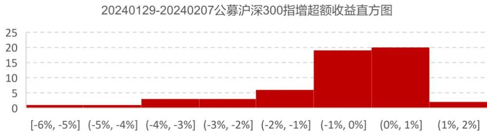

20240129-20240207公募中证500指增超额收益直方图
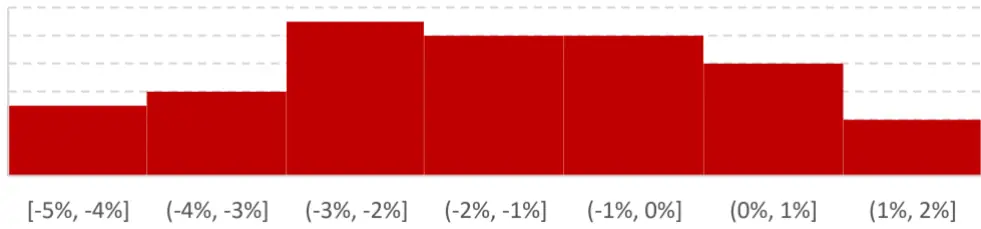

20240129-20240207公募中证1000指增超额收益直方图
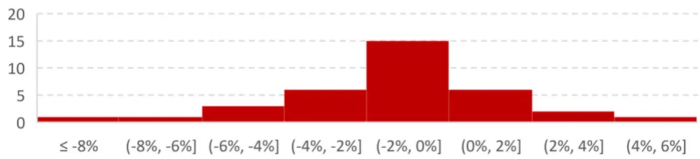
数据来源：Wind，东方证券研究所

在我们前期的报告《基于残差网络的端到端因子挖掘模型》(20230824) 中我们构建了基于 day、week、minute和level2四个数据集上的深度学习因子，因子选股效果非常显著，但是在这段极端市场环境的时间内，同样也遭受了大幅的因子失效。如下图所示，可以看到在这期间，深度学习因子十分组超额完全反向，多头（第 10 组）在这期间大幅跑输市场，因子的日度 IC 也是显著负向，虽然过了这段时间后因子的选股能力又恢复了，但是这期间的失效幅度非常大。

图 2：20231031以来深度学习因子十组超额净值
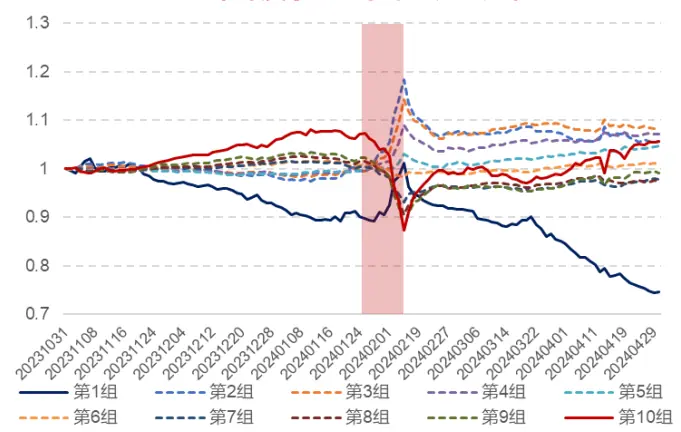
数据来源：Wind，东方证券研究所

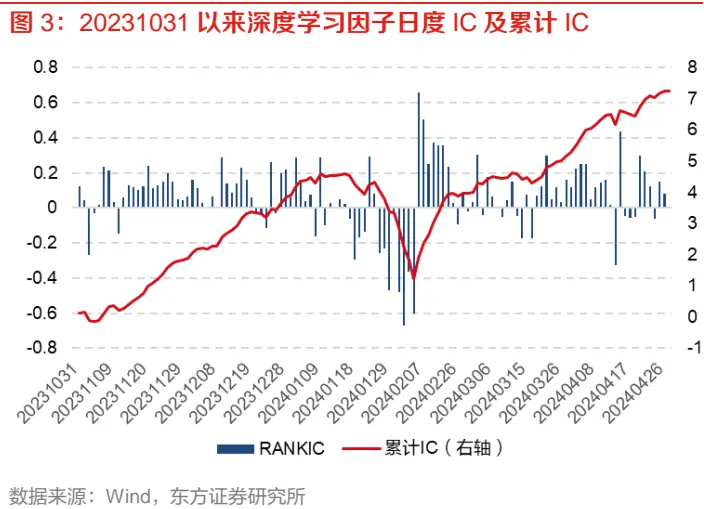

我们以深度学习因子作为收益预测模型构建中证500、中证1000指数增强组合，组合约束如下：

- 个股权重偏离最大 1%；

- 行业权重最大暴露 2%；

- Barra风格暴露最大0.5倍标准差；

- 成分股内权重占比 80%；

- 周单边换手最大 20%。

我们以第二天 VWAP 换仓并扣除双边 0.3%费用来回测组合收益。下图分别展示了中证 500 和中证 1000指数增强组合的净值走势。

图 4：深度学习因子中证 500指增组合净值
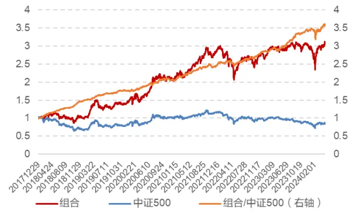
数据来源：Wind，东方证券研究所

图 5：深度学习因子中证 1000指增组合净值
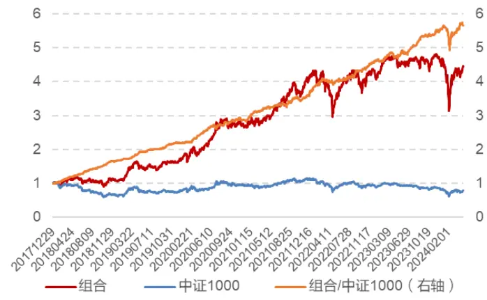
数据来源：Wind，东方证券研究所

可以看到，该因子构建的增强组合相对于中证 500 和中证 1000 指数历史的超额收益非常稳健，但是今年以来的相对回撤非常大。下表展示了中证 500 增强组合各年的绩效情况，组合年化超额收益 22.46%，虽然今年以来的超额为 3.45%，但是今年以来的相对最大回撤达-8.64%，年化跟踪误差也达到 10.79%，今年以来的超额收益波动非常剧烈。

表 1：深度学习因子中证 500指增组合收益表现

| YEAR | 绝对收益 | 基准收益 | 超额收益 | 相对最大回撤 | 信息比 | 跟踪误差 | 收益回撤比 | 月度胜率 |
| --- | --- | --- | --- | --- | --- | --- | --- | --- |
| 2018 | -0.85% | -33.32% | 32.47% | -1.18% | 6.93 | 5.95% | 27.58 | 100.00% |
| 2019 | 49.23% | 26.38% | 22.85% | -1.87% | 3.33 | 5.08% | 12.24 | 91.67% |
| 2020 | 40.93% | 20.87% | 20.06% | -4.15% | 2.23 | 7.22% | 4.83 | 83.33% |
| 2021 | 43.37% | 15.58% | 27.78% | -4.13% | 3.55 | 6.32% | 6.73 | 91.67% |
| 2022 | -10.16% | -20.31% | 10.16% | -4.69% | 2.14 | 5.99% | 2.17 | 66.67% |
| 2023 | 11.27% | -7.42% | 18.69% | -3.27% | 3.62 | 5.20% | 5.72 | 75.00% |
| 20240430 | 3.67% | 0.22% | 3.45% | -8.64% | 0.99 | 10.79% | 0.40 | 75.00% |
| 全样本期 | 20.23% | -2.23% | 22.46% | -8.64% | 3.29 | 6.36% | 2.60 | 84.21% |

数据来源：Wind，东方证券研究所

下表展示了中证 1000 增强组合各年的绩效情况，组合年化超额收益 31.34%，虽然今年以来的超额为 1.45%，但是今年以来的相对最大回撤达-11.21%，年化跟踪误差也达到 13.56%，今年以来的超额收益波动更加剧烈。

表 2：深度学习因子中证 1000指增组合收益表现

| YEAR | 绝对收益 | 基准收益 | 超额收益 | 相对最大回撤 | 信息比 | 跟踪误差 | 收益回撤比 | 月度胜率 |
| --- | --- | --- | --- | --- | --- | --- | --- | --- |
| 2018 | 5.37% | -36.87% | 42.24% | -1.17% | 7.36 | 7.25% | 36.11 | 100.00% |
| 2019 | 65.84% | 25.67% | 40.17% | -1.33% | 5.67 | 4.95% | 30.28 | 100.00% |
| 2020 | 56.83% | 19.39% | 37.44% | -5.49% | 3.57 | 7.85% | 6.82 | 75.00% |
| 2021 | 55.97% | 20.52% | 35.45% | -3.86% | 3.68 | 7.20% | 9.18 | 75.00% |
| 2022 | -2.59% | -21.58% | 18.99% | -3.20% | 3.15 | 7.28% | 5.94 | 75.00% |
| 2023 | 12.25% | -6.28% | 18.53% | -3.67% | 3.12 | 5.93% | 5.05 | 75.00% |
| 20240430 | -5.17% | -6.62% | 1.45% | -11.21% | 0.50 | 13.56% | 0.13 | 50.00% |
| 全样本期 | 27.44% | -3.90% | 31.34% | -11.21% | 3.88 | 7.35% | 2.79 | 81.58% |

数据来源：Wind，东方证券研究所

## 1.2 深度学习因子短期失效的原因

深度学习因子短期失效一部分是市场的结构化行情的原因。下面左图展示了近半年宽基的走势，在今年2月初，微盘股、中证1000等小盘指数大幅回撤。下面右图展示了市值因子十分组的超额走势净值，可以看到 2月初市值因子的十分组收益也完全和之前反向，并且收益分化非常剧烈。

图 6：20231031 以来宽基指数走势（20240126 基日）
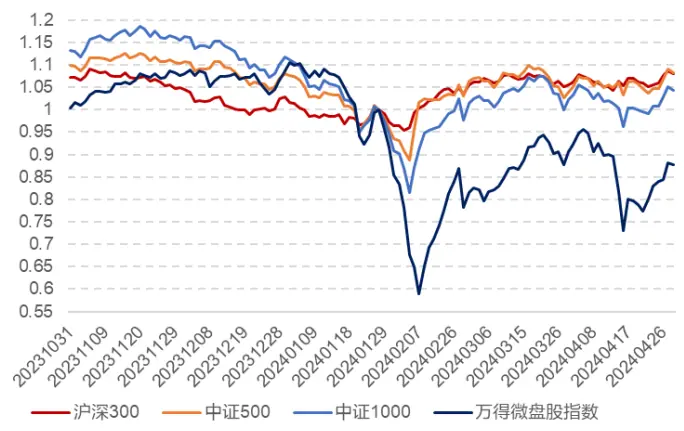
数据来源：Wind，东方证券研究所

图 7：20231031以来市值因子十组超额净值走势
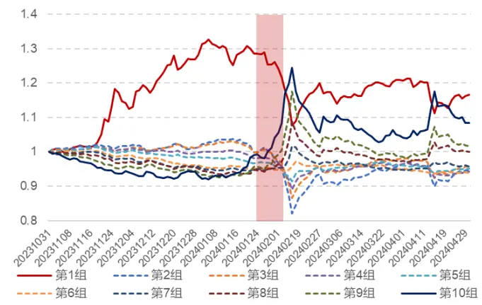
数据来源：Wind，东方证券研究所

有关分析师的申明，见本报告最后部分。其他重要信息披露见分析师申明之后部分，或请与您的投资代表联系。并请阅读本证券研究报告最后一页的免责申明。

而从深度学习因子本身来说，由于因子更优先于选择微盘股因此在这期间产生了较大回撤。下图展示了 20240202 当期中证 500 指数增强组合在每只股票上的权重超低配情况，个股按照当期的市值进行从低到高的排序。容易发现增强组合超配了左侧的小微盘股票而低配了成分股内市值大的股票。下面右图展示了增强组合按市值排序后的累计权重偏离曲线。从曲线的过程可以看到，该增强组合超配了 20%左右的小微盘股票，中盘的股票几乎没有配置，而成分股内超配了其中的小盘股低配了右侧的大盘股，并且在超大市值股票中高配了部分股票，由此形成了高配市值两头低配成分股中盘的“哑铃”型结构，通过做多微盘并做多部分大盘股配平约束来获取超额收益。因此，当市值因子超额反向时，增强组合大幅跑输基准。

图 8：20240202中证500指增组合的个股权重超低配情况
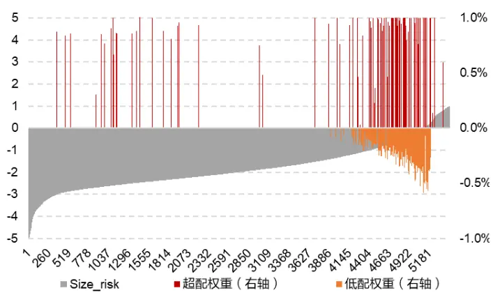
数据来源：Wind，东方证券研究所

图 9：20240202中证500指增组合的个股累计权重偏离
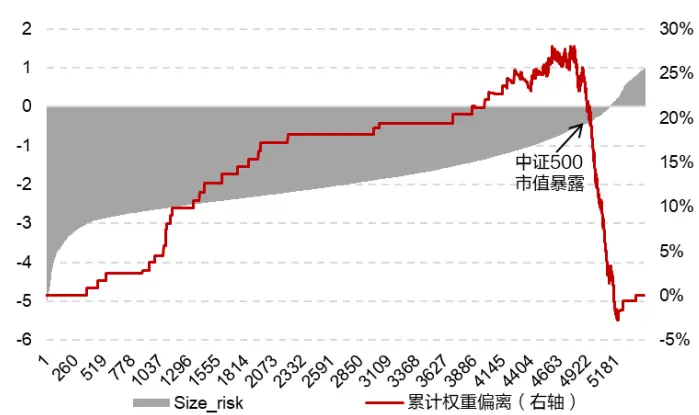
数据来源：Wind，东方证券研究所

下图展示了20240202当期中证1000指数增强组合在每只股票上的权重超低配情况，个股按照当期的市值进行从低到高的排序。容易发现中证1000增强组合同样超配了左侧的小微盘股票而低配了成分股内市值大的股票。下面右图展示了中证 1000 增强组合按市值排序后的累计权重偏离曲线。从曲线的过程可以看到，该增强组合超配了 40%左右的小微盘股票，低配了右侧的大盘股，并且在超大市值股票中高配了部分股票，同样形成了市值暴露的“哑铃”型结构。由于左侧超配的小盘权重比中证 500 增强组合超配得更大，因此当市值因子超额反向时，中证 1000 增强组合会更大幅跑输基准。

图 10：20240202中证 1000指增组合的个股权重超低配情况
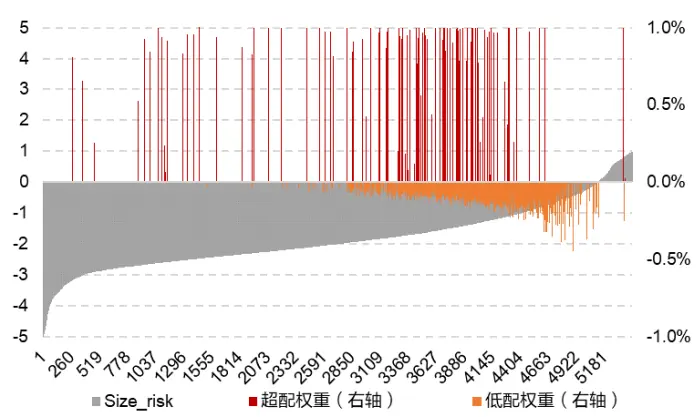
数据来源：Wind，东方证券研究所

图 11：20240202中证 1000指增组合的个股累计权重偏离
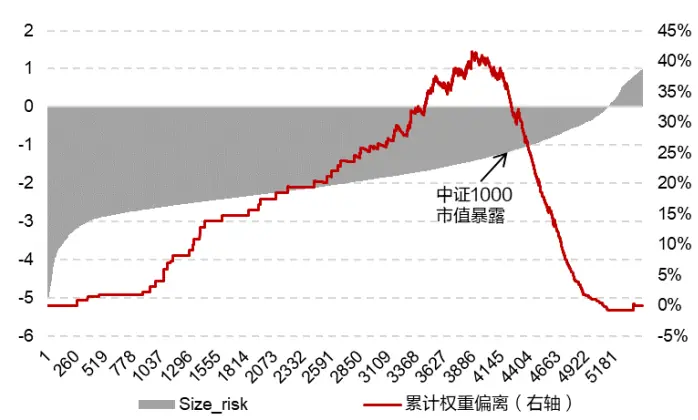
数据来源：Wind，东方证券研究所

有关分析师的申明，见本报告最后部分。其他重要信息披露见分析师申明之后部分，或请与您的投资代表联系。并请阅读本证券研究报告最后一页的免责申明。

## 1.3 非线性市值风控的必要性与框架

今年初这种极端市场环境是一个“小样本”事件，通过 alpha 端的调整“事倍功半”并没法保证alpha的超额收益能够在小样本事件上非常稳健，应该更多从风险控制的角度来解决。

由于沪深300、中证500、中证1000等宽基指数以过去一年的日均总市值排名后筛选，所以在构建指数增强组合时市值风格的影响最大，中证 500 等指数的增强组合的超额收益从结构上就是通过指数左侧的股票和右侧的股票对其进行增强而来，因此成分股左右侧这种“非线性市值”对增强组合的收益波动影响非常大。而如果我们是增强中证红利指数，由于中证红利指数由股息率排序筛选构建而成，“非线性股息率”对该指数的影响会比市值的影响更大。本报告以讨论常见宽基为主，因此只讨论市值因子的非线性。

图 12：宽基指数的构建标准
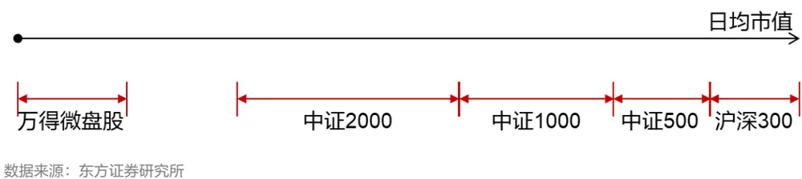

下图展示了我们的非线性市值风控的框架，我们可以通过常见的提高成分股内权重占比、控制Barra 模型中的 NLSize（非线性市值）因子的暴露等常见手段来控制非线性市值对组合的影响，而本报告中我们重点介绍我们提出的控制基准相对 NLSize、基准左/右侧相对 NLSize、分组 Size等风控手段。下文中，我们分别尝试并对比这 5种风控方法的有效性。

图 13：非线性市值风控框架
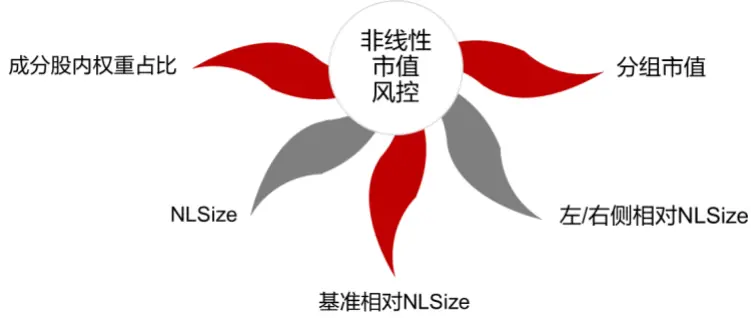
数据来源：东方证券研究所

## 二、成分股内权重占比

首先，我们将增强组合的成分股内权重占比提高至 100%，而其他约束保持不变，即完全在成分股内选股，分别构建中证 500 和中证 1000 指数增强组合。这种做法的优势是可以直接在全市场范围内收缩哑铃结构到宽基内部，而缺点是粗暴剔除成分股外股票的交易机会，并且如果成分股数量众多，成分股内部的权重偏离可能仍然呈现出超配左侧小盘低配右侧大盘的结构。下图分别展示了成分股内权重占比约束 100%后中证500和中证 1000指增组合的净值。

图 14：成分股占比约束下中证500指增组合净值
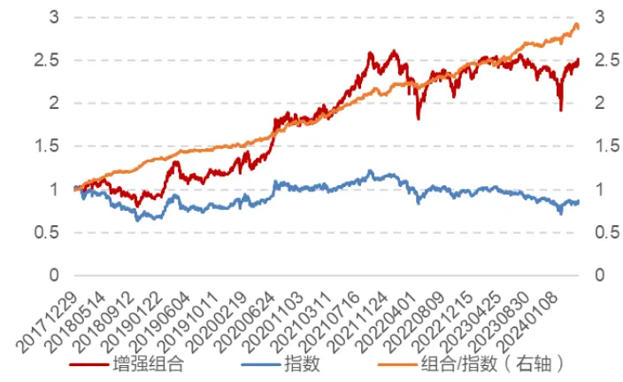
数据来源：Wind，东方证券研究所

图 15：成分股占比约束下中证1000指增组合净值
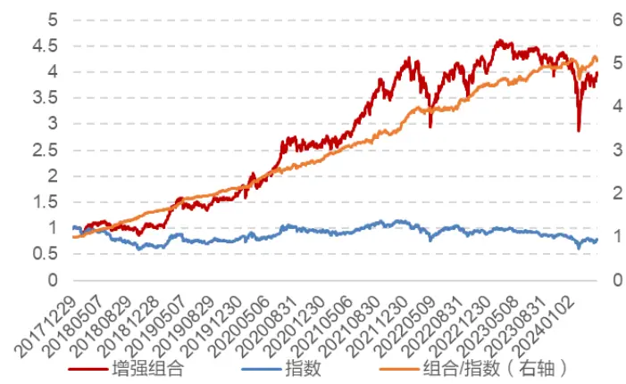
数据来源：Wind，东方证券研究所

从上图可以看到，中证 500 增强组合今年以来的回撤得到了较好的控制，而中证 1000 增强组合的回撤并没有明显改善。下表展示了加了该约束后中证 500 增强组合的各年收益表现情况，今年以来的相对最大回撤得到了大幅改善，从-8.64%下降到-2.11%，超额收益从 3.45%提升到 5.63%，年化跟踪误差从10.79%下降到6.83%，月度超额胜率100%，得到显著改善，而长期年化超额收益从 22.46%下降到了 18.38%。

表 3：成分股占比约束下中证 500指增组合收益表现

| YEAR | 绝对收益 | 基准收益 | 超额收益 | 相对最大回撤 | 信息比 | 跟踪误差 | 收益回撤比 | 月度胜率 |
| --- | --- | --- | --- | --- | --- | --- | --- | --- |
| 2018 | -9.62% | -33.32% | 23.70% | -1.46% | 5.97 | 5.29% | 16.21 | 83.33% |
| 2019 | 41.11% | 26.38% | 14.73% | -2.27% | 2.49 | 4.52% | 6.49 | 83.33% |
| 2020 | 42.32% | 20.87% | 21.45% | -2.76% | 2.53 | 6.74% | 7.77 | 75.00% |
| 2021 | 43.17% | 15.58% | 27.59% | -3.63% | 4.02 | 5.50% | 7.60 | 83.33% |
| 2022 | -10.81% | -20.31% | 9.51% | -2.85% | 2.19 | 5.47% | 3.33 | 75.00% |
| 2023 | 2.18% | -7.42% | 9.60% | -2.66% | 2.10 | 4.75% | 3.60 | 66.67% |
| 20240430 | 5.85% | 0.22% | 5.63% | -2.11% | 2.56 | 6.83% | 2.68 | 100.00% |
| 全样本期 | 16.15% | -2.23% | 18.38% | -3.63% | 3.15 | 5.52% | 5.07 | 78.95% |

数据来源：Wind，东方证券研究所

下表展示了加了该约束后中证1000增强组合的各年收益表现情况，今年以来的相对最大回撤略有下降并没有控制住，从-11.21%下降到-7.9%，超额收益从1.45%下降到 0.28%，年化跟踪误差从13.56%下降到 10.64%。

表 4：成分股占比约束下中证 1000指增组合收益表现

| YEAR | 绝对收益 | 基准收益 | 超额收益 | 相对最大回撤 | 信息比 | 跟踪误差 | 收益回撤比 | 月度胜率 |
| --- | --- | --- | --- | --- | --- | --- | --- | --- |
| 2018 | 0.63% | -36.87% | 37.50% | -1.42% | 7.26 | 6.71% | 26.32 | 100.00% |
| 2019 | 68.12% | 25.67% | 42.46% | -1.35% | 6.05 | 4.88% | 31.37 | 100.00% |
| 2020 | 56.04% | 19.39% | 36.65% | -4.51% | 3.73 | 7.39% | 8.13 | 83.33% |
| 2021 | 58.09% | 20.52% | 37.57% | -3.47% | 3.90 | 7.12% | 10.83 | 83.33% |
| 2022 | -2.61% | -21.58% | 18.97% | -3.14% | 3.26 | 6.99% | 6.05 | 75.00% |
| 2023 | 4.34% | -6.28% | 10.62% | -3.47% | 1.99 | 5.49% | 3.06 | 66.67% |
| 20240430 | -6.34% | -6.62% | 0.28% | -7.90% | 0.24 | 10.64% | 0.03 | 50.00% |
| 全样本期 | 25.19% | -3.90% | 29.08% | -7.90% | 3.92 | 6.81% | 3.68 | 82.89% |

数据来源：Wind，东方证券研究所

从两个增强组合的表现来看，控制成分股内权重占比 100%对中证 500 指数可以控制住今年年初的风险，但是对中证 1000 指数并没有显著效果。我们认为主要原因是中证 1000 指数的成分股数量众多，其市值两头的收益分化差较大导致回撤同样较大。下图展示了约束成分股内权重占比后两个增强组合在 20240202 当日以市值排序下的累计权重偏离曲线，可以看到两个组合在成分股内同样也是超配左侧小盘、低配右侧大盘的结构，因此当市值因子收益反向时，中证1000指数由于其成分股数量大且市值跨度更大，导致超额回撤更大。并且完全在成分股内选股而完全不选成分股外的股票的性价比并不高。

图16：成分股占比约束下20240202中证500指增个股累计权重偏离
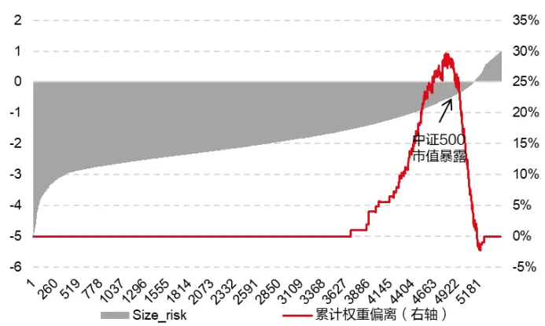
数据来源：Wind，东方证券研究所

图 17：成分股占比约束下 20240202 中证 1000 指增个股累计权重偏离
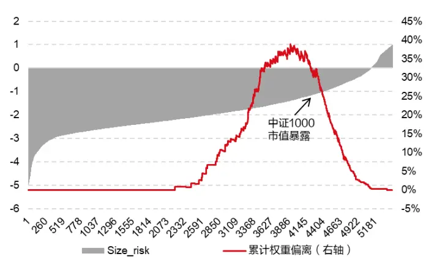
数据来源：Wind，东方证券研究所

## 三、NLSize

NLSize 是 Barra 风险模型中一个经典的非线性市值风格因子，其构建方式为个股的对数市值的立方对其对数市值进行市值加权wls回归，取回归的残差去极值标准化后得到NLSize取值，其能够代表中盘股的风格。因此我们自然可以想到控制该NLSize风格来约束市值的非线性暴露。下图分别展示了约束NLSize风格敞口为0而其他约束保持不变的情况下中证500和中证1000增强组合的净值表现。可以看到，两个增强组合今年以来的超额回撤并没有明显改善，仍然非常大。

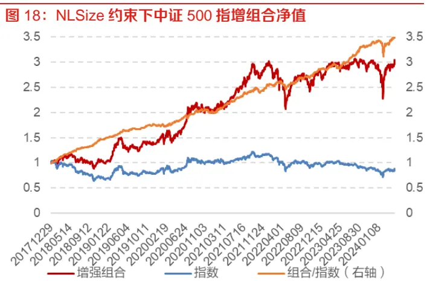
数据来源：Wind，东方证券研究所

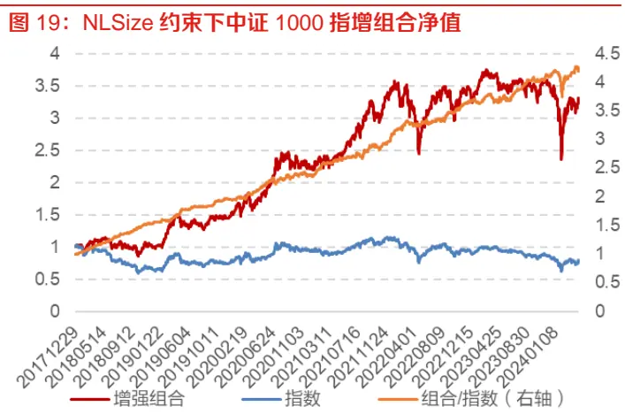
数据来源：Wind，东方证券研究所

下表展示了约束 NLSize 后中证 500 指数增强组合的各年超额表现，可以看到今年以来的相对最大回撤达-9.14%，比表 1 中的基础组合的回撤更大，年化跟踪误差也没有明显缩小，完全没有起到应有的作用。

表 5：NLSize约束下中证500指增组合收益表现

| YEAR | 绝对收益 | 基准收益 | 超额收益 | 相对最大回撤 | 信息比 | 跟踪误差 | 收益回撤比 | 月度胜率 |
| --- | --- | --- | --- | --- | --- | --- | --- | --- |
| 2018 | -1.08% | -33.32% | 32.24% | -1.32% | 6.81 | 6.01% | 24.40 | 100.00% |
| 2019 | 48.13% | 26.38% | 21.75% | -1.94% | 3.36 | 4.82% | 11.22 | 91.67% |
| 2020 | 38.88% | 20.87% | 18.00% | -3.92% | 2.15 | 6.80% | 4.59 | 75.00% |
| 2021 | 47.09% | 15.58% | 31.51% | -4.02% | 4.10 | 6.10% | 7.83 | 91.67% |
| 2022 | -9.68% | -20.31% | 10.63% | -5.23% | 2.24 | 5.98% | 2.03 | 66.67% |
| 2023 | 9.47% | -7.42% | 16.90% | -3.64% | 3.44 | 4.98% | 4.65 | 83.33% |
| 20240430 | 2.60% | 0.22% | 2.38% | -9.14% | 0.74 | 10.44% | 0.26 | 75.00% |
| 全样本期 | 19.83% | -2.23% | 22.06% | -9.14% | 3.34 | 6.17% | 2.41 | 84.21% |

数据来源：Wind，东方证券研究所

下表展示了约束 NLSize 后中证 1000 指数增强组合的各年超额表现，同样可以看到今年以来的相对最大回撤、年化跟踪误差也没有明显缩小，约束 NLSize的敞口没有起到应有的作用。

表 6：NLSize约束下中证1000指增组合收益表现

| YEAR | 绝对收益 | 基准收益 | 超额收益 | 相对最大回撤 | 信息比 | 跟踪误差 | 收益回撤比 | 月度胜率 |
| --- | --- | --- | --- | --- | --- | --- | --- | --- |
| 2018 | -1.73% | -36.87% | 35.14% | -1.31% | 6.74 | 6.86% | 26.74 | 100.00% |
| 2019 | 58.04% | 25.67% | 32.38% | -1.98% | 4.41 | 5.24% | 16.36 | 83.33% |
| 2020 | 45.81% | 19.39% | 26.42% | -5.60% | 2.55 | 8.08% | 4.72 | 83.33% |
| 2021 | 56.16% | 20.52% | 35.64% | -3.85% | 3.64 | 7.32% | 9.25 | 83.33% |
| 2022 | -6.02% | -21.58% | 15.56% | -2.63% | 2.76 | 6.93% | 5.92 | 75.00% |
| 2023 | 5.21% | -6.28% | 11.49% | -4.29% | 1.96 | 6.03% | 2.68 | 58.33% |
| 20240430 | -5.84% | -6.62% | 0.78% | -9.62% | 0.37 | 11.99% | 0.08 | 75.00% |
| 全样本期 | 21.42% | -3.90% | 25.31% | -9.62% | 3.29 | 7.19% | 2.63 | 80.26% |

数据来源：Wind，东方证券研究所

下图展示了两个增强组合在 20240202 当日按市值排序后的累计权重偏离曲线。可以看到两个组合同样也是超配左侧30%-40%的小盘股，低配右侧大盘股的结构，因此当市值因子收益反向时，两个增强组合会遭受较大回撤。

有关分析师的申明，见本报告最后部分。其他重要信息披露见分析师申明之后部分，或请与您的投资代表联系。并请阅读本证券研究报告最后一页的免责申明。

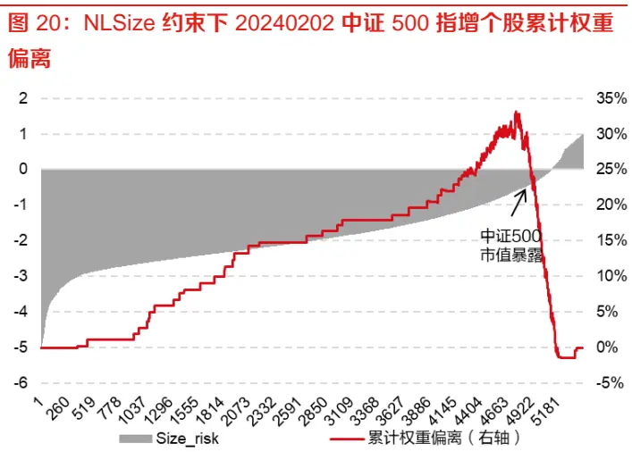
数据来源：Wind，东方证券研究所

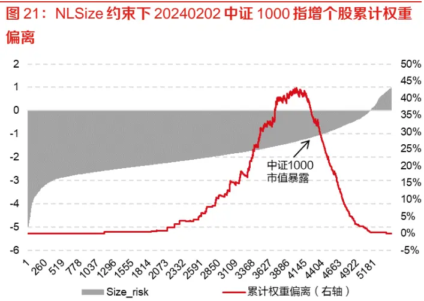
数据来源：Wind，东方证券研究所

## 四、基准相对 NLSize

NLSize 约束的无效性引发我们思考其原因。下面左图展示了 20240202 当期个股按市值排序后的NLSize 取值。可以看到 NLSize 的取值是一个沿着市值排序后的抛物线形状，中间取值最大而往两侧取值较小，因此能够代表“中盘”风格。而图中我们也同时画出了当期中证500和中证1000指数的NLSize的加权暴露情况，可以看到中证500指数的暴露为0.7左右，而左右两侧有两个位置都是 0.7 的暴露，因此约束该风格暴露时并不能控制组合“偏离基准”的偏离度。同样中证1000 指数的 NLSize 暴露为 1.2，两侧也有两个同样的相同暴露，因此约束该风格暴露也控制不住组合“偏离基准”的偏离度。

图 22：20240202NLSize 取值及宽基的暴露
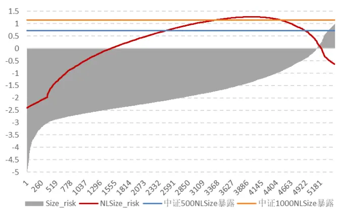
数据来源：Wind，东方证券研究所

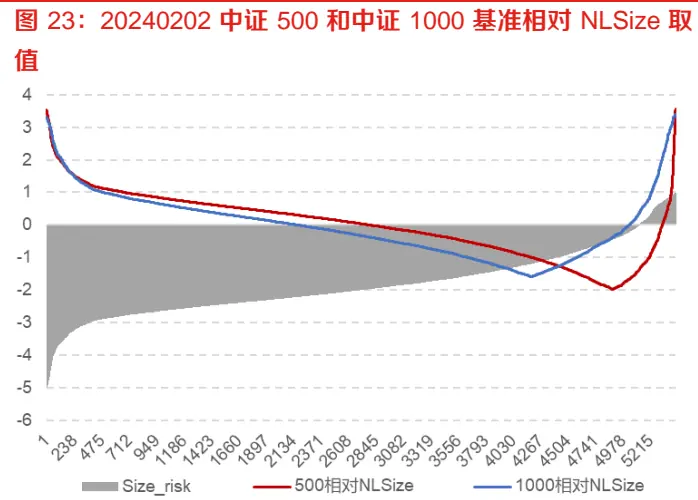
数据来源：Wind，东方证券研究所

究其原因，我们认为NLSize是全市场股票市值加权后的，因此其隐含的中盘的中心是中证全指，而中证 500 和中证 1000 等指数的市值暴露和中证全指并不相同，因此其控制相对基准的市值偏离度的作用会大打折扣。因此，我们认为针对每个宽基指数进行NLSize约束时，应该构建该宽基指数的相对 NLSize，宽基的市值暴露在中间，而两侧的股票市值离宽基越远其 NLSize 取值越大，以此来刻画个股相对于基准指数的市值偏离度。

有关分析师的申明，见本报告最后部分。其他重要信息披露见分析师申明之后部分，或请与您的投资代表联系。并请阅读本证券研究报告最后一页的免责申明。

因此，基准相对NLSize的构建如下，我们以个股的对数市值的平方离指数在对数市值平方上的加权暴露的距离来衡量市值偏离度：

$$
Relative\_NLSize=abs(lnmv_{i}^{2}-\Sigma w_{j}\cdot lnmv_{j}^{2})
$$

其中 $w_{j}$ 为指数成分股的权重， $\varSigma w_{j}$ ⋅ lnmvj2为基准指数在对数市值平方上的加权暴露。

上面右图展示了 20240202当期中证 500和中证 1000的基准相对 NLSize的取值情况，可以看到两个指数对应的NLSize的中心点不一样，因此在增强组合中约束的效果也会不一样。下图分别展示了约束相对NLSize风格敞口为0而其他约束保持不变的情况下中证500和中证1000增强组合的净值表现。可以看到，中证 500 增强组合的超额回撤能够较好控制住，而中证 1000 增强组合的超额回撤只是略有下降。

图 24：相对 NLSize约束下中证 500指增组合净值
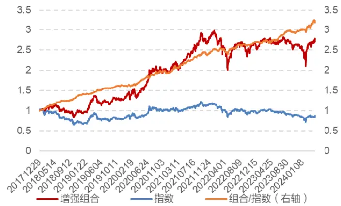
数据来源：Wind，东方证券研究所

图 25：相对 NLSize约束下中证 1000指增组合净值
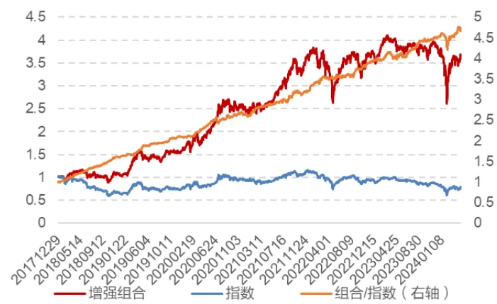
数据来源：Wind，东方证券研究所

下表展示了加了该约束后中证 500 增强组合的各年收益表现情况，今年以来的相对最大回撤得到了大幅改善，从-8.64%下降到-2.7%，超额收益从3.45%提升到6.77%，年化跟踪误差从10.79%下降到7.69%，月度超额胜率100%，得到显著改善，而长期年化超额收益从22.46%略微下降到了 20.4%，整体效果也好于约束成分股内权重 100%的效果。

表 7：相对 NLSize约束下中证 500指增组合收益表现

| YEAR | 绝对收益 | 基准收益 | 超额收益 | 相对最大回撤 | 信息比 | 跟踪误差 | 收益回撤比 | 月度胜率 |
| --- | --- | --- | --- | --- | --- | --- | --- | --- |
| 2018 | -5.90% | -33.32% | 27.42% | -1.22% | 6.20 | 5.77% | 22.50 | 100.00% |
| 2019 | 44.39% | 26.38% | 18.01% | -2.54% | 2.84 | 4.74% | 7.09 | 75.00% |
| 2020 | 46.55% | 20.87% | 25.68% | -3.89% | 2.83 | 7.14% | 6.60 | 75.00% |
| 2021 | 49.68% | 15.58% | 34.10% | -3.50% | 4.24 | 6.35% | 9.73 | 83.33% |
| 2022 | -14.29% | -20.31% | 6.03% | -4.65% | 1.40 | 5.73% | 1.30 | 58.33% |
| 2023 | 1.95% | -7.42% | 9.37% | -3.09% | 1.86 | 5.25% | 3.04 | 75.00% |
| 20240430 | 6.99% | 0.22% | 6.77% | -2.70% | 2.68 | 7.69% | 2.51 | 100.00% |
| 全样本期 | 18.16% | -2.23% | 20.40% | -4.65% | 3.19 | 6.01% | 4.39 | 78.95% |

数据来源：Wind，东方证券研究所

而下表展示了加了该约束后中证1000增强组合的各年收益表现情况，今年以来的相对最大回撤略有下降，从-11.21%下降到-7.71%，超额收益从1.45%提高到3.03%，年化跟踪误差从13.56%下降到 10.36%，效果虽然好于约束成分股内权重 100%，但是回撤依然较大。

表 8：相对 NLSize约束下中证 1000指增组合收益表现

| YEAR | 绝对收益 | 基准收益 | 超额收益 | 相对最大回撤 | 信息比 | 跟踪误差 | 收益回撤比 | 月度胜率 |
| --- | --- | --- | --- | --- | --- | --- | --- | --- |
| 2018 | 2.95% | -36.87% | 39.82% | -1.53% | 7.24 | 7.05% | 26.06 | 100.00% |
| 2019 | 61.73% | 25.67% | 36.06% | -2.01% | 4.88 | 5.22% | 17.90 | 75.00% |
| 2020 | 48.93% | 19.39% | 29.54% | -5.87% | 2.96 | 7.71% | 5.03 | 75.00% |
| 2021 | 53.59% | 20.52% | 33.07% | -3.43% | 3.54 | 7.03% | 9.64 | 83.33% |
| 2022 | -6.01% | -21.58% | 15.57% | -2.33% | 2.71 | 7.08% | 6.69 | 58.33% |
| 2023 | 6.61% | -6.28% | 12.89% | -4.46% | 2.20 | 5.99% | 2.89 | 75.00% |
| 20240430 | -3.59% | -6.62% | 3.03% | -7.71% | 1.12 | 10.36% | 0.39 | 100.00% |
| 全样本期 | 23.64% | -3.90% | 27.53% | -7.71% | 3.64 | 7.00% | 3.57 | 78.95% |

数据来源：Wind，东方证券研究所

下图展示了两个增强组合在20240202当日按市值排序后的累计权重偏离曲线。可以看到中证500增强组合超配了少数中小盘股票以及成分股内的小盘股，低配了成分股内大盘股，由于成分股内股票收益分化不大因此回撤得到了较好控制。而中证1000增强组合仍然超配了左侧小微盘，低配了右侧大盘股，由于成分股数量众多且市值跨度较大，因此并不能有效控制回撤。

图 26：相对 NLSize 约束下 20240202 中证 500 指增个股累计权重偏离
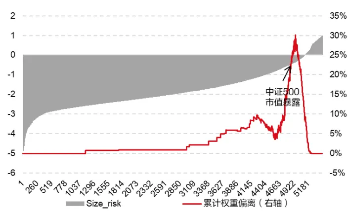
数据来源：Wind，东方证券研究所

图 27：相对 NLSize 约束下 20240202 中证 1000 指增个股累计权重偏离
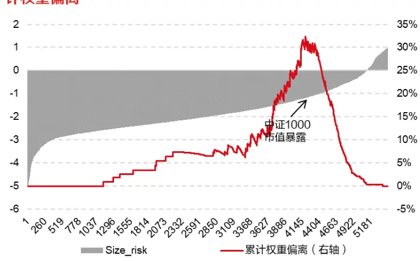
数据来源：Wind，东方证券研究所

## 五、左右侧相对 NLSize

从上一节中约束基准相对 NLSize 的效果可以看到，对于中证 500 这种股票数量少的基准指数效果不错，但是对于中证1000这种持股数量较多的基准的效果并不是特别明显，我们分析主要原因是约束相对 NLSize 暴露时，基准左右两侧的暴露并不对称。下面左图展示了基准相对 NLSize 暴露相等的三种情况的示意图。中间最低点是基准指数的 NLSize，越往两边的取值越大，我们理想情况是如蓝色的左右较为对称的暴露偏离来实现组合的风险约束，但是实际情况可能是红色或橙色的非对称的暴露偏离来实现，三种情况的NLSize暴露是一样的，但是左右的对称性差异明显，所以股票数量越多的基准其可行的解更灵活，因此中证1000指数上约束的效果就不明显。因此我们想可以直接对基准左侧和右侧两边分别施加约束，从而达到较为对称控制左右侧偏离的目标。我们分别构建左右侧 NLSize如下：

$$
\begin{array}{rl}&{Left\_Rel\_NLSize=max(\Sigma w_{j}\cdot lnmv_{j}^{2}-lnmv_{i}^{2},0)}\\&{}\\&{Right\_Rel\_NLSize=max(lnmv_{i}^{2}-\Sigma w_{j}\cdot lnmv_{j}^{2},0)}\end{array}
$$

图 28：基准相对 NLSize暴露相等的三种情况
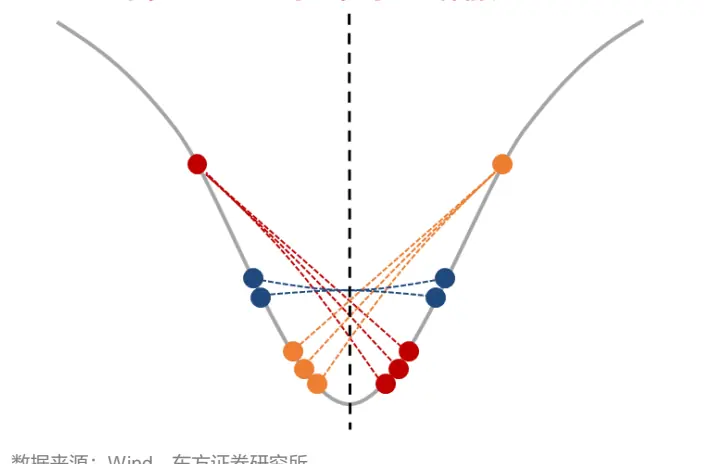
数据来源：Wind，东方证券研究所

图 29：20240202 中证 500 和中证 1000 左右侧相对 NLSize
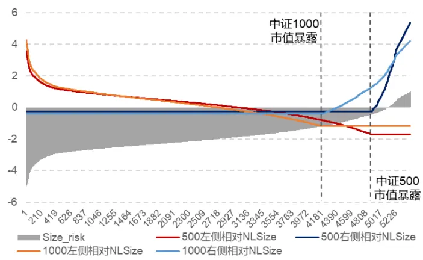
数据来源：Wind，东方证券研究所

以中证 500和中证1000指数为基准的左右侧相对 NLSize因子的取值如上面右图所示。通过分别对这两个左右侧 NLSize施加约束就能起到直接控制左侧和右侧市值暴露的效果。

下图分别展示了约束左右侧相对 NLSize 风格敞口为 0 而其他约束保持不变的情况下中证 500 和中证 1000增强组合的净值表现。可以看到，两个增强组合的超额回撤都能够较好控制住。

图 30：左右侧相对 NLSize约束下中证 500指增组合净值
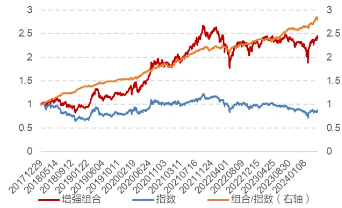
数据来源：Wind，东方证券研究所

图 31：左右侧相对 NLSize约束下中证 1000指增组合净值
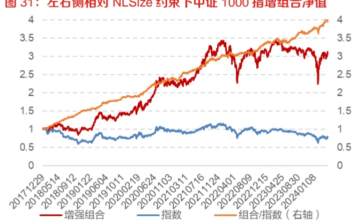
数据来源：Wind，东方证券研究所

下表展示了加了该约束后中证 500 增强组合的各年收益表现情况，今年以来的相对最大回撤得到了大幅改善，从-8.64%下降到-2.08%，超额收益从 3.45%提升到 6.97%，年化跟踪误差从 10.79%下降到 6.64%，月度超额胜率 100%，得到显著改善，而长期年化超额收益从 22.46%下降到了17.95%。

表 9：左右侧相对 NLSize约束下中证 500指增组合收益表现

| YEAR | 绝对收益 | 基准收益 | 超额收益 | 相对最大回撤 | 信息比 | 跟踪误差 | 收益回撤比 | 月度胜率 |
| --- | --- | --- | --- | --- | --- | --- | --- | --- |
| 2018 | -7.29% | -33.32% | 26.03% | -1.26% | 6.12 | 5.58% | 20.74 | 100.00% |
| 2019 | 39.51% | 26.38% | 13.13% | -3.06% | 2.10 | 4.72% | 4.29 | 66.67% |
| 2020 | 43.01% | 20.87% | 22.14% | -4.15% | 2.39 | 7.43% | 5.33 | 83.33% |
| 2021 | 43.08% | 15.58% | 27.49% | -3.94% | 3.63 | 6.15% | 6.98 | 83.33% |
| 2022 | -15.16% | -20.31% | 5.16% | -4.98% | 1.15 | 5.95% | 1.04 | 58.33% |
| 2023 | 1.80% | -7.42% | 9.23% | -2.92% | 1.79 | 5.36% | 3.16 | 75.00% |
| 20240430 | 7.19% | 0.22% | 6.97% | -2.08% | 3.12 | 6.64% | 3.36 | 100.00% |
| 全样本期 | 15.72% | -2.23% | 17.95% | -4.98% | 2.84 | 5.99% | 3.61 | 78.95% |

数据来源：Wind，东方证券研究所

下表展示了加了该约束后中证1000增强组合的各年收益表现情况，今年以来的相对最大回撤得到了大幅改善，从-11.21%下降到-3.55%，超额收益从 1.45%提升到 5.9%，年化跟踪误差从 13.56%下降到 7.71%，月度超额胜率 100%，得到显著改善，而长期年化超额收益从 31.34%下降到了24.22%。

表 10：左右侧相对 NLSize约束下中证 1000指增组合收益表现

| YEAR | 绝对收益 | 基准收益 | 超额收益 | 相对最大回撤 | 信息比 | 跟踪误差 | 收益回撤比 | 月度胜率 |
| --- | --- | --- | --- | --- | --- | --- | --- | --- |
| 2018 | -3.32% | -36.87% | 33.55% | -2.08% | 6.70 | 6.64% | 16.15 | 100.00% |
| 2019 | 54.72% | 25.67% | 29.05% | -2.56% | 3.96 | 5.28% | 11.35 | 83.33% |
| 2020 | 48.54% | 19.39% | 29.15% | -4.78% | 2.94 | 7.67% | 6.10 | 83.33% |
| 2021 | 54.36% | 20.52% | 33.84% | -2.24% | 4.02 | 6.33% | 15.10 | 91.67% |
| 2022 | -10.94% | -21.58% | 10.64% | -3.15% | 2.04 | 6.66% | 3.38 | 83.33% |
| 2023 | 2.69% | -6.28% | 8.97% | -3.76% | 1.48 | 6.26% | 2.39 | 58.33% |
| 20240430 | -0.73% | -6.62% | 5.90% | -3.55% | 2.56 | 7.71% | 1.66 | 100.00% |
| 全样本期 | 20.32% | -3.90% | 24.22% | -4.78% | 3.43 | 6.61% | 5.07 | 84.21% |

数据来源：Wind，东方证券研究所

下图展示了两个增强组合在 20240202 当日按市值排序后的累计权重偏离曲线。可以看到局部的累计权重偏离曲线都在±10%以内，并没有原始组合过度暴露小微盘的情况，因此组合的回撤得到了非常好的控制。

图 32：左右侧相对 NLSize 约束下 20240202 中证 500 指增个股累计权重偏离
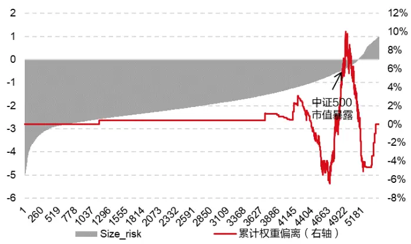
数据来源：Wind，东方证券研究所

图 33：左右侧相对 NLSize 约束下 20240202 中证 1000 指增个股累计权重偏离
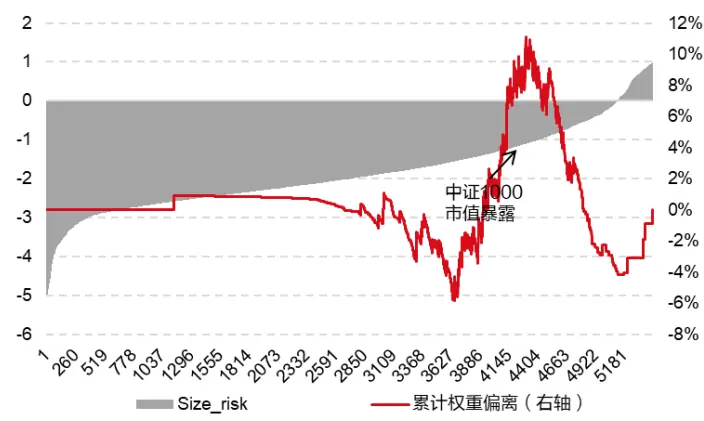
数据来源：Wind，东方证券研究所
有关分析师的申明，见本报告最后部分。其他重要信息披露见分析师申明之后部分，或请与您的投资代表联系。并请阅读本证券研究报告最后一页的免责申明。

下表进一步展示了不同敞口大小下，中证 500 增强组合今年以来的超额收益、相对最大回撤、跟踪误差以及全样本的年化超额收益的情况。可以看到，随着敞口的放大，今年以来的超额收益线性下降，相对最大回撤和跟踪误差线性增加，全样本的年化超额收益也线性增加。说明通过调节该约束的敞口大小，可以帮助我们在今年这种极端的市场环境下较好地进行中证 500 指增增强组合收益和风险的权衡。

表 11：不同左右侧相对 NLSize敞口下中证 500增强组合表现

|  | 0敞口 | 0.1 敞口 | 0.2 敞口 | 0.3 敞口 | 0.4 敞口 | 0.5敞口 |
| --- | --- | --- | --- | --- | --- | --- |
| 20240430 超额收益 | 6.97% | 6.29% | 6.85% | 5.28% | 4.73% | 3.75% |
| 20240430 相对最大回撤 | -2.08% | -3.38% | -3.83% | -5.75% | -6.81% | -8.18% |
| 20240430年化跟踪误差 | 6.64% | 7.39% | 7.91% | 8.98% | 9.76% | 10.50% |
| 全样本年化超额收益 | 17.95% | 18.92% | 20.07% | 20.27% | 21.27% | 22.45% |

数据来源：Wind，东方证券研究所

下表进一步展示了不同敞口大小下，中证1000增强组合今年以来的超额收益、相对最大回撤、跟踪误差以及全样本的年化超额收益的情况。同样可以看到，随着敞口的放大，今年以来的超额收益线性下降，相对最大回撤和跟踪误差线性增加，全样本的年化超额收益也线性增加。说明通过调节该约束的敞口大小，可以帮助我们在今年这种极端的市场环境下较好地进行中证1000指增增强组合收益和风险的权衡。

表 12：不同左右侧相对 NLSize敞口下中证 1000增强组合表现

|  | 0敞口 | 0.1 敞口 | 0.2 敞口 | 0.3 敞口 | 0.4 敞口 | 0.5敞口 |
| --- | --- | --- | --- | --- | --- | --- |
| 20240430 超额收益 | 5.90% | 5.40% | 4.05% | 4.09% | 2.78% | 2.09% |
| 20240430 相对最大回撤 | -3.55% | -4.71% | -7.09% | -7.56% | -9.53% | -11.40% |
| 20240430年化跟踪误差 | 7.71% | 8.68% | 10.35% | 10.93% | 12.61% | 13.96% |
| 全样本年化超额收益 | 24.22% | 26.79% | 27.12% | 29.24% | 30.74% | 31.15% |

数据来源：Wind，东方证券研究所

## 六、分组 Size

从上面基准左右侧NLSize的约束效果可以看到，将股票分为基准两侧分别约束已经能够起到较好控制回撤和跟踪误差的效果，如果我们进一步将股票按市值排序分成 N 组进行控制，回撤和跟踪误差的控制效果可能更好。分为左右侧时，左右侧内部的分布可能也和基准指数的分布偏离太远，“分而治之”地将股票按市值分组后控制每个组内的暴露，能够约束组合在各个市值域内的偏离。我们以分 10组为例构建市值分组指示因子：

$$
Grp\_Size\_Ind_{i}=\left\{\begin{array}{cc}{1,}&{if(i-1)/10<rank\_pct(mv_{j})\leq i/10}\\{0,}&{else.}\end{array}\right.
$$

下图展示了20240202当期市值排序第4组的指示因子的取值，当股票在30%-40%排名区间时取值为 1，其他域取值为 0，最后标准化后即为下图的取值。

图 34：20240202市值十分组指示因子示例
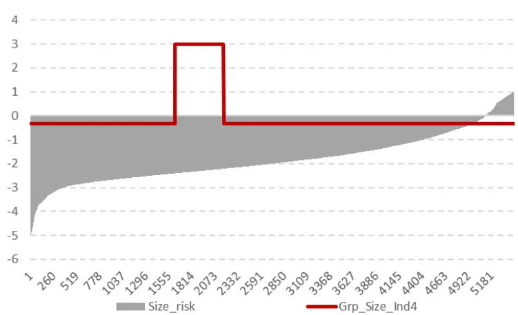
数据来源：Wind，东方证券研究所

下图分别展示了约束分组 Size 风格敞口为 0 而其他约束保持不变的情况下中证 500 和中证 1000增强组合的净值表现。可以看到，两个增强组合的超额回撤都能够较好控制住。

图 35：分组 Size约束下中证 500指增组合净值
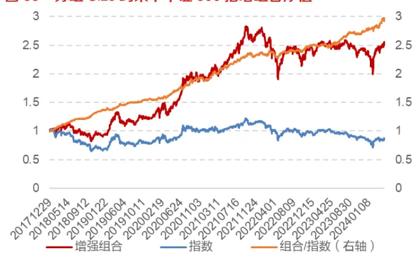
数据来源：Wind，东方证券研究所

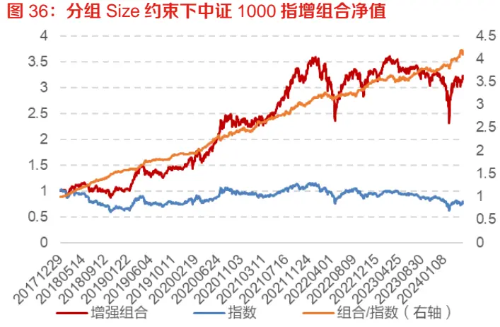
数据来源：Wind，东方证券研究所

下表展示了加了该约束后中证 500 增强组合的各年收益表现情况，今年以来的相对最大回撤得到了大幅改善，从-8.64%下降到-2.44%，超额收益从 3.45%提升到 6.48%，年化跟踪误差从 10.79%下降到 7.13%，月度超额胜率 100%，得到显著改善，而长期年化超额收益从 22.46%下降到了18.75%。

表 13：分组 Size约束下中证 500指增组合收益表现

| YEAR | 绝对收益 | 基准收益 | 超额收益 | 相对最大回撤 | 信息比 | 跟踪误差 | 收益回撤比 | 月度胜率 |
| --- | --- | --- | --- | --- | --- | --- | --- | --- |
| 2018 | -8.37% | -33.32% | 24.95% | -1.27% | 6.06 | 5.44% | 19.72 | 100.00% |
| 2019 | 42.41% | 26.38% | 16.03% | -3.48% | 2.48 | 4.84% | 4.61 | 75.00% |
| 2020 | 48.57% | 20.87% | 27.70% | -3.70% | 2.95 | 7.30% | 7.48 | 91.67% |
| 2021 | 44.78% | 15.58% | 29.20% | -3.28% | 4.08 | 5.74% | 8.91 | 83.33% |
| 2022 | -16.04% | -20.31% | 4.28% | -4.30% | 1.00 | 5.77% | 0.99 | 58.33% |
| 2023 | 1.65% | -7.42% | 9.07% | -2.85% | 1.82 | 5.16% | 3.19 | 66.67% |
| 20240430 | 6.70% | 0.22% | 6.48% | -2.44% | 2.67 | 7.13% | 2.66 | 100.00% |
| 全样本期 | 16.51% | -2.23% | 18.75% | -4.30% | 3.01 | 5.87% | 4.36 | 80.26% |

数据来源：Wind，东方证券研究所

有关分析师的申明，见本报告最后部分。其他重要信息披露见分析师申明之后部分，或请与您的投资代表联系。并请阅读本证券研究报告最后一页的免责申明。

下表展示了加了该约束后中证1000增强组合的各年收益表现情况，今年以来的相对最大回撤得到了大幅改善，从-11.21%下降到-2.6%，超额收益从 1.45%提升到 6.85%，年化跟踪误差从 13.56%下降到 7.47%，月度超额胜率 100%，得到显著改善，而长期年化超额收益从 31.34%下降到了24.88%。

表 14：分组 Size约束下中证 1000指增组合收益表现

| YEAR | 绝对收益 | 基准收益 | 超额收益 | 相对最大回撤 | 信息比 | 跟踪误差 | 收益回撤比 | 月度胜率 |
| --- | --- | --- | --- | --- | --- | --- | --- | --- |
| 2018 | -0.77% | -36.87% | 36.10% | -1.68% | 7.24 | 6.51% | 21.54 | 100.00% |
| 2019 | 53.91% | 25.67% | 28.25% | -2.44% | 4.04 | 5.04% | 11.57 | 75.00% |
| 2020 | 51.03% | 19.39% | 31.64% | -5.38% | 3.18 | 7.62% | 5.88 | 83.33% |
| 2021 | 55.59% | 20.52% | 35.07% | -2.45% | 3.99 | 6.56% | 14.33 | 91.67% |
| 2022 | -10.59% | -21.58% | 11.00% | -3.98% | 2.10 | 6.70% | 2.76 | 83.33% |
| 2023 | 0.13% | -6.28% | 6.41% | -4.16% | 1.07 | 6.17% | 1.54 | 50.00% |
| 20240430 | 0.23% | -6.62% | 6.85% | -2.60% | 3.05 | 7.47% | 2.64 | 100.00% |
| 全样本期 | 20.98% | -3.90% | 24.88% | -5.38% | 3.52 | 6.58% | 4.62 | 81.58% |

数据来源：Wind，东方证券研究所

下图展示了两个增强组合在 20240202 当日按市值排序后的累计权重偏离曲线。可以看到局部的累计权重偏离曲线都在±10%以内，并没有原始组合过度暴露小微盘的情况，因此组合的回撤得到了非常好的控制。

图 37：分组 Size 约束下 20240202 中证 500 指增个股累计权重偏离
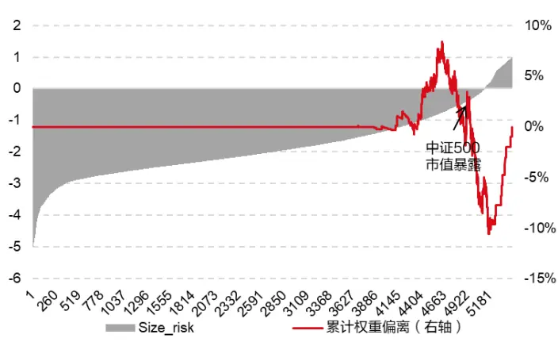
数据来源：Wind，东方证券研究所

图 38：分组 Size 约束下 20240202 中证 1000 指增个股累计权重偏离
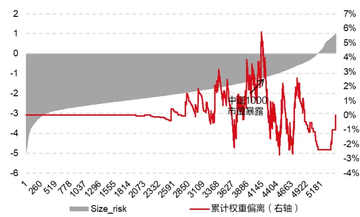
数据来源：Wind，东方证券研究所

下表进一步展示了不同敞口大小下，中证 500 增强组合今年以来的超额收益、相对最大回撤、跟踪误差以及全样本的年化超额收益的情况。可以看到，随着敞口的放大，今年以来的超额收益线性下降，相对最大回撤和跟踪误差线性增加，全样本的年化超额收益也线性增加。说明通过调节该约束的敞口大小，可以帮助我们在今年这种极端的市场环境下较好地进行中证 500 指增增强组合收益和风险的权衡。

表 15：不同分组 Size敞口下中证 500增强组合表现

|  | 0敞口 | 0.1 敞口 | 0.2 敞口 | 0.3 敞口 | 0.4 敞口 | 0.5敞口 |
| --- | --- | --- | --- | --- | --- | --- |
| 20240430 超额收益 | 6.48% | 4.60% | 4.97% | 6.44% | 4.60% | 4.15% |
| 20240430 相对最大回撤 | -2.44% | -3.52% | -4.43% | -5.01% | -5.80% | -7.03% |
| 20240430年化跟踪误差 | 7.13% | 7.45% | 8.00% | 8.78% | 9.23% | 9.76% |
| 全样本年化超额收益 | 18.75% | 18.92% | 20.23% | 20.81% | 21.51% | 21.35% |

数据来源：Wind，东方证券研究所

下表进一步展示了不同敞口大小下，中证1000增强组合今年以来的超额收益、相对最大回撤、跟踪误差以及全样本的年化超额收益的情况。同样可以看到，随着敞口的放大，今年以来的超额收益线性下降，相对最大回撤和跟踪误差线性增加，全样本的年化超额收益也线性增加。说明通过调节该约束的敞口大小，可以帮助我们在今年这种极端的市场环境下较好地进行中证1000指增增强组合收益和风险的权衡。

表 16：不同分组 Size敞口下中证 1000增强组合表现

|  | 0敞口 | 0.1 敞口 | 0.2 敞口 | 0.3 敞口 | 0.4 敞口 | 0.5敞口 |
| --- | --- | --- | --- | --- | --- | --- |
| 20240430 超额收益 | 6.85% | 6.30% | 5.63% | 5.34% | 4.79% | 4.04% |
| 20240430 相对最大回撤 | -2.60% | -4.13% | -6.29% | -7.94% | -8.19% | -8.60% |
| 20240430年化跟踪误差 | 7.47% | 8.25% | 10.02% | 11.28% | 11.58% | 11.88% |
| 全样本年化超额收益 | 24.88% | 26.69% | 28.61% | 28.96% | 29.88% | 29.95% |

数据来源：Wind，东方证券研究所

## 七、非线性市值综合风控的效果

本节我们对比上述列举的各种非线性市值的风控约束在中证 500 指数增强上的效果。从下表可以看到，在中证 500增强上添加基准相对 NLSize、左右侧相对 NLSize、分组 Size约束都能较好控制组合的回撤和跟踪误差。

表 17：不同非线性市值约束下中证 500增强组合表现

|  | 原始 | 成分股占比 | NLSize | 相对NLSize | 左右相对NLSize | 分组 Size |
| --- | --- | --- | --- | --- | --- | --- |
| 20240430 超额收益 | 3.45% | 5.63% | 2.38% | 6.77% | 6.97% | 6.48% |
| 20240430 相对最大回撤 | -8.64% | -2.11% | -9.14% | -2.70% | -2.08% | -2.44% |
| 20240430 年化跟踪误差 | 10.79% | 6.83% | 10.44% | 7.69% | 6.64% | 7.13% |
| 全样本年化超额收益 | 22.46% | 18.38% | 22.06% | 20.40% | 17.95% | 18.75% |

数据来源：Wind，东方证券研究所

下表展示了各种非线性市值的风控约束在中证 1000 指数增强上的效果。可以看到，在中证 1000增强上添加左右侧相对 NLSize、分组 Size约束都能较好控制组合的回撤和跟踪误差。

表 18：不同非线性市值约束下中证 1000增强组合表现

|  | 原始 | 成分股占比 | NLSize | 相对NLSize | 左右相对NLSize | 分组 Size |
| --- | --- | --- | --- | --- | --- | --- |
| 20240430 超额收益 | 1.45% | 0.28% | 0.78% | 3.03% | 5.90% | 6.85% |
| 20240430 相对最大回撤 | -11.21% | -7.90% | -9.62% | -7.71% | -3.55% | -2.60% |
| 20240430 年化跟踪误差 | 13.56% | 10.64% | 11.99% | 10.36% | 7.71% | 7.47% |
| 全样本年化超额收益 | 31.34% | 29.08% | 25.31% | 27.53% | 24.22% | 24.88% |

数据来源：Wind，东方证券研究所

这里我们以基准相对 NLSize、左右侧相对 NLSize、分组 Size 三种约束同时作用在指数增强组合上，并调节敞口大小来观察组合的风险收益特征。下表展示了不同敞口约束下中证 500 增强组合今年以来的超额收益、相对最大回撤、跟踪误差以及全样本的年化超额收益的情况。可以看到，随着敞口的放大，今年以来的超额收益线性下降，相对最大回撤和跟踪误差线性增加，全样本的年化超额收益也线性增加。说明通过调节这些约束的敞口大小，可以帮助我们在今年这种极端的市场环境下较好地进行中证 500指增增强组合收益和风险的权衡。

表 19：不同非线性市值暴露约束敞口下中证 500增强组合表现

|  | 原始 | 三个暴露约束0 | 三个暴露约束0.05 | 三个暴露约束0.1 | 三个暴露约束0.15 | 三个暴露约束0.2 | 三个暴露约束0.25 |
| --- | --- | --- | --- | --- | --- | --- | --- |
| 20240430 超额收益 | 3.45% | 6.03% | 7.18% | 7.37% | 7.02% | 7.07% | 5.65% |
| 20240430 相对最大回撤 | -8.64% | -2.46% | -2.77% | -3.19% | -4.17% | -4.95% | -5.70% |
| 20240430 年化跟踪误差 | 10.79% | 6.89% | 7.51% | 7.68% | 7.86% | 8.42% | 8.87% |
| 全样本年化超额收益 | 22.46% | 18.63% | 19.31% | 19.36% | 20.13% | 19.95% | 20.27% |

数据来源：Wind，东方证券研究所

下表展示了不同敞口约束下中证1000增强组合今年以来的超额收益、相对最大回撤、跟踪误差以及全样本的年化超额收益的情况。可以看到，随着敞口的放大，今年以来的超额收益线性下降，相对最大回撤和跟踪误差线性增加，全样本的年化超额收益也线性增加。说明通过调节这些约束的敞口大小，可以帮助我们在今年这种极端的市场环境下较好地进行中证1000指增增强组合收益和风险的权衡。

表 20：不同非线性市值暴露约束敞口下中证 1000增强组合表现

|  | 原始 | 三个暴露约束0 | 三个暴露约束0.05 | 三个暴露约束0.1 | 三个暴露约束0.15 | 三个暴露约束0.2 | 三个暴露约束0.25 |
| --- | --- | --- | --- | --- | --- | --- | --- |
| 20240430 超额收益 | 1.45% | 6.10% | 5.43% | 4.94% | 4.79% | 5.99% | 5.35% |
| 20240430 相对最大回撤 | -11.21% | -2.54% | -3.13% | -4.32% | -5.33% | -5.66% | -6.19% |
| 20240430 年化跟踪误差 | 13.56% | 6.99% | 7.93% | 8.79% | 9.54% | 9.95% | 10.51% |
| 全样本年化超额收益 | 31.34% | 23.96% | 24.81% | 25.72% | 26.71% | 27.75% | 29.24% |

数据来源：Wind，东方证券研究所

下面左图展示了0.05敞口约束下的中证500指数增强组合的净值，可以看到组合的超额收益非常稳健。下面右图展示了增强组合在 20240202 当日按市值排序后的累计权重偏离曲线。可以看到局部的累计权重偏离曲线都在±8%以内，并没有原始组合过度暴露小微盘的情况，因此组合的回撤得到了非常好的控制。

图 39：非线性市值暴露约束敞口 0.05 下中证 500 增强组合净值
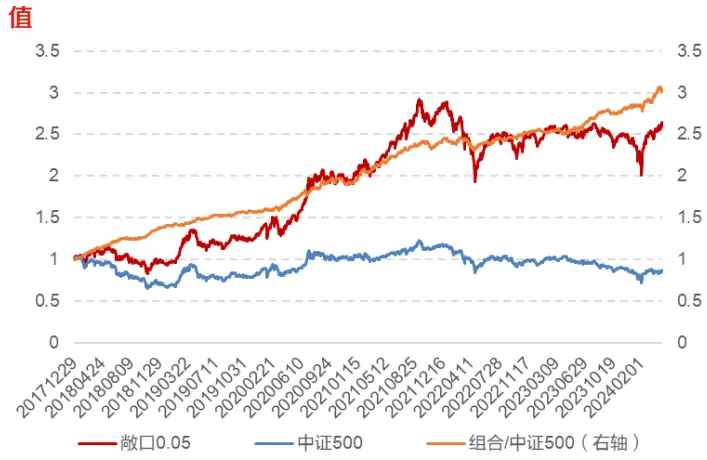
数据来源：Wind，东方证券研究所

图 40：非线性市值敞口 0.05 下 20240202 中证 500 指增组合个股累计权重偏离
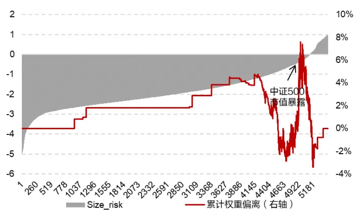
数据来源：Wind，东方证券研究所

下表展示了约束0.05非线性市值敞口下中证500增强组合的各年收益表现情况，今年以来的相对最大回撤得到了大幅改善，从-8.64%下降到-2.77%，超额收益从 3.45%提升到 7.18%，年化跟踪误差从 10.79%下降到 7.51%，月度超额胜率 100%，得到显著改善，而长期年化超额收益从22.46%略微下降到了 19.31%。

表 21：非线性市值暴露约束敞口 0.05下中证 500增强组合表现

| YEAR | 绝对收益 | 基准收益 | 超额收益 | 相对最大回撤 | 信息比 | 跟踪误差 | 收益回撤比 | 月度胜率 |
| --- | --- | --- | --- | --- | --- | --- | --- | --- |
| 2018 | -5.90% | -33.32% | 27.42% | -1.32% | 6.49 | 5.50% | 20.81 | 91.67% |
| 2019 | 40.97% | 26.38% | 14.59% | -2.72% | 2.34 | 4.70% | 5.37 | 75.00% |
| 2020 | 48.15% | 20.87% | 27.28% | -4.27% | 2.95 | 7.19% | 6.39 | 91.67% |
| 2021 | 47.22% | 15.58% | 31.64% | -3.86% | 4.31 | 5.85% | 8.20 | 91.67% |
| 2022 | -16.95% | -20.31% | 3.36% | -5.05% | 0.78 | 5.91% | 0.67 | 58.33% |
| 2023 | 2.02% | -7.42% | 9.44% | -2.82% | 1.80 | 5.44% | 3.35 | 66.67% |
| 20240430 | 7.40% | 0.22% | 7.18% | -2.77% | 2.84 | 7.51% | 2.60 | 100.00% |
| 全样本期 | 17.08% | -2.23% | 19.31% | -5.05% | 3.06 | 5.95% | 3.82 | 80.26% |

数据来源：Wind，东方证券研究所

图 41：非线性市值暴露约束敞口 0.05 下中证 1000 增强组合净
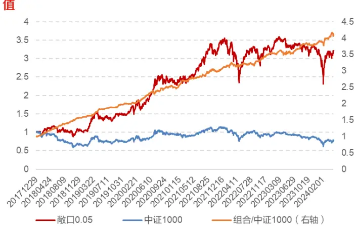
数据来源：Wind，东方证券研究所

图 42：非线性市值敞口 0.05 下 20240202 中证 1000 指增组合个股累计权重偏离
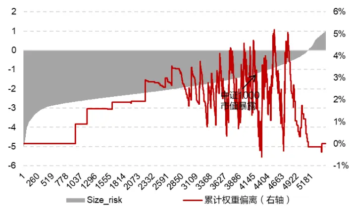
数据来源：Wind，东方证券研究所

有关分析师的申明，见本报告最后部分。其他重要信息披露见分析师申明之后部分，或请与您的投资代表联系。并请阅读本证券研究报告最后一页的免责申明。

上面左图展示了0.05敞口约束下的中证500指数增强组合的净值，可以看到组合的超额收益非常稳健。右图展示了增强组合在 20240202 当日按市值排序后的累计权重偏离曲线。可以看到局部的累计权重偏离曲线都在±5%以内，并没有原始组合过度暴露小微盘的情况，因此组合的回撤得到了非常好的控制。

下表展示了约束 0.05 非线性市值敞口下中证 1000 增强组合的各年收益表现情况，今年以来的相对最大回撤得到了大幅改善，从-11.21%下降到-3.13%，超额收益从 1.45%提升到 5.43%，年化跟踪误差从13.56%下降到7.93%，月度超额胜率100%，得到显著改善，而长期年化超额收益从31.34%下降到了 24.81%。

表 22：非线性市值暴露约束敞口 0.05下中证 1000增强组合表现

| YEAR | 绝对收益 | 基准收益 | 超额收益 | 相对最大回撤 | 信息比 | 跟踪误差 | 收益回撤比 | 月度胜率 |
| --- | --- | --- | --- | --- | --- | --- | --- | --- |
| 2018 | 0.63% | -36.87% | 37.50% | -1.68% | 7.20 | 6.76% | 22.33 | 100.00% |
| 2019 | 57.69% | 25.67% | 32.02% | -1.33% | 4.63 | 4.93% | 24.00 | 91.67% |
| 2020 | 48.79% | 19.39% | 29.40% | -5.16% | 3.05 | 7.45% | 5.70 | 83.33% |
| 2021 | 50.51% | 20.52% | 29.99% | -3.04% | 3.56 | 6.40% | 9.87 | 75.00% |
| 2022 | -10.12% | -21.58% | 11.46% | -3.26% | 2.15 | 6.82% | 3.51 | 83.33% |
| 2023 | 1.70% | -6.28% | 7.97% | -4.04% | 1.33 | 6.19% | 1.97 | 58.33% |
| 20240430 | -1.19% | -6.62% | 5.43% | -3.13% | 2.33 | 7.93% | 1.74 | 100.00% |
| 全样本期 | 20.91% | -3.90% | 24.81% | -5.16% | 3.51 | 6.60% | 4.81 | 82.89% |

数据来源：Wind，东方证券研究所

从中证 500 和中证 1000 指增组合添加非线性市值约束的效果来看，今年以来的回撤和跟踪误差得到非常有效的控制，我们进一步在其他宽基指数上观察添加非线性市值约束的效果。下图展示了添加 0.05 非线性市值敞口约束下深度学习因子的上证 50 和沪深 300 指数增强组合的净值变化情况，可以看到添加了非线性市值约束后两个增强组合的超额收益都变得更为稳健。

图43：非线性市值暴露约束敞口0.05下上证50增强组合净值
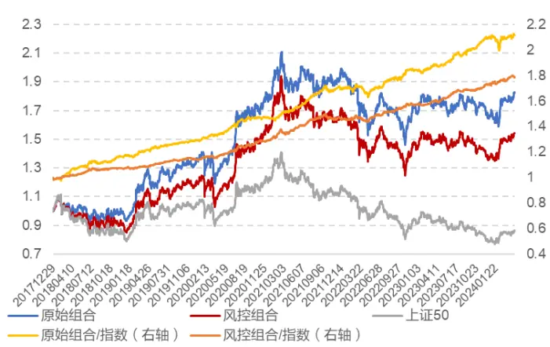
数据来源：Wind，东方证券研究所

图 44：非线性市值暴露约束敞口 0.05 下沪深 300 增强组合净值
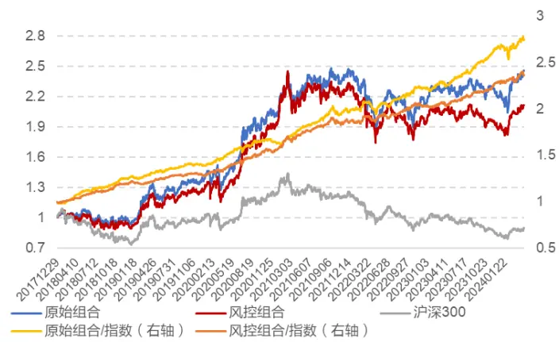
数据来源：Wind，东方证券研究所

下表展示了添加 0.05 非线性市值敞口约束前后上证 50 增强组合的各年收益表现对比，可以看到今年以来的相对最大回撤得到了大幅改善，从-6.08%下降到-1.15%，超额收益从 0.82%提升到4.03%，年化跟踪误差从 6.97%下降到 3.87%，得到显著改善。

有关分析师的申明，见本报告最后部分。其他重要信息披露见分析师申明之后部分，或请与您的投资代表联系。并请阅读本证券研究报告最后一页的免责申明。

表 23：非线性市值暴露约束敞口 0.05下上证 50增强组合表现

| YEAR | 基础版本 |  |  | 非线性市值风控 |  |  |
| --- | --- | --- | --- | --- | --- | --- |
|  | 超额收益 | 相对最大回撤 | 跟踪误差 | 超额收益 | 相对最大回撤 | 跟踪误差 |
| 2018 | 13.88% | -2.39% | 4.61% | 6.05% | -1.76% | 3.06% |
| 2019 | 12.89% | -1.54% | 3.34% | 8.12% | -1.36% | 2.34% |
| 2020 | 16.45% | -2.35% | 4.05% | 17.52% | -1.60% | 3.87% |
| 2021 | 14.84% | -2.97% | 4.31% | 10.43% | -3.17% | 4.36% |
| 2022 | 6.41% | -4.99% | 5.19% | 6.57% | -3.04% | 3.86% |
| 2023 | 12.39% | -1.82% | 3.78% | 8.03% | -1.18% | 2.62% |
| 20240430 | 0.82% | -6.08% | 6.97% | 4.03% | -1.15% | 3.87% |
| 全样本期 | 12.68% | -6.08% | 4.44% | 9.71% | -3.66% | 3.46% |

数据来源：Wind，东方证券研究所

下表展示了添加0.05非线性市值敞口约束前后沪深300增强组合的各年收益表现对比，可以看到今年以来的相对最大回撤得到了大幅改善，从-5.73%下降到-2.52%，超额收益从 3.94%提升到4.7%，年化跟踪误差从8.79%下降到 6.34%，得到显著改善。

表 24：非线性市值暴露约束敞口 0.05下沪深 300增强组合表现

| YEAR | 基础版本 |  |  | 非线性市值风控 |  |  |
| --- | --- | --- | --- | --- | --- | --- |
|  | 超额收益 | 相对最大回撤 | 跟踪误差 | 超额收益 | 相对最大回撤 | 跟踪误差 |
| 2018 | 19.94% | -2.38% | 5.33% | 15.91% | -1.20% | 4.24% |
| 2019 | 12.49% | -2.42% | 4.28% | 7.41% | -3.19% | 3.32% |
| 2020 | 22.77% | -4.34% | 5.73% | 29.40% | -4.09% | 6.33% |
| 2021 | 21.49% | -4.97% | 5.80% | 18.22% | -3.93% | 6.03% |
| 2022 | 8.93% | -5.87% | 5.95% | 6.69% | -3.19% | 5.10% |
| 2023 | 16.83% | -2.45% | 4.70% | 10.06% | -2.08% | 4.02% |
| 20240430 | 3.94% | -5.73% | 8.79% | 4.70% | -2.52% | 6.34% |
| 全样本期 | 17.60% | -5.87% | 5.57% | 14.82% | -4.09% | 5.05% |

数据来源：Wind，东方证券研究所

由此可见，通过同时添加基准相对 NLSize、左右侧相对 NLSize、分组 Size 等敞口约束，各种宽基指数增强组合的回撤和跟踪误差都能够得到明显控制。在此基础上，再进一步叠加风险因子的波动率的动态敞口约束，可以以更具性价比的方式起到约束风险的作用。

## 八、总结

## 非线性市值风控的必要性

2024年1月底到 2月初期间，整个市场经历了一系列的极端事件，这些事件对选股因子乃至指数增强产品的收益形成了较大的负向冲击，基于深度学习因子构建的指数增强组合今年以来的相对回撤也非常大。中证 500 增强组合今年以来的相对最大回撤达-8.64%，年化跟踪误差也达到10.79%，中证 1000增强组合今年以来相对最大回撤达-11.21%，年化跟踪误差也达到 13.56%。深度学习因子构建的指增组合通过做多微盘并做多部分大盘股配平约束来获取超额收益。因此，当市值因子超额反向时，增强组合大幅跑输基准。

由于中证500、中证1000等宽基指数以过去一年的日均总市值排名后筛选，所以在构建指数增强组合时，成分股左右侧这种“非线性市值”对增强组合的收益波动影响非常大，需要对非线性市值进行风控。

## 非线性市值风控方法

我们从提高成分股内权重占比、约束NLSize的角度检验传统风控手段的效果，可以发现针对中证1000 指数，传统风控手段并不能较好控制组合今年以来的回撤，因此我们提出了基准相对NLSize、基准左右侧相对 NLSize以及分组 Size的非线性市值风控手段，通过添加这 3种非线性市值约束，中证 500 和中证 1000 增强组合今年以来的超额回撤和跟踪误差大部分情况下都能得到非常显著的控制。

## 非线性市值综合风控效果

同时添加三种非线性市值约束后，中证 500 增强组合今年以来的相对最大回撤得到了大幅改善，从-8.64%下降到-2.77%，超额收益从 3.45%提升到 7.18%，年化跟踪误差从 10.79%下降到7.51%，月度超额胜率 100%。中证 1000 增强组合今年以来的相对最大回撤得到了大幅改善，从-11.21%下降到-3.13%，超额收益从1.45%提升到5.43%，年化跟踪误差从13.56%下降到7.93%，月度超额胜率 100%，得到显著改善。并且在上证 50和沪深 300等指数增强组合上添加该约束同样也能非常显著地控制增强组合今年以来的相对回撤和跟踪误差。

## 风险提示

1. 量化模型基于历史数据分析，未来存在失效风险，建议投资者紧密跟踪模型表现。

2. 极端市场环境可能对模型效果造成剧烈冲击，导致收益亏损。

## Tabl e_Disclai mer 分析师申明

每位负责撰写本研究报告全部或部分内容的研究分析师在此作以下声明：

分析师在本报告中对所提及的证券或发行人发表的任何建议和观点均准确地反映了其个人对该证券或发行人的看法和判断；分析师薪酬的任何组成部分无论是在过去、现在及将来，均与其在本研究报告中所表述的具体建议或观点无任何直接或间接的关系。

## 投资评级和相关定义

报告发布日后的12个月内行业或公司的涨跌幅相对同期相关证券市场代表性指数的涨跌幅为基准（A 股市场基准为沪深 300 指数，香港市场基准为恒生指数，美国市场基准为标普 500 指数）；

## 公司投资评级的量化标准

买入：相对强于市场基准指数收益率 15%以上；

增持：相对强于市场基准指数收益率 5%～15%；

中性：相对于市场基准指数收益率在-5%～+5%之间波动；

减持：相对弱于市场基准指数收益率在-5%以下。

未评级 —— 由于在报告发出之时该股票不在本公司研究覆盖范围内，分析师基于当时对该股票的研究状况，未给予投资评级相关信息。

暂停评级 —— 根据监管制度及本公司相关规定，研究报告发布之时该投资对象可能与本公司存在潜在的利益冲突情形；亦或是研究报告发布当时该股票的价值和价格分析存在重大不确定性，缺乏足够的研究依据支持分析师给出明确投资评级；分析师在上述情况下暂停对该股票给予投资评级等信息，投资者需要注意在此报告发布之前曾给予该股票的投资评级、盈利预测及目标价格等信息不再有效。

## 行业投资评级的量化标准：

看好：相对强于市场基准指数收益率 5%以上；

中性：相对于市场基准指数收益率在-5%～+5%之间波动；

看淡：相对于市场基准指数收益率在-5%以下。

未评级：由于在报告发出之时该行业不在本公司研究覆盖范围内，分析师基于当时对该行业的研究状况，未给予投资评级等相关信息。

暂停评级：由于研究报告发布当时该行业的投资价值分析存在重大不确定性，缺乏足够的研究依据支持分析师给出明确行业投资评级；分析师在上述情况下暂停对该行业给予投资评级信息，投资者需要注意在此报告发布之前曾给予该行业的投资评级信息不再有效。

## HeadertTabl e_Discl ai mer 免责声明

本证券研究报告（以下简称“本报告”）由东方证券股份有限公司（以下简称“本公司”）制作及发布。

。本公司不会因接收人收到本报告而视其为本公司的当然客户。本报告的全体接收人应当采取必要措施防止本报告被转发给他人。

本报告是基于本公司认为可靠的且目前已公开的信息撰写，本公司力求但不保证该信息的准确性和完整性，客户也不应该认为该信息是准确和完整的。同时，本公司不保证文中观点或陈述不会发生任何变更，在不同时期，本公司可发出与本报告所载资料、意见及推测不一致的证券研究报告。本公司会适时更新我们的研究，但可能会因某些规定而无法做到。除了一些定期出版的证券研究报告之外，绝大多数证券研究报告是在分析师认为适当的时候不定期地发布。

在任何情况下，本报告中的信息或所表述的意见并不构成对任何人的投资建议，也没有考虑到个别客户特殊的投资目标、财务状况或需求。客户应考虑本报告中的任何意见或建议是否符合其特定状况，若有必要应寻求专家意见。本报告所载的资料、工具、意见及推测只提供给客户作参考之用，并非作为或被视为出售或购买证券或其他投资标的的邀请或向人作出邀请。

本报告中提及的投资价格和价值以及这些投资带来的收入可能会波动。过去的表现并不代表未来的表现，未来的回报也无法保证，投资者可能会损失本金。外汇汇率波动有可能对某些投资的价值或价格或来自这一投资的收入产生不良影响。那些涉及期货、期权及其它衍生工具的交易，因其包括重大的市场风险，因此并不适合所有投资者。

在任何情况下，本公司不对任何人因使用本报告中的任何内容所引致的任何损失负任何责任，投资者自主作出投资决策并自行承担投资风险，任何形式的分享证券投资收益或者分担证券投资损失的书面或口头承诺均为无效。

本报告主要以电子版形式分发，间或也会辅以印刷品形式分发，所有报告版权均归本公司所有。未经本公司事先书面协议授权，任何机构或个人不得以任何形式复制、转发或公开传播本报告的全部或部分内容。不得将报告内容作为诉讼、仲裁、传媒所引用之证明或依据，不得用于营利或用于未经允许的其它用途。

经本公司事先书面协议授权刊载或转发的，被授权机构承担相关刊载或者转发责任。不得对本报告进行任何有悖原意的引用、删节和修改。

提示客户及公众投资者慎重使用未经授权刊载或者转发的本公司证券研究报告，慎重使用公众媒体刊载的证券研究报告。

## 东方证券研究所

地址： 上海市中山南路 318 号东方国际金融广场 26 楼

电话：021-63325888

传真：021-63326786

网址： www.dfzq.com.cn