# 基于风险注意力的因子挖掘模型

# 因子选股系列之一〇六

## 研究结论

在之前的报告中，我们通过使用行业关联、分析师共同覆盖和基金共同持仓这三种股票间的显式关系，构建了一个异构图模型。这个模型使得个股特征可以在三种关系路径上传播和聚合，从而引入关联股票的信息，提升了原始因子的表现。在本文中，我们利用注意力机制解决了股票间关联关系刻画的诸多难点，实现了时序信息和空间信息的融合。仅仅使用行情信息和风险因子的情况下，我们的 RankIC 达到了 0.106，多头超额年化收益率达到了 40.3%。

先验图的缺陷包括以下几点：1）稀疏性：例如，近期没有被分析师覆盖的大多数个股，无法与其他股票在分析师层面上产生关联。2）对称性：大部分的先验关系不具有方向性，大小市值的个股对彼此的影响权重是相同的，这有悖于常识。3）主观性：先验关系大多来自于人为定义，比如行业定义、研报覆盖窗口和基金池等。4）滞后性：类似基金持仓的披露数据相比实际发生时间滞后了 2-4 个月。5）类别众多：异构图模型的参数量与关系种类成正比，关系种类越多，模型参数量越大。

图网络与注意力机制的一致性：图注意力网络（GAT）通过将“目标节点特征”和“源节点特征”合并并降维，计算出关联权重，这种注意力机制被称为“加性注意力”。与之对应的“乘性注意力”则通过“目标节点特征（Q）”和“源节点特征（K）”的点积来获得关联权重。无论使用哪种注意力机制，一旦获得关联权重，节点特征（V）便在该关联矩阵上进行传播和聚合，二者的机制基本一致。

用风险关联传播量价特征：在传统的 Transformer 模型中，如果 Q、K、V 都来自同一数据源，则为自注意力；如果只有 K 和 V 来自同一数据源，则为跨注意力。在本文中，Q 和 K 源自风险因子，而 V 源自行情数据，用以探索基于风险特征的注意力是否能引入关联股票的量价特征，从而增强个股的量价特征。我们将这个模型称为 Risk-Attention 模型。

数据和训练：本文使用了 30 天的 OHLCV 时序数据作为行情数据，10 个 DFQ-2020 因子（类似 Barra 因子）加上 29 个行业哑变量，共计 39 个截面风险因子。我们对未来 T+1 至 T+11 天的收益率标签进行拟合。训练策略采用“10+1+1”的“训练-验证-测试”窗口，按年进行滚动训练。每个数据集训练三次，并取预测结果的平均值，样本频率为周频。

回测结果： Risk-Attention 模型在周频（2018 年 1 月 5 日-2024 年 3 月 15日）上的表现如下：RankIC 为 0.106，ICIR 为 6.30，夏普值为 5.23，多头超额年化收益率达到 40.3%。相较于仅使用时序信息的 Raw GRU 和简单拼接风险因子的 Cat MLP，Risk-Attention 在 2020 年后的收益表现尤为突出，体现出了其结构的有效性（如下图所示）。

## 风险提示

量化模型失效风险、 市场极端环境冲击

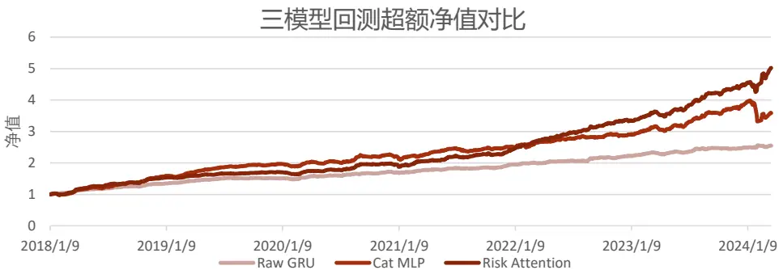

## 报告发布日期

2024 年 05 月 29 日

杨怡玲 yangyiling@orientsec.com.cn

执业证书编号：S0860523040002

薛耕 xuegeng@orientsec.com.cn

执业证书编号：S0860523080007

非线性市值风控全攻略：——因子选股系 2024-05-27列之一〇五

融合基本面信息的 ASTGNN 因子挖掘模 2024-05-27型：——因子选股系列之一〇四

DFQ-FactorVAE：融合变分自编码器和概 2024-05-14
率动态因子模型的 alpha 预测方案：——
因子选股系列之一〇三

## 一、引言

在前序报告《基于异构图神经网络的股票关联因子挖掘》中，我们使用了同行业、分析师覆盖和共同持仓这三种先验信息作为关联矩阵。通过图卷积网络（GCN），我们使 63 个截面量价因子在该关联矩阵上进行传播、聚合和更新，从而构建了一个描述多类型关系的异构图模型。该模型在月频数据上的表现为：RankIC 0.122，ICIR 3.08，夏普值 2.80，多头超额年化收益率为20.7%。

图 1：前序报告模型和因子回测结果
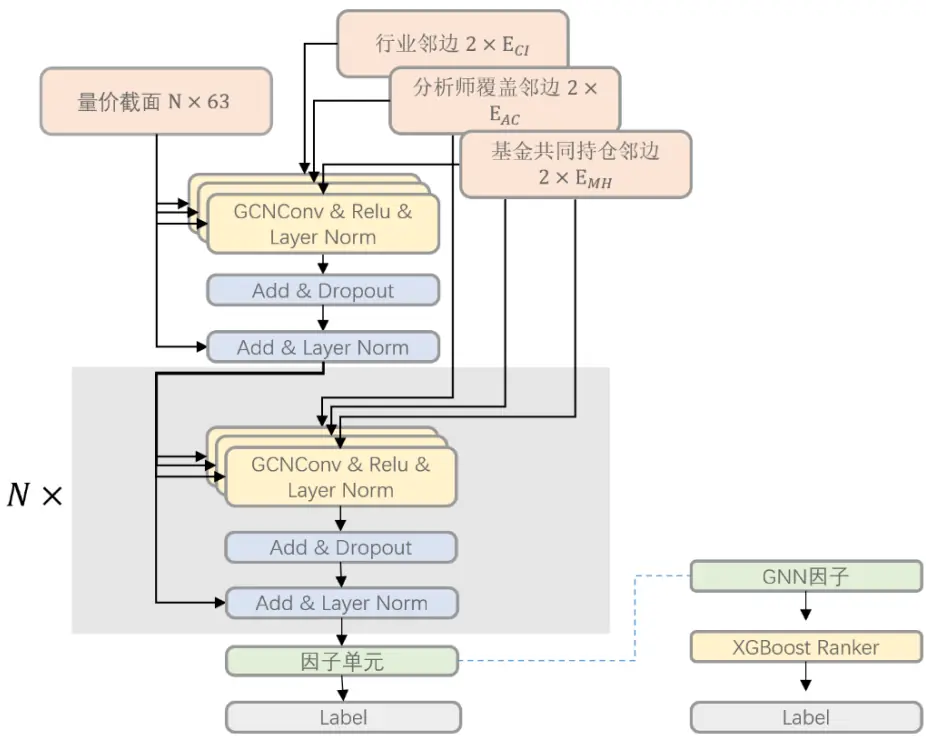

|  | RankIC | ICIR | Sharpe | AnnRet | Vol | MaxDD | 2015 | 2016 |
| --- | --- | --- | --- | --- | --- | --- | --- | --- |
| GNN | 0.122 | 3.08 | 2.80 | 20.7% | 7.4% | -11.2% | 60.1% | 36.9% |
| GNNXGB | 0.125 | 3.19 | 2.95 | 21.0% | 7.1% | -10.1% | 59.1% | 35.7% |
|  | 2017 | 2018 | 2019 | 2020 | 2021 | 2022 | 2023 |  |
| GNN | -2.8% | 22.5% | 9.8% | 5.6% | 15.1% | 22.2% | 16.8% |  |
| GNNXGB | -0.9% | 18.3% | 10.5% | 5.9% | 14.4% | 21.8% | 22.9% |  |

数据来源：东方证券研究所 & Wind 资讯

在构建股票市场的图模型时，使用先验信息构建的邻接矩阵（即先验图）存在若干缺陷，影响了模型的性能和准确性。

1.稀疏性：首先，先验图中，许多节点之间没有直接的关联信息，这导致了邻接矩阵的稀疏性。例如，许多股票可能在近期没有被分析师覆盖过，因此无法在分析师层面与其他股票建立关联。这种稀疏性限制了信息的传播和特征的聚合，无法充分捕捉股票之间的潜在关系，从而影响模型的学习和预测精度。

2.对称性：大部分先验关系在构建邻接矩阵时被认为是对称的，即两个节点之间的关联权重相同。然而，现实中的股票市场关系往往具有方向性，例如大市值股票对小市值股票的影响力通常更大，但反之则不一定成立。这种对称性假设可能导致信息传递的错误，无法准确反映股票间的真实影响关系，从而影响预测结果的准确性。

3.主观性：先验关系大多来自于人为的定义，例如行业定义、研报覆盖窗口、基金池等，这些定义可能带有一定的主观性，无法全面反映股票间的真实关系。人为定义的先验关系可能带有偏见，影响模型的公正性和准确性，且这些主观定义的先验关系可能不适用于所有市场和环境，限制了模型的泛化能力。

4. 滞后性：先验信息通常基于历史数据，而这些数据在当前市场条件下可能已经过时。例如，基金持仓数据的披露通常滞后 2-4个月，无法反映实时的市场变化。

5. 关系类别众多：在异构图模型中，不同类型的关系可能导致参数量急剧增加，关系种类越多，模型的复杂度和计算开销也随之增加。

综上所述，先验图的应用面临稀疏性、对称性、主观性、滞后性和类别众多等挑战。我们希望引入自适应图结构、数据驱动的关系学习，最终可以根据股票自身信息及时构建出有向的、稠密的关联关系。

## 二、模型与数据

## 2.1 图与注意力机制

图注意力网络（Graph Attention Network, GAT）和点积注意力机制（Dot-Product Attention）在传播逻辑上一致，在图构成的时候略有区别。具体来说，GAT 通过对“目标节点特征”和“源节点特征”的合并来计算关联权重，这种方法被称为“加性注意力”。在加性注意力中，目标节点和源节点的特征向量首先进行拼接，然后通过一个线性变换和非线性激活函数来计算注意力权重。这种机制允许模型在计算关联权重时考虑目标节点和源节点特征的综合信息，从而自适应地调整节点间的权重。

与加性注意力相对应的是“乘性注意力”（这也是广义“注意力”的定义）。乘性注意力则是通过“目标节点特征（Query, Q）”和“源节点特征（Key, K）”进行点积运算来得到关联权重。具体来说，乘性注意力首先通过线性变换得到查询向量和键向量，然后计算这两个向量的点积，再通过Softmax函数归一化得到关联权重。乘性注意力的方法强调目标节点特征和源节点特征的相似性，更加符合图论中传播的逻辑。

无论是加性注意力还是乘性注意力，在得到关联权重后，节点特征（Value, V）就在该关联矩阵上进行传播、聚合和更新，二者本质上都是图论。

图 2：加性注意力和乘性注意力
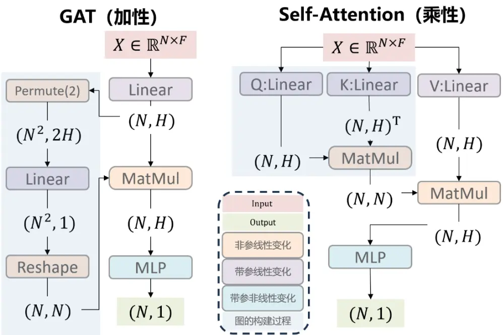
数据来源：东方证券研究所绘制

## 2.2 风险注意力模型

在传统的 Transformer 模型中，如果 Q、K、V 都来自同一数据源，则称为自注意力；如果只有 K 和 V 来自同一数据源，则称为跨注意力。在本文中，Q 和 K 源自风险因子经由不同线性变化过后的风险特征，而V源自GRU对行情数据提取后的量价特征，用以探索基于风险特征的注意力是否能引入关联股票的量价特征，从而增强个股的量价特征。我们将这个模型称为Risk-Attention 模型。它的左边构成了图，右边构成了在图上传播的特征向量。

图 3：Risk-Attention 模型结构
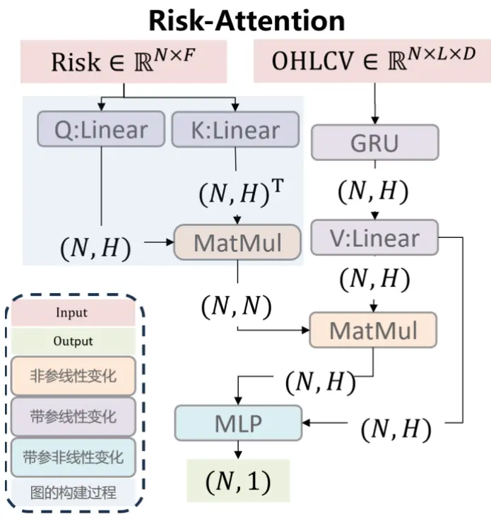
数据来源：东方证券研究所绘制

Risk-Attention 模型由以下几部分组成：

## 1. 输入特征：

- 风险特征 $({\bf R}\in\mathbb{R}^{N\times F})$ ： 10个类 Barra风险因子和 29个行业因子共39个。

- 行情数据 $(0\in\mathbb{R}^{N\times L\times D})$ ： 包含每只股票的开盘价、最高价、最低价、收盘价和成交量的历史数据。

2. 对风险特征进行线性变换，得到查询 (Q) 和键 (K) 矩阵；

$$
\begin{array}{r}{\mathbf{Q}=\mathsf{R}W_{Q}+b_{Q}}\\{\mathbf{K}=\mathsf{R}W_{Q}+b_{q}}\end{array}
$$

3. 将行情数据 (O) 输入 GRU，生成隐藏状态，进行线性变换，得到值 (V) 矩阵；

$$
\begin{array}{c}{{\bf H}={\mathrm{GRU}}({\bf0})}\\{\quad}\\{{\bf V}={\bf H}{\bf W}_{V}+{\bf b}_{V}}\end{array}
$$

有关分析师的申明，见本报告最后部分。其他重要信息披露见分析师申明之后部分，或请与您的投资代表联系。并请阅读本证券研究报告最后一页的免责申明。

4. 注意力机制：通过查询 (Q) 和键 (K) 矩阵计算注意力权重，使用注意力权重 (A) 对值 (V)进行加权求和，得到新的特征 (Z)；

$$
\mathbf{A}=\operatorname{softmax}\left(\frac{\mathbf{Q}\mathbf{K}^{T}}{\sqrt{H}}\right)
$$

$$
\mathbf{Z}=\mathbf{A}\mathbf{V}
$$

## 5. 跳跃连接（concat）与 MLP特征合成；

$$
\mathbf{H}^{\prime}=\mathbf{H}||\mathbf{Z}
$$

$$
\mathbf{Y}=\mathbf{MLP}(\mathbf{H}^{\prime})
$$

## 2.3 数据说明

本文的因子检验和组合测试起止于 2009年 1月 4日到 2024年 3月 22日，样本空间为中证全指同期成分股。标签采用 T+1 收盘至 T+11 收盘的涨跌幅，标签经过标准化处理，但未进行中性化。行情时序数据为 A股全市场个股的 OHLCV，时序长度为 30天。

截面风险因子由 10 个大类风险因子和 29 个中信一级行业哑变量组成。10 个大类因子来自报告《东方 A 股因子风险模型（DFQ-2020）》，如图 5 所示。大类因子的取值来源于成分因子的算术平均。该因子风险模型对全市场的 Adjusted R-square能够达到 21.4%。

图 4：大类风险因子列表
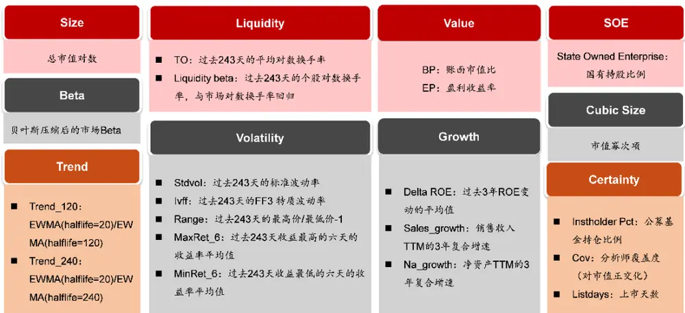
数据来源：东方证券研究所 & Wind 资讯

数据预处理的部分，我们对行情数据和截面风险因子进行了标准化处理。对(N,L,D)的行情数据，我们对每个(N,L)进行标准化，相当于计算出D个均值和标准差，这样不会改变跨时间和跨样本的大小关系；针对(N,F)的截面风险因子，我们计算出F个均值和标准差进行标准化，这种标准化方法确保了每个因子在不同样本之间的可比性。

## 三、测试结果

## 3.1 训练策略

在模型更新策略中，我们采用滚动训练的方法，以 12年为一个训练窗口，其中前 10年作为训练集，后 2 年分别作为验证集和测试集。为了消除随机初始化对模型性能的影响，我们使用三次独立训练的模型打分取平均值作为最终的因子值。

模型的优化器选择了 Adam，起始学习率为 0.01。在训练过程中，设置了早停机制。如果验证集的 Rank IC 在连续 20 个 Epoch 中未提升，我们会提前停止训练，并加载验证 IC 最高的模型。同时，我们引入学习率调度器，如果验证集的损失在连续 5 轮中没有下降，学习率会衰减50%。

损失函数使用了 CCC 损失（Concordance Correlation Coefficient loss），用以衡量预测值与真实值之间的一致性。模型评估函数采用 Rank IC。在训练过程中，首先计算训练集的预测值和损失，通过前向传播和反向传播计算梯度，并进行3倍L2范数的梯度剪裁，更新模型参数。在验证集上，我们计算预测值和损失，记录验证 IC并更新早停状态，同时更新调度器状态以调整学习率。

图 5：训练策略说明

| 步骤 | 说明 |
| --- | --- |
| 模型更新策略 | 滚动训练，以12年为窗口，前10年为训练集，后面2年分别为验证 集和测试集； |
| 模型打分策略 | 为了消除随机初始化的影响，我们使用三次独立训练的模型的打 分取平均，作为因子值； |
| 优化器 | Adam，起始学习率0.01； |
| 早停机制 | 如果验证集RankIC连续20个Epoch未提升，则提前停止训练，加 载验证IC最高模型； |
| 学习率调度器 | 如果验证集损失连续5轮不下降，学习率衰减50%； |
| 损失函数 | CCC损失(Concordance Correlation Coefficient loss):衡量预 |
| 评估函数 | 测值与真实值之间的一致性； Rank IC ; |
| 前向传播 | 计算训练集预测值和损失； |
| 反向传播 | 计算梯度，进行3倍L2范数梯度剪裁，更新模型参数； |
| 评估 |  |
|  | 在验证集上计算预测值和损失，记录验证IC，更新早停状态； |
| 学习率调整 数据来源：东方证券研究所绘制 | 更新调度器状态，调整学习率； |

## 3.2 回测说明

所有因子打分均在每周的最后一个交易日进行，测试样本为中证全指的成分股，未进行中性化处理，数据未填充。

在IC测试中，因子值对应的未来收益率为周一以VWAP价格买入、周五以VWAP价格卖出的绝对收益。ICIR 经过年化处理，年化乘数为 √50。在收益测试中，展示了因子分组测试结果。根据因子打分将样本分为20组，因子打分频率为每周一次。因子分组的收益计算方式同样为：在周一以 VWAP 价格买入，周五以 VWAP 价格卖出，不考虑交易成本。多头绝对收益为最高得分组的等权组合收益，超额收益为多头绝对收益减去全样本等权组合收益。

图 6：回测说明

| 步骤 | 说明 |
| --- | --- |
| 因子打分频率 | 每周的最后一个交易日 |
| 测试样本 | 中证全指的成分股 |
| 数据处理 | 未进行中性化处理，数据未填充 |
| IC测试 | 因子值对应的未来收益率为周一以VWAP价格买入、周五以VWAP 价格卖出的绝对收益 |
| ICIR年化处理 | 年化乘数为√50 |
| 收益测试 | 展示因子分组测试结果，根据因子打分将样本分为20组，多头组 |
|  | 为得分最高组 收益计算方式周一以VWAP价格买入，周五以VWAP价格卖出，不考虑交易成本 |
| 多头绝对收益 | 最高得分组的等权组合收益 |
| 多头超额收益 | 多头绝对收益减去全样本等权组合收益 |
| 数据来源：东方证券研究所绘制 |  |

## 3.3 回测结果

下图展示了 2018 年至 2024 年期间，多头超额净值的变化及回撤情况。关键绩效指标包括RankIC 为 0.106，ICIR 为 6.30，Sharpe 比率为 5.23，多头年化超额收益（AnnRet）为 40.3%，多头超额年化波动率（Vol）为 7.7%，多头超额净值最大回撤（MaxDD）为-7.6%，出现在 2024年 2月2日。

图 7：因子整体表现及多头净值分析
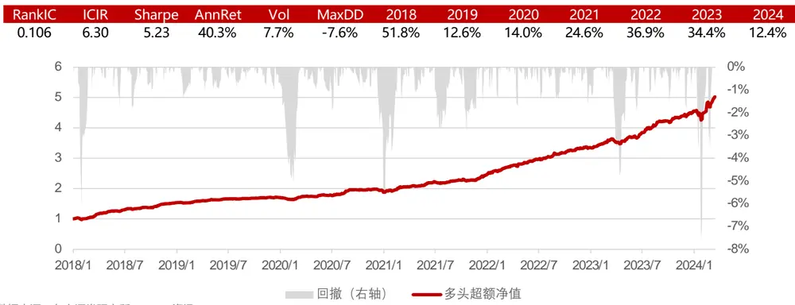
数据来源：东方证券研究所 & Wind 资讯

下面左图展示 RankIC 序列、RankIC 50 周滚动均值及 RankIC 累加，直观地反映了因子在不同时间段内的表现及其整体有效性。从长期来看，因子具有较为稳定的预测能力。下面右图中，2020 年 RankIC 值显著下降至 0.08，在 2023 年达到最高值 0.13， 2024 年的 RankIC 值为 0.10。2018 年的多头超额收益率为 52%，是最高的超额收益率，2019 年大幅下降至 13%，2020 年略升至 14%。2021 年和 2022 年多头超额收益率分别为 25%和 37%，2023 年为 34%，2024 年截至 3 月 22 日为 12%。

图 8：IC序列、IC50周滚动均值及 IC累加
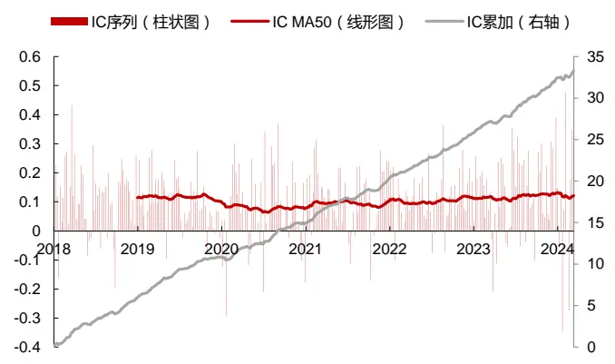
数据来源：东方证券研究所 & Wind 资讯

图 9：分年 RankIC及分年多头超额
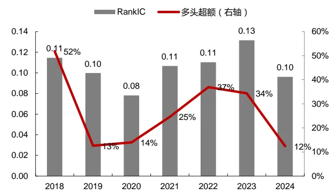
数据来源：东方证券研究所 & Wind 资讯
有关分析师的申明，见本报告最后部分。其他重要信息披露见分析师申明之后部分，或请与您的投资代表联系。并请阅读本证券研究报告最后一页的免责申明。

下方右图中的空头组 Bottom年化收益为-56%，而多头组 Top年化收益为 40%。分组超额净值和分组超额年化都展示了该因子具有非常良好的分组单调性。

图 10：分组超额净值（颜色越深，因子打分越高）
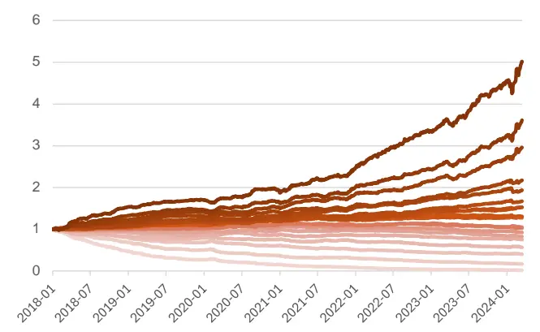
数据来源：东方证券研究所 & Wind 资讯

图 11：分组超额年化收益
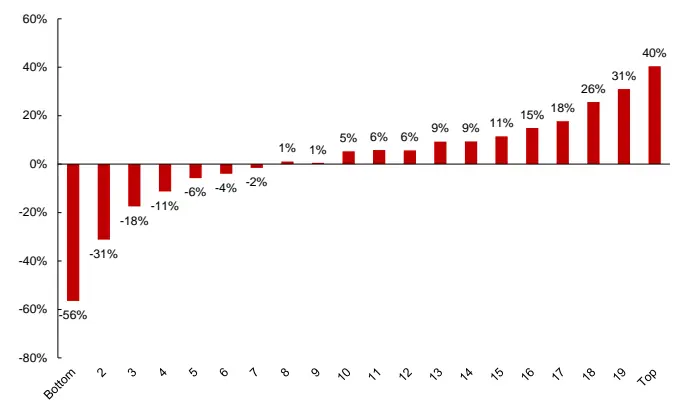
数据来源：东方证券研究所 & Wind 资讯

## 四、Risk-Attention 模型讨论

## 4.1 注意力结构带来的信息增量

为了对比 Risk-Attention 模型的结构优势，我们构建了 Raw GRU 模型和 Cat MLP 模型进行对比。三个模型使用的样本和训练方式都保持一致。

1. Raw GRU 模型：使用与 Risk-Attention 相同的行情时序数据，通过 GRU 和 MLP 来提炼时序特征。这个模型结构在许多实践中被证明是一个简单但有效的模型。

2. Cat MLP 模型：这里的“Cat”是 concat（拼接）的意思。首先，通过 GRU 提取出行情时序特征，然后将这些特征与风险因子拼接到同一截面上，最后用 MLP 对未来收益率进行拟合。

3.Risk-Attention模型：将 GRU的输出作为 V，在风险因子构成的 QK注意力矩阵上进行传播，然后再将结果拼接进入 MLP进行拟合。

通过这种方式，我们能够评估 Risk-Attention 模型在结构上的优势，以及其在提炼和融合时序特征和风险因子方面的性能表现。

图 12：三模型结构说明
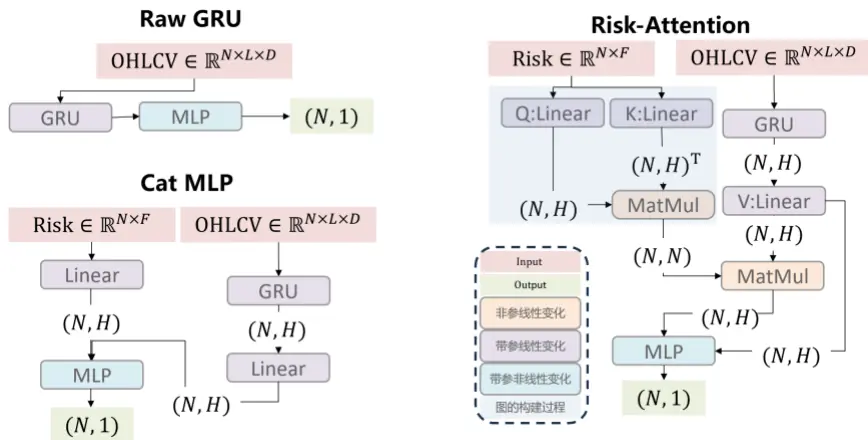
数据来源：东方证券研究所绘制

左图展示了 2018 年至 2024 年期间三种模型（Raw GRU、Cat MLP、Risk-Attention）的超额净值变化对比。可以看出，Risk-Attention模型的净值增长最为显著，其次是Cat MLP，而RawGRU的表现相对较弱。从2020年开始，三种模型的净值差距逐渐拉大，Risk-Attention模型的优势尤为明显。

右图展示了三种模型在不同因子打分分组下的年化超额收益对比。可以看出，无论在空头组Bottom 还是多头组 Top，Risk-Attention 模型的收益表现整体优于 Cat MLP 和 Raw GRU 模型，显示了其在不同打分分组中的稳定性和优势。

图 13：三模型净值对比
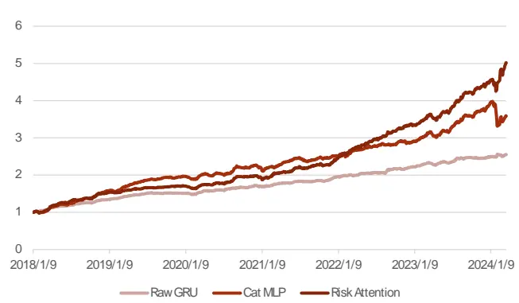
数据来源：东方证券研究所 & Wind 资讯

图 14：三模型分组年化超额收益对比
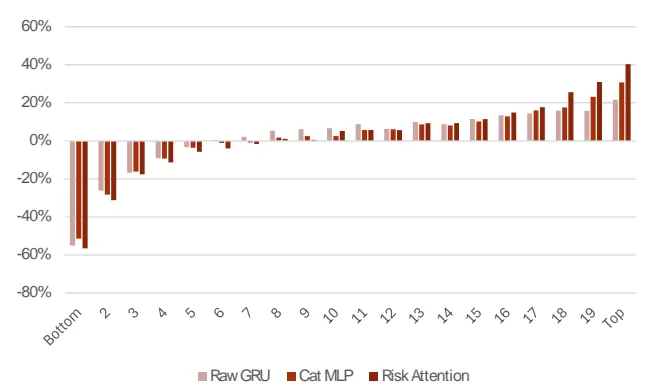
数据来源：东方证券研究所 & Wind 资讯

整体来看，Risk-Attention 模型在 RankIC、Sharpe 值和年化超额收益方面显著高于另外两个模型。在 2018 年和 2019 年，Cat MLP 模型通过更好地结合风险特征，表现出相对较高的收益，但在 2020 年之后，这一优势逐渐消失，而 Risk-Attention 模型则表现出更强的性能，并且逐渐拉开了与另外两个模型的距离。

在2024年，当量价表现变差时，虽然Risk-Attention模型也经历了历史上的最大回撤，但由于其能够学习到风险特征的协变关系，使得回撤幅度不至于过大，并且很快通过更高的收益率弥补了回撤，最终再创净值新高。

图 15：三模型因子回测表现

|  |  | RankIC | ICIR | Sharpe | AnnRet | Vol | MaxDD |
| --- | --- | --- | --- | --- | --- | --- | --- |
| Raw GRUCat MLPRisk Attention | GRU | 0.099 | 6.991 | 4.742 | 21.7% | 4.6% | -3.7% |
|  | 0.091 | 5.236 | 3.769 | 30.8% | 8.2% | -20.2% | 56.4% |
|  | 0.106 | 6.302 | 5.233 | 40.3% | 7.7% | -7.6% | 51.8% |
|  | 2019 | 2020 | 2021 | 2022 | 2023 | 2024 |  |
| Raw GRU | 12.8% | 12.9% | 14.5% | 13.8% | 11.8% | 2.7% |  |
| Cat MLPRisk Attention | 25.9% | 12.3% | 13.7% | 15.7% | 33.1% | -7.4% |  |
|  | 12.6% | 14.0% 24.6% 36.9% |  |  | 34.4% 12.4% |  |  |

数据来源：东方证券研究所 & Wind 资讯

## 4.2 对于注意力权重矩阵的解读

我们将风险因子作为 Attention 中的 QK，自然两期之间的权重变化程度不大，相比嵌入（Embedding）更灵活，但比Self-Attention更稳定，且具有一定的可解释性。我们尝试对过去一段时间（2024年1月5日到 2024年 3月 15日）的市场风格进行描述性解释。

以下的十张热力图展示了 2024 年作为测试集时，最优模型在处理每期输入的风险因子时产生的注意力矩阵。其中，第 i 行第 j 列的数值 $\dot{\lvert{a_{ij}}}$ 代表着股票 j 对股票 i 的注意力权重。将股票按照当期市值降序排列，可以发现市值在注意力的形成中扮演了重要角色。将每个矩阵划分为四个象限，第四象限代表小市值股票对小市值股票的“影响”，第三象限代表大市值股票对小市值股票的“影响”，以此类推。越亮的区域代表“影响”越大。

这种“影响”并不是一种主动的“影响”，而是模型经过训练后，认为将股票 j 的行情特征ℎ 通过权重a 进行聚合之后，能对股票 i 的行情特征进行增强（通过拼接），这是一种隐性的“影响”。

在 2024年 1月 5日到 2024年 3月 15日这段时间，A股市场经历了一个深 V字形反弹，转折发生在 2024年2月6日。基于这一点，我们做出如下观察和推测：

1. 右下角高亮区域：最明显的观察点是右下角的高亮区域，这个区域并不对称，中心靠上，表示微盘股发出的影响多于受到的影响。

a)在 2024 年 2 月 6 日的转折点过后，右下角高亮区域向上延伸，表示微盘股的高 Beta系数行情特征传递到了更大市值的股票上，特别是在2024年2月8日的热力图中，微盘股的高 Beta 反转特征影响延伸到了中位数市值的股票，使得该周因子的 IC 达到了0.48。

b) 相反，在转折之前，由于市场处于长期下跌，微盘股的影响范围较小，热力图右下角高亮区域也较小。

2.左下角高亮区域：另一个明显的高亮区域位于左下角靠边的位置，大约有100只市值靠前的股票，这些股票一直影响着市值排序后一半的股票。与其说是主动影响，不如说这些市值靠前的股票被微盘股用作市场参考，根据微盘股自己的行情特征产生一些类似于特异度的新信息。

3. 中上方高亮区域：在热力图的中上方，有一片高亮的列，代表20-80分位的小盘股（占20%市值），它们均匀地影响着 60-100 分位的大中市值（占 89%市值）的股票。这种影响过于平滑（甚至经过 softmax之后仍然如此），无法对大中市值股票产生实质性的作用。

4. 左上角的变化：左上角代表大中市值股票对大中市值内部的影响。可以看到这个区域由暗慢慢转亮，预示了 3月之后大中市值的成长、价值风格会交替登上舞台（本报告撰于 5月末）。

图 16：注意力权重矩阵热力图
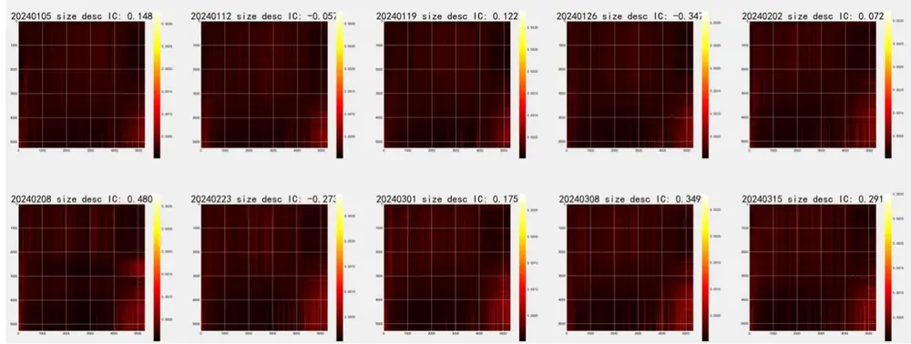
数据来源：东方证券研究所 & Wind 资讯
有关分析师的申明，见本报告最后部分。其他重要信息披露见分析师申明之后部分，或请与您的投资代表联系。并请阅读本证券研究报告最后一页的免责申明。

## 五、总结与讨论

我们在上一篇报告《基于异构图神经网络的股票关联因子挖掘》中，利用行业、分析师覆盖和基金持仓构建了显式的股票关联矩阵，并利用截面的量价因子作为个股特征在GCN模型上进行传播。然而，由于显式关联的稀疏性、对称性、主观性和滞后性，相对于简单因子合成模型的提升并不明显。

图注意力网络 GAT 通过将节点特征拼接降维，形成注意力权重，这种“加性注意力”构建了一种股票间的隐式关联，克服了上述显式关联的缺点。然而，“加性注意力”在学术实践和工业实践中都不如 Transformer 模型中的“乘性注意力”受欢迎，主要原因在于后者具备以下优势：1）高效的并行机制，2）QK点积天然刻画了相关性，3）在NLP和CV领域的大量应用验证了其有效性。

本文利用截面风险因子转化为 QK 点积注意力矩阵，代表股票基于风险特征的传播路径。GRU 提取行情时序数据的量价特征作为 V，在注意力矩阵上进行单头单层的传播、聚合和更新。这种方法使图神经网络和点积注意力机制殊途同归，同时与GRU的结合实现了时序和空间（跨股票）信息的整合。传播之后的节点信息与 GRU 提取的特征拼接进入 MLP 进一步学习非线性特征和降维，对未来收益率进行拟合，我们称该模型为 Risk-Attention。

模型训练采用“10+1+1”的数据集切割方式进行每年的滚动训练，每年独立训练三个模型并取其打分平均作为因子值。在测试集（2018年1月4日到2024年3月15日）上进行模型打分测试，RankIC 为 0.106，ICIR 为 6.30，Sharpe 比率为 5.23，多头年化超额为 40.3%，最大回撤为-7.6%。

为了体现Risk-Attention模型结构所带来的信息增量，我们对比了Raw GRU模型和Cat MLP模型。2020 年之后，Risk-Attention 表现显著超过二者，超出具有相同信息但不同结构的 CatMLP近 10%的年化超额，超出仅包含行情时序信息的 Raw GRU近 20%的年化超额。

最后，我们绘制了 2024 年前十周的注意力权重矩阵热力图，观察市场在“深 V”反弹前后权重矩阵的变化，推测不同市值股票间如何相互影响，并对背后的成因进行了推测。例如，2024年 2 月 6 日之后市场上涨时，微盘股的影响力会向更大市值股票延伸，而在下跌时则不然。微盘股持续赋予大盘股高权重，可能是一种借鉴大盘特征用于合成特异度类特征的行为。

本研究存在一些可以改进的地方：

1. 数据量和模型参数量较小，可以尝试使用更丰富的特征和更深的模型堆叠。

2.可以尝试更小的样本，探讨在没有微盘股样本时，RankIC 和多头超额收益是否会受到较大影响。

## 六、风险提示

1. 量化模型基于历史数据分析得到，未来存在失效的风险，建议投资者紧密跟踪模型表现。

2. 极端市场环境可能对模型效果造成剧烈冲击，导致收益亏损。

## 七、引用文献

[1] Veličković, P., Cucurull, G., Casanova, A., Romero, A., Liò, P., & Bengio, Y. (2018). Graph Attention Networks. arXiv preprint arXiv:1710.10903.

[2] Vaswani, A., Shazeer, N., Parmar, N., Uszkoreit, J., Jones, L., Gomez, A. N., Kaiser, Ł., & Polosukhin, I. (2017). Attention is All You Need. Advances in Neural Information Processing Systems, 5998-6008.

## Tabl e_Disclai mer 分析师申明

每位负责撰写本研究报告全部或部分内容的研究分析师在此作以下声明：

分析师在本报告中对所提及的证券或发行人发表的任何建议和观点均准确地反映了其个人对该证券或发行人的看法和判断；分析师薪酬的任何组成部分无论是在过去、现在及将来，均与其在本研究报告中所表述的具体建议或观点无任何直接或间接的关系。

## 投资评级和相关定义

报告发布日后的12个月内行业或公司的涨跌幅相对同期相关证券市场代表性指数的涨跌幅为基准（A 股市场基准为沪深 300 指数，香港市场基准为恒生指数，美国市场基准为标普 500 指数）；

## 公司投资评级的量化标准

买入：相对强于市场基准指数收益率 15%以上；

增持：相对强于市场基准指数收益率 5%～15%；

中性：相对于市场基准指数收益率在-5%～+5%之间波动；

减持：相对弱于市场基准指数收益率在-5%以下。

未评级 —— 由于在报告发出之时该股票不在本公司研究覆盖范围内，分析师基于当时对该股票的研究状况，未给予投资评级相关信息。

暂停评级 —— 根据监管制度及本公司相关规定，研究报告发布之时该投资对象可能与本公司存在潜在的利益冲突情形；亦或是研究报告发布当时该股票的价值和价格分析存在重大不确定性，缺乏足够的研究依据支持分析师给出明确投资评级；分析师在上述情况下暂停对该股票给予投资评级等信息，投资者需要注意在此报告发布之前曾给予该股票的投资评级、盈利预测及目标价格等信息不再有效。

## 行业投资评级的量化标准：

看好：相对强于市场基准指数收益率 5%以上；

中性：相对于市场基准指数收益率在-5%～+5%之间波动；

看淡：相对于市场基准指数收益率在-5%以下。

未评级：由于在报告发出之时该行业不在本公司研究覆盖范围内，分析师基于当时对该行业的研究状况，未给予投资评级等相关信息。

暂停评级：由于研究报告发布当时该行业的投资价值分析存在重大不确定性，缺乏足够的研究依据支持分析师给出明确行业投资评级；分析师在上述情况下暂停对该行业给予投资评级信息，投资者需要注意在此报告发布之前曾给予该行业的投资评级信息不再有效。

## HeadertTabl e_Discl ai mer 免责声明

本证券研究报告（以下简称“本报告”）由东方证券股份有限公司（以下简称“本公司”）制作及发布。

。本公司不会因接收人收到本报告而视其为本公司的当然客户。本报告的全体接收人应当采取必要措施防止本报告被转发给他人。

本报告是基于本公司认为可靠的且目前已公开的信息撰写，本公司力求但不保证该信息的准确性和完整性，客户也不应该认为该信息是准确和完整的。同时，本公司不保证文中观点或陈述不会发生任何变更，在不同时期，本公司可发出与本报告所载资料、意见及推测不一致的证券研究报告。本公司会适时更新我们的研究，但可能会因某些规定而无法做到。除了一些定期出版的证券研究报告之外，绝大多数证券研究报告是在分析师认为适当的时候不定期地发布。

在任何情况下，本报告中的信息或所表述的意见并不构成对任何人的投资建议，也没有考虑到个别客户特殊的投资目标、财务状况或需求。客户应考虑本报告中的任何意见或建议是否符合其特定状况，若有必要应寻求专家意见。本报告所载的资料、工具、意见及推测只提供给客户作参考之用，并非作为或被视为出售或购买证券或其他投资标的的邀请或向人作出邀请。

本报告中提及的投资价格和价值以及这些投资带来的收入可能会波动。过去的表现并不代表未来的表现，未来的回报也无法保证，投资者可能会损失本金。外汇汇率波动有可能对某些投资的价值或价格或来自这一投资的收入产生不良影响。那些涉及期货、期权及其它衍生工具的交易，因其包括重大的市场风险，因此并不适合所有投资者。

在任何情况下，本公司不对任何人因使用本报告中的任何内容所引致的任何损失负任何责任，投资者自主作出投资决策并自行承担投资风险，任何形式的分享证券投资收益或者分担证券投资损失的书面或口头承诺均为无效。

本报告主要以电子版形式分发，间或也会辅以印刷品形式分发，所有报告版权均归本公司所有。未经本公司事先书面协议授权，任何机构或个人不得以任何形式复制、转发或公开传播本报告的全部或部分内容。不得将报告内容作为诉讼、仲裁、传媒所引用之证明或依据，不得用于营利或用于未经允许的其它用途。

经本公司事先书面协议授权刊载或转发的，被授权机构承担相关刊载或者转发责任。不得对本报告进行任何有悖原意的引用、删节和修改。

提示客户及公众投资者慎重使用未经授权刊载或者转发的本公司证券研究报告，慎重使用公众媒体刊载的证券研究报告。

## 东方证券研究所

地址： 上海市中山南路 318 号东方国际金融广场 26 楼

电话：021-63325888

传真：021-63326786

网址： www.dfzq.com.cn