# DFQ-XGB：基于树模型的 alpha 预测方案

## 因子选股系列之一〇七

## 研究结论

## 树模型的训练细节

输入特征的构造：树模型需要人工构造特征来捕捉时间依赖性。以纯截面 70特征为输入的模型表现，明显弱于以添加时序信息的430特征为输入的模型，IC低1pct以上，RANKIC低接近 2pct，ICIR和 RANKICIR也有较大差距，多头年化超额低 7pct以上。

⚫ 数据预处理方案的选择：解释变量X截面上进行稳健的Zscore标准化，减小异常值对标准化结果的影响。预测标签 Y截面上进行 Zscore标准化。

⚫ 调参技巧：使用 Optuna 调参方法，调参后模型在测试集上的效果有明显提高，IC 和RANKIC 提高近 1pct，多头年化超额提高近 4pct。

⚫随机种子的影响：不同种子下得到的模型表现较为接近，IC 和 RANKIC 相差都在0.5pct以内，多头年化超额相差 2pct以内。不同种子下得到的模型相关性很高。

⚫树模型和神经网络模型的比较：相同输入特征下，MLP、GRU模型效果均不如 XGB模型，RANKIC低 1pct左右。XGB与两个网络模型的多头超额收益相关性仅 60%。

## 树模型的训练效果：

因子整体绩效表现：在各个股票池中，DFQ-XGB 模型都能获得与神经网络模型相当甚至更优的绩效。在中证全指股票池中，DFQ-XGB 模型所得到因子的稳定性最强，测试集上 IC12.96%， RANKIC15.43%，20 分组多头年化超额收益 29.58%。

因子多头组表现：在中证全指股票池中，DFQ-XGB 模型 20 分组多头组表现整体较强，累计超额仅低于 HIST 和 FactorVAE 模型。XGB 模型和 HIST、FactorVAE 模型的多头超额净值的曲线走势存在差异，波峰波谷恰好相反，呈现出较好的互补性。

因子分年绩效表现：在各个股票池中，DFQ-XGB 模型 2024 年的表现都很突出，尤其多头端。在中证全指股票池中，DFQ-XGB 模型 2024 年的多头表现最优。2024 年 IC达到 15.75%，20 分组多头年化超额 35.24%，最大回撤 5.8%。

## 多模型集成增量：

⚫ 多模型相关性：DFQ-XGB 模型所得因子与其他模型的相关性都比较低，在中证全指股票池中，DFQ-XGB模型与其他模型日度多头超额收益的相关性在 50%以下。

多模型集成表现：在中证全指股票池中，DFQ-XGB 模型与 DFQ-HIST 模型等权合成后效果更佳，达到 1+1>2 的集成效果。测试集上 IC 达到 13.39%，RANKIC 达到17.19%，20分组多头日度超额年化收益率达到 36.12%。

## Top100 组合表现：

⚫ 在中证全指内，使用 DFQ-XGB 模型构建的 top100 组合，绩效表现优于其他模型。2020年以来年化绝对收益达到 25.68%，年化夏普比达到 1.17，最大回撤 27.28%。

## 指数增强组合表现：

⚫ 沪深 300 指数增强组合表现：将 XGB、dfqfactor、FactorVAE 三个模型得分，按照1:1:2 的权重结合使用，表现可超越任何一个单一模型。 2020 年以来年化信息比达到2.53，年化对冲收益 14.90%，年化跟踪误差 5.56%。

⚫ 中证500指数增强组合表现：将XGB、TRA两个模型等权结合使用，表现可超越任何一个单一模型。2020年以来年化信息比 2.31，年化对冲收益17.65%。

⚫ 中证 1000指数增强组合表现：将 XGB、HIST两个模型等权结合使用，表现可超越任何一个单一模型。2020年以来年化信息比达到 3.04，年化对冲收益 24.06%。

## 风险提示

1. 量化模型失效风险。

2. 极端市场环境对模型的影响。

报告发布日期

2024 年 08 月 15 日

杨怡玲 yangyiling@orientsec.com.cn

执业证书编号：S0860523040002

刘静涵

021-63325888*3211

liujinghan@orientsec.com.cn

执业证书编号：S0860520080003

香港证监会牌照：BSX840

基于风险注意力的因子挖掘模型：——因 2024-05-29子选股系列之一〇六

非线性市值风控全攻略：——因子选股系 2024-05-27列之一〇五

融合基本面信息的 ASTGNN 因子挖掘模 2024-05-27型：——因子选股系列之一〇四

DFQ-FactorVAE：融合变分自编码器和概 2024-05-14率动态因子模型的 alpha 预测方案：——

## 因子选股系列之一〇三

基本面因子的重构：——因子选股系列之 2024-03-21一〇二

自适应时空图网络周频 alpha 模型：—— 2024-02-28因子选股系列之一〇一

DFQ-HIST：添加图信息的选股因子挖掘 2024-02-07系统：——因子选股系列之一百

基于异构图神经网络的股票关联因子挖 2024-01-02掘：——因子选股系列之九十九

基于抗噪的 AI 量价模型改进方案：——因 2023-12-24子选股系列之九十八

DFQ-TRA：多交易模式学习因子挖掘系 2023-11-14统：——因子选股系列之九十七

基于残差网络的端到端因子挖掘模型：— 2023-08-24—因子选股系列之九十六

DFQ 强化学习因子组合挖掘系统：——因 2023-08-17子选股系列之九十五

集成模型在量价特征中的应用：——因子 2023-07-01选股系列之九十三

基于循环神经网络的多频率因子挖掘：— 2023-06-06—因子选股系列之九十一

DFQ 遗传规划价量因子挖掘系统：——因 2023-05-28子选股系列之九十

树模型是机器学习非常流行的一类模型，主要包括决策树（Decision Tree）、随机森林（Random Forest，RF）与梯度提升树（Gradient Boosting Decision Trees，GBDT）等。这些模型常用于分类和回归任务，其主要优点是模型易于理解，并且能够处理非线性关系。近年来，随着深度神经网络的迅猛发展，许多人认为神经网络有着更为强大的非线性拟合能力，在处理复杂数据和预测精度上更具优势，甚至认为其几乎无所不能。然而，通过深入探索树模型的训练细节，我们发现树模型可以通过有效的调整达到不亚于神经网络的效果。更为重要的是，由于树模型和神经网络在架构上的本质差异，二者的结果具有低相关性，结合使用时能实现“1+1>2”的效果。因此，本报告将详细探讨树模型的训练细节，展示其在量化投资中的潜力和优势。

## 一、 树模型的训练细节

本节我们将从以下 10 个维度入手，对树模型的训练细节进行详细探讨，最终给出的一套完整的基于树模型 alpha 预测方案，目标是实现不输于网络的选股效果，并和网络模型达到低相关，为后续的多模型集成提供策略基础。

图 1：树模型训练细节
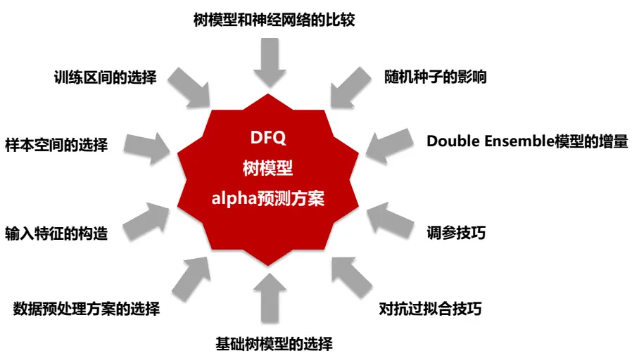
数据来源：东方证券研究所

## 1.1 训练区间的选择

我们以截面70特征为输入的LightGBM（lgb）模型为例，对比不同训练区间下模型在测试集中的表现。

结果显示：在不同长短的三种训练区间下，得到的模型结果相差不大。

图 2：不同训练区间下的模型效果对比（2020.01.01-2024.2.1）

| 70特征 Igb模型 | IC ICIR |  | RANKIC | RANKICIR | 多头日度超额年化收益率 | 多头日超额收益夏普比 | 多头日度超额收益最大回撤 | 多头月度胜率 | 多头月均单边换手 |
| --- | --- | --- | --- | --- | --- | --- | --- | --- | --- |
| 训练集10-18 | 11.84% | 1.04 | 14.22% | 1.09 | 22.99% | 3.09 | -6.98% | 77.55% | 65.73% |
| 训练集06-18 | 11.69% | 1.05 | 14.02% | 1.11 | 22.89% | 3.22 | -6.28% | 79.59% | 68.12% |
| 训练集14-18 | 11.73% | 1.05 | 14.09% | 1.11 | 21.84% | 2.93 | -5.51% | 71.43% | 66.65% |

数据来源：东方证券研究所 & Wind资讯

## 1.2 样本空间的选择

通常我们训练的样本空间会选择为全市场股票，优点是包括全市场股票可以增加样本的多样性，使模型能够学习到更多类型的股票行为。但缺点是小市值股票可能更加波动和不稳定，这可能会引入更多的噪声，影响模型的预测准确性。

我们以截面 430 特征为输入的 XGBoost（xgb）模型为例，对比全市场训练的模型，和大市值股票池中训练的模型在测试集中的表现。全市场股票池的设置方法为直接选择当日中证全指股票池，大市值股票池的设置方法为选择当日全市场市值排名前 60%的股票。

结果显示，依然是以全市场训练的模型在测试集上整体表现更好，但大市值股票池中训练的模型今年表现更好。

图 3：全市场训练 vs大市值股票池训练的模型效果对比（2020.01.01-2024.3.31）

| 430特征xgb模型10-18训练 | IC | ICIR | RANKIC | RANKICIR | 多头日度超额年化收益率 | 多头日超额收益夏普比 | 多头日度超额收益最大回撤 | 多头月度胜率 | 多头月均单边换手 |
| --- | --- | --- | --- | --- | --- | --- | --- | --- | --- |
| 全市场训练 | 12.82% | 1.26 | 15.60% | 1.42 | 29.04% | 3.35 | -7.44% | 84.31% | 77.28% |
| 大市值股票池训练 (全市场市值排名前60%) | 12.17% | 1.15 | 14.72% | 1.31 | 24.08% | 2.37 | -9.33% | 70.59% | 70.47% |

数据来源：东方证券研究所 & Wind资讯

图 4：全市场训练 vs大市值股票池训练的模型效果对比（2024.01.01-2024.3.31）

| 430特征xgb模型10-18训练 | IC | ICIR | RANKIC | RANKICIR | 多头日度超额年化收益率 | 多头日超额收益夏普比 | 多头日度超额收益最大回撤 | 多头月度胜率 | 多头月均单边换手 |
| --- | --- | --- | --- | --- | --- | --- | --- | --- | --- |
| 全市场训练 | 15.59% | 1.17 | 15.22% | 0.86 | 25.14% | 0.42 | -5.80% | 100.00% | 78.23% |
| 大市值股票池训练 (全市场市值排名前60%) | 18.40% | 1.38 | 20.43% | 1.36 | 25.51% | 0.43 | -5.28% | 100.00% | 80.14% |

数据来源：东方证券研究所 & Wind资讯

## 1.3 输入特征的构造

## （1） 时序信息的增量

RNN类模型能够直接从原始时序数据中自动学习和提取时间依赖性特征，而树模型本身为截面学习模型，并不具备处理时序数据的内在结构。为了能够学习历史信息对截面收益的影响，通常需要人工构造特征来捕捉时间依赖性，比如添加滞后特征（前 N 个时间点的数据）和滚动窗口统计（过去一段时间内的最大值、最小值、平均值、标准差等）等。

考虑到内存占用，我们采用滚动窗口统计方法，在原始设计的 70 个截面特征的基础上，再将70特征里面的60个量价特征做5，10，20天的平均与标准差，从而得到430个特征。添加均值和标准差作为特征的目的在于增强模型对时间序列中短期和中期趋势及波动性的捕捉能力。这些统计指标有助于揭示股票量价特征在不同时间框架内的动态变化，为模型提供了捕捉时间依赖性的途径。

结果显示：以纯截面 70 特征为输入的模型表现，明显弱于以添加时序信息的 430 特征为输入的模型，IC 低 1pct 以上，RANKIC 低接近 2pct，ICIR 和 RANKICIR 也有较大差距，多头年化超额低 7pct以上。

图 5：不同输入特征下的模型效果对比（2020.01.01-2024.3.31）

| xgb模型10-18训练 | IC | ICIR | RANKIC | RANKICIR | 多头日度超额年化收益率 | 多头日超额收益夏普比 | 多头日度超额收益最大回撤 | 多头月度胜率 | 多头月均单边换手 |
| --- | --- | --- | --- | --- | --- | --- | --- | --- | --- |
| 70特征 | 11.62% | 1.08 | 13.98% | 1.15 | 21.79% | 2.97 | -5.78% | 82.35% | 69.14% |
| 430特征 | 12.82% | 1.26 | 15.60% | 1.42 | 29.04% | 3.35 | -7.44% | 84.31% | 77.28% |

数据来源：东方证券研究所 & Wind资讯

有关分析师的申明，见本报告最后部分。其他重要信息披露见分析师申明之后部分，或请与您的投资代表联系。并请阅读本证券研究报告最后一页的免责申明。

## （2） 特征重要性

XGBoost 提供了多种特征重要性度量方法，其中最常用的是基于“gain”的方法。GainImportance（增益重要性）计算当一个特征被选中进行分裂时，每次分裂带来的模型纯度提升（如 Gini 不纯度、信息增益等），并将这些增益累加起来得到该特征的总重要性。这种方法不仅考虑了特征被使用的频率，还考虑了它在模型性能提升中的作用。

结果显示：（1）在 XGBoost 模型下，每一类特征的重要性都比较平均；（2）l2 特征的重要性相对较低，可能的原因是l2特征缺失较多；（3）基本面特征虽然只有10个，在430特征中数量少只占 2%，但是特征累计重要性达到了 20%+；（4）不管是 70 特征还是 430 特征，成交额（amount）特征的重要性都是排在第一位。

图 6：不同输入特征下的模型特征重要性分类统计（gain ，2020.01.01-2024.3.31）
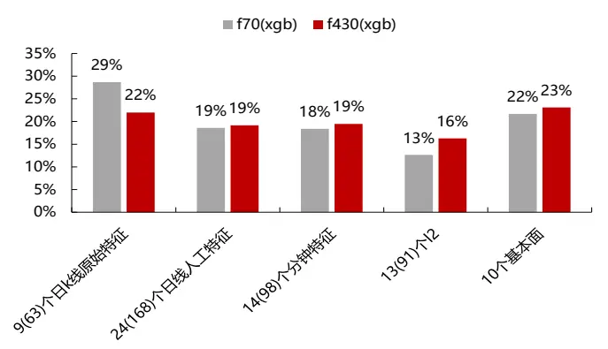
数据来源：东方证券研究所 & Wind资讯

图 7：不同输入特征下的模型特征重要性前十（gain ，2020.01.01-2024.3.31）

| 特征重要性gain | 430xgb | 特征重要性gain | 70xgb |
| --- | --- | --- | --- |
| amount_std5 | 2.51% | amount | 7.56% |
| l2c16 | 1.87% | Inhighret | 3.70% |
| amount | 1.68% | rkurt | 3.49% |
| l2c4 | 1.36% | Into | 3.13% |
| amount_std10 | 1.32% | touchup | 2.71% |
| Invwapret | 1.30% | loser | 2.39% |
| apb_avg5 | 1.12% | rvol | 2.29% |
| rkurt | 1.08% | arpp | 2.17% |
| Into | 1.03% | Intwapret | 2.02% |
| sqrvol | 0.94% | WFR | 2.01% |

数据来源：东方证券研究所 & Wind资讯

## （3） 两阶段模型

我们还尝试了一个两阶段训练模型：第一段采用430个人工构造的特征作为 x，未来20天个股收益率作为y，建立XGBoost回归模型，得到模型打分score；而后再将第一段得到的score叠加过去 5 日、10 日、20 日 score 的均值和标准差，再和之前的 430 特征放在一起，构造 437 个特征进行第二次 XGBoost模型训练。

新引入的 7 个特征实际上是在原有特征基础上增加了对模型自身预测性能的反馈，这种自我反馈机制有助于模型识别和校正可能的预测误差，可能可以提高预测的准确性和鲁棒性。从结果来看，437XGB模型的效果相比 430XGB略有提高。

图 8：两阶段模型效果对比（2020.01.01-2024.3.31）

| xgb模型10-18训练 | IC | ICIR | RANKIC | RANKICIR | 多头日度超额年化收益率 | 多头日超额收益夏普比 | 多头日度超额收益最大回撤 | 多头月度胜率 | 多头月均单边换手 |
| --- | --- | --- | --- | --- | --- | --- | --- | --- | --- |
| 430特征 | 12.82% | 1.26 | 15.60% | 1.42 | 29.04% | 3.35 | -7.44% | 84.31% | 77.28% |
| 437特征 | 13.30% | 1.22 | 16.40% | 1.42 | 30.76% | 3.65 | -6.46% | 80.39% | 76.78% |

数据来源：东方证券研究所 & Wind资讯

## 1.4 数据预处理方案的选择

（1）解释变量 X：截面上进行稳健的 Zscore标准化。采用-5到5的区间进行数据截断。以0填充缺失值。训练集、验证集、测试集相同处理。

稳健 Zscore 标准化方法使用中位数和中位数绝对偏差（MAD）来替代均值和标准差，减小异常值对标准化结果的影响。采用-5 到 5 的区间进行数据截断，减少极端值对模型训练的影响。

有关分析师的申明，见本报告最后部分。其他重要信息披露见分析师申明之后部分，或请与您的投资代表联系。并请阅读本证券研究报告最后一页的免责申明。

需要说明的是，停牌股票当天的价格数据均会赋值为停牌前一天的价格，仅成交量会赋值为 0。若股票连续停牌时间较短，那么与成交量有关的特征会出现较小的异常值；若股票连续停牌时间较长，那么与价格相关的特征会长时间没有变化，对于模型来说同样属于污染数据难以学习。因此我们将停牌日的股票行情数据视为缺失值，计算相关特征时再对缺失值进行填充。

（2）预测标签 Y：截面上进行 Zscore标准化，采用-5到5的区间进行数据截断，缺失值直接删除。训练集、验证集相同处理。

我们对比了不同的数据预处理方案下的模型表现，各模型均先进行对应调参。结果显示：

（1）对解释变量 X，要考虑异常值的影响，对 X进行稳健的 Zscore标准化效果更好；

（2）对预测标签 Y，要剔除市场收益的影响，原始 Y效果很差。对 Y进行 Zscore 标准化和稳健的 Zscore标准化都可以，效果差别不大；

（3）对 X 和 Y 均进行行业市值中性化回归后，得到的模型 IC、RANKIC、多头收益明显降低，但 ICIR、RANKICIR提高、多头端回撤降低。

图 9：不同数据预处理方案下的模型效果对比-解释变量 X的处理（2020.01.01-2024.3.31）

| xgb模型10-18训练 430特征 | IC | ICIR | RANKIC |  | RANKICIR 多头日度超额年化收益率 | 多头日超额收益夏普比 | 多头日度超额收益最大回撤 | 多头月度胜率 | 多头月均单边换手 |
| --- | --- | --- | --- | --- | --- | --- | --- | --- | --- |
| 430 rawx+zscorey | 12.28% | 1.24 | 14.13% | 1.31 | 25.15% | 2.59 | -13.68% | 74.51% | 78.15% |
| 430 zscorex+zscorey | 12.12% | 0.99 | 15.31% | 1.07 | 19.25% | 1.74 | -11.13% | 62.75% | 68.06% |
| 430 rbzx+zscorey | 12.82% | 1.26 | 15.60% | 1.42 | 29.04% | 3.35 | -7.44% | 84.31% | 77.28% |

数据来源：东方证券研究所 & Wind资讯

图 10：不同数据预处理方案下的模型效果对比-预测标签 Y的处理（2020.01.01-2024.3.31）

| xgb模型10-18训练 430特征 | IC | ICIR | RANKIC | RANKICIR | 多头日度超额年化收益率 | 多头日超额收益夏普比 | 多头日度超额收益最大回撤 | 多头月度胜率 | 多头月均单边换手 |
| --- | --- | --- | --- | --- | --- | --- | --- | --- | --- |
| 430 rbzx+rawy | 9.81% | 0.96 | 12.46% | 1.14 | 18.68% | 3.00 | -4.13% | 74.51% | 86.88% |
| 430 rbzx+zscorey | 12.82% | 1.26 | 15.60% | 1.42 | 29.04% | 3.35 | -7.44% | 84.31% | 77.28% |
| 430 rbzx+rbzy | 13.16% | 1.22 | 16.20% | 1.42 | 29.49% | 3.50 | -5.88% | 76.47% | 77.23% |
| 430 neu+neu(中性化) | 10.49% | 1.46 | 11.80% | 1.81 | 16.89% | 3.24 | -3.05% | 84.31% | 80.39% |

数据来源：东方证券研究所 & Wind资讯

## 1.5 基础树模型的选择

单棵决策树对数据十分敏感，结构不稳定，更有价值的做法是把他当作集成学习（Ensemble Learning）的基本要素。

树模型中常用的集成学习方法有随机森林（RF, Random Forrest）和 GBRT（GradientBoosting Regression Tree）两种。随机森林通过构建多个决策树并取其结果的平均值或多数投票来做出预测。每棵树都是独立建立的，使用的是从原始数据集中随机抽取的样本和特征。梯度提升树采用逐步构建树的方法，每棵新树的建立都是为了纠正前面所有树的预测错误。通过优化一个损失函数来实现，每一步都尝试减少前一步的残差。相较于随机森林，梯度提升树得益于其逐步纠错的训练方式，能显著降低模型偏差，提高预测精度，在 Kaggle 等竞赛中表现卓越。但梯度提升树也更容易受到过拟合的影响，需要进行更为精细化的参数调整来对抗过拟合。

XGBoost、LightGBM 和 CatBoost 都属于梯度提升决策树模型。整体来看，三个模型的效果较为接近，XGBoost 模型的综合绩效表现最好，且调参耗时最短，综合来看我们最终选择了XGBoost模型作为基础模型。

图 11：XGBoost、LightGBM 和 CatBoost 模型的优缺点对比

| 模型 | 优点 | 缺点 |
| --- | --- | --- |
| XGBoost (Extreme Gradient Boosting) | 性能和稳定性：在许多标准数据集和竞赛中表现优异，特别是在结构化/表格数据上。 | 训练速度：相对于LightGBM，训练速度可能慢，尤其是在处理大规模数据集时。 |
|  | 可扩展性：支持并行处理，适用于大规模数据集。 | 内存消耗：在大数据集上，消耗的内存较多。 |
|  | 灵活性：提供了丰富的可调参数，允许用户精细控制模型，优化性能。 |  |
|  | 稳健性：对异常值和缺失数据处理较为鲁棒。 |  |
|  | 高效和快速：使用基于直方图的算法，比XGBoost更快，尤其是在大数据集上。 | 过拟合风险：在小数据集上比XGBoost更容易过拟合。 |
| LightGBM (Light Gradient Boosting Machine) | 内存效率高：相比XGBoost，使用更少的内存。 | 参数调整：参数较多，需要仔细调优才能达到最佳效果。 |
|  | 支持大规模数据：能够高效处理超过百万级别的数据。 |  |
|  | 类别特征自动处理：无需手动进行独热编码，直接支持类别特征。 |  |
|  |  | 对类别特征的优秀处理：无需预处理即可直接处理类别特征，且通常效果优于其他两者。普及度：相对于XGBoost和LightGBM，社区支持和使用案例较少。 |
| CatBoost (Categorical Boosting) | 避免过度拟合：默认的设置已经非常接近最优，较容易使用和调整。 | 资源消耗：在某些情况下，尤其是参数不当设置时，可能比其他两者更消耗资源。 |
|  | 速度和精度：在多个基准测试中展现出良好的速度和准确性。 |  |

数据来源：东方证券研究所

图 12：不同基础树模型下的模型效果对比（2020.01.01-2024.3.31）

| 430特征10-18训练 IC |  | ICIR | RANKIC | RANKICIR | 多头日度超额年化收益率 | 多头日超额收益夏普比 | 多头日度超额收益最大回撤 | 多头月度胜率 | 多头月均单边换手 |
| --- | --- | --- | --- | --- | --- | --- | --- | --- | --- |
| xgb | 12.82% | 1.26 | 15.60% | 1.42 | 29.04% | 3.35 | -7.44% | 84.31% | 77.28% |
| Igb | 12.76% | 1.28 | 15.46% | 1.44 | 28.31% | 3.30 | -5.16% | 78.43% | 78.06% |
| catboost | 12.91% | 1.21 | 15.93% | 1.36 | 28.08% | 3.17 | -7.21% | 80.39% | 76.32% |

数据来源：东方证券研究所 & Wind资讯

## 1.6 对抗过拟合技巧

梯度提升决策树模型容易过拟合，可以采取以下措施来降低 XGBoost模型的过拟合风险：

（1）使用正则化：如 L1 或 L2 正则化，以惩罚模型复杂度。

（2）限制树的深度：使用较浅的树作为基学习器。

（3）进行子采样：使用随机样本或特征训练每个基模型，提高模型的泛化能力。

（4）设置早停：在迭代过程中，监测验证集上的 IC 指标，若超过设定的轮数未提升，则提前停止训练。

## 1.7 调参技巧

由于梯度提升决策树模型容易过拟合，在训练 XGBoost 模型前，进行参数调优是一项非常重要的任务。调参可以通过多种方式进行，包括手动调参、网格搜索、随机搜索和基于贝叶斯优化的自动化机器学习方法（如 Hyperopt、Bayesian Optimization 或 Optuna 等）。贝叶斯优化方法使用贝叶斯统计技术来选择参数，目的是优化模型的验证集表现。这种方法通常比传统的网格搜索或随机搜索更高效，能从之前的结果中学习并调整搜索策略。

Optuna 是一个自动化超参数优化框架，使用贝叶斯优化技术，支持多种机器学习框架。Optuna 的优势在于：（1）效率：使用历史数据来推断最有可能改善模型性能的参数，可以更有效地搜索参数空间；（2）支持剪枝：允许 Optuna 在超参数调优的试验（trial）过程中提前终止那些表现不佳的试验，从而有效节省时间和资源；（3）易用性：Optuna 的 API 设计简洁，易于使用，并且可以无缝集成到现有的Python代码中；（4）灵活性：Optuna支持定义复杂的搜索空间，包括条件参数和嵌套搜索空间；（5）可视化工具：Optuna 提供了丰富的可视化工具，帮助分析参数搜索的结果和性能；（6）并行化：Optuna 支持并行化优化，能够有效地利用多核 CPU资源，加速参数搜索过程。

我们使用 Optuna 调参方法，对 XGBoost 模型的 7 个超参数进行调优。分别为：学习率（learning_rate，调参范围【0.05-0.5,steps=0.05】））、树的最大深度（max_depth，调参范围 【 3-12,steps=1 】 ） 、 叶 子 节 点 的 最 小 权 重 （ min_child_weight ， 调 参 范 围 【 1-100,steps=1】）、训练每棵树时的样本比例（subsample，调参范围【0.7-1,steps=0.1】）、建立每棵树时特征采样的比例（colsample_bytree，调参范围【0.7-1,steps=0.1】）、L1 正则化项参数（alpha，调参范围【0-1000,steps=50】）、L2 正则化项参数（lambda，调参范围【0-1000,steps=50】）。采用默认的 TPESampler 采样器，测试 300 种超参数组合，根据验证集上的 IC 表现选择最优超参数组合。采用默认的 MedianPruner 剪枝策略，在每一轮迭代后，如果当前模型验证集 IC低于之前参数试验的中位数，则提前停止该次试验，直接进行下一组试验。

下表展示了我们使用的 XGBoost 模型的超参数列表，对于需要额外调参的 7 个参数我们给出了详细解释。Optuna提供了每个超参数的重要性，根据300轮超参数调优试验的过程计算，衡量在高维参数平面内每个参数的变动对于评估指标的影响程度。从结果来看，XGBoost 模型参数中学习率最为重要。

图 13：XGBoost 模型超参数列表

| 参数英文名称 loss | 参数中文解释 损失函数类型 | 参数取值 mse (默认值) | 参数详细含义 | 参数重要性 |
| --- | --- | --- | --- | --- |
| objective epochs | 目标函数类型 训练轮数 | reg:squarederror(额外指定) 2000 (额外指定) |  |  |
| early_stopping_roun | 提前停止轮数 | 40 (额外指定) |  |  |
| n jobs | 并行运行时的并发任务数 | 10 (额外指定) |  |  |
| random_state | 随机数种子 | seed (额外指定) |  |  |
| verbose | 训练过程中的冗长输出控制 | -1 (额外指定) |  |  |
| learning_rate | 学习率 | 0.1 (需要调参) | 在每一轮迭代过程中，新的树的预测值会乘以学习率，以减少对之前预测结果的修正幅度，从而控制每次迭代时模型权重的调整步长 有助于防止模型过拟合。较低的学习率使模型收敛得更慢，但可能更精确，因为它允许更多轮次的树结构去改善模型性能，需要权衡。 | 29% |
| max_depth | 树的最大深度 | 9 (需要调参) | 在构建每棵树时，控制树的最大深度，限制树的复杂性，使其不会无限制地增长，从而控制过拟合。较大的深度允许模型捕捉更多的复 杂关系，但也更容易过拟合；较小的深度则有助于提升模型的泛化能力。 | 4% |
| min_child_weight | 叶子节点的最小权重 | 93(需要调参) | 在树分裂的过程中，只有当一个节点的样本权重之和大于min_child_weight时，才允许进一步分裂，否则该节点变为叶子节点。较大的 min_child_weight值可以避免模型学习到局部的特殊样本，减少模型的复杂度，从而控制过拟合。 | 20% |
| subsample | 训练每棵树时的样本比例 | 0.8(需要调参) | 在构建每棵树之前，模型会随机抽取指定比例的样本进行训练。较低的subsample值有助于防止过拟合，但也可能导致欠拟合。 | 4% |
| colsample bytree | 建立每棵树时特征采样的比例 | 0.7 (需要调参) | 在构建每棵树之前，模型会随机选择指定比例的特征进行训练。类似于 subsample，较低的 colsample bytree值有助于防止过拟合 但也可能导致欠拟合。 | 16% |
| alpha | L1正则化项参数 | 0(需要调参) | 在优化目标函数时，添加L1正则化项，对叶子节点的权重绝对值进行惩罚，这有助于将一些不重要的叶子节点的权重推向零，实现稀疏 化，从而简化模型并减少过拟合 | 25% |
| lambda | L2正则化项参数 | 200(需要调参) | 在优化目标函数时，添加L2正则化项，对叶子节点的权重进行平方和惩罚，有助于避免权重过大，从而防止模型在训练数据上过拟合。 | 2% |

数据来源：东方证券研究所

从耗时来看，设置剪枝模块后整体调参耗时 300min-400min。不加剪枝模块的话大概需要 1500min 左右。

从模型表现来看，调参后，模型在测试集上的效果有明显提高，IC 和 RANKIC 提高近 1pct，多头年化超额提高近 4pct。

图 14：调参前后的模型效果对比（2020.01.01-2024.3.31）

| xgb模型10-18训练 430特征 | IC | ICIR | RANKIC | RANKICIR | 多头日度超额年化收益率 | 多头日超额收益夏普比 | 多头日度超额收益最大回撤 | 多头月度胜率 | 多头月均单边换手 |
| --- | --- | --- | --- | --- | --- | --- | --- | --- | --- |
| 默认参数 | 12.08% | 1.27 | 14.79% | 1.40 | 25.35% | 3.25 | -6.80% | 76.47% | 79.62% |
| 调参后 | 12.82% | 1.26 | 15.60% | 1.42 | 29.04% | 3.35 | -7.44% | 84.31% | 77.28% |

数据来源：东方证券研究所 & Wind资讯

有关分析师的申明，见本报告最后部分。其他重要信息披露见分析师申明之后部分，或请与您的投资代表联系。并请阅读本证券研究报告最后一页的免责申明。

## 1.8 Double Ensemble 模型的增量

Zhang（2020）提供了一个 DoubleEnsemble 模型，通过结合基于学习轨迹的样本重加权（SR）和基于洗牌的特征选择（FS）两个关键组件，提高金融市场预测的准确性和稳定性。DoubleEnsemble 方法可以与多种基模型一起使用，包括深度神经网络和决策树，模型整体分为三个步骤：

## （1）基于学习轨迹的样本重加权 (SR)

根据模型训练过程中每个样本的损失值和损失轨迹调整训练样本的权重。具体来说，该方法观察每个样本在迭代过程中误差是如何演变的，根据它们在训练过程中表现的改善程度以及其最终损失值大小来调整样本权重。在树模型中即体现为每增加一棵树时，观察该样本的预测值和损失值。我们希望通过重加权方案提升难分类样本（损失值在训练过程中下降缓慢）的权重，同时减少易分类（其损失值迅速下降并保持较低水平）和噪声样本（在训练过程中其损失变化无规律，可能不降反升）的权重。样本权重计算时采用分组方式，首先计算每个样本的权重值，然后将样本根据这些权重值分配到不同的组中，每个组内的样本分配相同的权重。通过对样本进行分组，可以减少模型在训练过程中对单个样本噪声的敏感性，从而提高模型的泛化能力。

## （2）基于洗牌（shuffle）的特征选择 (FS)

特征选择是通过洗牌方式进行，目的是识别出对模型性能有显著影响的关键特征。在训练过程中，通过随机打乱该特征的值，断开该特征与目标变量之间的关系，比较洗牌前后的模型损失值变化来评估该特征的重要性。如果通过将该特征洗牌后样本损失显著增加，表明这个特征对当前模型很重要。这种方法的优势在于，无需从头开始重新训练模型，节省计算资源和时间。为了降低异常值影响，将所有特征根据重要性分组，并从每个组中按不同的采样比率随机选择特征，重要性越高的组，可以入选的特征越多。最后将所有随机选出的特征合并返回。

## （3）模型集成

共需要训练 K 轮，第一个子模型使用所有可用的特征和所有样本的相等权重。对于后续模型，每轮都在上一轮的基础上，进行上述的样本加权和特征选择两个步骤，从而得到子模型。最后将所有子模型集成使用，集成总预测是所有子模型预测的简单平均。

我们以 XGBoost 模型作为基础模型，测试在 430 特征输入下，DoubleEnsemble 模块的作用。结果显示：

（1）DoubleEnsemble 带来的模型效果提升不明显：6 个子模型的 IC 和 RANKIC 不断提高，但 ICIR、RANKICIR、多头组表现均有所下降；

（2）DoubleEnsemble 在每个子模型中都需要遍历所有的样本和特征进行运算，非常耗时：加入 DoubleEnsemble 模块后的 XGBoost 模型不包括调参仅模型训练耗时大概 6-8h，正常的XGBoost模型训练耗时仅 10-20min。综合考虑，我们最后并未采用这个模块。

图 15：添加 Double Ensemble 后的模型效果对比（2020.01.01-2024.3.31）

| xgb模型10-18训练 430特征 | IC | ICIR | RANKIC | RANKICIR | 多头日度超额年化收益率 | 多头日超额收益夏普比 | 多头日度超额收益最大回撤 | 多头月度胜率 | 多头月均单边换手 |
| --- | --- | --- | --- | --- | --- | --- | --- | --- | --- |
| 1 | 12.82% | 1.26 | 15.60% | 1.42 | 29.04% | 3.35 | -7.44% | 84.31% | 77.28% |
| 2 3 | 13.00% | 1.26 | 15.93% | 1.43 | 27.66% | 3.34 | -6.26% | 84.31% | 76.27% |
|  | 13.19% | 1.19 | 16.53% | 1.35 | 28.75% | 3.40 | -5.98% | 78.43% | 74.07% |
| 4 | 13.24% | 1.17 | 16.63% | 1.33 | 27.35% | 3.19 | -6.08% | 78.43% | 73.40% |
| 5 | 13.22% | 1.17 | 16.61% | 1.33 | 27.01% | 3.14 | -6.68% | 76.47% | 73.33% |
| 6 | 13.24% | 1.18 | 16.60% | 1.34 | 26.14% | 3.07 | -6.81% | 74.51% | 73.19% |

数据来源：东方证券研究所 & Wind资讯
有关分析师的申明，见本报告最后部分。其他重要信息披露见分析师申明之后部分，或请与您的投资代表联系。并请阅读本证券研究报告最后一页的免责申明。

## 1.9 随机种子的影响

我们在 4 个不同的随机种子设置下，分别进行 optuna 调参以及 XGBoost 模型的训练。从结果来看：（1）随机种子对树模型的整体影响较小，不同种子下得到的模型表现较为接近，IC 和RANKIC 相差都在 0.5pct 以内，多头年化超额相差 2pct 以内；（2）不同种子下得到的模型相关性很高，多种子平均也并没有显著增量。因而，我们最终选用的是一开始测试所用的种子（seed=48）。

图 16：不同随机种子下的模型效果对比（2020.01.01-2024.3.31）

| xgb模型 10-18训练 430特征 | IC | ICIR | RANKIC | RANKICIR | 多头日度超额年化收益率 |  | 多头日超额收益夏普比 多头日度超额收益最大回撤 | 多头月度胜率 | 多头月均单边换手 |
| --- | --- | --- | --- | --- | --- | --- | --- | --- | --- |
| f430(xgb)seed48 | 12.82% | 1.26 | 15.60% | 1.42 | 29.04% | 3.35 | -7.44% | 84.31% | 77.28% |
| f430(xgb)seed58 | 12.90% | 1.31 | 15.26% | 1.44 | 30.11% | 3.55 | -7.33% | 81.48% | 78.21% |
| f430(xgb)seed68 | 13.25% | 1.31 | 15.74% | 1.42 | 30.67% | 3.41 | -6.37% | 83.33% | 75.71% |
| f430(xgb)seed78 | 13.16% | 1.29 | 15.83% | 1.42 | 31.06% | 3.54 | -5.93% | 79.63% | 76.97% |
| f430(xgb)avg | 13.33% | 1.30 | 15.90% | 1.42 | 31.26% | 3.48 | -6.79% | 87.04% | 74.78% |

数据来源：东方证券研究所 & Wind资讯

图 17：不同随机种子下的模型相关性（2020.01.01-2024.3.31）

| 因子值相关性 | score48 | score58 | score68 | score78 | rankic相关性 | score48 | score58 | score68 | score78 | 多头相关性 | score48 | score58 | score68 | score78 |
| --- | --- | --- | --- | --- | --- | --- | --- | --- | --- | --- | --- | --- | --- | --- |
| score48 | 100.00% | 90.54% | 93.56% | 92.66% | score48 | 100.00% | 99.51% | 99.73% | 99.60% | score48 | 100.00% | 92.24% | 94.21% | 91.40% |
| score58 | 90.54% | 100.00% | 93.16% | 92.42% | score58 | 99.51% | 100.00% | 99.66% | 99.52% | score58 | 92.24% | 100.00% | 93.20% | 90.08% |
| score68 | 93.56% | 93.16% | 100.00% | 95.05% | score68 | 99.73% | 99.66% | 100.00% | 99.72% | score68 | 94.21% | 93.20% | 100.00% | 92.83% |
| score78 | 92.66% | 92.42% |  | 95.05%100.00% | score78 | 99.60% | 99.52% | 99.72% | 100.00% | score78 | 91.40% | 90.08% | 92.83%100.00% |  |

数据来源：东方证券研究所 & Wind资讯

## 1.10 树模型和神经网络模型比较

我们在相同的 430 输入特征下，对比了 XGBoost、多层感知机（MLP）和门控循环单元（GRU）模型的表现。XGB和 MLP均为截面学习模型，GRU为时序学习模型。MLP和 GRU模型都属于神经网络模型。MLP模型设置三层，隐藏层维度分别为 512，256和 128。GRU模型设置一层，隐藏层维度为 32，seqlen 为 30，batchsize 为 5000，每个 epoch 遍历整个训练集。结果显示：

（1）MLP、GRU 模型效果均不如 XGBoost 模型，RANKIC 低 1pct 左右。MLP 模型多头端表现最差，年化超额仅为 21.55%，GRU 模型多头表现相对较好，年化超额 27.56%，XGB 模型多头表现最好，年化超额达到 29%；

（2）从相关性来看，相同特征下，XGB模型与MLP和GRU模型的日度多头超额收益的相关性在 60%-70%，相对较低，可以实现比较好的互补。

图 18：相同特征下，XGBoost 模型与 MLP 模型的模型效果对比（2020.01.01-2024.3.31）

| 430特征10-18训练 | IC | ICIR | RANKIC | RANKICIR | 多头日度超额年化收益率 | 多头日超额收益夏普比 | 多头日度超额收益最大回撤 | 多头月度胜率 | 多头月均单边换手 |
| --- | --- | --- | --- | --- | --- | --- | --- | --- | --- |
| xgb | 12.82% | 1.26 | 15.60% | 1.42 | 29.04% | 3.35 | -7.44% | 84.31% | 77.28% |
| mlp | 12.06% | 1.25 | 14.77% | 1.47 | 21.55% | 2.44 | -7.90% | 68.63% | 80.52% |
| gru | 11.27% | 1.15 | 14.97% | 1.39 | 27.56% | 3.49 | -5.51% | 80.39% | 80.57% |

数据来源：东方证券研究所 & Wind资讯

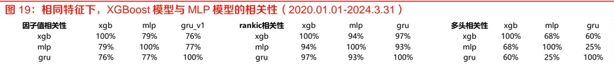
数据来源：东方证券研究所 & Wind资讯

有关分析师的申明，见本报告最后部分。其他重要信息披露见分析师申明之后部分，或请与您的投资代表联系。并请阅读本证券研究报告最后一页的免责申明。

相同输入数据通过树模型和神经网络模型得到的打分结果相关性较低，主要是因为这两种模型在架构和处理数据的方式上存在本质的差异，这些差异影响了它们如何从数据中学习规律和做出预测。下面表格我们归纳了树模型和神经网络在各个关键方面的主要特点和差异。

图 20：树模型和神经网络对比

| 特性 | 树模型 | 神经网络 |
| --- | --- | --- |
| 决策方式 | 通过条件分支，基于特征阈值分割数据 | 通过层次连接的神经元和非线性激活函数处理数据 |
| 处理非线性 | 能处理非线性，但每个分割是基于线性决策 | 强于处理非线性问题，每层使用非线性激活函数 |
| 特征交互 | 显式处理，结构直观 | 隐式处理，能捕捉复杂多维的特征交互 |
| 可解释性 | 高，模型直观易理解 | 低，被视为“黑盒”模型 |
| 对数据预处理的需求 | 不需要特征缩放，对数据尺度不敏感 | 需要数据标准化或归一化，对输入数据质量敏感 |
| 泛化能力 | 较弱（单个树)，可通过集成方法改善 | 较强，尤其在大数据集上 |
| 对数据的敏感性 | 对异常值和非标准数据容忍度高 | 对缺失值、噪声等敏感 |
| 训练和执行效率 | 训练快，执行效率高，不需高性能计算资源 | 训练慢，需要较多计算资源，适合大规模数据处理 |

数据来源：东方证券研究所

## 二、树模型的训练效果

## 2.1 模型的训练和预测过程

下面详细介绍我们所用的 XGBoost模型的训练和预测过程：

## （1）准备数据：

准备训练数据集和验证数据集。从数据集中选择特定的特征和标签。将数据转换为 DMatrix格式，以便 XGBoost 可以直接使用。

## （2）模型训练：

调用 xgb.train() 函数进行模型训练迭代。损失函数包含两部分：一部分是传统的 MSE 损失，用于度量模型预测值与真实值之间的差异；另一部分是正则化项，包括树的叶子节点数和叶子节点值的 L1和L2范数。这样的设计有助于减少模型的复杂度和过拟合。

在训练过程中，XGBoost 会逐步生成一系列的决策树。在训练每棵树时，都使用前一棵树的预测残差（真实值与当前模型预测值之间的差异）作为新的标签进行训练，通过关注被前一模型遗漏的部分来增强模型的预测能力。

对于每一步，模型尝试通过梯度下降的方式优化损失函数，使得当前预测值（预测值是指截止训练当前所有树的预测结果的累加和）逐步逼近真实值，即根据损失函数的梯度方向来更新树的结构和叶子节点的权重（预测值），这种优化确保了新添加的树能够有效地减少整体预测误差。

每一步训练完成后，新树被添加到模型中，模型的预测结果随之更新。这个过程反复进行，每次迭代都旨在进一步减少损失函数的值。

在迭代过程中，监测验证集上的 IC指标，若超过设定的轮数未提升，则提前停止训练，防止过拟合。

## （3）模型预测：

使用训练好的模型进行预测，调用 predict() 方法，传入测试数据。对于新的输入数据，模型会将其输入所有树，每棵树都会给出一个预测结果，将这些结果累加可以得到最终的预测值。

## 2.2 模型训练趋势

DFQ-XGB 模型以 430 特征作为输入，以中证全指为样本空间。训练集为 2010.01.01—2018.11.30，训练集样本数 518 万。验证集为 2019.01.01—2019.11.30，验证集样本数 76 万。测试集为 2020.01.01—2024.03.31，测试集样本数为 415 万。

设备硬件配置为cpu 英特尔i9-14900KF，96g内存。训练时内存占用率50%，调参时内存占用 60%-80%。模型在第 89 个 epoch 停止，训练耗时 10min-20min。

从训练集、验证集、测试集中 IC、rankIC的变化趋势来看，IC和 rankIC都呈上升趋势，且较为平滑，模型未出现明显过拟合。由于训练集、验证集上的Y我们进行了截面Zscore标准化，而测试集没有对 Y 进行处理，所以看 IC 的变化图，测试集的 IC 会比训练集、验证集的 IC 低一些。而看 RANKIC变化图，验证集的 RANKIC和测试集的 RANKIC会更加接近。

图 21：训练集、验证集、测试集中 IC变化
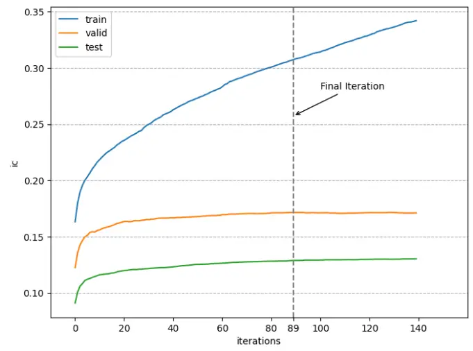
数据来源：东方证券研究所 & Wind资讯

图 22 ：训练集、验证集、测试集中 rankIC变化
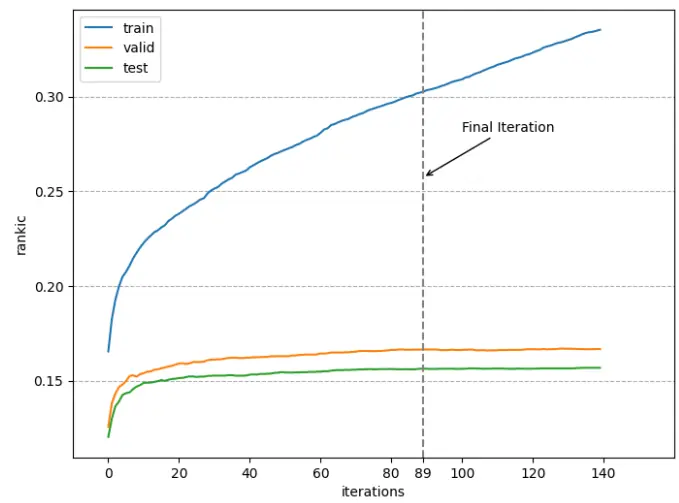
数据来源：东方证券研究所 & Wind资讯

## 2.3 因子整体绩效表现

本节展示DFQ-XGB模型得到的因子得分，在中证全指、沪深300、中证500、中证1000四个股票池中的表现，并与前期报告《基于机构持仓的因子情景分析》中的基于机构持仓分域的线性多因子模型 dfqfactor、《DFQ 遗传规划价量因子挖掘系统》中的遗传规划合成因子 gp、《DFQ 强化学习因子组合挖掘系统》中的强化学习合成因子 rl、《DFQ-TRA：多交易模式学习因子挖掘系统》中的 TRA 因子、《DFQ-HIST：添加图信息的选股因子挖掘系统》中的 HIST 因子、《DFQ-FactorVAE：融合变分自编码器和概率动态因子模型的 alpha 预测方案》中的FactorVAE 因子进行对比。

测试区间为 2020.1.1-2024.6.30。绩效指标计算细节如下：（1）IC 和 RANKIC 采用因子得分和20日收益率标签计算得到，日度平均，ICIR和RANKICIR未年化。（2）多头指标计算时，沪深 300、中证 500 股票池中分组数为 5，中证 1000 股票池中分组数为 10，中证全指股票池中分组数为 20。（3）多头组合月频调仓，绩效依次展示：日度超额年化收益率、日超额收益夏普比、日度超额收益最大回撤、月度胜率、月均单边换手。此处的多头计算不考虑交易成本，但汇报了月均单边换手率，费后收益可以根据费前收益和换手率近似估算。（4）分年绩效表现计算时，不满一年时不进行年化处理。

结果显示：在各个股票池中，DFQ-XGB 模型都能获得与神经网络模型相当甚至更优的绩效。

（1）在中证全指股票池中，DFQ-XGB 模型所得因子的稳定性最强，IC、RANKICIR、多头日度超额收益夏普比均为最高。测试集上IC达到12.96%，ICIR达到1.29，RANKIC达到15.43%，RANKICIR 达到 1.42。20 分组多头日度超额年化收益率达到 29.58%，多头日超额收益夏普比3.42，多头日度超额收益最大回撤 7.44%，多头月度胜率 85%，月均单边换手 77%。

图 23：中证全指股票池各模型因子绩效表现（2020.1.1-2024.6.30）

| 中证全指 | IC | ICIR | RANKIC | RANKICIR | 多头日度超额年化收益率 | 多头日超额收益夏普比 | 多头日度超额收益最大回撤 | 多头月度胜率 | 多头月均单边换手 |
| --- | --- | --- | --- | --- | --- | --- | --- | --- | --- |
| dfqfactor | 4.79% | 0.73 | 7.26% | 1.01 | 8.50% | 1.42 | -7.92% | 61.11% | 33.48% |
| gp | 8.06% | 0.83 | 11.54% | 1.21 | 12.47% | 1.70 | -9.02% | 66.67% | 68.70% |
| r1985 | 10.39% | 0.87 | 14.47% | 1.11 | 22.26% | 2.60 | -7.20% | 74.07% | 74.26% |
| tra | 10.85% | 0.84 | 16.13% | 1.14 | 24.52% | 2.40 | -10.93% | 75.93% | 57.21% |
| hist | 12.46% | 1.05 | 17.16% | 1.28 | 32.24% | 3.29 | -6.42% | 87.04% | 73.93% |
| factorvae | 12.69% | 1.33 | 15.02% | 1.37 | 31.84% | 3.36 | -8.28% | 87.04% | 79.26% |
| xgb | 12.96% | 1.29 | 15.43% | 1.42 | 29.58% | 3.42 | -7.44% | 85.19% | 77.03% |

数据来源：东方证券研究所 & Wind资讯

图 24：中证全指股票池各模型分组年化超额收益（2020.1.1-2024.6.30）
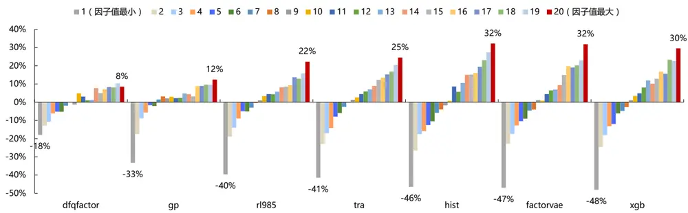
数据来源：东方证券研究所 & Wind资讯

（2）在沪深 300 股票池中，DFQ-XGB 模型测试集上 IC 达到 8.87%，ICIR 达到 0.5，RANKIC 达到 10%，RANKICIR 达到 0.53。5 分组多头日度超额年化收益率达到 12.61%，多头日超额收益夏普比 1.28，多头日度超额收益最大回撤 11.15%，月均单边换手 49%。

图 25：沪深 300 股票池各模型因子绩效表现（2020.1.1-2024.6.30）

| 300 | IC | ICIR | RANKIC | RANKICIR | 多头日度超额年化收益率 | 多头日超额收益夏普比 | 多头日度超额收益最大回撤 | 多头月度胜率 | 多头月均单边换手 |
| --- | --- | --- | --- | --- | --- | --- | --- | --- | --- |
| dfqfactor | 3.29% | 0.32 | 4.13% | 0.39 | 5.95% | 1.11 | -7.56% | 57.41% | 23.12% |
| gp | 2.28% | 0.19 | 3.42% | 0.28 | 2.28% | 0.37 | -15.42% | 55.56% | 49.67% |
| r1985 | 7.61% | 0.44 | 10.45% | 0.59 | 12.15% | 1.50 | -6.94% | 61.11% | 50.22% |
| tra | 8.49% | 0.41 | 11.71% | 0.56 | 11.98% | 1.19 | -12.06% | 53.70% | 27.16% |
| hist | 10.52% | 0.56 | 12.73% | 0.65 | 13.32% | 1.49 | -7.97% | 68.52% | 50.59% |
| factorvae | 9.82% | 0.59 | 11.27% | 0.63 | 15.87% | 1.84 | -6.74% | 66.67% | 53.43% |
| xgb | 8.87% | 0.50 | 10.13% | 0.53 | 12.61% | 1.28 | -11.15% | 68.52% | 49.04% |

数据来源：东方证券研究所 & Wind资讯

（3）在中证 500 股票池中，DFQ-XGB 模型测试集上 IC 达到 8.91%，ICIR 达到 0.6，RANKIC 达到 10.89%，RANKICIR 达到 0.70。5 分组多头日度超额年化收益率达到 16.61%，多头日超额收益夏普比 2.01，多头日度超额收益最大回撤 8.2%，月均单边换手 55%。

图 26：中证 500 股票池各模型因子绩效表现（2020.1.1-2024.6.30）

| 500 | IC | ICIR | RANKIC | RANKICIR | 多头日度超额年化收益率 | 多头日超额收益夏普比 | 多头日度超额收益最大回撤 | 多头月度胜率 | 多头月均单边换手 |
| --- | --- | --- | --- | --- | --- | --- | --- | --- | --- |
| dfqfactor | 4.24% | 0.43 | 6.19% | 0.60 | 5.78% | 1.18 | -11.18% | 53.70% | 25.48% |
| gp | 3.20% | 0.30 | 6.02% | 0.59 | 3.89% | 0.77 | -7.48% | 57.41% | 48.99% |
| r1985 | 6.84% | 0.45 | 10.75% | 0.68 | 9.67% | 1.26 | -8.97% | 61.11% | 49.87% |
| tra | 7.38% | 0.46 | 11.60% | 0.72 | 11.15% | 1.46 | -5.90% | 62.96% | 41.04% |
| hist | 8.64% | 0.55 | 12.39% | 0.75 | 17.69% | 2.22 | -6.26% | 68.52% | 53.61% |
| factorvae | 8.59% | 0.60 | 10.56% | 0.71 | 15.84% | 2.24 | -8.29% | 72.22% | 57.76% |
| xgb | 8.91% | 0.60 | 10.89% | 0.70 | 16.61% | 2.01 | -8.20% | 68.52% | 55.06% |

数据来源：东方证券研究所 & Wind资讯

（4）在中证 1000 股票池中，DFQ-XGB 模型测试集上 IC 达到 12.11%，ICIR 达到 1.08，RANKIC 达到 13.25%，RANKICIR 达到 1.16。10 分组多头日度超额年化收益率达到 21.48%，多头日超额收益夏普比 2.78，多头日度超额收益最大回撤 7.43%，月均单边换手 71%。

图 27：中证 1000 股票池各模型因子绩效表现（2020.1.1-2024.6.30）

| 1000 IC |  | ICIR | RANKIC | RANKICIR | 多头日度超额年化收益率 | 多头日超额收益夏普比 | 多头日度超额收益最大回撤 | 多头月度胜率 | 多头月均单边换手 |
| --- | --- | --- | --- | --- | --- | --- | --- | --- | --- |
| dfqfactor | 5.43% | 0.55 | 7.18% | 0.68 | 9.24% | 1.31 | -13.82% | 62.96% | 30.56% |
| gp | 7.52% | 0.70 | 10.05% | 1.01 | 7.79% | 1.26 | -6.85% | 62.96% | 59.69% |
| r1985 | 10.23% | 0.74 | 13.14% | 0.91 | 15.67% | 1.80 | -9.88% | 64.81% | 65.31% |
| tra | 10.29% | 0.73 | 14.01% | 0.96 | 17.25% | 1.96 | -9.74% | 72.22% | 59.17% |
| hist | 12.04% | 0.95 | 15.24% | 1.12 | 28.17% | 3.11 | -5.69% | 77.78% | 69.17% |
| factorvae | 12.20% | 1.21 | 13.18% | 1.26 | 23.59% | 3.36 | -3.64% | 79.63% | 73.65% |
| xgb | 12.11% | 1.08 | 13.25% | 1.16 | 21.48% | 2.79 | -7.43% | 77.78% | 71.13% |

数据来源：东方证券研究所 & Wind资讯

## 2.4 因子多头组表现

下面我们具体分析下不同因子多头组的表现：

（1）在中证全指股票池中，DFQ-XGB 模型 20 分组多头组表现整体较强，累计超额仅低于HIST和FactorVAE模型。XGB模型多头组超额收益最大回撤出现在2021年11月，回撤较快恢复。此外，XGB模型和TRA、HIST、FactorVAE模型的多头超额净值曲线走势存在差异，23年以来尤为明显，波峰波谷恰好相反，呈现出较好的互补性。

图 28：中证全指股票池各模型多头组超额收益净值&回撤（2020.1.1-2024.6.30）
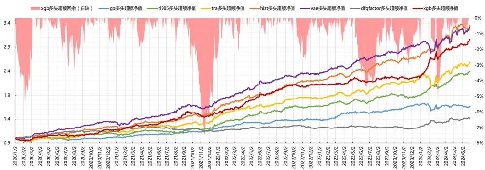
数据来源：东方证券研究所 & Wind资讯
有关分析师的申明，见本报告最后部分。其他重要信息披露见分析师申明之后部分，或请与您的投资代表联系。并请阅读本证券研究报告最后一页的免责申明。

（2）在沪深300股票池中，DFQ-XGB模型5分组多头组表现整体较强，与RL985、TRA、HIST模型表现都较为接近，但不如 FactorVAE模型。

图 29：沪深 300 股票池各模型多头组超额收益净值&回撤（2020.1.1-2024.6.30）
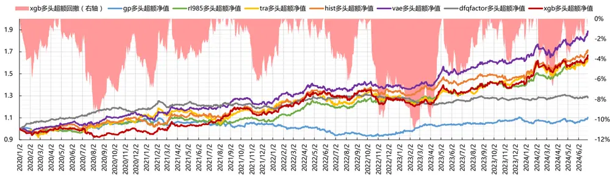
数据来源：东方证券研究所 & Wind资讯

（3）在中证 500 股票池中，DFQ-XGB 模型 5 分组多头组表现整体较强，累计超额仅低于HIST 模型。

图 30：中证 500 股票池各模型多头组超额收益净值&回撤（2020.1.1-2024.6.30）
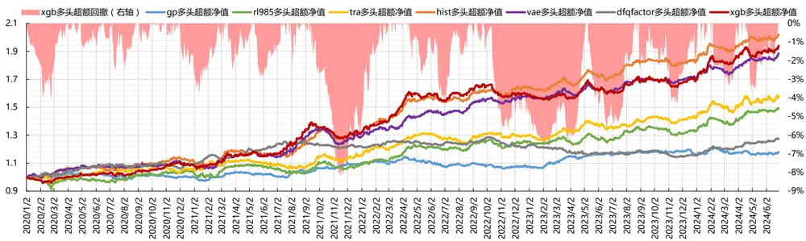
数据来源：东方证券研究所 & Wind资讯

（4）在中证 1000 股票池中，DFQ-XGB 模型 10 分组多头组表现整体较强，累计超额仅低于 HIST 模型和 FactorVAE 模型。

图 31：中证 1000 股票池各模型多头组超额收益净值&回撤（2020.1.1-2024.6.30）
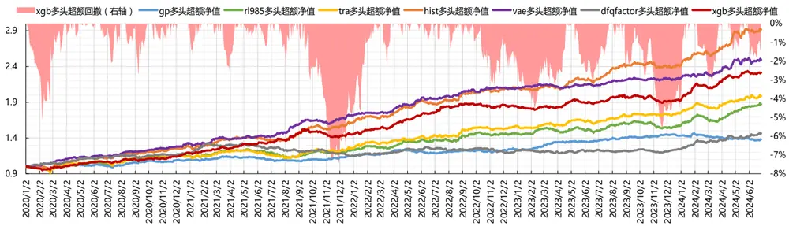
数据来源：东方证券研究所 & Wind资讯

有关分析师的申明，见本报告最后部分。其他重要信息披露见分析师申明之后部分，或请与您的投资代表联系。并请阅读本证券研究报告最后一页的免责申明。

## 2.5 因子分年绩效表现

在各个股票池中，DFQ-XGB模型 2024年的表现都很突出，尤其多头端。

（1）在中证全指股票池中，DFQ-XGB 模型 2024 年的多头表现最优。2024 年 IC 达到15.75%，ICIR 达到 1.49，20 分组多头年化超额 35.24%，最大回撤 5.8%。其他模型 24 年的多头超额均低于 30%。

图 32：中证全指股票池各模型分年绩效表现（2020.1.1-2024.06.30）

| 中证全指股票池各模型因子分年绩效表现 |  |  |  |  |  |  |  |  |  |  |
| --- | --- | --- | --- | --- | --- | --- | --- | --- | --- | --- |
| dfqfactor | IC | ICIR |  |  |  |  | RANKIC RANKICIR 多头日度超额年度收益率 多头日超额收益夏普比 多头日度超额收益最大回撤 多头月度胜率 多头月均单边换手 |  |  |  |
| 2020 | 6.51% | 1.29 | 9.80% | 1.74 | 14.41% | 2.27 | -4.22% | 75.00% |  | 34.78% |
| 2021 | 2.45% | 0.45 | 5.18% | 0.90 | 0.85% | 0.19 | -7.92% | 50.00% |  | 34.28% |
| 2022 | 3.75% | 0.55 | 5.12% | 0.69 | 5.96% | 1.13 | -5.59% | 58.33% |  | 33.85% |
| 2023 | 4.57% | 0.74 | 7.09% | 1.06 | 1.05% | 0.28 | -5.59% | 58.33% |  | 31.83% |
| 2024 | 9.82% | 1.11 | 12.12% | 1.25 | 15.08% | 0.23 | -3.85% | 66.67% |  | 31.87% |
| gp | IC | ICIR |  |  | RANKIC RANKICIR 多头日度超额年度收益率 | 多头日超额收益夏普比 | 多头日度超额收益最大回撤 |  | 多头月度胜率 | 多头月均单边换手 |
| 2020 | 7.59% | 0.70 | 11.92% | 1.17 | 2.58% | 0.49 | -5.31% |  | 50.00% | 74.67% |
| 2021 | 6.01% | 0.68 | 11.39% | 1.25 | 17.89% | 2.99 | -1.68% |  | 66.67% | 71.95% |
| 2022 | 9.65% | 1.21 | 11.54% | 1.90 | 14.89% | 2.26 | -2.90% |  | 66.67% | 66.40% |
| 2023 | 9.54% | 0.89 | 14.32% | 1.63 | 21.85% | 3.06 | -2.56% |  | 91.67% | 62.07% |
| 2024 | 7.17% IC | 0.77 ICIR | 4.42% | 0.34 | -1.93% | (0.02) | -9.02% |  | 50.00% | 68.15% |
| rl | 10.50% | 0.92 | RANKIC 14.83% | RANKICIR | 多头日度超额年度收益率 | 多头日超额收益夏普比 1.24 | 多头日度超额收益最大回撤 -7.20% |  | 多头月度胜率 | 多头月均单边换手 |
| 2020 | 9.06% | 0.89 | 14.31% | 1.17 | 9.58% 16.99% | 1.87 | -6.19% |  | 66.67% | 74.60% |
| 2021 | 11.86% | 1.16 | 14.97% | 1.12 1.49 | 30.47% | 3.90 | -2.89% |  | 66.67% | 73.67% |
| 2022 2023 | 8.57% | 0.57 | 13.53% | 0.84 | 12.73% | 2.01 | -5.59% |  | 83.33% | 74.13% |
|  | 14.76% | 1.43 | 15.37% | 1.24 | 26.18% | 0.34 | -4.40% |  | 66.67% | 72.31% |
| 2024 | IC | ICIR | RANKIC |  | RANKICIR 多头日度超额年度收益率 | 多头日超额收益夏普比 | 多头日度超额收益最大回撤 |  | 100.00% | 78.95% |
| tra 2020 | 8.92% | 0.71 | 14.13% | 0.99 | 15.83% | 2.14 | -7.81% |  |  | 多头月度胜率 多头月均单边换手 |
| 2021 | 10.01% | 0.78 | 16.52% | 1.17 | 24.47% | 2.48 | -4.92% |  | 75.00% | 59.12% |
| 2022 | 12.20% | 1.26 | 16.17% | 1.67 | 26.63% | 2.99 | -3.30% |  | 66.67% | 57.52% |
| 2023 | 13.30% | 0.92 | 20.06% | 1.44 | 22.91% | 3.27 | -4.65% |  | 75.00% | 56.02% |
| 2024 | 8.73% | 0.57 | 10.63% | 0.54 | 14.78% | 0.12 | -10.93% |  | 83.33% | 54.94% |
| hist | IC | ICIR | RANKIC | RANKICIR | 多头日度超额年度收益率 | 多头日超额收益夏普比 | 多头日度超额收益最大回撤多头月度胜率 |  | 83.33% | 59.69% |
| 2020 | 11.92% | 0.99 | 16.51% | 1.19 | 25.72% | 3.34 | -4.88% |  |  | 多头月均单边换手 75.46% |
| 2021 | 12.04% | 1.14 | 17.37% | 1.31 | 28.13% | 2.90 | -5.72% |  | 83.33% 83.33% | 74.40% |
| 2022 | 14.02% | 1.50 | 18.04% | 2.00 | 36.52% | 4.29 | -2.97% |  | 100.00% | 70.52% |
| 2023 | 10.89% | 0.79 | 17.41% | 1.23 | 22.11% | 3.39 | -3.39% |  | 83.33% | 71.75% |
| 2024 | 15.17% | 1.11 | 15.69% | 0.84 | 24.30% | 0.21 | -6.42% | 83.33% |  | 81.12% |
| factorvae | IC | ICIR | RANKIC |  | RANKICIR 多头日度超额年度收益率 | 多头日超额收益夏普比 | 多头日度超额收益最大回撤 |  |  | 多头月度胜率 多头月均单边换手 |
| 2020 | 12.59% | 1.35 | 14.71% | 1.48 | 34.34% | 5.22 | -1.84% |  | 91.67% | 84.44% |
| 2021 | 12.13% | 1.40 | 14.82% | 1.29 | 31.88% | 3.09 | -6.08% |  | 83.33% | 78.56% |
| 2022 | 13.73% | 1.67 | 15.88% | 2.13 | 31.87% | 4.14 | -2.35% |  | 91.67% |  |
| 2023 | 11.84% | 1.13 | 15.97% | 1.46 | 26.24% | 4.47 | -2.61% |  | 91.67% | 77.82% |
| 2024 | 14.17% | 1.21 | 12.04% | 0.70 | 11.72% | 0.10 | -8.28% |  |  | 77.11% |
|  | IC | ICIR | RANKIC | RANKICIR | 多头日度超额年度收益率 | 多头日超额收益夏普比 | 多头日度超额收益最大回撤 |  | 66.67% | 77.45% 多头月均单边换手 |
| xgb 2020 | 13.00% | 1.27 | 15.29% | 1.39 | 18.26% | 2.53 |  | -5.59% | 多头月度胜率 75.00% | 80.86% |
| 2021 | 12.12% | 1.44 14.03% 1.69 | 15.46% 15.59% | 1.48 | 28.57% | 3.22 39.30% 5.25 |  | -7.44% -2.75% 91.67% | 83.33% | 77.75% 79.38% |

数据来源：东方证券研究所 & Wind资讯

（2）在沪深 300 股票池中，DFQ-XGB 模型 2024 年的多头表现最优。2024 年 IC 达到19.19%，RANKIC 达到 21.48%，5 分组多头年化超额 18.99%，最大回撤 6.68%。

图 33：沪深 300 股票池各模型分年绩效表现（2020.1.1-2024.06.30）
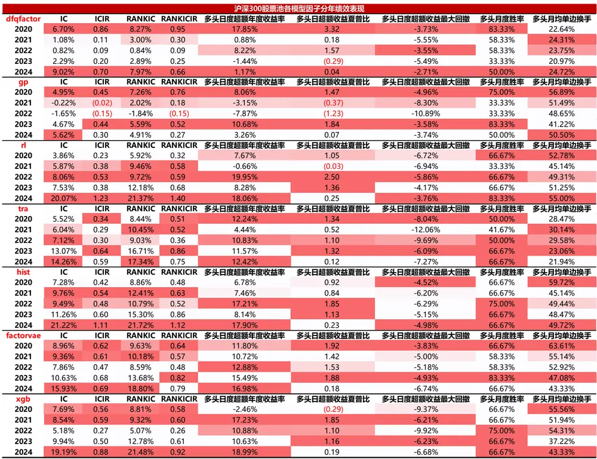
数据来源：东方证券研究所 & Wind资讯

（3）在中证 500 股票池中，DFQ-XGB 模型 2024 年的多头表现最优。2024 年 IC 达到13.02%，5 分组多头年化超额 15.17%，最大回撤 3.70%。

图 34：中证 500 股票池各模型分年绩效表现（2020.1.1-2024.06.30）
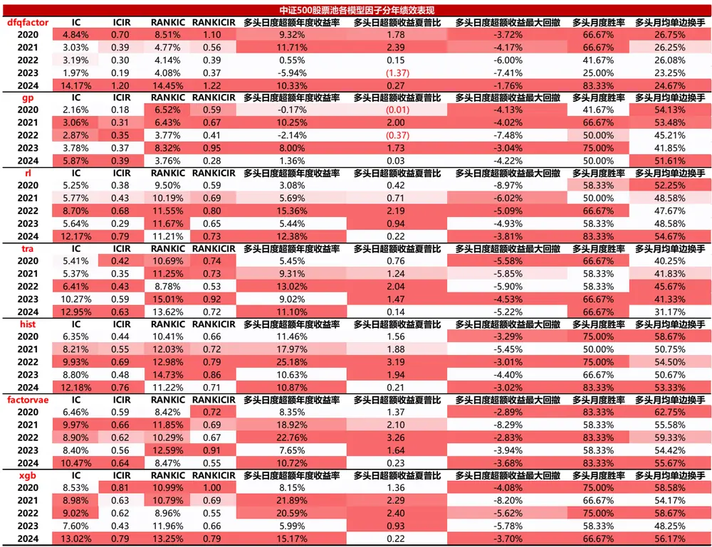
数据来源：东方证券研究所 & Wind资讯

（4）在中证 1000 股票池中， DFQ-XGB 模型 2024 年的多头表现与 HIST 模型相当。2024年 IC 达到 14.29%，10 分组多头年化超额 20.97%，最大回撤 3.04%。

图 35：中证 1000 股票池各模型分年绩效表现（2020.1.1-2024.06.30）
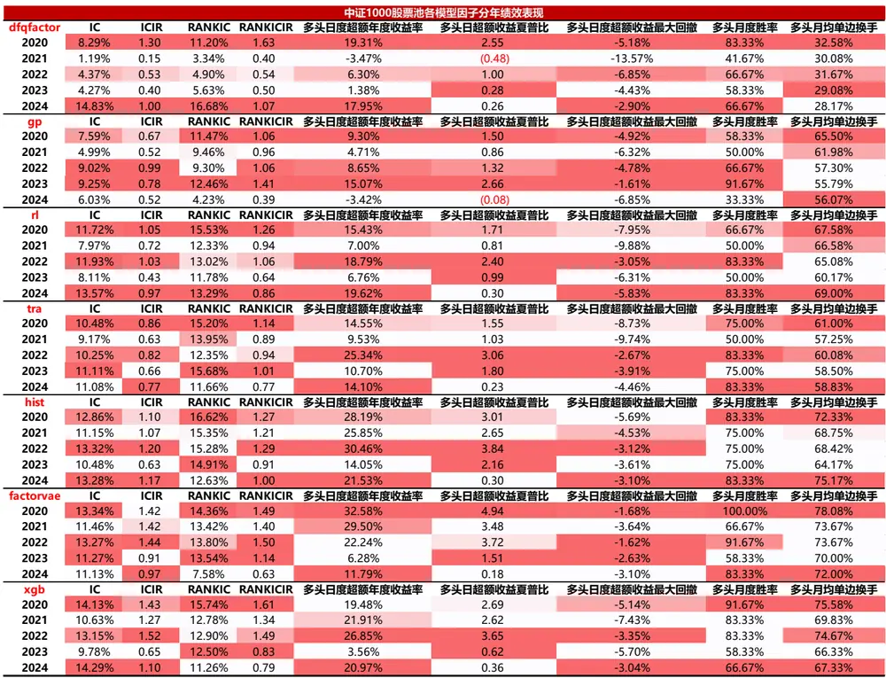
数据来源：东方证券研究所 & Wind资讯

## 2.6 因子多头组绩效归因

由于 XGB 模型和 TRA、HIST、FactorVAE 模型等神经网络模型在 2023 和 2024 年的多头组合业绩表现差别较大，多头超额净值曲线的波峰波谷恰好相反。因而，接下来我们分别从因子暴露角度和收益分解角度，对中证全指股票池内，各模型多头组 2023和 2024年的分年业绩进行绩效归因。

归因时我们使用的业绩基准是样本空间（中证全指）等权组合。绩效归因的具体做法是：（1）因子暴露角度：根据组合持仓，计算组合持仓和基准在各个风险因子上的暴露，相减得到相对暴露；（2）收益分解角度：根据多因子模型，可将股票的收益分解为系统性收益（风格与行业因子）和特质收益。在组合层面可以得到：组合超额收益=风格因子收益+行业因子收益+特质收益。当期各个风险因子贡献的超额收益=该风险因子收益率*组合相对基准在该风险因子上的相对暴露，当期残差部分贡献的超额收益=残差收益率*组合相对基准的个股相对权重。使用优化连接系数方法（Optimized Linking Coefficient Approaches），将每天收益进行汇总归因，从而得到某个区间内的收益分解结果。具体做法可参考报告《DFQ2018绩效归因与基金投资分析工具》。

我们使用的风险模型是《东方 A股因子风险模型(DFQ-2020)》报告中研发的风险模型，风险因子仍包括十大类风格类风险因子，29 个中信一级行业因子和市场因子。下图展示了该模型的风格因子列表，具体模型细节可以参考报告。

图 36：东方 A股因子风险模型（DFQ-2020）-- 风格因子列表
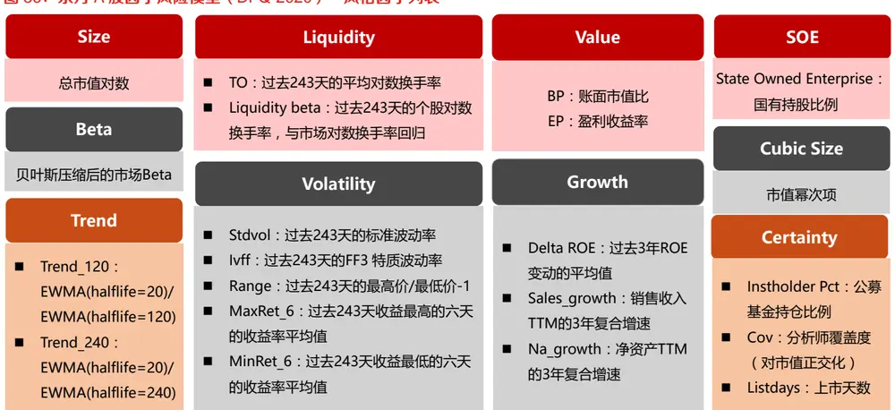
数据来源：东方证券研究所

## （1）2024 年

总体上： 在中证全指股票池中，DFQ-XGB 模型 2024年的多头表现最优，20 分组多头年化超额收益最高。其中风格因子部分获得的超额收益达到 22.54%，占到总超额的 78%，行业因子部分获得的超额收益为-1.43%，占总超额的-5%，特质收益获得的超额收益为 7.69%，占总超额的 27%。

特质收益上：XGB模型中通过特质收益部分获得的超额收益（7.69%）高于TRA（-0.66%）、HIST（1.09%）与 FactorVAE（-3.66%），且特质收益占超额收益组成的占比（26.69%）也大于 TRA（-7.92%）、HIST（6.43%）与 FactorVAE（-56.54%）。特质收益里一部分是 alpha 模型的贡献，一部分可能是市场随机因素。

风格因子上：DFQ-XGB 模型与其他模型相比在 Size，Beta 与 Value 风格上所获超额收益差别较大。1. Size 风格：XGB 在市值风格上所获超额收益为 5.34%，TRA、HIST 与 FactorVAE 分别为-1.48%、0.46%与-2.01%。TRA、HIST 与 FactorVAE 在 Size 风格上都呈较大负暴露（-63.55%、-63.53%与-68.57%），而 XGB 在 Size 风格上为小的正暴露（0.92%）。加之 24 年Size 因子走强，24 年 size 因子收益率为 5%，XGB 在 size 风格上方向暴露正确，从而获得了正超额。2. Beta 风格：XGB 在 Beta 上收益为 3.44%，TRA、HIST 与 FactorVAE 分别为 0.3%、1.87%与 0.38%。TRA、HIST 与 FactorVAE 在 Beta 风格上的暴露为-28.11%、-1.47%、17.23%，XGB 在 Beta 风格上呈较大负暴露（-45.66%）。加之 24 年 Beta 因子走弱，XGB 在 beta 因子上方向暴露正确，从而获得了正超额。3. Value风格分析：XGB在 Value上收益为6.15%，TRA、HIST 与 FactorVAE 分别为 1.96%、2.93%与 0.40%。TRA、HIST 、FactorVAE、XGB 在 Value风格上都呈正暴露，但暴露大小不同，分别为 23.99%、27.31%、0.75%与 59.08%，XGB 在Value 风格上的正暴露更多。加之 24 年 Value 因子收益走强，XGB 在 Value 因子上方向暴露正确，从而获得了正超额。

图 37：中证全指股票池各模型的因子模型收益分解汇总（2024 年）
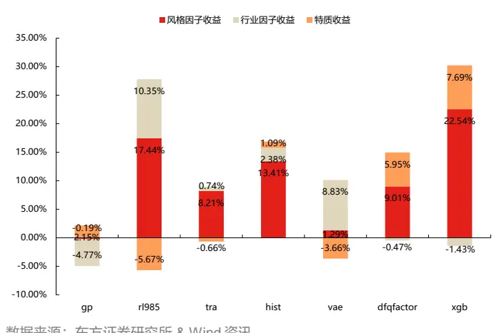
数据来源：东方证券研究所 & Wind资讯

图 38：中证全指股票池各模型风格因子收益分解汇总（2024年）
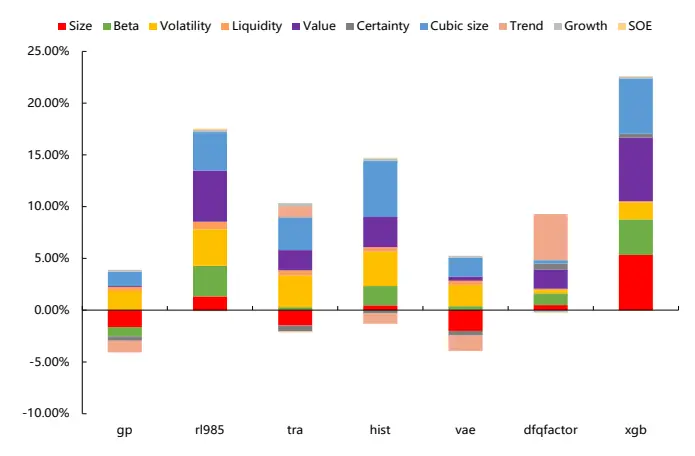
数据来源：东方证券研究所 & Wind资讯

图 39：中证全指股票池各模型的因子暴露汇总（2024年）
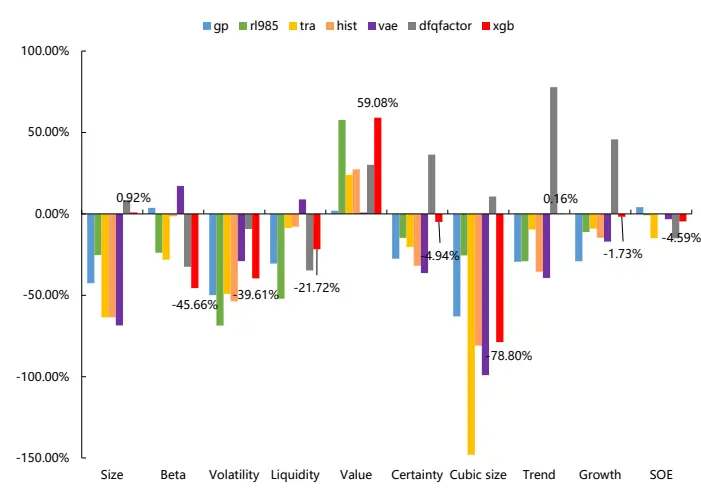
数据来源：东方证券研究所 & Wind资讯

图 40：中证全指股票池各风险因子收益累计净值（2024年）
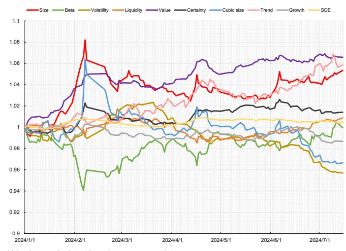
数据来源：东方证券研究所 & Wind资讯
有关分析师的申明，见本报告最后部分。其他重要信息披露见分析师申明之后部分，或请与您的投资代表联系。并请阅读本证券研究报告最后一页的免责申明。

## （2）2023 年

总体上：在中证全指股票池中，DFQ-XGB模型2023年的多头表现较差。其中风格因子部分获得的超额收益达到 12.93%，占到总超额的 165%，行业因子部分获得的超额收益为-29.77%，占总超额的-381%，特质收益获得的超额收益为 24.65%，占总超额的 315%。

特质收益上：XGB 模型中通过特质收益部分获得的超额收益（24.65%）高于 TRA（5.1%）、HIST（17.04%）与 FactorVAE（12.37%），且特质收益占超额收益组成的占比（315.73%）也大于 HIST（74.86%）与 FactorVAE（47.97%）。

风格因子上：DFQ-XGB模型与其他模型相比在 Size与 Cubic Size风格上所获超额收益差别较大。1. Size 风格：XGB 在 Size 风格上所获超额收益为-0.82%，TRA、HIST 与 FactorVAE 分别为 7.69%、7.35%与 6.51%。TRA、HIST 与 FactorVAE 在 Size 风格上都呈较大负暴露（-73.91%、-68.68%与-57.27%），而 XGB 在 Size 方向为正暴露（31.57%）。加之 23 年 Size 因子收益为负，XGB 在 size 因子上方向暴露错误，从而获得了负超额。2. Cubic Size 风格：XGB在 Cubic Size 风格上所获超额收益为 3.68%，TRA、HIST 与 FactorVAE 分别为 15.95%、6.83%与 8.34%。TRA、HIST、FactorVAE 与 XGB 在 Cubic Size 方向都呈负暴露，为-151.76%、-84.6%、-77.6%、-43.77%。23 年 Cubic Size 因子收益为负， XGB 在 Cubic Size 的负暴露不足也导致其收益低于其他三个模型。

图 41：中证全指股票池各模型的因子模型收益分解汇总（2023 年）
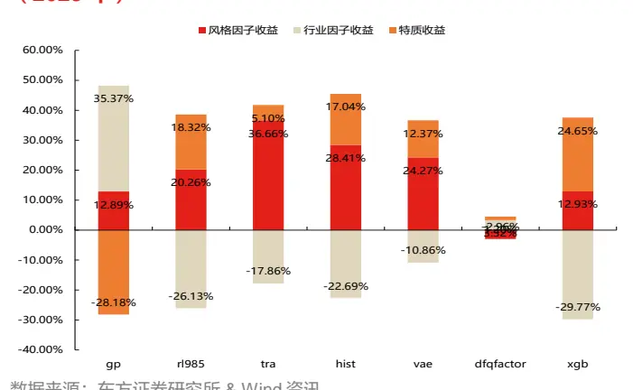
数据来源：东方证券研究所 & Wind资讯

图 42：中证全指股票池各模型风格因子收益分解汇总（2023
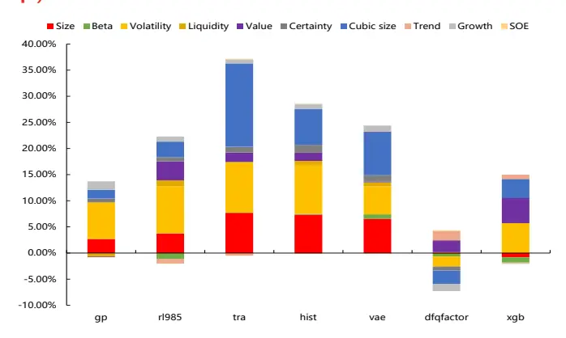
数据来源：东方证券研究所 & Wind资讯

图 43：中证全指股票池各模型的因子暴露汇总（2023年）
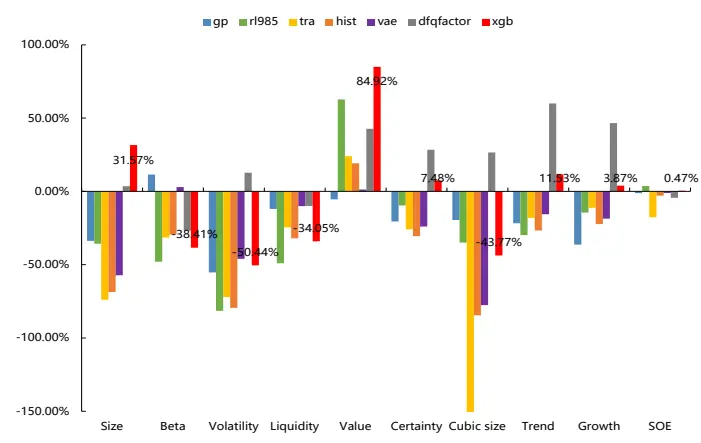
数据来源：东方证券研究所 & Wind资讯

图 44：中证全指股票池各风险因子收益累计净值（2023年）
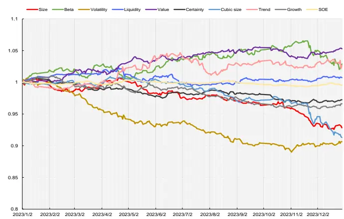
数据来源：东方证券研究所 & Wind资讯
有关分析师的申明，见本报告最后部分。其他重要信息披露见分析师申明之后部分，或请与您的投资代表联系。并请阅读本证券研究报告最后一页的免责申明。

## 2.7 中性化因子绩效表现

DFQ-XGB 因子进行了行业和市值中性化后，IC、RANKIC 和多头超额收益降低，ICIR、RANKICIR提升，多头超额收益最大回撤降低。中性化后的 DFQ-XGB因子在中证 500股票池中，多头表现比其他模型好。5 分组多头日度超额年化收益率达到 10.8%，多头日超额收益夏普比2.31，多头日度超额收益最大回撤仅为 4.82%。

图 45：中证全指股票池各模型中性化因子绩效表现（2020.1.1-2024.6.30）

| 中证全指股票池 IC | ICIR RANKIC |  |  | RANKICIR 多头日度超额年化收益率 |  | 多头日超额收益夏普比 | 多头日度超额收益最大回撤 | 多头月度胜率 | 多头月均单边换手 |
| --- | --- | --- | --- | --- | --- | --- | --- | --- | --- |
| 原始dfqfactor | 4.79% | 0.73 | 7.26% | 1.01 | 8.50% | 1.42 | -7.92% | 61.11% | 33.48% |
| 中性化dfqfactor | 4.69% | 0.70 | 7.15% | 0.98 | 7.36% | 1.20 | -8.13% | 57.41% | 33.28% |
| 原始gp | 8.06% | 0.83 | 11.54% | 1.21 | 12.47% | 1.70 | -9.02% | 66.67% | 68.70% |
| 中性化gp | 8.16% | 0.84 | 11.65% | 1.25 | 11.36% | 1.59 | -6.69% | 68.52% | 68.43% |
| 原始rl | 10.39% | 0.87 | 14.47% | 1.11 | 22.26% | 2.60 | -7.20% | 74.07% | 74.26% |
| 中性化rl | 9.19% | 1.09 | 12.16% | 1.43 | 16.30% | 2.81 | -3.95% | 81.48% | 74.43% |
| 原始tra | 10.85% | 0.84 | 16.13% | 1.14 | 24.52% | 2.40 | -10.93% | 75.93% | 57.21% |
| 中性化tra | 8.97% | 1.03 | 13.52% | 1.50 | 14.47% | 2.35 | -6.51% | 74.07% | 56.70% |
| 原始hist | 12.46% | 1.05 | 17.16% | 1.28 | 32.24% | 3.29 | -6.42% | 87.04% | 73.93% |
| 中性化hist | 10.44% | 1.30 | 14.16% | 1.66 | 19.06% | 3.06 | -6.81% | 77.78% | 75.22% |
| 原始factorvae | 12.69% | 1.33 | 15.02% | 1.37 | 31.84% | 3.36 | -8.28% | 87.04% | 79.26% |
| 中性化factorvae | 11.21% | 1.64 | 12.43% | 1.78 | 16.16% | 2.28 | -10.75% | 75.93% | 78.89% |
| 原始xgb | 12.96% | 1.29 | 15.43% | 1.42 | 29.58% | 3.42 | -7.44% | 85.19% | 77.03% |
| 中性化xgb | 11.06% | 1.51 | 12.33% | 1.84 | 13.77% | 2.30 | -5.42% | 72.22% | 77.06% |

数据来源：东方证券研究所 & Wind资讯

图 46：沪深 300 股票池各模型中性化因子绩效表现（2020.1.1-2024.6.30）

| 沪深300股票池 IC | ICIR RANKIC |  |  | RANKICIR | 多头日度超额年化收益率 | 多头日超额收益夏普比 | 多头日度超额收益最大回撤 | 多头月度胜率 | 多头月均单边换手 |
| --- | --- | --- | --- | --- | --- | --- | --- | --- | --- |
| 原始dfqfactor | 3.29% | 0.32 | 4.13% | 0.39 | 5.95% | 1.11 | -7.56% | 57.41% | 23.12% |
| 中性化dfqfactor | 3.27% | 0.37 | 3.75% | 0.42 | 4.85% | 0.94 | -9.65% | 62.96% | 24.91% |
| 原始gp | 2.28% | 0.19 | 3.42% | 0.28 | 2.28% | 0.37 | -15.42% | 55.56% | 49.67% |
| 中性化gp | 3.78% | 0.37 | 5.28% | 0.56 | 3.77% | 0.78 | -7.14% | 51.85% | 50.88% |
| 原始rl | 7.61% | 0.44 | 10.45% | 0.59 | 12.15% | 1.50 | -6.94% | 61.11% | 50.22% |
| 中性化rl | 5.28% | 0.56 | 7.02% | 0.80 | 3.88% | 0.87 | -6.50% | 48.15% | 54.48% |
| 原始tra | 8.59% | 0.41 | 11.91% | 0.56 | 12.01% | 1.19 | -12.06% | 53.70% | 27.16% |
| 中性化tra | 4.84% | 0.43 | 7.26% | 0.65 | 5.64% | 1.04 | -7.03% | 64.81% | 35.93% |
| 原始hist | 10.52% | 0.56 | 12.73% | 0.65 | 13.32% | 1.49 | -7.97% | 68.52% | 50.59% |
| 中性化hist | 7.87% | 0.76 | 9.32% | 0.91 | 7.67% | 1.61 | -6.72% | 64.81% | 51.88% |
| 原始factorvae | 9.82% | 0.59 | 11.27% | 0.63 | 15.87% | 1.84 | -6.74% | 66.67% | 53.43% |
| 中性化factorvae | 7.67% | 0.85 | 8.06% | 0.93 | 8.10% | 1.70 | -5.20% | 64.81% | 57.56% |
| 原始xgb | 8.87% | 0.50 | 10.13% | 0.53 | 12.61% | 1.28 | -11.15% | 68.52% | 49.04% |
| 中性化xgb | 6.93% | 0.78 | 7.43% | 0.80 | 6.02% | 1.14 | -7.01% | 64.81% | 58.49% |

数据来源：东方证券研究所 & Wind资讯

图 47：中证 500 股票池各模型中性化因子绩效表现（2020.1.1-2024.6.30）

| 中证500股票池 | IC ICIR RANKIC |  |  | RANKICIR 多头日度超额年化收益率 |  | 多头日超额收益夏普比 | 多头日度超额收益最大回撤 | 多头月度胜率 | 多头月均单边换手 |
| --- | --- | --- | --- | --- | --- | --- | --- | --- | --- |
| 原始dfqfactor | 4.24% | 0.43 | 6.19% | 0.60 | 5.78% | 1.18 | -11.18% | 53.70% | 25.48% |
| 中性化dfqfactor | 4.31% | 0.55 | 6.19% | 0.78 | 6.26% | 1.47 | -7.75% | 64.81% | 27.15% |
| 原始gp | 3.20% | 0.30 | 6.02% | 0.59 | 3.89% | 0.77 | -7.48% | 57.41% | 48.99% |
| 中性化gp | 4.36% | 0.41 | 7.34% | 0.81 | 4.66% | 1.03 | -6.91% | 62.96% | 48.59% |
| 原始rl | 6.84% | 0.45 | 10.75% | 0.68 | 9.67% | 1.26 | -8.97% | 61.11% | 49.87% |
| 中性化rl | 5.50% | 0.55 | 8.19% | 0.92 | 5.71% | 1.31 | -4.87% | 61.11% | 53.67% |
| 原始tra | 7.38% | 0.46 | 11.64% | 0.72 | 11.04% | 1.44 | -5.90% | 62.96% | 41.01% |
| 中性化tra | 6.06% | 0.62 | 9.36% | 1.01 | 9.30% | 1.78 | -4.76% | 68.52% | 43.17% |
| 原始hist | 8.64% | 0.55 | 12.39% | 0.75 | 17.68% | 2.22 | -6.26% | 66.67% | 53.59% |
| 中性化hist | 6.97% | 0.71 | 9.62% | 1.06 | 9.82% | 2.33 | -3.38% | 68.52% | 57.26% |
| 原始factorvae | 8.59% | 0.60 | 10.56% | 0.71 | 15.84% | 2.24 | -8.29% | 72.22% | 57.76% |
| 中性化factorvae | 7.16% | 0.78 | 7.91% | 1.00 | 8.25% | 2.03 | -3.86% | 70.37% | 57.72% |
| 原始xgb | 8.91% | 0.60 | 10.89% | 0.70 | 16.61% | 2.01 | -8.20% | 68.52% | 55.06% |
| 中性化xgb | 7.06% | 0.76 | 8.47% | 1.03 | 10.80% | 2.31 | -4.82% | 74.07% | 60.06% |

数据来源：东方证券研究所 & Wind资讯

图 48：中证 1000 股票池各模型中性化因子绩效表现（2020.1.1-2024.6.30）

| 中证1000股票池 IC ICIR RANKIC |  |  | RANKICIR | 多头日度超额年化收益率 | 多头日超额收益夏普比 | 多头日度超额收益最大回撤 | 多头月度胜率 | 多头月均单边换手 |  |
| --- | --- | --- | --- | --- | --- | --- | --- | --- | --- |
| 原始dfqfactor | 5.43% | 0.55 | 7.18% | 0.68 | 9.24% | 1.31 | -13.82% | 62.96% | 30.56% |
| 中性化dfqfactor | 5.62% | 0.66 | 7.45% | 0.83 | 9.10% | 1.51 | -13.19% | 64.81% | 32.48% |
| 原始gp | 7.52% | 0.70 | 10.05% | 1.01 | 7.79% | 1.26 | -6.85% | 62.96% | 59.69% |
| 中性化gp | 7.48% | 0.72 | 9.72% | 1.08 | 7.42% | 1.29 | -7.17% | 64.81% | 60.03% |
| 原始rl | 10.23% | 0.74 | 13.14% | 0.91 | 15.67% | 1.80 | -9.88% | 64.81% | 65.31% |
| 中性化rl | 8.63% | 0.90 | 10.52% | 1.19 | 12.54% | 2.33 | -5.80% | 77.78% | 67.24% |
| 原始tra | 10.27% | 0.72 | 14.00% | 0.95 | 17.29% | 1.96 | -9.74% | 72.22% | 59.17% |
| 中性化tra | 8.57% | 0.92 | 11.28% | 1.26 | 13.80% | 2.38 | -5.60% | 74.07% | 58.57% |
| 原始hist | 12.04% | 0.95 | 15.24% | 1.12 | 28.17% | 3.11 | -5.69% | 77.78% | 69.17% |
| 中性化hist | 9.92% | 1.21 | 12.25% | 1.52 | 12.93% | 2.61 | -3.87% | 77.78% | 68.35% |
| 原始factorvae | 12.20% | 1.21 | 13.18% | 1.26 | 23.59% | 3.36 | -3.64% | 79.63% | 73.65% |
| 中性化factorvae | 10.54% | 1.49 | 10.58% | 1.68 | 15.16% | 2.68 | -3.85% | 75.93% | 70.41% |
| 原始xgb | 12.11% | 1.08 | 13.25% | 1.16 | 21.48% | 2.79 | -7.43% | 77.78% | 71.13% |
| 中性化xgb | 10.13% | 1.29 | 10.33% | 1.49 | 12.92% | 2.11 | -5.00% | 70.37% | 71.83% |

数据来源：东方证券研究所 & Wind资讯

## 三、多模型集成增量

## 3.1 多模型相关性

模型间的相关性可以通过三种方式度量：截面因子值相关性日度平均值、日度 rankic 序列相关性、日度多头超额收益序列相关性。我们更加关注模型实际的投资表现，尤其是在实际操作中是否能够产生超额收益，因而多头超额收益序列相关性相对更为重要。

整体来看，DFQ-XGB模型所得因子与其他模型的相关性都比较低：（1）在中证全指和中证1000 股票池中，DFQ-XGB 模型与其他模型日度多头超额收益的相关性基本都在 50%以下；（2）在沪深 300 和中证 500 股票池中，DFQ-XGB 模型与其他模型日度多头超额收益的相关性基本都在 80%以下。

图 49：中证全指股票池中各模型相关性（2020.01.01-2024.6.30）

| 截面因子值985 | gp | r1985 | tra | hist | vae | dfqfactor | xgb |
| --- | --- | --- | --- | --- | --- | --- | --- |
| gp | 100.00% | 69.82% | 66.84% | 67.56% | 53.42% | 23.44% | 51.60% |
| r1985 | 69.82% | 100.00% | 69.90% | 79.24% | 63.02% | 31.64% | 65.85% |
| tra | 66.84% | 69.90% | 100.00% | 71.72% | 56.33% | 28.17% | 56.12% |
| hist | 67.56% | 79.24% | 71.72% | 100.00% | 80.60% | 23.28% | 74.24% |
| vae | 53.42% | 63.02% | 56.33% | 80.60% | 100.00% | 14.80% | 70.39% |
| dfqfactor | 23.44% | 31.64% | 28.17% | 23.28% | 14.80% | 100.00% | 29.58% |
| xgb | 51.60% | 65.85% | 56.12% | 74.24% | 70.39% | 29.58% | 100.00% |
| rankic985 | gp | r1985 | tra | hist | vae |  |  |
| gp | 100.00% | 76.36% | 81.35% | 76.62% | 76.74% | dfqfactor 21.43% | xgb 73.67% |
| r1985 | 76.36% | 100.00% | 79.88% | 84.41% | 77.77% | 38.61% | 82.26% |
| tra | 81.35% | 79.88% | 100.00% | 91.53% | 87.53% | 18.43% | 86.02% |
| hist | 76.62% | 84.41% | 91.53% | 100.00% | 95.46% | 15.76% | 94.45% |
| vae | 76.74% | 77.77% | 87.53% | 95.46% | 100.00% | 14.28% | 93.35% |
| dfqfactor | 21.43% | 38.61% | 18.43% | 15.76% | 14.28% | 100.00% | 25.71% |
| xgb | 73.67% | 82.26% | 86.02% | 94.45% | 93.35% | 25.71% | 100.00% |
| 度多头超额收益率985 | gp 100.00% | r1985 | tra | hist | vae | dfqfactor | xgb |
| gp r1985 | 28.14% | 28.14% 100.00% | 56.94% | 52.35% | 50.56% | -36.88% | 24.50% |
| tra | 56.94% | 58.31% | 58.31% | 67.20% | 35.74% | 7.39% | 49.73% |
| hist | 52.35% | 67.20% | 100.00% | 83.19% | 67.27% | -23.16% | 39.21% |
| vae | 50.56% | 35.74% | 83.19% 67.27% | 100.00% | 77.28% 100.00% | -28.05% | 53.85% |
| dfqfactor | -36.88% | 7.39% | -23.16% | 77.28% -28.05% | -38.10% | -38.10% 100.00% | 41.95% |
| xgb | 24.50% | 49.73% | 39.21% | 53.85% | 41.95% | -0.24% | -0.24% 100.00% |

数据来源：东方证券研究所 & Wind资讯

图 50：沪深 300 股票池中各模型相关性（2020.01.01-2024.6.30）

| 截面因子值300 gp | gp | r1985 | tra | hist | vae | dfqfactor | xgb |
| --- | --- | --- | --- | --- | --- | --- | --- |
|  | 100.00% | 40.19% | 34.29% | 38.18% | 27.28% | 17.05% | 21.13% |
| r1985 | 40.19% | 100.00% | 58.64% | 68.70% | 52.67% | 30.10% | 50.65% |
| tra | 34.29% | 58.64% | 100.00% | 61.48% | 45.92% | 24.28% | 43.39% |
| hist | 38.18% | 68.70% | 61.48% | 100.00% | 75.40% | 22.80% | 64.61% |
| vae | 27.28% | 52.67% | 45.92% | 75.40% | 100.00% | 15.51% | 67.75% |
| dfqfactor | 17.05% | 30.10% | 24.28% | 22.80% | 15.51% | 100.00% | 23.44% |
| xgb | 21.13% | 50.65% | 43.39% | 64.61% | 67.75% | 23.44% | 100.00% |
| rankic300 | gp | r1985 | tra | hist | vae | dfqfactor | xgb |
| gp | 100.00% | 24.71% | 27.90% | 22.94% | 27.42% | 20.58% | 18.76% |
| rl985 | 24.71% | 100.00% | 83.64% | 87.52% | 78.17% | 21.16% | 74.97% |
| tra | 27.90% | 83.64% | 100.00% | 88.26% | 82.90% | 29.02% | 79.98% |
| hist | 22.94% | 87.52% | 88.26% | 100.00% | 92.06% | 26.24% | 88.87% |
| vae dfqfactor | 27.42% | 78.17% | 82.90% | 92.06% | 100.00% | 30.35% | 91.11% |
| xgb | 20.58% 18.76% | 21.16% | 29.02% | 26.24% | 30.35% | 100.00% | 38.51% |
|  |  | 74.97% | 79.98% | 88.87% | 91.11% | 38.51% | 100.00% |
| 日度多头超额收益率300 | gp | r1985 | tra | hist | vae | dfqfactor | xgb |
| gp | 100.00% | 9.46% | 23.63% | 6.95% | 15.84% | 7.01% | 12.67% |
| r1985 | 9.46% | 100.00% | 67.57% | 79.26% | 65.05% | 17.06% | 59.92% |
| tra | 23.63% | 67.57% | 100.00% | 70.04% | 64.59% | 23.31% | 62.91% |
| hist | 6.95% | 79.26% | 70.04% | 100.00% | 83.60% | 12.18% | 74.94% |
| vae | 15.84% | 65.05% | 64.59% | 83.60% | 100.00% | 8.65% | 78.85% |
| dfqfactor | 7.01% | 17.06% | 23.31% | 12.18% | 8.65% | 100.00% | 10.76% |
| xgb | 12.67% | 59.92% | 62.91% | 74.94% | 78.85% | 10.76% | 100.00% |

数据来源：东方证券研究所 & Wind资讯

图 51：中证 500 股票池中各模型相关性（2020.01.01-2024.6.30）

| 截面因子值500 | gp | r1985 | tra | hist | vae | dfqfactor | xgb |
| --- | --- | --- | --- | --- | --- | --- | --- |
| gp | 100.00% | 58.50% | 54.42% | 56.67% | 45.31% | 21.02% | 36.86% |
| r1985 | 58.50% | 100.00% | 64.18% | 75.60% | 59.35% | 29.74% | 57.69% |
| tra | 54.42% | 64.18% | 100.00% | 63.86% | 49.32% | 28.37% | 46.16% |
| hist | 56.67% | 75.60% | 63.86% | 100.00% | 78.49% | 22.00% | 66.91% |
| vae | 45.31% | 59.35% | 49.32% | 78.49% | 100.00% | 14.82% | 66.65% |
| dfqfactor | 21.02% | 29.74% | 28.37% | 22.00% | 14.82% | 100.00% | 27.75% |
| xgb | 36.86% | 57.69% | 46.16% | 66.91% | 66.65% | 27.75% | 100.00% |
| rankic500 |  | r1985 |  |  |  |  |  |
|  | gp |  | tra | hist | vae | dfqfactor | xgb |
| gp r1985 | 100.00% 57.04% | 57.04% 100.00% | 60.56% | 58.25% | 56.02% | 12.16% | 44.22% |
| tra |  |  | 85.75% | 89.87% | 80.31% | 38.36% | 76.59% |
| hist | 60.56% 58.25% | 85.75% | 100.00% | 80.68% | 73.32% | 50.19% | 71.85% |
| vae | 56.02% | 89.87% 80.31% | 80.68% | 100.00% | 92.23% | 33.35% | 87.32% |
| dfqfactor | 12.16% | 38.36% | 73.32% 50.19% | 92.23% 33.35% | 100.00% 32.11% | 32.11% | 88.25% |
| xgb | 44.22% | 76.59% | 71.85% | 87.32% | 88.25% | 100.00% | 52.93% |
|  |  |  |  |  |  | 52.93% | 100.00% |
| 日度多头超额收益率500 | gp | r1985 | tra | hist | vae | dfqfactor | xgb |
| gp | 100.00% | 39.74% | 43.38% | 40.80% | 32.24% | 2.67% | 24.54% |
| r1985 | 39.74% | 100.00% | 69.75% | 78.80% | 60.10% | 21.21% | 51.75% |
| tra | 43.38% | 69.75% | 100.00% | 56.64% | 39.59% | 38.71% | 46.91% |
| hist | 40.80% | 78.80% | 56.64% | 100.00% | 81.99% | 2.95% | 66.18% |
| vae | 32.24% | 60.10% | 39.59% | 81.99% | 100.00% | -3.54% | 71.19% |
| dfqfactor | 2.67% | 21.21% | 38.71% | 2.95% | -3.54% | 100.00% | 17.81% |
| xgb | 24.54% | 51.75% | 46.91% | 66.18% | 71.19% | 17.81% | 100.00% |

数据来源：东方证券研究所 & Wind资讯

图 52：中证 1000 股票池中各模型相关性（2020.01.01-2024.6.30）

| 截面因子值1000 | gp | r1985 | tra | hist | vae | dfqfactor | xgb |
| --- | --- | --- | --- | --- | --- | --- | --- |
| gp | 100.00% | 69.82% | 66.84% | 67.56% | 53.42% | 23.44% | 51.60% |
| r1985 | 69.82% | 100.00% | 69.90% | 79.24% | 63.02% | 31.64% | 65.85% |
| tra | 66.84% | 69.90% | 100.00% | 71.72% | 56.33% | 28.17% | 56.12% |
| hist | 67.56% | 79.24% | 71.72% | 100.00% | 80.60% | 23.28% | 74.24% |
| vae | 53.42% | 63.02% | 56.33% | 80.60% | 100.00% | 14.80% | 70.39% |
| dfqfactor | 23.44% | 31.64% | 28.17% | 23.28% | 14.80% | 100.00% | 29.58% |
| xgb | 51.60% | 65.85% | 56.12% | 74.24% | 70.39% | 29.58% | 100.00% |
| rankic1000 | gp | r1985 | tra | hist | vae | dfqfactor | xgb |
| gp | 100.00% | 75.11% | 82.11% | 74.44% | 72.04% | 18.00% | 65.98% |
| r1985 | 75.11% | 100.00% | 91.54% | 89.36% | 81.23% | 46.28% | 85.92% |
| tra | 82.11% | 91.54% | 100.00% | 89.90% | 81.53% | 37.02% | 80.36% |
| hist | 74.44% | 89.36% | 89.90% | 100.00% | 91.79% | 29.40% | 88.35% |
| vae | 72.04% | 81.23% | 81.53% | 91.79% | 100.00% | 23.12% | 87.85% |
| dfqfactor | 18.00% | 46.28% | 37.02% | 29.40% | 23.12% | 100.00% | 48.49% |
| xgb | 65.98% | 85.92% | 80.36% | 88.35% | 87.85% | 48.49% | 100.00% |
| 日度多头超额收益率1000 | gp | r1985 | tra | hist | vae | dfqfactor |  |
| gp | 100.00% | 39.65% | 42.83% | 42.85% | 21.94% | -12.60% | xgb 22.71% |
| rl985 | 39.65% | 100.00% | 78.22% | 72.38% | 31.91% | 19.88% | 46.33% |
| tra | 42.83% | 78.22% | 100.00% | 70.17% | 30.12% | 15.70% | 41.36% |
| hist | 42.85% | 72.38% | 70.17% | 100.00% | 62.76% | -6.82% | 53.56% |
| vae | 21.94% | 31.91% | 30.12% | 62.76% | 100.00% | -25.84% | 41.90% |
| dfqfactor | -12.60% | 19.88% | 15.70% | -6.82% | -25.84% | 100.00% | 14.86% |
| xgb | 22.71% | 46.33% | 41.36% | 53.56% | 41.90% | 14.86% | 100.00% |

数据来源：东方证券研究所 & Wind资讯

## 3.2 多模型集成表现

多个有效且低相关的模型集成有可能带来更优异的表现，我们尝试将 DFQ-XGB 模型与其他模型等权合成，发现能达到 1+1>2的集成效果：

（1）在中证全指股票池中，DFQ-XGB模型与DFQ-HIST模型等权合成后效果更佳，多头年化超额相比单模型可再提高 4pct。测试集上 IC 达到 13.39%，RANKIC 达到 17.19%，20 分组多头日度超额年化收益率达到 36.12%，多头日超额收益夏普比达到 3.70，多头日度超额收益最大回撤 6.16%；

（2）在沪深 300股票池中，DFQ-XGB模型与 DFQ-TRA、DFQ-HIST、DFQ-FactorVAE四个模型等权合成后效果更佳，RANKIC相比单模型可再提高0.7pct，多头年化超额提高 1.5pct。测试集上 IC 达到 11%，RANKIC 达到 13.42%，5 分组多头日度超额年化收益率达到 17.39%；

（3）在中证 500 股票池中，DFQ-XGB 模型与 DFQ-HIST 模型等权合成后效果更佳，多头年化超额相比单模型可再提高 2.4pct。测试集上 IC 达到 9.46%，RANKIC 达到 12.56%，5 分组多头日度超额年化收益率达到 20.08%，多头日超额收益夏普比达到 2.31；

（4）在中证 1000 股票池中，DFQ-XGB 模型与 DFQ-HIST、DFQ-FactorVAE 三个模型等权合成后效果更佳，多头年化超额相比单模型可再提高 0.5pct。测试集上 IC 达到 13.05%，RANKIC 达到 15%，10 分组多头日度超额年化收益率达到 28.70%，多头日超额收益夏普比达到3.46。

图 53：中证全指股票池中多模型集成表现（2020.01.01-2024.6.30）

| 985 | IC | ICIR | RANKIC | RANKICIR | 多头日度超额年度收益率 | 多头日超额收益夏普比 | 多头日度超额收益最大回撤 | 多头月度胜率 | 多头月均单边换手 |
| --- | --- | --- | --- | --- | --- | --- | --- | --- | --- |
| dfqfactor | 4.79% | 0.73 | 7.26% | 1.01 | 8.50% | 1.42 | -7.92% | 61.11% | 33.48% |
| gp | 8.06% | 0.83 | 11.54% | 1.21 | 12.47% | 1.70 | -9.02% | 66.67% | 68.70% |
| r1985 | 10.39% | 0.87 | 14.47% | 1.11 | 22.26% | 2.60 | -7.20% | 74.07% | 74.26% |
| tra | 10.85% | 0.84 | 16.13% | 1.14 | 24.52% | 2.40 | -10.93% | 75.93% | 57.21% |
| hist | 12.46% | 1.05 | 17.16% | 1.28 | 32.24% | 3.29 | -6.42% | 87.04% | 73.93% |
| factorvae | 12.69% | 1.33 | 15.02% | 1.37 | 31.84% | 3.36 | -8.28% | 87.04% | 79.26% |
| xgb | 12.96% | 1.29 | 15.43% | 1.42 | 29.58% | 3.42 | -7.44% | 85.19% | 77.03% |
| xgb+hist | 13.39% | 1.18 | 17.19% | 1.34 | 36.12% | 3.70 | -6.16% | 81.48% | 74.35% |

数据来源：东方证券研究所 & Wind资讯

有关分析师的申明，见本报告最后部分。其他重要信息披露见分析师申明之后部分，或请与您的投资代表联系。并请阅读本证券研究报告最后一页的免责申明。

图 54：沪深 300 股票池中多模型集成表现（2020.01.01-2024.6.30）
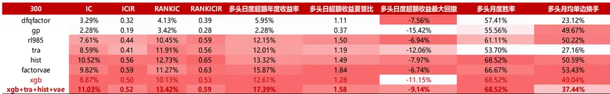
数据来源：东方证券研究所 & Wind资讯

图 55：中证 500 股票池中多模型集成表现（2020.01.01-2024.6.30）

| 500 | IC | ICIR | RANKIC RANKICIR多头日度超额年度收益率 |  |  | 多头日超额收益夏普比 | 多头日度超额收益最大回撤 | 多头月度胜率 多头月均单边换手 |  |
| --- | --- | --- | --- | --- | --- | --- | --- | --- | --- |
| dfqfactor | 4.24% | 0.43 | 6.19% 0.60 |  | 5.78% | 1.18 | -11.18% | 53.70% | 25.48% |
| gpr1985 | 3.20% | 0.30 | 6.02% 0.59 |  | 3.89% | 0.77 | -7.48% | 57.41% | 48.99% |
|  | 6.84% 0.45 |  | 10.75% | 0.68 | 9.67% | 1.26 | -8.97% | 61.11% | 49.87% |
| tra | 7.38% | 0.46 | 11.64% | 0.72 | 11.04% | 1.44 | -5.90% | 62.96% | 41.01% |
| hist | 8.64% | 0.55 | 12.39% | 0.75 | 17.68% | 2.22 | -6.26% | 66.67% | 53.59% |
| factorvae | 8.59% 0.60 |  | 10.56% 0.71 |  | 15.84% | 2.24 | -8.29% | 72.22% | 57.76% |
| xgb | 8.91% 0.60 |  | 10.89% | 0.70 | 16.61% 2.01 |  | -8.20% | 68.52% | 55.06% |
| xgb+hist | 9.46% 0.59 |  | 12.56% | 0.73 | 20.08% 2.31 |  | -6.76% | 72.22% | 52.43% |

数据来源：东方证券研究所 & Wind资讯

图 56：中证 1000 股票池中多模型集成表现（2020.01.01-2024.6.30）
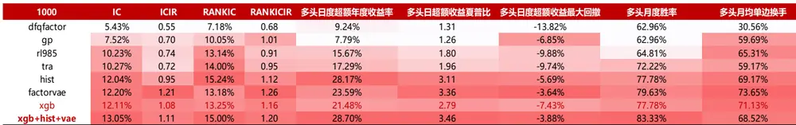
数据来源：东方证券研究所 & Wind资讯

## 四、Top100 组合表现

## 4.1 Top100 组合构建说明

为了对比不同模型因子多头端的选股效果，我们展示了中证全指股票池中不同模型月频top100组合的业绩表现。关于多头组合构建有如下说明：

（1）回测期：2020.01.01-2024.6.30，组合月频调仓，假设根据每月末个股得分在次日以vwap 价格进行交易；

（2）考虑交易成本：假设买卖手续费双边千三，停牌涨停不能买入、停牌跌停不能卖出；

（3）考虑流动性：将成分股中过去 20个交易日日均成交金额小于 3千万的股票予以剔除；

（4）等权构建：选取样本空间（中证全指）中模型打分最高的 100只股票等权构建。

## 4.2 Top100 组合表现

在中证全指内，使用 DFQ-XGB 模型构建的 top100 组合，绩效表现优于其他模型，相比神经网络类模型，能实现更高的收益和更小的回撤。DFQ-XGB 模型下的全指 top100 组合， 2020年以来年化绝对收益达到 25.68%，年化夏普比达到 1.17，最大回撤 27.28%，其他神经网络模型最大回撤均在 40%以上。2020 和 2021 年绝对收益达 50%，2022 和 2023 年绝对收益在 10%左右，2024年到6月 30号绝对收益-6.49%，其他神经网络模型 24年绝对收益均在-20%以下。

图 57：中证全指股票池 top100 组合绩效表现（2020.1.1-2024.6.30）

| 中证全指成分内月频 |  | 中证全指 | dfqfactor | 152gp | 985rl | tra | hist | factorvae | xgb |
| --- | --- | --- | --- | --- | --- | --- | --- | --- | --- |
| 20200101-20240628 top100 |  | 绝对收益 | 绝对收益 | 绝对收益 | 绝对收益 | 绝对收益 | 绝对收益 | 绝对收益 | 绝对收益 |
| 绩效指标 | 夏普比 | (0.03) | 0.62 | 0.50 | 0.87 | 0.91 | 0.82 | 0.78 | 1.17 |
|  | 年化收益率 | -2.37% | 11.06% | 10.00% | 17.48% | 22.08% | 19.75% | 19.61% | 25.68% |
|  | 年化波动率 | 18.81% | 20.17% | 25.48% | 21.18% | 25.41% | 26.39% | 28.33% | 21.59% |
|  | 最大回撤 | -39.33% | -25.89% | -45.03% | -30.25% | -41.05% | -43.61% | -46.77% | -27.28% |
|  | 最大回撤出现时间点 | 20240205 | 20220426 | 20240207 | 20240205 | 20240207 | 20240207 | 20240207 | 20240205 |
|  | 最大回撤恢复时间 |  | 433 |  |  |  |  |  |  |
|  | 单边换手率（年） | 25.23% | 4.93 | 9.09 | 9.93 | 7.72 | 9.66 | 10.22 | 9.87 |
| 分年收益 | 2020 2021 | 6.19% | 42.94% | 43.88% | 37.80% | 53.16% | 52.47% | 53.89% | 53.04% |
|  |  |  | 15.36% | 29.23% | 41.64% | 47.63% | 53.24% | 54.00% | 55.93% |
|  | 2022 | -20.32% | -7.65% | -2.21% | 7.34% | 7.80% | 3.03% | 5.36% | 12.29% |
|  | 2023 | -7.04% | 5.07% | 26.65% | 16.45% | 26.58% | 23.36% | 24.54% | 8.94% |
|  | 2024 | -8.64% | -0.89% | -34.00% | -16.82% | -22.12% | -25.66% | -29.38% | -6.49% |
|  | 202401 | -11.76% | -11.62% | -21.02% | -16.11% | -16.54% | -20.99% | -23.92% | -10.32% |
| 分月收益 | 202402 | 9.72% | 8.86% | -3.78% | 4.13% | -4.24% | -1.76% | -2.75% | 3.67% |
|  | 202403 | 1.39% | 7.09% | 4.61% | 8.01% | 9.23% | 9.16% | 9.00% | 8.19% |
|  | 202404 | 1.00% | 2.58% | -2.54% | -0.90% | -2.39% | -3.17% | -2.92% | 0.06% |
|  | 202405 | -1.51% | -1.27% | -4.88% | -1.57% | -1.77% | -0.66% | -0.54% | -1.60% |
|  | 202406 | -5.79% | -5.37% | -11.09% | -9.83% | -8.42% | -9.96% | -9.86% | -6.16% |

数据来源：东方证券研究所 & wind资讯

图 58：中证全指股票池 top100 组合绝对收益净值（2020.1.1-2024.6.30）
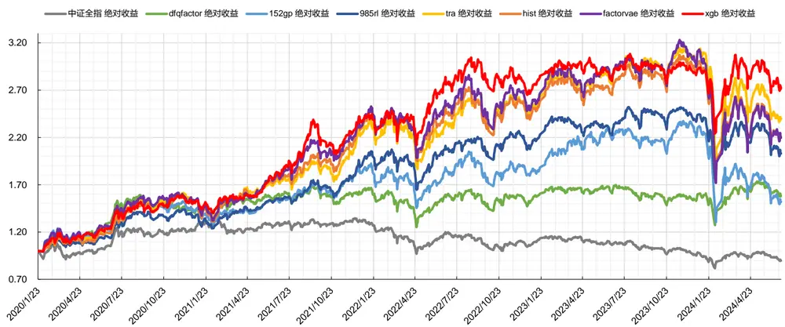
数据来源：东方证券研究所 & wind资讯

DFQ-XGB模型下的全指top100组合，相对样本空间（中证全指）等权的基准组合，在风险因子上的暴露情况与其他模型有所不同：

（1）XGB 模型在 value 维度有明显的正暴露，相对暴露 69%，说明偏向于配置低估值的股票。仅线性多因子 dfqfactor模型和强化学习 985rl模型也是较大的正暴露；

（2）XGB模型在size维度有明显的正暴露，相对暴露33%，说明偏向于配置大市值股票。其他网络模型均是明显的负暴露，仅线性多因子 dfqfactor模型也是正暴露；

（3）XGB模型在certainty、trend维度有一定的正暴露，相对暴露分别为19%和14%，说明偏向于配置高信息确定性（公募基金持仓比例高、分析师覆盖多、上市时间长）、高动量的股票。其他网络模型均是负暴露，仅线性多因子 dfqfactor模型也是正暴露；

（4）XGB模型在beta、volatility、liquidity维度有一定的负暴露，相对暴露分别为-25%、-26%、-31%，说明偏向于配置低 beta、低波动、低流动性的股票。

图 59：中证全指股票池 top100 组合相对基准的平均风格暴露（2020.1.1-2024.6.30）
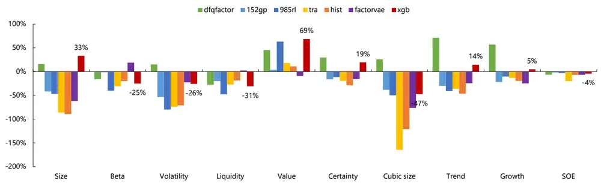
数据来源：东方证券研究所 & Wind资讯

有关分析师的申明，见本报告最后部分。其他重要信息披露见分析师申明之后部分，或请与您的投资代表联系。并请阅读本证券研究报告最后一页的免责申明。

## 五、指数增强组合表现

## 5.1 指数增强组合构建说明

（1）回测期：2020.01.01-2024.06.30，组合月频调仓，假设根据每月末个股得分在次日以vwap 价格进行交易。

（2）组合约束：风险因子库（参见《东方 A 股因子风险模型（DFQ-2020）》）中所有的风格因子相对暴露不超过 50%，所有行业因子相对暴露不超过 2%。沪深 300 增强跟踪误差约束不超过 4%，中证 500 和 1000增强跟踪误差约束不超过 5%。个股权重设置上限约束，绝对权重上限设置为 1.5倍基准权重+2%。限制指数成分股权重占比不低于 80%。

（3）考虑交易成本：假设买卖手续费双边千三，停牌涨停不能买入、停牌跌停不能卖出。

## 5.2 沪深300指数增强组合表现

DFQ-XGB 模型所得到的合成因子在沪深 300 指增组合中表现较好，信息比仅低于FactorVAE 和 HIST 模型：（1）整体表现：2020 年以来年化信息比达到 1.84，年化对冲收益10.40%，年化跟踪误差 5.47%，单边年换手 8.06倍。（2）回撤情况：超额收益最大回撤发生在2021.1.13，为 6.53%，回撤 3 个月即恢复。（3）分年表现：2020-2023 每年取得 10%以上的正超额， 2024年前6个月超额收益为 1.21%。

将 XGB、dfqfactor、FactorVAE 三个模型得分，按照 1:1:2 的权重结合使用，可以取得更优异的表现，表现超越任何一个单一模型：（1）整体表现：2020 年以来年化信息比达到 2.53，年化对冲收益14.90%，年化跟踪误差5.56%，单边年换手7.25倍。（2）回撤情况：超额收益最大回撤发生在 2021.1.12，为 6.21%，回撤 41 天即恢复。（3）分年表现：2020-2023 每年均取得13%以上的正超额，2024年前6个月超额收益为4%，除2月份负超额以外，其他月份均取得正超额。

图 60：沪深 300 股票池指数增强组合绩效表现（2020.1.1-2024.6.30）

| 20200101-20240628 300月频 |  | dfqfactor | 985rl | tra | hist | factorvae | xgb | dfqfactor:xgb:factorvae 1:1:2 |
| --- | --- | --- | --- | --- | --- | --- | --- | --- |
| 行业暴露0.02 风格暴露0.5 跟踪误差4% 买卖手续费双边千三 |  | 沪深300全市场增强 80%成分内约束 | 沪深300全市场增强 80%成分内约束 | 沪深300全市场增强 80%成分内约束 | 沪深300全市场增强 80%成分内约束 | 沪深300全市场增强 80%成分内约束 | 沪深300全市场增强 80%成分内约束 | 沪深300全市场增强 80%成分内约束 |
| 绩效指标 | 信息比（年化） | 1.27 | 1.14 | 1.71 | 2.05 | 2.49 | 1.84 | 2.53 |
|  | 年化对冲收益 | 5.33% | 6.64% | 11.98% | 11.15% | 13.39% | 10.40% | 14.90% |
|  | 跟踪误差(年化） | 4.18% | 5.78% | 6.76% | 5.22% | 5.10% | 5.47% | 5.56% |
|  | 对冲收益最大回撤 | -6.03% | -8.87% | -7.34% | -9.89% | -5.35% | -6.53% | -6.21% |
|  | 对冲收益最大回撤出现时间点 | 20210107 | 20210113 | 20210902 | 20210113 | 20240207 | 20210113 | 20210112 |
|  | 对冲收益最大回撤恢复天数 | 106 | 173 | 89 | 149 | 140 | 99 | 41 |
|  | 单边换手率（年） | 3.61 | 8.28 | 5.97 | 7.48 | 7.65 | 8.06 | 7.25 |
|  | 持股数量 | 86.48 | 61.00 | 62.35 | 82.39 | 78.17 | 71.13 | 50.30 |
|  | 成分内股票占比 | 80.20% | 80.34% | 80.18% | 80.30% | 80.19% | 80.25% | 80.30% |
|  | 2020 | 3.22% | 0.56% | 12.64% | 9.36% | 13.85% | 11.94% | 15.61% |
| 分年收益 | 2021 | 8.04% | 5.13% | 6.02% | 9.69% | 11.08% | 10.62% | 13.47% |
|  | 2022 | 6.38% | 12.46% | 18.30% | 11.14% | 14.29% | 10.36% | 15.77% |
|  | 2023 | 3.84% | 13.12% | 13.92% | 14.05% | 16.36% | 10.77% | 15.24% |
|  | 2024 | 1.56% | -1.88% | 1.22% | 3.76% | 2.22% | 1.21% | 4.01% |
|  | 202401 | -0.36% | -0.89% | 0.55% | 1.42% | 0.94% | 1.63% | 2.83% |
| 分月收益 | 202402 | 0.88% | -1.81% | -2.36% | -1.45% | -3.45% | -2.29% | -2.23% |
|  | 202403 | 0.51% | 1.59% | 1.38% | 2.28% | 1.73% | -0.39% | 0.93% |
|  | 202404 | 1.31% | 0.11% | 0.77% | -0.30% | 0.53% | 0.90% | 0.85% |
|  | 202405 | -0.71% | -0.39% | 0.22% | -0.19% | 0.49% | -0.35% | 0.63% |
|  | 202406 | 0.08% | -0.75% | 0.06% | 1.01% | 1.55% | 0.81% | 0.13% |

数据来源：东方证券研究所 & Wind资讯

有关分析师的申明，见本报告最后部分。其他重要信息披露见分析师申明之后部分，或请与您的投资代表联系。并请阅读本证券研究报告最后一页的免责申明。

图 61：沪深 300 股票池指数增强组合超额净值（2020.1.1-2024.6.30）
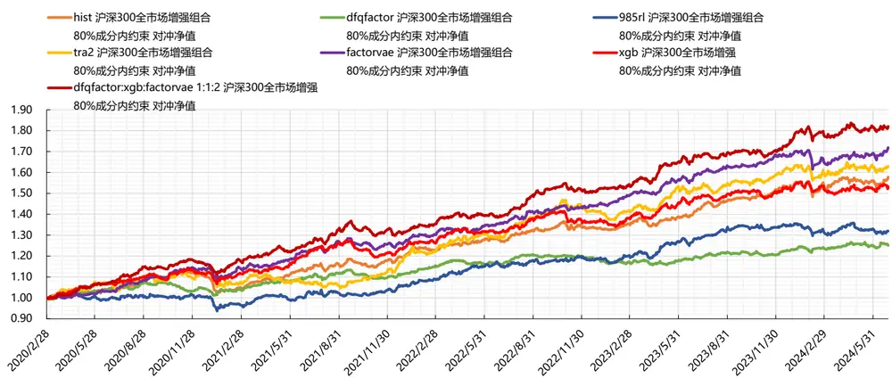
数据来源：东方证券研究所 & Wind资讯

DFQ-XGB 模型下的沪深 300 指增组合，相对基准沪深 300 指数，在市值、信息确定性维度有明显的负向暴露，在估值、Trend 维度具有明显的正向暴露，但在流动性、波动率、非线性市值、SOE 等维度都没有明显暴露，说明偏向于配置小市值、低信息确定性、低估值、高动量的股票。

图 62：沪深 300股票池指数增强组合相对基准的平均风格暴露（2020.1.1-2024.6.30）
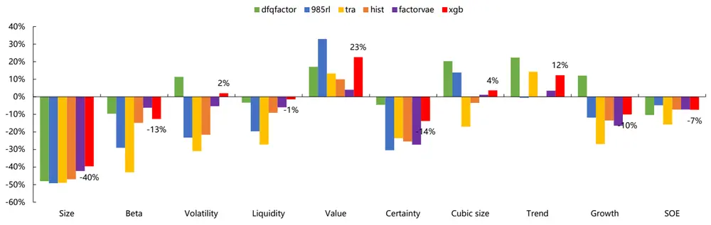
数据来源：东方证券研究所 & Wind资讯

## 5.3 中证500指数增强组合表现

DFQ-XGB 模型所得到的合成因子在中证 500 指增组合中表现十分优异，信息比为单模型中最高：（1）整体表现：2020 年以来年化信息比达到 2.14，年化对冲收益 14.59%，年化跟踪误差 6.46%，单边年换手 9.49 倍。（2）回撤情况：超额收益最大回撤发生在 2021.11.10，为5.94%，回撤 2个月即恢复。（3）分年表现：2020-2022每年取得 10%以上的正超额， 2023年超额 4%，2024年前 6个月超额 7.91%，除2月份负超额以外，其他月份均取得正超额。

将 XGB、TRA 两个模型等权结合使用，可以取得更优异的表现，表现超越任何一个单一模型：（1）整体表现：2020年以来年化信息比2.31，年化对冲收益17.65%，年化跟踪误差7.15%，单边年换手 8.63 倍。（2）回撤情况：超额收益最大回撤发生在 2024.2.7，为 8.36%，回撤 5 个月即恢复。（3）分年表现：2020-2023 每年均取得 10%以上的正超额， 2024 年前 6 个月超额5.86%。

图 63：中证 500 股票池指数增强组合绩效表现（2020.1.1-2024.6.30）

| 20200101-20240628 500月频 |  | dfqfactor | 985rl | tra | hist | factorvae | xgb | tra:xgb 1:1 |
| --- | --- | --- | --- | --- | --- | --- | --- | --- |
| 行业暴露0.02 风格暴露0.5 跟踪误差4% 买卖手续费双边千三 |  | 中证500全市场增强 80%成分内约束 | 中证500全市场增强 80%成分内约束 | 中证500全市场增强 80%成分内约束 | 中证500全市场增强 80%成分内约束 | 中证500全市场增强 80%成分内约束 | 中证500全市场增强 80%成分内约束 | 中证500全市场增强 80%成分内约束 |
| 绩效指标 | 信息比（年化） | 1.29 | 0.86 | 1.61 | 1.63 | 1.34 | 2.14 | 2.31 |
|  | 年化对冲收益 | 7.00% | 5.68% | 12.58% | 11.00% | 8.96% | 14.59% | 17.65% |
|  | 跟踪误差（年化） | 5.36% | 6.74% | 7.54% | 6.53% | 6.58% | 6.46% | 7.15% |
|  | 对冲收益最大回撤 | -13.18% | -10.10% | -7.80% | -8.46% | -8.65% | -5.94% | -8.36% |
|  | 对冲收益最大回撤出现时间点 | 20230504 | 20240606 | 20240207 | 20240606 | 20240606 | 20211110 | 20240207 |
|  | 对冲收益最大回撤恢复天数 | 315 | inf | 142 | inf | inf | 58 | 142 |
|  | 单边换手率（年) | 4.91 | 9.56 | 7.91 | 9.63 | 9.67 | 9.49 | 8.63 |
|  | 持股数量 | 82.98 | 79.07 | 64.48 | 101.72 | 91.33 | 81.52 | 73.63 |
|  | 成分内股票占比 | 80.03% | 80.17% | 79.86% | 80.13% | 80.07% | 80.03% | 79.98% |
|  | 2020 | 7.47% | 6.26% | 13.95% | 11.21% | 14.59% | 10.06% | 13.37% |
| 分年收益 | 2021 | 8.66% | 5.13% | 15.28% | 17.98% | 19.21% | 29.36% | 23.47% |
|  | 2022 | 4.97% | 13.56% | 11.11% | 13.75% | 4.38% | 12.60% | 18.79% |
|  | 2023 | -1.04% | 5.19% | 10.80% | 7.51% | 6.83% | 3.98% | 14.50% |
|  | 2024 | 10.36% | -4.89% | 3.06% | -2.26% | -4.94% | 7.91% | 5.86% |
|  | 202401 | 4.41% | 2.68% | 2.35% | 3.07% | 0.44% | 6.10% | 4.67% |
| 分月收益 | 202402 | 0.26% | -4.39% | -4.11% | -5.18% | -5.28% | -3.96% | -5.33% |
|  | 202403 | 2.96% | 1.25% | 1.67% | 0.77% | 0.44% | 0.17% | 1.43% |
|  | 202404 | 1.35% | -2.41% | 0.71% | -0.46% | -0.39% | 0.29% | 0.45% |
|  | 202405 | 0.48% | -0.46% | 1.41% | -0.71% | 0.61% | 1.72% | 1.78% |
|  | 202406 | 0.60% | -1.44% | 0.65% | -0.11% | -0.88% | 3.06% | 2.31% |

数据来源：东方证券研究所 & Wind资讯

图 64：中证 500 股票池指数增强组合超额净值（2020.1.1-2024.6.30）
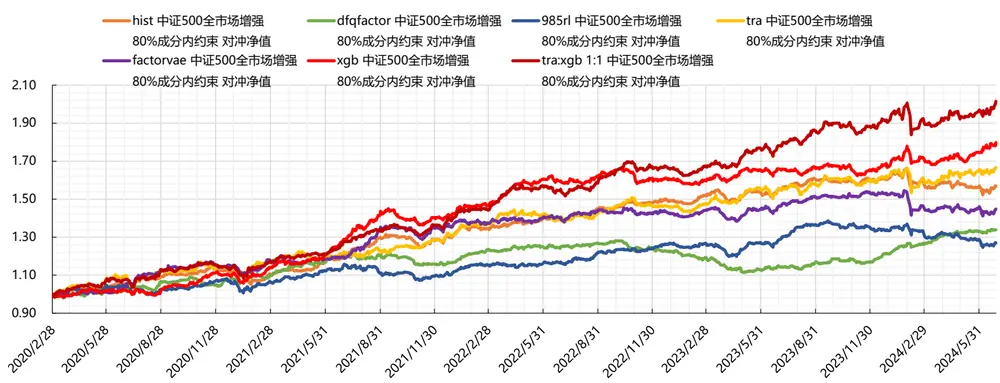
数据来源：东方证券研究所 & Wind资讯
有关分析师的申明，见本报告最后部分。其他重要信息披露见分析师申明之后部分，或请与您的投资代表联系。并请阅读本证券研究报告最后一页的免责申明。

DFQ-XGB 模型下的中证 500 指增组合，相对基准中证 500 指数，在市值、beta、波动率、流动性维度有负向暴露，但整体负暴露比其他网络模型要少。在估值、Trend 维度有正向暴露，整体暴露高于其他网络模型。在信息确定性、成长、SOE维度无明显暴露。说明偏向于配置小市值、低 beta、低波动、低流动性、低估值、高动量的股票。

图 65：中证 500股票池指数增强组合相对基准的平均风格暴露（2020.1.1-2024.6.30）
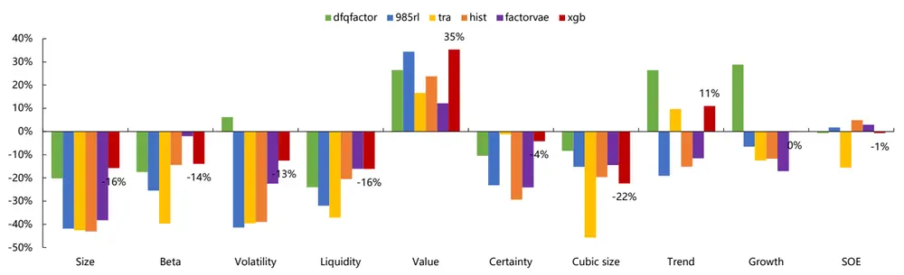
数据来源：东方证券研究所 & Wind资讯

## 5.4 中证1000指数增强组合表现

DFQ-XGB模型所得到的合成因子在中证1000指增组合中表现十分优异，信息比为单模型中最高：（1）整体表现：2020 年以来年化信息比达到 3.17，年化对冲收益 21.73%，年化跟踪误差 6.28%，单边年换手 9.94 倍。（2）回撤情况：超额收益最大回撤发生在 2021.11.11，为6.09%，回撤 46 天即恢复。（3）分年表现：2020-2023 每年取得 15%以上的正超额， 2024 年前 6个月超额 5.26%。

将 XGB、HIST 两个模型等权结合使用，可以取得更优异的表现，表现超越任何一个单一模型：（1）整体表现：2020 年以来年化信息比达到 3.04，年化对冲收益 24.06%，年化跟踪误差7.18%，单边年换手 10.10 倍。（2）回撤情况：超额收益最大回撤发生在 2024.5.14，为 7.63%。（3）分年表现：2020-2023 每年均取得 20%以上的正超额， 2024 年前 6 个月超额收益为-3.3%。

图 66：中证 1000 股票池指数增强组合绩效表现（2020.1.1-2024.6.30）

| 20200101-20240628 1000月频 |  | dfqfactor 中证1000全市场增强 | 985rl | tra | hist | factorvae | xgb | hist:xgb 1:1 |
| --- | --- | --- | --- | --- | --- | --- | --- | --- |
| 行业暴露0.02 风格暴露0.5 跟踪误差4% 买卖手续费双边千三 |  |  | 中证1000全市场增强 80%成分内约束 | 中证1000全市场增强 80%成分内约束 | 中证1000全市场增强 80%成分内约束 | 中证1000全市场增强 80%成分内约束 | 中证1000全市场增强 80%成分内约束 | 中证1000全市场增强 80%成分内约束 |
| 绩效指标 | 信息比（年化） | 80%成分内约束 1.26 | 1.11 | 2.27 | 2.94 | 2.08 | 3.17 | 3.04 |
|  | 年化对冲收益 | 7.97% | 7.95% | 17.71% | 21.57% | 15.77% | 21.73% | 24.06% |
|  | 跟踪误差（年化） |  |  | 7.32% |  |  |  |  |
|  |  | 6.25% | 7.10% |  | 6.74% | 7.17% | 6.28% | 7.18% |
|  | 对冲收益最大回撤 对冲收益最大回撤出现时间点 | -15.32% | -6.65% | -7.31% 20210915 | -6.77% | -11.35% | -6.09% | -7.63% |
|  | 对冲收益最大回撤恢复天数 | 20211215 | 20210113 |  | 20240617 | 20240606 | 20211111 | 20240514 |
|  |  | 740 5.39 | 43 | 62 | inf | inf | 46 | inf |
|  | 单边换手率（年） | 102.54 | 10.06 | 8.77 | 10.05 | 10.19 | 9.94 | 10.10 |
|  | 持股数量 成分内股票占比 | 80.03% | 100.70 80.14% | 95.37 79.98% | 124.37 80.11% | 111.15 | 99.22 80.00% | 91.61 |
|  | 2020 | 8.14% |  | 23.85% |  | 80.05% |  | 80.15% |
| 分年收益 |  |  | 14.87% |  | 26.46% | 15.04% | 23.97% | 32.77% |
|  | 2021 | -6.36% | 7.63% | 13.53% | 30.48% | 26.75% | 29.92% | 33.01% |
|  | 2022 | 12.39% | 7.55% | 19.47% | 20.66% | 17.40% | 18.09% | 20.54% |
|  | 2023 | 5.37% | 5.59% | 13.94% | 20.11% | 18.44% | 16.62% | 23.07% |
|  | 2024 | 16.07% | -0.95% | 5.53% | -2.95% | -7.27% | 5.26% | -3.30% |
|  | 202401 | 4.80% | 2.86% | 3.53% | 0.45% | -1.40% | 5.19% | 2.27% |
| 分月收益 | 202402 | -0.23% | -4.11% | -4.44% | -3.63% | -5.21% | -2.59% | -4.76% |
|  | 202403 | 5.42% | 2.11% | 2.91% | 1.14% | -1.09% | 0.29% | 0.06% |
|  | 202404 | 0.09% | -1.06% | 0.74% | -0.72% | -1.30% | -1.07% | -1.93% |
|  | 202405 | 1.27% | 0.11% | 1.23% | 0.73% | 1.34% | 2.98% | 2.21% |
|  | 202406 | 3.50% | -0.72% | 0.82% | -1.43% | 0.06% | 0.11% | -1.52% |

数据来源：东方证券研究所 & Wind资讯

有关分析师的申明，见本报告最后部分。其他重要信息披露见分析师申明之后部分，或请与您的投资代表联系。并请阅读本证券研究报告最后一页的免责申明。

图 67：中证 1000 股票池指数增强组合超额净值（2020.1.1-2024.6.30）
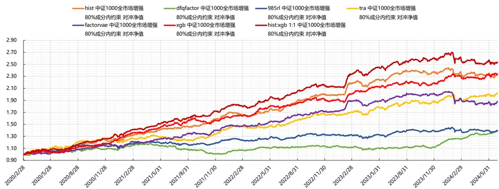
数据来源：东方证券研究所 & Wind资讯

DFQ-XGB 模型下的中证 1000 指增组合，相对基准中证 1000 指数，在流动性、波动率、非线性市值维度有明显的负向暴露，在估值维度具有明显的正向暴露，但在市值、beta、信息确定性、trend、成长、SOE 等维度都没有明显暴露。说明偏向于配置低波动、低流动性、低估值的股票。

图 68：中证 1000股票池指数增强组合相对基准的平均风格暴露（2020.1.1-2024.6.30）
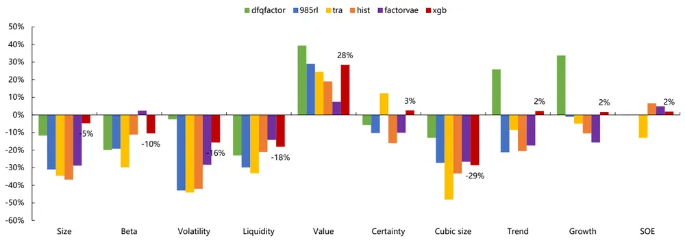
数据来源：东方证券研究所 & Wind资讯

## 六、 总结

通过深入探索树模型的训练细节，我们发现树模型可以通过有效的调整达到不亚于神经网络的效果。更为重要的是，由于树模型和神经网络在架构上的本质差异，二者的结果具有低相关性，结合使用时能实现“1+1>2”的效果。

树模型的训练细节：（1）输入特征的构造十分关键。树模型本身为截面学习模型，并不具备处理时序数据的内在结构，需要人工构造特征来捕捉时间依赖性。以纯截面70特征为输入的模型表现，明显弱于以添加时序信息的 430 特征为输入的模型，IC 低 1pct 以上，RANKIC 低接近2pct，ICIR 和 RANKICIR 也有较大差距，多头年化超额低 7pct 以上。（2）训练前进行参数调优非常重要。使用 Optuna 调参方法，调参后模型在测试集上的效果有明显提高，IC 和 RANKIC 提高近 1pct，多头年化超额提高近 4pct。（3）随机种子对树模型的整体影响较小。不同种子下得到的模型表现较为接近，IC和RANKIC相差都在 0.5pct以内，多头年化超额相差 2pct以内。

树模型的训练结果：（1）在各个股票池中，DFQ-XGB模型都能获得与神经网络模型相当甚至更优的绩效。在中证全指股票池中，DFQ-XGB模型所得到因子的稳定性最强，IC、RANKICIR、多头日度超额收益夏普比均为最高，测试集上 IC 达到 12.96%，RANKIC 达到 15.43%，20 分组多头年化超额达到 29.58%。（2）在各个股票池中，DFQ-XGB 模型 2024 年的表现都很突出，尤其多头端。在中证全指股票池中，DFQ-XGB 模型 2024 年的多头表现最优，2024 年 IC 达到15.75%，20 分组多头年化超额 35.24%，最大回撤 5.8%。

多模型集成增量：（1）DFQ-XGB模型所得因子与其他模型的相关性都比较低。在中证全指股票池中，DFQ-XGB模型与其他模型日度多头超额收益的相关性在50%以下。（2）在中证全指股票池中，DFQ-XGB模型与 DFQ-HIST模型等权合成后效果更佳，可达到 1+1>2的集成效果。测试集上IC达到13.39%，RANKIC达到17.19%，20分组多头日度超额年化收益率达到36.12%。

Top100组合表现：在中证全指内，使用DFQ-XGB模型构建的top100组合，绩效表现优于其他模型。2020年以来年化绝对收益达到 25.68%，年化夏普比达到 1.17，最大回撤27.28%。

指数增强组合表现：DFQ-XGB 模型所得到的合成因子在各宽基指增模型中的应用效果都很好，并且可以和其他模型集成使用，集成后模型表现均可超越所有单模型。（1）沪深 300 指数增强组合表现：将 XGB、dfqfactor、FactorVAE 三个模型得分按照 1:1:2 的权重结合使用， 2020年以来年化信息比达到2.53，年化对冲收益14.90%，年化跟踪误差5.56%。（2）中证500指数增强组合表现：将 XGB、TRA两个模型等权结合使用， 2020年以来年化信息比 2.31，年化对冲收益17.65%。（3）中证1000指数增强组合表现：将XGB、HIST两个模型等权结合使用，2020年以来年化信息比达到 3.04，年化对冲收益 24.06%。

## 参考文献

1. Zhang C, Li Y, Chen X, et al. DoubleEnsemble: A new ensemble method based on sample reweighting and feature selection for financial data analysis[C]//2020 IEEE Internationa Conference on Data Mining (ICDM). IEEE, 2020: 781-790.

## 风险提示

1. 量化模型基于历史数据分析，未来存在失效风险，建议投资者紧密跟踪模型表现。

2. 极端市场环境可能对模型效果造成剧烈冲击，导致收益亏损。

有关分析师的申明，见本报告最后部分。其他重要信息披露见分析师申明之后部分，或请与您的投资代表联系。并请阅读本证券研究报告最后一页的免责申明。

## Tabl e_Disclai mer 分析师申明

每位负责撰写本研究报告全部或部分内容的研究分析师在此作以下声明：

分析师在本报告中对所提及的证券或发行人发表的任何建议和观点均准确地反映了其个人对该证券或发行人的看法和判断；分析师薪酬的任何组成部分无论是在过去、现在及将来，均与其在本研究报告中所表述的具体建议或观点无任何直接或间接的关系。

## 投资评级和相关定义

报告发布日后的12个月内行业或公司的涨跌幅相对同期相关证券市场代表性指数的涨跌幅为基准（A 股市场基准为沪深 300 指数，香港市场基准为恒生指数，美国市场基准为标普 500 指数）；

## 公司投资评级的量化标准

买入：相对强于市场基准指数收益率 15%以上；

增持：相对强于市场基准指数收益率 5%～15%；

中性：相对于市场基准指数收益率在-5%～+5%之间波动；

减持：相对弱于市场基准指数收益率在-5%以下。

未评级 —— 由于在报告发出之时该股票不在本公司研究覆盖范围内，分析师基于当时对该股票的研究状况，未给予投资评级相关信息。

暂停评级 —— 根据监管制度及本公司相关规定，研究报告发布之时该投资对象可能与本公司存在潜在的利益冲突情形；亦或是研究报告发布当时该股票的价值和价格分析存在重大不确定性，缺乏足够的研究依据支持分析师给出明确投资评级；分析师在上述情况下暂停对该股票给予投资评级等信息，投资者需要注意在此报告发布之前曾给予该股票的投资评级、盈利预测及目标价格等信息不再有效。

## 行业投资评级的量化标准：

看好：相对强于市场基准指数收益率 5%以上；

中性：相对于市场基准指数收益率在-5%～+5%之间波动；

看淡：相对于市场基准指数收益率在-5%以下。

未评级：由于在报告发出之时该行业不在本公司研究覆盖范围内，分析师基于当时对该行业的研究状况，未给予投资评级等相关信息。

暂停评级：由于研究报告发布当时该行业的投资价值分析存在重大不确定性，缺乏足够的研究依据支持分析师给出明确行业投资评级；分析师在上述情况下暂停对该行业给予投资评级信息，投资者需要注意在此报告发布之前曾给予该行业的投资评级信息不再有效。

## HeadertTabl e_Discl ai mer 免责声明

本证券研究报告（以下简称“本报告”）由东方证券股份有限公司（以下简称“本公司”）制作及发布。

。本公司不会因接收人收到本报告而视其为本公司的当然客户。本报告的全体接收人应当采取必要措施防止本报告被转发给他人。

本报告是基于本公司认为可靠的且目前已公开的信息撰写，本公司力求但不保证该信息的准确性和完整性，客户也不应该认为该信息是准确和完整的。同时，本公司不保证文中观点或陈述不会发生任何变更，在不同时期，本公司可发出与本报告所载资料、意见及推测不一致的证券研究报告。本公司会适时更新我们的研究，但可能会因某些规定而无法做到。除了一些定期出版的证券研究报告之外，绝大多数证券研究报告是在分析师认为适当的时候不定期地发布。

在任何情况下，本报告中的信息或所表述的意见并不构成对任何人的投资建议，也没有考虑到个别客户特殊的投资目标、财务状况或需求。客户应考虑本报告中的任何意见或建议是否符合其特定状况，若有必要应寻求专家意见。本报告所载的资料、工具、意见及推测只提供给客户作参考之用，并非作为或被视为出售或购买证券或其他投资标的的邀请或向人作出邀请。

本报告中提及的投资价格和价值以及这些投资带来的收入可能会波动。过去的表现并不代表未来的表现，未来的回报也无法保证，投资者可能会损失本金。外汇汇率波动有可能对某些投资的价值或价格或来自这一投资的收入产生不良影响。那些涉及期货、期权及其它衍生工具的交易，因其包括重大的市场风险，因此并不适合所有投资者。

在任何情况下，本公司不对任何人因使用本报告中的任何内容所引致的任何损失负任何责任，投资者自主作出投资决策并自行承担投资风险，任何形式的分享证券投资收益或者分担证券投资损失的书面或口头承诺均为无效。

本报告主要以电子版形式分发，间或也会辅以印刷品形式分发，所有报告版权均归本公司所有。未经本公司事先书面协议授权，任何机构或个人不得以任何形式复制、转发或公开传播本报告的全部或部分内容。不得将报告内容作为诉讼、仲裁、传媒所引用之证明或依据，不得用于营利或用于未经允许的其它用途。

经本公司事先书面协议授权刊载或转发的，被授权机构承担相关刊载或者转发责任。不得对本报告进行任何有悖原意的引用、删节和修改。

提示客户及公众投资者慎重使用未经授权刊载或者转发的本公司证券研究报告，慎重使用公众媒体刊载的证券研究报告。

## 东方证券研究所

地址： 上海市中山南路 318 号东方国际金融广场 26 楼

电话：021-63325888

传真：021-63326786

网址： www.dfzq.com.cn