# KD-Ensemble：基于知识蒸馏的 alpha 因子挖掘模型

因子选股系列之一〇八

## 研究结论

## 模型改进思路

考虑到在基础版本中我们使用的 l2数据集中绝大部分人工因子主要是基于大单构建的，而小单和盘口数据所蕴含的信息量也十分巨大，因此本文将构建一些基于小单和盘口的因子以对 l2数据集进行信息补充，从而使得 l2数据集反映的日内信息更加充分从而给全模型带来增量效果。

⚫基于知识蒸馏的思想在因子单元加权阶段将树模型和神经网络进行集成，先通过教师模型对信息进行过滤，之后将过滤得到的有效信息提供给学生模型进行训练，从而让学生模型能更有效的学习。通过知识蒸馏方法，我们希望集成后的模型既能继承树模型能较好处理分类型数据和泛化能力强的优势，又能继承神经网络能够较好拟合极度非线性函数的优势。

⚫ 今年年初基于量价的机器学习因子出现了较大回撤，原因在于模型预测的市场风格与真实环境出现了较大偏差，因此我们在 alpha因子生成阶段加入风险因子生成部分，并二者相互正交从而抑制 alpha因子中这种可能带来较大回撤的轮动成分。

## 小单和盘口因子的实验结论

⚫ 小单早盘占比、小单早盘净流入和小单收益率因子在各个股票池上表现均较好，但按分位数划分的表现整体强于按金额划分。小单早盘占比因子在大盘股上的表现整体强于小盘股。

按照中位数划分的小单占比因子在中证全指上 RankIC 均值接近 0，但绝对值均值13.22%，胜率接近 50%，对未来收益有着较好的解释能力，但预测方向波动较大，可认为该因子可视作一个较好的刻画短期风险的风险因子。

## 合成因子的实验结论

基于知识蒸馏合成打分2018年以来在中证全指上周频RankIC均值和年化ICIR分别可达 16.69%和 8.00，top 组年化超额可达 51.73%；在沪深 300、中证 500、中证1000 三个指数上 RankIC 均值分别为 12.22%、12.39%、15.35%，分十组多头年化超额分别为 34.16%、31.38%、41.81%，相较于基准模型，各宽基指数股票池新模型生成因子的选股能力均有明显提升效果。

⚫ 基于风险中性模型生成打分在中证全指上周频RankIC和年化ICIR分别为15.83%和8.15，多头组合年化超额可达 47.96%，该模型 2024 年表现十分突出多头组合截至7月 31日累计超额 29.20%，最大回撤仅-7.48%，稳定性较强。

本文生成因子也可以直接应用于指数增强策略，在各宽基指数上均能获得显著的超额收益，在成分股80%限制和周单边换手率约束为20%约束下，2018年以来，新模型打分构建的 Barra风控组合在沪深 300、中证 500和中证 1000增强策略上年化超额收益率分别为 16.88%、24.02%和 31.38%。

## 风险提示

⚫ 量化模型失效

⚫ 极端市场造成冲击，导致亏损

报告发布日期

2024 年 08 月 19 日

杨怡玲

yangyiling@orientsec.com.cn

执业证书编号：S0860523040002

陶文启 taowenqi@orientsec.com.cn

非线性市值风控全攻略：——因子选股系 2024-05-27列之一〇五

融合基本面信息的 ASTGNN 因子挖掘模 2024-05-27型：——因子选股系列之一〇四

基本面因子的重构：——因子选股系列之 2024-03-21一〇二

自适应时空图网络周频 alpha 模型：—— 2024-02-28因子选股系列之一〇一

周频多因子行业轮动模型：——量化策略 2024-01-21研究之 七

基于残差网络的端到端因子挖掘模型：— 2023-08-24—因子选股系列之九十六

基于循环神经网络的多频率因子挖掘：— 2023-06-06—因子选股系列之九十一

## 一、引言

随着机器学习学科的高速发展，以神经网络、决策树为主的机器学习模型在量化领域的应用受到相关研究人员的广泛关注，前期报告《基于循环神经网络的多频率因子挖掘》、《基于残差网络端到端因子挖掘模型》、《自适应图神经网络周频 alpha 模型》和《融合基本面信息图神经网络因子挖掘模型》中，我们利用 循环神经网络（RNN）、残差网络（ResNets）、自适应图神经网络（ASTGNN）和决策树模型搭建了端到端AI量价模型框架，这套框架的输入是个股最原始的 K 线数据、个股的基本面特征以及一些人工合成的日频 level2 因子等，而最终的输出则是具有较强选股能力的 alpha 因子。我们将其该框架生成的因子应用于选股策略。回测结果显示该模型生成的 alpha因子在样本外有着十分显著的选股效果。

这套 AI 量价模型框架主要是基于多个不同频率的量价数据集以及基本面数据集搭建的，这些数据集分别是周度（week）、日度（day）、分钟线（ms）、Level-2（l2）数据集以及基本面数据集（fund）。其中周度和分钟线数据集我们分别是将每五个交易日日 K 线和每日半小时 K 线形成矩阵数据，然后将这些矩阵通过ResNets提取出相应时间频度的特征向量，接着将ResNets提取的特征向量按照时间先后输入到 RNN 模型中进行时序学习，最终获得相应数据集的 alpha 因子。数据集day则是直接将预处理好的日K线数据通过RNN模型提取出相应的alpha因子。数据集 fund 中基本面特征由于其噪声含量高、离群值点较多，我们则是采用《基本面因子重构》中做法，将原始基本面因子在每个交易日截面对数回归取残差对因子值进行重构，接着再经过一定的预处理后将数据直接输入 RNN 模型中进行特征提取。量价数据集中只有 Level-2 数据集是一些人工合成的日频 alpha 因子，这些 alpha 因子主要是基于大单所构建的。

整个 AI量价模型框架分为三个部分，数据预处理、提取因子单元、因子单元动态加权。数据预处理包括对输入特征进行去极值、标准化和补充缺失值三个步骤，而提取因子单元则是通过将预处理好后的特征或者残差网络提取得到的特征通过RNN和图模型转化成一系列具有一定选股能力的弱因子，因子加权则是利用决策树对这些不同数据集上生成的弱因子进行短周期非线性加权形成模型最终的个股得分，部分整个流程如下图所示：

图 1：端到端 AI量价模型框架
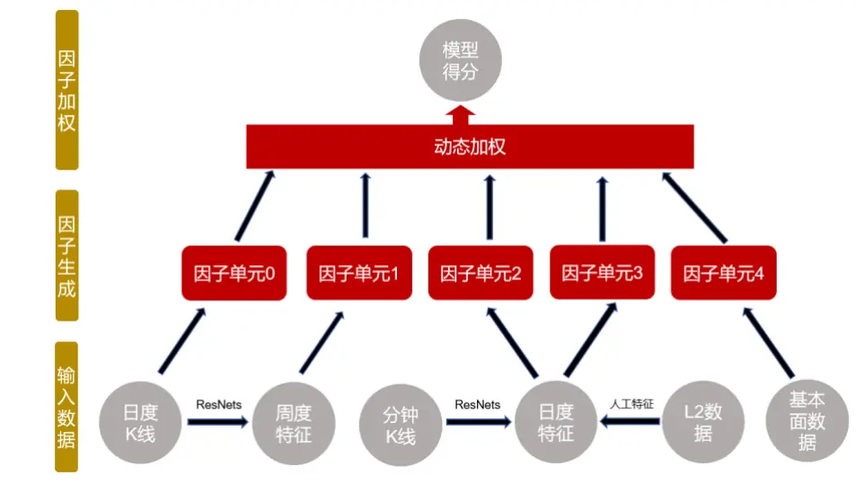
数据来源：wind、上交所、深交所、东方证券研究所

有关分析师的申明，见本报告最后部分。其他重要信息披露见分析师申明之后部分，或请与您的投资代表联系。并请阅读本证券研究报告最后一页的免责申明。

本文则是在上述量价模型框架的基础上，针对原模型可能存在的一些不足做了以下三个方面的改进：

1. 考虑到 l2 数据集中使用的人工因子主要是基于大单构建的而小单和盘口数据所蕴含的信息量也十分巨大，因此本文将构建一些基于小单和盘口的因子以对 l2 数据集进行补充，从而使得 l2数据集反映的日内信息更加充分从而给全模型带来增量。

2. 考虑到因子单元动态加权使用的是决策树模型，相较于神经网络，决策树优点在于泛化能力较强，且适合处理分类数据，但其拟合能力相对神经网络较弱，且只能拟合局部线性函数，对于极度非线性部分的函数关系，神经网络可能更有优势。基于此想法本文采用了知识蒸馏方法来对树模型和神经网络进行集成以捕捉 alpha 因子与未来收益率局部线性与非线性函数依赖关系，从而使得全模型有更好的表达能力。

3. 今年年初各类基于量价的机器学习因子出现了较大回撤，这个回撤原因在于模型学习出的风格轮动信息与市场真实环境出现了较大偏差，因此我们在 alpha 因子生成阶段加入风险因子生成部分，并让 alpha 因子与风险因子相互正交从而抑制这种带来风险的轮动成分。

## 二、Level2数据集的扩充

## 2.1 回测说明

本章的回测结果中，最终测试的因子值为计算得到的原始因子滚动二十个交易日求平均，因子值各项指标计算方法如下：

1. RankIC 均值是当天因子与隔日未来十日收益率（即 T+1~T+11 收盘）序列进行计算的，并且每隔十个交易日计算一次，最终将这个 RankIC 序列取平均得到的。ICIR 则是根据上述RankIC序列均值除以序列标准差计算得到的。

2. 分组测试结果中，多空测试时为多头组平均收益减去空头组平均收益计算得到，周度调仓，次日收盘价成交并且不考虑交易成本计算得到的。周均单边换手率是根据多头组持仓计算得到，而最大回撤和年化波动率则是根据 top组超额收益净值计算得到的。

## 2.2 小单类因子

在Level 2逐笔成交明细数据中，每一笔成交信息包含成交时间、成交价格、成交股数、买卖单编号、成交类型、交易方向等等。我们首先将表格中撤单数据、盘前（9:30 之前）和尾盘集合竞价（14:59~15:00）成交数据剔除，接着按照每笔成交买卖单挂单时间确定该单是主动买入还是主动卖出，接着按照单号进行聚合得到每一个主动单的信息。

在获得每一个主动单信息之后，大小单划分规则通常有两类，第一种按照具体每笔金额大小来进行大小单的划分，比如在Wind等常用行情软件的大小单界定规则中，通常将挂单金额小于4万元的归类为小单、挂单金额大于 100 万元的归类为超大单。对于投资者而言相同的金额用于购买不同的股票所带来的的效用是相同的，因此站在投资者的角度考虑，按照金额进行大小单的划分是合理的。但这样基于绝对金额阈值划分大小单对于股票自身而言却有着片面性。比如相同的金额的订单对于大市值股票而言可能只能引起股价轻微的波动，对于小市值股票而言带来的股价波动可能十分剧烈。另外一方面，对于高价股来说，购买一手所需金额本身就十分巨大，因此按照金额阈值划分大小单可能对于具有不同属性特征的股票来说并不合理。而第二种则是根据股票每日每笔成交金额的分布来划分大小单，这种做法有利于区分不同市值不同股价的股票因而站在股票自身角度来看可能较为合理。

本节我们将展示分别按照成交金额（即每单成交金额不足 40000 元则视为小单）和股票分布（每单成交金额小于当天所有单成交金额中位数则视作小单）来划分大小单从而构建因子，并对比这两种方式构建因子的选股绩效。

我们首先构造小单早盘占比因子，该因子的定义如下（该因子方向为负向）：

9:30 至 10:00 归属于主动小单的成交额

$$
全天归属于主动小单的成交额
$$

图 3：小单早盘占比因子表现（中位数）原始因子值
图 2：小单早盘占比因子表现（金额）原始因子值

|  | RanklC |  |  | 多空组合 |  |  |  |
| --- | --- | --- | --- | --- | --- | --- | --- |
|  | 周度均值 | ICIR | 胜率 | 年化收益率 | 夏普比率 | 最大回撤 | 多头换手率 |
| 沪深300 | 7.11% | 0.41 | 66.54% | 20.76% | 1.02 | -32.50% | 26.13% |
| 中证500 | 6.27% | 0.48 | 69.26% | 18.27% | 1.07 | -29.41% | 28.22% |
| 中证1000 | 6.81% | 0.56 | 73.54% | 26.04% | 1.56 | -22.97% | 29.52% |
| 中证全指 | 6.36% | 0.47 | 71.21% | 21.64% | 1.18 | -27.15% | 26.96% |

行业市值中性化

|  | RanklC |  |  | 多空组合 |  |  |  |
| --- | --- | --- | --- | --- | --- | --- | --- |
|  | 周度均值 ICIR |  | 胜率 | 年化收益率 | 夏普比率 | 最大回撤 | 多头换手率 |
| 沪深300 | 7.23% |  | 0.44 65.37% | 20.06% | 1 | -35.71% | 27.47% |
| 中证500 | 6.71% | 0.54 69.26% |  | 21.84% | 1.27 | -27.81% | 29.01% |
| 中证1000 | 7.03% | 0.6 | 74.71% | 32.09% | 1.96 | -19.60% | 30.51% |
| 中证全指 | 6.42% | 0.5 | 71.60% | 26.89% | 1.53 | -24.11% | 27.42% |

|  | RankiC |  |  | 多空组合 |  |  |  |
| --- | --- | --- | --- | --- | --- | --- | --- |
|  | 周度均值 | ICIR | 胜率 | 年化收益率 | 夏普比率 | 最大回撤 | 多头换手率 |
| 沪深300 | 5.74% | 0.59 | 76.26% | 22.69% | 1.55 | -24.23% | 29.41% |
| 中证500 | 5.52% | 0.5 | 67.70% | 20.59% | 1.41 | -16.76% | 26.97% |
| 中证1000 | 6.71% | 0.75 | 77.04% | 29.46% | 2.17 | -21.22% | 30.74% |
| 中证全指 | 6.64% | 0.82 | 82.10% | 28.80% | 2.19 | -18.76% | 30.50% |

数据来源：wind、上交所、深交所、东方证券研究所

行业市值中性化

|  | RanklC |  |  | 多空组合 |  |  |  |
| --- | --- | --- | --- | --- | --- | --- | --- |
|  | 周度均值 | ICIR | 胜率 | 年化收益率 | 夏普比率 | 最大回撤 | 多头换手率 |
| 沪深300 | 5.45% | 0.5 | 67.70% | 22.32% | 1.45 | -29.39% | 28.15% |
| 中证500 | 6.12% | 0.68 | 75.88% | 24.76% | 1.73 | -20.49% | 29.43% |
| 中证1000 | 6.90% | 0.81 | 80.93% | 35.18% | 2.64 | -17.32% | 31.17% |
| 中证全指 | 6.63% | 0.88 | 80.54% | 32.99% | 2.7 | -17.31% | 30.24% |

数据来源：wind、上交所、深交所、东方证券研究所

图 4：小单早盘占比因子（金额）中证全指上表现分组年化超额收益
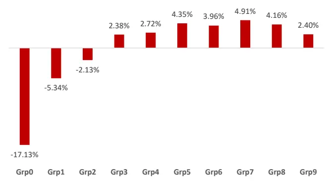

图 5：小单早盘占比因子（中位数）中证全指上表现分组年化超额收益
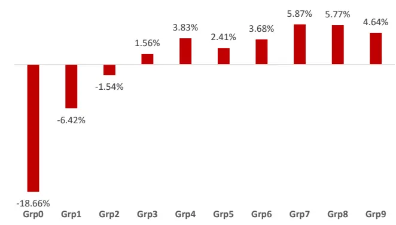

时序 RankIC 曲线
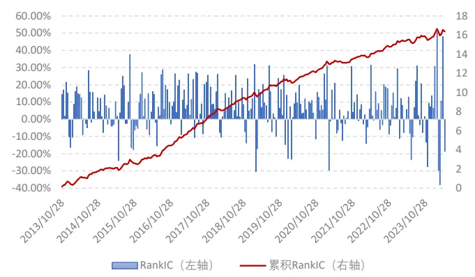
数据来源：wind、上交所、深交所、东方证券研究所

时序 RankIC 曲线
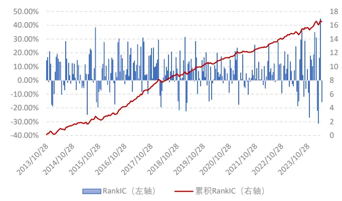
数据来源：wind、上交所、深交所、东方证券研究所

小单早盘净流入因子的定义如下（该因子方向为负向）：

9:30 至 10:00（主动买入小单的成交额−主动卖出小单的成交额）

全天归属于主动小单的成交额

图 6：小单早盘净流入因子表现（金额）原始因子值

|  | RanklC |  |  | 多空组合 |  |  |  |
| --- | --- | --- | --- | --- | --- | --- | --- |
|  | 周度均值 ICIR |  | 胜率 | 年化收益率 | 夏普比率 | 最大回撤 | 多头换手率 |
| 沪深300 | 2.80% | 0.22 | 2 60.31% | 12.93% | 0.94 | -29.83% | 36.04% |
| 中证500 | 2.00% | 0.2 | 57.59% | 11.47% | 0.99 | -17.77% | 38.09% |
| 中证1000 | 1.52% | 0.17 | 56.81% | 11.62% | 1.09 | -24.92% | 36.87% |
| 中证全指 | 1.64% | 0.19 | 57.98% | 9.45% | 1.08 | -41.85% | 36.71% |

行业市值中性化

图 7：小单早盘净流入因子表现（中位数）原始因子值

|  | RanklC |  |  | 多空组合 |  |  |  |
| --- | --- | --- | --- | --- | --- | --- | --- |
|  | 周度均值 ICIR |  | 胜率 | 年化收益率 | 夏普比率 | 最大回撤 | 多头换手率 |
| 沪深300 | 4.54% | 0.33 | 62.65% | 22.81% | 1.52 | -18.89% | 37.12% |
| 中证500 | 3.26% | 0.32 | 63.81% | 17.17% | 1.49 | -19.87% | 37.56% |
| 中证1000 | 2.63% | 0.28 | 66.92% | 20.45% | 1.91 | -13.99% | 36.69% |
| 中证全指 | 2.91% | 0.34 | 64.20% | 18.65% | 1.99 | -14.78% | 37.40% |

|  | RanklC |  |  | 多空组合 |  |  |  |
| --- | --- | --- | --- | --- | --- | --- | --- |
|  | 周度均值 ICIR |  | 胜率 | 年化收益率 | 夏普比率 | 最大回撤 | 多头换手率 |
| 沪深300 | 2.30% | 0.2 | 59.14% | 15.43% | 1.22 | -22.26% | 35.90% |
| 中证500 | 1.80% | 0.23 | 56.81% | 12.64% | 1.22 | -23.59% | 38.24% |
| 中证1000 | 1.30% | 0.18 | 56.03% | 12.15% | 1.33 | -24.42% | 36.63% |
| 中证全指 | 0.95% | 0.14 | 54.47% | 8.32% | 1.12 | -37.34% | 36.90% |

数据来源：wind、上交所、深交所、东方证券研究所

行业市值中性化

|  | RanklC |  |  | 多空组合 |  |  |  |
| --- | --- | --- | --- | --- | --- | --- | --- |
|  | 周度均值 | ICIR | 胜率 | 年化收益率 | 夏普比率 | 最大回撤 | 多头换手率 |
| 沪深300 | 3.54% | 0.29 | 62.26% | 21.07% | 1.54 | -20.87% | 37.68% |
| 中证500 | 3.18% | 0.33 | 61.48% | 19.51% | 1.79 | -15.88% | 38.76% |
| 中证1000 | 2.47% | 0.31 | 65.37% | 20.79% | 2.17 | -14.08% | 38.22% |
| 中证全指 | 2.28% | 0.32 | 62.65% | 17.54% | 2.2 | -13.29% | 37.86% |

数据来源：wind、上交所、深交所、东方证券研究所

小单占比因子的定义如下（该因子方向为负向）：

全天归属于主动小单的成交额全天成交额

图 8：小单占比因子表现（金额）
图 9：小单占比因子表现（中位数）
原始因子值

|  | RanklC |  |  | 多空组合 |  |  |  |
| --- | --- | --- | --- | --- | --- | --- | --- |
|  | 周度均值 ICIR |  | 胜率 | 年化收益率 | 夏普比率 | 最大回撤 | 多头换手率 |
| 沪深300 | -0.08% | -0.01 | 48.25% | -2.42% | -0.06 | -69.15% | 13.64% |
| 中证500 | 3.15% | 0.26 | 59.92% | 9.72% | 0.65 | -36.42% | 14.06% |
| 中证1000 | 3.92% | 0.36 | 66.15% | 18.18% | 1.21 | -33.11% | 15.78% |
| 中证全指 | 4.40% | 0.37 | 67.70% | 21.86% | 1.52 | -31.30% | 15.92% |

原始因子值

|  | RanklC |  |  |  | 多空组合 |  |
| --- | --- | --- | --- | --- | --- | --- |
|  | 周度均值 | 绝对值均值 | ICIR | 胜率 | 年化收益率年化波动率 | 多头换手率 |
| 沪深300 | 1.41% | 17.10% | 0.07 | 53.31% | 7.65% 20.81% | 9.61% |
| 中证500 | -0.42% | 13.50% | -0.02 | 46.30% | -1.82% 18.29% | 13.54% |
| 中证1000 | 0.48% | 12.24% | 0.03 | 49.42% | 2.13% 15.89% | 13.83% |
| 中证全指 | -0.35% | 13.22% | -0.02 | 47.47% | -2.91% 16.12% | 12.30% |

行业市值中性化

|  | RanklC |  |  | 多空组合 |  |  |  |
| --- | --- | --- | --- | --- | --- | --- | --- |
|  | 周度均值 ICIR |  | 胜率 | 年化收益率 | 夏普比率 | 最大回撤 | 多头换手率 |
| 沪深300 | 0.64% | 0.06 | 52.53% | -2.01% | -0.08 | -61.40% | 13.96% |
| 中证500 | 2.57% | 0.25 | 60.70% | 7.97% | 0.68 | -22.41% | 14.03% |
| 中证1000 | 2.77% | 0.32 | 64.98% | 15.23% | 1.47 | -24.43% | 15.94% |
| 中证全指 | 3.21% | 0.42 | 65.76% | 17.09% | 1.9 | -12.92% | 15.87% |

风格行业中性化
数据来源：wind、上交所、深交所、东方证券研究所

|  | RankIC |  |  |  | 多空组合 |  |
| --- | --- | --- | --- | --- | --- | --- |
|  | 周度均值 绝对值均值 |  | ICIR | 胜率 | 年化收益率年化波动率 | 多头换手率 |
| 沪深300 | 1.41% | 8.13% | 0.14 | 58.75% | -1.06% 13.43% | 12.00% |
| 中证500 | 1.68% | 7.07% | 0.19 | 57.20% | 2.77% 11.49% | 12.46% |
| 中证1000 | 0.11% | 6.21% | 0.01 | 52.14% | -3.65% 9.70% | 13.40% |
| 中证全指 | 0.60% | 5.45% | 0.089 | 53.70% | 0.30% 7.46% | 13.61% |

数据来源：wind、上交所、深交所、东方证券研究所

图 10：小单占比因子（金额）中证全指上表现分组年化超额收益
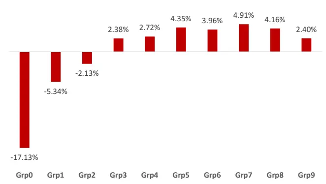
时序 RankIC 曲线

图 11：小单占比因子（中位数）中证全指上表现分组年化超额收益
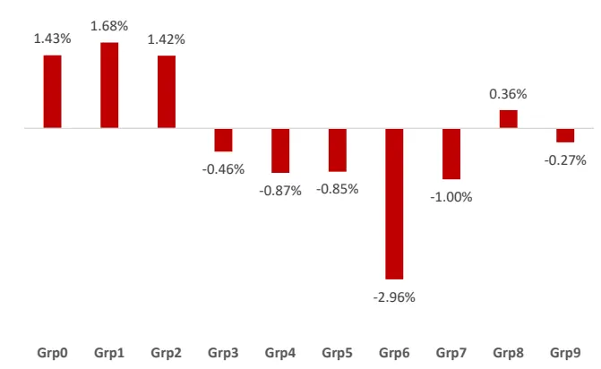
时序 RankIC 曲线

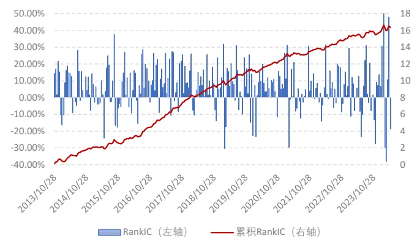
数据来源：wind、上交所、深交所、东方证券研究所

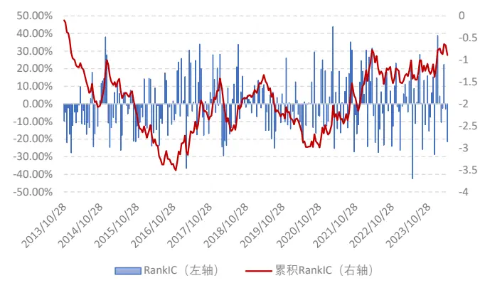
数据来源：wind、上交所、深交所、东方证券研究所

小单收益率因子的定义如下（该因子方向为负向）：

$$
\int_{0}^{T}I_{\{order\in small\:order\}}\frac{dP(t)}{P(t)}
$$

这里函数 I 表示示性函数，区间 [0,T] 表示开盘到尾盘集合竞价之前交易时间。

图 12：小单收益率因子表现（金额）
原始因子值

|  | RankIC |  |  | 多空组合 |  |  |  |
| --- | --- | --- | --- | --- | --- | --- | --- |
|  | 周度均值 ICIR |  | 胜率 | 年化收益率 | 夏普比率 | 最大回撤 | 多头换手率 |
| 沪深300 | 2.61% | 0.2 | 56.81% | 9.69% | 0.68 | -30.77% | 35.78% |
| 中证500 | 4.98% | 0.44 | 67.70% | 23.63% | 1.49 | -21.71% | 36.56% |
| 中证1000 | 5.93% | 0.54 | 69.26% | 37.68% | 0.0239 | -18.22% | 35.73% |
| 中证全指 | 6.55% | 0.66 | 74.71% | 40.37% | 0.0292 | -13.98% | 35.59% |

图 13：小单收益率因子表现（中位数）
原始因子值

|  | RanklC |  |  | 多空组合 |  |  |  |
| --- | --- | --- | --- | --- | --- | --- | --- |
|  | 周度均值 ICIR |  | 胜率 | 年化收益率 | 夏普比率 | 最大回撤 | 多头换手率 |
| 沪深300 | 3.62% | 0.27 | 61.87% | 10.34% | 0.72 | -23.88% | 34.23% |
| 中证500 | 5.19% | 0.48 | 66.93% | 24.20% | 1.66 | -17.01% | 35.73% |
| 中证1000 | 5.86% | 0.57 | 71.98% | 38.94% | 0.0149 | -16.81% | 35.26% |
| 中证全指 | 6.09% | 0.68 | 76.65% | 37.33% | 0.0292 | -13.45% | 34.30% |

行业市值中性化

|  | RanklC |  |  | 多空组合 |  |  |  |
| --- | --- | --- | --- | --- | --- | --- | --- |
|  | 周度均值 ICIR |  | 胜率 | 年化收益率 | 夏普比率 | 最大回撤 | 多头换手率 |
| 沪深300 | 2.52% | 0.21 | 58.37% | 11.69% | 0.84 | -26.97% | 34.25% |
| 中证500 | 4.09% | 0.45 | 64.98% | 22.55% | 1.61 | -20.14% | 34.03% |
| 中证1000 | 4.57% | 0.52 | 72.37% | 31.51% | 2.4 | -11.46% | 32.86% |
| 中证全指 | 4.47% | 0.53 | 68.48% | 31.17% | 0.0242 | -13.44% | 30.54% |

数据来源：wind、上交所、深交所、东方证券研究所

行业市值中性化

|  | RanklC |  |  | 多空组合 |  |  |  |
| --- | --- | --- | --- | --- | --- | --- | --- |
|  | 周度均值 | ICIR | 胜率 | 年化收益率 | 夏普比率 | 最大回撤 | 多头换手率 |
| 沪深300 | 3.08% | 0.27 | 59.92% | 9.87% | 0.76 | -22.87% | 33.05% |
| 中证500 | 4.20% | 0.48 | 67.32% | 21.18% | 1.69 | -18.70% | 33.70% |
| 中证1000 | 4.37% | 0.51 | 71.60% | 31.74% | 2.67 | -12.52% | 32.10% |
| 中证全指 | 4.11% | 0.49 | 68.48% | 25.32% | 2.17 | -13.86% | 29.79% |

数据来源：wind、上交所、深交所、东方证券研究所

有关分析师的申明，见本报告最后部分。其他重要信息披露见分析师申明之后部分，或请与您的投资代表联系。并请阅读本证券研究报告最后一页的免责申明。

图 14：小单收益率（金额）中证全指上表现分组年化超额收益
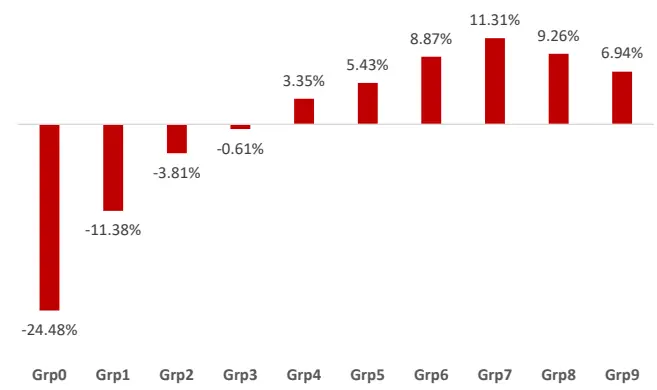
时序 RankIC 曲线

图 15：小单收益率（中位数）中证全指上表现分组年化超额收益
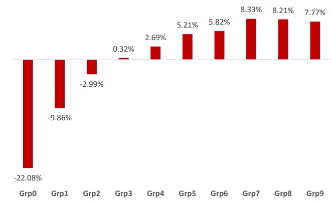

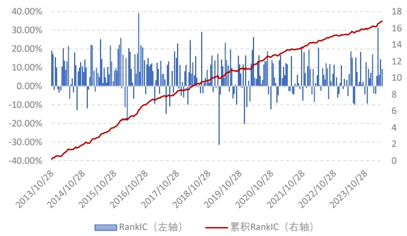
数据来源：wind、上交所、深交所、东方证券研究所

时序 RankIC 曲线
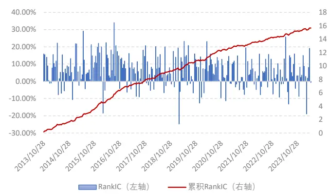
数据来源：wind、上交所、深交所、东方证券研究所

## 通过上述以金额和分位数划分小单生成的因子选股绩效对比结果，我们可以看出：

1. 小单早盘占比、小单早盘净流入和小单收益率因子，两种划分方式下生成的因子表现均较好，但按照分位数划分生成的因子表现整体强于按照金额划分的生成的因子。对于小单早盘占比因子来说，两种划分小单方式下生成的因子在大盘股上的表现整体强于小盘，沪深 300成分股上表现整体强于中证 500强于中证 1000。

2.按照金额划分小单生成的小单占比因子有着较好的表现，但在沪深 300股票池上表现欠佳；而按照中位数划分的小单占比因子在中证全指上RankIC均值接近0，但绝对值均值13.22%，胜率接近50%，对未来收益有着较好的解释能力，但预测方向波动较大，即使将风格和行业因子全部中性化之后在中证全指上 RankIC 绝对值均值仍能达到 5.45%（在沪深 300 和中证500 股票池该数值更高），说明加入该因子后的风险模型对未来收益的解释能力将变强，因此认为该因子可视作一个较好的刻画短期风险的风险因子。

## 2.3 盘口类因子

十档盘口数据包含现价、十档挂单委托价格、十档挂单委托股数等等。该数据反映当前市场对该股票的供需关系、投资者对股票定价合理性、未来股价涨跌幅预期、买入卖出意愿等信息。因此我们构建相应的因子来捕捉这部分的信息。

十档买卖盘价格分歧度因子定义如下：

$$
\int_{0}^{T}zscore(\sum_{i=1}^{10}(\frac{P_{t}^{A}(i)-P_{t}^{B}(i)}{P_{t}^{A}(i)+P_{t}^{B}(i)})w_{i})dt.
$$

这里 $P_{t}^{A}(i)$ 和 $P_{t}^{B}(i)$ 分别表示 t 时刻第 i档挂单的买卖盘挂单价格， $w_{i}$ 表示给予第 i 档的权重参数（随着 i 增大取值减少），[0,T] 代表开盘后至尾盘竞价交易前交易时间区间，zscore 表示当前时间节点上该股票取值在全市场计算的分位数。

十档买卖盘挂单量分歧度因子定义如下：

$$
\int_{0}^{T}zscore(\sum_{i=1}^{10}(\frac{V_{t}^{A}(i)-V_{t}^{B}(i)}{V_{t}^{A}(i)+V_{t}^{B}(i)})w_{i})dt.
$$

这里 $V_{t}^{A}(i)$ 和 $V_{t}^{B}(i)$ 分别表示 t 时刻第 i档挂单的买卖盘挂单成交量。

上述两个因子的方向均为负向，我们首先将过去二十日因子滚动求平均然后统一调成正向并展示相应的回测结果。

图 16：挂单价格分歧度因子表现
原始因子值

|  | RanklC |  |  | 多空组合 |  |  |  |
| --- | --- | --- | --- | --- | --- | --- | --- |
|  | 周度均值 ICIR |  | 胜率 | 年化收益率 | 夏普比率 | 最大回撤 | 多头换手率 |
| 沪深300 | 2.41% | 0.11 | 54.09% | 13.52% | 0.73 | -61.45% | 6.30% |
| 中证500 | 3.15% | 0.16 | 55.64% | 9.12% | 0.55 | -47.13% | 7.97% |
| 中证1000 | 5.38% | 0.31 | 63.81% | 19.45% | 1.11 | -30.76% | 9.58% |
| 中证全指 | 5.36% | 0.33 | 63.04% | 19.32% | 1.14 | -35.25% | 8.51% |

图 17：挂单量分歧度因子表现
原始因子值

|  | RanklC |  |  | 多空组合 |  |  |  |
| --- | --- | --- | --- | --- | --- | --- | --- |
|  | 周度均值 ICIR |  | 胜率 | 年化收益率 | 夏普比率 | 最大回撤 | 多头换手率 |
| 沪深300 | 3.35% | 0.23 | 60.70% | 20.90% | 1.27 | -25.56% | 21.58% |
| 中证500 | 2.83% | 0.24 | 62.65% | 15.18% | 1.19 | -17.75% | 24.89% |
| 中证1000 | 2.81% | 0.28 | 64.98% | 19.74% | 1.56 | -28.20% | 28.19% |
| 中证全指 | 3.25% | 0.34 | 68.48% | 20.28% | 1.61 | -32.08% | 26.76% |

行业市值中性化

|  | RankIC |  |  | 多空组合 |  |  |  |
| --- | --- | --- | --- | --- | --- | --- | --- |
|  | 周度均值 ICIR |  | 胜率 | 年化收益率 | 夏普比率 | 最大回撤 | 多头换手率 |
| 沪深300 | 0.90% | 0.06 | 54.47% | 9.38% | 0.73 | -29.27% | 10.81% |
| 中证500 | 1.85% | 0.15 | 57.59% | 8.14% | 0.7 | -18.43% | 12.26% |
| 中证1000 | 3.75% | 0.36 | 67.70% | 15.30% | 1.39 | -19.17% | 13.82% |
| 中证全指 | 3.54% | 0.36 | 63.04% | 15.97% | 1.65 | -14.12% | 12.96% |

行业市值中性化
数据来源：wind、上交所、深交所、东方证券研究所

|  | RanklC |  |  | 多空组合 |  |  |  |
| --- | --- | --- | --- | --- | --- | --- | --- |
|  | 周度均值 ICIR |  | 胜率 | 年化收益率 | 夏普比率 | 最大回撤 | 多头换手率 |
| 沪深300 | 2.67% | 0.23 | 57.98% | 14.23% | 1.16 | -16.23% | 23.32% |
| 中证500 | 2.63% | 0.28 | 66.15% | 12.27% | 1.17 | -14.23% | 25.59% |
| 中证1000 | 2.81% | 0.35 | 67.32% | 14.36% | 1.55 | -29.46% | 29.16% |
| 中证全指 | 3.27% | 0.49 | 68.87% | 16.16% | 2 | -25.86% | 28.00% |

数据来源：wind、上交所、深交所、东方证券研究所

图 18：挂单价格分歧度因子（原始值）中证全指上表现分组年化超额收益
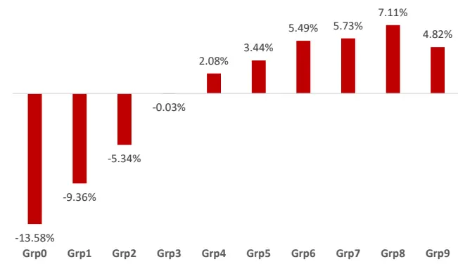
时序 RankIC 曲线

图 19：挂单量分歧度因子（原始值）中证全指上表现分组年化超额收益
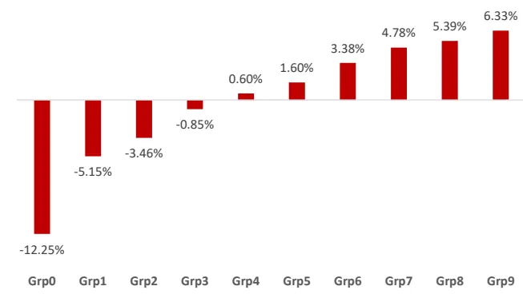

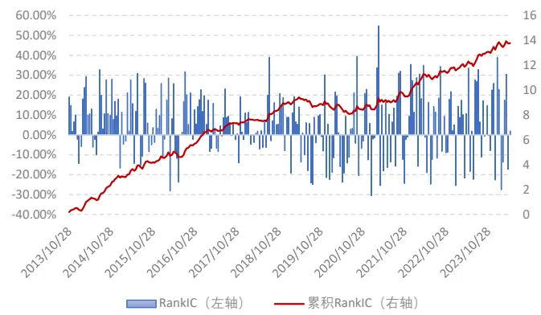
数据来源：wind、上交所、深交所、东方证券研究所

时序 RankIC 曲线
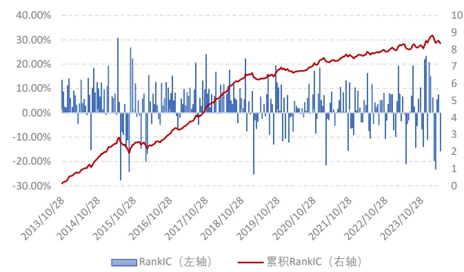
数据来源：wind、上交所、深交所、东方证券研究所

## 通过上述盘口分歧度类因子在各空间的表现，我们可以看出：

1. 在中证全指和中证 1000 成分股内挂单价格分歧度因子整体表现强于挂单量分歧度因子，而在以大票为主的沪深 300和中证 500成分股内，挂单量分歧度因子表现更强。

2. 根据 RankIC 曲线，挂单价格分歧度因子在 2019~2020 年出现短暂失效，后期虽然累积RankIC曲线斜率保持不变，但RankIC正负波动变大，选股性能有所下降；而挂单量分歧度因子在 2019年以后出现明显衰减迹象，累积 RankIC曲线斜率大幅变低。

## 2.4 与大单类因子相关性分析

前期报告我们按照分位数阈值 5%划分大单，从而构建大单相关的因子，本节将讨论大单因子与小单因子之间的相关性。首先我们列出大小单因子相关系数矩阵如下：

图 20：小单和盘口因子与大单因子相关系数矩阵金额划分

|  | 早盘小单占比 | 早盘小单净流入 | 小单占比 | 小单收益率 | 价格分歧度 | 挂单量分歧度 |
| --- | --- | --- | --- | --- | --- | --- |
| 早盘净流入 | -1.76% | 67.08% | 2.33% | -1.07% | -5.03% | -33.65% |
| 早盘大单净流入 | -3.58% | 31.90% | 2.78% | -2.17% | 0.05% | -28.59% |
| 大单收益率 | -4.51% | -4.41% | 1.01% | –93.72% | 5.84% | -8.42% |
| 大单买入占比 | -1.91% | -25.34% | 0.87% | -3.56% | 6.59% | -1.95% |
| 早盘大单买入占比 | 5.61% | -32.58% | 3.20% | -1.87% | 5.62% | -2.12% |
| 大单占比 | 3.50% | 2.94% | -38.52% | 0.92% | -38.09% | -2.77% |
| 早盘小单占比 | 100.00% | 0.20% | 1.87% | 2.28% | 8.95% | 11.70% |
| 早盘小单净流入 | 0.20% | 100.00% | -0.91% | 1.93% | -11.95% | -23.75% |
| 小单占比 | 1.87% | -0.91% | 100.00% | -0.43% | -1.04% | -0.19% |
| 小单收益率 | 2.28% | 1.93% | -0.43% | 100.00% | -3.84% | 5.63% |
| 价格分歧度 | 8.95% | -11.95% | -1.04% | -3.84% | 100.00% | 23.56% |
| 挂单量分歧度 | 11.70% | -23.75% | -0.19% | 5.63% | 23.56% | 100.00% |

## 分位数划分

|  | 早盘小单占比 | 早盘小单净流入 | 小单占比 | 小单收益率 | 价格分歧度 | 挂单量分歧度 |
| --- | --- | --- | --- | --- | --- | --- |
| 早盘净流入 | 0.12% | 42.76% | 3.55% | -0.79% | -5.03% | -33.65% |
| 早盘大单净流入 | -1.00% | 14.94% | 6.51% | -1.49% | 0.05% | -28.59% |
| 大单收益率 | -2.73% | -5.32% | 2.05% | –92.80% | 5.84% | -8.42% |
| 大单买入占比 | 4.30% | -25.27% | 3.54% | -2.49% | 6.59% | -1.95% |
| 早盘大单买入占比 | 3.58% | -30.98% | 4.45% | -1.38% | 5.62% | -2.12% |
| 大单占比 | -5.72% | 0.68% | -74.81% | 0.98% | -38.09% | -2.77% |
| 早盘小单占比 | 100.00% | 2.24% | -3.46% | 1.88% | 12.03% | 4.64% |
| 早盘小单净流入 | 2.24% | 100.00% | -4.58% | 3.24% | -8.19% | -18.44% |
| 小单占比 | -3.46% | -4.58% | 100.00% | -1.08% | 37.89% | 0.31% |
| 小单收益率 | 1.88% | 3.24% | -1.08% | 100.00% | -5.57% | 0.79% |
| 价格分歧度 | 12.03% | -8.19% | 37.89% | -5.57% | 100.00% | 23.56% |
| 挂单量分歧度 | 4.64% | -18.44% | 0.31% | 0.79% | 23.56% | 100.00% |

数据来源：wind、上交所、深交所、东方证券研究所

## 上述相关系数矩阵结果我们可以看出：

1. 新构建的早盘小单占比因子、价格分歧度和挂单量分歧度因子与大单因子相关性均较低，信息差异度较高。

2. 小单占比因子（分位数）与大单占比因子相关性较高，而小单占比因子（金额）与大单因子相关性相对较低。早盘小单净流入、和小单收益率因子则分别于早盘净流入因子和大单收益率因子相关性相对较高。

## 2.5 RNN 合成因子表现

本节我们将对比原始 l2 数据集和加入小单和盘口因子之后的 l2 数据集各自通过 RNN 合成因子的选股绩效。

首先我们将分别展示往年和今年原数据集和新数据集合成因子在中证全指上选股表现：

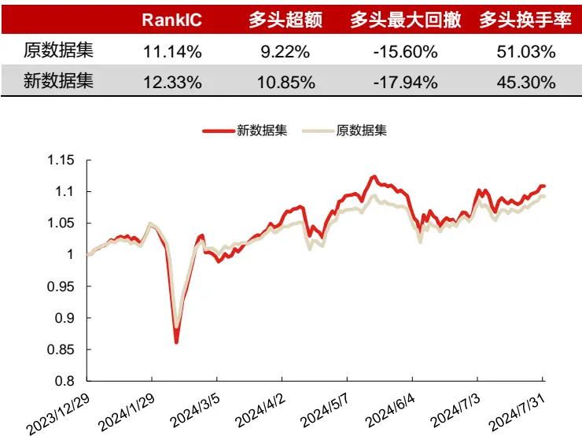

图 21：l2 数据集合成因子往年表现（20170101~20231231）

| RankIC |  | ICIR | RankIC胜率 | 多头年化超额 | 空头年化超额 | 多头最大回撤 | 多头换手率 |
| --- | --- | --- | --- | --- | --- | --- | --- |
| 原数据集 | 11.75% | 1.31 | 89.34% | 22.55% | -55.58% | -6.68% | 62.06% |
| 新数据集 | 12.15% | 1.32 | 92.90% | 23.11% | -56.10% | -5.20% | 60.12% |

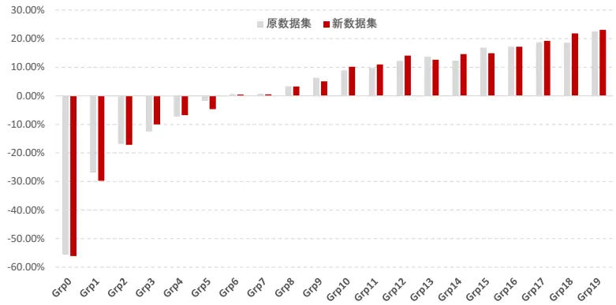
数据来源：wind、上交所、深交所、东方证券研究所

图 22：l2 数据集合成因子今年表现（20240101~20240731）

|  | RanklC | 多头超额 | 多头最大回撤 | 多头换手率 |
| --- | --- | --- | --- | --- |
| 原数据集 | 11.14% | 9.22% | -15.60% | 51.03% |
| 新数据集 | 12.33% | 10.85% | -17.94% | 45.30% |

数据来源：wind、上交所、深交所、东方证券研究所

通过上述结果，我们可以看出：

1. 新数据集合成因子往年表现整体强于原数据集，RankIC、ICIR 和多头收益率等各项指标均显著有所提升。分组测试中，新数据集多头前四组（Grp19—Grp16）年化超额均高于原数据集，而空头后三组（Grp0—Grp2）年化超额均低于原数据集。这也意味着新数据集对多头和空头区分度更加强。

2. 今年以来，虽然新数据集在二月份股灾期间回撤较大，但后期反弹力度显著强于原数据集，多头超额净值曲线在三月中下旬超过原数据集以后，新数据集超额净值曲线稳定居于原数据集之上。但值得注意的是，今年以来两个数据集因子超额净值曲线整体走势几乎相同，这说明原数据集和新数据集生成因子的性质未发生改变。

## 三、知识蒸馏和模型集成

不同的模型由于其结构不同因而有不同的优缺点，这些模型组合起来可以起到互相补充的作用。模型集成（Model Ensemble）算法则是将多个模型通过一定技术进行合并从而融合各个子模型的优点以实现更高的准确性和更优的性能。模型集成方法整体可以分为 Bagging、Boosting、Stacking 和 Cascading 四类。上述四类方法在各种研报中已经有较多使用，因此本文不在赘述。本文将采用知识蒸馏（Knowledge Distillation）[2] 这种全新方法在因子单元动态加权阶段对不同模型进行集成，以捕捉 alpha因子与未来收益率之间拟线性和非线性的函数依赖关系。

传统意义上，知识蒸馏就是把一个大的教师模型的知识萃取出来，把他浓缩到一个小的学生模型中，可以理解为一个大的教师神经网络把他的知识教给小的学生网络，这里有一个知识的迁移过程，从教师网络迁移到了学生网络身上。教师网络一般是结构较为复杂、参数量十分庞大的，因此通常教师网络获取知识的能力较为强大，学习出来的信息也更加充分，所以教师模型先进行学习，接着再把所学知识教给学生网络，学生网络通常是一个比较小的网络，这样就可以用结构较为简单的学生网络来继承教师网络学习到的有效信息，从而达到更加有效学习以及模型压缩的目的。

“知识”的来源可以是各个隐藏层神经元数值、不同样本对之间的交互关系、模型参数等等。按照这些来源，“知识”总体可以分为三类：1）基于响应的知识、2）基于特征的知识 [1]、3）基于关系的知识。而根据教师模型和学生模型训练的先后顺序，蒸馏又可以分为三类：离线蒸馏、在线蒸馏和自蒸馏，离线蒸馏顾名思义就是教师学生模型不同步进行训练，线训练教师模型后训练学生模型，因而这种方案操作十分简单，但学生模型无法对教师网络进行反馈，因此学生模型更依赖于教师模型。而在线蒸馏则是同步训练教师模型和学生模型，这种方案对刻画教师网络和学生网络交互关系的损失函数的设计要求较高。自蒸馏则是使用网络深层和浅层的隐藏层特征来进行蒸馏学习，网络深层特征包含信息量更大因而能够对网络浅层特征有较高的指导意义。

整个知识蒸馏的过程可以表现为如下图形式：

图 23：知识蒸馏结构示意图
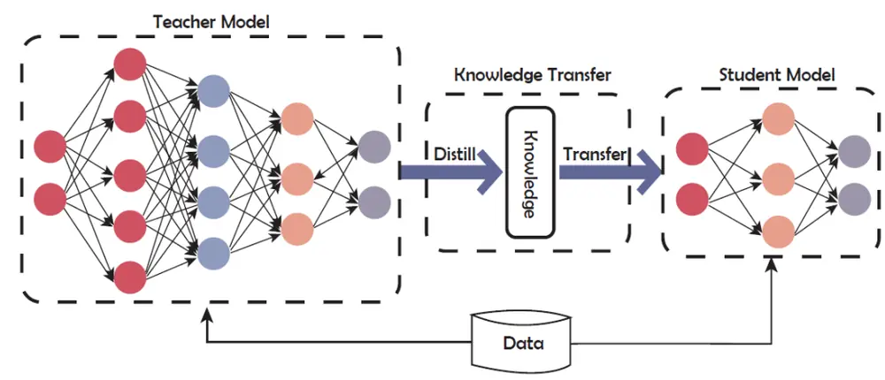
数据来源：wind、上交所、深交所、东方证券研究所

本文将利用知识蒸馏的思想对因子单元动态加权模型进行改进。区别于传统的知识蒸馏用于压缩网络模型规模的目的，本文希望通过教师模型先进行学习，对信息进行识别将“有用”成分和噪声成分进行初步甄别，尽可能将 “有用”成分保留下来，然后将这部分浓缩的信息以及原始信息共同输入给学生模型，以期学生模型既能从两部分数据中更加有效的获得“有用”信息，又能让学生模型能够继承教师模型一些优良特性。

相较于神经网络，由于树模型独特的分叉结构和拟合方式，其有着更强的泛化能力，在分类数据中有更好的表现，并且对特征重要性刻画较为具体，但树模型对应的拟合函数通常是局部线性的阶梯函数，因而在面对连续的极度非线性函数时表现的差强人意。另外一方面神经网络具有强大的拟合能力，在各种非线性函数关系的拟合问题中有着十分突出的表现，但由于其本身是一个连续函数，自变量通常被视作同等地位进行输入，通过权重参数值对特征重要性进行刻画，因而在分类型数据问题上表现弱于决策树。二者在不同问题的处理上都各有优缺点，因此我们使用知识蒸馏方法对树模型和神经网络进行集成，以期集成模型能够继承二者各自的优点，在样本外能够对 alpha有着更强预测能力。

我们将这种融入知识蒸馏的新模型称之为KD-Ensemble模型，新的对因子单元动态加权的整个训练和推理过程可以表示为如下图所示形式：

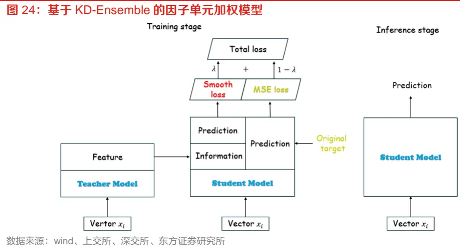

上述过程中教师模型和学生模型的输入均为相同的的 alpha 因子，我们首先训练教师模型，接着，将教师模型所学习的信息传递给学生模型从而构造 Smooth loss，接着使用原始标签计算MSE loss，最后两部分损失通过权重 λ 汇总得到总损失来对学生模型进行训练。具体而言，整个过程可表示为如下公式所示形式：

$$
\begin{aligned}&f_{tree}=argmin_{f\in\mathcal{G}}MSE(f(x),y_{label})\\&\quad\\&\quad f_{tree}=\gamma_1f_1(x)+\sum_{t=2}^{T}\gamma_tf_t(x)\\&\quad f_{nn}=argmin_{f\in\mathcal{F}}l(f(x)|I_{tree},y_{label},\lambda)\\&\quad y_{pred}=f_{nn}(x|I_{tree},y_{label},\lambda)\\\end{aligned}
$$

这里 x 表示输入的 alpha 特征， $\gamma_{t}$ 表示学习率，λ 表示人工调节的超参数， $I_{tree}$ 表示教师模型所学习到并传给学生模型的信息或特征， $y_{label}$ 表示训练的真实标签， $f_{tree}$ 和 $f_{nn}$ 分别表示教师模型和学生模型，G 和 ℱ 分别表示教师模型和学生模型对应函数类， l 表示损失函数。

## 四、风险中性的 alpha因子生成

今年年初各类基于量价的深度学习因子均出现了较大回撤，这个回撤的原因主要在于模型学习出的风格轮动信息与市场真实环境出现了较大偏差，通俗的说，就是深度学习模型对市场风格的选择出现了错误。为了抑制这种错误出现的可能性，我们在 alpha 因子生成阶段加入风险因子生成部分，并让所生成的 alpha 因子与风险因子彼此相互正交从而抑制这种带来风险的轮动成分。具体做法可以表示为如下过程：

图 25：风险中性模型网络架构
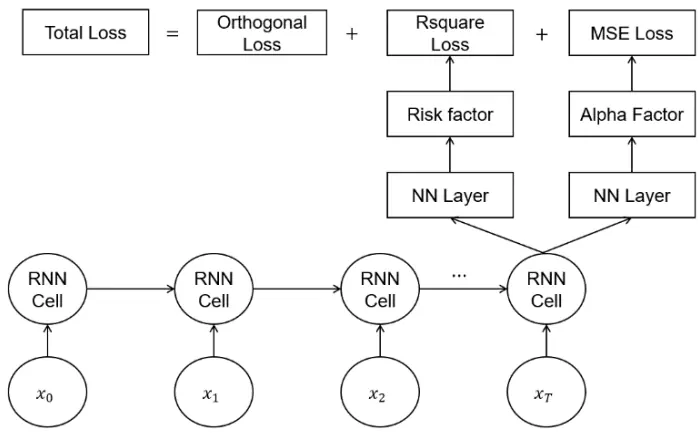
数据来源：wind、上交所、深交所、东方证券研究所

生成风险因子和alpha因子端共享输入数据和RNN单元的网络参数，上述过程中的损失函数可以写作以下公式形式：

$$
Loss=MSE(F_{:K},y_{new})+Rsquare(F_{K:},y)+\lambda\left\|Gorn(F,F)\right\|
$$

其中，F 为所有生成因子，我们设定前 K 个为 alpha 因子，K 个以后为风险因子， $y_{neu}$ 为行业市值中性化之后的收益率标签，y 为原始收益率标签， λ 是人工调节的超参数。

整个损失函数由三部分构成，第一部分为 alpha 因子与中性化收益率计算均方误差损失，第二部分为风险因子与原始收益率标签计算 R 方，第三部分为所有因子之间计算相关系数矩阵的 F范数作为正交惩罚项。这里我们重点关注 alpha 因子的实际用途，因而未对风险因子自相关性做任何约束。我们通过上述方法生成具有更低风险暴露的 alpha 因子从而降低可能带来较大回撤的风格轮动成分，并获取更多的纯 alpha 信息，反过来又促使风险因子中 alpha 信息含量降低，从而更好的捕捉风险信息。

## 五、各数据集因子非线性加权结果分析

本章将展示各数据生成弱因子经过非线性加权方法后得到最终因子在中证全指、沪深 300、中证500和中证1000四个股票池中的表现。回测细节与2.1节设置相同，并且多、空头年化超额计算基准为成分股等权，分组测试时中证全指展示分20组测试结果，沪深300、中证500和中证1000展示分 10组测试结果。

## 5.1 中证全指上的表现

首先，我们展示各种不同模型在中证全指股票池上生成因子在2018年以来的选股表现对比。

1. 原数据集：作为基准模型，对应报告《融合基本面信息的ASTGNN因子挖掘模型》中加入 lfq模型；

2. 知识蒸馏：在原始模型的基础上使用 KD-Ensemble方法替代原始非线性加权方法；

3. 扩充 l2数据集：在知识蒸馏模型的基础上，l2数据集中加入小单和盘口因子；

4. 风险模型：使用风险中性模型所构建的因子，同时使用知识蒸馏和加入小单盘口因子。

图 26：中证全指选股汇总表现（回测期 20171229~20240731）

|  | RanklC ICIR | R RankIC胜率 |  | Top年化超额 | 往年最大回撤 | 今年最大回撤 | 周均单边换手率 |
| --- | --- | --- | --- | --- | --- | --- | --- |
| 原数据集 | 16.36% | 1.56 | 94.48% | 49.14% | -5.31% | -21.32% | 60.23% |
| 知识蒸馏 | 16.69% | 1.6 | 94.48% | 51.73% | -4.40% | -23.05% | 58.63% |
| 扩充I2数据集 | 16.70% | 1.59 | 94.48% | 51.06% | -4.90% | -23.63% | 58.58% |
| 风险模型 | 15.83% | 1.63 | 94.48% | 47.96% | -4.59% | -7.48% | 59.59% |

数据来源：wind、上交所、深交所、东方证券研究所

图 27：中证全指因子各分组超额表现
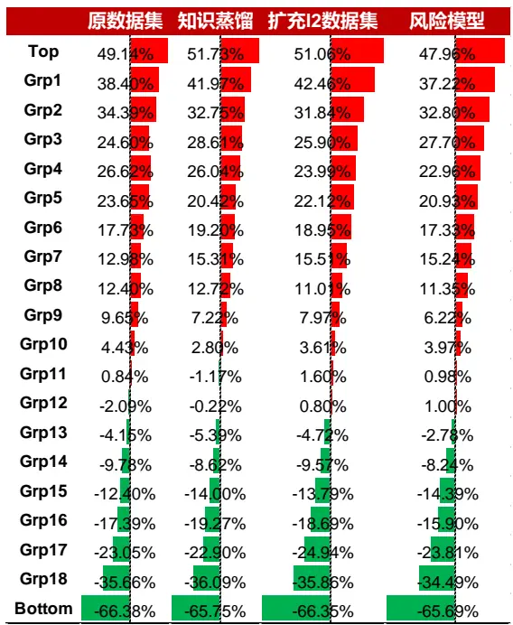
数据来源：wind、上交所、深交所、东方证券研究所

有关分析师的申明，见本报告最后部分。其他重要信息披露见分析师申明之后部分，或请与您的投资代表联系。并请阅读本证券研究报告最后一页的免责申明。

图 28：中证全指各年度多头组合选股表现（回测期 20171229~20240731）

| 绝对收益 |  |  |  |  |  |  |  |
| --- | --- | --- | --- | --- | --- | --- | --- |
|  | 2018 | 2019 | 2020 | 2021 | 2022 | 2023 | 20240731 |
| 原数据集 | 37.39% | 85.36% | 70.40% | 68.89% | 33.61% | 47.71% | -8.31% |
| 知识蒸馏 | 36.80% | 89.81% | 71.82% | 86.81% | 33.62% | 43.99% | -7.42% |
| 扩充I2数据集 | 35.43% | 89.82% | 74.21% | 80.35% | 34.06% | 44.19% | -6.63% |
| 风险模型 | 34.12% | 84.41% | 71.05% | 80.79% | 33.08% | 35.05% | 1.54% |

|  | 2018 | 2019 | 2020 | 2021 | 2022 | 2023 | 20240731 |
| --- | --- | --- | --- | --- | --- | --- | --- |
| 原数据集 | 97.99% | 43.08% | 43.41% | 34.06% | 47.38% | 35.96% | 12.94% |
| 知识蒸馏 | 97.22% | 46.56% | 44.56% | 48.26% | 47.41% | 32.46% | 15.00% |
| 扩充I2数据集 | 95.34% | 46.57% | 46.56% | 43.07% | 47.93% | 32.67% | 15.97% |
| 风险模型 | 93.46% | 42.58% | 44.14% | 43.51% | 46.80% | 24.29% | 25.65% |

数据来源：wind、上交所、深交所、东方证券研究所

上述结果皆以次日收盘价进行交易，若以次日 vwap进行交易，往年（20171229~20231229）：

原数据集 RankIC 可达 16.79%，多头年化超额可达 55.37%；

知识蒸馏 RankIC 可达 17.12%，多头年化超额可达 57.86%；

扩充 l2 数据集 RankIC 可达 17.16%，多头年化超额可达 58.74%；

风险模型 RankIC 可达 16.27%，多头年化超额可达 54.33%。

通过上述图表结果，我们可以得出结论：

1. 基于知识蒸馏以及扩充 l2 数据集之后合成的综合打分整体表现强于直接非线性加权的综合打分，且前两组年化超额均显著好于原始数据集，RankIC 和 ICIR 等指标都有大幅提升。基于指数蒸馏和扩充 l2数据集合成的综合因子每年超额均稳定在 45%左右，获取超额的能力十分稳定。

2. 分年度来看，相对于基准，基于指数蒸馏和扩充 l2 数据集构建的新模型在 2019 年、2021 年超额收益有大幅提升，其他年份也大都有小幅提升，仅有 2018 年和 2023 年会跑输基准。并且两个新模型生成综合打分的多头组合对应换手率相较于基准均有所下降。

3. 而基于风险中性生成的综合因子虽然 RankIC 和多头年化超额收益弱于前三个模型，但是 ICIR 显著更高和最大回撤也显著更低，模型稳定性整体大幅提高。在 2024 年，该模型因子多头组合累积超额可达 25.65%（若以 vwap 计算可达 29.20%），超额最大回撤仅仅-7.48%，表现显著强于前三个模型。

## 5.2 各宽基指数上的表现

接着我们将各个模型生成因子在沪深300、中证500和中证1000这三个股票池上进行分组测试（分 10组），所得回测结果如下：

图 29：各宽基指数上选股表现（回测期 20180101~20240731）沪深 300

|  | RanklC | ICIR | RankIC胜率 | Top年化超额 | 最大回撤 | 周均换手率 |
| --- | --- | --- | --- | --- | --- | --- |
| 原数据集 | 12.01% | 0.75 | 81.13% | 34.00% | -7.99% | 51.22% |
| 知识蒸馏 | 12.22% | 0.75 | 77.36% | 34.16% | -6.92% | 50.76% |
| 扩充I2数据集 | 12.41% | 0.76 | 77.99% | 34.28% | -7.40% | 50.82% |
| 风险模型 | 10.98% | 0.73 | 79.87% | 31.35% | -6.30% | 51.93% |

| RanklC ICIR RankIC胜率 Top年化超额 最大回撤 周均换手率 |  |  |  |  |  |
| --- | --- | --- | --- | --- | --- |
| 原数据集 | 12.17% 0.92 | 80.50% | 27.94% | -12.52% | 53.03% |
| 知识蒸馏 12.39% | 0.93 | 82.39% | 31.38% | -12.53% | 51.92% |
| 扩充I2数据集 12.58% | 0.94 | 82.39% | 31.40% | -11.78% | 52.04% |
| 风险模型 11.45% | 0.91 | 83.02% | 25.69% | -10.81% | 52.72% |

中证 1000

| RankiC ICIR RankIC胜率 Top年化超额 最大回撤 |  |  |  |  |  |
| --- | --- | --- | --- | --- | --- |
| 原数据集 | 15.26% | 1.28 88.68% | 40.16% | -12.74% | 周均换手率 53.85% |
| 知识蒸馏 | 15.35% 1.26 | 88.68% | 41.81% | -10.65% | 52.38% |
| 扩充I2数据集 | 15.38% 1.26 | 89.31% | 39.61% | -10.90% | 52.42% |
| 风险模型 14.60% | 1.29 | 89.31% | 36.07% | -8.99% | 52.95% |

数据来源：wind、上交所、深交所、东方证券研究所

## 通过以上结果我们可以看出

1. 各个模型生成因子的市值偏向性较低，三个模型合成的综合打分在各个股票池上都有较强的选股能力。

2. 相较于基准模型，通过引入知识蒸馏方法和扩充 l2 数据集输入特征各自所生成因子在各宽基指数上的RankIC、ICIR和top组超额收益等指标能够进一步得到提升。并且，在各个股票池上两种方案下新模型生成因子多头组合的换手率也有所下降。

3. 基于风险中性模型在各个股票池上多头组合虽然 RankIC 和多头年化超额等指标有所下降，但最大回撤均有明显下降，这说明相较于前三个模型，基于风险中性模型生成因子的稳定性更强。

## 5.3 各模型因子相关性及风险暴露分析

本节我们将对各模型生成因子的相关性及风险暴露情况进行分析，并绘制各模型合成因子之间相关系数矩阵和风险暴露柱状图如下：

图 30：各模型生成因子相关系数矩阵（左上 Pearson右下 Spearman）

|  | 原数据集 | 知识蒸馏 | 扩充I2数据集 | 风险模型 |
| --- | --- | --- | --- | --- |
| 原数据集 | 100.00% | 97.15% | 96.49% | 93.81% |
| 知识蒸馏 | 95.75% | 100.00% | 98.66% | 95.95% |
| 扩充I2数据集 | 94.79% | 98.03% | 100.00% | 97.26% |
| 风险模型 | 90.00% | 93.20% | 95.08% | 100.00% |

数据来源：wind、上交所、深交所、东方证券研究所

图 31：各模型生成因子风险暴露情况
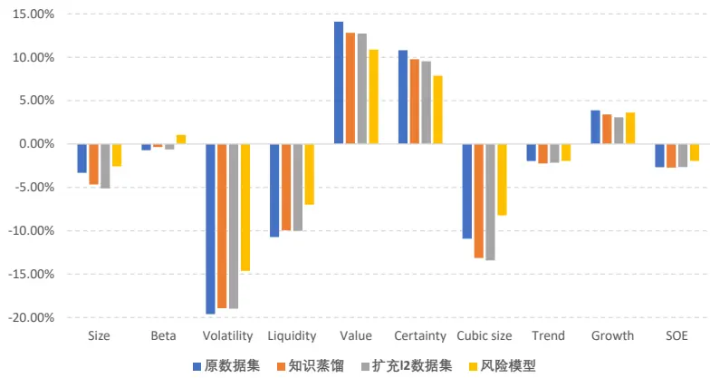
数据来源：wind、上交所、深交所、东方证券研究所

## 根据上述图表结果，我们可以得出以下结论：

1. 各个模型之间相关性较高无论是Pearson相关系数还是 Spearman相关系数均在 90%以上，说明各个模型学习到的 alpha信息几乎一致。

2. 四个模型生成因子在各个风险上的暴露情况均较低（绝对值低于 20%）且互相之间暴露情况大致相当，但相较于原数据集模型，知识蒸馏和扩充 l2 数据集模型生成因子在波动、流动性、估值、成长和确定性五个风格上显著暴露更低，但在市值和非线性市值上暴露有所上升。

3. 相较于前三个模型，基于风险中性模型生成的因子在除Beta和成长以外的所有风格上暴露均更低。除波动和估值外其余风格暴露（相关系数绝对值均值）均小于 10%。

## 六、合成因子指数增强组合表现

## 6.1增强组合构建说明

本章将展示了 KD-Ensemble 模型下各数据集非线性加权得分在沪深 300、中证 500 和中证1000指数增强的应用效果，关于指数增强组合有如下说明：

1） 回测期20171229~20240731，组合周频调仓，假设根据每周五个股得分在次日以vwap 价格进行交易，股票池为中证全指成分股。

2） 风控模型分为两部分测算：

1. Barra 风控组合：风险因子库 dfrisk2020（参见《东方 A 股因子风险模型（DFQ-2020）》）的所有风格因子相对暴露不超过 0.5，所有行业因子相对暴露不超过 2%，中证 500 和中证 1000增强跟踪误差约束不超过 5%，沪深 300 增强跟踪误差约束不超过 4%。

2. NLSize 风控组合：对于各个股票池，我们控制各个股票池左右侧 NLSize 因子相对暴露均不超过 0.3（风险因子计算方法可参见《非线性市值风控全攻略》），对于中证 1000 增强，我们额外控制 Size 十分组因子相对暴露均不超过 0.1，所有行业因子相对暴露不超过 2%。

3） 指增策略组合构建时，限制指数成分股占比，成分股占比约束记为 cpct（cpct=None 表示成分股占比不进行约束，cpct=1 表示成分股占比进行 100%约束），周单边换手率限制记为delta。个股权重偏离不超过±1%

4） 组合业绩测算时假设买入成本千分之一、卖出成本千分之二，停牌和涨停不能买入、停牌和跌停不能卖出。

## 6.2 沪深 300 指数增强

本节将展示新模型生成因子在沪深 300 指数增强策略应用，首先我们展示不同约束条件下，各年度增强组合超额收益以及汇总的业绩表现：

图 32：沪深 300 指增 Barra 风控组合分年度超额收益率（回测期 20171229~20240731）

|  |  | 2018 | 2019 | 2020 | 2021 | 2022 | 2023 | 20240731 |
| --- | --- | --- | --- | --- | --- | --- | --- | --- |
| delta=0.1 | cpct=None | 18.76% | 4.26% | 12.97% | 16.67% | 17.83% | 14.98% | 3.00% |
|  | cpct=0.8 | 19.87% | 5.63% | 13.39% | 14.78% | 17.43% | 14.65% | 2.94% |
|  | cpct=1 | 16.00% | 5.28% | 19.59% | 16.98% | 19.84% | 10.52% | 13.15% |
| delta=0.2 | cpct=None | 26.66% | 8.90% | 16.24% | 21.31% | 20.68% | 13.77% | 3.45% |
|  | cpct=0.8 | 28.03% | 5.52% | 17.54% | 22.99% | 21.49% | 13.49% | 3.50% |
|  | cpct=1 | 19.17% | 8.11% | 19.96% | 21.78% | 25.01% | 10.06% | 13.51% |
| delta=0.3 | cpct=None | 30.09% | 6.22% | 13.99% | 22.76% | 19.62% | 13.05% | 1.86% |
|  | cpct=0.8 | 30.79% | 5.34% | 15.41% | 27.68% | 22.41% | 12.27% | 4.47% |
|  | cpct=1 | 22.65% | 8.01% | 21.10% | 20.33% | 19.88% | 10.34% | 12.73% |

数据来源：wind、上交所、深交所、东方证券研究所

图 33：沪深 300 指增 Barra 风控组合汇总结果（回测期 20171229~20240731）

|  |  | 年化超额 | 信息比率 | 最大回撤 | 平均持股数量 |
| --- | --- | --- | --- | --- | --- |
| delta=0.1 | cpct=None | 13.34% | 2.56 | -6.74% | 90.90 |
|  | cpct=0.8 | 13.39% | 2.65 | -7.34% | 90.17 |
|  | cpct=1 | 15.38% | 3.66 | -2.98% | 81.68 |
| delta=0.2 | cpct=None | 16.72% | 3.05 | -7.79% | 87.95 |
|  | cpct=0.8 | 16.88% | 3.23 | -7.12% | 70.93 |
|  | cpct=1 | 17.83% | 4.04 | -2.57% | 78.20 |
| delta=0.3 | cpct=None | 16.07% | 2.91 | -7.99% | 86.94 |
|  | cpct=0.8 | 17.68% | 3.32 | -7.36% | 84.39 |
|  | cpct=1 | 17.45% | 3.86 | -2.41% | 77.08 |

数据来源：wind、上交所、深交所、东方证券研究所

图 34：沪深 300 指增 NLSize 风控组合分年度超额收益率（回测期 20171229~20240731）

|  |  | 2018 | 2019 | 2020 | 2021 | 2022 | 2023 | 20240731 |
| --- | --- | --- | --- | --- | --- | --- | --- | --- |
| delta=0.1 | cpct=None | 13.98% | 4.02% | 17.55% | 12.11% | 18.80% | 15.26% | 7.65% |
|  | cpct=0.8 | 16.86% | 2.79% | 15.99% | 10.34% | 21.04% | 15.27% | 6.95% |
|  | cpct=1 | 14.81% | 5.91% | 17.79% | 17.08% | 22.81% | 12.14% | 12.64% |
| delta=0.2 | cpct=None | 24.15% | 4.13% | 18.31% | 22.75% | 29.19% | 14.33% | 10.89% |
|  | cpct=0.8 | 26.08% | 4.24% | 19.39% | 25.23% | 28.17% | 13.66% | 10.59% |
|  | cpct=1 | 21.54% | 8.47% | 20.17% | 20.17% | 24.91% | 13.33% | 18.07% |
| delta=0.3 | cpct=None | 25.66% | 0.95% | 22.20% | 25.27% | 28.15% | 14.03% | 13.03% |
|  | cpct=0.8 | 25.93% | 1.77% | 22.68% | 25.00% | 28.33% | 13.76% | 13.58% |
|  | cpct=1 | 25.35% | 8.02% | 20.97% | 23.94% | 21.88% | 14.16% | 18.47% |

数据来源：wind、上交所、深交所、东方证券研究所

图 35：沪深 300 指增 NLSize 风控组合汇总结果（回测期 20171229~20240731）

|  |  | 年化超额 | 信息比率 | 最大回撤 | 平均持股数量 |
| --- | --- | --- | --- | --- | --- |
| delta=0.1 | cpct=None | 13.54% | 2.51 | -5.10% | 83.25 |
|  | cpct=0.8 | 13.48% | 2.55 | -5.18% | 54.02 |
|  | cpct=1 | 15.67% | 3.39 | -2.83% | 50.76 |
| delta=0.2 | cpct=None | 18.65% | 3.20 | -4.53% | 78.00 |
|  | cpct=0.8 | 19.18% | 3.39 | -4.35% | 77.54 |
|  | cpct=1 | 19.27% | 3.88 | -2.97% | 75.22 |
| delta=0.3 | cpct=None | 19.42% | 3.22 | -4.47% | 76.15 |
|  | cpct=0.8 | 19.71% | 3.34 | -4.16% | 75.94 |
|  | cpct=1 | 20.19% | 3.90 | -4.03% | 73.82 |

数据来源：wind、上交所、深交所、东方证券研究所

周单边换手 20%和成分股 80%约束下，基于 Barra 风控和 NLSize 风控构建沪深 300 指增组合净值走势如下图所示：

图 36：沪深 300指增 Barra风控组合净值走势
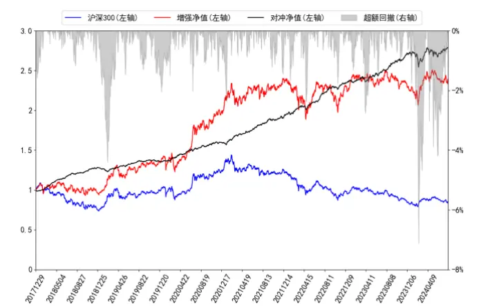
数据来源：wind、上交所、深交所、东方证券研究所

图 37：沪深 300指增 NLSize风控组合净值走势
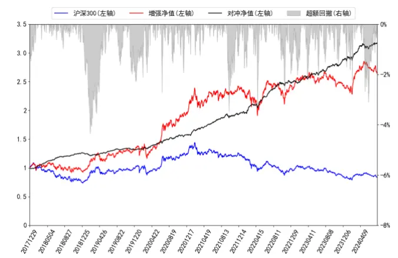
数据来源：wind、上交所、深交所、东方证券研究所

上述图表结果可以看出，新模型生成因子直接用于沪深 300 指增任务所构建的组合表现良好：

1. 长期来看成分股占比对年化超额的影响不大，但分年度来看差异则较为明显：在2020年大盘股行情下，完全成分股占比约束条件下构建组合的表现显著好于 80%成分股和不限制成分股的约束条件表现；2023 年小微盘股行情下完全成分股占比约束则表现弱于另外两个约束条件，而今年完全成分股占比下组合的超额收益显著更高且没有遭受较大回撤。

2. 相较于 Barra风控，NLSize风控所构建的沪深 300增强组合年化超额显著提升，最大回撤也显著有所下降。

3. 换手约束对组合超额有一定影响，适当放松换手约束有助于提升组合超额情况。

## 6.3 中证 500 指数增强

本节将展示新模型生成因子在中证 500 指数增强策略应用，首先我们展示不同约束条件下，各年度超额收益以及汇总的业绩表现：

图 38：中证 500 指增 Barra 风控组合分年度超额收益率（回测期 20171229~20240731）

|  |  | 2018 | 2019 | 2020 | 2021 | 2022 | 2023 | 20240731 |
| --- | --- | --- | --- | --- | --- | --- | --- | --- |
| delta=0.1 | cpct=None | 40.63% | 18.46% | 16.23% | 25.56% | 29.38% | 21.62% | 0.86% |
|  | cpct=0.8 | 36.90% | 17.22% | 18.07% | 25.10% | 19.57% | 10.09% | 3.52% |
|  | cpct=1 | 30.54% | 13.84% | 16.32% | 25.96% | 21.94% | 5.01% | 7.99% |
| delta=0.2 | cpct=None | 54.74% | 16.19% | 20.45% | 33.92% | 30.50% | 21.52% | 0.18% |
|  | cpct=0.8 | 55.45% | 18.79% | 18.32% | 31.58% | 23.94% | 10.35% | 4.68% |
|  | cpct=1 | 35.58% | 15.29% | 18.74% | 25.37% | 21.07% | 5.95% | 7.64% |
| delta=0.3 | cpct=None | 64.69% | 24.04% | 20.08% | 34.41% | 28.69% | 21.09% | 0.22% |
|  | cpct=0.8 | 51.01% | 21.12% | 18.03% | 24.85% | 22.16% | 11.74% | 3.50% |
|  | cpct=1 | 39.75% | 19.53% | 17.23% | 25.86% | 17.62% | 8.00% | 7.19% |

数据来源：wind、上交所、深交所、东方证券研究所

图 39：中证 500 指增 Barra 风控组合汇总结果（回测期 20171229~20240731）

|  |  | 年化超额 | 信息比率 | 最大回撤 | 平均持股数量 |
| --- | --- | --- | --- | --- | --- |
| delta=0.1 | cpct=None | 22.81% | 2.67 | -17.74% | 136.14 |
|  | cpct=0.8 | 19.53% | 3.07 | -8.31% | 111.18 |
|  | cpct=1 | 18.26% | 3.25 | -4.23% | 99.48 |
| delta=0.2 | cpct=None | 26.17% | 2.93 | -19.42% | 128.94 |
|  | cpct=0.8 | 24.02% | 3.53 | -9.15% | 103.85 |
|  | cpct=1 | 19.43% | 3.30 | -4.42% | 94.79 |
| delta=0.3 | cpct=None | 28.32% | 3.14 | -20.01% | 126.09 |
|  | cpct=0.8 | 22.56% | 3.27 | -10.22% | 101.10 |
|  | cpct=1 | 20.23% | 3.38 | -4.86% | 92.28 |

数据来源：wind、上交所、深交所、东方证券研究所

图 40：中证 500 指增 NLSize 风控组合分年度超额收益率（回测期 20171229~20240731）

|  |  | 2018 | 2019 | 2020 | 2021 | 2022 | 2023 | 20240731 |
| --- | --- | --- | --- | --- | --- | --- | --- | --- |
| delta=0.1 | cpct=None | 32.68% | 16.76% | 19.11% | 16.67% | 17.80% | 11.20% | 10.55% |
|  | cpct=0.8 | 37.52% | 12.72% | 18.31% | 21.88% | 23.83% | 11.58% | 8.03% |
|  | cpct=1 | 30.96% | 14.25% | 16.30% | 25.78% | 21.99% | 6.38% | 8.37% |
| delta=0.2 | cpct=None | 52.39% | 17.48% | 22.64% | 27.92% | 20.94% | 8.15% | 15.39% |
|  | cpct=0.8 | 51.54% | 17.47% | 16.49% | 24.52% | 24.00% | 8.93% | 10.24% |
|  | cpct=1 | 35.20% | 16.54% | 17.99% | 25.11% | 23.57% | 8.28% | 10.80% |
| delta=0.3 | cpct=None | 60.30% | 20.09% | 25.82% | 24.17% | 16.49% | 7.79% | 14.53% |
|  | cpct=0.8 | 49.53% | 17.65% | 17.17% | 23.58% | 26.71% | 10.69% | 12.27% |
|  | cpct=1 | 40.04% | 20.35% | 18.33% | 27.04% | 20.05% | 10.05% | 13.32% |

数据来源：wind、上交所、深交所、东方证券研究所

图 41：中证 500 指增 NLSize 风控组合汇总结果（回测期 20171229~20240731）

|  |  | 年化超额 | 信息比率 | 最大回撤 | 平均持股数量 |
| --- | --- | --- | --- | --- | --- |
| delta=0.1 | cpct=None | 18.90% | 2.49 | -8.06% | 119.13 |
|  | cpct=0.8 | 20.14% | 3.17 | -5.73% | 107.73 |
|  | cpct=1 | 18.67% | 3.21 | -3.76% | 96.88 |
| delta=0.2 | cpct=None | 24.60% | 2.92 | -8.06% | 108.60 |
|  | cpct=0.8 | 22.76% | 3.28 | -6.08% | 98.70 |
|  | cpct=1 | 20.74% | 3.34 | -5.09% | 92.57 |
| delta=0.3 | cpct=None | 24.98% | 2.89 | -9.77% | 105.00 |
|  | cpct=0.8 | 23.55% | 3.65 | -5.83% | 95.07 |
|  | cpct=1 | 22.51% | 3.48 | -5.18% | 89.67 |

数据来源：wind、上交所、深交所、东方证券研究所

周单边换手 20%和成分股 80%约束下，基于 Barra 风控和 NLSize 风控构建中证 500 指增组合净值走势如下图所示：

图 42：中证 500指增 Barra风控组合净值走势
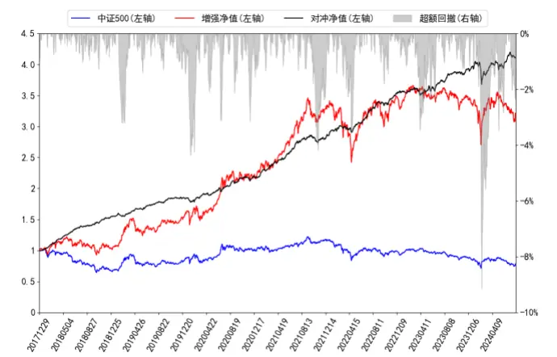
数据来源：wind、上交所、深交所、东方证券研究所

图 43：中证 500指增 NLSize风控组合净值走势
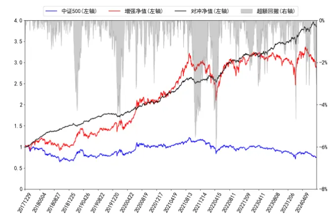
数据来源：wind、上交所、深交所、东方证券研究所

上述图表结果可以看出，新模型生成因子可以直接用于中证 500 指增任务，所构建组合表现良好：

1. 成分股约束对组合年化超额的影响较大。往年，成分股占比不做约束下组合的超额收益大幅超过成分股占比 80%约束条件下和完全成分股限制下组合的表现。但今年完全成分股限制下组合超额更高且回撤更小。

2. 另外一方面，通过超额净值曲线图我们可以看出，虽然 80%成分股占比约束条件下组合超额收益今年二月遭受较大回撤，但三月份很快超额得到了修复并且创出新高。

## 6.4 中证 1000 指数增强

本小节将展示基准模型和新模型生成因子打分应用于中证 1000指数增强策略表现情况：

图 44：中证 1000 指增 Barra 风控组合分年度超额收益率（回测期 20171229~20240731）

|  |  | 2018 | 2019 | 2020 | 2021 | 2022 | 2023 | 20240731 |
| --- | --- | --- | --- | --- | --- | --- | --- | --- |
|  | cpct=None | 50.56% | 24.51% | 16.14% | 29.28% | 32.62% | 21.13% | 4.83% |
| delta=0.1 | cpct=0.8 | 46.92% | 25.10% | 27.14% | 25.28% | 28.84% | 12.57% | 3.07% |
|  | cpct=1 | 42.58% | 28.27% | 29.15% | 32.36% | 27.29% | 11.53% | 4.52% |
|  | cpct=None | 70.32% | 22.22% | 17.95% | 35.52% | 33.93% | 18.79% | 5.78% |
| delta=0.2 | cpct=0.8 | 68.35% | 30.53% | 24.46% | 40.23% | 29.35% | 16.61% | 3.89% |
|  | cpct=1 | 59.30% | 31.64% | 21.88% | 40.08% | 28.01% | 16.30% | 3.84% |
|  | cpct=None | 88.74% | 25.98% | 21.13% | 34.42% | 30.94% | 21.16% | 6.29% |
| delta=0.3 | cpct=0.8 | 79.91% | 40.45% | 21.91% | 35.81% | 23.52% | 15.89% | 2.76% |
|  | cpct=1 | 65.85% | 36.46% | 22.61% | 35.44% | 21.28% | 13.58% | 1.29% |

数据来源：wind、上交所、深交所、东方证券研究所

图 45：中证 1000 指增 Barra 风控组合汇总结果（回测期 20171229~20240731）

|  |  | 年化超额 | 信息比率 | 最大回撤 | 平均持股数量 |
| --- | --- | --- | --- | --- | --- |
| delta=0.1 | cpct=None | 26.72% | 3.24 | -11.84% | 139.72 |
|  | cpct=0.8 | 25.18% | 3.60 | -9.95% | 125.70 |
|  | cpct=1 | 26.30% | 4.21 | -5.03% | 115.29 |
| delta=0.2 | cpct=None | 29.97% | 3.58 | -14.51% | 127.40 |
|  | cpct=0.8 | 31.38% | 4.09 | -10.92% | 117.20 |
|  | cpct=1 | 29.74% | 4.30 | -6.97% | 109.41 |
| delta=0.3 | cpct=None | 33.04% | 3.83 | -14.79% | 124.96 |
|  | cpct=0.8 | 31.85% | 4.05 | -12.45% | 113.56 |
|  | cpct=1 | 28.68% | 4.00 | -8.28% | 106.58 |

数据来源：wind、上交所、深交所、东方证券研究所

图 46：中证 1000 指增 NLSize 组合分年度超额收益率（回测期 20171229~20240731）

|  |  | 2018 | 2019 | 2020 | 2021 | 2022 | 2023 | 20240731 |
| --- | --- | --- | --- | --- | --- | --- | --- | --- |
| delta=0.1 | cpct=None | 41.15% | 23.19% | 21.58% | 24.26% | 27.71% | 11.01% | 11.73% |
|  | cpct=0.8 | 41.25% | 27.87% | 29.87% | 22.06% | 24.49% | 9.40% | 10.02% |
|  | cpct=1 | 38.89% | 26.60% | 28.49% | 27.81% | 27.14% | 9.31% | 8.76% |
| delta=0.2 | cpct=None | 63.39% | 19.79% | 18.29% | 34.70% | 26.83% | 13.47% | 9.40% |
|  | cpct=0.8 | 59.17% | 27.20% | 26.36% | 31.06% | 28.40% | 10.66% | 8.24% |
|  | cpct=1 | 59.71% | 32.56% | 20.27% | 29.83% | 28.25% | 11.12% | 5.53% |
| delta=0.3 | cpct=None | 75.65% | 25.44% | 21.44% | 25.80% | 23.71% | 10.44% | 6.55% |
|  | cpct=0.8 | 71.23% | 31.70% | 20.17% | 30.93% | 24.66% | 10.85% | 7.91% |
|  | cpct=1 | 63.15% | 31.54% | 23.27% | 32.06% | 20.24% | 10.98% | 7.69% |

数据来源：wind、上交所、深交所、东方证券研究所

图 47：中证 1000 指增 NLSize 组合汇总结果（回测期 20171229~20240731）

|  |  | 年化超额 信息比率 |  | 最大回撤 | 平均持股数量 |
| --- | --- | --- | --- | --- | --- |
| delta=0.1 | cpct=None | 24.24% | 3.38 | -5.87% | 128.93 |
|  | cpct=0.8 | 24.83% | 3.66 | -4.63% | 120.50 |
|  | cpct=1 | 25.15% | 4.03 | -3.54% | 109.16 |
| delta=0.2 | cpct=None | 27.42% | 3.44 | -6.13% | 115.15 |
|  | cpct=0.8 | 28.37% | 3.86 | -5.30% | 110.25 |
|  | cpct=1 | 27.66% | 3.98 | -5.36% | 103.19 |
| delta=0.3 | cpct=None | 27.38% | 3.30 | -7.39% | 109.87 |
|  | cpct=0.8 | 28.87% | 3.65 | -7.16% | 104.28 |
|  | cpct=1 | 27.85% | 3.82 | -6.40% | 99.02 |

数据来源：wind、上交所、深交所、东方证券研究所

周单边换手20%和成分股80%约束下，基于Barra风控和NLSize风控构建中证1000指增组合净值走势如下图所示：

图 48：中证 1000指增 Barra风控组合净值走势
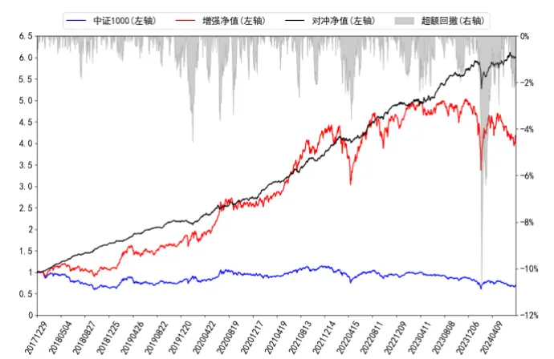
数据来源：wind、上交所、深交所、东方证券研究所

图 49：中证 1000指增 NLSize风控组合净值走势
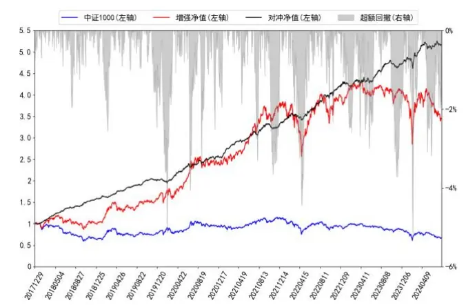
数据来源：wind、上交所、深交所、东方证券研究所

上述图表结果可以看出：

1. 新模型生成因子直接用于中证1000指增任务形成组合，且该组合表现良好。随着约束条件不断放松组合的超额收益也将不断地上升。

2. 相较于 Barra风控模型，基于NLSize风控模型构建中证 1000增强组合回撤显著下降。

3. 另外一方面可以看出虽然今年二月各约束条件下组合超额都有一定的回撤，但到七月回撤均已修复，超额净值也都创出新高。

## 七、结论

前期报告中，我们基于周度（week）、日度（day）、分钟线（ms）、Level-2（l2）以及基本面五个即，利用RNN、ResNet、GNN和决策树模型搭建了一套端到端的AI量价模型框架，并将该框架生成的综合打分应用于选股策略，回测结果显示这套框架下生成的因子在各个指数成分股中都有着较强的选股能力。

本文则是在上述量价模型框架的基础上，针对原模型可能存在的一些不足做了以下两个方面的改进：

考虑到在基础版本中我们使用的 l2 数据集中大部分人工因子主要是基于大单构建的，而小单和盘口数据所蕴含的信息量也十分巨大，因此本文将构建一些基于小单和盘口的因子以对 l2 数据集进行信息补充，从而使得 l2数据集反映的日内信息更加充分从而给全模型带来增量效果。

一方面考虑到因子单元动态加权使用的是决策树模型，相较于神经网络，决策树优点在于泛化能力较强，不需要过多的数据就能较好的学习目标问题中的规律，且十分适合处理分类数据，但其拟合能力相对神经网络较弱，且只能拟合局部线性函数，对于极度非线性部分的函数关系，神经网络可能更有优势。而实际上 alpha 因子与未来收益率的函数关系既包含了线性成分也包含了极度非线性的成分，仅仅使用树模型很难全面的刻画出完整的 alpha 因子到未来收益率的函数关系。因此基于此想法本文采用了知识蒸馏方法来对树模型和神经网络进行集成以同时捕捉alpha 因子与未来收益率局部线性与深度非线性函数依赖关系，从而使得全模型有更好的表达能力。

有关分析师的申明，见本报告最后部分。其他重要信息披露见分析师申明之后部分，或请与您的投资代表联系。并请阅读本证券研究报告最后一页的免责申明。

另外一方面，今年年初基于量价的机器学习因子出现了较大回撤，原因在于模型预测的市场风格与真实环境出现了较大偏差，因此我们在 alpha 因子生成阶段加入风险因子生成部分，并二者相互正交从而抑制 alpha因子中这种可能带来较大回撤的轮动成分。

大小单划分没有统一的规定，通常研究者会按照单成交额绝对值或者个股单成交额分布设定阈值来进行划分，本文通过对比金额和分位数划分小单生成的因子选股绩效结果以及盘口因子表现，可以得出以下结论：

1. 小单早盘占比、小单早盘净流入和小单收益率因子，两种划分方式下生成的因子表现均较好，但按照分位数划分生成的因子表现整体强于按照金额划分的生成的因子。对于小单早盘占比因子来说，两种划分小单方式下生成的因子在大盘股上的表现整体强于小盘，沪深 300 成分股上表现整体强于中证 500强于中证 1000。

2. 按照金额划分小单生成的小单占比因子有着较好的表现，但在沪深 300 股票池上表现欠佳；而按照中位数划分的小单占比因子在中证全指上 RankIC 均值接近 0，但绝对值均值 13.22%，胜率接近 50%，对未来收益有着较好的解释能力，但预测方向波动较大，即使将风格和行业因子全部中性化之后在中证全指上 RankIC 绝对值均值仍能达到 5.45%（在沪深 300 和中证500 股票池该数值更高），说明加入该因子后的风险模型对未来收益的解释能力将变强，因此认为该因子可视作一个较好的刻画短期风险的风险因子。

3. 根据 RankIC曲线，挂单价格分歧度因子在 2019~2020年出现短暂失效，后期虽然累积RankIC曲线斜率保持不变，但 RankIC正负波动变大，选股性能有所下降；而挂单量分歧度因子在 2019年以后出现明显衰减迹象。

基于知识蒸馏改进方案后，新模型非线性加权合成打分 2018 年以来在中证全指上双周频RankIC 均值和年化 ICIR 分别可达 16.69%和 8.00，top 组年化超额可达 51.73%；在沪深 300、中证 500、中证 1000 四个指数上 RankIC 均值分别为 12.22%、12.39%、15.35%，分十组多头年化超额分别为 34.16%、31.38%、41.81%。相较于基准模型，各宽基指数股票池新模型生成因子的选股能力均有明显提升效果。

基于风险中性模型生成打分在中证全指上 RankIC 和年化 ICIR 分别为 15.83%和 8.15，该模型 2024年表现十分突出截至7月 31日累计超额 29.20%，最大回撤仅-7.48%，稳定性较强。

本文生成因子也可以直接应用于指数增强策略，在各宽基指数上均能获得显著的超额收益，在成分股80%限制和周单边换手率约束为20%约束下，2018年以来，新模型打分构建的Barra风控组合在沪深300、中证500和中证1000增强策略上年化超额收益率分别为16.88%、24.02%和31.38%。

## 风险提示

1. 量化模型基于历史数据分析，未来存在失效风险，建议投资者紧密跟踪模型表现。

2. 极端市场环境可能对模型效果造成剧烈冲击，导致收益亏损。

## 核心参考文献

[1] Zhang, C. , Li, Y. , Chen, X. , Jin, Y. , Tang, P. , & Li, J. . (2020). Double ensemble: a new ensemble method based on sample reweighting and feature selection for financial data analysis. [2] Hinton, G. , Vinyals, O. , & Dean, J. . (2015). Distilling the knowledge in a neural network. Computer Science, 14(7), 38-39.

## Tabl e_Disclai mer 分析师申明

每位负责撰写本研究报告全部或部分内容的研究分析师在此作以下声明：

分析师在本报告中对所提及的证券或发行人发表的任何建议和观点均准确地反映了其个人对该证券或发行人的看法和判断；分析师薪酬的任何组成部分无论是在过去、现在及将来，均与其在本研究报告中所表述的具体建议或观点无任何直接或间接的关系。

## 投资评级和相关定义

报告发布日后的12个月内行业或公司的涨跌幅相对同期相关证券市场代表性指数的涨跌幅为基准（A 股市场基准为沪深 300 指数，香港市场基准为恒生指数，美国市场基准为标普 500 指数）；

## 公司投资评级的量化标准

买入：相对强于市场基准指数收益率 15%以上；

增持：相对强于市场基准指数收益率 5%～15%；

中性：相对于市场基准指数收益率在-5%～+5%之间波动；

减持：相对弱于市场基准指数收益率在-5%以下。

未评级 —— 由于在报告发出之时该股票不在本公司研究覆盖范围内，分析师基于当时对该股票的研究状况，未给予投资评级相关信息。

暂停评级 —— 根据监管制度及本公司相关规定，研究报告发布之时该投资对象可能与本公司存在潜在的利益冲突情形；亦或是研究报告发布当时该股票的价值和价格分析存在重大不确定性，缺乏足够的研究依据支持分析师给出明确投资评级；分析师在上述情况下暂停对该股票给予投资评级等信息，投资者需要注意在此报告发布之前曾给予该股票的投资评级、盈利预测及目标价格等信息不再有效。

## 行业投资评级的量化标准：

看好：相对强于市场基准指数收益率 5%以上；

中性：相对于市场基准指数收益率在-5%～+5%之间波动；

看淡：相对于市场基准指数收益率在-5%以下。

未评级：由于在报告发出之时该行业不在本公司研究覆盖范围内，分析师基于当时对该行业的研究状况，未给予投资评级等相关信息。

暂停评级：由于研究报告发布当时该行业的投资价值分析存在重大不确定性，缺乏足够的研究依据支持分析师给出明确行业投资评级；分析师在上述情况下暂停对该行业给予投资评级信息，投资者需要注意在此报告发布之前曾给予该行业的投资评级信息不再有效。

## HeadertTabl e_Discl ai mer 免责声明

本证券研究报告（以下简称“本报告”）由东方证券股份有限公司（以下简称“本公司”）制作及发布。

。本公司不会因接收人收到本报告而视其为本公司的当然客户。本报告的全体接收人应当采取必要措施防止本报告被转发给他人。

本报告是基于本公司认为可靠的且目前已公开的信息撰写，本公司力求但不保证该信息的准确性和完整性，客户也不应该认为该信息是准确和完整的。同时，本公司不保证文中观点或陈述不会发生任何变更，在不同时期，本公司可发出与本报告所载资料、意见及推测不一致的证券研究报告。本公司会适时更新我们的研究，但可能会因某些规定而无法做到。除了一些定期出版的证券研究报告之外，绝大多数证券研究报告是在分析师认为适当的时候不定期地发布。

在任何情况下，本报告中的信息或所表述的意见并不构成对任何人的投资建议，也没有考虑到个别客户特殊的投资目标、财务状况或需求。客户应考虑本报告中的任何意见或建议是否符合其特定状况，若有必要应寻求专家意见。本报告所载的资料、工具、意见及推测只提供给客户作参考之用，并非作为或被视为出售或购买证券或其他投资标的的邀请或向人作出邀请。

本报告中提及的投资价格和价值以及这些投资带来的收入可能会波动。过去的表现并不代表未来的表现，未来的回报也无法保证，投资者可能会损失本金。外汇汇率波动有可能对某些投资的价值或价格或来自这一投资的收入产生不良影响。那些涉及期货、期权及其它衍生工具的交易，因其包括重大的市场风险，因此并不适合所有投资者。

在任何情况下，本公司不对任何人因使用本报告中的任何内容所引致的任何损失负任何责任，投资者自主作出投资决策并自行承担投资风险，任何形式的分享证券投资收益或者分担证券投资损失的书面或口头承诺均为无效。

本报告主要以电子版形式分发，间或也会辅以印刷品形式分发，所有报告版权均归本公司所有。未经本公司事先书面协议授权，任何机构或个人不得以任何形式复制、转发或公开传播本报告的全部或部分内容。不得将报告内容作为诉讼、仲裁、传媒所引用之证明或依据，不得用于营利或用于未经允许的其它用途。

经本公司事先书面协议授权刊载或转发的，被授权机构承担相关刊载或者转发责任。不得对本报告进行任何有悖原意的引用、删节和修改。

提示客户及公众投资者慎重使用未经授权刊载或者转发的本公司证券研究报告，慎重使用公众媒体刊载的证券研究报告。

## 东方证券研究所

地址： 上海市中山南路 318 号东方国际金融广场 26 楼

电话：021-63325888

传真：021-63326786

网址： www.dfzq.com.cn