# 相对定价类基本面因子挖掘

## 因子选股系列之一〇九

## 研究结论

相对定价类基本面因子构造方法

基本面指标本质都是以相对定价为核心，往往都是以比值的形式来构建，不可避免会遇到除数效应导致取值异常以及分子分母可比性的问题，我们将传统经典的个体除法调整为截面整体回归的方式来重构这些基本面因子，重构后的因子普遍表现优于传统的版本，显示了回归版本基本面因子的显著优势。

传统的基本面因子往往以财务经验为主来构建，涉及到的财务科目较少，但是上市公司的财报中有上百个财务科目，这些科目我们并没有深入的研究了解和经验积累，而截面回归的形式从效果来看可以有效克服两个财务指标间的可比性问题。因此我们想把回归的结构作为一个挖掘基本面因子的有效算子，通过对不同财务科目之间进行截面回归的形式，以挖掘出新的有效的相对定价类基本面因子。

## 基本面因子挖掘

我们以三大报表利润表、现金流量表、资产负债表中满足截面覆盖度要求的所有字段作为可用的基础数据，加工为单季度、去年同期单季度、单季度同比变化等类型共 515 个字段，两两回归并剔除高相关因子后得到 32 个基本面因子，两两相关系数低于 0.5，这些因子在样本内外均保持了稳定显著的选股能力，复合因子月度 IC 均值 0.069，年化ICIR3.48，IC 胜率 87%，月均多头超额 1.01%。

## 基本面衍生因子挖掘

我们进一步将盈余公告披露时衍生的量价数据也作为广义的基本面衍生指标，作为回归模型的输入来挖掘基本面衍生类相对定价因子，并用同样方式筛选得到2个低相关的有效因子，复合因子月度 IC 均值 0.069，年化 ICIR4.38，IC 胜率 91%，月均多头超额0.77%。

## 基本面类复合因子及指数增强组合

我们将挖掘得到的34个因子进行复合，复合因子在样本内外的表现较为一致，月度IC均值 0.084，年化 ICIR4.21，IC 胜率 89%，月均多头超额 1.12%。将挖掘得到的因子加入传统 26 个基本面因子集合进行复合得到基本面类复合因子，月度 IC 均值 0.103，年化ICIR 达 5.17，IC 胜率 93%，月均多头超额 1.43%，在各个指数内均具有显著的选股能力，在沪深 300、中证 500、中证 1000 指数内的 IC 均值分别为 0.085、0.094、0.106。以基本面类复合因子构建的宽基指数增强组合同样具有稳健的超额收益：

⚫ 沪深 300 指数增强组合年化超额收益 12.01%，相对最大回撤-4.86%，信息比2.78，年化跟踪误差 4.11%，今年截止 20240731 超额达 8.83%；

⚫ 中证 500指数增强组合年化超额收益 21.22%，相对最大回撤-4.9%，信息比 3.88，年化跟踪误差 4.94%，今年截止 20240731 超额达 10.82%；

⚫ 中证 1000 指数增强组合年化超额收益 23.99%，相对最大回撤-7.21%，信息比3.39，年化跟踪误差 6.43%，今年截止 20240731 超额达 12.36%。

## 风险提示

1. 量化模型失效风险。

2. 极端市场环境可能对模型效果造成剧烈冲击，导致收益亏损。

## 报告发布日期

2024 年 10 月 11 日

杨怡玲

yangyiling@orientsec.com.cn

执业证书编号：S0860523040002

KD-Ensemble：基于知识蒸馏的 alpha 因 2024-08-19子挖掘模型：——因子选股系列之一〇八

DFQ-XGB：基于树模型的 alpha 预测方 2024-08-15案：——因子选股系列之一〇七

基于风险注意力的因子挖掘模型：——因 2024-05-29子选股系列之一〇六

非线性市值风控全攻略：——因子选股系 2024-05-27列之一〇五

融合基本面信息的 ASTGNN 因子挖掘模 2024-05-27型：——因子选股系列之一〇四

DFQ-FactorVAE：融合变分自编码器和概 2024-05-14率动态因子模型的 alpha 预测方案：——

基本面因子的重构：——因子选股系列之 2024-03-21一〇二

## 一、相对定价类基本面因子构造方法

早在 1934 年本杰明·格雷厄姆在《证券分析 (Security Analysis)》中就提出了用 PE 来衡量股票的价值，此后从财务角度又涌现出例如 ROE、股息率等各种衡量企业盈利能力、估值水平、分红能力、盈利质量等维度的基本面指标：

- 估值：BP、单季 EP、单季 SP、股息率 TTM 、…

- 盈利：单季 ROE、单季 ROA、…

- 成长：单季净利同比增速、单季营收同比增速、…

这些基本面指标往往都是以比值的形式来构建，本质都是以相对定价为核心。

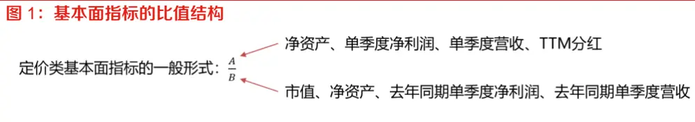
数据来源：东方证券研究所

我们知道一旦涉及到除法这种比值形式，就会遇到除数效应的问题。当分母取值接近 0 时，可能会显著放大指标的取值从而造成取值异常，当分子为 0 时会使结果取值都为 0，当分子和分母的数量级差距较大时也会导致异常的放大和缩小效应。并且这些基本面指标从其定义的出发点都是以绝对的定价为主，例如通过 ROE、增速等对股票价格进行定价，并且更关注同一只股票某项指标的时序变化。但是当面临选股问题时，我们并不关注每只股票的ROE的具体取值大小，我们更关注股票间的相对强弱的排序关系。这种个体的绝对定价取值和股票间的相对排序的供需关系并不能够完美互相匹配。因此我们思考能否从量化选股的截面排序的角度，对这些基本面指标进行重构，以更适应我们的选股需求。

在之前的报告《基本面因子的重构》（20240321）中，我们将这种传统经典的个体除法调整为现代统计理论支撑下的截面整体回归的方式来重构这些基本面因子，如下图所示：

图 2：基本面指标的重构方式

$$
定价类基本面指标的一般形式:$\begin{array}{c}绝对定价转为相对定价\\\xrightarrow{\quad A}\quad ln\quad A=\beta\cdot ln\quad B+\alpha\stackrel{\circ}{\underset{\quad\leftarrow\quad\bullet}{+}}\stackrel{\circ}{\underset{\quad\bullet}{E}}\stackrel{\circ}{\underset{\quad\bullet}{\quad\bullet}}\\\end{array}$取回归的残差作为新的基本面因子.,故题来源:乐方证步研究所
$$

考虑到大部分财务指标在截面上的分布并不正态，因此我们借鉴市值对数化的操作，对每个财务指标也都进行对数化操作以调整其分布。由于财务指标会为负或为 0，因此我们以如下方式来进行对数化调整：

$$
sign(x)\cdot ln(abs(x)+1)
$$

我们取回归的残差作为相对的基本面因子取值。在每个因子构建时，我们都以如下图中的方式来计算因子取值，在回归得到残差因子后我们进一步对残差进行市值行业中性化处理。

图 3：回归版基本面因子计算流程
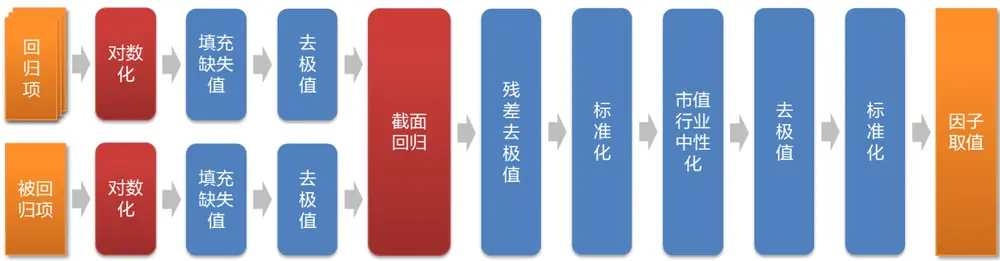
数据来源：东方证券研究所

在之前的报告《基本面因子的重构》（20240321）中，我们对传统的 BP、EP、SP、股息率等估值因子，ROE 等盈利因子，单季净利同比增速等成长因子均进行了重构并对比了重构前后的因子表现情况，从效果来看，重构后的因子普遍表现优于传统的版本，显示了回归版本基本面因子的显著优势。

传统的基本面因子往往以财务经验为主来构建，涉及到的财务科目较少，主要涉及净利润、营收、净资产、总资产等常见科目，但是上市公司的财报中有上百个财务科目，这些科目我们并没有深入的研究了解和经验积累，而截面回归的形式从效果来看可以有效克服两个财务指标间的可比性问题。因此我们想把回归的结构作为一个挖掘基本面因子的有效算子，通过对不同财务科目之间进行截面回归的形式，以挖掘出新的有效的相对定价类基本面因子。

## 二、基本面因子挖掘

## 2.1基本面数据及挖掘流程

本节我们以三大报表利润表、现金流量表、资产负债表中的所有字段作为可用的基础数据，每个字段需要满足全市场截面的覆盖度要求（高于 60%）。下表展示了贵州茅台（600519.SH）的现金流量表的部分数据。

表 1：贵州茅台的部分现金流量表数据（亿元）

| 股票代码 | 报告期 | 期末现金及现金等价物余额 | 经营活动产生的现金流量净额 | 固定资产折旧、油气资产折耗、生产性生物资产折旧 |
| --- | --- | --- | --- | --- |
| 600519.SH | 20220331 | 1705.20 | -68.76 |  |
| 600519.SH | 20220630 | 1486.05 | -0.11 | 7.06 |
| 600519.SH | 20220930 | 1555.09 | 94.05 |  |
| 600519.SH | 20221231 | 1523.79 | 366.99 | 14.44 |
| 600519.SH | 20230331 | 1578.19 | 52.45 |  |
| 600519.SH | 20230630 | 1496.90 | 303.87 | 8.21 |
| 600519.SH | 20230930 | 1593.40 | 500.02 |  |
| 600519.SH | 20231231 | 1503.60 | 665.93 | 16.51 |
| 600519.SH | 20240331 | 1587.69 | 91.87 |  |
| 600519.SH | 20240630 | 1452.67 | 366.22 | 8.49 |
|  |  | 历史累计 | 季度年初累计 | 半年度年初累计 |

数据来源：Wind，东方证券研究所
有关分析师的申明，见本报告最后部分。其他重要信息披露见分析师申明之后部分，或请与您的投资代表联系。并请阅读本证券研究报告最后一页的免责申明。

可以看到，财务字段大致可以分为以下三种类型：历史累计、季度年初累计、半年度年初累计。根据这些基础的字段类型，我们可以加工出以下各种数据：

⚫ 历史累计值（56）

⚫ 历史累计值的单季度值（56）

⚫ 单季度值（66）

⚫ 半年度值（12）

⚫ 去年同期历史累计值（56）

⚫ 去年同期历史累计值的单季度值（56）

⚫ 去年同期单季度值（66）

⚫ 去年同期半年度值（12）

⚫ 历史累计单季度值的同比变化（56）

⚫ 单季度值的同比变化（66）

⚫ 半年度值的同比变化（12）

⚫ 市值（1）

对于大部分字段我们都尽可能加工为最新的单季度类型，因为普遍单季度类指标比TTM类指标的选股能力更显著。以上字段中，历史累计类型共56个字段，几乎都来自于资产负债表；历史累计值相邻两个季度可以计算差值，即可得到历史累计值的单季度值；季度年初累计型的字段均加工为单季度取值，共56个字段，几乎来自于利润表和现金流量表；半年度年初累积型的字段均加工为半年度取值，共12个字段。这些基础字段的去年同期的取值我们也可以同样构建出来，这样可以用当期对去年同期回归，以构建一些同比增速类的因子，另外当期和去年同期的差可以构建同比变化类指标，可以用于构建一些表达成长性的因子。我们再进一步加入市值因子，以便于构建一些估值类因子。最终总共 515个数据字段用于基本面财务因子的挖掘。

如果直接暴力枚举515个字段的任意两个财务指标相互回归的结果，需要计算近25万个因子，计算量会很大。我们可以尝试从回归结构本身来寻找一些能够提高计算效率的手段：

1. A需要包含最新的数据，因此可以排除 A是去年同期的类型；

2. A对B回归的残差如果是一个显著的alpha因子，那么A因子本身大概率有一定的选股能力，剥离 B 之后选股能力得到增强才能转化为一个 alpha 因子，所以可以对每个财务指标单独做市值行业中性化检验因子的有效性，对于完全没有选股能力的财务指标不参与 A 的遍历，这样实际可以降低 80%的计算量；

3. A对 B回归本质是 A相对于 B 定价，A和 B需要存在逻辑上的关联才有意义，而逻辑上的关联体现在 A 和 B 的截面相关性上，A 和 B 相关性过低说明它们并不存在关联，这个回归后的残差也接近 A本身，起不到定价的作用，而 A和 B的相关性过高说明这两个指标几乎包含了相同的信息，那回归后的残差只剩下噪声数据，因此可以限制 A 和 B 需要有适中的相关性，限制相关性后又能够降低 80%的计算量；

4. B因子如果是一个alpha因子，A对B回归后大概率会变差，而B越像一个风险因子，A对B回归后大概率会变更好，因此可以限制 B 因子接近于胜率 50%的风险因子可以进一步降低计算量。

整个基本面因子挖掘的过程如下：

1. 计算 515个数据字段的月频截面因子取值，并以行业中位数填充缺失值、去极值、标准化；

2. 对于任意的截面因子 A，排除 IC胜率低于 55%或年化 ICIR低于 1的因子，排除 A是去年同期类型的因子；

3. 对于任意两个截面因子 A 和 B，限制 A 和 B 的截面相关系数绝对值的均值在[0.1,0.9]之间，对 A和 B进行截面回归；

4. 对回归后的残差因子进行去极值、标准化、市值行业中性化、去极值、标准化操作得到最终的因子取值，参见上图 3。

最终我们计算了 7000 个左右的因子即可完成该计算任务。但是这 7000 多个因子并不都是 alpha因子，我们需要对这些因子进行有效性检验及筛选。我们以 2010-2020 年的数据作为样本内筛选区间，以 2021年-20240731为样本外区间观察这些因子的有效性。

这些因子都是基于基本面数据挖掘而来，因此选股能力不会特别突出，不然早已会像 ROE、PE等传统基本面指标被主动投资者所关注而变得熟知，因此我们只能以一个较低的要求来筛选出其中的有效因子：

⚫ 月度 IC均值绝对值高于 0.02；

⚫ 年化 ICIR 绝对值高于 1.5；

⚫ IC 月度胜率高于 70%；

⚫ 十分组多头超额月度均值高于 0.2%；

⚫ 十分组多空收益月度均值高于 0.5%。

经过以上条件筛选我们可以得到 700 个左右的有效因子，但是这些因子里面有很多因子间的相关性很高，我们进一步以简单的贪心算法来剔除高相关的因子：

⚫ 因子按 ICIR绝对值降序排列，取 ICIR绝对值最高的因子入选；

⚫ 将剩余因子与其相关系数均值绝对值高于 0.5的剔除。

循环往复这个过程我们可以得到 32个因子，两两间相关系数低于 0.5。

## 2.2挖掘的基本面因子表现

本节我们展示部分挖掘得到的基本面因子在样本内外的选股能力。我们先展示部分偏“估值”类的，即对市值回归类的，然后展示部分非“估值”类，即财务科目互相回归类的因子。

## 2.2.1 单季 EBIT 同比变化比市值

该因子以单季度 EBIT的同比变化对市值回归而构建，其回归结构如下：

$$
ln(�data\_Quart\_EBIT)=\beta\cdot ln(MV)+\alpha+\varepsilon
$$

其中 EBIT是利润表的科目，反映了企业的息税前利润。该因子表达了经过市值调整后的 EBIT的成长性。下图分别展示了该因子全样本区间的月度 IC和多空净值。可以看到，因子在样本内外的表现较为一致，并且持续有效。因子月度 IC均值 0.044，年化 ICIR3.73，IC胜率 88%。

图 4：单季 EBIT同比变化比市值因子月度 IC
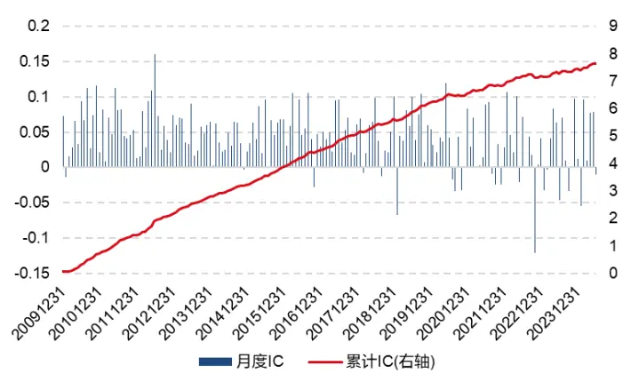
数据来源：Wind，东方证券研究所

图 5：单季 EBIT同比变化比市值因子多空净值
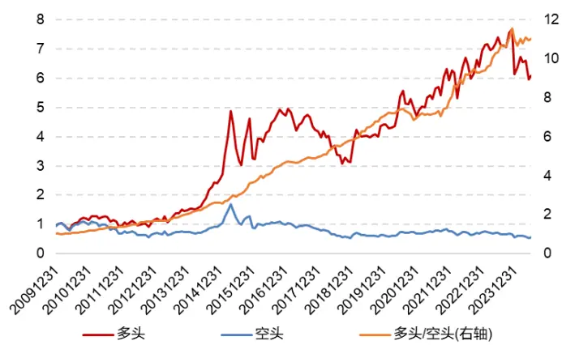
数据来源：Wind，东方证券研究所

下图展示了该因子的十分组月度超额收益均值，分组也较为单调，月均多头超额 0.57%。

图 6： 单季 EBIT同比变化比市值因子十分组月度超额收益均值
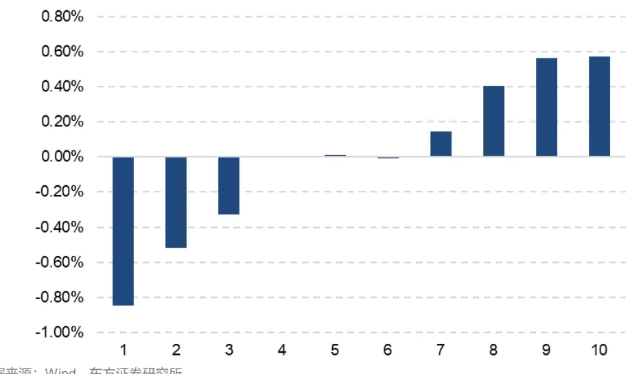
数据来源：Wind，东方证券研究所

## 2.2.2 单季综合收益比市值

该因子以单季度的综合收益总额对市值回归而构建，其回归结构如下：

$$
ln(Quart\_TOT\_COMPREH\_INC)=\beta\cdot ln(MV)+\alpha+\varepsilon
$$

其中综合收益总额是利润表的科目，反映企业净利润和其他综合收益的合计金额。下图分别展示了该因子全样本区间的月度 IC和多空净值。可以看到，因子在样本内外的表现较为一致，并且持续有效，近一年多空表现比历史表现更强。因子月度IC均值0.061，年化ICIR3.67，IC胜率89%。

图 7：单季综合收益比市值因子月度 IC
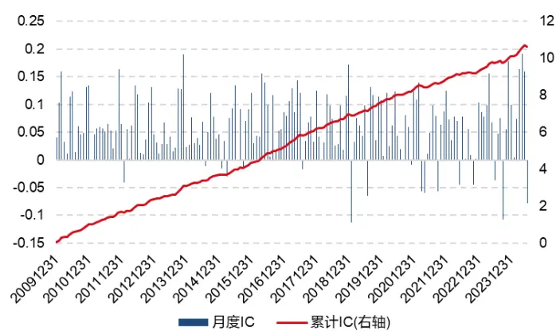
数据来源：Wind，东方证券研究所

图 8：单季综合收益比市值因子多空净值
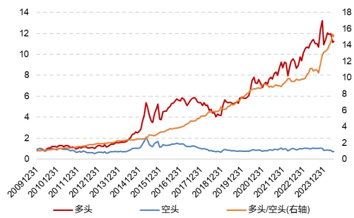
数据来源：Wind，东方证券研究所
下图展示了该因子的十分组月度超额收益均值，分组也较为单调，月均多头超额 0.91%。

图 9：单季综合收益比市值因子十分组月度超额收益均值
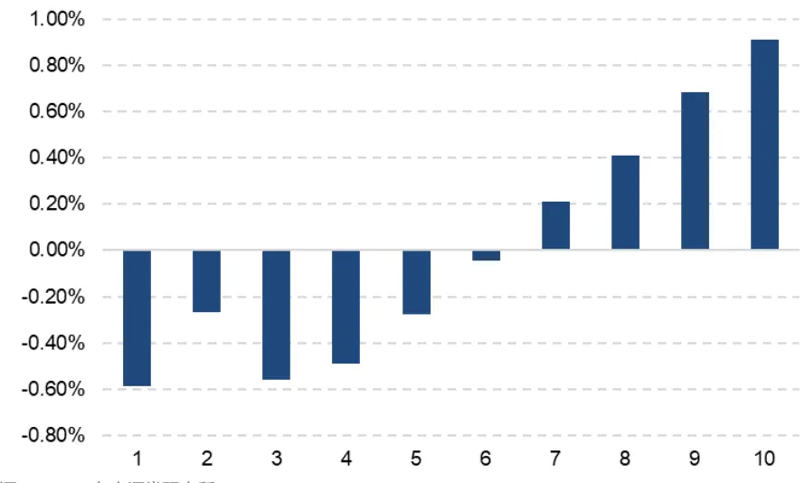
数据来源：Wind，东方证券研究所

## 2.2.3单季未分配利润同比变化比市值

该因子以单季度未分配利润的同比变化对市值回归而构建，其回归结构如下：

$$
ln(�)\_Quart\_UNDISTRIBUTED\_PROFIT)=\beta\cdot ln(MV)+\alpha+\varepsilon
$$

其中未分配利润是资产负债表的科目，指企业留待以后年度分配或者待分配的利润。下图分别展示了该因子全样本区间的月度 IC和多空净值。可以看到，因子在样本内外的表现较为一致，并且持续有效。因子月度 IC 均值 0.036 化 ICIR3.1IC 胜率 82%。

图 10：单季未分配利润同比变化比市值因子月度 IC
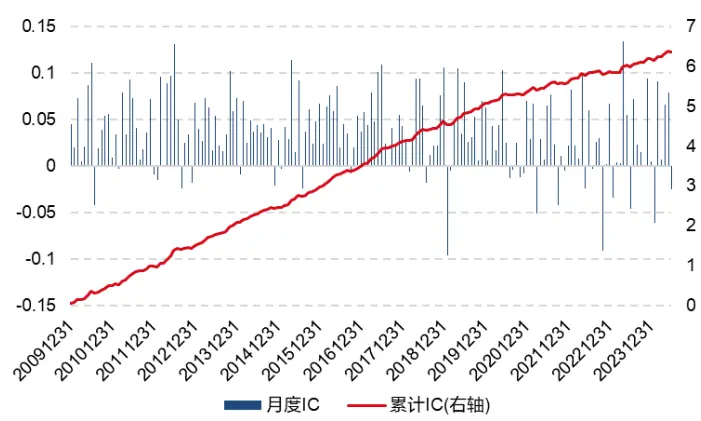
数据来源：Wind，东方证券研究所

图 11：单季未分配利润同比变化比市值因子多空净值
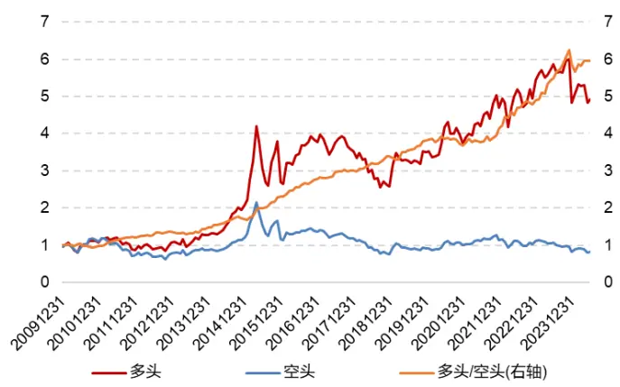
数据来源：Wind，东方证券研究所
下图展示了该因子的十分组月度超额收益均值，分组总体单调，月均多头超额 0.44%。

图 12：单季未分配利润同比变化比市值因子十分组月度超额收益均值
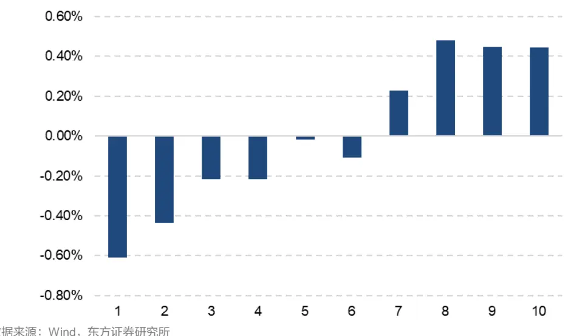
数据来源：Wind，东方证券研究所

## 2.2.4单季其他收益比市值

该因子以单季度的其他收益对市值回归而构建，其回归结构如下：

$$
ln(Quart\_OTHER\_INCOME)=\beta\cdot ln(MV)+\alpha+\varepsilon
$$

其中其他收益是利润表的科目，反映计入其他收益的政府补助，以及其他与日常活动相关且计入其他收益的项目。下图分别展示了该因子全样本区间的月度 IC和多空净值。可以看到，因子在样本内外的表现较为一致，并且持续有效。因子月度IC均值0.024，年化ICIR2.34，IC胜率72%。

图 13：单季其他收益比市值因子月度 IC
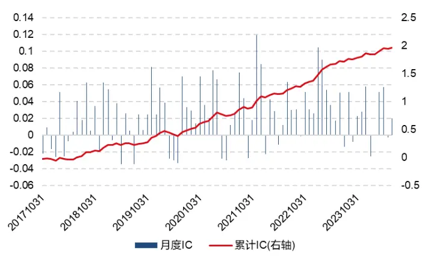
数据来源：Wind，东方证券研究所

图 14：单季其他收益比市值因子多空净值
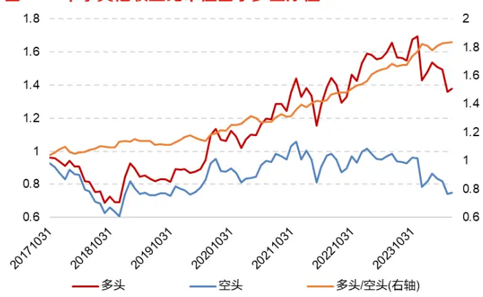
数据来源：Wind，东方证券研究所
下图展示了该因子的十分组月度超额收益均值，分组非常单调，月均多头超额 0.44%。

图 15：单季其他收益比市值因子十分组月度超额收益均值
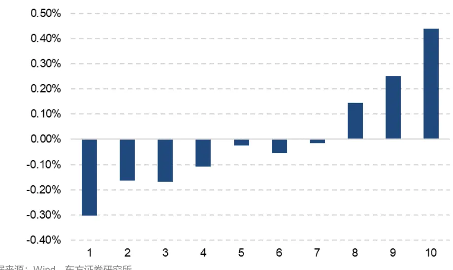
数据来源：Wind，东方证券研究所

## 2.2.5单季经营活动现金流净额比市值

该因子以单季度的经营活动产生的现金流量净额对市值回归而构建，其回归结构如下：

$$
ln(Quart\_NET\_CASH\_FLOWS\_OPER\_ACT)=\beta\cdot ln(MV)+\alpha+\varepsilon
$$

其中经营活动产生的现金流量净额是现金流量表的科目，指企业与经营活动有关的现金流入金额减去现金流出的净额。下图分别展示了该因子全样本区间的月度 IC和多空净值。可以看到，因子在样本内外的表现较为一致，并且持续有效。因子月度 IC 均值 0.028，年化 ICIR2.94，IC 胜率81%。从因子表现来看，因子的 IC呈现越来越高的趋势。

图 16：单季经营活动现金流净额比市值因子月度 IC
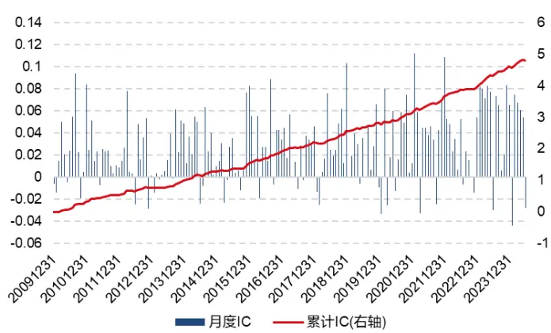
数据来源：Wind，东方证券研究所

图 17：单季经营活动现金流净额比市值因子多空净值
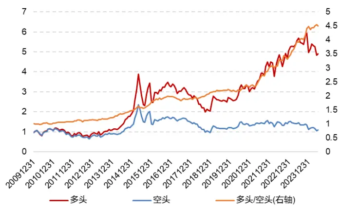
数据来源：Wind，东方证券研究所

下图展示了该因子的十分组月度超额收益均值，分组也总体单调，月均多头超额 0.45%。

图 18：单季经营活动现金流净额比市值因子十分组月度超额收益均值
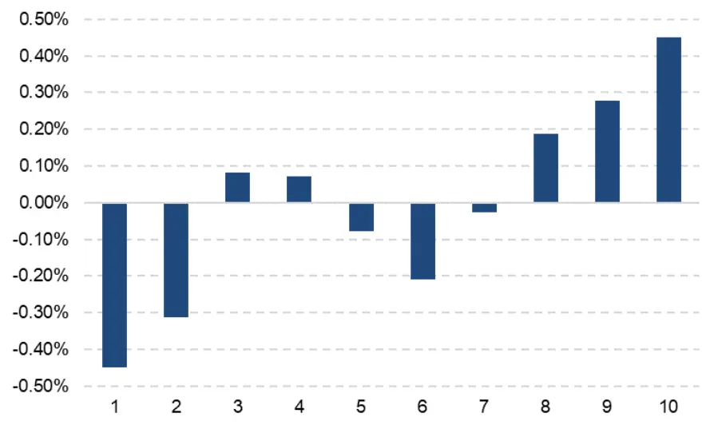
数据来源：Wind，东方证券研究所

## 2.2.6单季总资产比市值

该因子以单季度的负债及股东权益总计对市值回归而构建，其回归结构如下：

$$
ln(Quart\_TOT\_LIAB\_SHRHLDR\_EQY)=\beta\cdot ln(MV)+\alpha+\varepsilon
$$

其中负债及股东权益总计是资产负债表的科目，反映了企业所有者权益和负债的总和，即企业的总资产，是一个历史累计值。下图分别展示了该因子全样本区间的月度 IC和多空净值。可以看到，因子在样本内外的表现较为一致，并且持续有效。因子月度IC均值0.028，年化ICIR3.13，IC胜率 82%。

图 19：单季总资产比市值因子月度 IC
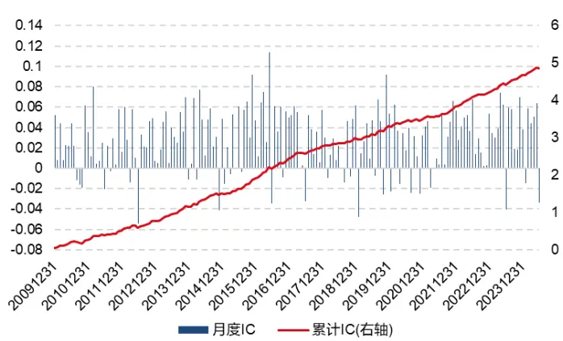
数据来源：Wind，东方证券研究所

图 20：单季总资产比市值因子多空净值
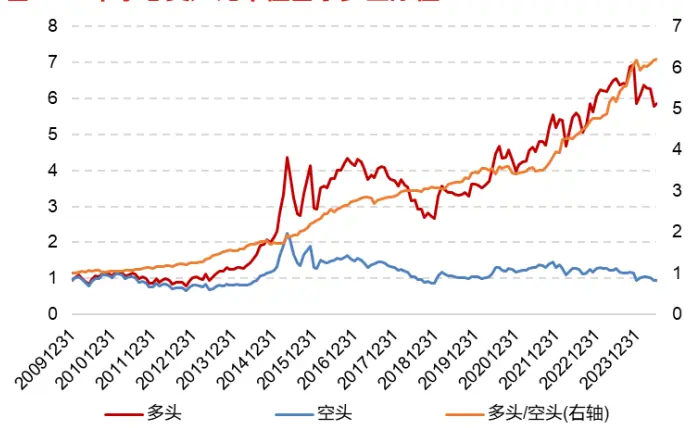
数据来源：Wind，东方证券研究所
下图展示了该因子的十分组月度超额收益均值，分组也较为单调，月均多头超额 0.55%。

图 21：单季总资产比市值因子十分组月度超额收益均值
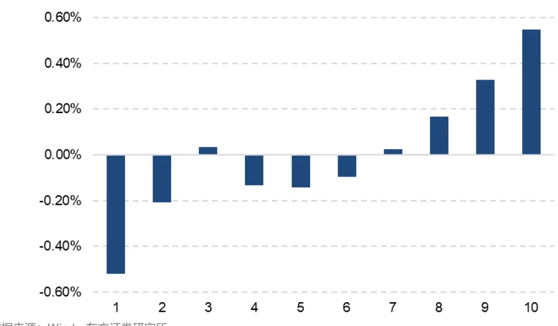
数据来源：Wind，东方证券研究所

## 2.2.7单季投资现金流出比市值

该因子以单季度的投资活动现金流出小计对市值回归而构建，其回归结构如下：

$$
ln(Quart\_STOT\_CASH\_OUTLUWS\_INV\_ACT)=\beta\cdot ln(MV)+\alpha+\varepsilon
$$

其中投资活动现金流出小计是现金流量表的科目，指企业经营过程中所产生的与投资活动相关的现金流出的金额的合计值。下图分别展示了该因子全样本区间的月度 IC和多空净值。可以看到，因子在样本内外的表现较为一致，并且持续有效。因子月度IC均值0.025，年化ICIR2.45，IC胜率 75%。

图 22：单季投资现金流出比市值因子月度 IC
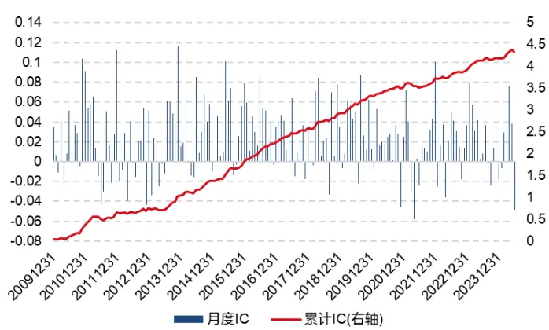
数据来源：Wind，东方证券研究所

图 23：单季投资现金流出比市值因子多空净值
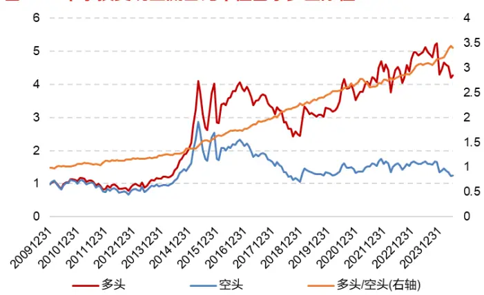
数据来源：Wind，东方证券研究所
下图展示了该因子的十分组月度超额收益均值，分组也较为单调，月均多头超额 0.36%。

图 24：单季投资现金流出比市值因子十分组月度超额收益均值
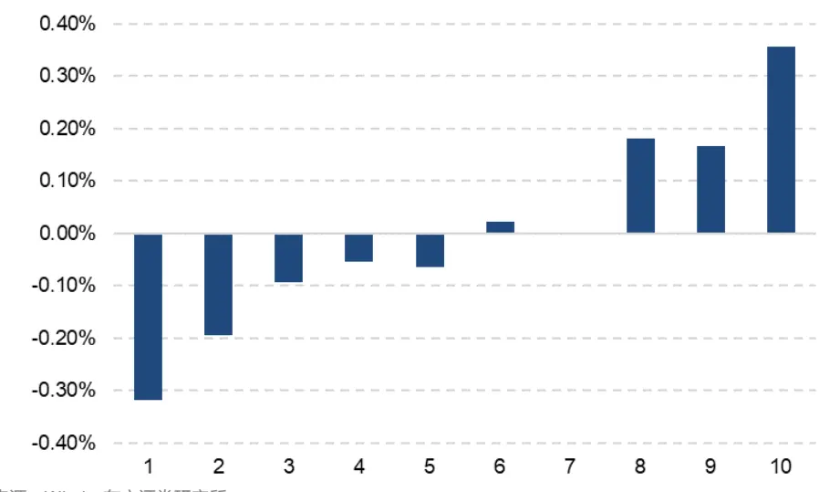
数据来源：Wind，东方证券研究所

## 2.2.8应付职工薪酬比去年同期其他应付款

该因子以应付职工薪酬对去年同期的其他应付款回归而构建，其回归结构如下：

$$
ln(EMPL\_BEN\_PAYABLE)=\beta\cdot ln(Losssame\_OTH\_PAYABLE\_TOT)+\alpha+\varepsilon
$$

其中应付职工薪酬是资产负债表的科目，指按照规定应付给职工的各种薪资报酬，其他应付款也是资产负债表的科目，指应付利息、应付股利与其他应付款合计。该因子同时表达了相对占比和同比增速的双重含义。下图分别展示了该因子全样本区间的月度 IC和多空净值。可以看到，因子在样本内外的表现较为一致，并且持续有效。因子月度 IC 均值 0.027，年化 ICIR2.77，IC 胜率81%。

图 25：应付职工薪酬比去年同期其他应付款因子月度 IC
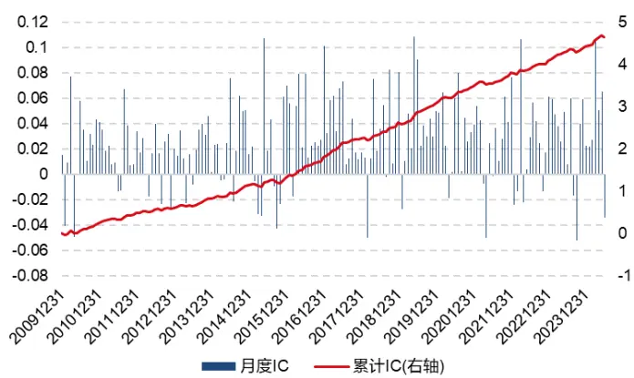
数据来源：Wind，东方证券研究所

图 26：应付职工薪酬比去年同期其他应付款因子多空净值
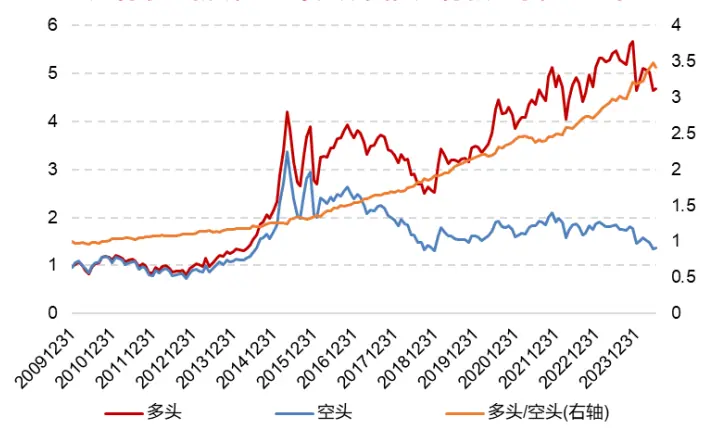
数据来源：Wind，东方证券研究所

下图展示了该因子的十分组月度超额收益均值，分组也非常单调，月均多头超额 0.41%。

图 27：应付职工薪酬比去年同期其他应付款因子十分组月度超额收益均值
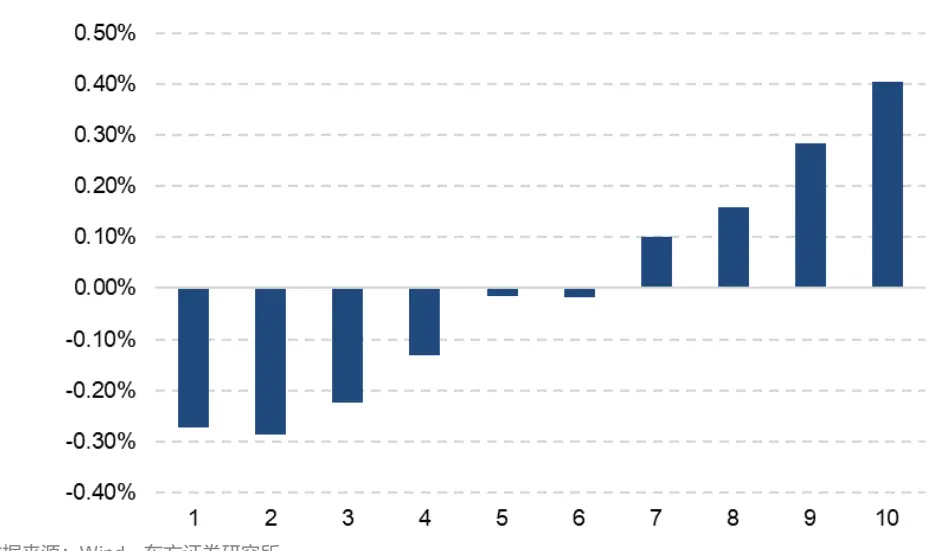
数据来源：Wind，东方证券研究所

## 2.2.9单季所得税比去年同期单季 EBIT

该因子以单季度所得税对去年同期单季度 EBIT回归而构建，其回归结构如下：

$$
ln(Quart\_INC\_TAX)=\beta\cdot ln(Lassame\_Quart\_EBIT)+\alpha+\varepsilon
$$

其中所得税是利润表的科目，指缴纳的企业所得税的金额，EBIT 也是利润表的科目，指企业的息税前利润。该因子同时表达了相对占比和同比增速的双重含义。下图分别展示了该因子全样本区间的月度 IC和多空净值。可以看到，因子在样本内外的表现较为一致，并且持续有效。因子月度IC 均值 0.036，年化 ICIR3.08，IC 胜率 82%。

图 28：单季所得税比去年同期单季 EBIT因子月度 IC
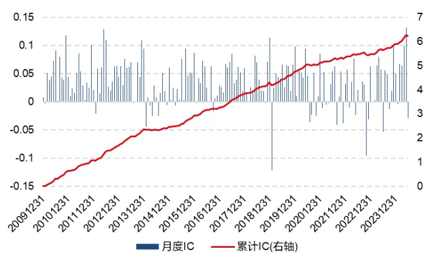
数据来源：Wind，东方证券研究所

图 29：单季所得税比去年同期单季 EBIT因子多空净值
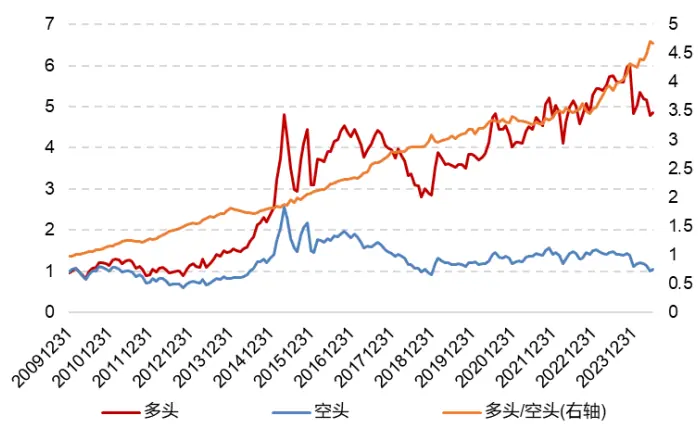
数据来源：Wind，东方证券研究所
下图展示了该因子的十分组月度超额收益均值，分组也总体单调，月均多头超额 0.46%。

图 30：单季所得税比去年同期单季 EBIT因子十分组月度超额收益均值
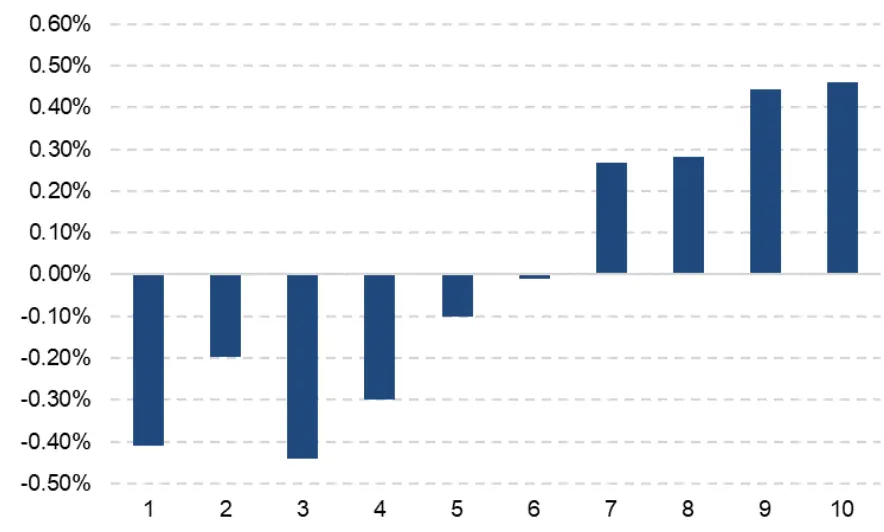
数据来源：Wind，东方证券研究所

## 2.2.10单季购建长期资产支付现金比去年同期在建工程

该因子以单季度的购建固定资产、无形资产和其他长期资产支付的现金对去年同期的在建工程回归而构建，其回归结构如下：

$$
ln(Quart\_CASH\_PAY\_ACQ\_CONST\_FIOLTA)=\beta\cdot ln(Losssame\_CONST\_IN\_PROG\_TOT)+\alpha+\varepsilon
$$

其中购建固定资产、无形资产和其他长期资产支付的现金是现金流量表的科目，指企业用于固定资产、无形资产、其他长期资产等购置所支付的现金，在建工程是资产负债表的科目，指企业的在建工程与工程物资科目合计。该因子反映了上市公司在该季度的固定资产的扩张水平。下图分别展示了该因子全样本区间的月度 IC和多空净值。可以看到，因子在样本内外的表现较为一致，并且持续有效。因子月度 IC均值 0.021，年化 ICIR2.35，IC胜率 75%。

图 32：单季购建长期资产支付现金比去年同期在建工程因子多空净值
图 31：单季购建长期资产支付现金比去年同期在建工程因子月度 IC
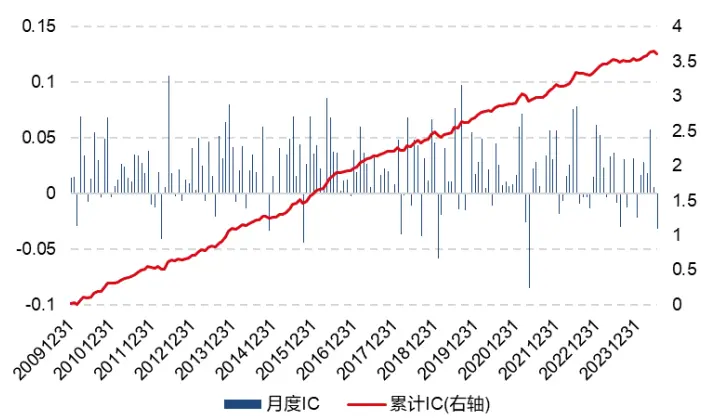
数据来源：Wind，东方证券研究所

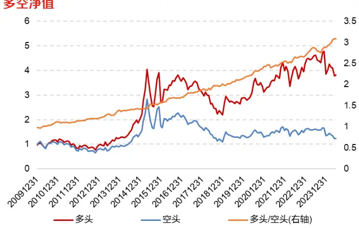
数据来源：Wind，东方证券研究所

下图展示了该因子的十分组月度超额收益均值，分组也较为单调，月均多头超额 0.31%。

图 33：单季购建长期资产支付现金比去年同期在建工程因子十分组月度超额收益均值
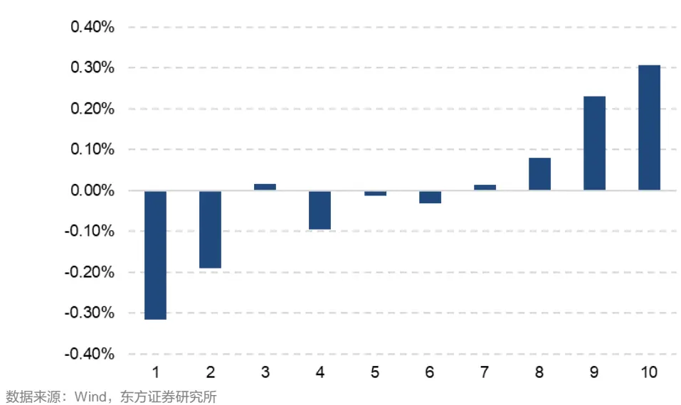

有关分析师的申明，见本报告最后部分。其他重要信息披露见分析师申明之后部分，或请与您的投资代表联系。并请阅读本证券研究报告最后一页的免责申明。

## 2.2.11单季归母净利润比母公司综合收益

该因子以单季度的归母净利润对单季度的综合收益总额（母公司）回归而构建，其回归结构如下：

$$
\begin{aligned}ln(Quart\_NET\_PROFIT\_EXCL\_MIN\_INT\_INC)\\=\beta\cdot ln(Quart\_TOT\_COMPREH\_INC\_PARENT\_COMP)+\alpha+\varepsilon\end{aligned}
$$

其中归母净利润是利润表的科目，反映上市公司的归属于母公司的净利润，综合收益总额（母公司）也是利润表的科目，反映归属于母公司股东（所有者）的那部分综合收益总额。下图分别展示了该因子全样本区间的月度 IC和多空净值。可以看到，因子在样本内外的表现较为一致，并且持续有效。因子月度 IC 均值 0.047，年化 ICIR2.92，IC 胜率 83%。

图 34：单季归母净利润比母公司综合收益因子月度 IC
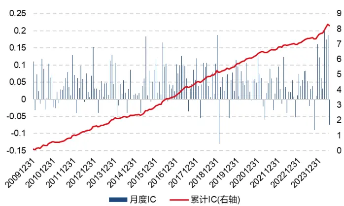
数据来源：Wind，东方证券研究所

图 35：单季归母净利润比母公司综合收益因子多空净值
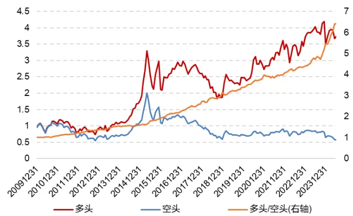
数据来源：Wind，东方证券研究所

下图展示了该因子的十分组月度超额收益均值，分组也总体单调，月均多头超额 0.26%。

图 36：单季归母净利润比母公司综合收益因子十分组月度超额收益均值
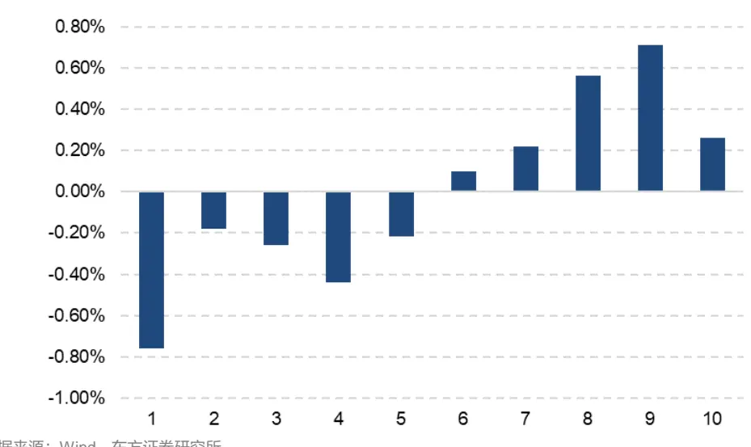
数据来源：Wind，东方证券研究所

## 2.2.12单季营业总成本比去年同期流动负债

该因子以单季度的营业总成本对去年同期的流动负债合计回归而构建，其回归结构如下：

$$
ln(Quart\_TOT\_OPER\_COST2)=\beta\cdot ln(Lassame\_TOT\_CUR\_LIAB)+\alpha+\varepsilon
$$

其中营业总成本是利润表的科目，指上市公司的营业总成本，而流动负债合计是资产负债表的科目，指上市公司的流动负债类科目合计值。下图分别展示了该因子全样本区间的月度 IC和多空净值。可以看到，因子在样本内外的表现较为一致，并且持续有效。因子月度 IC 均值 0.029，年化ICIR2.4，IC 胜率 76%。

图 37：单季营业总成本比去年同期流动负债因子月度 IC
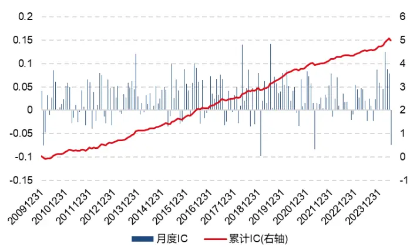
数据来源：Wind，东方证券研究所

图 38：单季营业总成本比去年同期流动负债因子多空净值
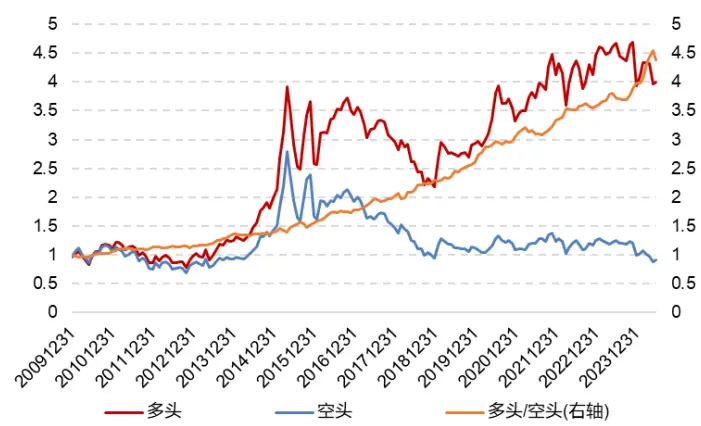
数据来源：Wind，东方证券研究所

下图展示了该因子的十分组月度超额收益均值，分组也非常单调，月均多头超额 0.31%。

图 39：单季营业总成本比去年同期流动负债因子十分组月度超额收益均值
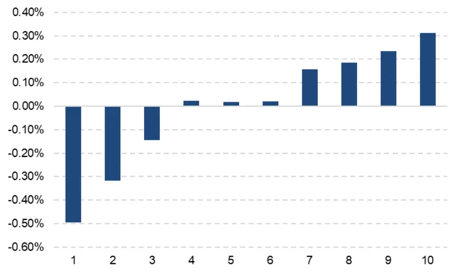
数据来源：Wind，东方证券研究所

## 2.2.13单季营业税金比总资产

该因子以单季度的营业税金及附加对资产总计回归而构建，其回归结构如下：

$$
ln(Quart\_LESS\_TAXES\_SURCHARGES\_OPS)=\beta\cdot ln(TOT\_ASSETS)+\alpha+\varepsilon
$$

其中营业税金及附加是利润表的科目，反映企业经营的主要业务应负担的消费税、资源税、教育附加、城市维护建设税等，资产总计是资产负债表的科目，指企业拥有或控制的能以货币计量的经济资源，包括各种财产、债权和其他权利。下图分别展示了该因子全样本区间的月度 IC和多空净值。可以看到，因子在样本内外的表现较为一致，并且持续有效。因子月度 IC 均值 0.021，年化 ICIR1.92，IC 胜率 72%。

图 40：单季营业税金比总资产因子月度 IC
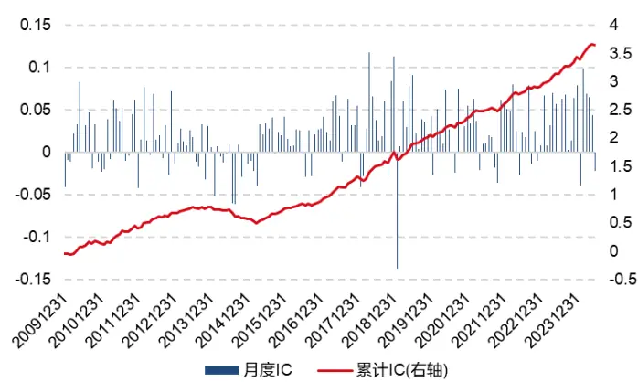
数据来源：Wind，东方证券研究所

图 41：单季营业税金比总资产因子多空净值
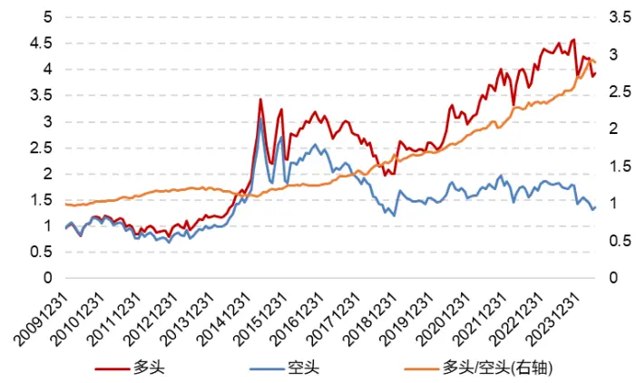
数据来源：Wind，东方证券研究所

下图展示了该因子的十分组月度超额收益均值，分组也较为单调，月均多头超额 0.3%。

图 42：单季营业税金比总资产因子十分组月度超额收益均值
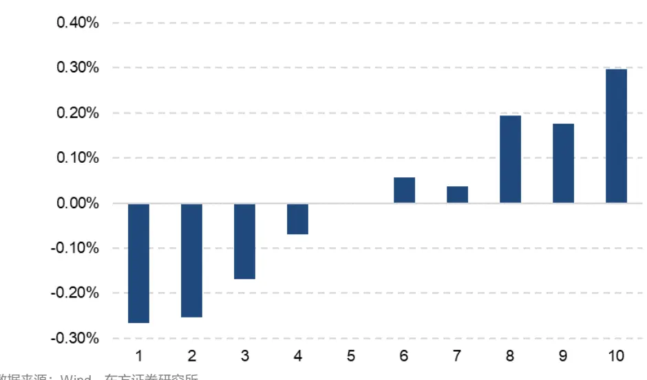
数据来源：Wind，东方证券研究所

## 2.2.14盈余公积金比去年同期单季利息费用

该因子以盈余公积金对去年同期的单季度利息费用回归而构建，其回归结构如下：

$$
ln(SURPLUS\_RSRV)=\beta\cdot ln(Losssame\_Quart\_STMNOTE\_FINEXP)+\alpha+\varepsilon
$$

其中盈余公积金是资产负债表的科目，反映公司盈余中提取的公积金，利息费用是利润表的科目，反映企业为筹集生成经营所需资金等而发生的应予费用化的利息支出。下图分别展示了该因子全样本区间的月度 IC和多空净值。可以看到，因子在样本内外的表现较为一致，并且持续有效。因子月度 IC 均值 0.047，年化 ICIR2.23，IC 胜率 72%。

图 43：盈余公积金比去年同期单季利息费用因子月度 IC
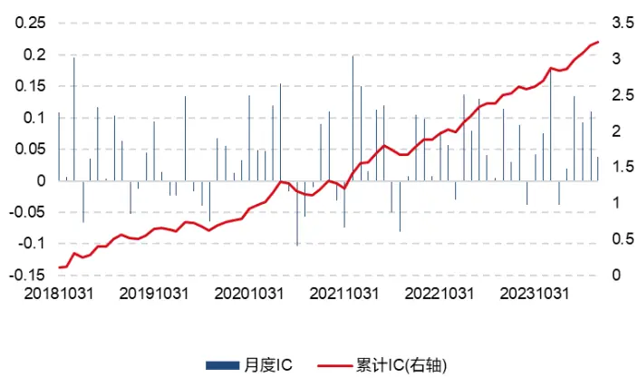
数据来源：Wind，东方证券研究所

图 44：盈余公积金比去年同期单季利息费用因子多空净值
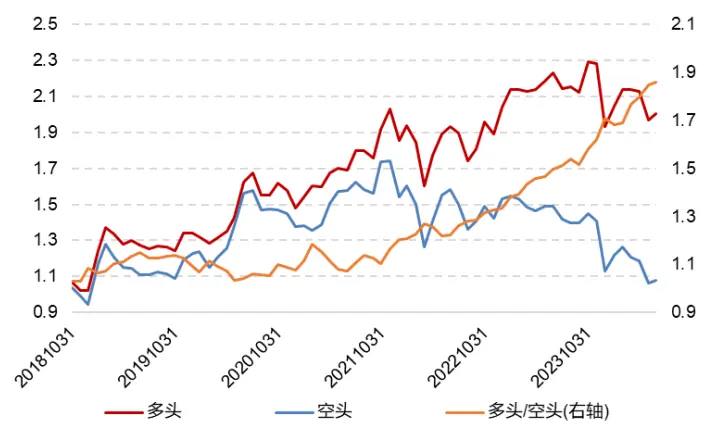
数据来源：Wind，东方证券研究所
下图展示了该因子的十分组月度超额收益均值，分组也较为单调，月均多头超额 0.38%。

图 45：盈余公积金比去年同期单季利息费用因子十分组月度超额收益均值
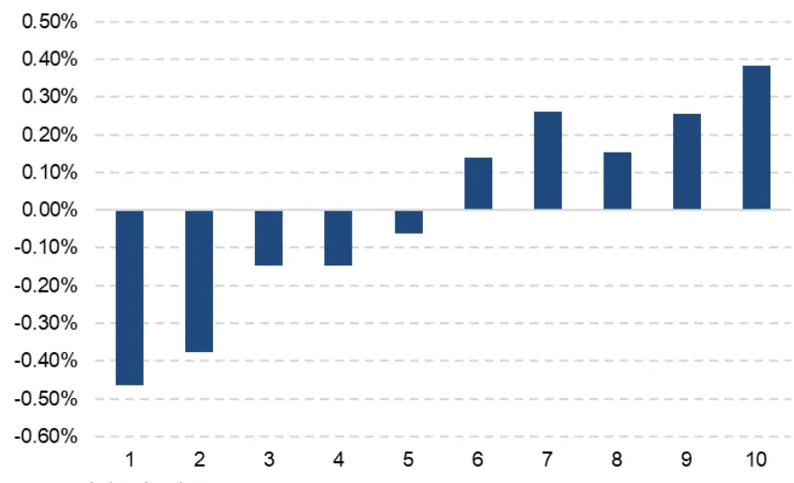
数据来源：Wind，东方证券研究所

## 2.2.15未分配利润比去年同期单季度未分配利润

该因子以未分配利润对去年同期单季度的未分配利润回归而构建，其回归结构如下：

$$
ln(UNDISTRIBUTED\_PROFTT)=\beta\cdot ln(Losssame\_Quart\_UNDISTRIBUTED\_PROFTT)+\alpha+\varepsilon
$$

其中未分配利润是资产负债表的科目，指企业留待以后年度分配或者待分配的利润。下图分别展示了该因子全样本区间的月度 IC和多空净值。可以看到，因子在样本内外的表现较为一致，并且持续有效。因子月度 IC 均值 0.037，年化 ICIR2.07，IC 胜率 71%。

图 46：未分配利润比去年同期单季未分配利润因子月度 IC
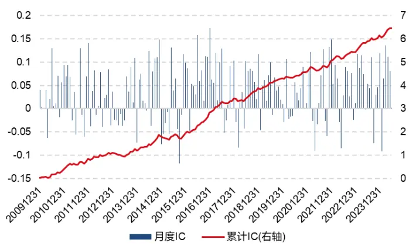
数据来源：Wind，东方证券研究所

图 47：未分配利润比去年同期单季未分配利润因子多空净值
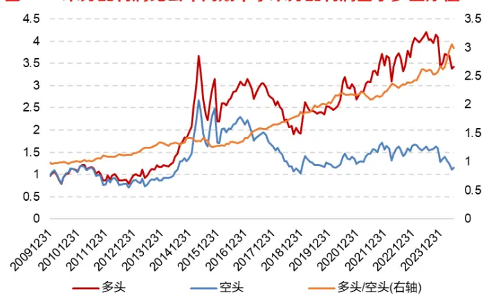
数据来源：Wind，东方证券研究所
下图展示了该因子的十分组月度超额收益均值，分组也较为单调，月均多头超额 0.22%。

图 48：未分配利润比去年同期单季未分配利润因子十分组月度超额收益均值
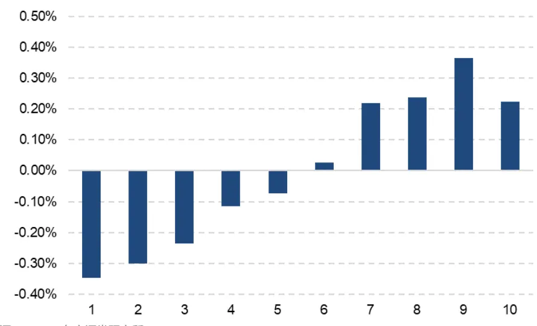
数据来源：Wind，东方证券研究所

## 2.2.16 半年固定资产折旧比去年同期单季利息费用

该因子以半年度的固定资产折旧、油气资产折耗、生产性生物资产折旧对去年同期单季度的利息费用回归而构建，其回归结构如下：

$$
ln(Haff\_DEPR\_FA\_COGA\_DPBA)=\beta\cdot ln(Lassame\_Quart\_STMNOTE\_FINEXP)+\alpha+\varepsilon
$$

其中固定资产折旧、油气资产折耗、生产性生物资产折旧是现金流量表的科目，反映因固定资产、油气资产、生产性生物资产按会计准则要求发生折旧在本报告期的体现，利息费用是利润表的科目，反映企业为筹集生成经营所需资金等而发生的应予费用化的利息支出。下图分别展示了该因子全样本区间的月度 IC和多空净值。可以看到，因子在样本内外的表现较为一致，并且持续有效。因子月度 IC 均值 0.038，年化 ICIR2.23，IC 胜率 74%。

图 49：半年固定资产折旧比去年同期单季利息费用因子月度IC
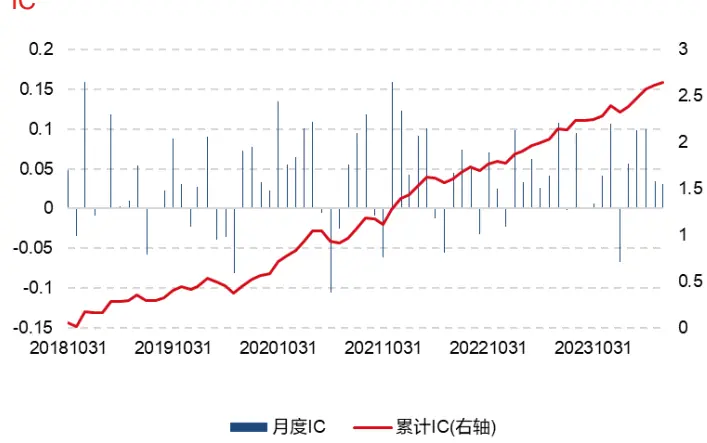
数据来源：Wind，东方证券研究所

图 50：半年固定资产折旧比去年同期单季利息费用因子多空
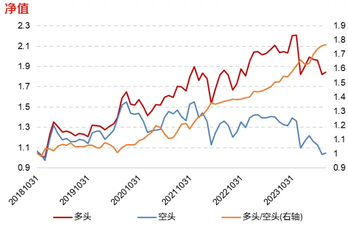
数据来源：Wind，东方证券研究所

下图展示了该因子的十分组月度超额收益均值，分组也较为单调，月均多头超额 0.27%。

图 51：半年固定资产折旧比去年同期单季利息费用因子十分组月度超额收益均值
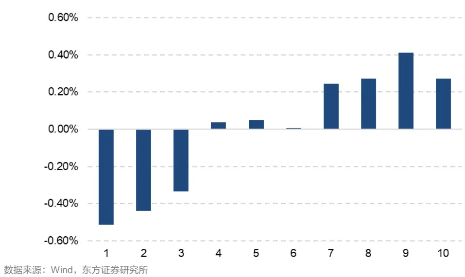

有关分析师的申明，见本报告最后部分。其他重要信息披露见分析师申明之后部分，或请与您的投资代表联系。并请阅读本证券研究报告最后一页的免责申明。

## 2.2.17 单季经营活动现金流入同比增速

该因子以单季度的经营活动现金流入对去年同期单季度的经营活动现金流入回归而构建，其回归结构如下：

$$
\begin{aligned}ln(Quart\_STOT\_CASH\_INFLOWS\_OPER\_ACT)\\=\beta\cdot ln(Lasstsame\_Quart\_STOT\_CASH\_INFLOWS\_OPER\_ACT)+\alpha+\varepsilon\end{aligned}
$$

其中经营活动现金流入是现金流量表的科目，指企业与经营活动相关的现金流量的明细统计。下图分别展示了该因子全样本区间的月度 IC和多空净值。可以看到，因子在样本内外的表现较为一致，并且持续有效。因子月度 IC均值 0.029，年化 ICIR2. 7，IC胜率 78%。

图 52：单季经营活动现金流入同比增速因子月度 IC
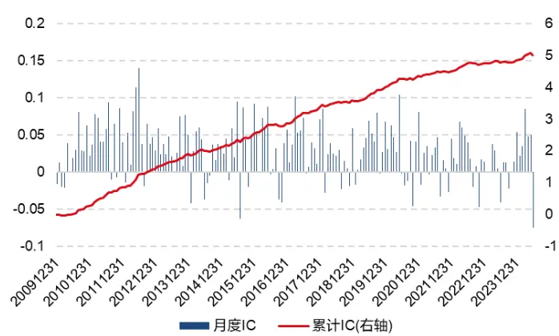
数据来源：Wind，东方证券研究所

图 53：单季经营活动现金流入同比增速因子多空净值
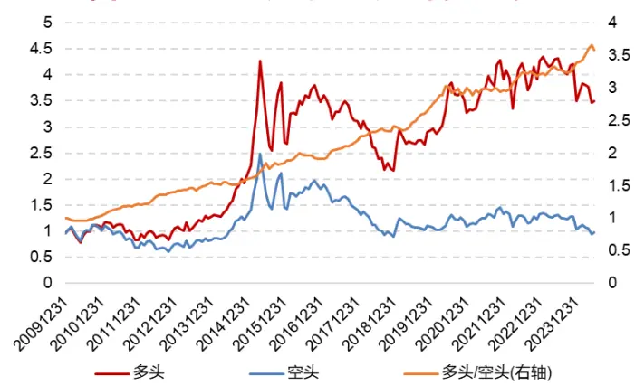
数据来源：Wind，东方证券研究所

下图展示了该因子的十分组月度超额收益均值，分组也较为单调，月均多头超额 0.27%。

图 54：单季经营活动现金流入同比增速因子十分组月度超额收益均值
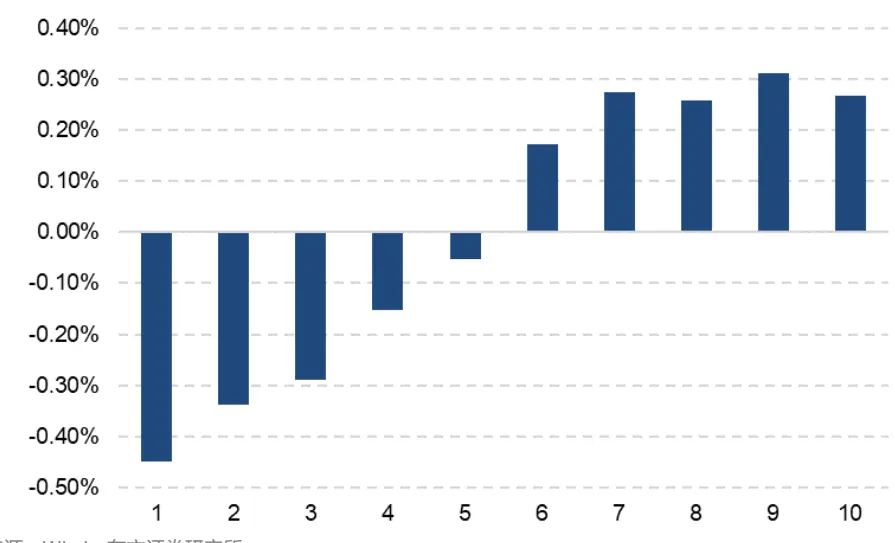
数据来源：Wind，东方证券研究所

## 2.2.18现金等价物比去年同期其他综合收益

该因子以现金及现金等价物余额对去年同期其他综合收益回归而构建，其回归结构如下：

$$
ln(CASH_{-}CASH_{-}EQU_{-}END_{-}PERIOD)=\beta\cdot ln(Lasssame_{-}OTHER_{-}COMP_{-}INCOME)+\alpha+\varepsilon
$$

其中现金及现金等价物余额是现金流量表的科目，指报表截止日期现金及融资期限为三个月或三个月内的，具有高度流动性且内购赚取利息的投资的余额，其他综合收益是资产负债表的科目，指企业根据其他会计准则规定未在当期损益中确认的各项利得和损失。下图分别展示了该因子全样本区间的月度 IC和多空净值。可以看到，因子在样本内外的表现较为一致，并且持续有效。因子月度 IC 均值 0.031，年化 ICIR2.2，IC 胜率 71%。

图 55：现金等价物比去年同期其他综合收益因子月度 IC
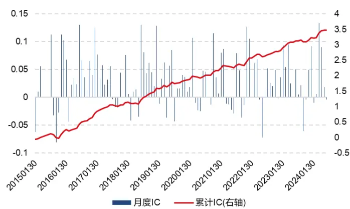
数据来源：Wind，东方证券研究所

图 56：现金等价物比去年同期其他综合收益因子多空净值
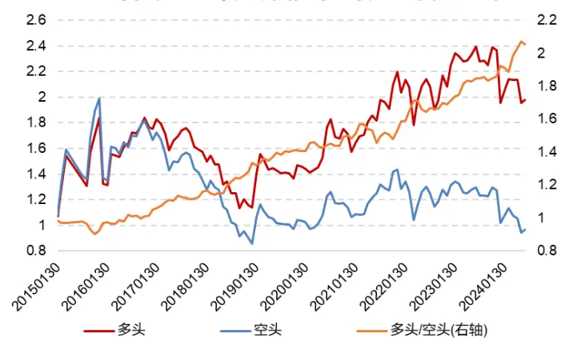
数据来源：Wind，东方证券研究所

下图展示了该因子的十分组月度超额收益均值，分组也较为单调，月均多头超额 0.21%。

图 57：现金等价物比去年同期其他综合收益因子十分组月度超额收益均值
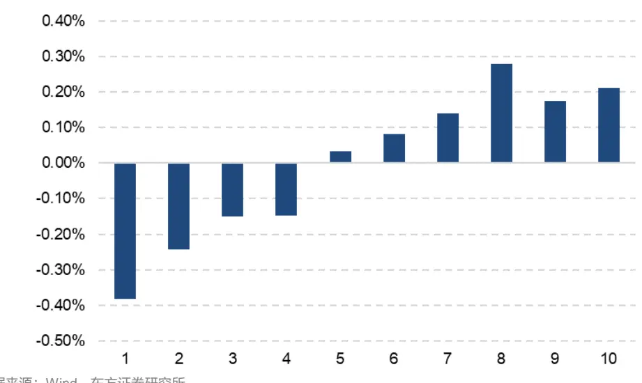
数据来源：Wind，东方证券研究所

## 2.3基本面复合因子表现

本节我们将挖掘得到的 32个基本面因子进行线性复合，考虑到虽然有相关性低于 0.5的筛选，但是因子间仍存在一定的相关性，我们以截面对称正交来剔除因子间的共线性。并且考虑到因子未来潜在的失效/短期弱势可能，我们以因子滚动一年 ICIR进行加权复合得到复合因子。

图 58：基本面复合因子月度 IC
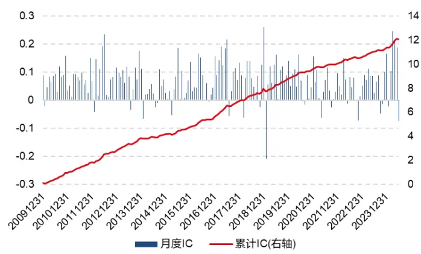
数据来源：Wind，东方证券研究所

图 59：基本面复合因子多空净值
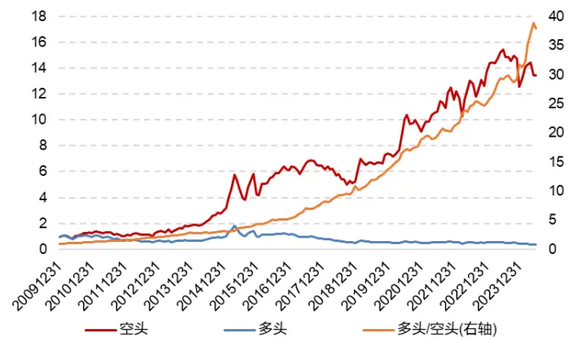
数据来源：Wind，东方证券研究所

可以看到，复合因子在样本内外的表现较为一致，并且持续有效。复合因子月度 IC 均值 0.069，年化ICIR3.48，IC胜率87%。下图展示了该复合因子的十分组月度超额收益均值，分组也非常单调，月均多头超额 1.01%。

图 60：基本面复合因子十分组月度超额收益均值
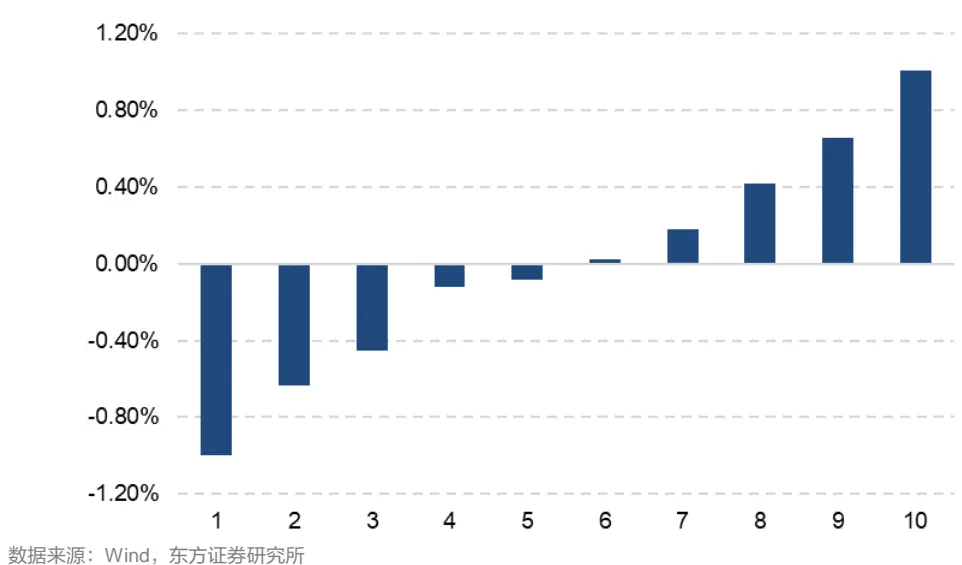

## 三、基本面衍生因子挖掘

前文中我们以三大报表的财务字段进行两两回归，构建了32个基本面因子。本节中我们进一步把盈余公告披露时衍生的量价数据也作为广义的基本面衍生指标，作为回归模型的输入，希望能够构造出一些新的基本面衍生因子。

## 3.1基本面衍生数据及挖掘流程

我们把盈余公告披露时的一些量价特征作为回归模型的输入，主要包括以下简单的日 K特征：

⚫ 盈余公告次日开盘跳空超额；

⚫ 盈余公告次日换手率；

⚫ 盈余公告次日 ILLIQ，即涨跌幅绝对值/当日成交额；

- 盈余公告后累计超额市场收益，即每只股票取最新一期盈余公告当日到计算因子当天的区间收益减去同区间内市场指数的收益得到区间超额收益；

- 盈余公告后累计超额行业收益，即每只股票取最新一期盈余公告当日到计算因子当天的区间收益减去同区间内所在行业指数的收益得到区间超额收益。

我们将以上特征作为回归模型的输入来挖掘基本面衍生类相对定价因子，并用同样的因子有效性参数筛选有效因子，以 0.5相关系数进行过滤最终得到 2个因子。

## 3.2挖掘的基本面衍生因子

下面我们展示挖掘得到的基本面衍生因子在样本内外的表现情况。

## 3.2.1盈余公告开盘跳空超额比公告后累计行业超额

该因子以盈余公告次日开盘跳空超额对盈余公告后累计超额行业收益回归而构建，回归结构如下：

$$
JOR_{-}OPEN_{-}ZZQZ=\beta\cdot EXC_{-}CITICS_{-}RET_{-}AFTER_{-}REPORT+\alpha+\varepsilon
$$

盈余公告次日开盘跳空超额因子本身已经是一个非常显著的因子，其表现如下图所示。因子月度IC 均值 0.042，年化 ICIR3.93，IC 胜率 90%。

图 61：盈余公告开盘跳空超额因子月度 IC
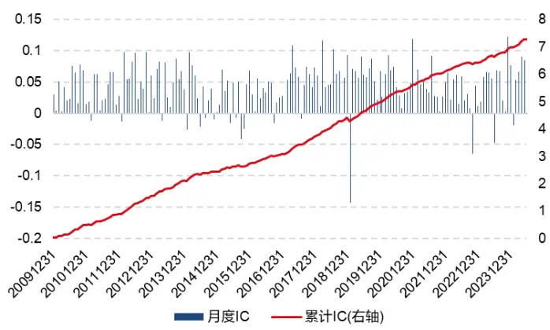
数据来源：Wind，东方证券研究所

图 62：盈余公告开盘跳空超额因子多空净值
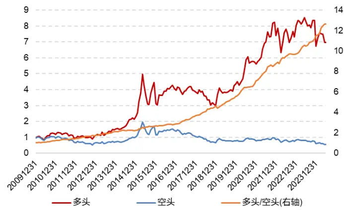
数据来源：Wind，东方证券研究所
有关分析师的申明，见本报告最后部分。其他重要信息披露见分析师申明之后部分，或请与您的投资代表联系。并请阅读本证券研究报告最后一页的免责申明。

下图展示了盈余公告次日开盘跳空超额因子的十分组月度超额收益均值，分组非常单调，月均多头超额 0.65%。

图 63：盈余公告开盘跳空超额因子十分组月度超额收益均值
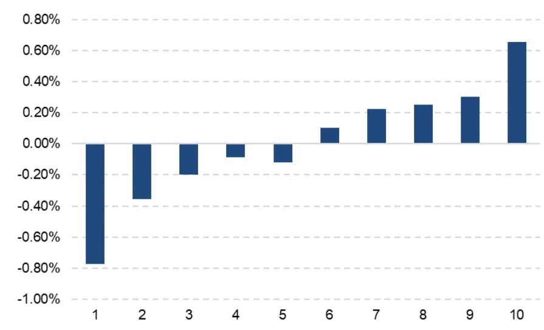
数据来源：Wind，东方证券研究所

下图分别展示了该回归改进版本的因子全样本区间的月度 IC和多空净值。可以看到，因子在样本内外的表现较为一致，并且持续有效。因子月度 IC 均值 0.052，年化 ICIR5.47，IC 胜率 94%，各项指标均明显好于基础的盈余公告次日开盘跳空超额因子。

图 64：盈余公告开盘跳空超额比公告后累计行业超额因子月
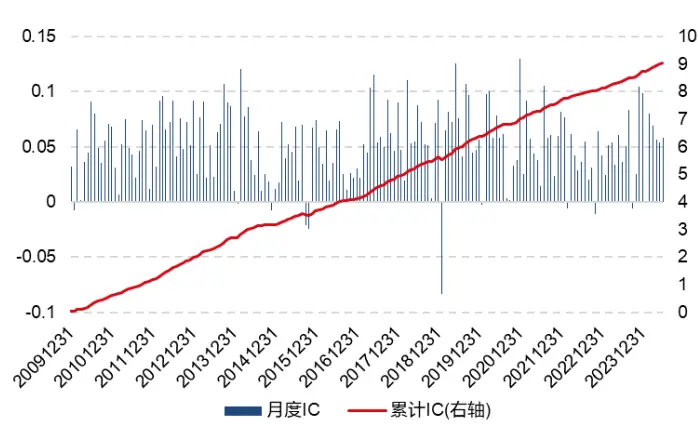
数据来源：Wind，东方证券研究所

图 65：盈余公告开盘跳空超额比公告后累计行业超额因子多空净值
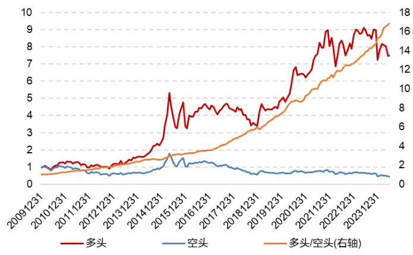
数据来源：Wind，东方证券研究所

下图展示了该回归版本因子的十分组月度超额收益均值，分组非常单调，月均多头超额0.7%，表现也好于基础版本的盈余公告次日开盘跳空超额因子。

图 66：盈余公告开盘跳空超额比公告后累计行业超额因子十分组月度超额收益均值
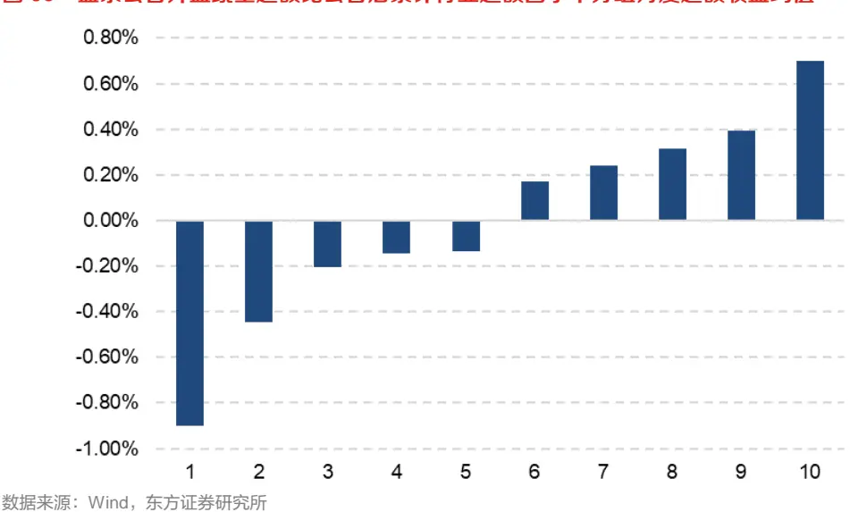

## 3.2.2盈余公告次日换手率比公告后累计市场超额

该因子以盈余公告次日换手率对盈余公告后累计超额市场收益回归而构建，其回归结构如下：

$$
TURNOVER\_REPORT=\beta\cdot EXC\_RET\_AFTR\_REPORT+\alpha+\varepsilon
$$

盈余公告次日换手率因子本身已经是一个较为显著的因子，其表现如下图所示。因子月度 IC均值-0.052，年化 ICIR-2.15，IC 胜率 73%。

图 67：盈余公告次日换手率因子月度 IC
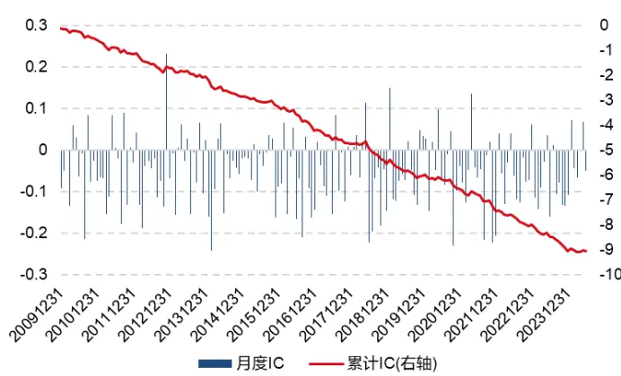
数据来源：Wind，东方证券研究所

图 68：盈余公告次日换手率因子多空净值
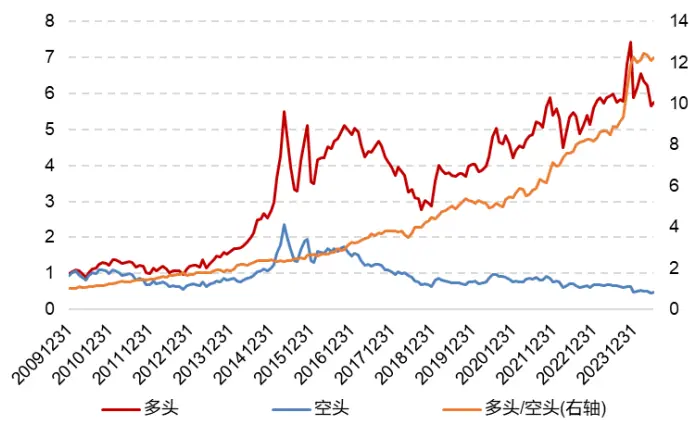
数据来源：Wind，东方证券研究所

下图展示了盈余公告次日换手率因子的十分组月度超额收益均值，分组较为单调，月均多头超额0.56%。

图 69：盈余公告次日换手率因子十分组月度超额收益均值
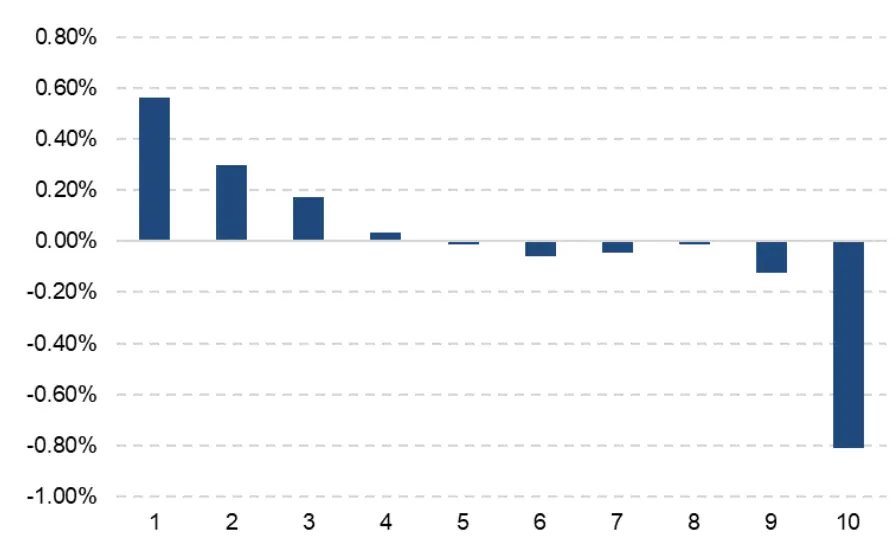
数据来源：Wind，东方证券研究所

下图分别展示了该回归改进版本因子全样本区间的月度 IC和多空净值。可以看到，因子在样本内外的表现较为一致，并且持续有效。因子月度 IC 均值-0.054，年化 ICIR-2.38，IC 胜率 73%，各项指标好于基础的盈余公告次日换手率因子。

图 70：盈余公告次日换手率比公告后累计市场超额因子月度
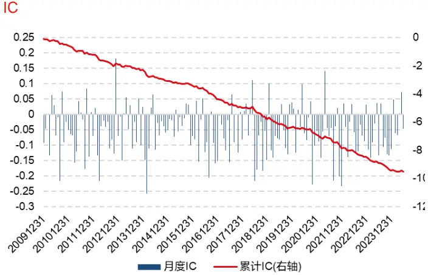
数据来源：Wind，东方证券研究所

图 71：盈余公告次日换手率比公告后累计市场超额因子多空
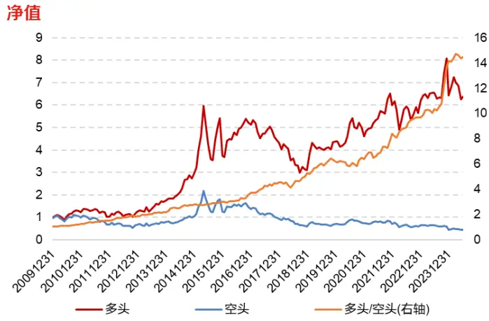
数据来源：Wind，东方证券研究所

下图展示了该回归版本因子的十分组月度超额收益均值，分组较为单调，月均多头超额 0.63%，表现也好于基础版本的盈余公告次日换手率因子。

图 72：盈余公告次日换手率比公告后累计市场超额因子十分组月度超额收益均值
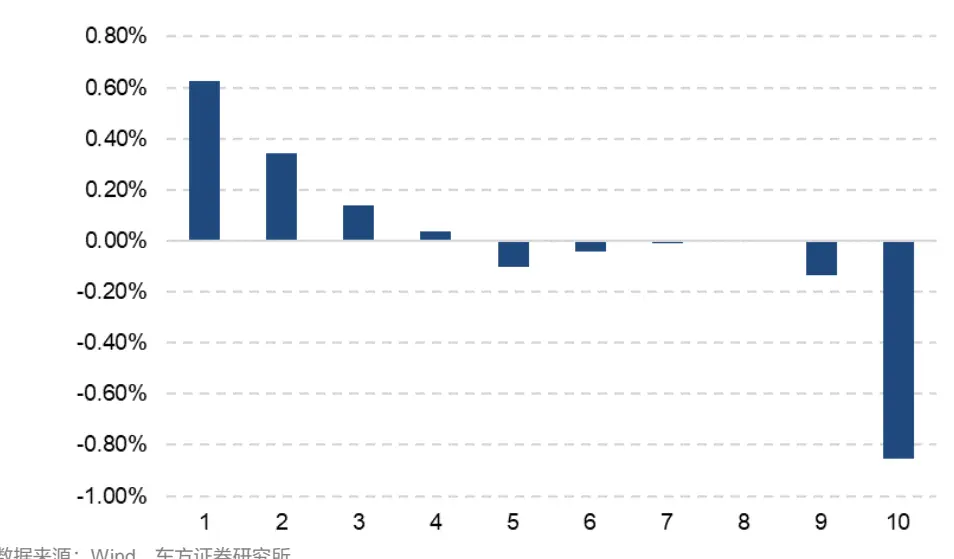
数据来源：Wind，东方证券研究所

## 3.3基本面衍生复合因子表现

本节我们将挖掘得到的 2 个基本面衍生因子进行线性复合，我们同样以截面对称正交来剔除因子间的共线性，并以因子滚动一年 ICIR进行加权复合得到复合因子。

图 73：基本面衍生复合因子月度 IC
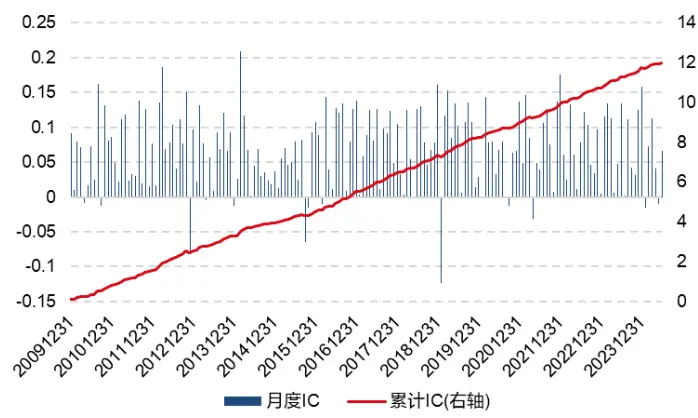
数据来源：Wind，东方证券研究所

图 74：基本面衍生复合因子多空净值
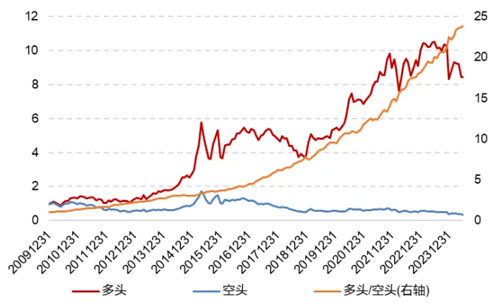
数据来源：Wind，东方证券研究所

可以看到，复合因子在样本内外的表现较为一致，并且持续有效。复合因子月度 IC 均值 0.069，年化ICIR4.38，IC胜率91%。下图展示了该复合因子的十分组月度超额收益均值，分组也非常单调，月均多头超额 0.77%。

图 75：基本面衍生复合因子十分组月度超额收益均值
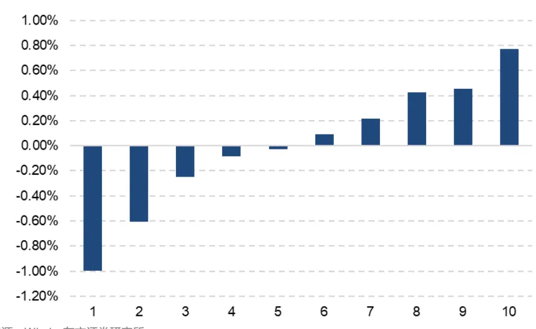
数据来源：Wind，东方证券研究所

## 四、基本面类复合因子及指数增强组合

本节中我们将上述挖掘的基本面和基本面衍生因子进行复合，并加入传统的基本面因子构建基本面类复合因子，并以该基本面类复合因子构建沪深 300、中证 500、中证1000指数增强组合。

## 4.1基本面类复合因子

我们首先将上述32个基本面因子和2个基本面衍生因子进行复合，同样以截面对称正交来剔除因子间的共线性，并以因子滚动一年 ICIR进行加权复合得到相对定价类基本面复合因子。

图 76：相对定价类基本面复合因子月度 IC
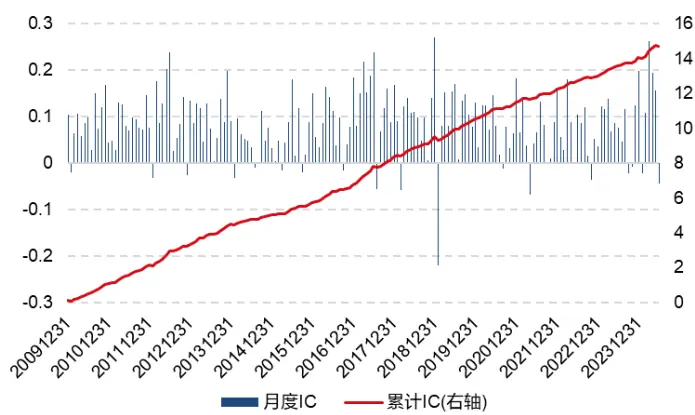
数据来源：Wind，东方证券研究所

图 77：相对定价类基本面复合因子多空净值
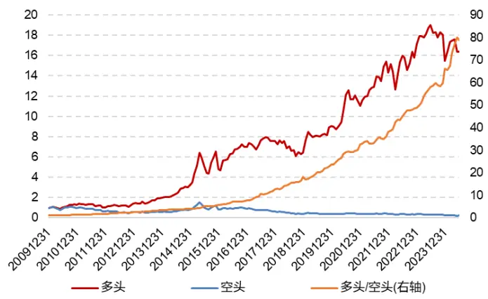
数据来源：Wind，东方证券研究所

可以看到，复合因子在样本内外的表现较为一致，并且持续有效。复合因子月度 IC 均值 0.084，年化ICIR4.21，IC胜率89%。下图展示了该复合因子的十分组月度超额收益均值，分组也非常单调，月均多头超额 1.12%。

图 78：相对定价类基本面复合因子十分组月度超额收益均值
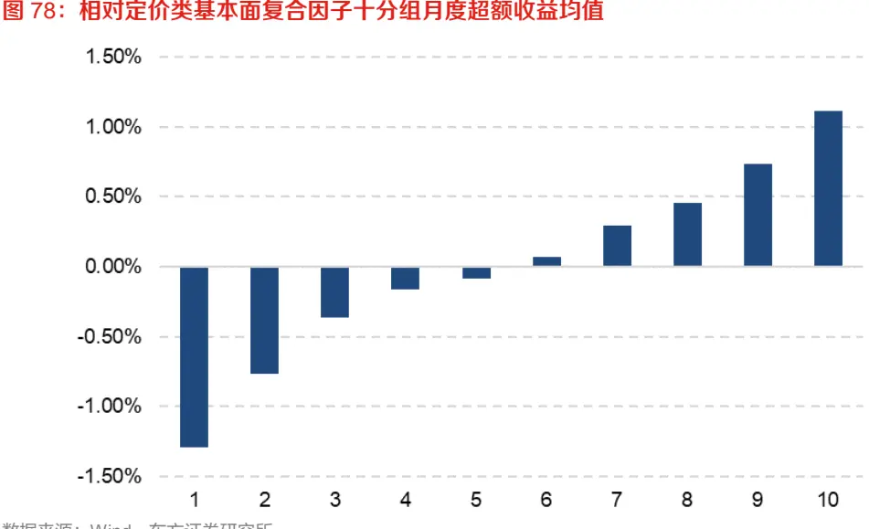
数据来源：Wind，东方证券研究所

下表展示了该复合因子在各个指数内的选股能力，可以看到，该复合因子在各个指数内均具有显著的选股能力，在沪深300、中证500、中证1000指数内的IC均值分别为0.066、0.08、0.091，年化 ICIR 分别为 2.27、3.11、3.58，月均多头超额均值分别为 0.71%、1.03%、1.25%。

表 2：相对定价类基本面复合因子在各域内的选股能力

|  | IC 均值 | IC 标准差 | 年化ICIR | IC 胜率 | 月均多头超额 | 月均空头超额 | 月均多空超额 |
| --- | --- | --- | --- | --- | --- | --- | --- |
| 全市场 | 0.084 | 0.069 | 4.21 | 89% | 1.12% | -1.29% | 2.41% |
| 沪深 300 | 0.066 | 0.101 | 2.27 | 75% | 0.71% | -0.76% | 1.47% |
| 中证 500 | 0.080 | 0.090 | 3.11 | 82% | 1.03% | -1.13% | 2.16% |
| 中证1000 | 0.091 | 0.088 | 3.58 | 84% | 1.25% | -1.50% | 2.75% |

数据来源：Wind，东方证券研究所

我们进一步统计了该复合因子在各大类风格上的暴露情况，如下图所示。可以看到，该复合因子长期暴露在估值、成长、低波风格上，这和我们挖掘得到的偏估值、成长类的因子较多是一致的。

图 79：相对定价类基本面复合因子风格暴露均值
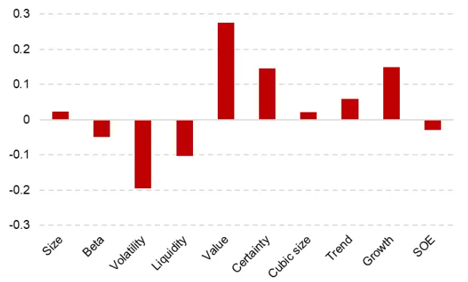
数据来源：Wind，东方证券研究所

图 80：相对定价类基本面复合因子风格暴露时序值
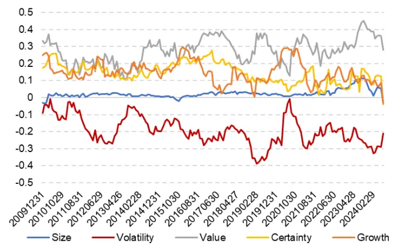
数据来源：Wind，东方证券研究所

有关分析师的申明，见本报告最后部分。其他重要信息披露见分析师申明之后部分，或请与您的投资代表联系。并请阅读本证券研究报告最后一页的免责申明。

虽然我们挖掘了很多基本面因子，但是受限于回归结构我们并不能包含所有的基本面因子类型，因此我们希望将挖掘得到的基本面因子加入传统的基本面因子，构建一个维度更广的基本面类复合因子。下表展示了传统基本面因子库，包含规模、估值、分红、成长、盈利、分析师预期、盈余动量、机构等维度。

表 3：传统基本面因子库

| 类别 | 因子简称 | 因子名称 | 因子计算方式 |
| --- | --- | --- | --- |
| 规模 | Lncap | 总市值对数 | 总市值取对数 |
| 估值 | BP | 账面市值比 | 净资产/总市值 |
|  | Quart_EP | 单季度市盈率倒数 | 单季度归母净利润/总市值 |
|  | Quart_SP | 单季SP | 单季营收/总市值 |
|  | Con_EP | 一致预期滚动 EP | 分析师预期未来 12个月滚动 EP |
|  | Con_PEG | 一致预期滚动 PEG | 分析师预期未来 12 个月 PEG |
| 分红 | DIVIDEND_RATE | 股息率 | 最近四个季度预案分红金额/总市值 |
| 成长 | Quart_NP_YOY | 单季凈利同比增速 | (单季净利润-去年同期单季净利润）/abs（去年同期单季净利润） |
|  | Quart_OR_YOY | 单季营收同比增速 | （单季营收-去年同期单季营收）/abs（去年同期单季营收） |
|  | SUE | 标准化预期外盈利 | (单季度实际净利润-预期净利润）/预期净利润标准差 |
|  | SUR | 标准化预期外收入 | （单季度实际营业收入-预期营业收入）/预期营业收入标准差 |
|  | Delta_ROE | 单季度净资产收益率同比变化 | 单季度净资产收益率-去年同期单季度净资产收益率 |
|  | Delta_ROA | 单季度总资产收益率同比变化 | 单季度总资产收益率-去年同期单季度总资产收益率 |
|  | UE_PERC | 单季度净利润超预期幅度 | 单季度净利润/分析师预期单季度净利润-1 |
| 盈利 | Quart_ROE | 单季度净资产收益率 | 单季度归母净利润*2/（期初归母净资产+期末归母净资产） |
|  | Quart_ROA | 单季度总资产收益率 | 单季度归母净利润*2/（期初总资产+期末总资产） |
|  | ROETTM_STD | ROETTM 滚动 12 季度标准差 | 过去 12 个季度的 ROETTM的标准差 |
|  | ANA_REC | 分析师认可度 | 分析师认可度4因子复合 |
| 分析 师 | UD_PCT | 分析师上下调数量差占比 | 过去3个月(上调家数-下调家数)/总家数+总家数/10000 |
|  |  | FROE_CHANGE_1M 一致预期滚动 ROE一个月环比 | 当前一致预期滚动 ROE-1 个月前一致预期滚动 ROE |
|  |  | FROE_CHANGE_3M 一致预期滚动 ROE 三个月环比 | 当前一致预期滚动 ROE-3 个月前一致预期滚动 ROE |
|  | FNP_CHANGE_1M | 一致预期滚动净利润一个月环比 | 当前一致预期滚动净利润/1 个月前一致预期滚动净利润-1 |
|  | FNP_CHANGE_3M 一致预期滚动净利润三个月环比 |  | 当前一致预期滚动净利润/3个月前一致预期滚动净利润-1 |
|  | JOR_OPEN | 盈余公告次日开盘跳空超额 | 盈余公告次日开盘跳空收益-当日指数开盘跳空收益 |
| 盈余 动量 | JOR_LOW | 盈余公告次日最低价跳空超额 | 盈余公告次日最低价跳空收益-当日指数最低价收益 |
| 机构 | FUND_HOLD_MV | 主动股基持股市值 | 近期半年报/年报主动股基持股市值对数 |

数据来源：Wind，朝阳永续，东方证券研究所

我们将挖掘得到的 34 个因子和上表中的 26 个传统基本面因子进行复合，同样以截面对称正交来剔除因子间的共线性，并以因子滚动一年 ICIR进行加权复合得到相对定价类基本面复合因子。下图展示了该复合因子的月度 IC 以及多空收益。可以看到，复合因子长期表现非常稳定，月度 IC均值 0.103，年化 ICIR 达 5.17，IC 胜率 93%。

图 81：基本面类复合因子月度IC
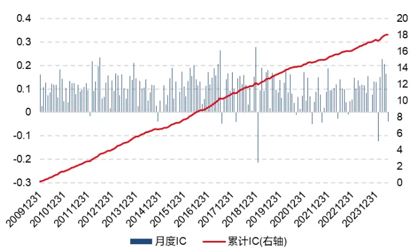
数据来源：Wind，朝阳永续，东方证券研究所

图 82：基本面类复合因子多空净值
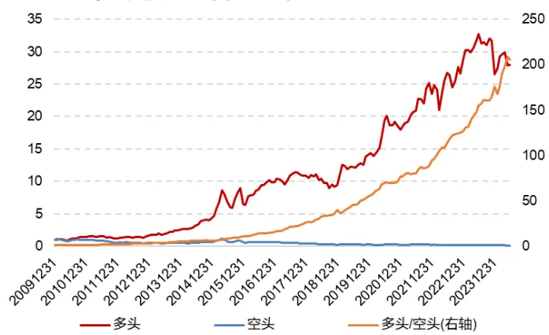
数据来源：Wind，朝阳永续，东方证券研究所

下图展示了该复合因子的十分组月度超额收益均值，分组非常单调，月均多头超额 1.43%。

图 83：基本面类复合因子十分组月度超额收益均值
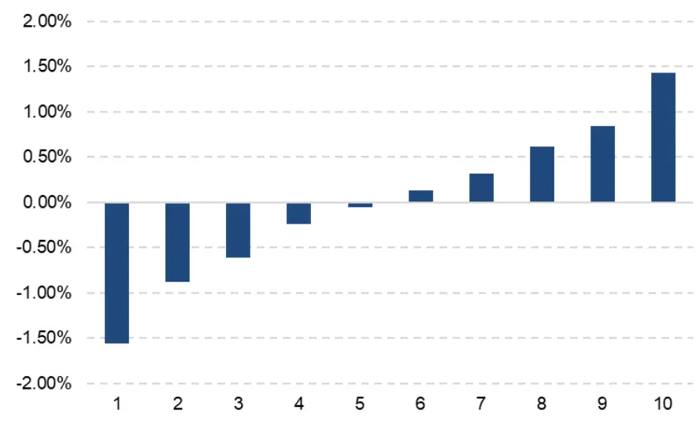
数据来源：Wind，朝阳永续，东方证券研究所

下表展示了该基本面类复合因子在各个指数内的选股能力，可以看到该复合因子在各个指数内均具有显著的选股能力，在沪深300、中证500、中证1000指数内的IC均值分别为0.085、0.094、0.106，年化 ICIR 分别为 2.7、3.48、3.96，月均多头超额均值分别为 0.95%、1.33%、1.43%。

表 4：基本面类复合因子在各域内的选股能力

|  | IC 均值 | IC 标准差 | 年化ICIR | IC 胜率 | 月均多头超额 | 月均空头超额 | 月均多空超额 |
| --- | --- | --- | --- | --- | --- | --- | --- |
| 全市场 | 0.103 | 0.069 | 5.17 | 93% | 1.43% | -1.56% | 2.99% |
| 沪深 300 | 0.085 | 0.109 | 2.70 | 80% | 0.95% | -0.92% | 1.87% |
| 中证 500 | 0.094 | 0.094 | 3.48 | 87% | 1.33% | -1.25% | 2.58% |
| 中证1000 | 0.106 | 0.093 | 3.96 | 89% | 1.43% | -1.70% | 3.13% |

数据来源：Wind，朝阳永续，东方证券研究所

我们进一步统计了该复合因子在各大类风格上的暴露情况，如下图所示。该复合因子长期暴露在估值、低波风格上，相比于单纯挖掘得到的基本面复合因子在成长风格上暴露有所降低。

有关分析师的申明，见本报告最后部分。其他重要信息披露见分析师申明之后部分，或请与您的投资代表联系。并请阅读本证券研究报告最后一页的免责申明。

图 84：基本面类复合因子风格暴露均值
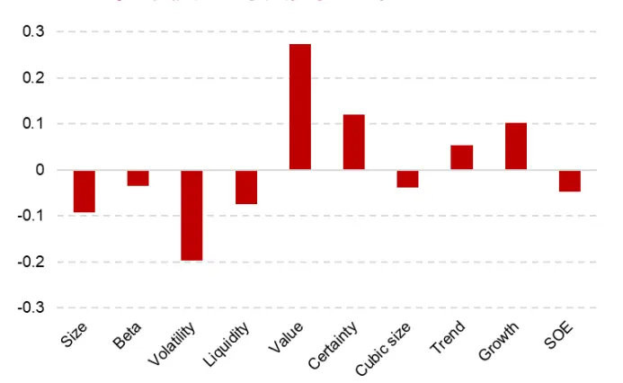
数据来源：Wind，朝阳永续，东方证券研究所

图 85：基本面类复合因子风格暴露时序值
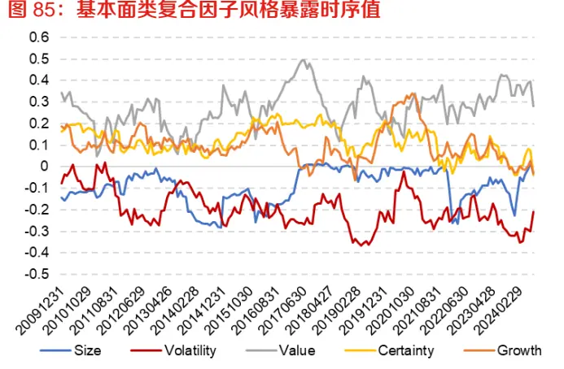
数据来源：Wind，朝阳永续，东方证券研究所

## 4.2基本面指数增强组合

本节我们以该基本面类复合因子构建沪深300、中证500、中证1000指数增强组合，我们采用如下组合优化模型来构建指数增强组合：

$$
\begin{aligned}\underset{}{max}\quad&f^{T}w\\s.t.\quad&s_{l}\leq X(w-w_{b})\leq s_{h}\\&h_{l}\leq H(w-w_{b})\leq h_{h}\\&w_{l}\leq w-w_{b}\leq w_{h}\\&b_{l}\leq B_{b}w\leq b_{h}\\&\mathbf{0}\leq w\leq l\\&\mathbf{1}^{T}w=1\end{aligned}
$$

该优化模型的目标函数为最大化复合因子取值，其中 f 为因子取值， $f^{T}W$ 为组合在因子上的加权暴露，w 为待求解的股票权重向量。模型的约束条件包括组合在风格因子上的偏离度、行业偏离度、个股偏离度、成分股权重占比控制、个股权重上下限控制、换手率等。

⚫ 第一个约束条件限制了组合相对于基准指数的风格暴露，X 为股票对风格因子的因子暴露矩阵， $w_{b}$ 为基准指数成分股的权重向量， $s_{l},s_{h}$ 分别为风格因子相对暴露的下限及上限；

⚫ 第二个约束条件限制了组合相对于基准指数的行业偏离，H 为股票的行业暴露矩阵，当股票i 属于行业j 时， $H_{ji}$ 为 1，否则为0； $h_{l},h_{h}$ 分别为组合行业偏离的下限以及上限；

⚫ 第三个约束条件限制了个股相对于基准指数成分股的偏离， $w_{l},w_{h}$ 分别为偏离的下限及上限；

⚫ 第四个约束条件限制了组合在成分股内权重的占比下限及上限， $B_{b}$ 为个股是否属于基准指数成分股的 0-1向量， $b_{l},b_{h}$ 分别为成分股内权重的下限以及上限；

⚫ 第五个约束条件限制了卖空，并且限制了个股权重上限 l；

⚫ 第六个约束条件要求权重和为 1，即组合始终满仓运作。

上述模型中目标函数、风格偏离约束、个股权重偏离约束、成分股权重占比约束都可以转化成线性约束，因此可以通过线性规划来高效求解。

我们以各宽基指数为基准，月频调仓，控制中信一级行业 2%暴露，市值±0.3 暴露，个股权重相对于成分股最大偏离 1%，成分股内权重占比不低于 80%，交易费用买入 0.1%，卖出0.2%。

## 4.2.1 沪深 300 指数增强组合

下图展示了沪深 300 增强组合的历史净值。可以看到增强组合能够稳定跑赢沪深 300 指数，并且近两年的超额更显著。

图 86：沪深 300指数增强组合历史净值
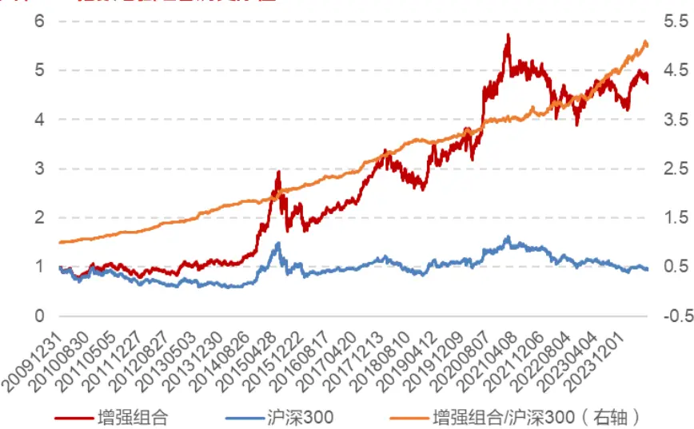
数据来源：Wind，朝阳永续，东方证券研究所

下表展示了增强组合各年的收益表现情况。组合每年都能跑赢沪深 300 指数，年化超额收益12.01%，相对最大回撤-4.86%，信息比 2.78，年化跟踪误差 4.11%，月度胜率 77.71%。组合在2021 年相对超额较低，这也与因子在成长风格上的暴露较低有关，近两年超额收益较高，这也与估值类因子暴露较高有关。今年以来截止 20240731超额达8.83%。组合月均单边换手 36%。

表 5：沪深 300指数增强组合各年收益表现

| YEAR | 绝对收益 | 基准收益 | 超额收益 | 相对最大回撤 | 信息比 | 跟踪误差 | 收益回撤比 | 月度胜率 |
| --- | --- | --- | --- | --- | --- | --- | --- | --- |
| 2010 | -3.19% | -12.51% | 9.32% | -2.33% | 3.34 | 3.18% | 4.00 | 83.33% |
| 2011 | -16.41% | -25.02% | 8.60% | -1.34% | 3.61 | 3.11% | 6.43 | 91.67% |
| 2012 | 24.36% | 7.55% | 16.80% | -0.88% | 5.18 | 2.87% | 19.11 | 91.67% |
| 2013 | 10.61% | -7.65% | 18.25% | -1.64% | 4.04 | 4.64% | 11.15 | 100.00% |
| 2014 | 60.60% | 51.66% | 8.94% | -3.88% | 1.77 | 3.23% | 2.31 | 75.00% |
| 2015 | 24.30% | 5.58% | 18.71% | -3.29% | 2.99 | 5.77% | 5.69 | 66.67% |
| 2016 | -2.12% | -11.28% | 9.17% | -1.52% | 3.18 | 3.12% | 6.02 | 66.67% |
| 2017 | 43.84% | 21.78% | 22.06% | -1.34% | 5.03 | 3.41% | 16.53 | 100.00% |
| 2018 | -16.57% | -25.31% | 8.74% | -1.78% | 2.93 | 3.91% | 4.91 | 75.00% |
| 2019 | 39.55% | 36.07% | 3.48% | -3.51% | 0.79 | 3.24% | 0.99 | 66.67% |
| 2020 | 41.44% | 27.21% | 14.23% | -2.79% | 2.45 | 4.59% | 5.10 | 66.67% |
| 2021 | -3.21% | -5.20% | 1.99% | -4.86% | 0.42 | 4.82% | 0.41 | 50.00% |
| 2022 | -14.16% | -21.63% | 7.47% | -3.95% | 1.89 | 4.85% | 1.89 | 75.00% |
| 2023 | 3.12% | -11.38% | 14.50% | -2.14% | 3.55 | 4.37% | 6.77 | 83.33% |
| 20240731 | 9.15% | 0.32% | 8.83% | -2.45% | 2.67 | 5.61% | 3.60 | 71.43% |
| 全样本期 | 11.74% | -0.27% | 12.01% | -4.86% | 2.78 | 4.11% | 2.47 | 77.71% |

数据来源：Wind，朝阳永续，东方证券研究所
有关分析师的申明，见本报告最后部分。其他重要信息披露见分析师申明之后部分，或请与您的投资代表联系。并请阅读本证券研究报告最后一页的免责申明。

## 4.2.2 中证 500 指数增强组合

下图展示了中证 500增强组合的历史净值。可以看到增强组合能够稳定跑赢中证 500指数。

图 87：中证 500指数增强组合历史净值
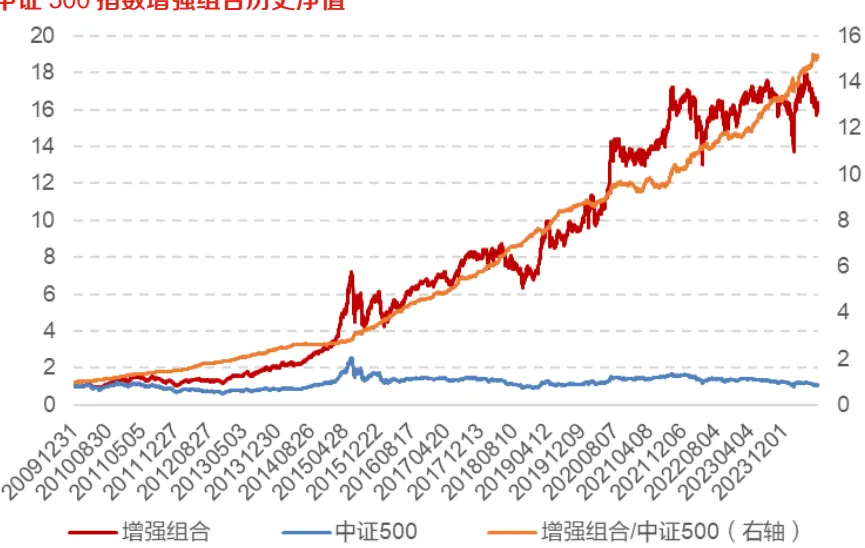
数据来源：Wind，朝阳永续，东方证券研究所

下表展示了增强组合各年的收益表现情况。组合每年都能跑赢中证 500 指数，年化超额收益21.22%，相对最大回撤-4.9%，信息比 3.88，年化跟踪误差 4.94%，月度胜率 86.29%。组合在2020 年相对超额较低，这也与估值类因子暴露较高有关。今年以来截止 20240731 超额达10.82%。组合月均单边换手 44%。

表 6：中证 500指数增强组合各年收益表现

| YEAR | 绝对收益 | 基准收益 | 超额收益 | 相对最大回撤 | 信息比 | 跟踪误差 | 收益回撤比 | 月度胜率 |
| --- | --- | --- | --- | --- | --- | --- | --- | --- |
| 2010 | 37.47% | 10.07% | 27.41% | -1.71% | 5.39 | 4.30% | 16.03 | 100.00% |
| 2011 | -20.74% | -33.83% | 13.09% | -1.35% | 5.27 | 3.51% | 9.71 | 100.00% |
| 2012 | 27.69% | 0.28% | 27.42% | -0.67% | 6.86 | 3.60% | 40.97 | 100.00% |
| 2013 | 49.30% | 16.89% | 32.41% | -1.73% | 5.43 | 4.72% | 18.70 | 100.00% |
| 2014 | 51.80% | 39.01% | 12.80% | -4.52% | 2.06 | 4.29% | 2.83 | 58.33% |
| 2015 | 90.53% | 43.12% | 47.42% | -2.45% | 3.82 | 7.69% | 19.36 | 91.67% |
| 2016 | 8.57% | -17.78% | 26.35% | -0.96% | 6.65 | 4.31% | 27.39 | 100.00% |
| 2017 | 22.84% | -0.20% | 23.05% | -1.47% | 4.85 | 4.40% | 15.64 | 83.33% |
| 2018 | -14.17% | -33.32% | 19.15% | -0.94% | 5.48 | 4.75% | 20.40 | 100.00% |
| 2019 | 49.53% | 26.38% | 23.15% | -3.84% | 4.03 | 4.19% | 6.03 | 91.67% |
| 2020 | 29.41% | 20.87% | 8.54% | -3.17% | 1.43 | 4.85% | 2.69 | 66.67% |
| 2021 | 27.50% | 15.58% | 11.92% | -4.58% | 1.66 | 6.04% | 2.60 | 58.33% |
| 2022 | -10.09% | -20.31% | 10.23% | -2.79% | 2.32 | 5.34% | 3.67 | 83.33% |
| 2023 | 6.45% | -7.42% | 13.87% | -1.81% | 3.42 | 4.17% | 7.69 | 83.33% |
| 20240731 | 0.82% | -10.00% | 10.82% | -4.33% | 3.03 | 6.60% | 2.50 | 71.43% |
| 全样本期 | 21.82% | 0.61% | 21.22% | -4.90% | 3.88 | 4.94% | 4.33 | 86.29% |

数据来源：Wind，朝阳永续，东方证券研究所

## 4.2.3 中证 1000 指数增强组合

下图展示了中证 1000增强组合的历史净值。可以看到增强组合能够稳定跑赢中证 1000指数。

图 88：中证 1000指数增强组合历史净值
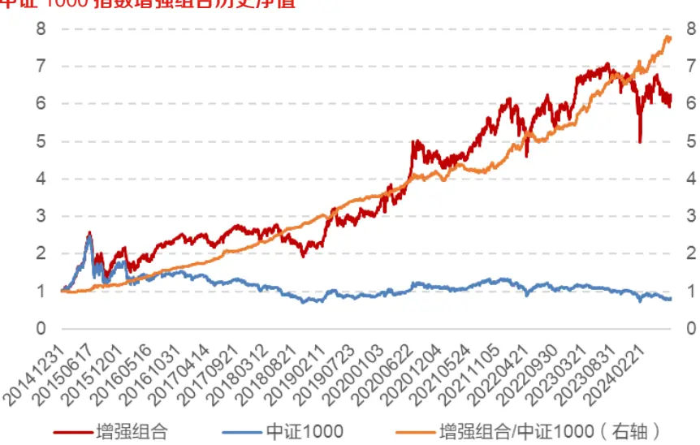
数据来源：Wind，朝阳永续，东方证券研究所

下表展示了增强组合各年的收益表现情况。组合每年都能跑赢中证 1000 指数，年化超额收益23.99%，相对最大回撤-7.21%，信息比 3.39，年化跟踪误差 6.43%，月度胜率 85.22%。今年以来截止 20240731 超额达 12.36%。组合月均单边换手 48%。

表 7：中证 1000指数增强组合各年收益表现

| YEAR | 绝对收益 | 基准收益 | 超额收益 | 相对最大回撤 | 信息比 | 跟踪误差 | 收益回撤比 | 月度胜率 |
| --- | --- | --- | --- | --- | --- | --- | --- | --- |
| 2015 | 112.81% | 76.10% | 36.71% | -5.79% | 2.13 | 9.41% | 6.35 | 66.67% |
| 2016 | 11.14% | -20.01% | 31.14% | -1.32% | 7.23 | 4.61% | 23.53 | 100.00% |
| 2017 | 8.11% | -17.35% | 25.46% | -1.79% | 5.93 | 4.63% | 14.20 | 91.67% |
| 2018 | -15.35% | -36.87% | 21.52% | -1.48% | 6.60 | 4.55% | 14.56 | 100.00% |
| 2019 | 51.24% | 25.67% | 25.57% | -5.21% | 3.60 | 5.15% | 4.91 | 91.67% |
| 2020 | 34.59% | 19.39% | 15.20% | -5.70% | 1.81 | 6.69% | 2.66 | 75.00% |
| 2021 | 37.93% | 20.52% | 17.41% | -6.75% | 1.83 | 7.38% | 2.58 | 66.67% |
| 2022 | -6.28% | -21.58% | 15.30% | -7.21% | 2.52 | 7.11% | 2.12 | 91.67% |
| 2023 | 15.25% | -6.28% | 21.53% | -4.12% | 3.60 | 5.85% | 5.23 | 83.33% |
| 20240731 | -4.59% | -16.96% | 12.36% | -4.85% | 3.29 | 7.42% | 2.55 | 85.71% |
| 全样本期 | 21.77% | -2.22% | 23.99% | -7.21% | 3.39 | 6.43% | 3.33 | 85.22% |

数据来源：Wind，朝阳永续，东方证券研究所

## 五、总结

## 相对定价类基本面因子构造方法

基本面指标本质都是以相对定价为核心，往往都是以比值的形式来构建，不可避免会遇到除数效应导致取值异常以及分子分母可比性的问题，我们将传统经典的个体除法调整为截面整体回归的方式来重构这些基本面因子，重构后的因子普遍表现优于传统的版本，显示了回归版本基本面因子的显著优势。

传统的基本面因子往往以财务经验为主来构建，涉及到的财务科目较少，但是上市公司的财报中有上百个财务科目，这些科目我们并没有深入的研究了解和经验积累，而截面回归的形式从效果来看可以有效克服两个财务指标间的可比性问题。因此我们想把回归的结构作为一个挖掘基本面因子的有效算子，通过对不同财务科目之间进行截面回归的形式，以挖掘出新的有效的相对定价类基本面因子。

## 基本面因子挖掘

我们以三大报表利润表、现金流量表、资产负债表中满足截面覆盖度要求的所有字段作为可用的基础数据，加工为单季度、去年同期单季度、单季度同比变化等类型共 515 个字段，两两回归并剔除高相关因子后得到 32 个基本面因子，两两相关系数低于 0.5，这些因子在样本内外均保持了稳定显著的选股能力，复合因子月度 IC 均值 0.069，年化 ICIR3.48，IC 胜率 87%，月均多头超额 1.01%。

## 基本面衍生因子挖掘

我们进一步将盈余公告披露时衍生的量价数据也作为广义的基本面衍生指标，作为回归模型的输入来挖掘基本面衍生类相对定价因子，并用同样方式筛选得到 2 个低相关的有效因子，复合因子月度 IC 均值 0.069，年化 ICIR4.38，IC 胜率 91%，月均多头超额 0.77%。

## 基本面类复合因子及指数增强组合

我们将挖掘得到的34个因子进行复合，复合因子在样本内外的表现较为一致，月度IC均值0.084，年化 ICIR4.21，IC 胜率 89%，月均多头超额 1.12%。将挖掘得到的因子加入传统 26 个基本面因子集合进行复合得到基本面类复合因子，月度 IC均值 0.103，年化 ICIR达 5.17，IC胜率 93%，月均多头超额 1.43%，在各个指数内均具有显著的选股能力，在沪深 300、中证 500、中证 1000指数内的 IC 均值分别为 0.085、0.094、0.106。

以基本面类复合因子构建的宽基指数增强组合同样具有稳健的超额收益：

⚫ 沪深 300指数增强组合年化超额收益 12.01%，相对最大回撤-4.86%，信息比 2.78，年化跟踪误差 4.11%，今年截止 20240731 超额达 8.83%；

⚫ 中证 500 指数增强组合年化超额收益 21.22%，相对最大回撤-4.9%，信息比 3.88，年化跟踪误差 4.94%，今年截止 20240731 超额达 10.82%；

中证 1000 指数增强组合年化超额收益 23.99%，相对最大回撤-7.21%，信息比 3.39，年化跟踪误差 6.43%，今年截止 20240731 超额达 12.36%。

## 风险提示

1. 量化模型基于历史数据分析，未来存在失效风险，建议投资者紧密跟踪模型表现。

2. 极端市场环境可能对模型效果造成剧烈冲击，导致收益亏损。

## Tabl e_Disclai mer 分析师申明

每位负责撰写本研究报告全部或部分内容的研究分析师在此作以下声明：

分析师在本报告中对所提及的证券或发行人发表的任何建议和观点均准确地反映了其个人对该证券或发行人的看法和判断；分析师薪酬的任何组成部分无论是在过去、现在及将来，均与其在本研究报告中所表述的具体建议或观点无任何直接或间接的关系。

## 投资评级和相关定义

报告发布日后的12个月内行业或公司的涨跌幅相对同期相关证券市场代表性指数的涨跌幅为基准（A 股市场基准为沪深 300 指数，香港市场基准为恒生指数，美国市场基准为标普 500 指数）；

## 公司投资评级的量化标准

买入：相对强于市场基准指数收益率 15%以上；

增持：相对强于市场基准指数收益率 5%～15%；

中性：相对于市场基准指数收益率在-5%～+5%之间波动；

减持：相对弱于市场基准指数收益率在-5%以下。

未评级 —— 由于在报告发出之时该股票不在本公司研究覆盖范围内，分析师基于当时对该股票的研究状况，未给予投资评级相关信息。

暂停评级 —— 根据监管制度及本公司相关规定，研究报告发布之时该投资对象可能与本公司存在潜在的利益冲突情形；亦或是研究报告发布当时该股票的价值和价格分析存在重大不确定性，缺乏足够的研究依据支持分析师给出明确投资评级；分析师在上述情况下暂停对该股票给予投资评级等信息，投资者需要注意在此报告发布之前曾给予该股票的投资评级、盈利预测及目标价格等信息不再有效。

## 行业投资评级的量化标准：

看好：相对强于市场基准指数收益率 5%以上；

中性：相对于市场基准指数收益率在-5%～+5%之间波动；

看淡：相对于市场基准指数收益率在-5%以下。

未评级：由于在报告发出之时该行业不在本公司研究覆盖范围内，分析师基于当时对该行业的研究状况，未给予投资评级等相关信息。

暂停评级：由于研究报告发布当时该行业的投资价值分析存在重大不确定性，缺乏足够的研究依据支持分析师给出明确行业投资评级；分析师在上述情况下暂停对该行业给予投资评级信息，投资者需要注意在此报告发布之前曾给予该行业的投资评级信息不再有效。

## HeadertTabl e_Discl ai mer 免责声明

本证券研究报告（以下简称“本报告”）由东方证券股份有限公司（以下简称“本公司”）制作及发布。

。本公司不会因接收人收到本报告而视其为本公司的当然客户。本报告的全体接收人应当采取必要措施防止本报告被转发给他人。

本报告是基于本公司认为可靠的且目前已公开的信息撰写，本公司力求但不保证该信息的准确性和完整性，客户也不应该认为该信息是准确和完整的。同时，本公司不保证文中观点或陈述不会发生任何变更，在不同时期，本公司可发出与本报告所载资料、意见及推测不一致的证券研究报告。本公司会适时更新我们的研究，但可能会因某些规定而无法做到。除了一些定期出版的证券研究报告之外，绝大多数证券研究报告是在分析师认为适当的时候不定期地发布。

在任何情况下，本报告中的信息或所表述的意见并不构成对任何人的投资建议，也没有考虑到个别客户特殊的投资目标、财务状况或需求。客户应考虑本报告中的任何意见或建议是否符合其特定状况，若有必要应寻求专家意见。本报告所载的资料、工具、意见及推测只提供给客户作参考之用，并非作为或被视为出售或购买证券或其他投资标的的邀请或向人作出邀请。

本报告中提及的投资价格和价值以及这些投资带来的收入可能会波动。过去的表现并不代表未来的表现，未来的回报也无法保证，投资者可能会损失本金。外汇汇率波动有可能对某些投资的价值或价格或来自这一投资的收入产生不良影响。那些涉及期货、期权及其它衍生工具的交易，因其包括重大的市场风险，因此并不适合所有投资者。

在任何情况下，本公司不对任何人因使用本报告中的任何内容所引致的任何损失负任何责任，投资者自主作出投资决策并自行承担投资风险，任何形式的分享证券投资收益或者分担证券投资损失的书面或口头承诺均为无效。

本报告主要以电子版形式分发，间或也会辅以印刷品形式分发，所有报告版权均归本公司所有。未经本公司事先书面协议授权，任何机构或个人不得以任何形式复制、转发或公开传播本报告的全部或部分内容。不得将报告内容作为诉讼、仲裁、传媒所引用之证明或依据，不得用于营利或用于未经允许的其它用途。

经本公司事先书面协议授权刊载或转发的，被授权机构承担相关刊载或者转发责任。不得对本报告进行任何有悖原意的引用、删节和修改。

提示客户及公众投资者慎重使用未经授权刊载或者转发的本公司证券研究报告，慎重使用公众媒体刊载的证券研究报告。

## 东方证券研究所

地址： 上海市中山南路 318 号东方国际金融广场 26 楼

电话：021-63325888

传真：021-63326786

网址： www.dfzq.com.cn