# ABCM：基于神经网络的 alpha因子和beta因子协同挖掘模型

因子选股系列之一一〇

## 研究结论

基于基本面的Barra模型中的风险因子往往考虑的是超长周期的风险，且模型中基本面信息占比相对量价信息更高，因此这种风险模型对于中高频策略可能力不从心。为了克服这些问题，我们提出了一套基于神经网络和量价数据驱动的风险因子生成模型，我们称之为 ABCM（Alpha-Beta Co-mining）模型。

## 样本外各风险因子的表现：

⚫ RankIC 基本上都在 3%以内、ICIR 基本上都在 0.2 以内而 RankIC 胜率基本上都在60%以内，意味着各个风险因子均不具有显著的选股能力；

⚫ Abs(RankIC)均较高，说明各因子对未来收益率的解释能力较强；

⚫自相关系数均在 70%以上，说明短期来看各个风险因子衰减速度较弱；而各风险因子两两之间相关性基本上都在 20%以内，信息独立性较强；

各个股票池上 ABCM1&2 风险因子滚动 Rsquare 曲线均稳定位于 Barra 风险因子上方，且相对于Barra风险因子，ABCM2风险模型Rsquare显著提升，在沪深300、中证500和中证全指上分别提升至47.02%、34.28%和20.53%。因此基于神经网络生成的风险模型对未来收益率的解释能力整体强于 Barra风险模型。

## 样本外“伴生”的 alpha 因子的表现：

有着较强的获取超额收益的能力，2017 年至今年化超额达 36.55%。且该因子往年超额收益回撤仅有 5.86%，且今年该因子最大回撤相对不大，这说明该因子能稳定的获取较高的超额。

今年三季度该alpha因子的多头表现较为稳定未出现大幅回撤，另外一方面该因子与各个Barra风险因子相关性较低，这说明通过ABCM模型生成alpha因子获取alpha信息的来源与常规机器学习生成的alpha因子差异性较大，与常规机器学习因子有着较强互补性。

ABCM2模型生成的alpha因子对我们已有的AI量价模型生成alpha因子能够起到较大增量作用，通过把前者纳入到我们已有的AI量价模型中进行合成，新生成的alpha因子在中证全指、中证 500 和中证 1000 上 RankIC 分别提升至 16.39%、11.94%和14.94%，多头年化超额分别提升至 52.63%、26.46%和 39.61%，在中证全指上RankICIR也提升至 1.66，说明新因子获取 alpha收益的能力更强，稳定性也更好。

## 风险因子用于组合优化的表现：

相对于使用 Barra 风险模型，将 ABCM2 风险模型生成的风险因子直接用于组合优化，新组合具有更高的信息比率，其中中证 500增强组合由 2.79提升至 3.30，中证1000增强组合则由3.83提升至4.25。并且组合的年化超额以及超额最大回撤均有显著改善。

## 风险提示

1. 量化模型基于历史数据分析，未来存在失效风险，建议投资者紧密跟踪模型表现。

2. 极端市场环境可能对模型效果造成剧烈冲击，导致收益亏损。

报告发布日期

2024 年 12 月 03 日

杨怡玲 yangyiling@orientsec.com.cn

执业证书编号：S0860523040002

陶文启 taowenqi@orientsec.com.cn

执业证书编号：S0860524080003

相对定价类基本面因子挖掘：——因子选 2024-10-11股系列之一〇九

KD-Ensemble：基于知识蒸馏的 alpha 因 2024-08-19子挖掘模型：——因子选股系列之一〇八

融合基本面信息的 ASTGNN 因子挖掘模 2024-05-27型：——因子选股系列之一〇四

## 一、引言

## 1.1 多因子选股策略

多因子选股策略是量化投资中的主流 Alpha 策略，它通过结合多个具有预测能力的因子来构建投资组合。多因子选股框架通常包括 alpha 模型、风险模型、交易成本模型和组合优化四个部分，整个多因子选股策略的框架可表示为下图所示的过程。其中 alpha 模型主要是对个股未来的收益率或特质性收益率在整体股票池中的排序进行预测，风险模型则是负责对个股之间的协方差矩阵进行估计，交易成本模型是对个股的交易成本进行预测，而组合优化则是在考虑交易成本的前提下，负责在给定风险（即组合的波动）下极大化预期收益从而构建组合，以期在样本外组合能有较好的风险收益比。

图 1：多因子选股策略框架
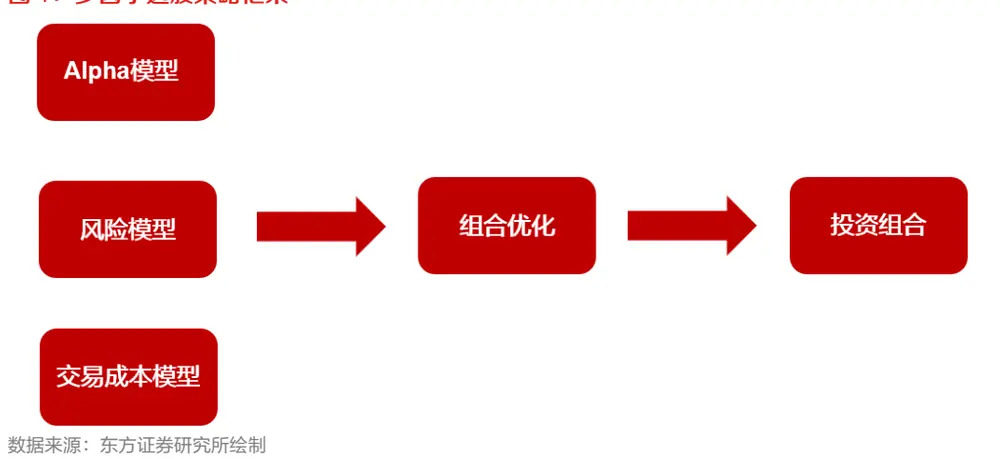

这四个部分中 alpha 模型更加受到重视，近年来基于人工挖掘和机器学习相关的 alpha 因子挖掘方法层出不穷，前期报告《基于循环神经网络的多频率因子挖掘》、《基于残差网络端到端因子挖掘模型》和《融合基本面信息的ASTGNN因子挖掘模型》等报告中我们也对alpha因子生成提出了一系列基于机器学习的方案，此处就不再赘述了。但研究人员对于风险模型的研究则少之又少，在今年各类 alpha 模型遭受几轮较大回撤之后，风险模型在多因子选股体系下的作用显得尤为重要。

## 1.2传统风险模型

主流的风险模型主要分为两类，基本面主导的 Barra 风险模型和价格数据驱动的统计量风险模型，前者主要通过人工方法构建相应的风险因子从而建立模型，后者主要通过一些降维等数据分析的方法构建风险因子从而建立模型。研究人员通常使用的风险模型是 Barra 体系下的风险模型或者其的改进版本，例如报告《DFQ-Risk：东方A股因子风险模型》中所使用的十个风险因子构建如下图所示：

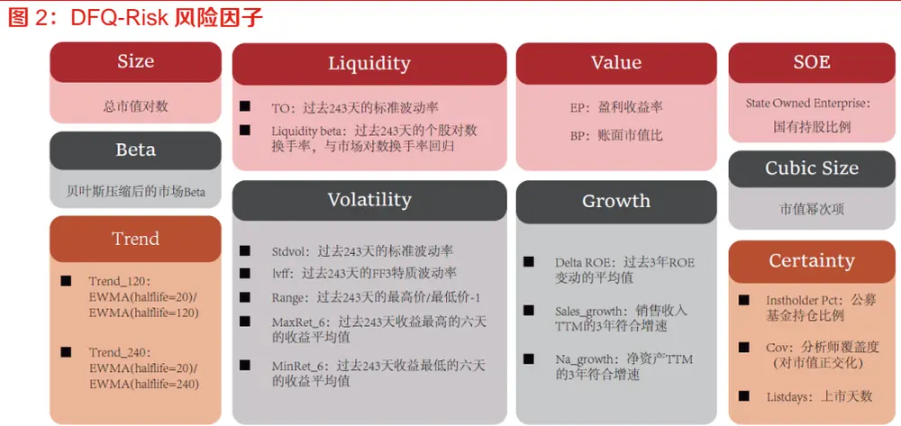
数据来源：东方证券研究所绘制

这套模型中的风险因子往往考虑的是超长周期的风险（自相关性过高，长时间内风险因子取值几乎不发生变化），且基本面信息占比相对量价信息更高，因此这种风险模型对于低频策略匹配度相对较高，但对于中高频策略可能显得力不从心。

与 Barra 风险模型对应的是统计风险模型，这个模型完全通过价格数据进行驱动，使用各个股票过去 252个交易日的收益率序列计算相关系数矩阵或度量矩阵，之后使用 PCA、谱聚类等方法进行降维，取相关系数矩阵前十大特征值（或主成分）对应特征向量作为风险因子，以谱聚类算法为例，假设各个股票过去 252 个交易日的收益率序列为 ${\pmb x}_{1},{\pmb x}_{2},\cdots{\pmb x}_{n}$ ，则主特征向量$\pmb{u}_{1},\pmb{u}_{2},\cdots\pmb{u}_{n}$ 为下列优化问题的非常解：

$$
min_{\pmb{u}}R(\pmb{x}_{i},\pmb{x}_{j})\big\|\pmb{u}_{i}-\pmb{u}_{j}\big\|^{2}
$$

其中核函数 $R(\boldsymbol{x}_{i},\boldsymbol{x}_{j})$ 通常反比于数据点 $x_{i}$ 和 $x_{j}$ 之间的距离度量。而上述优化问题的解则可转化为求解矩阵 D−L 的主特征向量，这里

$$
\boldsymbol{L}=(R(\boldsymbol{x}_{i},\boldsymbol{x}_{j}))_{i,j},\boldsymbol{D}=diag(\sum_{j}R(\boldsymbol{x}_{i},\boldsymbol{x}_{j})),
$$

该算法核心思想是使用数据之间构建的有限维的图 Laplacian 矩阵 D−L 及其特征向量来逼近数据分布的底层流形上的 Laplacian算子及其特征函数，因为流形的 Laplacian算子是其几何内蕴量，其特征函数空间可以张成整个流形上的非线性函数空间，因此图 Laplacian 矩阵的主特征向量可视作流形上的最佳逼近量，相关的实验研究表明这套风险模型相较于 Barra 模型有着更加优异的性能。

## 1.3 机器学习风险模型

Alpha 模型更多的是提升所构建组合的收益，而风险模型则对提升组合业绩稳定性起到重要作用。在有着强大 alpha 模型的基础上，我们有必要构建一套与之匹配的风险模型。而机器学习系列方法有着强大的拟合能力，其是否能够和生成 alpha 因子一样生成风险因子。首先，风险模型的关键在于构建相应的风险因子，我们认为风险因子应该满足以下性质：

1. 没有显著的选股能力，即 RankIC 相对较低，对未来收益率预测的方向波动十分剧烈，即 ICIR、RankIC 胜率等指标较低。

2. 对未来收益率有较强的解释能力（具有较强的线性相关性），体现在因子 RankIC 绝对值、Rsquare等指标相对较高。

3. 因子衰减速度较慢，即因子跨期截面自相关性较高。

基于上述性质，在前期报告《融合基本面信息的 ASTGNN 因子挖掘模型》和《KD-Ensemble：基于知识蒸馏的 alpha 因子挖掘模型》中，我们借助 RNN 模型搭建了一套如下图所示的风险因子生成模型，整个模型结构如下图所示：

图 3：风险因子生成模型
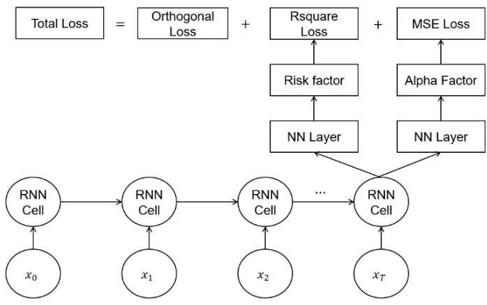
数据来源：东方证券研究所绘制

该模型将个股的量价数据和风险因子构成时序数据，然后再将该时序数据作为RNN的输入，取最后一个RNN-Cell输出的特征向量通过两个参数不同的全连接层分别生成alpha因子和风险因子，该模型训练的损失函数则定义为：

$$
Loss=MSE(\boldsymbol{F}_{:K},y_{new})+Rsquare(\boldsymbol{F}_{K:},y)+\lambda\left\|error(\boldsymbol{F},\boldsymbol{F})\right\|
$$

其中，F 为所有生成因子，我们设定前 K 个为 alpha 因子，K 个以后为风险因子， $y_{neu}$ 为行业市值中性化之后的收益率标签，y 为原始收益率标签， λ 是人工调节的超参数，‖corr(F,F)‖ 表示所有因子的相关系数矩阵的范数。这套框架生成的风险因子样本外对未来收益率有着较好的解释力度。但这套框架仍然存在一些技术问题：

1. Alpha 因子对应标签设置为了中性化之后的收益率标签，但这个标签中性化方法如果“误差”较大的话，可能既没有完全剥离风险信息也损失了一部分 alpha 信息，最终导致 alpha因子样本外表现不理想。

2. 损失函数中只考虑了风险因子对未来收益率的解释力度（即Rsquare），但事实上alpha因子对未来收益率仍然能贡献一部分的 Rsquare，因此风险因子可能混入较多的 alpha信息，导致生成的风险因子 RankIC、多头超额等指标较高，使得模型目标无法达成。

3. 对风险因子自相关性没有进行考量，可能使得部分风险因子自相关性较低。

4. 风险因子产生的原因很大程度上由于某种维度上聚类得到的相似股票在不同时期内表现出的“同涨同跌”效应，因此风险因子生成应该考虑到个股之间的交互关系，而 alpha因子应该是个股特质性收益率，不应该受到其他股票影响。基于此，对应这套框架的RNN模型结构也有必要做出调整。

## 二、基于 AI 的风险因子挖掘框架改进方案

正如前文所述，传统基于 Barra 体系构建的风险因子更适合描述超长期风险，而对于中短期的风险描述可能有所欠缺。而我们前期报告基于RNN构建的风险因子挖掘模型在结构和损失函数的设计存在较多不合理之处，导致样本外风险因子仍不能满足我们所希望达到的目标。为了克服上述问题，我们对收益率成分进行如下分解：

$$
Ret_{t}=\alpha_{t}+\beta_{t}+\varepsilon_{t}
$$

其中 $\alpha_{t}$ 表示t时刻个股收益率中股票特质性收益率成分（该成分方向稳定较容易预测）， $\beta_{t}$ 表示t时刻个股收益率中受市场、风格等宏观因素带来的影响的成分（该成分方向波动剧烈较难预测，但其绝对值排序信息较容易预测）， $\varepsilon_{t}$ 表示 t时刻个股收益率中噪声成分。

模型结构中 alpha因子部分主要是对成分 $\alpha_{t}$ 的相对大小和方向同时进行拟合，其对应的 NN-Layer为简单的全连接层，而其对应的损失函数为与原始收益率的MSE损失（MSE损失考虑了标签与预测结果的同方向）。而风险因子主要是对成分 $\beta_{t}$ 的相对大小进行拟合，其对应的损失函数为 Rsquare（Rsquare 只考虑了线性相关性而不考虑方向），其对应的 NN-Layer 为具有非对称图结构的 ASTGNN结构，该非对称图结构具有如下数学表达式：

$$
\begin{aligned}&adj\_matrix=ReLU(full\_diagonal(M_1M_2^T))\\&\quad H\;=\;X+softmax(adj\_matrix)M_3\\&\quad\ \ \ \ \ \ \ \ \ \ \ \ \ \ \ \ \ \ \ \ \ \ \ \ \ \ \ \ \ \ \ \ \ \ \ \ \ \ \ \ \ \ \ \ \ \ \ \ \ \ \ \ \ \ \ \ \ \ \ \ \ \ \ \ \ \ \ \ \ \ \ \ \ \ \ \ \ \ \ \ \ \ \ \ \ \ \ \ \ \ \ \ \ \ \ \ \ \ \ \ \ \ \ \ \ \ \ \ \ \ \ \ \ \ \ \ \ \ \ \ \ \ \ \ \ \ \ \ \ \ \ \ \ \ \ \ \ \ \ \ \ \ \ \ \ \ \ \ \ \ \ \ \ \ \ \ \ \ \ \ \ \ \ \ \ \ \ \ \ \ \ \ \ \ \ \ \ \ \ \ \ \ \ \ \ \ \ \ \ \ \ \ \ \ \ \ \ \ \ \ \ \ \ \ \ \ \ \ \ \ \ \ \ \ \ \ \ \ \ \ \ \ \ \ \ \ \ \ \ \ \ \ \ \ \ \ \ \ \ \ \ \ \ \ \ \ \ \ \ \ \ \ \ \ \ \ \ \ \ \ \ \ \ \ \ \ \ \ \ \ \ \ \ \ \ \ \ \ \ \ \ \ \ \ \ \ \ \ \ \ \ \ \ \ \ \ \ \ \ \ \ \ \ \ \ \ \ \ \ \ \ \ \ \ \ \ \ \ \ \ \ \ \ \ \ \ \ \ \ \ \ \ \ \ \ \ \ \ \ \ \ \ \ \ \ \ \ \ \ \ \ \ \ \ \ \ \ \ \ \ \ \ \ \ \ \ \ \ \ \ \ \ \ \ \ \ \ \ \ \ \ \ \ \ \ \ \ \ \ \ \ \ \ \ \ \ \ \ \ \ \ \ \ \ \ \ \ \ \ \ \ \ \ \ \ \ \ \ \ \ \ \ \ \ \ \ \ \ \ \ \ \ \ \ \ \ \ \ \ \ \ \ \ \ \ \ \ \ \ \ \ \ \ \ \ \ \ \ \ \ \ \ \ \ \ \ \ \ \ \ \ \ \ \ \ \ \ \ \ \ \ \ \ \ \ \ \ \ \ \ \ \ \ \ \ \ \ \ \ \ \ \ \ \ \ \ \ \ \ \ \ \ \ \ \ \ \ \ \ \ \ \ \ \ \ \ \ \ \ \ \ \ \ \ \ \ \ \ \ \ \ \ \ \ \ \ \ \ \ \ \ \ \ \ \ \ \ \ \ \ \ \ \ \ \ \ \ \ \ \ \ \ \ \ \ \ \ \ \ \ \ \ \ \ \ \ \ \ \ \ \ \ \ \ \ \ \ \ \ \ \ \ \ \ \ \ \ \ \ \ \ \ \ \ \ \ \ \ \ \ \ \ \ \ \ \ \ \ \ \ \ \ \ \ \ \ \ \ \ \ \ \ \ \ \ \ \ \ \ \ \ \ \ \ \ \ \ \ \ \ \ \ \ \ \ \ \ \ \ \ \ \ \ \ \ \ \ \ \ \ \ \ \ \ \ \ \ \ \ \ \ \ \ \ \ \ \ \ \ \ \ \ \ \ \ \ \ \ \ \ \ \ \ \ \ \ \ \ \ \ \ \ \ \ \ \ \ \ \ \ \ \ \ \ \ \end{aligned}
$$

这里矩阵 X 表示最后一个 RNN-Cell 的输出的风险因子部分，矩阵 $M_{1}$ 、 $M_{2}$ 和 $M_{3}$ 分别为矩阵 X经过不同参数的全连接变换得到的，矩阵 $M_{1}$ 、 $M_{2}$ 和 $M_{3}$ 的规模均为 $\mathbb{N}\times\mathbb{M}$ ，N 表示截面股票个数，M表示生成风险因子的个数， $W_{2}$ 为全连接层的权重参数， fill_diagonal 表示邻接矩阵对角元置 0操作。上述结构设计主要基于以下两个原因：

1. 基于统计风险模型的想法，我们希望图结构主要是捕捉其他股票对个股本身的影响，因而剔除自身影响的部分（对应股票邻接矩阵的对角元）。

2. 考虑到个股之间影响可能并不对等，如概念、风格和板块的领涨龙头往往对成分内其他个股的影响较大，而反过来其他个股对龙头股影响可能微乎其微，因此我们设计了具有非对称形式的邻接矩阵。

根据上述过程，该模型训练的损失函数则可定义为：

$$
\begin{aligned}&Loss=MSE(\boldsymbol{F}_{:K},y_1)+Rsquare(\boldsymbol{F},y_2)+\lambda\left\|corr(\boldsymbol{F},\boldsymbol{F})\right\|+TO(\boldsymbol{F}_{K:})\\&\\&\quad Rsquare(\boldsymbol{F},y_2)=1-\frac{||y_2-\boldsymbol{F}(\boldsymbol{F}^T\boldsymbol{F})^{-1}\boldsymbol{F}^Ty_2||^2}{\|y_2\|^2}\\\end{aligned}
$$

其中，我们设定生成的因子中前 K 个为 alpha 因子，K 以后 M 个为风险因子，F 为所有股票对应因子的矩阵，该矩阵的规模为 $\mathrm{N}\times(K+M)$ ， $y_{1}$ 和 $y_{2}$ 为不同频率的原始收益率标签， λ 是人工调节的超参数， $TO(\pmb{F}_{K:})$ 表示 K 个以后所有风险因子对应的换手惩罚，该项惩罚主要保证生成风

有关分析师的申明，见本报告最后部分。其他重要信息披露见分析师申明之后部分，或请与您的投资代表联系。并请阅读本证券研究报告最后一页的免责申明。

险因子自相关系数不至于过低。上述损失函数的设计理论上可以有效的克服第一章所提到的技术性问题：

1. 通过让 alpha 因子和风险因子共同来对完整收益率进行“解释”，使得 alpha 因子和风险因子能够最大化逼近 $\alpha_{t}+\beta_{t}$ 部分，而损失函数 MSE和 Rsquare则分别保证 alpha因子和风险因子分别逼近 $\alpha_{t}$ 和 $\beta_{t}$ ，最后通过正交惩罚保证alpha因子和风险因子彼此正交（低相关）来实现模型自助将 alpha 因子中的风险信息进行剥离。这种做法可以一定程度上避免了因人工中性化带来的信息损失。

2. 我们将 alpha 因子和风险因子共同计算 Rsquare 作为损失函数第二项。这样可以考虑到alpha 因子所贡献的 Rsquare 部分，并且如果 alpha 信息进入风险因子中，将导致Rsquare部分损失不变而MSE损失部分上升，因此这种损失函数的构建可以有效的抑制风险因子具有较强“选股能力”的问题。

注意到上述损失函数中，MSE损失和Rsquare损失量纲有所差异，此处为了避免调参导致的过拟合风险，我们选取这两项损失比重为一比一，但适当引入超参数调节这两项损失的比重可能能进一步提高风险因子和 alpha因子在样本外的表现性能。

而模型的输入端主要是一些基础的字段如高开低收、vwap、换手率和风险因子等经过必要的去极值、标准化和补充缺失值等预处理步骤之后形成时序数据，预处理的具体细节可参考报告《基于循环神经网络的多频率因子挖掘模型》再输入神经网络模型进行训练。我们把这一套同时生成 alpha 因子和风险因子的模型称之为 ABCM（Alpha-Beta Co-mining）模型。特别的我们考虑两个不同频率的数据集分别产生风险因子，并用这两组风险因子来分别来刻画中短期风险和长周期量价风险：

数据集 1：日频k线数据包括个股每日高开低收、vwap、换手率和一些风险因子等；

数据集 2：月频k线数据，加上一些长周期基本面因子等。

模型ABCM1：仅用数据集1通过本章构建的神经网络生成风险因子和alpha因子（风险因子个数为 12个）；

模型ABCM2：使用数据集1和2分别通过神经网络模型生成风险因子和alpha因子然后进行合并（数据集 1和2分别生成12和8个风险因子）。

## 三、ABCM模型生成因子的表现

本章我们将对 ABCM1 和 2 模型生成的风险因子和 alpha 因子在样本外的表现进行分析，各项指标定义如下：

1. RankIC 表示回测区间内双周频（与 T+1~T+11 收盘之间收益率计算得到的）RankIC 指标的各期均值，Abs(RankIC)则表示回测区间内双周频各期 RankIC绝对值的均值；

2. ICIR 为双周频各期 RankIC 均值比上标准差（此项指标未年化），RankIC 胜率为回测区间内各期 RankIC>0 数量占比；

3. 自相关系数为风险因子在各个截面上取值与滞后五个交易日截面取值的相关系数，Rsquare则是根据 T日收盘因子取值和 T+1~T+21收盘之间收益率计算得到的；

有关分析师的申明，见本报告最后部分。其他重要信息披露见分析师申明之后部分，或请与您的投资代表联系。并请阅读本证券研究报告最后一页的免责申明。

4. Top 组超额收益率，中证全指为分二十组第一组相对基准的超额，而沪深 300、中证 500 和中证 1000则是分十组计算超额。

后续章节若不做特殊说明则指标均按照此处定义。

## 3.1风险因子表现

首先，我们展示 ABCM 模型在两个数据集上所生成风险因子在全市场上样本外的绩效表现（因子方向统一调成 RankIC>0的方向），以及数据集 1对应风险因子组中 id为 0和 1的这两个风险因子时序 RankIC 曲线和多空净值曲线（多头空头分别为分十组的 top 组合 bottom 组）分别如下所示：

图 4：数据集 1 生成风险因子绩效表现（20170101~20240930）

| id | RanklC | Abs(RankIC) | ICIR | RankIC胜率 | 自相关系数 |
| --- | --- | --- | --- | --- | --- |
| 0 | 2.67% | 13.73% | 0.16 | 59.89% | 95.38% |
| 1 | 0.67% | 9.88% | 0.05 | 52.40% | 88.77% |
| 2 | 0.64% | 11.82% | 0.04 | 50.27% | 95.41% |
| 3 | 2.87% | 8.73% | 0.26 | 63.64% | 89.05% |
| 4 | 1.06% | 10.33% | 0.08 | 58.83% | 72.93% |
| 5 | 0.03% | 8.44% | 0 | 51.34% | 93.53% |
| 6 | 2.50% | 9.57% | 0.22 | 57.75% | 90.60% |
| 7 | 3.17% | 17.92% | 0.15 | 52.94% | 97.20% |
| 8 | 0.97% | 8.07% | 0.1 | 53.48% | 85.08% |
| 9 | 2.95% | 12.93% | 0.18 | 58.29% | 79.47% |
| 10 | 0.17% | 8.93% | 0.01 | 51.34% | 85.66% |
| 11 | 0.62% | 7.96% | 0.06 | 53.48% | 72.52% |

数据来源：wind、上交所、深交所、东方证券研究所

图 5：数据集 2 生成风险因子绩效表现（20170101~20240930）

| id | RankiC | Abs(RankiC) | ICIR | RankIC胜率 | 自相关系数 |
| --- | --- | --- | --- | --- | --- |
| 0 | 1.53% | 13.37% | 0.09 | 50.80% | 96.77% |
| 1 | 0.31% | 8.39% | 0.03 | 49.73% | 93.03% |
| 2 | 2.54% | 9.47% | 0.23 | 60.43% | 94.27% |
| 3 | 2.70% | 15.11% | 0.15 | 55.61% | 97.14% |
| 4 | 0.60% | 9.39% | 0.05 | 49.73% | 95.15% |
| 5 | 2.99% | 10.12% | 0.23 | 56.15% | 92.64% |
| 6 | 1.85% | 8.94% | 0.23 | 56.15% | 91.88% |
| 7 | 2.74% | 8.10% | 0.29 | 61.00% | 93.50% |

数据来源：wind、上交所、深交所、东方证券研究所

图 6：因子 id0时序 RankIC曲线和多空净值曲线（20170101~20240930）
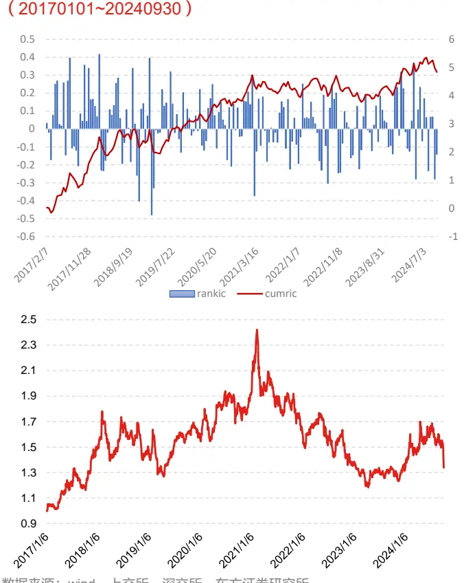
数据来源：wind、上交所、深交所、东方证券研究所

图 7：因子 id1时序 RankIC曲线和多空净值曲线（20170101~20240930）
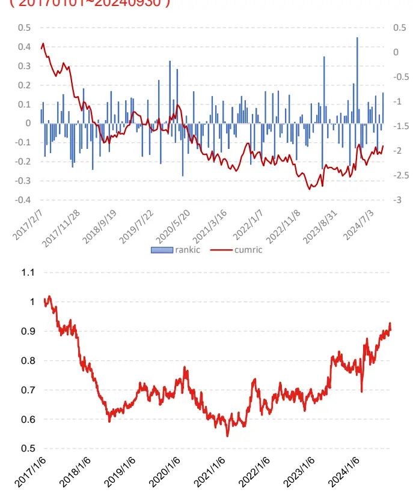
数据来源：wind、上交所、深交所、东方证券研究所

## 通过上述结果我们可以看出：

1. 两个数据集生成风险因子的RankIC基本上都在3%以内、ICIR基本上都在0.2以内而RankIC胜率基本上都在 60%以内，意味着各个风险因子均不具有显著的选股能力，且对未来收益率预测的方向波动十分剧烈；

2. 两个数据集所生成的风险因子Abs(RankIC)均较高，取值基本上都在8%以上，这说明各个因子对未来收益率的解释能力较强；

3. 数据集 1 所生成风险因子的自相关系数均在 70%以上，而数据集 2 生成的风险因子自相关系数均在 90%以上，说明短期来看两个数据集产生的各个风险因子衰减速度均较弱，并且频率越低的数据集产生的风险因子自相关性越高；

综上所述，两个数据集所生成风险因子均能较好的满足选股能力弱、自相关性高、对未来收益率解释能力强等预期目标。接着我们将分别对比 ABCM2、ABCM1 和 Barra 模型在各个股票池上的 Rsquare 的表现。

图 8：全市场风险因子滚动 243 日 Rsquare（20180101~20240930）
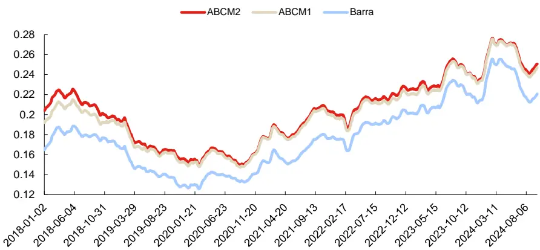
数据来源：wind、上交所、深交所、东方证券研究所

图 9：沪深 300 风险因子滚动 243 日 Rsquare（20180101~20240930）
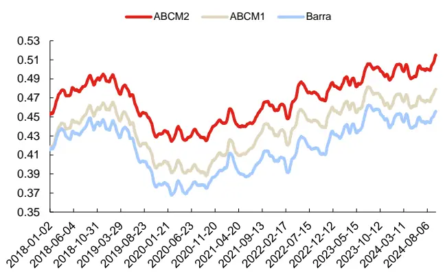
数据来源：wind、上交所、深交所、东方证券研究所

图 10：中证 500 风险因子滚动 243 日 Rsquare（20180101~20240930）
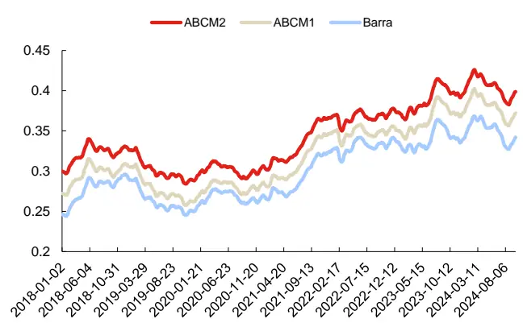
数据来源：wind、上交所、深交所、东方证券研究所

## 在各个股票池上，ABCM模型生成风险因子和 Barra风险因子的 Rsquare分别为：

ABCM2：沪深 300 47.02%、中证 500 34.28%、全市场 20.53%；

ABCM1：沪深 300 43.90%、中证 500 31.92%、全市场 20.08%；

Barra：沪深 300 41.97%、中证 500 29.86%、全市场 17.82%；

上述图像和结果可以看出：

1. 在各个股票池上 ABCM1 模型生成的风险因子滚动 Rsquare 曲线均稳定位于 Barra 风险因子上方，且相对于 Barra 风险因子，回测区间内 Rsquare 指标 ABCM1 模型生成的风险因子显著提升 2%-3%。因此 ABCM1 模型生成的风险因子对未来收益率的解释能力整体强于 Barra风险因子且该模型风险因子在小盘股里面增量更加明显。

2. 在各个股票池上 ABCM2 模型生成的风险因子滚动 Rsquare 曲线均稳定位于 ABCM1 风险因子上方，且回测区间内，相较于 ABCM1 模型，ABCM2 模型的 Rsquare 指标在沪深 300 上的提升幅度大于中证500大于中证1000。因此我们认为低频数据集2生成的风险因子可能更加贴合大市值股票池上的规律。

有关分析师的申明，见本报告最后部分。其他重要信息披露见分析师申明之后部分，或请与您的投资代表联系。并请阅读本证券研究报告最后一页的免责申明。

## 3.2 生成的 alpha 因子表现

接着，我们展示 ABCM模型在数据集 1和 2 上生成alpha因子以及合成因子在中证全指上的绩效表现以及这些因子今年以来多头超额的净值走势：

图 11：ABCM 模型生成 alpha 因子的绩效表现（20170101~20240930）

| 模型 | RanklC | ICIR | RankIC胜率 | Top组超额 | Top组换手率 | maxdd |
| --- | --- | --- | --- | --- | --- | --- |
| 数据集1 | 12.69% | 0.96 | 86.63% | 34.51% | 50.91% | -11.36% |
| 数据集2 | 11.09% | 0.90 | 83.42% | 26.57% | 41.45% | -20.68% |
| 合成 | 13.54% | 1.03 | 87.70% | 36.55% | 45.16% | -14.90% |

|  | 年化收益 | 回撤区间 | 年化波动率 | 最大回撤 |
| --- | --- | --- | --- | --- |
| 2017 | 26.66% | 2017-05-18 - 2017-06-01 | 7.24% | -4.23% |
| 2018 | 77.09% | 2018-01-18-2018-02-06 | 9.02% | -3.96% |
| 2019 | 26.40% | 2019-05-28 - 2019-06-10 | 6.19% | -2.83% |
| 2020 | 32.61% | 2020-04-09 - 2020-05-18 | 8.24% | -5.11% |
| 2021 | 39.55% | 2021-10-14- 2021-11-29 | 10.32% | -4.84% |
| 2022 | 37.54% | 2022-03-23 - 2022-04-26 | 10.95% | -5.86% |
| 2023 | 19.07% | 2023-05-09 - 2023-06-09 | 7.09% | -2.92% |
| 2024 | 29.25% | 2024-01-25 - 2024-02-07 | 20.98% | -14.90% |
| 年化 | 36.53% | 2024-01-25 - 2024-02-07 | 10.45% | -14.90% |

数据来源：wind、上交所、深交所、东方证券研究所

图 12：ABCM 模型生成 alpha 因子今年多头超额净值走势（20231229~20240930）
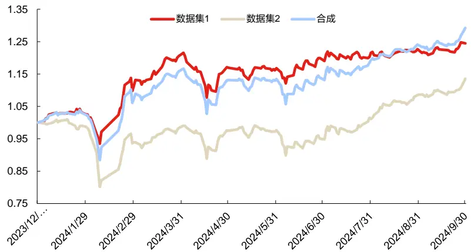
数据来源：wind、上交所、深交所、东方证券研究所

## 通过上述图表结果，我们可以看出：

1. 即使在模型层面对alpha因子的风险信息进行剥离，无论数据集1还是数据集2生成的alpha因子以及合成因子仍然能有着较强的获取超额收益的能力。三个因子虽然都是预测未来十天收益率，但换手率相对常规机器学习因子显著更低，另外合成因子往年多头超额收益回撤仅有 5.86%，且今年该因子最大回撤相对常规机器学习因子不大，这说明 ABCM模型生成因子的稳定性整体较强。

2. 合成因子的 RankIC、ICIR、RankIC 胜率和多头年化超额显著强于数据集 1 和 2 各自生成的alpha因子，并且今年三季度，数据集1产生因子的多头超额曲线相对较平而数据集2产生的alpha因子斜率更陡，这说明两个数据集产生的alpha因子各自信息差异较大，放在一起具有强互补作用，因而合成因子具有更好的表现。

3. 与常规的机器学习因子不同，在今年三季度各种机器学习因子多头均出现了较大回撤，但该alpha 因子的多头在今年三季度表现较为稳定甚至超额相对平时更高，未出现大幅回撤，这说明通过 ABCM 模型生成 alpha 因子获取 alpha 信息的来源与常规机器学习生成的 alpha 因子差异性较大，与常规机器学习因子有着较强互补性。

## 3.3 生成的因子相关性分析

本节我们将对两个数据集各自生成的风险因子之间以及和 Barra 风险因子之间的相关性进行分析，以下分别展示了生成因子之间相关系数矩阵以及生成因子与 10个基于 Barra风险因子之间相关系数矩阵（这里 id 为 f0 到 f8 为数据集 2 生成的风险因子，alpha2 表示数据集 2 生成的 alpha因子，id为0到13为数据集 1生成的风险因子，alpha1表示数据集 1生成的 alpha因子）：

图 13：ABCM模型生成因子相关系数矩阵

|  | f0 | f1 | f2 | f3 | f4 | f5 | f6 | f7 | alpha2 | 0 |  | 2 | 3 | 4 | 5 | 6 |  | 8 | 9 | 10 | 11 | alpha1 |
| --- | --- | --- | --- | --- | --- | --- | --- | --- | --- | --- | --- | --- | --- | --- | --- | --- | --- | --- | --- | --- | --- | --- |
| f0 | 100.00% | 8.41% | -5.67% | 2.28% | -2.98% | 3.75% | -11.36% | -26.89% | 7.95% | 39.43% | -21.30% | 42.61% | 6.61% | -16.83% 7.57% | -13.83% | 27.68% | 4.97% -22.36% | 8.44% -15.39% | -2.79% 5.40% | -1.92% 20.52% | 9.91% 12.56% | -0.21% 2.85% |
| f1 | 8.41% | 100.00% | 21.01% | -1.73% | -2.20% | -10.42% | -9.34% | -20.31% | -3.13% | -2.54% | -12.72% | -1.78% | 10.78% |  | 3.09% | -13.44% |  |  |  |  |  |  |
| f2 | -5.67% | 21.01% | 100.00% | -6.44% | 14.46% | 2.49% | -10.95% | -15.90% | -0.39% | -25.04% | 8.61% | -16.59% | 20.99% | 10.74% -6.49% | -23.47% | 3.30% | -7.47% | 2.02% | 1.49% 30.74% | -11.60% -5.76% | -1.28% | -1.36% 10.30% |
| f3 | 2.28% | -1.73% | -6.44% | 100.00% | 9.42% | -3.55% | -3.29% | 1.83% | 6.55% | 18.46% | 17.70% | 9.48% | 4.46% |  | -0.24% | 11.23% | -53.12% | -1.73% |  |  | -8.01% | -4.66% |
| f4 | -2.98% | -2.20% | 14.46% | 9.42% | 100.00% | 11.66% | 2.92% | -0.77% | -8.62% | 4.78% | -8.29% | -20.66% | 11.39% | 23.03% | -1.38% | 0.21% | 7.36% | -4.88% | -2.10% | -3.07% | -0.12% | 6.41% |
| f5 f6 | 3.75% | -10.42% | 2.49% | -3.55% | 11.66% | 100.00% | 0.20% | -8.33% | -5.22% | 3.18% | 23.47% | 9.81% | 8.14% | 16.09% | -22.35% | -8.67% | 5.68% | 28.46% | -16.65% | -4.22% | -5.49% |  |
| f7 | -11.36% -26.89% | -9.34% | -10.95% | -3.29% | 2.92% | 0.20% | 100.00% | 15.53% | 12.24% | -2.84% | -14.07% | -5.42% | -33.95% | 7.25% | 5.24% | 12.84% | -15.30% | 0.79% | -28.85% | 18.58% | -11.05% | 11.80% 0.46% |
| alpha2 |  | -20.31% | -15.90% | 1.83% | -0.77% | -8.33% | 15.53% | 100.00% | 7.41% | 5.37% | 2.03% | -31.54% | -25.05% | -9.24% | -18.50% | -10.27% | -7.66% | -5.68% | 15.72% | 16.44% | -5.10% | 50.85% |
| 0 | 7.95% 39.43% | -3.13% -2.54% | -0.39% | 6.55% | -8.62% | -5.22% 3.18% | 12.24% | 7.41% | 100.00% 4.54% | 4.54% | -7.06% 8.30% | -8.08% -5.12% | -16.46% -2.02% | -0.27% | -2.14% 1.31% | 22.02% 10.11% | -13.64% 2.58% | 1.05% 4.92% | -18.06% 10.84% | 1.78% 5.30% | -2.20% | -1.20% |
| 1 | -21.30% | -12.72% | -25.04% | 18.46% | 4.78% |  | -2.84% | 5.37% |  | 100.00% |  | -3.96% | -1.11% | -5.65% | -9.33% | -13.68% |  | -5.17% | 9.53% |  | -4.81% | 2.51% |
| 2 | 42.61% | -1.78% | 8.61% | 17.70% | -8.29% | 23.47% | -14.07% | 2.03% -31.54% | -7.06% | 8.30% | 100.00% -3.96% | 100.00% | -3.68% | 3.29% | -3.93% |  | 0.25% |  |  | -18.81% | -8.55% | 5.62% |
| 3 | 6.61% | 10.78% | -16.59% 20.99% | 9.48% | -20.66% | 9.81% | -5.42% -33.95% |  | -8.08% -16.46% | -5.12% -2.02% |  | -3.68% | 100.00% | -2.51% 6.97% | -2.79% | 4.04% -6.32% | 3.17% | 2.57% | -1.89% 5.48% | 6.05% -12.97% | -2.56% | -11.47% |
| 4 | -16.83% | 7.57% | 10.74% | 4.46% | 11.39% | 8.14% 16.09% |  | -25.05% -9.24% | -0.27% | -5.65% | -1.11% 3.29% | -2.51% | 6.97% | 100.00% | 5.46% | 4.81% | -2.76% 2.37% | -3.73% 2.38% | -8.14% |  | 3.49% | 3.98% |
| 5 | -13.83% | 3.09% | -23.47% | -6.49% | 23.03% | -22.35% | 7.25% 5.24% | -18.50% | -2.14% | 1.31% | -9.33% | -3.93% | -2.79% | 5.46% | 100.00% | -0.98% | 13.39% | -10.94% | -2.62% | -9.70% -6.44% | -3.10% -3.11% | -4.74% |
| 6 | 27.68% | -13.44% | 3.30% | -0.24% 11.23% | -1.38% 0.21% | -8.67% | 12.84% | -10.27% | 22.02% | 10.11% | -13.68% | 4.04% | -6.32% | 4.81% | -0.98% | 100.00% | 17.27% | -0.05% | -4.93% | 2.13% | -0.81% | 5.61% |
| 7 | 4.97% | -22.36% | -7.47% | -53.12% | 7.36% | 5.68% | -15.30% | -7.66% | -13.64% | 2.58% | 0.25% | 3.17% | -2.76% | 2.37% | 13.39% | 17.27% | 100.00% | -3.44% | -22.61% | -4.89% | -0.50% | -21.07% |
| 8 | 8.44% | -15.39% | 2.02% | -1.73% | -4.88% | 28.46% | 0.79% | -5.68% | 1.05% | 4.92% | -5.17% | 2.57% | -3.73% | 2.38% | -10.94% | -0.05% | -3.44% | 100.00% | 1.86% | 6.46% | 3.53% | 5.71% |
| 9 | -2.79% | 5.40% | 1.49% | 30.74% | -2.10% | -16.65% | -28.85% | 15.72% | -18.06% | 10.84% | 9.53% | -1.89% | 5.48% | -8.14% | -2.62% | -4.93% | -22.61% | 1.86% | 100.00% | 2.93% | -3.38% | -8.40% |

数据来源：wind、上交所、深交所、东方证券研究所

图 14：ABCM模型数据集 1上生成因子与 Barra风险因子相关系数

|  | Size | Beta | Volatility | Liquidity | Value | Certainty | Cubic size | Trend | Growth | SOE |
| --- | --- | --- | --- | --- | --- | --- | --- | --- | --- | --- |
| 0 | 30.82% | -30.85% | -3.10% | -19.26% | 19.14% | 11.28% | 6.09% | 69.58% | 13.13% | 3.93% |
|  | 3.00% | 29.71% | 7.27% | 19.17% | 12.71% | -16.27% | 6.76% | 14.55% | -13.78% | 9.78% |
| 2 | 73.55% | -4.84% | -3.71% | -14.60% | 11.31% | 32.99% | 56.95% | 3.27% | 15.17% | 7.30% |
| 3 | 11.36% | 11.09% | 24.93% | -9.52% | 13.74% | 27.06% | 14.13% | 19.42% | 9.65% | 0.20% |
| 4 | -15.61% | -4.31% | 28.07% | 16.99% | -9.07% | -16.18% | -4.15% | -4.33% | 1.75% | -2.35% |
| 5 | 6.14% | -13.19% | -2.11% | 1.32% | 7.49% | -30.25% | -34.68% | -15.14% | -2.85% | 9.41% |
| 6 | 10.88% | -8.52% | -27.49% | -16.14% | 26.49% | 23.24% | -7.51% | -4.68% | 28.28% | 0.18% |
|  | -2.76% | 42.43% | 44.40% | 34.35% | -43.88% | 1.07% | -4.32% | 28.35% | 26.90% | -8.25% |
| 8 | 13.06% | 17.14% | 18.42% | 12.79% | 1.95% | 17.90% | 6.56% | 8.65% | 16.90% | -6.69% |
| 9 | 9.24% | -13.55% | -1.50% | -9.96% | 9.06% | -16.36% | 6.65% | 20.92% | -15.88% | 5.90% |
| 10 | -3.76% | -21.65% | -7.79% | -16.61% | -21.84% | -9.99% | -17.51% | -6.07% | -24.03% | -1.76% |
| 11 | 5.97% | -0.92% | 12.96% | -8.44% | -12.05% | 10.29% | -17.30% | 5.02% | 3.06% | -1.34% |
| alpha | -8.76% | -2.57% | -25.10% | -11.33% | 18.10% | 7.58% | -15.57% | -15.60% | -3.31% | -2.16% |

数据来源：wind、上交所、深交所、东方证券研究所

图 15：ABCM模型数据集 2上生成因子与 Barra风险因子相关系数

|  | Size | Beta | Volatility | Liquidity | Value | CertaintyCubic size |  | Trend | Growth | SOE |
| --- | --- | --- | --- | --- | --- | --- | --- | --- | --- | --- |
| 0 | 55.62% | -21.95% | -10.80% | -33.00% | 19.84% | 42.58% | 36.15% | 35.25% | 34.71% | -0.57% |
| 12345678 | -7.49% | -22.71% | -2.34% | -22.76% | -5.56% | -2.12% | -10.45% | -7.36% | -17.13% | -3.99% |
|  | -24.41% | 14.20% | 10.99% | 5.83% | 5.24% | 0.93% | 4.37% | -16.80% | 4.18% | -0.52% |
|  | 22.02% | -31.87% | -33.74% | -21.72% | 63.67% | 1.99% | 13.91% | 1.76% | -14.96% | 4.48% |
|  | -23.70% | -9.50% | 30.69% | 9.39% | -2.86% | -4.39% | -2.62% | 8.28% | -0.79% | -1.37% |
|  | 4.97% | 22.69% | 30.91% | 15.38% | -2.99% | 11.22% | 18.38% | 12.96% | 1.32% | -1.05% |
|  | -11.96% | -15.81% | -25.28% | -3.52% | -3.99% | -4.21% | -13.89% | -28.14% | -5.85% | 2.36% |
|  | -32.63% | -5.29% | -12.97% | 2.14% | -24.81% | -16.92% | -17.89% | 5.65% | -22.78% | -0.74% |
|  | -12.70% | -1.60% | -29.87% | -10.17% | 13.34% | 2.79% | -24.44% | -18.73% | 0.68% | -3.00% |

数据来源：wind、上交所、深交所、东方证券研究所

通过上述相关系数矩阵我们可以看出：

1. 各数据集所生成的风险因子以及 alpha 因子之间相关性不高，两两之间相关性基本上都在 20%以内，数据集之间的相关性相对也较低，基本上都在 40%以内，这说明风险因子之间的信息独立性较强。

2. 10 个 Barra 风险因子除 SOE 外，两个数据集上均有生成的风险因子与之相关性达到 25%以上，这说明两个数据集所生成的风险因子都能通过所输入的特征学习到 Barra 风险因子中大部分信息。并且人工构建相应的基本面因子可能对所生成的风险因子起到补充作用。

3. 两个数据集所生成的 alpha 因子与十个 Barra 风险因子相关系数普遍相对较低，说明 ABCM模型学到的 alpha 因子确实剥离了风险从而获取了更为“纯粹”的 alpha 信息。并且长期低波动、低流动性、低估值等因子在 A 股市场可以获取稳定的超额收益，因此，模型将此类信息视作alpha信息融入alpha因子中，使得生成alpha因子与这些风格因子存在一定的低相关性也是符合预期的。

## 四、ABCM 模型对 alpha 端的增量

本章我们将以下两个模型生成的因子在各个股票池上选股表现进行对比，并且对这两个因子的性质进行分析以展示 ABCM1和 ABCM2模型生成的 alpha因子给整个框架带来的信息增量：

1. Baseline：基准模型，为报告《融合基本面信息的 ASTGNN 因子挖掘模型》中加入 lfq 数据集对应模型。

2. Model1：直接将ABCM模型生成alpha因子部分加入已有框架并进行加权合成最终打分，以获取更多的 alpha信息增量。

## 4.1 中证全指上的表现

首先，我们展示上述两个模型在中证全指股票池上2018年以来的选股汇总表现、分组测试结果以及多头超额净值走势的对比：

图 16：中证全指选股汇总表现（回测期 20171229~20240930）

|  | RanklC | ICIR | RankIC胜率 | Top组年化超额往年最大回撤 |  | 今年最大回撤 | 周均单边换手率 |
| --- | --- | --- | --- | --- | --- | --- | --- |
| baseline | 16.36% | 1.56 | 94.48% | 49.14% | -5.31% | -21.32% | 60.24% |
| Model1 | 16.39% | 1.66 | 96.55% | 52.63% | -5.25% | -20.04% | 60.78% |

数据来源：wind、上交所、深交所、东方证券研究所

图 17：中证全指因子各分组超额表现

|  | Grp0 | Grp1 | Grp2 | Grp3 | Grp4 | Grp5 | Grp6 | Grp7 | Grp8 | Grp9 |
| --- | --- | --- | --- | --- | --- | --- | --- | --- | --- | --- |
| baseline | 49.14% | 38.40% | 34.39% | 24.60% | 26.62% | 23.65% | 17.73% | 12.98% | 12.40% | 9.65% |
| Model1 | 52.63% | 40.09% | 34.84% | 26.59% | 25.41% | 22.23% | 17.91% | 15.45% | 10.83% | 9.12% |
|  | Grp10 | Grp11 | Grp12 | Grp13 | Grp14 | Grp15 | Grp16 | Grp17 | Grp18 | Grp19 |
| baseline | 4.43% | 0.84% | -2.09% | -4.15% | -9.78% | -12.40% | -17.39% | -23.05% | -35.66% | -66.38% |
| Model1 | 4.63% | 2.74% | -2.17% | -7.14% | -7.97% | -13.92% | -17.46% | -23.67% | -36.73% | -66.45% |

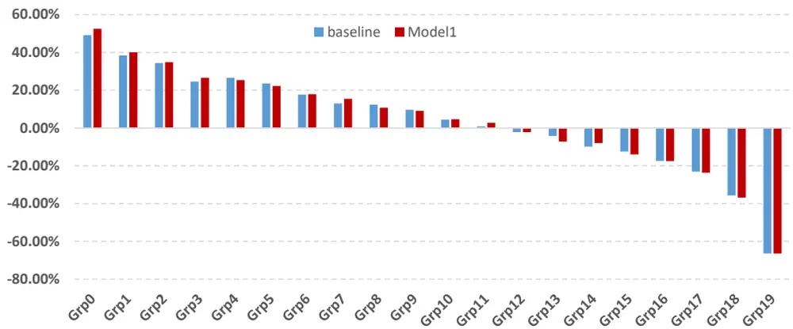
数据来源：wind、上交所、深交所、东方证券研究所

图 18：各模型多头超额净值走势（20180101~20231231）
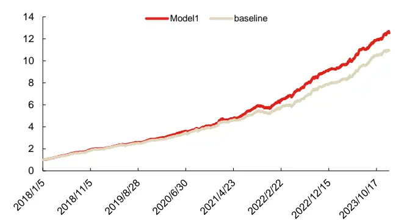
数据来源：wind、上交所、深交所、东方证券研究所

图 19：各模型多头超额净值走势（20231229~20241031）
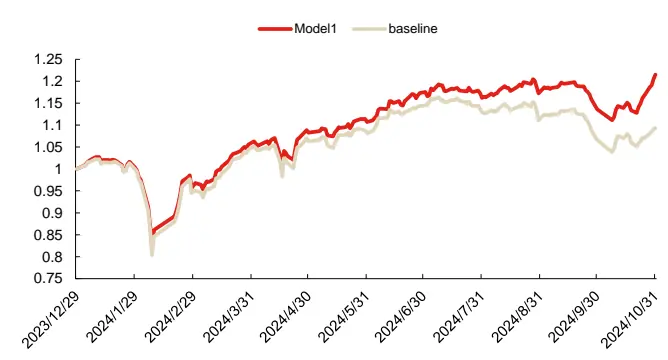
数据来源：wind、上交所、深交所、东方证券研究所

通过上述图表结果我们可以看出：

1. 通过加入 ABCM 模型中的 alpha 因子部分，相较于 baseline，Model1 对应因子在 RankIC、因子多头年化超额等各项指标上绩效得到了显著提升。这说明 ABCM 模型生成的 alpha 因子其获取超额收益的来源与普通的 GRU或者带图的 GRU模型生成因子的 alpha 来源有所不同，彼此之间存在信息差异，因而可以起到互补作用从而带来增量。

有关分析师的申明，见本报告最后部分。其他重要信息披露见分析师申明之后部分，或请与您的投资代表联系。并请阅读本证券研究报告最后一页的免责申明。

2. 相对于 baseline模型的因子，Model1生成因子的 ICIR和 RankIC胜率等指标显著提升，ICIR由 1.56 提升到了 1.66，RankIC 胜率由 94.48%提升到了 96.55%，且无论是往年还是今年的最大回撤都有所下降，说明 Model1因子稳定性也得到了一定的提升。

下面我们将展示周频调仓下各个模型生成因子分年度多头组合的超额收益情况如下：

图 20：中证全指各年度多头组合选股表现（回测期 20171229~20241031）

| 绝对收益 |  |  |  |  |  |  |  |
| --- | --- | --- | --- | --- | --- | --- | --- |
|  | 2018 | 2019 | 2020 | 2021 | 2022 | 2023 | 20241031 |
| baseline | 37.39% | 85.36% | 70.40% | 68.89% | 33.61% | 47.71% | 13.24% |
| Model1 | 41.31% | 88.08% | 71.47% | 77.35% | 40.69% | 46.37% | 25.95% |
| 超额收益 |  |  |  |  |  |  |  |
|  | 2018 | 2019 | 2020 | 2021 | 2022 | 2023 | 20241031 |
| baseline | 97.99% | 43.08% | 43.41% | 34.06% | 47.38% | 35.95% | 9.31% |
| Model1 | 103.58% | 45.20% | 44.25% | 40.69% | 55.13% | 34.69% | 21.50% |

数据来源：wind、上交所、深交所、东方证券研究所

上表中各模型多头组合分年度绩效表现来看，我们可以得到：

1. Model1 因子各年度年化多头超额基本上都在 40%以上，这说明该因子获取超额收益的能力较为稳定，且除 2023 年外，各年度均能显著战胜 baseline 因子，这说明 ABCM模型生成 alpha因子给全模型带来的增量较为稳定。

2. 相对于 baseline，Model1 生成因子在 2021 年和今年多头超额提升幅度最大，说明在较为极端的市场环境下，Model1因子在中证全指选股能力的增量可能更加明显。

## 4.2 各宽基指数上的表现

接着我们将两个模型生成因子限制在沪深300、中证500和中证1000这三个股票池上进行分组测试（各个股票池均分为 10组），所得回测结果及今年多头超额净值走势分别如下：

图 21：各宽基指数上选股表现（回测期 20180101~20241031）

| 沪深300 |  |  |  |  |  |  |
| --- | --- | --- | --- | --- | --- | --- |
|  | RanklC | ICIR |  | RankIC胜率 Top年化超额 | 最大回撤 | 周均换手率 |
| baseline | 11.76% | 0.71 | 79.88% | 31.77% | -9.82% | 50.94% |
| Model1 | 11.53% | 0.71 | 75.61% | 29.79% | -12.06% | 52.12% |
|  | 中证500 |  |  |  |  |  |
|  | RanklC | ICIR | RankIC胜率 Top年化超额 |  | 最大回撤 | 周均换手率 |
| baseline | 11.69% | 0.86 | 78.66% | 24.54% | -16.18% | 52.81% |
| Model1 | 11.94% | 0.88 | 82.32% | 26.46% | -14.34% | 53.48% |
|  | 中证1000 |  |  |  |  |  |
|  | RankiC | ICIR |  | RankIC胜率 Top年化超额 | 最大回撤 | 周均换手率 |
| baseline | 14.68% | 1.17 | 87.20% | 36.51% | -11.87% | 53.87% |
| Model1 | 14.94% | 1.22 | 89.02% | 39.61% | -10.19% | 54.66% |

数据来源：wind、上交所、深交所、东方证券研究所

有关分析师的申明，见本报告最后部分。其他重要信息披露见分析师申明之后部分，或请与您的投资代表联系。并请阅读本证券研究报告最后一页的免责申明。

图 22：今年沪深 300多头超额走势（截至 20241031）
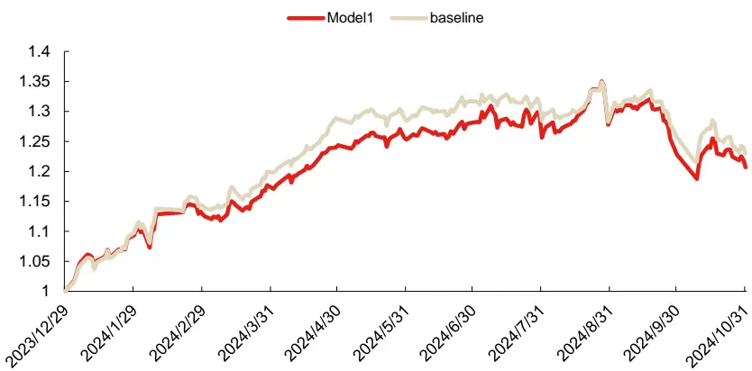
数据来源：wind、上交所、深交所、东方证券研究所

图 23：今年中证 500多头超额走势（截至 20241031）
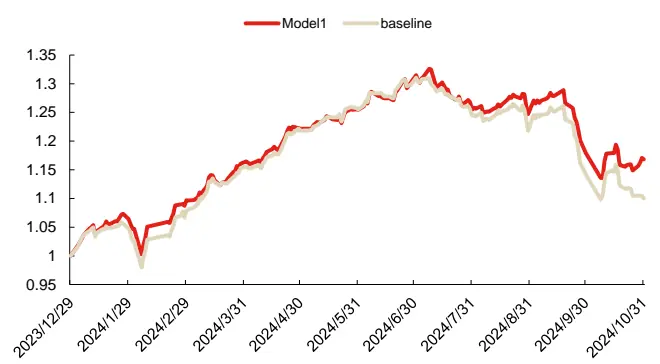
数据来源：wind、上交所、深交所、东方证券研究所

图 24：今年中证 1000多头超额走势（截至 20241031）
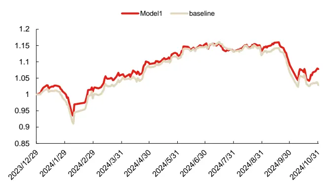
数据来源：wind、上交所、深交所、东方证券研究所

通过以上结果我们可以看出各个模型生成因子在各个股票池上都有较强的选股能力。并且，

1. Model1 生成因子在中证 500 和中证 1000 成分股内的 RankIC、ICIR 和 Top 组年化超额等指标均显著好于 baseline，而最大回撤相对于 baseline 显著降低。并且今年十月上旬两个因子多头经历了一段相对不大的回撤后，Model1 因子在中证 500 和中证 1000 上出现了较为明显的反弹，而 baseline 反弹却不明显。这说明通过把 ABCM 模型生成的alpha 因子加入对全模型在中小盘股票池上能够带来较大的信息增量，也间接说明ABCM模型挖掘的alpha信息源可能与已有GRU学习中性化标签获取alpha信息的来源有着较大差异。

2. 相较于 baseline，Model1 生成因子呈现显著的小盘上增量更大（中证 1000 上增量大于中证 500 大于沪深 300），对于这种现象我们认为各个股票池上风险信息的来源互不相同，而模型是在中证全指股票池上训练的，导致生成的风险因子可能“更加适合”小盘股，而对于大盘股可能存在“欠拟合”问题。

## 4.3 因子风险暴露分析

我们计算各期截面上的Model1生成的综合打分与几个主要的Barra风险因子在回测区间内相关系数变化情况，时序相关系数曲线图如下图所示：

图 25：因子风险暴露时序曲线
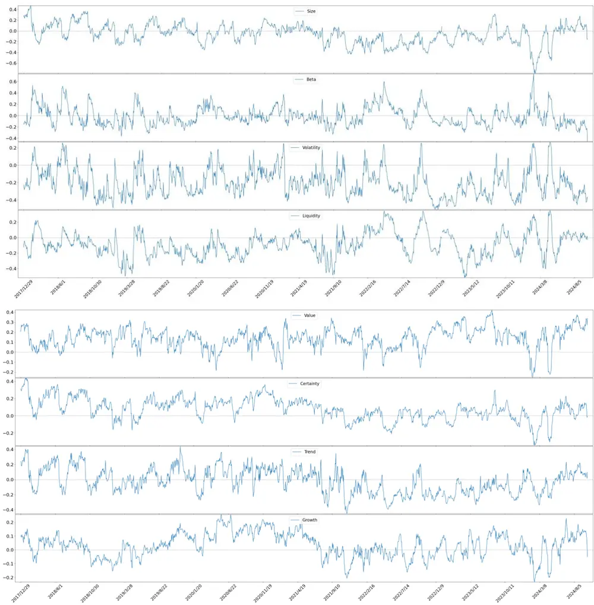
数据来源：wind、上交所、深交所、东方证券研究所

根据上图，我们可以得出以下结论：

有关分析师的申明，见本报告最后部分。其他重要信息披露见分析师申明之后部分，或请与您的投资代表联系。并请阅读本证券研究报告最后一页的免责申明。

1. Model1生成因子与各个风险因子在大部分时间内相关性普遍较低，相关系数绝对值长期基本上都在 0.3 以内，说明该因子各种风格的偏向性相对较低，在进行组合优化时适当的风格暴露约束不会明显降低组合的超额收益。

2. 该因子在 2021年 8月以前与市值因子整体呈现正向暴露，而 2021年 8月至今年上旬整体呈现出负向暴露，而今年上旬至今又呈现出正向暴露的情况，这说明该因子长期能对市场的大小盘风格起到一定的判定能力。

3. 该因子与波动率和流动性风格长期呈现出负向暴露，而对估值风格长期呈现出正向暴露，这与这三种风格长期能在 A股市场获得较为稳定的超额有关。

4. 该因子与成长风格在 2019年 8月至 2021年 3月呈现出明显的正向暴露，与这段时间市场呈现出明显的成长风格股票占优有关。

上述结果说明该因子存在一定的风格择时能力但可能对市场的风格快速变化无法做出迅速的反应。

## 五、ABCM风险因子在指增上的应用

## 5.1增强组合构建说明

本章将展示了 Model1 非线性加权合成的最终 alpha 因子在沪深 300、中证 500 和中证 1000指数增强的应用效果，关于指数增强组合有如下说明：

1） 回测期20171229~20241031，组合周频调仓，假设根据每周五个股得分在次日以vwap 价格进行交易，股票池为中证全指成分股。

2） 风险暴露按照以下两种方式进行控制：

1. Barra：风险因子库 dfrisk2020（参见《东方 A 股因子风险模型（DFQ-2020）》）的所有风格因子相对暴露不超过 0.2倍标准差，所有行业因子相对暴露不超过 2%。

2. ABCM1 & ABCM2：前文机器学习模型生成的 12个风险因子和 20个风险因子各自相对于基准指数的暴露不超过 0.2倍标准差，所有行业因子相对暴露不超过 2%。

3） 指增策略组合构建时，限制指数成分股占比，成分股占比为 80%约束，周单边换手率限制为20%，个股权重偏离均限制为±1%。

4） 组合业绩测算时假设买入成本千分之一、卖出成本千分之二，停牌和涨停不能买入、停牌和跌停不能卖出。

## 5.2 沪深 300 指数增强

本节将展示不同风控模型下，模型 Model1 生成因子在沪深 300 指数增强策略应用，我们展示各种约束条件下，各年度的业绩表现以及多头超额净值走势：

图 26：沪深 300 指增组合分年度超额收益率（回测期 20171229~20241031）

|  | 年化收益 |  |  | 信息比率 |  |  | 最大回撤 |  |  |
| --- | --- | --- | --- | --- | --- | --- | --- | --- | --- |
| 风控模型 | Barra | ABCM1 ABCM2 | Barra | ABCM1 | ABCM2 | Barra ABCM1 | ABCM2 | Barra | 跟踪误差 ABCM1 ABCM2 |
| 2018 | 32.00% 29.00% | 27.00% | 5.29 | 4.85 | 4.44 | -1.01% -1.64% | -0.92% | 6.05% 5.98% | 6.08% |
| 2019 | 6.82% 10.08% | 8.66% | 1.16 | 1.71 | 1.58 | -3.03% -3.10% | -2.36% | 5.90% 5.88% | 5.49% |
| 2020 | 10.64% 12.68% | 10.14% | 1.74 | 2.21 | 1.74 | -2.08% -2.44% | -2.13% | 6.13% 5.73% | 5.85% |
| 2021 | 20.51% 24.37% | 21.71% | 3.37 | 3.57 | 3.47 | -2.13% -4.00% | -1.73% | 6.08% 6.83% | 6.26% |
| 2022 | 18.62% 21.61% | 19.46% | 3.47 | 3.45 | 3.84 | -3.00% -2.34% | -2.06% | 5.37% 6.27% | 5.07% |
| 2023 | 8.52% 13.64% | 9.95% | 1.83 | 3.03 | 2.09 | -2.23% -3.25% | -2.67% | 4.66% 4.50% | 4.76% |
| 2024 | 7.85% 8.36% | 4.94% | 1.31 | 1.47 | 0.82 | -6.57% -5.34% | -6.07% | 6.00% 5.70% | 6.00% |
| 年化 | 15.11% 17.37% | 14.71% | 2.54 | 2.87 | 2.51 | -6.57% -5.34% | -6.07% | 5.96% 6.06% | 5.86% |

数据来源：wind、上交所、深交所、东方证券研究所

图 27：沪深 300 指增组合超额净值走势（20171229~20241031）
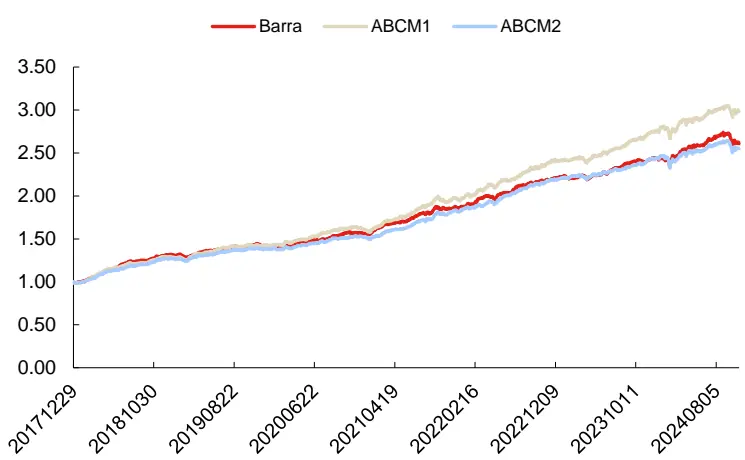
数据来源：wind、上交所、深交所、东方证券研究所

图 28：不同暴露倍数下各风险模型对应沪深 300组合的信息比率

| 0.05 | 0.1 | 0.2 |
| --- | --- | --- |
| Barra 3.04 | 3.1 | 2.54 |
| ABCM1 | 3.01 3.12 | 2.87 |
| ABCM2 | 3.04 3.1 | 2.51 |

数据来源：wind、上交所、深交所、东方证券研究所

## 5.3 中证 500 指数增强

本节将展示不同风控模型下，模型 Model1 生成因子在中证 500 指数增强策略应用，我们展示各种约束条件下，各年度的业绩表现以及多头超额净值走势：

图 29：中证 500 指增组合分年度超额收益率（回测期 20171229~20241031）

|  | 年化收益 |  | 信息比率 |  |  |  | 最大回撤 |  | 跟踪误差 |  |
| --- | --- | --- | --- | --- | --- | --- | --- | --- | --- | --- |
| 风控模型 | Barra | ABCM1 ABCM2 | Barra | ABCM1 ABCM2 |  | Barra | ABCM1 ABCM2 | Barra | ABCM1 ABCM2 |  |
| 2018 | 45.00% | 47.00% 46.00% | 6.25 | 6.90 | 6.80 | -0.96% -0.88% | -0.88% | 7.20% | 6.81% | 6.76% |
| 2019 | 16.55% | 19.73% 23.29% | 2.79 | 3.33 | 4.17 | -3.36% -1.70% | -1.35% | 5.93% | 5.93% | 5.58% |
| 2020 | 14.79% | 14.77% 15.56% | 2.04 | 2.35 | 2.32 | -3.51% -3.93% | -3.33% | 7.26% | 6.29% | 6.70% |
| 2021 | 26.80% | 29.21% 30.29% | 4.45 | 4.64 | 5.19 | -4.13% -4.71% | -3.77% | 6.03% | 6.29% | 5.84% |
| 2022 | 14.63% | 16.48% 18.45% | 2.57 | 2.98 | 3.63 | -3.16% -2.57% | -2.83% | 5.70% | 5.53% | 5.09% |
| 2023 | 8.51% | 10.53% 8.10% | 1.77 | 2.40 | 1.82 | -3.19% -3.24% | -2.80% | 4.80% | 4.39% | 4.46% |
| 2024 | 2.29% | 0.00% 1.73% | 0.34 | 0.00 | 0.26 | -9.65% -8.20% | -7.63% | 6.76% | 7.44% | 6.66% |
| 年化 | 18.21% | 19.45% 20.32% | 2.79 | 3.06 | 3.30 | -9.65% | -8.20% -7.63% | 6.52% | 6.35% | 6.16% |

数据来源：wind、上交所、深交所、东方证券研究所

图 30：中证 500 指增组合净值走势（20171229~20241031）
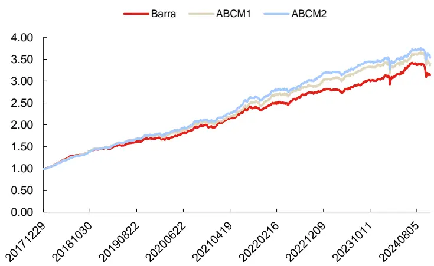
数据来源：wind、上交所、深交所、东方证券研究所

图 31：不同暴露倍数下各风险模型对应中证 500组合的信息比率

| 0.05 | 0.1 | 0.2 |
| --- | --- | --- |
| Barra 3.03 | 3.18 | 2.79 |
| ABCM1 3.31 | 3.43 | 3.06 |
| ABCM2 3.51 | 3.53 | 3.3 |

数据来源：wind、上交所、深交所、东方证券研究所

## 5.4 中证 1000 指数增强

本节将展示不同风控模型下，模型 Model1生成因子在中证 1000指数增强策略应用，我们展示各种约束条件下，各年度的业绩表现以及多头超额净值走势：

图 32：中证 1000 指增组合分年度超额收益率（回测期 20171229~20241031）

| 风控模型 | 年化收益 |  | 信息比率 |  | 最大回撤 |  |  |  |
| --- | --- | --- | --- | --- | --- | --- | --- | --- |
|  |  |  | ABCM1 | ABCM2 |  | ABCM2 | 最大回撤 |  |
| 2018 | Barra ABCM1 61.00% 59.00% | ABCM2 62.00% | Barra 7.27 7.82 |  | Barra -1.45% | ABCM1 -1.27% | Barra | ABCM1 ABCM2 |
| 2019 |  |  | 4.61 | 8.38 4.75 | -1.83% | -1.00% | 8.39% 7.55% | 7.40% |
| 2020 | 28.57% 28.93% | 29.01% | 4.59 3.37 | 3.73 | -2.40% | -1.91% | 6.19% 6.30% | 6.11% |
| 2021 | 22.71% 23.41% | 23.92% | 3.04 5.82 |  | -3.37% | -3.41% -2.92% | 7.48% 6.95% | 6.42% |
| 2022 | 34.65% 37.55% 36.49% | 36.29% | 5.42 5.87 | 5.66 | -3.53% | -2.83% -2.84% | 6.39% 6.45% | 6.41% |
| 2023 | 30.99% 15.79% | 32.86% | 5.27 2.82 3.20 | 5.78 | -3.31% | -2.84% -2.37% -2.25% | 5.88% | 6.21% 5.69% |
| 2024 | 14.51% -3.51% 0.55% | 14.50% 0.37% | -0.53 0.07 | 2.96 0.05 | -2.41% -11.27% | -2.71% -9.51% | 5.14% | 4.94% 4.90% |
| 年化 | 28.51% | 28.02% | 3.83 4.17 | 4.25 | -11.27% | -9.80% -9.80% -9.51% | 6.63% | 7.32% 7.10% |
|  | 26.43% |  |  |  |  |  | 6.90% | 6.84% 6.59% |

数据来源：wind、上交所、深交所、东方证券研究所

图 33：中证 1000 指增组合净值走势（20171229~20241031）
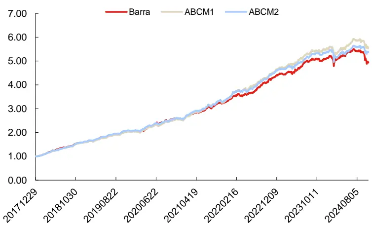
数据来源：wind、上交所、深交所、东方证券研究所

图 34：不同暴露倍数下各风险模型对应中证 1000组合的信息比率

| 0.05 | 0.1 | 0.2 |
| --- | --- | --- |
| Barra 3.94 | 3.89 | 3.83 |
| ABCM1 4.37 | 4.4 | 4.17 |
| ABCM2 4.29 | 4.31 | 4.25 |

数据来源：wind、上交所、深交所、东方证券研究所

通过上述指增组合业绩回测对比，我们可以得到：相较于 Barra 风险模型，ABCM1 和ABCM2 风险模型在各个股票池的指增任务上均能提升指增组合的信息比率，并且提升幅度在沪深 300小于中证 500小于中证 1000。在中证 1000上，组合每年的超额收益也得到了提升。这说明 ABCM 模型学习到的风险信息可能更适用于中小盘，这与模型在中证全指上训练，而全指成分股中小微盘股居多，存在一定的关系。

## 六、结论

多因子选股策略是量化投资中的主流 Alpha 策略，它通过结合多个具有预测能力的因子来构建投资组合。多因子选股框架通常包括 alpha 模型、风险模型、交易成本模型和组合优化四个部分。这四个部分中 alpha 模型更加受到重视，近年来基于人工挖掘和机器学习相关的 alpha 因子挖掘方法层出不穷。但研究人员对于风险模型的研究则少之又少，在今年各类 alpha 模型遭受几轮较大回撤之后，风险模型在多因子选股体系下的作用显得尤为重要。

主流的风险模型主要分为两类，基本面主导的 barra 风险模型和价格数据驱动的统计量风险模型，前者主要通过人工方法构建相应的风险因子从而建立模型，后者主要通过一些降维等数据分析的方法构建风险因子从而建立模型。

基于基本面的 barra 模型中的风险因子往往考虑的是超长周期的风险，且模型中基本面信息占比相对量价信息更高，因此这种风险模型对于低频策略匹配度相对较高，但对于中高频策略可能力不从心。为了克服这些问题，前期报告《融合基本面信息的 ASTGNN 因子挖掘模型》和《KD-Ensemble：基于知识蒸馏的alpha因子挖掘模型》中，我们借助图模型和RNN模型搭建了一套风险因子生成模型框架，这套框架生成的风险因子样本外对未来收益率有着较好的解释力度。但这套框架仍然存在一些技术问题：

1. 损失函数中只考虑了风险因子对未来收益率的 Rsquare，但 alpha 因子对未来收益率也能贡献一定的 Rsquare，因此风险因子可能混入 alpha 信息，导致生成的风险因子具有一定的“选股能力”。

2. 对风险因子自相关性没有进行合理的考量，可能使得部分风险因子自相关性较低。

3. 风险产生的原因很大程度上由于某种维度上聚类得到的相似股票在不同时期内表现出的“同涨同跌”效应，因此风险因子生成应考虑到股票间的交互关系，而 alpha 因子应该是个股特质性收益率，不应受到其他股票影响。基于此，这套框架的神经网络结构也有必要做出调整。

基于上述问题，我们对模型的结构及损失函数做出改进提出了 ABCM1 和 ABCM2 模型，该模型生成的各风险因子样本外表现我们可以看出：

1. 各风险因子的 RankIC基本上都在 3%以内、ICIR基本上都在 0.2以内而 RankIC胜率基本上都在 60%以内，意味着各个风险因子均不具有显著的选股能力；

2. 各风险因子Abs(RankIC)均较高（基本上都在8%以上），说明各因子对未来收益率的解释能力较强；

3. 各风险因子的自相关系数均在 70%以上，而基于月频数据集的风险因子自相关系数均在 90%以上，说明短期来看各个风险因子衰减速度较弱；

4. 各风险因子间相关性不高，两两之间相关性基本上都在 20%以内，信息独立性较强。

5. 在各个股票池上 ABCM1&2 风险因子滚动 Rsquare 曲线均稳定位于 Barra 风险因子上方，且相对于 Barra风险因子， ABCM2风险模型 Rsquare显著提升，在沪深 300、中证 500和中证全指上分别提升至 47.02%、34.28%和 20.53%。因此基于神经网络生成的风险模型对未来收益率的解释能力整体强于 Barra风险模型。

而 ABCM模型生成的 alpha因子合成之后在样本外：

有关分析师的申明，见本报告最后部分。其他重要信息披露见分析师申明之后部分，或请与您的投资代表联系。并请阅读本证券研究报告最后一页的免责申明。

1. 有着较强的获取超额收益的能力，2017 年至今年化超额达 36.55%。且该因子往年超额收益回撤仅有 5.86%，且今年该因子最大回撤相对不大，这说明该因子能稳定的获取较高的超额。

2. 今年三季度该 alpha 因子的多头表现较为稳定未出现大幅回撤，另外一方面该因子与各个Barra 风险因子相关性较低，这说明通过 ABCM 模型生成 alpha 因子获取 alpha 信息的来源与常规机器学习生成的 alpha因子差异性较大，与常规机器学习因子有着较强互补性。

ABCM2 模型生成的 alpha 因子对我们已有的 AI 量价模型生成 alpha 因子能够起到较大增量作用，通过把前者纳入到我们已有的 AI 量价模型中进行合成，新生成的 alpha 因子在中证全指、中证 500 和中证 1000 上 RankIC 分别提升至 16.39%、11.94%和 14.94%，多头年化超额分别提升至 52.63%、26.46%和 39.61%，在中证全指上 RankICIR 也提升至 1.66，说明新因子获取alpha 收益的能力更强，稳定性也更好。

相对于使用 Barra 风险模型，将 ABCM2 风险模型生成的风险因子直接用于组合优化，新组合具有更高的信息比率，其中中证 500 增强组合由 2.79 提升至 3.30，中证 1000 增强组合则由3.83提升至 4.25。并且组合的年化超额以及超额最大回撤均有显著改善。

## 风险提示

1. 量化模型基于历史数据分析，未来存在失效风险，建议投资者紧密跟踪模型表现。

2. 极端市场环境可能对模型效果造成剧烈冲击，导致收益亏损。

## Tabl e_Disclai mer 分析师申明

每位负责撰写本研究报告全部或部分内容的研究分析师在此作以下声明：

分析师在本报告中对所提及的证券或发行人发表的任何建议和观点均准确地反映了其个人对该证券或发行人的看法和判断；分析师薪酬的任何组成部分无论是在过去、现在及将来，均与其在本研究报告中所表述的具体建议或观点无任何直接或间接的关系。

## 投资评级和相关定义

报告发布日后的12个月内行业或公司的涨跌幅相对同期相关证券市场代表性指数的涨跌幅为基准（A 股市场基准为沪深 300 指数，香港市场基准为恒生指数，美国市场基准为标普 500 指数）；

## 公司投资评级的量化标准

买入：相对强于市场基准指数收益率 15%以上；

增持：相对强于市场基准指数收益率 5%～15%；

中性：相对于市场基准指数收益率在-5%～+5%之间波动；

减持：相对弱于市场基准指数收益率在-5%以下。

未评级 —— 由于在报告发出之时该股票不在本公司研究覆盖范围内，分析师基于当时对该股票的研究状况，未给予投资评级相关信息。

暂停评级 —— 根据监管制度及本公司相关规定，研究报告发布之时该投资对象可能与本公司存在潜在的利益冲突情形；亦或是研究报告发布当时该股票的价值和价格分析存在重大不确定性，缺乏足够的研究依据支持分析师给出明确投资评级；分析师在上述情况下暂停对该股票给予投资评级等信息，投资者需要注意在此报告发布之前曾给予该股票的投资评级、盈利预测及目标价格等信息不再有效。

## 行业投资评级的量化标准：

看好：相对强于市场基准指数收益率 5%以上；

中性：相对于市场基准指数收益率在-5%～+5%之间波动；

看淡：相对于市场基准指数收益率在-5%以下。

未评级：由于在报告发出之时该行业不在本公司研究覆盖范围内，分析师基于当时对该行业的研究状况，未给予投资评级等相关信息。

暂停评级：由于研究报告发布当时该行业的投资价值分析存在重大不确定性，缺乏足够的研究依据支持分析师给出明确行业投资评级；分析师在上述情况下暂停对该行业给予投资评级信息，投资者需要注意在此报告发布之前曾给予该行业的投资评级信息不再有效。

## HeadertTabl e_Discl ai mer 免责声明

本证券研究报告（以下简称“本报告”）由东方证券股份有限公司（以下简称“本公司”）制作及发布。

。本公司不会因接收人收到本报告而视其为本公司的当然客户。本报告的全体接收人应当采取必要措施防止本报告被转发给他人。

本报告是基于本公司认为可靠的且目前已公开的信息撰写，本公司力求但不保证该信息的准确性和完整性，客户也不应该认为该信息是准确和完整的。同时，本公司不保证文中观点或陈述不会发生任何变更，在不同时期，本公司可发出与本报告所载资料、意见及推测不一致的证券研究报告。本公司会适时更新我们的研究，但可能会因某些规定而无法做到。除了一些定期出版的证券研究报告之外，绝大多数证券研究报告是在分析师认为适当的时候不定期地发布。

在任何情况下，本报告中的信息或所表述的意见并不构成对任何人的投资建议，也没有考虑到个别客户特殊的投资目标、财务状况或需求。客户应考虑本报告中的任何意见或建议是否符合其特定状况，若有必要应寻求专家意见。本报告所载的资料、工具、意见及推测只提供给客户作参考之用，并非作为或被视为出售或购买证券或其他投资标的的邀请或向人作出邀请。

本报告中提及的投资价格和价值以及这些投资带来的收入可能会波动。过去的表现并不代表未来的表现，未来的回报也无法保证，投资者可能会损失本金。外汇汇率波动有可能对某些投资的价值或价格或来自这一投资的收入产生不良影响。那些涉及期货、期权及其它衍生工具的交易，因其包括重大的市场风险，因此并不适合所有投资者。

在任何情况下，本公司不对任何人因使用本报告中的任何内容所引致的任何损失负任何责任，投资者自主作出投资决策并自行承担投资风险，任何形式的分享证券投资收益或者分担证券投资损失的书面或口头承诺均为无效。

本报告主要以电子版形式分发，间或也会辅以印刷品形式分发，所有报告版权均归本公司所有。未经本公司事先书面协议授权，任何机构或个人不得以任何形式复制、转发或公开传播本报告的全部或部分内容。不得将报告内容作为诉讼、仲裁、传媒所引用之证明或依据，不得用于营利或用于未经允许的其它用途。

经本公司事先书面协议授权刊载或转发的，被授权机构承担相关刊载或者转发责任。不得对本报告进行任何有悖原意的引用、删节和修改。

提示客户及公众投资者慎重使用未经授权刊载或者转发的本公司证券研究报告，慎重使用公众媒体刊载的证券研究报告。

## 东方证券研究所

地址： 上海市中山南路 318 号东方国际金融广场 26 楼

电话：021-63325888

传真：021-63326786

网址： www.dfzq.com.cn