# DFQ-FactorVAE-pro：加入特征选择与环境变量模块的 FactorVAE 模型

因子选股系列之一一一

## 研究结论

DFQ-FactorVAE 模型回顾

在前期报告中，我们给出了 DFQ-FactorVAE 模型。模型在传统的端到端神经网络基础上，融合了变分自编码器与概率动态因子模型的思想，创新性地提出了“先验-后验”学习方法，建立股票收益率预测模型，学习输入特征和标签之间的关系。

⚫ FactorVAE模型架构拓展潜力较大，模型所得选股因子的稳定性、在沪深 300股票池中的多头表现十分突出。本次我们对原模型进行了多方面的升级优化。

## DFQ-FactorVAE-pro 模型说明

金融数据中普遍存在较高的噪声和冗余，因此，特征选择在模型开发中至关重要。特征选择的目的是减少无关或冗余的特征，提升模型的训练效率和预测准确性，同时避免过拟合。因此我们在 FactorVAE 模型中添加特征选择模块，引入特征选择器和特征重构器，由网络实现自动特征选择，同时保证筛选后特征信息的完整性。

端到端神经网络模型的输入一般是股票特征，通常忽略了市场整体信息的作用，但实际股票收益也会受到当时所处的市场环境的影响。因此我们重构了 FactorVAE 模型，在训练阶段加入日期环境变量特征来协同对股票收益定价，而在预测时摒弃环境变量的部分，以此提升模型的收益预测泛化能力。

DFQ-FactorVAE-pro模型，以 DFQ-FactorVAE模型为基础，添加特征选择模块，添加日期环境变量，使用协同训练方式进行训练。并在特征提取器处理、样本外预测方式、输入标签数据处理方式上进行了多方面的改进。

## DFQ-FactorVAE-pro 模型效果

在中证全指股票池中，因子多头表现优异，多头超额收益夏普和最大回撤均为各模型中最优，分组单调性较好。测试集上 IC 达到 12.09%，RANKIC 达到 15.08%，RANKICIR达到 1.24。20分组多头年化超额收益达到 29.77%，多头超额收益夏普比3.48，多头日度超额收益最大回撤 5.35%。

⚫ 在沪深 300 和中证 500 股票池中，因子表现十分优异，各项指标基本均为各模型中最优，分组单调性较好。

因子进行了行业和市值中性化后表现依然优异，模型受行业市值风格影响较小。原始因子 20分组多头年化超额收益 29.77%，中性化仅降低 4%。

多头组偏向小市值、低波动、低流动性、低估值、强反转、低成长。与 tra、hist 等神经网络模型相比，在市值上的负暴露更小，在 beta 风格上基本无暴露，在低估值上的正暴露更大，在非线性市值上的负暴露更小。

## 指数增强组合表现

⚫ DFQ-FactorVAE-pro模型所得到的合成因子在大盘指增组合中表现十分突出。

⚫ 沪深 300指增：2020年以来信息比 2.23，年化对冲收益 12.32%，跟踪误差 5.28%，2024 年超额收益为 5.15%。

⚫ 中证 500指增：2020年以来信息比 1.98，年化对冲收益 12.98%，跟踪误差 6.27%，2024 年超额收益为 8.5%。

⚫ 中证 A500 指增：2020 年以来信息比 1.98，年化对冲收益 12.97%，跟踪误差6.28%， 2024 年超额收益为 4.31%。

## 风险提示

1. 量化模型失效风险。

2. 极端市场环境对模型的影响。

报告发布日期

2025 年 02 月 18 日

杨怡玲 yangyiling@orientsec.com.cn

执业证书编号：S0860523040002

刘静涵021-63325888*3211

liujinghan@orientsec.com.cn

执业证书编号：S0860520080003

香港证监会牌照：BSX840

ABCM：基于神经网络的alpha因子和beta 2024-12-03因子协同挖掘模型：——因子选股系列之一一〇

相对定价类基本面因子挖掘：——因子选 2024-10-11股系列之一〇九

KD-Ensemble：基于知识蒸馏的 alpha 因 2024-08-19子挖掘模型：——因子选股系列之一〇八

DFQ-XGB：基于树模型的 alpha 预测方 2024-08-15案：——因子选股系列之一〇七

基于风险注意力的因子挖掘模型：——因 2024-05-29子选股系列之一〇六

非线性市值风控全攻略：——因子选股系 2024-05-27列之一〇五

融合基本面信息的 ASTGNN 因子挖掘模 2024-05-27型：——因子选股系列之一〇四

DFQ-FactorVAE：融合变分自编码器和概 2024-05-14率动态因子模型的 alpha 预测方案：——因子选股系列之一〇三

基本面因子的重构：——因子选股系列之 2024-03-21一〇二

自适应时空图网络周频 alpha 模型：—— 2024-02-28因子选股系列之一〇一

DFQ-HIST：添加图信息的选股因子挖掘 2024-02-07系统：——因子选股系列之一百

在前期报告 《DFQ-FactorVAE：融合变分自编码器和概率动态因子模型的 alpha 预测方案》中，我们提出了 DFQ-FactorVAE模型。FactorVAE模型架构拓展潜力较大，模型所得选股因子的稳定性、在沪深 300 股票池中的多头表现十分突出。本次我们对 DFQ-FactorVAE 模型进行了进一步的升级优化：（1）金融数据中普遍存在较高的噪声和冗余，因此，特征选择在模型开发中至关重要。特征选择的目的是减少无关或冗余的特征，提升模型的训练效率和预测准确性，同时避免过拟合。（2）端到端神经网络模型的输入一般是股票特征，通常忽略了市场整体信息的作用，但实际股票收益也会受到当时所处的市场环境的影响。因而，本次我们在原模型基础上，加入特征选择与环境变量模块，构建 DFQ-FactorVAE-pro 模型，所得新模型在各个股票池里的整体表现都有进一步提升。

## 一、DFQ-FactorVAE 模型回顾

## 1.1 FactorVAE 模型架构

FactorVAE 模 型 （ A Probabilistic Dynamic Factor Model Based on VariationalAutoencoder for Predicting Cross-sectional Stock Returns，基于变分自编码器的概率动态因子模型进行横截面股票收益预测），来自国际人工智能会议 AAAI 2022（Association for theAdvance of Artificial Intelligence，2022），四位作者（Yitong Duan, Lei Wang, QizhongZhang, Jian Li）都来自清华大学。

FactorVAE 模型，在传统的端到端神经网络基础上，融合了变分自编码器与概率动态因子模型的思想，创新性地提出了“先验-后验”学习方法，建立股票收益率预测模型，学习输入特征和标签之间的关系。模型主要有三点核心改进：

## 1.1.1 变分自编码器

FactorVAE 模型采用 VAE 的编码器-解码器的架构，由编码器学习输入数据对应的潜在变量分布结构，由解码器从潜在变量分布中学习股票收益率的分布，最后从股票收益率分布中采样来得到股票收益率预测数据。

## VAE 架构的优势如下：

a. 学习数据分布结构，提升样本外泛化能力：VAE架构学习的是输入数据对应的潜在变量分布结构，而不仅仅是学习从输入到输出的直接映射关系，因此可以更好地泛化到新的、未见过的数据上。在股票市场应用中，这意味着能够对未来的市场条件做出更准确的预测，即使这些条件在训练数据中没有明确出现过。

b. 训练引入随机采样，对抗过拟合：VAE模型学习的不是唯一确定的股票收益率，而是学习每只股票收益率的分布结构，从分布中采样来得到训练过程中的股票收益率预测数据。在训练过程中引入了随机性，提高了模型的泛化能力，对抗过拟合。

## 1.1.2 概率动态因子模型

FactorVAE 模型创新性地在传统的 VAE 模型中，结合了因子模型的思想。在传统的 VAE模型中，每只股票的输入数据会通过编码器映射到潜在空间，模型会为每只股票学习到一个潜在变量的分布。也就是说，每只股票都会有自己独立的潜在变量分布，表示该股票的潜在因子。而因子模型的思想是，股票之间可能共享一些潜在因子（例如市场风险、行业风险等），不同股票的潜在变量不是完全独立的。FactorVAE 模型将股票间的公共因子作为 VAE 模型中的潜在变量，每只股票的输入数据会通过编码器映射到潜在空间，模型会为所有股票学习到一些公共因子的分布。此外，传统的因子模型通常依赖于预定义的因子（例如市场因子、行业因子等），FactorVAE 模型采用了端到端训练的方式来联合优化，让模型自适应地选择合适的潜在因子，不同时间点学习到的潜在因子可能不同。

结合因子模型的优势如下：

a. 提高模型对低信噪比数据的鲁棒性：在面对低信噪比的金融数据时，因子模型能够通过学习公共因子来帮助降维去噪，从而提取出更加稳定和有效的信号。

b. 对抗过拟合与提升预测稳定性：在传统的 VAE 模型中，每个股票的潜在变量是独立学习的，可能会导致每只股票模型过拟合，尤其是在股票数量非常大的时候。而 FactorVAE 模型通过学习共享因子，能够有效降低模型的过拟合问题，提高股票收益率预测的稳定性。

## 1.1.3 “先验-后验”学习方法

FactorVAE 模型创新性地设计了一种“先验-后验”的训练方法，使用标签收益率作为辅助信息，指导模型提取有效因子。模型会利用编码器结构，提取出两类潜在变量，也就是公共因子，一类是先验因子，一类是后验因子。先验因子是仅根据股票特征信息生成的，没有用到未来信息。后验因子是利用股票特征信息标签收益率信息共同生成的，用到了未来信息。在损失函数中，最小化由后验因子收益率解码出的股票收益率和标签收益率的差距，将后验因子优化为最优因子。再通过损失函数的引导，使得先验因子收益率逼近后验因子收益率。在预测阶段，仅使用先验因子，不会有任何的未来信息泄露。

使用 “先验-后验”结构训练，相比于仅使用先验路径训练，优势如下：

a. 利用标签信息提升因子学习精度：通过引入后验因子，能够更好地利用标签收益率（未来股票收益）辅助训练。帮助模型学习到更为精确的潜在因子，使潜在因子能够更精确地捕捉到股票的真实特征，准确地拟合未来的收益率。

b. 提升对噪声的鲁棒性：金融市场数据通常包含较高的噪声和较低的信噪比，传统模型可能难以直接从股票特征数据中提取有用信息。FactorVAE 模型通过引入后验因子，利用未来收益信息引导因子的学习过程，从而能够更好地从复杂的市场数据中提取出有意义的信号，提升预测的准确性和稳健性。

图 1：FactorVAE 模型架构示意图
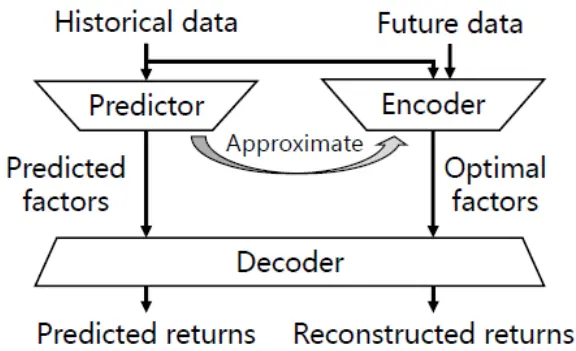
数据来源：东方证券研究所 & AAAI-22

## 1.2 FactorVAE 模型训练和预测过程

## 1.2.1 训练过程

Step1：特征提取器 $(\mathsf{FeatureExtractor},\phi_{\mathit{feat}})$ ：从输入的股票特征历史序列x中提取股票的潜在特征。

Step2：因子编码器 $(\mathsf{Factor~Encoder},\phi_{enc})$ ：从标签中的未来股票收益率y和潜在特征中提取后验因子 $\mathbf{z}_{post}$ 的分布。编码器扮演了一个神谕的角色，利用未来信息提取后验因子。

Step3：因子解码器 $(\mathsf{Factor~Decoder},\phi_{dec})$ ：使用后验因子和潜在特征得到重构的股票收益ŷ $\flat_{rec}$ 。

Step4：因子预测器 $(\mathsf{Factor~Predictor},\phi_{pred})$ ：从股票潜在特征中提取先验因子 $\mathbf{z}_{prior}$ 的分布。先验因子没有用到未来信息。

## 训练的目标函数包括两部分：

（1）训练最优的后验因子，减少后验因子模型的重建误差：使用重构的股票收益 $\hat{y}_{rec}$ 和标签中的未来股票收益率y，计算 MSE损失；

（2）使得先验因子收益率逼近后验因子收益率：使用先验因子和后验因子分布之间的 KL 散度计算。

## 1.2.2 预测过程

Step1：特征提取器：从输入的股票特征历史序列x中提取股票的潜在特征。

Step2：因子预测器：从股票潜在特征中提取先验因子 $\mathbf{\dot{z}}_{prior}$ 的分布。

Step3：因子解码器：使用先验因子和潜在特征得到预测的股票收益 $\hat{\boldsymbol{y}}_{pred}$ o

在预测阶段，模型只通过预测器和解码器来预测股票收益率，没有编码器的参与，因而没有任何的未来信息泄漏。

图 2：FactorVAE模型训练和预测过程示意图
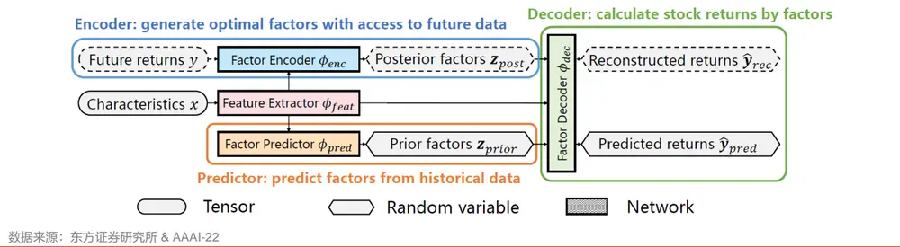

## 1.3 DFQ-FactorVAE 模型问题

在前期报告 《DFQ-FactorVAE：融合变分自编码器和概率动态因子模型的 alpha 预测方案》中，我们给出的DFQ-FactorVAE模型，是在原论文FactorVAE模型的基础上进行复现修改的，这次我们发现模型有几次处理细节需要改进：

（1）特征提取器处理：DFQ-FactorVAE模型将输入的60个股票量价特征，人为分成两组，包括14个分钟特征和46个日度&l2特征。两组数据使用两个gru模块分别编码，之后再用mlp拼接。这种做法缺乏严谨性。我们改成仍用一个 gru模块编码。

（2）样本外预测方式：DFQ-FactorVAE 模型在进行样本外预测时，先得出每个股票收益率的分布预测，而后进行了随机采样得出最终预测值。这样会导致样本外预测值不稳定。我们改为直接用股票收益率预测的均值作为预测值，采样仅在训练过程中使用，样本外不进行采样。

（3） 输入的标签数据处理方式：DFQ-FactorVAE 模型先填了 0，在标准化。这样并不合理。我们改成对于训练集和验证集的标签数据，先进行标准化，再填 0。

修改后的 FactorVAE 基础模型绩效表现如下：测试集上 rankic 达到 14.22%，rankicir 达到1.24，20 分组多头日度超额年化收益率达到 24.60%，多头日超额收益夏普比 2.86，多头日度超额收益最大回撤 8.85%。2024年模型表现有所下滑，rankic降低为 10.98%，20分组多头日度超额年化收益率降低到 18.53%。

图 3： FactorVAE basemodel 绩效表现（2020.01.01-2024.09.30）

| 中证全指股票池 60特征20日标签 factorvae 基础模型 | IC | IC_IR | rankIC | rankIC_IR | 多头月度胜率 | 多头日超额收益夏普比 | 多头日度超额年化收益 | 多头日度超额收益最大回撤 | 多头日均单边换手率 |
| --- | --- | --- | --- | --- | --- | --- | --- | --- | --- |
| 2020.01.01-2024.09.30 | 11.58% | 1.12 | 14.22% | 1.24 | 82.46% | 2.86 | 24.60% | -8.85% | 77.43% |
| 2020 | 11.37% | 1.11 | 14.00% | 1.29 | 75.00% | 2.25 | 16.60% | -5.14% | 81.45% |
| 2021 | 11.80% | 1.24 | 14.77% | 1.24 | 75.00% | 2.68 | 25.94% | -5.21% | 74.68% |
| 2022 | 13.35% | 1.61 | 15.90% | 2.03 | 91.67% | 3.97 | 27.55% | -2.93% | 78.17% |
| 2023 | 10.85% | 1.02 | 14.74% | 1.38 | 83.33% | 4.45 | 23.00% | -2.93% | 77.35% |
| 2024(截至09.30) | 10.35% | 0.80 | 10.98% | 0.70 | 88.89% | 0.14 | 18.53% | -8.85% | 74.86% |

数据来源：东方证券研究所 & Wind资讯

## 二、特征选择

## 2.1 特征选择方法

金融数据中普遍存在较高的噪声和冗余，因此，特征选择在模型开发中至关重要。特征选择的目的是减少无关或冗余的特征，提升模型的训练效率和预测准确性，同时避免过拟合。通过有效的特征选择，我们可以确保模型聚焦于最有价值的信息，从而提高其泛化能力。

在传统的端到端神经网络训练中，常见的特征选择可以分为显式（明确特征选择）和隐式（通过模型训练间接选择）两大类：

## 显式特征选择方法：

（1）手动筛选输入的特征：基于统计方法筛选出那些预测能力更强的因子作为输入特征。

（2）递归特征消除（Recursive Feature Elimination, RFE）：逐步移除特征并评估模型性能，通过反复迭代确定最重要的特征。

（3）基于树模型的特征选择：利用决策树或基于树的集成模型（如随机森林、梯度提升树）的特征重要性来选择特征。

（4）主成分分析（PCA）或线性判别分析（LDA）

隐式特征选择方法：

（1）L1正则化（Lasso）：通过 L1正则化对模型进行约束，使得一些特征的系数趋向于零，从而自动选择出最重要的特征。

（2）Dropout 机制：在训练过程中随机屏蔽部分神经元（相当于随机屏蔽部分特征），强制模型不能依赖单一特征，从而提升模型的泛化能力。

（3）Attention 机制：利用注意力机制（如 Transformer 中的 Self-Attention），动态地计算每个特征与其他特征的相似度，自适应地分配特征权重，隐式选择最相关的特征。

（4）特征层的重要性权重分析：在模型训练后，通过分析特征的梯度（Gradients）或特征层输出的重要性（如 Grad-CAM、SHAP 值）间接评估特征的贡献。

此次，我们参考 InvariantStock 模型提出的特征选择方法，在 FactorVAE 模型中添加特征选择模块，引入特征掩码，通过网络学习每个特征的权重，由网络自动选择预测能力更优的特征，实现自动调整特征选择。

## 2.2 特征选择模块

特征选择模块（Feature selectioon module）由特征选择器（Feature Mask）和特征重构器（Feature Reconstructor） 两个网络组成，这种设计结合了特征筛选与重构，能够在特征选择的同时保证信息的完整性。

## 2.2.1 特征选择器

特征选择器 $\phi_{mask}$ ：从输入的股票特征历史序列中，由网络提取股票特征的二值掩码 mask。输出变量维度与原始输入的股票特征序列完全一致，为 n*seqlen*f，n为股票个数，seqlen为特征的时序窗口长度，f 为输入特征个数。特征提取器旨在从原始特征中，过滤掉冗余特征，只保留对预测最重要的特征，从而提高模型预测的准确性。

特征选择器的具体步骤是：

1. 线性变换层（Linear）：将输入特征进行线性变换，将输入特征映射到指定的输出维度上。它是神经网络中最基本的层之一，用于学习特征之间的线性关系。

2. LeakyReLU 激活函数：是一种修正线性单元（ReLU）的变体，用于增加神经网络的非线性拟合能力，并解决了常规 ReLU 在输入为负值时可能出现的神经元“死亡”的问题。

3. GRU（Gated Recurrent Unit）：将特征向量输入到 GRU 网络中，得到股票每个时间步的潜在特征，此时的潜在特征已经包含了时序信息。GRU是一种循环神经网络（RNN）的变体，提高了网络对长序列的建模能力，具有参数数量少、计算效率高、灵活性强和训练速度快等优点。

4. 另一个线性变换层（Linear）: 将 GRU 的输出映射到 f* 2 的维度。这里的 2 表示每个特征会生成两类值（即二值化操作）。而后reshape为四维，输出变量维度为n*seqlen*f*2。最后沿着最后一维进行 Softmax归一化，使得每个特征的选择概率总和为 1。

5. 直通估计：将 softmax 结果转化为二值掩码。由于二值掩码不可微，不能直接进行梯度计算，使用直通估计技术来估计梯度，在反向传播过程中确保梯度的流动。这样做使得模型能够在训练时进行有效的特征选择，同时也能处理不连续的操作。

## 2.2.2 特征重构器

特征重构器φ ：将特征选择器输出的 mask 变量与原始特征相乘，得到调整后的股票特征。 特征重构器对调整后的股票特征进行复原，由网络输出重构后的股票特征。输出变量维度与原始输入的股票特征序列完全一致，为 n*seqlen*f，n为股票个数，seqlen为特征的时序窗口长度，f为输入特征个数。特征重构器旨在从特征选择器筛选后的剩余特征中重建复原始输入特征，从而确保筛选后的特征中仍然包含足够的信息来恢复原始数据。

特征重构器的具体步骤是：

1. 第一层：线性变换层（Linear）+ LeakyReLU 激活函数。

2. 第二层：另一个+ LeakyReLU 激活函数。

3. 第三层：最后一个线性变换层（Linear）。将隐藏特征重新映射回输入特征的原始维度，完成特征的重建。

## 2.2.3 重构损失

在模型训练中，重构任务通常作为一个训练的辅助目标，在损失函数中叠加一个 MSE 损失项，计算特征重构器输出的特征与原始输入特征间的差异，度量重构损失。

特征选择器和特征重构器是一个整体，共同构成特征选择模块。如果特征选择器未能保留所有重要特征，那么特征重构器也将无法很好地重建输入特征。因而，添加重构损失项之后，可以在训练过程中同时对特征选择器和特征重构器施加约束，共同优化。在样本外预测时，则不需要用到特征重构器。

## 2.3 效果分析

## 2.3.1 添加特征选择模块的效果

我们比较了 FactorVAE 基础模型，和叠加了特征选择模块后的新模型的因子效果，结果显示：在 FactorVAE 模型中添加特征选择模块，因子效果明显提高，20 日 rankic 提高近 0.5%，20组年化超额收益提高 4%。

此外我们对比了二值掩码和加权掩码两种不同的特征选择方式，发现整体模型性能非常接近。使用二值掩码生成的掩码是二值化的（0 或 1），明确地选择或剔除特定的特征，能够更明确地聚焦于那些最重要的特征，从而避免噪声特征对最终预测的干扰，提高模型的鲁棒性。

图 4：FactorVAE basemodel vs FactorVAE maskmodel 绩效表现（2020.01.01-2024.09.30）

| 中证全指股票池 60特征 20日标签 2020.01.01-2024.09.30 | IC | IC_IR | rankIC | rankIC_IR | 多头月度胜率 | 多头日超额收益夏普比 | 多头日度超额年化收益 | 多头日度超额收益最大回撤 | 多头日均单边换手率 |
| --- | --- | --- | --- | --- | --- | --- | --- | --- | --- |
| factorvae 基础模型 | 11.58% | 1.12 | 14.22% | 1.24 | 82.46% | 2.86 | 24.60% | -8.85% | 77.43% |
| factorvae 0-1 mask模型 | 12.02% | 1.11 | 14.74% | 1.24 | 82.46% | 3.03 | 28.92% | -9.45% | 76.51% |
| factorvae weighted mask模型 | 11.97% | 1.12 | 14.61% | 1.24 | 84.21% | 3.16 | 28.09% | -8.63% | 75.85% |

数据来源：东方证券研究所 & Wind资讯

## 2.3.2 添加重构损失的效果

我们比较了重构损失项加入前后的因子效果，结果显示：去掉重构损失后，因子效果明显下降，和FactorVAE基础模型绩效相似。说明重构损失项十分关键，去掉重构损失后，特征选择器也不再有效，筛选出的因子无法有效捕捉输入数据的全部关键特征，导致生成的因子可能过于专注于优化训练集上的特定任务，样本外泛化能力不足。

图 5：FactorVAE maskmodel 重构损失加入前后的绩效表现（2020.01.01-2024.09.30）

| 中证全指股票池 60特征 20日标签 2020.01.01-2024.09.30 | IC | IC_IR | rankIC | rankIC_IR | 多头月度胜率 | 多头日超额收益夏普比 | 多头日度超额年化收益 | 多头日度超额收益最大回撤 | 多头日均单边换手率 |
| --- | --- | --- | --- | --- | --- | --- | --- | --- | --- |
| factorvae 基础模型 | 11.58% | 1.12 | 14.22% | 1.24 | 82.46% | 2.86 | 24.60% | -8.85% | 77.43% |
| factorvae 0-1 mask模型 | 12.02% | 1.11 | 14.74% | 1.24 | 82.46% | 3.03 | 28.92% | -9.45% | 76.51% |
| factorvae 0-1 mask模型 无recon_loss | 12.04% | 1.17 | 14.32% | 1.32 | 75.44% | 2.50 | 23.34% | -7.88% | 70.00% |

数据来源：东方证券研究所 & Wind资讯

## 2.3.3 特征保留情况

我们统计了训练集上，每个特征保留的比例。可以看到：（1）特征平均的保留概率为 80%左右，说明设计的特征绝大部分还是有效的。尤其是在有重构损失引导的情况，为了不损失过多信息，特征保留的概率会更大。（2）level2 特征的保留概率更大（90%），其次是分钟特征（85%），日线特征的保留概率更低（70%）。说明高频特征的重要性更高。

图 6： FactorVAE maskmodel 训练集上，每个特征保留的比例（2020.01.01-2024.09.30）

| Trainloader特征保留情况 |  |  |  |  |  |  |  |  |  |  |
| --- | --- | --- | --- | --- | --- | --- | --- | --- | --- | --- |
| 特征1-10 | adjclose | adjpreclose | adjopen | adjlow | adjhigh | adjvwap | adjtwap | adjvolume | amount | Intwapret |
| 保留比率 | 84.78% | 18.08% | 0.00% | 97.99% | 99.98% | 13.35% | 24.20% | 99.86% | 99.35% | 37.47% |
| 特征11-20 | sqret | Into | amihud | Inret | Inopenret | Inhighret | Inlowret | Invwapret | Incoret | Inhlret |
| 保留比率 | 90.51% | 99.66% | 88.10% | 81.57% | 99.22% | 48.77% | 98.78% | 92.36% | 6.83% | 82.50% |
| 特征21-30 | ex_Inret | ex_Inopenret | ex_Inhighret | ex_Inlowret | swing | tr | citic1index_Inret | winner | loser | touchup |
| 保留比率 | 99.83% | 29.01% | 99.60% | 60.22% | 85.82% | 41.77% | 91.48% | 34.64% | 99.98% | 99.73% |
| 特征31-40 | touchdown |  | citic2index_Inret citic3index_Inret | 12c4 | 12c8 | I2c9 | I2c10 | I2c11 | I2c12 | I2c13 |
| 保留比率 | 99.95% | 99.43% | 99.44% | 98.03% | 0.00% | 99.89% | 99.13% | 99.28% | 78.48% | 99.31% |
| 特征41-50 | l2c14 | I2c15 | 12c16 | 12c18 | I2c19 | 12c20 | rvol | sqrvol | rskew | sqrskew |
| 保留比率 | 98.95% | 98.76% | 99.61% | 98.72% | 99.64% | 99.67% | 89.68% | 96.54% | 93.17% | 81.93% |
| 特征51-60 | rkurt | sqrkurt | vhhi | vvol | rjump | apb | arpp | cvpct | ovpct | cret |
| 保留比率 | 97.85% | 99.23% | 70.21% | 91.53% | 99.24% | 86.01% | 99.49% | 0.00% | 99.07% | 98.85% |

数据来源：东方证券研究所 & Wind资讯

有关分析师的申明，见本报告最后部分。其他重要信息披露见分析师申明之后部分，或请与您的投资代表联系。并请阅读本证券研究报告最后一页的免责申明。

## 三、环境变量

## 3.1 环境变量定义

端到端神经网络模型的输入一般是股票特征，通常忽略了市场整体信息的作用，但实际股票收益也会受到当时所处的市场环境的影响。此次我们尝试在输入中添加环境变量。所谓环境变量，是反映市场整体的信息，也就是可能横截面同一日期的所有股票取值相同。

我们尝试了 2种环境变量：

1. 市场状态指标：选择中证全指、沪深 300、沪深500、中证 1000、申万高低中市盈率指数、小盘成长指数、小盘价值指数、大盘成长指数、大盘价值指数，共11个反映规模和风格的股票指数的每日收益率，来提供市场的宏观趋势信息。

2. 日期变量：选择每个样本所在的年份和月份，构造虚拟变量，刻画日历效应。但需要注意的是：（1）日期变量只能是虚拟变量形式。日期对股票收益的影响并没有递增或递减的关系；（2）日期变量仅能出现在训练过程中，用来指导模型训练，不可直接作为预测模型的输入。样本内外数据涉及的年份不同，年份虚拟变量含义不一致，直接采用样本内的日期变量进行样本外预测，无法引入有效信息，会影响模型的泛化能力。

## 3.2 环境变量引入方法

## 3.2.1 直接作为特征加入

直接作为特征加入是最直观最简单的方式，将环境变量直接作为额外的输入特征与股票的其他特征一起输入到神经网络中。我们尝试在叠加了特征选择模块后的 FactorVAE maskmodel 模型中，直接加入11个市场状态指标进行训练。从结果来看，模型效果并未提高，说明环境变量需要不同于股票特征的处理方法。

图 7：FactorVAE maskmodel 直接加入市场状态指标前后的绩效表现（2020.01.01-2024.09.30）

| 中证全指股票池 20日标签 2020.01.01-2024.09.30 | IC IC_IR |  | rankIC | rankIC_IR | 多头月度胜率 | 多头日超额收益夏普比 | 多头日度超额年化收益 | 多头日度超额收益最大回撤 | 多头日均单边换手率 |
| --- | --- | --- | --- | --- | --- | --- | --- | --- | --- |
| factorvae 0-1 mask模型 60特征 | 12.02% | 1.11 | 14.74% | 1.24 | 82.46% | 3.03 | 28.92% | -9.45% | 76.51% |
| factorvae 0-1 mask模型 60特征+env11 | 11.90% | 1.16 | 13.97% | 1.25 | 78.95% | 2.87 | 27.02% | -8.46% | 75.53% |

数据来源：东方证券研究所 & Wind资讯

## 3.2.2 注意力机制融合

由于环境变量与股票特征指标的信息差异性，在融合时我们分别使用两个不同的 GRU 网络去提取，而后通过交叉注意力机制的方法进行融合。我们尝试在叠加了特征选择模块后的FactorVAE maskmodel 模型中，以注意力机制的方法加入 11 个市场状态指标进行训练。从结果来看，模型效果也并未提高。

图 8：FactorVAE maskmodel 使用注意力机制加入市场状态指标前后的绩效表现（2020.01.01-2024.09.30）

| 中证全指股票池 20日标签 2020.01.01-2024.09.30 | IC | IC_IR | rankIC | rankIC_IR | 多头月度胜率 | 多头日超额收益夏普比 | 多头日度超额年化收益 | 多头日度超额收益最大回撤 | 多头日均单边换手率 |
| --- | --- | --- | --- | --- | --- | --- | --- | --- | --- |
| factorvae 0-1 mask模型 60特征 输入 | 12.02% | 1.11 | 14.74% | 1.24 | 82.46% | 3.03 | 28.92% | -9.45% | 76.51% |
| factorvae 0-1 mask模型 60特征 输入+env11 注意力机制 | 12.23% | 1.15 | 14.73% | 1.25 | 80.70% | 2.74 | 27.37% | -10.12% | 75.62% |

数据来源：东方证券研究所 & Wind资讯

有关分析师的申明，见本报告最后部分。其他重要信息披露见分析师申明之后部分，或请与您的投资代表联系。并请阅读本证券研究报告最后一页的免责申明。

## 3.2.3 协同训练

最后，我们参考 InvariantStock模型提出的协同训练方法，引入环境变量。在训练阶段加入环境变量特征来协同对股票收益定价，而在预测时摒弃环境变量的部分，以此提升模型的收益预测泛化能力。

具体做法是：以前文提到的 FactorVAE maskmodel模型作为基础模型，训练环境不可知预测模块（VAE）和环境可知预测模块（EnvVAE）。两个模型架构一致，区别就是输入是否加入环境变量。训练时两模块共同参与，样本外预测时只使用无环境变量的VAE模块。训练损失函数设计为：特征选择模块的重构损失 + VAE 模块的损失（VAEloss）+ EnvVAE 模块的损失（EnvVAEloss）+ 两模块先验因子的kl散度，同时优化特征选择模块、VAE模块、EnvVAE模块。

## 这种做法的关键思想有三点：

（1）不变特征（Invariant Features）：找到在有无环境变量的情况下，能使得模型预测效果都好的特征选择方案，确保模型对特征的选择不受环境变量变化的影响，也就是找到不变特征；

（2）不变因子（Invariant Factors）：找到在有无环境变量的情况下，分布接近的先验因子生成方案，确保不论在训练时是否加入环境变量，模型生成的隐变量因子都能保持一致，也就是找到不变因子。

（3）协同训练：两个模块同时训练，通过共同优化损失函数，确保环境变量与股票个性特征之间的关系能够得到有效学习，同时不影响预测的稳定性。

在样本外预测时，只使用特征选择器和 VAE 模块（即不包含环境变量的 VAE 模块）进行预测，也就是只用到特征选择器、无环境变量模块下的特征提取器和因子预测器、因子解码器，共四个模块。前两者在训练时，都获得了环境变量的引导，因子解码器两模块可以共用。这样即使在没有环境变量的情况下，模型仍然能够利用训练时获得的特征选择方案和先验因子，生成样本外的合理预测，提升泛化能力。

我们尝试在叠加了特征选择模块后的 FactorVAE maskmodel模型中，使用两模块协同训练方法，加入环境变量进行训练。从结果来看：（1）加入市场状态指标作为环境变量，模型效果也并未提高。（2）加入日期变量作为环境变量，模型效果明显提高，20 日 rankic 提高 0.5%，20 组年化超额收益提高 2%。这说明：（1）市场状态指标存在信息重叠与冗余：市场状态指标（如各种股票指数）间可能存在高度的相关性，导致信息冗余，未能提供额外的预测价值。此外，市场状态指标通常反映的是宏观市场趋势，这些趋势可能已被现有股票特征（如价格动态、成交量等）所包含，因此这些环境变量的加入可能没有带来新的增量。（2）日期变量具有独特信息：日期变量能够帮助模型捕捉到市场的周期性和季节性变化。例如，某些特定的时间段，比如季度财报季、年底或重要政策发布的时期，通常会对市场产生显著影响，而这些变化并不一定能通过常规的股票个性特征（如价格、成交量等）直接反映出来。日期变量能够帮助模型识别这些时间上的特定模式，从而改善预测能力。

图 9：FactorVAE maskmodel 使用两模块协同训练加入环境变量前后的绩效表现（2020.01.01-2024.09.30）

| 中证全指股票池 20日标签 2020.01.01-2024.09.30 | IC | IC_IR | rankIC | rankIC IR | 多头月度胜率 | 多头日超额收益夏普比 | 多头日度超额年化收益 | 多头日度超额收益最大回撤 | 多头日均单边换手率 |
| --- | --- | --- | --- | --- | --- | --- | --- | --- | --- |
| factorvae 0-1 mask模型 60特征 输入 | 12.02% | 1.11 | 14.74% | 1.24 | 82.46% | 3.03 | 28.92% | -9.45% | 76.51% |
| factorvae 0-1 mask模型 60特征 输入 env11 协同训练 | 11.89% | 1.13 | 14.40% | 1.28 | 75.44% | 2.31 | 23.27% | -11.00% | 72.05% |
| factorvae 0-1 mask模型 60特征 输入 env17 协同训练 | 12.20% | 1.09 | 15.20% | 1.25 | 85.96% | 3.54 | 30.62% | -5.54% | 77.47% |

数据来源：东方证券研究所 & Wind资讯

## 3.3 协同训练细节分析

Q1. VAE和EnvVAE两个模块的特征提取器、因子编码器、因子预测器、因子解码器是否共用？

VAE 和 EnvVAE 两个模块的输入不同，一个是纯股票特征，一个是股票特征叠加环境变量，输入维度不同。特征提取器处理的是原始输入，因而两模块的特征提取器无法公用，需要分开优化。剩下的因子编码器、因子预测器、因子解码器理论上可以共用也可以分开。我们对比了三种方案：（1）只共用因子解码器，因子编码器、因子预测器独立；（2）因子编码器、因子预测器、因子解码器均公用；（3）因子编码器、因子预测器、因子解码器均独立。

从结果来看，方案一（只共用因子解码器，剩下的因子编码器、因子预测器独立）效果最好。这说明：（1）共享解码器提高一致性和鲁棒性：因子解码器的作用是将提取的因子映射回股票的预期收益率，这是模型的最终输出。共享因子解码器能够保证两个模块在预测时的一致性，避免因为因子编码器和预测器的差异而导致输出的预测结果不稳定。此外，解码器的共享有助于提升模型的鲁棒性，减少因不同输入数据导致的过拟合或模型偏差。这种做法确保了最终输出的稳定性，使得无论是股票特征还是加入环境变量的数据，最终都能通过相同的解码器进行统一的处理，保证了模型的一致性。（2）独立的因子编码器和预测器提高灵活性：因为两个模块的输入信息源不同，独立的因子编码器和预测器能够根据各自输入数据的特点进行灵活调整，从而更好地挖掘不同输入类型的潜在信息，避免了共享因子编码器和预测器可能带来的不必要约束或信息损失。

图 10：不同共用方案下的模型绩效表现（2020.01.01-2024.09.30）

| 中证全指股票池 20日标签 60特征 2020.01.01-2024.09.30 | IC | IC_IR | rankIC | rankIC IR | 多头月度胜率 | 多头日超额收益夏普比 | 多头日度超额年化收益 | 多头日度超额收益最大回撤 | 多头日均单边换手率 |
| --- | --- | --- | --- | --- | --- | --- | --- | --- | --- |
| factorvae 0-1 mask模型 env17 协同训练(decoder共享) | 12.20% | 1.09 | 15.20% | 1.25 | 85.96% | 3.54 | 30.62% | -5.54% | 77.47% |
| factorvae 0-1 mask模型 env17 协同训练(全模块共享） | 11.98% | 1.13 | 14.24% | 1.27 | 84.21% | 2.93 | 27.33% | -10.18% | 77.68% |
| factorvae 0-1 mask模型 env17 协同训练(无模块共享） | 12.03% | 1.10 | 14.52% | 1.25 | 78.95% | 2.76 | 25.96% | -8.07% | 73.98% |

数据来源：东方证券研究所 & Wind资讯

## Q2. VAE和 EnvVAE两个模块在损失函数中如何连接方式？

我们对比了三种损失函数方案：（1）两模块先验因子的 kl 散度，旨在为两模块找到分布相似的先验因子；（2）两模块后验因子收益率的 mse 损失，旨在使得两模块解码器生成的重构收益率接近；（3）两模块先验因子的 kl散度+两模块后验因子收益率的 mse损失。

从结果来看，只添加两模块先验因子的 kl 散度效果最好。说明：（1）MSE 损失过于侧重于输出的精确度，可能导致模型在不同输入条件下产生不同的隐因子表示，从而影响泛化能力。（2）KL 散度可以引导潜在空间的结构一致性：通过最小化 KL 散度，VAE 和 EnvVAE 模块的隐因子分布可以相对接近，这有助于模型学习到一致的潜在表示，从而提高了泛化能力，也避免过度依赖具体的收益率预测。（3）KL 散度可以起到正则化的作用：避免模型学习到不合理或过于复杂的隐因子表示，限制模型过度拟合训练数据，帮助模型更好地泛化到样本外未知数据中。

图 11：不同损失函数设置方式下的模型绩效表现（2020.01.01-2024.09.30）

| 中证全指股票池 20日标签 60特征 2020.01.01-2024.09.30 | IC | IC_IR | rankIC | rankIC_IR | 多头月度胜率 | 多头日超额收益夏普比 | 多头日度超额年化收益 | 多头日度超额收益最大回撤 | 多头日均单边换手率 |
| --- | --- | --- | --- | --- | --- | --- | --- | --- | --- |
| factorvae 0-1 mask模型 env17 协同训练(kl-loss） | 12.20% | 1.09 | 15.20% | 1.25 | 85.96% | 3.54 | 30.62% | -5.54% | 77.47% |
| factorvae 0-1 mask模型 env17 协同训练(recon-loss） | 11.71% | 1.08 | 14.19% | 1.26 | 82.46% | 2.84 | 26.52% | -8.87% | 75.71% |
| factorvae 0-1 mask模型 env17 协同训练(kl-loss+recon-loss) | 11.94% | 1.11 | 14.50% | 1.27 | 80.70% | 2.96 | 27.22% | -7.75% | 75.90% |

数据来源：东方证券研究所 & Wind资讯

有关分析师的申明，见本报告最后部分。其他重要信息披露见分析师申明之后部分，或请与您的投资代表联系。并请阅读本证券研究报告最后一页的免责申明。

## Q3. 特征选择模块、VAE模块、EnvVAE两个模块三个模块如何进行协同训练？

我们对比了两种方案：（1）三个模块的损失函数直接合并，最终合成一个统一的损失函数进行优化。训练的损失函数设计为：特征选择模块的重构损失 + VAEloss+EnvVAEloss+ 两模块先验因子的 kl 散度，同时优化特征选择模块、VAE 模块、EnvVAE 模块，三个模块的参数同时更新。（2）参考 InvariantStock 模型使用的三阶段训练法：第一阶段训练特征选择模块，损失函数为特征重构损失+两模块先验因子的kl散度；第二阶段训练VAE模块，损失函数为VAE模块的损失 VAEloss；第三阶段训练 EnvVAE 模块，损失函数为 EnvVAE 模块的损失 EnvVAEloss。每个epoch 仅训练一个其中模块，每个模块顺序依次训练并更新参数。3 个 epoch 是一个整体，训练完后进行验证集评测，确定是否早停。

从结果来看，直接合并三个模块的损失函数（方案一）效果优于分阶段训练（方案二）。可能的原因如下：（1）模块间协同学习与相互约束：在方案一中，三个模块（特征选择、VAE 和EnvVAE）在同一梯度更新的驱动下进行学习，同步优化和更新参数。这使得它们能够相互影响，实时调整，从而共同学习到最佳的参数组合。通过直接合并损失函数，模块之间不仅优化各自的目标，还能够确保它们朝着一致的全局目标收敛，避免了单个模块过拟合或者偏离整体目标，确保了模型的全局一致性。（2）训练过程的稳定性：方案二中，每个模块独立训练，可能导致训练过程中某个模块的优化忽略了其他模块的影响。这种不一致可能引起训练的不稳定，无法充分发挥模块间的协同作用。而方案一中，通过将所有模块的损失合并，三个模块的更新是同步的，避免了不必要的训练波动，使得训练过程更加平稳，提升了模型的训练稳定性。

图 12：不同协同方式下的模型绩效表现（2020.01.01-2024.09.30）

| 中证全指股票池20日标签 60特征 env17 2020.01.01-2024.09.30 | IC IC_IR | rankIC |  | rankIC_IR | 多头月度胜率 | 多头日超额收益夏普比 | 多头日度超额年化收益 | 多头日度超额收益最大回撤 | 多头日均单边换手率 |
| --- | --- | --- | --- | --- | --- | --- | --- | --- | --- |
| factorvae 0-1 mask模型 协同训练(1path） | 12.20% | 1.09 | 15.20% | 1.25 | 85.96% | 3.54 | 30.62% | -5.54% | 77.47% |
| factorvae 0-1 mask模型 协同训练(3path） | 11.20% | 1.07 | 13.95% | 1.24 | 84.21% | 3.27 | 25.81% | -5.70% | 74.44% |

数据来源：东方证券研究所 & Wind资讯

## 四、DFQ-FactorVAE-pro 模型说明

基于前面的尝试，我们构建了 DFQ-FactorVAE-pro 模型，以 factorVAE 模型为基础，添加特征选择模块，添加日期环境变量，使用协同训练方式进行训练。

## 4.1 模型结构

DFQ-FactorVAE-pro 模型结构设计如下，其中绿色区域代表特征选择模块，包括一个特征选择器和一个特征重构模型。红色和蓝色区域分别表示环境不可知预测模块（VAE）和环境可知预测模块（EnvVAE）。每个预测模块都由特征提取器、因子编码器、因子解码器和因子预测器组成。

图 13： DFQ-FactorVAE-pro 模型结果示意图
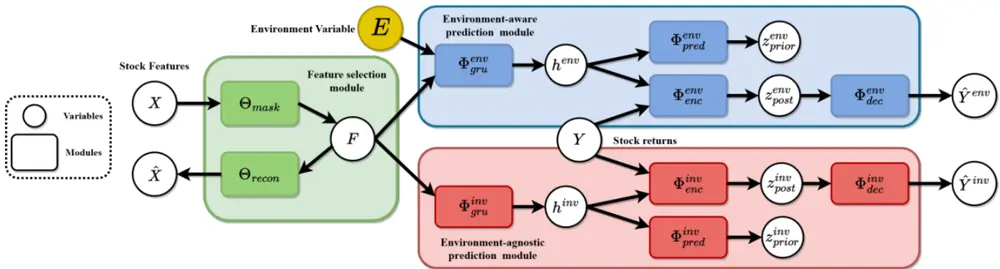
数据来源：东方证券研究所 & arXiv

DFQ-FactorVAE-pro 模型训练过程如下：

Step1：特征选择器（Feature Mask）：对输入的股票特征历史序列（不包括环境变量）data[…,:-env_size]进行特征筛选，得到股票特征的二值掩码 mask。将 mask 变量与原始特征相乘，得到调整后的股票特征 new_features。

Step2：特征重构器（Feature Reconstructor）：根据 new_features 还原出原始特征，得到 self_reconstruction。

Step3: FactorVAE 模块：包括单独的特征提取器、单独的因子编码器、公共的因子解码器、单独的因子预测器。输入 new_features，输出 vaeloss、先验因子均值 pred_mu，先验因子标准差 pred_sigma。

Step4: Env_FactorVAE模块：包括单独的特征提取器、单独的因子编码器、公共的因子解码 器 、 单 独 的 因 子 预 测 器 。 输 入 new_features+env ， 输 出 envvaeloss 、 先 验 因子 均 值env_pred_mu，先验因子标准差 env_pred_sigma。

训练的目标函数包括 4 部分：

（ 1 ） 特 征 选 择 前 后 不 能 损 失 过 多 特 征 信 息 ： mseloss （ data[ … ,:-env_size] ，self_reconstruction）。

（2）无环境变量模块预测性能好：vaeloss。

有关分析师的申明，见本报告最后部分。其他重要信息披露见分析师申明之后部分，或请与您的投资代表联系。并请阅读本证券研究报告最后一页的免责申明。

（3）有环境变量模块预测性能好：envvaeloss。

（4）VAE和 EnvVAE两模块接近：两模块生成的先验因子分布之间的 KL散度接近。

DFQ-FactorVAE-pro 模型预测过程如下：

Step1：特征选择器（Feature Mask）：对输入的股票特征历史序列（不包括环境变量）data[…,:-env_size]进行特征筛选，得到股票特征的二值掩码 mask。将 mask 变量与原始特征相乘，得到调整后的股票特征 new_features。

Step2: FactorVAE 模块：包括特征提取器、因子预测器、因子解码器。输入 new_features，输出预测的股票收益率。

在预测阶段，没有 Env_FactorVAE和Feature Reconstructor的参与，只需要用到 FeatureMask 和 FactorVAE 模块。

## 4.2 数据说明

样本空间：中证全指同期成分股。

数据区间：（1）训练集 2014.01.01—2018.11.30；（2）验证集 2019.01.01—2019.11.30；（3）测试集 2020.01.01—2024.09.30。数据集中额外的分割间隙是有意引入的，以避免特征和标签的泄露。训练集用于迭代训练模型，通过反向传播算法计算损失函数关于模型参数的梯度，然后按照梯度方向更新模型参数。验证集用于在模型训练过程中评估模型的性能，便于选择最优的模型和参数。测试集用于观察模型样本外的表现，在模型开发完成后评估模型的泛化性能。

数据处理方法：（1）解释变量X：截面异常值处理，标准化，填充缺失值。训练集、验证集、测试集相同处理；（2）预测标签Y：截面异常值处理，标准化，填充缺失值。训练集、验证集相同处理。

## 4.3 模型输入特征

我们尝试了四种输入来源：量价特征、基本面特征、风险因子、宽基成分股属性特征。

（1）量价特征：包括原始日线行情、基于分钟线提取的日频特征、基于level2数据提取的日频特征等共 60个。

（2）基本面特征：包括估值类因子和分析师预期类因子共 10个。

（3）风险因子：来自于前期报告《东方 A 股因子风险模型（DFQ-2020）》提出的风险模型，共 10个风格类风险因子。

（4） 宽基成分股属性特征：选择是否沪深 300、是否中证 500、是否中证 1000、是否国证2000、是否万得微盘股指数成分股 5 个 0-1 分类变量。帮助模型捕捉到成分股的类别特征，反映股票所属的市场段位和流动性特点。

我们尝试了多种输入特征结合方式，结果都没有明显提高，仍是只输入60个量价特征效果最好。这说明量价特征可能已经在很大程度上捕捉了市场的主要变动和价格动态，这些特征对模型的预测能力贡献最大。其他特征可能与量价特征高度相关或提供的信息与已有的量价特征重叠，未能提供足够的独立信息来改善模型的性能。

有关分析师的申明，见本报告最后部分。其他重要信息披露见分析师申明之后部分，或请与您的投资代表联系。并请阅读本证券研究报告最后一页的免责申明。

图 14：DFQ-FactorVAE-pro 模型不同输入特征下的绩效表现对比（2020.01.01-2024.12.31）

| 中证全指股票池 20日标签 factorvae 0-1 mask模型 env17协同训练 2020.01.01-2024.12.31 | IC | IC_IR | rankIC | rankIC_IR | 多头月度胜率 | 多头日超额收益夏普比 | 多头日度超额年化收益 | 多头日度超额收益最大回撤 | 多头日均单边换手率 |
| --- | --- | --- | --- | --- | --- | --- | --- | --- | --- |
| 60量价特征输入 | 12.09% | 1.09 | 15.08% | 1.24 | 85.00% | 3.48 | 29.77% | -5.36% | 77.55% |
| 60量价特征+5宽基成分股属性特征直接合并输入 | 11.98% | 1.19 | 14.39% | 1.30 | 83.33% | 3.19 | 26.97% | -8.67% | 76.94% |
| 60量价特征+10基本面特征直接合并输入 | 12.01% | 1.17 | 14.43% | 1.27 | 81.67% | 2.64 | 26.49% | -12.62% | 72.46% |
| 60量价特征gru，10risk(+env17)mlp | 12.35% | 1.15 | 14.74% | 1.20 | 83.33% | 2.79 | 27.75% | -10.96% | 72.20% |
| 60量价特征gru，10基本面(+env17)mlp | 12.20% | 1.19 | 14.38% | 1.24 | 83.33% | 2.98 | 31.06% | -10.65% | 71.74% |
| 60量价特征 gru，10基本面(+env17) gru | 12.41% | 1.21 | 14.34% | 1.26 | 81.67% | 2.81 | 30.45% | -7.61% | 73.60% |

数据来源：东方证券研究所 & Wind资讯

## 我们统计了各特征保留的比例，可以看到：

（1）训练集、验证集、测试集上的特征保留情况十分接近；

（2）特征平均的保留概率为 80%左右，说明设计的特征绝大部分还是有效的。在有重构损失引导的情况，为了不损失过多信息，特征保留的概率会更大。这也反映出模型的设计是为了维持输入数据的丰富性和复杂性，以便捕获尽可能多的有用信息。

（3）level2 特征的保留概率更大（90%），其次是分钟特征（80%），日线特征的保留概率更低（70%）。说明高频特征的重要性更高，高频数据提供了更细粒度的市场信息，能更好地揭示价格变动的即时因素和短期趋势。

（4）较不重要的特征包括最低价、复权 vwap、收盘价对数收益率、超额开盘价对数收益率、早盘资金净流入占比、日内成交量的 HHI 指数、收盘半小时成交占比。可能因为它们与目标变量的相关性较低或者在模型中的信息重叠较多（即与其他特征高度相关），从而在特征选择过程中被判定为不够重要。

图 15： DFQ-FactorVAE-pro 模型训练集、验证集、测试集上，每类特征保留的比例（2020.01.01-2024.12.31）

| 不同训练集内不同特征保留情况汇总 | 9量价特征 | 24日内特征 | 14分钟特征 |  | 13I2特征 |
| --- | --- | --- | --- | --- | --- |
| Trainloader (2014.1.1-2018.11.30) | 68.05% | 77.86% |  | 78.16% | 86.66% |
| Validloader (2019.1.1-2019.11.30) | 68.30% | 78.94% | • | 79.96% | 88.31% |
| Testloader (2020.1.1-2024.12.31) | 68.28% | 78.98% |  | 80.24% | 88.56% |

数据来源：东方证券研究所 & Wind资讯

图 16： DFQ-FactorVAE-pro 模型训练集上，每个特征保留的比例（2020.01.01-2024.12.31）

| Trainloader特征保留情况 |  |  |  |  |  |  |  |  |  |  |
| --- | --- | --- | --- | --- | --- | --- | --- | --- | --- | --- |
| 特征1-10 | adjclose | adjpreclose | adjopen | adjlow | adjhigh | adjvwap | adjtwap | adjvolume | amount | Intwapret |
| 保留比率 | 100.00% | 98.96% | 85.34% | 1.00% | 99.40% | 0.00% | 30.54% | 98.17% | 99.03% | 42.74% |
| 特征11-20 | sqret | Into | amihud | Inret | Inopenret | Inhighret | Inlowret | Invwapret | Incoret | Inhlret |
| 保留比率 | 98.08% | 99.59% | 88.61% | 3.90% | 91.99% | 94.85% | 99.15% | 84.60% | 36.06% | 43.56% |
| 特征21-30 | ex_Inret | ex_Inopenret | ex_Inhighret | ex_Inlowret | swing | tr | citic1index_Inret | winner | loser | touchup |
| 保留比率 | 98.20% | 2.47% | 88.20% | 41.42% | 95.42% | 83.06% | 99.41% | 98.42% | 97.77% | 84.48% |
| 特征31-40 | touchdown |  | citic2index_Inret citic3index_Inret | l2c4 | I2c8 | l2c9 | I2c10 | I2c11 | l2c12 | l2c13 |
| 保留比率 | 98.02% | 99.29% | 99.35% | 88.13% | 0.00% | 99.54% | 87.64% | 88.23% | 97.22% | 96.82% |
| 特征41-50 | I2c14 | I2c15 | I2c16 | I2c18 | I2c19 | I2c20 | rvol | sqrvol | rskew | sqrskew |
| 保留比率 | 99.05% | 90.95% | 99.77% | 98.75% | 80.71% | 99.74% | 98.50% | 30.77% | 98.91% | 99.58% |
| 特征51-60 | rkurt | sqrkurt | vhhi | vvol | rjump | apb | arpp | cvpct | ovpct | cret |
| 保留比率 | 99.20% | 91.98% | 11.85% | 98.50% | 99.67% | 85.79% | 98.34% | 0.00% | 90.57% | 90.62% |

数据来源：东方证券研究所 & Wind资讯

## 4.4 模型预测标签

我们分别使用未来 5 日、10 日、15 日、20 日、25 日、30 日收益率 6 个标签分别训练，得到 6 个因子打分，测试样本外 20 日调仓时对应的组合绩效。从结果来看，多标签模型等权结合后，模型表现有一定提升。

图 17：DFQ-FactorVAE-pro 模型不同预测标签下的绩效表现对比（2020.01.01-2024.12.31）

| 中证全指股票池 60特征信息输入 env17协同训练 2020.01.01-2024.12.31 | IC | IC_IR | rankIC | rankIC_IR | 多头月度胜率 | 多头日超额收益夏普比 | 多头日度超额年化收益 | 多头日度超额收益最大回撤 | 多头日均单边换手率 |
| --- | --- | --- | --- | --- | --- | --- | --- | --- | --- |
| 5日标签 | 12.35% | 1.65 | 12.94% | 1.52 | 83.33% | 2.69 | 27.75% | -6.91% | 86.98% |
| 10日标签 | 12.30% | 1.31 | 14.34% | 1.39 | 81.67% | 3.02 | 30.50% | -9.93% | 79.77% |
| 15日标签 | 12.29% | 1.16 | 15.01% | 1.31 | 85.00% | 3.24 | 30.08% | -7.69% | 79.00% |
| 20日标签 | 12.09% | 1.09 | 15.08% | 1.24 | 85.00% | 3.48 | 29.77% | -5.36% | 77.55% |
| 25日标签 | 12.35% | 1.12 | 14.94% | 1.28 | 86.67% | 3.63 | 30.78% | -5.99% | 77.12% |
| 30日标签 | 11.78% | 1.01 | 14.31% | 1.19 | 83.33% | 3.39 | 27.80% | -5.75% | 73.76% |
| 多标签模型打分标准化等权合成 | 12.79% | 1.22 | 15.11% | 1.34 | 86.67% | 3.47 | 32.78% | -6.68% | 78.15% |

数据来源：东方证券研究所 & Wind资讯

## 4.5 模型参数

DFQ-FactorVAE-pro 模型涉及的主要参数设置如下图。

图 18：DFQ-FactorVAE-pro 模型参数列表

| 参数类型 | 参数符号 | 参数设置 | 参数解释 |
| --- | --- | --- | --- |
| 数据参数 | seq_len | 30 | 每次前向传播的数据结构为过去30天 |
| 训练参数 | n_epochs | 200 | 进行200次训练，不断迭代更新模型参数 |
|  | early_stop | 20 | 若20步验证集IC无提高，则提前停止学习训练 |
|  | max_steps_per_epoch | 100 | 每次训练按批次进行，一个epoch共训练100个批次 |
|  | batch_size | -1 | 每批次训练输入一个交易日的batch |
|  | smooth_steps | 5 | 设置双端队列paramslist的最大长度，用于存储模型的最近状态(参数和缓存)，用于后续的参数平均或其他处理 |
|  | lr | 3.00E-04 | 优化模型的adam算法的学习率 |
| 模型参数 | seed | 1000 | 随机种子 |
|  | feat_dim | 60 | 潜在特征数量 |
|  | env_size | 17 | 环境变量 |
|  | num_portfolio | 100 | 投资组合个数 |
|  | num_factor | 48 | 先验和后验因子个数 |
|  | hidden_size num_layers | 32 | 隐藏层的大小 |
|  |  | 1 | 神经网络的层数 |

数据来源：东方证券研究所

我们尝试换用余弦退火（Cosine Annealing）学习率调节器来训练，根据预设的周期自动进行调整学习率，旨在帮助模型跳出局部最小值。在高学习率阶段，模型能够探索新的参数空间；在低学习率阶段，模型则能够在当前区域细致优化。从结果来看，学习率调节器对模型的影响很小，可以忽略不计。

图 19：DFQ-FactorVAE-pro 模型余弦退火学习率调节器添加前后的绩效表现对比（2020.01.01-2024.12.31）

| 中证全指股票池 20日标签 factorvae 0-1 mask模型 协同训练 2020.01.01-2024.12.31 | IC | IC_IR | rankIC | rankIC_IR | 多头月度胜率 | 多头日超额收益夏普比 | 多头日度超额年化收益 | 多头日度超额收益最大回撤 | 多头日均单边换手率 |
| --- | --- | --- | --- | --- | --- | --- | --- | --- | --- |
| 60特征信息输入 env17协同训练 固定Ir | 12.09% | 1.09 | 15.08% | 1.24 | 85.00% | 3.48 | 29.77% | -5.36% | 77.55% |
| 60特征信息输入 env17协同训练 学习率scheduler | 12.14% | 1.09 | 14.99% | 1.25 | 86.67% | 3.58 | 30.10% | -5.76% | 76.79% |

数据来源：东方证券研究所 & Wind资讯

## 4.6 对抗过拟合

神经网络模型容易过拟合，DFQ-FactorVAE-pro模型采取以下措施来降低过拟合风险：

（1）设置验证集评估：在迭代过程中，监测验证集上的IC指标，选择验证集IC达到最高的点的轮次作为最优轮次。

有关分析师的申明，见本报告最后部分。其他重要信息披露见分析师申明之后部分，或请与您的投资代表联系。并请阅读本证券研究报告最后一页的免责申明。

（2）设置早停：在迭代过程中，监测验证集上的 IC 指标，若超过设定的轮数未提升，则提前停止训练，选择当前验证集 IC达到最高的点的轮次作为最优轮次。

我们分别对比了不加验证集和不加早停这 2种训练方式下的模型绩效，可以看到验证集的存在是有必要的，但早停可以去掉。这说明，模型训练可能较少受到过拟合的影响，即使不使用早停，模型也能通过更长时间的训练得到更好的泛化能力。

图 20：DFQ-FactorVAE-pro 模型验证集和早停添加前后的绩效表现对比（2020.01.01-2024.12.31）

| 中证全指股票池 20日标签 factorvae 0-1 mask模型 协同训练 2020.01.01-2024.12.31 | IC | IC_IR | rankIC rankIC_IR | 多头月度胜率 |  | 多头日超额收益夏普比 | 多头日度超额年化收益 | 多头日度超额收益最大回撤 | 多头日均单边换手率 |
| --- | --- | --- | --- | --- | --- | --- | --- | --- | --- |
| 60特征信息输入 env17协同训练 valid+earlystop 60特征信息输入 env17协同训练 no_valid | 12.09% 12.15% | 1.09 1.16 | 15.08% 14.42% | 1.24 1.38 | 85.00% 85.00% | 3.48 3.10 | 29.77% 26.29% | -5.36% -5.71% | 77.55% 80.67% |
| 60特征信息输入 env17协同训练 no_earlystop | 12.45% | 1.07 | 15.56% | 1.27 | 86.67% | 3.63 | 29.58% | -6.76% | 78.05% |

数据来源：东方证券研究所 & Wind资讯

## 4.7 随机种子的影响

我们测试了 5 种不同随机种子下，DFQ-FactorVAE-pro 模型的绩效表现和相关性。可以看到，随机种子模型结果有一定影响：（1）不同种子下，模型绩效表现有所不同，但相差不大。多种子模型打分等权合成后，模型效果略有提升；（2）不同路径下得到的模型因子值相关系数在 85%-90%左右，多头超额收益相关性在 70%左右。

图 21：DFQ-FactorVAE-pro 模型不同随机种子下的绩效表现对比（2020.01.01-2024.12.31）

| 中证全指股票池 60特征信息输入 env17协同训练 每个epoch训练100batch | IC IC_IR rankIC |  |  |  |  |  | 多头日超额收益夏普比 多头日度超额年化收益 | 多头日度超额收益最大回撤 | 多头日均单边换手率 |
| --- | --- | --- | --- | --- | --- | --- | --- | --- | --- |
| 2020.01.01-2024.12.31 |  |  |  | rankIC_IR | 多头月度胜率 |  |  |  |  |
| seed1 | 11.88% | 1.12 | 14.84% | 1.27 | 78.33% | 2.70 | 26.29% | -10.17% | 73.50% |
| seed10 | 11.85% | 1.08 | 14.49% | 1.20 | 85.00% | 2.53 | 25.05% | -10.53% | 70.63% |
| seed100 | 11.89% | 1.15 | 14.38% | 1.27 | 73.33% | 2.38 | 25.18% | -10.08% | 68.41% |
| seed1000 | 12.09% | 1.09 | 15.08% | 1.24 | 85.00% | 3.48 | 29.77% | -5.35% | 77.55% |
| seed10000 | 12.05% | 1.23 | 14.04% | 1.29 | 85.00% | 3.13 | 29.83% | -7.74% | 76.49% |
| 多种子模型打分标准化等权合成 | 12.43% | 1.14 | 15.12% | 1.27 | 80.00% | 2.85 | 29.31% | -9.59% | 72.30% |

数据来源：东方证券研究所 & Wind资讯

图 22：DFQ-FactorVAE-pro 模型不同随机种子下得到的因子值相关系数（2020.01.01-2024.12.31，每个 epoch 训练 100个 batch）

| Factor Value Correlation |  |  |  |  |  |  |
| --- | --- | --- | --- | --- | --- | --- |
| Seed1 | 100.00% | 89.37% | 89.89% | 88.25% | 85.85% | 95.33% |
| Seed10 | 89.37% | 100.00% | 90.82% | 86.56% | 86.66% | 95.34% |
| Seed100 | 89.89% | 90.82% | 100.00% | 87.75% | 88.16% | 96.01% |
| Seed1000 | 88.25% | 86.56% | 87.75% | 100.00% | 85.55% | 94.16% |
| Seed10000 | 85.85% | 86.66% | 88.16% | 85.55% | 100.00% | 93.75% |
| Z-score Avg | 95.33% | 95.34% | 96.01% | 94.16% | 93.75% | 100.00% |
|  | Seed1 | Seed10 | Seed100 | Seed1000 | Seed10000 | Z-score Avg |

数据来源：东方证券研究所 & Wind资讯

图 23：DFQ-FactorVAE-pro 模型不同随机种子得到的多头超额收益相关系数（2020.01.01-2024.12.31，每个 epoch 训练100 个 batch）

| Long Return Correlation |  |  |  |  |  |  |
| --- | --- | --- | --- | --- | --- | --- |
| Seed1 | 100.00% | 93.03% | 90.64% | 78.80% | 84.78% | 95.87% |
| Seed10 | 93.03% | 100.00% | 93.00% | 72.63% | 84.79% | 95.24% |
| Seed100 | 90.64% | 93.00% | 100.00% | 68.81% | 82.49% | 93.86% |
| Seed1000 | 78.80% | 72.63% | 68.81% | 100.00% | 79.80% | 81.55% |
| Seed10000 | 84.78% | 84.79% | 82.49% | 79.80% | 100.00% | 90.16% |
| Z-score Avg | 95.87% | 95.24% | 93.86% | 81.55% | 90.16% | 100.00% |
|  | Seed1 | Seed10 | Seed100 | Seed1000 | Seed10000 | Z-score Avg |

数据来源：东方证券研究所 & Wind资讯

我们猜测随机种子的影响可能和训练方式有关，如果每个epoch只随机训练100个batch的话，可能会增大训练的随机性。所以我们尝试了另外两种训练方法：（1）一个 epoch 遍历所有batch进行训练；（2）一个 epoch随机训练 70%的 batch。结果显示，随机种子模型依然会对结果有影响，不同路径下得到的模型因子值相关系数在 85%左右。

这说明随机种子的影响与训练方式无关，更多的是跟 FactorVAE 模型设置有关：（1）采样不稳定性：在 FactorVAE 模型中，训练过程中的预测收益率是通过从先验分布中进行随机采样得到的。即使不同种子生成的潜在因子分布相同，每次采样得到的预测值也会有差异，从而导致不同随机种子下的模型产生不同的预测结果。（2）训练不稳定性：VAE 模型本质上依赖于优化变分下界（ELBO）来对隐因子进行估计，这一过程本身包含一定的随机性，导致在不同的训练路径中模型学习到的因子值不一致。训练过程的随机性有可能会提升模型泛化能力，使得样本外表现更好，但也会带来一定的路径依赖问题，需要权衡。

图 24：DFQ-FactorVAE-pro 模型不同随机种子下得到的因子值相关系数（2020.01.01-2024.12.31，每个 epoch 训练所有batch）

| Factor Value Correlation |  |  |  |  |  |  |
| --- | --- | --- | --- | --- | --- | --- |
| Seed1 | 100.00% | 83.45% | 78.97% | 83.70% | 81.69% | 90.65% |
| Seed10 | 83.45% | 100.00% | 85.61% | 87.35% | 87.01% | 94.30% |
| Seed100 | 78.97% | 85.61% | 100.00% | 87.96% | 90.33% | 94.09% |
| Seed1000 | 83.70% | 87.35% | 87.96% | 100.00% | 88.27% | 95.00% |
| Seed10000 | 81.69% | 87.01% | 90.33% | 88.27% | 100.00% | 95.14% |
| Z-score Avg | 90.65% | 94.30% | 94.09% | 95.00% | 95.14% | 100.00% |
|  | Seed1 | Seed10 | Seed100 | Seed1000 | Seed10000 | Z-score Avg |

数据来源：东方证券研究所 & Wind资讯

图 25：DFQ-FactorVAE-pro 模型不同随机种子得到的多头超额收益相关系数（2020.01.01-2024.12.31，每个 epoch 训练所有 batch）

| Long Return Correlation |  |  |  |  |  |  |
| --- | --- | --- | --- | --- | --- | --- |
| Seed1 | 100.00% | 77.57% | 71.63% | 84.11% | 81.11% | 84.25% |
| Seed10 | 77.57% | 100.00% | 88.22% | 86.32% | 86.54% | 93.60% |
| Seed100 | 71.63% | 88.22% | 100.00% | 88.07% | 86.65% | 92.96% |
| Seed1000 | 84.11% | 86.32% | 88.07% | 100.00% | 89.45% | 93.76% |
| Seed10000 | 81.11% | 86.54% | 86.65% | 89.45% | 100.00% | 93.19% |
| Z-score Avg | 84.25% | 93.60% | 92.96% | 93.76% | 93.19% | 100.00% |
|  | Seed1 | Seed10 | Seed100 | Seed1000 | Seed10000 | Z-score Avg |

数据来源：东方证券研究所 & Wind资讯

图 26：DFQ-FactorVAE-pro 模型不同随机种子下得到的因子值相关系数（2020.01.01-2024.12.31，每个 epoch 训练 70%的 batch）

| Factor Value Correlation |  |  |  |  |  |  |
| --- | --- | --- | --- | --- | --- | --- |
| Seed1 | 100.00% | 75.58% | 75.95% | 82.29% | 81.55% | 88.99% |
| Seed10 | 75.58% | 100.00% | 92.20% | 82.00% | 83.89% | 93.62% |
| Seed100 | 75.95% | 92.20% | 100.00% | 80.25% | 82.50% | 92.96% |
| Seed1000 | 82.29% | 82.00% | 80.25% | 100.00% | 87.10% | 92.91% |
| Seed10000 | 81.55% | 83.89% | 82.50% | 87.10% | 100.00% | 93.69% |
| Z-score Avg | 88.99% | 93.62% | 92.96% | 92.91% | 93.69% | 100.00% |
|  | Seed1 | Seed10 | Seed100 | Seed1000 | Seed10000 | Z-score Avg |

数据来源：东方证券研究所 & Wind资讯

图 27：DFQ-FactorVAE-pro 模型不同随机种子得到的多头超额收益相关系数（2020.01.01-2024.12.31，每个 epoch 训练70%的 batch）

| 100.00% | 68.06% | 62.35% | 81.99% | 76.41% | 79.44% |
| --- | --- | --- | --- | --- | --- |
| 68.06% | 100.00% | 94.49% | 79.94% | 77.49% | 93.80% |
| 62.35% | 94.49% | 100.00% | 74.32% | 71.43% | 90.06% |
| 81.99% | 79.94% | 74.32% | 100.00% | 88.29% | 90.49% |
| 76.41% | 77.49% | 71.43% | 88.29% | 100.00% | 87.99% |
| 79.44% | 93.80% | 90.06% | 90.49% | 87.99% | 100.00% |

## 4.8 滚动训练

我们尝试了两种滚动训练的方式，均为每年训练：（1）滚动独立训练：每次训练都是从0开始。（2）滚动增量训练：从第二年开始的训练不是从0开始，而是先读之前的训练好的模型参数，进行增量训练，学习率降低到原来1/10。需要注意的是，由于DFQ-FactorVAE-pro模型引入了日期环境变量，增量训练时需要在前一次训练的模型基础上继续训练，因此每年训练时训练集涉及的年份数量必须固定。从结果来看，滚动增量训练优于滚动独立训练，但仍不如单次训练。

图 28：DFQ-FactorVAE-pro 模型单次训练、滚动独立训练、滚动增量训练的绩效表现对比（2020.01.01-2024.12.31）

| 中证全指股票池 60特征信息输入 20日标签 env17协同训练 2020.01.01-2024.12.31 | IC | IC_IR rankIC |  | rankIC_IR | 多头月度胜率 | 多头日超额收益夏普比 | 多头日度超额年化收益 | 多头日度超额收益最大回撤 | 多头日均单边换手率 |
| --- | --- | --- | --- | --- | --- | --- | --- | --- | --- |
| 单次训练 | 12.09% | 1.09 | 15.08% | 1.24 | 85.00% | 3.48 | 29.77% | -5.36% | 77.55% |
| 滚动独立训练 | 11.27% | 1.19 | 12.13% | 1.15 | 68.33% | 1.65 | 16.73% | -12.25% | 75.96% |
| 滚动增量训练 | 11.58% | 1.18 | 13.19% | 1.23 | 76.67% | 2.31 | 23.39% | -10.60% | 77.13% |

数据来源：东方证券研究所 & Wind资讯
有关分析师的申明，见本报告最后部分。其他重要信息披露见分析师申明之后部分，或请与您的投资代表联系。并请阅读本证券研究报告最后一页的免责申明。

## 五、DFQ-FactorVAE-pro 模型结果

## 5.1 训练情况

DFQ-FactorVAE-pro 模型在第 68 个 epoch 左右达到早停，训练用时 1h 左右。在中证全指成分股中训练的显存占用在 10G 以内。我们监测了训练过程中，每个 epoch 的损失值变化和 IC变化。可以看到：（1）前三个epoch损失值下降明显，后面处于震荡缓慢下降状态；（2）前十个 epoch 的 ic 上升，后面增速放缓，但总体每个 epoch 上训练集、验证集、测试集中 IC 都呈上升趋势，模型未出现明显过拟合。

图 29：DFQ-FactorVAE-pro 模型训练集中损失值变化
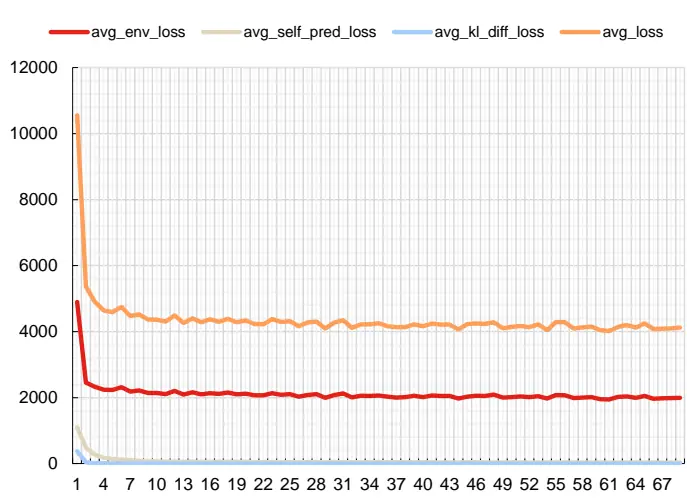
数据来源：东方证券研究所 & Wind资讯

图 30 ：DFQ-FactorVAE-pro 模型训练集、验证集、测试集中rankIC 变化
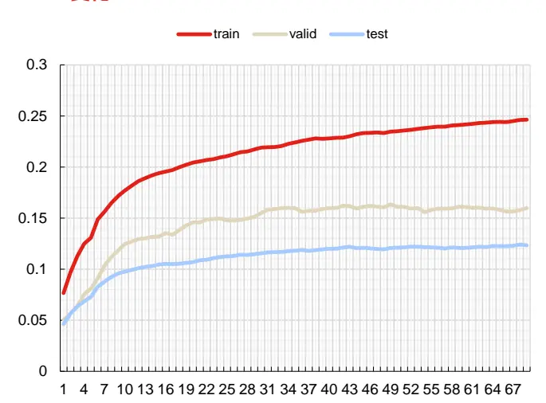
数据来源：东方证券研究所 & Wind资讯

## 5.2 因子整体绩效表现

本节展示 DFQ-FactorVAE-pro 模型得到的因子得分（factorvae_new），在中证全指、沪深 300、中证 500、中证 1000 四个股票池中的表现，并与前期报告《基于机构持仓的因子情景分析》中的基于机构持仓分域的线性多因子模型 dfqfactor、《DFQ 遗传规划价量因子挖掘系统》中的遗传规划合成因子 gp、《DFQ 强化学习因子组合挖掘系统》中的强化学习合成因子 rl、《DFQ-TRA：多交易模式学习因子挖掘系统》中的 TRA 因子、《DFQ-HIST：添加图信息的选股因子挖掘系统》中的 HIST 因子、《DFQ-XGB：基于树模型的 alpha 预测方案》中的 xgb 因子进行对比。

测试区间为 2020.1.1-2024.12.31。绩效指标计算细节如下：（1）IC 和 RANKIC 采用因子得分和20日收益率标签计算得到，日度平均，ICIR和RANKICIR未年化。（2）多头指标计算时，沪深 300、中证 500 股票池中分组数为 5，中证 1000 股票池中分组数为 10，中证全指股票池中分组数为 20。（3）多头组合月频调仓，绩效依次展示：日度超额年化收益率、日超额收益夏普比、日度超额收益最大回撤、月度胜率、月均单边换手。此处的多头计算不考虑交易成本，但汇报了月均单边换手率，费后收益可以根据费前收益和换手率近似估算。

结果显示：在各个股票池中，DFQ-FactorVAE-pro 模型表现都较好，尤其在大盘股中表现更加优异。

（1）在中证全指股票池中，DFQ-FactorVAE-pro 模型所得因子多头表现优异，多头超额收益夏普和最大回撤均为各模型中最优，分组单调性较好。测试集上 IC 达到 12.09%，ICIR 达到1.09，RANKIC 达到 15.08%，RANKICIR 达到 1.24。20 分组多头日度超额年化收益率达到29.77%，多头日超额收益夏普比 3.48，多头日度超额收益最大回撤 5.35%，多头月度胜率 85%，月均单边换手 78%。

图 31：中证全指股票池各模型因子绩效表现（2020.1.1-2024.12.31）

| 中证全指股票池 2020.01.01-2024.12.31 | IC | IC_IR | rankIC | rankIC_IR | 多头月度胜率 | 多头日超额收益夏普比 | 多头日度超额年化收益 | 多头日度超额收益最大回撤 | 多头日均单边换手率 |
| --- | --- | --- | --- | --- | --- | --- | --- | --- | --- |
| dfq | 4.08% | 0.58 | 6.26% | 0.76 | 60.00% | 1.03 | 6.42% | -11.41% | 32.94% |
| gp | 7.74% | 0.80 | 11.27% | 1.19 | 71.67% | 2.10 | 15.36% | -8.95% | 68.11% |
| r1985 | 9.92% | 0.83 | 13.75% | 1.03 | 75.00% | 2.61 | 22.32% | -7.20% | 74.34% |
| tra | 10.38% | 0.80 | 15.38% | 1.05 | 76.67% | 2.43 | 24.46% | -10.93% | 56.91% |
| hist | 11.97% | 1.00 | 16.56% | 1.22 | 88.33% | 3.22 | 31.06% | -6.42% | 74.67% |
| xgb | 12.46% | 1.21 | 14.81% | 1.32 | 86.67% | 3.29 | 28.13% | -7.44% | 76.79% |
| factorvae_new | 12.09% | 1.09 | 15.08% | 1.24 | 85.00% | 3.48 | 29.77% | -5.35% | 77.55% |

数据来源：东方证券研究所 & Wind资讯

图 32：中证全指股票池 factorvae_new 因子的 IC 时序变化（2020.1.1-2024.12.31）
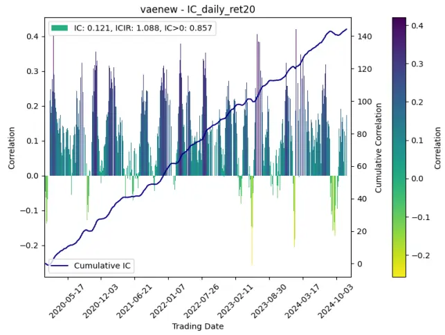

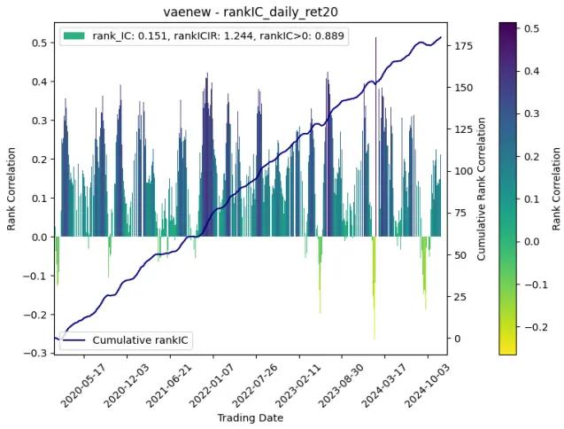
数据来源：东方证券研究所 & Wind资讯

图 33：中证全指股票池 factorvae_new 因子分组超额收益净值 & 分组年化超额收益（2020.1.1-2024.12.31）
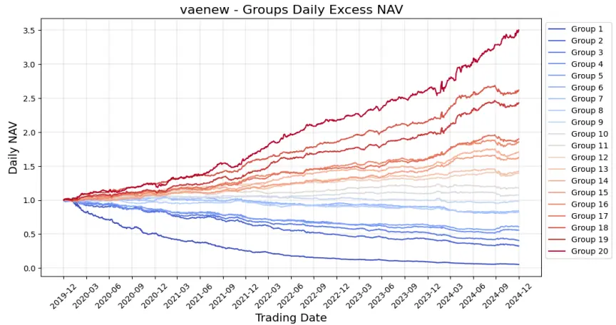
数据来源：东方证券研究所 & Wind资讯

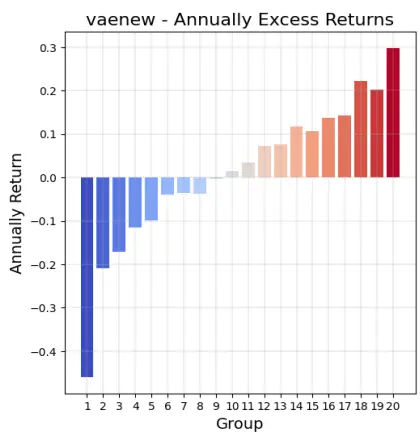

有关分析师的申明，见本报告最后部分。其他重要信息披露见分析师申明之后部分，或请与您的投资代表联系。并请阅读本证券研究报告最后一页的免责申明。

（2）在沪深300股票池中，DFQ-FactorVAE-pro模型所得因子表现十分优异，各项指标均为各模型中最优，分组单调性较好。测试集上 IC 达到 9.27%，ICIR 达到 0.5，RANKIC 达到11.15%，RANKICIR 达到 0.58。5 分组多头日度超额年化收益率达到 12.35%，多头日超额收益夏普比 1.35，多头日度超额收益最大回撤 10.78%，多头月度胜率 65%，月均单边换手50%。

图 34：沪深 300 股票池各模型因子绩效表现（2020.1.1-2024.12.31）

| 沪深300股票池 2020.01.01-2024.12.31 | IC | IC_IR | rankIC | rankIC_IR | 多头月度胜率 | 多头日超额收益夏普比 | 多头日度超额年化收益 | 多头日度超额收益最大回撤 | 多头日均单边换手率 |
| --- | --- | --- | --- | --- | --- | --- | --- | --- | --- |
| dfq | 2.57% | 0.22 | 3.43% | 0.29 | 55.00% | 0.79 | 4.19% | -10.52% | 22.97% |
| gp | 2.46% | 0.20 | 3.19% | 0.26 | 56.67% | 0.19 | 1.07% | -15.41% | 48.94% |
| r1985 | 7.05% | 0.39 | 9.63% | 0.52 | 61.67% | 1.20 | 11.04% | -11.78% | 50.33% |
| tra | 7.11% | 0.31 | 10.00% | 0.43 | 51.67% | 0.74 | 7.82% | -19.86% | 26.64% |
| hist | 9.32% | 0.47 | 11.44% | 0.55 | 66.67% | 1.04 | 9.70% | -14.59% | 50.69% |
| xgb | 7.63% | 0.40 | 8.90% | 0.43 | 65.00% | 0.88 | 9.23% | -16.28% | 49.03% |
| factorvae_new | 9.27% | 0.50 | 11.15% | 0.58 | 65.00% | 1.35 | 12.35% | -10.78% | 49.97% |

数据来源：东方证券研究所 & Wind资讯

图 35：沪深 300 股票池 factorvae_new 因子的 IC 时序变化（2020.1.1-2024.12.31）
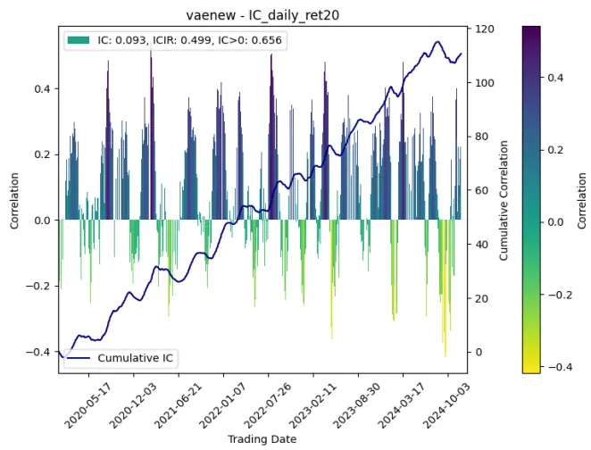

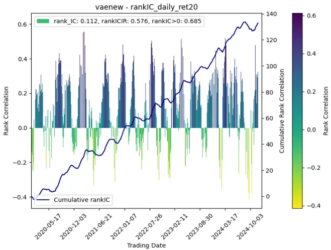
数据来源：东方证券研究所 & Wind资讯

图 36：沪深 300 股票池 factorvae_new 因子分组超额收益净值 & 分组年化超额收益（2020.1.1-2024.12.31）
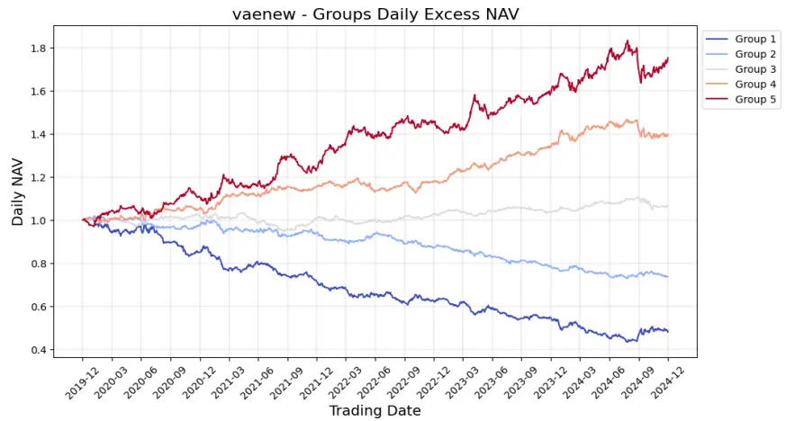
数据来源：东方证券研究所 & Wind资讯

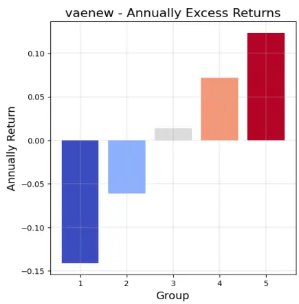

（3）在中证500股票池中，DFQ-FactorVAE-pro模型所得因子表现十分优异，各项指标基本均为各模型中最优，分组单调性较好。测试集上 IC 达到 8.51%，ICIR 达到 0.56，RANKIC 达到 11.38%，RANKICIR 达到 0.75。5 分组多头日度超额年化收益率达到 15.20%，多头日超额收益夏普比 2.05，多头日度超额收益最大回撤 6.49%，多头月度胜率 70%，月均单边换手54%。

图 37：中证 500 股票池各模型因子绩效表现（2020.1.1-2024.12.31）

| 中证500股票池 2020.01.01-2024.12.31 | IC | IC_IR | rankIC | rankIC_IR | 多头月度胜率 | 多头日超额收益夏普比 | 多头日度超额年化收益 | 多头日度超额收益最大回撤 | 多头日均单边换手率 |
| --- | --- | --- | --- | --- | --- | --- | --- | --- | --- |
| dfq | 3.25% | 0.29 | 4.98% | 0.42 | 50.00% | 0.85 | 4.46% | -11.18% | 25.45% |
| gp | 3.42% | 0.32 | 6.19% | 0.63 | 55.00% | 0.76 | 3.73% | -6.71% | 47.42% |
| r1985 | 6.32% | 0.40 | 10.05% | 0.61 | 61.67% | 1.06 | 8.59% | -8.97% | 50.05% |
| tra | 5.97% | 0.34 | 9.94% | 0.55 | 56.67% | 0.67 | 6.02% | -23.26% | 39.62% |
| hist | 7.86% | 0.48 | 11.47% | 0.68 | 68.33% | 1.78 | 14.95% | -9.25% | 53.78% |
| xgb | 7.80% | 0.51 | 9.62% | 0.59 | 65.00% | 1.45 | 12.70% | -14.46% | 55.37% |
| factorvae_new | 8.51% | 0.56 | 11.38% | 0.75 | 70.00% | 2.05 | 15.20% | -6.49% | 54.25% |

数据来源：东方证券研究所 & Wind资讯

图 38：中证 500 股票池 factorvae_new 因子的 IC 时序变化（2020.1.1-2024.12.31）
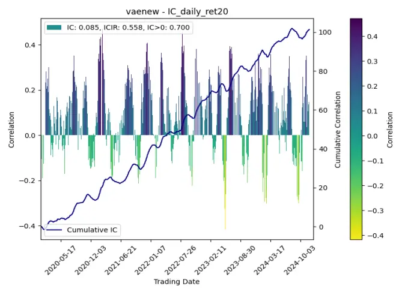

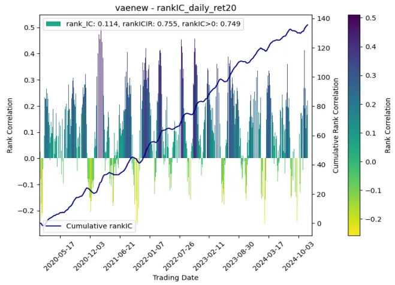
数据来源：东方证券研究所 & Wind资讯

图 39：中证 500 股票池 factorvae_new 因子分组超额收益净值 & 分组年化超额收益（2020.1.1-2024.12.31）
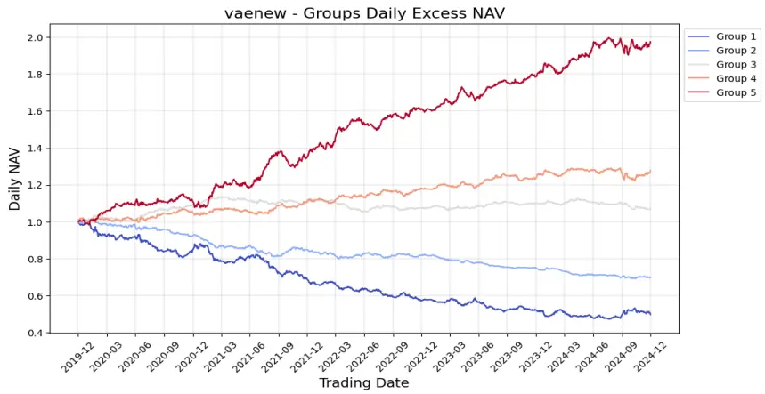
数据来源：东方证券研究所 & Wind资讯

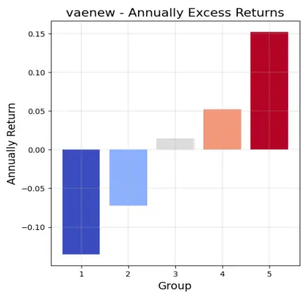

（4）在中证 1000 股票池中，DFQ-FactorVAE-pro 模型所得因子表现优异，多头超额收益夏普和最大回撤均为各模型中最优，分组单调性较好。测试集上IC达到11.55%，ICIR达到0.97，RANKIC 达到 13.49%，RANKICIR 达到 1.10。10 分组多头日度超额年化收益率达到 22.55%，多头日超额收益夏普比3.05，多头日度超额收益最大回撤5.92%，多头月度胜率87%，月均单边换手 70%。

图 40：中证 1000 股票池各模型因子绩效表现（2020.1.1-2024.12.31）

| 中证1000股票池 2020.01.01-2024.12.31 | IC | IC_IR | rankIC | rankIC_IR | 多头月度胜率 | 多头日超额收益夏普比 | 多头日度超额年化收益 | 多头日度超额收益最大回撤 | 多头日均单边换手率 |
| --- | --- | --- | --- | --- | --- | --- | --- | --- | --- |
| dfq | 4.51% | 0.43 | 6.02% | 0.52 | 58.33% | 0.81 | 5.76% | -15.98% | 30.32% |
| gp | 7.20% | 0.68 | 9.93% | 0.99 | 58.33% | 1.35 | 8.20% | -6.97% | 58.62% |
| r1985 | 9.59% | 0.68 | 12.30% | 0.82 | 65.00% | 1.64 | 14.47% | -9.88% | 65.38% |
| tra | 9.21% | 0.62 | 12.62% | 0.79 | 70.00% | 1.22 | 11.92% | -21.24% | 57.93% |
| hist | 11.32% | 0.85 | 14.43% | 1.00 | 76.67% | 2.69 | 25.01% | -9.86% | 69.03% |
| xgb | 11.28% | 0.95 | 12.30% | 1.01 | 75.00% | 2.23 | 17.53% | -9.77% | 71.23% |
| factorvae_new | 11.55% | 0.97 | 13.49% | 1.10 | 86.67% | 3.05 | 22.55% | -5.92% | 69.63% |

数据来源：东方证券研究所 & Wind资讯

图 41：中证 1000 股票池 factorvae_new 因子的 IC 时序变化（2020.1.1-2024.12.31）
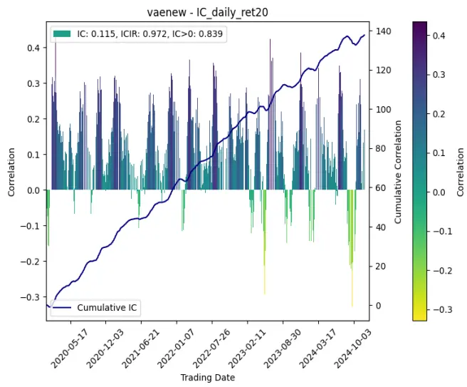

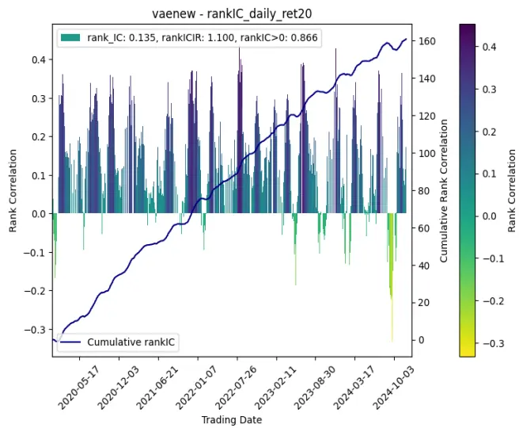
数据来源：东方证券研究所 & Wind资讯

图 42：中证 1000 股票池 factorvae_new 因子分组超额收益净值 & 分组年化超额收益（2020.1.1-2024.12.31）
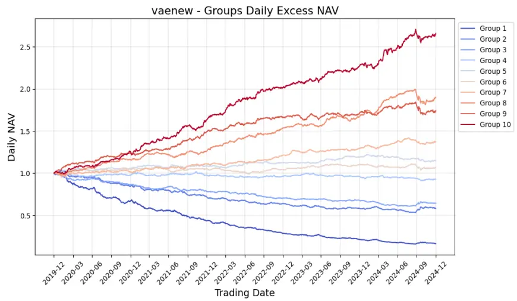
数据来源：东方证券研究所 & Wind资讯

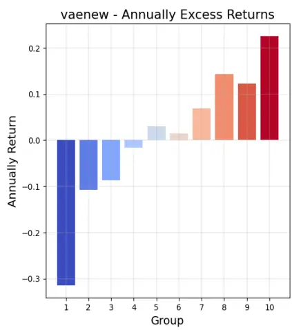

有关分析师的申明，见本报告最后部分。其他重要信息披露见分析师申明之后部分，或请与您的投资代表联系。并请阅读本证券研究报告最后一页的免责申明。

## 5.3 因子分年绩效表现

在各个股票池中，DFQ-FactorVAE-pro 模型得到的因子得分（factorvae_new）2024 年的表现都较好。

（1）在中证全指股票池中，DFQ-FactorVAE-pro 模型 2024 年 IC 达到 11.19%，ICIR 达到0.92，20 分组多头年化超额 33.90%，最大回撤 5.35%。

图 43：中证全指股票池各模型分年绩效表现（2020.1.1-2024.12.31）

| 中证全指股票池 |  |  |  |  |  |  |  |  |  |
| --- | --- | --- | --- | --- | --- | --- | --- | --- | --- |
| dfq | IC | IC_IR | rankIC | rankIC IR | 多头月度胜率 | 多头日超额收益夏普比 | 多头日度超额年化收益 | 多头日度超额收益最大回撤 | 多头日均单边换手率 |
| 2020 | 6.51% | 1.29 | 9.80% | 1.74 | 75.00% | 2.27 | 14.41% | -4.22% | 34.78% |
| 2021 | 2.45% | 0.45 | 5.18% | 0.90 | 50.00% | 0.19 | 0.85% | -7.92% | 34.28% |
| 2022 | 3.75% | 0.55 | 5.12% | 0.69 | 58.33% | 1.13 | 5.96% | -5.59% | 33.85% |
| 2023 | 4.57% | 0.74 | 7.09% | 1.06 | 58.33% | 0.28 | 1.05% | -5.59% | 31.83% |
| 2024 | 3.24% | 0.31 | 4.10% | 0.33 | 58.33% | 1.10 | 9.16% | -11.41% | 29.94% |

| gp | IC | IC_IR | rankIC | rankIC_IR | 多头月度胜率 | 多头日超额收益夏普比 | 多头日度超额年化收益 | 多头日度超额收益最大回撤 | 多头日均单边换手率 |
| --- | --- | --- | --- | --- | --- | --- | --- | --- | --- |
| 2020 | 7.29% | 0.69 | 11.73% | 1.16 | 50.00% | 0.61 | 3.10% | -4.90% | 73.52% |
| 2021 | 5.76% | 0.68 | 11.41% | 1.28 | 75.00% | 3.10 | 18.24% | -1.71% | 71.71% |
| 2022 | 9.33% | 1.20 | 11.56% | 1.94 | 66.67% | 2.45 | 16.28% | -2.67% | 66.31% |
| 2023 | 9.05% | 0.89 | 13.33% | 1.65 | 91.67% | 2.93 | 20.64% | -2.26% | 61.43% |
| 2024 | 7.44% | 0.71 | 8.16% | 0.66 | 75.00% | 1.70 | 16.27% | -8.95% | 67.60% |

| r1985 | IC | IC_IR | rankIC | rankIC_IR | 多头月度胜率 | 多头日超额收益夏普比 | 多头日度超额年化收益 | 多头日度超额收益最大回撤 | 多头日均单边换手率 |
| --- | --- | --- | --- | --- | --- | --- | --- | --- | --- |
| 2020 | 10.50% | 0.92 | 14.83% | 1.17 | 66.67% | 1.24 | 9.58% | -7.20% | 74.60% |
| 2021 | 9.06% | 0.89 | 14.31% | 1.12 | 66.67% | 1.87 | 16.99% | -6.19% | 73.67% |
| 2022 | 11.86% | 1.16 | 14.97% | 1.49 | 83.33% | 3.90 | 30.47% | -2.89% | 74.13% |
| 2023 | 8.57% | 0.57 | 13.53% | 0.84 | 66.67% | 2.01 | 12.73% | -5.59% | 72.31% |
| 2024 | 9.81% | 0.81 | 11.06% | 0.79 | 91.67% | 4.12 | 39.76% | -4.40% | 76.98% |

| tra | IC | IC_IR | rankIC | rankIC_IR | 多头月度胜率 | 多头日超额收益夏普比 | 多头日度超额年化收益 | 多头日度超额收益最大回撤 | 多头日均单边换手率 |
| --- | --- | --- | --- | --- | --- | --- | --- | --- | --- |
| 2020 | 8.92% | 0.71 | 14.13% | 0.99 | 75.00% | 2.14 | 15.83% | -7.81% | 59.12% |
| 2021 | 10.01% | 0.78 | 16.52% | 1.17 | 66.67% | 2.48 | 24.47% | -4.92% | 57.52% |
| 2022 | 12.20% | 1.26 | 16.17% | 1.67 | 75.00% | 2.99 | 26.63% | -3.30% | 56.02% |
| 2023 | 13.30% | 0.92 | 20.06% | 1.44 | 83.33% | 3.27 | 22.91% | -4.65% | 54.94% |
| 2024 | 7.43% | 0.52 | 9.66% | 0.53 | 83.33% | 2.02 | 27.67% | -10.93% | 56.96% |

| hist | IC | IC_IR | rankIC | rankIC_IR | 多头月度胜率 | 多头日超额收益夏普比 | 多头日度超额年化收益 | 多头日度超额收益最大回撤 | 多头日均单边换手率 |
| --- | --- | --- | --- | --- | --- | --- | --- | --- | --- |
| 2020 | 11.92% | 0.99 | 16.51% | 1.19 | 83.33% | 3.34 | 25.72% | -4.88% | 75.46% |
| 2021 | 12.04% | 1.14 | 17.37% | 1.31 | 83.33% | 2.90 | 28.13% | -5.72% | 74.40% |
| 2022 | 14.02% | 1.50 | 18.04% | 2.00 | 100.00% | 4.29 | 36.52% | -2.97% | 70.52% |
| 2023 | 10.89% | 0.79 | 17.41% | 1.23 | 83.33% | 3.39 | 22.11% | -3.39% | 71.75% |
| 2024 | 11.07% | 0.84 | 13.32% | 0.81 | 91.67% | 2.88 | 36.75% | -6.42% | 76.22% |

| xgb | IC | IC_IR | rankIC | rankIC_IR | 多头月度胜率 | 多头日超额收益夏普比 | 多头日度超额年化收益 | 多头日度超额收益最大回撤 | 多头日均单边换手率 |
| --- | --- | --- | --- | --- | --- | --- | --- | --- | --- |
| 2020 | 13.00% | 1.27 | 15.29% | 1.39 | 75.00% | 2.53 | 18.26% | -5.59% | 80.86% |
| 2021 | 12.12% | 1.44 | 15.46% | 1.48 | 83.33% | 3.22 | 28.57% | -7.44% | 77.75% |
| 2022 | 14.03% | 1.69 | 15.59% | 2.03 | 91.67% | 5.25 | 39.30% | -2.75% | 79.38% |
| 2023 | 11.69% | 0.96 | 16.22% | 1.33 | 83.33% | 1.19 | 6.75% | -4.64% | 70.91% |
| 2024 | 11.53% | 0.99 | 11.28% | 0.85 | 100.00% | 4.07 | 45.66% | -5.80% | 75.04% |

| factorvae_new | IC | IC_IR | rankIC | rankIC_IR | 多头月度胜率 | 多头日超额收益夏普比 | 多头日度超额年化收益 | 多头日度超额收益最大回撤 | 多头日均单边换手率 |
| --- | --- | --- | --- | --- | --- | --- | --- | --- | --- |
| 2020 | 11.67% | 1.06 | 14.61% | 1.26 | 83.33% | 3.25 | 23.89% | -4.01% | 79.74% |
| 2021 | 12.30% | 1.19 | 15.55% | 1.21 | 75.00% | 3.06 | 28.92% | -4.62% | 74.88% |
| 2022 | 14.07% | 1.54 | 16.84% | 1.98 | 91.67% | 4.91 | 35.58% | -2.27% | 78.84% |
| 2023 | 11.33% | 0.91 | 15.91% | 1.29 | 83.33% | 4.16 | 20.76% | -2.74% | 76.30% |
| 2024 | 11.19% | 0.92 | 12.37% | 0.87 | 91.67% | 3.11 | 33.90% | -5.35% | 78.01% |

数据来源：东方证券研究所 & Wind资讯

（2）在沪深 300 股票池中，DFQ-FactorVAE-pro 模型 2024 年 IC 达到 8.01%，ICIR 达到0.37，5 分组多头年化超额 10.87%，最大回撤 10.78%。

图 44：沪深 300 股票池各模型分年绩效表现（2020.1.1-2024.12.31）

| 沪深300股票池 |  |  |  |  |  |  |  |  |  |
| --- | --- | --- | --- | --- | --- | --- | --- | --- | --- |
| dfq | IC | IC_IR | rankIC | rankIC IR | 多头月度胜率 | 多头日超额收益夏普比 | 多头日度超额年化收益 | 多头日度超额收益最大回撤 | 多头日均单边换手率 |
| 2020 | 6.70% | 0.86 | 8.27% | 0.95 | 83.33% | 3.32 | 17.85% | -3.73% | 22.64% |
| 2021 | 1.08% | 0.11 | 3.00% | 0.30 | 58.33% | 0.18 | 0.88% | -5.55% | 24.31% |
| 2022 | 0.82% | 0.09 | 0.84% | 0.09 | 58.33% | 1.57 | 8.22% | -3.55% | 23.75% |
| 2023 | 2.29% | 0.20 | 2.89% | 0.25 | 33.33% | -0.29 | -1.44% | -5.49% | 20.97% |
| 2024 | 1.98% | 0.11 | 2.09% | 0.13 | 41.67% | -0.77 | -3.92% | -10.14% | 23.19% |

| gp | IC | IC_IR | rankIC | rankIC_IR | 多头月度胜率 | 多头日超额收益夏普比 | 多头日度超额年化收益 | 多头日度超额收益最大回撤 | 多头日均单边换手率 |
| --- | --- | --- | --- | --- | --- | --- | --- | --- | --- |
| 2020 | 4.98% | 0.47 | 7.22% | 0.76 | 75.00% | 1.39 | 7.75% | -5.12% | 56.25% |
| 2021 | -0.29% | -0.03 | 1.99% | 0.18 | 33.33% | -0.40 | -3.46% | -8.16% | 50.69% |
| 2022 | -1.60% | -0.14 | -1.83% | -0.15 | 33.33% | -1.26 | -7.86% | -10.74% | 48.47% |
| 2023 | 3.56% | 0.35 | 2.93% | 0.27 | 83.33% | 0.97 | 4.93% | -3.18% | 40.00% |
| 2024 | 5.89% | 0.38 | 5.76% | 0.39 | 58.33% | 0.75 | 4.66% | -3.86% | 49.31% |

| rl985 | IC | IC_IR | rankIC | rankIC_IR | 多头月度胜率 | 多头日超额收益夏普比 | 多头日度超额年化收益 | 多头日度超额收益最大回撤 | 多头日均单边换手率 |
| --- | --- | --- | --- | --- | --- | --- | --- | --- | --- |
| 2020 | 3.86% | 0.23 | 5.92% | 0.32 | 66.67% | 1.05 | 7.67% | -6.72% | 52.78% |
| 2021 | 5.87% | 0.38 | 9.46% | 0.58 | 33.33% | -0.03 | -0.66% | -6.94% | 45.14% |
| 2022 | 8.06% | 0.53 | 9.72% | 0.59 | 66.67% | 2.50 | 19.95% | -5.86% | 49.31% |
| 2023 | 7.53% | 0.38 | 12.18% | 0.68 | 66.67% | 1.36 | 8.28% | -4.17% | 51.25% |
| 2024 | 10.14% | 0.48 | 10.94% | 0.48 | 75.00% | 1.45 | 19.14% | -11.78% | 53.19% |

| tra | IC | IC_IR | rankIC | rankIC_IR | 多头月度胜率 | 多头日超额收益夏普比 | 多头日度超额年化收益 | 多头日度超额收益最大回撤 | 多头日均单边换手率 |
| --- | --- | --- | --- | --- | --- | --- | --- | --- | --- |
| 2020 | 5.52% | 0.34 | 8.44% | 0.51 | 50.00% | 1.34 | 12.24% | -8.04% | 28.47% |
| 2021 | 6.04% | 0.29 | 10.45% | 0.52 | 41.67% | 0.52 | 4.44% | -12.06% | 30.14% |
| 2022 | 7.12% | 0.30 | 9.03% | 0.36 | 50.00% | 1.10 | 10.83% | -9.69% | 29.58% |
| 2023 | 13.07% | 0.64 | 16.71% | 0.86 | 66.67% | 1.32 | 11.57% | -6.09% | 23.06% |
| 2024 | 3.65% | 0.12 | 5.05% | 0.16 | 50.00% | 0.02 | -0.91% | -19.86% | 21.94% |

| hist | IC | IC_IR | rankIC | rankIC_IR | 多头月度胜率 | 多头日超额收益夏普比 | 多头日度超额年化收益 | 多头日度超额收益最大回撤 | 多头日均单边换手率 |
| --- | --- | --- | --- | --- | --- | --- | --- | --- | --- |
| 2020 | 7.28% | 0.42 | 8.86% | 0.48 | 66.67% | 0.92 | 6.78% | -4.52% | 59.72% |
| 2021 | 9.76% | 0.54 | 12.41% | 0.63 | 66.67% | 0.84 | 7.46% | -6.20% | 45.14% |
| 2022 | 9.49% | 0.48 | 10.79% | 0.52 | 75.00% | 1.85 | 17.21% | -6.29% | 49.44% |
| 2023 | 11.26% | 0.60 | 15.30% | 0.86 | 66.67% | 1.13 | 8.14% | -5.15% | 48.47% |
| 2024 | 8.86% | 0.35 | 9.81% | 0.38 | 58.33% | 0.66 | 7.33% | -14.59% | 50.69% |

| xgb | IC | IC_IR | rankIC | rankIC_IR | 多头月度胜率 | 多头日超额收益夏普比 | 多头日度超额年化收益 | 多头日度超额收益最大回撤 | 多头日均单边换手率 |
| --- | --- | --- | --- | --- | --- | --- | --- | --- | --- |
| 2020 | 7.69% | 0.56 | 8.81% | 0.58 | 66.67% | -0.29 | -2.46% | -9.37% | 55.56% |
| 2021 | 8.54% | 0.59 | 9.32% | 0.60 | 66.67% | 1.85 | 17.23% | -6.21% | 51.94% |
| 2022 | 5.18% | 0.27 | 5.07% | 0.26 | 75.00% | 1.10 | 10.88% | -9.92% | 54.31% |
| 2023 | 9.94% | 0.50 | 12.78% | 0.61 | 66.67% | 1.16 | 10.63% | -6.23% | 37.22% |
| 2024 | 6.86% | 0.26 | 8.61% | 0.30 | 50.00% | 0.67 | 8.99% | -16.28% | 46.11% |

| factorvae_new | IC | IC_IR | rankIC | rankIC_IR | 多头月度胜率 | 多头日超额收益夏普比 | 多头日度超额年化收益 | 多头日度超额收益最大回撤 | 多头日均单边换手率 |
| --- | --- | --- | --- | --- | --- | --- | --- | --- | --- |
| 2020 | 7.82% | 0.48 | 8.80% | 0.52 | 66.67% | 1.45 | 10.82% | -5.49% | 55.00% |
| 2021 | 10.18% | 0.55 | 11.77% | 0.58 | 58.33% | 1.29 | 11.55% | -6.86% | 47.36% |
| 2022 | 8.61% | 0.46 | 9.61% | 0.49 | 75.00% | 2.18 | 17.99% | -4.20% | 48.89% |
| 2023 | 11.69% | 0.67 | 14.41% | 0.84 | 58.33% | 1.13 | 8.26% | -7.09% | 46.67% |
| 2024 | 8.01% | 0.37 | 11.23% | 0.51 | 66.67% | 0.98 | 10.87% | -10.78% | 51.94% |

数据来源：东方证券研究所 & Wind资讯

（3）在中证 500 股票池中，DFQ-FactorVAE-pro 模型 2024 年 IC 达到 6.68%，ICIR 达到0.41，5 分组多头年化超额 10.66%，最大回撤 4.72%。

图 45：中证 500 股票池各模型分年绩效表现（2020.1.1-2024.12.31）

| 中证500股票池 |  |  |  |  |  |  |  |  |  |
| --- | --- | --- | --- | --- | --- | --- | --- | --- | --- |
| dfq | IC | IC_IR | rankIC | rankIC IR | 多头月度胜率 | 多头日超额收益夏普比 | 多头日度超额年化收益 | 多头日度超额收益最大回撤 | 多头日均单边换手率 |
| 2020 | 4.84% | 0.70 | 8.51% | 1.10 | 66.67% | 1.78 | 9.32% | -3.72% | 26.75% |
| 2021 | 3.03% | 0.39 | 4.77% | 0.56 | 66.67% | 2.39 | 11.71% | -4.17% | 26.25% |
| 2022 | 3.19% | 0.30 | 4.14% | 0.39 | 41.67% | 0.15 | 0.55% | -6.00% | 26.08% |
| 2023 | 1.97% | 0.19 | 4.08% | 0.37 | 25.00% | -1.37 | -5.94% | -7.41% | 23.25% |
| 2024 | 3.38% | 0.20 | 3.37% | 0.19 | 50.00% | 1.06 | 6.78% | -8.73% | 24.92% |

| gp | IC | IC_IR | rankIC | rankIC_IR | 多头月度胜率 | 多头日超额收益夏普比 | 多头日度超额年化收益 | 多头日度超额收益最大回撤 | 多头日均单边换手率 |
| --- | --- | --- | --- | --- | --- | --- | --- | --- | --- |
| 2020 | 2.10% | 0.18 | 6.38% | 0.59 | 33.33% | -0.48 | -2.33% | -4.21% | 52.92% |
| 2021 | 2.93% | 0.30 | 6.51% | 0.70 | 58.33% | 1.78 | 9.26% | -4.55% | 52.08% |
| 2022 | 2.82% | 0.35 | 3.89% | 0.44 | 50.00% | -0.17 | -1.02% | -6.71% | 44.83% |
| 2023 | 3.52% | 0.36 | 7.07% | 0.90 | 58.33% | 1.23 | 5.16% | -2.76% | 41.33% |
| 2024 | 6.09% | 0.45 | 7.21% | 0.64 | 75.00% | 1.52 | 7.39% | -4.19% | 45.92% |

| r1985 | IC | IC_IR | rankiC | rankIC_IR | 多头月度胜率 | 多头日超额收益夏普比 | 多头日度超额年化收益 | 多头日度超额收益最大回撤 | 多头日均单边换手率 |
| --- | --- | --- | --- | --- | --- | --- | --- | --- | --- |
| 2020 | 5.25% | 0.38 | 9.50% | 0.59 | 58.33% | 0.42 | 3.08% | -8.97% | 52.25% |
| 2021 | 5.77% | 0.43 | 10.19% | 0.69 | 50.00% | 0.71 | 5.69% | -6.02% | 48.58% |
| 2022 | 8.70% | 0.68 | 11.55% | 0.80 | 66.67% | 2.19 | 15.36% | -5.09% | 47.67% |
| 2023 | 5.64% | 0.29 | 11.67% | 0.65 | 58.33% | 0.94 | 5.44% | -4.93% | 48.58% |
| 2024 | 6.43% | 0.37 | 7.24% | 0.39 | 75.00% | 1.26 | 12.18% | -8.07% | 53.17% |

| tra | IC | IC_IR | rankiC | rankIC_IR | 多头月度胜率 | 多头日超额收益夏普比 | 多头日度超额年化收益 | 多头日度超额收益最大回撤 | 多头日均单边换手率 |
| --- | --- | --- | --- | --- | --- | --- | --- | --- | --- |
| 2020 | 5.41% | 0.42 | 10.69% | 0.74 | 66.67% | 0.76 | 5.45% | -5.58% | 40.25% |
| 2021 | 5.37% | 0.35 | 11.25% | 0.73 | 58.33% | 1.24 | 9.31% | -5.85% | 41.83% |
| 2022 | 6.41% | 0.43 | 8.78% | 0.53 | 58.33% | 2.04 | 13.02% | -5.90% | 45.67% |
| 2023 | 10.27% | 0.59 | 15.01% | 0.92 | 66.67% | 1.47 | 9.02% | -4.53% | 41.33% |
| 2024 | 2.32% | 0.10 | 3.60% | 0.14 | 33.33% | -0.39 | -6.72% | -23.26% | 29.00% |

| hist | IC | IC_IR | rankIC | rankIC_IR | 多头月度胜率 | 多头日超额收益夏普比 | 多头日度超额年化收益 | 多头日度超额收益最大回撤 | 多头日均单边换手率 |
| --- | --- | --- | --- | --- | --- | --- | --- | --- | --- |
| 2020 | 6.35% | 0.44 | 10.41% | 0.66 | 75.00% | 1.56 | 11.46% | -3.29% | 58.67% |
| 2021 | 8.21% | 0.55 | 12.03% | 0.72 | 50.00% | 1.88 | 17.97% | -5.45% | 50.75% |
| 2022 | 9.93% | 0.69 | 12.98% | 0.79 | 75.00% | 3.19 | 25.18% | -3.01% | 54.50% |
| 2023 | 8.80% | 0.48 | 14.73% | 0.86 | 66.67% | 1.94 | 10.63% | -4.40% | 50.67% |
| 2024 | 6.01% | 0.33 | 6.95% | 0.38 | 75.00% | 0.81 | 7.31% | -9.25% | 54.33% |

| xgb | IC | IC_IR | rankIC | rankIC_IR | 多头月度胜率 | 多头日超额收益夏普比 | 多头日度超额年化收益 | 多头日度超额收益最大回撤 | 多头日均单边换手率 |
| --- | --- | --- | --- | --- | --- | --- | --- | --- | --- |
| 2020 | 8.53% | 0.81 | 10.99% | 1.00 | 75.00% | 1.36 | 8.15% | -4.08% | 58.58% |
| 2021 | 8.98% | 0.63 | 10.79% | 0.69 | 66.67% | 2.29 | 21.89% | -8.20% | 54.17% |
| 2022 | 9.02% | 0.62 | 8.96% | 0.55 | 75.00% | 2.40 | 20.59% | -5.62% | 58.67% |
| 2023 | 7.60% | 0.43 | 11.96% | 0.66 | 58.33% | 0.93 | 5.99% | -5.78% | 48.25% |
| 2024 | 4.84% | 0.26 | 5.14% | 0.27 | 50.00% | 0.55 | 5.47% | -14.46% | 57.17% |

| factorvae_new | IC | IC_IR | rankIC | rankIC_IR | 多头月度胜率 | 多头日超额收益夏普比 | 多头日度超额年化收益 | 多头日度超额收益最大回撤 | 多头日均单边换手率 |
| --- | --- | --- | --- | --- | --- | --- | --- | --- | --- |
| 2020 | 5.57% | 0.45 | 8.40% | 0.64 | 83.33% | 1.60 | 11.21% | -3.23% | 58.42% |
| 2021 | 10.74% | 0.66 | 13.28% | 0.74 | 58.33% | 2.24 | 21.31% | -6.49% | 51.50% |
| 2022 | 10.48% | 0.71 | 12.59% | 0.82 | 58.33% | 2.76 | 19.54% | -4.23% | 54.83% |
| 2023 | 9.03% | 0.57 | 13.96% | 1.06 | 75.00% | 2.36 | 10.66% | -4.38% | 53.58% |
| 2024 | 6.68% | 0.41 | 8.48% | 0.60 | 75.00% | 1.59 | 10.66% | -4.72% | 52.92% |

数据来源：东方证券研究所 & Wind资讯

（4）在中证 1000 股票池中，DFQ-FactorVAE-pro 模型 2024 年 IC 达到 8.51%，ICIR 达到0.61，20 分组多头年化超额 17.47%，最大回撤 5.92%。

图 46：中证 1000 股票池各模型分年绩效表现（2020.1.1-2024.12.31）

| 中证1000股票池 |  |  |  |  |  |  |  |  |  |
| --- | --- | --- | --- | --- | --- | --- | --- | --- | --- |
| dfq | IC | IC_IR | rankIC | rankIC IR | 多头月度胜率 | 多头日超额收益夏普比 | 多头日度超额年化收益 | 多头日度超额收益最大回撤 | 多头日均单边换手率 |
| 2020 | 8.29% | 1.30 | 11.20% | 1.63 | 83.33% | 2.55 | 19.31% | -5.18% | 32.58% |
| 2021 | 1.19% | 0.15 | 3.34% | 0.40 | 41.67% | -0.48 | -3.47% | -13.57% | 30.08% |
| 2022 | 4.37% | 0.53 | 4.90% | 0.54 | 66.67% | 1.00 | 6.30% | -6.85% | 31.67% |
| 2023 | 4.27% | 0.40 | 5.63% | 0.50 | 58.33% | 0.28 | 1.38% | -4.43% | 29.08% |
| 2024 | 4.67% | 0.28 | 5.23% | 0.29 | 41.67% | 0.64 | 5.47% | -15.98% | 28.17% |

| gp | IC | IC_IR | rankIC | rankIC_IR | 多头月度胜率 | 多头日超额收益夏普比 | 多头日度超额年化收益 | 多头日度超额收益最大回撤 | 多头日均单边换手率 |
| --- | --- | --- | --- | --- | --- | --- | --- | --- | --- |
| 2020 | 7.21% | 0.66 | 11.19% | 1.06 | 58.33% | 1.48 | 8.97% | -5.11% | 64.42% |
| 2021 | 4.86% | 0.52 | 9.57% | 0.99 | 41.67% | 0.95 | 5.28% | -6.57% | 61.33% |
| 2022 | 8.91% | 1.00 | 9.30% | 1.07 | 66.67% | 1.50 | 9.80% | -4.42% | 57.08% |
| 2023 | 8.44% | 0.76 | 11.87% | 1.44 | 83.33% | 2.69 | 14.71% | -1.60% | 55.42% |
| 2024 | 6.67% | 0.55 | 7.63% | 0.63 | 41.67% | 0.22 | 1.08% | -6.97% | 54.83% |

| r1985 | IC | IC_IR | rankIC | rankIC_IR | 多头月度胜率 | 多头日超额收益夏普比 | 多头日度超额年化收益 | 多头日度超额收益最大回撤 | 多头日均单边换手率 |
| --- | --- | --- | --- | --- | --- | --- | --- | --- | --- |
| 2020 | 11.72% | 1.05 | 15.53% | 1.26 | 66.67% | 1.71 | 15.43% | -7.95% | 67.58% |
| 2021 | 7.97% | 0.72 | 12.33% | 0.94 | 50.00% | 0.81 | 7.00% | -9.88% | 66.58% |
| 2022 | 11.93% | 1.03 | 13.02% | 1.06 | 83.33% | 2.40 | 18.79% | -3.05% | 65.08% |
| 2023 | 8.11% | 0.43 | 11.78% | 0.64 | 50.00% | 0.99 | 6.76% | -6.31% | 60.17% |
| 2024 | 8.28% | 0.53 | 8.74% | 0.51 | 75.00% | 2.33 | 22.30% | -7.70% | 67.50% |

| tra | IC | IC_IR | rankIC | rankIC_IR | 多头月度胜率 | 多头日超额收益夏普比 | 多头日度超额年化收益 | 多头日度超额收益最大回撤 | 多头日均单边换手率 |
| --- | --- | --- | --- | --- | --- | --- | --- | --- | --- |
| 2020 | 10.48% | 0.86 | 15.20% | 1.14 | 75.00% | 1.55 | 14.55% | -8.73% | 61.00% |
| 2021 | 9.17% | 0.63 | 13.95% | 0.89 | 50.00% | 1.03 | 9.53% | -9.74% | 57.25% |
| 2022 | 10.25% | 0.82 | 12.35% | 0.94 | 83.33% | 3.06 | 25.34% | -2.67% | 60.08% |
| 2023 | 11.11% | 0.66 | 15.68% | 1.01 | 75.00% | 1.80 | 10.70% | -3.91% | 58.50% |
| 2024 | 4.85% | 0.28 | 5.51% | 0.29 | 66.67% | -0.03 | -1.28% | -21.24% | 52.83% |

| hist | IC | IC_IR | rankIC | rankIC_IR | 多头月度胜率 | 多头日超额收益夏普比 | 多头日度超额年化收益 | 多头日度超额收益最大回撤 | 多头日均单边换手率 |
| --- | --- | --- | --- | --- | --- | --- | --- | --- | --- |
| 2020 | 12.86% | 1.10 | 16.62% | 1.27 | 83.33% | 3.01 | 28.19% | -5.69% | 72.33% |
| 2021 | 11.15% | 1.07 | 15.35% | 1.21 | 75.00% | 2.65 | 25.85% | -4.53% | 68.75% |
| 2022 | 13.32% | 1.20 | 15.28% | 1.29 | 75.00% | 3.84 | 30.46% | -3.12% | 68.42% |
| 2023 | 10.48% | 0.63 | 14.91% | 0.91 | 75.00% | 2.16 | 14.05% | -3.61% | 64.17% |
| 2024 | 8.75% | 0.58 | 9.79% | 0.59 | 75.00% | 2.09 | 21.87% | -9.86% | 71.50% |

| xgb | IC | IC_IR | rankIC | rankIC_IR | 多头月度胜率 | 多头日超额收益夏普比 | 多头日度超额年化收益 | 多头日度超额收益最大回撤 | 多头日均单边换手率 |
| --- | --- | --- | --- | --- | --- | --- | --- | --- | --- |
| 2020 | 14.13% | 1.43 | 15.74% | 1.61 | 91.67% | 2.69 | 19.48% | -5.14% | 75.58% |
| 2021 | 10.63% | 1.27 | 12.78% | 1.34 | 83.33% | 2.62 | 21.91% | -7.43% | 69.83% |
| 2022 | 13.15% | 1.52 | 12.90% | 1.49 | 83.33% | 3.65 | 26.85% | -3.35% | 74.67% |
| 2023 | 9.78% | 0.65 | 12.50% | 0.83 | 58.33% | 0.62 | 3.56% | -5.70% | 66.33% |
| 2024 | 8.66% | 0.59 | 7.30% | 0.49 | 58.33% | 1.59 | 13.64% | -9.77% | 69.75% |

| factorvae_new | IC | IC_IR | rankIC | rankIC_IR | 多头月度胜率 | 多头日超额收益夏普比 | 多头日度超额年化收益 | 多头日度超额收益最大回撤 | 多头日均单边换手率 |
| --- | --- | --- | --- | --- | --- | --- | --- | --- | --- |
| 2020 | 12.77% | 1.20 | 14.86% | 1.30 | 100.00% | 3.66 | 25.91% | -3.37% | 73.67% |
| 2021 | 12.45% | 1.28 | 14.95% | 1.31 | 91.67% | 3.34 | 29.44% | -4.32% | 69.00% |
| 2022 | 13.40% | 1.31 | 14.78% | 1.43 | 83.33% | 3.62 | 23.79% | -1.58% | 69.42% |
| 2023 | 10.47% | 0.76 | 13.59% | 1.07 | 91.67% | 2.48 | 12.21% | -2.58% | 67.17% |
| 2024 | 8.51% | 0.61 | 9.01% | 0.63 | 66.67% | 2.29 | 17.47% | -5.92% | 68.92% |

数据来源：东方证券研究所 & Wind资讯

## 5.4 中性化因子表现

DFQ-FactorVAE-pro 模型得到的因子得分（factorvae_new）进行了行业和市值中性化后表现优异，说明模型受行业市值风格的影响较小。

（1）在中证全指股票池中，DFQ-FactorVAE-pro 模型的中性化因子，相比原始因子仅rankic 和多头收益略有降低，但因子稳定性明显提高，icir 和 rankicir 提升。原始因子 ic 达到12.09%，中性化后仍有11.20%。原始因子icir达到1.09，中性化后提高到1.35。原始因子20分组多头年化超额收益达到 29.77%，中性化降低到 25.31%，仅降低 4%。

图 47：中证全指股票池各模型中性化因子绩效表现（2020.1.1-2024.12.31）

| 中证全指股票池行业市值中性化因子 2020.01.01-2024.12.31 | IC | IC_IR | rankIC | rankIC_IR | 多头月度胜率 | 多头日超额收益夏普比 | 多头日度超额年化收益 | 多头日度超额收益最大回撤 | 多头日均单边换手率 |
| --- | --- | --- | --- | --- | --- | --- | --- | --- | --- |
| dfq | 4.08% | 0.58 | 6.26% | 0.77 | 56.67% | 0.95 | 5.92% | -11.40% | 32.81% |
| gp | 7.84% | 0.82 | 11.46% | 1.22 | 71.67% | 1.98 | 14.53% | -8.92% | 67.79% |
| r1985 | 9.19% | 1.06 | 12.18% | 1.39 | 80.00% | 3.21 | 20.72% | -3.68% | 74.15% |
| tra | 9.65% | 0.97 | 14.12% | 1.27 | 80.00% | 2.72 | 25.21% | -10.74% | 57.57% |
| hist | 11.02% | 1.26 | 14.94% | 1.51 | 81.67% | 3.02 | 26.92% | -6.04% | 72.04% |
| xgb | 11.54% | 1.52 | 13.12% | 1.72 | 80.00% | 2.81 | 21.74% | -5.74% | 77.16% |
| factorvae_new | 11.20% | 1.35 | 13.34% | 1.54 | 80.00% | 2.91 | 25.31% | -7.10% | 74.73% |

数据来源：东方证券研究所 & Wind资讯

（2）在沪深 300 股票池中，DFQ-FactorVAE-pro 模型的中性化因子，相比原始因子 rankic和多头收益降低，但因子稳定性明显提高，icir 和 rankicir 提升。原始因子 ic 达到 9.27%，中性化后仍有 7.05%。原始因子 icir 达到 0.5，中性化后提高到 0.68。原始因子 5 分组多头年化超额收益达到 12.35%，中性化降低到 6.02%。

图 48：沪深 300 股票池各模型中性化因子绩效表现（2020.1.1-2024.12.31）

| 沪深300股票池行业市值中性化因子 2020.01.01-2024.12.31 | IC | IC_IR | rankIC | rankIC_IR | 多头月度胜率 | 多头日超额收益夏普比 | 多头日度超额年化收益 | 多头日度超额收益最大回撤 | 多头日均单边换手率 |
| --- | --- | --- | --- | --- | --- | --- | --- | --- | --- |
| dfq | 2.31% | 0.21 | 2.83% | 0.27 | 60.00% | 0.57 | 2.93% | -13.61% | 24.58% |
| gp | 3.40% | 0.33 | 4.66% | 0.50 | 56.67% | 0.48 | 2.21% | -6.18% | 49.22% |
| r1985 | 4.92% | 0.50 | 6.40% | 0.69 | 55.00% | 0.68 | 3.36% | -8.25% | 54.22% |
| tra | 4.36% | 0.34 | 6.50% | 0.50 | 60.00% | 0.58 | 3.53% | -15.02% | 34.72% |
| hist | 7.24% | 0.63 | 8.47% | 0.75 | 63.33% | 1.38 | 6.97% | -7.57% | 51.19% |
| xgb | 6.19% | 0.60 | 6.70% | 0.64 | 56.67% | 0.74 | 4.18% | -8.44% | 57.58% |
| factorvae_new | 7.05% | 0.68 | 7.70% | 0.77 | 66.67% | 1.33 | 6.02% | -6.40% | 52.25% |

数据来源：东方证券研究所 & Wind资讯

（3）在中证 500 股票池中，DFQ-FactorVAE-pro 模型的中性化因子，相比原始因子 rankic和多头收益降低，但因子稳定性明显提高，icir 和 rankicir 提升。原始因子 ic 达到 8.51%，中性化后仍有6.80%。原始因子icir达到0.56，中性化后提高到0.7。原始因子5分组多头年化超额收益达到 15.20%，中性化降低到 9.54%。

图 49：中证 500 股票池各模型中性化因子绩效表现（2020.1.1-2024.12.31）

| 中证500股票池 行业市值中性化因子 2020.01.01-2024.12.31 | IC | IC_IR | rankIC | rankIC_IR | 多头月度胜率 | 多头日超额收益夏普比 | 多头日度超额年化收益 | 多头日度超额收益最大回撤 | 多头日均单边换手率 |
| --- | --- | --- | --- | --- | --- | --- | --- | --- | --- |
| dfq | 3.61% | 0.41 | 5.31% | 0.59 | 61.67% | 1.27 | 5.46% | -7.90% | 26.72% |
| gp | 3.97% | 0.38 | 6.82% | 0.78 | 61.67% | 0.80 | 3.53% | -7.52% | 47.48% |
| rl985 | 5.11% | 0.49 | 7.85% | 0.86 | 56.67% | 1.28 | 5.66% | -4.98% | 54.33% |
| tra | 5.34% | 0.49 | 8.52% | 0.81 | 63.33% | 1.07 | 6.27% | -13.93% | 42.85% |
| hist | 6.42% | 0.61 | 9.10% | 0.96 | 66.67% | 1.91 | 8.14% | -5.93% | 56.20% |
| xgb | 6.47% | 0.67 | 7.89% | 0.93 | 65.00% | 2.03 | 9.33% | -5.77% | 59.62% |
| factorvae_new | 6.80% | 0.70 | 8.41% | 1.06 | 78.33% | 2.34 | 9.54% | -3.77% | 54.03% |

数据来源：东方证券研究所 & Wind资讯

有关分析师的申明，见本报告最后部分。其他重要信息披露见分析师申明之后部分，或请与您的投资代表联系。并请阅读本证券研究报告最后一页的免责申明。

（4）在中证 1000 股票池中，DFQ-FactorVAE-pro 模型的中性化因子，相比原始因子仅rankic 和多头收益略有降低，但因子稳定性明显提高，icir 和 rankicir 提升。原始因子 ic 达到11.55%，中性化后仍有10.01%。原始因子icir达到0.97，中性化后提高到1.30。原始因子10分组多头年化超额收益达到 22.55%，中性化降低到 17.51%。

图 50：中证 1000 股票池各模型中性化因子绩效表现（2020.1.1-2024.12.31）

| 中证1000股票池 行业市值中性化因子 2020.01.01-2024.12.31 | IC | IC_IR | rankIC | rankIC_IR | 多头月度胜率 | 多头日超额收益夏普比 | 多头日度超额年化收益 | 多头日度超额收益最大回撤 | 多头日均单边换手率 |
| --- | --- | --- | --- | --- | --- | --- | --- | --- | --- |
| dfq | 4.87% | 0.51 | 6.40% 0.62 |  | 60.00% | 1.03 | 6.47% | -13.08% | 31.92% |
| gp | 7.11% | 0.68 | 9.67% | 1.04 | 65.00% | 1.42 | 8.05% | -6.59% | 58.82% |
| rl985 | 8.43% | 0.86 | 10.38% | 1.14 | 76.67% | 2.81 | 15.27% | -4.60% | 66.95% |
| tra | 8.13% | 0.82 | 10.84% | 1.11 | 73.33% | 2.09 | 12.10% | -7.98% | 57.88% |
| hist | 9.78% | 1.13 | 12.24% | 1.43 | 83.33% | 3.02 | 17.25% | -4.41% | 67.62% |
| xgb | 9.90% | 1.22 | 10.26% | 1.47 | 70.00% | 2.30 | 14.51% | -3.86% | 71.52% |
| factorvae_new | 10.01% | 1.30 | 11.01% | 1.56 | 73.33% | 3.07 | 17.51% | -3.57% | 66.52% |

数据来源：东方证券研究所 & Wind资讯

## 5.5 因子多头组风险因子暴露

我们从因子暴露角度，对中证全指股票池内，各模型多头组进行分析。业绩基准是样本空间（中证全指）等权组合。计算组合持仓和基准在各个风险因子上的暴露，相减得到相对暴露即可。

我们使用的风险模型是《东方 A股因子风险模型(DFQ-2020)》报告中研发的风险模型，风险因子包括十大类风格类风险因子，29 个中信一级行业因子和市场因子。下图展示了该模型的风格因子列表，具体模型细节可以参考报告。

图 51：东方 A股因子风险模型（DFQ-2020）-- 风格因子列表
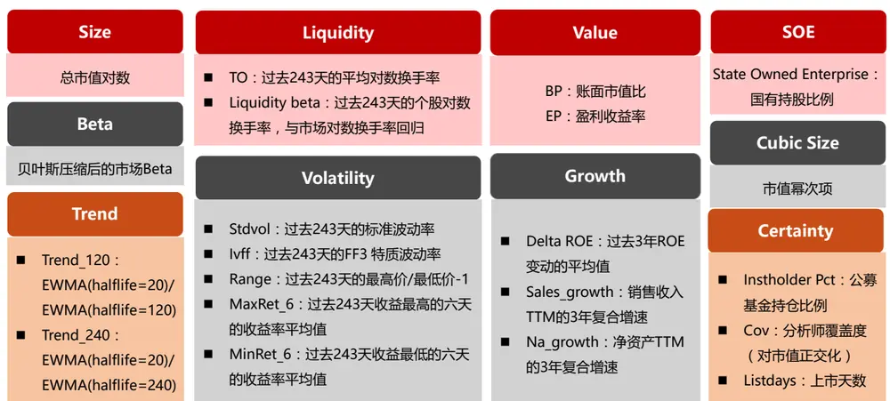
数据来源：东方证券研究所

DFQ-FactorVAE-pro 模型得到的因子得分（factorvae_new）对应的多头组偏向小市值、低波动、低流动性、低估值、强反转、低成长。与其他tra、hist等神经网络模型相比，在市值上的负暴露更小，在beta风格上基本无暴露，在低估值上的正暴露更大，在非线性市值上的负暴露更小。

图 52：中证全指股票池各模型多头组的因子相对暴露均值（2020.1.1-2024.12.31）
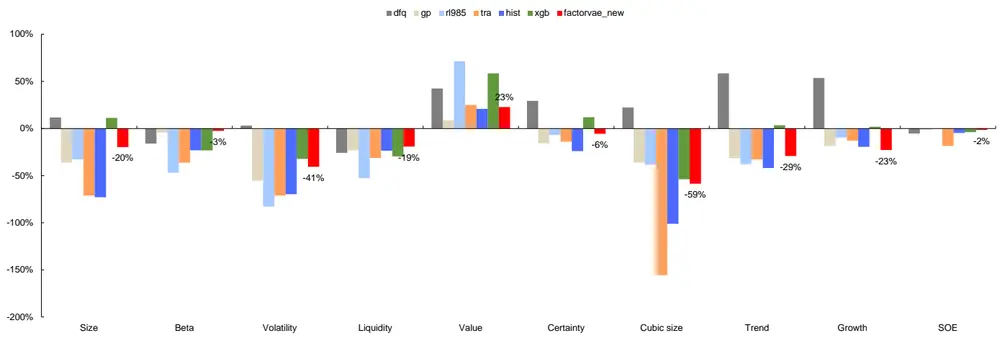
数据来源：东方证券研究所 & Wind资讯

图 53：中证全指股票池各模型多头组的 size 因子相对暴露变化（2020.1.1-2024.12.31）
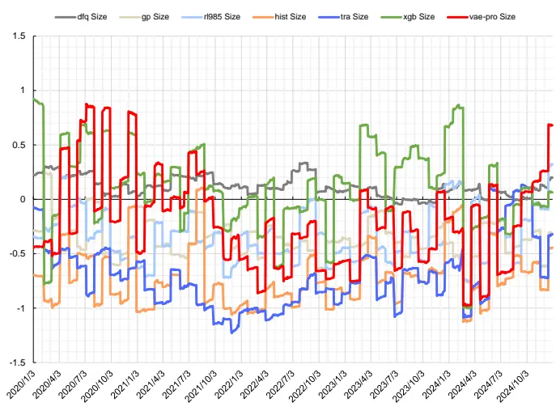
数据来源：东方证券研究所 & Wind资讯

图 54：中证全指股票池各模型多头组的 beta 因子相对暴露变化（2020.1.1-2024.12.31）
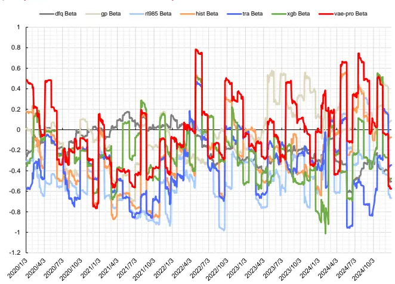
数据来源：东方证券研究所 & Wind资讯

图55：中证全指股票池各模型多头组的volatility因子相对暴露变化（2020.1.1-2024.12.31）
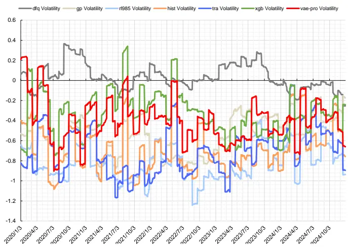
数据来源：东方证券研究所 & Wind资讯

图56：中证全指股票池各模型多头组的liquidity因子相对暴露变化（2020.1.1-2024.12.31）
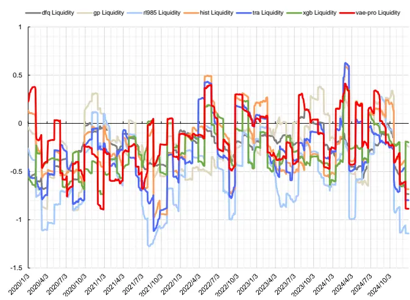
数据来源：东方证券研究所 & Wind资讯
有关分析师的申明，见本报告最后部分。其他重要信息披露见分析师申明之后部分，或请与您的投资代表联系。并请阅读本证券研究报告最后一页的免责申明。

图57：中证全指股票池各模型多头组的value因子相对暴露变化（2020.1.1-2024.12.31）
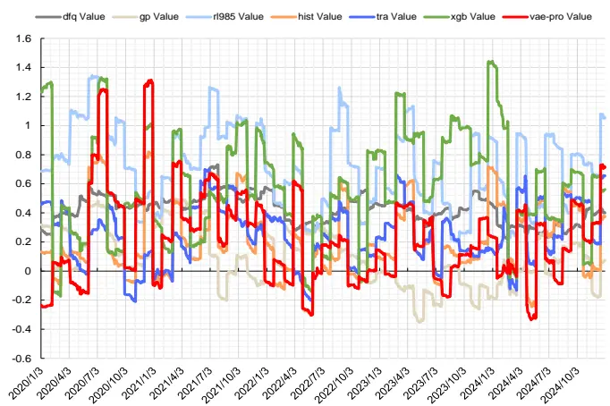
数据来源：东方证券研究所 & Wind资讯

图 58：中证全指股票池各模型多头组的 certainty 因子相对暴露变化（2020.1.1-2024.12.31）
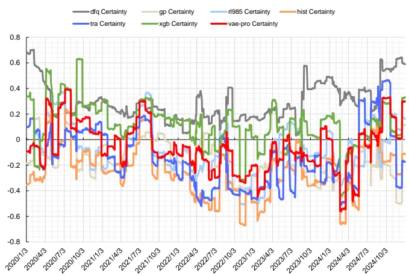
数据来源：东方证券研究所 & Wind资讯

图59：中证全指股票池各模型多头组的cubicsize因子相对暴露变化（2020.1.1-2024.12.31）
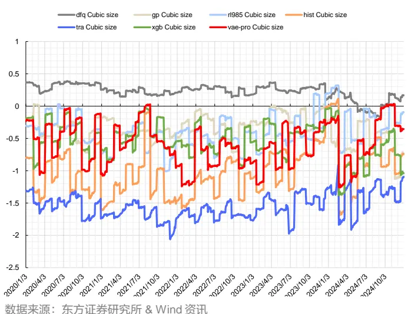

图 60：中证全指股票池各模型多头组的 trend因子相对暴露变化（2020.1.1-2024.12.31）
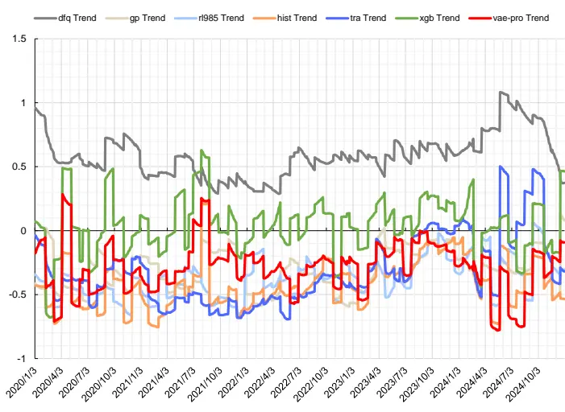
数据来源：东方证券研究所 & Wind资讯

图 61：中证全指股票池各模型多头组的 growth 因子相对暴露变化（2020.1.1-2024.12.31）
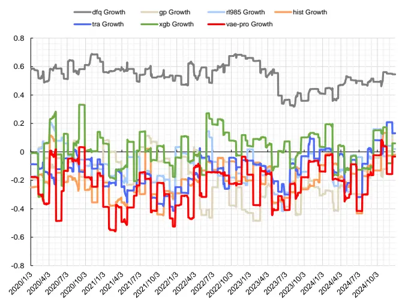
数据来源：东方证券研究所 & Wind资讯

图 62：中证全指股票池各模型多头组的 soe 因子相对暴露变化（2020.1.1-2024.12.31）
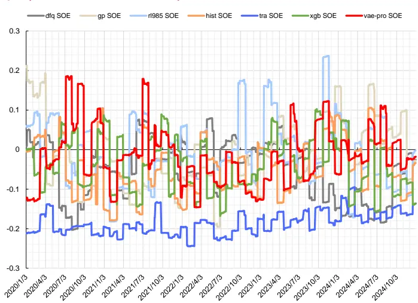
数据来源：东方证券研究所 & Wind资讯
有关分析师的申明，见本报告最后部分。其他重要信息披露见分析师申明之后部分，或请与您的投资代表联系。并请阅读本证券研究报告最后一页的免责申明。

## 六、指数增强组合表现

## 6.1 指数增强组合构建说明

（1）回测期：2020.01.01-2024.12.31，组合月频调仓，假设根据每月末个股得分在次日以vwap 价格进行交易。

（2）组合约束：风险因子库（参见《东方 A 股因子风险模型（DFQ-2020）》）中所有的风格因子相对暴露不超过 50%，所有行业因子相对暴露不超过 2%。沪深 300 增强跟踪误差约束不超过 4%，中证 500 和 1000增强跟踪误差约束不超过 5%。个股权重设置上限约束，绝对权重上限设置为 1.5倍基准权重+2%。限制指数成分股权重占比不低于 80%。

（3）考虑交易成本：假设买卖手续费双边千三，停牌涨停不能买入、停牌跌停不能卖出。

## 6.2 沪深 300 指数增强组合

DFQ-FactorVAE-pro 模型得到的因子得分（factorvae_new）在沪深 300 指增组合中表现十分突出：

（1）整体表现：2020 年以来年化信息比达到 2.23，年化对冲收益 12.32%，年化跟踪误差5.28%，超额收益最大回撤 7.43%，单边年换手 7.81倍。

（2）分年表现：2020-2023每年取得 10%以上的正超额，2024年超额收益为5.15%。

图 63：DFQ-FactorVAE-pro 模型沪深 300 股票池指数增强组合绩效表现（2020.1.1-2024.12.31）

| 20200101-20241231 300月频 |  | factorvae_new |
| --- | --- | --- |
| 行业暴露0.02 风格暴露0.5 跟踪误差4% 买卖手续费双边千三 |  | 沪深300全市场增强 80%成分内约束 2.23 |
| 绩效指标 | 年化对冲收益 | 12.32% |
|  | 跟踪误差（年化） | 5.28% |
|  | 对冲收益最大回撤 | -7.43% |
|  | 对冲收益最大回撤出现时间点 | 20240207 |
|  | 对冲收益最大回撤恢复天数 单边换手率（年） | 146 7.81 |
| 分年收益 | 成分内股票占比 | 80.28% |
|  | 2020 | 10.68% |
|  | 2021 | 13.73% |
|  | 2022 | 17.32% |
|  | 2023 | 12.80% |
|  | 2024 | 5.15% |
| 分月收益 | 202401 | -0.77% |
|  | 202402 | -3.50% |
|  | 202403 | 2.80% |
|  | 202404 | 1.67% |
|  | 202405 | 0.13% |
|  | 202406 | 0.06% |
|  | 202407 | 0.73% |
|  | 202408 | 2.68% |
|  | 202409 | 2.26% |
|  | 202410 |  |
|  | 202411 | -0.80% |
|  | 202412 | -0.23% |

数据来源：东方证券研究所 & Wind资讯

有关分析师的申明，见本报告最后部分。其他重要信息披露见分析师申明之后部分，或请与您的投资代表联系。并请阅读本证券研究报告最后一页的免责申明。

图 64：DFQ-FactorVAE-pro 模型沪深 300 股票池指数增强组合超额净值与回撤（2020.1.1-2024.12.31）
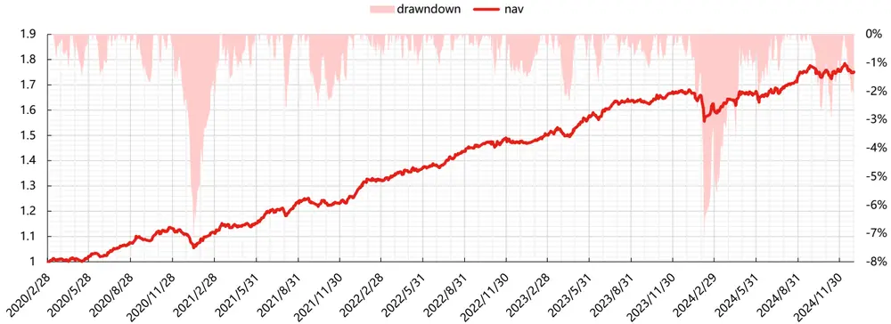
数据来源：东方证券研究所 & Wind资讯

DFQ-FactorVAE-pro模型下的沪深300指增组合：（1）相对基准沪深300指数，在市值、信息确定性、成长维度具有明显的负向暴露，但在 BETA、流动性、波动率、估值等维度都没有明显暴露。（2）20-24 年的指增超额收益中有 65%来自特质收益，风格和行业因子各贡献 17%左右。

图 65：DFQ-FactorVAE-pro 模型沪深 300 股票池指数增强组合相对基准的平均风格暴露（2020.1.1-2024.12.31）
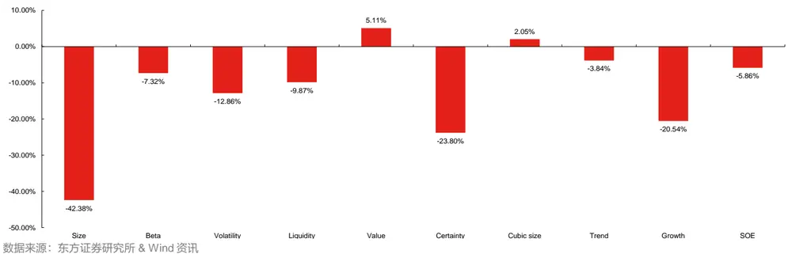

图 66：DFQ-FactorVAE-pro 模型沪深 300 股票池指数增强组合超额收益归因情况（2020.1.1-2024.12.31）
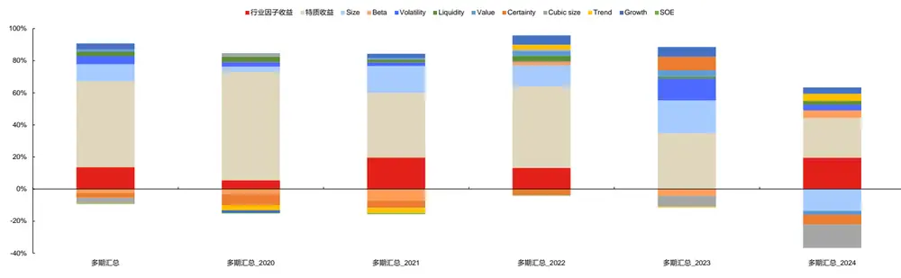
数据来源：东方证券研究所 & Wind资讯
有关分析师的申明，见本报告最后部分。其他重要信息披露见分析师申明之后部分，或请与您的投资代表联系。并请阅读本证券研究报告最后一页的免责申明。

## 6.3 中证 500 指数增强组合

DFQ-FactorVAE-pro 模型得到的因子得分（factorvae_new）在中证 500 指增组合中表现十分突出：

（1）整体表现：2020 年以来年化信息比达到 1.98，年化对冲收益 12.98%，年化跟踪误差6.27%，超额收益最大回撤 8.33%，单边年换手 9.21倍。

（2）分年表现：2020-2024每年取得 7%以上的正超额，2024年超额收益为 8.5%。

图 67：DFQ-FactorVAE-pro 模型中证 500 股票池指数增强组合绩效表现（2020.1.1-2024.12.31）

| 20200101-20241231 500月频 |  | factorvae_new |
| --- | --- | --- |
| 行业暴露0.02 风格暴露0.5 跟踪误差5% 买卖手续费双边千三 信息比（年化） |  | 中证500全市场增强 80%成分内约束 1.98 12.98% |
| 绩效指标 | 跟踪误差（年化） | 6.27% |
|  | 对冲收益最大回撤 | -8.33% |
|  | 对冲收益最大回撤出现时间点 | 20210107 |
|  | 对冲收益最大回撤恢复天数 | 64 |
|  | 单边换手率（年） 持股数量 | 9.21 88.48 |
| 分年收益 | 成分内股票占比 2020 | 80.07% 7.50% |
|  | 2021 | 17.57% |
|  | 2022 | 12.98% |
|  | 2023 | 16.27% |
|  | 2024 202401 | 8.50% |
| 分月收益 | 202402 | 0.33% |
|  |  | -4.54% |
|  | 202403 | 0.25% |
|  | 202404 | 1.33% |
|  | 202405 | 0.60% |
|  | 202406 | 0.40% |
|  | 202407 | 2.01% |
|  | 202408 | 2.65% |
|  | 202409 | 1.50% |
|  | 202410 | 2.26% |
|  | 202411 | 0.14% |
|  |  | 1.29% |
|  | 202412 |  |

数据来源：东方证券研究所 & Wind资讯

图 68：DFQ-FactorVAE-pro 模型中证 500 股票池指数增强组合超额净值与回撤（2020.1.1-2024.12.31）
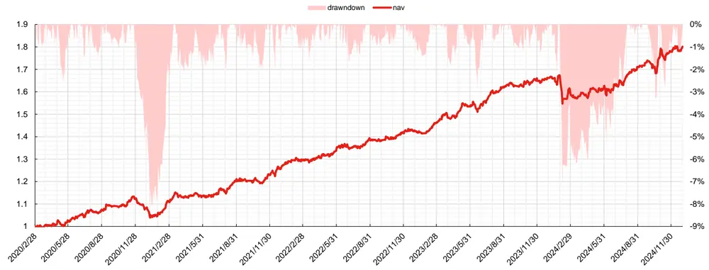
数据来源：东方证券研究所 & Wind资讯
有关分析师的申明，见本报告最后部分。其他重要信息披露见分析师申明之后部分，或请与您的投资代表联系。并请阅读本证券研究报告最后一页的免责申明。

DFQ-FactorVAE-pro模型下的中证500指增组合：（1）相对基准中证500指数，在市值、波动率、流动性、信息确定性、非线性市值、动量、成长维度具有明显的负向暴露，在估值维度有明显的正向暴露。（2）20-24 年的指增超额收益中有 55%来自特质收益，35%来自风格因子贡献，10%来自行业因子贡献。

图 69：DFQ-FactorVAE-pro 模型中证 500 股票池指数增强组合相对基准的平均风格暴露（2020.1.1-2024.12.31）
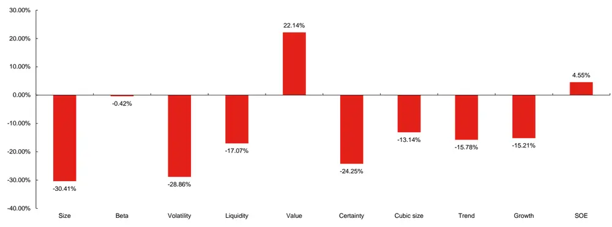
数据来源：东方证券研究所 & Wind资讯

图 70：DFQ-FactorVAE-pro 模型中证 500 股票池指数增强组合超额收益归因情况（2020.1.1-2024.12.31）
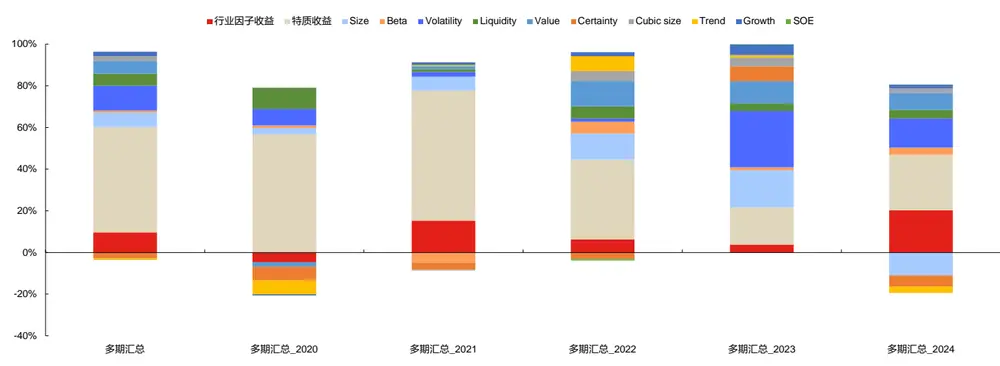
数据来源：东方证券研究所 & Wind资讯

## 6.4 中证 A500 指数增强组合

DFQ-FactorVAE-pro 模型得到的因子得分（factorvae_new）在中证 A500 指增组合中表现十分突出：

（1）整体表现：2020 年以来年化信息比达到 1.98，年化对冲收益 12.97%，年化跟踪误差6.28%，超额收益最大回撤 9.68%，单边年换手 8.37倍。

（2）分年表现：2020-2023每年取得 10%以上的正超额，2024年超额收益为4.31%。

图 71：DFQ-FactorVAE-pro 模型中证 A500 股票池指数增强组合绩效表现（2020.1.1-2024.12.31）

| 20200101-20241231 a500月频 |  | factorvae_new |
| --- | --- | --- |
| 行业暴露0.02 风格暴露0.5 跟踪误差5% 买卖手续费双边千三 信息比（年化） |  | 中证a500全市场增强 80%成分内约束 1.98 12.97% 6.28% |
| 绩效指标 | 跟踪误差（年化） 对冲收益最大回撤 对冲收益最大回撤出现时间点 对冲收益最大回撤恢复天数 单边换手率（年） 持股数量 成分内股票占比 | -9.68% 20210113 142 8.37 67.55 81.12% |
| 分年收益 | 2020 2021 2022 2023 2024 202401 | 12.08% 14.53% 20.28% 11.80% 4.31% -1.31% |
| 分月收益 | 202402 202403 202404 202405 202406 202407 202408 202409 | -4.12% 2.85% -0.12% 0.38% -0.51% 1.35% 1.94% |

数据来源：东方证券研究所 & Wind资讯

图 72：DFQ-FactorVAE-pro 模型中证 A500 股票池指数增强组合超额净值与回撤（2020.1.1-2024.12.31）
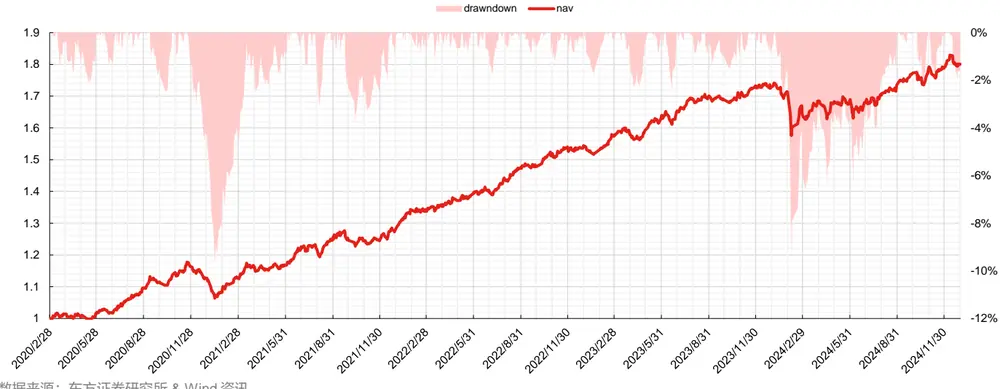
数据来源：东方证券研究所 & Wind资讯
有关分析师的申明，见本报告最后部分。其他重要信息披露见分析师申明之后部分，或请与您的投资代表联系。并请阅读本证券研究报告最后一页的免责申明。

DFQ-FactorVAE-pro 模型下的中证 A500 指增组合：（1）相对基准中证 A500 指数，在市值、波动率、信息确定性、成长维度具有明显的负向暴露。（2）20-24 年的指增超额收益中有60%来自特质收益，30%来自风格因子贡献，10%来自行业因子贡献。

图 73：DFQ-FactorVAE-pro 模型中证 A500 股票池指数增强组合相对基准的平均风格暴露（2020.1.1-2024.12.31）
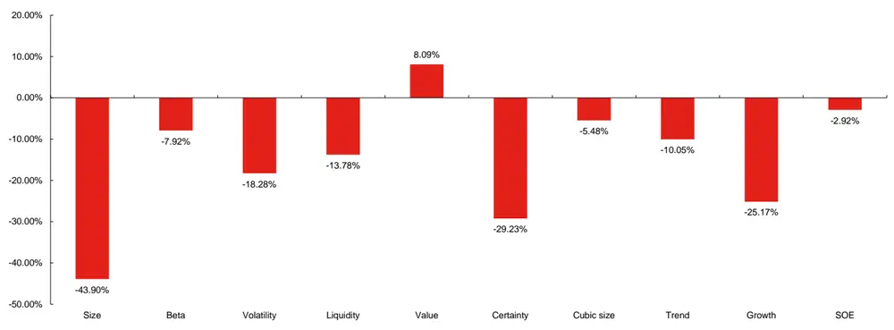
数据来源：东方证券研究所 & Wind资讯

图 74：DFQ-FactorVAE-pro 模型中证 A500 股票池指数增强组合超额收益归因情况（2020.1.1-2024.12.31）
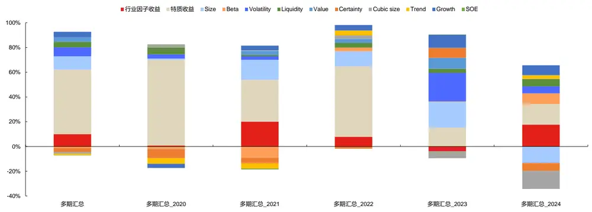
数据来源：东方证券研究所 & Wind资讯

## 七、 总结

DFQ-FactorVAE-pro 模型，以 FactorVAE 模型为基础，添加特征选择模块，添加日期环境变量，使用协同训练方式进行训练。

（1）FactorVAE 模型，在传统的端到端神经网络基础上，融合了变分自编码器与概率动态因子模型的思想，采用 “先验-后验”学习方法，建立股票收益率预测模型，学习输入特征和标签之间的关系。

（ 2 ） 特 征 选 择 模 块 由 特 征 选 择 器 （ Feature Mask） 和 特 征 重 构 器 （ FeatureReconstructor） 两个网络组成。这种设计结合了特征筛选与重构，能够在特征选择的同时保证信息的完整性。在模型训练中，在损失函数中叠加一个 MSE 损失项，度量重构损失。添加重构损失项之后，可以在训练过程中同时对特征选择器和特征重构器施加约束，共同优化。在样本外预测时，则不需要用到特征重构器。

（3）采用协同训练方法，引入环境变量。训练环境不可知预测模块（VAE）和环境可知预测模块（EnvVAE）。两个模型架构一致，区别就是输入是否加入环境变量。训练时两模块共同参与，样本外预测时只使用无环境变量的 VAE 模块。这种做法的关键思想有三点：（1）不变特征：找到在有无环境变量的情况下，能使得模型预测效果都好的特征选择方案，确保模型对特征的选择不受环境变量变化的影响，也就是找到不变特征；（2）不变因子：找到在有无环境变量的情况下，分布接近的先验因子生成方案，确保不论在训练时是否加入环境变量，模型生成的隐变量因子都能保持一致，也就是找到不变因子。（3）协同训练：两个模块同时训练，通过共同优化损失函数，确保环境变量与股票个性特征之间的关系能够有效学习，同时不影响预测的稳定性。

DFQ-FactorVAE-pro 模型在中证全指股票池中，因子多头表现优异，多头超额收益夏普和最大回撤均为各模型中最优，分组单调性较好。测试集上IC达到12.09%，RANKIC达到15.08%，RANKICIR 达到 1.24。20 分组多头超额年化收益达到 29.77%，多头超额收益夏普比 3.48，多头日度超额收益最大回撤 5.35%。在沪深 300和中证 500股票池中，因子表现十分优异，各项指标基本均为各模型中最优，分组单调性较好。因子进行了行业和市值中性化后表现优异，模型受行业市值风格影响较小。原始因子 20 分组多头年化超额收益 29.77%，中性化仅降低 4%。多头组偏向小市值、低波动、低流动性、低估值、强反转、低成长。与 tra、hist 等神经网络模型相比，在市值上的负暴露更小，在 beta 风格上基本无暴露，在低估值上的正暴露更大，在非线性市值上的负暴露更小。

DFQ-FactorVAE-pro 模型所得到的合成因子在大盘指增组合中表现十分突出。沪深 300 指增：2020 年以来信息比 2.23，年化对冲收益 12.32%，跟踪误差 5.28%。2024 年超额收益为5.15%。中证 500 指增：2020 年以来信息比 1.98，年化对冲收益 12.98%，跟踪误差 6.27%，2024 年超额收益为 8.5%。中证 A500 指增：2020 年以来信息比 1.98，年化对冲收益 12.97%，跟踪误差 6.28%， 2024 年超额收益为 4.31%。

## 参考文献

1. Duan Y, Wang L, Zhang Q, et al. FactorVAE: A probabilistic dynamic factor model based on variational autoencoder for predicting cross-sectional stock returns[C]//Proceedings of the AAAI Conference on Artificial Intelligence. 2022, 36(4): 4468-4476.

2. Cao H, Zou J, Liu Y, et al. InvariantStock: Learning Invariant Features for Mastering the Shifting Market[J]. arXiv preprint arXiv:2409.00671, 2024.

## 风险提示

1. 量化模型基于历史数据分析，未来存在失效风险，建议投资者紧密跟踪模型表现。

2. 极端市场环境可能对模型效果造成剧烈冲击，导致收益亏损。

## Tabl e_Disclai mer 分析师申明

每位负责撰写本研究报告全部或部分内容的研究分析师在此作以下声明：

分析师在本报告中对所提及的证券或发行人发表的任何建议和观点均准确地反映了其个人对该证券或发行人的看法和判断；分析师薪酬的任何组成部分无论是在过去、现在及将来，均与其在本研究报告中所表述的具体建议或观点无任何直接或间接的关系。

## 投资评级和相关定义

报告发布日后的12个月内行业或公司的涨跌幅相对同期相关证券市场代表性指数的涨跌幅为基准（A 股市场基准为沪深 300 指数，香港市场基准为恒生指数，美国市场基准为标普 500 指数）；

## 公司投资评级的量化标准

买入：相对强于市场基准指数收益率 15%以上；

增持：相对强于市场基准指数收益率 5%～15%；

中性：相对于市场基准指数收益率在-5%～+5%之间波动；

减持：相对弱于市场基准指数收益率在-5%以下。

未评级 —— 由于在报告发出之时该股票不在本公司研究覆盖范围内，分析师基于当时对该股票的研究状况，未给予投资评级相关信息。

暂停评级 —— 根据监管制度及本公司相关规定，研究报告发布之时该投资对象可能与本公司存在潜在的利益冲突情形；亦或是研究报告发布当时该股票的价值和价格分析存在重大不确定性，缺乏足够的研究依据支持分析师给出明确投资评级；分析师在上述情况下暂停对该股票给予投资评级等信息，投资者需要注意在此报告发布之前曾给予该股票的投资评级、盈利预测及目标价格等信息不再有效。

## 行业投资评级的量化标准：

看好：相对强于市场基准指数收益率 5%以上；

中性：相对于市场基准指数收益率在-5%～+5%之间波动；

看淡：相对于市场基准指数收益率在-5%以下。

未评级：由于在报告发出之时该行业不在本公司研究覆盖范围内，分析师基于当时对该行业的研究状况，未给予投资评级等相关信息。

暂停评级：由于研究报告发布当时该行业的投资价值分析存在重大不确定性，缺乏足够的研究依据支持分析师给出明确行业投资评级；分析师在上述情况下暂停对该行业给予投资评级信息，投资者需要注意在此报告发布之前曾给予该行业的投资评级信息不再有效。

## HeadertTabl e_Discl ai mer 免责声明

本证券研究报告（以下简称“本报告”）由东方证券股份有限公司（以下简称“本公司”）制作及发布。

。本公司不会因接收人收到本报告而视其为本公司的当然客户。本报告的全体接收人应当采取必要措施防止本报告被转发给他人。

本报告是基于本公司认为可靠的且目前已公开的信息撰写，本公司力求但不保证该信息的准确性和完整性，客户也不应该认为该信息是准确和完整的。同时，本公司不保证文中观点或陈述不会发生任何变更，在不同时期，本公司可发出与本报告所载资料、意见及推测不一致的证券研究报告。本公司会适时更新我们的研究，但可能会因某些规定而无法做到。除了一些定期出版的证券研究报告之外，绝大多数证券研究报告是在分析师认为适当的时候不定期地发布。

在任何情况下，本报告中的信息或所表述的意见并不构成对任何人的投资建议，也没有考虑到个别客户特殊的投资目标、财务状况或需求。客户应考虑本报告中的任何意见或建议是否符合其特定状况，若有必要应寻求专家意见。本报告所载的资料、工具、意见及推测只提供给客户作参考之用，并非作为或被视为出售或购买证券或其他投资标的的邀请或向人作出邀请。

本报告中提及的投资价格和价值以及这些投资带来的收入可能会波动。过去的表现并不代表未来的表现，未来的回报也无法保证，投资者可能会损失本金。外汇汇率波动有可能对某些投资的价值或价格或来自这一投资的收入产生不良影响。那些涉及期货、期权及其它衍生工具的交易，因其包括重大的市场风险，因此并不适合所有投资者。

在任何情况下，本公司不对任何人因使用本报告中的任何内容所引致的任何损失负任何责任，投资者自主作出投资决策并自行承担投资风险，任何形式的分享证券投资收益或者分担证券投资损失的书面或口头承诺均为无效。

本报告主要以电子版形式分发，间或也会辅以印刷品形式分发，所有报告版权均归本公司所有。未经本公司事先书面协议授权，任何机构或个人不得以任何形式复制、转发或公开传播本报告的全部或部分内容。不得将报告内容作为诉讼、仲裁、传媒所引用之证明或依据，不得用于营利或用于未经允许的其它用途。

经本公司事先书面协议授权刊载或转发的，被授权机构承担相关刊载或者转发责任。不得对本报告进行任何有悖原意的引用、删节和修改。

提示客户及公众投资者慎重使用未经授权刊载或者转发的本公司证券研究报告，慎重使用公众媒体刊载的证券研究报告。

## 东方证券研究所

地址： 上海市中山南路 318 号东方国际金融广场 26 楼

电话：021-63325888

传真：021-63326786

网址： www.dfzq.com.cn