# ADWM：基于门控机制的自适应动态因子加权模型

因子选股系列之一一二

## 研究结论

## 自适应动态因子加权模型

为了克服市场状态市场风格发生突变时，短周期加权模型很有可能学习到错误的规律从而造成巨大的回撤，我们设计了一套端到端因子生成和因子加权模型。该模型通过学习市场上长期历史数据既捕捉alpha信息，又根据市场状态和个股属性信息学习alpha因子的时变规律来对 alpha因子进行加权，该模型框架由两部分组成：

⚫ 因子生成阶段：通过 ABCM模型生成一系列风险因子和 alpha因子。

⚫ 因子加权阶段：将上阶段产生的因子作为输入，通过一个状态门控机制学习alpha因子的权重函数，最后得到个股的因子得分。

## 各模型因子对比

根据输入的不同和加权方式的不同，我们提出了五个模型并进行对比，得到以下结论：

Model2 有较好选股表现，说明风险因子和未来收益率是否同向有可预测性。且Model2因子年化多头超额收益显著好于Model3（使用所生成alpha因子进行门控网络长周期加权），说明对所谓的风险因子进行轮动可以使得多头有着极端的高收益。而分年度来看 Model2和 Model3多头超额的差异十分巨大，2023年 Model2因子轮动比重大因而表现更加占优。而 2024 年由于市场状态发生巨大切换，历史数据学习到的轮动信息产生偏差，因此 Model2 因子回撤较大，相比之下 Model3 因子稳定性更强。

⚫Model3 因子在小市值、非线性市值、低波动率、低估值这四个风格上相关性显著高于其他几个模型，具体原因可能是 Model3 因子根据长期 A 股市场数据学习得到的alpha因子，而 A股市场长期小市值、低波、低估值是显著具有 alpha收益的，因此该因子在这几个风格上会出现持续稳定的暴露。

各个模型均可用于行业轮动策略，其中 Model2 因子虽然选股 RankIC 显著低于Model3，但行业 RankIC 大幅跑赢 Model3，这说明所学习到的 alpha 信息里面很大比重来源于行业轮动。另外 2018 年以来 Model5（基准模型与 Model2、3 进行叠加）因子表现最佳，行业 RankIC 和 ICIR 分别可达 12.45%和 0.42，年化超额可达28.44%。

## 因子在各宽基指数上表现

Model4（基准模型与 Model2 进行叠加）和 Model5 因子 2018 年以来在中证全指、沪深 300、中证 500、中证 1000 四个指数上十日 RankIC 均值分别为 16.34%、11.31%、12.07%、15.07%和 16.56%、11.58%、12.21%、15.26%，top 组年化超额分别为 54.03%、30.24%、27.09%、40.61%和 52.69%、32.07%、26.75%、41.23%。相较于基准 Model1 各宽基指数上 Model4 和 Model5 选股效果均有明显提升。

本文生成因子也可以直接应用于指数增强策略，在各宽基指数上均能获得显著的超额收益，在成分股不低于 80%限制、周单边换手率约束为 20%约束下，在沪深300、中证500和中证1000增强策略上2018年以来Model4因子表现最好，年化超额收益率分别为 16.82%、22.56%和 32.13%；2024 年以来，Model5 因子表现最好，年化超额收益分别为 9.42%、6.80%和 11.32%。

## 风险提示

⚫ 量化模型失效

⚫ 极端市场造成冲击，导致亏损

报告发布日期

2025 年 04 月 10 日

杨怡玲

yangyiling@orientsec.com.cn

执业证书编号：S0860523040002

陶文启

taowenqi@orientsec.com.cn

执业证书编号：S0860524080003

ABCM：基于神经网络的alpha因子和beta 2024-12-03
因子协同挖掘模型：——因子选股系列之
一一〇

融合基本面信息的 ASTGNN 因子挖掘模 2024-05-27型：——因子选股系列之一〇四

## 引言

在量化金融领域，随着大数据技术的飞速发展，深度学习模型凭借其强大的数据处理和模式识别能力，在量化投资中展现出巨大潜力。而 DeepSeek 作为该领域的一项前沿技术，尤为引人注目。DeepSeek 不仅融合了深度学习的高效算法与量化投资的精密逻辑，更通过其独特的设计理念和实现方式，为金融市场预测、风险管理及资产配置等关键任务提供了全新的解决思路。

前期报告《基于循环神经网络的多频率因子挖掘》、《基于残差网络端到端因子挖掘模型》、《融合基本面信息的 ASTGNN 因子挖掘模型》和《基于神经网络的 alpha 和 beta 因子协同挖掘模型》中，我们利用了带图结构的循环神经网络（RNN & ASTGNN）、残差网络（ResNets）和决策树模型等搭建了端到端 AI 量价选股模型框架，这套框架的输入是个股不同频率最原始的高开低收量价数据以及一些常见的基本面数据等，而最终的输出则是具有较强选股能力的 alpha 因子和风险因子。其中 alpha 因子用于构建个股未来收益率预期值，而风险因子主要用于计算组合暴露，通过构建相应的风险约束最终生成我们的选股组合。我们将其该框架生成的因子应用于选股策略。回测结果显示该策略在样本外有着十分显著的选股效果。

这套 AI 量价模型框架主要是基于多个不同频率数据集搭建的，这些数据集分别是风险因子（risk）、基本面（fund）、周度（week）、日度（day）、分钟线（ms）和 Level-2（l2）数据集。其中基本面数据集是由四类常见的基本面因子组成，如估值、成长、超预期等；周度和分钟线数据集我们分别是将每五个交易日日 K 线和每日半小时 K 线形成矩阵数据，然后将这些矩阵通过 ResNets 提取出相应时间频度的特征向量而形成的，而 Level-2 则是将原始数据通过人工合成成日频因子的方式形成的。

整个 AI量价模型框架分为三个部分，数据预处理、提取因子单元、因子加权。数据预处理包括去极值标准化和补充缺失值三个步骤，而提取因子单元则是通过RNN等将输入的特征转化成一系列具有一定选股能力的弱因子，因子加权则是利用决策树对这些RNN生成的弱因子通过决策树模型进行短周期非线性加权形成模型最终的个股得分，部分整个流程如下图所示：

图 1：端到端 AI量价模型框架
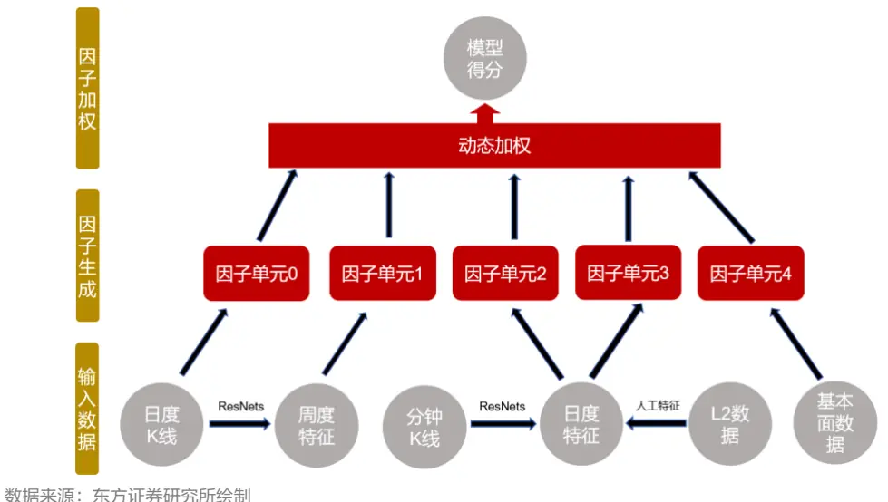

注意到上述过程中的因子单元动态加权阶段，我们通过决策树对所生成的弱因子进行短周期加权，这样虽然能够很好的捕捉 alpha 因子的时变性，但是当短期市场状态市场风格发生突变时，有关分析师的申明，见本报告最后部分。其他重要信息披露见分析师申明之后部分，或请与您的投资代表联系。并请阅读本证券研究报告最后一页的免责申明。

模型很有可能学习到错误的规律从而造成巨大的回撤。为了克服上述问题，参考文献 [1,2] 的做法，我们设计了一套两阶段的端到端因子生成和因子加权模型，我们称之为自适应动态因子加权模型（Adaptive Dynamic Factor Weighting Model & ADWM）。该模型通过学习市场上长期历史数据既捕捉alpha信息，又根据市场状态和个股属性信息学习alpha因子的时变规律来对alpha因子进行加权，以期在市场风格发生剧烈突变的时候因子能有较为稳定的表现。

## 一、ADWM模型细节

## 1.1 ADWM模型框架概览

本报告提出了一个完全端到端的网络架构，该架构由两个部分构成分别为多因子生成部分和多因子加权部分，其中多因子生成部分主体结构为 RNN+图模型同时生成 alpha 因子和风险因子，该风险因子既包含了市场状态信息也包含了个股的属性信息。而多因子加权部分我们则使用风险因子作为输入为所有 alpha 因子学习出一个权重函数，最后通过个股的 alpha 因子及其对应的权重函数我们最终得到个股的每日的打分值。该模型框架如下图所示：

图 2：ADWM模型框架概览
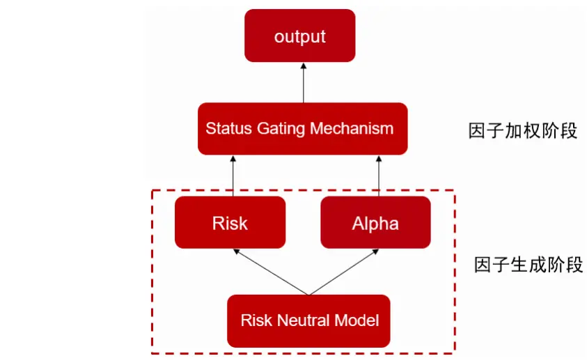
数据来源：东方证券研究所绘制
下面四节我们将对 ADWM模型的每个阶段的网络结构损失函数以及设置目标进行介绍。

## 1.2 协同挖掘模型（ABCM）

首先在生成alpha和风险因子阶段，我们使用了前期报告《ABCM：基于神经网络的alpha和beta 因子协同挖掘模型》中的网络结构，输入特征为《基本面因子重构》报告中的一些基本面因子和一些长周期 barra 量价风险因子。在此基础上对模型结构和损失函数进行了一些调整，该模型整体结构如下：

图 3：ABCM模型结构
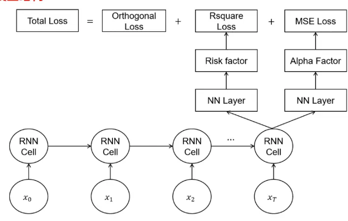
数据来源：东方证券研究所绘制

使用该模型主要目标在于学习出一批市场上具有普适性、长期有效的 alpha 信息。模型结构中alpha因子部分主要是对特质收益率的相对大小和方向同时进行拟合，其对应的NN-Layer为简单的全连接层，而其对应的损失函数为与原始收益率的MSE损失。而风险因子主要是对可被解释收益率绝对值的相对大小进行拟合，其对应的损失函数为 Rsquare，其对应的 NN-Layer 为具有非对称图结构的 ASTGNN结构，该非对称图结构具有如下数学表达式：

$$
\begin{aligned}\mathrm{adj\_matrix}=ReLU(\mathrm{full\_diagonal}(M_1M_2^T)),whereM_i=W_iX,i=1,2,\\\boldsymbol{H}=\boldsymbol{X}+softmax(\mathrm{adj\_matrix})M_3\\\boldsymbol{F}_{K_i}=\boldsymbol{W}_3(\boldsymbol{H}+\boldsymbol{H}[-1]+\boldsymbol{H}[-2])\end{aligned}
$$

这里矩阵 X 表示最后一个 RNN-Cell 的输出的风险因子部分，矩阵 $M_{1}$ $M_{2}$ 和 $M_{3}$ 分别为矩阵 X经过不同参数的全连接变换得到的，矩阵 $M_{1}$ 、 $M_{2}$ 和 $M_{3}$ 的规模均为 $\mathbb{I}\times\mathbb{M}$ ，N 表示截面股票个数，M 表示生成风险因子的个数， $W_{1},W_{2},W_{3}$ 均为全连接层的权重参数， $\pmb{H}[-\pmb{1}],\pmb{H}[-\pmb{2}]$ 分别表示过去两期模型生成的风险因子向量。与前期报告不同的是我们不再通过损失函数端加入因子自相关惩罚来保证风险因子自相关性，而是通过网络内部进行风险因子滚动平滑操作来保证风险因子自相关性，这种方式有助于降低损失函数复杂度从而更加有助于提升模型收敛能力。根据上述过程，该模型训练的损失函数则可定义为：

$$
\begin{aligned}&Loss=MSE(\boldsymbol{F}_{:K},y_1)+Rsquare(\boldsymbol{F},y_2)+\lambda\left\|corr(\boldsymbol{F},\boldsymbol{F})\right\|\\&\\&\quad Rsquare(\boldsymbol{F},y_2)=1-\frac{||y_2-\boldsymbol{F}(\boldsymbol{F}^T\boldsymbol{F})^{-1}\boldsymbol{F}^T\boldsymbol{y}_2||^2}{\|y_2\|^2}\\\end{aligned}
$$

其中，我们设定生成的因子中前 K 个为 alpha 因子，K 以后 M 个为风险因子， $F$ 为所有股票对应因子的矩阵，该矩阵的规模为 $\mathrm{N}\times(K+M)$ ， $y_{1}$ 和 $y_{2}$ 为不同频率的原始收益率标签， λ 是人工调节的超参数。注意到上述 Rsquare 损失函数分子部分需要计算矩阵逆的导函数，矩阵 $A^{-1}$ 的导函数十分容易可以算出具有以下表达式：

$$
\cfrac{d\pmb{A}^{-1}}{dt}=-\pmb{A}^{-1}\cfrac{d\pmb{A}}{dt}\pmb{A}^{-1}
$$

因此计算矩阵逆的导函数难点在于计算 $\pmb{A}^{-1}$ 本身。我们通常使用 torch.inverse()这个函数来计算矩阵的逆，其算法原理是高斯消元通过求解 n 个线性方程组来求逆，因此该算法效率十分低下，加之高斯消元的时候涉及到行变换因此该算法存在一定的精度问题。

Cholesky 分解及求逆：对称正定矩阵具有较为良好的性质，因此区别于普通可逆方阵其具有效率和精度更高的求逆算法。类似 LU分解，Cholesky分解核心思想是对称正定矩阵 A 可以分解为

$$
\boldsymbol{A}=\boldsymbol{L}\boldsymbol{L}^{T}
$$

这里矩阵 L 为下三角矩阵。有了上述分解以后，对称正定矩阵 A 求逆的过程可以等价于求解下三角矩阵 L 的逆矩阵，而这个过程则可以通过求解线性方程组 LTX = I 实现（其中 I 表示单位矩阵），与高斯消元法对比，Cholesky分解具有以下优势：

1. 计算量小：高斯消元计算量为 $1O(n^{3})$ ，Cholesky 分解仅为 $O(\frac{1}{3}n^{3})$

2. 存储空间小：由于Cholesky分解仅需储存三角矩阵，因此存储空间仅需高斯消元算法的一半；

3. 精度高：高斯消元涉及矩阵行变换，因此矩阵规模越大计算逆矩阵精度越差，而 Cholesky 分解不涉及矩阵行变换故而精度更高。

## 1.3基于排序学习的损失函数

注意到在训练前述提到的风险中性模型时，我们使用的原始收益率标签，站在选股的角度来说我们更关注股票相对排序而不是股票本身的绝对收益，另外一方面，原始收益率数据中噪声含量相对较高，直接使用作为标签可能会降低模型性能，为了克服上述问题，我们在MSE损失端引入了一项排序损失作为正则项。该排序损失是通过依据文献 [3] 的训练 RankNet 的损失函数来实现的。这种排序损失的核心思想是给定一个股票对 (i，j) ，使用以下函数来度量 Rank RNN模型预测股票 i 的序关系高于j 的概率

$$
P_{i,j}=P(i\succ j)=\frac{1}{1+\exp\left(-\sigma(y_{i}-y_{j})\right)},
$$

这里 $y_{i}$ 为 RNN 模型对股票 i 的预测结果， $i\succ j$ 表示股票 i 的序关系高于股票 $j_{\mathrm{~c~}}$ 。我们使用 $\overline{{\mathrm{P}}}_{\mathrm{i},\mathrm{j}}\in$ {0,1/2,1} 来表示真实股票 i 的序关系高于股票j 的概率（0 表示实际股票 i 的序关系低于 $j$ ，1/2表示序关系相等，1表示 i 的序关系高于j）。最后我们使用以下 BCE损失函数

$$
C_{i,j}=-\bar{P}_{i,j}\mathrm{log}P_{i,j}-\big(1-\bar{P}_{i,j}\big)\mathrm{log}\big(1-P_{i,j}\big)
$$

来度量一个股票对序关系真实概率与预测概率之间的差。训练时为了提升极小化上述排序损失的计算效率，我们采用了文献 [3] 第 2.1节加速方法，通过相关计算，排序损失 $\begin{array}{r}{\sum_{\mathrm{j}=1}^{\mathrm{n}}\sum_{\mathrm{i}=1}^{\mathrm{n}}C_{i,j}}\end{array}$ 关于神经网络参数 $w_{k}$ 的导函数可表示为 $\textstyle\sum_{i}\lambda_{i}{\frac{\partial y_{i}}{\partial w_{k}}}_{\circ}$ 。这里

$$
\lambda_{i}=\sum_{\{i,j\}\in I}\lambda_{i,j}-\sum_{\{j,i\}\in I}\lambda_{j,i}
$$

$$
\lambda_{i,j}=\sigma\left(\frac{1-\mathrm{sign}\left(\hat{y}_{i}-\hat{y}_{j}\right)}{2}-\mathrm{sigmoid}\left(y_{i}-y_{j}\right)\right)\circ
$$

有关分析师的申明，见本报告最后部分。其他重要信息披露见分析师申明之后部分，或请与您的投资代表联系。并请阅读本证券研究报告最后一页的免责申明。

通过上述公式不难发现，我们只需要通过加减乘除计算出变量 $\lambda_{i}$ ，然后再通过对 RNN 输出进行反向传播 n 次计算出 $\frac{\partial y_{i}}{\partial w_{k}}$ 即可求出排序损失的梯度。这意味着我们增加排序正则项后不会增加反向传播次数的量级，其量级依旧为 $O(n)$ 。损失函数则可定义为：

$$
Loss=MSE(\boldsymbol{F}_{:K},y_1)+\lambda_1\sum_{j=1}^{\mathrm{n}}\sum_{i=1}^{\mathrm{n}}C_{i,j}\\+Rsquare(\boldsymbol{F},y_2)+\lambda_2\left\|corr(\boldsymbol{F},\boldsymbol{F})\right\|
$$

这里 $\lambda_{1}$ 和 $\lambda_{2}$ 是两个超参数。

## 1.4 状态门控机制（Status Gating Mechanism）

传统多因子模型是量化选股中一类重要的模型，在传统多因子模型中，给定一系列个股的选股因子 $\{\alpha_{1},\alpha_{2},\dots,\alpha_{\mathrm{n}}\}$ ，个股的最终得分或预期收益率 r̂ 通常可以表示为：

$$
\hat{r}=\sum_{k}\lambda_{k}\alpha_{k}
$$

其中因子 $\alpha_{k}$ 的权重系数 $\lambda_{k}$ 构建方式通常有等权、RankIC 加权、ICIR 加权、最优化夏普比率加权等等，但这些方法仅通过单因子历史表现来为未来因子分配权重，过分依赖于因子表现的“动量效应”，因而具有一定的局限性。我们认为因子的权重系数受市场状态、个股基本属性影响，比如经济高速发展、市场流动性较好时，成长类因子通常比价值类因子有更好的表现，同一市场状态下，价值类因子通常在小盘股股票池上有较好的表现。因而我们认为在构建因子权重时有必要考虑到这些额外的影响因素。

在本报告中，我们使用状态门控机制（SGM）[1、2] 为所生成的一系列低相关 alpha 因子生成权重系数， 该机制下多因子加权的数学表达式可表示为：

$$
\hat{r}={\sum}_{k}\lambda_{k}(s)\alpha_{k}(x),
$$

其中 $\alpha_{k}(x)$ 表示前述RNN模型生成的alpha因子，x 表示输入特征， $\lambda_{k}(s)$ 表示SGM为个股第k个 alpha 因子生成的权重，s 为个股的 embedding，其既包含了个股的属性信息也包含了市场信息，因此该机制下不同时期的同一股票以及相同时期的不同股票同一 alpha 因子的权重值互不相同。我们通常可以取RNN的输出或者人工构建的特征作为这里的s 。对于常规的门控机制下权重$\lambda_{k}(s)$ 可表示为如下形式：

$$
\lambda_{k}(s)=Softmax(FFN(s))
$$

这里 FFN 表示全连接网络，其权重可学习。由于通常 RNN 模型生成的 alpha 因子对未来收益率方向预测为正，因此我们使用的 Softmax 激活函数，在这个机制下所有 alpha 因子权重为正，且由于 Softmax 自身归一化作用，因此 alpha 因子权重不会出现异常大值。若输入因子包含风格因子（短期因子对未来收益率的预测方向不变，长期对未来收益率的预测方向时正时负）则可将激活函数 Softmax替换为 tanh。整个状态门控机制的结构可表示为如下形式：

图 4：门控机制结构
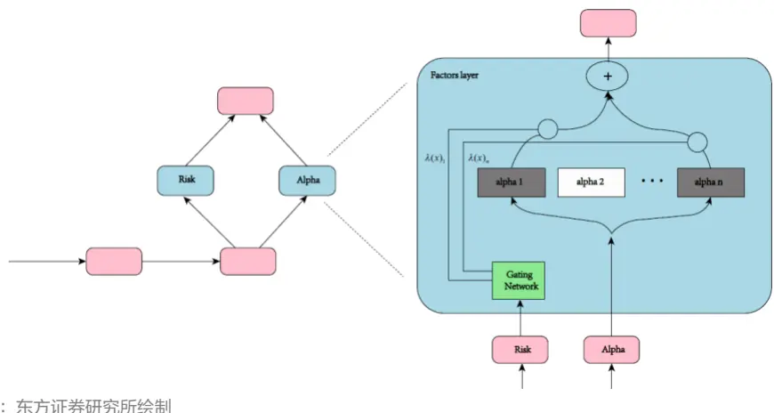
数据来源：东方证券研究所绘制

另外一方面，不同alpha因子表示不同的alpha信息源，当所生成的alpha因子数量过多时，在特殊市场状态下，某些 alpha 因子可能会出现失效的风险，所有 alpha 因子均参与加权并不合理，且随着所生成 alpha 因子数量上升时，模型参数数量也回大幅上升，这也会造成模型的过拟合问题。综上我们在常规的门控机制下引入了噪声 TopK门控（Noisy TopK Gating）机制，该机制主要对常规门控机制引入了一个噪声层和一个 TopK层

$$
\begin{aligned}NoisyLayer(s)\;&=\;FFN(s)+SoftPlus(FFN_{noise}(s))\cdot\varepsilon\\TopKLayer(s_{i},k)\;&=\;s_{i}\;if\;s_{i}\;is\;in\;the\;topK\;element\;else\;-\;\infty\\\lambda_{k}(s)&=Softmax(TopK\;Layer(Noisy\;Layer(s)_{i},k))\end{aligned}
$$

这里 $FFN_{noise}$ 表示可学习参数的全连接层，其用于计算添加噪声各分量的标准差，激活函数$SoftPlus$ 保证所学习的标准差参数均为正数，ε 为均值为 0 标准差为 1 的正态分布随机数。随机层作用在于通过添加各项异性的随机向量，降低模型过分的依赖于某几个 alpha 因子以及模型对输入的敏感性从而提升模型的泛化能力。而TopK层的目标是通过保留贡献度最大的几个alpha因子降低模型的冗余程度。

## 1.5 门控机制损失函数设计

状态门控机制损失函数主要由两项构成，第一项为最终预测结果和真实收益率标签计算 MSE损失。在此基础上为防止出现 logits 太大，在 softmax 计算过程中可能会导致数值不稳定，影响模型的训练效果，甚至可能导致数值溢出，因此我们额外添加第三项正则损失称之为 Router z-loss，其具体表达式为：

$$
L_{RZ}(s)=\mathrm{KL}(P(s)||Q(s))=\frac{1}{K}\sum_{k}log(\lambda_{k}(s))+C
$$

这里 P(s) 表示模型学习出的各个 alpha 因子权重分布函数， Q(s) 表示均匀分布的概率密度函数，C 表示一个常数，其对损失函数求导不产生任何影响因此可忽略。Router z-loss 构建的核心想法是希望模型学到的各个 alpha 因子权重分布函数与等权的分布函数不会有过大的差异，当存在某个 alpha因子的 logit较其他logit过大时，该项损失可以对其产生抑制，从而可以保证各个权重可以稳定分布在一定范围内使得模型训练更加平滑。门控机制总的损失函数则可以表示成为：

$$
Loss=MSE(\hat{r},y)+\lambda_1L_{RZ}(s)
$$

这里 λ 是超参数，y 是中性化之后的收益率标签。

## 二、各模型单因子分析

## 2.1回测说明

本文的回测结果中，若不做特殊说明，各项指标计算方法如下所示：

1. RankIC均值是当天因子与隔日未来十日收益率（T+1~T+11收盘）序列进行计算的，并且每隔十个交易日计算一次，最终将这个 RankIC序列取平均得到的。

2. ICIR则是根据上述 RankIC序列均值除以序列标准差计算得到的。

3. 分组测试结果中，计算 top组的年化超额收益，中证全指股票池上我们是将股票池分成 20组，而沪深 300、中证 500和中证 1000股票池上则是分成 10组，基准则是成分股等权，周度调仓，次日收盘价成交并且不考虑交易成本计算得到的。

4. 多头组周均单边换手率是根据多头组持仓计算得到，而最大回撤和年化波动率则是根据top组超额收益净值计算得到的。

5. 各个股票池均剔除了北交所股票以及上市天数较短的股票。

本文将对比以下五种模型，通过各模型分年度表现展示不同市场状态下，何种模型将会表现的更优：

Model1：为基准模型，《融合基本面信息的 astgnn因子挖掘模型》中的 Model2的调整版。

Model2：将 ABCM模型生成的风险因子进行短周期加权合成得到的因子。

Model3：将 ABCM模型生成的 alpha因子通过 ADWM进行长周期加权合成得到的因子。

Model4：为《ABCM：基于神经网络的 alpha 和 beta 因子协同挖掘模型》中的 Model1 的调整版（各个数据集由 ABCM模型生成的所有因子均参与加权）。

Model5：为 Model3和 Model4所得因子按照一定比例进行加权合成最终得分。

## 2.2因子中证全指绩效分析

首先，本节我们将展示上述五个模型生成的因子在中证全指股票池上的选股效果以及各年度最大回撤区间。表现分成 2018年至 2023年和 2024年以来两段进行展示。

图 5：各模型生成因子汇总表现（回测期 20171229~20241231）
20171229~20231229

|  | RanklC | ICIR |  | RankIC胜率 Top组超额收益 |  | Top组周度换手率 Top组超额最大回撤 |
| --- | --- | --- | --- | --- | --- | --- |
| Model1 | 16.51% | 1.54 | 93.79% | 50.12% | 58.67% | -6.61% |
| Model2 | 12.89% | 1.29 | 87.59% | 46.40% | 64.92% | -9.83% |
| Model3 | 15.00% | 1.36 | 90.34% | 39.62% | 48.54% | -7.31% |
| Model4 | 16.34% | 1.65 | 95.86% | 54.03% | 60.25% | -5.70% |
| Model5 | 16.56% | 1.65 | 95.86% | 52.69% | 58.54% | -5.67% |

20231229~20241231

| RankiC | Top组超额收益 Top组周度换手率 Top组超额最大回撤 |  |  |  |
| --- | --- | --- | --- | --- |
| Model1 | 11.79% | 13.51% | 59.11% | -21.19% |
| Model2 | 12.27% | 19.46% | 66.91% | -16.44% |
| Model3 | 13.76% | 45.48% | 44.81% | -10.24% |
| Model4 | 13.80% | 31.46% | 62.10% | -19.05% |
| Model5 | 14.23% | 35.30% | 60.94% | -18.18% |

数据来源：wind、上交所、深交所、东方证券研究所

图 6：各模型多头超额分年度超额表现

|  | Model1 | Model2 | Model3 | Model4 | Model5 |
| --- | --- | --- | --- | --- | --- |
| 2018 | 98.70% | 92.64% | 81.27% | 106.26% | 105.90% |
| 2019 | 45.61% | 32.15% | 30.94% | 44.00% | 44.85% |
| 2020 | 42.13% | 33.01% | 35.12% | 41.80% | 41.90% |
| 2021 | 34.10% | 49.15% | 34.49% | 43.85% | 43.80% |
| 2022 | 54.10% | 52.77% | 50.53% | 62.24% | 62.03% |
| 2023 | 33.57% | 26.60% | 13.29% | 34.65% | 27.42% |
| 2024 | 13.45% | 19.46% | 45.25% | 31.31% | 35.13% |

数据来源：wind、上交所、深交所、东方证券研究所

图 7：各模型多头超额最大回撤发生时间区间

|  | Model1 | Model2 | Model3 |
| --- | --- | --- | --- |
| 2018 | 2018-08-13 - 2018-08-17 | 2018-02-05 - 2018-02-09 | 2018-03-22 - 2018-03-23 |
| 2019 | 2019-05-10 - 2019-06-10 | 2019-08-15 - 2019-09-26 | 2019-05-28 - 2019-06-10 |
| 2020 | 2020-09-01 - 2020-09-09 | 2020-09-01-2020-09-09 | 2020-06-16 - 2020-07-09 |
| 2021 | 2021-09-23 - 2021-11-29 | 2021-02-10-2021-03-01 | 2021-09-29-2021-11-29 |
| 2022 | 2022-04-06 - 2022-04-26 | 2022-07-07 - 2022-07-12 | 2022-04-01 - 2022-04-26 |
| 2023 | 2023-04-27 - 2023-05-12 | 2023-04-25 - 2023-05-16 | 2023-08-28 - 2023-11-15 |
| 2024 | 2024-01-09 -2024-02-07 | 2024-01-17 -2024-02-27 | 2024-04-02 - 2024-04-16 |

数据来源：wind、上交所、深交所、东方证券研究所

图 8：各模型多头超额走势（20171229~20231231）
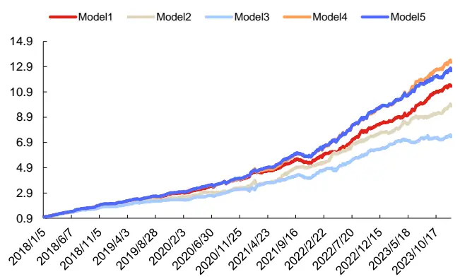
数据来源：wind、上交所、深交所、东方证券研究所

图 9：2024年各模型超额走势
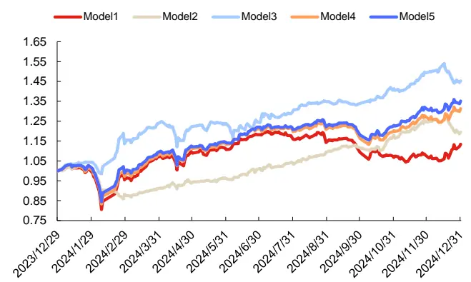
数据来源：wind、上交所、深交所、东方证券研究所

## 通过上述图表结果，我们可以看出：

1. Model2 使用生成的风险因子进行短周期加权，所合成的得分依然有较好的选股表现，RankIC 可达 12.89%，这说明风险因子和未来收益率是否同向有可预测性，因此可将风险信息一定程度转化为具有选股能力的 alpha 信息。对比 Model2 和 Model3 来看，Model3 因子的 RankIC 可达 15.00%，显著好于 Model2，这说明通过学习长时间 A 股市场的 alpha 信息所得到的 alpha 因子长期对股票排序的预测能力更强。

2. Model2因子年化多头超额收益率可达46.40%，显著好于Model3，上述结果说明对所谓的风险因子进行轮动可以使得多头有着极端的高收益。

3. 通过将ABCM模型挖掘出的因子加入到 Model1框架中，可以有效的提升模型表现，2018年至 2023 年，年化多头超额提升了 3.91%，ICIR 提升了 0.11，2024 年年化多头超额提升了17.95%，这两个时间段上模型的回撤也有所改善，说明 ABCM 模型挖掘到了一些普通 RNN所难以获得的信息，从而能有效提升模型的稳定性和获取超额收益的能力。

4. 通过观察 Model3 和 Model4 进一步融合得到的 Model5 因子表现，我们可以看出融合后新因子对未来收益率排序的预测能力进一步加强，RankIC和多头组超额最大回撤等指标得到了进一步的改善。但加入 Model3因子也会稀释 Model4中学习到的轮动信息占比，因此可以看出Model5因子的多头年化超额有明显下降。

5. 从分年度回撤与各模型超额净值走势来看，2021年2月10日前A股市场以成长风格为主导，相关类型股票表现十分强劲，而2021年春节后，A股市场风格发生剧烈切换，成长风格股票普遍回调，与之对应的 Model2 因子超额在 2021 年 2 月 10 日前走势十分强，超额净值曲线劲斜率大幅高于平均斜率，而在 2月 10日以后超额出现大幅回撤，而 Model3的因子则在此期间表现相反。

6. 2023 年小市值风格达到极致，因子收益率较高，而 2024 年 1 月下旬至 2 月上旬市场发生风格切换，小市值因子多头大幅回撤，在此期间 Model1 和 Model2 因子 2023 年表现良好而2024 年 2 月则出现了较大幅度的回撤，与之对应的 Model3 的因子 2023 年表现欠佳，而2024 年回撤幅度较小，这说明当市场上某种风格达到极致的时候 Model1 和 Model2 因子拥有能够较高获取超额收益的能力，而市场风格发生剧烈切换的时候这两个因子则容易发生回撤。而 Model3 因子由于长期在各个风格上暴露相对稳定，因此风格比较极致的时候容易出现超额回撤，而市场风格发生切换时则表现相对稳定。

## 2.3因子宽基指数绩效分析

这一节我们统计了各个模型在沪深300、中证500和中证1000成分股内上多头组合的表现如下图所示：

图 10：因子宽基指数上的表现（回测期 20171229~20241231）

| 沪深300 |  |  |  |  |  |  |
| --- | --- | --- | --- | --- | --- | --- |
|  | RanklC | ICIR |  |  |  | RanklC胜率 Top组超额收益 Top组周度换手率 Top组超额最大回撤 |
| Model1 | 11.84% | 0.68 | 78.70% | 33.21% | 49.37% | -14.60% |
| Model2 | 6.94% | 0.45 | 63.91% | 17.37% | 57.65% | -11.66% |
| Model3 | 9.53% | 0.62 | 72.19% | 21.51% | 48.18% | -8.96% |
| Model4 | 11.31% | 0.67 | 76.92% | 30.24% | 51.86% | -14.65% |
| Model5 | 11.58% | 0.69 | 77.51% | 32.07% | 50.97% | -13.36% |

中证500

|  | RankiC | ICIR | RankIC胜率 | Top组超额收益 | Top组周度换手率 | Top组超额最大回撤 |
| --- | --- | --- | --- | --- | --- | --- |
| Model1 | 11.89% | 0.84 | 79.88% | 27.06% | 51.19% | -20.72% |
| Model2 | 9.25% | 0.69 | 73.96% | 23.97% | 57.74% | -8.91% |
| Model3 | 10.28% | 0.79 | 80.47% | 19.21% | 45.35% | -13.15% |
| Model4 | 12.07% | 0.88 | 82.84% | 27.09% | 53.03% | -16.36% |
| Model5 | 12.21% | 0.89 | 82.25% | 26.75% | 51.99% | -16.32% |

中证1000

|  | RanklC | ICIR | RankIC胜率 | Top组超额收益 | Top组周度换手率 | Top组超额最大回撤 |
| --- | --- | --- | --- | --- | --- | --- |
| Model1 | 14.84% | 1.14 | 86.98% | 36.75% | 52.09% | -17.80% |
| Model2 | 12.24% | 1.03 | 84.02% | 37.05% | 59.36% | -6.61% |
| Model3 | 13.56% | 1.12 | 87.57% | 31.82% | 45.68% | -7.96% |
| Model4 | 15.07% | 1.21 | 88.17% | 40.61% | 54.19% | -10.85% |
| Model5 | 15.26% | 1.23 | 88.17% | 41.23% | 53.04% | -10.25% |

数据来源：wind、上交所、深交所、东方证券研究所

图 11：沪深 300 多头超额走势（20231229~20241231）
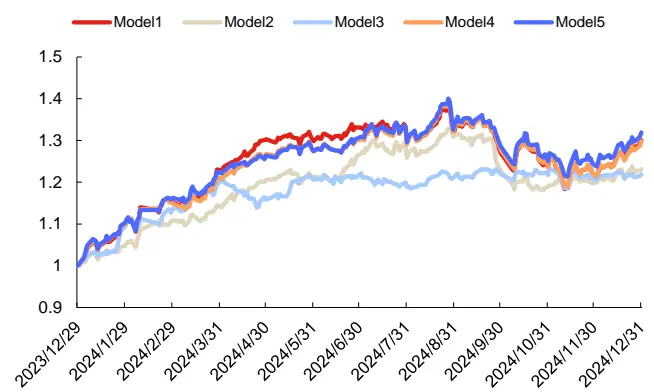
数据来源：wind、上交所、深交所、东方证券研究所

图 12：中证 500 多头超额走势（20231229~20241231）
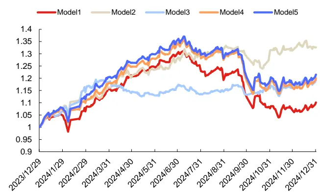
数据来源：wind、上交所、深交所、东方证券研究所

有关分析师的申明，见本报告最后部分。其他重要信息披露见分析师申明之后部分，或请与您的投资代表联系。并请阅读本证券研究报告最后一页的免责申明。

图 13：中证 1000 多头超额走势（20231229~20241231）
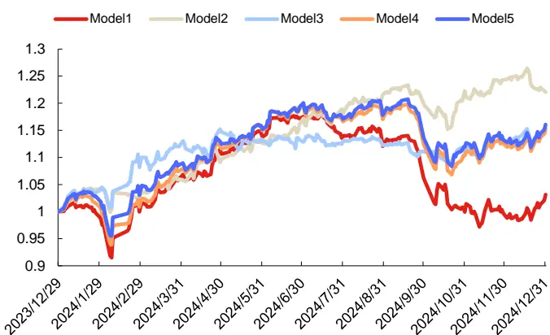
数据来源：wind、上交所、深交所、东方证券研究所

通过上述图表结果，我们可以看出：

1. 沪深 300 上长期以来 Model1 因子表现最好，RankIC、RankIC 胜率、Top 组超额均最高。

2. 中证 500 和中证 1000 上，相较于 Model1，Model4 和 Model5 因子选股能力均有一定的提升，而从稳定性角度来看 Model2表现最佳，Top组超额最大回撤显著低于其他因子。

3. 稳定性角度来看，各宽基指数上，2024 年 Model3 因子表现最佳，Top 组超额最大回撤最小，但下半年超额曲线走势均较平。而 Model2因子 2024年虽然具有一定的回撤但超额表现最好。

## 2.4 各模型因子暴露分析

这一节我们统计了各模型因子与十个 barra因子相关性情况，结果如下：

图 14：各模型因子暴露分析

|  | Model1 | Model2 | Model3 | Model4 | Model5 |
| --- | --- | --- | --- | --- | --- |
| Size | -3.13% | -3.45% | -10.12% | -3.51% | -4.47% |
| Beta | -2.53% | -2.64% | -3.25% | -2.75% | -2.92% |
| Volatility | -20.44% | -17.34% | –25.35% | -20.79% | -21.97% |
| Liquidity | -12.44% | -9.02% | -10.20% | -12.20% | -12.27% |
| Value | 14.77% | 10.74% | 18.66% | 14.46% | 15.42% |
| Certainty | 11.63% | 6.25% | 6.22% | 10.57% | 10.29% |
| CubicSize | -12.03% | -11.99% | -21.22% | -12.91% | -14.38% |
| Trend | -1.57% | -2.39% | -13.94% | -2.00% | -3.61% |
| Growth | 4.00% | 1.67% | 2.87% | 3.51% | 3.54% |
| SOE | -2.76% | -2.05% | -2.54% | -2.71% | -2.77% |

数据来源：wind、上交所、深交所、东方证券研究所

通过上图结果，我们可以看出：

1. Model3因子在小市值、非线性市值、低波动率、低估值这四个风格上相关性显著高于其他几个模型，具体原因可能是 Model3 因子根据长期 A 股市场数据学习得到的 alpha 因子，而 A股市场长期小市值、低波、低估值是具有 alpha 收益的因此该因子在这几个风格上会出现持续稳定的暴露。

有关分析师的申明，见本报告最后部分。其他重要信息披露见分析师申明之后部分，或请与您的投资代表联系。并请阅读本证券研究报告最后一页的免责申明。

2. Model1 具有一定的风格择时能力，2021 年 4 月以前整体偏向于大盘，2021 年 4 月至 2024年 5月偏向于小盘。Model1在成长风格上也有类似表现。

3. 相较于另外几个模型，Model2 因子关于这十个 barra 风格的相关性显著更低，其原因在于Model2 因子是短周期风险信息加权得到的因子，因此其 alpha 来源于轮动的占比相对较高，长期由于各种风格轮动正负抵消使得其与风格因子长期平均相关性显著更低。并且Model2对市场状态变化更加敏感，2024年2月7日Model1、Model3与市值因子相关性分别为-79.59%、-51.07%，而 Model2则能在短期内由小盘快速切换至大盘相关性为 32.81%。

图 15：各模型时序市值因子暴露情况（回测期 20171229~20241231）
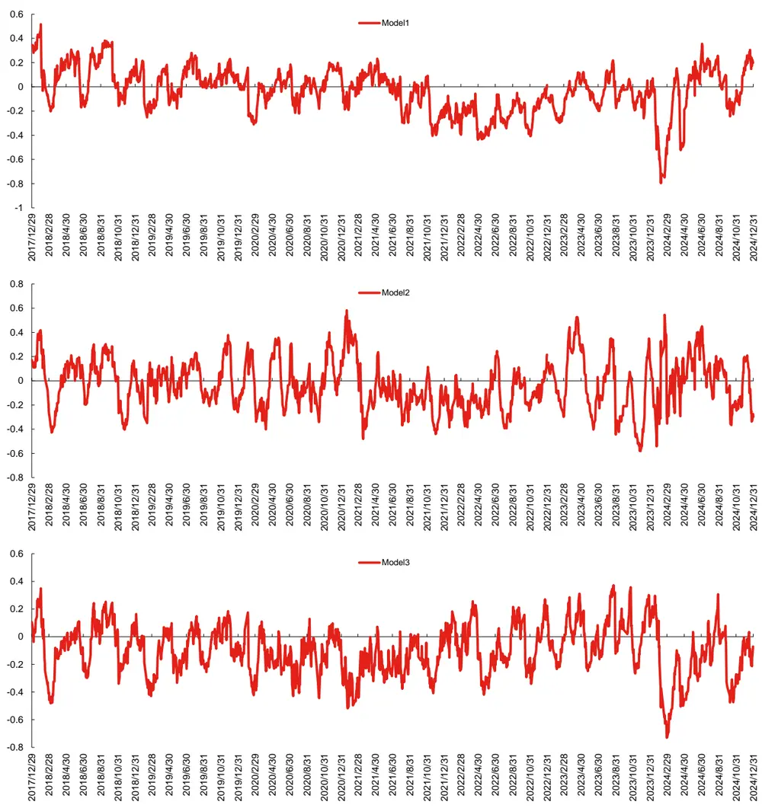
数据来源：wind、上交所、深交所、东方证券研究所

有关分析师的申明，见本报告最后部分。其他重要信息披露见分析师申明之后部分，或请与您的投资代表联系。并请阅读本证券研究报告最后一页的免责申明。

## 2.5 各模型因子相关系数分析

这一节我们绘制了各个模型生成因子的相关系数矩阵如下图所示，相关性计算方式为每日因子向量计算相关系数，然后时序上取平均：

图 16：各模型相关性分析

|  | Model1 | Model2 | Model3 | Model4 | Model5 |
| --- | --- | --- | --- | --- | --- |
| Model1 | 100.00% | 70.45% | 73.77% | 96.38% | 96.19% |
| Model2 | 70.45% | 100.00% | 60.44% | 85.53% | 84.70% |
| Model3 | 73.77% | 60.44% | 100.00% | 75.10% | 80.60% |
| Model4 | 96.38% | 85.53% | 75.10% | 100.00% | 99.62% |
| Model5 | 96.19% | 84.70% | 80.60% | 99.62% | 100.00% |

数据来源：wind、上交所、深交所、东方证券研究所

## 上述结果我们可以看出：

1. Model2 与 Model3 的因子相关性较低，这说明长期稳定的 alpha 收益来源和通过轮动得到alpha收益存在着较大的差异，二者可以起到互补作用。

2. Model1 与 Model2 和 Model3 的因子均存在一定的相关性但相对并不高，这说明 Model2 和Model3 的信息 Model1 的因子一定程度上均能有效学习到，但 Model2 和 Model3 仍然能对Model1因子的信息起到补充作用。

## 三、各模型因子行业轮动绩效分析

本章将展示各模型因子应用于行业轮动策略的绩效表现：

因子合成方法：将选股因子按照行业进行聚合形成行业的得分，权重设置为个股的流通市值。

备选行业池：剔除综合、综合金融后的 28个中信一级行业。

组合构建方式：分组数量为5组，基准为 28个行业收益率等权，调仓频率为周频。

以下是各个模型对应的回测结果：

图 17：各模型行业轮动汇总表现（回测区间 20171229~20241231）

| RankiC | ICIR | RankIC胜率 多头年化超额 多头周度超额胜率 |  |  |  |
| --- | --- | --- | --- | --- | --- |
| Model1 | 12.03% | 0.39 | 65.08% | 28.17% | 66.67% |
| Model2 | 9.00% | 0.31 | 64.01% | 14.25% | 58.40% |
| Model3 | 7.83% | 0.25 | 60.89% | 17.22% | 61.06% |
| Model4 | 12.48% | 0.42 | 66.48% | 25.41% | 61.90% |
| Model5 | 12.45% | 0.42 | 66.48% | 28.44% | 63.31% |

数据来源：wind、上交所、深交所、东方证券研究所

图 18：各模型 Top 组行业超额走势（回测区间 20171229~20241231）
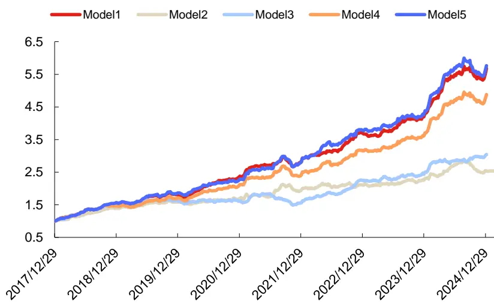
数据来源：wind、上交所、深交所、东方证券研究所

通过上述图表结果我们可以看出：

1. Model2 因子的行业 RankIC、ICIR 指标显著高于 Model3 因子，这说明 Model2 因子来自行业轮动的信息占比更高。

2. 通过将 ABCM 模型生成的所有因子参与短周期加权有助于进一步提升模型行业轮动能力，相较于 Model1，Model4 的行业 RankIC 提高了 0.45%，较为显著。

3. 通过将长周期学习得到的 alpha 纳入框架，可能会导致所学到的行业轮动信息被稀释，相较于 Model4，Model5 的行业 RankIC 有所下滑。

## 四、合成因子指数增强组合表现

## 4.1增强组合构建说明

本章将展示了各个模型生成因子在沪深300、中证500和中证1000指数增强的应用效果，关于指数增强组合有如下说明：

1） 回测期20180101~20241231，组合周频调仓，假设根据每周五个股得分在次日以vwap 价格进行交易，股票池为中证全指。

2） 风险因子库dfrisk2020（参见《东方A股因子风险模型（DFQ-2020）》）的所有风格因子相对暴露不超过 0.5，所有行业因子相对暴露不超过 2%，中证 500 增强跟踪误差约束不超过 5%，沪深 300 增强跟踪误差约束不超过 4%。

3） 指增策略组合构建时，限制指数成分股占比，成分股占比约束为 80%，周单边换手率限制记为 20%。

4） 组合业绩测算时假设买入成本千分之一、卖出成本千分之二，停牌和涨停不能买入、停牌和跌停不能卖出。

## 4.2 沪深 300 指数增强

本节将展示各个模型生成因子在沪深 300 指数增强策略应用，首先我们展示各年度超额收益以及汇总的业绩表现以及 Model4和 Model5因子的超额净值走势：

图 19：沪深 300 指增组合汇总表现（20171229~20241231）

|  | 年化收益 | 年化波动率 | 信息比率 | 胜率 | 最大回撤 | 平均持股数量 |
| --- | --- | --- | --- | --- | --- | --- |
| Model1 | 14.96% | 5.00% | 2.82 | 66.39% | -7.39% | 85.51 |
| Model4 | 16.82% | 4.93% | 3.18 | 69.40% | -7.18% | 83.78 |
| Model5 | 16.74% | 4.92% | 3.17 | 68.85% | -6.71% | 83.56 |

数据来源：wind、上交所、深交所、东方证券研究所

图 20：沪深 300 指增组合分年度超额收益率（20171229~20241231）

|  | Model1 | Model4 | Model5 |
| --- | --- | --- | --- |
| 2018 | 29.14% | 33.62% | 31.93% |
| 2019 | 6.42% | 5.97% | 5.15% |
| 2020 | 15.36% | 14.73% | 10.60% |
| 2021 | 18.90% | 21.00% | 22.94% |
| 2022 | 23.28% | 22.75% | 24.05% |
| 2023 | 12.88% | 14.60% | 15.24% |
| 2024 | 1.03% | 7.24% | 9.42% |

数据来源：wind、上交所、深交所、东方证券研究所

图 21：Model4 因子沪深 300指增组合净值走势（净值左轴，回撤右轴）
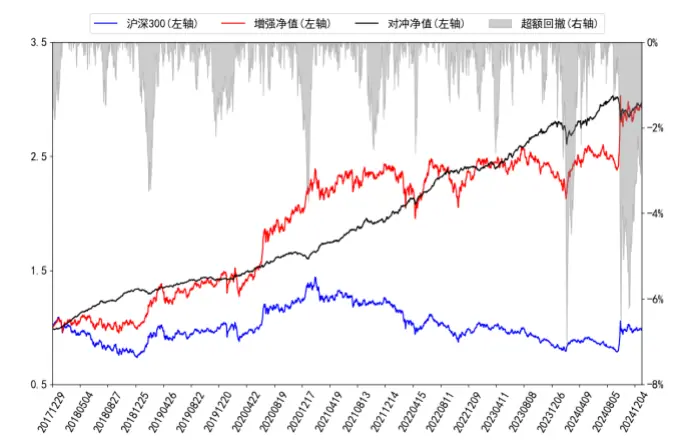
数据来源：wind、上交所、深交所、东方证券研究所

图 22：Model5 因子沪深 300指增组合净值走势（净值左轴，回撤右轴）
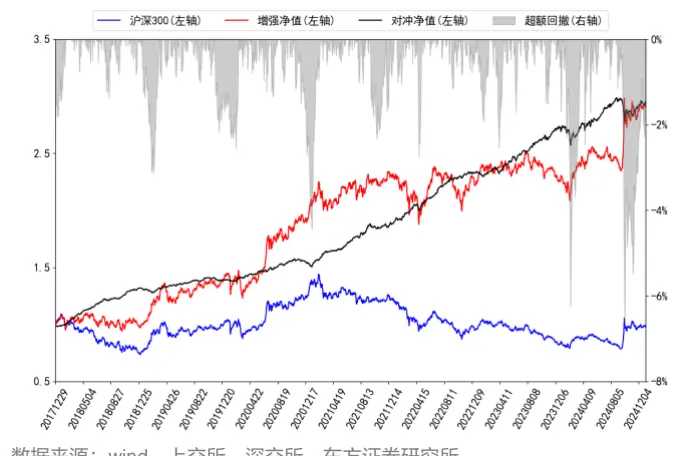
数据来源：wind、上交所、深交所、东方证券研究所

上述图表结果可以看出，往年三组模型的沪深 300 指增组合表现相当，而在 2024 年 Model5的因子对应组合表现最好，超额更高，最大回撤与组合超额波动率均更小。

## 4.3 中证 500 指数增强

本节将展示各个模型生成因子在中证 500 指数增强策略应用，首先我们展示各年度超额收益以及汇总的业绩表现以及 Model4和 Model5因子的超额净值走势：

图 23：中证 500 指增组合汇总表现（20171229~20241231）

|  | 年化收益 | 年化波动率 | 信息比率 | 胜率 | 最大回撤 | 平均持股数量 |
| --- | --- | --- | --- | --- | --- | --- |
| Model1 | 20.86% | 6.39% | 3.00 | 67.76% | -12.47% | 105.25 |
| Model4 | 22.56% | 6.20% | 3.31 | 73.22% | -10.47% | 102.81 |
| Model5 | 21.75% | 6.17% | 3.22 | 70.49% | -10.34% | 103.47 |

数据来源：wind、上交所、深交所、东方证券研究所

图 24：中证 500 指增组合分年度超额收益率（20171229~20241231）

|  | Model1 | Model4 | Model5 |
| --- | --- | --- | --- |
| 2018 | 50.73% | 49.75% | 48.40% |
| 2019 | 17.87% | 19.90% | 22.78% |
| 2020 | 18.73% | 17.44% | 16.99% |
| 2021 | 28.56% | 32.23% | 29.29% |
| 2022 | 22.49% | 21.13% | 21.89% |
| 2023 | 12.04% | 14.11% | 10.32% |
| 2024 | 1.03% | 7.60% | 6.80% |

数据来源：wind、上交所、深交所、东方证券研究所

图 25：Model4 因子中证 500指增组合净值走势（净值左轴，回撤右轴）
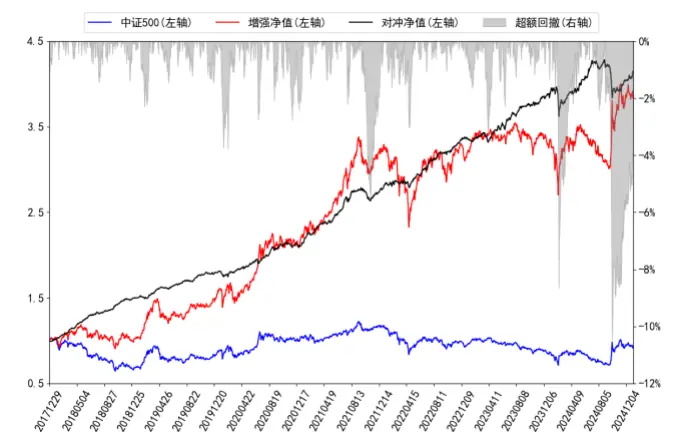
数据来源：wind、上交所、深交所、东方证券研究所

图 26：Model5 因子中证 500指增组合净值走势（净值左轴，回撤右轴）
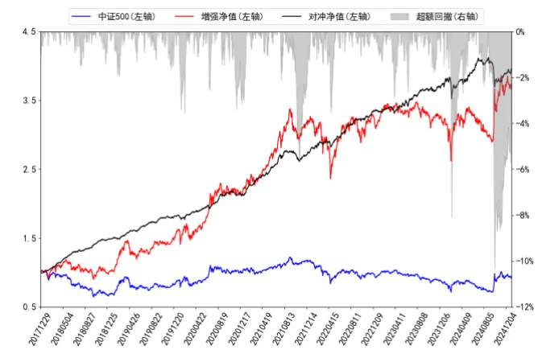
数据来源：wind、上交所、深交所、东方证券研究所

上述图表结果可以看出，往年三组模型的中证500指增组合表现相当，Model4表现略微更加占优，而在 2024年 Model4的因子对应组合表现最好，对应组合的超额收益更高。

## 4.4 中证 1000 指数增强

本节将展示各个模型生成因子在中证1000指数增强策略应用，首先我们展示各年度超额收益以及汇总的业绩表现以及 Model4和 Model5因子的超额净值走势：

图 27：中证 1000 指增组合汇总表现（20171229~20241231）

|  | 年化收益 | 年化波动率 | 信息比率 | 胜率 | 最大回撤 | 平均持股数量 |
| --- | --- | --- | --- | --- | --- | --- |
| Model1 | 29.42% | 6.89% | 3.78 | 72.68% | -12.07% | 117.96 |
| Model4 | 32.13% | 6.71% | 4.19 | 75.96% | -10.22% | 116.30 |
| Model5 | 31.23% | 6.66% | 4.12 | 73.77% | -9.96% | 116.87 |

数据来源：wind、上交所、深交所、东方证券研究所

图 28：中证 1000 指增组合分年度超额收益率（20171229~20241231）

| Model1 | Model4 | Model5 |
| --- | --- | --- |
| 2018 66.58% | 73.96% | 73.47% |
| 2019 32.61% | 29.60% | 30.93% |
| 2020 22.32% | 22.46% | 17.27% |
| 2021 37.87% | 39.24% | 38.12% |
| 2022 35.56% | 41.35% | 38.87% |
| 2023 19.30% | 18.69% | 17.60% |
| 2024 0.74% | 8.74% | 11.32% |

数据来源：wind、上交所、深交所、东方证券研究所

图29：Model4因子中证1000指增组合净值走势（净值左轴，回撤右轴）
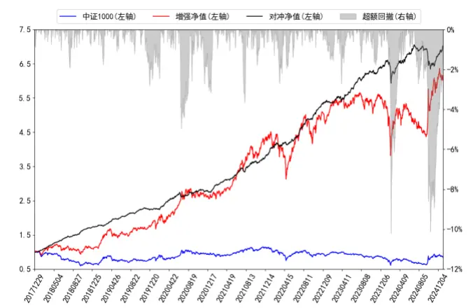
数据来源：wind、上交所、深交所、东方证券研究所

图30：Model5因子中证1000指增组合净值走势（净值左轴，回撤右轴）
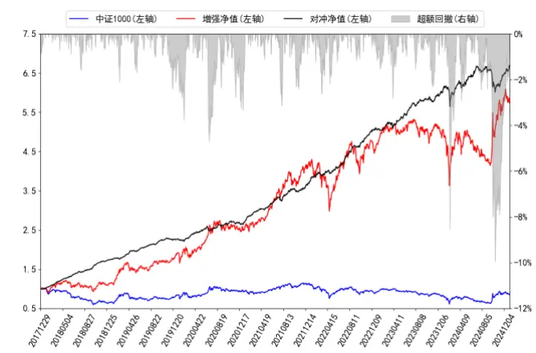
数据来源：wind、上交所、深交所、东方证券研究所

上述图表结果可以看出，往年三组模型的中证 1000 指增组合表现相当，在 2023 年小市值风格占优的市场环境下，Model1 和 Model4 表现均好于 Model5 对应组合，而在 2024 年 Model5 的因子对应组合表现最好，超额更高，最大回撤与组合超额波动率均更小。

## 五、结论

前期报告中，我们基于基本面（fund）、周度（week）、日度（day）、分钟线（ms）和Level-2（l2）五个数据集，利用带图结构的 RNN、ResNet和决策树模型搭建了 AI量价模型框架，并将该框架生成的最终打分应用于选股策略，回测结果显示这套框架下生成的因子有着较强的选股能力。

该框架下的因子单元动态加权阶段，我们通过决策树对所生成的弱因子进行短周期加权，这样虽然能够很好的捕捉 alpha 因子的时变性，但是当短期市场状态市场风格发生突变时，模型很有可能学习到错误的规律从而造成巨大的回撤。为了克服上述问题，我们设计了一套两阶段的端到端因子生成和因子加权模型。该模型通过学习市场上长期历史数据既捕捉 alpha 信息，又根据市场状态和个股属性信息学习 alpha 因子的时变规律从而来对 alpha 因子进行加权，以期在市场风格发生剧烈突变的时候因子能有较为稳定的表现。该模型框架由两部分组成：

1. 因子生成阶段：通过 ABCM 模型将输入特征转化为一些列风险因子和 alpha 因子；

2. 因子加权阶段：将上阶段产生的 alpha 和风险因子作为输入，通过一个状态门控机制学习 alpha因子的权重函数，最后得到个股的因子得分。

根据输入的不同和加权方式的不同，我们提出了五个模型并进行对比，得到以下结论：

1. Model2使用生成的风险因子进行短周期加权，所合成的得分依然有较好的选股表现，说明风险因子和未来收益率是否同向有可预测性，因此可将风险信息一定程度转化为具有选股能力的 alpha 信息。对比 Model2 和 Model3 来看，Model3 因子的 RankIC 显著好于 Model2，这说明通过学习长时间 A 股市场的 alpha 信息所得到的 alpha 因子长期对股票排序的预测能力更强。

2. Model2 因子年化多头超额收益显著好于 Model3，说明对所谓的风险因子进行轮动可以使得多头有着极端的高收益。而分年度来看 Model2 和 Model3 多头超额的差异十分巨大，2023年 Model2因子轮动比重大因而表现更加占优。而 2024年由于市场状态发生巨大切换，历史数据学习到的轮动信息产生偏差，因此 Model2 因子回撤较大超额较低，相比之下，Model3因子稳定性更强。

3. Model3因子在小市值、非线性市值、低波动率、低估值这四个风格上相关性显著高于其他几个模型，具体原因可能是 Model3 因子根据长期 A 股市场数据学习得到的 alpha 因子，而 A股市场长期小市值、低波、低估值是具有 alpha 收益的因此该因子在这几个风格上会出现持续稳定的暴露。

4. 各个模型均可用于行业轮动策略，其中 Model2 因子虽然选股 RankIC 显著低于 Model3，但行业 RankIC 大幅跑赢 Model3，这说明所学习到的 alpha 信息里面很大比重来源于行业轮动。另外 2018 年以来 Model5 因子表现最佳，行业 RankIC 和 ICIR 分别可达 12.45%和 0.42，年化超额可达 28.44%。

Model4和 Model5因子 2018年以来在中证全指、沪深 300、中证 500、中证 1000四个指数上十日 RankIC 均值分别为 16.34%、11.31%、12.07%、15.07%和 16.56%、11.58%、12.21%、15.26%，top 组年化超额分别为 54.03%、30.24%、27.09%、40.61%和 52.69%、32.07%、26.75%、41.23%。相较于基准 Model1 各宽基指数上 Model4 和 Model5 选股效果均有明显提升。

本文生成因子也可以直接应用于指数增强策略，在各宽基指数上均能获得显著的超额收益，在成分股不低于80%限制、周单边换手率约束为20%约束下，在沪深300、中证500和中证1000增强策略上 2018 年以来 Model4 因子表现最好，年化超额收益率分别为 16.82%、22.56%和32.13%；2024年以来，Model5因子表现最好，年化超额收益分别为9.42%、6.80%和11.32%。

## 风险提示

1. 量化模型基于历史数据分析，未来存在失效风险，建议投资者紧密跟踪模型表现。

2. 极端市场环境可能对模型效果造成剧烈冲击，导致收益亏损。

## 参考文献

[1] Li, T., Liu, Z., Shen, Y., Wang, X., Chen, H., & Huang, S. (2024, March). Master: Market-guided stock transformer for stock price forecasting. In Proceedings ofthe AAAI Conference on Artificial Intelligence (Vol. 38, No. 1, pp. 162-170)..

[2] Xiang, Q., Chen, Z., Sun, Q., & Jiang, R. (2024, August). RSAP-DFM: regime-shifting adaptive posterior dynamic factor model for stock returns prediction. In Proceedings of the Thirty-Third International Joint Conference on Artificial Intelligence, IJCAI-24 (pp. 6116-6124)..

[3] Burges, C. J. (2010). From ranknet to lambdarank to lambdamart: An overview. Learning, 11(23-581), 81.

## Tabl e_Disclai mer 分析师申明

每位负责撰写本研究报告全部或部分内容的研究分析师在此作以下声明：

分析师在本报告中对所提及的证券或发行人发表的任何建议和观点均准确地反映了其个人对该证券或发行人的看法和判断；分析师薪酬的任何组成部分无论是在过去、现在及将来，均与其在本研究报告中所表述的具体建议或观点无任何直接或间接的关系。

## 投资评级和相关定义

报告发布日后的12个月内行业或公司的涨跌幅相对同期相关证券市场代表性指数的涨跌幅为基准（A 股市场基准为沪深 300 指数，香港市场基准为恒生指数，美国市场基准为标普 500 指数）；

## 公司投资评级的量化标准

买入：相对强于市场基准指数收益率 15%以上；

增持：相对强于市场基准指数收益率 5%～15%；

中性：相对于市场基准指数收益率在-5%～+5%之间波动；

减持：相对弱于市场基准指数收益率在-5%以下。

未评级 —— 由于在报告发出之时该股票不在本公司研究覆盖范围内，分析师基于当时对该股票的研究状况，未给予投资评级相关信息。

暂停评级 —— 根据监管制度及本公司相关规定，研究报告发布之时该投资对象可能与本公司存在潜在的利益冲突情形；亦或是研究报告发布当时该股票的价值和价格分析存在重大不确定性，缺乏足够的研究依据支持分析师给出明确投资评级；分析师在上述情况下暂停对该股票给予投资评级等信息，投资者需要注意在此报告发布之前曾给予该股票的投资评级、盈利预测及目标价格等信息不再有效。

## 行业投资评级的量化标准：

看好：相对强于市场基准指数收益率 5%以上；

中性：相对于市场基准指数收益率在-5%～+5%之间波动；

看淡：相对于市场基准指数收益率在-5%以下。

未评级：由于在报告发出之时该行业不在本公司研究覆盖范围内，分析师基于当时对该行业的研究状况，未给予投资评级等相关信息。

暂停评级：由于研究报告发布当时该行业的投资价值分析存在重大不确定性，缺乏足够的研究依据支持分析师给出明确行业投资评级；分析师在上述情况下暂停对该行业给予投资评级信息，投资者需要注意在此报告发布之前曾给予该行业的投资评级信息不再有效。

## HeadertTabl e_Discl ai mer 免责声明

本证券研究报告（以下简称“本报告”）由东方证券股份有限公司（以下简称“本公司”）制作及发布。

。本公司不会因接收人收到本报告而视其为本公司的当然客户。本报告的全体接收人应当采取必要措施防止本报告被转发给他人。

本报告是基于本公司认为可靠的且目前已公开的信息撰写，本公司力求但不保证该信息的准确性和完整性，客户也不应该认为该信息是准确和完整的。同时，本公司不保证文中观点或陈述不会发生任何变更，在不同时期，本公司可发出与本报告所载资料、意见及推测不一致的证券研究报告。本公司会适时更新我们的研究，但可能会因某些规定而无法做到。除了一些定期出版的证券研究报告之外，绝大多数证券研究报告是在分析师认为适当的时候不定期地发布。

在任何情况下，本报告中的信息或所表述的意见并不构成对任何人的投资建议，也没有考虑到个别客户特殊的投资目标、财务状况或需求。客户应考虑本报告中的任何意见或建议是否符合其特定状况，若有必要应寻求专家意见。本报告所载的资料、工具、意见及推测只提供给客户作参考之用，并非作为或被视为出售或购买证券或其他投资标的的邀请或向人作出邀请。

本报告中提及的投资价格和价值以及这些投资带来的收入可能会波动。过去的表现并不代表未来的表现，未来的回报也无法保证，投资者可能会损失本金。外汇汇率波动有可能对某些投资的价值或价格或来自这一投资的收入产生不良影响。那些涉及期货、期权及其它衍生工具的交易，因其包括重大的市场风险，因此并不适合所有投资者。

在任何情况下，本公司不对任何人因使用本报告中的任何内容所引致的任何损失负任何责任，投资者自主作出投资决策并自行承担投资风险，任何形式的分享证券投资收益或者分担证券投资损失的书面或口头承诺均为无效。

本报告主要以电子版形式分发，间或也会辅以印刷品形式分发，所有报告版权均归本公司所有。未经本公司事先书面协议授权，任何机构或个人不得以任何形式复制、转发或公开传播本报告的全部或部分内容。不得将报告内容作为诉讼、仲裁、传媒所引用之证明或依据，不得用于营利或用于未经允许的其它用途。

经本公司事先书面协议授权刊载或转发的，被授权机构承担相关刊载或者转发责任。不得对本报告进行任何有悖原意的引用、删节和修改。

提示客户及公众投资者慎重使用未经授权刊载或者转发的本公司证券研究报告，慎重使用公众媒体刊载的证券研究报告。

## 东方证券研究所

地址： 上海市中山南路 318 号东方国际金融广场 26 楼

电话：021-63325888

传真：021-63326786

网址： www.dfzq.com.cn