# 时点风险模型

# 因子选股系列之一一三

## 研究结论

## 研究动机

2024 年 9 月科技板块因政策变化引发的超预期反弹，暴露了传统指数增强模型在应对突发性外部风险时的重大缺陷。此类事件驱动型风险具有瞬时性、高波动特征，而传统Barra 类风险模型依赖缓慢衰减的风格因子进行风控，难以及时捕捉突发风险的短期集聚效应，导致组合在极端市场环境下出现历史性回撤。基于此，本研究提出时点风险因子，旨在解决突变型风险对组合的冲击问题。

## 时点风险因子

针对外部风险事件的突发性，我们创新性提出“时点风险因子”来刻画这种时点的风险，风险具有集聚性，因此当天高风险的来源在未来短期内仍然是市场的高风险来源，因此可以依靠这种风险的集聚效应去控制组合的时点风险从而起到对外部事件降波的作用。

我们通过监测中证全指指数的振幅与成交额突破阈值（5 日均值+1 倍标准差）的突变时点，以个股当日涨跌幅构建风险因子。当日个股涨跌幅是当日的隐式风险共同作用“定价”后的结果，这一设计本质上是将政策冲击、流动性突变等不可观测的隐式风险通过非参数化方式纳入模型，利用风险的短期集聚效应实现风险脱敏。

## 时点风险因子在指增组合上的应用

中证 500 指数增强组合加入时点风险风控后，2024 年的超额收益、相对最大回撤、信息比、跟踪误差相比于原模型都有显著的提升，截止 20241031 的超额收益从原模型的4.67%提升到 8.59%，相对最大回撤从-8.64%下降到-4.65%，跟踪误差从 7.22%下降到5.63%。

应用于不同基准例如沪深 300、中证 1000 指数增强模型以及针对不同的收益预测模型例如深度学习因子、基本面因子的增强模型都能带来普适性的相对回撤和跟踪误差的显著下降。

## 价格类风险因子在指增组合上的应用

时点风险因子纳入风控约束的效果非常明显，但是在风险来源并不主要源于外部事件的历史年份中，时点风险因子约束的效果并不明显。我们尝试加入更多价格类风险因子，能够明显提高风险模型对风险的解释力，加入风控后也能进一步降低组合的超额波动。由此可见，一个大型且完备的风险模型是非常有必要的，既需要针对特定类型风险例如时点风险、传统风格风险的风险因子，又需要覆盖的维度足够广，以此构建一套“结构化风险+全维度覆盖”的双层风控体系，可以为风险控制提供更全面的解决方案。

## 风险提示

1. 量化模型失效风险。

2. 极端市场环境可能对模型效果造成剧烈冲击，导致收益亏损。

## 报告发布日期

2025 年 04 月 20 日

杨怡玲

yangyiling@orientsec.com.cn

执业证书编号：S0860523040002

ADWM：基于门控机制的自适应动态因子 2025-04-10加权模型：——因子选股系列之一一二

DFQ-FactorVAE-pro：加入特征选择与环 2025-02-19境变量模块的 FactorVAE 模型：——因子选股系列之

ABCM：基于神经网络的alpha因子和beta 2024-12-03因子协同挖掘模型：——因子选股系列之一一〇

相对定价类基本面因子挖掘：——因子选 2024-10-11股系列之一〇九

KD-Ensemble：基于知识蒸馏的 alpha 因 2024-08-19子挖掘模型：——因子选股系列之一〇八

DFQ-XGB：基于树模型的 alpha 预测方 2024-08-15案：——因子选股系列之一〇七

基于风险注意力的因子挖掘模型：——因 2024-05-29子选股系列之一〇六

非线性市值风控全攻略：——因子选股系 2024-05-27列之一〇五

## 一、研究动机

2024 年市场经历了 2 月初的微盘暴跌、10 月份的科技板块强势反弹，这些极端风险释放对指数增强模型带来了巨大的冲击，模型纷纷创出历史最大回撤。我们首先回顾一下我们的指数增强模型 2024年的表现情况。下表是我们的周频多因子指数增强模型采用的因子库。

表 1：因子库

| 类别 | 因子简称 | 因子名称 | 因子计算方式 |
| --- | --- | --- | --- |
| 规模 | LNCAP | 总市值对数 | 总市值取对数 |
| 估值 | BP | 账面市值比 | 净资产/总市值 |
|  | Quart_EP | 单季度市盈率倒数 | 单季归母净利润/总市值 |
|  | Quart_SP | 单季SP | 单季营收/总市值 |
|  | Con_EP | 一致预期滚动 EP | 分析师预期未来12个月滚动EP |
|  | Con_PEG | 一致预期滚动 PEG | 分析师预期未来12 个月 PEG |
|  | EPTTM_WZSCORE_1Y | EPTTM滚动一年时序衰减加权 | EPTTM 滚动一年时序衰减加权 Zscore |
|  | PB_ROE_RANK | ZScore PB 排序-单季 ROE 排序 | rank(PB)-rank(Quart_ROE) |
| 分红 | DIVIDEND_RATE DIVIDEND_RATE_TSMIN_3Y | 股息率 | 最近四个季度预案分红金额/总市值 |
|  |  | 股息率滚动3年最低值 | 过去3年股息率的最低值 (单季净利润-去年同期单季净利润）/abs |
| 成长 | Quart_NP_YOY | 单季净利同比增速 | (去年同期单季净利润) |
|  | Quart_OR_YOY | 单季营收同比增速 | (单季营收-去年同期单季营收)/abs(去 |
|  | Quart_OP_YOY | 单季营利同比增速 | 年同期单季营收） (单季营利-去年同期单季营利)/abs(去 |
|  | SUE | 标准化预期外盈利 | 年同期单季营利） (单季度实际净利润-预期净利润)/预期 |
|  | SUR | 标准化预期外收入 | 净利润标准差 (单季度实际营业收入-预期营业收入)/ |
|  | Delta_ROE | 单季净资产收益率同比变化 | 预期营业收入标准差 单季净资产收益率-去年同期单季净资产收 |
|  |  |  | 益率 单季总资产收益率-去年同期单季总资产收 |
|  | Delta_ROA | 单季总资产收益率同比变化 | 益率 |
|  | UE_PERC | 单季净利润超预期幅度 | 单季净利润/分析师预期单季净利润-1 |
| 盈利 | Quart_ROE | 单季净资产收益率 | 单季归母净利润*2/（期初归母净资产+期 末归母净资产) |
|  | Quart_ROA | 单季总资产收益率 | 单季归母净利润*2/（期初总资产+期末总 |
|  | ROETTM_STD |  | 资产) |
|  | ORGAN NUM 3M | ROETTM 滚动 12 季度标准差 分析师覆盖度 | 过去 12 个季度的 ROETTM 的标准差 过去3个月覆盖该股票的卖方数量开方 |
| 机构 | FUND_HOLD_MV | 主动股基持股市值 | 近期半年报/年报主动股基持股市值对数 |
|  | Quart_NP_YOY_CHANGE | 单季净利同比增速的环比变化 | 单季净利同比增速-上季单季净利同比增速 |
| 边际景气 | FROE_CHANGE_1M | 预期滚动 ROE一个月环比 | 当前一致预期滚动 ROE-1 个月前一致预 |
|  |  |  | 期滚动 ROE |
|  | FROE_CHANGE_3M | 预期滚动 ROE 三个月环比 | 当前一致预期滚动 ROE-3 个月前一致预 期滚动 ROE |
|  | FNP_CHANGE_1M | 预期滚动净利润一个月环比 | 当前一致预期滚动净利润/1 个月前一致预 期滚动净利润-1 |

有关分析师的申明，见本报告最后部分。其他重要信息披露见分析师申明之后部分，或请与您的投资代表联系。并请阅读本证券研究报告最后一页的免责申明。

| FNP_CHANGE_3M |  | 预期滚动净利润三个月环比 分析师认可度 | 当前一致预期滚动净利润/3个月前一致预 期滚动净利润-1 分析师认可度4因子复合 |
| --- | --- | --- | --- |
|  | ANA_REC |  |  |
| 盈余动量 | UD_PCT | 分析师上下调数量差占比 | 过去3个月(上调家数-下调家数)/总家数+ |
|  |  | 盈余公告次日开盘跳空超额剥 | 总家数/10000 盈余公告次日开盘跳空超额剥离公告后相 |
|  | JOR_OPEN_orth_CEAR | 离公告后相对行业的超额收益 盈余公告次日换手率剥离公告 | 对行业的超额收益 |
|  | TOOR_orth_EAR | 后超额收益 | 盈余公告次日换手率剥离公告后超额收益 |
|  | JOR_LOW | 盈余公告次日最低价跳空超额 | 盈余公告次日最低价跳空收益-当日指数最 低价收益 |
|  | IVR_1M REVERSE_1M | 一个月特异度 | 1-Fama 三因子拟合优度 |
| 量价 | 一个月反转 |  | 一个月涨跌幅 |
|  | REVERSE_3M | 三个月反转 |  |
|  | ATR_1M | 一个月真实波动率 | 三个月涨跌幅 |
|  | ATR_3M |  | 一个月 TR 均值 |
|  | TO_1M | 三个月真实波动率 一个月日均换手率 | 三个月 TR 均值 |
|  | TO_3M |  | 一个月日均换手率 |
|  | UMR_1M | 三个月日均换手率 一个月 UMR | 三个月日均换手率 |
|  | UMR_3M |  | 一个月 UMR |
|  | UMR_6M | 三个月 UMR | 三个月 UMR |
|  | UMR_1Y | 六个月 UMR | 六个月 UMR |
|  | 一年UMR 一个月日内波动率的标准差比 | 一年 UMR |  |
| SDR_VOL_1M | 均值 | 一个月日内5 分钟k线波动率的标准差比 均值 |  |
| 挖掘基本面 Relative_Fundamental_Factor | 32 个相对定价基本面因子 | 参考《相对定价类基本面因子挖掘》 |  |
| 深度学习 SCORES_V2 | 5个数据集复合深度学习因子 | 参考《融合基本面信息的 ASTGNN因子 挖掘模型》 |  |

数据来源：Wind，朝阳永续，东方证券研究所

我们通过对称正交剔除因子间的相关性，并以滚动 52 周 ICIR 进行线性加权，来对这些因子进行线性复合。以该复合因子构造一个中证 500增强组合，回测参数如下：

⚫ 回测区间：20180101-20241031

⚫ 基准指数：中证 500指数

⚫ 调仓频率：周频

⚫ 交易价格及成本：次日 VWAP交易，买 0.1%，卖 0.2%

⚫ 换手率：周度单边 20%

⚫ 成分股占比：80%

⚫ 行业：中信一级行业最大权重偏离 2%

⚫ 个股权重：个股最大权重偏离 0.5%

⚫ 风格：Barra 风格最大偏离 0.5 个标准差，Size、相对 NLSize 、左右侧 NLSize、十分组NLSize 最大偏离 0.3 个标准差

该中证500指数增强模型的历史表现如下图所示。可以看到2024年2月先经历了-5%左右的相对最大回撤，而 2024年9月底以来创出历史相对最大回撤并持续跑输基准。

有关分析师的申明，见本报告最后部分。其他重要信息披露见分析师申明之后部分，或请与您的投资代表联系。并请阅读本证券研究报告最后一页的免责申明。

图 1：中证 500增强组合历史净值
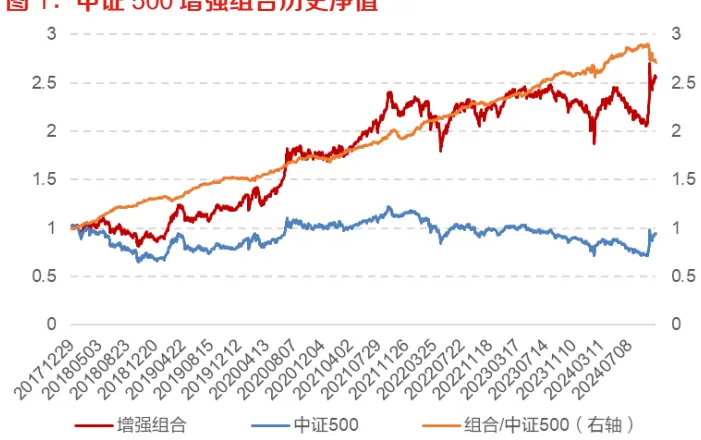
数据来源：Wind，朝阳永续，东方证券研究所

图 2：中证 500增强组合2024年净值及相对回撤
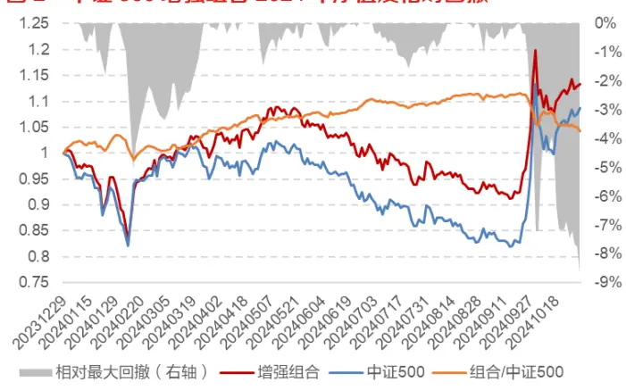
数据来源：Wind，朝阳永续，东方证券研究所

各年收益表现如下表所示。可以看到增强组合历年表现稳健，但是2024年超额大幅下降并且相对最大回撤达到-8.64%。

表 2：中证 500指数增强组合各年收益表现

| 年份 | 绝对收益 | 基准收益 | 超额收益 | 相对最大回撤 | 信息比 | 跟踪误差 | 收益回撤比 | 月度胜率 |
| --- | --- | --- | --- | --- | --- | --- | --- | --- |
| 2018 | -12.74% | -33.32% | 20.58% | -0.82% | 6.82 | 4.08% | 25.00 | 100.00% |
| 2019 | 46.77% | 26.38% | 20.38% | -5.06% | 3.89 | 3.85% | 4.03 | 75.00% |
| 2020 | 35.82% | 20.87% | 14.95% | -2.79% | 2.66 | 4.43% | 5.35 | 75.00% |
| 2021 | 34.84% | 15.58% | 19.26% | -4.68% | 3.37 | 4.68% | 4.11 | 83.33% |
| 2022 | -6.32% | -20.31% | 13.99% | -1.50% | 4.52 | 3.68% | 9.32 | 83.33% |
| 2023 | 2.62% | -7.42% | 10.04% | -1.82% | 2.97 | 3.52% | 5.50 | 75.00% |
| 20241031 | 13.36% | 8.69% | 4.67% | -8.64% | 0.63 | 7.22% | 0.54 | 60.00% |
| 全样本期 | 15.22% | -0.86% | 16.08% | -8.64% | 3.25 | 4.58% | 1.86 | 79.27% |

数据来源：Wind，朝阳永续，东方证券研究所

从下图的板块的走势来看，科创和创业板在 20241008 之后并没有显著跑赢主板，因此在各个板块上的超低配并不能完全解释 9 月底以来的超额持续回撤的情况。而从风格因子收益表现来看，20240924 以来高 Beta、高波动、高换手显著正超额，而这和我们选股因子偏低波动、低换手的风格完全相反，这也解释了 9月底以来超额持续回撤的原因。

图 3：20240924以来各宽基指数的净值走势
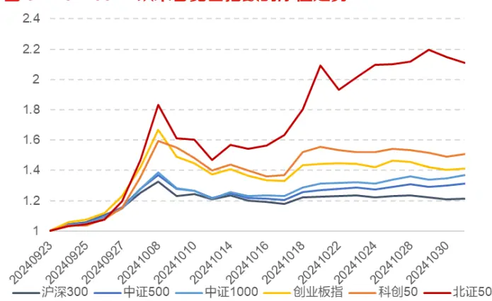
数据来源：Wind，东方证券研究所

图 4：20240924以来风格因子累计日度 IC
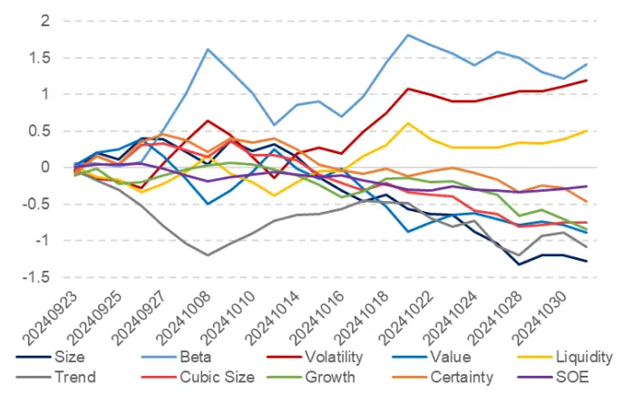
数据来源：Wind，朝阳永续，东方证券研究所

有关分析师的申明，见本报告最后部分。其他重要信息披露见分析师申明之后部分，或请与您的投资代表联系。并请阅读本证券研究报告最后一页的免责申明。

但是这种风格的反向并不是超额回撤的根本原因，风格的反向只是根本原因的外在表现，我们认为超额回撤的根本原因是外部消息驱动的市场风格突变。

⚫2024年 9月 24日开盘前国新办召开新闻发布会，人民银行、金融监管总局和证监会负责人介绍金融支持经济高质量发展的情况。证监会表示将大力发展权益类公募基金，完善长钱长投的制度环境，多措并举活跃并购重组市场，支持汇金公司加大对资本市场增持力度等有力措施，改变了市场预期。

⚫2024年 9月 26日，中共中央政治局召开会议强调，要努力提振资本市场，大力引导中长期资金入市。同日，中国证监会宣布中央金融办、中国证监会将联合印发《关于推动中长期资金入市的指导意见》。

这些政策的变化导致投资者对于市场风格的预期发生了突变，进而导致风格因子的反向和超额的回撤。面对这种突发性导致的风格变化，传统的风控方法凸显了其不足之处。传统风控方法大致可以分为两类：

⚫ 被动降杠杆：直接控制个股偏离度或跟踪误差，这种方式只能降低波动率和杠杆率，不能改变回撤的趋势，降低波动的同时也会明显降低收益；

主动控暴露：控制 Barra 风格暴露和行业暴露，这种方式假设潜在风险大部分都暴露在风格或行业上，控制这些维度就能应对各种风险暴露带来的超额波动。然而 Barra 风险模型本身的解释度并不高，纯风格周度解释度平均为 7.88%，风格带行业周度解释度平均为 13.24%。另外传统风险因子以股票的内生特征的时序统计量为主要构造逻辑，这些统计量例如下图中的 Beta因子都是持续且缓慢地衰减，无法及时刻画脉冲式的外部事件冲击。

图 5：Barra风险模型周度解释能力
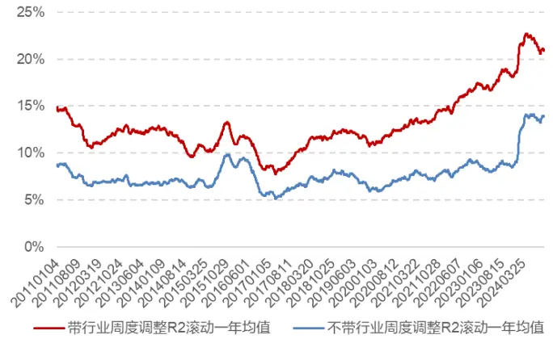
数据来源：Wind，东方证券研究所

图 6：Beta的周度自相关系数
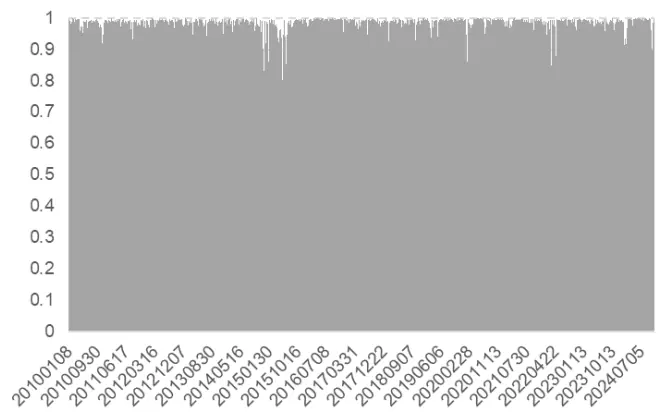
数据来源：Wind，东方证券研究所

从大逻辑来看，当需要应对的是快速变化的外部冲击时，从模型应对的角度只有同频或更高频的方式才能真正做到应对这些外部冲击风险。

## 二、时点风险因子

## 2.1 时点风险与传统风险因子的差异

在我们前期报告《基于时点动量的因子轮动》（20230628）中，我们发现市场在一些特殊时点会形成“引爆点”式的动量效应，在当天领涨的行业、ETF、因子、风格在未来一段时间具有持续的动量效应。其本质是在这些时点我们可以预判风格未来的动量方向，因此可以依赖这样的动量效应来配置相应的风格。而如果我们在一些高风险暴露的时点发生时无法预判风格的未来方向，我们需要想办法控制住这些风格或风险，以避免组合超额受到这些高风险时点的影响。由于风险具有集聚性的特点，当天高风险的来源在未来短期内也仍然会是市场的高风险来源，因此我们可以依靠这种“风险的动量”效应去控制组合的风险。换句话说，在某个特殊时点外部消息刺激导致市场风格突变，时点动量模型研究的是特殊时点形成的 alpha 动量效应，从风险的角度，是否可以研究特殊时点的 risk，即时点风险因子。

时点风险和传统 Barra类风险因子的差异我们总结如下表所示。

表 3：传统风险因子与时点风险因子的差异

|  | 传统风险因子 | 时点风险因子 |
| --- | --- | --- |
| 数据来源 | 基本面数据、分析师预期、量价数据 | 外部消息、量价数据 |
| 构造方式 | 股票基本面与量价特征的时序统计量 | 特殊时点的量价特征 |
| 作用 | 刻画市场的内在驱动风格 | 刻画特定时点的脉冲式风险 |
| 取值特点 | 缓慢且持续衰减 | 平时取值不变，脉冲式风险来时突变 |
| 数据来源：东方证券研究所 |  |  |

而对于如何构造时点风险因子，我们也可以从两个维度来考虑：

1. 为各种外部或者可能引起市场风格突变的事件建模：这种方式需要对各类事件进行枚举并判断其每次的影响力，并以事件发生时点的量价特征构造时点风险因子。然而很难有较为完备的事件数据来源和及时响应；

2. 通过价格变化来直接捕捉脉冲式风险的痕迹：认为价格反映了一切信息，脉冲式事件会产生价和量的剧烈波动，以价量剧烈波动日作为时点，并以当日的价格信息构造时点风险因子。我们倾向于选择这种方式来构造时点风险因子。

## 2.2 时点风险因子的构造

在我们前期报告《UMR2.0——风险溢价视角下的动量反转统一框架再升级》（20230713）中，我们通过“高风险日偏反转、低风险日偏动量”的逻辑，以每日的振幅或换手相比于前 n 天的平均值的高低水平来判断股票当日是否是高风险。我们可以借鉴这个思路来构建价量突变的风险因子，当大盘指数的振幅或成交额明显高于过去一段时间的正常水平时我们即认为该日是高风险日，如何刻画“明显高于正常水平”我们是采用突破均值加 1 倍标准差的方式。而找到这些时点日期后，我们以个股当日的涨跌幅作为风险因子取值。我们可以从振幅、成交额单一维度去构造时点突变信号，但是单一维度都容易有噪声，因此我们更推荐使用振幅和成交额均同时突变来构造时点信号，抗噪能力更强。如果当天没有触发信号，则向后沿用因子取值。

- 振幅突变：当日中证全指的振幅突破过去5日的均值+1倍标准差时，作为特殊时点日期，以当天个股涨跌幅作为风险因子取值

$$
f_{\_}tr_{t}=\left\{\begin{aligned}&rt_{t}&if\ tr_{zzqz,\ t}>ts\_mean\big(tr_{zzqz,t-1},5\big)+ts\_std\big(tr_{zzqz,t-1},5\big),\\&f_{t-1}&else.\end{aligned}\right.
$$

⚫ 成交额突变：当日中证全指的成交额突破过去 5 日的均值+1 倍标准差时，作为特殊时点日期，以当天个股涨跌幅作为风险因子取值

$$
f_{-}ant_{t}=\left\{\begin{aligned}&rt_{t}&if\ andt_{zzqz,t}>ts\_mean\big(amt_{zzqz,t-1},5\big)+ts\_std\big(amt_{zzqz,t-1},5\big),\\&f_{t-1}&else.\end{aligned}\right.
$$

⚫ 价量均突变：当日中证全指的振幅和成交额均突破过去5日的均值+1倍标准差时，作为特殊时点日期，以当天个股涨跌幅作为风险因子取值

$$
time_{-}risk_{t}=\left\{\begin{aligned}rect_{t}&\quad iftr_{zqz,\;t}>ts\_mean\big(tr_{zqz,t-1},5\big)+ts\_std\big(tr_{zqz,t-1},5\big)\\&\quad andand_{zqz,\;t}>ts\_mean\big(and_{zqz,t-1},5\big)+ts\_std\big(andt_{zqz,t-1},5\big),\\f_{t-1}&\quad else.\end{aligned}\right.
$$

以涨跌幅作为风险因子取值的核心原因在于，当日存在一些隐式潜在的风险来源，我们无法显式刻画，而这些隐式风险共同作用“定价”后的结果就是个股当天的涨跌幅，因此个股当日涨跌幅等于是将政策冲击、流动性突变等不可观测的隐式风险通过非参数化方式纳入模型。

图 7：时点风险日超配单边后的超额波动
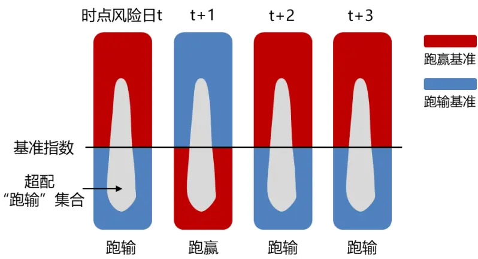
数据来源：东方证券研究所

从另外一个指数增强的角度来看，当高风险日出现时，增强组合可能跑输基准指数，如上图所示，如果我们将当天所有股票按相对于基准指数的涨跌幅划分为“跑赢”和“跑输”两个集合，增强组合跑输基准本质上就是在跑输集合上进行了“超配”，由于我们无法预判未来一段时间内这种超配是会带来超额还是跑输基准，因此这种单边超配是未来潜在的最大风险来源。为了降低这种单边超配对超额的影响，我们应该把增强组合的当日涨幅控制成和基准指数接近或者一致，也就是不存在单边超配，这样不管未来是哪边强，组合的超额都不会受到其影响。

下图展示了 2024 年的时点突变信号的分布情况，可以看到取振幅和成交额均突变后，在 2024 年9月 24-28日、10月 18日都触发了信号。

图 8：2024年振幅突变和成交额突变的信号分布
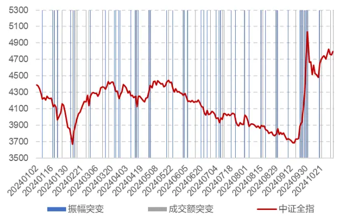
数据来源：Wind，东方证券研究所

图 9：2024年振幅和成交额均突变的信号分布
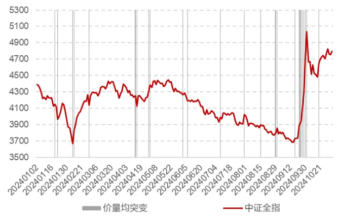
数据来源：Wind，东方证券研究所

下表展示了各年时点突变信号的数量。可以看到，单一维度突变每年数量保持在50次附近，均突变的信号每年保持在 25次附近，大约两周一次，各年都比较均匀。

表 4：各年时点突变信号数量

| 年份 | 2010 | 2011 | 2012 | 2013 | 2014 | 2015 | 2016 | 2017 | 2018 | 2019 | 2020 | 2021 | 2022 | 2023 | 2024 |
| --- | --- | --- | --- | --- | --- | --- | --- | --- | --- | --- | --- | --- | --- | --- | --- |
| 振幅突变 | 50 | 52 | 49 | 52 | 48 | 50 | 49 | 58 | 51 | 46 | 53 | 53 | 48 | 51 | 48 |
| 成交额突变 | 65 | 56 | 55 | 51 | 66 | 64 | 55 | 58 | 50 | 57 | 55 | 58 | 61 | 62 | 39 |
| 价量均突变 | 26 | 29 | 21 | 21 | 25 | 20 | 20 | 26 | 27 | 25 | 26 | 19 | 27 | 23 | 24 |

数据来源：Wind，东方证券研究所

为了验证我们筛选出来的这些日期是否确实对未来的风险有刻画能力，我们取这些天所有个股涨跌幅对未来 1-5 个交易日计算其收益解释能力，即回归的拟合优度，并和所有天的结果进行对比，如下图所示。可以看到，时点风险日对未来 5 天的收益的解释力明显高于普通日期的解释力。这种高解释力的来源本质为波动率的集聚性，因为突变日的风险急速变大，而这种波动风险有集聚性，所以时点风险日后面的一段时间内都会是高波动日，因此解释力才会明显更高。

图 10：时点突变当日涨跌幅对未来 n日收益的拟合度(2018-20241031)
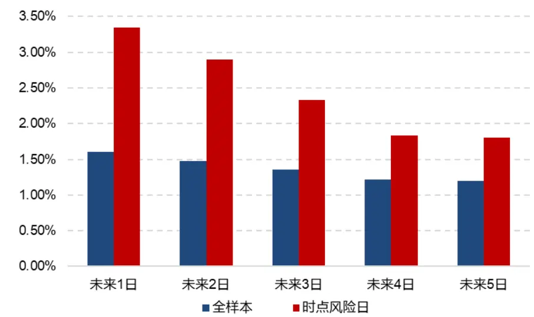
数据来源：Wind，东方证券研究所

有关分析师的申明，见本报告最后部分。其他重要信息披露见分析师申明之后部分，或请与您的投资代表联系。并请阅读本证券研究报告最后一页的免责申明。

因为时点风险因子每天都有取值，因此我们可以将其当成普通因子来统计其是否符合风险因子的特征。下图我们统计了时点风险因子的累计周度 IC和其自相关性情况。可以看到振幅突变、成交额突变、价量均突变时点风险因子的累计 IC都是偏负向，但是并不稳健，其自相关性体现为梯形状，没有时点信号时因子取值不变因此其相关系数为 1，而触发时点后因子取值快速变化。

图 11：时点风险因子累计周度IC
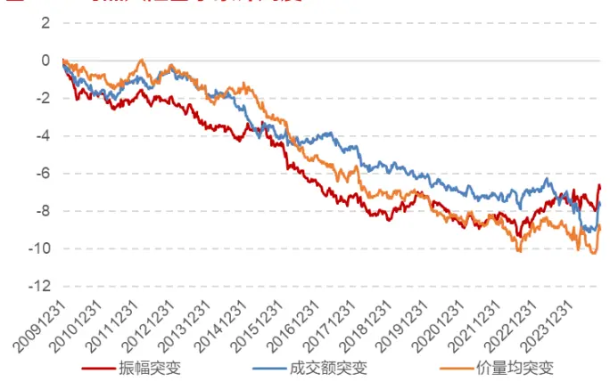
数据来源：Wind，东方证券研究所

图 12：时点风险因子的周度自相关系数
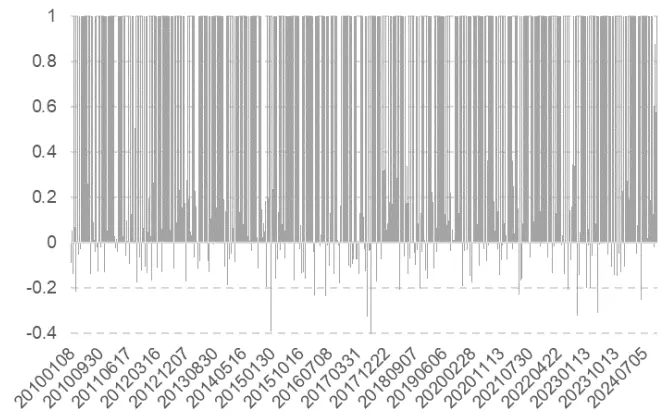
数据来源：Wind，东方证券研究所

下表展示了时点风险因子的选股能力表现。可以看到，振幅突变、成交额突变、价量均突变时点风险因子的 IC 均值都接近于 0，但是 IC 绝对值均值都接近 0.1，并且 IC 胜率在 50%左右，体现出较强的风险因子的特征，周度自相关系数均值分别为 0.3,0.35,0.61。

表 5：时点风险因子选股能力表现

|  | IC 均值 | IC 标准差 | IC 绝对值均值 | 年化ICIR | IC 胜率 | 周度自相关系数 |
| --- | --- | --- | --- | --- | --- | --- |
| 振幅突变 | -0.009 | 0.130 | 0.098 | -0.498 | 52.90% | 0.30 |
| 成交额突变 | -0.010 | 0.130 | 0.098 | -0.560 | 52.90% | 0.35 |
| 价量均突变 | -0.012 | 0.132 | 0.100 | -0.646 | 54.22% | 0.61 |

数据来源：Wind，东方证券研究所

## 三、时点风险因子在指增组合上的应用

有了时点风险因子，我们可以将其加入指数增强进行组合优化时的风险暴露约束中控制其相对暴露从而起到对时点风险进行中性化的目标。

## 3.1中证500指数增强上的效果

在原中证 500 指数增强模型基础上，我们分别加入振幅突变、成交额突变和价量均突变的时点风险因子的相对暴露为 0的约束，增强组合各年收益表现对比如下表所示。

表 6：不同时点风险因子风控中证 500增强组合各年收益表现

| 原组合 | 年份 | 绝对收益 | 基准收益 | 超额收益 | 相对最大回撤 | 信息比 | 跟踪误差 | 收益回撤比 | 月度胜率 |
| --- | --- | --- | --- | --- | --- | --- | --- | --- | --- |
|  | 2018 | -12.74% | -33.32% | 20.58% | -0.82% | 6.82 | 4.08% | 25.00 | 100.00% |
|  | 2019 | 46.77% | 26.38% | 20.38% | -5.06% | 3.89 | 3.85% | 4.03 | 75.00% |
|  | 2020 | 35.82% | 20.87% | 14.95% | -2.79% | 2.66 | 4.43% | 5.35 | 75.00% |
|  | 2021 | 34.84% | 15.58% | 19.26% | -4.68% | 3.37 | 4.68% | 4.11 | 83.33% |
|  | 2022 | -6.32% | -20.31% | 13.99% | -1.50% | 4.52 | 3.68% | 9.32 | 83.33% |
|  | 2023 | 2.62% | -7.42% | 10.04% | -1.82% | 2.97 | 3.52% | 5.50 | 75.00% |
|  | 20241031 | 13.36% | 8.69% | 4.67% | -8.64% | 0.63 | 7.22% | 0.54 | 60.00% |
|  | 全样本期 | 15.22% | -0.86% | 16.08% | -8.64% | 3.25 | 4.58% | 1.86 | 79.27% |
| 振幅突变风控组合成交额突变风控组合价量均突变风控组合 | 2018 | -13.36% | -33.32% | 19.96% | -0.96% | 6.83 | 3.96% | 20.73 | 100.00% |
|  | 2019 | 44.92% | 26.38% | 18.54% | -4.97% | 3.58 | 3.82% | 3.73 | 66.67% |
|  | 2020 | 32.26% | 20.87% | 11.39% | -3.26% | 2.08 | 4.36% | 3.50 | 66.67% |
|  | 2021 | 33.09% | 15.58% | 17.50% | -4.66% | 3.11 | 4.64% | 3.75 | 83.33% |
|  | 2022 | -6.82% | -20.31% | 13.50% | -1.59% | 4.34 | 3.70% | 8.49 | 83.33% |
|  | 2023 | 2.13% | -7.42% | 9.55% | -1.77% | 2.86 | 3.48% | 5.39 | 83.33% |
|  | 20241031 | 15.91% | 8.69% | 7.22% | -4.65% | 1.37 | 5.53% | 1.55 | 60.00% |
|  | 全样本期 | 14.40% | -0.86% | 15.27% | -4.97% | 3.35 | 4.24% | 3.07 | 78.05% |
|  | 2018 | -15.11% | -33.32% | 18.21% | -0.98% | 6.22 | 4.01% | 18.58 | 100.00% |
|  | 2019 | 45.11% | 26.38% | 18.72% | -5.34% | 3.60 | 3.84% | 3.51 | 75.00% |
|  | 2020 | 34.23% | 20.87% | 13.36% | -2.47% | 2.54 | 4.18% | 5.42 | 66.67% |
|  | 2021 | 34.02% | 15.58% | 18.44% | -4.02% | 3.38 | 4.48% | 4.58 | 91.67% |
|  | 2022 | -6.88% | -20.31% | 13.43% | -1.64% | 4.50 | 3.56% | 8.19 | 83.33% |
|  | 2023 | 3.00% | -7.42% | 10.43% | -1.86% | 3.18 | 3.41% | 5.62 | 91.67% |
|  | 20241031 | 14.82% | 8.69% | 6.12% | -4.75% | 1.12 | 5.74% | 1.29 | 60.00% |
|  | 全样本期 | 14.42% | -0.86% | 15.28% | -5.34% | 3.38 | 4.20% | 2.86 | 81.71% |
|  | 2018 | -12.55% | -33.32% | 20.77% | -0.84% | 7.11 | 3.94% | 24.73 | 100.00% |
|  | 2019 | 44.96% | 26.38% | 18.58% | -5.02% | 3.52 | 3.90% | 3.70 | 75.00% |
|  | 2020 | 34.35% | 20.87% | 13.48% | -2.99% | 2.47 | 4.33% | 4.50 | 66.67% |
|  | 2021 | 33.04% | 15.58% | 17.45% | -4.45% | 3.14 | 4.58% | 3.92 | 83.33% |
|  | 2022 | -6.86% | -20.31% | 13.46% | -1.55% | 4.50 | 3.55% | 8.70 | 83.33% |
|  | 2023 | 2.59% | -7.42% | 10.01% | -1.77% | 3.01 | 3.47% | 5.64 | 91.67% |
|  | 20241031 | 17.28% | 8.69% | 8.59% | -4.65% | 1.60 | 5.63% | 1.85 | 60.00% |
|  | 全样本期 | 15.10% | -0.86% | 15.97% | -5.02% | 3.50 | 4.23% | 3.18 | 80.49% |

数据来源：Wind，东方证券研究所

可以看到，加入风格约束后组合长期年化超额略有下降，但是 2024 年的超额收益、相对最大回撤、信息比、跟踪误差相比于原模型都有显著的提升，价量均突变风控组合截止 20241031 的超额从原模型的 4.67%提升到 8.59%，相对最大回撤从-8.64%下降到-4.65%，信息比从 0.63 提升到 1.6，跟踪误差从 7.22%下降到 5.63%。20240130-20240207 区间内超额收益为-4.1%，原模型为-5.03% ；20240923-20241009 区间内超额收益-4.65% ，原模型为-7.2% ；20241009-20241031 区间内超额收益 0.74%，原模型为-1.02%。

历史上其他年份的表现和原模型较为接近，其原因在于历史上受外部事件驱动影响的风险来源并不是主要矛盾，而 20240924 以来这种外部事件/政策导致的风险波动异常剧烈，成为了市场的主要风险来源，因此其风控作用差异会更明显。

下图展示了加入价量均突变时点风控后新模型的净值表现，相比于原模型稳定性以及 20240924以来的表现显著优于原模型。右图展示了两个模型20240101-20241031期间的超额和相对回撤情况。可以看到原模型 20240924 到 20241031 一直处于超额回撤状态，而新模型近期并没有持续在回撤。

图 13：时点风险风控后中证 500增强组合历史净值
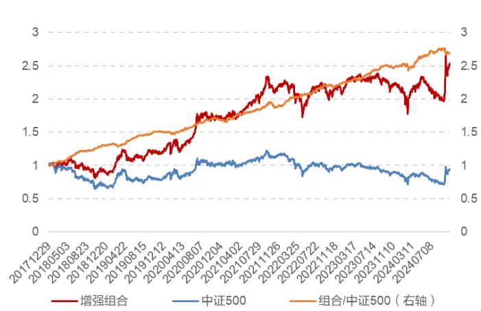
数据来源：Wind，东方证券研究所

图 14：时点风险风控前后增强组合 2024年超额净值及相对回撤（20241031）
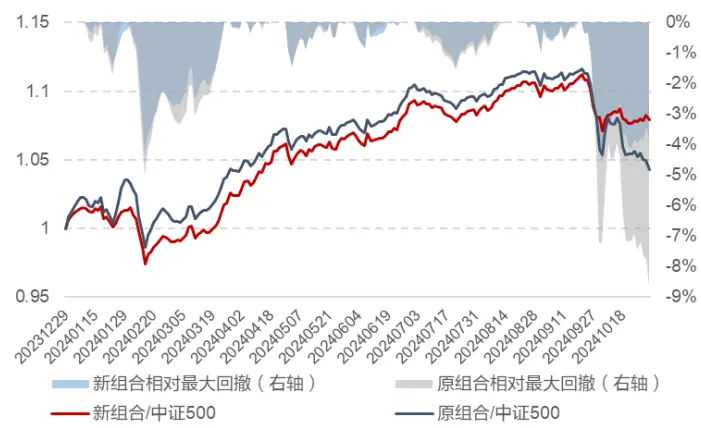
数据来源：Wind，东方证券研究所

下图展示了历史上部分重大外部事件发生时新/旧模型的相对强弱情况。可以看到在各次事件后新模型会明显优于原模型的表现，尤其是临近 20240924 以来的几次事件。而并不是每次事件都一定会优于原模型，如果时点事件本身利好选股因子的方向，那么加入时点风险因子的约束会小幅降低组合的超额，如果和选股因子的方向相反，那么加入时点风险因子约束会降低组合的回撤。这样的利好和利空本身较难预测，因此从降低波动的角度，加入时点风险因子的约束对于降低组合受各种外部事件冲击影响来说是非常有必要的。

图 15：时点风险风控前后中证500增强组合的相对表现及重大影响事件
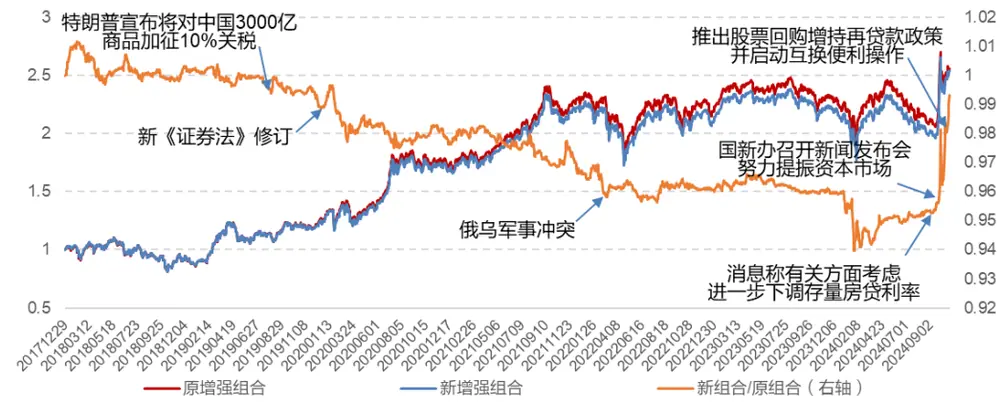
数据来源：Wind，东方证券研究所

有关分析师的申明，见本报告最后部分。其他重要信息披露见分析师申明之后部分，或请与您的投资代表联系。并请阅读本证券研究报告最后一页的免责申明。

上述结果是将时点风险因子的相对暴露约束为 0 后的效果，下面我们进一步测试不断打开敞口后组合的表现情况。可以看到，随着敞口的不断变大，增强组合的年化超额收益先升后降，相对最大回撤持续增大，信息比持续下降，跟踪误差持续上升，2024 年截止 20241031 的超额收益持续下降。如果我们适当放松敞口到 0.2-0.3，新组合从各个维度的统计指标都优于原组合的效果。

表 7：不同时点风险因子敞口下中证 500增强组合收益表现情况

|  | 年化超额收益相 | 对最大回撤 | 信息比 | 跟踪误差 | 收益回撤比 | 月度胜率 | 20241031超额收益 |
| --- | --- | --- | --- | --- | --- | --- | --- |
| 敞口0 | 15.97% | -5.02% | 3.50 | 4.23% | 3.18 | 80.49% | 8.59% |
| 敞口0.1 | 16.03% | -5.22% | 3.46 | 4.29% | 3.07 | 80.49% | 7.12% |
| 敞口 0.2 | 16.16% | -5.38% | 3.43 | 4.37% | 3.00 | 80.49% | 7.13% |
| 敞口0.3 | 16.42% | -6.50% | 3.43 | 4.43% | 2.53 | 81.71% | 5.92% |
| 敞口0.4 | 16.29% | -6.78% | 3.35 | 4.49% | 2.40 | 79.27% | 6.02% |
| 敞口0.5 | 16.21% | -7.76% | 3.31 | 4.54% | 2.09 | 79.27% | 5.49% |
| 原组合 | 16.08% | -8.64% | 3.25 | 4.58% | 1.86 | 79.27% | 4.67% |

数据来源：Wind，东方证券研究所

## 3.2 其他指数及不同收益预测模型上的效果

前文我们在中证 500 指数上检验了时点风险因子风控后的效果，为了验证其普适性，我们将其应用到不同的基准指数及不同的收益预测模型上。

图 16：沪深 300增强组合历史净值
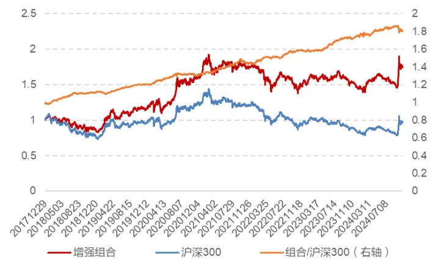
数据来源：Wind，东方证券研究所

图 17：时点风险风控后沪深 300增强组合历史净值
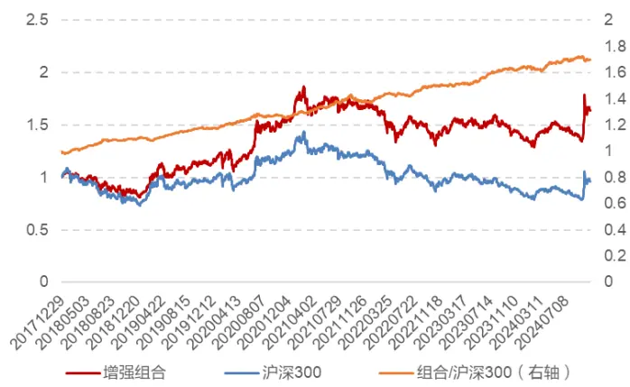
数据来源：Wind，东方证券研究所

上图展示了沪深 300 指数增强模型上加入时点风险风控后的效果，可以看到 20240924 以来的超额回撤同样明显降低。从下表可以看到，加入时点风险风控后，2024 年截止 20241031 的超额收益从 4.04%提升到 4.7%，相对最大回撤从-4.86%下降到-2.77%，信息比、跟踪误差、月度胜率均有提升。长期年化超额从 9.25%下降到 8.28%，信息比保持不变，跟踪误差从 3.59%下降到3.23%。

表 8：沪深 300指数增强模型加入时点风险风控前后收益对比

| 年份 | 原组合 |  |  |  |  | 时点风险风控组合 |  |  |  |  |
| --- | --- | --- | --- | --- | --- | --- | --- | --- | --- | --- |
|  | 超额收益 | 相对最大回撤 | 信息比 | 跟踪误差 | 月度胜率 | 超额收益 | 相对最大回撤 | 信息比 | 跟踪误差 | 月度胜率 |
| 2018 | 9.23% | -1.82% | 3.55 | 3.43% | 75.00% | 7.82% | -1.77% | 3.27 | 3.19% | 75.00% |
| 2019 | 9.20% | -3.22% | 2.70 | 2.45% | 75.00% | 8.39% | -2.98% | 2.52 | 2.40% | 66.67% |
| 2020 | 14.13% | -2.56% | 2.93 | 3.73% | 75.00% | 12.54% | -2.68% | 2.86 | 3.42% | 66.67% |
| 2021 | 8.01% | -4.11% | 2.14 | 3.89% | 66.67% | 6.84% | -4.26% | 1.97 | 3.61% | 58.33% |
| 2022 | 7.69% | -1.57% | 3.03 | 3.17% | 75.00% | 7.13% | -2.16% | 3.12 | 2.86% | 83.33% |
| 2023 | 8.54% | -1.38% | 2.87 | 3.24% | 83.33% | 7.26% | -1.34% | 2.55 | 3.12% | 66.67% |
| 20241031 | 4.04% | -4.86% | 0.83 | 4.97% | 60.00% | 4.70% | -2.77% | 1.26 | 3.91% | 70.00% |
| 全样本期 | 9.25% | -4.86% | 2.48 | 3.59% | 73.17% | 8.28% | -4.26% | 2.47 | 3.23% | 69.51% |

数据来源：Wind，东方证券研究所

下图展示了中证1000指数增强模型上加入时点风险风控后的效果，可以看到20240924以来的超额回撤同样明显降低。

图 18：中证 1000增强组合历史净值
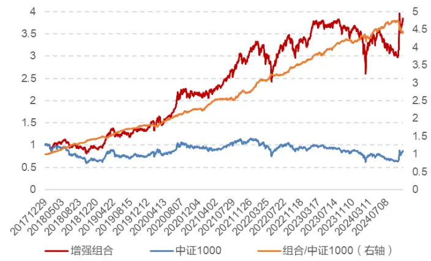
数据来源：Wind，东方证券研究所

图 19：时点风险风控后中证 1000增强组合历史净值
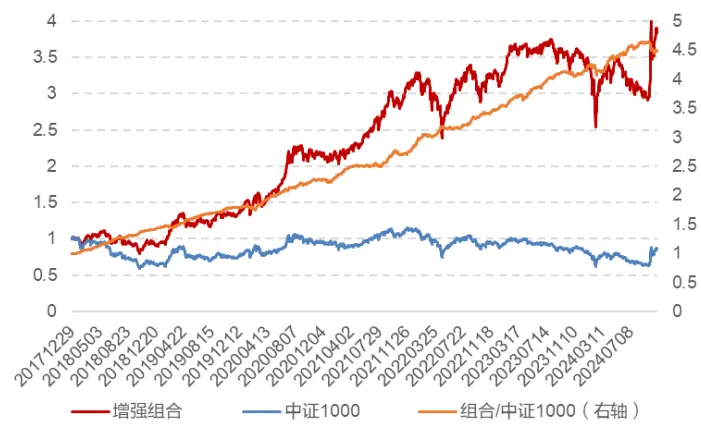
数据来源：Wind，东方证券研究所

从下表可以看到，加入时点风险风控后，2024 年截止 20241031 的超额收益从 4.41%提升到8.14%，相对最大回撤从-9.89%下降到-5.44%，信息比、跟踪误差均有提升。长期年化超额几乎不变，信息比从 4.12提升到 4.47，跟踪误差从 5.38%下降到5.03%。

表 9：中证 1000指数增强模型加入时点风险风控前后收益对比

| 年份 | 原组合 |  |  |  |  | 时点风险风控组合 |  |  |  |  |
| --- | --- | --- | --- | --- | --- | --- | --- | --- | --- | --- |
|  | 超额收益 | 相对最大回撤 | 信息比 | 跟踪误差 | 月度胜率 | 超额收益 | 相对最大回撤 | 信息比 | 跟踪误差 | 月度胜率 |
| 2018 | 28.07% | -1.20% | 8.53 | 4.46% | 100.00% | 27.52% | -1.34% | 8.82 | 4.23% | 100.00% |
| 2019 | 32.95% | -4.34% | 5.74 | 4.07% | 91.67% | 32.85% | -4.10% | 5.91 | 3.95% | 91.67% |
| 2020 | 28.36% | -4.01% | 3.72 | 5.81% | 75.00% | 28.67% | -4.03% | 3.84 | 5.67% | 66.67% |
| 2021 | 33.95% | -3.06% | 4.00 | 6.28% | 75.00% | 32.69% | -3.08% | 3.98 | 6.11% | 75.00% |
| 2022 | 20.78% | -1.65% | 5.13 | 4.67% | 83.33% | 18.90% | -2.00% | 4.77 | 4.61% | 83.33% |
| 2023 | 14.56% | -2.52% | 3.45 | 4.25% | 91.67% | 16.21% | -2.55% | 3.87 | 4.20% | 91.67% |
| 20241031 | 4.41% | -9.89% | 0.62 | 7.44% | 70.00% | 8.14% | -5.44% | 1.55 | 5.92% | 70.00% |
| 全样本期 | 24.58% | -9.89% | 4.12 | 5.38% | 84.15% | 24.89% | -5.44% | 4.47 | 5.03% | 82.93% |

数据来源：Wind，东方证券研究所

有关分析师的申明，见本报告最后部分。其他重要信息披露见分析师申明之后部分，或请与您的投资代表联系。并请阅读本证券研究报告最后一页的免责申明。

从不同基准指数上的效果来看，时点风险约束确实能够普遍起到降低回撤和跟踪误差的效果。考虑到不同机构采用的收益预测模型也有差异，下面我们采用不同的收益预测模型并检验加入时点风险约束前后的效果对比。

首先我们采用之前的报告《融合基本面信息的 ASTGNN 因子挖掘模型》（20240527）中的深度学习因子作为收益预测模型。其加入时点风险约束前后的中证 500 指数增强组合表现如下图所示。可以看到近期的超额回撤略有下降。

图 20：深度学习因子中证 500增强组合净值
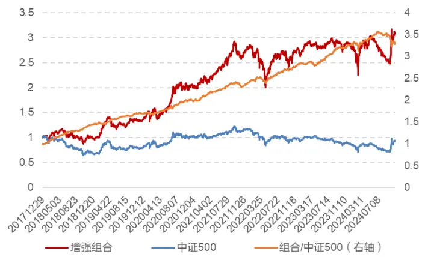
数据来源：Wind，东方证券研究所

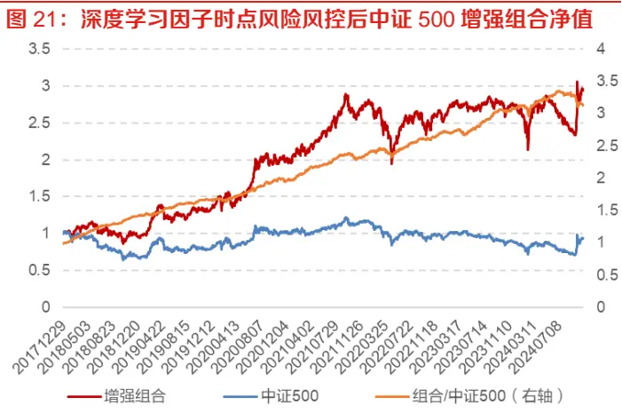
数据来源：Wind，东方证券研究所

从下表可以看到，加入时点风险风控后，2024 年截止 20241031 的超额收益从 0.88%提升到1.14%，相对最大回撤从-12.48%下降到-9.23%，信息比、跟踪误差均有提升。

表 10：深度学习因子中证 500指数增强模型加入时点风险风控前后收益对比

| 年份 | 原组合 |  |  |  |  | 时点风险风控组合 |  |  |  |  |
| --- | --- | --- | --- | --- | --- | --- | --- | --- | --- | --- |
|  | 超额收益 | 相对最大回撤 | 信息比 | 跟踪误差 | 月度胜率 | 超额收益 | 相对最大回撤 | 信息比 | 跟踪误差 | 月度胜率 |
| 2018 | 30.44% | -1.04% | 8.05 | 4.84% | 100.00% | 28.66% | -1.06% | 7.98 | 4.63% | 100.00% |
| 2019 | 21.02% | -4.06% | 3.67 | 4.22% | 91.67% | 21.36% | -3.20% | 3.86 | 4.08% | 91.67% |
| 2020 | 20.45% | -4.16% | 2.67 | 6.06% | 75.00% | 21.47% | -3.67% | 2.97 | 5.70% | 75.00% |
| 2021 | 25.40% | -4.65% | 4.19 | 4.92% | 83.33% | 24.91% | -4.61% | 4.18 | 4.84% | 83.33% |
| 2022 | 13.94% | -4.64% | 3.02 | 5.66% | 75.00% | 11.21% | -4.74% | 2.72 | 5.14% | 66.67% |
| 2023 | 13.34% | -3.50% | 3.13 | 4.37% | 66.67% | 12.56% | -3.43% | 3.09 | 4.18% | 75.00% |
| 20241031 | 0.88% | -12.48% | 0.06 | 7.94% | 60.00% | 1.14% | -9.23% | 0.15 | 6.28% | 50.00% |
| 全样本期 | 19.49% | -12.48% | 3.26 | 5.52% | 79.27% | 18.65% | -9.23% | 3.44 | 5.03% | 78.05% |

数据来源：Wind，东方证券研究所

我们采用之前的报告《相对定价类基本面因子挖掘》（20241011）中的相对定价类基本面复合因子作为收益预测模型。其加入时点风险约束前后的中证 500 指数增强组合表现如下图所示。可以看到近期的超额回撤也明显下降。

图 22：基本面因子中证 500增强组合净值
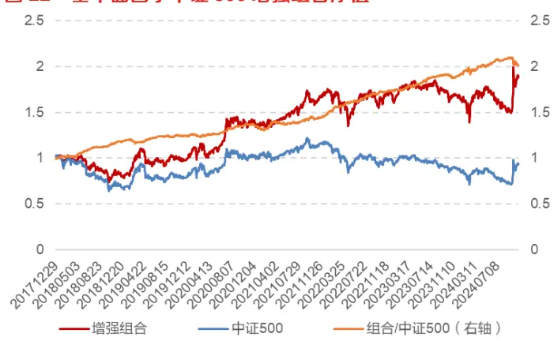
数据来源：Wind，东方证券研究所

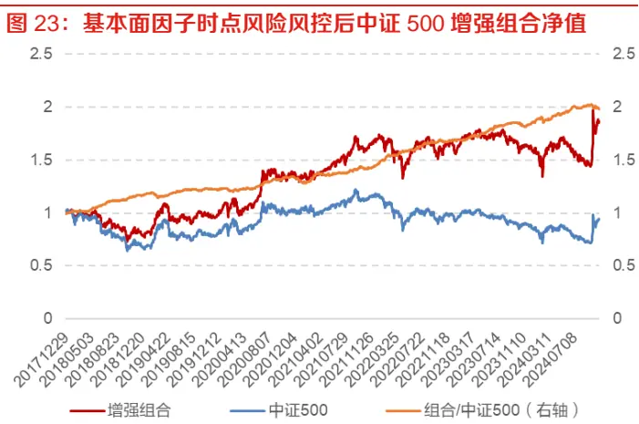
数据来源：Wind，东方证券研究所

从下表可以看到，加入时点风险风控后，2024 年截止 20241031 的超额收益从 5.15%提升到7.41%，相对最大回撤从-5.75%下降到-3.17%，信息比、跟踪误差均有提升。

表 11：基本面因子中证 500指数增强模型加入时点风险风控前后收益对比

| 年份 | 原组合 |  |  |  |  | 时点风险风控组合 |  |  |  |  |
| --- | --- | --- | --- | --- | --- | --- | --- | --- | --- | --- |
|  | 超额收益 | 相对最大回撤 | 信息比 | 跟踪误差 | 月度胜率 | 超额收益 | 相对最大回撤 | 信息比 | 跟踪误差 | 月度胜率 |
| 2018 | 12.46% | -0.88% | 5.38 | 3.29% | 100.00% | 11.51% | -0.85% | 5.12 | 3.21% | 83.33% |
| 2019 | 7.61% | -4.81% | 1.76 | 3.25% | 75.00% | 6.72% | -4.99% | 1.60 | 3.16% | 66.67% |
| 2020 | 6.64% | -3.48% | 1.31 | 4.01% | 66.67% | 6.57% | -3.38% | 1.32 | 3.98% | 66.67% |
| 2021 | 13.48% | -2.99% | 2.22 | 5.01% | 58.33% | 14.87% | -2.36% | 2.53 | 4.84% | 66.67% |
| 2022 | 14.05% | -0.99% | 4.88 | 3.41% | 100.00% | 12.03% | -1.36% | 4.20 | 3.44% | 100.00% |
| 2023 | 9.17% | -2.07% | 2.99 | 3.20% | 91.67% | 8.97% | -2.16% | 3.03 | 3.09% | 91.67% |
| 20241031 | 5.15% | -5.75% | 1.00 | 5.33% | 50.00% | 7.41% | -3.17% | 1.87 | 4.26% | 60.00% |
| 全样本期 | 10.99% | -5.75% | 2.60 | 3.99% | 78.05% | 10.78% | -5.38% | 2.71 | 3.76% | 76.83% |

数据来源：Wind，东方证券研究所

从不同收益预测模型的结果也可以看到，加入时点风险风控约束后，模型的超额回撤、跟踪误差都能得到提升。

通过引入时点风险因子作为风控约束，增强组合的超额回撤和跟踪误差能够得到明显改善，尤其是 20240924以来各种国际国内外部催化事件频发，这种风控约束的必要性尤为迫切。

## 四、价格类风险因子在指增组合上的应用

从前文可以看到，时点风险因子纳入风控约束的效果非常明显，但是在风险来源并不主要源于外部事件的历史年份中，时点风险因子约束的效果并不明显。我们可以把它理解为一类特殊的量价风险因子。从组合的风控角度来看，我们认为两种风险控制方式都非常重要，一类是对已知的某类风险的约束，例如约束 Barra 的各类风险、时点风险的暴露；还有一类就是以量取胜，我们并不知道未来哪种风险是主要矛盾，因此可以以“围铁桶”的方式尽可能多地约束各种潜在的风险来达到“密不透风”的效果从而起到约束住组合波动的效果。下面我们尝试简单加入一些价量类风险因子，看是否确实能够更好地改进组合的超额波动，如果效果显著，说明在风险模型端的研究投入是非常有必要的。

我们简单构造了几个价格类风险因子：

⚫ 244 日前高距离：close/ts_delay(ts_ max(close, 244) , 1)

⚫ 244 日前低距离：close/ts_delay(ts_ min(close, 244) , 1)

⚫ 244 日路径位移比：ts_sum(ret, 244)/ts_sum(abs(ret), 244)

⚫ Beta：Barra 的 Beta 因子

⚫ Volatility：Barra 的 Volatility 因子

⚫ Trend：Barra 的 Trend 因子

⚫ 价格开方：sqrt(close)

⚫ 时点风险：价量均突变时点风险因子

这些因子的周度选股能力如下表，可以看到 IC 均值都较低，但是 IC 绝对值均值都很高，都是典型的风险因子。

表 12：价格类风险因子选股能力表现

| 风险因子 | IC 均值 | IC 标准差 | IC 绝对值均值 | 年化ICIR | IC 胜率 | 周度自相关系数 |
| --- | --- | --- | --- | --- | --- | --- |
| 244 日前高距离 | -0.019 | 0.164 | 0.125 | -0.82 | 53% | 0.94 |
| 244 日前低距离 | -0.045 | 0.148 | 0.123 | -2.21 | 61% | 0.95 |
| 244 日路径位移比 | -0.027 | 0.139 | 0.111 | -1.4 | 58% | 0.97 |
| Beta | -0.004 | 0.18 | 0.146 | -0.15 | 52% | 0.98 |
| Volatility | -0.044 | 0.16 | 0.135 | -1.97 | 61% | 0.99 |
| Trend | -0.019 | 0.155 | 0.123 | -0.88 | 54% | 0.99 |
| 价格开方 | -0.02 | 0.173 | 0.142 | -0.83 | 51% | 0.99 |
| 时点风险 | -0.012 | 0.132 | 0.1 | -0.65 | 54% | 0.61 |

数据来源：Wind，东方证券研究所

如果我们将这些因子计算其对股票的周度收益的解释能力，并和 Barra 模型进行对比，如下图所示可以看到，Barra风险模型代入价格风险因子后，整体的解释力得到了明显提升。

有关分析师的申明，见本报告最后部分。其他重要信息披露见分析师申明之后部分，或请与您的投资代表联系。并请阅读本证券研究报告最后一页的免责申明。

图 24：不同风险模型周度解释能力
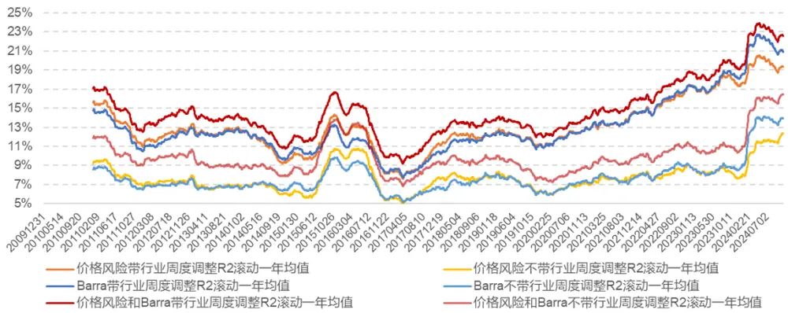
数据来源：Wind，东方证券研究所

下表是各模型的周度收益解释力的对比。可以看到几个价格风险因子一起就能够起到和 Barra 模型相同的解释力，结合在一起后 R2 能从 7.88%提升到 10.18%，带行业一起 R2 可以从 13.24%提升到 14.95%。

表 13：不同风险模型周度调整R2的均值

|  | 不带行业 | 带行业 |
| --- | --- | --- |
| Barra | 7.88% | 13.24% |
| 价格风险 | 7.89% | 13.31% |
| 价格风险+Barra | 10.18% | 14.95% |

数据来源：Wind，东方证券研究所

如果我们将这些价格类风险因子的相对暴露都约束为 0，中证 500 指数增强模型的表现如下图所示。可以看到该指数增强组合在 20240924以来并没有明显的超额回撤。

图 25：价格类风险风控后中证500增强组合历史净值
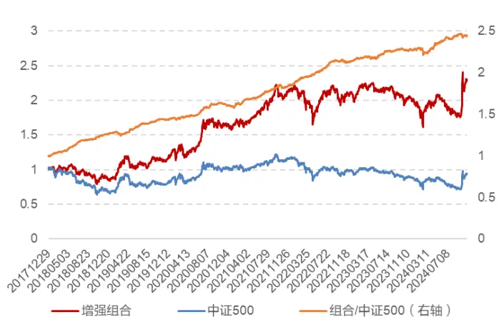
数据来源：Wind，东方证券研究所

图26：价格类风险风控后中证500增强组合2024年净值及相对回撤
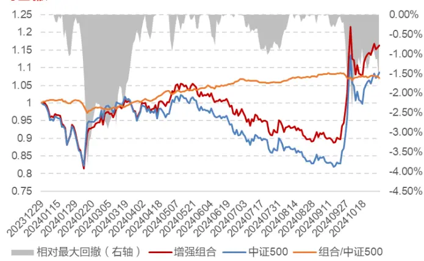
数据来源：Wind，东方证券研究所

原组合、时点风险风控组合、价格类风险风控组合的年化超额收益分别为 16.08%、15.97%、14.26%，相对最大回撤分别为-8.64%、-5.02%、-4.32%，信息比分别为 3.25、3.50、3.74，2024 年截止 20241031 的相对最大回撤分别为-8.64%、-4.65%、-3.84%。加入更多价格类风控后，组合的超额波动和相对回撤都得到了提升。

有关分析师的申明，见本报告最后部分。其他重要信息披露见分析师申明之后部分，或请与您的投资代表联系。并请阅读本证券研究报告最后一页的免责申明。

表 14：价格类风险风控后中证500增强组合历史收益表现

| 年份 | 绝对收益 | 基准收益 | 超额收益 | 相对最大回撤 | 信息比 | 跟踪误差 | 收益回撤比 | 月度胜率 |
| --- | --- | --- | --- | --- | --- | --- | --- | --- |
| 2018 | -15.35% | -33.32% | 17.97% | -0.84% | 7.18 | 3.41% | 21.30 | 100.00% |
| 2019 | 44.48% | 26.38% | 18.09% | -3.98% | 4.02 | 3.38% | 4.55 | 75.00% |
| 2020 | 33.04% | 20.87% | 12.16% | -3.28% | 2.74 | 3.60% | 3.71 | 75.00% |
| 2021 | 35.52% | 15.58% | 19.94% | -2.16% | 4.13 | 3.95% | 9.22 | 83.33% |
| 2022 | -7.96% | -20.31% | 12.35% | -1.79% | 4.60 | 3.23% | 6.92 | 83.33% |
| 2023 | -2.60% | -7.42% | 4.82% | -1.46% | 1.67 | 3.09% | 3.29 | 58.33% |
| 20241031 | 16.35% | 8.69% | 7.66% | -3.84% | 1.93 | 4.31% | 1.99 | 70.00% |
| 全样本期 | 13.40% | -0.86% | 14.26% | -4.32% | 3.74 |  |  |  |
|  |  |  |  |  |  | 3.59% |  |  |
|  |  |  |  |  |  |  | 3.30 | 78.05% |

数据来源：Wind，东方证券研究所

下表展示了三个组合在 2024年 9月-10月的关键时间段的超额表现，可以看到加入更多价格类风控手段后，组合大部分周度的超额都有了明显提升。

表 15：三个组合在关键时间段的超额收益表现

|  | 起始日期 | 结束日期 | 原组合超额收益 | 时点风险风控组合超额收益 | 价格类风控组合超额收益 |
| --- | --- | --- | --- | --- | --- |
| 周度 | 20240920 | 20240927 | -2.41% | -2.22% | -1.38% |
| 周度 | 20240927 | 20240930 | -1.31% | -0.87% | -0.16% |
| 周度 | 20240930 | 20241011 | 0.13% | 0.22% | 0.24% |
| 周度 | 20241011 | 20241018 | -1.98% | -0.28% | 0.12% |
| 周度 | 20241018 | 20241025 | -0.72% | -0.19% | 0.30% |
| 周度 | 20241025 | 20241031 | -0.89% | 0.12% | -0.59% |
| 区间 | 20240130 | 20240207 | -5.03% | -4.10% | -3.71% |
| 区间 | 20240923 | 20241009 | -7.20% | -4.65% | -2.30% |
| 区间 | 20241009 | 20241031 | -1.02% | 0.74% | 0.54% |

数据来源：Wind，东方证券研究所

由此可见，加入更多的价格类风险来源进行风控，能够显著降低超额的波动。因此从体系化的角度，迫切需要我们有一个大型且完备的风险模型来刻画和建模组合的风险来源，这个风险模型体系体现在两个重要维度，一个维度是针对各种结构化风险的刻画，例如估值、动量、波动等风险，包括我们之前的研究《非线性市值风控全攻略》（20240527），另一个维度是需要其包含的维度足够广，形成全方位风险的覆盖，最终构建一套"结构化风险+全维度覆盖"的双层风控体系，为极端市场环境下的量化投资提供更全面的解决方案。

## 五、总结

## 研究动机

2024年 9月科技板块因政策变化引发的超预期反弹，暴露了传统指数增强模型在应对突发性外部风险时的重大缺陷。此类事件驱动型风险具有瞬时性、高波动特征，而传统 Barra 类风险模型依赖缓慢衰减的风格因子进行风控，难以及时捕捉突发风险的短期集聚效应，导致组合在极端市场环境下出现历史性回撤。基于此，本研究提出时点风险因子，旨在解决突变型风险对组合的冲击问题。

## 时点风险因子

针对外部风险事件的突发性，我们创新性提出“时点风险因子”来刻画这种时点的风险，风险具有集聚性，因此当天高风险的来源在未来短期内仍然是市场的高风险来源，因此可以依靠这种风险的集聚效应去控制组合的时点风险从而起到对外部事件降波的作用。

我们通过监测中证全指指数的振幅与成交额突破阈值（5 日均值+1 倍标准差）的突变时点，以个股当日涨跌幅构建风险因子。当日个股涨跌幅是当日的隐式风险共同作用“定价”后的结果，这一设计本质上是将政策冲击、流动性突变等不可观测的隐式风险通过非参数化方式纳入模型，利用风险的短期集聚效应实现风险脱敏。

## 时点风险因子在指增组合上的应用

中证500指数增强组合加入时点风险风控后，2024年的超额收益、相对最大回撤、信息比、跟踪误差相比于原模型都有显著的提升，截止 20241031 的超额收益从原模型的 4.67%提升到 8.59%，相对最大回撤从-8.64%下降到-4.65%，跟踪误差从 7.22%下降到 5.63%。

应用于不同基准例如沪深300、中证1000指数增强模型以及针对不同的收益预测模型例如深度学习因子、基本面因子的增强模型都能带来普适性的相对回撤和跟踪误差的显著下降。

## 价格类风险因子在指增组合上的应用

时点风险因子纳入风控约束的效果非常明显，但是在风险来源并不主要源于外部事件的历史年份中，时点风险因子约束的效果并不明显。我们尝试加入更多价格类风险因子，能够明显提高风险模型对风险的解释力，加入风控后也能进一步降低组合的超额波动。由此可见，一个大型且完备的风险模型是非常有必要的，既需要针对特定类型风险例如时点风险、传统风格风险的风险因子，又需要覆盖的维度足够广，以此构建一套“结构化风险+全维度覆盖”的双层风控体系，可以为风险控制提供更全面的解决方案。

## 风险提示

1. 量化模型失效风险。

2. 极端市场环境可能对模型效果造成剧烈冲击，导致收益亏损。

## Tabl e_Disclai mer 分析师申明

每位负责撰写本研究报告全部或部分内容的研究分析师在此作以下声明：

分析师在本报告中对所提及的证券或发行人发表的任何建议和观点均准确地反映了其个人对该证券或发行人的看法和判断；分析师薪酬的任何组成部分无论是在过去、现在及将来，均与其在本研究报告中所表述的具体建议或观点无任何直接或间接的关系。

## 投资评级和相关定义

报告发布日后的12个月内行业或公司的涨跌幅相对同期相关证券市场代表性指数的涨跌幅为基准（A 股市场基准为沪深 300 指数，香港市场基准为恒生指数，美国市场基准为标普 500 指数）；

## 公司投资评级的量化标准

买入：相对强于市场基准指数收益率 15%以上；

增持：相对强于市场基准指数收益率 5%～15%；

中性：相对于市场基准指数收益率在-5%～+5%之间波动；

减持：相对弱于市场基准指数收益率在-5%以下。

未评级 —— 由于在报告发出之时该股票不在本公司研究覆盖范围内，分析师基于当时对该股票的研究状况，未给予投资评级相关信息。

暂停评级 —— 根据监管制度及本公司相关规定，研究报告发布之时该投资对象可能与本公司存在潜在的利益冲突情形；亦或是研究报告发布当时该股票的价值和价格分析存在重大不确定性，缺乏足够的研究依据支持分析师给出明确投资评级；分析师在上述情况下暂停对该股票给予投资评级等信息，投资者需要注意在此报告发布之前曾给予该股票的投资评级、盈利预测及目标价格等信息不再有效。

## 行业投资评级的量化标准：

看好：相对强于市场基准指数收益率 5%以上；

中性：相对于市场基准指数收益率在-5%～+5%之间波动；

看淡：相对于市场基准指数收益率在-5%以下。

未评级：由于在报告发出之时该行业不在本公司研究覆盖范围内，分析师基于当时对该行业的研究状况，未给予投资评级等相关信息。

暂停评级：由于研究报告发布当时该行业的投资价值分析存在重大不确定性，缺乏足够的研究依据支持分析师给出明确行业投资评级；分析师在上述情况下暂停对该行业给予投资评级信息，投资者需要注意在此报告发布之前曾给予该行业的投资评级信息不再有效。

## HeadertTabl e_Discl ai mer 免责声明

本证券研究报告（以下简称“本报告”）由东方证券股份有限公司（以下简称“本公司”）制作及发布。

。本公司不会因接收人收到本报告而视其为本公司的当然客户。本报告的全体接收人应当采取必要措施防止本报告被转发给他人。

本报告是基于本公司认为可靠的且目前已公开的信息撰写，本公司力求但不保证该信息的准确性和完整性，客户也不应该认为该信息是准确和完整的。同时，本公司不保证文中观点或陈述不会发生任何变更，在不同时期，本公司可发出与本报告所载资料、意见及推测不一致的证券研究报告。本公司会适时更新我们的研究，但可能会因某些规定而无法做到。除了一些定期出版的证券研究报告之外，绝大多数证券研究报告是在分析师认为适当的时候不定期地发布。

在任何情况下，本报告中的信息或所表述的意见并不构成对任何人的投资建议，也没有考虑到个别客户特殊的投资目标、财务状况或需求。客户应考虑本报告中的任何意见或建议是否符合其特定状况，若有必要应寻求专家意见。本报告所载的资料、工具、意见及推测只提供给客户作参考之用，并非作为或被视为出售或购买证券或其他投资标的的邀请或向人作出邀请。

本报告中提及的投资价格和价值以及这些投资带来的收入可能会波动。过去的表现并不代表未来的表现，未来的回报也无法保证，投资者可能会损失本金。外汇汇率波动有可能对某些投资的价值或价格或来自这一投资的收入产生不良影响。那些涉及期货、期权及其它衍生工具的交易，因其包括重大的市场风险，因此并不适合所有投资者。

在任何情况下，本公司不对任何人因使用本报告中的任何内容所引致的任何损失负任何责任，投资者自主作出投资决策并自行承担投资风险，任何形式的分享证券投资收益或者分担证券投资损失的书面或口头承诺均为无效。

本报告主要以电子版形式分发，间或也会辅以印刷品形式分发，所有报告版权均归本公司所有。未经本公司事先书面协议授权，任何机构或个人不得以任何形式复制、转发或公开传播本报告的全部或部分内容。不得将报告内容作为诉讼、仲裁、传媒所引用之证明或依据，不得用于营利或用于未经允许的其它用途。

经本公司事先书面协议授权刊载或转发的，被授权机构承担相关刊载或者转发责任。不得对本报告进行任何有悖原意的引用、删节和修改。

提示客户及公众投资者慎重使用未经授权刊载或者转发的本公司证券研究报告，慎重使用公众媒体刊载的证券研究报告。

## 东方证券研究所

地址： 上海市中山南路 318 号东方国际金融广场 26 楼

电话：021-63325888

传真：021-63326786

网址： www.dfzq.com.cn