# 盈余公告异象类因子改进与挖掘

## 因子选股系列之一一四

## 研究结论

## 研究动机

在前期研究中，我们构建的 AI 深度学习因子展现出显著优势——基于海量样本的非线性收益预测模型具备超强拟合能力，而传统人工构建的时序统计类因子往往难以匹敌。然而，当前因子挖掘面临两大瓶颈：一是挖掘的新因子虽单独有效，但在多因子组合中易受相关性衰减影响，边际效用递减明显；二是深度学习在小样本事件（如低频的盈余公告）中难以发挥优势，人工因子挖掘更具优势。

基于此，我们聚焦盈余公告事件窗口，探索未被充分开发的低相关量价因子空间，其稀缺性体现在：1）公告信息释放引发的价格漂移现象具有独特信息含量；2）事件驱动型量价因子与日频量价和基本面因子相关性低。

## AOG因子的缺陷及改进

盈余公告窗口附近量价因子典型的代表是盈余公告次日开盘跳空超额AOG因子。AOG因子2021年10月以来大部分时间十分组的多头组超额收益走平，而其他几组并没有失效，只是其多头组由于超预期的投资模式被大量投资者熟悉后导致在公告前后过度透支业绩从而在公告后没有超额收益。我们围绕 AOG 因子构建过程中的两个问题进行改进，一个是跨日的时序可比性问题，一个是知情交易者在盈余公告前后提前透支业绩的知情交易者干扰的问题。

改进后得到两个因子，一个是以公告前最大开盘跳空幅度为“真实预期”进行环比操作的 DEMAX 超预期因子，一个是取公告前开盘跳空的“盈利质量下限”而构造的QUANTILE 的盈利质量因子，都具有稳健的选股能力而且近 3 年的超额收益比历史上更显著，加入现有的多因子体系也能带来超额的提升。

## 盈余公告异象类衍生因子挖掘

我们将上述因子改进过程抽象为盈余公告事件上的价量特征的因子挖掘框架。复用因子结构加入其他价量特征，例如盈余公告次日最低价涨跌幅、盈余公告次日早盘大单资金净流入占比特征，都能衍生出一批显著的选股因子。这些因子和传统的日频量价类因子低相关，同时又和基本面因子低相关，因此复用这套结构可以很容易构造出一批和现有因子低相关的因子加入因子库中。

## 风险提示

1. 量化模型失效风险。

2. 极端市场环境可能对模型效果造成剧烈冲击，导致收益亏损。

## 报告发布日期

2025 年 04 月 22 日

杨怡玲

yangyiling@orientsec.com.cn

执业证书编号：S0860523040002

时点风险模型：——因子选股系列之一一 2025-04-20三

ADWM：基于门控机制的自适应动态因子 2025-04-10加权模型：——因子选股系列之一一二

DFQ-FactorVAE-pro：加入特征选择与环 2025-02-19
境变量模块的 FactorVAE 模型：——因子
选股系列之一一一
ABCM：基于神经网络的alpha因子和beta 2024-12-03
因子协同挖掘模型：——因子选股系列之
一一〇

相对定价类基本面因子挖掘：——因子选 2024-10-11股系列之一〇九

KD-Ensemble：基于知识蒸馏的 alpha 因 2024-08-19子挖掘模型：——因子选股系列之一〇八

DFQ-XGB：基于树模型的 alpha 预测方 2024-08-15案：——因子选股系列之一〇七

## 一、研究动机

在前期研究中，我们构建的 AI深度学习因子展现出显著优势，例如《DFQ-FactorVAE-pro：加入特征选择与环境变量模块的 FactorVAE 模型》（20250218），《ADWM：基于门控机制的自适应动态因子加权模型》（20250409），基于海量样本的非线性收益预测模型具备超强拟合能力，而传统人工构建的时序统计类因子往往难以匹敌。然而，当前因子挖掘面临两大瓶颈：一是挖掘的新因子虽单独有效，但在多因子组合中易受相关性衰减影响，边际效用递减明显；二是深度学习在小样本事件（如低频的盈余公告）中难以发挥优势，人工因子挖掘更具优势。

下表我们将现有的因子构造体系做了一个梳理。日频量价类因子挖掘是边际效用衰减最快的类型，尤其是在各种深度学习模型的应用之后，人工因子相对于这些模型的增量非常小。而基本面类财务因子本质是盈余公告事件型的因子，并且我们之前的研究《基本面因子的重构》（20240321）和《相对定价类基本面因子挖掘》（20241011）中都做了一些基本面因子挖掘的研究。分析师类因子的研究覆盖同样已经较为充分。

从当前的研究覆盖来看，盈余公告窗口附近的量价类因子的研究较少。而且这些事件是一些小样本事件，很难用复杂的深度学习模型去拟合，基于此，我们聚焦盈余公告事件窗口，探索未被充分开发的低相关量价因子空间，其稀缺性体现在：1）公告信息释放引发的价格漂移现象具有独特信息含量；2）事件驱动型量价因子与日频量价和基本面因子相关性低。

表 1：因子挖掘空间

|  | 量价数据 | 财务数据 | 另类数据 |
| --- | --- | --- | --- |
| 事件 | 人工挖掘因子为主，研究覆盖程度低 | 财务类因子以人工构造为主，覆盖程度高 | 分析师研报类数据以人工构造因子为主，覆盖程度高 |
| 日常交易 | 高频量价以 AI 模型构造效果更好，覆盖程度高 | 1 | 新闻情绪类数据以 AI 构造因子为主，覆盖程度高 |

数据来源：东方证券研究所

盈余公告窗口附近量价因子典型的代表是 PEAD（盈余公告后价格漂移）类因子。自从 1967 年芝加哥大学的 Ray Ball 教授和 Philip Brown 教授在“Analysis of Security Prices”研讨会上首先提出 PEAD（盈余公告后价格漂移）效应后 [Ball@1967]，预期外盈利异象受到了 50 多年的广泛关注，并且在各个股票市场及长时间尺度上被验证一直持续有效。

我们认为在 A 股市场，不仅盈余公告后会产生价格漂移现象，在盈余公告前同样也会存在价格漂移现象。在上市公司披露盈余公告前，长期投资型知情交易者可能会持续托举股价，而短线知情交易者可能会提前介入大幅拉升股价；披露盈余公告当天，事件驱动型交易者可能会追逐基本面变化带来的超预期的交易机会；在披露公告当天日内及之后，趋势跟踪交易者可能追逐趋势而持续买入。

这些交易行为不仅仅发生在盈余公告后，也会在盈余公告前体现，并且都会在价和量上产生交易的痕迹，因此围绕盈余公告我们可以尝试依靠这些投资者的价量特征来挖掘一系列的量价异动型因子。

图 1：盈余公告前后各类交易者行为模式
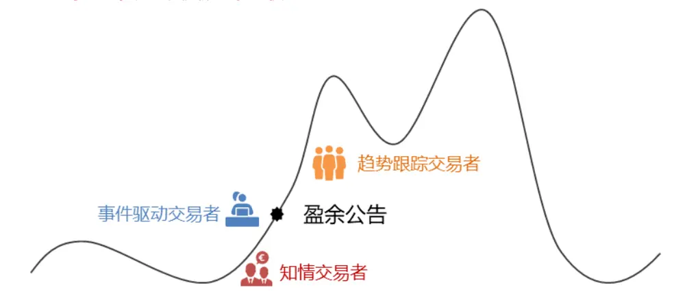
数据来源：东方证券研究所

AOG 是经典的盈余公告事件驱动因子，如果盈余公告次日开盘高开，可以认为市场对于其盈余公告业绩的认可，由于上市公司并不会都在同一天披露盈余公告，为了跨日可比，一般我们将股票盈余公告次日的开盘收益减去当日市场指数开票收益率作为开盘跳空超额（Alpha of Open Gap，简称 AOG）因子：

$$
AOG_{t+1}=Open_{t+1}/Close_{t}-Open_{mkt,t+1}/Close_{mkt,t}
$$

其中 $Open_{t+1}$ , Close 分别为股票在 t+1, t 时刻的开盘价和收盘价， $Open_{mkt,t+1},Close_{mkt,t}$ 分别为市场指数在 t+1, t时刻的开盘价和收盘价，这里我们以中证全指指数作为市场指数。下图展示了该因子经过市值行业中性化（下文中因子表现回测除显式说明外均经过市值行业中性化处理）后 2010-2024年月频调仓后的分组多空收益和月度 IC表现情况。

图 2：AOG因子月度十分组多空净值
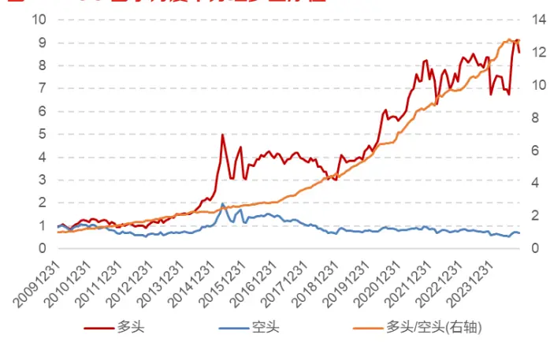
数据来源：Wind，东方证券研究所

图 3：AOG因子月度 IC及累计 IC
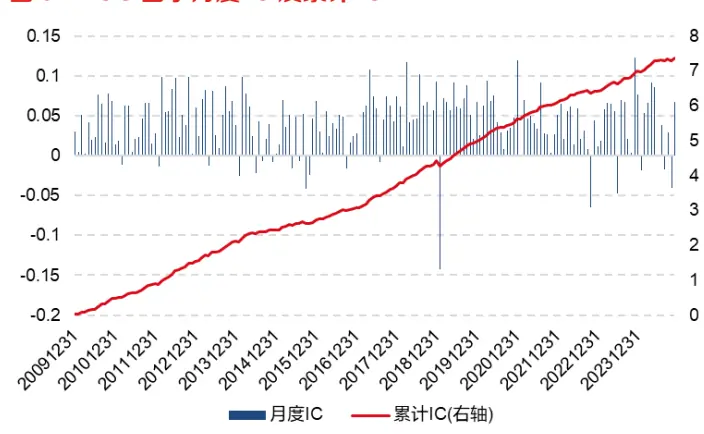
数据来源：Wind，东方证券研究所

可以看到该因子的多空收益长期向上，但是 2021 年 9 月以来的斜率相比历史略有下降，从累计IC来看近3年稳定性略有下降，但趋势仍然向上。因此从多空收益和累计IC的角度，我们会认为该因子近几年仍然具有不错的选股能力。

然而下图是我们统计了其十分组后月度超额收益的累计单利收益曲线，以及以AOG单因子构建沪深 300、中证 500、中证 1000 指数增强 MFE 组合后的超额收益表现情况（构造方式可以参考《基本面因子的重构》（20240321）等报告），为了降低个股特异性的影响，我们控制了行业 0暴露、市值 0 暴露、个股权重最大偏离 0.3%、成分股占比 80%、次日 VWAP 调仓并扣除双边0.3%费用构建月频 MFE组合。

可以看到，2021年10月以来大部分时间该因子十分组的多头第10组和第9组累计单利是平的，而第 1-8 组的收益曲线和 2021 年 10 月前没有明显变化，说明该因子近 3 年从全市场维度并没有失效，而只是其多头组由于超预期的投资模式被大量投资者熟悉后导致在公告前后过度透支业绩从而在公告后没有持续的超额收益。

图 4：AOG因子十分组超额累计单利收益
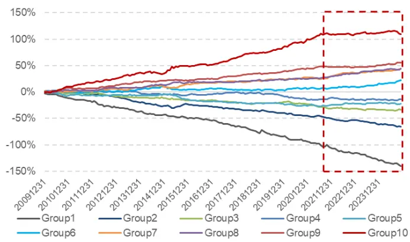
数据来源：Wind，东方证券研究所

图 5：AOG因子沪深 300MFE 组合净值
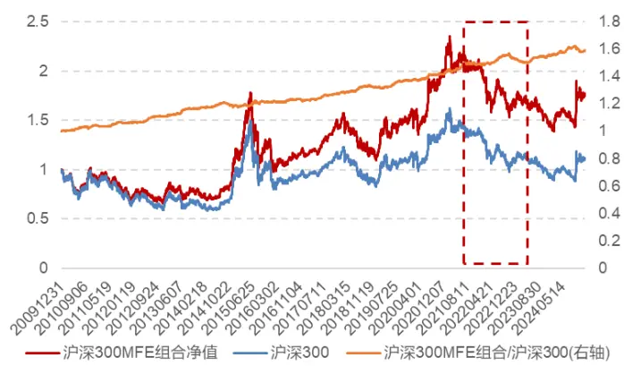
数据来源：Wind，东方证券研究所

图 6：AOG因子中证 500MFE 组合净值
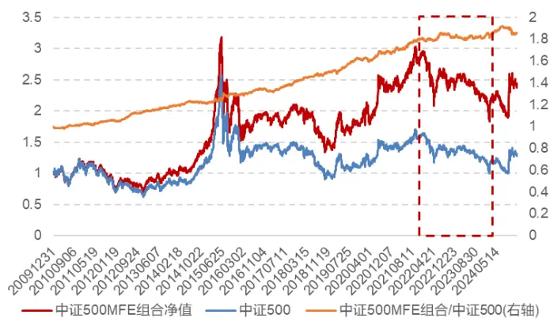
数据来源：Wind，东方证券研究所

图 7：AOG 因子中证 1000MFE 组合净值
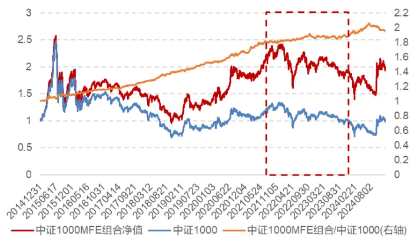
数据来源：Wind，东方证券研究所

而从不同指数的MFE增强组合超额曲线来看，2021年10月以来也基本是平的，明显低于历史的超额斜率。

下表统计了各宽基指数上 MFE 组合的各年超额收益表现情况。可以看到 AOG 因子以各个宽基指数上近 3年的超额收益都在 1-2%附近，明显低于其长期年化超额收益。

表 2：AOG因子各宽基指数 MFE增强组合各年收益表现

| 年份 | 沪深300 |  | 中证500 |  | 中证1000 |  |
| --- | --- | --- | --- | --- | --- | --- |
|  | 超额收益 | 信息比 | 超额收益 | 信息比 | 超额收益 | 信息比 |
| 2010 | 3.98% | 2.79 | 3.03% | 1.27 |  |  |
| 2011 | 1.46% | 1.48 | 1.78% | 1.36 |  |  |
| 2012 | 4.45% | 3.29 | 8.12% | 3.85 |  |  |
| 2013 | 5.05% | 3.48 | 5.22% | 2.04 |  |  |
| 2014 | 2.48% | 1.06 | 2.28% | 0.76 |  |  |
| 2015 | 2.20% | 0.79 | 8.89% | 1.84 | 15.48% | 2.22 |
| 2016 | 1.14% | 0.74 | 2.55% | 1.47 | 5.92% | 3.33 |
| 2017 | 5.22% | 3.32 | 7.30% | 3.52 | 6.57% | 3.52 |
| 2018 | 2.61% | 2.41 | 3.73% | 2.31 | 7.46% | 4.08 |
| 2019 | 4.34% | 2.19 | 9.25% | 3.15 | 10.79% | 3.17 |
| 2020 | 5.78% | 2.69 | 6.06% | 1.95 | 9.77% | 2.52 |
| 2021 | 3.98% | 1.87 | 6.80% | 1.83 | 11.70% | 2.77 |
| 2022 | 2.02% | 1.26 | 1.47% | 0.70 | 2.49% | 1.16 |
| 2023 | 1.24% | 0.96 | 0.55% | 0.25 | 2.13% | 0.85 |
| 2024 | 2.78% | 1.23 | 1.05% | 0.26 | 2.17% | 0.54 |
| 全样本期 | 3.26% | 1.85 | 4.41% | 1.70 | 7.15% | 2.31 |

数据来源：Wind，东方证券研究所

该因子历史表现优秀，我们希望尝试改进该因子，使得近几年的表现能够提升。这种改进的过程如果能够泛化，进而就可以构造一批新的因子。

## 二、AOG因子构建的缺陷与改进

从上文AOG因子的构建方式和表现可以看到，该因子的构造过程存在两个明显可以改进的地方。一个是跨日的时序可比性问题，一个是知情交易者在盈余公告前后提前透支业绩的知情交易者干扰的问题。

## 2.1 时序可比性

不同上市公司披露盈余公告往往并不在同一个交易日，虽然我们在构建AOG因子时扣除了披露当天市场指数同期收益降低了不同日期市场的系统性影响，但是如果市场指数的开盘收益本身在时序上不是一个随机扰动，那这样的处理方式可能引入了一些bias。下图展示了过去15年每年4月份中证全指指数的开盘涨跌幅的日度均值以及全市场股票日度开盘涨跌幅的标准差均值。可以看到：

- 4 月初到 4 月末，中证全指有持续性低开的趋势，在 4 月中下旬披露的盈余公告可能享受到市场的低开从而拉高因子取值的排序。指数持续低开的原因我们认为是 4 月底大量业绩不及预期的公司披露财报，造成股价低开，从而导致了指数的低开。

4 月下旬全市场股票截面开盘收益分化度持续拉高，不同天的收益大小可比性变差。分化度持续增大的原因也是类似，4 月底部分公司业绩超预期股价高开而部分公司业绩低于预期股价低开，因此收益分化相比于其他时间段分化更剧烈。

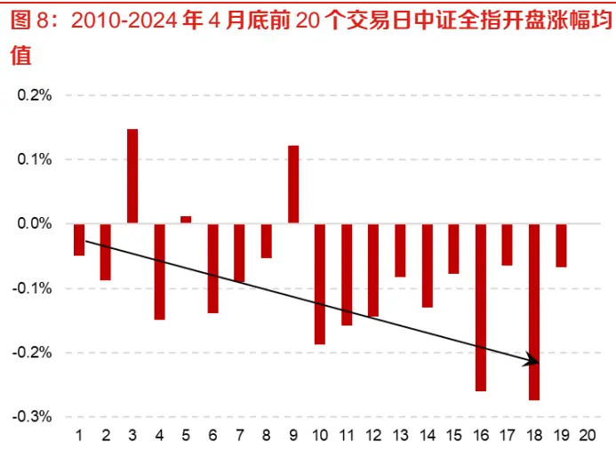
数据来源：Wind，东方证券研究所

图9：2010-2024年4月底前20个交易日全市场股票开盘涨跌幅标准差的均值
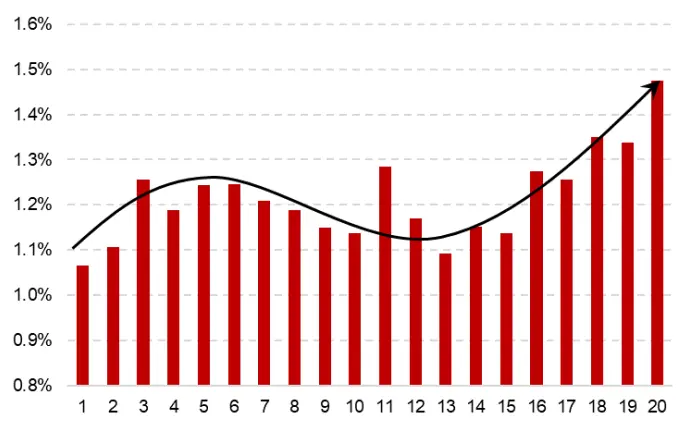
数据来源：Wind，东方证券研究所

这些现象都导致直接减去当天市场指数的开盘涨跌幅的方式得到的因子跨日的可比性较弱。为了降低这种影响，我们以盈余公告披露当日截面全市场股票开盘涨跌幅的 rank 分位数作为因子取值，以避免不同交易日的可比性问题。

$$
AOG\_RANK_{t+1}=rank(Open_{t+1}/Close_{t})
$$

截面分位数的方式降低了绝对数值的影响更好地刻画了相对强弱程度，对于选股问题来说会更稳健。从下图可以看到，调整后的因子月度 IC 均值仍然保持 0.041，ICIR 从 3.83 提升到 4.03，近3年的多头第 10组的超额略有改进。

图 10：AOG_RANK因子月度十分组多空净值
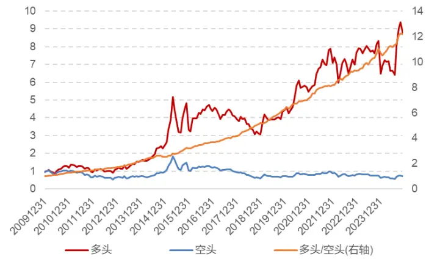
数据来源：Wind，东方证券研究所

图 11：AOG_RANK因子十分组超额累计单利收益
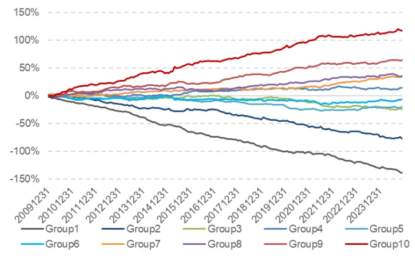
数据来源：Wind，东方证券研究所

以该 AOG_RANK因子构建各宽基指数 MFE增强组合的表现如下表所示：

⚫ 沪深 300 上年化超额从 3.26%提升到 3.38%，信息比从 1.85提升到 1.88；

⚫ 中证 500 上年化超额从 4.41%提升到 4.97%，信息比从 1.7 提升到 1.84；

⚫ 中证 1000 上年化超额从 7.15%提升到 7.68%，信息比从 2.31 提升到 2.48。

表 3：AOG_RANK因子各宽基指数 MFE增强组合各年收益表现

| 年份 | 沪深300 |  | 中证500 |  | 中证1000 |  |
| --- | --- | --- | --- | --- | --- | --- |
|  | 超额收益 | 信息比 | 超额收益 | 信息比 | 超额收益 | 信息比 |
| 2010 | 4.50% | 3.01 | 4.75% | 1.65 |  |  |
| 2011 | 1.09% | 1.07 | 2.01% | 1.52 |  |  |
| 2012 | 4.45% | 3.18 | 7.89% | 3.65 |  |  |
| 2013 | 4.92% | 3.45 | 7.65% | 2.88 |  |  |
| 2014 | 2.13% | 0.97 | 0.40% | 0.14 |  |  |
| 2015 | 2.59% | 0.81 | 10.29% | 1.76 | 18.99% | 2.55 |
| 2016 | 2.01% | 1.35 | 3.18% | 1.74 | 4.93% | 3.01 |
| 2017 | 5.45% | 3.35 | 7.13% | 3.33 | 6.86% | 3.66 |
| 2018 | 2.96% | 2.74 | 3.79% | 2.36 | 8.33% | 4.59 |
| 2019 | 5.05% | 2.48 | 9.99% | 3.22 | 10.43% | 2.93 |
| 2020 | 4.39% | 2.10 | 7.70% | 2.29 | 10.14% | 2.63 |
| 2021 | 3.21% | 1.50 | 8.18% | 2.19 | 13.39% | 3.18 |
| 2022 | 1.18% | 0.74 | 0.40% | 0.21 | 2.72% | 1.26 |
| 2023 | 2.22% | 1.82 | 0.90% | 0.44 | 3.15% | 1.37 |
| 2024 | 4.41% | 1.91 | 3.02% | 0.88 | 2.11% | 0.56 |
| 全样本期 | 3.38% | 1.88 | 4.97% | 1.84 | 7.68% | 2.48 |

数据来源：Wind，东方证券研究所

## 2.2 知情交易者干扰

有些公司在盈余公告披露前会有知情交易者提前埋伏拉升，进而透支未来潜在收益；同行业龙头公司披露公告也可能导致市场已经在交易该公司，导致同步高开进而提早透支收益。因此我们认为单纯观察盈余公告当天的高开并不能充分说明其超预期的程度，而要结合公告前的高开幅度作为其“真实预期”。

图 12：瑞贝卡（600439.SH）在发布 2024Q3 季报前大涨
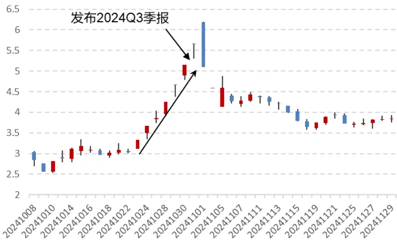
数据来源：Wind，东方证券研究所

上图展示了瑞贝卡（600439.SH）在 2024年 Q3季报发布前后的股价走势。可以看到，在披露盈余公告后第二天股价一字涨停，以AOG因子的构造方式我们会认为其业绩大超预期，将其归入多头组，但是其公告后就开始大幅回撤。主要原因在于其公告前已经大幅拉升过度透支了未来收益。一种常见的处理方法是用公告前一段时间的超额收益作为反转的惩罚项，但是这种方式有个隐含假设是股价炒作会到公告披露当天为止，但是并不是每只股票的炒作都有这么强势，部分股票在公告前可能已经完成了上涨-下跌的提前透支过程，截止公告当天的累计超额并不能反映这种情况。

我们认为隔夜收益更多由基本面定价而日内更多是多空博弈交易的结果。因此我们同样取公告前的开盘跳空幅度作为基本面定价的结果，同上文一样，为了跨日可比我们都将个股开盘涨跌幅转为截面 rank 分位数，然后取公告前 20 个交易日的最大值，以此作为公告前知情交易者提前透支的最大暴露程度，也以此作为衡量是否超预期的“真实预期”水平。以公告前 AOG_RANK 的滚动 20日最大值作为因子：

$$
AOG_{-}RANK_{-}PRE_{-}MAX_{-}20d_{t+1}=ts_{-}max(AOG_{-}RANK_{t},20)
$$

该因子的十分组超额累计单利收益表现如下左图所示。可以看到该因子的前 9 组差异较小，因为大部分股票在公告前不会有明显的高开行为，而少数股票例如上图中的瑞贝卡，在公告前存在大幅高开的行为，该组的超额收益持续负向，只有2015年有短暂的正向收益。说明公告前大幅高开过的股票在未来大概率是持续跑输市场。

图 13：AOG_RANK_PRE_MAX_20d 因子十分组超额累计单利收益
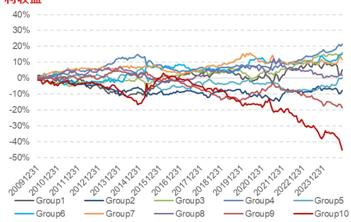
数据来源：Wind，东方证券研究所

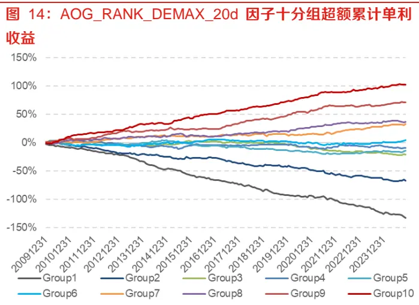
数据来源：Wind，东方证券研究所

我们以盈余公告次日AOG减去公告前AOG的20日最大值，以此得到AOG_RANK_DEMAX_20d因子，以此来降低知情交易者的交易带来的过度透支收益的问题，也可以理解为以公告前20日开盘跳空最大值作为预期，和公告次日的开盘跳空来比较，衡量其真实的超预期程度。

$$
AOG_{-}RANK_{-}DEMAX_{-}20d_{t+1}=AOG_{-}RANK_{t+1}-AOG_{-}RANK_{-}PRE_{-}MAX_{-}20d_{t+1}
$$

该因子月度 IC均值 0.042，年化 ICIR为 4.04，IC胜率 88%，十分组超额累计单利收益如上右图所示。可以看到其多头第10组的超额收益持续保持正向。下图是该因子十分组多空净值，以及单因子 MFE指数增强组合的表现情况。

图 15：AOG_RANK_DEMAX_20d 因子月度十分组多空净值
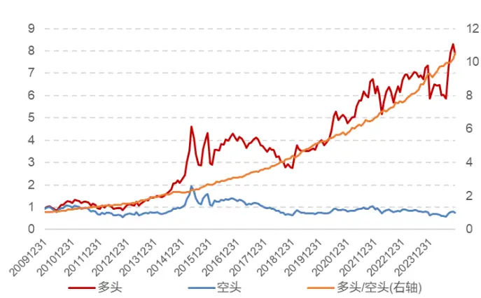
数据来源：Wind，东方证券研究所

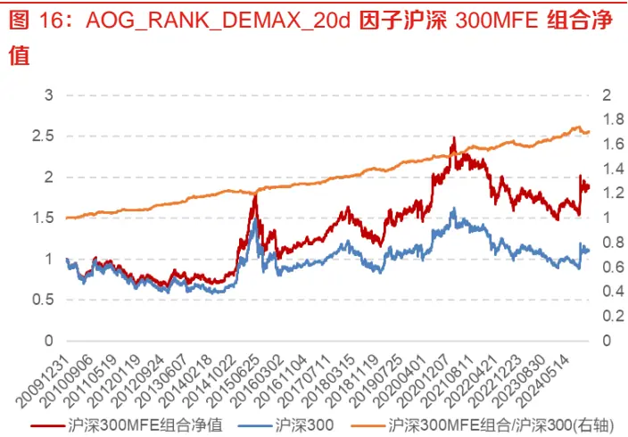
数据来源：Wind，东方证券研究所

从上面左图看到，因子的多空收益持续向上，尤其是2021年以来明显强于图2中的原始因子的表现。而从各宽基指数 MFE 增强组合的表现来看，2021 年以来超额也是持续正向，并没有走平的迹象。

图 17：AOG_RANK_DEMAX_20d 因子中证 500MFE 组合净值
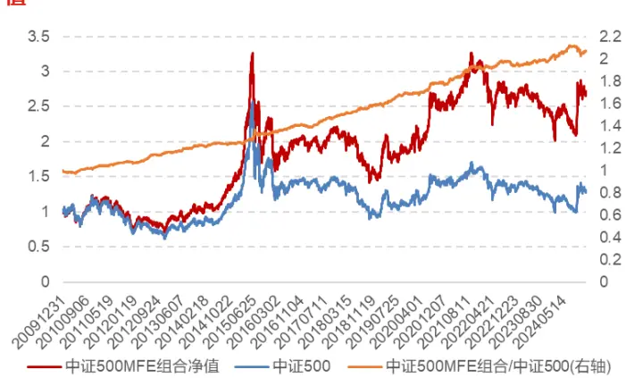
数据来源：Wind，东方证券研究所

图 18：AOG_RANK_DEMAX_20d 因子中证 1000MFE 组合净值
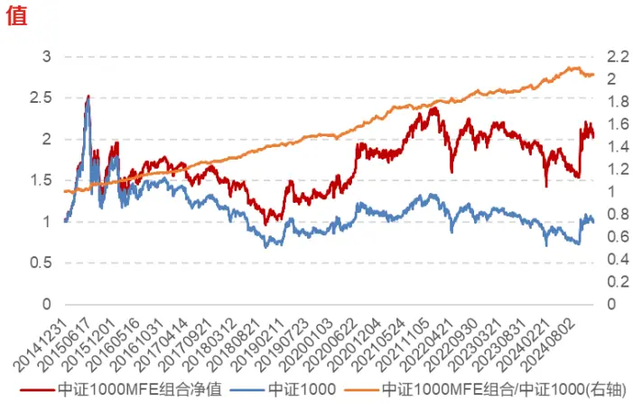
数据来源：Wind，东方证券研究所

以该因子构建各宽基指数 MFE 增强组合的表现如下表所示，大部分年份尤其是 2022-2024 年的超额得到了明显提升：

⚫ 沪深 300 上年化超额从 3.26%提升到 3.75%，信息比从 1.85提升到 2.21；

⚫ 中证 500 上年化超额从 4.41%提升到 5.22%，信息比从 1.7提升到 2.06；

⚫ 中证 1000 上年化超额从 7.15%提升到 7.61%，信息比从 2.31 提升到 2.59。

表 4：AOG_RANK_DEMAX_20d 因子各宽基指数 MFE 增强组合各年收益表现

| 年份 | 沪深300 |  |  |  | 中证500 |  |  |  | 中证1000 |  |  |  |
| --- | --- | --- | --- | --- | --- | --- | --- | --- | --- | --- | --- | --- |
|  | 原始 AOG |  | 改进 AOG |  | 原始 AOG |  | 改进 AOG |  | 原始 AOG |  | 改进 AOG |  |
|  | 超额收益 | 信息比 | 超额收益 | 信息比 | 超额收益 | 信息比 | 超额收益 | 信息比 | 超额收益 | 信息比 | 超额收益 | 信息比 |
| 2010 | 3.98% | 2.79 | 4.71% | 3.30 | 3.03% | 1.27 | 4.21% | 1.60 |  |  |  |  |
| 2011 | 1.46% | 1.48 | 1.03% | 1.11 | 1.78% | 1.36 | 2.18% | 1.78 |  |  |  |  |
| 2012 | 4.45% | 3.29 | 4.82% | 3.83 | 8.12% | 3.85 | 8.65% | 4.13 |  |  |  |  |
| 2013 | 5.05% | 3.48 | 5.30% | 3.84 | 5.22% | 2.04 | 6.16% | 2.53 |  |  |  |  |
| 2014 | 2.48% | 1.06 | 5.56% | 2.74 | 2.28% | 0.76 | 1.87% | 0.66 |  |  |  |  |
| 2015 | 2.20% | 0.79 | 2.40% | 0.87 | 8.89% | 1.84 | 10.78% | 1.90 | 15.48% | 2.22 | 16.42% | 2.35 |
| 2016 | 1.14% | 0.74 | 2.14% | 1.65 | 2.55% | 1.47 | 3.90% | 2.35 | 5.92% | 3.33 | 6.17% | 3.48 |
| 2017 | 5.22% | 3.32 | 5.53% | 3.49 | 7.30% | 3.52 | 7.01% | 3.33 | 6.57% | 3.52 | 7.17% | 4.20 |
| 2018 | 2.61% | 2.41 | 3.35% | 3.25 | 3.73% | 2.31 | 4.00% | 2.65 | 7.46% | 4.08 | 6.68% | 4.55 |
| 2019 | 4.34% | 2.19 | 5.64% | 2.85 | 9.25% | 3.15 | 7.71% | 2.70 | 10.79% | 3.17 | 7.93% | 2.56 |
| 2020 | 5.78% | 2.69 | 4.43% | 2.24 | 6.06% | 1.95 | 6.53% | 2.06 | 9.77% | 2.52 | 11.51% | 2.97 |
| 2021 | 3.98% | 1.87 | 3.69% | 1.93 | 6.80% | 1.83 | 8.96% | 2.83 | 11.70% | 2.77 | 10.56% | 2.70 |
| 2022 | 2.02% | 1.26 | 1.64% | 1.14 | 1.47% | 0.70 | 1.59% | 0.90 | 2.49% | 1.16 | 3.66% | 1.73 |
| 2023 | 1.24% | 0.96 | 2.77% | 2.19 | 0.55% | 0.25 | 2.55% | 1.32 | 2.13% | 0.85 | 4.26% | 1.87 |
| 2024 | 2.78% | 1.23 | 3.64% | 1.42 | 1.05% | 0.26 | 3.61% | 1.02 | 2.17% | 0.54 | 4.05% | 1.06 |
| 全样本期 | 3.26% | 1.85 | 3.75% | 2.21 | 4.41% | 1.70 | 5.22% | 2.06 | 7.15% | 2.31 | 7.61% | 2.59 |

数据来源：Wind，东方证券研究所

以公告前 AOG_RANK 的最大值作为参考的预期值，可以改善业绩超预期类因子的表现。而最大值只是一种特殊的统计量，我们可以做更详细的统计，例如公告前的最小值、20%分位点、40%分位点、60%分位点、80%分位点、最大值的统计表现。下表展示了这些统计量构建的因子的表现情况。

图 19：公告前 20日隔夜收益分位点因子月度十分组超额均值
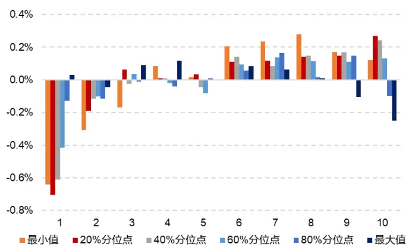
数据来源：Wind，东方证券研究所

表 5：公告前 20日隔夜收益各分位点因子表现对比

|  | 最小值 | 20%分位40%点 | 分位点 | 60%分位点 | 80%分位点 | 最大值 |
| --- | --- | --- | --- | --- | --- | --- |
| IC均值 | 4.30% | 4.37% | 3.51% | 1.77% | -0.36% | -2.03% |
| 年化ICIR | 2.55 | 2.36 | 2.60 | 1.61 | -0.24 | -1.34 |
| IC胜率 | 76.67% | 76.11% | 78.89% | 68.33% | 50.56% | 36.11% |
| 多头月均超额 | 0.12% | 0.27% | 0.24% | 0.13% | -0.10% | -0.25% |
| 多空月均收益 | 0.76% | 0.97% | 0.85% | 0.55% | 0.03% | -0.28% |

数据来源：Wind，东方证券研究所

可以看到随着统计量从最小值到最大值，因子的选股能力从“动量到反转”呈现单调下滑的趋势，最小值及20%-40%分位点都体现出显著的动量效应。我们认为其反映了盈利质量的下限，即盈利的“凸性”。最小值是指公告前20个交易日隔夜收益截面排序的下限，其反映了公司股价最差的低开幅度，下限越高说明公司的盈利质量越够硬，其未来收益越好。从左图的十分组收益来看，我们并不推荐用最小值作为因子，因为其分组收益单调性并不好，第 9-10 组的超额弱于 7-8 组，原因在于最小值是过去 20 个交易日最差一天的开盘截面 rank，极容易收到异常交易的干扰从而导致因子取值的波动。我们建议用抗异常值的版本，即 20%分位点作为该因子，其分组收益单调性也更好。

有关分析师的申明，见本报告最后部分。其他重要信息披露见分析师申明之后部分，或请与您的投资代表联系。并请阅读本证券研究报告最后一页的免责申明。

$$
AOG_{-}RANK_{-}PRE_{-}QUANTILE_{-}20_{-}20d_{t+1}=ts_{-}quantile(AOG_{-}RANK_{t},20\%)
$$

该因子的月度 IC 均值 0.044，年化 ICIR2.36，IC 月度胜率 76%。

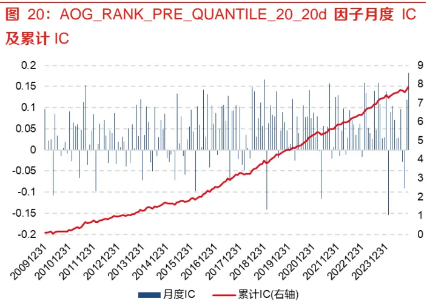
数据来源：Wind，东方证券研究所

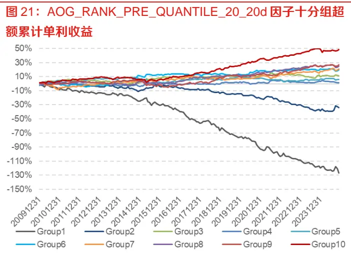
数据来源：Wind，东方证券研究所

从上图因子月度 IC 来看，2016 年以来其 IC 均值呈现出比 2016 年之前更强的表现，而从右图十分组的多头超额来看，2021 年前后没有明显变化。下图是以该因子构建的各宽基指数的 MFE 增强组合的表现情况。可以看到，在沪深 300 上 2021 年以来的超额曲线比历史更强，在中证 500上 2018 年以来的超额就持续走强，在中证 1000 上也是类似的结果。可见其和原始的 AOG 因子收益在时序上有很强的互补性。

图 22 ： AOG_RANK_PRE_QUANTILE_20_20d 因 子 沪 深300MFE 组合净值
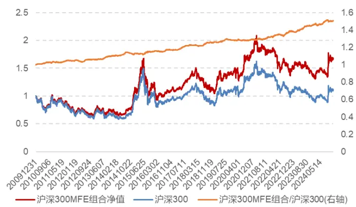
数据来源：Wind，东方证券研究所

图 23 ： AOG_RANK_PRE_QUANTILE_20_20d 因 子 中 证500MFE 组合净值
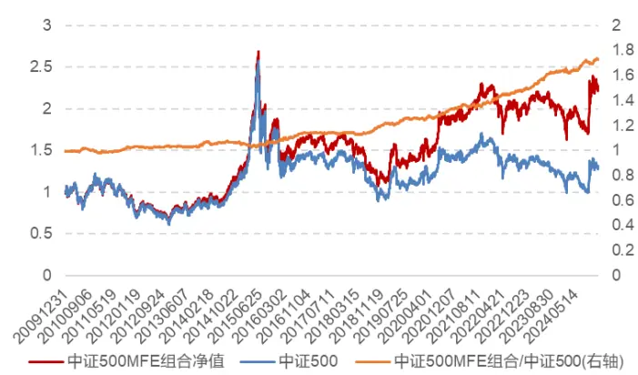
数据来源：Wind，东方证券研究所

图 24：AOG_RANK_PRE_QUANTILE_20_20d 因子中证 1000MFE 组合净值
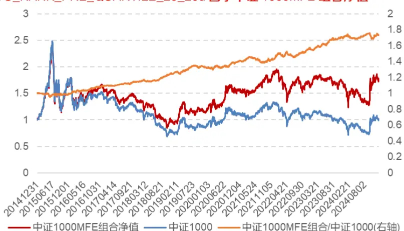
数据来源：Wind，东方证券研究所

以该因子构建各宽基指数 MFE 增强组合的表现如下表所示，近几年的超额收益并没有明显衰减。

表 6：AOG_RANK_PRE_QUANTILE_20_20d 因子各宽基指数 MFE 增强组合各年收益表现

| 年份 | 沪深300 |  | 中证500 |  | 中证1000 |  |
| --- | --- | --- | --- | --- | --- | --- |
|  | 超额收益 | 信息比 | 超额收益 | 信息比 | 超额收益 | 信息比 |
| 2010 | 2.42% | 1.90 | -2.12% | -0.82 |  |  |
| 2011 | 1.63% | 1.65 | 3.47% | 2.08 |  |  |
| 2012 | 0.93% | 0.65 | 0.10% | -0.02 |  |  |
| 2013 | 3.74% | 2.53 | 4.12% | 1.31 |  |  |
| 2014 | 3.83% | 1.51 | -2.08% | -0.64 |  |  |
| 2015 | 2.50% | 0.99 | 2.44% | 0.42 | 0.19% | 0.08 |
| 2016 | 1.06% | 0.82 | 5.24% | 1.99 | 7.35% | 2.34 |
| 2017 | 5.46% | 3.74 | 0.32% | 0.08 | 4.59% | 2.35 |
| 2018 | 2.46% | 2.40 | 4.29% | 2.58 | 5.73% | 2.58 |
| 2019 | 1.91% | 1.08 | 4.06% | 1.21 | 7.21% | 1.70 |
| 2020 | 0.90% | 0.35 | 7.91% | 2.11 | 6.63% | 1.25 |
| 2021 | 2.93% | 1.14 | 4.61% | 1.27 | 5.56% | 0.84 |
| 2022 | 2.85% | 1.74 | 5.88% | 2.31 | 4.79% | 1.11 |
| 2023 | 4.95% | 3.01 | 8.66% | 3.50 | 9.25% | 2.81 |
| 2024 | 4.11% | 1.65 | 6.20% | 1.66 | 1.57% | 0.26 |
| 全样本期 | 2.87% | 1.60 | 3.90% | 1.26 | 5.85% | 1.33 |

数据来源：Wind，东方证券研究所

下面我们对比了上述因子的相关性及因子风格暴露情况。可以看到，AOG_RANK_DEMAX 因子和原始 AOG 因子相关性在 0.95 以上，可以认为是同一个超预期风格的因子，而其和AOG_RANK_QUANTILE 因子相关性极低，只有 0.09 左右，因为 AOG_RANK_QUANTILE 更偏盈利质量风格，两者的风格完全不一样。

右图是各因子的 Barra 风格暴露情况，也可以看到显著差异，AOG_RANK_DEMAX 微弱暴露在Value、Trend、Volatility 上，而 AOG_RANK_QUANTILE 因子明显更多暴露在 Volatility 和 Value上，呈现出明显的低波低估的特征，这和盈利质量类因子偏防守的风格暴露是一致的。

有关分析师的申明，见本报告最后部分。其他重要信息披露见分析师申明之后部分，或请与您的投资代表联系。并请阅读本证券研究报告最后一页的免责申明。

表 7：AOG各因子的相关系数

|  | 原始AOG | AOG_RA\|NK | AOG_RANK_DEMAX | AOG_RANKQUANTILE |
| --- | --- | --- | --- | --- |
| 原始 AOG | 1 | 0.97 | 0.95 | 0.07 |
| AOG_RANK | 0.97 | 1 | 0.98 | 0.07 |
| AOG_RANK_DEMAX | 0.95 | 0.98 | 1 | 0.09 |
| AOG_RANK_QUANTILE | 0.07 | 0.07 | 0.09 | 1 |

数据来源：Wind，东方证券研究所

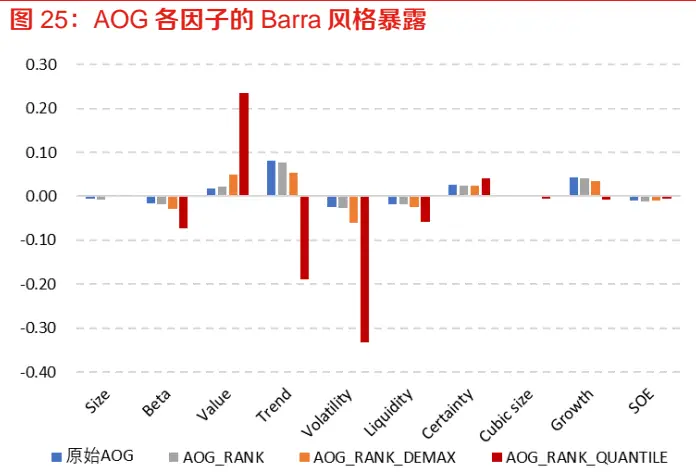
数据来源：Wind，东方证券研究所

下图展示了因子的月度效应情况。AOG_RANK_DEMAX 因子偏成长超预期风格，在上半年表现更强，尤其是 1、4 月份。而 AOG_RANK_QUANTILE 因子在下半年表现更强，体现出更强的防守性特征，尤其是 11月的IC胜率是 100%凸显了其盈利质量偏低波低估的防守特性。

表 8：AOG各因子的月度 IC均值与胜率

|  | 月份 | 原始AOG | AOG_RANK | AOG_RANK_DEMAX | AOG_RANK_QUANTILE |
| --- | --- | --- | --- | --- | --- |
| C均值 | 1 | 0.051 | 0.050 | 0.054 | 0.067 |
|  | 2 | 0.004 | 0.005 | 0.004 | -0.015 |
|  | 3 | 0.052 | 0.047 | 0.047 | 0.044 |
|  | 4 | 0.063 | 0.059 | 0.061 | 0.053 |
|  | 5 | 0.055 | 0.053 | 0.049 | 0.009 |
|  | 6 | 0.048 | 0.047 | 0.045 | 0.036 |
|  | 7 | 0.032 | 0.036 | 0.039 | 0.072 |
|  | 8 | 0.041 | 0.040 | 0.041 | 0.044 |
|  | 9 | 0.040 | 0.042 | 0.047 | 0.062 |
|  | 10 | 0.035 | 0.036 | 0.034 | 0.030 |
|  | 11 | 0.025 | 0.030 | 0.035 | 0.064 |
|  | 12 | 0.043 | 0.042 | 0.047 | 0.058 |
| IC胜率 | 1 | 100% | 100% | 100% | 80% |
|  | 2 | 73% | 67% | 67% | 47% |
|  | 3 | 93% | 87% | 87% | 80% |
|  | 4 | 100% | 93% | 100% | 80% |
|  | 56 | 93%93% | 93% | 93% | 53% |
|  |  |  | 87% | 87% | 80% |
|  | 78 | 87%87% | 87%87% | 87% | 93% |
|  |  |  |  | 87% | 73% |
|  | 910 | 87% | 87% | 93% | 80% |
|  |  | 87% | 87% | 87% | 67% |
|  | 1112 | 80% | 73% | 73% | 100% |
|  |  | 93% | 93% | 93% | 80% |

数据来源：Wind，东方证券研究所

为了观察构建的因子是否相对于现有多因子体系有增量，我们将 AOG_RANK_DEMAX_20d、AOG_RANK_PRE_QUANTILE_20_20d 加入现有指增模型（共 79 个因子，其中包含 60 个基本面因子，18 个人工量价，1 个深度学习量价因子）中进行前后对比，因子复合我们仍然沿用对称正交后滚动一年 ICIR 加权的方式进行线性复合，这两个因子的权重占比在 1%左右。下图展示了加入这两个因子前后中证 500 指数增强组合的超额表现对比情况。加入因子后新组合能够持续跑赢原组合。

图 26：加入 AOG改进因子前后中证 500增强组合净值
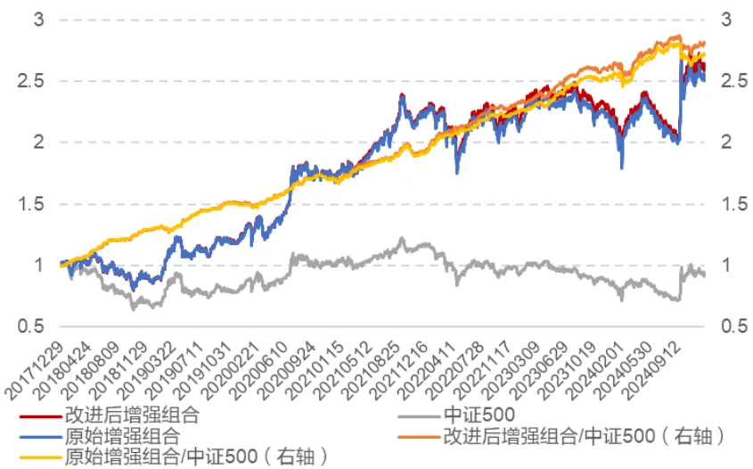
数据来源：Wind，东方证券研究所

下表是前后两个增强组合的超额收益表现对比，虽然新因子只有 1%左右的权重，但是能够带来年化 0.56%左右的提升，大部分年份的超额收益都有提升，每年的相对最大回撤都有下降，信息比和月度胜率都有提高，说明这两个因子确实相对于现有模型有增量信息。

表 9：加入 AOG改进因子前后中证 500增强组合各年收益对比

| 年份 | 原始中证 500 增强组合 |  |  |  | 新版中证 500 增强组合 |  |  |  |
| --- | --- | --- | --- | --- | --- | --- | --- | --- |
|  | 超额收益 | 相对最大回撤 | 信息比 | 月度胜率 | 超额收益 | 相对最大回撤 | 信息比 | 月度胜率 |
| 2018 | 20.31% | -0.83% | 6.93 | 91.67% | 19.90% | -0.80% | 6.84 | 91.67% |
| 2019 | 19.30% | -4.88% | 3.69 | 66.67% | 20.97% | -4.76% | 4.05 | 75.00% |
| 2020 | 15.31% | -3.12% | 2.74 | 75.00% | 15.10% | -2.80% | 2.66 | 83.33% |
| 2021 | 17.21% | -4.74% | 2.90 | 75.00% | 17.66% | -4.57% | 2.93 | 75.00% |
| 2022 | 13.34% | -1.48% | 4.29 | 83.33% | 15.23% | -1.48% | 4.86 | 91.67% |
| 2023 | 10.36% | -1.83% | 3.08 | 83.33% | 10.51% | -1.78% | 3.11 | 83.33% |
| 2024 | 8.48% | -9.17% | 1.23 | 66.67% | 8.84% | -7.49% | 1.27 | 66.67% |
| 全样本期 | 15.72% | -9.17% | 3.32 | 77.38% | 16.28% | -7.49% | 3.40 | 80.95% |

数据来源：Wind，东方证券研究所

## 三、盈余公告异象类衍生因子挖掘

前文中我们针对 AOG 因子的问题进行了调整并构建了两个新的因子，AOG_RANK_DEMAX 和AOG_RANK_QUANTILE 因子，分别代表了业绩超预期和盈利质量两个风格。这一节我们设想上述因子构建过程本质上是盈余公告事件上的针对开盘跳空幅度的价量特征的两个算子。如下图所示，我们可以从事件类型、算子类型、特征类型多个角度对因子构建的过程进行扩展。

图 27：事件驱动因子构建框架
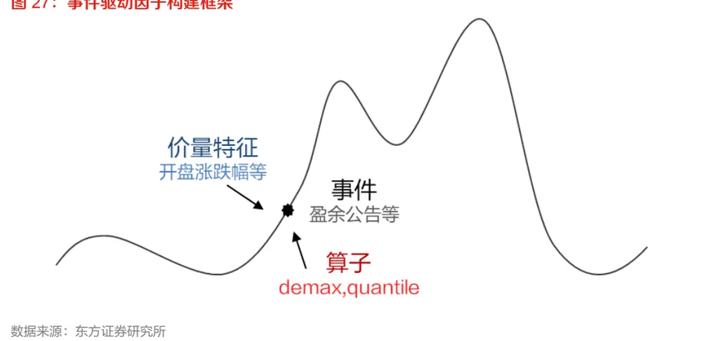
下面我们从特征维度对因子构建的过程进行扩展，事件和算子维度各位读者可以自行尝试。

## 3.1 盈余公告最低价涨幅跳空因子

我们首先将前文中的开盘涨跌幅替换为最低价涨跌幅 AOG_LOW，并复用其分别构建 DEMAX 和QUANTILE 两个因子。改造后的 DEMAX 和 QUANTILE 因子的十分组超额均值及 IC 表现如下所示，可以看到这两个因子都具有较为单调的选股能力。

图 28：AOG_LOW 衍生因子月度十分组超额均值
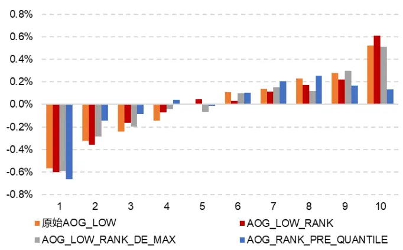
数据来源：Wind，东方证券研究所

表 10：AOG_LOW 衍生因子表现对比

|  | 原始AOG_LOW | AOG_LOW_RANK | AOG_LOW_RANK_DEMAX | AOG_LOW_RANK_QUANTILE |
| --- | --- | --- | --- | --- |
| IC均值 | 0.041 | 0.042 | 0.041 | 0.048 |
| 年化ICIR | 3.26 | 3.22 | 3.23 | 1.50 |
| IC胜率 | 83.33% | 82.78% | 81.11% | 69.44% |
| 多头月均超额 | 0.52% | 0.61% | 0.51% | 0.13% |
| 多空月均收益 | 1.09% | 1.22% | 1.10% | 0.80% |

数据来源：Wind，东方证券研究所

我们对比原 AOG_LOW 因子和 AOG_LOW_RANK_DEMAX 因子分别构建宽基指数 MFE 增强组合的收益表现如下表所示。可以看到单因子年化超额能够提升 10%左右，近几年的超额收益也能得到明显提升。

表 11：AOG_LOW 与 AOG_LOW_ RANK_DEMAX 因子各宽基指数 MFE 增强组合各年收益表现对比

| 年份 | 沪深300 |  |  |  | 中证500 |  |  |  | 中证1000 |  |  |  |
| --- | --- | --- | --- | --- | --- | --- | --- | --- | --- | --- | --- | --- |
|  | 原始 AOG_LOW |  | 改进 AOG_LOW |  | 原始 AOG_LOW |  | 改进 AOG_LOW |  | 原始 AOG_LOW |  | 改进 AOG_LOW |  |
|  | 超额收益 | 信息比 | 超额收益 | 信息比 | 超额收益 | 信息比 | 超额收益 | 信息比 | 超额收益 | 信息比 | 超额收益 | 信息比 |
| 2010 | 4.30% | 2.66 | 4.39% | 2.89 | 3.68% | 1.25 | 3.42% | 1.25 |  |  |  |  |
| 2011 | 2.20% | 2.29 | 1.94% | 2.11 | 1.22% | 0.99 | 2.26% | 1.99 |  |  |  |  |
| 2012 | 4.98% | 3.03 | 4.14% | 2.68 | 7.25% | 3.15 | 6.54% | 3.07 |  |  |  |  |
| 2013 | 4.24% | 2.70 | 4.12% | 2.70 | 4.88% | 1.74 | 3.51% | 1.27 |  |  |  |  |
| 2014 | 3.59% | 1.60 | 6.90% | 2.96 | -3.38% | -1.14 | -1.07% | -0.39 |  |  |  |  |
| 2015 | 2.45% | 0.94 | 2.68% | 1.06 | 7.36% | 1.50 | 7.90% | 1.43 | 8.79% | 1.43 | 14.56% | 2.25 |
| 2016 | 1.86% | 1.39 | 1.37% | 1.15 | 3.49% | 1.90 | 4.46% | 2.35 | 6.08% | 2.94 | 6.53% | 3.01 |
| 2017 | 7.56% | 4.82 | 7.62% | 5.14 | 5.22% | 2.68 | 5.04% | 2.51 | 4.86% | 2.70 | 6.66% | 4.12 |
| 2018 | 2.68% | 2.57 | 2.40% | 2.45 | 4.72% | 3.14 | 3.43% | 2.44 | 8.02% | 4.82 | 6.75% | 4.57 |
| 2019 | 3.82% | 2.00 | 4.99% | 2.80 | 6.47% | 2.08 | 6.68% | 2.20 | 8.18% | 2.26 | 6.75% | 1.86 |
| 2020 | 2.91% | 1.61 | 1.86% | 1.01 | 8.11% | 2.43 | 9.44% | 2.97 | 8.75% | 2.28 | 8.29% | 2.33 |
| 2021 | 3.26% | 1.57 | 4.08% | 1.91 | 3.15% | 0.94 | 4.20% | 1.39 | 6.84% | 1.60 | 5.04% | 1.13 |
| 2022 | 3.05% | 2.27 | 3.12% | 2.52 | 0.22% | 0.09 | 0.79% | 0.40 | 0.76% | 0.29 | 1.39% | 0.66 |
| 2023 | 3.10% | 2.44 | 3.09% | 2.42 | 3.04% | 1.55 | 3.04% | 1.69 | 6.39% | 2.71 | 8.10% | 3.34 |
| 2024 | 3.95% | 1.85 | 5.00% | 2.51 | 2.67% | 0.92 | 3.79% | 1.29 | 5.02% | 1.33 | 5.45% | 1.61 |
| 全样本期 | 3.66% | 2.14 | 3.81% | 2.30 | 3.91% | 1.51 | 4.24% | 1.67 | 6.48% | 2.10 | 6.91% | 2.32 |

数据来源：Wind，东方证券研究所

下表是 AOG_LOW_RANK_QUANTILE 因子构建宽基指数 MFE 增强组合的收益表现情况。可以看到各宽基上都能够持续贡献超额收益，并且 2022-2024年的超额收益非常显著。

表 12：AOG_LOW_RANK_QUANTILE 因子各宽基指数 MFE 增强组合各年收益表现对比

| 年份 | 沪深300 |  | 中证500 |  | 中证1000 |  |
| --- | --- | --- | --- | --- | --- | --- |
|  | 超额收益 | 信息比 | 超额收益 | 信息比 | 超额收益 | 信息比 |
| 2010 | 0.34% | 0.04 | -2.32% | -0.78 |  |  |
| 2011 | 2.04% | 1.55 | 5.99% | 2.68 |  |  |
| 2012 | 2.07% | 1.01 | -0.56% | -0.34 |  |  |
| 2013 | 3.07% | 1.68 | 1.60% | 0.27 |  |  |
| 2014 | 8.21% | 3.07 | 12.02% | 2.36 |  |  |
| 2015 | 1.67% | 0.55 | 0.50% | 0.05 | -2.81% | -0.11 |
| 2016 | 4.47% | 2.11 | 8.68% | 2.36 | 11.23% | 2.28 |
| 2017 | 1.46% | 0.81 | -0.78% | -0.36 | 4.59% | 1.71 |
| 2018 | 3.10% | 1.78 | 4.91% | 1.71 | 5.42% | 1.65 |
| 2019 | 0.78% | 0.28 | 0.92% | 0.11 | 1.17% | 0.09 |
| 2020 | -6.12% | -2.39 | -3.32% | -0.73 | 1.16% | 0.01 |
| 2021 | 0.26% | -0.03 | 0.46% | 0.02 | 4.84% | 0.48 |
| 2022 | 3.82% | 1.60 | 3.64% | 0.84 | 4.80% | 0.64 |
| 2023 | 8.29% | 3.89 | 10.42% | 3.23 | 13.76% | 2.70 |
| 2024 | 4.47% | 1.85 | 4.59% | 0.87 | 7.62% | 0.91 |
| 全样本期 | 2.71% | 1.12 | 3.55% | 0.78 | 6.13% | 0.87 |

数据来源：Wind，东方证券研究所

## 3.2 盈余公告早盘大单资金流入因子

我们进一步将前文中的开盘涨跌幅替换为盈余公告次日早盘 10 点前主力净流入金额/流通市值占比 OPEN_MONEYFLOW_PCT_VALUE_L，并复用其分别构建 DEMAX 和 QUANTILE 两个因子。

改造后的 DEMAX 和 QUANTILE 因子的十分组超额均值及 IC 表现如下所示，可以看到这两个因子同样都具有单调的选股能力。

图 29：开盘大单资金流入因子月度十分组超额均值
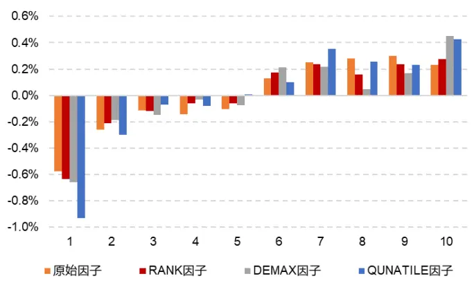
数据来源：Wind，东方证券研究所

表 13：开盘大单资金流入衍生因子表现对比

|  | 原始因子 | RANK 因子D | EMAX 因子 | QUANTILE因子 |
| --- | --- | --- | --- | --- |
| IC均值 | 0.030 | 0.030 | 0.034 | 0.056 |
| 年化ICIR | 2.94 | 2.74 | 2.52 | 1.19 |
| IC胜率 | 81.11% | 81.11% | 79.44% | 72.78% |
| 多头月均超额 | 0.23% | 0.27% | 0.45% | 0.42% |
| 多空月均收益 | 0.80% | 0.91% | 1.11% | 1.35% |

数据来源：Wind，东方证券研究所

我们对比原开盘大单资金流入因子和DEMAX因子分别构建宽基指数MFE增强组合的收益表现如下表所示。可以看到单因子年化超额都能够得到显著提升，沪深 300 上能提升 0.83%，中证 500上能提升 1.35%，中证 1000上能提升 2%，近几年的超额收益也能得到明显提升。

表 14：开盘大单资金流入因子与 DEMAX因子各宽基指数 MFE增强组合各年收益表现对比

| 年份 | 沪深300 |  |  |  | 中证500 |  |  |  | 中证1000 |  |  |  |
| --- | --- | --- | --- | --- | --- | --- | --- | --- | --- | --- | --- | --- |
|  | 原始AOG_LOW |  | 改进 AOG_LOW |  | 原始 AOG_LOW |  | 改进 AOG_LOW |  | 原始 AOG_LOW |  | 改进 AOG_LOW |  |
|  | 超额收益 | 信息比 | 超额收益 | 信息比 | 超额收益 | 信息比 | 超额收益 | 信息比 | 超额收益 | 信息比 | 超额收益 | 信息比 |
| 2010 | 1.65% | 1.15 | 1.92% | 1.21 | 3.92% | 1.35 | 4.10% | 1.53 |  |  |  |  |
| 2011 | 1.91% | 1.72 | 2.46% | 2.13 | 1.28% | 0.98 | 1.64% | 1.17 |  |  |  |  |
| 2012 | 3.06% | 1.83 | 3.19% | 1.90 | 3.95% | 1.96 | 5.09% | 2.31 |  |  |  |  |
| 2013 | 4.10% | 2.27 | 5.07% | 2.82 | 5.28% | 1.83 | 5.46% | 1.99 |  |  |  |  |
| 2014 | -0.10% | -0.07 | 2.86% | 1.21 | -1.70% | -0.56 | -0.76% | -0.29 |  |  |  |  |
| 2015 | 3.53% | 0.95 | 3.95% | 1.12 | 3.99% | 0.51 | 7.78% | 1.04 | 9.30% | 1.36 | 10.60% | 1.41 |
| 2016 | 1.79% | 1.21 | 2.57% | 1.88 | 3.50% | 1.93 | 5.14% | 2.77 | 5.41% | 2.89 | 6.84% | 3.47 |
| 2017 | 2.27% | 1.42 | 3.78% | 2.51 | 0.55% | 0.21 | 1.96% | 0.79 | 4.35% | 2.30 | 4.86% | 2.99 |
| 2018 | 1.81% | 1.75 | 2.60% | 2.81 | 0.27% | 0.18 | 2.06% | 1.37 | 4.71% | 2.70 | 5.91% | 4.11 |
| 2019 | 3.30% | 1.84 | 2.46% | 1.36 | 3.93% | 1.35 | 3.70% | 1.27 | 0.49% | 0.15 | 5.12% | 1.62 |
| 2020 | 5.26% | 2.46 | 2.99% | 1.56 | 11.23% | 3.31 | 9.97% | 2.98 | 7.21% | 2.18 | 10.00% | 2.79 |
| 2021 | 2.46% | 1.11 | 2.60% | 1.29 | 4.08% | 1.08 | 4.26% | 1.27 | 7.85% | 2.13 | 6.25% | 1.55 |
| 2022 | 2.70% | 1.73 | 5.35% | 3.92 | 1.11% | 0.49 | 4.01% | 1.92 | 1.57% | 0.73 | 4.50% | 2.05 |
| 2023 | 1.06% | 0.89 | 2.52% | 2.11 | -0.09% | 0.01 | 3.25% | 2.29 | 0.51% | 0.27 | 5.74% | 2.70 |
| 2024 | 2.35% | 1.42 | 4.06% | 2.00 | -0.49% | -0.15 | 1.11% | 0.42 | 2.24% | 0.74 | 2.47% | 0.78 |
| 全样本期 | 2.56% | 1.38 | 3.39% | 1.88 | 2.58% | 0.95 | 3.93% | 1.47 | 4.33% | 1.51 | 6.33% | 2.18 |

数据来源：Wind，东方证券研究所

下表是开盘大单资金流入 QUANTILE 因子构建宽基指数 MFE 增强组合的收益表现情况。可以看到各宽基上都能够持续贡献超额收益，尤其是沪深 300上超额收益最为稳健。

表 15：开盘大单资金流入 QUANTILE因子各宽基指数 MFE增强组合各年收益表现对比

| 年份 | 沪深300 |  | 中证500 |  | 中证1000 |  |
| --- | --- | --- | --- | --- | --- | --- |
|  | 超额收益 | 信息比 | 超额收益 | 信息比 | 超额收益 | 信息比 |
| 2010 | 3.16% | 1.85 | 7.88% | 1.82 |  |  |
| 2011 | 4.40% | 2.83 | 6.68% | 2.94 |  |  |
| 2012 | 2.52% | 1.08 | -0.57% | -0.31 |  |  |
| 2013 | 4.28% | 2.35 | 5.77% | 1.47 |  |  |
| 2014 | 5.27% | 1.95 | 5.10% | 1.15 |  |  |
| 2015 | 4.63% | 1.30 | 9.40% | 1.21 | 19.11% | 2.15 |
| 2016 | 5.20% | 2.77 | 10.82% | 3.60 | 12.18% | 3.10 |
| 2017 | 4.74% | 2.54 | 0.23% | -0.02 | 5.03% | 1.47 |
| 2018 | 2.15% | 1.22 | 5.17% | 1.66 | 3.94% | 1.18 |
| 2019 | 1.77% | 0.75 | 1.02% | 0.10 | 2.42% | 0.33 |
| 2020 | 0.94% | 0.27 | 3.09% | 0.62 | 10.70% | 1.62 |
| 2021 | 0.62% | 0.26 | -0.56% | -0.20 | 1.50% | 0.10 |
| 2022 | 2.77% | 1.47 | 5.65% | 1.96 | 5.65% | 1.33 |
| 2023 | 4.67% | 2.46 | 4.33% | 1.51 | 10.17% | 2.73 |
| 2024 | 3.17% | 0.84 | -0.41% | -0.26 | -0.93% | -0.35 |
| 全样本期 | 3.53% | 1.51 | 4.62% | 1.10 | 6.85% | 1.26 |

数据来源：Wind，东方证券研究所

## 3.3 事件驱动因子挖掘框架总结

以上的因子虽然输入的都是价量特征，但是经过事件上的算子改造后因子的更新频率很慢从而衰减速度很慢，其和传统的日频量价类因子低相关，同时又和基本面因子低相关，因此复用这套结构可以很容易构造出一批和现有因子低相关的因子加入因子库中。

从以上两个特征构造的新因子可以看到，复用这套因子结构可以衍生出一些新的具有显著选股能力的因子，但是这个结构并不是任意的日度量价特征都可以构建出显著选股能力因子。可以看到这两个特征和原始的开盘跳空幅度都具有共性，一个是都偏动量特征，另一个维度是基本都接近事件发生当时或相近时的特征。我们也测试了一些偏全天统计量的特征例如 5 分钟 k 线收益率的均值、标准差、偏度、峰度等指标，代入并不能构造出显著的选股因子，其本质是因为我们这套框架的底层是事件驱动的框架，只有在交易事件本身的动量才符合这个大逻辑，而全天的统计量更多包含的是日内的博弈信息，更偏反转特征，因此复用这个结构并不能构造出显著的选股因子。如果我们沿着这个思路出发，构建更多的盈余公告次日的早盘类因子，例如集合竞价、早盘15分钟等时间的量价特征，可能可以构造出更多的有效因子。

## 四、总结

## 研究动机

在前期研究中，我们构建的 AI 深度学习因子展现出显著优势——基于海量样本的非线性收益预测模型具备超强拟合能力，而传统人工构建的时序统计类因子往往难以匹敌。然而，当前因子挖掘面临两大瓶颈：一是挖掘的新因子虽单独有效，但在多因子组合中易受相关性衰减影响，边际效用递减明显；二是深度学习在小样本事件（如低频的盈余公告）中难以发挥优势，人工因子挖掘更具优势。

基于此，我们聚焦盈余公告事件窗口，探索未被充分开发的低相关量价因子空间，其稀缺性体现在：1）公告信息释放引发的价格漂移现象具有独特信息含量；2）事件驱动型量价因子与日频量价和基本面因子相关性低。

## AOG因子的缺陷及改进

盈余公告窗口附近量价因子典型的代表是盈余公告次日开盘跳空超额AOG因子。AOG因子2021年10月以来大部分时间十分组的多头组超额收益走平，而其他几组并没有失效，只是其多头组由于超预期的投资模式被大量投资者熟悉后导致在公告前后过度透支业绩从而在公告后没有超额收益。我们围绕AOG因子构建过程中的两个问题进行改进，一个是跨日的时序可比性问题，一个是知情交易者在盈余公告前后提前透支业绩的知情交易者干扰的问题。

改进后得到两个因子，一个是以公告前最大开盘跳空幅度为“真实预期”进行环比操作的DEMAX 超预期因子，一个是取公告前开盘跳空的“盈利质量下限”而构造的 QUANTILE 盈利质量因子，都具有稳健的选股能力而且近 3 年的超额收益比历史上更显著，加入现有的多因子体系也能带来超额的提升。

## 盈余公告异象类衍生因子挖掘

我们将上述因子改进过程抽象为盈余公告事件上的价量特征的因子挖掘框架。复用因子结构加入其他价量特征，例如盈余公告次日最低价涨跌幅、盈余公告次日早盘大单资金净流入占比特征，都能衍生出一批显著的选股因子。这些因子和传统的日频量价类因子低相关，同时又和基本面因子低相关，因此复用这套结构可以很容易构造出一批和现有因子低相关的因子加入因子库中。

## 风险提示

1. 量化模型失效风险。

2. 极端市场环境可能对模型效果造成剧烈冲击，导致收益亏损。

## Tabl e_Disclai mer 分析师申明

每位负责撰写本研究报告全部或部分内容的研究分析师在此作以下声明：

分析师在本报告中对所提及的证券或发行人发表的任何建议和观点均准确地反映了其个人对该证券或发行人的看法和判断；分析师薪酬的任何组成部分无论是在过去、现在及将来，均与其在本研究报告中所表述的具体建议或观点无任何直接或间接的关系。

## 投资评级和相关定义

报告发布日后的12个月内行业或公司的涨跌幅相对同期相关证券市场代表性指数的涨跌幅为基准（A 股市场基准为沪深 300 指数，香港市场基准为恒生指数，美国市场基准为标普 500 指数）；

## 公司投资评级的量化标准

买入：相对强于市场基准指数收益率 15%以上；

增持：相对强于市场基准指数收益率 5%～15%；

中性：相对于市场基准指数收益率在-5%～+5%之间波动；

减持：相对弱于市场基准指数收益率在-5%以下。

未评级 —— 由于在报告发出之时该股票不在本公司研究覆盖范围内，分析师基于当时对该股票的研究状况，未给予投资评级相关信息。

暂停评级 —— 根据监管制度及本公司相关规定，研究报告发布之时该投资对象可能与本公司存在潜在的利益冲突情形；亦或是研究报告发布当时该股票的价值和价格分析存在重大不确定性，缺乏足够的研究依据支持分析师给出明确投资评级；分析师在上述情况下暂停对该股票给予投资评级等信息，投资者需要注意在此报告发布之前曾给予该股票的投资评级、盈利预测及目标价格等信息不再有效。

## 行业投资评级的量化标准：

看好：相对强于市场基准指数收益率 5%以上；

中性：相对于市场基准指数收益率在-5%～+5%之间波动；

看淡：相对于市场基准指数收益率在-5%以下。

未评级：由于在报告发出之时该行业不在本公司研究覆盖范围内，分析师基于当时对该行业的研究状况，未给予投资评级等相关信息。

暂停评级：由于研究报告发布当时该行业的投资价值分析存在重大不确定性，缺乏足够的研究依据支持分析师给出明确行业投资评级；分析师在上述情况下暂停对该行业给予投资评级信息，投资者需要注意在此报告发布之前曾给予该行业的投资评级信息不再有效。

## HeadertTabl e_Discl ai mer 免责声明

本证券研究报告（以下简称“本报告”）由东方证券股份有限公司（以下简称“本公司”）制作及发布。

。本公司不会因接收人收到本报告而视其为本公司的当然客户。本报告的全体接收人应当采取必要措施防止本报告被转发给他人。

本报告是基于本公司认为可靠的且目前已公开的信息撰写，本公司力求但不保证该信息的准确性和完整性，客户也不应该认为该信息是准确和完整的。同时，本公司不保证文中观点或陈述不会发生任何变更，在不同时期，本公司可发出与本报告所载资料、意见及推测不一致的证券研究报告。本公司会适时更新我们的研究，但可能会因某些规定而无法做到。除了一些定期出版的证券研究报告之外，绝大多数证券研究报告是在分析师认为适当的时候不定期地发布。

在任何情况下，本报告中的信息或所表述的意见并不构成对任何人的投资建议，也没有考虑到个别客户特殊的投资目标、财务状况或需求。客户应考虑本报告中的任何意见或建议是否符合其特定状况，若有必要应寻求专家意见。本报告所载的资料、工具、意见及推测只提供给客户作参考之用，并非作为或被视为出售或购买证券或其他投资标的的邀请或向人作出邀请。

本报告中提及的投资价格和价值以及这些投资带来的收入可能会波动。过去的表现并不代表未来的表现，未来的回报也无法保证，投资者可能会损失本金。外汇汇率波动有可能对某些投资的价值或价格或来自这一投资的收入产生不良影响。那些涉及期货、期权及其它衍生工具的交易，因其包括重大的市场风险，因此并不适合所有投资者。

在任何情况下，本公司不对任何人因使用本报告中的任何内容所引致的任何损失负任何责任，投资者自主作出投资决策并自行承担投资风险，任何形式的分享证券投资收益或者分担证券投资损失的书面或口头承诺均为无效。

本报告主要以电子版形式分发，间或也会辅以印刷品形式分发，所有报告版权均归本公司所有。未经本公司事先书面协议授权，任何机构或个人不得以任何形式复制、转发或公开传播本报告的全部或部分内容。不得将报告内容作为诉讼、仲裁、传媒所引用之证明或依据，不得用于营利或用于未经允许的其它用途。

经本公司事先书面协议授权刊载或转发的，被授权机构承担相关刊载或者转发责任。不得对本报告进行任何有悖原意的引用、删节和修改。

提示客户及公众投资者慎重使用未经授权刊载或者转发的本公司证券研究报告，慎重使用公众媒体刊载的证券研究报告。

## 东方证券研究所

地址： 上海市中山南路 318 号东方国际金融广场 26 楼

电话：021-63325888

传真：021-63326786

网址： www.dfzq.com.cn