# DFQ-diversify：解决分布外泛化问题的自监督领域识别与对抗解耦模型

因子选股系列之一一五

## 研究结论

## DFQ-Diversify模型有效解决分布外泛化问题

本文提出全新模型 DFQ-Diversify，通过引入自监督领域识别与对抗训练机制，实现标签预测任务与领域识别任务的显式解耦。该模型无需人工预设环境变量，能够自主识别潜在领域信息，进而提取出对外部扰动不敏感、跨领域稳定的预测特征，增强模型的分布外泛化能力。

## 模型创新性地引入“领域-标签”解耦框架

⚫ 模型训练流程包含三个核心模块：update_d、set_dlabel 和 update，通过对抗训练机制同时完成领域识别与标签预测任务，实现两者的显式解耦。

## 自监督动态领域划分机制提升灵活性与泛化适应能力

⚫ 领域是对数据分布的动态划分，用以识别影响预测任务的潜在环境因素。有效的领域划分应帮助模型隔离非目标信息，强化对标签驱动因素的建模能力。

- Diversify 模型实现无监督聚类式领域更新，克服了传统模型依赖预设环境变量的缺陷，使模型能在不同时间和截面维度上自适应发现领域结构。

## 三重对抗训练机制增强特征解耦与迁移稳健性

⚫ 模块间对抗更新：update_d与update模块共享特征提取器，但目标相反，前者强化领域预测、抑制标签预测，后者则反之。

⚫ 双损失对抗平衡：update_d与update模块均采用双损失函数，模块内部同时优化正向与抑制目标，在任务冲突中寻求最优解。

⚫ 梯度反转层机制：通过在反向传播更新时反转梯度符号，实现无需标签监督的高效信息屏蔽，迫使特征提取器学习与标签或领域无关的特征，助力特征解耦。

## 与 Factorvae-pro的对比：从静态环境变量到动态领域建模

DFQ-Diversify 与 Factorvae-pro 均基于不变学习思想，致力于在训练过程中剥离随环境变化而波动的非稳态特征，提取与标签高度因果相关的稳定因子，实现“风格中性化”，以减少模型对市场风格的依赖。

Factorvae-pro 依赖人工设定时间标签作为环境变量，主观性强、维度单一；Diversify 引入自监督学习，动态识别潜在领域，实现对时间与截面双维扰动建模，提升灵活性与泛化能力。Factorvae-pro 采用协同训练策略，Diversify 则基于对抗机制，通过任务博弈实现特征解耦，提升稳定性和模型适应性。

## 多市场回测表现优异，泛用性强

模型在中证全指、沪深 300、中证 500 等多个股票池中均取得显著绩效，尤其在大盘股表现突出。2020-2025 年间，中证全指池中 IC 达 12.22%，rankIC 达 14.58%，多头组合年化超额收益达 32.52%。在 2024 年复杂行情中展现出更强稳健性。

## 指数增强组合效果稳健，风险受控

⚫ 在沪深300与中证500增强策略中，模型分别实现信息比1.89和1.67，年化超额收益 11.27%和 12.19%。超额收益主要来源于特质收益，占比超过 50%。

## 风险提示

1. 量化模型失效风险。

2. 极端市场环境对模型的影响。

报告发布日期

2025 年 05 月 07 日

杨怡玲 yangyiling@orientsec.com.cn

执业证书编号：S0860523040002

刘静涵021-63325888*3211

liujinghan@orientsec.com.cn

执业证书编号：S0860520080003

香港证监会牌照：BSX840

盈余公告异象类因子改进与挖掘：——因 2025-04-22子选股系列之一一四

时点风险模型：——因子选股系列之一一 2025-04-20三

ADWM：基于门控机制的自适应动态因子 2025-04-10加权模型：——因子选股系列之一一二

DFQ-FactorVAE-pro：加入特征选择与环 2025-02-19
境变量模块的 FactorVAE 模型：——因子
选股系列之

ABCM：基于神经网络的alpha因子和beta 2024-12-03因子协同挖掘模型：——因子选股系列之一一〇

相对定价类基本面因子挖掘：——因子选 2024-10-11股系列之一〇九

KD-Ensemble：基于知识蒸馏的 alpha 因 2024-08-19子挖掘模型：——因子选股系列之一〇八

DFQ-XGB：基于树模型的 alpha 预测方 2024-08-15案：——因子选股系列之一〇七

基于风险注意力的因子挖掘模型：——因 2024-05-29子选股系列之一〇六

非线性市值风控全攻略：——因子选股系 2024-05-27列之一〇五

融合基本面信息的 ASTGNN 因子挖掘模 2024-05-27型：——因子选股系列之一〇四

DFQ-FactorVAE：融合变分自编码器和概 2024-05-14率动态因子模型的 alpha 预测方案：——

基本面因子的重构：——因子选股系列之 2024-03-21一〇二

自适应时空图网络周频 alpha 模型：—— 2024-02-28因子选股系列之一〇一

DFQ-HIST：添加图信息的选股因子挖掘 2024-02-07系统：——因子选股系列之一百

基于异构图神经网络的股票关联因子挖 2024-01-02掘：——因子选股系列之九十九

在前期报告《DFQ-Factorvae-pro：加入特征选择与环境变量模块的 FactorVAE 模型》中，我们尝试在训练阶段引入日期作为环境变量，以协同建模股票收益，并在预测阶段剥离该部分信息，从而减弱时间因素对模型的干扰，提升模型的分布外泛化能力。然而，该方法依赖人工预设环境变量，主观性强，可能限制模型对原始特征中关键信息的挖掘。此外，日期环境变量主要覆盖时间维度的分布偏移，难以刻画横截面上的结构性分布差异。

为此，本文提出全新模型DFQ-Diversify，通过引入自监督领域识别与对抗训练机制，实现标签预测任务与领域识别任务的显式解耦。该模型无需人工预设环境变量，能够自主识别潜在领域信息，进而提取出对外部扰动不敏感、跨领域稳定的预测特征，增强模型的分布外泛化能力。模型 架 构 参 考 并 改 进 自 论 文 《 Out-of-distribution representation learning for time seriesclassification》，将其成功迁移至金融时间序列的回归预测任务中。

## 一、研究背景

分布外泛化（Out-of-distribution Generalization, OOD Generalization）是指机器学习模型在面对与训练数据分布不同的测试数据时，仍能保持良好性能的能力。

## 为什么 OOD Generalization 重要：

（1）金融数据的非平稳性：大多数机器学习模型是在特定的数据分布上进行训练的，然而在实际应用中，测试数据的分布往往与训练数据不同，这种情况下的数据变化称为分布偏移。市场微观结构、宏观经济周期、政策变化等要素都会导致训练集与真实场景存在根本性分布偏移。

（2）过拟合风险加剧：如果模型仅仅依赖于训练数据中的模式，就可能会对训练数据过拟合，无法适应新的、不同的数据分布。

OOD Generalization 的现有应对方法及局限：

（1）数据增强：通过增强训练数据的多样性，提升模型对不同分布的适应能力。但难以建模市场状态的结构性变化。

（2）领域适应：利用源领域和目标领域的数据，通过减少领域间差异来提升模型在目标领域的表现。但需要预定义目标领域分布。

（3）元学习：通过少量新样本快速适应新分布，提升跨任务迁移能力，但对样本效率要求较高，落地难度大。

（4）不变学习：旨在识别并学习那些在不同环境（如不同时期、市场状态或子群体）中保持稳定、与外部变化无关的特征。该方法强调提取在多种环境下保持稳定的因果相关特征，避免模型依赖那些虽相关但随环境变化的非稳态表征，从而增强模型的分布外泛化能力。

前期报告 《DFQ-Factorvae-pro：加入特征选择与环境变量模块的 FactorVAE 模型》中的Factorvae-pro 模型就属于不变学习思路，在训练阶段加入日期环境变量，让模型学习与日期环境无关的不变特征。然而，Factorvae-pro 模型存在以下局限：（1）依赖人工设定环境变量，主观性强，影响模型适应性；（2）使用时间标签作为环境变量，忽略横截面上的结构性差异。

现在我们进一步拓展，希望外部环境变量也由模型自己动态寻找。环境变量也被称为数据的潜在领域（domain）。这就是我们的新模型 Diversify。本模型参考论文《Out-of-distributionrepresentation learning for time series classification》的思路，将原论文模型架构进行修改，成功迁移到回归预测问题。

## 二、模型原理

## 2.1 模型整体架构

模型创新性地引入“领域-标签”解耦框架，通过对抗训练机制同时完成领域识别与标签预测任务，实现两者的显式解耦，从而提取出对外部扰动不敏感、跨领域稳定的预测特征，显著增强模型的分布外泛化能力。

其训练流程包含三个核心模块：

Step1：领域学习器（update_d）：执行领域识别任务，训练网络准确预测样本所处的领域，同时通过对抗机制抑制其对标签信息的学习；

Step2：领域预测更新（set_label）：基于当前模型状态，动态更新样本的潜在领域标签，增强领域划分的合理性；

Step3：标签学习器（update）：执行标签预测任务，提升模型对标签的拟合能力，同时对抗性地削弱其对领域特征的依赖。

模型在每个训练周期（epoch）中依次执行上述三步，并更新网络参数；随后在验证集上进行性能评估，用于选择最优超参组合。最终，模型在测试集上进行样本外泛化能力的检验。

## 2.1.1 领域学习器（update_d）

update_d 模块负责执行领域识别任务，旨在提取能够表征潜在领域差异的特征，训练网络准确判断样本的领域归属。同时引入对抗训练机制，抑制模型对标签信息的依赖，实现对领域特征的专注建模，从而提升领域表示的准确性与鲁棒性。其中更新的部件和作用如下：

（1）特征提取器（extractor）：采用 GRU（门控循环单元）结构，从输入的股票历史特征序列中提取时间依赖的潜在表示。GRU 具备良好的长序列建模能力，适用于金融时序数据的处理。

（2）领域瓶颈层（dbottleneck）：通过全连接层进一步变换 extractor 输出的特征，以提升对领域分类任务的适应性。由于 extractor 为模型共享层，存在一定的不稳定性，dbottleneck的独立更新机制可辅助其更稳定地对接 update_d 的训练目标，从而提升整体训练效果与特征解耦能力。

（3）领域分类器（dclassifier）：用于预测样本的领域标签。该分类器接收由 extractor 和dbottleneck 输出的特征，通过线性层输出领域标签预测值，并与实际领域标签计算交叉熵损失，以优化模型的领域识别能力。该部分未引入梯度反转层，目的是提升领域分类准确性。

（4）标签对抗判别器（ddiscriminator）：以对抗方式预测样本的标签，用于实现特征对标签任务的“不可分”目标。ddiscriminator 和 dclassifier 一样，接收由 extractor 和 dbottleneck输出的特征。但特征在进入ddiscriminator前，会首先经过一个梯度反转层，再通过线性层输出标签预测，与真实的收益标签计算 mse 损失。在反向传播更新 update_d 模块网络参数的过程中，梯度反转层会将回传的梯度符号反转，反转后的梯度会推动 extractor 和 dbottleneck 的参数向着减少 ddiscriminator 预测准确性的方向进行更新。这种机制促使 extractor 和 dbottleneck 模型提取的特征更关注领域区分性，而非标签相关性，从而更专注于捕捉对领域分类有用的信息。

## update_d模块的训练目标由两个对抗性的损失函数构成：

（1）领域预测损失（交叉熵）：优化 dclassifier，提升领域区分能力；

（2）标签对抗损失（MSE）：通过梯度反转抑制标签预测能力，降低模型对标签特征的依赖。

通过这两个损失函数的对抗博弈，update_d 模块能够在强化领域识别能力的同时，削弱对标签特征的依赖，为后续标签预测模块提供更纯净的领域信息。

## 2.1.2 领域预测更新（set_label）

set_dlabel 模块的作用是更新样本的领域标签。该过程不涉及模型参数的训练或更新，仅通过推理与聚类优化进行标签重分配，主要包含以下两个步骤：

（1）领域标签的推断：Diversify 算法作为一种自监督学习方法，其领域标签并非预先提供，而是通过模型自身预测生成。具体而言，模型在 update_d 模块更新后，利用当前训练得到的特征提取器（extractor）、领域瓶颈层（dbottleneck）以及领域分类器（dclassifier），对训练集中所有样本进行前向推理，生成初始的领域预测结果。由于初始领域划分是随机的，若直接用于训练，容易导致模型对初始标签的过拟合，难以刻画数据真实的潜在领域结构。为此，Diversify 引入了一套基于特征分布与预测概率的聚类优化机制，对领域划分进行后处理。

（2）领域标签的调整：为了提高领域划分的准确性，set_label 使用聚类方法来调整领域标签。具体操作包括：1）使用上一步得到初始领域预测概率与样本原始特征数据进行加权，生成每个领域的特征向量（即领域中心）；2）使用余弦相似度衡量样本特征与各领域中心的相似程度，并将样本分配给最接近的领域，从而完成领域标签的更新。这一步骤使得网络预测结果能够与实际特征相结合，使得领域标签的更新能够反映出特征空间中的实际相似性，确保领域标签能够适应样本特征的实际分布，从而优化了领域分类的准确性和模型的泛化能力。

## 2.1.3 标签学习器（update）

update 模块负责执行标签预测任务，旨在提取与收益标签高度相关的关键特征，训练网络准确预测样本的收益标签。同时引入对抗训练机制，抑制模型对领域信息的依赖，实现对收益标签的专注建模，从而增强模型在跨领域环境下的泛化能力。该模块由以下四个组件构成：

（1）特征提取器（extractor）：采用与 update_d 模块共享的 GRU 网络，从股票历史特征序列中提取时间依赖的潜在表示。共享extractor 用于建立起 update_d和 update模块的联系，确保标签预测与领域识别使用一致的特征空间，提高整体特征表示的通用性与一致性。

（2）标签瓶颈层（bottleneck）：结构上与领域瓶颈层（dbottleneck）类似，但专用于标签预测任务。该层通过全连接网络对 extractor 输出的潜在特征进行进一步变换，以优化其在标签预测中的表达能力。

（3）标签分类器（classifier）：用于预测样本的收益标签。该分类器接收由 extractor 和bottleneck 提取的特征，通过线性层输出标签预测值，并与真实标签计算 MSE（均方误差）损失，以优化模型的标签预测能力。该部分未引入梯度反转层，目标是提升标签预测准确性。

（4）领域对抗判别器（discriminator）：以对抗方式预测样本的领域归属，用于实现特征对领域任务的“不可分”目标，原理与 update_d 模块中的标签对抗判别器（ddiscriminator）类似。判别器的输入特征（由 extractor 和 bottleneck 处理的特征）通过梯度反转层进行了修改，再通过线性层输出领域预测，与当前领域标签计算交叉熵损失。在反向传播更新update模块网络参数的过程中，梯度反转层会将回传的梯度符号反转，反转后的梯度会推动 extractor 和 bottleneck的参数向着减少 discriminator 预测准确性的方向更新。这种机制促使模型提取的特征尽量与领域预测任务无关，从而更专注于捕捉对标签预测有用的信息。

update 模块的训练目标由两个对抗性的损失函数构成：

（1）标签预测损失（MSE）：优化 classifier，提升标签预测能力；

（2）领域对抗损失（交叉熵）：通过梯度反转抑制领域区分能力，降低模型对领域特征的依赖。

通过这两个损失函数的对抗博弈，update 模块能够在提升标签预测精度的同时，有效抑制对领域特征的依赖，从而增强模型在不同领域分布下的稳健性与泛化能力。

该设计与 update_d 模块形成对称结构：前者致力于准确预测标签并削弱领域信息，后者则致力于准确预测领域并抑制标签信息。二者共同构建起“领域–标签”解耦的对抗训练体系。

最终，训练过程中 update 模块获得的 extractor、bottleneck 和 classifier 将用于测试阶段（test_epoch），对样本外数据进行标签预测。

## 2.2 模型关键点

## 2.2.1 自监督动态领域划分机制

## （1）领域的含义

在 Diversify 模型中，领域（domain）是一个关键但抽象的建模概念，本质上是对数据分布的动态划分，用以识别影响预测任务的潜在环境因素。其内涵可从以下两个维度理解：

1）时间维度：如年份、月份、市场周期（牛市、熊市等）等，反映市场状态随时间演化的结构变化；

2）截面维度：如行业类别（科技、金融、能源等）、市值规模（大盘股、中盘股、小盘股）等，体现同一时间点内不同股票的结构差异。

DFQ-Factorvae-pro 模型采用人工设定的日期标签作为环境变量，而 Diversify模型通过自监督机制自动识别隐含的领域结构，具备更高的灵活性与泛化适应能力。

## （2）有效领域的划分标准

一个有效的领域划分应满足以下三个标准：

1）领域内一致性高：同一领域内部的样本应具有相似的分布结构，使模型能够提取稳定的领域特征表示；

2）领域间差异性显著：不同领域之间在特征空间中应呈现出明显的结构性边界，具备良好的可分性，使模型能够有效地进行领域识别并形成稳定的领域分类结果。

3）领域识别与标签预测各司其职、相互独立：有效的领域划分应专注于识别输入数据中的结构性扰动因素，如市场风格、行业状态等；而标签预测任务则应专注于提取决定收益标签的核心特征。二者应在功能上保持明确分工、在特征上实现相互隔离。从而在标签预测任务中通过剥离领域信息，排除外部扰动带来的伪相关影响，提升模型的分布外泛化能力。

## （3）动态领域更新机制

Diversify 模型设计了一种自监督动态领域划分机制，通过标签预测任务与领域识别任务的对抗解耦，引导模型自主识别潜在领域信息。模型围绕 update_d、set_dlabel 和 update 三个核心模块构建交替优化机制，驱动领域划分从初始的随机状态逐步收敛为与数据结构相符、具有建模意义的稳定划分结果：

1 ）update_d （领域识别） ：利用上 一个 epoch 生成的领域标 签 ，训 练 extractor +dbottleneck + dclassifier + ddiscriminator，提取与领域分类相关但与标签预测无关的特征。 其中更新的 extractor + dbottleneck + dclassifier 三个网络会在 set_label 中被使用，从而对后续领域更新产生影响。

2）set_dlabel（领域更新）：在 update_d 更新后，使用模型预测结果与特征分布执行无监督聚类，重新划分领域标签，并将修正后的领域标签全量更新至数据集中。只有这一步骤会生成新的领域标签，从而对后续领域更新产生影响。

3）update（标签预测）：基于新领域标签，训练 extractor + bottleneck + classifier +discriminator，提取与标签预测相关但与领域无关的特征。其中更新的 extractor 会在下一轮的update_d 中继续被使用，从而对后续领域更新产生影响。

具体来说，Diversify 模型在该循环机制基础上实现了上述有效领域划分的三个标准：

## 1）满足领域内一致性高：

Diversify 模型通过 set_dlabel 模块在每轮训练后对样本进行基于特征相似度和领域预测概率的聚类重分配。该机制动态调整领域标签，使得同一领域中的样本在特征空间中逐步向统一的聚类中心收敛。此外，在 update_d 模块中，特征提取器也被训练为生成对同领域样本表达稳定的领域表示，共同增强领域内的一致性与结构稳定性。

## 2）满足领域间差异性显著：

Diversify 模型在 update_d 模块中训练领域分类器（dclassifier），使其能够准确区分样本的领域归属。这一训练目标推动模型在特征空间中扩大不同领域之间的表达间距，从而形成清晰可分的领域边界，提升领域识别任务的可判别性。

## 3）确保领域识别与标签预测相互独立：

Diversify 模型通过 update_d和 update模块之间的对抗训练机制，构建出标签学习与领域识别之间的“特征隔离”路径：update_d 强化领域信息并抑制标签依赖，而 update 强化标签信息并剥离领域影响。这种结构性解耦促使模型在特征空间中将“环境扰动信号”与“预测目标信号”有效分离，避免伪相关干扰标签预测，从而提升模型的分布外泛化能力。

## （4）金融因子视角下的结构类比

从金融建模的角度，Diversify 中的“领域”可类比于Beta 风格因子，即代表系统性市场结构风险，而标签预测部分则类比于 Alpha 信号，代表在控制系统性风险因素（Beta）后，挖掘出的个体层面的超额收益能力。通过将 Beta 与 Alpha 解耦建模，有助于模型在不断变化的市场环境中保持稳定的表现。

## 2.2.2 三重对抗训练机制

Diversify 模型构建了一套三层次的对抗训练机制，涵盖模块间的任务博弈、模块内的多目标平衡，以及基于梯度反转的结构对抗，共同形成一套动态高效的特征解耦框架：

## （1）update_d 和 update 模块间的对抗更新

update_d和 update模块共享特征提取器（extractor），在训练过程中构成动态对抗结构：

1）update_d 模块的目标是提取能够区分不同领域，但与标签预测无关的特征。这时extractor层的参数朝着有利于领域分类，但不利于标签预测的方向更新，导致 extractor应对在标签预测上的性能下降。

2）update模块更新时，extractor已经在update_d模块中朝着不利于标签预测的方向被更新过一次了。现在 update模块需要在不利的条件下（即 extractor被 update_d影响），仍能准确地预测标签。如果更新后的模块在这种情况下还能表现出色，那么模型在面对新领域或不同领域变动时，其稳定性和准确性将大为增强。

通过 update_d 与 update 模块在共享特征提取器上的交替更新，Diversify 模型构建了一种任务间的动态博弈关系：一方致力于增强领域可分性、抑制标签预测能力，另一方则反向操作，专注于提升标签可分性、削弱领域特征依赖。两者形成“拉锯式”对抗，促使模型在特征空间中划分出彼此独立的信息子空间：一类用于识别领域间的分布差异（环境因素），一类用于捕捉稳定的标签预测信号，从而提升任务解耦能力与跨领域的预测稳定性，最终实现领域识别与标签预测的协同最优。

## （2）update_d 和 update 模块内的双损失对抗平衡

update_d和 update模块均为双损失函数，两个目标之间具有对抗性：

1）update_d 模块目标是实现标签不可分，但领域可分。这里存在一个权衡问题：为了使标签不可分，模型需要学习不依赖于那些与特定标签密切相关的特征，但这可能与领域可分性的目标形成矛盾，因为领域特征的明显区分往往伴随着标签信息的泄露。update_d 模块通过优化一个双损失函数来处理这一矛盾，损失函数需要同时考虑领域的预测准确性和标签的不可区分性，两个目标动态平衡。这种设置帮助模型能够更好地理解和抽象出领域特有的特征，而不是依赖于那些可能与特定标签强相关的特征。

2）update模块目标正好与 update_d 模块相反，旨在实现领域不可分，但标签可分。这里同样存在一个权衡问题：领域如果不可分，可迁移性会上升，因为预测性能不受外部变量影响。但可能会导致牺牲一定的标签预测性能，从而使得标签难分，跟第二项标签可分的目标矛盾。update 模块通过优化一个双损失函数来处理这一矛盾，损失函数同时考虑标签的预测准确性和领域的不可区分性，两个目标动态平衡。通过这种方式，模型被训练为在不同领域之间迁移时，尽量保持对标签的敏感和准确预测。

通过引入双损失函数，Diversify 模型在 update_d 和 update 两个模块内部构建起了一种动态博弈机制：一方面促使模型强化某一任务（如领域可分或标签可分）的目标，另一方面又主动抑制另一任务带来的干扰（如标签泄露或领域依赖），从而在训练过程中形成多任务的平衡机制，引导模型在矛盾中寻找最优。这种对抗性设计不仅强化了模型的特征解耦能力，也提升了其在任务冲突条件下的鲁棒性，使其在结构变化或领域转移时仍能保持标签预测性能的稳定与泛化能力。

## （3）update_d 和 update 模块内的梯度反转机制

Diversify 模型在 update_d 和 update 模块中均引入梯度反转机制，以对抗方式削弱标签或领域的可分性，从而实现“不可分任务”（标签不可分、领域不可分）。下面以 update_d 模块为例，对梯度反转层进行解释：

1）梯度反转层的使用位置：原始特征首先经过 extractor和 dbottleneck层处理。随后经过一个梯度反转层，再进入ddiscriminator层，通过线性层输出标签预测，与真实的收益标签计算mse损失。

2）梯度反转层的基本原理：前向传播时梯度反转层作为恒等映射，不改变输入数据；反向传播时梯度反转层会将接收到的梯度乘以一个负常数，实现梯度反转。具体来说：当梯度从ddiscriminator 反向传播回梯度反转层时，ddiscriminator 的梯度会被乘以一个负常数。这意味着现在的梯度会推动 extractor 和 dbottleneck 的参数向着减少 ddiscriminator 准确性的方向更新。

3）梯度反转层的对抗训练机制：梯度反转层的本质是让特征提取器（extractor+dbottltneck）和判别器（ddiscriminator）进行对抗博弈，最终达到动态平衡，实现标签不可分任务。具体来说，判别器自身参数的更新仍使用原始梯度，判别器的目标是最小化标签预测损失，朝着准确进行标签预测的方向进行优化。而特征提取器（extractor+dbottltneck）更新时接收的是 ddiscriminator反转后的梯度，这个梯度会推动 extractor 和 dbottleneck 的参数朝着使判别器性能变差的方向优化，也就是说特征提取器的目标是最大化标签预测损失。

梯度反转层本质上是对抗训练思路的一种结构化实现方式，用于高效实现“不可分”任务目标，如抑制标签或领域信息的表达能力。与通过损失函数直接构建对抗目标不同，梯度反转在反向传播过程中对梯度符号进行反转，从而促使特征提取器向误导判别器的方向进行优化，弱化其在对应任务上的判别能力。该机制无需引入额外监督信号，具备结构简洁、收敛稳定、优化高效等优势，能够有效支撑模型在多任务对抗训练中的特征去偏、解耦表示与迁移鲁棒性构建。

综上所述，Diversify 所构建的三重对抗机制在模块之间、模块内部与结构路径三个层面协同发挥作用，有效实现了标签与领域的任务解耦、特征隔离与稳健建模，提升模型在多领域环境中的预测稳定性与泛化能力。

## 2.2.3 Diversify 和 Factorvae-pro 模型的联系

在处理分布外泛化问题时，Diversify和Factorvae-pro模型都采用了不变学习的策略，旨在训练过程中剔除可能导致过拟合的外部干扰因素，专注于纯粹的标签预测。

以下是对这两个模型的联系和区别的优化分析：

（1）共同点：

1）共同目标：两者都致力于在模型训练中剥离可能影响泛化能力的外部因素，如时间因素或市场风格等，从而提高模型对新、未知数据的适应性和预测精度。

2）策略相似：两者都旨在实现风格中性化。以往在进行风格中性化时，通常采用线性回归方法，以风格因子作为回归自变量，以标签收益率作为回归因变量，将训练的标签取为回归的残差收益率，从而将风格因子的影响剥离。然而，这种处理方式很可能丢失有价值的信息。实际上，行业、市值等风格因子在某些情况下对股票收益的预测具有解释力，直接对输入数据进行中性化处理虽然能提升因子的稳健性，但往往会牺牲收益能力。如果能保持原始特征信息不变，在训练过程通过模型设计动态剥离无关信息，就有可能在提高因子稳健性的同时，提升模型的收益表现。这是 Diversify 和 Factorvae-pro 模型的核心优势所在——通过不同方式实现更优的“风格中性化”。

## （2）差异：

1）环境变量定义不同：Factorvae-pro 使用时间标签（如年份、月份）来代表环境因素，假设这些时间标签能够充分反映市场的整体环境。然而，实际市场环境受多种复杂因素影响，时间标签可能无法完全捕捉所有环境变化。相比之下，Diversify 提供了更灵活的解决方案，模型并不依赖于预设的时间标签，而是通过自监督学习动态地从数据中提取潜在的环境因素。这种方法使模型能够自动适应市场环境的变化，而不受固定规则的限制。

2）训练策略不同：Factorvae-pro 采用协同训练策略，在有无环境变量两种场景下进行标签预测学习，从而提取出不受环境变量影响的不变特征。而 Diversify 则采用对抗训练策略，在不明确预设环境标签的前提下，自动学习特征中与标签预测无关的“领域信息”并加以剥离，从而学习出稳定、不依赖外部环境变化的核心特征，增强模型的分布外泛化能力。

## 2.3 模型细节对比

## 2.3.1 Diversify 模型 VS gru 基础模型

我们比较了 Diversify 模型和 GRU 基础模型的因子效果，结果显示：Diversify 模型相比GRU 基础模型在多个方面展现了优势：1）在整体表现上，Diversify 模型的 rankIC 达到 14.73%，多头超频年化收益达到 32.33%，对比基础模型有明显的提升。2）在分年表现上，Diversify 模型的所有绩效指标在 5 年间几乎全面优于 GRU 基础模型，尤其在 2024 年，Diversify 的多头年化收益达到 42.28%，大幅优于基础模型。

图 1：Diversify 模型 VS gru 基础模型的绩效表现（2020.01.01-2024.12.31）

| 中证全指股票池 60特征 20日标签 2020.01.01-2024.12.31 | IC | IC_IR | rankIC | rankIC_IR | 多头月度胜率 | 多头日超额收益夏普比 | 多头日度超额年化收益 | 多头日度超额收益最大回撤 | 多头月均单边换手率 |
| --- | --- | --- | --- | --- | --- | --- | --- | --- | --- |
| GRU baseline 基础模型 | 12.01% | 1.20 | 14.11% | 1.30 | 83.33% | 2.92 | 26.44% | -6.80% | 78.20% |
| diversify 最优模型 | 12.41% | 1.24 | 14.73% | 1.29 | 78.33% | 3.08 | 32.33% | -7.55% | 74.08% |
| 中证全指股票池 60特征 20日标签 |  |  |  |  |  |  |  |  |  |
| GRU baseline 基础模型 | IC | IC_IR | rankIC | rankIC_IR | 多头月度胜率 | 多头日超额收益夏普比 | 多头日度超额年化收益 | 多头日度超额收益最大回撤 | 多头月均单边换手率 |
| 2020 | 12.05% | 1.18 | 14.74% | 1.34 | 66.67% | 2.30 | 17.69% | -6.33% | 82.91% |
| 2021 | 12.39% | 1.31 | 14.91% | 1.32 | 83.33% | 3.60 | 33.76% | -5.24% | 77.70% |
| 2022 | 13.76% | 1.65 | 15.47% | 2.11 | 91.67% | 4.12 | 30.04% | -3.05% | 75.86% |
| 2023 | 10.49% | 1.01 | 13.40% | 1.38 | 91.67% | 3.53 | 16.61% | -2.66% | 78.46% |
| 2024 | 11.46% | 1.01 | 11.95% | 0.87 | 83.33% | 2.34 | 29.47% | -6.80% | 76.10% |

| 中证全指股票池60特征20日标签 diversify 最优模型 | IC | IC_IR | rankIC | rankIC_IR | 多头月度胜率 | 多头日超额收益夏普比 | 多头日度超额年化收益 | 多头日度超额收益最大回撤 | 多头月均单边换手率 |
| --- | --- | --- | --- | --- | --- | --- | --- | --- | --- |
| 2020 | 12.34% | 1.27 | 14.67% | 1.34 | 83.33% | 3.38 | 28.16% | -3.94% | 80.86% |
| 2021 | 12.67% | 1.29 | 15.34% | 1.27 | 83.33% | 3.37 | 40.50% | -5.61% | 75.43% |
| 2022 | 13.82% | 1.73 | 15.99% | 2.07 | 83.33% | 3.66 | 29.15% | -2.98% | 70.34% |
| 2023 | 11.71% | 1.14 | 15.28% | 1.53 | 66.67% | 3.24 | 16.26% | -2.29% | 74.24% |
| 2024 | 11.59% | 0.97 | 12.24% | 0.81 | 75.00% | 2.83 | 42.28% | -7.55% | 69.53% |

数据来源：东方证券研究所 & Wind资讯

## 2.3.2 独立瓶颈层 VS 共享瓶颈层

在 Diversify 模型中，update_d 和 update 模块分别采用了不同的瓶颈层（分别为dbottleneck 和 bottleneck），旨在针对不同的任务优化特征学习，从而增强模型的泛化能力。

update_d 模块致力于提高领域的预测准确性，因此其瓶颈层 dbottleneck 主要负责提取与领域紧密相关的特征，以增强对领域的判别力。相反，update 模块专注于提升任务标签的预测准确性，其 bottleneck 层则专注于捕捉对标签预测至关重要的特质性特征，以提升模型跨领域的应用分。其他重要信息披露见分析师申明之后部分，或请与您的投资代表联系。并请阅读本证券研究报告最后一页的免责申明。

能力。两个模块的优化任务实际是互相矛盾对抗的，采用独立的瓶颈层可以避免两个任务之间的特征提取冲突，允许每个模块针对其特定目标进行优化，从而减少训练中的干扰并提高稳定性。

实验结果表明，采用独立瓶颈层的 Diversify 模型表现优于共享瓶颈层或不使用瓶颈层。这进一步证明了通过分别独立优化每个模块的瓶颈层，可以更有效地学习具有区分性和高泛化能力的特征，从而显著提升模型的性能和鲁棒性。

图 2：Diversify 模型 中使用独立的 bottleneck 层 VS 使用共享的 bottleneck 层 VS 不使用 bottleneck 层的绩效表现（2020.01.01-2024.12.31）

| 中证全指股票池 60特征20日标签 2020.01.01-2024.12.31 | IC | IC_IR | rankIC | rankIC_IR | 多头月度胜率 | 多头日超额收益夏普比 | 多头日度超额年化收益 | 多头日度超额收益最大回撤 | 多头月均单边换手率 |
| --- | --- | --- | --- | --- | --- | --- | --- | --- | --- |
| diversify 最优模型 | 12.41% | 1.24 | 14.73% | 1.29 | 78.33% | 3.08 | 32.33% | -7.55% | 74.08% |
| diversify 共享bottleneck模块 | 10.99% | 1.09 | 13.79% | 1.22 | 78.33% | 3.06 | 26.81% | -5.79% | 75.50% |
| diversify 无bottleneck模块 | 11.81% | 1.17 | 13.99% | 1.27 | 91.67% | 3.54 | 30.99% | -5.54% | 78.71% |

数据来源：东方证券研究所 & Wind资讯

## 2.3.3 双路径训练 VS 单路径训练

双路径模式通过独立处理领域信息和标签信息，分别优化领域判别和标签预测能力，有效减少了任务间的干扰。而单路径模型在学习标签预测时，必须同时兼顾领域的训练，这可能引发学习过程中的冲突，导致模型需要在两者之间做出妥协，从而影响学习的效果。

实验结果表明，Diversify 最优模型（双路径训练，即领域学习和标签学习各自独立路径）在关键性能指标如 IC（12.41% VS S12.12%）、rankIC（14.73% VS 14.01%）以及多头超额年化收益（32.33%VS 27.19%）上均优于单路径模型（即领域学习和标签学习合并训练）。

与此相反，之前的 factorvae pro 模型在单路径训练模式下展现出更好的效果，原因在于其采用的是协同训练的思路。在 factorvae pro 中，vae 和 envvae 两个模块虽然独立，但它们的训练目的相似，都旨在提取相似的不变特征和先验因子，因此合并训练能够更好地发挥协同效应。然而 Diversify 模型采取了对抗训练策略，update_d 和 update 模块的目标完全相反，两个模块执行相矛盾的任务，这使得分开进行双路径训练更为合适，以专注于优化各自的任务，避免目标冲突。

图 3：Diversify 模型双路径训练 VS 单路径训练的绩效表现（2020.01.01-2024.12.31）

| 中证全指股票池60特征20日标签 2020.01.01-2024.12.31 | IC | IC_IR rankIC |  | rankIC_IR | 多头月度胜率 | 多头日超额收益夏普比 | 多头日度超额年化收益 | 多头日度超额收益最大回撤 | 多头月均单边换手率 |
| --- | --- | --- | --- | --- | --- | --- | --- | --- | --- |
| diversify 最优模型(领域学习+标签学习2path) | 12.41% | 1.24 | 14.73% | 1.29 | 78.33% | 3.08 | 32.33% | -7.55% | 74.08% |
| diversify(领域标签学习合并1path) | 12.12% | 1.22 | 14.01% | 1.31 | 81.67% | 2.96 | 27.19% | -6.72% | 78.23% |

数据来源：东方证券研究所 & Wind资讯

## 2.3.4 领域的可视化展示

## 1）训练过程中领域标签分布的变化

我们统计了 Diversify模型从训练的第一个 epoch 到训练达到早停时的 best_model（第 15个epoch）之间，由 set_dlabel 模块输出的领域标签（每个 epoch 全量更新至训练集，对训练产生实际影响的领域预测结果）分布的变化。可以看到：随着训练的不断进行，领域 = 1 的比例逐渐上升，从约51.24% 增加到58.09%，上升趋势总体平稳的，后期增速略有加快。这表明模型在训练过程中学到了一些关于领域分布的信息，对领域 1 的偏向性增加。

## 2）update_d 和 update模块间的对抗更新机制在领域分类变化中如何体现

在 Diversify 的模块设计中，update_d 和 update 模块目标相反，但共用同一个特征提取器（extractor），在训练过程中构成了一个对抗关系，最终达到了一种动态平衡状态，创建出一个既能精确识别领域又能准确预测标签，但二者又相互独立的强大模型。

下图展示了训练过程中，update_d 和 update 两步更新间的对抗性对于领域预测的影响。从图中可以看到，经过update更新后（灰色曲线），单纯基于网络推理得到的领域的预测结果，在训练初期波动较大，这是因为update专注于标签预测的准确性，但忽略领域预测的准确性，因此在初期其对领域预测效果会很差，预测结果波动大，预测不稳定。而update_d更新（红色曲线）专注于领域预测的准确性，因此其保持相对平稳。随着训练的进行，两个模块的预测情况逐渐接近，且二者的变化都逐渐趋于稳定，说明二者在相互作用之后逐渐形成了形成对抗训练的平衡：update 通过弱化领域信息，使特征提取器专注于标签分类，而 update_d 则强化领域信息的区分能力，确保特征提取器能够有效适应不同领域。最终，这种动态平衡使模型收敛到一个稳定状态，既能精准进行标签预测，又不会过度依赖领域信息。

图 4：Diversify模型训练过程中领域标签分布的变化
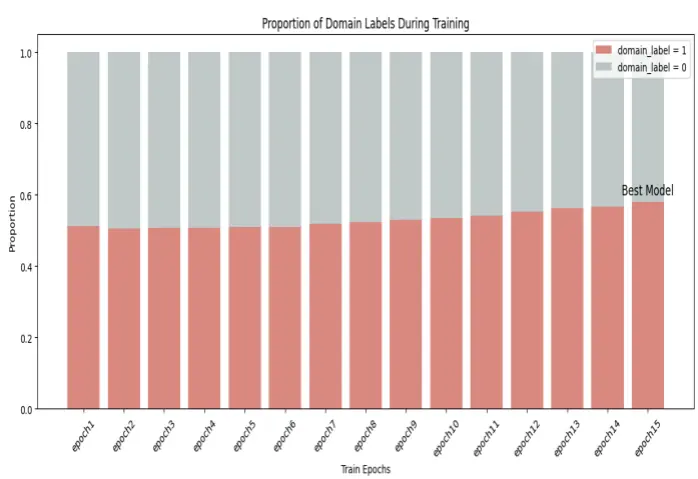
数据来源：东方证券研究所 & Wind资讯

图 5：Diversify 模型训练过程中 update_d 和 update 两个模块更新后的领域标签变化
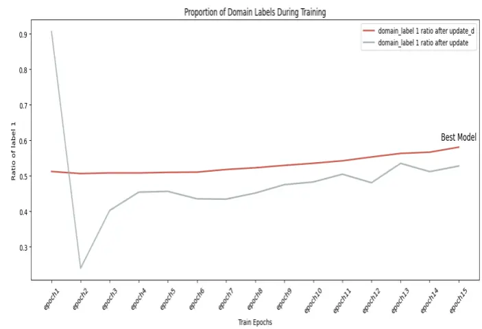
数据来源：东方证券研究所 & Wind资讯

## 3）最优模型的领域标签情况

领域标签的时序分布特点：

下图展示了每只股票在整个训练集时间段内属于领域=1 的比例，横轴（X 轴）代表的是不同的股票，每个点表示一只股票，纵轴（Y轴）表示该股票在整个训练集时间段内属于领域= 1 的比率。可以看到，大多数股票的比率在 0.3 到 0.7 之间，表明同一只股票在不同时间里的领域归属并不统一，领域标签存在时序维度的信息。也有部分股票的比率接近 0 或 1，说明它们在整个时间段内始终或几乎完全属于某一领域类别。

图 6：Diversify模型每只股票在训练集时间段内属于领域=1的概率
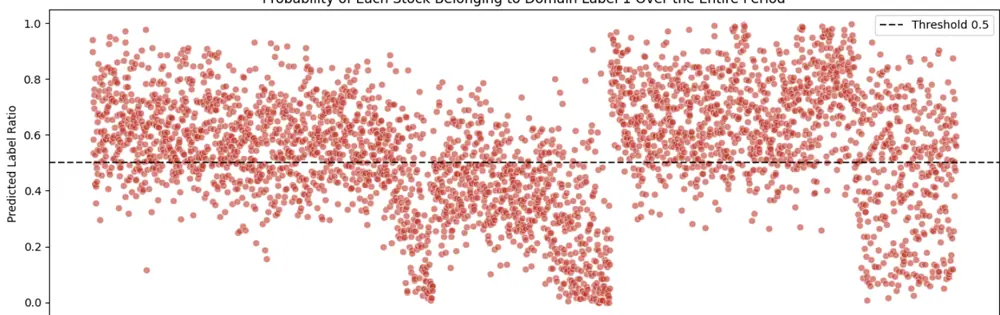
数据来源：东方证券研究所 & Wind资讯

## 领域标签的截面分布特点：

下图展示了每个时间点所有股票中属于领域= 1的股票占截面所有股票数量的比例。图中横轴X轴代表训练集的时间跨度，纵轴 y轴代表该截面里所有股票中属于领域= 1的股票占所有股票数量的比例。从时间序列变化来看，属于领域 = 1 的股票比例绝大部分时间在 0.5以上（稳定在 0.6左右），但并不会等于 0 或 1，表明同一天内不同股票的领域归属并不统一，领域标签存在截面维度的信息。在某些特定时间段，如 2015 年和 2018 年期间属于 domain_label_1 的股票比例出现较大幅度的下跌，反映了这些阶段的市场特征或数据分布有所调整，可能受到市场或交易环境的阶段性变动影响。

图 7：Diversify模型每个时间点所有股票中属于领域= 1的股票占比
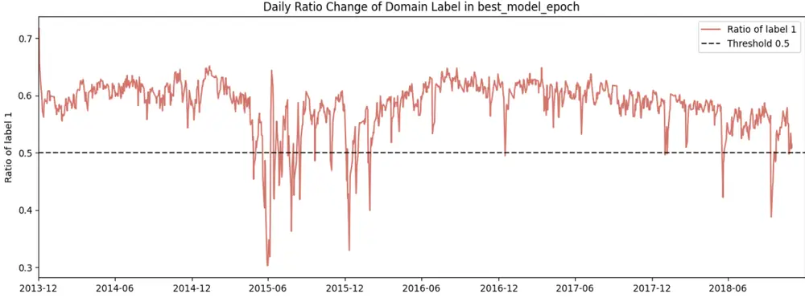
数据来源：东方证券研究所 & Wind资讯

有关分析师的申明，见本报告最后部分。其他重要信息披露见分析师申明之后部分，或请与您的投资代表联系。并请阅读本证券研究报告最后一页的免责申明。

下面我们随机抽取 50 只股票，等时间间隔的随机抽取 50 天，绘制热力图，观察领域分布面板变化情况。图上 x 轴横轴代表随机抽取的 50 只股票，y 轴代表等时间间隔的抽取 50 天。可以看到：说明领域划分针对截面时序都有进行，即领域分布同时会包含时序和截面维度的信息。

在时间维度上，可以看到不同交易日的领域分布具有一定的随机性，但仍然存在某些时间点集中出现较高（红色区域）或较低（灰色区域）值的情况。这表明，市场可能在某些特定时间段内存在较明显的结构性变化，例如市场情绪的转变、政策因素的影响或重大事件的发生。

在股票维度上，不同个股的领域也表现出一定的分布差异。部分个股在多个时间点上显示出较高的领域值，而另一些个股则较为稀疏。这可能反映出不同个股在市场中的表现及其对外部因素的敏感程度不同。例如，部分行业可能受周期性因素影响较大，而另一些行业则相对稳定。

综合来看，领域的分布并非均匀，而是受到时间因素、个股特性以及潜在市场影响因素的共同作用。

图 8：Diversify模型领域分布的面板变化情况
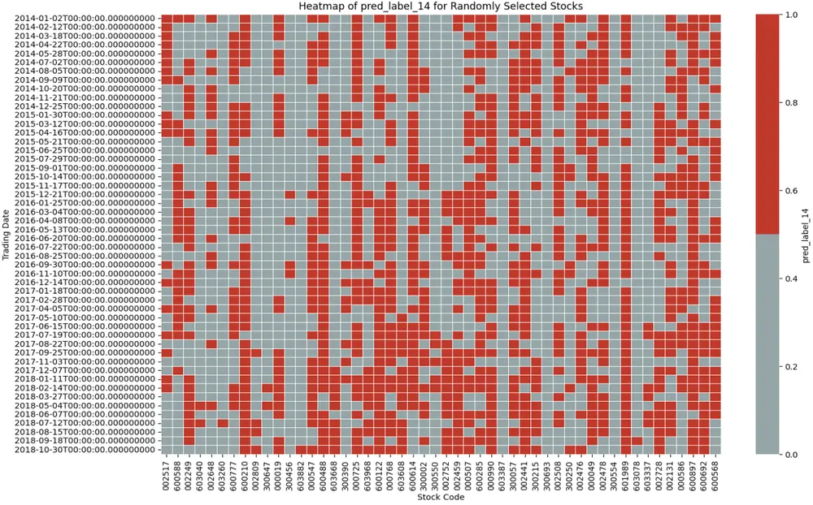
数据来源：东方证券研究所 & Wind资讯

## 三、模型训练细节

## 3.1 数据说明

样本空间：中证全指同期成分股。

数据区间：（1）训练集 2014.01.01—2018.11.30；（2）验证集 2019.01.01—2019.11.30；（3）测试集 2020.01.01—2024.12.31。数据集中额外的分割间隙是有意引入的，以避免特征和标签的泄露。训练集用于迭代训练模型，通过反向传播算法计算损失函数关于模型参数的梯度，然后按照梯度方向更新模型参数。验证集用于在模型训练过程中评估模型的性能，便于选择最优的模型和参数。测试集用于观察模型样本外的表现，在模型开发完成后评估模型的泛化性能。

数据处理方法：（1）解释变量X：截面异常值处理，标准化，填充缺失值。训练集、验证集、测试集相同处理；（2）预测标签Y：截面异常值处理，标准化，填充缺失值。训练集、验证集相同处理。

模型输入特征：量价特征，包括原始日线行情、基于分钟线提取的日频特征、基于 level2 数据提取的日频特征等共 60个。

模型预测标签：个股未来 20日收益率

## 3.2 模型超参

DFQ-Diversify模型涉及的主要超参设置如下图。

图 9：DFQ-Diversify 模型超参列表

| 参数类型 | 参数符号 | 参数设置 | 参数解释 |
| --- | --- | --- | --- |
| 数据参数 | seq_len n_epochs | 30 | 每次前向传播的数据结构为过去30天 |
|  |  | 200 | 进行200次训练，不断迭代更新模型参数 |
|  | early_stop | 20 | 若20步验证集IC无提高，则提前停止学习训练 |
|  | max_steps_per_epoch | 1 | 每次训练按批次进行，一个epoch遍历整个训练集所有的批次 |
|  | batch size | -1 | 每批次训练输入一个交易日的batch |
|  | smooth_steps | 5 | 设置双端队列paramslist的最大长度，用于存储模型的最近状态(参数和缓存)，用于后续的参数平均或其他处理 |
|  | Ir | 3.00E-04 | 优化模型的adam算法的学习率 |
| 模型参数 | feat_dim | 60 | 输入特征数量 |
|  | latent_domain_num | 2 | 潜在领域分类数量 |
|  | hidden_size | 32 | 隐藏层的大小 |
|  | num_layers | 1 | 神经网络的层数 |
|  | bottleneck | 64 | 瓶颈层输入的特征个数 |
|  | alpha | 0.1 | 梯度反转层中调整反转梯度的力度 |

数据来源：东方证券研究所

我们对部分超参进行了敏感性测试：

（1）领域个数（latent_domain_num）

在不同 latent_domain_num 设置下的模型表现分析中，domain_num = 2 的模型展现了最佳的收益与风险平衡，具备较高的夏普比率、日度超额收益以及较小的最大回撤。随着latent_domain_num 的增大，分类任务增加，模型的复杂度和计算量也随之增大，可能使得模型过度拟合训练数据，捕捉到不必要的噪声而非实际的规律。其次，更多的分类目标意味着update_d 模型需要在每个领域类别间进行更细致的区分，使得 tradeoff 更加倾向于关注领域的分类而不是标签的预测，从而影响update模型中的预测精度。因此，较低的latent_domain_num设置（如 domain_num = 2）在处理较少类别时能够更有效地进行学习，避免了过拟合和过于复杂的决策边界，从而提供更稳定的性能。

图 10：Diversify 模型不同领域个数（latent_domain_num）下的绩效表现（2020.01.01-2024.12.31）

| 中证全指股票池60特征20日标签 2020.01.01-2024.12.31 | IC | IC_IR | rankIC | rankIC_IR | 多头月度胜率 | 多头日超额收益夏普比 | 多头日度超额年化收益 | 多头日度超额收益最大回撤 | 多头月均单边换手率 |
| --- | --- | --- | --- | --- | --- | --- | --- | --- | --- |
| diversify 最优模型(domain_num =2) | 12.41% | 1.24 | 14.73% | 1.29 | 78.33% | 3.08 | 32.33% | -7.55% | 74.08% |
| diversify 最优模型(domain_num =3) | 11.94% | 1.29 | 13.55% | 1.28 | 78.33% | 2.75 | 29.19% | -9.38% | 78.22% |
| diversify 最优模型(domain_num =5) | 10.92% | 1.20 | 13.43% | 1.28 | 76.67% | 3.25 | 25.62% | -7.17% | 77.18% |

数据来源：东方证券研究所 & Wind资讯

## （2）batch 选取方法（batchsize）

batch_size 的设置直接影响模型的学习方式和特征提取的稳定性。batch_size=-1 的设置意味着模型每次随机抽取一天的所有股票数据进行训练，这使得模型能够更充分地利用同一天的市场特征，在领域学习（update_d）阶段，模型更容易识别出截面维度的风格状态，并在标签学习（update）阶段，提取到更稳定的跨领域特征。相对而言，batch_size=4000 的设置导致数据被随机打乱，每批次包含多个日期的数据，模型需要学习同时在截面和时序维度提取领域信息，难度增加，领域划分过程易受到噪声影响，导致模型效果下降。

图 11：Diversify 模型不同 batch 选取方法（batchsize）下的绩效表现（2020.01.01-2024.12.31）

| 中证全指股票池60特征20日标签 2020.01.01-2024.12.31 | IC | IC_IR | rankIC | rankIC_IR | 多头月度胜率 | 多头日超额收益夏普比 | 多头日度超额年化收益 | 多头日度超额收益最大回撤 | 多头月均单边换手率 |
| --- | --- | --- | --- | --- | --- | --- | --- | --- | --- |
| diversify 最优模型(batch_size=-1) | 12.41% | 1.24 | 14.73% | 1.29 | 78.33% | 3.08 | 32.33% | -7.55% | 74.08% |
| diversify 模型(batch_size=4000) | 11.40% | 1.32 | 12.91% | 1.33 | 81.67% | 2.70 | 27.83% | -7.38% | 77.51% |

数据来源：东方证券研究所 & Wind资讯

## （3）遍历训练 VS 抽样训练（max_steps_per_epoch）

我们对比了每个 epoch 训练整个训练集（最优模型做法）与仅训练 100 个 batch这两种方式。全量训练策略确保每个 epoch 遍历整个数据集，使模型能够学习更完整的市场特征，同时这也与后续 set_dlabel 遍历整个训练集、重新计算领域标签的方法相匹配，从而保证领域划分的稳定性，最终增强标签预测的准确性。因此，最优模型在 IC、rankIC和多头日度超额年化收益等核心指标上均明显优于每个 epoch 训练 100 个 batch。抽取 100 个 batch 的训练方法虽然由于每个epoch 仅训练部分样本，模型的泛化性可能会较强一些，但在Diversify中可能会导致extractor和domain 学习相关模块获取到的的市场信息较为片面，最终导致领域划分不够稳定，长期绩效表现受到影响。因此，采用与 set_dlabel 逻辑一致的全量训练方式，能够更好地保证模型对市场信息的完整学习，提高预测的稳定性和交易信号的质量。

图 12：Diversify 模型遍历训练 VS 抽样训练的绩效表现（2020.01.01-2024.12.31）

| 中证全指股票池60特征20日标签 2020.01.01-2024.12.31 | IC | IC_IR | rankIC | rankIC_IR | 多头月度胜率 | 多头日超额收益夏普比 | 多头日度超额年化收益 | 多头日度超额收益最大回撤 | 多头月均单边换手率 |
| --- | --- | --- | --- | --- | --- | --- | --- | --- | --- |
| diversify最优模型（每个epoch全训练集训练） | 12.41% | 1.24 | 14.73% | 1.29 | 78.33% | 3.08 | 32.33% | -7.55% | 74.08% |
| diversify 模型(每个epoch100个epoch训练) | 11.40% | 1.32 | 12.91% | 1.33 | 81.67% | 2.70 | 27.83% | -7.38% | 77.51% |

数据来源：东方证券研究所 & Wind资讯

## 3.3 随机种子影响

我们测试了5个不同随机种子下，Diversify模型的绩效表现和相关性。可以看到，随机种子模型结果有一定影响：（1）不同种子下，多种子模型打分等权合成后，模型效果略有提升；（2）不同路径下得到的模型因子值相关系数在 85%左右，多头超额收益相关性在 80%左右。

有关分析师的申明，见本报告最后部分。其他重要信息披露见分析师申明之后部分，或请与您的投资代表联系。并请阅读本证券研究报告最后一页的免责申明。

图 13：DFQ-Diversify 模型不同随机种子下的绩效表现对比（2020.01.01-2024.12.31）

| 中证全指股票池60特征20日标签 2020.01.01-2024.12.31 | IC | IC_IR | rankIC | rankIC_IR | 多头月度胜率 | 多头日超额收益夏普比 | 多头日度超额年化收益 | 多头日度超额收益最大回撤 | 多头月均单边换手率 |
| --- | --- | --- | --- | --- | --- | --- | --- | --- | --- |
| seed1 | 12.16% | 1.20 | 14.39% | 1.25 | 83.33% | 3.01 | 29.59% | -7.34% | 68.87% |
| seed10 | 12.16% | 1.25 | 14.10% | 1.31 | 78.33% | 2.54 | 25.84% | -8.77% | 81.64% |
| seed100 | 11.87% | 1.20 | 14.56% | 1.29 | 78.33% | 2.55 | 25.98% | -10.41% | 70.70% |
| seed1000 | 12.41% | 1.24 | 14.73% | 1.29 | 78.33% | 3.08 | 32.33% | -7.55% | 74.08% |
| seed10000 | 11.82% | 1.25 | 13.69% | 1.31 | 80.00% | 2.47 | 23.82% | -7.14% | 76.55% |
| 多种子模型打分标准化后等权合成 | 12.67% | 1.24 | 14.95% | 1.29 | 83.33% | 2.79 | 30.37% | -7.81% | 70.63% |

数据来源：东方证券研究所 & Wind资讯

图 14：DFQ-Diversify 模型不同随机种子下得到的因子值相关系数（2020.01.01-2024.12.31）

| Factor Value Correlation |  |  |  |  |  |
| --- | --- | --- | --- | --- | --- |
| seed1 | 100.00% | 82.63% | 85.80% | 85.89% | 84.55% |
| seed10 | 82.63% | 100.00% | 84.85% | 85.72% | 82.96% |
| seed100 | 85.80% | 84.85% | 100.00% | 90.55% | 86.04% |
| seed1000 | 85.89% | 85.72% | 90.55% | 100.00% | 86.88% |
| seed10000 | 84.55% | 82.96% | 86.04% | 86.88% | 100.00% |
|  | seed1 | seed10 | seed100 | seed1000 | seed10000 |

数据来源：东方证券研究所 & Wind资讯

图 15：DFQ-Diversify 模型不同随机种子得到的多头超额收益相关系数（2020.01.01-2024.12.31）

| Long Return Correlation |  |  |  |  |  |
| --- | --- | --- | --- | --- | --- |
| seed1 | 100.00% | 77.59% | 85.18% | 87.01% | 84.79% |
| seed10 | 77.59% | 100.00% | 80.35% | 87.96% | 86.74% |
| seed100 | 85.18% | 80.35% | 100.00% | 90.98% | 87.15% |
| seed1000 | 87.01% | 87.96% | 90.98% | 100.00% | 90.93% |
| eed10000 | 84.79% | 86.74% | 87.15% | 90.93% | 100.00% |
|  | seed1 | seed10 类数报市源：车方光码空所。W:：+资运 | seed100 | seed1000 | seed10000 |

数据来源：东方证券研究所 & Wind资讯

我们单独测试了添加瓶颈层（bottleneck）的 gru模型以及未添加瓶颈层（bottleneck）的 gru模型，比较二者在不同随机种子下得到的因子值相关性情况，以验证随机性是否主要为bottleneck 的影响。可以看到：去除 bottleneck 的 baseline 模型因子相关性大大提升了，达到了90%左右，而添加 bottlenck 的 gru baseline 模型的因子相关性与 Diversify 的类似。这说明随机种子的影响与 Diversify训练方式相关性并不大，更多的是跟 bottleneck的设置有关。

图16：添加bottleneck的gru模型在不同随机种子下得到的因子值相关系数（2020.01.01-2024.12.31）

| Factor Value Correlation |  |  |  |  |  |
| --- | --- | --- | --- | --- | --- |
| seed1 | 100.00% | 85.48% | 85.68% | 85.52% | 83.00% |
| seed10 | 85.48% | 100.00% | 88.07% | 88.06% | 89.03% |
| seed100 | 85.68% | 88.07% | 100.00% | 87.55% | 86.82% |
| seed1000 | 85.52% | 88.06% | 87.55% | 100.00% | 88.84% |
| seed10000 | 83.00% | 89.03% | 86.82% | 88.84% | 100.00% |
|  | seed1 | seed10 | seed100 | seed1000 | seed10000 |

数据来源：东方证券研究所 & Wind资讯

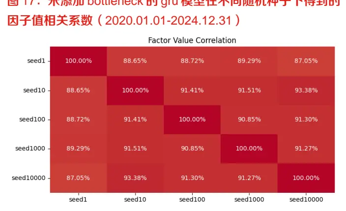
数据来源：东方证券研究所 & Wind资讯

瓶颈层模块导致不同随机种子之间因子值相关性较低的主要原因在于其随机初始化权重以及dropout 的随机失活机制。首先，Linear 层的权重采用均值为 0、标准差为 0.005 的正态分布随机初始化，不同种子会导致不同的初始化结果，影响因子计算。其次，dropout机制会随机丢弃一部分神经元，在训练过程中引入随机性，从而进一步放大不同随机种子对因子结果的影响。这样的随机性有可能会提升模型泛化能力，使得样本外表现更好，但也会带来一定的路径依赖问题，导致同一模型在不同随机种子下测得的因子值相关性相对较低，需要权衡。

## 四、模型结果

## 4.1 训练情况

由于DFQ-Diversify模型每次训练遍历整个训练集的所有batch，且模型的训练涉及到update和update_d两个模块的对抗训练，以及set_dlabel的全训练集领域更新三个环节，导致模型单个epoch训练时间较长。但训练轮次较少，在第15个epoch左右达到早停，总体训练用时5h左右。训练期间，显存占用维持在 10GB 以下，适用于中证全指成分股数据。

我们监测了训练过程中，每个 epoch 的损失值变化和 IC 变化。可以看到：（1）由于每次训练遍历整个训练集所有的 batch，第一个 epoch 的损失值就可以下降到较低的水平，由于 loss 的组成部分较多，在初始的前几个 epoch会有 loss项出现波动的情况，但在稳定后总体保持缓慢下降的趋势；（2）总体每个 epoch 上训练集、验证集、测试集中 IC 都呈上升趋势，模型未出现明显过拟合。

图 18：DFQ-Diversify 模型训练集中损失值变化
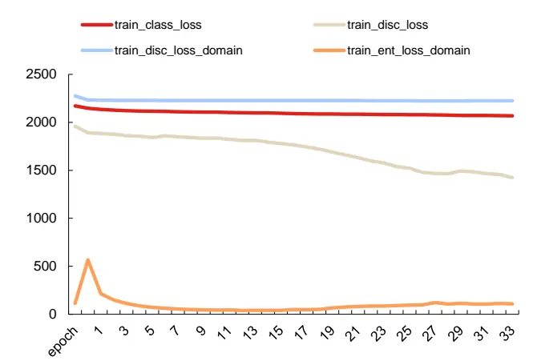
数据来源：东方证券研究所 & Wind资讯

图 19 ：DFQ-Diversify 模型训练集、验证集、测试集 IC 变化
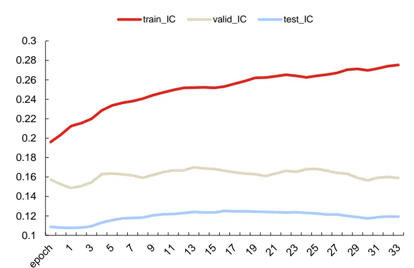
数据来源：东方证券研究所 & Wind资讯

## 4.2 因子整体绩效表现

本节展示 DFQ-Diversify模型得到的因子得分（Diversify），在中证全指、沪深 300、中证500、中证 1000四个股票池中的表现，并与前期报告《基于机构持仓的因子情景分析》中的基于机构持仓分域的线性多因子模型 dfq、《DFQ 遗传规划价量因子挖掘系统》中的遗传规划合成因子 gp、《DFQ 强化学习因子组合挖掘系统》中的强化学习合成因子 rl、《DFQ-TRA：多交易模式学习因子挖掘系统》中的 tra 因子、《DFQ-HIST：添加图信息的选股因子挖掘系统》中的 hist因子、《DFQ-XGB：基于树模型的 alpha 预测方案》中的 xgb 因子、《DFQ-FactorVAE：融合变分自编码器和概率动态因子模型的 alpha预测方案》中的 vae 因子、《DFQ-Factorvae-pro：加入特征选择与环境变量模块的 FactorVAE 模型》vae-pro 因子，进行对比。

测试区间为 2020.1.1-2025.03.24。绩效指标计算细节如下：（1）IC 和 RANKIC 采用因子得分和20日收益率标签计算得到，日度平均，ICIR和RANKICIR未年化。（2）多头指标计算时，沪深 300、中证 500 股票池中分组数为 5，中证 1000 股票池中分组数为 10，中证全指股票池中分组数为 20。（3）多头组合月频调仓，绩效依次展示：日度超额年化收益率、日超额收益夏普比、日度超额收益最大回撤、月度胜率、月均单边换手。此处的多头计算不考虑交易成本，但汇报了月均单边换手率，费后收益可以根据费前收益和换手率近似估算。

结果显示：在各个股票池中，DFQ-Diversify 模型表现都较好，相比其他模型，在沪深 300、中证 500 这种大盘股中相对优势更明显。

（1）在中证全指股票池中，DFQ-Diversify模型整体表现较好，分组单调性较好。测试集上IC 达到 12.22%，ICIR 达到 1.22，RANKIC 达到 14.58%，RANKICIR 达到 1.28。20 分组多头超额年化收益达到 32.52%，多头日超额收益夏普比 3.09，多头日度超额收益最大回撤 7.55%，多头月度胜率 78%，月均单边换手 74%。

图 20：中证全指股票池各模型因子绩效表现（2020.1.1-2025.3.24）

| 中证全指股票池IC2020.01.01-2025.03.24dfq |  | IC_IR | rankIC | rankIC_IR多头月度胜率 |  | 多头日超额收益夏普比 | 多头日度超额年化收益 | 多头日度超额收益最大回撤 多头月均单边换手率 |  |  |
| --- | --- | --- | --- | --- | --- | --- | --- | --- | --- | --- |
|  |  | 4.21% | 0.56 | 6.44% | 0.73 | 60.32% | 0.99 | 6.31% | -11.41% | 32.61% |
| gpr1985trahistxgbvaevae-prodiversify | 7.68% | 0.80 | 11.25% | 1.19 | 71.43% | 2.18 | 15.92% | -8.95% | 67.58% |  |
|  | 9.78% | 0.81 | 13.66% | 1.01 | 76.19% | 2.67 | 22.94% | -7.20% | 74.54% |  |
|  | 10.22% | 0.78 | 15.26% | 1.04 | 77.78% | 2.43 | 24.49% | -10.93% | 56.71% |  |
|  | 11.80% | 0.99 | 16.46% | 1.21 | 87.30% | 3.33 | 32.04% | -6.42% | 73.62% |  |
|  | 12.32% | 1.19 | 14.74% | 1.32 | 87.30% | 3.42 | 29.12% | -7.44% | 76.80% |  |
|  | 12.19% | 1.26 | 14.54% | 1.33 | 87.30% | 3.43 | 34.24% | -8.28% | 78.46% |  |
|  | 11.88% | 1.07 | 14.88% | 1.23 | 85.71% | 3.47 | 30.00% | -5.35% | 77.62% |  |
|  | 12.22% 1.22 14.58% |  |  | 1.28 | 77.78% | 3.09 | 32.52% | -7.55% | 73.78% |  |

数据来源：东方证券研究所 & Wind资讯

图 21：中证全指股票池 Diversify 因子的 IC 时序变化（2020.1.1-2025.3.24）
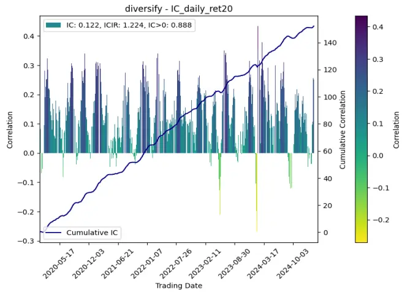

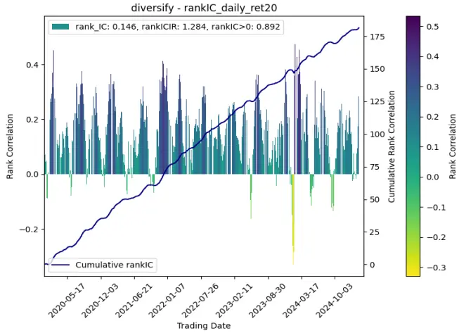
数据来源：东方证券研究所 & Wind资讯

图 22：中证全指股票池 Diversify 因子分组超额收益净值 & 分组年化超额收益（2020.1.1-2025.3.24）
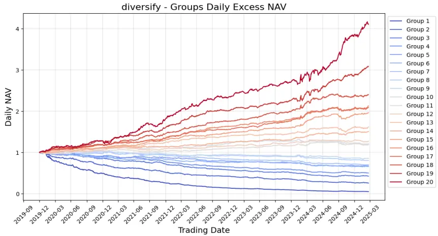
数据来源：东方证券研究所 & Wind资讯

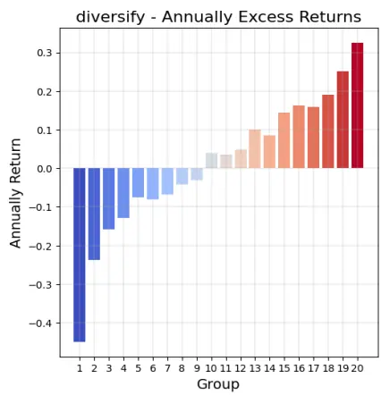

有关分析师的申明，见本报告最后部分。其他重要信息披露见分析师申明之后部分，或请与您的投资代表联系。并请阅读本证券研究报告最后一页的免责申明。

（2）在沪深300股票池中，DFQ-Diversify模型所得因子多头表现领先，分组单调性较好。测试集上 IC 达到 8.08%，ICIR 达到 0.46，RANKIC 达到 9.77%，RANKICIR 达到 0.52。5 分组多头超额年化收益达到 12.85%，多头日超额收益夏普比 1.31，多头日度超额收益最大回撤14.96%，多头月度胜率 70%，月均单边换手 54%。

图 23：沪深 300 股票池各模型因子绩效表现（2020.1.1-2025.3.24）

| 沪深300股票池 2020.01.01-2025.03.24 | IC | IC_IR | rankIC | rankIC_IR | 多头月度胜率 | 多头日超额收益夏普比 | 多头日度超额年化收益 | 多头日度超额收益最大回撤 | 多头月均单边换手率 |
| --- | --- | --- | --- | --- | --- | --- | --- | --- | --- |
| dfq | 2.90% | 0.23 | 3.81% | 0.30 | 53.97% | 0.78 | 4.18% | -10.52% | 22.54% |
| gp | 2.40% | 0.19 | 3.21% | 0.26 | 53.97% | 0.08 | 0.28% | -15.41% | 48.33% |
| rl985 | 6.93% | 0.38 | 9.62% | 0.51 | 63.49% | 1.17 | 10.68% | -11.78% | 50.71% |
| tra | 6.83% | 0.30 | 9.70% | 0.41 | 52.38% | 0.66 | 6.88% | -19.86% | 26.40% |
| hist | 9.02% | 0.45 | 11.17% | 0.54 | 65.08% | 0.96 | 8.87% | -14.59% | 50.87% |
| xgb | 7.45% | 0.38 | 8.75% | 0.42 | 63.49% | 0.84 | 8.63% | -16.28% | 49.26% |
| vae | 8.48% | 0.48 | 10.13% | 0.53 | 65.08% | 1.29 | 12.05% | -13.58% | 53.28% |
| vae-pro | 8.93% | 0.48 | 10.81% | 0.55 | 63.49% | 1.24 | 11.23% | -10.78% | 49.74% |
| diversify | 8.08% | 0.46 | 9.77% | 0.52 | 69.84% | 1.31 | 12.85% | -14.96% | 53.62% |

数据来源：东方证券研究所 & Wind资讯

图 24：沪深 300 股票池 Diversify 因子的 IC 时序变化（2020.1.1-2025.3.24）
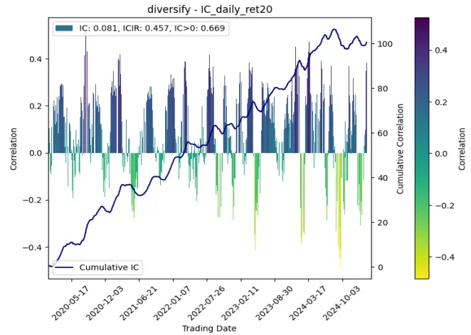

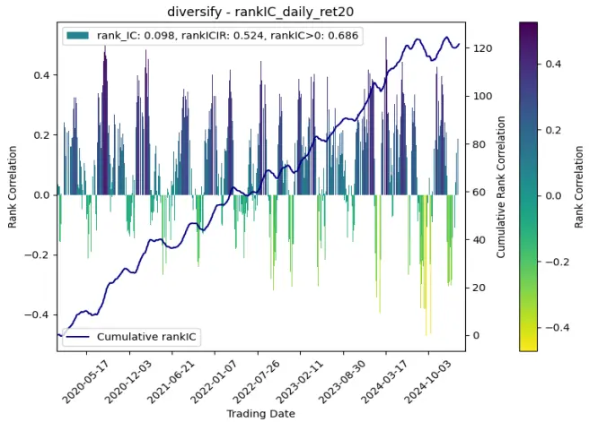
数据来源：东方证券研究所 & Wind资讯

图 25：沪深 300 股票池 Diversify 因子分组超额收益净值 & 分组年化超额收益（2020.1.1-2025.3.24）
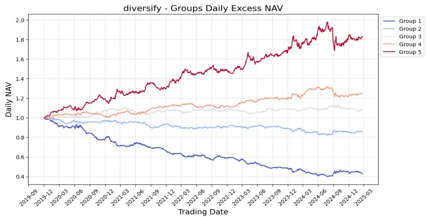
数据来源：东方证券研究所 & Wind资讯

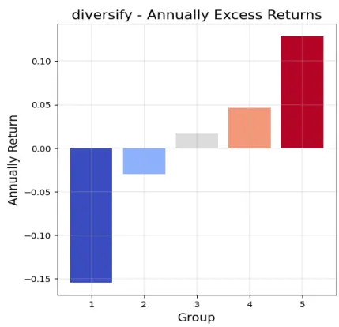

有关分析师的申明，见本报告最后部分。其他重要信息披露见分析师申明之后部分，或请与您的投资代表联系。并请阅读本证券研究报告最后一页的免责申明。

（3）在中证500股票池中，DFQ-Diversify模型所得因子多头表现领先，分组单调性较好。测试集上 IC 达到 7.93%，ICIR 达到 0.51，RANKIC 达到 10.35%，RANKICIR 达到 0.68。5 分组多头超额年化收益达到 14.52%，多头日超额收益夏普比 1.85，多头日度超额收益最大回撤8.73%，多头月度胜率 75%，月均单边换手 56%。

图 26：中证 500 股票池各模型因子绩效表现（2020.1.1-2025.3.24）

| 中证500股票池 2020.01.01-2025.03.24 | IC | IC_IR | rankIC | rankIC_IR | 多头月度胜率 | 多头日超额收益夏普比 | 多头日度超额年化收益 | 多头日度超额收益最大回撤 | 多头月均单边换手率 |
| --- | --- | --- | --- | --- | --- | --- | --- | --- | --- |
| dfq | 3.33% | 0.28 | 5.04% | 0.40 | 49.21% | 0.77 | 4.10% | -11.18% | 25.05% |
| gp | 3.24% | 0.30 | 6.07% | 0.61 | 53.97% | 0.75 | 3.69% | -6.71% | 46.97% |
| rl985 | 6.00% | 0.37 | 9.81% | 0.58 | 60.32% | 1.00 | 8.06% | -8.97% | 50.27% |
| tra | 5.70% | 0.32 | 9.62% | 0.51 | 57.14% | 0.54 | 4.78% | -24.08% | 39.41% |
| hist | 7.40% | 0.45 | 11.01% | 0.64 | 68.25% | 1.75 | 14.53% | -9.25% | 53.94% |
| xgb | 7.51% | 0.48 | 9.25% | 0.55 | 65.08% | 1.44 | 12.50% | -14.46% | 55.51% |
| vae | 7.79% | 0.53 | 9.80% | 0.66 | 71.43% | 1.84 | 13.38% | -8.29% | 57.17% |
| vae-pro | 8.08% | 0.52 | 10.91% | 0.71 | 68.25% | 1.94 | 14.17% | -6.49% | 54.08% |
| diversify | 7.93% | 0.51 | 10.35% | 0.68 | 74.60% | 1.85 | 14.52% | -8.73% | 55.51% |

数据来源：东方证券研究所 & Wind资讯

图 27：中证 500 股票池 Diversify 因子的 IC 时序变化（2020.1.1-2025.3.24）
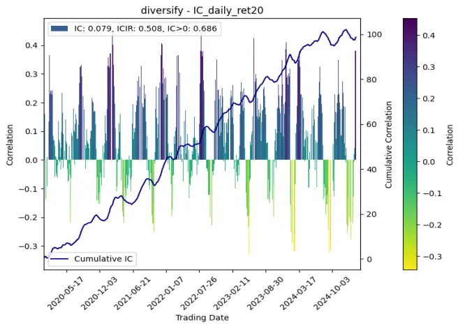

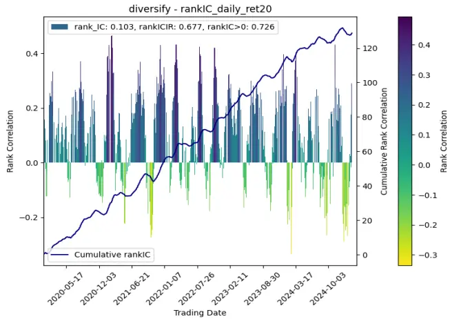
数据来源：东方证券研究所 & Wind资讯

图 28：中证 500 股票池 Diversify 因子分组超额收益净值 & 分组年化超额收益（2020.1.1-2025.3.24）
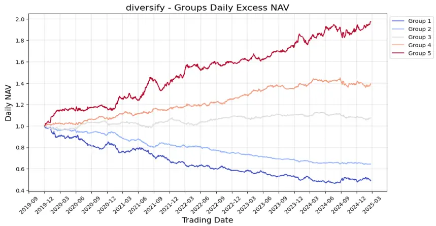
数据来源：东方证券研究所 & Wind资讯

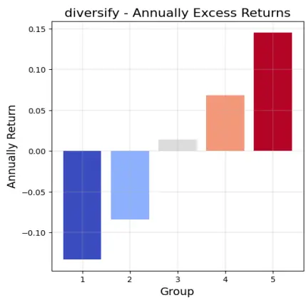

有关分析师的申明，见本报告最后部分。其他重要信息披露见分析师申明之后部分，或请与您的投资代表联系。并请阅读本证券研究报告最后一页的免责申明。

（4）在中证 1000 股票池中，DFQ-Diversify 模型所得因子整体表现较好，分组单调性较好。测试集上 IC 达到 11.21%，ICIR 达到 1，RANKIC 达到 12.60%，RANKICIR 达到 1.09。10 分组多头超额年化收益达到 21.48%，多头日超额收益夏普比 2.73，多头日度超额收益最大回撤6.01%，多头月度胜率 73%，月均单边换手 70%。

图 29：中证 1000 股票池各模型因子绩效表现（2020.1.1-2025.3.24）

| 中证1000股票池 2020.01.01-2025.03.24 | IC IC_IR rankIC |  |  | rankIC_IR | 多头月度胜率 | 多头日超额收益夏普比 | 多头日度超额年化收益 | 多头日度超额收益最大回撤 | 多头月均单边换手率 |
| --- | --- | --- | --- | --- | --- | --- | --- | --- | --- |
| dfq | 4.44% | 0.40 | 6.02% | 0.50 | 57.14% | 0.74 | 5.32% | -15.98% | 30.03% |
| gp | 7.07% | 0.66 | 9.85% | 0.98 | 58.73% | 1.31 | 7.87% | -6.97% | 58.24% |
| rl985 | 9.32% | 0.65 | 12.09% | 0.79 | 66.67% | 1.65 | 14.70% | -9.88% | 65.57% |
| tra | 8.84% | 0.58 | 12.25% | 0.74 | 69.84% | 1.10 | 10.72% | -21.46% | 57.84% |
| hist | 10.98% | 0.81 | 14.15% | 0.97 | 77.78% | 2.65 | 24.73% | -9.86% | 69.16% |
| xgb | 10.99% | 0.91 | 12.00% | 0.96 | 74.60% | 2.19 | 17.04% | -9.77% | 71.19% |
| vae | 11.44% | 1.05 | 12.47% | 1.12 | 79.37% | 3.29 | 23.27% | -4.26% | 73.05% |
| vae-pro | 11.21% | 0.93 | 13.14% | 1.05 | 85.71% | 2.96 | 22.02% | -5.92% | 69.68% |
| diversify | 11.21% | 1.00 | 12.60% | 1.09 | 73.02% | 2.73 | 21.48% | -6.01% | 70.25% |

数据来源：东方证券研究所 & Wind资讯

图 30：中证 1000 股票池 Diversify 因子的 IC 时序变化（2020.1.1-2025.3.24）
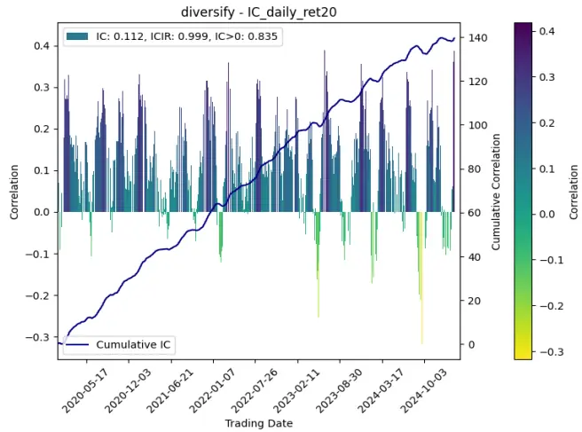

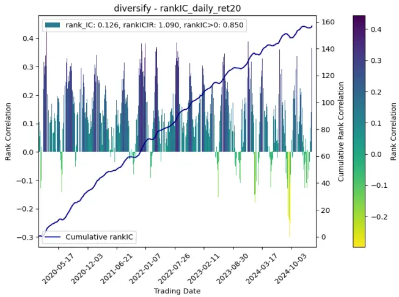
数据来源：东方证券研究所 & Wind资讯

图 31：中证 1000 股票池 Diversify 因子分组超额收益净值 & 分组年化超额收益（2020.1.1-2025.3.24）
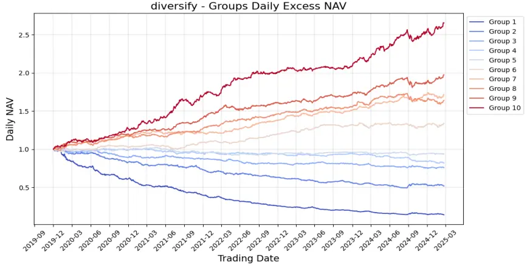
数据来源：东方证券研究所 & Wind资讯

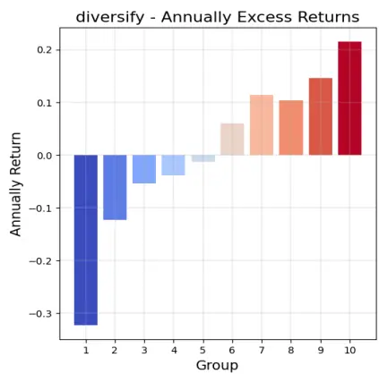

有关分析师的申明，见本报告最后部分。其他重要信息披露见分析师申明之后部分，或请与您的投资代表联系。并请阅读本证券研究报告最后一页的免责申明。

总体来看，在沪深 300 和中证 500 等大盘股中，Diversify 模型的多头表现优势较为明显，在中证全指和中证 1000等小盘股中，Diversify 模型的表现并不突出。可能的原因在于：大盘股的特征通常较为稳定，Diversify 模型通过去除与标签预测无关的干扰因素（如市场风格等），专注于提取能够长期有效的因子，提升了多头策略的表现。而小盘股的价格波动较大，且容易受到短期市场情绪、公司新闻等因素的影响。虽然 Diversify 模型可以剔除无关信息，但在波动较大的环境中，模型难以捕捉到有效的长期信号，导致预测不稳定。

## 4.3 因子分年绩效表现

在各个股票池中，DFQ-Diversify模型得到的因子得分 2024年的表现均十分优异。

（1）在中证全指股票池中，DFQ-Diversify模型 2024 年 IC 达到 11.70%，ICIR 达到 1.01，20分组多头年化超额 42.32%，最大回撤 7.55%。

图 32：中证全指股票池各模型分年绩效表现（2020.1.1-2025.3.24）

| 中证全指股票池 |  |  |  |  |  |  |  |  |  |
| --- | --- | --- | --- | --- | --- | --- | --- | --- | --- |
| dfq 2020 | IC 6.51% | IC_IR 1.29 | rankIC 9.80% | rankIC_IR 1.74 | 多头月度胜率 75.00% | 多头日超额收益夏普比 2.27 | 多头日度超额年化收益 14.41% | 多头日度超额收益最大回撤 -4.22% | 多头日均单边换手率 34.78% |
| 2021 | 2.45% | 0.45 | 5.18% | 0.90 | 50.00% | 0.19 | 0.85% | -7.92% | 34.28% |
| 2022 | 3.75% | 0.55 | 5.12% | 0.69 | 58.33% | 1.13 | 5.96% | -5.59% | 33.85% |
|  | 4.57% | 0.74 | 7.09% | 1.06 | 58.33% | 0.28 | 1.05% | -5.59% | 31.83% |
| 2023 | 4.94% | 0.43 | 6.27% | 0.44 | 58.33% |  |  |  |  |
| 2024 |  |  | -1.63% |  |  | 1.10 | 9.16% | -11.41% | 29.94% |
| 2025.3.24 gp | -3.13% IC | -0.50 IC_IR | rankIC | -0.20 rankIC_IR 多头月度胜率 | 66.67% | 0.03 | 0.77% | -5.29% | 26.09% |
| 2020 | 7.29% | 0.69 | 11.73% | 1.16 50.00% |  | 多头日超额收益夏普比 | 多头日度超额年化收益 | 多头日度超额收益最大回撤 | 多头日均单边换手率 |
| 2021 | 5.76% | 0.68 | 11.41% | 1.28 |  | 0.61 | 3.10% | -4.90% | 73.52% |
|  |  |  |  |  | 75.00% | 3.10 | 18.24% | -1.71% | 71.71% |
| 2022 2023 | 9.33% | 1.20 | 11.56% | 1.94 | 66.67% | 2.45 | 16.28% | -2.67% | 66.31% |
| 2024 | 9.05% | 0.89 | 13.33% 9.15% | 1.65 | 91.67% | 2.93 | 20.64% | -2.26% | 61.43% |
| 2025.3.24 | 8.05% 0.90% | 0.77 0.15 | 5.37% | 0.73 0.90 | 75.00% | 1.70 | 16.27% | -8.95% | 67.60% |
| r1985 | IC | IC_IR | rankIC | rankIC_IR | 66.67% | 0.28 | 5.54% | -1.55% | 56.83% |
| 2020 | 10.50% | 0.92 | 14.83% | 1.17 | 多头月度胜率 66.67% | 多头日超额收益夏普比 | 多头日度超额年化收益 | 多头日度超额收益最大回撤 | 多头日均单边换手率 |
| 2021 | 9.06% | 0.89 | 14.31% | 1.12 | 66.67% | 1.24 | 9.58% 16.99% | -7.20% | 74.60% |
| 2022 | 11.86% | 1.16 | 14.97% | 1.49 | 83.33% | 1.87 |  | -6.19% | 73.67% |
| 2023 | 8.57% | 0.57 | 13.53% | 0.84 | 66.67% | 3.90 2.01 | 30.47% 12.73% | -2.89% -5.59% | 74.13% |
| 2024 | 10.61% | 0.87 | 12.49% | 0.86 | 91.67% | 4.12 | 39.76% | -4.40% | 72.31% 76.98% |
| 2025.3.24 | -1.73% | -0.18 | 0.87% | 0.07 | 100.00% | 0.25 | 6.92% | -2.88% | 78.65% |
| tra | IC | IC_IR | rankIC | rankIC_IR | 多头月度胜率 | 多头日超额收益夏普比 | 多头日度超额年化收益 | 多头日度超额收益最大回撤 | 多头日均单边换手率 |
| 2020 | 8.92% | 0.71 | 14.13% | 0.99 | 75.00% | 2.14 | 15.83% | -7.81% | 59.12% |
| 2021 | 10.01% | 0.78 | 16.52% | 1.17 | 66.67% | 2.48 | 24.47% | -4.92% | 57.52% |
| 2022 2023 | 12.20% | 1.26 | 16.17% | 1.67 | 75.00% | 2.99 | 26.63% | -3.30% | 56.02% |
| 2024 | 13.30% | 0.92 0.59 | 20.06% 11.15% | 1.44 | 83.33% | 3.27 | 22.91% | -4.65% | 54.94% |
| 2025.3.24 | 8.37% -1.35% | -0.13 | 3.22% | 0.61 0.26 | 83.33% | 2.02 | 27.67% | -10.93% | 56.96% |
| hist | IC | IC_IR | rankIC | rankIC_IR | 100.00% 多头月度胜率 | 0.15 | 4.72% | -2.90% | 52.63% |
| 2020 | 11.92% | 0.99 | 16.51% | 1.19 | 83.33% | 多头日超额收益夏普比 3.34 | 多头日度超额年化收益 25.72% | 多头日度超额收益最大回撤 -4.88% | 多头日均单边换手率 |
| 2021 | 12.04% | 1.14 | 17.37% | 1.31 | 83.33% | 2.90 | 28.13% | -5.72% | 75.46% |
| 2022 | 14.02% | 1.50 | 18.04% | 2.00 | 100.00% | 4.29 | 36.52% | -2.97% | 74.40% |
| 2023 | 10.89% | 0.79 | 17.41% | 1.23 | 83.33% | 3.39 | 22.11% | -3.39% | 70.52% |
| 2024 | 11.65% | 0.90 | 14.26% | 0.88 | 91.67% | 2.88 | 36.75% | -6.42% | 71.75% |
| 2025.3.24 | 1.46% | 0.14 | 7.83% | 0.67 | 66.67% | 0.38 | 9.78% | -1.15% | 76.22% |
| xgb | IC | IC_IR | rankIC | rankIC_IR | 多头月度胜率 | 多头日超额收益夏普比 | 多头日度超额年化收益 | 多头日度超额收益最大回撤 | 72.61% |
| 2020 | 13.00% | 1.27 | 15.29% | 1.39 | 75.00% | 2.53 | 18.26% | -5.59% | 多头日均单边换手率 80.86% |
| 2021 | 12.12% | 1.44 | 15.46% | 1.48 | 83.33% | 3.22 | 28.57% | -7.44% | 77.75% |
| 2022 | 14.03% | 1.69 | 15.59% | 2.03 | 91.67% | 5.25 | 39.30% | -2.75% | 79.38% |
| 2023 | 11.69% | 0.96 | 16.22% | 1.33 | 83.33% | 1.19 | 6.75% | -4.64% | 70.91% |
| 2024 2025.3.24 | 12.13% | 1.06 | 12.26% | 0.93 | 100.00% | 4.07 | 45.66% | -5.80% | 75.04% |
| vae | 3.40% IC | 0.39 | 7.29% rankIC | 0.83 | 100.00% | 0.46 | 9.42% | -0.86% | 77.07% |
| 2020 | 12.59% | IC_IR 1.35 | 14.71% | rankIC_IR 1.48 | 多头月度胜率 91.67% | 多头日超额收益夏普比 5.22 | 多头日度超额年化收益 34.34% | 多头日度超额收益最大回撤 -1.84% | 多头日均单边换手率 84.44% |

数据来源：东方证券研究所 & Wind资讯
有关分析师的申明，见本报告最后部分。其他重要信息披露见分析师申明之后部分，或请与您的投资代表联系。并请阅读本证券研究报告最后一页的免责申明。

（2）在沪深 300 中，DFQ-Diversify 模型 2024 年 IC 达到 6.81%，ICIR 达到 0.30，5 分组多头年化超额 10.29%，最大回撤 14.96%。

图 33：沪深 300 股票池各模型分年绩效表现（2020.1.1-2025.3.24）
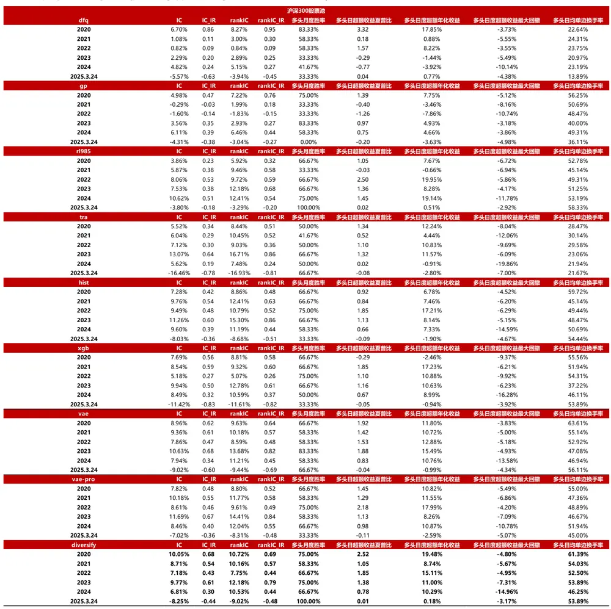
数据来源：东方证券研究所 & Wind资讯

（3）在中证 500 中 DFQ-Diversify 模型 2024 年 IC 达到 6.60%，ICIR 达到 0.37，5 分组多头年化超额 10.94%，最大回撤 6.34%。

图 34：中证 500 股票池各模型分年绩效表现（2020.1.1-2025.3.24）

| 中证500股票池 |  |  |  |  |  |  |  |  |  |
| --- | --- | --- | --- | --- | --- | --- | --- | --- | --- |
| dfq 2020 | IC 4.84% | IC_IR 0.70 | rankIC 8.51% | rankIC_IR 1.10 | 多头月度胜率 66.67% | 多头日超额收益夏普比 1.78 | 多头日度超额年化收益 9.32% | 多头日度超额收益最大回撤 -3.72% | 多头日均单边换手率 26.75% |
|  | 3.03% | 0.39 | 4.77% | 0.56 | 66.67% | 2.39 | 11.71% | -4.17% | 26.25% |
| 2021 |  |  | 4.14% | 0.39 | 41.67% | 0.15 | 0.55% | -6.00% | 26.08% |
| 2022 | 3.19% | 0.30 |  |  | 25.00% |  |  | -7.41% |  |
| 2023 | 1.97% | 0.19 | 4.08% | 0.37 |  | -1.37 | -5.94% |  | 23.25% |
| 2024 | 5.78% | 0.31 | 6.16% | 0.31 | 50.00% | 1.06 | 6.78% | -8.73% | 24.92% |
| 2025.3.24 gp | -11.53% IC | -1.32 IC_IR | -12.27% | -1.15 rankIC_IR | 33.33% 多头月度胜率 | -0.03 | -0.84% | -5.73% | 17.00% |
| 2020 | 2.10% | 0.18 | rankIC 6.38% | 0.59 | 33.33% | 多头日超额收益夏普比 -0.48 | 多头日度超额年化收益 -2.33% | 多头日度超额收益最大回撤 -4.21% | 多头日均单边换手率 52.92% |
| 2021 | 2.93% | 0.30 | 6.51% | 0.70 | 58.33% | 1.78 | 9.26% | -4.55% | 52.08% |
| 2022 | 2.82% | 0.35 | 3.89% | 0.44 | 50.00% | -0.17 | -1.02% | -6.71% | 44.83% |
| 2023 | 3.52% | 0.36 | 7.07% | 0.90 | 58.33% | 1.23 | 5.16% | -2.76% |  |
| 2024 | 6.22% | 0.46 | 7.37% | 0.65 | 75.00% | 1.52 | 7.39% | -4.19% | 41.33% |
| 2025.3.24 | -6.81% | -0.52 | -0.79% | -0.08 | 33.33% | 0.03 | 0.55% | -2.84% | 45.92% |
| r1985 | IC | IC_IR | rankiC | rankIC_IR | 多头月度胜率 | 多头日超额收益夏普比 | 多头日度超额年化收益 | 多头日度超额收益最大回撤 | 38.00% 多头日均单边换手率 |
| 2020 | 5.25% | 0.38 | 9.50% | 0.59 | 58.33% | 0.42 | 3.08% | -8.97% | 52.25% |
| 2021 | 5.77% | 0.43 | 10.19% | 0.69 | 50.00% | 0.71 | 5.69% | -6.02% |  |
| 2022 | 8.70% | 0.68 | 11.55% | 0.80 | 66.67% | 2.19 | 15.36% | -5.09% | 48.58% |
| 2023 | 5.64% | 0.29 | 11.67% | 0.65 | 58.33% | 0.94 | 5.44% | -4.93% | 47.67% |
| 2024 | 7.28% | 0.41 | 8.81% | 0.46 | 75.00% | 1.26 | 12.18% | -8.07% | 48.58% |
| 2025.3.24 | -12.84% | -0.63 | -9.96% | -0.51 | 33.33% | -0.03 | -0.76% | -5.07% | 53.17% 54.67% |
| tra | IC | IC_IR | rankIC | rankIC_IR | 多头月度胜率 | 多头日超额收益夏普比 | 多头日度超额年化收益 | 多头日度超额收益最大回撤 | 多头日均单边换手率 |
| 2020 | 5.41% | 0.42 | 10.69% | 0.74 | 66.67% | 0.76 | 5.45% | -5.58% | 40.25% |
| 2021 | 5.37% | 0.35 | 11.25% | 0.73 | 58.33% | 1.24 | 9.31% | -5.85% | 41.83% |
| 2022 | 6.41% | 0.43 | 8.78% | 0.53 | 58.33% | 2.04 | 13.02% | -5.90% | 45.67% |
| 2023 | 10.27% | 0.59 | 15.01% | 0.92 | 66.67% | 1.47 | 9.02% | -4.53% | 41.33% |
| 2024 | 4.06% | 0.17 | 6.11% | 0.24 | 33.33% | -0.39 | -6.72% | -23.26% | 29.00% |
| 2025.3.24 hist | -15.46% | -0.94 | -17.31% | -0.83 | 66.67% | -0.12 | -4.61% | -9.45% | 35.33% |
| 2020 | IC 6.35% | IC_IR | rankIC | rankIC_IR | 多头月度胜率 75.00% | 多头日超额收益夏普比 | 多头日度超额年化收益 | 多头日度超额收益最大回撤 | 多头日均单边换手率 |
| 2021 | 8.21% | 0.44 0.55 | 10.41% 12.03% | 0.66 0.72 | 50.00% | 1.56 | 11.46% | -3.29% | 58.67% |
| 2022 | 9.93% | 0.69 | 12.98% | 0.79 | 75.00% | 1.88 | 17.97% 25.18% | -5.45% | 50.75% |
| 2023 | 8.80% |  |  |  | 66.67% | 3.19 |  | -3.01% | 54.50% |
|  | 6.57% | 0.48 | 14.73% | 0.86 | 75.00% | 1.94 | 10.63% | -4.40% | 50.67% |
| 2024 |  | 0.36 | 7.71% | 0.43 |  | 0.81 | 7.31% | -9.25% | 54.33% |
| 2025.3.24 xgb | -13.33% | -0.72 | -9.45% | -0.52 | 66.67% | 0.05 | 1.07% | -3.87% | 57.00% |
| 2020 | IC | IC_IR | rankIC | rankIC_IR | 多头月度胜率 | 多头日超额收益夏普比 | 多头日度超额年化收益 | 多头日度超额收益最大回撤 | 多头日均单边换手率 |
|  | 8.53% | 0.81 | 10.99% | 1.00 | 75.00% | 1.36 | 8.15% | -4.08% | 58.58% |
| 2021 | 8.98% | 0.63 | 10.79% | 0.69 | 66.67% | 2.29 | 21.89% | -8.20% | 54.17% |
| 2022 | 9.02% | 0.62 | 8.96% | 0.55 | 75.00% | 2.40 | 20.59% | -5.62% | 58.67% |
| 2023 | 7.60% | 0.43 | 11.96% | 0.66 | 58.33% | 0.93 | 5.99% | -5.78% | 48.25% |
| 2024 2025.3.24 | 6.05% | 0.32 | 6.64% | 0.35 | 50.00% | 0.55 | 5.47% | -14.46% | 57.17% |
| vae | -10.98% IC | -0.64 IC_IR | -13.15% rankIC | -0.78 rankIC_IR | 66.67% 多头月度胜率 | 0.08 多头日超额收益夏普比 | 1.61% 多头日度超额年化收益 | -2.65% 多头日度超额收益最大回撤 | 58.33% 多头日均单边换手率 |

数据来源：东方证券研究所 & Wind资讯

（4）在中证 1000 股票池中，DFQ-Diversify 模型 2024 年 IC 达到 8.82%，ICIR 达到 0.66，20分组多头年化超额 22.78%，最大回撤 6.01%。

图 35：中证 1000 股票池各模型分年绩效表现（2020.1.1-2025.3.24）
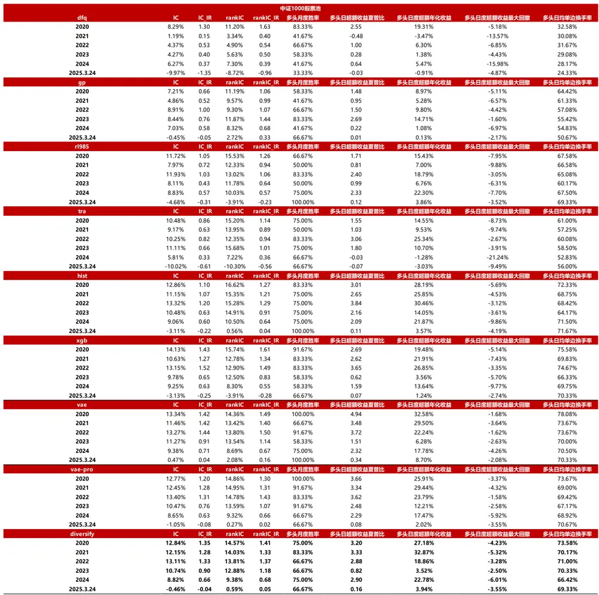
数据来源：东方证券研究所 & Wind资讯

## 4.4 因子多头组风险因子暴露

我们从因子暴露角度，对中证全指股票池内，各模型多头组进行分析。业绩基准是样本空间（中证全指）等权组合。计算组合持仓和基准在各个风险因子上的暴露，相减得到相对暴露即可。

我们使用的风险模型是《东方 A股因子风险模型(DFQ-2020)》报告中研发的风险模型，风险因子包括十大类风格类风险因子，29 个中信一级行业因子和市场因子。下图展示了该模型的风格因子列表，具体模型细节可以参考报告。

图 36：东方 A股因子风险模型（DFQ-2020）-- 风格因子列表
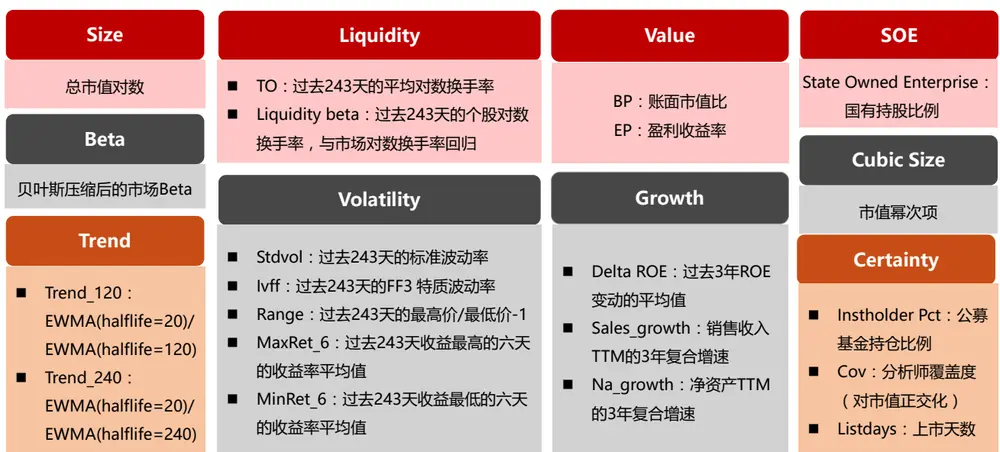
数据来源：东方证券研究所

DFQ-Diversify 模型得到的因子得分对应的多头组偏向小市值、低波、低信息确定性、强反转、低成长。与其他模型相比，在 beta、估值、流动性上的暴露几乎为 0。

图 37：中证全指股票池各模型多头组的因子相对暴露均值（2020.1.1-2025.3.24）
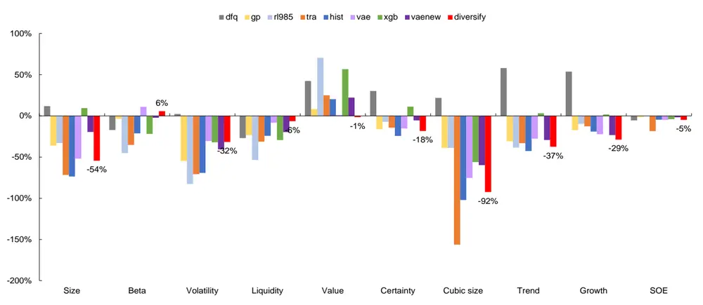
数据来源：东方证券研究所 & Wind资讯
有关分析师的申明，见本报告最后部分。其他重要信息披露见分析师申明之后部分，或请与您的投资代表联系。并请阅读本证券研究报告最后一页的免责申明。

图 38：中证全指股票池各模型多头组的 size 因子相对暴露变化（2020.1.1-2025.3.24）
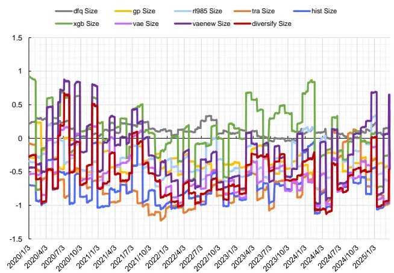
数据来源：东方证券研究所 & Wind资讯

图 39：中证全指股票池各模型多头组的 beta 因子相对暴露变化（2020.1.1-2025.3.24）
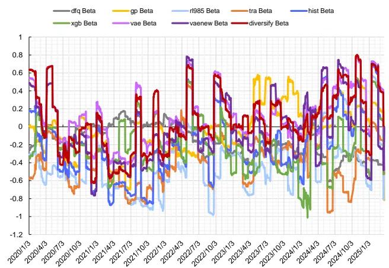
数据来源：东方证券研究所 & Wind资讯

图40：中证全指股票池各模型多头组的volatility因子相对暴露变化（2020.1.1-2025.3.24）
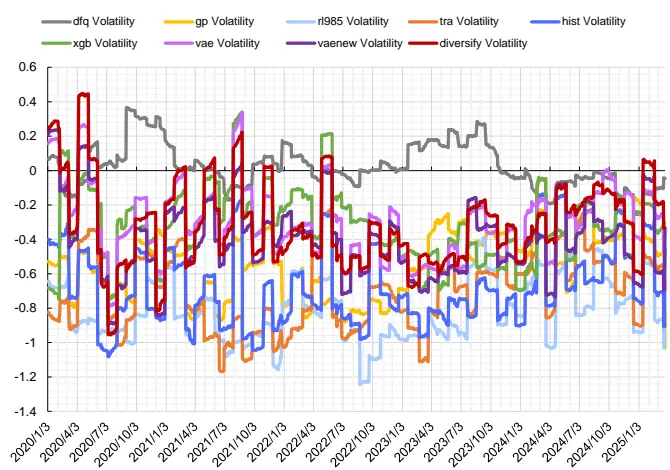
数据来源：东方证券研究所 & Wind资讯

图41：中证全指股票池各模型多头组的liquidity因子相对暴露变化（2020.1.1-2025.3.24）
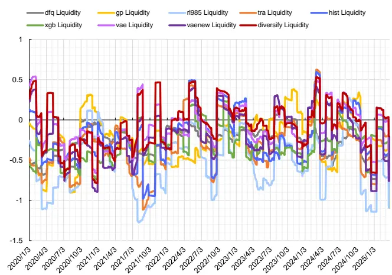
数据来源：东方证券研究所 & Wind资讯

图42：中证全指股票池各模型多头组的value因子相对暴露变化（2020.1.1-2025.3.24）
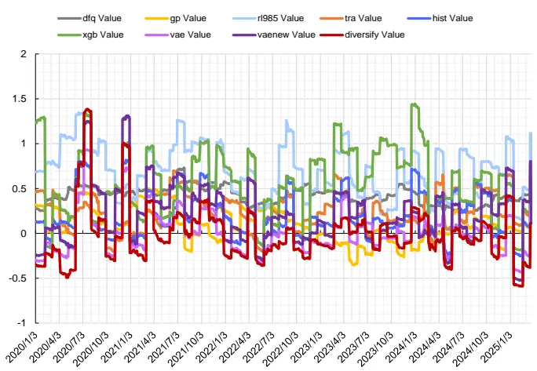
数据来源：东方证券研究所 & Wind资讯

图 43：中证全指股票池各模型多头组的 certainty 因子相对暴露变化（2020.1.1-2025.3.24）
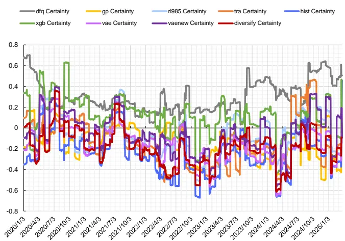
数据来源：东方证券研究所 & Wind资讯

有关分析师的申明，见本报告最后部分。其他重要信息披露见分析师申明之后部分，或请与您的投资代表联系。并请阅读本证券研究报告最后一页的免责申明。

图44：中证全指股票池各模型多头组的cubic size因子相对暴露变化（2020.1.1-2025.3.24）
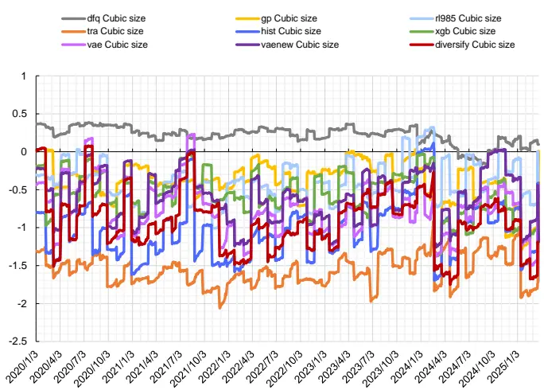
数据来源：东方证券研究所 & Wind资讯

图 45：中证全指股票池各模型多头组的 trend因子相对暴露变化（2020.1.1-2025.3.24）
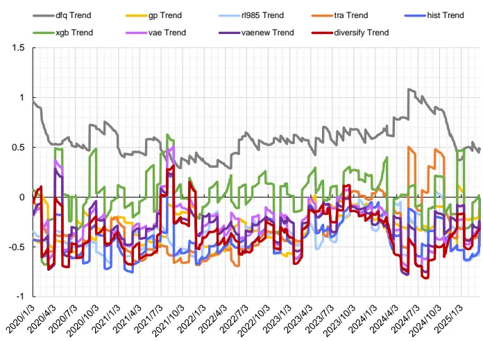
数据来源：东方证券研究所 & Wind资讯

图 46：中证全指股票池各模型多头组的 growth 因子相对暴露变化（2020.1.12025.3.24）
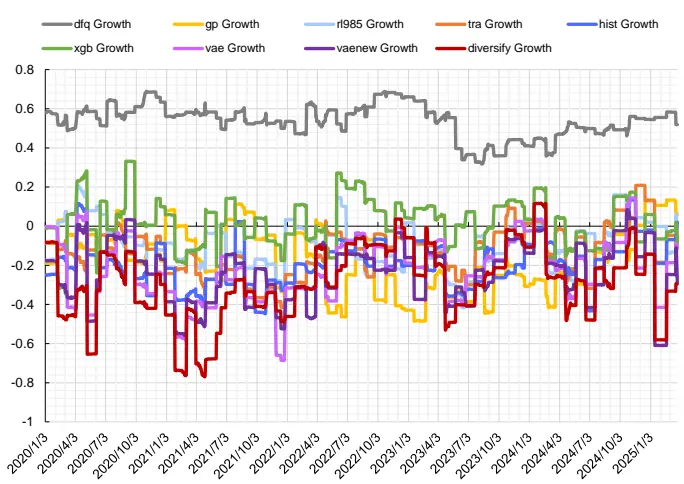
数据来源：东方证券研究所 & Wind资讯

图 47：中证全指股票池各模型多头组的 soe 因子相对暴露变化（2020.1.1-2025.3.24）
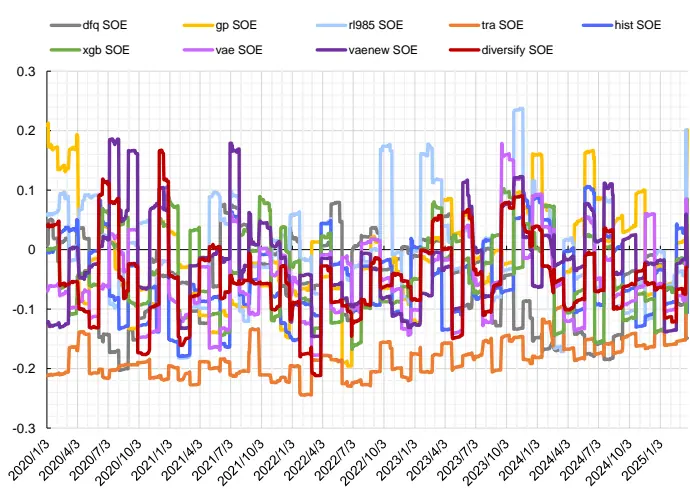
数据来源：东方证券研究所 & Wind资讯

## 4.5 中性化因子表现

在中证全指股票池中，DFQ-Diversify 模型的中性化因子，相比原始因子各项指标均有所下降，但变化不大。原始因子 ic 达到 12.22%，中性化后仍有 11.41%。原始因子 20 分组多头年化超额收益达到 32.52%，中性化降低到 27.21%，但仍在所有模型中保持较高的水平。

图 48：中证全指股票池各模型中性化因子绩效表现（2020.1.1-2025.3.24）
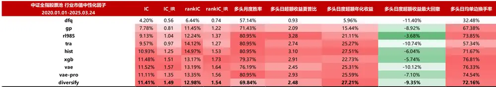
数据来源：东方证券研究所 & Wind资讯

有关分析师的申明，见本报告最后部分。其他重要信息披露见分析师申明之后部分，或请与您的投资代表联系。并请阅读本证券研究报告最后一页的免责申明。

## 五、指数增强组合结果

## 5.1 指数增强组合构建说明

（1）回测期：2020.01.01-2025.3.31，组合月频调仓，假设根据每月末个股得分在次日以vwap 价格进行交易。

（2）组合约束：风险因子库（参见《东方 A 股因子风险模型（DFQ-2020）》）中所有的风格因子相对暴露不超过 50%，所有行业因子相对暴露不超过 2%。沪深 300 增强跟踪误差约束不超过 4%，中证 500 和 1000增强跟踪误差约束不超过 5%。个股权重设置上限约束，绝对权重上限设置为 1.5倍基准权重+2%。限制指数成分股权重占比不低于 80%。

（3）考虑交易成本：假设买卖手续费双边千三，停牌涨停不能买入、停牌跌停不能卖出。

## 5.2 沪深300 指数增强组合

DFQ-Diversify 模型得到的因子得分在沪深 300 指增组合中表现十分突出：

（1）整体表现：2020 年以来年化信息比达到 1.89，年化对冲收益 11.27%，年化跟踪误差5.76%，超额收益最大回撤 6.72%，单边年换手 7.7倍。

（2）分年表现：2020-2023每年取得 10%以上的正超额，2024年超额收益为 8.79%，2025年前三个月超额收益为 3.88%。

DFQ-Diversify 模型下的沪深 300 指增组合：（1）相对基准沪深 300 指数，在市值、信息确定性、成长维度具有明显的负向暴露，但在 BETA、流动性、波动率、估值等维度都没有明显暴露。（2）20-25 年的指增超额收益中有 66%来自特质收益，风格因子贡献 22%，行业因子贡献 12%。

图 49：DFQ-Diversify 模型沪深 300 股票池指数增强组合绩效表现（2020.1.1-2025.3.31）

| 20200101-20250331 300月频 |  | diversify |
| --- | --- | --- |
| 行业暴露0.02 风格暴露0.5 跟踪误差4% 买卖手续费双边千三 |  | 沪深300全市场增强 80%成分内约束 |
|  | 信息比（年化） 年化对冲收益 | 1.89 11.27% |
|  | 跟踪误差（年化） | 5.76% |
|  | 对冲收益最大回撤 | -6.72% |
|  | 对冲收益最大回撤出现时间点 | 20240207 |
|  | 对冲收益最大回撤恢复天数 | 142 |
|  | 持股数量 | 7.70 70.71 |
|  | 成分内股票占比 | 80.22% |
|  | 2020 | 10.33% |
|  | 2021 | 10.74% |
|  | 2022 | 11.96% |
|  | 2023 | 10.99% |
|  | 2024 | 8.79% |
|  | 2025 | 3.88% |
|  | 202501 | 0.43% |
|  | 202502 | 0.18% |

数据来源：东方证券研究所 & Wind资讯

有关分析师的申明，见本报告最后部分。其他重要信息披露见分析师申明之后部分，或请与您的投资代表联系。并请阅读本证券研究报告最后一页的免责申明。

图 50：DFQ-Diversify 模型沪深 300 股票池指数增强组合超额净值与回撤（2020.1.1-2025.3.31）
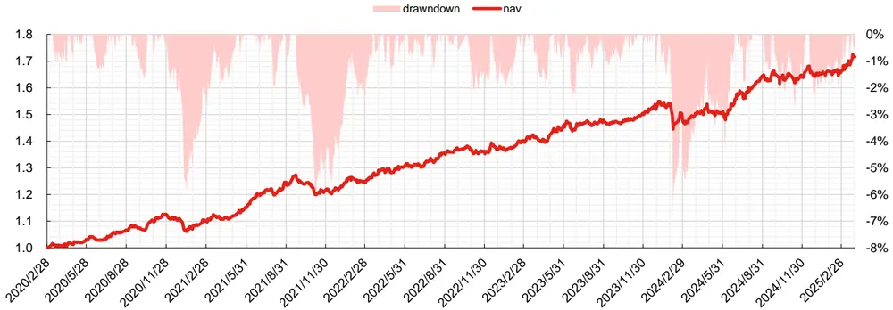
数据来源：东方证券研究所 & Wind资讯

图 51：DFQ-Diversify 模型沪深 300 股票池指数增强组合相对基准的平均风格暴露（2020.1.1-2025.3.31）
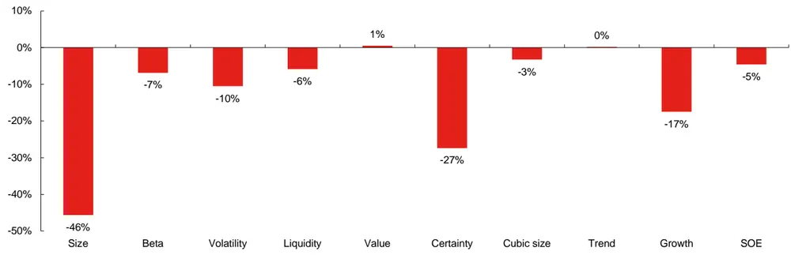
数据来源：东方证券研究所 & Wind资讯

图 52：DFQ-Diversify 模型沪深 300 股票池指数增强组合超额收益归因情况（2020.1.1-2025.3.31）
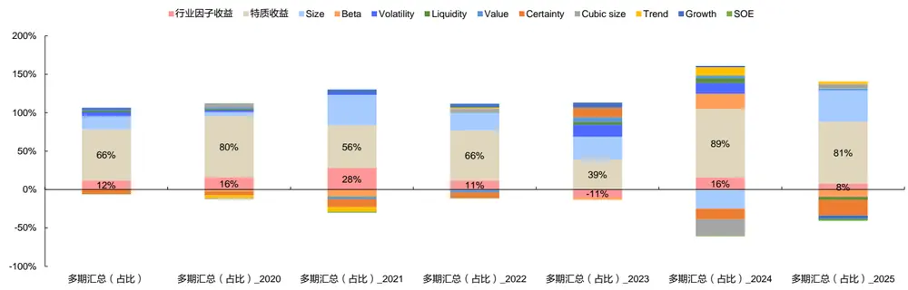
数据来源：东方证券研究所 & Wind资讯

有关分析师的申明，见本报告最后部分。其他重要信息披露见分析师申明之后部分，或请与您的投资代表联系。并请阅读本证券研究报告最后一页的免责申明。

## 5.3 中证 500 指数增强组合

DFQ-Diversify 模型得到的因子得分在中证 500 指增组合中表现十分突出：

（1）整体表现：2020 年以来年化信息比达到 1.67，年化对冲收益 12.19%，年化跟踪误差7.05%，超额收益最大回撤 9.07%，单边年换手 9.27倍。

（2）分年表现：2021-2023每年取得 15%以上的正超额，2024年超额收益为 6.69%，2025年前三个月超额收益为 1.76%。

图 53：DFQ-Diversify 模型中证 500 股票池指数增强组合绩效表现（2020.1.1-2025.3.31）

| 20200101-20250331 500月频 |  | diversify |
| --- | --- | --- |
| 行业暴露0.02 风格暴露0.5 跟踪误差5% 买卖手续费双边千三 信息比（年化） |  | 中证500全市场增强 80%成分内约束 1.67 |
| 绩效指标 | 年化对冲收益 | 12.19% |
|  | 跟踪误差（年化） | 7.05% |
|  | 对冲收益最大回撤 | -9.07% |
|  | 对冲收益最大回撤出现时间点 | 20240207 |
|  | 对冲收益最大回撤恢复天数 单边换手率（年） | 189 9.27 |
| 分年收益 | 成分内股票占比 | 89.38 |
|  | 2020 | 80.06% |
|  |  | 3.15% |
|  | 2021 | 18.49% |
|  | 2022 | 15.17% |
|  | 2023 | 17.05% |
|  | 2024 | 6.69% |
|  | 2025 | 1.76% |
|  | 202501 | -0.49% |
| 分月收益 | 202502 |  |
|  | 202503 | 0.25% |

数据来源：东方证券研究所 & Wind资讯

图 54：DFQ-Diversify 模型中证 500 股票池指数增强组合超额净值与回撤（2020.1.1-2025.3.31）
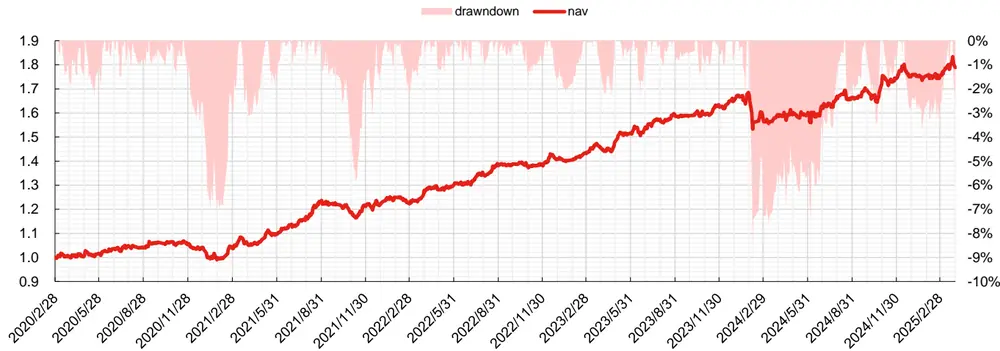
数据来源：东方证券研究所 & Wind资讯

DFQ-Diversify 模型下的中证 500 指增组合：（1）相对基准中证 500 指数，在市值、波动率、信息确定性、非线性市值、动量、成长维度具有明显的负向暴露，在估值维度有明显的正向暴露。（2）20-25 年的指增超额收益中有 54%来自特质收益，风格因子贡献，行业因子贡献39%。

图 55：DFQ-Diversify 模型中证 500 股票池指数增强组合相对基准的平均风格暴露（2020.1.1-2025.3.31）
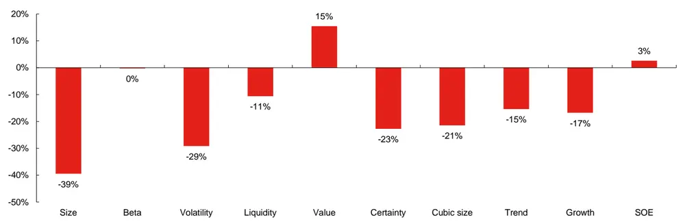
数据来源：东方证券研究所 & Wind资讯

图 56：DFQ-Diversify 模型中证 500 股票池指数增强组合超额收益归因情况（2020.1.1-2025.3.31）
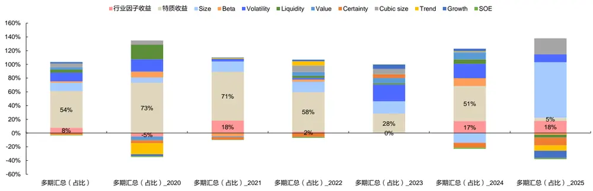
数据来源：东方证券研究所 & Wind资讯

## 六、总结

本研究提出了 DFQ-Diversify 模型，针对金融时序预测中的分布外泛化问题，创新性地引入自监督机制与对抗训练思想。通过模块间的对抗训练、双路径训练策略和动态领域划分机制，成功实现了标签预测与领域干扰的解耦，提升了模型在不同市场环境下的泛化能力。

与前期的 Factorvae-pro 模型相比，DFQ-Diversify 通过自监督动态领域划分，克服了人工设定环境变量的局限性，能够在无须人为干预的情况下自动识别并更新领域结构。这一改进显著增强了模型的灵活性和对分布偏移的适应能力。

实验结果表明，DFQ-Diversify在中证全指、沪深300和中证500等多个股票池中表现出色，尤其在大盘股的预测上展现了优异的多头组合超额收益。回测结果验证了模型在实际应用中的强大性能与稳定性，特别是在复杂市场条件下，展现了良好的鲁棒性。

此外，通过指数增强策略，DFQ-Diversify进一步验证了其在真实交易环境中的应用潜力，组合风险可控、风格暴露受控，证明了该模型具备较强的实际落地能力。

综上所述，DFQ-Diversify模型不仅在理论上对分布外泛化问题提出了创新的解决方案，还在实证测试中展现了卓越的预测能力和广泛的应用前景，具有在多种市场环境下推广应用的潜力。

## 参考文献

1. Lu W, Wang J, Sun X, et al. Out-of-distribution representation learning for time series classification[J]. arXiv preprint arXiv:2209.07027, 2022.

## 风险提示

1. 量化模型基于历史数据分析，未来存在失效风险，建议投资者紧密跟踪模型表现。

2. 极端市场环境可能对模型效果造成剧烈冲击，导致收益亏损。

## Tabl e_Disclai mer 分析师申明

每位负责撰写本研究报告全部或部分内容的研究分析师在此作以下声明：

分析师在本报告中对所提及的证券或发行人发表的任何建议和观点均准确地反映了其个人对该证券或发行人的看法和判断；分析师薪酬的任何组成部分无论是在过去、现在及将来，均与其在本研究报告中所表述的具体建议或观点无任何直接或间接的关系。

## 投资评级和相关定义

报告发布日后的12个月内行业或公司的涨跌幅相对同期相关证券市场代表性指数的涨跌幅为基准（A 股市场基准为沪深 300 指数，香港市场基准为恒生指数，美国市场基准为标普 500 指数）；

## 公司投资评级的量化标准

买入：相对强于市场基准指数收益率 15%以上；

增持：相对强于市场基准指数收益率 5%～15%；

中性：相对于市场基准指数收益率在-5%～+5%之间波动；

减持：相对弱于市场基准指数收益率在-5%以下。

未评级 —— 由于在报告发出之时该股票不在本公司研究覆盖范围内，分析师基于当时对该股票的研究状况，未给予投资评级相关信息。

暂停评级 —— 根据监管制度及本公司相关规定，研究报告发布之时该投资对象可能与本公司存在潜在的利益冲突情形；亦或是研究报告发布当时该股票的价值和价格分析存在重大不确定性，缺乏足够的研究依据支持分析师给出明确投资评级；分析师在上述情况下暂停对该股票给予投资评级等信息，投资者需要注意在此报告发布之前曾给予该股票的投资评级、盈利预测及目标价格等信息不再有效。

## 行业投资评级的量化标准：

看好：相对强于市场基准指数收益率 5%以上；

中性：相对于市场基准指数收益率在-5%～+5%之间波动；

看淡：相对于市场基准指数收益率在-5%以下。

未评级：由于在报告发出之时该行业不在本公司研究覆盖范围内，分析师基于当时对该行业的研究状况，未给予投资评级等相关信息。

暂停评级：由于研究报告发布当时该行业的投资价值分析存在重大不确定性，缺乏足够的研究依据支持分析师给出明确行业投资评级；分析师在上述情况下暂停对该行业给予投资评级信息，投资者需要注意在此报告发布之前曾给予该行业的投资评级信息不再有效。

## HeadertTabl e_Discl ai mer 免责声明

本证券研究报告（以下简称“本报告”）由东方证券股份有限公司（以下简称“本公司”）制作及发布。

本报告仅供本公司的客户使用。本公司不会因接收人收到本报告而视其为本公司的当然客户。本报告的全体接收人应当采取必要措施防止本报告被转发给他人。

本报告是基于本公司认为可靠的且目前已公开的信息撰写，本公司力求但不保证该信息的准确性和完整性，客户也不应该认为该信息是准确和完整的。同时，本公司不保证文中观点或陈述不会发生任何变更，在不同时期，本公司可发出与本报告所载资料、意见及推测不一致的证券研究报告。本公司会适时更新我们的研究，但可能会因某些规定而无法做到。除了一些定期出版的证券研究报告之外，绝大多数证券研究报告是在分析师认为适当的时候不定期地发布。

在任何情况下，本报告中的信息或所表述的意见并不构成对任何人的投资建议，也没有考虑到个别客户特殊的投资目标、财务状况或需求。客户应考虑本报告中的任何意见或建议是否符合其特定状况，若有必要应寻求专家意见。本报告所载的资料、工具、意见及推测只提供给客户作参考之用，并非作为或被视为出售或购买证券或其他投资标的的邀请或向人作出邀请。

本报告中提及的投资价格和价值以及这些投资带来的收入可能会波动。过去的表现并不代表未来的表现，未来的回报也无法保证，投资者可能会损失本金。外汇汇率波动有可能对某些投资的价值或价格或来自这一投资的收入产生不良影响。那些涉及期货、期权及其它衍生工具的交易，因其包括重大的市场风险，因此并不适合所有投资者。

在任何情况下，本公司不对任何人因使用本报告中的任何内容所引致的任何损失负任何责任，投资者自主作出投资决策并自行承担投资风险，任何形式的分享证券投资收益或者分担证券投资损失的书面或口头承诺均为无效。

本报告主要以电子版形式分发，间或也会辅以印刷品形式分发，所有报告版权均归本公司所有。未经本公司事先书面协议授权，任何机构或个人不得以任何形式复制、转发或公开传播本报告的全部或部分内容。不得将报告内容作为诉讼、仲裁、传媒所引用之证明或依据，不得用于营利或用于未经允许的其它用途。

经本公司事先书面协议授权刊载或转发的，被授权机构承担相关刊载或者转发责任。不得对本报告进行任何有悖原意的引用、删节和修改。

提示客户及公众投资者慎重使用未经授权刊载或者转发的本公司证券研究报告，慎重使用公众媒体刊载的证券研究报告。

## 东方证券研究所

地址： 上海市中山南路 318 号东方国际金融广场 26 楼

电话：021-63325888

传真：021-63326786

网址： www.dfzq.com.cn