# Neural ODE：时序动力系统重构下深度学习因子挖掘模型

因子选股系列之一一六

## 研究结论

金融数据常因停牌、财报发布和突发事件等因素存在缺失、噪声及异常等问题，这些问题通常会影响模型稳定性以及样本外的泛化能力。本文提出一种 RNN+NeuralODE+MLP融合模型，将时序数据建模为微分动力系统，然后进行数据重构和特征提取，从而提升模型样本外的选股鲁棒性。整个模型由以下部分构成：

通过 RNN 和 Neural ODE 模型构建变分自编码层（VAE 层），利用 RNN 进行时序数据的压缩和降维，再将神经微分方程（Neural ODE）学习时序数据隐含的时序演化规律，将数据进行去噪和重构。

⚫ 最后我们将重构去噪后的数据输入 MLP 层进行 alpha 信息的捕捉和挖掘，从而对未来收益率标签进行拟合。

## 模型因子对比

通过将 Baseline模型和新模型因子多头绩效的对比，我们得到以下结论：

相较于 Baseline模型，除 2020年和今年，其余各年份 Model1因子的多头超额均能大幅跑赢。而分组超额来看，Model1的 Top组和 Grp1组超额相较于 Baseline模型分别提升了 1.91%和 3.07%，说明新模型相对于 Baseline能大幅改善多头的表现。

⚫ 在 2024 年出现较为极端的市场环境下，Model1 因子多头超额相较于 Baseline 模型提升了 6.63%，最大回撤也有所下降，说明 Model1抗风险能力相对更强。

⚫ 在各个回测区间，Model1因子的多头组合换手率相较于 Baseline均有一定程度的下降。这意味着实盘可能有更高的交易成本优势。

⚫Baseline模型和 Model1模型多头超额净值走势趋同度较高，各年度的最大回撤区间基本上重合，说明各类模型从相同量价特征中提取的 alpha信息一致性相对较高。

## 因子选股能力和行业轮动能力的表现

新模型 2018年以来在中证全指上十日 RankIC均值为 16.33%，top组年化超额分别为 54.54%。相较于基准，新模型选股效果均有明显提升。行业轮动方面，2018 年以来，新模型RankIC可达12.55%，Top组年化超额可达25.27%，各项指标表现也是显著战胜基准。

本文生成因子也可以直接应用于指数增强策略，在各宽基指数上均能获得显著的超额收益，在成分股不低于 80%限制、周单边换手率为 20%约束下，在沪深 300、中证500和中证1000增强策略上2018年以来新模型年化超额收益率分别为16.67%，21.37%和 32.41%，超额的夏普比率分别为 3.14、3.21、4.37。

## 风险提示

⚫ 量化模型失效

⚫ 极端市场造成冲击，导致亏损

报告发布日期

2025 年 05 月 27 日

杨怡玲 yangyiling@orientsec.com.cn

执业证书编号：S0860523040002

陶文启 taowenqi@orientsec.com.cn

执业证书编号：S0860524080003

ADWM：基于门控机制的自适应动态因子 2025-04-10加权模型：——因子选股系列之一一二

ABCM：基于神经网络的alpha因子和beta 2024-12-03
因子协同挖掘模型：——因子选股系列之
一一〇

自适应时空图网络周频 alpha 模型：——2024-02-28因子选股系列之一〇一

## 引言

在量化金融领域，随着大数据技术的飞速发展，深度学习模型凭借其强大的数据处理和模式识别能力，在量化投资中展现出巨大潜力。

前期报告《基于循环神经网络的多频率因子挖掘》、《基于残差网络端到端因子挖掘模型》、《融合基本面信息的 ASTGNN 因子挖掘模型》和《基于神经网络的 alpha 和 beta 因子协同挖掘模型》中，我们利用了带图结构的循环神经网络（RNN & ASTGNN）、残差网络（ResNets）和决策树模型等搭建了端到端 AI 量价选股模型框架，这套框架的输入是个股不同频率最原始的高开低收量价数据以及一些常见的基本面数据等，而最终的输出则是具有较强选股能力的 alpha 因子和风险因子。其中 alpha 因子用于构建个股未来收益率预期值，而风险因子主要用于计算组合暴露，通过构建相应的风险约束最终生成我们的选股组合。我们将该框架生成的因子应用于选股策略。回测结果显示该策略在样本外有着十分显著的选股效果。

这套 AI 量价模型框架主要是基于多个不同频率数据集搭建的，这些数据集分别是风险因子（risk）、基本面（fund）、周度（week）、日度（day）、分钟线（ms）和 Level-2（l2）数据集。其中风险因子数据集主要由 Barra 风险因子组成，目标是为了生成机器学习风险因子使用，而基本面数据集是由四类常见的基本面因子组成，如估值、成长、超预期等；周度和分钟线数据集我们分别是将每五个交易日日 K 线和每日半小时 K 线形成矩阵数据，然后将这些矩阵通过ResNets 提取出相应时间频度的特征向量而形成的，而 Level-2 则是将原始数据通过人工合成成日频因子的方式形成的。

整个 AI综合因子生成的框架分为四个部分，数据预处理、提取因子单元、因子加权以及因子汇总。数据预处理包括去极值、标准化和补充缺失值三个步骤，而提取因子单元则是通过 RNN、残差网络和图模型等将输入的特征转化成一系列具有一定选股能力的弱因子，与此同时我们还使用ABCM模型（参见报告《ABCM：基于神经网络的alpha和beta因子协同挖掘模型》）同时生成风险因子，因子加权则是利用决策树等对这些神经网络自动挖掘生成的弱因子进行二次加权，其中考虑到风险因子和 alpha 因子的性质（风险因子长期和未来收益率方向无序且不可预测，但短期具有一定的可预测性，alpha 因子长期与未来收益率方向一致，且函数关系较为稳定），我们对两部分因子进行不同方式的二次加权，最后将两部分因子通过人工方式进行汇总形成综合得分，整个流程如下图所示：

图 1：alpha因子端到端 AI量价模型框架
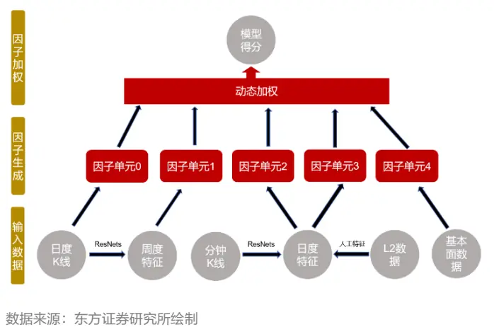

图 2：综合因子形成过程
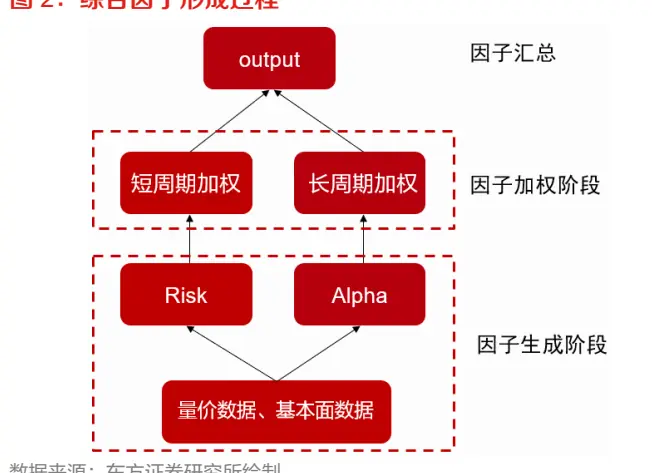
数据来源：东方证券研究所绘制

有关分析师的申明，见本报告最后部分。其他重要信息披露见分析师申明之后部分，或请与您的投资代表联系。并请阅读本证券研究报告最后一页的免责申明。

上述框架中，由于个股的停牌、财报发布以及突发事件等的影响，RNN 模型的输入数据往往存在缺失值，较大的噪声、数据异常等问题，而由于神经网络通常对数据微小变化较为敏感，因此如何补充缺失值以及剥离数据中的噪声影响对于模型选股能力十分重要。前期报告《基于抗噪的AI量价模型改进方案》中我们提出了基于对抗训练的方式来提升模型的鲁棒性和抗噪能力，该方法主要是构建抗噪损失函数来训练模型，从而使得模型参数最终收敛到噪声低敏感的最优值点。

本文则是将时序数据视作一个动力系统的衍化过程，通过神经微分方程模型对时序数据自身的衍化函数建模，让微分动力系统学习出潜在的数据时序衍化规律，从而对时序数据进行重构，最终将重构数据放到新模型中训练达到降低模型输入数据噪声的影响。

## 一、新模型细节介绍

## 1.1 神经网络与微分方程的联系

传统神经网络在处理高维空间数据时往往需要使用较多的非线性层，每一层通过前一层的输出来提取特征，所以随着神经网络层数的增多，训练时反向传播过程伴随着会出现梯度爆炸和梯度消失等问题使得神经网络无法有效提取数据中的有效信息甚至训练失败。而残差网络（Residual Network，ResNet）则通过构建跳跃连接（skip connection）允许梯度直接回传至浅层，从而缓解了深层网络训练时普遍存在的梯度消失与网络退化问题，使得构建超深层网络成为可能。残差连接本质上是构建了恒等映射（Identity Mapping）的捷径路径，使网络在无需额外参数的情况下学习输入与输出的残差（即增量变化），实验表明这种设计显著提升了模型对复杂特征的提取能力。

完整的残差网络是由一系列残差块和 MLP结构组成，每个残差块均含有恒等映射和残差连接两部分构成，其具有如下图所示结构：

图 3：残差网络模型结构示意图
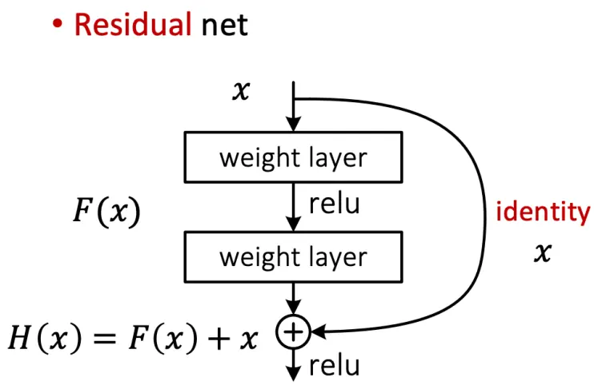

而对于一个标准的带 MLP 结构的 L 层残差网络前向传播的过程，我们可以将其表示为如下数学公式形式：

$$
\left\{\begin{aligned}\boldsymbol{x}_{l+1}=\boldsymbol{x}_{l}+\mathcal{F}(\boldsymbol{x}_{l},\boldsymbol{W}_{l}),l=1,&2,\ldots,L\\\hat{y}=F(\boldsymbol{x}_{L})\\\boldsymbol{x}_{0}=\widehat{\boldsymbol{x}}\end{aligned}\right.
$$

上述公式中 $W_{l}$ 表示为第 l 层权重参数其数值通过前向传播学习得到， $\boldsymbol{x}_{l+1}和\boldsymbol{x}_{l}$ 分别表示第 l 层的输出和输入， $\mathcal{F}$ 表示残差块对应的非线性变换函数，x̂ 表示网络输入的初始数据，ŷ 表示最终的预测结果，F 表示残差网络的 MLP 层非线性函数。若我们引入一个时间分割 $t_{l}=lT/L$ ，每两个时间节点的间隔记为 $\Delta t=1/L$ ， 并且把 $x_{l}$ 和 $W_{l}$ 当成一个关于时间的连续函数 $x(t)$ 和$W(t)$ ，令函数 $\pmb{v}=\frac{1}{\Delta t}\mathcal{F}$ ，则残差网络前向传播过程又可以表示为：

$$
\left\{\begin{aligned}\boldsymbol{x}(t+\Delta t)=\boldsymbol{x}(t)+\boldsymbol{v}(\boldsymbol{x}(t),t)\Delta t,t\in[0,T]\\\hat{y}=F(\boldsymbol{x}(T))\\\boldsymbol{x}(0)=\widehat{\boldsymbol{x}}\end{aligned}\right.
$$

而上述公式为带初值的常微分方程 $(\mathrm{~ODE~})\frac{d{\pmb x}(t)}{dt}={\pmb v}({\pmb x}(t),t)$ 的前向 Euler 数值求解格式，特别的每一个输入数据 x̂ 都对应着一个预测结果 ŷ，若我们将预测结果视作输入数据的函数，借助输运方程特征线理论（上述常微分方程的解为以下偏微分方程的特征线），则每一个输入数据到预测结果的函数关系为以下偏微分方程的解，即 $\hat{y}=u(\hat{x},1)$ ：

$$
\left\{\begin{aligned}\frac{\partial u}{\partial t}+\boldsymbol{v}(\boldsymbol{x}(t),t)\nabla u&=0,\\u(\boldsymbol{x},T)&=F(x)\end{aligned}\right.
$$

因此残差网络完整的前向传播过程可以视作一个偏微分方程的数值求解过程。在文献[1]中作者则给出了这些偏微分方程的较为一般的形式，即带跳跃连接的深度神经网络均可连续化为以下形式的对流扩散方程：

$$
\left\{\begin{aligned}\frac{\partial u}{\partial t}+\boldsymbol{v}(\boldsymbol{x}(t),t)\nabla u+\boldsymbol{\sigma}^T(\boldsymbol{x}(t),t)\boldsymbol{H}(u)\boldsymbol{\sigma}(\boldsymbol{x}(t),t)&=0\\u(\boldsymbol{x},T)&=F(\boldsymbol{x})\end{aligned}\right.
$$

根据 Feynman-Kac公式，上述的解可表示如下随机微分方程（SDE）的形式：

$$
\left\{\begin{aligned}d\boldsymbol{x}(t)=\boldsymbol{v}(\boldsymbol{x}(t),t)dt+\boldsymbol{\sigma}(\boldsymbol{x}(t),t)d\boldsymbol{B}(t),t\in[0,T],\boldsymbol{x}(t)\in\mathbb{R}^{d}\\\hat{\boldsymbol{y}}=\boldsymbol{F}\big(\boldsymbol{x}(T)\big)\\\boldsymbol{x}(0)=\hat{\boldsymbol{x}}\end{aligned}\right.
$$

其中速度场和扩散项 $\pmb{v}(\pmb{x}(t),t)\colon\mathbb{R}^{d}\times[0,T]\to\mathbb{R}^{d},\quad\pmb{\sigma}(\pmb{x}(t),t)\colon\mathbb{R}^{\mathtt{d}}\times[0,T]\to\mathbb{R}^{\mathtt{d}\times\mathtt{d}}$ 分别为向量和矩阵函数， $H(u)$ 表示函数 u 的二阶 Hessian 矩阵， $B(t)\sim N(0,\sqrt{t}I)$ 为 d 维的标准的布朗运动，$d{\pmb B}(t){\sim}N\big(0,\sqrt{dt}{\pmb I}\big)$ 表示布朗运动的微分，当 $\pmb{\sigma}(\pmb{x}(t),t)=0$ 时，上述过程则对应Neural ODE [2]，当 $\sigma(x(t),t)\neq0$ 时，上述过程则对应 Neural SDE [3]，而当上述方程加入第三项跳跃项$\pmb{\gamma}(\pmb{x}(t),t)dN(t)$ （其中向量函数 $\pmb{\gamma}(\pmb{x}(t),t)\colon\mathbb{R}^{d}\times[0,T]\rightarrow\mathbb{R}^{d}$ 表示事件发生的强度， $N(t)$ 表示泊松过程的随机向量，每个分量表示该过程在时刻 t 发生事件的个数，而当 t 时刻有事件发生则$dN(t)=1$ ，其余则为 0）时，上述过程则对应 Neural Jump SDE [4]。在实际金融问题中，扩散项 $\pmb{\sigma}(\pmb{x}(t),t)d\pmb{B}(t)$ 用于对数据的噪声成分进行拟合，而阶跃项 $\pmb{\gamma}(\pmb{x}(t),t)dN(t)$ 则可用于对时点型突发事件进行拟合。因此 Neural SDE 和 Neural Jump SDE皆具有较高的实用价值。

## 1.2 神经微分方程模型

构建 Neural SDE 模型训练过程需要考虑其的正向和反向传播两个过程。该模型的前向传播本质上是求解以下带初值随机微分方程问题：

$$
\left\{\begin{aligned}d\boldsymbol{x}(t)=\boldsymbol{v}(\boldsymbol{x}(t),t)dt+\boldsymbol{\sigma}(\boldsymbol{x}(t),t)d\boldsymbol{B}(t),t\in[0,T]\\\hat{y}=\boldsymbol{F}(\boldsymbol{x}(T))\\\boldsymbol{x}(0)=\widehat{\boldsymbol{x}}\end{aligned}\right.
$$

通常上述公式中， $F$ 为 $\mathsf{MLP}$ 层对应函数。而函数 $\pmb{v}(\pmb{x}(t),t)$ 和 $\pmb{\sigma}(\pmb{x}(t),t)$ 均为全连接层加激活函数的形式构成，即

$$
\pmb{W}_{n}\varphi(\dots\pmb{W}_{2}\varphi(\pmb{W}_{1}[\pmb{x},t]))
$$

这里 $W_{n}$ 表示第 n 个全连接层的权重矩阵，其值通过反向传播学习得到， $\varphi$ 表示激活函数（通常使用非 ReLU 的激活函数），向量 $[x,t]$ 表示数据 x 和时间变量 t 进行拼接。注意到对于残差网络而言各层的权重参数互不相同，通过此种方式来表示时间的衍化，一个 m 层的残差网络需要 nm组全连接参数。而对于神经微分方程而言，由于不存在时间离散过程，时间的衍化通过变量 t 来表示，因此全模型只需要 n组全连接参数，故两种模型对比可知，Neural SDE的参数量大幅减少显存占用量也将减少。但由于反向传播时涉及求解微分方程和随机项的 Monte-Carlo 模拟，因此Neural SDE模型随机性高计算消耗更大。

特别地，当扩散项为 0 时，上述模型退化成 Neural ODE，此时模型的损失函数梯度则可通过伴随方法转化为以下微分方程组来近似求解：

$$
{\frac{da(t)}{dt}}=-a(t)^{T}{\frac{\partial{\pmb v}}{\partial{\pmb x}}}
$$

$$
\cfrac{dL}{dw^{i}}=\int_{0}^{T}-a(t)^{T}\cfrac{\partial\pmb{v}}{\partial\pmb{x}}dt.
$$

这里 L 表示损失函数， $\begin{array}{r}{a(t)=\frac{\partial L}{\partial\pmb{x}(t)}}\end{array}$ 0

当扩散项不为 0 时，通过路径导数法，过程 $x(T)$ 关于可学习参数的梯度公式可写成如下随机积分的形式：

$$
\frac{\partial\pmb{x}(T)}{\partial w^{i}}=\int_{0}^{T}\frac{\partial\pmb{v}}{\partial w^{i}}+\frac{\partial\pmb{v}}{\partial\pmb{x}}\frac{\partial\pmb{x}}{\partial w^{i}}ds+\sum_{l=1}^{d}\int_{0}^{T}(\frac{\partial\pmb{\sigma}^{l}}{\partial w^{i}}+\frac{\partial\pmb{\sigma}^{l}}{\partial\pmb{x}}\frac{\partial\pmb{x}}{\partial w^{i}})d\pmb{B}^{l}(t)
$$

这里 $x(T)$ 表示微分方程解的终值， $w^{i}$ 表示第 i 个可学习的参数， $\pmb{B}^{l}(t)$ 表示 d 维布朗运动 $\pmb{B}(t)$ 的第 i 个分量， $\pmb{\sigma}^{l}$ 表示函数 $\pmb{\sigma}$ 的第 l 列分量。而该模型反向传播的过程则可转化为数值求解上述积分的过程（对于随机积分可通过 Monte-Carlo 模拟进行近似求解）。而带跳跃项的 Neural JumpSDE则可通过类似方法进行训练。

综上，对于 Neural ODE 和 Neural SDE 以及 Neural Jump SDE 三种模型均具有各自的优缺点，我们总结如下：

图 4：各模型优缺点对比

| 模型 | 随机性 | 应对噪声数据的适定性 |
| --- | --- | --- |
| Neural ODE | 小 | 较低 |
| Neural SDE &Neural JumpSDE | 由于扩散项和阶跃项的存在，前向传播的时候涉及Monte-Carlo模拟，因而模型随机性高 | 可通过扩散项对数据中的噪声成分进行描述，通过阶跃项对突发事件进行描述，因此面对噪声含量高的数据以及异常数据，模型适定性较高 |

数据来源：东方证券研究所绘制

## 1.3 本文模型结构和损失函数

本文中模型结构可以分为三部分构成，分别为 Encoder 层、Decoder 层和 MLP 层，这里Encoder 和 Decoder 层合称为变分自编码层（VAE）层，其中 Encoder 层为 RNN 结构作用主要是进行数据降维和特征提取，而Decoder层为NeuralJumpSDE结构主要作用是拟合时序数据的时间衍化规律，从而对数据进行重构。MLP 层主要是对重构数据进行特征提取，最终对个股未来收益率进行预测。整个模型结构和损失函数构建可表示为下图形式：

图 5：模型结构示意图
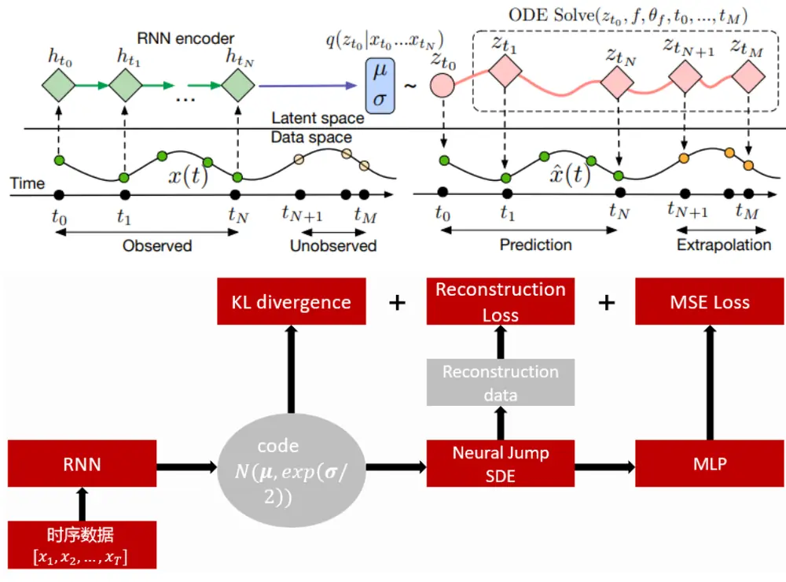
数据来源：东方证券研究所绘制

MLP层有两种设置方案，第一种为全连接层和非线性激活函数构成，此时我们使用预测结果和中性化标准化后的收益率标签直接计算均方误差损失，第二种则是采用我们前期报告《ABCM：基于神经网络的 alpha 和 beta 因子协同挖掘模型》中的结构，即通过两个 NN-Layer 同时生成风险因子和 alpha 因子，风险因子使用的 NN-Layer 为带 Attention 机制的图结构其对应损失函数为R-square，alpha 因子的 NN-Layer 为简单的全连接层其对应损失函数为 MSE，最后通过构建因子正交惩罚损失来剥离 alpha 和风险信息。整个模型的具体结构可表示为如下形式：

$$
\begin{aligned}\boldsymbol{\mu},\boldsymbol{\sigma}&=RNN(x),\boldsymbol{x}=[\boldsymbol{x}_{1},\boldsymbol{x}_{2},\ldots,\boldsymbol{x}_{T}]\\\boldsymbol{z}&=\boldsymbol{\mu}+exp(\boldsymbol{\sigma}/2)\odot\boldsymbol{\varepsilon},\boldsymbol{\varepsilon}\sim\boldsymbol{N}(0,I)\\&\quad NeuralJumpSDE(\boldsymbol{z})\rightarrow\boldsymbol{X}(t)\\&\quad\widehat{\boldsymbol{x}}=[\boldsymbol{X}(t_{1}),\boldsymbol{X}(t_{2}),\ldots,\boldsymbol{X}(t_{T})]\\&\quad\widehat{\boldsymbol{y}}=MLP\big(\boldsymbol{X}(t_{T})\big)\end{aligned}
$$

这里 x 表示输入数据为时间序列，x̂表示重构数据其为NeuralJumpSDE 的解函数在时间节点$[\mathsf{t}_{1},\mathsf{t}_{2},\dots,\mathsf{t}_{\mathrm{T}}]$ 上的函数值形成的序列，⨀ 表示向量点乘运算，X(t) 表示 Neural Jump SDE 模型对应的解函数， $\hat{y}$ 表示模型最终的预测结果。

本模型的损失函数由三部分组成，包括重构损失（Reconstruction Loss）、KL 散度和 MSE损失。其中重构损失通过极大似然估计得到：

$$
\log(p(\pmb{x}|(\widehat{\pmb{x}},\widehat{\pmb{\sigma}}))=-\frac{1}{2}log(2\pi)-\frac{(\pmb{x}-\widehat{\pmb{x}})^{2}}{exp(\widehat{\pmb{\sigma}})}
$$

这里 x 表示原始输入数据，σ̂ 表示估计数据服从分布的标准差参数，第二项 KL 散度则计算先验分布（假设服从均值为 0 的正态分布）与后验分布 $p(z|x)$ 之间的 KL 散度，该项损失主要是为了防止过拟合使得 Encoder和 Decoder函数复合成为一个恒等映射函数：

$$
\mathrm{KL}(p(\boldsymbol{z}|\boldsymbol{x})||N(0,\delta\boldsymbol{I}))=\mathrm{KL}(N(\boldsymbol{\mu},\exp(\boldsymbol{\sigma}/2))||N(0,\delta\boldsymbol{I}))
$$

第三项 MSE损失则为最终预测结果 $\hat{y}$ 与标签的平方误差损失。因此总损失函数可表示为：

$$
\alpha\log(p(\pmb{x}|\theta))+\beta\mathrm{KL}(N(\pmb{\mu},exp(\pmb{\sigma}/2))||N(0,\delta\pmb{I}))+(\hat{y}-y)^{2}
$$

这里 $\alpha$ 和 $\beta$ 为人工选定的两个超参数用于控制正则项权重，δ 表示先验分布的标准差大小， $y$ 为中性化和交易日截面标准化处理后的收益率标签。

该模型核心的想法是通过RNN模型对数据的核心信息进行提取，通过NeuralSDE模型进行数据重构，使得重构时序数据与原始数据最大程度逼近的前提下，能关于时间 t 形成一个连续函数。由于时序数据在时间维度上平滑，此时我们可以认为重构数据的噪声含量占比将大幅下降。最后我们将重构数据通过一个 MLP变换得到最终的预测结果。

注：新模型在各种金融问题上用途广泛，除本文用法外，还可用于数据降维：比如分钟线数据提取为日频特征，股票收益率序列数据提取为具有高解释力度的统计量意义下风险因子等；因子加权：股票 alpha因子加权对未来多步收益率进行预测。

## 1.4 新模型重构数据表现

我们使用新模型对股票预处理后的 K线数据进行重构，取 2013~2022年为训练集，2023年为验证集，2024 年为样本外，训练时只使用重构损失和 KL 散度作为损失函数，统计验证集以及样本外重构损失表现，重构损失使用原始数据与重构数据的MSE损失作为度量的量。验证集损失随迭代步数的变化以及最终模型样本外的损失值曲线以及隐藏层特征 $\mu$ 在样本外对未来十天收益率的解释度如下图所示：

图 6：模型重构表现（纵坐标为损失，横坐标为 Epoch数）
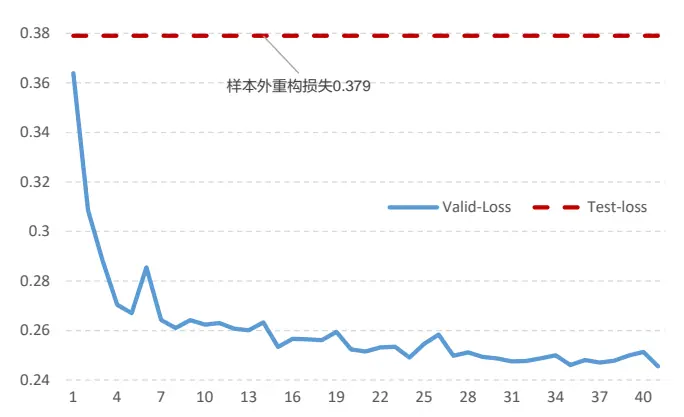
数据来源：wind、上交所、深交所、东方证券研究所

图 7：隐藏层特征样本外解释力度
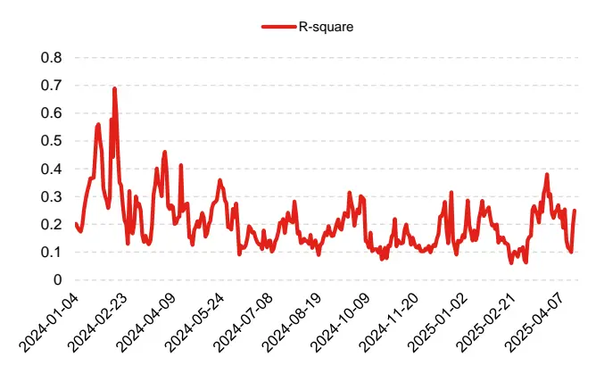
数据来源：wind、上交所、深交所、东方证券研究所

通过上图结果，我们可以看出：

1）验证集上损失函数下降过程较为平滑，这说明模型训练过程稳定；

2）模型在 2023 年验证集上重构损失值为 0.2475，2024 年样本外的重构损失值为 0.379，这说明模型重构能力在样本外仍具有较好的表现效果；

3）隐藏层在样本外的 R-square 平均值为 20.73%（同期 Barra模型的 R-square 为 20.38%），这意味着隐藏层所挖掘的特征在样本外对个股未来收益有较高的解释能力，因此该方法可作为挖掘风险因子的一个新的手段。

## 二、模型生成因子表现分析

## 2.1回测说明

本文的回测结果中，回测区间为 20171229~20250430，若不做特殊说明，各项指标计算方法如下所示：

1. RankIC均值是当天因子与隔日未来十日收益率（T+1~T+11收盘）序列进行计算的，并且每隔十个交易日计算一次，最终将这个 RankIC序列取平均得到的。

2. ICIR则是根据上述 RankIC序列均值除以序列标准差计算得到的。

3. 分组测试结果中，计算 top组的年化超额收益，中证全指股票池上我们是将股票池分成 20组，基准则是成分股等权，周度调仓，次日收盘价成交并且不考虑交易成本计算得到的。

4. 多头组周均单边换手率是根据多头组持仓计算得到，而最大回撤和年化波动率则是根据top组超额收益净值计算得到的。

5. 各个股票池均剔除了北交所股票以及上市天数较短的股票。

并且本文将对比以下模型的绩效表现，来说明新模型对原模型的增量作用：

1. Baseline：报告《ABCM：基于神经网络的 alpha 和 beta 因子协同挖掘模型》中的模型生成因子。

有关分析师的申明，见本报告最后部分。其他重要信息披露见分析师申明之后部分，或请与您的投资代表联系。并请阅读本证券研究报告最后一页的免责申明。

2. Model1：Neural ODE模型生成因子截面标准化后与 Baseline 因子截面标准化后等权。

3. Model2：Neural SDE模型生成因子截面标准化后与 Baseline 因子截面标准化后等权。

4. Model3：Model1因子剥离掉相关短期风险因子后的残差。

## 2.2因子中证全指绩效分析

首先，本节我们将展示上述模型生成的因子在中证全指股票池上的选股汇总效果、分年度的超额收益表现以及超额收益的净值走势（其中汇总表现分成 2018 年至 2023 年和 2024 年以及2025年三段进行展示）。

图 8：各模型生成因子汇总表现（回测期 20171229~20250430）
20171229~20231229

|  | RanklC | ICIR | RankIC胜率 |  | Top组超额 Top组最大回撤 Top组换手率 |  |
| --- | --- | --- | --- | --- | --- | --- |
| Baseline | 16.39% | 1.66 | 96.55% | 52.63% | -5.25% | 60.78% |
| Model1 | 16.33% | 1.66 | 95.86% | 54.54% | -6.63% | 59.73% |
| Model2 | 16.27% | 1.65 | 95.86% | 53.32% | -6.04% | 60.39% |
| Model3 | 16.09% | 1.75 | 95.86% | 54.71% | -4.66% | 60.03% |

20231229~20241231

|  | RankiC | ICIR | RankIC胜率 | Top组超额 | Top组最大回撤 Top组换手率 |  |
| --- | --- | --- | --- | --- | --- | --- |
| Baseline | 13.40% | 0.7 | 75.00% | 26.66% | -20.03% | 63.03% |
| Model1 | 13.70% | 0.71 | 75.00% | 33.29% | -19.55% | 61.69% |
| Model2 | 13.76% | 0.72 | 75.00% | 32.87% | -18.98% | 62.45% |
| Model3 | 12.62% | 0.77 | 66.67% | 43.17% | -8.96% | 62.39% |

20241231~20250430

|  | RanklC | ICIR | RankIC胜率 | Top组超额 | Top组最大回撤 Top组换手率 |  |
| --- | --- | --- | --- | --- | --- | --- |
| Baseline | 17.01% | 1.15 | 85.71% | 13.66% | -3.27% | 65.65% |
| Model1 | 17.35% | 1.19 | 85.71% | 12.57% | -3.32% | 63.69% |
| Model2 | 17.69% | 1.27 | 85.71% | 11.79% | -3.72% | 62.71% |
| Model3 | 16.49% | 1.48 | 85.71% | 13.12% | -2.17% | 64.02% |

数据来源：wind、上交所、深交所、东方证券研究所

图 9：因子分组超额表现

|  | Top | Grp1 | Grp2 | Grp3 | Grp4 | Grp5 | Grp6 | Grp7 | Grp8 | Grp9 |
| --- | --- | --- | --- | --- | --- | --- | --- | --- | --- | --- |
| Baseline | 52.63% | 40.09% | 34.84% | 26.59% | 25.41% | 22.23% | 17.91% | 15.45% | 10.83% | 9.12% |
| Model1 | 54.54% | 43.16% | 33.90% | 28.70% | 23.99% | 21.25% | 17.84% | 14.03% | 11.81% | 9.04% |
| Model2 | 53.32% | 42.24% | 35.44% | 27.06% | 24.72% | 21.66% | 17.54% | 13.52% | 11.81% | 10.19% |
| Model3 | 54.71% | 39.52% | 34.20% | 29.43% | 23.37% | 19.41% | 15.75% | 12.07% | 11.27% | 8.34% |
|  | Grp10 | Grp11 | Grp12 | Grp13 | Grp14 | Grp15 | Grp16 | Grp17 | Grp18 | Bottom |
| Baseline | 4.63% | 2.74% | -2.17% | -7.14% | -7.97% | -13.92% | -17.46% | -23.67% | -36.73% | -66.45% |
| Model1 | 4.87% | 1.40% | -3.02% | -5.75% | -9.47% | -11.89% | 6-19.28% | -24.59% | -36.71% | -66.02% |
| Model2 | 3.67% | 1.73% | -2.56% | -5.56% | -8.90% | -11.50% | -20.21% | -24.01% | -36.69% | -66.11% |
| Model3 | 4.78% | 2.80% | -1.11% | -7.44% | -9.16% |  | -12.89%-17.65% | -22.84% | -35.16% | -65.58% |

数据来源：wind、上交所、深交所、东方证券研究所
有关分析师的申明，见本报告最后部分。其他重要信息披露见分析师申明之后部分，或请与您的投资代表联系。并请阅读本证券研究报告最后一页的免责申明。

图 10：各模型多头超额分年度超额表现（回测期 20171229~20250430）

|  | Baseline |  | Model1 |  | Model2 |  | Model3 |  |
| --- | --- | --- | --- | --- | --- | --- | --- | --- |
|  | 超额收益 | 最大回撤 | 超额收益 | 最大回撤 | 超额收益 | 最大回撤 | 超额收益 | 最大回撤 |
| 2018 | 103.58% | -1.88% | 106.97% | -1.56% | 104.53% | -1.58% | 92.45% | -2.26% |
| 2019 | 45.20% | -2.75% | 45.89% | -2.00% | 44.35% | -2.15% | 50.96% | -1.34% |
| 2020 | 44.25% | -5.25% | 40.90% | -4.77% | 42.55% | -4.63% | 44.85% | -4.66% |
| 2021 | 40.69% | -4.78% | 42.82% | -6.63% | 41.64% | -6.04% | 46.47% | -3.93% |
| 2022 | 55.13% | -2.75% | 64.13% | -2.85% | 61.45% | -2.89% | 65.17% | -2.74% |
| 2023 | 34.69% | -2.41% | 35.37% | -2.73% | 33.77% | -2.73% | 33.50% | -2.64% |
| 2024 | 26.66% | -20.03% | 33.29% | -19.55% | 32.87% | -18.98% | 43.17% | -8.96% |
| 20250430 | 13.66% | -3.27% | 12.57% | -3.32% | 11.79% | -3.72% | 13.12% | -2.17% |

数据来源：wind、上交所、深交所、东方证券研究所

图 11：多头超额净值走势（回测期 20171229~20250430）
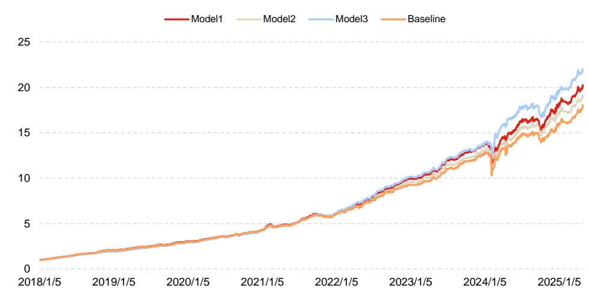
数据来源：wind、上交所、深交所、东方证券研究所

## 通过上述图表结果，我们可以看出：

1. Model1，Model2 相较于 Baseline 模型的多头超额有较大幅度提升，其中 Model1 的 Top 组和Grp1组超额相较于Baseline模型分别提升了1.91%和3.07%，说明新模型相对于Baseline能大幅改善多头的表现。

2. 在 2024 年较为极端的市场环境下，Model3 因子多头超额相较于另外三个模型有大幅度提升，最大回撤也有明显下降，说明通过剥离掉一些短期风险信息以后，得到的 Model3 抗风险能力相对更强。

3. 在各个回测区间，Model1 因子的多头组合换手率相较于 Baseline 均有一定程度的下降。这意味着实盘可能有更高的交易成本优势。

4. Baseline 模型和 Model1 模型多头超额净值走势趋同度较高，各年度的最大回撤区间基本上重合，说明各类模型从相同量价特征中提取的 alpha信息一致性相对较高。

## 2.3因子与各风格因子相关性分析

本节我们分析了所生成因子与各个风险因子的平均相关性结果，可以看出虽然 Model3 因子是在 Model1 因子的基础上剥离掉了短期风险，但整体来看，Model3 因子在一些风格上的暴露更高比如 Beta、Volatility、Liquidity、Value 和 Certainty 等。

图 12：与各个风格因子平均相关性
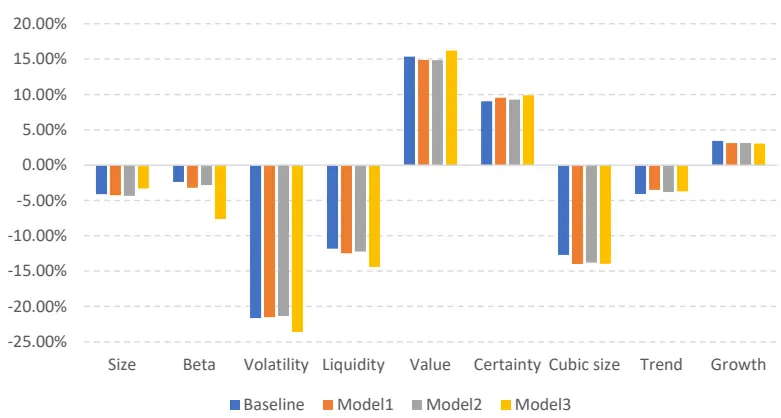
数据来源：wind、上交所、深交所、东方证券研究所

## 三、周频行业轮动绩效分析

本章将展示新模型因子应用于行业轮动策略的绩效表现，回测结果有如下说明：

行业因子合成方法：将选股因子按照行业进行聚合形成行业的得分，聚合时权重设置为个股的流通市值。

备选行业池：所有30个中信一级行业。

组合构建方式：取行业因子排名 Top5 的行业等权构建组合，基准为 30 个行业收益率等权，调仓频率为周频，每周五以收盘价格进行买卖交易。

以下是各个模型对应的回测结果：

图 13：各模型行业轮动汇总表现（回测区间 20171229~20250430）

| RankIC | ICIR RankIC胜率 Top组超额 Top组超额最大回撤 |  |  |  |
| --- | --- | --- | --- | --- |
| Baseline | 12.20% | 0.41 | 67.29% 23.05% | -12.86% |
| Model1 | 12.55% | 0.42 68.10% | 25.27% | -13.19% |
| Model2 | 12.39% | 0.41 65.95% | 23.00% | -14.38% |
| Model3 | 10.48% | 0.34 63.81% | 18.70% | -12.53% |

数据来源：wind、上交所、深交所、东方证券研究所

图 14：各模型 Top 组行业超额走势（回测区间 20171229~20250430）
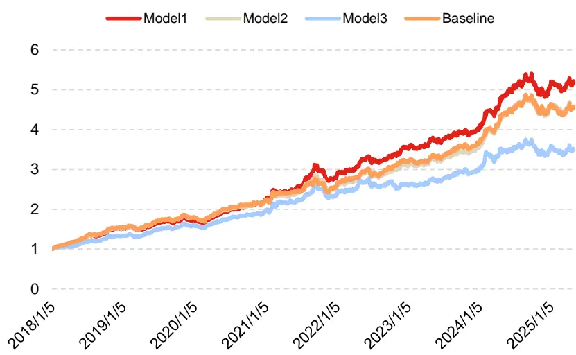
数据来源：wind、上交所、深交所、东方证券研究所

通过上述图表结果，我们可以看出：

1. 各模型均具有较强的行业轮动能力，这说明各类模型学到的 alpha 信息中均有一定比例来源于行业信息。

2. 相较于 Baseline 模型，Model1 模型对应的行业因子 RankIC、ICIR、Top 组超额等各项指标均有进一步的提升，说明通过模型 VAE层对原始数据重构以后，模型能够更充分有效地提取数据的信息，因而行业轮动的表现能够进一步提升。

3. Model3因子虽然在选股问题上有较好且较稳定的表现，但在行业轮动问题上较另外三个模型来看，超额显著下滑而 Top 行业组合业绩的稳定性没有改善，说明所剥离的风险信息可能在选股上不具有显著 alpha，但在行业上有较强且较稳定的 alpha 效应。

## 四、Top 与指数增强组合表现

## 4.1 组合构建说明

本章将展示了新模型生成因子构建 Top30 组合以及在沪深 300、中证 500 和中证 1000 指数增强的应用效果，关于指数增强组合有如下说明：

1） 回测期 20180101~20250430，组合周频调仓，假设根据每周五个股得分在次日（即下周一）以 vwap 价格进行交易，股票池为中证全指剔除北交所股票和上市天数较短的股票。

2） 风险因子库dfrisk2020（参见《东方A股因子风险模型（DFQ-2020）》）的所有风格因子相对暴露不超过 0.5，所有行业因子相对暴露不超过 2%，中证 500 增强跟踪误差约束不超过 5%，沪深 300 增强跟踪误差约束不超过 4%。个股权重偏离设置为±1%。

3） 指增策略组合构建时，限制指数成分股占比，成分股占比约束为 80%，周单边换手率限制记为 20%。

4） 组合业绩测算时假设买入成本千分之一、卖出成本千分之二，停牌和涨停不能买入、停牌和跌停不能卖出。

有关分析师的申明，见本报告最后部分。其他重要信息披露见分析师申明之后部分，或请与您的投资代表联系。并请阅读本证券研究报告最后一页的免责申明。

## 4.2 Top 组合业绩

本节将展示新模型生成因子构建 top30 组合的业绩表现，组合周频调仓不做换手约束，每周一进行买卖交易，成本为买入成本千分之一、卖出成本千分之二，组合的成分股以及对应权重通过求解以下二次优化问题得到：

$$
\left\{\begin{array}{rl}&{max\;\boldsymbol{w}^{T}\boldsymbol{r}-\lambda\boldsymbol{w}^{T}\Sigma\boldsymbol{w}}\\&{\quad s.t.sum(\boldsymbol{w})=1}\\&{\quad max(\boldsymbol{w})<=3.33\%.}\end{array}\right.
$$

其中r为股票预期收益率即因子取值，矩阵 Σ 表示barra风险模型估计的股票协方差矩阵，λ 为风险厌恶系数（取值为 0.5），w 为待求解的个股权重向量。

图 15：Top 组合绝对收益汇总表现（20171229~20250430）

|  | 年化收益 | 夏普比率 | 月度胜率 | 最大回撤 | 平均持股数量 |
| --- | --- | --- | --- | --- | --- |
| Baseline | 40.15% | 1.34 | 68.18% | -42.41% | 30 |
| Model1 | 43.80% | 1.43 | 69.32% | -40.84% | 30 |
| Model2 | 41.72% | 1.37 | 69.32% | -40.31% | 30 |

数据来源：wind、上交所、深交所、东方证券研究所

图 16：Top 组合绝对收益分年度表现（20171229~20250430）

| Baseline | Model1 | Model2 |
| --- | --- | --- |
| 2018 52.20% | 52.24% | 49.80% |
| 2019 46.60% | 60.84% | 54.60% |
| 2020 49.46% | 52.01% | 45.20% |
| 2021 57.85% | 67.73% | 63.15% |
| 2022 13.30% | 17.00% | 18.29% |
| 2023 44.76% | 38.62% | 40.12% |
| 2024 28.41% | 35.26% | 39.96% |
| 20250430 6.46% | 4.00% | 0.60% |

数据来源：wind、上交所、深交所、东方证券研究所

图 17：Model1的 Top组合绝对收益净值走势（左轴净值，右轴最大回撤，回测区间 20171229~20250430）
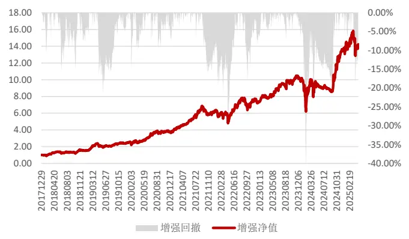
数据来源：wind、上交所、深交所、东方证券研究所

图 18：Model2的 Top组合绝对收益净值走势（左轴净值，右轴最大回撤，回测区间 20171229~20250430）
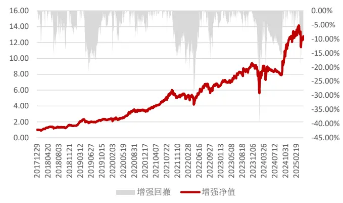
数据来源：wind、上交所、深交所、东方证券研究所

有关分析师的申明，见本报告最后部分。其他重要信息披露见分析师申明之后部分，或请与您的投资代表联系。并请阅读本证券研究报告最后一页的免责申明。

各模型构建的 Top 组合各年度绝对收益均为正，且 Model1 和 Model2 因子构建的组合绝对收益、夏普比率和最大回撤相较于 Baseline 因子均有明显提升，说明相较于基准模型，新模型能够获取更强更稳定的头部收益。Model1 和 Model2 因子绝对净值最大回撤区间发生在时点 2024年2月，最大回撤达到-40.31%；第二大回撤区间发生在时点2022年4月，最大回撤达到-30.11%。其余时间最大回撤均小于 20%。可见组合的绝对收益较为稳定。

## 4.3 沪深 300 指数增强

本节将展示新模型生成因子所构建的沪深 300指数增强组合业绩表现：

图 19：沪深 300 指增组合汇总表现（20171229~20250430）

| 年化超额收益 年化波动率 夏普比率 |  |  |  | 胜率 | 最大回撤 |
| --- | --- | --- | --- | --- | --- |
| Baseline | 15.91% | 4.87% | 3.06 | 70.76% | -6.66% |
| Model1 | 16.67% | 4.96% | 3.14 | 69.97% | -6.86% |
| Model2 | 16.73% | 4.96% | 3.15 | 71.28% | -6.94% |

数据来源：wind、上交所、深交所、东方证券研究所

图 20：沪深 300 指增组合分年度超额收益率（20171229~20250430）

| Baseline | Model1 | Model2 |
| --- | --- | --- |
| 2018 31.39% | 34.11% | 34.32% |
| 2019 5.52% | 6.52% | 4.35% |
| 2020 13.81% | 13.25% | 13.64% |
| 2021 22.04% | 22.06% | 22.55% |
| 2022 20.03% | 22.49% | 22.65% |
| 2023 15.87% | 14.06% | 14.84% |
| 2024 6.43% | 7.21% | 7.73% |
| 20250430 3.30% | 4.37% | 4.66% |

数据来源：wind、上交所、深交所、东方证券研究所

图 21：Model1 沪深 300 组合净值（左轴净值，右轴最大回撤，回测区间 20171229~20250430）
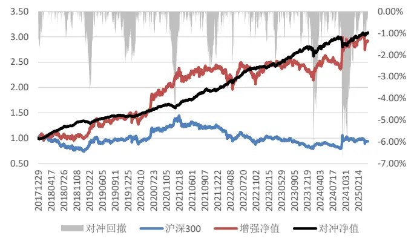
数据来源：wind、上交所、深交所、东方证券研究所

图 22：Model2 沪深 300 组合净值（左轴净值，右轴最大回撤，回测区间 20171229~20250430）
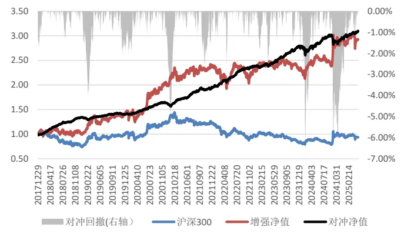
数据来源：wind、上交所、深交所、东方证券研究所

有关分析师的申明，见本报告最后部分。其他重要信息披露见分析师申明之后部分，或请与您的投资代表联系。并请阅读本证券研究报告最后一页的免责申明。

上述图表结果可以看出，在相应约束条件下，因子所构建的沪深 300 指增组合表现良好，Model1、Model2的年化超额超过16%，超额的夏普比率分别为3.14和3.15，组合各项指标均显著超过Baseline因子构建组合，除2019年每年超额均在7%以上。今年面临年初的科技股暴涨的极端行情，组合依然有较为稳健的表现，截至 20250430，组合累积超额达到 4.37%和 4.66%。

## 4.4 中证 500 指数增强

本节将展示各个模型生成因子在中证 500 指数增强策略应用，首先我们展示各年度超额收益以及汇总的业绩表现以及新模型因子的超额净值走势：

图 23：中证 500 指增组合汇总表现（20171229~20250430）

|  | 年化收益 | 年化波动率 | 夏普比率 | 胜率 | 最大回撤 |
| --- | --- | --- | --- | --- | --- |
| Baseline | 20.37% | 6.18% | 3.03 | 71.02% | -11.97% |
| Model1 | 21.37% | 6.09% | 3.21 | 70.50% | -10.66% |
| Model2 | 21.55% | 6.11% | 3.23 | 70.50% | -10.99% |

数据来源：wind、上交所、深交所、东方证券研究所

图 24：中证 500 指增组合分年度超额收益率（20171229~20250430）

| Baseline | Model1 | Model2 |
| --- | --- | --- |
| 2018 50.16% | 49.46% | 50.92% |
| 2019 22.99% | 18.06% | 19.75% |
| 2020 18.16% | 18.37% | 19.12% |
| 2021 26.65% | 32.94% | 30.59% |
| 2022 19.56% | 22.44% | 22.49% |
| 2023 11.44% | 10.97% | 11.50% |
| 2024 3.61% | 8.45% | 6.25% |
| 2025 1.70% | 0.72% | 2.16% |

数据来源：wind、上交所、深交所、东方证券研究所

图 25：Model1 中证 500 组合净值（左轴净值，右轴最大回撤，回测区间 20171229~20250430）
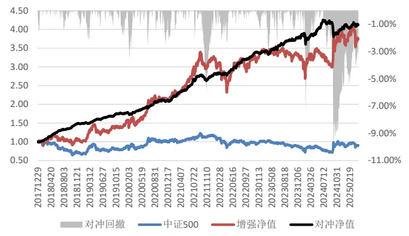
数据来源：wind、上交所、深交所、东方证券研究所

图 26：Model2 中证 500 组合净值（左轴净值，右轴最大回撤，回测区间 20171229~20250430）

数据来源：wind、上交所、深交所、东方证券研究所

有关分析师的申明，见本报告最后部分。其他重要信息披露见分析师申明之后部分，或请与您的投资代表联系。并请阅读本证券研究报告最后一页的免责申明。

上述图表结果可以看出，在相应约束条件下，因子所构建的中证 500 指增组合表现较好，Model1 和 Model2 的年化超额超过 21%，组合各项指标均显著超过 Baseline 因子构建组合，超额夏普比率可达 3.21、3.23。2024 年以前组合超额均超过 10%，但近两年超额有所下滑，且今年各组合业绩表现较为一般，截至 20250430，组合累积超额均不到 3%。

## 4.5 中证 1000 指数增强

本节将展示各个模型生成因子在中证1000指数增强策略应用，首先我们展示各年度超额收益以及汇总的业绩表现以及新模型因子的超额净值走势：

图 27：中证 1000 指增组合汇总表现（20171229~20250430）

|  | 年化收益 | 年化波动率 | 夏普比率 | 胜率 | 最大回撤 |
| --- | --- | --- | --- | --- | --- |
| Baseline | 29.72% | 6.74% | 3.90 | 73.11% | -10.64% |
| Model1 | 32.41% | 6.48% | 4.37 | 75.98% | -10.61% |
| Model2 | 31.79% | 6.55% | 4.25 | 74.67% | -9.98% |

数据来源：wind、上交所、深交所、东方证券研究所

图 28：中证 1000 指增组合分年度超额收益率（20171229~20250430）

|  | Baseline | Model1 | Model2 |
| --- | --- | --- | --- |
| 2018 | 71.14% | 72.99% | 75.79% |
| 2019 | 26.89% | 28.61% | 28.71% |
| 2020 | 25.26% | 22.42% | 20.81% |
| 2021 | 37.50% | 40.26% | 42.40% |
| 2022 | 36.68% | 43.72% | 41.63% |
| 2023 | 19.77% | 19.73% | 17.76% |
| 2024 | 4.36% | 12.62% | 9.30% |
| 2025 | 4.91% | 5.20% | 6.08% |

数据来源：wind、上交所、深交所、东方证券研究所

图 29：Model1 中证 1000 组合净值（左轴净值，右轴最大回撤，回测区间 20171229~20250430）
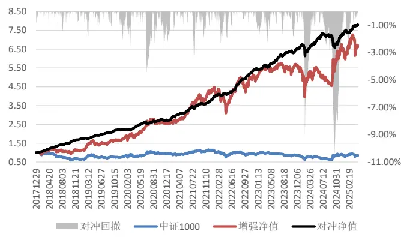
数据来源：wind、上交所、深交所、东方证券研究所

图 30：Model2 中证 1000 组合净值（左轴净值，右轴最大回撤，回测区间 20171229~20250430）
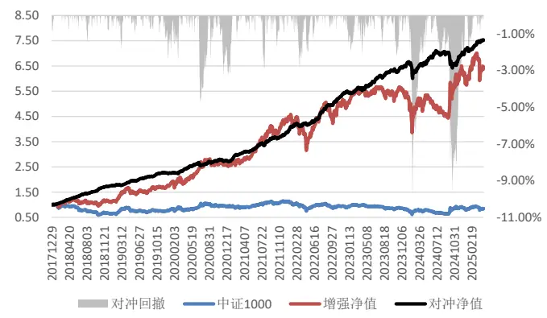
数据来源：wind、上交所、深交所、东方证券研究所

有关分析师的申明，见本报告最后部分。其他重要信息披露见分析师申明之后部分，或请与您的投资代表联系。并请阅读本证券研究报告最后一页的免责申明。

上述图表结果可以看出，在相应约束条件下，因子所构建的中证1000指增组合表现优异，其中 Model1和 Model2年化超额均超过 31%，超额夏普比率分别 4.37和 4.25，组合各项指标均显著超过 Baseline 因子构建组合，2023 年以前组合超额均在 20%以上，但近年来组合超额表现有所下滑。今年组合业绩表现也较为不俗，截至 20250430，组合累积超额高达 5.20和 6.08%。

## 五、结论

前期报告中，我们基于基本面（fund）、周度（week）、日度（day）、分钟线（ms）和Level-2（l2）五个数据集，利用带图结构的 RNN、ResNet和决策树模型搭建了 AI量价模型框架，并将该框架生成的最终打分应用于选股策略，回测结果显示这套框架下生成的因子有着较强的选股能力。

金融数据常因停牌、财报发布和突发事件等因素存在缺失、噪声及异常等问题，这些问题通常会影响模型稳定性以及样本外的泛化能力。本文提出一种 RNN+Neural ODE+MLP 融合模型，将时序数据建模为微分动力系统，通过RNN和NeuralODE模型构建变分自编码层（VAE层），利用 RNN 进行时序数据的压缩和降维，再将神经微分方程（Neural ODE）学习时序数据隐含的时序演化规律，将数据进行重构，最后我们将重构去噪后的数据输入 MLP模型进行 alpha信息的捕捉和挖掘，从而提升模型样本外的选股鲁棒性。

通过将 Baseline模型和新模型因子多头绩效的对比，我们得到以下结论：

1. 相较于 Baseline 模型，除 2020 年和今年，其余各年份 Model1 因子的多头超额均能大幅跑赢。而分组超额来看，Model1的Top组和Grp1组超额相较于Baseline模型分别提升了1.91%和 3.07%，说明新模型相对于Baseline能大幅改善多头的表现。

2. 在 2024 年出现较为极端的市场环境下，Model1 因子多头超额相较于 Baseline 模型提升了6.63%，最大回撤也有所下降，说明 Model1抗风险能力相对更强。

3. 在各个回测区间，Model1 因子的多头组合换手率相较于 Baseline 均有一定程度的下降。这意味着实盘可能有更高的交易成本优势。

4. Baseline 模型和 Model1 模型多头超额净值走势趋同度较高，各年度的最大回撤区间基本上重合，说明各类模型从相同量价特征中提取的 alpha信息一致性相对较高。

新模型 2018 年以来在中证全指上十日 RankIC 均值为 16.33%，top 组年化超额分别为54.54%。相较于基准，新模型选股效果均有明显提升。行业轮动方面，2018 年以来，新模型RankIC可达 12.55%，Top组年化超额可达 25.27%，各项指标表现也显著战胜基准。

本文生成因子也可以直接应用于指数增强策略，在各宽基指数上均能获得显著的超额收益，在成分股不低于 80%限制、周单边换手率为 20%约束下，在沪深 300、中证 500 和中证 1000 增强策略上 2018 年以来新模型年化超额收益率分别为 16.67%，21.37%和 32.41%，超额的夏普比率分别为 3.14、3.21、4.37。

## 风险提示

1. 量化模型基于历史数据分析，未来存在失效风险，建议投资者紧密跟踪模型表现。

2. 极端市场环境可能对模型效果造成剧烈冲击，导致收益亏损。

## 参考文献

[1] Wang T, Tao W, Bao C, et al. An axiomatized PDE model of deep neural networks[J]. arXiv preprint arXiv:2307.12333, 2023.

[2] Chen, T. Q., Rubanova, Y., Bettencourt, J., and Duvenaud, D. K. (2018). Neural ordinary differential equations. In Advances in Neural Information Processing Systems, pages 6571–6583.

[3] Tzen, B., & Raginsky, M. (2019). Neural stochastic differential equations: Deep latent gaussian models in the diffusion limit. arXiv preprint arXiv:1905.09883.

[4] Jia, Junteng, and Austin R. Benson. "Neural jump stochastic differential equations." Advances in Neural Information Processing Systems 32 (2019).

## Tabl e_Disclai mer 分析师申明

每位负责撰写本研究报告全部或部分内容的研究分析师在此作以下声明：

分析师在本报告中对所提及的证券或发行人发表的任何建议和观点均准确地反映了其个人对该证券或发行人的看法和判断；分析师薪酬的任何组成部分无论是在过去、现在及将来，均与其在本研究报告中所表述的具体建议或观点无任何直接或间接的关系。

## 投资评级和相关定义

报告发布日后的12个月内行业或公司的涨跌幅相对同期相关证券市场代表性指数的涨跌幅为基准（A 股市场基准为沪深 300 指数，香港市场基准为恒生指数，美国市场基准为标普 500 指数）；

## 公司投资评级的量化标准

买入：相对强于市场基准指数收益率 15%以上；

增持：相对强于市场基准指数收益率 5%～15%；

中性：相对于市场基准指数收益率在-5%～+5%之间波动；

减持：相对弱于市场基准指数收益率在-5%以下。

未评级 —— 由于在报告发出之时该股票不在本公司研究覆盖范围内，分析师基于当时对该股票的研究状况，未给予投资评级相关信息。

暂停评级 —— 根据监管制度及本公司相关规定，研究报告发布之时该投资对象可能与本公司存在潜在的利益冲突情形；亦或是研究报告发布当时该股票的价值和价格分析存在重大不确定性，缺乏足够的研究依据支持分析师给出明确投资评级；分析师在上述情况下暂停对该股票给予投资评级等信息，投资者需要注意在此报告发布之前曾给予该股票的投资评级、盈利预测及目标价格等信息不再有效。

## 行业投资评级的量化标准：

看好：相对强于市场基准指数收益率 5%以上；

中性：相对于市场基准指数收益率在-5%～+5%之间波动；

看淡：相对于市场基准指数收益率在-5%以下。

未评级：由于在报告发出之时该行业不在本公司研究覆盖范围内，分析师基于当时对该行业的研究状况，未给予投资评级等相关信息。

暂停评级：由于研究报告发布当时该行业的投资价值分析存在重大不确定性，缺乏足够的研究依据支持分析师给出明确行业投资评级；分析师在上述情况下暂停对该行业给予投资评级信息，投资者需要注意在此报告发布之前曾给予该行业的投资评级信息不再有效。

## HeadertTabl e_Discl ai mer 免责声明

本证券研究报告（以下简称“本报告”）由东方证券股份有限公司（以下简称“本公司”）制作及发布。

。本公司不会因接收人收到本报告而视其为本公司的当然客户。本报告的全体接收人应当采取必要措施防止本报告被转发给他人。

本报告是基于本公司认为可靠的且目前已公开的信息撰写，本公司力求但不保证该信息的准确性和完整性，客户也不应该认为该信息是准确和完整的。同时，本公司不保证文中观点或陈述不会发生任何变更，在不同时期，本公司可发出与本报告所载资料、意见及推测不一致的证券研究报告。本公司会适时更新我们的研究，但可能会因某些规定而无法做到。除了一些定期出版的证券研究报告之外，绝大多数证券研究报告是在分析师认为适当的时候不定期地发布。

在任何情况下，本报告中的信息或所表述的意见并不构成对任何人的投资建议，也没有考虑到个别客户特殊的投资目标、财务状况或需求。客户应考虑本报告中的任何意见或建议是否符合其特定状况，若有必要应寻求专家意见。本报告所载的资料、工具、意见及推测只提供给客户作参考之用，并非作为或被视为出售或购买证券或其他投资标的的邀请或向人作出邀请。

本报告中提及的投资价格和价值以及这些投资带来的收入可能会波动。过去的表现并不代表未来的表现，未来的回报也无法保证，投资者可能会损失本金。外汇汇率波动有可能对某些投资的价值或价格或来自这一投资的收入产生不良影响。那些涉及期货、期权及其它衍生工具的交易，因其包括重大的市场风险，因此并不适合所有投资者。

在任何情况下，本公司不对任何人因使用本报告中的任何内容所引致的任何损失负任何责任，投资者自主作出投资决策并自行承担投资风险，任何形式的分享证券投资收益或者分担证券投资损失的书面或口头承诺均为无效。

本报告主要以电子版形式分发，间或也会辅以印刷品形式分发，所有报告版权均归本公司所有。未经本公司事先书面协议授权，任何机构或个人不得以任何形式复制、转发或公开传播本报告的全部或部分内容。不得将报告内容作为诉讼、仲裁、传媒所引用之证明或依据，不得用于营利或用于未经允许的其它用途。

经本公司事先书面协议授权刊载或转发的，被授权机构承担相关刊载或者转发责任。不得对本报告进行任何有悖原意的引用、删节和修改。

提示客户及公众投资者慎重使用未经授权刊载或者转发的本公司证券研究报告，慎重使用公众媒体刊载的证券研究报告。

## 东方证券研究所

地址： 上海市中山南路 318 号东方国际金融广场 26 楼

电话：021-63325888

传真：021-63326786

网址： www.dfzq.com.cn