# DFQ-FactorGCL：基于超图卷积神经网络和时间残差对比学习的股票收益预测模型

## 研究结论

## HIST模型的回顾与不足

⚫为克服传统时序预测模型忽视股票间横截面关系、泛化能力不足的问题，HIST 模型创新性地引入股票截面交互机制，采用级联残差结构模拟投资者“先行业、后风格、再个股”的分析逻辑，分阶段提取预定义概念、隐藏概念与个股特质信息，提升模型的可解释性与稳定性。但该模型仍存在不足：（1）隐藏概念构建机制粗糙；（2）关联权重计算生成失真；（3）概念信息聚合缺乏结构化传播机制；（4）个股残差信息未充分剥离共性干扰，影响特质预测纯度与稳定性。

## HIST-HyperGCN模型：引入超图结构提升结构表达能力

⚫HIST-HyperGCN 模型将 HIST 中的注意力机制替换为超图卷积（HyperGCN），改进包括四方面：（1）预定义概念建图改为静态 0-1 结构，更贴合真实行业归属；（2）隐藏概念采用可学习因子原型，表达更稳定清晰；（3）关联权重通过结构归一化传播代替“余弦+softmax”，保留特征模长，避免权重失真；（4）概念信息传播采用统一的超图卷积路径，提升高阶联动建模能力与表达效率。

## HIST-TRCL模型：时间残差对比学习增强预测稳健性

HIST-TRCL 引入时间残差对比学习（TRCL），构建个股历史特质与未来特质之间的自监督对比任务，迫使模型主动学习出跨时间稳健一致的股票特质特征表达。同时对 InfoNCE 损失进行优化，采用平方余弦相似度增强正负样本区分效果，显著提升模型的跨时间泛化性能。

## FactorGCL模型：融合超图与时间残差的集成框架

FactorGCL 融合 HyperGCN 与 TRCL 两大机制，通过超图卷积网络（HyperGCN）提取预定义与隐藏概念的高阶关联信息，再结合时间残差对比学习（TRCL）机制强化股票特质特征的跨时间一致性建模，最终统一整合形成结构化且稳健的因子预测框架。模型通过多路径的信息聚合与融合机制，同时兼顾了股票横截面高阶关联的结构表达能力和收益预测的时间泛化能力，显著提升了因子预测的精度与稳健性。

## 模型实证结果与绩效分析

DFQ-FactorGCL 模型在中证全指、沪深 300、中证 500 和中证 1000 股票池中均表现优异。中证全指股票池 IC为 12.46%，rankIC为 16.14%，多头组合年化超额收益达 32.65%；沪深 300 股票池 IC 为 8.71%，rankIC 为 10.61%，多头年化超额收益为 12.37%。

## 指数增强组合绩效稳健、风险可控

模型在指数增强策略中表现突出：沪深 300股票池年化信息比为 2.20，年化对冲收益 12.14%，超额收益中 66%来自特质收益；模型组合具有明显的 Alpha获取能力，风格暴露控制良好，风险稳定可控。

## 风险提示

1. 量化模型基于历史数据分析，未来存在失效风险，建议投资者紧密跟踪模型表现。

2. 极端市场环境可能对模型效果造成剧烈冲击，导致收益亏损。

报告发布日期2025 年 07 月 21 日

刘静涵021-63325888*3211

liujinghan@orientsec.com.cn

执业证书编号：S0860520080003

香港证监会牌照：BSX840

杨怡玲 yangyiling@orientsec.com.cn

执业证书编号：S0860523040002

Neural ODE：时序动力系统重构下深度学 2025-05-27习因子挖掘模型：——因子选股系列之一一六

DFQ-diversify：解决分布外泛化问题的自 2025-05-07监督领域识别与对抗解耦模型：——因子选股系列之一一五

盈余公告异象类因子改进与挖掘：——因 2025-04-22子选股系列之一一四

时点风险模型：——因子选股系列之一一 2025-04-20三

ADWM：基于门控机制的自适应动态因子 2025-04-10加权模型：——因子选股系列之一一二

DFQ-FactorVAE-pro：加入特征选择与环 2025-02-19境变量模块的 FactorVAE 模型：——因子选股系列之一一一

## 引言

在量化投资领域，因子模型作为解释和预测股票收益的核心方法，长期以来在学术界和实务界都扮演着极其重要的角色。传统因子模型依赖于专家经验设计的风格、行业等少量显性因子，虽然为投资者提供了可解释的收益归因框架，但随着市场结构不断演变，单一或有限因子的解释力逐步受到挑战。尤其是在近年来市场波动加剧、行业主题轮动频繁的背景下，依靠静态因子体系往往难以捕捉股票间高阶、动态的共性关联，导致模型对新型市场联动和结构性机会的识别能力不足。

另一方面，机器学习的兴起为因子模型带来了更多非线性表达和数据驱动因子挖掘的可能。但现实市场环境下，金融数据信噪比较低，直接用数据“黑箱”挖掘出的因子容易过拟合噪声，缺乏稳健性与可解释性。更重要的是，很多机器学习模型忽视了人类先验知识的价值，导致“新因子”难以落地于实际投资和风险管理。如何在结构性表达、非线性建模与可解释性、稳健性之间寻求平衡，成为当前智能因子模型发展的关键难题。

围绕上述痛点，前期 HIST 模型创新性地引入了“横截面概念交互”和级联残差结构，以主动投资者“行业—风格—个股”三阶段分析逻辑，实现了对股票间群体联动和个股特质的分层建模，提升了模型透明性与泛化能力。但 HIST 模型在隐藏因子的建模、关联权重生成和结构归一化等方面仍存在理论和实用上的不足，难以充分利用高阶市场结构信息，个股特质信息易受共性因子干扰。

针对这些挑战，DFQ-FactorGCL模型顺应了因子模型从“线性—图结构—超图结构”的演进趋势，结合了超图卷积神经网络（HyperGCN）与时间残差对比学习（TRCL）两大技术路径：一方面利用超图将股票间多元高阶关系纳入统一结构化表达，实现对预定义因子与隐藏因子的灵活建模；另一方面引入自监督的时间残差对比任务，确保个股特质表达在不同时间具有稳健一致性，强化了模型的跨期泛化与实用价值。

通过这一集成创新，DFQ-FactorGCL不仅显著提升了因子预测精度和收益稳健性，也为量化投资领域“结构化+可解释+泛化强”的智能因子模型发展提供了全新范式。下文将详细介绍DFQ-FactorGCL 模型的设计思路与实证表现。

## 一、HIST模型回顾

在前期报告《DFQ-HIST：添加图信息的选股因子挖掘系统》中，我们提供了 DFQ-HIST 模型。HIST 模型（sHare Information for Stock Trend forecasting，基于图的可通过挖掘概念共享信息进行股票趋势预测），由中山大学和微软亚洲研究院合作在 2022 年 1 月发布于 arXiv。DFQ-HIST模型在原文模型基础上进行修改和优化，是一种新的股票收益率预测框架，能够充分挖掘股票预定义概念和隐藏概念中的动态共享信息。

## 1.1 HIST 模型整体架构

HIST 模型的设计出发点是对“黑箱式时序预测模型”的反思：直接基于个股自身特征进行收益预测，虽结构简单，但难以建模股票间的横截面共性关联，且中间表达过程不可控、不透明，容易在样本外失效。

为此，HIST 模型借鉴了主动投资者“先看行业，再看风格，最后看个股”的分析顺序，提出了一个三阶段建模逻辑，力图将传统神经网络的“黑箱过程”白箱化。具体而言，模型将原始股票特征表示拆解为三类来源清晰、含义明确的信息路径：与行业等预定义结构相关的显式共性信息、从股票特征中自动提取的隐式共性信息，以及剥离共性后留下的个股自身特征。对三部分信息来源分别建模，从而增强预测逻辑的透明性与稳健性。

图 1 展示了 HIST 模型的整体框架，具体来看，模型分为三步进行：

step1：股票时序特征编码模块（Stock Features Encoder）。

模型首先对每只股票的历史时序特征St进行建模，采用 GRU 作为编码器，提取其时序变化趋势信息，得到当前时刻 t 的股票潜在特征表示（记作Xt,0）。此表示仍为个体视角，尚未引入股票间的横截面交互信息。

step2 ：股票间关联网络模块。

这是 HIST 模型的核心，采用创新的双重残差学习架构来精细化处理股票之间的复杂关联。将上一步得到的股票潜在特征向量表示Xt,0，通过三个模块进行连续处理，每个模块都专注于提取不同层面的信息：

1. 预定义概念模块（Predefined Concept Module）：该模块旨在挖掘股票特征中与预定义概念相关的共性信息。具体来看，该模块首先利用人工预定义的行业、业务等概念结构，构建股票-预定义概念关联图。然后基于这些结构信息对初始股票表示Xt,0 进行聚合与重构，从而得到每只股票在预定义概念视角下的特征表达，记作 p_shared_info。该表示仍处于股票维度，但已融合了预定义概念层级的群体性特征，是对原始股票编码的一次结构化重构。该信息经过两个前馈网络路径进行处理，生成两部分输出：一条用于预测股票收益率（记作 Ŷt,0），一条用于计算下一层模块的输入（记作X̂t,0）。

2. 隐藏概念模块（Hidden ConceptModule）：该模块旨在挖掘股票特征中预定义概念无法捕捉到的、更深层次的隐藏共性信息。具体来看，该模块首先将预定义概念模块提取出的股票共性信息X̂t,0 ，从初始时序编码表示Xt,0中剔除，得到残差信息（记作Xt,1），即Xt,1 = Xt,0 − X̂t,0。这个残差中可能仍包含一些未被预定义概念结构覆盖的潜在共性信息，反映更加隐蔽但具有一致性的市场联动模式。为进一步挖掘这些隐藏的共性结构，该模块基于股票间特征相似性，动态构建股票-隐藏概念关联图，并基于这些结构信息对残差股票表示Xt,1 进行聚合与重构，从而得到每只股票在隐藏概念视角下的特征表达，记作 h_shared_info。该表示仍处于股票维度，但已整合了隐藏概念结构下的跨股票共性信息。随后，h_shared_info 同样经过两条前馈路径进行处理，生成两部分输出：一条用于预测股票收益率（记作 Ŷt,1），一条用于计算下一层模块的输入（记作X̂t,1）。

3. 个股信息模块（Individual Information Module）：该模块旨在处理上述预定义概念和隐藏概念都未能涵盖的、每只股票独有的个体特质信息。该模块的输入是初始时序编码表示中剥离前两条路径提取的共性信息后剩余的残差向量（记作Xt,2），即 $\mathit{X}^{t,2}=\mathit{X}^{t,0}-\hat{X}^{t,0}-\hat{X}^{t,1}$ ，用于提取股票自身独有的、不可归于任何共享概念的个股特质性特征。该模块不再构建截面交互结构，直接通过一条前馈路径进行处理，得到用于预测股票收益率的输出信息Ŷt,2。

step3：聚合模块。该模块将 step 2 中三个子模块提取出的用于预测股票收益率的所有股票信息汇总起来，得到合成后的股票特征信息表达（记作Yt）， $\mathsf{E}\mathbb{J}Y^{t}=\mathsf{\Omega}\hat{Y}^{t,0}+\hat{Y}^{t,1}+\hat{Y}^{t,2}$ 。再通过一个全连接层对聚合后的信息进行进一步处理，最终得出模型对每只股票的预测收益率Pt。

图 1：HIST模型框架
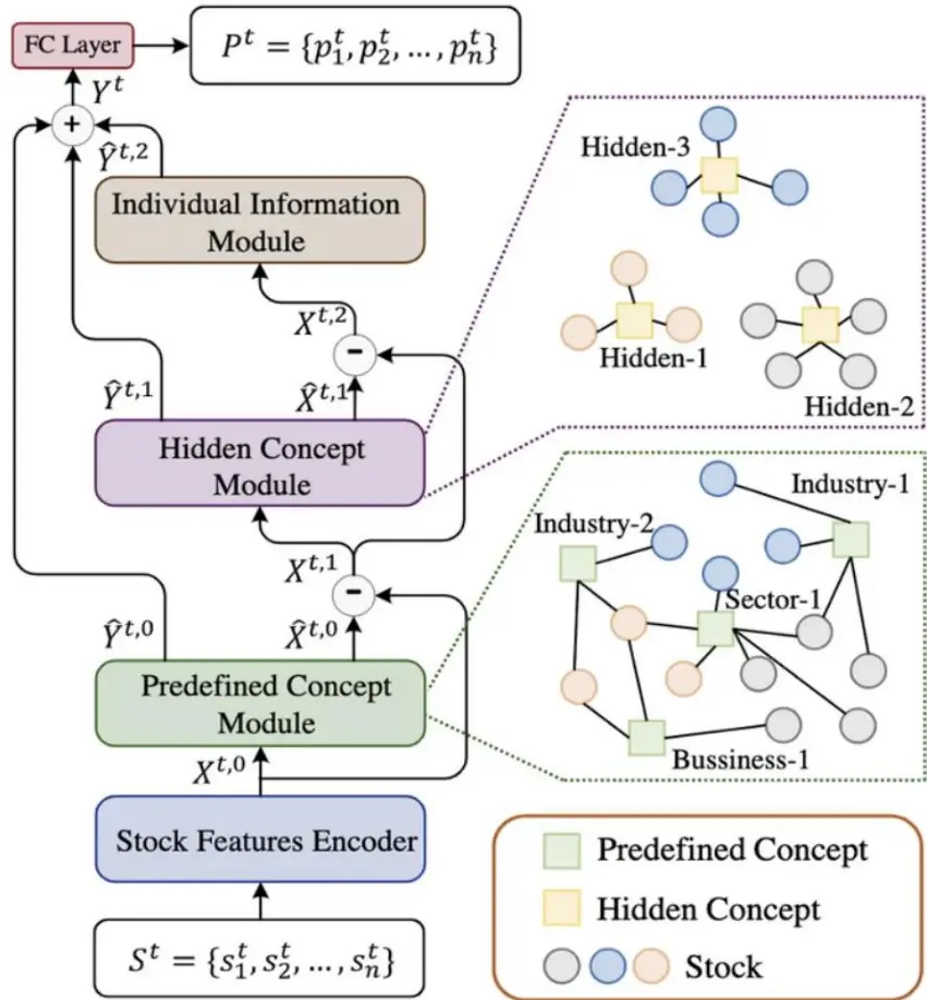
数据来源：东方证券研究所 & arXiv
有关分析师的申明，见本报告最后部分。其他重要信息披露见分析师申明之后部分，或请与您的投资代表联系。并请阅读本证券研究报告最后一页的免责申明。

## 1.2 HIST 模型核心要点

接下来，我们对 HIST模型的核心要点进行拆解，全面分析模型的思想。

## 1.2.1 添加股票截面交互信息

尽管在工程实现中，传统时序预测模型（如GRU、LSTM）的输入常采用N×K ×SEQLEN的面板数据形式，将多个股票数据同时输入模型进行并行计算，但其底层结构仍然将每只股票数据视作独立的时间序列，分别建模和预测。这种方式实际上仍然是按股票独立建模的，假设每只股票的未来收益仅由其自身历史特征序列所决定。

然而在实际金融市场中，股票收益往往表现出显著的横截面相关性，行业轮动、主题炒作、机构抱团等现象会使得多个股票呈现同步涨跌的联动关系。因此，仅基于个股自身历史信息建模难以充分挖掘这类系统性机会，模型的样本外泛化能力也易受市场风格变化影响。

HIST 模型在提取个股时序特征信息的基础上，引入“股票–概念”图结构建模个股间的关联关系，有效融合股票间的横截面交互信息，提升模型对群体联动信号的建模能力。具体来看，模型首先设置股票时序特征编码模块，提取股票自身的历史时序特征信息。再将编码后的股票信息输入股票间关联网络编码模块，融合图信息，对因子选股效果进行进一步的增强。

## 1.2.2 股票间关联信息的来源

HIST 模型将股票之间的关联信息来源划分为两类：一类是基于行业分类、主营业务关联等人工标注的预定义概念，另一类是人脑无法直接观测和理解，但可通过数据挖掘发现的隐藏概念。通过融合这两类概念信息，HIST 构建出更加全面且灵活的股票关联结构，既保证了模型的可解释性，也扩展了对潜在联动关系的覆盖能力，弥补了传统概念标签方法中静态、冗余、遗漏等问题。

图 2：预定义概念与隐藏概念示意图
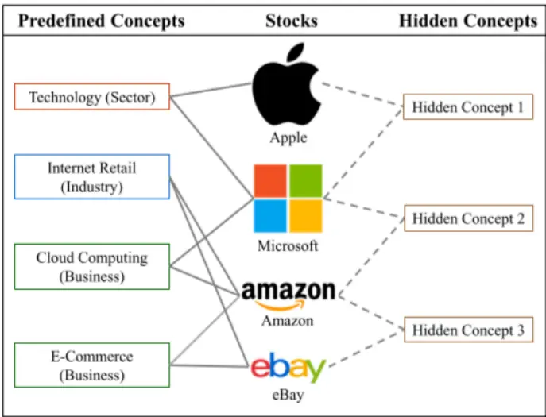
数据来源：东方证券研究所 & arXiv

## 1.2.3 概念信息的提取

HIST 模型中的“股票-概念”关联网络是动态构建的，基于“人工预设概念标签 + 特征相似度调整”生成。关联网络构建出之后，HIST 模型采用矩阵乘积机制，利用股票特征信息，聚合生成每个概念的特征表示，从而实现概念信息的提取，作为后续股票收益预测的基础。

## 下面对两类概念信息的提取过程进行详细介绍，具体过程如图 3和图 4所示：

## 1. 预定义概念

传统方法通常依赖行业分类、主营业务等静态标签来定义股票之间的概念关联，但这类方法存在三重缺陷：a.信息缺失：部分实际受某概念影响的股票可能未被覆盖；b.信息冗余：被归入某概念的股票未必真实受其驱动；c. 结构僵化：股票与概念间的联系未随市场变化动态更新。

基于此，HIST模型对预定义概念信息提取采用“人工预设+动态修正”的机制：

a. 人工预设初始化：给出人工预设的“股票-预定义概念”静态关联网络，即关联矩阵αi,jt,0。计算初始预定义概念的特征表示et,0，由该概念下所属股票的特征市值加权得到；

b. 基于相似度动态修正：计算股票特征与初始预定义概念特征之间的余弦相似度，使用softmax 函数对每个概念在所有股票上的相似度进行归一化，得到“股票-预定义概念”之间的动

c. 聚合得到概念特征：利用该权重矩阵对股票特征进行二次加权，得到修正后的预定义概念特征表示eit,1。

## 2. 隐藏概念

为进一步提升概念结构表达的完备性与灵活性，HIST 同时引入隐藏概念模块，用以挖掘预定义概念未能覆盖的股票间深层潜在关联，增强模型对非显性关联的识别能力。

## HIST 对隐藏概念信息提取同样采用“人工预设+动态修正” 机制：

a. 人工预设初始化：将每只股票看作一个候选“隐藏概念”，有几个股票就有几个概念，并假设初始隐藏概念的特征即为股票的特征，从而得到初始隐藏概念的特征表示ut,0；

b. 基于相似度动态修正：计算股票特征与候选隐藏概念特征之间的余弦相似度，但仅保留个股与Top-K最相关股票的连接，生成稀疏相似度图，从而得到“股票-隐藏概念”之间的动态关联

c. 聚合得到概念特征：利用该权重矩阵对股票特征加权，得到修正后的隐藏概念特征表示ut,1，并删除不与任何股票连接的隐藏概念，去除冗余概念，提升信息密度。

图3：预定义概念信息提取示意图
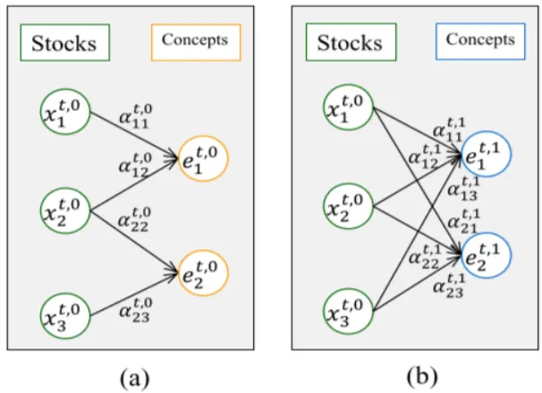
数据来源：东方证券研究所 & arXiv
图 a：初始化预定义概念的特征表示；图 b：修正预定义概念的特征表示。

图4：隐藏概念信息提取示意图
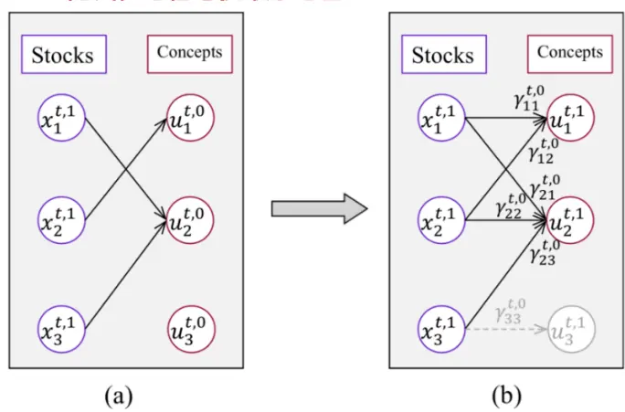
数据来源：东方证券研究所 & arXiv
图 a：初始化隐藏概念的特征表示；图 b：修正隐藏概念的特征表示。
有关分析师的申明，见本报告最后部分。其他重要信息披露见分析师申明之后部分，或请与您的投资代表联系。并请阅读本证券研究报告最后一页的免责申明。

## 1.2.4 个股信息和概念信息的融合

在得到概念的特征表示后，需要将概念信息注入股票特征中，也就是基于概念信息对股票特征进行聚合与重构，从而得到股票在概念视角下的特征表达，这一步骤即为个股信息和概念信息的融合。

在实现个股信息和概念信息的融合时，HIST 模型采用 “基于余弦相似度的注意力权重计算+ 矩阵乘积”机制。首先使用类似注意力机制的方式，计算不同概念对每只股票的重要性权重，而后结合矩阵乘积进行概念信息注入。

以预定义概念为例（隐藏概念模块采用相同逻辑），个股信息和概念信息的融合流程如图 5所示，具体解释如下：

a.相似度计算：计算初始股票特征与修正后的概念特征 $e_{i}^{t,1}$ 之间的余弦相似度。

b.归一化权重：使用 softmax 函数对每只股票在所有概念上的相似度进行归一化，从而得到从概念到股票的聚合权重 $\cdot\beta_{i,j}^{t}$ 。这个权重矩阵展示了每个概念对特定股票的重要性程度。

c. 加权聚合：使用该权重矩阵对概念的向量表示进行加权，得到融合了概念信息后的每只股票的向量表示Ŝt,0。这一步实质上就是矩阵乘积算法的应用，将概念信息根据其重要性 “注入”到每只股票的特征中。

这一机制结构简洁透明，融合过程使用基础线性代数操作，不依赖复杂神经结构，权重矩阵的计算和归一化过程清晰可见，有助于追踪每个概念在个股特征中的具体贡献。

图 5：个股信息和概念信息的融合示意图（预定义概念模块）
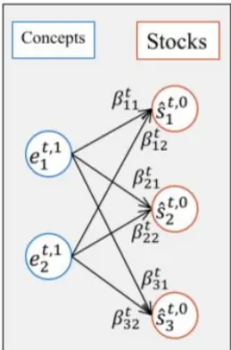
(c)
数据来源：东方证券研究所 & arXiv

## 1.2.5 级联残差结构

HIST 模型采用级联残差结构，将股票收益的驱动因素划分为三类，并按“由共性到个性”的顺序逐层提取、依次建模。与传统模型将所有特征一次性处理不同，HIST 更像一位经验丰富的分析师，能够抽丝剥茧、逐步识别不同信息来源的影响，厘清股票收益的形成路径。

## 1. 预定义关联信息提取

第一层关注行业、主营业务等预定义概念关联信息。该层生成的特征一方面用于收益预测，一方面以残差形式将未解释的信息传递至下一层。类似于分析一只科技股时，首先判断其是否受AI、5G 等产业趋势影响。

## 2.隐藏关联信息提取

第二层挖掘未被预定义概念覆盖的潜在结构性关联信息，如供应链关系、风格归属等。该层生成的特征一方面参与收益率预测，一方面以残差形式将未解释的信息继续传递至下一层。类似于分析一家公司时，除了明确的行业归属，还会观察它是否“跟谁走得近”。

## 3. 个股特质信息建模

最后一层建模个股自身无法归类于任何概念的独特信息，如治理能力、信息披露质量、管理风格等，用于解释收益预测中的“个性化部分”。类似于分析一家公司时，除了分析股票间的群体联动信号外，还要关注股票自身特质化的信息。

这种级联残差结构具备以下优势：a. 简化学习任务，聚焦核心驱动。每一层仅需解释前一层未覆盖的残差信号，使得学习过程更聚焦，模型训练更高效。b. 融合多维视角，构建完整认知。多层残差学习机制确保了不同来源的信息都被完整保留，从而生成更完整、稳健的收益预测。

## 1.3 HIST模型的“类图神经网络”结构设计

虽然 HIST 模型在利用股票间关联信息建模的过程中，并未显式采用图神经网络（GNN）中常见的结构模块，如 GCN 或 GAT 等标准算子，但其核心结构与 GNN 的设计理念高度契合。

在“概念信息的提取与回传”过程中，HIST 构建了一个“股票—概念—股票”的信息流通路径，与图神经网络中的“节点–超边–节点”结构高度类似，实质上隐式实现了图神经网络中的节点聚合与消息传递机制。

具体而言：在 HIST 模型中，每一只股票都可视为图中的一个节点，而概念（包括预定义概念和隐藏概念）相当于连接这些节点的“中介节点”或“虚拟超节点”。模型通过以下两个阶段实现概念层与股票层之间的双向信息交互：

## 阶段一：股票 → 概念

模型首先计算股票特征与概念特征之间的余弦相似度，作为关联权重（即股票对各概念的注意力权重），并进行归一化（softmax）。随后，使用这些权重对所有股票特征进行加权聚合，从而生成每个概念的特征表达，类似于 GNN 中对邻居节点信息的聚合操作。

## 阶段二：概念 → 股票

在概念特征更新后，模型再次计算概念到股票的相似度权重，将概念表示回传至股票节点，生成股票在当前概念视角下的“因子驱动表达”。这一过程本质上与图神经网络中的“消息传递—节点更新”过程完全一致。

但与传统图神经网络依赖静态图结构不同，HIST 模型中的图结构是动态构建的，基于“人工预设概念标签 + 特征相似度调整”生成。这种机制本质上是通过特征驱动的自适应图生成方式，避免了传统 GNN对人工图结构的依赖。

## 1.4 HIST 模型的非线性因子模型理解视角

HIST 模型通过三路径结构划分股票特征信息，在投资者层面具有较好的直觉解释力。然而，这种路径划分仍主要依赖经验设定，缺乏从理论模型出发的系统性推导。为弥补这一不足，我们尝试从因子建模的角度对 HIST 模型结构进行重构性解读，建立起其与非线性因子模型之间的对应关系，从而为模型提供更清晰的理论解释基础。

有关分析师的申明，见本报告最后部分。其他重要信息披露见分析师申明之后部分，或请与您的投资代表联系。并请阅读本证券研究报告最后一页的免责申明。

在股票收益的因子建模中，传统模型通常将股票的超额收益表示为多个系统性风险因子的组合。这一建模思想可追溯至 Sharpe（1964）提出的资本资产定价模型（CAPM），以及 Fama和 French（1993）构建的三因子模型。在这类模型中，股票的超额收益被分解为两部分：一部分由一组系统性风险因子共同驱动，反映市场、风格或行业层面的广义影响；另一部分则由个股自身的特质因素驱动，代表无法被共性因子解释的个体性波动。对应的公式形式为：

$$
y_{t}=h(\beta_{t},z_{t})+\alpha_{t}+\epsilon_{t}
$$

其中， $y_{t}$ 为股票在时点 t 上的超额收益， $\beta_{t}$ 为股票在时点 t 上对各风险因子上的暴露程度， $z_{t}$ 为这些风险因子在时点 t上的因子收益率。传统线性模型假设股票的系统性收益可由β 与 $\dot{\boldsymbol{z}}_{t}$ 的加权求和表示 $\left(\beta_{t}^{\textit{ T }}z_{t}\right)$ ，但在更一般的情形下，该组合关系也可以用一个非线性函数ℎ $(\beta_{t},z_{t})$ 来表示，用以捕捉更复杂的因子交互关系。 $\alpha_{t}$ 为股票在时点 t 上的特质收益率， $\epsilon_{t}$ 为无法建模的随机误差项。

HIST 模型实际上就是非线性因子模型的一种深度学习表达方式，在进行股票收益预测时，将股票收益分解为由系统性因子驱动的部分和由个体特质驱动的部分，并分别建模。所谓股票间关联的概念，也可以理解为因子。

该拟合过程等价于：

$$
\begin{array}{r}{\hat{y}_{i}^{t}=linear(f_{\mathrm{pre-definedlayer}}(\beta_{s}^{t},x_{i}^{t,0})+f_{\mathit{\hat{\mu}}iddenlayer}\big(\beta_{h}^{t},x_{i}^{t,1}\big)+f_{\alpha}\big(x_{i}^{t,2}\big))}\end{array}
$$

1. HIST 认为股票收益的系统性驱动因子包括预定义因子和隐藏因子。其中股票的因子暴露矩阵（股票-概念的关联矩阵）βt和 $\mathcal{B}_{h}^{t}$ 都不是完全外部预设输入的，而是采用“人工预设+动态修$\overline{{\mathbf{L}}}^{\mathfrak{n}}$ 的机制计算出来的。

2. 函数 $f_{\mathrm{pre-definedlayer}}\overleftarrow{\exists}f_{\mathit{hiddenlayer}}$ 通过“股票–概念”之间的信息传递与融合，提取融合概念信息后的股票特征表达，再施加非线性变换（linear+leakyrelu），增强表达能力。两者最终输出维度均为 N × hidden_size，仅作为中间特征，并不直接对应预测收益值。

3.函数 $f_{\alpha}$ 对残差特征进行非线性变换（linear +leakyrelu），提取未被因子层解释的股票特质特征表达。输出同样为 $\mathsf{N}\times\mathsf{hidden\_size}$ ，仅为中间特征。

4. 三部分股票特征表达聚合后，通过全连接线性变换映射为最终收益预测 $(\mathsf{N}\times\mathsf{1})$ ）。

因此，HIST模型没有显式学习传统意义上的因子收益率 $\scriptstyle:z_{t}$ ，而是在这一阶段中通过概念特征的提取生成了一个类似于 $\cdot z_{t}$ 的“因子特征表达”。同时也没有显示学习 $h(\beta_{t},z_{t})$ 和 $\lvert\alpha_{t}$ ，而是通过深度特征学习隐式地实现了“因子信息的融合与非线性表达”。 $f_{\mathrm{pre-definedlayer}}\setminus f_{\mathit{\lambda iiddenlayer}}\setminus f_{\alpha}$ 的输出只能理解为“股票获得的综合因子特征表示”，并不代表股票从因子层获得的收益贡献和未被因子层解释的剩余收益贡献，最终的收益贡献要经过全连接层投影后才得以实现。

## 1.5 HIST 模型不足之处

HIST 模型在股票关联信息的建模方面具备一定的结构创新性，其建模思路借鉴了主动投资者的分层分析逻辑，具有较强的直觉合理性，容易被投资者理解和接受。也可以在非线性因子模型的视角下进行理解，具有一定的理论解释基础。然而，模型在具体实现上仍较多依赖人工设定的规则与经验，在概念信息的提取和融合等关键环节，主要依靠人为设计，缺乏严谨的数学推导或理论基础支撑。具体来看，HIST 模型存在以下几个方面的不足：

## 1.5.1 隐藏概念构建机制粗糙

HIST 将市场中所有股票作为隐藏概念的候选集合，并基于 Top-K 相似度选取强关联个股，模拟潜在“隐藏概念”。这种构造方式存在以下问题：

## 1. 缺乏高层次语义抽象能力

HIST 模型将个股本身视为隐藏概念的候选单元，意味着隐藏概念仍处于微观个体层面，缺少对更高层次市场结构的建模能力，如：赛道、主题、风格等。

## 2. 初始构建粗糙，表达稳定性不足

HIST 模型通过特征相似度选取 Top-K 股票构建隐藏概念，未引入明确结构约束，难以区分真实潜在关系与偶然相似。部分入选隐藏概念虽与目标股票短期特征相近，但可能缺乏共性驱动，易引入噪声，导致隐藏概念表达不稳定、语义不清晰。

## 1.5.2 概念关联权重生成方式失真

HIST 模型在计算股票与概念之间的关联程度时，主要依赖“余弦相似度+ softmax”的两步权重生成机制。这一做法存在两个关键问题：

## 1. 余弦相似度忽略模长信息

HIST 使用余弦相似度来衡量股票与概念之间的关联。余弦相似度只衡量向量间的方向一致性，忽略了向量的模长信息。而在金融场景中，特征模长往往承载着关键的量级信号，例如市值、交易量或波动率等。这意味着，即便两只股票的特征方向完全一致（即余弦相似度为 1），如果一只市值为 2000 亿、另一只仅有 20 亿，它们在与某一概念的加权过程中可能被赋予相同权重。

## 2. softmax 归一化进一步扭曲了权重分配

softmax 强制将所有相似度归一化为 [0,1] 区间并设置总和为 1，其本质是一种相对排名机制，强调“谁更相似”而非“有多相似”。即使所有相关性都普遍偏低（如 [0.05, 0.04, 0.03]），softmax 仍会将最高的那个放大为主要权重，人为制造“赢家通吃”的结果，误导聚合表达。

## 1.5.3 概念交互机制结构表达能力不足

HIST 模 型 在 构 建 股 票 与 概 念 之 间 的 信 息 交 互 机 制 时 ， 使 用 以 下 两 步 矩 阵 操 作 ：$X_{\mathit{pas}}=\beta^{T}X_{\mathit{hass}},X_{\mathit{hass}}{}^{\prime}=\beta X_{\mathit{hass}}$ 。其中β 是股票-概念的关联权重矩阵，通过“余弦相似度 +softmax”构造得出。这种方式虽然结构清晰、计算高效，但在结构表达能力上存在以下局限：

## 1. 无法表达概念内部的股票联动关系

HIST 所采用的聚合机制虽然维度上是多对多的矩阵乘法运算，但每一步计算仍然是单个股票与概念之间的成对相似性加权。对于任意一个概念，它在反向传给股票时，只是“这个概念对每个股票有多大权重”的回传，而不是“这个概念中多个股票之间是如何共振互动”的表达。虽然在信息回传阶段，HIST 模型使用 softmax 机制对股票-概念相似度进行归一化，理论上考虑了“同一概念下其他股票”的存在，但该机制本质上仍为“相对权重分配”，并未显式建模股票之间的结构性协同关系。以“新能源汽车”概念为例，假设A、B、C 三只股票都属于该概念，在回传阶段，A 接收到的概念信息虽然受 B、C 存在影响（通过 softmax 权重），但 A 与 B、C 之间没有直接的信息流动。

## 2. 缺乏结构传播机制，信息传导范围受限

HIST 的信息聚合过程本质上是一次性、局部的特征加权，缺乏类似图神经网络中的结构归一化、深度传播路径等机制。这种“无传播”的加权操作难以跨越概念维度进行多跳传导，更无法形成稳定的结构表示。特征在概念层聚合后立即回传至个体，路径短、信息浅，不利于捕捉深层次的结构依赖。

## 1.5.4 个股特质残差的建模过于理想化

在级联残差结构中，假设通过预定义概念和隐藏概念两个模块，已经充分挖掘了股票间的所有截面交互信息，最后残差为纯粹的个体特质信息。但在实际中，该假设可能过于理想化，存在如下问题：

## 1. 信息剥离不彻底，残差不“纯”

若预定义概念层与隐藏概念层未能充分提取所有股票间的截面交互信息，那么个股信息模块接受到的输入部分仍混杂未建模的关联因素，导致用于个股特质预测的表示存在“污染”。

## 2. 个股信息模块的线性预测面临目标漂移问题

个股信息模块作为残差接收器，其输入的稳定性依赖于前两层对共享信息的充分剥离。在实际训练中，若部分关联信息未被前层捕捉，则残差中混杂噪声，导致线性预测器面对时变、结构不一致的输入分布，出现目标漂移问题。也就是说个股信息模块在某些时点用的是较“纯净”的个股特质预测收益，而在另一些时点则用包含未剥离信息的残差进行预测。该问题将干扰线性预测器的参数收敛过程，降低模型对个股收益的稳定预测能力。

## 1.6 HIST 模型绩效

按照前期报告《DFQ-HIST：添加图信息的选股因子挖掘系统》中给出的 DFQ-HIST 模型，基于60个量价特征为特征，以20天收益率作为标签，使用研报中的模型超参数，HIST基础模型绩效表现如下：

测试集上 rankic 达到 16.03%，rankicir 达到 1.16，20 分组多头日度超额年化收益率达到28.01%，多头日超额收益夏普比 2.90，多头日度超额收益最大回撤 8.76%。2024年模型 rankic降低为 14.05%，但 20分组多头日度超额年化收益率为 35.18%，仍然稳健。

图 6：HIST 基础模型的绩效表现（2020.01.01-2025.3.31）

| 中证全指股票池 60特征 20日标签 2020.01.01-2025.3.31 | IC IC_IR rankIC |  |  | rankIC_IR | 多头月度胜率 | 多头日超额收益夏普比 | 多头日超额年化收益 | 多头日超额收益最大回撤 | 多头月均单边换手率 |
| --- | --- | --- | --- | --- | --- | --- | --- | --- | --- |
| hist 基础模型 | 11.92% | 0.98 | 16.03% | 1.16 | 84.13% | 2.90 | 28.01% | -8.76% | 71.86% |
| 中证全指股票池 60特征 20日标签 hist 基础模型 | IC | IC_IR | rankIC | rankIC_IR | 多头月度胜率 | 多头日超额收益夏普比 | 多头日超额年化收益 | 多头日超额收益最大回撤 | 多头月均单边换手率 |
| 2020 | 10.65% | 0.79 | 14.68% | 0.93 | 66.67% | 2.08 | 16.92% | -4.53% | 72.86% |
| 2021 | 12.56% | 1.10 | 17.62% | 1.27 | 91.67% | 3.11 | 31.43% | -6.82% | 70.69% |
| 2022 | 13.81% | 1.56 | 17.27% | 1.95 | 91.67% | 2.76 | 24.07% | -4.24% | 65.17% |
| 2023 | 11.24% | 0.86 | 16.70% | 1.26 | 83.33% | 3.51 | 22.40% | -4.39% | 75.00% |
| 2024 | 11.79% | 0.92 | 14.05% | 0.92 | 83.33% | 2.86 | 35.18% | -6.74% | 76.05% |
| 20250331 | 10.13% | 0.66 | 15.77% | 0.97 | 100.00% | 0.37 | 9.90% | -1.34% | 69.98% |

数据来源：东方证券研究所 & Wind资讯

综合来看，HIST 模型的整体架构设计较为合理，具备良好的可拓展性。然而，其在路径构建机制与结构表达能力方面仍存在前述不足。为此，本研究在 HIST 模型基础上进行改进，提出引入超图卷积神经网络（HyperGCN）与时间残差对比学习（TRCL）两项关键技术，构建新模型 FactorGCL，以提升其在股票收益建模中的结构表达能力与泛化性能。

有关分析师的申明，见本报告最后部分。其他重要信息披露见分析师申明之后部分，或请与您的投资代表联系。并请阅读本证券研究报告最后一页的免责申明。

## 二、HIST-HyperGCN 模型

在这一部分中，我们引入图卷积神经网络（HyperGCN）技术，对 HIST 模型进行改进，给出 HIST-HyperGCN 模型，旨在解决 HIST 模型中“隐藏概念构建机制粗糙”、“概念关联权重生成方式失真”、“概念交互机制结构表达能力不足”这三点不足。

## 2.1 超图（Hypergraph）介绍

超图是对传统图的一种泛化。在传统图中，一条边只能连接两个顶点。而超图允许一个超边连接任意数量的顶点。

顶点 (V)：代表我们直接关心的个体，如沪深 300中所有个股。

超边 (E)：代表这些实体之间存在的多对多（高阶）关系。一个超边可以包含两个或更多个顶点，形成一个“组”或“集合”。如小市值风格股票池即为一条超边。

图 7：超图和传统图的对比
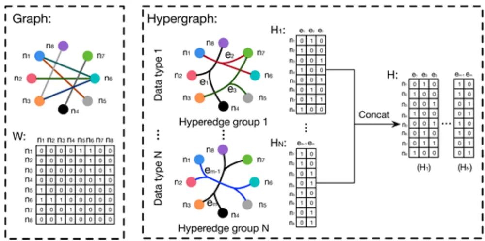
数据来源：东方证券研究所 & Feng Y., You H., Zhang Z., et al. Hypergraph Neural Networks. AAAI 2020.

在金融市场中，股票之间常常呈现出群体性联动特征，这种高阶关系难以用传统图（一对一连接）有效建模。超图通过一对多的超边结构，可从两个维度刻画市场中的联动机制：a. 因子驱动路径：将“行业”“主题”“风格”等因子视作超边，连接所有受该因子共同影响的股票，构建“因子—股票”群组结构，反映市场中基于外部信息的一致性行为；b. 结构传导路径：将具有关联关系（如供应链、重仓、交叉持股等）的一组股票作为一个超边，刻画个股间潜在的联动或传染路径。

## 2.2 超图卷积神经网络（HyperGCN）介绍

## 2.2.1 HyperGCN 原理

图是一种用于建模实体间关系的结构工具，但若希望从图结构中自动提取可预测的特征表示，就需要引入图神经网络（GNN）。其中，图卷积神经网络（GCN）是最基础、最广泛应用的一类方法。GCN 通过邻接关系传播信息，实现节点间的特征融合。在此基础上，超图卷积神经网络（HyperGCN）利用超图结构，将传统图中的“成对连接”拓展为“多点连接”，即引入超边连接多个相关节点。相比传统 GCN 仅能捕捉局部配对关系，HyperGCN 能够直接建模群体行为模式与高阶因子驱动结构，为表达股票间复杂联动提供了更强的结构建模能力。

## 超图卷积的建模逻辑：节点—超边—节点的信息传播

超图卷积通过双阶段的信息传递机制，在“节点—超边—节点”的结构中流动信息，让每个节点的表达不仅包含自身特征，还融入了它所参与的多个群体的集体特征。

## 第一阶段：节点到超边

每条超边会收集它所连接的所有节点的特征，形成一个聚合后的“群体表示”。例如，一个“AI芯片”概念的超边，会汇聚英伟达、寒武纪、AMD等相关股票的当前特征，形成“该主题目前的整体状态”。

## 第二阶段：超边到节点

接下来，每个节点会从它所参与的超边中反向接收信息。例如，一只 AI 概念股，除了拥有自身的财务、价格等特征外，还能融合“AI 芯片”这个超边聚合后的行业特征。同时，如果它还属于“半导体板块”或“高研发投入”风格等其他超边，也会一并接收并整合这些信息。

图 8：超图卷积示意图
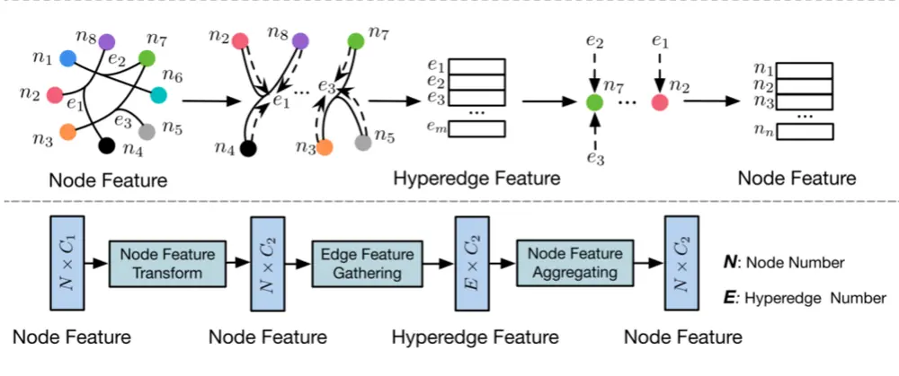
数据来源：东方证券研究所 & Feng Y., You H., Zhang Z., et al. Hypergraph Neural Networks. AAAI 2020.

## 2.2.2 HyperGCN 核心建模逻辑

在股票收益预测视角下，超图卷积神经网络（HyperGCN）的核心建模逻辑如下：

## 1. 构建“股票—因子（概念）”超图结构

a. 节点（V）：表示当前截面上的所有股票，共 N个。

b. 超边（E）：表示预定义的因子群体，共 M个。如 AI、新能源车、中字头等概念。

c. 连接关系（H）：表示股票节点与超边之间的的多对多连接关系。如果股票 vi 属于因子 ej，则 Hij=1，否则为 0。

## 2. 超图卷积的前向传播机制

在图神经网络（GNN）里，所谓“传播”，指的是：一个节点能把它的特征信息，按照连接关系和权重，有控制地传递给其他节点，而不是简单的“加权平均”或“堆在一起”。所以需要做两件事：确定连接结构 —— 谁和谁相连；保证传播强度可控 —— 不能让度数高的节点过分主导，或度数低的节点信号被冲淡。

HyperGCN 模型的前向传播核心在于：通过构建一个对称归一化的超图特征传播算子，实现信息在“股票 → 因子（概念）→ 股票”上的传播，从而捕捉股票间的高阶群体联动关系。这一传播机制可以实现概念层级的特征聚合与回传，确保信息在群体结构中的均衡扩散。

具体公式如下：

$$
Y=\sigma(D_{v}^{-1/2}HW_{e}D_{e}^{-1}H^{T}D_{v}^{-1/2}X\Theta)
$$

其中：

${D_{v}^{-1/2}HW_{e}D_{e}^{-1}H^{T}D_{v}^{-1/2}}$ ：传播矩阵，满足对称和归一化，用于控制每个股票特征被传递给其他股票的程度。

$Y\in R^{N\times C_{out}}$ ：输出的股票特征矩阵，代表每只股票的特征在超图结构中聚合后的表示。 $C_{out}$ 是输出特征维度；

$X\in R^{N\times C_{in}}$ ：输入的股票特征矩阵。N 是股票数量， $C_{in}$ 是输入特征维度；

$H\in R^{N\times M}$ ：超图的关联矩阵，表示 N 个股票与 M 个因子（超边）之间的连接关系；

$\mathrm{D}_{\mathrm{v}}\in\mathrm{R}^{\mathrm{N}\times\mathrm{N}}$ ：节点度对角矩阵，表示每只股票关联的因子数量。

$D_{e}\in R^{M\times M}$ ：超边度对角矩阵，表示每个因子连接的股票数量；

$W\in R^{M\times M}$ ：超边权重对角矩阵，可设置为单位矩阵或根据因子强度自定义。在本模型中初始化为单位矩阵，即认为所有因子初始同等重要；

Θ $\in R^{C_{in}\times C_{out}}$ ：可学习的权重矩阵（神经网络的参数）。这是模型在训练过程中需要优化的参数，用于将输入特征投影到新的特征空间；

σ：非线性激活函数，常取 ReLU 或 LeakyReLU，用于增强模型的非线性表达能力。

下面详细解释每一步的运算含义：

Step1：XΘ (特征变换):

含义：将股票的原始特征 X 通过一个线性变换矩阵，投影到更高维或更低维的特征空间，为后续的信息聚合做准备。类似于给每只股票的初始信息进行一次“预处理”。

Input size: [batch_size, num_stock, num_factor];

output size: [batch_size, num_stock, num_hidden]

Step2： $D_{v}^{-1/2}(X\pmb{\theta})$ (节点特征归一化):

含义： ${D_{v}}^{-1/2}$ 操作对每只股票节点的特征进行度归一化处理，即除以其连接因子数量的平方根。通过这一步归一化，可以防止高连接节点过度主导信息流（如某些股票连接了多个热门概念），保持信息传播的平衡性和稳定性。

$$
\mathsf{lnputsize:\mathsf{[batch\_size,num\_stock,num\_hidden]};}
$$

有关分析师的申明，见本报告最后部分。其他重要信息披露见分析师申明之后部分，或请与您的投资代表联系。并请阅读本证券研究报告最后一页的免责申明。

output size: [batch_size, num_stock, num_hidden]

Step3： $H^{T}\Big(D_{v}^{-1/2}X\pmb{\theta}\Big)$ (节点到超边聚合):

含义：这一步实现了信息从股票节点向超边（概念）的聚合。 $H^{T}$ 矩阵的维度是 M×N，每一行对应一个超边（概念），每一列对应一个节点（股票）。当 $H^{T}$ 乘以股票特征矩阵时，每个超边会收集所有连接到它的股票（即受该因子影响的股票）的特征信息，并将这些信息聚合起来，形成超边自身的特征表示。

input size: [batch_size, num_stock, num_hidden];

output size: [batch_size, num_concept, num_hidden]

Step4： $W_{e}D_{e}^{-1}\Big(H^{T}D_{v}^{-1/2}X\pmb\theta\Big)$ (超边特征加权与归一化):

含义：这一步是对聚合后的超边特征进行加权和归一化。 $D_{e}^{-}$ 1操作对超边特征进行归一化，确保那些连接股票数量特别多（或影响范围广）的概念不会过度主导后续信息传播，控制因子对整体信息流的影响力，保持建模公平性和数值稳定性。 $W_{e}$ 进一步对超边（概念）赋予权重，表示该概念在模型中的重要性，使得模型可以区分不同因子的影响力。

Input size: [batch_size, num_concept, num_hidden];

output size: [batch_size, num_concept, num_hidden]

Step5： $H\Big(W_{e}D_{e}^{-1}H^{T}D_{v}^{-1/2}X\pmb\theta\Big)$ (超边到节点传播):

含义：这一步是信息从超边（概念）向股票节点的回传。H矩阵的维度是 ${\mathsf{N}}{\times}{\mathsf{M}}_{\circ}$ 。当 H 乘以经过处理的超边特征矩阵时，每个股票节点会从所有连接到它的超边（因子）那里接收并聚合信息。

Input size: [batch_size, num_concept, num_hidden];

output size: [batch_size, num_stock, num_hidden]

$\mathsf{Step6}\colon\boldsymbol{D}_{v}^{-1/2}\big(\boldsymbol{H}\boldsymbol{W}_{e}\boldsymbol{D}_{e}^{-1}\boldsymbol{H}^{T}\boldsymbol{D}_{v}^{-1/2}\boldsymbol{X}\theta\big)$ (最终节点特征归一化):

含义：对最终传回股票节点的特征再进行一次度归一化处理，采用的是与 Step2 相同的$\pmb{D}_{v}^{-1/2}$ 系数。通过这一步归一化，可以避免部分节点因连接超边较多而累加过多特征，导致数值膨胀或训练不稳定。同时与 step2 一起构成对称归一化结构，使信息在“节点→超边→节点”的传播路径中，对“发送方”和“接收方”的贡献进行均衡调控，有助于特征的平稳传播与模型收敛。

Input size: [batch_size, num_stock, num_hidden];

output size: [batch_size, num_stock, num_hidden]

Step7：σ $\big(D_{v}^{-1/2}HW_{e}D_{e}^{-1}H^{T}D_{v}^{-1/2}X\pmb\theta\big)$ (激活函数处理)

含义：在完成超图结构上的特征传播与线性变换后，模型对输出结果施加非线性激活函数，以增强模型的表达能力与拟合复杂结构的能力。

Input size: [batch_size, num_stock, num_hidden];

有关分析师的申明，见本报告最后部分。其他重要信息披露见分析师申明之后部分，或请与您的投资代表联系。并请阅读本证券研究报告最后一页的免责申明。

output size: [batch_size, num_stock, num_hidden]

## 2.3 HIST-HyperGCN 模型具体做法

## 2.3.1 HIST-HyperGCN 构建思路

为了进一步提升因子暴露结构β的表达能力，并提升h(β,z)的建模效果，我们对原 HIST 模型进行了结构性改造，形成 HIST-HyperGCN框架。模型框架如下图 9所示。

该框架引入 HyperGCN作为概念层信息聚合模块，其整体预测结构为：

$$
\begin{array}{r}{\hat{y}_{i}^{t}=w_{o1}HyperGCN_{prior-betalayer}\left(\beta_{s}^{t},x_{i}^{t,0}\right)+w_{o2}HyperGCN_{hidden-betalayer}\left(\beta_{h}^{t},x_{i}^{t,1}\right)}\\{+w_{o3}f_{\alpha}\left(x_{i}^{t,2}\right)+b}\end{array}
$$

其中：（1）两个 HyperGCN 模块分别用于构建融合预定义因子与隐藏因子的股票特征表达，表示股票从因子层获得的收益贡献 $\big(\approx\beta^{T}z\big)_{\mathrm{~\circ~}}\left(2\right)f_{\alpha}$ 模块保留了原 HIST 中的 linear +leakyrelu结构，用于建模未被因子层解释的特质收益。（3） $w_{o1},w_{o2},w_{o3}\in R^{d}$ 为可学习的线性参数，b ∈R为偏置项，用于拟合各路径对最终收益的相对贡献，增强表达能力并提升对收益的拟合效果。

这种改进方式，既保留了 HIST 框架中“非线性因子建模 + 特质残差剥离”的基本思想，又通过引入超图结构提升了对复杂因子暴露模式的表达能力，使得模型在表达强度、稳定性与结构可扩展性方面更具优势。

图 9：HIST-HyperGCN 模型框架
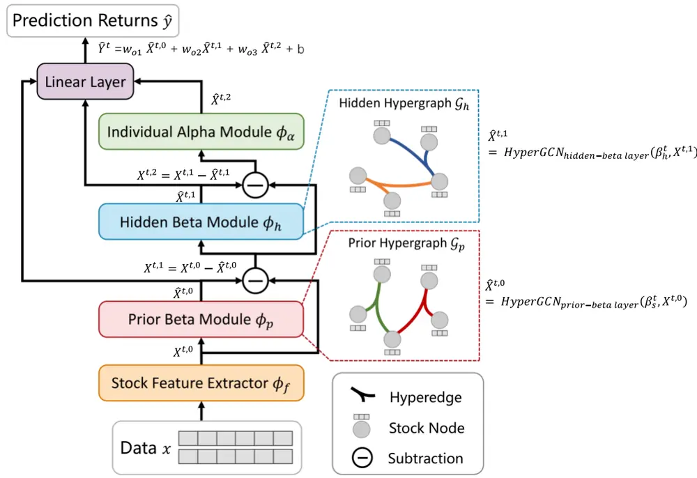
数据来源：东方证券研究所 & arXiv

## 2.3.2 HIST-HyperGCN vs HIST

为详细说明 HIST-HyperGCN 相较原 HIST 在结构设计上的差异与优势，我们从以下四个核心维度进行展开对比：

## 1. 预定义概念的建图方式：从动态特征相似度调整 → 静态 0-1超图结构

原 HIST 做法：使用行业分类、主营业务标签等人工预设的预定义概念作为股票之间的关联基础。但考虑到这些标签往往存在覆盖不全、冗余交叉、更新滞后等问题，HIST 并不直接采用静态的 0-1 二值概念矩阵，而是在此基础上进行调整，进一步基于特征相似度计算股票与概念的关联强度，从而形成一个连续权重矩阵。即认为：每只股票可能与所有概念相关，只是强弱不同。

HIST-HyperGCN 做法：直接采用人工设定的 0-1 二值关联矩阵作为预定义因子模块所采用的关联矩阵βt。明确标定股票是否属于某一概念，不再做基于特征的动态调整，形成一个训练前固定的静态超图结构作为输入。

改进优势：a. 避免余弦相似度误差，提高建图稳定性。直接使用明确的 0-1 概念标签，不再依赖高维特征相似度的动态计算，消除了特征波动带来的关联偏差，更有利于图结构稳定训练。b. 静态图结构更适配图卷积建模。由于超图结构在训练前即已构建完成，后续可直接通过统一的超图卷积操作对所有节点（股票）进行信息传播与聚合，减少了训练过程中的图更新成本，提高了模型整体的结构效率与计算稳定性。c. 更符合概念知识图谱的先验逻辑。行业归属、主题标签本身就具有稳定性和人为先验的属性，用静态图表示更加贴合现实的知识结构，增强了模型对“已知概念结构”的利用能力。

## 2. 隐藏概念的构建机制：从局部相似性聚合 → 可学习的全局因子原型

原 HIST 做法：不显式设定一组固定的隐藏概念，而是通过股票之间的局部相似性动态生成隐藏概念特征。股票与隐藏概念之间的关联权重 β由个股在残差空间中的相似度决定，隐藏概念表示则是以此β加权的聚合结果。换言之，每只股票的隐藏概念表达，实质上是“由我最相似的那几只股票的特征加权得出”。这种方式下的隐藏概念并不具备稳定的定义或结构，其表示随样本特征和相似度变化而变化，属于一种相对相似性驱动的概念建构方式。

HIST-HyperGCN 做法：隐藏概念不再依赖于其他股票的特征来动态生成，而是引入一组可学习的因子原型C ∈ RM×d，作为隐藏概念的特征表示，每一行c 代表一个固定的隐藏概念。这些因子由模型在训练过程中直接学习得到，具有稳定性和全局性，在时序上保持不变。股票与隐藏概念之间的关联权重 βt由股票特征与因子原型之间的内积计算而来，再通过Sigmoid 函数归一化为0-1之间的关联强度，即 $\begin{array}{r}{{1}\beta_{h}^{t}=\mathrm{sigmoid}(\mathrm{X}^{t}{C}^{T})}\end{array}$ 。这种方式的核心思想是：先定义出一组清晰的因子，再看每只股票与这些因子的关系，强调的是“我受哪些因子影响”，而不是“我像哪几只股票”。将隐藏概念建模从基于相似度的相对构造，转变为面向因子的绝对表达。

改进优势： a. 摆脱对相似股票的依赖，更稳定。HIST 中，隐藏概念由“谁像我”决定，高度依赖股票之间的相似性排序，受市场状态、特征波动等影响较大，且缺乏统一的、结构化的语义表达。HIST-HyperGCN 直接学习概念原型，结构固定，显著提升概念表达的稳定性与一致性。b. 建模抽象因子，更具结构表达力。因子原型法让隐藏因子从“相似股票集合”跃升为“抽象因子集合”，实现对市场结构共性的统一建模。c. 贴近金融因子建模，更易解释和归因。股票与原型之间的内积可以理解为“因子暴露”，符合金融学中“收益= 因子×暴露”的经典建模方式。d. 减少参数量，提升训练效率。模型只需学习少量因子原型，即可覆盖全市场的因子表达需求。

相比传统方式为每个股票构建独立关联，原型方法在保持表达力的同时显著压缩参数量，提升泛化性能与训练效率。

## 3. 关联权重的生成机制：特征相似度驱动 → 超图结构驱动

原 HIST 做法：采用“余弦相似度 + softmax”方式生成股票与概念之间的关联权重β。具体而言，先计算股票特征与概念特征之间的余弦相似度，衡量它们在方向上的一致性；随后通过softmax 归一化，将相似度转化为加权系数，作为信息聚合过程中的“注意力权重”。这一做法属于特征相似性驱动下的权重构造机制，强调“我像哪个概念，我就更受它影响”。

HIST-HyperGCN 做法：不再依赖“相似度 + softmax”的加权方式，而是将股票与概念之间的关系编码进一个超图结构中，利用图神经网络中的结构归一化传播算子，在结构基础上确定信息传递的强度。具体而言，股票与概念之间的初始连接关系β由超边连接矩阵H 给出，可理解为某只股票对各概念的初始暴露情况；但最终的信息传播强度，即“概念对股票的影响力”并不是H，而是通过超图卷积中的归一化传播算子，综合考虑节点度、超边度与超边权重计算得出的。这种方式属于结构驱动的权重构造机制，强调“我在某个概念上的参与程度如何，这个概念又如何通过图结构参与我的特征生成”。

改进优势：a.更合理地融合强度信息：由于不再对特征向量强制单位化，原始特征的模长（如市值、波动率等“强度”信号）可以自然保留并参与聚合过程；b.规避 softmax 带来的非线性压缩与偏差放大：归一化操作基于连接结构而非特征数值大小，使得权重分配更平滑，避免了“赢家通吃”的信息失衡问题；c.具备更强的结构表达能力：归一化方式天然适配图结构，易于扩展至多类超边、多阶关联、异构图等复杂金融结构。

## 4. 概念信息的传播机制：从基于注意力的规则式聚合 → 可学习的一体化超图卷积传播

原 HIST 做法：采用“股票 → 概念 → 股票”的两阶段加权结构完成信息交互。在第一阶段中，先利用余弦相似度 + softmax 生成的关联权重，将所有股票的特征按权重加权，生成每个概念的特征表示；在第二阶段中，再基于概念与股票之间的相似性，重新计算注意力权重，将概念特征回传至每只股票，生成股票的共享信息表示。这个过程本质上是两次基于特征相似度的注意力加权平均，整个信息聚合过程不包含可学习参数，属于规则驱动的显式融合路径。

HIST-HyperGCN 做法：同样遵循“股票 → 概念 → 股票”的信息路径，但聚合过程由一个统一的超图卷积传播算子完成，将两阶段的信息流整合为一次结构归一化传播。同时，模型在传播前加入了可学习的线性变换层，用于对原始股票特征进行映射，使得模型能够自动学习更有效的因子表达方式，具备更强的特征提取与适应能力。

改进优势：a. 聚合过程更简洁统一：信息传播整合在一次算子运算中，避免手动设定多轮注意力机制所带来的计算开销和信息退化问题；b. 具备学习能力：引入可学习参数，使模型能对信息融合方式进行训练优化；c. 具备谱域理论支撑：传播机制源自谱图理论中的归一化特征传播算子，支持更稳定的训练与非线性表达；d. 扩展性更强：可引入多阶邻接、结构注意力或异构超边等设计，更好捕捉复杂的群体关系与市场结构。

下面两个图我们详细展示了 HIST 模型和 HIST-HyperGCN 模型，在预定义概念层和隐藏概念层的具体做法区别。

图 10：HIST 模型的预定义概念层 vs HIST-HyperGCN 模型的先验 beta 层

| 操作阶段 |  | HIST预定义概念层 | FactorGCL先验Beta层 |
| --- | --- | --- | --- |
| 输入特征 | 用GRU编码原始时序特征 |  | 用GRU编码原始时序特征数据后，进行线性变换 $\widetilde{X^{t,0}}=X^{t,0}\pmb{\theta}$ |
| 股票和概念间的关联矩阵计算 | $X^{t,0}=x_{i}^{t,0}$ 先用市值加权初始化 | 通过01关联矩阵构建静态概念超图 |  |
|  | $\beta^{\tau,0}=\alpha_{i,k}^{t,0}=\left\{\begin{array}{c}{{mktvalue_{i}}}\\{{\sum_{i}mktvalue_{i}},{ifb_{i,k}=1}}\\{{0,else}}\end{array}\right.$ | $\beta^{\sf t}=\left(b_{i,k}\right)_{n\times m}$ |  |
| 从个股到概念的信息提取 | 通过市值加权构建动态概念表示 | \ |  |
|  |  | 计算个股和概念的余弦相似度，再用softmax归一化作为权重 |  |
| 动态修正关联 | $\beta^{t,1}=\left({\alpha}_{ki}^{t,1}\right)_{n\times m}=\left\{\begin{array}{c}{{50\mathrm{fmax}(cos(h_{k}^{t,0},x_{i}^{t,0})),ifb_{i,k}=1}}\\{{0,else}}\end{array}\right.$ |  | \ |
| 动态修正概念特征 | 用上述权重重新计算概念特征 |  | 节点到超边的聚合 |
|  | $H^{t,1}=\left(h_{k}^{t,1}\right)_{m,1}=\beta^{t,1^{T}}X^{t,0}$ |  | $H^{t}=\beta^{t}{}^{T}\Big(D_{v}^{-1/2}\widetilde{X^{t,0}}\Big)$ |
| 概念和股票间的关联矩阵计算 |  | 计算概念和个股的余弦相似度，再用softmax归一化作为权重 |  |
|  | $\beta^{t,z}=\left(\alpha_{ki}^{t,z}\right)_{n,m}=so\mathsf{ftmax}(cos\left(h_{k}^{t,1},x_{i}^{t,0}\right))$ |  | \ |
|  | 获取融合预定义概念信息后的个股特征 |  | 超边到节点的聚合 |
| 从概念到个股的信息融合 | $E^{t,0}=\left(e_{i}^{t,0}\right)_{n,1}=\beta^{t,1}H^{t,1}$ |  | $E^{t,0}=\sigma(D_{v}^{-1/2}\beta^{t,1}W_{e}D_{e}^{-1}H^{t})$ |
| 输出设计 | 双分支输出 |  | 单嵌入输出 |
|  | $\widehat{X^{\tau,0}}=\left(\widehat{x_{\tau}^{\tau,0}}\right)_{n,1};$ backcast : |  | $\widehat{X^{\tau,0}}=\left(\widehat{x_{\tau}^{\tau,0}}\right)_{n,1}$ |
|  | forecast : $\widehat{Y^{t,0}}=\widehat{(y_{t}^{t})}_{n,1}$ |  |  |

数据来源：东方证券研究所

图 11：HIST 模型的隐藏概念层 vs HIST-HyperGCN 模型的隐藏 beta 层

| 操作阶段 | HIST隐藏概念层 | FactorGCL隐藏Beta层 |
| --- | --- | --- |
| 输入特征 | 残差输入 $X^{t,1}=X^{t,0}-\widehat{X^{t,0}}$ | 残差输入，进行线性变换 $\widetilde{X^{t,1}}=\textit{ \textbf { ( } \widetilde { X ^ { t , 0 } } - \widetilde { X ^ { t , 0 } } \textit { ) } }\theta$ |
| 因子原型定义 | 所有股票自身作为一个概念，初始隐藏概念特征=股票特征 | 可学习因子原型（隐藏概念特征)： $C=\{c_{k}\}_{k=1}^{M}$ |
| 股票和概念间的关联矩阵计算 | 计算个股和概念的余弦相似度，再用softmax归一化作为权重。对权 重进行进行稀疏化处理，每个股票仅保留与之相关性最大的topk个 利用个股特征与因子原型做内积运算 概念作为隐藏概念 $\beta_{h}^{t,0}=\left(\alpha_{ki}^{t,0}\right)_{n\times m}=\left\{\begin{array}{r}{s\circ\mathrm{ftm}ax(cos(h_{k}^{t,0},x_{i}^{t,0})),if}\\{0,else}\end{array}\right.$ k在 id 的 top 中 | $\beta_{h}^{t}=\sigma\big(\widetilde{X^{t,1}}\cdot C^{\tau}\big)$ |
| 从个股到概念的信息提取 | 用上述权重计算概念特征 $H_{h}^{t,0}=\left(h_{k}^{t,0}\right)_{m,1}=\beta_{h}^{t,0}^{T}X^{t,1}$ | 节点到超边的聚合 $H_{h}^{t}={\beta_{h}^{t}}^{T}\Big(D_{v}^{-1/2}\widetilde{X^{t,1}}\Big)$ |
| 概念和股票间的关联矩阵计算 | 计算概念和个股的余弦相似度，再用softmax归一化作为权重 |  |
| 从概念到个股的信息融合 | $\beta_{h}^{t,1}=\left(\alpha_{ki}^{t,2}\right)_{n,m}=s\circ\mathsf{ffmax}(cos\left(h_{k}^{t,1},x_{i}^{t,0}\right))$ 获取融合隐藏概念信息后的个股特征 | 1 超边到节点的聚合 |
| 输出设计 | $E_{h}^{t,0}=\left(e_{i}^{t,0}\right)_{n,1}=\beta^{t,1}H^{t,0}$ 双分支输出 $\operatorname{backcast}:X^{\widehat{\tau},1}=\left(x_{\iota}^{\widehat{\tau},1}\right)_{n,1};$ $\widehat{X^{\tau,1}}=\left(\widehat{x_{\tau}^{t,1}}\right)_{n,1}$ | $E_{h}^{t,0}=\sigma(D_{v}^{-1/2}\beta_{h}^{t}W_{e}D_{e}^{-1}E)$ 单嵌入输出 |

数据来源：东方证券研究所

有关分析师的申明，见本报告最后部分。其他重要信息披露见分析师申明之后部分，或请与您的投资代表联系。并请阅读本证券研究报告最后一页的免责申明。

## 2.4 HIST-HyperGCN 模型绩效

## 引入 HyperGCN 技术可以带来预测稳定性与多头选股能力的提升：

## 1.预测稳定性提升：

在引入 HyperGCN 后，RankIC 从 HIST 的 16.03%降至 15.70%。但 ICIR 从 HIST 的 0.98 上升到 1.02；RankICIR 从 1.16 上升到 1.20。

这表明，尽管因子平均预测能力（RankIC）略有波动，但其在时间序列上的稳定性（ICIR/RankICIR）却得到了增强。背后逻辑在于：HIST-HyperGCN 所引入的**因子原型机制（Factor Prototype）**为股票与概念之间提供了更稳定、结构化的关联表达，从而生成更稳定的Beta 矩阵。这使得模型不再依赖短期特征相似性带来的“噪声驱动”关联，而是能更持续地识别潜在因子的长期影响。

## 2.多头选股能力的显著增强：

在多头表现方面，多头夏普比率从HIST的2.90显著提升至3.47。多头年化超额收益从HIST的 28.01%上升到 31.52%。这展示了 HyperGCN 改进后模型更强的多头选股能力。这一提升说明模型在识别高质量 alpha 信号方面更具穿透力。HyperGCN 所构建的超图结构，有助于模型准确聚合多个概念维度的信息，形成对“上涨潜力股”的更清晰刻画，强化了多头方向的 alpha 提取能力。

## 3.不同特征变换矩阵对模型效果的重要性：

第三行和第二行的消融实验显示，不同 Beta 层（预定义 Beta 与隐藏 Beta）采用独立的特征变换矩阵能提升模型性能。这说明两种因子结构所需的特征表达粒度存在差异，预定义Beta 层更侧重于对外部概念结构的建模，而隐藏Beta 层则关注对个股潜在风格的抽象表达。因而为两者分配专属的变换能力，能提升模型对多层次因子结构的适应能力，增强整体表达力与泛化能力。

图 12：HIST-HyperGCN 模型的绩效表现（2020.01.01-2025.3.31）
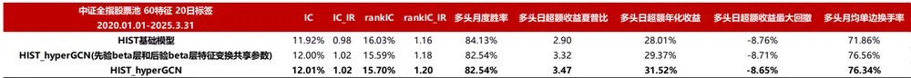
数据来源：东方证券研究所 & Wind资讯

## 三、HIST-TRCL 模型

在这一部分中，我们引入时间残差对比学习（TRCL）技术，对 HIST 模型进行改进，给出HIST-TRCL模型，旨在解决 HIST模型中“个股特质残差建模过于理想化”的不足。

## 3.1 时 间 残 差 对 比 学 习 （ Temporal ResidualContrastive Learning，TRCL）介绍

如前文 1.4 节所述，HIST 模型本质上是一种基于深度学习的非线性因子模型，其核心目标是将股票收益拆解为三部分：由预定义概念（因子）、隐藏概念（因子）构建的系统性收益部分，以及通过残差模块学习得到的每只股票独有的特质收益部分（α）。其拟合形式如下：

$$
\begin{array}{r}{\hat{y}_{i}^{t}=linear(f_{\mathrm{pre-definedlayer}}(\beta_{s}^{t},x_{i}^{t,0})+f_{\mathit{\hat{\mu}}iddenlayer}\big(\beta_{h}^{t},x_{i}^{t,1}\big)+f_{\alpha}\big(x_{i}^{t,2}\big))}\end{array}
$$

我们期望，特质收益部分（α）具有以下两个核心性质：

a. 截面独立性：不同股票间的特质收益在截面上应接近独立，反映各自无法被系统性因子解释的个体特性。这是经典因子模型的重要假设之一，是“系统性 vs 特异性”划分的关键前提。若两个股票的残差高度相关，说明还存在未建模的共性风险因子；

b. 时间稳定性：同一只股票其特质收益应在相邻时间段内的保持相对一致。这一假设并非传统因子建模的先验设定，但从以下三方面具有重要意义：

## （1）金融语义层面：

若将 α 理解为股票的“非系统性超额收益能力”，其背后通常对应公司基本面改善、估值修复或资金偏好等中短期因素，这类优势理应具有一定的持续性。若 α 表现为高频波动甚至随机反转，则难以视为真实的“个体能力”，更难支撑中短期策略的有效性与解释力。

## （2）策略应用层面：

只有时间上可复现的 α 才具备可预测性与实用价值。若 α 在训练期表现良好、但未来大幅漂移，模型将难以在实盘中产生稳定收益。通过强化 α 的时间一致性，模型得以提取出可迁移的稳态优势，提高策略的稳健性与可解释性。

## （3）建模逻辑层面：

如果缺乏对 α 的时间一致性进行建模约束，模型在优化过程中可能会将部分“具有时变性但非个体性的系统性成分”错误归入 α 模块。这些成分本质上应由系统因子解释，但由于系统因子层覆盖不足或表达能力有限，残留的未建模共性结构可能被 α 模块吸收，从而使 α 混入“伪特质”信息，损害其应有的个体稳定性与解释力。

HIST 模型中的α是通过残差模块直接建模得到的，模型并未对α有任何约束要求，这就导致α并不一定满足上述两个要求。因此我们引入时间残差对比学习机制（TRCL），对残差 α 引入约束，以强化 HIST模型对个股稳定特质收益的建模能力，进一步增强 α 的可解释性、可迁移性与结构纯度。

## TRCL 的核心做法是：

a. 将同一只股票，在历史与未来两个时间段，提取出的特质收益视为正样本对，引导其表征趋于一致，强化个体特质的时间稳定性；

b. 将该股票，在历史时间段提取出的特质收益与其他股票在未来时间段的特质收益组成负样本对，压低其表征相似度，抑制共性结构或系统性噪声混入。

从训练机制角度来看，引入未来路径是一种带有时间语义的对比学习监督策略，其目标并非预测未来收益。此时使用未来特征的目的，是模拟模型在未来视角下对该股票 α 的认知表达，即：在未来环境下，基于未来信息提取出的特质收益。我们将这一“未来视角下”的 α，与历史路径下提取的 α 进行对比，从而衡量模型是否能够识别出跨时间稳定的非系统性能力表达，并主动排除短期噪声或系统性残留。并且由于未来路径仅在训练阶段参与建模，用于提供更具结构性的监督信号；在实际推理或策略应用阶段，模型仅基于历史路径做出 α 与收益预测，未来路径不会被调用，因此也并不存在“标签泄露”问题。

在训练过程中，若仅通过约束不同 batch（即不同时间截面）之间α的相似性来提升其时间稳定性，表面看似合理，实则存在以下三方面关键局限：

## （1）无法对齐同一只股票，缺乏逐股对比基础

常规训练中每个 batch 通常对应一个交易日，股票池随时间变化，导致 α 无法一一对应、缺乏个体级监督。而 TRCL在同一交易日的固定股票池下展开建模，为每只股票构建历史/未来两个输入路径，显式对齐 α 表达，确保可比性，从而实现逐股票级别的时间一致性建模。

## （2）缺乏结构性监督，易被优化器绕开

简单的 α 相似性约束（如 L2 或 cosine）属于浅层惩罚项，模型可借助其他路径完成目标拟合，难以真正提升 α 的时序一致性。相比之下，TRCL 基于正负样本构造和对比损失，提供了结构化的强监督信号，能更有效引导模型学习具有可迁移性的 α 表达。

## （3）忽略未来视角下的 α 表达，缺乏迁移验证能力

α 的稳定性不仅体现在过去，更关键在于其能否延续到未来。仅在历史路径上估计 α，无法验证该特质是否具备前瞻性。TRCL 则通过未来路径重新建模 α，并与历史路径 α 对比，真正对齐“不同时间视角”下的个体特质，从而更符合 α 的预测与迁移价值。

引入 TRCL机制，可以为模型带来以下两方面核心提升：

## a. 提升 alpha的时序稳定性：延长“因子保鲜期”

时间残差对比学习通过显式约束同一只股票在“历史”与“未来”两个时段上的 alpha 保持一致，促使模型从时序数据中提取出更具时间稳健性的alpha结构。这一机制有效提升了alpha因子对市场变化的鲁棒性，相当于为因子建模加装了一层“时间保鲜膜”，延缓因子失效问题。

## b. 降低 alpha 的截面相关性：强化“特质纯度”

在对比学习框架下，模型将每只股票的 alpha 与其他股票的 alpha 显式设定为负样本，鼓励模型学习出彼此区分度更高的特质收益。这种机制压制了跨个体之间的共性模式，促使残差更加聚焦于个体独有的信息，从而增强了模型对个股差异性的表达能力。

图 13：时间残差对比学习示意图
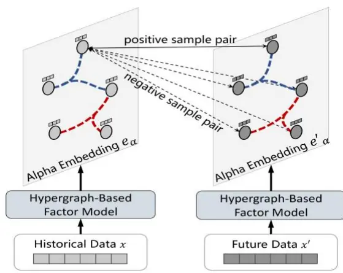
数据来源：东方证券研究所 & arXiv

## 3.2 HIST-TRCL 模型具体做法

## 3.2.1 模型架构

我们在原有 HIST 模型框架下，引入时间残差对比学习（TRCL）技术，给出 HIST-TRCL 模型，模型框架如下图 14 所示。模型采用双路径学习方式， 在历史和未来两条路径下分别构建HIST模型获取个股特质收益，添加 InfoNCE损失提升残差的时序稳定性和个股特异性。

图 14：HIST-TRCL 模型框架
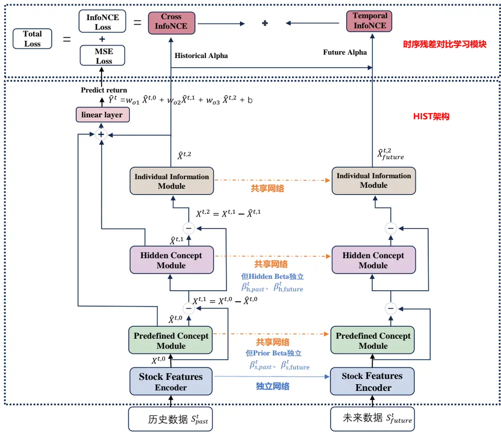
数据来源：东方证券研究所
有关分析师的申明，见本报告最后部分。其他重要信息披露见分析师申明之后部分，或请与您的投资代表联系。并请阅读本证券研究报告最后一页的免责申明。

## 3.2.2 未来时间步的选取

在 HIST-TRCL 模型中，为构建“历史—未来”残差对比学习框架，需从当前预测时间点之后提取一段未来时间片段，生成对应的 alpha。未来时间步的选择需同时满足以下两个关键要求：

## 1. 排除当前时点，确保时间隔离性

t时刻的特征在做预测时是已知的，已经用于历史路径中了。若未来路径中仍包含t时刻数据，等同于将同一时间的信息用于自身对比，易引入信息泄漏，削弱对比监督信号的强度。因此，未来时间序列应从 t+1开始，严格剔除 t时点特征，确保时间片段的独立性与因果一致性。

## 2. 时间序列正序排列，保持建模一致性

在未来路径中，时间维度应保持自然的正序排列（即从t + 1 到t + seq_len），与历史路径 [t$\mathbf{-\ seq\_len}+1,\ \dots,\mathbf{t}]$ 的排列方式保持一致。这样有助于保证时间递进结构的建模逻辑统一，简化时序编码器对时间模式的学习，避免因反序输入而引发不必要的归一化偏移或特征混淆。

## 3. 匹配预测期，增强目标相关性

模型训练最终服务于某一固定预测周期（如未来 20 日收益），那么历史路径下估计出的 α本质上是与未来 20 日收益相关的“特质成分”；若未来路径构造 α 所使用的时间窗口跨度与预测周期不一致，则两个α会出现“视角不对齐”的问题。因此未来路径所选时间窗口的长度应与预测期一致，使用从 t+1 至 t+20 的连续特征序列作为输入。

## 3.2.3 未来个股特质的计算

在 HIST-TRCL 模型中，为构建时间残差对比学习机制，需计算同一股票在“历史路径”和“未来路径”下的个体特质收益，并将其作为正负样本对用于对比学习。

未来路径与历史路径的模型架构相同，均采用 HIST 模型，由三个主要模块组成：股票时序特征编码模块、股票间关联网络模块、个股信息模块。两个路径的个股特质收益的拟合过程如下：

$$
\begin{array}{rl}&{\alpha_{i,past}^{t}=f_{\alpha}(\phi_{feat}^{past}\big(s_{i,past}^{t}\big)-f_{\mathrm{pre-definedlayer}}\big(\beta_{s,past}^{t},\boldsymbol{x}_{i,past}^{t,0}\big)-f_{hiddenlayer}\big(\beta_{h,past}^{t},\boldsymbol{x}_{i,past}^{t,1}\big))}\\&{\qquad\alpha_{i,future}^{t}=f_{\alpha}(\phi_{feat}^{future}\big({s}_{i,future}^{t}\big)-f_{\mathrm{pre-definedlayer}}\big(\beta_{s,future}^{t},\boldsymbol{x}_{i,future}^{t,0}\big)}\\&{\qquad-f_{hiddenlayer}\big(\beta_{h,future}^{t},\boldsymbol{x}_{i,future}^{t,1}\big))}\end{array}
$$

HIST-TRCL 在构建时间对比路径时，采用“特征编码器独立 + 因子模块共享”的结构设定，一方面确保了历史与未来路径在特征提取阶段各自适配不同时间视角下的数据特征，提升了建模的表达能力，另一方面又确保了 alpha 定义在时间维度上的语义一致性，为后续的残差对比学习提供了坚实基础。未来路径与历史路径的模型结构设置及参数共享策略如下：

1. 未来路径与历史路径的 HIST模型的股票时序特征编码模块独立，不共享网络参数。

HIST-TRCL 中，个股特质的历史与未来表征分别通过两条独立的时序路径构建而成：

a. 历史路径以某只股票在当前截面前 30 日（t-29 到 t）的特征序列 $s_{i,past}^{t}$ 为输入，经过一个结构独立的 GRU 编码器 $\phi_{feat}^{past}$ 生成表征输出，记作 $\hat{\mathbf{\rho}}_{i,past}^{t,0}$ ；

b. 未来路径则以未来 20 日（t+1 到 t+20）的特征序列 $\ r_{i,future}^{t}$ 为输入，同样通过一个结构独立的 GRU 编码器 $\phi_{feat}^{futur}$ e进行时序建模，提取的输出记作 $\mathrm{:}x_{i,future}^{t,0}\mathrm{:}$历史路径与未来路径的时序编码模块结构相同，但参数独立，原因在于两者在建模目标上存在根本差异：

a. 时序跨度不同：历史路径采用的 t-29 到 t特征序列，未来路径则使用 t+1 到 t+20的特征序列，输入序列时间跨度不同，信息分布存在差异；

b. 任务视角差异：历史路径的输出用于预测未来收益（前向建模），而未来路径则整合后视信息建模 alpha（类自编码任务），建模目标与任务结构不同。

若强行共享编码器参数，将导致模型难以适应两个语义冲突的任务，尤其在金融数据稀疏、信噪比低的背景下更易导致性能不稳。

## 2. 未来路径与历史路径的 HIST 模型的股票间关联网络模块与个股信息模块，共享网络参数。

除了时序模块外，历史与未来路径的其他子模块——关联网络模块（fpre−definedlayer、fℎiddenlayer）与个体特征提取模块（fα）保持参数共享，理由如下：

a. 保持α表达语义一致性：历史与未来路径共享因子网络与残差建模模块参数，确保两条路径遵循相同的因子分解逻辑，使得提取出的 α均基于相同网络结构、在相同规则下生成，在结构与语义上具备高度一致性，是有效构造对比监督信号的前提；

b. 训练稳定性提升：双路径模型若不共享参数，将导致网络容量翻倍，参数空间显著膨胀，容易出现过拟合或不收敛等问题。共享关键模块参数可以降低模型复杂度，提高训练收敛效率。

3. 未来路径与历史路径的 HIST模型的预定义概念和隐藏概念模块的两个β 矩阵实际是独立。主要原因在于 HIST 架构中β 矩阵其实不是模型的输入参数，而是数据驱动下的中间变量，是模型在特定输入下的“中间推理结果”，不存在统一固定的因子语义，不同时间点上因子个数也不固定，因而β本身并不具备稳定性或可迁移性，天然是路径相关的，不应共享。共享 β 不仅难以实现，反而会破坏路径间建模目标的独立性与真实性。具体来看：

a. 预定义β的动态修正机制：HIST 中的预定义β并非静态图结构，而是由人工设定的概念图 + 股票特征共同决定，并通过特征驱动方式进行动态修正，不同时间窗口下因个股特征差异β会产生显著变化，难以复用。

b. 隐藏β的强样本依赖性：HIST 中的隐藏β基于当前批次股票之间的相似度计算 TopK 图结构得到，隐藏因子没有明确的因子语义，因子个数也不固定，不同样本顺序与特征排列会导致完全不同的图结构和暴露结果。这种动态构图使得即使在相邻时间窗口，不同路径下的 β 结构也可能完全不同，难以复用。

## 3.2.4 InfoNCE 损失的计算

在 HIST-TRCL 模型中，还有一个重点就是：如何量化不同数据点之间的相似或不相似程度。为此，我们引入了对比学习中常用的 InfoNCE（Information Noise-Contrastive Estimation）损失函数。

InfoNCE 损失的核心目标是：最大化正样本对（同一只股票在历史时间段与未来时间段分别提取到的 alpha）之间的相似度，最小化负样本对（该股票历史 alpha 与其他股票在未来时间段提取的 alpha）之间的相似度，从而鼓励模型学习具有时间一致性和个体区分度的股票特质收益。

具体而言，每只个股 i 在截面 t 上的 InfoNCE 损失定义如下：

$$
\mathcal{L}_{\mathrm{N},i}=-\log\frac{\exp\bigl(\sin\bigl(p(\alpha_{i,past}^{t}),p(\alpha_{i,future}^{t})\bigr)/\tau\bigr)}{\sum_{j\in\mathrm{Batch}}\exp\bigl(\sin\bigl(p(\alpha_{i,past}^{t}),p(\alpha_{j,future}^{t})\bigr)/\tau\bigr)}
$$

其中：

$\alpha_{i,past}^{t}$ 表示历史路径中提取出的个股特质收益；

$\alpha_{i,future}^{t}$ 表示未来路径中提取出的个股特质收益；

$p(\cdot)$ 为用于对比学习的 MLP 投影头，包含两层线性层和一层 LeakyReLU 激活；

sim(∙)为余弦相似度作为判别器判断任意一组正（负）样本的相似度；

τ为温度系数，调节对相似度差异的敏感程度。τ越大 infoNCE 对相似度差异越不敏感，损失函数越平滑。

截面上总 InfoNCE 损失为 $\begin{array}{r}{\mathcal{L}_{\mathsf{N}}=\sum_{j\in\mathsf{Batch}}\mathcal{L}_{\mathsf{N},j},}\end{array}$ 。HIST-TRCL 模型将该损失与历史路径的预测误差 MSE损失，通过权重γ，重构为新的训练损失：

$$
\mathcal{L}_{\sf total}=\mathcal{L}_{\sf MSE}+\gamma\mathcal{L}_{\sf N}.
$$

## 3.2.5 InfoNCE 损失的改进

为进一步提升模型对个股特质的识别能力与表征纯度，HIST-TRCL 模型在原始 InfoNCE 损失的基础上，做出两项关键改进：

## 1. 改用平方相似度判别器

## a. 改进动机：

传统 InfoNCE 使用余弦相似度作为相似性度量，其优化目标是拉高正样本对相似度、压低负样本对相似度。由于余弦相似度取值范围为 [−1, 1]，模型在训练时会将负样本对推向 −1，即负相关方向，而不是更理想的“无相关性”状态（即接近 0）。然而在金融建模中，我们对个股特质的期望是：仅与自身强相关，与其他任何股票无关。换言之，负样本应趋于“非相关”而非“负相关”，负相关也是一种强相关。因而为了更精确地强制个股特质与其他股票不相关，我们需要一个能够衡量“相关性的绝对值”或“相关性强度”的判别器。

## b. 具体修改

基于上述动机，我们对截面 InfoNCE 损失函数的判别器进行了两项关键修改：

第一，将传统的余弦相似度替换为其平方形式。该操作将相似度值域从 [−1, 1] 映射到 [0, 1]，实现对相关性强度的“无方向性”惩罚。也就是说，无论两组 alpha 表征是强正相关还是强负相关，其平方相似度都接近 1，都会被模型视为“高相关”而受到惩罚；只有当 alpha 表征之间真正不相关（即余弦值接近 0）时，损失才最小。这种处理机制有效规避了原始 InfoNCE 中“负相关即合理”的漏洞，强化了 alpha 表征之间的正交性要求，提升了个股特质的横截面差异性。

第二，为保留正样本对的方向信息。我们在分子中加入原始相似度的符号，即使用 sign(sim)× sim² 作为正样本的相似度值。这样一来，只有当同一股票在历史与未来时间段提取出的 alpha在方向和强度上都高度一致时，相似度才最大、损失才最小；若方向相反（即负相关），即使强度匹配，也会被判为错误匹配并受到惩罚。该机制强化了模型在时间维度上的一致性建模能力，防止学习出“方向相反但高度相关”的伪稳定因子。

$$
\mathcal{L}_{\mathrm{N},i}=-\log\frac{\exp\Bigl(\mathrm{sign}\bigl(\sin\Bigl(p(\alpha_{i,past}^{t}),p(\alpha_{i,future}^{t})\Bigr)\bigr)*sim^{2}\Bigl(p(\alpha_{i,past}^{t}),p(\alpha_{i,future}^{t})\Bigr)/\tau\Bigr)}{\sum_{j\in\mathrm{Batch}}\exp\left(sim^{2}\left(p(\alpha_{i,past}^{t}),p(\alpha_{j,future}^{t})\right)/\tau\right)}\Bigr)
$$

综上，这一改进后的 InfoNCE 设计实现了双重优化目标：

在正样本对上，提升了对方向+强度双重一致性的要求；

在负样本对上，强化了对相关性强度的对称性抑制，推动个股特质向“非相关性”演化。

最终，这一机制促使模型学习出既具时间稳定性、又具横截面辨识度的 alpha 表征，显著提升了特质收益的“纯净度”与选股信号的差异化能力。

## 2. 引入截面 InfoNCE 损失

## a. 改进动机：

原始 InfoNCE 损失主要作用于时间维度，通过比较同一只股票在历史与未来两个时间片段上的 alpha 表征，提升其时间稳定性。尽管该机制已隐式利用了截面上的负样本，但其核心目标仍是强调时间一致性，缺乏对横截面异质性的直接约束。

为进一步增强个股特质的唯一性，我们引入独立的截面 InfoNCE 损失，显式鼓励模型在同一时点上将每只股票的 alpha 表征与其他股票区分开，强化“个体不可共享性”。

## b. 具体修改：

对于历史路径中提取出的 alpha 表征，我们将其自身视为正样本，将同一批次内其他股票的alpha 视为负样本。截面 InfoNCE 损失定义如下：

$$
\mathcal{L}_{\mathrm{N},i}=-\log\frac{\exp\bigl(\sin\bigl(p(\alpha_{i,past}^{t}),p(\alpha_{i,past}^{t})\bigr)/\tau\bigr)}{\sum_{j\in\mathrm{Batch}}\exp\Big(\sin\Big(p(\alpha_{i,past}^{t}),p(\alpha_{j,past}^{t})\Big)/\tau\Big)}
$$

HIST-TRCL 模型最终将历史路径的预测误差 MSE 损失，截面 InfoNCE 损失、时序 InfoNCE损失，通过权重γ重构为新的训练损失：

$$
\mathcal{L}_{\sf total}=\mathcal{L}_{\sf MSE}+\gamma(\mathcal{L}_{\sf N,temporal}+\mathcal{L}_{\sf N,cross-section})
$$

其中使用 $\mathcal{L}_{\sf N,temporal}$ 描述时序上的稳定性， $\mathcal{L}_{\sf N,cross-section}$ 描述截面上的稳定性。

## 3.3 HIST-TRCL 模型绩效

1. HIST模型在添加原始的时序残差对比学习框架后，绩效与HIST接近，在月均RANKIC，RANKICIR 等指标上越弱于 HIST；

2. 在对InfoNCE损失做了修改后，HIST_TRCL绩效在多头组明显改进，多头夏普比从HIST的 2.90 提升到 3.11，年化收益率从 28.01%提升到 31.22%，最大回撤从 8.76%降低到 6.99%。

图 15：HIST-TRCL 模型的绩效表现（2020.01.01-2025.3.31）

| 中证全指股票池 60特征 20日标签 2020.01.01-2025.3.31 | IC | IC_IR | rankIC | rankIC_IR | 多头月度胜率 | 多头日超额收益夏普比 | 多头日超额年化收益 | 多头日超额收益最大回撤 | 多头月均单边换手率 |
| --- | --- | --- | --- | --- | --- | --- | --- | --- | --- |
| HIST基础模型 | 11.92% | 0.98 | 16.03% | 1.16 | 84.13% | 2.90 | 28.01% | -8.76% | 71.86% |
| HIST_TRCL | 11.41% | 0.90 | 15.85% | 1.13 | 79.37% | 2.93 | 28.73% | -8.92% | 72.17% |
| HIST_TRCL(InfoNCE修改版) | 11.72% | 0.94 | 16.03% | 1.14 | 80.95% | 3.11 | 31.22% | -6.99% | 72.68% |

数据来源：东方证券研究所 & Wind资讯

有关分析师的申明，见本报告最后部分。其他重要信息披露见分析师申明之后部分，或请与您的投资代表联系。并请阅读本证券研究报告最后一页的免责申明。

## 四、FactorGCL 模型

## 4.1 模型结构

基于前面的尝试，我们构建了FactorGCL模型，以 HIST模型为基础，添加超图卷积神经网络（HyperGCN）和时间残差对比学习（TRCL）技术。模型采用双路径学习方式， 在历史和未来两条路径下分别构建HIST-HyperGCN模型获取个股特质收益，添加InfoNCE损失提升残差的时序稳定性和个股特异性。

FactorGCL模型模型框架如下图16所示。下半部分表示双路径的HIST_hyperGCN模型，其中左侧区域表示历史路径下的 HIST_hyperGCN 模型，包括残差连接的时序特征提取模块、预定义 beta 层、隐藏 beta 层以及个股特质层。右侧区域表示未来路径下的 HIST_hyperGCN 模型，以未来数据作为输入，采用独立的时序特征提取模块，但预定义 beta 层和隐藏 beta 层的网络参数以及β矩阵均共享。上半部分表示时序残差对比学习模块，通过结合历史和未来路径得到的个股特质收益，计算 InfoNCE损失，再与历史路径下得到的 MSE损失合并，得到总损失。

图 16：FactorGCL 模型结构示意图
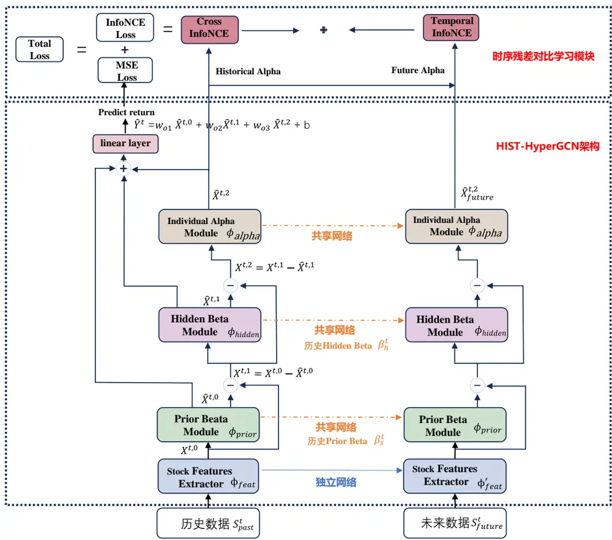
数据来源：东方证券研究所

## 4.2 模型训练和预测过程

FactorGCL 模型训练过程如下：

Step1：特征提取器 $\Phi_{feat}$ （Feature Extractor）：从输入的股票特征历史序列 $S_{past}^{t}$ 中提取股票的潜在特征Xt,0;

Step2：先验 beta 模块 $\phi_{prior}$ （prior Beta Module）：将预定义概念构建的关联网络作为βs，使用超图卷积网络 $\mathsf{hyperGCN}\phi_{prior}(\beta_{s}^{t},X^{t,0})$ ，实现信息提取（message extractor），信息聚合（message aggregation）和信息共享（message share），最终得到个股的共享关联信息X̂t,0; 残差 $\dot{\boldsymbol{\xi}}\boldsymbol{X}^{t,1}=\boldsymbol{X}^{t,0}-\boldsymbol{\hat{X}}^{t,(}$ 0作为下一层输入；

Step3: 隐藏 beta 模块 $\phi_{hidden}$ （hidden Beta Module）：将 M 个可学习的因子原型（factorprototype ） c 和 残 $\yen8$ ， 进 行 内 积 运 算 ， 生 成 $\beta_{h}^{t}={\mathsf{sigmoid}}(X^{t,1}\cdot c)$ , 使 用$\mathsf{hyperGCN}\phi_{\mathsf{hidden}}(\beta_{h}^{t},X^{t,1})$ 生成个股的隐藏关联信息X̂t,1；残差 $X^{t,2}=X^{t,1}-\hat{X}^{t,1}$ 作为下一层输入；

Step4：个体 alpha 模块 $\phi_{\mathsf{alpha}}$ （Individual Alpha Module）：将残差 $X^{t,2}$ 放入线性层和LeakyReLU层，获取个股特质信息 $\alpha_{past}^{t}=\hat{X}^{t,2}{=}\phi_{\mathsf{alpha}}\ (X^{t,2})$

Step5：预测模块（prediction）：使用线性层组合关联信息（股票从先验和隐藏因子层获得的收益贡献）和个股特质收益，对收益率进行预测 $\hat{Y}^{t}=w_{o1}\hat{X}^{t,0}+w_{o2}\hat{X}^{t,1}+w_{o3}\hat{X}^{t,2}+b\mathrm{.}$

Step6：未来路径模块：使用独立的特质提取器 $\flat_{feat}^{\prime}$ ，以及和历史路共享参数的网络 $\phi_{prior:}$ φ ，φ 与 beta 矩阵βt， $\boldsymbol{\beta}_{\hbar}^{t}$ ，构造未来路径。与 HIST-TRCL 模型不同，FactorGCL 模型下未来路径直接沿用历史路径下的 beta 矩阵，并不进行重新估计。用股票特征的未来序列 $\normalfont S_{future}^{t}$ 作 为 输 入 ， 提 取 未 来 个 股 特 质 信 息 $\alpha_{future}^{t}=\hat{X}_{future}^{t,2}=\phi_{\mathrm{alpha}}(\phi_{feat}^{'}(s_{future}^{t})-$ $\phi_{prior}\big(\beta_{s}^{t},X_{future}^{t,0}\big)-\phi_{hidden}\big(\beta_{h}^{t},X_{future}^{t,1}\big))$ 。

与 HIST-TRCL 模型不同，FactorGCL 模型下未来路径直接沿用历史路径下的 beta 矩阵，并不进行重新估计。主要出于几点考虑：

a.在经典因子模型假设下，因子暴露β应在短期内相对稳定，反映的是个股在固定因子结构下的结构性特征。直接复用历史路径下的 β，能够提升因子暴露在时间维度上的一致性，使模型更贴近传统金融建模假设，从而提高α残差的可解释性与经济含义；

b. FactorGCL 模型中的预定义因子暴露完全基于人工预设的股票–概念映射构建，不再依赖股票特征做动态调整。人工预定义关联在短期内具有稳定性，适合在历史与未来路径间共享；

c.隐藏因子暴露是基于一组全局学习到的可训练因子原型向量与当前股票特征加权生成。由于因子原型在训练过程中保持稳定，并不随具体输入变化，因此生成的隐藏 β 具备较强的结构一致性，支持其在历史路径与未来路径间的共享。

训练的目标函数包括两部分：

1. 历史路径的预测性能：用 MSE构造收益率预测损失，最小化该损失提升预测性能；

2. 残差稳定性和独立性：用 InfoNCE 构造两个对比学习损失，分别为用历史个股特质 $\alpha_{past}^{t}$ 和未来个股特质 $\alpha_{future}^{t}$ 计算的时序 InfoNCE 损失，和用历史个股特质 $\alpha_{past}^{t}$ 自身计算的截面InfoNCE损失。最小化该损失提升残差时序稳定性和截面独立性。

## FactorGCL 模型预测过程如下：

Step1：特征提取器 $\phi_{feat}$ （Feature Extractor）：从输入的股票特征历史序列St中提取股票的潜在特征Xt,0;

Step2：先验 beta 模块 $\phi_{prior}$ ，隐藏beta模块 $\phi_{hidden}$ ，个体 alpha 模块φ $\mathsf{\Pi}_{\mathsf{alpha}}$ ：残差连接生成共享关联信息X̂t,0，隐藏关联信息X̂t,1，个股特质信息X̂t,2；

Step3：预测模块（prediction）：使用线性层组合关联信息和个股特质，对收益率进行预测$\hat{Y}^{t}=w_{o1}\hat{X}^{t,0}+w_{o2}\hat{X}^{t,1}+w_{o3}\hat{X}^{t,2}+b\mathrm{.}$

## 4.3 隐藏因子的可视化分析

FactorGCL 模型采用的 HIST-HyperGCN 结构具备一项关键优势：直接学习一组可解释的隐藏因子原型，即在训练过程中生成一组固定的隐藏因子，提升了因子结构的稳定性与一致性。本节通过将模型生成的隐藏因子与人工构造的风险因子进行比对，分析模型所学习到的隐藏因子代表了哪些信息，探索模型是否捕捉到了具有经济含义的传统风格结构。具体计算方法如下：

## Step 1：提取模型因子原型

从训练完成的 FactorGCL 模型中，提取隐藏 beta层输出的 48 个因子原型（每个原型表征为一个 128 维的向量），视为模型自主学习到的隐藏因子的特征表征。

## Step 2：构造人工因子表征

从 DFQ-2020 风险模型中提取 10 个风格因子的因子暴露数据，并以此为权重对隐藏 beta 层的输入（即截面上所有个股的 128 维特征表示）进行加权，得到每个人工风险因子的特征表征。

## Step 3：计算因子相关性

在 2020 年 1 月 1 日至 2025 年 3 月 31 日测试集期间内，每日对两类因子表征逐一计算余弦相似度，作为两类因子在截面上的相关系数，分析模型所挖掘得到的隐藏因子与人工风险因子之间的相关性的整体情况和时序分布。

图 17：东方 A股因子风险模型（DFQ-2020）-- 风格类风险因子列表
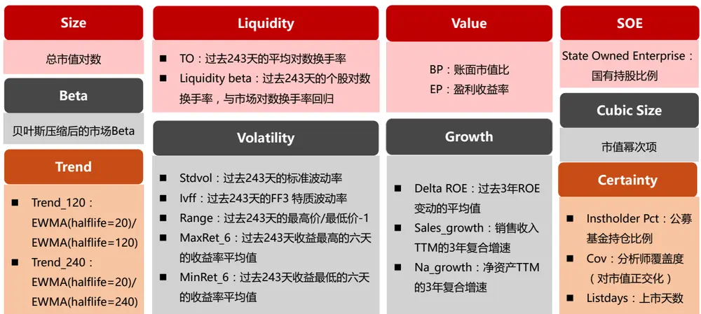
数据来源：东方证券研究所
有关分析师的申明，见本报告最后部分。其他重要信息披露见分析师申明之后部分，或请与您的投资代表联系。并请阅读本证券研究报告最后一页的免责申明。

从整体相关性分布来看，大部分隐藏因子与人工风格因子的相关系数集中在 -0.25 到 0.25 区间，表明模型在一定程度上提取了传统风格因子的有效信息，同时也展现出明显的结构差异性与独立性。这进一步说明，FactorGCL 在学习传统风格的基础上，亦能挖掘出更具数据驱动特征的“非线性因子”，为风险建模提供了新的可能性。

图 18：FactorGCL 模型中隐藏 beta 层提取的因子原型与传统风险因子表征的相关性时序平均热力图（2020.01.01-2025.3.31）
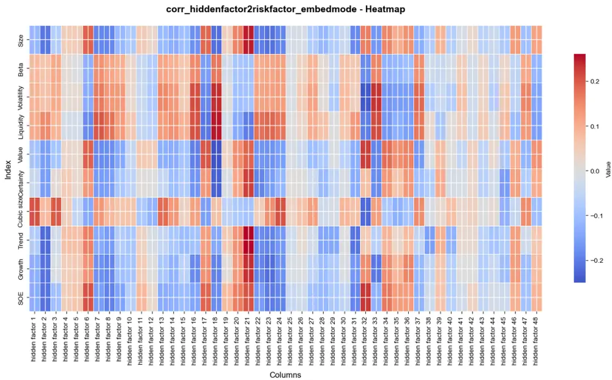
数据来源：东方证券研究所 & Wind资讯

## 我们进一步分析了部分隐藏因子的具体表现：

## 1. FactorGCL 一号隐藏风险因子：

与国企风险因子（SOE） 呈负相关；与非线性市值因子（Cubic Size）呈负相关；在 2022年后开始周期性地暴露于确定性因子（Certainty），可能反映了市场对宏观政策或外部冲击的敏感度。

## 2. FactorGCL 二号隐藏风险因子：

与流动性因子（Liquidity） 显著正相关；同时在 2022 年前后，对 Beta 因子的关联方向出现变化，显示出不同市场状态下风格暴露的异质性。

## 3. FactorGCL 三号与四号隐藏风险因子：

与不同人工风格因子（如估值 Value、波动率 Volatility、动量 Trend 等）的相关性在时间序列上出现剧烈波动；这类因子可能在短期内具有一定的市场风格识别能力，有潜力作为风格切换的早期信号。

从上面的分析可以看出，虽然 FactorGCL 所学习到的隐藏因子并不完全等价于传统风险因子，但其部分结构和动态特征能反映出真实市场中风格因子的变动特征，因此我们可以从风险因子的角度去解释 FactorGCL隐藏 beta层的作用，这增强了FactorGCL作为深度学习的可解释性。

图 19：FactorGCL 一号隐藏风险因子与传统风险因子的滚动20 日平均相关系数图（2020.01.01-2025.3.31）
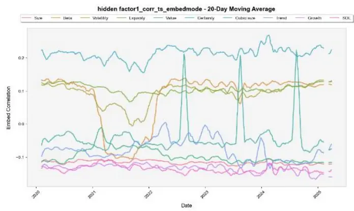
数据来源：东方证券研究所 & Wind资讯

图 20：FactorGCL 二号隐藏风险因子与传统风险因子的滚动20 日平均相关系数图（2020.01.01-2025.3.31）
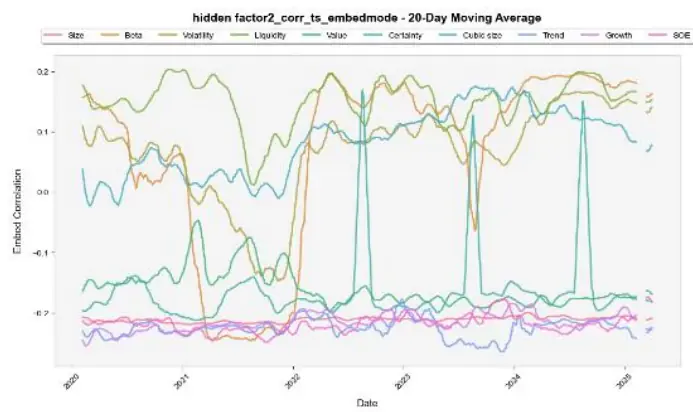
数据来源：东方证券研究所 & Wind资讯

图 21：FactorGCL 三号隐藏风险因子与传统风险因子的滚动20 日平均相关系数图（2020.01.01-2025.3.31）
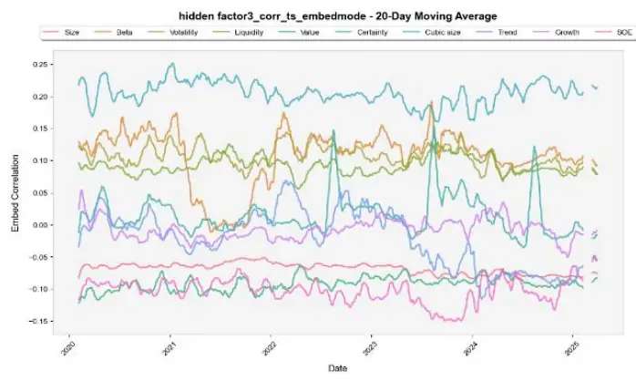
数据来源：东方证券研究所 & Wind资讯

图 22：FactorGCL 四号隐藏风险因子与传统风险因子的滚动20 日平均相关系数图（2020.01.01-2025.3.31）
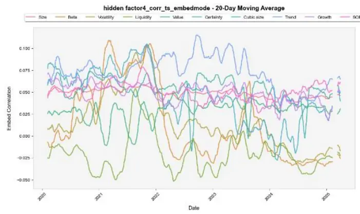
数据来源：东方证券研究所 & Wind资讯

## 五、DFQ-FactorGCL 模型细节

## 5.1 数据说明

样本空间：中证全指同期成分股。

数据区间：（1）训练集 2014.01.01—2018.11.30；（2）验证集 2019.01.01—2019.11.30；（3）测试集 2020.01.01—2025.3.31。数据集中额外的分割间隙是有意引入的，以避免特征和标签的泄露。训练集用于迭代训练模型，通过反向传播算法计算损失函数关于模型参数的梯度，然后按照梯度方向更新模型参数。验证集用于在模型训练过程中评估模型的性能，便于选择最优的模型和参数。测试集用于观察模型样本外的表现，在模型开发完成后评估模型的泛化性能。

数据处理方法：（1）解释变量 X：按每日截面做 Z-score 归一化 + clip(-3,3)，用 0填充缺失值。训练集、验证集、测试集相同处理；（2）预测标签 Y：截面取 csranknorm 分位标准化。训练集、验证集相同处理。

针对 Y 的多种处理方式，测试显示：（1）使用绝对收益的 zscore标准化：增添了预测未来收益率分布的困难，因为这个分布会收到市场波动的影响，但实际只需要预测未来收益的排名，数值上的分布并不重要。（2）使用绝对收益的排名分位数，效果有明显提升，再取 zscore 标准化，效果还有提高。转为排名分位数可以在学习过程中减少异常收益带来的影响，并且百分位数是均匀分布的，不受市场波动影响，可以提升数据稳定性。对排名分位数再取 zscore 标准化可以扩大数据范围，更容易预测。

图 23：DFQ-FactorGCL 模型预测标签 Y 不同处理方式下的模型效果对比（2020.01.01-2025.3.31）

| 中证全指股票池 60特征 20日标签 2020.01.01-2025.3.31 | IC IC_IR | rankIC | rankIC_IR |  | 多头月度胜率 | 多头日超额收益夏普比 | 多头日超额年化收益 | 多头日超额收益最大回撤 | 多头月均单边换手率 |
| --- | --- | --- | --- | --- | --- | --- | --- | --- | --- |
| DFQ-FactorGCL (label_cszscorenorm) | 12.91% 1.22 |  | 14.83% | 1.25 | 82.54% | 3.09 | 30.69% | -10.12% | 75.13% |
| DFQ-FactorGCL (label_csrank) | 11.91% 1.00 |  | 15.65% | 1.19 | 82.54% | 3.30 | 27.52% | -5.70% | 76.93% |
| DFQ-FactorGCL (label_csranknorm) | 12.12% 1.03 |  | 15.71% | 1.20 | 84.13% | 3.46 | 31.55% | -7.75% | 75.20% |

数据来源：东方证券研究所 & Wind资讯

模型输入特征：量价特征，包括原始日线行情、基于分钟线提取的日频特征、基于 level2 数据提取的日频特征等共 60个。

我们尝试了两类输入：基础特征、alpha 因子。结果显示：（1）从输入来看，用基础特征因子作为输入效果最好；用遗传规划和强化学习因子作为一个整体输入效果较差，在各项指标上都弱于前者。

图 24：DFQ-FactorGCL 模型不同输入特征下的模型效果对比（2020.01.01-2025.3.31）

| 中证全指股票池20日标签 2020.01.01-2025.3.31 | IC IC_IR | rankIC | rankIC_IR |  | 多头月度胜率 | 多头日超额收益夏普比 | 多头日超额年化收益 | 多头日超额收益最大回撤 | 多头月均单边换手率 |
| --- | --- | --- | --- | --- | --- | --- | --- | --- | --- |
| DFQ-FactorGCL (f60) | 12.12% | 1.03 15.71% |  | 1.20 | 84.13% | 3.46 | 31.55% | -7.75% | 75.20% |
| DFQ-FactorGCL (gprl300) | 10.20%0.96 |  | 13.96% | 1.23 | 82.54% | 2.75 | 23.59% | -6.38% | 76.09% |

数据来源：东方证券研究所 & Wind资讯

模型预测标签：个股未来 20日收益率。

标签对于模型的影响同样很大。对20个交易日调仓策略，我们尝试了三种不同频率的标签：未来 5 日、10 日、20 日收益率。 结果显示：（1）对 20 个交易日调仓策略，预测标签为未来 5日收益率时多头收益率较好，预测标签为未来10日收益率时ICIR较好，20日收益率时月均IC效果较好；（2）对基础因子，采用多标签分别训练，再进行等权结合的方式，相比单一标签，多头端与月均 IC提高明显。采用多标签相当于考虑了股票收益率的未来分布，如果预期未来 5天、10 天、20天股价都上涨，那实际未来 20天股价上涨的可能性会更高。

图 25：DFQ-FactorGCL 模型不同预测标签下的模型效果对比（2020.01.01-2025.3.31）

| 中证全指股票池 60特征 2020.01.01-2025.3.31 | IC IC_IR rankIC rankIC_IR |  |  |  |  |  | 多头日超额收益夏普比 多头日超额年化收益 | 多头日超额收益最大回撤 | 多头月均单边换手率 |
| --- | --- | --- | --- | --- | --- | --- | --- | --- | --- |
| DFQ-FactorGCL (f60_5) | 12.19% | 1.24 | 15.36% | 1.37 | 85.71% | 3.91 | 34.09% | -5.03% | 83.11% |
| DFQ-FactorGCL (f60_10) | 11.93% | 1.27 | 14.79% | 1.40 | 87.30% | 3.73 | 31.27% | -7.74% | 80.26% |
| DFQ-FactorGCL (f60_20) | 12.12% | 1.03 15.71% | 1.20 |  | 84.13% | 3.46 | 31.55% | -7.75% | 75.20% |
| DFQ-FactorGCL(f60_标签等权重) | 12.48% 1.19 |  | 15.77% | 1.33 | 85.71% | 3.77 | 33.37% | -7.74% | 79.01% |

数据来源：东方证券研究所 & Wind资讯

## 5.2 模型超参

DFQ-FactorGCL 模型涉及的主要超参设置如下图。

图 26：DFQ-FactorGCL 模型超参列表

| 参数类型 | 参数符号 | 参数设置 | 参数解释 | 相比HIST |
| --- | --- | --- | --- | --- |
| 模型参数 | num_latent | 60 | 潜在特征数量 |  |
|  | hidden_size | 128 | 隐藏层大小 |  |
|  | num_layers | 2 | 神经网络层数 |  |
|  | num_factor | 48 | 隐藏层因子数 | 新增 |
|  | future_look | 20 | 每次前向传播的未来路径的输入未来20天 | 新增 |
| 对比学习参数 | gamma | 1 | 对比学习损失权重 | 新增 |
|  | tau | 0.25 | infoNCE温度参数 | 新增 |
|  | n_epochs | 200 | 训练轮数 |  |
|  | Ir | 0.00009 | 学习率 |  |
| 训练参数 | early_stop | 20 | 早停步数：若20步验证集IC无提高，则提前停止训练 |  |
|  | smooth_steps | 5 | 用于存储模型最近状态的双端队列params_list的最大长度 |  |
|  | per_epoch_batch | 100 | 每个epoch训练的批次数量 |  |
|  | batch_size | -1 | 每次训练输入一个交易日的batch(-1表示每日批次) |  |
|  | seed | 1000 | 随机种子 |  |
|  | seq_len | 30 | 每次前向传播的数据结构为过去30天 |  |

数据来源：东方证券研究所 & Wind资讯

## 5.3 随机种子影响

我们测试了 5 个不同随机种子下，DFQ-FactorGCL 模型的绩效表现和相关性。可以看到，随机种子模型结果对多头端的表现有一定影响：（1）不同种子下，月均 RANKIC 在 15.62%到15.98%之间比较稳定；多头收益率在 28.00%到 31.55%之间；（2）不同随机种子下得到的模型因子值相关系数在 95%以上，多头超额收益相关性在 90%以上。

图 27：DFQ-FactorGCL 模型不同随机种子下的模型效果对比（2020.01.01-2025.3.31）

| 中证全指股票池 60特征 20日标签 2020.01.01-2025.3.31 | IC | IC_IR | rankIC rankIC_IR | 多头月度胜率 |  | 多头日超额收益夏普比 | 多头日超额年化收益 | 多头日超额收益最大回撤 | 多头月均单边换手率 |
| --- | --- | --- | --- | --- | --- | --- | --- | --- | --- |
| DFQ-FactorGCL (seed1) | 12.22% | 1.01 | 15.98% | 1.19 | 82.54% | 2.95 | 28.69% | -12.15% | 68.08% |
| DFQ-FactorGCL (seed10) | 11.94% | 0.97 | 16.00% | 1.16 | 82.54% | 3.06 | 28.62% | -9.05% | 71.24% |
| DFQ-FactorGCL (seed100) | 11.52% | 0.92 | 15.62% | 1.12 | 77.78% | 3.06 | 28.00% | -8.13% | 73.20% |
| DFQ-FactorGCL (seed1000) | 12.12% | 1.03 | 15.71% | 1.20 | 84.13% | 3.46 | 31.55% | -7.75% | 75.20% |
| DFQ-FactorGCL (seed10000) | 12.17% | 1.01 | 15.79% | 1.17 | 80.95% | 3.19 | 28.10% | -9.34% | 72.77% |

数据来源：东方证券研究所 & Wind资讯

图 28：DFQ-FactorGCL 模型不同随机种子下得到的因子值相关系数（2020.01.01-2025.3.31）

| sed | 1.00 | 0.96 | 0.95 | 0.96 | 0.97 |
| --- | --- | --- | --- | --- | --- |
| sed | 0.96 | 1.00 | 0.96 | 0.96 | 0.96 |
| se0 | 0.95 | 0.96 | 1.00 | 0.95 | 0.96 |
| s0 | 0.96 | 0.96 | 0.95 | 1.00 | 0.97 |
| s0 | 0.97 | 0.96 | 0.95 | 0.97 | 1.00 |
|  | seed1 | seed10 | seed100 | seed1000 | seed10000 |

数据来源：东方证券研究所 & Wind资讯

图 29：DFQ-FactorGCL 模型不同随机种子得到的多头超额收益相关系数（2020.01.01-2025.3.31）

| Ipoas | 1.00 | 0.92 | 0.84 | 0.91 | 0.89 |
| --- | --- | --- | --- | --- | --- |
| sedl0 | 0.92 | 1.00 | 0.93 | 0.94 | 0.94 |
| s0tpa0s | 0.84 | 0.93 | 1.00 | 0.90 | 0.92 |
| se0 | 0.91 | 0.94 | 0.90 | 1.00 | 0.95 |
| 00 | 0.89 | 0.94 | 0.92 | 0.95 | 1.00 |
|  | seed1 | seed10 | seed100 | seed1000 | seed10000 |

数据来源：东方证券研究所 & Wind资讯

## 六、DFQ-FactorGCL 模型结果

## 6.1 训练情况

DFQ-FactorGCL 模型在第 64 个 epoch 达到早停，训练用时 2h47min 左右。在中证全指成分股中训练的显存占用在 5G左右。

我们监测了训练过程中，每个 epoch 的损失值变化和 IC 变化。可以看到：（1）前三个epoch损失值下降明显，第5个epoch出现明显反弹，后面处于震荡缓慢下降状态。（2）前十个epoch 的 IC 和 RANKIC 上升明显，后面增速放缓，但总体每个 epoch 上训练集、验证集、测试集中 IC 都呈上升趋势，模型未出现明显过拟合。（3） 损失值的三个部分均保持一致的振荡趋势，其中时序对比学习与截面对比学习的损失值有很高的相关性，显示时序对比学习的目的与截面对比学习是一致的；同时两者均震荡幅度较大，在训练中增加对比学习的损失权重 gamma 会影响训练的稳定性；MSE 损失曲线较为平缓。（4）RANKIC 在测试集和验证集数值接近，表示残差对比学习提升了模型防止过拟合的能力。

图 30：DFQ-FactorGCL 模型训练集中损失值变化
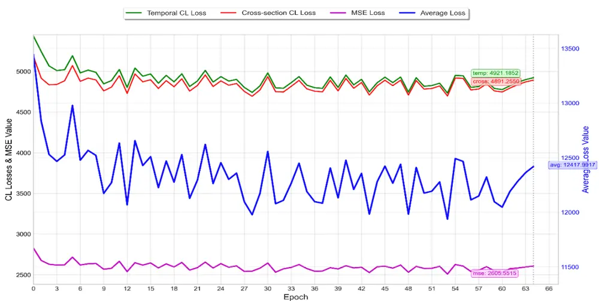
数据来源：东方证券研究所 & Wind资讯

图31：DFQ-FactorGCL模型训练集、验证集、测试集IC变化
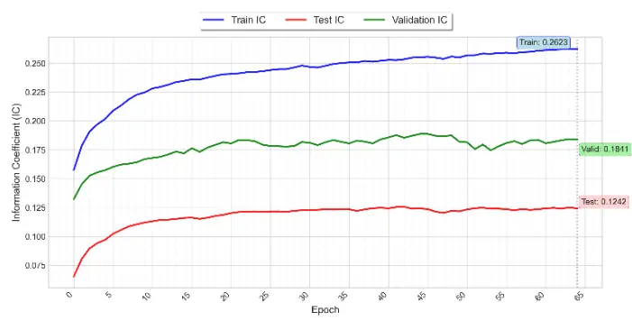
数据来源：东方证券研究所 & Wind资讯

图 32 ：DFQ-FactorGCL模型训练集、验证集、测试集 rankIC变化
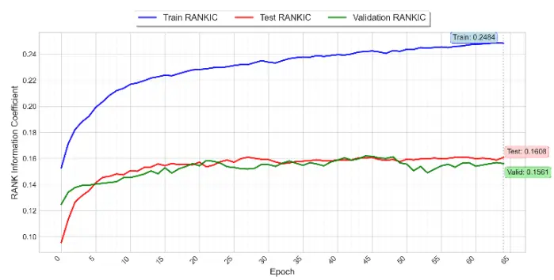
数据来源：东方证券研究所 & Wind资讯
有关分析师的申明，见本报告最后部分。其他重要信息披露见分析师申明之后部分，或请与您的投资代表联系。并请阅读本证券研究报告最后一页的免责申明。

## 6.2 因子绩效分析

本节展示 DFQ-FactorGCL 模型得到的因子得分（FactorGCL），在中证全指、沪深 300、中证 500、中证 1000四个股票池中的表现。

测试区间为 2020.1.1-2025.05.31。绩效指标计算细节如下：（1）IC 和 RANKIC 采用因子得分和20日收益率标签计算得到，日度平均，ICIR和RANKICIR未年化。（2）多头指标计算时，沪深 300、中证 500 股票池中分组数为 5，中证 1000 股票池中分组数为 10，中证全指股票池中分组数为 20。（3）多头组合月频调仓，绩效依次展示：日度超额年化收益率、日超额收益夏普比、日度超额收益最大回撤、月度胜率、月均单边换手。此处的多头计算不考虑交易成本，但汇报了月均单边换手率，费后收益可以根据费前收益和换手率近似估算。

## 6.2.1 中证全指股票池

在中证全指股票池中，DFQ-FactorGCL模型整体表现较好，分组单调性较好。

1. 测试集上 IC 达到 12.46%，ICIR 为 1.05，RANKIC 达到 16.14%，RANKICIR 达到 1.22。

2. 20分组多头超额年化收益达到 32.65%，多头日超额收益夏普比 3.59，多头日度超额收益最大回撤 7.75%，多头月度胜率 85%，月均单边换手 75%。

3. 2025 年前 5 个月 IC 达到 14.72%，ICIR 为 1，RANKIC 达到 20.32%，RANKICIR 达到1.3，均为 2020年以来最高。20分组多头超额收益 16.13%，最大回撤 1.48%。

图 33：中证全指股票池 FactorGCL 因子绩效表现（2020.1.1-2025.5.31）

| 中证全指股票池 2020.01.01-2025.5.31 | IC | IC_IR | rankIC | rankIC_IR | 多头月度胜率 | 多头日超额收益夏普比 | 多头日超额年化收益 | 多头日超额收益最大回撤 | 多头月均单边换手率 |
| --- | --- | --- | --- | --- | --- | --- | --- | --- | --- |
| factorgcl | 12.46% | 1.05 | 16.14% | 1.22 | 84.62% | 3.59 | 32.65% | -7.75% | 75.28% |
| 2020 | 10.99% | 0.87 | 14.36% | 0.99 | 66.67% | 2.98 | 21.14% | -2.59% | 75.55% |
| 2021 | 12.78% | 1.20 | 17.16% | 1.36 | 83.33% | 3.04 | 30.85% | -5.99% | 75.76% |
| 2022 | 14.50% | 1.63 | 17.61% | 2.09 | 91.67% | 3.73 | 31.37% | -3.13% | 73.06% |
| 2023 | 11.83% | 0.92 | 17.01% | 1.34 | 83.33% | 3.78 | 21.40% | -3.25% | 74.27% |
| 2024 | 11.59% | 0.95 | 13.34% | 0.89 | 91.67% | 4.04 | 47.82% | -5.83% | 77.74% |
| 2025.1.1-2.25.5.31 | 14.72% | 1.00 | 20.32% | 1.30 | 100.00% | 0.36 | 16.13% | -1.48% | 75.30% |

数据来源：东方证券研究所 & Wind资讯

图 34：中证全指股票池 FactorGCL 因子的 IC 时序变化（2020.1.1-2025.5.31）
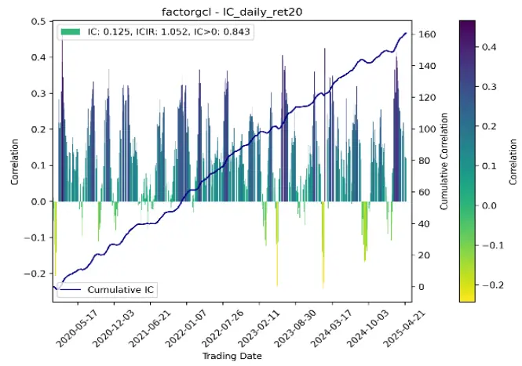
数据来源：东方证券研究所 & Wind资讯

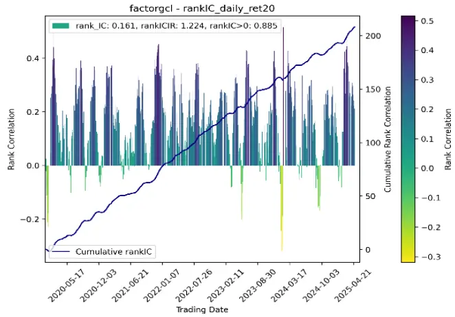

有关分析师的申明，见本报告最后部分。其他重要信息披露见分析师申明之后部分，或请与您的投资代表联系。并请阅读本证券研究报告最后一页的免责申明。

图 35：中证全指股票池 FactorGCL 因子分组超额收益净值 & 分组年化超额收益（2020.1.1-2025.5.31）
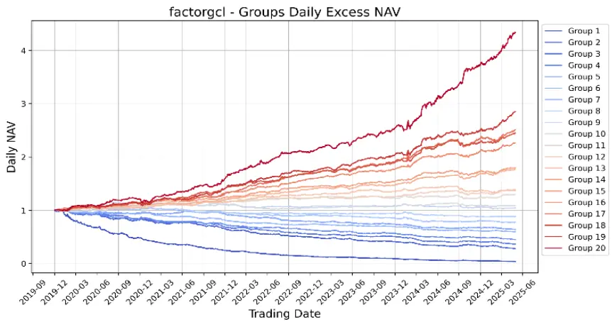
数据来源：东方证券研究所 & Wind资讯

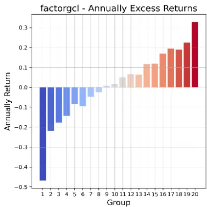

## 6.2.2 沪深 300 股票池

在沪深 300 股票池中，DFQ-FactorGCL 模型整体表现较好，分组单调性较好。

1. 测试集上 IC 为 8.71%，ICIR 达到 0.49，RANKIC 达到 10.61%，RANKICIR 达到 0.57。

2. 5 分组多头超额年化收益达到 12.37%，多头日超额收益夏普比 1.41，多头日度超额收益最大回撤 10.07%，多头月度胜率 68%，月均单边换手 50%。

3. 2025 年前 5 个月 IC 达到 11.62%，ICIR 为 0.5，RANKIC 达到 12.53%，RANKICIR 达到0.55，均为 2020年以来最高。5分组多头超额收益 5.07%，最大回撤 4.48%。

图 36：沪深 300 股票池 FactorGCL 因子绩效表现（2020.1.1-2025.5.31）

| 沪深300股票池2020.01.01-2025.5.31 | IC | IC_IR | rankIC | rankIC_IR | 多头月度胜率 多头日超额收益夏普比 多头日超额年化收益 |  |  | 多头日超额收益最大回撤 多头月均单边换手率 |  |
| --- | --- | --- | --- | --- | --- | --- | --- | --- | --- |
| factorgcl2020 | 8.71% | 0.49 | 10.61% | 0.57 | 67.69% | 1.41 | 12.37% | -10.08% | 50.59% |
|  | 7.97% | 0.48 | 9.32% 0.52 |  | 66.67% | 1.04 | 7.81% | -7.00% | 56.53% |
| 2021 | 10.08% | 0.59 | 12.21% | 0.64 | 66.67% | 1.92 | 16.42% | -4.52% | 47.22% |
| 2022 | 7.43% | 0.46 | 8.76% | 0.51 | 66.67% | 1.93 | 14.02% | -4.93% | 51.53% |
| 2023 | 9.54% | 0.59 | 12.00% | 0.75 | 58.33% | 1.15 | 8.22% | -5.24% | 52.22% |
| 20242025.1.1-2.25.5.31 | 7.49% | 0.38 | 10.08% | 0.48 | 75.00% | 1.15 | 12.64% | -10.08% | 46.53% |
|  | 11.62% | 0.50 | 12.53% | 0.55 | 80.00% | 0.10 5.07% |  | -4.48% | 48.00% |

数据来源：东方证券研究所 & Wind资讯

图 37：沪深 300 股票池 FactorGCL 因子的 IC 时序变化（2020.1.1-2025.5.31）
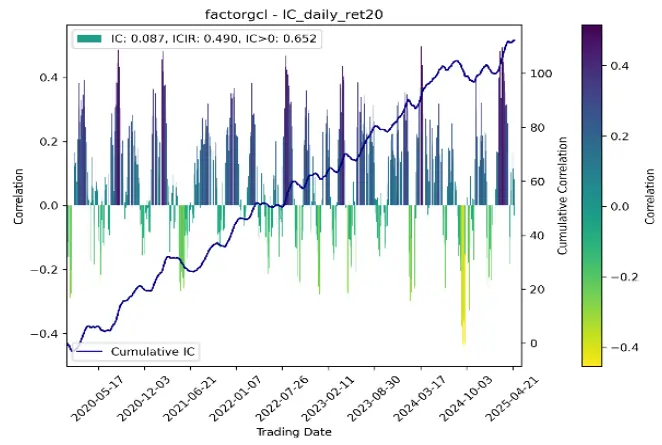
数据来源：东方证券研究所 & Wind资讯

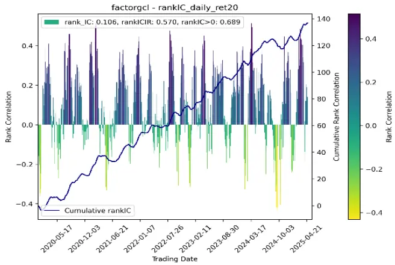
有关分析师的申明，见本报告最后部分。其他重要信息披露见分析师申明之后部分，或请与您的投资代表联系。并请阅读本证券研究报告最后一页的免责申明。

图 38：沪深 300 股票池 FactorGCL 因子分组超额收益净值 & 分组年化超额收益（2020.1.1-2025.5.31）
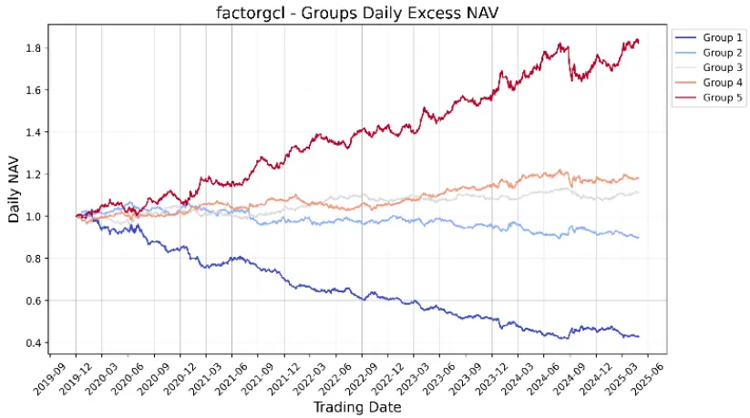
数据来源：东方证券研究所 & Wind资讯

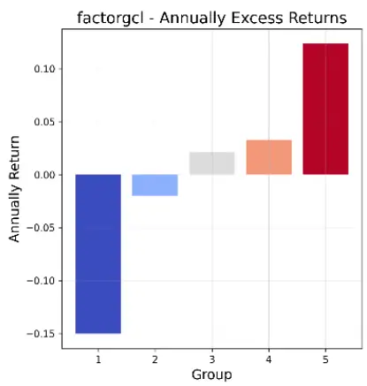

## 6.2.3 中证 500 股票池

在中证 500股票池中，DFQ-FactorGCL模型整体表现较好，分组单调性较好。

1. 测试集上 IC达到 7.86%，ICIR达到0.50，RANKIC达到 10.74%，RANKICIR达到 0.69。

2. 5 分组多头超额年化收益达到 12.53%，多头日超额收益夏普比 1.71，多头日度超额收益最大回撤 7.75%，多头月度胜率 66%，月均单边换手 56.62%。

3. 2025 年前 5 个月 IC 达到 6.03%，ICIR 为 0.28，RANKIC 达到 6.22%，RANKICIR 达到0.32。5分组多头超额收益 3.97%，最大回撤 2.72%。

图 39：中证 500 股票池 FactorGCL 因子绩效表现（2020.1.1-2025.5.31）
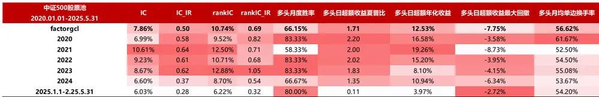
数据来源：东方证券研究所 & Wind资讯

图 40：中证 500 股票池 FactorGCL 因子的 IC 时序变化（2020.1.1-2025.5.31）
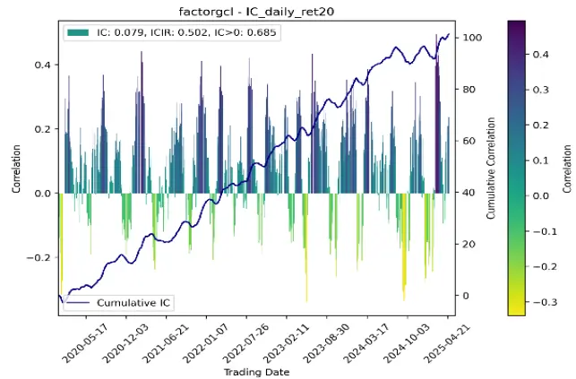
数据来源：东方证券研究所 & Wind资讯

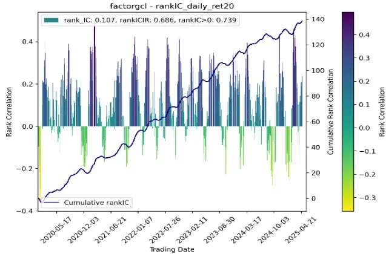
有关分析师的申明，见本报告最后部分。其他重要信息披露见分析师申明之后部分，或请与您的投资代表联系。并请阅读本证券研究报告最后一页的免责申明。

图 41：中证 500 股票池 FactorGCL 因子分组超额收益净值 & 分组年化超额收益（2020.1.1-2025.5.31）
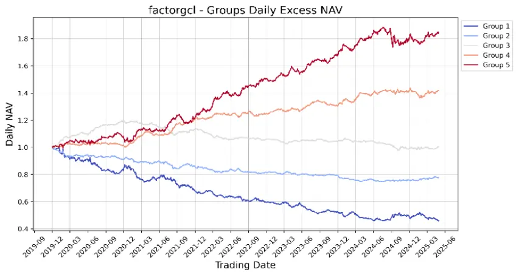
数据来源：东方证券研究所 & Wind资讯

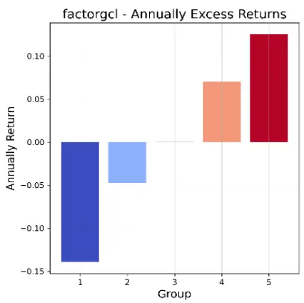

## 6.2.4 中证 1000 股票池

在中证 1000股票池中，DFQ-FactorGCL模型整体表现较好，分组单调性较好。

1. 测试集上 IC 达到 11.32%，ICIR 达到 0.84，RANKIC 达到 13.77%，RANKICIR 达到 0.98。

2. 10分组多头超额年化收益达到20.61%，多头日超额收益夏普比2.59，多头日度超额收益最大回撤 7.34%，多头月度胜率 80%，月均单边换手 70%。

3. 2025 年前 5 个月 IC 达到 13.89%，ICIR 为 0.69，RANKIC 达到 16%，RANKICIR 达到0.77。10 分组多头超额收益 10.69%，最大回撤 2.91%。

图 42：中证 1000 股票池 FactorGCL 因子绩效表现（2020.1.1-2025.5.31）

| 中证1000股票池 2020.01.01-2025.5.31 | IC | IC_IR | rankIC | rankIC_IR | 多头月度胜率 | 多头日超额收益夏普比 | 多头日超额年化收益 | 多头日超额收益最大回撤 | 多头月均单边换手率 |
| --- | --- | --- | --- | --- | --- | --- | --- | --- | --- |
| factorgcl | 11.32% | 0.84 | 13.77% | 0.98 | 80.00% | 2.60 | 20.61% | -7.34% | 70.09% |
| 2020 | 11.63% | 0.95 | 14.33% | 1.06 | 75.00% | 2.03 | 15.93% | -3.65% | 72.92% |
| 2021 | 11.94% | 1.11 | 15.34% | 1.27 | 83.33% | 3.59 | 31.41% | -3.03% | 69.25% |
| 2022 | 13.10% | 1.19 | 14.80% | 1.30 | 83.33% | 2.96 | 20.11% | -2.06% | 69.75% |
| 2023 | 10.86% | 0.75 | 14.23% | 1.02 | 66.67% | 1.32 | 6.74% | -4.01% | 69.67% |
| 2024 | 8.29% | 0.56 | 9.47% | 0.63 | 83.33% | 2.47 | 22.44% | -7.34% | 68.92% |
| 2025.1.1-2.25.5.31 | 13.89% | 0.69 | 16.00% | 0.77 | 100.00% | 0.24 | 10.69% | -2.91% | 70.00% |

数据来源：东方证券研究所 & Wind资讯

图 43：中证 1000 股票池 FactorGCL 因子的 IC 时序变化（2020.1.1-2025.5.31）
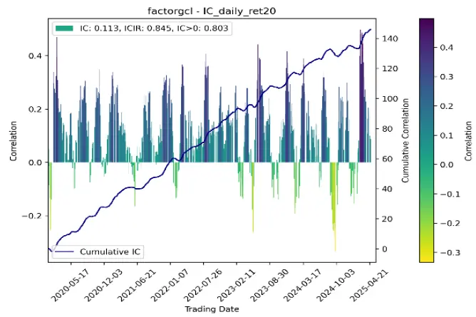
数据来源：东方证券研究所 & Wind资讯

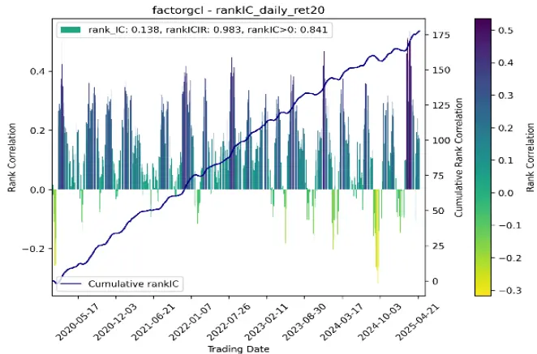
有关分析师的申明，见本报告最后部分。其他重要信息披露见分析师申明之后部分，或请与您的投资代表联系。并请阅读本证券研究报告最后一页的免责申明。

图 44：中证 1000 股票池 FactorGCL 因子分组超额收益净值 & 分组年化超额收益（2020.1.1-2025.5.31）
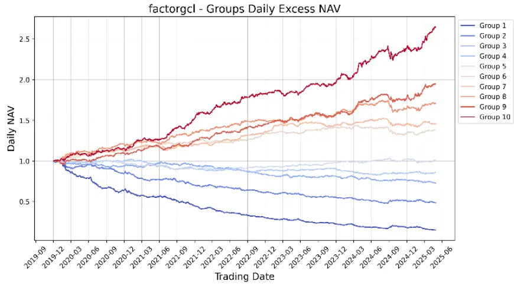
数据来源：东方证券研究所 & Wind资讯

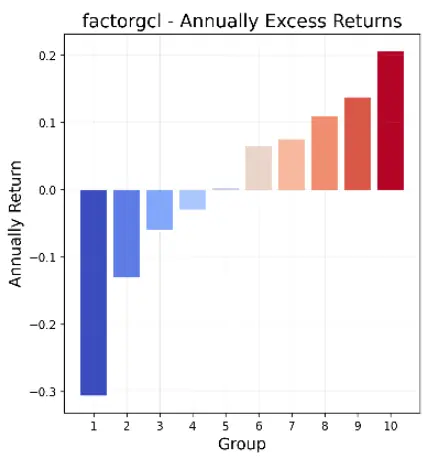

## 6.3 模型相关性

DFQ-FactorGCL 因子与 HIST 因子的相关性最高，因子值相关系数为 87.91%，多头超额收益序列相关系数为 83.75%；另外和 FactorVAE、FactorVAE-new、Diversify 等模型的相关性也比较高，因子值相关系数在 80%以上，多头超额收益序列相关系数在 75%以上。

图 45：中证全指股票池各模型的因子值相关系数（2020.1.1-2025.3.24）

| gp rl985 histgp 69.90% |  |  |  |  | rl985trahist |  | vae xgb vaenew diversify factorgcl |  |  |  |  |  |  |
| --- | --- | --- | --- | --- | --- | --- | --- | --- | --- | --- | --- | --- | --- |
|  |  |  |  |  | 100.00% | 69.90% | 64.78% | 68.16% | 55.95% | 54.20% | 57.45% | 52.26% | 59.21% |
| r\|985 | 69.90% | 100.00% | 68.23% | 81.15% | 67.72% | 68.09% | 69.24% | 61.67% | 71.51% |  |  |  |  |
| tra | 64.78% | 68.23% | 100.00% | 74.84% | 61.12% | 63.72% | 62.99% | 60.45% | 69.08% |  |  |  |  |
| hist | 68.16% | 81.15% | 74.84% | 100.00% | 83.01% | 77.82% | 82.25% | 78.86% | 87.92% |  |  |  |  |
| vaexgbvaenewdiversifyfactorgcl | 55.95% | 67.72% | 61.12% | 83.01% | 100.00% | 74.03% | 88.42% | 87.72% | 86.99% |  |  |  |  |
|  | 54.20% | 68.09% | 63.72% | 77.82% | 74.03% | 100.00% | 71.97% | 71.90% | 75.08% |  |  |  |  |
|  | 57.45% | 69.24% | 62.99% | 82.25% | 88.42% | 71.97% | 100.00% | 85.95% | 87.65% |  |  |  |  |
|  | 52.26% | 61.67% | 60.45% | 78.86% | 87.72% | 71.90% | 85.95% | 100.00% | 84.76% |  |  |  |  |
|  | 59.21% | 71.51% | 69.08% | 87.92% | 86.99% | 75.08% | 87.65% | 84.76% | 100.00% |  |  |  |  |

数据来源：东方证券研究所 & Wind资讯

图 46：中证全指股票池各模型的多头超额收益相关系数（2020.1.1-2025.3.24）

|  | gp | rl985 | tra | hist vae |  | xgb | vaenew | diversify | factorgcl |
| --- | --- | --- | --- | --- | --- | --- | --- | --- | --- |
| gp | 100.00% | 23.40% | 53.41% | 51.11% | 52.21% | 25.76% | 43.72% | 53.41% | 47.44% |
| r1985tra | 23.40% | 100.00% | 55.95% | 62.59% | 27.44% | 45.36% | 53.25% | 29.72% | 58.12% |
|  | 53.41% | 55.95% | 100.00% | 79.61% | 58.89% | 38.01% | 61.66% | 60.56% | 75.14% |
| hist | 51.11% | 62.59% | 79.61% | 100.00% | 74.12% | 54.83% | 74.75% | 76.27% | 83.75% |
| vae | 52.21% | 27.44% | 58.89% | 74.12% | 100.00% | 42.08% | 77.31% | 89.49% | 78.16% |
| xgb | 25.76% | 45.36% | 38.01% | 54.83% | 42.08% | 100.00% | 51.68% | 47.60% | 40.91% |
| vaenew | 43.72% | 53.25% | 61.66% | 74.75% | 77.31% | 51.68% | 100.00% | 79.53% | 80.91% |
| diversifyfactorgcl | 53.41% | 29.72% | 60.56% | 76.27% | 89.49% | 47.60% | 79.53% | 100.00% | 76.21% |
|  | 47.44% | 58.12% | 75.14% | 83.75% | 78.16% | 40.91% | 80.91% | 76.21% | 100.00% |

数据来源：东方证券研究所 & Wind资讯

## 七、指数增强组合结果

## 7.1 指数增强组合构建说明

（1）回测期：2020.01.01-2025.6.30，组合月频调仓，假设根据每月末个股得分在次日以vwap 价格进行交易。

（2）组合约束：风险因子库（参见《东方 A 股因子风险模型（DFQ-2020）》）中所有的风格因子相对暴露不超过 50%，所有行业因子相对暴露不超过 2%。沪深 300 增强跟踪误差约束不超过 4%，中证 500 和 1000增强跟踪误差约束不超过 5%。个股权重设置上限约束，绝对权重上限设置为 1.5倍基准权重+2%。限制指数成分股权重占比不低于 80%。

（3）考虑交易成本：假设买卖手续费双边千三，停牌涨停不能买入、停牌跌停不能卖出。

## 7.2 沪深300 指数增强组合

DFQ-FactorGCL 模型得到的因子得分在沪深 300 指增组合中表现十分突出：

（1）整体表现：2020 年以来年化信息比达到 2.20，年化对冲收益 12.14%，年化跟踪误差5.28%，超额收益最大回撤 6.79%，单边年换手 7.35倍。

（2）分年表现：2020-2023每年取得 10%以上的正超额，2024年超额收益为 5.72%，2025年前 6个月超额收益为 3.78%。

DFQ-FactorGCL 模型下的沪深 300 指增组合：（1）相对基准沪深 300 指数，在市值、信息确定性、成长、BETA、流动性、波动率、维度具有明显的负向暴露。（2）20-25 年的指增超额收益中有 66%来自特质收益，风格因子贡献 27%，行业因子贡献 8%。

图 47：DFQ-FactorGCL 模型沪深 300 股票池指数增强组合绩效表现（2020.1.1-2025.6.30）

| 20200101-20250630 300月频 |  | factorgcl |
| --- | --- | --- |
| 行业暴露0.02 风格暴露0.5 跟踪误差4% 买卖手续费双边千三 |  | 沪深300全市场增强 80%成分内约束 |
| 绩效指标 | 信息比（年化） | 2.20 |
|  | 年化对冲收益 | 12.14% |
|  | 跟踪误差（年化） | 5.28% |
|  | 对冲收益最大回撤 |  |
|  | 对冲收益最大回撤出现时间点 | -6.79% |
|  | 对冲收益最大回撤恢复天数 | 20210113 93 |
|  | 单边换手率（年） | 7.35 |
|  | 持股数量 | 67.85 |
| 成分内股票占比 月胜率 | 80.35% |  |
| 分年收益 | 2020 | 73.85% 14.67% |
|  | 2021 | 12.50% |
|  | 2022 | 16.48% |
|  | 2023 | 11.36% |
|  | 2024 | 5.72% |
| 分月收益 | 2025 202501 | 3.78% |
|  | 202502 | 0.50% |
|  | 202503 | 0.06% |
|  |  | -0.12% |
|  | 202504 | 0.94% |
|  | 202505 | 2.10% |
|  | 202506 | 0.24% |

数据来源：东方证券研究所 & Wind资讯

有关分析师的申明，见本报告最后部分。其他重要信息披露见分析师申明之后部分，或请与您的投资代表联系。并请阅读本证券研究报告最后一页的免责申明。

图 48：DFQ-FactorGCL 模型沪深 300 股票池指数增强组合超额净值与回撤（2020.1.1-2025.6.30）
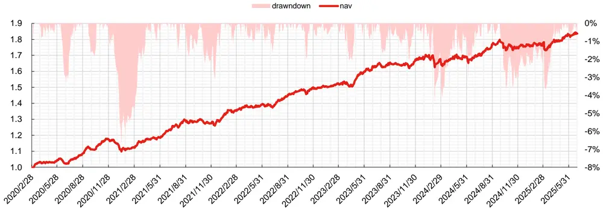
数据来源：东方证券研究所 & Wind资讯

图 49：DFQ-FactorGCL 模型沪深 300 股票池指数增强组合相对基准的平均风格暴露（2020.1.1-2025.6.30）
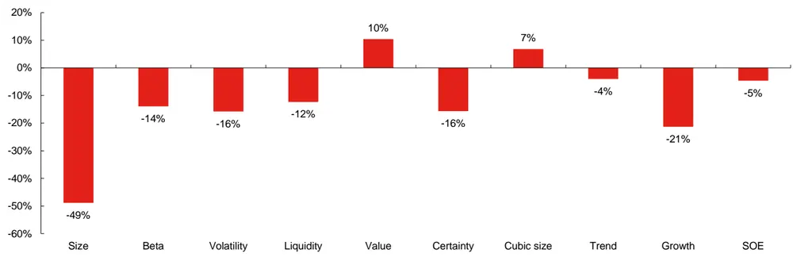
数据来源：东方证券研究所 & Wind资讯

图 50：DFQ-FactorGCL 模型沪深 300 股票池指数增强组合超额收益归因情况（2020.1.1-2025.6.30）
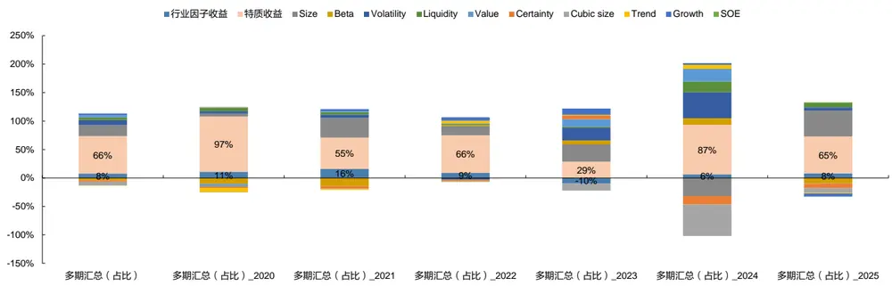
数据来源：东方证券研究所 & Wind资讯

有关分析师的申明，见本报告最后部分。其他重要信息披露见分析师申明之后部分，或请与您的投资代表联系。并请阅读本证券研究报告最后一页的免责申明。

## 7.3 中证 500 指数增强组合

DFQ-FactorGCL 模型得到的因子得分在中证 500 指增组合中表现十分突出：

（1）整体表现：2020 年以来年化信息比达到 1.86，年化对冲收益 11.68%，年化跟踪误差6.04%，超额收益最大回撤 8.01%，单边年换手 9.05倍。

（2）分年表现：2020-2023 每年取得近 10%以上的正超额，2024 年超额收益为 5.70%，2025年前 6个月超额收益为 5.07%。

DFQ-FactorGCL 模型下的中证 500 指增组合：（1）相对基准中证 500 指数，在市值、波动率、信息确定性、成长、TREND、流动性维度具有明显的负向暴露。（2）20-25 年的指增超额收益中有 44%来自特质收益，风格因子贡献 52%，行业因子贡献 4%。

图 51：DFQ-FactorGCL 模型中证 500 股票池指数增强组合绩效表现（2020.1.1-2025.6.30）

| 20200101-20250630 500月频 |  | factorgcl |
| --- | --- | --- |
| 行业暴露0.02 风格暴露0.5 跟踪误差4% 买卖手续费双边千三 |  | 中证500全市场增强 80%成分内约束 |
| 绩效指标 | 信息比（年化） | 1.86 |
|  | 年化对冲收益 | 11.68% |
|  | 跟踪误差（年化） | 6.04% |
|  | 对冲收益最大回撤 | -8.01% |
|  | 对冲收益最大回撤出现时间点 | 20240207 |
|  | 对冲收益最大回撤恢复天数 | 271 |
|  | 单边换手率（年） | 9.05 |
|  | 持股数量 | 86.89 |
|  | 成分内股票占比 | 80.08% |
|  | 月胜率 | 76.92% |
|  | 2020 | 10.76% |
|  | 2021 | 21.03% |
|  | 2022 | 8.03% |
|  | 2023 | 11.68% |
|  | 2024 | 5.70% |
| 分月收益 | 2025 202501 | 5.07% |
|  | 202502 | -0.91% |
|  | 202503 | 0.35% 0.82% |
|  | 202504 |  |
|  | 202505 | 0.07% |
|  | 202506 | 3.58% |

数据来源：东方证券研究所 & Wind资讯

图 52：DFQ-FactorGCL 模型中证 500 股票池指数增强组合超额净值与回撤（2020.1.1-2025.6.30）
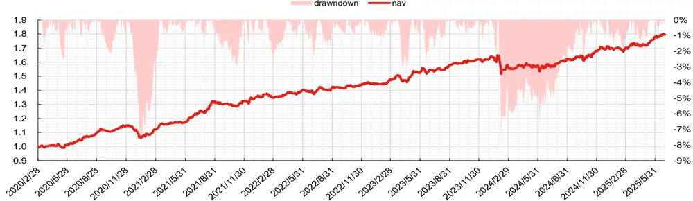
数据来源：东方证券研究所 & Wind资讯
有关分析师的申明，见本报告最后部分。其他重要信息披露见分析师申明之后部分，或请与您的投资代表联系。并请阅读本证券研究报告最后一页的免责申明。

图 53：DFQ-FactorGCL 模型中证 500 股票池指数增强组合相对基准的平均风格暴露（2020.1.1-2025.6.30）
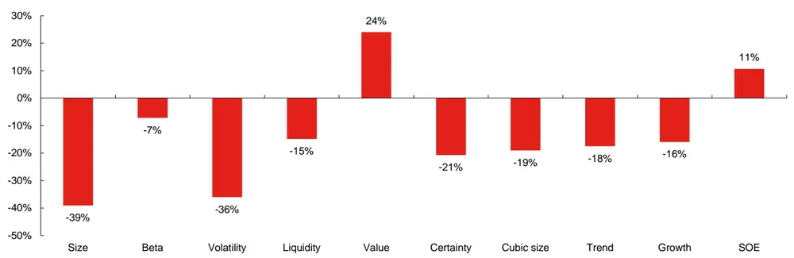
数据来源：东方证券研究所 & Wind资讯

图 54：DFQ-FactorGCL 模型中证 500 股票池指数增强组合超额收益归因情况（2020.1.1-2025.6.30）
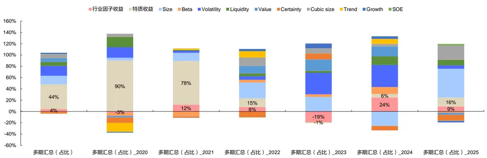
数据来源：东方证券研究所 & Wind资讯

## 7.4 中证 1000 指数增强组合

DFQ-FactorGCL模型得到的因子得分在中证 1000指增组合中表现十分突出：

（1）整体表现：2020 年以来年化信息比达到 2.34，年化对冲收益 16.39%，年化跟踪误差6.62%，超额收益最大回撤 7.31%，单边年换手 9.75倍。

（2）分年表现：2020-2023每年取得 10%以上的正超额，2024年超额收益为 1.48%，2025年前 6个月超额收益为 3.22%。

DFQ-FactorGCL 模型下的中证 1000 指增组合：（1）相对基准中证 1000 指数，在市值、波动率、TREND、流动性、成长、信息确定性维度具有明显的负向暴露。（2）20-25 年的指增超额收益中有 67%来自特质收益，风格因子贡献 31%，行业因子贡献 2%。

图 55：DFQ-FactorGCL 模型中证 1000 股票池指数增强组合绩效表现（2020.1.1-2025.6.30）

| 20200101-20250630 1000月频 |  | factorgcl |
| --- | --- | --- |
| 行业暴露0.02 风格暴露0.5 跟踪误差4% 买卖手续费双边千三 |  | 中证1000全市场增强 80%成分内约束 |
|  | 信息比（年化） | 2.34 |
|  | 年化对冲收益 | 16.49% |
|  | 跟踪误差（年化） |  |
|  |  | 6.62% |
|  | 对冲收益最大回撤 | -7.31% |
|  | 对冲收益最大回撤出现时间点 对冲收益最大回撤恢复天数 | 20240207 |
|  | 单边换手率（年） | 231 9.75 |
|  | 持股数量 | 111.97 |
|  | 成分内股票占比 | 80.05% |
|  | 月胜率 | 73.85% |
|  | 2020 |  |
|  | 2021 | 16.94% 30.27% |
|  | 2022 |  |
|  | 2023 | 20.59% 16.74% |
|  | 2024 | 1.48% |
|  | 2025 | 3.22% |
|  | 202501 | -0.29% |
|  | 202502 | -0.29% |
|  | 202503 | 0.36% |
|  | 202504 | 1.95% |
|  | 202505 | 2.06% |
|  | 202506 | -0.60% |

数据来源：东方证券研究所 & Wind资讯

图 56：DFQ-FactorGCL 模型中证 1000 股票池指数增强组合超额净值与回撤（2020.1.1-2025.6.30）
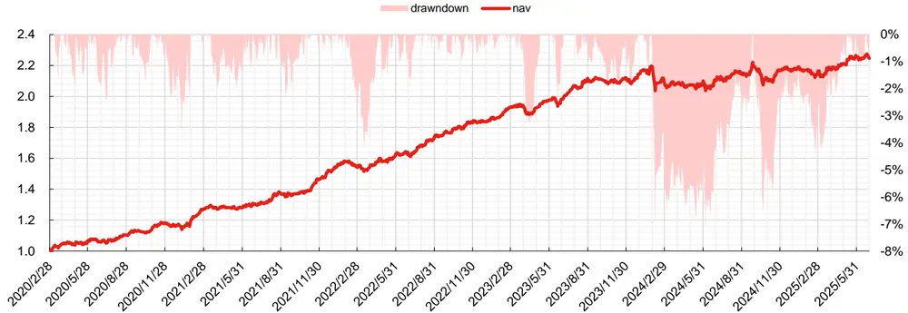
数据来源：东方证券研究所 & Wind资讯

图 57：DFQ-FactorGCL 模型中证 1000 股票池指数增强组合相对基准的平均风格暴露（2020.1.1-2025.6.30）
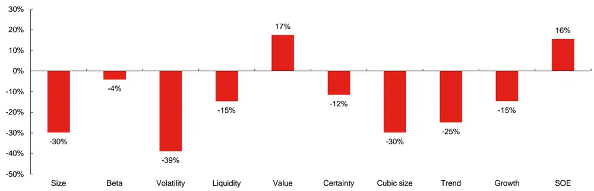
数据来源：东方证券研究所 & Wind资讯

图 58：DFQ-FactorGCL 模型中证 1000 股票池指数增强组合超额收益归因情况（2020.1.1-2025.6.30）
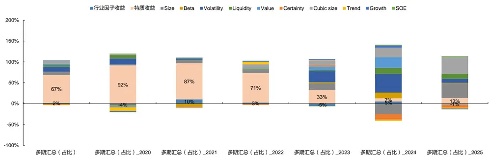
数据来源：东方证券研究所 & Wind资讯

## 风险提示

1. 量化模型基于历史数据分析，未来存在失效风险，建议投资者紧密跟踪模型表现。

2. 极端市场环境可能对模型效果造成剧烈冲击，导致收益亏损。

## 参考文献

1. Duan Y, Wang W, Li J. FactorGCL: A Hypergraph-Based Factor Model with Temporal Residual Contrastive Learning for Stock Returns Prediction[C]//Proceedings of the AAAI Conference on Artificial Intelligence. 2025, 39(1): 173-181.

2. Feng Y, You H, Zhang Z, et al. Hypergraph neural networks[C]//Proceedings of the AAAI conference on artificial intelligence. 2019, 33(01): 3558-3565.

## Tabl e_Disclai mer 分析师申明

每位负责撰写本研究报告全部或部分内容的研究分析师在此作以下声明：

分析师在本报告中对所提及的证券或发行人发表的任何建议和观点均准确地反映了其个人对该证券或发行人的看法和判断；分析师薪酬的任何组成部分无论是在过去、现在及将来，均与其在本研究报告中所表述的具体建议或观点无任何直接或间接的关系。

## 投资评级和相关定义

报告发布日后的12个月内行业或公司的涨跌幅相对同期相关证券市场代表性指数的涨跌幅为基准（A 股市场基准为沪深 300 指数，香港市场基准为恒生指数，美国市场基准为标普 500 指数）；

## 公司投资评级的量化标准

买入：相对强于市场基准指数收益率 15%以上；

增持：相对强于市场基准指数收益率 5%～15%；

中性：相对于市场基准指数收益率在-5%～+5%之间波动；

减持：相对弱于市场基准指数收益率在-5%以下。

未评级 —— 由于在报告发出之时该股票不在本公司研究覆盖范围内，分析师基于当时对该股票的研究状况，未给予投资评级相关信息。

暂停评级 —— 根据监管制度及本公司相关规定，研究报告发布之时该投资对象可能与本公司存在潜在的利益冲突情形；亦或是研究报告发布当时该股票的价值和价格分析存在重大不确定性，缺乏足够的研究依据支持分析师给出明确投资评级；分析师在上述情况下暂停对该股票给予投资评级等信息，投资者需要注意在此报告发布之前曾给予该股票的投资评级、盈利预测及目标价格等信息不再有效。

## 行业投资评级的量化标准：

看好：相对强于市场基准指数收益率 5%以上；

中性：相对于市场基准指数收益率在-5%～+5%之间波动；

看淡：相对于市场基准指数收益率在-5%以下。

未评级：由于在报告发出之时该行业不在本公司研究覆盖范围内，分析师基于当时对该行业的研究状况，未给予投资评级等相关信息。

暂停评级：由于研究报告发布当时该行业的投资价值分析存在重大不确定性，缺乏足够的研究依据支持分析师给出明确行业投资评级；分析师在上述情况下暂停对该行业给予投资评级信息，投资者需要注意在此报告发布之前曾给予该行业的投资评级信息不再有效。

## HeadertTabl e_Discl ai mer 免责声明

本证券研究报告（以下简称“本报告”）由东方证券股份有限公司（以下简称“本公司”）制作及发布。

。本公司不会因接收人收到本报告而视其为本公司的当然客户。本报告的全体接收人应当采取必要措施防止本报告被转发给他人。

本报告是基于本公司认为可靠的且目前已公开的信息撰写，本公司力求但不保证该信息的准确性和完整性，客户也不应该认为该信息是准确和完整的。同时，本公司不保证文中观点或陈述不会发生任何变更，在不同时期，本公司可发出与本报告所载资料、意见及推测不一致的证券研究报告。本公司会适时更新我们的研究，但可能会因某些规定而无法做到。除了一些定期出版的证券研究报告之外，绝大多数证券研究报告是在分析师认为适当的时候不定期地发布。

在任何情况下，本报告中的信息或所表述的意见并不构成对任何人的投资建议，也没有考虑到个别客户特殊的投资目标、财务状况或需求。客户应考虑本报告中的任何意见或建议是否符合其特定状况，若有必要应寻求专家意见。本报告所载的资料、工具、意见及推测只提供给客户作参考之用，并非作为或被视为出售或购买证券或其他投资标的的邀请或向人作出邀请。

本报告中提及的投资价格和价值以及这些投资带来的收入可能会波动。过去的表现并不代表未来的表现，未来的回报也无法保证，投资者可能会损失本金。外汇汇率波动有可能对某些投资的价值或价格或来自这一投资的收入产生不良影响。那些涉及期货、期权及其它衍生工具的交易，因其包括重大的市场风险，因此并不适合所有投资者。

在任何情况下，本公司不对任何人因使用本报告中的任何内容所引致的任何损失负任何责任，投资者自主作出投资决策并自行承担投资风险，任何形式的分享证券投资收益或者分担证券投资损失的书面或口头承诺均为无效。

本报告主要以电子版形式分发，间或也会辅以印刷品形式分发，所有报告版权均归本公司所有。未经本公司事先书面协议授权，任何机构或个人不得以任何形式复制、转发或公开传播本报告的全部或部分内容。不得将报告内容作为诉讼、仲裁、传媒所引用之证明或依据，不得用于营利或用于未经允许的其它用途。

经本公司事先书面协议授权刊载或转发的，被授权机构承担相关刊载或者转发责任。不得对本报告进行任何有悖原意的引用、删节和修改。

提示客户及公众投资者慎重使用未经授权刊载或者转发的本公司证券研究报告，慎重使用公众媒体刊载的证券研究报告。

## 东方证券研究所

地址： 上海市中山南路 318 号东方国际金融广场 26 楼

电话：021-63325888

传真：021-63326786

网址： www.dfzq.com.cn