# DFQ - TimesNet：捕捉量价特征周期规律，提升股票收益预测效果

因子选股系列之一一八

## 研究结论

## 研究背景与问题：传统模型难以适配 A 股多周期量价特征，预测稳定性不足

⚫ A 股量价时序存在显著多周期结构，传统模型难以有效利用周期信息：LSTM/GRU长期记忆不足、TCN 难以捕捉周期规律、Transformer 易受噪声干扰、HIST 模型忽视个股时序周期，均无法满足稳定预测需求。

## 模型设计与创新：二维时序建模 + 双周期结构，显著提升周期规律捕捉能力

DFQ-TimesNet 基于 TimesNet 二维时序建模框架，将一维量价序列转为二维结构以解耦周期内波动与跨周期关联，显著提升周期特征捕捉能力：采用 5 日+60 日双周期设定，放弃不稳定的 FFT 自动周期识别；使用 TokenEmbedding、两层Inception 卷积、直接平均周期融合与残差连接，构建高效稳定的时序特征提取模块。

## 数据与训练配置：数据处理与训练机制成熟，模型稳定性与一致性达标

模型以中证全指为样本，采用 2014-2025 年分段数据并设置隔离间隙避免信息泄露；解释变量按日截面 Z-score+clip 处理，预测标签选用未来 20 日收益率标准化结果，以基础量价特征为输入效果最优；训练早停收敛、无过拟合，随机种子影响可控，输出一致性高。

## 因子绩效表现：多股票池表现优异，风格暴露清晰可控

模型在多股票池均表现优异，分组单调性良好：中证全指 IC 达 12.50%，多头超额年化 30.05%；小盘股场景适配性显著优于大盘股，中证 1000 因子表现最为突出；风格暴露清晰可控，呈现小市值、高 Beta、低波动、低确定性、反转特征，价值与流动性保持中性。

## 指数增强效果：组合收益稳健，特质收益主导超额收益

模型应用于指数增强组合收益稳健、风险可控，超额收益由特质收益主导：沪深300 增强特质收益占比 52%，中证 500 占比 64%，中证 1000 占比 66%；其中中证 1000 增强表现最优，年化对冲收益 15.80%，信息比 1.90，同类排名领先。

## 总结：模型周期感知能力突出，实战与泛化价值显著

- DFQ-TimesNet 通过二维多周期建模有效挖掘 A 股量价周期规律，因子绩效稳定、风格无极端偏离、组合收益突出、泛化能力强，可为量化选股与指数增强策略提供可靠支撑。

## 风险提示

1. 量化模型基于历史数据分析，未来存在失效风险，建议投资者紧密跟踪模型表现。

2. 极端市场环境可能对模型效果造成剧烈冲击，导致收益亏损。

## 报告发布日期

2026 年 04 月 16 日

刘静涵

执业证书编号：S0860520080003

香港证监会牌照：BSX840

liujinghan@orientsec.com.cn

021-63326320

DFQ-diversify：解决分布外泛化问题的自 2025-05-07监督领域识别与对抗解耦模型：——因子

选股系列之一一五

DFQ-FactorVAE-pro：加入特征选择与环 2025-02-19境变量模块的 FactorVAE 模型：——因子选股系列之一一一

DFQ 机器学习行业轮动模型：——量化策 2024-11-19略系列之八

DFQ-XGB：基于树模型的 alpha 预测方 2024-08-15案：——因子选股系列之一〇七

DFQ-FactorVAE：融合变分自编码器和概 2024-05-14
率动态因子模型的 alpha 预测方案：——
因子选股系列之一〇三

## 引言

在 A 股市场中，个股收益率同时受到量价、资金、交易行为等多维度特征的共同影响，而这些特征的时序变化中蕴含着可挖掘的周期性规律。股票相关特征的波动兼具短期扰动、中期节律与长期趋势，多频率驱动因素相互交织，使得传统时序模型难以同时捕捉多层次规律，单一视角建模往往顾此失彼，难以形成稳定有效的预测信号。

现有深度学习方法在时序预测中存在明显局限：LSTM 类模型依赖逐期递推，对长期趋势与周期规律的刻画能力不足；Transformer 类模型虽可覆盖全局依赖，但在多周期混杂的特征序列中易受噪声干扰，难以定位有效模式；时序卷积网络仅能提取局部邻近关系，无法刻画跨周期的稳定关联。上述方法均停留在一维序列视角，难以分离并利用不同周期下的波动特征。

TimesNet 的核心突破在于将一维时序转化为结构化二维表达，通过识别股票特征序列中的核心周期结构，将连续时序信息建模为可同时刻画短期波动与跨期趋势的二维结构，从而更清晰地提取不同周期的有效信息。

本文基于 Haixu Wu 等人于 ICLR 2023 提出的 TimesNet 基础框架，结合 A 股市场特征与量化投资实践，构建 DFQ‑TimesNet 模型，从多维度量价特征中挖掘周期规律，提升收益率预测的准确性与稳定性，为量化选股提供可靠的模型支撑。

## 1、 研究背景：A 股量价多周期特征显著，传统时序模型存在固有局限

## 1.1 A 股量价时序特征存在多周期结构

现实世界时间序列并非随机波动，而是普遍由多重周期叠加驱动，这是 TimesNet（ICLR2023）提出的核心观测与建模动机。无论是气象、电力、交通数据，还是金融市场的量价时序，均同时包含短期扰动、中期节律与长期趋势，不同周期信号相互交织，共同决定序列变化模式。TimesNet 原论文中通过 FFT 频域分析验证：时序信号在频域中存在显著振幅峰值，对应数据中蕴含的多重周期，证明多周期结构真实存在、可被建模与利用。

图 1：时序数据具备显著多周期结构，可通过周期折叠实现一维向二维结构化变换
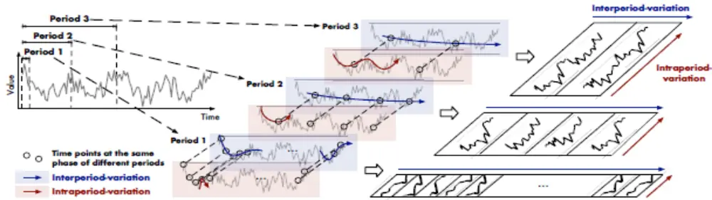
Figure 1: Multi-periodicity and temporal 2D-variation of time series. Each period involves the intraperiod-variation and interperiod-variation. We transform the original 1D time series into a set of 2D tensors based on multiple periods, which can unify the intraperiod- and interperiod-variations.
数据来源：东方证券研究所 & TimesNet (ICLR 2023)

对应到 A 股市场，个股收益率、成交量、成交额、换手率等多维度量价时序特征，同样呈现清晰的多周期属性。从市场机制来看，股票特征波动天然包含三层可解释周期，且每个周期均具备两个核心维度：一是周期内存在连贯波动规律，二是不同周期的相同位置存在相似规律，二者共同构成多周期的核心特征。

有关分析师的申明，见本报告最后部分。其他重要信息披露见分析师申明之后部分，或请与您的投资代表联系。并请阅读本证券研究报告最后一页的免责申明。

短周期（5 日）：对应 A 股完整交易周，核心受日内交易行为、隔日市场冲击、周内资金调仓三类因素驱动。周期内呈现“周一布局→周中波动→周五避险”的规律，不同交易周的相同位置（如每周一、每周五）也呈现相似波动模式，是捕捉 A股短期量价波动的核心周期。

中周期（20日）：对应 A股月度交易节律，对应行业轮动、月度资金调仓、财报预告相关预期博弈三类核心事件。周期内会完成一轮行业热点切换及机构月度调仓的连贯过程；不同月份相近时段（每月中下旬，对应有披露义务或自愿披露业绩预告/快报的上市公司集中披露时段），存在相似预期博弈模式，可捕捉月度级结构性变化与预期波动。

长周期（60日）：对应 A股季度交易节律，由季度财报、宏观数据发布、中长期行情三类因素主导——周期内呈现季度基本面变化、趋势切换的连贯规律，不同季度的相同位置（如季度末财报披露期）也存在相似趋势波动模式，可捕捉行业与市场的中长期基本面变化及趋势规律。

不同周期相互叠加、相互影响，共同构成了 A 股量价时序的核心波动特征，且各周期的驱动因素、波动规律存在显著差异，难以通过人工或传统简单方法精准分离与捕捉。因此，亟需借助专业的时序建模模型，有效识别、解耦各周期信号，充分挖掘不同周期的量价规律，为个股收益率预测提供可靠支撑。

## 1.2 传统时序模型无法有效利用多周期信息

现有主流时序模型均在一维原始序列上提取特征，面对多周期混杂的 A 股量价数据时，存在难以克服的固有缺陷。就像三首歌同时播放，传统时序模型往往听不出层次，只能听到一团噪音。

## （1）LSTM / GRU 类循环模型：记不住长期，也对不齐周期。

这类模型依靠逐时间步串行递推提取时序依赖，理论上具备记忆长期信息的能力，但在实际应用中存在明显短板：随着序列长度增加，长期依赖会快速衰减，难以有效学习跨周期、长距离的规律；其结构只能按时间顺序建模，无法将不同周期中同一时间位置进行对齐与对比，因此难以捕捉周度、月度、季度等可解释周期信号，预测效果易受短期噪音主导，稳定性不足。通俗来讲，LSTM 类似顺着读文章，但不回头对比。遇到 20 日月度周期，它读到第 25 天就已经忘了第5 天的模式；遇到每周五资金调仓这种规律，它无法把每周五放在一起对比。

## （2）TCN 时序卷积网络：只看 “邻居”，看不到 “周期”。

TCN 依靠一维卷积核滑动提取局部特征，虽然计算效率更高，但受限于局部感受野，只能捕捉邻近时间点之间的关系，对周期性模式不敏感，更无法刻画跨周期的长期关联。在多周期叠加的量价序列中，TCN 倾向于学习短期局部模式，难以识别中期与长期周期结构，导致模型在趋势切换或周期拐点附近失效明显。通俗来讲，TCN 类似只看前后几天的局部走势。它能识别 “近 3天上涨” 这种短期模式；但意识不到 “每 20 天出现一次拐点” 这种周期规律；更无法理解“同一周内的周一与周五” 存在关联。

## （3）Transformer 类注意力模型：注意力太 “散”，容易被噪音带偏。

Transformer 借助全局注意力机制实现全序列依赖建模，但在多周期时序场景中存在显著局限：其一，全局注意力计算复杂度高，长序列场景下效率偏低；其二，在周期混杂、噪音较多的股价序列中，注意力机制易被随机波动干扰，难以定位稳定、可重复的周期模式，容易出现过拟合；其三，注意力直接建模时间点之间的相似度，无法清晰区分周期内波动与跨周期趋势，导致周期信息难以被有效利用。通俗来讲，Transformer 就像在嘈杂人群里想抓节奏，结果注意力全被杂音吸走。

（4）HIST 等截面深度模型：只看股票之间，不看股票自身周期。

以 HIST 为代表的截面模型更关注股票间的横截面相关性，重点挖掘个股间的相对强弱与行业板块交互，对单只股票自身时序内的多周期结构挖掘不足。这类模型几乎不考虑时序周期规律，难以利用日内、周度、月度等周期性信号，在周期驱动明显的 A 股市场中存在明显信息缺失。

## 1.3 TimesNet：面向多周期的时序建模方案

针对 A 股量价数据的多周期特性，以及前文传统时序模型无法有效分离、利用多周期信息的核心痛点，Haixu Wu等人于 ICLR 2023提出的 TimesNet提供了针对性的解决方案。其核心价值在于跳出传统一维建模局限，通过二维结构化建模，实现多周期信号的清晰分离与高效利用。

TimesNet 的核心思想是：摒弃传统一维序列拟合的思路，将一维时序数据转化为二维结构化数据。具体而言，首先通过周期识别明确数据中的核心周期，再将一维时序序列重塑为二维张量，清晰分离两类核心时序变化——周期内变化（intraperiod，对应单个周期内短期波动规律）与跨周期关联（interperiod，对应跨周期长期趋势）。而后采用多尺度卷积思路，通过不同大小的卷积核分别捕捉不同周期的特征规律，既能够挖掘短期细微波动，也能捕捉长期趋势。最后通过信号融合机制，平衡不同周期的权重，最终形成更稳定的预测信号。

该模型的通用时序建模思路，适配 A 股量价数据多周期、高频波动的特性，为本文 DFQTimesNet 模型的构建提供了核心框架支撑。

## 2、 DFQ-TimesNet 模型原理：二维建模解耦多周期，捕捉量价周期规律

## 2.1 模型架构：多周期时序建模，捕捉量价内生规律

DFQ‑TimesNet 以 TimesNet 二维时序建模思想为基础，针对 A 股量价特征的多周期叠加特性，构建 “特征嵌入→ 周期发现 → 序列重塑→多尺度特征提取 → 多周期信息融合 → 预测输出”的预测框架，核心是解决传统一维模型难以捕捉量价周期规律的痛点，提升收益率预测的稳定性与准确性。

模型的核心设计思路是：先对原始量价特征进行嵌入处理，统一特征表示空间；再将原本难以直接建模的一维混合周期序列，通过周期识别与结构变换，转为规则化的二维张量：列方向刻画周期内的短期波动规律，行方向刻画跨周期的长期关联；再借助二维卷积的局部感知能力，同时捕捉周期内变化与跨周期关联。而后通过多周期信息融合提纯特征，最终经投影输出得到预测结果。整个流程遵循“1D 时序 → 特征嵌入 → 2D 结构化 → 2D 卷积提取 → 多周期融合 → 1D预测输出”的路径，能够自然处理多周期混杂、噪声干扰强、趋势与节律共存的 A 股量价数据。

下图展示了 DFQ‑TimesNet 的整体架构，模型主要分为三层：

Step1：输入特征嵌入模块（Embedding Layer）：把原始输入序列映射到统一的表示空间，便于后续建模。

Step2：时序特征提取模块（TimesBlock Layer）：首先根据序列的主要周期，把一维序列按周期折叠成二维结构，行表示跨周期的对齐点，列表示周期内的变化。而后在二维结构上用多尺度卷积提取特征，聚合不同周期的结果，并与输入残差相加。

Step3：预测输出模块（Projection Layer）： 取最终编码后的序列表示，通过线性投影层，输出预测结果。

图 2： DFQ-TimesNet模型框架——捕捉量价数据周期规律的时序预测模型
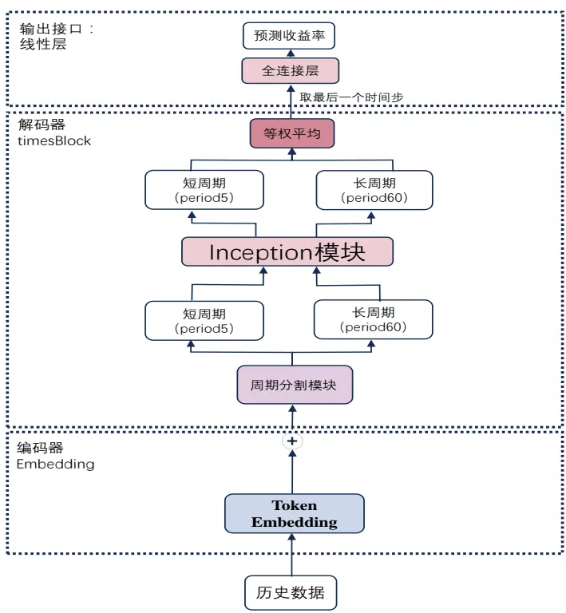
数据来源：东方证券研究所

## 2.1.1 输入特征嵌入模块：统一特征表示，提升模型建模效率

通过输入嵌入层，把原始输入序列[batch, seq_len，C_in]映射到统一的高维特征表示空间[B, T, d_model]，便于后续跨变量信息融合。其中：batch 指一个 batch 里的样本数量；seq_len指序列长度；C_in 指输入特征维度；d_model 指特征嵌入后的隐藏通道数。原始特征数量有限且分布差异大，不同变量的尺度和意义可能完全不同。进行特征嵌入可以统一数据表示，将不同维度、不同来源的数据统一处理，消除尺度差异；对特征进行升维，提升特征的表示能力，挖掘隐藏的量价关联；为后续的 TimesBlock模块提供了更具信息量、更易于建模的输入。

常见的 embedding 技术有以下三种：1）TokenEmbedding（数值嵌入）：采用核大小为 3的 1D 卷积沿时间轴滑动，对每个时间点的表示同时聚合其相邻的 3 个交易日信息。该操作等价于让模型学习一组“短窗口模式提取器”，能够自动捕捉诸如短期趋势、三日内波动扩张/收敛、价量配合等局部形态。相比简单线性升维，1D 卷积能显式引入短期依赖，有助于后续周期结构建模。2）PositionalEmbedding（位置嵌入）：使用经典正余弦位置编码，为每个时间点注入绝对位置信息。3）TemporalEmbedding（时间戳嵌入）：为月份、日期、星期等日历特征构建嵌入，并融合形成时间上下文表示。

我们对比了不同 embedding 方法的绩效，结果显示：只保留 TokenEmbedding，即不使用时间戳和位置编码，仅依赖数值本身，效果最好。原因可能在于：（1）后续 TimesBlock 已通过二维卷积显式建模周期结构，位置和/日历提示容易带来信息冗余甚至引入偏置；（2）金融日历效应不稳定，时间戳嵌入在 OOD 场景下更易成为噪声。

图 3： DFQ-TimesNet 模型不同 embedding 方法绩效对比——仅用 TokenEmbedding 效果最优

| 中证全指股票池 60特征 20日标签 timesnet 基础模型 | IC | IC_IR | rankiC | rankiC_IR | 多头月度胜率 | 多头日超额收益夏普比 | 多头日超额年化收益 | 多头日超额收益最大回撤 | 多头月均单边换手率 |
| --- | --- | --- | --- | --- | --- | --- | --- | --- | --- |
| timesNet仅temporalEmbedding | 11.41% | 1.10 | 14.04% | 1.28 | 74.24% | 2.66 | 23.05% | -6.91% | 72.62% |
| timesNet仅positionEmbedding | 12.08% | 1.22 | 14.51% | 1.32 | 83.33% | 2.96 | 25.32% | -6.46% | 73.10% |
| timesNet仅ValueEmbedding | 12.76% | 1.27 | 14.70% | 1.35 | 77.27% | 3.10 | 30.93% | -6.94% | 77.78% |
| timesNet全Embedding | 11.94% | 1.25 | 13.95% | 1.32 | 77.27% | 2.54 | 27.96% | -6.79% | 69.70% |

数据来源：东方证券研究所 & Wind资讯

## 2.1.2 时序特征提取模块：解耦量价周期规律，挖掘有效周期信息

TimesBlock 模块的核心作用是：识别量价数据中的各类周期，对原本混杂交织的多周期特征波动规律进行有效解耦，再通过卷积神经网络提取各周期的有效信息，从根源上解决传统模型无法区分多周期信号的痛点，捕捉量价数据中不同周期的核心规律，为后续个股收益率预测提供坚实的特征支撑。

图 4：TimesBlock层示意图——显式解耦多周期特征，捕捉周期规律
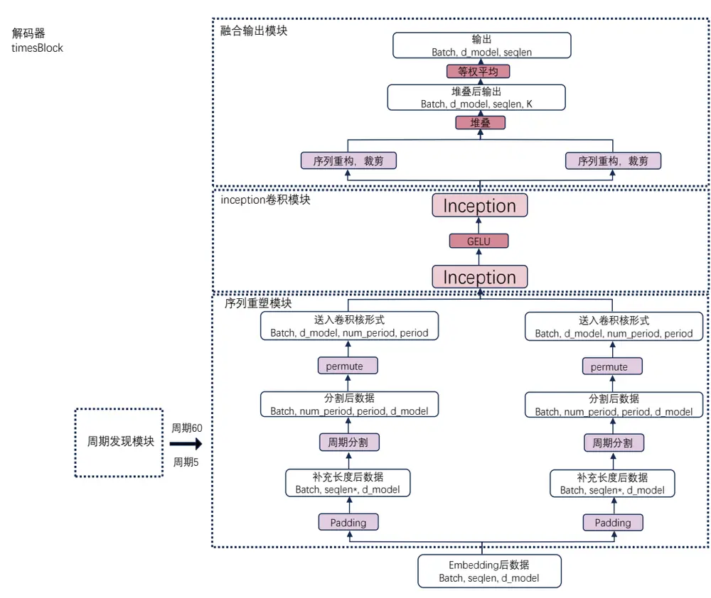
数据来源：东方证券研究所

TimesBlock 层具体流程如下：

Step1. 周期发现模块：对输入数据，确定其中的主要周期，核心是筛选出对 A 股收益率预测最有效的周期，提升模型绩效。

在只选取一个周期进行分析的设定下，我们比较了固定单周期 5，10，20，30，60 下模型训练的效果，其中固定周期 60 即不做时序分割。结果显示：固定周期分割中周期 5 与周期 60 模型效果最好。（1）周期 5 正好代表了每周的变化，即一个完整的股市交易周（周一至周五）。股票市场在不同交易日（例如，周一开盘或周五收盘）通常会表现出特定的模式，例如“周末效应”或周一的“高开”现象。周期 5 能够捕捉并建模这些独特的每周模式。通过将数据以 5 天为周期进行重塑，TimesNet可以学习到工作日和周末之间的差异，以及每个交易日内部的模式，这对于股票预测至关重要。（2）周期 60 通常代表了季度的变化，这在金融分析中是一个非常重要的时间跨度。许多公司会发布季度财报，宏观经济数据也常以季度为单位公布，这些事件都会对股价产生显著影响。周期 60 使得模型能够捕捉并建模这些与宏观经济和公司基本面相关的长期趋势。通过将数据以 60 天为周期进行重塑，模型可以学习到在不同季度间的长期波动、季节性效应以及与重要金融事件相关的模式，这对于进行中长期股票预测非常有帮助。

图 5：DFQ-TimesNet模型不同单周期绩效表现——周期 5与周期 60效果最优

| 中证全指股票池 60特征 20日标签 timesnet 基础模型 | IC | IC_IR | rankIC | rankIC_IR | 多头月度胜率 | 多头日超额收益夏普比 | 多头日超额年化收益 | 多头日超额收益最大回撤 | 多头月均单边换手率 |
| --- | --- | --- | --- | --- | --- | --- | --- | --- | --- |
| timesNet固定周期5划分 | 12.61% | 1.28 | 14.48% | 1.36 | 78.79% | 3.20 | 32.43% | -7.04% | 78.39% |
| timesNet固定周期10划分 | 11.83% | 1.23 | 13.70% | 1.31 | 77.27% | 2.68 | 26.10% | -9.12% | 76.20% |
| timesNet固定周期20划分 | 11.54% | 1.23 | 13.30% | 1.33 | 78.79% | 2.99 | 26.94% | -9.05% | 76.75% |
| timesNet固定周期30划分 | 12.18% | 1.25 | 14.06% | 1.35 | 75.76% | 2.85 | 27.30% | -8.58% | 77.27% |
| timesNet固定周期60划分 | 12.35% | 1.21 | 14.47% | 1.32 | 83.33% | 3.18 | 27.74% | -9.14% | 80.31% |

数据来源：东方证券研究所 & Wind资讯

接下来我们尝试双周期分析的方案，比较了人为确定周期和用快速傅里叶变换（FFT）方法识别周期两种方法。FFT 周期识别法对每个样本使用快速傅里叶变化，识别不同周期的平均振幅，然后选取振幅最大的前 topK 个周期作为该样本的主要周期。结果显示：（1）选择周期 5 和周期60一起训练，绩效优于单独一个周期。（2）FFT方法识别周期在 topk=2时效果不佳。

图 6： DFQ-TimesNet模型不同双周期下的绩效表现——周期 5+60双周期训练效果最优

| 中证全指股票池60特征20日标签 timesnet 基础模型 | IC | IC_IR | rankIC | rankIC_IR | 多头月度胜率 | 多头日超额收益夏普比 | 多头日超额年化收益 | 多头日超额收益最大回撤 | 多头月均单边换手率 |
| --- | --- | --- | --- | --- | --- | --- | --- | --- | --- |
| timesNet固定周期5/60划分一起训练 | 12.76% | 1.27 | 14.70% | 1.35 | 77.27% | 3.10 | 30.93% | -6.94% | 77.78% |
| timesNetFFT周期划分(topk=2) | 11.96% | 1.23 | 13.80% | 1.25 | 83.33% | 3.40 | 30.21% | -5.84% | 82.42% |

数据来源：东方证券研究所 & Wind资讯

通过分析 FFT 周期分割结果，我们发现其存在三大问题：（1）按振幅选择周期不稳定，排名第二的周期在不同时刻混杂了周期 30 与周期 20 的信号；（2）周期权重分布不均，大量权重被赋予最重要的周期，排名第二重要的周期信息未被有效利用；（3）并未成功识别出短周期的重要性，选择的 Top 周期集中分布于 60 天、30 天、20 天等长周期，与 A 股短期交易规律脱节。

综合来看，FFT 周期识别方法存在稳定性差、信息利用不充分、与 A 股实际交易规律适配度低的问题，无法为模型提供稳定、有效的周期输入。因此结合前文实证测试结果，我们放弃 FFT自动周期分割方法，直接采用人为确定的 5日+60 日双周期作为建模周期，既规避了 FFT方法的固有缺陷，又贴合 A股量价波动的天然规律，保障模型对多周期特征的有效捕捉与稳定建模。

图 7：FFT 方法下各周期在不同重要性下出现的次数——长周期占比高，短周期识别不足
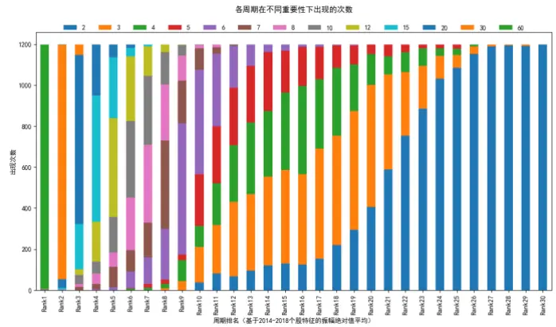
数据来源：东方证券研究所 & Wind资讯

图 8：FFT 方法下振幅前五的周期的平均振幅时序变化图—周期选择稳定性差
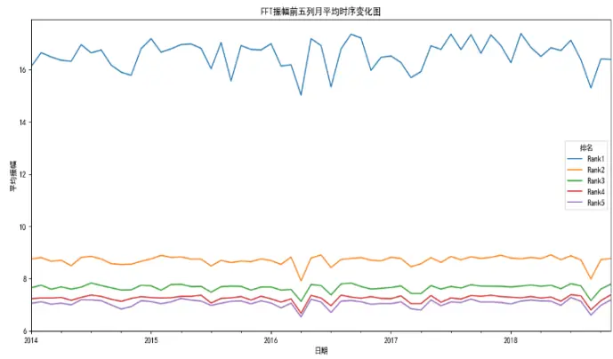
数据来源：东方证券研究所 & Wind资讯
有关分析师的申明，见本报告最后部分。其他重要信息披露见分析师申明之后部分，或请与您的投资代表联系。并请阅读本证券研究报告最后一页的免责申明。

Step2. 序列重塑模块：对每个选定的主要周期进行维度重塑，适配后续卷积操作，确保周期内、跨周期特征能够被有效提取。

对每个周期 period，将输入 [batch, seq_len, d_model] 在时间维度上进行填充，使总长度能够被当前周期整除。设填充后的长度为 pad_len（满足 pad_len % period = 0），张量变为[batch, pad_len, d_model]。将填充后的张量重塑为 [batch, num_period, period, d_model]，其中num_period = pad_len / period。此时 num_period 维度代表周期间变化，period 维度代表周期内变化。为了适应 2D 卷积的输入格式 [batch, channel, height, width]，张量维度被交换为 [batch,d_model, num_period, period]，将特征维度 d_model 作为通道数。

Step3. Inception 卷积模块：并行使用多个不同大小的 2D 卷积核进行特征提取，实现多尺度周期特征的全面捕捉，避免单一卷积核难以兼顾短、中、长期规律的问题。

Inception 模块的核心思想是：在同一套二维特征图上并行使用多个不同大小的 2D 卷积核，对每个周期得到的 [batch, d_model, num_period, period] 张量进行卷积，使得模型可以同时从不同尺度中捕捉周期内和周期间的复杂模式。较小的卷积核捕捉短时模式，较大的卷积核捕捉长期趋势，从不同的尺度上去理解数据。不同卷积核大小的输出取平均后得到综合特征输出。卷积操作后，张量的空间维度保持不变，仍为 [batch, d_model, num_period, period]，变化主要体现在通道维先扩维再回归，以增强非线性表达能力。卷积权重采用 Kaiming 初始化。

图 9：Inception卷积模块示意图——多尺度并行卷积，全面捕捉周期特征
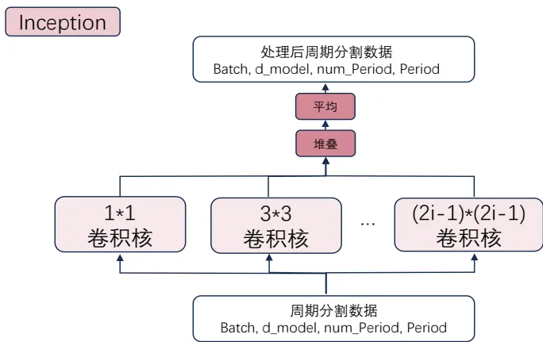
数据来源：东方证券研究所

在 TimesBlock 层中，Inception 卷积模块不是只做一层，而是采用两层串联结构：Conv →GELU → Conv，第一层将通道数由 d_model 提升至 d_ff，输出 [batch, d_ff, num_period,period]，中间接 GELU 做非线性激活，第二层再将通道映射回 d_model，输出 [batch, d_model,num_period, period]。目的是扩大卷积核的感受野，用尽量少的参数量捕捉更全面的周期信息。测试结果显示，两层 Inception 卷积模块串联的绩效明显优于一层，能够更充分地挖掘量价周期关联。

图 10：DFQ-TimesNet 模型 1层与 2 层 Inception 卷积模块绩效对比——两层串联效果更优

| 中证全指股票池60特征20日标签 | IC | IC_IR | rankIC | rankIC_IR | 多头月度胜率 | 多头日超额收益夏普比 | 多头日超额年化收益 | 多头日超额收益最大回撤 | 多头月均单边换手率 |
| --- | --- | --- | --- | --- | --- | --- | --- | --- | --- |
| timesnet 基础模型 timesNet—层inception | 11.49% | 1.21 | 13.62% | 1.32 | 81.82% | 2.95 | 24.64% | -8.02% | 81.38% |
| timesNet两层inception(GELU) | 12.76% | 1.27 | 14.70% | 1.35 | 77.27% | 3.10 | 30.93% | -6.94% | 77.78% |

数据来源：东方证券研究所 & Wind资讯

有关分析师的申明，见本报告最后部分。其他重要信息披露见分析师申明之后部分，或请与您的投资代表联系。并请阅读本证券研究报告最后一页的免责申明。

Step4. 融合输出模块：加权融合多周期特征，并使用残差连接，提升模型稳定性与预测精度，避免模型训练过程中出现梯度消失、过拟合等问题。

将 2D 卷积的输出 [batch, d_model, num_period, period] 置换回 [batch, num_period, period,d_model]，再展开中间维度把 num_period 和 period 合并回单一时间维，得到[batch, pad_len,d_model]，再裁剪掉填充的部分，使结果还原回 [batch, seq_len, d_model]。将不同周期的输出合并后得到 [batch, seq_len, d_model, K]（K 为周期个数），对不同周期数据直接平均得到最终输出 [batch, seq_len, d_model]。最后将多周期融合后的输出与输入相加，构建残差结构，保证模型训练的稳定性。残差相加后仍为 [B, T, d_model]。

其中，残差连接的核心价值是优化深层网络训练、理顺信息传递：一是打通顺畅的信息通路，避免仅靠卷积堆叠导致的梯度衰减、有效信号削弱问题，让输入特征“抄近路”直达输出端，降低梯度传递难度，助力模型稳定收敛；二是引导 TimesBlock 模块在输入基础上做修正，使卷积分支聚焦学习量价周期结构等残差信息，而非从零重构时序序列，更贴合时序预测特性；三是缓解深层网络梯度消失，通过输入与输出直连，让梯度直接反向传播，适配 Inception 模块两层串联的深层结构。

我们测试了三种不同的周期融合加权方法（直接平均、FFT 振幅平均、线性层学习权重），结果显示：直接平均的整体绩效最好，避免过度复杂的加权方式引入噪声。

图 11： DFQ-TimesNet模型不同周期融合方法绩效对比——直接平均融合效果最优

| 中证全指股票池 60特征20日标签 timesnet 基础模型 | IC | IC_IR | rankIC | rankiC_IR | 多头月度胜率 | 多头日超额收益夏普比 | 多头日超额年化收益 | 多头日超额收益最大回撤 | 多头月均单边换手率 |
| --- | --- | --- | --- | --- | --- | --- | --- | --- | --- |
| timesNet各周期直接平均 | 12.76% | 1.27 | 14.70% | 1.35 | 77.27% | 3.10 | 30.93% | -6.94% | 77.78% |
| timesNet各周期FFT振幅平均 | 12.19% | 1.21 | 14.44% | 1.31 | 81.82% | 3.45 | 30.96% | -5.87% | 80.49% |
| timesNet各周期线性层学习权重 | 12.15% | 1.33 | 13.54% | 1.34 | 74.24% | 2.52 | 25.74% | -9.97% | 79.31% |

数据来源：东方证券研究所 & Wind资讯

同时，我们对比了残差连接添加前后的绩效，结果显示：去除残差连接后，模型的 IC 和RANKIC 下降，多头端虽年化收益率提高，但最大回撤幅度变大，说明残差连接能有效提升模型稳定性，控制回撤风险。

图 12： DFQ-TimesNet模型残差连接添加前后绩效对比——添加残差连接提升模型稳定性

| 中证全指股票池60特征20日标签 timesnet 基础模型 | IC | IC_IR | rankIC | rankIC_IR | 多头月度胜率 | 多头日超额收益夏普比 | 多头日超额年化收益 | 多头日超额收益最大回撤 | 多头月均单边换手率 |
| --- | --- | --- | --- | --- | --- | --- | --- | --- | --- |
| timesNet(无残差连接) | 12.66% | 1.27 | 14.53% | 1.36 | 80.30% | 3.11 | 32.02% | -8.17% | 77.03% |
| timesNet(有残差连接) | 12.76% | 1.27 | 14.70% | 1.35 | 77.27% | 3.10 | 30.93% | -6.94% | 77.78% |

数据来源：东方证券研究所 & Wind资讯

## 2.1.3 预测输出模块：聚焦近期量价信息，提升收益率预测精度

当 TimesBlock 处理完输入数据 [batch, seq_len, d_model] 后，需要将其转换为最终的预测值，核心是筛选出对未来收益率影响最大的时序信息，提升预测准确性。

我们采用“直接取最后一步”的处理方式（Last Step Projection）：从 TimesBlock 的输出张量中，选取时间序列的最后一个时间步（即 [batch, seq_len, d_model] 的 seq_len 维度上的最后一个元素），得到 [batch, d_model]；再通过全连接层 nn.Linear(d_model, c_out) 投影到目标预测维度 c_out，得到最终预测值 [batch, c_out]。这种方法的核心假设是：时间序列的最新状态（近期量价）包含最重要的预测信息，最近的观测值对未来的预测影响最大，这一假设贴合 A 股量价短期波动特性，更关注短期变化和即时趋势。

我们测试了两种时序处理方法（直接取最后一步、时序维度平均池化）对绩效的影响，结果显示：取最后一步的做法，模型在 IC 和多头表现上均明显优于时序池化，证明近期量价信息对收益率预测的作用更显著。

图 13： DFQ-TimesNet模型输出层不同处理方法绩效对比——取最后一步预测效果更优

| 中证全指股票池 60特征 20日标签 timesnet 基础模型 | IC | IC_IR | rankIC | rankIC_IR | 多头月度胜率 | 多头日超额收益夏普比 | 多头日超额年化收益 | 多头日超额收益最大回撤 | 多头月均单边换手率 |
| --- | --- | --- | --- | --- | --- | --- | --- | --- | --- |
| timesNet时序pooling | 10.33% | 0.92 | 13.34% | 1.14 | 77.27% | 2.60 | 24.89% | -7.61% | 60.55% |
| timesNet取最后一步 | 12.76% | 1.27 | 14.70% | 1.35 | 77.27% | 3.10 | 30.93% | -6.94% | 77.78% |

数据来源：东方证券研究所 & Wind资讯

## 2.2 模型优势：强周期感知能力，全面捕捉量价波动特征

基于 TimesNet 二维建模框架构建的 DFQ-TimesNet 模型，结合 A 股量价多周期特性进行针对性优化，核心优势聚焦于“强周期感知”与“高效特征提取”，既继承了 TimesNet 的固有优势，又适配量化投资实践需求，具体优势如下：

1. 高效的二维建模能力，实现多周期信号解耦：这是 DFQ-TimesNet 的核心优势，继承自TimesNet 的核心创新：将一维量价时序序列通过周期划分，重塑为二维张量，借助二维卷积的特征提取能力，实现周期内变化与跨周期关联的清晰解耦。与传统一维模型（TCN、Transformer）将两种变异模式混合处理不同，DFQ-TimesNet 可精准分离 5 日短周期的细微量价波动与 60 日长周期的长期趋势，避免多周期信号混杂导致的预测偏差。

2. 规避 Transformer 计算瓶颈，适配长时序量价数据：相较于 Transformer 模型，DFQ-TimesNet 避免了自注意力机制带来的平方级计算复杂度。A 股量价数据属于长时序序列，Transformer 在处理此类数据时，计算与内存开销会急剧增加，限制其实际应用；而 DFQ-TimesNet 采用二维卷积进行特征提取，计算量更稳定，在处理长时序量价数据时，兼具效率与可扩展性，更适配量化投资中高频、长序列的建模需求。

3. 兼容多类卷积模块，灵活提取多尺度量价特征：TimesNet 的核心优势之一是提供了将各类图像处理网络模块（如 Inception、MLPmixer）用于时序预测的接口，DFQ-TimesNet 充分借鉴这一特性，在保留时序建模所需的嵌入层（Embedding）、预测头（Prediction Head）基础上，引入 Inception 多尺度卷积模块，通过不同大小的二维卷积核，并行捕捉不同尺度的量价特征，实现多尺度特征的全面覆盖，进一步提升特征提取的全面性与精准性。

图 14：TimesNet、TCN、Transformer 模型对比——TimesNet 二维建模更适配多周期时序预测场景

| 模块 | TimesNet | TCN | Transformer |
| --- | --- | --- | --- |
| 嵌入层(Embedding) | Token Embedding(1D卷积) | 无 | 位置编码：核心是位置编码，通过数学函数注入 位置信息，因其自注意力机制缺乏序列顺序。 |
| 周期发现 (Core Block) | 进行周期发现，将一维数据重塑为二维张量， 并使用。 | 无 | 无 |
| 解码器 (Decoder) | 多尺度2D卷积(Inception模块)进行特征提取 | TCN Block：核心是因果膨胀卷积，通过增 加膨胀率来扩大感受野，捕捉长距离依赖。 | 自注意力层：Decoder部分通常包含掩码多头自 注意力、多头自注意力和前馈网络，用于生成最 终预测。 |

数据来源：东方证券研究所

有关分析师的申明，见本报告最后部分。其他重要信息披露见分析师申明之后部分，或请与您的投资代表联系。并请阅读本证券研究报告最后一页的免责申明。

## 3、 DFQ-TimesNet 模型细节：实证优化定最优配置，保障模型实用与稳定

## 3.1 数据说明：最优数据处理与输入输出设定，奠定模型绩效基础

样本空间：中证全指同期成分股。确保样本覆盖 A股全市场，提升模型泛化能力。

数据区间：（1）训练集 2014.01.01—2018.11.30；（2）验证集 2019.01.01—2019.11.30；（3）测试集 2020.01.01—2025.6.30。数据集中额外的分割间隙是有意引入的，核心目的是避免特征和标签的泄露，保障模型训练与评估的客观性。其中，训练集用于迭代训练模型，通过反向传播算法计算损失函数关于模型参数的梯度，再按照梯度方向更新模型参数；验证集用于模型训练过程中的性能评估，便于筛选最优模型及参数；测试集用于观察模型样本外表现，在模型开发完成后评估其泛化性能，验证模型实际应用价值。

数据处理方法：（1）解释变量 X：按每日截面做 Z-score 标准化 + clip(-3,3)，用 0填充缺失值，训练集、验证集、测试集采用相同处理标准，确保数据一致性；（2）预测标签 Y：按每日截面做 Z-score 标准化，训练集、验证集采用相同处理标准，保障训练与验证的统一性。

针对解释变量 X 的多种处理方式，实证测试结果明确：（1）对 6 个基础特征（adjclose,adjopen, adjlow, adjhigh, adjvwap, amount）单独做时序去量纲化和面板标准化后，模型的多头能力显著下降；（2）对 X整体做面板标准化后，模型整体表现下降；（3）额外对 X在时间维度做 Z-score 标准化（基于每个样本自身在时间维度上的均值和标准差，对其每个特征分别进行zscore），模型表现同样下降。上述结果表明，量纲信息和分布特征对 TimesNet 架构至关重要，时间维度上的 Z-score标准化会破坏此类关键信息，因此确定前文所述的处理方法为最优方案。

图 15：DFQ-TimesNet 模型解释变量 X 不同处理方式下的模型效果对比——按每日截面 Z-score+clip 处理效果最优，时序/面板标准化会降低模型性能

| 中证全指股票池 60特征 20日标签 timesnet 基础模型 | IC | IC_IR | rankIC | rankIC_IR | 多头月度胜率 | 多头日超额收益夏普比 | 多头日超额年化收益 | 多头日超额收益最大回撤 | 多头月均单边换手率 |
| --- | --- | --- | --- | --- | --- | --- | --- | --- | --- |
| timesNet(cs_zscore) | 12.76% | 1.27 | 14.70% | 1.35 | 77.27% | 3.10 | 30.93% | -6.94% | 77.78% |
| timesNet(tsprocessf6+cs_zscore) | 11.71% | 1.18 | 14.37% | 1.34 | 71.21% | 1.80 | 18.24% | -7.31% | 79.80% |
| timesNet(panelzscore) | 12.25% | 1.26 | 13.54% | 1.27 | 71.21% | 2.38 | 23.53% | -9.06% | 78.83% |
| timesNet(cs_zscore+tsnormalize) | 9.66% | 1.09 | 11.84% | 1.18 | 80.30% | 2.85 | 24.49% | -9.41% | 91.30% |

数据来源：东方证券研究所 & Wind资讯

针对预测标签 Y 的多种处理方式，实证测试结果显示：（1）使用绝对收益的 Z-score 标准化，能够引入未来收益率分布的信息，可让模型获得更多的多头收益，为最优处理方式；（2）使用绝对收益的排名分位数，虽能提升 RankIC 值，但因丢失了分布信息，导致模型多头收益能力下降，不适用于本文模型。

图 16：DFQ-TimesNet模型解释变量 Y不同处理方式下的模型效果对比——绝对收益 Z-score标准化最优，排名分位数会削弱多头收益能力

| 中证全指股票池 60特征 20日标签 timesnet 基础模型 | IC | IC_IR | rankiC | rankIC_IR | 多头月度胜率 | 多头日超额收益夏普比 | 多头日超额年化收益 多头日超额收益最大回撤 多头月均单边换手率 |  |  |
| --- | --- | --- | --- | --- | --- | --- | --- | --- | --- |
| timesNet(label_cszscorenorm) | 12.76% | 1.27 | 14.70% | 1.35 | 77.27% | 3.10 | 30.93% | -6.94% | 77.78% |
| timesNet(label_csrank) | 11.97% | 1.08 | 15.62% | 1.25 | 80.30% | 3.18 | 27.72% | -7.49% | 76.98% |
| timesNet(label_csranknorm) | 11.69% | 1.08 | 15.18% | 1.27 | 77.27% | 2.71 | 23.81% | -10.23% | 79.91% |

数据来源：东方证券研究所 & Wind资讯

有关分析师的申明，见本报告最后部分。其他重要信息披露见分析师申明之后部分，或请与您的投资代表联系。并请阅读本证券研究报告最后一页的免责申明。

模型输入特征：选取量价特征作为核心输入，包括原始日线行情、基于分钟线提取的日频特征、基于 level2数据提取的日频特征等，共计 60个，全面覆盖 A股量价波动的核心信息。

我们对比了两类输入特征的模型效果：基础特征、alpha 因子。实证结果明确：（1）以基础特征作为输入时，模型效果最优，各项绩效指标表现突出；（2）以遗传规划和强化学习因子作为整体输入时，模型效果较差，各项指标弱于基础特征输入，因此确定基础特征为模型最优输入。

图 17：DFQ-TimesNet 模型不同输入特征下的模型效果对比——基础特征输入效果最优，遗传规划与强化学习因子输入效果较差

| 中证全指股票池 60特征20日标签 | IC | IC_IR | rankIC | rankIC_IR | 多头月度胜率 | 多头日超额收益夏普比 | 多头日超额年化收益 多头日超额收益最大回撤 |  | 多头月均单边换手率 |
| --- | --- | --- | --- | --- | --- | --- | --- | --- | --- |
| timesnet 基础模型 timesNet(f60) | 12.76% | 1.27 | 14.70% | 1.35 | 77.27% | 3.10 | 30.93% | -6.94% | 77.78% |
| timesNet(gprl) | 10.31% | 1.22 | 12.26% | 1.38 | 71.21% | 2.01 | 18.57% | -10.78% | 78.44% |

数据来源：东方证券研究所 & Wind资讯

模型预测标签：选取个股未来 20日收益率为预测标签，贴合月度调仓策略的实际需求。

标签频率对模型绩效影响显著，针对 20 个交易日调仓策略，我们测试了三种不同频率的标签：未来 5 日、10 日、20 日收益率。实证结果显示：（1）预测标签为未来 20 日收益率时，模型多头收益率、IC 及 RANKIC 表现较好，与调仓策略匹配度最高；（2）预测标签为未来 5 日、10 日收益率时，模型 ICIR 和 RANKICIR 表现较好，但与 20 日调仓策略适配度不足；（3）对基础因子采用多标签分别训练、再等权结合的方式，相较于单一标签，多头端与月均 IC无明显改善，因此确定单一未来 20日收益率为最优预测标签。

图 18：DFQ-TimesNet模型不同预测标签下的模型效果对比——未来 20日收益率标签最优，多标签结合无明显改善

| 中证全指股票池60特征 20日标签 timesnet 基础模型 | IC | IC_IR | rankIC | rankIC_IR | 多头月度胜率 | 多头日超额收益夏普比 | 多头日超额年化收益 | 多头日超额收益最大回撤 | 多头月均单边换手率 |
| --- | --- | --- | --- | --- | --- | --- | --- | --- | --- |
| timesNet(label5) | 11.94% | 1.51 | 12.89% | 1.51 | 75.76% | 2.58 | 27.48% | -8.02% | 87.28% |
| timesNet(label10) | 12.60% | 1.49 | 13.83% | 1.52 | 77.27% | 2.69 | 29.01% | -6.69% | 82.21% |
| timesNet(label20) | 12.76% | 1.27 | 14.70% | 1.35 | 77.27% | 3.10 | 30.93% | -6.94% | 77.78% |
| timesNet(标签等权重) | 12.83% | 1.45 | 14.23% | 1.49 | 77.27% | 2.70 | 29.02% | -7.52% | 81.76% |

数据来源：东方证券研究所 & Wind资讯

## 3.2 模型超参：最优超参设定，保障模型性能稳定

DFQ-TimesNet 模型涉及的主要超参设置如下图，所有超参均经过多轮实证调试确定，兼顾模型性能与训练效率，为模型稳定运行提供支撑。

图 19：DFQ-TimesNet模型主要超参列表——经实证调试优化，适配 A股量价建模需求

| 参数类型 | 参数符号 | 参数设置 | 参数解释 |
| --- | --- | --- | --- |
| 模型参数 | num_latent | 60 | 潜在特征数量 |
|  | hidden_size | 128 | 编码后隐藏层大小 |
|  | dropout | 0 | dropout率 |
|  | pred_len | 0 | 预测长度 |
|  | c_out | 1 | 输出维度 |
|  | e_layers | 1 | timesBlock层数 |
|  | hidden_size2 | 128 | inception中间通道数 |
|  | periods | [5,60] | 选取周期 |
|  | num_kernels | 3 | inception卷积核数 |
| 训练参数 | embed | 'fixed' | 时间编码方式 |
|  | n_epochs | 200 | 训练轮数 |
|  | Ir | 0.00009 | 学习率 |
|  | early_stop | 20 | 早停步数：若20步验证集IC无提高，则提前停止训练 |
|  | smooth_steps | 5 | 用于存储模型最近状态的双端队列params_list的最大长度 |
|  | labels | 20 | 标签数量 |
|  | per_epoch_batch | 100 | 每个epoch的批次数量 |
|  | batch_size | -1 | 批次大小(-1表示每日批次) |
| 数据参数 | seed | 1000 60 | 随机种子 序列长度 |

数据来源：东方证券研究所

有关分析师的申明，见本报告最后部分。其他重要信息披露见分析师申明之后部分，或请与您的投资代表联系。并请阅读本证券研究报告最后一页的免责申明。

## 3.3 随机种子影响：种子影响可控，模型稳定性达标

我们测试了 5 个不同随机种子下，DFQ-TimesNet 模型的绩效表现及相关性，验证模型对随机种子的敏感性，确保模型稳定性达标。测试结果显示，随机种子对模型多头端表现有一定影响，但整体处于可控范围：（1）不同种子下，月均 IC 在 12.30%-12.77%，表现较为稳定；月均RANKIC 在 13.74%-15.03%存在一定波动；多头收益率在 27.00%-30.93%波动；（2）不同随机种子下得到的模型因子值相关系数在 90%以上，多头超额收益相关性在 93%以上，表明模型输出一致性较高，随机种子对模型核心性能影响有限，模型稳定性满足量化投资应用需求。

图 20：DFQ-TimesNet模型不同随机种子下的模型效果对比——随机种子对绩效有小幅影响，但整体可控

| 中证全指股票池60特征20日标签 timesnet 基础模型 | IC | IC_IR | rankIC | rankIC_IR | 多头月度胜率 | 多头日超额收益夏普比 | 多头日超额年化收益 | 多头日超额收益最大回撤 | 多头月均单边换手率 |
| --- | --- | --- | --- | --- | --- | --- | --- | --- | --- |
| timesNet(seed1) | 12.30% | 1.26 | 14.25% | 1.35 | 81.82% | 2.85 | 27.00% | -7.24% | 79.93% |
| timesNet(seed10) | 12.77% | 1.19 | 15.03% | 1.25 | 77.27% | 2.57 | 30.11% | -11.99% | 73.32% |
| timesNet(seed100) | 12.49% | 1.24 | 14.50% | 1.32 | 72.73% | 2.52 | 27.15% | -10.12% | 77.30% |
| timesNet(seed1000) | 12.76% | 1.27 | 14.70% | 1.35 | 77.27% | 3.10 | 30.93% | -6.94% | 77.78% |
| timesNet(seed10000) | 12.57% | 1.40 | 13.74% | 1.35 | 72.73% | 2.56 | 29.83% | -9.32% | 75.30% |

数据来源：东方证券研究所 & Wind资讯

图 21：DFQ-TimesNet 模型不同随机种子下得到的因子值相关系数——因子值相关性超 90%，模型输出一致性高

| saodi |  | 0.91 | 0.93 | 0.93 | 0.91 |
| --- | --- | --- | --- | --- | --- |
| sadlo | 0.91 | 1 | 0.93 | 0.91 | 0.91 |
| 00P2020 | 0.93 | 0.93 |  | 0.92 | 0.92 |
| 0000 | 0.93 | 0.91 | 0.92 |  | 0.92 |
| 00000 | 0.91 | 0.91 | 0.97 | 0.97 | 1 |

数据来源：东方证券研究所 & Wind资讯

图 22：DFQ-TimesNet 模型不同随机种子得到的多头超额收益相关系数——超额收益相关性超 93%，模型稳定性达标

| seeas | 1 | 0.95 | 0.96 | 0.98 | 0.93 |
| --- | --- | --- | --- | --- | --- |
| 0 | 0.95 |  | 0.98 | 0.97 | 0.96 |
| aous | 0.96 | 0.98 | 1 | 0.97 | 0.96 |
| 000100 10 | 0.98 | 0.97 | 0.97 | 1 | 0.96 |
|  | 0.93 seed1 | 0.96 seec10 | 0.96 seed100 | 0.96 seed1000 | seedi0000 |

数据来源：东方证券研究所 & Wind资讯

## 4、 DFQ-TimesNet 模型结果：训练稳定且绩效优异，泛化能力与实用性突出

## 4.1 训练情况：早停收敛且无过拟合，训练效率与稳定性双达标

DFQ-timesNet 模型在第 109 个 epoch 达到早停，训练用时 2h 左右，训练效率较高；在中证全指成分股中训练的显存占用控制在 4G 左右，硬件适配性良好，满足常规量化建模部署需求。

我们监测了训练过程中，每个 epoch 的训练集的损失值变化和训练集/验证集/测试集的 IC、RANKIC 变化，核心结论如下：（1）损失值变化：前三个 epoch 损失值下降明显，第五个epoch 出现小幅升高，后续处于震荡缓慢下降状态，符合模型训练收敛规律；（2）IC 与分。其他重要信息披露见分析师申明之后部分，或请与您的投资代表联系。并请阅读本证券研究报告最后一页的免责申明。

RANKIC 变化：前二十个 epoch 的 IC 呈快速上升趋势，后续增速放缓；RANKIC 曲线与 IC 曲线保持一致趋势，但震荡幅度更明显；整体来看，每个 epoch 的训练集、验证集、测试集 IC 均呈上升趋势，模型未出现明显过拟合，训练稳定性达标。

图 23：DFQ-TimesNet模型训练集中损失值变化——训练收敛趋势合理，无异常波动
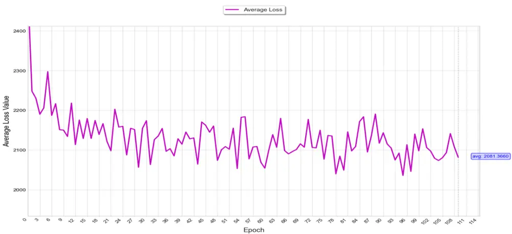
数据来源：东方证券研究所 & Wind资讯

图 24：DFQ-TimesNet 模型训练集、验证集、测试集 IC 变化——三集合 IC均呈上升趋势，模型训练稳定
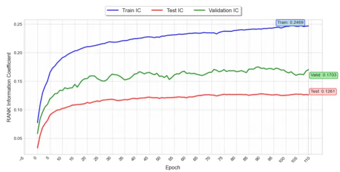
数据来源：东方证券研究所 & Wind资讯

图 25 ：DFQ-TimesNet 模型训练集、验证集、测试集 rankIC变化——RANKIC与 IC趋势一致，震荡幅度可控
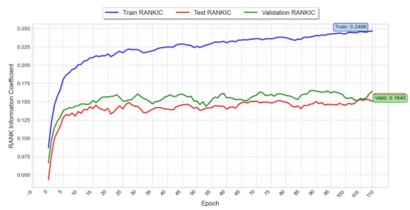
数据来源：东方证券研究所 & Wind资讯

## 4.2 因子绩效分析：多股票池表现优异，分组单调性良好

本节展示 DFQ-TimesNet 模型得到的因子得分（TimesNet），在中证全指、沪深 300、中证 500、中证 1000 四个股票池中的表现，验证模型在不同市场风格股票池中的泛化能力。测试区间为 2020.1.1-2025.08.29，绩效指标计算细节如下：（1）IC 和 RANKIC 采用因子得分和 20日收益率标签计算得到，日度平均，ICIR 和 RANKICIR 未年化；（2）多头指标计算时，沪深300、中证 500 股票池中分组数为 5，中证 1000 股票池中分组数为 10，中证全指股票池中分组数为 20；（3）多头组合月频调仓，绩效依次展示：日度超额年化收益率、日超额收益夏普比、日度超额收益最大回撤、月度胜率、月均单边换手；此处的多头计算不考虑交易成本，但汇报了月均单边换手率，费后收益可根据费前收益和换手率近似估算。

## 4.2.1 中证全指股票池：绩效最优且稳定性强，2025年表现优于历史均值

在中证全指股票池中，DFQ-TimesNet 模型整体表现优异，分组单调性良好，适配全市场选股场景，具体绩效如下：

1. 测试集整体表现：IC 达到 12.50%，ICIR 为 1.24，RANKIC 达到 14.51%，RANKICIR 达到 1.33，指标表现突出，说明因子预测能力较强且稳定；

2. 多头组合表现：20 分组多头超额年化收益达到 30.05%，多头日超额收益夏普比 3.07，多头日度超额收益最大回撤 7.09%，多头月度胜率 77.94%，月均单边换手 77.49%，超额收益显著且回撤可控；

3. 2025 年阶段性表现：2025 年前 8 个月 IC 达到 12.00%，ICIR 为 1.07，RANKIC 达到17.07%，RANKICIR 达到 1.43，IC 与 RANKIC 均显著高于 2020 年以来历史绩效；20 分组多头超额收益 28.28%，最大回撤仅 2.37%，阶段性表现更优，抗风险能力突出。

图 26：中证全指股票池 TimesNet因子绩效表现——绩效突出，分组单调性良好

| 中证全指股票池IC IC_IR2020.01.01-2025.8.29 |  |  | rankIC rankIC_IR 多头月度胜率 |  |  | 多头日超额收益夏普比 多头日超额年化收益 |  | 多头日超额收益最大回撤 多头月均单边换手率 |  |
| --- | --- | --- | --- | --- | --- | --- | --- | --- | --- |
| timesnet2020 | 12.50% | 1.24 | 14.51% | 1.33 | 77.94% | 3.07 | 30.05% | -7.09% | 77.49% |
|  | 12.07% | 1.14 | 13.95% | 1.25 | 66.67% | 2.28 | 15.30% | -6.05% | 83.51% |
| 2021202220232024 | 12.59% | 1.42 | 14.47% | 1.39 | 91.67% | 3.38 | 33.00% | -5.27% | 79.62% |
|  | 14.13% | 1.72 | 15.68% | 2.08 | 75.00% | 3.05 | 22.03% | -3.98% | 75.78% |
|  | 12.01% | 1.17 | 14.79% | 1.49 | 66.67% | 3.73 | 22.44% | -2.83% | 75.90% |
|  | 12.14% | 1.09 | 12.25% | 0.91 | 75.00% | 2.83 | 42.40% | -5.53% | 75.19% |
| 2025.1.1-2025.8.29 | 12.00% | 1.07 | 17.07% | 1.43 | 100.00% | 0.29 | 28.28% | -2.37% | 73.66% |

数据来源：东方证券研究所 & Wind资讯

图 27：中证全指股票池 TimesNet因子的 IC时序变化——IC整体稳定，2025年表现优于历史
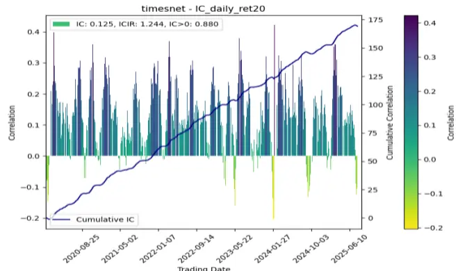
数据来源：东方证券研究所 & Wind资讯

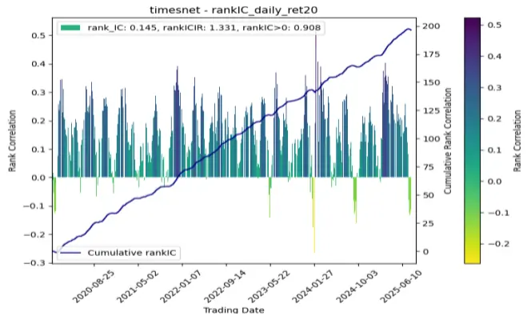

图 28：中证全指股票池 TimesNet因子分组超额收益净值 & 分组年化超额收益——多头超额显著，分组单调性清晰
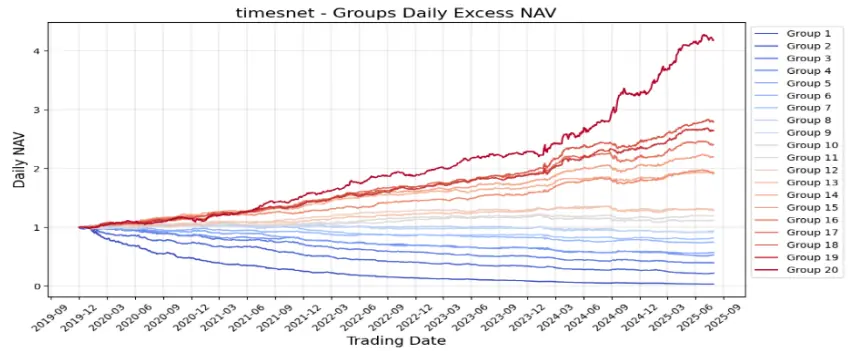
数据来源：东方证券研究所 & Wind资讯

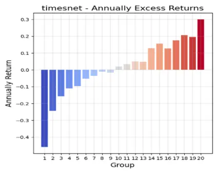
有关分析师的申明，见本报告最后部分。其他重要信息披露见分析师申明之后部分，或请与您的投资代表联系。并请阅读本证券研究报告最后一页的免责申明。

## 4.2.2 沪深300股票池：整体表现稳健，2025年阶段性回调但风险可控

在沪深 300 股票池中，DFQ-TimesNet模型整体表现稳健，分组单调性良好，适配大盘蓝筹股选股场景，具体绩效如下：

1. 测试集整体表现：IC 为 7.84%，ICIR 达到 0.44，RANKIC 达到 9.32%，RANKICIR 达到0.49，因子预测能力稳健，符合大盘股波动特征；

2. 多头组合表现：5分组多头超额年化收益达 8.55%，多头日超额收益夏普比 0.94，多头日度超额收益最大回撤 10.66%，多头月度胜率 65%，月均单边换手 55%，超额收益稳健换手合理；

3. 2025 年阶段性表现：2025 年前 8 个月 IC 达到 1.23%，ICIR 为 0.06，RANKIC 达到3.87%，RANKICIR 达到 0.20；5 分组多头超额收益-2.53%，最大回撤 7.50%，出现阶段性回调，但回撤幅度可控，与大盘股整体行情波动匹配。

图 29：沪深 300股票池 TimesNet因子绩效表现——整体稳健，适配大盘蓝筹股场景

| 沪深300股票池 2020.01.01-2025.8.29 | IC | IC_IR | rankIC | rankIC_IR | 多头月度胜率 | 多头日超额收益夏普比 | 多头日超额年化收益 | 多头日超额收益最大回撤 | 多头月均单边换手率 |
| --- | --- | --- | --- | --- | --- | --- | --- | --- | --- |
| timesnet | 7.84% | 0.44 | 9.32% | 0.49 | 64.71% | 0.94 | 8.55% | -10.66% | 54.75% |
| 2020 | 7.98% | 0.50 | 8.20% | 0.49 | 66.67% | 0.24 | 1.43% | -8.20% | 61.39% |
| 2021 | 9.99% | 0.59 | 10.92% | 0.57 | 58.33% | 1.39 | 13.70% | -7.30% | 51.39% |
| 2022 | 8.67% | 0.51 | 9.06% | 0.51 | 75.00% | 2.02 | 18.48% | -4.99% | 54.03% |
| 2023 | 9.24% | 0.61 | 11.77% | 0.72 | 66.67% | 0.80 | 6.15% | -6.67% | 53.33% |
| 2024 | 7.13% | 0.33 | 9.86% | 0.42 | 66.67% | 0.92 | 10.59% | -10.66% | 54.58% |
| 2025.1.1-2025.8.29 | 1.23% | 0.06 | 3.87% | 0.20 | 50.00% | -0.03 | -2.53% | -7.50% | 53.33% |

数据来源：东方证券研究所 & Wind资讯

图 30：沪深 300股票池 TimesNet因子的 IC时序变化——IC波动较大，2025年阶段性回调
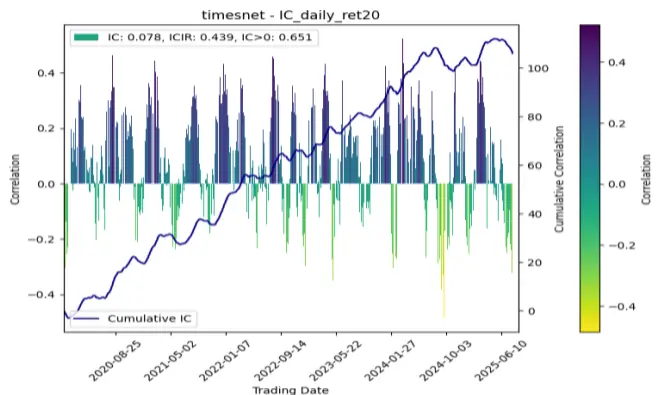
数据来源：东方证券研究所 & Wind资讯

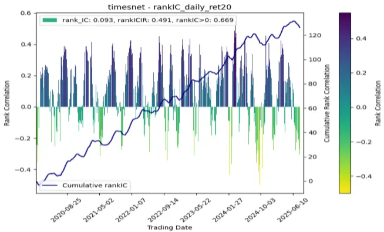

图 31：沪深 300股票池 TimesNet因子分组超额收益净值 & 分组年化超额收益——多头超额稳健，阶段性回调可控
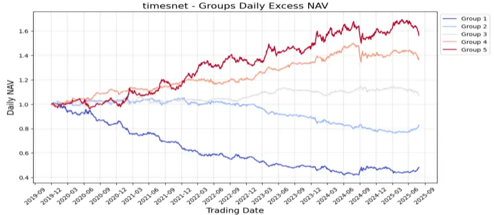
数据来源：东方证券研究所 & Wind资讯

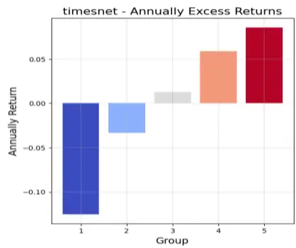

有关分析师的申明，见本报告最后部分。其他重要信息披露见分析师申明之后部分，或请与您的投资代表联系。并请阅读本证券研究报告最后一页的免责申明。

4.2.3 中证500股票池：绩效表现均衡，回撤控制优异，适配中盘股场景

在中证 500 股票池中，DFQ-TimesNet模型整体表现均衡，分组单调性良好，适配中盘股选股场景，具体绩效如下：

1. 测试集整体表现：IC 达到 7.52%，ICIR 达到 0.50，RANKIC 达到 9.53%，RANKICIR 达到 0.65，因子预测能力均衡，稳定性优于沪深 300股票池；

2. 多头组合表现：5 分组多头超额年化收益达到 12.06%，多头日超额收益夏普比 1.77，多头日度超额收益最大回撤 6.96%，多头月度胜率 70.59%，月均单边换手 60.10%，超额收益与稳定性兼顾，回撤控制优异；

3. 2025 年阶段性表现：2025 年前 8 个月 IC 达到 3.34%，ICIR 为 0.18，RANKIC 达到5.21%，RANKICIR 达到 0.30；5 分组多头超额收益 2.16%，最大回撤 4.56%，阶段性表现稳健，未出现明显回调。

图 32：中证 500股票池 TimesNet因子绩效表现——绩效均衡，回撤控制优异

| 中证500股票池 2020.01.01-2025.8.29 | IC | IC_IR | rankIC | rankIC_IR | 多头月度胜率 | 多头日超额收益夏普比 | 多头日超额年化收益 | 多头日超额收益最大回撤 | 多头月均单边换手率 |
| --- | --- | --- | --- | --- | --- | --- | --- | --- | --- |
| timesnet | 7.52% | 0.50 | 9.53% | 0.65 | 70.59% | 1.77 | 12.06% | -6.96% | 60.10% |
| 2020 | 6.43% | 0.55 | 8.43% | 0.70 | 83.33% | 1.70 | 10.12% | -3.40% | 66.58% |
| 2021 | 9.16% | 0.61 | 10.64% | 0.68 | 66.67% | 2.40 | 19.34% | -6.61% | 59.75% |
| 2022 | 9.52% | 0.66 | 11.07% | 0.75 | 75.00% | 3.02 | 20.82% | -3.62% | 60.92% |
| 2023 | 8.52% | 0.64 | 12.24% | 1.04 | 66.67% | 2.13 | 9.86% | -3.62% | 57.83% |
| 2024 | 6.45% | 0.38 | 7.72% | 0.50 | 58.33% | 0.61 | 4.39% | -6.96% | 57.17% |
| 2025.1.1-2025.8.29 | 3.34% | 0.18 | 5.21% | 0.30 | 75.00% | 0.04 | 2.16% | -4.56% | 57.50% |

数据来源：东方证券研究所 & Wind资讯

图 33：中证 500股票池 TimesNet因子的 IC时序变化——IC波动平缓，稳定性较强
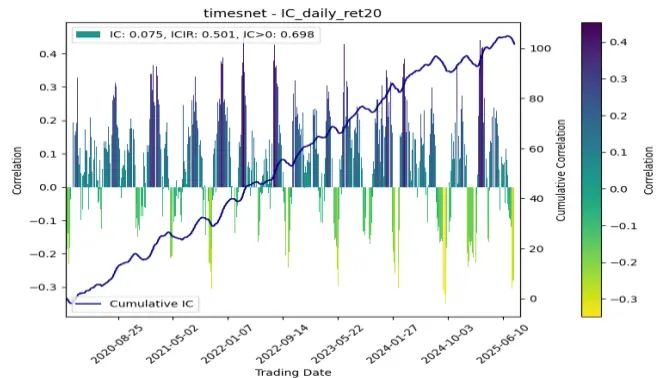
数据来源：东方证券研究所 & Wind资讯

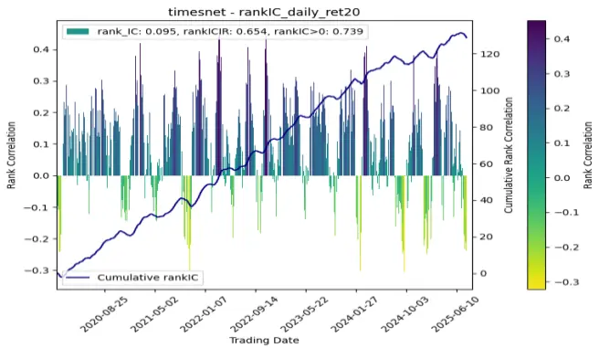

图 34：中证 500股票池 TimesNet因子分组超额收益净值 & 分组年化超额收益——多头超额均衡，适配中盘股场景
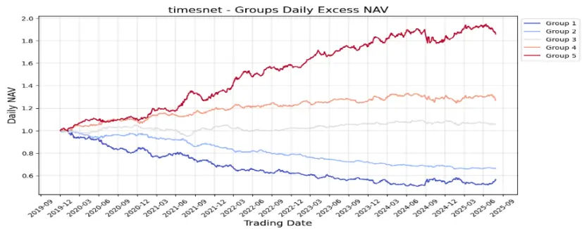
数据来源：东方证券研究所 & Wind资讯

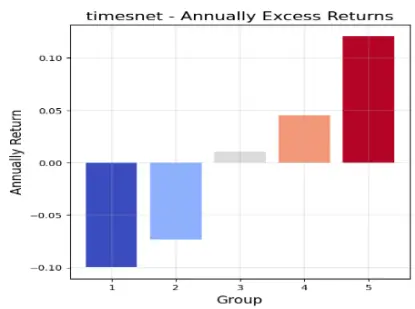
有关分析师的申明，见本报告最后部分。其他重要信息披露见分析师申明之后部分，或请与您的投资代表联系。并请阅读本证券研究报告最后一页的免责申明。

4.2.4 中证1000股票池：绩效表现突出，胜率高回撤小，适配小盘股场景

## 在中证 1000 股票池中，DFQ-TimesNet 模型整体表现突出，分组单调性良好，适配小盘股选股场景，具体绩效如下：

1. 测试集整体表现：IC 达 11.25%，ICIR 达 0.93，RANKIC 达 12.29%，RANKICIR 达 1.03，因子预测能力突出，稳定性优于沪深 300、中证500股票池，贴合小盘股量价波动特征；

2. 多头组合表现：10 分组多头超额年化收益达到 19.81%，多头日超额收益夏普比 2.92，多头日度超额收益最大回撤 5.53%，多头月度胜率 80.88%，月均单边换手 75.35%，超额收益显著，回撤控制优于其他股票池，胜率处于较高水平；

3. 2025 年阶段性表现：2025 年前 8 个月 IC 达到 7.90%，ICIR 为 0.48，RANKIC 达到10.60%，RANKICIR 达到 0.64；10 分组多头超额收益 9.66%，最大回撤仅 3.11%，阶段性表现稳健且优于沪深 300、中证500股票池，抗波动能力突出。

图 35：中证 1000股票池 TimesNet因子绩效表现——绩效突出，回撤控制最优

| 中证1000股票池 2020.01.01-2025.8.29 | IC | IC_IR | rankIC | rankIC_IR | 多头月度胜率 | 多头日超额收益夏普比 | 多头日超额年化收益 | 多头日超额收益最大回撤 | 多头月均单边换手率 |
| --- | --- | --- | --- | --- | --- | --- | --- | --- | --- |
| timesnet | 11.25% | 0.93 | 12.29% | 1.03 | 80.88% | 2.92 | 19.81% | -5.53% | 75.35% |
| 2020 | 12.70% | 1.25 | 14.08% | 1.39 | 83.33% | 2.94 | 19.76% | -2.51% | 79.42% |
| 2021 | 12.59% | 1.46 | 13.64% | 1.48 | 91.67% | 4.80 | 36.55% | -2.48% | 75.67% |
| 2022 | 13.55% | 1.32 | 14.09% | 1.41 | 83.33% | 3.06 | 16.27% | -2.35% | 75.33% |
| 2023 | 11.03% | 0.90 | 12.66% | 1.14 | 66.67% | 2.18 | 10.68% | -2.86% | 74.00% |
| 2024 | 8.35% | 0.58 | 7.99% | 0.56 | 83.33% | 2.11 | 16.03% | -5.53% | 73.58% |
| 2025.1.1-2025.8.29 | 7.90% | 0.48 | 10.60% | 0.64 | 75.00% | 0.14 | 9.66% | -3.11% | 73.50% |

数据来源：东方证券研究所 & Wind资讯

图 36：中证 1000股票池 TimesNet因子的IC时序变化——IC波动平缓，2025年表现稳健
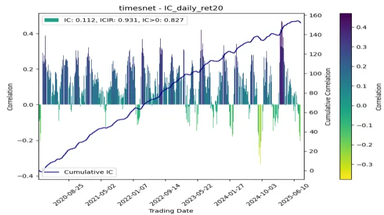
数据来源：东方证券研究所 & Wind资讯

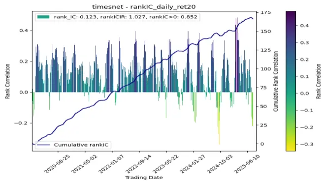

图 37：中证 1000股票池 TimesNet因子分组超额收益净值 & 分组年化超额收益——多头超额显著，分组单调性清晰
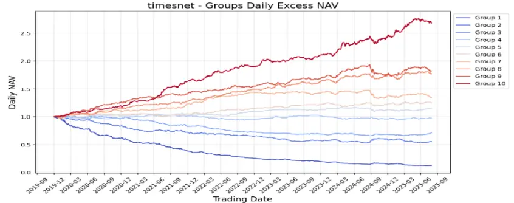
数据来源：东方证券研究所 & Wind资讯

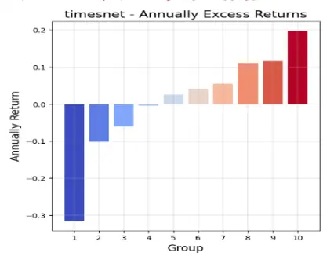

有关分析师的申明，见本报告最后部分。其他重要信息披露见分析师申明之后部分，或请与您的投资代表联系。并请阅读本证券研究报告最后一页的免责申明。

## 4.3 因子多头组风险因子暴露：模型风格与同类模型差异显著且无极端偏离

我们从因子暴露维度，对中证全指股票池内各模型多头组合展开分析，明确各模型多头组的风格偏好及风险因子暴露特征。本次分析以中证全指等权组合为业绩基准，通过计算组合持仓与基准在各风险因子上的暴露度差值，得到相对暴露数据，以此衡量模型多头组的风格偏离程度。本次分析采用《东方 A股因子风险模型(DFQ-2020)》中的风险模型体系，该模型包含十大类风格类风险因子、29个中信一级行业因子及市场因子，可全面覆盖 A股市场主要风险维度。

图 38：东方 A股因子风险模型（DFQ-2020）风格因子列表——覆盖 A股主要风格风险维度
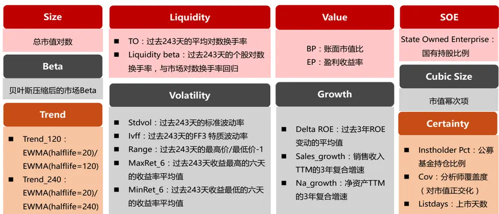
数据来源：东方证券研究所

DFQ-TimesNet 模型得到的因子得分（TimesNet）对应的多头组偏向小市值、高 beta、低波动、低确定性、强反转、低成长。与其他神经网络模型相比，在 Beta 上的正暴露更多，在价值和流动性风格上基本无暴露，在波动性风格上的负暴露更小。

图 39：中证全指股票池各模型多头组的因子相对暴露均值DFQ-TimesNet模型风格特征与同类模型差异显著
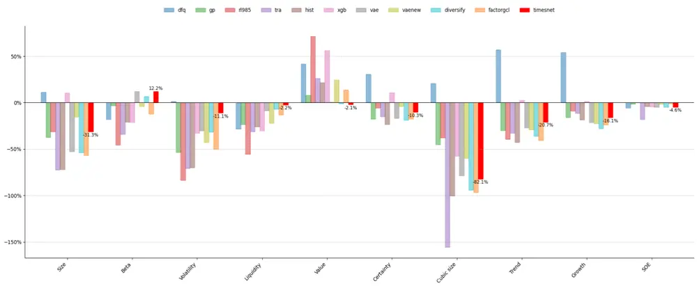
数据来源：东方证券研究所 & Wind资讯
有关分析师的申明，见本报告最后部分。其他重要信息披露见分析师申明之后部分，或请与您的投资代表联系。并请阅读本证券研究报告最后一页的免责申明。

图 40：中证全指股票池各模型多头组的 size 因子相对暴露变化——DFQ-TimesNet 长期偏好小市值标的
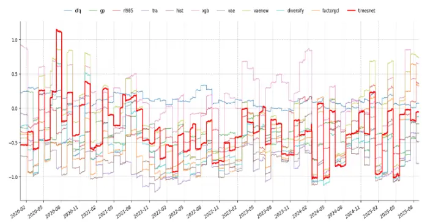
数据来源：东方证券研究所 & Wind资讯

图 41：中证全指股票池各模型多头组的 beta 因子相对暴露变化——DFQ-TimesNet 高 Beta 特征显著且长期稳定
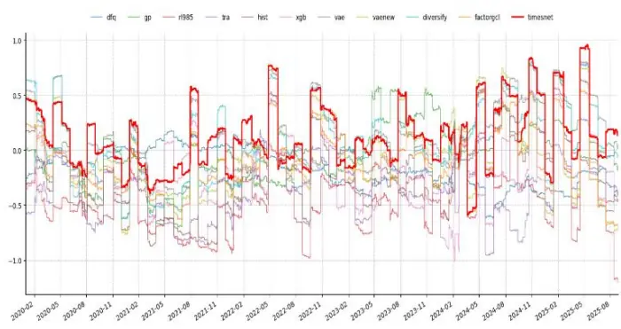
数据来源：东方证券研究所 & Wind资讯

图 42：中证全指股票池各模型多头组的 volatility 因子相对暴露变化——DFQ-TimesNet偏好低波动且负向暴露幅度温和
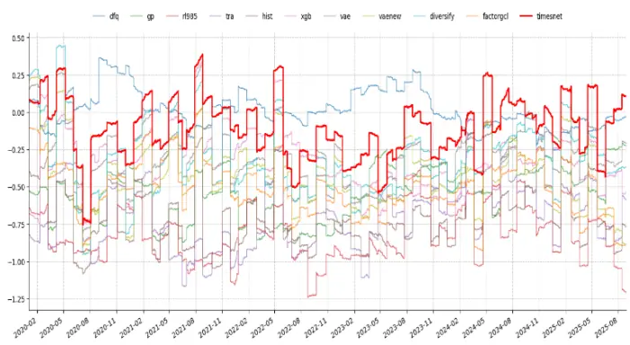
数据来源：东方证券研究所 & Wind资讯

图 43：中证全指股票池各模型多头组的 liquidity 因子相对暴露变化——DFQ-TimesNet流动性风格始终中性无偏
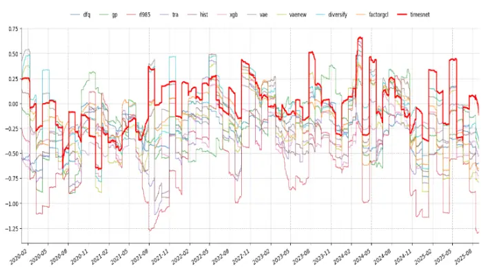
数据来源：东方证券研究所 & Wind资讯

图 44：中证全指股票池各模型多头组的 value 因子相对暴露变化——DFQ-TimesNet无系统性价值风格倾向
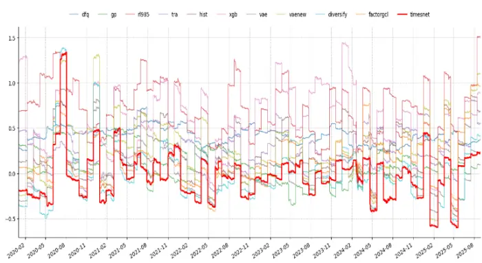
数据来源：东方证券研究所 & Wind资讯

图 45：中证全指股票池各模型多头组的 certainty 因子相对暴露变化——DFQ-TimesNet长期偏好低确定性标的
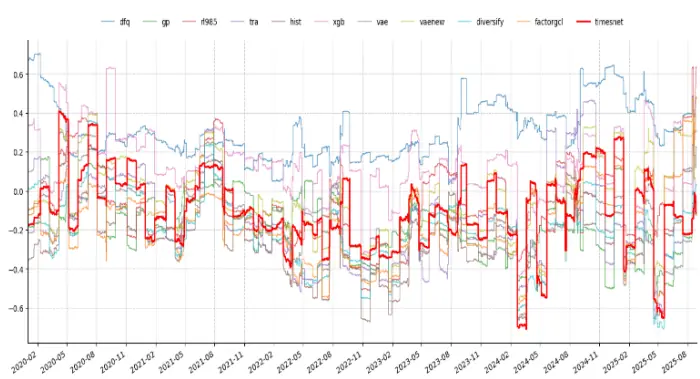
数据来源：东方证券研究所 & Wind 资讯

图 46：中证全指股票池各模型多头组的 cubic size 因子相对暴露变化 DFQ-TimesNet小市值风格持续且稳定
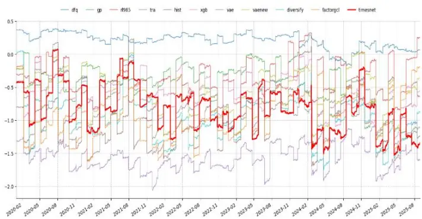
数据来源：东方证券研究所 & Wind资讯

图 47：中证全指股票池各模型多头组的 trend因子相对暴露变化——DFQ-TimesNet 反转风格特征显著
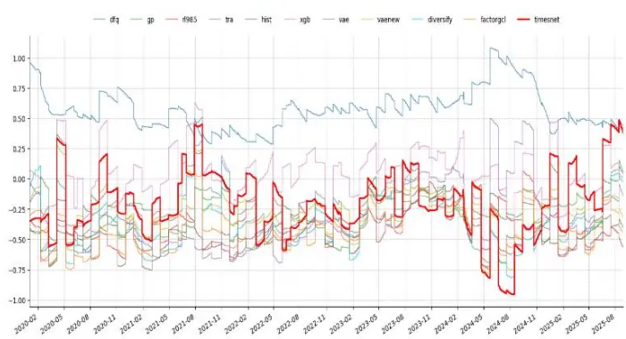
数据来源：东方证券研究所 & Wind资讯

图 48：中证全指股票池各模型多头组的 growth 因子相对暴露变化——DFQ-TimesNet长期呈现低成长风格
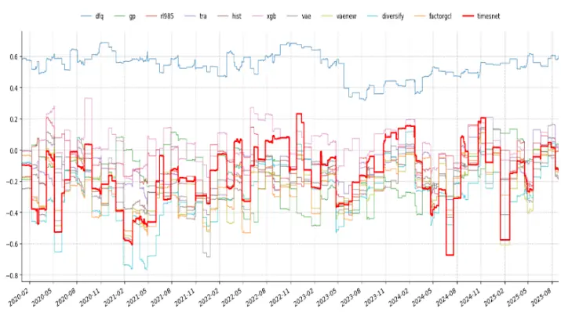
数据来源：东方证券研究所 & Wind资讯

图 49：中证全指股票池各模型多头组的 soe 因子相对暴露变化——DFQ-TimesNet对国企标的无明显偏好
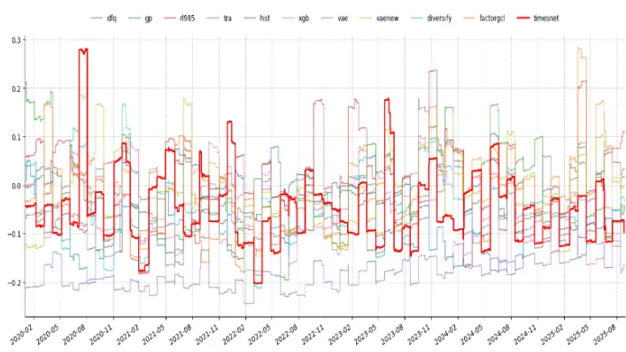
数据来源：东方证券研究所 & Wind资讯

## 5、 指数增强组合结果——DFQ-TimesNet 模型多指数适配性强，特质收益主导超额且绩效优异

## 5.1 指数增强组合构建说明——约束明确、实操性强，贴合实际回测与交易逻辑

本次指数增强组合构建严格遵循实际交易规则，兼顾风险控制与实操可行性，具体构建细节结合实际做法明确如下：

## （1）回测周期与调仓交易规则——月频调仓、定价合理，贴合脚本实操逻辑

回测区间为 2020年 1月 2日至 2026年 3月 27日，组合采用月频调仓模式：每月末根据个股因子得分确定权重，于下一个交易日以当日复权 VWAP价格执行交易。股票池选用中证全指。

## （2）组合约束——风险可控、边界清晰，有效规避极端偏离风险

采用 dfrisk2020 因子库，风格因子相对暴露≤0.5、行业因子≤2%；沪深 300 增强跟踪误差≤4%，中证 500增强≤5%；个股权重偏离±1%，成分股占比≥80%。优化候选池裁剪后兼顾代表性与效率：保留基准权重>0、上期持仓标的，纳入 alpha 得分最高 300 只与最低 80 只股票，再与可投池求交，可缩短求解时间、降低求解失败概率，兼顾组合代表性与优化效率。

## （3）交易成本与可交易约束——贴合市场实际，保障业绩测算精准性

买入成本 0.1%、卖出成本 0.2%，以调仓日复权 VWAP定价；停牌、涨停不能买入，停牌、跌停不能卖出，调仓仅交易可投标的，买入侧剔除碎股，贴合实际交易。

## （4）组合净值与业绩指标测算口径——标准统一，业绩对比严谨可信

策略与基准净值按回测首日归一为 1，对冲净值由策略与基准日收益差值逐日复利计算；年化收益、波动、Sharpe 比率按每年 243 个交易日核算，年均换手率按调仓日均值×52 计算；年度收益排名基于同基准公募指增产品对比得出。

## 5.2 沪深 300 指数增强组合——DFQ-TimesNet 模型表现稳健，特质收益主导超额

DFQ-TimesNet模型因子得分应用于沪深 300指数增强组合，整体表现稳健、风格暴露可控，超额收益来源清晰，结合图表及核心数据详情如下：

## 1. 组合绩效表现——收益具备持续性，风险控制良好

该模型指增组合核心绩效表现突出，兼顾收益与风险，具体数据如下：（1）整体表现：2020 年以来年化信息比达到 1.48，年化对冲收益 9.20%，年化跟踪误差 6.08%，超额收益最大回撤 9.12%，单边年换手 6.94 倍，在收益获取与风险控制之间实现较好平衡；（2）分年表现：收益持续性较强，2020-2023年每年均取得 10%以上正超额，其中 2022-2023年在同基准公募指增产品中排名第 1，表现远超同类；2024 年出现小幅负超额（-1.35%）；2025 年恢复正向超额（8.24%），在同基准公募指增产品中排名第 6，重回优秀行列；2026 年前三个月延续正向表现，超额收益达 1.30%，排名处于同基准公募指增产品中位数附近，整体表现稳定。

## 2. 风格暴露与超额收益归因——风格可控，特质收益为重要驱动

DFQ-TimesNet模型指增组合风格把控合理，超额收益来源结构明确：（1）风格暴露特征：相对沪深 300 基准，总体风格暴露可控，仅在市值维度呈现明显负向暴露，无极端风格偏离，风险可控；（2）超额收益归因：整体来看，指增超额收益中 52%来自特质收益，36%来自风格因子贡献，12%来自行业因子贡献，特质收益为重要超额驱动。

图 50：DFQ-TimesNet模型沪深 300股票池指数增强组合绩效表现——绩效稳健、收益具备持续性

| 20200101-20260327 300月频 |  | timesnet |
| --- | --- | --- |
|  | 行业暴露0.02 风格暴露0.5 跟踪误差4% 买卖手续费双边千三 | 沪深300全市场增强 80%成分内约束 |
|  | 信息比（年化） |  |
|  | 年化对冲收益 | 1.48 |
|  | 跟踪误差（年化） | 9.20% |
|  | 对冲收益最大回撤 | 6.08% |
|  |  | -9.12% |
|  | 对冲收益最大回撤出现时间点 对冲收益最大回撤恢复天数 | 1/13/2021 |
|  | 单边换手率（年） | 155 6.94 |
|  | 持股数量 | 90.00 |
|  | 成分内股票占比 月胜率 | 80.54% 68.92% |
|  | 2020 | 10.90%(20/45) |
|  | 2021 | 12.08%(2/52) |
|  | 2022 | 13.52%(1/60) |
|  | 2023 | 11.20%(1/61) |
| 分年收益 | 2024 | -1.35%(46/66) |
|  | 2025 | 8.24%(6/83) |
|  | 2026 |  |
|  |  | 1.30%(45/80) |

数据来源：东方证券研究所 & Wind资讯
有关分析师的申明，见本报告最后部分。其他重要信息披露见分析师申明之后部分，或请与您的投资代表联系。并请阅读本证券研究报告最后一页的免责申明。

图 51：DFQ-TimesNet模型沪深 300股票池指数增强组合超额净值与回撤——回撤可控，波动特征清晰
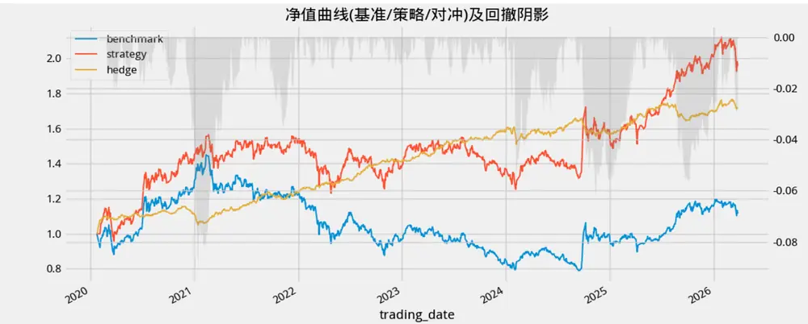
数据来源：东方证券研究所 & Wind资讯

图 52：DFQ-TimesNet 模型沪深 300 股票池指数增强组合相对基准的平均风格暴露——风格可控，仅市值呈显著负向暴露
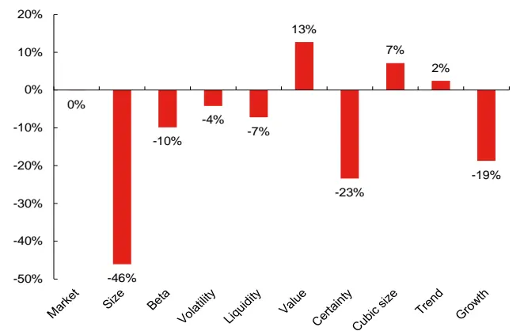
数据来源：东方证券研究所 & Wind资讯

图 53：DFQ-TimesNet 模型沪深 300 股票池指数增强组合超额收益归因情况——特质收益占比超 50%，为核心驱动
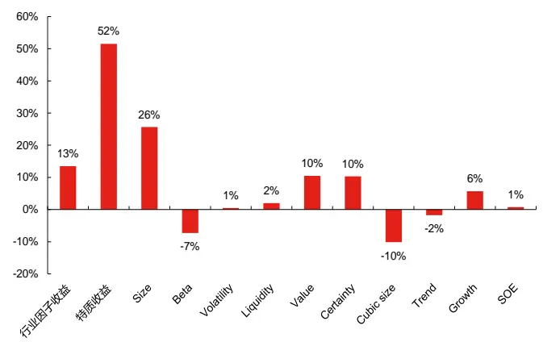
数据来源：东方证券研究所 & Wind资讯

## 5.3 中证 500 指数增强组合——DFQ-TimesNet 模型收益突出，特质收益占比高

DFQ-TimesNet模型因子得分在中证 500 指数增强组合中表现十分突出，收益水平优异、风格可控，在同类产品中具备较强竞争力，具体如下：

## 1. 组合绩效表现——长期收益优异，持续性强，同类排名领先

核心绩效数据表现突出，具体如下：（1）整体表现：2020 年以来年化信息比达到 1.44，年化对冲收益 10.80%，年化跟踪误差 7.31%，超额收益最大回撤 8.98%，单边年换手 8.90 倍，收益水平显著高于同类平均；（2）分年表现：收益持续性极强，2020-2023 年每年均取得 10%以上正超额，且在同基准公募指增产品中排名前 5，表现稳居同类前列；2024 年出现小幅负超额（-0.38%），阶段性调整幅度较小；2025 年恢复正向超额（6.33%），在同基准公募指增产品中排名第 6，保持优秀表现；2026年前三个月出现小幅负超额（-0.64%）。

## 2. 风格暴露与超额收益归因——风格可控，特质收益为核心驱动

组合风格把控合理，超额收益来源明确，体现模型较强的选股与风格控制能力：（1）风格暴露特征：相对中证 500 基准，组合在多个风格因子上存在不同程度的正向和负向暴露。在估值因子上表现为一定的正向暴露，而在市值、波动率、流动性、非线性市值、确定性、趋势、成长因子上则存在负向暴露，在 beta、国企因子上基本风格中性。整体来看，组合的风格暴露并未出现极端偏离，所有因子暴露保持在可控范围内；（2）超额收益归因：整体来看，指增超额收益中 64%来自特质收益，44%来自风格因子贡献，特质收益为核心超额驱动，充分验证模型选股能力的有效性。

图 54：DFQ-TimesNet模型中证 500股票池指数增强组合绩效表现——收益优异，长期表现突出

| 20200101-20260327 500月频 |  | timesnet |
| --- | --- | --- |
| 行业暴露0.02 风格暴露0.5 跟踪误差4% 买卖手续费双边千三 | 信息比(年化） | 沪深300全市场增强 80%成分内约束 1.44 |
|  | 年化对冲收益 | 10.80% |
|  | 跟踪误差（年化） |  |
|  |  | 7.31% |
|  | 对冲收益最大回撤 | -8.98% |
|  | 对冲收益最大回撤出现时间点 对冲收益最大回撤恢复天数 单边换手率（年） | 6/6/2024 188 |
|  | 持股数量 | 8.90 |
|  | 成分内股票占比 | 101.00 |
|  | 月胜率 | 80.03% |
|  |  | 70.27% |
|  | 2020 |  |
|  | 2021 | 19.72%(4/41) |
|  | 2022 | 15.34%(1/51) |
| 分年收益 |  |  |
|  |  | 15.46%(1/59) |
|  | 2023 | 12.51%(1/66) |
|  | 2024 | -0.38%(47/70) |
|  | 2025 |  |
|  | 2026 | 6.33%(6/80) -0.64%(56/80) |

数据来源：东方证券研究所 & Wind资讯

图 55：DFQ-TimesNet模型中证 500股票池指数增强组合超额净值与回撤——回撤温和，抗波动能力较强
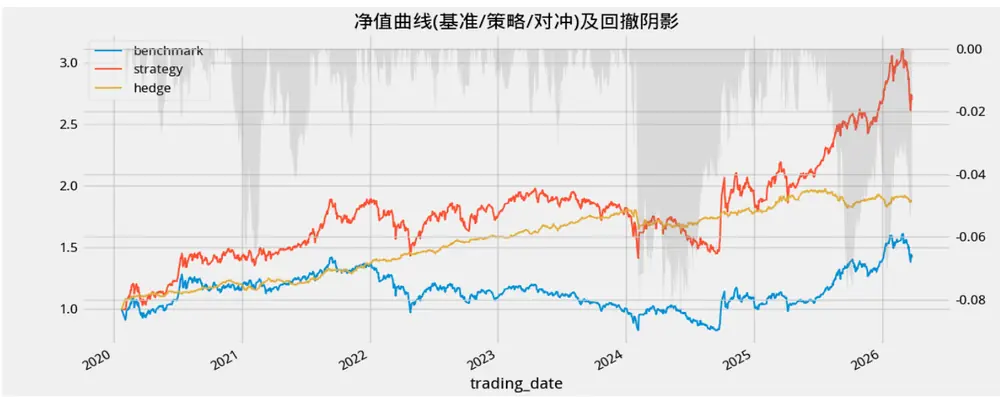
数据来源：东方证券研究所 & Wind资讯

有关分析师的申明，见本报告最后部分。其他重要信息披露见分析师申明之后部分，或请与您的投资代表联系。并请阅读本证券研究报告最后一页的免责申明。

图 56：DFQ-TimesNet 模型中证 500 股票池指数增强组合相对基准的平均风格暴露——多维风格存在一定暴露，但整体偏离可控
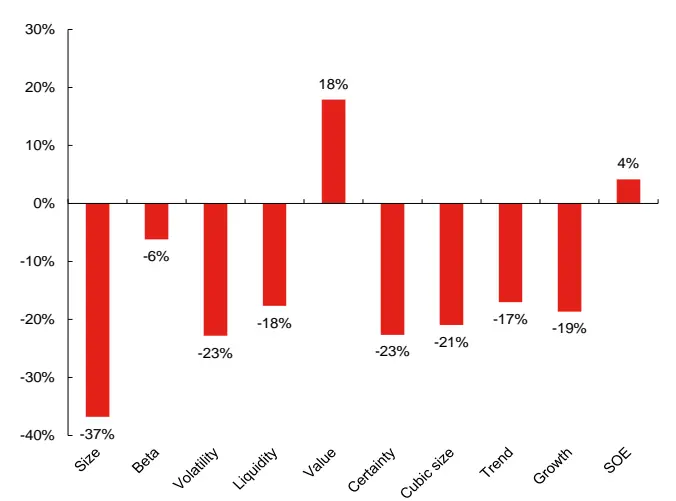
数据来源：东方证券研究所 & Wind资讯

图 57：DFQ-TimesNet 模型中证 500 股票池指数增强组合超额收益归因情况——特质收益占比 64%，主导超额
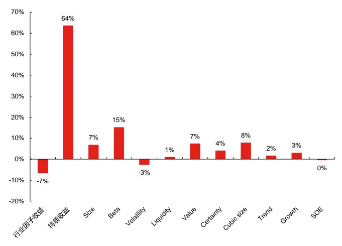
数据来源：东方证券研究所 & Wind资讯

## 5.4 中证 1000 指数增强组合——DFQ-TimesNet 模型表现优异，年化收益突出且排名顶尖

DFQ-TimesNet 模型因子得分在中证 1000 指数增强组合中表现最为突出，年化收益与信息比均领先同类，风格可控且特质收益贡献显著，具体如下：

## 1. 组合绩效表现——收益顶尖，持续性强，同类排名稳居前列

核心绩效表现突出，具体数据如下：（1）整体表现：2020 年以来年化信息比达到 1.90，年化对冲收益 15.80%，年化跟踪误差 7.90%，超额收益最大回撤 9.33%，单边年换手 9.73 倍，信息比与年化收益均处于同类顶尖水平；（2）分年表现：收益爆发力极强，2020-2023 年每年均取得 15%以上正超额，且在同基准公募指增产品中排名第一；2024 年出现阶段性负超额（-3.66%）；2025 年快速恢复正向超额（9.91%），2026 年前三个月超额收益达 2.75%，近两年在同基准公募指增产品中排名前 25%，长期竞争力突出。

图 58：DFQ-TimesNet模型中证 1000股票池指数增强组合绩效表现——收益顶尖，信息比优异

| 20200101-20250630 1000月频 |  | factorgcl |
| --- | --- | --- |
| 行业暴露0.02 风格暴露0.5跟踪误差4% 买卖手续费双边千三 |  | 中证1000全市场增强 80%成分内约束 1.90 |
| 绩效指标 | 信息比（年化） 年化对冲收益 |  |
|  | 跟踪误差（年化） | 15.80% |
|  |  | 7.90% |
|  | 对冲收益最大回撤 | -9.33% |
|  | 对冲收益最大回撤出现时间点 | 2/7/2024 |
|  | 对冲收益最大回撤恢复天数 单边换手率（年） | 401 |
|  | 持股数量 | 9.73 |
|  |  | 114.00 |
|  | 成分内股票占比 | 80.03% |
|  | 月胜率 | 71.62% |
|  | 2020 | 30.13%(1/6) |
|  | 2021 | 24.15%(1/7) |
|  | 2022 | 21.92%(1/21) |
| 分年收益 | 2023 |  |
|  |  | 15.31%(1/46) |
|  | 2024 | -3.66%(45/47) |
|  | 2025 | 9.91%(10/47) |
|  | 202501 |  |
|  |  | 2.75%(12/47) |

数据来源：东方证券研究所 & Wind资讯
有关分析师的申明，见本报告最后部分。其他重要信息披露见分析师申明之后部分，或请与您的投资代表联系。并请阅读本证券研究报告最后一页的免责申明。

图 59：DFQ-TimesNet模型中证 1000股票池指数增强组合超额净值与回撤——回撤可控，长期收益稳健
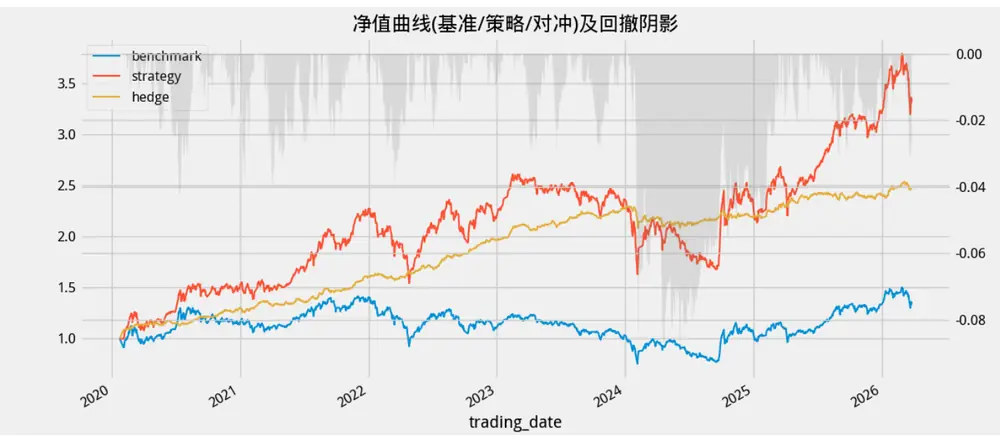
数据来源：东方证券研究所 & Wind资讯

## 2. 风格暴露与超额收益归因——风格可控，特质收益主导超额

组合整体风格与中证 1000 指数特征较为接近，未出现明显的单一风格大幅偏离，整体风险暴露仍处于可控范围。（1）从风格暴露看，相对中证 1000 基准，组合在市值、波动率、流动性、非线性市值、趋势、成长等多个维度上呈现一定负向暴露，在估值维度则有小幅正向暴露，在beta、国企因子上基本风格中性，说明模型在风格上并非完全中性，而是在若干维度上存在结构性偏离，但总体偏离幅度有限。（2）从超额收益来源看，组合超额收益主要来自特质收益。整体来看，指数增强超额收益中约 66%来自特质收益，34%来自风格因子贡献，说明策略的收益来源仍以个股选择能力为主，而非单纯依赖风格暴露获取收益。

图 60：DFQ-TimesNet 模型中证 1000 股票池指数增强组合相对基准的平均风格暴露——多维风格存在一定暴露，但整体偏离可控
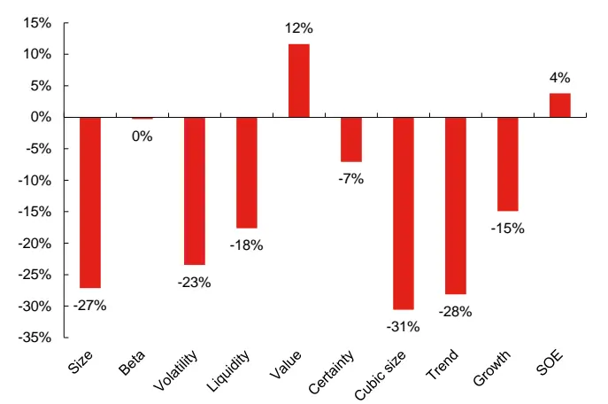
数据来源：东方证券研究所 & Wind资讯

图 61：DFQ-TimesNet 模型中证 1000 股票池指数增强组合超额收益归因情况——特质收益占比 66%，主导超额收益
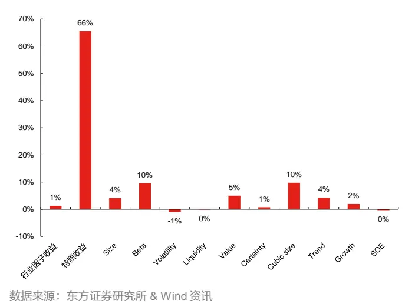

有关分析师的申明，见本报告最后部分。其他重要信息披露见分析师申明之后部分，或请与您的投资代表联系。并请阅读本证券研究报告最后一页的免责申明。

## 6、 总结

## 核心创新与改进

⚫ 突破一维时序建模局限，采用二维结构化建模，显式解耦周期内波动与跨周期关联，适配 A 股量价多周期特征。

⚫ 摒弃 FFT 自动周期识别，选用 5 日 + 60 日双周期，更贴合 A 股周度、季度交易规律，提升模型稳定性。

⚫ 优化模型结构：仅保留 TokenEmbedding、两层 Inception 卷积、直接平均周期融合与残差连接，兼顾效果与效率。

## 关键实证结论

⚫ 数据处理：解释变量按日截面 Z‑score+clip，预测标签用绝对收益 Z‑score 标准化，基础量价特征输入最优。

⚫ 预测目标：以未来 20 日收益率为标签，与月度调仓策略匹配度最高。

⚫ 训练表现：早停收敛、无过拟合，随机种子影响可控，模型输出一致性高。

## 因子与组合绩效

⚫ 因子表现：中证全指 IC 达 12.50%，多头超额年化 30.05%；小盘股适配性显著优于大盘股，分组单调性清晰。

⚫ 风格特征：长期偏好小市值、高 Beta、低波动、低确定性、强反转，流动性与价值风格保持中性。

⚫ 指数增强：中证 1000 增强表现最优，年化对冲收益 15.80%、信息比 1.90；全品种指增超额收益 52%~66% 来自特质收益。

## 7、 风险提示

⚫ 量化模型基于历史数据分析，未来存在失效风险，建议投资者紧密跟踪模型表现。

⚫ 极端市场环境可能对模型效果造成剧烈冲击，导致收益亏损。

## 8、 参考文献

Wu H, Hu T, Liu Y, et al. Timesnet: Temporal 2d-variation modeling for general time series analysis[J]. arXiv preprint arXiv:2210.02186, 2022.

## Tabl e_Disclai mer 分析师申明

每位负责撰写本研究报告全部或部分内容的研究分析师在此作以下声明：

分析师在本报告中对所提及的证券或发行人发表的任何建议和观点均准确地反映了其个人对该证券或发行人的看法和判断；分析师薪酬的任何组成部分无论是在过去、现在及将来，均与其在本研究报告中所表述的具体建议或观点无任何直接或间接的关系。

## 投资评级和相关定义

报告发布日后的 12 个月内行业或公司的涨跌幅相对同期相关证券市场代表性指数的涨跌幅为基准（A 股市场基准为沪深 300 指数，香港市场基准为恒生指数，美国市场基准为标普 500 指数）；

## 公司投资评级的量化标准

买入：相对强于市场基准指数收益率 15%以上；

增持：相对强于市场基准指数收益率 5%～15%；

中性：相对于市场基准指数收益率在-5%～+5%之间波动；

减持：相对弱于市场基准指数收益率在-5%以下。

未评级 —— 由于在报告发出之时该股票不在本公司研究覆盖范围内，分析师基于当时对该股票的研究状况，未给予投资评级相关信息。

暂停评级 —— 根据监管制度及本公司相关规定，研究报告发布之时该投资对象可能与本公司存在潜在的利益冲突情形；亦或是研究报告发布当时该股票的价值和价格分析存在重大不确定性，缺乏足够的研究依据支持分析师给出明确投资评级；分析师在上述情况下暂停对该股票给予投资评级等信息，投资者需要注意在此报告发布之前曾给予该股票的投资评级、盈利预测及目标价格等信息不再有效。

## 行业投资评级的量化标准：

看好：相对强于市场基准指数收益率 5%以上；

中性：相对于市场基准指数收益率在-5%～+5%之间波动；

看淡：相对于市场基准指数收益率在-5%以下。

未评级：由于在报告发出之时该行业不在本公司研究覆盖范围内，分析师基于当时对该行业的研究状况，未给予投资评级等相关信息。

暂停评级：由于研究报告发布当时该行业的投资价值分析存在重大不确定性，缺乏足够的研究依据支持分析师给出明确行业投资评级；分析师在上述情况下暂停对该行业给予投资评级信息，投资者需要注意在此报告发布之前曾给予该行业的投资评级信息不再有效。

## HeadertTabl e_Discl ai mer 免责声明

本证券研究报告（以下简称“本报告”）由东方证券股份有限公司（以下简称“本公司”）制作及发布。

本报告仅供本公司的客户使用。本公司不会因接收人收到本报告而视其为本公司的当然客户。本报告的全体接收人应当采取必要措施防止本报告被转发给他人。

本报告是基于本公司认为可靠的且目前已公开的信息撰写，本公司力求但不保证该信息的准确性和完整性，客户也不应该认为该信息是准确和完整的。同时，本公司不保证文中观点或陈述不会发生任何变更，在不同时期，本公司可发出与本报告所载资料、意见及推测不一致的证券研究报告。本公司会适时更新我们的研究，但可能会因某些规定而无法做到。除了一些定期出版的证券研究报告之外，绝大多数证券研究报告是在分析师认为适当的时候不定期地发布。

在任何情况下，本报告中的信息或所表述的意见并不构成对任何人的投资建议，也没有考虑到个别客户特殊的投资目标、财务状况或需求。客户应考虑本报告中的任何意见或建议是否符合其特定状况，若有必要应寻求专家意见。本报告所载的资料、工具、意见及推测只提供给客户作参考之用，并非作为或被视为出售或购买证券或其他投资标的的邀请或向人作出邀请。

本报告中提及的投资价格和价值以及这些投资带来的收入可能会波动。过去的表现并不代表未来的表现，未来的回报也无法保证，投资者可能会损失本金。外汇汇率波动有可能对某些投资的价值或价格或来自这一投资的收入产生不良影响。那些涉及期货、期权及其它衍生工具的交易，因其包括重大的市场风险，因此并不适合所有投资者。

在任何情况下，本公司不对任何人因使用本报告中的任何内容所引致的任何损失负任何责任，投资者自主作出投资决策并自行承担投资风险，任何形式的分享证券投资收益或者分担证券投资损失的书面或口头承诺均为无效。

本报告主要以电子版形式分发，间或也会辅以印刷品形式分发，所有报告版权均归本公司所有。未经本公司事先书面协议授权，任何机构或个人不得以任何形式复制、转发或公开传播本报告的全部或部分内容。不得将报告内容作为诉讼、仲裁、传媒所引用之证明或依据，不得用于营利或用于未经允许的其它用途。

经本公司事先书面协议授权刊载或转发的，被授权机构承担相关刊载或者转发责任。不得对本报告进行任何有悖原意的引用、删节和修改。

提示客户及公众投资者慎重使用未经授权刊载或者转发的本公司证券研究报告，慎重使用公众媒体刊载的证券研究报告。

## 东方证券研究所

地址： 上海市中山南路 318 号东方国际金融广场 26 楼

电话：021-63325888

传真：021-63326786

网址： www.dfzq.com.cn