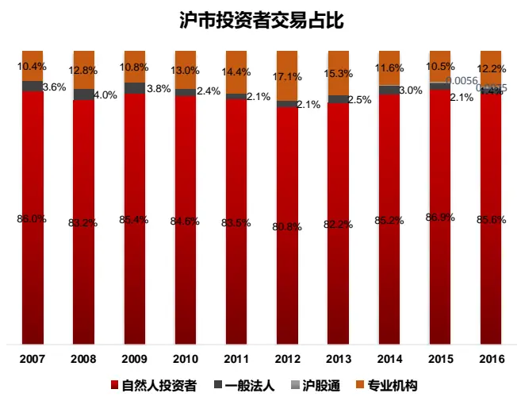
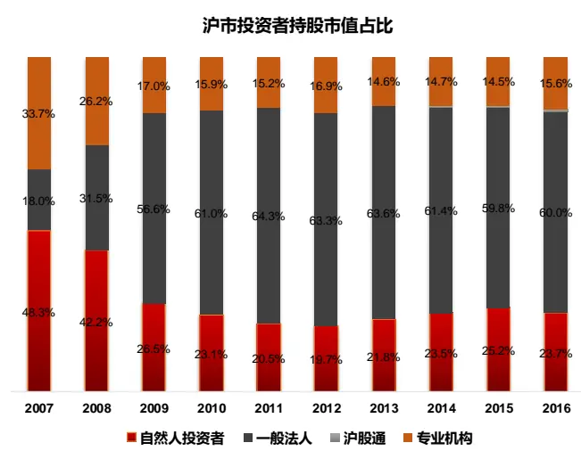

## Table_Sum ary 研究结论

- 本报告采用 Grinold(2002)的方法将股票收益近似拆解为股息收益、名义利润增长率和 PE估值变化率三部分，并做适当修正用于定量分析 A股涨跌幅中，盈利增长和估值变化的贡献的比例。

实证发现，沪深 300、中证 500、中证 1000 这些宽基指数在 2009-2017 间的涨幅绝大部分来自于盈利的增长，年化收益贡献分别为 11.2%, 14.8% 和20.9%；估值变化的贡献很小，对沪深 300的年化贡献为-1.9%，对中证 500和中证 1000 的贡献为 1.8%和 2.7%。创业板指 2011-2017 年间，盈利增长年化贡献 7.2%，估值年化贡献 2.0%。

- 对比标普 500 指数，其 2009 年后指数涨幅绝大部分也来自于盈利增长，估值贡献为负；不过放更长远看，1989-2017年间，标普 500股息收益、名义利润变化率和 PE变化率为别为 2.4%, 2.6% 和 2.9%，三者贡献大致相当。

最后我们也对中证一级行业指数进行了拆解，和直观经验比较相符，食品饮料、医药、建材、家电、餐饮旅游、商贸零售等行业估值变化贡献很小，行业指数收益几乎都来自于盈利增长，钢铁、煤炭、有色、建筑等周期行业明显受估值拖累；通信、机械、化工、国防军工的增长主要得益于估值的提升。

## 风险提示

- 量化模型失效风险

- 市场极端环境的冲击

Table_ReportDate 报告发布日期2018 年 12 月 01 日

Table_Autho 证券分析师朱剑涛

021-63325888*6077

zhujiantao@orientsec.com.cn

执业证书编号：S0860515060001

Table_Contacter 联系人 邱蕊 021-63325888*5091 qiurui@orientsec.com.cn

## Table_Report 相关报告

A股涨跌幅排行榜效应 2018-11-20

## 一、股票收益率的分解方法

根据上交所的数据，A股从 2009年开始基本上处于一个持仓市值占比仅 20%的散户贡献了近80%交易量的散户交易主导状态，投机性较强，让不少投资者产生“股票涨跌与基本面关联不强”的感觉。本报告将利用 Grinold(2002)提出的收益率拆解方法，定量分析 A股历史涨跌中，盈利和估值的贡献。

图 1：沪市不同类型投资者交易额占比

资料来源：东方证券研究所 & Wind 资讯

图 2：沪市不同类型投资者持仓市值占比

资料来源：东方证券研究所 & Wind 资讯

Grinold (2002)的拆解方法具体如下：

$$
\begin{array}{rl}&{{{\kappa}_{-}}=\frac{{{D}_{+}}{P_{S}}}{{P_{S}}}-1-\frac{{{D}_{0}}}{{P_{S}}}+\frac{{{D}_{-}}}{{P_{S}}}-1}\\&{=-\frac{D}{{P_{S}}}+\frac{{{E}\beta}^{D/S}}{{E}\beta}\frac{\gamma_{-}^{\prime}\beta}{{E}\beta}{E}\frac{\gamma_{-}}{{E}\beta}}\\&{=-\frac{D}{{P_{S}}}+\frac{{{E}\beta}^{D/S}+{E}\beta{E}\beta}{{E}\beta}\frac{\gamma_{-}^{\prime}\beta}{{E}\beta}}\\&{=-\frac{D}{{P_{S}}}+\frac{1}{{E}\beta}{E}{{E}\beta}_{S}+\frac{1}{{E}\beta}{E}\beta{E}\beta_{S}-\frac{1}{{E}\beta}}\\&{=-\frac{D}{{P_{S}}}+(1+\Phi+\alpha)\alpha\beta\alpha^{\prime}\gamma\gamma^{\prime}\left(1+\Phi\delta\frac{D}{\Delta{E}}\frac{P}{\beta}\right)-1}\\&{\times\frac{D}{{P_{S}}}+\phi+\alpha\beta\alpha\beta{E}\beta^{\prime}\gamma\alpha\beta}\\&{\times\frac{D}{P_{S}}-\alpha8\Delta\Delta\delta+47\delta\alpha{E}^{\prime}\beta\Delta{E}\frac{P}{E\beta}}\end{array}
$$

其中 R 是股票收益率， $P_{0}$ 和 $EPS_{0}$ 是期初的价格和每股收益， $P_{1}$ 和 $EPS_{1}$ 是期末的价格和每股收益， $D_{\mathbf{\lambda}}$ 是时间区间内的股息收入， $iEPS_{1}$ 是通货膨胀的部分，EPSr是减去了通货膨胀部分后的实际每股收益，i是时间区间内的通货膨胀率， $E^{r}$ 是实际利润，S是股数。

股票收益率被拆解为：股息收益、名义利润增长率和 PE估值变化率三部分，但需要注意的是上式推导是一个近似过程，中间省去了两项 $(i\cdot{\%}\Delta\frac{P}{EPS}+{\%}\Delta EPS^{r}\cdot{\%}\Delta\frac{P}{EPS})$ ，在市场剧烈变化时（例如 2008年），公司盈利和估值都会发生大幅变化，省去项的数值也会比较大，上述等式两边的差额较多。不过如果研究对象是整个股市、历史时间段比较长，省去项的波动会正负部分抵消，对整体的影响较小。

上式的推导是针对个股，对于市场指数而言，还涉及指数成分股变化的问题，对于股票数量不多的行业指数，这个影响尤为明显，所以我们对算法做了如下调整：

## 1)股票池设定

为保证期初与期末的数据可比，我们取宽基指数期初与期末成分股的交集作为每期计算的股票池。对于行业而言，我们先取中证全指期初与期末的交集，再根据中信一级行业进行分类。

## 2) 成分股都采用总市值加权

这样可以减少推导过程中的误差。如果指数原本是用其它加权方式，例如：自由流通股本分级靠档，下文算出来的指数收益率会和原指数有差别。

## 3) 指标计算：

股息率：按照除权除息日计算当年成分股分红总额 / 成分股年初总市值

净利润：成分股年报归母净利润总和

## PE：成分股年末总市值 / 成分股年报归母净利润总和

## 4) 异常值

算变化率时，若分母为负数，剔除；若变化率小于-1，剔除；

## 5) 合计值

将股息率、名义利润变化率和 PE 变化率分别年化，再相加得到模型估计的指数收益。

## 二、A 股指数分解结果

我们选取了沪深 300、中证 500、中证 1000、创业板指和创业板综全收益指数作为研究对象，进行了分解，结果如表 1所示，其中指标含义如下：

$$
\frac{AB}{BE}=12+16\frac{AC}{BE}=1\frac{AB}{AX}\frac{A}{AX}+\frac{AC}{BX}+\frac{AC}{AX}\frac{AB}{AX}+\frac{AC}{AX}+\frac{AC}{BX}+\frac{AC}{AX}+\frac{AC}{AX}
$$

$$
\pm\frac{1}{2}\frac{1}{3}\times\frac{3}{2}\times\sqrt[1]{3}\times\frac{3}{20}=\frac{1}{13}\frac{1}{20}\pm\frac{3}{20}\sqrt[1]{3}\pm\frac{3}{20}+\frac{3}{30}\pm\frac{3}{20}\vert\times\frac{3}{20}
$$

$$
\frac{1}{12}\times(1)\times12\div\frac{1}{2}\times(1-\frac{2}{2}\times1)\times12\times14\times\frac{2}{2}\times(1-\frac{2}{2}\times1)\times\frac{2}{2}\times(1-\frac{2}{2}\times1)
$$

可以看到，从 2009年初算起，这些宽基指数的正收益绝大部分来自于盈利的增长，估值的贡献占比非常低，沪深 300 指数的估值贡献甚至是负的。对比标普 500 指数（表 2），2009年后的指数涨幅绝大部分也来自于盈利增长，估值贡献为负；不过放更长远看，1989-2017 年间，标普500 股息收益、名义利润变化率和 PE 变化率为别为 2.4%, 2.6% 和 2.9%，贡献大致相当。另外我们也对中证一级行业指数进行了拆解（表 3），和直观经验比较相符，食品饮料、医药、建材、家电、餐饮旅游、商贸零售等行业估值变化贡献很小，行业指数收益几乎都来自于盈利增长，钢铁、煤炭、有色、建筑等周期行业明显受估值拖累；通信、机械、化工、国防军工的增长主要得益于估值的提升。

表 1：宽基指数收益分解（2009-2017）

| 沪深300 | 指数实际收益 | 模型估计收益 | 残差收益 | 股息收益 | PE变化率 | 名义EPS变化率 | 实际EPS变化率 | CPI |
| --- | --- | --- | --- | --- | --- | --- | --- | --- |
| 2009 | 79.9% | 72.0% | 7.9% | 2.4% | 49.8% | 19.8% | 20.5% | -0.7% |
| 2010 | -16.2% | -0.8% | -15.4% | 1.6% | -37.3% | 34.8% | 31.5% | 3.3% |
| 2011 | -16.5% | -11.0% | -5.5% | 2.2% | -27.7% | 14.5% | 9.1% | 5.4% |
| 2012 | 6.8% | 8.0% | -1.2% | 3.1% | 1.5% | 3.5% | 0.9% | 2.6% |
| 2013 | -8.2% | -4.6% | -3.6% | 3.2% | -20.3% | 12.5% | 9.9% | 2.6% |
| 2014 | 60.6% | 58.3% | 2.3% | 3.9% | 48.6% | 5.8% | 3.8% | 2.0% |
| 2015 | 1.1% | 5.1% | -4.0% | 2.5% | 2.3% | 0.3% | -1.2% | 1.4% |
| 2016 | -7.3% | -5.9% | -1.4% | 2.4% | -8.3% | 0.0% | -2.0% | 2.0% |
| 2017 | 26.6% | 26.7% | 0.0% | 2.9% | 9.6% | 14.2% | 12.6% | 1.6% |
| 合计 | 10.0% | 12.0% | -2.0% | 2.7% | -1.9% | 11.2% | 9.0% | 2.2% |

| 中证500 | 指数实际收益 | 模型估计收益 | 残差收益 | 股息收益 | PE变化率 | 名义EPS变化率 | 实际EPS变化率 | CPI |
| --- | --- | --- | --- | --- | --- | --- | --- | --- |
| 2009 | 135.1% | 113.8% | 21.2% | 1.2% | 67.7% | 45.0% | 45.7% | -0.7% |
| 2010 | 10.7% | 21.2% | -10.5% | 0.6% | -20.5% | 41.2% | 37.9% | 3.3% |
| 2011 | -32.8% | -30.9% | -1.9% | 0.6% | -31.4% | -0.1% | -5.5% | 5.4% |
| 2012 | 0.5% | 9.4% | -8.9% | 1.0% | 30.7% | -22.3% | -24.9% | 2.6% |
| 2013 | 15.4% | 17.8% | -2.4% | 1.3% | 1.3% | 15.2% | 12.6% | 2.6% |
| 2014 | 35.7% | 39.2% | -3.5% | 1.1% | 32.1% | 6.0% | 4.0% | 2.0% |
| 2015 | 41.9% | 51.5% | -9.6% | 0.9% | 55.5% | -4.9% | -6.3% | 1.4% |
| 2016 | -16.9% | 0.7% | -17.6% | 0.6% | -36.4% | 36.6% | 34.6% | 2.0% |
| 2017 | -0.4% | 12.1% | -12.5% | 0.8% | -25.7% | 37.0% | 35.4% | 1.6% |
| 合计 | 13.9% | 17.4% | -3.5% | 0.9% | 1.8% | 14.8% | 12.5% | 2.2% |

| 中证1000 | 指数实际收益 | 模型估计收益 | 残差收益 | 股息收益 | PE变化率 | 名义EPS变化率 | 实际EPS变化率 | CPI |
| --- | --- | --- | --- | --- | --- | --- | --- | --- |
| 2009 | 149.3% | 125.0% | 24.3% | 0.5% | 36.8% | 87.7% | 88.4% | -0.7% |
| 2010 | 23.6% | 50.9% | -27.2% | 0.2% | -27.8% | 78.4% | 75.1% | 3.3% |
| 2011 | -31.9% | -27.5% | -4.4% | 0.3% | -30.9% | 3.1% | -2.3% | 5.4% |
| 2012 | -0.6% | 5.4% | -6.0% | 0.7% | 20.7% | -16.0% | -18.6% | 2.6% |
| 2013 | 37.0% | 40.5% | -3.5% | 0.9% | 32.7% | 6.9% | 4.3% | 2.6% |
| 2014 | 36.1% | 42.4% | -6.4% | 0.7% | 38.6% | 3.1% | 1.1% | 2.0% |
| 2015 | 79.1% | 94.3% | -15.1% | 0.5% | 92.5% | 1.2% | -0.2% | 1.4% |
| 2016 | -19.7% | -2.3% | -17.3% | 0.4% | -36.1% | 33.4% | 31.4% | 2.0% |
| 2017 | -16.8% | -3.6% | -13.2% | 0.5% | -32.0% | 27.9% | 26.3% | 1.6% |
| 合计 | 18.6% | 24.1% | -5.5% | 0.5% | 2.7% | 20.9% | 18.7% | 2.2% |

| 创业板指 | 指数实际收益 | 模型估计收益 | 残差收益 | 股息收益 | PE变化率 | 名义EPS变化率 | 实际EPS变化率 | CPI |
| --- | --- | --- | --- | --- | --- | --- | --- | --- |
| 2011 | -38.4% | -31.2% | -7.2% | 0.5% | -46.8% | 15.1% | 9.7% | 5.4% |
| 2012 | -3.2% | -1.9% | -1.3% | 0.9% | 6.4% | -9.3% | -11.9% | 2.6% |
| 2013 | 86.0% | 76.4% | 9.6% | 0.9% | 54.3% | 21.1% | 18.5% | 2.6% |
| 2014 | 11.6% | 16.7% | -5.1% | 0.5% | -8.7% | 24.9% | 22.9% | 2.0% |
| 2015 | 86.9% | 82.3% | 4.5% | 0.5% | 57.0% | 24.9% | 23.5% | 1.4% |
| 2016 | -23.1% | -4.1% | -19.0% | 0.5% | -41.8% | 37.2% | 35.2% | 2.0% |
| 2017 | -6.1% | 17.9% | -24.0% | 0.6% | 57.3% | -40.0% | -41.6% | 1.6% |
| 合计 | 7.6% | 9.8% | -2.2% | 0.6% | 2.0% | 7.2% | 4.7% | 2.5% |

| 创业板综 | 指数实际收益 | 模型估计收益 | 残差收益 | 股息收益 | PE变化率 | 名义EPS变化率 | 实际EPS变化率 | CPI |
| --- | --- | --- | --- | --- | --- | --- | --- | --- |
| 2011 | -37.6% | -34.3% | -3.3% | 0.6% | -42.3% | 7.4% | 2.0% | 5.4% |
| 2012 | -3.1% | -2.2% | -0.9% | 1.0% | 5.3% | -8.5% | -11.1% | 2.6% |
| 2013 | 69.7% | 65.6% | 4.0% | 0.9% | 54.3% | 10.5% | 7.8% | 2.6% |
| 2014 | 26.3% | 29.0% | -2.7% | 0.6% | 3.9% | 24.5% | 22.5% | 2.0% |
| 2015 | 101.0% | 98.0% | 3.0% | 0.5% | 77.0% | 20.5% | 19.1% | 1.4% |
| 2016 | -20.6% | -0.5% | -20.1% | 0.3% | -39.6% | 38.7% | 36.7% | 2.0% |
| 2017 | -18.2% | -14.7% | -3.5% | 0.4% | 5.7% | -20.9% | -22.5% | 1.6% |
| 合计 | 7.8% | 10.7% | -2.9% | 0.6% | 1.4% | 8.7% | 6.1% | 2.5% |

资料来源：东方证券研究所 & wind 资讯

表 2：标普 500 指数收益分解（1989-2017）

| 标普500 | 指数实际收益 | 模型估计收益 | 残差收益 | 股息收益 | PE变化率 | 名义EPS变化率 | 实际EPS变化率 | CPI |
| --- | --- | --- | --- | --- | --- | --- | --- | --- |
| 1989 | 31.7% | 24.5% | 7.2% | 4.4% | 28.0% | -8.0% | -13.2% | 5.2% |
| 1990 | -3.1% | -7.1% | 4.0% | 3.5% | 1.5% | -12.1% | -17.7% | 5.7% |
| 1991 | 30.5% | 45.7% | -15.2% | 4.2% | 68.9% | -27.4% | -30.0% | 2.6% |
| 1992 | 7.6% | 6.1% | 1.5% | 3.2% | -13.2% | 16.2% | 12.9% | 3.3% |
| 1993 | 10.1% | 9.5% | 0.6% | 3.0% | -5.2% | 11.6% | 9.1% | 2.5% |
| 1994 | 1.3% | 8.8% | -7.5% | 2.9% | -30.2% | 36.1% | 33.3% | 2.8% |
| 1995 | 37.6% | 33.1% | 4.4% | 3.5% | 21.4% | 8.2% | 5.5% | 2.7% |
| 1996 | 23.0% | 21.1% | 1.9% | 2.7% | 8.0% | 10.4% | 7.3% | 3.0% |
| 1997 | 33.4% | 27.6% | 5.8% | 2.4% | 24.4% | 0.8% | -0.7% | 1.6% |
| 1998 | 28.6% | 30.9% | -2.3% | 1.9% | 35.5% | -6.6% | -8.2% | 1.7% |
| 1999 | 21.0% | 14.1% | 6.9% | 1.5% | -11.8% | 24.4% | 21.7% | 2.7% |
| 2000 | -9.1% | -3.7% | -5.4% | 1.0% | -5.1% | 0.4% | -3.3% | 3.7% |
| 2001 | -11.9% | 17.4% | -29.2% | 1.2% | 67.6% | -51.4% | -52.5% | 1.1% |
| 2002 | -22.1% | -21.5% | -0.6% | 1.3% | -31.9% | 9.2% | 6.6% | 2.6% |
| 2003 | 28.7% | 48.0% | -19.3% | 2.3% | -27.7% | 73.4% | 71.5% | 1.9% |
| 2004 | 10.9% | 6.2% | 4.7% | 1.9% | -12.1% | 16.3% | 13.4% | 3.0% |
| 2005 | 4.9% | 7.6% | -2.7% | 1.9% | -9.6% | 15.3% | 11.3% | 4.0% |
| 2006 | 15.8% | 12.1% | 3.7% | 2.2% | -3.9% | 13.8% | 11.8% | 2.1% |
| 2007 | 5.5% | 3.6% | 1.9% | 2.0% | 23.6% | -22.0% | -26.3% | 4.3% |
| 2008 | -37.0% | 154.4% | -191.4% | 1.5% | 230.4% | -77.5% | -77.6% | 0.0% |
| 2009 | 26.5% | 165.6% | -139.1% | 3.0% | -70.8% | 233.4% | 230.8% | 2.6% |
| 2010 | 15.1% | 30.6% | -15.5% | 2.3% | -21.3% | 49.5% | 47.9% | 1.6% |
| 2011 | 2.1% | 2.5% | -0.4% | 2.1% | -8.8% | 9.2% | 6.2% | 2.9% |
| 2012 | 16.0% | 14.9% | 1.1% | 2.6% | 14.5% | -2.2% | -3.8% | 1.6% |
| 2013 | 32.4% | 23.5% | 8.9% | 2.8% | 6.6% | 14.1% | 12.5% | 1.6% |
| 2014 | 13.7% | 13.9% | -0.2% | 2.3% | 10.3% | 1.3% | 1.4% | -0.1% |
| 2015 | 1.4% | -3.1% | 4.5% | 2.1% | 10.8% | -16.0% | -17.4% | 1.4% |
| 2016 | 12.0% | 15.8% | -3.9% | 2.4% | 6.4% | 7.0% | 4.5% | 2.5% |
| 2017 | 21.8% | 22.1% | -0.2% | 2.4% | 5.8% | 13.8% | 11.7% | 2.1% |
| 历史合计 | 10.5% | 10.4% | 0.1% | 2.4% | 2.6% | 2.9% | 0.4% | 2.5% |
| 2009年起合计 | 15.2% | 14.2% | 1.1% | 2.4% | -10.9% | 22.7% | 20.9% | 1.8% |

资料来源：东方证券研究所 & wind 资讯

表 3：中信一级行业指数收益分解（2009-2017 合计结果））

| 中信行业 | 指数实际收益 | 模型估计收益 | 残差收益 | 股息收益 | PE变化率 | 名义EPS变化率 | 实际EPS变化率 | CPI |
| --- | --- | --- | --- | --- | --- | --- | --- | --- |
| 石油石化 | 2.2% | 2.8% | -0.7% | 2.5% | 5.3% | -5.0% | -7.2% | 2.2% |
| 银行 | 12.2% | 13.9% | -1.8% | 4.3% | -3.6% | 13.1% | 10.9% | 2.2% |
| 食品饮料 | 19.5% | 21.5% | -2.0% | 1.7% | 0.0% | 19.8% | 17.6% | 2.2% |
| 综合 | 9.4% | 12.1% | -2.6% | 0.8% | -2.5% | 13.8% | 11.5% | 2.2% |
| 交通运输 | 8.5% | 11.4% | -2.8% | 1.9% | 1.2% | 8.3% | 6.0% | 2.2% |
| 医药 | 18.1% | 21.2% | -3.1% | 0.8% | 1.8% | 18.5% | 16.3% | 2.2% |
| 轻工制造 | 13.8% | 17.4% | -3.6% | 1.1% | 10.7% | 5.6% | 3.3% | 2.2% |
| 计算机 | 18.5% | 22.2% | -3.7% | 0.7% | 5.5% | 16.0% | 13.8% | 2.2% |
| 建材 | 14.4% | 18.2% | -3.8% | 1.0% | 0.3% | 16.9% | 14.7% | 2.2% |
| 国防军工 | 13.4% | 17.2% | -3.8% | 0.4% | 15.6% | 1.2% | -1.0% | 2.2% |
| 餐饮旅游 | 17.7% | 21.6% | -3.9% | 0.9% | 2.5% | 18.1% | 15.9% | 2.2% |
| 农林牧渔 | 12.2% | 16.2% | -4.0% | 0.7% | 8.8% | 6.7% | 4.5% | 2.2% |
| 电力设备 | 8.5% | 12.8% | -4.3% | 0.8% | 8.2% | 3.8% | 1.6% | 2.2% |
| 传媒 | 10.6% | 15.0% | -4.4% | 0.6% | 3.2% | 11.2% | 9.0% | 2.2% |
| 非银行金融 | 9.9% | 14.4% | -4.5% | 1.5% | -9.1% | 21.9% | 19.7% | 2.2% |
| 房地产 | 13.9% | 18.5% | -4.6% | 1.2% | -2.2% | 19.6% | 17.3% | 2.2% |
| 电力及公用事业 | 3.0% | 7.8% | -4.8% | 2.1% | -2.7% | 8.5% | 5.9% | 2.6% |
| 汽车 | 21.5% | 26.4% | -4.9% | 1.8% | -2.3% | 26.9% | 24.7% | 2.2% |
| 家电 | 26.0% | 31.2% | -5.2% | 2.1% | -3.8% | 33.0% | 30.7% | 2.2% |
| 商贸零售 | 10.0% | 15.4% | -5.4% | 0.9% | 1.0% | 13.4% | 11.2% | 2.2% |
| 建筑 | 11.2% | 16.7% | -5.5% | 1.3% | -9.1% | 24.5% | 22.2% | 2.2% |
| 基础化工 | 12.7% | 18.4% | -5.7% | 0.9% | 14.0% | 3.6% | 1.3% | 2.2% |
| 纺织服装 | 12.9% | 20.2% | -7.3% | 1.5% | 4.7% | 13.9% | 11.7% | 2.2% |
| 机械 | 12.6% | 20.1% | -7.5% | 1.0% | 19.6% | -0.5% | -2.7% | 2.2% |
| 电子元器件 | 13.2% | 21.5% | -8.2% | 0.7% | -8.5% | 29.3% | 26.7% | 2.6% |
| 煤炭 | 9.0% | 17.8% | -8.8% | 2.9% | -21.4% | 36.3% | 34.0% | 2.3% |
| 有色金属 | 6.8% | 15.7% | -8.9% | 0.6% | -18.1% | 33.2% | 30.8% | 2.4% |
| 通信 | 11.0% | 20.5% | -9.5% | 0.7% | 31.1% | -11.2% | -13.4% | 2.2% |
| 钢铁 | 8.7% | 23.7% | -14.9% | 1.4% | -22.6% | 44.8% | 42.5% | 2.4% |

资料来源：东方证券研究所 & wind 资讯

## 风险提示

1. 量化模型基于历史数据分析得到，未来存在失效的风险，建议投资者紧密跟踪模型表现。

2. 极端市场环境可能对模型效果造成剧烈冲击，导致收益亏损。

## Table_Disclaimer 分析师申明

每位负责撰写本研究报告全部或部分内容的研究分析师在此作以下声明：

分析师在本报告中对所提及的证券或发行人发表的任何建议和观点均准确地反映了其个人对该证券或发行人的看法和判断；分析师薪酬的任何组成部分无论是在过去、现在及将来，均与其在本研究报告中所表述的具体建议或观点无任何直接或间接的关系。

## 投资评级和相关定义

报告发布日后的 12个月内的公司的涨跌幅相对同期的上证指数/深证成指的涨跌幅为基准；

## 公司投资评级的量化标准

买入：相对强于市场基准指数收益率 15%以上；

增持：相对强于市场基准指数收益率 5%～15%；

中性：相对于市场基准指数收益率在-5%～+5%之间波动；

减持：相对弱于市场基准指数收益率在-5%以下。

未评级——由于在报告发出之时该股票不在本公司研究覆盖范围内，分析师基于当时对该股票的研究状况，未给予投资评级相关信息。

暂停评级——根据监管制度及本公司相关规定，研究报告发布之时该投资对象可能与本公司存在潜在的利益冲突情形；亦或是研究报告发布当时该股票的价值和价格分析存在重大不确定性，缺乏足够的研究依据支持分析师给出明确投资评级；分析师在上述情况下暂停对该股票给予投资评级等信息，投资者需要注意在此报告发布之前曾给予该股票的投资评级、盈利预测及目标价格等信息不再有效。

## 行业投资评级的量化标准：

看好：相对强于市场基准指数收益率 5%以上；

中性：相对于市场基准指数收益率在-5%～+5%之间波动；

看淡：相对于市场基准指数收益率在-5%以下。

未评级：由于在报告发出之时该行业不在本公司研究覆盖范围内，分析师基于当时对该行业的研究状况，未给予投资评级等相关信息。

暂停评级：由于研究报告发布当时该行业的投资价值分析存在重大不确定性，缺乏足够的研究依据支持分析师给出明确行业投资评级；分析师在上述情况下暂停对该行业给予投资评级信息，投资者需要注意在此报告发布之前曾给予该行业的投资评级信息不再有效。

## HeadertTabl e_Discl ai mer 免责声明

本证券研究报告（以下简称“本报告”）由东方证券股份有限公司（以下简称“本公司”）制作及发布。

本报告仅供本公司的客户使用。本公司不会因接收人收到本报告而视其为本公司的当然客户。本报告的全体接收人应当采取必要措施防止本报告被转发给他人。

本报告是基于本公司认为可靠的且目前已公开的信息撰写，本公司力求但不保证该信息的准确性和完整性，客户也不应该认为该信息是准确和完整的。同时，本公司不保证文中观点或陈述不会发生任何变更，在不同时期，本公司可发出与本报告所载资料、意见及推测不一致的证券研究报告。本公司会适时更新我们的研究，但可能会因某些规定而无法做到。除了一些定期出版的证券研究报告之外，绝大多数证券研究报告是在分析师认为适当的时候不定期地发布。

在任何情况下，本报告中的信息或所表述的意见并不构成对任何人的投资建议，也没有考虑到个别客户特殊的投资目标、财务状况或需求。客户应考虑本报告中的任何意见或建议是否符合其特定状况，若有必要应寻求专家意见。本报告所载的资料、工具、意见及推测只提供给客户作参考之用，并非作为或被视为出售或购买证券或其他投资标的的邀请或向人作出邀请。

本报告中提及的投资价格和价值以及这些投资带来的收入可能会波动。过去的表现并不代表未来的表现，未来的回报也无法保证，投资者可能会损失本金。外汇汇率波动有可能对某些投资的价值或价格或来自这一投资的收入产生不良影响。那些涉及期货、期权及其它衍生工具的交易，因其包括重大的市场风险，因此并不适合所有投资者。

在任何情况下，本公司不对任何人因使用本报告中的任何内容所引致的任何损失负任何责任，投资者自主作出投资决策并自行承担投资风险，任何形式的分享证券投资收益或者分担证券投资损失的书面或口头承诺均为无效。

本报告主要以电子版形式分发，间或也会辅以印刷品形式分发，所有报告版权均归本公司所有。未经本公司事先书面协议授权，任何机构或个人不得以任何形式复制、转发或公开传播本报告的全部或部分内容。不得将报告内容作为诉讼、仲裁、传媒所引用之证明或依据，不得用于营利或用于未经允许的其它用途。

经本公司事先书面协议授权刊载或转发的，被授权机构承担相关刊载或者转发责任。不得对本报告进行任何有悖原意的引用、删节和修改。

提示客户及公众投资者慎重使用未经授权刊载或者转发的本公司证券研究报告，慎重使用公众媒体刊载的证券研究报告。

## 东方证券研究所

地址：上海市中山南路 318 号东方国际金融广场 26 楼

联系人： 王骏飞

电话：021-63325888*1131

传真：021-63326786

网址： www.dfzq.com.cn

Email： wangjunfei@orientsec.com.cn