## Table_Sum ary 研究结论

国家统计局定期编制的投入产出表数据可以帮助投资者了解各个行业相互的中间投入和产出情况，分析行业资本密集、出口依赖度等基本属性，确定行业在产业链上的位置。

借助网络学科工具，我们绘制了中国 1990、1997、2005、2010和 2015年和美国 2017 年的行业投入产出网络图，投资者可从中清晰看到不同行业间的投入产出关联，行业在整个产业链中的中心程度，产业结构的变迁。

从 2015年国内数据看，所有产业链中居中度高的行业以制造业居多，金融、批发零售、房地产、农林牧渔、建筑等几个 GDP高的大行业居中度也高，处于整个中国经济产业链的中心地带。房地产行业虽然居中度最高，但从它接受的中间投入和对其它行业的中间投入额度来看，它对产业链上下游的带动作用并非最大，建筑、化学产品、金属加工三个制造业行业的需求推动能力显著更强。对比美国 2017 年的数据，美国市场居中度较高的行业几乎都来自于第三产业，“电脑系统设计和相关服务”处于整个经济体的中央位置。

利好或利空冲击在产业链上传递需要时间，逻辑上有可能造成对应行业内股票的价格先后出现轮动，产生投资机会。不过基本面的变化短期内不一定能反应到股价上，而且行业内企业并非都在 A股上市。实证发现，不同行业（中信二级）的股价样本内确实存在显著的领先滞后性，但和行业间是否存在产业链上的关系不大，而且这种领先滞后性在时间序列上表现很不稳定，做成样本外的投资策略表现不佳。

## 风险提示

- 量化模型失效风险

- 市场极端环境的冲击

Table_ReportDate 报告发布日期2018 年 12 月 02 日

Table_Autho 证券分析师朱剑涛

021-63325888*6077

zhujiantao@orientsec.com.cn

执业证书编号：S0860515060001

## Table_Report 相关报告

## 一、投入产出表

投入产出表（Input-Output Tables）反映的是一个经济体内生产者与消费者之间的买卖关系，1982 年，国家统计局等有关部门编制了第一张全国投入产出价值表和实物表。目前国家统计局网站上可以下载到 1990, 1992, 1995, 1997, 2000, 2002, 2005, 2007,2010, 2012, 2015 年的投入产出表。其表结构如图 1所示，为了叙述方便，我们将其数据重新整理，把 42个行业汇总为第一产业、第二产业、第三产业三部分。

图 1：2015年中国投入产出表（整理简化版）

| 投入 产出 |  | 第一产业 | 第二产业 | 第三产业 | 中间使用合计 | 最终消费支出 |  |  |  |  | 资本形成总额 |  |  | 出口 | 最终使用合计 | 进口 | 其它 | 总产出 |
| --- | --- | --- | --- | --- | --- | --- | --- | --- | --- | --- | --- | --- | --- | --- | --- | --- | --- | --- |
|  |  |  |  |  |  | 居民消费支出 |  |  | 政府消费支出 | 合计 | 固定资本形成总额 | 存货增加 | 合计 |  |  |  |  |  |
|  |  |  |  |  |  | 农村居民 | 城镇居民 | 小计 |  |  |  |  |  |  |  |  |  |  |
| 中间投入 | 第一产业 | 13900 | 67479 | 6214 | 87592 | 6335 | 11767 | 18102 | 1083 | 19186 | 3258 | 455 | 3713 | 915 | 23813 | 5221 | 872-5859-4359-9347 | 10705613333666410252081447 |
|  | 第二产业 | 25656 | 801341 | 117730 | 944727 | 26577 | 85925 | 112501 | 0 | 112501 | 256079 | 9144 | 265223 | 117636 | 495360 | 10086319069125153 |  |  |
|  | 第三产业 | 4597 | 187713 | 176563 | 368873 | 26232 | 109146 | 135377 | 95970 | 231347 | 32601 | 1734 | 34336303272 | 29897148448 |  |  |  |  |
|  | 中间投入合计 | 44152 | 1056533 | 300507 | 1401192 | 59143 | 206837 | 265980 | 97053 | 363034 | 291939 | 11333 |  |  |  |  |  |  |
| 增加值 | 劳动者报酬 | 63511 | 116929 | 173670 | 354110 |  |  |  |  |  |  |  |  |  |  |  |  |  |
|  | 生产税净额 | -3930 | 52095 | 34110 | 82275 |  |  |  |  |  |  |  |  |  |  |  |  |  |
|  | 固定资产折旧 | 2060 | 34265 | 50184 | 86509 |  |  |  |  |  |  |  |  |  |  |  |  |  |
|  | 营业盈余 | 1263 | 73544 | 82553 | 157360 |  |  |  |  |  |  |  |  |  |  |  |  |  |
|  | 增加值合计 | 62904 | 276833 | 340517 | 680254 |  |  |  |  |  |  |  |  |  |  |  |  |  |
| 总投入 |  | 107056 | 1333366 | 641025 | 2081447 |  |  |  |  |  |  |  |  |  |  |  |  |  |

数据来源：国家统计局 & 东方证券研究所

图 1中的中间投入部分度量的是不同产业间的投入，例如：2015年第一产业对第二产业的投入为 67479亿元。GDP 是总产出相对中间投入的增加值，它可以分为“劳动者报酬”、“生产税净额”，“固定资产折旧”，“营业盈余”四部分，记录在图1左下角红色字体部分；增加值合计即是各产业按照生产法计算得到各产业 GDP 数额。 GDP 还可以按照支出法分解图 1 右上部分：

$$
\begin{array}{rlrlr}{\mathsf{GDP}=}&{\frac{\gamma_{\mathrm{d}}^{\mathrm{s}}\mu_{\mathrm{d}}^{\mathrm{s}}}{\gamma\sharp\sharp\mathcal{Z}_{\mathrm{d}}}}&{\big(\frac{\gamma_{\mathrm{s}}^{\mathrm{s}}}{\sharp\mathrm{K}}+\frac{\gamma_{\mathrm{s}}^{\mathrm{s}}}{\mathrm{K}}\mathtt{M}_{\mathrm{riff}}^{\mathrm{r}}\big)}&{+\frac{4\gamma}{\mathrm{K}}\frac{\gamma_{\mathrm{s}}^{\mathrm{s}}}{\mathcal{Z}_{\mathrm{d}}^{\mathrm{s}}}}&{\big(\frac{\gamma_{\mathrm{s}}^{\mathrm{s}}}{\sharp\mathrm{K}}\frac{\gamma_{\mathrm{s}}^{\mathrm{s}}}{\mathcal{Z}_{\mathrm{s}}^{\mathrm{s}}}\frac{\gamma_{\mathrm{s}}^{\mathrm{s}}}{\mathcal{Z}_{\mathrm{d}}^{\mathrm{s}}}+\frac{2\gamma_{\mathrm{s}}^{\mathrm{s}}}{\mathcal{W}_{\mathrm{r}}^{\mathrm{s}}}\frac{\gamma_{\mathrm{s}}^{\mathrm{s}}}{\mathcal{Z}_{\mathrm{d}}^{\mathrm{s}}}+\frac{4\gamma_{\mathrm{s}}^{\mathrm{s}}}{\mathcal{Z}_{\mathrm{s}}^{\mathrm{s}}}\frac{\gamma_{\mathrm{d}}^{\mathrm{s}}}{\mathcal{Z}_{\mathrm{d}}^{\mathrm{s}}}\big)\mathtt{M}}&{+\underline{{W}}_{\mathrm{i}}\boxed{-\frac{\gamma_{\mathrm{s}}^{\mathrm{s}}}{\mathcal{W}_{\mathrm{r}}^{\mathrm{s}}}}\mathsf{M}_{\mathrm{r}}^{\mathrm{r}}}\end{array}
$$

生产法和支出法计算得到的 GDP 理论上相等，不过实际统计时，两者用到的数据来源和质量有差别，导致数值上有出入，因此图 1 右上角有“其它”项调节，保证两者相等。各个行业的总投入等于总产出，但中间投入不一定等于中间产出。

利用这些数据投资者可以定量分析各个行业的一些基本特征，例如该行业是资本密集型还是人力密集型、进出口依赖程度如何、受消费驱动还是投资驱动等，参考图 2，图 3，图 4。

图 2：2015年各行业人力密集（劳动者报酬/GDP）和资本密集度（固定资产折旧/GDP）
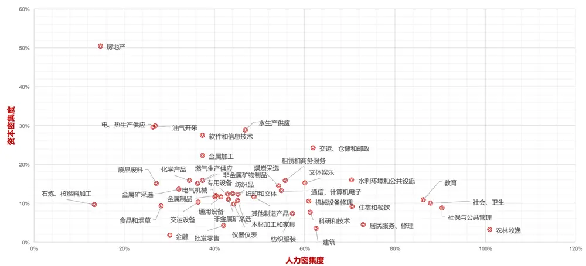
数据来源：国家统计局 & 东方证券研究所

图 3：2015年各行业进出口依赖度（进出口额/GDP）
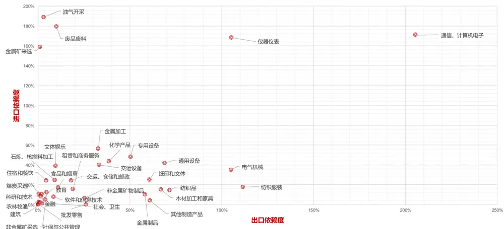
数据来源：国家统计局 & 东方证券研究所

图 4：2015年各行业的消费和投资驱动程度（消费/GDP， 投资/GDP）
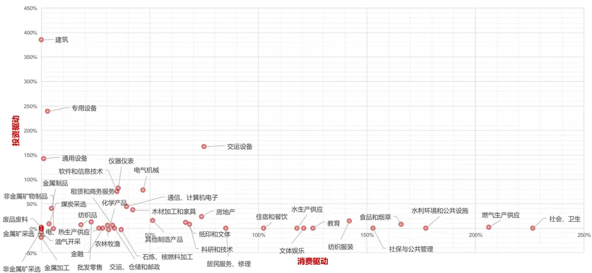
数据来源：国家统计局 & 东方证券研究所

## 二、产业链分析

投入产出表展示了生产要素在行业间的分配流动，从中可以定量梳理产业链上下游的关系，首先我们需要剔除噪音，把“重要”的行业关联找出来。

假设总共有 N 个行业，它们之间的投入产出矩阵记做 $\mathsf{A}=\left\{\mathsf{a}_{\mathrm{i},\mathrm{j}}\right\}^{N*N}$ ，其中元素 $\mathtt{a_{i,j}}$ 表示行业i 对行业 j 的投入金额，定义：

$$
\mathrm{IN_{i}^{(j)}}=\frac{a_{i,j}}{\sum_{h}^{N}a_{h,j}}\ :\ :\ :,\qquad\quad\quad OUT_{i}^{(j)}=\ :\frac{a_{i,j}}{\sum_{h}^{N}a_{i,h}}
$$

$\mathrm{IN}_{\mathrm{i}}^{\mathrm{(j)}}$ 表示在对行业 j 有中间投入的行业里，行业 i 的占比是多少； $OUT_{i}^{(j)}$ 表示行业 i 对其它行业的中间投入中，行业 j 占了多少比例。如果 $\mathrm{IN}_{\mathrm{i}}^{\mathrm{(j)}}$ 和 $OUT_{i}^{(j)}$ 两者同时都大于 3%，我们认为行业i对行业 j 的中间投入是“重要的”，保留 $\mathtt{a_{i,j}}$ 数值；对于其它“不重要”的中间投入， $\mathtt{a_{i,j}}$ 调整为零。调整后的投入产出矩阵记为 A∗。

假设把每个行业看成二维平面上的一个点，如果行业 i 对行业 j 的投入是“重要的”，就画一条点 i 到 j 的带箭头的有向直线，这样行业间的投入产出关系就构成了一张网络图，由中间投入关系决定的产业链就变成图上不同点之间的“路径”。

我们想考察不同行业在这张网络图里的“中心程度”，上下游产业数量越多的行业中心程度越高。网络科学里对网络图顶点的中心程度（Centrality）定义方式有很多，参考 Newman(2010)。下文采用的是居中度（Betweenness）指标。对于顶点 v, 计算时首先取任意两个顶点s,t，找到所有 s 到 t 的最短步长路径，看看其中有多少比例的路径会经过顶点 v；然后让 s 和 t 遍历所有顶点，把所有的比例值相加。这样居中度越高的行业，它身处中游位置的产业链数量越多，在整个经济的位置越接近中心。

图 5：2015年中国投入产出网络结构图
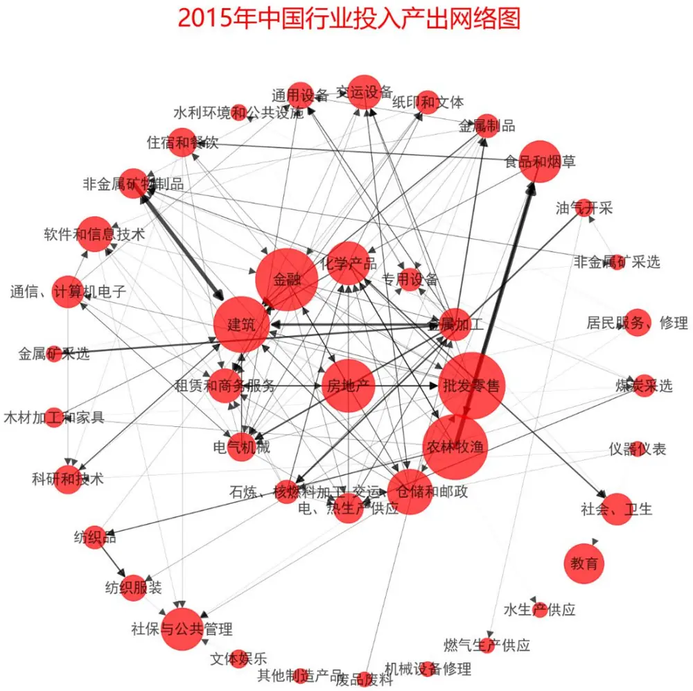
据来源：国家统计局 & 东方证券研究所

利用 Python 里面的 Networkx package，我们自行设计制作了一张 2015 年的中国投入产出网络结构图（图 5）。图表的构建方式如下：

1) 42 个行业对应 42 个顶点（图中红色圆圈），圆圈面积大小表示其行业增加值占当年整个GDP 的比例高低。

2) 各行业按照其居中度数值，从高到低安放在圆心、内圈和外圈上。在内（外）圈上，正上顶点对应的行业居中度是内（外）圈行业中最高的，顺时针方向依次递减。

3) 如果行业i 对行业 j的中间投入是重要的，则在图上画一条顶点i到顶点j的带箭头直线，线条的粗细由中间投入的数值大小决定。

从图 5 可以看到，居中度高的行业（圆心+内圈）里制造业行业数量较多，金融、批发零售、房地产、农林牧渔、建筑等几个高 GDP的大行业居中度也高，处于整个中国经济产业链的中心地带。房地产行业虽然居中度最高，但从它接受的中间投入和对其它行业的中间投入额度来看（图 6），它对产业链上下游的带动作用不是最大的，建筑、化学产品、金属加工三个制造业行业的需求推动能力显著更强。由于两个行业可能互相有较大的中间投入，因此可能互为上下游。

图 6：2015年居中度高的行业的上下游

| 上游行业名称 | 接受的总中间投入 (单位：亿) | 行业名称 （居中度从高到低） | 对外的总中间投入 (单位：亿) | 下游行业 |
| --- | --- | --- | --- | --- |
| 金融 租赁和商务服务 建筑 | 14944.6 | 房地产 | 18850.8 | 金融 批发零售 居民服务、 修理 软件和信息技术 |
| 金融 房地产 租赁和商务服务 | 37907.1 | 批发零售 | 61495.0 | 租赁和商务服务 食品和烟草 纺织服装 化学产品 非金属矿物制品 通用设备 交运设备 电气机械 通信、 计算机电子 建筑 交运、仓储和邮政 |
| 金融 金属矿采选 废品废料 电、热生产供应 | 95011.6 | 金属加工 | 118608.6 | 专用设备 交运设备 电气机械 建筑 金属制品 通用设备 |
| 电气机械 金属加工 金属制品 | 24372.3 | 专用设备 | 13126.4 | 煤炭采选 金属矿采选 非金属矿采选 社会、卫生 |
| 农林牧渔 食品和烟草 电、 热生产供应 石炼、核燃料加工 | 126667.3 | 化学产品 | 150922.1 | 农林牧渔 电气机械 建筑 社会、 卫生 纸印和文体 非金属矿物制品 |
| 房地产 租赁和商务服务 纸印和文体 | 28969.5 | 金融 | 71146.9 | 房地产 租赁和商务服务 电、 热生产供应 建筑 批发零售 金属加工 交运、 仓储和邮政 |
| 金融 科研和技术 电气机械 | 153913.5 | 建筑 | 9857.7 | 房地产 |
| 金融 交运设备 电气机械通信、计算机电子 | 42593.7 | 租赁和商务服务 | 53060.9 | 金融房地产 批发零售 软件和信息技术 |
| 通信、计算机电子 化学产品批发零售 | 51074.9 | 电气机械 | 39799.9 | 专用设备 交运设备 通信、计算机电子 电、 热生产供应 软件和信息技术 建筑 租赁和商务服务 通用设备 |
| 煤炭采选 油气开采 | 28749.2 | 石炼、 核燃料加工 | 35659.1 | 租赁和商务服务 电、热生产供应 化学产品 非金属矿物制品 金属加工 交运、 仓储和邮政 |
| 金融 煤炭采选 电气机械 仪器仪表 | 43789.4 | 电、热生产供应 | 55525.5 | 化学产品 非金属矿物制品 金属加工 金属制品 |
| 金融 交运设备 石炼、核燃料加工 批发零售 | 49140.5 | 交运、 仓储和邮政 | 69948.6 | 交运设备 租赁和商务服务 化学产品 食品和烟草 社保与公共管理 批发零售 建筑 非金属矿物制品 |
| 化学产品 食品和烟草 | 43247.7 | 农林牧渔 | 86731.9 | 食品和烟草 纺织品 木材加工和家具 化学产品 住宿和餐饮 |

数据来源：国家统计局 & 东方证券研究所

作为对比，我们从美国经济分析局（BEA, Bureau of Economic Analysis）上下载了美国市场 2017的投入产出表，并进行作图分析（图 7）。由于美股市场的行业分类更细（71个），为了保证相近的网络密度，我们把判断两个行业间的投入产出是否“重要”的标准从 3%将为 0.5%。为提升显示效果，部分英文行业名称翻译成中文。和美国的产业结构相对应，美国市场上居中度较高的行业几乎都来自于第三产业，“电脑系统设计和相关服务”行业处于整个经济的中央位置。

报告附录部分还提供了 1990、1997、2005 和 2010 年的中国投入产出网络图以供投资者参考，从中可一窥国内产业机构的变迁。

Carvalho(2014) 研究发现，在投入产出网络图上，两个行业的路径距离越近，其行业产出增速在时间序列上的相关性越高，相关系数最高可达 0.3 以上。另外，居中度高的行业处于整个经济产业链的中心，对经济变化的反应最为直接，投资者可以通过跟踪几个核心的居中行业来监测整个经济的变化。由于国内历史数据短，且统计局的行业分类有过多次调整，这些结论在国内较难验证。我们报告下文主要考察有上下游关系的行业，其行业内上市公司的股价是否存在领先滞后关系，或者说能否通过某个行业当期收益率预测与它关联的某个行业未来一期或几期的收益。

图 7：2017年美国投入产出网络结构图
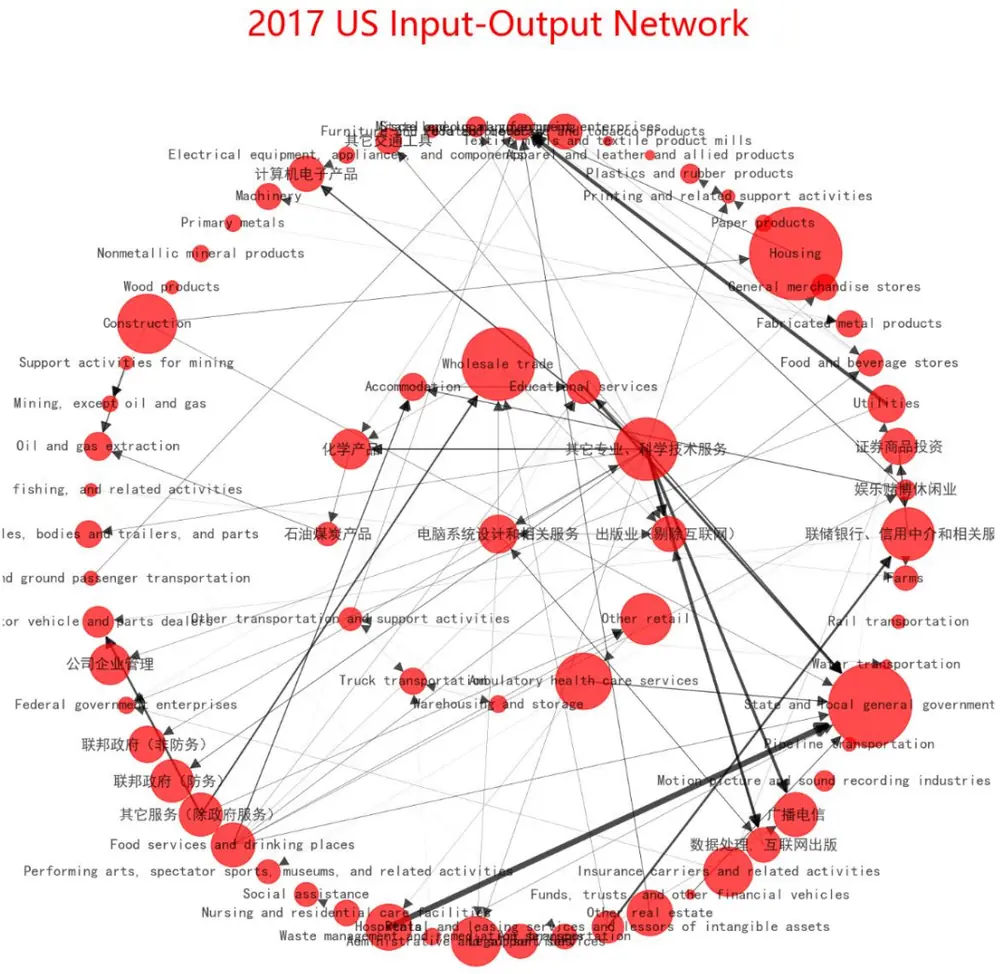
数据来源：BEA& 东方证券研究所

## 三、产业链上公司的股价关联

投入产出图可以告诉我们不同行业在基本面上的关联，而投资者更关心的是对应行业的股价是否也有可利用的联动效应。逻辑上讲，利好或利空冲击在产业链上的传递需要时间，对应产业链上的股票价格可能也会有先后的轮动，产生投资机会。不过公司盈利 E 变动转换成股票价格 P 的变动，中间相差一个 PE估值，而估值会随市场资金和情绪而剧烈波动，行业间基本面的关联不一定能传递到股价上；另外，行业内的企业不一定会在 A 股上市，上市公司构成的行业指数可能只代表该行业的一小部分。策略实际效果如何得拿数据验证。

报告下文采用中证二级行业指数（共83个）作为研究对象，首先在全样本内(2011.01 –2018.10)用第 i 个行业的月度超额收益率（相对中证全指） $\mathbf{r}_{t}^{\left(\mathrm{i}\right)}$ 作为自变量，通过 OLS 回归来预测 L 个月后行业j的月度超额收益 $\boldsymbol{\mathrm{r}}_{t+L}^{(\mathrm{j})}$

$$
\begin{array}{rlrlrl}{\mathrm{r}_{t+L}^{\mathrm{(j)}}}&{{}\sim}&{}&{{}1}&{}&{{}+}&{\mathrm{\Delta r}_{t}^{\mathrm{(i)}}}&{{}+\epsilon}\end{array}
$$

i 和 j 遍历所有行业，共作了 $83^{\star}83$ 次回归；滞后期 L 分别取 1、2、3、6 个月，如果回归方程在0.05 置信度下显著，则记录下回归方程的 Rsqured，汇总成图 8 的热度图。第 i 行第 j 列的点代表行业 i当月超额收益可以显著预测 L个月后行业 j 的超额收益，颜色深度代表 Rsqured的大小。

图 8：行业超额收益的领先滞后分析（2011.01 – 2018.10）
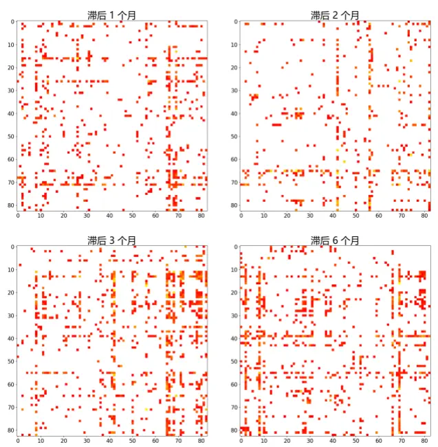
资料来源：东方证券研究所 & Wind 资讯

图 9：行业超额收益的领先滞后分析(2011.01- 2015.12)
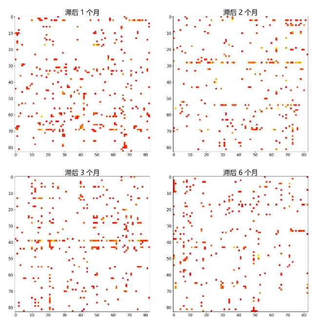
资料来源：东方证券研究所 & Wind 资讯

可以看到，样本内有不少行业间的超额收益确实存在显著的领先滞后特性，但这种领先滞后性和两个行业间是否具备产业链上的关联并无太大关系。比方说，以图 8中滞后一个月的热度图为例，显著点的密度（显著点数量/(83*83)）为 5.4%。然后我们只考虑那些具备产业链上下游关系的行业（基于 2015年投入产出图，由于中信行业分类和统计局行业分类不一致，我们进行了手动近似匹配），显著点的密度为 6.1%，数值略高，但并不显著，产业链上下游关系并没有让对应行业的股价有明显更高的关联度。另外，如果我们把回溯区间从 2011.01 – 2018.10 缩减到 2011.01 –2015.12，可以热力图（图 9）变化明显，显著点密度明显降低，说明行业间的领先滞后关系在时间序列上可能不稳定。

最后，我们用更长的历史数据（2006.01 – 2018.10）构建了行业选择投资策略来验证行业领先滞后性在实际投资中的作用。步骤如下：

1) 用过去五年数据作为滚动窗口，每个行业 j 通过线性回归选取对其有显著预测作用的行业

2) 用这些有显著预测作用行业的滞后期收益预测行业 j 下个月的超额收益，验证过的预测方法包括：多元线性回归、LASSO、以及 Rapach (2010) 的单变量预测合成法

3) 计算模型预测超额收益和真实收益的 IC 系数，并选取预测收益最高的 20%的行业等权构建组合看能不能跑赢所有行业等权构建的行业指数组合。

策略回溯测试结果不佳，IC和TOP 组合的超额收益都在零附近，并不显著。这个结果一定程度上也可以辅助说明 图 8、 图 9 的结果，行业间的股价领先滞后关系在时间上不稳定，样本内看有，但样本外很难利用起来获取投资收益。参考 Rapach(2010)的研究，回归模型中加入一些其它的宏观因素或许能提升模型的预测效果。另外，海外一些未正式发表的文献里有成功的行业轮动实证结果，例如 Tomas(2016), Rapach(2015)，分别用的是 VAR 和 Adaptive Lasso 方法，不过后者近期已经从 SSRN上撤稿，模型的有效性待进一步确认。

## 风险提示

1. 量化模型基于历史数据分析得到，未来存在失效的风险，建议投资者紧密跟踪模型表现。

2. 极端市场环境可能对模型效果造成剧烈冲击，导致收益亏损。

## 参考文献

[1]. Carvalho, V.M. , (2014), “ From Micro to Macro via Production Networks”, Journal of Economic Perspectives, vol 28(4), pp: 23-48

[2]. Newman, M.E.J., (2010), “ Networks, An Introduction”, Oxford University Press.

[3]. Rapach, D.E., (2010), “Out-of-Sample Equity Premium Prediction: Combination Forecasts and Links to the Real Economy”, The Review of Financial Studies, vol 23(2), pp: 821-862.

[4]. Rapach, D.E., Strauss, J., Tu, J., Zhou, G., (2015), “Industry Interdependencies and Cross Industry Return Predictability”, working paper, available at: https://ink.library.smu.edu.sg/lkcsb_research/4515.

[5]. Thomas, B., Marjani, R.K., Alex,W., (2016), “Supply Chain Predictability of Returns and Portfolio Selection” . Available at SSRN: https://ssrn.com/abstract=2755474

## 附录

附录图 1：2010年中国投入产出网络结构图

2010年中国行业投入产出网络图
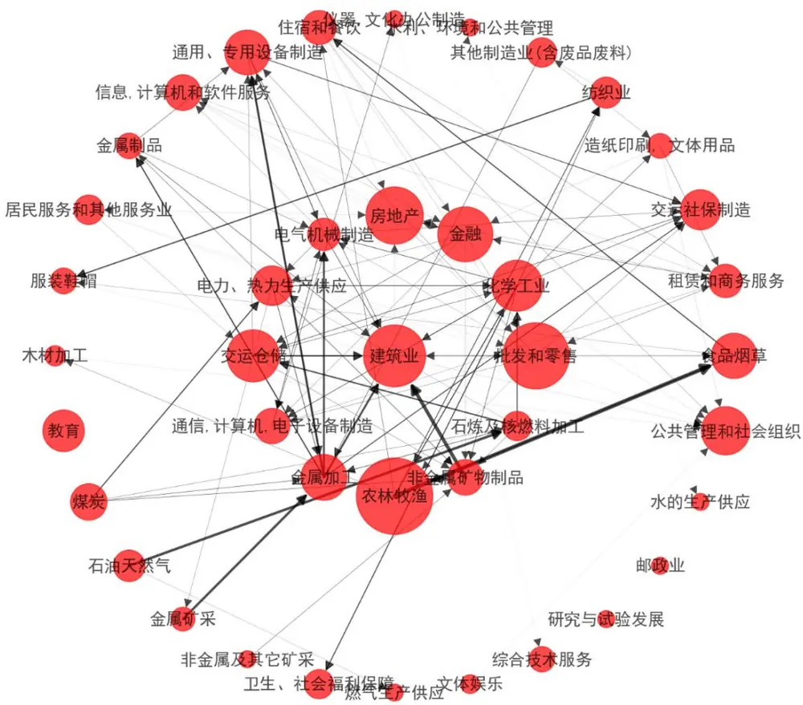
据来源：国家统计局 & 东方证券研究所

附录图 2：2005年中国投入产出网络结构图
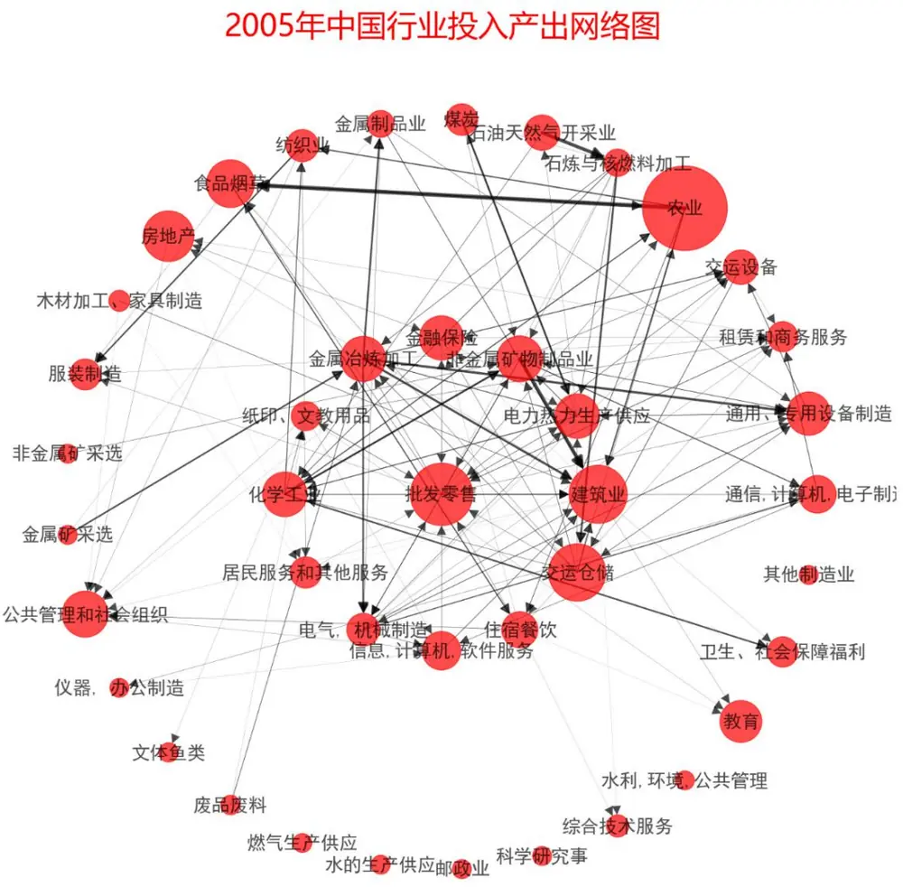
据来源：国家统计局 & 东方证券研究所

附录图 3：1997年中国投入产出网络结构图

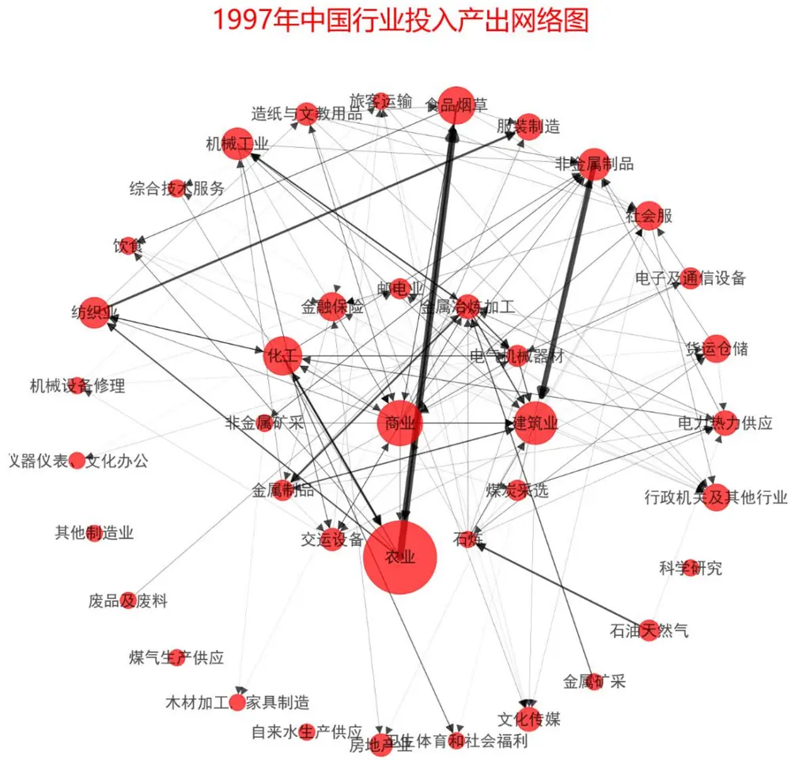
据来源：国家统计局 & 东方证券研究所

附录图 4：1990年中国投入产出网络结构图

1990年中国行业投入产出网络图
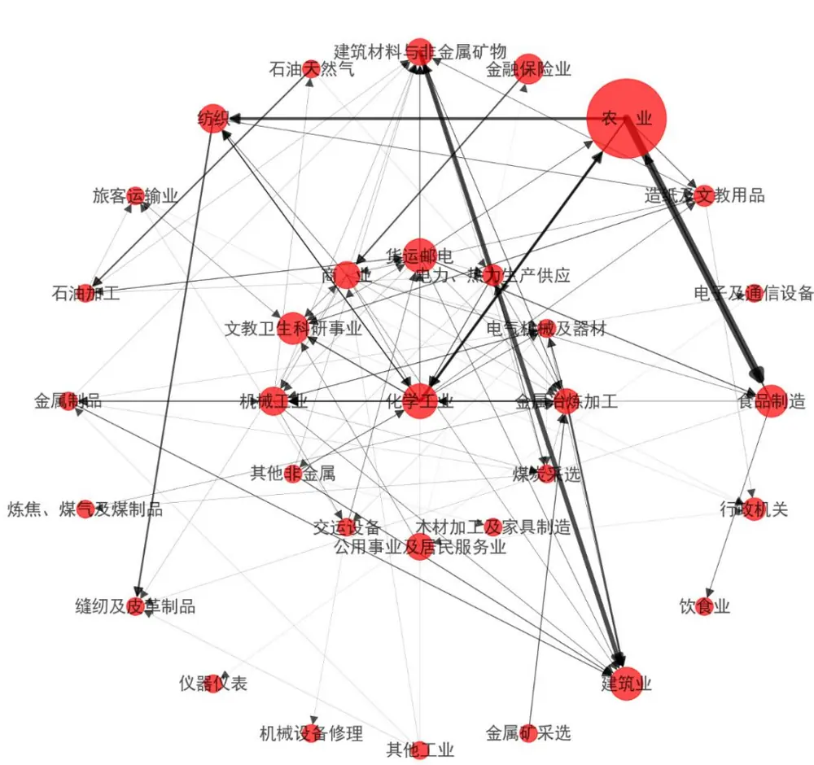
据来源：国家统计局 & 东方证券研究所

## Table_Disclaimer 分析师申明

每位负责撰写本研究报告全部或部分内容的研究分析师在此作以下声明：

分析师在本报告中对所提及的证券或发行人发表的任何建议和观点均准确地反映了其个人对该证券或发行人的看法和判断；分析师薪酬的任何组成部分无论是在过去、现在及将来，均与其在本研究报告中所表述的具体建议或观点无任何直接或间接的关系。

## 投资评级和相关定义

报告发布日后的 12个月内的公司的涨跌幅相对同期的上证指数/深证成指的涨跌幅为基准；

## 公司投资评级的量化标准

买入：相对强于市场基准指数收益率 15%以上；

增持：相对强于市场基准指数收益率 5%～15%；

中性：相对于市场基准指数收益率在-5%～+5%之间波动；

减持：相对弱于市场基准指数收益率在-5%以下。

未评级——由于在报告发出之时该股票不在本公司研究覆盖范围内，分析师基于当时对该股票的研究状况，未给予投资评级相关信息。

暂停评级——根据监管制度及本公司相关规定，研究报告发布之时该投资对象可能与本公司存在潜在的利益冲突情形；亦或是研究报告发布当时该股票的价值和价格分析存在重大不确定性，缺乏足够的研究依据支持分析师给出明确投资评级；分析师在上述情况下暂停对该股票给予投资评级等信息，投资者需要注意在此报告发布之前曾给予该股票的投资评级、盈利预测及目标价格等信息不再有效。

## 行业投资评级的量化标准：

看好：相对强于市场基准指数收益率 5%以上；

中性：相对于市场基准指数收益率在-5%～+5%之间波动；

看淡：相对于市场基准指数收益率在-5%以下。

未评级：由于在报告发出之时该行业不在本公司研究覆盖范围内，分析师基于当时对该行业的研究状况，未给予投资评级等相关信息。

暂停评级：由于研究报告发布当时该行业的投资价值分析存在重大不确定性，缺乏足够的研究依据支持分析师给出明确行业投资评级；分析师在上述情况下暂停对该行业给予投资评级信息，投资者需要注意在此报告发布之前曾给予该行业的投资评级信息不再有效。

## HeadertTabl e_Discl ai mer 免责声明

本证券研究报告（以下简称“本报告”）由东方证券股份有限公司（以下简称“本公司”）制作及发布。

本报告仅供本公司的客户使用。本公司不会因接收人收到本报告而视其为本公司的当然客户。本报告的全体接收人应当采取必要措施防止本报告被转发给他人。

本报告是基于本公司认为可靠的且目前已公开的信息撰写，本公司力求但不保证该信息的准确性和完整性，客户也不应该认为该信息是准确和完整的。同时，本公司不保证文中观点或陈述不会发生任何变更，在不同时期，本公司可发出与本报告所载资料、意见及推测不一致的证券研究报告。本公司会适时更新我们的研究，但可能会因某些规定而无法做到。除了一些定期出版的证券研究报告之外，绝大多数证券研究报告是在分析师认为适当的时候不定期地发布。

在任何情况下，本报告中的信息或所表述的意见并不构成对任何人的投资建议，也没有考虑到个别客户特殊的投资目标、财务状况或需求。客户应考虑本报告中的任何意见或建议是否符合其特定状况，若有必要应寻求专家意见。本报告所载的资料、工具、意见及推测只提供给客户作参考之用，并非作为或被视为出售或购买证券或其他投资标的的邀请或向人作出邀请。

本报告中提及的投资价格和价值以及这些投资带来的收入可能会波动。过去的表现并不代表未来的表现，未来的回报也无法保证，投资者可能会损失本金。外汇汇率波动有可能对某些投资的价值或价格或来自这一投资的收入产生不良影响。那些涉及期货、期权及其它衍生工具的交易，因其包括重大的市场风险，因此并不适合所有投资者。

在任何情况下，本公司不对任何人因使用本报告中的任何内容所引致的任何损失负任何责任，投资者自主作出投资决策并自行承担投资风险，任何形式的分享证券投资收益或者分担证券投资损失的书面或口头承诺均为无效。

本报告主要以电子版形式分发，间或也会辅以印刷品形式分发，所有报告版权均归本公司所有。未经本公司事先书面协议授权，任何机构或个人不得以任何形式复制、转发或公开传播本报告的全部或部分内容。不得将报告内容作为诉讼、仲裁、传媒所引用之证明或依据，不得用于营利或用于未经允许的其它用途。

经本公司事先书面协议授权刊载或转发的，被授权机构承担相关刊载或者转发责任。不得对本报告进行任何有悖原意的引用、删节和修改。

提示客户及公众投资者慎重使用未经授权刊载或者转发的本公司证券研究报告，慎重使用公众媒体刊载的证券研究报告。

## 东方证券研究所

地址：上海市中山南路 318 号东方国际金融广场 26 楼

联系人： 王骏飞

电话：021-63325888*1131

传真：021-63326786

网址： www.dfzq.com.cn

Email： wangjunfei@orientsec.com.cn