## ——《量化策略研究 之 三》

## 研究结论

⚫ 本篇报告我们从行业基本面角度入手，基于行业当前的财务数据和分析师预期业绩情况构建行业轮动策略，并在选股和选基中进行应用。

财务指标改善意味着行业基本面向好。国家统计局公布的工业企业财务数据月度发布，相较于上市公司季报，时效性更高。分析师一致预期是专业人士对企业业绩给出的预判，一致预期提高说明行业基本面预期改善。

⚫ 统计局数据仅只包含工业类企业，不包括第一、第三产业。当前 A 股工业类上市公司的数量和市值占比较高，数量占比近 70%，市值占比达 65%。

统计局公布的工业企业行业分类与上市公司通常使用的行业分类方式有一定差异，需要将统计局使用的工业企业行业分类与证监会新版二级行业进行手动匹配，总共可获得 40个行业，有 38个行业有上市公司。

统计局公布的工业企业的营收、利润增速，和 A股工业类上市公司的营收、利润增速之间，有着很好的同步性。统计局数据更新更及时，可以用统计局数据来预判 A 股工业类上市公司的盈利情况。

选取工业企业利润总额的累计同比 、营业收入的累计同比、销售净利率的累计同比、资产负债率同比增速、分析师一致预期行业净利润同比增速这5 个指标，构建行业轮动策略。

从合成行业因子结果来看：2007 年以来 top5 行业组合年化收益 16.57%，bottom5 行业组合年化收益-1.01%，多头超额 7.44%，多空超额 8.45%。2019 年以来 top5 行业组合年化绝对收益 39%，超额 14%，今年 top5 行业组合绝对收益 30.55%，bottom5 行业绝对收益 4.31%。

在指数增强组合中，可以引入行业轮动策略调整行业暴露敞口和个股zscore 得分。对应的沪深300增强组合相比于行业完全中性组合，年化收益可以提高 1%左右，信息比也从 2.6 提升到2.74。

在优选基金组合中，可以引入行业轮动策略：高夏普比叠加行业轮动策略对应的基金组合，2010 年以来相对于等权基金池，平均可取得 8.69%的年化超额收益，年度胜率 83%。

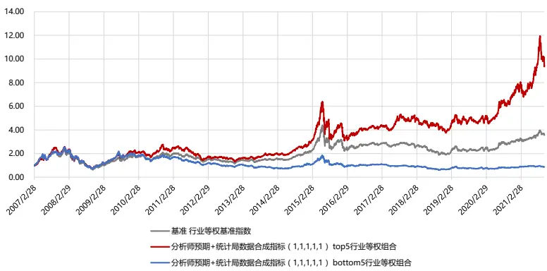

## 风险提示

⚫ 量化模型失效风险

⚫ 市场极端环境的冲击

## 报告发布日期

2021 年 11 月 27 日

证券分析师朱剑涛

021-63325888*6077

zhujiantao@orientsec.com.cn

执业证书编号：S0860515060001

证券分析师刘静涵

021-63325888*3211

liujinghan@orientsec.com.cn

执业证书编号：S0860520080003

## 相关报告

基于机器学习模型的债券流动性预测：——2021-11-23宏观固收量化研究系列之（五）

基于大单的 alpha 因子构建：—— 因子选 2021-10-27股系列之 七十九

存在于全市场范围内的稳健动量效应：——2021-09-02《因子选股系列研究 之 七十八》

“居中”和“离群”股的 Alpha：——《因 2021-08-15子系列选股研究之七十七》

基于委托订单数据的 alpha 因子：——因子 2021-07-22选股系列之七十六

移动大数据揭示的上市公司金融热度2021-06-10

适用 A 股不同股票池的统计风险模型：— 2021-06-03—《因子选股系列研究 之 七十五》

神经网络日频 alpha 模型初步实践：——因 2021-03-11子选股系列之七十四

更稳健易算的分析师盈利上调因子：——2021-03-09《因子选股系列研究 之 七十三》

A股市场存在明显的行业轮动现象，不同行业的股票经常轮换性地表现出相对的强势与弱势，此起彼伏。如果能准确地把握行情轮动的切换点，始终配置强势板块，就能进一步提升投资收益。本篇报告我们从行业基本面角度入手，基于行业当前的财务数据和分析师预期业绩情况构建行业轮动策略，并在选股和选基中进行应用。

## 一、行业轮动指标体系构建

财务数据和分析师预期数据是刻画行业基本面的两个主要维度。

（1）财务指标的改善意味着行业基本面向好。上市公司发布的正式财报频率太低，存在较长的业绩空窗期，并且信息较为滞后。业绩快报、预告覆盖度低，且披露的财务数据单一。本篇报告尝试使用国家统计局公布的工业企业财务数据，数据月度发布，相较于上市公司季报，时效性更高。

（2）一致预期的提高说明行业基本面预期改善。分析师预期数据是专业人士对企业业绩给出的预判。一致预期是通过对分析师预测数据进行加权而得到的综合预测，代表了分析师对于公司未来经营情况的综合评价，其中暗含了企业未来的盈利信息。

## 1.1 基于工业企业财务数据

## 1. 披露时间

国家统计局会定期披露工业企业经济效益报告，2007-2010 年仅有 2、5、8、11 月的报告，2011年之后除 1 月外，其他月份均有月度报告1。数据披露时间可以根据前一年末发布的主要统计信息发布日程表来确定。需要注意的是，受春节假期影响，每年 12 月份月度报告的披露时间不固定，可能是 1 月底，也可能是2 月上旬。为统一起见，后续测试统一在 2 月底才使用 12月份报告的数据。此外，由于 2007-2010 年的数据披露时间无法查证，为避免引入未来信息，后续测试统一滞后三个月使用报告数据。例如在 2007 年 2 月的报告数据到 2007 年 5 月底才使用。

图 1：2020、2021 年工业企业经济效益月度报告披露时间

| 工业经济效益月度报告 | 2021年度 | 2020年度 |
| --- | --- | --- |
| 1月 | 不公布 | 不公布 |
| 2月 | 2021.3.27 9:30 | 2020.3.27 9:30 |
| 3月 | 2021.4.27 9:30 | 2020.4.27 9:30 |
| 4月 | 2021.5.27 9:30 | 2020.5.27 9:30 |
| 5月 | 2021.6.27 9:30 | 2020.6.28 9:30 |
| 6月 | 2021.7.27 9:30 | 2020.7.27 9:30 |
| 7月 | 2021.8.27 9:30 | 2020.8.27 9:30 |
| 8月 | 2021.9.27 9:30 | 2020.9.27 9:30 |
| 9月 | 2021.10.27 9:30 | 2020.10.27 9:30 |
| 10月 | 2021.11.27 9:30 | 2020.11.27 9:30 |
| 11月 | 2021.12.27 9:30 | 2020.12.27 9:30 |
| 12月 | 2022.1.27 9:30 | 2021.2.3 9:30 |

数据来源：东方证券研究所 & 国家统计局

## 2. 披露行业

统计局公布的工业企业行业分类与上市公司通常使用的行业分类方式有一定差异：

（1）只包含工业类企业，不包括第一产业（农林牧渔）和第三产业（服务业，包括高科技产业，流通业，金融业）。

（2）统计全行业范围的企业数据，不仅包括上市公司。目前，国家统计局月度工业统计的范围是规模以上工业企业，即年主营业务收入在 2000 万元及以上的企业。例如烟草制造业没有上市公司。

我们将统计局使用的工业企业行业分类（大类）与证监会新版二级行业进行了匹配，总共可获得 40 个行业，有 38个行业有上市公司，匹配规则如下图。

图 2：工业企业行业分类与证监会新版二级行业分类对照表

| 行业序号 | SAC新版二级行业代码 | SAC新版二级行业 | 工业企业行业分类 | 当前规模以上工业企业单位数 | 当前行业内上市公司个数 | 行业在300指数中的权重占比 | 行业在500指数中的权重占比 |
| --- | --- | --- | --- | --- | --- | --- | --- |
|  | 1202010000 | 煤炭开采和洗选业 | 煤炭开采和洗选业 | 4,322 |  | 0.58% | 1.55% |
| 1 2 | 1202020000 | 石油和天然气开采业 | 石油和天然气开采业 | 143 | 22 7 | 0.55% | 0.43% |
| 3 | 1202030000 | 黑色金属矿采选业 | 黑色金属矿采选业 | 1,314 | 6 | 0.00% | 0.09% |
|  |  |  | 有色金属矿采选业 | 1,196 | 20 | 1.20% |  |
| 4 | 1202040000 | 有色金属矿采选业 非金属矿采选业 |  |  | 1 | 0.00% | 1.67% |
| 5 6 | 1202050000 |  | 非金属矿采选业 开采专业及辅助性活动 | 3,439 285 | 16 | 0.04% | 0.00% 0.44% |
| 7 | 1202060000 | 开采辅助活动 |  | 5 |  | 0.00% |  |
|  | 1202070000 | 其他采矿业 | 其他采矿业 | 22,094 | 49 | 1.57% | 0.00% |
| 8 9 | 1203010000 | 农副食品加工业 | 农副食品加工业 | 8,375 | 58 | 2.09% | 1.15% |
|  | 1203020000 | 食品制造业 | 食品制造业 | 5,509 | 40 | 10.76% | 1.02% |
| 10 11 | 1203030000 | 酒、饮料和精制茶制造业 | 酒、饮料和精制茶制造业 | 18,592 | 40 |  | 2.20% |
| 12 | 1203050000 | 纺织业 | 纺织业 | 12,557 | 34 | 0.00% | 0.00% |
| 13 | 1203060000 | 纺织服装、服饰业 | 纺织服装、服饰业 |  |  | 0.00% | 0.62% |
| 14 | 1203070000 | 皮革、毛皮、羽毛及其制品和制鞋业 | 皮革、毛皮、羽毛及其制品和制鞋业 | 7,749 | 10 7 | 0.00% | 0.00% |
| 15 | 1203080000 | 木材加工和木、竹、藤、棕、草制品业 | 木材加工及木、竹、藤、棕、草制品业 | 10,052 | 23 | 0.00% | 0.00% |
| 16 | 1203090000 | 家具制造业 | 家具制造业 | 6,596 6,705 | 32 | 0.12% 0.00% | 0.17% |
| 17 | 1203100000 | 造纸和纸制品业 | 造纸及纸制品业 | 5,958 | 14 |  | 0.95% |
| 18 | 1203110000 | 印刷和记录媒介复制业 | 印刷业和记录媒介的复制 | 8,998 | 15 | 0.00% 0.12% | 0.18% |
| 19 | 1203120000 | 文教、工美、体育和娱乐用品制造业 | 文教、工美、体育和娱乐用品制造业 石油、煤炭及其他燃料加工业 | 2,133 | 17 | 0.00% | 0.00% |
| 20 | 1203130000 | 石油加工、炼焦和核燃料加工业 |  | 22,228 | 264 | 1.63% | 0.38% |
| 21 | 1203140000 1203150000 | 化学原料和化学制品制造业 | 化学原料及化学制品制造业 | 8,282 | 253 | 5.52% | 9.02% |
| 22 |  | 医药制造业 | 医药制造业 |  | 25 |  | 5.95% |
| 23 | 1203160000 | 化学纤维制造业 | 化学纤维制造业 | 1,970 21,131 | 91 | 0.61% 1.23% | 1.05% |
| 24 | 1203170000 1203180000 | 橡胶和塑料制品业 | 橡胶和塑料制品业 | 40,454 | 97 | 3.49% | 0.46% |
| 25 | 1203190000 | 非金属矿物制品业 | 非金属矿物制品业 |  | 30 |  | 2.70% |
| 26 | 1203200000 | 黑色金属冶炼和压延加工业 | 黑色金属冶炼及压延加工业 | 5,392 7,758 | 74 | 0.73% 2.01% | 2.70% |
| 27 | 1203210000 | 有色金属冶炼和压延加工业 | 有色金属冶炼及压延加工业 | 27,527 | 75 | 0.04% | 3.42% |
| 28 | 1203220000 | 金属制品业 | 金属制品业 | 27,011 | 144 | 0.59% | 0.96% |
| 29 | 1203230000 | 通用设备制造业 | 通用设备制造业 | 21,543 | 264 | 2.90% | 1.38% |
| 30 | 1203240000 | 专用设备制造业 | 专用设备制造业 | 16,295 | 140 | 3.44% | 3.73% |
| 31 | 1203250000 | 汽车制造业 | 汽车制造 | 4,968 | 63 | 1.60% | 3.79% |
| 32 |  | 铁路、船舶、航空航天和其他运输设备制造业 | 铁路、船舶、航空航天和其他运输设备制造业 |  | 249 | 6.50% | 2.40% |
| 33 | 1203260000 | 电气机械和器材制造业 | 电气机械及器材制造业 | 27,394 | 419 | 10.35% | 8.26% |
|  | 1203270000 | 计算机、通信和其他电子设备制造业 | 计算机、通信和其他电子设备制造业 | 21,339 | 60 |  | 10.85% |
| 34 | 1203280000 | 仪器仪表制造业 | 仪器仪表制造业 | 5,364 | 19 | 0.00% | 0.00% |
| 35 | 1203290000 | 其他制造业 | 其他制造业 | 1,760 | 7 | 0.00% | 0.14% |
| 36 | 1203300000 | 废弃资源综合利用业 | 废弃资源综合利用业 | 2,276 |  | 0.00% | 0.82% |
| 37 | 1203310000 | 金属制品、机械和设备修理业 | 金属制品、机械和设备修理业 | 553 | 73 | 0.00% | 0.00% |
| 38 | 1204010000 | 电力、热力生产和供应业 | 电力、热力的生产和供应业 | 10,201 |  | 2.06% | 2.03% |
| 39 40 | 1204020000 1204030000 | 燃气生产和供应业 水的生产和供应业 | 燃气生产和供应业 水的生产和供应业 | 2,676 2,812 | 25 16 | 0.00% 0.00% | 0.37% 0.52% |

数据来源：东方证券研究所 & Wind 资讯 & 国家统计局
注：标红意味着工业企业行业名称和 SAC 新版二级行业名称有所差别

A股工业类上市公司的数量和市值占比较高，当前 4031个上市公司中有 2799 个属于工业企业，数量占比近 70%，流通市值占比达 65%。其中计算机、通信和其他电子设备制造业、化学原料及化学制品制造业、专用设备制造业、医药制造业、电气机械及器材制造业这 5 个行业中的上市公司个数最多，其他采矿业、金属制品、机械和设备修理业当前无上市公司。

不同行业在宽基指数中的占比不同。300 指数成分内工业企业占比近 60%，其中酒、饮料和精制茶制造业，计算机、通信和其他电子设备制造业占比超 10%。500 指数成分内工业企业占比近 72%，其中计算机、通信和其他电子设备制造业占比超 10%。

图 3：工业类上市公司数量&流通市值占比变化
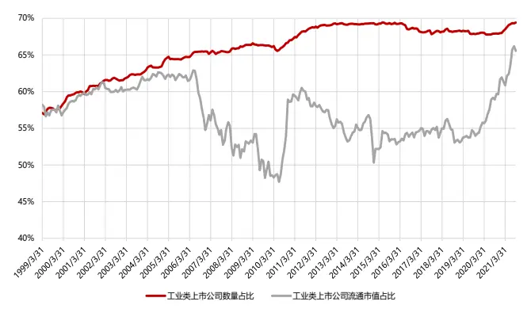
数据来源：东方证券研究所 & Wind 资讯 & 国家统计局

图 4：工业企业主要行业在 300 和 500 指数内的权重占比
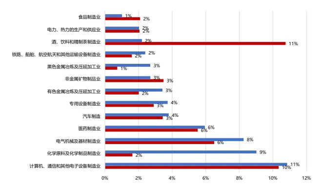
数据来源：东方证券研究所 & Wind 资讯 & 国家统计局

## 3. 披露指标

下图展示了统计局在工业企业经济效益报告中披露的指标，涉及企业利润表指标、资产负债表指标、财务分析指标和企业信息。数据是由企业在国家联网直报系统中自行填报，然后再由统计局直接汇总而成的。部分财务数据，统计局会同时公布累计值和累计同比。需要注意的是，工业企业的财务数据和工业增加值一样，是针对规模以上工业企业统计的，符合这个标准的企业每期都不同，如果简单的用前后两年实际公布的累计值计算同比指标，会存在口径不可比的问题。因此，统计局在计算指标同比时，使用的不是上年实际公布的数值，而是今年规模以上工业企业上报的上年同期数，按照今年当期数除以今年上报的上年同期数来计算同比增速。基于此，如果统计局公布了“同比”字段，则使用统计局披露的同比结果，如果未公布同比，则按前后两年数据自行计算。

图 5：工业企业经济效益报告的披露指标

| 指标大类 | 财务指标 | 披露起始时间 | 披露结束时间 | 披露频率 |  |
| --- | --- | --- | --- | --- | --- |
| 利润表 | 营业收入 | 2017-02 |  | 月 |  |
|  | 主营业务收入 | 1999-02 | 2018-12 | 月 |  |
|  | 营业成本 | 2017-02 |  | 月 |  |
|  | 主营业务成本 | 1999-02 | 2018-12 | 月 |  |
|  | 管理费用 | 1999-02 |  | 月 |  |
|  | 财务费用 | 1999-02 |  | 月 |  |
|  | 营业费用 | 1999-02 |  | 月 |  |
|  | 利息费用 | 2012-02 |  | 月 |  |
|  | 投资收益 | 2018-02 |  | 月 |  |
|  | 营业利润 | 2018-02 |  | 月 |  |
|  | 利润总额 | 1999-02 |  | 月 |  |
|  | 资产负债表 | 应收账款 | 1999-02 |  | 月 |
| 存货 |  | 2012-02 |  | 月 |  |
| 产成品 |  | 1999-02 |  | 月 |  |
| 流动资产平均余额 |  | 1999-02 |  | 月 |  |
| 资产总计 |  | 1999-02 |  | 月 |  |
| 负债总计 |  | 1999-02 |  |  |  |
| 所有者权益总计 |  | 2020-02 |  | 月 |  |
| 财务分析指标 | 销售利润率 | 1999-02 |  | 月 |  |
|  | 资产负债率 | 1999-02 |  | 月 |  |
| 企业信息 |  |  |  | 月 |  |
|  | 企业单位数 | 1999-02 |  | 月 |  |
|  | 亏损企业单位数 | 1999-02 |  | 月 |  |
|  | 亏损企业亏损总额 | 2001-02 |  | 月 |  |
|  | 全部从业人员平均人数 平均用工人数 | 1999-02 2020-02 |  | 月 月 |  |

数据来源：东方证券研究所 & 国家统计局

注：为全面反映工业企业收入规模，从 2019 年起，用“营业收入”取代“主营业务收入”，用“营业成本”取代“主营业务成本”，相关指标相应调整。

A股：工业企业利润总额-累计同比统计局：工业企业利润总额-累计同比

在工业企业所有财务指标中，营收、利润数据尤为关键，这直接反映了工业企业的盈利状况，而且可以和 A 股上市公司数据相联系，对投资产生直接的指导意义。下面我们对比了基于统计局公布的工业企业营收、利润总额同比指标，和 A 股工业类上市公司的营收、利润总额同比指标。

可以看出：统计局公布的工业企业的营收、利润增速，和 A 股工业类上市公司的营收、利润增速之间，有着很好的同步性，尤其是利润增速趋势几乎完全一致。统计局发布的工业企业利润指标是月度数据，相较于上市公司按季度发布的财报数据，时效性更高。宏观统计口径下的工业企业数据和 A 股数据之间的高同步性，意味着我们可以用统计局数据来预判 A 股工业类上市公司的盈利情况。例如 2020年 4 月份开始，统计局公布的工业企业营收、利润累计同比明显反弹，基本上就可以提前判断工业上市公司的二季度盈利数据也会好转。

图 6：统计局工业企业营收&利润总额同比与 A 股工业类上市公司营收&利润总额同比走势对比
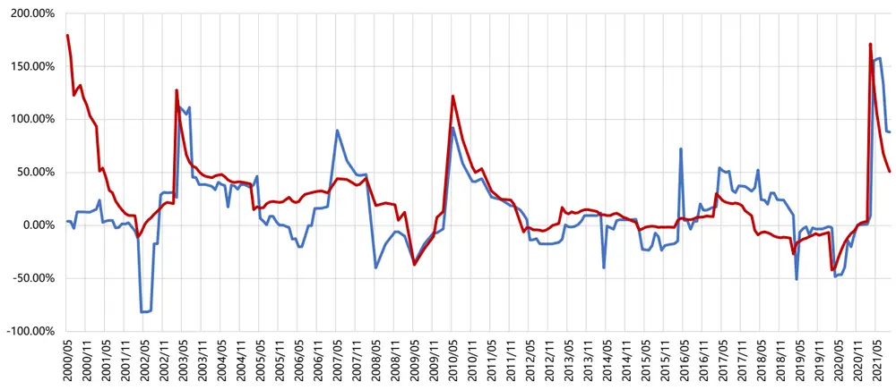

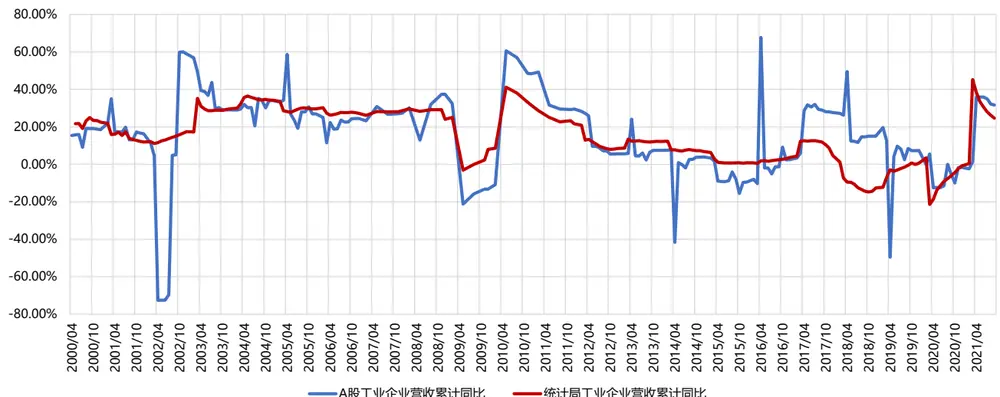
数据来源：东方证券研究所 & Wind 资讯 & 国家统计局
注：2019 年前营收数据采用“主营业务收入字段”，2019 年后采用“营业收入”字段，故 2019 年的营收增速数据有些偏差。

考虑到行业数据存在季节效应，最终我们选取了工业企业利润总额的累计同比2、营业收入的累计同比、销售净利率的累计同比、资产负债率同比增速这四个指标。前两个指标采用统计局公布的累计同比字段，后两个字段采用前后两年数据自行计算。从指标逻辑上看：

（1）行业利润总额的累计同比、营业收入的累计同比反映了行业成长趋势的加速。优异的成长性是支撑公司股价上涨的重要因素。

（2）行业销售净利率的累计同比反映了行业盈利能力的改善。近年来投资者越来越重视公司的质量，盈利能力是衡量公司质量优劣的重要维度，其中销售净利率则是衡量盈利能力的朴素指标。

（3）行业资产负债率同比增速反映了行业资产结构的变动。资产负债率反映企业的负债水平，过高表明企业偿债能力不足，财务风险较高，过低则表明企业对财务杠杆的利用不足，融资能力欠佳。不同行业之间的资产负债率本身不可比，我们选取行业资产负债率相比去年的同比增速来衡量行业负债程度的变化。

## 1.2 基于分析师预期数据

近年来，随着分析师预期数据质量的不断提升，分析师预期类指标的有效性不断被挖掘，已经成为一类不可或缺的 Alpha 信息源。其中，分析师盈利预测数据的应用最为广泛。本篇报告采用朝阳永续的一致预期净利润数据，采用 2 种一致预期计算方法：加权计算（90 天内有 5 家以上机构出具了该股的预测，对机构影响力和时间影响力进行双重加权）、补充估算（90 天内有不足 5家机构出具了该股的预测，按照相关估算方法计算出一致预期）。

下面我们首先考察分析师一致预期数据的覆盖度。由于分析师有时会给出未来多个年份的盈利预测，所以我们仅考察最近一年的盈利预测数据。可以看到：大部分时间 70%以上的股票都有分析师一致预期数据覆盖，2007 年以来全市场覆盖度先升后降。值得注意的是，2017 年以来数据覆盖度下降趋势明显。这可能和 2017 年的龙头股行情有关，卖方分析师覆盖的股票向头部集中，小票无人关注，同时新股发行数量不断增加，进而导致数据覆盖度显著下降。从行业来看，不同行业中分析师预期指标覆盖度相对较为平均，各行业历史平均覆盖率均超 70%。

图 7：分析师一致预期数据在全市场的覆盖度(最近一年)
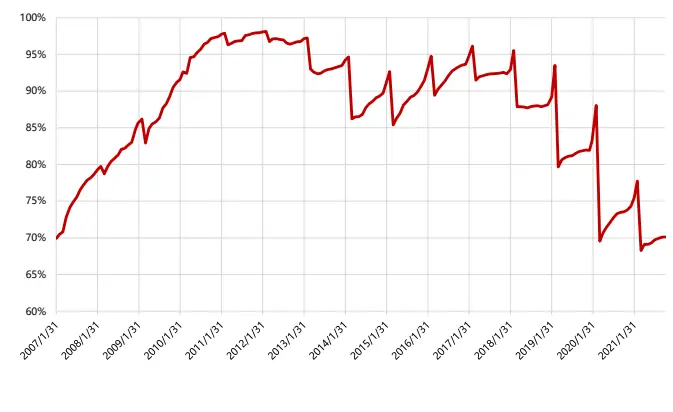
数据来源：东方证券研究所 & Wind 资讯 & 朝阳永续

图 8：分析师一致预期数据在行业中的覆盖度（工业企业）
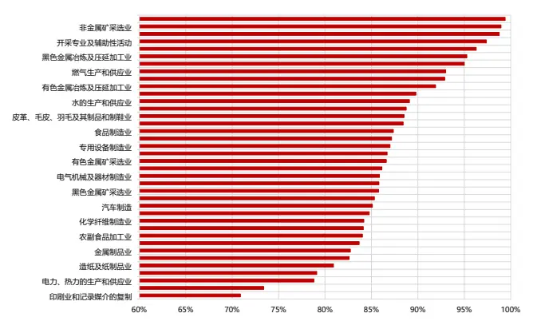
数据来源：东方证券研究所 & Wind 资讯 &朝阳永续

我们将分析师一致预期行业净利润同比增速指标，纳入行业轮动体系中。该指标逻辑直观，行业内分析师的盈利预测，可以在一定程度上反映行业整体预期盈利水平的前景，分析师一致预期业绩高增长的行业未来大概率表现更好。指标计算细节如下：

（1） 为了避免不同年份预期数据跨期对比，避开 3-4 月份年报发布高峰期，我们以每年 3月为分界，1 月底和 2月底统一考察的是上一年度的年报业绩一致预期，3月底开始考察的是本年度的年报业绩一致预期。（图 7-8同样按此规则计算）

（2） 一致预测数据的同比增速，计算的是当月底最新的一致预测数据，相比去年同期的一致预期数据的变化率。

（3） 行业一致预期净利润由行业内个股的一致预期净利润直接加总而成，为统一比较，该指标也按照工业企业行业分类进行划分。

## 二、行业轮动策略测试结果

## 2.1 构建方法

回测区间：2007.2.28-2021.10.29。

调仓频率：使用分析师因子时月频调仓，使用统计局因子时按统计局数据公布时间调仓。例如2021.09.30 调仓时，使用8 月份的工业企业数据（2021.09.27 公布）和截止当前的分析师一致预期，考察 2021.10.8-2021.10.29 的行业组合收益。

行业分类：工业企业行业分类，共 38 个行业（图2）

行业因子：工业企业利润总额累计同比、营业收入累计同比、销售净利率累计同比、资产负债率同比增速、分析师一致预期行业净利润同比增速 5 个指标。存在指标缺失时，按剩余因子加权。

组合构建方法：在调仓日，基于当前可获得的最新行业因子从高到低排序，选择排序前五和后五的行业等权构建组合，并于下一交易日进行调仓。

行业收益：各行业收益采用当天行业内股票的流通市值加权收益自行计算获得（权重为上一天的流通市值）。Wind 证监会行业指数与工业企业行业分类并不一致，没有现成的行业指数可使用。

绩效评价：考虑到行业样本数太少，ICIR 结果不太可靠，我们通过多空头组合收益来判断指标效果。采用行业等权组合作为基准，组合绩效指标均基于日度净值计算获得，未考虑交易费用。

我们统计了 38 个工业行业在 2007-2021 年度的分年收益和 2021 年分月收益。可以看到：（1）不同年份的强势行业迥异，各行业在不同时期都呈现出了阶段性的投资机会。（2）各年度不同行业涨幅差异巨大，最强和最弱行业年度涨幅平均相差 114%。2021 年截止 10 月底中证全指涨幅仅为 4%，而强势的非金属矿采选业涨幅达到 89%。可见，行业轮动蕴含的收益较为可观。

业企业分类
专用设备制造业
仪器仪表制造业
其他制造业
农副食品加工业
化学原料及化学制品制造业
化学纤维制造业
医药制造业
印刷业和记录媒介的复制
家具制造业
废弃资源综合利用业
开采专业及辅助性活动
文教、工美、体育和娱乐用品制造业
有色金属冶炼及压延加工业
有色金属矿采选业
木材加工及木、竹、藤、棕、草制品业
橡胶和塑料制品业
水的生产和供应业
汽车制造
煤炭开采和洗选业
燃气生产和供应业
电力，热力的生产和供应业
电气机械及器材制造业
皮革、毛皮、羽毛及其制品和制鞋业
石油、煤炭及其他燃料加工业
石油和天然气开采业
纺织业
纺织服装、服饰业
计算机、通信和其他电子设备制造业
通用设备制造业
造纸及纸制品业
酒、饮料和精制茶制造业
金属制品业
铁路、船舶、航空航天和其他运输设备制造业
非金属矿物制品业
非金属矿采选业
食品制造业
黑色金属冶炼及压延加工业
黑色金属矿采选业
年度最高涨幅-最低涨幅
工业企业全年平均涨跌幅
中证全指全年涨跌幅

图 9：38 个工业行业在 2007-2021 年度的分年收益（截止 2021.10.29）

| 2007 | 2008 | 2009 | 2010 | 2011 | 2012 | 2013 | 2014 | 2015 | 2016 | 2017 2018 | 2019 | 2020 |  | 2021/10/29 |
| --- | --- | --- | --- | --- | --- | --- | --- | --- | --- | --- | --- | --- | --- | --- |
| 162% | -63% | 134% | 46% | -33% | -8% | 2% | 45% | 29% | -20% | -6% | -30% | 40% | 58% | 5% |
| 118% | -61% | 126% | 19% | -44% | -13% | 38% | 51% | 94% | -18% | -13% | -37% | 25% | 15% | 14% |
| 90% | -67% | 143% | 46% | -29% | 1% | 7% | 38% | 94% | -14% | -13% | -44% | -11% | -8% | 14% |
| 158% | -46% | 82% | 23% | -31% | -9% | 29% | -1% | 57% | -3% | -6% | -17% | 63% | 59% | -4% |
| 207% | -61% | 107% | 2% | -29% | 0% | 10% | 26% | 58% | -9% | -3% | -33% | 27% | 34% | 52% |
| 251% | -71% | 178% | 9% | -39% | -12% | 11% | 46% | 81% | -5% | 12% | -22% | 27% | 68% | 0% |
| 204% | -45% | 98% | 29% | -29% | 11% | 35% | 14% | 53% | -10% | 8% | -27% | 33% | 39% | -11% |
| 134% | -26% | 75% | -10% | -23% | -7% | 63% | 28% | 114% | -28% | -26% | -22% | 29% | -5% | 5% |
| 111% | -74% | 154% | -7% | -30% | 2% | 42% | 24% | 165% | -31% | -1% | -48% | 31% | 27% | -14% |
|  |  |  |  | -38% | 22% | 14% | 26% | 54% | -14% | 16% | -52% | 0% | 28% | 32% |
|  |  | 163% | -3% | -50% | 15% | 56% | -7% | -8% | -16% | -23% | -24% | 65% | -16% | 13% |
|  | -64% | 122% | -14% | -10% | -16% | 108% | 21% | 151% | -28% | -28% | -32% | 51% | 34% | -23% |
| 297% | -80% | 207% | 13% | -43% | 8% | -32% | 47% | 5% | -7% | 19% | -45% | 26% | 32% | 57% |
| 331% | -66% | 173% | 16% | -42% | 15% | -41% | 39% | 4% | 7% | 9% | -29% | 24% | 36% | 7% |
| 123% | -67% | 110% | 1% | -40% | 10% | 33% | 43% | 82% | -3% | -13% | -49% | 24% | 27% | 43% |
| 154% | -64% | 166% | 8% | -35% | -4% | 13% | 36% | 82% | -2% | -14% | -38% | 18% | 64% | 30% |
| 256% | -67% | 102% | 0% | -23% | -10% | 45% | 61% | 5% | -17% | 0% | -25% | 7% | 0% | 11% |
| 185% | -69% | 252% | -10% | -25% | 12% | 8% | 47% | 35% | -3% | 9% | -30% | 14% | 54% | 22% |
| 304% | -65% | 200% | 2% | -15% | -1% | -38% | 34% | -16% | 4% | 35% | -24% | 12% | 10% | 38% |
| 222% | -63% | 90% | -30% | -15% | 3% | 6% | 31% | 28% | -20% | -13% | -26% | 10% | -2% | 10% |
| 170% | -54% | 41% | -13% | -18% | 8% | -3% | 83% | 11% | -16% | -6% | -11% | 8% | 4% | 28% |
| 232% | -49% | 115% | 13% | -38% | -1% | 35% | 26% | 65% | -11% | 17% | -33% | 41% | 57% | 22% |
| 282% | -62% | 74% | 30% | -45% | -14% | 9% | 23% | 139% | -24% | -35% | -37% | 13% | -13% | -9% |
| 235% | -64% | 142% | -3% | -41% | -9% | -19% | 38% | 30% | -5% | -4% | -28% | -1% | -8% | 32% |
| 140% | -66% | 74% | -39% | -11% | -2% | -10% | 45% | -21% | 0% | 7% | -10% | -9% | -23% | 30% |
| 193% | -61% | 121% | 5% | -28% | -8% | 15% | 40% | 75% | -13% | -22% | -29% | 12% | -4% | 5% |
| 236% | -65% -58% | 114% | 5% | -18% | -22% | -2% | 46% | 92% | -13% | -25% | -30% | 4% | -4% | 7% |
| 114% | -63% | 126% | 25% | -36% -41% | -3% -15% | 39% 21% | 25% 52% | 68% 47% | -18% -19% | 13% -13% | -37% -38% | 60% 20% | 28% 24% | 1% 14% |

数据来源：东方证券研究所 & Wind 资讯 & 国家统计局

从各行业 2021 年的分月收益来看：（1）今年结构化行情较为明显，最强和最弱行业月度涨幅平均相差 40%，7 月开始行业涨跌幅差异进一步扩大。（2）没有行业在全年都处于强势地位，更多呈现出一定的轮动现象。全年涨幅最高的黑色金属矿采选业也仅在个别月份收益排名靠前。因此，及时有效的行业轮动模型对于捕捉结构化行情带来的收益至关重要。

图 10：38 个工业行业在 2021 年的分月收益（截止 2021.10.29）

| 工业企业分类 | 2021/1 | 2021/2 | 2021/3 | 2021/4 | 2021/5 | 2021/6 | 2021/7 | 2021/8 | 2021/9 | 2021/10 |
| --- | --- | --- | --- | --- | --- | --- | --- | --- | --- | --- |
| 专用设备制造业 | 3% | -1% | -6% | 3% | 4% | 4% | 2% | 1% | -3% | -2% |
| 仪器仪表制造业 | -3% | -2% | 1% | -1% | 13% | 10% | 3% | -1% | -4% | -4% |
| 其他制造业 | -1% | 7% | 6% | -5% | 4% | 5% | 0% | -2% | -2% | 0% |
| 农副食品加工业 | 3% | 4% | -12% | 1% | 1% | -1% | -13% | 10% | 0% | 5% |
| 化学原料及化学制品制造业 | 5% | 6% | -5% | 5% | 7% | 6% | 7% | 18% | -6% | 0% |
| 化学纤维制造业 | 21% | 1% | -16% | 2% | -2% | 3% | 6% | 0% | -3% | -8% |
| 医药制造业 | -3% | 1% | -3% | 9% | 2% | -2% | -9% | -7% | 2% |  |
| 印刷业和记录媒介的复制 | 0% | 1% | -2% | 8% | 1% | 0% | -8% | 7% |  | -3% |
|  | 7% | 2% | 6% | -1% |  |  | -10% | 3% | 1% | -3% |
| 家具制造业 |  | -2% | 11% | 9% | -5% | -2% |  |  | -11% | -1% |
| 废弃资源综合利用业 开采专业及辅助性活动 | 4% -4% | 14% | -2% | -9% | 11% 4% | -14% | 20% -4% | 12% 10% | -15% | -3% |
| 文教、 工美、体育和娱乐用品制造业 |  | -13% | 8% | 6% | -4% | 3% -1% | -11% |  | 10% | -6% |
| 有色金属冶炼及压延加工业 | 1% 6% | 5% | -11% | 11% | 11% | -1% | 36% | -3% 20% | -2% | -5% |
| 有色金属矿采选业 | -3% | 14% | -15% | 6% |  | -11% | 17% |  | -19% | -2% |
| 木材加工及木、竹、藤、棕、草制品业 | -2% | 8% | 7% | -6% | 6% 8% |  | -3% | 14% 14% | -13% | -2% |
| 橡胶和塑料制品业 |  |  | 0% | 6% | 4% | -8% 6% |  |  | -9% | -5% |
| 水的生产和供应业 | 10% -5% | -5% 3% | 16% | -10% |  | -1% | 4% | 7% | -6% | 2% |
| 汽车制造 |  | -7% | -6% | 4% | 2% | 10% | -1% | 11% | 4% | -7% |
| 煤炭开采和洗选业 | 0% -8% | 5% | 11% | 2% | 7% |  | 3% | 9% | -11% | 14% |
| 燃气生产和供应业 | -14% | 1% | 20% | -10% | 5% | 2% | 2% | 24% | 10% | -16% |
| 电力、热力的生产和供应业 |  | -1% | 17% | -9% | 5% | -4% | 1% | 23% | 6% | -11% |
| 电气机械及器材制造业 | -2% |  | -1% | 4% | 4% | 0% | -4% | 9% | 25% | -9% |
| 皮革、毛皮、羽毛及其制品和制鞋业 | -1% | -5% | 4% | 2% | 5% | 6% | 4% | 2% | -2% | 10% |
| 石油、煤炭及其他燃料加工业 | -12% | 9% | -5% | 6% | 11% | 6% | -11% | 2% | -7% | -4% |
| 石油和天然气开采业 纺织业 | 6% | 7% | -2% | -1% | 3% | 2% | -1% | 31% | -7% | -9% |
| 纺织服装、服饰业 | -2% | 9% | 2% | 3% | 7% | 11% | -10% | 8% | 20% | -9% |
| 计算机、通信和其他电子设备制造业 通用设备制造业 | -12% -6% | 7% | 10% | 4% | -1% 7% | -1% | -5% | 6% | 2% | 0% |
|  |  | 7% | -6% | 3% |  | 1% | -9% | 2% | -6% | -3% |
|  | 0% | -3% | -1% | -2% | 5% | 9% | 3% | -6% | -4% | 1% |
| 造纸及纸制品业 | -3% | 3% | 0% | 2% | 0% | 2% | 2% | 15% | -3% | 1% |
| 酒、饮料和精制茶制造业 金属制品业 | 7% | 6% | -4% | 6% | 3% | -4% -5% | -11% -20% | 2% | -1% | -4% |
|  | 2% -1% | -4% 1% | 3% | 3% | 11% -3% | 4% | -2% | -4% 9% | 13% | 0% |
| 铁路、船舶、航空航天和其他运输设备制造业 | -5% | 2% | -12% | -5% | 14% | 1% | 1% | 19% | -5% | 4% |
| 非金属矿物制品业 | 5% | 0% | -5% | 4% | 3% | 3% | -3% | 10% | -10% | 3% |
| 非金属矿采选业 | -8% | 7% | -13% | 0% | 3% | -1% | 46% | 67% | -8% | 5% |
|  | 0% | -8% | -5% | 4% | 4% | -7% | -11% | -9% | -19% | 10% |
| 食品制造业 | 0% | 11% | 8% | 11% | -2% | 1% | 18% | 18% | 11% -13% | 6% -13% |

数据来源：东方证券研究所 & Wind 资讯 & 国家统计局

## 2.2 策略表现

## 1. 单因子表现

从单因子结果来看：

（1）工业企业资产负债率同比增速实际表现为负向指标，行业负债率增速过快更多意味着行业财务风险越大。其余指标均为正向指标。

（2）工业企业利润总额的累计同比指标效果最好，多空超额最显著。2007 年至今 top5行业年化收益达到 12.77%，bottom5 行业年化收益为 -0.82%，多头超额 3.65%，多空超额 4.47%。其次是工业企业营业收入的累计同比（多头超额 2.97%）、分析师一致预期行业净利润同比（多头超额 1.84%）、工业企业销售净利率的累计同比（多头超额 1.08%）、工业企业资产负债率同比增速（多头超额 1.22%）。

（3）从分 5 组表现来看，工业企业利润总额的累计同比指标的单调性最好。

图 11：行业轮动策略：多空头组合绩效表现（单因子）

| 按工业企业行业分类 等权组合 | 行业等权 | 分析师一致预期行业净利润-同比 月频调仓 |  | 工业企业利润总额-累计同比 按统计局数据公布时间调仓 |  | 工业企业营收-累计同比 按统计局数据公布时间调仓 |  | 工业企业销售净利率-累计同比 按统计局数据公布时间调仓 |  | 工业企业资产负债率-同比 按统计局数据公布时间调仓 |  | 统计局数据合成指标 按统计局数据公布时间调仓 |  |
| --- | --- | --- | --- | --- | --- | --- | --- | --- | --- | --- | --- | --- | --- |
| 2007.2.28-2021.10.29 |  | top5行业 | bottom5行业 | top5行业 | bottom5行业 | top5行业 | bottom5行业 | top5行业 | bottom5行业 | top5行业 | bottom5行业 | top5行业 | bottom5行业 |
| 年化收益率 | 9.13% | 10.97% | 2.22% | 12.77% | -0.82% | 12.10% | 2.51% | 10.21% | -0.27% | 3.39% | 10.34% | 16.04% | 1.94% |
| 年化波动率 | 28.22% 0.45 | 31.03% | 29.35% | 30.50% | 29.14% | 29.82% | 29.52% | 30.31% 0.47 | 29.30% | 29.13% 0.26 | 29.69% 0.48 | 30.29% 0.64 | 29.14% 0.21 |
| Sharp值 | -72.66% | 0.49 -76.37% | 0.22 -71.05% | 0.55 | 0.12 | 0.53 | 0.23 |  | 0.14 | -73.15% | -73.74% | -69.94% | -73.65% |
| 最大回撤口 单边换手率（年） | 0.25 | 2.77 | 2.70 | -68.58% 3.10 | -79.32% 2.47 | -72.70% 2.07 | -72.63% 1.98 | -73.36% 2.88 | -78.04% 2.59 | 3.28 | 3.99 | 3.38 | 2.51 |
| 分年收益 |  |  |  |  |  |  |  |  |  |  |  |  |  |
| 2007/12/28 | 112.57% | 116.86% | 126.06% | 122.24% | 107.25% | 136.74% | 111.07% | 111.75% | 129.37% | 126.71% | 119.61% | 133.74% | 109.66% |
| 2008/12/31 | -62.43% | -67.93% | -57.48% | -61.22% | -67.19% | -65.80% | -60.88% | -67.27% | -68.63% | -62.01% | -62.75% | -60.95% | -61.36% |
| 2009/12/31 | 124.97% | 85.53% | 110.93% | 127.61% | 126.55% | 104.98% | 166.46% | 124.31% | 124.33% | 98.05% | 134.58% | 134.26% | 162.50% |
| 2010/12/31 | 7.32% | 4.02% | -9.16% | -2.72% | 0.69% | 15.66% | -13.53% | 4.20% | -6.45% | -8.66% | 11.58% | 12.44% | -8.66% |
| 2011/12/30 | -29.64% | -35.68% | -30.00% | -36.34% | -35.82% | -36.99% | -30.32% | -32.97% | -29.40% | -26.45% | -27.34% | -34.85% | -35.24% |
| 2012/12/31 | -0.70% | 6.87% | -8.02% | 5.11% | -3.56% | 7.50% | 1.16% | -1.99% | -6.36% | 1.27% | -0.86% | 1.85% | -6.58% |
| 2013/12/31 | 11.57% | 17.31% | -10.77% | 17.54% | -20.38% | 32.54% | -8.69% | 11.66% | -19.84% | 11.80% | 14.24% | 28.73% | -10.74% |
| 2014/12/31 | 37.72% | 22.06% | 47.23% | 40.36% | 30.72% | 36.81% | 36.83% | 40.69% | 30.16% | 39.31% | 28.60% | 35.35% | 37.44% |
| 2015/12/31 | 50.23% | 70.23% | 0.74% | 63.57% | 0.98% | 72.69% | 5.75% | 40.82% | 3.25% | 3.93% | 75.42% | 80.17% | 2.98% |
| 2016/12/30 | -10.44% | -15.17% | -7.02% | -7.07% | -6.27% | -16.73% | -7.82% | -5.89% | -7.08% | -4.47% | -13.27% | -2.37% | -4.67% |
| 2017/12/29 | -0.77% | 14.86% | -17.12% | 21.11% | -10.01% | 8.90% | -16.93% | 12.20% | -12.87% | -9.36% | -8.24% | 11.75% | -8.67% |
| 2018/12/28 | -30.67% | -23.85% | -29.66% | -25.85% | -40.53% | -27.70% | -32.16% | -23.04% | -35.64% | -28.88% | -22.87% | -22.22% | -35.01% |
| 2019/12/31 | 26.40% | 41.10% | 17.83% | 32.38% | 22.24% | 21.68% | 21.79% | 30.63% | 26.17% | 23.30% | 9.31% | 19.45% | 23.27% |
| 2020/12/31 | 26.49% | 36.00% | -5.23% | 20.10% | 12.30% | 22.35% | 15.75% | 27.31% | 5.80% | 23.15% | 21.59% | 32.26% | 10.51% |
| 2021/10/29 | 17.73% | 43.95% | 45.28% | 27.85% | 27.53% | 34.68% | 10.98% | 30.95% | 28.62% | -7.13% | 30.87% | 32.37% | 15.88% |

数据来源：东方证券研究所 & Wind 资讯 & 国家统计局 & 朝阳永续

图 12：行业轮动策略：多头组合净值（单因子）
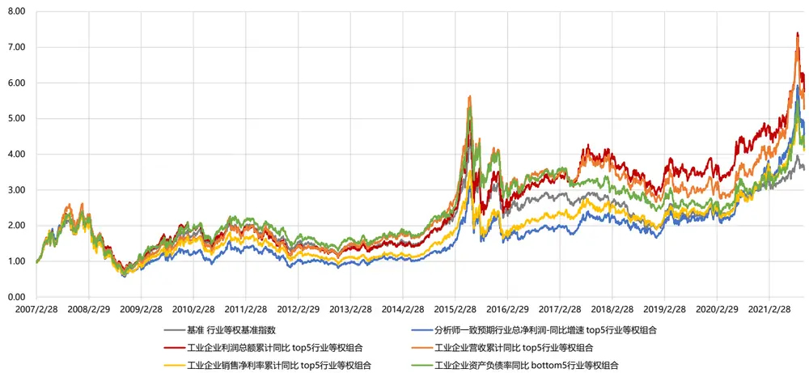
数据来源：东方证券研究所 & Wind 资讯 & 国家统计局 & 朝阳永续

图 13：行业轮动策略：分5 组绩效表现（单因子）

| 分析师一致预期行业总净利润-同比 | 1(低) | 2 | 3 | 4 | 5(高) |
| --- | --- | --- | --- | --- | --- |
| 月均超额收益 | -0.46% | -0.22% | 0.12% | 0.39% | 0.16% |
| 月度超额胜率 | 39.77% | 46.59% | 56.25% | 52.27% | 51.14% |
| 年化超额夏普 | -61.13% | -42.90% | 18.26% | 71.04% | 22.60% |
| 超额收益最大回撤 | -67.73% | -37.51% | -16.50% | -10.92% | -32.14% |
| 年化超额收益 | -5.75% | -3.02% | 1.08% | 4.78% | 1.74% |
| 工业企业营收-累计同比 | 1(低) | 2 | 3 | 4 | 5(高) |
| 月均超额收益 | -0.66% | 0.08% | 0.13% | 0.26% | 0.19% |
| 月度超额胜率 | 41.79% | 49.25% | 53.73% | 55.97% | 48.51% |
| 年化超额夏普 | -64.05% | 12.90% | 19.65% |  |  |
| 超额收益最大回撤 | -71.69% | -17.93% | -18.40% | 41.89% | 22.38% |
| 年化超额收益 | -8.64% | 0.38% | 0.69% | -11.62% 3.55% | -20.61% 2.36% |
| 工业企业资产负债率-同比 | 1(低) | 2 | 3 | 4 | 5(高) |
| 月均超额收益 | 0.33% | 0.16% | 0.07% | -0.11% | -0.45% |
| 月度超额胜率 | 53.54% | 53.54% | 47.24% | 41.73% | 40.94% |
| 年化超额夏普 | 45.65% | 23.14% | 10.91% | -17.90% | -55.74% |
| 超额收益最大回撤 | -14.26% | -14.81% | -20.87% | -28.77% | -51.44% |
| 年化超额收益 | 4.14% | 1.39% | 0.18% | -1.20% | -5.97% |

数据来源：东方证券研究所 & Wind 资讯 & 国家统计局 & 朝阳永续

| 工业企业利润总额-累计同比 | 1(低) | 2 | 3 | 4 | 5(高) |
| --- | --- | --- | --- | --- | --- |
| 月均超额收益 | -0.97% | 0.01% | 0.35% | 0.21% | 0.41% |
| 月度超额胜率 | 35.07% | 51.49% | 55.22% | 55.97% | 54.48% |
| 年化超额夏普 | -110.73% | 1.04% | 55.93% | 36.26% | 54.12% |
| 超额收益最大回撤 | -77.41% | -27.79% | -13.81% | -8.69% | -17.41% |
| 年化超额收益 | -11.81% | -0.17% | 3.62% | 3.12% | 4.45% |
| 工业企业销售净利率-累计同比 | 1(低) | 2 | 3 | 4 | 5(高) |
| 月均超额收益 | -0.67% | -0.33% | 0.13% | 0.51% | 0.36% |
| 月度超额胜率 | 36.22% | 44.88% | 49.61% | 62.20% | 55.91% |
| 年化超额夏普 | -72.00% | -46.42% | 15.82% | 76.02% | 47.07% |
| 超额收益最大回撤 | -68.81% | -37.93% | -24.55% | -10.04% | -15.83% |
| 年化超额收益 | -8.74% | -3.96% | 0.91% | 6.40% | 3.90% |
| 统计局数据合成指标 |  |  |  |  |  |
| 月均超额收益 | 1(低) | 2 | 3 | 4 | 5(高) |
|  | -0.58% | -0.38% | 0.16% | 0.25% | 0.55% |
| 月度超额胜率 | 39.55% | 43.28% | 48.51% | 57.46% | 56.72% |
| 年化超额夏普 | -62.12% | -61.18% | 24.44% | 38.17% | 66.30% |
| 超额收益最大回撤 | -63.43% | -47.27% | -9.81% | -15.26% | -13.37% |
| 年化超额收益 | -7.12% | -5.48% | 1.22% | 3.81% | 6.31% |

工业企业利润总额的累计同比指标的表现优于分析师一致预期行业净利润同比增速，差异在2020年之前格外明显。分析师预期指标的弊端在于：

（1） 样本量少：一个行业内上市公司个数可能较少，有分析师一致预期数据的公司就更少，9 个行业分析师一致预期样本数量少于 10 个。这就使得分析师一致预期数据会对个别数据变动较为敏感。当公司净利润体量较大，或预期数据发生变化的样本数量较少时，会导致个股盈利预期的微小变化在行业层面上造成过大的影响。此外，一致预期值发生巨大变化的个股权重也会在一定程度上被放大，但个别公司的预期变化并不能反映整体行业的基本面改善。

（2） 样本有偏：分析师会主要覆盖盈利较好的公司，分析师对上市公司的盈利预测数据属于有偏样本，包含较多噪音。

对比而言，相同行业内工业企业的数量较多，使用工业企业的整体行业利润增速，更容易把握周期性行业的整体变化。

图 14：工业企业内样本个数对比

| 工业企业行业分类 | 当前有分析师一致预期数据的公司个数 | 当前上市公司个数 | 当前工业企业单位数 | 工业企业行业分类 | 当前有分析师一致预期数据的公司个数 | 当前上市公司个数 | 当前工业企业单位数 |
| --- | --- | --- | --- | --- | --- | --- | --- |
| 计算机、通信和其他电子设备制造业 | 287 | 419 | 21,339 | 家具制造业 | 20 | 23 | 6,596 |
| 化学原料及化学制品制造业 | 177 | 264 | 22,228 | 纺织业 | 19 | 40 | 18,592 |
| 医药制造业 | 153 | 253 | 8,282 | 有色金属矿采选业 | 18 | 20 | 1,196 |
| 专用设备制造业 | 148 | 264 | 21,543 | 化学纤维制造业 | 16 | 25 | 1,970 |
| 电气机械及器材制造业 | 140 | 249 | 27,394 | 造纸及纸制品业 | 16 | 32 | 6,705 |
| 汽车制造 | 75 | 140 | 16,295 | 开采专业及辅助性活动 | 13 | 16 | 285 |
| 通用设备制造业 | 72 | 144 | 27,011 | 燃气生产和供应业 | 12 | 25 |  |
| 非金属矿物制品业 | 61 | 97 | 40,454 | 石油、煤炭及其他燃料加工业 | 10 | 17 | 2,676 |
| 有色金属冶炼及压延加工业 | 55 | 74 | 7,758 | 水的生产和供应业 | 10 | 16 | 2,133 |
| 电力、热力的生产和供应业 | 48 | 73 | 10,201 | 其他制造业 | 9 |  | 2,812 |
| 橡胶和塑料制品业 | 48 | 91 | 21,131 | 文教、工美、体育和娱乐用品制造业 | 7 | 19 | 1,760 |
| 食品制造业 | 44 | 58 | 8,375 | 石油和天然气开采业 | 6 | 15 | 8,998 |
| 铁路、船舶、航空航天和其他运输设备制造业 | 44 | 63 | 4,968 | 印刷业和记录媒介的复制 | 6 | 7 | 143 |
| 金属制品业 | 43 | 75 | 27,527 | 皮革、毛皮、羽毛及其制品和制鞋业 | 6 | 14 | 5,958 |
| 农副食品加工业 | 38 | 49 | 22,094 | 废弃资源综合利用业 | 5 | 10 | 7,749 |
| 仪器仪表制造业 | 30 | 60 | 5,364 | 木材加工及木、竹、藤、棕、草制品业 |  | 7 | 2,276 |
| 酒、饮料和精制茶制造业 | 29 | 40 | 5,509 | 黑色金属矿采选业 | 4 | 7 | 10,052 |
| 黑色金属冶炼及压延加工业 | 29 | 30 | 5,392 | 非金属矿采选业 | 4 1 | 6 | 1,314 |
| 纺织服装、服饰业 | 26 | 34 | 12,557 | 其他采矿业 |  | 1 | 3,439 |
| 煤炭开采和洗选业 | 21 | 22 | 4,322 | 金属制品、机械和设备修理业 |  |  | 5 553 |

数据来源：东方证券研究所 & Wind 资讯 & 国家统计局 & 朝阳永续

## 2. 合成因子表现

下面我们将分析师一致预期行业净利润同比、工业企业利润总额的累计同比、工业企业营业收入的累计同比、工业企业销售净利率的累计同比、工业企业资产负债率同比增速 5 个指标等权合成，考察合成行业因子的绩效情况。单因子进行异常值处理和标准化，组合按统计局数据公布时间调仓。从合成因子结果来看：

（1）2007年至今，top5行业组合年化收益达到16.57%，bottom5行业组合年化收益-1.01%，多头超额 7.44%，多空超额 8.45%。

（2）从年度统计来看，2007 年至今 top5 行业组合仅两年跑输基准，bottom5 行业组合仅四年跑赢基准，展现出稳定的收益能力。基于行业基本面的行业轮动策略在近几年的表现尤为出色，2019年以来 top5行业组合年化绝对收益 39%，年化超额 14%，这也与近年来主动投资者普遍重视基本面投资有关。今年截止 10 月底，top5 行业组合绝对收益 30.55%，超额收益 12.82%，bottom5 行业组合今年绝对收益 4.31%，超额收益-13.43%。

（3）从分 5组表现来看，合成因子呈现出显著的分层效果，年化超额收益、夏普比率和月度胜率都呈现出明显的单调性。

图 15：行业轮动策略：多空头组合绩效表现（合成因子）
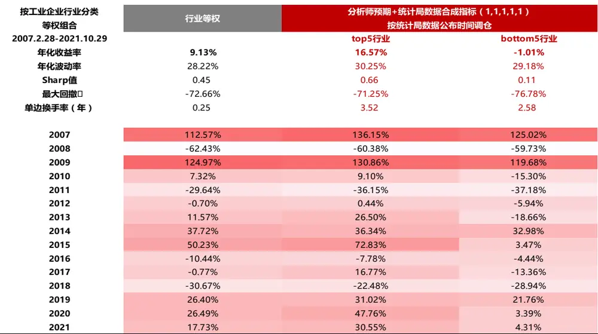
数据来源：东方证券研究所 & Wind 资讯 & 国家统计局 & 朝阳永续

图 16：行业轮动策略：分5 组绩效表现（合成因子）

| 分析师预期+统计局数据合成指标 (1,1,1,1,1) | 1(低) | 2 | 3 | 4 | 5(高) |
| --- | --- | --- | --- | --- | --- |
| 月均超额收益 | -0.74% | -0.11% | 0.06% | 0.13% | 0.65% |
| 月度超额胜率 | 38.81% | 46.27% | 54.48% | 53.73% | 57.46% |
| 年化超额夏普 | -74.75% | -21.15% | 8.00% | 25.30% | 77.62% |
| 超额收益最大回撤 | -72.95% | -26.82% | -22.71% | -12.24% | -10.95% |
| 年化超额收益 | -9.39% | -1.53% | 0.46% | 1.93% | 7.29% |

数据来源：东方证券研究所 & Wind 资讯 & 国家统计局 & 朝阳永续

图 17：行业轮动策略：多空头组合净值（合成因子）
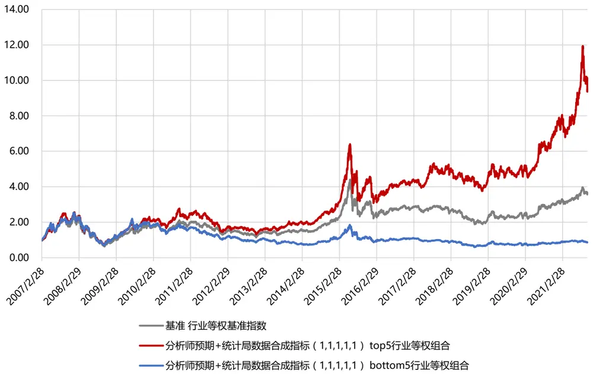
数据来源：东方证券研究所 & Wind 资讯 & 国家统计局 & 朝阳永续

图 18：行业轮动策略：多空头组合净值/行业基准净值（合成因子）
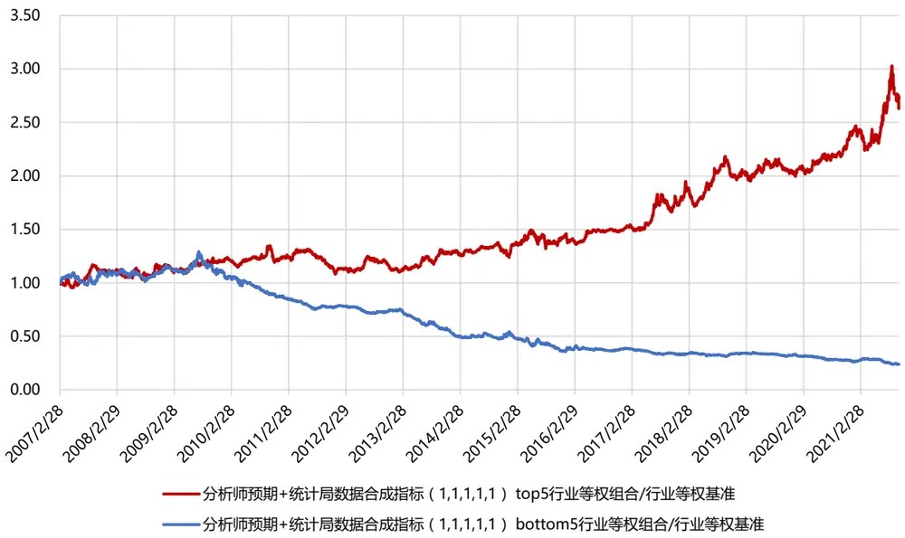
数据来源：东方证券研究所 & Wind 资讯 & 国家统计局 & 朝阳永续

## 2.3 持仓情况

从每期 top5 行业组合的配置情况来看，策略在 35 个行业上发出过配置信号。其中在黑色金属矿采选业、黑色金属冶炼及压延加工业、化学纤维制造业、有色金属冶炼及压延加工业四个行业上发出的多头信号最多。我们统计了 top5 组合在各行业的配置胜率，即被 top5 组合选中的各行业在当期获得正超额收益的次数与被选中总次数之比。结果显示，21个行业配置胜率超 50%，其中纺织服装、服饰业，印刷业和记录媒介的复制，橡胶和塑料制品业，有色金属矿采选业的配置胜率超 70%。

图 19：top5 行业组合在各行业的历史配置胜率
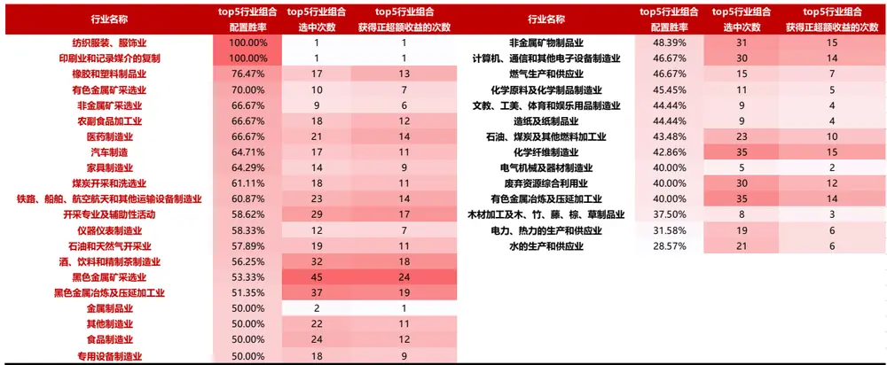
数据来源：东方证券研究所 & Wind 资讯 & 国家统计局 & 朝阳永续

从 2021 年 top5 行业组合的配置来看，黑色金属矿采选业每期出现，化学纤维制造业、有色金属冶炼及压延加工业出现 7 次，黑色金属冶炼及压延加工业、石油和天然气开采业出现 4 次。

图 20：2021 年 top5 行业组合持仓情况

| 调仓日 | 行业 | 权重 | 调仓日 | 行业 | 权重 |
| --- | --- | --- | --- | --- | --- |
| 2021/2/26 | 有色金属冶炼及压延加工业 有色金属矿采选业 | 20% 20% | 2021/6/30 | 化学纤维制造业 | 20% |
|  |  |  |  | 有色金属冶炼及压延加工业 | 20% |
|  | 橡胶和塑料制品业 | 20% |  | 石油和天然气开采业 | 20% |
|  | 计算机、通信和其他电子设备制造业 | 20% |  | 黑色金属冶炼及压延加工业 | 20% |
|  | 黑色金属矿采选业 | 20% |  | 黑色金属矿采选业 | 20% |
| 2021/3/31 | 化学纤维制造业 | 20% | 2021/7/30 | 化学纤维制造业 | 20% |
|  | 橡胶和塑料制品业 | 20% |  | 有色金属冶炼及压延加工业 | 20% |
|  | 汽车制造 | 20% |  | 石油和天然气开采业 | 20% |
|  | 计算机、通信和其他电子设备制造业 | 20% |  | 黑色金属冶炼及压延加工业 | 20% |
|  | 黑色金属矿采选业 | 20% |  | 黑色金属矿采选业 | 20% |
| 2021/4/30 | 化学纤维制造业 | 20% | 2021/8/31 | 化学纤维制造业 | 20% |
|  | 有色金属冶炼及压延加工业 | 20% |  | 有色金属冶炼及压延加工业 | 20% |
|  | 汽车制造 | 20% |  | 石油、煤炭及其他燃料加工业 | 20% |
|  | 黑色金属冶炼及压延加工业 | 20% |  | 石油和天然气开采业 | 20% |
|  | 黑色金属矿采选业 | 20% |  | 黑色金属矿采选业 | 20% |
| 2021/5/31 | 化学原料及化学制品制造业 | 20% | 2021/9/30 | 化学纤维制造业 | 20% |
|  | 化学纤维制造业 | 20% |  | 有色金属冶炼及压延加工业 | 20% |
|  | 有色金属冶炼及压延加工业 | 20% |  | 石油、煤炭及其他燃料加工业 | 20% |
|  | 黑色金属冶炼及压延加工业 | 20% |  | 石油和天然气开采业 | 20% |
|  | 黑色金属矿采选业 | 20% |  | 黑色金属矿采选业 | 20% |

数据来源：东方证券研究所 & Wind 资讯 & 国家统计局 & 朝阳永续

## 三、行业轮动策略在选股中的应用

## 3.1 指数增强组合构建

下面我们尝试在指数增强组合中引入行业轮动策略，通过高配优势行业、低配或规避弱势行业，在原有组合基础上进一步提升业绩表现。

指数增强组合构建时，我们选取七个大类 Alpha 因子构建多因子模型，按照机构持股比例分域加权，得到个股 zscore 得分，再线性转换成预测收益率 $\mathsf{f}_{\circ}$ 风险模型采用 DFQ2020 风险模型（具体内容参见报告：《东方 A 股因子风险模型——DFQ-2020》）。组合优化时将风险项作为惩罚项加入目标函数，控制市值适当暴露，约束个股权重上下限，调仓手续费设置双边千三。历史回测区间为 2009.12.31 — 2021.10.29。组合优化问题设置如下：

$$
\begin{array}{r}\operatorname*{max}\colon(\mathrm{f}+\mathrm{f}_{adj})^{\prime}\mathbf{w}-\lambda\mathbf{w}^{\prime}\Sigma\mathbf{w}--\boxed{\mathrm{f}\overline{{\mathfrak{M}}}\overline{{\mathfrak{M}}}\overline{{\mathfrak{S}}}}\end{array}
$$

$$
\mathrm{st};\quad i_{\mathrm{min}}<\mathbf{w}^{\prime}\mathbf{I}<i_{\mathrm{max}}--\mathcal{\bar{I}}\overline{{\mathbb{I}}}\underline{{{\vert\vert I\pm\bar{\mathbf{z}}\vert}}}]\frac{\mathrm{sgs}}{\mathrm{s}\mathrm{s}\mathrm{e}\mathrm{s}}\underline{{{\underline{{z}}}}}\mathbf{\hat{\mathbf{\imath}}}]\frac{\mathrm{~}}{\mathrm{s}\mathrm{R}}
$$

$$
m_{\mathrm{min}}<\mathrm{w^{\prime}MV}<m_{\mathrm{min}}--\mp|\mathrm{\pm}|\pm\pm\mp|\mathrm{\Xi}|\mp\mathrm{\Xi}|\mathrm{\bar{\Sigma}}|\mp\mathrm{\bar{\Sigma}}|\mp|\mathrm{\bar{\Sigma}}|
$$

$$
w_{\mathrm{min}}<\infty<w_{\mathrm{min}}--\pm\exists)\nmid\times\equiv\pm\infty<\mathrm{P}\nmid\times\frac{4<\cdot>\neq}{\sqrt{2}}
$$

$$
\mathbf{w}^{\prime}\mathrm{Ind}=\mathbf{0}\mathrm{--}\pmb{\bar{\Sigma}}\bar{\mathbf{u}}\mathbf{)}\mathbf{\Sigma}\bar{\mathbf{k}}\equiv\mathbf{0}\mathbf{\Sigma}\mathbf{\Sigma}\mathbf{\Sigma}\mathbf{\bar{\Sigma}}\mathbf{\Sigma}\mathbf{\Sigma}\mathbf{\bar{\Sigma}}\mathbf{\Sigma}\mathbf{\Sigma}\mathbf{\Sigma}\mathbf{\bar{\Sigma}}\mathbf{0}
$$

其中 w 为主动权重， f 为预期收益率向量，Σ为预期月度协方差矩阵,λ为风险厌恶系数。第一个约束条件为控制每个行业的主动暴露；第二个约束条件为控制主动市值暴露；第三个约束条件为控制主动权重的上下限；第四个约束条件为主动权重的总和等于 $0_{\circ}$ 通过二次规划得到每个股票的主动权重，再加上基准权重即可得到总的股票权重。

行业轮动策略的引入方法有两种：

（1） 根据最新可获得的行业轮动策略配置结果，调整行业暴露敞口。对于5 个超配行业，适当放开正向行业暴露敞口；对于 5 个低配行业，适当放开负向行业暴露敞口；对于其余行业，控制行业暴露完全中性。

（2） 根据最新可获得的行业轮动策略配置结果，调整个股 zscore得分。对于5 个超配行业，将个股 zscore 得分增加 0.5 倍标准差；对于 5 个低配行业，将个股 zscore 得分降低 0.5 倍标准差；对于其余行业，保持个股 zscore 得分不变。再将修正后的 zscore得分转换成预测收益率 f。需要注意的是，如果保持行业中性处理，调整个股 zscore得分不会对组合结果产生影响，因为行业内的个股相对排序并未改变。但是引入行业暴露敞口后，对超配和低配行业个股进行得分调整，会改变所有个股的相对排序，从而对组合结果产生影响。

## 3.2 指数增强组合表现

从沪深 300 增强组合的结果来看：引入行业轮动策略来调整行业暴露敞口效果更好。选择对5 个超配行业放开正向暴露，5个低配行业放开负向暴露，其余行业完全中性的策略，对应的增强组合相比于行业完全中性组合，年化收益可以提高 1%左右，信息比也从 2.6 提升到2.74，在实现收益提升的同时，组合稳定性也有所提高。从分年收益来看，过去 12 年中，有 8 年都可以跑赢中性策略，胜率较高。

从中证 500 增强组合的结果来看：引入行业轮动策略来调整行业暴露敞口，同时调整个股zscore 得分效果更好。选择对 5 个超配行业放开正向 0.02 暴露，5 个低配行业放开负向-0.02 暴露，其余行业完全中性，同时调整个股 zscore 得分的策略，对应的增强组合相比于行业完全中性组合，年化收益提升 0.5%，信息比基本不变。从分年收益来看，过去 12 年中，有10 年都可以跑赢中性策略，胜率较高。

总体来看，在沪深 300 增强组合中更适合叠加行业轮动策略。由于行业轮动策略和个股的alpha 得分有一定的重叠性，高景气度行业内的个股因子得分通常也较高，将行业轮动策略应用于选股的增效并不十分明显。

图 21：沪深 300 全市场增强组合绩效表现

| 市值适当暴露双边十三扣费厌恶系数5 沪深300全市场 2009.12.31-2021.10.29 | 考虑统计局数据可获得性 行业完全中性 | 行业轮动 (5个超配行业正0.02暴露，5个低配行业负0.02暴露 | 行业轮动 (5个超配行业正暴露，5个低配行业负暴露 | 行业轮动 + 个股得分调整（+-0.5倍标准差） 行业轮动 +个股得分调整（+-0.5倍标准差） |  |
| --- | --- | --- | --- | --- | --- |
|  |  |  |  | (5个超配行业正0.02暴露，5个低配行业负0.02暴露， | (5个超配行业正暴露，5个低配行业负暴露 |
|  |  | 其余完全中性） | 其余完全中性） | 其余完全中性） | 其余完全中性） |
| 年化信息比 年化对冲收益 | 2.60 13.07% | 2.73 13.98% | 2.74 14.16% | 2.71 13.89% | 2.69 13.95% |
| 年化跟踪误差 | 4.77% | 4.84% | 4.88% | 4.85% | 4.91% |
| 对冲收益最大回撤 | -5.05% | -5.07% | -5.07% | -5.16% | -5.17% |
| 对冲收益最大回撤出现时间点 | 20141222 | 20141222 | 20141222 | 20141222 | 20141222 |
| 年单边换手率 | 3.44 | 3.50 | 3.51 | 3.52 | 3.54 |
| 平均持股数量 | 58.22 | 56.63 | 56.39 | 56.41 | 55.93 |
| 2010 | 16.24% | 16.20% | 15.95% | 16.44% | 14.90% |
| 2011 | 16.42% | 15.96% | 15.78% | 15.84% | 15.70% |
| 2012 | 18.74% | 18.99% | 18.45% | 19.15% | 18.10% |
| 2013 | 22.71% | 24.25% | 24.16% | 25.25% | 24.65% |
| 2014 | 9.27% | 8.55% | 8.55% | 7.54% | 7.53% |
| 2015 | 13.77% | 16.80% | 18.32% | 17.02% | 18.80% |
| 2016 | 13.18% | 13.31% | 13.26% | 12.94% | 13.21% |
| 2017 | 6.27% | 8.13% | 8.65% | 7.57% | 8.03% |
| 2018 | 7.15% | 8.43% | 8.27% | 8.49% | 8.40% |
| 2019 | 8.56% | 9.80% | 10.57% | 9.72% | 10.88% |
| 2020 | 16.53% | 18.56% | 19.06% | 18.31% | 18.83% |
| 2021/10/29 | 5.24% | 5.77% | 5.77% | 5.57% | 5.43% |

数据来源：东方证券研究所 & Wind 资讯 & 国家统计局 & 朝阳永续

图 22：中证 500 全市场增强组合绩效表现

| 中证500全市场2009.12.31-2021.10.29 | 行业完全中性 | 行业轮动 |  | 行业轮动 | 行业轮动 + 个股得分调整（ |  |  |
| --- | --- | --- | --- | --- | --- | --- | --- |
|  |  |  | 其余完全中性 |  |  |  |  |
|  |  |  |  |  |  |  | +-0.5倍标准差） 行业轮动 + 个股得分调整（+-0.5倍标准差）（5个超配行业正暴露，5个低配行业负暴露， |
|  |  | ） 其余 |  | 完全中性） | 其余完全中性 | ） 其余完全中性） |  |
| 年化信息比 | 2.55 | 2.57 | 2.58 |  | 2.58 | 2.56 |  |
| 年化对冲收益 | 15.20% | 15.52% |  | 15.54% | 15.70% | 15.56% |  |
| 年化跟踪误差 | 5.60% | 5.67% |  | 5.67% | 5.71% | 5.72% |  |
| 对冲收益最大回撤 | -6.54% | -6.77% |  | -6.77% | -6.82% | -6.82% |  |
|  |  |  |  |  | 2015082 | 5 20150825 |  |
| 年单边换手率 | 4.50 | 4.54 |  | 4.54 | 4.55 | 4.58 |  |
| 平均持股数量2010 | 73.83 | 72.10 | 71.96 |  | 71.83 | 71.28 |  |
|  |  |  | 0.00 |  |  |  |  |
|  | 23.19% | 23.76% 23.85% |  |  | 23.79% | 24.01% |  |
| 2011 | 10.93% | 10.31% | 10.52% |  | 11.11% | 11.31% |  |
| 2012 | 19.43% | 20.41% | 20.67% |  | 20.41% |  | 20.20% |
| 2013 | 20.85% | 21.54% | 21.53% |  | 21.95% |  | 21.01% |
| 2014 | 8.61% | 8.49% | 8.50% |  | 8.35% |  | 8.14% |
| 2015 | 22.84% | 22.51% | 22.57% |  | 23.15% |  | 23.01% |
| 2016 | 13.83% | 14.12% | 14.10% |  | 14.43% |  | 14.33% |
| 2018 | 14.19% | 14.74% 14.74% |  |  | 14.86% | 14.80% |  |
| 201920202021/10/29 | 12.48% | 12.41% 12.36% |  |  | 12.99% 13.15% |  |  |
|  | 9.56% | 9.44% 9.43% |  |  | 9.68% 9.29% |  |  |
|  | 2.24% | 1.98% 1.74% |  |  | 1.18% 1.10% |  |  |

数据来源：东方证券研究所 & Wind 资讯 & 国家统计局 & 朝阳永续

## 四、行业轮动策略在选基中的应用

## 4.1 优选基金组合构建

下面我们尝试在基金组合中引入行业轮动策略，通过高配优势行业基金、低配或规避弱势行业基金，在原有组合基础上进一步提升业绩表现。优选基金策略如下：

（1） 回测区间：2009.12.31 — 2021.10.29。

（2） 调仓日：季末第 15个交易日。由于基金重仓股信息要等到每个季度结束之日起十五个工作日内才能全部获得，因而此处我们在计算收益时将时间窗口均滞后 15 个交易日，避免引入未来信息。（例如 2021/06/30 调仓时，以 2021/7/21 为调仓日，考察2021/7/22-2021/10/28 的基金收益）

（3） 基金范围：主动权益型基金。根据 Wind 基金类型分类选择普通股票型基金以及偏股混合型基金。在测试过程中，只考虑开放式基金，选择初始基金，剔除分级基金。

（4） 基金规模初选：选择规模大于5 亿且小于 100 亿的中等规模基金作为研究对象。

（5） 选基指标：使用夏普比率作为选基指标，在进行过规模筛选后的基金池中，每季度末按照过去一年的夏普比率选择 top 基金。

（6） 行业轮动策略的引入：根据最新可获得的行业轮动策略配置结果，选取前十大重仓股在超配行业中权重占比较高、在低配行业中权重占比较低的基金。

（7） 加权方法：等权构建基金组合

每季度基金规模的剔除比例如下图所示。可以看到：百亿以上大规模基金占比较低，长期不到10%，2020 年之后大规模基金占比有所提升。5 亿以下的小基金占比较高，2019 年之后小规模基金占比有所下滑。最新一期（20210930）百亿以上大规模基金占比仅为 3%（58 只），5 亿以下小规模基金占比 41%（779 只），原基金池数量为 1911只，剔除后的基金池数量为 1074 只。

图 23：基金规模剔除比例&基金池数量
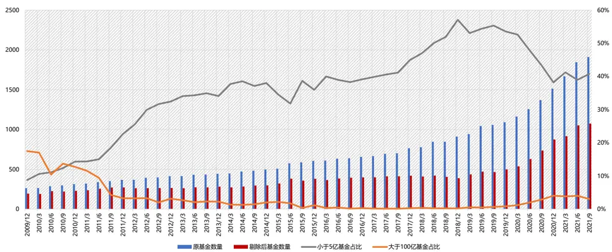
数据来源：东方证券研究所 & Wind 资讯 & 国家统计局 & 朝阳永续

## 4.2 优选基金组合表现

（1）只按夏普比选基：季度调仓的 top10%高夏普比率基金组合 2010 年以来，相对于等权基金池，平均可取得 5.54%的年化超额收益。

（2）只按行业轮动策略选基：要求基金在 10 个超配行业占比超 10%，在 10 个低配行业占比小于 10%，这样的基金组合相对于等权基金池，平均可取得 1.74%的年化超额收益。

（3）将夏普比和行业轮动策略结合起来：首先选择夏普比排在前 10%的基金，再在其中选择在 10 个超配行业占比超10%，在 10 个低配行业配置占比小于 10%的基金。这样的基金组合 2010年以来，相对于等权基金池，平均可取得 8.69%的年化超额收益。从分年收益来看，过去 12 年中有 10 年都可以跑赢等权基金池。

图 24：优选基金组合表现

| 季频调仓绝对收益 | 等权基金池 sharpe top10% |  | 10个超配行业占比超10% sharpe top10%+10个低配行业占比小于10% +10个超配行业占比超10%+10个低配行业占比小于10% |  |
| --- | --- | --- | --- | --- |
| 分年收益 |  |  |  |  |
| 2010 | -1.36% | 0.87% | -0.88% | 2.83% |
| 2011 | -18.74% | -19.54% | -18.39% | -21.24% |
| 2012 | 9.80% | 13.72% | 10.89% | 14.33% |
| 2013 | 12.92% | 29.00% | 14.29% | 28.78% |
| 2014 | 27.81% | 32.31% | 27.46% | 33.29% |
| 2015 | 9.37% | 10.05% | 9.70% | 13.06% |
| 2016 | 3.41% | 8.36% | 4.01% | 6.83% |
| 2017 | 19.31% | 33.72% | 21.47% | 61.04% |
| 2018 | -25.59% | -26.22% | -24.24% | -26.08% |
| 2019 | 52.95% | 57.17% | 53.58% | 57.24% |
| 2020 | 64.47% | 78.83% | 67.81% | 85.75% |
| 2021.11.19 | 1.17% | 3.76% | 10.68% | 3.95% |
| 平均年度收益 | 12.96% | 18.50% | 14.70% | 21.65% |
| 平均持有基金个数 | 127 1415 15 25 164 64 364 43 |  |  |  |
| 最少持有基金个数 |  |  |  |  |
| 最多持有基金个数 |  |  |  |  |

数据来源：东方证券研究所 & Wind 资讯 & 国家统计局 & 朝阳永续

图 25：优选基金组合净值
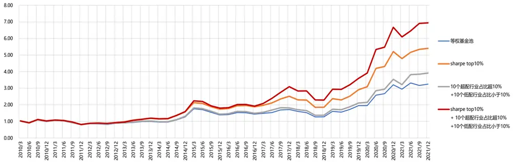
数据来源：东方证券研究所 & Wind 资讯 & 国家统计局 & 朝阳永续

下图展示了我们每季度的优选基金的数量和平均规模。最近三年优选基金数量基本在 20 只-40 只之间，平均规模基本在 20 亿-30亿之间。

图 26：优选基金的数量和平均规模
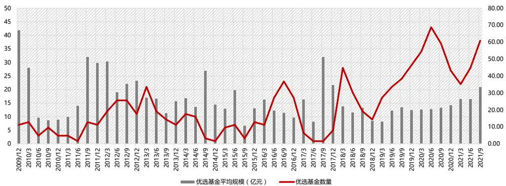
数据来源：东方证券研究所 & Wind 资讯 & 国家统计局 & 朝阳永续

下面我们展示了根据 2021年三季报信息选出的优选基金，共 38 只，过去一年夏普比均在 1.6以上，第一大重仓行业多数为有色金属冶炼及压延加工业、化学原料及化学制品制造业。

图 27：优选基金列表（2021年三季报）

| 日期 | 基金Wind代码 | 基金简称 | 过去一年夏普比 | 基金合计规模 (亿元,对应季报数据) | 基金经理(时任) | 基金成立日 | 第一大重仓行业（根据前十大重仓 股计算，工业企业行业分类） | 第一大重仓行业持仓占比 |
| --- | --- | --- | --- | --- | --- | --- | --- | --- |
| 2021/9/30 | 005927.OF | 创金合信新能源汽车A | 2.15 | 39.97 | 曹春林 | 2018-05-08 | 黑色金属冶炼及压延加工业 | 17.19% |
| 2021/9/30 | 000592.OF | 建信改革红利 | 1.83 | 6.70 | 陶灿 | 2014-05-14 | 化学原料及化学制品制造业 | 6.88% |
| 2021/9/30 | 003984.OF | 嘉实新能源新材料A | 1.89 | 67.49 | 姚志鹏,熊昱洲 | 2017-03-16 | 化学原料及化学制品制造业 | 7.61% |
| 2021/9/30 | 005037.OF | 银华新能源新材料量化A | 2.03 | 13.78 | 李宜璇,张凯 | 2017-09-15 | 化学原料及化学制品制造业 | 10.26% |
| 2021/9/30 | 009147.OF | 建信新能源 | 2.27 | 43.87 | 陶灿,田元泉,张湘龙 | 2020-06-17 | 化学原料及化学制品制造业 | 11.80% |
| 2021/9/30 | 001158.OF | 工银瑞信新材料新能源行业 | 1.92 | 25.62 | 张剑峰 | 2015-04-28 | 化学原料及化学制品制造业 | 13.92% |
| 2021/9/30 | 001643.OF | 汇丰晋信智造先锋A | 1.97 | 36.58 | 陆彬 | 2015-09-30 | 化学原料及化学制品制造业 | 13.46% |
| 2021/9/30 | 001811.OF | 中欧明睿新常态A | 2.05 | 99.38 | 周应波,刘伟伟 | 2016-03-03 | 化学原料及化学制品制造业 | 22.89% |
| 2021/9/30 | 006154.OF | 华安制造先锋A | 1.81 | 9.47 | 蒋璆 | 2018-12-25 | 化学原料及化学制品制造业 | 10.14% |
| 2021/9/30 | 009644.OF | 东方阿尔法优势产业A | 2.22 | 84.47 | 唐雷 | 2020-06-28 | 化学原料及化学制品制造业 | 24.19% |
| 2021/9/30 | 288001.OF | 华夏经典配置 | 1.83 | 17.73 | 佟巍 | 2004-03-15 | 化学原料及化学制品制造业 | 8.05% |
| 2021/9/30 | 000061.OF | 华夏盛世精选 | 2.12 | 14.31 | 郑煜 | 2009-12-11 | 化学原料及化学制品制造业 | 10.32% |
| 2021/9/30 | 004925.OF | 长信低碳环保行业量化A | 2.05 | 7.37 | 左金保 | 2017-11-09 | 化学原料及化学制品制造业 | 10.51% |
| 2021/9/30 | 006049.OF | 恒越研究精选A | 1.84 | 14.28 | 高楠 | 2018-07-04 | 化学原料及化学制品制造业 | 19.69% |
| 2021/9/30 | 610006.OF | 信达澳银产业升级 | 1.85 | 8.45 | 曾国富 | 2011-06-13 | 化学原料及化学制品制造业 | 18.65% |
| 2021/9/30 | 005939.OF | 工银瑞信新能源汽车A | 2.00 | 98.08 | 闫思倩 | 2018-11-14 | 化学原料及化学制品制造业 | 16.80% |
| 2021/9/30 | 007689.OF | 国投瑞银新能源A | 2.02 | 81.42 | 施成 | 2019-11-18 | 化学原料及化学制品制造业 | 26.03% |
| 2021/9/30 | 009368.OF | 浦银安盛价值精选A | 1.89 | 11.85 | 蒋佳良 | 2020-07-22 | 化学原料及化学制品制造业 | 20.06% |
| 2021/9/30 | 210003.OF | 金鹰行业优势 | 1.94 | 7.24 | 倪超 | 2009-07-01 | 化学原料及化学制品制造业 | 7.09% |
| 2021/9/30 | 610004.OF | 信达澳银中小盘 | 1.82 | 10.11 | 曾国富 | 2009-12-01 | 煤炭开采和洗选业 | 20.98% |
| 2021/9/30 | 000696.OF | 汇添富环保行业 | 1.71 | 58.11 | 赵剑 | 2014-09-16 | 有色金属冶炼及压延加工业 | 12.87% |
| 2021/9/30 | 002168.OF | 嘉实智能汽车 | 1.72 | 54.69 | 姚志鹏 | 2016-02-04 | 有色金属冶炼及压延加工业 | 12.43% |
| 2021/9/30 | 210008.OF | 金鹰策略配置 | 1.98 | 12.47 | 韩广哲 | 2011-09-01 | 有色金属冶炼及压延加工业 | 15.02% |
| 2021/9/30 | 003853.OF | 金鹰信息产业A | 1.77 | 24.72 | 樊勇 | 2017-03-10 | 有色金属冶炼及压延加工业 | 6.49% |
| 2021/9/30 | 165516.SZ | 信诚周期轮动 | 1.74 | 31.89 | 张弘 | 2012-05-07 | 有色金属冶炼及压延加工业 | 17.87% |
| 2021/9/30 | 005983.OF | 上投摩根核心精选 | 1.78 | 9.47 | 李博,赵隆隆 | 2018-11-29 | 有色金属冶炼及压延加工业 | 14.29% |
| 2021/9/30 | 006250.OF | 上投摩根动力精选A | 1.83 | 20.41 | 郭晨 | 2019-01-29 | 有色金属冶炼及压延加工业 | 23.74% |
| 2021/9/30 | 007130.OF | 中庚小盘价值 | 1.97 | 59.32 | 丘栋荣 | 2019-04-03 | 有色金属冶炼及压延加工业 | 18.74% |
| 2021/9/30 | 161912.SZ | 万家社会责任定开A | 1.76 | 14.48 | 莫海波 | 2019-03-21 | 有色金属冶炼及压延加工业 | 17.18% |
| 2021/9/30 | 240022.OF | 华宝资源优选A | 1.71 | 24.23 | 蔡目荣,丁靖斐 | 2012-08-21 | 有色金属冶炼及压延加工业 | 19.32% |
| 2021/9/30 | 000828.OF | 泰达宏利转型机遇A | 2.14 | 44.23 | 王鹏 | 2014-11-18 | 有色金属冶炼及压延加工业 | 14.38% |
| 2021/9/30 | 001245.OF | 工银瑞信生态环境 | 2.05 | 46.38 | 何肖颉,闫思倩 | 2015-06-02 | 有色金属冶炼及压延加工业 | 12.17% |
| 2021/9/30 | 003567.OF | 华夏行业景气 | 2.63 | 72.57 | 钟帅 | 2017-02-04 | 有色金属冶炼及压延加工业 | 14.89% |
| 2021/9/30 | 006736.OF | 国投瑞银先进制造 | 1.98 | 43.43 | 施成 | 2019-01-25 2020-01-21 | 有色金属冶炼及压延加工业 | 11.63% |
| 2021/9/30 | 008177.OF | 建信高股息主题 | 1.81 | 5.99 | 陶灿 | 2005-12-01 | 有色金属冶炼及压延加工业 | 32.11% |
| 2021/9/30 | 530001.OF | 建信恒久价值 建信中小盘A | 1.94 | 13.36 9.47 | 陶灿 | 2014-08-20 | 有色金属冶炼及压延加工业 有色金属冶炼及压延加工业 | 10.73% |
| 2021/9/30 | 000729.OF |  | 2.01 |  | 周智硕 |  |  | 23.36% |
| 2021/9/30 | 550008.OF | 信诚优胜精选 | 1.67 | 36.46 | 王睿 | 2009-08-26 | 有色金属冶炼及压延加工业 | 26.65% |

数据来源：东方证券研究所 & Wind 资讯 & 国家统计局 & 朝阳永续

## 五、总结

本篇报告我们从行业基本面角度入手，基于行业当前的财务数据和分析师预期业绩情况构建行业轮动策略，并在选股和选基中进行应用。

财务数据、分析师预期数据是刻画行业基本面的两个主要维度。（1）财务指标的改善意味着行业基本面向好。国家统计局公布的工业企业财务数据月度发布，相较于上市公司季报，时效性更高。（2）一致预期提高说明行业基本面预期改善。一致预期是通过对分析师预测数据加权而得到的综合预测，代表了分析师对于公司未来经营情况的综合评价，其中暗含了企业未来的盈利信息。

使用分析师一致预期行业净利润同比、工业企业利润总额的累计同比、工业企业营业收入的累计同比、工业企业销售净利率的累计同比、工业企业资产负债率同比增速 5 个指标，构建行业轮动策略。从合成因子结果来看：

（1）2007 年至今，top5 行业组合年化收益达到 16.57%，bottom5 行业组合年化收益-1.01%，多头超额 7.44%，多空超额 8.45%。

（2）从年度统计来看，2007年至今 top5 行业组合仅两年跑输基准，bottom5 行业组合仅四年跑赢基准，展现出稳定的收益能力。基于行业基本面的行业轮动策略在近几年的表现尤为出色，2019 年以来 top5 行业组合年化绝对收益 39%，年化超额 14%，这也与近年来主动投资者普遍重视基本面投资有关。今年截止 10 月底，top5 行业组合绝对收益 30.55%，超额收益12.82%，bottom5 行业组合今年绝对收益 4.31%，超额收益-13.43%。

（3）从分 5 组表现来看，合成因子呈现出显著的分层效果，年化超额收益率、夏普比率和月度胜率都呈现出明显的单调性。

从沪深 300增强组合的结果来看：引入行业轮动策略来调整行业暴露敞口效果更好。选择对5 个超配行业放开正向暴露，5个低配行业放开负向暴露，其余行业完全中性的策略，对应的增强组合相比于行业完全中性组合，年化收益可以提高 1%左右，信息比也从 2.6 提升到2.74，在实现收益提升的同时，组合稳定性也有所提高。从分年收益来看，过去 12 年中，有8 年都可以跑赢中性策略，胜率较高。

从中证 500增强组合的结果来看：引入行业轮动策略来调整行业暴露敞口，同时调整个股zscore 得分效果更好。选择对 5 个超配行业放开正向 0.02暴露，5 个低配行业放开负向-0.02 暴露，其余行业完全中性，同时调整个股 zscore 得分的策略，对应的增强组合相比于行业完全中性组合，年化收益提升 0.5%，信息比基本不变。从分年收益来看，过去 12 年中，有10 年都可以跑赢中性策略，胜率较高。

在优选基金组合中，可以引入行业轮动策略。首先选择夏普比排在前 10%的基金，再在其中选择 10 个超配行业配置超10%，10 个低配行业配置低于10%的基金。这样的基金组合 2010 年以来，相对于等权基金池，平均可取得 8.69%的年化超额收益。从分年收益来看，过去 12年中有 10 年都可以跑赢等权基金池。

## 风险提示

1. 量化模型基于历史数据分析，未来存在失效风险，建议投资者紧密跟踪模型表现。

2. 极端市场环境可能对模型效果造成剧烈冲击，导致收益亏损。

## 分析师申明

每位负责撰写本研究报告全部或部分内容的研究分析师在此作以下声明：

分析师在本报告中对所提及的证券或发行人发表的任何建议和观点均准确地反映了其个人对该证券或发行人的看法和判断；分析师薪酬的任何组成部分无论是在过去、现在及将来，均与其在本研究报告中所表述的具体建议或观点无任何直接或间接的关系。

## 投资评级和相关定义

报告发布日后的 12 个月内的公司的涨跌幅相对同期的上证指数/深证成指的涨跌幅为基准；

## 公司投资评级的量化标准

买入：相对强于市场基准指数收益率 15%以上；

增持：相对强于市场基准指数收益率 5%～15%；

中性：相对于市场基准指数收益率在-5%～+5%之间波动；

减持：相对弱于市场基准指数收益率在-5%以下。

未评级 —— 由于在报告发出之时该股票不在本公司研究覆盖范围内，分析师基于当时对该股票的研究状况，未给予投资评级相关信息。

暂停评级 —— 根据监管制度及本公司相关规定，研究报告发布之时该投资对象可能与本公司存在潜在的利益冲突情形；亦或是研究报告发布当时该股票的价值和价格分析存在重大不确定性，缺乏足够的研究依据支持分析师给出明确投资评级；分析师在上述情况下暂停对该股票给予投资评级等信息，投资者需要注意在此报告发布之前曾给予该股票的投资评级、盈利预测及目标价格等信息不再有效。

## 行业投资评级的量化标准：

看好：相对强于市场基准指数收益率 5%以上；

中性：相对于市场基准指数收益率在-5%～+5%之间波动；

看淡：相对于市场基准指数收益率在-5%以下。

未评级：由于在报告发出之时该行业不在本公司研究覆盖范围内，分析师基于当时对该行业的研究状况，未给予投资评级等相关信息。

暂停评级：由于研究报告发布当时该行业的投资价值分析存在重大不确定性，缺乏足够的研究依据支持分析师给出明确行业投资评级；分析师在上述情况下暂停对该行业给予投资评级信息，投资者需要注意在此报告发布之前曾给予该行业的投资评级信息不再有效。

## HeadertTabl e_Discl ai mer 免责声明

本证券研究报告（以下简称“本报告”）由东方证券股份有限公司（以下简称“本公司”）制作及发布。

。本公司不会因接收人收到本报告而视其为本公司的当然客户。本报告的全体接收人应当采取必要措施防止本报告被转发给他人。

本报告是基于本公司认为可靠的且目前已公开的信息撰写，本公司力求但不保证该信息的准确性和完整性，客户也不应该认为该信息是准确和完整的。同时，本公司不保证文中观点或陈述不会发生任何变更，在不同时期，本公司可发出与本报告所载资料、意见及推测不一致的证券研究报告。本公司会适时更新我们的研究，但可能会因某些规定而无法做到。除了一些定期出版的证券研究报告之外，绝大多数证券研究报告是在分析师认为适当的时候不定期地发布。

在任何情况下，本报告中的信息或所表述的意见并不构成对任何人的投资建议，也没有考虑到个别客户特殊的投资目标、财务状况或需求。客户应考虑本报告中的任何意见或建议是否符合其特定状况，若有必要应寻求专家意见。本报告所载的资料、工具、意见及推测只提供给客户作参考之用，并非作为或被视为出售或购买证券或其他投资标的的邀请或向人作出邀请。

本报告中提及的投资价格和价值以及这些投资带来的收入可能会波动。过去的表现并不代表未来的表现，未来的回报也无法保证，投资者可能会损失本金。外汇汇率波动有可能对某些投资的价值或价格或来自这一投资的收入产生不良影响。那些涉及期货、期权及其它衍生工具的交易，因其包括重大的市场风险，因此并不适合所有投资者。

在任何情况下，本公司不对任何人因使用本报告中的任何内容所引致的任何损失负任何责任，投资者自主作出投资决策并自行承担投资风险，任何形式的分享证券投资收益或者分担证券投资损失的书面或口头承诺均为无效。

本报告主要以电子版形式分发，间或也会辅以印刷品形式分发，所有报告版权均归本公司所有。未经本公司事先书面协议授权，任何机构或个人不得以任何形式复制、转发或公开传播本报告的全部或部分内容。不得将报告内容作为诉讼、仲裁、传媒所引用之证明或依据，不得用于营利或用于未经允许的其它用途。

经本公司事先书面协议授权刊载或转发的，被授权机构承担相关刊载或者转发责任。不得对本报告进行任何有悖原意的引用、删节和修改。

提示客户及公众投资者慎重使用未经授权刊载或者转发的本公司证券研究报告，慎重使用公众媒体刊载的证券研究报告。

## 东方证券研究所

地址：上海市中山南路 318 号东方国际金融广场 26 楼

电话：021-63325888

传真：021-63326786

网址： www.dfzq.com.cn