# 基于主动买卖单的行业轮动模型

## ——《量化策略研究 之 四》

## 研究结论

⚫ 本篇报告我们从行业技术面角度入手，基于行业主动买卖单信息构建行业轮动策略，并在选股和选基中进行应用。

⚫ 买卖单差额指标与交易量指标相比，还包含着交易方向，可以反映多空双方的主动买卖意愿，以及力量抗衡状态，从而揭示出隐藏在交易行为中的信息。

主动买卖单的划分方法中批量成交划分法（ Bulk Volume Classification，简称BVC）效果最好。该方法不需要逐笔数据，大大降低了运算量，同时减少了高频订单数据噪音的干扰，与股价涨跌幅的相关性更高。

⚫ 使用个股流通市值加权法、较短因子计算窗口期得到的行业净主买因子效果更好。

⚫ 基于 bvc算法计算的行业净换手率因子效果最好，多空超额最显著。2010年至2021 年 top5 行业年化收益达到 14.13%，bottom5 行业年化收益为 0.58%，多头超额 7.68%，多空超额 13.55%。top5行业组合仅两年跑输基准。2021年全年，top5行业组合绝对收益 41.54%， bottom5 行业组合绝对收益 1.11%。

⚫ 双周频调仓的行业轮动策略效果得到进一步提升，周频调仓策略效果不佳。

可将基于工业企业行业分类的行业轮动模型，与基于中信一级行业分类的行业轮动模型相结合。每月底在工业企业行业分类体系下选出 top5行业，在中信一级行业体系下选出 top5行业，再将这 10个 top行业等权配置。复合策略 2010年至 2021年的年化收益达到 15.05%。

⚫ 从增强组合的结果来看，引入行业轮动策略对组合收益提高比较有限。

从主动组合的结果来看，引入行业轮动策略可以显著提升组合收益。根据行业轮动结果对个股得分进行调整，而后再选择个股因子得分 top30等权构造组合，2010年以来年化收益最高达 31%，年化夏普比 1.12。相比常规组合，年化收益提升 4%。

⚫ 从主动基金组合结果来看，高夏普比叠加行业轮动策略对应的基金组合收益可观。2010年以来相对于偏股基金指数，可取得 10%的年化超额收益。年度胜率 92%。

⚫ 从被动指数基金轮动组合结果来看，组合收益可观。根据调仓时最新的行业轮动策略结果，选择前十大超配行业的代表性被动指数基金进行配置，等权构造组合。2010年以来，相对于被动股基指数，年化超额收益 6.19%。

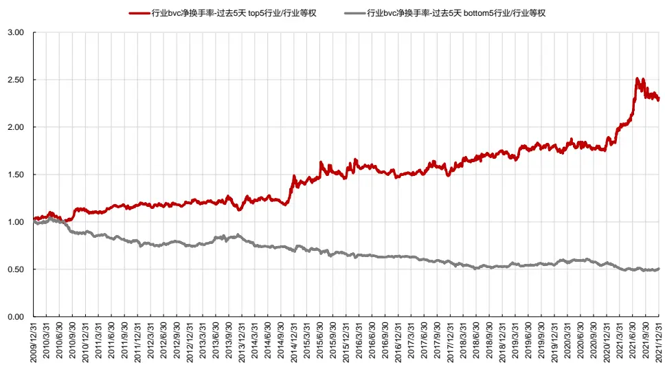

## 风险提示

⚫ 量化模型失效风险

⚫ 市场极端环境的冲击

报告发布日期

2022 年 02 月 25 日

朱剑涛

021-63325888*6077

zhujiantao@orientsec.com.cn

执业证书编号：S0860515060001

刘静涵021-63325888*3211

liujinghan@orientsec.com.cn

执业证书编号：S0860520080003

基于工业企业财务数据和分析师预期的行 2021-11-27业轮动模型：——《量化策略研究 之 三》

买卖单差额（order imbalance）是高频领域研究的一个重点对象。买卖单差额指标与交易量指标相比，还包含着交易方向，可以反映多空双方的主动买卖意愿，以及力量抗衡状态，从而揭示出隐藏在交易行为中的信息。在之前的专题报告《主动买卖单的批量成交划分法》中我们已经详细探讨了净主买类因子的选股效果，本篇报告我们将考察其在行业轮动策略中的效果，并对行业轮动策略的应用进行深入探讨。

## 一、行业买卖单因子构建

## 1.1 主动买卖单的划分

在之前的专题报告《主动买卖单的批量成交划分法》中，我们曾详细介绍过主动买卖单的划分方法，其中 ELO（2012）提出的批量成交划分法（Bulk Volume Classification，简称 BVC）效果最好。该方法不需要逐笔数据，大大降低了运算量，同时减少了高频订单数据噪音的干扰，与股价涨跌幅的相关性更高。基于买卖单差额指标可以构造有效的个股 Alpha 因子，对交易冲击成本模型的拟合度也更高。

BVC 算法并不对每一笔交易进行买卖方向的划分，而是着眼于一个“Time Bar”（时间间隔）或“Volume Bar”（成交量间隔）。根据每一个 bar 内的标准化股价变动，应用概率分布确定出每个 bar的成交量中主动买入和卖出的占比。

具体计算公式是：

$$
\begin{array}{l}{{{V_{\tau}}^{B}=V_{\tau}\mathrm{{[}}{\mathrm{f}}({\frac{P_{\tau}-P_{\tau-1}}{\sigma_{\Delta P}}},df)}}\\{{{V_{\tau}}^{S}=1-{V_{\tau}}^{B}}}\end{array}
$$

其中，V为第τ个bar内的成交量， $V^{B}$ 为成交量中属于主动买入的部分， $V^{S}$ 为成交量中属于主动卖出的部分，t是 t 分布的累积分布函数（CDF，使用 t 分布的原因是由于真实股价涨跌分布不可知）， $P_{t}-P_{t-1}$ 为第t−1个bar终点到第t个bar终点的股价涨跌， $\sigma_{\Delta P}$ 为不同bar之间股价涨跌的标准差， $df$ 为自由度（当标准化后的股价变动幅度不变时， $df$ 越小，主动买入的占比越小。原文献中经过测算取df=0.25）。

如果股价在同一个 bar 内从起点到终点没有变化，则该 bar 内的交易量中主动买入和卖出各占 50%；如果发生股价上涨，则主动买入的占比就会提高，提升幅度取决于这个 bar 内股价的上涨幅度和过去一段时间股价变化的分布。

本文在 BVC 算法计算时取 1min 作为最短的时间间隔（bar）。计算每分钟的涨跌幅（均使用收盘价）以及每天的分钟涨跌幅标准差，代入计算公式即可得到每分钟的主动买入和主动卖出成交量，汇总加和得到每天的主动买入和主动卖出成交量。

对于分钟数据需要进行如下处理：

（1）判断个股每分钟的收盘价格是否等于当天的涨停价格、跌停价格，或该分钟是否无成交量，三者符合其一就去掉该股的对应分钟数据；如果停牌，则剔除该股当天所有分钟数据。交易开始时间前的集合竞价阶段（9：25-9：30）不予考虑。

（2）需要注意的是，由于涨跌停板的存在限制了上涨和下跌的动力，因而按照下述的订单流算法，股票封涨停时，所有成交将被划分为主动卖；跌停时，所有成交将被划分为主动买。虽然涨跌停板可能在股价触及后又被打开，但是总体上我们认为涨（跌）停反映的是投资者主动买（卖）的意愿，因而订单流算法对于涨跌停时刻的交易方向划分不合理。考虑到如果当天长时间处于封板状态，则两种算法估计出的主动买卖量会有较大差异，因而公平起见，如果个股超过半天处于涨跌停状态，则剔除当天该股的所有分钟数据，不进行比较。

我们采用Wind计算的每日主动买卖成交量数据与BVC算法进行对比，该数据在算法上除了在买一价和卖一价中间成交的交易方向划分方法外，其他均与Lee-Ready算法一致。具体计算方法如下：根据成交价和最优报价判断主动买卖单方向：主买：最新成交价>=卖一价 ；主卖：最新成交价<=买一价；在买一价和卖一价中间成交时，成交价接近哪个则记为哪个方向，成交价与买一卖一同样接近时记为为主动买入。

## 1.2 行业买卖单因子计算

根据 BVC 算法和订单流算法，我们可以得到个股每天的主动买入量 Vb 和主动卖出量 Vs，基于此可以构造 2个日度股票因子：

## （1）净主买占比 OI = （个股全天主动买入量–主动卖出量）/ 个股全天成交量

衡量投资者主动买入的意愿。OI>0 反映市场上主动买入意愿更强烈，买方力量强劲，存在超额的需求；OI<0则说明市场主动卖出意愿更强烈，卖方力量强劲，存在超额的供给。

## （2）净换手率 NTO =（个股全天主动买入量–主动卖出量）/ 个股流通股本

衡量市场中主动买入方的力量强弱。该指标=净主买占比*换手率。NTO>0 说明投资者积极买入；NTO<0说明投资者恐慌出仓；

由个股因子生成行业因子有两种方法：整体法和个股加权法。

在整体法下：

（1）行业净主买占比 OI = （某行业在一段时间内的主动买入量之和–某行业在一段时间内的主动卖出量之和）/ 某行业在一段时间内的全天成交量之和

（2）行业净换手率 NTO =（某行业在一段时间内的主动买入量之和–某行业在一段时间内的主动卖出量之和）/ 某行业的个股流通股本之和

## 在个股加权法下：

每日计算当日个股指标值，在调仓日计算窗口期内取指标均值作为当期个股因子值。

计算行业因子时，将行业内成分股的因子值进行加权，加权方法可以采用等权或市值加权。

## 二、行业轮动策略测试结果

## 2.1 策略构建方法

回测区间：2009.12.31-2021.12.31。

调仓频率：月频调仓

行业分类：中信一级行业，共29个行业（图1）

组合构建方法：在调仓日，基于当前可获得的最新行业因子从高到低排序，选择排序前五和后五的行业等权构建组合，并于下一交易日进行调仓。

行业收益：各行业收益采用当天行业内股票的流通市值加权收益自行计算获得（权重为上一天的流通市值）。

绩效评价：考虑到行业样本数太少，ICIR 结果不太可靠，我们通过多空头组合收益来判断指标效果。采用行业等权组合作为基准，组合绩效指标均基于日度净值计算获得，未考虑交易费用。

图 1：各行业内上市公司个数（中信一级行业，2021/12/31）
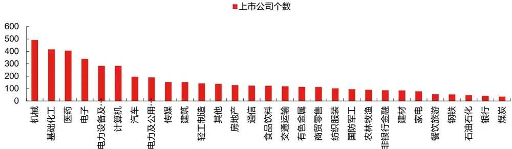
数据来源：东方证券研究所 & Wind资讯

## 2.2 月频调仓策略结果

## 1. 因子计算方法的选择

首先，我们对比整体法和个股加权法下的行业轮动策略表现。由于因子和股票价格有关，因而市值加权时应使用因子计算区间起点的股票市值，否则将出现逻辑上的不合理。因子计算窗口期先选择 20个交易日。

从结果可以看到：使用个股流通市值加权法计算的行业因子效果更好。

图 2：不同因子计算方法下的行业轮动策略表现（2009/12/31-2021/12/31）

| 月频调仓 按中信一级行业分类 行业间等权组合 | 行业内整体法 |  |  |  |  |  | 行业内个股因子等权 |  |  |  | 行业内个股因子按流通市值加权 |  |  |
| --- | --- | --- | --- | --- | --- | --- | --- | --- | --- | --- | --- | --- | --- |
|  | 行业等权 | 行业bvc净买入占比 过去20天 |  | 行业bvc净换手率 过去20天 |  | 行业bvc净买入占比 过去20天 |  | 行业bvc净换手率 过去20天 |  | 行业bvc净买入占比 过去20天 |  | 行业bvc净换手率 过去20天 |  |
| 2009.12.31-2021.12.31 |  | top5行业 | bottom5行业 | top5行业 | bottom5行业 | top5行业 | bottom5行业 | top5行业 | bottom5行业 | top5行业 | bottom5行业 | top5行业 | bottom5行业 |
| 年化收益率 | 6.45% | 6.83% | 5.07% | 8.68% | 1.67% | 8.21% | 4.70% | 7.60% | 3.36% | 8.37% | 4.16% | 9.67% | 1.98% |
| 年化波动率 | 22.65% | 23.18% | 24.01% | 24.98% | 24.30% | 24.27% | 23.80% | 24.43% | 24.27% | 23.21% | 24.20% | 24.82% | 24.82% |
| Sharp值 | 0.39 | 0.40 | 0.33 | 0.46 | 0.19 | 0.45 | 0.31 | 0.42 | 0.26 | 0.46 | 0.29 | 0.50 | 0.20 |
| 最大回撤 单边换手率（年） | -53.94% 0.20 | -50.47% 8.63 | -57.90% 9.79 | -58.02% | -61.33% | -49.34% | -55.61% | -50.97% | -58.60% | -52.40% 7.64 | -58.72% 9.18 | -58.48% 9.10 | -61.85% 9.14 |
| 分年收益 |  |  |  | 9.16 | 9.75 | 8.03 | 9.20 | 8.68 | 9.13 |  |  |  | nav |
| 2010/12/31 | 3.11% | -14.76% | 5.63% | 6.91% | -2.08% | -7.32% | 4.34% | -5.67% | -3.79% | -15.48% | 1.16% | -1.09% | -2.41% |
| 2011/12/30 | -26.30% | -25.88% | -26.90% | -27.95% | -29.53% | -25.22% | -23.32% | -27.20% | -23.53% | -23.75% | -24.46% | -30.02% | -25.09% |
| 2012/12/31 | 1.80% | -1.87% | -0.35% | -4.59% | -0.62% | 8.98% | -3.51% | -1.65% | 3.38% | 5.65% | 1.99% | 0.84% | -0.52% |
| 2013/12/31 | 11.04% | 16.09% | 14.58% | 24.08% | 11.44% | 10.43% | 11.21% | 12.95% | 17.51% | -0.34% | 18.16% | 26.52% | 16.81% |
| 2014/12/31 | 46.57% | 88.10% | 30.29% | 70.97% | 35.74% | 97.30% | 17.52% | 73.79% | 23.52% | 100.96% | 30.61% | 74.18% | 32.33% |
| 2015/12/31 | 39.31% | 19.56% | 55.75% | 25.94% | 52.13% | 13.65% | 40.71% | 31.06% | 34.39% | 15.63% | 40.49% | 28.10% | 45.16% |
| 2016/12/30 | -11.38% | -10.46% | -13.03% | -14.11% | -10.50% | -19.08% | -13.48% | -18.03% | -5.26% | -14.28% | -11.67% | -17.38% | -12.30% |
| 2017/12/29 | 4.15% | 11.32% | -2.19% | 12.40% | -6.04% | 22.28% | -3.71% | 17.13% | -3.91% | 22.27% | -3.52% | 22.44% | -2.78% |
| 2018/12/28 | -26.66% | -22.59% | -27.38% | -34.67% | -33.69% | -20.43% | -18.15% | -23.01% | -28.05% | -28.99% | -31.42% | -36.40% | -32.33% |
| 2019/12/31 | 28.12% | 20.98% | 39.42% | 28.13% | 34.76% | 18.59% | 42.83% | 24.23% | 40.96% | 22.69% | 40.57% | 35.22% | 28.61% |
| 2020/12/31 | 23.40% | 16.92% | 25.79% | 29.77% | 18.96% | 12.21% | 25.88% | 18.34% | 22.44% | 38.60% | 17.58% | 34.31% | 11.98% |
| 2021/12/31 | 12.80% | 25.10% | -6.59% | 31.85% | -13.56% | 31.54% | -0.25% | 27.58% | -11.39% | 31.54% | -0.11% | 31.50% | -6.67% |

数据来源：东方证券研究所 & Wind资讯

## 2. 因子计算窗口期的选择

其次，我们对比不同因子计算窗口期下的行业轮动策略表现。因子计算方法使用个股流通市值加权法。可以看出，因子计算窗口期越短越好。这说明在中国股票市场上主动买卖中包含的市场信息可以较快地反映到股票价格上，过去 5 天的信息尚未被市场完全消化，从而对次月股价有一定影响。

图 3：不同因子计算窗口期下的行业轮动策略表现（2009/12/31-2021/12/31）

| 月频调仓按中信一级行业分类行业间等权组合2009.12.31-2021.12.31年化收益率年化波动率Sharp值最大回撤单边换手率（年）分年收益2010/12/312011/12/302012/12/312013/12/312014/12/31 |  |  |  |  |  |  |  |  |  |
| --- | --- | --- | --- | --- | --- | --- | --- | --- | --- |
|  |  |  | 行业内个股因子按流通市值加权 |  |  |  |  |  |  |
|  | 行业等权 | 行业bvc净买入占比过去5天 |  | 行业bvc净换手率过去5天 |  | 行业bvc净过去2 | 买入占比 行业bvc净换手率0天 过去20天 |  |  |
|  |  | top5行业 | bottom5行业 | top5行业 | bottom5行业 | top5行业 | bottom5行业 | top5行业 bottom5行业 |  |
|  | 6.45% | 10.60% | 1.24% | 14.13% | 0.58% | 8.37% | 4.16% | 9.67% 1.98% |  |
|  | 22.65% | 23.77% | 24.07% | 24.57% | 25.18% | 23.21% | 24.20% | 24.82% 24.82% |  |
|  | 0.39 | 0.54 | 0.17 | 0.66 | 0.15 | 0.46 | 0.29 | 0.50 0.20 |  |
|  | -53.94% | -45.28% | -60.95% | -46.58% | -66.44% | -52.40% | -58.72% | -58.48% -61.85% |  |
|  | 0.20 | 8.22 | 9.70 | 9.30 | 9.06 | 7.64 | 9.18 | 9.10 9.14 |  |
|  | 3.11% | -6.49% | -10.95% | 16.31% | -8.54% | -15.48% | 1.16% | -1.09% -2.41% |  |
|  | -26.30% | -16.55% | -26.34% | -23.47% | -33.64% | -23.75% | -24.46% | -30.02% -25.09% |  |
|  | 1.80% | 4.44% | -3.09% | 3.96% | -4.31% | 5.65% | 1.99% | 0.84% -0.52% |  |
|  | 11.04% | -3.64% | 18.35% | 6.38% | 23.51% | -0.34% | 18.16% | 26.52% 16.81% |  |
|  | 46.57% | 69.14% | 15.23% | 90.51% | 22.30% | 100.96% | 30.61% | 74.18% | 32.33% |
| 2015/12/312016/12/302017/12/292018/12/282019/12/312020/12/312021/12/31 | 39.31% | 38.13% | 28.06% | 37.28% | 32.87% | 15.63% | 40.49% | 28.10% | 45.16% |
|  | -11.38% | -11.15% | -9.51% | -10.98% | -15.13% | -14.28% | -11.67% | -17.38% -12.30% |  |
|  | 4.15% | 16.17% | 0.22% | 7.46% | -5.62% | 22.27% | -3.52% | 22.44% | -2.78% |
|  | -26.66% | -13.42% | -32.76% | -15.46% | -33.19% | -28.99% | -31.42% | -36.40% | -32.33% |
|  | 28.12% | 16.71% | 36.44% | 31.86% | 32.88% | 22.69% | 40.57% | 35.22% | 28.61% |
|  | 23.40% | 41.46% | 27.70% | 25.81% | 27.91% | 38.60% | 17.58% | 34.31% | 11.98% |
|  | 12.80% | 23.81% | -1.71% | 41.54% | 1.11% | 31.54% | -0.11% | 31.50% | -6.67% |

数据来源：东方证券研究所 & Wind资讯

## 3. 与其他相似因子效果对比

下面，我们对比基于 bvc 算法和基于订单流算法计算的行业净主买占比、行业净换手率，以及行业动量因子的效果。因子计算方法使用个股流通市值加权法，因子计算窗口期选择过去 5 个交易日。可以看到：

（1）基于 bvc 算法计算的行业净换手率因子效果最好，多空超额最显著。2010 年至 2021年 top5 行业年化收益达到 14.13%，bottom5 行业年化收益为 0.58%，多头超额 7.68%，空头超额 5.87%，多空超额 13.55%。多头最大回撤仅为 10%左右。

（2）从年度统计来看， top5 行业组合仅两年跑输基准，bottom5 行业组合仅三年跑赢基准，展现出稳定的收益能力。2021 年全年，top5 行业组合绝对收益 41.54%，超额收益 28.74%，bottom5 行业组合绝对收益 1.11%，超额收益-11.69%。

（3）从分5组表现来看，合成因子呈现出显著的分层效果，年化超额收益、夏普比率和月度胜率都呈现出明显的单调性。

图 4：不同行业因子下的行业轮动策略表现（2009/12/31-2021/12/31）

| 月频调仓 | 行业内个股因子流通市值加权（按因子计算区间起点的市值） |  |  |  |  |  |  |  |  |  |  |
| --- | --- | --- | --- | --- | --- | --- | --- | --- | --- | --- | --- |
|  | 按中信一级行业分类 | 行业等权 行业bvc净买入占比-过去5天 |  | 行业bvc净换手率-过去5天 |  | 行业订单流净买入占比-过去5天 |  | 行业订单流净换手率-过去5天 |  | 行业动量-过去5天 |  |
| 行业间等权组合 2009.12.31-2021.12.31 |  | top5行业 | bottom5行业 | top5行业 | bottom5行业 | top5行业 | bottom5行业 | top5行业 | bottom5行业 | top5行业 | bottom5行业 |
| 年化收益率 | 6.45% | 10.60% | 1.24% | 14.13% | 0.58% | 11.52% | 3.72% | 11.78% | 2.16% | 10.62% | 0.34% |
| 年化波动率 | 22.65% | 23.77% | 24.07% | 24.57% | 25.18% | 24.69% | 22.54% | 23.33% | 25.89% | 24.71% | 24.54% |
| Sharp值 | 0.39 | 0.54 | 0.17 | 0.66 | 0.15 | 0.57 | 0.28 | 0.59 | 0.21 | 0.53 | 0.14 |
| 最大回撤 | -53.94% | -45.28% | -60.95% | -46.58% | -66.44% | -48.61% | -53.05% | -45.32% | -68.50% | -48.44% | -61.50% |
| 单边换手率（年） 分年收益 | 0.20 | 8.22 | 9.70 | 9.30 | 9.06 | 7.89 | 8.71 | 7.48 | 7.59 | 9.20 | 9.54 |
| 2010/12/31 |  |  |  |  |  |  |  |  |  |  |  |
| 2011/12/30 | 3.11% | -6.49% -16.55% | -10.95% -26.34% | 16.31% -23.47% | -8.54% -33.64% | -2.36% -14.66% | -10.81% -29.19% | 17.20% -15.59% | 1.62% -29.96% | 0.89% -25.87% | -17.66% |
| 2012/12/31 | -26.30% 1.80% | 4.44% | -3.09% | 3.96% | -4.31% | 10.91% | 1.89% | 3.21% | -5.17% | 6.11% | -33.95% -2.60% |
| 2013/12/31 | 11.04% | -3.64% | 18.35% | 6.38% | 23.51% | 2.68% | 9.96% | -5.57% | 32.61% | 2.21% | 21.91% |
| 2014/12/31 | 46.57% | 69.14% | 15.23% | 90.51% | 22.30% | 78.60% | 30.71% | 86.62% | 20.69% | 89.45% | 28.15% |
| 2015/12/31 | 39.31% | 38.13% | 28.06% | 37.28% | 32.87% | 22.93% | 40.51% | 21.14% | 47.45% | 37.23% | 23.48% |
| 2016/12/30 | -11.38% | -11.15% | -9.51% | -10.98% | -15.13% | -15.48% | -5.00% | -6.35% | -11.98% | -19.56% | -12.65% |
| 2017/12/29 | 4.15% | 16.17% | 0.22% | 7.46% | -5.62% | 16.70% | 9.62% | 10.51% | -7.48% | 12.43% | -0.11% |
| 2018/12/28 | -26.66% | -13.42% | -32.76% | -15.46% | -33.19% | -2.59% | -34.98% | -6.02% | -38.44% | -16.56% | -28.72% |
| 2019/12/31 | 28.12% | 16.71% | 36.44% | 31.86% | 32.88% | 23.38% | 27.63% | 21.07% | 28.49% | 15.86% | 36.61% |
|  | 23.40% | 41.46% | 27.70% | 25.81% | 27.91% | 28.50% | 16.75% | 21.24% | 25.10% | 33.26% | 21.80% |
| 2020/12/31 |  |  |  |  | 1.11% | 16.69% | 18.17% | 22.33% | 0.66% | 36.65% |  |
| 2021/12/31 | 12.80% | 23.81% | -1.71% | 41.54% |  |  |  |  |  |  | -1.57% |

数据来源：东方证券研究所 & Wind资讯

图 5：不同行业因子下的行业轮动策略表现（2009/12/31-2021/12/31）

| 行业bvc净换手率-过去5天 | 1(低) | 2 | 3 | 4 | 5(高) |
| --- | --- | --- | --- | --- | --- |
| 月均超额收益 | -0.38% | -0.27% | 0.11% | 0.09% | 0.44% |
| 月度超额胜率 | 43.06% | 44.44% | 54.86% | 51.39% | 54.86% |
| 年化超额夏普 | -54.83% | -48.81% | 19.85% | 14.74% | 51.73% |
| 超额收益最大回撤 | -47.70% | -33.54% | -19.68% | -13.51% | -8.69% |
| 年化超额收益 | -4.62% | -3.23% | 1.16% | 0.85% | 4.57% |

数据来源：东方证券研究所 & Wind资讯

有关分析师的申明，见本报告最后部分。其他重要信息披露见分析师申明之后部分，或请与您的投资代表联系。并请阅读本证券研究报告最后一页的免责申明。

图 6：不同行业因子下的行业轮动策略多头净值（2009/12/31-2021/12/31）
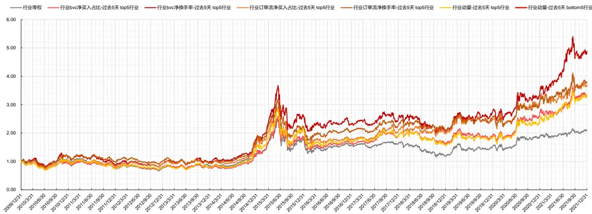
数据来源：东方证券研究所 & Wind资讯

图 7：行业 bvc净换手率因子下的行业轮动策略多头净值/行业等权（2009/12/31-2021/12/31）
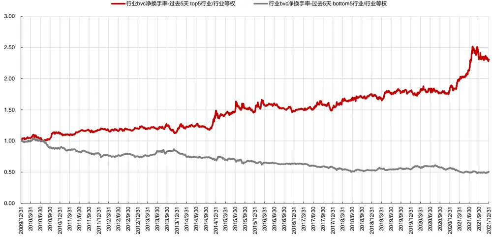
数据来源：东方证券研究所 & Wind资讯

## 4. 持仓分析

从每期 top5 行业组合的配置情况来看，策略在 28 个行业上发出过配置信号，实现行业全覆盖。其中在银行、国防军工、食品饮料等行业上发出的多头信号最多。我们统计了 top5 组合在各行业的配置胜率，即被 top5 组合选中的各行业在当期获得正超额收益的次数与被选中总次数之比。结果显示，13 个行业配置胜率超 50%。

从 2021 年 top5 行业组合的配置来看，有色金属出现 8 次，钢铁、国防军工、电视设备及新能源、基础化工出现 5次。

图 8：top5 行业组合在各行业的历史配置胜率（2009/12/31-2021/12/31）

| 行业名称 | top5行业组合获得正超额收益的次数 | top5行业组合选中次数 | top5行业组合配置胜率 | 行业名称 | top5行业组合获得正超额收益的次数 | top5行业组合选中次数 | top5行业组合配置胜率 |
| --- | --- | --- | --- | --- | --- | --- | --- |
| 汽车 | 9 | 12 | 75.00% | 传媒 | 14 | 29 | 48.28% |
| 建筑 | 12 | 18 | 66.67% | 轻工制造 | 8 | 17 | 47.06% |
| 食品饮料 | 22 | 33 | 66.67% | 机械 | 6 | 13 | 46.15% |
| 基础化工 | 9 | 14 | 64.29% | 电力及公用事业 | 6 | 13 | 46.15% |
| 电子 | 19 | 31 | 61.29% | 通信 | 12 | 26 | 46.15% |
| 餐饮旅游 | 19 | 31 | 61.29% | 农林牧渔 | 15 | 33 | 45.45% |
| 电力设备及新能源 | 9 | 15 | 60.00% | 有色金属 | 19 | 44 | 43.18% |
| 银行 | 26 | 44 | 59.09% | 医药 | 9 | 21 | 42.86% |
| 国防军工 | 27 | 47 | 57.45% | 家电 | 9 | 21 | 42.86% |
| 纺织服装 | 13 | 23 | 56.52% | 商贸零售 | 5 | 12 | 41.67% |
| 计算机 | 15 | 27 | 55.56% | 建材 | 10 | 24 | 41.67% |
| 钢铁 | 16 | 30 | 53.33% | 交通运输 | 8 | 20 | 40.00% |
| 煤炭 | 15 | 29 | 51.72% | 非银行金融 | 16 | 41 | 39.02% |
|  |  |  |  | 房地产 | 9 | 27 | 33.33% |
|  |  |  |  | 石油石化 |  | 25 |  |
|  |  |  |  |  | 7 |  | 28.00% |

数据来源：东方证券研究所 & Wind资讯

图 9：2021年top5行业组合持仓情况

| 调仓日 | 行业 | 权重 | 下个月行业绝对收益 | 下个月行业超额收益 | 调仓日 | 行业 | 权重 | 下个月行业绝对收益 | 下个月行业超额收益 |
| --- | --- | --- | --- | --- | --- | --- | --- | --- | --- |
| 2021/1/29 | 交通运输 | 20% | 3.6% | 1.5% | 2021/7/30 | 农林牧渔 | 20% | 0.0% | -5.9% |
|  | 商贸零售 | 20% | 2.0% | 0.0% |  | 有色金属 | 20% | 21.1% | 15.2% |
|  | 煤炭 | 20% | 4.6% | 2.6% |  | 汽车 | 20% | 8.1% | 2.2% |
|  | 银行 | 20% | 2.8% | 0.8% |  | 电子 | 20% | -8.7% | -14.6% |
|  | 餐饮旅游 | 20% | 4.3% | 2.2% |  | 通信 | 20% | -4.0% | -9.9% |
| 2021/2/26 | 建筑 | 20% | 5.7% | 7.1% | 2021/8/31 | 建筑 | 20% | 1.1% | 1.3% |
|  | 房地产 | 20% | -3.6% | -2.2% |  | 有色金属 | 20% | -17.7% | -17.5% |
|  | 电力及公用事业 | 20% | 17.0% | 18.4% |  | 煤炭 | 20% | 7.0% | 7.2% |
|  | 纺织服装 | 20% | 7.4% | 8.8% |  | 电力设备及新能源 | 20% | -1.4% | -1.3% |
|  | 钢铁 | 20% | 7.1% | 8.5% |  | 钢铁 | 20% | -13.3% | -13.1% |
| 2021/3/31 | 国防军工 | 20% | -4.8% | -5.9% |  | 农林牧渔 | 20% | 2.6% | 3.8% |
|  | 建材 | 20% | 0.1% | -1.0% |  | 医药 | 20% | -4.1% | -2.8% |
|  | 有色金属 | 20% | 9.6% | 8.5% | 2021/9/30 | 房地产 | 20% | -8.7% | -7.5% |
|  | 钢铁 | 20% | 9.0% | 7.9% | 食品饮料 |  | 20% | 1.6% | 2.8% |
|  | 餐饮旅游 | 20% | 1.3% | 0.3% | 餐饮旅游 |  | 20% | 3.0% | 4.2% |
| 2021/4/30 | 医药 | 20% | 3.9% | -0.3% |  | 交通运输 | 20% | -1.3% | -2.9% |
|  | 商贸零售 | 20% | 5.9% | 1.7% | 2021/10/29 | 国防军工 | 20% | 12.5% | 10.9% |
|  | 基础化工 | 20% | 7.2% | 3.1% | 汽车 |  | 20% | 3.2% | 1.6% |
|  | 有色金属 | 20% | 8.4% | 4.3% | 电力及公用事业 |  | 20% | -2.2% | -3.8% |
|  | 电力设备及新能源 | 20% | 7.5% | 3.3% | 电力设备及新能源 |  |  | 3.7% | 2.1% |
| 2021/5/31 | 国防军工 | 20% | 2.0% | 1.6% |  | 国防军工 | 20% 20% | -0.4% | -4.1% |
|  | 基础化工 | 20% | 6.3% | 5.9% | 2021/11/30 | 基础化工 | 20% | -0.4% | -4.2% |
|  | 有色金属 | 20% | -3.6% | -4.0% |  | 有色金属 | 20% | -6.0% | -9.7% |
|  | 电力设备及新能源 | 20% | 11.1% | 10.7% | 电力及公用事业 |  | 20% | 10.9% |  |
|  | 通信 | 20% | 4.7% |  |  |  |  |  | 7.2% |
| 2021/6/30 |  | 20% |  | 4.2% |  | 钢铁 | 20% | 1.9% | -1.8% |
|  | 基础化工 | 20% | 4.9% | 7.7% |  | 医药 | 20% | -15.1% | -7.2% |
|  | 有色金属 电力设备及新能源 | 20% | 29.2% 10.1% | 32.1% | 2021/12/31 | 国防军工 基础化工 | 20% 20% | -19.1% -10.2% | -11.2% |
|  |  | 20% | 5.1% | 13.0% 8.0% |  |  | 20% | -5.4% | -2.4% 2.4% |
|  | 电子 钢铁 | 20% | 16.0% | 18.8% | 家电 有色金属 | 20% |  | -11.2% | -3.3% |

数据来源：东方证券研究所 & Wind资讯

## 2.3 高频调仓策略结果

下面我们尝试加快调仓频率，考察双周频以及周频行业轮动策略的效果。可以看到，在双周频调仓的情况下，行业轮动策略效果得到进一步提升，而周频调仓下行业轮动策略效果不佳。

综合来看，我们更推荐月频或双周频调仓。

图 10：高频调仓的行业轮动策略表现（2009/12/31-2021/12/31）

| 行业内个股因子按流通市值加权 按中信一级行业分类 | 双周频调仓 |  |  |  | 周频调仓 |  |  |  |  |
| --- | --- | --- | --- | --- | --- | --- | --- | --- | --- |
|  | 行业等权 | 行业bvc净买入占比-过去5天 |  | 行业bvc净换手率-过去5天 |  | 行业bvc净买入占比-过去5天 |  | 行业bvc净换手率-过去5天 |  |
| 行业间等权组合 2009.12.25-2021.12.31 |  | top5行业 | bottom5行业 | top5行业 | bottom5行业 | top5行业 | bottom5行业 | top5行业 | bottom5行业 |
| 年化收益率 | 6.66% | 14.86% | -3.70% | 18.35% | -3.35% | 9.65% | 0.49% | 10.76% | 1.34% |
| 年化波动率 | 22.64% | 23.21% | 24.26% | 24.84% | 25.04% | 23.61% | 24.16% | 24.77% | 24.72% |
| Sharp值 | 0.40 | 0.71 | (0.03) | 0.80 | (0.01) | 0.51 | 0.14 | 0.54 | 0.18 |
| 最大回撤 | -53.46% | -53.12% | -65.88% | -48.36% | -73.09% | -49.83% | -60.47% | -53.43% | -59.50% |
| 单边换手率（年） | 0.28 | 17.93 | 19.47 | 18.40 | 19.09 | 35.17 | 38.41 | 37.71 | 38.41 |
| 分年收益 |  |  |  |  |  |  |  |  |  |
| 2010/12/31 | 3.20% | 7.08% | -12.13% | 15.08% | -8.18% | -1.28% | -0.73% | 4.28% | 6.38% |
| 2011/12/30 | -26.37% | -20.12% | -27.48% | -23.43% | -26.80% | -21.35% | -31.37% | -23.59% | -35.86% |
| 2012/12/31 | 1.60% | 13.28% | -8.89% | 13.81% | -9.90% | 8.35% | -0.44% | -0.88% | -3.48% |
| 2013/12/31 | 10.79% | 20.71% | 0.21% | 35.30% | 1.90% | 7.09% | 10.72% | 16.98% | 19.92% |
| 2014/12/31 | 45.69% | 84.58% | 17.38% | 99.54% | 15.36% | 78.98% | 20.47% | 89.94% | 23.96% |
| 2015/12/31 | 40.66% | 20.28% | 19.14% | 48.80% | 20.56% | 12.87% | 19.12% | 50.35% | 18.92% |
| 2016/12/30 | -11.35% | -3.63% | -20.71% | -9.36% | -27.20% | 2.97% | -15.16% | -14.33% | -13.49% |
| 2017/12/29 | 4.10% | 15.63% | 0.04% | 17.24% | -5.84% | 11.71% | 1.92% | 12.65% | -2.72% |
| 2018/12/28 | -26.73% | -15.71% | -35.19% | -29.25% | -36.18% | -22.70% | -27.91% | -32.03% | -27.02% |
| 2019/12/31 | 28.10% | 29.62% | 20.41% | 35.30% | 30.29% | 13.55% | 29.26% | 21.12% | 35.36% |
| 2020/12/31 | 23.21% | 45.64% | 7.11% | 48.18% | 11.11% | 45.39% | 10.26% | 36.50% | 14.57% |
| 2021/12/31 | 12.60% | 12.80% | 12.97% | 21.78% | 17.39% | 13.07% | 10.98% | 19.19% | 6.90% |

数据来源：东方证券研究所 & Wind资讯

## 2.4 与工业企业行业轮动模型的结合

在之前的专题报告《基于工业企业财务数据和分析师预期的行业轮动模型》，我们从行业基本面入手，按照工业企业行业分类，构建了一套行业轮动策略。下面我们尝试将两套行业轮动策略结合使用。结合方法有两种：

（1） 每月底在工业企业行业分类体系下选出top5行业，在中信一级行业体系下选出top5行业，再将这 10个top行业等权配置。

（2） 将工业企业行业分类体系下的行业因子得分，以及中信一级行业体系下的行业因子得分，转换到个股上，将个股的行业得分取均值，再按照中信一级行业分类汇总，求出各行业的综合得分，进而选择 top5行业等权配置。

从结果来看，第一种方法效果较好。复合策略 2010年至 2021年的年化收益达到 15.05%。

图 11：复合行业轮动策略表现（2009/12/31-2021/12/31）

| 按中信一级行业分类&按工业企业行业分类行业间等权组合月频调仓2009.12.31-2021.12.31年化收益率年化波动率Sharp值最大回撤单边换手率（年）分年收益2010/12/31 | 中信一级行业等权 | 工业企业行业等权 | 中信一级top5行业+ 工业企业top5行业 | 中信一级综合top5行业 |
| --- | --- | --- | --- | --- |
|  | 6.45% | 9.26% | 15.05% | 11.26% |
|  | 22.65% | 28.18% | 24.73% | 24.31% |
|  | 0.39 | 0.46 | 0.69 | 0.56 |
|  | -53.94% | -72.34% | -46.97% | -44.04% |
|  | 0.20 | 0.24 | 9.27 | 8.57 |
|  | 3.11% | 6.91% | 17.98% | 15.60% |
| 2011/12/30 | -26.30% | -30.02% | -30.63% | -25.25% |
| 2012/12/312013/12/31 | 1.80% | -0.80% | 1.56% | 10.05% |
|  | 11.04% | 11.63% | 15.37% | -2.58% |
| 2014/12/31 | 46.57% | 37.68% | 62.37% | 91.64% |
| 2015/12/312016/12/302017/12/292018/12/282019/12/312020/12/312021/12/31 | 39.31% | 50.32% | 55.78% | 33.44% |
|  | -11.38% | -10.29% | -5.54% | -12.95% |
|  | 4.15% | -0.76% | 14.49% | 8.84% |
|  | -26.66% | -30.97% | -16.44% | -9.89% |
|  | 28.12% | 26.32% | 30.00% | 23.89% |
|  | 23.40% | 26.58% | 36.36% | 25.92% |
|  | 12.80% | 21.60% | 38.51% | 28.57% |

数据来源：东方证券研究所 & Wind资讯
有关分析师的申明，见本报告最后部分。其他重要信息披露见分析师申明之后部分，或请与您的投资代表联系。并请阅读本证券研究报告最后一页的免责申明。

## 三、行业轮动策略在选股中的应用

## 3.1 指数增强组合

下面我们在指数增强组合中引入行业轮动策略，通过高配优势行业、低配或规避弱势行业，在原有组合基础上进一步提升业绩表现。

组合优化问题设置如下：

$$
\mathrm{max}\colon(\mathrm{f}+\mathrm{f}_{adj})^{\prime}\mathrm{w}-\lambda\mathrm{w}^{\prime}\Sigma\mathrm{w}-\underbrace{\mathsf{E}\sharp_{\mathrm{r}}^{\prime}\mathbb{E}\sharp_{\mathrm{s}}^{\ast}\xi}_{\mathrm{~\normalfont~\left.~\mathrm{~I~}~\right.~}}
$$

$$
\begin{array}{rl}{\mathrm{st};}&{{}i_{\mathrm{min}}<\mathbf{w}^{\prime}\mathrm{Ind}<i_{\mathrm{max}}--\mathcal{\bar{4}}\mathbf{\bar{5}}\mathbf{\underline{{{\mathsf{I}}}}}||{\boldsymbol{\underline{{{\tau}}}}}\pm\mathbf{\bar{{z}}}^{\prime}\mathbf{\bar{{z}}}^{\prime}\mathbf{\bar{{z}}}^{\prime}\mathbf{\bar{{z}}}^{\prime}\mathbf{\bar{{z}}}^{\prime}\mathbf{\bar{{z}}}^{\prime}}\end{array}
$$

$$
m_{\mathrm{min}}<\mathrm{w}^{\prime}\mathrm{MV}<m_{\mathrm{min}}--\mp|\mp|\mp\pm\pm{\bar{z}}|)_{\mp\mathrm{sta}{\bar{z}}}^{\mp}|\mp
$$

$$
w_{\mathrm{min}}<\infty<w_{\mathrm{min}}--\pm\bar{\mathtt{z}}\bar{\mathtt{z}}\bar{\mathtt{z}}\bar{\mathtt{z}}\equiv\pm\mathtt{\Gamma}\overline{{\mathtt{|}\mathtt{R}\underbrace{4}}}\hat{\daleth}\overline{{\mathtt{R}}}
$$

$$
\mathbf{w}^{\prime}\mathrm{I}=0\mathrm{-}\mathrm{-}\ I\bar{\mathbf{z}}\mathbf{\hat{z}}\mathbf{\hat{z}}\mathbf{\bar{z}}\equiv\mathbf{\hat{z}}\mathbf{\hat{z}}\mathbf{\hat{z}}\mathbf{\bar{z}}\mathbf{\bar{z}}\mathbf{\bar{z}}\mathbf{\bar{z}}\mathbf{\bar{z}}\mathbf{\bar{z}}\ \equiv\mathbf{\bar{z}}\mathbf{\bar{z}}\mathbf{\bar{z}}\mathbf{\bar{z}}\mathbf{\bar{z}}
$$

其中 w 为主动权重， f 为预期收益率向量，Σ为预期月度协方差矩阵,λ为风险厌恶系数。第一个约束条件为控制每个行业的主动暴露；第二个约束条件为控制主动市值暴露；第三个约束条件为控制主动权重的上下限；第四个约束条件为主动权重的总和等于 $0_{\circ}$ 。通过二次规划得到每个股票的主动权重，再加上基准权重即可得到总的股票权重。

## 行业轮动策略的引入方法有两种：

（1）根据最新可获得的行业轮动策略配置结果，调整行业暴露敞口。

（2）根据最新可获得的行业轮动策略配置结果，调整个股 zscore 得分。在这种方法中，我们可以将两种行业分类下的行业轮动策略结果进行结合。

从增强组合的结果来看：引入行业轮动策略对组合收益提高比较有限。由于行业轮动策略和个股的 alpha得分有一定的冲突，将行业轮动策略应用于选股的增效并不十分明显。

图 12：沪深 300 全市场增强组合绩效表现（2009/12/31-2022/02/15）

| 沪深300全市场 2009.12.31-2022.02.15 市值适当暴露 双边千三扣费 厌恶系数5 年化信息比 | 行业完全中性 | 行业轮动 （3个中信一级超配行业正0.02暴露 3个中信一级低配行业负0.02暴露， 其余完全中性） | 行业轮动 (3个中信一级超配行业正暴露 3个中信一级低配行业负暴露， 其余完全中性） | 行业统一暴露 +-0.02 | 个股得分调整 (中信一级top3 bottom3行业 +-0.2倍标准差） 行业统一暴露+-0.02 | 个股得分调整 （工业企业行业&中信一级行业 各自top3 bottom3行业 +-0.2倍标准差） | 行业完全放开 | 个股得分调整 (top3 bottom3行业 +-0.2倍标准差） 行业完全放开 | 个股得分调整 （工业企业行业&中信一级行业 top3 bottom3行业 +-0.2倍标准差） |  |
| --- | --- | --- | --- | --- | --- | --- | --- | --- | --- | --- |
|  | 2.45 | 2.50 | 2.47 | 2.60 |  | 2.62 | 行业统一暴露+-0.02 2.63 | 2.53 | 2.55 | 行业完全放开 2.55 |
| 年化对冲收益 | 12.08% 4.70% | 12.37% | 12.25% | 13.50% | 13.60% | 13.73% | 14.27% | 14.39% |  | 14.57% |
|  | 年化跟踪误差 |  | 4.72% | 4.73% | 4.91% | 4.92% | 4.95% | 5.33% | 5.34% | 5.38% |
|  | 对冲收益最大回撤 -8.00% |  | -6.47% | -5.84% | -6.37% | -6.10% | -5.87% | -5.92% | -6.19% | -5.71% |
|  | 对冲收益最大回撤出现时间点 | 20141229 | 20141229 | 20211213 | 20201125 | 20210105 | 20210105 | 20101015 | 20210105 | 20210105 |
|  | 年单边换手率 | 3.51 57.23 | 3.62 56.46 | 3.69 56.17 | 3.42 49.12 | 3.49 49.13 | 3.50 49.10 | 3.33 44.68 | 3.50 44.77 | 3.49 44.60 |
|  | 平均持股数量 |  |  |  |  |  | 0.00 |  |  | 0.00 |
|  | 2010 | 12.24% | 14.36% | 14.61% 12.39% | 14.80% | 16.07% | 16.42% | 15.34% | 16.47% | 16.66% |
|  | 2011 | 13.09% 12.65% |  |  | 15.73% | 14.87% | 15.80% | 16.11% | 15.63% | 16.48% |
|  | 2012 | 14.18% | 15.19% | 14.91% 23.24% | 16.74% 25.13% | 17.02% 25.97% | 17.04% 26.28% | 16.81% 27.83% | 18.71% 27.62% | 18.63% |
|  | 2013 | 23.62% | 23.26% 4.82% | 6.47% | 4.45% | 4.63% | 3.73% | 5.70% | 7.35% | 27.08% 6.18% |
| 2014 | 2.10% 25.27% | 23.42% | 22.70% | 17.79% | 17.61% | 19.16% | 15.00% | 13.73% | 16.67% |  |
| 2015 | 10.25% | 10.05% | 10.04% | 15.63% | 14.72% | 14.44% | 17.63% | 16.31% | 15.93% |  |
| 2016 | 12.45% | 13.14% | 12.43% | 14.17% | 14.60% | 14.84% | 12.54% | 12.96% | 13.66% |  |
| 2017 | 5.84% | 6.38% | 6.29% | 5.88% | 6.88% | 6.84% | 5.50% | 6.74% | 6.69% |  |
| 2018 | 9.05% | 8.60% | 8.39% | 10.18% | 10.12% | 10.13% | 9.62% | 9.37% | 9.46% |  |
| 2019 | 14.35% | 12.81% | 11.75% | 15.43% | 14.64% | 14.24% | 20.25% | 19.46% | 19.18% |  |
| 2020 | 3.76% | 4.41% | 4.18% | 5.63% | 5.37% | 5.37% | 7.60% | 6.82% | 6.76% |  |
| 2021 2022/2/15 | 0.77% | 0.92% | 1.02% | 1.71% | 1.98% | 1.98% | 2.68% | 2.68% | 2.71% |  |

数据来源：东方证券研究所 & Wind资讯

有关分析师的申明，见本报告最后部分。其他重要信息披露见分析师申明之后部分，或请与您的投资代表联系。并请阅读本证券研究报告最后一页的免责申明。

图 13：中证 500 全市场增强组合绩效表现（2009/12/31-2022/02/15）

| 中证500全市场 2009.12.31-2022.02.15 市值适当暴露双边千三扣费 厌恶系数5+80%成分内 | 行业完全中性 | 行业轮动 （3个中信一级超配行业正0.02暴露 3个中信一级低配行业负0.02暴露 其余完全中性） | 行业轮动 （3个中信一级超配行业正暴露 3个中信一级低配行业负暴露， | 行业统一暴露 +-0.02 | 个股得分调整 （中信一级top3 bottom3行业 +-0.2倍标准差） 行业统一暴露+-0.02 | 个股得分调整 （工业企业行业&中信一级行业 各自top3 bottom3行业 +-0.2倍标准差） | 行业完全放开 | 个股得分调整 (top3 bottom3行业 +-0.2倍标准差） | 个股得分调整 （工业企业行业&中信一级行业 |
| --- | --- | --- | --- | --- | --- | --- | --- | --- | --- |
|  |  |  |  |  |  |  |  |  | top3 bottom3行业 +-0.2倍标准差） |
| 年化信息比 | 2.55 | 2.63 | 其余完全中性） 2.64 | 2.65 | 2.64 | 行业统一暴露+-0.02 2.64 | 2.53 | 行业完全放开 2.52 | 行业完全放开 2.51 |
| 年化对冲收益 | 15.34% | 15.86% | 16.02% | 16.79% | 16.49% | 16.44% | 16.28% | 16.18% | 16.11% |
| 年化跟踪误差 | 5.67% | 5.67% | 5.69% | 5.92% | 5.85% | 5.83% | 6.05% | 6.03% | 6.03% |
| 对冲收益最大回撤 | -7.16% | -6.65% | -6.53% | -7.69% | -7.62% | -7.22% | -7.72% | -7.97% | -7.50% |
| 对冲收益最大回撤出现时间点 | 20141219 | 20141219 | 20141219 | 20211217 | 20211124 | 20211217 | 20211117 | 20211119 | 20211124 |
| 年单边换手率 | 4.73 | 4.80 | 4.85 | 4.58 | 4.63 | 4.63 | 4.38 | 4.52 | 4.54 |
| 平均持股数量 | 68.61 | 68.01 | 67.65 | 60.99 | 61.23 | 61.14 | 55.73 | 55.58 | 55.36 |
|  | 25.12% | 27.51% | 27.44% | 31.21% | 31.88% | 0.00 30.25% | 32.47% | 0.00 32.57% | 0.00 |
| 2010 | 13.25% | 13.21% | 13.46% | 13.07% | 12.73% | 12.89% | 12.17% | 12.29% | 31.69% 12.59% |
| 2011 2012 | 18.78% | 18.92% | 18.84% | 23.26% | 22.33% | 22.51% | 21.86% | 19.82% | 19.69% |
| 2013 | 23.19% | 23.24% | 22.98% | 21.92% | 21.54% | 20.87% | 21.83% | 22.18% | 21.91% |
| 2014 | 4.93% | 5.28% | 5.64% | 5.06% | 5.62% | 5.60% | 4.55% | 5.99% | 5.83% |
| 2015 | 22.13% | 23.93% | 24.22% | 28.85% | 27.33% | 28.10% | 29.97% | 30.35% | 31.07% |
|  | 9.89% | 9.65% | 9.42% | 11.18% | 10.42% | 10.88% | 13.21% | 12.10% | 11.51% |
| 2016 | 22.17% | 22.05% | 23.41% | 26.04% | 25.28% | 25.91% | 27.72% | 28.73% | 29.60% |
| 2017 | 11.27% | 12.89% | 12.41% | 13.03% | 13.26% | 13.82% | 11.58% | 12.24% | 12.39% |
| 2018 | 11.54% | 12.07% | 12.91% | 10.50% | 10.81% | 10.40% | 9.50% | 10.00% | 9.63% |
| 2019 | 12.53% | 12.53% | 12.73% | 10.69% | 10.07% | 9.02% | 5.56% | 5.07% | 4.06% |
| 2020 | 6.02% | 6.24% | 6.08% | 4.58% | 4.77% | 5.03% | 3.73% | 2.95% | 3.37% |
| 2021 2022/2/15 | 4.71% | 4.44% | 4.36% | 5.00% | 4.63% | 4.71% | 5.16% | 4.00% | 4.19% |

数据来源：东方证券研究所 & Wind资讯

## 3.2 主动选股组合

下面我们在主动选股组合中引入行业轮动策略。常规的量化选股组合为选择个股多因子得分top30 的股票等权构建组合。行业轮动策略的引入方法有三种，在三种方法中，我们都可以将两种行业分类下的行业轮动策略结果进行结合。

（1） 根据最新可获得的行业轮动策略配置结果，调整个股 zscore 得分，再根据调整后的个股多因子得分选择 top30的股票等权构建组合。

（2） 在超配行业中，选择个股多因子得分 top30的股票等权构建组合。

（3） 在股票池中剔除低配行业，再按照个股多因子得分选择 top30 的股票等权构建组合。

图 14：主动选股组合绩效表现——调整个股 zscore 得分（2009/12/31-2022/02/15）

| 全市场 2009.12.31-2022.2.15 不扣费 | 沪深300 | 中证500 | 选择个股因子得分top30 等权 | 个股得分调整后 再选择个股因子得分top30 (工业企业行业top5 bottom5行业 +-1倍标准差） | 个股得分调整后 再选择个股因子得分top30 (中信一级行业top5 bottom5行业 +-1倍标准差） | 个股得分调整后 再选择个股因子得分top30 （工业企业行业&中信一级行业各自top5 bottom5行业+-1倍标准差） |
| --- | --- | --- | --- | --- | --- | --- |
| 年化夏普比 | 0.21 | 0.26 | 1.05 | 等权 0.99 | 等权 1.16 | 等权 1.12 |
| 年化收益 | 2.11% | 3.46% | 26.83% | 25.39% | 31.35% | 30.99% |
| 年化波动率 | 22.34% | 25.52% | 25.82% | 26.55% | 26.65% | 27.57% |
| 收益最大回撤 | -46.70% | -65.20% | -50.11% | -50.68% | -49.13% | -51.41% |
| 收益最大回撤出现时间点 | 20160128 | 20181018 | 20150915 | 20150915 | 20150915 | 20150915 |
| 年单边换手率 | 8.28 |  | 4.95 | 5.56 | 8.18 | 8.28 |
| 平均持股数量 | 300 | 500 | 30 | 30 | 30 | 30 |
| 2010 | -12.51% | 10.07% | 61.28% | 57.24% | 62.07% | 64.88% |
| 2011 | -25.01% | -33.83% | -20.17% | -24.86% | -19.95% | -22.66% |
| 2012 | 7.55% | 0.28% | 31.70% | 28.43% | 31.92% | 27.96% |
| 2013 | -7.65% | 16.89% | 61.54% | 59.10% | 66.28% | 54.82% |
| 2014 | 51.66% | 39.01% | 61.24% | 52.31% | 96.73% | 74.14% |
| 2015 | 5.58% | 43.12% | 79.51% | 95.49% | 97.72% | 110.83% |
| 2016 | -11.28% | -17.78% | 3.99% | 4.83% | 7.21% | 5.52% |
| 2017 | 21.78% | -0.20% | 18.67% | 22.06% | 8.93% | 7.13% |
| 2018 | -25.31% | -33.32% | -24.38% | -17.32% | -8.87% | -5.96% |
| 2019 | 36.07% | 26.38% | 37.72% | 35.66% | 49.88% | 39.88% |
| 2020 | 27.21% | 20.87% | 44.01% | 28.64% | 28.24% | 36.87% |
| 2021 | -5.20% | 15.58% | 23.80% | 19.07% | 23.86% | 39.13% |
| 2022/2/15 | -6.89% | -8.14% | -3.10% | -2.95% | -4.27% | -1.10% |

数据来源：东方证券研究所 & Wind资讯

有关分析师的申明，见本报告最后部分。其他重要信息披露见分析师申明之后部分，或请与您的投资代表联系。并请阅读本证券研究报告最后一页的免责申明。

从主动选股的结果来看： 第一种方法效果最好，其次是第三种方法。方案二仅在超配行业中选择个股，会损失其他行业中的优秀股票，整体组合效果提升不明显。

在方案一中，根据行业轮动结果对个股得分进行调整，而后再选择个股因子得分 top30 等权构造组合，2010 年以来年化收益最高可达 31%，年化夏普比 1.12。相比常规组合，年化收益提升 4%。在方案三中，剔除低配行业股票，而后再按照个股多因子得分 top30 的股票等权构建组合，2010年以来年化收益最高可达28%，年化夏普比1.08。相比常规组合，年化收益提升1%。

图 15：主动选股组合绩效表现——超配行业选股（2009/12/31-2022/02/15）

| 全市场2009.12.31-2022.2.15不扣费 | 沪深300 中证500 |  | 选择个股因子得分top30等权 | 10个工业企业超配行业中 10个中信一级超配行业中 5个工业企业超配行业+5个中信一级超配行业中选择个股因子得分top30 选择个股因子得分top30 选择个股因子得分top30等权 等权 等权1.01 |  |  |
| --- | --- | --- | --- | --- | --- | --- |
| 年化夏普比 | 0.21 | 0.26 | 1.05 |  |  |  |
| 年化收益 | 2.11% | 3.46% | 26.83% | 26.03% | 26.53% | 26.46% |
| 年化波动率 | 22.34% | 25.52% | 25.82% | 27.30% | 25.96% | 26.78% |
| 收益最大回撤 | -46.70% | -65.20% | -50.11% | -53.11% | -43.45% | -53.22% |
| 收益最大回撤出现时间点 | 20160128 | 20181018 | 20150915 | 20150915 | 20150915 | 20150915 |
| 年单边换手率 | 8.28 |  | 4.95 | 5.42 | 8.87 | 8.44 |
| 平均持股数量 | 300 | 500 | 30 | 30 | 30 | 30 |
| 2010 |  |  |  |  |  |  |
|  | -12.51% | 10.07% | 61.28% | 50.68% | 31.18% | 53.84% |
| 2011 | -25.01% | -33.83% | -20.17% | -21.44% | -22.00% | -23.33% |
| 2012 | 7.55% | 0.28% | 31.70% | 32.33% | 28.15% | 26.02% |
| 2013 | -7.65% | 16.89% | 61.54% | 57.66% | 59.26% | 61.31% |
| 2014 | 51.66% | 39.01% | 61.24% | 40.24% | 71.83% | 67.88% |
| 2015 | 5.58% | 43.12% | 79.51% | 100.39% | 106.98% | 87.70% |
| 2016 | -11.28% | -17.78% | 3.99% | -1.00% | 8.91% | 1.72% |
| 2017 | 21.78% | -0.20% | 18.67% | 15.59% | 7.85% | 6.10% |
| 2018 | -25.31% | -33.32% | -24.38% | -20.26% | -10.94% | -10.51% |
| 2019 | 36.07% | 26.38% | 37.72% | 53.58% | 45.01% | 55.76% |
| 2020 | 27.21% | 20.87% | 44.01% | 38.23% | 38.13% | 26.50% |
| 2021 | -5.20% | 15.58% | 23.80% | 26.26% | 12.35% | 28.39% |
| 2022/2/15 | -6.89% | -8.14% | -3.10% | -3.93% | -2.21% -7.97% |  |

数据来源：东方证券研究所 & Wind资讯

图 16：主动选股组合绩效表现——剔除低配行业选股（2009/12/31-2022/02/15）

| 全市场2009.12.31-2022.2.15不扣费 | 沪深300 中证500 |  | 选择个股因子得分top30等权 | 剔除10个工业企业低配行业 剔除10个中信一级低配行业 剔除5个工业企业低配行业+5个中信一级低配行业再选择个股因子得分top30 再选择个股因子得分top30 再选择个股因子得分top30等权 等权 等权1.07 1.08 |  |  |
| --- | --- | --- | --- | --- | --- | --- |
| 年化夏普比 | 0.21 | 0.26 | 1.05 |  |  |  |
| 年化收益 | 2.11% | 3.46% | 26.83% | 27.62% | 27.65% | 28.07% |
| 年化波动率 | 22.34% | 25.52% | 25.82% | 26.60% | 26.07% | 26.21% |
| 收益最大回撤 | -46.70% | -65.20% | -50.11% | -46.83% | -50.30% | -51.85% |
| 收益最大回撤出现时间点年单边换手率 | 20160128 | 20181018 | 20150915 | 20150915 | 20150915 | 20150915 |
|  | 8.28 |  | 4.95 | 7.10 | 6.1230 30 |  |
| 平均持股数量 | 300 | 500 | 30 | 30 |  |  |
| 2010 | -12.51% | 10.07% | 61.28% | 57.45% | 53.33% | 51.93% |
| 2011 | -25.01% | -33.83% | -20.17% | -20.77% | -18.20% | -20.83% |
| 2012 | 7.55% | 0.28% | 31.70% | 31.36% | 27.91% | 34.51% |
| 2013 | -7.65% | 16.89% | 61.54% | 58.62% | 64.13% | 62.11% |
| 2014 | 51.66% | 39.01% | 61.24% | 68.57% | 61.86% | 72.15% |
| 2015 | 5.58% | 43.12% | 79.51% | 84.62% | 93.69% | 89.65% |
| 2016 | -11.28% | -17.78% | 3.99% | 8.07% | 4.70% | 10.37% |
| 2017 | 21.78% | -0.20% | 18.67% | 11.20% | 17.94% | 13.17% |
| 2018 | -25.31% | -33.32% | -24.38% | -17.99% | -23.28% | -22.22% |
| 2019 | 36.07% | 26.38% | 37.72% | 36.14% | 47.32% | 38.85% |
| 2020 | 27.21% | 20.87% | 44.01% | 61.19% | 33.81% | 45.16% |
| 20212022/2/15 | -5.20% | 15.58% | 23.80% | 13.92% | 28.09% | 22.00% |
|  | -6.89% | -8.14% | -3.10% | -4.84% | -3.63% | -3.28% |

数据来源：东方证券研究所 & Wind资讯

有关分析师的申明，见本报告最后部分。其他重要信息披露见分析师申明之后部分，或请与您的投资代表联系。并请阅读本证券研究报告最后一页的免责申明。

## 四、行业轮动策略在主动基金组合中的应用

## 4.1 优选基金组合构建

下面我们尝试在主动基金组合中引入行业轮动策略，通过高配优势行业基金、低配或规避弱势行业基金，在原有组合基础上进一步提升业绩表现。优选基金策略如下：

（1） 回测区间：2009.12.31 — 2022.02.15。

（2） 调仓日：季末第15个交易日。由于基金重仓股信息要等到每个季度结束之日起十五个工作日内才能全部获得，因而此处我们在计算收益时将时间窗口均滞后15个交易日，避免引入未来信息。（例如 2021/06/30 调仓时，以 2021/7/21 为调仓日，考察 2021/7/22-2021/10/28 的基金收益）

（3） 基金范围：主动权益型基金。根据 Wind 基金类型分类选择普通股票型基金以及偏股混合型基金。在测试过程中，只考虑开放式基金，选择初始基金，剔除分级基金。

（4） 基金规模初选：选择规模大于2亿且小于100亿的中等规模基金作为研究对象。最新一期（20211231）百亿以上大规模基金占比仅为 3%，2 亿以下小规模基金占比22%，原基金池数量为 2064 只，剔除后的基金池数量为 1554 只。

（5） 加权方法：等权构建基金组合

图 17：主动权益基金规模剔除比例&基金池数量
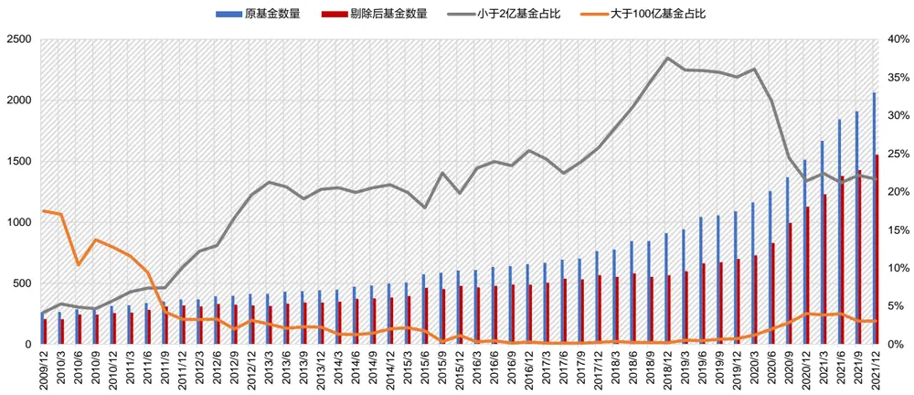
数据来源：东方证券研究所 & Wind资讯

## 行业轮动策略的引入方法有两种：

（1） 将行业得分配置到个股上，再根据基金持股权重计算出基金的行业因子得分。

（2） 根据最新可获得的行业轮动策略配置结果，选取前十大重仓股在超配行业中权重占比较高、在低配行业中权重占比较低的基金。在这种方法中，我们可以将两种行业分类下的行业轮动策略结果进行结合。

有关分析师的申明，见本报告最后部分。其他重要信息披露见分析师申明之后部分，或请与您的投资代表联系。并请阅读本证券研究报告最后一页的免责申明。

## 4.2 优选基金组合表现

从优选基金组合表现来看，第二种结合方法效果更好：

（1）只按夏普比选基：在进行过规模筛选后的基金池中，每季度末按照过去一年的夏普比率选择top基金。季度调仓的top10%高夏普比率基金组合，平均持仓43只基金，2010年以来相对于偏股基金指数，平均可取得7%的年化超额收益。Top5%高夏普比率基金组合，平均持仓21 只基金，可取得 8%的年化超额收益。

（2）将夏普比和行业轮动策略结合起来：首先选择夏普比排在前 10%的基金，再在其中选择在 10 个工业企业超配行业以及 10 个中信一级超配行业中占比均超 10%，在 10 个工业企业低配行业以及10个中信一级低配行业中占比均小于10%的基金。这样的基金组合平均持仓15只基金，2010 年以来相对于偏股基金指数，可取得 10%的年化超额收益。从分年收益来看，过去 13年中有 12 年都可以跑赢等权基金池。

图 18：优选基金组合绩效表现（2009/12/31-2022/02/15）

| 季频调仓 | 中证偏股型基金指数930891.CSI sharpe top10% sharpe top5% |  |  | sharpe top10% + 基金的行业因子得分top300 | sharpe top10% + 10个中信一级超配行业占比超10% +10个中信一级低配行业占比小于10% | sharpe top10% + 10个工业企业超配行业占比超10% +10个工业企业低配行业占比小于10% | sharpe top10% + 10个工业企业&中信一级超配行业占比超10% + 10个工业企业&中信一级低配行业占比小于10% |
| --- | --- | --- | --- | --- | --- | --- | --- |
|  | 绝对收益 |  |  |  |  |  |  |
| 年化收益率 | 6.95% | 14.12% | 15.04% | 15.36% | 14.84% | 16.03% | 16.98% |
| 年化波动率 | 21.91% | 22.01% | 22.31% | 22.03% | 21.87% | 22.95% | 22.75% |
| Sharp值 | 0.42 | 0.71 | 0.74 | 0.76 | 0.74 | 0.76 | 0.80 |
| 最大回撤 | -50.43% | -42.72% | -43.17% | -42.44% | -41.50% | -43.96% | -43.19% |
| 单边换手率（年） |  | 1.91 | 2.23 | 2.47 | 3.20 | 2.95 | 3.05 |
| 平均持有基金个数 |  | 43 | 21 | 28 | 16 | 18 | 15 |
| 最少持有基金个数 最多持有基金个数 |  | 16 100 | 8 50 | 4 51 | 1 60 | 1 54 | 1 |
|  |  |  |  |  |  |  | 53 |
| 分年收益 |  |  |  |  |  |  |  |
| 2010 | 5.37% | 12.30% | 15.74% | 12.30% | 6.61% | 15.78% | 14.30% |
| 2011 | -24.20% | -25.06% | -25.35% | -25.06% | -26.06% | -29.40% | -28.84% |
| 2012 | 4.93% | 4.82% | 4.12% | 4.82% | 4.12% | 5.62% | 6.84% |
| 2013 | 10.13% | 28.85% | 29.41% | 28.85% | 32.82% | 29.93% | 31.25% |
| 2014 | 23.88% | 31.10% | 32.78% | 27.85% | 26.14% | 28.58% | 32.01% |
| 2015 | 37.52% | 45.65% | 44.49% | 47.66% | 37.92% | 48.53% | 45.57% |
| 2016 | -17.00% | -7.86% | -5.98% | -8.12% | -5.33% | -7.21% | -5.43% |
| 2017 | 12.63% | 24.80% | 25.84% | 24.59% | 26.17% | 42.34% | 49.66% |
| 2018 | -24.58% | -23.65% | -22.72% | -21.11% | -20.88% | -21.47% | -19.41% |
| 2019 | 43.74% | 47.91% | 49.31% | 48.34% | 45.17% | 49.92% | 50.23% |
| 2020 | 51.50% | 75.44% | 80.03% | 76.84% | 88.77% | 77.01% | 73.64% |
| 2021 2022/2/15 | 4.05% -10.49% | 11.57% -11.03% | 10.25% -10.60% | 20.82% -8.87% | 21.39% -11.11% | 13.51% -10.42% | 13.23% -10.39% |

数据来源：东方证券研究所 & Wind资讯

图 19：优选基金组合净值（2009/12/31-2022/02/15）
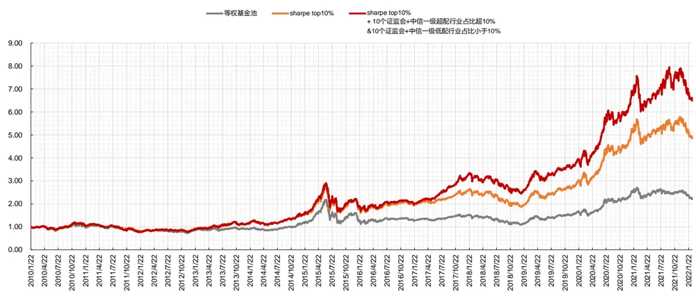
数据来源：东方证券研究所 & Wind资讯
有关分析师的申明，见本报告最后部分。其他重要信息披露见分析师申明之后部分，或请与您的投资代表联系。并请阅读本证券研究报告最后一页的免责申明。

下图展示了我们每季度的优选基金的数量和平均规模。最近三年优选基金数量基本在20只-50 只之间，平均规模基本在 10 亿-30 亿之间。

图 20：优选基金的数量和平均规模（2009/12/31-2022/02/15）
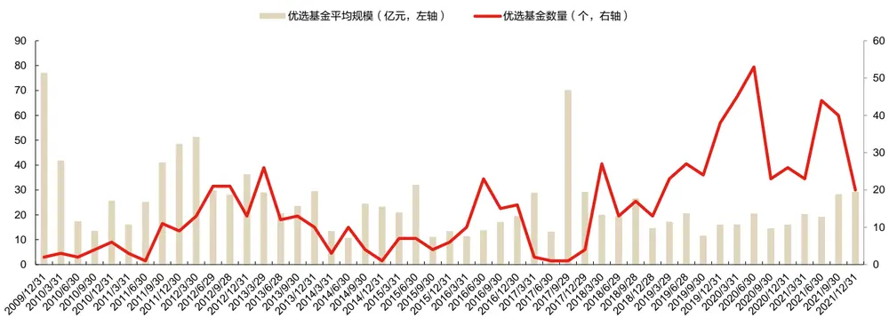
数据来源：东方证券研究所 & Wind资讯

下面我们展示了根据2021年年报信息选出的优选基金，共38只，过去一年夏普比均在1.6以上，第一大重仓行业多数为有色金属冶炼及压延加工业、化学原料及化学制品制造业。

图 21：优选基金列表（2021年年报）

| 基金Wind 日期 | 代码 | 基金简称 | 过去一年夏 基金合计规模（亿元， |  | 基金经理(时任) | 基金成立日 | 第一大重仓行业 （中信一级行业分类） | 第一大重仓行业 持仓占比 | 第一大重仓股 |
| --- | --- | --- | --- | --- | --- | --- | --- | --- | --- |
|  |  |  | 普比 | 对应季报数据） |  |  |  |  |  |
| 2021/12/31 000061.OF |  | 华夏盛世精选 | 1.73 | 14.27 | 郑煜 | 2009-12-11 | 有色金属 | 9.02% | 盛新锂能 |
| 2021/12/31 | 000612.OF | 华宝生态中国 | 1.44 | 3.67 | 夏林锋 | 2014-06-13 | 有色金属 | 11.98% | 宁德时代 |
| 2021/12/31 | 000729.OF | 建信中小盘A | 1.47 | 29.93 | 周智硕 | 2014-08-20 | 机械 | 16.98% | 兖矿能源 |
| 2021/12/31 | 000756.OF | 建信潜力新蓝筹A | 1.18 | 2.16 | 周智硕 | 2014-09-10 | 机械 | 18.02% | 江苏神通 |
| 2021/12/31 | 001643.OF | 汇丰晋信智造先锋A | 1.04 | 40.49 | 陆彬 | 2015-09-30 | 基础化工 | 16.27% | 雅化集团 |
| 2021/12/31 | 003853.OF | 金鹰信息产业A | 1.01 | 26.70 | 樊勇 | 2017-03-10 | 计算机 | 12.92% | 新宙邦 |
| 2021/12/31 | 005927.OF | 创金合信新能源汽车A | 0.96 | 52.49 | 曹春林 | 2018-05-08 | 有色金属 | 14.82% | 容百科技 |
| 2021/12/31 | 006132.OF | 万家智造优势A | 0.95 | 4.93 | 李文宾 | 2018-08-28 | 有色金属 | 16.23% | 永兴材料 |
| 2021/12/31 | 006154.OF | 华安制造先锋A | 1.33 | 14.05 | 蒋璆 | 2018-12-25 | 有色金属 | 17.31% | 中钨高新 |
| 2021/12/31 | 006233.OF | 万家汽车新趋势A | 1.24 | 3.72 | 李文宾 | 2019-10-23 | 有色金属 | 16.16% | 融捷股份 |
| 2021/12/31 | 006533.OF | 易方达科融 | 1.24 | 20.82 | 刘健维 | 2019-03-26 | 国防军工 | 7.82% | 通威股份 |
| 2021/12/31 | 007130.OF | 中庚小盘价值 | 2.50 | 48.03 | 丘栋荣 | 2019-04-03 | 医药 | 7.53% | 兰花科创 |
| 2021/12/31 | 008269.OF | 大成睿享A | 2.00 | 9.28 | 徐彦 | 2019-12-30 | 机械 | 15.44% | 杰克股份 |
| 2021/12/31 | 009147.OF | 建信新能源A | 1.08 | 56.41 | 陶灿,田元泉,张湘龙 | 2020-06-17 | 有色金属 | 10.86% | 宁德时代 |
| 2021/12/31 | 009644.OF | 东方阿尔法优势产业A | 0.95 | 96.91 | 唐雷 | 2020-06-28 | 基础化工 | 9.90% | 天赐材料 |
| 2021/12/31 | 011146.OF | 创金合信气候变化A | 0.96 | 4.34 | 曹春林 | 2020-12-30 | 有色金属 | 9.34% | 容百科技 |
| 2021/12/31 | 090007.OF | 大成策略回报 | 1.89 | 11.30 | 徐彦 | 2008-11-26 | 机械 | 17.28% | 杰克股份 |
| 2021/12/31 | 288001.OF | 华夏经典配置 | 0.97 | 15.63 | 佟巍 | 2004-03-15 | 基础化工 | 18.75% | 龙软科技 |
| 2021/12/31 | 519702.OF | 交银趋势优先A | 2.97 | 91.75 | 杨金金 | 2010-12-22 | 基础化工 | 9.03% | 明泰铝业 |
| 2021/12/31 | 920003.OF | 中金新锐A | 1.52 | 39.03 | 韩庆 | 2020-04-07 | 传媒 | 8.70% | 完美世界 |

数据来源：东方证券研究所 & Wind资讯

## 五、行业轮动策略在被动指数基金组合中的应用

## 5.1 被动指数基金轮动组合构建

下面我们尝试在被动指数基金组合中引入行业轮动策略，通过被动指数基金轮动将行业观点应用到指数产品投资中。被动指数基金轮动策略如下：

（1） 回测区间：2009.12.31 — 2022.02.15。

（2） 调仓日：季末最后一个交易日。由于被动指数基金有固定跟踪的指数，指数每月底都有成分股明细，因而不需要等到基金季报公布再调仓。

（3） 基金范围：根据 Wind 基金类型分类选择被动指数型股票基金。在测试过程中，只考虑开放式基金，选择初始基金，剔除联接基金。

（4） 基金规模初选：选择规模大于 2 亿的被动指数基金作为研究对象。新一期（20211231）2 亿以下小规模基金占比 41.79%，原基金池数量为 773 只，剔除后的基金池数量为 450 只。

（5） 加权方法：等权构建基金组合

图 22：被动指数型剔除比例&基金池数量
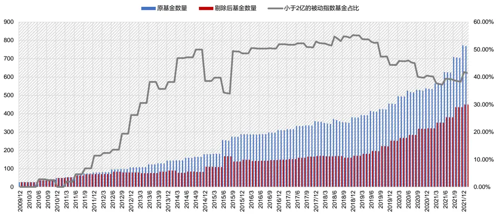
数据来源：东方证券研究所 & Wind资讯

由于不是所有行业都有对应的指数产品，如果我们希望用指数基金轮动来实现每期的行业观点，就需要通过一种方式，使得最终投资的基金与指定的行业有较高的重合度。对应方式有两种：

（1）代表性基金法：针对每个行业，都去选择与之行业配置最接近的指数基金。按照基金对应指数成分股明细，计算行业配置比例。每个行业选择相应配置比例最高的基金作为该行业的代表性指数基金。指数基金在对应行业上的配置比例应超过50%，否则不算。根据调仓时最新的行业轮动策略结果，选择前十大超配行业的代表性被动指数基金进行配置，等权构造组合。在这种方法中，我们可以将两种行业分类下的行业轮动策略结果进行结合。

从下图中可以看到，并不是所有行业都能找到代表性指数基金产品。2013 年之前基本很少有行业能找到代表性指数产品，被动指数基金以宽基指数产品为主。当前共有 22 个中信一级行业和 11 个工业企业行业能找到。

图 23：有代表性被动指数基金产品的行业个数
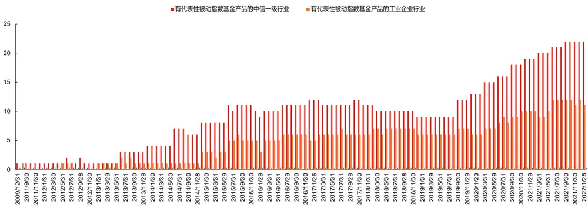
数据来源：东方证券研究所 & Wind资讯

（2）组合优化法：通过组合优化，使得最终的指数基金组合的行业配置与指定的 top 行业组合最接近。按照基金对应指数成分股明细，计算行业配置比例。用所有被动指数基金进行组合优化，使得基金组合行业配置与调仓时前十大超配行业的等权配置组合最接近。在这种方法中，我们无法将两种行业分类下的行业轮动策略结果进行结合。

组合优化问题设置如下：

$$
\operatorname*{min}\colon\left\|Ax-b\right\|_{1}--\boxed{\pm\sqrt{\pi}}\dddot{\Xi}\check{\Xi}\xi
$$

$$
s\mathrm{t}:\quad\mathbf{w}_{i}>0--\underline{{\xi\oplus}}\vec{x}\mathrm{.}\mathbf{j}\#\mathbb{Z}\mathbb{F}\mathbb{R}\underline{{\xi}}\mathbf{:}\mathbf{\exists}\#\mathrm{~}
$$

$$
\mathbf{w}^{\prime}\mathrm{I}=1--\underline{{\underline{{\xi}}}}\textcircled{\bar{\mathtt{A}}}\vec{\mathrm{x}}\mathrm{j}\notin\check{\mathtt{B}}\check{\mathtt{A}}\check{\mathtt{A}}\overline{{\underline{{\xi}}}}\mathrm{I}\|\overset{\llangle\ast}{=}\mp1
$$

其中x为各指数基金的绝对权重，A为基金在各行业上的配置权重，b为根据行业轮动模型给出的行业配置权重，设置 top10行业等权配置，其余行业不配置，‖ ‖ 为 1阶范数，表示对应元素绝对值之和。第一个约束条件为控制权重的上下限；第二个约束条件为权重总和等于 1。通过二次规划得到每只基金的权重。

## 5.2 被动指数基金轮动组合表现

从被动指数基金组合表现来看，代表性基金法效果较好。根据调仓时最新的行业轮动策略结果，选择前十大中信一级超配行业的代表性被动指数基金，以及前十大工业企业超配行业的代表性被动指数基金进行配置，等权构造组合。2010 年以来，该组合相对于被动股基指数，年化超额收益 6.19%。从历史持仓来看，该组合平均持有 5 只基金，持仓基金数量较少。

图 24：被动指数基金组合绩效表现——代表性基金法（2009/12/31-2022/02/15）

| 被动指数型基金基金合计规模在2亿以上绝对收益 | 中证被动式股票型基金指数 | 前十大工业企业超配行业 前十大中信一级超配行业 前十大中信一级超配行业\|前十大工业企业超配行业代表性被动指数基金 代表性被动指数基金 代表性被动指数基金等权组合 等权组合 等权组合月频调仓 月频调仓 月频调仓 |  |  |
| --- | --- | --- | --- | --- |
| 年化收益率 | 2.77% | 6.44% | 7.66% 8.96% |  |
| 年化波动率 | 21.91% | 25.15% | 24.00% 23.75% |  |
| Sharp值 | 0.23 | 0.37 | 0.43 0.48 |  |
| 最大回撤 | -48.45% | -51.07% | -47.07% -47.40% |  |
| 单边换手率（年） | 9.47 | 3.31 | 7.35 6.46 |  |
| 平均持有基金个数 | 90 | 2 | 3 5 |  |
| 最少持有基金个数 | 20 | 1 | 1 1 |  |
| 最多持有基金个数分年收益 | 271 | 5 | 10 14 |  |
| 2010 | -11.36% | -15.84% | -13.12% | -12.54% |
| 2011 | -24.21% | -22.95% | -9.03% | -9.03% |
| 2012 | 7.32% | 10.10% | 16.30% | 16.30% |
| 2013 | -4.67% | 40.39% | -14.39% | 5.73% |
| 2014 | 47.91% | 2.91% | 31.59% | 31.59% |
| 2015 | 6.31% | 28.76% | 21.26% | 15.42% |
| 2016 | -13.40% | -10.48% | -3.82% | -7.80% |
| 2017 | 9.46% | 11.09% | 13.23% | 14.51% |
| 2018 | -18.38% | -25.30% | -14.43% | -15.05% |
| 2019 | 34.41% | 60.16% | 45.57% | 50.22% |
| 2020 | 29.33% | 22.53% | 18.39% | 20.97% |
| 2021 | 3.26% | 13.18% | 35.90% | 27.05% |
| 2022.02.15 -7.17% |  | -2.78% | -10.82% | -8.08% |

数据来源：东方证券研究所 & Wind资讯

图 25：被动指数基金组合净值——代表性基金法（2009/12/31-2022/02/15）
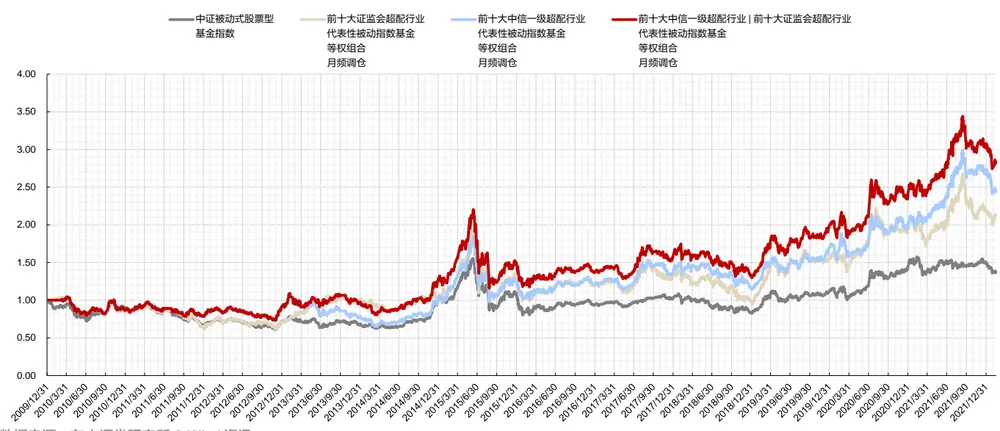
数据来源：东方证券研究所 & Wind资讯
有关分析师的申明，见本报告最后部分。其他重要信息披露见分析师申明之后部分，或请与您的投资代表联系。并请阅读本证券研究报告最后一页的免责申明。

组合优化法效果弱于代表性基金法。按照前十大中信一级行业配置的被动指数基金组合2010 年以来，相对于被动股基指数，年化超额收益 4.68%。从历史持仓来看，该组合平均持有60 只基金，持仓基金数量较多。

若将基金池限定于 ETF 基金，则组合收益会略微下滑，但 ETF 基金费率低、交易灵活、透明度高。

图 26：被动指数基金组合绩效表现——组合优化法（2009/12/31-2022/02/15）

| 被动指数型基金基金合计规模在2亿以上绝对收益 | 中证被动式股票型基金指数 | 前十大工业企业超配行业等权配置的被动指数基金组合 | 前十大中信一级超配行业等权配置的被动指数基金组合 | 前十大工业企业超配行业 前十大中信一级超配行业等权配置的ETF基金组合 等权配置的ETF基金组合月频调仓 |  |  |
| --- | --- | --- | --- | --- | --- | --- |
|  |  | 月频调仓 | 月频调仓 |  |  | 月频调仓 |
| 年化收益率年化波动率 | 2.77% | 2.87% | 7.45% | 5.12% | 7.02% |  |
|  | 21.91% | 23.87% | 23.03% | 23.57% | 23.07% |  |
| Sharp值 | 0.23 | 0.24 | 0.43 | 0.33 | 0.41 |  |
| 最大回撤 | -48.45% | -50.27% | -53.54% | -46.76% | -45.83% |  |
| 单边换手率（年）平均持有基金个数最少持有基金个数 | 9.47 | 5.16 | 9.80 | 4.23 | 9.10 |  |
|  | 90 | 139 | 139 | 60 | 60 |  |
|  | 20 | 21 | 21 | 3 | 3 |  |
| 最多持有基金个数分年收益2010 | 271 | 415 | 415 | 255 | 255 |  |
|  | -11.36% | -17.60% | 9.68% | -11.89% | -10.45% |  |
| 2011 | -24.21% | -31.66% | -25.69% | -30.91% | -17.20% |  |
| 2012 | 7.32% | 3.23% | 0.15% | 5.68% | 3.92% |  |
| 2013201420152016201720182019202020212022.02.15 | -4.67% | 7.91% | 1.57% | 8.09% | 1.81% |  |
|  | 47.91% | 42.22% | 62.86% | 34.39% | 64.84% |  |
|  | 6.31% | 24.58% | 20.91% | 45.18% | 16.57% |  |
|  | -13.40% | -10.40% | -15.94% | -12.50% | -14.80% |  |
|  | 9.46% | 11.73% | 11.90% | 12.35% | 13.62% |  |
|  | -18.38% | -25.30% | -26.27% | -20.04% | -20.19% |  |
|  | 34.41% | 29.09% | 44.63% | 24.95% | 46.38% |  |
|  | 29.33% | 17.67% | 19.01% | 32.43% | 19.93% |  |
|  | 3.26% | 12.41% | 34.22% | 5.69% | 22.56% |  |
|  | -7.17% | -0.78% | -8.70% | -1.82% | -9.19% |  |

数据来源：东方证券研究所 & Wind资讯

图 27：被动指数基金组合净值——组合优化法（2009/12/31-2022/02/15）
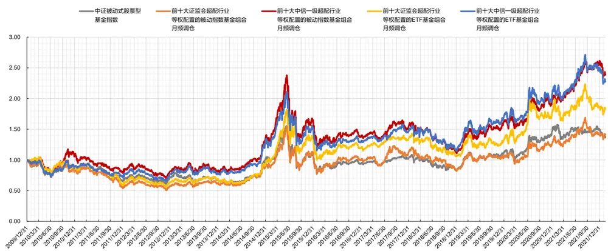
数据来源：东方证券研究所 & Wind资讯

有关分析师的申明，见本报告最后部分。其他重要信息披露见分析师申明之后部分，或请与您的投资代表联系。并请阅读本证券研究报告最后一页的免责申明。

## 风险提示

1. 量化模型基于历史数据分析，未来存在失效风险，建议投资者紧密跟踪模型表现。

2. 极端市场环境可能对模型效果造成剧烈冲击，导致收益亏损。

## Tabl e_Disclai mer 分析师申明

每位负责撰写本研究报告全部或部分内容的研究分析师在此作以下声明：

分析师在本报告中对所提及的证券或发行人发表的任何建议和观点均准确地反映了其个人对该证券或发行人的看法和判断；分析师薪酬的任何组成部分无论是在过去、现在及将来，均与其在本研究报告中所表述的具体建议或观点无任何直接或间接的关系。

## 投资评级和相关定义

报告发布日后的 12个月内的公司的涨跌幅相对同期的上证指数/深证成指的涨跌幅为基准；

## 公司投资评级的量化标准

买入：相对强于市场基准指数收益率 15%以上；

增持：相对强于市场基准指数收益率 5%～15%；

中性：相对于市场基准指数收益率在-5%～+5%之间波动；

减持：相对弱于市场基准指数收益率在-5%以下。

未评级 —— 由于在报告发出之时该股票不在本公司研究覆盖范围内，分析师基于当时对该股票的研究状况，未给予投资评级相关信息。

暂停评级 —— 根据监管制度及本公司相关规定，研究报告发布之时该投资对象可能与本公司存在潜在的利益冲突情形；亦或是研究报告发布当时该股票的价值和价格分析存在重大不确定性，缺乏足够的研究依据支持分析师给出明确投资评级；分析师在上述情况下暂停对该股票给予投资评级等信息，投资者需要注意在此报告发布之前曾给予该股票的投资评级、盈利预测及目标价格等信息不再有效。

## 行业投资评级的量化标准：

看好：相对强于市场基准指数收益率 5%以上；

中性：相对于市场基准指数收益率在-5%～+5%之间波动；

看淡：相对于市场基准指数收益率在-5%以下。

未评级：由于在报告发出之时该行业不在本公司研究覆盖范围内，分析师基于当时对该行业的研究状况，未给予投资评级等相关信息。

暂停评级：由于研究报告发布当时该行业的投资价值分析存在重大不确定性，缺乏足够的研究依据支持分析师给出明确行业投资评级；分析师在上述情况下暂停对该行业给予投资评级信息，投资者需要注意在此报告发布之前曾给予该行业的投资评级信息不再有效。

## HeadertTabl e_Discl ai mer 免责声明

本证券研究报告（以下简称“本报告”）由东方证券股份有限公司（以下简称“本公司”）制作及发布。

。本公司不会因接收人收到本报告而视其为本公司的当然客户。本报告的全体接收人应当采取必要措施防止本报告被转发给他人。

本报告是基于本公司认为可靠的且目前已公开的信息撰写，本公司力求但不保证该信息的准确性和完整性，客户也不应该认为该信息是准确和完整的。同时，本公司不保证文中观点或陈述不会发生任何变更，在不同时期，本公司可发出与本报告所载资料、意见及推测不一致的证券研究报告。本公司会适时更新我们的研究，但可能会因某些规定而无法做到。除了一些定期出版的证券研究报告之外，绝大多数证券研究报告是在分析师认为适当的时候不定期地发布。

在任何情况下，本报告中的信息或所表述的意见并不构成对任何人的投资建议，也没有考虑到个别客户特殊的投资目标、财务状况或需求。客户应考虑本报告中的任何意见或建议是否符合其特定状况，若有必要应寻求专家意见。本报告所载的资料、工具、意见及推测只提供给客户作参考之用，并非作为或被视为出售或购买证券或其他投资标的的邀请或向人作出邀请。

本报告中提及的投资价格和价值以及这些投资带来的收入可能会波动。过去的表现并不代表未来的表现，未来的回报也无法保证，投资者可能会损失本金。外汇汇率波动有可能对某些投资的价值或价格或来自这一投资的收入产生不良影响。那些涉及期货、期权及其它衍生工具的交易，因其包括重大的市场风险，因此并不适合所有投资者。

在任何情况下，本公司不对任何人因使用本报告中的任何内容所引致的任何损失负任何责任，投资者自主作出投资决策并自行承担投资风险，任何形式的分享证券投资收益或者分担证券投资损失的书面或口头承诺均为无效。

本报告主要以电子版形式分发，间或也会辅以印刷品形式分发，所有报告版权均归本公司所有。未经本公司事先书面协议授权，任何机构或个人不得以任何形式复制、转发或公开传播本报告的全部或部分内容。不得将报告内容作为诉讼、仲裁、传媒所引用之证明或依据，不得用于营利或用于未经允许的其它用途。

经本公司事先书面协议授权刊载或转发的，被授权机构承担相关刊载或者转发责任。不得对本报告进行任何有悖原意的引用、删节和修改。

提示客户及公众投资者慎重使用未经授权刊载或者转发的本公司证券研究报告，慎重使用公众媒体刊载的证券研究报告。

## 东方证券研究所

地址： 上海市中山南路 318 号东方国际金融广场 26 楼

电话：021-63325888

传真：021-63326786

网址： www.dfzq.com.cn