# DFQ工业类行业轮动策略：中观行业数据、分析师预期、业绩超预期、资金流向

——《量化策略研究 之 五》

## 研究结论

⚫ 本篇报告我们从中观行业数据、分析师预期、业绩超预期、资金流向四个维度，构建 DFQ工业类行业轮动体系。

⚫ 中观行业数据：由统计局公布的细分行业经济效益月度报告生成的行业因子效果明显优于上市公司财报因子，属于行业层面的特有因子。除前期报告中使用的在工业企业利润累计同比、工业企业营收累计同比、工业企业销售利润率同比外，工业企业速动比率同比增速、PPI当月同比也有不错的选行业效果。

⚫ 分析师预期：上市公司数据中的分析师预期数据，可以作为财报数据之外的一种基本面信息补充。除分析师一致预期行业净利润同比增速指标外，分析师的盈利预测调整也包含了丰富的信息。个股等权计算的分析师盈利上调 FOM指标效果较好。

⚫ 业绩超预期：市值加权得到的SUE、SUR因子均有不错的选行业效果。

资金流向：股东、高管是重要的产业资本，他们比其他投资者更加了解企业情况。股东高管减持因子更有效，净增持指标对应行业几乎没有区分度。北上资金是 A股市场的重要参与者，持仓市值占比因子、过去一个月的净流入因子均有不错表现。

DFQ工业类行业轮动策略表现：基于证监会二级行业下的行业轮动策略效果最佳。2010年至今，合成因子叠加行业 NTO5因子处于前 80%的 top5行业组合，多头超额达到 15.36%，信息比率 1.49，超额收益最大回撤 24%。除 2014年跑输基准外，其余每年超额都在 5%以上。2022年前四个月超额高达17%，每月均取得正超额。

从不同市场阶段来看，DFQ工业类行业轮动策略整体更适合震荡市。牛市期间，中观基本面类行业因子表现较好。熊市期间，资金流向类行业因子表现较好。震荡市中，超预期类行业因子表现较好。

指数增强组合表现：引入行业轮动策略对提升增强组合收益有一定作用。对 5个超配行业完全放开正向暴露，5个低配行业完全放开负向暴露，其余行业放开适当敞口，对应的增强组合相比于行业统一暴露的组合，年化收益提高 1%左右。沪深 300全市场增强组合扣费后年化对冲收益可达 14.48%，信息比 2.66。中证 500全市场增强组合扣费后年化对冲收益可达 18.33%，信息比 2.48。

行业轮动选股组合跟踪：在主动选股组合中引入行业轮动策略，对组合收益有显著提升。根据行业轮动策略调整个股 zscore得分，再根据调整后个股因子得分选择top股票构建组合的方法效果最好。调整后的多因子 top30等权股票组合 2010年以来扣费后年化收益达 28%，年化夏普比 1.06。相比常规组合，年化收益提升 5%。

行业轮动基金组合跟踪：在基金组合中引入行业轮动策略，对组合收益有一定提升。将基金组合夏普比最高作为目标函数，约束基金组合的行业配置与指定行业配置的偏差小于 80%，这样得到的基金组合，2010年以来相对于偏股基金指数，可取得 10%的年化超额收益。过去13年中有10年都可以跑赢偏股基金指数。

## 风险提示

⚫ 量化模型失效风险

⚫ 市场极端环境的冲击

⚫ 假设条件变化影响测算结果

报告发布日期

2022 年 05 月 18 日

朱剑涛

021-63325888*6077

zhujiantao@orientsec.com.cn

执业证书编号：S0860515060001

刘静涵021-63325888*3211

liujinghan@orientsec.com.cn

执业证书编号：S0860520080003

基于主动买卖单的行业轮动模型：——2022-02-25《量化策略研究 之 四》

基于工业企业财务数据和分析师预期的行 2021-11-27

业轮动模型：——《量化策略研究 之 三》

## 一、 DFQ工业类行业轮动体系

在之前的专题报告《基于工业企业财务数据和分析师预期的行业轮动模型》、《基于主动买卖单的行业轮动模型》中，我们从基本面和技术面出发，找寻了行业层面的有效因子。本篇报告我们将继续这项研究，从中观行业数据、分析师预期、业绩超预期、资金流向四个维度，构建DFQ工业类行业轮动体系。

图 1： DFQ工业类行业轮动体系
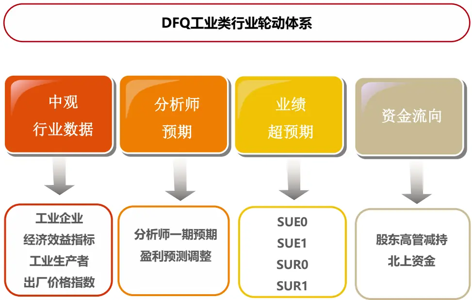
数据来源：东方证券研究所

我们使用的工业企业经济效益指标、工业生产者出厂价格指数（PPI）均只覆盖国民经济行业分类下的工业类行业。考虑到行业数量较少，行业层面分域建模再合成效果不佳，并且工业行业在国民经济和 A 股中占比均较高，工业类行业间指标可比性更强，因而我们的模型只对工业类行业进行轮动。下面对涉及到的行业分类进行简要介绍。

国民经济行业分类是中华人民共和国国家标准，规定了全社会经济活动的分类和代码，是国家统计局公布行业数据时采用的行业分类方法。分类采用经济活动的同质性原则划分，每个行业类别按照同一种经济活动的性质划分。分类共分为门类、大类、中类和小类四个层次，共包含门类 20 个(分别是:农、林、牧、渔业,采矿业,制造业,电力、热力、燃气及水的生产和供应业、建筑业,批发和零售业,交通运输、仓储和邮政业,住宿和餐饮业,信息传输、软件和信息技术服务业,金融业,房地产业,租赁和商务服务业,科学研究和技术服务业,水利、环境和公共设施管理业,居民服务、修理和其他服务业,教育,卫生和社会工作,文化、体育和娱乐业,公共管理、社会保障和社会组织,国际组织)，大类 97 个，中类 473 个和小类 1380 个。其中采矿业，制造业，力、热力、燃气及水的生产和供应业三个门类属于工业，2020年以来中国工业对 GDP增长贡献率均超 30%。

图 2：主要门类行业对 GDP累计同比贡献率（2022/03/31）
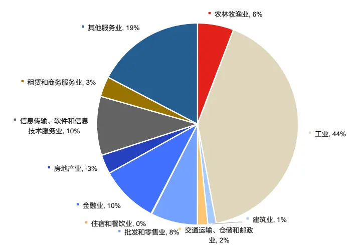
数据来源：东方证券研究所 & 国家统计局

图 3：工业对 GDP累计同比贡献率变化（1978-2022）
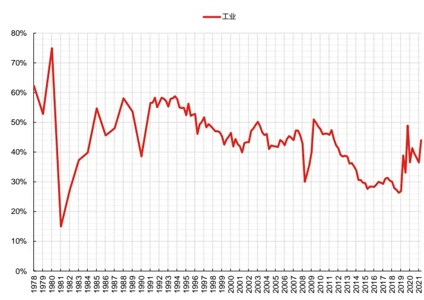
数据来源：东方证券研究所 & 国家统计局

上市公司的行业分类中，证监会行业分类和国民经济行业分类相似度较高。证监会行业分类，参照《国民经济行业分类》进行编制，分为 19 个门类，82 个大类。其中大类（也可称为二级行业分类）与国民经济行业分类大类重合度较高。其中82个大类中有26个大类市值占比超过1%。

图 4：证监会二级行业市值占比（2022/04/29）
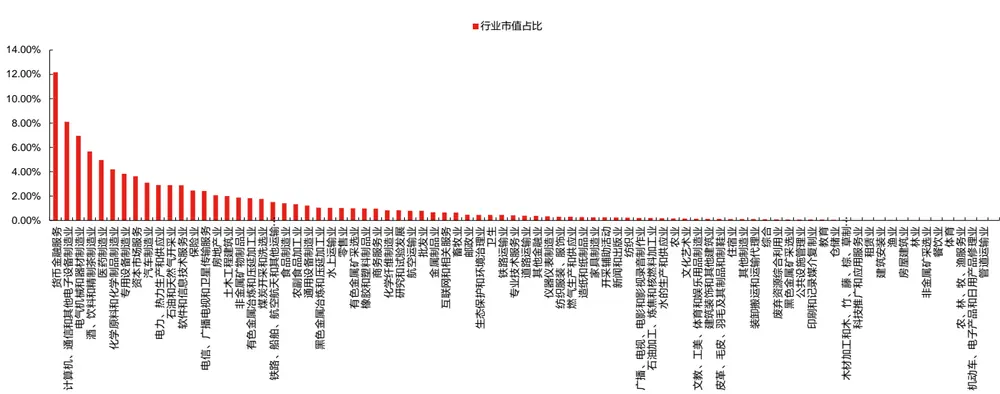
数据来源：东方证券研究所 & Wind资讯

我们将国民经济行业分类大类与证监会新版二级行业进行了匹配，总共可获得 40 个工业类行业，有 38 个行业有上市公司，匹配规则如下图。通过此表，可以将统计局公布的中观工业行业指标向上市公司中的工业行业进行映射。

A股工业类上市公司的数量和市值占比较高，当前 4922个上市公司中有 3393个属于工业企业，数量占比近70%，市值占比超60%。其中计算机、通信和其他电子设备制造业的上市公司个数最多，达到 507 家，专用设备制造业、化学原料及化学制品制造业、医药制造业、电气机械及器材制造业这 4 个行业中的上市公司也超过 300 个，其他采矿业，金属制品、机械和设备修理业当前无上市公司。此外，各行业内上市公司的营收和利润占比也较高，平均占比超过 40%，也反映出了能上市的公司业绩确实也是相对较好的。

图 5：工业企业行业分类与证监会新版二级行业分类对照表（2022/04/29）

| 行业序号 | SAC新版二级行业代码 | 工业企业行业分类 | SAC新版二级行业 | 当前行业内上市公司个数 | 当前行业市值占比 | 当前行业内上市公司营收占比 | 当前行业内上市公司利润总额占比 |
| --- | --- | --- | --- | --- | --- | --- | --- |
| 1 | 1202010000 | 煤炭开采和洗选业 | 煤炭开采和洗选业 | 24 | 1.76% | 35.54% | 36.87% |
| 2 | 1202020000 | 石油和天然气开采业 | 石油和天然气开采业 | 8 | 2.90% | 536.87% | 91.22% |
| 3 | 1202030000 | 黑色金属矿采选业 | 黑色金属矿采选业 | 5 | 0.08% | 3.99% | 8.92% |
| 4 | 1202040000 | 有色金属矿采选业 | 有色金属矿采选业 | 25 | 0.99% | 231.00% | 114.54% |
| 5 | 1202050000 | 非金属矿采选业 | 非金属矿采选业 | 2 | 0.01% | 0.23% | 0.93% |
| 6 | 1202060000 | 开采专业及辅助性活动 | 开采辅助活动 | 17 | 0.25% |  |  |
| 7 | 1202070000 | 其他采矿业 | 其他采矿业 |  |  |  |  |
| 8 | 1203010000 | 农副食品加工业 | 农副食品加工业 | 62 | 1.34% | 17.10% | 19.53% |
| 9 | 1203020000 | 食品制造业 | 食品制造业 | 71 | 1.41% | 19.01% | 31.25% |
| 10 11 | 1203030000 | 酒、饮料和精制茶制造业 | 酒、饮料和精制茶制造业 | 48 | 5.68% | 32.29% | 90.59% |
| 12 | 1203050000 | 纺织业 | 纺织业 | 49 | 0.23% | 5.74% | 12.05% |
|  | 1203060000 | 纺织服装、服饰业 | 纺织服装、服饰业 | 43 | 0.30% | 12.46% | 41.60% |
| 13 | 1203070000 | 皮革、毛皮、羽毛及其制品和制鞋业 | 皮革、毛皮、羽毛及其制品和制鞋业 | 12 | 0.13% | 2.81% | 6.28% |
| 14 | 1203080000 | 木材加工及木、竹、藤、棕、草制品业 | 木材加工和木、竹、藤、棕、草制品业 | 8 | 0.03% | 1.82% | 0.54% |
| 15 16 | 1203090000 | 家具制造业 | 家具制造业 | 29 | 0.26% | 16.14% | 26.38% |
|  | 1203100000 | 造纸及纸制品业 | 造纸和纸制品业 | 38 | 0.28% | 17.33% | 27.56% |
| 17 | 1203110000 | 印刷业和记录媒介的复制 | 印刷和记录媒介复制业 | 14 | 0.07% | 2.86% | 7.38% |
| 18 19 | 1203120000 | 文教、工美、体育和娱乐用品制造业 | 文教、工美、体育和娱乐用品制造业 | 22 | 0.13% | 3.73% 4.60% | 3.08% |
| 20 | 1203130000 | 石油、煤炭及其他燃料加工业 | 石油加工、炼焦和核燃料加工业 | 17 | 0.20% | 21.90% | 5.72% |
| 21 | 1203140000 | 化学原料及化学制品制造业 | 化学原料和化学制品制造业 | 317 | 4.19% 4.96% | 40.85% | 38.12% 46.29% |
| 22 | 1203150000 | 医药制造业 | 医药制造业 | 307 | 0.84% | 88.25% | 321.64% |
| 23 | 1203160000 | 化学纤维制造业 | 化学纤维制造业 | 33 115 | 0.98% | 12.92% |  |
| 24 | 1203170000 | 橡胶和塑料制品业 | 橡胶和塑料制品业 非金属矿物制品业 | 113 | 1.88% | 12.97% | 22.58% 22.02% |
| 25 | 1203180000 | 非金属矿物制品业 | 黑色金属冶炼和压延加工业 | 32 | 1.04% | 25.68% | 61.17% |
| 26 | 1203190000 1203200000 | 黑色金属冶炼及压延加工业 | 有色金属冶炼和压延加工业 | 86 | 1.83% | 31.18% | 46.43% |
| 27 | 1203210000 | 有色金属冶炼及压延加工业 金属制品业 |  | 93 | 0.66% | 12.44% | 22.33% |
| 28 | 1203220000 |  | 金属制品业 | 174 | 1.22% | 14.87% | 19.80% |
| 29 | 1203230000 | 通用设备制造业 专用设备制造业 | 通用设备制造业 | 333 | 3.83% | 31.82% |  |
| 30 | 1203240000 | 汽车制造 | 专用设备制造业 汽车制造业 | 163 | 3.09% | 29.72% | 72.17% 26.09% |
| 31 | 1203250000 |  |  | 74 | 1.52% | 48.69% | 77.82% |
| 32 | 1203260000 | 铁路、船舶、航空航天和其他运输设备制造业 | 铁路、船舶、航空航天和其他运输设备制造业 | 308 | 6.96% | 32.58% | 66.64% |
| 33 | 1203270000 | 电气机械及器材制造业 | 电气机械和器材制造业 | 507 | 8.10% | 24.45% | 44.28% |
| 34 |  | 计算机、通信和其他电子设备制造业 | 计算机、通信和其他电子设备制造业 |  | 0.34% | 8.41% |  |
| 35 | 1203280000 | 仪器仪表制造业 | 仪器仪表制造业 | 80 | 0.11% | 52.64% | 12.59% |
|  | 1203290000 | 其他制造业 | 其他制造业 | 21 | 0.09% | 6.13% | 59.86% |
| 36 | 1203300000 | 废弃资源综合利用业 | 废弃资源综合利用业 | 12 |  |  | 14.00% |
| 37 | 1203310000 | 金属制品、机械和设备修理业 | 金属制品、机械和设备修理业 |  |  |  |  |
| 38 | 1204010000 | 电力、热力的生产和供应业 | 电力、热力生产和供应业 | 83 | 2.91% | 19.47% | 48.05% |
| 39 40 | 1204020000 1204030000 | 燃气生产和供应业 | 燃气生产和供应业 | 31 17 | 0.30% 0.17% | 22.05% 16.71% | 36.48% 50.02% |

数据来源：东方证券研究所 & Wind资讯 & 国家统计局
注：标红意味着工业企业行业名称和 SAC新版二级行业名称有所差别

图 6：A股工业类上市公司数量&流通市值占比变化（1999/03/31——2022/04/29）
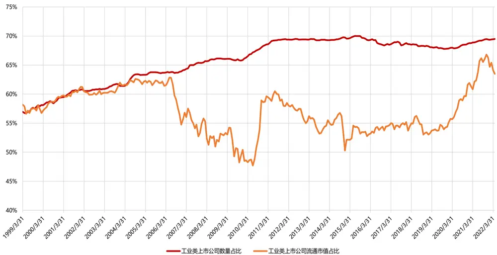
数据来源：东方证券研究所 & Wind资讯 & 国家统计局
有关分析师的申明，见本报告最后部分。其他重要信息披露见分析师申明之后部分，或请与您的投资代表联系。并请阅读本证券研究报告最后一页的免责申明。

A 股非工业类行业中市值占比超过 1%的仅有 9 个（总共 26 个市值占比超过 1%的行业），以金融、地产、软件和信息技术服务业、建筑为主。

图 7： A股非工业类行业的数量&市值占比（2022/04/29）
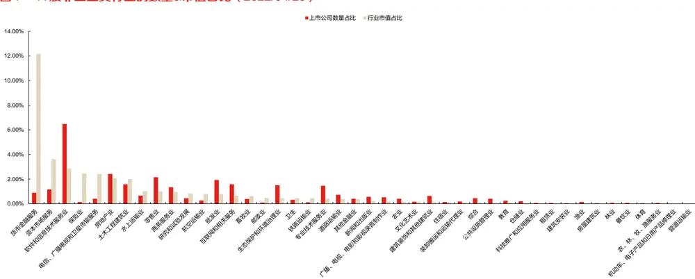
数据来源：东方证券研究所 & Wind资讯

证监会行业分类与中信/申万行业分类无一一对应关系，每个证监会二级行业中都包含了不同中信/申万一级行业的股票，分类结果不可直接转化。因而，我们会优先展示在证监会二级行业分类下的工业类行业轮动结果，再通过市值加权的方法进行转化，展示中信/申万一级行业分类下的工业类行业轮动结果。

## 二、 中观行业数据

在之前的专题报告《基于工业企业财务数据和分析师预期的行业轮动模型》中我们介绍了统计局公布的细分行业经济效益月度报告。由该数据生成的行业因子效果明显优于上市公司财报因子，属于行业层面的特有因子。

## 2.1 工业企业经济效益指标

工业经济效益月度报告披露指标涉及企业利润表指标、资产负债表指标、财务分析指标和企业信息。数据可以从 Wind 终端的中国宏观经济数据库（EDB）或 python 接口 WindPy.edb 中提取下载。

## 该数据有两个优点：

1）发布频率高：月度发布（2007-2010 年仅有 2、5、8、11 月的报告，2011 年之后除 1月外，其他月份均有月度报告），数据公布时间可以从国家统计局官网中查询，通常滞后一个月；

2）样本量大：涵盖规模以上工业企业（年主营业务收入在 2000 万元及以上），剔除个别公司的噪音影响。统计局每年会对规模以上工业企业调查范围进行调整。

| 序号 | 内容 | 1月 | 2月 | 3月 | 4月 | 5月 | 6月 | 7月 | 8月 | 9月 | 10月 | 11月 | 12月 |
| --- | --- | --- | --- | --- | --- | --- | --- | --- | --- | --- | --- | --- | --- |
| 1 | 弄搜染零行情况 | 17/-10:00 | u… | 15/二10:00 | 18/-10:00 | 16/-10:00 | 15/三10:00 | 15/五10:00 | 15/-10:00 | 16/五10:00 | 18/二10:00 | 15/二10:00 | 15/四10:00 |
| 2 | 2021年国民经济和社会发展统计公报 | m | 28/-9:30 | mm | m | mm | mn | mm | m | m | mn | mn | m |
| 3 | 霍步覆算业套加 | 18/二9:30 | mm. | mm | 19/二9:30 | mm | mmn | 16/六9:30 | mm | m | 19/三9:30 | mm. | mmm |
| 4 | HH指效、非制造业育爱招数蔡度报告） | 30/日9:30 | mm. | 1/二注531/四9:30 | 30/六9:30 | 31/二9:30 | 30/四9:30 | 31/日 | 31/三 | 30/五 | 31/- | 30/三 | 31/六 |
|  |  |  |  |  |  |  |  | 9:30 | 9:30 | 9:30 | 9:30 | 9:30 | 9:30 |
| 5 | 胃零价格指数 | 12/三9:30 | 16/三9:30 | 9/三9:30 | 11/-9:30 | 11/三9:30 | 10/五9:30 | 9/六9:30 | 10/三9:30 | 9/五9:30 | 14/五9:30 | 9/三9:30 | 9/五9:30 |
| 6 | 工业生产者价格指数月度报告 | 12/三9:30 | 16/三9:30 | 9/三9:30 | 11/–9:30 | 11/三9:30 | 10/五9:30 | 9/六9:30 | 10/三9:30 | 9/五9:30 | 14/五9:30 | 9/三9:30 | 9/五9:30 |
| 7 | 智機以上工业生产 | 17/-10:00 | mm | 15/二10:00 | 18/-10:00 | 16/-10:00 | 15/三 | 15/五 | 15/- | 16/五 | 18/二 | 15/二 | 15/四 |
|  |  |  |  |  |  |  | 10:00 | 10:00 | 10:00 | 10:00 | 10:00 | 10:00 | 10:00 |
| 8 | 熊婆生产情况月度 | 17/–10:00 | m. | 15/二10:00 | 18/–10:00 | 16/- | 15/三 | 15/五 | 15/– | 16/五 | 18/二 | 15/二 | 15/口 |
|  |  |  |  |  |  | 10:00 | 10:00 | 10:00 | 10:00 | 10:00 | 10:00 | 10:00 | 10:00 |
| 9 | 固定资产投资（不含农户）月度报告 | 17/-10:00 | m | 15/二10:00 | 18/-10:00 | 16/-10:00 | 15/三10:00 | 15/五 | 15/- | 16/五 | 18/二10:00 | 15/二 | 15/四 |
|  |  |  |  |  |  |  |  | 10:00 | 10:00 | 10:00 |  | 10:00 | 10:00 |
| 10 | 房地产开发和销售情况月度报告 | 17/-10:00 | um | 15/二10:00 | 18/-10:00 | 16/-10:00 | 15/三 | 15/五 | 15/- | 16/五 | 18/二 | 15/二 | 15/四 |
|  |  |  |  |  |  |  | 10:00 | 10:00 | 10:00 | 10:00 | 10:00 | 10:00 | 10:00 |
| 11 | 育漫報魯琴售总首博 | 17/-10:00 | m | 15/二10:00 | 18/-10:00 | 16/-10:00 | 15/三 | 15/五 | 15/- | 16/五 | 18/二 | 15/二 | 15/四 |
|  |  |  |  |  |  |  | 10:00 | 10:00 | 10:00 | 10:00 | 10:00 | 10:00 | 10:00 |
| 12 | 拿质民收支情况 | 17/-10:00 | u. | m | 18/-10:00 | u. | mm | 15/五10:00 | m… | m | 18/二10:00 | um. | m" |
| 13 | 金學设業育能利用 | 17/–10:00 | u | mm | 18/–10:00 | mm | un | 15/五10:00 | m | m | 18/二10:00 | m | m |
| 14 | 20个势皮集 | 15/六9:30 | 21/-9:30 | 16/三9:30 | 15/五9:30 | 18/三 | 16/四 | 15/五 | 15/- | 16/五 | 19/三 | 16/三 | 15/四 |
|  |  |  |  |  |  | 9:30 | 9:30 | 9:30 | 9:30 | 9:30 | 9:30 | 9:30 | 9:30 |
| 15 | 工业经济效益月度报告 | 277四9:30 | … | 27/日9:30 | 2739:30 | 27/五9:30 | 277-9:30 | 27E9:30 | 27/六9:30 | 27/=9:30 | 277四9:30 | 277日9:30 | 27日9:30 |
| 16 | 规模以上文化及相美金业生产经管等食报善 | 30/日9:30 | mm. | mm | 29/五9:30 | mm | 1m | 30/六9:30 | mm | m | 30/日9:30 | mm. | m |

数据来源：东方证券研究所 & 国家统计局
有关分析师的申明，见本报告最后部分。其他重要信息披露见分析师申明之后部分，或请与您的投资代表联系。并请阅读本证券研究报告最后一页的免责申明。

图 9：工业企业经济效益报告的披露指标

| 指标大类 | 财务指标 | 披露起始时间 | 披露结束时间 | 披露频率 |
| --- | --- | --- | --- | --- |
| 利润表 | 主营业务收入 | 1999-02 | 2018-12 | 月 |
|  | 营业收入 | 2017-02 |  | 月 |
|  | 主营业务成本 | 1999-02 | 2018-12 | 月 |
|  | 营业成本 | 2017-02 |  | 月 |
|  | 管理费用 | 1999-02 |  | 月 |
|  | 财务费用 | 1999-02 |  | 月 |
|  | 营业费用 | 1999-02 |  | 月 |
|  | 利息支出 | 2012-02 |  | 月 |
|  | 投资收益 | 2018-02 |  | 月 |
|  | 营业利润 | 2018-02 |  | 月 |
|  | 利润总额 | 1999-02 |  | 月 |
| 资产负债表 | 应收账款 | 1999-02 |  | 月 |
|  | 存货 | 2012-02 |  |  |
|  | 产成品 | 1999-02 |  | 月 |
|  | 流动资产平均余额 | 1999-02 |  | 月 月 |
|  | 资产总计 | 1999-02 |  | 月 |
|  | 负债总计 | 1999-02 |  |  |
|  | 所有者权益总计 | 2020-02 |  | 月 月 |
| 财务分析指标 | 销售利润率 | 1999-02 | 2018-12 |  |
|  | 资产负债率 |  |  | 月 |
| 企业信息 |  | 1999-02 |  | 月 |
|  | 企业单位数 | 1999-02 |  | 月 |
|  | 亏损企业单位数 | 1999-02 |  | 月 |
|  | 亏损企业亏损总额 | 2001-02 |  | 月 |
|  | 全部从业人员平均人数 平均用工人数 | 1999-02 2020-02 |  | 月 月 |

数据来源：东方证券研究所 & 国家统计局
注：为全面反映工业企业收入规模，从 2019 年起，用“营业收入”取代“主营业务收入”，用“营业成本”取代“主营业务成本”，销售利润率指标不再更新。

统计局口径下的工业企业营收、利润增速，和 A 股工业类上市公司的营收、利润增速一致性较高。下面列举工业企业整体数据，和代表性的计算机、通信和其他电子设备制造业、化学原料及化学制品制造业、医药制造业三个行业，按照数据实际公布时间绘制。可以看到，二者同步性较高，说明上市公司只是全体工业企业的抽样，整体趋势相同。初始阶段曲线差异较大，可能是由于上市公司数据较少，代表性不高。此外，统计局数据呈现出了一定的先行性（数据发布频率高），并且更加平滑（覆盖更广泛样本，剔除个别公司的数据噪音）。

图 10：统计局工业企业利润总额同比与 A 股工业类上市公司利润总额同比走势对比
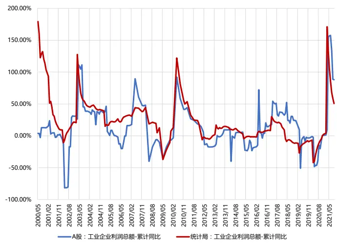
数据来源：东方证券研究所 & Wind资讯 & 国家统计局

图 11：统计局工业企业营收同比与 A 股工业类上市公司营收同比走势对比
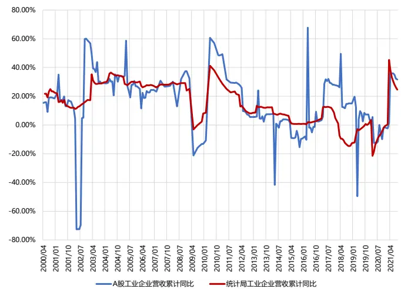
数据来源：东方证券研究所 & Wind资讯 & 国家统计局
有关分析师的申明，见本报告最后部分。其他重要信息披露见分析师申明之后部分，或请与您的投资代表联系。并请阅读本证券研究报告最后一页的免责申明。

图 12：统计局工业企业利润总额同比与 A 股工业类上市公司利润总额同比走势对比：计算机、通信和其他电子设备制造业
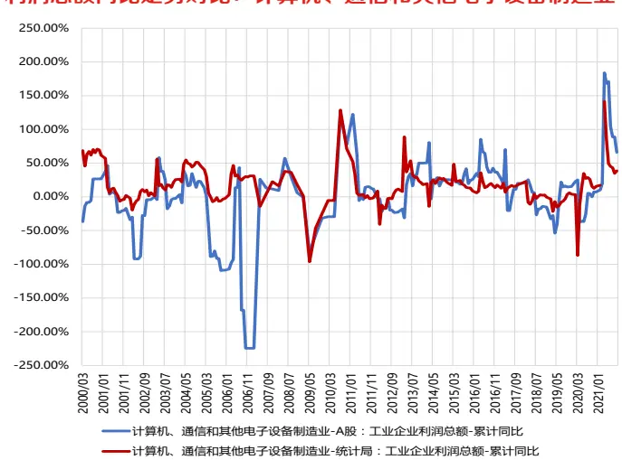
数据来源：东方证券研究所 & Wind资讯 & 国家统计局

图 13：统计局工业企业营收同比与 A 股工业类上市公司营收同比走势对比：计算机、通信和其他电子设备制造业
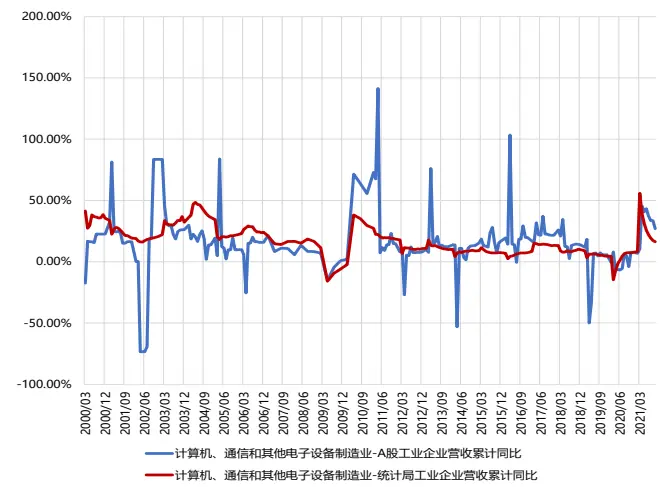
数据来源：东方证券研究所 & Wind资讯 & 国家统计局

图 14：统计局工业企业利润总额同比与 A 股工业类上市公司利润总额同比走势对比：化学原料及化学制品制造业
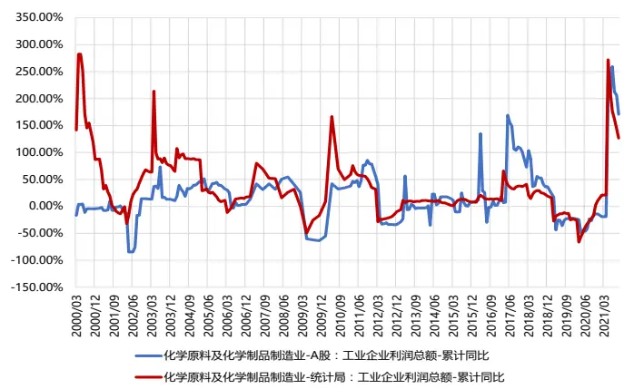
数据来源：东方证券研究所 & Wind资讯 & 国家统计局

图 15：统计局工业企业营收同比与 A 股工业类上市公司营收同比走势对比：化学原料及化学制品制造业
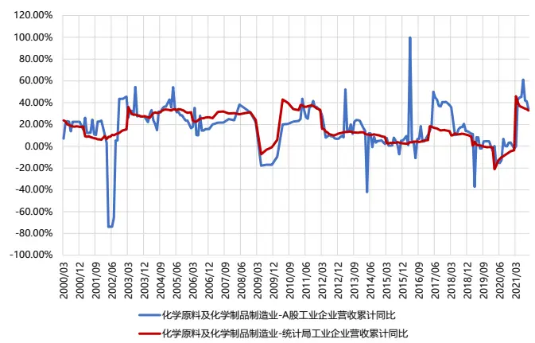
数据来源：东方证券研究所 & Wind资讯 & 国家统计局

图 16：统计局工业企业利润总额同比与 A 股工业类上市公司利润总额同比走势对比：医药制造业
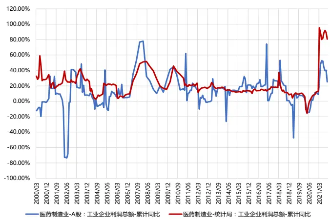
数据来源：东方证券研究所 & Wind资讯 & 国家统计局

图 17：统计局工业企业营收同比与 A 股工业类上市公司营收同比走势对比：医药制造业
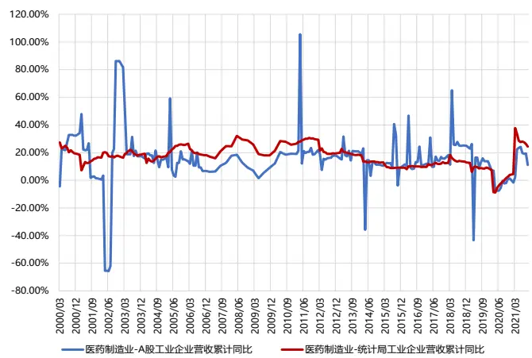
数据来源：东方证券研究所 & Wind资讯 & 国家统计局
有关分析师的申明，见本报告最后部分。其他重要信息披露见分析师申明之后部分，或请与您的投资代表联系。并请阅读本证券研究报告最后一页的免责申明。

## 2.2 工业生产者出厂价格指数（PPI）

从广义角度看，生产者价格指数应涵盖所有行业的生产者，包括农业生产者价格指数、工业生产者价格指数和服务业生产者价格指数。其中，工业生产者价格指数包括工业生产者出厂价格指数（PPI）和工业生产者购进价格指数（PPIRM），前者反映工业企业产品第一次出售时出厂价格的变化趋势和变动幅度，也就是工业企业的产品销售价格，后者反映工业企业的中间投入品购进价格的变化趋势和变动幅度，也就是工业企业的成本。

PPI统计调查涵盖1638个基本分类的20000多种工业产品的价格，覆盖产品的行业销售产值超过工业销售总产值的 70%，比较全面地反映了总体工业品价格水平。PPI 主要有两种分类口径，分别是按生产和生活资料分类、按工业行业分类。按工业行业分类的PPI数据目前包括39个工业行业，根据《国民经济行业分类》划分，覆盖了采矿业门类下的 5 个行业、制造业门类下的全部31 个行业、电力燃气及水生产和供应业门类下的全部 3 个行业。PPI 数据每月月中公布，具体公布时间见图 8。

理论上，产品价格既可能增厚利润也可能挤压利润。从增厚影响来说，利润作为名义变量，包含了价格因素，所以当工业品价格上升，将会对工业企业利润产生正向影响。同时，如果需求端扩张，则会对工业企业利润和工业品价格同时产生拉动，工业企业利润和工业品价格表现出正相关性。从挤压来说，上游工业品价格上升提升了中下游行业成本，下游行业多为民企或中小企业，议价能力较弱，往往不能跟随上游行业同步涨价。因此，在短期，工业品价格上升可能会对利润产生反向影响。从历史数据来看，工业企业利润增速和 PPI同比增速呈现一定的正相关性。

图 18：工业企业利润总额当月同比 VS PPI 当月同比（2012/3/31-2021/12/31）
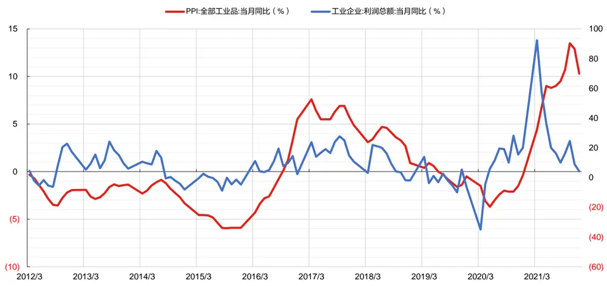
数据来源：东方证券研究所 & Wind资讯 & 国家统计局

有关分析师的申明，见本报告最后部分。其他重要信息披露见分析师申明之后部分，或请与您的投资代表联系。并请阅读本证券研究报告最后一页的免责申明。

除前期报告中使用的在工业企业利润累计同比、工业企业营收累计同比、工业企业销售利润率同比外，工业企业速动比率同比增速，PPI 当月同比也有不错的选行业效果。由于资产负债率同比增速效果相对而言并不明显，综合考虑去掉了这一因子。利润和营收累计同比、PPI 当月同比指标统计局均直接给出，其余字段统计局仅公布当期值或累计值，需根据采用前后两年同期行业累计数据自行计算。统计局公布销售净利率数据仅到2018年，且净利润数据未公布，因而我们只能根据营业收入和利润总额数据自行计算销售利润率。由于不同行业的财务指标本身不可比，我们均使用同比增速形式的指标。

## 从指标逻辑上看：

（1）行业利润总额的累计同比、营业收入的累计同比、PPI当月同比反映了行业的成长性。优异的成长性是支撑公司股价上涨的重要因素。

（2）行业销售利润率的累计同比反映了行业盈利能力的改善。盈利能力是衡量公司质量优劣的重要维度，其中销售利润率则是衡量盈利能力的朴素指标。

（3）行业速动比率同比增速反映了行业的风险性。由于流动负债、速动资产数据并未公布，此处计算的速动比率指流动资产相对负债总额计算的速动比率近似值。速动比率反映企业的短期偿债能力，过高表明企业在速动资产上占用资金过多，会增加企业投资的机会成本，过低则表明企业的短期偿债风险较大。

## 从中观行业数据的单因子结果来看：

（1）除工业企业资产负债率同比增速为负向指标外，其余指标均为正向指标，行业因子值越大，下个月越有可能有超额收益。

（2）PPI 当月同比指标多头超额最显著，2010 年至今 top5 行业年化收益达到 11.02%，多头超额 6.12%。由于工业类行业多数处于产业链的上中游，产品出厂价格上涨对企业利润是正向的拉动作用。其次是工业企业速动比率同比增速（多头超额 5.39%）、工业企业营收累计同比（多头超额 5.64%）、工业企业利润累计同比（多头超额 4.87%）、销售利润率的累计同比（多头超额 4.04%）。

图 19：行业轮动策略：多空头组合绩效表现（中观行业数据：单因子）

| 按工业企业行业分类 行业间等权组合 | 工业企业 行业等权 | 工业企业利润 累计同比 |  | 工业企业营收 |  | 工业企业销售利润率同比 |  | 工业企业速动比率 |  | ppi |  | 工业企业资产负债率同比 |  |
| --- | --- | --- | --- | --- | --- | --- | --- | --- | --- | --- | --- | --- | --- |
| 月频调仓 |  |  |  | 累计同比 |  |  |  | 同比增速 |  | 当月同比 |  |  |  |
| 2009.12.31-2022.04.20 |  | T5行业 | B5行业 | T5行业 | B5行业 | T5行业 | B5行业 | T5行业 | B5行业 | T5行业 | B5行业 | T5行业 -0.91% | B5行业 |
| 年化收益率 | 4.91% | 9.77% | -5.38% | 10.55% | -4.73% | 8.94% | -5.24% | 10.30% | 0.08% | 11.02% | -1.82% |  | 5.25% |
| 年化波动率 | 23.44% | 27.08% | 24.14% | 26.19% | 24.39% | 26.54% | 24.38% | 24.71% | 25.12% | 26.54% | 24.68% | 24.03% | 25.40% |
| Sharp值 | 0.32 -57% | 0.48 | (0.11) | 0.51 | (0.08) | 0.46 | (0.10) | 0.52 | 0.13 | 0.53 -52% | 0.05 -59% | 0.08 | 0.33 |
| 最大回撤 单边换手率（年） | 0.22 | -53% 2.77 | -72% 2.24 | -51% 1.90 | -69% 1.79 | -54% 2.31 | -70% 2.17 | -52% 3.18 | -63% 2.65 | 1.89 | 1.79 | -63% 2.91 | -58% 3.44 |
| 分年收益 |  |  |  |  |  |  |  |  |  |  |  |  |  |
| 2010/12/31 | 8.37% | 0.49% | 2.80% | 18.49% | -13.55% | 9.02% | -5.62% | 9.27% | -7.29% | 5.43% | 7.74% | -9.02% | 14.06% |
| 2011/12/30 | -28.78% | -34.61% | -35.38% | -35.00% | -30.29% | -29.67% | -33.69% | -21.39% | -35.83% | -28.66% | -33.94% | -25.10% | -28.61% |
| 2012/12/31 | -1.05% | 5.28% | -3.70% | 7.76% | 1.28% | -3.65% | -5.80% | -2.69% | 2.41% | -3.52% | -7.96% | -1.82% | -1.26% |
| 2013/12/31 | 9.92% | 17.71% | -19.93% | 32.44% | -8.31% | 11.67% | -19.41% | 23.45% | -10.56% | 18.91% | -18.89% | 5.54% | 14.14% |
| 2014/12/31 | 38.16% | 40.96% | 30.65% | 36.71% | 36.61% | 41.33% | 30.07% | 44.01% | 24.76% | 23.31% | 51.81% | 39.15% | 29.17% |
| 2015/12/31 | 52.22% | 62.90% | 0.80% | 72.80% | 5.56% | 40.02% | 2.94% | 57.08% | 17.63% | 83.05% | 4.34% | 3.72% | 75.63% |
| 2016/12/30 | -10.18% | -6.44% | -5.77% | -16.68% | -7.30% | -5.24% | -6.69% | -8.08% | 1.98% | -21.90% | 1.33% | -4.11% | -13.42% |
| 2017/12/29 | -0.16% | 21.14% | -10.02% | 11.30% | -16.45% | 12.07% | -12.66% | 4.67% | -0.04% | 16.09% | 2.56% | -2.64% | -8.25% |
| 2018/12/28 | -31.09% | -25.95% | -40.71% | -27.19% | -31.73% | -22.80% | -35.58% | -24.59% | -35.91% | -30.01% | -32.25% | -29.05% | -23.06% |
| 2019/12/31 | 25.33% | 31.60% | 22.81% | 20.92% | 22.96% | 29.88% | 27.47% | 11.51% | 32.48% | 24.43% | 13.54% | 23.48% | 6.74% |
| 2020/12/31 | 26.47% | 19.86% | 12.15% | 22.28% | 14.52% | 26.52% | 6.04% | 35.35% | 20.01% | 49.92% | 18.50% | 22.59% | 20.20% |
| 2021/12/31 | 24.80% | 33.53% | 32.80% | 38.87% | 9.48% | 35.16% | 31.92% | 32.99% | 42.29% | 61.97% | 20.88% | 7.06% | 34.01% |
| 2022/4/20 | -16.50% | -4.79% | -18.27% | -4.72% | -16.20% | -3.58% | -13.30% | -1.84% | -14.58% | -3.16% | -17.21% | -18.31% | -14.30% |

数据来源：东方证券研究所 & Wind资讯 & 国家统计局

图 20：行业轮动策略：多头组合净值（中观行业数据：单因子）
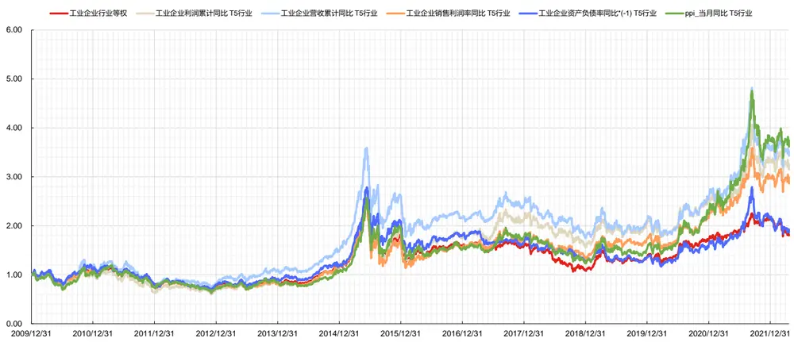
数据来源：东方证券研究所 & Wind资讯 & 国家统计局

有关分析师的申明，见本报告最后部分。其他重要信息披露见分析师申明之后部分，或请与您的投资代表联系。并请阅读本证券研究报告最后一页的免责申明。

## 三、 分析师预期

上市公司数据中分析师预期数据是一个很重要的增量，可以作为财报数据之外的一种基本面信息补充。行业分析师能够及时跟踪个股的盈利变化， 凭借自身的专业能力对其覆盖的上市公司作出前瞻性预测。

## 3.1 分析师一致预期变动

在之前的专题报告《基于工业企业财务数据和分析师预期的行业轮动模型》中我们使用过分析师一致预期行业净利润同比增速指标。该指标逻辑直观，行业内分析师的盈利预测，可以在一定程度上反映行业整体预期盈利水平的前景，分析师一致预期业绩高增长的行业未来大概率表现更好。一致预测数据的同比增速，计算的是当月底最新的一致预测数据，相比去年同期的一致预期数据的变化率。行业一致预期净利润由行业内个股的一致预期净利润直接加总而成。为避免不同年份预期数据跨期对比，以每年 3 月为分界，1 月底和 2 月底选取的是分析师对上一年度年报业绩的一致预期，3月底选取的是分析师对本年度年报业绩的一致预期。

## 3.2 分析师盈利预测调整

除一致预期同比变化外，分析师的盈利预测调整也包含了丰富的信息。在之前的专题报告《更稳健易算的分析师盈利上调因子》中，我们提出了分析师盈利上调的另一种度量方法：FOM指标。

该指标计算时，以当前最新的分析师盈利预测作为基准，不仅与该分析师过去的盈利预测对比，而且也和过去一段时间里其它分析师的盈利预测进行对比，计算盈利预测上调和下调的比例差，从而可以及时反映当前市场对于公司盈利情况的预期变化。

除了分析师的盈利预测之外，预告、快报、实际年报公布的净利润也可以视为一种盈利预测，因而在计算FOM指标时，可以加入预告、快报、实际年报数据。如果当前有财报数据公布，则以财报公布的净利润作为基准，与过去一段时间里的分析师盈利预测进行对比，这样也可以反映出个股年报的超预期情况，将年报超预期事件带来的超额叠加进来。

个股 FOM 因子的具体计算公式和示意图如下：

$$
\mathrm{FOM}=(\mathrm{K}-\mathrm{M})/\mathrm{N}
$$

N：过去一年中分析师针对个股当期年报业绩给出的预测报告篇数（如有预告、快报、年报数据，也纳入其中）。要求个股至少有 3篇分析师报告覆盖（N>=3），否则视为缺失值。

K：过去分析师预测的净利润，比当前最新的净利润低的报告篇数。

M：过去分析师预测的净利润，比当前最新的净利润高的报告篇数。

需要注意的是，如果当前一天内出具了多篇分析师预测报告的话，则针对每个最新预测值分别计算 FOM指标，再取均值。

FOM=1意味着过去所有报告中的净利润，都比当前最新的净利润低，当前盈利预测上调的程度最高；FOM=-1 意味着过去所有报告中的净利润，比当前最新的净利润高，当前盈利预测下调的程度最高。

图 21： 个股 FOM因子计算流程
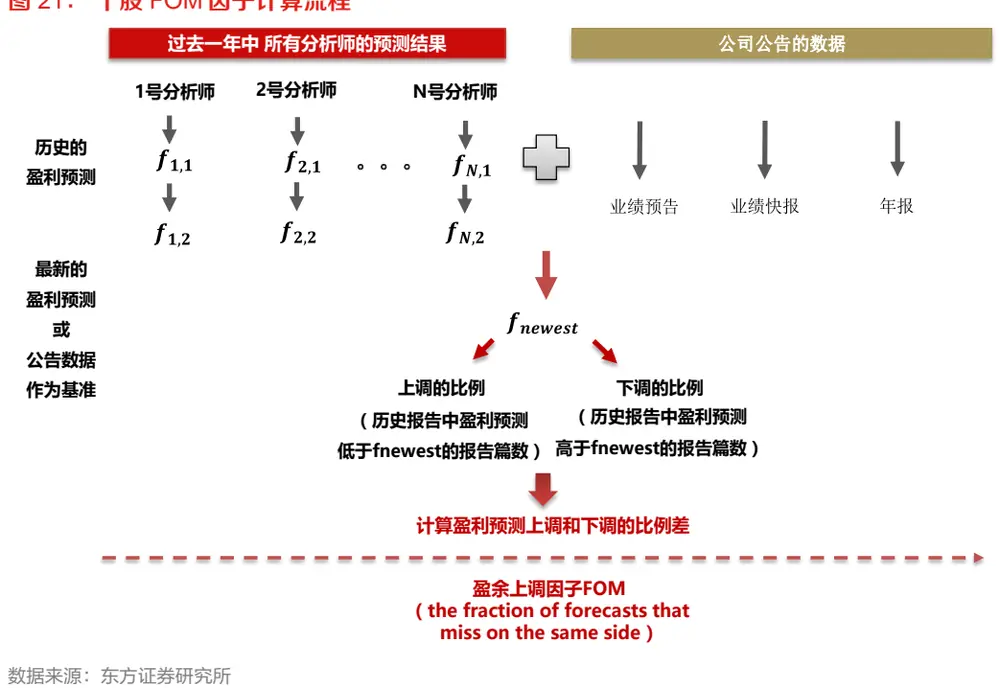

我们尝试了三种方法，将个股 fom 因子转化成行业 fom 因子，分别是个股 fom 因子市值加权、等权、行业内 fom>0 的股票市值占比-fom<0 的股票市值占比。从单因子效果来看，个股等权得到的 fom因子多头超额最显著。

图 22：行业轮动策略：多空头组合绩效表现（分析师预期：单因子）

| 按工业企业行业分类 行业间等权组合 | 工业企业 行业等权 | 分析师一致预期 净利润同比 |  | fom_等权 |  | fom_市值加权 |  | fom_上调股票市值占比 -下调市值占比 |  |
| --- | --- | --- | --- | --- | --- | --- | --- | --- | --- |
| 月频调仓 2009.12.31-2022.04.20 |  | T5行业 | B5行业 | T5行业 | B5行业 | T5行业 | B5行业 | T5行业 | B5行业 |
| 年化收益率 | 4.91% | 10.30% | -3.29% | 10.98% | -0.85% | 9.98% | -2.39% | 9.07% | -0.35% |
| 年化波动率 | 23.44% | 26.84% | 24.24% | 24.53% | 25.30% | 24.57% | 25.32% | 24.30% | 25.07% |
| Sharp值 | 0.32 | 0.50 | (0.02) | 0.55 | 0.09 | 0.51 | 0.03 | 0.48 | 0.11 |
| 最大回撤 | -57% | -52% | -72% | -47% | -67% | -50% | -66% | -53% | -64% |
| 单边换手率（年） | 0.22 | 2.73 | 2.80 | 5.00 | 5.67 | 4.67 | 5.67 | 5.39 | 5.24 |
| 分年收益 |  |  |  |  |  |  |  |  |  |
| 2010/12/31 | 8.37% | 6.80% | -3.67% | 2.99% | 5.35% | 8.06% | 6.76% | -1.23% | -2.02% |
| 2011/12/30 | -28.78% | -33.97% | -29.44% | -25.45% | -44.94% | -22.95% | -42.04% | -17.52% | -41.22% |
| 2012/12/31 | -1.05% | 6.08% | -6.01% | 5.92% | 0.17% | 2.63% | -3.70% | -1.79% | 4.90% |
| 2013/12/31 | 9.92% | 11.69% | -9.05% | 27.51% | -4.63% | 20.11% | -3.95% | 21.75% | 2.05% |
| 2014/12/31 | 38.16% | 30.22% | 44.88% | 34.47% | 43.23% | 13.96% | 47.83% | 20.45% | 45.13% |
| 2015/12/31 | 52.22% | 71.38% | 0.87% | 73.57% | 43.44% | 53.16% | 38.74% | 43.33% | 50.05% |
| 2016/12/30 | -10.18% | -11.31% | -4.98% | -15.58% | 3.34% | -10.24% | -4.04% | -16.79% | 1.40% |
| 2017/12/29 | -0.16% | 14.89% | -18.34% | 6.30% | -20.74% | 15.43% | -18.68% | 25.20% | -17.90% |
| 2018/12/28 | -31.09% | -21.64% | -30.29% | -21.69% | -33.95% | -25.13% | -33.82% | -28.58% | -30.98% |
| 2019/12/31 | 25.33% | 34.30% | 20.73% | 7.46% | 8.75% | 31.90% | 14.45% | 26.36% | 6.22% |
| 2020/12/31 | 26.47% | 32.83% | -3.52% | 43.64% | 5.43% | 49.49% | -1.96% | 39.92% | 1.29% |
| 2021/12/31 | 24.80% | 42.32% | 48.66% | 38.85% | 63.89% | 19.52% | 36.75% | 35.34% | 44.29% |
| 2022/4/20 | -16.50% | -11.69% | -16.70% | -1.32% | -22.15% | -1.68% | -20.11% | -2.93% | -19.97% |

数据来源：东方证券研究所 & Wind资讯 & 朝阳永续

有关分析师的申明，见本报告最后部分。其他重要信息披露见分析师申明之后部分，或请与您的投资代表联系。并请阅读本证券研究报告最后一页的免责申明。

图 23：行业轮动策略：多头组合净值（分析师预期：单因子）
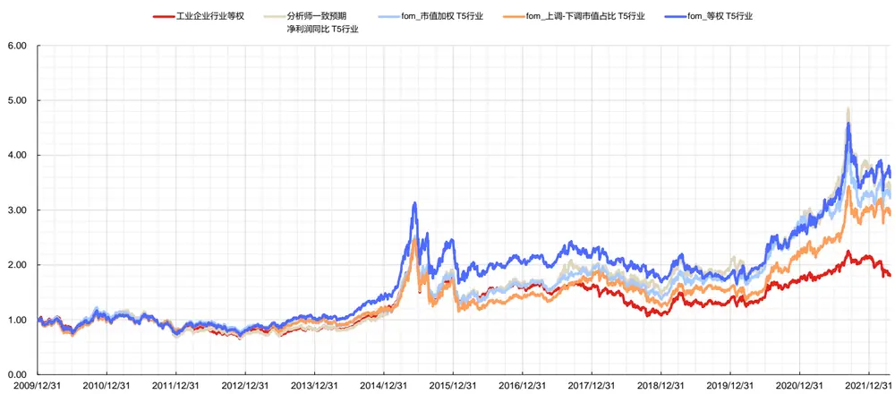
数据来源：东方证券研究所 & Wind资讯 & 朝阳永续

## 四、 业绩超预期

业绩超预期是一类有效的个股 alpha 因子，主要通过业绩公告值减去预期值除以规模数的框架来度量。产生预期数主要有两种方法：分析师预期、时间序列建模。

对于分析师预期维度，由于国内的分析师仅基于年报业绩进行预测，单纯通过实际公告净利润减去分析师一致预期净利润除以规模数的方式仅能捕捉年报业绩超预期事件，无法形成选股因子。而在上述的FOM因子中，可以通过纳入上市公司年报公告的方式，将实际年报公告高于分析师预期值的超预期情形包含进来，因而此处不在单独讨论。

对于时间序列建模维度，在之前的报告中，我们构建过预期外盈利因子SUE0，SUE1，预期外营收因子 SUR0，SUR1。这类因子是使用历史财务数据建模估计预期收益和收益标准差。SUR因子仅将净利润替换为营业收入，其余计算均不变，因而下面仅展示SUE因子的计算公式。

SUE因子的具体计算公式如下：

$$
\mathrm{SUE}={\frac{Q-E(Q)}{\sigma}}
$$

其中：Q 表示公司实际公告的净利润，E（Q）表示公告前的预期值，σ表示 Q 的预测标准差。 E（Q）和 σ均通过季节性时间序列模型估计。其中 SUE0 假设随机游走模型含漂移项，SUE1假设不含。

从单因子效果来看，市值加权得到的 SUE、SUR因子均有不错的选行业效果。

图 24：行业轮动策略：多空头组合绩效表现（业绩超预期：单因子）

| 按工业企业行业分类 工业企业 行业间等权组合 |  |  |  |  |  |  |  |  |  |
| --- | --- | --- | --- | --- | --- | --- | --- | --- | --- |
| 月频调仓 | 行业等权 | sue0_市值加权 |  | sue1_市值加权 |  | sur0_市值加权 |  | sur1_市值加权 |  |
| 2009.12.31-2022.04.20 |  | T5行业 | B5行业 | T5行业 | B5行业 | T5行业 | B5行业 | T5行业 | B5行业 |
| 年化收益率 | 4.91% | 12.57% | 1.10% | 12.46% | -2.99% 23.69% | 9.57% | 0.36% | 8.82% | 0.24% |
| 年化波动率 | 23.44% | 25.35% | 23.51% | 25.45% |  | 25.86% | 23.75% | 25.74% | 24.16% |
| Sharp值 | 0.32 | 0.59 | 0.16 | 0.59 | (0.01) | 0.48 | 0.13 | 0.46 | 0.13 |
| 最大回撤 | -57% | -50% | -58% | -49% | -63% | -52% | -63% | -47% | -63% |
| 单边换手率（年） 分年收益 | 0.22 | 4.02 | 4.08 | 3.69 | 3.10 | 3.66 | 3.38 | 3.73 | 3.03 |
| 2010/12/31 | 8.37% | 11.92% | 2.42% | 9.42% | -5.27% | 9.52% | -8.34% | 1.40% | -8.71% |
| 2011/12/30 | -28.78% | -22.49% | -32.76% | -22.42% | -31.44% | -18.06% | -23.72% | -18.35% | -27.46% |
| 2012/12/31 | -1.05% | 6.23% | 0.45% | 2.15% | -6.27% | 1.53% | -9.02% | 12.18% | -5.69% |
| 2013/12/31 | 9.92% | 24.09% | -9.82% | 20.34% | -18.15% | 14.92% | -5.11% | 28.93% | -4.45% |
| 2014/12/31 | 38.16% | 21.27% 76.42% | 39.22% 26.73% | 22.04% | 35.96% | 14.59% | 44.20% | 21.38% | 62.70% |
| 2015/12/31 | 52.22% -10.18% | -7.33% | -5.48% | 82.56% -6.75% | 7.36% -4.56% | 58.38% 3.47% | 9.70% -13.53% | 89.54% | 2.91% |
| 2016/12/30 |  | 14.38% | -13.24% | 18.84% | -19.09% | 13.51% |  | -5.39% | -5.58% |
| 2017/12/29 | -0.16% | -23.79% | -27.53% | -25.38% | -18.16% | -29.00% | -6.81% | 12.57% | -13.13% |
| 2018/12/28 | -31.09% |  | 19.81% |  |  |  | -25.97% | -31.25% | -23.03% |
| 2019/12/31 | 25.33% | 29.05% |  | 32.46% | 14.14% 1.48% | 22.45% | 17.56% | 16.85% | 15.47% |
| 2020/12/31 | 26.47% | 26.81% | 17.53% 46.40% | 38.26% | 45.56% | 38.33% 23.20% | 25.77% | 23.91% | 11.38% |
| 2021/12/31 | 24.80% | 39.29% |  | 23.52% |  |  | 59.81% | 9.87% | 59.13% |
| 2022/4/20 | -16.50% | -4.82% | -15.19% | -2.58% | -11.17% | -6.98% | -22.37% | -11.90% | -20.23% |

数据来源：东方证券研究所 & Wind资讯

图 25：行业轮动策略：多头组合净值（业绩超预期：单因子）
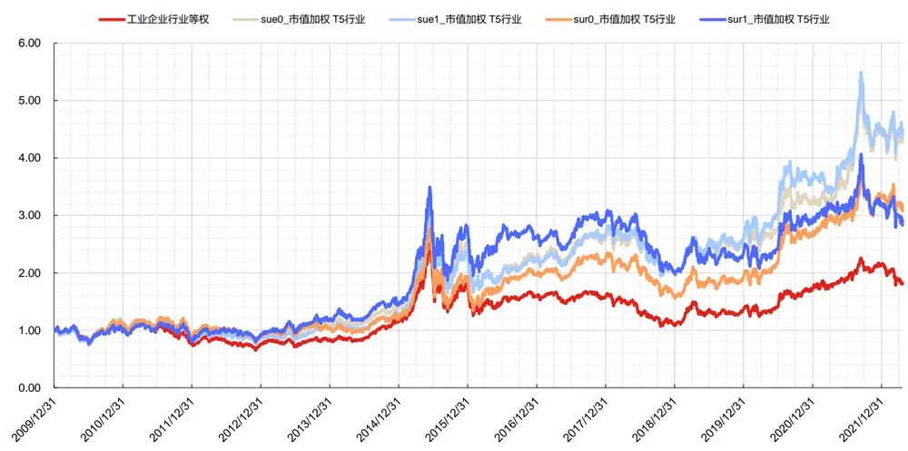
数据来源：东方证券研究所 & Wind资讯

有关分析师的申明，见本报告最后部分。其他重要信息披露见分析师申明之后部分，或请与您的投资代表联系。并请阅读本证券研究报告最后一页的免责申明。

## 五、 资金流向

资金流向是行业配置策略中的关键一环，可以反映不同市场参与者的行业投资观点。

## 5.1 股东高管增减持

股东、高管是重要的产业资本，他们比其他投资者更加了解企业情况，通过其增减持行为可以更好的把握企业和行业的情况。股东和高管对于自家股票进行增减持一般会有以下几个目的：1、作为公司经营决策的参与者，他们可以在第一时间知晓公司的重要信息，以及公司未来盈利和发展的预期，从而可以利用这种信息的不对称性进行增减持，获取投资收益。2、作为公司的经营者会对公司股票估值的认识更加理性。受市场系统性风险影响，股价被严重高估或者低估的时候，他们可以通过增减持获得收益。3、出于并购、定向增发、获取控股权等资本运作目的来增持股票。

接下来我们对股东和高管的增减持数据进行汇总，构建每个行业的资金流向指标。Wind 数据库中 AShareMjrHolderTrade 数据来源是上市公司公告，主要记录上市公司股东增减持；AShareInsiderTrade 数据来源是交易所网站，主要记录上市公司高管增减持。可以通过AShareMjrHolderTrade 表 IS_REANNOUNCED（是否重复披露）字段去重合并两表。由于增减持行为偶然性较大，按照日度统计增减持数额变动会较大，我们分别按周度和月度对增减持数据进行汇总。由于原始资金流数据在不同行业间不可比，我们基于行业总成交额对指标进行归一化。

从单因子结果来看，减持因子更有效，净增持指标对于行业几乎没有区分度，过去 5 天或者过去一个月的因子效果相差不大。出于换手和回撤的考虑，选择一个月作为计算周期。

图 26：行业轮动策略：多空头组合绩效表现（股东高管增减持：单因子）

| 按工业企业行业分类 行业间等权组合 | 工业企业 行业等权 | 过去一个月股东高管 减持金额/成交额之和 |  | 过去5天股东高管 减持金额/成交额之和 |  | 过去一个月股东高管 净增持金额/成交额之和 |  | 过去5天股东高管 净增持金额/成交额之和 |  |
| --- | --- | --- | --- | --- | --- | --- | --- | --- | --- |
| 月频调仓 2009.12.31-2022.04.20 |  | T5行业 | B5行业 | T5行业 | B5行业 | T5行业 | B5行业 | T5行业 | B5行业 |
| 年化收益率 | 4.91% | 2.42% | 8.57% | 1.95% | 8.30% | 8.15% | 8.36% | 6.40% | 7.03% |
| 年化波动率 | 23.44% | 24.61% | 23.58% | 25.09% | 24.66% | 24.03% | 24.08% | 24.21% | 24.87% |
| Sharp值 | 0.32 | 0.22 | 0.47 | 0.20 | 0.45 | 0.45 | 0.45 | 0.38 | 0.40 |
| 最大回撤 | -57% | -54% | -51% | -58% | -58% | -61% | -51% | -53% | -56% |
| 单边换手率（年） | 0.22 | 9.35 | 9.36 | 9.60 | 9.57 | 8.78 | 9.53 | 9.96 | 9.68 |
| 分年收益 |  |  |  |  |  |  |  |  |  |
| 2010/12/31 | 8.37% | -2.81% | 10.00% | 9.94% | 22.33% | 2.57% | 16.61% | 3.60% | 21.52% |
| 2011/12/30 | -28.78% | -26.98% | -31.35% | -24.52% | -30.40% | -23.67% | -33.26% | -25.89% | -31.58% |
| 2012/12/31 | -1.05% | -0.04% | -7.52% | -11.00% | -4.81% | 7.72% | -7.48% | -0.19% | -6.08% |
| 2013/12/31 | 9.92% | 25.38% | 16.87% | 14.71% | 32.78% | 10.77% | 25.83% | 4.97% | 29.52% |
| 2014/12/31 | 38.16% | 34.09% | 42.96% | 40.44% | 37.09% | 44.70% | 41.77% | 37.50% | 39.86% |
| 2015/12/31 | 52.22% | 36.01% | 82.46% | 48.09% | 49.32% | 37.10% | 79.52% | 61.37% | 34.02% |
| 2016/12/30 | -10.18% | -8.84% | -8.54% | -9.86% | -15.77% | 2.50% | -9.11% | 5.97% | -12.38% |
| 2017/12/29 | -0.16% | 8.88% | -9.37% | -0.34% | -3.30% | -5.02% | -3.43% | 0.71% | -0.47% |
| 2018/12/28 | -31.09% | -29.99% | -22.28% | -34.46% | -24.25% | -32.51% | -24.33% | -31.84% | -22.27% |
| 2019/12/31 | 25.33% | 30.21% | 31.66% | 20.04% | 33.38% | 24.21% | 20.81% | 25.73% | 24.32% |
| 2020/12/31 | 26.47% | 20.48% | 31.65% | 13.73% | 34.03% | 15.68% | 29.11% | 12.66% | 31.27% |
| 2021/12/31 | 24.80% | -7.76% | 35.07% | 10.08% | 26.87% | 63.57% | 30.41% | 36.40% | 32.37% |
| 2022/4/20 | -16.50% | -17.77% | -14.42% | -18.62% | -13.55% | -8.51% | -13.87% | -14.57% | -16.99% |

数据来源：东方证券研究所 & Wind资讯

有关分析师的申明，见本报告最后部分。其他重要信息披露见分析师申明之后部分，或请与您的投资代表联系。并请阅读本证券研究报告最后一页的免责申明。

图 27：行业轮动策略：多头组合净值（股东高管增减持：单因子）
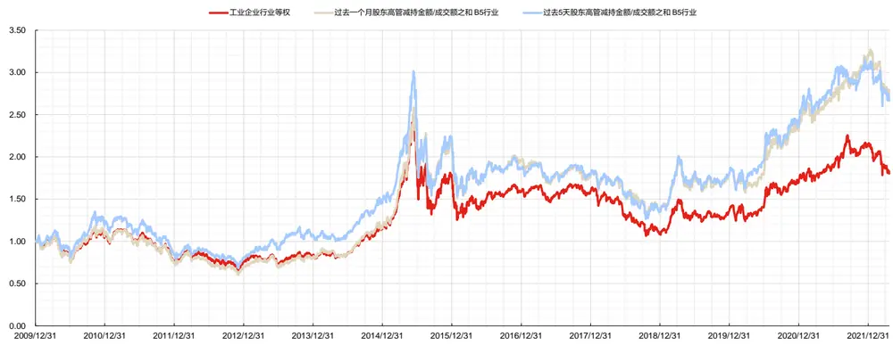
数据来源：东方证券研究所 & Wind资讯

## 5.2 北上资金

北上资金是 A股市场的重要参与者，指通过香港交易所流入A股市场的香港或境外资金。根据投资市场不同，分为沪股通和深股通。沪股通于2014年11月17日开通，深股通于2016年12月 5日开通。当前北上资金累计净买入资金超过 1.6万亿元。

图 28：北上资金累计净买入（2014/11/17-2022/04/29）
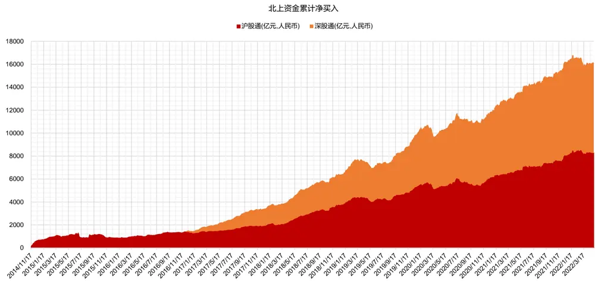
数据来源：东方证券研究所 & Wind资讯

有关分析师的申明，见本报告最后部分。其他重要信息披露见分析师申明之后部分，或请与您的投资代表联系。并请阅读本证券研究报告最后一页的免责申明。

港交所中央结算系统自2016/06/30开始每日都会披露陆港通通道持股数量，进而我们可以获知北上资金每日的成交情况和持股明细。即使北上资金不是 smart money，我们依然可以把他当成一个大体量的投资者来研究其持仓特征和交易行为。

首先我们构造北上资金持仓组合，考察北上资金的选股配置能力。北上资金持仓组合中个股的权重，按照北上资金在个股上的持股市值占当期其在全部个股上的持股市值总和的比例计算得来。基准组合为北上资金持仓个股的市值加权组合。北上资金可用数据的时间比较短，历史回溯测试的实证区间设定为 2016.06.30 – 2022.04.29，采用月频调仓方式。下图我们展示了指数的净值曲线以及相关绩效指标，可以看到，北上资金持仓组合过去 6 年半的时间里年化收益可以达到 12%，而同期基准组合年化收益率仅为 4%，跑赢市场常见宽基指数。2021年组合回撤较大，跑输中证全指。这与北上资金的持股风格有关。在之前的专题报告《资本市场开放对因子投资的影响》中，我们分析过北上资金偏好高质量的大盘蓝筹、白马股，而这类股票近两年均表现不佳。

图 29：北上资金持仓组合绩效表现（2016/06/30-2022/04/29）

| 2016/06/30-2022/04/29 | 北上资金持仓组合 | 基准组合 | 中证全指 | 沪深300 | 中证500 |
| --- | --- | --- | --- | --- | --- |
| 年化收益率 | 11.95% | 3.80% | -0.01% | 4.23% | -1.44% |
| 年化波动率 | 21.87% | 17.29% | 19.00% | 18.63% | 20.82% |
| Sharp值 | 0.63 | 0.30 | 0.09 | 0.32 | 0.04 |
| 最大回撤口 | -41.43% | -30.95% | -34.78% | -34.84% | -40.11% |
| 单边换手率（年） | 4.63 | 3.51 |  |  |  |
| 2016/12/30 |  |  |  |  |  |
| 2017/12/29 | 60.88% | 12.08% | 2.34% | 21.78% | -0.20% |
| 2018/12/28 | -23.07% | -24.44% | -29.94% | -25.31% | -33.32% |
| 2019/12/31 | 63.83% | 29.63% | 31.11% | 36.07% | 26.38% |
| 2020/12/31 | 27.44% | 22.12% | 24.92% | 27.21% | 20.87% |
| 2021/12/31 | -13.76% | 5.18% | 6.19% | -5.20% | 15.58% |
| 2022/4/29 | -19.98% | -18.52% | -22.16% | -18.71% | -23.53% |

数据来源：东方证券研究所 & Wind资讯

图 30：北上资金持仓组合净值（2016/06/30-2022/04/29）
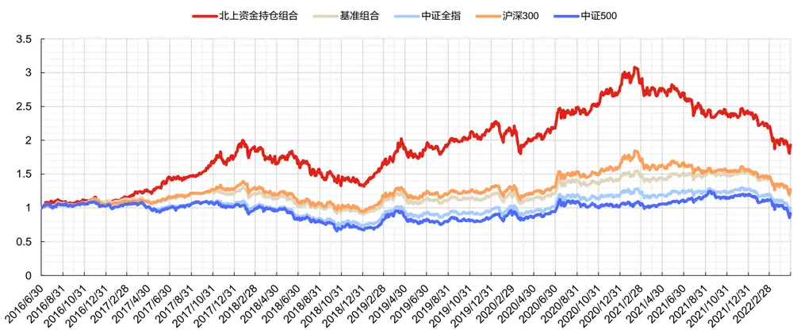
数据来源：东方证券研究所 & Wind资讯
有关分析师的申明，见本报告最后部分。其他重要信息披露见分析师申明之后部分，或请与您的投资代表联系。并请阅读本证券研究报告最后一页的免责申明。

## 基于北上资金构造行业因子有两个维度：

1. 关注北向资金的持仓偏向。北上资金着重配置某行业就意味着其对该行业比较看好。通过北上资金当前持股数量乘以收盘价，可以计算其在个股上的持股市值情况，汇总到行业层面即可得到北上资金在各行业上的持股市值占比。

2.关注北向资金流入情况。北向资金流入量较大，意味该行业获得了外资较大幅度加仓。通过北上资金持股数增量乘以当日 vwap 均价，可以计算北向资金每日在每只股票上的净流入额。个股的净流入金额可以汇总到行业层面，即可得到北上资金每日在不同行业的资金净流入额。由于原始的资金流数据在不同行业间不可比，我们基于行业总成交额对指标进行归一化。考察周期我们分别测试了过去 5天、过去一个月。

可以看到：持仓市值占比因子多空超额更显著，过去一个月的净流入因子的表现也较好。
图 31：行业轮动策略：多空头组合绩效表现（北上资金：单因子）

| 按工业企业行业分类 行业间等权组合 月频调仓 | 工业企业 行业等权 | 北上资金持仓市值占比 |  | 北上资金持仓市值占比/流通 |  | 过去5天北上资金流入额 |  | 过去一个月北上资金流入额 |  |
| --- | --- | --- | --- | --- | --- | --- | --- | --- | --- |
|  |  |  |  | 市值占比 |  | /成交额之和 |  | /成交额之和 |  |
| 2016.12.31-2022.04.20 |  | T5行业 | B5行业 | T5行业 | B5行业 | T5行业 | B5行业 | T5行业 | B5行业 |
| 年化收益率 | 2.22% | 11.83% | 0.03% | 11.71% | 2.66% | 7.49% | 4.94% | 7.98% | 2.22% |
| 年化波动率 | 19.18% | 21.66% | 24.25% | 20.69% | 22.23% | 19.00% | 20.07% | 19.02% | 19.99% |
| Sharp值 | 0.21 | 0.62 | 0.12 | 0.64 | 0.23 | 0.48 | 0.34 | 0.50 | 0.21 |
| 最大回撤 单边换手率（年） | -36% 0.23 | -32% 0.65 | -52% 1.03 | -30% | -43% | -36% | -43% | -31% | -39% |
| 分年收益 |  |  |  | 0.53 | 1.51 | 8.17 | 9.26 | 7.31 | 9.17 |
| 2017/12/29 | -0.64% | 23.92% | -15.31% | 23.27% |  |  |  |  |  |
| 2018/12/28 | -30.80% | -25.95% | -34.15% | -23.88% | -4.82% -34.81% | 19.10% -31.48% | 15.33% -37.01% | 10.01% | 9.44% |
|  | 24.86% | 54.30% | 27.72% |  | 14.10% | 32.69% | 30.61% | -25.23% | -32.17% |
| 2019/12/31 | 25.89% | 59.36% | 22.75% | 44.96% 56.52% | 25.21% | 36.30% | 30.70% | 25.59% | 27.72% 27.54% |
| 2020/12/31 | 24.57% | 1.21% | 38.07% | 6.76% | 51.33% | 10.62% | 32.94% | 43.08% 21.40% | 8.40% |
| 2021/12/31 | -16.56% |  | -17.01% | -20.88% | -14.33% | -10.23% | -21.70% | -16.30% | -14.30% |
| 2022/4/20 |  | -20.85% |  |  |  |  |  |  |  |

数据来源：东方证券研究所 & Wind资讯

图 32：行业轮动策略：多头组合净值（北上资金：单因子）
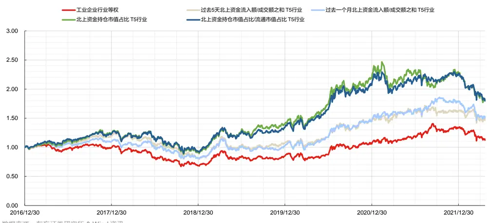
数据来源：东方证券研究所 & Wind资讯
有关分析师的申明，见本报告最后部分。其他重要信息披露见分析师申明之后部分，或请与您的投资代表联系。并请阅读本证券研究报告最后一页的免责申明。

## 六、 DFQ工业类行业轮动策略表现

## 6.1 基于证监会二级行业

下面我们将中观行业数据、分析师预期、业绩超预期、资金流向四个维度，共计 14 个指标等权合成，考察合成行业因子的绩效情况。单因子进行异常值处理和标准化，组合按月频调仓。

图 33： DFQ工业类行业轮动模型因子列表
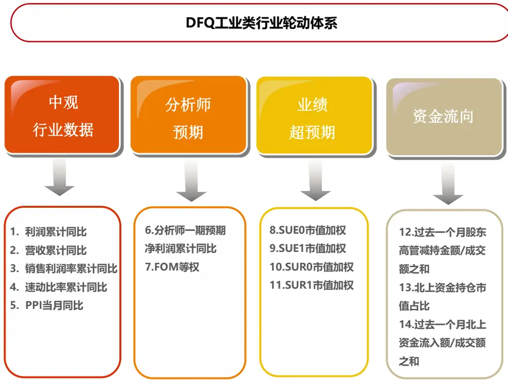
数据来源：东方证券研究所

在之前的专题报告《基于主动买卖单的行业轮动模型》中我们介绍了行业过去 5 天的净换手率因子，该因子在中信一级行业分类体系下选行业效果较为显著。净换手率因子和动量因子相关性较高，属于高频技术面量价指标，换手率较高，且在非周期性行业中胜率相对更高，在工业类行业中多头端超额并不明显，仅空头端负向超额明显。因而，我们考虑将净换手率因子或动量因子作为负向剔除指标，与合成行业因子进行结合。从合成指标排名靠前的行业组合中剔除净换手率或动量因子得分较低的行业，再得到多头组合。

## 从合成因子结果来看：

（1）绩效表现：2010年至今，合成因子 top5行业组合年化收益达到 16.34%，bottom5行业组合年化收益-7.35%，多头超额12.08%，空头超额11.60%。在多头组合中叠加动量因子和净换手率因子后，组合收益均有进一步提高，组合最大回撤有所降低，夏普比率有所提升。合成因子叠加行业RET5因子处于前80%的top5行业组合，多头超额达到13.62%，合成因子叠加行业NTO5因子处于前80%的top5行业组合，多头超额达到15.36%，信息比率1.49，超额收益最大回撤 24%。

（2）年度表现：2010 年至今 top5 行业组合基本每年都能取得正超额。合成因子 top5 行业组合仅 2014年跑输基准。合成因子叠加行业 RET5因子处于前 80%的 top5行业组合每年都能跑赢基准。合成因子叠加行业 NTO5因子处于前 80%的 top5行业组合也是仅 2014年跑输基准，其余年份每年超额都在 5%以上。bottom5行业组合仅四年跑赢基准，展现出稳定的收益能力。

（3）2022 年月度表现：合成因子叠加行业 NTO5 因子处于前 80%的 top5 行业组合在 2022年前四个月中超额高达 17%，每个月都能取得正超额。

图 34：行业轮动策略：多空头组合绩效表现（合成因子，基于证监会二级行业）

| 按工业企业行业分类 行业间等权组合 月频调仓 | 工业企业行业等权 | top5行业组合 | top5行业组合 | top5行业组合 | bottom5行业组合 |
| --- | --- | --- | --- | --- | --- |
| 2009.12.31-2022.04.29 |  | 合成指标（14个单因子） | 合成指标（14个单因子） +行业RET5处于前80% | 合成指标（14个单因子） +行业NTO5处于前80% | 合成指标（14个单因子） |
| 年化绝对收益 | 4.25% | 16.34% | 17.88% | 19.62% | -7.35% |
| 年化绝对收益波动率 | 23.61% | 26.02% | 25.49% | 25.87% | 24.39% |
| 夏普比率 | 0.30 | 0.71 | 0.77 | 0.82 | -0.19 |
| 绝对收益最大回撤 | -57.49% | -49.54% | -48.33% | -44.74% | -70.93% |
| 单边换手率（年） | 0.23 | 3.85 | 5.27 | 4.78 | 3.29 |
| 月度胜率 |  | 62.42% | 62.42% | 60.40% | 65.77% |
| 年化超额收益 |  | 12.08% | 13.62% | 15.36% | -11.60% |
| 年化超额波动率 |  | 9.76% | 9.34% | 9.56% | 10.14% |
| 信息比率 |  | 1.17 | 1.36 | 1.49 | (1.11) |
| 超额收益最大回撤 |  | -21.93% | -18.22% | -23.58% | -80.53% |

数据来源：东方证券研究所 & Wind资讯 & 国家统计局 & 朝阳永续

图 35：行业轮动策略：多空头组合分年&分月收益（合成因子，基于证监会二级行业）
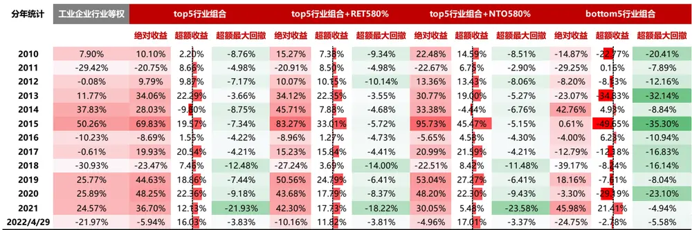

| 分月统计 | 工业企业行业等权 | top5行业组合 |  |  | top5行业组合+RET580% |  |  | top5行业组合+NTO580% |  |  | bottom5行业组合 |  |  |
| --- | --- | --- | --- | --- | --- | --- | --- | --- | --- | --- | --- | --- | --- |
|  |  | 绝对收益 | 超额收益 | 超额最大回撤 | 绝对收益 | 超额收益 | 超额最大回撤 | 绝对收益 | 超额收益 | 超额最大回撤 | 绝对收益 | 超额收益 | 超额最大回撤 |
| 2022年1月 | -9.61% | -7.51% | 2.09% | -1.43% | -6.89% | 2.71% | -1.41% | -6.89% | 2.71% | -1.41% | -11.82% | 2.22% | -3.86% |
| 2022年2月 | 5.46% | 12.87% | 7.40% | -1.29% | 10.45% | 4.99% | -0.80% | 12.87% | 7.40% | -1.29% | 4.61% | H0.86% | -2.65% |
| 2022年3月 | -8.73% | -3.37% | 5.36% | -3.37% | -9.29% | 0.56% | -3.81% | -3.37% | 5.36% | -3.37% | -7.96% | 0.77% | -2.29% |
| 2022年4月 | -10.33% | -6.76% | 3.57% | -3.83% | -3.69% | 6.64% | -2.00% | -6.41% | 3.92% | -3.30% | -11.37% | 1.04% | -2.66% |

数据来源：东方证券研究所 & Wind资讯 & 国家统计局 & 朝阳永续

有关分析师的申明，见本报告最后部分。其他重要信息披露见分析师申明之后部分，或请与您的投资代表联系。并请阅读本证券研究报告最后一页的免责申明。

图 36：行业轮动策略：多空头组合净值（合成因子，基于证监会二级行业）
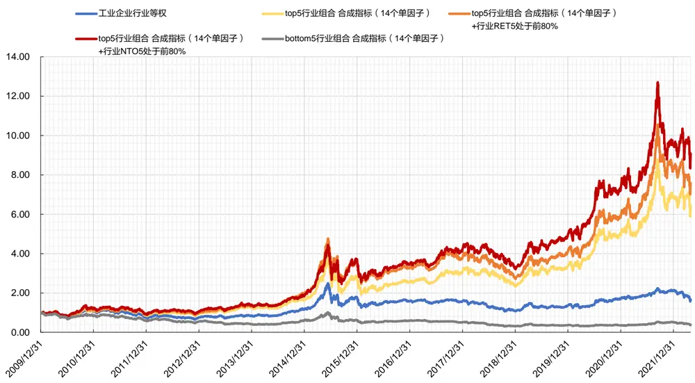
数据来源：东方证券研究所 & Wind资讯 & 国家统计局 & 朝阳永续

图 37：行业轮动策略：多空头组合超额收益净值（合成因子，基于证监会二级行业）
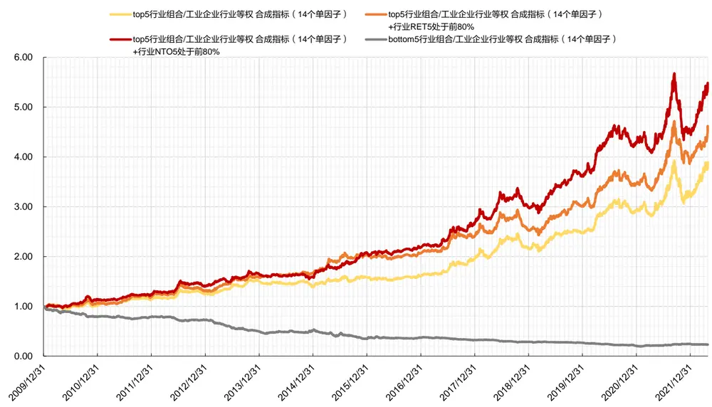
数据来源：东方证券研究所 & Wind资讯 & 国家统计局 & 朝阳永续

有关分析师的申明，见本报告最后部分。其他重要信息披露见分析师申明之后部分，或请与您的投资代表联系。并请阅读本证券研究报告最后一页的免责申明。

（4）分组表现：合成因子呈现出显著的分层效果，年化超额收益、夏普比率和月度胜率都呈现出明显的单调性。

图 38：行业轮动策略：分5组绩效表现（合成因子，基于证监会二级行业）

| 合成指标（14个单因子） | 1(低) | 2 | 3 | 4 | 5(高) |
| --- | --- | --- | --- | --- | --- |
| 月均超额收益 | -0.68% | -0.31% | -0.12% | 0.33% | 0.77% |
| 月度超额胜率 | 36.91% | 44.97% | 48.99% | 55.70% | 63.09% |
| 年化超额夏普 | -94.25% | -64.39% | -23.25% | 59.32% | 101.29% |
| 超额收益最大回撤 | -67.57% | -46.93% | -23.98% | -11.91% | -12.66% |
| 年化超额收益 | -7.69% | -3.90% | -1.86% | 3.63% | 9.30% |

数据来源：东方证券研究所 & Wind资讯 & 国家统计局 & 朝阳永续

（5）不同市场阶段表现：不同市场状态中行业轮动策略的表现会有明显差异。我们根据万得全 A 指数的走势，将 2010 至今的 A 股市场划分为两次牛市、两次熊市、三次震荡市，共 7 个阶段（2022 年暂且认为是震荡市），并对比每个阶段下不同类型行业轮动策略的表现。可以看到：

1. DFQ工业类行业轮动策略整体更适合震荡市。震荡市以结构性机会为主，有效把握行业机会，进行有效行业轮动，显得尤其重要。2010 年以来，A 股震荡市为期近 6 年（2010-2014 上半年、2015年末-2017年、2022年至今），接近一半时间。在这期间，工业企业行业等权组合和常见宽基指数累计收益均在-30%左右，而合成因子 top5 行业组合可获得最高 110%的累计回报，bottom5行业组合累计收益为-70%，多空头超额均十分可观。

2. 牛市期间，中观基本面类行业因子表现较好。2010年以来，A股牛市为期近 4年。在这期间，工业企业行业等权组合和常见宽基指数累计收益在 4倍左右，而 PPI当月同比因子的 top5行业组合累计取得了超过 7 倍的收益，表现最佳。在经济周期上行中 PPI 的弹性更大，做多 PPI 是更具优势的投资方向。PPI 同比增速高意味着行业需求扩张，业绩和行情表现具有改善的基础。除此之外，工业企业利润累计同比、营收累计同比、分析师一致预期净利润同比、过去一个月股东高管减持占比因子对应的 top5行业组合累计收益也超过 5倍。牛市期间整体宏观经济环境较好，市场风险偏好提高，投资者对于公司及行业的成长性会更加关注。成长空间大，具有进攻性质，更具有上涨潜力的行业会受资金偏爱。

3. 熊市期间，资金流向类行业因子表现较好。2010 年，A 股出现了两次大幅下跌（2015 年下半年、2018 年）。在这期间，工业企业行业等权组合和常见宽基指数累计收益均在-50%左右，高管减持因子 top5 行业组合累计收益在-40%，跌幅最小。在股市上涨阶段，股东高管减持对于上市公司股票价格的影响比较有限，毕竟市场的整体投资氛围比较好。而在熊市中，市场对于减持会更加敏感，股价也会较快得到反映。北上资金因子虽然存在时间较短，但在2018年熊市阶段跌幅同样较小，呈现出一定的防御性特征。当市场情绪较为悲观的时候，投资者会偏爱具有防御类型的股票，例如低波动和基本面好的股票，从而低波动、质量和红利这类因子表现较好，而北上资金本身就偏好高股息、盈利能力强、长期低波动、低换手的股票，风格较为契合。

4. 震荡市中，超预期类行业因子表现较好。在震荡市期间，工业企业行业等权组合和常见宽基指数累计收益在-30%左右，而 SUE0、SUE1、SUR0、SUR1 四个超预期类行业因子对应的top5 行业组合可获得超 30%的正向累计收益。工业企业利润累计同比、营收累计同比、fom 等权因子累计收益也超过 20%。由于震荡市中散户减少，存量资金较为理智，会更关注公司及行业预期外的业绩变化，业绩超出市场预期的行业更加受到资金追捧。

有关分析师的申明，见本报告最后部分。其他重要信息披露见分析师申明之后部分，或请与您的投资代表联系。并请阅读本证券研究报告最后一页的免责申明。

图 39：行业轮动策略：分阶段表现（单因子&合成因子，基于证监会二级行业）
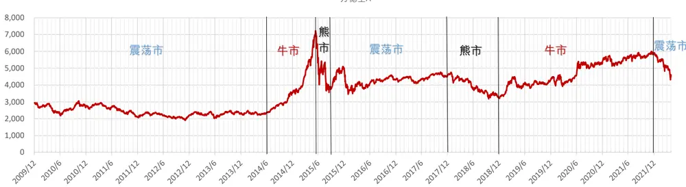

| 组合类别 组合名称中证全指 | 牛市期 | 熊市期 | 震荡期 | 震荡期(2010/1-2014/5) | 牛市期(2014/6-2015/5) | 熊市期(2015/6-2015/9) | 震荡期(2015/10-2017/11) | 熊市期(2017/12-2018/12) | 牛市期(2019/1-2021/12) | 震荡期(2022/1-2022/4) |
| --- | --- | --- | --- | --- | --- | --- | --- | --- | --- | --- |
|  | 335.86% | -55.79% | -33.45% | -25.90% | 150.60% | -36.71% | 10.17% | -30.15% | 73.93% | -18.47% |
| 沪深300宽基指数 | 268.36% | -50.28% | -37.85% | -39.69% | 124.48% | -33.83% | 25.08% | -24.85% | 64.10% | -17.60% |
| 中证500 | 359.58% | -59.11% | -29.32% | -14.63% | 160.28% | -38.56% | 2.28% | -33.45% | 76.57% | -19.06% |
| 中证1000 | 406.77% | -63.27% | -23.74% | 5.85% | 180.26% | -40.68% | -7.43% | -38.07% | 80.82% | -22.17% |
| 基准组合 工业企业行业等权 | 405.59% | -55.15% | -21.22% | -15.96% | 156.33% | -35.08% | 12.35% | -30.91% | 97.24% | -16.56% |
| 合成指标（14个单因子） | 685.05% | -50.58% | 72.75% | 23.34% | 167.82% | -35.37% | 43.35% | -23.53% | 193.12% | -2.29% |
| 合成指标（14个单因子）top5+行业RET5处于前80% | 833.51% | -52.71% | 74.38% | 36.20% | 203.26% | -33.67% | 40.45% | -28.71% | 207.83% | -8.84% |
| 合成指标（14个单因子）+行业NTO5处于前80% | 743.22% | -46.81% | 109.09% | 34.44% | 185.87% | -31.31% | 58.61% | -22.57% | 194.96% | -1.95% |
| bottom5 合成指标（14个单因子） | 253.58% | -61.23% | -69.43% | -58.96% | 111.98% | -35.98% | -7.75% | -39.44% | 66.80% | -19.25% |
| 工业企业利润累计同比 | 522.54% | -58.22% | 20.99% | -21.38% | 195.57% | -42.09% | 61.62% | -27.86% | 110.62% | -4.79% |
| 工业企业营收累计同比 | 510.39% | -53.96% | 22.03% | 7.52% | 197.26% | -34.84% | 19.12% | -29.33% | 105.33% | -4.72% |
| 工业企业销售利润率同比 | 494.43% | -55.20% | 7.62% | -20.55% | 167.65% | -41.61% | 40.48% | -23.27% | 122.09% | -3.58% |
| ppi_当月同比 | 733.24% | -53.19% | -7.29% | -22.21% | 175.77% | -31.47% | 23.07% | -31.69% | 202.15% | -3.16% |
| 工业企业速动比率同比增速 | 459.91% | -49.49% | 16.33% | 0.93% | 178.93% | -32.76% | 17.42% | -24.89% | 100.73% | -1.84% |
| 分析师一致预期净利润同比 | 579.27% | -50.19% | -1.35% | -18.50% | 167.56% | -34.88% | 37.06% | -23.52% | 153.88% | -11.69% |
| fom_等权top5 | 464.25% | -48.24% | 23.15% | 1.83% | 163.27% | -31.26% | 22.56% | -24.70% | 114.33% | -1.32% |
| sue0_市值加权 | 482.00% | -48.81% | 43.94% | 11.27% | 155.32% | -33.26% | 35.91% | -23.30% | 127.95% | -4.82% |
| sue1_市值加权 | 492.21% | -51.24% | 51.57% | 2.57% | 161.79% | -35.08% | 51.69% | -24.90% | 126.22% | -2.58% |
| sur0_市值加权 | 402.78% | -54.45% | 34.34% | -0.77% | 140.93% | -36.96% | 45.53% | -27.75% | 108.69% | -6.98% |
| sur1_市值加权 | 294.88% | -51.98% | 49.07% | 18.93% | 148.23% | -31.36% | 42.28% | -30.03% | 59.07% | -11.90% |
| 过去一个月股东高管减持占比 | 515.47% | -40.36% | -25.14% | -16.76% | 162.89% | -23.14% | 5.09% | -22.39% | 134.12% | -14.42% |
| 过去一个月北上资金流入占比北上资金持仓市值占比 |  |  |  |  |  |  |  | -25.51% | 118.13% | -16.30% |
|  |  |  |  |  |  |  |  | -24.32% | 148.87% | -20.85% |

数据来源：东方证券研究所 & Wind资讯 & 国家统计局 & 朝阳永续

（6）多头持仓情况：top5 行业组合策略曾在 37 个行业上发出过配置信号。其中在酒、医药行业上发出的多头信号最多，超过 40 次，仅金属制品业从未被选中过。25 个行业配置胜率超50%。从近五个月 top5 行业组合的配置来看，石油和天然气开采业每期出现，且每期均贡献超过5%的超额收益。化学原料及化学制品制造业、有色金属冶炼及压延加工业、煤炭开采和洗选业出现 4 次。最新一期持仓与上一期相比，调入有色金属冶炼及压延加工业、酒、饮料和精制茶制造业，调出化学原料及化学制品制造业、有色金属矿采选业。

图 40：top5行业组合在各行业的历史配置胜率（合成因子叠加行业 NTO5因子处于前 80%，基于证监会二级行业）

| top5行业组合 top5行业组合行业名称配置胜率 |  |  | top5行业组合 | top5行业组合获得正超额收益的次数 | 行业名称 |  | top5行业组合 |  |  |  |
| --- | --- | --- | --- | --- | --- | --- | --- | --- | --- | --- |
|  |  |  | 选中次数 |  |  |  |  | 配置胜率 | 选中次数 | 获得正超额收益的次数 |
| 铁路、船舶、航空航天和其他运输设备制造业印刷业和记录媒介的复制 | 80.00% | 10 | 8 | 有色金属冶炼及压延加工业 | 48.15% | 27 | 13 |  |  |  |
|  | 77.78% | 9 | 7 | 汽车制造 | 48.15% | 27 | 13 |  |  |  |
| 电气机械及器材制造业石油和天然气开采业废弃资源综合利用业木材加工及木、竹、藤、棕、草制品业医药制造业家具制造业酒、饮料和精制茶制造业黑色金属矿采选业燃气生产和供应业橡胶和塑料制品业其他制造业非金属矿物制品业造纸及纸制品业黑色金属冶炼及压延加工业文教、工美、体育和娱乐用品制造业农副食品加工业煤炭开采和洗选业专用设备制造业开采专业及辅助性活动纺织业化学纤维制造业通用设备制造业仪器仪表制造业 | 72.73% | 22 | 16 | 有色金属矿采选业 | 46.67% | 15 | 7 |  |  |  |
|  | 71.43% | 28 | 20 | 石油、煤炭及其他燃料加工业 | 46.67% | 15 | 1 |  |  |  |
|  | 71.43% | 7 | 5 | 化学原料及化学制品制造业 | 42.86% | 14 | 6 |  |  |  |
|  | 66.67% | 6 | 4 | 食品制造业 | 42.11% | 38 | 16 |  |  |  |
|  | 65.00% | 40 | 26 | 计算机、通信和其他电子设备制造业 | 41.67% | 12 | 5 |  |  |  |
|  | 63.64% | 22 | 14 | 非金属矿采选业 | 40.00% | 5 | 2 |  |  |  |
|  | 63.04% | 46 | 29 | 水的生产和供应业 | 33.33% | 30 | 10 |  |  |  |
|  | 60.00% | 20 | 12 | 纺织服装、服饰业 | 30.77% | 13 | 4 |  |  |  |
|  | 60.00% | 15 | 9 | 电力、热力的生产和供应业 | 30.77% | 26 | 8 |  |  |  |
|  | 58.82% | 17 | 10 | 皮革、毛皮、羽毛及其制品和制鞋业 | 0.00% | 1 | 0 |  |  |  |
|  | 58.82% | 17 | 10 |  |  |  |  |  |  |  |
|  | 57.58% | 33 | 19 |  |  |  |  |  |  |  |
|  | 57.14% | 21 | 12 |  |  |  |  |  |  |  |
|  | 55.56% | 36 | 20 |  |  |  |  |  |  |  |
|  | 55.00% | 20 | 11 |  |  |  |  |  |  |  |
|  | 54.55% | 22 | 12 |  |  |  |  |  |  |  |
|  | 54.29% | 35 | 19 |  |  |  |  |  |  |  |
|  | 54.17% | 24 | 13 |  |  |  |  |  |  |  |
|  | 50.00% | 12 | 6 |  |  |  |  |  |  |  |
|  | 50.00% | 14 | 7 |  |  |  |  |  |  |  |
|  | 50.00% | 34 | 17 |  |  |  |  |  |  |  |
|  | 50.00% | 2 | 1 |  |  |  |  |  |  |  |
|  | 50.00% | 10 | 5 |  |  |  |  |  |  |  |

数据来源：东方证券研究所 & Wind资讯 & 国家统计局 & 朝阳永续

图 41：近五个月 top5行业组合持仓情况（合成因子叠加行业 NTO5因子处于前 80%，基于证监会二级行业）

| 调仓日 | 行业 | 权重 | 下月行业绝对收益 | 下月行业超额收益 |
| --- | --- | --- | --- | --- |
| 2021/12/31 | 化学原料及化学制品制造业 | 20.00% | -12.15% | -2.56% |
| 2021/12/31 | 化学纤维制造业 | 20.00% | -4.76% | 4.83% |
| 2021/12/31 | 有色金属冶炼及压延加工业 | 20.00% | -12.39% | -2.80% |
| 2021/12/31 | 石油和天然气开采业 | 20.00% | 0.50% | 10.09% |
| 2021/12/31 | 黑色金属冶炼及压延加工业 | 20.00% | -5.93% | 3.66% |
| 2022/1/28 | 化学原料及化学制品制造业 | 20.00% | 10.87% | 5.36% |
| 2022/1/28 | 有色金属冶炼及压延加工业 | 20.00% | 18.43% | 12.93% |
| 2022/1/28 | 煤炭开采和洗选业 | 20.00% | 17.05% | 11.55% |
| 2022/1/28 | 石油、煤炭及其他燃料加工业 | 20.00% | 7.15% | 1.64% |
| 2022/1/28 | 石油和天然气开采业 | 20.00% | 11.42% | 5.92% |
| 2022/2/28 | 化学原料及化学制品制造业 | 20.00% | -9.56% | -0.84% |
| 2022/2/28 | 有色金属冶炼及压延加工业 | 20.00% | -14.45% | -5.72% |
| 2022/2/28 | 煤炭开采和洗选业 | 20.00% | 16.84% | 25.56% |
| 2022/2/28 | 石油、煤炭及其他燃料加工业 | 20.00% | -7.26% | 1.46% |
| 2022/2/28 | 石油和天然气开采业 | 20.00% | -2.67% | 6.06% |
| 2022/3/31 | 化学原料及化学制品制造业 | 20.00% | -11.17% | -0.81% |
| 2022/3/31 | 有色金属矿采选业 | 20.00% | -7.43% | 2.93% |
| 2022/3/31 | 煤炭开采和洗选业 | 20.00% | -0.04% | 10.32% |
| 2022/3/31 | 电气机械及器材制造业 | 20.00% | -12.46% | -2.10% |
| 2022/3/31 | 石油和天然气开采业 | 20.00% | -1.07% | 9.29% |
| 2022/4/29 | 有色金属冶炼及压延加工业 | 20.00% |  |  |
| 2022/4/29 | 煤炭开采和洗选业 | 20.00% |  |  |
| 2022/4/29 | 电气机械及器材制造业 | 20.00% |  |  |
| 2022/4/29 | 石油和天然气开采业 | 20.00% |  |  |
| 2022/4/29 | 酒、饮料和精制茶制造业 | 20.00% |  |  |

数据来源：东方证券研究所 & Wind资讯 & 国家统计局 & 朝阳永续

有关分析师的申明，见本报告最后部分。其他重要信息披露见分析师申明之后部分，或请与您的投资代表联系。并请阅读本证券研究报告最后一页的免责申明。

（7）空头持仓情况：bottom5 行业组合策略曾在 36 个行业上发出过配置信号。其中在石油和天然气开采业、石油煤炭及其他燃料加工业中发出的空头信号最多，达到60次。医药制造业和金属制品业从未被选中过。30 个行业配置胜率超 50%。从近五个月 bottom5 行业组合的配置来看，汽车制造业出现 4 次，仪器仪表制造业、电力热力的生产和供应出现 3 次。最新一期持仓与上一期相比，持仓变更较大，仅造纸及纸制品制造业保留，调入家具制造业、文教工美体育和娱乐用品制造业、非金属矿采选业、黑色金属冶炼及压延加工业。

图 42：bottom5行业组合在各行业的历史配置胜率（合成因子，基于证监会二级行业）

| 行业名称 | bottom5行业组合 配置胜率 | bottom5行业组合 选中次数 | bottom5行业组合 获得负超额收益的次数 | 行业名称 | bottom5行业组合 配置胜率 | bottom5行业组合 选中次数 | bottom5行业组合 获得负超额收益的次数 |
| --- | --- | --- | --- | --- | --- | --- | --- |
| 专用设备制造业 | 100.00% | 2 | 2 | 电力、热力的生产和供应业 | 46.67% | 30 | 14 |
| 电气机械及器材制造业 | 100.00% | 1 | 1 | 纺织服装、服饰业 | 42.11% | 19 | 8 |
| 黑色金属冶炼及压延加工业 | 78.57% | 42 | 33 | 农副食品加工业 | 33.33% | 6 | 2 |
| 燃气生产和供应业 | 77.78% | 18 | 14 | 计算机、通信和其他电子设备制造业 | 33.33% | 3 | 1 |
| 纺织业 | 76.47% | 17 | 13 | 家具制造业 | 20.00% | 5 | 1 |
| 印刷业和记录媒介的复制 | 72.73% | 22 | 16 | 通用设备制造业 | 0.00% | 1 | 0 |
| 木材加工及木、竹、藤、棕、草制品业 | 70.59% | 17 | 12 |  |  |  |  |
| 石油和天然气开采业 | 68.33% | 60 | 41 |  |  |  |  |
| 黑色金属矿采选业 | 68.00% | 50 | 34 |  |  |  |  |
| 石油、煤炭及其他燃料加工业 | 66.67% | 60 | 40 |  |  |  |  |
| 酒、饮料和精制茶制造业 | 66.67% | 15 | 10 |  |  |  |  |
| 非金属矿采选业 | 66.67% | 12 | 8 |  |  |  |  |
| 有色金属冶炼及压延加工业 | 65.00% | 20 | 13 |  |  |  |  |
| 仪器仪表制造业 | 64.71% | 17 | 11 |  |  |  |  |
| 化学纤维制造业 | 64.29% | 14 | 9 |  |  |  |  |
| 开采专业及辅助性活动 | 64.00% | 50 | 32 |  |  |  |  |
| 文教、工美、体育和娱乐用品制造业 | 63.16% | 19 | 12 |  |  |  |  |
| 煤炭开采和洗选业 | 62.50% | 48 | 30 |  |  |  |  |
| 铁路、船舶、航空航天和其他运输设备制造业 | 60.71% | 28 | 17 |  |  |  |  |
| 汽车制造 | 60.00% | 25 | 15 |  |  |  |  |
| 其他制造业 | 57.14% | 14 | 8 |  |  |  |  |
| 皮革、毛皮、羽毛及其制品和制鞋业 | 57.14% | 42 | 24 |  |  |  |  |
| 橡胶和塑料制品业 | 54.55% | 11 | 6 |  |  |  |  |
| 造纸及纸制品业 有色金属矿采选业 | 54.17% | 24 29 | 13 |  |  |  |  |
| 化学原料及化学制品制造业 | 51.72% 50.00% | 6 | 15 3 |  |  |  |  |
| 废弃资源综合利用业 | 50.00% | 2 | 1 |  |  |  |  |
| 水的生产和供应业 | 50.00% | 6 | 3 |  |  |  |  |
| 非金属矿物制品业 | 50.00% | 2 |  |  |  |  |  |
| 食品制造业 | 50.00% | 8 | 1 4 |  |  |  |  |

数据来源：东方证券研究所 & Wind资讯 & 国家统计局 & 朝阳永续

图 43：近五个月 bottom5行业组合持仓情况（合成因子，基于证监会二级行业）

| 调仓日 | 行业 | 权重 | 下月行业绝对收益 | 下月行业超额收益 |
| --- | --- | --- | --- | --- |
| 2021/12/31 | 仪器仪表制造业 | 20.00% | -13.17% | -3.58% |
| 2021/12/31 | 农副食品加工业 | 20.00% | -9.11% | 0.48% |
| 2021/12/31 | 文教、工美、体育和娱乐用品制造业 | 20.00% | -11.50% | -1.91% |
| 2021/12/31 | 汽车制造 | 20.00% | -12.25% | -2.65% |
| 2021/12/31 | 非金属矿采选业 | 20.00% | -12.95% | -3.36% |
| 2022/1/28 | 仪器仪表制造业 | 20.00% | 1.67% | -3.83% |
| 2022/1/28 | 农副食品加工业 | 20.00% | 2.37% | -3.13% |
| 2022/1/28 | 汽车制造 | 20.00% | -0.24% | -5.74% |
| 2022/1/28 | 电力、热力的生产和供应业 | 20.00% | 6.92% | 1.42% |
| 2022/1/28 | 非金属矿采选业 | 20.00% | 12.73% | 7.23% |
| 2022/2/28 | 文教、工美、体育和娱乐用品制造业 | 20.00% | -6.26% | 2.47% |
| 2022/2/28 | 木材加工及木、竹、藤、棕、草制品业 | 20.00% | -5.38% | 3.35% |
| 2022/2/28 | 汽车制造 | 20.00% | -11.97% | -3.25% |
| 2022/2/28 | 电力、热力的生产和供应业 | 20.00% | -8.66% | 0.06% |
| 2022/2/28 | 造纸及纸制品业 | 20.00% | -8.58% | 0.14% |
| 2022/3/31 | 仪器仪表制造业 | 20.00% | -20.45% | -10.09% |
| 2022/3/31 | 汽车制造 | 20.00% | -7.97% | 2.39% |
| 2022/3/31 | 电力、热力的生产和供应业 | 20.00% | -1.59% | 8.77% |
| 2022/3/31 | 造纸及纸制品业 | 20.00% | -13.89% | -3.53% |
| 2022/3/31 | 黑色金属矿采选业 | 20.00% | -13.31% | -2.95% |
| 2022/4/29 | 家具制造业 | 20.00% |  |  |
| 2022/4/29 | 文教、工美、体育和娱乐用品制造业 | 20.00% |  |  |
| 2022/4/29 | 造纸及纸制品业 | 20.00% |  |  |
| 2022/4/29 | 非金属矿采选业 | 20.00% |  |  |
| 2022/4/29 | 黑色金属冶炼及压延加工业 | 20.00% |  |  |

数据来源：东方证券研究所 & Wind资讯 & 国家统计局 & 朝阳永续
有关分析师的申明，见本报告最后部分。其他重要信息披露见分析师申明之后部分，或请与您的投资代表联系。并请阅读本证券研究报告最后一页的免责申明。

## 6.2 基于中信一级行业

证监会行业分类与中信/申万行业分类无一一对应关系，每个证监会二级行业中都包含了不同中信/申万一级行业的股票，分类结果不可直接转化。

我们首先以上述计算出的证监会二级行业中的 38 个工业行业得分为基准，对每个中信一级行业分类下的股票，按照合成行业因子得分进行市值加权，从而得到中信一级行业下的行业得分。需要注意的是，按照这种方法并不能覆盖所有 29 个中信一级行业，仍仅能覆盖 27 个行业，银行和综合类不参与轮动。

从合成因子结果来看，DFQ工业类行业轮动模型在中信一级分类下依然有效，但超额略低于证监会二级分类：

（1）绩效表现：2010 年至今，合成因子 top5 行业组合年化收益达到 12.85%，bottom5 行业组合年化收益-3.69%，多头超额 7.92%，空头超额 7.9%。在多头组合中叠加动量因子和净换手率因子后，组合收益均有进一步提高，夏普比率有所提升。合成因子叠加行业 RET5 因子处于前 80%的 top5 行业组合，多头超额达到 9.19%，合成因子叠加行业 NTO5 因子处于前 80%的top5行业组合，多头超额达到10.12%。

（2）年度表现： 2010 年至今 top5 行业组合基本每年都能取得正超额。合成因子 top5 行业组合仅2014、2021年跑输基准。合成因子叠加行业RET5或者NTO5因子处于前80%的top5行业组合均每年都能跑赢基准。bottom5行业组合仅四年跑赢基准，展现出稳定的收益能力。

（3）2022 年月度表现：合成因子叠加行业 NTO5因子处于前 80%的 top5行业组合在 2022年前四个月中超额高达 10.55%，每个月都能取得正超额。

图 44：行业轮动策略：多空头组合绩效表现（合成因子，基于中信一级行业）

| 按中信一级行业分类（仅工业类） 行业间等权组合 月频调仓 | 中信一级行业等权 仅工业类 | top5行业组合 | top5行业组合 | top5行业组合 | bottom5行业组合 |
| --- | --- | --- | --- | --- | --- |
| 2009.12.31-2022.04.29 |  | 合成指标（14个单因子） | 合成指标（14个单因子） +行业RET5处于前80% | 合成指标（14个单因子） +行业NTO5处于前80% | 合成指标（14个单因子） |
| 年化绝对收益 | 4.58% | 12.85% | 14.19% | 15.04% | -3.69% |
| 年化绝对收益波动率 | 23.25% | 24.68% | 24.67% | 24.49% | 23.12% |
| 夏普比率 | 0.31 | 0.61 | 0.66 | 0.70 | -0.05 |
| 绝对收益最大回撤 | -55.21% | -45.77% | -45.37% | -45.86% | -62.92% |
| 单边换手率（年） | 0.22 | 3.19 | 4.66 | 4.77 | 2.92 |
| 月度胜率 |  | 59.06% | 59.06% | 58.39% | 61.74% |
| 年化超额收益 |  | 7.92% | 9.19% | 10.12% | -7.90% |
| 年化超额波动率 |  | 8.65% | 8.19% | 8.30% | 8.24% |
| 信息比率 |  | 0.92 | 1.11 | 1.20 | (0.96) |
| 超额收益最大回撤 |  | -19.75% | -18.28% | -18.32% | -65.80% |

数据来源：东方证券研究所 & Wind资讯 & 国家统计局 & 朝阳永续

图 45：行业轮动策略：多空头组合分年&分月收益（合成因子，基于中信一级行业）
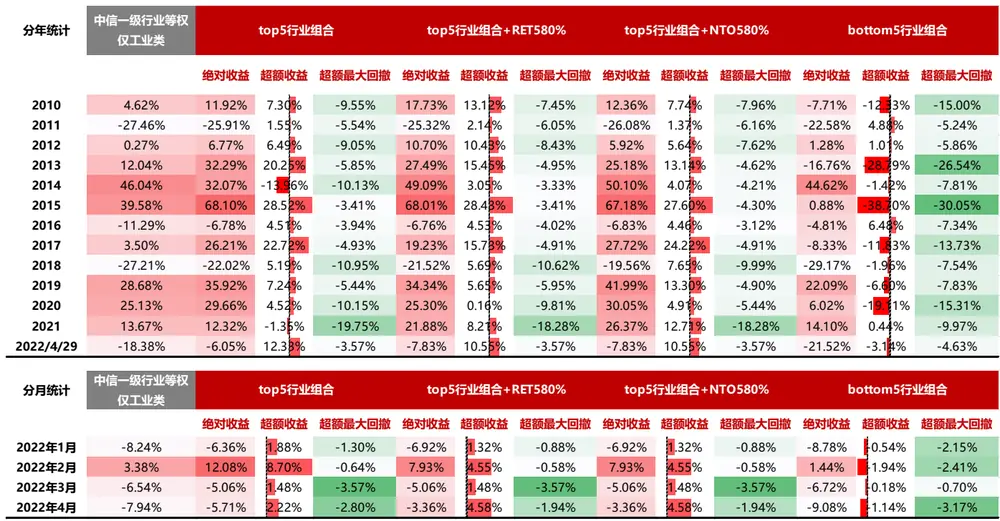
数据来源：东方证券研究所 & Wind资讯 & 国家统计局 & 朝阳永续

（4）多头持仓情况：从近五个月 top5 行业组合的配置来看，石油石化每期出现，基础化工、家电、有色金属出现 4 次。最新一期持仓与上一期相比，调入有色金属、电力设备及新能源，调出交通运输、基础化工。

图 46：近五个月 top5行业组合持仓情况（合成因子叠加行业 NTO5因子处于前 80%，基于中信一级行业）

| 调仓日 | 行业 | 权重 | 下月行业绝对收益 | 下月行业超额收益 |
| --- | --- | --- | --- | --- |
| 2021/12/31 | 基础化工 | 20.00% | -10.48% | -2.57% |
| 2021/12/31 | 家电 | 20.00% | -5.44% | 2.47% |
| 2021/12/31 | 有色金属 | 20.00% | -11.20% | -3.28% |
| 2021/12/31 | 石油石化 | 20.00% | -1.39% | 6.52% |
| 2021/12/31 | 钢铁 | 20.00% | -6.20% | 1.71% |
| 2022/1/28 | 基础化工 | 20.00% | 8.18% | 4.73% |
| 2022/1/28 | 家电 | 20.00% | -4.83% | -8.29% |
| 2022/1/28 | 有色金属 | 20.00% | 19.24% | 15.79% |
| 2022/1/28 | 石油石化 | 20.00% | 9.92% | 6.47% |
| 2022/1/28 | 钢铁 | 20.00% | 7.37% | 3.92% |
| 2022/2/28 | 基础化工 | 20.00% | -9.33% | -3.17% |
| 2022/2/28 | 有色金属 | 20.00% | -12.91% | -6.76% |
| 2022/2/28 | 煤炭 | 20.00% | 13.88% | 20.03% |
| 2022/2/28 | 石油石化 | 20.00% | -8.06% | -1.91% |
| 2022/2/28 | 钢铁 | 20.00% | -8.88% | -2.72% |
| 2022/3/31 | 交通运输 | 20.00% | -0.54% | 7.48% |
| 2022/3/31 | 基础化工 | 20.00% | -11.40% | -3.38% |
| 2022/3/31 | 家电 | 20.00% | -0.12% | 7.91% |
| 2022/3/31 | 煤炭 | 20.00% | -1.54% | 6.48% |
| 2022/3/31 | 石油石化 | 20.00% | -3.27% | 4.75% |
| 2022/4/29 | 家电 | 20.00% | 1.79% | 3.00% |
| 2022/4/29 | 有色金属 | 20.00% | -3.47% | -2.26% |
| 2022/4/29 | 煤炭 | 20.00% | -2.06% | -0.85% |
| 2022/4/29 | 电力设备及新能源 | 20.00% | -2.43% | -1.22% |
| 2022/4/29 | 石油石化 | 20.00% | 0.55% | 1.76% |

数据来源：东方证券研究所 & Wind资讯 & 国家统计局 & 朝阳永续

有关分析师的申明，见本报告最后部分。其他重要信息披露见分析师申明之后部分，或请与您的投资代表联系。并请阅读本证券研究报告最后一页的免责申明。

## 6.3 基于申万一级行业

同样的，我们以上述计算出的证监会二级行业中的 38 个工业行业得分为基准，对每个申万一级行业分类下的股票，按照合成行业因子得分进行市值加权，从而得到申万一级行业下的行业得分。需要注意的是，按照这种方法并不能覆盖所有 31 个申万一级行业，仍仅能覆盖 30 个行业，银行不参与轮动。

从合成因子结果来看，DFQ工业类行业轮动模型在申万一级分类下依然有效，但超额略低于证监会二级分类和中信一级行业分类：

（1）绩效表现：2010 年至今，合成因子 top5 行业组合年化收益达到 11.67%，bottom5 行业组合年化收益-3.96%，多头超额 7.24%，空头超额 7.77%。在多头组合中叠加动量因子和净换手率因子后，组合收益均有进一步提高，组合最大回撤有所降低，夏普比率有所提升。合成因子叠加行业 RET5 因子处于前 80%的 top5 行业组合，多头超额达到 8.61%，合成因子叠加行业NTO5因子处于前 80%的 top5行业组合，多头超额达到 8.60%。

（2）年度表现： top5 行业组合除 2014 年外，每年都能取得正超额，2022 年前四个月超额最高可达 12%。bottom5行业组合仅四年跑赢基准，展现出稳定的收益能力。

（3）2022 年月度表现：合成因子 top5 行业组合在 2022 年前四个月中超额高达 12.43%，每个月都能取得正超额。

图 47：行业轮动策略：多空头组合绩效表现（合成因子，基于申万一级行业）

| 按申万一级行业分类(仅工业类） 行业间等权组合 月频调仓 | 申万一级行业等权 仅工业类 | top5行业组合 | top5行业组合 | top5行业组合 | bottom5行业组合 |
| --- | --- | --- | --- | --- | --- |
| 2009.12.31-2022.04.29 |  | 合成指标（14个单因子） | 合成指标（14个单因子） +行业RET5处于前80% | 合成指标（14个单因子） +行业NTO5处于前80% | 合成指标（14个单因子） |
| 年化绝对收益 | 4.13% | 11.67% | 13.10% | 13.09% | -3.96% |
| 年化绝对收益波动率 | 23.05% | 24.22% | 24.22% | 24.10% | 23.29% |
| 夏普比率 | 0.29 | 0.58 | 0.63 | 0.63 | -0.06 |
| 绝对收益最大回撤 | -56.38% | -46.89% | -46.42% | -46.18% | -65.00% |
| 单边换手率(年) | 0.27 | 3.24 | 4.73 | 4.61 | 2.66 |
| 月度胜率 |  | 64.43% | 64.43% | 63.76% | 69.80% |
| 年化超额收益 |  | 7.24% | 8.61% | 8.60% | -7.77% |
| 年化超额波动率 |  | 7.85% | 7.46% | 7.49% | 7.73% |
| 信息比率 |  | 93.02% | 1.15 | 1.14 | (1.01) |
| 超额收益最大回撤 |  | -16.16% | -17.34% | -13.90% | -64.92% |

数据来源：东方证券研究所 & Wind资讯 & 国家统计局 & 朝阳永续

图 48：行业轮动策略：多空头组合分年&分月收益（合成因子，基于申万一级行业）
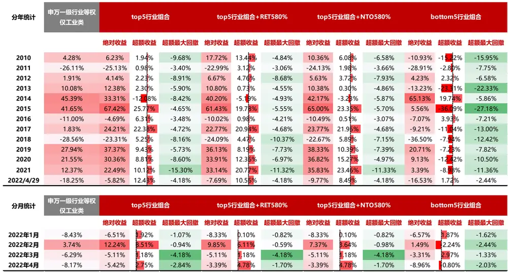
数据来源：东方证券研究所 & Wind资讯 & 国家统计局 & 朝阳永续

（4）多头持仓情况：从近五个月 top5 行业组合的配置来看，石油石化、家用电器、有色金属出现 4 次。最新一期持仓与上一期相比，调入有色金属、电力设备，调出美容护理、基础化工。

图 49：近五个月 top5行业组合持仓情况（合成因子叠加行业 NTO5因子处于前 80%，基于申万一级行业）

| 调仓日 | 行业 | 权重 | 下月行业绝对收益 | 下月行业超额收益 |
| --- | --- | --- | --- | --- |
| 2021/12/31 | 化工 | 20.00% | -8.65% | -0.60% |
| 2021/12/31 | 家用电器 | 20.00% | -5.22% | 2.83% |
| 2021/12/31 | 有色金属 | 20.00% | -11.38% | -3.33% |
| 2021/12/31 | 电气设备 | 20.00% | -10.76% | -2.71% |
| 2021/12/31 | 钢铁 | 20.00% | -5.69% | 2.36% |
| 2022/1/28 | 基础化工 | 20.00% | 10.87% | 7.22% |
| 2022/1/28 | 家用电器 | 20.00% | -5.03% | -8.69% |
| 2022/1/28 | 有色金属 | 20.00% | 17.66% | 14.01% |
| 2022/1/28 | 石油石化 | 20.00% | 10.18% | 6.53% |
| 2022/1/28 | 美容护理 | 20.00% | 3.70% | 0.05% |
| 2022/2/28 | 基础化工 | 20.00% | -9.87% | -3.75% |
| 2022/2/28 | 有色金属 | 20.00% | -12.43% | -6.31% |
| 2022/2/28 | 煤炭 | 20.00% | 13.69% | 19.81% |
| 2022/2/28 | 石油石化 | 20.00% | -8.00% | -1.88% |
| 2022/2/28 | 钢铁 | 20.00% | -9.11% | -2.99% |
| 2022/3/31 | 基础化工 | 20.00% | -10.76% | -2.75% |
| 2022/3/31 | 家用电器 | 20.00% | -0.10% | 7.91% |
| 2022/3/31 | 煤炭 | 20.00% | -1.48% | 6.52% |
| 2022/3/31 | 石油石化 | 20.00% | -2.99% | 5.01% |
| 2022/3/31 | 美容护理 | 20.00% | -1.78% | 6.23% |
| 2022/4/29 | 家用电器 | 20.00% | 1.28% | 2.59% |
| 2022/4/29 | 有色金属 | 20.00% | -3.32% | -2.02% |
| 2022/4/29 | 煤炭 | 20.00% | -2.09% | -0.78% |
| 2022/4/29 | 电力设备 | 20.00% | -2.31% | -1.01% |
| 2022/4/29 | 石油石化 | 20.00% | 0.49% | 1.80% |

数据来源：东方证券研究所 & Wind资讯 & 国家统计局 & 朝阳永续
有关分析师的申明，见本报告最后部分。其他重要信息披露见分析师申明之后部分，或请与您的投资代表联系。并请阅读本证券研究报告最后一页的免责申明。

## 七、 指数增强组合跟踪

在前期的行业轮动报告中，我们介绍了在指数增强组合中引入行业轮动策略的方法。主要有两种：1）调整行业暴露敞口。2）调整个股 zscore 得分。从增强组合的结果来看，引入行业轮动策略对提升增强组合收益有一定作用。

在沪深 300 增强组合中，对 5 个超配行业完全放开正向暴露，5 个低配行业完全放开负向暴露，其余行业放开适当敞口，对应的增强组合相比于行业统一暴露的组合，年化收益提高 0.65%，扣费后年化对冲收益达到 14.48%，信息比 2.66。从分年收益来看，2012、2014、2018 跑输行业统一暴露的策略，2022年收益基本持平，其余年份均跑赢，年度胜率较高。

图 50：沪深 300 全市场增强组合绩效表现（2009/12/31-2022/05/09）

| 沪深300全市场2009.12.31-2022.05.09市值适当暴露双边千三扣费厌恶系数5 | 行业完全中性 行业统一暴露+-0.02 行业完全放开 |  |  | 行业轮动(5个工业企业超配行业完全正暴露5个工业企业低配行业完全负暴露，其余+-0.02） | 个股得分调整(工业企业top5 bottom5行业+-0.5倍标准差）行业统一暴露+-0.02 |
| --- | --- | --- | --- | --- | --- |
| 年化信息比年化对冲收益 | 2.51 | 2.60 | 2.49 | 2.66 | 2.62 |
|  | 12.66% | 13.83% | 14.08% | 14.48% | 13.93% |
| 年化跟踪误差绩效指标 对冲收益最大回撤 | 4.80% | 5.04% | 5.34% | 5.14% | 5.03% |
|  | -5.49% | -5.36% | -5.91% | -5.97% | -6.12% |
| 对冲收益最大回撤出现时间点 | 20211214 | 20210107 | 20101015 | 20210107 | 20210107 |
| 年单边换手率 | 3.44 | 3.39 | 3.35 | 3.45 | 3.46 |
| 平均持股数量 | 58.26 | 47.80 | 44.66 | 48.39 | 48.44 |
| 2010 | 16.32% | 16.40% | 15.38% | 16.96% | 15.88% |
| 2011 | 16.41% | 16.17% | 16.21% | 17.96% | 15.94% |
| 2012 | 17.71% | 19.53% | 16.55% | 18.54% | 20.12% |
| 2013 | 21.99% | 25.56% | 27.83% | 26.97% | 27.66% |
| 2014 | 9.42% | 5.17% | 5.70% | 5.03% | 5.69% |
| 2015 | 13.29% | 13.85% | 14.67% | 15.43% | 15.14% |
| 分年收益 2016 | 12.50% | 15.29% | 17.63% | 15.36% | 13.76% |
| 2017 | 6.28% | 11.22% | 11.90% | 12.22% | 11.40% |
| 2018 | 6.42% | 8.19% | 5.34% | 7.22% | 8.77% |
| 2019 | 8.56% | 9.67% | 9.09% | 10.63% | 9.51% |
| 2020 | 16.54% | 17.40% | 20.57% | 18.01% | 15.43% |
| 2021 | 5.74% | 5.90% | 7.54% | 8.01% | 6.47% |
| 2022/5/9 | 4.42% | 5.69% | 5.06% | 5.69% | 5.55% |

数据来源：东方证券研究所 & Wind资讯

图 51：沪深 300 全市场增强组合净值（2010/1/29-2022/05/09）
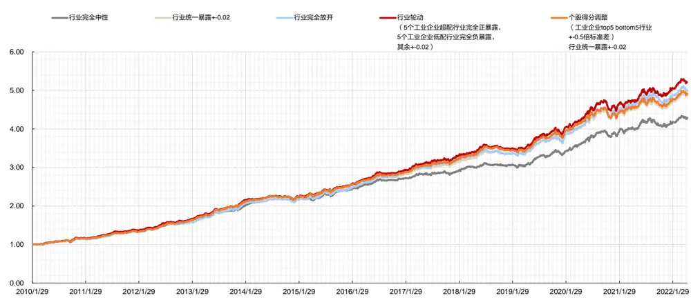
数据来源：东方证券研究所 & Wind资讯
有关分析师的申明，见本报告最后部分。其他重要信息披露见分析师申明之后部分，或请与您的投资代表联系。并请阅读本证券研究报告最后一页的免责申明。

在中证 500 增强组合中，对 5 个超配行业完全放开正向暴露，5 个低配行业完全放开负向暴露，其余行业放开适当敞口，对应的增强组合相比于行业统一暴露的组合，年化收益提高 0.69%，扣费后年化对冲收益达到18.33%，信息比2.48。从分年收益来看，过去12年中，有9年都可以跑赢行业统一暴露的策略，胜率较高。

图 52：中证 500 全市场增强组合绩效表现（2009/12/31-2022/05/09）

| 中证500全市场 2009.12.31-2022.05.09 市值适当暴露双边千三扣费 |  | 行业统一暴露 行业完全中性 行业完全放开 |  |  | 行业轮动 (5个工业企业超配行业完全正暴露 5个工业企业低配行业完全负暴露， 其余+-0.02） | 个股得分调整 (工业企业top5 bottom5行业 +-0.5倍标准差） 行业统一暴露+-0.02 |
| --- | --- | --- | --- | --- | --- | --- |
| 厌恶系数5 |  |  | +-0.02 |  |  |  |
| 绩效指标 | 年化信息比 | 2.52 | 2.37 | 2.31 | 2.48 | 2.50 |
|  | 年化对冲收益 | 16.89% | 17.63% | 17.42% | 18.33% | 18.26% |
|  | 年化跟踪误差 | 6.28% | 6.96% | 7.06% | 6.89% | 6.82% |
|  | 对冲收益最大回撤 | -13.18% | -13.32% | -13.79% | -13.48% | -12.70% |
|  | 对冲收益最大回撤出现时间点 | 20211224 | 20211224 | 20211224 | 20211224 | 20211217 |
|  | 年单边换手率 平均持股数量 | 4.91 | 4.84 | 4.70 | 4.90 | 4.90 |
|  |  | 78.94 | 64.38 | 60.20 | 65.60 | 65.21 |
| 分年收益 | 2010 | 27.88% | 30.56% | 29.47% | 30.33% | 29.37% |
|  | 2011 | 13.50% | 13.64% | 15.84% | 14.74% | 14.45% |
|  | 2012 | 28.29% | 27.04% | 24.98% | 29.51% | 28.07% |
|  | 2013 | 33.49% | 32.69% | 33.37% | 32.96% | 33.60% |
|  | 2014 | 7.70% | 9.02% | 10.79% | 8.94% | 8.81% |
|  | 2015 | 31.86% | 30.73% | 25.21% | 32.83% | 36.19% |
|  | 2016 | 14.85% | 17.62% | 19.68% | 18.12% | 18.00% |
|  | 2017 | 20.45% | 21.33% | 23.75% | 22.90% | 20.77% |
|  | 2018 | 11.01% | 13.25% | 13.82% | 15.00% | 15.30% |
|  | 2019 | 13.70% | 13.61% | 11.80% | 14.06% | 13.79% |
|  | 2020 | 9.94% | 10.41% | 8.28% | 9.10% | 7.91% |
|  | 2021 | -7.74% | -6.88% | -6.53% | -6.48% | -5.91% |
|  | 2022/5/9 | 7.46% | 7.85% | 7.30% | 7.70% | 8.64% |

数据来源：东方证券研究所 & Wind资讯

图 53：中证 500 全市场增强组合净值（2010/1/29-2022/05/09）
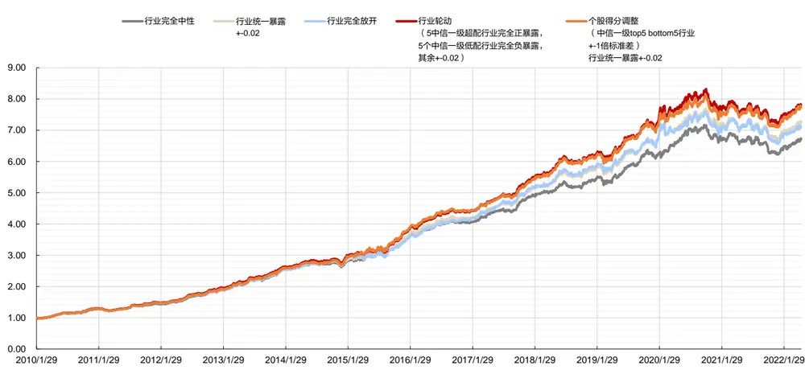
数据来源：东方证券研究所 & Wind资讯

有关分析师的申明，见本报告最后部分。其他重要信息披露见分析师申明之后部分，或请与您的投资代表联系。并请阅读本证券研究报告最后一页的免责申明。

## 八、 行业轮动选股组合跟踪

首先，我们统计了一下 A 股市场上主动股基中，行业轮动类基金的表现。基金范围为普通股票型基金以及偏股混合型基金，仅保留初始基金。筛选方法为：基金名称中应包含“行业”，基金的投资目标中应包含“行业轮动”、“行业配置”、“景气行业”、“优势行业”等。当前共43只行业轮动类基金，其中3只规模过百亿（万家行业优选、华夏行业景气、广发行业严选）。持股数量从 30-300只不等，今年以来招商行业精选收益最佳，为-12.71%。

图 54： A股主动股基中使用行业轮动策略的基金表现（按基金成立日从早到晚排序）

| 代码 | 名称 | 基金规模(合计， 亿元，2022/05/09) | 基金成立日期 | 现任基金经理 | 今年以来回报 | 持股个数 (2021年年报) | 第一大重仓股 (2022一季报， 中信一级） | 第一大重仓行业 (2021年报， 中信一级） |
| --- | --- | --- | --- | --- | --- | --- | --- | --- |
| 161903.OF | 万家行业优选 | 112.51 | 2005-07-15 | 黄兴亮 | -32.23% | 103 | 思瑞浦 | 电子 |
| 240010.OF | 华宝行业精选 | 14.35 | 2007-06-14 | 闫旭 | -30.10% | 117 | 金博股份 | 电力设备及新能源 |
| 160314.OF | 华夏行业精选 | 16.63 | 2007-11-22 | 王劲松 | -32.20% | 87 | 捷佳伟创 | 国防军工 |
| 580003.OF | 东吴行业轮动A | 2.11 | 2008-04-23 | 邬炜 | -22.55% | 96 | 牧原股份 | 电子 |
| 660001.OF | 农银汇理行业成长A | 16.59 | 2008-08-04 | 陈富权 | -22.36% | 123 | 宁德时代 | 电力设备及新能源 |
| 110015.OF | 易方达行业领先 | 18.20 | 2009-03-26 | 冯波 | -19.93% | 88 | 隆基股份 | 食品饮料 |
| 519670.OF | 银河行业优选 | 9.93 | 2009-04-24 | 鲍武斌,张杨 | -26.84% | 128 | 石英股份 | 医药 |
| 217012.OF | 招商行业领先A | 2.86 | 2009-06-19 | 吴昊 | -19.66% | 113 | 长江电力 | 电力设备及新能源 |
| 210003.OF | 金鹰行业优势 | 6.62 | 2009-07-01 | 倪超 | -29.05% | 312 | 景津装备 | 电力设备及新能源 |
| 460007.OF | 华泰柏瑞行业领先 | 3.45 | 2009-08-03 | 吕慧建 | -21.44% | 129 | 牧原股份 | 食品饮料 |
| 090009.OF | 大成行业轮动 | 1.56 | 2009-09-08 | 王磊,郭玮羚 | -25.74% | 345 | 立讯精密 | 电子 |
| 377530.OF | 上投摩根行业轮动A | 10.38 | 2010-01-28 | 孙芳 | -27.92% | 141 | 宁德时代 | 电子 |
| 040016.OF | 华安行业轮动 | 6.34 | 2010-05-11 | 饶晓鹏 | -14.85% | 99 | 宁波银行 | 电子 |
| 519095.OF | 新华行业周期轮换 | 2.69 | 2010-07-21 | 刘彬 | -24.33% | 111 | 比亚迪 | 电力设备及新能源 |
| 270025.OF | 广发行业领先A | 11.11 | 2010-11-23 | 程琨 | -20.31% | 88 | 紫金矿业 | 汽车 |
| 050018.OF | 博时行业轮动 | 2.37 | 2010-12-10 | 陈雷 | -31.38% | 80 | 北方华创 | 电子 |
| 257070.OF | 国联安优选行业 | 9.98 | 2011-05-23 | 潘明 | -32.70% | 31 | 宁德时代 | 电子 |
| 700001.OF | 平安行业先锋 | 2.32 | 2011-09-20 | 刘杰 | -14.99% | 114 | 华侨城A | 医药 |
| 690007.OF | 民生加银景气行业A | 18.52 | 2011-11-22 | 王亮 | -22.16% | 108 | 隆基股份 | 食品饮料 |
| 360016.OF | 光大行业轮动 | 6.56 | 2012-02-15 | 詹佳 | -21.38% | 182 | 贵州茅台 | 食品饮料 |
| 660015.OF | 农银汇理行业轮动 | 6.24 | 2012-11-14 | 邢军亮 | -27.26% | 101 | 宁德时代 | 电力设备及新能源 |
| 000746.OF | 招商行业精选 | 26.52 | 2014-09-03 | 贾成东 | -12.71% | 115 | 工商银行 | 银行 |
| 003567.OF | 华夏行业景气 | 112.21 | 2017-02-04 | 钟帅 | -29.88% | 131 | 盛新锂能 | 电子 |
| 320015.OF | 诺安行业轮动 | 1.29 | 2017-06-23 | 韩冬燕 | -23.83% | 173 | 美的集团 | 电子 |
| 005009.OF | 申万菱信行业轮动A | 0.61 | 2017-09-29 | 廖明兵 | -29.41% | 53 | 天赐材料 | 电力设备及新能源 |
| 005819.OF | 国泰优势行业 | 2.76 | 2018-05-17 | 彭凌志 | -23.99% | 125 | 宁德时代 | 电力设备及新能源 |
| 006302.OF | 银华行业轮动 | 2.08 | 2018-12-03 | 贲兴振 | -13.62% | 119 | 美的集团 | 食品饮料 |
| 003822.OF | 中信建投行业轮换A | 3.07 | 2019-01-17 | 栾江伟 | -25.40% | 196 | 天齐锂业 | 电力设备及新能源 |
| 006573.OF | 人保行业轮动A | 0.97 | 2019-04-24 | 郁琦 | -28.14% | 65 | 立讯精密 | 电力设备及新能源 |
| 008277.OF | 财通资管行业精选 | 1.15 | 2020-04-01 | 于洋 | -28.98% | 100 | 奥特维 | 医药 |
| 009537.OF | 太平行业优选A | 0.88 | 2020-09-01 | 林开盛 | -32.73% | 90 | 隆基股份 | 电子 |
| 009885.OF | 新华景气行业A | 9.84 | 2020-09-27 | 栾超 | -24.49% | 140 | 宁德时代 | 电力设备及新能源 |
| 010418.OF | 财通景气行业 | 3.26 | 2020-12-09 | 沈犁 | -28.76% | 102 | 药明康德 | 医药 |
| 010892.OF | 中银证券精选行业A | 12.60 | 2021-01-20 | 张少华 | -24.31% | 167 | 隆基股份 | 电力设备及新能源 |
| 011201.OF | 财通优势行业轮动A | 10.65 | 2021-02-09 | 张胤 | -19.14% | 136 | 药明康德 | 电力设备及新能源 |
| 010697.OF | 中融行业先锋6个月持有A | 1.79 | 2021-02-09 | 甘传琦 | -29.62% | 28 | 明泰铝业 | 有色金属 |
| 011236.OF | 上投摩根行业睿选A | 25.33 | 2021-02-26 | 孙芳 | -25.64% | 146 | 天华超净 | 电子 |
| 011457.OF | 新华行业龙头主题 | 0.85 | 2021-03-24 | 赵强 | -29.01% | 52 | 海泰新光 | 医药 |
| 011296.OF | 汇添富优势行业一年定开A | 16.23 | 2021-04-29 | 赵鹏程 | -26.11% | 143 | 江海股份 | 电子 |
| 012221.OF | 瑞达行业轮动A | 0.50 | 2021-06-09 | 袁忠伟 | -13.69% | 35 | 兴业银行 | 非银行金融 |
| 012967.OF | 广发行业严选三年持有A | 124.52 | 2021-08-26 | 刘格菘 | -32.06% | 37 | 隆基股份 | 电力设备及新能源 |

数据来源：东方证券研究所 & Wind资讯
有关分析师的申明，见本报告最后部分。其他重要信息披露见分析师申明之后部分，或请与您的投资代表联系。并请阅读本证券研究报告最后一页的免责申明。

下面展示应用 DFQ 工业类行业轮动策略进行主动选股的组合效果。在前期的行业轮动报告中，我们介绍了在主动选股组合中引入行业轮动策略的方法。主要有三种：

1）根据最新可获得的行业轮动策略配置结果，调整个股 zscore 得分，再根据调整后的个股多因子得分选择股票构建组合。

2）在超配行业中，选择个股多因子得分 top股票构建组合。

3）在股票池中剔除低配行业，再按照个股多因子得分选择 top股票构建组合。

其中第一种方法效果最好。具体来讲，对于超配行业，将个股 zscore得分增加 1倍标准差；对于低配行业，将个股zscore得分降低1倍标准差；对于其余行业，保持个股zscore得分不变。组合均按照双边千三进行扣费，等权配置，分别对比 top30、50、100等权组合的结果。

可以看到，top30等权组合表现更好。调整后的多因子top30等权股票组合2010年以来扣费后年化收益达28%，年化夏普比1.06。相比常规组合，年化收益提升5%。2017年以来均跑赢常规多因子选股组合。相比沪深300、中证500超额达到25%以上，2010年以来每年都可以跑赢。相对偏股基金指数超额达到 23%，仅 2020 年跑输。2022 年截止 2022/5/9 收益为-13.61%，跑赢同期偏股基金指数 11%。

图 55：主动选股组合绩效表现（2009/12/31-2022/05/09）

| 指标类别 | 全市场双边干三扣费 2009.12.31-2022.05.09 | 沪深300 | 中证500 | 中证偏股型 基金指数 | top30等权 |  | top50等权 |  | top100等权 |  |
| --- | --- | --- | --- | --- | --- | --- | --- | --- | --- | --- |
|  |  |  |  |  | 多因子 | 调整后多因子 | 多因子 | 调整后多因子 | 多因子 | 调整后多因子 |
| 绩效表现 | 年化夏普比 | 0.14 | 0.20 | 0.33 | 0.92 | 1.06 | 0.90 | 1.02 | 0.90 | 1.00 |
|  | 年化收益 | 0.66% | 1.84% | 4.91% | 22.61% | 27.79% | 21.97% | 26.17% | 21.47% | 25.33% |
|  | 年化波动率 | 22.45% | 25.63% | 22.08% | 25.93% | 26.50% | 25.66% | 26.11% | 25.19% | 26.07% |
|  | 收益最大回撤 | -46.70% | -65.20% | -50.43% | -50.27% | -49.22% | -51.01% | -49.40% | -48.42% | -49.21% |
|  | 收益最大回撤出现时间点 | 20160128 | 20181018 | 20190103 | 20150915 | 20150915 | 20150915 | 20150915 | 20150915 | 20150915 |
|  | 年单边换手率 | 4.97 | 4.97 | 4.97 | 4.97 | 5.69 | 4.65 | 5.41 | 4.29 | 4.90 |
|  | 平均持股数量 | 30 | 30 | 30 | 30 | 30 | 50 | 50 | 100 | 100 |
|  | 2010 | -12.51% | 10.07% | 0.20% | 58.79% | 45.82% | 45.46% | 53.95% | 38.76% | 46.75% |
| 分年收益 | 2011 | -25.01% | -33.83% | -24.20% | -21.72% | -18.39% | -20.33% | -19.77% | -19.21% | -22.13% |
|  | 2012 | 7.55% | 0.28% | 4.93% | 30.38% | 27.82% | 25.95% | 29.35% | 19.44% | 27.11% |
|  | 2013 | -7.65% | 16.89% | 10.13% | 59.40% | 61.04% | 65.18% | 61.53% | 65.13% | 61.00% |
|  | 2014 | 51.66% | 39.01% | 23.88% | 58.77% | 54.39% | 57.43% | 43.16% | 52.95% | 53.49% |
|  | 2015 | 5.58% | 43.12% | 37.52% | 76.84% | 108.84% | 80.34% | 100.84% | 99.55% | 104.95% |
|  | 2016 | -11.28% | -17.78% | -17.00% | 2.44% | 1.95% | 2.11% | -1.20% | 1.13% | 0.99% |
|  | 2017 | 21.78% | -0.20% | 12.63% | 16.81% | 29.36% | 15.25% | 23.45% | 13.14% | 16.93% |
|  | 2018 | -25.31% | -33.32% | -24.58% | -25.64% | -14.39% | -21.50% | -17.42% | -20.20% | -19.78% |
|  | 2019 | 36.07% | 26.38% | 43.74% | 35.68% | 44.27% | 37.89% | 46.96% | 38.14% | 43.48% |
|  | 2020 | 27.21% | 20.87% | 51.50% | 41.79% | 43.97% | 31.21% | 37.64% | 33.45% | 40.75% |
| 2021 | -5.20% | 15.58% | 4.05% | 21.34% | 27.21% | 23.03% | 38.48% | 16.46% | 37.69% |  |
| 2022年 | 2022/5/9 | -21.52% | -23.79% | -24.59% | -18.75% | -13.61% | -18.50% | -16.91% | -17.55% | -17.28% |
|  | 202201 | -7.20% | -10.52% | -9.01% | -6.55% | -3.87% | -7.24% | -5.12% | -7.84% | -7.25% |
|  | 202202 | 0.39% | 4.15% | 1.15% | 4.37% | 8.43% | 4.94% | 7.10% | 5.11% | 6.85% |
|  | 202203 | -7.84% | -7.71% | -8.93% | -7.42% | -6.36% | -6.07% | -6.18% | -4.39% | -6.79% |
|  | 202204 202205 | -4.89% | -11.02% -0.34% | -6.18% -2.61% | -12.47% 1.40% | -13.26% 1.36% | -13.24% 1.34% | -13.16% 0.15% | -13.67% 1.73% | -11.87% 0.81% |

数据来源：东方证券研究所 & Wind资讯

图 56：主动选股组合绝对收益净值（2009/12/31-2022/05/09）
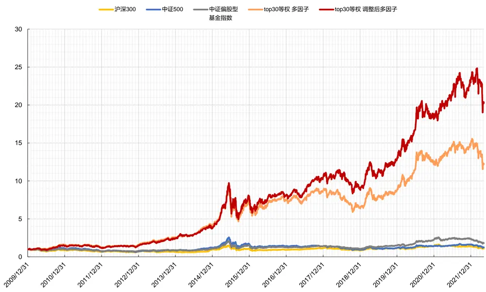
数据来源：东方证券研究所 & Wind资讯

图 57：主动选股组合超额收益净值（2009/12/31-2022/05/09）
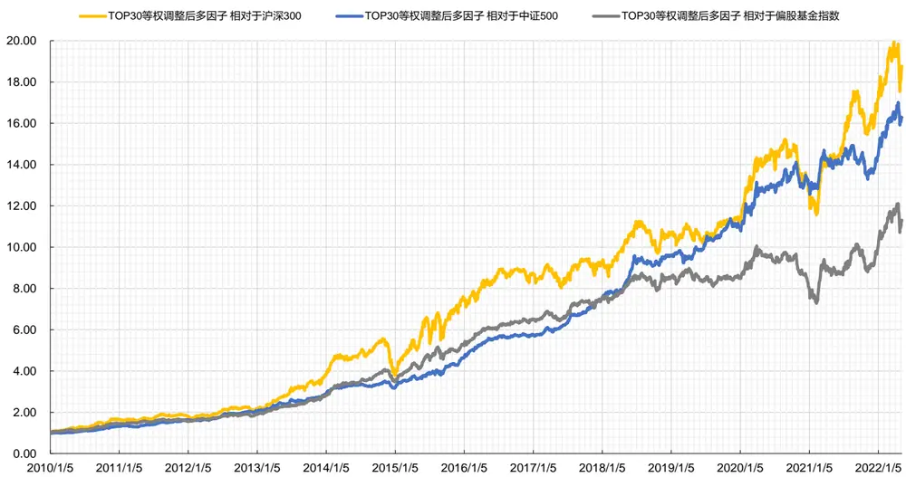
数据来源：东方证券研究所 & Wind资讯

有关分析师的申明，见本报告最后部分。其他重要信息披露见分析师申明之后部分，或请与您的投资代表联系。并请阅读本证券研究报告最后一页的免责申明。

从调整后 top30等权组合持仓来看，市值均在 400亿以下，在证监会二级行业中电气机械和器材制造业权重占比最大，达到 23.33%，调整后的新组合相比原组合，更换 10 只股票，在电气机械、有色金属冶炼、煤炭开采三个行业上的持股权重有所提高。

图 58：主动选股组合最新一期持仓

| 调仓日 | 股票代码 | 股票名称 | 当期个股权重 | 相比原组合个股权重变化 | 市值（亿元，2022/05/09） | 所属证监会二级行业 | 所属中信一级行业 | 所属申万一级行业 |
| --- | --- | --- | --- | --- | --- | --- | --- | --- |
| 2022/4/29 | 000026.SZ | 飞亚达 | 3.33% | 0.00% | 36.51 | 零售业 | 商贸零售 | 轻工制造 |
| 2022/4/29 | 000785.SZ | 居然之家 | 3.33% | 0.00% | 261.81 | 商务服务业 | 商贸零售 | 商业贸易 |
| 2022/4/29 | 002191.SZ | 劲嘉股份 | 3.33% | 0.00% | 130.76 | 印刷和记录媒介复制业 | 轻工制造 | 轻工制造 |
| 2022/4/29 | 002286.SZ | 保龄宝 | 3.33% | 0.00% | 37.34 | 农副食品加工业 | 农林牧渔 | 农林牧渔 |
| 2022/4/29 | 002345.SZ | 潮宏基 | 3.33% | 0.00% | 36.96 | 其他制造业 | 商贸零售 | 轻工制造 |
| 2022/4/29 | 002649.SZ | 博彦科技 | 3.33% | 0.00% | 58.46 | 软件和信息技术服务业 | 计算机 | 计算机 |
| 2022/4/29 | 002801.SZ | 微光股份 | 3.33% | 3.33% | 58.01 | 电气机械和器材制造业 | 电力设备及新能源 | 电气设备 |
| 2022/4/29 | 002878.SZ | 元隆雅图 | 3.33% | 0.00% | 38.50 | 商务服务业 | 传媒 | 传媒 |
| 2022/4/29 | 002978.SZ | 安宁股份 | 3.33% | 0.00% | 122.95 | 有色金属矿采选业 | 有色金属 | 采掘 |
| 2022/4/29 | 300035.SZ | 中科电气 | 3.33% | 3.33% | 182.06 | 电气机械和器材制造业 | 机械 | 化工 |
| 2022/4/29 | 300341.SZ | 麦克奥迪 | 3.33% | 3.33% | 40.51 | 电气机械和器材制造业 | 电力设备及新能源 | 机械设备 |
| 2022/4/29 | 300769.SZ | 德方纳米 | 3.33% | 3.33% | 384.24 | 电气机械和器材制造业 | 基础化工 | 化工 |
| 2022/4/29 | 300855.SZ | 图南股份 | 3.33% | 3.33% | 102.62 | 有色金属冶炼和压延加工业 | 钢铁 | 有色金属 |
| 2022/4/29 | 301023.SZ | 江南奕帆 | 3.33% | 3.33% | 21.49 | 电气机械和器材制造业 | 机械 | 电气设备 |
| 2022/4/29 | 600566.SH | 济川药业 | 3.33% | 0.00% | 211.23 | 医药制造业 | 医药 | 医药生物 |
| 2022/4/29 | 600662.SH | 外服控股 | 3.33% | 0.00% | 123.12 | 道路运输业 | 消费者服务 | 交通运输 |
| 2022/4/29 | 600814.SH | 杭州解百 | 3.33% | 0.00% | 49.49 | 零售业 | 商贸零售 | 商业贸易 |
| 2022/4/29 | 601677.SH | 明泰铝业 | 3.33% | 3.33% | 233.04 | 有色金属冶炼和压延加工业 | 有色金属 | 有色金属 |
| 2022/4/29 | 601811.SH | 新华文轩 | 3.33% | 0.00% | 68.66 | 新闻和出版业 | 传媒 | 传媒 |
| 2022/4/29 | 601918.SH | 新集能源 | 3.33% | 3.33% | 118.13 | 煤炭开采和洗选业 | 煤炭 | 采掘 |
| 2022/4/29 | 603060.SH | 国检集团 | 3.33% | 0.00% | 78.48 | 专业技术服务业 | 综合 | 综合 |
| 2022/4/29 | 603100.SH | 川仪股份 | 3.33% | 0.00% | 56.33 | 仪器仪表制造业 | 电力设备及新能源 | 电气设备 |
| 2022/4/29 | 603277.SH | 银都股份 | 3.33% | 0.00% | 85.00 | 通用设备制造业 | 机械 | 机械设备 |
| 2022/4/29 | 603365.SH | 水星家纺 | 3.33% | 0.00% | 43.07 | 纺织业 | 纺织服装 | 纺织服装 |
| 2022/4/29 | 603556.SH | 海兴电力 | 3.33% | 0.00% | 68.71 | 仪器仪表制造业 | 电力设备及新能源 | 机械设备 |
| 2022/4/29 | 603868.SH | 飞科电器 | 3.33% | 0.00% | 285.41 | 电气机械和器材制造业 | 家电 | 家用电器 |
| 2022/4/29 | 603876.SH | 鼎胜新材 | 3.33% | 3.33% | 133.10 | 有色金属冶炼和压延加工业 | 有色金属 | 有色金属 |
| 2022/4/29 | 605098.SH | 行动教育 | 3.33% | 0.00% | 31.95 | 教育 | 消费者服务 | 综合 |
| 2022/4/29 | 688005.SH | 容百科技 | 3.33% | 3.33% | 380.38 | 电气机械和器材制造业 | 电力设备及新能源 | 化工 |
| 2022/4/29 | 688399.SH | 硕世生物 | 3.33% | 0.00% | 80.25 | 医药制造业 | 医药 | 医药生物 |

数据来源：东方证券研究所 & Wind资讯

图 59：主动选股组合最新一期持仓行业分布（证监会二级行业）

|  | 调仓日 证监会二级行业 |  |  | 当前行业权重 | 相比原组合行业权重变化 |
| --- | --- | --- | --- | --- | --- |
|  | 2022/4/29 电气机械和器材制造业 |  |  | 23.33% | 20.00% |
|  | 2022/4/29 |  | 有色金属冶炼和压延加工业 | 10.00% | 10.00% |
|  | 2022/4/29 |  | 零售业 | 6.67% | 0.00% |
|  | 2022/4/29 商务服务业 |  |  | 6.67% | -6.67% |
|  | 2022/4/29 |  | 医药制造业 | 6.67% | -6.67% |
|  | 2022/4/29 |  | 仪器仪表制造业 | 6.67% | 0.00% |
|  | 2022/4/29 |  | 道路运输业 | 3.33% | 0.00% |
|  | 2022/4/29 |  | 纺织业 | 3.33% | 0.00% |
|  | 2022/4/29 |  | 教育 | 3.33% | 0.00% |
|  | 2022/4/29 |  | 煤炭开采和洗选业 | 3.33% | 3.33% |
|  | 2022/4/29 |  | 农副食品加工业 | 3.33% | -6.67% |
|  | 2022/4/29 其他制造业 |  |  | 3.33% | 0.00% |
|  | 2022/4/29 软件和信息技术服务业 |  |  | 3.33% | 0.00% |
|  | 2022/4/29 通用设备制造业 |  |  | 3.33% | 0.00% |
|  |  | 2022/4/29 新闻和出版业 |  | 3.33% | 0.00% |
|  |  | 2022/4/29 印刷和记录媒介复制业 |  | 3.33% | 0.00% |
|  |  | 2022/4/29 有色金属矿采选业 |  | 3.33% | 0.00% |
| 2022/4/29 专业技术服务业 |  |  |  | 3.33% | 0.00% |

数据来源：东方证券研究所 & Wind资讯

有关分析师的申明，见本报告最后部分。其他重要信息披露见分析师申明之后部分，或请与您的投资代表联系。并请阅读本证券研究报告最后一页的免责申明。

## 九、 行业轮动基金组合跟踪

下面展示应用 DFQ 工业类行业轮动策略进行主动选基的组合效果。这里我们测试用到的基金池仍为 2-100 亿规模，成立时间至少一年的主动权益型基金（wind 分类中的普通股票型和偏股混合型，剔除非初始基金（C类等）、封闭式基金和分级基金），季频调仓，在季末第 15个交易日调仓。需要注意的是，根据监管要求，FOF 持有单只基金的市值不得高于 FOF 资产净值的20%，我们会在 FOF这组合构建中添加这一约束条件。

在前期的行业轮动报告中，我们讨论过在基金组合中引入行业轮动策略的方法：思路是利用基金季报公布的前十大重仓股，计算基金重仓股的行业分布，与行业轮动策略结果进行对照。

具体方式有两种：

1）选择前十大重仓股在超配行业中权重占比较高、在低配行业中权重占比较低的基金，等权配置。例如选择在10个超配行业中占比总和超10%，在10个工业企业低配行业中占比总和小于 10%的基金。若某一期符合要求的基金数量小于 5，则不调仓，保持上季度持仓不变。进一步的，该策略也可以与夏普比率结合。例如要求所选基金同时满足两个条件：过去一年的夏普比率排在基金池的前 10%，并且满足在 10 个超配行业中占比总和超 10%，在 10 个工业企业低配行业中占比小于 10%。这种方法比较直观，但是行业配置标准的设定比较主观，而且为了每期都能选出基金，标准设定不能太严苛。

2）通过组合优化，使得基金组合前十大重仓股的行业配置与指定的行业配置比例最接近。基金权重由优化器给出，剔除优化后权重小于0.1%的基金，剩余基金权重归一化。这种方法操作起来更加灵活。组合优化问题设置如下：

$$
\begin{aligned}&int:\left\|Ax-b\right\|_1——目标函数\\&\\sst:\quad w_i\geq0——绝对权重下限约束\\&\\w_i\leq20\%——绝对权重上限约束\\&\\w^{\prime}l=1——绝对权重的总和等于1\\\end{aligned}
$$

其中x为各基金的绝对权重，A为基金前十大重仓股在各行业上的配置权重，b为根据行业轮动模型给出的行业配置权重，设置 top10行业等权配置，其余行业不配置。‖ $\|_{1}$ 为 1阶范数，表示对应元素绝对值之和。前两个约束条件为控制权重的上下限，要求单个基金权重在 0-20%之间；第三个约束条件为权重总和等于 1。

进一步的，该策略也可以与夏普比率结合。结合方式我们也尝试了两种：第一种是在只对夏普比率排在前 50%的基金进行优化，优化设置不变。第二种是将基金组合的夏普比最高作为目标函数，将行业配置作为约束条件。第二种组合优化问题设置如下：

$$
\begin{aligned}&if\quad\max:Sx——目标函数\\&\begin{aligned}\\&sst:\quad w_i\geq0——绝对权重下限约束\\&\quad w_i\leq20\%——绝对权重上限约束\\&\quad w'I=1——绝对权重的总和等于1\\&\quad\|Ax-b\|_1\leq0.8\\&\end{aligned}\\\end{aligned}
$$

有关分析师的申明，见本报告最后部分。其他重要信息披露见分析师申明之后部分，或请与您的投资代表联系。并请阅读本证券研究报告最后一页的免责申明。

其中 S 为各基金过去一年的夏普比率。第四个约束条件为控制基金组合的行业配置与指定行业配置的偏差。若优化失败，则放大到<=1。

可以看到，组合优化法效果更好。将基金组合夏普比最高作为目标函数，约束基金组合的行业配置与指定行业配置的偏差小于 80%，这样得到的基金组合，2010 年以来相对于偏股基金指数，可取得 10%的年化超额收益。从分年收益来看，过去 13 年中有 10 年都可以跑赢偏股基金指数。与仅最大化夏普比的组合相比，加入行业配置约束条件后，年化收益提高0.5%，2015年-2021 年收益均有提高。

图 60：主动选基组合绩效表现（2009/12/31-2022/05/09）

| 季频调仓绝对收益 | 中证偏股型基金指数 | sharpe top10% 10个超配行业占比总和超20% |  | 优化目标：前十大超配行业等权配置 约束条件：单个基金权重小于20% | 基金池：sharpe top50% 优化目标：前十大超配行业等权配置 | 优化目标：最大化sharpe 约束条件：单个基金权重小于20% | 优化目标：最大化sharpe 约束条件：与前十大超配行业等权 配置组合偏离小于0.8 |
| --- | --- | --- | --- | --- | --- | --- | --- |
|  |  | +10个低配行业占比总和小于10% +持有基金数量大于5 | + 10个超配行业占比总和超10% +10个低配行业占比总和小于10% |  |  |  |  |
|  |  |  | +持有基金数量大于5 |  | 约束条件：单个基金权重小于20% |  | +单个基金权重小于20% |
| 年化收益率 | 5.46% | 11.66% | 13.76% | 12.63% | 13.85% | 14.86% | 15.33% |
| 年化波动率 | 22.03% 0.35 | 22.56% | 22.59% | 23.23% 0.63 | 23.08% 0.68 | 22.68% 0.73 | 22.59% 0.75 |
| Sharp值 最大回撤 | -50.43% | 0.60 -46.97% | 0.68 -42.96% | -47.47% | -41.89% | -42.46% | -42.71% |
| 单边换手率（年） |  | 2.77 | 2.52 | 3.53 | 3.55 | 2.74 | 3.30 |
| 平均持有基金个数 |  | 100 | 26 | 1 | 6 | 5 | 7 |
| 最少持有基金个数 |  | 6 | 5 | 5 | 5 | 5 | 5 |
| 最多持有基金个数 |  | 406 | 67 | 14 | 9 | 5 | 9 |
| 分年收益 |  |  |  |  |  |  |  |
| 2010 | 5.37% | 11.00% | 13.93% | 11.74% | 12.49% | 11.52% | 14.50% |
| 2011 | -24.20% | -24.06% | -26.50% | -22.94% | -22.29% | -23.19% | -27.11% |
| 2012 | 4.93% | 7.20% | 8.07% | 5.14% | 4.80% | 8.07% | 4.58% |
| 2013 | 10.13% | 18.82% | 31.27% | 12.40% | 20.76% | 29.90% | 19.34% |
| 2014 | 23.88% | 20.72% | 20.19% | 24.96% | 19.77% | 49.29% | 31.46% |
| 2015 | 37.52% | 51.82% | 58.93% | 55.36% | 62.01% | 44.40% | 54.56% |
| 2016 | -17.00% | -12.35% | -7.58% | -9.97% | -6.47% | -9.09% | 4.51% |
| 2017 | 12.63% | 24.46% | 32.42% | 21.98% | 18.71% | 26.19% | 28.38% |
| 2018 | -24.58% | -20.92% | -22.43% | -14.30% | -19.96% | -22.21% | -21.69% |
| 2019 | 43.74% | 54.62% | 52.00% | 42.85% | 46.20% | 40.12% | 47.55% |
| 2020 | 51.50% | 66.58% | 76.86% | 67.13% | 80.63% | 74.88% | 78.46% |
| 2021 | 4.05% | 22.06% | 14.00% | 34.79% | 33.66% | 17.90% | 32.82% |
| 2022/5/9 | -23.54% | -27.51% | -26.29% | -28.04% | -27.05% | -18.07% | -25.94% |

数据来源：东方证券研究所 & Wind资讯

图 61：主动选基组合绝对净值表现（2010/1/22-2022/05/09）
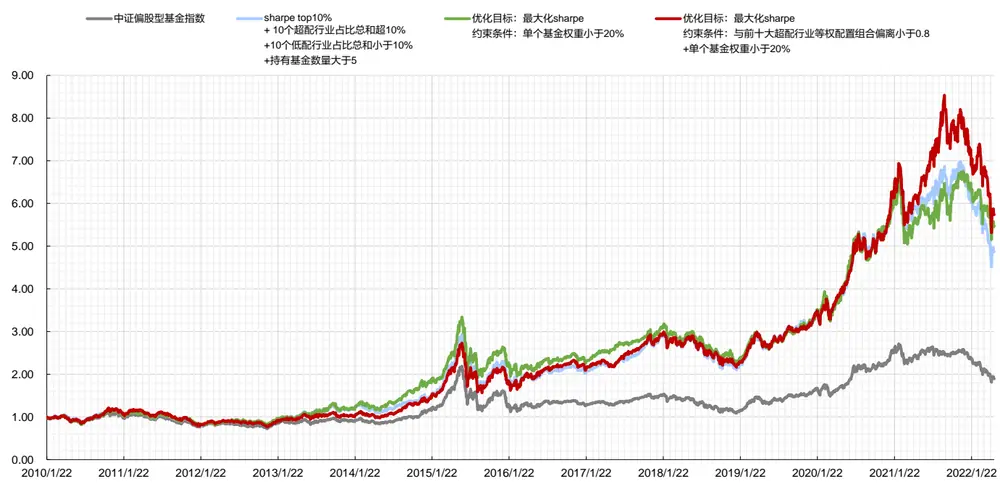
数据来源：东方证券研究所 & Wind资讯
有关分析师的申明，见本报告最后部分。其他重要信息披露见分析师申明之后部分，或请与您的投资代表联系。并请阅读本证券研究报告最后一页的免责申明。

图 62：主动选基组合超额净值表现（2010/1/22-2022/05/09）
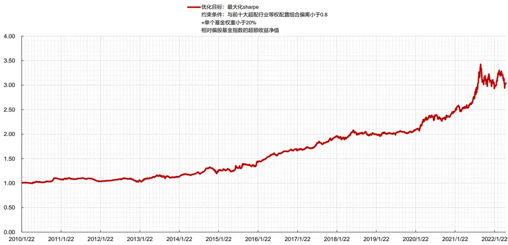
数据来源：东方证券研究所 & Wind资讯

从基金组合持仓来看，将基金组合夏普比最高作为目标函数，约束基金组合的行业配置与指定行业配置的偏差小于 80%，这样得到的基金组合，每期持有 5-9 只基金。最新一期推荐 6 只持仓基金为信诚新兴产业、建信中小盘、大成产业趋势、信达澳银周期动力、中庚价值品质一年持有、华宝资源优选。

图 63：主动选基组合今年以来持仓

| 日期 | 基金Wind代码 | 基金简称 | 基金权重 | 过去一年夏普比 | 基金合计规模（亿元， 对应季报数据） | 基金经理(时任) | 基金成立日 | 第一大重仓股 |
| --- | --- | --- | --- | --- | --- | --- | --- | --- |
| 2021/12/31 | 006736.OF | 国投瑞银先进制造 | 11.37% | 0.82 | 46.91 | 施成 | 2019-01-25 | 永兴材料 |
| 2021/12/31 | 007130.OF | 中庚小盘价值 | 20.00% | 2.51 | 48.03 | 丘栋荣 | 2019-04-03 | 兰花科创 |
| 2021/12/31 | 007689.OF | 国投瑞银新能源A | 20.00% | 0.86 | 77.75 | 施成 | 2019-11-18 | 永兴材料 |
| 2021/12/31 | 009686.OF | 华夏磐利一年定开A | 16.90% | 2.44 | 19.06 | 张城源 | 2020-07-29 | 乐歌股份 |
| 2021/12/31 | 210008.OF | 金鹰策略配置 | 11.73% | 0.75 | 13.15 | 韩广哲 | 2011-09-01 | 天合光能 |
| 2021/12/31 | 519702.OF | 交银趋势优先A | 20.00% | 2.98 | 91.75 | 杨金金 | 2010-12-22 | 明泰铝业 |
| 2022/3/31 | 000209.OF | 信诚新兴产业A | 20.00% | 0.58 | 70.75 | 孙浩中 | 2013-07-17 | 杉杉股份 |
| 2022/3/31 | 000729.OF | 建信中小盘A | 12.15% | 0.90 | 33.97 | 周智硕 | 2014-08-20 | 兖矿能源 |
| 2022/3/31 | 010826.OF | 大成产业趋势A | 20.00% | 1.04 | 8.93 | 韩创 | 2021-02-09 | 赛轮轮胎 |
| 2022/3/31 | 010963.OF | 信达澳银周期动力A | 7.85% | 1.44 | 30.52 | 李淑彦 | 2020-12-30 | 中兵红箭 |
| 2022/3/31 | 011174.OF | 中庚价值品质一年持有 | 20.00% | 1.09 | 58.41 | 丘栋荣 | 2021-01-19 | 美团-W |
| 2022/3/31 | 240022.OF | 华宝资源优选A | 20.00% | 0.68 | 25.75 | 蔡目荣,丁靖斐 | 2012-08-21 | 紫金矿业 |

数据来源：东方证券研究所 & Wind资讯

## 十、 总结

1.本篇报告我们从中观行业数据、分析师预期、业绩超预期、资金流向四个维度，构建DFQ了工业类行业轮动体系。

## 2. DFQ工业类行业轮动策略表现：

（1）基于证监会二级行业下的行业轮动策略效果更佳。2010 年至今，合成因子叠加行业NTO5因子处于前 80%的 top5行业组合，多头超额达到 15.36%，信息比率 1.49，超额收益最大回撤 24%。除 2014 年跑输基准外，其余每年超额都在 5%以上。在 2022 年前四个月中超额高达17%，每个月都能取得正超额。

（2）从不同市场阶段来看，DFQ 工业类行业轮动策略整体更适合震荡市。牛市期间，中观基本面类行业因子表现较好。熊市期间，资金流向类行业因子表现较好。震荡市中，超预期类行业因子表现较好。

（3）DFQ 工业类行业轮动模型在中信一级分类下依然有效，但超额略低于证监会二级分类。2010年至今，合成因子叠加行业NTO5因子处于前80%的top5行业组合，多头超额达到10.12%。每年都能跑赢基准。2022年前四个月中超额高达 10.55%，每个月都能取得正超额。

（4）DFQ 工业类行业轮动模型在申万一级分类下依然有效，但超额略低于证监会二级分类和中信一级行业分类。2010 年至今，合成因子叠加行业 NTO5 因子处于前 80%的 top5 行业组合，多头超额达到 8.60%。top5行业组合除 2014年外，每年都能取得正超额，2022年前四个月超额最高可达 12%。

3. 指数增强组合表现：引入行业轮动策略对提升增强组合收益有一定作用。选择对 5 个超配行业完全放开正向暴露，5 个低配行业完全放开负向暴露，其余行业放开适当敞口的策略，对应的增强组合相比于行业统一暴露的组合，年化收益均有提高。沪深 300 全市场增强组合年化对冲收益达到14.48%，信息比2.66。中证500全市场增强组合年化对冲收益18.33%，信息比2.48。

4.行业轮动选股组合跟踪：在主动选股组合中引入行业轮动策略，对组合收益有显著提升。根据行业轮动策略配置结果，调整个股 zscore 得分，再根据调整后的个股多因子得分选择 top 股票构建组合的方法效果最好。调整后的多因子 top30 股票组合 2010 年以来年化收益达 28%，年化夏普比 1.06。相比常规组合，年化收益提升 5%。2017 年以来均跑赢常规多因子选股组合。相比沪深 300、中证 500 超额达到 25%以上。相对偏股基金指数超额达到 23%。2022 年截止 2022/5/9收益为-13.61%，跑赢同期偏股基金指数 11%。

5. 行业轮动基金组合跟踪：在基金组合中引入行业轮动策略，对组合收益有一定提升。将基金组合夏普比最高作为目标函数，约束基金组合的行业配置与指定行业配置的偏差小于 80%，这样得到的基金组合，2010年以来相对于偏股基金指数，可取得10%的年化超额收益。从分年收益来看，过去 13 年中有 10 年都可以跑赢偏股基金指数。与仅最大化夏普比的组合相比，加入行业配置约束条件后，年化收益提高 0.5%，2015年-2021年收益均有提高。

## 风险提示

1. 量化模型基于历史数据分析，未来存在失效风险，建议投资者紧密跟踪模型表现。

2. 极端市场环境可能对模型效果造成剧烈冲击，导致收益亏损。

3. 假设条件变化影响测算结果

## Tabl e_Disclai mer 分析师申明

每位负责撰写本研究报告全部或部分内容的研究分析师在此作以下声明：

分析师在本报告中对所提及的证券或发行人发表的任何建议和观点均准确地反映了其个人对该证券或发行人的看法和判断；分析师薪酬的任何组成部分无论是在过去、现在及将来，均与其在本研究报告中所表述的具体建议或观点无任何直接或间接的关系。

## 投资评级和相关定义

报告发布日后的 12个月内的公司的涨跌幅相对同期的上证指数/深证成指的涨跌幅为基准；

## 公司投资评级的量化标准

买入：相对强于市场基准指数收益率 15%以上；

增持：相对强于市场基准指数收益率 5%～15%；

中性：相对于市场基准指数收益率在-5%～+5%之间波动；

减持：相对弱于市场基准指数收益率在-5%以下。

未评级 —— 由于在报告发出之时该股票不在本公司研究覆盖范围内，分析师基于当时对该股票的研究状况，未给予投资评级相关信息。

暂停评级 —— 根据监管制度及本公司相关规定，研究报告发布之时该投资对象可能与本公司存在潜在的利益冲突情形；亦或是研究报告发布当时该股票的价值和价格分析存在重大不确定性，缺乏足够的研究依据支持分析师给出明确投资评级；分析师在上述情况下暂停对该股票给予投资评级等信息，投资者需要注意在此报告发布之前曾给予该股票的投资评级、盈利预测及目标价格等信息不再有效。

## 行业投资评级的量化标准：

看好：相对强于市场基准指数收益率 5%以上；

中性：相对于市场基准指数收益率在-5%～+5%之间波动；

看淡：相对于市场基准指数收益率在-5%以下。

未评级：由于在报告发出之时该行业不在本公司研究覆盖范围内，分析师基于当时对该行业的研究状况，未给予投资评级等相关信息。

暂停评级：由于研究报告发布当时该行业的投资价值分析存在重大不确定性，缺乏足够的研究依据支持分析师给出明确行业投资评级；分析师在上述情况下暂停对该行业给予投资评级信息，投资者需要注意在此报告发布之前曾给予该行业的投资评级信息不再有效。

## HeadertTabl e_Discl ai mer 免责声明

本证券研究报告（以下简称“本报告”）由东方证券股份有限公司（以下简称“本公司”）制作及发布。

。本公司不会因接收人收到本报告而视其为本公司的当然客户。本报告的全体接收人应当采取必要措施防止本报告被转发给他人。

本报告是基于本公司认为可靠的且目前已公开的信息撰写，本公司力求但不保证该信息的准确性和完整性，客户也不应该认为该信息是准确和完整的。同时，本公司不保证文中观点或陈述不会发生任何变更，在不同时期，本公司可发出与本报告所载资料、意见及推测不一致的证券研究报告。本公司会适时更新我们的研究，但可能会因某些规定而无法做到。除了一些定期出版的证券研究报告之外，绝大多数证券研究报告是在分析师认为适当的时候不定期地发布。

在任何情况下，本报告中的信息或所表述的意见并不构成对任何人的投资建议，也没有考虑到个别客户特殊的投资目标、财务状况或需求。客户应考虑本报告中的任何意见或建议是否符合其特定状况，若有必要应寻求专家意见。本报告所载的资料、工具、意见及推测只提供给客户作参考之用，并非作为或被视为出售或购买证券或其他投资标的的邀请或向人作出邀请。

本报告中提及的投资价格和价值以及这些投资带来的收入可能会波动。过去的表现并不代表未来的表现，未来的回报也无法保证，投资者可能会损失本金。外汇汇率波动有可能对某些投资的价值或价格或来自这一投资的收入产生不良影响。那些涉及期货、期权及其它衍生工具的交易，因其包括重大的市场风险，因此并不适合所有投资者。

在任何情况下，本公司不对任何人因使用本报告中的任何内容所引致的任何损失负任何责任，投资者自主作出投资决策并自行承担投资风险，任何形式的分享证券投资收益或者分担证券投资损失的书面或口头承诺均为无效。

本报告主要以电子版形式分发，间或也会辅以印刷品形式分发，所有报告版权均归本公司所有。未经本公司事先书面协议授权，任何机构或个人不得以任何形式复制、转发或公开传播本报告的全部或部分内容。不得将报告内容作为诉讼、仲裁、传媒所引用之证明或依据，不得用于营利或用于未经允许的其它用途。

经本公司事先书面协议授权刊载或转发的，被授权机构承担相关刊载或者转发责任。不得对本报告进行任何有悖原意的引用、删节和修改。

提示客户及公众投资者慎重使用未经授权刊载或者转发的本公司证券研究报告，慎重使用公众媒体刊载的证券研究报告。

## 东方证券研究所

地址： 上海市中山南路 318 号东方国际金融广场 26 楼

电话：021-63325888

传真：021-63326786

网址： www.dfzq.com.cn