# 行业动量的刻画

## ——《量化策略研究 之 六》

## 研究结论

A股中传统行业动量效应存在，且中期动量更有效，但因子效果比较微弱，尤其对于多头预测能力有限。多头年化超额收益不到 2%，信息比率仅为 0.2，回撤最高可达 38%，近两年难以获得明显超额。分组单调性不佳。

行业机构持仓调整动量因子：根据各行业的机构持仓情况调整动量因子得分。过去12个月夏普比例*机构持仓占比因子效果最好，多头年化超额收益为 4.82%，信息比率 0.5，超额收益最大回撤 18%，多空年化超额收益达到 11.53%。

⚫ 行业 rank动量因子：考虑区间内每日行业指数的收益率情况，采用 rank排名替代收益率绝对大小，降低异常股价波动的影响。多头年化超额收益最高为 4.64%，信息比率 0.5，超额收益最大回撤 17%，多空年化超额收益达到 11.22%。

行业成分股动量因子：考虑行业内成分股收益的离散程度，剔除个别成分股异常股价波动的影响。多头年化超额收益最高为 5.53%，信息比率达到 0.6，超额收益最大回撤 25%，多空年化超额收益达到 8.49%。

行业换手率调整动量因子：考虑行业指数的交易情况，对交易拥挤的行业进行惩罚。多头年化超额收益最高达 6.55%，信息比率达到 0.7，超额收益最大回撤20%，多空年化超额收益达到13%。

行业间相关性动量因子：考虑行业间的相关性，利用各行业的滞后收益率来预测每个行业下月的收益率。多头年化超额收益最高为 3.54%，信息比率达到 0.5，超额收益最大回撤 19%，多空年化超额收益达到 5.37%。

复合行业动量因子构建：牛市中 rank动量表现最好，熊市中成分股动量表现最好，震荡市中换手率调整动量表现最好。选择三阶段中表现最好的单因子：过去 12个月rank动量、过去 12个月行业内个股收益率均值/标准差、过去 12个月行业日换手率调整收益率的均值除以标准差，等权合成作为复合行业动量因子。

复合行业动量因子表现：top5组合年化收益 13.53%，bottom5组合年化收益-1.79%。多头超额 8.32%，多头信息比率 0.88，多头超额收益最大回撤 17%。多空超额 14.62%。top5和 bottom5行业组合年单边换手率不到3倍。月度胜率在 60%左右。2017年以来多头组合每年都取得正超额，今年前 10个月超额达 6.6%。

⚫ 复合行业动量因子 top5 行业持仓：10月底因子得分最高的5个行业为交运、机械、煤炭、石化、通信。

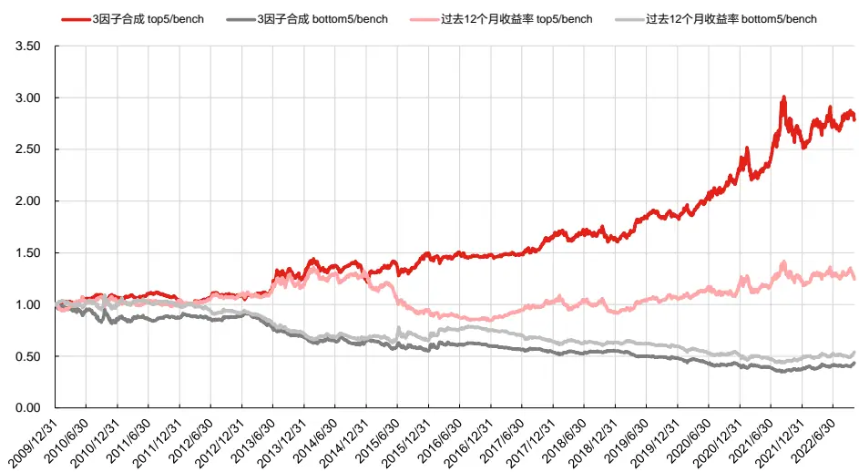

## 风险提示

量化模型失效风险；市场极端环境的冲击

报告发布日期

2022 年 12 月 01 日

王星星021-63325888*6108

wangxingxing@orientsec.com.cn

执业证书编号：S0860517100001

刘静涵021-63325888*3211

liujinghan@orientsec.com.cn

执业证书编号：S0860520080003

香港证监会牌照：BSX840

DFQ 工业类行业轮动策略：中观行业数2022-05-18
据、分析师预期、业绩超预期、资金流
向：——《量化策略研究 之 五》

基于主动买卖单的行业轮动模型：——2022-02-25《量化策略研究 之 四》

基于工业企业财务数据和分析师预期的行 2021-11-27业轮动模型：——《量化策略研究 之 三》

有关分析师的申明，见本报告最后部分。其他重要信息披露见分析师申明之后部分，或请与您的投资代表联系。并请阅读本证券研究报告最后一页的免责申明。

动量效应，指的是一种“强者恒强”的现象，过去表现好的个股和行业往往在未来一段时间内也会具有超额收益。在之前的专题报告《存在于全市场范围内的稳健动量效应》中，我们对个股动量因子的构造进行了探讨，本文我们着眼于行业层面，寻找更加有效的行业动量因子。

## 一、传统行业动量因子表现

传统的动量因子以过去一段时间的收益率作为因子值。由于在行业层面不存在短期的反转效应，所以在构造行业动量因子时，不需要剔除近期收益率。我们将28个中信一级行业指数（剔除综合和综合金融行业）在过去 1、3、6、12、24、36个月内的区间涨跌幅作为因子值，月频调仓，选择因子值排序前五和后五的行业等权构建组合。

可以看到：（1）不同于个股传统动量因子的无效性，行业动量效应的确存在，并且行业中期动量更有效。在各个计算周期中，top5行业组合的年化收益均高于bottom5组合，按照过去12个月来计算的因子多空超额收益最高。（2）行业动量效应很微弱，尤其对于多头预测能力有限。top5 多头组合年化超额收益均不到 2%，信息比率仅为 0.2。（3）组合回撤较大。多头组合的超额收益最大回撤高达 38%，在 2013-2016、2018、2021 年均出现单年超过 10%的超额回撤，2015 年单年回撤接近 30%。（4）组合分年表现不稳定。多头组合在过去 13 年中有 4 年超额收益为负，且2015年超额收益低至-40%，近两年也难以获得明显超额。5）分组单调性不佳，因子值最大的一组并不是收益最高的，因子值最小的一组也并不是收益最低的。

图 1：传统行业动量因子绩效表现（2009.12.31-2022.11.02）

| 按中信一级行业分类 行业间等权组合 |  |  |  |  |  |  |  |  |  |  |  |  |  |  |
| --- | --- | --- | --- | --- | --- | --- | --- | --- | --- | --- | --- | --- | --- | --- |
| 月频调仓 | 中信一级行业 等权 | 过去1个月收益率 |  | 过去3个月收益率 |  | 过去6个月收益率 |  | 过去12个月收益率 |  | 过去24个月收益率 |  |  |  | 过去36个月收益率 |
| 2009.12.31-2022.11.02 |  | BENCH | top5 | bottom5 | top5 | bottom5 | top5 | bottom5 | top5 | bottom5 | top5 | bottom5 | top5 | bottom5 |
| 年化绝对收益 | 4.81% | 5.75% | 1.79% | 4.15% | 1.63% | 5.96% | -0.35% | 6.61% | -0.11% | 6.82% | 1.09% | 4.49% | 1.21% |  |
| 年化绝对收益波动率 | 24.69% | 27.06% | 26.14% | 28.13% | 24.97% | 28.50% | 24.90% | 27.95% | 24.18% | 28.43% | 24.14% | 27.94% | 24.39% |  |
| 夏普比率 | 0.31 | 0.34 | 0.20 | 0.29 | 0.19 | 0.35 | 0.11 | 0.37 | 0.12 | 0.38 | 0.17 | 0.30 | 0.17 |  |
| 绝对收益最大回撤 | -58.22% | -58.08% | -55.64% | -62.00% | -58.95% | -58.02% | -64.60% | -64.60% | -60.56% | -57.60% | -56.29% | -63.41% | -59.44% |  |
| 单边换手率（年） | 0.20 | 9.08 | 9.77 | 5.44 | 6.02 | 3.99 | 4.50 | 2.68 | 3.05 | 2.43 | 2.17 | 1.94 | 1.57 |  |
| 月度胜率 | 47.74% | 52.26% | 54.84% | 50.32% | 52.26% | 52.90% | 60.00% | 53.55% | 61.29% | 54.19% | 60.00% | 47.74% | 54.84% |  |
| 年化超额收益 |  | 0.90% | -2.87% | -0.63% | -3.03% | 1.10% | -4.92% | 1.72% | -4.69% | 1.92% | -3.54% | -0.30% | -3.43% |  |
| 年化超额波动率 |  | 10.99% | 9.34% | 11.33% | 9.77% | 11.08% | 9.76% | 10.56% | 9.19% | 10.47% | 9.37% | 10.00% | 8.40% |  |
| 信息比率 |  | 0.14 | (0.27) | 0.00 | (0.27) | 0.15 | (0.47) | 0.21 | (0.48) | 0.23 | (0.34) | 0.02 | (0.37) |  |
| 超额收益最大回撤 |  | -25.28% | -41.29% | -33.75% | -49.38% | -30.26% | -58.80% | -38.01% | -60.12% | -21.84% | -47.70% | -24.21% | -42.12% |  |

数据来源：东方证券研究所 & Wind资讯

图 2：传统行业动量因子分年超额收益统计（2009.12.31-2022.11.02）

| 分年统计2010201120122013201420152016201720182019202020212022/11/2 | 中信一级行业等权 | 过去12个月收益率 top5 过去12个月收益率 bottom5 |  |  |  |  |  |
| --- | --- | --- | --- | --- | --- | --- | --- |
|  | 绝对收益 | 绝对收益 | 超额收益 | 超额最大回撤 | 绝对收益 | 超额收益 | 超额最大回撤 |
|  | 5.12% | 8.79% | 3.67% | -9.31% | 4.35% | -0.770607 | -12.44% |
|  | -28.18% | -28.29% | -0.10% | -5.95% | -28.61% | -0.43% | -7.75% |
|  | 2.83% | 10.03% | 7.20% | -4.34% | -3.57% | -6.40% | -10.08% |
|  | 13.10% | 21.59% | 8.49% | -10.70% | -12.03% | -25.13% | -24.01% |
|  | 47.84% | 61.01% | 13.17% | -11.25% | 37.58% | -10.26% | -9.02% |
|  | 49.45% | 9.28% | -40.18% | -29.34% | 45.57% | -3.88% | -16.87% |
|  | -13.16% | -22.18% | -9.02% | -10.59% | -0.35% | 12.81% | -5.31% |
|  | 1.55% | 21.94% | 20.39% | -3.84% | -12.53% | -14.08% | -15.16% |
|  | -28.36% | -34.60% | -6.24% | -15.76% | -29.68% | -1.32% | -7.84% |
|  | 28.75% | 46.53% | 17.78% | -4.55% | 21.28% | -7.47% | -10.17% |
|  | 23.33% | 41.60% | 18.28% | -8.17% | 4.68% | -18.65% | -15.44% |
|  | 12.17% | 13.06% | 0.88% | -14.76% | 6.21% | -5.96% | -14.10% |
|  | -16.36% -15.00% |  | 1.36% | -8.72% | -5.70% | 10.66% | -7.36% |

数据来源：东方证券研究所 & Wind资讯
有关分析师的申明，见本报告最后部分。其他重要信息披露见分析师申明之后部分，或请与您的投资代表联系。并请阅读本证券研究报告最后一页的免责申明。

图 3：传统行业动量因子多空超额收益净值（2009.12.31-2022.11.02）
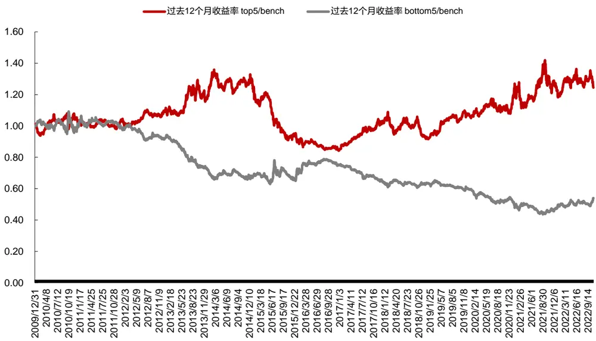
数据来源：东方证券研究所 & Wind资讯

图 4：传统行业动量因子分组表现（2009.12.31-2022.11.02）

| 过去12个月收益率 | 1(低) | 2 | 3 | 4 | 5(高) |
| --- | --- | --- | --- | --- | --- |
| 多空组合月度收益 | -0.29% | -0.51% | -0.03% | 0.49% | 0.34% |
| 多空组合月度胜率 | 40.00% | 38.71% | 54.19% | 58.71% | 54.84% |
| 多空组合夏普比 | -39.86% | -86.39% | -5.83% | 90.07% | 36.12% |
| 多空组合最大回撤 | -48.86% | -57.78% | -12.66% | -11.86% | -28.31% |
| 多空组合年化收益 | -4.02% | -6.27% | -0.29% | 5.81% | 3.64% |

数据来源：东方证券研究所 & Wind资讯

阐述动量成因的文献很多，所有解释大体分为两类基本假说：系统性风险定价和投资者行为偏差。系统性风险定价假说是指，动量效应的超额收益是承担了某些系统性风险而获得的风险溢价。投资者行为偏差假说是指，动量效应的超额收益是对投资者行为偏差导致的错误定价的利用和纠正。除此之外，我们认为行业动量的有效性还源自于不同于个股较强的特异性，行业的强势弱势有一定的持续性：（1）国家对行业的利好利空政策不会在短期内结束。例如 2021 年以来国家对新能源汽车的利好政策不断加码，新能源汽车板块都呈现了趋势性上涨。（2）供需关系短时间内不能得到有效改善。例如煤炭板块在需求严重不足的情况下，煤炭价格一路高歌猛进，进而煤炭产业链板块的公司利润大幅增长，股价也是一路攀升。（3）行业内部存在很多细分产业链，拉长了信息传导长度，行业内个股选择多，更容易出现反应不足的特征。（4）部分基金经理持仓相似度较高。2020 年疫情初起时，许多基金经理配置防御性板块的股票，2021 年有基金经理转向关注新能源板块。机构资金体量大，持仓会分批买入，因而会加剧行业板块的动量效应。

但 A股的行业动量效应并不明显，原因可能是 A股投资者中仍然是个人投资者居多，更易出现过度自信、情绪过热、反应过度、交易拥挤等非理性行为。从投资者数量来看，中证登的数据显示，2021年新增自然人投资者数量达到1958万人，较2020年提升9%，在历史上仅低于2015年。从交易占比来看，上交所统计年鉴显示在 2007 年到 2017 年期间，自然人投资者的交易占比超过 80%，专业机构投资者的交易占比不到 20%。由于上交所从 2018 年起不再公布该数据，因而我们使用 Wind 提供的资金流向数据来进一步观察。可以看到，散户的交易占比同样始终高于机构，最近一年散户交易占比不断提升，超过 70%，机构交易占比不断下降，仅为 15%左右。

图 5：A股投资者交易占比（2007-2017）
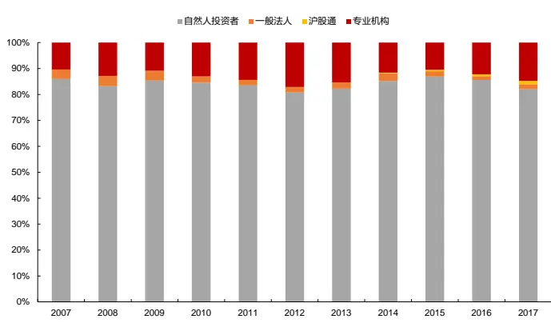
数据来源：东方证券研究所 & 上交所统计年鉴

图 6 ： A 股 散 户 和 机 构 交 易 占 比 变 化 （ 2007.01.04-2022.11.02）
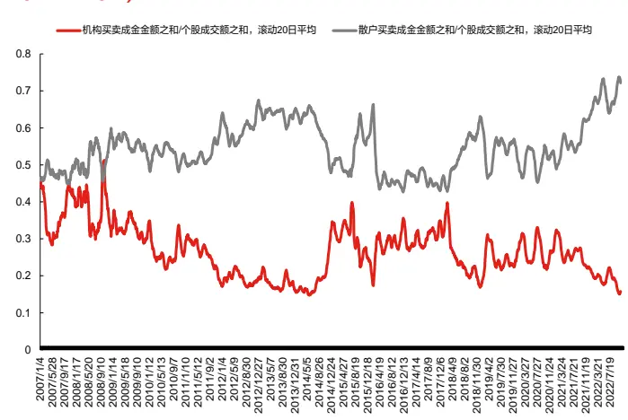
数据来源：东方证券研究所 & Wind资讯
注：根据 wind 定义，机构：单笔成交金额大于 100 万元，散户：单笔成交金额小于 4 万元

总体来看，A 股的行业动量效应存在，但需要对数据进行更加精细化的处理，传统的行业动量因子仅使用到了区间收益率，存在一定的局限性，会损失很多有效信息，为此，我们提供了 5种角度，来更好的度量行业动量效应：

（1）考虑各行业的机构持仓占比情况，对于机构持仓占比高的行业，给予行业动量指标更高的权重，对于机构持仓占比低的行业，给予行业动量指标更低的权重；

（2）考虑行业指数的日度表现，基于行业指数每日收益率的 rank 排名，剔除异常股价波动的影响，从而使得动量因子表现更稳健；

（3）考虑行业内成分股收益的离散程度，剔除个别成分股异常股价波动的影响，若行业内个股一齐上涨，则更有可能代表行业景气度提升；

（4）考虑行业指数的交易情况，对交易拥挤的行业进行惩罚；

（5）考虑行业间的相关性，利用各行业的滞后收益率来预测每个行业下月的收益率。

## 二、行业机构持仓调整动量因子

动量效应与机构持仓情况密切相关。在之前的专题报告《存在于全市场范围内的稳健动量效应》中，我们提到过动量因子在高机构持仓占比的股票中表现更好。传统个股动量因子MOM(6,3)和MOM(9,3)原始值在机构持股比最高的分组中IC在0.03以上，ICIR在0.7以上。而在机构持股比最低的分组中，所有形成期的动量因子方向均为负，动量效应变成了反转效应。原因可能是散户投资者更倾向于通过短期高抛低吸获利，对利好消息容易过度反应，因而散户参与较多的股票中更容易表现出反转效应。而机构投资者的投资行为更加理性，有利于动量效应的产生。

图 7：传统个股动量 MOM因子绩效表现（全市场，不同机构持股比分组）

| 全市场 | 原始值 | 按机构持仓比例分组 | IC | IC_IR | long_short_win | long_short_sharp | long_short_drwandown | long_short_yearly |
| --- | --- | --- | --- | --- | --- | --- | --- | --- |
|  |  | 全市场 | -0.65% | (0.17) | 52.14% | 0.01 | -43.96% | -1.44% |
|  |  | low | -3.52% | (1.01) | 61.43% | 0.73 | -29.70% | 10.63% |
|  | (6, 1) | 2 | -1.51% | (0.40) | 55.00% | 0.23 | -32.20% | 2.14% |
|  |  | 3 | -0.58% | (0.13) | 47.14% | (0.09) | -45.52% | -3.01% |
|  |  | high | 1.91% | 0.38 | 55.00% | 0.35 | -55.12% | 5.70% |
|  |  | 全市场 | 1.26% | 0.33 | 57.14% | 0.54 | -25.69% | 7.62% |
|  |  | low | -1.90% | (0.59) | 52.86% | 0.13 | -43.15% | 0.64% |
|  | (6, 3) | 2 | 0.70% | 0.19 | 53.57% | 0.25 | -24.60% | 2.93% |
|  |  | 3 | 1.65% | 0.41 | 55.71% | 0.57 | -32.57% | 8.47% |
|  |  | high | 3.57% | 0.75 | 59.29% | 0.83 | -27.05% | 16.63% |
|  |  | 全市场 | -0.93% | (0.22) | 50.71% | 0.09 | -42.48% | -0.29% |
|  |  | low | -4.37% | (1.19) | 60.71% | 0.94 | -19.04% | 14.36% |
|  | (9,1) | 2 | -1.58% | (0.37) | 51.43% | 0.33 | -38.09% | 4.43% |
|  |  | 3 | -0.73% | (0.16) | 50.00% | 0.04 | -49.07% | -1.17% |
| mom |  | high | 2.09% | 0.39 | 55.00% | 0.34 | -65.55% | 6.31% |
|  |  | 全市场 | 1.12% | 0.28 | 54.29% | 0.42 | -39.03% | 6.48% |
|  |  | low | -2.25% | (0.68) | 53.57% | 0.37 | -23.34% | 4.27% |
|  | (9, 3) | 2 | 0.10% | 0.03 | 51.43% | 0.07 | -56.79% | -0.16% |
|  |  | 3 | 1.83% | 0.42 | 61.43% | 0.44 | -44.63% | 7.15% |
|  |  | high | 3.96% | 0.80 | 62.86% | 0.88 | -35.11% | 18.92% |
|  |  | 全市场 | -0.85% | (0.20) | 51.43% | (0.00) | -45.07% | -2.08% |
|  |  | low | -4.49% | (1.22) | 61.43% | 0.90 | -20.15% | 14.18% |
|  | (12, 1) | 2 | -2.09% | (0.49) | 52.86% | 0.31 | -33.05% | 4.43% |
|  |  | 3 | -0.51% | (0.11) | 44.29% | 0.00 | -47.38% | -2.18% |
|  |  | high | 2.63% | 0.49 | 55.00% | 0.44 | -58.80% | 8.52% |
|  |  | 全市场 | -0.20% | (0.05) | 49.29% | (0.19) | -45.16% | -4.57% |
|  |  | low | -3.14% | (0.94) | 57.14% | 0.75 | -19.09% | 10.22% |
|  |  | 2 | -1.15% | (0.29) | 47.14% | 0.07 | -31.26% |  |
|  | (12, 3) | 3 | 0.28% | 0.06 | 57.86% | 0.31 | -46.17% | -0.09% 3.86% |
|  |  | high | 2.44% | 0.50 | 54.29% | 0.66 | -35.68% | 12.80% |

数据来源：东方证券研究所 & Wind资讯

| 全市场 行业市值中性化 按机构持仓比例分组 |  | IC | long_short_sharp | long_short_drwandown | long_short_yearly |
| --- | --- | --- | --- | --- | --- |
| (6, 1) | 全市场 | -0.95% | 0.09 | -35.32% | 0.23% |
|  | low | -2.10% | 0.61 | -31.29% | 6.56% |
|  | 2 | -1.84% | 0.60 | -24.21% | 6.57% |
|  | 3 | -0.63% | 0.04 | -35.28% | -0.14% |
|  | high | 1.20% | 0.32 | -46.61% | 3.92% |
| (6, 3) | 全市场 | 0.53% | 0.45 | -17.27% | 4.08% |
|  | low | -1.03% | 0.19 | -36.24% | 1.39% |
|  | 2 | -0.12% | (0.13) | -41.99% | -2.20% |
|  | 3 | 1.07% | 0.44 | -24.45% | 4.19% |
|  | high 全市场 | 1.79% | 0.78 | -25.12% | 10.83% |
| (9, 1) |  | -1.02% | 0.18 | -36.03% | 1.22% |
|  | low | -2.67% | 0.98 | -18.46% | 11.13% |
|  | 2 | -1.73% | 0.42 | -33.06% | 4.85% |
|  | 3 | -0.62% | 0.00 | -41.90% | -0.79% |
|  | high 全市场 | 1.14% | 0.39 | -45.63% | 5.31% |
| (9, 3) |  | 0.70% | 0.65 | -16.06% | 6.76% |
|  | low | -0.68% | 0.04 | -37.49% | -0.28% |
|  | 2 | -0.40% | (0.20) | -38.74% | -3.27% |
|  | 3 | 1.19% | 0.49 | -18.57% | 5.61% |
|  | high | 2.18% | 1.00 | -23.11% | 13.51% |
| (12, 1) | 全市场 | -0.90% | 0.09 | -33.54% | 0.32% |
|  | low | -2.53% | 0.69 | -18.03% | 7.39% |
|  | 2 | -2.14% | 0.61 | -26.53% | 7.95% |
|  | 3 | -0.56% | 0.10 | -31.68% | 0.21% |
|  | high | 1.19% | 0.42 | -44.85% | 5.55% |
| (12, 3) | 全市场 | -0.30% | (0.09) | -29.69% | -1.39% |
|  | low | -1.35% | 0.56 | -19.12% | 5.78% |
|  | 2 | -1.26% | 0.16 | -21.39% | 1.25% |
|  | 3 | -0.03% | (0.15) | -36.76% | -2.29% |
|  | high | 1.16% | 0.79 | -21.39% | 10.15% |

从各行业的机构持仓占比情况来看，也存在明显差别。2021年末，国防军工、银行、食品饮料、医药、电子等行业的机构持仓占比靠前，与2005年末相比，非银行金融、电子、计算机等行业的机构持仓占比有所提升，交通运输、煤炭、传媒等行业的构持仓占比有所下滑。

图 8：各行业机构持仓占比情况（2005.12.30 VS 2021.12.31）
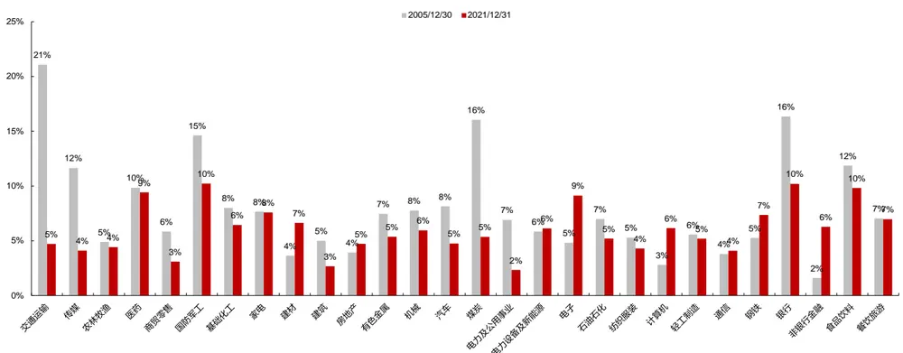
数据来源：东方证券研究所 & Wind资讯
有关分析师的申明，见本报告最后部分。其他重要信息披露见分析师申明之后部分，或请与您的投资代表联系。并请阅读本证券研究报告最后一页的免责申明。

基于此，我们可以对行业动量因子进行横截面维度的调整，对于机构持仓占比高的行业，给予行业动量指标更高的权重，对于机构持仓占比低的行业，给予行业动量指标更低的权重。具体计算方法是使用过去 12个月的行业动量*当前各行业的机构持仓占比。

可以看到：进行机构持仓调整后的行业动量因子效果均有提升，过去 12 个月夏普比例*机构持仓占比因子效果最好，多头年化超额收益为 4.82%，信息比率达到 0.5，超额收益最大回撤仅为 18%，多空年化超额收益达到 11.53%。

图 9：行业内机构持仓调整动量因子绩效表现（2009.12.31-2022.11.02）

| 按中信一级行业分类 行业间等权组合 月频调仓 2009.12.31-2022.11.02 | 中信一级行业 等权 | 过去12个月收益率 |  | 过去12个月收益率 |  | 过去12个月夏普 |  | 过去12个月夏普 *机构持仓比例 |  |
| --- | --- | --- | --- | --- | --- | --- | --- | --- | --- |
|  | BENCH | top5 | bottom5 | top5 | bottom5 | top5 | bottom5 | top5 | bottom5 |
| 年化绝对收益 | 4.81% | 6.61% | -0.11% | 8.13% | -1.94% | 8.71% | 0.13% | 9.86% | -2.22% |
| 年化绝对收益波动率 | 24.69% | 27.95% | 24.18% | 28.16% | 25.32% | 27.72% | 23.74% | 26.77% | 25.24% |
| 夏普比率 | 0.31 | 0.37 | 0.12 | 0.42 | 0.05 | 0.44 | 0.12 | 0.49 | 0.04 |
| 绝对收益最大回撤 | -58.22% | -64.60% | -60.56% | -58.28% | -68.57% | -60.09% | -61.31% | -54.33% | -67.83% |
| 单边换手率（年） | 0.20 | 2.68 | 3.05 | 2.64 | 2.93 | 2.79 | 2.84 | 2.64 | 2.92 |
| 月度胜率 | 47.74% | 53.55% | 61.29% | 52.26% | 58.71% | 54.19% | 60.00% | 56.77% | 58.06% |
| 年化超额收益 |  | 1.72% | -4.69% | 3.17% | -6.44% | 3.73% | -4.46% | 4.82% | -6.70% |
| 年化超额波动率 |  | 10.56% | 9.19% | 10.92% | 8.83% | 10.31% | 9.06% | 10.14% | 8.61% |
| 信息比率 |  | 0.21 | (0.48) | 0.34 | (0.71) | 0.41 | (0.46) | 0.52 | (0.76) |
| 超额收益最大回撤 |  | -38.01% | -60.12% | -26.33% | -66.18% | -28.84% | -56.99% | -18.20% | -68.61% |

数据来源：东方证券研究所 & Wind资讯

分年表现来看，因子年度胜率不高，不同年份表现波动比较大。多头组合在过去13年中有 5年超额收益为负，且 2016年超额收益低至-11%，近两年超额也不明显。

图 10：行业内机构持仓调整动量因子分年超额收益统计（2009.12.31-2022.11.02）

| 分年统计2010201120122013201420152016201720182019 |  |  |  |  |  |  |  |  |  |  |  |
| --- | --- | --- | --- | --- | --- | --- | --- | --- | --- | --- | --- |
|  |  |  | 中信一级行业 | 过去12个月夏普*机构持仓比例 top5 |  |  |  | 过去12个月夏普*机构持仓比例 bottom5 |  |  |  |
|  |  |  | 绝对收益 | 绝对收益 | 超额收益 超额最大回撤 |  |  | 绝对收益 超额收益 |  | 超额最大回撤 |  |
|  |  | 5.12% | 10.76% |  | 5.64% | -9.67% | -2.21% | -7.33% |  | -12.83% |  |
|  |  |  | -28.18% | -32.86% |  | 4.68% | -8.70% | -25.05% | 3.14% |  | -7.14% |
|  |  |  | 2.83% | 12.08% |  | 9.25% | -5.32% | -6.41% | -9.23% |  | -9.89% |
|  |  | 13.10% | 28.74% | 1 | 5.64% | -9.51% | -6.59% | -19.69% |  | -19.48% |  |
|  | 47.84% | 46.61% | 1 | .24% | -13.53% | 38.46% | -9.38% |  | -8.71% |  |  |
|  | 49.45% | 68.65% |  | 9.20% | -8.99% | 15.96% | -33.49% |  | -24.77% |  |  |
|  | -13.16% | -24.44% | 1 | 1.28% | -13.43% | -5.84% | 7.32% |  | -4.99% |  |  |
|  | 1.55% | 24.51% | 2 | 2.96% | -4.92% | -12.30% | -13.85% |  | -14.76% |  |  |
|  | -28.36% | -31.95% |  | 3.59% | -11.85% | -29.79% | -1.43% |  | -6.26% |  |  |
|  | 28.75% | 46.52% |  | 17.77% | -4.55% | 16.16% | -12.60% |  | -11.37% |  |  |
| 202020212022/11/2 | 23.33% | 43.73% | 2 | 0.40% | -8.14% | 5.53% | 17.80% |  | -14.57% |  |  |
|  | 12.17% | 7.59% |  | 4.58% | -14.15% | 8.18% | -4.00% |  | -12.51% |  |  |
|  | -16.36% | -13.16% |  | 3.19% | -8.68% | -5.22% | 11.14% |  | -6.22% |  |  |

数据来源：东方证券研究所 & Wind资讯

图 11：行业内机构持仓调整动量因子多空超额收益净值（2009.12.31-2022.11.02）
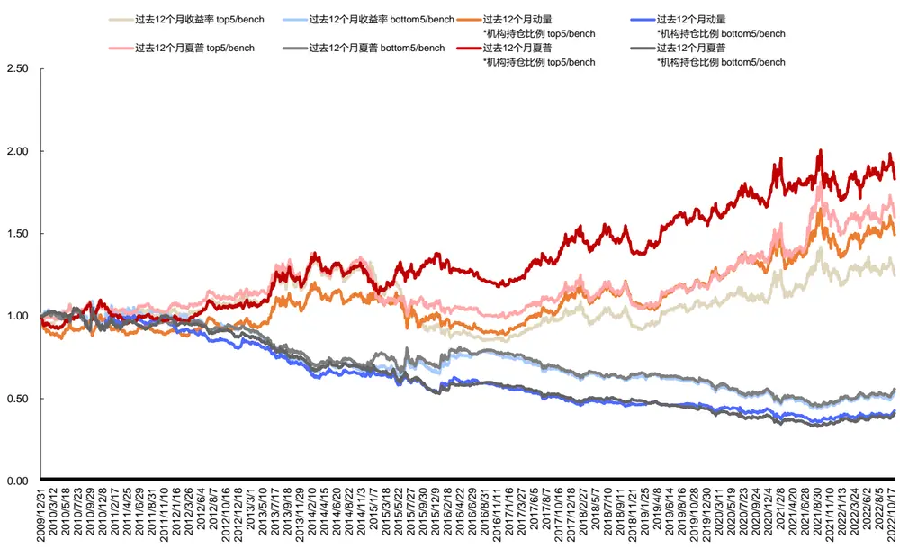
数据来源：东方证券研究所 & Wind资讯

## 三、行业 rank 动量因子

在之前的专题报告《存在于全市场范围内的稳健动量效应》中，我们提出了rank选股因子，rank 因子在全市场范围内均有效。我们将相同的思路应用到行业层面，得分的具体计算方法参考Chen, Tsung-Yu, et al. "Rank, Sign, and Momentum."，计算过程概括如下：

1. $R_{i,d}$ 代表行业指数 i在d天的日收益率， $y\big(R_{i,d}\big)$ 为横截面上 ${\boldsymbol{\mathcal{R}}}_{i,d}$ 的升序排名。

2. 计算每日每个行业指数收益率排名的标准化得分(Wright, 2000)。

$$
rank_{i,d}=(y\big(R_{i,d}\big)-\frac{N_{d}+1}{2})/\sqrt{\frac{(N_{d}+1)(N_{d}-1)}{12}}
$$

3. 计算因子考察期内（T0-N 到 T0 区间内）的行业指数收益率排名标准化得分的均值。

$$
rank_{i,d}(\mathbb{N})=\frac{1}{N}\sum_{j=t-N}^{t}(rank_{i,D_j})
$$

传统行业动量构造时所使用的数据仅为起始点和末尾点的行业指数价格数据，对于期间信息并未充分反映。由于投资者对利好消息容易过度反应，会出现短时间急速拉抬股价的情况，采用传统行业动量因子选出的过去涨幅高的行业，可能只是短期拉升的结果，不具有持续性。行业rank 动量因子在构造时，考虑到了区间内每日行业指数的收益率情况，并且采用 rank 排名来替代收益率绝对大小，可以降低异常股价波动的影响。

有关分析师的申明，见本报告最后部分。其他重要信息披露见分析师申明之后部分，或请与您的投资代表联系。并请阅读本证券研究报告最后一页的免责申明。

可以看到：在各个计算周期内，行业 rank 动量因子的多头组合表现均明显优于传统行业动量，按照过去 12 个月计算的因子效果最好，多头年化超额收益为 4.64%，信息比率达到 0.5，超额收益最大回撤仅为 17%，多空年化超额收益达到 11.22%。

图 12：行业 rank 动量因子绩效表现（2009.12.31-2022.11.02）

| 按中信一级行业分类 行业间等权组合 月频调仓 | 中信一级行业 等权 | 过去1个月rank动量 整体法 |  | 过去3个月rank动量 整体法 |  | 过去6个月rank动量 整体法 |  | 过去12个月rank动量 整体法 |  | 过去24个月rank动量 整体法 |  | 过去36个月rank动量 整体法 |  |
| --- | --- | --- | --- | --- | --- | --- | --- | --- | --- | --- | --- | --- | --- |
| 2009.12.31-2022.11.02 | BENCH | top5 | bottom5 | top5 | bottom5 | top5 | bottom5 | top5 | bottom5 | top5 | bottom5 | top5 | bottom5 |
| 年化绝对收益 | 4.81% | 6.94% | -0.03% | 9.12% | 1.29% | 8.09% | -2.04% | 9.67% | -2.09% | 7.31% | 0.19% | 4.97% | 3.34% |
| 年化绝对收益波动率 | 24.69% | 27.72% | 25.64% | 28.36% | 24.35% | 28.29% | 23.95% | 28.33% | 23.69% | 28.06% | 23.70% | 28.29% | 23.99% |
| 夏普比率 | 0.31 | 0.38 | 0.13 | 0.45 | 0.18 | 0.42 | 0.03 | 0.47 | 0.03 | 0.39 | 0.13 | 0.31 | 0.26 |
| 绝对收益最大回撤 | -58.22% | -60.35% | -54.37% | -59.59% | -55.71% | -57.74% | -65.12% | -58.69% | -57.19% | -65.34% | -53.72% | -66.38% | -47.57% |
| 单边换手率（年） | 0.20 | 9.10 | 9.66 | 5.27 | 5.14 | 3.55 | 3.48 | 2.46 | 1.87 | 1.71 | 1.24 | 1.22 | 0.98 |
| 月度胜率 | 47.74% | 52.26% | 56.13% | 55.48% | 52.90% | 50.97% | 56.13% | 56.13% | 59.35% | 54.19% | 58.06% | 49.03% | 54.19% |
|  |  |  |  |  |  |  |  |  |  |  |  |  | -1.40% |
| 年化超额收益 年化超额波动率 |  | 2.04% 9.96% | -4.61% 9.37% | 4.12% 10.33% | -3.35% 10.20% | 3.14% 9.66% | -6.53% 10.62% | 4.64% 9.28% | -6.58% 10.24% | 2.39% 8.87% | -4.40% 10.49% | 0.16% 8.88% | 10.62% |
| 信息比率 |  | 0.25 | (0.46) | 0.44 | (0.28) | 0.37 | (0.58) | 0.54 | (0.61) | 0.31 | (0.38) | 0.06 | (0.08) |
| 超额收益最大回撤 |  | -19.92% | -53.79% | -21.29% | -54.54% | -20.70% | -64.55% | -17.42% | -64.14% | -22.51% | -46.62% | -28.63% | -39.51% |

数据来源：东方证券研究所 & Wind资讯

分年表现来看，组合年度胜率较高。用过去 12个月 rank动量因子选出的 top5行业组合，除2011、2014年外，每年都能取得正超额。

图 13：行业 rank 动量因子分年超额收益统计（2009.12.31-2022.11.02）
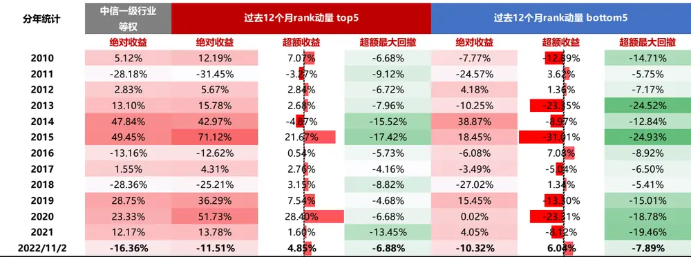
数据来源：东方证券研究所 & Wind资讯

图 14：行业 rank 动量因子多空超额收益净值（2009.12.31-2022.11.02）
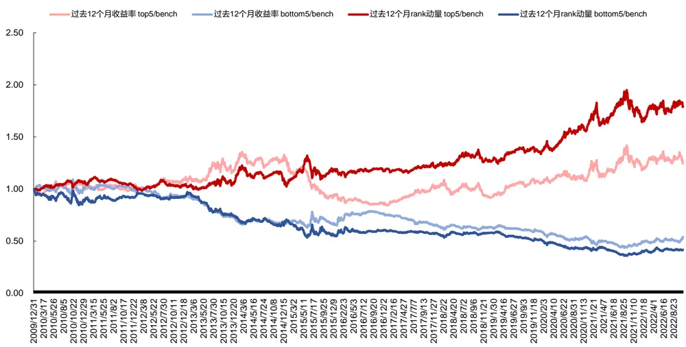
数据来源：东方证券研究所 & Wind资讯

## 四、行业成分股动量因子

行业指数在某种意义上是一个间接数据，行业数据都是经成分股加总计算之后得到的。行业内成分股的收益率往往存在分化，若行业内个股一齐上涨，收益率离散程度下降，可能意味着整体行业景气度提升，资金入场时没有进行个股筛选、市场热度较高。具体计算方法是用过去一段时间的行业内个股收益率均值/标准差。

可以看到： 在各个计算周期内，行业成分股动量因子的多头组合表现均明显优于传统行业动量，按照过去 12 个月计算的因子效果最好，多头年化超额收益为 5.53%，信息比率达到 0.6，超额收益最大回撤为 25%，多空年化超额收益达到 8.49%。

图 15：行业内成分股动量因子绩效表现（2009.12.31-2022.11.02）
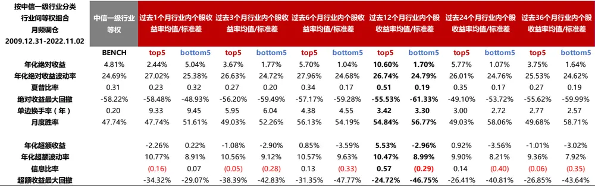
数据来源：东方证券研究所 & Wind资讯

有关分析师的申明，见本报告最后部分。其他重要信息披露见分析师申明之后部分，或请与您的投资代表联系。并请阅读本证券研究报告最后一页的免责申明。

分年表现来看，因子年度胜率不高，不同年份表现波动比较大。过去 12 个月成分股动量因子，top5 多头组合在过去 13 年中有 4 年超额收益为负，且 2015 年超额收益低至-29%。但近四年多头组合表现优异，每年超额均超过 6%。

图 16：行业内成分股动量因子分年超额收益统计（2009.12.31-2022.11.02）

| 分年统计201020112012201320142015201620172018201920202021 | 中信一级行业等权 | 过去12个月行业内个股收益率均值/标准差 top5 |  |  |  | 过去12个月行业内个股收益率均值/标准差 bottom5 |  |  |  |
| --- | --- | --- | --- | --- | --- | --- | --- | --- | --- |
|  | 绝对收益 | 绝对收益 超额收益 超额最大回撤 |  |  |  | 绝对收益 超额收益 超额最大回撤 |  |  |  |
|  | 5.12% | 5.52% | 0.40 | % | -7.56% | 1.30% | -3.82% |  | -14.67% |
|  | -28.18% | -31.36% | -3.1 | 7% | -6.12% | -25.66% | 2.52 | % | -7.33% |
|  | 2.83% | 19.31% | 16.4 | 9% | -3.72% | 4.94% | 2.12% |  | -5.86% |
|  | 13.10% | 30.03% | 16.9 | 3% | -6.41% | -9.70% | -22.8 | 0% | -25.24% |
|  | 47.84% | 70.73% | 22.8 | 9% | -8.77% | 38.52% | -9.3 | 2% | -8.97% |
|  | 49.45% | 20.67% | -28.7 | 9% | -23.92% | 53.73% | 4.28 | % | -10.89% |
|  | -13.16% | -17.58% | -4. | 42% | -6.26% | -9.84% | 3.32 | % | -8.24% |
|  | 1.55% | 12.79% | 11.2 | 4% | -8.65% | -7.71% | -9.2 | 6% | -11.07% |
|  | -28.36% | -32.18% | -3.8 | 2% | -16.73% | -22.06% | 6.30 | % | -4.31% |
|  | 28.75% | 49.96% | 21.2 | 0% | -5.86% | 20.75% | -8.0 | % | -10.30% |
|  | 23.33% | 47.12% | 23.7 | 9% | -4.83% | 13.62% | -9.7 | % | -11.83% |
|  | 12.17% | 25.77% | 13.6 | 0% | -16.89% | 1.59% | 10.5 | 8% | -15.73% |
| 2022/11/2 | -16.36% | -10.10% | 6.25 | 5% | -6.99% | -9.56% | 6.79 | % | -8.79% |

数据来源：东方证券研究所 & Wind资讯

图 17：行业内成分股动量因子多空超额收益净值（2009.12.31-2022.11.02）
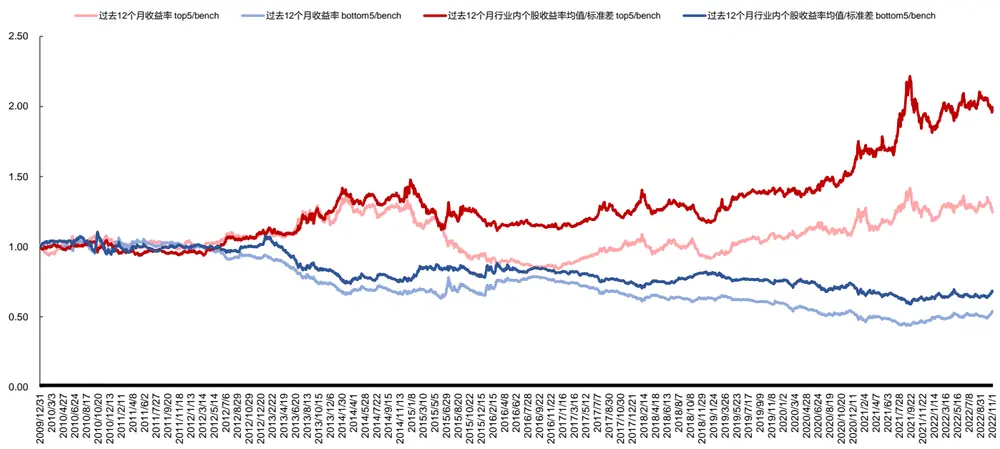
数据来源：东方证券研究所 & Wind资讯

## 五、行业换手率调整动量因子

传统的动量因子仅考虑价格维度，但其实动量效应能否持续也与交易情况密切相关，成交的活跃程度影响动量效应的持续性。可以从两个层面理解：（1）从市场情绪角度，行业在上涨后期容易出现交易拥挤，当泡沫过大、交易过热时强势行业就会出现回调。（2）从行为金融学的角度，动量效应的存在源于投资者对信息的反应不足，信息扩散得越广泛，就会有越来越多的投资者意识到利用该信息可以获得超额收益，此后动量效应就会被削弱。度量行业交易拥挤度和信息扩散程度最直观的指标就是交易换手率。成交金额包含了价格信息，不如成交量含义纯正，但成交量又会受到行业成分股扩容的影响，因此换手率指标更为准确。在上涨行情中，换手率过高则意味着交易热度过高，投资性价比不高，换手率在较低水平则代表着上涨空间较大。因此，我们在动量因子中引入行业的换手率作为惩罚。行业换手率调整动量因子的构造方式如下：首先计算行业指数日收益率与日换手率（成交量/流通股本）的比值，然后将其过去一段时期的均值除以标准差得到行业因子值。

可以看到：在各个计算周期内，top5 行业组合的年化收益均高于 bottom5 组合，说明行业换手率调整动量因子有效。按照过去12个月计算的因子效果最好，多头年化超额收益为6.55%，信息比率达到 0.7，超额收益最大回撤仅为 20%，多空年化超额收益达到 13%。分年表现来看，因子年度胜率不高，top5 多头组合在过去 13 年中有 4 年超额收益为负，且 2014 年超额收益低至-13%。

图 18：行业换手率调整动量因子绩效表现（2009.12.31-2022.11.02）
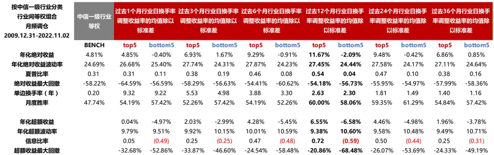
数据来源：东方证券研究所 & Wind资讯

图 19：行业换手率调整动量因子分年超额收益统计（2009.12.31-2022.11.02）

| 分年统计201020112012 | 中信一级行业等权 | 过去12个月行业日换手率调整动量的均值除以标准差top5 |  |  |  | 过去12个月行业日换手率调整动量的均值除以标准差bottom5 |  |  |  |
| --- | --- | --- | --- | --- | --- | --- | --- | --- | --- |
|  | 绝对收益 | 绝对收益 | 超额收益 |  | 超额最大回撤 | 绝对收益 超额收益 超额最大回撤 |  |  |  |
|  | 5.12% | 15.52% | 10.4 | 0% | -7.87% | -15.48% | -20.6 | 0% | -21.83% |
|  | -28.18% | -28.45% | -0.2 | 7% | -5.47% | -25.26% | 2.9 | 2% | -5.68% |
|  | 2.83% | 7.53% | 4.7 | 0% | -5.12% | 5.51% | 2.6 | 8% | -6.70% |
| 2013 | 13.10% | 40.11% | 27.0 | 1% | -5.25% | -18.65% | -311 | 5% | -29.35% |
| 2014 | 47.84% | 34.45% | -13.4 | 0% | -19.94% | 60.82% | 12.9 | 8% | -11.28% |
| 2015 | 49.45% | 79.74% | 30.2 | 9% | -10.09% | 8.56% | -40.9 | 0% | -32.36% |
| 2016201720182019 | -13.16% | -17.25% | -4.08% |  | -8.60% | -10.19% | 2.9 | 7% | -8.11% |
|  | 1.55% | 16.52% | 14.9 | 7% | -4.16% | -6.24% | -77 | 9% | -7.70% |
|  | -28.36% | -26.83% | 1.5 | 3% | -11.23% | -22.88% | 5.4 | 8% | -3.40% |
|  | 28.75% | 33.65% | 4.8 | 9% | -5.07% | 16.61% | -12 | 4% | -12.17% |
| 2020 | 23.33% | 59.98% | 36.6 | 5% | -4.94% | 2.87% | -20.4 | 6% | -18.20% |
| 2021 | 12.17% | 5.49% | -6.6 | 8% | -18.02% | 1.32% | 10.8 | 6% | -16.46% |
| 2022/11/2 | -16.36% | -13.97% | 2.3 | 9% | -8.11% | 2.03% | 18.3 | 9% | -6.81% |

数据来源：东方证券研究所 & Wind资讯
有关分析师的申明，见本报告最后部分。其他重要信息披露见分析师申明之后部分，或请与您的投资代表联系。并请阅读本证券研究报告最后一页的免责申明。

图 20：行业换手率调整动量因子多空超额收益净值（2009.12.31-2022.11.02）
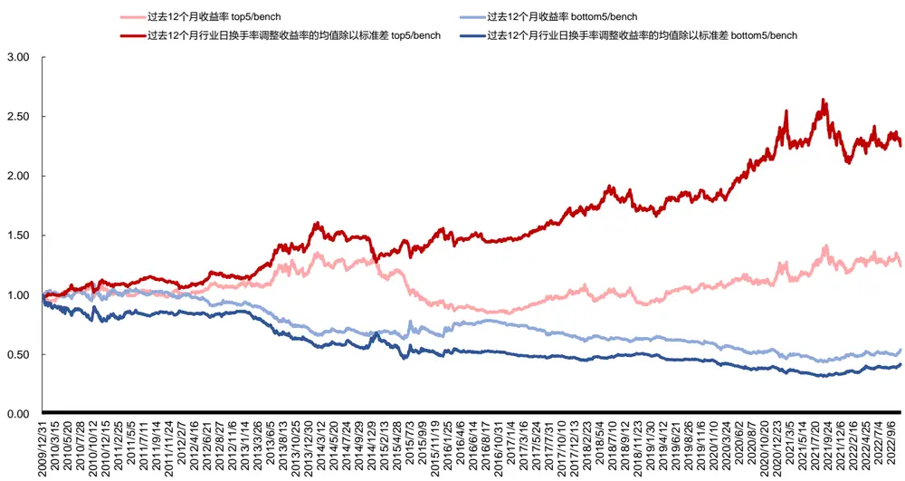
数据来源：东方证券研究所 & Wind资讯

## 六、行业间相关性动量因子

动量类因子的构建本质上是尝试从历史上的资产价格变化中，找到具有对未来收益有预测能力的部分。行业间存在着千丝万缕的经济联系，例如同周期、上下游关联、替代性等，在预测行业未来收益时，除了自身的历史收益率外，其他行业的历史收益率也是重要的影响因素。

基于此，本文引入回归模型，利用行业间的相关性来预测各行业的下期收益率，回归时自变量为所有行业的历史收益率。由于回归中自变量个数较多，传统的 OLS估计存在过拟合的风险，因而我们采用机器学习中的套索算法（Lasso）。Lasso 算法将不重要的变量系数设为 0，有助于防止过拟合，降低了数据中的噪声，更好地识别滞后行业收益中的预测信号。

具体计算方法为：每月底，对各行业建立 lasso时间序列回归模型。用 1到 t-1时刻的月度数据训练模型，代入 t 时刻最新数据即可得到各行业收益率的预测值。模型自变量为所有行业上月超额收益率，因变量为目标行业下月超额收益率。模型训练时利用 Akaike 信息判据(AIC)，筛选Lasso回归的正则化项参数alpha的最优值，而后基于最佳的lambda值建模并预测。

从Lasso回归结果来看，在预测各行业收益率时，平均会选到4.56个相关行业收益率作为预测变量，煤炭、食品饮料、电力设备及新能源行业选到的相关行业数量超过10个。但也会存在有的行业未能选到有效预测变量的情况，建材、商贸零售行业超过半数月份都未能选到有效预测变量。此时，模型预测值即为模型截距项，也就是训练集中因变量的均值。

图 21：各行业由 lasso 模型选出的目标行业平均数量（2009.12.31-2022.11.02）
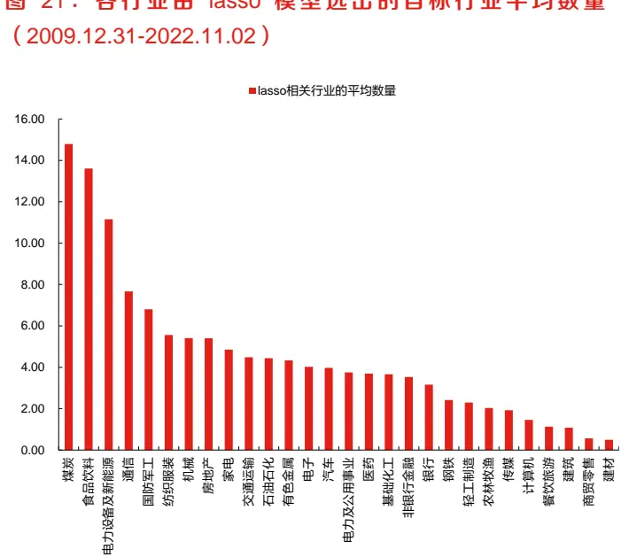
数据来源：东方证券研究所 & Wind资讯

图 22 ： 各 行 业 未 能 选 到 有 效 预 测 变 量 的 期 数 占 比（2009.12.31-2022.11.02）
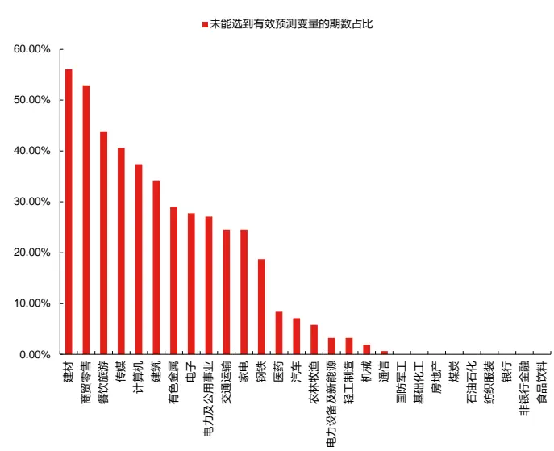
数据来源：东方证券研究所 & Wind资讯

可以看到：按照过去 1 个月的行业收益率计算出的因子效果最好，多头年化超额收益为3.54%，信息比率达到 0.5，超额收益最大回撤仅为 19%，多空年化超额收益达到 5.37%。

从分年收益来看，不同年份组合表现波动也比较大。多头组合在过去13年中有4年超额收益为负，且 2021年超额收益低至-14%，但今年模型表现突出，超额达到 12%。

图 23：行业间相关性动量因子绩效表现（2009.12.31-2022.11.02）

| 按中信一级行业分类 行业间等权组合 |  |  |  |  |  |  |  |  |  |  |  |  |  |
| --- | --- | --- | --- | --- | --- | --- | --- | --- | --- | --- | --- | --- | --- |
| 月频调仓 | 中信一级行业 等权 | lasso_过去1个月收益率 |  | lasso_过去3个月收益率 |  | lasso_过去6个月收益率 |  | lasso_过去12个月收益率 |  | lasso_过去24个月收益率 |  | lasso_过去36个月收益率 |  |
| 2009.12.31-2022.11.02 |  |  |  |  |  |  |  |  |  |  |  |  |  |
|  | BENCH | top5 | bottom5 | top5 | bottom5 | top5 | bottom5 | top5 | bottom5 | top5 | bottom5 | top5 | bottom5 |
| 年化绝对收益 | 4.81% | 8.52% | 2.89% | 2.47% | 3.42% | 4.27% | 2.66% | 4.27% | 1.66% | 5.12% | 2.68% | 4.41% | 2.63% |
| 年化绝对收益波动率 | 24.69% | 25.60% | 24.58% | 25.88% | 25.50% | 25.35% | 24.88% | 26.12% | 25.19% | 26.23% | 25.35% | 25.97% | 25.07% |
| 夏普比率 | 0.31 | 0.45 | 0.24 | 0.22 | 0.26 | 0.29 | 0.23 | 0.29 | 0.19 | 0.32 | 0.23 | 0.30 | 0.23 |
| 绝对收益最大回撤 单边换手率（年） | -58.22% 0.20 | -53.40% 7.56 | -53.74% 7.64 | -62.65% 5.27 | -57.61% 5.16 | -60.96% 4.28 | -53.35% 4.05 | -66.32% 4.54 | -56.72% 3.91 | -60.56% | -55.91% | -62.53% | -50.72% |
| 月度胜率 | 47.74% | 52.90% | 52.26% | 49.68% | 55.48% | 52.26% | 51.61% | 49.68% | 52.90% | 4.51 50.97% | 4.35 54.19% | 4.08 50.97% | 3.84 53.55% |
| 年化超额收益 |  | 3.54% | -1.83% | -2.22% | -1.32% | -0.52% | -2.05% | -0.51% | -3.00% | 0.30% | -2.03% | -0.37% | -2.07% |
| 年化超额波动率 |  | 8.18% | 7.14% | 9.35% | 7.66% | 8.88% | 7.16% | 9.76% | 7.88% | 9.11% | 7.58% | 9.40% | 8.20% |
| 信息比率 |  | 0.47 | (0.22) | (0.19) | (0.14) | (0.01) | (0.25) | (0.00) | (0.35) | 0.08 | (0.23) | 0.01 | (0.21) |
| 超额收益最大回撤 |  | -18.91% | -35.11% | -35.85% | -40.37% | -27.03% | -35.54% | -38.76% | -44.94% | -20.09% | -44.62% | -25.14% | -39.19% |

数据来源：东方证券研究所 & Wind资讯

图 24：行业间相关性动量因子分年超额收益统计（2009.12.31-2022.11.02）

| 分年统计2010201120122013201420152016201720182019202020212022/11/2 | 中信一级行业等权 | lasso 过去1个月收益率 top5 |  |  |  | lasso_过去1个月收益率 bottom5 |  |  |  |  |
| --- | --- | --- | --- | --- | --- | --- | --- | --- | --- | --- |
|  | 绝对收益 | 绝对收益 超额收益 超额最大回撤 |  |  |  | 绝对收益 超额收益 超额最大回撤 |  |  |  |  |
|  |  | 5.12% | 15.01% | 9.8 | 9% | -5.60% | 0.26% | -4.8 | 6% | -9.59% |
|  |  | -28.18% | -31.31% | -3.1 | 3% | -6.83% | -27.85% | 0.3 | 4% | -7.95% |
|  | 2.83% | 7.11% | 4.2 | 8% | -7.26% | -3.40% | -6.2 | 3% | -10.52% |  |
|  | 13.10% | 19.66% | 6.5 | 5% | -14.53% | 6.37% | -6.7 | 3% | -10.99% |  |
|  | 47.84% | 57.78% | 9.9 | 93% | -6.40% | 37.16% | -10. | .59% | -8.16% |  |
|  | 49.45% | 47.71% | -1. | 1.75% | -16.21% | 33.31% | -16. | 4% | -18.77% |  |
|  | -13.16% | -9.73% | 3.4 | 3% | -8.06% | -5.62% | 7.5 | 4% | -2.23% |  |
|  | 1.55% | 9.64% | 8.0 | 9% | -4.46% | 1.69% | 0.1 | 4% | -6.32% |  |
|  | -28.36% | -28.80% | -0.4 | 4% | -8.70% | -22.99% | 5.3 | 7% | -5.61% |  |
|  | 28.75% | 44.11% | 15.3 | 5% | -3.39% | 13.64% | -15. | 1% | -14.24% |  |
|  | 23.33% | 26.95% | 3.6 | 3% | -7.47% | 18.29% | -5.0 | 4% | -9.03% |  |
|  | 12.17% | -1.85% | -14.0 | 3% | -15.85% | 24.51% | 12.3 | 4% | -7.33% |  |
|  | -16.36% | -4.41% | 11.9 | 5% | -3.57% | -14.28% | 2.0 | 7% | -7.04% |  |

数据来源：东方证券研究所 & Wind资讯

图 25：行业间相关性动量因子多空超额收益净值（2009.12.31-2022.11.02）
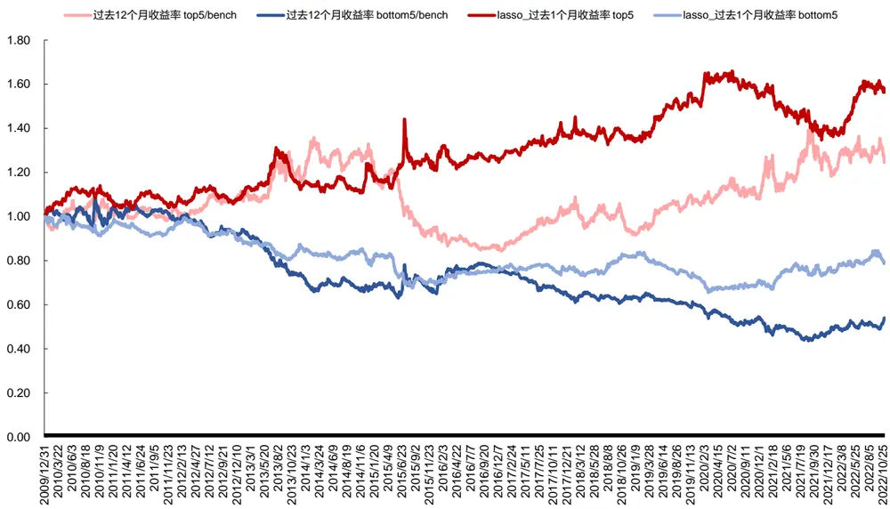
数据来源：东方证券研究所 & Wind资讯

## 七、复合行业动量因子表现

不同市场状态中行业因子的表现会有明显差异。我们根据万得全 A 指数的走势，将 2010 至今的 A 股市场划分为两次牛市、三次熊市、三次震荡市，共 7 个阶段，并对比每个阶段下行业动量因子的表现。可以看到：（1）在牛市中 rank 动量因子表现最好。top5行业组合可获得近 7倍的累计回报，中信一级行业等权组合和常见宽基指数累计收益在 3-4倍；（2）在熊市中，行业成分股动量因子表现最好。top5 行业组合累计回报为-55%，略高于中信一级行业等权组合；（3）在震荡市中换手率调整动量因子表现最好。top5行业组合累计回报为 55%，中信一级行业等权组合和常见宽基指数累计收益均为负。

图 26：复合行业动量因子分阶段表现（2009.12.31-2022.11.02）
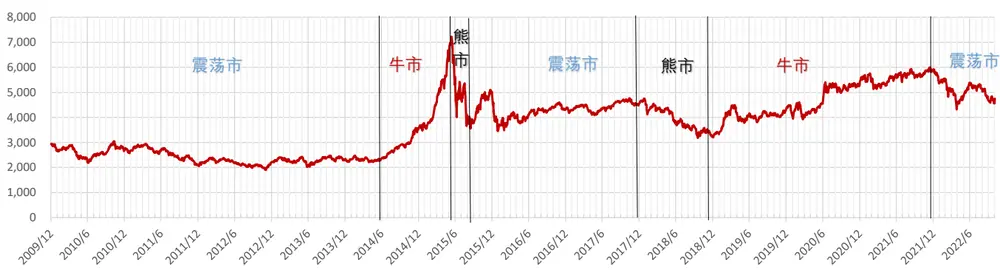

| 组合类别 组合名称中证全指沪深300宽基指数中证500中证1000基准组合 中信一级行业等权 | 牛市期 | 熊市期 | 震荡期震荡期(2010/1-2014/5) |  | 牛市期(2014/6-2015/5) | 熊市期(2015/6-2015/9) | 震荡期(2015/10-2017/11) | 熊市期(2017/12-2018/12) | 牛市期(2019/1-2021/12) | 震荡期(2022/1-2022/11) |
| --- | --- | --- | --- | --- | --- | --- | --- | --- | --- | --- |
|  | 335.86% | -55.79% | -35.84% -25.90% |  | 150.60% | -36.71% | 10.17% | -30.15% | 73.93% | -21.40% |
|  | 268.36% | -50.28% | -43.85% -39.69% |  | 124.48% | -33.83% | 25.08% | -24.85% | 64.10% | -25.56% |
|  | 359.58% | -59.11% | -28.83% | -14.63% | 160.28% | -38.56% | 2.28% | -33.45% | 76.57% | -18.50% |
|  | 406.77% | -63.27% | -20.19% | 5.85% | 180.26% | -40.68% | -7.43% | -38.07% | 80.82% | -18.55% |
|  | 409.13% | -57.10% | -16.41% | -13.94% | 185.84% | -39.89% | 16.12% | -28.63% | 78.12% | -16.36% |
| 过去12个月收益率过去12个月夏普*机构持仓比例过去12个月rank动量整体法top5过去12个月行业日换手率调整收益率的均值除以标准差过去12个月行业内个股收益率均值/标准差lasso_过去12个月收益率 | 512.40% | -67.73% | 15.00% | 9.77% | 161.06% | -50.74% | 23.25% | -34.50% | 134.58% | -15.00% |
|  | 557.86% | -58.85% | 23.45% | 12.01% | 190.34% | -40.33% | 26.91% | -31.04% | 126.58% | -13.16% |
|  | 665.59% | -60.82% | 8.92% | -1.54% | 225.38% | -48.07% | 25.01% | -24.56% | 135.29% | -11.51% |
|  | 516.74% | -56.77% | 54.53% | 29.90% | 173.43% | -41.43% | 38.28% | -26.19% | 125.56% | -13.97% |
|  | 577.92% | -55.25% | 20.00% | 16.17% | 144.33% | -33.85% | 14.91% | -32.35% | 177.46% | -10.10% |
|  | 412.96% -63.43% -8.84% |  |  | 4.39% | 205.79% | -44.67% | 8.14% -33.90% 67.75% -19.24% |  |  |  |

数据来源：东方证券研究所 & Wind资讯 & 国家统计局 & 朝阳永续

综合考虑单因子的历史表现，我们选择三个阶段中表现最好的因子：过去 12 个月 rank 动量、过去12个月行业内个股收益率均值/标准差、过去12个月行业日换手率调整收益率的均值除以标准差，等权合成，单因子进行标准化。从合成因子结果来看：

（1）绩效表现：合成因子 top5 行业组合年化收益达到 13.53%，bottom5 行业组合年化收益-1.79%。多头超额 8.32%，多头信息比率 0.88，多头超额收益最大回撤 17%。空头超额-6.29%。多空超额 14.62%。组合换手率很低，top5和 bottom5 行业组合年单边换手率不到 3 倍。组合月度胜率在 60%左右。

（2）年度表现： top5 行业组合表现相对稳定，基本每年都能取得正超额，仅 2011 年跑输2.4%，2014年跑输3.6%，2016年跑输0.6%。2017年以来每年都取得正超额，展现出稳定的收益能力。单年最大回撤均小于 15%。

（3）2022年月度表现：top5行业组合在 2022年前 10个月中超额达 6.6%，年内至今最大回撤仅为 8%。

（4）分组表现：合成因子呈现出显著的分层效果，年化超额收益、夏普比率和月度胜率都呈现出明显的单调性。

图 27：复合行业动量因子绩效表现（2009.12.31-2022.11.02）

| 按中信一级行业分类 行业间等权组合 月频调仓 2009.12.31-2022.11.02 | 中信一级行业 等权 | 3因子合成 |  |
| --- | --- | --- | --- |
|  | BENCH | top5 | bottom5 |
| 年化绝对收益 | 4.81% | 13.53% | -1.79% |
| 年化绝对收益波动率 | 24.69% | 27.96% | 24.30% |
| 夏普比率 | 0.31 | 0.59 | 0.05 |
| 绝对收益最大回撤 | -58.22% | -54.71% | -61.19% |
| 单边换手率（年） | 0.20 | 2.50 | 2.38 |
| 月度胜率 | 47.74% | 56.77% | 61.94% |
| 年化超额收益 |  | 8.32% | -6.29% |
| 年化超额波动率 |  | 9.62% | 9.47% |
|  |  | 0.88 | (0.64) |
| 信息比率 超额收益最大回撤 |  | -16.65% | -65.08% |

数据来源：东方证券研究所 & Wind资讯

图 28：复合行业动量因子分年超额收益统计（2009.12.31-2022.11.02）

| 分年统计2010 |  |  |  |  |  |  |  |  |  |  |
| --- | --- | --- | --- | --- | --- | --- | --- | --- | --- | --- |
|  |  | 中信一级行业等权 |  | 3因子合成 top5 |  |  | 3因子合成 bottom5 |  |  |  |
|  |  | 绝对收益 | 绝对收益 | 超额收益 |  | 超额最大回撤 | 绝对收益 超额收益 |  |  | 超额最大回撤 |
|  | 5.12% | 12.46% | 7.3 | 4% | -6.28% | -10.91% | -16. | 03% | -17.80% |  |
| 201120122013201420152016201720182019202020212022/11/2 | -28.18% | -30.64% | -24 | 5% | -7.98% | -26.05% | 2.1 | 3% | -6.31% |  |
|  | 2.83% | 8.64% | 5.8 | 1% | -4.21% | 5.03% | 2.2 | 0% | -7.91% |  |
|  | 13.10% | 31.12% | 18 | 02% | -8.71% | -12.52% | -25 | .62% | -26.43% |  |
|  | 47.84% | 44.27% | -3 | 57% | -14.47% | 38.96% | -88 | 9% | -11.73% |  |
|  | 49.45% | 80.32% | 30 | 87% | -10.06% | 27.48% | -211 | .97% | -16.77% |  |
|  | -13.16% | -13.78% | -0 | 62% | -5.97% | -6.05% | 7.1 | 1% | -6.50% |  |
|  | 1.55% | 13.10% | 115 | 5% | -3.22% | -8.07% | -96 | 2% | -9.95% |  |
|  | -28.36% | -28.34% | 0.0 | 2% | -8.80% | -27.36% | 1.0 | 0% | -4.75% |  |
|  | 28.75% | 44.51% | 15 | 75% | -4.49% | 13.40% | -15. | 35% | -13.88% |  |
|  | 23.33% | 54.46% | 31 | 13% | -5.40% | 4.01% | -19 | 32% | -16.04% |  |
|  | 12.17% | 25.10% | 12 | 93% | -14.76% | 2.39% | -97 | 8% | -17.14% |  |
|  | -16.36% | -9.73% | 6.6 | 3% | -8.11% | -2.34% | 140 | 1% | -7.04% |  |

数据来源：东方证券研究所 & Wind资讯

图 29：复合行业动量因子 2022 年分月超额收益统计（2021.12.31-2022.11.02）

| 分月统计2022年1月2022年2月2022年3月 |  |  |  |  |  |  |  |  |  |
| --- | --- | --- | --- | --- | --- | --- | --- | --- | --- |
|  |  | 中信一级行业等权 |  | 3因子合成 top5 |  |  | 3因子合成 bottom5 |  |  |
|  |  | 绝对收益 | 超额收益 |  | 超额最大回撤 | 绝对收益 超额收益 超额最大回撤 |  |  |  |
|  | -7.59% | -8.64% |  | 1.04% | -1.83% | -1.30% |  | 6.30% | -2.25% |
|  | 3.22% | 10.54% |  | 7.33% | -0.33% | -0.85% |  | 4.07% | -5.91% |
|  | -6.59% | -6.13% |  | 0.46% | -1.97% | -5.82% |  | 0.77% | -2.31% |
| 2022年4月2022年5月2022年6月2022年7月2022年8月2022年9月2022年10月 | -8.47% | -9.04% | H | 0.57% | -4.77% | -1.39% |  | 7.08% | -2.23% |
|  | 6.18% | 8.65% |  | 2.47% | -1.13% | 3.19% |  | 2.99% | -3.57% |
|  | 8.15% | 5.28% |  | 2.87% | -6.97% | 12.47% |  | 4.32% | -1.67% |
|  | -2.51% | -2.82% | 1 | 0.31% | -3.07% | -6.10% |  | 3.59% | -3.19% |
|  | -2.07% | 0.26% |  | 2.33% | -1.69% | -1.79% |  | 0.28% | -3.77% |
|  | -7.02% | -4.60% |  | 2.42% | -2.13% | -7.81% |  | 0.79% | -2.60% |
|  | -3.39% | -4.80% |  | 1.41% | -2.40% | 4.19% |  | 7.58% | -0.39% |

数据来源：东方证券研究所 & Wind资讯
有关分析师的申明，见本报告最后部分。其他重要信息披露见分析师申明之后部分，或请与您的投资代表联系。并请阅读本证券研究报告最后一页的免责申明。

图 30：复合行业动量因子多空超额收益净值（2009.12.31-2022.11.02）
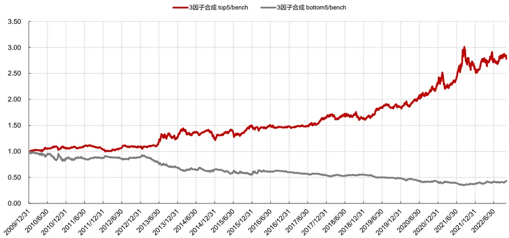
数据来源：东方证券研究所 & Wind资讯

图 31：单因子 & 复合因子多头超额收益净值对比（2009.12.31-2022.11.02）
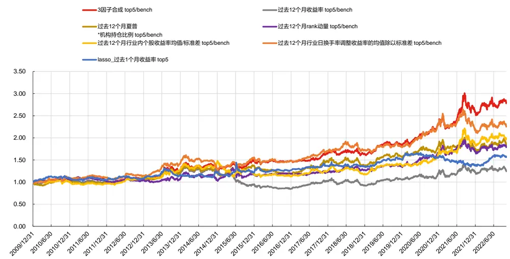
数据来源：东方证券研究所 & Wind资讯

图 32：复合行业动量因子分组表现（2009.12.31-2022.11.02）

| 分组绩效表现 | 1(低) | 2 | 3 | 4 | 5(高) |
| --- | --- | --- | --- | --- | --- |
| 多空组合月度收益 | -0.42% | -0.30% | -0.08% | 0.25% | 0.55% |
| 多空组合月度胜率 | 43.87% | 43.23% | 50.32% | 56.13% | 56.13% |
| 多空组合夏普比 | -52.27% | -53.61% | -14.90% | 43.62% | 63.60% |
| 多空组合最大回撤 | -59.89% | -40.34% | -24.50% | -11.65% | -15.43% |
| 多空组合年化收益 | -5.09% | -3.86% | -1.38% | 2.86% | 6.23% |

数据来源：东方证券研究所 & Wind资讯
有关分析师的申明，见本报告最后部分。其他重要信息披露见分析师申明之后部分，或请与您的投资代表联系。并请阅读本证券研究报告最后一页的免责申明。

（5）多头持仓情况： top5 行业组合策略曾在全部 28 个行业上发出过配置信号，在食品饮料、电子、基础化工行业上发出的多头信号最多，超过 50 次。23 个行业配置胜率超 50%。从今年前十个月 top5 行业组合的配置来看，煤炭每期出现，基础化工、石油石化、有色金属行业出现超过 5 次。10 月底持仓中交运、机械、煤炭、石油石化行业与上期保持一致，增加了通信行业，剔除了纺织服装行业。

图 33：复合行业动量因子 top5 行业组合在各行业的历史配置胜率（2009.12.31-2022.11.02）
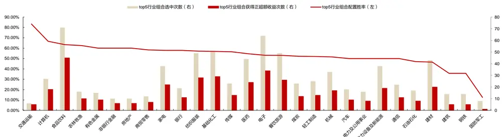
数据来源：东方证券研究所 & Wind资讯 & 国家统计局 & 朝阳永续

图 34：复合行业动量因子 top5行业组合 2022年持仓情况

| 调仓日 | 行业 | 下月行业绝对收益 | 下月行业超额收益 | 调仓日 | 行业 | 下月行业绝对收益 | 下月行业超额收益 |
| --- | --- | --- | --- | --- | --- | --- | --- |
| 2021/12/31 | 基础化工 | -11.48% | -3.89% | 2022/6/30 | 基础化工 | -2.60% | -0.09% |
| 2021/12/31 | 有色金属 | -10.11% | -2.52% | 2022/6/30 | 建筑 | -2.21% | 0.31% |
|  | 煤炭 | -4.48% | 3.12% | 2022/6/30 | 有色金属 | -1.79% | 0.72% |
| 2021/12/31 | 电力设备及新能源 | -13.18% | -5.58% | 2022/6/30 | 煤炭 | -5.00% | -2.49% |
| 2021/12/31 | 石油石化 | -3.94% | 3.65% | 2022/6/30 | 石油石化 | -2.50% |  |
| 2021/12/31 2022/1/28 | 基础化工 | 8.52% | 5.30% | 2022/7/29 | 交通运输 | 1.20% | 0.01% |
| 2022/1/28 | 有色金属 | 18.45% | 15.23% | 2022/7/29 | 基础化工 |  | 3.27% |
| 2022/1/28 | 煤炭 | 15.99% | 12.77% | 2022/7/29 | 建筑 | -4.74% | -2.67% |
| 2022/1/28 | 电力设备及新能源 | 2.95% | -0.26% | 2022/7/29 |  | -2.33% | -0.26% |
| 2022/1/28 | 钢铁 | 6.81% | 3.60% | 2022/7/29 | 煤炭 电力及公用事业 | 8.04% | 10.11% |
| 2022/2/28 | 基础化工 | -9.16% | -2.57% | 2022/8/31 |  | -0.87% | 1.20% |
| 2022/2/28 | 有色金属 | -12.52% | -5.93% | 2022/8/31 | 交通运输 农林牧渔 | -2.74% | 4.28% |
| 2022/2/28 | 煤炭 | 10.89% | 17.48% | 2022/8/31 |  | -10.44% | -3.42% |
| 2022/2/28 | 电力及公用事业 | -9.81% | -3.22% |  | 煤炭 | 1.66% | 8.68% |
| 2022/2/28 | 电力设备及新能源 | -10.02% | -3.43% | 2022/8/31 | 电力及公用事业 | -7.32% | -0.30% |
| 2022/3/31 | 基础化工 | -12.29% | -3.82% | 2022/8/31 | 石油石化 | -4.15% | 2.87% |
| 2022/3/31 | 建筑 | -2.06% | 6.41% | 2022/9/30 | 交通运输 | -2.90% | 0.49% |
| 2022/3/31 | 有色金属 | -11.98% | -3.51% | 2022/9/30 | 机械 | 4.30% | 7.69% |
| 2022/3/31 | 煤炭 | -3.90% | 4.58% | 2022/9/30 | 煤炭 | -12.58% | -9.20% |
| 2022/3/31 | 电力设备及新能源 | -14.97% | -6.50% | 2022/9/30 2022/9/30 | 石油石化 | -8.37% | -4.99% |
| 2022/4/29 | 基础化工 | 10.97% | 4.79% | 2022/10/31 | 纺织服装 | -4.45% | -1.06% |
| 2022/4/29 | 建筑 | 1.05% | -5.13% | 2022/10/31 | 交通运输 | 4.94% | 0.78% |
| 2022/4/29 | 有色金属 | 8.01% | 1.83% | 2022/10/31 | 机械 | 4.44% | 0.28% |
| 2022/4/29 | 煤炭 | 10.22% | 4.04% | 2022/10/31 | 煤炭 | 2.24% | -1.92% |
| 2022/4/29 | 石油石化 | 13.01% | 6.84% | 2022/10/31 | 石油石化 | 3.13% | -1.02% |
| 2022/5/31 | 基础化工 | 11.30% | 3.16% |  | 通信 | 2.35% | -1.81% |
| 2022/5/31 | 建筑 | 0.87% | -7.28% |  |  |  |  |
| 2022/5/31 | 有色金属 | 12.02% | 3.87% |  |  |  |  |
| 2022/5/31 | 煤炭 | 2.77% | -5.38% |  |  |  |  |
| 2022/5/31 | 石油石化 | -0.56% | -8.70% |  |  |  |  |

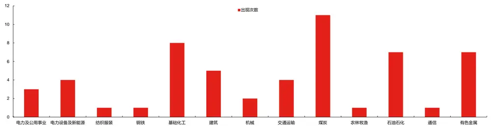
数据来源：东方证券研究所 & Wind资讯 & 国家统计局 & 朝阳永续
有关分析师的申明，见本报告最后部分。其他重要信息披露见分析师申明之后部分，或请与您的投资代表联系。并请阅读本证券研究报告最后一页的免责申明。

（6）空头持仓情况：bottom5 行业组合策略曾在全部 28 个行业上发出过配置信号，在非银行金融、钢铁、煤炭、传媒、建筑、银行、有色金属行业上发出的多头信号最多，超过50次。基础化工、轻工制造行业仅选中一次。23个行业配置胜率超50%。从今年前十个月bottom5行业组合的配置来看，非银行金融每期出现，家电、餐饮旅游、银行、电子行业出现超过 5 次。10 月底持仓中电子、非银行金融行业与上期保持一致，增加了建材、银行、食品饮料行业，剔除了医药、计算机、钢铁行业。

图 35：复合行业动量因子 bottom5 行业组合在各行业的历史配置胜率（2009.12.31-2022.11.02）
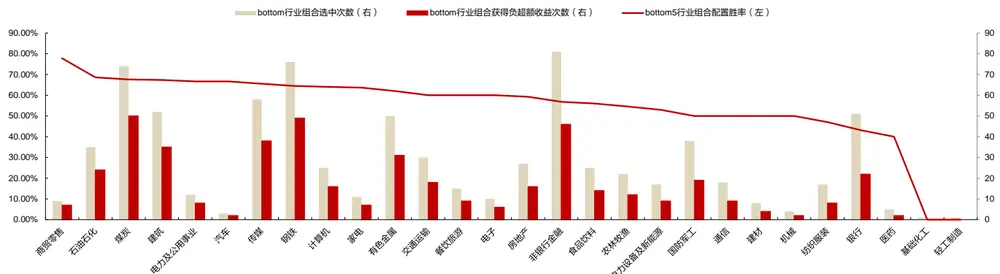
数据来源：东方证券研究所 & Wind资讯 & 国家统计局 & 朝阳永续

图 36：复合行业动量因子 bottom5行业组合 2022年持仓情况

| 调仓日 | 行业 | 下月行业绝对收益 | 下月行业超额收益 | 调仓日 | 行业 | 下月行业绝对收益 | 下月行业超额收益 |
| --- | --- | --- | --- | --- | --- | --- | --- |
| 2021/12/31 | 农林牧渔 | -2.13% | 5.46% | 2022/6/30 | 医药 | -7.23% | -4.72% |
| 2021/12/31 | 房地产 | -0.30% | 7.29% | 2022/6/30 | 家电 | -2.85% | -0.34% |
| 2021/12/31 | 银行 | 2.34% | 9.94% | 2022/6/30 | 电子 | -3.99% | -1.48% |
| 2021/12/31 | 非银行金融 | -5.25% | 2.35% | 2022/6/30 | 非银行金融 | -6.94% | -4.43% |
| 2021/12/31 | 餐饮旅游 | -1.14% | 6.45% | 2022/6/30 | 食品饮料 | -9.48% | -6.97% |
| 2022/1/28 | 农林牧渔 | 0.60% | -2.62% | 2022/7/29 | 医药 | -2.65% | -0.58% |
| 2022/1/28 | 家电 | -5.16% | -8.38% | 2022/7/29 | 家电 | -3.32% | -1.25% |
| 2022/1/28 | 银行 | 1.01% | -2.20% | 2022/7/29 | 电子 | -1.68% | 0.39% |
| 2022/1/28 | 非银行金融 | -1.51% | -4.73% | 2022/7/29 | 计算机 | -4.63% |  |
| 2022/1/28 | 餐饮旅游 | 0.80% | -2.42% | 2022/7/29 | 非银行金融 |  | -2.56% |
| 2022/2/28 | 农林牧渔 | 3.21% | 9.80% | 2022/8/31 | 国防军工 | 3.34% | 5.41% |
| 2022/2/28 | 家电 | -11.83% | -5.24% | 2022/8/31 | 家电 | -4.38% | 2.64% |
| 2022/2/28 | 银行 | -1.56% | 5.03% | 2022/8/31 | 电子 | -5.68% | 1.34% |
| 2022/2/28 | 非银行金融 | -5.81% | 0.78% | 2022/8/31 | 钢铁 | -12.55% | -5.53% |
| 2022/2/28 | 餐饮旅游 | -13.13% | -6.54% | 2022/8/31 | 非银行金融 | -8.14% | -1.12% |
| 2022/3/31 | 家电 | -0.39% | 8.08% | 2022/9/30 | 医药 | -8.32% | -1.30% |
| 2022/3/31 | 银行 | -3.51% | 4.96% | 2022/9/30 | 电子 | 6.49% | 9.88% |
| 2022/3/31 | 非银行金融 | -9.33% | -0.86% | 2022/9/30 |  | 3.34% | 6.73% |
| 2022/3/31 | 食品饮料 | 4.40% | 12.87% | 2022/9/30 | 计算机 | 16.94% | 20.33% |
| 2022/3/31 | 餐饮旅游 | 1.90% | 10.37% | 2022/9/30 | 钢铁 | -2.21% | 1.18% |
| 2022/4/29 | 农林牧渔 | 5.68% | -0.50% | 2022/10/31 | 非银行金融 | -3.60% | -0.21% |
|  | 家电 | 0.90% | -5.27% |  | 建材 | 5.35% | 1.20% |
| 2022/4/29 | 轻工制造 | 8.35% |  | 2022/10/31 | 电子 | 3.28% | -0.88% |
| 2022/4/29 | 非银行金融 | 0.27% | 2.18% | 2022/10/31 | 银行 | 1.64% | -2.52% |
| 2022/4/29 | 餐饮旅游 | 0.74% | -5.91% -5.43% | 2022/10/31 | 非银行金融 | 3.43% | -0.73% |
| 2022/4/29 | 家电 | 12.09% | 3.95% | 2022/10/31 | 食品饮料 | 8.92% | 4.76% |
| 2022/5/31 | 银行 | 4.41% | -3.74% |  |  |  |  |
| 2022/5/31 | 非银行金融 |  |  |  |  |  |  |
| 2022/5/31 |  | 9.85% | 1.71% |  |  |  |  |
| 2022/5/31 2022/5/31 | 食品饮料 | 13.96% | 5.81% |  |  |  |  |

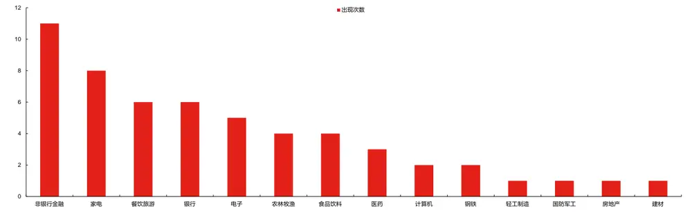
数据来源：东方证券研究所 & Wind资讯 & 国家统计局 & 朝阳永续
有关分析师的申明，见本报告最后部分。其他重要信息披露见分析师申明之后部分，或请与您的投资代表联系。并请阅读本证券研究报告最后一页的免责申明。

（7）不同市场阶段表现：可以看到，复合行业动量策略在牛市和震荡市中表现突出。2010年以来 A股震荡市为期近 6年（2010-2014上半年、2015年末-2017年），接近一半时间。在这期间，中信一级行业等权组合和常见宽基指数累计收益均为负，而复合行业轮动因子 top5 行业组合可获得最高近 50%的累计回报，bottom5 行业组合累计收益为-40%，多空头超额均十分可观。2010年以来A股牛市为期近4年。在这期间，中信一级行业等权组合和常见宽基指数累计收益在3-4倍，而复合行业轮动因子 top5行业组合累计取得了超过7倍的收益。

图 37：复合行业动量因子分阶段表现（2009.12.31-2022.11.02）
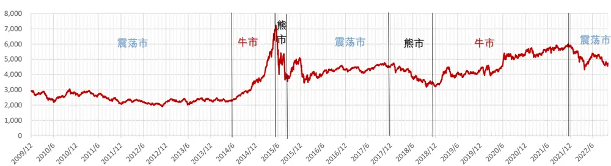

| 组合类别 组合名称中证全指 |  | 牛市期 | 熊市期 | 震荡期 | 震荡期(2010/1-2014/5) | 牛市期(2014/6-2015/5) | 熊市期(2015/6-2015/9) | 震荡期(2015/10-2017/11) | 熊市期(2017/12-2018/12) | 牛市期(2019/1-2021/12) | 震荡期(2022/1-2022/11) |  |  |
| --- | --- | --- | --- | --- | --- | --- | --- | --- | --- | --- | --- | --- | --- |
|  |  | 335.86% | -55.79% | -35.84% | -25.90% | 150.60% | -36.71% | 10.17% | -30.15% | 73.93% | -21.40% |  |  |
| 沪深300宽基指数中证500 |  | 268.36% | -50.28% | -43.85% | -39.69% | 124.48% | -33.83% | 25.08% | -24.85% | 64.10% | -25.56% |  |  |
|  |  | 359.58% | -59.11% | -28.83% | -14.63% | 160.28% | -38.56% | 2.28% | -33.45% | 76.57% | -18.50% |  |  |
|  |  | 中信一级行业等权 |  | 406.77% | -63.27% | -20.19% | 5.85% | 180.26% | -40.68% | -7.43% | -38.07% | 80.82% | -18.55% |
| 基准组合 | 409.13% |  |  | -57.10% | -16.41% | -13.94% | 185.84% | -39.89% | 16.12% | -28.63% | 78.12% | -16.36% |  |
| top5bottom5 合成指标（3个单因子） |  | 合成指标（3个单因子） | 727.12% | -58.12% | 46.99% | 16.59% | 196.20% | -42.06% | 39.65% | -27.71% | 179.24% |  |  |
|  |  | 201.64% | -56.01% | -40.21% | -43.62% | 149.78% | -38.78% | 8.60% | -28.15% | 20.76% | -2.34% |  |  |

数据来源：东方证券研究所 & Wind资讯 & 国家统计局 & 朝阳永续

## 风险提示

1. 量化模型基于历史数据分析，未来存在失效风险，建议投资者紧密跟踪模型表现。

2. 极端市场环境可能对模型效果造成剧烈冲击，导致收益亏损。

## Tabl e_Disclai mer 分析师申明

每位负责撰写本研究报告全部或部分内容的研究分析师在此作以下声明：

分析师在本报告中对所提及的证券或发行人发表的任何建议和观点均准确地反映了其个人对该证券或发行人的看法和判断；分析师薪酬的任何组成部分无论是在过去、现在及将来，均与其在本研究报告中所表述的具体建议或观点无任何直接或间接的关系。

## 投资评级和相关定义

报告发布日后的 12个月内的公司的涨跌幅相对同期的上证指数/深证成指的涨跌幅为基准；

## 公司投资评级的量化标准

买入：相对强于市场基准指数收益率 15%以上；

增持：相对强于市场基准指数收益率 5%～15%；

中性：相对于市场基准指数收益率在-5%～+5%之间波动；

减持：相对弱于市场基准指数收益率在-5%以下。

未评级 —— 由于在报告发出之时该股票不在本公司研究覆盖范围内，分析师基于当时对该股票的研究状况，未给予投资评级相关信息。

暂停评级 —— 根据监管制度及本公司相关规定，研究报告发布之时该投资对象可能与本公司存在潜在的利益冲突情形；亦或是研究报告发布当时该股票的价值和价格分析存在重大不确定性，缺乏足够的研究依据支持分析师给出明确投资评级；分析师在上述情况下暂停对该股票给予投资评级等信息，投资者需要注意在此报告发布之前曾给予该股票的投资评级、盈利预测及目标价格等信息不再有效。

## 行业投资评级的量化标准：

看好：相对强于市场基准指数收益率 5%以上；

中性：相对于市场基准指数收益率在-5%～+5%之间波动；

看淡：相对于市场基准指数收益率在-5%以下。

未评级：由于在报告发出之时该行业不在本公司研究覆盖范围内，分析师基于当时对该行业的研究状况，未给予投资评级等相关信息。

暂停评级：由于研究报告发布当时该行业的投资价值分析存在重大不确定性，缺乏足够的研究依据支持分析师给出明确行业投资评级；分析师在上述情况下暂停对该行业给予投资评级信息，投资者需要注意在此报告发布之前曾给予该行业的投资评级信息不再有效。

## HeadertTabl e_Discl ai mer 免责声明

本证券研究报告（以下简称“本报告”）由东方证券股份有限公司（以下简称“本公司”）制作及发布。

。本公司不会因接收人收到本报告而视其为本公司的当然客户。本报告的全体接收人应当采取必要措施防止本报告被转发给他人。

本报告是基于本公司认为可靠的且目前已公开的信息撰写，本公司力求但不保证该信息的准确性和完整性，客户也不应该认为该信息是准确和完整的。同时，本公司不保证文中观点或陈述不会发生任何变更，在不同时期，本公司可发出与本报告所载资料、意见及推测不一致的证券研究报告。本公司会适时更新我们的研究，但可能会因某些规定而无法做到。除了一些定期出版的证券研究报告之外，绝大多数证券研究报告是在分析师认为适当的时候不定期地发布。

在任何情况下，本报告中的信息或所表述的意见并不构成对任何人的投资建议，也没有考虑到个别客户特殊的投资目标、财务状况或需求。客户应考虑本报告中的任何意见或建议是否符合其特定状况，若有必要应寻求专家意见。本报告所载的资料、工具、意见及推测只提供给客户作参考之用，并非作为或被视为出售或购买证券或其他投资标的的邀请或向人作出邀请。

本报告中提及的投资价格和价值以及这些投资带来的收入可能会波动。过去的表现并不代表未来的表现，未来的回报也无法保证，投资者可能会损失本金。外汇汇率波动有可能对某些投资的价值或价格或来自这一投资的收入产生不良影响。那些涉及期货、期权及其它衍生工具的交易，因其包括重大的市场风险，因此并不适合所有投资者。

在任何情况下，本公司不对任何人因使用本报告中的任何内容所引致的任何损失负任何责任，投资者自主作出投资决策并自行承担投资风险，任何形式的分享证券投资收益或者分担证券投资损失的书面或口头承诺均为无效。

本报告主要以电子版形式分发，间或也会辅以印刷品形式分发，所有报告版权均归本公司所有。未经本公司事先书面协议授权，任何机构或个人不得以任何形式复制、转发或公开传播本报告的全部或部分内容。不得将报告内容作为诉讼、仲裁、传媒所引用之证明或依据，不得用于营利或用于未经允许的其它用途。

经本公司事先书面协议授权刊载或转发的，被授权机构承担相关刊载或者转发责任。不得对本报告进行任何有悖原意的引用、删节和修改。

提示客户及公众投资者慎重使用未经授权刊载或者转发的本公司证券研究报告，慎重使用公众媒体刊载的证券研究报告。

## 东方证券研究所

地址： 上海市中山南路 318 号东方国际金融广场 26 楼

电话：021-63325888

传真：021-63326786

网址： www.dfzq.com.cn