# 周频多因子行业轮动模型

## 量化策略研究之 七

## 研究结论

衰减的选股 Alpha与稳定的行业 Beta

近年来，随着越来越多的机构大量挖掘alpha选股因子，传统的选股因子尤其是以成长因子为代表的一类因子越来越拥挤，纷纷产生了短期失效的情况。以选股为主要超额收益来源的公募指数增强产品近年的超额收益中位数逐年下行，获取选股alpha的难度越来越大。

虽然选股alpha在持续衰减，但是行业间分化的收益一直持续较大，因此获取行业轮动的 beta 分化收益的性价比日益凸显。近两年行业轮动的速度加快、月度动量消失，因此我们希望构建一个周频调仓的多因子行业轮动模型。

## 微观与中观行业轮动因子

在微观行业轮动因子维度，我们发现市值、估值、长期价量等因子对行业轮动来说都是典型的风险因子，借鉴选股因子的市值行业中性化的思路，我们对每个因子先在股票层面进行风格中性再合成行业轮动因子。我们从基本面、预期变化、量价等维度构造微观行业轮动因子，经过风格中性化后大部分因子行业轮动的多空收益和多头超额都有明显提升。基于我们前期在深度学习选股因子方面的积累，我们发现深度学习因子合成行业因子后同样具有非常突出的行业轮动能力。

⚫ 在中观行业轮动因子维度，我们构造短期预期变化以及多维度的行业动量因子，经检验都具有较为稳健的行业轮动能力。

## 周频行业轮动模型

我们将行业轮动因子合成基本面、预期变化、传统量价、深度学习四大类，并以1:1:4:4 复合得到行业轮动模型，并考虑到因子的短期失效，我们引入基于胜率的因子择时构建动态自适应的行业轮动模型，考虑交易费用和调仓时间后构建周频调仓的 Top5 等权组合，组合自 2016 年以来年化收益 19.7%，相比于行业等权基准年化超额 20.71%，每年都能稳定跑赢基准指数。

## 风险提示

1. 量化模型失效风险。

2. 极端市场环境可能对模型效果造成剧烈冲击，导致收益亏损。

## 报告发布日期

2024 年 01 月 21 日

杨怡玲 yangyiling@orientsec.com.cn

执业证书编号：S0860523040002

基于残差网络的端到端因子挖掘模型：— 2023-08-24—因子选股系列之九十六

UMR2.0——风险溢价视角下的动量反转2023-07-13
统一框架再升级：——因子选股系列之九
十四

基于时点动量的因子轮动：——因子选股 2023-06-28系列之九十二

基于循环神经网络的多频率因子挖掘：— 2023-06-06—因子选股系列之九十一

行业动量的刻画：——《量化策略研究 之 2022-12-01六》

DFQ 工业类行业轮动策略：中观行业数2022-05-18
据、分析师预期、业绩超预期、资金流
向：——《量化策略研究 之 五》

基于主动买卖单的行业轮动模型：——2022-02-25《量化策略研究 之 四》

## 一、研究动机

## 1.1 衰减的选股 Alpha 与稳定的行业 Beta

近年来，随着越来越多的机构大量挖掘 alpha 选股因子，传统的选股因子尤其是以成长因子为代表的一类因子越来越拥挤，纷纷产生了短期失效的情况，获取稳定的选股 alpha 的难度越来越大。

下面左图中，我们统计了每年上市满3个月的公募沪深300、中证500、中证1000指数增强产品的各年（未剔除打新收益）超额收益的中位数情况。可以看到 2023 年沪深 300 和中证 500 指数增强产品超额中位数均不到 2%，中证 1000 指数增强产品超额中位数 5%左右，并且超额收益呈现出逐步下行的趋势。由此可见传统以选股 alpha 为主要超额收益来源的产品面临了日益严峻的竞争环境，选股 alpha获取难度越来越高。

图 1：公募指数增强产品各年超额收益中位数
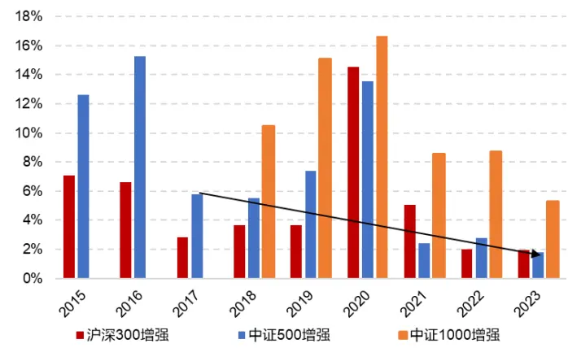
数据来源：Wind，东方证券研究所

图 2：中信一级行业各年多空收益
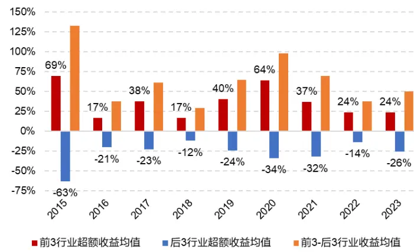
数据来源：Wind，东方证券研究所

上面右图中展示了 30 个中信一级行业每年表现最好和最差的 Top3 个行业的平均收益以及多空收益。可以看到 2023 年行业间多空收益仍然有 50%，多空收益最低的年份也有 30%的收益差，行业 beta间的收益分化空间较大。

如果能够通过行业轮动获取行业 beta 间的分化收益，能够为产品带来稳定的收益增量。因此我们觉得在面临当前日益衰减的选股 alpha 的情况下，获取行业轮动的 beta 分化收益的性价比日益凸显。

## 1.2 行业 Beta 的轮动速度

我们在研究过程中经常有一个体会是“个股偏反转、行业偏动量”，要想通过行业轮动获取收益，底层依赖于行业动量的延续性。下面左图展示了30个中信一级行业的月度收益的自相关系数以及6个月的滚动均值。可以看到自 2021年9月以来行业间的月度自相关系数大部分时间为负，更多体现为月度的“反转”而非“动量”，市场行业轮动的速度非常快，通过月频的行业动量很难获取超额收益。

图 3：行业收益的月度自相关性
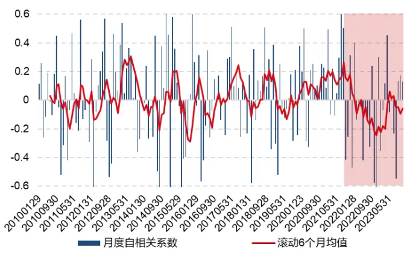
数据来源：Wind，东方证券研究所

图 4：行业收益的周度自相关性
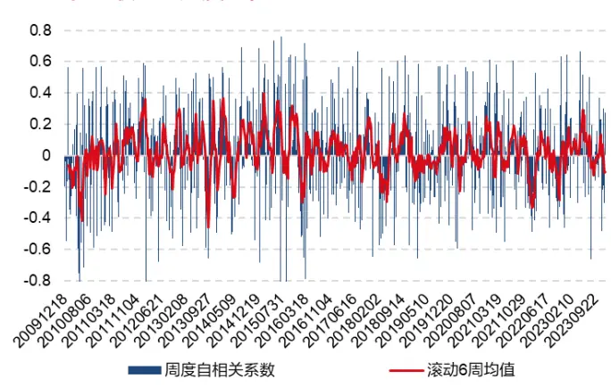
数据来源：Wind，东方证券研究所

上面右图展示了行业周度收益的自相关系数及滚动 6 周均值。可以看到虽然近两年行业的月度动量消失了，但是周度自相关系数并没有明显持续为负的情况。因此我们想要构造一个周频的行业轮动模型来捕捉市场快速的行业切换以获取稳定的超额收益。

## 1.3 周频多因子行业轮动模型

在我们之前的报告《基于时点动量的因子轮动》（20230628）中，我们提出了事件驱动型的基于时点动量的行业轮动模型，模型表现突出但并不是一个定期调仓的模型。如下图所示，在本报告中，我们从微观和中观两个角度分别寻找基本面、预期、量价三个维度具有行业轮动能力的因子，以此构建一个周频定期调仓的多因子行业轮动模型。

图 5：行业轮动模型体系
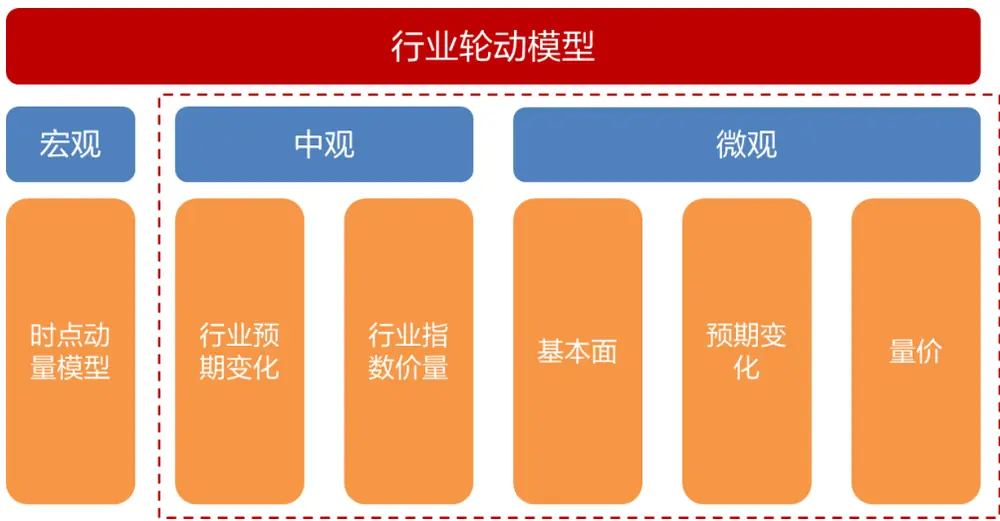
数据来源：东方证券研究所

## 二、微观行业轮动因子

本节我们首先介绍微观行业轮动因子的构建方式，然后分别从基本面、预期变化、量价、深度学习四个维度介绍有效的微观行业轮动因子，所有数据的回测时间都为 2010-2023年。

## 2.1 微观行业轮动因子的风险中性化

下图展示了微观行业轮动因子的标准构建方式，首先计算个股的因子取值，截面标准化后以各行业的成分股权重（一般为自由流通市值）加权得到行业的因子取值。

图 6：微观行业轮动因子构建方式
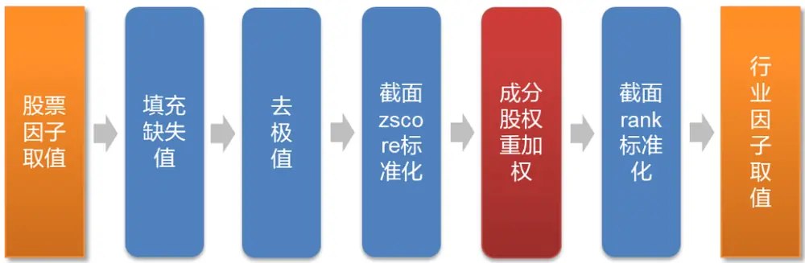
数据来源：东方证券研究所

这种构造方式非常简单，但是忽略了风格对于行业轮动因子的影响。我们在构建 alpha 选股因子时，往往都会对因子进行行业市值中性化或者行业及 Barra 风格的中性化操作，以剔除行业和风格对选股因子的影响。同样的，在构建行业轮动因子时，行业轮动因子是否也会受到风格的影响？

下面左图展示了 2010 年以来市值因子在全市场股票中分十组后的多空净值。可以看到，2016 年之前小市值表现强势，2017-2020年市值因子多空收益处于震荡状态，而2021年以来小市值又表现突出，市值因子在股票上的多空收益呈现出明显的风格特征。下面右图是总市值对数因子以上图中的方式合成中信一级行业因子后分 5 组后的多空净值表现情况。可以看到在行业上市值因子也呈现出周期性，2013-2016 年多头行业（小市值股票为主的行业）明显强势，而 2017-2020 年空头行业（大市值股票为主的行业）更强势，2021 年之后又是多头行业强势。可见市值因子不仅在股票上呈现出风格的特征，在行业上也呈现出明显的风格特征。

图 7：市值因子在股票上的多空净值
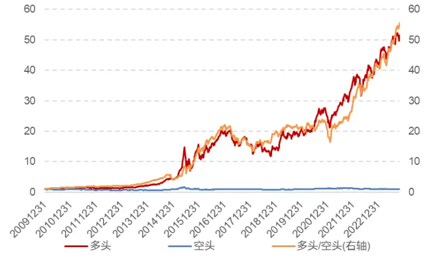
数据来源：Wind，东方证券研究所

图 8：市值因子在行业上的多空净值
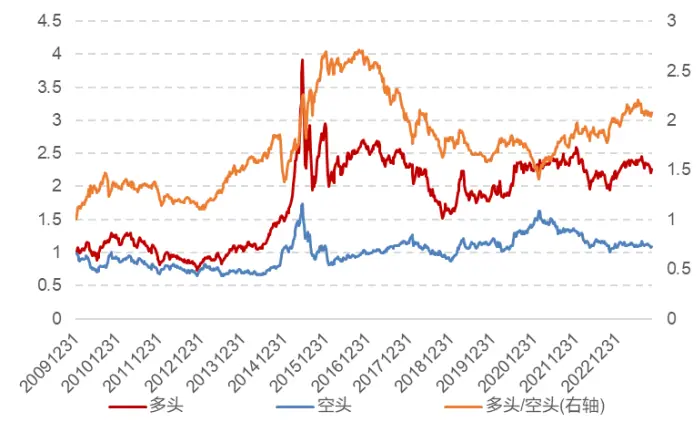
数据来源：Wind，东方证券研究所

有关分析师的申明，见本报告最后部分。其他重要信息披露见分析师申明之后部分，或请与您的投资代表联系。并请阅读本证券研究报告最后一页的免责申明。

下面左图中展示了市值因子在股票和行业中的多空净值对比情况，可以看到两者基本是同步的状态。2014 年 12 月市值因子在股票上大幅回撤，同期也在行业上同步回撤，2016-2020 年市值因子的失效和拐点在股票和行业上都是同步的，说明市值风格会同时影响股票和行业的收益。下面右图展示了市值因子在股票和行业中的周度 Rank IC 的累计值，也可以明显观察到同步的状态。在构造选股因子时由于因子收益会受到市值等风格的影响，需要做市值中性化处理，那同理在构造行业轮动因子时也需要进行市值中性化处理，提纯因子的行业轮动能力。

图 9：市值因子在股票和行业上的多空净值
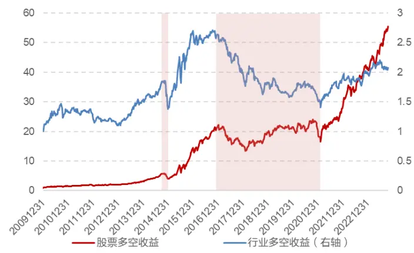
数据来源：Wind，东方证券研究所

图 10：市值因子在股票和行业上的累计周频 IC
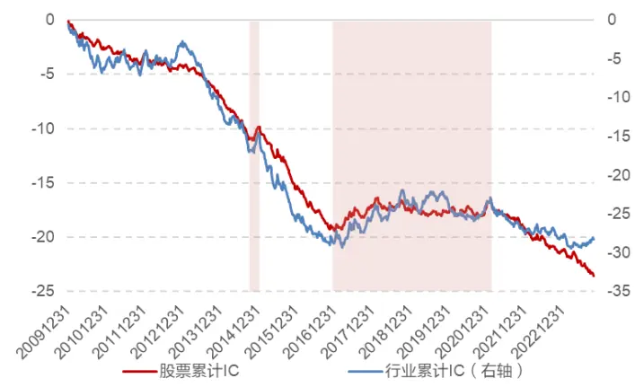
数据来源：Wind，东方证券研究所

当然不仅仅是市值风格，其他的一些风格在行业上也会呈现出明显的风格特征。下图展示了 8 个Barra 中常见的风格因子，包括市值、BP、EPTTM、SPTTM、股息率、一年 Beta、一年波动率、一年换手率等因子合成行业因子后分五组的多空收益情况。

图 11：各风格因子在行业上的多空净值
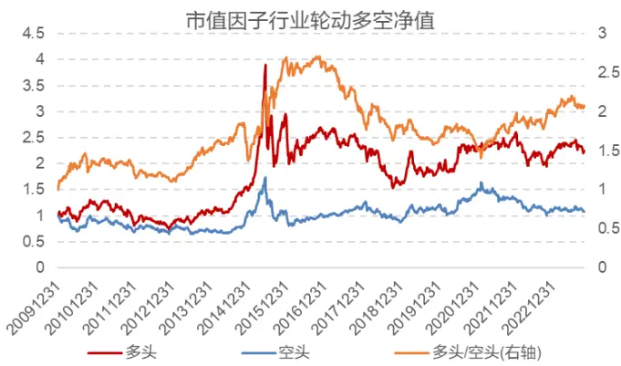

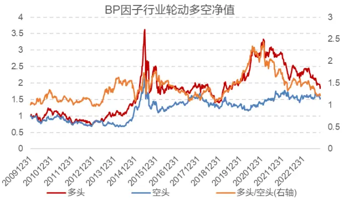

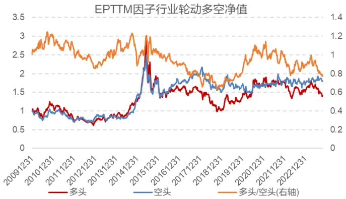

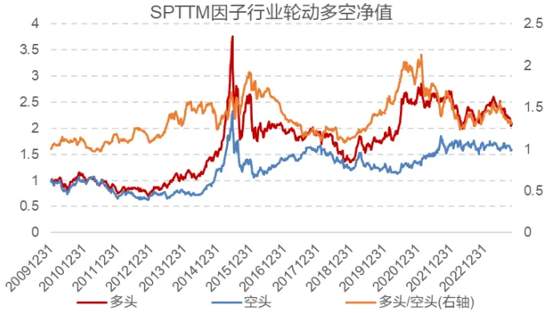
有关分析师的申明，见本报告最后部分。其他重要信息披露见分析师申明之后部分，或请与您的投资代表联系。并请阅读本证券研究报告最后一页的免责申明。

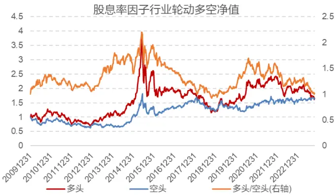

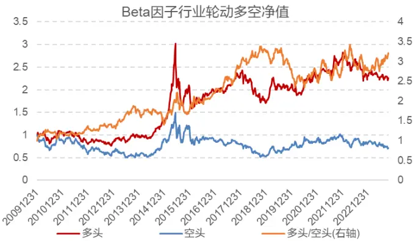

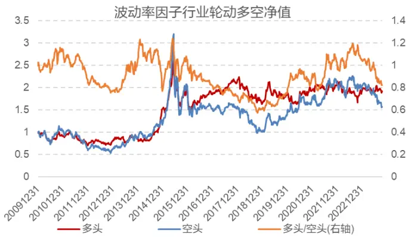
数据来源：Wind，东方证券研究所绘制

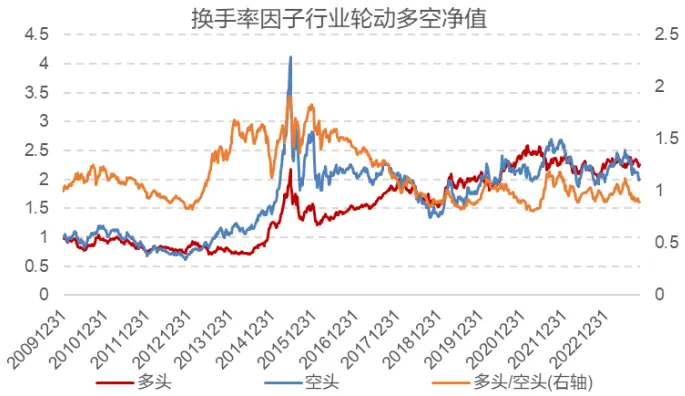

可以看到，这些因子合成行业后的分组的多空收益都呈现出明显的风格因子的特点，多空收益波动剧烈，且没有固定的方向。下表展示了这些因子的行业轮动的周度 Rank IC 以及多头超额、多空收益的统计情况。可以看到这些因子在行业上的 IC 均值都不显著，年化 ICIR 都较小，并且 IC标准差都很大，呈现出明显的高波动状态，并且周度多空收益、多头超额都接近于 0，呈现出明显的风险因子的特征，因此在构造行业轮动因子时，这些风格因子都需要进行中性化处理。

表 1：各风格因子的行业轮动能力
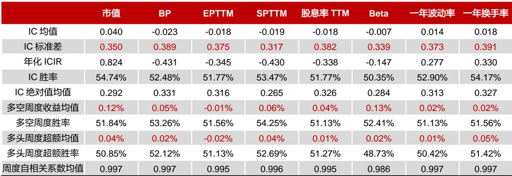
数据来源：Wind，东方证券研究所

由于中信一级行业只有30个，直接在合成后的行业因子取值上进行中性化的回归操作并不稳健，因此我们在股票层面先进行风格中性化回归，再将残差合成为行业轮动因子，这样达到了行业轮动因子的风格中性化。整个流程如下图所示。

我们首先计算个股的因子取值及 8 个风格因子的取值，截面填充缺失值、去极值后将因子对 8 个风格因子回归取残差，即

$$
f=\beta_{1}MV+\beta_{2}BP+\beta_{3}EPTTM+\cdots+\beta_{8}STOA+const+\varepsilon
$$

对残差 ε 再去极值标准化后，通过成分股权重加权并转为截面 rank得到行业轮动因子。

图 12：行业轮动因子的风格中性化流程
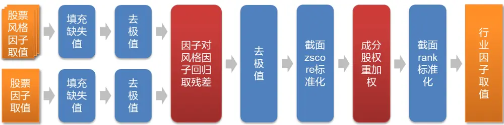
数据来源：东方证券研究所绘制

下面我们具体对微观的基本面、预期变化、量价、深度学习类因子进行上述中性化操作并合成行业轮动因子，并检验这些因子在中性化前后的行业轮动能力的变化情况，因子列表如下图。

图 13：微观行业轮动因子列表
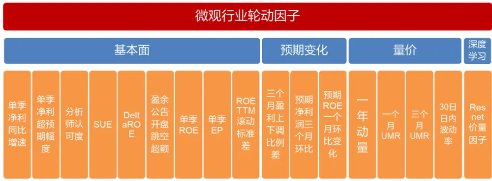
数据来源：Wind，朝阳永续，东方证券研究所

后续的所有因子回测参数如下：

回测区间：2010-2023 年；

- 行业池：剔除综合、综合金融后的 28个中信一级行业；

- 调仓频率：周频；

- 分组数量：5 组。

## 2.2 微观基本面类行业轮动因子

本节我们首先对一些常见的基本面因子进行风格中性化并检验其行业轮动能力，主要包括成长类、盈利类、估值类、质量类等因子。

## 2.2.1 单季度净利润同比增速

单季度净利润同比增速是典型的成长因子，其定义如下：

Quart_np_yoy = (单季度净利润 − 去年同期单季度净利润) / abs(去年同期单季度净利润）

增速高的行业可能未来的收益表现也越好。下面左图展示的是直接以个股的因子取值合成行业后分 5 组的净值及多空净值，右图展示的是个股的因子取值先进行风格中性再合成行业后分 5 组的净值及多空净值。可以看到该因子具有较为稳定的行业轮动能力，进行风格中性后，该因子在行业上的多空收益及多空收益的稳定性有了明显提升，并且多头组的收益也得到了提高。

图 14：单季净利润同比增速原始因子行业分组净值
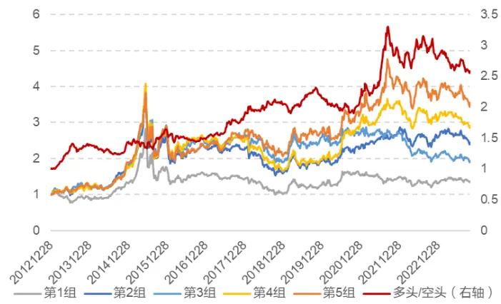
数据来源：Wind，东方证券研究所

图 15：单季净利润同比增速因子风格中性行业分组净值
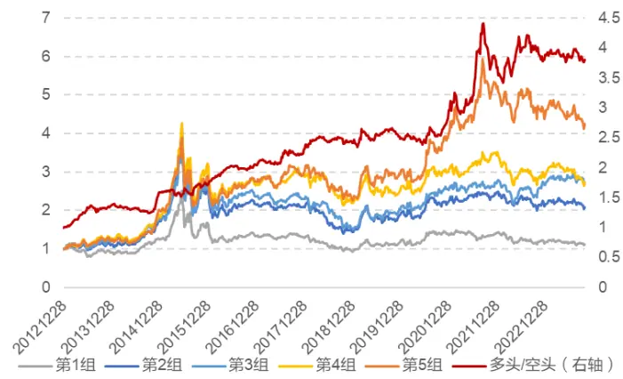
数据来源：Wind，东方证券研究所

下面展示了该因子单独剥离 3大类风格因子后的多空收益及累计周频 IC的情况。可以看到剥离每一类风格因子后多空收益和累计 IC都能得到提升。

图 16：单季净利润同比增速因子剥离各风格后行业多空净值
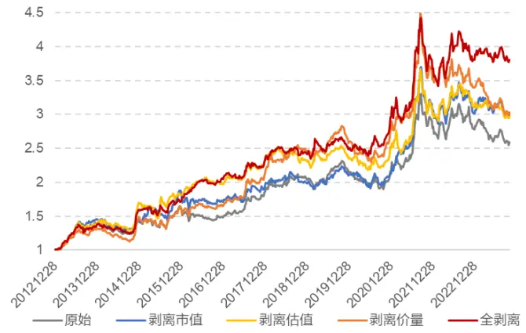
数据来源：Wind，东方证券研究所

图 17：单季净利润同比增速因子剥离各风格后行业累计 IC
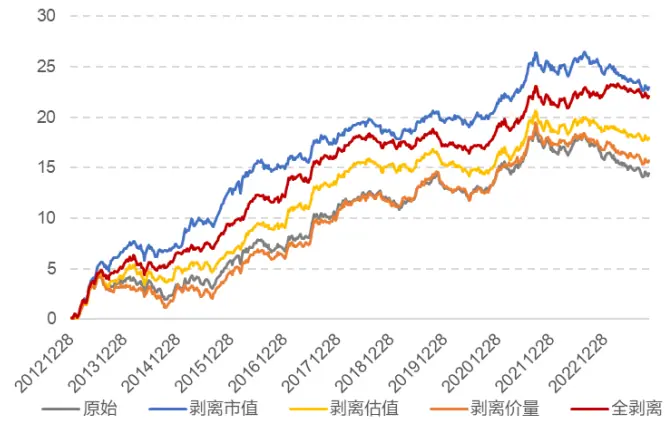
数据来源：Wind，东方证券研究所

有关分析师的申明，见本报告最后部分。其他重要信息披露见分析师申明之后部分，或请与您的投资代表联系。并请阅读本证券研究报告最后一页的免责申明。

下表展示了剥离不同类风格因子后因子的行业轮动能力的详细对比。可以看到，剥离任意的风格后行业轮动因子的IC均值、ICIR、多空收益都有提升，全部风格都剥离的稳定性最好，IC均值从原始因子的 0.026提高到 0.04，年化 ICIR从 0.78提升到 1.27，周度多头超额均值从 0.08%提升到 0.11%，提升效果显著。

表 2：单季净利润同比增速因子剥离各风格后行业轮动能力

|  | IC均值IC 标准差年化ICIR |  |  | IC 绝对值多空周度多空周度胜多头周度多头周度超自相关系IC 胜率 |  |  |  |  |  |  |  |  |  |  |  |  |
| --- | --- | --- | --- | --- | --- | --- | --- | --- | --- | --- | --- | --- | --- | --- | --- | --- |
|  |  |  |  |  |  |  |  |  |  |  | 均值 | 收益均值 | 率 | 超额均值 | 额胜率 | 数均值 |
| 原始 | 0.026 | 0.240 | 0.782 | 54.95% | 0.196 | 0.18% | 53.97% | 0.08% | 53.25% | 0.963 |  |  |  |  |  |  |
| 剥离市值 | 0.041 | 0.258 | 1.158 | 58.20% | 0.212 | 0.21% | 54.69% | 0.09% | 52.53% | 0.962 |  |  |  |  |  |  |
| 剥离估值 | 0.032 | 0.234 | 0.996 | 54.95% | 0.190 | 0.20% | 54.15% | 0.11% | 50.90% | 0.958 |  |  |  |  |  |  |
| 剥离价量 | 0.028 | 0.228 | 0.895 | 54.05% | 0.185 | 0.20% | 54.15% | 0.08% | 48.74% | 0.959 |  |  |  |  |  |  |
| 全剥离 | 0.040 | 0.227 | 1.265 | 56.40% | 0.187 | 0.24% | 54.69% | 0.11% | 51.26% | 0.956 |  |  |  |  |  |  |

数据来源：Wind，东方证券研究所

## 2.2.2 单季度净利润超预期幅度

单季度净利润超预期幅度是也是超预期成长类因子中较为显著的有效因子，其主要刻画最新季度的净利润超过分析师预期单季度净利润的幅度，其中分析师预期单季度净利润是基于去年同季度的净利润占比乘以今年预期全年的净利润来估计，因子定义如下：

## UE_pct=(单季度净利润−分析师预期单季度净利润)/abs(分析师预期单季度净利润）

季度净利润超预期幅度高的行业能够获得更多市场的关注，未来的收益空间可能也越好。下面左图展示的是直接以个股的因子取值合成行业后分 5 组的净值及多空净值，右图展示的是个股的因子取值先进行风格中性再合成行业后分 5 组的净值及多空净值。可以看到该因子具有较为稳定的行业轮动能力，进行风格中性后，该因子在行业上的多空收益及多空收益的稳定性都有了明显提升，并且多头组的收益也得到了明显提高，分组净值的单调性也明显改善。

图 18：单季度净利润超预期幅度原始因子行业分组净值
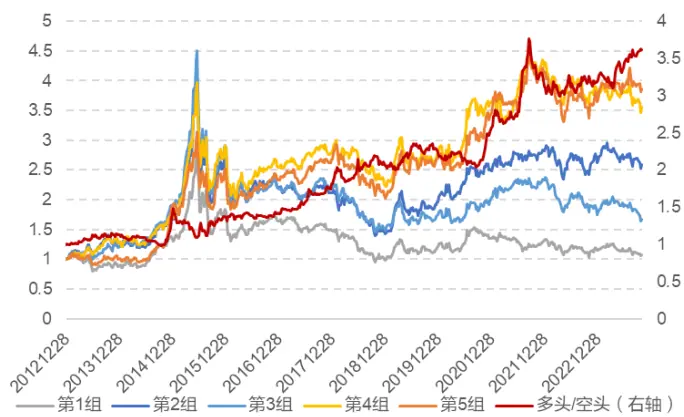
数据来源：Wind，朝阳永续，东方证券研究所

图 19：单季度净利润超预期幅度因子风格中性行业分组净值
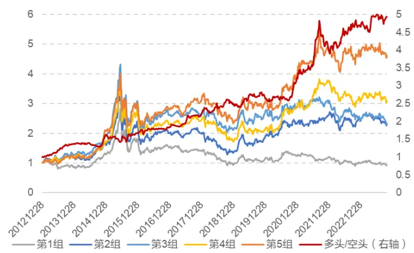
数据来源：Wind，朝阳永续，东方证券研究所

下面左图展示了风格中性化前后该因子合成行业轮动因子后分 5 组的多头净值表现情况。可以看到风格中性化后因子的多头表现明显好于原始因子的多头组合。下面右图展示了风格中性化前后该因子在行业上的周度 Rank IC的累计值。可以看到，原始因子的累计 IC在 2017年之前基本是平的，表明没有稳定的轮动效果，而风格中性化后因子在该区间内累计 IC仍然是正向单调的，说明行业轮动能力的稳定性也得到了提升。

有关分析师的申明，见本报告最后部分。其他重要信息披露见分析师申明之后部分，或请与您的投资代表联系。并请阅读本证券研究报告最后一页的免责申明。

图 20：单季度净利润超预期幅度因子风格中性前后多头净值
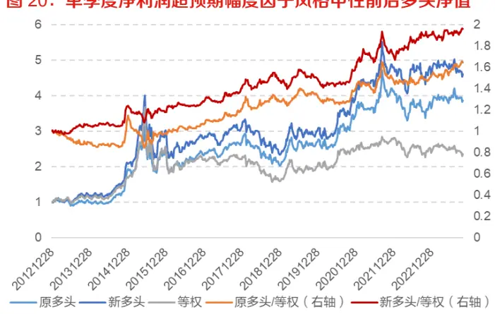
数据来源：Wind，朝阳永续，东方证券研究所

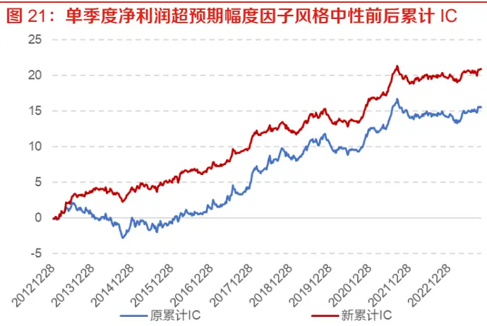
数据来源：Wind，朝阳永续，东方证券研究所

下表我们对比了风格中性化前后因子的行业轮动能力的对比情况。可以看到剥离风格后因子的 IC均值从 0.028 提升到 0.038，年化 ICIR 从 0.75 提升到 1.19，周度多头超额均值从 0.09%提升到0.12%，提升效果显著。

表 3：单季度净利润超预期幅度因子风格中性化前后行业轮动能力

|  | IC 均值 | IC 标准差 | 年化ICIR | IC 胜率 | IC 绝对值 均值 | 多空周度 收益均值 | 多空周度胜 率 | 多头周度 超额均值 | 多头周度超 额胜率 | 自相关系 数均值 |
| --- | --- | --- | --- | --- | --- | --- | --- | --- | --- | --- |
| 原始 | 0.028 | 0.271 | 0.748 | 51.89% | 0.220 | 0.22% | 52.35% | 0.09% | 46.57% | 0.899 |
| 剥离风格 | 0.038 | 0.228 | 1.194 | 55.68% | 0.183 | 0.28% | 55.23% | 0.12% | 50.90% | 0.884 |

数据来源：Wind，朝阳永续，东方证券研究所

## 2.2.3 分析师认可度

当上市公司披露财报数据后，分析师往往会点评其业绩，这给我们捕捉上市公司的业绩预期满足情况提供了数据来源。当分析师在点评业绩时明确标明“公司业绩爆发式增长”等正向短语时，我们认为分析师认可公司的业绩，而明确标明“业绩下滑”等负向短语时，我们认为分析师不认可公司的业绩，通过所有的分析师点评数据我们可以判断公司的业绩是否是正向或者负向。

图 22：分析师认可度判断标准
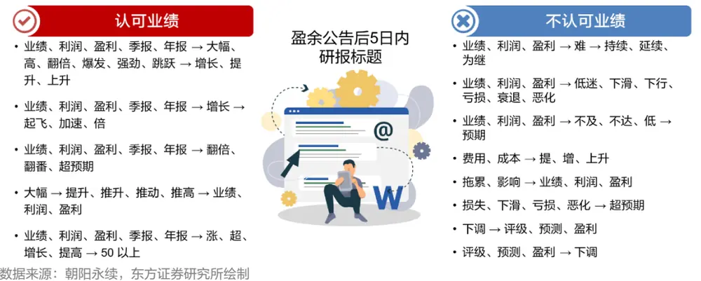

我们收集公司财报后 5 天内的所有分析师点评报告，根据研报标题是否包含以上图中的短语模式来判断分析师是否认可公司业绩，然后取认可和不认可的数量差除以总数得到认可度因子：

$$
Rec\_pct=(认可业绩的权构数量-不认可业绩的权构数量)/灌盖权构总数
$$

有关分析师的申明，见本报告最后部分。其他重要信息披露见分析师申明之后部分，或请与您的投资代表联系。并请阅读本证券研究报告最后一页的免责申明。

行业中股票获得分析师的认可度越高，越可能带来更多的机构关注从而未来收益可能也越好。下面左图展示的是直接以个股的因子取值合成行业后分 5 组的净值及多空净值，右图展示的是个股的因子取值先进行风格中性再合成行业后分 5 组的净值及多空净值。可以看到该因子具有较为稳定的行业轮动能力，进行风格中性后，该因子在行业上的多空收益及多空收益的稳定性都有了明显提升，并且多头组的收益也得到了明显提高，分组净值的单调性也明显改善。

图 23：分析师认可度因子行业分组净值
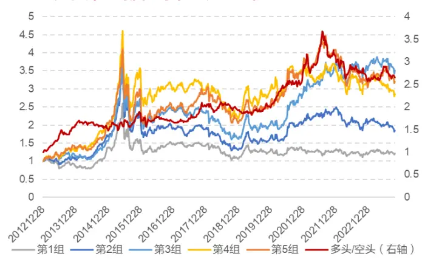
数据来源：Wind，朝阳永续，东方证券研究所

图 24：分析师认可度因子风格中性行业分组净值
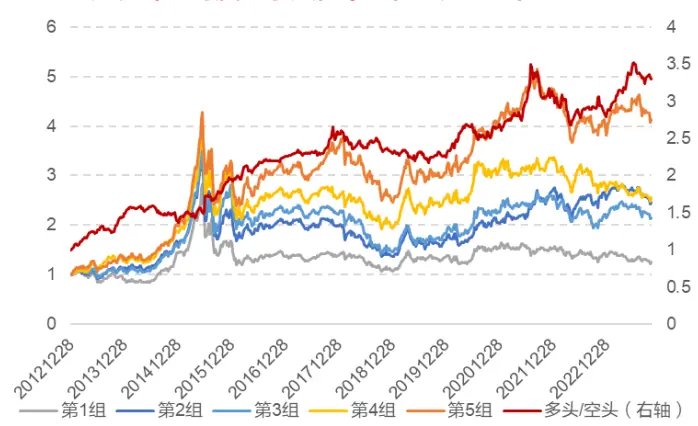
数据来源：Wind，朝阳永续，东方证券研究所

下面左图展示了风格中性化前后该因子合成行业轮动因子后分组多头净值表现情况。可以看到风格中性化后因子的多头表现得到提升。下面右图展示了风格中性化前后该因子在行业上的周度Rank IC的累计值。可以看到，风格中性化后的累计 IC的稳定性也得到了明显提高。

图 25：分析师认可度因子风格中性前后多头净值
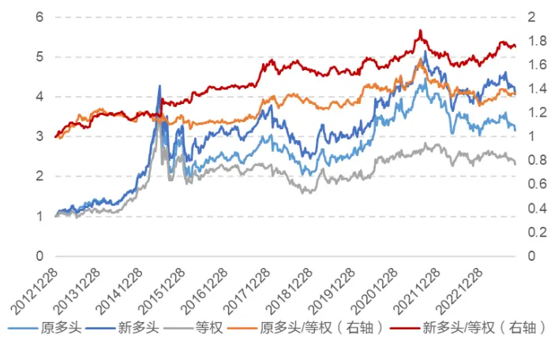
数据来源：Wind，朝阳永续，东方证券研究所

图 26：分析师认可度因子风格中性前后累计 IC
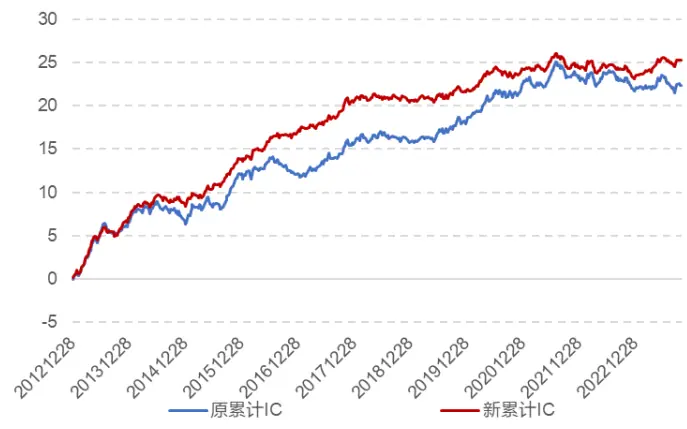
数据来源：Wind，朝阳永续，东方证券研究所

下表我们对比了风格中性化前后因子的行业轮动能力的对比情况。可以看到剥离风格后因子的 IC均值从 0.04 提升到 0.046，年化 ICIR 从 1.08 提升到 1.5，周度多头超额均值从 0.06%提升到0.1%，提升效果显著。

表 4：分析师认可度因子风格中性化前后行业轮动能力

|  | IC 均值 | IC 标准差 | 年化ICIR | IC 胜率 | IC 绝对值 均值 | 多空周度 收益均值 | 多空周度胜 率 | 多头周度 超额均值 | 多头周度超 额胜率 | 自相关系 数均值 |
| --- | --- | --- | --- | --- | --- | --- | --- | --- | --- | --- |
| 原始 | 0.040 | 0.269 | 1.083 | 56.76% | 0.225 | 0.18% | 54.69% | 0.06% | 52.17% | 0.966 |
| 剥离风格 | 0.046 | 0.219 | 1.503 | 57.84% | 0.180 | 0.21% | 56.86% | 0.10% | 51.99% | 0.951 |

数据来源：Wind，朝阳永续，东方证券研究所
有关分析师的申明，见本报告最后部分。其他重要信息披露见分析师申明之后部分，或请与您的投资代表联系。并请阅读本证券研究报告最后一页的免责申明。

## 2.2.4 标准化预期外盈利

标准化预期外盈利SUE因子刻画了股票经历史盈利增长修正后的单季度盈利增长水平，定义如下：

$$
SUE=\frac{NP_{t}-E(NP_{t})}{\sigma_{NP_{t}}}
$$

其中 $NP_{t}$ 为当期单季度归母净利润，E(NP ) 为当期单季度预期净利润， $\sigma_{NP_{t}}$ 为未预期盈利的标准差，单季度预期净利润的计算方式为去年同期单季度归母净利润加过去 8 期单季度归母净利润同比变化的均值，未预期盈利的标准差计算方式为过去 8 期单季度归母净利润同比变化的标准差。

行业预期外的盈利能力越高，未来行业的收益表现可能也越好。下图展示的是直接以个股的因子取值以及因子风格中性化后合成行业后分 5 组的净值及多空净值。可以看到该因子具有较为稳定的行业轮动能力，进行风格中性后，该因子在行业上的多空收益得到了一定提升。

图 27：标准化预期外盈利因子行业分组净值
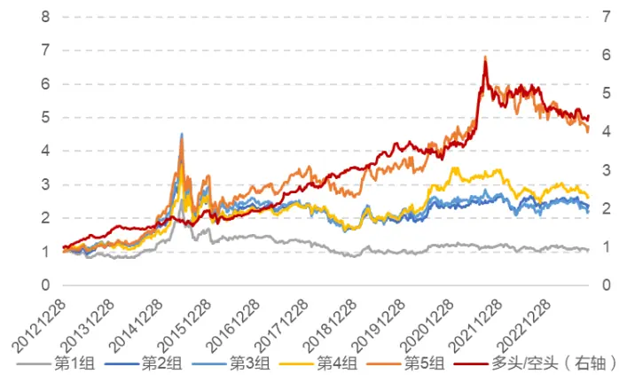
数据来源：Wind，东方证券研究所

图 28：标准化预期外盈利因子风格中性行业分组净值
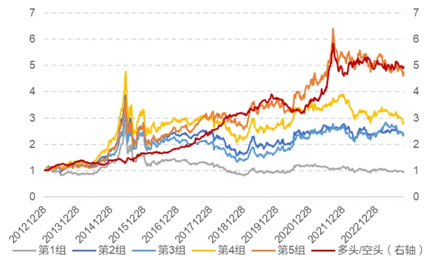
数据来源：Wind，东方证券研究所

下图展示了风格中性化前后该因子合成行业轮动因子后分组多头净值以及累计 IC的变化情况。可以看到风格中性化后因子的多头表现和 IC 表现变化不大，并且由于成长风格自 2021 年 9 月以来的持续弱势，同时期其在行业轮动上的多头也没有明显的超额收益。

图 29：标准化预期外盈利因子风格中性前后多头净值
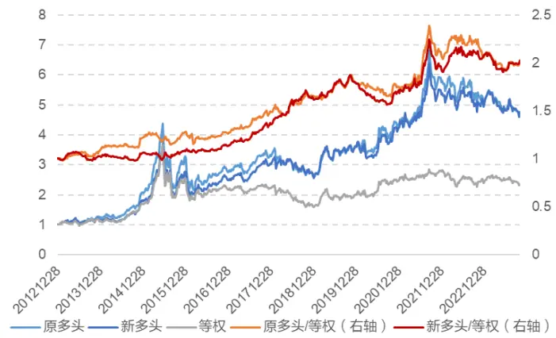
数据来源：Wind，东方证券研究所

图 30：标准化预期外盈利因子风格中性前后累计 IC
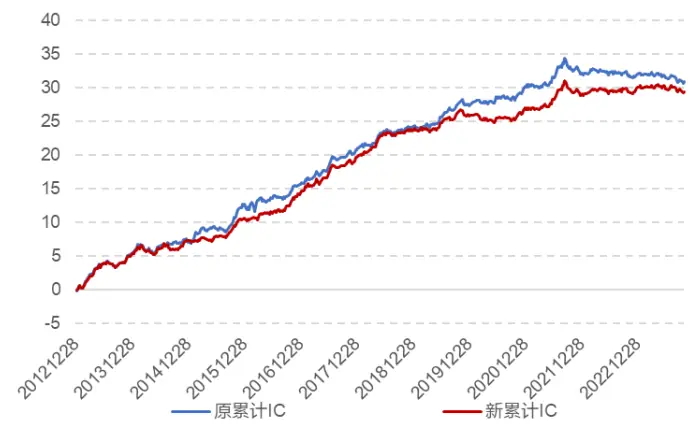
数据来源：Wind，东方证券研究所

下表我们对比了风格中性化前后因子的行业轮动能力的对比情况。可以看到剥离风格后因子的 IC均值略有下降，年化 ICIR略有提升，周度多头超额和多空收益变化不大。

有关分析师的申明，见本报告最后部分。其他重要信息披露见分析师申明之后部分，或请与您的投资代表联系。并请阅读本证券研究报告最后一页的免责申明。

表 5：标准化预期外盈利因子风格中性化前后行业轮动能力

|  | IC 均值 | IC 标准差 | 年化ICIR | IC 胜率 | IC 绝对值 均值 | 多空周度 收益均值 | 多空周度胜 率 | 多头周度 超额均值 | 多头周度超 额胜率 | 自相关系 数均值 |
| --- | --- | --- | --- | --- | --- | --- | --- | --- | --- | --- |
| 原始 | 0.056 | 0.249 | 1.622 | 60.18% | 0.205 | 0.29% | 59.21% | 0.14% | 54.15% | 0.958 |
| 剥离风格 | 0.053 | 0.221 | 1.733 | 60.00% | 0.184 | 0.29% | 56.68% | 0.13% | 53.79% | 0.948 |

数据来源：Wind，东方证券研究所

## 2.2.5 Delta ROE

公司发布盈余公告后当期单季度 ROE 相比其去年同期 ROE 的改善幅度越大，其盈利能力提升越强，未来收益可能越高。我们以当季度 ROE 与去年同期 ROE 的差来刻画，得到 DeltaROE 因子：

$$
DeltaROE=ROE_{t}-ROE_{t-4}
$$

下图展示的是直接以个股的因子取值以及因子风格中性化后合成行业后分 5 组的净值及多空净值。可以看到该因子具有较为稳定的行业轮动能力，进行风格中性后该因子在行业上的多空收益和分组单调性得到了一定提升。

图 31：DeltaROE 因子行业分组净值
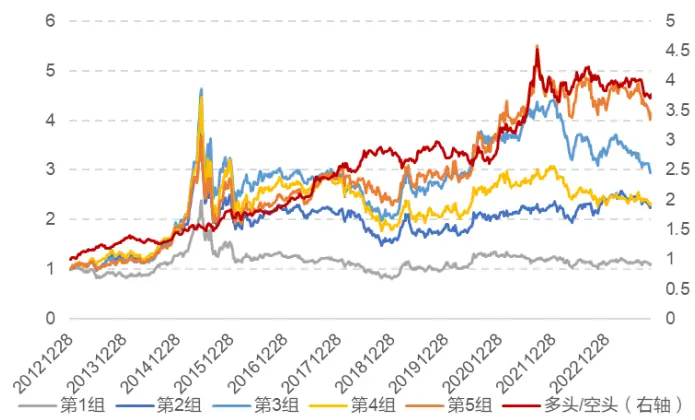
数据来源：Wind，东方证券研究所

图 32：DeltaROE因子风格中性行业分组净值
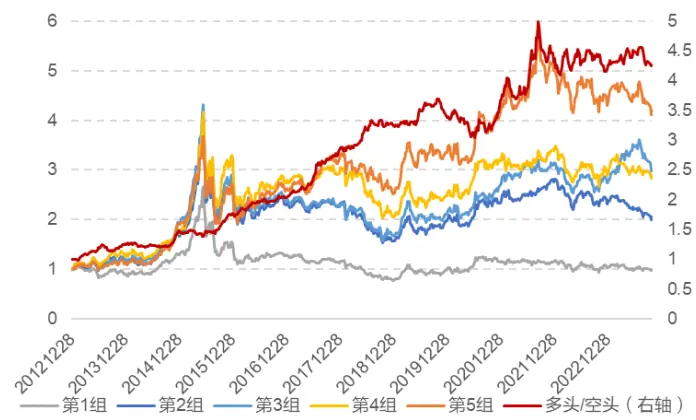
数据来源：Wind，东方证券研究所

下图展示了风格中性化前后该因子合成行业轮动因子后分组多头净值以及累计 IC的变化情况。可以看到风格中性化后因子的多头表现和 IC 表现变化不大，并且由于成长风格自 2021 年 9 月以来的持续弱势，同时期其在行业轮动上的多头也没有明显的超额收益。

图 33：DeltaROE因子风格中性前后多头净值
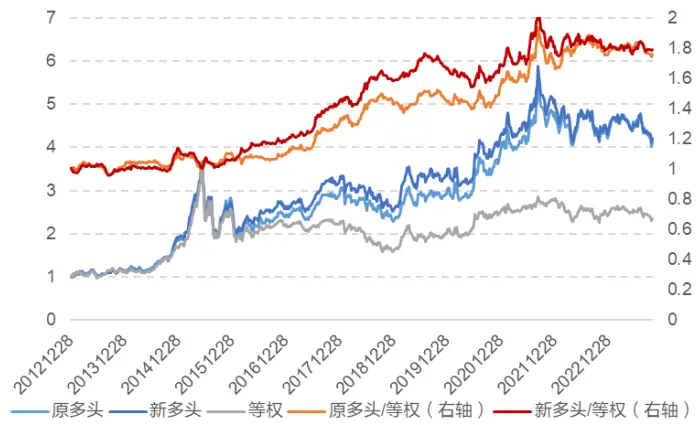
数据来源：Wind，东方证券研究所

图 34：DeltaROE 因子风格中性前后累计 IC
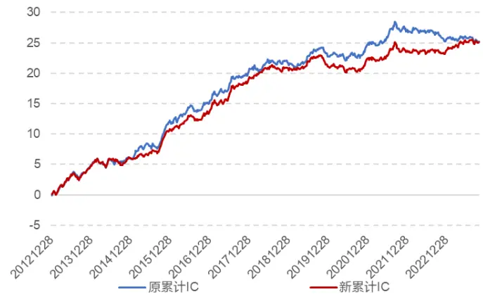
数据来源：Wind，东方证券研究所
有关分析师的申明，见本报告最后部分。其他重要信息披露见分析师申明之后部分，或请与您的投资代表联系。并请阅读本证券研究报告最后一页的免责申明。

下表我们对比了风格中性化前后因子的行业轮动能力的对比情况。可以看到剥离风格后因子的年化 ICIR略有提升从 1.35提升到 1.49，周度多头超额和多空收益变化不大。

表 6：DeltaROE因子风格中性化前后行业轮动能力

|  | IC均值 | IC 标准差 | 年化ICIR | IC 胜率 | IC 绝对值 均值 | 多空周度 收益均值 | 多空周度胜 率 | 多头周度 超额均值 | 多头周度超 额胜率 | 自相关系 数均值 |
| --- | --- | --- | --- | --- | --- | --- | --- | --- | --- | --- |
| 原始 | 0.046 | 0.245 | 1.345 | 56.40% | 0.204 | 0.25% | 57.76% | 0.11% | 53.61% | 0.961 |
| 剥离风格 | 0.045 | 0.220 | 1.488 | 57.84% | 0.184 | 0.27% | 55.96% | 0.11% | 51.81% | 0.958 |

数据来源：Wind，东方证券研究所

## 2.2.6 盈余公告开盘跳空超额

如果盈余公告次日开盘高开，那么可以认为市场对于其盈余公告业绩的认可，我们将股票盈余公告后开盘收益减去当日市场开盘收益率作为开盘跳空超额（Alpha of Open Gap，简称 AOG）因子：

$$
AOG_{t}=Open_{t+1}/Class_{t}-Open_{mkt,t+1}/Labse_{mkt,t}
$$

其中 $Open_{t+1},\;Close_{t}$ 分别为股票在 t+1, t 时刻的开盘价和收盘价， $Open_{mkt,t+1},\;Close_{mkt,t}$ 分别为中证全指在 t+1, t 时刻的开盘价和收盘价。

下图展示的是直接以个股的因子取值以及因子风格中性化后合成行业后分 5 组的净值及多空净值。可以看到该因子具有稳定的行业轮动能力，进行风格中性后因子在行业上的多空收益尤其是多头组的收益得到了明显的提升。

图 35：盈余公告开盘跳空超额因子行业分组净值
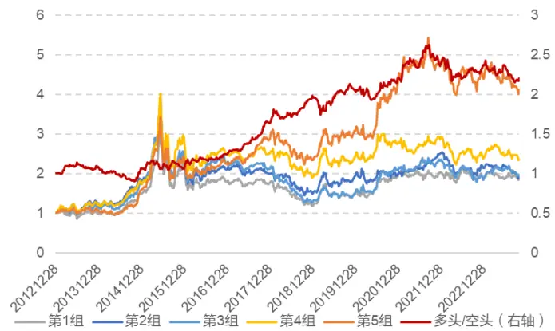
数据来源：Wind，东方证券研究所

图 36：盈余公告开盘跳空超额因子风格中性行业分组净值
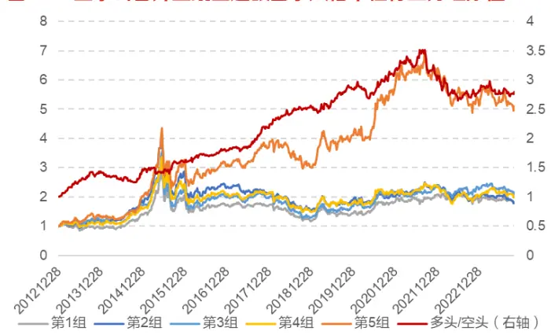
数据来源：Wind，东方证券研究所

下面左图展示了风格中性化前后该因子合成行业轮动因子后分组多头净值表现情况。可以看到风格中性化后因子的多头表现得到明显提升，但是自2021年9月以来多头并没有明显的超额收益。下面右图展示了风格中性化前后该因子在行业上的周度 Rank IC的累计值。可以看到，2017年之前原始因子在行业上没有明显的轮动效果，而风格中性化后的累计 IC持续稳定。

图 37：盈余公告开盘跳空超额因子风格中性前后多头净值
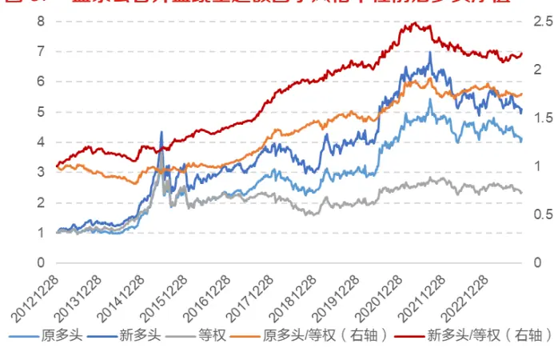
数据来源：Wind，东方证券研究所

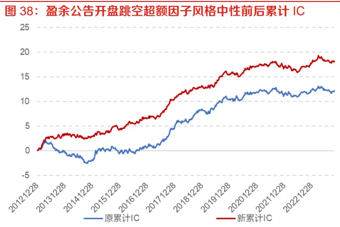
数据来源：Wind，东方证券研究所

下表我们对比了风格中性化前后因子的行业轮动能力的对比情况。可以看到剥离风格后因子的 IC均值从 0.022 提升到 0.033，年化 ICIR 从 0.77 提升到 1.23，周度多头超额均值从 0.1%提升到0.14%，提升效果显著。

表 7：盈余公告开盘跳空超额因子风格中性化前后行业轮动能力

|  | IC 均值 | IC 标准差 | 年化ICIR | IC 胜率 | IC 绝对值 均值 | 多空周度 收益均值 | 多空周度胜 率 | 多头周度 超额均值 | 多头周度超 额胜率 | 自相关系 数均值 |
| --- | --- | --- | --- | --- | --- | --- | --- | --- | --- | --- |
| 原始 | 0.022 | 0.207 | 0.765 | 53.15% | 0.166 | 0.13% | 52.17% | 0.10% | 51.44% | 0.918 |
| 剥离风格 | 0.033 | 0.193 | 1.231 | 58.38% | 0.156 | 0.18% | 55.60% | 0.14% | 55.78% | 0.911 |

数据来源：Wind，东方证券研究所

## 2.2.7 单季度 ROE

前面我们介绍了几个偏成长/超预期类的因子，都具有一定的行业轮动能力。这里我们进一步介绍盈利类因子，单季度 ROE因子定义如下：

$$
Quart\_ROE=单季度的呼净利润/净资产
$$

其刻画了股票每个季度的盈利能力水平。下图展示的是直接以个股的因子取值以及因子风格中性化后合成行业后分 5 组的净值及多空净值。可以看到该因子具有一定行业轮动能力，进行风格中性后因子在行业上的多空收益尤其是多头组的收益得到了明显的提升。

图 39：单季度 ROE因子行业分组净值
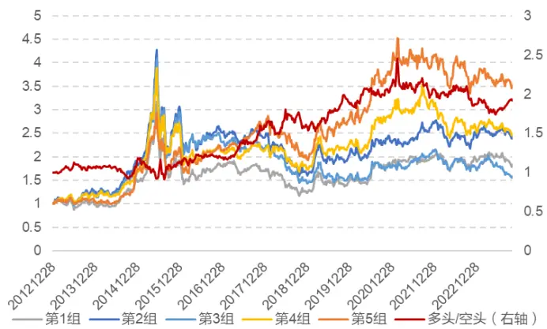
数据来源：Wind，东方证券研究所

图 40：单季度 ROE因子风格中性行业分组净值
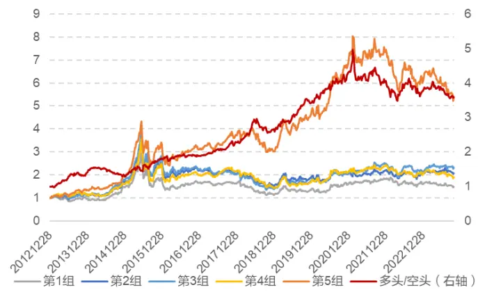
数据来源：Wind，东方证券研究所
有关分析师的申明，见本报告最后部分。其他重要信息披露见分析师申明之后部分，或请与您的投资代表联系。并请阅读本证券研究报告最后一页的免责申明。

下面左图展示了风格中性化前后该因子合成行业轮动因子后分组多头净值表现情况。可以看到风格中性化后因子的多头表现得到大幅提升，但是受限于风格本身的回撤自2021年9月以来多头并没有超额收益。下面右图展示了风格中性化前后该因子在行业上的周度 Rank IC 的累计值。可以看到，2017 年之前原始因子在行业上没有明显的轮动效果，而风格中性化后的累计 IC 得到明显提升。

图 41：单季度 ROE因子风格中性前后多头净值
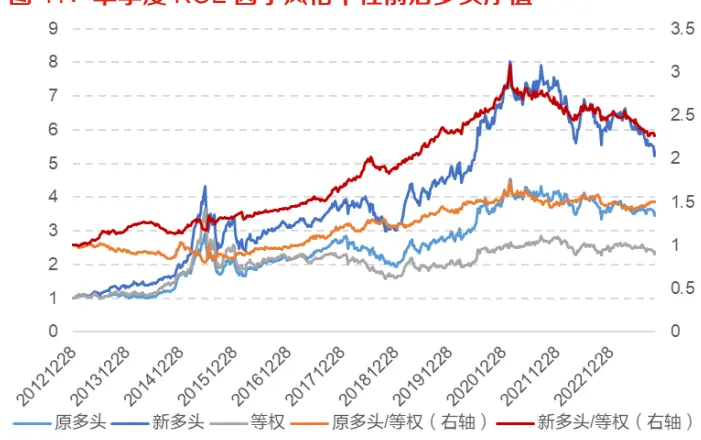
数据来源：Wind，东方证券研究所

图 42：单季度 ROE因子风格中性前后累计 IC
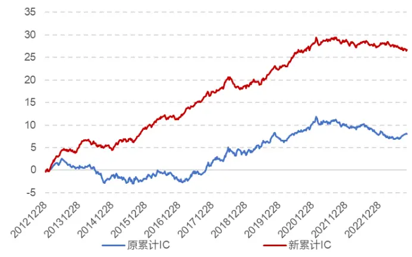
数据来源：Wind，东方证券研究所

下表我们对比了风格中性化前后因子的行业轮动能力的对比情况。可以看到剥离风格后因子的 IC均值从 0.014 提升到 0.048，年化 ICIR 从 0.38 提升到 1.34，周度多头超额均值从 0.07%提升到0.15%，提升效果显著。

表 8：单季度 ROE因子风格中性化前后行业轮动能力

|  | IC 均值 | IC 标准差 | 年化ICIR | IC 胜率 | IC 绝对值 均值 | 多空周度 收益均值 | 多空周度胜 率 | 多头周度 超额均值 | 多头周度超 | 自相关系 |
| --- | --- | --- | --- | --- | --- | --- | --- | --- | --- | --- |
| 原始 | 0.014 | 0.276 | 0.375 | 51.53% | 0.226 | 0.11% | 53.97% | 0.07% | 额胜率 50.90% | 数均值 0.979 |
| 剥离风格 | 0.048 | 0.260 | 1.335 | 60.36% | 0.219 | 0.23% | 57.76% | 0.15% | 55.78% | 0.956 |

数据来源：Wind，东方证券研究所

## 2.2.8 单季度 EP

从前文我们知道，EPTTM等估值类因子并没有行业轮动能力。这里我们进一步介绍短期估值因子单季度 EP，因子定义如下：

$$
Quart\_EP=学季度四呼净利润/总市值
$$

其刻画了单季度净利润经市值调整后的估值水平。下图展示的是直接以个股的因子取值以及因子风格中性化后合成行业后分 5 组的净值及多空净值。可以看到该原始因子并没有稳定的行业轮动能力，其 5 分组的净值是乱序的。而进行风格中性后，因子在行业上的多空收益分组非常单调，并且多空收益持续稳健。

图 43：单季度 EP因子行业分组净值
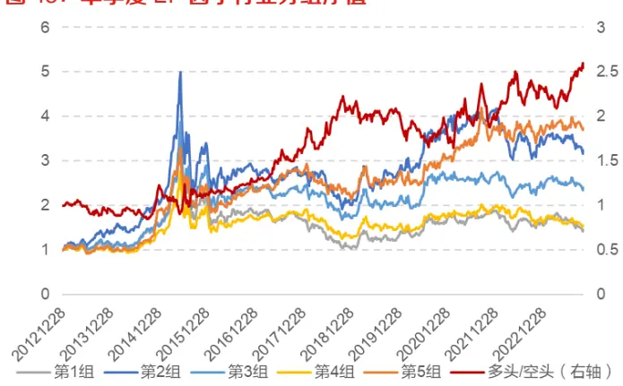
数据来源：Wind，东方证券研究所

图 44：单季度 EP因子风格中性行业分组净值
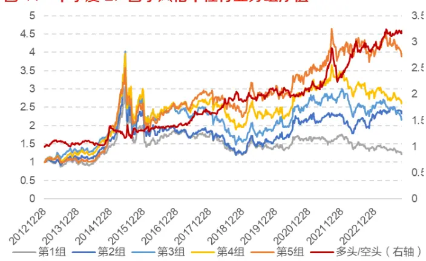
数据来源：Wind，东方证券研究所

下面左图展示了风格中性化前后该因子合成行业轮动因子后分组多头净值表现情况。可以看到风格中性化后因子的多头表现得到一定提升。下面右图展示了风格中性化前后该因子在行业上的周度 Rank IC 的累计值。可以看到，原始因子由于和传统 EPTTM 等估值因子相关性较高，直接合成行业因子的 Rank IC 长期均值接近 0，并没有显著行业轮动能力。而经过风格中性化后，合成的行业轮动因子的累计 IC持续显著向上，剥离风格后因子的行业轮动能力得到提纯从而显示出其稳定的行业轮动效果。

图 45：单季度 EP因子风格中性前后多头净值
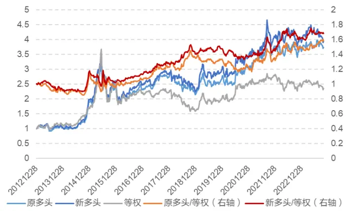
数据来源：Wind，东方证券研究所

图 46：单季度 EP因子风格中性前后累计 IC
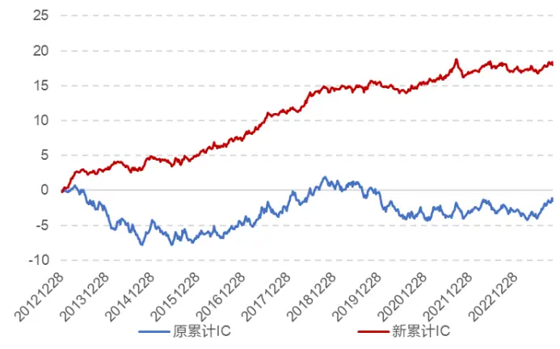
数据来源：Wind，东方证券研究所

下表我们对比了风格中性化前后因子的行业轮动能力的对比情况。可以看到原始因子的行业间 IC均值接近0，而剥离风格后因子的IC均值提升到0.032，年化ICIR提升到1.03，周度多头超额均值从 0.07%提升到 0.09%，提升效果显著。

表 9：单季度 EP因子风格中性化前后行业轮动能力

|  | IC均值 | IC 标准差 | 年化ICIR | IC 胜率 | IC 绝对值 均值 | 多空周度 收益均值 | 多空周度胜 率 | 多头周度 超额均值 | 多头周度超 额胜率 | 自相关系 数均值 |
| --- | --- | --- | --- | --- | --- | --- | --- | --- | --- | --- |
| 原始 | -0.003 | 0.348 | -0.058 | 50.81% | 0.290 | 0.15% | 48.92% | 0.07% | 50.18% | 0.986 |
| 剥离风格 | 0.032 | 0.227 | 1.030 | 55.14% | 0.185 | 0.20% | 54.69% | 0.09% | 50.54% | 0.941 |

数据来源：Wind，东方证券研究所

有关分析师的申明，见本报告最后部分。其他重要信息披露见分析师申明之后部分，或请与您的投资代表联系。并请阅读本证券研究报告最后一页的免责申明。

## 2.2.9 ROETTM 滚动标准差

一个公司的盈利能力稳定性越高，其业绩确定性带来的收益溢价空间越大。我们以每只股票过去8个季报的 ROETTM的标准差来衡量公司的盈利能力的稳定性，定义如下：

$$
ROETTM\_STD=ts\_std(ROETTM,\ 8)
$$

下图展示的是直接以个股的因子取值以及因子风格中性化后合成行业后分 5 组的净值及多空净值。可以看到该原始因子并没有稳定的行业轮动能力，2019-2022 年多空收益是负向的，而进行风格中性后多空收益持续稳健。

图 47：ROETTM滚动标准差因子行业分组净值
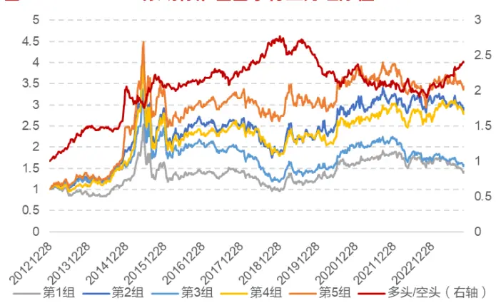
数据来源：Wind，东方证券研究所

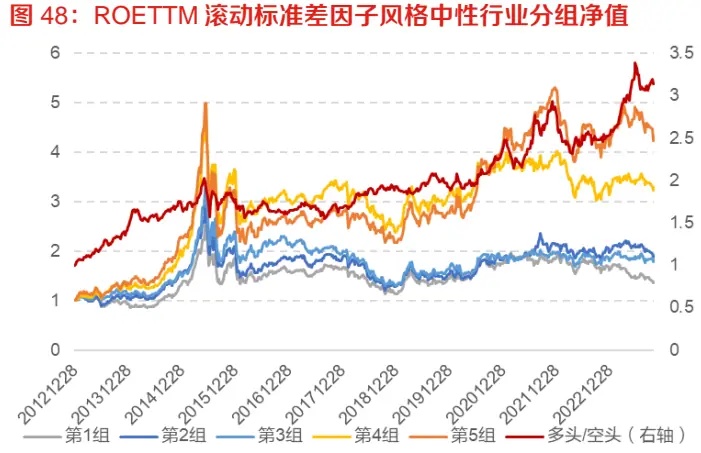
数据来源：Wind，东方证券研究所

下面左图展示了风格中性化前后该因子合成行业轮动因子后分组多头净值表现情况。可以看到风格中性化后因子的多头表现得到一定提升，尤其是2019年以来多头超额持续稳定。下面右图展示了风格中性化前后该因子在行业上的周度 Rank IC 的累计值。可以看到，原始因子 2019 年以来没有显著的行业轮动能力。而经过风格中性化后，合成的行业轮动因子的累计 IC持续稳定向上，剥离风格后因子的行业轮动能力得到提纯从而显示出其稳定的行业轮动效果。

图 49：ROETTM滚动标准差因子风格中性前后多头净值
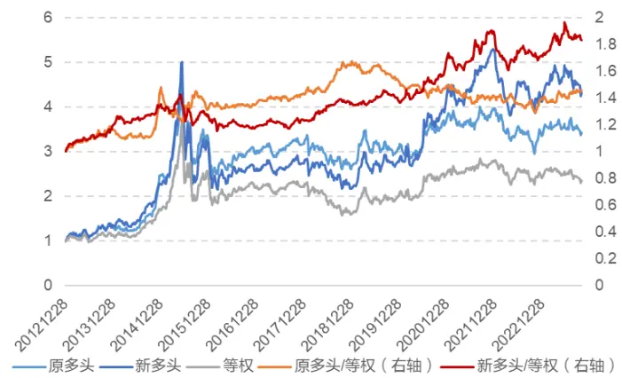
数据来源：Wind，东方证券研究所

图 50：ROETTM滚动标准差因子风格中性前后累计 IC
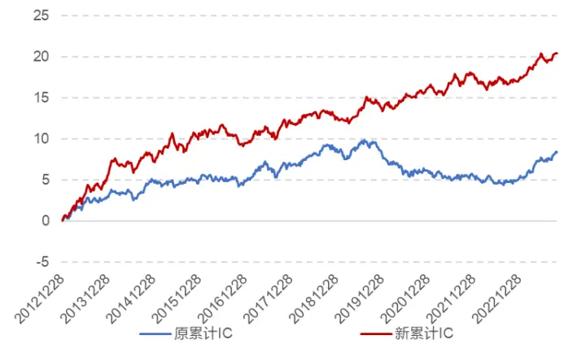
数据来源：Wind，东方证券研究所

下表我们对比了风格中性化前后因子的行业轮动能力的对比情况。可以看到剥离风格后因子的 IC均值从 0.015 提升到 0.037，年化 ICIR 从 0.49 提升到 1.1，周度多头超额均值从 0.07%提升到0.13%，提升效果显著。

有关分析师的申明，见本报告最后部分。其他重要信息披露见分析师申明之后部分，或请与您的投资代表联系。并请阅读本证券研究报告最后一页的免责申明。

表 10：ROETTM滚动标准差因子风格中性化前后行业轮动能力

|  | IC 均值 | IC 标准差 | 年化ICIR | IC 胜率 | IC 绝对值 均值 | 多空周度 收益均值 | 多空周度胜 率 | 多头周度 超额均值 | 多头周度超 额胜率 | 自相关系 数均值 |
| --- | --- | --- | --- | --- | --- | --- | --- | --- | --- | --- |
| 原始 | 0.015 | 0.221 | 0.494 | 53.87% | 0.176 | 0.15% | 53.25% | 0.07% | 48.01% | 0.994 |
| 剥离风格 | 0.037 | 0.242 | 1.100 | 55.68% | 0.204 | 0.22% | 59.21% | 0.13% | 55.23% | 0.991 |

数据来源：Wind，东方证券研究所

## 2.3 微观预期变化类行业轮动因子

上一节中我们介绍了基本面类的行业轮动因子，从大部分因子的结果来看，因子都具有较为稳定的行业轮动能力，并且经过风格中性化后，因子的行业轮动能力尤其是多空收益均能带来明显改善，而且大部分因子的多头超额收益都得到了显著提升。这一节中我们从分析师预期变化的角度构造一些行业轮动因子并对比其风格中性化前后的效果。

## 2.3.1 预期净利润三个月环比

分析师对股票一致预期净利润的环比提升越高，说明分析师普遍看好公司未来的业绩，股票的未来收益可能越高，而通过股票合成到行业上可能预期环比提升越高的行业未来收益也越高。因此我们构造一致预期净利润的三个月环比因子如下：

$$
F\_NP\_change\_60d=\frac{F\_NP_{t}-F\_NP_{t-60}}{abs(F\_NP_{t-60})}
$$

其中 $F\_NP_{t}$ 表示 t 时刻分析师对于股票的未来 12个月的一致预期滚动净利润。

下面左图展示的是直接以个股的因子取值合成行业后分 5 组的净值及多空净值，右图展示的是个股的因子取值先进行风格中性再合成行业后分 5 组的净值及多空净值。可以看到该因子具有较为稳定的行业轮动能力，进行风格中性后，该因子在行业上的多空收益及分组单调性都有了明显提升，并且多头组的收益也得到了显著提高。

图 51：预期净利润三个月环比因子行业分组净值
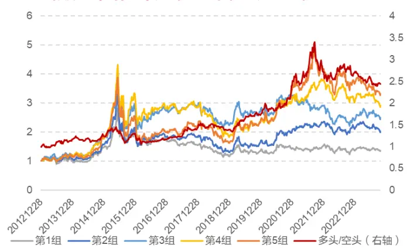
数据来源：Wind，朝阳永续，东方证券研究所

图 52：预期净利润三个月环比因子风格中性行业分组净值
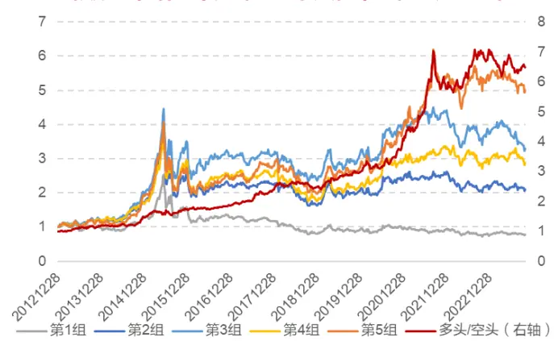
数据来源：Wind，朝阳永续，东方证券研究所

下面左图展示了风格中性化前后该因子合成行业轮动因子后分组多头净值表现情况。可以看到风格中性化后因子的多头表现得到持续提升，但是自2021年9月以来多头并没有稳定的超额收益。下面右图展示了风格中性化前后该因子在行业上的周度 Rank IC 的累计值。可以看到，风格中性化后的累计 IC的稳定性尤其是 2021年以来得到明显提升。

有关分析师的申明，见本报告最后部分。其他重要信息披露见分析师申明之后部分，或请与您的投资代表联系。并请阅读本证券研究报告最后一页的免责申明。

图 53：预期净利润三个月环比因子风格中性前后多头净值
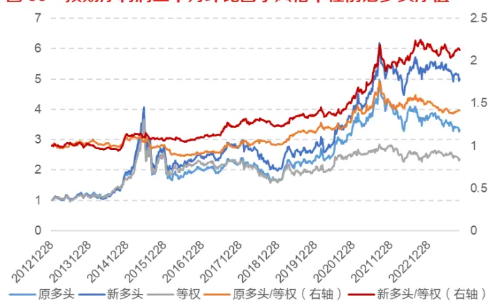
数据来源：Wind，朝阳永续，东方证券研究所

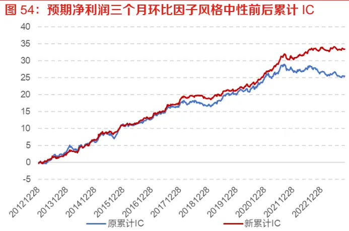
数据来源：Wind，朝阳永续，东方证券研究所

下表我们对比了风格中性化前后因子的行业轮动能力的对比情况。可以看到剥离风格后因子的 IC均值从 0.046 提升到 0.06，年化 ICIR 从 1.23 提升到 1.97，周度多头超额均值从 0.08%提升到0.14%，提升效果显著。

表 11：预期净利润三个月环比因子风格中性化前后行业轮动能力

|  | IC均值 | IC 标准差 | 年化ICIR | IC 胜率 | IC 绝对值 均值 | 多空周度 收益均值 | 多空周度胜 率 | 多头周度 超额均值 | 多头周度超 额胜率 | 自相关系 数均值 |
| --- | --- | --- | --- | --- | --- | --- | --- | --- | --- | --- |
| 原始 | 0.046 | 0.271 | 1.226 | 56.22% | 0.225 | 0.18% | 54.87% | 0.08% | 51.26% | 0.940 |
| 剥离风格 | 0.060 | 0.221 | 1.967 | 59.10% | 0.184 | 0.34% | 55.96% | 0.14% | 51.81% | 0.923 |

数据来源：Wind，朝阳永续，东方证券研究所

## 2.3.2 三个月盈利上下调比例差

过去 3 个月内分析师上调净利润的家数越多，说明分析师纷纷看好该公司业绩，股票的未来收益可能更高。我们计算过去 3 个月内所有分析师的预期净利润调整行为来构建三个月盈利上下调比例差因子：

$$
UD\_rect=\frac{上沏实数-下沏实数}{总实数}+\frac{总实数}{10000}
$$

图 55：三个月盈利上下调比例差因子行业分组净值
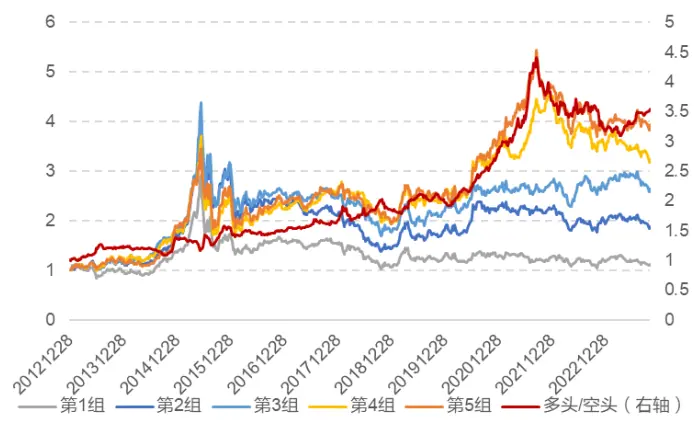
数据来源：Wind，朝阳永续，东方证券研究所

图 56：三个月盈利上下调比例差因子风格中性行业分组净值
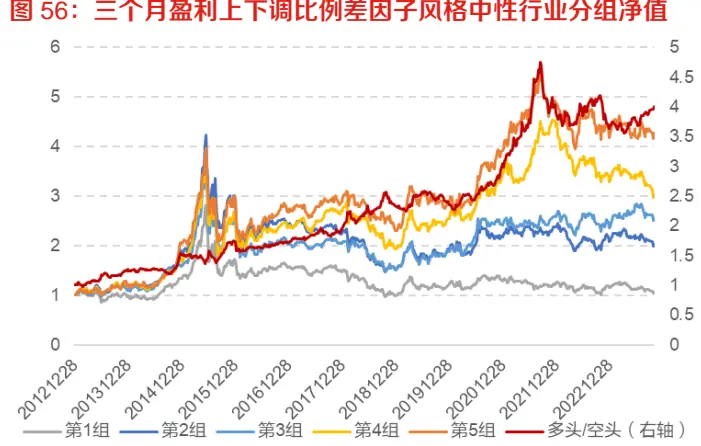
数据来源：Wind，朝阳永续，东方证券研究所

有关分析师的申明，见本报告最后部分。其他重要信息披露见分析师申明之后部分，或请与您的投资代表联系。并请阅读本证券研究报告最后一页的免责申明。

上图展示的是直接以个股的因子取值以及因子风格中性化后合成行业后分 5 组的净值及多空净值。可以看到该因子具有较为显著的行业轮动能力，但是2021年9月以来处于失效状态。进行风格中性后，该因子在行业上的多空收益得到了一定提升。

下面左图展示了风格中性化前后该因子合成行业轮动因子后分组多头净值表现情况。可以看到风格中性化后因子的多头有一定提升，但是自2021年9月以来多头并没有稳定的超额收益。下面右图展示了风格中性化前后该因子在行业上的周度 Rank IC 的累计值。可以看到，风格中性化后的累计 IC也略有提升。

图 57：三个月盈利上下调比例差因子风格中性前后多头净值
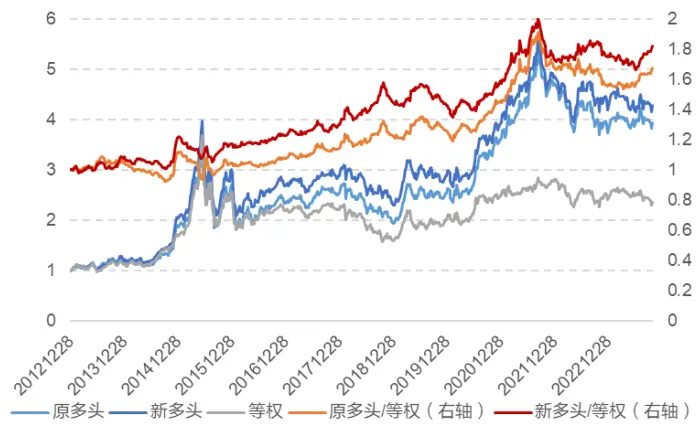
数据来源：Wind，朝阳永续，东方证券研究所

图 58：三个月盈利上下调比例差因子风格中性前后累计 IC
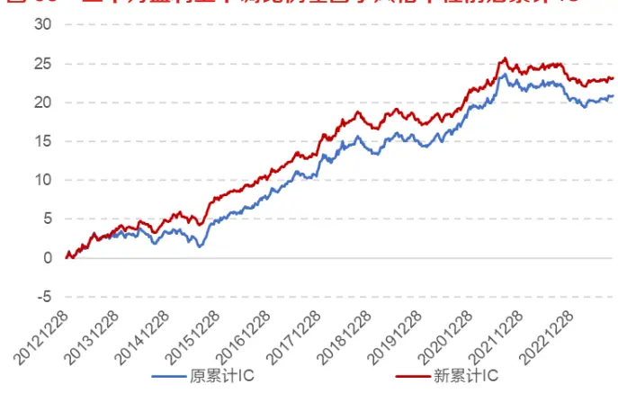
数据来源：Wind，朝阳永续，东方证券研究所

下表我们对比了风格中性化前后因子的行业轮动能力的对比情况。可以看到剥离风格后因子的 IC均值从 0.038提升到 0.042，年化 ICIR从 1.08提升到 1.28，周度多头超额也略有提升。

表 12：三个月盈利上下调比例差因子风格中性化前后行业轮动能力

|  | IC均值 | IC 标准差 | 年化ICIR | IC 胜率 | IC 绝对值 均值 | 多空周度 收益均值 | 多空周度胜 率 | 多头周度 超额均值 | 多头周度超 额胜率 | 自相关系 数均值 |
| --- | --- | --- | --- | --- | --- | --- | --- | --- | --- | --- |
| 原始 | 0.038 | 0.251 | 1.079 | 54.95% | 0.206 | 0.23% | 55.78% | 0.10% | 53.97% | 0.916 |
| 剥离风格 | 0.042 | 0.236 | 1.276 | 57.30% | 0.193 | 0.25% | 57.94% | 0.11% | 54.51% | 0.907 |

数据来源：Wind，朝阳永续，东方证券研究所

## 2.3.3 预期 ROE 一个月环比变化

从上面两个分析师预期变化类因子表现可以看到，2021年 9月以来的多头组合都没有明显超额收益，我们分析主要原因是这段时间内市场对于股票的景气变化的反应时间变短且急促，持续不了三个月的时间。所以我们可以进一步将环比变化的窗口缩短，构建一致预期滚动ROE的一个月环比变化因子：

$$
F\_ROE\_change\_20d=F\_ROE_{t}-F\_ROE_{t-20}
$$

其中 $F\_ROE_{t}$ 表示 t 时刻分析师对于股票的未来 12个月的一致预期滚动 ROE。

下图展示的是直接以个股的因子取值以及因子风格中性化后合成行业后分 5 组的净值及多空净值。可以看到该因子具有较为显著的行业轮动能力，并且2021年9月以来的多空收益比历史上还要更显著。进行风格中性后，该因子在行业上的多空收益也得到了一定提升。

图 59：预期 ROE一个月环比变化因子行业分组净值
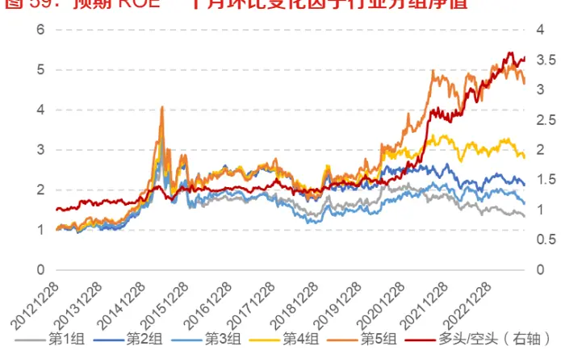
数据来源：Wind，朝阳永续，东方证券研究所

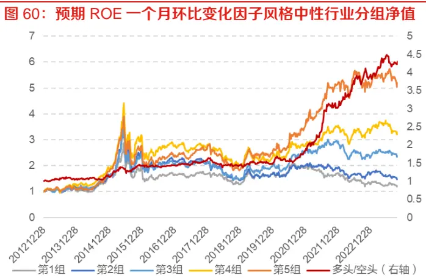
数据来源：Wind，朝阳永续，东方证券研究所

下面左图展示了风格中性化前后该因子合成行业轮动因子后分组多头净值表现情况。可以看到风格中性化后因子的多头有一定提升，并且2021年9月以来多头超额收益比历史上更显著。下面右图展示了风格中性化前后该因子在行业上的周度 Rank IC 的累计值。可以看到，风格中性化后的累计 IC也略有提升。

图 61：预期 ROE一个月环比变化因子风格中性前后多头净值
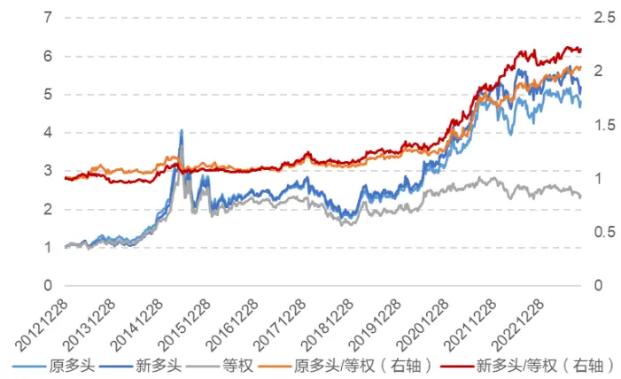
数据来源：Wind，朝阳永续，东方证券研究所

图 62：预期 ROE一个月环比变化因子风格中性前后累计 IC
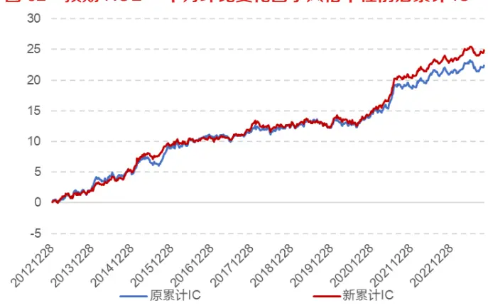
数据来源：Wind，朝阳永续，东方证券研究所

下表我们对比了风格中性化前后因子的行业轮动能力的对比情况。可以看到剥离风格后因子的 IC均值从 0.04提升到 0.045，年化 ICIR从 1.14提升到 1.42，周度多头超额也略有提升。

表 13：预期 ROE一个月环比变化因子风格中性化前后行业轮动能力

|  | IC均值 | IC 标准差 | 年化ICIR | IC 胜率 | IC 绝对值 均值 | 多空周度 收益均值 | 多空周度胜 率 | 多头周度 超额均值 | 多头周度超 额胜率 | 自相关系 数均值 |
| --- | --- | --- | --- | --- | --- | --- | --- | --- | --- | --- |
| 原始 | 0.040 | 0.255 | 1.142 | 54.59% | 0.210 | 0.24% | 55.78% | 0.14% | 53.07% | 0.752 |
| 剥离风格 | 0.045 | 0.228 | 1.424 | 56.94% | 0.187 | 0.27% | 57.94% | 0.15% | 54.51% | 0.736 |

数据来源：Wind，朝阳永续，东方证券研究所

## 2.4 微观量价类行业轮动因子

前面我们介绍了围观基本面、预期变化类的行业轮动因子，本节我们进一步介绍量价类的行业轮动因子。

有关分析师的申明，见本报告最后部分。其他重要信息披露见分析师申明之后部分，或请与您的投资代表联系。并请阅读本证券研究报告最后一页的免责申明。

## 2.4.1 剔除近一月的一年动量

行业上动量效应较为显著，我们采用剔除近一月的一年动量是经典的动量因子构造方式，其定义如下：

$$
Momentum_{-}1Y_{-}1m=\frac{delay(close,20)}{delay(close,244)}-1
$$

下图展示的是直接以个股的因子取值以及因子风格中性化后合成行业后分 5 组的净值及多空净值。可以看到原始因子在行业上的多空收益周期性较为明显，波动较大没有稳定的超额收益。而进行风格中性后，因子的多空收益得到明显提升，分组净值的单调性也大幅改善。

图 63：剔除近一月的一年动量因子行业分组净值
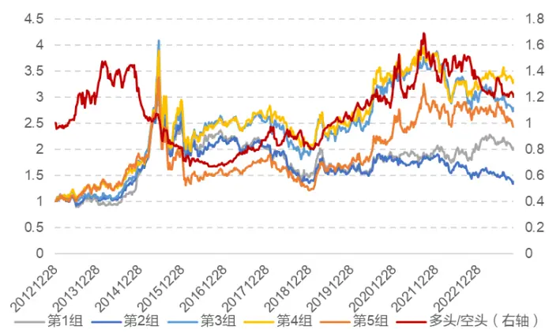
数据来源：Wind，东方证券研究所

图 64：剔除近一月的一年动量因子风格中性行业分组净值
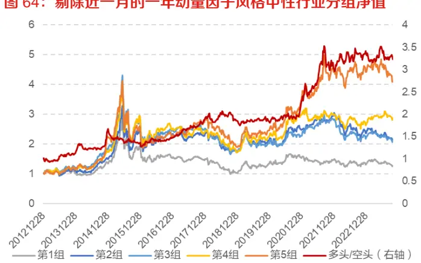
数据来源：Wind，东方证券研究所

下面左图展示了风格中性化前后该因子合成行业轮动因子后分组多头净值表现情况。可以看到风格中性化后因子的多头表现得到持续提升。下面右图展示了风格中性化前后该因子在行业上的周度 Rank IC的累计值。可以看到，风格中性化后的累计 IC的稳定性得到明显改善。

图 65：剔除近一月的一年动量因子风格中性前后多头净值
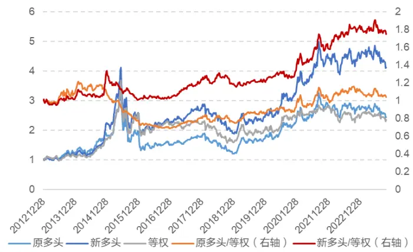
数据来源：Wind，东方证券研究所

图 66：剔除近一月的一年动量因子风格中性前后累计 IC
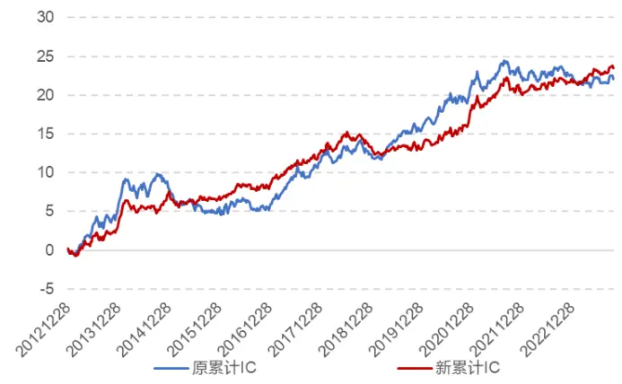
数据来源：Wind，东方证券研究所

下表我们对比了风格中性化前后因子的行业轮动能力的对比情况。可以看到剥离风格后因子的 IC均值从 0.04 提升到 0.042，年化 ICIR 从 0.84 提升到 1.12，周度多头超额均值从 0.02%提升到0.11%，提升效果显著。

表 14：剔除近一月的一年动量因子风格中性化前后行业轮动能力

|  | IC 均值 | IC 标准差 | 年化ICIR | IC 胜率 | IC 绝对值 均值 | 多空周度 收益均值 | 多空周度胜 率 | 多头周度 超额均值 | 多头周度超 额胜率 | 自相关系 数均值 |
| --- | --- | --- | --- | --- | --- | --- | --- | --- | --- | --- |
| 原始 | 0.040 | 0.342 | 0.840 | 55.32% | 0.284 | 0.05% | 52.71% | 0.02% | 52.35% | 0.965 |
| 剥离风格 | 0.042 | 0.272 | 1.124 | 54.95% | 0.222 | 0.22% | 54.51% | 0.11% | 51.99% | 0.951 |

数据来源：Wind，东方证券研究所

## 2.4.2 一个月 UMR

在我们之前的报告《UMR2.0——风险溢价视角下的动量反转统一框架再升级》（20230713）中我们构建了日度风险调整后的动量反转统一因子 UMR 因子，该因子具有非常显著的选股能力。这里我们进一步将其合成到行业上观察其行业轮动能力。这里我们取一个月窗口下的UMR因子，其定义如下：

$$
\mathit{UMR}={\sum}_{i=t-m+1}^{t}w_{i}\cdot Risk_{i}\cdot(r_{i}-mkt_{i})
$$

其中 m 为收益加权窗口取 20，w 为时间衰减的系数，半衰期取 10。

下面左图展示的是直接以个股的因子取值合成行业后分 5 组的净值及多空净值，右图展示的是个股的因子取值先进行风格中性再合成行业后分 5 组的净值及多空净值。可以看到该因子具有较为稳定的行业轮动能力，进行风格中性后，该因子在行业上的多空收益没有明显改善。

图 67：一个月 UMR因子行业分组净值
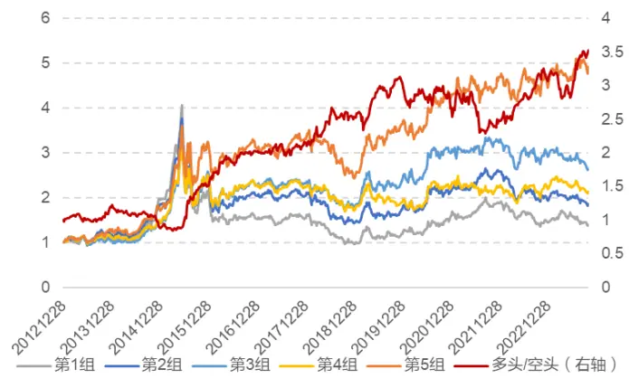
数据来源：Wind，东方证券研究所

图 68：一个月 UMR因子风格中性行业分组净值
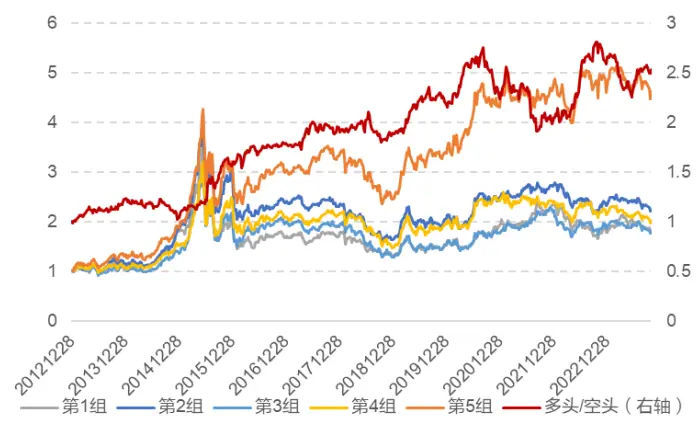
数据来源：Wind，东方证券研究所

下面左图展示了风格中性化前后该因子合成行业轮动因子后分组多头净值表现情况。可以看到风格中性化后因子的多头组合没有明显变化。下面右图展示了风格中性化前后该因子在行业上的周度 Rank IC的累计值，可以看到，风格中性化后的累计 IC的稳定性得到明显改善。

图 69：一个月 UMR因子风格中性前后多头净值
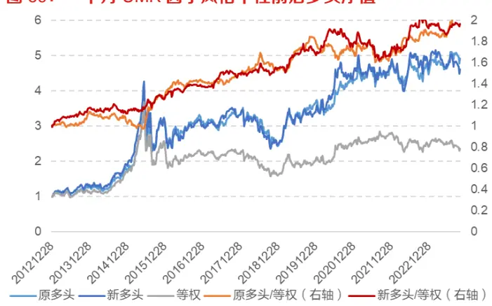
数据来源：Wind，东方证券研究所

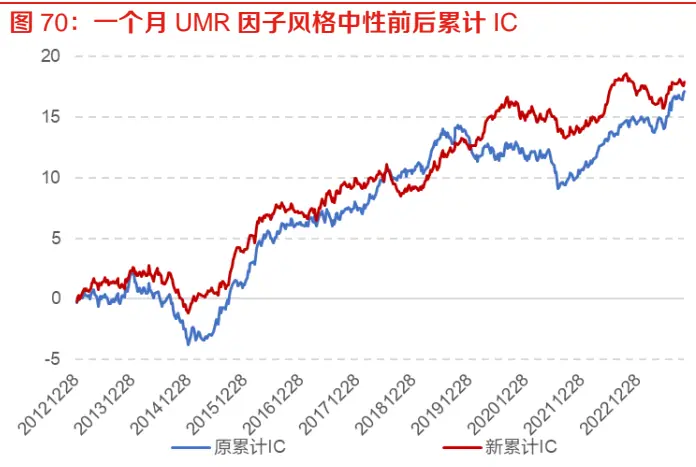
数据来源：Wind，东方证券研究所

下表我们对比了风格中性化前后因子的行业轮动能力的对比情况。可以看到剥离风格后因子的 IC均值变化不大，年化 ICIR从 0.73提升到0.86，周度多头超额均值没有明显变化。

表 15：一个月 UMR因子风格中性化前后行业轮动能力

|  | IC 均值 | IC 标准差 | 年化ICIR | IC 胜率 | IC 绝对值 均值 | 多空周度 收益均值 | 多空周度胜 率 | 多头周度 超额均值 | 多头周度超 额胜率 | 自相关系 数均值 |
| --- | --- | --- | --- | --- | --- | --- | --- | --- | --- | --- |
| 原始 | 0.031 | 0.304 | 0.732 | 54.41% | 0.248 | 0.22% | 54.69% | 0.13% | 52.71% | 0.798 |
| 剥离风格 | 0.032 | 0.272 | 0.859 | 54.05% | 0.222 | 0.17% | 54.33% | 0.13% | 54.33% | 0.784 |

数据来源：Wind，东方证券研究所

## 2.4.3 三个月 UMR

我们将 UMR 因子的加权窗口从一个月调整为三个月，合成行业因子后检验其行业轮动能力。下面左图展示的是直接以个股的因子取值合成行业后分 5 组的净值及多空净值，右图展示的是个股的因子取值先进行风格中性再合成行业后分 5 组的净值及多空净值。可以看到该原始因子具有较为稳定的行业轮动能力，进行风格中性后，2020年之后多空收益反而失效。

图 71：三个月 UMR因子行业分组净值
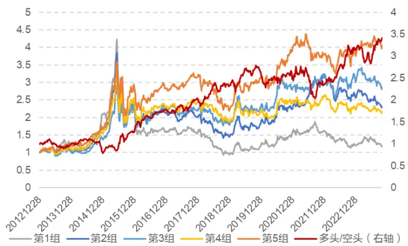
数据来源：Wind，东方证券研究所

图 72：三个月因子风格中性行业分组净值
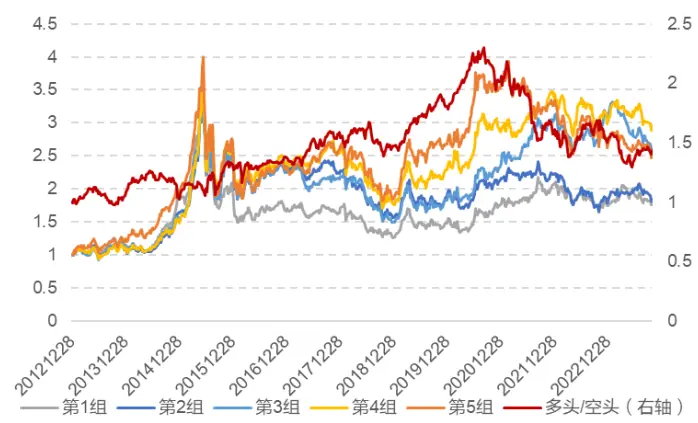
数据来源：Wind，东方证券研究所

下面左图展示了风格中性化前后该因子合成行业轮动因子后分组多头净值表现情况。可以看到风格中性化后因子的多头超额收益反而下降。下面右图展示了风格中性化前后该因子在行业上的周

有关分析师的申明，见本报告最后部分。其他重要信息披露见分析师申明之后部分，或请与您的投资代表联系。并请阅读本证券研究报告最后一页的免责申明。

度 RankIC的累计值，可以看到，风格中性化后的累计 IC的稳定性有一定改善，但是近 3年累计IC 走平。

图 73：三个月因子风格中性前后多头净值
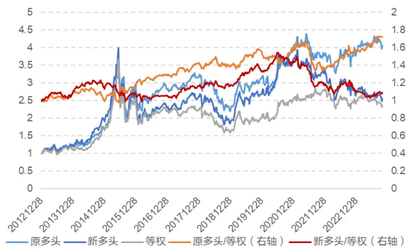
数据来源：Wind，东方证券研究所

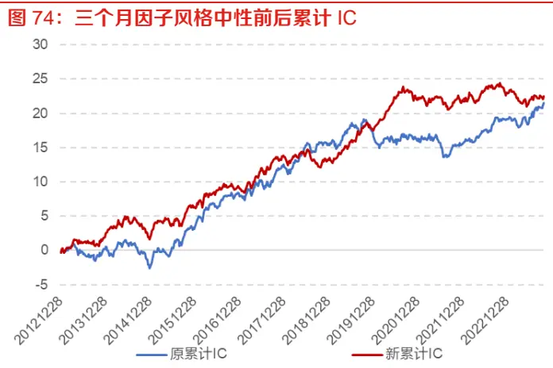
数据来源：Wind，东方证券研究所

下表我们对比了风格中性化前后因子的行业轮动能力的对比情况。可以看到剥离风格后因子的 IC均值略有提升，年化 ICIR从 0.89提升到0.99，周度多头超额均值有一定下滑。

表 16：三个月因子风格中性化前后行业轮动能力

|  | IC 均值 | IC 标准差 | 年化ICIR | IC 胜率 | IC 绝对值 均值 | 多空周度 收益均值 | 多空周度胜 率 | 多头周度 超额均值 | 多头周度超 额胜率 | 自相关系 数均值 |
| --- | --- | --- | --- | --- | --- | --- | --- | --- | --- | --- |
| 原始 | 0.039 | 0.316 | 0.886 | 54.59% | 0.264 | 0.21% | 54.87% | 0.10% | 53.25% | 0.933 |
| 剥离风格 | 0.041 | 0.295 | 0.992 | 55.50% | 0.247 | 0.08% | 55.60% | 0.03% | 54.15% | 0.931 |

数据来源：Wind，东方证券研究所

## 2.4.4 30 日日内波动率结构

我们希望能够挑选日内涨幅越大并且日内波幅越小的行业，这样的行业收益率波动更低、稳定性更强。我们分别计算日内开盘到收盘收益的波动率和日内最高价和最低价的极差波动率，以两个波动率的差作为日内波动率因子，计算方式如下：

$$
HV\_30d=ts\_std\left(\frac{Cloge-Open}{Open},\;30\right)-ts\_std\left(\frac{High-Low}{(High+Low)/2},\;30\right)
$$

图 75：30日日内波动率结构因子行业分组净值
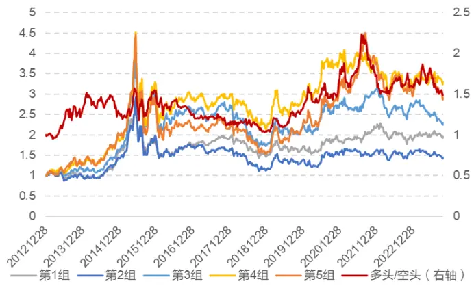
数据来源：Wind，东方证券研究所

图 76：30日日内波动率结构因子风格中性行业分组净值
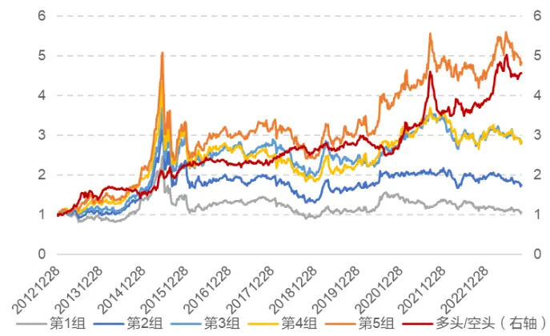
数据来源：Wind，东方证券研究所
有关分析师的申明，见本报告最后部分。其他重要信息披露见分析师申明之后部分，或请与您的投资代表联系。并请阅读本证券研究报告最后一页的免责申明。

上面左图展示的是直接以个股的因子取值合成行业后分 5 组的净值及多空净值，右图展示的是个股的因子取值先进行风格中性再合成行业后分 5 组的净值及多空净值。可以看到该原始因子没有稳定的行业轮动能力，进行风格中性后，分组净值单调性明显，多空收益持续稳健。

下面左图展示了风格中性化前后该因子合成行业轮动因子后分组多头净值表现情况。可以看到风格中性化后因子的多头超额收益持续稳定向上。下面右图展示了风格中性化前后该因子在行业上的周度 Rank IC的累计值，可以看到，风格中性化后的累计 IC的稳定性有大幅改善。

图 77：30日日内波动率结构因子风格中性前后多头净值
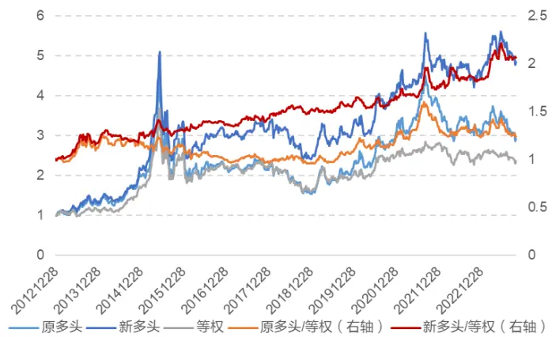
数据来源：Wind，东方证券研究所

图 78：30日日内波动率结构因子风格中性前后累计 IC
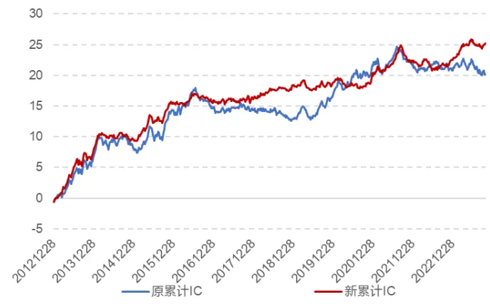
数据来源：Wind，东方证券研究所

下表中我们对比了风格中性化前后因子的行业轮动能力的对比情况。可以看到剥离风格后因子的IC 均值从 0.036 提升到 0.046，年化 ICIR 从 0.72 提升到 1.22，周度多头超额均值从 0.07%提升到 0.14%。

表 17：30日日内波动率结构因子风格中性化前后行业轮动能力

|  | IC 均值 | IC 标准差 | 年化ICIR | IC 胜率 | IC 绝对值 均值 | 多空周度 收益均值 | 多空周度胜 率 | 多头周度 超额均值 | 多头周度超 额胜率 | 自相关系 数均值 |
| --- | --- | --- | --- | --- | --- | --- | --- | --- | --- | --- |
| 原始 | 0.036 | 0.362 | 0.723 | 53.15% | 0.304 | 0.11% | 52.17% | 0.07% | 50.36% | 0.934 |
| 剥离风格 | 0.046 | 0.269 | 1.222 | 53.51% | 0.219 | 0.28% | 55.23% | 0.14% | 52.35% | 0.871 |

数据来源：Wind，东方证券研究所

## 2.5 微观深度学习行业轮动因子

在我们之前的报告《基于残差网络的端到端因子挖掘模型》（20230824）中，我们以周频、日频、分钟、level2四个数据集作为训练数据集，以每只股票过去30个交易日（周频数据取过去30周）的数据特征对未来10个交易日的收益构建了基于残差神经网络的收益预测模型，构建的选股因子在股票上具有非常显著的收益预测能力。

训练神经网络时我们构建的预测标签并没有进行完全的行业中性操作，因此神经网络作为一个拟合能力突出的模型，会学到很多行业轮动的收益。我们将该深度学习因子以成分股权重加权得到行业深度学习因子，并检验其行业轮动能力。并且训练时我们也没有做风格中性操作，因此其也会学到很多风格轮动的收益，所以在合成行业轮动因子时我们就不进行风格中性化操作而直接合成行业因子。

下图展示的是直接以个股的因子取值合成行业后分 5 组的净值及多空净值。可以看到该因子具有非常显著的行业轮动能力。从右图的多头超额曲线可以看到，其多头超额净值非常显著且稳健。

图 79：深度学习因子行业分组净值
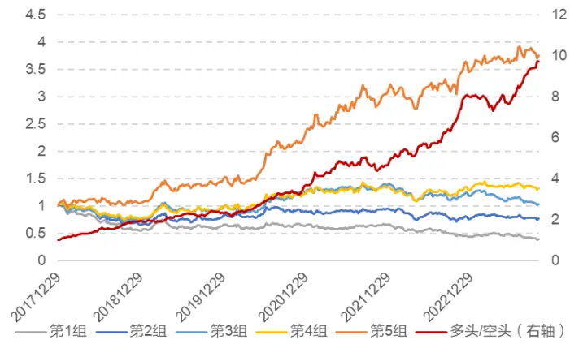
数据来源：Wind，东方证券研究所

图 80：深度学习因子多头行业净值
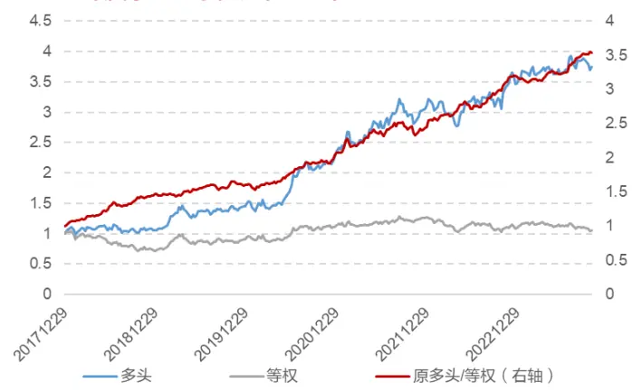
数据来源：Wind，东方证券研究所

下图展示了该因子在行业上的周度 Rank IC 的累计值，可以看到其稳定性非常好，没有明显失效的情况。

图 81：深度学习行业轮动累计IC
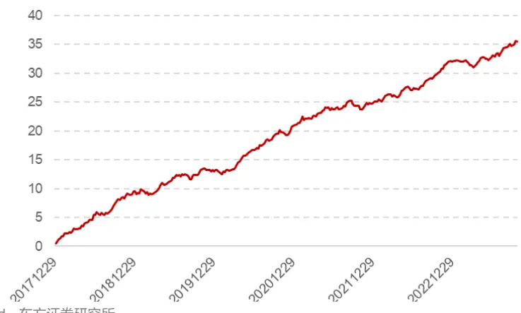
数据来源：Wind，东方证券研究所

下表展示了该因子的行业轮动能力的具体数据，可以看到该因子的 IC均值达 0.12,，年化 ICIR达3.13，周度多头超额均值高达0.43%，具有非常突出的行业轮动能力。

表 18：深度学习因子行业轮动能力

| IC 绝对值均 多空周度收 多空周度胜 |  |  |  |  |  |  |  |  |  |
| --- | --- | --- | --- | --- | --- | --- | --- | --- | --- |
| IC 均值 | IC 标准差 | 年化ICIR | IC 胜率 | 值 | 益均值 | 率 | 多头周度超 额均值 | 多头周度超 额胜率 | 自相关系数 均值 |
| 0.119 | 0.275 | 3.128 | 67.79% | 0.242 | 0.76% | 65.88% | 0.43% | 65.88% | 0.685 |

数据来源：Wind，东方证券研究所

## 三、中观行业轮动因子

上一节中我们从微观自下而上的维度介绍了基本面、预期变化、量价、深度学习类的行业轮动因子，这一节我们从中观自上而下的维度介绍预期变化、量价类的行业轮动因子。由于个股基本面因子合成行业因子与行业整体法的基本面因子表现接近，这里就不再介绍基本面类因子。中观因子直接从行业整体法进行构建，因此我们就不再进行风格中性化操作。

## 3.1 中观预期变化类行业轮动因子

从前文中微观的预期变化类因子的行业轮动能力可以看到，三个月窗口下的预期环比变化因子多头组合近 2 年都没有显著超额收益，而一个月短窗口下预期环比变化因子的多头超额近 2 年没有失效且收益比历史上还要更显著。因此从中观层面我们也引入短周期窗口下的预期环比类因子。

## 2.4.4 一个月超预期股票数量占比

超预期对于股票的基本面来说是重大的收益驱动因素，股票业绩超预期后的股价表现也是非常强势。这里我们以公司发布盈余公告后的分析师点评的研报标题是否包含“业绩超预期”等超预期的短语来判断股票是否超预期。对于任意一只股票只要有一篇研报标题超预期我们即认为该股票超预期，在每个截面上我们取每个行业内过去一个月内存在研报标题超预期的股票数量占比作为行业超预期因子：

## Title_ue_pct=过去一个月内有研报标题超预期的股票数量/行业内股票数量

下面左图展示的是该因子在行业上分 5 组的分组净值及多空净值，可以看到该因子具有非常稳定的行业轮动能力，并且近 2 年由于市场对于景气度的反应短且急促，因此其多空收益比历史上还有更显著。从右图的多头超额曲线可以看到，其多头超额表现也非常稳健，且近 2 年多头超额比历史上还要更好。

图 82：一个月超预期股票数量占比因子行业分组净值
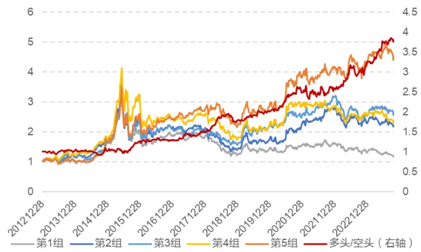
数据来源：Wind，朝阳永续，东方证券研究所

图 83：一个月超预期股票数量占比因子多头行业净值
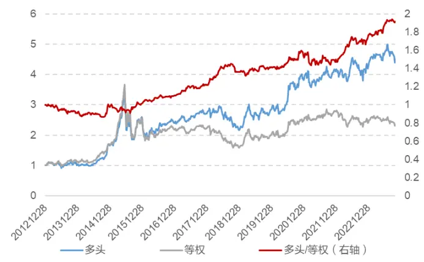
数据来源：Wind，朝阳永续，东方证券研究所

下图展示了该因子在行业上的周度 Rank IC 的累计值，可以看到其总体单调向上，近几年表现也较为稳定。

图 84： 一个月超预期股票数量占比因子行业轮动累计 IC
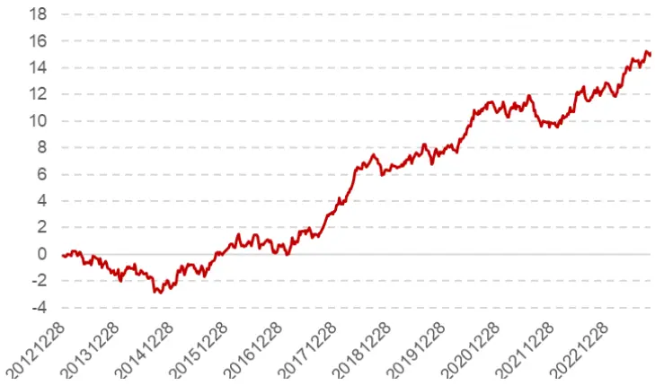
数据来源：Wind，朝阳永续，东方证券研究所

下表展示了该因子的行业轮动能力的具体数据，可以看到该因子的 IC 均值 0.027，年化 ICIR 为0.88，周度多头超额均值 0.12%。

表 19：一个月超预期股票数量占比因子行业轮动能力

| IC 绝对值均 多空周度收 |  |  |  |  |  |  |  |  |  |
| --- | --- | --- | --- | --- | --- | --- | --- | --- | --- |
| IC 均值 | IC 标准差 | 年化ICIR | IC 胜率 | 值 | 益均值 | 多空周度胜 率 | 多头周度超 额均值 | 多头周度超 额胜率 | 自相关系数 均值 |
| 0.027 | 0.224 | 0.878 | 54.05% | 0.178 | 0.24% | 55.78% | 0.12% | 53.79% | 0.670 |

数据来源：Wind，朝阳永续，东方证券研究所

## 3.2 中观量价类行业轮动因子

行业上动量效应较为显著，这里我们进一步基于行业指数的量价数据直接构造一些短期动量类行业轮动因子。

## 3.2.1 10日波动率调整后动量

首先我们根据过去 10日的波动率调整后动量因子构建短期价格动量因子，定义如下：

图 85：10日波动率调整后动量因子行业分组净值
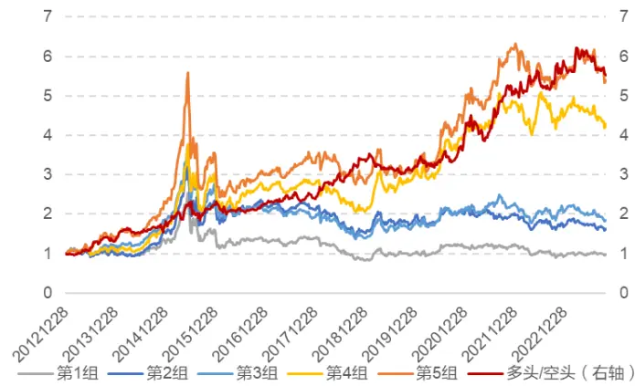
数据来源：Wind，东方证券研究所

$$
Ret\_2\_Vol=\frac{Close_{t}/Close_{t-10}-1}{ts\_std(Ret,10)}
$$

图 86：10日波动率调整后动量因子多头行业净值
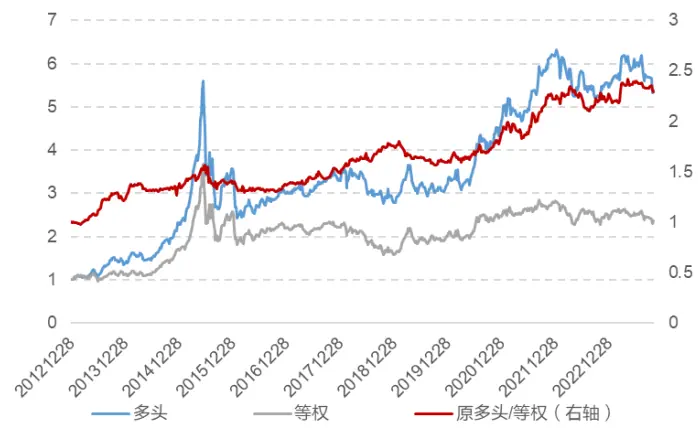
数据来源：Wind，东方证券研究所

有关分析师的申明，见本报告最后部分。其他重要信息披露见分析师申明之后部分，或请与您的投资代表联系。并请阅读本证券研究报告最后一页的免责申明。

上面左图展示的是该因子在行业上分 5 组的分组净值及多空净值，可以看到该因子具有较为稳定的行业轮动能力。从右图的多头超额曲线可以看到，其多头超额表现也较为稳健，近 2 年也没有出现持续失效的状态。下图展示了该因子在行业上的周度 Rank IC 的累计值，可以看到其总体单调向上，近几年表现也较为稳定。

图 87：10日波动率调整后动量因子行业轮动累计 IC
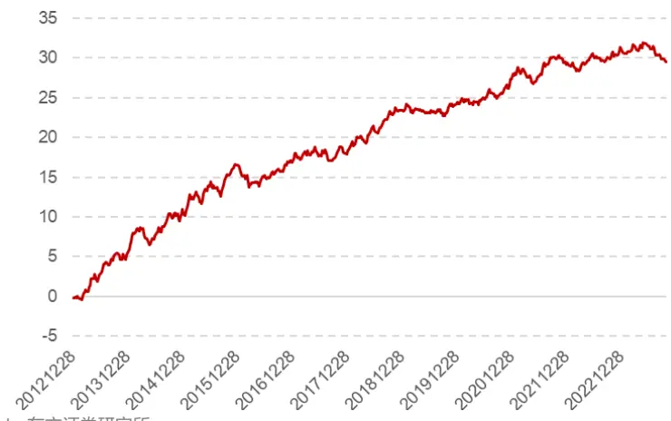
数据来源：Wind，东方证券研究所

下表展示了该因子的行业轮动能力的具体数据，可以看到该因子的 IC 均值 0.053，年化 ICIR 为1.21，周度多头超额均值 0.17%。

表 20：10日波动率调整后动量因子行业轮动能力

| IC 绝对值均 多空周度收 |  |  |  |  |  |  |  |  |  |
| --- | --- | --- | --- | --- | --- | --- | --- | --- | --- |
| IC均值 | IC 标准差 | 年化ICIR | IC 胜率 | 值 | 益均值 | 多空周度胜 率 | 多头周度超 额均值 | 多头周度超 额胜率 | 自相关系数 均值 |
| 0.053 | 0.317 | 1.213 | 56.58% | 0.258 | 0.32% | 56.09% | 0.17% | 53.68% | 0.491 |

数据来源：Wind，东方证券研究所

## 3.2.2 10 日 RSI

上面是一个收益率动量类因子，这里进一步介绍一个频率类的动量因子，RSI 是技术分析中的一个经典动量指标，早在 1978年由 JW Wilder提出。这里我们取过去 10日的 RSI指标，衡量过去一段时间内上涨天数与下跌天数的相对强弱，其定义如下：

$$
\begin{aligned}RS=&\frac{ts\_mean(Class>Precision,10)}{ts\_mean(Class\leq Precision,10)}\\&\\RSI\_10d=&ts\_mean(100-\frac{100}{1+abs(RS)},10)\end{aligned}
$$

下面左图展示的是该因子在行业上分 5 组的分组净值及多空净值，可以看到该因子具有非常稳定的行业轮动能力。从右图的多头超额曲线可以看到，其多头超额表现也非常稳健，只有在2015年牛市和股灾时表现较差，主要原因是这段时间大部分行业表现出同涨同跌的特性，该因子区分能力不明显，而在其他时间段该因子的多头超额都非常稳健。

图 88：10日 RSI因子行业分组净值
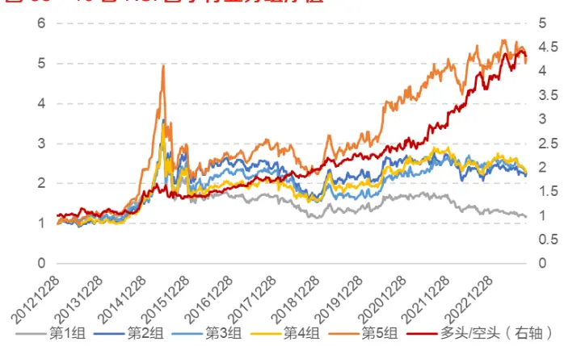
数据来源：Wind，东方证券研究所

图 89：10日 RSI因子多头行业净值
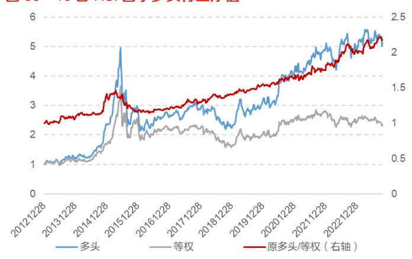
数据来源：Wind，东方证券研究所

下图展示了该因子在行业上的周度 Rank IC 的累计值，可以看到其总体单调向上，近几年表现也较为稳定。

图 90：10日 RSI因子行业轮动累计 IC
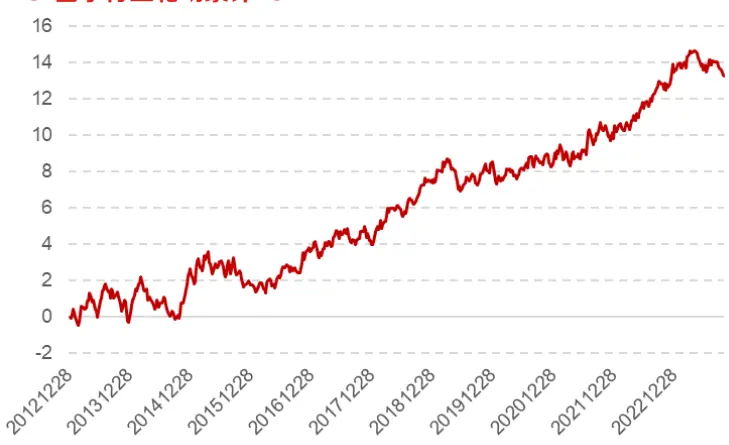
数据来源：Wind，东方证券研究所

下表展示了该因子的行业轮动能力的具体数据，可以看到该因子的 IC 均值 0.024，年化 ICIR 为0.69，周度多头超额均值 0.15%。

表 21：10日 RSI因子行业轮动能力

| IC 绝对值均 多空周度收 多空周度胜 |  |  |  |  |  |  |  |  |  |
| --- | --- | --- | --- | --- | --- | --- | --- | --- | --- |
| IC均值 | IC 标准差 | 年化ICIR | IC 胜率 | 值 | 益均值 | 率 | 多头周度超 额均值 | 多头周度超 额胜率 | 自相关系数 均值 |
| 0.024 | 0.249 | 0.692 | 54.41% | 0.203 | 0.27% | 55.23% | 0.15% | 54.87% | 0.701 |

数据来源：Wind，东方证券研究所

## 3.2.3 20 日前低距离

前两个动量因子都是固定窗口下的统计值，这里我们进一步介绍锚点型的动量因子。我们取过去20 个交易日内每个行业离窗口内最低价以来的前低距离，即最低价以来的反弹幅度，作为锚点型动量因子，主要捕捉底部反弹以来最强势的行业，其定义如下：

$$
LD\_20d=\frac{Close_t}{ts_{\_}delay(ts_{\_}min(Close,\ 20),1)}
$$

其中 $ts\_delay(x,n)$ 是指指标 x 在时间序列上滞后 n 日。

有关分析师的申明，见本报告最后部分。其他重要信息披露见分析师申明之后部分，或请与您的投资代表联系。并请阅读本证券研究报告最后一页的免责申明。

下面左图展示的是该因子在行业上分 5 组的分组净值及多空净值，可以看到该因子具有较为稳定的行业轮动能力。从右图可以看到，其多头超额表现也较为稳健。

图 91：20日前低距离因子行业分组净值
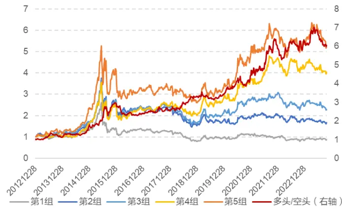
数据来源：Wind，东方证券研究所

图 92：20日前低距离因子多头行业净值
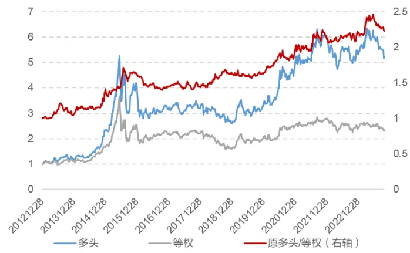
数据来源：Wind，东方证券研究所

下图展示了该因子在行业上的周度 Rank IC 的累计值，可以看到其总体单调向上，近几年表现也较为稳定。

图 93：20日前低距离因子行业轮动累计 IC
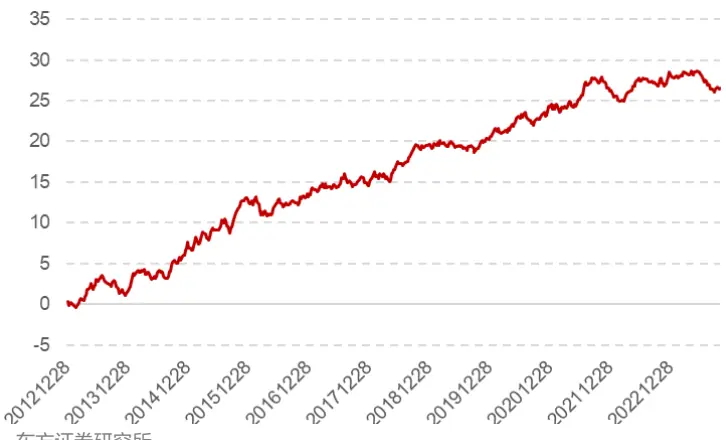
数据来源：Wind，东方证券研究所

下表展示了该因子的行业轮动能力的具体数据，可以看到该因子的 IC 均值 0.048，年化 ICIR 为1.12，周度多头超额均值 0.16%。

表 22：20日前低距离因子行业轮动能力

| IC 绝对值均 多空周度胜 |  |  |  |  |  |  |  |  |  |
| --- | --- | --- | --- | --- | --- | --- | --- | --- | --- |
| IC 均值 | IC 标准差 | 年化ICIR | IC 胜率 | 值 | 多空周度收 益均值 | 率 | 多头周度超 额均值 | 多头周度超 额胜率 | 自相关系数 均值 |
| 0.048 | 0.308 | 1.120 | 55.14% | 0.253 | 0.34% | 54.51% | 0.16% | 53.43% | 0.611 |

数据来源：Wind，东方证券研究所

## 四、周频行业轮动模型

前两节中我们从微观和中观两个角度介绍了基本面、预期变化、量价、深度学习类行业轮动因子，这些因子均具有较为稳健的行业轮动能力，下面我们进一步将这些因子合成构建周频多因子行业轮动模型。

## 4.1 行业轮动大类复合因子

首先我们将前文中介绍的因子分成如下图的四个大类，其中深颜色的因子为中观行业轮动因子，浅颜色的因子为微观合成的行业轮动因子。我们将大类内部等权构建 4 个复合因子，并将 4 个复合因子进行复合得到最终的行业轮动模型。

图 94：行业轮动大类因子
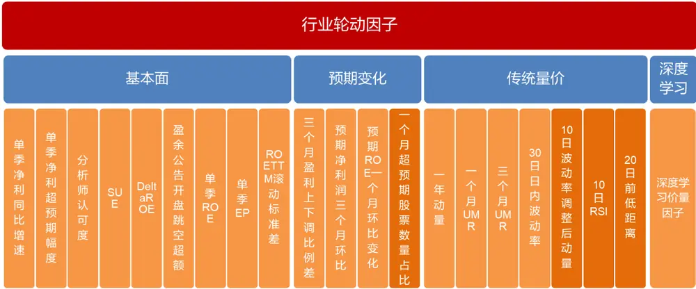
数据来源：Wind，朝阳永续，东方证券研究所

## 4.1.1 基本面类行业轮动复合因子

首先我们将基本面因子等权复合得到基本面大类因子，下面两张图分别对比了基本面因子直接加权/风格中性化后加权得到行业因子并多因子等权后的行业分组净值。

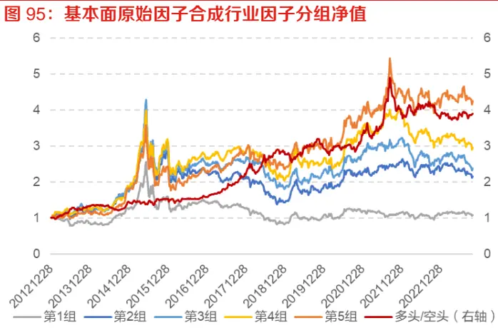

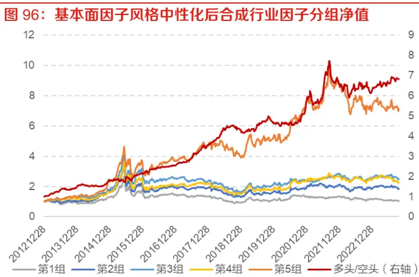
有关分析师的申明，见本报告最后部分。其他重要信息披露见分析师申明之后部分，或请与您的投资代表联系。并请阅读本证券研究报告最后一页的免责申明。

可以看到，风格中性化后等权复合的基本面行业轮动因子具有较为稳定的行业轮动能力，相比于不进行风格中性化的提升效果非常显著。其只在 2021年9月-2022年期间多空收益短期失效，其他时间多空收益都较为稳健。

下面左图展示了基本面因子等权合成行业因子后多头净值表现情况。可以看到风格中性化后多头组合收益有大幅提高，只在 2021年 9月-2023年 4月失效，并且 2023年 4月以来又开始有明显的超额收益。右图展示了风格中性前后复合基本面因子的累计IC，可以看到累计IC也是大幅好于原始因子直接合成的版本。

图 97：基本面因子合成行业因子多头净值
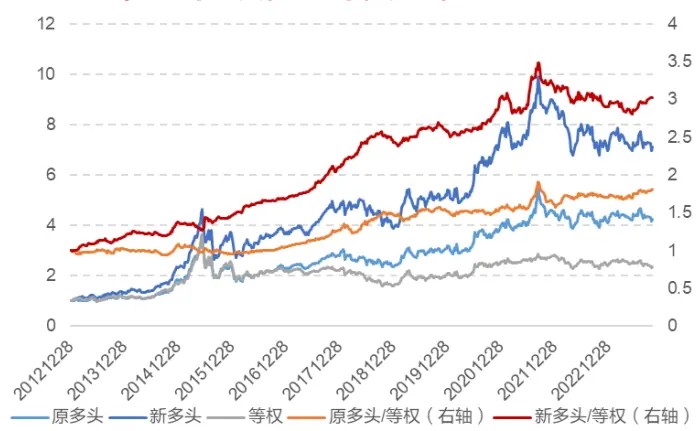
数据来源：Wind，朝阳永续，东方证券研究所

图 98：基本面因子风格中性化前后合成行业因子累计 IC
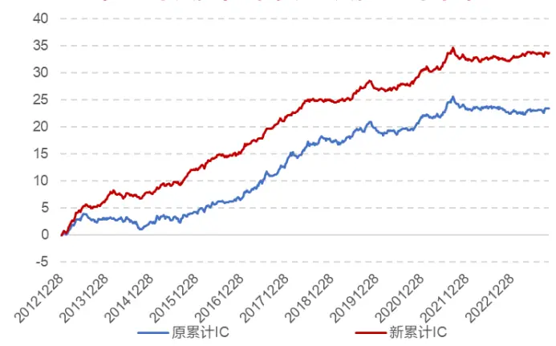
数据来源：Wind，朝阳永续，东方证券研究所

下表统计了基本面因子风格中性化前后复合行业轮动因子的具体数据，可以看到风格中性化后，复合因子 IC 均值从 0.042 提升到 0.061，年化 ICIR 从 1.21 提升到 1.93，周度多头超额均值从0.11%提升到 0.2%，提升效果非常显著。

表 23：基本面因子风格中性化前后合成行业因子的行业轮动能力

| 多头周度 |  |  |  |  | IC 绝对值 多空周度 多空周度胜 |  |  |  |  |  |
| --- | --- | --- | --- | --- | --- | --- | --- | --- | --- | --- |
|  | IC 均值 | IC 标准差 | 年化ICIR | IC 胜率 | 均值 | 收益均值 | 率 | 超额均值 | 多头周度超 额胜率 | 自相关系 数均值 |
| 原始 | 0.042 | 0.252 | 1.214 | 55.14% | 0.205 | 0.24% | 56.68% | 0.11% | 53.97% | 0.966 |
| 剥离风格 | 0.061 | 0.228 | 1.927 | 60.36% | 0.191 | 0.35% | 58.12% | 0.20% | 57.40% | 0.953 |

数据来源：Wind，朝阳永续，东方证券研究所

## 4.1.2 预期变化类行业轮动复合因子

我们将预期变化类因子等权复合得到预期变化大类因子，下面两张图分别对比了预期变化因子直接加权/风格中性化后加权得到行业因子并多因子等权后的行业分组净值。可以看到，风格中性化后等权复合的预期变化行业轮动因子具有较为稳定的行业轮动能力，相比于不进行风格中性化的提升效果明显，2021年9月以来波动较大。

图 99：预期变化原始因子合成行业因子分组净值
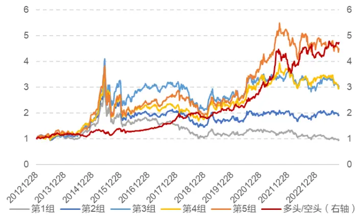
数据来源：Wind，朝阳永续，东方证券研究所

图 100：因子风格中性化后合成行业因子分组净值
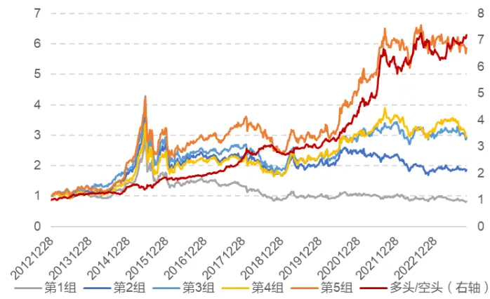
数据来源：Wind，朝阳永续，东方证券研究所

下面左图展示了预期变化因子等权合成行业因子后多头净值表现情况。可以看到风格中性化后多头组合收益持续优于原始因子合成的版本，并且2023年4月以来也有明显的超额收益。右图展示了风格中性前后复合预期变化因子的累计IC，可以看到累计IC也是持续优于原始因子直接合成的版本。

图 101：预期变化因子合成行业因子多头净值
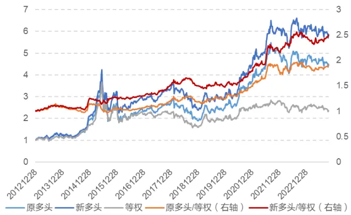
数据来源：Wind，朝阳永续，东方证券研究所

图 102：预期变化因子风格中性化前后合成行业因子累计 IC
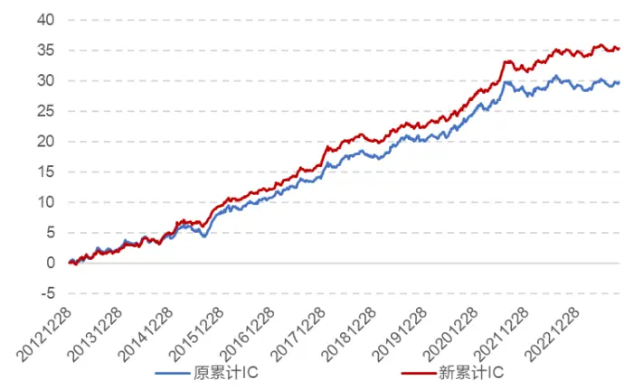
数据来源：Wind，朝阳永续，东方证券研究所

下表统计了预期变化因子风格中性化前后复合行业轮动因子的具体数据，可以看到风格中性化后，复合因子 IC 均值从 0.054 提升到 0.064，年化 ICIR 从 1.51 提升到 1.97，周度多头超额均值从0.13%提升到 0.17%，提升效果非常显著。

表 24：预期变化因子风格中性化前后合成行业因子的行业轮动能力

|  | IC 均值 | IC 标准差 | 年化ICIR | IC 胜率 | IC 绝对值 均值 | 多空周度 收益均值 | 多空周度胜 率 | 多头周度 超额均值 | 多头周度超 额胜率 | 自相关系 数均值 |
| --- | --- | --- | --- | --- | --- | --- | --- | --- | --- | --- |
| 原始 | 0.054 | 0.257 | 1.507 | 57.66% | 0.214 | 0.29% | 55.96% | 0.13% | 53.43% | 0.871 |
| 剥离风格 | 0.064 | 0.234 | 1.974 | 60.18% | 0.196 | 0.36% | 58.30% | 0.17% | 51.81% | 0.859 |

数据来源：Wind，朝阳永续，东方证券研究所

## 4.1.3量价类行业轮动复合因子

有关分析师的申明，见本报告最后部分。其他重要信息披露见分析师申明之后部分，或请与您的投资代表联系。并请阅读本证券研究报告最后一页的免责申明。

我们将传统量价类因子等权复合得到量价大类因子，下面两张图分别对比了量价类因子直接加权风格中性化后加权得到行业因子并多因子等权后的行业分组净值。可以看到，风格中性化后等权复合的行业轮动因子具有较为稳定的行业轮动能力，相比于不进行风格中性化的多空收益略微下降。

图 103：量价原始因子合成行业因子分组净值
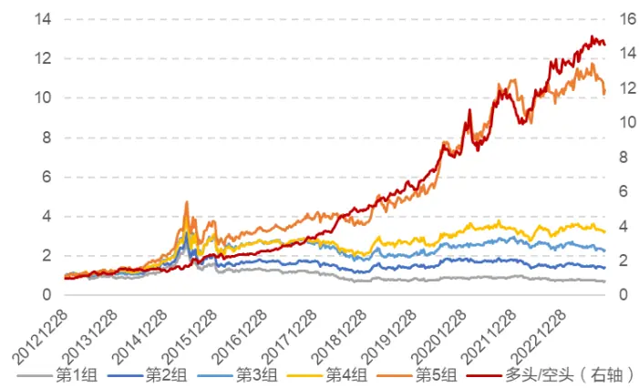
数据来源：Wind，东方证券研究所

图 104：量价因子风格中性化后合成行业因子分组净值
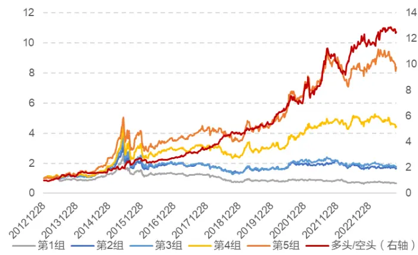
数据来源：Wind，东方证券研究所

下面左图展示了量价类因子等权合成行业因子后多头净值表现情况。可以看到风格中性化后多头组合收益略弱于原始因子合成的版本。右图展示了风格中性前后复合预期变化因子的累计 IC，可以看到风格中性化后的累计 IC更加稳健。

图 105：量价因子合成行业因子多头净值
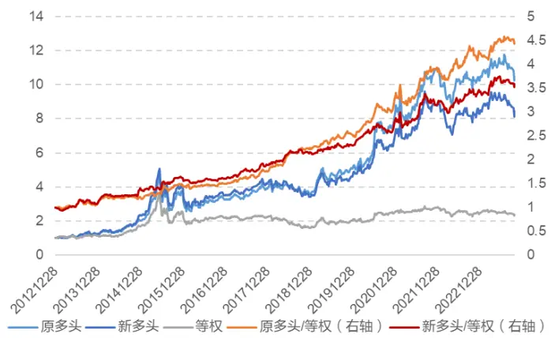
数据来源：Wind，东方证券研究所

图 106：量价因子风格中性化前后合成行业因子累计 IC
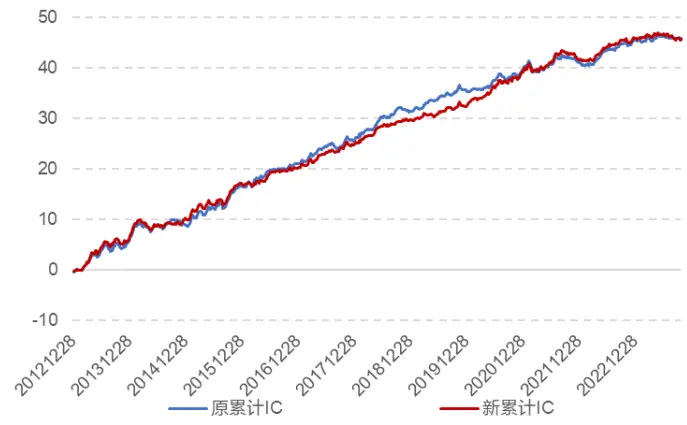
数据来源：Wind，东方证券研究所

下表统计了量价因子风格中性化前后复合行业轮动因子的具体数据，可以看到风格中性化后，复合因子 IC均值、ICIR、周度多头超额都变化不大。

表 25：量价因子风格中性化前后合成行业因子的行业轮动能力

|  | IC 均值 | IC 标准差 | 年化ICIR | IC 胜率 | IC 绝对值 均值 | 多空周度 收益均值 | 多空周度胜 率 | 多头周度 超额均值 | 多头周度超 | 自相关系 |
| --- | --- | --- | --- | --- | --- | --- | --- | --- | --- | --- |
| 原始 | 0.083 | 0.293 | 2.035 | 59.82% | 0.244 | 0.50% | 58.66% | 0.28% | 额胜率 57.58% | 数均值 0.762 |
| 剥离风格 | 0.082 | 0.282 | 2.108 | 60.00% | 0.235 | 0.47% | 59.03% | 0.24% | 58.66% | 0.776 |

数据来源：Wind，东方证券研究所

有关分析师的申明，见本报告最后部分。其他重要信息披露见分析师申明之后部分，或请与您的投资代表联系。并请阅读本证券研究报告最后一页的免责申明。

## 4.2 行业轮动复合因子

由于我们是周频调仓，而基本面和预期变化类因子的变化缓慢，所以我们以量价类因子为主，我们将基本面、预期变化、传统量价、深度学习四大类因子以1:1:4:4的方式复合得到静态复合行业轮动因子。

下图展示了复合因子分 5 组的净值及多头超额表现情况。可以看到，分 5 组合后多空收益非常显著，尤其是第 1 组显著强于其他 4 组。而从右图的多头超额净值来看，多头组合能够持续稳定大幅跑赢行业等权基准。

图 107：静态复合行业轮动因子分组净值
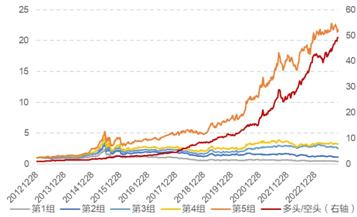
数据来源：Wind，朝阳永续，东方证券研究所

图 108：静态复合行业轮动因子多头行业净值
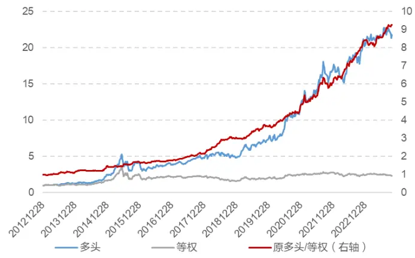
数据来源：Wind，朝阳永续，东方证券研究所

下图展示了复合因子在行业上的周度 RankIC的累计值。可以看到累计 IC曲线非常稳定向上，波动非常小。

图 109：静态复合行业轮动因子累计 IC
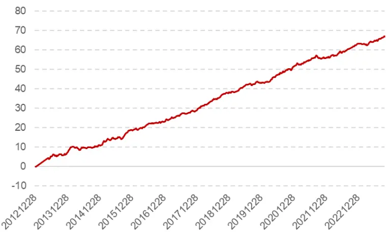
数据来源：Wind，朝阳永续，东方证券研究所

下表我们对比了各大类因子和复合因子的行业轮动能力。复合因子的周度 IC 均值达 0.12，年化ICIR达 3.11，周度多头超额均值 0.41%，并且由于加入了换手较低的基本面和预期变化类因子，因子的自相关性较高，衰减速度也较为缓慢。

表 26：静态复合行业轮动因子的行业轮动能力对比

|  | IC均值IC 标准差年化ICIR |  |  | IC 绝对值多空周度多空周度胜多头周度多头周度超自相关系IC 胜率 |  |  |  |  |  |  |  |  |  |  |  |  |
| --- | --- | --- | --- | --- | --- | --- | --- | --- | --- | --- | --- | --- | --- | --- | --- | --- |
|  |  |  |  |  |  |  |  |  |  |  | 均值 | 收益均值 | 率 | 超额均值 | 额胜率 | 数均值 |
| 基本面 | 0.061 | 0.228 | 1.927 | 60.36% | 0.191 | 0.35% | 58.12% | 0.20% | 57.40% | 0.953 |  |  |  |  |  |  |
| 预期变化 | 0.064 | 0.234 | 1.974 | 60.18% | 0.196 | 0.36% | 58.30% | 0.17% | 51.81% | 0.859 |  |  |  |  |  |  |
| 传统技术面 | 0.082 | 0.282 | 2.108 | 60.00% | 0.235 | 0.47% | 59.03% | 0.24% | 58.66% | 0.776 |  |  |  |  |  |  |
| 深度学习 | 0.119 | 0.275 | 3.128 | 67.79% | 0.242 | 0.76% | 65.88% | 0.43% | 65.88% | 0.685 |  |  |  |  |  |  |
| 复合因子 | 0.121 | 0.280 | 3.108 | 65.23% | 0.246 | 0.71% 64.98% |  | 0.41% | 61.91% 0.805 |  |  |  |  |  |  |  |

数据来源：Wind，朝阳永续，东方证券研究所

下表展示了复合因子分 5组后的各年各组收益情况。多头第 5组年化收益达 33.08%，而空头第 1组的年化收益只有-7.29%，多空收益年化超过 40%。多头组每年相比于行业等权基准的超额都是正的，年化超额收益 24.94%。

表 27：静态复合行业轮动因子的各年分组收益情况

| 年份 | 第1组 | 第2组 | 第3组 | 第4组 | 第5组 | 等权基准 | 多空收益 | 多头超额 |
| --- | --- | --- | --- | --- | --- | --- | --- | --- |
| 2013 | -10.13% | 12.55% | 15.37% | 28.34% | 26.21% | 13.39% | 36.33% | 12.82% |
| 2014 | 38.12% | 40.03% | 31.36% | 43.96% | 97.24% | 48.00% | 59.13% | 49.25% |
| 2015 | 10.69% | 37.86% | 75.35% | 68.44% | 70.42% | 49.70% | 59.73% | 20.71% |
| 2016 | -16.14% | -10.48% | -15.35% | -14.86% | -8.73% | -13.07% | 7.41% | 4.34% |
| 2017 | -9.02% | -2.52% | 0.18% | 0.88% | 23.63% | 1.56% | 32.65% | 22.07% |
| 2018 | -45.90% | -35.51% | -27.79% | -22.33% | 1.14% | -28.36% | 47.04% | 29.50% |
| 2019 | 16.71% | 22.74% | 22.17% | 24.37% | 52.73% | 26.72% | 36.02% | 26.01% |
| 2020 | 4.85% | 6.18% | 30.17% | 33.51% | 64.34% | 25.07% | 59.49% | 39.27% |
| 2021 | -2.56% | 5.71% | 14.68% | 7.47% | 41.00% | 11.85% | 43.56% | 29.16% |
| 2022 | -28.57% | -28.66% | -3.55% | -14.13% | 19.00% | -13.83% | 47.57% | 32.84% |
| 2023 | -8.37% | -10.27% | -9.42% | 1.24% | 6.37% | -4.31% | 14.73% | 10.68% |
| 全样本期 | -7.29% | 0.70% | 9.25% | 11.47% | 33.08% | 8.14% | 40.37% | 24.94% |

数据来源：Wind，朝阳永续，东方证券研究所

## 4.3 基于短期胜率的因子择时

前面的静态复合行业轮动因子表现确实不错，但是我们也可以看到，基本面因子和预期变化类因子在 2021-2023 年间阶段性的会有失效的情况，量价类因子和深度学习因子也有阶段性短期回调的情况，所以静态模型未来的适应性较差。因此我们借鉴构建多因子选股模型时的思路，对每个因子进行短期的动量择时：

基于胜率的因子择时：如果某个因子滚动 10 周的 Rank IC 胜率低于 40%，则我们不配置该因子这样基于胜率的因子择时使得模型在未来具有一定的自适应性。下面左图我们以单季度 ROE因子为例来展示一下其择时效果。可以看到当因子滚动 10 期 IC 胜率过低时，因子确实在持续回撤，而当胜率恢复时我们重新配置该因子，这样模型就具有动态自适应能力。

图 110：单季度 ROE因子累计 IC择时示例
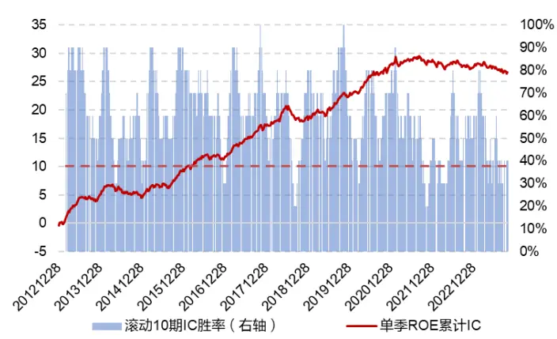
数据来源：Wind，东方证券研究所

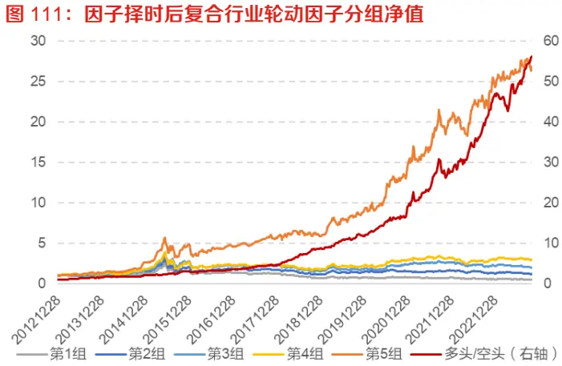
数据来源：Wind，朝阳永续，东方证券研究所

上面右图展示的是因子择时后复合因子的分组净值。可以看到相比于静态复合因子，整体的多空收益得到了一定提升。下面左图展示了静态复合模型和动态择时模型的行业分组多头净值表现情况。引入因子择时后，整体的多头超额持续好于原始静态复合的模型。下面右图展示了因子择时后复合行业轮动因子的周度 IC和累计 IC，可以看到累计 IC曲线非常稳定。

图 112：因子择时前后复合行业轮动因子的多头净值
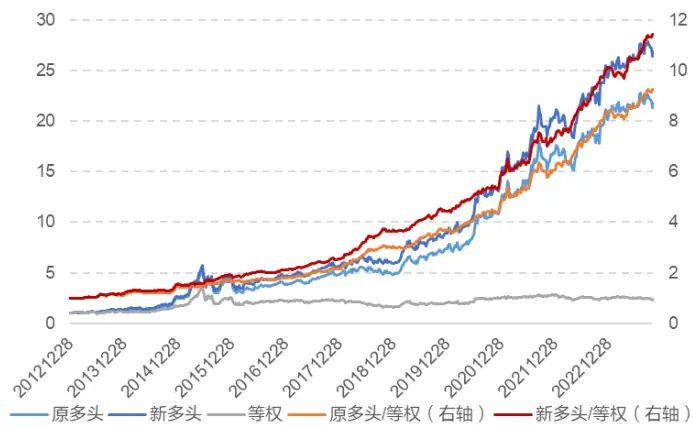
数据来源：Wind，朝阳永续，东方证券研究所

图 113：因子择时后复合行业轮动因子的累计 IC
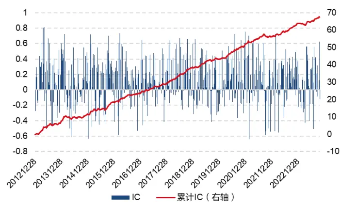
数据来源：Wind，朝阳永续，东方证券研究所

下表我们对比了因子择时前后复合因子的行业轮动能力。复合因子的周度 IC均值变化不大，周度多头超额均值从 0.41%提升到0.45%，周度多头超额胜率从 61.9%提升到63.9%。

表 28：因子择时前后复合行业轮动因子的行业轮动能力

|  | IC均值 | IC 标准差 | 年化ICIR | IC 胜率 | IC 绝对值 均值 | 多空周度 收益均值 | 多空周度胜 率 | 多头周度 超额均值 | 多头周度超 额胜率 | 自相关系 数均值 |
| --- | --- | --- | --- | --- | --- | --- | --- | --- | --- | --- |
| 原始 | 0.121 | 0.280 | 3.108 | 65.23% | 0.246 | 0.71% | 64.98% | 0.41% | 61.91% | 0.805 |
| 因子择时后 | 0.122 | 0.287 | 3.066 | 65.59% | 0.251 | 0.73% | 64.80% | 0.45% | 63.90% | 0.793 |

数据来源：Wind，朝阳永续，东方证券研究所

下表展示了因子择时前后复合因子分 5 组后的各年各组收益情况。多头第 5 组年化收益从静态模 型的33.08%提升到35.75%，多空年化收益从40.37%提升到42.66%。多头组每年相比于行业等 权基准的超额都超过10%，多头年化超额收益从24.94%提升到27.61%，大部分年份的多空收益 都高于静态模型。

有关分析师的申明，见本报告最后部分。其他重要信息披露见分析师申明之后部分，或请与您的投资代表联系。并请阅读本证券研究报告最后一页的免责申明。

表 29：因子择时前后复合行业轮动因子的各年分组收益情况

| 年份 | 第1组 | 第2组 | 第3组 | 第4组 | 第5组 | 等权基准 | 多空收益 | 多头超额 | 原多空收益 | 原多头超额 |
| --- | --- | --- | --- | --- | --- | --- | --- | --- | --- | --- |
| 2013 | -12.35% | 15.43% | 14.28% | 24.02% | 32.70% | 13.39% | 45.05% | 19.31% | 36.33% | 12.82% |
| 2014 | 41.22% | 29.32% | 40.89% | 43.48% | 97.78% | 48.00% | 56.56% | 49.78% | 59.13% | 49.25% |
| 2015 | 24.43% | 35.53% | 70.63% | 48.78% | 80.67% | 49.70% | 56.24% | 30.96% | 59.73% | 20.71% |
| 2016 | -14.51% | -11.92% | -20.59% | -14.99% | -3.06% | -13.07% | 11.45% | 10.00% | 7.41% | 4.34% |
| 2017 | -6.61% | -4.83% | 0.23% | 1.61% | 22.16% | 1.56% | 28.77% | 20.60% | 32.65% | 22.07% |
| 2018 | -45.45% | -34.40% | -30.95% | -23.80% | 4.99% | -28.36% | 50.44% | 33.35% | 47.04% | 29.50% |
| 2019 | 12.31% | 29.06% | 19.10% | 26.49% | 51.29% | 26.72% | 38.98% | 24.57% | 36.02% | 26.01% |
| 2020 | 2.65% | 6.73% | 32.67% | 32.28% | 66.29% | 25.07% | 63.64% | 41.22% | 59.49% | 39.27% |
| 2021 | -3.27% | 6.62% | 11.70% | 10.45% | 39.76% | 11.85% | 43.03% | 27.92% | 43.56% | 29.16% |
| 2022 | -29.14% | -22.70% | -18.03% | -8.28% | 18.51% | -13.83% | 47.65% | 32.34% | 47.57% | 32.84% |
| 2023 | -12.63% | -4.99% | -9.35% | -2.15% | 9.39% | -4.31% | 22.02% | 13.70% | 14.73% | 10.68% |
| 全样本期 | -6.90% | 1.71% | 6.55% | 10.36% | 35.75% | 8.14% | 42.66% | 27.61% | 40.37% | 24.94% |

数据来源：Wind，朝阳永续，东方证券研究所

## 4.4 周频行业轮动组合

前一节中我们以因子回测的方式对复合行业轮动因子进行检验，回测过程并没有扣除交易费用并且也是以当日收盘价调仓。考虑到我们是周频模型，这两个部分对组合的收益影响较大，因此这一节我们构建周频行业轮动多头组合，并充分考虑交易费用和调仓时点。

## 4.4.1 费后周频行业轮动组合

我们首先构建周频行业轮动多头组合，每周选取得分最高的前 5 个行业等权配置，并扣除交易费用，回测参数如下：

回测期：2013-2023 年；

- 调仓频率：每周最后一个交易日收盘调仓；

- 交易费用：买入 0.1%，卖出 0.2%；

- 组合构建：每期选取得分最高前 5行业等权配置；

缓冲机制：相邻两期持仓不变时不再平衡，每期排名前 4 的优选入选，上期前 5 名本期没有跌出前 10名优先入选。

下图展示了周频 Top5 行业等权组合的费后净值。可以看到组合不断创出新高，能够持续稳定跑赢行业等权基准。

图 114：费后周频行业轮动组合净值
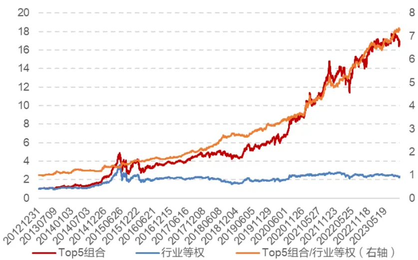
数据来源：Wind，朝阳永续，东方证券研究所

下表展示了组合各年相比于行业等权基准的超额收益表现。可以看到组合 2013 年以来年化收益30.21%，年化超额收益 22.13%，每年都能跑赢行业等权基准。组合平均每周单边换手 26%，年化单边换手 13倍。

表 30：费后周频行业轮动组合各年的收益表现
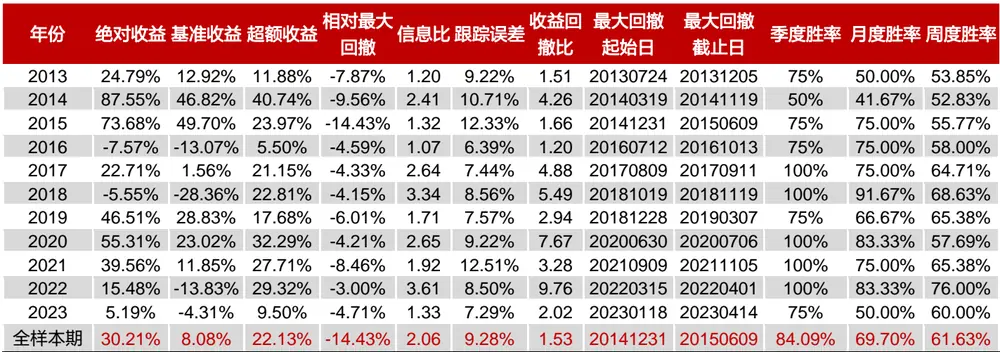
数据来源：Wind，朝阳永续，东方证券研究所

## 4.4.2 滞后1日周频行业轮动组合

我们进一步充分考虑调仓时间的影响，将信号滞后1个交易日收盘交易。组合自2016年以来的净值表现如下图所示，滞后 1个交易日组合费后收益仍然能够持续稳定跑赢行业等权基准。

图 115：滞后1日周频行业轮动组合净值
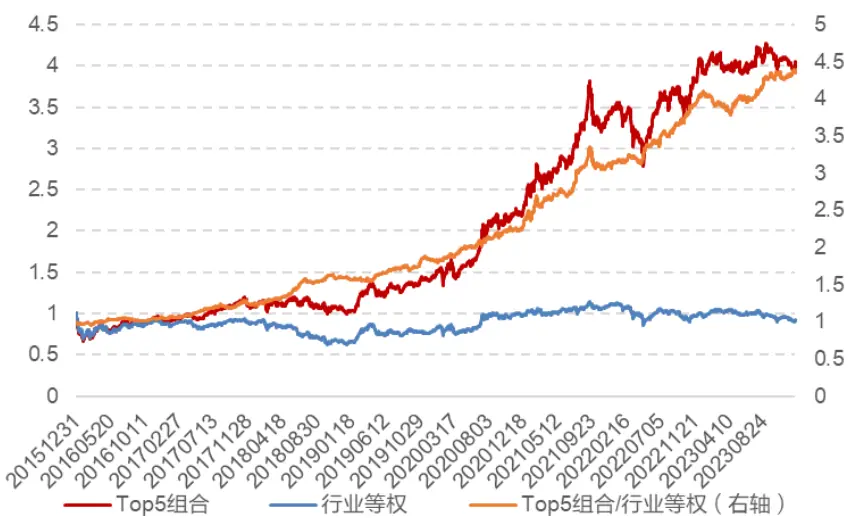
数据来源：Wind，朝阳永续，东方证券研究所

下表对比了是否滞后 1 日交易组合的各年收益表现对比。可以看到滞后 1 日后组合年化收益略微下降，但是 2019-2021 年滞后 1 日收益更高，我们分析主要原因是抱团牛市行情中前期弱势的行业在滞后 1 日中补涨导致。滞后 1 日组合自 2016 年以来年化收益 20%，相比于行业等权基准年化超额收益 20.71%，每年都能跑赢基准。

表 31：滞后1日周频行业轮动组合各年收益表现

| 滞后1日 滞后1日年份 原组合收益 基准收益 原组合超额组合收益 |  |  |  |  |  | 原组合 | 滞后1日组合 |  |
| --- | --- | --- | --- | --- | --- | --- | --- | --- |
|  |  |  |  |  |  | 组合超额 | 相对最大回撤 | 相对最大回撤 |
| 2016 | -7.57% | -9.54% | -13.07% | 5.50% | 3.53% | -4.59% | -4.15% |  |
| 2017 | 22.71% | 20.84% | 1.56% | 21.15% | 19.28% | -4.33% | -4.51% |  |
| 2018 | -5.55% | -6.92% | -28.36% | 22.81% | 21.45% | -4.15% | -4.32% |  |
| 2019 | 46.51% | 46.79% | 28.83% | 17.68% | 17.96% | -6.01% | -5.15% |  |
| 2020 | 55.31% | 61.94% | 23.02% | 32.29% | 38.92% | -4.21% | -3.84% |  |
| 2021 | 39.56% | 45.97% | 11.85% | 27.71% | 34.12% | -8.46% | -8.65% |  |
| 2022 | 15.48% | 11.37% | -13.83% | 29.32% | 25.20% | -3.00% | -3.42% |  |
| 2023 | 5.19% | 3.04% | -4.31% | 9.50% | 7.35% | -4.71% | -7.54% |  |
| 全样本期 | 20.01% | 19.70% |  |  |  |  |  |  |
|  |  |  | -1.00% | 21.01% | 20.71% |  |  |  |
|  |  |  |  |  |  | -8.46% | -8.65% |  |

数据来源：Wind，朝阳永续，东方证券研究所

## 4.4.3 深度学习因子之外的增量

从前文中单因子的表现可以看到，深度学习因子具有非常突出且稳定的行业轮动效果。自然引发我们的思考是否仅使用深度学习因子就可以达到较好的收益。因此本节我们对比以下 3 种模型，并充分考虑交易费用和调仓时间：

1. 纯深度学习因子打分；

2. 深度学习与传统量价因子等权配置打分并考虑因子择时；

3. 深度学习、传统量价、基本面、预期变化以 4:4:1:1配置并考虑因子择时。

由于深度学习因子 2018 年以来才有样本外数据，因此下表对比了 2018 年以来 3 种模型的收益结果。

表 32：3种不同周频行业轮动组合的收益表现

| 类型 | 年份 | 绝对收益 基准收益 | 超额收益 | 相对最大 回撤 | 信息比 | 跟踪误差 | 收益回撤 比 | 季度胜率 | 月度胜率 |
| --- | --- | --- | --- | --- | --- | --- | --- | --- | --- |
| 深度 学习 | 2018 -0.01% | -28.00% | 27.99% | -5.59% | 3.69 | 9.19% | 5.01 | 100% | 83.33% |
|  | 2019 41.88% | 28.83% | 13.05% | -6.90% | 1.27 | 7.61% | 1.89 | 75% | 58.33% |
|  | 2020 66.83% | 23.02% | 43.81% | -4.32% | 3.21 | 9.86% | 10.14 | 100% | 83.33% |
|  | 2021 13.25% | 11.85% | 1.41% | -14.30% | 0.18 | 12.15% | 0.10 | 25% | 58.33% |
|  | 2022 2.33% | -13.83% | 16.16% | -3.37% | 2.35 | 7.74% | 4.79 | 100% | 66.67% |
|  | 2023 3.09% | -4.31% | 7.40% | -6.69% | 0.95 | 8.03% | 1.11 | 75% | 66.67% |
|  | 全样本期 19.53% | 0.88% | 18.65% | -14.30% | 1.86 | 9.27% | 1.30 | 79.17% | 69.44% |

|  | 年份 | 绝对收益 | 基准收益 | 超额收益 | 相对最大 回撤 | 信息比 | 跟踪误差 | 收益回撤 比 | 季度胜率 | 月度胜率 |
| --- | --- | --- | --- | --- | --- | --- | --- | --- | --- | --- |
|  | 2018 | -5.20% | -28.00% | 22.81% | -3.58% | 3.29 | 8.61% | 6.37 | 100% | 100% |
| 深度 | 2019 | 47.86% | 28.83% | 19.04% | -6.63% | 1.73 | 8.06% | 2.87 | 75% | 50.00% |
| 学习 | 2020 | 58.16% | 23.02% | 35.13% | -3.73% | 2.80 | 9.39% | 9.41 | 100% | 83.33% |
| +传 | 2021 | 29.79% | 11.85% | 17.94% | -8.83% | 1.27 | 12.83% | 2.03 | 100% | 83.33% |
| 统量 | 2022 | 7.95% | -13.83% | 21.78% | -4.21% | 2.90 | 8.13% | 5.17 | 100% | 83.33% |
| 价 | 2023 | 1.68% | -4.31% | 5.99% | -6.85% | 0.77 | 8.08% | 0.87 | 75% | 66.67% |
|  | 全样本期 | 21.81% | 0.88% | 20.94% | -8.83% | 2.05 | 9.35% | 2.37 | 91.67% | 77.78% |

| 4类 | 年份 绝对收益 |  | 基准收益 | 超额收益 | 相对最大 回撤 | 信息比 | 跟踪误差 | 收益回撤 比 | 季度胜率 | 月度胜率 |
| --- | --- | --- | --- | --- | --- | --- | --- | --- | --- | --- |
|  | 2018 | -7.22% | -28.36% | 21.15% | -4.32% | 3.06 | 8.73% | 4.90 | 100% | 91.67% |
|  | 2019 | 46.79% | 28.83% | 17.96% | -5.15% | 1.74 | 7.57% | 3.49 | 75% | 66.67% |
|  | 2020 | 61.94% | 23.02% | 38.92% | -3.84% | 3.06 | 9.44% | 10.13 | 100% | 83.33% |
|  | 2021 | 45.97% | 11.85% | 34.12% | -8.65% | 2.26 | 12.62% | 3.95 | 100% | 75.00% |
|  | 2022 | 11.37% | -13.83% | 25.20% | -3.42% | 3.17 | 8.46% | 7.36 | 100% | 83.33% |
|  | 2023 | 3.04% | -4.31% | 7.35% | -7.54% | 1.03 | 7.31% | 0.97 | 75% | 50.00% |
|  | 全样本期 | 25.14% | 0.79% | 24.34% | -8.65% | 2.39 | 9.21% | 2.82 | 91.67% | 75.00% |

数据来源：Wind，朝阳永续，东方证券研究所

可以看到纯用深度学习因子年化超额 18.65%，每年都能跑赢基准但是有明显大小年情况，例如2021年超额相对较低，相对最大回撤也较大，达到-14.3%。而加入传统量价因子后年化超额提升到 20.94%，超额收益的稳定性得到明显提升，相对最大回撤下降到-8.83%。进一步加入基本面和预期变化类因子后，组合年化超额进一步提升到24.34%，大部分年份的超额都有提升，超额收益信息比也从深度学习组合的1.86提升到2.39，季度、月度超额收益胜率也明显提升。由此可见通过加入基本面、预期变化、传统量价因子可以大幅提升整体组合的收益，年化超额收益提升了近 6%。

## 五、总结

## 衰减的选股 Alpha 与稳定的行业 Beta

近年来，随着越来越多的机构大量挖掘 alpha 选股因子，传统的选股因子尤其是以成长因子为代表的一类因子越来越拥挤，纷纷产生了短期失效的情况。以选股为主要超额收益来源的公募指数增强产品近年的超额收益中位数逐年下行，获取选股 alpha的难度越来越大。

虽然选股 alpha 在持续衰减，但是行业间分化的收益一直持续较大，因此获取行业轮动的 beta 分化收益的性价比日益凸显。近两年行业轮动的速度加快、月度动量消失，因此我们希望构建一个周频调仓的多因子行业轮动模型。

## 微观与中观行业轮动因子

在微观行业轮动因子维度，我们发现市值、估值、长期价量等因子对行业轮动来说都是典型的风险因子，借鉴选股因子的市值行业中性化的思路，我们对每个因子先在股票层面进行风格中性再合成行业轮动因子。我们从基本面、预期变化、量价等维度构造微观行业轮动因子，经过风格中性化后大部分因子行业轮动的多空收益和多头超额都有明显提升。基于我们前期在深度学习选股因子方面的积累，我们发现深度学习因子合成行业因子后同样具有非常突出的行业轮动能力。

在中观行业轮动因子维度，我们构造短期预期变化以及多维度的行业动量因子，经检验都具有较为稳健的行业轮动能力。

## 周频行业轮动模型

我们将行业轮动因子合成基本面、预期变化、传统量价、深度学习四大类，并以1:1:4:4复合得到行业轮动模型，并考虑到因子的短期失效，我们引入基于胜率的因子择时构建动态自适应的行业轮动模型，考虑交易费用和调仓时间后构建周频调仓的 Top5等权组合，组合自 2016年以来年化收益 19.7%，相比于行业等权基准年化超额 20.71%，每年都能稳定跑赢基准指数。

## 风险提示

1. 量化模型基于历史数据分析，未来存在失效风险，建议投资者紧密跟踪模型表现。

2. 极端市场环境可能对模型效果造成剧烈冲击，导致收益亏损。

## Tabl e_Disclai mer 分析师申明

每位负责撰写本研究报告全部或部分内容的研究分析师在此作以下声明：

分析师在本报告中对所提及的证券或发行人发表的任何建议和观点均准确地反映了其个人对该证券或发行人的看法和判断；分析师薪酬的任何组成部分无论是在过去、现在及将来，均与其在本研究报告中所表述的具体建议或观点无任何直接或间接的关系。

## 投资评级和相关定义

报告发布日后的12个月内行业或公司的涨跌幅相对同期相关证券市场代表性指数的涨跌幅为基准（A 股市场基准为沪深 300 指数，香港市场基准为恒生指数，美国市场基准为标普 500 指数）；

## 公司投资评级的量化标准

买入：相对强于市场基准指数收益率 15%以上；

增持：相对强于市场基准指数收益率 5%～15%；

中性：相对于市场基准指数收益率在-5%～+5%之间波动；

减持：相对弱于市场基准指数收益率在-5%以下。

未评级 —— 由于在报告发出之时该股票不在本公司研究覆盖范围内，分析师基于当时对该股票的研究状况，未给予投资评级相关信息。

暂停评级 —— 根据监管制度及本公司相关规定，研究报告发布之时该投资对象可能与本公司存在潜在的利益冲突情形；亦或是研究报告发布当时该股票的价值和价格分析存在重大不确定性，缺乏足够的研究依据支持分析师给出明确投资评级；分析师在上述情况下暂停对该股票给予投资评级等信息，投资者需要注意在此报告发布之前曾给予该股票的投资评级、盈利预测及目标价格等信息不再有效。

## 行业投资评级的量化标准：

看好：相对强于市场基准指数收益率 5%以上；

中性：相对于市场基准指数收益率在-5%～+5%之间波动；

看淡：相对于市场基准指数收益率在-5%以下。

未评级：由于在报告发出之时该行业不在本公司研究覆盖范围内，分析师基于当时对该行业的研究状况，未给予投资评级等相关信息。

暂停评级：由于研究报告发布当时该行业的投资价值分析存在重大不确定性，缺乏足够的研究依据支持分析师给出明确行业投资评级；分析师在上述情况下暂停对该行业给予投资评级信息，投资者需要注意在此报告发布之前曾给予该行业的投资评级信息不再有效。

## HeadertTabl e_Discl ai mer 免责声明

本证券研究报告（以下简称“本报告”）由东方证券股份有限公司（以下简称“本公司”）制作及发布。

本报告仅供本公司的客户使用。本公司不会因接收人收到本报告而视其为本公司的当然客户。本报告的全体接收人应当采取必要措施防止本报告被转发给他人。

本报告是基于本公司认为可靠的且目前已公开的信息撰写，本公司力求但不保证该信息的准确性和完整性，客户也不应该认为该信息是准确和完整的。同时，本公司不保证文中观点或陈述不会发生任何变更，在不同时期，本公司可发出与本报告所载资料、意见及推测不一致的证券研究报告。本公司会适时更新我们的研究，但可能会因某些规定而无法做到。除了一些定期出版的证券研究报告之外，绝大多数证券研究报告是在分析师认为适当的时候不定期地发布。

在任何情况下，本报告中的信息或所表述的意见并不构成对任何人的投资建议，也没有考虑到个别客户特殊的投资目标、财务状况或需求。客户应考虑本报告中的任何意见或建议是否符合其特定状况，若有必要应寻求专家意见。本报告所载的资料、工具、意见及推测只提供给客户作参考之用，并非作为或被视为出售或购买证券或其他投资标的的邀请或向人作出邀请。

本报告中提及的投资价格和价值以及这些投资带来的收入可能会波动。过去的表现并不代表未来的表现，未来的回报也无法保证，投资者可能会损失本金。外汇汇率波动有可能对某些投资的价值或价格或来自这一投资的收入产生不良影响。那些涉及期货、期权及其它衍生工具的交易，因其包括重大的市场风险，因此并不适合所有投资者。

在任何情况下，本公司不对任何人因使用本报告中的任何内容所引致的任何损失负任何责任，投资者自主作出投资决策并自行承担投资风险，任何形式的分享证券投资收益或者分担证券投资损失的书面或口头承诺均为无效。

本报告主要以电子版形式分发，间或也会辅以印刷品形式分发，所有报告版权均归本公司所有。未经本公司事先书面协议授权，任何机构或个人不得以任何形式复制、转发或公开传播本报告的全部或部分内容。不得将报告内容作为诉讼、仲裁、传媒所引用之证明或依据，不得用于营利或用于未经允许的其它用途。

经本公司事先书面协议授权刊载或转发的，被授权机构承担相关刊载或者转发责任。不得对本报告进行任何有悖原意的引用、删节和修改。

提示客户及公众投资者慎重使用未经授权刊载或者转发的本公司证券研究报告，慎重使用公众媒体刊载的证券研究报告。

## 东方证券研究所

地址： 上海市中山南路 318 号东方国际金融广场 26 楼

电话：021-63325888

传真：021-63326786

网址： www.dfzq.com.cn