# DFQ机器学习行业轮动模型

# 量化策略系列之八

## 研究结论

## 行业轮动的必要性

以基本面为主的行业轮动策略表现不佳： DFQ 工业类行业轮动体系基于 38 个证监会二级行业构建，转化为中信一级行业后会损失较多信息。2020 年以来 top5 行业组合年化超额仅为 3.33%。

⚫ 行业动量轮动策略近两年表现不佳：DFQ行业动量轮动策略 2020年以来 top5行业组合年化超额仅为 3.68%，2023和 2024年均未获正超额。

## 用机器学习选股因子合成行业因子

⚫将机器学习模型训练出的选股因子，按个股市值加权，合成为行业因子，进行行业轮动。vae、xgb模型的多头端top5行业组合整体表现较好，2020年以来top5行业组合年化超额收益可达 10%以上。但由于模型的选行业能力只是选股的副产品，行业轮动因子是否有效很大程度上取决于运气，使用起来不够稳健。

## DFQ遗传规划行业因子挖掘系统介绍

前期我们开发出了一套高效的 DFQ遗传规划因子挖掘系统。模型主要有 7点改进：提升初始种群质量，提升每代种群质量，提升每代产生的有效公式数量，避免公式膨胀，动态调整每代进化参数，降低挖掘因子的相关性，避免无效运算。

将 DFQ遗传规划因子挖掘系统，迁移到行业上，挖掘行业因子。采用中信一级行业作为轮动标的。挖掘月频因子。采用滚动挖掘方式，每隔一年重新挖掘。训练集采用滑动窗口的方式，长度固定 10年，每次向后挪一年。共设计 145个特征，140个算子。使用 20个路径下多头（top5）行业组合的月均超额收益的最小值作为适应度。

## DFQ遗传规划行业因子挖掘系统效果分析

⚫ 进行一轮 15 代完整挖掘用时 5 分钟左右。一轮完成后可产生 5 个左右适应度超过0.5%，且互相间相关系数不超过 50%的单因子。

单因子样本外易失效，频繁挖掘消耗算力。采用长周期挖掘，短周期加权的方法，可以显著提升合成因子表现。动态 xgb 加权方法下 2020 年以来 top5 行业组合年化超额收益11.10%，超额收益最大回撤10.28%，月度胜率61.40%，超额收益夏普比1.16。

## DFQ机器学习行业轮动模型效果分析

⚫ 通过遗传规划方法得到的行业因子，和其他四个由选股因子合成得到的行业因子，相关性非常低，因子值 spearman相关性在 0%附近。

⚫ 将 vae、xgb、gp 三个行业因子等权合成，构建 DFQ 机器学习行业轮动模型。模型表现十分突出，能实现 1+1>2 的效果。2020 年以来，top5 行业组合年化超额收益达到18.42%，超额收益最大回撤 7.76%，月度胜率 66.67%，超额收益夏普比 1.77。

## 行业轮动模型在指数增强组合中的应用

叠加行业轮动模型来调整行业暴露敞口，可以实现组合收益和稳定性的提升。对于沪深300指数增强组合提升尤其显著。相比于基础组合，年化超额收益可以提高2%，信息比从 1.85提升到 2.16，超额收益最大回撤从 6.53%降低到6.12%。

## 风险提示

1. 量化模型失效风险。

2. 极端市场环境对模型的影响。

报告发布日期

2024 年 11 月 19 日

杨怡玲 yangyiling@orientsec.com.cn

执业证书编号：S0860523040002

刘静涵021-63325888*3211

liujinghan@orientsec.com.cn

执业证书编号：S0860520080003

香港证监会牌照：BSX840

DFQ-XGB：基于树模型的 alpha 预测方 2024-08-15案：——因子选股系列之一〇七

DFQ-FactorVAE：融合变分自编码器和概 2024-05-14率动态因子模型的 alpha 预测方案：——

因子选股系列之一〇三

DFQ-HIST：添加图信息的选股因子挖掘 2024-02-07系统：——因子选股系列之一百

周频多因子行业轮动模型：——量化策略 2024-01-21研究之 七

DFQ-TRA：多交易模式学习因子挖掘系 2023-11-14统：——因子选股系列之九十七

DFQ 强化学习因子组合挖掘系统：——因 2023-08-17子选股系列之九十五

DFQ 遗传规划价量因子挖掘系统：——因 2023-05-28子选股系列之九十

行业动量的刻画：——《量化策略研究 之 2022-12-01六》

A 股市场存在明显的行业轮动现象，不同行业的股票经常轮换性地表现出相对的强势与弱势，此起彼伏。如果能准确地把握行情轮动的切换点，始终配置强势板块，就能进一步提升投资收益。在之前的研究中，我们从行业基本面和行业动量角度入手，从逻辑出发寻找行业因子，构建了两类月频行业轮动策略。本篇报告我们引入机器学习方法，将挖掘行业因子的部分交给机器。

## 一、 行业轮动的必要性

我们统计了 29 个中信一级行业在 2020-2024 年度的分年收益。可以看到：（1）不同年份的强势行业迥异，各行业在不同时期都呈现出了阶段性的投资机会。（2）各年度不同行业涨幅差异巨大，最强和最弱行业年度涨幅平均相差 66.89%。2024 年截止 9 月底中证全指涨幅仅为7.24%，而强势的银行业涨幅达到 35.01%。可见，行业轮动蕴含的收益较为可观。

图 1：29个中信一级行业在 2020-2024年度的分年收益（按2024年涨跌幅排列，截止 2024.9.30，单位：%）
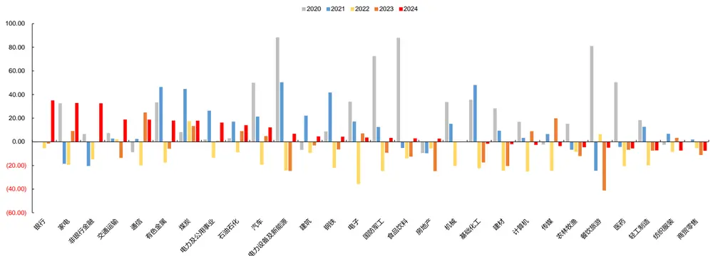
数据来源：东方证券研究所 & Wind资讯

前期报告《DFQ工业类行业轮动策略中观行业数据、分析师预期、业绩超预期、资金流向》中，我们从中观行业数据、分析师预期、业绩超预期、资金流向四个维度，选取 14 个单因子进行合成，构建了 DFQ工业类行业轮动体系。

图 2：DFQ工业类行业轮动体系
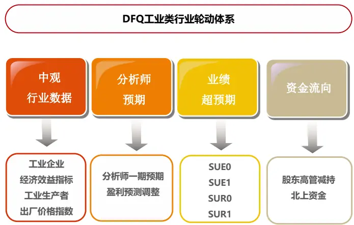
数据来源：东方证券研究所

有关分析师的申明，见本报告最后部分。其他重要信息披露见分析师申明之后部分，或请与您的投资代表联系。并请阅读本证券研究报告最后一页的免责申明。

DFQ 工业类行业轮动策略的中观行业数据维度中，使用到了国家统计局公布的工业企业财务数据。该数据月度发布，相较于上市公司季报，时效性更高，生成的行业因子效果明显优于上市公司财报因子，属于行业层面的特有因子。但也存在两个弊端：（1）统计局公布的工业企业行业分类与上市公司通常使用的行业分类方式有一定差异，无法直接匹配到常用的中信行业，因而该策略是基于 38 个证监会二级行业进行的。（2）统计局公布的工业企业数据只包含工业类企业，不包括第一产业（农林牧渔）和第三产业（服务业），行业覆盖不全。

下面我们通过个股加权的方法，将 38 个证监会二级行业因子得分转化成 29 个中信一级行业因子得分。首先提取每个中信一级行业的成分股，而后将每个成分股的证监会二级行业因子值，进行市值加权，从而得到中信一级行业因子值。共24个中信一级行业可以获得有效得分。绩效测试前将因子值进行截面标准化，缺失值用 0填充。

下图展示了 2010 年以来 DFQ 工业类行业轮动策略的绩效情况。可以看到：（1）将统计局行业分类转化为中信一级行业，损失了较多信息。2010 年以来 top5 行业组合年化超额 6.87%，超额最大回撤 19.39%。如果不进行行业转换，直接采用统计局行业构造轮动策略，top5 行业组合年化超额有12%。（2）近年来策略有效性降低。2020年以来top5行业组合年化超额减半，仅为 3.33%。

图 3：以基本面为主的行业轮动策略的绩效表现（2010.1.1-2024.9.30）

| 20100101-20240930 indus all，月末交易日调仓 | IC | ICIR | RANKIC RANKICIR |  | top5行业组合 月均超额收益 | top5行业组合 月度胜率 | top5行业组合 超额收益夏普比 | top5行业组合 年化超额收益 | top5行业组合 超额收益日度最大回撤 | top5行业组合 月均换手 |
| --- | --- | --- | --- | --- | --- | --- | --- | --- | --- | --- |
| 2010-2024整体绩效 | 7.53% | 0.28 | 7.75% | 0.31 | 0.57% | 56.50% | 0.83 | 6.87% | -19.39% | 23.30% |
| 2020-2024整体绩效 | 2.02% | 0.08 | 2.65% | 0.12 | 0.32% | 40.35% | 0.37 | 3.33% | -19.39% | 23.21% |
| 2010 | 10.15% | 48.01% | 10.09% | 42.92% | 0.86% | 75.00% | 139.45% | 9.24% | -7.20% | 30.91% |
| 2011 | 7.06% | 40.02% | 6.28% | 36.02% | 0.54% | 61.54% | 56.32% | 2.92% | -6.86% | 25.00% |
| 2012 | 7.32% | 25.99% | 8.61% | 30.32% | 0.42% | 61.54% | 100.51% | 6.32% | -7.50% | 10.00% |
| 2013 | 27.41% | 116.70% | 27.05% | 135.76% | 1.36% | 61.54% | 212.16% | 22.66% | -7.57% | 15.00% |
| 2014 | 4.67% 15.84% | 32.95% 54.16% | -3.04% | -23.29% | -0.73% | 38.46% 76.92% | -176.23% 274.19% | -10.93% 23.64% | -10.76% | 16.67% |
| 2015 2016 |  |  | 15.60% | 54.36% | 1.45% |  |  |  | -3.43% | 33.33% |
| 2017 | -0.37% 18.46% | -1.06% 69.58% | 4.76% 23.53% | 16.87% 106.36% | 0.44% 1.71% | 69.23% 84.62% | 76.22% 264.63% | 3.90% 19.70% | -4.74% | 30.00% |
| 2018 | 9.25% | 27.57% | 9.10% | 30.55% | 0.47% | 61.54% | 64.91% | 4.83% | -3.42% -9.32% | 18.33% |
| 2019 | 3.88% | 15.32% | 2.60% | 9.98% | 0.36% | 53.85% | 89.57% | 6.19% | -5.75% | 21.67% 33.33% |
| 2020 | 2.94% | 14.86% | 2.07% | 10.88% | 0.29% | 38.46% | 58.40% | 4.45% | -8.66% | 26.67% |
| 2021 | -0.82% | -2.90% | 0.21% | 0.92% | 0.34% | 30.77% | 24.88% | 2.58% | -19.39% | 26.67% |
| 2022 | 12.61% | 45.10% | 5.75% | 24.11% | 0.73% | 61.54% | 70.80% | 7.14% | -8.71% | 13.33% |
| 2023 | -7.57% | -49.88% | 1.52% | 11.94% | 0.16% | 38.46% | -12.98% | -1.04% | -4.82% | 20.00% |
| 20240930 | 1.97% | 8.52% | 2.87% | 11.95% | 0.13% | 40.00% | 1.21% | 0.78% | -4.77% | 31.11% |

数据来源：东方证券研究所 & Wind资讯

图 4：以基本面为主的行业轮动策略的分 5组超额收益净值（2010.1.1-2024.9.30）
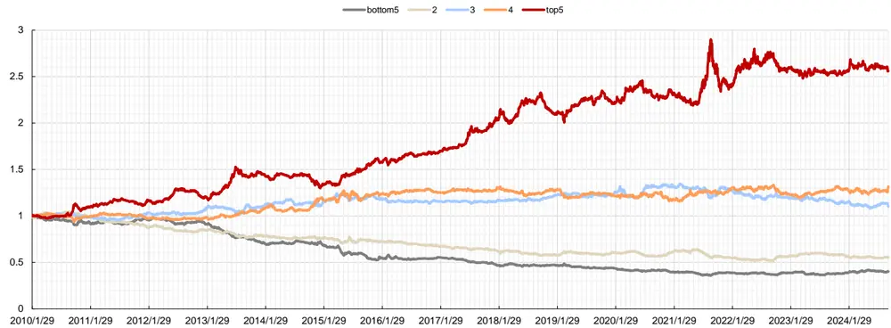
数据来源：东方证券研究所 & Wind资讯
有关分析师的申明，见本报告最后部分。其他重要信息披露见分析师申明之后部分，或请与您的投资代表联系。并请阅读本证券研究报告最后一页的免责申明。

在前期报告《行业动量的刻画》中，我们从行业动量角度入手，提出了三种行业动量的改进算法，将三个单因子进行合成，构建了月频行业轮动策略。

图 5：DFQ行业动量轮动体系
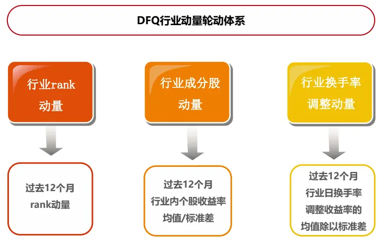
数据来源：东方证券研究所

下图展示了 2010 年以来该策略的绩效情况。可以看到：（1）动量类策略整体表现不如基本面策略。2010 年以来 top5 行业组合年化超额 5.52%，超额收益最大回撤 24.78%。（2）近年来策略有效性降低。2020 年以来 top5 行业组合年化超额降低，仅为 3.68%，2023 和 2024 年均未能获得正超额。

图 6：行业动量轮动策略的绩效表现（2010.1.1-2024.9.30）

| 20100101-20240930 indus_mom，月末交易日调仓 | IC | ICIR | RANKIC | RANKICIR | top5行业组合 月均超额收益 | top5行业组合 月度胜率 | top5行业组合 超额收益夏普比 | top5行业组合 年化超额收益 | top5行业组合 超额收益日度最大回撤 | top5行业组合 月均换手 |
| --- | --- | --- | --- | --- | --- | --- | --- | --- | --- | --- |
| 2010-2024整体绩效 | 6.18% | 0.18 | 6.09% | 0.19 | 0.49% | 56.50% | 0.59 | 5.55% | -24.78% | 21.93% |
| 2020-2024整体绩效 | 3.95% | 0.12 | 5.64% | 0.16 | 0.38% | 52.63% | 0.35 | 3.68% | -24.78% | 24.64% |
| 2010 | 11.44% | 28.43% | 8.48% | 22.21% | 0.42% | 41.67% | 106.02% | 7.21% | -6.93% | 20.00% |
| 2011 | -9.71% | -30.47% | -8.85% | -28.55% | -0.44% | 46.15% | -80.18% | -3.72% | -6.72% | 25.00% |
| 2012 | 5.49% | 20.32% | 6.64% | 24.63% | 0.41% | 53.85% | 90.94% | 5.51% | -4.82% | 25.00% |
| 2013 | 26.87% | 90.08% | 25.34% | 83.85% | 2.03% | 61.54% | 123.35% | 15.61% | -8.27% | 23.33% |
| 2014 | 3.18% | 7.17% | 3.81% | 7.95% | -0.03% | 38.46% | -12.74% | -1.81% | -13.62% | 13.33% |
| 2015 | 7.12% | 21.17% | 7.84% | 24.96% | 1.17% | 61.54% | 206.79% | 19.50% | -8.22% | 25.00% |
| 2016 | -2.11% | -5.95% | -1.01% | -2.95% | -0.01% | 53.85% | 16.59% | 0.79% | -5.48% | 15.00% |
| 2017 | 14.07% | 81.96% | 9.78% | 57.98% | 0.84% | 69.23% | 133.37% | 8.53% | -3.18% | 23.33% |
| 2018 | -5.61% | -21.45% | -6.76% | -32.83% | 0.17% | 61.54% | 14.52% | 0.88% | -8.80% | 11.67% |
| 2019 | 14.49% | 54.09% | 11.55% | 64.67% | 0.87% | 76.92% | 135.85% | 10.40% | -4.58% | 23.33% |
| 2020 | 22.81% | 66.05% | 22.43% | 63.27% | 1.93% | 69.23% | 227.45% | 24.95% | -5.48% | 21.67% |
| 2021 | 0.52% -6.17% | 1.45% -17.45% | 2.90% | 7.96% -11.84% | 0.73% 0.27% | 46.15% | 61.90% | 9.30% | -14.82% | 15.00% |
| 2022 | -2.46% | -9.74% | -4.23% -0.81% | -3.15% | -0.84% | 46.15% 46.15% | 59.35% | 5.71% | -8.30% | 20.00% |
| 2023 |  |  | 1.92% | 6.18% | -1.21% | 50.00% | -85.64% -6.33% | -7.67% | -10.81% | 41.67% |
| 20240930 | 0.06% | 0.20% |  |  |  |  |  | -10.57% | -9.75% | 26.67% |

数据来源：东方证券研究所 & Wind资讯

图 7：行业动量轮动策略的分5组超额收益净值（2010.1.1-2024.9.30）
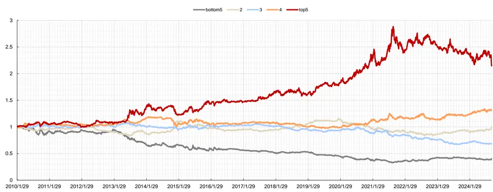
数据来源：东方证券研究所 & Wind资讯

## 二、 用机器学习选股因子合成行业因子

在之前的报告《DFQ-TRA：多交易模式学习因子挖掘系统》、《DFQ-HIST：添加图信息的选股因子挖掘系统》、《DFQ-FactorVAE：融合变分自编码器和概率动态因子模型的 alpha 预测方案》、《DFQ-XGB：基于树模型的 alpha预测方案》中，我们设计了一系列机器学习模型来预测股票收益。训练时，我们对于预测标签和输入特征都没有进行行业中性化操作，因而各模型都会学到行业轮动的收益。

下图展示了各模型 2020-2024的 20分组多头端绩效归因结果，可以看到：（1）各模型选股多头端的超额收益中有很大一部分来自于风格和行业选择。其中 HIST、VAE 和 XGB因子的多头端超额中，行业选择部分的收益贡献达到 30%以上。（2）不一定每年行业选择都贡献正收益。例如 2023 年 4 个因子的多头端超额中，行业选择部分都未能贡献正超额收益。2024 年 4 个因子多头端超额中，行业选择部分贡献的正超额收益也很低。

图 8：中证全指股票池各模型的因子模型收益分解汇总（2020.1.1-2024.6.30）
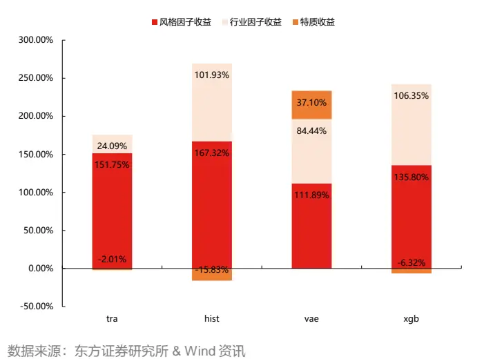

图 9：中证全指股票池各模型的因子模型收益分解汇总（2020年）
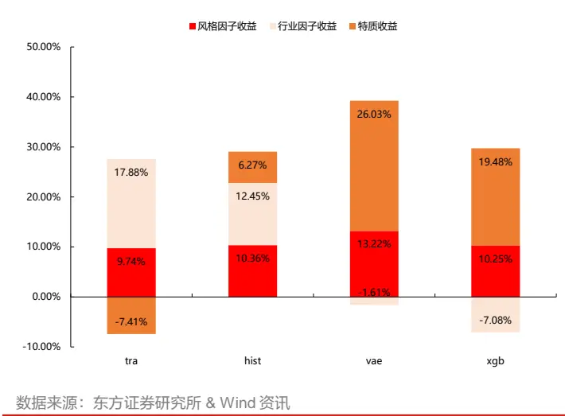
有关分析师的申明，见本报告最后部分。其他重要信息披露见分析师申明之后部分，或请与您的投资代表联系。并请阅读本证券研究报告最后一页的免责申明。

图 10：中证全指股票池各模型的因子模型收益分解汇总（2021 年）

|  |  | 风格因子收益 | 行业因子收益 特质收益 |  |  |
| --- | --- | --- | --- | --- | --- |
| 100.00% |  |  |  |  |  |
| 80.00% |  |  |  |  |  |
| 60.00% |  |  |  |  |  |
| 40.00% |  | 40.22% |  |  |  |
| 20.00% | 3.14% 10.96% |  | 31.02% |  |  |
| 0.00% | 14.71% | 11.52% |  | 10.04% |  |
|  |  | -19.10% |  |  |  |
| -20.00% |  |  |  |  | -41.77% |
| -40.00% |  |  |  |  |  |
| -60.00% |  |  |  |  |  |
|  |  |  |  | xgb |  |
|  |  | hist |  |  |  |
|  | tra |  | vae |  |  |

数据来源：东方证券研究所 & Wind资讯

图 11：中证全指股票池各模型的因子模型收益分解汇总（2022 年）

|  |  | 风格因子收益 行业因子收益 | 特质收益 |  |
| --- | --- | --- | --- | --- |
| 60.00% 50.00% |  |  |  | 40.09% |
| 40.00% |  | 25.26% |  |  |
| 30.00% |  |  | 18.51% |  |
| 20.00% | 55% 19.86% | 20.81% | 16.12% | 14.13% |
| 10.00% 0.00% | -1.06% |  | -7.22% |  |
| -10.00% |  | -14.41% |  | -20.14% |
| -20.00% |  |  |  |  |
| -30.00% | tra | hist | vae | xgb |

数据来源：东方证券研究所 & Wind资讯

图 12：中证全指股票池各模型的因子模型收益分解汇总（2023 年）
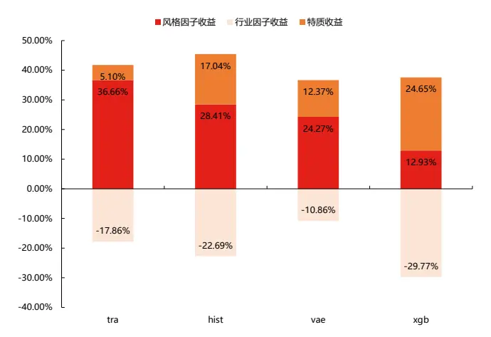
数据来源：东方证券研究所 & Wind资讯

图 13：中证全指股票池各模型的因子模型收益分解汇总（2024 年，截止 2024.6.30）
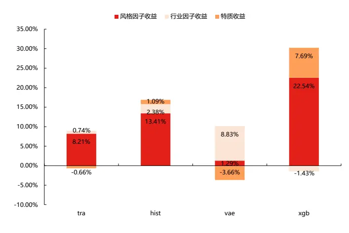
数据来源：东方证券研究所 & Wind资讯

基于此，我们可以将这些机器学习模型训练出的选股因子合成为行业因子，进行行业轮动。具体做法是：首先将选股因子匹配到每日的中证全指股票池，而后进行横截面数据预处理，依次做 Boxplot 异常值处理、zscore 标准化、用 0 填充缺失值。最后按个股市值进行加权得到行业因子。

下图展示了 tra、hist、factorvae、xgb 这四个模型所得行业因子对应的绩效情况。可以看到：

（1）四个模型所得行业因子的 IC、RANKIC都较高，达 10%以上。

（2）vae、xgb 模型的多头端 top5 行业组合整体表现较好，2020 年以来 top5 行业组合年化超额收益可达 10%以上，超额收益最大回撤 10%左右，月度胜率接近 60%，超额收益夏普比达到 1，月均换手接近 50%。

（3）不同年份的 top5行业组合业绩表现差别较大， 2020年多头均为负超额，2022年多头超额均在 20%左右，2024年 hist、vae、xgb模型多头超额收益达 10%左右。

图 14：tra 行业因子的绩效表现（2020.1.1-2024.9.30）

| 20200101-20240930 indus tra2，月末交易日调仓 | IC | ICIR | RANKIC | RANKICIR | top5行业组合 月均超额收益 | top5行业组合 月度胜率 | top5行业组合 超额收益夏普比 | top5行业组合 年化超额收益 | top5行业组合 超额收益日度最大回撤 | top5行业组合 月均换手 |
| --- | --- | --- | --- | --- | --- | --- | --- | --- | --- | --- |
| 2020-2024整体绩效 | 9.87% | 0.34 | 10.59% | 0.36 | 0.13% | 49.12% | 0.21 | 1.45% | -23.46% | 37.14% |
| 2020 | 2.55% | 0.10 | -0.65% | (0.02) | -1.17% | 25.00% | (1.48) | -12.11% | -12.90% | 40.00% |
| 2021 | 13.02% | 0.40 | 9.87% | 0.30 | -0.30% | 38.46% | (0.98) | -9.53% | -18.03% | 36.67% |
| 2022 | 18.02% | 0.57 | 23.91% | 0.84 | 1.45% | 61.54% | 2.54 | 20.00% | -4.09% | 43.33% |
| 2023 | 17.71% | 0.74 | 20.39% | 0.95 | 1.33% | 76.92% | 1.80 | 11.78% | -4.17% | 30.00% |
| 20240930 | 7.22% | 0.23 | 6.34% | 0.21 | 0.03% | 40.00% | 0.00 | 0.06% | -5.32% | 35.56% |

数据来源：东方证券研究所 & Wind资讯

图 15：hist 行业因子的绩效表现（2020.1.1-2024.9.30）

| 20200101-20240930 indus_hist，月末交易日调仓 | IC | ICIR | RANKIC | RANKICIR | top5行业组合 月均超额收益 | top5行业组合 月度胜率 | top5行业组合 超额收益夏普比 | top5行业组合 年化超额收益 | top5行业组合 超额收益日度最大回撤 | top5行业组合 月均换手 |
| --- | --- | --- | --- | --- | --- | --- | --- | --- | --- | --- |
| 2020-2024整体绩效 | 11.32% | 0.37 | 12.66% | 0.42 | 0.44% | 52.63% | 0.70 | 5.76% | -16.52% | 48.93% |
| 2020 | -2.12% | (0.06) | -3.27% | (0.09) | -1.09% | 25.00% | (1.27) | -10.83% | -10.61% | 49.09% |
| 2021 | 18.21% | 0.59 | 16.23% | 0.50 | 0.58% | 53.85% | 0.25 | 1.87% | -9.41% | 46.67% |
| 2022 | 22.89% | 0.83 | 27.25% | 1.07 | 1.27% | 53.85% | 2.55 | 19.54% | -3.29% | 58.33% |
| 2023 | 11.37% | 0.37 | 13.37% | 0.53 | 1.24% | 76.92% | 0.87 | 6.52% | -5.69% | 40.00% |
| 20240930 | 16.68% | 0.68 | 18.09% | 0.81 | 1.19% | 50.00% | 0.12 | 11.26% | -4.62% | 51.11% |

数据来源：东方证券研究所 & Wind资讯

图 16：vae 行业因子的绩效表现（2020.1.1-2024.9.30）

| 20200101-20240930 indus_vae，月末交易日调仓 | IC | ICIR | RANKIC | RANKICIR | top5行业组合 月均超额收益 | top5行业组合 月度胜率 | top5行业组合 超额收益夏普比 | top5行业组合 年化超额收益 | top5行业组合 超额收益日度最大回撤 | top5行业组合 月均换手 |
| --- | --- | --- | --- | --- | --- | --- | --- | --- | --- | --- |
| 2020-2024整体绩效 | 14.65% | 0.46 | 15.05% | 0.47 | 0.79% | 57.89% | 1.03 | 10.01% | -10.09% | 47.50% |
| 2020 | -1.24% | (0.04) | -0.81% | (0.02) | 0.04% | 41.67% | (0.26) | -2.70% | -6.32% | 40.00% |
| 2021 | 20.84% | 0.56 | 19.59% | 0.50 | 1.37% | 61.54% | 0.95 | 11.16% | -10.09% | 41.67% |
| 2022 | 25.42% | 0.91 | 26.80% | 0.94 | 1.39% | 53.85% | 2.38 | 21.23% | -5.64% | 60.00% |
| 2023 | 16.87% | 0.62 | 17.04% | 0.64 | 0.87% | 76.92% | 0.84 | 6.39% | -6.32% | 45.00% |
| 20240930 | 21.59% | 0.86 | 21.66% | 0.98 | 1.10% | 60.00% | 0.10 | 10.21% | -5.20% | 51.11% |

数据来源：东方证券研究所 & Wind资讯

图 17：xgb 行业因子的绩效表现（2020.1.1-2024.9.30）

| 20200101-20240930 indus_xgb，月末交易日调仓 | IC | ICIR | RANKIC | RANKICIR | top5行业组合 月均超额收益 | top5行业组合 月度胜率 | top5行业组合 超额收益夏普比 | top5行业组合 年化超额收益 | top5行业组合 超额收益日度最大回撤 | top5行业组合 月均换手 |
| --- | --- | --- | --- | --- | --- | --- | --- | --- | --- | --- |
| 2020-2024整体绩效 | 11.44% | 0.37 | 12.27% | 0.40 | 0.86% | 59.65% | 1.02 | 10.82% | -10.61% | 42.86% |
| 2020 | -0.13% | (0.00) | 3.28% | 0.11 | -0.49% | 50.00% | (0.58) | -6.09% | -10.13% | 41.82% |
| 2021 | 19.59% | 0.65 | 20.28% | 0.63 | 1.43% | 76.92% | 1.24 | 15.83% | -10.61% | 41.67% |
| 2022 | 20.39% | 0.70 | 19.28% | 0.72 | 1.70% | 61.54% | 2.49 | 26.54% | -5.43% | 48.33% |
| 2023 | 13.28% | 0.45 | 14.21% | 0.49 | 1.07% | 61.54% | 0.69 | 5.61% | -7.54% | 36.67% |
| 20240930 | 12.46% | 0.37 | 11.20% | 0.36 | 1.08% | 50.00% | 0.09 | 9.30% | -5.92% | 46.67% |

数据来源：东方证券研究所 & Wind资讯

总体来看，使用选股因子合成得到行业因子是一个可行的方案。但由于模型的选行业能力只是选股的副产品，行业轮动因子是否有效很大程度上取决于运气，使用起来不够稳健。

如果直接以行业为标的，数据量相对较少，机器学习模型训练不够稳健，容易过拟合或统计量不稳定。遗传规划可能是一个解决方案。

## 三、 DFQ 遗传规划行业因子挖掘系统介绍

在之前的报告《DFQ 遗传规划价量因子挖掘系统》中，我们开发出了一套高效的 DFQ 遗传规划因子挖掘系统。此次，我们将DFQ遗传规划因子挖掘系统，迁移到行业上，挖掘行业因子。

## 3.1 算法介绍

DFQ 遗传规划因子挖掘系统，加入自定义的特征和算子，指定适应度指标，从一个随机公式种群出发，可以通过多代进化得到更优的子代公式。挖掘过程可以重复多轮，从而可以得到多个适应度高、低相关、有显式表达式的选股因子。模型以 gplearn 为基础进行改进，使用SymbolicTransformer 模块实现因子挖掘过程。

由于在进化过程中缺乏明确的目标引导，常规的遗传规划算法进化效率低下。如何能提升进化效率，在有限的算力，有限的时间内，进化出更多、更好、更短、更低相关的因子，是算法的核心痛点，也是 DFQ模型的核心改进点。我们提出了 7点改进：

## （1）提升初始种群质量

改进理由：初始种群的质量直接影响算法的收敛速度和最终结果的有效性。初始依靠随机生成的公式中有大量无效因子，从无效因子出发更加难以进化出有效的因子。

改进做法：扩大搜索范围，挑选表现较好的初始种群作为“精英种群”，用于后续进化过程。

## （2）提升每代种群质量

改进理由：每代的种群质量提升是遗传算法成功的关键。常规遗传规划算法的变异机制缺乏方向性，可能导致子代的退化，无法保证种群质量逐代提升。

改进做法：1）增加父子竞争机制，子不如父，优先保留父代。2）对未获得进化机会，但表现优秀的父代进行额外保留。

## （3）提升每代产生的有效公式数量

改进理由：在父子竞争的模式下，同一父代可能会被重复保留，强势基因不断扩散，每一代会产生许多重复公式。这种进化过程中的趋同现象减少了种群的多样性，降低了挖掘效率。

改进做法：减少父代被重复选中的概率，避免多次保留重复父代等，以保持种群的多样性。

## （4）避免公式膨胀

改进理由：过长的因子不仅难以解释逻辑，过拟合的风险也更大。gplearn 中的默认参数init_depth只能控制初始种群的深度，无法对变异进化后的子代进行长度限制。高代数进化随之带来的就是公式膨胀问题：1. 几种变异都可能会让公式变长；2.大种群下长度和适应度有一定的正相关，大概率对公式堆叠长度会小幅提升因子表现，从而使得长公式更容易被保留。

改进做法：1）对变异算法进行修改，降低明显拉长公式的变异过程出现的概率；2）在适应度中加入适当的长度惩罚，降低冗长公式的保留概率，避免只变长不变好的无意义进化。

## （5）动态调整每代进化参数

改进理由：固定的进化参数可能不适应所有阶段的进化需求，影响算法的灵活性和效率。

改进做法：根据前一代的进化结果动态调整进化参数，以提高进化效率。

## （6）降低挖掘因子的相关性

改进理由：通常会进行多轮挖掘，不同轮次可能进化出相似的子代。保留大量高相关性的因子，造成了算力浪费，限制了新因子的发现。

改进做法：在算法中加入对于相关性的考量：1）内部相关性惩罚：在适应度中对相关性进行惩罚。如果当前因子和已有因子的相关性超标，直接将该因子的适应度归 0；2）外部相关性筛选：每轮结果后将已有轮次的所有挖掘结果进行合并，按照适应度和相关性对因子库进行精简，以保持因子库的独特性和有效性。

## （7）避免无效运算

改进理由：遗传规划算法在公式生成时随机性强，特征和算子间会随机组合，形成各种意想不到的形式。即使输入的特征没有缺失值，运算之后也可能出现缺失值。如果不对算子进行优化，可能会花了很长时间来挖掘，结果一轮挖出后的因子大部分都缺失。

改进做法：对算子、适应度的算法进行优化，考虑到各种不合理输入的情况，保证对缺失值的兼容性，避免无效运算。同时对算子和适应度算法进行加速，提升挖掘效率。

图 18：DFQ遗传规划价量因子挖掘系统
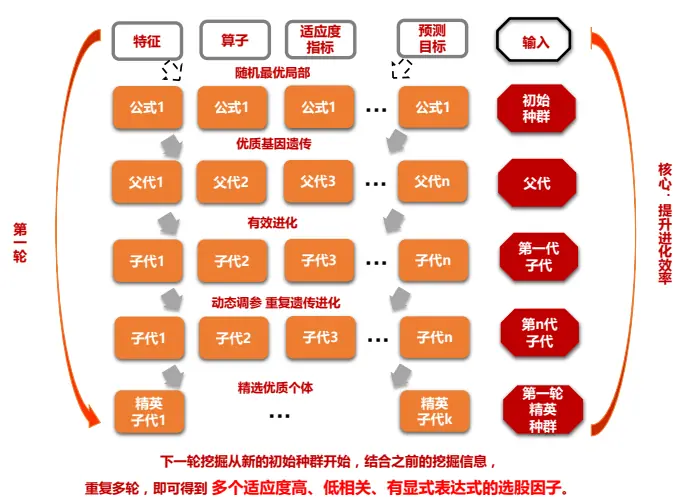
数据来源：东方证券研究所

图 19：DFQ遗传规划价量因子挖掘系统核心改进点
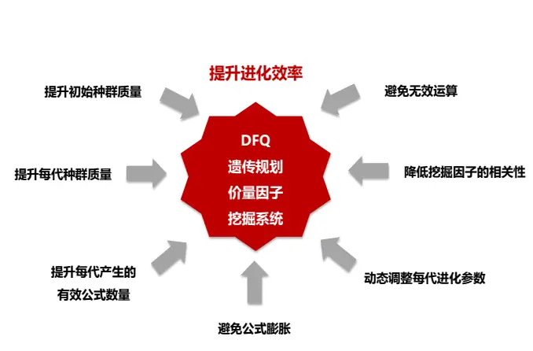
数据来源：东方证券研究所

《DFQ 遗传规划价量因子挖掘系统》研报，利用 DFQ 遗传规划因子挖掘系统，进行了选股因子挖掘。在进行选股因子挖掘时，进行一轮 15 代完整挖掘用时 5-24 小时不等，一轮完成后可产生 20-50 个适应度（行业市值中性化 rankic）超过 5%，且互相间相关系数不超过 50%的单因子。采用 2012.1.1-2016.12.31 年 5 年数据作为训练集，共挖掘得到 152 个达标因子。由于算力限制，当时并未进行滚动挖掘。下面我们展示合成因子在 17 年之后的绩效表现。可以看到：（1）样本外 2017-2023 年模型表现较为稳定，并未观察到明显的衰减，RANKIC 都在 11%以上。（2）2024 年模型表现不佳，RANKIC 下滑到 6%，多头并未获得正超额。但 2024 年的模型表现与风格暴露相关，并不完全代表因子失效。

图 20：gp 个股因子的绩效表现（2017.1.1-2024.9.30）

| 20170101-20240930 stock_xgb，间隔20个交易日调仓 | IC | ICIR | RANKIC | RANKICIR | top5%股票组合 月度胜率 | top5%股票组合 超额收益夏普比 | top5%股票组合 年化超额收益 | top5%股票组合 超额收益日度最大回撤 | top5%股票组合 月均换手 |
| --- | --- | --- | --- | --- | --- | --- | --- | --- | --- |
| 2017-2024整体绩效 | 9.02% | 100.62% | 11.87% | 134.22% | 71.28% | 152.17% | 9.14% | -14.45% | 68.17% |
| 2017 | 11.32% | 166.37% | 12.32% | 172.97% | 75.00% | 174.13% | 6.68% | -2.30% | 77.68% |
| 2018 | 12.23% | 190.66% | 13.51% | 168.88% | 75.00% | 427.61% | 22.25% | -2.58% | 77.54% |
| 2019 | 9.94% | 116.74% | 13.53% | 163.20% | 75.00% | 248.43% | 9.87% | -3.03% | 69.09% |
| 2020 | 7.24% | 68.71% | 11.69% | 115.96% | 75.00% | 181.39% | 9.76% | -4.90% | 65.65% |
| 2021 | 5.76% | 67.94% | 11.41% | 128.28% | 66.67% | 93.77% | 5.40% | -5.99% | 66.29% |
| 2022 | 9.33% | 120.38% | 11.56% | 193.58% | 66.67% | 183.61% | 12.36% | -3.53% | 64.37% |
| 2023 | 9.05% | 88.69% | 13.33% | 164.89% | 84.62% | 169.25% | 11.30% | -4.95% | 58.55% |
| 20240930 | 6.98% | 66.01% | 6.34% | 52.37% | 44.44% | -7.45% | -7.30% | -14.45% | 66.60% |

数据来源：东方证券研究所 & Wind资讯

## 3.2模型参数

## 1. 行业标的

采用中信一级行业作为轮动标的。删除历史数据长度较短的综合金融（CI005030.WI）行业，保留其他 29个行业。分组采用[5, 6, 7, 6, 5]的方案，多空两端均为 5个行业，超额计算基准为 29个行业的等权组合。

## 2. 调仓频率

考虑到之前基本面和动量的行业轮动策略都是按月频调仓测试的，并且之前的机器学习选股策略也是月频。为了方便对比，此次我们依然挖掘月频因子，考察因子预测未来 20 个交易日的行业指数收益时的表现。样本外回测时，统一按月末交易日调仓。

## 3. 训练区间

考虑到行业场景下样本量少，训练集不能设置太短。另外高质量的 L2 数据从 2013 年下旬才能够获取。为保证训练集上的数据覆盖度，我们采用 2010.1.1-2019.11.30 共十年的日度数据作为训练集，从2019.12.31开始作为样本外测试集。需要注意的是训练集和测试集之间需要至少间隔 20个交易日，避免引入未来信息。

下图展示了以 2010.1.1-2019.11.30 为训练集，挖掘出的共计 50 个符合适应度要求的单因子，在样本外的表现。可以看到，样本外出现明显衰减。50 个单因子在样本外第一年 top5 行业组合超额收益达到 5%，第二年开始就不再有明显超额。因而我们采用滚动挖掘的方式，每隔一年重新挖掘一遍因子。训练集采用滑动窗口的方式，长度固定 10 年，每次向后挪一年。训练区间具体设置如下图。

图 21：以 2010.1.1-2019.11.30 为训练集，挖掘出的符合适应度要求的单因子，样本外的绩效表现（2020.1.1-2024.9.30）
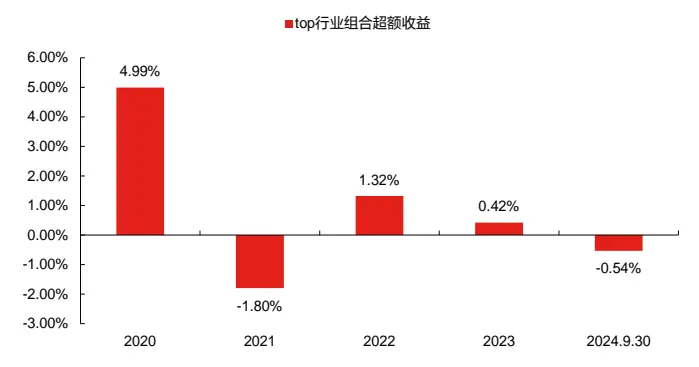
数据来源：东方证券研究所 & Wind资讯

图 22：训练区间设置（2020.1.1-2024.9.30）
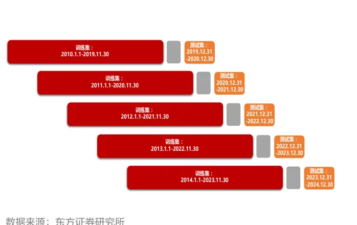
数据来源：东方证券研究所

有关分析师的申明，见本报告最后部分。其他重要信息披露见分析师申明之后部分，或请与您的投资代表联系。并请阅读本证券研究报告最后一页的免责申明。

## 4. 行业特征

之前的报告《DFQ 遗传规划价量因子挖掘系统》中，我们共设计了 47 个特征。本次我们对特征库进行了扩充，当前共计使用145个特征。包括行业指数特征29个，个股加权特征116个。个股加权特征包括日度量价特征 4个、日内分钟量价特征 89个、日内 l2量价特征 13个、基本面特征10个。特征选择的标准是数据更新频率高，在日度时序上有变化。涉及的最高价、最低价、开盘价、收盘价、成交量均进行后复权，避免使用前复权数据引入未来信息。对部分特征进行了适当量纲调整。不对特征进行相关性筛选。

## 5. 行业特征预处理

对于行业指数特征和个股加权特征，我们采用不同的预处理方法：

（1）行业指数特征：截面上进行稳健 Zscore 标准化，以 0 填充缺失值的操作。考虑到横截面上只有 29 个样本点，异常值识别可能不准确，因而我们使用中位数和中位数绝对偏差（MAD）来替代常规 Zscore标准化使用的均值和标准差，降低异常值对标准化结果的影响。

（2）个股加权特征：首先将个股特征匹配到每日的中证全指股票池，而后在横截面上对个股特征进行 boxplot 去异常值，zscore 标准化，以 0 填充缺失值等操作。再将个股特征进行市值加权得到行业特征。最后在截面上对行业特征进行稳健Zscore标准化，以0填充缺失值的操作。

## 6. 行业算子

之前的报告《DFQ 遗传规划价量因子挖掘系统》中，我们共设计了 81 个算子。本次我们对算子库进行了扩充，当前共计使用 140 个算子。包括 gplearn 自带算子 14 个，自定义算子 126个。算子设计需要充分考虑缺失值兼容性及运算效率。自定义算子包括：

（1）元素运算 12个：以激活函数、逻辑运算符为主；

（2）截面运算 41 个：根据算子运算所需的特征个数，进一步分为四个小类：一元截面 13个、二元截面 12个、三元截面 7个、四元截面9个；

（3）时序运算 74 个：根据算子运算所需的特征个数和窗口个数，进一步分为六个小类：一元时序 46个、一元时序 2常数 1个、二元时序 20个、二元时序 2常数 4个、二元时序 3常数 1个、三元时序 2个；

此次我们额外增加了截面和时序的切割算子。切割算子体现了分域的建模的思想，在选股中效果较好。

时序算子的计算窗口期设置为6个选项：1，5，10，20，40，60。我们只希望常数出现在时序算子的指定位置上，不允许常数和特征进行截面运算，因而并不在默认参数 const_range 中设置常数，而是在底层代码中修改添加。

## 7. 行业适应度

使用 20 个路径下多头（top5）行业组合的月均超额收益的最小值作为适应度，阈值为 0.5%。

（1）多头表现：由于横截面上只有 29 个样本点，ic 等相关系数指标可能不稳健，并且相对来讲我们也更加关注多头组的表现，因而此次使用多头月均超额收益作为适应度。

（2）缺失率：由于横截面上只有 29 个样本点，有较多缺失值的话容易导致因子无法分组，绩效度量有偏差，因而我们降低对于缺失率的容忍度，如果 2015 年以来有任何一天缺失率达 50%以上，适应度置为 0。2015年以前如果当天缺失率达 50%以上，则剔除该日。

（3）路径：为避免路径依赖的影响，计算20个不同调仓路径下的top5多头月均超额收益，取最小值作为适应度。

（4）相关性：在适应度中加入相关性惩罚，计算当前因子和已挖因子（之前轮次保留下来的有效因子）的 spearman 相关系数。若相关系数绝对值中位数大于 0.9，则将适应度置为 0，避免挖掘与多数已有因子都严重高相关的因子。同时考虑到横截面上只有29个样本点，相关系数指标可能不稳健，因而适应度中不再额外惩罚相关性；

（5）rankic：在适应度中加入对于 rankic的考察，保证因子单调性。若该因子 rankic绝对值小于 0.03，直接将适应度置为0。

（6）加速：使用 Numba 对多头组计算进行加速。Numba 最适合加速大量的数值计算，尤其是那些可以利用向量化操作的场景。

## 四、 DFQ 遗传规划行业因子挖掘系统效果分析

## 4.1 模型运行效率

遗传规划算法挖掘过程中，可能生成大量重复因子，尤其是随机生成初始种群的时候。每次生成因子后，都需要计算该因子的适应度，这就可能产生大量重复计算。因而，此次我们对模型进行了改进：将每次的单因子表达式和适应度进行缓存。在计算适应度之前，首先从保存的本地缓存数据中查找，如果因子之前已存在，适应度数据直接调用即可，无需重复计算。

改进后运算效率大幅提升，原来进行一轮15代完整挖掘需要20min左右，修改后仅需5min，并且挖的越多缓存越丰富，对效率的提升越明显。需要注意的是，模型运行用时与随机公式的复杂度、随机算子的计算效率、cpu 性能有关，每轮的用时不会完全一致。本次测试所用机器为Intel Xeon Gold 6242R CPU3.10GHZ，256G 内存的服务器，挖掘时并行 36 核。

下面我们展示某轮挖掘的运行信息：（1）第0代初始种群的平均适应度达到0.25%，最优公式适应度达到0.49%，说明对初始种群质量的提升有效；（2）随着代数增多，种群平均适应度和最优适应度都在逐渐提高，进化在逐代变优，说明对种群质量的提升有效；（3）每代保留的适应度超过 0.5%的公式个数也在不断增多，到第 15 代，我们已经可以获得 100+个适应度超过 0.5%的个体。表格展示的数字都是去重后的，不存在同代重复个体的影响。说明我们对每代产生有效公式数量的提升有效；（4）最优公式长度控制在 10 以内，说明我们对公式膨胀问题的处理有效；（5）15 代进化总用时 6min，第 0 代用时最长达到 4.61min，后面 15 代平均用时 5s。这一轮完成后，经过外部相关性筛选，共保留6个适应度超过0.5%，且互相关系数不超过50%的单因子。

图 23： DFQ遗传规划行业因子挖掘系统某轮挖掘的运行信息（训练区间：2010.1.1-2019.11.30）

| cir | generation | average_length | average_fitness | average_rawfitness | best_length | best_fitness | best_rawfitness | best_sum | generation_time(min) |
| --- | --- | --- | --- | --- | --- | --- | --- | --- | --- |
| 100 | 0 | 6.62 | 0.25% | 0.25% | 3 | 0.49% | 0.49% | 0.00 | 4.61 |
| 100 | 1 | 6.35 | 0.29% | 0.29% | 5 | 0.53% | 0.53% | 1.00 | 0.06 |
| 100 | 2 | 6.74 | 0.31% | 0.32% | 10 | 0.75% | 0.75% | 3.00 | 0.11 |
| 100 | 3 | 7.18 | 0.36% | 0.36% | 10 | 0.75% | 0.75% | 5.00 | 0.06 |
| 100 | 4 | 8.00 | 0.37% | 0.37% | 10 | 0.75% | 0.75% | 9.00 | 0.10 |
| 100 | 5 | 7.94 | 0.42% | 0.42% | 10 | 0.75% | 0.75% | 20.00 | 0.06 |
| 100 | 6 | 8.38 | 0.45% | 0.45% | 8 | 0.76% | 0.76% | 24.00 |  |
| 100 | 7 | 8.79 | 0.49% | 0.50% | 8 | 0.76% | 0.76% |  | 0.10 |
| 100 | 8 | 8.31 | 0.49% | 0.50% | 8 | 0.76% | 0.76% | 35.00 | 0.06 |
| 100 | 9 | 8.66 | 0.50% | 0.50% | 9 | 0.76% | 0.76% | 45.00 | 0.06 |
| 100 | 10 | 8.99 | 0.55% | 0.56% | 8 | 0.76% | 0.76% | 54.00 | 0.06 |
| 100 | 11 | 9.40 | 0.58% | 0.58% | 9 | 0.76% | 0.76% | 64.00 74.00 | 0.07 |
| 100 | 12 | 9.53 | 0.58% | 0.59% | 13 | 0.78% | 0.83% | 87.00 | 0.06 |
| 100 | 13 | 9.80 | 0.61% | 0.62% | 13 | 0.78% | 0.83% |  | 0.06 |
| 100 | 14 | 10.00 | 0.62% | 0.64% | 12 | 0.80% | 0.83% | 101.00 110.00 | 0.10 |
| 100 | 15 | 10.34 | 0.62% | 0.63% | 12 | 0.80% | 0.83% | 114.00 | 0.37 0.40 |

数据来源：东方证券研究所 & Wind资讯
有关分析师的申明，见本报告最后部分。其他重要信息披露见分析师申明之后部分，或请与您的投资代表联系。并请阅读本证券研究报告最后一页的免责申明。

## 4.2 单因子表现

由于算力限制，在撰写这部分时我们每年分别挖掘出了 50 个左右训练集适应度超过 0.5%，且互相间相关系数不超过 50%的单因子。首先我们展示每年挖掘出的单因子，在测试集一年里的月均多头超额收益表现。

可以看到，不同年份单因子表现不尽相同，但都会面对单因子样本外效果衰减的情况，并且单因子表现分化较明显，极差较大：

（1）整体来看，2020-2024 年用到的 277 个单因子中，样本外月均多头超额收益中位数为0.15%，60%的单因子样本外月均多头超额收益为正，30%的单因子样本外月均多头超额收益超过0.5%。表现最好的单因子月均多头超额收益达到2.73%，表现最差的单因子月均多头超额收益达到-2.42%。

（2）2020、2024 年单因子样本外表现较好，平均月均多头超额收益达到 0.5%左右，近 50%的单因子样本外月均多头超额收益超过 0.5%。

（3）2021、2022、2023 年单因子失效情况严重，平均月均多头超额收益在 0 附近，仅有20%左右的单因子样本外月均多头超额收益超过 0.5%。

图 24：2020年单因子月均多头超额收益分布
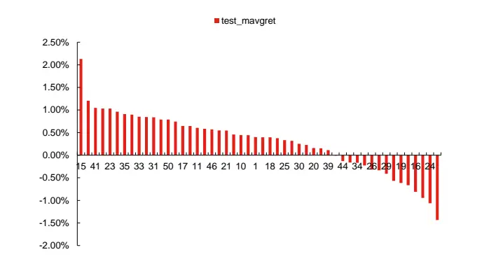
数据来源：东方证券研究所 & Wind资讯

图 25：2021年单因子月均多头超额收益分布
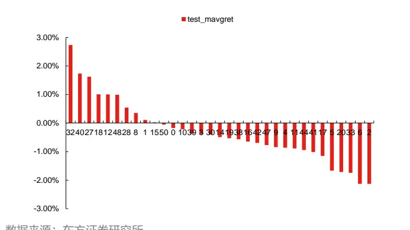
数据来源：东方证券研究所

图 26：2022年单因子月均多头超额收益分布
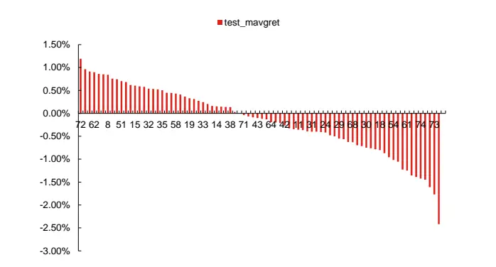
数据来源：东方证券研究所 & Wind资讯

图 27：2023年单因子月均多头超额收益分布
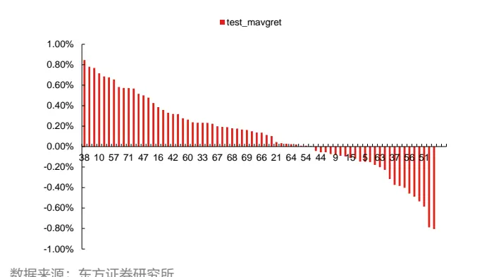
数据来源：东方证券研究所

有关分析师的申明，见本报告最后部分。其他重要信息披露见分析师申明之后部分，或请与您的投资代表联系。并请阅读本证券研究报告最后一页的免责申明。

图 28：2024 年单因子月均多头超额收益分布（截止2024.9.30）
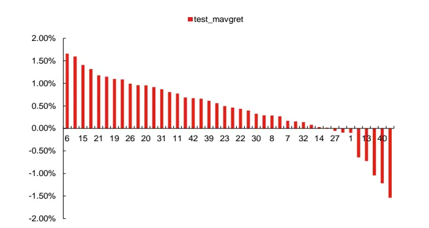
数据来源：东方证券研究所 & Wind资讯

图 29：2020-2024 年单因子月均多头超额收益分布（截止2024.9.30）
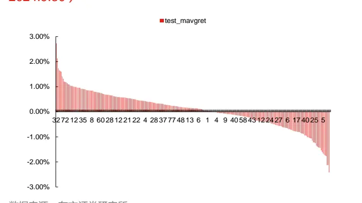
数据来源：东方证券研究所

## 我们统计了每一年所用的单因子中，各个运算符（特征、算子、常数）出现的次数。

（1）每年单因子中，平均会用到150个运算符。我们设置的运算符空间总数为291，仍存在一些无效运算符。可以根据挖掘结果对运算符空间进行精简。

（2）常数的出现频率都很高，并且 60 日出现频率更高。说明在行业因子构造中，偏中长期的时序信息更加有效。

（3）算子中，ts_ewm（过去 d 天的指数平滑加权均值，反映该行业短期内的变化趋势）、ts_rank_amean（过去 d 天截面排名的算数平均，反映该行业特征的相对强弱）、ts_negmax_sum（过去 d 天的最大值取反之后再求过去 d 天的和，通过“反转最大值”来关注行业的潜在问题或风险，反映了行业可能的负面趋势）、ts_negmin_sum（过去 d 天的最小值取反之后再求过去 d 天的和，通过“反转最小值”来关注行业中的潜在机会，反映了行业可能的正面趋势），这 4个算子每年的出现频率都很靠前。说明这些是构造行业因子比较重要的运算结构。

（4）特征中，l2c14（早盘大单买入占比，5%阈值）在每年的出现频率都很靠前。说明刻画资金流的高频特征对于构造行业因子较为重要。2023、2024 年 WFR（加权的分析师预期调整）特征的出现频率也比较靠前。说明分析师因子近几年的重要性在提升。

图 30：每年单因子中运算符出现的次数

| 2020 | 出现次数 | 2021 | 出现次数 | 2022 | 出现次数 | 2023 | 出现次数 | 2024 | 出现次数 |
| --- | --- | --- | --- | --- | --- | --- | --- | --- | --- |
| total | 239 | total | 166 | total | 377 | total | 370 | total | 209 |
| 60 | 52 | 60 | 42 | 60 | 97 | 40 | 66 | 60 | 55 |
| 40 | 33 | 40 | 27 | 40 | 47 | 60 | 66 | 40 | 33 |
| 20 | 23 | ts_rank_amean | 18 | ts_rank_amean | 36 | 10 | 39 | 20 | 22 |
| 10 | 21 | ts_rank_gmean | 12 | 10 | 36 | 20 | 38 | l2c14 | 17 |
| ts_rank_amean | 17 | 20 | 12 | 20 | 36 | ts_rank_amean | 33 | 10 | 17 |
| 5 | 16 | ts_negmax_sum | 11 | l2c14 | 25 | ts_rank_gmean | 28 | ts_min | 10 |
| 1 | 15 | 5 | 11 | ts_rank_gmean | 24 | l2c14 | 25 | ts_negmax_sum | 10 |
| ts_median | 13 | 10 | 10 | ts_ewm | 22 | 1 | 23 | 5 | 10 |
| ts_ewm | 11 | 1 | 9 | 1 | 21 | l2c4 | 14 | ts_negmax_sum2 | 10 |
| ts_negmax_sum | 10 | I2c4 | 8 | 5 | 12 | ts_product | 12 | ts_rollweighted_mean | 9 |
| ts_rank_gmean | 9 | ts_sum | 8 | l2c4 | 12 | ts_rollweighted_mean | 12 | ts_rank_amean | 9 |
| I2c11 | 9 | ts_ewm | 7 | ts_mean | 12 | ts_ewm | 12 | WFR | 9 |
| ts_dema | 8 | ts_negmin_sum | 7 | ts_median | 12 | ts_wmean | 11 | ts_ewm | 8 |
| l2c14 | 8 | I2c14 | 6 | ts_product | 12 | ts_min | 11 | l2c4 | 8 |
| ts_min | 7 | sigmoid | 6 | ts_negmin_sum | 11 | ts_max | 11 | 1 | 7 |
| rank_sub2 | 6 | I2c9 | 5 | rank | 11 | ts_mean | 10 | ts_negmin_sum | 7 |
| ts_sum | 6 | ratio_volumeH3 | 5 | rank_mul2 | 11 | ts_negmax_sum | 10 | ts_sum | 6 |
| rank_mul4 | 6 | ts_min | 5 | ts_dema | 10 | 5 | 10 | I2c18 | 6 |
| ts_fxumr_75 | 6 | cut_negmax2 | 4 | inv1 | 9 | rank | 9 | ts_fxumr_75 | 6 |
| sub2 | 5 | rank_mul4 | 4 | ts_negmin_sum2 | 8 | WFR | 9 | ts_median | 5 |

数据来源：东方证券研究所 & Wind资讯
有关分析师的申明，见本报告最后部分。其他重要信息披露见分析师申明之后部分，或请与您的投资代表联系。并请阅读本证券研究报告最后一页的免责申明。

'demedian(ts_dema(ts_dailypctchg_std(ts_cut_mean_smallersum(l2c14, 40.000), 60.000), 1.000))
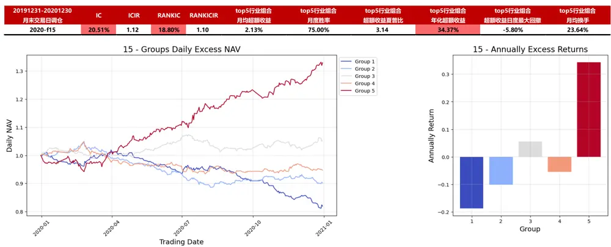
图 31：2020年 F15的绩效表现&分 5组超额收益净值&分5组年化超额收益

下面我们每年选取样本外效果较好的 2个单因子，进行详细展示。

（1）2020年 F15：该因子用到了 1个特征：l2c14（早盘大单买入占比）。用到了 8个算子，其中涉及 1 个时序切割算子：ts_negmax_sum（过去 d 天的最大值取反之后，再求过去 d 天的和）。该因子聚焦于行业因子中极端表现和潜在趋势，同时消除短期波动的干扰，捕捉行业中的潜在风险和机会。

'ts_sum(ts_min(demedian(ts_wmean(ts_min(inv1(ts_negmax_sum(ts_rank_amean(l2c14, 10.000), 20.000)), 40.000), 10.000)), 40.000), 10.000)

| 20191231-20201230 月末交易日调仓 | IC | ICIR | RANKIC | RANKICIR | top5行业组合 | 月均超额收益 | top5行业组合 月度胜率 | top5行业组合 超额收益夏普比 | top5行业组合 年化超额收益 | top5行业组合 超额收益日度最大回撤 | top5行业组合 月均换手 |
| --- | --- | --- | --- | --- | --- | --- | --- | --- | --- | --- | --- |
| 2020-f15 | 20.51% | 1.12 | 18.80% | 1.10 |  | 2.13% | 75.00% | 3.14 | 34.37% | -5.80% | 23.64% |

数据来源：东方证券研究所 & Wind资讯

2020 年 F41：该因子用到了 1 个特征：l2c14（早盘大单买入占比）。用到了 4 个算子，其中涉及 1个时序切割算子：ts_cut_mean_smallersum（过去 d日中，将小于均值的部分切割出来求和）。该因子通过逐步去噪、平滑、去偏差，构建一个可以突出行业风险信号和机会信号的因子，特别关注行业的低迷和波动，并通过平滑和去中位数来提取长期趋势和极端表现。

图 32：2020年 F41的绩效表现&分 5组超额收益净值&分5组年化超额收益

| 20191231-20201230 月末交易日调仓 | IC | ICIR | RANKIC | RANKICIR | top5行业组合 月均超额收益 | top5行业组合 月度胜率 | top5行业组合 超额收益夏普比 | top5行业组合 年化超额收益 | top5行业组合 超额收益日度最大回撤 | top5行业组合 月均换手 |
| --- | --- | --- | --- | --- | --- | --- | --- | --- | --- | --- |
| 2020-f41 | 15.81% | 0.79 | 12.52% | 0.70 | 1.05% | 58.33% | 1.63 | 14.84% | -4.76% | 36.36% |

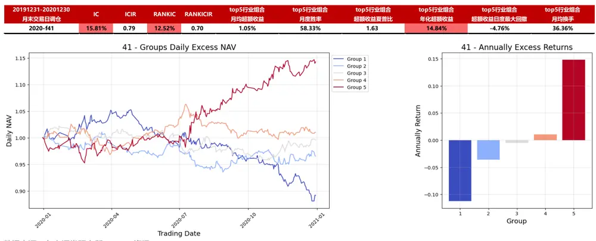
数据来源：东方证券研究所 & Wind资讯
有关分析师的申明，见本报告最后部分。其他重要信息披露见分析师申明之后部分，或请与您的投资代表联系。并请阅读本证券研究报告最后一页的免责申明。

（2）2021 年 F32：该因子用到了 4 个特征：l2c11（早盘大单涨跌幅）、ratio_volumeH3（3段成交量占比，开盘后第3个半小时成交量占全天成交量之比）、lntwapret （twap对数收益率）、l2c4（早盘委托买卖单大小比）。用到了 6 个算子，其中涉及 1 个时序切割算子：ts_negmax_sum（过去 d 天的最大值取反之后，再求过去 d 天的和）。该因子通过对多个特征的排名、时间序列处理、加权平均等操作，综合衡量行业的市场情绪、潜在流动性风险、价格走势和供需关系等方面的因素。

图 33：2021年 F32的绩效表现&分 5组超额收益净值&分5组年化超额收益

'power2(rank_mul4(rank(l2c11), ts_negmax_sum(ratio_volumeH3, 60.000), ts_ewm(lntwapret, 40.000), ts_wmean(l2c4, 20.000)))

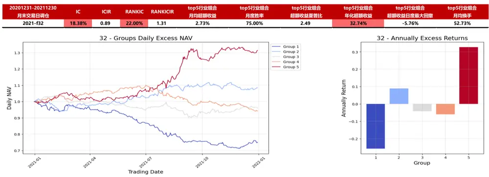
数据来源：东方证券研究所 & Wind资讯

2021 年 F27：该因子用到了 2 个特征：PEG （PE_FY1/FY2 隐含的利润增量率）、WFR（加权的分析师预期调整）。用到了 5 个算子，其中涉及 3 个时序切割算子：ts_negmax_sum（过去 d天的最大值取反之后，再求过去 d天的和）、ts_cut_mean_neggreater_sum（过去 d日中，将大于均值的部分切割出来，取反后，再求全序列的和）、ts_fxumr_75（取过去d日作为窗口，将 x 减去窗口内的 75%分位数，而后再乘 y，最后计算窗口内均值）。该因子对分析师预期调整进行分域加权，强调了行业或股票中偏离均值的极端情况，关注行业的潜在风险。

图 34：2021年 F27的绩效表现&分 5组超额收益净值&分5组年化超额收益
'ts_negmax_sum(ts_cut_mean_neggreater_sum(scale(ts_fxumr_75(rank(PEG), sigmoid(WFR), 5.000)), 40.000), 60.000)'
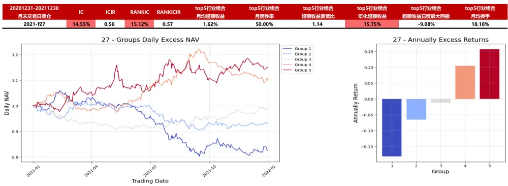
数据来源：东方证券研究所 & Wind资讯
有关分析师的申明，见本报告最后部分。其他重要信息披露见分析师申明之后部分，或请与您的投资代表联系。并请阅读本证券研究报告最后一页的免责申明。

'ts_wmean(ts_fxzscore_75(ts_cut_mean_negsmaller_sum(l2c20, 1.000), l2c9, 60.000), 40.000)'

（3）2022年 F70：该因子用到了 2个特征：l2c20（早盘大单涨跌幅）、l2c9（早盘大单资金净流入/(全天资金流入+全天资金流出)）。用到了 3 个算子，其中涉及 2 个时序切割算子：ts_cut_mean_negsmaller_sum（过去d日中，将小于均值的部分切割出来，取反后，再求全序列的和）、ts_fxzscore_75（取过去 d日作为窗口，将 x根据窗口内的 75%分位数进行 zscore标准化，而后再乘 y，最后计算窗口内均值）。该因子结合早盘大单交易和资金流动强度，强调市场的早盘阶段的情绪和资金的活跃度。通过反转异常值，捕捉相对于历史表现的异常变化，并通过加权均值平滑化处理，确保近期的市场表现对因子的影响最大。

图 35：2022年 F70的绩效表现&分 5组超额收益净值&分5组年化超额收益
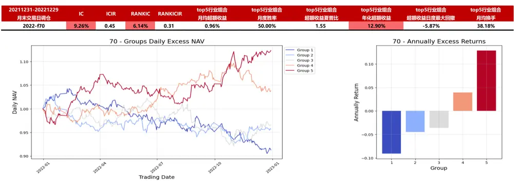
数据来源：东方证券研究所 & Wind资讯

2022 年 F53： 该因子用到了 4个特征：cum_return_top_10（前 10%累计最大涨幅）、WFR（加权的预期调整）、induslnhlret（行业指数的收盘价对数收益率）、Amihud（收盘价对数收益率绝对值/成交额）。用到了 5 个算子， 其中涉及 1 个截面切割算子：cut_mean_negsmaller（x小于截面均值的部分*-1）。该因子通过对多个维度的特征进行排名，并结合时序窗口最大值，来选择在不同维度上表现优异的行业。同时通过反转负面表现的部分，强调潜在的风险因素，并通过加权平均和平滑操作减少短期波动的干扰。

图 36：2022年 F53的绩效表现&分 5组超额收益净值&分5组年化超额收益
'inv1(ts_rank_amean(cut_mean_negsmaller(ts_max(rank_mul4(cum_return_top_10, WFR, induslnhlret, Amihud), 40.000)), 20.000))'
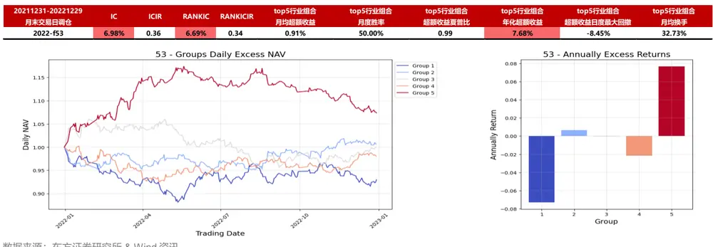
数据来源：东方证券研究所 & Wind资讯
有关分析师的申明，见本报告最后部分。其他重要信息披露见分析师申明之后部分，或请与您的投资代表联系。并请阅读本证券研究报告最后一页的免责申明。

'demedian(ts_negmax_sum(power3(cos1(ts_product(abs1(ts_rank_amean(l2c4, 40.000)), 10.000))), 40.000))'

（4）2023 年 F40：该因子用到了 1 个特征：l2c4（早盘委托买卖单大小比）。用到了 7 个算子，其中涉及 1 个时序切割算子：ts_negmax_sum（过去 d 天的最大值取反之后，再求过去 d天的和）。该因子对早盘委托买卖单大小比进行排名，关注市场上买卖力量的相对强弱。结合加权、非线性处理和极端值反转，捕捉市场中的潜在波动、极端表现或风险。

图 37：2023年 F40的绩效表现&分 5组超额收益净值&分5组年化超额收益
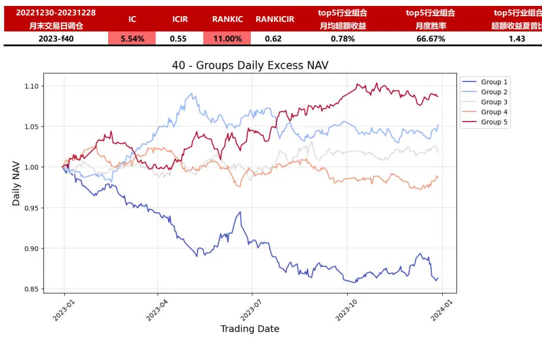
数据来源：东方证券研究所 & Wind资讯

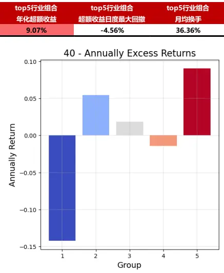

2023 年 F65：该因子用到了 1 个特征：l2c14（早盘大单买入占比）。用到了 5 个算子，其中涉及 4 个时序算子。该因子的逻辑是通过对早盘大单买入占比进行时序加权平滑、截面排序等处理，衡量市场情绪的稳定性或不确定性。

图 38：2023年 F65的绩效表现&分 5组超额收益净值&分5组年化超额收益'ts_mad(ts_product(rank(ts_rank_gmean(ts_wmean(l2c14, 60.000), 20.000)), 60.000), 20.000)'
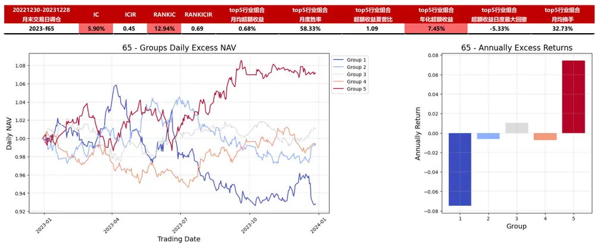
数据来源：东方证券研究所 & Wind资讯

有关分析师的申明，见本报告最后部分。其他重要信息披露见分析师申明之后部分，或请与您的投资代表联系。并请阅读本证券研究报告最后一页的免责申明。

（5）2024 年 F10：该因子用到了两个特征：induslnopenret（行业指数的开盘价对数收益率），corr_volume_amplitude（成交量和振幅相关性）。用到了四个算子，其中涉及两个时序切割算子：ts_negmax_sum2（过去 d 天 y 的最大值位置对应的 x 的值取反，再求过去 d 日 x 序列的和）、ts_negmin_sum（过去 d 天的最小值取反之后，再求过去 d 天的和）。该因子通过分析行业开盘时的收益表现、成交量和振幅的相关性，来揭示行业的负面趋势或潜在风险。

图 39：2024年 F10的绩效表现&分 5组超额收益净值&分5组年化超额收益（截止 2024.9.30）'demedian(ts_negmax_sum2(ts_median(ts_negmin_sum(induslnopenret, 60.000), 40.000), corr_volume_amplitude, 40.000))
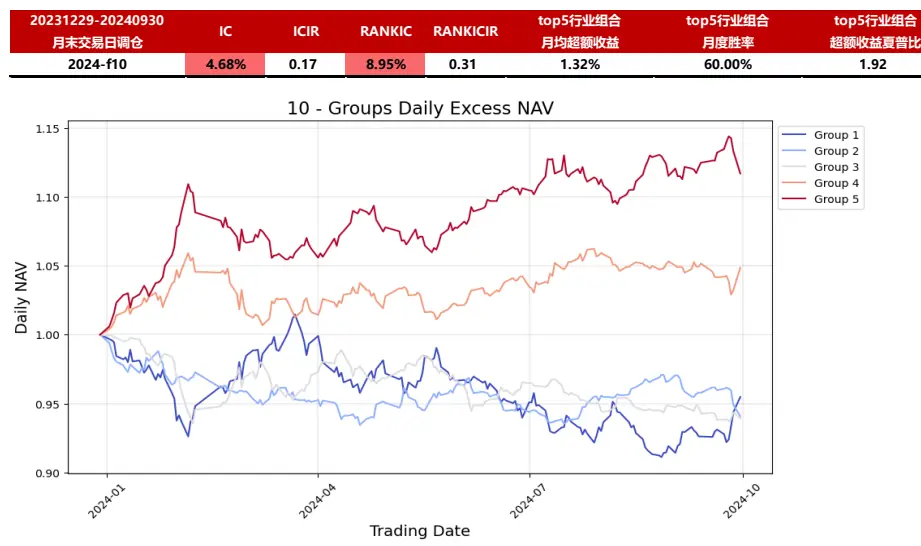
数据来源：东方证券研究所 & Wind资讯

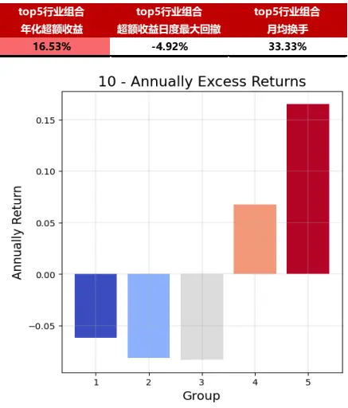

2024年F4：该因子用到了两个特征：l2c14（早盘大单买入占比）、indus_loserrnum（行业内涨跌幅处于当天后 120 的股票个数）。用到了四个算子，其中涉及 1 个时序切割算子：ts_cut_max（过去 d 天 y 的最大值位置对应的 x的值）。该因子将早盘大单买入占比与行业的弱势股票数量结合，旨在捕捉即使在行业弱势的背景下，资金流入的可能性，从而帮助识别出行业中潜在的投资机会。

图 40：2024年 F4的绩效表现&分 5组超额收益净值&分5组年化超额收益（截止 2024.9.30）'softmax(ts_cut_max(softmax(ts_mean(l2c14, 40.000)), indus_loserrnum, 60.000))
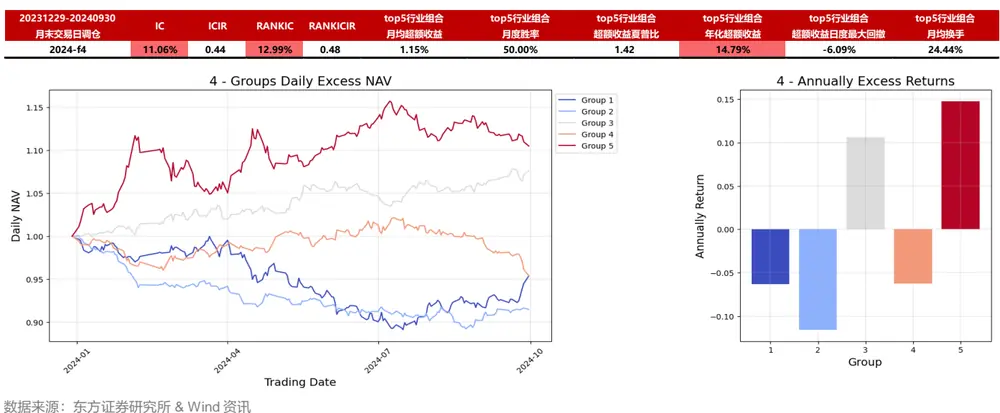
有关分析师的申明，见本报告最后部分。其他重要信息披露见分析师申明之后部分，或请与您的投资代表联系。并请阅读本证券研究报告最后一页的免责申明。

## 4.3 合成因子表现

通过遗传规划方法挖掘出的单因子，样本外容易出现效果衰减，直接使用单因子并不恰当。更合理的方式是，在每年的单因子挖掘出以后，进行因子加权，来获得合成因子。加权前，我们对单因子进行了横截面 Boxplot去异常值、zscore标准化、以 0填充缺失值三步处理。

我们对比了等权、单次弹性网络回归加权、单次xgb加权、动态xgb加权四种方式，具体做法如下：

（1）等权：首先根据单因子在训练集上的 rankic 确定因子方向，如果 rankic 为负，则将因子值取反，再进行等权。

（2）单次弹性网络回归加权：弹性网络回归（Elastic Net Regression）是一种结合了岭回归（Ridge Regression）和 lasso 回归（Lasso Regression）的线性回归模型。能够比较好的处理因子间的共线性问题，避免因子间的冗余和过拟合，是线性回归模型中表现较突出的做法。采用遗传规划算法挖掘时使用的训练集作为弹性网络回归的训练集，训练一次，样本外使用一年。由于线性回归运算较快，参数可以通过样本内 cv 的方式网格搜索得到。我们设置 alpha_range =[0.0001, 0.0003, 0.0005, 0.0007, 0.001, 0.003,0.005,0.007,0.01] ， l1_ratio_range =np.linspace(0.1, 1, 10)。

（3）单次 xgb 加权：XGBoost 属于梯度提升决策树模型，通过组合多个决策树模型，逐步减小残差误差，属于非线性模型。采用遗传规划算法挖掘时使用的训练集作为 xgb 的训练集，训练一次，样本外使用一年。考虑到树模型调参相对耗时，参数按经验设置，max_depth=5,learning_rate=0.01，其它参数均使用默认选项。

（4）动态 xgb加权：每月重新训练 xgb，训练集取过去半年，样本外只使用一个月。训练集和测试集间隔 20个交易日，避免引入未来信息。参数设置与单次 xgb加权保持一致。

## 从结果来看，加权方法的选择对于实现超额收益至关重要：

（1）等权方法无超额：2020年以来 top5 行业组合年化超额为-0.02%，除 2020 年表现亮眼以外，其他年份均表现一般。等权方法忽略了因子之间表现的差异，由于近半数单因子在样本外都存在失效风险，直接等权并不恰当。

（2）单次弹性网络回归和 xgb 方法超额较低：2020年以来 top5行业组合年化超额在 2%左右，不同年份表现差异较大。弹性网络回归加权和 xgb 加权相比等权均稍有改进，能够通过学习历史数据中的模式来优化单因子权重分配。然而由于只进行了单次训练，未能充分适应样本外市场环境的变化，表现依然不稳定。

（3）动态 xgb 加权明显占优：在动态 xgb 加权方法下，2020 年以来 top5 行业组合年化超额 11.10%，超额收益最大回撤 10.28%，月度胜率 61.40%，超额收益夏普比 1.16，月均换手65%。不同年份top5行业组合均能获得正超额收益，除2022年外，其他年份超额收益均在10%以上。动态 XGB 加权的效果显著优于前两种方法，原因在于它能根据近期市场情况重新优化模型，动态地调整因子权重以匹配当前市场环境。

虽然通过遗传规划算法挖掘出的单因子，近半数在样本外都存在失效风险，但挖出的单因子数量多且相关性低，通过合理的加权，完全可以取得优异的表现。

图 41：DFQ遗传规划行业因子挖掘模型的绩效表现（等权，2020.1.1-2024.9.30）

| 20200101-20240930 indus_gp_equal，月末交易日调仓 | IC | ICIR | RANKIC | RANKICIR | top5行业组合 月均超额收益 | top5行业组合 月度胜率 | top5行业组合 超额收益夏普比 | top5行业组合 年化超额收益 | top5行业组合 超额收益日度最大回撤 | top5行业组合 月均换手 |
| --- | --- | --- | --- | --- | --- | --- | --- | --- | --- | --- |
| 2020-2024整体绩效 | 2.98% | 0.11 | 2.84% | 0.10 | 0.03% | 56.14% | 0.05 | -0.02% | -37.95% | 25.71% |
| 2020 | 18.25% | 0.84 | 17.68% | 0.80 | 2.44% | 91.67% | 2.99 | 29.35% | -4.56% | 20.00% |
| 2021 | -8.03% | (0.34) | -6.66% | (0.25) | -2.06% | 23.08% | (2.03) | -20.84% | -28.71% | 33.33% |
| 2022 | -4.73% | (0.16) | -7.51% | (0.24) | -0.92% | 38.46% | (1.34) | -13.18% | -14.93% | 33.33% |
| 2023 | 11.88% | 0.59 | 12.35% | 0.64 | 1.01% | 76.92% | 1.04 | 5.69% | -4.74% | 28.33% |
| 20240930 | 6.31% | 0.17 | 7.40% | 0.22 | 0.79% | 60.00% | 0.05 | 6.35% | -6.85% | 8.89% |

数据来源：东方证券研究所 & Wind资讯

图 42：DFQ遗传规划行业因子挖掘模型的分 5组超额收益净值&年化超额收益（等权，2020.1.1-2024.9.30）
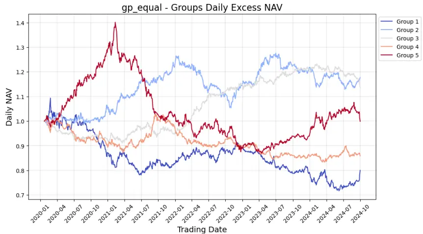
数据来源：东方证券研究所 & Wind资讯

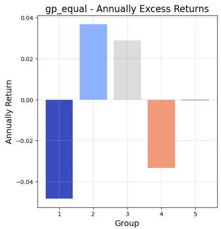

图 43：DFQ遗传规划行业因子挖掘模型的绩效表现（单次弹性网络回归加权，2020.1.1-2024.9.30）

| 20200101-20240930 indus_gp_elasticnet_innercv，月末交易日调仓 | IC | ICIR | RANKIC | RANKICIR | top5行业组合 月均超额收益 | top5行业组合 月度胜率 | top5行业组合 超额收益夏普比 | top5行业组合 年化超额收益 | top5行业组合 超额收益日度最大回撤 | top5行业组合 月均换手 |
| --- | --- | --- | --- | --- | --- | --- | --- | --- | --- | --- |
| 2020-2024整体绩效 | 0.74% | 0.03 | 0.99% | 0.04 | 0.20% | 49.12% | 0.28 | 2.19% | -22.05% | 40.71% |
| 2020 | 14.20% | 0.52 | 15.17% | 0.57 | 1.32% | 66.67% | 1.97 | 16.83% | -6.84% | 29.09% |
| 2021 | -7.79% | (0.38) | -4.95% | (0.21) | -0.51% | 38.46% | (0.66) | -6.48% | -14.91% | 38.33% |
| 2022 | -9.31% | (0.31) | -9.11% | (0.28) | -0.66% | 46.15% | (1.04) | -9.50% | -10.51% | 46.67% |
| 2023 | 8.61% | 0.33 | 8.35% | 0.34 | 0.75% | 53.85% | 0.32 | 1.92% | -5.77% | 41.67% |
| 20240930 | 8.65% | 0.27 | 5.93% | 0.23 | 1.06% | 50.00% | 0.08 | 9.40% | -8.92% | 48.89% |

数据来源：东方证券研究所 & Wind资讯

图 44：DFQ 遗传规划行业因子挖掘模型的分 5 组超额收益净值&年化超额收益（单次弹性网络回归加权，2020.1.1-2024.9.30）
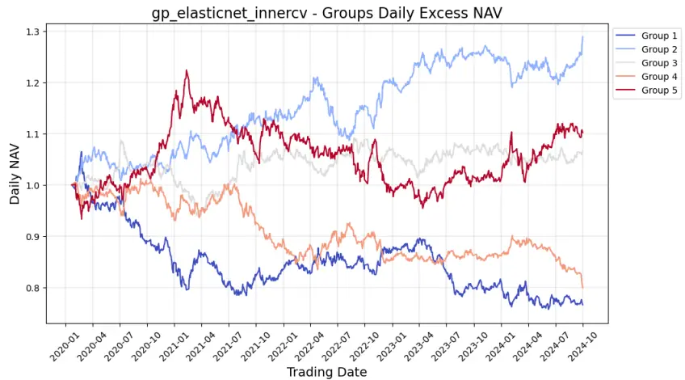
数据来源：东方证券研究所 & Wind资讯

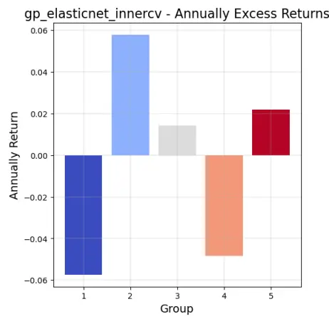

有关分析师的申明，见本报告最后部分。其他重要信息披露见分析师申明之后部分，或请与您的投资代表联系。并请阅读本证券研究报告最后一页的免责申明。

图 45：DFQ遗传规划行业因子挖掘模型的绩效表现（单次 xgb 加权，2020.1.1-2024.9.30）

| 20200101-20240930 indus_gp_xgb，月末交易日调仓 | IC | ICIR | RANKIC | RANKICIR | top5行业组合 月均超额收益 | top5行业组合 月度胜率 | top5行业组合 超额收益夏普比 | top5行业组合 年化超额收益 | top5行业组合 超额收益日度最大回撤 | top5行业组合 月均换手 |
| --- | --- | --- | --- | --- | --- | --- | --- | --- | --- | --- |
| 2020-2024整体绩效 | 2.75% | 0.13 | 1.23% | 0.05 | 0.16% | 52.63% | 0.27 | 1.90% | -10.53% | 65.36% |
| 2020 | 2.67% | 0.13 | -3.65% | (0.19) | 0.34% | 58.33% | 0.53 | 3.90% | -7.84% | 70.91% |
| 2021 | 2.08% | 0.09 | 2.07% | 0.09 | 0.36% | 61.54% | 0.76 | 6.83% | -7.60% | 76.67% |
| 2022 | 5.09% | 0.25 | 4.29% | 0.19 | 0.50% | 61.54% | 0.61 | 4.63% | -4.88% | 68.33% |
| 2023 | 1.40% | 0.06 | 2.75% | 0.12 | -0.12% | 46.15% | (0.47) | -3.36% | -6.42% | 58.33% |
| 20240930 | 3.10% | 0.13 | 2.30% | 0.08 | -0.40% | 40.00% | (0.04) | -3.04% | -7.84% | 48.89% |

数据来源：东方证券研究所 & Wind资讯

图 46：DFQ遗传规划行业因子挖掘模型的分 5组超额收益净值&年化超额收益（单次 xgb加权，2020.1.1-2024.9.30）
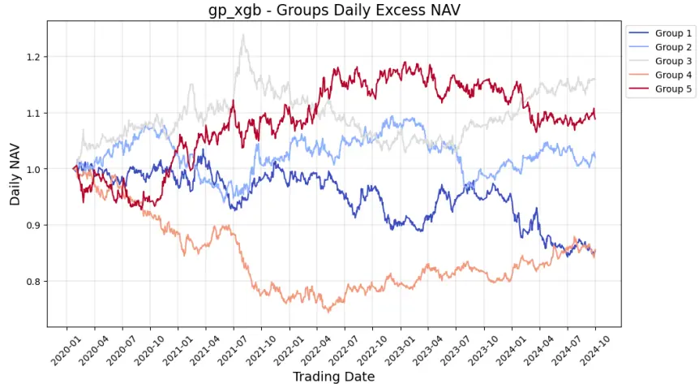
数据来源：东方证券研究所 & Wind资讯

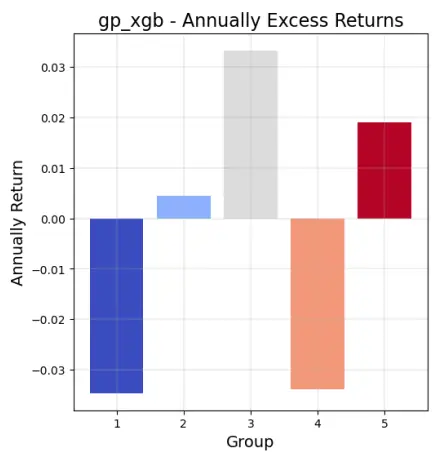

图 47： DFQ遗传规划行业因子挖掘模型的绩效表现（动态 xgb 加权，2020.1.1-2024.9.30）

| 20200101-20240930 indus_gp，月末交易日调仓 | IC | ICIR | RANKIC | RANKICIR | top5行业组合 月均超额收益 | top5行业组合 月度胜率 | top5行业组合 超额收益夏普比 | top5行业组合 年化超额收益 | top5行业组合 超额收益日度最大回撤 | top5行业组合 月均换手 |
| --- | --- | --- | --- | --- | --- | --- | --- | --- | --- | --- |
| 2020-2024整体绩效 | 3.64% | 0.15 | 6.01% | 0.24 | 0.89% | 61.40% | 1.16 | 11.10% | -10.28% | 65.00% |
| 2020 | 10.82% | 0.42 | 18.62% | 0.83 | 1.17% | 58.33% | 1.41 | 13.06% | -6.78% | 56.36% |
| 2021 | -5.47% | (0.32) | 1.88% | 0.08 | 0.21% | 61.54% | 0.19 | 1.51% | -10.28% | 63.33% |
| 2022 | 7.08% | 0.27 | 7.90% | 0.31 | 0.95% | 61.54% | 1.33 | 10.22% | -3.63% | 68.33% |
| 2023 | 8.00% | 0.32 | 6.66% | 0.31 | 1.47% | 76.92% | 1.33 | 10.22% | -4.04% | 68.33% |
| 20240930 | 3.16% | 0.11 | 0.00% | (0.00) | 1.68% | 60.00% | 0.16 | 15.29% | -4.30% | 68.89% |

数据来源：东方证券研究所 & Wind资讯

图 48：DFQ遗传规划行业因子挖掘模型的分 5组超额收益净值&年化超额收益（动态 xgb加权，2020.1.1-2024.9.30）
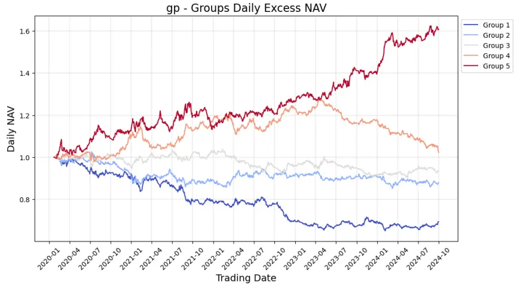
数据来源：东方证券研究所 & Wind资讯

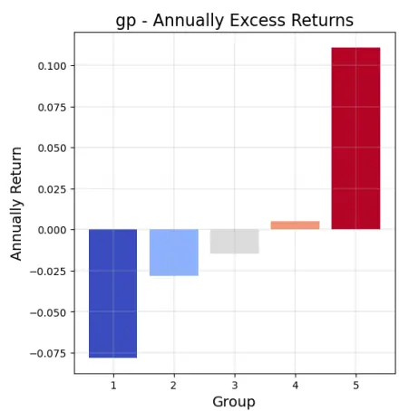

有关分析师的申明，见本报告最后部分。其他重要信息披露见分析师申明之后部分，或请与您的投资代表联系。并请阅读本证券研究报告最后一页的免责申明。

此外，我们展示了动态 xgb 加权方法下，每个月的特征重要性情况。可以看到，每个月不同特征的重要性都在变化。

图 49：2020年动态 xgb加权每个月的特征重要性
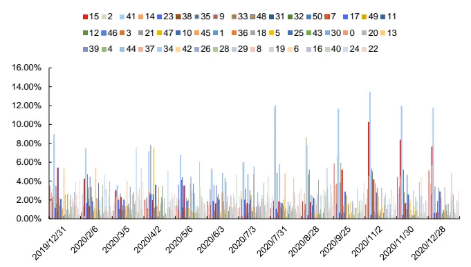
数据来源：东方证券研究所 & Wind资讯

图 50：2021年动态 xgb加权每个月的特征重要性
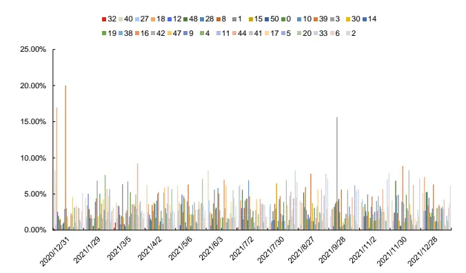
数据来源：东方证券研究所 & Wind资讯

图 51：2022年动态 xgb加权每个月的特征重要性
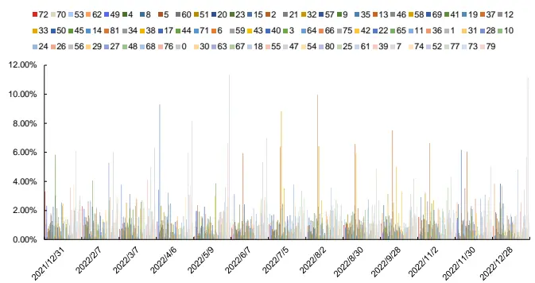
数据来源：东方证券研究所 & Wind资讯

图 52：2023年动态 xgb加权每个月的特征重要性
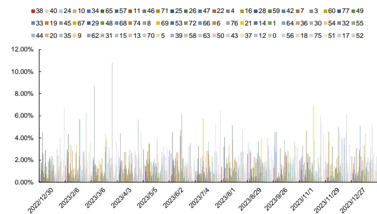
数据来源：东方证券研究所 & Wind资讯

图 53：2024年动态 xgb加权每个月的特征重要性
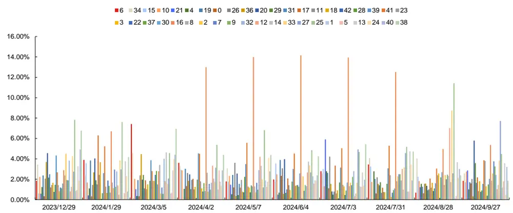
数据来源：东方证券研究所 & Wind资讯

行业因子样本外容易失效，频繁挖掘消耗算力。采用长周期挖掘，短周期动态加权的方法，可以显著提升合成因子表现，是一个可行的方案。

有关分析师的申明，见本报告最后部分。其他重要信息披露见分析师申明之后部分，或请与您的投资代表联系。并请阅读本证券研究报告最后一页的免责申明。

## 4.4 持仓情况

我们统计了 DFQ遗传规划行业轮动模型，每月的多头 top5行业组合持仓情况。可以看到：

（1）top5行业组合曾在全部 29个中信一级行业上发出过配置信号。

（2）样本外共 57 个调仓日，电力设备及新能源、家电、煤炭、轻工制造、基础化工、银行行业上入选 top5的次数最多，超过 15次。

（3）15 个行业配置胜率超 50%。纺织服装、医药、家电、石油化工行业的胜率达 75%以上。

图 54： DFQ 遗传规划行业轮动模型的 top5 行业组合持仓统计（2020.1.1-2024.9.30）

| 行业指数代码 | 行业名称 | top5行业组合配置胜率 | top5行业组合选中次数 | top5行业组合选中后下月获得正超额收益的次数 |
| --- | --- | --- | --- | --- |
| CI005017.WI | 纺织服装 | 88.89% | 9 | 8 |
| CI005018.WI | 医药 | 77.78% | 9 | 7 |
| CI005016.WI | 家电 | 76.47% | 17 | 13 |
| CI005001.WI | 石油石化 | 75.00% | 12 | 9 |
| CI005012.WI | 国防军工 | 66.67% | 6 | 4 |
| CI005019.WI | 食品饮料 | 66.67% | 6 | 4 |
| CI005002.WI | 煤炭 | 62.50% | 16 | 10 |
| CI005003.WI | 有色金属 | 60.00% | 10 | 6 |
| CI005007.WI | 建筑 | 57.14% | 7 | 4 |
| CI005013.WI | 汽车 | 57.14% | 7 | 4 |
| CI005015.WI | 消费者服务 | 55.56% | 9 | 5 |
| CI005021.WI | 银行 | 53.33% | 15 | 8 |
| CI005011.WI | 电力设备及新能源 | 52.94% | 17 | 9 |
| CI005025.WI | 电子 | 50.00% | 14 | 7 |
| CI005027.WI | 计算机 | 50.00% | 10 | 5 |
| CI005006.WI | 基础化工 | 46.67% | 15 | 7 |
| CI005004.WI | 电力及公用事业 | 45.45% | 11 | 5 |
| CI005028.WI | 传媒 | 44.44% | 9 | 4 |
| CI005009.WI | 轻工制造 | 43.75% | 16 | 7 |
| CI005024.WI | 交通运输 | 42.86% | 7 | 3 |
| CI005020.WI | 农林牧渔 | 40.00% | 10 | 4 |
| CI005010.WI | 机械 | 38.46% | 13 | 5 |
| CI005014.WI | 商贸零售 | 33.33% | 6 | 2 |
| CI005029.WI | 综合 | 33.33% | 6 | 2 |
| CI005005.WI | 钢铁 | 30.00% | 10 | 3 |
| CI005026.WI | 通信 | 25.00% | 8 | 2 |
| CI005022.WI | 非银行金融 | 20.00% | 5 | 1 |
| CI005008.WI | 建材 | 0.00% | 4 | 0 |
| CI005023.WI | 房地产 | 0.00% | 1 | 0 |

数据来源：东方证券研究所 & Wind资讯

从今年top5行业组合的配置来看，煤炭行业出现6次，家电、银行出现5次，计算机出现4次。

图 55： DFQ遗传规划行业轮动模型的 top5 行业组合今年以来持仓明细（2024.1.1-2024.9.30）

| 调仓日 | 行业指数代码 | 行业名称 | 因子值 | 下月绝对收益 | 下月超额收益 |
| --- | --- | --- | --- | --- | --- |
| 2023/12/29 | CI005002.WI | 煤炭 | 1.13 | 6.79% | 17.19% |
| 2023/12/29 | CI005004.WI | 电力及公用事业 | 0.91 | -1.70% | 8.71% |
| 2023/12/29 | CI005006.WI | 基础化工 | 0.88 | -17.20% | -6.80% |
| 2023/12/29 | CI005021.WI | 银行 | 2.70 | 6.32% | 16.72% |
| 2023/12/29 | CI005024.WI | 交通运输 | 1.44 | -2.29% | 8.11% |
| 2024/1/31 | CI005002.WI | 煤炭 | 3.08 | 7.49% | -0.66% |
| 2024/1/31 | CI005018.WI | 医药 | 0.84 | 10.59% | 2.44% |
| 2024/1/31 | CI005021.WI | 银行 | 1.18 | 4.32% | -3.82% |
| 2024/1/31 | CI005025.WI | 电子 | 0.61 | 16.08% | 7.94% |
| 2024/1/31 | CI005027.WI | 计算机 | 2.35 | 19.11% | 10.97% |
| 2024/2/29 | CI005002.WI | 煤炭 | 3.19 | -3.98% | -5.54% |
| 2024/2/29 | CI005016.WI | 家电 | 0.55 | 2.43% | 0.87% |
| 2024/2/29 | CI005017.WI | 纺织服装 | 1.16 | 2.91% | 1.35% |
| 2024/2/29 | CI005021.WI | 银行 | 1.48 | -0.12% | -1.68% |
| 2024/2/29 | CI005027.WI | 计算机 | 1.63 | 0.98% | -0.58% |
| 2024/3/29 | CI005002.WI | 煤炭 | 1.10 | 0.31% | 0.16% |
| 2024/3/29 | CI005018.WI | 医药 | 0.51 | 2.65% | 2.51% |
| 2024/3/29 | CI005021.WI | 银行 | 3.57 | 4.80% | 4.65% |
| 2024/3/29 | CI005027.WI | 计算机 | 0.48 | -3.03% | -3.17% |
| 2024/3/29 | CI005028.WI | 传媒 | 1.02 | -5.70% | -5.84% |
| 2024/4/30 | CI005012.WI | 国防军工 | 0.91 | 2.65% | 3.56% |
| 2024/4/30 | CI005017.WI | 纺织服装 | 0.77 | -0.31% | 0.60% |
| 2024/4/30 | CI005019.WI | 食品饮料 | 0.72 | -3.59% | -2.69% |
| 2024/4/30 | CI005020.WI | 农林牧渔 | 1.32 | 4.59% | 5.50% |
| 2024/4/30 | CI005029.WI | 综合 | 1.97 | -4.47% | -3.57% |
| 2024/5/31 | CI005001.WI | 石油石化 | 1.11 | -0.38% | 5.97% |
| 2024/5/31 | CI005002.WI | 煤炭 | 1.01 | -4.06% | 2.28% |
| 2024/5/31 | CI005005.WI | 钢铁 | 0.96 | -8.47% | -2.12% |
| 2024/5/31 | CI005010.WI | 机械 | 1.19 | -5.94% | 0.41% |
| 2024/5/31 | CI005016.WI | 家电 | 1.19 | -5.10% | 1.24% |
| 2024/6/28 | CI005005.WI | 钢铁 | 1.24 | 0.79% | 1.01% |
| 2024/6/28 | CI005006.WI | 基础化工 | 1.04 | -3.36% | -3.14% |
| 2024/6/28 | CI005009.WI | 轻工制造 | 1.31 | -3.38% | -3.16% |
| 2024/6/28 | CI005010.WI | 机械 | 1.46 | -1.67% | -1.46% |
| 2024/6/28 | CI005024.WI | 交通运输 | 1.07 | 1.60% | 1.82% |
| 2024/7/31 | CI005016.WI | 家电 | 1.03 | -0.67% | 3.93% |
| 2024/7/31 | CI005018.WI | 医药 | 1.29 | -3.36% | 1.24% |
| 2024/7/31 | CI005019.WI | 食品饮料 | 1.03 | -2.20% | 2.40% |
| 2024/7/31 | CI005021.WI | 银行 | 2.34 | -1.72% | 2.88% |
| 2024/7/31 | CI005024.WI | 交通运输 | 1.03 | -4.68% | -0.08% |
| 2024/8/30 | CI005002.WI | 煤炭 | 1.18 | 14.99% | -7.13% |
| 2024/8/30 | CI005009.WI | 轻工制造 | 1.12 | 22.80% | 0.69% |
| 2024/8/30 | CI005010.WI | 机械 | 1.73 | 20.72% | -1.39% |
| 2024/8/30 | CI005016.WI | 家电 | 2.83 | 22.22% | 0.10% |
| 2024/8/30 | CI005027.WI | 计算机 | 1.18 | 35.31% | 13.20% |
| 2024/9/30 | CI005009.WI | 轻工制造 | 1.09 | 2.43% | 0.49% |
| 2024/9/30 | CI005013.WI | 汽车 | 1.95 | 1.64% | -0.30% |
| 2024/9/30 | CI005016.WI | 家电 | 1.23 | -1.32% | -3.26% |
| 2024/9/30 | CI005022.WI | 非银行金融 | 1.74 | 2.07% | 0.13% |
| 2024/9/30 | CI005023.WI | 房地产 | 2.50 | 4.78% | 2.84% |

数据来源：东方证券研究所 & Wind资讯

## 4.5 绩效归因

接下来我们从因子暴露角度，对 DFQ 遗传规划行业轮动模型的 top5 行业组合进行绩效归因。绩效归因的具体做法是：（1）计算每个行业的风险因子暴露：首先将个股的风险因子暴露匹配到每日的中证全指股票池，而后在横截面上 zscore标准化，以 0填充缺失值等操作。最后将个股风险因子暴露进行市值加权得到行业风险因子暴露，并再进行横截面上 zscore 标准化；（2）根据持仓权重，计算组合和基准在各个风险因子上的暴露，相减得到相对暴露。

我们使用的风险模型是《东方 A股因子风险模型(DFQ-2020)》报告中研发的风险模型，下图展示了该模型的风格因子列表，具体模型细节可以参考报告。

图 56：东方 A股因子风险模型（DFQ-2020）-- 风格因子列表
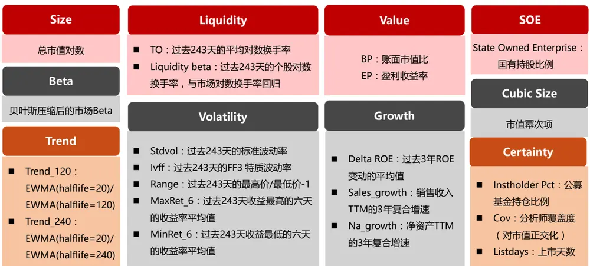
数据来源：东方证券研究所

DFQ 遗传规划行业轮动模型的 top5 行业组合，相对于等权基准，在 Trend 动量维度有明显的正向暴露，说明偏向于配置高动量的行业。在其他维度的相对暴露绝对值都不超过 10%。

图 57：DFQ遗传规划行业轮动模型的 top5行业组合的平均相对风格暴露（2020.1.1-2024.9.30）
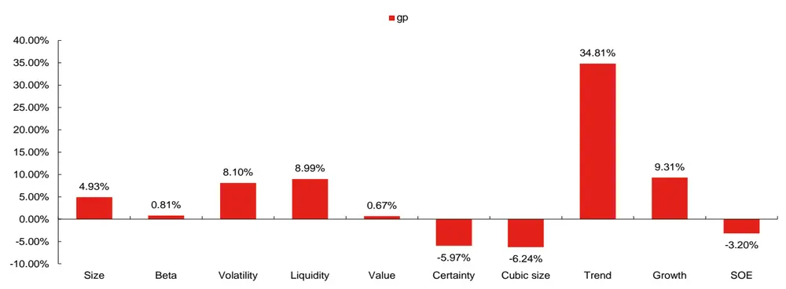
数据来源：东方证券研究所 & Wind资讯
有关分析师的申明，见本报告最后部分。其他重要信息披露见分析师申明之后部分，或请与您的投资代表联系。并请阅读本证券研究报告最后一页的免责申明。

## 五、 DFQ 机器学习行业轮动模型效果分析

## 5.1 模型相关性

我们计算了通过遗传规划得到的行业因子，和通过机器学习选股因子合成得到的行业因子间的 spearman 相关性。相关性计算前将所有单因子进行了横截面 Boxplot 去异常值、zscore 标准化、以 0填充缺失值三步处理。

可以看到，通过遗传规划方法得到的行业因子，和其他个股因子加权得到的行业因子，相关性非常低，因子值 spearman 相关性在 0%附近。这说明，直接以行业为标的挖掘行业因子，和通过个股因子加权得到行业因子，属于两种完全不同的技术路线，所得结果差异性较大，可以结合使用。

图 58： 不同行业因子的相关性（2020.1.1-2024.9.30）

| 因子值spearman相关性 | indusgp | tra2 hist vae |  |  | xgb |
| --- | --- | --- | --- | --- | --- |
| indusgp | 100.00% | 0.69% | -1.12% | 1.75% | 5.14% |
| tra2 | 0.69% | 100.00% | 80.39% | 67.67% | 66.31% |
| hist | -1.12% | 80.39% | 100.00% | 86.85% | 80.14% |
| vae | 1.75% | 67.67% | 86.85% | 100.00% | 82.10% |
| xgb | 5.14% | 66.31% | 80.14% 82.10% |  | 100.00% |

数据来源：东方证券研究所 & Wind资讯

## 5.2 合成因子表现

从之前的测试结果来看，个股因子加权得到的行业因子中，vae 和 xgb 模型的多头端 top5行业组合整体表现较好，2020年以来top5行业组合年化超额收益可达10%以上。因而我们将vae、xgb、gp三个行业因子等权合成，构建 DFQ机器学习行业轮动模型。

从回测结果来看，DFQ 机器学习行业轮动模型表现十分突出，能实现 1+1>2 的效果：

（1）仅将 vae 和 xgb 两因子等权合成，效果不如单因子。二者相关性较高，叠加无优势。加入低相关的 gp因子后，合成因子效果大幅提升。

（2）DFQ 机器学习行业轮动模型单调性较好。2020 年以来，IC 为 14.28%，RANKIC 为15.21%，ICIR 为 0.49，RANKICIR 为 0.53。

（3）DFQ 机器学习行业轮动模型多头表现优异：2020 年以来，top5 行业组合年化超额收益达到18.42%，超额收益最大回撤7.76%，月度胜率66.67%，超额收益夏普比1.77，月均换手51%。

（4）DFQ 机器学习行业轮动模型的多头端每年均能获得正超额收益：2021、2022 年模型top5行业组合的年化超额收益接近 30%，2024年截止 9.30，超额收益达到 18.11%。

图 59： 不同行业因子的绩效表现（2020.1.1-2024.9.30）

| 20200101-20240930 indus_ai，月末交易日调仓 | IC | ICIR | RANKIC | RANKICIR | top5行业组合 月均超额收益 | top5行业组合 月度胜率 | top5行业组合 超额收益夏普比 | top5行业组合 年化超额收益 | top5行业组合 超额收益日度最大回撤 | top5行业组合 月均换手 |
| --- | --- | --- | --- | --- | --- | --- | --- | --- | --- | --- |
| vae | 14.65% | 0.46 | 15.05% | 0.47 | 0.79% | 57.89% | 1.03 | 10.01% | -10.09% | 47.50% |
| xgb | 11.44% | 0.37 | 12.27% | 0.40 | 0.86% | 59.65% | 1.02 | 10.82% | -10.61% | 42.86% |
| gp | 3.64% | 0.15 | 6.01% | 0.24 | 0.89% | 61.40% | 1.16 | 11.10% | -10.28% | 65.00% |
| vae+xgb | 13.75% | 0.44 | 13.13% | 0.41 | 0.83% | 56.14% | 1.03 | 10.53% | -12.42% | 41.43% |
| vae+xgb+gp | 14.28% | 0.49 | 15.21% | 0.53 | 1.42% | 66.67% | 1.77 | 18.42% | -7.76% | 51.43% |

数据来源：东方证券研究所 & Wind资讯
有关分析师的申明，见本报告最后部分。其他重要信息披露见分析师申明之后部分，或请与您的投资代表联系。并请阅读本证券研究报告最后一页的免责申明。

图 60： DFQ 机器学习行业轮动模型的绩效表现（2020.1.1-2024.9.30）

| 20200101-20240930 indus ai，月末交易日调仓 | IC | ICIR | RANKIC | RANKICIR | top5行业组合 月均超额收益 | top5行业组合 月度胜率 | top5行业组合 超额收益夏普比 | top5行业组合 年化超额收益 | top5行业组合 超额收益日度最大回撤 | top5行业组合 月均换手 |
| --- | --- | --- | --- | --- | --- | --- | --- | --- | --- | --- |
| 2020-2024整体绩效 | 14.28% | 0.49 | 15.21% | 0.53 | 1.42% | 66.67% | 1.77 | 18.42% | -7.76% | 51.43% |
| 2020 | 4.48% | 0.17 | 7.03% | 0.27 | 0.59% | 58.33% | 0.25 | 1.65% | -5.51% | 54.55% |
| 2021 | 18.17% | 0.60 | 17.29% | 0.54 | 2.40% | 69.23% | 2.19 | 28.84% | -7.76% | 41.67% |
| 2022 | 25.63% | 1.03 | 24.10% | 0.96 | 1.92% | 76.92% | 2.87 | 28.77% | -6.43% | 58.33% |
| 2023 | 17.52% | 0.60 | 20.35% | 0.72 | 1.44% | 61.54% | 1.01 | 7.56% | -5.54% | 51.67% |
| 20240930 | 15.32% | 0.46 | 16.24% | 0.51 | 1.97% | 70.00% | 0.15 | 18.11% | -5.32% | 51.11% |

数据来源：东方证券研究所 & Wind资讯

图 61：DFQ机器学习行业轮动模型的分 5组超额收益净值&年化超额收益（2020.1.1-2024.9.30）
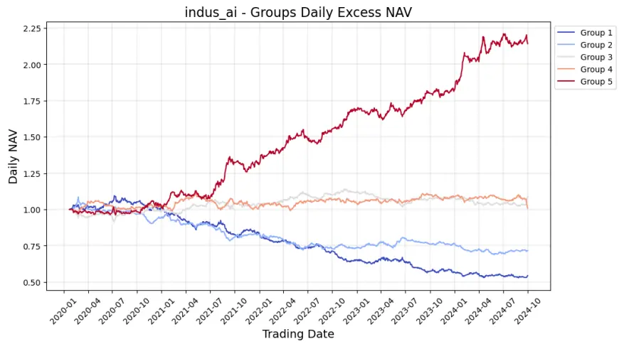
数据来源：东方证券研究所 & Wind资讯

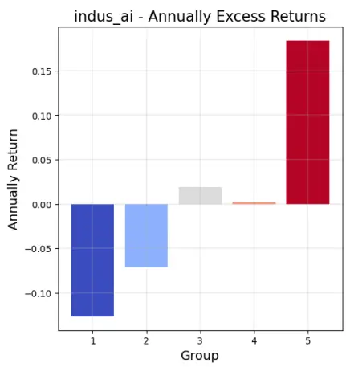

图 62：DFQ 机器学习行业轮动模型的月度 IC、RANKIC 序列（2020.1.1-2024.9.30）
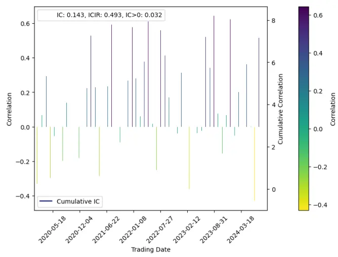
数据来源：东方证券研究所 & Wind资讯

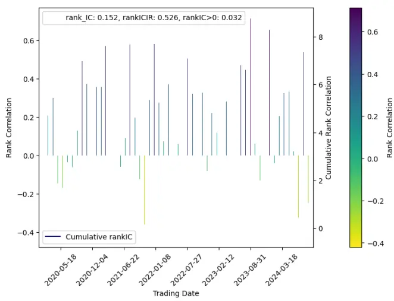

## 5.3 持仓情况

我们统计了 DFQ机器学习行业轮动模型，每月的多头 top5行业组合持仓情况。可以看到：

（1）top5 行业组合曾在 28 个中信一级行业上发出过配置信号，仅国防军工行业未曾入选top5。

（2）样本外共 57个调仓日，煤炭、银行、钢铁行业入选 top5的次数最多，超过 30次。

（3）21 个行业配置胜率超 50%。有色金属、机械、医药、农林牧渔行业的配置胜率达到100%，家电、纺织服装行业的配置胜率也达到 80%。

图 63： DFQ 机器学习行业轮动模型的 top5 行业组合持仓统计（2020.1.1-2024.9.30）

| 行业指数代码 | 行业名称 | top5行业组合配置胜率 top5行业组合选中次数 |  | top5行业组合选中后下月获得正超额收益的次数 |
| --- | --- | --- | --- | --- |
| CI005003.WI | 有色金属 | 100.00% | 3 | 3 |
| CI005010.WI | 机械 | 100.00% | 4 | 4 |
| CI005018.WI | 医药 | 100.00% | 2 | 2 |
| CI005020.WI | 农林牧渔 | 100.00% | 1 | 1 |
| CI005016.WI | 家电 | 85.71% | 14 | 12 |
| CI005017.WI | 纺织服装 | 82.61% | 23 | 19 |
| CI005014.WI | 商贸零售 | 75.00% | 4 | 3 |
| CI005022.WI | 非银行金融 | 75.00% | 4 | 3 |
| CI005001.WI | 石油石化 | 69.57% | 23 | 16 |
| CI005013.WI | 汽车 | 66.67% | 3 | 2 |
| CI005015.WI | 消费者服务 | 66.67% | 6 | 4 |
| CI005002.WI | 煤炭 | 61.11% | 36 | 22 |
| CI005006.WI | 基础化工 | 60.00% | 5 | 3 |
| CI005007.WI | 建筑 | 60.00% | 5 | 3 |
| CI005028.WI | 传媒 | 57.14% | 7 | 4 |
| CI005021.WI | 银行 | 54.76% | 42 | 23 |
| CI005009.WI | 轻工制造 | 50.00% | 14 | 7 |
| CI005025.WI | 电子 | 50.00% | 2 | 1 |
| CI005026.WI | 通信 | 50.00% | 2 | 1 |
| CI005027.WI | 计算机 | 50.00% | 2 | 1 |
| CI005029.WI | 综合 | 50.00% | 4 | 2 |
| CI005004.WI | 电力及公用事业 | 45.45% | 11 | 5 |
| CI005005.WI | 钢铁 | 36.36% | 33 | 12 |
| CI005024.WI | 交通运输 | 36.36% | 11 | 4 |
| CI005023.WI | 房地产 | 35.71% | 14 | 5 |
| CI005008.WI | 建材 | 25.00% | 4 | 1 |
| CI005011.WI | 电力设备及新能源 | 20.00% | 5 | 1 |
| CI005012.WI | 国防军工 | 0.00% | 0 | 0 |
| CI005019.WI | 食品饮料 | 0.00% | 1 | 0 |

数据来源：东方证券研究所 & Wind资讯

从今年 top5行业组合的配置来看，煤炭、钢铁行业出现 8次，家电、轻工制造出现 5次。
图 64： DFQ机器学习行业轮动模型的 top5 行业组合今年以来持仓明细（2024.1.1-2024.9.30）

| 调仓日 | 行业指数代码 | 行业名称 | 因子值 | 下月绝对收益 | 下月超额收益 |
| --- | --- | --- | --- | --- | --- |
| 2023/12/29 | CI005001.WI | 石油石化 | 0.93 | -0.43% | 9.97% |
| 2023/12/29 | CI005002.WI | 煤炭 | 0.96 | 6.79% | 17.19% |
| 2023/12/29 | CI005005.WI | 钢铁 | 1.34 | -6.88% | 3.52% |
| 2023/12/29 | CI005016.WI | 家电 | 0.99 | -1.23% | 9.17% |
| 2023/12/29 | CI005021.WI | 银行 | 2.31 | 6.32% | 16.72% |
| 2024/1/31 | CI005002.WI | 煤炭 | 1.52 | 7.49% | -0.66% |
| 2024/1/31 | CI005005.WI | 钢铁 | 0.94 | 6.76% | -1.39% |
| 2024/1/31 | CI005006.WI | 基础化工 | 1.02 | 9.90% | 1.75% |
| 2024/1/31 | CI005016.WI | 家电 | 1.00 | 9.51% | 1.37% |
| 2024/1/31 | CI005018.WI | 医药 | 0.89 | 10.59% | 2.44% |
| 2024/2/29 | CI005006.WI | 基础化工 | 1.18 | 1.23% | -0.33% |
| 2024/2/29 | CI005009.WI | 轻工制造 | 1.47 | 3.55% | 1.99% |
| 2024/2/29 | CI005010.WI | 机械 | 0.72 | 3.93% | 2.37% |
| 2024/2/29 | CI005016.WI | 家电 | 1.04 | 2.43% | 0.87% |
| 2024/2/29 | CI005017.WI | 纺织服装 | 1.72 | 2.91% | 1.35% |
| 2024/3/29 | CI005001.WI | 石油石化 | 1.30 | 0.94% | 0.79% |
| 2024/3/29 | CI005002.WI | 煤炭 | 1.83 | 0.31% | 0.16% |
| 2024/3/29 | CI005004.WI | 电力及公用事业 | 0.66 | 1.72% | 1.57% |
| 2024/3/29 | CI005005.WI | 钢铁 | 0.70 | 2.06% | 1.91% |
| 2024/3/29 | CI005021.WI | 银行 | 3.08 | 4.80% | 4.65% |
| 2024/4/30 | CI005002.WI | 煤炭 | 1.26 | 6.34% | 7.24% |
| 2024/4/30 | CI005017.WI | 纺织服装 | 1.38 | -0.31% | 0.60% |
| 2024/4/30 | CI005021.WI | 银行 | 2.39 | 2.96% | 3.87% |
| 2024/4/30 | CI005023.WI | 房地产 | 0.98 | 5.86% | 6.77% |
| 2024/4/30 | CI005029.WI | 综合 | 2.07 | -4.47% | -3.57% |
| 2024/5/31 | CI005001.WI | 石油石化 | 1.06 | -0.38% | 5.97% |
| 2024/5/31 | CI005002.WI | 煤炭 | 2.18 | -4.06% | 2.28% |
| 2024/5/31 | CI005005.WI | 钢铁 | 1.66 | -8.47% | -2.12% |
| 2024/5/31 | CI005017.WI | 纺织服装 | 0.91 | -9.06% | -2.71% |
| 2024/5/31 | CI005021.WI | 银行 | 1.87 | -0.29% | 6.06% |
| 2024/6/28 | CI005002.WI | 煤炭 | 1.23 | -8.72% | -8.51% |
| 2024/6/28 | CI005005.WI | 钢铁 | 1.03 | 0.79% | 1.01% |
| 2024/6/28 | CI005009.WI | 轻工制造 | 1.41 | -3.38% | -3.16% |
| 2024/6/28 | CI005017.WI | 纺织服装 | 1.37 | -6.66% | -6.44% |
| 2024/6/28 | CI005021.WI | 银行 | 1.45 | 2.38% | 2.60% |
| 2024/7/31 | CI005002.WI | 煤炭 | 1.57 | -0.40% | 4.20% |
| 2024/7/31 | CI005003.WI | 有色金属 | 1.05 | -3.97% | 0.63% |
| 2024/7/31 | CI005005.WI | 钢铁 | 1.20 | -7.27% | -2.67% |
| 2024/7/31 | CI005009.WI | 轻工制造 | 1.36 | -3.15% | 1.45% |
| 2024/7/31 | CI005018.WI | 医药 | 1.44 | -3.36% | 1.24% |
| 2024/8/30 | CI005002.WI | 煤炭 | 2.19 | 14.99% | -7.13% |
| 2024/8/30 | CI005005.WI | 钢铁 | 1.66 | 21.36% | -0.76% |
| 2024/8/30 | CI005009.WI | 轻工制造 | 1.54 | 22.80% | 0.69% |
| 2024/8/30 | CI005016.WI | 家电 | 1.29 | 22.22% | 0.10% |
| 2024/8/30 | CI005029.WI | 综合 | 1.89 | 27.87% | 5.76% |
| 2024/9/30 | CI005004.WI | 电力及公用事业 | 0.87 | -1.96% | -3.90% |
| 2024/9/30 | CI005005.WI | 钢铁 | 1.03 | -0.79% | -2.73% |
| 2024/9/30 | CI005009.WI | 轻工制造 | 1.71 | 2.43% | 0.49% |
| 2024/9/30 | CI005019.WI | 食品饮料 | 1.68 | -9.61% | -11.55% |
| 2024/9/30 | CI005023.WI | 房地产 | 1.40 | 4.78% | 2.84% |

数据来源：东方证券研究所 & Wind资讯

## 5.4 绩效归因

DFQ机器学习行业轮动模型的 top5行业组合，相对于等权基准：

（1）在 Size 市值、Value估值、SOE 国企持股比例维度有明显的正向暴露，说明偏向于配置大市值、低估值、国企持股比例高的行业；

（2）在 Beta、波动率、流动性估值维度有明显的负向暴露，说明偏向于配置低 Beta、低波、低流动性的行业。

（3）在其他维度的相对暴露绝对值都不超过 10%。

图 65：DFQ 机器学习行业轮动模型的 top5 行业组合的平均风格暴露（2020.1.1-2024.9.30）
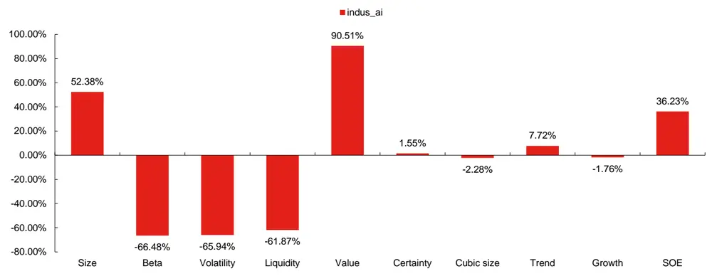
数据来源：东方证券研究所 & Wind资讯

## 六、 行业轮动模型在指数增强组合中的应用

## 6.1 指数增强组合构建

下面我们尝试在指数增强组合中引入行业轮动策略，通过高配优势行业、低配或规避弱势行业，在原有组合基础上进一步提升业绩表现。

（1）回测期：2020.01.01-2024.10.31，组合月频调仓，假设根据每月末个股得分在次日以vwap 价格进行交易。

（2）组合约束：风险因子库（参见《东方 A 股因子风险模型（DFQ-2020）》）中所有的风格因子相对暴露不超过 50%。沪深 300 增强跟踪误差约束不超过 4%，中证 500 和 1000增强跟踪误差约束不超过5%。个股权重设置上限约束，绝对权重上限设置为1.5倍基准权重+2%。限制指数成分股权重占比不低于 80%。

（3）考虑交易成本：假设买卖手续费双边千三，停牌涨停不能买入、停牌跌停不能卖出。

（4）行业轮动模型的引入方法：根据最新可获得的行业轮动模型配置结果，调整行业暴露敞口。对于 top5 行业，约束必须超配，设置行业暴露敞口为[0,0,2]；对于 bottom5 行业，约束必须低配，设置行业暴露敞口为[-0.2,0]；对于其余行业，设置行业暴露敞口不变，仍为[-0.2,0,2]。

（5）alpha模型：采用前期报告《DFQ-XGB：基于树模型的alpha预测方案》提出的DFQ-XGB模型打分作为输入的预期收益率。

## 6.2 指数增强组合表现

从组合结果来看，叠加行业轮动模型来调整行业暴露敞口，可以实现组合收益和稳定性的提升。对于沪深300指数增强组合提升尤其显著。采用DFQ遗传规划行业轮动模型整体效果更好，可能是由于个股的机器学习因子和 DFQ机器学习行业因子有信息重叠。

## （1）DFQ-XGB模型沪深 300指数增强组合

采用DFQ遗传规划行业轮动模型来调整行业暴露敞口，在实现收益大幅提升的同时，组合稳定性也有所提高。相比于基础组合，年化超额收益可以提高 2%，信息比也从 1.85 提升到 2.16，超额收益最大回撤从 6.53%降低到 6.12%，跟踪误差基本不变。从分年收益来看，过去 5 年中，每年都可以跑赢基础组合，今年截止 10.31号，超额收益达到 7.14%。

## （2）DFQ-XGB模型中证 500指数增强组合

采用DFQ遗传规划行业轮动模型来调整行业暴露敞口，相比于基础组合，未能实现收益提升。采用 DFQ 机器学习行业轮动模型来调整行业暴露敞口，相比于基础组合，年化超额收益提高0.3%，信息比从 2.15 提升到 2.20。今年截止 10.31 号，超额收益达到 12.83%。

## （3）DFQ-XGB 模型中证 1000 指数增强组合

采用DFQ遗传规划行业轮动模型来调整行业暴露敞口，相比于基础组合，年化超额收益可以提高 0.55%，信息比也从 3.05提升到 3.09。今年截止10.31号，超额收益达到 8.51%。

图 66：DFQ-XGB 模型沪深 300 指数增强组合绩效表现（2020.1.1-2024.10.31）

| 20200101-20241031月频 沪深300全市场增强 |  | DFQ-XGB | DFQ-XGB + DFQ-indusgp | DFQ-XGB + DFQ-indusai |
| --- | --- | --- | --- | --- |
| 风格暴露0.5 跟踪误差4% 80%成分内约束 买卖手续费双边千三 |  | 所有行业暴露敞口[-0.2,0,2] | indusgp—top5行业暴露敞口[0,0,2]； bottom5行业暴露敞口[-0.2,0]； 其余行业暴露敞口[-0.2,0,2] | indusai—top5行业暴露敞口[0,0,2]； bottom5行业暴露敞口[-0.2,0]； 其余行业暴露敞口[-0.2,0,2] |
| 绩效指标 | 信息比（年化） | 1.85 | 2.16 | 2.11 |
|  | 年化对冲收益 | 10.78% | 12.88% | 12.11% |
|  | 跟踪误差（年化） | 5.61% | 5.70% | 5.51% |
|  | 对冲收益最大回撤 | -6.53% | -6.12% | -6.36% |
|  | 对冲收益最大回撤出现时间点 | 20210113 | 20211111 | 20211110 |
|  | 对冲收益最大回撤恢复天数 | 99 | 113 | 103 |
|  | 单边换手率（年） | 8.06 | 8.09 | 7.97 |
|  | 持股数量 | 69.71 | 69.31 | 71.64 |
|  | 成分内股票占比 | 80.24% | 80.27% | 80.27% |
|  | 2020 | 12.10% | 12.59% | 14.69% |
| 分年收益 | 2021 | 10.63% | 14.56% | 12.49% |
|  | 2022 | 10.43% | 12.68% | 12.71% |
|  | 2023 | 10.78% | 12.75% | 9.24% |
|  | 2024 | 6.06% | 7.14% | 7.08% |
|  | 202401 | 1.63% | 1.59% | 1.80% |
| 分月收益 | 202402 | -2.29% | -2.48% | -2.12% |
|  | 202403 | -0.39% | -0.20% | -0.46% |
|  | 202404 | 0.90% | 1.09% |  |
|  | 202405 | -0.35% | 0.13% | 0.87% |
|  |  | 0.77% | 1.21% | -0.20% |
|  | 202406 | 2.24% | 1.86% | 1.33% |
|  | 202407 202408 |  | 2.04% | 2.29% |
|  |  | 1.86% | -1.18% | 2.06% |
|  | 202409 202410 | -1.34% 2.03% | 2.03% | -1.32% 2.04% |

数据来源：东方证券研究所 & Wind资讯

图 67：DFQ-XGB 模型沪深 300 指数增强组合超额收益净值&回撤（2020.1.1-2024.10.31）
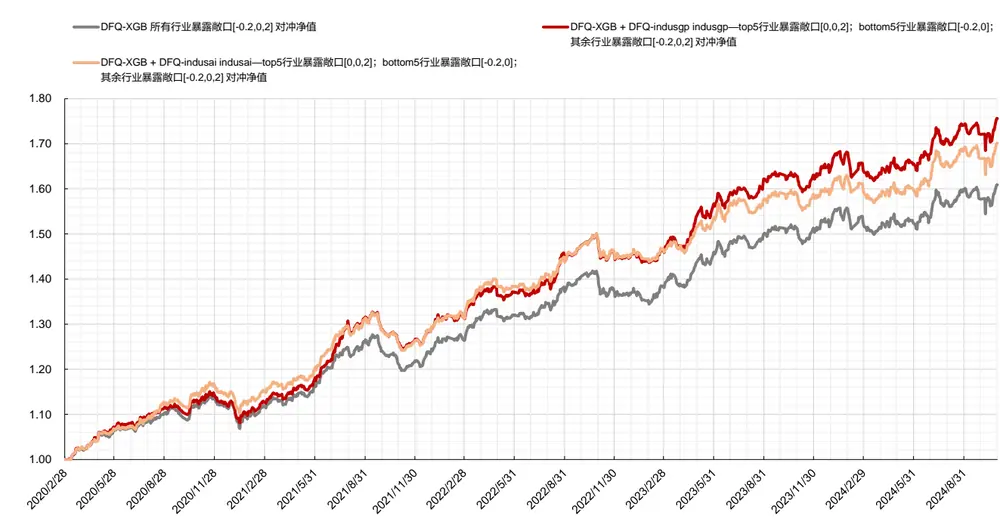
数据来源：东方证券研究所 & Wind资讯
有关分析师的申明，见本报告最后部分。其他重要信息披露见分析师申明之后部分，或请与您的投资代表联系。并请阅读本证券研究报告最后一页的免责申明。

图 68：DFQ-XGB 模型中证 500 指数增强组合绩效表现（2020.1.1-2024.10.31）

| 20200101-20241031月频 中证500全市场增强 |  | DFQ-XGB | DFQ-XGB + DFQ-indusgp | DFQ-XGB + DFQ-indusai |
| --- | --- | --- | --- | --- |
| 风格暴露0.5 跟踪误差4% |  | 所有行业暴露敞口[-0.2,0,2] | indusgp—top5行业暴露敞口[0,0,2]； bottom5行业暴露敞口[-0.2,0]； | indusai—top5行业暴露敞口[0,0,2]； bottom5行业暴露敞口[-0.2,0]； |
| 80%成分内约束 |  |  |  |  |
|  | 买卖手续费双边千三 |  | 其余行业暴露敞口[-0.2,0,2] | 其余行业暴露敞口[-0.2,0,2] |
|  | 信息比（年化） | 2.15 | 2.15 | 2.20 |
|  | 年化对冲收益 | 14.93% | 14.84% | 15.24% |
|  | 跟踪误差（年化） | 6.58% | 6.56% | 6.56% |
|  | 对冲收益最大回撤 | -5.91% | -5.76% | -5.86% |
|  | 对冲收益最大回撤出现时间点 | 20211110 | 20210113 | 20211109 |
|  | 对冲收益最大回撤恢复天数 | 58 | 40 | 59 |
|  | 单边换手率（年） 持股数量 | 9.38 | 9.44 | 9.37 |
|  | 成分内股票占比 | 81.47 80.03% | 79.47 80.03% | 81.90 80.04% |
|  | 2020 | 10.90% | 10.27% | 11.95% |
|  | 2021 分年收益 | 29.51% | 30.44% | 29.49% |
|  | 2022 | 12.60% | 14.48% | 13.86% |
| 2023 | 4.00% | 2.39% | 3.74% |  |
| 2024 | 13.53% | 12.83% | 12.91% |  |
| 分月收益 | 202401 | 6.10% | 6.10% | 6.10% |
|  | 202402 | -3.96% | -3.82% | -3.84% |
|  | 202403 | 0.17% | 0.25% |  |
|  | 202404 | 0.29% | 0.47% | 0.23% |
|  | 202405 | 1.72% | 1.80% | 0.43% |
|  | 202406 | 2.96% | 2.69% | 1.86% 2.90% |
|  | 202407 | 2.08% | 1.98% | 2.06% |
|  | 202408 | 0.53% | 0.48% | 0.28% |
|  | 202409 | -1.94% | -2.40% | -2.57% |
| 202410 | 4.64% | 4.45% | 4.62% |  |

数据来源：东方证券研究所 & Wind资讯

图 69：DFQ-XGB 模型中证 1000 指数增强组合绩效表现（2020.1.1-2024.10.31）

| 20200101-20241031月频 中证1000全市场增强 | DFQ-XGB | DFQ-XGB + DFQ-indusgp | DFQ-XGB + DFQ-indusai |
| --- | --- | --- | --- |
| 风格暴露0.5 跟踪误差4% 80%成分内约束 买卖手续费双边千三 | 所有行业暴露敞口[-0.2,0,2] | indusgp—top5行业暴露敞口[0,0,2]； bottom5行业暴露敞口[-0.2,0]； 其余行业暴露敞口[-0.2,0,2] | indusai—top5行业暴露敞口[0,0,2]； bottom5行业暴露敞口[-0.2,0]； |
| 信息比（年化） | 3.05 | 3.09 | 其余行业暴露敞口[-0.2,0,2] 3.03 |
| 年化对冲收益 | 20.87% | 21.42% | 20.83% |
| 跟踪误差（年化） | 6.29% | 6.34% | 6.31% |
| 对冲收益最大回撤 | -6.08% | -5.97% | -5.83% |
| 对冲收益最大回撤出现时间点 | 20211111 | 20211111 | 20211111 |
| 对冲收益最大回撤恢复天数 | 46 | 48 | 41 |
| 单边换手率（年） | 9.84 | 9.90 | 9.87 |
| 持股数量 | 98.41 | 97.21 | 99.02 |
| 成分内股票占比 | 80.00% | 80.01% | 79.99% |
| 2020 | 24.30% | 24.58% | 24.40% |
| 2021 分年收益 | 29.93% | 29.93% | 30.63% |
| 2022 | 18.13% | 17.78% |  |
| 2023 |  |  | 19.28% |
| 2024 | 16.68% | 19.12% | 14.27% |
| 202401 | 8.41% | 8.51% | 8.79% |
|  | 5.19% | 5.49% | 5.54% |
| 202402 | -2.59% | -2.48% | -2.55% |
| 202403 | 0.29% | 0.35% | 0.23% |
| 202404 | -1.07% | -1.16% | -1.33% |
| 202405 | 2.98% | 3.06% | 3.03% |
| 202406 | 0.01% | -0.27% | -0.29% |
| 202407 | 3.11% | 2.82% | 3.05% |
| 202408 | 1.37% | 1.73% | 1.56% |
| 202409 | 0.29% | 0.19% | 0.55% |
| 202410 | -1.65% | -1.69% | -1.49% |

数据来源：东方证券研究所 & Wind资讯

## 七、 总结

在之前的研究中，我们从行业基本面和行业动量角度入手，从逻辑出发寻找行业因子，构建了两类月频行业轮动策略。2020年以来策略表现均不佳：（1）以基本面为主的DFQ工业类行业轮动模型，基于 38 个证监会二级行业构建，转化为中信一级行业后会损失较多信息。2020 年以来 top5 行业组合年化超额仅为 3.33%，超额收益最大回撤 19.39%。（2）DFQ 行业动量轮动策略，2020年以来 top5行业组合年化超额仅为 3.68%，2023和 2024年均未获正超额。

在之前的研究中，我们设计了一系列机器学习模型来预测股票收益。训练时对于预测标签和输入特征都没有做行业中性化，因而各模型都会学到行业轮动的收益。基于此，我们可以将这些机器学习模型训练出的选股因子合成为行业因子，进行行业轮动。vae、xgb 模型的多头端 top5行业组合整体表现较好，2020 年以来 top5 行业组合年化超额收益达 10%以上。但由于模型的选行业能力只是选股的副产品，行业轮动因子是否有效很大程度上取决于运气，使用起来不够稳健。

前期我们开发出了一套高效的 DFQ 遗传规划因子挖掘系统。加入自定义的特征和算子，指定适应度指标，从一个随机公式种群出发，可以通过多代进化得到更优的子代公式。由于在进化过程中缺乏明确的目标引导，常规的遗传规划算法进化效率低下。如何能提升进化效率，在有限的算力，有限的时间内，进化出更多、更好、更短、更低相关的因子，是算法的核心痛点，也是DFQ模型的核心改进点。DFQ模型主要有7点改进：提升初始种群质量，提升每代种群质量，提升每代产生的有效公式数量，避免公式膨胀，动态调整每代进化参数，降低挖掘因子的相关性，避免无效运算。

我们将 DFQ 遗传规划因子挖掘系统，迁移到行业上，来挖掘行业因子。采用中信一级行业作为轮动标的。挖掘月频因子。采用滚动挖掘方式，每隔一年重新挖掘。训练集采用滑动窗口的方式，长度固定 10 年，每次向后挪一年。共设计 145 个特征，140 个算子。使用 20 个路径下多头（top5）行业组合的月均超额收益的最小值作为适应度。进行一轮15代完整挖掘用时5分钟左右。一轮完成后可产生 5个左右适应度超过 0.5%，且互相间相关系数不超过 50%的单因子。

DFQ遗传规划行业因子挖掘系统，2020-2024年用到的277个单因子中，60%的单因子样本外月均多头超额收益为正，30%的单因子样本外月均多头超额收益超过 0.5%。加权方法的选择对于实现超额收益至关重要。在动态 xgb 加权方法下，2020 年以来 top5 行业组合年化超额11.10%，超额收益最大回撤 10.28%，月度胜率 61.40%，超额收益夏普比 1.16。

通过遗传规划方法得到的行业因子，和其他四个由选股因子合成得到的行业因子，相关性非常低，因子值 spearman 相关性在 0%附近。将 vae、xgb、gp 三个因子值等权合成，构建 DFQ机器学习行业轮动模型。模型表现十分突出，能实现 1+1>2的效果。 2020 年以来，top5行业组合年化超额达到18.42%，超额收益最大回撤7.76%，月度胜率66.67%，超额收益夏普比1.77。

叠加行业轮动模型来调整行业暴露敞口，可以实现组合收益和稳定性的提升。对于沪深 300指数增强组合提升尤其显著。相比于基础组合，年化超额收益可以提高 2%，信息比从 1.85 提升到 2.16，超额收益最大回撤从6.53%降低到 6.12%。

## 风险提示

1. 量化模型基于历史数据分析，未来存在失效风险，建议投资者紧密跟踪模型表现。

2. 极端市场环境可能对模型效果造成剧烈冲击，导致收益亏损。

## Tabl e_Disclai mer 分析师申明

每位负责撰写本研究报告全部或部分内容的研究分析师在此作以下声明：

分析师在本报告中对所提及的证券或发行人发表的任何建议和观点均准确地反映了其个人对该证券或发行人的看法和判断；分析师薪酬的任何组成部分无论是在过去、现在及将来，均与其在本研究报告中所表述的具体建议或观点无任何直接或间接的关系。

## 投资评级和相关定义

报告发布日后的12个月内行业或公司的涨跌幅相对同期相关证券市场代表性指数的涨跌幅为基准（A 股市场基准为沪深 300 指数，香港市场基准为恒生指数，美国市场基准为标普 500 指数）；

## 公司投资评级的量化标准

买入：相对强于市场基准指数收益率 15%以上；

增持：相对强于市场基准指数收益率 5%～15%；

中性：相对于市场基准指数收益率在-5%～+5%之间波动；

减持：相对弱于市场基准指数收益率在-5%以下。

未评级 —— 由于在报告发出之时该股票不在本公司研究覆盖范围内，分析师基于当时对该股票的研究状况，未给予投资评级相关信息。

暂停评级 —— 根据监管制度及本公司相关规定，研究报告发布之时该投资对象可能与本公司存在潜在的利益冲突情形；亦或是研究报告发布当时该股票的价值和价格分析存在重大不确定性，缺乏足够的研究依据支持分析师给出明确投资评级；分析师在上述情况下暂停对该股票给予投资评级等信息，投资者需要注意在此报告发布之前曾给予该股票的投资评级、盈利预测及目标价格等信息不再有效。

## 行业投资评级的量化标准：

看好：相对强于市场基准指数收益率 5%以上；

中性：相对于市场基准指数收益率在-5%～+5%之间波动；

看淡：相对于市场基准指数收益率在-5%以下。

未评级：由于在报告发出之时该行业不在本公司研究覆盖范围内，分析师基于当时对该行业的研究状况，未给予投资评级等相关信息。

暂停评级：由于研究报告发布当时该行业的投资价值分析存在重大不确定性，缺乏足够的研究依据支持分析师给出明确行业投资评级；分析师在上述情况下暂停对该行业给予投资评级信息，投资者需要注意在此报告发布之前曾给予该行业的投资评级信息不再有效。

## HeadertTabl e_Discl ai mer 免责声明

本证券研究报告（以下简称“本报告”）由东方证券股份有限公司（以下简称“本公司”）制作及发布。

本报告仅供本公司的客户使用。本公司不会因接收人收到本报告而视其为本公司的当然客户。本报告的全体接收人应当采取必要措施防止本报告被转发给他人。

本报告是基于本公司认为可靠的且目前已公开的信息撰写，本公司力求但不保证该信息的准确性和完整性，客户也不应该认为该信息是准确和完整的。同时，本公司不保证文中观点或陈述不会发生任何变更，在不同时期，本公司可发出与本报告所载资料、意见及推测不一致的证券研究报告。本公司会适时更新我们的研究，但可能会因某些规定而无法做到。除了一些定期出版的证券研究报告之外，绝大多数证券研究报告是在分析师认为适当的时候不定期地发布。

在任何情况下，本报告中的信息或所表述的意见并不构成对任何人的投资建议，也没有考虑到个别客户特殊的投资目标、财务状况或需求。客户应考虑本报告中的任何意见或建议是否符合其特定状况，若有必要应寻求专家意见。本报告所载的资料、工具、意见及推测只提供给客户作参考之用，并非作为或被视为出售或购买证券或其他投资标的的邀请或向人作出邀请。

本报告中提及的投资价格和价值以及这些投资带来的收入可能会波动。过去的表现并不代表未来的表现，未来的回报也无法保证，投资者可能会损失本金。外汇汇率波动有可能对某些投资的价值或价格或来自这一投资的收入产生不良影响。那些涉及期货、期权及其它衍生工具的交易，因其包括重大的市场风险，因此并不适合所有投资者。

在任何情况下，本公司不对任何人因使用本报告中的任何内容所引致的任何损失负任何责任，投资者自主作出投资决策并自行承担投资风险，任何形式的分享证券投资收益或者分担证券投资损失的书面或口头承诺均为无效。

本报告主要以电子版形式分发，间或也会辅以印刷品形式分发，所有报告版权均归本公司所有。未经本公司事先书面协议授权，任何机构或个人不得以任何形式复制、转发或公开传播本报告的全部或部分内容。不得将报告内容作为诉讼、仲裁、传媒所引用之证明或依据，不得用于营利或用于未经允许的其它用途。

经本公司事先书面协议授权刊载或转发的，被授权机构承担相关刊载或者转发责任。不得对本报告进行任何有悖原意的引用、删节和修改。

提示客户及公众投资者慎重使用未经授权刊载或者转发的本公司证券研究报告，慎重使用公众媒体刊载的证券研究报告。

## 东方证券研究所

地址： 上海市中山南路 318 号东方国际金融广场 26 楼

电话：021-63325888

传真：021-63326786

网址： www.dfzq.com.cn