[table_main] 证券研究报告·金融工程深度报告金融工

# 特质波动率纯因子在 A 股的实证与

研究：

因子深度研究系列

## 重要观点

## 本文概述

本文分别简单介绍了 CAPM 模型、Fama-French 三因子和五因子模型及 Carhart 四因子模型，基于模型得到残差的波动率，即特质波动率；并在 A 股进行了实证与研究。最后分析了 Barra 纯因子模型得到控制特质波动率暴露度为一个单位，其它因子暴露为零的特质波动率纯因子收益。

## 低特质波动率配置效应显著

以特质波动率排名后 30%的个股等权作为策略组合，以全市场个股等权为基准；2005年5月到2018年2月，年化超额收益7.55%，跟踪误差为 4.67%，信息比率 1.62，最大回撤 5.85%。低特质波动率组合超额收益相当显著。

## 传统因子对特质波动率解释度并不明显

以传统的成长因子，盈利因子，市场因子，估值和规模因子等为自变量，特质波动率为因变量，得到拟合度均值 0.34，方差膨胀因子均值为 1.53，特质波动率与传统的因子之间并不存在明显的多重共线性。

## Barra 纯因子收益月度平均为-5.23%

控制投资组合对特质波动率的暴露度为一个单位，其它因子的暴露度为零，用 A 股流通市值的平方根加权的最小二乘法得到纯因子收益。2005 年 5 月到 2018 年 2 月区间，纯因子收益月度平均为-5.23%，月度收益为负的概率为 71.34%。

## 基于 CAPM 模型相对较弱，其它模型区别较小

2005 年 5 月到 2018 年 2 月区间，根据流动市值全市场股票分成20 组，分别在组内根据模型得到的特质波动率，以排名前 20%的股票等权配置作为空头组合，以排名后 20%的股票等权配置作为多头组合，最后各组等权得到市值中性组合。CAPM 模型的特质波动率的年化多空收益 18.12%，而 Fama-French 三因子和五因子模型及 Carhart 四因子模型对应分别为 23.55%，22.80%和 23.55%。表明仅用市场因子解释股票收益力度是有限的，而加入市值因子、估值因子后提升效果显著，年化多空收益提升 5%左右；但加入动量因子、盈利因子或投资水平因子后，提升效果并不太明显。

# 金融工程研究

[table_i丁鲁明

dingluming@csc.com.cn

021-68821623

执业证书编号：S1440515020001

研究助理：喻银尤

yuyinyou@csc.com.cn

021-68821600-808

发布日期： 2018 年 05 月 18 日

## 市场表现

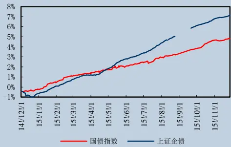

## 相关研究报告

| 18.03.08 | 大数据人工智能研究之七：零基础 python 代码策略模型实战 |
| --- | --- |
| 18.02.02 | 大数据人工智能研究之六：机器学习因 子有效性分析 |
| 17.10.18 | 大数据研究之五：大数据、机器学习、 深度学习在投资领域应用的方法论概述 |
| 17.08.16 | 大数据研究之四：基于新闻热度的周期、 成长、消费风格轮动配置 |
| 17.03.08 | 大数据研究之三：新闻情绪选股的多空 差策略 |
| 17.03.02 | 大数据研究之指标构建：机器学习之贝 叶斯文本分类算法的实现 |
| 16.10.12 | 大数据研究体系之择时篇：基于新闻热 度的多空策略 |

## 一、前言

我国股票市场虽发展已历经二十多年，但相对发达国家还是处于较不成熟阶段。我国股票市场经历了多次暴涨暴跌行情，且换手率和市盈率明显高于全球其它股市，这些都说明我国投资者的投机心理依然很强，我国股票市场相对是不成熟的证券市场。经典资本资产定价理论建立在市场无摩擦和投资者完全理性的假设条件之下的，认为在均衡市场中只有系统性风险影响股票组合收益，公司层面的特质风险可以通过分散化投资规避。然而，在现实的投资过程中，以市场组合收益的贝塔衡量系统性风险并不可靠，其次由于存在卖空限制、信息不对称等市场不完美因素，投资者不可能持有完全分散的市场组合。因此，特质风险将影响股票预期收益。在经典的资产配置理论中，波动率即资产收益率的标准差通常被认为是衡量其风险大小的重要变量。资本资产定价理论认为资产的预期收益和潜在风险是正相关的，预期收益高的资产需要承担更大的潜在波动，或者说波动率更大的资产需要得到预期收益率上的补偿。马科维茨均值方差理论认为一个资产组合的优化目标是在给定目标收益的约束下使得波动率最小化或者在给定波动率目标的约束下使得收益最大化。Fama-French 三因子模型以及后来的 Barra 多因子风险模型尝试对波动率的来源进行归因，首先将股票收益率分解为一系列因子收益或风格收益，然后用因子收益的不确定性解释股票收益率的不确定性。

本文主要以中国股票市场作为研究对象，利用资本资产定价模型（CAPM 模型）、Fama-French 三因子和五因子模型及 Carhart 四因子模型从时间序列回归分析等实证方法，探讨特质波动率的度量方法；通过投资组合多空收益分析、横截面特质波动率排序与未来个股收益排序的相关系数分析，横截面回归，Barra 纯因子模型等探讨特质波动率与预期收益的关系。我们将比较四种模型得到的特质波动率的关联与区别，考察特质波动率在市值、中信一级行业的分布情况，股票组合收益单调性是否显著。最后根据 Barra 纯因子模型，使用横截面数据，利用加权最小二乘得到特质波动率的纯因子收益，考虑纯因子收益的显著性，进而全面解析特质波动率。

## 1.1 相关模型介绍

谈到特质波动率，常见的相关模型有四个：资本资产定价模型（CAPM 模型）、Fama-French 三因子和五因子模型及 Carhart 四因子模型。接下来，我们对模型做简单介绍。

CAPM 模型：资本资产定价模型是由美国学者夏普（William Sharpe）、林特尔（John Lintner）、特里诺（JackTreynor）和莫辛（Jan Mossin）等人于 1964 年在资产组合理论和资本市场理论的基础上发展起来的，主要研究证券市场中资产的预期收益率与风险资产之间的关系，以及均衡价格是如何形成的，是现代金融市场价格理论的支柱，广泛应用于投资决策和公司理财领域。作为基于风险资产期望收益均衡基础上的预测模型之一，CAPM阐述了在投资者都采用马科维茨的理论进行投资管理的条件下市场均衡状态的形成，把资产的预期收益与预期风险之间的理论关系用一个简单的线性关系表达出来了，即认为一个资产的预期收益率与衡量该资产风险的一个尺度β值之间存在正相关关系。

Fama-French 三因子模型：Fama 和 French 1992 年对美国股票市场决定不同股票回报率差异的因素的研究发现，股票的市场 beta 值不能解释不同股票回报率的差异，而上市公司的市值、账面市值比、市盈率可以解释股票回报率的差异，比如市值风险是指公司的规模对该公司股票的风险有着间接影响：资产规模小，风险就会相对增加。账面市值比就是账面的所有者权益除以市值，账面市值比风险描述了公司的额外财务困境风险，说明市场上对公司的估值比公司自己的估值要低。这些公司一般都是销售状况或者盈利能力不是十分好的公司，因此相对于低账面市值比的公司来说需要更高的收益来补偿。一个投资组合(包括单个股票)的超额回报率可由它对三个因子的暴露来解释，这三个因子是：市场资产组合、市值因子、账面市值比因子。

Fama-French 五因子模型：五因子模型是在三因子的基础上加上了盈利因子和投资因子，三因子模型虽然解决了 CAPM 模型中的很多异象，但是却又产生了新异象：比如应计盈余异象、股票净发行异象、动量异象。其中，盈利异象和投资异象尤为明显。比如盈利水平风险是指，盈利能力较高的行业一般会伴随着更高的风险。该处投资水平不是二级市场的投资水平，而可以通俗的解释为企业扩大再生产的能力，投资水平可以用再投资率来衡量，我们认为投资率偏低的公司风险较大，投资者对这些公司有更高的收益率要求，反之亦然。故在三因子模型的基础上加入了这二个因子。

Carhart 四因子模型：Carhart 四因子模型由 Fama-French 三因子模型发展而来，综合考虑了系统风险、账面市值比、市值规模以及动量因子对基金业绩的影响，能够更为全面的评价基金业绩并且更为有效地衡量基金通过主动投资管理取得超额收益的能力。Carhart 四因子模型指的是为了控制系统性风险对股票的影响，对原始回报进行调整，取得控制了风险因子后的超常回报。四因子模型包含了市场资产组合、市值因子、账面市值比因子和动量因子.

## 1.2 特质波动率度量

特质波动率反映公司间波动率的差异，等于资产定价模型中不能被市场或行业解释的部分，指的是可以分散的风险或者非系统性风险。公司特质波动率的度量，一般为前面介绍的模型得到的残差的波动率。

基于 CAPM 模型的特质波动率(Vcapm):

$$
\boldsymbol{r}_{i,t}=\boldsymbol{\alpha}_{i,t}+\boldsymbol{\beta}_{i,t}Rm\boldsymbol{t}_{t}+\boldsymbol{\varepsilon}_{i,t}
$$

其中：

1） $r_{i,t}$ 为股票 i 在 t 时间的收益，

2） $Rm\ t_{t}$ 为市场在 t 时间的收益，此处用中证全指收益表示。

Fama-French 三因子模型的特质波动率(Vff3):

$$
r_{i,t}=\alpha_{i,t}+\beta_{i,t}Rmt_{t}+S_{i,t}SMB_{t}+H_{i,t}HML_{t}+\varepsilon_{i,t}
$$

其中：

1） S M $B_{_t}$ 为市值因子，即月底按流动市值排名后三分之一股票组合(即小市值股票组合)的收益减去流动市值排名前三分之一股票组合(即大市值股票组合)的收益。

2）HM $L_{\mathrm{\Lambda}_{t}}$ 为估值因子，即月底按账面市值比前三分之一股票组合(即低市净率股票组合)的收益减去账面市值比排名后三分之一股票组合(即高市净率股票组合)的收益。

Fama-French 五因子模型的特质波动率(Vff5):

$$
r_{i,t}=\alpha_{i,t}+\beta_{i,t}Rmt_{t}+S_{i,t}SMB_{t}+H_{i,t}HML_{t}+R_{i,t}RMW_{t}+C_{i,t}CMA_{t}+\varepsilon_{i,t}RMA_{t},
$$

其中：

1） $RM\ W_{_t}$ 为盈利因子，即月底按 ROE 排名前三分之一股票组合(即高 ROE 股票组合)的收益减去 ROE 排名后三分之一股票组合(即低 ROE 股票组合)的收益。

2）C M $A_{_t}$ 为投资水平因子，即月底按净资产变化率后三分之一股票组合(即低净资产变化率股票组合)的收益减去净资产变化率排名前三分之一股票组合(即高净资产变化率股票组合)的收益。

Carhart 四因子模型的特质波动率(VCarhart):

$$
r_{i,t}=\alpha_{i,t}+\beta_{i,t}Rmt_{t}+S_{i,t}SMB_{t}+H_{i,t}HML_{tt}+U_{i,t}UMD_{t}+\varepsilon_{i,t}
$$

其中：

1） UM $D_{\mathbf{\Phi}_{t}}$ 为动量因子，即月底按当月累积收益排名前三分之一股票组合(即高 1 个月动量股票组合)的收益减去当月累积收益排名后三分之一股票组合(即低 1 个月动量股票组合)的收益。

以上模型符号若相同，则意义也相同，比如 CAPM 模式中 $Rmt_{t}$ 与其它模型中 $Rmt_{t}$ 表示意义一致，故其它模型没有重复说明。模型中没有标注的为待回归求解变量。特质波动率即为模型的残差 $\boldsymbol{\varepsilon}_{i,t}$ 在某个时间段内的波动率。在本文中，组合是月度调仓的，故模型的回归时间序列长度为 1 个月。即特质波动率为个股近 20 个交易日回归得到的 20 个残差的年化波动率。

## 二、因子特征分析

在具体分析因子有效性及在 A 股的可投资性之前，我们先比较了特质波动率因子在中信一级行业各行业的分布情况，然后按流动市值把全 A 股分成 20 组，考察各组特质波动率的分布情况。然后根据多空收益，波动率，最大回撤等相关指标，比较 CAPM 模型、Fama-French 三因子和五因子模型及 Carhart 四因子模型的差别与联系，分析发现除基于 CAPM 模型相对较弱外，其它模型区别较小。

## 2.1 大市值组和银行股分布显著偏低

为了考察特质波动率的在各行业的分布情况，我们按中信一级 29 个行业把个股分类，分别统计当月各行业内成份股票特质波动率的平均值。最后求每个行业从 20050228 到 20180330 区间每个月的平均值作为最终特质波动率在各行业的分布情况。

按流动市值把全 A 股分成 20 组，即 5%股票作为一组，分别统计当月各组内股票特质波动率的平均值。最后求每个组从 20050228 到 20180330 区间每个月的平均值作为最终特质波动率在各市值组的分布情况。

图 1：特质波动率在中信一级行业分布情况
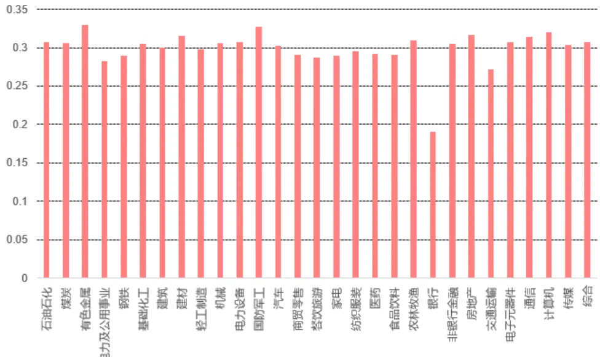
数据来源：中信建投证券研究发展部

在中信一级行业分布情况可知，除了银行组特质波动率明显偏低外，其余各行业分布基本一致，并没有太明显的区别。其中，银行股平均特质波动率为 19.02%，其它行业基本在 30%左右。

图 2：特质波动率在市值组分布情况
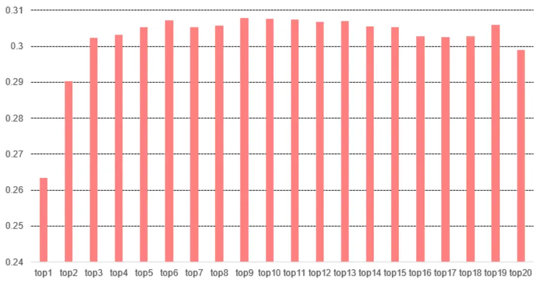
数据来源：中信建投证券研究发展部

在市值分组中分布情况可知，除了第一组及第二组特质波动率明显偏低外，其余各组分布基本一致，并没有太明显的区别。其中，第一组平均特质波动率为 26.35%，第一组为 29.02%，其它市值组基本在 30%左右。

## 2.2 与换手率多空收益差相关性较大

特质波动率作为研究对象，我们统计了他与传统的一些重要因子，比如市值因子，换手率因子，ROE 因子等的相关性。具体计算方法为统计历史上他们多空收益差的相关系数及协方差矩阵。

表 1：相关系数矩阵

|  | Vcapm | Vff3 | Vff5 | VCarhart | 1 个月换手率 | roe | 流动市值 |
| --- | --- | --- | --- | --- | --- | --- | --- |
| Vcapm | 1.00 | 0.95 | 0.94 | 0.94 | 0.83 | -0.10 | -0.23 |
| Vff3 | 0.95 | 1.00 | 0.97 | 0.98 | 0.80 | -0.05 | -0.20 |
| Vff5 | 0.94 | 0.97 | 1.00 | 0.97 | 0.79 | 0.01 | -0.20 |
| VCarhart | 0.94 | 0.98 | 0.97 | 1.00 | 0.79 | -0.03 | -0.21 |
| 1个月换手率 | 0.83 | 0.80 | 0.79 | 0.79 | 1.00 | -0.06 | -0.23 |
| roe | -0.10 | -0.05 | 0.01 | -0.03 | -0.06 | 1.00 | 0.11 |
| 流动市值 | -0.23 | -0.20 | -0.20 | -0.21 | -0.23 | 0.11 | 1.00 |

数据来源：wind资讯，中信建投证券研究发展部

表 2：协方差矩阵

|  | Vcapm | Vff3 | Vff5 | VCarhart | 1 个月换手率 roe |  | 流动市值 |
| --- | --- | --- | --- | --- | --- | --- | --- |
| Vcapm | 0.013907 | 0.011222 | 0.010638 | 0.01081 | 0.011001 | -0.00092 | -0.0008 |
| Vff3 | 0.011222 | 0.00998 | 0.009383 | 0.009499 | 0.009017 | -0.00037 | -0.0006 |
| Vff5VCarhart | 0.010638 | 0.009383 | 0.009302 | 0.009132 | 0.008575 | 8.60E-05 | -0.00057 |
|  | 0.01081 | 0.009499 | 0.009132 | 0.009496 | 0.008688 -0.00024 |  | -0.0006 |
| 1 个月换手率roe | 0.011001 | 0.009017 | 0.008575 | 0.008688 | 0.012671 | -0.00052 | -0.00075 |
|  | -0.00092 | -0.00037 | 8.60E-05 | -0.00024 | -0.00052 0.006289 |  | 0.000247 |
| 流动市值 | -0.0008 -0.0006 |  | -0.00057 | -0.0006 | -0.00075 0.000247 |  | 0.000874 |

数据来源：wind资讯，中信建投证券研究发展部

从相关系数矩阵可以看到，四个模型的特质波动率相关系数基本在 0.95 以上，明显的强相关性；而特质波动率因子与 1 个月换手率相关系数基本在 0.8 左右，也是明显的强相关。其中 Vcapm 为 0.83，其相关性相对最强。值得注意的是，特质波动率因子与流动市值因子相关系数基本在-0.2 以上，说明与流动市值因子有一定的负相关性，而特质波动率因子与 roe 因子相关系数绝对值在 0.1 以下，说明基本没有线性相关性。

从协方差矩阵也可以看出，四个模型的特质波动率及 1 个月换手率的协方差皆为正，与流动市值的协方差皆为负。

本研究后面会介绍特质波动率与传统因子的多重共线性问题。

## 2.3 基于 CAPM模型相对较弱，其它模型区别较小

2005 年 5 月到 2018 年 2 月区间，根据流动市值全市场股票分成 20 组，分别在组内根据模型得到的特质波动率，以排名前 20%的股票等权配置作为空头组合，以排名后 20%的股票等权配置作为多头组合，最后各组等权得到市值中性组合。CAPM 模型的特质波动率的年化多空收益 18.12%，而 Fama-French 三因子和五因子模型及 Carhart 四因子模型对应分别为 23.55%，22.80%和 23.55%。表明仅用市场因子解释股票收益力度是有限的，而加入市值因子、估值因子后提升效果显著，年化多空收益提升 5%左右；但加入动量因子、盈利因子或投资水平因子后，提升效果并不太明显。

## 三、单调性十分显著

前面知道，四个模型的特质波动率相关性非常高，所以此处以基于 Fama-French 三因子模型得到的特质波动率为代表，来展示特质波动率因子的单调性。按个股的特质波动率值进行排序，按大小分成 10 组，top1 表示特质波动率最大的前 10%，依次类推。发现排名靠后的小组明显优于排名靠前的小组，且单调性十分显著。20050301 到 20180330，前五组年化收益基本在 20%以下，后五组年化收益基本在 25%以上。

我们注意到，除了 top10 即最后一组不是收益最高外（比 top9 及 top8 低），其余 9 组完全严格单调递增。为什么会出现最后一组不及倒数第二和第三组呢，我们觉得原因主要是最后一组银行股这一类超大市值为主（前面从特质波动率在行业和市值分布情况有讨论），而这一类超大市值股票稳定性最强，在过去的时间并没有明显的赚钱效应，所以在很大程度上影响了其收益成为最高的因素。

图 3：特质波动率因子各组累积净值
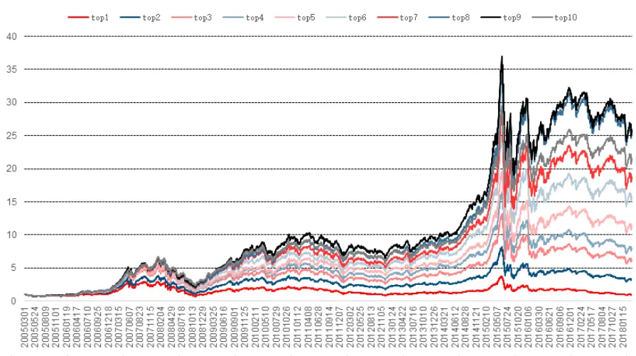
数据来源：wind资讯，中信建投证券研究发展部

表 3：各组绝对年化收益

| top1 | top2 | top3 | top4 | top5 | top6 | top7 | top8 | top9 | top10 |
| --- | --- | --- | --- | --- | --- | --- | --- | --- | --- |
| 0.08% | 9.90% | 15.59% | 17.83% | 21.09% | 24.36% | 26.03% | 29.19% | 29.28% | 27.37% |

数据来源：wind资讯，中信建投证券研究发展部

## 四、spearman 相关系数考察

因子是否有效的另外一个重要指标是 IC（信息系数），即因子排序与未来一期对应的个股收益的排序的相关系数，也叫 spearman 相关系数。之所以用 spearman 相关系数原因而不用皮尔森相关性系数主要原因是因为我们考察的是因子排序的关系，因为传统的多因子模型多是线性模型。另外 spearman 相关系数不受因子极端值的影响。

图 4：Vff3因子市值中性等权各年度月 IC均值
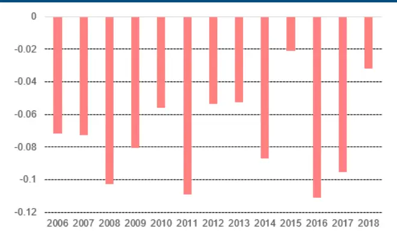
数据来源：wind、中信建投证券研究发展部

图 5：Vff3 因子市值中性等权，月度 IC
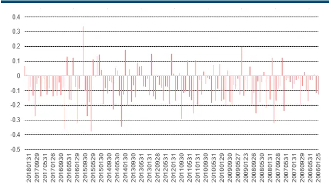
数据来源：wind、中信建投证券研究发展部

因为四个模型的特质波动率相关性非常高，所以此处以基于 Fama-French 三因子模型得到的特质波动率为代表，该因子月度 IC 在 20050301 到 20180330 期间，平均值为-7.28%，每年都稳定为负，且月度 IC 同向概率为64%，月度 IC 为负的概率为 77%。这说明特质波动率与个股收益关系是比较稳定的且显著比较有效的因子。

## 五、因子多空收益分析

计算因子多空收益时，我们一般会做中性化处理，包括市值中性和行业中性。

市值因子对个股的影响十分显著，如果不考虑市值带来的干扰，则我们的策略可能被市值因子带来严重的影响。为此，我们市值分成 20 组，分别在不同市值组各选取 20%作为策略多头与空头，使多头与空头有相同的市值分布，以消除市值可能带来的影响。

其次，众所周知，不同行业，因子特征可能差异明显，放在一起可能不具备可比性。为了去除行业带来的影响，我们也分别在不同行业选取 20%作为我们的空头与多头，使多头与空头保持同样的行业暴露，以消除行业带来的影响。

## 5.1 多空收益策略介绍

在进行策略计算时，考虑了以下几种情况：

a. 调仓当天停牌，涨停，跌停个股剔除。

b. 新股一个月之内不能作为候选股（上市小于 20 个交易日）。

在 2005 年 05 月到 2018 年 02 月期间，我们分别进行了全市场选股，市值中性选股，行业中性选股，五种情况
表现如下：
相关说明：

1） 全市场：全市场选股多空收益差净值。特质波动率排名靠后 20%作为多头，特质波动率排名前 20%作为空头。

2） 市值等权:市值等权多空收益差净值。分 20 小组，分别在组内选后 20%作为多头，前 20%作为空头，最后各组等权。

3） 市值加权:市值加权多空收益差净值。分 20 小组，分别在组内选后 20%作为多头，前 20%作为空头，最后各组以市值组权重加权得到多空组合。

4） 行业等权:行业等权多空收益差净值。在中信一级行业，分别在行业内选后 20%作为多头，前 20%作为空头，最后各行业以等权到多空组合。

5） 行业加权:行业加权多空收益差净值。在中信一级行业，分别在行业内选后 20%作为多头，前 20%作为空头，最后各行业以沪深 300 行业内权重加权得到多空组合。

注：以下相关标记同。

## 5.2 多空收益结果分析

根据以上五种情况，我们分别基于统计了基于 CAPM 模型、Fama-French 三因子和五因子模型及 Carhart 四因子模型的特质波动率在 2005 年 5 月到 2018 年 2 月期间的多空收益差。

图 6：基于 CAPM模型的多空收益差净值
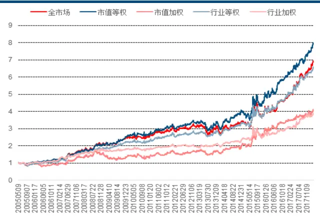
数据来源：wind、中信建投证券研究发展部

图 7：基于 Fama-French三因子模型的多空收益差净值
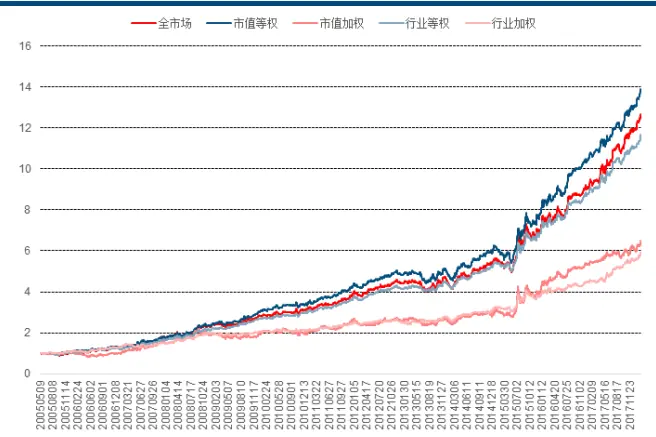
数据来源：wind、中信建投证券研究发展部

图 8：基于 Fama-French五因子模型的多空收益差净值
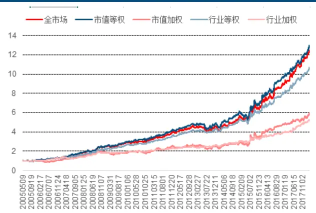
数据来源：wind、中信建投证券研究发展部

图 9：基于 Carhart四因子模型的多空收益差净值
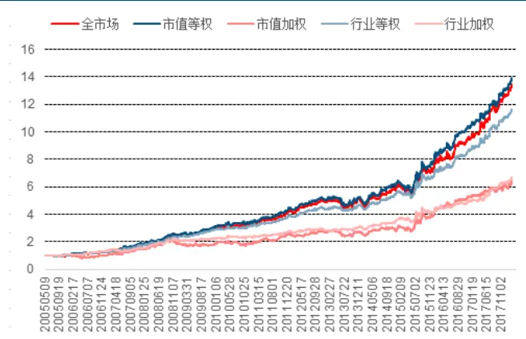
数据来源：wind、中信建投证券研究发展部

表4：四个模型的特质波动率市值等权多空收益差策略结果比较

|  | Vcapm | Vff3 | Vff5 | VCarhart | VCarhart |
| --- | --- | --- | --- | --- | --- |
| 年化收益 | 18.12% | 23.55% | 22.80% | 23.55% | 23.55% |
| 波动率 | 11.95% | 10.09% | 9.73% | 9.84% | 9.84% |
| 最大回撤 | 17.95% | 13.86% | 14.85% | 14.31% | 14.31% |
| 夏普比率 | 1.26 | 2.04 | 2.03 | 2.09 | 2.09 |

数据来源：wind资讯，中信建投证券研究发展部

经实证研究，2005 年 5 月到 2018 年 2 月区间，基于 CAPM 模型的特质波动率相对于基于 Fama-French 三因子和五因子模型及 Carhart 四因子模型对应的特质波动率较弱。

在波动率方面，基于 CAPM 模型的特质波动率为 11.95%，明显大于其它模型情况；最大回撤为 17.95%，其它模型基本在 15%以下且夏普比例为 1.26，其它几种情况都是 2.0 以上。以上相关指标表明仅用市场因子解释股票收益力度是有限的，而加入市值因子、估值因子后提升效果显著，年化多空收益提升 5%左右；但加入动量因子、盈利因子或投资水平因子后，提升效果并不太明显。

## 六、低特质波动率配置效应显著

从前面分析，我们清楚的知道，低特质波动率相关个股表现明显好于高特质波动率相关个股。基于此，我们构建了低特质波动率组合，并以全市场组合为基准，比较分析低特质波动率组合是否有明显的超额收益，是否有显著的配置效应。

图 10：排名后 30%特质波动率等权组合超额收益
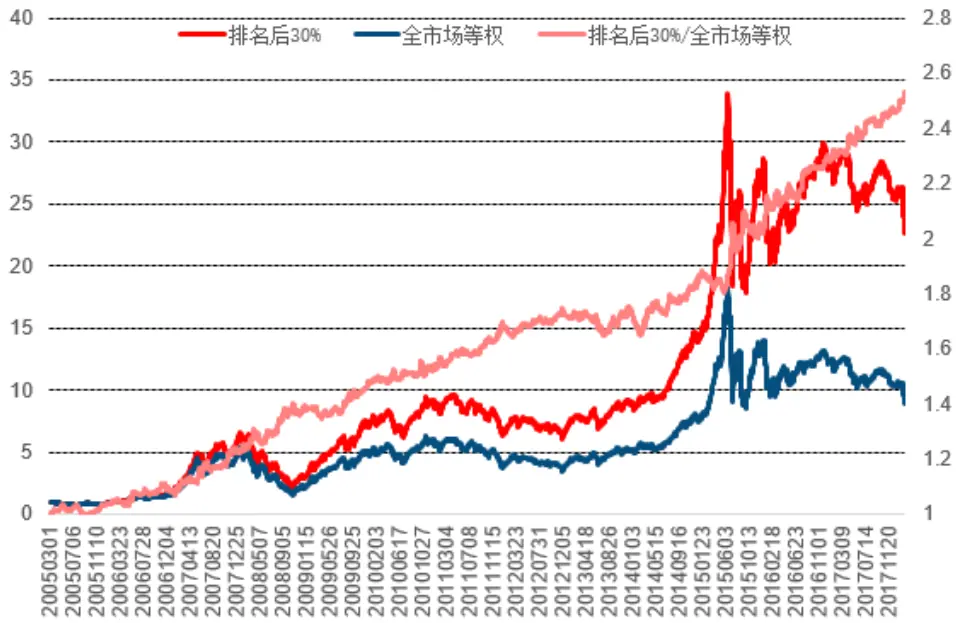
数据来源：中信建投证券研究发展部

表 5：排名后 30%特质波动率等权组合超额收益

| 回测期间 | 2005-03 至 2018-02 |  |  |
| --- | --- | --- | --- |
| 初始净值 | 1 | 初始净值 | 1 |
| 年化超额收益 | 7.63% | 跟踪误差 | 4.67% |
| 最大回撤 | 5.85% | 信息比率 | 1.63 |
| 今年来超额收益 | 2.48% |  |  |

数据来源：中信建投证券研究发展部

从相关指标可以看出，低特质波动率有较有明显的超额收益，风险控制在 5%以下，年化超额收益达到 7.6%以上。低特质波动率具有比较明显的配置效应。

## 七、Barra 纯因子组合思路

在 Barra 框架下，纯因子组合是指投资组合只对某因子的暴露度为 1，对其它因子暴露皆为 0 的投资组合。

基于纯因子组合，可以选择性让投资组合暴露于某个因子，而对其它因子保持中性。

假设我们组合有 n 支股票，m 个因子，则传统多因子模型的一般形式为：

$$
{\left[\begin{array}{llllllll}{r_{1}-r_{f}}&{7}&{\Gamma_{1_{11}}}&{\Gamma_{1_{12}}}&{\Gamma_{1_{22}}}&{\Gamma_{1_{12}}}&{\Gamma_{1_{12}}}&{\Gamma_{1_{11}}}&{\Gamma_{1_{11}}}\\{r_{2}-r_{f}}&{|}&{|}&{|}&{|}&{|}&{|}&{|}&{|}\\{\vdots}&{|}&{=}&{|}&{x_{21}}&{|}&{f_{1}+|}&{|}&{f_{22}}&{|}\\{\vdots}&{|}&{|}&{|}&{|}&{|}&{\vdots}&{|}&{|}&{|}&{|}\\{r_{n}-r_{f}}&{|}&{|}&{|}&{|}&{|}&{|}&{|}&{|}&{|}\end{array}\right]},\quad\quad\ell_{n_{1}}={\left[\begin{array}{lllllll}{x_{22}}&{|}&{|}&{|}&{|}&{|}&{|}\\{x_{22}}&{|}&{|}&{|}&{|}&{|}&{|}\\{|}&{\vdots}&{|}&{|}&{|}&{|}&{|}\\{|}&{|}&{|}&{|}&{|}&{|}&{|}\\{x_{nm}}&{\rfloor}&{|}&{|}&{|}&{|}&{|}\end{array}\right]}
$$

其中，r 为无风险收益， $r_{f}$ $r_{i}$ 为第 i 只股票的收益，x 为每 i 只股票在第j 个因子上的暴露度， $x_{ij}$ $f_{j}$ 为因子收益， $\boldsymbol{u}_{\ i}$ 为误差部分。

简写为矩阵形式为：

$$
{\sf R}=\mathsf{X}\mathsf{F}+\mathsf{U}
$$

其中，R 为股票对无风险收益的超额收益部分向量，X 为因子暴露度矩阵，F 为因子收益向量，U 为误差向量。为了求模型中 F 的解，核心是对横截面数据进行回归。

通过模型求解 F，用向量形式表示为：

$$
{\left[\begin{array}{l}{f_{1}{\mathrm{~7~}}}\\{\vdots{\mathrm{~1~}}}\\{f_{2}{\mathrm{~}}}\\{\vdots{\mathrm{~1~}}}\\{\vdots{\mathrm{~}}}\\{f_{m}{\mathrm{~}}}\end{array}\right]}={\left[\begin{array}{llll}{w_{11}w_{12}\cdots}&{w_{1n}}&{{\mathrm{~7~}}{\mathrm{~r~}}_{1}{\mathrm{~7~}}}\\{w_{21}w_{22}\cdots}&{w_{2n}}&{{\mathrm{~|~}}{\mathrm{~r~}}_{2}{\mathrm{~|~}}}\\{{\mathrm{~|~}}}&{{\vdots}}&{{\mathrm{~|~}}{\vdots{\mathrm{~1~}}}}\\{{\mathrm{~|~}}}&{{\vdots}}&{{\mathrm{~|~}}}\\{w_{m1}w_{m2}\cdots}&{w_{mn}{\mathrm{~}}{\mathrm{~]~}}{\left\right\}\lfloor r_{n}{\mathrm{~rfloor~}}}\end{array}}\right]
$$

其中，w 为投资组合中因子 i 对应股票j 的权重， $\boldsymbol{w}_{ij}$ $r_{i}$ 为第 i 只股票的相对无风险收益的超额部分。容易验证 $f_{j}$ 即为纯因子收益。以第j 个因子为例，可以得到 ：

$$
\begin{array}{rl}{\left[\begin{array}{l}{\mathbf{r}_{1}}\end{array}\right]}&{}\\{\left[\begin{array}{l}{\mathbf{r}_{1}}\end{array}\right]}\\{f_{j}}&{=\left[\begin{array}{lll}{w_{j1}w_{j2}\cdots}&{\cdots}&{w_{jn}}\end{array}\right]\left|\begin{array}{l}{r_{2}}\end{array}\right|}&{={W}_{j}^{T}\textsf{R}={W}_{j}^{T}\left(\mathsf{X}\mathsf{F}+\mathsf{U}\right)=\big(W_{j}^{T}\textsf{X}\big)\mathsf{F}+{W}_{j}^{T}\textsf{U}}\\{\big|}&{\big|}\\{\lfloor\ r_{n}\rfloor}\end{array}
$$

在组合充分分散的情况下， $\boldsymbol{W}_{\ j}^{\textit{ T }}$ U 为 0，而要等式左右两边相等，则 $\boldsymbol{W}_{\ j}^{\textit{ T }}$ X 必定为 $(0,0^{\cdots},1,\cdots,0)$ 即只对第 j 个因子组合暴露为 1，对其它因子暴露为 0，这便是纯因子组合定义。由此可见，纯因子收益即为横截面回归得到的因子收益。

## 7.1 Barra 纯因子收益求解

前面我们探讨了如何计算纯因子收益，接下来，我们将具体展示如何得到纯因子收益的计算过程。

根据 ${\sf R}=\mathsf{X}\mathsf{F}+\mathsf{U}$ ，根据普通最小二乘法容易得到参数估计量：

$$
\boldsymbol{\mathsf{F}}=\textbf{ ( }\boldsymbol{X}^{\textit{ T }}\boldsymbol{X}\textbf{ ) }^{-1}\boldsymbol{X}^{\textit{ T }}\boldsymbol{R}
$$

我们知道，模型的残差与股票市值大小有一定的相关性，即模型具有异方差性，不建议用普通最小二乘求解，一般情况下，根据 Barra 的建议，我们使用流动市值平方根加权的最小二乘进求解（Barra 建议用总市值平方根加权，但我们觉得 A 股用流动市值平方根加权可能更合理，虽然区别并不大）。根据加权最小二乘法，可以得到参数估计量为：

$$
\mathsf{\Sigma}\mathsf{F}=\mathsf{\Sigma}\left(\boldsymbol{X}^{\textit{ \texttt { T } }}WX\right)^{-1}\boldsymbol{X}^{\textit{ \texttt { T } }}WR
$$

其中，W 即为市值的平方根。可以知道，纯因子组合权重即为 ${\left({X}^{\textit{ T }}WX\right)}^{-1}X^{\textit{ T }}W$ o

## 注意事项：

1) 因子暴露度是通过正态标准化得到，即为 $\frac{x-\mu}{\sigma}$

线性回归模型中，需要对自变量进行共线性检测，根据方差膨胀因子（ ）大小来判断，若 ，表明该自变量因子与其它自变量因子有较强的共线性，需要做正交化处理。此处我们以其它因子为自变量，回归正交化取残差取代该自变量因子。方差膨胀因子公式为：

$$
VIF_{_j{}j}=\frac{1}{1-{R_{_j}}^{2}}
$$

其中 ${R}_{\mathrm{~j~}}^{2}$ 为 R-square 即其它因子对该因子的拟合度。

## 7.2 传统因子对特质波动率解释度并不明显

特质波动率（以基于 Fama-French 三因子模型为例）作为我们本文的研究对象，我们也用传统的因子比如成长因子，盈利因子，财务因子，市场因子，估值和规模因子等作为解释变量，以特质波动率为被解释变量，考察传统变量对特质波动率的解释力度。

图 11：特质波动率的方差膨胀因子
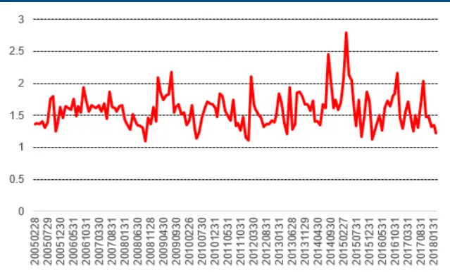
数据来源：wind、中信建投证券研究发展部

图 12：传统因子对特质波动率的拟合度
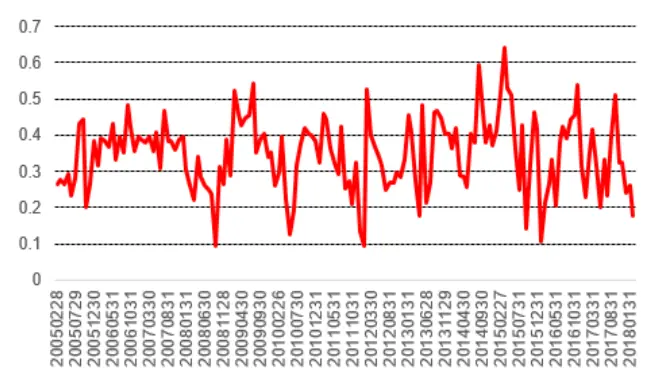
数据来源：wind、中信建投证券研究发展部

表 6：传统因子与特质波动率的相关统计量

|  | 平均值 | 最大值 | 最小值 |
| --- | --- | --- | --- |
| 方差膨胀因子 | 1.57 | 2.79 | 1.10 |
| 拟合度 | 34.79% | 64.21% | 9.24% |

数据来源：wind资讯，中信建投证券研究发展部

特质波动率与传统因子之间的方差膨胀因子平均值为 1.57，最大值也只有 2.79，这说明特质波动率与传统的因子不存在明显的线性相关性。且其拟合度平均值为34.79%，说明其它因子对特质波动率的解释力度只有34%左右，也就是说，特质波动率可提供 66%的传统因子不能解释的信息。

## 7.3 纯因子收益月度均值显著为负

我们控制投资组合对特质波动率因子始终保持有 1 个单位的暴露，而对其他所有因子的暴露都是 0，确保该投资组合是靠暴露于 1 个单位的特质波动率而获取的收益。

图 13：特质波动率每个月的纯因子收益
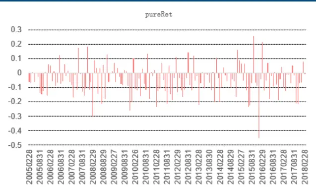
数据来源：wind、中信建投证券研究发展部

## 表 7：纯因子收益及所有因子对月度收益的相关统计

图 14：月度收益的拟合度
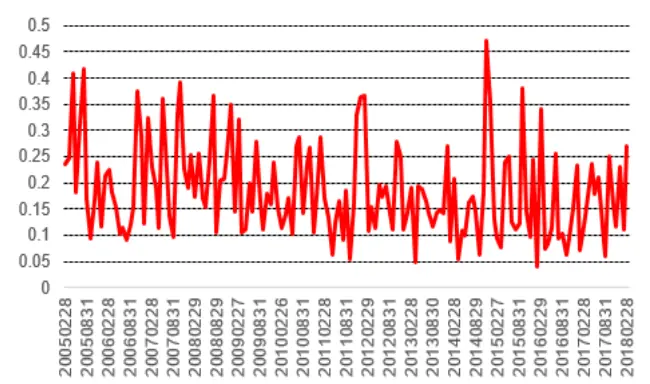
数据来源：wind、中信建投证券研究发展部

|  | 平均值 | 最大值 | 最小值 |
| --- | --- | --- | --- |
| 纯因子收益 | -5.23% | 25.42% | -44.98% |
| 拟合度 | 18.41% | 47.16% | 4.04% |

数据来源：wind资讯，中信建投证券研究发展部

可以看到，特质波动率纯因子收益月度平均为-5.23%，且为负的概率为 71.34%。也就是说，如果我们只对该因子的暴露为 1 个单位，对其它因子暴露为 0 的话，平均每月能有-5.23%的收益。根据特质波动率显著的单调性，如果我们控制对该因子的暴露为-1，是不是会有明显的正收益呢？后续我们会进行深入研究。

图 15：回归系数特质波动率对应的 t变量的绝对值
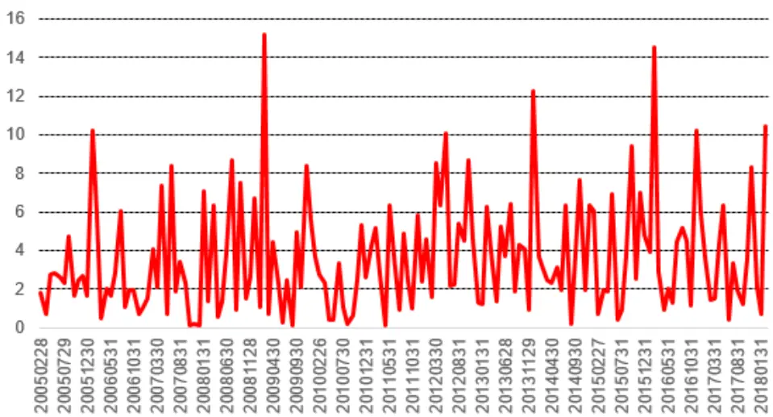
数据来源：中信建投证券研究发展部

我们统计了在用多因子对收益回归时，特质波动率对应的 t 变量的显著性，为了方便统计，我们取 t 统计量的绝对值，在整个 2005 年 5 月到 2018 年 2 月统计期间，绝对值 t 的平均值为 3.58，大于 2 的概率为 63.69%，也就是说，多数情况下，我们的纯因子收益是有显著意义的。

## 八、思考与总结

经典资本资产定价理论建立在市场无摩擦和投资者完全理性的假设条件之下的，认为在均衡市场中只有系统性风险影响股票组合收益，公司层面的特质风险可以通过分散化投资规避。然后由于卖空限制、信息不对称等市场不完美因素，投资者不可能持有完全分散的市场组合，也就是说，特质风险将会影响组合收益。在我们的研究中，我们发现，特质波动率与我们个股未来的收益有明显的负相关性，即特质波动率越高，未来超额收益越低。

首先，我们从资本资产定价模型出发，通过市场因子来解释股票收益，用模型的残差的年化波动率来度量特质波动率。继而我们增加了市值因子、账面市值比因子，得到 Fama-French 三因子模型，从各个组合指标来看，这二个因子都对模型有本质的提升，比如，年化多空收益差提高了 5%。我们也加入了动量因子，得到 Carhart四因子模型，研究发现，加入这个因子对股票收益解释相对 Fama-French 三因子模型并没有显著的提升。最后，我们在 Fama-French 三因子模型的基础之上添加了盈利因子和投资因子，得到了 Fama-French 五因子模型，五因子模型的解释能力是否因市场而异，就我国股市而言，Fama-French 五因子模型相对 Fama-French 三因子模型并没有明显的提升解释能力。

## 大市值组和银行股分布显著偏低

按中信一级 29 个行业把个股分类，分别统计当月各行业内成份股票特质波动率的平均值。最后求每个行业从 20050228 到 20180330 区间每个月的平均值作为最终特质波动率在各行业的分布情况。在中信一级行业分布情况，除了银行组特质波动率明显偏低外，其余各行业分布基本一致，并没有太明显的区别。其中，银行股平均特质波动率为 19.02%，其它行业基本在 30%左右。

## 与换手率多空收益差相关性较大

四个模型的特质波动率相关系数基本在 以上，明显的强相关性；而特质波动率因子与 个月换手率相关系数基本在 0.8 左右，也是明显的强相关。其中 Vcapm 为 0.83，其相关性相对最强。值得注意的是，特质波动率因子与流动市值因子相关系数基本在-0.2 以上，说明与流动市值因子有一定的负相关性，而特质波动率因子与 roe 因子相关系数绝对值在 0.1 以下，说明基本没有线性相关性。

## 特质波动率组合单调性十分显著

以基于 Fama-French 三因子模型得到的特质波动率为代表，展示特质波动率因子的单调性。按个股的特质波动率值进行排序，按大小分成 10 组，top1 表示特质波动率最大的前 10%，依次类推。发现排名靠后的小组明显优于排名靠前的小组，且单调性十分显著。20050301 到 20180330，前五组年化收益基本在 20%以下，后五组年化收益基本在 25%以上。

## spearman 相关系数平均值为-7.28%

四个模型的特质波动率相关性非常高，以基于 Fama-French 三因子模型得到的特质波动率为代表，该因子月度 IC 在 20050301 到 20180330 期间，平均值为-7.28%，每年都稳定为负，且月度 IC 同向概率为 64%，月度 IC为负的概率为 77%。这说明特质波动率与个股收益关系是比较稳定的且显著比较有效的因子。

## 基于CAPM模型的特质波动率相对于基于Fama-French三因子和五因子模型及Carhart四因子模型对应的特质波动率较弱。

在波动率方面，基于 CAPM 模型的特质波动率为 11.95%，明显大于其它模型情况；最大回撤为 17.95%，其它模型基本在 15%以下且夏普比例为 1.26，其它几种情况都是 2.0 以上。以上相关指标表明仅用市场因子解释股票收益力度是有限的，而加入市值因子、估值因子后提升效果显著，年化多空收益提升 5%左右；但加入动量因子、盈利因子或投资水平因子后，提升效果并不太明显。

## 低特质波动率配置效应显著

构建了低特质波动率组合(低特质波动率 30%的等权股票组合)，并以全市场等权组合为基准，特质波动率有较有明显的超额收益，风险控制在 5%以下，年化超额收益达到 7.6%以上。低特质波动率具有比较明显的配置效应。

## 传统因子对特质波动率解释度并不明显

特质波动率与传统因子之间的方差膨胀因子平均值为 1.57，最大值也只有 2.79，这说明特质波动率与传统的因子不存在明显的线性相关性。且其拟合度平均值为34.79%，说明其它因子对特质波动率的解释力度只有34%左右，也就是说，特质波动率可提供 66%的传统因子不能解释的信息。

## 纯因子收益月度均值显著为负

特质波动率纯因子收益月度平均为-5.23%，且为负的概率为 71.34%。也就是说，如果我们只对该因子的暴露为 1 个单位，对其它因子暴露为 0 的话，平均每月能有-5.23%的收益。多因子对收益回归时，我们考察特质波动率对应的 t 变量的显著性，为了方便统计，我们取 t 统计量的绝对值，在整个 2005 年 5 月到 2018 年 2 月统计期间，绝对值 t 的平均值为 3.58，大于 2 的概率为 63.69%，也就是说，多数情况下，我们的纯因子收益是有显著意义的。

我们通过投资组合多空收益分析、横截面特质波动率排序与未来个股收益排序的相关系数分析，横截面回归，Barra纯因子模型等探讨特质波动率与预期收益的关系。我们尽可能的把特质波动率在A股的现象展示出来，用多种模型考察特质波动率。发现在 A 股，特质波动率与股票预期收益有明显的负相关，这是目前理论无法解释的，我们也没有更好的解释这个现象，未来，我们可以进一步探索这个现象原因，解释为什么存在特质波动率之迷现象。

## 分析师介绍

丁鲁明：同济大学金融数学硕士，中国准精算师，现任中信建投证券研究发展部金融工程方向负责人，首席分析师。10 年证券从业，历任海通证券研究所金融工程高级研究员、量化资产配置方向负责人；先后从事转债、选股、高频交易、行业配置、大类资产配置等领域的量化策略研究，对大类资产配置、资产择时领域研究深入，创立国内“量化基本面”投研体系。多次荣获团队荣誉：新财富最佳分析师 2009 第 4、2012第 4、2013 第 1、2014 第 3 等；水晶球最佳分析师 2009 第 1、2013 第 1 等。

研究助理 喻银尤：021-68821600-808 yuyinyou@csc.com.cn

复旦大学计算机硕士，CFA（特许金融分析师），两年上交所相关部门工作经验，专注于大数据、多因子、人工智能等相关策略研究。

## 社保基金销售经理

彭砚苹 010-85130892 pengyanping@csc.com.cn

## 研究服务

姜东亚 010-85156405 jiangdongya@csc.com.cn

机构销售负责人

赵海兰 010-85130909 zhaohailan@csc.com.cn

## 保险组

张博 010-85130905 zhangbo@csc.com.cn

周瑞 010-85130749 zhourui@csc.com.cn

张勇 zhangyongzgs@csc.com.cn

## 北京公募组

黄玮 010-85130318 huangwei@csc.com.cn

朱燕 85156403 zhuyan@csc.com.cn

任师蕙 010-8515-9274 renshihui@csc.com.cn

黄杉 010-85156350 huangshan@csc.com.cn

王健 010-65608249 wangjianyf@csc.com.cn

马康康 010-85159204 makangkang@csc.com.cn

## 私募业务组

李静 010-85130595 lijing@csc.com.cn

赵倩 010-85159313 zhaoqian@csc.com.cn

## 上海地区销售经理

黄方禅 021-68821615 huangfangchan@csc.com.cn

戴悦放 021-68821617 daiyuefang@csc.com.cn

李祉瑶 010-85130464 lizhiyao@csc.com.cn

翁起帆 wengqifan@csc.com.cn

李星星 lixingxing@csc.com.cn

王罡 wanggangbj@csc.com.cn

范亚楠 fanyanan@csc.com.cn

李绮绮 liqiqi@csc.com.cn

## 深广地区销售经理

胡倩 0755-23953981 huqian@csc.com.cn

许舒枫 xushufeng@csc.com.cn

程一天 chengyitian@csc.com.cn

曹莹 caoyingzgs@csc.com.cn

张苗苗 zhangmiaomiao@csc.com.cn

廖成涛 liaochengtao@csc.com.cn

陈培楷 chenpeikai@csc.com.cn

## 评级说明

以上证指数或者深证综指的涨跌幅为基准。

买入：未来 6 个月内相对超出市场表现 15％以上；

增持：未来 6 个月内相对超出市场表现 5—15％；

中性：未来 6 个月内相对市场表现在-5—5％之间；

减持：未来 6 个月内相对弱于市场表现 5—15％；

卖出：未来 6 个月内相对弱于市场表现 15％以上。

## 重要声明

本报告仅供本公司的客户使用，本公司不会仅因接收人收到本报告而视其为客户。

本报告的信息均来源于本公司认为可信的公开资料，但本公司及研究人员对这些信息的准确性和完整性不作任何保证，也不保证本报告所包含的信息或建议在本报告发出后不会发生任何变更，且本报告中的资料、意见和预测均仅反映本报告发布时的资料、意见和预测，可能在随后会作出调整。我们已力求报告内容的客观、公正，但文中的观点、结论和建议仅供参考，不构成投资者在投资、法律、会计或税务等方面的最终操作建议。本公司不就报告中的内容对投资者作出的最终操作建议做任何担保，没有任何形式的分享证券投资收益或者分担证券投资损失的书面或口头承诺。投资者应自主作出投资决策并自行承担投资风险，据本报告做出的任何决策与本公司和本报告作者无关。

在法律允许的情况下，本公司及其关联机构可能会持有本报告中提到的公司所发行的证券并进行交易，也可能为这些公司提供或者争取提供投资银行、财务顾问或类似的金融服务。

本报告版权仅为本公司所有。未经本公司书面许可，任何机构和/或个人不得以任何形式翻版、复制和发布本报告。任何机构和个人如引用、刊发本报告，须同时注明出处为中信建投证券研究发展部，且不得对本报告进行任何有悖原意的引用、删节和/或修改。

本公司具备证券投资咨询业务资格，且本文作者为在中国证券业协会登记注册的证券分析师，以勤勉尽责的职业态度，独立、客观地出具本报告。本报告清晰准确地反映了作者的研究观点。本文作者不曾也将不会因本报告中的具体推荐意见或观点而直接或间接收到任何形式的补偿。

股市有风险，入市需谨慎。

## 中信建投证券研究发展部

## 北京

东城区朝内大街2号凯恒中心B座 12 层（邮编：100010）电话：(8610) 8513-0588传真：(8610) 6560-8446

## 上海

浦东新区浦东南路 528 号上海证券大厦北塔 22 楼 2201 室（邮编：200120）

电话：(8621) 6882-1612

传真：(8621) 6882-1622

## 深圳

福田区益田路 6003 号荣超商务中心B 座 22 层（邮编：518035）

电话：（0755）8252-1369

传真：（0755）2395-3859