[table_main] 证券研究报告·金融工程专题金

# 因子深度研究系列：宏观变量控制下的

有效因子轮动

## 主要观点

## 因子轮动改进：有效因子与风格因子的分析采用不同逻辑

在传统多因子模型中，常用的因子赋权方法是通过对所有因子的因子 IC 或因子收益率相对大小进行赋权。本报告将因子分类为有效因子与风格因子，认为由于两者性质的差异，决定了他们轮动的逻辑并不一致：有效因子的轮动是由因子间的相对强弱来决定，因子间的相对强弱由市场风格等变量决定；而风格因子不用判断因子间的相对强弱，他们的轮动直接由市场风格决定。在假设已知每一期有效因子收益的完美假设下，我们发现因子轮动能够显著提升组合收益率。

## 宏观、市场变量、季度效应均能解释因子轮动，因子动量效果并不明显

在有效因子轮动的考虑中，传统因子动量（反转）并不能很好的进行解释。我们加入宏观变量、市场变量与季度效应三类解释变量来对因子进行解释：发现单个宏观变量或市场变量对单个因子的相关性和解释力度并不明显，但对因子间相对强弱的解释较为合理。而在季度效应中，我们主要考虑了 12 月效应，1 月效应，季末效应与前后半年效应。最后我们根据解释变量的分类，建立了本报告所需的自变量数据库。

## 有效因子轮动模型：逐步回归法与序数回归法

本报告一共采用了两个模型：逐步回归模型与序数回归模型。逐步回归是直接对单个因子收益率的时间序列进行线性回归，通过显著性筛选所需的自变量。而在序数回归中，我们通过对每一期有效因子进行排名，根据有效因子的相对排名进行回归，得到单个因子的排名概率，从而直接得到因子的相对强弱。

## 逐步回归与序数回归结果分析：均能带来显著的超额收益

本报告通过滚动更新的方法分别对两种模型进行了回测，相比于因子等权（9.50%）这一长期收益率较高的基准组合，逐步回归法（12.16%）与序数回归法（12.76%）均能带来显著的超额收益，序数回归的收益略高于逐步回归。波动率（5.52%VS5.91%）比较上逐步回归更优，而最大回撤（-2.76%VS-1.83%）的角度来看，序数回归更优。从因子权重的波动来看，逐步回归的权重波动（21.41%）是序数回归（8.12%）的 2.6 倍。如果从实际投资的角度出发，序数回归是更好的选择。在收益与波动率等差距不大的前提下，序数回归模型提供了更好的稳定性，不仅从风控角度更好管理，同时较小的因子权重变动也会显著降低最终股票组合的换手率，节约交易成本。

# 金融工程研究

[table_i丁鲁明

dingluming@csc.com.cn

021-68821623

执业证书编号：S1440515020001

发布日期： 2018 年 6 月 8 日

## 相关研究报告

因子深度研究系列：特质波动率纯因子18.05.18在 A股的实证与研究

香港股市的有效alpha选股因子探索与分18.01.02析

如何正确理解近期热度极高的低波动率17.11.13因子

17.09.21 股东数量变化因子的有效性分析

市场风格切换下的因子有效性探索17.07.142017 年上半年因子表现回顾

## 一） 因子轮动的背景

## 1.1 多因子模型：传统的因子轮动方法

在传统多因子模型中，我们最后会统一计算出各股票的预测收益率，而预测收益率不仅与我们所选的有效因子有关，不同有效因子的有效收益率预测也在其中起了很重要的作用。而对于因子的收益率预测，能够采取的方法有很多：直接采用上一期的因子收益率或者 IC 值；用长期因子收益率或 IC值的均值；AR 模型；用去除趋势项的残差预测等。

估计因子收益率的传统方法：

假设因子历史收益率矩阵 $=\left[\begin{array}{ccc}{{f_{1}^{1}}}&{{\cdots}}&{{f_{1}^{T}}}\\{{\vdots}}&{{\ddots}}&{{\vdots}}\\{{f_{K}^{1}}}&{{\cdots}}&{{f_{K}^{T}}}\end{array}\right];$

1.上一期因子收益率： $f_{k}^{T+1}=f_{k}^{T}.$

2.长期均值法： $f_{k}^{T+1}=\frac{\sum_{t=1}^{T}f_{k}^{i}}{T}.$

3. AR 模型： $f_{k}^{T+1}=a_{0}+a_{1}\cdot f_{k}^{T}+a_{2}\cdot f_{k}^{T-1}+\cdots+a_{i}\cdot f_{k}^{T-i+1}+\varepsilon_{T+1}$

其中，

$f_{k}^{T+1}$ 是下一期预测第 k个因子的因子收益率；

$f_{k}^{1},\cdots,f_{k}^{T}$ 是第 k个因子的历史因子收益率序列；

$\varepsilon_{T+1}$ 是 AR模型中的残差变量。

计算下一期股票预期收益率：

$$
\mathrm{X}=\left[\begin{array}{ccc}{X_{11}^{T+1}}&{\cdots}&{X_{1K}^{T+1}}\\{\vdots}&{\ddots}&{\vdots}\\{X_{J1}^{T+1}}&{\cdots}&{X_{JK}^{T+1}}\end{array}\right];f=\left(\begin{array}{c}{f_{1}^{T+1}}\\{\vdots}\\{f_{K}^{T+1}}\end{array}\right);
$$

$$
\boldsymbol{r}^{T+1}=\boldsymbol{X}\cdot\boldsymbol{f};
$$

其中，

$X_{jk}^{T+1}$ 是第 T+1 期第j 只股票在因子 k上的因子值（标准化后）；

X是因子值矩阵；

f是预测因子收益率；

$r^{T+1}$ 是预测股票收益率。

在有效因子确定与因子值已知的情况下，上述这些做法的核心都是需要准确预测出因子收益率，继而预测股票收益率。从另一个角度来看，预测因子收益率也就是在对不同有效因子进行赋权：对预测因子收益更高的因子在下一期赋予更高的权重，而对预测因子收益低的因子赋予较低的权重。

## 1.2 因子轮动：有效因子与风格因子

既然对因子收益的预测本质上是对不同因子进行赋权，我们需要的其实不仅是单个因子的预测收益率，而是因子间的相对强弱。当期在所有有效因子中预期更强的因子赋权更高，而预期更弱的因子赋权降低。而这种相对强弱判断有一个很重要的前提：我们所考虑的因子必须是有效因子。

那这里的有效因子如何定义呢？这里首先要区分的是风格因子和我们所说的有效因子。从风格因子的特性出发，他们所赚取的其实并不是一个稳定的 alpha，而是市场风格的收益，这样的因子我们就称之为风格因子。在多因子模型中，很多风格因子如市值因子，波动率因子等在中国市场能够长期贡献超额收益，但这些因子同时也面临一个严重的问题：收益非常不稳定。比如中国市场长期存在的小市值效应（图 1），即小市值公司的股价涨幅在大多数时间内是高于大市值公司的，这使得市值因子一直能贡献稳定的收益；但在 2014 年与 2017 年，市场风格转换到大市值的公司，导致该因子出现了较大的回撤。这些因子本质上代表的就是市场风格，他们的内在逻辑是：我们判断市场将长期处于某一风格，通过做多代表该风格的股票获得超额收益。所以从这些因子的内在逻辑来看，它们一定不会是持续有效的因子，因为市场风格即使在成熟的市场中也是会发生变化的，当市场风格变化时，风格因子也会出现逆转。

从上述讨论来看，我们这里所说的有效因子并不会受到风格的影响，这些有效因子无论在任何市场环境下都不存在逆转的可能（但可能会暂时性的不提供收益）。ROE 因子就是一个很好的有效因子：无论在任何市场环境下，我们始终认为高 ROE 的公司是优于低 ROE 的。而从有效因子的内在逻辑出发：这些因子如果只从自身特性来看，应该是长期有效的，并不应该失效。

所以我们在因子轮动中所讨论的有效因子应该有以下要求：

1. 市场风格变动不会对它产生决定性的影响（不会逆转）。

2. 从自身特性出发，长期有效。

图 1 与图 2 就分别展示了风格因子的代表市值因子与有效因子的代表 ROE 因子的长期收益情况。从图 1 市值因子的多空收益差中可以看见，市值因子从 2010 年至今累计贡献了 3 倍的收益，但在 2014 年后半年以及今年经历了非常大的回撤，回撤幅度分别达到了-33.88%与-24.83%。将图 2 的市值因子与 ROE 因子进行比较，在同样的时间内市值因子无论是收益还是波动性均显著高于 ROE 因子：市值因子年化收益率 15.23%，ROE 因子年化收益率 8.11%；而市值因子的信息比率 IR 为 0.69，ROE 因子为 0.99。可以看见，在考虑风险因素的信息比率上，ROE 因子的评价高于年化收益率更高的市值因子。

但单看 ROE 因子的情况，我们能发现在 2014 年 2 月到 2015 年4 月，2016 年 8月到 2017 年 1 月这两段时间内 ROE 因子也出现了明显的回撤：这就是有效因子从自身特性无法解释的回撤。换而言之，这也是我们考虑因子轮动的原因，单个因子的失效无法从自身进行解释，可能的解释之一就是从多个因子轮动的角度来考虑。

图 1：市值因子多空累计净值（截至 2017 年 11 月）
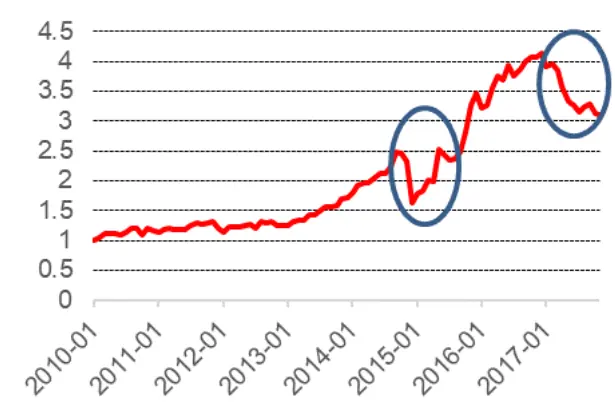
数据来源：wind、中信建投证券研究发展部

图 2：ROE因子多空累计净值（截至 2017年 11月）
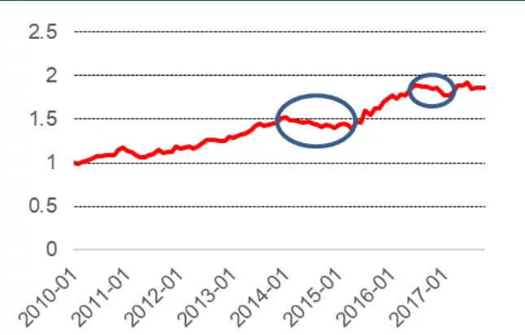
数据来源：wind、中信建投证券研究发展部

## 1.3 因子轮动：框架

在 节中，我们分别讨论了有效因子与风格因子，并从内在逻辑上区分了两种因子的特性。风格因子会直接根据市场风格产生收益逆转的可能，而有效因子在市场风格变化时会始终有效，只是在不同有效因子间的强弱会发生变化。所以对于风格因子和有效因子，它们的分析框架并不一样。图 3 展示了两类因子产生收益波动的不同来源。

图 3：不同类因子的轮动框架区别
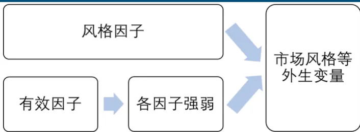
数据来源：wind、中信建投证券研究发展部

可以看见，两类因子最后都能归因到市场风格之类的外生变量上。但风格因子能够直接和这些外生变量产生联系，也就是外生变量能直接造成风格因子的风格逆转；而有效因子是通过不同有效因子的强弱来体现的，不同有效因子的强弱差距的原因仍然是不同的外生变量。虽然最后我们认为两类因子的轮动都是由外生变量造成的，但正因为轮动框架的区别，我们需要将这两类因子分开分别讨论。

## 1.4 因子轮动：从有效因子出发——假设完美的情况

在本篇报告，我们将从有效因子出发来介绍一个针对有效因子完整的因子轮动体系。对于风格因子，我们会在后续报告中单独考虑。根据我们对有效因子的定义，我们从自身的因子库中选出 个满足要求的因子，详见表 1 与图 4。这里的因子收益为中证 500 内的因子多空收益差（多头 100 只，空头 100 只）。

表 1：有效因子与其类型

| 因子名称 | 因子类型 |
| --- | --- |
| ROE | 价值 |
| ∆ROA | 成长 |
| ∆ROE | 成长 |
| ∆ eps | 成长 |
| 主营业务收入增长率 | 成长 |
| PB | 估值 |
| 一个月日均换手率 | 情绪 |
| 三个月日均换手率 |  |
| 一个月反转 | 情绪 |
| 三个月反转 | 动量 |
| 六个月反转 | 动量 |
|  | 动量 |
| DIF | 技术 |
| DEA | 技术 |

图 4：有效因子的多空累计净值（截至 2017年 11月）

数据来源：wind、中信建投证券研究发展部

那有效因子轮动能否带来更好的收益呢？在这里我们通过一个完美的情况来分析因子轮动的效果：从 2011年 1 月 1 日到 2017 年 11 月 30 日，假设我们已知上述 13 个有效因子的月度收益，并在每个月直接根据他们的收益率作为权重进行赋权（第 1 名权重最大，第 13 名权重最低），将 13 个因子进行组合得到他们的净值曲线；将该净值曲线与 13 个有效因子等权配置的净值曲线进行对比。对比结果见图 5：

图 5：完美假设下的累计净值（截至 2017 年 11 月）
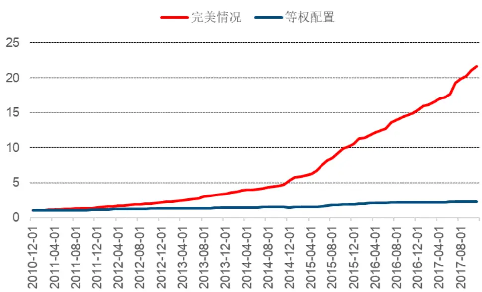
数据来源：wind、中信建投证券研究发展部

可以看见，在完美假设下的有效因子累计收益显著跑过了等权配置的收益，也就是说，如果能够发掘出当期因子的相对强弱，我们能够显著提升原有配置方法的收益。

## 二）有效因子轮动：解释

在 1.3 节的因子轮动框架中，最终去判断各有效因子强弱的仍是市场风格等外生变量。所以我们寻找的解释变量应该来自某些与市场或经济相关的外生变量。接下来本报告将从以下几个方面分别需找对因子强弱的解释：宏观变量、市场变量、季节效应与因子自身的动量（反转）。

## 2.1 宏观变量

大量的宏观变量作为经济的领先指标或滞后指标，在对经济周期或国家经济状态的判断上一直具有良好的效果。在学术研究中，大量文献都在寻找宏观变量与股票收益率之间的关系：或者通过宏观变量解释股票收益率 (Chen, Roll and Ross [1986] and Ferson and Harvey [1991])，或者反之通过股票收益率解释宏观变量的变化(Liew and Vassalou [1999])。但关于宏观变量与各个因子之间的关系目前学术界讨论甚少，这也是本报告认为值得研究的地方。

本质上，各因子可以理解为股票收益的分解。所以寻找分解部分与宏观变量的关系可能会比直接寻找股票原始收益与宏观变量的关系更为容易。

这里我们以 ROE 与ΔROE 因子为例进行说明。我们选取工业增加值当月同比，固定资产投资累计同比，房地产开发投资累计同比，社会消费品零售总额当月同比，CPI，PPI 与 M2 增速 7个变量分别检验了它们与 ROE和ΔROE 因子的相关性。从表 2 中能够看见单个指标的相关性并不高：对 ROE 因子，与其相关性最高的 PPI为-23.13%；对ΔROE 因子，与其相关性最高的 CPI 为-17.35%。

在图 6 中我们将 M2 增速与上述两个因子放在了一起考虑，能够发现单纯的从相关性上考虑各因子与宏观变量之间的关系是不够的，因子与 M2 之间的关系是时变的。在 2011 年到 2013 年初这段时间内，ROE 因子与M2 增速是显著的负相关，而ΔROE 因子的相关性并不明显。在 2013 年到 2016 年这段时间内，反而是ΔROE因子与 M2 有显著的正相关性。M2 与 ROE 因子的负相关，与ΔROE 因子的正相关与经济逻辑也是一致的：M2增速上升时，货币供给充分，市场流动性更足，会使得更多的资金趋向高成长性的企业，而确定性较高的企业关注度相对偏低；而在 M2 增速回落时情况恰恰相反，市场流动性不足，资金反而会流向确定性更高的公司，也就是高 ROE 的公司。

表 2：ROE因子、ΔROE因子与宏观变量的相关性（6个月平滑后）

|  | ROE因子月度收益（t期） | ΔROE因子月度收益（t期） |
| --- | --- | --- |
| 工业增加值当月同比（t-2期） | -11.21% | -8.93% |
| 固定资产投资累计同比（t-2期） | -8.00% | -6.76% |
| 房地产开发投资累计同比（t-2期） | -14.79% | -8.37% |
| 社会消费品零售总额当月同比（t-2期） | -2.55% | -8.05% |
| CPI（t-2期） | -6.65% | -17.35% |
| PPI（t-2期） | -23.13% | -0.33% |
| M2增速（t-2期） | -18.48% | -14.67% |

资料来源：Wind，中信建投证券研究发展部

同时我们也能看见，在 M2 增速回落之后，ROE 因子的收益会超过ΔROE 因子，而在其他时候，ΔROE因子的收益始终更高，这两者的强弱关系相比于直接观察他们与 M2 增速的直接相关性是更明显的。

图 6：ROE、ΔROE因子与 M2 增速
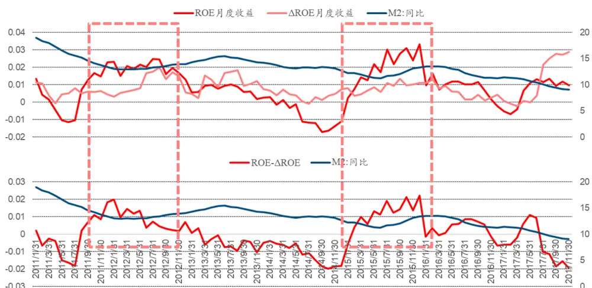
数据来源：wind、中信建投证券研究发展部

## 2.2 市场变量

市场变量也是影响股票收益的另一个重要变量，比如股票市场波动率、股票市场换手率、信用利差、长短期债券收益率利差、商品价格、外汇价格等。比如传统的 模型中的市场收益率也是一个实用的市场变量。这些变量和宏观变量一样，在股票收益率的基础上学界进行了大量的研究，而在因子层面的研究并不多见。相对于宏观变量，市场变量有它自己的优势：作为日度数据更便于观察；同时不存在滞后期，方便实际投资中使用。这里我们把能够进行日间更新的，不同于国家统计局每月发布的宏观数据也归类在市场变量之中。

在市场变量中，我们选取了中债国债到期收益率（1 年），信用利差（1 年期国债-1 年期 3A 企业债），期限利差（1 年期国债-1 月期国债），沪深 300 一个月涨跌幅，沪深 300 的 30 日波动率与沪深 300 一个月换手率 6各指标仍与 ROE、ΔROE 因子进行了相关性分析。从表 3 可以看见，各市场变量与 ROE 因子的相关性相对与ΔROE 因子更高，与 ROE 因子相关性最高的沪深 300 波动率达到了 50.32%，而与ΔROE 因子相关性最高的期限利差只有 14.58%。图 7 展示了两个因子与国债到期收益率的关系，ROE 因子与国债收益有着显著的负相关，在国债收益率更高的时候，ROE 因子收益更差，这很可能与国债收益率上升时权益市场流动性下降有关。而ΔROE 因子与国债收益率并没有明显的关系。

同样的，在国债收益率回落的同时，ROE 因子的收益是会超过ΔROE 因子的，而一般来说ΔROE 因子的收益更高。这与高 ROE 更看重融资有关，而ΔROE 公司主要看重的是其内生增长。在融资成本下降的时候，市场会更喜欢高 ROE 的公司，而融资成本上升后，具有内生成长性的公司更受欢迎。

表 3：ROE因子、ΔROE因子与市场变量的相关性（6个月平滑后）

|  | ROE因子月度收益（t期） | ΔROE因子月度收益（t期） |
| --- | --- | --- |
| 中债国债到期收益率：1年（t-1期） | -39.25% | 2.03% |
| 信用利差1Y（t-1期） | 11.85% | -1.51% |
| 期限利差1Y-1M（t-1期） | -0.79% | 14.58% |
| 沪深300-1个月涨跌幅（t-1期） | -14.27% | 3.25% |
| 沪深300-30日波动率（t-1期） | 50.32% | 4.13% |
| 沪深300-1个月换手率（t-1期） | 42.06% | 5.97% |

资料来源：Wind，中信建投证券研究发展部

图 7：ROE、ΔROE因子与国债到期收益率
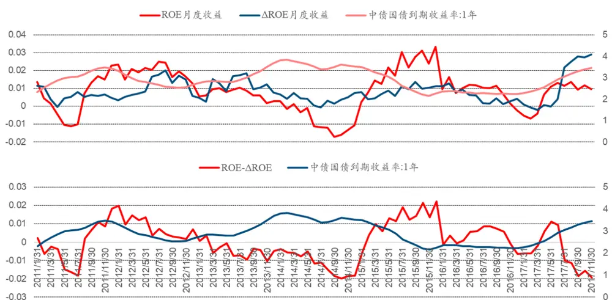
数据来源：wind、中信建投证券研究发展部

## 2.3 季度效应

常见的季度效应有以下几类：1 月效应，12 月效应，季末效应与前后半年区别。这里我们仍以 ROE 与ΔROE因子为例进行简单分析。ROE 因子的季度效应如图 8 到图 11 所示，ΔROE 因子的季度效应如图 12 到图 15 所示。

## 1 月效应

作为每年的第一个月，受基金建仓或市场情绪影响，不同因子在 1 月份可能会有不同的表现。ROE 因子与ΔROE 因子均不存在 1 月效应。

## 12 月效应

同样每年的最后一个月，从基金稳定业绩等因素来看，各因子的表现也值得研究。ROE 因子存在显著的 12月效应，而 deltaROE 因子并不显著。

## 季末效应

季末效应（3 月，6 月，9 月，12 月末）与 12 月效应有一定的相似之处，我们均能从基金换仓中找到解释：基金在报告期前的换仓可能更偏向大市值公司。从图 10 与图 14 能够看出，ROE 因子存在季末效应，而 deltaROE因子并不存在。

## 前后半年区别

前后半年各因子的表现也可能会产生一定的差别。学术界也对股票收益率的前后半年差异进行过相关研究，认为前半年的股票收益是显著好于后半年的（Qian, Hua, Sorensen [2007]）。而图 11 与图 15 是两个因子的前后半年区别，该区别在因子层面上并不明显。

图 8：ROE因子一月效应
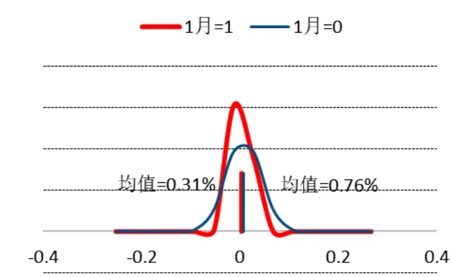
数据来源：wind、中信建投证券研究发展部

图 9：ROE因子 12月效应
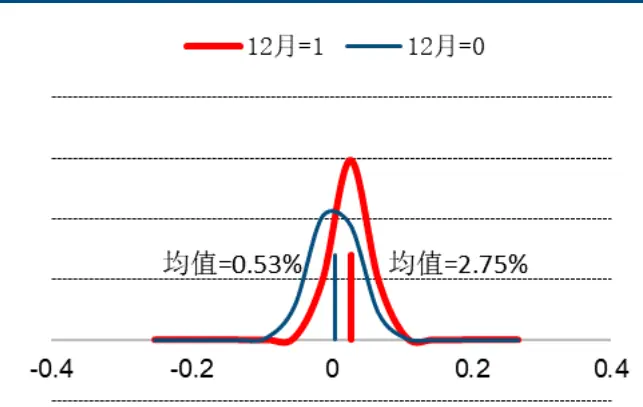
数据来源：wind、中信建投证券研究发展部

图 10：ROE因子季末效应
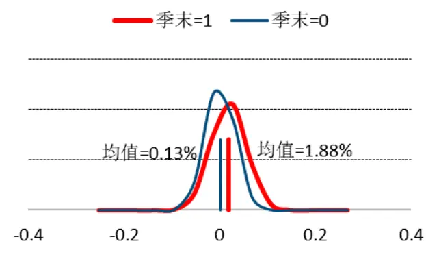
数据来源：wind、中信建投证券研究发展部

图 11：ROE因子前后半年区别
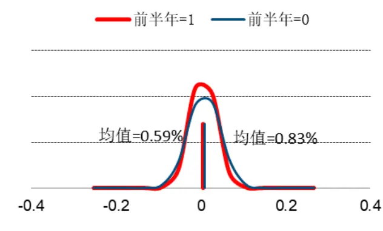
数据来源：wind、中信建投证券研究发展部

图 12：ΔROE因子一月效应
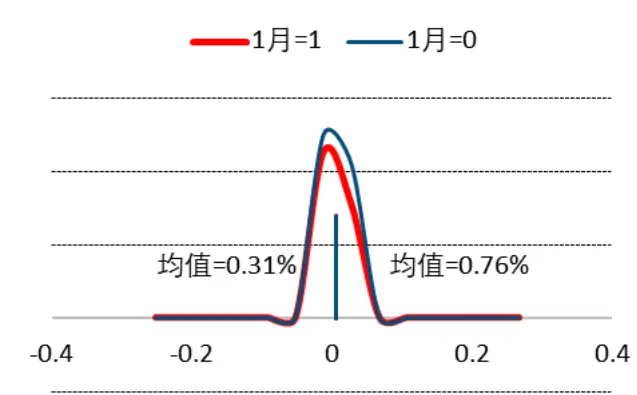
数据来源：wind、中信建投证券研究发展部
金融工程专题报告

图 13：ΔROE因子 12月效应
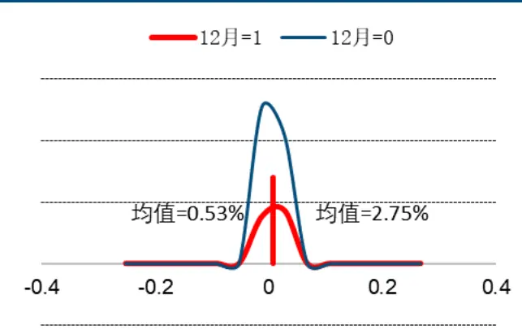
数据来源：wind、中信建投证券研究发展部

图 14：ΔROE因子季末效应
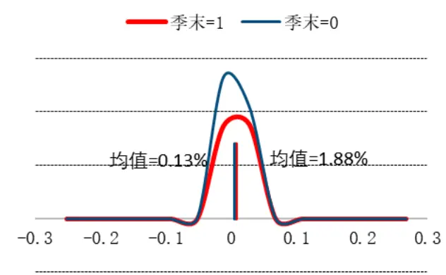
数据来源：wind、中信建投证券研究发展部

图 15：ΔROE因子前后半年区别
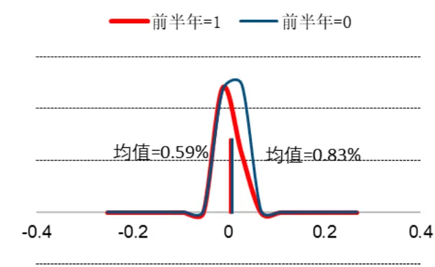
数据来源：wind、中信建投证券研究发展部

## 2.4 因子动量

因子自身的动量（反转）效应也是预测因子收益常用的一种手段。我们分别检验了 ROE 因子与ΔROE 因子的自相关性：ROE 因子与ΔROE 因子均不具备自相关性，可以认定他们为平稳过程。而 ROE 因子在每半年的滞后期（lag=6）上具有一定的相关性，这和 ROE 季报发布的特点有关。

图 16：ROE因子自相关性
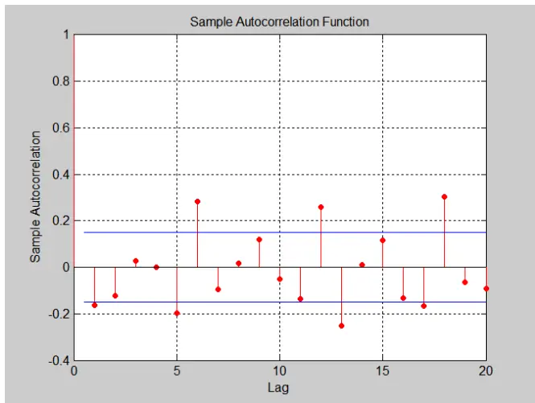
数据来源：wind、中信建投证券研究发展部

图 17：ΔROE因子自相关性
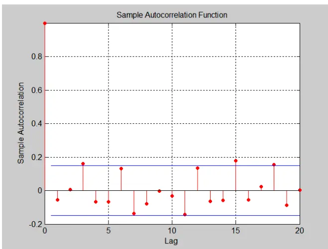
数据来源：wind、中信建投证券研究发展部

## 2.5 自变量数据库

基于上述可能的解释变量分析，我们在有效因子的轮动上建立了一个自变量数据库。该数据库就是从以上4 个方面来进行分类：宏观变量（投资、消费、进出口、通胀、金融等），市场变量（债券市场、股票市场），季节效应（1 月、12 月，季末，前后半年）与因子动量（因子历史收益）。下面对有效因子的轮动就将在本数据库的基础上进行。本文暂不具体展示数据库中所有的自变量，有兴趣的读者可以与报告作者联系。

## 三）有效因子轮动：模型

在确定了有效因子的轮动框架，建立好自变量数据库后，接下来就是考虑用什么模型来对第一节所说的 13个有效因子进行轮动了。从第二节的分析中我们得知了有效因子与自变量之间存在以下几个特点：

1. 单个自变量与有效因子的相关性不强。

2. 自变量与有效因子的关系是时变的。

3. 对某一有效因子有解释能力的自变量对另一有效因子很可能不存在解释能力。

4. 从因子强弱的角度，自变量能够更好的解释因子收益率的差，而不是因子收益率的绝对值。

根据以上特点，我们采用了两种不同的方法来进行因子轮动：逐步回归法与序数回归法。

## 3.1 逐步回归法

逐步回归法本质上就是将我们所用的所有解释变量分别在回归模型中进行检验，来判断每个解释变量在模型中的解释性与显著性。一般将逐步回归法分为向前逐步回归（forward stepwise）与向后逐步回归（backwardstepwise）。向前逐步回归是指一开始模型中没有包含任何解释变量，而将解释变量一个一个加入模型并进行检验，来提升模型整体的解释度。而向后逐步回归是一开始就把所有的解释变量都放入模型中，再逐个将不显著的解释变量剔除的方法，也就是先“过拟合”我们的模型，再去求解一个最优化模型。

在我们的因子轮动中，我们采用向后逐步回归的方法：首先将我们所有的宏观变量、市场变量、季节效应

与因子动量均放入模型中，接着我们再使用逐步回归法来选取最优的预测模型。

具体的线性模型如下所示：

$$
R_{t}=\alpha+\beta_{1}\cdot E_{t-2}+\beta_{2}\cdot M_{t-1}+\beta_{3}\cdot S_{t}+\beta_{4}\cdot Y_{t-1}+\varepsilon
$$

其中，

$R_{t}$ 是本期的因子收益；

$E_{t-2}$ 是上两期的宏观变量（考虑到宏观变量数据获得的滞后性）；

$M_{t-1}$ 是上一期的市场变量；

$S_{t}$ 是本期是否存在季节效应（0-1 变量）；

$Y_{t-1}$ 是上一期的因子收益率（短期平均收益率、长期平均收益率或当期收益率）

## 3.2 逐步回归法——回测框架

在向后逐步回归法下，我们通过构建一个滚动的因子轮动回测框架来检验该方法对有效因子的适用性。

对于每一个有效因子，我们首先确定滚动期的时间窗口，并根据时间窗口内的因子数据的时间序列与自变量（宏观变量、市场变量、季度效应与因子动量）的时间序列进行逐步回归，得到该因子的显著解释变量与回归系数；以该回归系数为基准，将新一期的自变量放入回归方程中，来预测下一期的因子数据。通过预测的因子数据来对不同有效因子进行赋权。以时间窗口长度进行循环，得到最终有效因子的组合历史收益走势。

主要的细节框架如下所示：

1. 基本方法：逐步回归法。逐步回归准则：BIC (Bayesian Information Criterion)。

2. 因子数据：因子的月度多空收益差，即通过做多因子值最大 20%股票，做空因子值最小 20%股票得到的月度收益。

3. 数据预处理：每一期对自变量异常值进行预处理，对如工业增加值等数据的 1，2 月份和季度情况进行平滑处理。

4. 调仓频率：根据每月更新的因子收益率时间序列与各解释变量，月度调仓。

5. 滚动更新时间窗口：5 年（60 个月）（与后续所用序数回归法时间窗口相匹配）。

6. 组合比较基准：有效因子的等权组合&以因子动量进行赋权的有效因子组合（5 年动量）。

7. 时间区间：2011 年 1 月 1 日至 2017 年 11 月 31 日。2011 年至 2015 年为数据区间，回测区间为 2016年 1 月至 2017 年 11 月。

8. 因子赋权标准：根据因子预测收益进行赋权。因为我们是在有效因子的前提下进行的因子轮动，如果因子收益为负，则认为当期因子并不显著有效，权重为 0。

## 3.3 序数回归法

序数回归法是我们在进行有效因子轮动的另一个方法。在上述逐步回归法中，能够发现我们在进行有效因子收益预测的时候并没有考虑因子间的相对强弱，而只是在最后赋权时根据预测因子收益的绝对值大小进行判断才考虑了有效因子强弱的关系。换而言之，逐步回归法是在对因子收益率的绝对值进行比较，那么有没有方法能够在回归时就能考虑因子间的相对强弱呢？这就是本报告讨论的另一种方法：序数回归法。

序数回归法是当因变量是有序分类型数据采用的回归方法，而自变量仍是传统的数值型变量。该方法是logistic 回归的进一步深化。

多元序数回归模型如下所示：

$$
\ln\left({\frac{\pi_{1}}{\pi_{k}}}\right)=\alpha_{1}+\beta_{1}X_{1}+\beta_{2}X_{2}+\cdots+\beta_{p}X_{p}
$$

$$
\ln\left({\frac{\pi_{2}}{\pi_{k}}}\right)=\alpha_{2}+\beta_{1}X_{1}+\beta_{2}X_{2}+\cdots+\beta_{p}X_{p}
$$

$$
\ln\left({\frac{\pi_{k-1}}{\pi_{k}}}\right)=\alpha_{k-1}+\beta_{1}X_{1}+\beta_{2}X_{2}+\cdots+\beta_{p}X_{p}
$$

其中，k代表我们一共有 k 个种类，或者说按顺序排名后最后一名的序号为 k。 $\pi_{j}=P(y=j)$ 是最终结果在第j 名内的概率。

对于 logistic 模型与类 logistic 模型，我们都要找一个基准，这里最后一名 k 就是我们的比较基准。对于基准组合，它的回归系数均为 0，而在第 1 到第 k-1 名的概率由下列公式确定：

$$
\pi_{j}=P(y=j)=\frac{e^{\alpha_{j}+\sum_{l=1}^{p}\beta_{l}X_{l}}}{1+\sum_{j=1}^{k-1}e^{\alpha_{j}+\sum_{l=1}^{p}\beta_{l}X_{l}}},\quad j=1,\cdots,k-1
$$

第 k名的概率如下：

$$
\pi_{k}=P(y=k)={\frac{1}{1+\sum_{j=1}^{k-1}e^{\alpha_{j}+\sum_{l=1}^{p}\beta_{l}X_{l}}}}
$$

也等于：

$$
\pi_{k}=1-\pi_{1}-\pi_{2}-\cdots-\pi_{k-1}
$$

这里因为是序数回归， $\beta_{1},\cdots,\beta_{k}$ 对于每一个回归方程都是一样的；而在非序数的分类问题中，不同类型对应的回归系数 $\beta_{1},\cdots,\beta_{k}$ 均不一样。

在求解序数回归模型的回归系数时，所用的方法和 logistic 模型一致：极大似然法（MLE）。由于极大似然估计的特点，序数回归对于数据量的要求远大于逐步回归。

## 3.4 序数回归法——回测框架

在逐步回归法的基础上，我们只需要三步改进就能运用序数回归法来对有效因子进行轮动。首先是将每一期的因子收益率替换为因子收益率的相对排名（1 到 13 名）；因为采用的不再是逐步回归，我们还需要改变筛选变量的方法；最后，序数回归法得到的是因子在不同排名的概率，我们再将概率转为权重即可。

主要的细节框架如下所示：

1. 基本方法：序数回归法。序数回归估计方法：极大似然估计（MLE）。

2. 因子数据：每一期因子的月度多空收益差相对排名。

3. 数据预处理：每一期对自变量异常值进行预处理，对如工业增加值等数据的 1，2 月份和季度情况进行平滑处理。

4. 自变量筛选标准：与逐步回归一致，根据自变量数据库的宏观变量（投资、消费、进出口、通胀、金融等），市场变量（债券市场、股票市场），季节效应（1 月、12 月，季末，前后半年）与因子动量（因子历史收益）的细分类别，分别在每个因子的时间序列上对每个自变量进行序数回归，根据自变量的显著性进行筛选（t 值大于 1.96&p 值小于 0.05）。

5. 调仓频率：根据每月更新的因子相对排名时间序列与每一期筛选出的解释变量，月度调仓。

6. 滚动更新时间窗口：5 年（60 个月）（从序数回归所需数据量出发）。

7. 组合比较基准：有效因子的等权组合&以因子动量进行赋权的有效因子组合（5 年动量）。

8. 时间区间：2011 年 1 月 1 日至 2017 年 11 月 31 日。2011 年至 2015 年为数据区间，回测区间为 2016年 1 月至 2017 年 11 月

9. 因子赋权标准：根据因子排名的预测概率进行赋权。以 13 个因子排名前 1/2 的概率为基准，预测因子排名前 1/2 的概率越大，权重越大。

## 四）有效因子轮动：结果分析

## 4.1 逐步回归法

在 3.2 节的框架下，通过逐步回归进行轮动的结果如下：

从图 18 与表 4 可以看见，通过逐步回归法进行轮动后的有效因子组合最终获得的年化收益为 12.16%，高于因子等权的 9.50%与因子动量的 8.40%，轮动后的 IR=2.20 也高于因子等权的 2.00 与因子动量的 1.73；在最大回撤上，轮动模型也不存在回撤过大的情况仅比因子等权的回撤高 1%。从各年度情况来看（表 5），轮动模型在 2016 年与 2017 年的收益均高于比较基准，其中 2017 年录得收益 8.02%，表现更佳。通常来说，多因子中的等权组合一直是一个胜率与收益率都很高的组合，而逐步回归最终能够战胜等权组合，这也说明了用逐步回归法进行轮动的有效性。

在图 19 中，我们将 13 个有效因子分为了两类，在时间序列上观察两类因子的权重变化。第一类是基本面因子，代表的是从基本面等属性衡量公司的因子，包括 ROE，ΔROE，ΔROA，Δeps，主营业务收入增长率，PB。另一类是交易类因子，代表从市场属性来衡量公司的因子，包括一个月日均换手率，三个月日均换手率，一个月反转，三个月反转，六个月反转，DIF 和 DEA。从时间序列上可以看见，基本面类因子的权重从 2016年开始在逐渐上升（37.63%到 55.57%），而交易类因子的权重在缓慢下降（62.37%到 44.43%），这恰好和 2016年下半年开始的风格转换相吻合。这也从侧面证明了因子轮动模型的有效性：能够识别出一定的市场风格转化规律，再对我们的因子进行赋权。但同时我们也能发现，两类因子的相对权重并不稳定，在最高时其中一类因子的权重能达到 80%以上，而最低时接近 0%。这也说明使用逐步回归模型后的轮动赋权波动过大，如果在实际投资时，会导致我们的多头组合换手率偏大。

图 18：净值曲线：逐步回归
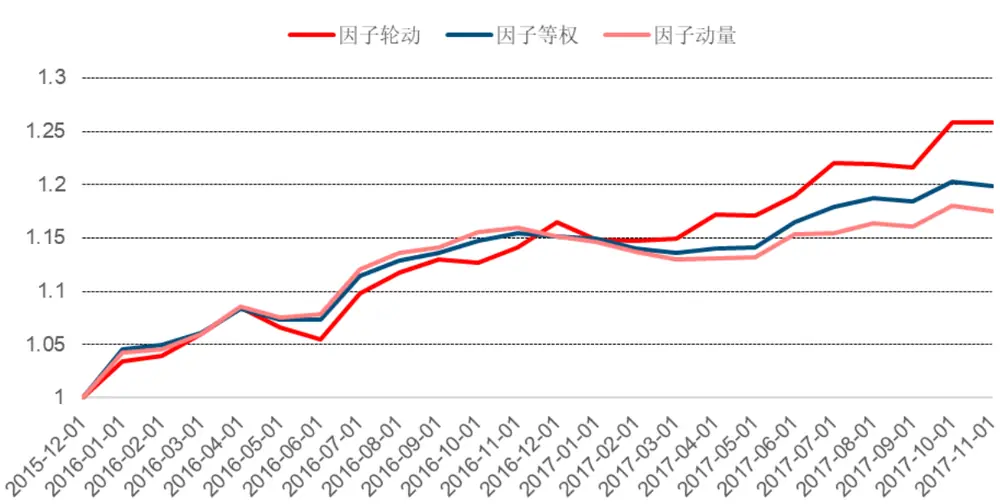
数据来源：wind、中信建投证券研究发展部

表 4：因子轮动（逐步回归）结果分析

|  | 因子轮动：逐步回归 | 因子等权 | 因子动量 |
| --- | --- | --- | --- |
| 年化收益率 | 12.16% | 9.50% | 8.40% |
| 波动率 | 5.52% | 4.76% | 4.85% |
| IR | 2.20 | 2.00 | 1.73 |
| 最大回撤 | -2.76% | -1.60% | -2.56% |

资料来源：Wind，中信建投证券研究发展部

表 5：因子轮动（逐步回归）年度收益情况

|  | 因子轮动：逐步回归 | 因子等权 | 因子动量 |
| --- | --- | --- | --- |
| 2016 | 16.45% | 15.19% | 15.19% |
| 2017 | 8.02% | 4.08% | 2.01% |

资料来源：Wind，中信建投证券研究发展部

图 19：基本面类因子权重 VS交易类因子权重
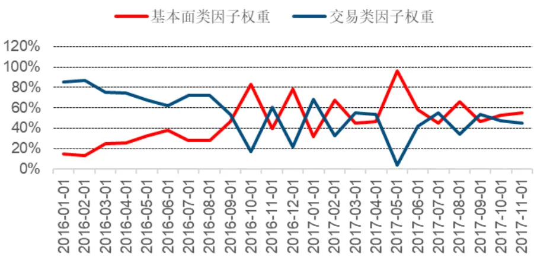
数据来源：wind、中信建投证券研究发展部

## 4.2 序数回归法

根据 3.4 节序数回归的回测框架，序数回归模型的回测结果如图 20，21，表 6，7 所示：

从图 20 与表 6 可以看见，通过序数回归法进行轮动后的有效因子组合最终获得的年化收益为 12.76%，高于因子等权的 9.50%与因子动量的 8.40%，轮动后的 IR=2.16 也高于因子等权的 2.00 与因子动量的 1.73；在最大回撤上，轮动模型的回撤与因子等权的回撤相当，并且显著小于因子动量的最大回撤 2.56%。从各年度情况来看（表 7），轮动模型在 2016 年与 2017 年的收益均高于比较基准。

与 4.1 节一样，图 21 中，我们将 13 个有效因子分为了两类基本面因子与交易类因子两类，在时间序列上观察两类因子的权重变化。从时间序列上可以看见，和逐步回归一样，基本面类因子的权重从 2016 年的 38.57%上升到了 2017 年的 45.53%，上升幅度明显。而相比于逐步回归，序数回归的相对权重变化更为稳定，极端值变化只是从 30%到 70%，没有逐步回归那样剧烈的变化。

图 20：净值曲线：序数回归

数据来源：wind、中信建投证券研究发展部

表 6：因子轮动（序数回归）结果分析

|  | 因子轮动：序数回归 | 因子等权 | 因子动量 |
| --- | --- | --- | --- |
| 年化收益率 | 12.76% | 9.50% | 8.40% |
| 波动率 | 5.91% | 4.76% | 4.85% |
| IR | 2.16 | 2.00 | 1.73 |
| 最大回撤 | -1.83% | -1.60% | -2.56% |

资料来源：Wind，中信建投证券研究发展部

表 7：因子轮动（序数回归）年度收益情况

|  | 因子轮动：序数回归 | 因子等权 | 因子动量 |
| --- | --- | --- | --- |
| 2016 | 18.51% | 15.19% | 15.19% |
| 2017 | 7.29% | 4.08% | 2.01% |

资料来源：Wind，中信建投证券研究发展部

图 21：基本面类因子权重 VS交易类因子权重
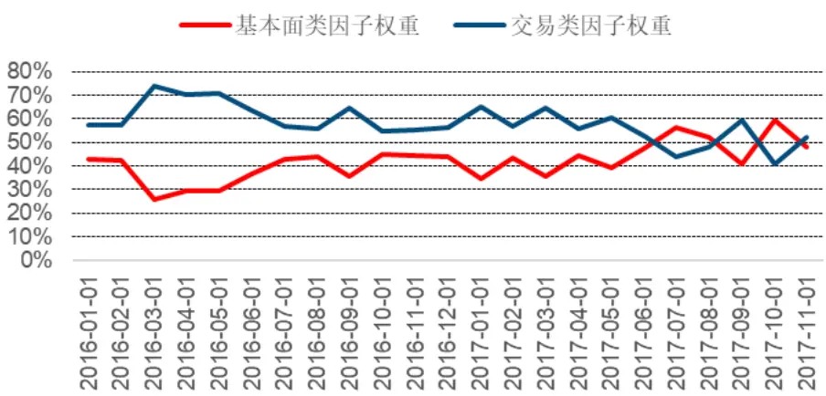
数据来源：wind、中信建投证券研究发展部

## 4.3 回测结果总结

在本小节，我们将逐步回归法与序数回归法进行了一个比较总结：相比于因子等权（9.50%）这一长期收益率较高的基准组合，逐步回归法（12.16%）与序数回归法（12.76%）均能带来显著的超额收益，序数回归的收益略高于逐步回归。波动率（5.52%VS5.91%）比较上逐步回归更优，而最大回撤（-2.76%VS-1.83%）的角度来看，序数回归更优。从因子权重的波动来看，逐步回归的权重波动（21.41%）是序数回归（8.12%）的 2.6 倍。如果从实际投资的角度出发，序数回归是更好的选择。在收益与波动率等差距不大的前提下，序数回归模型提供了更好的稳定性，不仅从风控角度更好管理，同时较小的因子权重变动也会显著降低最终股票组合的换手率，节约交易成本。

表 8：逐步回归 VS序数回归

|  | 因子轮动：逐步回归 | 因子轮动：序数回归 |
| --- | --- | --- |
| 年化收益率 | 12.16% | 12.76% |
| 波动率 | 5.52% | 5.91% |
| IR | 2.20 | 2.16 |
| 最大回撤 | -2.76% | -1.83% |
| 因子权重波动 | 21.41% | 8.12% |

资料来源：Wind，中信建投证券研究发展部

## 4.4 最新回测结果分析

基于上述思想，我们对从 2017 年 12 月到 2018 年5 月的有效因子进行了轮动跟踪，跟踪结果如图 22 所示。可以看见，序数回归相较于逐步回归取得了更稳定的结果，同时相比等权配置以及因子动量的效果更为出色，而逐步回归并没有明显优于等权配置或因子动量。

图 22：有效因子轮动效果跟踪（2017.12-2018.5）
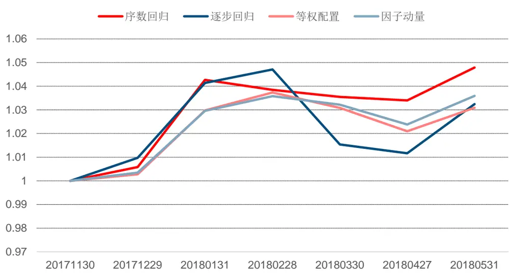
数据来源：wind、中信建投证券研究发展部

## 分析师介绍

丁鲁明：同济大学金融数学硕士，中国准精算师，现任中信建投证券研究发展部金融工程方向负责人，首席分析师。10 年证券从业，历任海通证券研究所金融工程高级研究员、量化资产配置方向负责人；先后从事转债、选股、高频交易、行业配置、大类资产配置等领域的量化策略研究，对大类资产配置、资产择时领域研究深入，创立国内“量化基本面”投研体系。多次荣获团队荣誉：新财富最佳分析师 2009 第 4、2012第 4、2013 第 1、2014 第 3 等；水晶球最佳分析师 2009 第 1、2013 第 1 等。

## 社保基金销售经理

彭砚苹 010-85130892 pengyanping@csc.com.cn

## 研究服务

姜东亚 010-85156405 jiangdongya@csc.com.cn

机构销售负责人

赵海兰 010-85130909 zhaohailan@csc.com.cn

保险组

张博 010-85130905 zhangbo@csc.com.cn

周瑞 010-85130749 zhourui@csc.com.cn

张勇 zhangyongzgs@csc.com.cn

北京公募组

黄玮 010-85130318 huangwei@csc.com.cn

朱燕 85156403 zhuyan@csc.com.cn

任师蕙 010-8515-9274 renshihui@csc.com.cn

黄杉 010-85156350 huangshan@csc.com.cn

王健 010-65608249 wangjianyf@csc.com.cn

马康康 010-85159204 makangkang@csc.com.cn

私募业务组

李静 010-85130595 lijing@csc.com.cn

赵倩 010-85159313 zhaoqian@csc.com.cn

## 上海地区销售经理

黄方禅 021-68821615 huangfangchan@csc.com.cn

戴悦放 021-68821617 daiyuefang@csc.com.cn

李祉瑶 010-85130464 lizhiyao@csc.com.cn

翁起帆 wengqifan@csc.com.cn

李星星 lixingxing@csc.com.cn

王罡 wanggangbj@csc.com.cn

范亚楠 fanyanan@csc.com.cn

李绮绮 liqiqi@csc.com.cn

## 深广地区销售经理

胡倩 0755-23953981 huqian@csc.com.cn

许舒枫 xushufeng@csc.com.cn

程一天 chengyitian@csc.com.cn

曹莹 caoyingzgs@csc.com.cn

张苗苗 zhangmiaomiao@csc.com.cn

廖成涛 liaochengtao@csc.com.cn

陈培楷 chenpeikai@csc.com.cn

| 北京 | 上海 | 深圳 |
| --- | --- | --- |
|  | 东城区朝内大街2号凯恒中心B 浦东新区浦东南路528号上海证券大 福田区益田路6003号荣超商务中心 |  |
| 座12层（邮编：100010） | 厦北塔22楼2201室（邮编：200120）B座22层（邮编：518035） |  |
| 电话：(8610) 8513-0588 | 电话：(8621) 6882-1612 | 电话：（0755）8252-1369 |
| 传真：(8610) 6560-8446 | 传真：(8621)6882-1622 | 传真：（0755）2395-3859 |

## 评级说明

以上证指数或者深证综指的涨跌幅为基准。

买入：未来 6 个月内相对超出市场表现 15％以上；

增持：未来 6 个月内相对超出市场表现 5—15％；

中性：未来 6 个月内相对市场表现在-5—5％之间；

减持：未来 6 个月内相对弱于市场表现 5—15％；

卖出：未来 6 个月内相对弱于市场表现 15％以上。

## 重要声明

本报告仅供本公司的客户使用，本公司不会仅因接收人收到本报告而视其为客户。

本报告的信息均来源于本公司认为可信的公开资料，但本公司及研究人员对这些信息的准确性和完整性不作任何保证，也不保证本报告所包含的信息或建议在本报告发出后不会发生任何变更，且本报告中的资料、意见和预测均仅反映本报告发布时的资料、意见和预测，可能在随后会作出调整。我们已力求报告内容的客观、公正，但文中的观点、结论和建议仅供参考，不构成投资者在投资、法律、会计或税务等方面的最终操作建议。本公司不就报告中的内容对投资者作出的最终操作建议做任何担保，没有任何形式的分享证券投资收益或者分担证券投资损失的书面或口头承诺。投资者应自主作出投资决策并自行承担投资风险，据本报告做出的任何决策与本公司和本报告作者无关。

在法律允许的情况下，本公司及其关联机构可能会持有本报告中提到的公司所发行的证券并进行交易，也可能为这些公司提供或者争取提供投资银行、财务顾问或类似的金融服务。

本报告版权仅为本公司所有。未经本公司书面许可，任何机构和/或个人不得以任何形式翻版、复制和发布本报告。任何机构和个人如引用、刊发本报告，须同时注明出处为中信建投证券研究发展部，且不得对本报告进行任何有悖原意的引用、删节和/或修改。

本公司具备证券投资咨询业务资格，且本文作者为在中国证券业协会登记注册的证券分析师，以勤勉尽责的职业态度，独立、客观地出具本报告。本报告清晰准确地反映了作者的研究观点。本文作者不曾也将不会因本报告中的具体推荐意见或观点而直接或间接收到任何形式的补偿。

股市有风险，入市需谨慎。

## 中信建投证券研究发展部

HTTP://RESEARCH.CSC.COM.CN