证券研究报告·金融工程深度报告

# Barra风险模型介绍及与中信建投

# 选股体系的比较：因子深度研究系列

## 重要观点

## 本文概述

本文主要介绍风险模型的定义、分类和作用，并对 Barra 风险模型进行实证介绍，最后详述 Barra 风险模型的具体应用及与中信建投现有选股体系的对比。

## Barra 风险因子在 A 股市场较为显著

Barra 风格和行业因子的年化波动率基本都在 3%以上，各指数成分股的显著月份占比均较为显著，另外 Barra 各个风险因子基本上都能够提供新增信息，因此其基本符合风险因子的判定条件。

## Barra 风格因子的纯因子表现情况

非线性规模（Non-Linear Size）、流动性（Liquidity）和规模（Size）三个风格因子的信息比例绝对值都超过 1，尤其是非线性规模和流动性因子的年化波动率也较低，因此在 A股市场可能大部分时间仍被认定为 Alpha 因子而非风险因子。另外规模因子在 2017年之前一直被普遍认定为 Alpha 因子，但最近两年大盘股的重新崛起和风格切换使得该风格因子的波动率急剧提升，风险属性逐步增强，因此规模因子作为风险因子已经被大多数投资者所认可。

## Barra 风险模型和中信建投选股体系对选股因子的风险处理对比

中信建投选股体系主要选择的是市值等权选股体系。现有选股体系对风格因子的处理和风险剥离的效果不亚于 Barra 风险模型。而对常见的 Alpha 因子处理上，我们选取中证 500 指数样本池，基本上所有Alpha因子的市值等权多空组合年化收益率明显要比纯因子高，而 62%的 Alpha 因子在市值风险处理后的多空组合信息比例要比纯因子要高，做市值分层处理更好的 Alpha 因子主要集中在财务基本面因子上，而技术和反转类 Alpha 因子用 Barra风险模型效果更好。

## Barra 风险模型和中信建投选股体系在指数增强中的效果对比

这里我们构建了一个经 Barra 风险模型处理后的中证 500 指数增强组合（中证 500 行业中性+市值中性组合），并与中信建投中证 500 指数增强组合对比，发现中信建投中证 500 指数增强组合表现更好，年化超额收益率高于 Barra 中性组合，而年化超额波动率则相差不大，由此可见中信建投中证 500 指数增强组合的超额收益信息比例高于 Barra 中性组合。而从最大回撤和收益回撤比来看，中信建投中证 500 指数增强组合表现也是更为优秀。

# 金融工程研究

## [table_i丁鲁明

dingluming@csc.com.cn

021-68821623

执业证书编号：S1440515020001

## 研究助理：陈升锐

chenshengrui@csc.com.cn

021-68821600

发布日期： 2018 年 08 月 30 日

## 相关研究报告

因子深度研究系列：特质波动率纯因子18.05.18在 A股的实证与研究

香港股市的有效 alpha 选股因子探索与18.01.02分析

如何正确理解近期热度极高的低波动率17.11.13因子

17.09.21股东数量变化因子的有效性分析

市场风格切换下的因子有效性探索17.07.142017 年上半年因子表现回顾

## 一、 风险模型介绍

## 1.1风险模型的定义、分类和作用

风险,可以定义为证券或者投资组合收益的总体分散或者波动程度,对风险的分析和控制是获得稳健投资回报的关键因素。任何资产都有风险，包括股票、债券、商品、利率、汇率等。在过去人们常常只追求投资收益的最大化而忽视了投资风险的存在，但在最近几十年人们越来越发现收益和风险的共生性，要获取多大的收益就要承担多大的风险，投资者获取的收益不过是其对自身承担风险的补偿。

从上世纪 50 年代开始,统计方法开始被运用在金融市场，哈里•马科维茨首次对投资风险进行量化（标准差)和构建收益风险多样化的投资组合，他证明了组合的风险不大于其组成分证券的风险。经过多年的发展，投资组合风险分析体系已经日趋完善，其中一项用于分析组合风险的有力工具是多因子风险模型。多因子风险模型描述的是组合内部各资产之间收益和风险的相关性，基本假设是相似的资产表现出较一致的收益和风险特征。证券市场的多因子风险模型大致分为三类 宏观经济风险模型 统计风险模型以及基本面风险模型。宏观经济风险模型依据可观测的经济指标,例如通胀和利率的变化,来度量宏观变量对股票收益的影响。统计风险模型则从证券收益协方差矩阵的因子分析中推导出相应因子。基本面风险模型则考察与组合收益相关的可观测到的证券属性,例如股票市值,市净率以及所属行业等。Barra 股票风险模型使用的是基本面风险模型,因其对股票的解释能力超过宏观经济风险模型和统计风险模型。（资料文字源自《Barra Risk Model Handbook》）

风险模型对投资组合主要有如下作用：

1） 降低投资组合的风险暴露，实现更精确的风险管理。作为风险模型，其第一要务必定是对投资组合的风险管理。Barra 提供的风险因子已经能够较大程度地解释 A 股市场的风险，对其部分或全部风险因子的暴露进行控制可以实现更加稳定的收益，在下文我们会详述风险因子在中国市场的有效性及控制风险后的投资组合表现。

2） 提供更准确的股票组合优化结果。由于投资组合尤其是指数增强的组合优化约束条件包括对组合波动率及组合跟踪误差的约束，这就要求风险模型能够提供更准确和更稳定的股票收益协方差矩阵估计。而对股票收益协方差矩阵的估计也是风险模型的核心和难点之一。

3） 对投资组合或基金产品进行更深入的业绩归因和风险归因。相对于前面两个作用于投资组合的事前管理，业绩归因和风险归因则属于对投资组合的事后管理，以便基金经理分析组合过往业绩的业绩来源和风险暴露，以便于后续及时调整策略。

## 1.2 Barra 风险模型介绍

从 1975 年开始，Barra 公司便开始利用先进的技术和高效的建模能力，为全球客户提供全方位的风险管理解决方案，其为全球不同国家和地区设计了覆盖收益预测、风险分析、组合构建、交易成本分析以及历史绩效归因等功能的软件产品以帮助用户改善组合绩效。

Barra 除了公布其理论说明书 The Barra Equity Model 外，还发布了一套收费的 Barra Aegis 系统供全球投资者使用，系统功能完全基于 Barra 多因子模型，主要包括以下四大模块：1、Aegis Portfolio Manager：用于分析股票投资组合的前瞻性风险；2、Aegis Optimizer：用于最优化投资策略的风险收益比；3、Aegis Performance Analyst：用于解释基金收益的来源；4、Aegis Developer’s Toolkit：用于对投资理念进行回溯测试。图 1 是 Aegis PortfolioManager 的运行界面：

图 1：Barra Aegis Portfolio Manager 运行界面
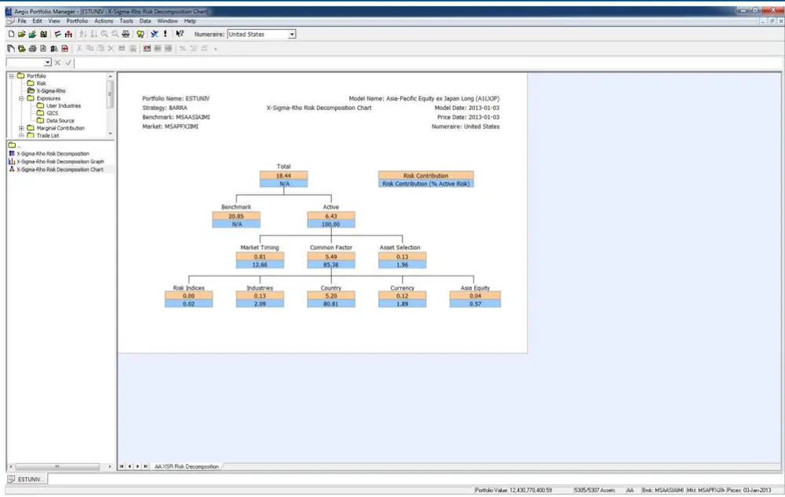
Barra Aegis Portfolio Manager

根据 Barra 最新版的 USE4 风险模型，我们可以把任何股票的收益率归因到几个不同的风险因子上，包括市场（国家）因子、风格因子和行业因子，具体公式如下：

$$
\begin{array}{r}{r_{n}=f_{c}+\sum_{i}X_{ni}f_{i}+\sum_{s}X_{ns}f_{s}+u_{n}}\end{array}\tag{1.1}
$$

其中， $f_{c}$ 是市场（国家）因子的收益， $f_{i}.$ 是行业因子 i 的收益， $f_{s}$ 是风格因子 s 的收益， $X_{ni}$ , $X_{ns}$ 是各行业和风格因子的暴露， $u_{n}$ 是个股的特质收益，USE4 中采用加权最小二乘回归法 WLS 估计因子收益，其假设个股特质收益的方差为市值平方根的倒数（源于股票的特质风险随公司市值增加而减小的经验观察）。

值得注意的是，在模型中引入市场因子（国家因子，截距项）会导致其与行业因子之间存在共线性，导致

最后方程的求解不唯一。因此，为了得到唯一的回归结果，必须施加约束。USE4 给定的约束条件为，市值加权的所有行业因子的收益和为 0，即：

$$
\begin{array}{r}{\sum_{i}w_{i}f_{i}=0}\end{array}\tag{1.2}
$$

其中， $w_{i}$ 表示行业 i 中所有股票流通市值占全市场股票流通市值的比例，约束条件的选择不会影响模型拟合，也不会影响模型的解释力，但其会对因子解释产生直接的影响。这个约束条件其实有比较直观的解释：考虑一个流通市值加权的投资组合 P，持仓股票的权重记为 $\cdot h_{n}^{p}$ ，投资组合的收益 $R_{P}$ 可以写成：

$$
\begin{array}{r}{R_{P}=f_{c}+\sum_{i}w_{i}f_{i}+\sum_{s}X_{s}^{P}f_{s}+\sum_{\mathbf{n}}h_{n}^{p}u_{n}}\end{array}\tag{1.3}
$$

其中 $X_{s}^{P}$ 是风格因子 s 的因子暴露，然而，由（1.2）可知，行业因子收益和为 0，方程（1.3）的第一个求和项 $\textstyle(\sum_{i}w_{i}f_{i})$ 为 0，类似的风格因子市值加权也被标准化到均值为 0，即（1.3）的第二个求和项 $(\sum_{s}X_{s}^{P}f_{s})$ 也为 0，最后一个求和项 $\textstyle(\sum_{n}h_{n}^{p}u_{n})$ ）对应于一个分散化投资组合的特质收益率，因此其和也接近 0，因此，（1.3）可以近似等价为： $R_{P}\approx f_{c}$ 。换句话说，市场因子（国家因子，截距项）代表了市值加权的全市场组合收益，这一部分我们在后面会进行举例详细求证。

然后我们根据（1.1）和（1.2）使用加权最小二乘法 WLS 进行模型估算，因子收益率的估计值可由（1.4）给出：

$$
\hat{f}=(X^{T}WX)^{-1}X^{T}Wr_{(1.4)}
$$

其中，W 为回归权重（对角线矩阵）， $W_{nn}={\sqrt{CAP_{n}}}$ , 其中 $CAP_{n}$ 为第 n 只股票的流通市值，X 是风险因子的因子暴露，r 是股票的个股收益率。

Barra 风险模型经过几十年的不断完善，现已经有针对全球多个不同国家和地区的不同版本，而对中国投资者有较大参考价值的是美国版本（最新版本为2011发布的USE4）和中国版本（最新版本为2012发布的CNE5），两个版本最大的不同在于 CNE5 相比 USE4 少了两个风险因子——Dividend Yield 和 Non-Linear Beta。DividendYield 通常译为“股息率”，其代表的是股息与股票价格之间的比率。由于美国投资者非常关注股票的股息率，而国内投资者对该指标关注度明显不足，另外经测算 Dividend Yield 在中国市场的显著性不高（T 统计量绝对值较小），因此从经济意义和统计意义来看该风险因子明显不适用于中国市场。而 Non-Linear Beta 代表的是非线性Beta，其与 Beta 因子代表的含义不一样，同样因为投资逻辑不易理解和在中国市场的显著性不高而不被纳入CNE5。另外两个版本的小类风险因子合成大类风险因子的权重也不一样，这可能与 Barra 在不同国家模型中的回归参数优化有关。

图2和图3是Barra中国股票模型(CNE5)的因子架构（包括1个国家因子、10个风格因子和32个行业因子）：

## 图 2：Barra中国股票模型(CNE5)因子架构（1）

国家因子

风格因子

Size:捕捉大盘股和小盘股之间的收益差异

Non-linearSize:描述了无法由规模因子解释的但与规模有关的收益差异，通常代表中盘 股

Earnings Yield：描述了由盈利收益导致的收益差异

Book-to-Price：描述了股票估值高低不同而产生的收益差异，即价值因子

Growth：描述了对销售或盈利增长预期不同而产生的收益差异

Leverage:描述了高杠杆股票与低杠杆股票之间的收益差异

Momentum(动量)：描述了过去半年到一年里相对强势的股票与弱势股票之间的差异

Beta：捕捉那些无法用国家因子解释的市场风险

ResidualVolatility：解释了剥离了市场风险后的波动率高低产生的收益率差异

Liquidity：解释了由股票相对的交易活跃度不同而产生的收益率差异

The Barra China Equity Model (CNE5)

## 图 3：Barra中国股票模型(CNE5)因子架构（2）

The Barra China Equity Model (CNE5)

我们完全根据 Barra CNE5 构建了一套风险模型，为了检测该风险模型的效用，我们在全市场、沪深 300 成分股、中证 500 成分股、中证 800 成分股和中证 800 外的股票范围里分别计算其滚动 12 个月的拟合优度（滚动横截面回归的 Adjusted R_Square）如图 4 所示。由此可见 Barra 风险模型对沪深 300 为代表的大盘股票解释度最高，平均达到 39%，其次为中证 800 成分股和中证 500 成分股，解释度也达到 34%和 19%，而对中证 800 之外的小盘股解释度最低，平均只有 15%。总体来看，Barra 风险模型对全市场股票的平均 Adjusted R_Square 达到 28%。

图 4：Barra 风险模型 12 个月滚动 Adjusted Rsquare
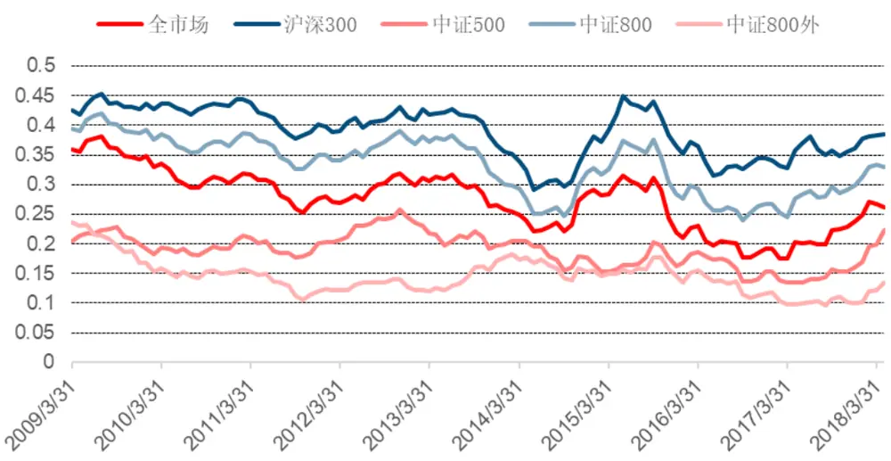
数据来源：wind、中信建投证券研究发展部

## 1.3A股市场风险因子评定方法

一直以来，Alpha 因子和风险因子没有一个严格的区分方法。有人认为，Alpha 因子通常是对股票的预期收益率有稳定预测能力的因子；而风险因子通常与 Alpha 因子相反，指的是对未来收益没有预测能力，需要在组合投资中进行控制暴露的因子。也有人认为，两者的区别在于因子是否被大多数市场投资者所认知。与 Alpha因子相对应的是，风险因子其实是系统因子（Systematic Factor）或者俗称为 Beta 因子。风险因子的前身一定是Alpha 因子，只是当市场上越来越多人知道或被越来越多投资者运用之后，才会变成一种系统性的可解释的行为，于是就变成了风险因子。举个例子，当人们只知道 CAPM 模型的时候，市场因子是唯一的风险因子。当 Fama把市值和账面市值比等因子以论文形式发表后，大量投资人士开始意识并使用，使得这两个因子原本存在的Alpha 收益被慢慢消蚀殆尽（换句话说，市场逐步变得更有效），最终被归入风险因子。而最近两年中国市场的市值因子开始显露其风险属性，而这此之前曾被很多投资者当做为 Alpha 因子。由于中国市场仍不成熟，我们完全可以去成熟市场的 Beta 风险因子库寻找适合现在中国市场的 Alpha 因子。

在这里，我们可以从下面四个方面来判定一个因子是否为风险因子：

1） 因子数值较稳定并与其它风险因子相关性较低。风险因子数值的稳定性可以用前后两个横截面上因子数值的相关性来度量，BARRA 建议这个相关系数应不低于 0.9，从下面的实证可以看出 A 股市场上这个系数可以设为不低于 0.8。而与其它风险因子的相关性可以用 VIF（方差膨胀因子）来衡量，VIF 不高于 3 则代表该因子与其他因子没有较强的相关性。

2） 因子收益率的波动较大。因子收益率波动大，说明该因子会增加组合的波动风险，应该被归为风险因子，而因子收益率波动小的因子或者某些波动大但 Sharpe 值较高的因子会被归类为 Alpha 因子。

3） 横截面上因子收益率较显著。风险因子的因子收益率可以等于零，也就是说风险因子可以不是定价因子（如行业因子）。但 BARRA 要求风险因子应满足在每期横截面上的因子收益率较显著。具体方法是用每期的个股收益率与该因子的暴露值做回归，得到 T 值再求出各期绝对值的均值，检验因子回归系数是否显著（T值绝对值的平均值较大，一般设为 2），再看显著的月份占比有多少（一般计算 T 值绝对值大于 2 的占比）。

4） 新增因子对原有风险模型提供新增信息。我们可以参考 Fama-MacBeth 检验流程，在横截面上用个股收益率对新因子和原有风险因子一起做多元回归，看新因子加入后回归方程的 Adjusted R-square 是否有增加（或增加幅度较大），有则纳入风险因子库，说明新增因子能够带来新增信息，具体我们会在下面的实证部分详细介绍。

## 二、Barra 风险模型实证介绍

## 2.1 Barra风险因子在 A股市场的显著性检测

根据第一章 1.3 节的风险因子评定流程，我们对 A 股市场的 10 个风格因子和 29 个行业因子进行分析。首先是因子的波动率（这里指的是纯因子收益的波动率，具体算法在后文给出），如图 5 所示我们可以看出风格和行业因子的年化波动率基本都在 3%以上，基本符合风险因子的判定条件（2）。

图 5：风险因子收益率年化波动率%
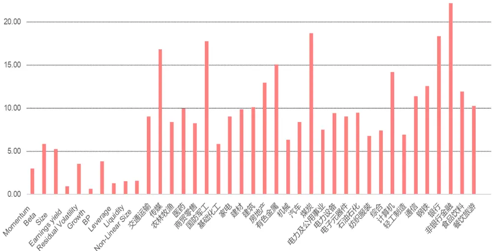
数据来源：wind、中信建投证券研究发展部

然后我们再来看下各因子的显著月份占比（图 ），这里我们同样分别从全市场、沪深 、中证 和中证 800 四个指数成分股里进行考量，从下图可以看出全市场和中证 800 样本池内大部分风险因子的显著月份占比均超过 50%，而在中证 500 和沪深 300 样本池中的显著因子则有所降低。不管是哪个样本池，Barra 风险因子的横截面因子收益率均较为显著，基本符合风险因子的判定条件（3），具体数据我们在后面的纯因子部分会详细列出。

图 6：不同样本池风险因子显著月份占比%
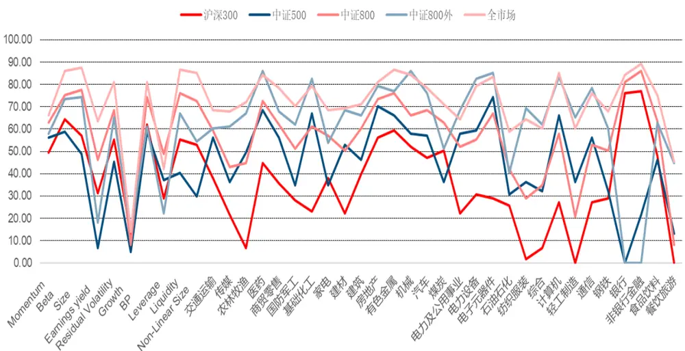
数据来源：wind、中信建投证券研究发展部

从图 5 和图 6 可知，Barra 风险模型基本上适用于 A 股市场，我们分别看下 Barra风格和行业因子在不同指数成分股里面的解释能力（图 7-图 11）。经过测算，我们可以看出风险因子模型对不同市场的解释度在 15%-39%之间，行业因子基本上占所有风险解释度的 40%以上，由此可见在选股中控制行业风险最为重要。经过检测，行业因子和前三大风格因子占所有风险解释度的 80%以上，因此我们在指数增强中控制行业和前三大风格因子基本上等同于增强组合的完全行业中性和风格中性，但在组合优化中控制四个变量比控制十一个变量的计算速度和计算难度均大幅降低。另外值得注意的是规模（Size）因子的 Adjust R_Square 在中证 800、中证 800 外和全市场样本池里排名前三，而在沪深 300 和中证 500 里面不是最显著的风格类风险因子，对沪深 300 指数和中证 500 指数的解释度仅为 3.89%和 0.54%，这和我们通常在量化选股或指数增强里首先控制行业和市值风险的做法相悖。实际上，做沪深 300 指数增强控制 Beta、BP 风险和控制市值风险同等重要，而做中证 500 指数增强则需要优先控制 Beta 风险和 BP 风险。不管是哪个样本池，Barra 各个风险因子基本上都能够提供新增信息，基本符合风险因子的判定条件（4）。

图 7：风格因子 Adj-Rsquare 和 Adj-Rsquare 增量（全市场）
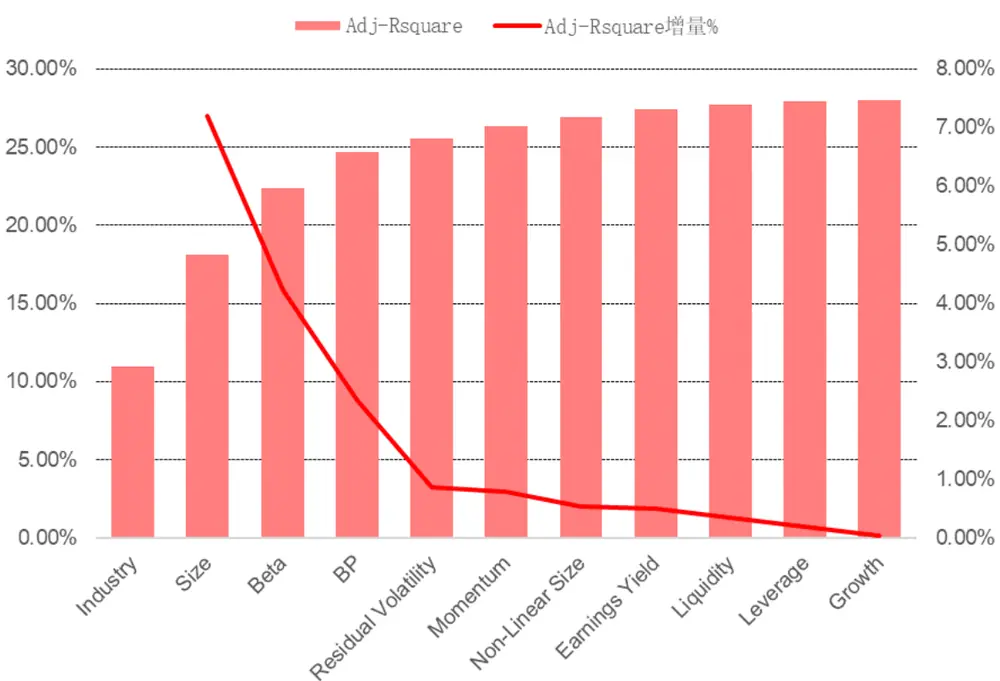
数据来源：wind、中信建投证券研究发展部

图 8：风格因子 Adj-Rsquare 和 Adj-Rsquare 增量（沪深 300）
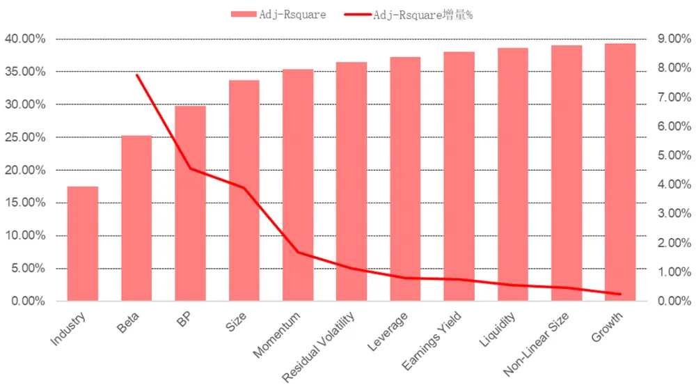
数据来源：wind、中信建投证券研究发展部

图 9：风格因子 Adj-Rsquare 和 Adj-Rsquare 增量（中证 500）
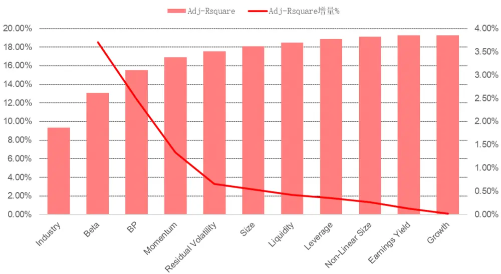
数据来源：wind、中信建投证券研究发展部

图 10：风格因子 Adj-Rsquare 和 Adj-Rsquare 增量（中证 800）
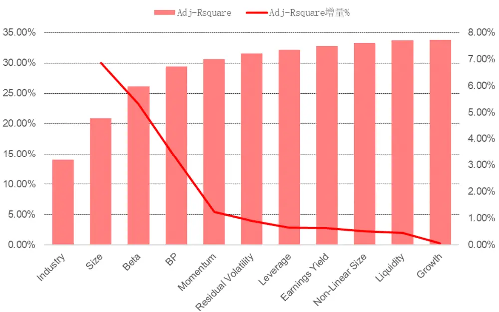
数据来源：wind、中信建投证券研究发展部

图 11：风格因子 Adj-Rsquare 和 Adj-Rsquare 增量（中证 800 之外股票）
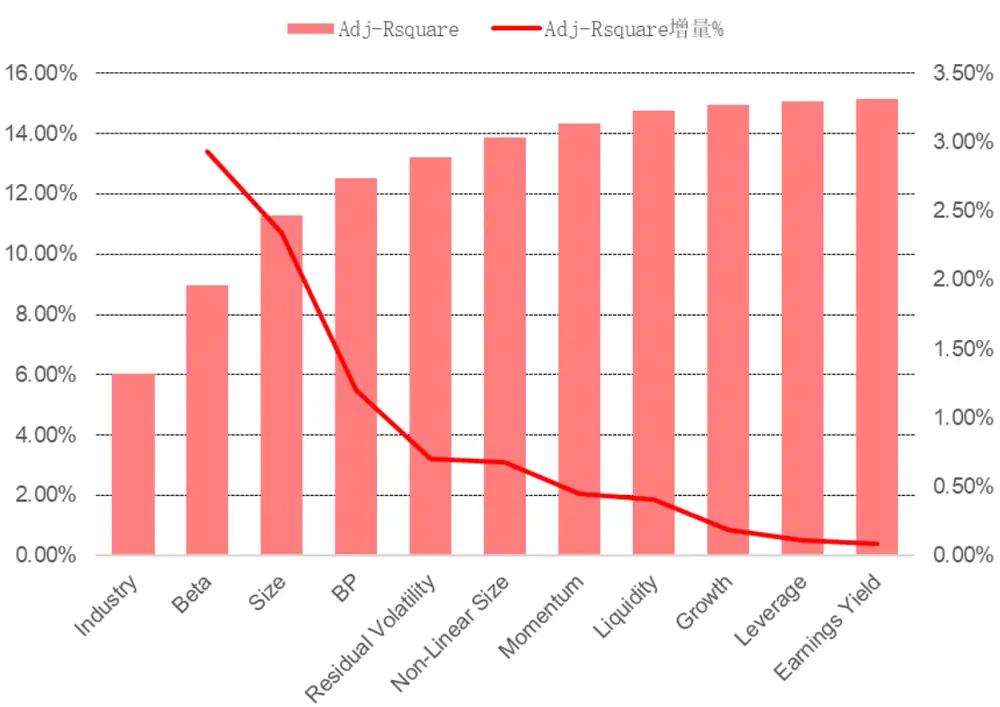
数据来源：wind、中信建投证券研究发展部

## 2.2 Barra 纯风险因子模型

这一节我们具体展示下 Barra 各风险因子的纯因子表现情况。首先我们来看下纯市场（国家）因子组合的表现，其对应于回归方程中的截距项，该组合对其他行业和风格因子的暴露为 ，而对自身的暴露为 ，根据1.2 节所述，当组合的风险因子有充分的解释力度时，纯市场因子的累计收益与市场基准的累计收益应该比较接近。为了便于对比，我们这里以最能够代表全市场股票的中证全指作为基准指数，图 12 是纯市场因子与中证全指的每月收益率差值（市场因子-中证全指）:

图 12：纯市场（国家）因子与中证全指月收益率差值(%)
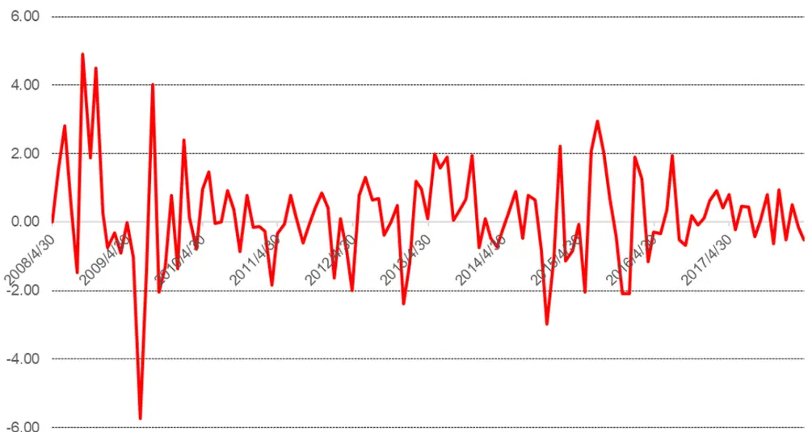
数据来源：wind、中信建投证券研究发展部

从图 12 可知，纯市场因子和中证全指的每月收益率相差不大，月收益率差值的均值仅为 0.15%，最大差值不足 6%。

为了能够更直观的进行对比，我们看下纯市场（国家）因子和中证全指的历史累计净值对比（图 13），可以发现两个走势基本一致，主要偏差可能在于纯市场（国家）因子是按照流通市值加权，与中证全指的个股加权方式不完全一致。

图 13：纯市场（国家）因子净值和中证全指净值对比图
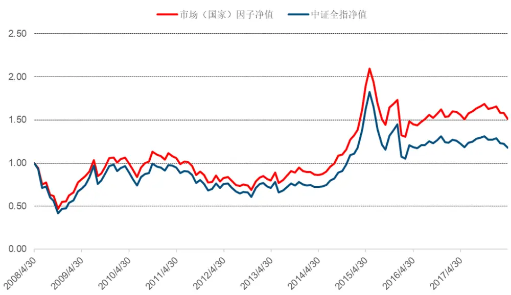
数据来源：wind、中信建投证券研究发展部

下面我们来重点看下纯风格因子组合，所谓纯风格因子组合，即对市场因子、行业因子和其他风格因子均暴露为 0，而对自身的风格因子则暴露为 1，下面展示的是 Barra 给出的 10 大类风格因子在 A 股市场最近 10 年的表现统计，其中 Market 代表市场因子，10 大类风格因子分别为规模（Size）、Beta、BP、残差波动率（ResidualVolatility）、动量（Momentum）、非线性规模（Non-Linear Size）、流动性（Liquidity）、杠杆（Leverage）、盈利（Earnings Yield）和成长（Growth）因子。

根据 和 节给出的风险因子判定条件（ ），我们可以通过各纯因子收益率的 值来检测其是否对股价有较显著的影响，并计算样本内|T|>2 占比来检测因子对股价影响的稳定性。另外因子的自相关性和VIF（方差膨胀因子）也是其是否能够作为一个优秀风险因子的前提条件。

表 1 是 Barra 风险模型的市场因子（Market）和 10 类纯风格因子最近十年（2008 年 5 月-2018 年 5 月）的历史表现和信息统计表（按照信息比例排序）：

表 1：纯市场和风格因子信息统计（2008年 5月-2018年 5月，按照信息比例排序）

| 纯风格因子 | 年化 收益 率% | 年化 波动率% | 信息比例 | \|T\|平均值 | \|T\|>2 占比(%) | 自相关性 | VIF |
| --- | --- | --- | --- | --- | --- | --- | --- |
| Market | 4.10 | 27.29 | 0.15 |  |  |  |  |
| Non-Linear Size | 2.49 | 1.60 | 1.56 | 7.26 | 85.12 | 0.80 | 1.35 |
| Earnings yield | 0.64 | 0.92 | 0.70 | 3.46 | 63.64 | 0.73 | 1.19 |
| BP | 2.57 | 3.81 | 0.68 | 7.63 | 80.99 | 0.84 | 1.59 |
| Beta | 2.17 | 5.82 | 0.37 | 7.57 | 85.95 | 0.74 | 1.43 |
| Momentum | 1.11 | 3.01 | 0.37 | 5.74 | 66.12 | 0.81 | 1.96 |
| Growth | -0.03 | 0.65 | -0.04 | 1.09 | 14.05 | 0.83 | 1.03 |
| Leverage | -0.11 | 1.31 | -0.08 | 2.23 | 42.15 | 0.84 | 1.10 |
| Residual Volatility | -1.72 | 3.52 | -0.49 | 6.30 | 80.99 | 0.83 | 1.92 |
| Size | -7.67 | 5.26 | -1.46 | 9.58 | 87.60 | 0.84 | 1.72 |
| Liquidity | -2.83 | 1.53 | -1.86 | 7.32 | 86.78 | 0.77 | 1.52 |
| 均值 | -0.34 | 2.74 | -0.03 | 5.82 | 69.34 | 0.80 | 1.48 |

数据来源：wind、中信建投证券研究发展部

从表 1 可知，纯市场因子和 10 个纯风格因子的年化收益率之和以及信息比例之和接近于 0，说明了这 10个风格因子基本上可以解释 A股市场的风格表现情况。而 T 值绝对值超过 2 的有 8 个，只有成长（Growth）风格因子小于 1，说明大部分风格因子都对 A 股市场有较高的解释度。另外从因子的自相关性和 VIF 可知，大部分风格因子都符合风险因子的属性。图 14 是 10 个纯风格因子的历史净值表现：

图 14：纯风格因子净值图汇总
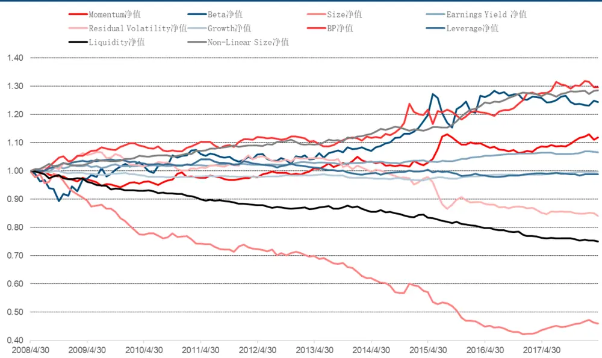
数据来源：wind、中信建投证券研究发展部

通过观察上面图表可知，非线性规模（Non-Linear Size）、流动性（Liquidity）和规模（Size）三个风格因子的信息比例绝对值都超过 1，尤其是非线性规模和流动性因子的年化波动率也较低，因此在 A 股市场可能大部分时间仍被认定为 Alpha 因子而非风险因子。流动性因子较好理解，即低换手的股票在未来表现也会相对较好，而非线性规模因子则主要强调的是市值中等的股票，计算方法为规模因子的立方,然后和规模因子进行施密特正交化处理去掉其共线性的部分，但非线性规模因子由于构造复杂超额收益一般较难获得。最后值得注意的是规模因子，该因子在 年之前一直被普遍认定为 因子， 股市场的小盘股溢价效应非常明显，但最近两年大盘股的重新崛起和风格切换使得该风格因子的波动率急剧提升（年化波动率已经上升到 5%），风险属性逐步增强，因此规模因子作为风险因子已经被大多数投资者所认可。

最后我们来看下纯行业因子。我们这里按照中信一级行业分类把市场分为 29 个行业，由于我们在回归方程中加入了常数项（市场因子），因此下面的纯行业因子可以看作是行业剔除掉市场和其他风格因子影响后的收益，即行业相对于市场的超额收益。表 2 是 Barra 风险模型的 29 个纯行业因子最近十年的表现图（2008 年 5 月-2018年 5 月，按信息比例从大到小排序）：

表 2：纯行业因子信息统计（2008 年 5月-2018年 5月，按照信息比例排序）

| 纯行业因子 | 年化超额 | 年化波动率% | 信息比例 | \|T\|平均值 | \|T\|>2 占比（%） |
| --- | --- | --- | --- | --- | --- |
| 医药 | 收益率% 8.02 | 9.98 | 0.80 | 5.99 | 84.30 |
| 计算机 | 9.24 | 14.18 | 0.65 | 5.54 | 85.12 |
| 通信 |  |  |  |  |  |
| 电子元器件 | 5.45 | 11.40 | 0.48 | 4.17 | 76.03 |
| 食品饮料 | 3.98 4.42 | 9.05 | 0.44 | 5.34 | 83.47 |
| 家电 |  | 11.91 | 0.37 | 4.70 | 75.21 |
| 传媒 | 3.30 | 9.05 | 0.36 | 3.70 | 68.60 |
| 国防军工 | 5.53 | 16.80 | 0.33 | 4.03 | 67.77 |
| 建筑 | 5.06 | 17.77 | 0.28 | 3.83 | 70.25 |
| 有色金属 | 1.52 | 10.10 | 0.15 | 4.18 | 71.07 |
|  | 0.81 | 15.04 | 0.05 | 6.63 | 86.78 |
| 非银行金融 | 0.73 | 22.17 | 0.03 | 8.30 | 89.26 |
| 汽车 | 0.11 | 8.40 | 0.01 | 4.76 | 78.51 |
| 电力设备 | -0.84 | 9.41 | -0.09 | 4.55 | 79.34 |
| 建材 | -1.34 | 9.88 | -0.14 | 3.73 | 69.42 |
| 房地产 | -2.12 | 12.96 | -0.16 | 6.62 | 80.99 |
| 机械 | -2.09 | 6.33 | -0.33 | 5.84 | 84.30 |
| 银行 | -6.06 | 18.35 | -0.33 | 7.94 | 84.30 |
| 电力及公用事业 | -2.64 | 7.53 | -0.35 | 3.74 | 64.46 |
| 农林牧渔 | -3.27 | 8.39 | -0.39 | 3.41 | 71.90 |
| 石油石化 | -3.97 | 9.48 | -0.42 | 2.78 | 58.68 |
| 餐饮旅游 | -4.46 | 10.25 | -0.43 | 1.98 | 45.45 |
| 综合 | -3.30 | 7.39 | -0.45 | 2.76 | 60.33 |
| 煤炭 | -10.14 | 18.68 | -0.54 | 4.79 | 71.07 |
| 钢铁 | -7.90 | 12.57 | -0.63 | 3.78 | 67.77 |
| 轻工制造 | -4.37 | 6.93 | -0.63 | 2.71 | 60.33 |
| 纺织服装 | -4.34 | 6.78 | -0.64 | 2.93 | 64.46 |
| 交通运输 | -5.78 | 9.00 | -0.64 | 4.11 | 68.60 |
| 基础化工 | -4.30 | 5.85 | -0.73 | 5.13 | 79.34 |
| 商贸零售 | -6.39 | 8.27 | -0.77 | 4.41 | 78.51 |
| 均值 | -0.87 | 11.17 | -0.13 | 4.57 | 73.30 |

数据来源：wind、中信建投证券研究发展部

从表 可知，最近 年只有 个行业相对大盘有正的超额收益，信息比例最高的五个行业是医药、计算机、通信、电子元器件和食品饮料，说明在最近 10 年大消费和 TMT 行业在 A股市场总体上有较为明显的超额收益。但所有行业因子的波动率都较高，投资者难以通过持续配置某一个行业而获得稳定的 Alpha 收益，因此行业因子在选股中应作为风险因子进行控制。图 15 是 29 个纯行业因子的历史净值表现，而图 16 是超额收益最高的 5 个行业净值表现：

图 15：纯行业因子净值图汇总
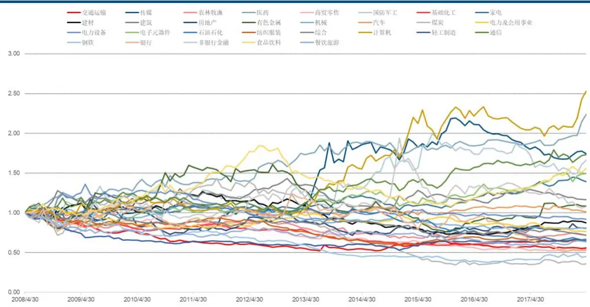
数据来源：wind、中信建投证券研究发展部

图 16：超额收益最高的 5个行业净值图
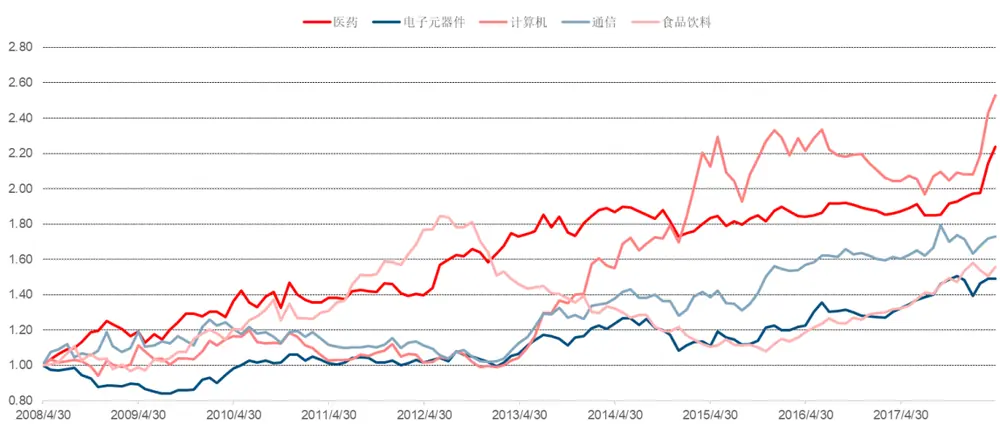
数据来源：wind、中信建投证券研究发展部

## 三、Barra 风险模型的具体应用及与中信建投选股体系对比

## 3.1 Barra纯风格因子收益率和中信建投选股体系下剥离风险后的风格因子收益

## 率对比

中信建投现有选股体系主要包括全市场选股、市值中性选股和行业中性选股，五种情况的多空收益算法相关说明：

1） 全市场：全市场选股多空收益差。因子相对强势值排名靠前 20%作为多头，因子相对强势值排名靠后 20%作为多头。

2） 市值等权:市值等权多空收益差。分 20 小组，分别在组内选前 20%作为多头，后 20%作为空头，最后各组等权。如在沪深 300 或中证 500 样本内选股的话，则分为 5 组。

3） 市值加权:市值加权多空收益差。分 20 小组，分别在组内选前 20%作为多头，后 20%作为空头，最后各组以市值组权重加权得到多空组合。如在沪深 300 或中证 500 样本内选股的话，则分为 5 组。

4） 行业等权:行业等权多空收益差。在中信一级行业，分别在行业内选前 20%作为多头，后 20%作为空头，最后各行业以等权到多空组合。

5） 行业加权:行业加权多空收益差。在中信一级行业，分别在行业内选前 20%作为多头，后 20%作为空头，最后各行业以沪深 300 行业内权重加权得到多空组合。

下面的对比部分我们利用中信建投选股体系（2）。图 17-图 25 是 9 个风格的纯因子和现有选股体系下的市值等权多空净值对比图（2008 年 5 月-2018 年5 月，由于 Growth 成长因子缺失值较多，多空收益计算误差较大，因此在这里没有加入对比）

图 17：Momentum纯因子和市值等权多空净值对比图
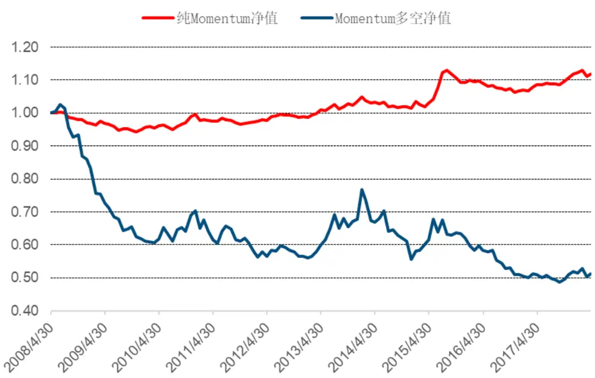
数据来源：wind、中信建投证券研究发展部

图 18：Beta纯因子和市值等权多空净值对比图
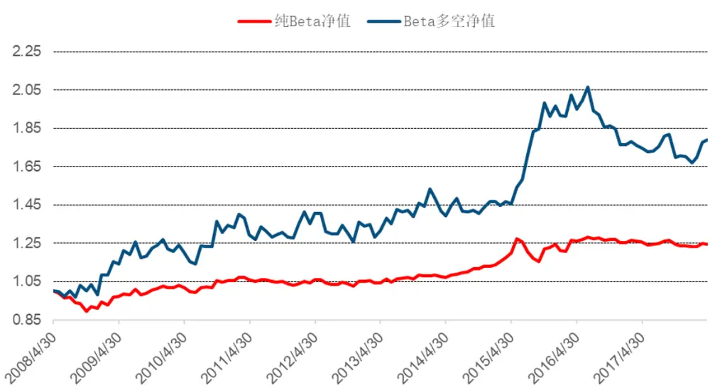
数据来源：wind、中信建投证券研究发展部

图 19：规模 Size纯因子和市值等权多空净值对比图
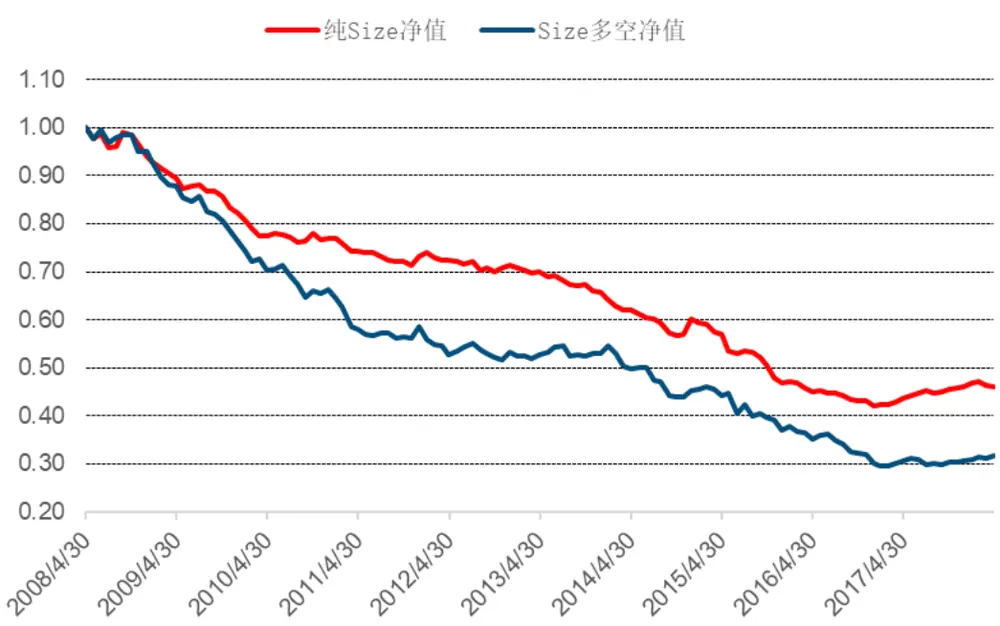
数据来源：wind、中信建投证券研究发展部

图 20：盈利 Earnings Yield纯因子和市值等权多空净值对比图
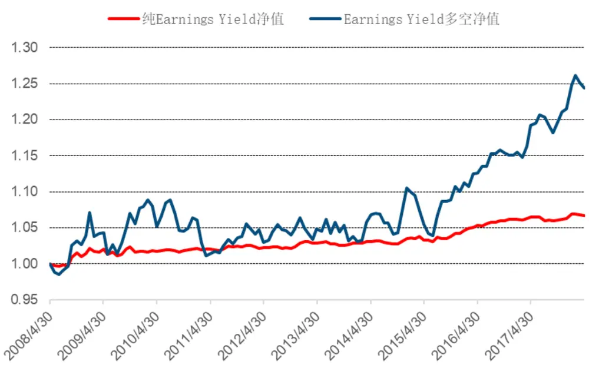
数据来源：wind、中信建投证券研究发展部

图 21：残差波动率 Residual Volatility 纯因子和市值等权多空净值对比图
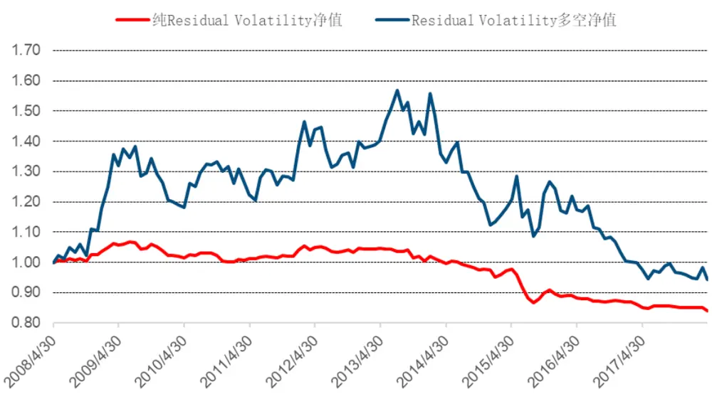
数据来源：wind、中信建投证券研究发展部

图 22：BP纯因子和市值等权多空净值对比图
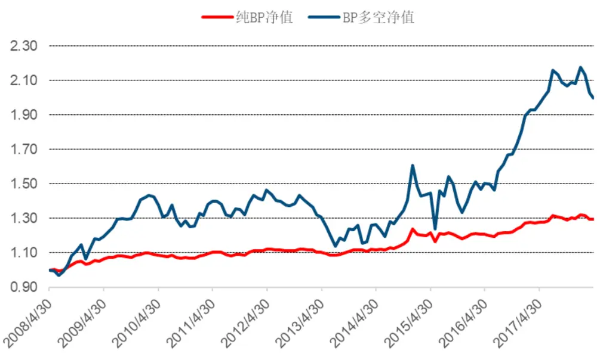
数据来源：wind、中信建投证券研究发展部

图 23：杠杆 Leverage 纯因子和市值等权多空净值对比图
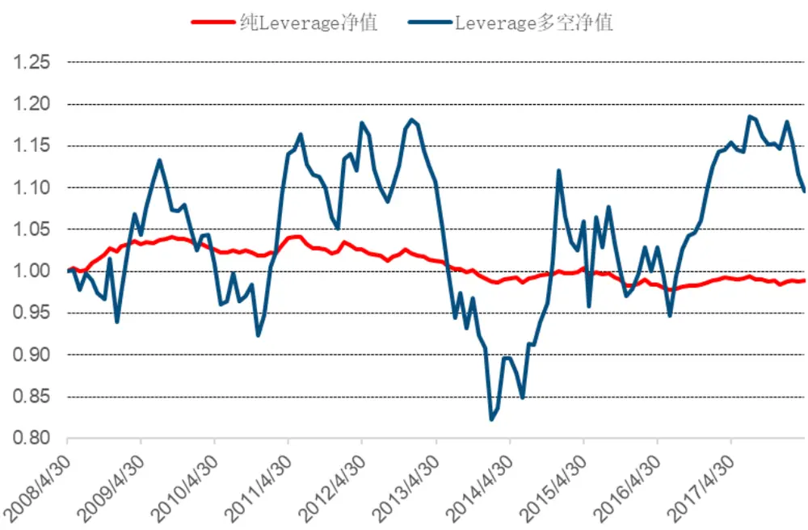
数据来源：wind、中信建投证券研究发展部

图 24：流动性 Liquidity纯因子和市值等权多空净值对比图
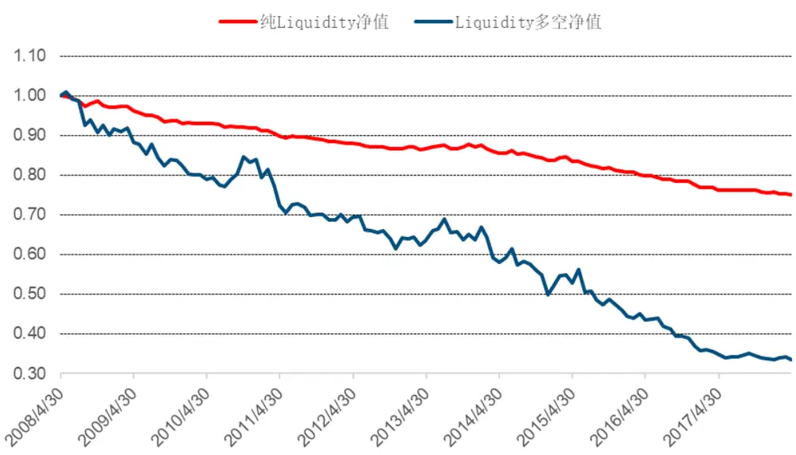
数据来源：wind、中信建投证券研究发展部

图 25：非线性规模 Non-Linear Size纯因子和市值等权多空净值对比图
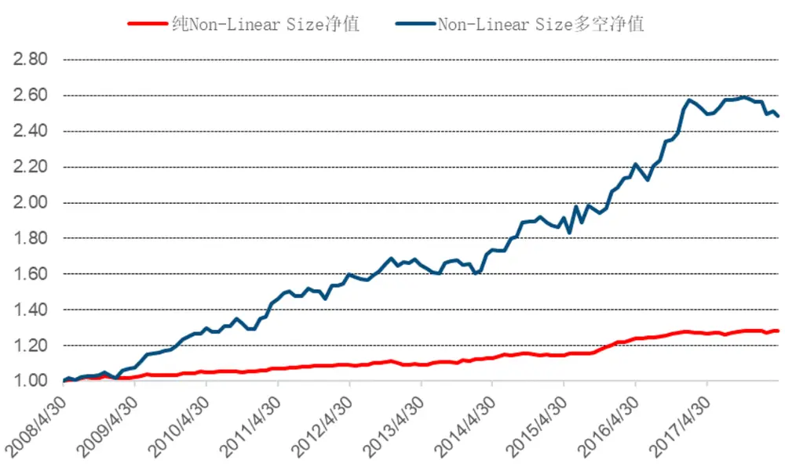
数据来源：wind、中信建投证券研究发展部

为了更直观地进行对比，我们可以看下表 3（红色为更显著的一方）：

表 3： Barra风格因子纯因子和市值等权多空组合对比

| 纯因子年化 |  | 多空组合 |  |  |
| --- | --- | --- | --- | --- |
| 风格因子 | 收益率 | 年化收益率 | 纯因子信息比例 | 多空组合信息比例 |
| Momentum | 1.11 | -4.72 | 0.37 | -0.36 |
| Beta | 2.17 | 6.48 | 0.37 | 0.50 |
| Size | -7.67 | -10.29 | -1.46 | -1.22 |
| Earnings yield | 0.64 | 2.81 | 0.70 | 0.60 |
| Residual Volatility | -1.72 | 0.53 | -0.49 | 0.04 |
| BP | 2.57 | 7.91 | 0.68 | 0.55 |
| Leverage | -0.11 | 1.40 | -0.08 | 0.11 |
| Liquidity | -2.83 | -10.53 | -1.86 | -1.02 |
| Non-Linear Size | 2.49 | 8.95 | 1.56 | 1.19 |
| 均值 | -0.37 | 0.28 | -0.02 | 0.04 |

数据来源：wind、中信建投证券研究发展部

从上面图表可知，市值等权多空组合的年化收益率基本上比纯因子要高（除了 Residual Volatility），而多空组合的信息比例和纯因子组合基本相差不大，说明现有选股体系对风格因子的处理和风险剥离的效果不亚于Barra 风险模型。

## 3.2 常见 Alpha 因子在 Barra 风险模型和中信建投选股体系下剥离风险后的因子收益率对比

由于风险模型对于指数基金和指数增强基金的作用远大于主动选股基金，因此下面两节我们把样本池缩小至中证500指数成分股，分别检测这两种方法在常见Alpha因子上的风险剥离效果以及指数增强中的具体效用。

表 4 是中信建投 29 个选股因子通过这两种方法处理后的因子表现情况（2011 年 5月-2018 年 5 月，蓝色为年化收益率更显著的一方，红色为信息比例更显著的一方）：

表 4：常见 Alpha因子纯行业和市值等权多空组合对比

| 因子名 | 纯因子年 因子简称 |  |  | 纯因子信息比例 |  | 多空组合信息比例 |
| --- | --- | --- | --- | --- | --- | --- |
|  |  | 化收益 率% | 多空组合年化收益率% |  |  |  |
| a_value | 流通市值 | -2.16 | -1.33 |  |  |  |
| adminexpense_to_gr | 管理费用/营业收入 | 0.68 | 4.34 0.4 |  |  |  |
| dea | 2/10*dif+ | -2.95 | -13.16 |  |  |  |
|  | 8/10*dea |  |  | -0.8 | -0.95 |  |
| delta_eps | 基本每股收益增长率 | 1.04 | 8.24 | 0.69 | 1.19 |  |
| delta_gpr | 销售毛利率增长率 | 0.44 | 9.42 | 0.31 | 1.46 |  |
| delta_NI | 净利润增长率 | 1.17 | 10.88 | 0.79 | 1.43 |  |
| delta_npr | 销售净利率增长率 | 1.04 | 8.2 | 0.68 | 1.31 |  |
| delta_roa | 资产收益率增长率 | 1.21 | 10.09 | 0.81 | 1.46 |  |
| delta_roe | 净资产收益率增长率 | 1.26 | 10.24 | 0.86 | 1.53 |  |
| dif | (EMA12 - EMA26) / EMA26 | -3.5 | -12.76 | -0.85 | -0.9 |  |
| eps | 每股净收益 | 1.85 | 9.41 | 0.63 | 0.9 |  |
| eqps | 每股净资产 | 0.76 | 2.83 | 0.24 | 0.32 |  |
| gpr | 销售毛利率 | 2.41 | 9.37 | 1.14 | 0.94 |  |
| growth_sale | 销售增长率 | 2.33 | 11.48 | 1.36 | 1.27 |  |

金融工程深度报告

| macd | dif - dea | -2.07 | -1.88 | -0.59 | -0.19 |
| --- | --- | --- | --- | --- | --- |
| npr | 销售净利率 | 0.61 | 8.36 | 0.39 | 0.96 |
| pb | 市净率 | 0.15 | -2.46 | 0.06 | -0.13 |
| pe | 市盈率 | -0.51 | -4.75 | -0.3 | -0.4 |
| ratio_liab_asset | 资产负债率 | -1.46 | -4.58 | -0.58 | -0.43 |
| roa | 总资产收益率 | 2.58 | 12.04 | 0.95 | 1.07 |
| roe | 净资产收益率 | 2.03 | 10.34 | 0.77 | 1.02 |
| saleexpense_to_gr | 销售费用/营业收入 | 0.64 | 6.13 | 0.31 | 0.56 |
| sec_return_1 | 最近一个月涨跌幅 | -3.84 | -10.59 | -0.9 | -0.77 |
| sec_return_3 | 最近三个月涨跌幅 | -4.54 | -11.39 | -1.16 | -0.8 |
| sec_return_6 | 最近六个月涨跌幅 | -4.39 | -5.98 | -0.93 | -0.48 |
| total_value | 总市值 | -21.5 | -3.51 | -0.93 | -0.37 |
| turnover_1 | 过去一个月平均换手率 | -7.53 | -19.72 | -2.39 | -1.56 |
| turnover_3 | 过去三个月平均换手率 | -6.16 | -18.16 | -2.05 | -1.54 |
| turnover_asset | 总资产周转率 | 0.59 | 3.62 | 0.28 | 0.46 |

数据来源：wind、中信建投证券研究发展部

从表 4 可以看出，基本上所有 Alpha 因子的市值等权多空组合年化收益率明显要比纯因子要高，这比较容易理解，因为 Barra 模型处理后的 Alpha 纯因子是剥离了所有市场、风格和行业后的收益，而中信建投选股体系仅仅剥离了市值风险，但值得注意的是有 62%的 Alpha 因子在市值风险处理后的多空组合信息比例要比纯因子要高，做市值分层处理更好的 Alpha 因子主要集中在财务基本面因子上，而技术和反转类 Alpha 因子用 Barra风险模型处理后的效果更好。下面我们选了其中三个因子作对比，如图 26-图 28：

图 26：EPS增长率纯因子和市值等权多空净值对比
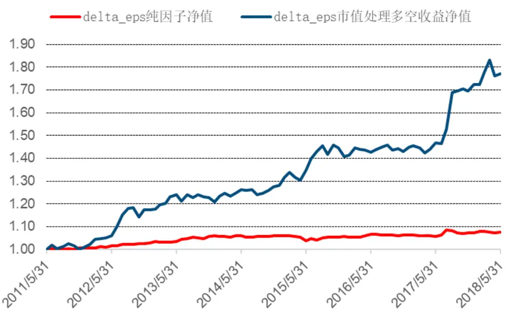
数据来源：wind、中信建投证券研究发展部

图 27：ROA纯因子和市值等权多空净值对比
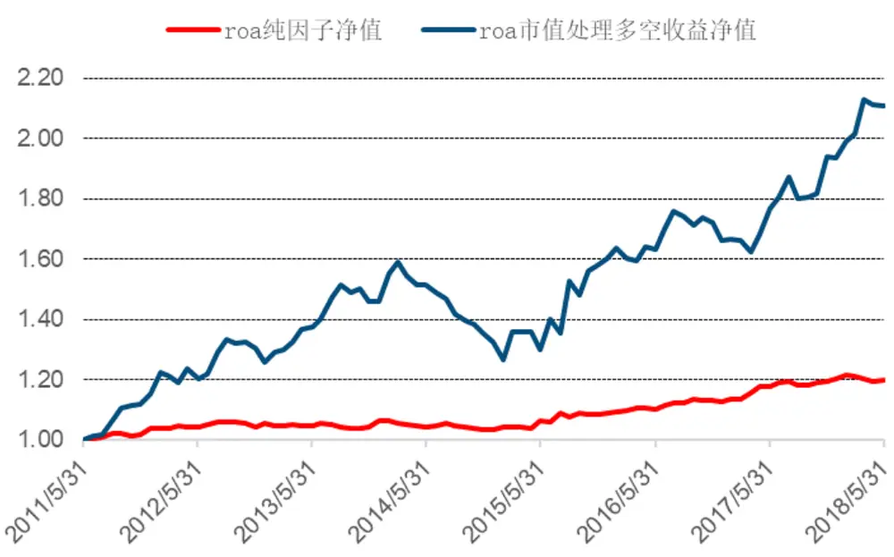
数据来源：wind、中信建投证券研究发展部

图 28：一个月平均换手率纯因子和市值等权多空净值对比
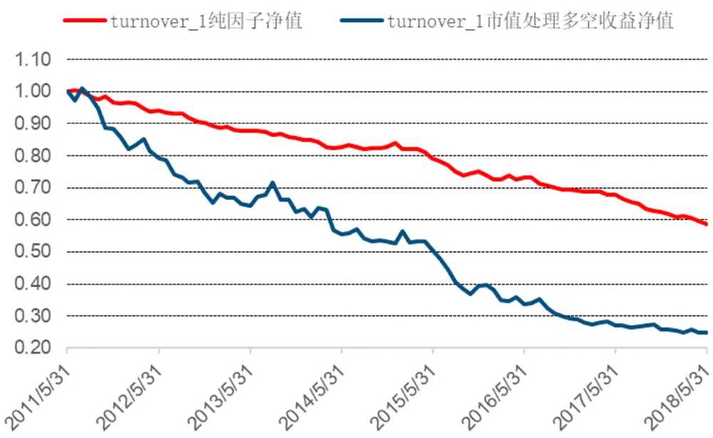
数据来源：wind、中信建投证券研究发展部

## 3.3 Barra风险模型和中信建投选股体系在指数增强中的效果对比

3.1 节和 3.2 节主要利用 Barra 和中信建投现有选股体系两种方法对单个风格或 Alpha 因子进行风险剥离和效果对比，这节我们简单看下运用这两种处理方法在中证 500 指数增强上的效用。下面我们构建了中信建投中证 500 指数增强策略和经 Barra 风险模型处理后的中证 500 指数增强风控组合（中证 500 行业中性+市值中性组合），历史回测时间从 2011 年 1 月到 2018 年1 月。这里 Barra 指数增强风控组合的优化目标是最大化预期收益，约束条件为行业中性和风格中性（市值中性），个股权重上限限制为 1.5%，不限制跟踪误差。两个指数增强组合的选股因子和因子加权方式均相同。这里的 Barra 风控组合采用行业中性+市值中性的原因在于中信建投中证500 指数增强策略主要是采用市值分层中性的因子处理方法，这样能够直接横向对比两种市值中性的处理方法效果，另外对于所利用的选股因子，经检测 Barra 行业中性+市值中性组合为所有风险约束条件下的最优组合（如果限制其他风格因子，则 Barra 风格中性组合的表现更差）。

图29是中信建投中证500指数增强组合净值、经Barra模型处理后的中证500指数增强组合净值和中证500指数（基准指数）累计净值对比图：

图 29：中信建投中证 500指数增强组合和 Barra中证 500指数增强组合对比（增强组合绝对净值对比）
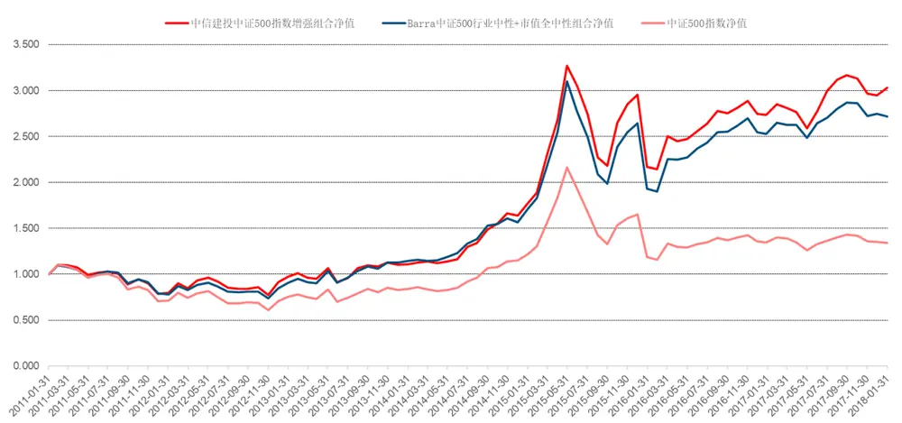
数据来源：wind、中信建投证券研究发展部

图 30 是中信建投中证 500 指数增强组合和经 Barra 模型处理后的中证 500 指数增强组合相对中证 500 指数（基准指数）的累计净值对比图：

图 30：中信建投中证 500指数增强组合和 Barra中证 500指数增强组合对比（增强组合相对净值对比）
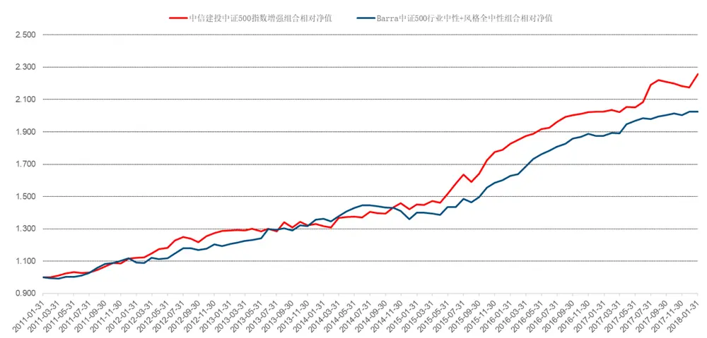
数据来源：wind、中信建投证券研究发展部

表 5 是两个指数增强组合超额收益率的收益和风险指标对比：

表 5：中信建投中证 500指数增强组合和 Barra中证 500指数增强组合对比（收益风险指标）

| 指数增强组合对比 | 中信建投中证500指数增强组合 | Barra中证500行业中性+市值全中性组合 |
| --- | --- | --- |
| 年化超额收益率% | 11.56 | 9.46 |
| 年化超额波动率% | 5.95 | 5.32 |
| 超额收益信息比例 | 1.94 | 1.78 |
| 超额收益最大回撤% | 2.71 | 6.22 |
| 超额收益收益回撤比 | 4.26 | 1.52 |

数据来源：wind、中信建投证券研究发展部

从表 5 可以看出，中信建投中证 500 指数增强组合表现更好，年化超额收益率高于 Barra 中性组合，而年化超额波动率则相差不大，由此可见中信建投中证 500指数增强组合的超额收益信息比例高于Barra中性组合。而从最大回撤和收益回撤比来看，中信建投中证 500 指数增强组合表现也是更为优秀。

这个例子说明了我们需要根据不同的股票样本池、不同的选股因子采用不同的风险处理方法并做详细对比，而不能对所有的选股因子均采用市值分层或 Barra 体系进行一刀切的处理。

## 四、总结

本文第一部分主要介绍风险模型的定义、分类和作用，风险模型对投资组合主要有如下作用：降低投资组合的风险暴露，实现更精确的风险管理；提供更准确的股票组合优化结果；对投资组合或基金产品进行更深入的业绩归因和风险归因。另外根据 Barra CNE5 构建了一套风险模型，对全市场股票的平均 Adjusted R_Square达到 28%。最后给出风险因子的四个判定条件：因子数值较稳定并与其它风险因子相关性较低；因子收益率的波动较大；横截面上因子收益率较显著；新增因子对原有风险模型提供新增信息。

第二部分主要对 Barra 风险模型进行实证介绍。首先对 Barra 风险因子在 A 股市场进行显著性检测，风格和行业因子的年化波动率基本都在 以上，各指数成分股的显著月份占比均较为显著，另外 各个风险因子基本上都能够提供新增信息，因此其基本符合风险因子的判定条件。然后展示了下 Barra 各风险因子的纯因子表现情况，各因子的 T 值绝对值超过 2 的有 9 个，只有成长（Growth）风格因子小于 1，说明大部分风格因子都对 A 股市场有较高的解释度。另外从因子的自相关性和 VIF 可知，大部分风格因子都符合风险因子的属性。值得注意的是，非线性规模（Non-Linear Size）、流动性（Liquidity）和规模（Size）三个风格因子的信息比例绝对值都超过 1，尤其是非线性规模和流动性因子的年化波动率也较低，因此在 A 股市场可能大部分时间仍被认定为 Alpha 因子而非风险因子。另外规模因子在 2017 年之前一直被普遍认定为 Alpha 因子，但最近两年大盘股的重新崛起和风格切换使得该风格因子的波动率急剧提升，风险属性逐步增强，因此规模因子作为风险因子已经被大多数投资者所认可。最后通过观察纯行业因子最近 10 年的收益，发现只有 12 个行业相对大盘有正的超额收益，信息比例最高的五个行业是医药、计算机、通信、电子元器件和食品饮料，说明在最近 10 年大消费和 TMT 行业在 A股市场总体上有较为明显的超额收益。

第三部分详述 Barra 风险模型的具体应用及与中信建投现有选股体系的对比。中信建投选股体系主要选择的是市值等权选股体系。首先是对比 Barra 和中信建投选股体系对风格因子的风险剥离效果，经检测市值等权多空组合的年化收益率基本上要比纯因子要高，而多空组合的信息比例和纯因子组合基本相差不大，说明中信建投选股体系对风格因子的处理和风险剥离的效果不亚于 Barra 风险模型。而对常见的 Alpha 因子处理上，我们选取中证 500 指数样本池，基本上所有 Alpha 因子的市值等权多空组合年化收益率明显要比纯因子高，而 62%的 Alpha 因子在市值风险处理后的多空组合信息比例要比纯因子要高，做市值分层处理更好的 Alpha 因子主要集中在财务基本面因子上，而技术和反转类 Alpha 因子用 Barra 风险模型效果更好。最后简单看下运用这两种处理方法在中证 500 指数增强上的效用对比。我们构建了一个经 Barra 风险模型处理后的中证 500 指数增强组合（中证 500 行业中性+市值中性组合），并与中信建投中证 500 指数增强策略对比，发现中信建投中证 500 指数增强组合表现更好，年化超额收益率高于 Barra 中性组合，而年化超额波动率则相差不大，由此可见中信建投中证 500 指数增强组合的超额收益信息比例高于 Barra 中性组合。而从最大回撤和收益回撤比来看，中信建投中证 500 指数增强组合表现也是更为优秀。这个例子说明了我们需要根据不同的股票样本池、不同的选股因子采用不同的风险处理方法并做详细对比，而不能对所有的选股因子均采用市值分层或 Barra 体系进行一刀切的处理。

## 分析师介绍

丁鲁明：同济大学金融数学硕士，中国准精算师，现任中信建投证券研究发展部金融工程方向负责人，首席分析师。10 年证券从业，历任海通证券研究所金融工程高级研究员、量化资产配置方向负责人；先后从事转债、选股、高频交易、行业配置、大类资产配置等领域的量化策略研究，对大类资产配置、资产择时领域研究深入，创立国内“量化基本面”投研体系。多次荣获团队荣誉：新财富最佳分析师 2009 第 4、2012 第4、2013 第 1、2014 第 3 等；水晶球最佳分析师 2009 第 1、2013 第 1 等。

## 研究助理 陈升锐：021-68821600 chenshengrui@csc.com.cn

芝加哥大学金融数学硕士，三年基金公司量化投资研究工作经验，2018 年加入中信建投研究发展部金融工程团队，专注于量化选股研究。

## 研究服务

## 机构销售负责人

赵海兰 010-85130909 zhaohailan@csc.com.cn

## 保险组

张博 010-85130905 zhangbo@csc.com.cn

高思雨 gaosiyu@csc.com.cn

张勇 010-86451312 zhangyongzgs@csc.com.cn

张宇 010-86451497 zhangyuyf@csc.com.cn

## 北京公募组

黄玮 010-85130318 huangwei@csc.com.cn

朱燕 85156403 zhuyan@csc.com.cn

任师蕙 010-8515-9274 renshihui@csc.com.cn

黄杉 010-85156350 huangshan@csc.com.cn

王健 010-65608249 wangjianyf@csc.com.cn

杨济谦 yangjiqian@csc.com.cn

## 社保销售组

姜东亚 010-85156405 jiangdongya@csc.com.cn

## 私募业务组

李静 010-85130595 lijing@csc.com.cn

赵倩 010-85159313 zhaoqian@csc.com.cn

## 上海销售组

李祉瑶 010-85130464 lizhiyao@csc.com.cn

黄方禅 021-68821615 huangfangchan@csc.com.cn

戴悦放 021-68821617 daiyuefang@csc.com.cn

翁起帆 wengqifan@csc.com.cn

李星星 lixingxing@csc.com.cn

范亚楠 fanyanan@csc.com.cn

李绮绮 liqiqi@csc.com.cn

薛姣 xuejiao@csc.com.cn

许敏 xuminzgs@csc.com.cn

王罡 wanggangbj@csc.com.cn

## 深广销售组

胡倩 0755-23953981 huqian@csc.com.cn

许舒枫 0755-23953843 xushufeng@csc.com.cn

程一天 chengyitian@csc.com.cn

曹莹 caoyingzgs@csc.com.cn

张苗苗 020-38381071 zhangmiaomiao@csc.com.cn

廖成涛 0755-22663051 liaochengtao@csc.com.cn

陈培楷 020-38381989 chenpeikai@csc.com.cn

金融工程深度报告

## 评级说明

以上证指数或者深证综指的涨跌幅为基准。

买入：未来 6 个月内相对超出市场表现 15％以上；

增持：未来 6 个月内相对超出市场表现 5—15％；

中性：未来 6 个月内相对市场表现在-5—5％之间；

减持：未来 6 个月内相对弱于市场表现 5—15％；

卖出：未来 6 个月内相对弱于市场表现 15％以上。

## 重要声明

本报告仅供本公司的客户使用，本公司不会仅因接收人收到本报告而视其为客户。

本报告的信息均来源于本公司认为可信的公开资料，但本公司及研究人员对这些信息的准确性和完整性不作任何保证，也不保证本报告所包含的信息或建议在本报告发出后不会发生任何变更，且本报告中的资料、意见和预测均仅反映本报告发布时的资料、意见和预测，可能在随后会作出调整。我们已力求报告内容的客观、公正，但文中的观点、结论和建议仅供参考，不构成投资者在投资、法律、会计或税务等方面的最终操作建议。本公司不就报告中的内容对投资者作出的最终操作建议做任何担保，没有任何形式的分享证券投资收益或者分担证券投资损失的书面或口头承诺。投资者应自主作出投资决策并自行承担投资风险，据本报告做出的任何决策与本公司和本报告作者无关。

在法律允许的情况下，本公司及其关联机构可能会持有本报告中提到的公司所发行的证券并进行交易，也可能为这些公司提供或者争取提供投资银行、财务顾问或类似的金融服务。

本报告版权仅为本公司所有。未经本公司书面许可，任何机构和 或个人不得以任何形式翻版、复制和发布本报告。任何机构和个人如引用、刊发本报告，须同时注明出处为中信建投证券研究发展部，且不得对本报告进行任何有悖原意的引用、删节和/或修改。

本公司具备证券投资咨询业务资格，且本文作者为在中国证券业协会登记注册的证券分析师，以勤勉尽责的职业态度，独立、客观地出具本报告。本报告清晰准确地反映了作者的研究观点。本文作者不曾也将不会因本报告中的具体推荐意见或观点而直接或间接收到任何形式的补偿。

股市有风险，入市需谨慎。

## 中信建投证券研究发展部

## 北京

东城区朝内大街2号凯恒中心B座 12 层（邮编：100010）电话：(8610) 8513-0588传真：(8610) 6560-8446

## 上海

浦东新区浦东南路 528 号上海证券大厦北塔 22 楼 2201 室（邮编：200120）

电话：(8621) 6882-1612

传真：(8621) 6882-1622

## 深圳

福田区益田路 6003 号荣超商务中心
B 座 22 层（邮编：518035）
电话：（0755）8252-1369
传真：（0755）2395-3859