[table_main] 证券研究报告·金融工程深度报告金融工

# 因子深度研究系列：市值因子择时

## 主要观点

## 市值因子作为风格因子之一对其单独分析：在已知风格切换的情况下，能显著提升市值因子收益

市值因子作为风格因子之一，在本系列报告的因子轮动框架中我们将对他单独分析。从历史表现来看，市值因子和其他风格因子一样，收益并不稳定，容易受到市场风格切换的影响。而在已知风格切换的情况下，我们通过对市值因子进行择时能够得到显著的超额收益：市值因子的年化收益率由 15.05%提高到了 31.35%，IR 也由 0.66 提高到了 1.49。

## 运用逐步回归法对市值因子择时：收益提升不明显，但显著较低波动率与回撤

基于首篇报告的思想，我们尝试用逐步回归法对市值因子进行择时：在每一期选择不同的有效变量对市值因子进行解释。通过逐步 回 归 择 时 后 的 市 值 因 子 收 益 提 升 并 不 明 显（18.12%VS15.05%，），但逐步回归法能够较低原市值因子的波动（22.59%VS22.75%）与最大回撤（-12%VS-34%）。从有效自变量个数的角度考虑，逐步回归法每期对市值因子显著的解释变量并不稳定，个数从 0 个波动到 22 个。从侧面说明了逐步回归法在市值因子择时上的不稳定性。

## 寻找稳定的市值因子解释变量：12 月效应与动量效应显著

为了寻找能够长期稳定解释市值因子的变量，本报告对有可能的解释变量进行了逐一分析。最终找到 8 个既符合经济逻辑，又能解释市值因子的宏观变量：房地产开发投资累计同比、CPI、PPI、沪深 300-1 个月涨跌幅、中证 500-1 个月涨跌幅、中证 500-30 日波动率、中证 500-1 个月收益区 ss分、12 月效应。从回归结果看，这 8 个变量均对市值因子具有显著的解释力度，同时回归系数正负号也和经济逻辑一致。

## 精选解释变量回测结果：显著提升市值因子择时效果

基于以上 8 个解释变量，本报告同样回测了他们对市值因子的择时效果。最终结果显示这 8 个变量能够大幅度的提升市值因子的收益，从原始市值因子的 15.05%提升到了 27.70%，IR 由 0.80 提高到 1.26，最大回撤由 34.14%减小到 13.6%。而其他各个风险指标也有显著的提升。从时间序列的 R 方上分析，以上 8 个解释变量的解释力度也是稳定的。

# 金融工程研究

[table_i丁鲁明

dingluming@csc.com.cn

021-68821623

执业证书编号：S1440515020001

研究助理：胡一江

huyijiang@csc.com.cn

发布日期： 2019 年 01 月 15 日

## 市场表现

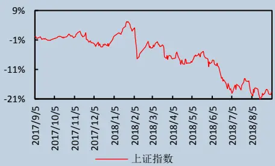

## 相关研究报告

| 18.08.29 | 【中信建投金融工程】Barra 风险模型介 绍及与中信建投选股体系的比较 |
| --- | --- |
| 18.08.28 | 【中信建投金融工程】量化大类资产8 月报：美债期限利差倒挂意味着经济危 机来临？——“基本面量化”系列思考 之八 |
| 18.08.23 | 【中信建投金融工程】技术形态选股研 究之黎明曙光：深跌反转形态 |
| 18.08.07 | 量化基本面选股：从逻辑到模型，航空 业投资方法探讨 |
| 18.08.02 | 【金融工程】从相关关系到指数增强一 一谈IC 系数与股票权重的联系 |
| 18.07.06 | 【金融工程】以史为鉴，货币转向将如 何影响行业利润? |
| 18.06.08 | 【中信建投金融工程】因子深度研究系 列：宏观变量控制下的有效因子轮动 |

## 一） 因子轮动的背景

## 1.1 因子轮动框架

本报告是我们因子轮动系列报告的第二篇。在第一篇报告中，我们详细的介绍了因子轮动的背景，阐述了系列报告所采用的分析框架，并介绍了适用于有效因子的轮动模型。从本篇报告开始，我们将介绍另一类因子：风格因子的轮动，或者简单来说也是对它们的择时。

而对于风格因子，从它们的特性出发，它们所赚取的其实并不是一个稳定的 alpha，而是市场风格的收益，这样的因子我们就称之为风格因子。这些因子本质上代表的就是市场风格，他们的内在逻辑是：我们判断市场将长期处于某一风格，通过做多代表该风格的股票获得超额收益。所以从这些因子的内在逻辑来看，它们一定不会是持续有效的因子，因为市场风格即使在成熟的市场中也是会发生变化的，当市场风格变化时，风格因子也会出现逆转。图 1 重申了我们在第一篇报告中所建立的针对不同因子的轮动框架：对于第一篇报告中所研究的有效因子，我们是根据它们的相对强弱来进行择时；而从本篇报告开始介绍的风格因子，因为它们能够直接和市场风格等外生变量产生联系，我们将直接对每一个风格因子分别进行单独讨论，分别发掘不同风格因子所对应的不同外生变量。

在本报告中，我们将从最具有风格特色的市值因子开始进行分析。

图 1：不同类因子的轮动框架区别
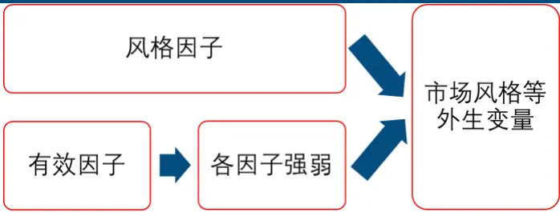
数据来源：wind、中信建投证券研究发展部

## 1.2 市值因子历史表现回顾

我们这里所定义的市值因子就是长期存在与 A 股市场的小市值效应：通过做多市值较小公司的股票，做空大市值股票，能够持续获得超额收益。除去 2017 年与 2014 年的大市值行情之外，市值因子在 2010 年至今每年都录得正收益。但在收益不俗的同时，市值因子也面临一个严重的问题：收益非常不稳定。我们仍以报告一中的 ROE 因子为例进行分析。从图 1 市值因子的多空收益差中可以看见，市值因子从 2010 年至今累计贡献了 3倍的收益，但在 2014 年后半年以及 2017 年经历了非常大的回撤，回撤幅度分别达到了-33.88%与-24.83%。将市值因子与图 2 的 ROE 因子进行比较，在同样的时间内市值因子无论是收益还是不稳定性均显著高于 ROE 因子：市值因子年化收益率 15.05%，ROE 因子年化收益率 8.11%；而市值因子的信息比率 IR 为 0.66，ROE 因子为 0.99。可以看见，市值因子作为风格因子的评价并不能赶上有效因子之一的 ROE 因子。这也就是我们要对市值因子进行轮动的原因，如果我们能对当前市场风格是处于大市值效应还是小市值效应做出一定的判断，不仅能提高市值因子自身的收益，也能减少该风格因子的风险。图 3 就展示了一个简单的情形：假如我们能够对 14 年后半年以及 17 年市场的大市值效应作出判断的结果。这时我们得到的净值曲线更为平滑，市值因子的年化收益率提高到了 31.35%，IR 也提高到了 1.49。

图 2：市值因子多空累计净值（截至 2017年 10月）
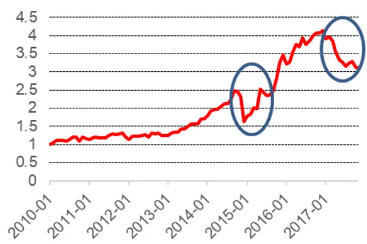
数据来源：wind、中信建投证券研究发展部

图 3：ROE因子多空累计净值（截至 2017年 10月）
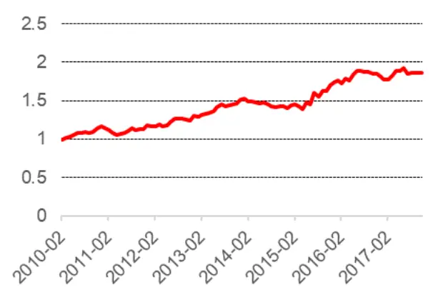
数据来源：wind、中信建投证券研究发展部

表 1：市值因子年度收益

| 年份 |
| --- |
| 收益 2010 25.53% |
| 2011 3.57% |
| 2012 3.32% |
| 2013 37.05% |
| 2014 -4.71% |
| 2015 112.37% 19.69% |
| 2016 2017 -23.54% |
| 资料来源：Wind中信建投证券研究发展部 |

资料来源：Wind，中信建投证券研究发展部

图 4：已知风格切换后的市值因子多空累计净值（截至 2017 年 10 月）
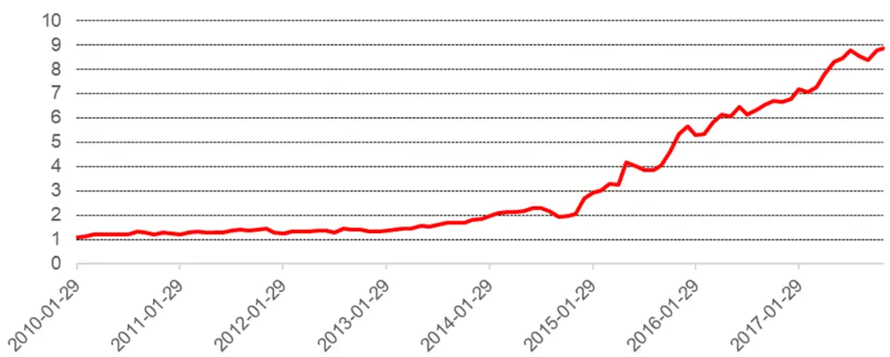
数据来源：wind、中信建投证券研究发展部

## 二）市值因子：从逐步回归出发

在本系列的第一篇报告中，对于有效因子的轮动我们采取了两种方法：逐步回归法与序数回归法。第一种方法是通过预测有效因子的预期收益来对有效因子进行赋权；而序数回归法是通过预测有效因子的相对排名来在因子间进行赋权的。虽然对属于风格因子的市值因子，我们不能将它放入有效因子的体系中进行统一分析，但我们可以借鉴有效因子中所采用的方法来尝试对市值因子进行研究。

这里我们选取逐步回归法来尝试对市值因子进行择时。序数回归法因为是考虑因子的相对排名，对于单一的因子并不适用。

## 2.1 逐步回归法：回测框架

市值因子使用逐步回归法的回测框架如下：

1. 调仓频率：月度调仓；

2. 时间区间：2011 年 1 月 1 日至 2017 年 11 月 30 日；

3. 滚动更新时间窗口：2 年（24 个月）；

4. 组合比较基准：原始市值因子；

5. 所用自变量数据库：与系列报告一一致（具体自变量类型参考系列报告一）；

6. 判断标准：预测下一期市值因子收益是否大于 0（大于 0 做多市值因子，小于 0 做空市值因子）；

## 2.2 逐步回归法：回测结果

可以看见，使用逐步回归法择时后市值因子的效果并没有显著提升。年化收益率仅从 15.05%提高到 18.12%，波动率相差无几，在 2017 年也没有能明显的判断出今年的大市值效应。而提升最明显的是最大回撤，原始市值因子的最大回撤是-34.14%，择时之后能够降低到-12%。择时后整体的胜率为 56.63%；逐步回归模型的平均 R方为 66.59%，整体解释程度并不弱。

图 5：市值因子择时效果
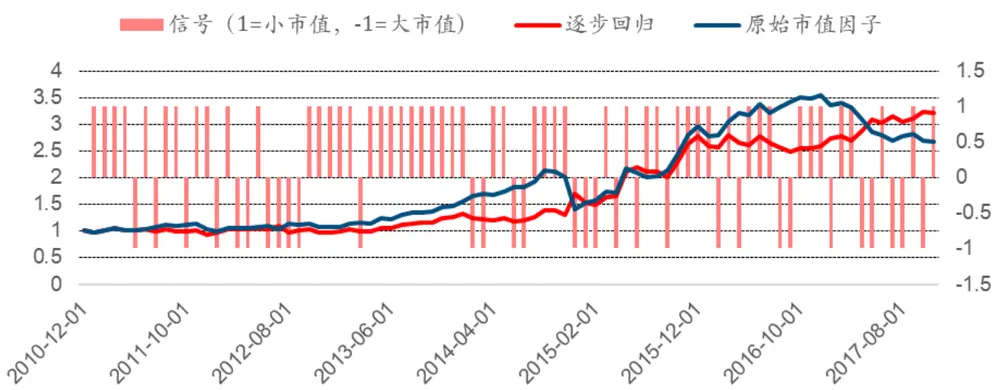
数据来源：wind、中信建投证券研究发展部

表 2：逐步回归 vs原始市值因子

| 逐步回归 | 不轮动 |
| --- | --- |
| 年化收益率 | 18.12% 15.05% |
| 波动率 22.59% | 22.75% |
| IR | 0.80 0.66 |
| 最大回撤 -12.00% | -34.14% |
| 胜率 56.63% |  |
| R方均值 66.59% | 1 |

资料来源：Wind，中信建投证券研究发展部

图 6：有效变量个数变化
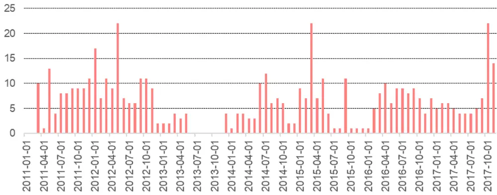
数据来源：wind、中信建投证券研究发展部

图 6 展示了每一期有效变量的个数，从有效自变量的角度出发：变量个数在时间序列上并不稳定，最多的时候能找到 22 个自变量，而也存在部分时间根本找不到自变量能对市值因子进行解释。平均的自变量个数为6.34 个。这也反映了逐步回归模型在对单一因子择时时一大问题：模型的不稳定性。

## 三）市值因子：精选解释变量

第二节中我们使用了逐步回归法尝试对市值因子进行择时，最终的择时效果并不突出，并且在每一期也不能稳定的选出解释变量。这在市值因子的择时上并不是一个好结果。对单一的风格因子，我们是希望能找到稳定的解释变量的，这样不仅能对因子收益进行解释，也就等同于能直接对市场风格进行解释。在本小节，我们就尝试需找对市值因子长期有效的解释变量。

## 3.1 市值因子与解释变量的相关性

在表 3 中我们首先列出了与市值因子相关性较高的 10 个自变量，包含了宏观变量、债券市场与股票市场的相关变量。可以看见三个宏观变量：房地产开发投资，CPI 与 PPI 都与市值因子月度收益是负相关的，其中房地产投资与PPI较好解释，而在后面的分析中我们将具体解释CPI的效应。短期的期限利差与市值因子是负相关的，而反之长期期限利差与市值因子是正相关的。接下来各个股票市场变量除去沪深 300 涨跌幅外，均与市值因子是正相关的。

这里我们给出的是市值因子月度收益与部分解释变量的相关性，表 3 只能告诉我们的确有很多解释变量是与市值因子相关的，但他们之间是否存在因果关系呢？接下来我们将对其中可能存在因果关系或经济逻辑的解释变量分别分析，如果结论与现象一致，他们将是我们所寻找的稳定的解释变量。

表 3：市值因子与部分解释变量的相关性（12个月平滑后）

|  | 市值因子月度收益（t期） |
| --- | --- |
| 房地产开发投资累计同比（t-2期） | -27.33% |
| CPI:当月同比：月（t-2期） | -34.12% |
| PPI:当月同比：月（t-2期） | -57.70% |
| 期限利差1Y-1M（t-1期） | -41.04% |
| 期限利差10Y-1Y（t-1期） | 32.38% |
| 沪深300-1个月涨跌幅（t-1期） | -13.80% |
| 中证500-1个月涨跌幅（t-1期） | 19.01% |
| 中证500-30日波动率（t-1期） | 62.49% |
| 中证500-1个月换手率（t-1期） | 55.52% |
| 中证500收益区分度-1个月（t-1期） | 62.68% |
| 资料来源：Wind，中信建投证券研究发展部 |  |

## 3.2 房地产开发投资&PPI&CPI

我们首先从宏观变量出发，寻找与市值因子有因果关系的变量。这里我们找到的是三个变量：房地产开发投资，PPI 与 CPI。首先是房地产开发投资与 PPI，这两个指标一个代表的是上游经济的发展速度，一个代表上游产品价格。而无论是房地产投资的拉动还是上游价格的上升，这主要都是由大市值公司来决定的：上游企业主要以大市值公司为主，能对房地产投资产生较大影响的也是大市值公司。换而言之，房地产开发投资与 PPI 价格是到上游企业为代表的大市值公司最直接的传导。从图 7 与图 8 也能看见，市值因子和这两个宏观变量存在明显的负相关性。

而对于CPI的情况就要特殊一些了，CPI是衡量通胀水平的指标之一，它代表的是下游消费品等价格的水平。从理论上分析，CPI 应该是与市值因子正相关的：CPI 上升代表的是整体通胀水平的提高，更偏下游的小市值公司会更受益与 CPI 的上升。但图 9 展示的结果却不是这样，在 2011 年到 2013 年这段时间内，CPI 与市值因子的收益反而是负相关的，而在 2013 年之后才展现出了一定的正相关性。但如果同时结合 PPI，就能对 2011 年到2013 年的反常进行很好的解释了。2011 年到 2013 年是 PPI 传导到 CPI 最顺畅的一段时间，这段时间 CPI 与 PPI同时上升，上游产品与下游产品价格同时上升；在这样的情况下，更受益的还是大市值公司更多的上游企业，而小市值公司只是单纯的转移了自身的成本，并不会因为 CPI 上升带来业绩的增长。换而言之，当 PPI 传导到CPI 最顺畅的时候，也就是 CPI 与市值因子负相关的时候，这时候 CPI 与市值因子并没有表现出他们实际的关系；而在其他情况下，传导的不顺利反而能直接体现 CPI 和市值因子的正相关。比如在 2017 年 PPI 传导到 CPI 的极其不顺利，导致了小市值效应的崩溃，同时也体现在 CPI 和市值因子收益双双下降上。

图 7：市值因子与房地产开发投资累计同比（右）
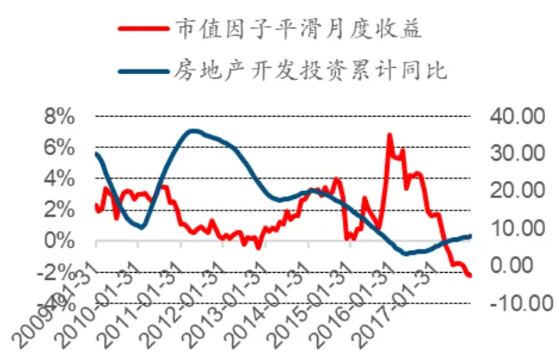
数据来源：wind、中信建投证券研究发展部

图 8：市值因子与 PPI当月同比（右）
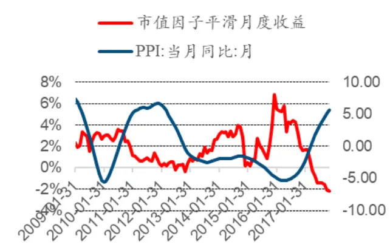
数据来源：wind、中信建投证券研究发展部

图 9：市值因子与 CPI当月同比（右）
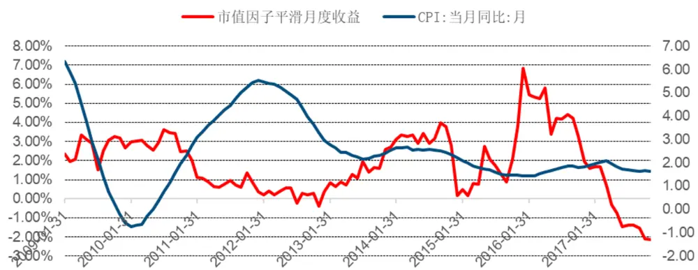
数据来源：wind、中信建投证券研究发展部

## 3.3 沪深 300&中证 500 涨跌幅

能够对市值因子进行解释的第二类变量就是大小盘的涨跌幅，这里我们选取沪深 300 与中证 500 涨跌幅，分别代表大小盘的情况。从 3.1 节的相关性（-13.80%，19.01%）与图 10，图 11 中能够看出，大小盘过去的涨跌幅对市值因子的解释力度并不算很强，但我们仍旧认为这两种变量是有一定的解释能力的：因为市值效应的市场风格并不容易发生变化，也就是市值因子的动量效应是很显著的。这也就是市值因子独特的特性，其他风格因子可能很容易发生风格转变，但市值因子并不会这样。原因之一是市值风格的切换和大资金量有关，切换的成本对于大资金来说很高，切换并不能经常发生；原因之二是市值风格与情绪有关，如果经常转变市值风格，市场情绪会变得极为扭曲，情绪的转变也需要时间，所以并没有经常切换的可能。

图 10：市值因子与沪深 300涨跌幅（右）
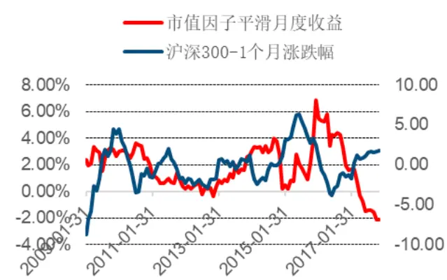
数据来源：wind、中信建投证券研究发展部

图 11：市值因子与中证 500涨跌幅（右）
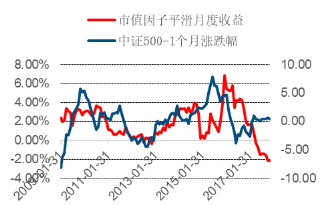
数据来源：wind、中信建投证券研究发展部

## 3.4 市场波动率&收益区分度

还有两个股票市场变量能够解释市值效应：市场波动率与收益区分度。市场波动率计算的是当前市场一段时期内的波动情况，而收益区分度计算的是当前市场一段时间内个股票收益的差别。这两个变量都用标准差的形式来衡量的。

从图 与图 能够看见，市值因子与市场波动率和收益区分度都有着高度的正相关性。这也很容易从这两个市场变量的内在逻辑去解释：市场波动率与收益区分度都是衡量目前市场资金活跃度的指标，资金活跃度越高，市场波动率与收益区分度就越高；而在资金活跃度更高的市场环境下，小市值公司存在更低的流动性溢价，股价收益率更高，而相反的，当资金活跃度下降时，小市值公司就会寻求更大的流动性溢价，使得大市值公司的流动性优势凸显了出来。

图 12：市值因子与波动率（右）
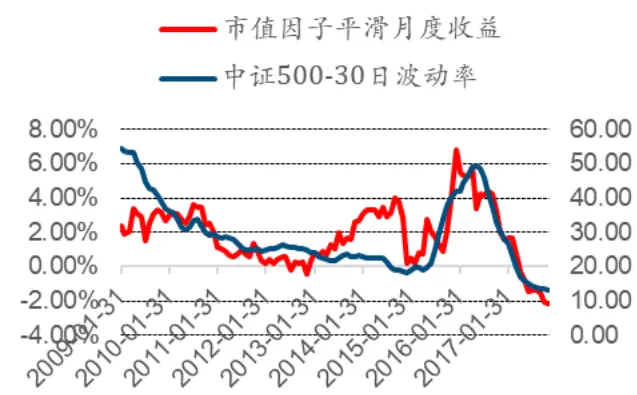
数据来源：wind、中信建投证券研究发展部

图 13：市值因子与收益区分度（右）
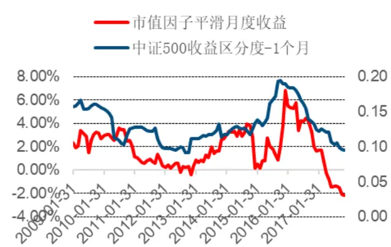
数据来源：wind、中信建投证券研究发展部

## 3.5 季度效应

最后，和系列报告一一样，我们也需要讨论一下市值因子是否具有季度效应。我们仍从研究较多的几个季度效应入手：1 月效应，12 月效应，季末效应与前后半年效应。

## 1 月效应

作为每年的第一个月，受基金建仓或市场情绪影响，市值因子在 1 月份可能会有不同的表现。图 14 展示了市值因子在一月份的表现情况：市值因子的表现在一月并没有显著异于其他月份。（均值 1.46%vs 均值 0.83%。）

## 12 月效应

同样每年的最后一个月，从基金稳定业绩等因素来看，市值因子的表现也值得研究。图 15 是市值因子在12 月份的表形情况：市值因子在 12 月的表现显著差于其他月份。（均值-3.28%vs 均值 1.26%。）该现象很可能与基金在 12 月份会选择银行等低 beta 的公司稳定业绩有关。

## 季末效应

季末效应（3 月，6 月，9 月，12 月末）与 12 月效应有一定的相似之处，我们均能从基金换仓中找到解释：基金在报告期前的换仓可能更偏向大市值公司。图 16 是市值因子的季末影响，同样也有较显著的季末效应。（均值-0.44% vs 均值 1.55%。）

## 前后半年区别

前后半年各因子的表现也可能会产生一定的差别。学术界也对股票收益率的前后半年差异进行过相关研究，认为前半年的股票收益是显著好于后半年的（Qian, Hua, Sorensen [2007]）。而图 17 是市值因子的前后半年区别，该区别在因子层面上并不明显。（均值 1.44%vs均值 0.34%。）

图 14：一月效应
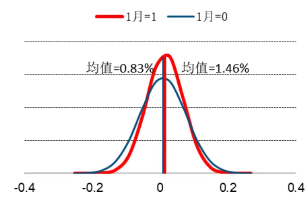
数据来源：wind、中信建投证券研究发展部

图 15：12月效应
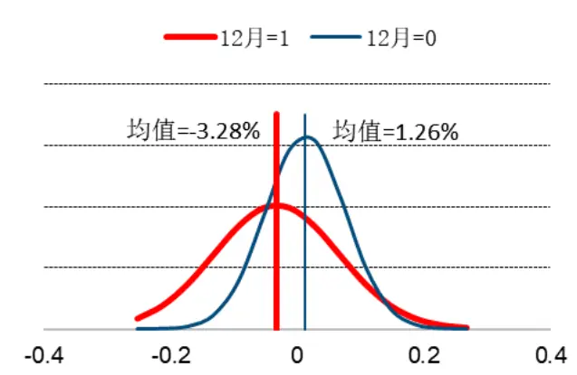
数据来源：wind、中信建投证券研究发展部

图 16：季末效应
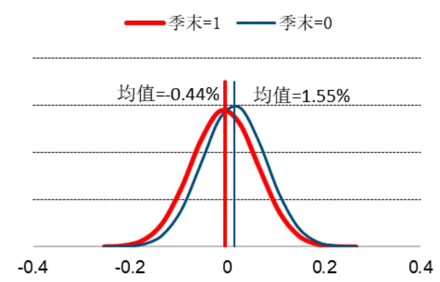
数据来源：wind、中信建投证券研究发展部

图 17：前后半年区别
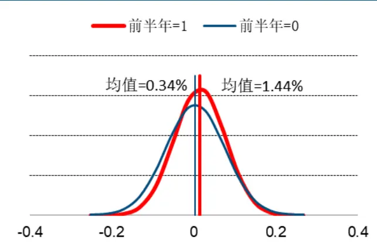
数据来源：wind、中信建投证券研究发展部

表 4：市值因子月度收益统计

| %2003200420052006200720082009 | 1月 2月 |  | 3月 | 4月 | 5月 | 6月 | 7月 | 8月 | 9月 | 10月 | 11月 | 12月 |
| --- | --- | --- | --- | --- | --- | --- | --- | --- | --- | --- | --- | --- |
|  | 2.06 | 1.32 | -4.46 | -9.99 | -1.33 | -0.28 | -6.21 | 2.21 | -1.04 | -9.25 | -1.12 | -10.93 |
|  | 4.90 | 5.84 | 2.03 | 0.21 | 1.73 | -3.60 | -5.07 | -2.15 | -0.97 | -4.53 | 6.81 | -3.28 |
|  | -1.55 | 2.33 | -5.70 | -11.03 | 7.49 | -2.21 | -9.80 | 13.23 | 3.12 | -1.09 | 3.25 | -7.40 |
|  | -4.62 | -0.22 | -3.69 | -8.40 | 12.19 | 4.64 | 6.32 | -0.61 | 2.78 | -3.86 | -16.35 | -13.21 |
|  | 7.04 | 15.26 | 13.14 | 6.00 | -3.79 | -17.25 | 8.59 | -5.26 | -5.40 | -12.03 | 15.62 | 5.74 |
|  | 5.80 | 9.25 | 3.53 | -11.88 | 6.33 | -3.54 | 11.37 | -3.02 | -7.28 | 0.97 | 9.19 | 9.26 |
|  | 4.07 | 4.28 | 4.91 | 3.72 | 3.22 | -5.67 | -5.61 | 9.09 | -0.86 | 3.58 | 8.07 | 3.24 |
| 20102011 | 7.77 | 4.99 | 5.24 | 0.29 | 0.25 | -0.89 | 2.59 | 7.18 | -1.13 | -8.10 | 8.84 | -2.72 |
|  | -2.91 | 4.28 | 2.69 | -2.36 | -0.31 | 1.19 | 4.91 | 4.08 | -2.34 | 1.05 | 3.19 | -9.05 |
| 20122013 | -4.82 | 6.69 | 0.07 | 0.12 | 1.67 | 1.44 | -4.72 | 9.92 | -2.87 | 1.89 | -5.06 | 0.07 |
|  | 0.98 | 4.03 | 2.93 | -1.39 | 8.25 | -1.23 | 5.86 | 3.20 | 0.33 | 1.39 | 6.74 | 1.35 |
| 201420152016 | 5.81 | 6.70 | 2.26 | -0.74 | 3.42 | 4.84 | -0.23 | 5.88 | 10.22 | -0.78 | -5.14 | -30.03 |
|  | 9.64 | 2.61 | 10.03 | -1.23 | 27.34 | -3.52 | -4.03 | 0.42 | 5.35 | 13.56 | 15.59 | 6.09 |
|  | -6.67 | 1.15 | 9.06 | 5.28 | -1.57 | 6.59 | -4.59 | 2.99 | 3.28 | 2.20 | -0.28 | 1.76 |
| 2017average | -5.69 | 1.32 | -2.50 | -7.02 | -7.08 | -1.88 | -3.90 | 3.02 | 1.53 | -4.44 | -0.97 |  |
|  | 1.46 | 4.66 | 2.64 | -2.56 | 3.85 | -1.43 | -0.30 | 3.35 | 0.31 | -1.30 | 3.23 | -3.51 |

资料来源：Wind，中信建投证券研究发展部

## 四）市值因子精选解释变量：回测

上一节我们寻找到了一些和市值因子具有因果关系的解释变量，那这些解释变量是否能真正的对市值因子进行择时呢？在本节中我们仍通过回归分析的方法来进行一个简单回测，检验了通过上述解释变量对市值因子择时的效果。

## 4.1 市值因子与解释变量：回归分析

除去 3.1 节到 3.4 节的 7 个解释变量之外，我们选取了最具特色的 12 月效应加入回归模型中一起考虑。表5 就展示了市值因子月度收益与这 8 个解释变量的回归结果。

从 t 值衡量的显著性上来说，除去 12 月效应并不显著之外，其他的 7 个变量均对市值因子有显著作用。从回归系数的符号来看，除去 CPI 与收益区分度之外，其他变量的符号和第三节所说的相关性一致，也就符合第三节的经济逻辑。而在回归之后，CPI 的回归系数变为了正，这也与 3.2 节我们所讨论的 CPI 与 PPI 的关系对市值因子的影响一致，这说明在排除了 PPI 的影响之后，CPI 是对小盘股有正效应的。而对于收益区分度的负效应本报告也给出了解释：在排除波动率的影响之后，收益区分度变大不在代表资金的活跃程度，而代表的是单纯的市场分歧，市场分歧变大时，一致预期消失，这是资金反而会拥抱确定性更高的大盘股，反之当市场产生一致预期时，也就是收益区分度下降后，不再有分歧的小盘股会表现更好。

表 5：市值因子月度收益回归结果

|  | 回归系数 | T值 |
| --- | --- | --- |
| 房地产开发投资累计同比 | -0.0004 | -2.72*** |
| CPI:当月同比：月 | 0.0058 | 5.11** |
| PPI:当月同比：月 | -0.0027 | -8.89*** |
| 沪深300-1 个月涨跌幅 | -0.0083 | -11.15*** |
| 中证 500-1 个月涨跌幅 | 0.0096 | 10.40*** |
| 中证 500-30 日波动率 | 0.0012 | 7.03*** |
| 中证 500 收益区分度-1 个月 | -0.3291 | -4.03*** |
| 12月效应 | 0.0007 | 0.30 |

注：***为在 1%的显著性水平下显著
资料来源：Wind，中信建投证券研究发展部

## 4.2 市值因子精选解释变量：回测结果

根据 4.1 节回归的 8 个解释变量，我们仍采用逐步回归中的回测框架来尝试对市值因子进行择时，来看看这 8 个解释变量是否真的能对市值因子进行较好的判断。

回测框架如下：

1. 调仓频率：月度调仓；

2. 时间区间：2011 年 1 月 1 日至 2017 年 11 月 30 日；

3. 滚动更新时间窗口：2 年（24 个月）；

4. 组合比较基准：原始市值因子；

5. 所用自变量：8 个（房地产开发投资累计同比、CPI、PPI、沪深 300-1 个月涨跌幅、中证 500-1 个月涨跌幅、中证 500-30 日波动率、中证 500-1 个月收益区分、12 月效应）；

6. 判断标准：预测下一期市值因子收益是否大于 0（大于 0 做多市值因子，小于 0 做空市值因子）；

图 18：市值因子精选解释变量：净值曲线
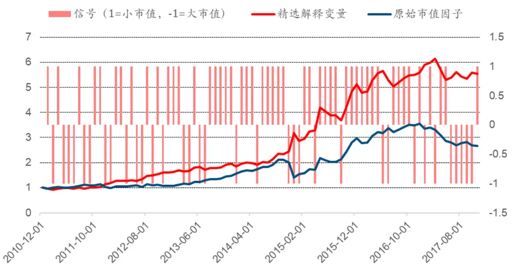
数据来源：wind、中信建投证券研究发展部

表 6：市值因子精选解释变量 vs逐步回归 vs原始市值因子

|  | 精选解释变量 | 逐步回归 | 原始市值因子 |
| --- | --- | --- | --- |
| 年化收益率 | 27.70% | 18.12% | 15.05% |
| 波动率 | 21.90% | 22.59% | 22.75% |
| IR | 1.26 | 0.80 | 0.66 |
| 最大回撤 | -13.60% | -12.00% | -34.14% |
| 胜率 | 69.88% | 56.63% | 1 |
| 所选解释变量类型 | 固定 | 不固定 | 1 |
| 每期解释变量个数 | 8个 | 不固定（0到22个） | - |

资料来源：Wind，中信建投证券研究发展部

可以看见，在精选出 8 个符合逻辑的解释变量之后，市值因子择时的判断更准确了，胜率由 56.63%提高到了 69.88%。精选解释变量的年化收益达到 27.70%，IR1.26，相比逐步回归的 18.12%与 0.80 提升明显。同样，精选的解释变量也能准确的判断到 2017 年的大市值行情，在 2017 年 1 月、3 月和 6 月到 10 月共 7 个月认为市场风格为大市值效应。

图 19 给出了时间序列上这 8 个解释变量的解释程度，可以看见，除去 2016 年的解释度偏低之外，其他时间的 R 方都保持在一个稳定的水平上，解释力度 40%上下。这和我们所想要的结果一致：找到决定市值风格的稳定解释变量。

图 19：时间序列上 R 方变化
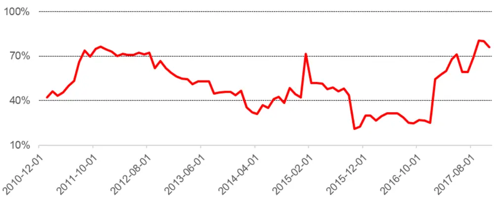
数据来源：wind、中信建投证券研究发展部

## 4.3 结果总结

在本篇报告中我们主要研究了风格因子之一：市值因子的择时情况。我们分别通过逐步回归与精选解释变量两种方法测试了对市值因子择时的效果。

这里我们分别寻找了 8 个精选解释变量，他们是房地产开发投资累计同比、CPI、PPI、沪深 300 涨跌幅、中证 500 涨跌幅、中证 500 波动率、中证 50 收益区分与 12 月效应。本报告对上述 8 个解释变量进行了逐一分析，确定了他们与市值因子的经济逻辑与因果关系，继而再通过它们对市值因子进行择时，得到了良好的效果：相比于原始的市值因子（15.05%），逐步回归（18.12%）与精选解释变量（27.70%）均能通过择时为市值因子带来超额收益，而精选解释变量的效果更好。

## 分析师介绍

丁鲁明：同济大学金融数学硕士，中国准精算师，现任中信建投证券研究发展部金融工程方向负责人，首席分析师。10 年证券从业，历任海通证券研究所金融工程高级研究员、量化资产配置方向负责人；先后从事转债、选股、高频交易、行业配置、大类资产配置等领域的量化策略研究，对大类资产配置、资产择时领域研究深入，创立国内“量化基本面”投研体系。多次荣获团队荣誉：新财富最佳分析师 2009 第 4、2012第 4、2013 第 1、2014 第 3 等；水晶球最佳分析师 2009 第 1、2013 第 1 等。

研究助理 胡一江： 复旦大学管理学院金融硕士。

## 研究服务

## 机构销售负责人

赵海兰 010-85130909 zhaohailan@csc.com.cn

## 保险组

张博 010-85130905 zhangbo@csc.com.cn

杨曦 -85130968 yangxi@csc.com.cn

郭洁 -85130212 guojie@csc.com.cn

郭畅 010-65608482 guochang@csc.com.cn

张勇 010-86451312 zhangyongzgs@csc.com.cn

高思雨 gaosiyu@csc.com.cn

王罡 021-68821600-11 wanggangbj@csc.com.cn

张宇 010-86451497 zhangyuyf@csc.com.cn

## 北京公募组

朱燕 85156403 zhuyan@csc.com.cn

任师蕙 010-8515-9274 renshihui@csc.com.cn

黄杉 010-85156350 huangshan@csc.com.cn

杨济谦 010-86451442 yangjiqian@csc.com.cn

## 私募业务组

赵倩 010-85159313 zhaoqian@csc.com.cn

## 上海销售组

李祉瑶 010-85130464 lizhiyao@csc.com.cn

黄方禅 021-68821615 huangfangchan@csc.com.cn

戴悦放 021-68821617 daiyuefang@csc.com.cn

翁起帆 021-68821600 wengqifan@csc.com.cn

李星星 021-68821600-859 lixingxing@csc.com.cn

范亚楠 021-68821600-857 fanyanan@csc.com.cn

李绮绮 021-68821867 liqiqi@csc.com.cn

薛姣 xuejiao@csc.com.cn

许敏 021-68821600-828 xuminzgs@csc.com.cn

## 深广销售组

张苗苗 020-38381071 zhangmiaomiao@csc.com.cn

许舒枫 0755-23953843 xushufeng@csc.com.cn

程一天 0755-82521369 chengyitian@csc.com.cn

曹莹 0755-82521369 caoyingzgs@csc.com.cn

廖成涛 0755-22663051 liaochengtao@csc.com.cn

陈培楷 020-38381989 chenpeikai@csc.com.cn

金融工程深度报告

## 评级说明

以上证指数或者深证综指的涨跌幅为基准。

买入：未来 6 个月内相对超出市场表现 15％以上；

增持：未来 6 个月内相对超出市场表现 5—15％；

中性：未来 6 个月内相对市场表现在-5—5％之间；

减持：未来 6 个月内相对弱于市场表现 5—15％；

卖出：未来 6 个月内相对弱于市场表现 15％以上。

## 重要声明

本报告仅供本公司的客户使用，本公司不会仅因接收人收到本报告而视其为客户。

本报告的信息均来源于本公司认为可信的公开资料，但本公司及研究人员对这些信息的准确性和完整性不作任何保证，也不保证本报告所包含的信息或建议在本报告发出后不会发生任何变更，且本报告中的资料、意见和预测均仅反映本报告发布时的资料、意见和预测，可能在随后会作出调整。我们已力求报告内容的客观、公正，但文中的观点、结论和建议仅供参考，不构成投资者在投资、法律、会计或税务等方面的最终操作建议。本公司不就报告中的内容对投资者作出的最终操作建议做任何担保，没有任何形式的分享证券投资收益或者分担证券投资损失的书面或口头承诺。投资者应自主作出投资决策并自行承担投资风险，据本报告做出的任何决策与本公司和本报告作者无关。

在法律允许的情况下，本公司及其关联机构可能会持有本报告中提到的公司所发行的证券并进行交易，也可能为这些公司提供或者争取提供投资银行、财务顾问或类似的金融服务。

本报告版权仅为本公司所有。未经本公司书面许可，任何机构和/或个人不得以任何形式翻版、复制和发布本报告。任何机构和个人如引用、刊发本报告，须同时注明出处为中信建投证券研究发展部，且不得对本报告进行任何有悖原意的引用、删节和/或修改。

本公司具备证券投资咨询业务资格，且本文作者为在中国证券业协会登记注册的证券分析师，以勤勉尽责的职业态度，独立、客观地出具本报告。本报告清晰准确地反映了作者的研究观点。本文作者不曾也将不会因本报告中的具体推荐意见或观点而直接或间接收到任何形式的补偿。

股市有风险，入市需谨慎。

## 中信建投证券研究发展部

## 北京

东城区朝内大街2号凯恒中心B座 12 层（邮编：100010）电话：(8610) 8513-0588传真：(8610) 6560-8446

## 上海

浦东新区浦东南路 528 号上海证券大厦北塔 22 楼 2201 室（邮编：200120）

电话：(8621) 6882-1612

传真：(8621) 6882-1622

## 深圳

福田区益田路 6003 号荣超商务中心B 座 22 层（邮编：518035）

电话：（0755）8252-1369

传真：（0755）2395-3859