# [证券table_main] 研究报告·金融工程深度报告金融衍

# 因子衰减在多因子选股中的应用：

——因子深度研究系列

## 主要结论

## 本文概述

本文主要介绍因子的衰减在多因子选股中的应用。主要包括因子半衰期定义、单因子衰减分析、多因子横截面 IC、IC_IR 半衰期加权方法和单因子时间序列最大化复合 IC_IR 加权方法的深入研究。发现不管是在横截面上做 IC、IC_IR 半衰期加权，还是单因子的时间序列加权上，单因子的半衰期 H_Factor 均为多因子权重求解的一个稳健最优参数。

## 单因子衰减分析

从单因子衰减分析可知大部分因子的 IC 衰减速度较快，所以在做因子 IC 加权时理应对因子近期的 IC 给与更大的权重分配，这样才能更好地适应市场短期的变化。这里，我们引入半衰期权重来衡量其影响。半衰期权重可以定义为，给定一个半衰期H，每隔H期 IC 的权重值会以指数下降的方式降低一半

## 因子 IC/IC_IR半衰期加权方法

经过测试，在对大部分不同类型但衰减速度相同的因子做多因子 IC或 IC_IR 半衰期加权时，半衰期参数H等于因子本身的半衰期 H_Factor 时，组合的表现可以达到最好或者接近最好。例如我们在对两个半衰期均为 4的成长因子“单季度营业利润同比增长率”和“单季度营业收入同比增长率”做 IC 半衰期加权时，半衰期参数H等于 4 时，组合的表现在所有加权方法里可以达到最好。IC_IR 从等权组合的 0.47 提升到 0.55，第一分位组合年化超额收益从等权组合的 12.73%提升到 14.16%。

## 时间序列因子值加权方法（采用最大化复合 IC_IR加权方法）

我们利用复合因子 IC_IR 最大化的方法搭建了一套基于单个因子不同历史期限暴露值的时间序列加权方法，发现利用历史因子值进行加权的效果总体上比仅用当期因子值要好，当历史样本期 T 等于因子的半衰期H_Factor 时，效果最佳。例如 EP_TTM 因子，我们利用过去 3期的因子值进行最大化复合因子 IC_IR 加权的效果最好，复合因子的 IC 达到 6.64%，相比仅用当期因子的 IC 值（4.99%）提升较大，IC_IR 达到 1.04，而第一分位组合年化超额收益达到 18%，相比仅用当期因子的超额收益（8.68%）有将近 10%的年化超额收益提升。

## IC半衰期加权多因子组合

我们构建一个动态 IC 半衰期加权方法多因子组合，组合方法按因子半衰期分类，大类因子间等权 ，大类因子内按照因子 IC 半衰期加权（即半衰期参数H取各因子本身的半衰期 H_Factor），每期选择因子打分排名前100 的股票作为投资组合。组合收益在所有加权方法里面表现最优，最近十年的累计超额收益达到 727%，年化超额收益 23.52%，夏普比率为 2.08，除了 2017 年市场风格比较极端跑输指数之外，其余年份都能够取得超过10%的超额收益。

# 金融工程研究

。丁鲁明[table

dingluming@csc.com.cn

021-68821623

执业证书编号：S1440515020001

## 研究助理 陈升锐

chenshengrui @csc.com.cn

021-68821600

发布日期： 2019 年 3 月 28 日

## 相关研究报告

| 19.01.15 | 因子深度研究系列：市值因子择时 |
| --- | --- |
| 18.08.29 | 因子深度研究系列：Barra风险模型介绍 及与中信建投选股体系的比较 |
| 18.08.23 | 技术形态选股研究之黎明曙光：深跌反 转形态 |
| 18.08.07 | 量化基本面选股：从逻辑到模型，航空 业投资方法探讨 |
| 18.08.02 | 从相关关系到指数增强——谈 IC 系数 与股票权重的联系 |
| 18.06.08 | 因子深度研究系列：宏观变量控制下的 有效因子轮动 |
| 18.05.18 | 因子深度研究系列：特质波动率纯因子 在A股的实证与研究 |

## 一、因子信息衰减和因子 IC 半衰期的定义

## 1.1、因子信息衰减

信息具有其时效性，对于选股因子而言，每个股票在其之上的暴露程度便是投资者所观察到的“信息”，该信息同样具有时效性，一般情况下，随着时间的滞后，信息的价值将逐步下降。

## 1.2、因子IC的时间衰减

因子 IC 的时间衰减是被提及最多的一个因子衰减概念，用以衡量一个因子对未来的预测能力能持续多久。当一个指标时间衰减过快时，可能会导致组合较高的换手，交易成本会大幅侵蚀模型的盈利能力。通过计算当期（t）因子值和滞后 n 期的收益率，我们可以得到 IC 的时间序列：

$$
IC_{n}=\mathrm{cor}(Factor_{t},Ret_{t+1+n})
$$

可以简单的用 IC 半衰期来衡量 IC 时间衰减的快慢，由于我们这边主要是以月频来计算因子的 IC，因此 IC半衰期可定义为月度 IC 第一次下降到一半或一半以下所用的时间。同理，我们也可以计算 ${|\mathsf{C}}\_{\mathsf{R}}$ 的半衰期和衰减速度。

## 二、单因子衰减分析

下面我们选取 A 股市场中常见的 28 个选股因子进行单因子衰减分析，分别求出 IC 和 IC_IR 的半衰期。因子类别划分为价值、成长、质量、反转、情绪（一致预期）和技术因子，最后每个类别选取 1-2 个有代表性的因子进行展示。

回测时间：最近 10 年（2008 年 12 月-2018 年 12 月）

样本池：全市场（后面单因子衰减分析的 PPT均为全市场）、沪深 300、中证 500 样本内分别做测试

股票筛选：每月底剔除停牌、一字板、上市未满半年和 ST 股票，月频调仓

因子处理：极值处理（剔除 3 倍标准差之外的样本）、缺失值处理（直接剔除）、中性化处理（因子标准化值对流通市值对数标准化值和中信一级行业哑变量进行回归的残差）

最大衰减期数选择：10 期

## 2.1、单因子衰减分析（价值因子 EP_TTM）

我们首先看看价值因子 EP_TTM 的衰减情况。EP_TTM 因子的当期（即衰减 0 期）IC 为 0.046，衰减 3 期的IC 为 0.02，第一次低于当期 IC 的一半，因此我们定义 EP_TTM 因子的半衰期为 3。

图 1：EP_TTM 因子衰减图 1

|  | IC均值 | IR |
| --- | --- | --- |
| 衰减0期 | 0.046 | 0.580 |
| 衰减1期 | 0.030 | 0.398 |
| 衰减2期 | 0.025 | 0.331 |
| 衰减3期 | 0.020 | 0.276 |
| 衰减4期 | 0.019 | 0.268 |
| 衰减5期 | 0.019 | 0.270 |
| 衰减6期 | 0.020 | 0.280 |
| 衰减7期 | 0.021 | 0.294 |
| 衰减8期 | 0.022 | 0.310 |
| 衰减9期 | 0.021 | 0.285 |
| 衰减10期 | 0.021 | 0.301 |

数据来源：wind、中信建投证券研究发展部

图 2：EP_TTM 因子衰减图 2
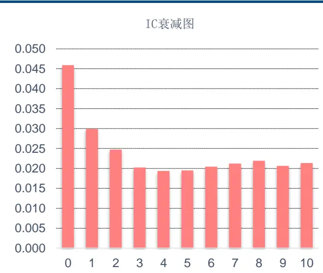
数据来源：wind、中信建投证券研究发展部

## 2.2、单因子衰减分析（价值因子 BP_LYR）

我们再看看价值因子 BP_LYR 的衰减情况。同理 BP_LYR因子的当期（即衰减 0 期）IC 为 0.046，衰减 3 期的IC 为 0.02，第一次低于当期 IC 的一半，因此我们定义 BP_LYR 因子的半衰期为 3。

图 3：BP_LYR 因子衰减图 1

|  | IC均值 | IR |
| --- | --- | --- |
| 衰减0期 | 0.046 | 0.476 |
| 衰减1期 | 0.030 | 0.310 |
| 衰减2期 | 0.024 | 0.248 |
| 衰减3期 | 0.020 | 0.210 |
| 衰减4期 | 0.020 | 0.211 |
| 衰减5期 | 0.018 | 0.202 |
| 衰减6期 | 0.018 | 0.202 |
| 衰减7期 | 0.016 | 0.194 |
| 衰减8期 | 0.017 | 0.210 |
| 衰减9期 | 0.018 | 0.219 |
| 衰减10期 | 0.017 | 0.208 |

数据来源：wind、中信建投证券研究发展部

图 4：BP_LYR 因子衰减图 2
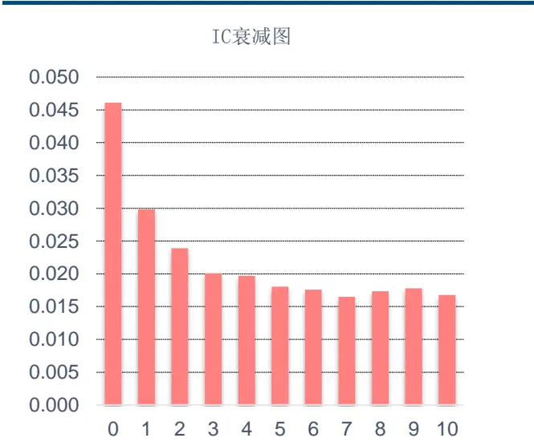
数据来源：wind、中信建投证券研究发展部

## 2.3、单因子衰减分析（成长因子 SaleEarnings_SQ_YoY）

我们再看看成长因子的表现情况，我这边选取了单季度营业利润同比增长率 SaleEarnings_SQ_YoY 因子，其半衰期为 4 期。

图 5：SaleEarnings_SQ_YoY 因子衰减图 1

|  | IC均值 | IR |
| --- | --- | --- |
| 衰减0期 | 0.025 | 0.488 |
| 衰减1期 | 0.019 | 0.363 |
| 衰减2期 | 0.013 | 0.249 |
| 衰减3期 | 0.013 | 0.252 |
| 衰减4期 | 0.010 | 0.199 |
| 衰减5期 | 0.006 | 0.125 |
| 衰减6期 | 0.007 | 0.140 |
| 衰减7期 | 0.006 | 0.131 |
| 衰減8期 | 0.004 | 0.093 |
| 衰减9期 | 0.003 | 0.058 |
| 衰减10期 | 0.001 | 0.022 |

数据来源：wind、中信建投证券研究发展部

图 6：SaleEarnings_SQ_YoY 因子衰减图 2
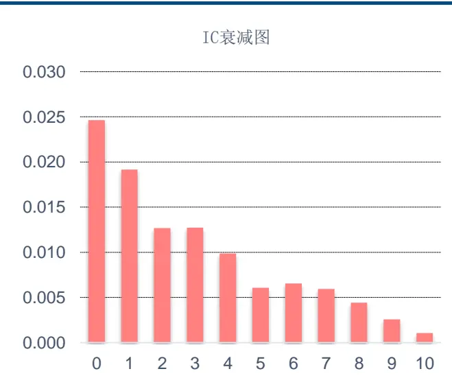
数据来源：wind、中信建投证券研究发展部

## 2.4、单因子衰减分析（质量因子 ROE_TTM）

质量因子选取了 ROE_TTM 因子，其半衰期为 4 期。

图 7：ROE_TTM 因子衰减图 1

|  | IC均值 | IR |
| --- | --- | --- |
| 衰减0期 | 0.020 | 0.249 |
| 衰减1期 | 0.015 | 0.187 |
| 衰减2期 | 0.011 | 0.142 |
| 衰减3期 | 0.011 | 0.144 |
| 衰减4期 | 0.010 | 0.130 |
| 衰减5期 | 0.009 | 0.124 |
| 衰减6期 | 0.011 | 0.149 |
| 衰减7期 | 0.010 | 0.136 |
| 衰减8期 | 0.011 | 0.158 |
| 衰减9期 | 0.010 | 0.148 |
| 衰减10期 | 0.009 | 0.133 |

数据来源：wind、中信建投证券研究发展部

图 8：ROE_TTM 因子衰减图 2
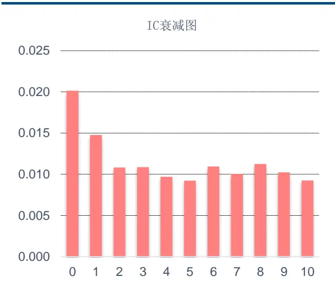
数据来源：wind、中信建投证券研究发展部

## 2.5、单因子衰减分析（动量/反转因子Momentum_1m）

动量/反转因子选取了一个月收益率 Momentum_1m 因子，这个因子比较特别，当期 IC 为非常明显的负向因子，高达-0.069，而衰减 1 期的 IC 均值已经下降到-0.014，因此其半衰期可能远小于 1 个月，但我们这边的分析都基于月频，因此把其半衰期定义为 1 期。

图 9：Momentum_1m 因子衰减图 1

|  | IC均值 | IR |
| --- | --- | --- |
| 衰减0期 | -0.069 | -0.711 |
| 衰减1期 | -0.014 | -0.165 |
| 衰减2期 | -0.007 | -0.092 |
| 衰减3期 | 0.013 | 0.179 |
| 衰减4期 | 0.002 | 0.023 |
| 衰减5期 | 0.011 | 0.159 |
| 衰减6期 | 0.007 | 0.113 |
| 衰减7期 | 0.010 | 0.152 |
| 衰减8期 | 0.007 | 0.118 |
| 衰减9期 | -0.008 | -0.123 |
| 衰减10期 | 0.007 | 0.135 |

数据来源：wind、中信建投证券研究发展部

图 10：Momentum_1m 因子衰减图 2
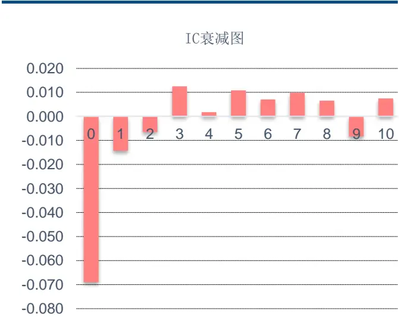
数据来源：wind、中信建投证券研究发展部

## 2.6、单因子衰减分析（情绪因子 GrowthProfit_FY1_3M）

情绪（一致预期）因子选取了 GrowthProfit_FY1_3M 因子，计算公式为（预测净利润 FY1/预测净利润 FY1_三月前-1），其半衰期为 2 期。

图 11：GrowthProfit_FY1_3M 因子衰减图 1

|  | IC均值 | IR |
| --- | --- | --- |
| 衰减0期 | 0.034 | 0.707 |
| 衰减1期 | 0.025 | 0.467 |
| 衰减2期 | 0.017 | 0.308 |
| 衰减3期 | 0.014 | 0.261 |
| 衰减4期 | 0.012 | 0.234 |
| 衰减5期 | 0.008 | 0.169 |
| 衰减6期 | 0.005 | 0.114 |
| 衰减7期 | 0.007 | 0.158 |
| 衰减8期 | 0.000 | 0.001 |
| 衰減9期 | 0.000 | 0.003 |
| 衰减10期 | -0.003 | -0.057 |

数据来源：wind、中信建投证券研究发展部

图 12：GrowthProfit_FY1_3M 因子衰减图 2
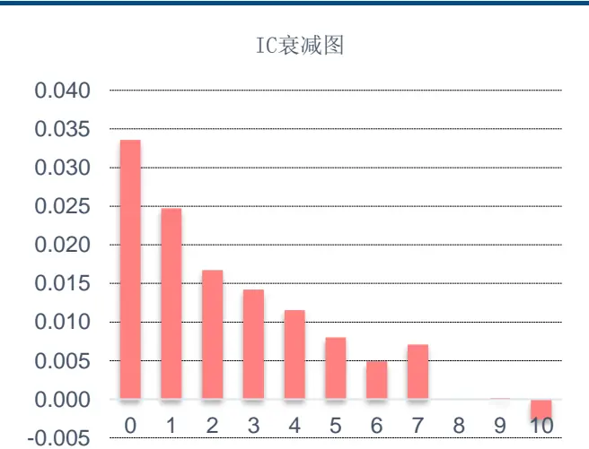
数据来源：wind、中信建投证券研究发展部

## 2.7、单因子衰减分析（技术因子 TurnoverAvg1M）

技术因子选取了过去一个月日均换手率 TurnoverAvg1M 因子，其半衰期为 3 期。

图 13：TurnoverAvg1M 因子衰减图 1

|  | IC均值 | IR |
| --- | --- | --- |
| 衰减0期 | -0.077 | -0.843 |
| 衰减1期 | -0.041 | -0.483 |
| 衰减2期 | -0.032 | -0.393 |
| 衰减3期 | -0.030 | -0.391 |
| 衰减4期 | -0.028 | -0.381 |
| 衰减5期 | -0.026 | -0.371 |
| 衰减6期 | -0.024 | -0.358 |
| 衰减7期 | -0.021 | -0.316 |
| 衰减8期 | -0.020 | -0.303 |
| 衰减9期 | -0.020 | -0.343 |
| 衰减10期 | -0.020 | -0.336 |

数据来源：wind、中信建投证券研究发展部

图 14：TurnoverAvg1M 因子衰减图 2
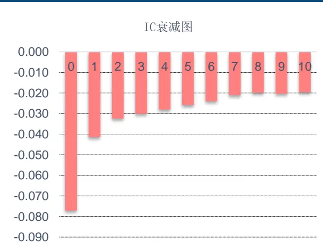
数据来源：wind、中信建投证券研究发展部

## 2.8、单因子衰减分析（技术因子 Volatility1M）

另外一个技术因子选取了过去一个月日收益波动率 Volatility1M 因子，其半衰期为 3 期。

图 15：Volatility1M 因子衰减图 1

|  | IC均值 | IR |
| --- | --- | --- |
| 衰减0期 | -0.064 | -0.554 |
| 衰减1期 | -0.042 | -0.399 |
| 衰减2期 | -0.038 | -0.359 |
| 衰减3期 | -0.031 | -0.329 |
| 衰减4期 | -0.023 | -0.240 |
| 衰减5期 | -0.031 | -0.355 |
| 衰减6期 | -0.026 | -0.293 |
| 衰减7期 | -0.024 | -0.289 |
| 衰减8期 | -0.026 | -0.346 |
| 衰減9期 | -0.026 | -0.349 |
| 衰减10期 | -0.021 | -0.298 |

数据来源：wind、中信建投证券研究发展部

图 16：Volatility1M 因子衰减图 2
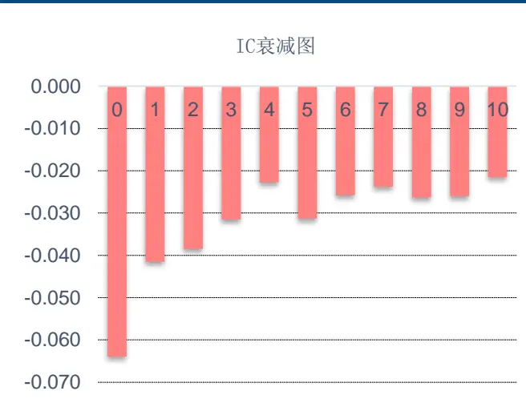
数据来源：wind、中信建投证券研究发展部

## 2.9、单因子衰减分析（单因子IC半衰期汇总）

我们把常用的 28 个选股因子的 IC 半衰期做一个汇总，这边按照全市场、沪深 300 指数样本池和中证 500指数样本池分别进行测试，标红色为 IC 显著（即 IC 绝对值大于等于 0.02）的因子，由于测试中的最大衰减期数选择为 10 期，因此半衰期大于 10 期的统一写为>10。

表 1：单因子 IC半衰期汇总（标红色为 IC显著的因子（IC绝对值大于等于 0.02））

| 因子类别 | 因子名称 | 因子描述 | 全样本 | 因子名称 | 沪深300 | 因子名称 | 中证500 |
| --- | --- | --- | --- | --- | --- | --- | --- |
| 价值 | EP TTM | 1/市盈率PE(TTM) | 3 | EP TTM | 7 | EP TTM | 3 |
| 价值 | BP LYR | 1/PB LYR | 3 | BP_LYR | 3 | BP_LYR | 3 |
| 价值 | CashFlowYield_TTM | 经营活动产生的现金流量净额_TTM/总市值 | 9 | CashFlowYield TTM | 3 | CashFlowYield_TTM | >10 |
| 成长 | SaleEarnings_SQ_YoY | 单季度营业利润同比增长率 | 4 | SaleEarnings_SQ_YoY | 1 | SaleEarnings_SQ_YoY | 5 |
| 成长 | Earnings SO YoY | 单季度净利润同比增长率 | 5 | Earnings SO YoY | 3 | Earnings SO YoY | 1 |
| 成长 | Sales_SQ_YoY | 单季度营业收入同比增长率 | 4 | Sales SQ YoY | 9 | Sales_SQ_YoY | 5 |
| 成长 | Earnings LTG | 净利润过去3年历史增长率 | 5 | Earnings LTG | 3 | Earnings LTG |  |
| 成长 | ROE SO YoY | ROE 单季度/ROE 单季度 一年前-1 | 6 | ROE SO YoY | 2 | ROE SO YoY |  |
| 成长 | GrossMargin SQ YoY | 毛利率单季度/毛利率单季度一年前-1 | 2 | GrossMargin SO YoY | 9 | GrossMargin SO YoY |  |
| 质量 | ROE TTM | 净利润_TTM/股东权益合计_最新财报 | 4 | ROE_TTM | 6 | ROE_TTM | >10 |
| 质量 | ROA TTM | 净利润_TTM/资产总计_最新财报 | >10 | ROA TTM | 10 | ROA TTM | >10 |
| 质量 | GrossMargin_TTM | (营业收入 TTM-营业成本 TTM)/营业收入TTM | >10 | GrossMargin_TTM |  | GrossMargin_TTM |  |
| 质量 | Debt2Equity LR | 负债合计最新财报/股东权益合计最新财报 | 2 | Debt2Equity LR |  | Debt2Equity LR |  |
| 质量 | CurrentRatio | 流动资产合计最新财报/流动负债合计最新财报 | 6 | CurrentRatio |  | CurrentRatio |  |
| 质量 | Berry_Ratio | (营业收入 TTM-营业成本 TTM)/销售费用 TTM | >10 | Berry_Ratio | 1 | Berry_Ratio |  |
| 反转 | Momentum_1m | 复权收盘价/复权收盘价_一个月前-1 | 1 | Momentum_1m | 1 | Momentum_1m | 1 |
| 反转 | Momentum_3m | 复权收盘价/复权收盘价_三个月前-1 | 1 | Momentum_3m | 1 | Momentum_3m | 1 |
| 反转 | Momentum_6m | 复权收盘价/复权收盘价_六个月前-1 | 1 | Momentum_6m | 1 | Momentum_6m | 1 |
| 反转 | Momentum_12m | 复权收盘价/复权收盘价_十二个月前-1 | 1 | Momentum_12m | 1 | Momentum_12m | 1 |
| 反转 | Momentum_24m | 复权收盘价/复权收盘价二十四个月前-1 | 1 | Momentum_24m | 1 | Momentum_24m | 1 |
| 情绪 | GrowthProfit_FY1 3M | 预测净利润FY1/预测净利润FY1 三月前-1 | 2 | GrowthProfit_FY1 3M | 3 | GrowthProfit_FY1 3M | 3 |
| 情绪 | RatingAvg | 经过行业、市值、Beta、BP调整的分析师综合评级 | 3 | RatingAvg | 5 | RatingAvg | 3 |
| 技术 | LnFloatCap | 流通市值的自然对数 | >10 | LnFloatCap | 6 | LnFloatCap | 3 |
| 技术 | AmountAvg_1M | 过去一个月日均成交额 | 1 | AmountAvg_1M | >10 | AmountAvg_1M | 3 |
| 技术 | TurnoverAvg1M | 过去一个月日均换手率 | 3 | TurnoverAvg1M | 2 | TurnoverAvg1M | 2 |
| 技术 | TurnoverAvg3M | 过去三个月日均换手率 | 4 | TurnoverAvg3M | >10 | TurnoverAvg3M | 5 |
| 技术 | Volatility1M | 过去一个月日收益波动率 | 3 | Volatility1M | 4 | Volatility1M | 4 |
| 技术 | Volatility3M | 过去三个月日收益波动率 | 8 | Volatility3M | >10 | Volatility3M | 9 |

数据来源：wind、中信建投证券研究发展部

## 2.10、单因子衰减分析（单因子IC_IR半衰期汇总）

同理，28 个选股因子的 IC_IR 半衰期的汇总如下，即因子 IC_IR 第一次下降到一半或一半以下所用的时间：

表 2：单因子 IC_IR半衰期汇总（标红色为 IC显著的因子（IC绝对值大于等于 0.02））

| 因子类别 | 因子名称 | 因子描述 | 全样本 | 因子名称 | 沪深300 | 因子名称 | 中证500 |
| --- | --- | --- | --- | --- | --- | --- | --- |
| 价值 | EP_TTM | 1/市盈率PE(TTM) | 3 | EP_TTM | 7 | EPTTM | 3 |
| 价值 | BP LYR | 1/PB LYR | 3 | BP LYR | 3 | BP LYR | 3 |
| 价值 | CashFlowYield_TTM | 经营活动产生的现金流量净额_TTM/总市值 | 5 | CashFlowYield_TTM | 3 | CashFlowYield_TTM | 8 |
| 成长 | SaleEarnings SQ YoY | 单季度营业利润同比增长率 | 4 | SaleEarnings SQ YoY | 1 | SaleEarnings SQ YoY | 2 |
| 成长 | Earnings SO YoY | 单季度净利润同比增长率 | 5 | Earnings SO YoY | 3 | Earnings SO YoY | 1 |
| 成长 | Sales_SQ_YoY | 单季度营业收入同比增长率 | 4 | Sales_SQ_YoY | 9 | Sales_SQ_YoY | 5 |
| 成长 | Earnings_LTG | 净利润过去3年历史增长率 | 5 | Earnings_LTG | 3 | Earnings_LTG |  |
| 成长 | ROE SO YoY | ROE_单季度/ROE_单季度_一年前-1 | 6 | ROE SO YoY | 2 | ROE SO YoY |  |
| 成长 | GrossMargin_SQ_YoY | 毛利率单季度/毛利率单季度一年前-1 | 2 | GrossMargin SO YoY | 4 | GrossMargin_SQ_YoY |  |
| 质量 | ROE TTM | 净利润TTM/股东权益合计最新财报 | 5 | ROE_TTM | 6 | ROE TTM | >10 |
| 质量 | ROA_TTM | 净利润_TTM/资产总计_最新财报 | >10 | ROA_TTM | 10 | ROA_TTM | >10 |
| 质量 | GrossMargin_TTM | (营业收入_TTM-营业成本_TTM)/营业收入_TTM | >10 | GrossMargin TTM |  | GrossMargin_TTM |  |
| 质量 | Debt2Equity_LR | 负债合计_最新财报/股东权益合计_最新财报 | 2 | Debt2Equity_LR |  | Debt2Equity_LR |  |
| 质量 | CurrentRatio | 流动资产合计最新财报/流动负债合计最新财报 | 7 | CurrentRatio |  | CurrentRatio |  |
| 质量 | Berry_Ratio | (营业收入_TTM-营业成本_TTM)/销售费用_TTM | 10 | Berry_Ratio | 1 | Berry_Ratio |  |
| 反转 | Momentum_1m | 复权收盘价/复权收盘价一个月前-1 | 1 | Momentum 1m | 1 | Momentum_1m | 1 |
| 反转 | Momentum_3m | 复权收盘价/复权收盘价_三个月前-1 | 1 | Momentum_3m | 1 | Momentum_3m | 1 |
| 反转 | Momentum_6m | 复权收盘价/复权收盘价六个月前-1 | 1 | Momentum_6m | 1 | Momentum_6m | 1 |
| 反转 | Momentum_12m | 复权收盘价/复权收盘价十二个月前-1 | 1 | Momentum 12m | 1 | Momentum_12m | 1 |
| 反转 | Momentum_24m | 复权收盘价/复权收盘价二十四个月前-1 | 1 | Momentum 24m | 1 | Momentum_24m | 3 |
| 情绪 | GrowthProfit_FY1_3M | 预测净利润FY1/预测净利润FY1_三月前-1 | 2 | GrowthProfit_FY1_3M | 3 | GrowthProfit_FY1_3M | 3 |
| 情绪 | RatingAvg | 经过行业、市值、Beta、BP调整的分析师综合评级 | 3 | RatingAvg | 5 | RatingAvg | 2 |
| 技术 | LnFloatCap | 流通市值的自然对数 | >10 | LnFloatCap | >10 | LnFloatCap | >10 |
| 技术 | AmountAvg_1M | 过去一个月日均成交额 | 1 | AmountAvg_1M | >10 | AmountAvg_1M | 3 |
| 技术 | TurnoverAvg1M | 过去一个月日均换手率 | 3 | TurnoverAvg1M | 2 | TurnoverAvg1M | 3 |
| 技术 | TurnoverAvg3M | 过去三个月日均换手率 | 7 | TurnoverAvg3M | >10 | TurnoverAvg3M | 6 |
| 技术 | Volatility1M | 过去一个月日收益波动率 | 4 | Volatility1M | 4 | Volatility1M | >10 |
| 技术 | Volatility3M | 过去三个月日收益波动率 | >10 | Volatility3M | >10 | Volatility3M | >10 |

数据来源：wind、中信建投证券研究发展部

## 三、IC 半衰期加权方法

## 3.1、IC半衰期加权方法介绍

2017 年以来，市场风格切换迅速，传统的市值、反转等因子都纷纷失效，基于长期 IC 均值（一般采用因子最近 12 个月或 24 个月的 IC 均值进行加权）或 IC_IR 均值等方式进行加权的多因子构建方式不能适应短期多变的市场，大部分都产生了较大的回撤。为此，我们需要对不同的选股因子在不同样本池的衰减速度进行分析，以做到因子加权时灵活配置因子权重，以适应复杂多变的市场。

一般采用的 IC 均值加权方式相当于为对过去每期的因子 IC 等权分配权重，假定因子 i 过去N 期的因子 IC向量 $IC_{i}=(IC_{i}^{1},IC_{i}^{1},\ldots,IC_{i}^{N})$ ，则因子 i 的当期权重为：

$$
\begin{array}{r}{{\cal W}_{i}=w_{1}*IC_{i}^{1}+w_{2}*IC_{i}^{2}+\cdots w_{N}*IC_{i}^{N}={\cal W}_{N}*IC_{i},\sharp\sharp\sharp,\quad{\cal W}_{N}=\frac{1}{N}\displaystyle(\frac{1}{IC_{i}}+\frac{1}{IC_{i}}+\frac{1}{IC_{i}}+\frac{1}{IC_{i}})\wedge\nabla C_{i}.}\end{array}
$$

从前面的单因子衰减分析可知大部分因子的 IC 衰减速度较快，所以在做因子 IC 加权时理应对因子近期的 IC给与更大的权重分配，这样才能更好地适应市场短期的变化。这里，我们引入半衰期权重来衡量其影响。半衰期权重可以定义为，给定一个半衰期H，每隔H期 IC 的权重值会以指数下降的方式降低一半。即给定半衰期H，IC 序列长度N，则半衰期权重向量 $W_{N}=(w_{1},w_{2},\cdots,\ w_{N})$ ，其中

$$
w_{i}=\frac{2^{\frac{i-N-1}{H}}}{\sum_{t=1}^{N}2^{\frac{-t}{H}}},w_{i}\ YH_{\bigstar}\bigstar_{\bigstar}\bigstar_{\bigstar}\bigstar_{\bigstar}\bigstar_{i=1}w_{i}=1,
$$

下面，我们看下半衰期H=2，序列长度N=12 时的各期 IC 权重值序列：

图 17：半衰期H=2，序列长度N=12 的各期 IC权重序列 1

|  | 各期IC权重 |
| --- | --- |
| IC1 | 0.298 |
| IC2 | 0.210 |
| IC3 | 0.149 |
| IC4 | 0.105 |
| IC5 | 0.074 |
| IC6 | 0.053 |
| IC7 | 0.037 |
| IC8 | 0.026 |
| IC9 | 0.019 |
| IC10 | 0.013 |
| IC11 | 0.009 |
| IC12 | 0.007 |

数据来源：wind、中信建投证券研究发展部

图 18：半衰期H=2，序列长度N=12 的各期 IC权重序列 2
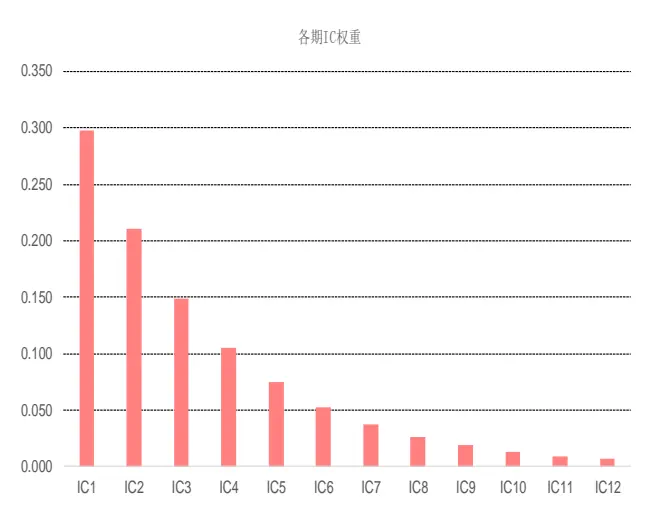
数据来源：wind、中信建投证券研究发展部
再看下半衰期H=2，序列长度N=24 时的各期 IC 权重值序列：

图 19：半衰期H=2，序列长度N=24的各期 IC权重序列 1

|  | 各期IC权重 |
| --- | --- |
| IC1 | 0.2930 |
| IC2 | 0.2072 |
| IC3 | 0.1465 |
| IC4 | 0.1036 |
| IC5 | 0.0732 |
| IC6 | 0.0518 |
| IC7 | 0.0366 |
| IC8 | 0.0259 |
| IC9 | 0.0183 |
| IC10 | 0.0129 |
| IC11 | 0.0092 |
| IC12 | 0.0065 |
| IC13 | 0.0046 |
| IC14 | 0.0032 |
| IC15 | 0.0023 |
| IC16 | 0.0016 |
| IC17 | 0.0011 |
| IC18 | 0.0008 |
| IC19 | 0.0006 |
| IC20 | 0.0004 |
| IC21 | 0.0003 |
| IC22 | 0.0002 |
| IC23 | 0.0001 |
| IC24 | 0.0001 |

数据来源：wind、中信建投证券研究发展部

图 20：半衰期H=2，序列长度N=24的各期 IC权重序列 2
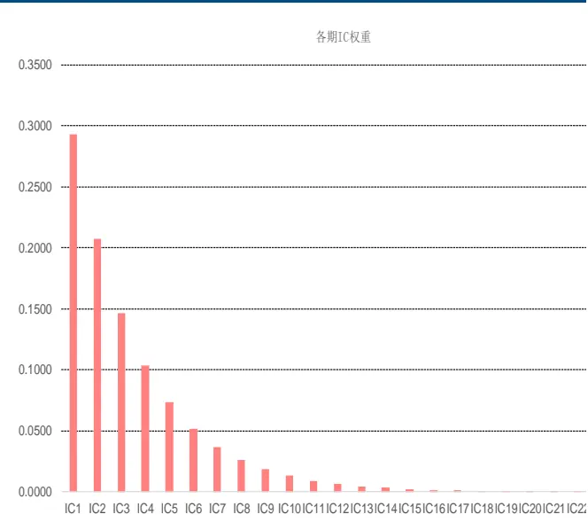
数据来源：wind、中信建投证券研究发展部

从上面两个不同序列长度N的各期 IC 权重序列可以看出，前 5 大 IC 权重占比均接近 85%，前 10 大权重占比接近 98%，因此序列长度 N 取 12 或 24 对最终的因子 IC 合成权重影响不大。

我们再看一个具体实例，对两个反转因子 Momentum_1m(1 个月反转)和 Momentum_3m (3 个月反转)做 IC半衰期加权时，我们分别选取不同的 IC 样本序列长度 N，发现 N 从 5 开始一直到 100，两个选股因子的最终权重变化较小，因此序列长度 N 对因子的最终权重影响较小，影响程度几乎可以忽略，我们在之后的实证中主要关注半衰期参数H的选取：

表 3：不同 IC样本序列长度 N对反转因子 IC半衰期加权的权重影响

| IC序列长度N | Momentum_1m | Momentum_3m |
| --- | --- | --- |
| 3 | -0.125 | -0.009 |
| 4 | -0.114 | -0.016 |
| 5 | -0.088 | -0.010 |
| 8 | -0.086 | -0.016 |
| 10 | -0.086 | -0.017 |
| 11 | -0.087 | -0.017 |
| 12 | -0.087 | -0.017 |
| 24 | -0.086 | -0.017 |
| 100 | -0.086 | -0.017 |

数据来源：wind、中信建投证券研究发展部

通过前面分析，在做多因子 IC 半衰期加权时，半衰期参数H的选取最为重要。而我们在第二节单因子衰减速度的研究中发现不同样本池和不同因子类别的因子衰减速度有较大差异（即单因子的半衰期 H_Factor 有较大不同）。因此从逻辑上出发，在做因子 IC 半衰期加权时，我们首先需要对相同种类或者相同衰减速度的因子进行合并归类，而不是对所有因子同时做加权处理。

但是对于相同类型或相同衰减速度的因子怎样进行合并呢？下面，我们有个想法，是否具有相同衰减速度的同类型因子在做 IC 半衰期加权时，半衰期参数H取因子本身的半衰期 H_Factor 时，组合的最终表现较好？

我们分别选取归属于成长、反转和价值的一对选股因子进行分析，分别做 IC 测试和五分位测试（红色代表表现最好或接近最好的一组，基准选取中证全指指数），回测时间和因子处理方法和单因子一致。其中各组合分别为因子等权、因子 IC 均值加权（IC 样本序列长度 N=12）、IC 半衰期加权( IC 样本序列长度 N=12，半衰期参数H分别为 1、2、3、4、5)。

## 3.2、IC半衰期加权方法（成长因子合成）

下面，我们看下两个成长因子 SaleEarnings_SQ_YoY（单季度营业利润同比增长率）和 Sales_SQ_YoY（单季度营业收入同比增长率）的因子加权方法对比，两个因子的半衰期均为 4。其中因子加权方法从左到右分别为因子等权、因子 IC 均值加权（IC 样本序列长度 N=12）、IC 半衰期加权( IC 样本序列长度 N=12，半衰期参数H分别为 1、2、3、4、5)。经过检测，IC_IR 表现最好的是 IC 半衰期加权(半衰期参数H为 3)方法，IC 半衰期加权(半衰期参数H为 4)方法排名第二，而第一分位超额收益表现最好的是 IC 半衰期加权(半衰期参数H为 4)方法。

表 4：成长因子 IC半衰期加权方法对比

| IC分析 | 等权 | IC均值加权 | 半衰期1 | 半衰期2 | 半衰期3 | 半衰期4 | 半衰期5 |
| --- | --- | --- | --- | --- | --- | --- | --- |
| IC均值 | 2.46 | 2.64 | 2.92 | 2.95 | 2.97 | 2.92 | 2.86 |
| IC标准差 | 5.27 | 5.33 | 5.74 | 5.51 | 5.31 | 5.31 | 5.38 |
| IR | 0.47 | 0.50 | 0.51 | 0.54 | 0.56 | 0.55 | 0.53 |
| 胜率 | 67.50 | 67.50 | 70.83 | 70.00 | 69.17 | 68.33 | 70.00 |
| 第一分位超额收益 | 等权 | IC均值加权 | 半衰期1 | 半衰期2 | 半衰期3 | 半衰期4 | 半衰期5 |
| 总收益 | 231.32 | 239 | 242.38 | 259.24 | 274 | 275.87 | 265.17 |
| 年化收益 | 12.73 | 12.98 | 13.1 | 13.64 | 14.1 | 14.16 | 13.83 |
| 年化波动 | 12.24 | 12.28 | 12.2 | 12.13 | 12.23 | 12.23 | 12.31 |
| 夏普比率 | 1.04 | 1.06 | 1.07 | 1.12 | 1.15 | 1.16 | 1.12 |
| 最大回撤 | 19.22 | 19.45 | 19.48 | 18.54 | 18.66 | 19.17 | 19.73 |
| 收益回撤比 | 0.66 | 0.67 | 0.67 | 0.74 | 0.76 | 0.74 | 0.7 |
| 胜率 | 65.83 | 66.67 | 63.33 | 67.5 | 68.33 | 66.67 | 66.67 |

数据来源：wind、中信建投证券研究发展部

## 3.3、IC半衰期加权方法（反转因子合成）

下面，我们再看下两个反转因子 Momentum_1m（最近一个月收益率）和 Momentum_3m（最近三个月收益率）的因子加权方法对比，两个因子的半衰期均为 1。IC_IR 表现最好的是 IC 半衰期加权(半衰期参数H为 2)方法，IC 半衰期加权(半衰期参数H为 1)方法排名第三，而第一分位超额收益表现最好的是 IC 半衰期加权(半衰期参数H为 1)方法。

表 5：反转因子 IC半衰期加权方法对比

| IC分析 | 等权 | IC均值加权 | 半衰期1 | 半衰期2 | 半衰期3 | 半衰期4 | 半衰期5 |
| --- | --- | --- | --- | --- | --- | --- | --- |
| IC均值 | 7.60 | 7.80 | 8.47 | 8.48 | 8.24 | 8.09 | 7.98 |
| IC标准差 | 10.85 | 10.72 | 10.90 | 10.41 | 10.50 | 10.57 | 10.63 |
| IR | 0.70 | 0.73 | 0.78 | 0.81 | 0.79 | 0.77 | 0.75 |
| 胜率 | 77.50 | 76.67 | 80.83 | 81.67 | 78.33 | 77.50 | 77.50 |
| 第一分位超额收益 | 等权 | IC均值加权 | 半衰期1 | 半衰期2 | 半衰期3 | 半衰期4 | 半衰期5 |
| 总收益 | 367.82 | 387.58 | 445.02 | 442.89 | 418.57 | 406.17 | 395.28 |
| 年化收益 | 16.68 | 17.17 | 18.48 | 18.43 | 17.89 | 17.61 | 17.35 |
| 年化波动 | 13.44 | 13.56 | 13.82 | 13.56 | 13.54 | 13.59 | 13.59 |
| 夏普比率 | 1.24 | 1.27 | 1.34 | 1.36 | 1.32 | 1.3 | 1.28 |
| 最大回撤 | 20.99 | 21.61 | 20.77 | 20.84 | 21.14 | 21.08 | 21.06 |
| 收益回撤比 | 0.79 | 0.79 | 0.89 | 0.88 | 0.85 | 0.84 | 0.82 |
| 胜率 | 64.17 | 64.17 | 67.5 | 65.83 | 65 | 64.17 | 64.17 |

数据来源：wind、中信建投证券研究发展部

## 3.4、IC半衰期加权方法（价值因子合成）

下面，我们再看下两个价值因子 EP_TTM 和 BP_LYR 的因子加权方法对比，两个因子的半衰期均为 3。IC_IR 表现最好的是 IC 半衰期加权(半衰期参数H为 3)方法，而第一分位超额收益表现最好的是 IC 半衰期加权(半衰期参数H为 1)方法，IC 半衰期加权(半衰期参数H为 3)方法排名第三。

表 6：价值因子 IC半衰期加权方法对比

| IC分析 | 等权 | IC均值加权 | 半衰期1 | 半衰期2 | 半衰期3 | 半衰期4 | 半衰期5 |
| --- | --- | --- | --- | --- | --- | --- | --- |
| IC均值 | 5.54 | 5.80 | 6.82 | 6.70 | 6.59 | 6.35 | 6.20 |
| IC标准差 | 9.25 | 9.22 | 9.70 | 9.43 | 9.19 | 9.27 | 9.30 |
| IR | 0.60 | 0.63 | 0.70 | 0.71 | 0.72 | 0.69 | 0.67 |
| 胜率 | 72.50 | 75.00 | 75.83 | 75.00 | 75.00 | 74.17 | 74.17 |
| 第一分位超额收益 | 等权 | IC均值加权 | 半衰期1 | 半衰期2 | 半衰期3 | 半衰期4 | 半衰期5 |
| 总收益 | 255.62 | 279.74 | 313.94 | 307.8 | 300.11 | 292.93 | 287.29 |
| 年化收益 | 13.53 | 14.27 | 15.26 | 15.09 | 14.87 | 14.67 | 14.5 |
| 年化波动 | 7.78 | 7.89 | 7.95 | 7.94 | 7.87 | 7.85 | 7.88 |
| 夏普比率 | 1.74 | 1.81 | 1.92 | 1.9 | 1.89 | 1.87 | 1.84 |
| 最大回撤 | 8.56 | 8.04 | 7.14 | 6.91 | 7.05 | 7.15 | 7.34 |
| 收益回撤比 | 1.58 | 1.78 | 2.14 | 2.18 | 2.11 | 2.05 | 1.97 |
| 胜率 | 61.67 | 68.33 | 70 | 66.67 | 66.67 | 66.67 | 66.67 |

数据来源：wind、中信建投证券研究发展部

## 3.5、IC半衰期加权方法（不同类型因子合成）

从上面三组同类型且相同衰减速度的合成因子表现可以看出，在做因子 IC 半衰期加权时，半衰期参数H取因子本身的半衰期 H_Factor 时，组合的表现最好或者接近最好（从复合因子的 IC/IR、第一分位组合超额收益/夏普比率的表现来看），这也验证了我们需要把相同半衰期 H_Factor 的因子进行合并的逻辑猜想。

而对于不同类型但衰减速度相同的因子，是否有同样的规律呢？下面我们选取了 EP_TTM、BP_LYR、TurnoverAvg1M、Volatility1M 共 4 个选股因子，其中 EP_TTM、 BP_LYR 属于价值因子，而 TurnoverAvg1M、Volatility1M 属于技术因子，4 个因子的衰减速度一样（半衰期 H_Factor 都为 3）。其中因子加权方法从左到右分别为所有因子等权、大类因子间等权大类因子内 IC 均值加权（IC 样本序列长度 N=12） 、所有因子 IC 均值加权（IC 样本序列长度 N=12）、IC 半衰期加权( IC 样本序列长度 N=12，半衰期参数H分别为 1、2、3、4、5)。经过检测，IC_IR 表现最好的是 IC 半衰期加权(半衰期参数H为 2)方法，IC 半衰期加权(半衰期参数H为 3)方法排名第二，而第一分位超额收益表现最好的是 IC 半衰期加权(半衰期参数H为 2)方法，IC 半衰期加权(半衰期参数H为3)方法排名第二。

表 7：不同类型（相同半衰期）因子 IC半衰期加权方法对比

| IC分析 | 等权 | 大类因子间等权，大类因子内IC均值加权 | IC均值加权 | 半衰期1 | 半衰期2 | 半衰期3 | 半衰期4 | 半衰期5 |
| --- | --- | --- | --- | --- | --- | --- | --- | --- |
| IC均值 | 7.84 | 8.30 | 8.86 | 10.45 | 10.32 | 9.95 | 9.70 | 9.45 |
| IC标准差 | 11.31 | 11.03 | 11.14 | 11.81 | 11.11 | 10.98 | 10.97 | 11.06 |
| IR | 0.69 | 0.75 | 0.80 | 0.89 | 0.93 | 0.91 | 0.88 | 0.85 |
| 胜率 | 75.00 | 76.67 | 77.50 | 80.83 | 79.17 | 80.00 | 80.00 | 78.33 |
| 第一分位超额收益 | 等权 | 大类因子间等权，大类因子内IC均值加权 | IC均值加权 | 半衰期1 | 半衰期2 | 半衰期3 | 半衰期4 | 半衰期5 |
| 总收益 | 324.79 | 371.18 | 397.13 | 495.72 | 500.93 | 498.53 | 476.86 | 454.25 |
| 年化收益 | 15.56 | 16.77 | 17.39 | 19.54 | 19.64 | 19.59 | 19.15 | 18.68 |
| 年化波动 | 8.27 | 8.29 | 8.79 | 8.48 | 8.62 | 8.89 | 8.9 | 8.79 |
| 夏普比率 | 1.88 | 2.02 | 1.98 | 2.3 | 2.28 | 2.2 | 2.15 | 2.13 |
| 最大回撤 | 8.98 | 9.06 | 11.06 | 7.95 | 8.95 | 9.27 | 9.69 | 9.88 |
| 收益回撤比 | 1.73 | 1.85 | 1.57 | 2.46 | 2.19 | 2.11 | 1.98 | 1.89 |
| 胜率 | 67.5 | 70 | 70.83 | 71.67 | 73.33 | 73.33 | 72.5 | 71.67 |

数据来源：wind、中信建投证券研究发展部

下面两图是各组合的 IC 均值和第一分位组合超额收益图：

图 21：不同类型（相同半衰期）因子 IC加权方法 IC均值图
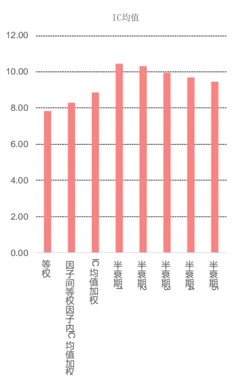
数据来源：wind、中信建投证券研究发展部

图 22：不同类型因子 IC加权方法第一分位超额收益图
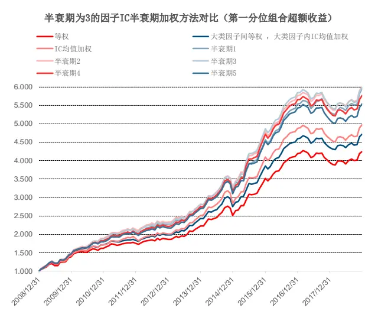
数据来源：wind、中信建投证券研究发展部

## 3.6、IC半衰期加权方法（不同指数样本池的因子合成效果）

下面我们再看下 IC 半衰期加权方法在沪深 300、中证 500 指数样本池内的选股效果对比，具体选股方法和前面的基本一致，只是选股样本池变为沪深 300 或中证 500 指数样本池，另外组合做了行业中性处理（即组合在各行业的市值分布与对应指数样本池保持一致）。这里选取两个反转因子 Momentum_1m（最近一个月收益率）和 Momentum_3m（最近三个月收益率）作为例子：

表 8：IC半衰期加权方法对比(反转因子在沪深 300指数样本池的合成)

| IC分析 | 等权 | IC均值加权 | 半衰期1 | 半衰期2 | 半衰期3 | 半衰期4 | 半衰期5 |
| --- | --- | --- | --- | --- | --- | --- | --- |
| IC均值 | 4.17 | 4.46 | 5.08 | 4.98 | 4.97 | 4.82 | 4.77 |
| IC标准差 | 11.31 | 11.34 | 12.14 | 11.71 | 11.40 | 11.37 | 11.25 |
| IR | 0.37 | 0.39 | 0.42 | 0.43 | 0.44 | 0.42 | 0.42 |
| 胜率 | 62.50 | 64.17 | 65.00 | 64.17 | 64.17 | 64.17 | 62.50 |
| 第一分位超额收益 | 等权 | IC均值加权 | 半衰期1 | 半衰期2 | 半衰期3 | 半衰期4 | 半衰期5 |
| 总收益 | 80.17 | 88.33 | 107.94 | 103.63 | 98.82 | 83.41 | 86.42 |
| 年化收益 | 6.06 | 6.54 | 7.6 | 7.37 | 7.11 | 6.25 | 6.43 |
| 年化波动 | 6.38 | 6.46 | 6.86 | 6.59 | 6.53 | 6.68 | 6.6 |
| 夏普比率 | 0.95 | 1.01 | 1.11 | 1.12 | 1.09 | 0.94 | 0.97 |
| 最大回撤 | 14.82 | 16.51 | 17.77 | 16.01 | 15.82 | 16.55 | 14.39 |
| 收益回撤比 | 0.41 | 0.4 | 0.43 | 0.46 | 0.45 | 0.38 | 0.45 |
| 胜率 | 62.5 | 63.33 | 64.17 | 63.33 | 63.33 | 60.83 | 62.5 |

数据来源：wind、中信建投证券研究发展部

表 9：IC半衰期加权方法对比(反转因子在中证 500指数样本池的合成)

| IC分析 | 等权 | IC均值加权 | 半衰期1 | 半衰期2 | 半衰期3 | 半衰期4 | 半衰期5 |
| --- | --- | --- | --- | --- | --- | --- | --- |
| IC均值 | 5.60 | 5.63 | 6.34 | 6.25 | 6.02 | 5.97 | 6.03 |
| IC标准差 | 11.75 | 11.73 | 12.19 | 11.87 | 11.84 | 11.71 | 11.58 |
| IR | 0.48 | 0.48 | 0.52 | 0.53 | 0.51 | 0.51 | 0.52 |
| 胜率 | 70.00 | 70.00 | 73.33 | 72.50 | 73.33 | 71.67 | 71.67 |
| 第一分位超额收益 | 等权 | IC均值加权 | 半衰期1 | 半衰期2 | 半衰期3 | 半衰期4 | 半衰期5 |
| 总收益 | 121.23 | 118.73 | 137.64 | 134.58 | 136.75 | 126.26 | 135.25 |
| 年化收益 | 8.26 | 8.14 | 9.04 | 8.9 | 9 | 8.51 | 8.93 |
| 年化波动 | 7.38 | 7.42 | 7.38 | 7.37 | 7.36 | 7.41 | 7.27 |
| 夏普比率 | 1.12 | 1.1 | 1.23 | 1.21 | 1.22 | 1.15 | 1.23 |
| 最大回撤 | 13.92 | 14.4 | 15.74 | 14.95 | 14.55 | 13.95 | 10.1 |
| 收益回撤比 | 0.59 | 0.57 | 0.57 | 0.6 | 0.62 | 0.61 | 0.88 |
| 胜率 | 62.5 | 60.83 | 60 | 59.17 | 60.83 | 60 | 60.83 |

数据来源：wind、中信建投证券研究发展部

经过测试，在对 70%以上不同类型但衰减速度相同的因子做多因子 IC 半衰期加权时，半衰期参数H等于因子本身的半衰期 H_Factor 时，组合的表现可以达到最好或者接近最好，另外 IC 半衰期加权组合的表现一般比所有因子等权组合、大类因子间等权大类因子内 IC 均值加权组合好。这个规律在沪深 300、中证 500 指数样本内同样存在。

## 四、IC_IR 半衰期加权方法

这一节我们测试多因子的 IC_IR 半衰期加权方法的效果。经过测试，我们发现与 IC 半衰期加权方法类似，大部分因子当因子组合的半衰期参数H等于因子本身的半衰期 H_Factor 时，组合的表现最好或者接近最好，另外 IC_IR 半衰期加权组合比因子等权组合、大类因子间等权大类因子内 IC_IR 均值加权组合好。具体可以看下面例子：

首先同样是 SaleEarnings_SQ_YoY（单季度营业利润同比增长率）和 Sales_SQ_YoY（单季度营业收入同比增长率）两个成长因子的合成方法效果对比：

表 10：成长因子 IC_IR半衰期加权方法对比

| IC分析 | 等权 | IR均值加权 | 半衰期1 | 半衰期2 | 半衰期3 | 半衰期4 | 半衰期5 |
| --- | --- | --- | --- | --- | --- | --- | --- |
| IC均值 | 2.46 | 2.60 | 2.85 | 2.90 | 2.91 | 2.86 | 2.81 |
| IC标准差 | 5.27 | 5.20 | 5.60 | 5.39 | 5.18 | 5.18 | 5.24 |
| IR | 0.47 | 0.50 | 0.51 | 0.54 | 0.56 | 0.55 | 0.54 |
| 胜率 | 67.50 | 68.33 | 69.17 | 69.17 | 69.17 | 70.00 | 70.00 |
| 第一分位超额收益 | 等权 | IR均值加权 | 半衰期1 | 半衰期2 | 半衰期3 | 半衰期4 | 半衰期5 |
| 总收益 | 231.32 | 230.3 | 240.69 | 259.53 | 265.79 | 266.3 | 265.08 |
| 年化收益 | 12.73 | 12.69 | 13.04 | 13.65 | 13.85 | 13.86 | 13.83 |
| 年化波动 | 12.24 | 12.28 | 12.23 | 12.17 | 12.28 | 12.29 | 12.35 |
| 夏普比率 | 1.04 | 1.03 | 1.07 | 1.12 | 1.13 | 1.13 | 1.12 |
| 最大回撤 | 19.22 | 19.51 | 19.54 | 18.65 | 19.15 | 19.5 | 19.87 |
| 收益回撤比 | 0.66 | 0.65 | 0.67 | 0.73 | 0.72 | 0.71 | 0.7 |
| 胜率 | 65.83 | 66.67 | 65.83 | 66.67 | 66.67 | 67.5 | 67.5 |

数据来源：wind、中信建投证券研究发展部

然后是 Momentum_1m（最近一个月收益率）和 Momentum_3m（最近三个月收益率）两个反转因子的合成方法效果对比：

表 11：反转因子 IC_IR半衰期加权方法对比

| IC分析 | 等权 | IR均值加权 | 半衰期1 | 半衰期2 | 半衰期3 | 半衰期4 | 半衰期5 |
| --- | --- | --- | --- | --- | --- | --- | --- |
| IC均值 | 7.60 | 7.74 | 8.41 | 8.44 | 8.20 | 8.04 | 7.93 |
| IC标准差 | 10.85 | 10.55 | 10.80 | 10.27 | 10.33 | 10.41 | 10.46 |
| IR | 0.70 | 0.73 | 0.78 | 0.82 | 0.79 | 0.77 | 0.76 |
| 胜率 | 77.50 | 77.50 | 79.17 | 80.83 | 79.17 | 78.33 | 78.33 |
| 第一分位超额收益 | 等权 | IR均值加权 | 半衰期1 | 半衰期2 | 半衰期3 | 半衰期4 | 半衰期5 |
| 总收益 | 367.82 | 377.18 | 435.59 | 424.28 | 408.62 | 402.95 | 395.08 |
| 年化收益 | 16.68 | 16.91 | 18.27 | 18.02 | 17.66 | 17.53 | 17.35 |
| 年化波动 | 13.44 | 13.52 | 13.85 | 13.54 | 13.53 | 13.58 | 13.57 |
| 夏普比率 | 1.24 | 1.25 | 1.32 | 1.33 | 1.31 | 1.29 | 1.28 |
| 最大回撤 | 20.99 | 21.01 | 20.9 | 20.97 | 21.1 | 21.06 | 21.03 |
| 收益回撤比 | 0.79 | 0.81 | 0.87 | 0.86 | 0.84 | 0.83 | 0.82 |
| 胜率 | 64.17 | 65 | 66.67 | 65 | 64.17 | 64.17 | 65 |

数据来源：wind、中信建投证券研究发展部

最后是 EP_TTM、BP_LYR 和 TurnoverAvg1M 共 3 个选股因子，其中 EP_TTM、 BP_LYR 属于价值因子，而TurnoverAvg1M 属于技术因子，3 个因子的衰减速度一样（半衰期 H_Factor 都为 3）。

表 12：不同类型（相同半衰期）因子 IC_IR半衰期加权方法对比

| IC分析 | 等权 | 大类因子间等权，大类因子内IR均值加权 | IR均值加权 | 半衰期1 | 半衰期2 | 半衰期3 | 半衰期4 | 半衰期5 |
| --- | --- | --- | --- | --- | --- | --- | --- | --- |
| IC均值 | 7.6 | 8.5 | 8.7 | 10.2 | 10.0 | 9.6 | 9.4 | 9.2 |
| IC标准差 | 10.2 | 10.0 | 9.7 | 10.4 | 9.8 | 9.7 | 9.7 | 9.8 |
| IR | 0.7 | 0.8 | 0.9 | 1.0 | 1.0 | 1.0 | 1.0 | 0.9 |
| 胜率 | 76.7 | 77.5 | 79.2 | 80.8 | 81.7 | 80.8 | 79.2 | 79.2 |
| 第一分位超额收益 | 等权 | 大类因子间等权，大类因子内IR均值加权 | IR均值加权 | 半衰期1 | 半衰期2 | 半衰期3 | 半衰期4 | 半衰期5 |
| 总收益 | 333.07 | 415.61 | 434.28 | 500.93 | 527.06 | 514.29 | 502.45 | 483.25 |
| 年化收益 | 15.79 | 17.82 | 18.24 | 19.64 | 20.15 | 19.91 | 19.67 | 19.28 |
| 年化波动 | 8.15 | 8.31 | 8.6 | 8.32 | 8.4 | 8.62 | 8.54 | 8.5 |
| 夏普比率 | 1.94 | 2.14 | 2.12 | 2.36 | 2.4 | 2.31 | 2.3 | 2.27 |
| 最大回撤 | 8.09 | 8.18 | 8.25 | 6.93 | 7.12 | 7.34 | 7.34 | 7.62 |
| 收益回撤比 | 1.95 | 2.18 | 2.21 | 2.84 | 2.83 | 2.71 | 2.68 | 2.53 |
| 胜率 | 68.33 | 72.5 | 70.83 | 70.83 | 71.67 | 73.33 | 73.33 | 72.5 |

数据来源：wind、中信建投证券研究发展部

下面两图是 3 选股因子组合的 IC 均值和第一分位组合超额收益图：

图 23：不同类型因子 IC_IR加权方法 IC均值图
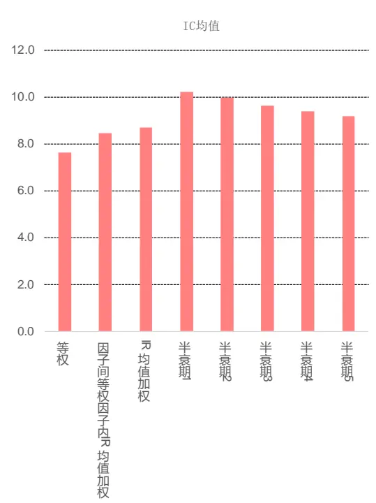
数据来源：wind、中信建投证券研究发展部

图 24：不同类型因子 IC_IR加权方法第一分位超额收益图
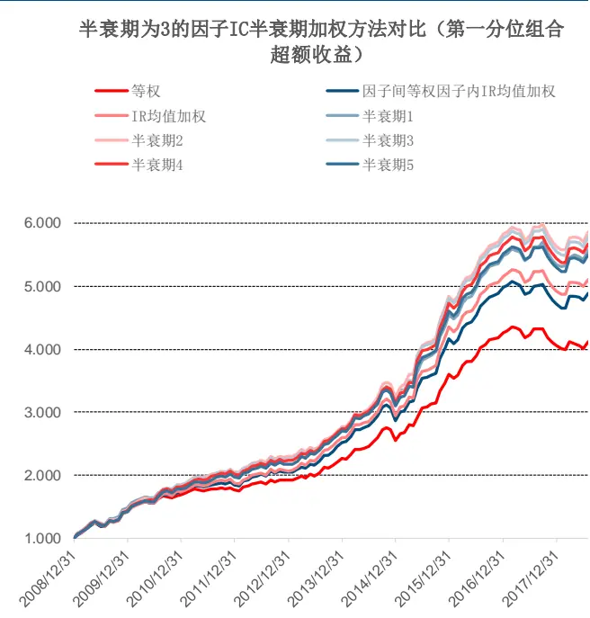
数据来源：wind、中信建投证券研究发展部

## 五、单因子时间序列衰减加权方法

我们在前面两节探讨了多因子在横截面上的因子衰减加权方法（包括 IC 半衰期加权和 IC_IR 半衰期加权），下面开始我们探讨因子衰减在单因子时间序列上的加权方法。

我们在第二节的单因子衰减分析可以看出，所有因子都有一定的衰减时间（不管是因子 IC 还是因子 IC_IR），如 EP_TTM（市盈率）因子的 IC 和 IC_IR 半衰期均为 3 期，这也表明最近 3 期的市盈率因子暴露值均对未来一期的因子收益有影响，而我们一般在对未来一期的因子收益率做预测时仅用当期的因子暴露值，而忽略之前历史因子值的影响，这种处理方法对于一些有较长衰减期的财务类因子例如价值、成长、质量等因子显然不太合适。因此从直观上看，我们应该搭建一套针对单个因子不同历史期限暴露值的时间序列加权方法。

## 5.1、单因子时间序列衰减加权方法（EP_TTM各期因子等权）

下面我们首先看下等权方法在单因子时间序列上的加权效果，下面以 EP_TTM 为例，下表中的“单因子”列为仅用当期因子值，“过去 1 期”列为用当期和过去 1 期共两期的因子值等权合成，“过去 2 期”列为用当期、过去 1 期和过去 2 期共三期的因子值等权合成，以此类推。所有因子值都做了横截面标准化处理：

表 13：单因子时间序列衰减加权方法（EP_TTM各期因子等权）

| IC分析 | 单因子 | 过去1期 | 过去2期 | 过去3期 | 过去4期 | 过去5期 |
| --- | --- | --- | --- | --- | --- | --- |
| IC均值 | 4.99 | 3.70 | 3.49 | 3.20 | 2.97 | 3.03 |
| IC标准差 | 7.59 | 7.66 | 7.63 | 7.63 | 7.60 | 7.58 |
| IR | 0.66 | 0.48 | 0.46 | 0.42 | 0.39 | 0.40 |
| 胜率 | 71.43 | 67.23 | 65.25 | 63.25 | 61.21 | 61.74 |
| 第一分位超额收益 | 单因子 | 过去1期 | 过去2期 | 过去3期 | 过去4期 | 过去5期 |
| 总收益 | 128.34 | 188.65 | 173.39 | 145.66 | 123.01 | 119.12 |
| 年化收益 | 8.68 | 11.28 | 10.77 | 9.66 | 8.65 | 8.53 |
| 年化波动 | 7.32 | 7.37 | 7.37 | 7.06 | 6.93 | 6.69 |
| 夏普比率 | 1.57 | 1.53 | 1.46 | 1.37 | 1.25 | 1.28 |
| 最大回撤 | 7.7 | 7.91 | 8.24 | 7.53 | 7.48 | 6.77 |
| 收益回撤比 | 1.49 | 1.43 | 1.31 | 1.28 | 1.16 | 1.26 |
| 胜率 | 65.93 | 64.71 | 66.1 | 64.1 | 64.66 | 63.48 |

数据来源：wind、中信建投证券研究发展部

从上面对 $\mathsf{EP\_TTM}$ （市盈率）单因子时间序列上的加权效果可以看出，利用过去 1-5 期因子值等权合成后的选股效果均不如仅用当期的因子值（从 IC 和 IC_IR 值可以看出），而当期和过去 1 期因子值等权合成的因子超额收益最高，结合两者来看没有显著的规律。因此我们需要探讨一种更为有效的因子合成方法以最大化地利用历史因子暴露值。由于我们主要看复合因子的 IC_IR 来判断选股效果，因此我们可以尝试利用过去 N 期的因子暴露值，采用复合因子 IC_IR 最大化的方法来合成。

## 5.2、单因子时间序列衰减加权方法（最大化复合因子 IC_IR加权方法介绍）

下面我们来简单介绍下复合因子 IC_IR 最大化的方法。假设我们有 N 个因子，各因子的 IC 均值为IC̅̅̅ =$(\overline{{IC_{1}}},\overline{{IC_{2}}},\dots,\overline{{IC_{N}}})$ ，IC 的协方差矩阵我们定义为Σ。每个因子的权重我们定义为 $w{=}(w_{1},w_{2},\cdots,\ w_{N})$ ，则可得：

$$
IR=\frac{w^{\prime}*\overline{{IC}}}{\sqrt{w^{\prime}*\sum*\mathbf{w}}}
$$

其中 IR 为复合因子的 IC_IR，为了使得 IR 最大化，可以对因子权重 w 求偏导数，得到：

$\begin{array}{r}{\frac{\partial IR}{\partial\mathbf{w}}=\frac{\overline{{IC}}}{\sqrt{w^{\prime}}*\sum*\mathbf{w}}-\frac{\left(w^{\prime}*\overline{{IC}}\right)*\sum*\mathbf{w}}{(w^{\prime}*\sum*\mathbf{w})^{\frac{3}{2}}}}\end{array}$ 。最后，令 $\begin{array}{r}{\frac{\partial IR}{\partial w}=0}\end{array}$ ， 即可得到因子的最优化权重为 $w^{*}=s*\Sigma^{-1}*\overline{{IC}}$ ， 其中 s 为任意正数。

从上式可知，因子 IC 的均值IC̅̅̅和因子 IC 的协方差矩阵Σ决定了因子的最优化权重。但在实际情况中，我们对未来的IC̅̅̅和Σ只能通过历史数据来估计，对这两者的估计质量直接决定了复合因子的 IC_IR 准确度。

我们在计算因子IC的协方差矩阵时，最简单的是使用协方差矩阵的无偏估计即样本协方差阵。但问题在于，如果我们的因子数量较多，其协方差矩阵就不一定可逆。即便它是可逆的，样本协方差矩阵的逆矩阵也不是协方差矩阵逆矩阵的无偏估计。

实际上在 Bai(2011)证明了如果在正态分布假设下有： $\begin{array}{r}{E(\Sigma^{-1})=\frac{T}{T-N-2}\Sigma^{-1}}\end{array}$

其中 N 指的是因子个数，T 指的是样本期（即往前取几期的数据），如果 T接近或小于 N，样本协方差矩阵逆的估计偏差将非常之大。

基于以上问题， Ledoit 在 2004 年提出了一种压缩估计的估计方法。它的基本思想使用一个方差小但偏差大的协方差矩阵估计量 $\hat{\cdot}\overset{\wedge}{\boldsymbol{\theta}},$ 作为目标估计量，和样本协方差矩阵做一个加权，以牺牲部分偏差来获得更稳健的估计量： $\hat{{\cal{\Sigma}}}_{shrink}={\bf{u}}*\hat{\bf{\theta}}+(1-{\bf{u}})*\hat{\bf{\mu}}$

参数 u 通过最小化估计量的二次偏差得到，至于估计量θ的选择，我们主要采用单参数形式，即θ可以表示为方差乘以一个单位矩阵。

另外我们后面的测试样本主要取过去 5 期的因子值计算（即因子个数 M=5），为了使协方差可逆，我们需要选取一个较长的样本期 T，这里采用过去 24 个月的历史样本（样本期 T=24）来计算IC̅̅̅和Σ，然后采用 Ledoit(2004)压缩估计量方法求出因子 IC 协方差矩阵Σ。下面我们采用复合因子 IC_IR 最大化的方法来对 EP_TTM（市盈率）因子进行时间序列加权：

表 14：单因子时间序列衰减加权方法（EP_TTM各期因子最大化复合因子 IC_IR加权）

| IC分析 | 单因子 | 过去1期 | 过去2期 | 过去3期 | 过去4期 | 过去5期 |
| --- | --- | --- | --- | --- | --- | --- |
| IC均值 | 4.99 | 4.93 | 6.01 | 6.64 | 6.61 | 6.64 |
| IC标准差 | 7.59 | 7.76 | 7.17 | 6.37 | 6.04 | 5.95 |
| IR | 0.66 | 0.63 | 0.84 | 1.04 | 1.09 | 1.11 |
| 胜率 | 71.43 | 69.47 | 77.66 | 83.87 | 85.87 | 87.91 |
| 第一分位超额收益 | 单因子 | 过去1期 | 过去2期 | 过去3期 | 过去4期 | 过去5期 |
| 总收益 | 128.34 | 141.91 | 204.14 | 262.06 | 169.31 | 176.71 |
| 年化收益 | 8.68 | 11.8 | 15.26 | 18.06 | 13.79 | 14.36 |
| 年化波动 | 7.32 | 7.3 | 7.8 | 6.69 | 8.76 | 8.89 |
| 夏普比率 | 1.57 | 1.62 | 1.96 | 2.7 | 1.58 | 1.61 |
| 最大回撤 | 7.7 | 7.86 | 7.09 | 3.53 | 10.94 | 11.03 |
| 收益回撤比 | 1.49 | 1.5 | 2.15 | 5.11 | 1.26 | 1.3 |
| 胜率 | 65.93 | 66.32 | 68.09 | 74.19 | 68.48 | 69.23 |

数据来源：wind、中信建投证券研究发展部

下面两图是各组合的 IC 均值和第一分位组合的超额收益图：

图 25：EP_TTM最大化复合因子 IC_IR 加权方法 IC均值图
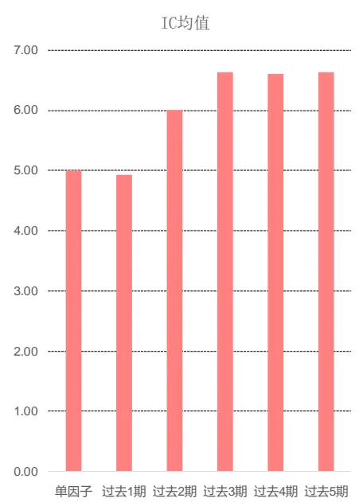
数据来源：wind、中信建投证券研究发展部

图 26：EP_TTM最大化复合因子 IC_IR加权方法第一分位超额收益图
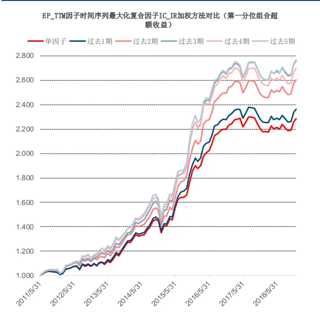
数据来源：wind、中信建投证券研究发展部

不管是选股组合的 IC、IC_IR 还是第一分位超额收益、夏普比率，利用过去的因子值进行加权的效果总体上比仅用当期因子值要好。值得注意的是，我们利用过去3期的因子值进行最大化复合因子IC_IR加权的效果最好，复合因子的IC达到6.64%，IC_IR达到1.04，第一分位组合年化超额收益达到18%。而从我们的前面分析中，EP_TTM因子的半衰期 H_Factor 为 3 期，通过检测样本期取最近 3 期的因子值做加权的效果最好，因此在做单因子的时间序列加权，因子的半衰期 H_Factor 是否也是最优参数呢？

我们接下来再看下在其他样本池选股是否具有相同规律，下面是 EP_TTM 因子在中证 500 指数样本池内的选股效果，具体选股方法和前面的基本一致，只是选股样本池变为中证 500 指数样本池，另外组合做了行业中性处理（即组合在各行业的市值分布与对应指数样本池一致）：

表 15：单因子时间序列衰减加权方法（中证 500样本内 EP_TTM各期因子最大化复合因子 IC_IR加权）

| IC分析 | 单因子 | 过去1期 | 过去2期 | 过去3期 | 过去4期 | 过去5期 |
| --- | --- | --- | --- | --- | --- | --- |
| IC均值 | 4.75 | 4.93 | 5.82 | 6.71 | 6.67 | 6.30 |
| IC标准差 | 9.56 | 9.74 | 9.05 | 8.19 | 8.11 | 8.22 |
| IR | 0.50 | 0.51 | 0.64 | 0.82 | 0.82 | 0.77 |
| 胜率 | 62.64 | 62.11 | 69.15 | 77.42 | 76.09 | 74.73 |
| 第一分位超额收益 | 单因子 | 过去1期 | 过去2期 | 过去3期 | 过去4期 | 过去5期 |
| 总收益 | 76.68 | 83.92 | 96.91 | 112.39 | 110.02 | 90.48 |
| 年化收益 | 7.79 | 8 | 9.03 | 10.21 | 10.16 | 8.87 |
| 年化波动 | 7.16 | 5.21 | 5.42 | 5.67 | 5.57 | 5.58 |
| 夏普比率 | 1.09 | 1.54 | 1.67 | 1.8 | 1.83 | 1.59 |
| 最大回撤 | 10.65 | 6.19 | 5.24 | 4.75 | 4.99 | 6.52 |
| 收益回撤比 | 0.73 | 1.29 | 1.73 | 2.15 | 2.04 | 1.36 |
| 胜率 | 59.34 | 69.47 | 68.09 | 69.89 | 71.74 | 69.23 |

数据来源：wind、中信建投证券研究发展部

EP_TTM 因子在中证 500 指数样本池的效果同样很好，效果最好的仍然是利用过去 3 期的因子加权合成，即样本期 T 与 EP_TTM 因子的半衰期 H_Factor 一致。另外我们也测试了其他因子在不同样本池的效果，发现大部分因子都符合这个规律。即在做单因子的时间序列加权上，单因子的半衰期 H_Factor 仍然是个最优参数，这和我们前面在横截面上做 IC、IC_IR 半衰期加权时的最优参数一致。这也证明了因子的半衰期 H_Factor 在多因子加权方法上的重要性，由于因子的半衰期 H_Factor 在足够长的测试样本内基本不会变化，因此其在多因子选股里可以作为一个稳健的最优参数，后期我们可以对其进行拓展和深入研究。

## 六、动态 IC 半衰期加权多因子组合展示

这节我们重新回到多因子 IC 半衰期加权方法，第三部分主要介绍的是相同半衰期的因子 IC 半衰期合成，如果是不同半衰期的因子我们怎样进行多因子加权呢？下面我们展示多种不同半衰期因子的多因子加权组合进行对 比 ， 选 取 了 EP_TTM 、 BP_LYR 、 TurnoverAvg1M 、 Volatility1M 、 Momentum_1m 、 Momentum_3m 、SaleEarnings_SQ_YoY、Sales_SQ_YoY 共 8 个选股因子，各因子的因子描述和半衰期如下图所示：

表 16：各因子相关信息

| 因子类别 | 因子名称 | 因子描述 | 半衰期 |
| --- | --- | --- | --- |
| 价值 | EP_TTM | 1/市盈率PE(TTM) | 3 |
| 价值 | BP_LYR | 1/PB_LYR | 3 |
| 技术 | TurnoverAvg1M | 过去一个月日均换手率 | 3 |
| 技术 | Volatility1M | 过去一个月日收益波动率 | 3 |
| 反转 | Momentum_1m | 复权收盘价/复权收盘价_一个月前-1 | 1 |
| 反转 | Momentum_3m | 复权收盘价/复权收盘价_三个月前-1 | 1 |
| 成长 | SaleEarnings_SQ_YoY | 单季度营业利润同比增长率 | 4 |
| 成长 | Sales_SQ_YoY | 单季度营业收入同比增长率 | 4 |

数据来源：wind、中信建投证券研究发展部

因子值用的是当期因子值，单因子处理方法和前面一致，多因子组合方法选取了 9 种不同的方法如下表。第 和第 种方法为我们常用的方法，即按因子所属的类别来分类，大类因子间等权合成，大类因子内按照因子 IC 过去 12 个月的均值加权或 IC 半衰期加权（半衰期参数任意取一个数，设为 3），后面 7 种方法为按因子的半衰期分类，大类因子间等权，大类因子内按照因子 IC 过去 12 个月的均值加权或 IC 半衰期加权，最后 5 种 IC半衰期加权方法的半衰期参数H均取固定的参数。而第 3 种标红色 IC 半衰期加权方法的半衰期参数H取各因子本身的半衰期 H_Factor，由于相同半衰期的因子已经归为一类，因此每个大类的半衰期参数H一致，此方法为动态 IC 半衰期加权方法。最后在全市场里每期选择因子打分排名前 100 的股票作为投资组合。最近 10 年的超额收益对比如下表所示：

表 17：各因子加权方法超额收益对比

| 多因子组合超额收益 | 总收益 | 年化收益 | 夏普比率 | 胜率 |
| --- | --- | --- | --- | --- |
| 按因子大类分类，大类因子间等权，大类因子内按照IC过去12个月均值加权 | 493.47 | 19.49 | 2.05 | 71.67 |
| 按因子大类分类，大类因子间等权，大类因子内按照IC半衰期加权(H=3) | 503.71 | 19.7 | 2.1 | 72.5 |
| 按半衰期分类，大类因子间等权，大类因子内按照IC半衰期加权(H=H_Factor) | 726.85 | 23.52 | 2.08 | 75 |
| 按半衰期分类，大类因子间等权，大类因子内按照IC过去12个月均值加权 | 586.71 | 21.25 | 1.75 | 69.17 |
| 按半衰期分类，大类因子间等权，大类因子内按照IC半衰期加权(H=1) | 707.27 | 23.23 | 2.05 | 74.17 |
| 按半衰期分类，大类因子间等权，大类因子内按照IC半衰期加权(H=2) | 713.33 | 23.32 | 2 | 73.33 |
| 按半衰期分类，大类因子间等权，大类因子内按照IC半衰期加权(H=3) | 714.01 | 23.33 | 1.99 | 75.83 |
| 按半衰期分类，大类因子间等权，大类因子内按照IC半衰期加权(H=4) | 654.46 | 22.39 | 1.88 | 75 |
| 按半衰期分类，大类因子间等权，大类因子内按照IC半衰期加权(H=5) | 632.29 | 22.03 | 1.87 | 73.33 |

数据来源：wind、中信建投证券研究发展部

可以看出，标红色的动态 IC 半衰期加权方法表现最好，最近 10 年的累计超额收益达到 727%，年化超额收益为 23.52%，夏普比率为 2.08。这种方法可以简单归纳为：1、按因子的半衰期分类，而不是按照传统的因子类别来分类；2、大类因子内做 IC 半衰期加权，半衰期参数H=因子本身的半衰期 H_Factor（把相同半衰期的因子归类后，从前面分析可知在对相同半衰期因子做IC半衰期加权时这种方法可以达到最优或者接近最优的效果）。

另外，我们看下动态 IC 半衰期加权方法多因子组合各年度的超额收益和累计超额收益净值，这里由于是在全市场选股，因此基准指数选了中证全指。我们看到除了 年市场风格比较极端（极个别大盘蓝筹股暴涨）跑输指数之外，其余年份都能够取得超过 10%的超额收益，2009 年和 2015 年的超额收益甚至达到 50%以上：

表 18：动态 IC半衰期加权多因子组合各年度超额收益统计

| 年度 | 2009 | 2010 | 2011 | 2012 | 2013 | 2014 | 2015 | 2016 | 2017 | 2018 | 总共 |
| --- | --- | --- | --- | --- | --- | --- | --- | --- | --- | --- | --- |
| 超额收益% | 51.74 | 25.97 | 13.90 | 26.13 | 24.82 | 11.01 | 82.03 | 12.95 | -7.11 | 13.78 | 726.85 |

数据来源：wind、中信建投证券研究发展部

表 19：动态 IC半衰期加权多因子组合累计超额收益净值
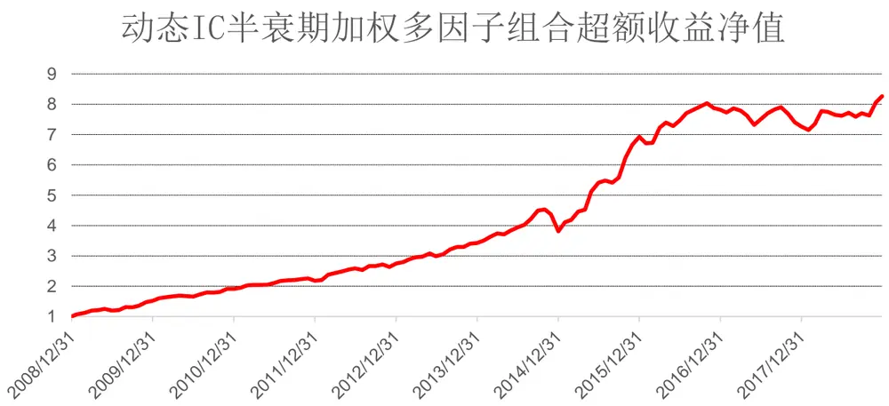
数据来源：wind、中信建投证券研究发展部

## 七、总结和思考

因子 IC 的时间衰减是被提及最多的一个因子衰减概念，用以衡量一个因子对未来的预测能力能持续多久。可以简单的用 IC 半衰期来衡量 IC 时间衰减的快慢，IC 半衰期的定义为月度 IC 下降到一半所用的时间。同理，我们也可以计算 IC_IR 的半衰期和衰减速度。

从单因子衰减分析可知大部分因子的 IC 衰减速度较快，所以在做因子 IC 加权时理应对因子近期的 IC 给与更大的权重分配，这样才能更好地适应市场短期的变化。这里，我们引入半衰期权重来衡量其影响。半衰期权重可以定义为，给定一个半衰期H，每隔H期 IC 的权重值会以指数下降的方式降低一半。

在做因子 IC 半衰期加权时，半衰期参数H取因子本身的半衰期 H_Factor 时，组合的表现最好或者接近最好。由此可见，我们在做因子 IC 半衰期加权时可以按照因子衰减速度进行归类合并而不是按照因子类型进行合并。

大部分因子当因子组合的半衰期参数H等于因子本身的半衰期 H_Factor 时，多因子的 IC_IR 半衰期加权方法的组合表现也是最好或者接近最好。

我们利用复合因子 IC_IR 最大化的方法搭建了一套基于单个因子不同历史期限暴露值的时间序列加权方法，发现利用历史因子值进行加权的效果总体上比仅用当期因子值要好，当历史样本期T等于因子的半衰期H_Factor时，效果最佳。

不管是在横截面上做 IC、IC_IR 半衰期加权，还是单因子的时间序列加权上，单因子的半衰期 H_Factor 均为一个最优参数，这也证明了因子的半衰期 H_Factor 在多因子加权方法上的重要性，由于因子的半衰期 H_Factor在足够长的测试样本内基本不会变化，因此其在多因子选股里可以作为一个稳健的最优参数，后期我们可以对其进行拓展和深入研究。

我们构建一个动态 IC 半衰期加权方法多因子组合，组合方法按因子半衰期分类，大类因子间等权 ，大类因子内按照因子 IC 半衰期加权（即半衰期参数H取各因子本身的半衰期 H_Factor），每期选择因子打分排名前 100的股票作为投资组合。组合最近十年的累计超额收益达到 727%，年化超额收益 23.52%，夏普比率为 2.08，除了 2017 年市场风格比较极端跑输指数之外，其余年份都能够取得超过 10%的超额收益。

## 分析师介绍

丁鲁明：同济大学金融数学硕士，中国准精算师，现任中信建投证券研究发展部金融工程方向负责人，首席分析师。10 年证券从业，历任海通证券研究所金融工程高级研究员、量化资产配置方向负责人；先后从事转债、选股、高频交易、行业配置、大类资产配置等领域的量化策略研究，对大类资产配置、资产择时领域研究深入，创立国内“量化基本面”投研体系。多次荣获团队荣誉：新财富最佳分析师 2009 第 4、2012第 4、2013 第 1、2014 第 3 等；水晶球最佳分析师 2009 第 1、2013 第 1；2018 年 wind金牌分析师第 2 等。

陈升锐： 芝加哥大学金融数学硕士，三年基金公司量化投资研究工作经验，2018 年研究助理加入中信建投研究发展部金融工程团队，专注于量化选股研究。chenshengrui@csc.com.cn

## 研究服务

## 保险组

张博 010-85130905 zhangbo@csc.com.cn

郭洁 -85130212 guojie@csc.com.cn

郭畅 010-65608482 guochang@csc.com.cn

张勇 010-86451312 zhangyongzgs@csc.com.cn

高思雨 010-8513-0491 gaosiyu@csc.com.cn

张宇 010-86451497 zhangyuyf@csc.com.cn

北京公募组 朱燕 85156403 zhuyan@csc.com.cn 任师蕙 010-8515-9274 renshihui@csc.com.cn 黄杉 010-85156350 huangshan@csc.com.cn 赵倩 010-85159313 zhaoqian@csc.com.cn 杨济谦 010-86451442 yangjiqian@csc.com.cn 杨洁 010-86451428 yangjiezgs@csc.com.cn

## 创新业务组

高雪 -64172825 gaoxue@csc.com.cn

杨曦 -85130968 yangxi@csc.com.cn

黄谦 010-86451493 huangqian@csc.com.cn

王罡 021-68821600-11 wanggangbj@csc.com.cn

## 上海销售组

李祉瑶 010-85130464 lizhiyao@csc.com.cn黄方禅 021-68821615 huangfangchan@csc.com.cn戴悦放 021-68821617 daiyuefang@csc.com.cn翁起帆 021-68821600 wengqifan@csc.com.cn李星星 021-68821600-859 lixingxing@csc.com.cn范亚楠 021-68821600-857 fanyanan@csc.com.cn李绮绮 021-68821867 liqiqi@csc.com.cn薛姣 021-68821600 xuejiao@csc.com.cn许敏 021-68821600-828 xuminzgs@csc.com.cn

深广销售组 
张苗苗 020-38381071 zhangmiaomiao@csc.com.cn XU SHUFENG 0755-23953843 xushufeng@csc.com.cn

程一天 0755-82521369 chengyitian@csc.com.cn

曹莹 0755-82521369 caoyingzgs@csc.com.cn

廖成涛 0755-22663051 liaochengtao@csc.com.cn

陈培楷 020-38381989 chenpeikai@csc.com.cn

## 评级说明

以上证指数或者深证综指的涨跌幅为基准。

买入：未来 6 个月内相对超出市场表现 15％以上；

增持：未来 6 个月内相对超出市场表现 5—15％；

中性：未来 6 个月内相对市场表现在-5—5％之间；

减持：未来 6 个月内相对弱于市场表现 5—15％；

卖出：未来 6 个月内相对弱于市场表现 15％以上。

## 重要声明

本报告仅供本公司的客户使用，本公司不会仅因接收人收到本报告而视其为客户。

本报告的信息均来源于本公司认为可信的公开资料，但本公司及研究人员对这些信息的准确性和完整性不作任何保证，也不保证本报告所包含的信息或建议在本报告发出后不会发生任何变更，且本报告中的资料、意见和预测均仅反映本报告发布时的资料、意见和预测，可能在随后会作出调整。我们已力求报告内容的客观、公正，但文中的观点、结论和建议仅供参考，不构成投资者在投资、法律、会计或税务等方面的最终操作建议。本公司不就报告中的内容对投资者作出的最终操作建议做任何担保，没有任何形式的分享证券投资收益或者分担证券投资损失的书面或口头承诺。投资者应自主作出投资决策并自行承担投资风险，据本报告做出的任何决策与本公司和本报告作者无关。

在法律允许的情况下，本公司及其关联机构可能会持有本报告中提到的公司所发行的证券并进行交易，也可能为这些公司提供或者争取提供投资银行、财务顾问或类似的金融服务。

本报告版权仅为本公司所有。未经本公司书面许可，任何机构和 或个人不得以任何形式翻版、复制和发布本报告。任何机构和个人如引用、刊发本报告，须同时注明出处为中信建投证券研究发展部，且不得对本报告进行任何有悖原意的引用、删节和/或修改。

本公司具备证券投资咨询业务资格，且本文作者为在中国证券业协会登记注册的证券分析师，以勤勉尽责的职业态度，独立、客观地出具本报告。本报告清晰准确地反映了作者的研究观点。本文作者不曾也将不会因本报告中的具体推荐意见或观点而直接或间接收到任何形式的补偿。

股市有风险，入市需谨慎。

## 中信建投证券研究发展部

## 北京

东城区朝内大街2号凯恒中心B座 12 层（邮编：100010）电话：(8610) 8513-0588传真：(8610) 6560-8446

## 上海

浦东新区浦东南路 528 号上海证券大厦北塔 22 楼 2201 室（邮编：200120）

电话：(8621) 6882-1612

传真：(8621) 6882-1622

## 深圳

福田区益田路 6003 号荣超商务中心B 座 22 层（邮编：518035）

电话：（0755）8252-1369

传真：（0755）2395-3859