[table_main] 证券研究报告·金融工程深度报告金融衍

# 中信建投一致预期因子体系搭建：

——因子深度研究系列

## 主要结论

## 本文概述

本文主要介绍分析师预期数据的统计，基于分析师预预测残差偏度的预期因子构建算法和具体测试效果。发现影响分析师预期因子的预测偏度包括市值、行业、EP_TTM、ROA_TTM、营业利润率_TTM、一个月换手率、一个月波动率、时间跨度等多种因素。由于使用了业绩预报与快报信息，因此通过我们算法构建的分析师预期因子相对于朝阳永续有更小的预测偏离度，通过对比在一些常用一致预期因子上的超额收益表现，中信建投算法在年化收益、夏普比率和最大回撤等方面均优于朝阳永续算法。

## WIND和朝阳永续报告覆盖度对比

从报告数量对比来看，朝阳永续收录的报告数量明显多于 WIND,WIND 数据开始时间也比较晚，从 2009 年才开始初具规模。WIND 和朝阳永续分析师数据 2009 年至今在全市场、沪深 300 和中证 500 等不同样本池的覆盖度都非常高。最后再统计分析师报告发布和朝阳永续入库的时间差，基本上有 35% 的报告能在当天入库，68%在一天之内入库。

## 影响分析师预期因子预测偏度的八大因素

影响分析师预期因子的预测偏度可能包括公司层面或者市场层面的多种因素，下面我们通过两层筛选步骤选出具有显著影响力的指标和得到剥离相关影响因素后的预测偏度。通过步骤一分层测试发现，市值、行业、EP_TTM、ROA_TTM、营业利润率_TTM、一个月换手率、一个月波动率、时间跨度对分析师的预测偏度有显著影响。然后通过步骤一选出的 7 个影响指标和 29 个行业，我们进行步骤二：利用预测偏度对其进行多元回归，我们发现 T 值基本上都非常显著。

## 中信建投算法相比朝阳永续算法有更小的预测偏离度

首先在预测偏离度方面，以一致预期净利润值为例，我们对比中信建投算法与朝阳永续算法的一致预期净利润值，发现大部分时间两者一致。但在每年年初，由于使用了业绩预报与快报信息，因此中信建投算法相对于朝阳永续算法有更小的预测偏离度。

## 中信建投算法相比朝阳永续算法因子表现更优

然后在因子收益表现方面，我们对比了下中信建投算法和朝阳永续算法在一些常用一致预期因子上的表现，我们通过因子组合的第一分位（按照因子值从大到小分十组）相对中证全指的超额收益进行对比，样本测试时间从 2009 年 12 月 31 日至 2019 年 3 月 29 日。可以看出，中信建投算法下的几个常用因子表现均优于朝阳永续算法。其中中信建投算法下的滚动 BP、滚动 EP 和滚动一致预期营业收入 forecast_or 的年化收益分别为11.05%、13.21%和 13.63%，分别比朝阳永续算法增强 1.43%、1.61%和2.13%。另外夏普比率和最大回撤等指标的表现也均优于朝阳永续算法。中信建投算法下的滚动 BP、滚动 EP 和滚动一致预期营业收入 forecast_or的夏普比率分别为 1.37、1.56和 1.83，分别比朝阳永续算法高 0.24、0.08和 0.18。

# 金融工程研究

。丁鲁明[table

dingluming@csc.com.cn

021-68821623

执业证书编号：S1440515020001

陈升锐

chenshengrui @csc.com.cn

021-68821600

执业证书编号：S1440519040002

发布日期： 2019 年 8 月 21 日

## 相关研究报告

| 19.03.28 | 因子深度研究系列：因子衰减在多因子 选股中的应用 |
| --- | --- |
| 18.08.29 | 因子深度研究系列：Barra 风险模型介绍 及与中信建投选股体系的比较 |
| 18.08.23 | 技术形态选股研究之黎明曙光：深跌反 转形态 |
| 18.08.07 | 量化基本面选股：从逻辑到模型，航空 业投资方法探讨 |
| 18.08.02 | 从相关关系到指数增强——谈 IC 系数 与股票权重的联系 |
| 18.06.08 | 因子深度研究系列：宏观变量控制下的 有效因子轮动 |
| 18.05.18 | 因子深度研究系列：特质波动率纯因子 在 A 股的实证与研究 |

## 一、分析师预期数据概述

首先我们详细对比 WIND 和朝阳永续 2006 年至今各月、年度、月度录入的分析师预期报告数量变化。另外由于 WIND 分析师预期数据从 2009 年才逐步完善，我们详细对比了 WIND 和朝阳永续分析师数据 2009 年至今在全市场、沪深 300 和中证 500 等不同样本池的覆盖度。最后再统计分析师报告发布和朝阳永续入库的时间差。

## 1.1、各月报告数量对比

从各月报告数量对比来看，朝阳永续收录的报告数量明显多于WIND, WIND 数据开始时间也比较晚，从2009年才开始初具规模。另外可以发现朝阳永续其录入报告数量逐步上升并最终稳定在一定的数量，报告数量随月份呈现周期性变化。

图 1：各月报告数量对比
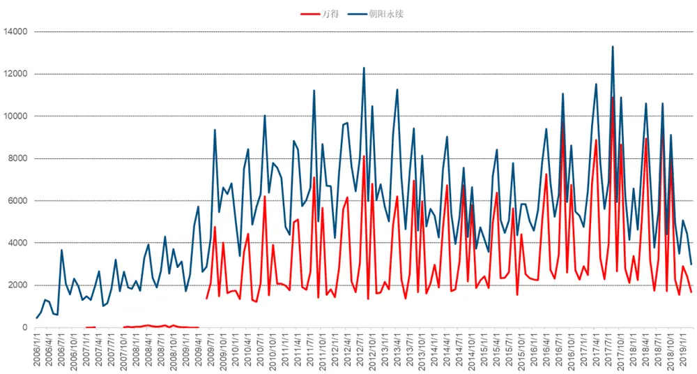
数据来源：wind、中信建投证券研究发展部

## 1.2、年度报告数量对比

从年度报告数量来看，朝阳永续报告从最初不足 2 万篇增长到最高的近 10 万篇，最近几年基本维持在 7 万篇以上（2019 年由于不足一年数量较少）。而 WIND 的报告数量也是逐年增多，和朝阳永续的差距逐步缩小，从2009 年占比 30%增长到最近几年的 60%左右。

图 2：年度报告数量对比
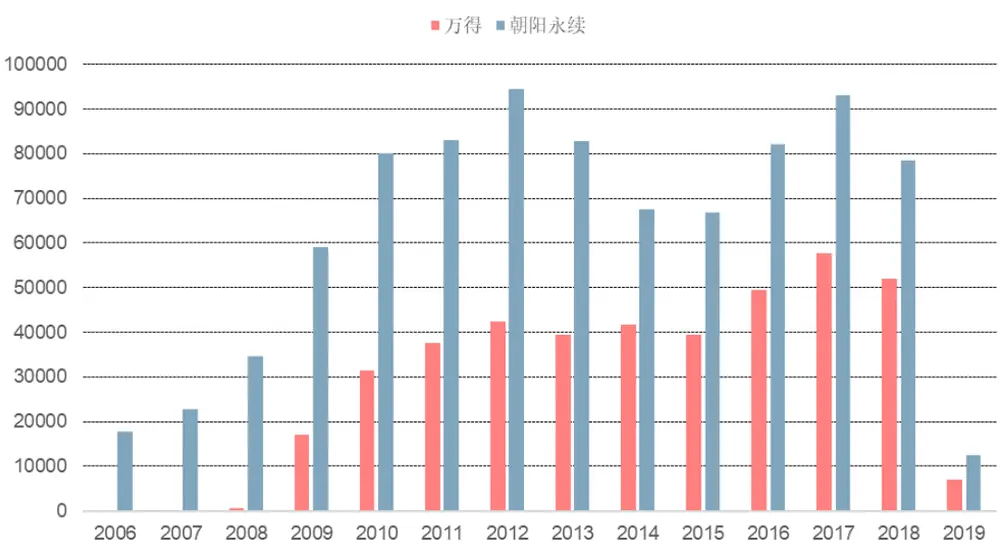
数据来源：wind、中信建投证券研究发展部

## 1.3、月度报告数量对比

从月度报告数量对比来看， WIND 和朝阳永续在 8 月份收录的报告最多，在 3，4，10 月份收录的报告也显著多于其他月份，这和公司的定期报告发布时间有所重合，因为分析师在公司定期报告发布后会及时更新预测观点。

图 3：月度报告数量对比
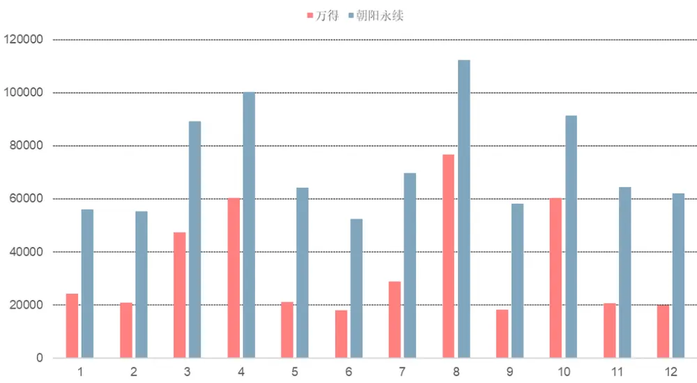
数据来源：wind、中信建投证券研究发展部

## 1.4、股票覆盖度对比

衡量一致预期数据库的一个重要指标就是股票覆盖度，如果股票覆盖度太低，对于投资者就没有太大的使用价值，因此我们也详细对比了朝阳永续和 WIND 一致预期的股票覆盖度。

我们定义，如果某只股票在过去 6 个月至少有一个有效数据则称之为有覆盖。我们以月度为时间窗口，分别计算朝阳永续和 WIND 分析师数据在不同样本池的覆盖度。

首先在全市场（剔除 ST 和次新股），分别计算朝阳永续和 WIND 分析师数据的覆盖度。可以看出 WIND 与朝阳永续存在一定的差距，但差距逐步缩小。两者覆盖度都超过 50%，朝阳永续全市场股票覆盖度平均为 75%，而 WIND 则在 63%左右。

图 4：全市场股票覆盖度对比
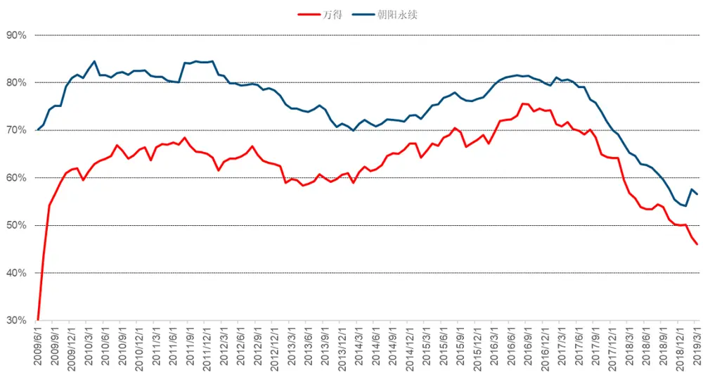
数据来源：wind、中信建投证券研究发展部

在沪深 300 成分股内，朝阳永续股票覆盖度平均为 98%，而 WIND 则在 94%左右，两者覆盖度都非常高，接近 100%，差距非常小。

图 5：沪深 300成分股股票覆盖度对比
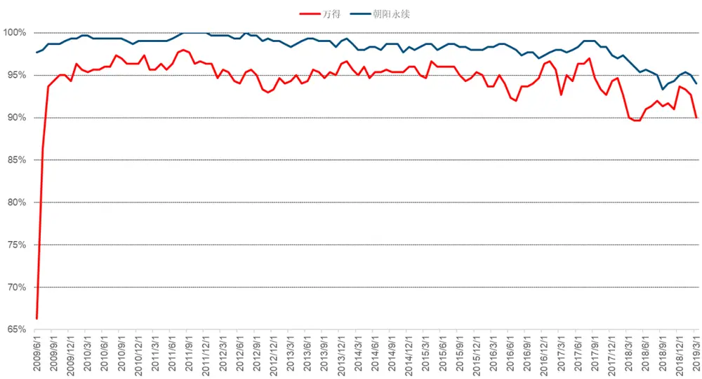
数据来源：wind、中信建投证券研究发展部

在中证 500 成分股内，朝阳永续股票覆盖度平均为 90%，而 WIND 则在 78%左右，两者覆盖度都较高，差距在逐渐缩小。

图 6：中证 500成分股股票覆盖度对比
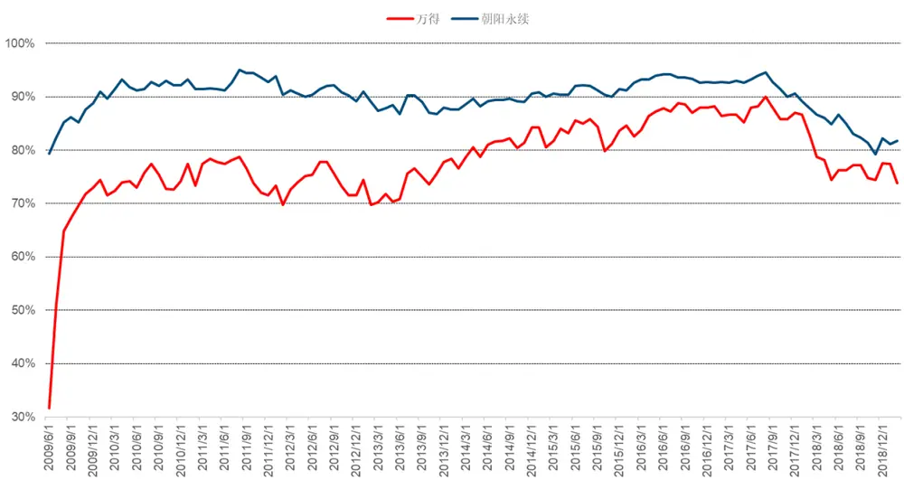
数据来源：wind、中信建投证券研究发展部

## 1.5、报告发布和入库时间差

我们获取数据的及时性取决于数据商收录报告的时间(ENTER_DATE)。但由于分析师发布报告(EST_DATE)到数据商收录报告都有一个时间差（δ），如果δ很大，即便分析师数据库质量再高，仍然没有太大的使用价值。

## δ=ENTER_DATE-EST_DATE

下图展示了朝阳永续数据库 2006 年 1 月到 2019 年 3 月分析师报告发布和入库时间差的概率分布，从左到右依次为 0,1，…。可以看到，约有 35% 的报告能在当天入库，68%在一天之内入库。

图 7：朝阳永续报告发布和入库时间差概率分布
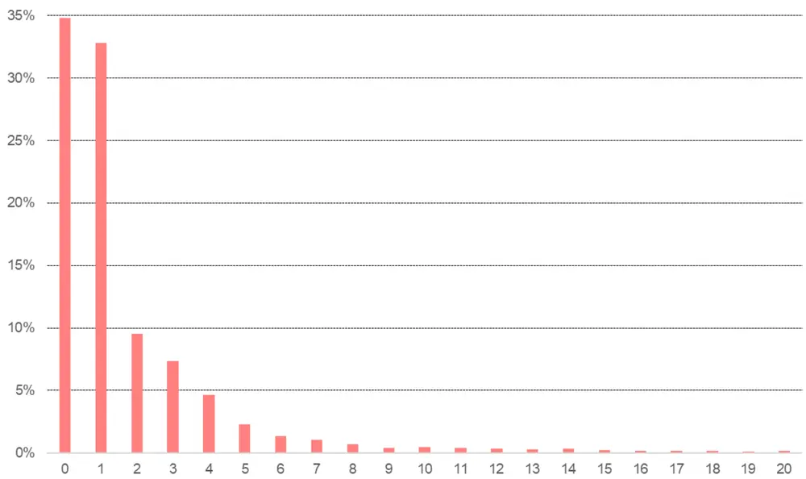
数据来源：wind、中信建投证券研究发展部

## 二、分析师预期因子预测偏度影响因素分析

影响分析师预期因子的预测偏度可能包括公司层面或者市场层面的多种因素，下面我们通过两层筛选步骤选出具有显著影响力的指标和得到剥离相关影响因素后的预测偏度。

步骤一：首先通过对有潜在影响的指标从小到大进行分组（10 层），然后计算每组预测偏度的中位数，选出具有单调显著性的指标进入步骤二；

步骤二：通过步骤一选出的指标，我们利用预测偏度对多个影响指标进行多元回归，得到每个指标的回归T 值，检验各指标 T值的显著性以验证指标的有效性，并最后得到回归之后的残差预测偏离度。

由于一致预期指标构建的核心都会涉及到净利润预测，因此净利润预测的准确性对于分析师预期数据库至关重要，下面我们主要以净利润的预测偏度为例子来进行分析。我们定义净利润的预测偏度如下：

净利润的预测偏度=(|预测净利润-实际净利润|)/(|实际净利润|)

## 2.1、市值对预测偏离度的影响

首先我们看下市值对分析师预测偏度的影响，我们按照被预测企业的市值规模从小到大分成 10 组，计算每个组合预测偏度的中位数，结果如上图。

可以看出，随着市值的增大，预测偏度逐渐变小，市值对预测偏度具有显著反向影响。这比较容易理解，因为小市值相对大市值股票被关注较少，可获取的信息也相对较少，且小市值企业的利润波动相对较大，因而分析师对其的预测精度相对更差。

图 8：市值对预测偏离度的影响
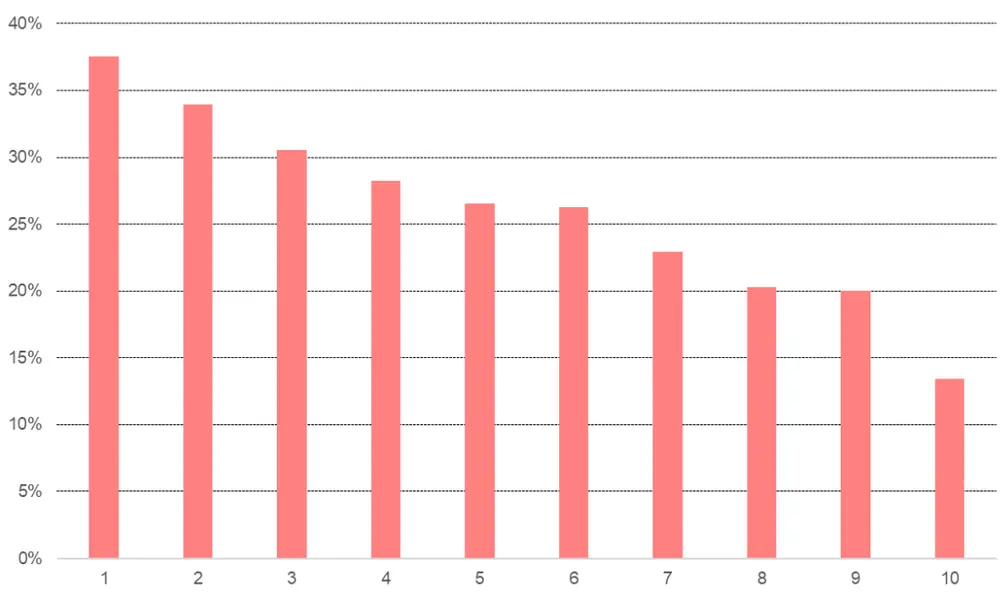
数据来源：wind、中信建投证券研究发展部

## 2.2、行业对预测偏离度的影响

然后由于不同行业受经济波动的影响不同，分析师对不同行业企业的预测偏度也会有所不同。我们按照中信一级行业为标准，把 A 股分成 29 个组，每个组合预测偏度的中位数如下图，可以看到，不同行业的预测偏度显著不同。

图 9：行业对预测偏离度的影响
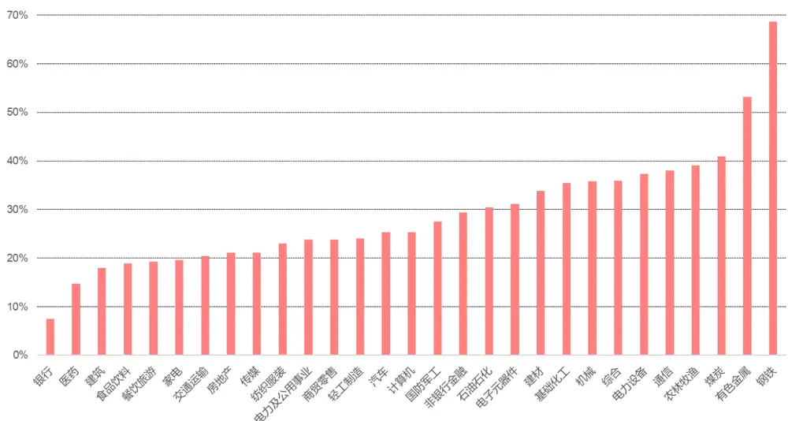
数据来源：wind、中信建投证券研究发展部

## 2.3、EP_TTM对预测偏离度的影响

对于市盈率指标，我们看出其同样具有显著的分层效果，市盈率最高（EP_TTM 最低）的一组的股票预测偏度中位数超过 60%，最高的一组股票预测偏度中位数为 15%，EP_TTM 对预测偏度具有显著反向影响，EP_TTM越小（市盈率越大）的股票分析师越难预测准确。

图 10：EP_TTM对预测偏离度的影响
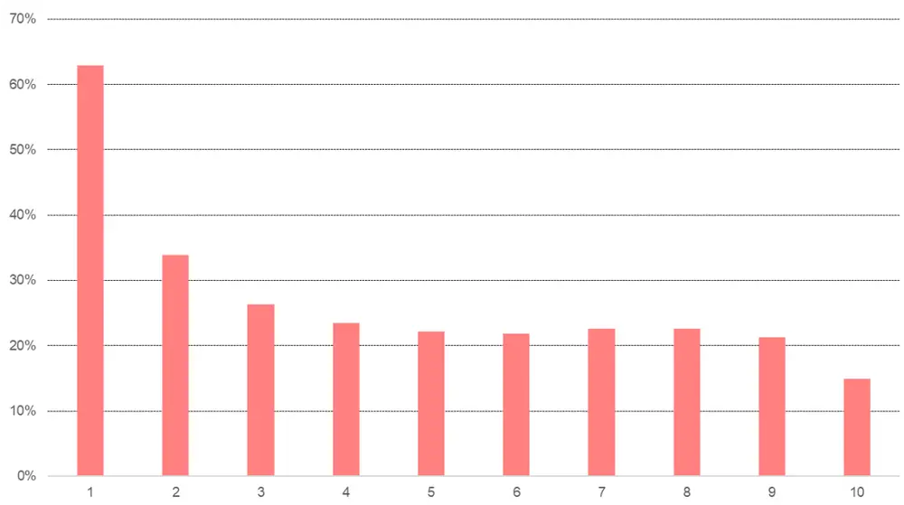
数据来源：wind、中信建投证券研究发展部

## 2.4、ROA _TTM 对预测偏离度的影响

ROA 指标同样具有显著的分层效果，ROA_TTM 最低的一组的股票预测偏度中位数可达 45%，最高的一组股票预测偏度中位数仅为 15%，ROA_TTM 对预测偏度具有显著反向影响，ROA 越小的股票分析师越难预测准确。

图 11：ROA _TTM对预测偏离度的影响
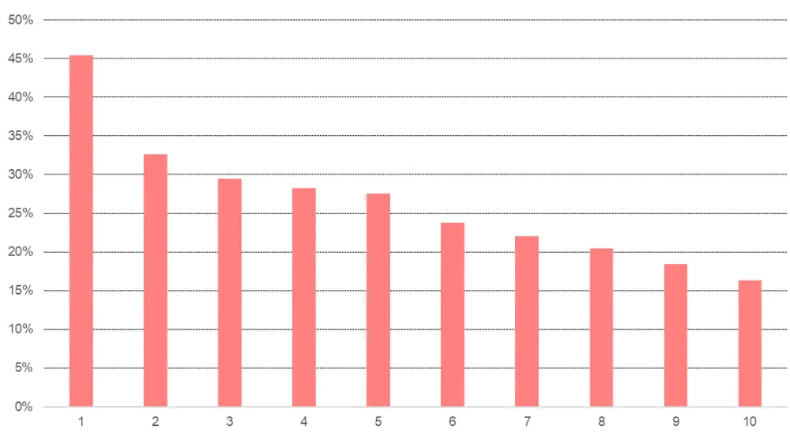
数据来源：wind、中信建投证券研究发展部

## 2.5、销售净利率_TTM对预测偏离度的影响

对于销售净利率指标，我们看出其同样具有显著的分层效果，净利率_TTM 最低的一组的股票预测偏度中位数超过 60%，最高的一组股票预测偏度中位数仅为 14% ，净利率对预测偏度具有显著反向影响，净利率越小的股票分析师越难预测准确。

图 12：销售净利率_TTM对预测偏离度的影响
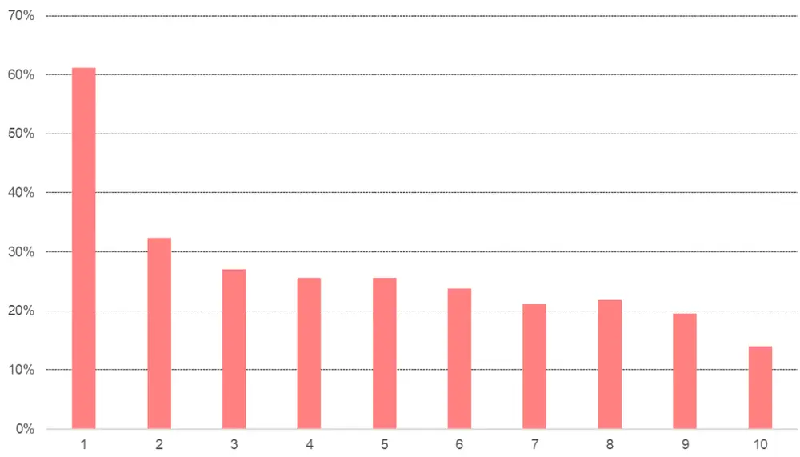
数据来源：wind、中信建投证券研究发展部

## 2.6、一个月换手率对预测偏离度的影响

对于一个月换手率指标，我们看出其同样具有显著的分层效果，一个月换手率最低的一组的股票预测偏度中位数为 16%，最高的一组股票预测偏度中位数为 34% ，一个月换手率对预测偏度具有显著正向影响，换手越高的股票分析师越难预测准确。

图 13：一个月换手率对预测偏离度的影响
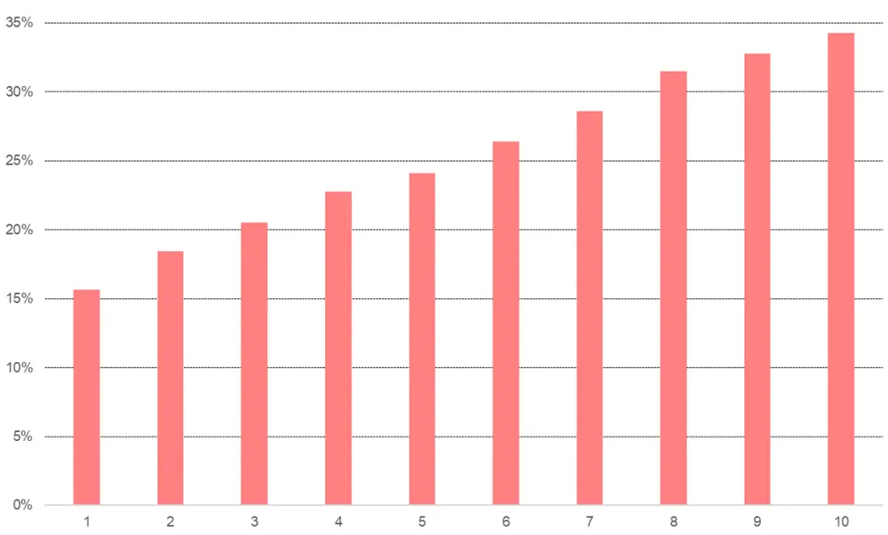
数据来源：wind、中信建投证券研究发展部

## 2.7、一个月波动率对预测偏离度的影响

对于一个月波动率指标，我们看出其同样具有显著的分层效果，一个月波动率最低的一组的股票预测偏度中位数为 15%，最高的一组股票预测偏度中位数为 35% ，一个月波动率对预测偏度具有显著正向影响，波动率越高的股票分析师越难预测准确。

图 14：一个月波动率对预测偏离度的影响
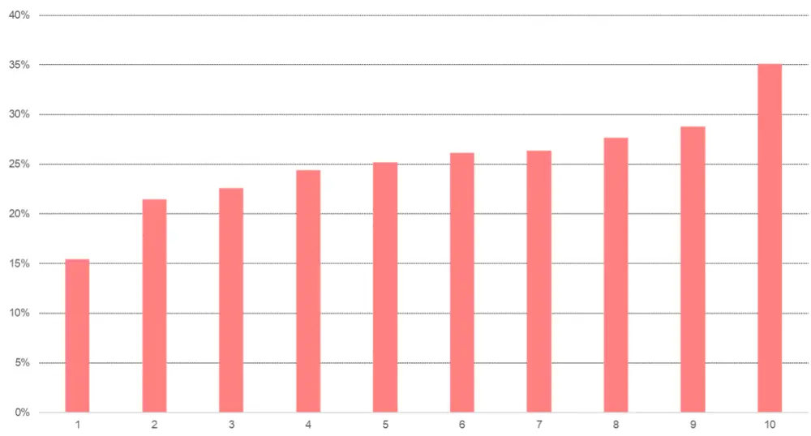
数据来源：wind、中信建投证券研究发展部

## 2.8、时间跨度对预测偏离度的影响

我们定义时间跨度如下：ϵ=REPORT_MONTH-EST_MONTH

式中 REPORT_MONTH 为 定期报告的公布月份，EST_MONTH 为分析师撰写报告所在的月份。ϵ 衡量分析师撰写报告和定期报告公布之间的月份跨度。

我们按月份跨度 ϵ 分组，并计算每组预测偏度的中位数，结果如上图所示，预测偏度几乎随着跨度的增大单调递增，说明越是靠近定期报告公布日，分析师能掌握越来越多的信息，对净利润的预测也越来越准确。

图 15：时间跨度对预测偏离度的影响
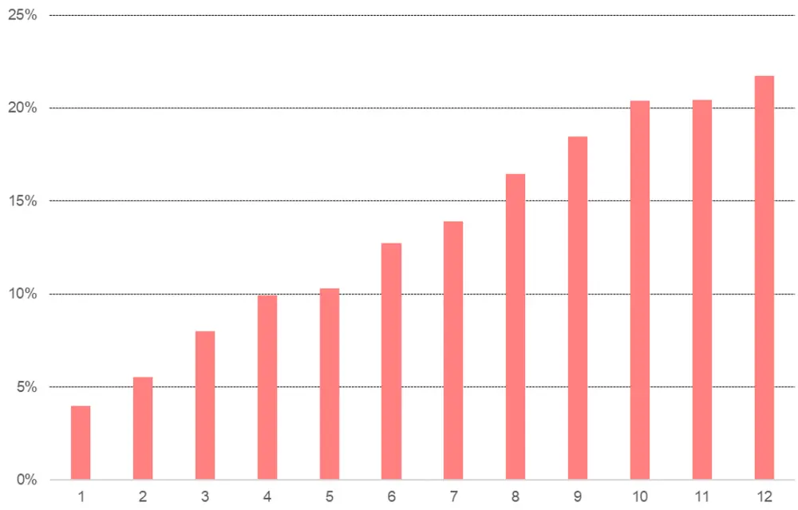
数据来源：wind、中信建投证券研究发展部

通过步骤一分层测试发现，市值、行业、EP_TTM、ROA_TTM、营业利润率_TTM、一个月换手率、一个月波动率、时间跨度对分析师的预测偏度有显著影响。

其中市值、 EP_TTM、ROA_TTM、销售净利率_TTM 具有显著负向影响，而一个月换手率、一个月波动率和时间跨度具有显著正向影响。

## 2.9、多元回归

通过步骤一选出的 7 个影响指标和 29 个行业，我们进行步骤二：利用预测偏度对其进行多元回归，得到每个指标每年的回归 T值（2009 年-2018 年），我们发现 T 值基本上都非常显著（T绝对值>2），也侧面验证了步骤一的分层效果。

表 1：逐年多元回归 T值

| 回归T值 | 2009 | 2010 | 2011 | 2012 | 2013 | 2014 | 2015 | 2016 | 2017 | 2018 |
| --- | --- | --- | --- | --- | --- | --- | --- | --- | --- | --- |
| 截距项 | 32.10 | 41.78 | 35.51 | 31.73 | 18.85 | 16.72 | 20.66 | 23.76 | 29.95 | 17.20 |
| EP_TTM | -1.59 | -40.94 | -42.79 | -6.56 | -16.98 | -9.50 | -3.84 | -34.94 | -33.47 | -8.57 |
| 市值 | -29.02 | -40.01 | -29.77 | -29.24 | -20.40 | -19.04 | -19.35 | -21.55 | -29.06 | -15.62 |
| 营业利润率_TTM | 2.32 | 1.01 | 0.81 | 19.79 | 2.19 | 3.31 | 4.65 | 15.33 | 6.11 | 4.21 |
| ROA_TTM | -2.27 | 4.32 | 4.15 | -34.42 | -34.63 | -25.02 | -51.87 | -36.45 | -40.22 | -5.71 |
| 时间跨度 | 115.50 | 106.50 | 97.00 | 136.87 | 168.50 | 118.68 | 90.80 | 119.85 | 117.72 | 59.17 |
| 个月换手率 | 3.56 | -8.65 | -1.14 | 0.66 | 10.58 | 12.75 | 7.31 | 5.61 | 4.08 | 0.44 |
| 个月波动率 | 5.32 | 4.61 | 0.86 | 7.17 | 13.01 | 10.35 | -0.22 | 9.00 | 10.28 | 4.60 |
| 传媒(中信) | -19.23 | -12.83 | -18.24 | -19.86 | -13.83 | -10.02 | 6.29 | -0.55 | 25.74 | 6.39 |
| 农林牧渔(中信) | 3.05 | 20.47 | 6.90 | 20.12 | 27.56 | 30.95 | 5.02 | -3.92 | 23.42 | 11.56 |
| 医药(中信) | -37.54 | -8.65 | -17.98 | -19.48 | -13.72 | -4.00 | 3.53 | -1.98 | -1.61 | -13.75 |
| 商贸零售(中信) | -23.08 | -2.74 | -15.84 | -18.58 | -4.99 | -0.47 | 9.86 | 9.35 | 2.73 | -10.39 |
| 国防军工(中信) | -11.60 | -0.49 | 9.24 | -6.91 | -1.89 | -1.36 | 2.44 | 7.10 | 23.53 | -4.78 |
| 基础化工(中信) | 20.30 | 41.87 | 16.10 | 6.62 | 22.23 | 7.48 | 9.54 | 10.83 | 12.36 | -6.64 |
| 家电(中信) | -23.05 | 0.62 | -4.82 | -16.08 | -7.44 | 1.96 | 5.53 | -4.73 | 10.82 | 0.41 |
| 建材(中信) | -18.72 | -5.06 | 1.32 | 40.03 | 10.33 | 14.68 | 22.26 | 20.00 | 19.46 | -6.92 |
| 建筑(中信) | -24.90 | -3.63 | -7.63 | -17.86 | -7.82 | -2.41 | 3.81 | 10.06 | -1.45 | -12.98 |
| 房地产(中信) | -17.46 | 12.94 | 2.58 | -13.91 | -4.80 | 3.28 | 6.20 | 5.53 | 2.84 | -7.78 |
| 有色金属(中信) | 18.82 | 41.60 | 18.95 | 38.84 | 40.95 | 34.56 | 25.24 | 15.43 | 8.73 | 15.69 |
| 机械(中信) | -9.99 | 8.48 | 8.40 | 20.48 | 20.83 | 28.54 | 30.79 | 18.38 | 21.30 | -5.50 |
| 汽车(中信) | -26.24 | 1.56 | 10.89 | 6.90 | -5.11 | 3.05 | 4.41 | 0.91 | 19.52 | 3.61 |
| 煤炭(中信) | -20.10 | 6.44 | -9.02 | 11.43 | 65.61 | 82.10 | 44.01 | 2.91 | 4.32 | -0.16 |
| 电力及公用事业(中信) | -11.50 | 21.56 | 22.97 | -21.07 | -11.18 | -8.55 | -7.42 | 3.05 | 19.68 | 6.80 |
| 电力设备(中信) | -17.16 | 14.02 | 41.40 | 19.01 | 12.54 | 8.59 | 6.52 | 4.54 | 27.26 | 3.31 |
| 电子元器件(中信) | 7.49 | 0.50 | 5.81 | 8.23 | 10.72 | 9.48 | 12.58 | 5.61 | 10.17 | 11.49 |
| 石油石化(中信) | -4.85 | 21.24 | 13.68 | 5.80 | 9.72 | 26.91 | 45.00 | 26.00 | 13.69 | 0.24 |
| 纺织服装(中信) | -20.87 | -9.82 | -16.72 | -7.33 | 5.73 | 30.39 | 11.57 | -1.95 | 11.13 | 4.22 |
| 综合(中信) | 2.01 | 28.41 | 22.35 | -2.80 | -2.22 | -2.44 | 1.06 | -3.71 | 6.98 | 3.31 |
| 计算机(中信) | -21.04 | -7.95 | -18.68 | -6.02 | -0.04 | 3.34 | 15.11 | 8.48 | 14.40 | -3.41 |
| 轻工制造(中信) | -10.68 | 15.94 | 12.05 | 21.03 | -1.24 | 10.02 | 1.08 | -0.63 | 0.68 | -8.43 |
| 通信(中信) | -22.91 | 8.92 | 16.75 | 18.79 | 19.53 | 21.33 | 8.06 | 17.61 | 21.18 | 12.23 |
| 钢铁(中信) | 51.84 | 46.75 | 48.87 | 38.23 | 35.32 | 11.23 | 20.62 | 6.94 | 6.14 | -2.27 |
| 银行(中信) | -26.29 | 1.66 | -3.41 | -21.84 | -11.94 | -4.64 | -10.88 | 1.24 | 5.34 | -8.02 |
| 非银行金融(中信) | -13.97 | 2.39 | 36.33 | 3.73 | -5.81 | -5.25 | -5.79 | 2.75 | 10.29 | 1.53 |
| 食品饮料(中信) | -28.85 | -9.96 | -12.59 | -11.71 | 17.30 | 37.85 | 21.13 | 3.46 | 4.37 | -10.84 |
| 餐饮旅游(中信) | -18.78 | 0.38 | -16.82 | -24.05 | 1.03 | -3.03 | -5.88 | -4.75 | -2.55 | 8.67 |

数据来源：wind、中信建投证券研究发展部

## 三、业绩预告和业绩快报数据质量分析

业绩预告和业绩快报作为上市公司在交易所发布的，对定期财务报告以预告或快报的形式进行披露的报告，预告和快报的内容主要是对公司当期净利润、收入等财务状况的预告，同比的变动情况，有的还会说明变动的原因。业绩预告、业绩快报和定期财务报告为上市公司披露业绩的主要方式，业绩预告和快报在时间上领先于定期财务报告，其重要性不言而喻。上交所和深交所对于中小板和创业板股票的业绩预告和快报是强制性披露的，而主板股票只有业绩出现大幅变动或者基本面发生变化等情况下（预计全年可能出现亏损、扭亏为盈、净利润较前一年度增长或下降 50%以上等情况）才需要预披露。

## 3.1、业绩快报数量分布

从下图可以看出业绩快报的数量逐年增长，近两年已经接近 2000 个公司披露业绩快报。且大部分都是关于年报的业绩快报（尖顶处）。

图 16：业绩快报数量分布
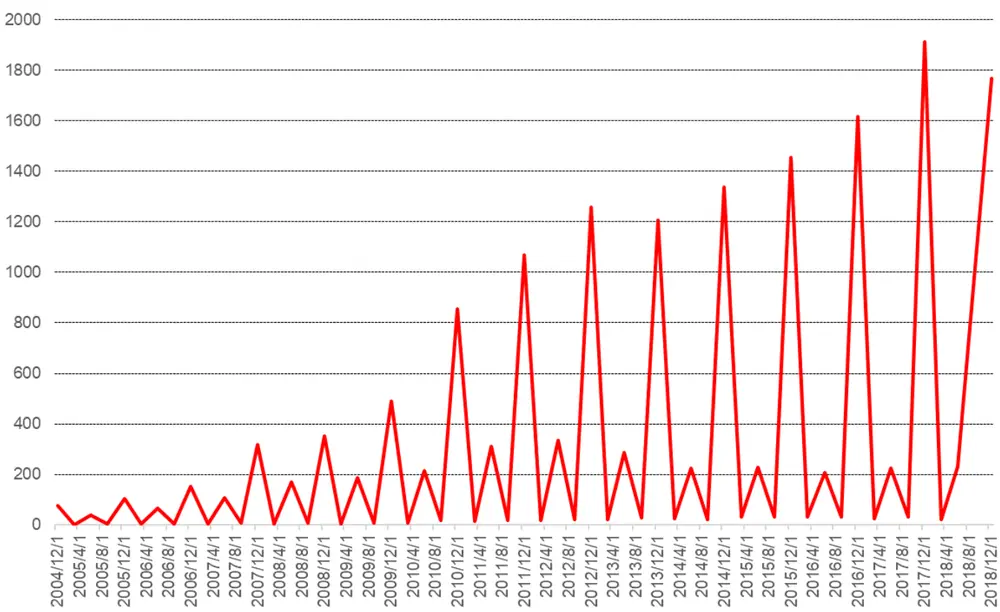
数据来源：wind、中信建投证券研究发展部

## 3.2、中信一级行业业绩快报覆盖度

另外，机械，电子元器件，计算机，通信，银行等行业的覆盖度比较高，在近些年分基本达到了 60%以上。交通运输，商贸零售，房地产，煤炭，综合，钢铁，餐饮旅游等的覆盖度比较低，覆盖度基本在 30%以下。

图 17：中信一级行业业绩快报覆盖度

| 中信一级行业 | 2004 | 2005 | 2006 | 2007 |  | 2008 |  | 2009 |  | 2010 |  | 2011 |  | 2012 | 2013 |  | 2014 |  | 2015 | 2016 | 2017 | 2018 |
| --- | --- | --- | --- | --- | --- | --- | --- | --- | --- | --- | --- | --- | --- | --- | --- | --- | --- | --- | --- | --- | --- | --- |
| 交通运输(中信) | 0.08 | 0.1 | 0.06 | 0.18 |  | 0.16 |  |  | 0.21 | 0.16 |  | 0.21 |  | 0.24 | 0.22 |  | 0.26 |  | 0.22 | 0.26 | 0.29 | 0.26 |
| 传媒(中信) | 0.1 | 0 | 0.1 | 0.38 |  |  | 0.31 |  | 0.32 | 0.56 |  | 0.58 |  | 0.65 |  | 0.5 | 0.53 |  | 0.65 | 0.83 | 0.6 | 0.55 |
| 农林牧渔(中信) | 0.09 | 0.04 | 0.08 | 0.19 |  |  | 0.22 |  | 0.25 |  | 0.34 | 0.42 |  | 0.52 |  | 0.44 | 0.52 |  | 0.45 | 0.51 | 0.53 | 0.43 |
| 医药(中信) | 0.05 | 0.11 | 0.12 | 0.16 |  |  | 0.21 |  | 0.24 |  | 0.34 | 0.43 |  | 0.49 |  | 0.44 | 0.48 |  | 0.53 | 0.53 | 0.58 | 0.53 |
| 商贸零售(中信) | 0.02 | 0.02 | 0.04 | 0.14 |  |  | 0.09 | 0.15 |  | 0.2 |  | 0.18 |  | 0.23 |  | 0.19 | 0.27 |  | 0.27 | 0.26 | 0.29 | 0.22 |
| 国防军工(中信) | 0 | 0 | 0.12 | 0.11 |  |  | 0.11 | 0.21 |  | 0.21 |  | 0.19 |  | 0.38 | 0.31 |  | 0.46 |  | 0.44 | 0.55 | 0.47 | 0.49 |
| 基础化工(中信) | 0.06 | 0.07 | 0.1 | 0.24 |  |  | 0.27 | 0.32 |  | 0.46 |  | 0.46 |  | 0.55 | 0.55 |  | 0.56 |  | 0.58 | 0.64 | 0.58 | 0.54 |
| 家电(中信) | 0.14 | 0.19 | 0.15 | 0.19 |  |  | 0.25 | 0.22 |  | 0.54 |  | 0.57 |  | 0.62 | 0.6 |  | 0.62 |  | 0.54 | 0.58 | 0.59 | 0.51 |
| 建材(中信) | 0.08 | 0.1 | 0.11 |  | 0.23 |  | 0.27 |  | 0.34 | 0.37 |  | 0.47 |  | 0.53 |  | 0.51 | 0.49 |  | 0.55 | 0.48 | 0.52 | 0.48 |
| 建筑(中信) | 0.05 | 0 | 0.19 |  | 0.28 |  | 0.33 |  | 0.39 | 0.48 |  | 0.49 |  | 0.53 |  | 0.49 | 0.56 |  | 0.54 | 0.57 | 0.53 | 0.52 |
| 房地产(中信) | 0.03 | 0.04 | 0.03 | 0.11 |  |  | 0.11 |  | 0.13 | 0.21 |  | 0.19 |  | 0.23 |  | 0.23 | 0.26 |  | 0.28 | 0.23 | 0.25 | 0.12 |
| 有色金属(中信) | 0.05 | 0.04 | 0.12 |  | 0.22 |  | 0.17 |  | 0.2 | 0.34 |  | 0.34 |  | 0.39 |  | 0.35 | 0.42 |  | 0.41 | 0.41 | 0.36 | 0.28 |
| 机械(中信) | 0.1 | 0.16 | 0.14 |  | 0.3 |  | 0.34 | 0.41 |  | 0.55 |  | 0.57 |  | 0.66 | 0.63 |  | 0.64 |  | 00.63 | 0.74 | 0.65 | 0.62 |
| 汽车(中信) | 0.01 | 0.1 | 0.08 | 0.2 |  |  | 0.14 | 0.23 |  | 0.27 |  | 0.41 |  | 0.42 |  | 0.39 | 0.45 |  | 0.47 | 0.46 | 0.45 | 0.38 |
| 煤炭(中信) | 0.11 | 0.05 | 0.12 | 0.29 |  |  | 0.24 |  | 0.21 | 0.16 |  | 0.18 |  | 0.24 |  | 0.21 | 0.22 |  | 0.16 | 0.16 | 0.08 | 0.11 |
| 电力及公用事业(中信) | 0.03 | 0.01 | 0.07 | 0.2 |  |  | 0.15 |  | 0.21 | 0.35 |  | 0.34 |  | 0.43 |  | 0.39 | 0.46 |  | 0.41 | 0.4 | 0.45 | 0.34 |
| 电力设备(中信) | 0.05 | 0.03 | 0.1 |  | 0.26 |  | 0.33 | 0.42 |  | 0.53 |  | 0.51 |  | 0.57 |  | 0.62 | 0.57 |  | 0.6 | 0.62 | 0.62 | 0.59 |
| 电子元器件(中信) | 0.06 | 0.09 | 0.18 |  | 0.34 |  | 0.38 | 0.47 |  | 0.6 |  | 0.64 |  | 0.75 |  | 0.71 | 0.66 |  | 0.72 | 0.7 | 0.73 | 0.7 |
| 石油石化(中信) | 0.04 | 0.21 | 0 | 0.06 |  |  | 0.07 | 0.11 |  | 0.35 |  | 0.34 |  | 0.48 |  | 0.24 | 0.31 |  | 0.38 | 0.4 | 0.31 | 0.31 |
| 纺织服装(中信) | 0.09 | 0.14 | 0.24 | 0.27 |  |  | 0.34 | 0.34 |  | 0.51 |  | 0.54 |  | 0.5 |  | 0.51 | 0.55 |  | 0.51 | 0.62 | 0.54 | 0.47 |
| 综合(中信) | 0 | 0.03 | 0.06 | 0.09 |  |  | 0 | 0.1 |  | 0.21 |  | 0.19 |  | 0.19 |  | 0.09 | 0.09 |  | 0.18 | 0.12 | 0.19 | 0.16 |
| 计算机(中信) | 0.1 | 0.07 | 0.12 | 0.24 |  |  | 0.38 | 0.59 |  | 0.7 |  | 0.71 |  | 0.79 | 0.71 |  | 0.75 |  | 0.8 | 0.91 | 0.82 | 0.8 |
| 轻工制造(中信) | 0.09 | 0.09 | 0.12 | 0.18 |  |  | 0.27 | 0.27 |  | 0.39 |  | 0.54 |  | 0.52 | 0.52 |  | 0.59 |  | 0.52 | 0.61 | 0.56 | 0.51 |
| 通信(中信) | 0.05 | 0.06 | 0.11 | 0.21 |  |  | 0.29 | 0.34 |  | 0.51 |  | 0.51 |  | 0.64 | 0.54 |  | 0.62 |  | 0.65 | 0.83 | 0.72 | 0.68 |
| 钢铁(中信) | 0 | 0.05 | 0.02 | 0.18 |  |  | 0.16 | 0.16 |  | 0.24 |  | 0.31 |  | 0.32 | 0.28 |  | 0.29 |  | 0.34 | 0.31 | 0.22 | 0.19 |
| 银行(中信) | 0.4 | 0.4 | 0.29 | 0.21 |  |  | 0.29 | 0.14 |  | 0.25 |  | 0.31 |  | 0.38 | 0.25 |  | 0.38 |  | 0.5 | 0.31 | 0.64 | 0.71 |
| 非银行金融(中信) | 0 | 0.17 | 0.5 | 0.1 |  |  | 0.21 | 0.5 |  |  | 0.43 | 0.56 |  | 0.64 | 0.62 |  | 0.64 |  | 0.49 | 0.58 | 0.53 |  |
| 食品饮料(中信) | 0.02 | 0.04 | 0.02 | 0.07 |  | 0.11 |  | 0.18 |  |  | 0.31 |  | 0.33 | 0.42 | 0.43 |  |  | 0.39 | 0.38 | 0.4 | 0.42 |  |
| 餐饮旅游(中信) | 0.11 | 0.1 | 0 | 0.12 |  | 0.17 |  | 0.14 |  |  | 0.31 |  | 0.34 | 0.46 | 0.28 |  |  | 0.35 | 0.3 | 0.39 | 0.34 | 0.28 |

数据来源：wind、中信建投证券研究发展部

## 3.3、指数成分股业绩快报覆盖度

从下图可以看出，中证 1000 的覆盖度最高，在 60% 左右波动。中证全指其次，覆盖度大概在 50%左右。总体来看，业绩快报覆盖的股票主要集中在小股票。从沪深 300 和中证 500 的走势可看出，近些年业绩快报对大股票的覆盖度也在逐渐变大。

图 18：指数成分股业绩快报覆盖度
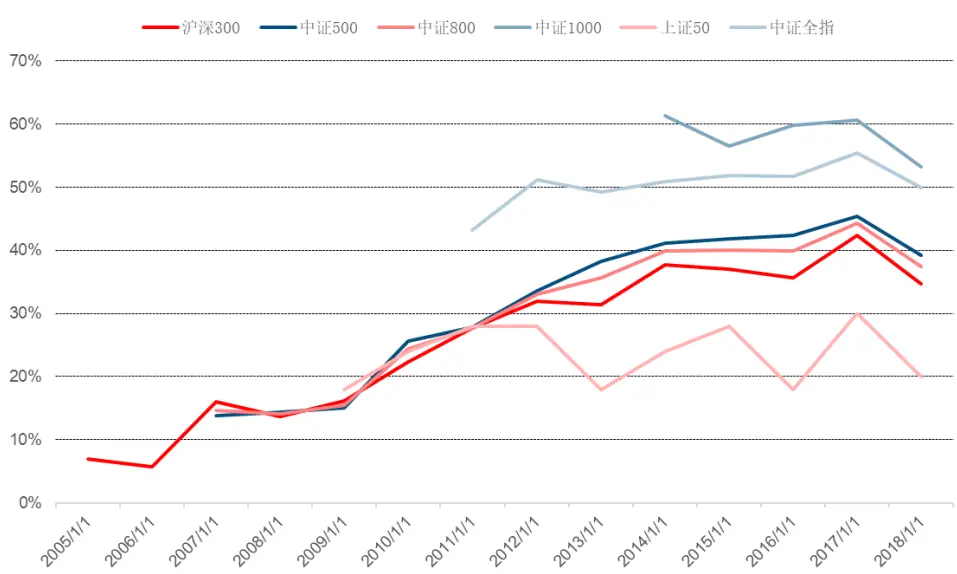
数据来源：wind、中信建投证券研究发展部

## 3.4、快报披露领先时间

快报披露领先时间可以定义为：δ=定期报告披露日-快报发布日

如果 δ 越大表示快报相对于定期报告公布的日期越早。下图是快报披露领先时间的分布图，从图中可以看到，大部分业绩快报在定期报告前 20 至 60 天公布。

图 19：快报披露领先时间
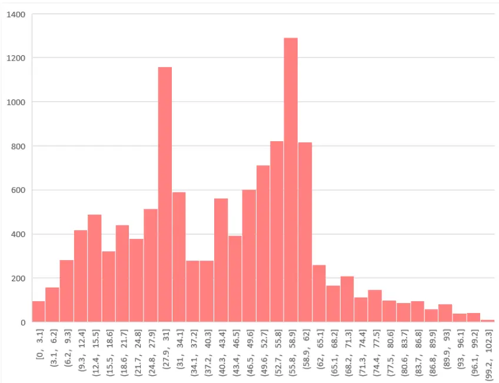
数据来源：wind、中信建投证券研究发展部

## 3.5、业绩快报偏差

业绩快报偏差的计算公式如下：

Bias=(abs(快报公布值-对应报告期真实值))/(abs(对应报告期真实值))

快报信息：

oper_rev： 营业收入

oper_profit: 营业利润

tot_profit: 利润总额

netprofitexclminint_inc: 净利润（不含少数股东损益）

tot_assets: 资产总计

totshrhldreqyexclmin_int： 股东权益合计（不含少数股东权益）

同样，我们按年度分组，计算对应样本的偏度中位数，发现业绩快报的偏差基本上在 2%以下：

图 20：业绩快报偏差
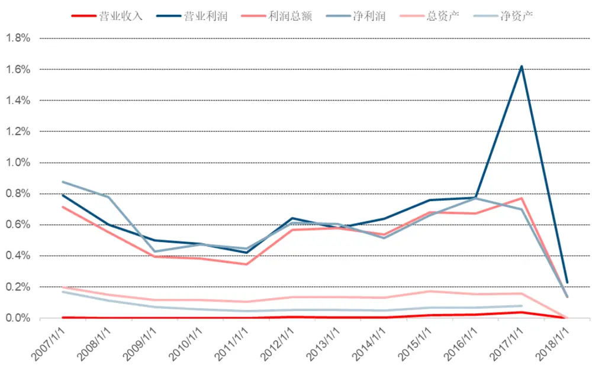
数据来源：wind、中信建投证券研究发展部

## 3.6、业绩预告数量分布

从下图可以看出业绩预告的数量逐年增长，近两年已经接近 3000 个公司披露业绩预告。由于中小创股票需要强制披露各季度的业绩预告，所以每个季度预告数量差别不大。

图 21：业绩预告数量分布
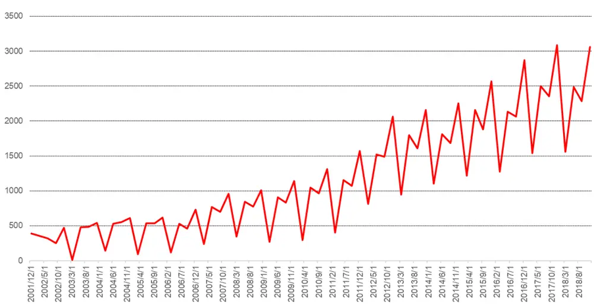
数据来源：wind、中信建投证券研究发展部

## 3.7、中信一级行业业绩预告覆盖度

行业层面来看，计算机，通信，机械，农林牧渔，家电等行业的覆盖度比较高，在近些年分基本达到了 80%以上。银行、交通运输，非银金融等的覆盖度比较低，覆盖度基本在 50%以下。

图 22：中信一级行业业绩预告覆盖度

| 中信一级行业 | 2004 |  | 2005 |  | 2006 |  | 2007 |  |  | 2008 | 2009 2010 2011 |  |  |  |  |  | 2012 |  | 2013 |  | 2014 |  | 2015 |  | 2016 |  | 2017 |  | 2018 |  |
| --- | --- | --- | --- | --- | --- | --- | --- | --- | --- | --- | --- | --- | --- | --- | --- | --- | --- | --- | --- | --- | --- | --- | --- | --- | --- | --- | --- | --- | --- | --- |
| 银行(中信) | 0.2 |  | 0 |  | 0.71 |  | 0.71 |  |  | 0.43 | 0.21 |  |  | 0.31 | 0.25 |  | 0.06 |  | 0.12 |  | 0.06 |  | 0.12 |  | 0.06 |  | 0.12 |  | 0.11 |  |
| 交通运输(中信) | 0.45 |  | 0.27 |  | 0.27 |  | 0.32 |  |  | 0.37 |  | 0.48 |  | 0.35 |  | 0.3 | 0.47 |  |  | 0.43 |  | 0.5 |  | 0.61 | 0.56 |  | 0.56 |  |  | 0.5 |
| 非银行金融(中信) | 1 |  | 1 |  | 1.33 |  | 0.9 |  |  | 0.79 |  | 0.5 | 0.14 |  |  | 0.36 | 0.24 |  |  | 0.54 |  | 0.68 |  | 0.57 |  | 0.66 | 0.37 |  |  | 0.53 |
| 商贸零售(中信) |  | 0.35 | 0.28 |  | 0.38 |  | 0.47 |  |  | 0.42 |  | 0.42 |  | 0.42 |  | 0.45 |  | 0.55 |  | 0.49 |  | 0.53 |  | 0.67 |  | 0.66 |  | 0.61 |  | 0.66 |
| 房地产(中信) |  | 0.39 |  | 0.48 |  | 0.49 | 0.72 |  |  | 0.5 |  | 0.57 |  | 0.51 |  | 0.53 |  | 0.5 |  | 0.49 |  | 0.64 |  | 0.74 |  | 0.73 |  | 0.6 |  | 0.68 |
| 餐饮旅游(中信) | 0.74 |  |  | 0.43 |  | 0.59 | 0.46 |  |  | 0.46 |  | 0.61 |  | 0.55 | 0.41 |  |  | 0.54 |  | 0.55 |  | 0.65 |  | 0.7 | 0.64 |  |  | 0.57 |  | 0.69 |
| 建筑(中信) | 0.18 |  | 0.17 |  | 0.19 |  |  | 0.59 |  | 0.42 |  | 0.67 |  | 0.57 |  | 0.62 | 0.74 |  | 0.76 |  | 0.69 |  | 0.77 |  | 0.84 |  | 0.74 |  |  | 0.7 |
| 食品饮料(中信) |  | 0.45 |  | 0.47 |  | 0.44 |  | 0.49 |  | 0.41 |  | 0.64 |  | 0.49 |  | 0.67 | 0.73 |  | 0.78 |  | 0.85 |  | 0.8 |  | 0.74 |  |  | 0.7 | 0 | .71 |
| 电力及公用事业(中信) |  | 0.22 |  | 0.33 |  | 0.37 |  | 0.45 |  | 0.6 |  | 0.65 |  | 0.49 |  | 0.53 | 0.61 |  |  | 0.63 |  | 0.51 | 0.62 |  |  | 0.62 |  | 0.66 | 0.74 |  |
| 汽车(中信) |  | 0.51 |  | 0.54 |  | 0.57 |  | 0.61 |  | 0.53 |  | 0.73 |  | 0.74 |  | 0.54 | 0.74 |  |  | 0.7 |  | 0.6 | 0.77 |  |  | 0.73 |  | 0.69 | 0.76 |  |
| 医药(中信) | 0.36 |  |  | 0.4 |  | 0.44 |  | 0.64 |  | 0.51 |  | 0.59 |  | 0.53 |  | 0.6 | 0.73 |  |  | 0.71 |  | 0.76 | 0.76 |  |  | 0.73 |  | 0.74 | 0.77 |  |
| 纺织服装(中信) | 0.36 |  |  | 0.41 |  | 0.54 |  | 0.66 |  | 0.66 |  | 0.66 |  | 0.65 |  | 0.6 | 0.81 |  | 0.81 |  | 0.86 |  | 0.86 |  | 0.8 |  | 0.89 |  | 0.8 |  |
| 综合(中信) | 0.64 |  |  | 0.58 |  | 0.81 |  | 0.71 |  | 0.74 |  | 0.6 |  | 0.58 |  | 0.48 | 0.56 |  | 0.47 |  |  | 0.49 | 0.79 |  | 0.85 |  | 0.63 |  | 0.82 |  |
| 钢铁(中信) | 0.24 |  |  | 0.3 |  | 0.4 |  | 0.48 |  | 0.65 |  | 0.51 |  | 0.62 |  | 0.43 | 0.85 |  | 0.72 |  |  | 0.66 | 1.1 |  | 1.14 |  | 0.9 |  | 0.83 |  |
| 石油石化(中信) |  | 0.54 |  | 0.54 |  | 0.45 |  | 0.42 |  | 0.41 |  | 0.46 |  | 0.41 |  | 0.46 | 0.87 |  | 0.72 |  | 0.83 |  | 0.84 |  | 0.75 |  | 0.73 |  | 0.85 |  |
| 轻工制造(中信) |  | 0.37 |  | 0.46 |  | 0.56 | 0.79 |  |  | 0.73 |  | 0.73 |  | 0.63 | 0.81 |  | 1.03 |  | 0.98 |  | 0.87 |  | 0.96 |  | 1.03 |  | 0.89 |  | 0.86 |  |
| 国防军工(中信) |  | 0.27 |  | 0.38 |  | 0.5 |  | 0.56 |  | 0.47 |  | 0.32 |  | 0.32 | 0.25 |  | 0.5 |  | 0.5 |  | 0.72 |  | 0.81 |  | 0.59 |  | 0.72 |  | 0.87 |  |
| 有色金属(中信) | 0.65 |  |  | 0.51 |  | 0.54 |  | 0.67 |  | 0.7 |  | 0.61 | 0.74 |  | 0.73 |  | 0.78 |  | 0.82 |  | 0.78 |  | 1.03 |  | 0.98 |  | 0.88 |  | 0.91 |  |
| 电力设备(中信) |  | 0.46 |  | 0.33 |  | 0.54 |  | 0.49 |  | 0.56 |  | 0.61 |  | 0.53 | 0.74 |  | 1.01 |  | 1..01 |  | 0.84 |  | 0.92 |  | 0.94 |  | 0.87 |  | 0.91 |  |
| 传媒(中信) |  | 0.3 |  | 0.4 |  | 0.5 |  | 0.46 |  | 0.62 |  | 0.47 |  | 0.41 | 0.58 |  | 0.65 |  | 0.7 |  | 0.8 |  | 0.88 |  | 0.95 |  | 0.8 |  | 0.92 |  |
| 基础化工(中信) |  | 0.44 |  | 0.43 |  | 0.42 |  | 0.54 |  | 0.74 |  | 0.79 |  | 0.73 | 0.79 |  | 0.97 |  | 0.99 |  | 1.09 |  | 1.02 |  | 1.05 |  | 0.93 |  | 00.92 |  |
| 建材(中信) |  | 0.55 |  | 0.68 |  | 0.71 |  | 0.71 |  | 0.67 |  | 0.79 | 0.76 |  | 0.7 |  | 1.01 |  | 1.16 |  | 0.91 |  | 1.07 |  | 11.02 |  | 0.98 |  | 0.92 |  |
| 煤炭(中信) |  | 0.74 |  | 0.43 |  | 0.12 | 0.35 |  |  | 0.71 |  | 0.41 |  | 0.37 | 0.32 |  | 0.49 |  | 0.77 |  | 1.02 |  | 1.32 |  | 11 |  | 1.24 |  | 00.92 |  |
| 电子元器件(中信) |  | 0.4 |  | 0.4 |  | 0.53 |  | 0.66 |  | 0.74 |  | 0.79 |  | 0.76 | 0.79 |  | 0.98 |  | 1.01 |  | 0.94 |  | 0.98 |  | 0.99 |  | 0.96 |  | 00.92 |  |
| 家电(中信) |  | 0.36 |  | 0.37 |  | 0.41 |  | 0.7 |  | 0.61 |  | 0.7 |  | 0.66 | 0.74 |  | 0.81 |  | 0.85 |  | 0.84 |  | 0.76 |  | 0.83 |  | 0.82 |  | 0.93 |  |
| 农林牧渔(中信) |  | 0.39 |  | 0.51 |  | 0.57 |  | 0.57 |  | 0.65 |  | 0.74 | 0.69 |  | 0.7 |  | 0.85 |  | 0.96 |  | .93 |  | 0.94 |  | 0.98 |  | 0.91 |  | 00.94 |  |
| 机械(中信) |  | 0.35 | 0.32 |  |  | 0.57 |  | 0.66 |  | 0.56 |  | 0.67 | 0.62 |  | 0.72 |  | 1.03 |  | 0.92 |  | 1 |  | 1.04 |  | 1.04 |  | 0.97 |  | 0.0.95 |  |
| 通信(中信) |  | 0.46 |  | 0.61 |  | 0.63 | 0.74 |  | 0.74 |  | 0.81 |  | 0.7 |  | 0.82 |  | 1.05 |  | 13 |  | 195 |  |  |  | 1.02 |  | 1.02 |  | 0.98 |  |
| 计算机(中信) |  | 0.35 |  | 0.48 |  | 0.41 | 0.65 |  | 0.71 |  | 0.77 |  | 0.57 |  | 0.82 |  | 0.92 |  | 02 |  | 0.93 |  |  |  | 0.97 |  | 0.94 |  | 0.99 |  |

数据来源：wind、中信建投证券研究发展部

## 3.8、指数成分股业绩预告覆盖度

从下图可以看出，中证 1000 的覆盖度最高，在 80%左右波动。中证全指其次，覆盖度大概在 70%左右。从沪深 300 和中证 500 的走势可看出，近些年业绩预告对大股票的覆盖度也在逐渐变大。

图 23：指数成分股业绩预告覆盖度
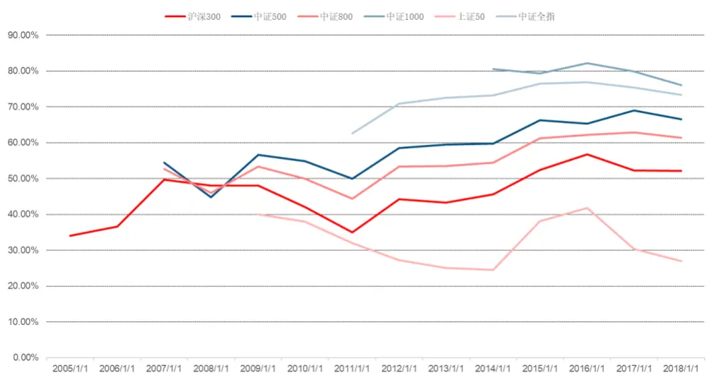
数据来源：wind、中信建投证券研究发展部

## 3.9、预告披露领先时间

预告披露领先时间可以定义为：δ2=定期报告披露日-预告发布日

如果 δ2 越大表示预告相对于定期报告公布的日期越早。下图是预告披露领先时间的分布图，从图中可以看到，大部分业绩预告在定期报告前 40 至 180 天公布。

图 24：预告披露领先时间
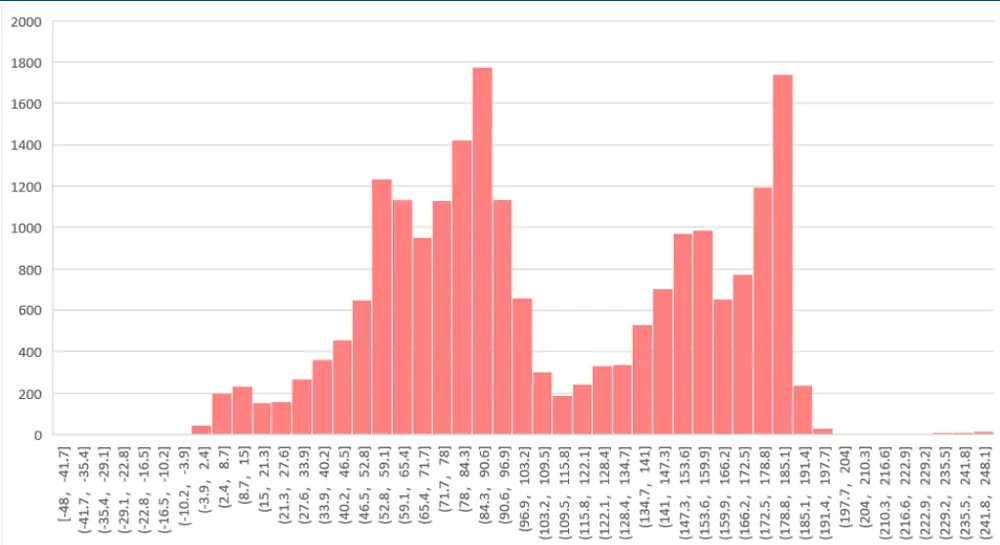
数据来源：wind、中信建投证券研究发展部

## 3.10、业绩预告偏差

业绩快报偏差的计算公式如下：

Bias=(abs(业绩预告区间均值-对应报告期真实值))/(abs(对应报告期真实值))

快报信息：

netprofitexclminint_inc: 净利润（不含少数股东损益）

同样，我们按年度分组，计算对应样本的偏度中位数，最近几年基本上在 5%左右波动：

图 25：业绩预告偏差
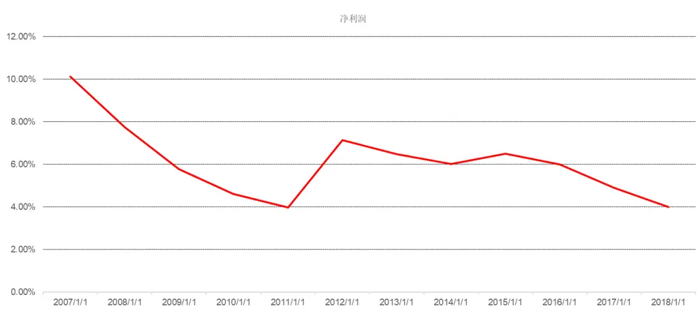
数据来源：wind、中信建投证券研究发展部

## 3.11、结论

1.业绩快报主要覆盖了小股票，对中证 1000 和中证全指的覆盖度达到了 50%以上，而业绩预告在中证 1000 和中证全指的覆盖度达到了 70%以上。且对大股票的覆盖度也逐年提升。

2.业绩快报和预告对不同的行业覆盖度不同。

4.业绩快报和预告的准确性比较高，具有很高的使用价值。

5. 启发：

（1）可以考虑在计算指标的时候加入业绩快报和预告的信息。

（2）上一节对分析师预期数据做过覆盖度，预测偏度等分析。分析师预期的数据准确度完全不及业绩快报和预告的准确度，我们在做分析师预期时可以考虑加入业绩快报的数据。

## 四、分析师预期因子构建步骤

1.求出分析师在 T-1 年的预测偏度。

2. 用分析师在 T-1 年的预测偏度按第二节方法对 7 个影响指标和 29 个行业哑变量回归获得残差偏度。分析师有多条预测记录，则对该分析师的预测值对应的残差偏度求平均。

3. 把所有分析师按其残差偏离度均值从小到大排序分成 5 档，分别赋予权重 5，4，3，2，1，作为该分析师的综合预测权重。

4. 在 T月，计算 T 月底个股一致预期值时使用前 6 个月撰写并录入的有效报告数据。将报告按撰写月份分为 6组： T-5 月、T-4 月、T-3 月、T-2 月、T-1 月和 T 月撰写。在每组内根据报告所属分析师权重加权，得到股票在T 月的预测值。其中每月存在多条记录，每条记录存在多个分析师同时预测的，每条记录先按照所有分析师权重平均得到权重，再对所有记录进行加权平均得到每月的一致预期值。

5. 最后把各个月份的预期值由近至远赋予半衰权重 32，16，8，4，2，1 即可求得该股票的一致预期数据。

图 26：中信建投一致预期算法流程图
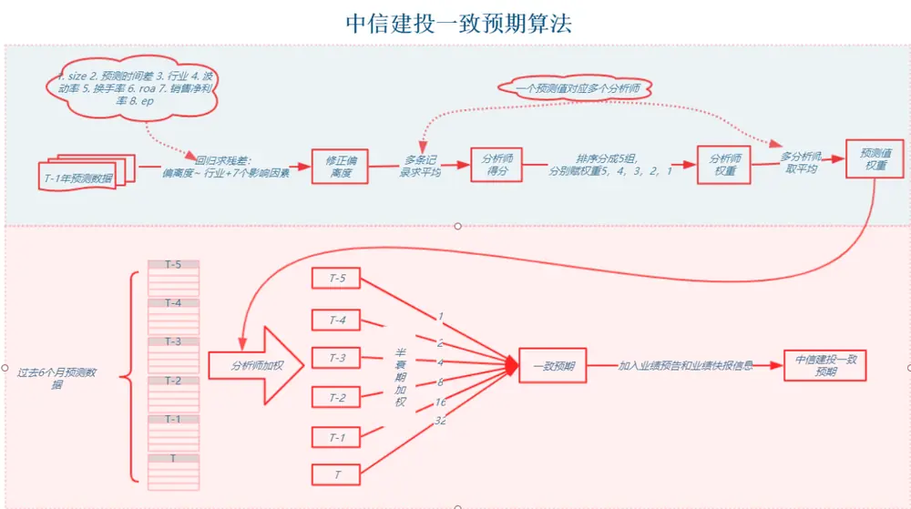
数据来源：wind、中信建投证券研究发展部

以一致预期净利润值为例，我们对比自己计算的一致预期净利润值与朝阳永续数据库中表的一致预期净利润值，发现大部分时间两者一致。但在每年年初，由于使用了业绩预报与快报信息，因此相对于朝阳永续有更小的预测偏离度。

图 27：中信建投和朝阳永续一致预期算法预测偏离度对比
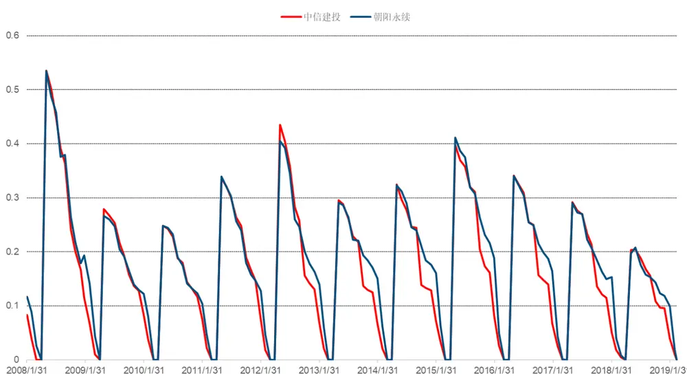
数据来源：wind、中信建投证券研究发展部

## 五、分析师预期因子测试效果

然后我们分别测试基于自身算法构建的一些分析师预期因子。具体包括因子 IC 分析和多空组合（分成 10组）分析结果。样本测试时间从 2009 年 12 月 31 日至 2019 年 3 月 29 日。

测试指标包括滚动一致预期营业收入 forecast_or、滚动一致预期利润总额 forecast_tp、滚动一致预期净利润 forecast_np、一致预期 forecast_peg、滚动一致预期估值 ep_rolling。

图 28：forecast_or IC 和多空收益分析

| IC分析 | forecast_or |
| --- | --- |
| IC均值 | 0.034 |
| IC标准差 | 0.070 |
| IR | 0.49 |
| 年化IR | 1.71 |
| IC胜率% | 70.27 |
| 多空分析 | forecast_or |
| 总收益% | 192.37 |
| 年化收益% | 12.3 |
| 年化波动% | 7.38 |
| 夏普比率 | 1.67 |
| 最大回撤% | 8.32 |
| 收益回撤比 | 1.48 |
| 胜率% | 68.47 |

数据来源：wind、中信建投证券研究发展部
金融工程深度报告

图 29：forecast_or 多空累计净值图
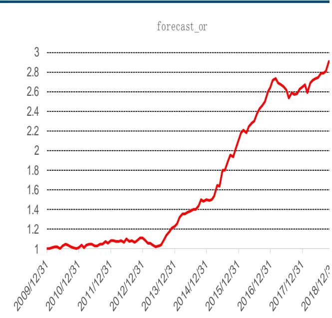
数据来源：wind、中信建投证券研究发展部

图 30：forecast_tp IC 和多空收益分析

| IC分析 | forecast_tp |
| --- | --- |
| IC均值 | 0.042 |
| IC标准差 | 0.085 |
| IR | 0.50 |
| 年化IR | 1.72 |
| IC胜率% | 71.17 |
| 多空分析 | forecast_tp |
| 总收益% | 376.49 |
| 年化收益% | 18.39 |
| 年化波动% | 9.11 |
| 夏普比率 | 2.02 |
| 最大回撤% | 6.2 |
| 收益回撤比 | 2.97 |
| 胜率% | 69.37 |

数据来源：wind、中信建投证券研究发展部

图 31：forecast_tp 多空累计净值图
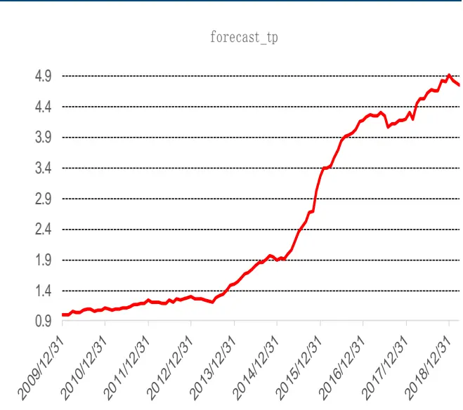
数据来源：wind、中信建投证券研究发展部

图 32：forecast_np IC 和多空收益分析

| IC分析 | forecast_np |
| --- | --- |
| IC均值 | 0.047 |
| IC标准差 | 0.085 |
| IR | 0.55 |
| 年化IR | 1.90 |
| IC胜率% | 74.77 |
| 多空分析 | forecast_np |
| 总收益% | 413.96 |
| 年化收益% | 19.36 |
| 年化波动% | 9.07 |
| 夏普比率 | 2.14 |
| 最大回撤% | 7.52 |
| 收益回撤比 | 2.57 |
| 胜率% | 74.77 |

数据来源：wind、中信建投证券研究发展部
金融工程深度报告

图 33：forecast_np 多空累计净值图
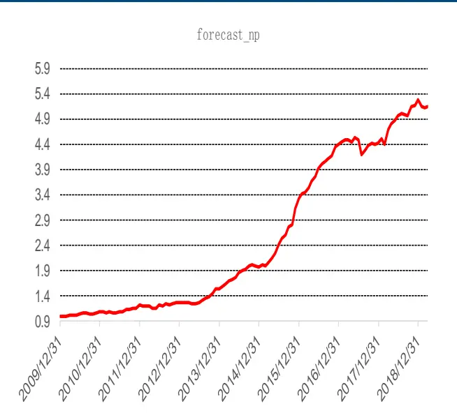
数据来源：wind、中信建投证券研究发展部

图 34：forecast_peg IC 和多空收益分析

| IC分析 | forecast_peg |
| --- | --- |
| IC均值 | 0.031 |
| IC标准差 | 0.053 |
| IR | 0.58 |
| 年化IR | 2.02 |
| IC胜率% | 72.97 |
| 多空分析 | forecast_peg |
| 总收益% | 153.02 |
| 年化收益% | 10.56 |
| 年化波动% | 5.1 |
| 夏普比率 | 2.07 |
| 最大回撤% | 5.3 |
| 收益回撤比 | 1.99 |
| 胜率% | 70.27 |

数据来源：wind、中信建投证券研究发展部

图 35：forecast_peg 多空累计净值图
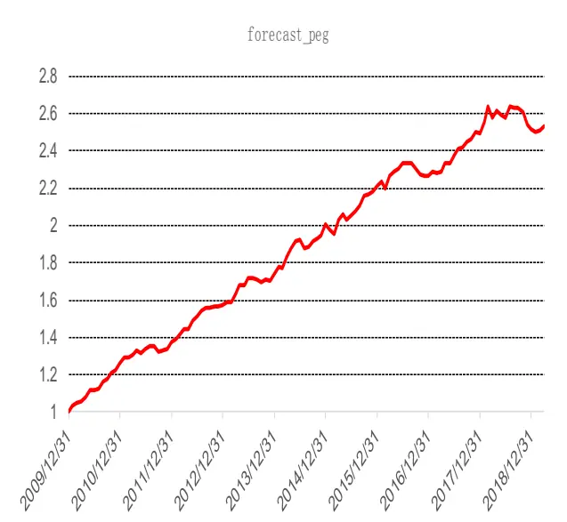
数据来源：wind、中信建投证券研究发展部

图 36：ep_rolling IC 和多空收益分析

| IC分析 | ep_rolling |
| --- | --- |
| IC均值 | 0.054 |
| IC标准差 | 0.084 |
| IR | 0.65 |
| 年化IR | 2.24 |
| IC胜率% | 71.17 |
| 多空分析 | ep_rolling |
| 总收益% | 288.54 |
| 年化收益% | 15.8 |
| 年化波动% | 11.65 |
| 夏普比率 | 1.36 |
| 最大回撤% | 12.24 |
| 收益回撤比 | 1.29 |
| 胜率% | 63.06 |

数据来源：wind、中信建投证券研究发展部
金融工程深度报告

图 37：ep_rolling 多空累计净值图
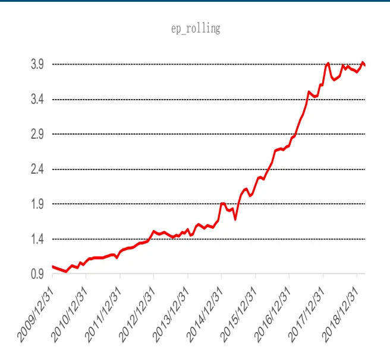
数据来源：wind、中信建投证券研究发展部

从上面五个因子的表现可以看出，多空年化收益达 10%-20%，夏普比率在 1.4-2.2 之间，IC 均值在 3%-5%。

## 六、中信建投和朝阳永续算法在一些常用因子上的表现对比

最后我们对比下中信建投算法和朝阳永续算法在一些常用一致预期因子上的表现，具体包括滚动 BP、滚动一致预期估值 bp_rolling、ep_rolling、滚动一致预期净利润 forecast_np 和滚动一致预期营业收入 forecast_or。我们通过因子组合的第一分位（按照因子值从大到小分十组）相对中证全指的超额收益进行对比，下面两个表格分别是中信建投和朝阳永续算法的超额收益表现，样本测试时间从 2009 年 12 月 31 日至 2019 年 3 月 29 日：

表 2：中信建投算法组合超额收益表现

| 中信建投 | 滚动BP | 滚动EP | 滚动一致预期净利润 | 滚动一致预期营业收入 |
| --- | --- | --- | --- | --- |
| 超额收益分析 | bp_rolling | ep_rolling | forecast_np | forecast_or |
| 总收益 | 163.75 | 215.22 | 317.31 | 226 |
| 年化收益 | 11.05 | 13.21 | 16.7 | 13.63 |
| 年化波动 | 8.08 | 8.46 | 10.53 | 7.46 |
| 夏普比率 | 1.37 | 1.56 | 1.59 | 1.83 |
| 最大回撤 | 11.12 | 10.67 | 16.94 | 10.63 |
| 收益回撤比 | 0.99 | 1.24 | 0.99 | 1.28 |
| 胜率 | 59.46 | 63.96 | 70.27 | 71.17 |

数据来源：wind、中信建投证券研究发展部

表 3：朝阳永续算法组合超额收益表现

| 朝阳永续 | 滚动BP | 滚动EP | 滚动一致预期净利润 | 滚动一致预期营业收入 |
| --- | --- | --- | --- | --- |
| 超额收益分析 | con_bp_rolling | con_ep_rolling | con_np_rolling | con_or_rolling |
| 总收益 | 133.79 | 175.96 | 312.32 | 173.6 |
| 年化收益 | 9.62 | 11.6 | 16.55 | 11.5 |
| 年化波动 | 8.5 | 7.84 | 11.5 | 7 |
| 夏普比率 | 1.13 | 1.48 | 1.44 | 1.64 |
| 最大回撤 | 12.13 | 10.81 | 13.86 | 12.79 |
| 收益回撤比 | 0.79 | 1.07 | 1.19 | 0.90 |
| 胜率 | 60.36 | 63.96 | 70.27 | 68.47 |

数据来源：wind、中信建投证券研究发展部

可以看出，中信建投算法下的几个常用因子表现均优于朝阳永续算法。其中中信建投算法下的滚动 BP、滚动 EP 和滚动一致预期营业收入 forecast_or 的年化收益分别为 11.05%、13.21%和 13.63%，分别比朝阳永续算法增强 1.43%、1.61%和 2.13%。另外夏普比率和最大回撤等指标的表现也均优于朝阳永续算法。中信建投算法下的滚动 BP、滚动 EP 和滚动一致预期营业收入 forecast_or 的夏普比率分别为 1.37、1.56 和 1.83，分别比朝阳永续算法高 0.24、0.08 和 0.18。

## 七、总结和思考

首先我们详细对比 WIND 和朝阳永续 2006 年至今各月、年度、月度录入的分析师预期报告数量变化。从各月报告数量对比来看，朝阳永续收录的报告数量明显多于 WIND, WIND 数据开始时间也比较晚，从 2009 年才开始初具规模。从年度报告数量来看，朝阳永续报告从最初不足 2 万篇增长到最高的近 10 万篇，而 WIND 的报告数量也是逐年增多，和朝阳永续的差距逐步缩小，从 2009 年占比 30%增长到最近几年的 60%左右。从月度报告数量对比来看，WIND 和朝阳永续在 8 月份收录的报告最多，在 3，4，10 月份收录的报告也显著多于其他月份。

另外我们详细对比了 WIND 和朝阳永续分析师数据 2009 年至今在全市场、沪深 300 和中证 500 等不同样本池的覆盖度，两者覆盖度都非常高。最后再统计分析师报告发布和朝阳永续入库的时间差，基本上有 35% 的报告能在当天入库，68%在一天之内入库。

影响分析师预期因子的预测偏度可能包括公司层面或者市场层面的多种因素，下面我们通过两层筛选步骤选出具有显著影响力的指标和得到剥离相关影响因素后的预测偏度。通过步骤一分层测试发现，市值、行业、EP_TTM、ROA_TTM、营业利润率_TTM、一个月换手率、一个月波动率、时间跨度对分析师的预测偏度有显著影响。然后通过步骤一选出的 7 个影响指标和 29 个行业，我们进行步骤二：利用预测偏度对其进行多元回归，我们发现 T值基本上都非常显著。

上交所和深交所对于中小板和创业板股票的业绩预告是强制性披露的，而主板股票只有业绩出现大幅变动或者基本面发生变化等情况下才需要预披露。经过统计发现，业绩快报的数量逐年增长，机械，电子元器件，计算机，通信，银行等行业的覆盖度比较高，交通运输，商贸零售，房地产，煤炭，综合，钢铁，餐饮旅游等的覆盖度比较低。中证 1000 和中证全指的覆盖度较高，而沪深 300 和中证 500 的覆盖度较低。从披露时间来看，大部分业绩快报在定期报告前 20 至 60 天公布，和真实报告期的偏差基本上在 2%以下。

业绩预告的数量逐年增长，计算机，通信，机械，农林牧渔，家电等行业的覆盖度比较高，银行、交通运输，非银金融等的覆盖度比较低。中证 1000 和中证全指的覆盖度较高，而沪深 300 和中证 500 的覆盖度较低。

从披露时间来看，大部分业绩预告在定期报告前 至 天公布，和真实报告期的偏差最近几年基本上在左右波动。

通过利用分析师在 T-1 年的预测偏度按第二节方法对 7 个影响指标和 29 个行业哑变量回归获得残差偏度，按照残差偏离度均值从小到大排序分成 5 档，分别赋予权重 5，4，3，2，1，作为该分析师的综合预测权重，然后在 T 月，将报告按撰写月份分为 6 组，每组内根据报告所属分析师权重加权，得到股票在 T 月的预测值。最后把各个月份的预期值由近至远赋予半衰权重 32，16，8，4，2，1 即可求得该股票的一致预期数据。

以一致预期净利润值为例，我们对比自己计算的一致预期净利润值与朝阳永续数据库中表的一致预期净利润值，发现大部分时间两者一致。但在每年年初，由于使用了业绩预报与快报信息，因此相对于朝阳永续有更小的预测偏离度。

然后我们分别测试基于自身算法构建的一些分析师预期因子，样本测试时间从 2009 年 12 月 31 日至 2019年 3 月 29 日。具体包括因子 IC 分析和多空组合（分成 10 组）分析结果。测试因子包括滚动一致预期营业收入forecast_or、滚动一致预期利润总额 forecast_tp、滚动一致预期净利润 forecast_np、一致预期 forecast_peg、滚动一致预期估值 ep_rolling。从上面五个因子的表现可以看出，多空年化收益达 10%-20%，夏普比率在 1.4-2.2之间，IC 均值在 3%-5%。

最后我们对比下中信建投算法和朝阳永续算法在一些常用一致预期因子上的表现，我们通过因子组合的第一分位（按照因子值从大到小分十组）相对中证全指的超额收益进行对比。可以看出，中信建投算法下的几个常用因子表现均优于朝阳永续算法。其中中信建投算法下的滚动 BP、滚动 EP 和滚动一致预期营业收入forecast_or 的年化收益分别为 11.05%、13.21%和 13.63%，分别比朝阳永续算法增强 1.43%、1.61%和 2.13%。另外夏普比率和最大回撤等指标的表现也均优于朝阳永续算法。中信建投算法下的滚动 BP、滚动 EP 和滚动一致预期营业收入 forecast_or 的夏普比率分别为 1.37、1.56 和 1.83，分别比朝阳永续算法高 0.24、0.08 和 0.18。

## 参考文献

Ellul, Andrew, and Marios Panayides. 2018. “Do Financial Analysts Restrain Insiders’ Informational Advantage?” Journal of Financial and Quantitative Analysis 53 (1): 203–41.

Engelberg, Joseph, R. David McLean, and Jeffrey Pontiff. 2018. “Analysts and Anomalies.” SSRN Scholarly Paper ID 2939174. Rochester, NY: Social Science Research Network.

Grinblatt, Mark, Gergana Jostova, and Alexander Philipov. 2018. “Analyst Bias and Mispricing.”

Lee, Charles M. C., and Eric C. So. 2017. “Uncovering Expected Returns: Information in Analyst Coverage Proxies.” Journal of Financial Economics 124 (2): 331–48.

Loh, Roger K., and René M. Stulz. 2018. “Is Sell-Side Research More Valuable in Bad Times?” The Journal of Finance 73 (3): 959–1013.

Xu, Nianhang, Kam C. Chan, Xuanyu Jiang, and Zhihong Yi. 2013. “Do Star Analysts Know More Firm-Specific Information? Evidence from China.” Journal of Banking & Finance 37 (1): 89–102.

金融工程深度报告

Zhou, Mingshan, Jing Lin, and Yunbi An. 2017. “Star Analysts, Overreaction, and Synchronicity: Evidence from China and the United States.” Financial Management 46 (3): 797–832.

## 分析师介绍

丁鲁明：同济大学金融数学硕士，中国准精算师，现任中信建投证券研究发展部金融工程方向负责人，首席分析师。10 年证券从业，历任海通证券研究所金融工程高级研究员、量化资产配置方向负责人；先后从事转债、选股、高频交易、行业配置、大类资产配置等领域的量化策略研究，对大类资产配置、资产择时领域研究深入，创立国内“量化基本面”投研体系。多次荣获团队荣誉：新财富最佳分析师 2009 第 4、2012第 4、2013 第 1、2014 第 3 等；水晶球最佳分析师 2009 第 1、2013 第 1；2018 年 wind金牌分析师第 2 等。

陈升锐： 芝加哥大学金融数学硕士，三年基金公司量化投资研究工作经验，2018 年加入中信建投研究发展部金融工程团队，专注于量化选股研究。2018 年 Wind 金牌分析师金融工程第 2 名团队成员。

## 研究服务

## 保险组

张博 010-85130905 zhangbo@csc.com.cn

郭洁 -85130212 guojie@csc.com.cn

郭畅 010-65608482 guochang@csc.com.cn

张勇 010-86451312 zhangyongzgs@csc.com.cn

高思雨 010-8513-0491 gaosiyu@csc.com.cn

张宇 010-86451497 zhangyuyf@csc.com.cn

## 北京公募组

朱燕 85156403 zhuyan@csc.com.cn

任师蕙 010-8515-9274 renshihui@csc.com.cn

黄杉 010-85156350 huangshan@csc.com.cn

杨济谦 010-86451442 yangjiqian@csc.com.cn

杨洁 010-86451428 yangjiezgs@csc.com.cn

## 创新业务组

高雪 -64172825 gaoxue@csc.com.cn

杨曦 -85130968 yangxi@csc.com.cn

黄谦 010-86451493 huangqian@csc.com.cn

王罡 021-68821600-11 wanggangbj@csc.com.cn

诺敏 010-85130616 nuomin@csc.com.cn

## 上海销售组

李祉瑶 010-85130464 lizhiyao@csc.com.cn

黄方禅 021-68821615 huangfangchan@csc.com.cn

戴悦放 021-68821617 daiyuefang@csc.com.cn

翁起帆 021-68821600 wengqifan@csc.com.cn

李星星 021-68821600-859 lixingxing@csc.com.cn

范亚楠 021-68821600-857 fanyanan@csc.com.cn

李绮绮 021-68821867 liqiqi@csc.com.cn

薛姣 021-68821600 xuejiao@csc.com.cn

王定润 wangdingrun@csc.com.cn

## 深广销售组

张苗苗 020-38381071 zhangmiaomiao@csc.com.cn

XU SHUFENG 0755-23953843

xushufeng@csc.com.cn

程一天 0755-82521369 chengyitian@csc.com.cn

曹莹 0755-82521369 caoyingzgs@csc.com.cn

廖成涛 0755-22663051 liaochengtao@csc.com.cn

陈培楷 020-38381989 chenpeikai@csc.com.cn

金融工程深度报告

## 评级说明

以上证指数或者深证综指的涨跌幅为基准。

买入：未来 6 个月内相对超出市场表现 15％以上；

增持：未来 6 个月内相对超出市场表现 5—15％；

中性：未来 6 个月内相对市场表现在-5—5％之间；

减持：未来 6 个月内相对弱于市场表现 5—15％；

卖出：未来 6 个月内相对弱于市场表现 15％以上。

## 重要声明

本报告仅供本公司的客户使用，本公司不会仅因接收人收到本报告而视其为客户。

本报告的信息均来源于本公司认为可信的公开资料，但本公司及研究人员对这些信息的准确性和完整性不作任何保证，也不保证本报告所包含的信息或建议在本报告发出后不会发生任何变更，且本报告中的资料、意见和预测均仅反映本报告发布时的资料、意见和预测，可能在随后会作出调整。我们已力求报告内容的客观、公正，但文中的观点、结论和建议仅供参考，不构成投资者在投资、法律、会计或税务等方面的最终操作建议。本公司不就报告中的内容对投资者作出的最终操作建议做任何担保，没有任何形式的分享证券投资收益或者分担证券投资损失的书面或口头承诺。投资者应自主作出投资决策并自行承担投资风险，据本报告做出的任何决策与本公司和本报告作者无关。

在法律允许的情况下，本公司及其关联机构可能会持有本报告中提到的公司所发行的证券并进行交易，也可能为这些公司提供或者争取提供投资银行、财务顾问或类似的金融服务。

本报告版权仅为本公司所有。未经本公司书面许可，任何机构和 或个人不得以任何形式翻版、复制和发布本报告。任何机构和个人如引用、刊发本报告，须同时注明出处为中信建投证券研究发展部，且不得对本报告进行任何有悖原意的引用、删节和/或修改。

本公司具备证券投资咨询业务资格，且本文作者为在中国证券业协会登记注册的证券分析师，以勤勉尽责的职业态度，独立、客观地出具本报告。本报告清晰准确地反映了作者的研究观点。本文作者不曾也将不会因本报告中的具体推荐意见或观点而直接或间接收到任何形式的补偿。

股市有风险，入市需谨慎。

## 中信建投证券研究发展部

## 北京

东城区朝内大街2号凯恒中心B座 12 层（邮编：100010）

电话：(8610) 8513-0588

传真：(8610) 6560-8446

## 上海

浦东新区浦东南路 528 号上海证券大厦北塔 22 楼 2201 室（邮编：200120）

电话：(8621) 6882-1612

传真：(8621) 6882-1622

## 深圳

福田区益田路 6003 号荣超商务中心B 座 22 层（邮编：518035）

电话：（0755）8252-1369

传真：（0755）2395-3859