| 19.08.21 | 因子深度研究系列：中信建投一致预期 因子体系搭建 |
| --- | --- |
| 19.03.28 | 因子深度研究系列：因子衰减在多因子 选股中的应用 |
| 18.08.29 | 因子深度研究系列：Barra风险模型介绍 及与中信建投选股体系的比较 |
| 18.08.23 | 技术形态选股研究之黎明曙光：深跌反 转形态 |
| 18.08.07 | 量化基本面选股：从逻辑到模型，航空 业投资方法探讨 |
| 18.08.02 | 从相关关系到指数增强——谈 IC 系数 与股票权重的联系 |
| 18.06.08 | 因子深度研究系列：宏观变量控制下的 有效因子轮动 |
| 18.05.18 | 因子深度研究系列：特质波动率纯因子 在A 股的实证与研究 |

[table_main] 证券研究报告·金融工程深度报告金融衍

# 分析师预期修正动量效应选股策略：

——因子深度研究系列

## 主要结论

## 引言

证券分析师由于对某个行业研究较为深入，与所研究行业的上市公司联系较紧密，其掌握的行业和个股信息通常比其他人要多，分析师预期数据已成为投资者重要的信息来源。特别是分析师对其自身推荐股票的预期调整通常被视为重要信号，其对之前预期的上调预示着分析师对该股票的后期表现更为看好，而对之前预期的下调则代表看跌该股票。

## 分析师预期修正理论和预期修正四阶段

分析师预期修正意为在一个时间段内，分析师或机构对之前预测值的调整。预期调整有一定的趋势性，具体表现为前一期（月）预期均值的调整往往会带动后一期（月）预期均值继续往同向调整。我们利用分析师预期均值和预期离散程度把预期上调进一步划分为阶段一（P1，均值离散度均上调）与阶段二（P2，均值上调离散度下调），把预期下调划分为阶段三（P3，均值下调离散度上调）和阶段四（P4，均值离散度均下调）。

## 预期 EPSFY1修正选股策略P1阶段年化超额收益12.22%

我们选取预期 EPS、目标价和净利润三个指标，对第一财年分析师预期指标的不同修正阶段构建资产组合。策略选用 2009 年 7 月至 2019 年 7月机构覆盖数在 4 个及以上的股票数据，每月月底进行调仓，市场基准为中证全指月收益率。对于预期 EPS 的第一财年分析师预期（FY1）修正选股组合，表现最好的是 P1 阶段的股票，年化超额收益为 12.22%。

## 改进1：预期EPSFY2修正选股策略P1阶段年化超额收益13.38%

接下来对预期 EPS、预期净利润两个指标的第二财年（FY2）进行单因子分析。我们发现表现最好的仍然是 P1 阶段的股票，表现最差的是 P3 阶段的股票，其分层选股效果仍然比较显著，分析师预期修正指标的一二财年预测值选股效果比较接近，说明两个财年的预期修正蕴含着类似信息。

## 改进 2：预期 EPSFY1,2修正选股策略 P1阶段年化超额收益 16.34%

我们将预期 EPS 两个财年的预测指标进行叠加选股，即选取第一、二财年预期修正所处阶段相同的股票取交集，构建超额收益组合。我们发现预期 EPS 的第一二财年分析师预期修正叠加选股的效果要好于单个预测年度，P1 组合 FY1,2 的年化超额收益（16.34%）比 FY1（12.22%）和 FY2（13.38%）有 3%以上的增强，夏普比率也有所增强。

## 改进 3：EPS FY1,2叠加净利润 FY1 组合 P1阶段年化超额收益 16.87%

接下来做一个改进，假设在 EPS 两财年修正指标叠加选股的基础上，继续叠加预期净利润 FY1 或 FY2 预测指标，发现叠加预期净利润指标后的增强效果变化不大，因此后面采用 EPS FY1,2 叠加净利润 FY1 的组合作为推荐组合。

## 改进4:改进3组合再叠加一个月反转P1阶段年化超额收益18.99%

最后再做一个改进，我们在前面组合的基础上再叠加一个月动量反转指标来构建最终选股组合。我们对各年度超额收益进行统计，除了 2014和 2017 年小幅度跑输基准之外，其余年份均有较显著的超额收益，2019年截至 7 月底超额收益高达 21%，夏普比率高达 4.78，表现非常优异。

# 金融工程研究

。丁鲁明[table

dingluming@csc.com.cn

021-68821623

执业证书编号：S1440515020001

陈升锐

chenshengrui @csc.com.cn

021-68821600

执业证书编号：S1440519040002

发布日期： 2020 年 1 月 17 日

## 相关研究报告

## 一、分析师预期修正趋势统计

证券分析师由于对某个行业研究较为深入，与所研究行业的上市公司联系较紧密，其掌握的行业和个股信息通常比其他人要多，分析师预期数据已成为投资者重要的信息来源。特别是分析师对其自身推荐股票的预期调整通常被视为重要信号，其对之前预期的上调预示着分析师对该股票的后期表现更为看好，而对之前预期的下调则代表看跌该股票。由于单个分析师的预期存在较强的主观性，我们可以统计市场上所有分析师的预期均值（一致预期），当该股票的预期均值相比之前上调的话，代表大多数分析师对其看好，则该股票后续出现上涨的可能性将会增大，同理预期均值下调则预示该股票后续下跌的可能性较大（具体例子我们在后面会进行详细说明，可以参考第二部分 2.3 分析师预期修正各阶段案例的四个例子）。

本文主要介绍分析师预期修正对股票价格的影响并构建相应选股策略。分析师预期修正意为在一个时间段内，分析师或机构对之前预测值的调整。预期调整有一定的趋势性，当新信息出现时，有些分析师会运用该信息领先自己的同行对自己的预期进行调整，最后往往会伴随着其他分析师对自己的预测进行同向的调整。在这一过程中，预期均值会伴随修正趋势进行变动。具体表现为前一期预期均值的调整往往会带动后一期预期均值继续往同向调整。

对于分析师预期的数据我们一般采用 和朝阳永续的分析师数据，我们在上一篇分析师预期选股报告《中信建投一致预期因子体系搭建》对分析师数据的数量和质量做了一个统计，发现 WIND 和朝阳永续的分析师预期数据覆盖度（如果某只股票在过去 6 个月至少有一个有效数据则称之为有覆盖）都超过 50%，朝阳永续全市场股票覆盖度平均为 75%，而 WIND 则在 63%左右（图 1）：

图 1：全市场股票分析师预期数据覆盖度对比
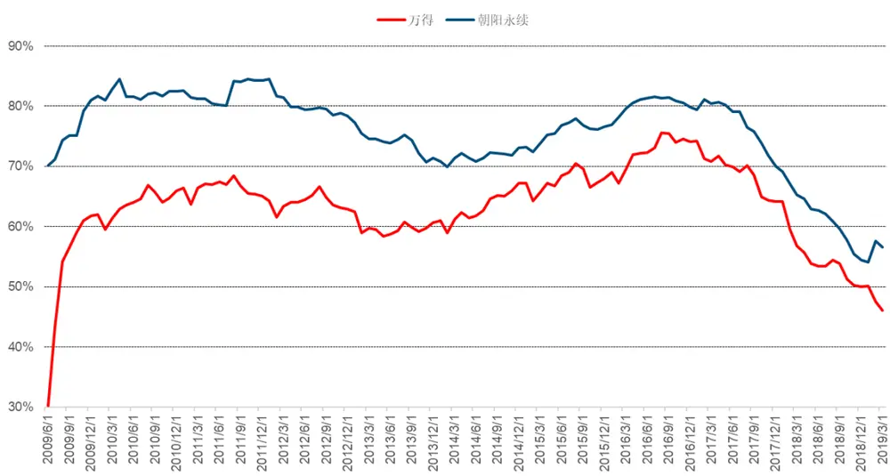
数据来源：wind、中信建投证券研究发展部

虽然 Wind 的分析师预期数据覆盖率有所提升，但朝阳永续的数据覆盖度和及时性更好，本文主要采用朝阳永续的分析师预测数据。

为探究分析师预期调整的趋势性，我们首先选取了朝阳永续底层数据库预期 EPS、利润总额、营业收入、

净利润、营业利润以及目标价格（采用目标价区间均值）六个基础指标，并通过分析师覆盖度进行初步筛选。
其中，除营业利润之外，其他预期指标覆盖率均值都在 50%以上，且较为平稳。

接下来，我们对预期 EPS、利润总额、营业收入、净利润以及目标价格的第一财年 FY1 一致预期（即预期均值）修正趋势进行统计。数据来自朝阳永续数据库。以月度为频率进行统计，当机构当月未对指标做出预测时，用向前追溯至多半年的预期数据进行填充，测试区间为 2009 年 7 月至 2019 年 7 月十年时间，每个月月底每个机构的预测值取其最新的预测值。具体以预期 EPS 为例，其他指标类似：

当月EPS一致预期值=(机构1当月最新预测EPS+机构2当月最新预测EPS+…+机构n当月最新预测EPS)/n，假设最近半年有 n 个机构对其有预测，如某机构当月未做出预测则往前追溯至多半年的最新预期数据进行填充

当月预期 EPS 调整=当月 EPS 一致预期值-上月 EPS 一致预期值，当月预期 EPS 调整大于 0 则为上调，小于0 则为下调，等于 0 则为不变。

针对每个指标，我们根据修正方向将现有数据划分为三类（当月预期相比上月预期上调，不变或下调），并分别统计三类预期调整下月的一致预期变动方向总数量和概率，最后再统计下期上调-下调的概率差。如果当期上调，下期仍然上调的概率超过 50%以及下期上调-下调的概率差较显著（大于 0.1）则该指标的上调趋势性较强。如果当期下调，下期仍然下调的概率超过 50%以及下期上调-下调的概率差较显著（小于-0.1）则该指标的下调趋势性较强。经过统计，所得结果如下：

表 1：预期 EPS调整趋势统计

| 下期上调 |  | 下期不变 | 下期下调 | 总计 | 上调-下调 |
| --- | --- | --- | --- | --- | --- |
| 当期上调 | 40186 | 6617 | 21075 | 67878 |  |
| 概率 | 0.592033 | 0.097484 | 0.310484 |  | 0.281549 |
| 当期不变 | 6183 | 5615 | 7431 | 19229 |  |
| 概率 | 0.321546 | 0.292007 | 0.386448 |  | -0.0649 |
| 当期下调 | 21184 | 7633 | 43315 | 72132 |  |
| 概率 | 0.293684 | 0.10582 | 0.600496 |  | -0.30681 |

数据来源：wind、中信建投证券研究发展部

首先是预期 EPS。从上面统计可以看出，假设某只股票预期 EPS 当期相比上期的分析师预期均值上调，下期继续上调的概率为 59%，下期保持不变的概率为 9.7%，下期下调的概率为 31%，其中上调概率和下调概率差为28%，因此 EPS 上调具有较强的趋势性，同样当期相比上期的分析师预期均值下调，下期继续下调的概率为 60%，上调概率和下调概率差为-31%，趋势性也较强。因此我们把预期 EPS 作为后面选股模型的候选因子。

表 2：预期利润总额调整趋势统计

|  | 下期上调 | 下期不变 | 下期下调 | 总计 | 上调-下调 |
| --- | --- | --- | --- | --- | --- |
| 当期上调 | 28018 | 11196 | 10067 | 49281 |  |
| 概率 | 0.568536 | 0.227187 | 0.204278 |  | 0.364258 |
| 当期不变 | 10210 | 10063 | 7816 | 28089 |  |
| 概率 | 0.363487 | 0.358254 | 0.278258 |  | 0.085229 |
| 当期下调 | 10433 | 7414 | 13403 | 31250 |  |
| 概率 0.333856 |  | 0.237248 | 0.428896 |  | -0.09504 |

数据来源：wind、中信建投证券研究发展部

对于预期利润总额来看，假设某只股票当期相比上期的分析师预期均值上调，下期继续上调的概率为 57%，上调概率和下调概率差为 36%；而当期相比上期的分析师预期均值下调，下期继续下调的概率为 43%，上调概率和下调概率差为-10%。因此利润总额的上调趋势性较强而下调趋势性则不显著。

表 3：预期营业收入调整趋势统计

| 下期上调 | 下期不变 | 下期下调 | 总计 上调-下调 |
| --- | --- | --- | --- |
| 当期上调 36334 | 11675 | 11924 | 59933 |
| 概率 0.606244 | 0.194801 | 0.198956 | 0.407288 |
| 当期不变 10813 | 9643 | 7014 | 27470 |
| 概率 0.393629 | 0.351037 | 0.255333 | 0.138296 |
| 当期下调 12314 | 6742 | 13054 | 32110 |
| 概率 0.383494 | 0.209966 | 0.40654 | -0.02305 |

数据来源：wind、中信建投证券研究发展部

另外对于预期营业收入，上调的趋势性（60%）比下调的趋势性（41%）要更为显著。

表 4：预期净利润调整趋势统计

|  | 下期上调 | 下期不变 | 下期下调 | 总计 | 上调-下调 |
| --- | --- | --- | --- | --- | --- |
| 当期上调 | 53960 | 7509 | 21291 | 82760 |  |
| 概率 | 0.652006 | 0.090732 | 0.257262 |  | 0.394744 |
| 当期不变 | 6950 | 5173 | 5835 | 17958 |  |
| 概率 | 0.387014 | 0.288061 | 0.324925 |  | 0.062089 |
| 当期下调 | 21256 | 5847 | 30040 | 57143 |  |
| 概率 0.371979 |  | 0.102322 | 0.525699 |  | -0.15372 |

数据来源：wind、中信建投证券研究发展部

对于预期净利润来说，上调的趋势性（65%）和下调的趋势性（53%）均非常显著，因此净利润可以作为我们后面选股模型的候选因子。

表 5：预期目标价格调整趋势统计

| 下期上调 | 下期不变 | 下期下调 | 总计 上调-下调 |
| --- | --- | --- | --- |
| 当期上调 12490 | 5596 | 5815 | 23901 |
| 概率 0.522572 | 0.234132 | 0.243295 | 0.279277 |
| 当期不变 5312 | 6329 | 6680 | 18321 |
| 概率 0.289941 | 0.345451 | 0.364609 | -0.07467 |
| 当期下调 5580 | 6702 | 13321 | 25603 |
| 概率 0.217943 | 0.261766 | 0.520291 | -0.30235 |

数据来源：wind、中信建投证券研究发展部

最后对于预期目标价来说，上调的趋势性（53%）和下调的趋势性（52%）均非常显著，因此我们也把目标价作为选股模型的候选因子。

综合来看，统计结果初步显示，分析师预期修正的调整对下一月的分析师预期值有着同向的影响。这一影响在预期 EPS、净利润以及目标价格上表现得最为明显。

其中，预期 EPS、预期净利润和预期目标价格的上调和下调均有较强的趋势性，其可以作为后续模型的候

选选股因子。

## 二、分析师预期修正四阶段划分及对股票价格的影响

## 2.1、分析师预期修正四阶段划分

实际上，我们可以进一步将预期的上调细分为两个阶段：在上调第一个阶段，称为 P1 阶段，只有少部分分析师对自己的预期值做出上调，大部分分析师并没做出预期调整，这样可以观察到预期均值出现上升，而分析师间预期的分歧度也开始上升，我们以离散程度来衡量分歧度，即预期离散程度开始上升；而在上调第二个阶段，称为 P2 阶段，其他分析师也会逐渐上调自己的预期，最终所有的分析师预期将会接近一个值，即我们可以观察到预期均值出现上升，而预期离散程度则出现下降。同样，我们可以根据分析师的均值和离散度进一步将预期的下调细分为两个阶段 P3（分析师均值下降，离散程度上升）和 P4（分析师均值下降，离散程度下降）阶段，具体如下图所示：

图 2：分析师预期修正四阶段划分
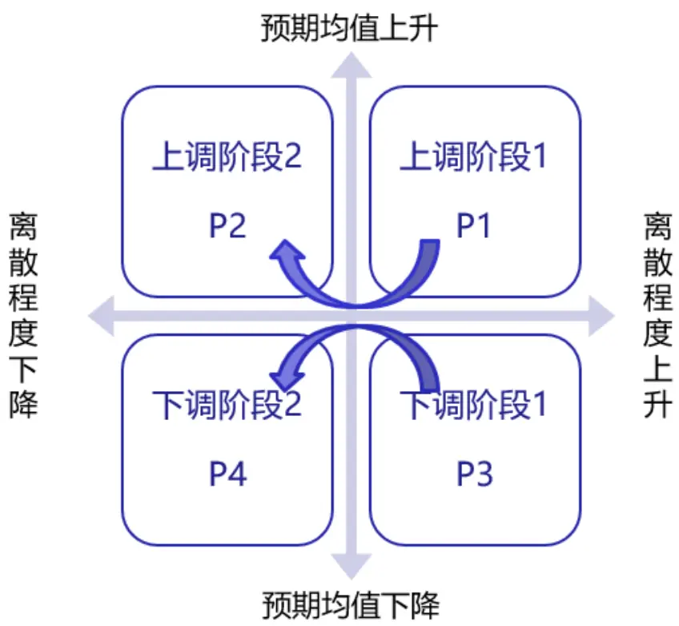
数据来源：wind、中信建投证券研究发展部

## 2.2、分析师预期修正各阶段月度统计

接下来，我们依据分析师预期调整方向及调整的不同阶段，再次对不同预期调整情况下的下期调整方向概率进行统计。这里用分析师预期的标准差来衡量离散程度。统计结果如下：

表 6：预期 EPS调整分阶段趋势统计

| 下期上调 下期不变 |  |  |  | 下期下调 总计 上调-下调 |  |  |
| --- | --- | --- | --- | --- | --- | --- |
| 当期预期均值上调 | 标准差上调 | 24607 | 3909 | 10064 | 38580 |  |
|  | 概率 | 0.637818 | 0.101322 | 0.260861 |  | 0.376957 |
|  | 标准差下调 | 21142 | 4060 | 13520 | 38722 |  |
|  | 概率 | 0.545995 | 0.10485 | 0.349156 |  | 0.196839 |
| 当期预期均值下调 | 标准差上调 | 8932 | 4041 | 23022 | 35995 |  |
|  | 概率 | 0.248146 | 0.112266 | 0.639589 |  | -0.39144 |
|  | 标准差下调 | 14808 | 4764 | 25091 | 44663 |  |
|  | 概率 | 0.33155 | 0.106665 | 0.561785 |  | -0.23024 |

数据来源：wind、中信建投证券研究发展部

从上面统计可以看出，假设某只股票的预期 EPS 当期相比上期的分析师预期均值上调，同时标准差（离散程度）也是上升的话，即股票进入了分析师预期修正的第一阶段（P1 阶段），则该股票下期继续上调的概率为64%，下期保持不变的概率为 10%，下期下调的概率为 26%，其中上调概率减下调概率为 38%，因此 EPS 上调具有较强的趋势性，趋势性比不加离散程度（59%概率）要更为显著。同样股票进入了分析师预期修正的第三阶段（P3 阶段，当期预期均值相比上期下调且标准差上升），下期继续下调的概率为 64%，趋势性也非常显著。

表 7：预期利润总额调整分阶段趋势统计

| 下期上调 |  |  | 下期不变 | 下期下调 | 总计 | 上调-下调 |
| --- | --- | --- | --- | --- | --- | --- |
| 当期预期均值上调 | 标准差上调 | 16639 | 6298 | 4530 | 27467 |  |
|  | 概率 | 0.605781 | 0.229293 | 0.164925 |  | 0.440856 |
|  | 标准差下调 | 13235 | 5980 | 6312 | 25527 |  |
|  | 概率 | 0.518471 | 0.234262 | 0.247268 |  | 0.271203 |
| 当期预期均值下调 | 标准差上调 | 4033 | 3472 | 7286 | 14791 |  |
|  | 概率 | 0.272666 | 0.234737 | 0.492597 |  | -0.21993 |
|  | 标准差下调 | 7235 | 4656 | 7607 | 19498 |  |
|  | 概率 | 0.371064 | 0.238794 | 0.390143 |  | -0.01908 |

数据来源：wind、中信建投证券研究发展部

对于预期利润总额来看，假设某只股票进入了分析师预期修正的第一阶段（P1 阶段），下期继续上调的概率为 61%，同样当股票进入了分析师预期修正的第三阶段（P3 阶段），下期继续下调的概率为 39%。因此利润总额的上调趋势性较强而下调趋势性则不显著。

表 8：预期营业收入调整分阶段趋势统计

| 下期上调 下期不变 |  |  |  | 下期下调 总计 上调-下调 |  |  |
| --- | --- | --- | --- | --- | --- | --- |
| 当期预期均值上调 | 标准差上调 | 23208 | 6749 | 5663 | 35620 |  |
|  | 概率 | 0.651544 | 0.189472 | 0.158984 |  | 0.49256 |
|  | 标准差下调 | 18281 | 6826 | 7975 | 33082 |  |
|  | 概率 | 0.552597 | 0.206336 | 0.241068 |  | 0.311529 |
| 当期预期均值下调 | 标准差上调 | 4918 | 3161 | 6859 | 14938 |  |
|  | 概率 | 0.329227 | 0.211608 | 0.459165 |  | -0.12994 |
|  | 标准差下调 | 9134 | 4498 | 8225 | 21857 |  |
|  | 概率 | 0.417898 | 0.205792 | 0.37631 |  | 0.041589 |

数据来源：wind、中信建投证券研究发展部

同样对于预期营业收入，其上调趋势性较强而下调趋势性则不显著。

表 9：预期净利润调整分阶段趋势统计

|  |  | 下期上调 | 下期不变 | 下期下调 | 总计 | 上调-下调 |
| --- | --- | --- | --- | --- | --- | --- |
| 当期预期均值上调 | 标准差上调 | 33088 | 4587 | 9631 | 47306 |  |
|  | 概率 | 0.699446 | 0.096964 | 0.203589 |  | 0.495857 |
|  | 标准差下调 | 27745 | 4494 | 13947 | 46186 |  |
|  | 概率 | 0.600723 | 0.097302 | 0.301975 |  | 0.298749 |
| 当期预期均值下调 | 标准差上调 | 8812 | 2921 | 16030 | 27763 |  |
|  | 概率 | 0.317401 | 0.105212 | 0.577387 |  | -0.25999 |
|  | 标准差下调 | 14694 | 3786 | 17238 | 35718 |  |
|  | 概率 | 0.411389 | 0.105997 | 0.482614 |  | -0.07122 |

数据来源：wind、中信建投证券研究发展部

对于预期净利润，上调和下调的趋势性均非常显著。

表 10：预期目标价格调整分阶段趋势统计

| 下期上调 下期不变 |  |  |  | 下期下调 总计 上调-下调 |  |  |
| --- | --- | --- | --- | --- | --- | --- |
| 当期预期均值上调 | 标准差上调 | 8549 | 3145 | 2745 | 14439 |  |
|  | 概率 | 0.592077 | 0.217813 | 0.19011 |  | 0.401967 |
|  | 标准差下调 | 6450 | 3370 | 3862 | 13682 |  |
|  | 概率 | 0.471422 | 0.246309 | 0.282269 |  | 0.189154 |
| 当期预期均值下调 | 标准差上调 | 2292 | 3531 | 8516 | 14339 |  |
|  | 概率 | 0.159844 | 0.246251 | 0.593905 |  | -0.43406 |
|  | 标准差下调 | 4139 | 4085 | 7227 | 15451 |  |
|  | 概率 | 0.267879 | 0.264384 | 0.467737 |  | -0.19986 |

数据来源：wind、中信建投证券研究发展部

同样对于预期目标价，上调和下调的趋势性也是非常显著。统计结果和我们上节不加预期离散度的结果一致，因此预期 EPS、预期净利润和预期目标价格这三个指标可以作为我们后续模型的候选选股因子。

## 2.3、分析师预期修正各阶段案例

我们认为，分析师主动调整财务指标的预测值，通常反映了分析师掌握了超前于市场的信息，而此类信息往往会滞后一定时间在市场上反应，表现在股票价格的变动上。

针对预期 EPS、目标价格和净利润各阶段修正以及股票价格后续变动情况，找到案例如下：

图 3：预期 EPS 修正第 1、2阶段及股票价格变动案例
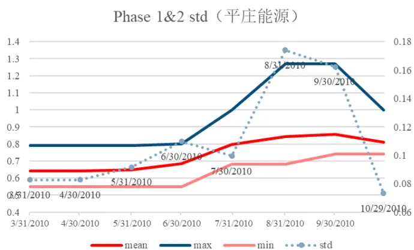
数据来源：wind、中信建投证券研究发展部

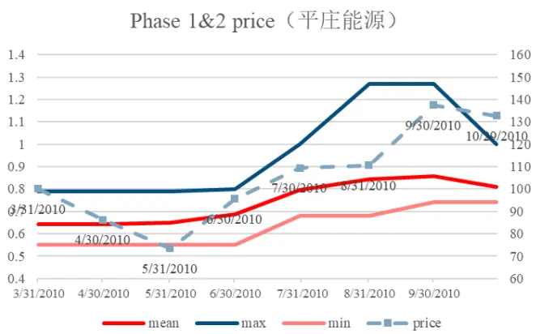

首先是预期 EPS 修正第一和第二阶段（上调阶段），我们这边举了平庄能源 2010 年 3 月底到 2010 年 10 月底的分析师预期变化对股票价格影响的例子。蓝线是股票所有分析师最高预测值的变化曲线，粉红线是股票所有分析师最低预测值的变化曲线，中间红线是股票所有分析师平均预测（一致预期）变化图，左图散点图是所有分析师预期值的离散程度（标准差），右图虚线是股票价格。从左图可以看出，2010 年 4 月底，分析师一致预期开始上升，分析师预期值的离散程度也开始上升，即股票进入了分析师预期修正的第一阶段。从右图可以看出股票价格在 2010 年 5 月底（即进入分析师预期修正第一阶段后的一个月）达到最低点，后期股价出现了较大的涨幅（2010 年 5 月底至 10 月底），因此分析师上调的确对股价有领先的正向影响。

图 4：预期 EPS 修正第 3、4阶段及股票价格变动案例
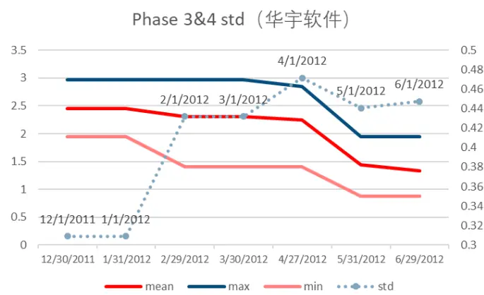
数据来源：wind、中信建投证券研究发展部

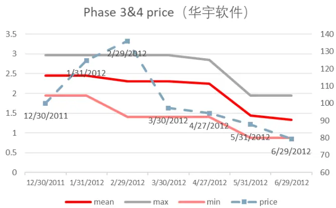

然后我们看下预期 EPS 修正第三和第四阶段（下调阶段）对股价的影响，这边举了华宇软件 2011 年 12 月到2012年6月的分析师预期变化对股票价格影响的例子。同理，蓝线是股票所有分析师最高预测值的变化曲线，粉红线是股票所有分析师最低预测值的变化曲线，中间红线是股票所有分析师的一致预期变化图，左图散点图是所有分析师预期值的离散程度（标准差），右图虚线是股票价格。从左图可以看出，2012 年 1 月，分析师一致预期开始下降，分析师预期值的离散程度也开始上升，即股票进入了分析师预期修正的第三阶段。从右图可以看出股票价格在 2012 年 2 月底（即进入分析师预期修正第三阶段后的两个月）达到最高点，后期股价出现了较大的跌幅（2012 年 2 月底至 6 月底），因此分析师下调的确对股价有领先的负向影响。

同样，下面分别举了预期目标价和预期净利润对股票价格影响的不同案例，分析师上调对股价均有领先的正向影响，分析师下调对股价均有领先的负向影响，这边就不再详细赘述。

图 5：预期目标价修正第 1、2阶段及股票价格变动案例

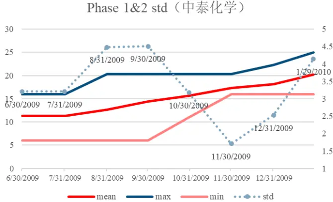
数据来源：wind、中信建投证券研究发展部

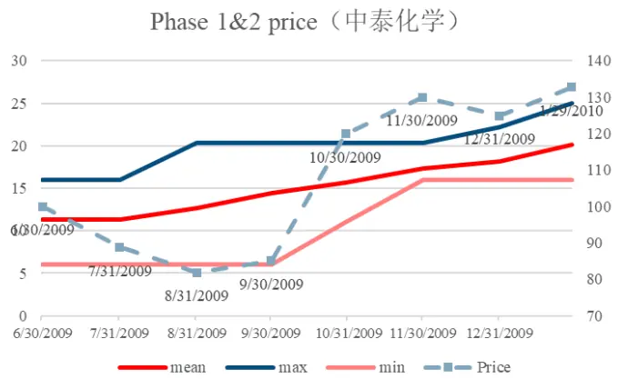

图 6：预期目标价修正第 3、4阶段及股票价格变动案例
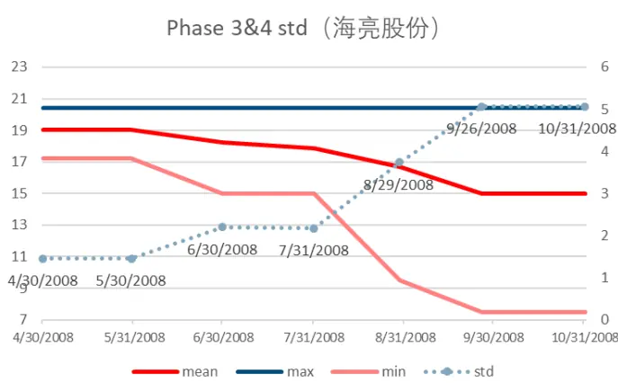

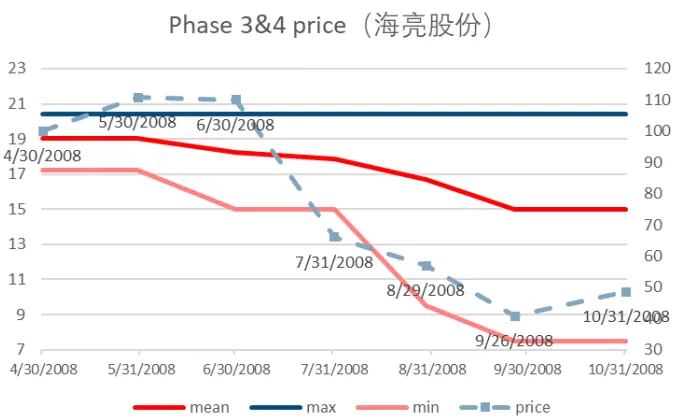
数据来源：wind、中信建投证券研究发展部

图 7：预期净利润修正第 1、2阶段及股票价格变动案例
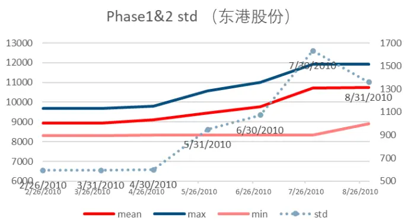
数据来源：wind、中信建投证券研究发展部

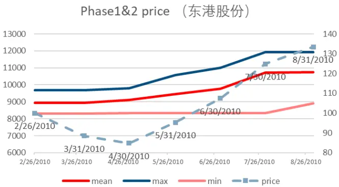

图 8：预期净利润修正第 3、4阶段及股票价格变动案例
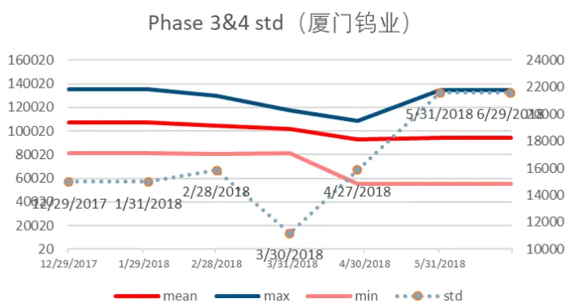
数据来源：wind、中信建投证券研究发展部

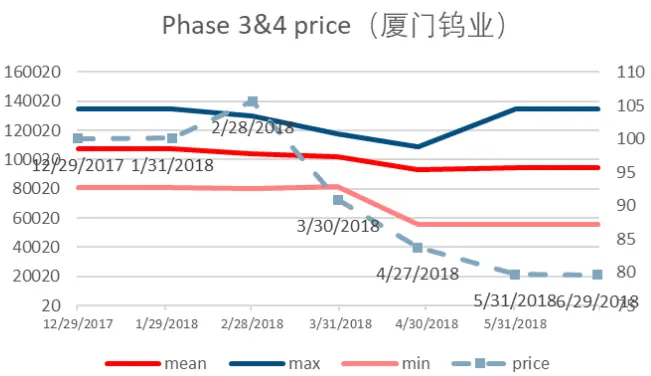

## 三、第一财年 FY1 分析师预期修正选股策略

下面我们选取预期 EPS、目标价和净利润三个指标，采用第一财年分析师预期修正阶段划分构建资产组合，并通过年化收益、年化波动率、最大回撤等数据对各组合结果进行评估。

将当月股票按分析师预期调整的不同阶段，即假设分别处于 p1、p1&p2（p1 或 p2 阶段）、p2、预期不变、p3、p3&p4（p3 或 p4 阶段）和 p4 等 7 个阶段，每个阶段构建等权资产组合，分别对其超额收益和多头收益进行统计。构建多空资产组合时，我们买入 P1 并卖出 P3 阶段股票，买入 P1&P2 并卖出 P3&P4 阶段股票,买入 P2并卖出 P4 阶段股票三个策略。

数据选取：选用 2009 年 7 月至 2019 年 7 月十年间，机构覆盖数在 4 个及以上的股票月度数据进行分析。分析师预期数据来自朝阳永续数据库，股票月收益率来自 Wind。在构建超额收益资产组合时，所选用市场指数为中证全指月收益率。

## 3.1、预期EPS FY1 修正选股组合超额收益

下面是预期 EPS 的第一财年分析师预期（FY1）修正选股组合在各个阶段的超额收益统计对比。表现最好的是 P1 阶段的股票，年化超额收益为 12.22%，接下来是 P1&P2 阶段的股票，年化超额收益为 10.48%，然后是 P2阶段的股票，表现最差的是 P3 阶段的股票，即 p1>p1&p2>p2>预期不变>p4>p3&p4>p3。这也是符合我们的分析师预期修正理论，即分析师上调对股票有正向影响，分析师下调对股票有负向影响，但从统计结果来看，P3 阶段的股票超额收益仍然为正，这说明了分析师下调对股票的负向影响没有上调对股票的正向影响这么显著，所以之后主要关注分析师上调的股票（主要是 P1 阶段的股票）。

表 11：预期 EPS FY1超额收益组合对比

|  | p1 | p1&p2 | p2 | 预期不变 | p3 | p3&p4 | p4 |
| --- | --- | --- | --- | --- | --- | --- | --- |
| 年化收益% | 12.22% | 10.48% | 8.62% | 7.87% | 2.06% | 2.47% | 2.59% |
| 年化波动% | 7.70% | 8.06% | 8.75% | 14.44% | 10.73% | 10.11% | 9.87% |
| 最大回撤% | 7.37% | 10.04% | 11.51% | 21.21% | 18.71% | 17.60% | 17.20% |
| 夏普比率 | 1.59 | 1.30 | 0.98 | 0.54 | 0.19 | 0.24 | 0.26 |

数据来源：wind、中信建投证券研究发展部

图 9：预期 EPS FY1超额收益组合净值对比
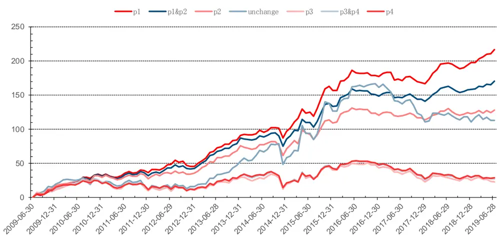
数据来源：wind、中信建投证券研究发展部

## 3.2、预期净利润 FY1 修正选股组合超额收益

下面是预期净利润的第一财年分析师预期（FY1）修正选股组合在各个阶段的超额收益统计对比。与预期EPS 类似，表现最好的是 P1 阶段的股票（年化超额为 11.33%），表现最差的是 P3 阶段的股票（年化超额收益为负），因此其分层效果也较好。

表 12：预期净利润 FY1超额收益组合对比

|  | p1 | p1&p2 | p2 | 预期不变 | p3 | p3&p4 | p4 |
| --- | --- | --- | --- | --- | --- | --- | --- |
| 年化收益% | 11.33% | 9.95% | 7.93% | 6.61% | -0.42% | 1.42% | 2.69% |
| 年化波动% | 8.95% | 9.03% | 9.43% | 14.99% | 9.53% | 9.20% | 9.42% |
| 最大回撤% | 9.70% | 11.57% | 13.30% | 21.21% | 22.23% | 17.98% | 18.37% |
| 夏普比率 | 1.27 | 1.10 | 0.84 | 0.44 | -0.04 | 0.15 | 0.29 |

数据来源：wind、中信建投证券研究发展部

图 10：预期净利润 FY1超额收益组合净值对比
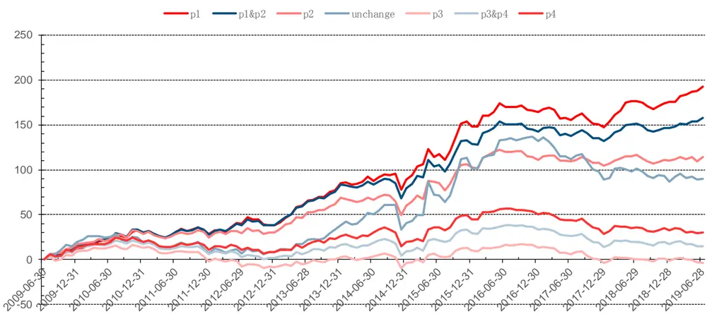
数据来源：wind、中信建投证券研究发展部

## 3.3、预期目标价 FY1 修正选股组合超额收益

下面是预期目标价的第一财年分析师预期（FY1）修正选股组合在各个阶段的超额收益统计对比。表现最好的是 P2 阶段的股票（年化超额为 13.03%），表现最差的是 P4 阶段的股票（年化超额收益为 2.68%），因此其选股的分层效果不太显著。主要原因是目标价格是一个范围，我们这边用的是目标价上下限的均值，另外预期目标价不是分析师预测的核心指标，分析师对其预测准确度没有 EPS 和净利润高，因此我们后续不再把预期目标价作为候选选股因子。

表 13：预期目标价 FY1超额收益组合对比

|  | p1 | p1&p2 | p2 | 预期不变 | p3 | p3&p4 | p4 |
| --- | --- | --- | --- | --- | --- | --- | --- |
| 年化收益% | 6.98% | 10.06% | 13.03% | 5.32% | 5.06% | 3.77% | 2.68% |
| 年化波动% | 9.03% | 8.20% | 8.92% | 8.58% | 8.95% | 8.47% | 9.43% |
| 最大回撤% | 13.07% | 9.16% | 11.97% | 14.83% | 12.92% | 13.87% | 19.88% |
| 夏普比率 | 0.77 | 1.23 | 1.46 | 0.62 | 0.57 | 0.45 | 0.28 |

数据来源：wind、中信建投证券研究发展部

图 11：预期目标价 FY1超额收益组合净值对比
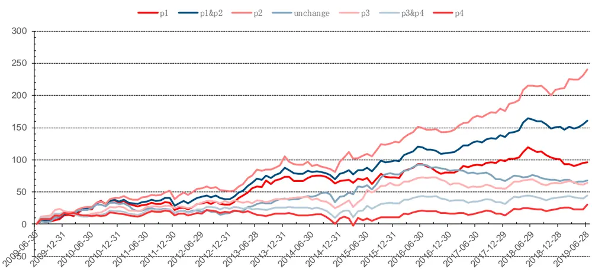
数据来源：wind、中信建投证券研究发展部

## 3.4、各组合收益表现对比

下面是各分析师预期因子组合的表现对比，从 P1 组合超额收益、绝对收益和 P1-P3 多空收益来看，预期 EPS和预期净利润的表现均比较优秀，而目标价格则表现较差，具体原因不再重复赘述，因此我们后面的选股模型主要选择预期 EPS 和预期净利润两个指标，放弃使用预期目标价指标：

表 14：预期 FY1修正选股组合 P1组合超额收益对比

| P1组合超额收益 | EPS FY1 | 净利润 FY1 | 目标价FY1 |
| --- | --- | --- | --- |
| 年化收益% | 12.22% | 11.33% | 6.98% |
| 最大回撤% | 7.37% | 9.70% | 13.07% |
| 夏普比率 | 1.59 | 1.27 | 0.77 |

数据来源：wind、中信建投证券研究发展部

表 15：预期 FY1修正选股组合 P1组合绝对收益对比

| P1组合多头资产组合 | EPS FY1 | 净利润 FY1 | 目标价FY1 |
| --- | --- | --- | --- |
| 年化收益% | 13.16% | 12.27% | 8.46% |
| 最大回撤% | 39.54% | 42.04% | 43.32% |
| 夏普比率 | 0.47 | 0.43 | 0.32 |

数据来源：wind、中信建投证券研究发展部

表 16：预期 FY1修正选股组合 P1-P3多空收益对比

| 多空资产组合(P1-P3) | EPS FY1 | 净利润FY1 目标价FY1 |
| --- | --- | --- |
| 年化收益% | 9.46% | 11.49% 1.31% |
| 最大回撤% | 5.84% | 6.16% 20.88% |
| 夏普比率 | 1.55 | 1.73 0.13 |

数据来源：wind、中信建投证券研究发展部

## 四、策略改进 1：第二财年 FY2 分析师预期修正策略

上面我们主要采用第一财年（FY1）的分析师预期值进行测试，下面我们做一个改进，对预期 EPS、预期净利润两个指标的第二财年（FY2）预测值进行单因子分析，看下其具体效果。

## 4.1、预期EPS FY2 修正选股组合超额收益

首先是预期 EPS 的第二财年分析师预期（FY2）修正选股组合在各个阶段的超额收益统计对比。表现最好的是 P1 阶段的股票，年化超额收益为 13.38%，这和第一财年分析师预期（FY1）的选股效果比较接近，表现最差的是 P3 阶段的股票，因此 EPSFY2 的分层选股效果仍然比较显著。

表 17：预期 EPS FY2超额收益组合对比

|  | p1 | p1&p2 | p2 | 预期不变 | p3 | p3&p4 | p4 |
| --- | --- | --- | --- | --- | --- | --- | --- |
| 年化收益% | 13.38% | 10.77% | 7.92% | 7.00% | 0.44% | 2.12% | 3.39% |
| 年化波动% | 8.23% | 8.40% | 8.98% | 14.67% | 10.43% | 9.96% | 9.90% |
| 最大回撤% | 7.67% | 10.10% | 12.32% | 19.68% | 17.70% | 17.47% | 17.92% |
| 夏普比率 | 1.63 | 1.28 | 0.88 | 0.48 | 0.04 | 0.21 | 0.34 |

数据来源：wind、中信建投证券研究发展部

图 12：预期 EPS FY2超额收益组合净值对比
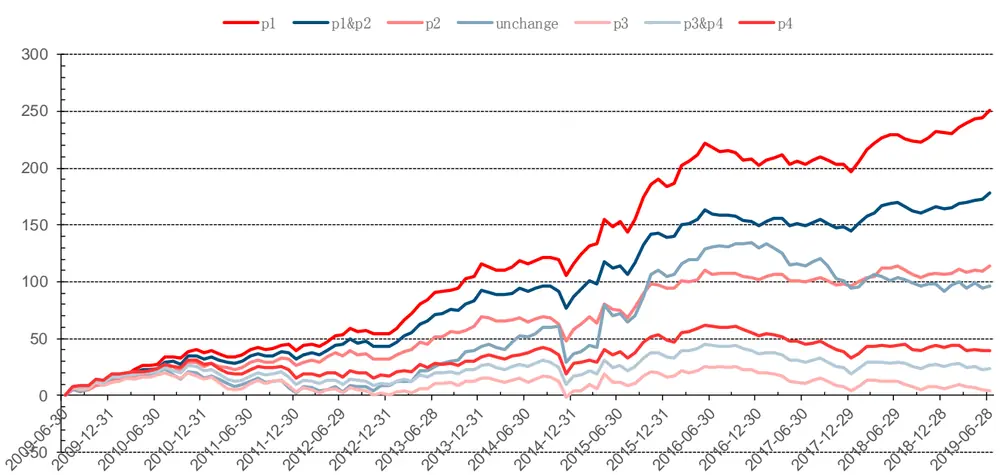
数据来源：wind、中信建投证券研究发展部

## 4.2、预期净利润 FY2 修正选股组合超额收益

下面是预期净利润的第二财年分析师预期（FY2）修正选股组合在各个阶段的超额收益统计对比，表现最好的是 P1 阶段的股票，表现最差的是 P3 阶段的股票，其分层选股效果仍然比较显著。

表 18：预期净利润 FY2超额收益组合对比

|  | p1 | p1&p2 | p2 预期不变 p3 |  |  | p3&p4 | p4 |
| --- | --- | --- | --- | --- | --- | --- | --- |
| 年化收益% | 12.16% 10.39% |  | 7.80% 5.92% 0.05% |  |  | 0.98% | 1.53% |
| 年化波动% | 9.34% | 9.29% | 9.47% 14.85% 8.95% |  |  | 8.97% | 9.49% |
| 最大回撤% | 10.00% | 11.59% | 14.58% | 20.22% | 21.37% | 18.53% | 19.22% |
| 夏普比率 | 1.30 | 1.12 | 0.82 | 0.40 | 0.01 | 0.11 | 0.16 |

数据来源：wind、中信建投证券研究发展部

图 13：预期净利润 FY2超额收益组合净值对比
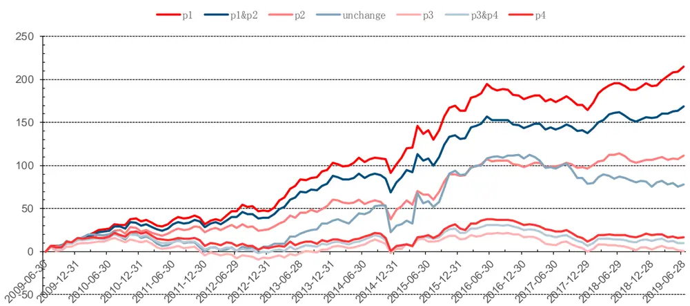
数据来源：wind、中信建投证券研究发展部

## 4.3、各组合收益表现对比

## 表 19：预期 FY2修正选股组合 P1组合超额收益对比

| P1组合超额收益 | EPS FY2 | 净利润 FY2 |
| --- | --- | --- |
| 年化收益% | 13.38% | 12.16% |
| 最大回撤% | 7.67% | 10.00% |
| 夏普比率 | 1.63 | 1.30 |

数据来源：wind、中信建投证券研究发展部

表 20：预期 FY2修正选股组合 P1组合绝对收益对比

| P1组合多头资产组合 | EPS FY2 | 净利润FY2 |
| --- | --- | --- |
| 年化收益% | 14.56% | 13.18% |
| 最大回撤% | 38.21% | 43.31% |
| 夏普比率 | 0.53 | 0.46 |

数据来源：wind、中信建投证券研究发展部

表 21：预期 FY2修正选股组合 P1-P3多空收益对比

| 多空资产组合(P1-P3) | EPS FY2 | 净利润 FY2 |
| --- | --- | --- |
| 年化收益% | 12.46% | 11.91% |
| 最大回撤% | 2.81% | 6.39% |
| 夏普比率 | 2.14 | 1.90 |

数据来源：wind、中信建投证券研究发展部

预期 EPS 第二财年 FY2 超额收益组合的年化收益率为 13.38%，夏普率达到 1.63；预期净利润的年化收益率为 12.16%，夏普率为 1.30。

两个分析师修正指标的一二财年预测值选股效果比较接近，说明两个财年的预期值修正蕴含着类似信息。

## 五、策略改进 2：第一二财年 FY1,2 分析师预期修正叠加选股策略

接下来，我们将预期 EPS 两个财年的预测指标进行叠加选股，即选取第一、二财年预期修正所处阶段相同的股票取交集，构建选股组合。

## 5.1、预期 EPS FY1 FY2 叠加选股超额收益组合

下面是预期 EPS 的第一（FY1）和第二（FY2）财年分析师预期叠加修正选股组合在各个阶段的超额收益统计对比。表现最好的是 P1 阶段的股票，年化超额收益为 16.34%，表现最差的是 P3 阶段的股票，分层选股效果比较显著。

表 22：预期 EPS FY1 FY2叠加选股超额收益组合对比

|  | p1 | p1&p2 | p2 | 预期不变 | p3 | p3&p4 | p4 |
| --- | --- | --- | --- | --- | --- | --- | --- |
| 年化收益% | 16.34% | 12.27% | 8.10% | 8.56% | -1.24% | 0.50% | 1.38% |
| 年化波动% | 8.66% | 8.79% | 9.65% | 17.01% | 11.79% | 10.82% | 10.53% |
| 最大回撤% | 6.64% | 9.86% | 12.51% | 20.01% | 24.23% | 20.30% | 20.99% |
| 夏普比率 | 1.89 | 1.40 | 0.84 | 0.50 | -0.11 | 0.05 | 0.13 |

数据来源：wind、中信建投证券研究发展部

图 14：预期 EPS FY1 FY2叠加选股超额收益组合净值对比
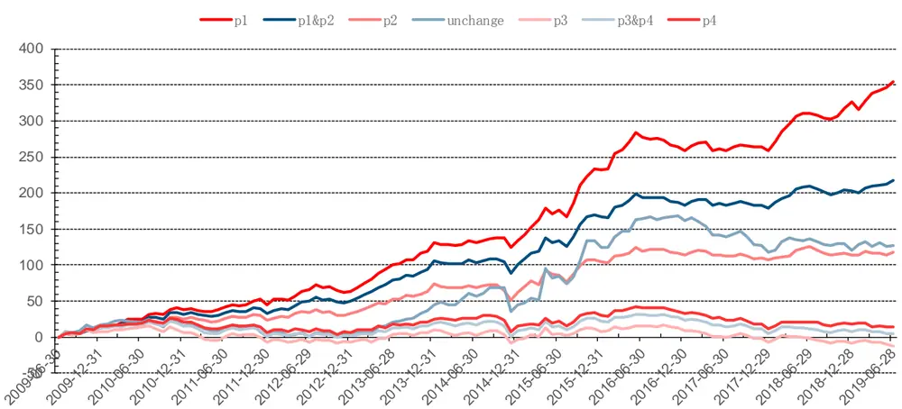
数据来源：wind、中信建投证券研究发展部

## 5.2、各组合收益表现对比

下面是各因子组合的表现对比，我们看到预期 EPS 的第一二财年分析师预期修正叠加选股的效果要好于单个预测年度，P1 组合 FY1,2 的年化超额收益（16.34%）比 FY1（12.22%）和 FY2（13.38%）有 3%以上的增强，夏普比率也是最高的。另外 P1-P3 的多空收益表现也是大幅增强，年化多空收益从 FY1 的 9.46%增强到 FY1,2 的17%。

表 23：预期 EPS FY1 FY2 叠加选股 P1组合超额收益对比

| P1组合超额收益 | EPS FY1 | EPS FY2 | EPS FY1,2 |
| --- | --- | --- | --- |
| 年化收益% | 12.22% | 13.38% | 16.34% |
| 最大回撤% | 7.37% | 7.67% | 6.64% |
| 夏普比率 | 1.59 1.63 |  | 1.89 |

数据来源：wind、中信建投证券研究发展部

表 24：预期 EPS FY1 FY2 叠加选股 P1组合绝对收益对比

| P1组合多头资产组合 | EPS FY1 EPS FY2 | EPS FY1,2 |
| --- | --- | --- |
| 年化收益% | 13.16% | 14.56% 17.59% |
| 最大回撤% | 39.54% | 38.21% 36.64% |
| 夏普比率 | 0.47 | 0.53 0.63 |

数据来源：wind、中信建投证券研究发展部

表 25：预期 EPS FY1 FY2 叠加选股 P1-P3 多空收益对比

| 多空资产组合(P1-P3) | EPS FY1 EPS FY2 | EPS FY1,2 |
| --- | --- | --- |
| 年化收益% | 9.46% | 12.46% 17.00% |
| 最大回撤% | 5.84% | 2.81% 6.53% |
| 夏普比率 | 1.55 | 2.14 2.03 |

数据来源：wind、中信建投证券研究发展部

## 六、策略改进 3：多指标多财年分析师预期修正叠加选股策略

我们继续做一个改进，假设在 EPS 两财年修正指标叠加选股的基础上，继续叠加其他预测指标进行选股，这边分别在上面 EPSFY1,2 组合基础上继续叠加预期净利润的第一财年和第二财年预测指标，测试效果如下：

## 6.1、预期EPS FY1,2，预期净利润 FY1 叠加选股超额收益组合

下面是第一财年（FY1）、第二财年（FY2）预期 EPS 和第一财年（FY1）预期净利润三个分析师指标叠加修正选股组合在各个阶段的超额收益统计对比。表现最好的是 P1 阶段的股票，表现最差的是 P3 阶段的股票，分层选股效果比较显著。但我们发现三指标 P1 阶段的组合超额收益（16.87%）和不叠加第一财年（FY1）预期净利润的组合超额收益（16.34%）相差不大，其主要原因可能在于预期 EPS 和预期净利润的信息重合度较高，分析师一般在调整股票预期 EPS 同时也会调整预期净利润，因此预期净利润的新增信息不大。

表 26：预期 EPS FY1,2，预期净利润 FY1叠加选股超额收益组合对比

|  | p1 | p1&p2 | p2 | 预期不变 | p3 | p3&p4 | p4 |
| --- | --- | --- | --- | --- | --- | --- | --- |
| 年化收益% | 16.87% | 12.64% | 7.96% | 7.83% | -3.35% | -1.41% | -0.25% |
| 年化波动% | 8.69% | 8.74% | 9.72% | 16.98% | 10.65% | 9.73% | 10.00% |
| 最大回撤% | 7.22% | 8.93% | 12.78% | 23.89% | 34.35% | 27.23% | 22.94% |
| 夏普比率 | 1.94 | 1.45 | 0.82 | 0.46 | -0.31 | -0.14 | -0.02 |

数据来源：wind、中信建投证券研究发展部

图 15：预期 EPS FY1,2，预期净利润 FY1叠加选股超额收益组合净值对比
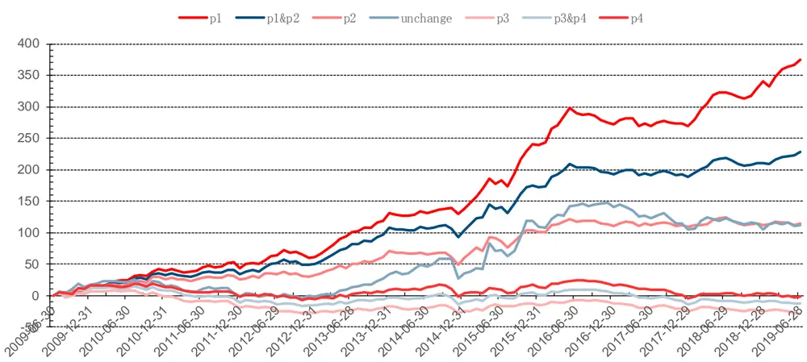
数据来源：wind、中信建投证券研究发展部

## 6.2、预期EPS FY1,2，预期净利润 FY2 叠加选股超额收益组合

下面是第一财年（FY1）、第二财年（FY2）预期 EPS 和第二财年（FY2）预期净利润三个分析师指标叠加修正选股组合在各个阶段的超额收益统计对比。我们发现 P1 阶段组合的增强效果仍然不太明显。

表 27：预期 EPS FY1,2，预期净利润 FY2叠加选股超额收益组合对比

|  | p1 | p1&p2 | p2 | 预期不变 | p3 | p3&p4 | p4 |
| --- | --- | --- | --- | --- | --- | --- | --- |
| 年化收益% | 16.38% | 12.64% | 7.85% | 7.80% | -2.97% | -1.53% | -0.67% |
| 年化波动% | 8.87% | 8.71% | 9.48% | 16.77% | 10.50% | 9.60% | 10.06% |
| 最大回撤% | 7.97% | 9.77% | 12.36% | 23.07% | 31.88% | 25.80% | 22.79% |
| 夏普比率 | 1.85 | 1.45 | 0.83 | 0.47 | -0.28 | -0.16 | -0.07 |

数据来源：wind、中信建投证券研究发展部

图 16：预期 EPS FY1,2，预期净利润 FY2叠加选股超额收益组合净值对比
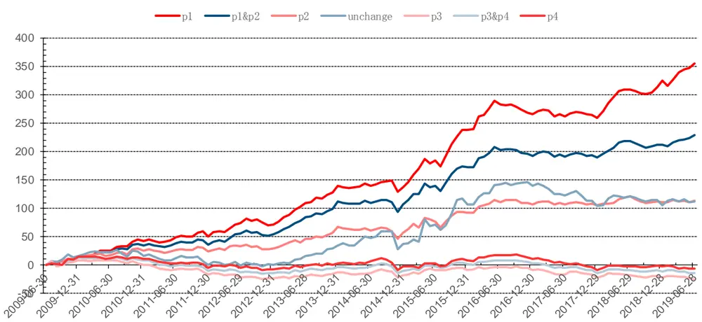
数据来源：wind、中信建投证券研究发展部

## 6.3、预期EPS FY1,2，预期净利润 FY1,2叠加选股超额收益组合

最后我们叠加第一财年（FY1）、第二财年（FY2）预期 EPS 和第一财年（FY1）、第二财年（FY2）预期净利润四个分析师指标，发现 P1 阶段组合的表现仍然变化不大。

表 28：预期 EPS FY1,2，预期净利润 FY1,2叠加选股超额收益组合对比

|  | p1 | p1&p2 | p2 | 预期不变 | p3 | p3&p4 | p4 |
| --- | --- | --- | --- | --- | --- | --- | --- |
| 年化收益% | 16.77% | 12.89% | 7.93% | 7.57% | -3.26% | -1.75% | -0.86% |
| 年化波动% | 8.77% | 8.74% | 9.60% | 16.90% | 10.80% | 9.67% | 10.15% |
| 最大回撤% | 8.21% | 9.08% | 13.22% | 24.78% | 33.81% | 27.66% | 23.36% |
| 夏普比率 | 1.91 | 1.48 | 0.83 | 0.45 | -0.30 | -0.18 | -0.08 |

数据来源：wind、中信建投证券研究发展部

图 17：预期 EPS FY1,2，预期净利润 FY1,2叠加选股超额收益组合净值对比
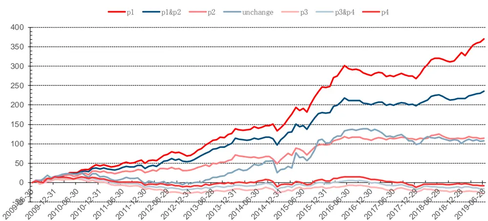
数据来源：wind、中信建投证券研究发展部

## 6.4、各组合收益表现对比

下面是各因子组合的收益表现对比，由前面分析可知，叠加预期净利润指标后的组合增强效果变化不大，因此我们不做过多的拟合，主要采用 EPSFY1,2 叠加净利润 FY1 的组合（下面标红色组合）作为推荐组合。

表 29：预期 EPS FY1,2，预期净利润 FY1,2叠加选股 P1组合超额收益对比

| P1组合超额收益 | EPS FY1,2 NP1 | EPS FY1,2 NP2 | EPS FY1,2 NP1,2 |
| --- | --- | --- | --- |
| 年化收益% | 16.87% | 16.38% | 16.77% |
| 最大回撤% | 7.22% | 7.97% | 8.21% |
| 夏普比率 | 1.94 | 1.85 | 1.91 |

数据来源：wind、中信建投证券研究发展部

表 30：预期 EPS FY1,2，预期净利润 FY1,2叠加选股 P1组合绝对收益对比

| P1组合多头资产组合 | EPS FY1,2 NP1 | EPS FY1,2 NP2 | EPS FY1,2 NP1,2 |
| --- | --- | --- | --- |
| 年化收益% | 18.07% | 17.66% | 18.01% |
| 最大回撤% | 36.68% | 36.72% | 36.83% |
| 夏普比率 | 0.65 | 0.64 | 0.65 |

数据来源：wind、中信建投证券研究发展部

表 31：预期 EPS FY1,2，预期净利润 FY1,2 叠加选股 P1-P3 多空收益对比

| 多空资产组合(P1-P3) EPS FY1,2 NP1 EPS FY1,2 NP2 |  |  | EPS FY1,2 NP1,2 |
| --- | --- | --- | --- |
| 年化收益% | 20.07% | 19.20% | 19.82% |
| 最大回撤% | 9.47% | 8.58% | 8.96% |
| 夏普比率 | 2.09 | 2.10 | 1.99 |

数据来源：wind、中信建投证券研究发展部

## 七、策略改进 4：多指标多财年分析师预期修正叠加短期反转动量策略

最后我们再做一个改进，在前面组合的基础上再叠加一个指标——动量反转指标。因为动量和反转是 A 股市场上一个比较显著的效应，因此我们可以在上面的分析师预期调整组合里面进行叠加。具体策略为 P1 阶段组合叠加过去 N 个月全市场跌幅最大的 50%股票，P3 阶段组合叠加过去 N 个月全市场涨幅最大的 50%股票。

## 7.1、分析师预期指标叠加短期反转动量选股策略敏感性分析

首先我们进行敏感性分析，发现 P1 组合叠加过去一月收益低于全市场平均的股票，可以获取最高的超额收益夏普比率，年化超额收益达 18.99%，夏普比率为 1.7；同样我们选取过去一月收益高于全市场平均的股票叠加到 P3 组合，可以获得最佳空头负超额收益，年化超额收益达-14%，空头负超额收益非常显著。因此我们之后主要选取过去一个月收益率作为叠加指标。

表 32：P1阶段股票 1-6月叠加短期反转超额收益率敏感性分析

|  | 1个月 | 2个月 | 3个月 | 4个月 | 5个月 | 6个月 |
| --- | --- | --- | --- | --- | --- | --- |
| 年化收益% | 18.99% | 19.63% | 18.87% | 15.78% | 15.85% | 13.49% |
| 年化波动% | 11.17% | 11.87% | 11.52% | 10.90% | 11.07% | 10.64% |
| 最大回撤% | 14.97% | 15.33% | 12.06% | 15.00% | 14.32% | 14.74% |
| 夏普比率 | 1.70 | 1.65 1.64 |  | 1.45 | 1.43 | 1.27 |

数据来源：wind、中信建投证券研究发展部

表 33：P3阶段股票 1-6月叠加短期动量超额收益率敏感性分析

|  | 1个月 | 2个月 | 3个月 | 4个月 | 5个月 | 6个月 |
| --- | --- | --- | --- | --- | --- | --- |
| 年化收益% | -14.08% | -12.89% | -12.42% | -13.98% | -15.26% | -11.28% |
| 年化波动% | 14.00% | 14.94% | 16.33% | 18.35% | 16.74% | 18.25% |
| 最大回撤% | 78.79% | 75.31% | 74.94% | 77.81% | 80.91% | 71.96% |
| 夏普比率 | -1.01 | -0.86 | -0.76 | -0.76 | -0.91 | -0.62 |

数据来源：wind、中信建投证券研究发展部

## 7.2、分析师预期指标叠加短期反转动量选股策略超额收益组合和多空组合对比

下面我们看下叠加短期反转动量指标后的选股组合超额收益和多空收益对比。作为对比，这边构建多空资产组合 P1&P2-P3&P4，主要是将所选股票按照分析师预期修正划分为两组，将 P1-P2 阶段选择过去一个月表现最差的一组买入，P3-P4 阶段选择过去一个月表现最好的一组卖出。经过测试，P1-P3 组合多空年化收益高达 36%，主要原因是多头和空头股票表现均非常优异。

表 34：分析师预期指标叠加短期反转动量选股超额收益组合对比

|  | p1 | p1&p2 | p2 | 预期不变 | p3 | p3&p4 | p4 |
| --- | --- | --- | --- | --- | --- | --- | --- |
| 年化收益% | 18.99% | 15.09% | 11.01% | 7.83% | -14.08% | -9.80% | -7.57% |
| 年化波动% | 11.17% | 10.74% | 11.65% | 16.98% | 14.00% | 12.05% | 13.23% |
| 最大回撤% | 14.97% | 15.68% | 15.86% | 23.89% | 78.79% | 68.73% | 65.63% |
| 夏普比率 | 1.70 | 1.41 | 0.95 | 0.46 | -1.01 | -0.81 | -0.57 |

数据来源：wind、中信建投证券研究发展部

图 18：分析师预期指标叠加短期反转动量选股超额收益组合净值对比
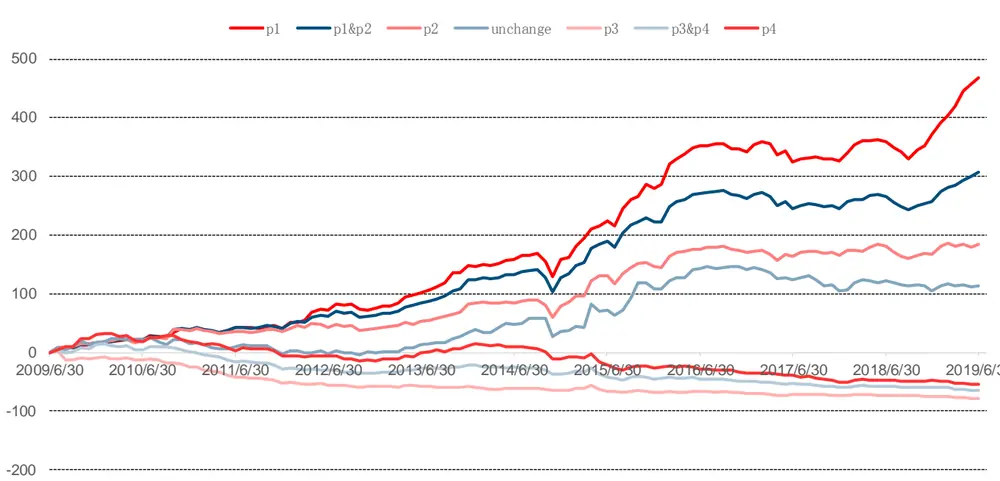
数据来源：wind、中信建投证券研究发展部

表 35：分析师预期指标叠加短期反转动量选股多空组合对比

|  | P1-P3 | P1&P2-P3&P4 | P2-P4 |
| --- | --- | --- | --- |
| 年化收益% | 36.03% | 26.26% | 18.70% |
| 年化波动% | 14.70% | 12.02% | 13.33% |
| 最大回撤% | 10.01% | 6.31% | 15.15% |
| 夏普比率 | 2.45 | 2.18 | 1.40 |

数据来源：wind、中信建投证券研究发展部

图 19：分析师预期指标叠加短期反转动量选股多空组合净值对比
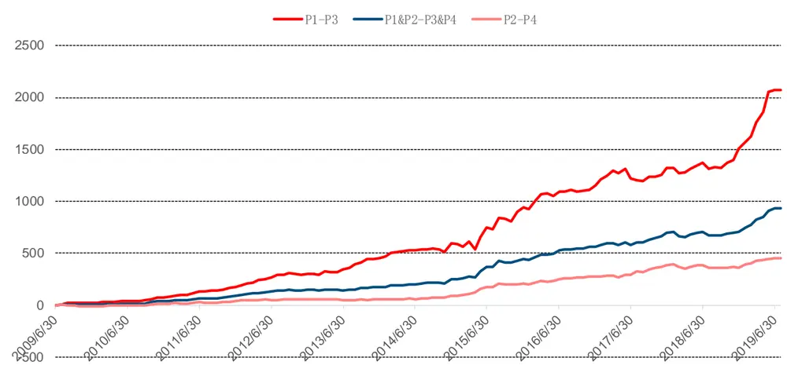
数据来源：wind、中信建投证券研究发展部

## 7.3、各组合收益表现对比

下面是所有因子组合的表现对比：从结果中可以看到，叠加动量反转指标后的组合收益表现最好，P1 阶段有 19%的年化超额收益率，P3 阶段的负超额收益也非常显著，提高到-14%，多空组合年化收益高达 36%。

综上，我们最终选取 EPS FY1,2 叠加净利润 FY1 叠加一个月收益率四个分析师指标来构建分析师预期修正调整选股组合（红色组合）。不管是 P1 组合还是 P1-P3 组合，其超额收益表现均最为优异。但我们也发现四指标组合的最大回撤有所增大且超额夏普比率有所下跌，这是由于反转因子的收益不稳定造成的。因此对于组合来说，如果考虑组合收益的稳定性，我们也可以不叠加反转因子。而对于 P3 组合，叠加短期动量的效果均比不叠加的效果要显著得多。

表 36：分析师预期指标叠加短期反转动量选股 P1组合超额收益对比

| P1组合超额收益 | EPS FY1 | EPS FY1,2 | EPS FY1,2 NP1 | EPS FY1,2 NP1 1M_Reverse |
| --- | --- | --- | --- | --- |
| 年化收益% | 12.22% | 16.34% | 16.87% | 18.99% |
| 最大回撤% | 7.37% | 6.64% | 7.22% | 14.97% |
| 夏普比率 | 1.59 | 1.89 | 1.94 | 1.7 |

数据来源：wind、中信建投证券研究发展部

表 37：分析师预期指标叠加短期反转动量选股 P1组合绝对收益对比

| P1组合多头资产组合 | EPS FY1 | EPS FY1,2 | EPS FY1,2 NP1 | EPS FY1,2 NP1 1M_Reverse |
| --- | --- | --- | --- | --- |
| 年化收益% | 13.16% | 17.59% | 18.07% | 20.03% |
| 最大回撤% | 39.54% | 36.64% | 36.68% | 33.59% |
| 夏普比率 | 0.47 | 0.63 | 0.65 | 0.68 |

数据来源：wind、中信建投证券研究发展部

表 38：分析师预期指标叠加短期反转动量选股 P1-P3多空收益对比

| 多空资产组合(P1-P3) | EPS FY1 | EPS FY1,2 | EPS FY1,2 NP1 | EPS FY1,2 NP1 1M_Reverse |
| --- | --- | --- | --- | --- |
| 年化收益% | 9.46% | 17.00% | 20.07% | 36.03% |
| 最大回撤% | 5.84% | 6.53% | 9.47% | 10.01% |
| 夏普比率 | 1.55 | 2.03 | 2.09 | 2.45 |

数据来源：wind、中信建投证券研究发展部

## 7.4、叠加短期反转动量策略 P1阶段各年度超额收益统计

最后我们对叠加短期反转策略的 P1 阶段各年度超额收益进行统计，发现除了 2014 和 2017 年小幅度跑输基准之外，其余年份均有较显著的超额收益，2019 年截至 7 月底超额收益高达 21%，夏普比率高达 4.78，表现非常优异，因此我们也把其作为最终的分析师预期修正推荐组合。另外这边不推荐 P3 组合，主要原因是从前面分析可以看出 P3 组合的负超额收益不太显著，具体逻辑为分析师一般不会主动调低对公司的预期，而主动上调（P1组合）带来的超额收益则非常显著。

表 39：叠加短期反转动量策略 P1阶段各年度超额收益统计

| 年度超额收益 | 年度波动 | 夏普比率 | 最大回撤 |
| --- | --- | --- | --- |
| 2010年 25.11 | 8.46 | 2.97 | 1.25% |
| 2011年 3.31 | 7.93 | 0.42 | 4.80% |
| 2012年 17.96 | 14.69 | 1.22 | 11.89% |
| 2013年 37.40 | 7.85 | 4.77 | 7.23% |
| 2014年 -3.43 | 13.85 | -0.25 | 14.47% |
| 2015年 69.41 | 14.33 | 4.84 | 13.98% |
| 2016年 15.60 | 9.69 | 1.61 | 9.94% |
| 2017年 -3.86 | 7.49 | -0.51 | 6.85% |
| 2018年 9.78 | 8.13 | 1.20 | 2.73% |
| 2019年（截至7月31日） 20.52 | 4.30 | 4.78 | 2.90% |

数据来源：wind、中信建投证券研究发展部

## 八、总结和思考

证券分析师由于对某个行业研究较为深入，与所研究行业的上市公司联系较紧密，其掌握的行业和个股信息通常比其他人要多，分析师预期数据已成为投资者重要的信息来源。特别是分析师对其自身推荐股票的预期调整通常被视为重要信号，其对之前预期的上调预示着分析师对该股票的后期表现更为看好，而对之前预期的下调则代表看跌该股票。由于单个分析师的预期存在较强的主观性，我们可以统计市场上所有分析师的预期均值（一致预期），当该股票的预期均值相比之前上调的话，代表大多数分析师对其看好，则该股票后续出现上涨的可能性将会增大，同理预期均值下调则预示该股票后续下跌的可能性较大。

分析师预期修正意为在一个时间段内，分析师或机构对之前预测值的调整。预期调整有一定的趋势性，当新信息出现时，有些分析师会运用该信息领先自己的同行对自己的预期进行调整，最后往往会伴随着其他分析师对自己的预测进行同向的调整。在这一过程中，预期均值会伴随修正趋势进行变动。具体表现为前一期预期均值的调整往往会带动后一期预期均值继续往同向调整。

分析师预期修正的调整对下一月的分析师预期值有着同向的影响。这一影响在预期 EPS、净利润以及目标价格上表现得最为明显。其中，预期 EPS、预期净利润和预期目标价格的上调和下调均有较强的趋势性，因此我们选取这三个指标作为后续模型的候选选股因子。

我们利用分析师预期均值和预期离散程度把对预期上调进一步划分为阶段一（P1）与阶段二（P2），把预期下调划分为阶段三（P3）和阶段四（P4）。经过统计，当将预期上调和下调进一步划分时，各指标第一或第三阶段调整后期发生同向调整的概率显著增加，而发生反向调整的概率显著减少。我们认为，分析师调整财务指标预测值，通常反映了超前于市场的信息，而此类信息会滞后一定时间在市场上反应，表现在股票价格的变动上。针对预期 EPS、目标价格和净利润各阶段修正以及股票价格后续变动情况找到不同的案例发现，分析师上调对股价均有领先的正向影响，分析师下调对股价均有领先的负向影响。

下面我们选取预期 EPS、目标价和净利润三个指标，采用第一财年分析师预期修正阶段划分构建资产组合。对于预期EPS的第一财年分析师预期（FY1）修正选股组合，表现最好的是P1阶段的股票，年化超额收益为12.22%，接下来是 P1&P2 阶段的股票，然后是 P2 阶段的股票，表现最差的是 P3 阶段的股票，即 p1>p1&p2>p2>预期不变>p4>p3&p4>p3。这也是符合分析师预期修正理论，即分析师上调对股票的正向影响最为显著，分析师下调对股票的负向影响最为显著，但从统计结果来看，P3 阶段的股票超额收益仍然为正，这说明了分析师下调对股票的负向影响没有上调对股票的正向影响这么显著，所以我们之后主要关注分析师上调的股票（主要是 P1 阶段的股票）。另外预期净利润的分层效果也较好，而目标价格的分层效果则较差，因此后面的选股模型主要选择预期EPS 和预期净利润两个指标，放弃使用预期目标价指标。

接下来我们做一个改进，对预期 EPS、预期净利润两个指标的第二财年（FY2）进行单因子分析。我们发现表现最好的仍然是 P1 阶段的股票，表现最差的是 P3 阶段的股票，其分层选股效果仍然比较显著，另外两个分析师修正指标的一二财年预测值选股效果比较接近，说明两个财年的预期修正蕴含着类似信息。

接下来，我们将预期 EPS 两个财年的预测指标进行叠加选股，即选取第一、二财年预期修正所处阶段相同的股票取交集，构建超额收益组合。我们发现预期 EPS 的第一二财年分析师预期修正叠加选股的效果要好于单个预测年度，P1 组合 FY1,2 的年化超额收益（16.34%）比 FY1（12.22%）和 FY2（13.38%）有 3%以上的增强，夏普比率也是最高的。另外 P1-P3 的多空收益表现也是大幅增强，年化多空收益从 FY1 的 9.46%增强到 FY1,2 的17%。

我们继续做一个改进，假设在 EPS 两财年修正指标叠加选股的基础上，继续叠加其他预测指标进行选股，这边分别在上面组合基础上继续叠加预期净利润的第一财年与第二财年预测指标，发现叠加预期净利润指标后的增强效果变化不大。P1 阶段的组合超额收益（16.87%）和不叠加第一财年（FY1）预期净利润的组合超额收益（16.34%）相差不大，主要原因在于分析师一般在调整股票预期 EPS 同时也会调整预期净利润，因此预期净利润的新增信息不大。我们最终不做过多的拟合，主要采用 EPSFY1,2 叠加净利润 FY1 的组合作为推荐组合。

最后再做一个改进，我们在前面组合的基础上再叠加一个指标——动量反转指标。因为动量和反转是 A 股市场上一个比较显著的效应，因此我们可以在上面的分析师预期调整组合里面进行叠加。具体策略为 P1 阶段组合叠加过去 N 个月全市场跌幅最大的 50%股票，P3 阶段组合叠加过去 N 个月全市场涨幅最大的 50%股票。我们发现叠加过去一月收益的收益表现最好，在叠加过去一个月反转指标后 P1 阶段有着 19%的年化超额收益率，同时，P3 阶段的负超额收益也最为显著，达到-14%，多空组合年化收益高达 36%。

最终，我们选取 EPS FY1,2 叠加净利润 FY1 叠加一个月收益率四个分析师指标来构建分析师预期修正调整选股组合。对各年度超额收益进行统计，我们发现除了 2014 和 2017 年小幅度跑输基准之外，其余年份均有较显著的超额收益，2019 年截至 7 月底超额收益高达 21%，夏普比率高达 4.78，表现非常优异。

## 参考文献

Barber, B, Lehavy, R, Mcnichols, M and Trueman, B. “Reassessing the returns to analysts' stock recommendations.” Financial Analysts Journal (2003): 88-96.

Barber, BM & Lehavy, R. “Ratings changes, ratings levels, and the predictive value of analysts recommendations.” Financial management 39.2 (2010): 533-553.

Boni, L, and Womack, KL. “Analysts, industries, and price momentum.” Journal of Financial and Quantitative Analysis 41.01 (2006): 85-109.

Irvine, PJ. “The incremental impact of analyst initiation of coverage.” Journal of Corporate Finance 9.4 (2003): 431-451. Jegadeesh, N, and Kim, W. “Value of analyst recommendations: International evidence.” Journal of Financial Markets 9.3 (2006): 274-309.

Kanne, S, Klobucnik, J, Kreutzmann, D and Sievers, S. “To buy or not to buy? The value of contradictory analyst signals.” Financial Markets and Portfolio Management 26.4 (2012): 405-428.

## 分析师介绍

丁鲁明：同济大学金融数学硕士，中国准精算师，现任中信建投证券研究发展部金融工程方向负责人，首席分析师。10 年证券从业，历任海通证券研究所金融工程高级研究员、量化资产配置方向负责人；先后从事转债、选股、高频交易、行业配置、大类资产配置等领域的量化策略研究，对大类资产配置、资产择时领域研究深入，创立国内“量化基本面”投研体系。多次荣获团队荣誉：新财富最佳分析师 2009 第 4、2012第 4、2013 第 1、2014 第 3 等；水晶球最佳分析师 2009 第 1、2013 第 1；2018 年 wind金牌分析师第 2 等。

陈升锐： 芝加哥大学金融数学硕士，三年基金公司量化投资研究工作经验，2018 年加入中信建投研究发展部金融工程团队，专注于量化选股研究。2018、2019 年Wind金牌分析师金融工程第 2 名团队成员。

## 研究服务

## 保险组

张博 010-85130905 zhangbo@csc.com.cn

郭洁 010-85130212 guojie@csc.com.cn

郭畅 010-65608482 guochang@csc.com.cn

张勇 010-86451312 zhangyongzgs@csc.com.cn

高思雨 010-8513 gaosiyu@csc.com.cn

## 北京公募组

朱燕 85156403- zhuyan@csc.com.cn

任师蕙 010-85159274 renshihui@csc.com.cn

黄杉 010-85156350 huangshan@csc.com.cn

李星星 021-68821600 lixingxing@csc.com.cn

杨济谦 010-86451442 yangjiqian@csc.com.cn

金婷 jinting@csc.com.cn

夏一然 xiayiran@csc.com.cn

杨洁 010-86451428 yangjiezgs@csc.com.cn

## 社保组

吴桑 010-85159204 wusang@csc.com.cn

张宇 010-86451497 zhangyuyf@csc.com.cn

## 创新业务组

高雪 010-86451347 gaoxue@csc.com.cn

廖成涛 0755-22663051 liaochengtao@csc.com.cn

黄谦 010-86451493 huangqian@csc.com.cn

诺敏 010-85130616 nuomin@csc.com.cn

## 上海销售组

李祉瑶 010-85130464 lizhiyao@csc.com.cn

黄方禅 021-68821615 huangfangchan@csc.com.cn

戴悦放 021-68821617 daiyuefang@csc.com.cn

翁起帆 021-68821600 wengqifan@csc.com.cn

范亚楠 021-68821600 fanyanan@csc.com.cn

薛姣 021-68821600 xuejiao@csc.com.cn

章政 zhangzheng@csc.com.cn

李绮绮 021-68821867 liqiqi@csc.com.cn

王定润 021-68801600 wangdingrun@csc.com.cn

## 深广销售组

曹莹 0755-82521369 caoyingzgs@csc.com.cn

张苗苗 020-38381071 zhangmiaomiao@csc.com.cn

XU SHUFENG 0755-23953843

xushufeng@csc.com.cn

程一天 0755-82521369 chengyitian@csc.com.cn

陈培楷 020-38381989 chenpeikai@csc.com.cn

## 评级说明

以上证指数或者深证综指的涨跌幅为基准。

买入：未来 6 个月内相对超出市场表现 15％以上；

增持：未来 6 个月内相对超出市场表现 5—15％；

中性：未来 6 个月内相对市场表现在-5—5％之间；

减持：未来 6 个月内相对弱于市场表现 5—15％；

卖出：未来 6 个月内相对弱于市场表现 15％以上。

## 重要声明

本报告仅供本公司的客户使用，本公司不会仅因接收人收到本报告而视其为客户。

本报告的信息均来源于本公司认为可信的公开资料，但本公司及研究人员对这些信息的准确性和完整性不作任何保证，也不保证本报告所包含的信息或建议在本报告发出后不会发生任何变更，且本报告中的资料、意见和预测均仅反映本报告发布时的资料、意见和预测，可能在随后会作出调整。我们已力求报告内容的客观、公正，但文中的观点、结论和建议仅供参考，不构成投资者在投资、法律、会计或税务等方面的最终操作建议。本公司不就报告中的内容对投资者作出的最终操作建议做任何担保，没有任何形式的分享证券投资收益或者分担证券投资损失的书面或口头承诺。投资者应自主作出投资决策并自行承担投资风险，据本报告做出的任何决策与本公司和本报告作者无关。

在法律允许的情况下，本公司及其关联机构可能会持有本报告中提到的公司所发行的证券并进行交易，也可能为这些公司提供或者争取提供投资银行、财务顾问或类似的金融服务。

本报告版权仅为本公司所有。未经本公司书面许可，任何机构和 或个人不得以任何形式翻版、复制和发布本报告。任何机构和个人如引用、刊发本报告，须同时注明出处为中信建投证券研究发展部，且不得对本报告进行任何有悖原意的引用、删节和/或修改。

本公司具备证券投资咨询业务资格，且本文作者为在中国证券业协会登记注册的证券分析师，以勤勉尽责的职业态度，独立、客观地出具本报告。本报告清晰准确地反映了作者的研究观点。本文作者不曾也将不会因本报告中的具体推荐意见或观点而直接或间接收到任何形式的补偿。

股市有风险，入市需谨慎。

## 中信建投证券研究发展部

## 北京

东城区朝内大街2号凯恒中心B座 12 层（邮编：100010）

电话：(8610) 8513-0588

传真：(8610) 6560-8446

## 上海

浦东新区浦东南路 528 号上海证券大厦北塔 22 楼 2201 室（邮编：200120）

电话：(8621) 6882-1612

传真：(8621) 6882-1622

## 深圳

福田区益田路 6003 号荣超商务中心B 座 22 层（邮编：518035）

电话：（0755）8252-1369

传真：（0755）2395-3859