[table_main] 证券研究报告·金融工程深度报告金融衍

# 分析师超预期因子选股策略：

——因子深度研究系列

## 主要结论

## 本文概述

本文主要介绍超预期幅度因子的定义、分析师超预期股票收益特征分析和分析师超预期选股策略的构建。首先我们介绍精确到单季度的净利润超预期幅度 ESP 因子算法，然后我们对超预期股票的收益特征进行分析，发现EP_TTM和过去一个月收益率两个风格因子可以很好地解释超预期股票的收益来源。最后每月底根据 EP_TTM 和过去一个月收益率两个风格因子限定样本池，然后选取净利润超预期幅度最大的 20 只股票构建超预期20 组合。组合基本上每年稳定战胜中证 500 指数，可以作为中证 500 增强的补充组合。

## 分析师超预期幅度因子定义

分析师超预期幅度 ESP 因子可以定义如下：ESP =（单季度实际净利润-单季度预期净利润）/ABS(单季度预期净利润)。假设分析师对单季度的增速预测和其年度增速预测一样，我们可以得到季度分析师预测值的分解算法。

## EP_TTM和过去一个月收益率可以解释超预期股票的收益来源

我们选对不同的风格因子包括预测机构个数、行业、市值、估值（EP_TTM、BP_LR）、成长（单季度 ROE 同比增长率）、质量（ROE、ROA）、动量反转（最近一个月收益率、六个月收益率）和技术（过去一个月换手率、波动率、日均成交额）因子进行分层测试，发现 EP_TTM 和过去一个月收益率在整个样本期和 2017 年之后的分层效果均较好，其可以很好地解释超预期股票的收益来源，可以把其作为我们选股组合的初步风格筛选因子。

## 超预期选股策略最近10年相对中证 500年化超额收益 22.81%

为了确保每月保持最低的因子覆盖度，能够选出一定数量的股票，首先进行月份调整和处理，处理之后的超预期因子月度平均因子覆盖度为62%左右。每月底根据 EP_TTM 和过去一个月收益率两个风格因子限定样本池（每个月在全市场里面选取这两个风格因子排名前 30%的股票取交集作为初步样本池），然后选取净利润超预期幅度最大（ESP 因子值最大）的 20 只股票，构建我们的超预期 20 组合。分析师超预期 20组合从 2009年至 2019 年（截至 9 月底）10 年时间，组合年化收益 27.43%，相对中证500 指数的年化超额收益为 22.81%，相对沪深 300 指数的年化超额收益为23.77%。组合基本上每年相比中证 500 指数均有超额收益，2019 年（截至 9 月底）的超额收益接近 10%，每年超额收益最大回撤只有 7.4%，夏普比率达 1.85。另外剥离了估值和反转因子后，超预期组合仍然有较为稳定的超额收益贡献，即组合主要是由超预期风格贡献大部分的超额收益。

# 金融工程研究

。丁鲁明[table

dingluming@csc.com.cn

021-68821623

执业证书编号：S1440515020001

陈升锐

chenshengrui @csc.com.cn

021-68821600

执业证书编号：S1440519040002

发布日期： 2020 年 4 月 2 日

## 相关研究报告

| 20.01.17 | 因子深度研究系列：分析师预期修正动 量效应选股策略 |
| --- | --- |
| 19.08.21 | 因子深度研究系列：中信建投一致预期 因子体系搭建 |
| 19.03.28 | 因子深度研究系列：因子衰減在多因子 选股中的应用 |
| 18.08.29 | 因子深度研究系列：Barra风险模型介绍 及与中信建投选股体系的比较 |
| 18.08.23 | 技术形态选股研究之黎明曙光：深跌反 转形态 |
| 18.08.07 | 量化基本面选股：从逻辑到模型，航空 业投资方法探讨 |
| 18.08.02 | 从相关关系到指数增强——谈 IC 系数 与股票权重的联系 |
| 18.06.08 | 因子深度研究系列：宏观变量控制下的 有效因子轮动 |
| 18.05.18 | 因子深度研究系列：特质波动率纯因子 在A股的实证与研究 |

## 一、分析师超预期幅度因子定义

分析师超预期幅度因子，主要包括净利润超预期幅度因子 ESP（Earnings Surprise Percent）、营业收入超预期幅度因子 RSP（Revenue Surprise Percent）、标准化净利润超预期因子 SUE（Standardized Unexpected Earnings）和标准化营业收入超预期因子 SUR（Standardized Unexpected Revenue）等。

本文主要介绍的是精确到单季度的净利润超预期幅度 ESP 因子，具体定义如下：

## ESP =（单季度实际净利润-单季度预期净利润）/ABS(单季度预期净利润)

假设分析师对单季度的增速预测和其年度增速预测一样，我们可以得到以下季度分析师预测值分解算法：一、为了保证分析师预测值的时效性，当公司的财务报告（业绩预告、业绩快报、定期报告）发布的时候，我们取上季度定期财报公告日到当天（超过 3 个月的取 3 个月内）的所有当年净利润预测样本作为样本集，并且对于样本集里面的每一个样本取所有机构最近一期的预测值的均值作为其年度预期净利润；

二、为了能够更加真实地反映公司的预测净利润，在得到季度净利润的预测值时，需要将年度预期净利润减去已发布的正式财报季度净利润累计值，得到未发布正式财报的季度预期净利润；

三、计算未发布正式财报的季度预期净利润和去年同期季度真实利润的同比增速作为分析师最新单季度的预期同比增速；

四、根据上面算出的单季度预期同比增速，以及去年同期单季度净利润，计算出分析师预期单季度净利润。下图是分析师超预期幅度因子的定义，我们通过流程图（图 1）来展示：

图 1：分析师超预期幅度因子定义
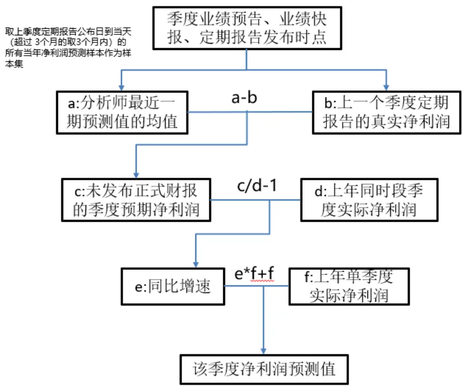
数据来源：wind、中信建投证券研究发展部

为了能够更直观地看下超预期因子的选股效果，这里选取沪深的两只股票贵州茅台和森马服饰，观察历史上发生超预期的月份下月收益的分布情况，我们统一是每个月底统计当月发生超预期的股票。首先是贵州茅台（图 2），历史上共发生过 22 次超预期，有 20 次超预期次月收益为正，次月最高收益为 25%，次月最低收益仅为-2%。

图 2：贵州茅台超预期收益统计
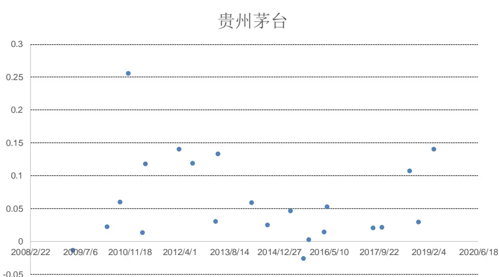
数据来源：wind、中信建投证券研究发展部

然后是森马服饰（图3），历史上共发生过16次超预期，有 13次超预期次月收益为正，次月最高收益为20%，次月最低收益仅为-4%。

图 3：森马服饰超预期收益统计
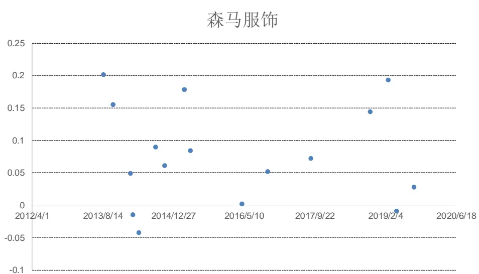
数据来源：wind、中信建投证券研究发展部

因此对于贵州茅台和森马服饰，当月发生超预期，次月基本上均为正收益。而对于其他股票来说，经过统计大概有 70%以上的股票当月发生超预期，次月相对市场基准（Wind 全 A）的超额收益为正，因此超预期对于股票的短期刺激作用较为明显。

## 二、分析师超预期股票分布统计

## 2.1、超预期股票样本数量月度分布

首先我们统计超预期股票的样本数量月度分布，具体如图 4 所示，其中 4、8、10 月的超预期股票数量最多，主要是因为这几个月是公司发布年报和季报的时间，而 1、2、3、7 月的超预期股票数量也较多，主要原因是这四个月是公司集中发布业绩预告和快报的时间，剩下的月份如 5、6、9、11、12 月的超预期股票数量较少，甚至有些月份的数量接近于 0，因此后面我们做量化选股的时候会首先做一个月份调整，让每个月的样本量较为接近并达到最低的样本覆盖度。

图 4：超预期股票样本数量月度分布
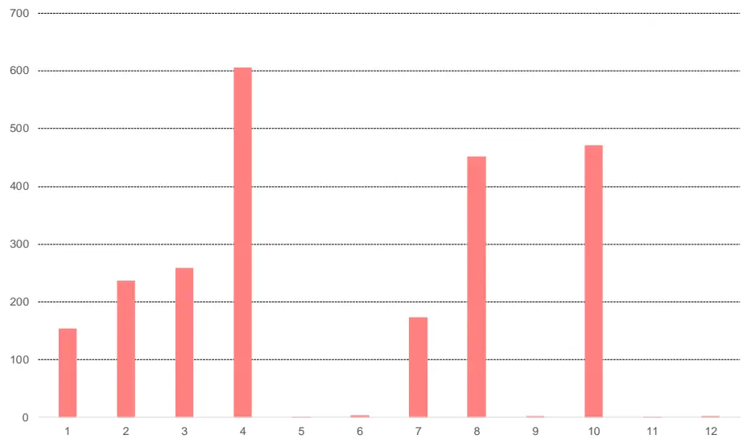
数据来源：wind、中信建投证券研究发展部

## 2.2、超预期股票的月度平均收益

接下来，我们对各类超预期股票的下月收益做统计。首先是超预期股票各月的平均绝对收益和超额收益，其中超预期股票各月的平均绝对收益如图 5：

图 5：超预期股票月度平均绝对收益%
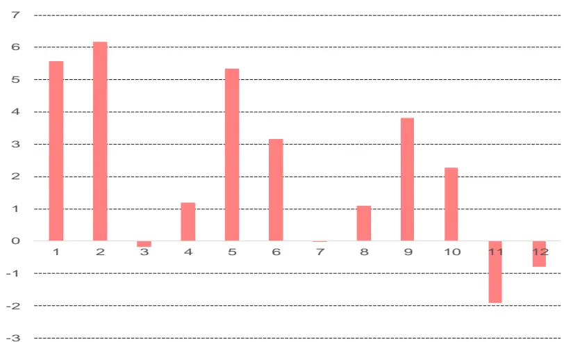
数据来源：wind、中信建投证券研究发展部

超预期股票各月的平均超额收益（相对 Wind 全 A）如图 6：

图 6：超预期股票月度平均超额收益%(相对 Wind全 A)
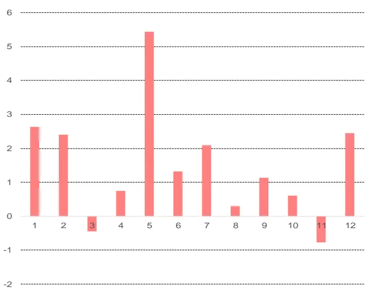
数据来源：wind、中信建投证券研究发展部

从图 5 和图 6 可以看出，1、2、5 月的超预期股票绝对收益和超额收益最高，相比其他月份的表现更好，但其受到每月样本数量的影响，因此仅对其做个简单统计而没有在后面的实际投资策略中加以使用。

## 2.3、不同类型报告的超预期股票数量和平均超额收益

然后，我们看下不同类型报告的超预期股票数量对比（图 7）：

图 7：不同类型报告超预期股票数量
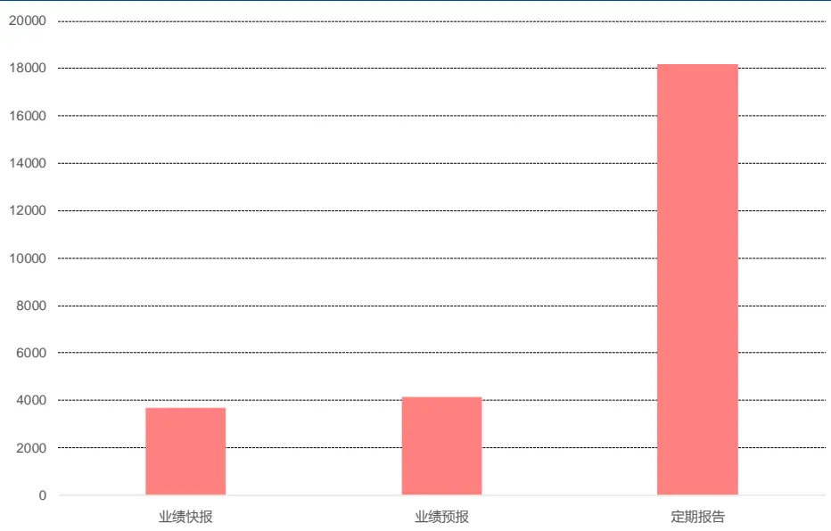
数据来源：wind、中信建投证券研究发展部

经过对比发现，定期报告的超预期股票数量远比业绩快报和业绩预告的超预期股票数量要多，主要是每个公司都会发布定期报告，而业绩预告和快报不是必须的。但我们发现业绩预告和业绩快报的超预期股票平均超额收益远比定期报告的超预期股票要高（图 8），其中业绩快报超预期股票的平均超额收益为 2%，业绩预告为1.4%，定期报告为 0.57%。主要原因是公司的业绩预告和业绩快报比定期报告要提前一段时间，当公司发布业绩预告和快报，假设业绩是超预期的话，公司股价肯定是第一时间反应而出现上涨而不会等到定期报告发布后才反应，这也是为什么我们需要加上业绩预告和快报的信息，希望能够更加及时地抓住超预期的股票。

图 8：不同类型报告超预期股票平均超额收益%
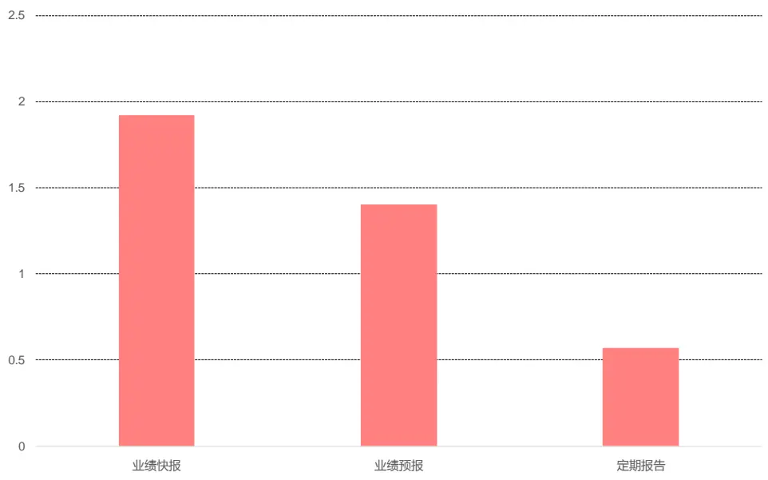
数据来源：wind、中信建投证券研究发展部

## 2.4、不同季报的超预期股票平均收益

图 9 和图 10 是不同季报的超预期股票平均绝对收益和超额收益对比：

图 9：不同季报超预期股票平均绝对收益%
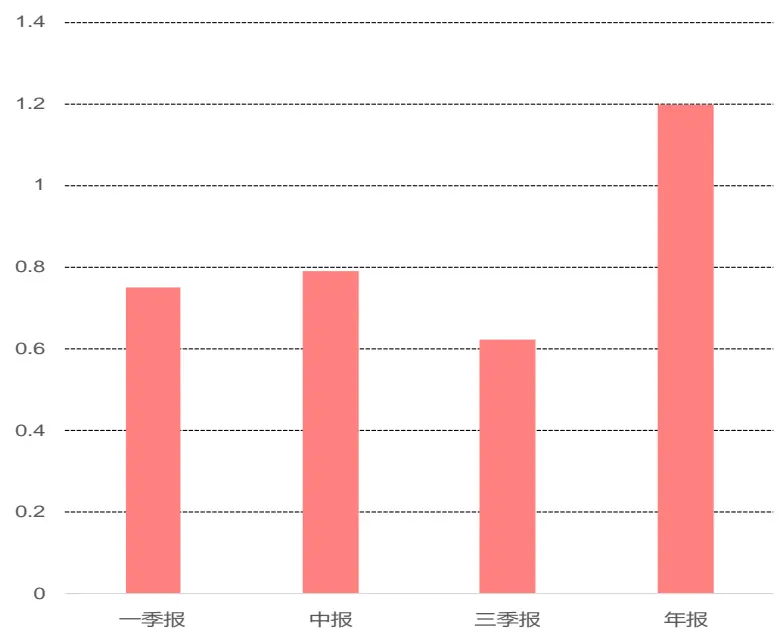
数据来源：wind、中信建投证券研究发展部

图 10：不同季报超预期股票平均超额收益%
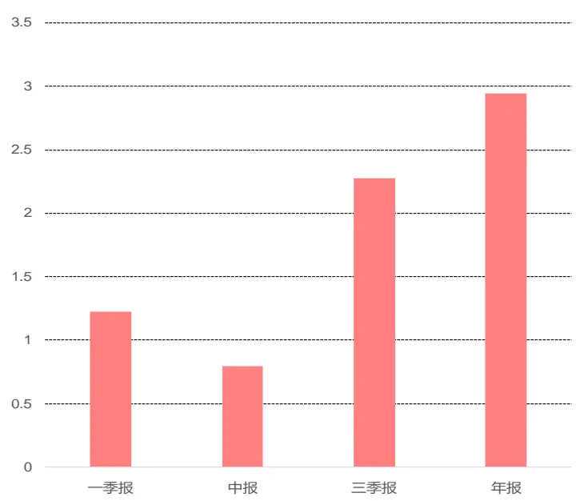
数据来源：wind、中信建投证券研究发展部

经过对比发现，年报的超预期股票无论是平均绝对收益还是超额收益都比一、二、三季报要高。

## 2.5、当年重复超预期的股票平均绝对收益

最后，我们看下当年重复超预期的股票平均绝对收益对比（图 11），1 是当年第一次发生超预期股票的平均收益，2 是当年第二次发生超预期的股票平均收益，以此类推：

图 11：当年重复超预期的股票平均绝对收益%
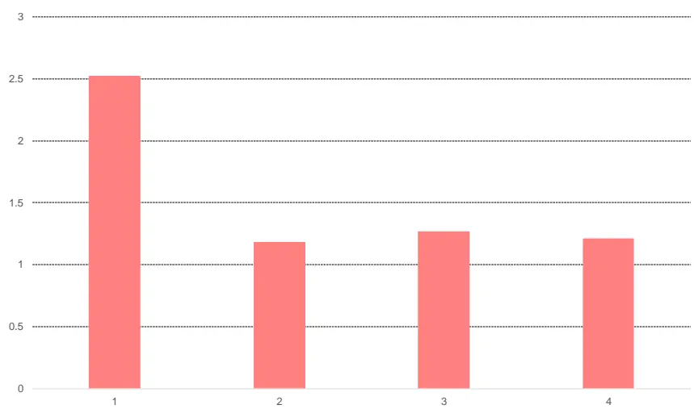
数据来源：wind、中信建投证券研究发展部

我们发现当年第一次发生超预期的股票收益表现最好，平均收益为 ，比多次发生超预期的股票收益表现要好，主要逻辑是第一次发生超预期的股价反应是最强烈的，第二次和之后发生超预期对股价的影响程度远不如第一次，因为超预期的信息已经被 pricein 了。

## 三、分析师超预期股票收益特征分析

第三部分我们详细对超预期股票的收益特征进行分析，对不同的风格因子包括预测机构个数、行业、市值、估值（EP_TTM、BP_LR）、成长（单季度 ROE 同比增长率）、质量（ROE、ROA）、动量反转（最近一个月收益率、六个月收益率）和技术（过去一个月换手率、波动率、日均成交额）因子进行分层测试，看下哪些风格因子能够解释超预期股票的收益来源。

## 3.1、预测机构个数

由于 2017 年之后市场风格发生重大变化，因此我们这边选取全样本（2009 年以来）和 2017 年以来两个时间区间来分析超预期股票的收益特征。

首先是预测机构个数，具体分层效果如下。左边是全样本（2009 年以来）的分层测试结果，右边是 2017

年以来的分层测试结果。其中 1 是只有一个预测机构的超预期股票平均绝对收益，2 是有两个预测机构，以此类推。我们看到全样本区间，不同预测机构个数下的超预期股票平均绝对收益在 0.8%-0.9%左右，比较接近，因此预测机构个数对超预期股票收益的分层效果不太明显，不是一个有效的风格筛选因子。

图 12：预测机构个数对超预期股票收益的分层效果
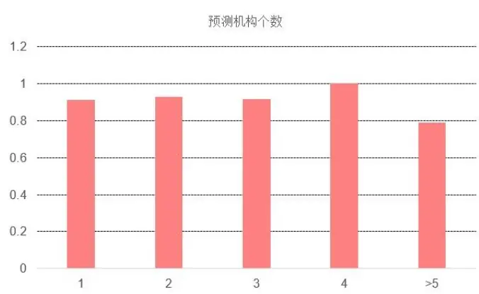
数据来源：wind、中信建投证券研究发展部

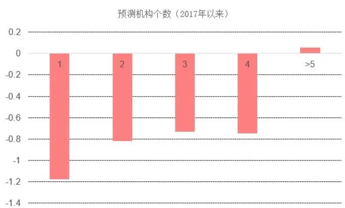

## 3.2、行业

然后是行业风格，我们以中信一级行业分类，不同行业的超预期股票收益相差非常明显，没有一个行业在2017 年之后能够持续稳定贡献收益，因此行业风格也不是超预期股票收益的解释变量。

图 13：行业对超预期股票收益的分层效果
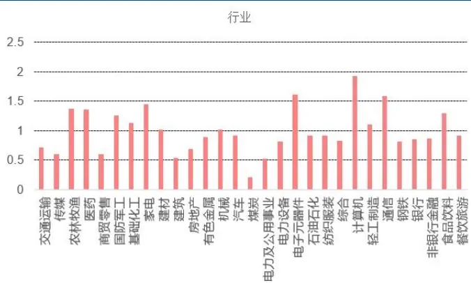
数据来源：wind、中信建投证券研究发展部

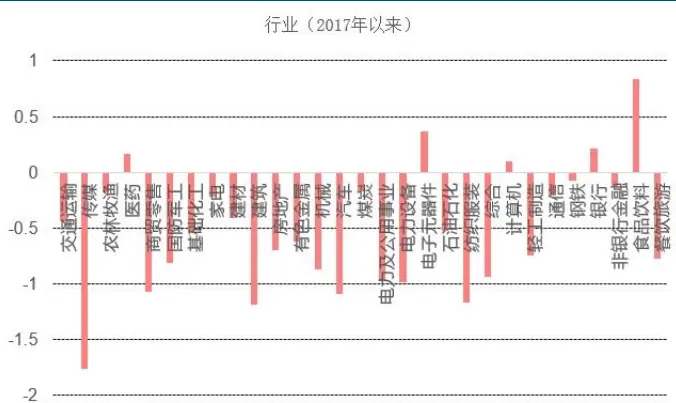

## 3.3、市值

接下来是市值风格，我们按照超预期股票的市值从小到大分为 5 组，1 是最小市值组，5 是最大市值组。全样本区间来看，市值越小的超预期股票收益越高，最小市值组的超预期股票平均收益为 2%，最大市值组的平均收益仅为 0.56%，接近最小市值组收益的 1/4，其分层效果比较显著。但在 2017 年之后，表现最好的是最大市值组超预期股票，收益为正。因此市值风格对超预期股票收益的影响方向在 2017 年之后出现了相反，也不是一个方向稳定的解释变量。

图 14：市值对超预期股票收益的分层效果
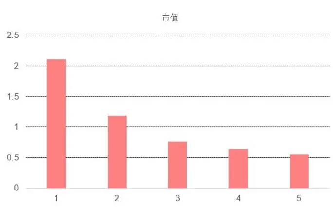
数据来源：wind、中信建投证券研究发展部

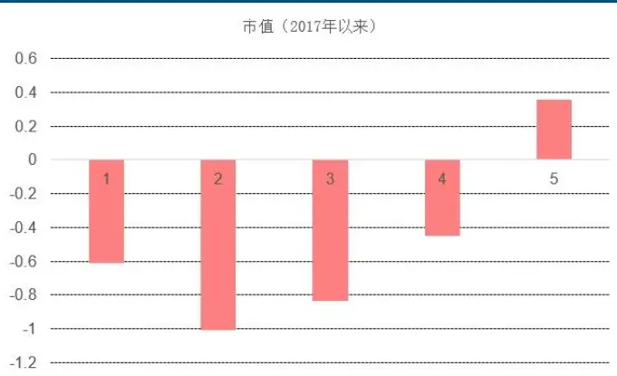

## 3.4、EP_TTM

下面是估值因子，首先是估值因子 EP_TTM，分层方法和前面的风格因子一样，1 是因子值最低的一组，5是因子值最高的一组。从分层效果来看，低估值（高 EP_TTM）超预期股票总体上表现好于高估值（低 EP_TTM）超预期股票，且线性分层效果较显著，2017 年以来此线性规律仍然存在。因此 EP_TTM 能够很好地解释超预期股票的收益来源，我们后面把其作为我们选股组合的初步风格筛选因子。

图 15：EP_TTM对超预期股票收益的分层效果
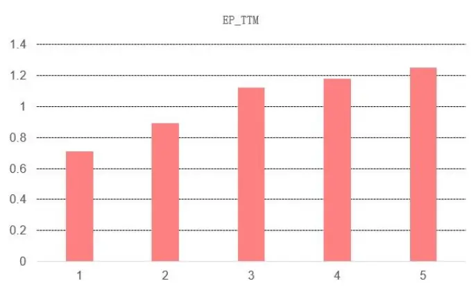
数据来源：wind、中信建投证券研究发展部

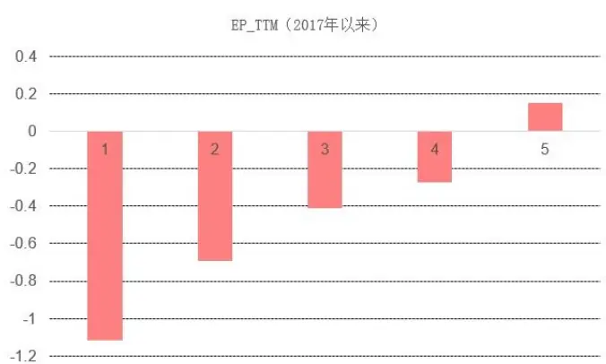

## 3.5、BP_LR

从估值因子 BP_LR 来看，高 BP_LR 超预期股票总体上表现好于低 BP_LR 股票，且线性分层效果较显著，但此风格在 2017 年以来的分层效果不佳，因此 BP_LR 不是一个有效的风格筛选因子。

图 16：BP_LR对超预期股票收益的分层效果
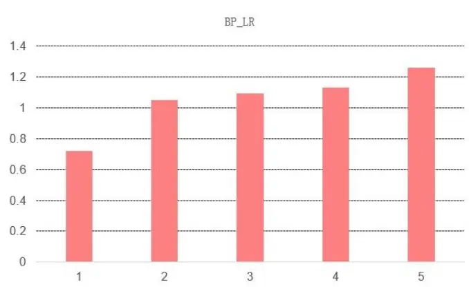
数据来源：wind、中信建投证券研究发展部

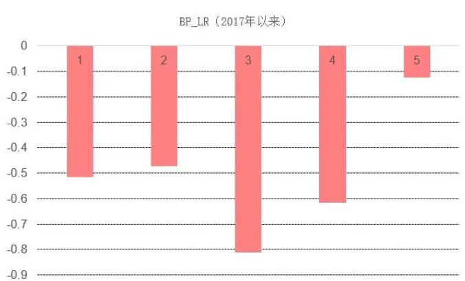

## 3.6、单季度 ROE同比增长率

从成长因子来看，我们这边测试了不同的成长因子，以单季度 ROE 同比增长率为例，其分层效果在不同时间区间均不太显著（包括全样本和 2017 年以来）。

图 17：单季度 ROE同比增长率对超预期股票收益的分层效果
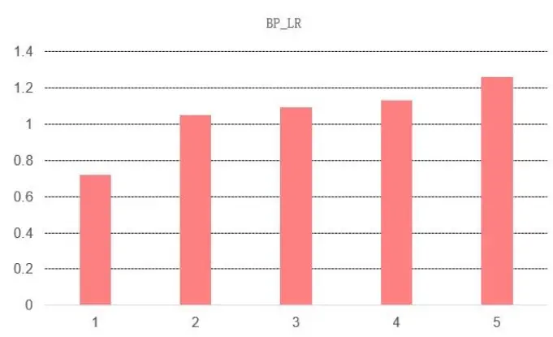
数据来源：wind、中信建投证券研究发展部

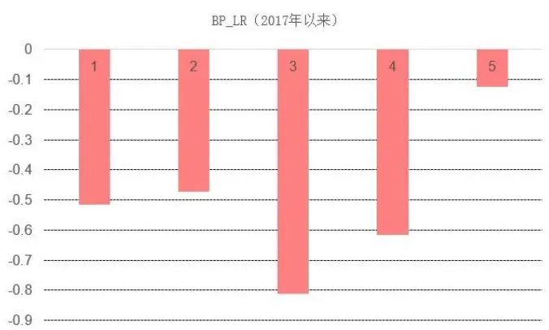

## 3.7、 ROE_TTM

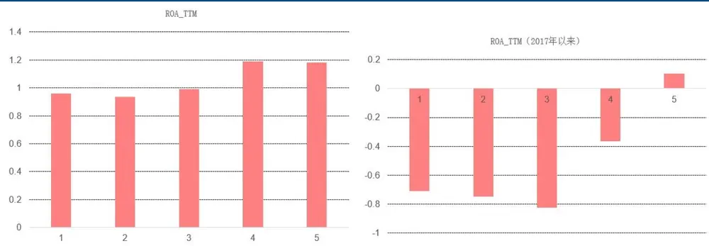
金融工程深度报告
图 19：ROA_TTM对超预期股票收益的分层效果
数据来源：wind、中信建投证券研究发展部

然后是质量因子，我们分别以 ROE_TTM 和 ROA_TTM 风格来分析，从 ROE_TTM 来看，其分层效果不太显著（尽管在 2017 年以来此风格分层效果较好）。

图 18：ROE_TTM对超预期股票收益的分层效果
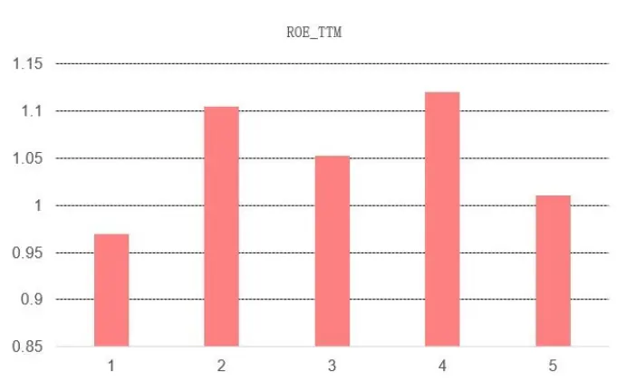
数据来源：wind、中信建投证券研究发展部

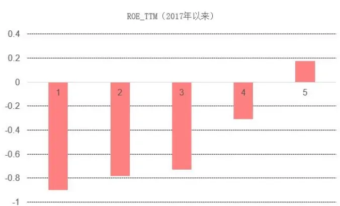

## 3.8、 ROA_TTM

从质量因子 ROA_TTM 来看，其分层效果同样不太显著。

## 3.9、 过去一个月收益率

对于动量（反转）因子，首先是一个月收益率，其风格的分层效果非常显著（包括全样本和 2017 年以来）。

我们看到最近一个月跌幅越大的超预期股票收益越高。因此其可以作为我们后面选股组合的初步筛选风格因子。

图 20：过去一个月收益率对超预期股票收益的分层效果
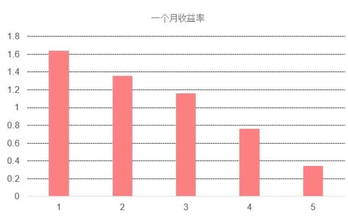
数据来源：wind、中信建投证券研究发展部

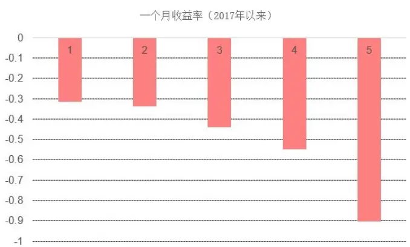

## 3.10、 过去六个月收益率

从动量（反转）因子六个月收益率来看，其分层效果在 2017 年之前和 2017 年之后差异较大，因此不是一个方向稳定的风格筛选因子。

图 21：过去六个月收益率对超预期股票收益的分层效果
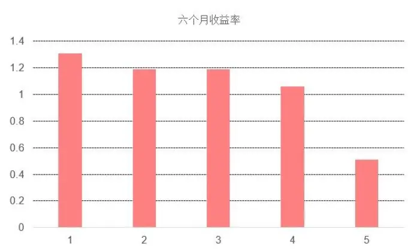
数据来源：wind、中信建投证券研究发展部

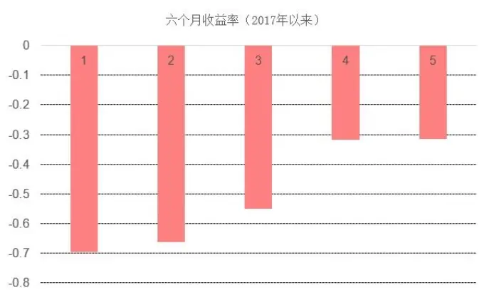

## 3.11、 过去一个月换手率

最后是技术因子，首先是技术因子过去一个月换手率，从图 22 来看，其分层效果不太显著。

图 22：过去一个月换手率对超预期股票收益的分层效果
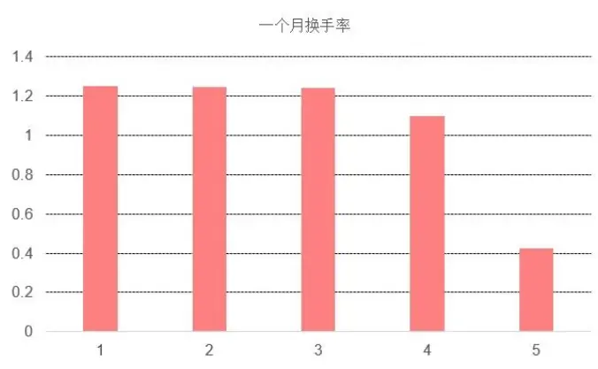
数据来源：wind、中信建投证券研究发展部

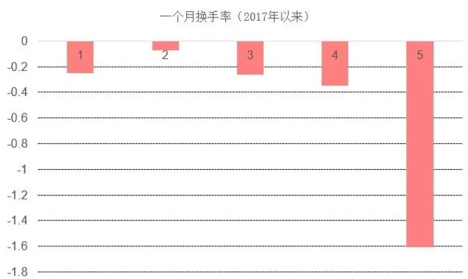

## 3.12、 过去一个月波动率

技术因子过去一个月波动率的分层效果也是不太明显。

图 23：过去一个月波动率对超预期股票收益的分层效果
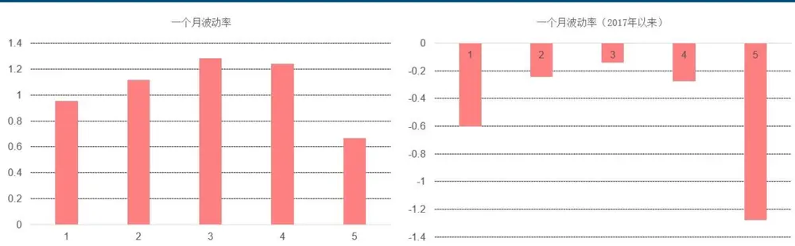
数据来源：wind、中信建投证券研究发展部

## 3.13、 过去一个月日均成交额

从技术因子过去一个月日均成交额来看，其分层效果在历史上分层效果较好，过去成交较少的超预期股票表现好于成交较多的超预期股票。但此规律在 2017 年以来变得不显著。

图 24：过去一个月日均成交额对超预期股票收益的分层效果
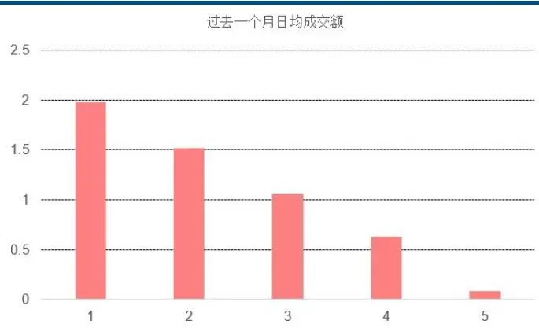
数据来源：wind、中信建投证券研究发展部

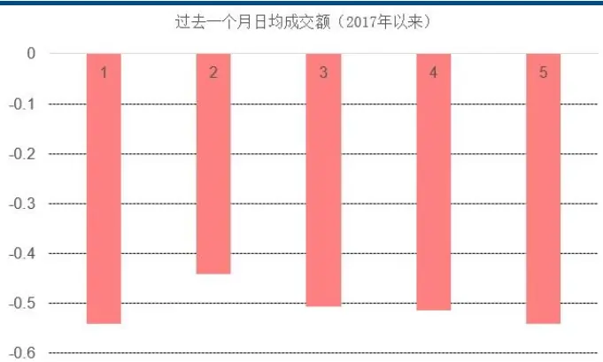

综上，我们发现 EP_TTM 和过去一个月收益率在整个样本期和 2017 年之后的分层效果均较好，其可以很好地解释超预期股票的收益来源，可以把其作为我们选股组合的初步风格筛选因子。

## 四、分析师超预期选股策略

## 4.1、分析师超预期因子覆盖度和选股效果

通过第二部分超预期股票特征分析可以看出，每年 、 、 月的超预期股票最多，其他月份股票数相对较少，特别是 5、6、9、11、12 这几个月的股票数量较少。为了确保每月保持最低的因子覆盖度，能够选出一定数量的股票，我们需要进行如下月份调整和处理：4、8、10 月取当月的超预期股票，5、9、11 月取过去 2 个月超预期股票（即 4 和 5 月两个月的超预期股票作为 5 月的样本池，以此类推），1、7 月取过去 4 个月股票，3、6、12 月取过去 3 个月股票，其处理之后的超预期因子月度覆盖度如图 25，平均因子覆盖度（有因子值的股票数量/全市场股票数量）为 62%左右，满足最低的因子覆盖要求：

图 25：净利润超预期幅度 ESP因子覆盖度
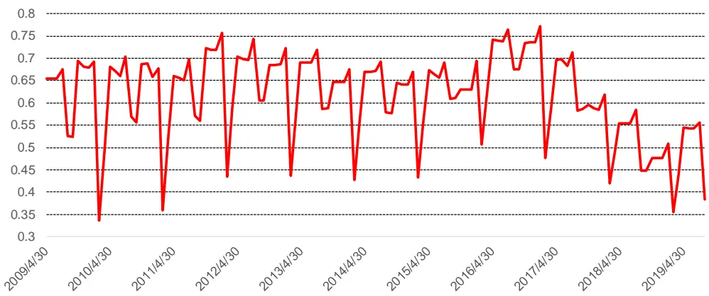
数据来源：wind、中信建投证券研究发展部

通过第三部分的分析师超预期股票收益特征分析可以看出，EP_TTM 和过去一个月收益率在整个观察期和2017年之后的分层效果均较好，所以我们每个月在全市场里面选取这两个风格因子排名前30%的股票取交集（即选取低估值超跌的股票）作为初步样本池，然后在此样本池下测试净利润超预期幅度 ESP 因子的因子效果，其中因子已经对市值和行业做了中性化处理，其五分位测试结果如下：

图 26：净利润超预期幅度 ESP因子五分位测试结果
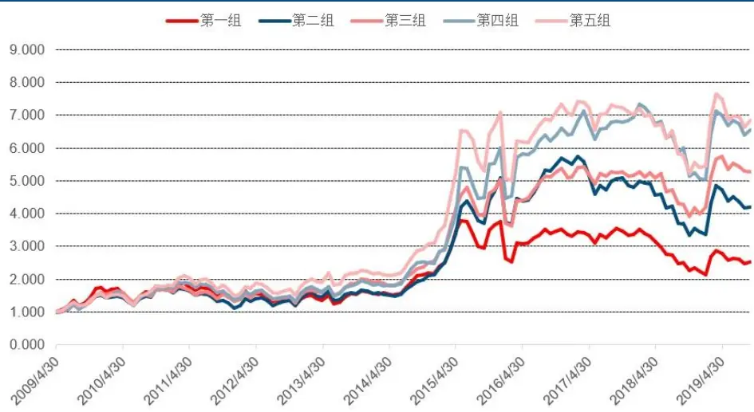

|  | 第一组 | 第二组 | 第三组 | 第四组 | 第五组 |
| --- | --- | --- | --- | --- | --- |
| 年化收益% | 9.25 | 14.66 | 17.19 | 19.60 | 20.09 |
| 累积收益% | 253.06 | 420.67 | 528.91 | 654.83 | 683.35 |
| 夏普比例 | 0.32 | 0.50 | 0.63 | 0.65 | 0.68 |

数据来源：wind、中信建投证券研究发展部

第一组是因子值最低的 20%的股票组合，第五组因子值最高的 20%的股票组合。从五分位测试效果来看，各组因子值分层效果较好，第五组的股票组合表现最好，第一组的股票组合表现最差，而从夏普比率来看也是如此。虽然因子的分层选股效果比较不错，但因子覆盖度还是稍低于传统因子，如果纳入传统的多因子选股模型中可能统计上不太显著，因此后面直接采用条件选股的方法。

## 4.2、分析师超预期20组合

我们通过条件选股的方法，具体选股流程如下：每月底根据 EP_TTM 和过去一个月收益率两个风格因子限定样本池（即选择低估值超跌股票），然后选取净利润超预期幅度最大（ESP 因子值最大）的 20 只股票，构建我们的超预期 20 组合。其中样本池踢掉了停牌、上市半年之内新股、ST 和当天涨跌停的股票，另外我们每期会考虑停复牌情况固定选取 20 只股票（即假设这个月底有 4 只停牌股票，则另外选取 16 只股票），这个组合我们称为分析师超预期 20 组合。组合具体绝对收益净值如图 27，最近 10 年累计净值超过 12，远超沪深 300 指数和中证 500 指数：

图 27：分析师超预期 20组合绝对收益净值
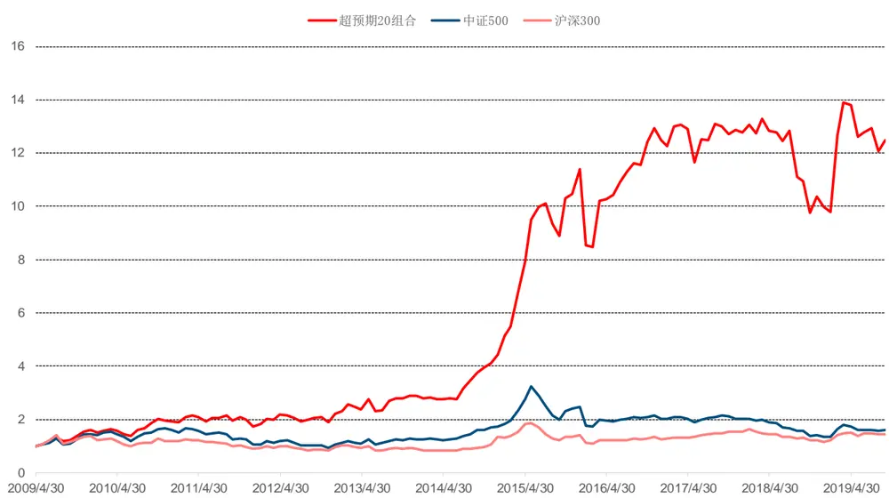
数据来源：wind、中信建投证券研究发展部

另外分析师超预期 20 组合相对中证 500 指数的超额收益净值如图 28，最近十年的超额收益净值基本上稳定向上：

图 28：分析师超预期 20组合超额收益（相对中证 500指数）净值
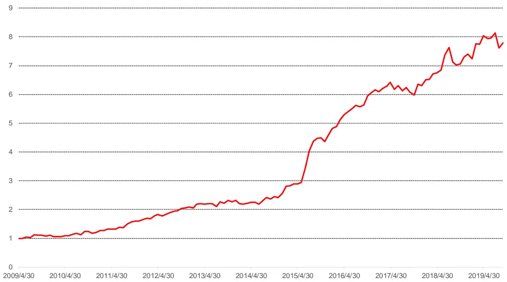
数据来源：wind、中信建投证券研究发展部

分析师超预期 20 组合每年收益统计如表 1，从 2009 年至 2019 年（截至 9 月底）10 年时间，组合年化收益27.43%，相对中证 500 指数的年化超额收益为 22.81%，相对沪深 300 指数的年化超额收益为 23.77%。组合基本上每年相比中证 500 指数均有超额收益，2019 年（截至 9 月底）的超额收益接近 10%，每年超额收益最大回撤只有 7.4%，夏普比率达 1.85。因此分析师超预期 20 组合虽然不是一个传统的中证 500 增强组合，但也可以每年稳定战胜中证 500 指数，可以作为中证 500 增强的补充组合。

表 1：分析师超预期 20组合每年收益统计

|  | 组合收益 | 中证500收益 | 超额中证500收益 | 超额中证500最大回撤 | 超额中证500夏普比例 |
| --- | --- | --- | --- | --- | --- |
| 2009 | 111.04% | 84.05% | 26.99% | 4.05% | 2.071 |
| 2010 | 20.15% | 10.07% | 10.08% | 5.18% | 0.726 |
| 2011 | -9.34% | -33.83% | 24.49% | 0.88% | 2.561 |
| 2012 | 26.89% | 0.28% | 26.62% | 3.18% | 3.430 |
| 2013 | 30.33% | 16.89% | 13.44% | 4.55% | 1.140 |
| 2014 | 53.65% | 39.01% | 14.64% | 6.42% | 1.199 |
| 2015 | 157.22% | 43.12% | 114.11% | 3.12% | 6.466 |
| 2016 | 9.61% | -17.78% | 27.39% | 0.84% | 4.662 |
| 2017 | 2.25% | -0.20% | 2.45% | 6.47% | 0.268 |
| 2018 | -21.74% | -33.32% | 11.58% | 7.40% | 1.078 |
| 2019（截至9月底） | 34.66% | 25.46% | 9.20% | 6.27% | 0.694 |
| 总样本 | 27.43% | 4.62% | 22.81% | 7.40% | 1.853 |

数据来源：wind、中信建投证券研究发展部

其实分析师超预期 组合由低估值、超跌和超预期三个风格贡献超额收益，我们想看看超预期风格到底贡献了多少超额收益，图 29 我们对比分析师超预期 20 组合和简单低估值超跌股票组合（初步筛选样本池）的净值：

图 29：分析师超预期 20组合和低估值超跌股票组合绝对收益净值对比
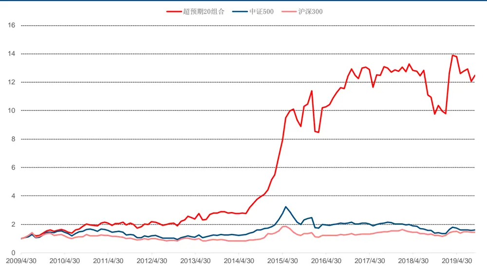
数据来源：wind、中信建投证券研究发展部

图 30 是分析师超预期 20 组合相对于简单低估值超跌股票的超额收益净值，可以看出超额收益净值仍然稳定向上，说明剥离了估值和反转因子后，超预期组合仍然有较为稳定的超额收益贡献，即组合主要是由超预期风格贡献大部分的超额收益。

图 30：分析师超预期 20组合相对低估值超跌股票组合超额收益净值
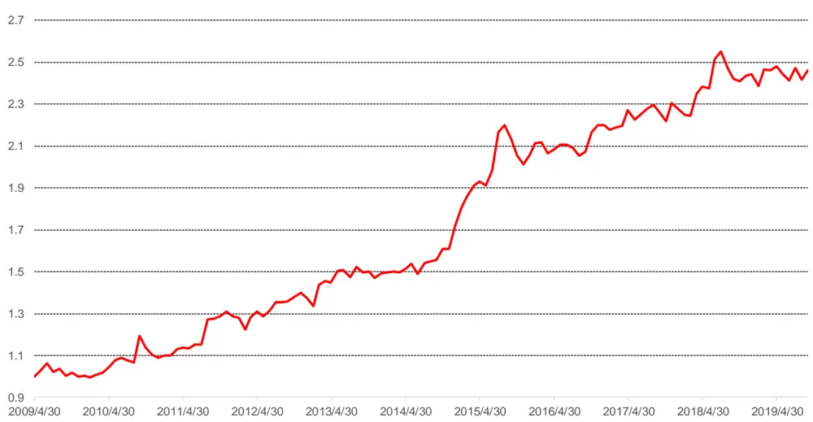
数据来源：wind、中信建投证券研究发展部

## 五、总结和思考

本文主要介绍超预期幅度因子的定义、分析师超预期股票收益特征分析和分析师超预期选股策略的构建。

第一部分主要介绍精确到单季度的净利润超预期幅度 ESP 因子算法。ESP 因子可以定义如下：ESP =（单季度实际净利润-单季度预期净利润）/ABS(单季度预期净利润)。假设分析师对单季度的增速预测和其年度增速预测一样，我们可以得到季度分析师预测值的分解算法。我们用贵州茅台和森马服饰作为例子，当月发生超预期，次月基本上均为正收益。而对于其他股票来说，经过统计大概有 70%以上的股票当月发生超预期，次月相对市场基准（Wind 全 A）的超额收益为正，因此超预期对于股票的短期刺激作用较为明显。

第二部分主要对分析师超预期股票的分布进行统计。首先我们对超预期股票的样本数量月度分布统计，发现 4、8、10 月的超预期股票数量最多，而 1、2、3、7 月的超预期股票数量也较多，剩下的月份如 5、6、9、11、12 月的超预期股票数量较少。而对各类超预期股票的收益做统计发现 1、2、5 月的超预期股票绝对收益和超额收益最高，相比其他月份的表现更好。对不同类型报告的超预期股票进行统计发现，定期报告的超预期股票数量远比业绩快报和业绩预告的超预期股票数量要多，但业绩预告和业绩快报的超预期股票平均超额收益远比定期报告的超预期股票要高。对不同季报的超预期股票收益进行对比发现，年报的超预期股票无论是平均绝对收益还是超额收益都比一、二、三季报要高。最后，我们看下当年重复超预期的股票平均绝对收益对比，发现当年第一次发生超预期的股票收益表现最好，平均收益为 2.5%，比多次发生超预期的股票收益表现要好。

第三部分详细对超预期股票的收益特征进行分析，对不同的风格因子包括预测机构个数、行业、市值、估值（EP_TTM、BP_LR）、成长（单季度 ROE 同比增长率）、质量（ROE、ROA）、动量反转（最近一个月收益率、六个月收益率）和技术（过去一个月换手率、波动率、日均成交额）因子进行分层测试，看下哪些风格因子能够解释超预期股票的收益来源。最后发现 EP_TTM 和过去一个月收益率在整个样本期和 2017 年之后的分层效果均较好，其可以很好地解释超预期股票的收益来源，可以把其作为我们选股组合的初步风格筛选因子。

第四部分通过分析师超预期因子构建选股组合。为了确保每月保持最低的因子覆盖度，能够选出一定数量的股票，首先进行月份调整和处理，处理之后的超预期因子月度平均因子覆盖度为 62%左右，满足最低的因子覆盖要求。我们通过条件选股的方法，具体选股流程如下：每月底根据 EP_TTM 和过去一个月收益率两个风格因子限定样本池（每个月在全市场里面选取这两个风格因子排名前 30%的股票取交集作为初步样本池），然后选取净利润超预期幅度最大（ESP 因子值最大）的 20 只股票，构建我们的超预期 20 组合。分析师超预期 20 组合从 2009 年至 2019 年（截至 9 月底）10 年时间，组合年化收益 27.43%，相对中证 500 指数的年化超额收益为22.81%，相对沪深 300 指数的年化超额收益为 23.77%。组合基本上每年相比中证 500 指数均有超额收益，2019年（截至 9 月底）的超额收益接近 10%，每年超额收益最大回撤只有 7.4%，夏普比率达 1.85。因此分析师超预期 20 组合虽然不是一个传统的中证 500 增强组合，但也可以每年稳定战胜中证 500 指数，可以作为中证 500增强的补充组合。另外剥离了估值和反转因子后，超预期组合仍然有较为稳定的超额收益贡献，即组合主要是由超预期风格贡献大部分的超额收益。

## 参考文献

Bartov, E., D. Givoly, and C. Hayn, 2002, “The rewards to meeting or beating earnings expectations.”Journal of Accounting and Economics, 33(2), 173–204.

Bernard, V. L., and J. K. Thomas, 1990, “Evidence that stock prices do not fully reflect the implications of current earnings for future earnings,” Journal of Accounting and Economics, 13(4),305–340.

Chan, L. K., J. Karceski, and J. Lakonishok, 2007, “Analysts’ conflicts of interest and biases in earnings forecasts,” Journal of Financial and Quantitative Analysis, 42(4), 893–913.

Lim, T., 2001, “Rationality and analysts’ forecast bias,” The Journal of Finance, 56(1), 369–385.

## 分析师介绍

丁鲁明：同济大学金融数学硕士，中国准精算师，现任中信建投证券研究发展部金融工程方向负责人，首席分析师。10 年证券从业，历任海通证券研究所金融工程高级研究员、量化资产配置方向负责人；先后从事转债、选股、高频交易、行业配置、大类资产配置等领域的量化策略研究，对大类资产配置、资产择时领域研究深入，创立国内“量化基本面”投研体系。多次荣获团队荣誉：新财富最佳分析师 2009 第 4、2012第 4、2013 第 1、2014 第 3 等；水晶球最佳分析师 2009 第 1、2013 第 1；2018 年 wind金牌分析师第 2 等。

陈升锐： 芝加哥大学金融数学硕士，三年基金公司量化投资研究工作经验，2018 年加入中信建投研究发展部金融工程团队，专注于量化选股研究。2018、2019 年Wind金牌分析师金融工程第 2 名团队成员。

## 研究服务

## 保险组

张博 010-85130905 zhangbo@csc.com.cn

郭洁 010-85130212 guojie@csc.com.cn

郭畅 010-65608482 guochang@csc.com.cn

张勇 010-86451312 zhangyongzgs@csc.com.cn

高思雨 010-8513 gaosiyu@csc.com.cn

## 北京公募组

朱燕 85156403- zhuyan@csc.com.cn

任师蕙 010-85159274 renshihui@csc.com.cn

黄杉 010-85156350 huangshan@csc.com.cn

李星星 021-68821600 lixingxing@csc.com.cn

杨济谦 010-86451442 yangjiqian@csc.com.cn

金婷 jinting@csc.com.cn

夏一然 xiayiran@csc.com.cn

杨洁 010-86451428 yangjiezgs@csc.com.cn

## 社保组

吴桑 010-85159204 wusang@csc.com.cn

张宇 010-86451497 zhangyuyf@csc.com.cn

## 创新业务组

高雪 010-86451347 gaoxue@csc.com.cn

廖成涛 0755-22663051 liaochengtao@csc.com.cn

黄谦 010-86451493 huangqian@csc.com.cn

诺敏 010-85130616 nuomin@csc.com.cn

## 上海销售组

李祉瑶 010-85130464 lizhiyao@csc.com.cn

黄方禅 021-68821615 huangfangchan@csc.com.cn

戴悦放 021-68821617 daiyuefang@csc.com.cn

翁起帆 021-68821600 wengqifan@csc.com.cn

范亚楠 021-68821600 fanyanan@csc.com.cn

薛姣 021-68821600 xuejiao@csc.com.cn

章政 zhangzheng@csc.com.cn

李绮绮 021-68821867 liqiqi@csc.com.cn

王定润 021-68801600 wangdingrun@csc.com.cn

## 深广销售组

曹莹 0755-82521369 caoyingzgs@csc.com.cn

张苗苗 020-38381071 zhangmiaomiao@csc.com.cn

XU SHUFENG 0755-23953843

xushufeng@csc.com.cn

程一天 0755-82521369 chengyitian@csc.com.cn

陈培楷 020-38381989 chenpeikai@csc.com.cn

金融工程深度报告

## 评级说明

以上证指数或者深证综指的涨跌幅为基准。

买入：未来 6 个月内相对超出市场表现 15％以上；

增持：未来 6 个月内相对超出市场表现 5—15％；

中性：未来 6 个月内相对市场表现在-5—5％之间；

减持：未来 6 个月内相对弱于市场表现 5—15％；

卖出：未来 6 个月内相对弱于市场表现 15％以上。

## 重要声明

本报告仅供本公司的客户使用，本公司不会仅因接收人收到本报告而视其为客户。

本报告的信息均来源于本公司认为可信的公开资料，但本公司及研究人员对这些信息的准确性和完整性不作任何保证，也不保证本报告所包含的信息或建议在本报告发出后不会发生任何变更，且本报告中的资料、意见和预测均仅反映本报告发布时的资料、意见和预测，可能在随后会作出调整。我们已力求报告内容的客观、公正，但文中的观点、结论和建议仅供参考，不构成投资者在投资、法律、会计或税务等方面的最终操作建议。本公司不就报告中的内容对投资者作出的最终操作建议做任何担保，没有任何形式的分享证券投资收益或者分担证券投资损失的书面或口头承诺。投资者应自主作出投资决策并自行承担投资风险，据本报告做出的任何决策与本公司和本报告作者无关。

在法律允许的情况下，本公司及其关联机构可能会持有本报告中提到的公司所发行的证券并进行交易，也可能为这些公司提供或者争取提供投资银行、财务顾问或类似的金融服务。

本报告版权仅为本公司所有。未经本公司书面许可，任何机构和 或个人不得以任何形式翻版、复制和发布本报告。任何机构和个人如引用、刊发本报告，须同时注明出处为中信建投证券研究发展部，且不得对本报告进行任何有悖原意的引用、删节和/或修改。

本公司具备证券投资咨询业务资格，且本文作者为在中国证券业协会登记注册的证券分析师，以勤勉尽责的职业态度，独立、客观地出具本报告。本报告清晰准确地反映了作者的研究观点。本文作者不曾也将不会因本报告中的具体推荐意见或观点而直接或间接收到任何形式的补偿。

股市有风险，入市需谨慎。

## 中信建投证券研究发展部

## 北京

东城区朝内大街2号凯恒中心B座 12 层（邮编：100010）

电话：(8610) 8513-0588

传真：(8610) 6560-8446

## 上海

浦东新区浦东南路 528 号上海证券大厦北塔 22 楼 2201 室（邮编：200120）

电话：(8621) 6882-1612

传真：(8621) 6882-1622

## 深圳

福田区益田路 6003 号荣超商务中心B 座 22 层（邮编：518035）

电话：（0755）8252-1369

传真：（0755）2395-3859