[table_main] 证券研究报告·金融工程深度报告金融衍

# 高频量价选股因子初探：

——因子深度研究系列

## 主要结论

## 本文概述

本文利用高频的逻辑挖掘出盘口数据中有价值的信息，并将其处理得到 4 个高频因子（订单失衡 VOI 因子、订单失衡率 OIR 因子、市价偏离度MPB 因子），最后降为月频的低频选股因子，在单因子回测中取得优秀的选股效果。其中 MPB 因子 IC 均值-5.23%，年化 IR 为-2.68，年化多空收益达到 21.24%，夏普比率高达 2.68，总体选股效果是所有因子里最好的。

## 高频量价选股因子定义

我们通过高频数据构造出一些高频量价选股因子，第一个因子叫订单失衡（VOI 因子），为委托买入和委托卖出量之间的差异，我们称为订单失衡。第二个因子订单失衡率（OIR 因子）是另外一个衡量订单不平衡性质的因子，它的统计性质和 VOI 因子相似。第三个因子市价偏离度（MPB因子），具体是由对交易是由买方发起还是由卖方发起进行了分类，通过使用数据集中的交易量和成交额信息，我们能够确定两个时间点之间的平均交易价格。

## VOI和 OIR等与量相关的因子在低频化后出现逻辑反转

我们看到 VOI1、VOI2 和 OIR 因子在高频上与收益率正相关，MPB 因子与收益率负相关。然而将高频量价因子降频后，订单失衡相关因子与股票的长期受益相关性出现了反转。我们认为 VOI 和OIR 因子均为量相关的因子，而量的信息在高频结构上会出现欺骗性的现象，我们从以下两点原因来解释。从散户来看，在短期内散户容易存在追高杀跌行为。短期追高，价格上涨，但随着时间的累积，价格会逐渐处于高位，长期来看价格会回落。从主力的角度，主力对市场的短时操纵造成了价格的涨跌。强的买卖压力一般是大单交易造成的，大单交易很可能是主力的“对倒”行为，其目的主要是吸引散户，此时高频因子与收益率呈正相关。但从长期来看，市场价格则会回落，因此造成了低频上因子与收益率呈反向关系。

## MPB 因子 IC 均值-5.23%，年化多空收益高达 21.24%

最后我们对 4 个高频量价因子进行单因子分析。具体回测时间为最近10 年（2010 年 1 月-2019 年 12 月），样本池为全市场，月频调仓。VOI1和 MPB 做了市值和行业中性化处理，VOI2 和 OIR 没做。VOI1因子 IC 均值-2.74%，年化 IR-1.62，年化多空收益 12.45%，夏普比率 1.69。VOI2 因子IC 均值-3.35%，年化多空收益 14.73%，夏普比率 1.87。VOI2 因子剥离相关性较大的 ROIC_TTM 和 Momentum_12m 因子后的 IC 均值-3.59%，年化多空收益 15.12%，夏普比率 1.91。OIR 因子 IC 均值-3.7%，年化多空收益16.05%， OIR 因子剥离相关性最大的 Momentum_12m 因子后的 IC 均值-4.19%，年化多空收益 17.75%。MPB 因子 IC 均值-5.23%，年化 IR 为-2.68，年化多空收益达到 21.24%，夏普比率高达 2.68，总体选股效果是所有因子里最好的。

# 金融工程研究

。丁鲁明[table

dingluming@csc.com.cn

021-68821623

执业证书编号：S1440515020001

## 陈升锐

chenshengrui @csc.com.cn

021-68821600

执业证书编号：S1440519040002

## 发布日期： 2020 年 7 月 9 日

## 相关研究报告

| 20.04.02 | 因子深度研究系列：分析师超预期因子 选股策略 |
| --- | --- |
| 20.01.17 | 因子深度研究系列：分析师预期修正动 量效应选股策略 |
| 19.08.21 | 因子深度研究系列：中信建投一致预期 因子体系搭建 |
| 19.03.28 | 因子深度研究系列：因子衰减在多因子 选股中的应用 |
| 18.08.29 | 因子深度研究系列：Barra风险模型介绍 及与中信建投选股体系的比较 |
| 18.08.23 | 技术形态选股研究之黎明曙光：深跌反 转形态 |
| 18.08.07 | 量化基本面选股：从逻辑到模型，航空 业投资方法探讨 |
| 18.08.02 | 从相关关系到指数增强——谈 IC 系数 与股票权重的联系 |
| 18.06.08 | 因子深度研究系列：宏观变量控制下的 有效因子轮动 |
| 18.05.18 | 因子深度研究系列：特质波动率纯因子 在 A 股的实证与研究 |

## 一、高频量价因子定义和投资逻辑

## 1.1、高频量价因子研究引言

随着国内市场传统因子选股的广泛应用，对公司的基本情况、财务状况以及日间量价关系等低频数据的挖掘已经趋于饱和，以往有效因子也逐渐失效，市场对新信息的挖掘提出了迫切的需求。高频数据中蕴含了丰富的市场交易信息，它能带我们通过数据窥探知情交易者的隐藏信息，也让我们更近距离地感受市场交易者的情绪，从而帮助我们更准确地拿捏市场股票价格的走势。

高频数据的因子主要分为收益率分布、成交量分布、量价、资金流和日内动量等几个类型，本文主要利用日内盘口数据对是量价因子进行了研究。盘口数据包括股票的委托买卖价格以及委托交易量数据，其反应了当前时刻的投资者情绪和市场的预期。本文利用高频的逻辑挖掘出盘口数据中有价值的信息，并将其处理得到高频因子，最后降为月频的低频选股因子，在后续的因子回测中取得良好的选股效果。

首先我们在 Wind 终端随便选取了某只股票——浦发银行在某天收盘的委托价格盘口数据（图 1）。我们看到当前时刻股票的买一量为 3017 手，卖一量为 295 手，表明了股票的买盘存在更多的委托单，说明市场的短期买入意愿更强，股价短期上涨的可能较大。如果当前时刻的卖盘委托量更大的话，说明股票的短期抛压更强，股价短期下跌的可能较大。

图 1：Wind终端浦发银行盘口数据

| 浦发银行 600000 11.30 +0.62% (+0.07) SSE CNY 15:00:00 闭市 融通Δ + |
| --- |
| 委比 -1.77% 委差 -0.03万 卖五 11.35 3100 |
| 卖四 11.34 2068 卖三 11.33 903 卖二 11.32 1446 卖一 11.31 295 |
| 买一 11.30 3017 买二 11.29 1943 |
| 买三 11.28 872 |
| 买四 11.27 964 |
| 买五 11.26 744 |

数据来源：wind、中信建投

我们这边采用的高频数据主要来源于天软数据的 Level1 数据（level1 数据只提供 5 档买卖盘口数据），下表为某只股票某天连续 10 分钟的分钟高频盘口数据样例，主要包括高开低收的价格信息、交易量交易额以及买一到买五和卖一到卖五的盘口委托价格和委托量的数据。

图 2：天软高频分钟数据样例

| 股票代码股票名称 | 时间 | 最高价 | 开盘价 | 最低价 | 收盘价 | 交易量 | 交易金额 | 买一 | 买二 | 买三 | 买四 | 买五 | 卖一 | 卖二 | 卖三 | 卖四 | 卖五 |
| --- | --- | --- | --- | --- | --- | --- | --- | --- | --- | --- | --- | --- | --- | --- | --- | --- | --- |
| SH600057 厦门象屿 | 43844.4 | 4.27 | 4.26 | 4.25 | 4.25 | 288100 | 1226618 | 94100 | 91100 | 139100 | 179200 | 229300 | 9500 | 102448 | 187100 | 148500 | 180400 |
| SH600057 厦门象屿 | 43844.4 | 4.26 | 4.24 | 4.24 | 4.26 | 61800 | 262600 | 157800 | 120400 | 175600 | 139100 | 191200 | 134948 | 188300 | 146500 | 172500 | 133539 |
| SH600057 厦门象屿 | 43844.4 | 4.26 | 4.26 | 4.26 | 4.26 | 10500 | 44730 | 198700 | 124700 | 180600 | 142100 | 193000 | 138748 | 193100 | 146500 | 172500 | 144339 |
| SH600057 厦门象屿 | 43844.4 | 4.26 | 4.26 | 4.26 | 4.26 | 136448 | 581265 | 46852 | 205900 | 118700 | 183100 | 142100 | 238800 | 148000 | 172500 | 142539 | 89100 |
| SH600057 厦门象屿 | 43844.4 | 4.27 | 4.26 | 4.25 | 4.25 | 103252 | 439865 | 207600 | 120100 | 183100 | 162100 | 190000 | 81648 | 241300 | 146500 | 173500 | 141539 |
| SH600057 厦门象屿 | 43844.4 | 4.26 | 4.26 | 4.25 | 4.26 | 109300 | 465359 | 210800 | 122400 | 185100 | 162100 | 193000 | 62748 | 213700 | 151500 | 173500 | 141539 |
| SH600057 厦门象屿 | 43844.4 | 4.26 | 4.26 | 4.25 | 4.26 | 28500 | 121256 | 221100 | 122400 | 177100 | 162100 | 198000 | 64148 | 209100 | 191500 | 173500 | 141539 |
| SH600057 厦门象屿 | 43844.4 | 4.26 | 4.26 | 4.26 | 4.26 | 88848 | 378442 | 69452 | 211700 | 124200 | 180600 | 201000 | 227000 | 209600 | 173600 | 147539 | 96700 |
| SH600057 厦门象屿 | 43844.4 | 4.27 | 4.26 | 4.26 | 4.27 | 129500 | 552893 | 136552 | 205600 | 124200 | 202600 | 201200 | 97500 | 144600 | 173600 | 147539 | 96700 |
| SH600057 厦门象屿 | 43844.4 | 4.28 | 4.27 | 4.27 | 4.28 | 252600 | 1080014 | 79800 | 119852 | 203600 | 123400 | 187600 | 45300 | 194800 | 157539 | 146700 | 32600 |

数据来源：wind、中信建投

## 1.2、高频量价因子 1（订单失衡 Volume Order Imbalance）定义和投资逻辑

下面我们通过高频数据构造出一些高频量价选股因子，首先第一个因子叫订单失衡（VOI 因子），首先我们看下这个因子的投资逻辑。

市场里面不同的交易者可以针对不同股票以他们希望支付的价格提交限价买入或卖出订单,其中订单薄里面蕴含着丰富的市场信息。为了量化这种交易意图，我们看一下委托买入和委托卖出量之间的差异，我们称为订单失衡。Chordia 和 Subrahmanyam 在纽约证券交易所的样本股票中发现，订单失衡与每日收益之间存在正相关关系。

订单失衡是一个重用的信号，它使我们能够了解市场的总体情绪和方向。知情交易者鉴于正面（负面）消息或交易者根据市场情绪的好坏，他们将会决定持有多头（或空头）头寸，从而增加资产的不平衡。由于不同时刻知情交易者拥有信息的准确性程度不同和市场交易情绪不同，其订单不平衡程度也有所差异。如在限价订单簿中观察到此现象，市场参与者将能够使用此信息并制定策略以获得正向收益。

$$
VOI1_{t}=\Delta V_{t}^{B}-\Delta V_{t}^{A}
$$

$$
\Delta V_{t}^{B}=\left\{\begin{array}{ll}{0}&{P_{t}^{B}<P_{t-1}^{B}}\\{V_{t}^{B}-V_{t-1}^{B}}&{P_{t}^{B}=P_{t-1}^{B}}\\{V_{t}^{B}}&{P_{t}^{B}>P_{t-1}^{B}}\end{array}\right.\qquad,\qquad\Delta V_{t}^{A}=\left\{\begin{array}{ll}{V_{t}^{A}}&{P_{t}^{A}<P_{t-1}^{A}}\\{V_{t}^{A}-V_{t-1}^{A}}&{P_{t}^{A}=P_{t-1}^{A}}\\{0}&{P_{t}^{A}>P_{t-1}^{A}}\end{array}\right.
$$

$P_{t}^{B}$ 和 $P_{t}^{A}$ 分别为 t 时刻的买一价和卖一价， $V_{t}^{B}$ 和 $V_{t}^{A}$ 分别是 t 时刻的买一和卖一的委托量。

传统 VOI 计算只考虑了第一档的盘口数据，这将遗漏掉很多有价值的信息，为充分利用盘口数据信息，我们对 VOI 因子进行了两点改进。即利用衰减加权的方法对委托量加权，得到加权后的委托量 $V_{t}^{WB}$ $V_{t}^{WA},\dot{\mathbf{\mu}}$ 表示挡位。

$$
\begin{array}{r}{V_{t}^{WB(WA)}=\frac{\sum w_{i}\times V_{i,t}^{B(A)}}{\sum w_{i}}\qquad,\quad w=1-(\mathrm{i}-1)/5\quad,\qquad\mathrm{i=1,2,3,4,5}}\end{array}
$$

$$
VOI2_{t}=\Delta V_{t}^{WB}-\Delta V_{t}^{WA}
$$

## 1.3、高频量价因子 2（订单失衡率 Order Imbalance Ratio）定义和投资逻辑

$$
01\mathsf{R}_{t}=\frac{V_{t}^{WB}-V_{t}^{WA}}{V_{t}^{WB}+V_{t}^{WA}}
$$

$$
V_{t}^{WB(WA)}=\frac{\sum w_{i}\times V_{i,t}^{B(A)}}{\sum w_{i}}
$$

$$
w=1-(\mathrm{i}-1)/5\qquad,\quad\mathrm{i}=1,2,3,4,5
$$

OIR 是另外一个衡量订单不平衡性质的变量，因此它的统计性质和 VOI 因子相似。我们充分利用盘口各档数据信息，以期得到更加准确的订单失衡比率 OIR。不同挡位的盘口数据包含了不同层次的数据信息，此处仍采用衰减加权的方法对委托量加权，根据对买卖压力的影响力的不同将不同挡位赋予相应权重，给高挡位赋予更高的权重比例。

VOI 仅衡量不平衡的程度，仅仅只是买卖委托量的差值，未考虑到买卖委托量本身的规模大小，因此其不足以描述市场中交易者的行为。 OIR 补充了 VOI 因子，订单不平衡率帮助我们区分了 VOI 差异大但比率小的情况。例如，如果当前出价更改量为 300，而当前要价更改量为 200，则 VOI 为 100，这被认为是强烈的购买信号。但此处 OIR 仅为 0.2，一般大于 0.5 才为较强的买入信号，因此可以看出原始的买入信号并不是那么强。这里没有考虑买家与卖价订单量之间的比率，该比率表明了潜在买家和卖家在市场上的相对实力。因此，我们定义了一个称为订单不平衡率（OIR）的新因子。

OIR 为买卖委托量差 $\varXi$ 其和的比值，衡量了不均衡程度在其总买卖委托量中的占比。OIR 为正说明市场买压大于卖压，未来价格趋向上涨，且 OIR 的比值越大，其上涨的概率越高，反之亦然。

## 1.4、高频量价因子3（市价偏离度 Mid-Price Basis）定义和投资逻辑

$$
MPB_{t}=\overline{{TP}}_{t}-\frac{M_{t}+M_{t-1}}{2}=\overline{{TP}}_{t}-\overline{{MP_{t}}}
$$

$$
M_{t}=\frac{P_{t}^{B}+P_{t}^{A}}{2}
$$

$$
\overline{{TP}}_{t}=\left\{\begin{array}{ll}{\displaystyle\frac{T_{t}}{V_{t}}}&{V_{t}\neq0}\\{\displaystyle\frac{TP}{TP_{t-1}}}&{V_{t}=0}\end{array}\right.
$$

首先我们计算平均交易价格 $\overline{{TP}}_{t}$ 。当股票在分钟 t 没有产生任何交易，即 $V_{t}$ 和 $\lvert T_{t}$ 均为零，此时 $\overline{{TP}}_{t}$ 考虑到这时间段没有任何交易产生，因此时刻t的平均交易价格应该和上一时刻的价格相同。当时刻t内有交易产生的时侯，我们计算得到的平均市场交易价格等于时刻 t 的市场成交额除以时刻 t 的市场成交总量。

然后我们计算市场中间价， $M_{t}$ 为买一价和卖一价的平均。 $MPB_{t}$ 为平均市场交易价格与平均市场中间价的差。

最后因子 $MPB_{t}$ 为平均交易价格和平均中间价格的差值，即为 Mid-Price Basis（MPB），由于其均值回归的特性而成为价格变化的重要预测指标。

具体我们对交易是由买方发起还是由卖方发起进行了分类。通过使用数据集中的交易量和成交额信息，我们能够确定两个时间点之间的平均交易价格。我们此处定义一个时间段 (t −1，t]的平均交易价格为 $\overline{{TP}}_{t}$ ，即这一时间段的市场价格。中间价格表示为 $\overline{{MP_{t}}}$ ，它是时间 t 时买入和卖出价格的算术平均值，即这一时间段的平均委托挂单价格。当一时间段内，交易均价高于平均中间价格，交易均价更接近卖一价，卖方发起的交易，此时卖压大，未来的价格趋向下行的可能性大，且差值 $MPB_{t}$ 越大，未来价格走低的可能性就越高，因此交易均价将像市场平均中间价格回归。反之亦然，平均交易价格在平均中间价附近上下波动。

## 二、高频转低频的方法和逻辑

## 2.1、高频量价因子转低频的构造方法

我们采用下面的具体流程把高频因子转为我们常用的月度低频选股因子。首先因为股票的盘口挂单强弱受到市场总体走势的影响，因此我们需要对各股票进行截面标准化以剔除市场对个股的影响。下面 $Factor_{i,j,k}$ 为股票 k 第j 天 i 分钟的因子值， $M\_Factor_{i,j,k}$ 为横截面因子均值， $Std\_Factor_{i,j,k}$ 表示横截面因子的标准差：

$$
\widehat{\mathrm{Factor}_{\mathrm{1,l,k}}}=\frac{\mathrm{Factor}_{\mathrm{i,j,k}}-M_{\mathrm{-}}\mathrm{Factor}_{\mathrm{i,j,k}}}{Std_{\mathrm{-}}\mathrm{Factor}_{\mathrm{i,j,k}}}
$$

然后我们把标准化后的分钟因子转换成日因子，我们采用了等权的方法。下面是日因子的构造方法，其中N 为第j 天总共的分钟数：

$$
\widehat{\mathrm{Factor}_{\mathrm{J,k}}}=\frac{\sum\mathrm{Fa\widehat{ctor}_{\mathrm{1,\mathrm{J,k}}}}}{\mathrm{N}}
$$

最后我们把日因子转换成月因子，我们按距离每月最后一个交易日（假设为组合调仓日）的时间远近进行加权，考虑到信息的时效性，距离调仓日越远其信息的有效性越弱，因此用衰减加权的方法对日因子加权。n为当月交易日天数，j 为当月的第j 个交易日：

$$
{\widehat{\mathrm{Factor}_{\mathrm{{J}}}}}={\frac{1}{\sum_{j=1}^{n}{\frac{\mathrm{{j}}}{\mathrm{{n}}}}}}\times\sum_{j=1}^{n}{\widehat{\mathrm{Factor}_{\mathrm{{J}},\mathrm{{k}}}}}\times{\frac{\mathrm{{j}}}{\mathrm{{n}}}}
$$

## 2.2、高频量价因子低频化反转特性解释

下面我们首先看下各因子的分钟 IC 均值和月频 IC 均值。分钟 IC 均值为各分钟截面下各股票因子值和下一分钟收益率的 IC 值，然后取历史平均值。月频 IC 均值为每月末各股票因子值和下一个月收益率的 IC 值，然后取历史平均值。

表 1：高频量价因子和低频因子的 IC对照表

| 因子 | VOI | VOI2 | OIR | MPB |
| --- | --- | --- | --- | --- |
| 分钟IC均值 | 11.66% | 12.42% | 12.92% | -13.78% |
| 月频IC均值 | -2.74% | -2.97% | -3.35% | -5.23% |

数据来源：wind、中信建投

由上表可以看出，低频（月频）量价因子的 IC 绝对值相比高频（分钟）有所降低，一是由于高频信息向低频转换的过程中信息有效性会出现衰减，二是由于部分高频信息对低频策略不适用。但我们看到其高频和低频IC 都是显著的，因此对低频投资者利用其进行月度换仓策略的构建影响不大。

此外，高频的量价因子符合之前构造因子的逻辑，即 VOI1、VOI2 和 OIR 因子与收益率正相关，MPB 因子与收益率负相关。然而将高频量价因子降频后，订单失衡相关因子与股票的长期受益相关性出现了反转。

VOI 和 OIR 都具有较强的选股能力，高频的 VOI、OIR 因子都与未来收益率呈现正相关，然而低频因子则表现为负，下面我们详细解释下因子逻辑反转的具体原因。

我们认为 VOI 和 OIR 因子均为量相关的因子，而量的信息在高频结构上会出现欺骗性的现象，我们从以下两点原因来解释。从散户来看，在短期内散户容易存在追高杀跌行为。短期追高，价格上涨，但随着时间的累积，价格会逐渐处于高位，长期来看价格会回落。

从主力的角度，主力对市场的短时操纵造成了价格的涨跌。强的买卖压力一般是大单交易造成的，大单交易很可能是主力的“对倒”行为，其目的主要是吸引散户，此时高频因子与收益率呈正相关。但从长期来看，市场价格则会回落，因此造成了低频上因子与收益率呈反向关系。下面我们举具体例子对刚才的逻辑进行说明。

首先是 VOI 因子的例子，左图是股票 A 在某天的分钟 VOI2 因子分布，右图是该股票第二天的股价走势。股票 A 当天 13 时 2 分，出现大单卖出，VOI2 因子从 54 骤降为-98976，表面看是大单主动卖出，实则是主力早已准备好的大单，这种“对倒”或“对敲”行为目的在于诱导散户，造成价格短暂下跌，以便主力低价吸筹。果然，当天股价短暂下跌后，我们看到第二天股票价格如右图出现了大幅回升，甚至尾盘出现了涨停。

图 3：高频量价因子低频化后的逻辑反转例子 1
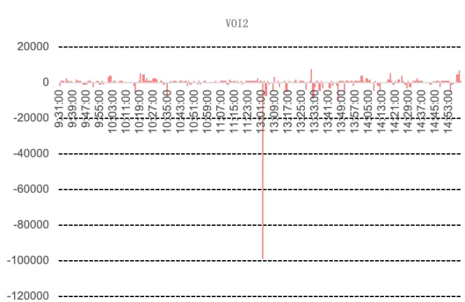
数据来源：wind、中信建投

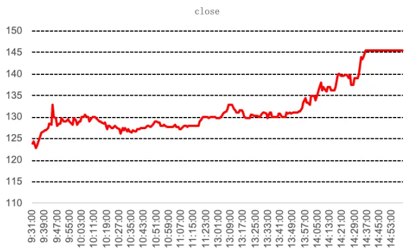

第二个例子是一个相反的例子。股票 B 在某天 13 时 37 分，VOI2 因子从 100 突增为 15960358 以上，表面看是大单主动卖入，实则也是主力早已准备好的大单，这种人为的拉抬价格以便后期抛压。由右图的走势也可知，由于价格被拉高，第二天的股价出现回落。

图 4：高频量价因子低频化后的逻辑反转例子 2
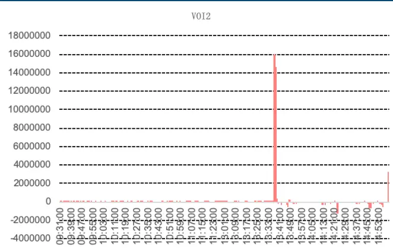
数据来源：wind、中信建投

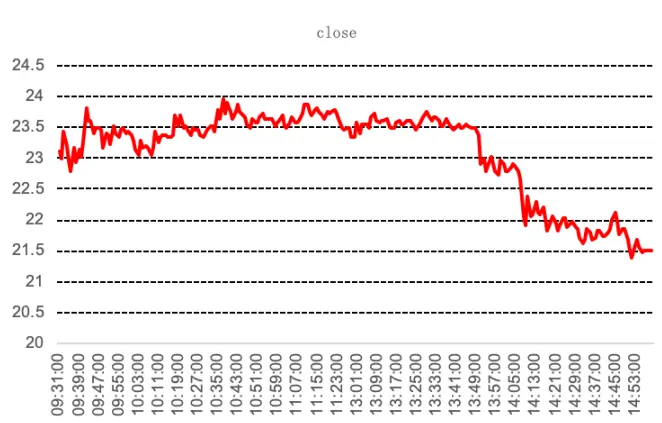

下面我们再看下 OIR 因子。股票 C 在某天的 OIR 因子值持续为负，这主要是由散户的短期杀跌行为造成的，也导致当天的价格下行。但第二天股价明显回暖，出现了股价反转的现象。

图 5：高频量价因子低频化后的逻辑反转例子 3
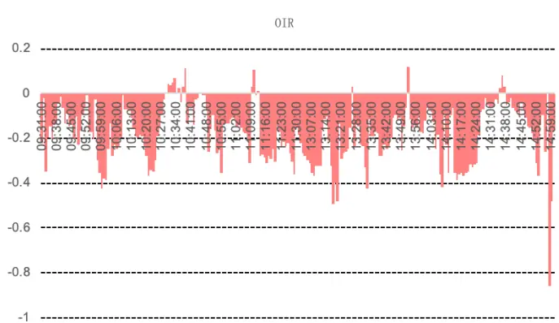
数据来源：wind、中信建投

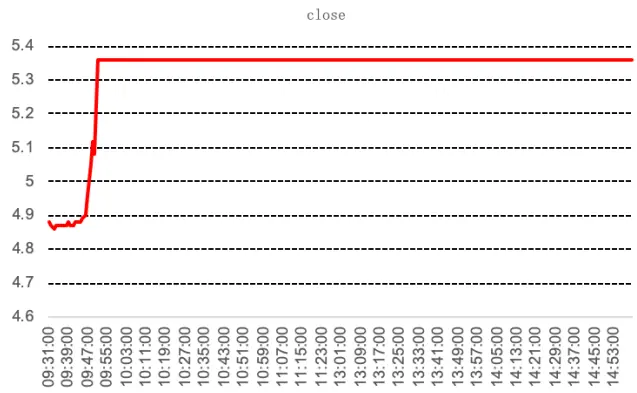

同样是 OIR 因子，股票 D 在某天的 OIR 因子值持续为正，这主要是由散户的短期追涨行为造成的，同样第二天股价出现了大幅下跌，也是主力的“对敲”行为造成的。

图 6：高频量价因子低频化后的逻辑反转例子 4
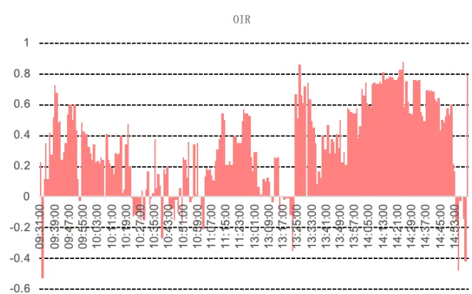
数据来源：wind、中信建投

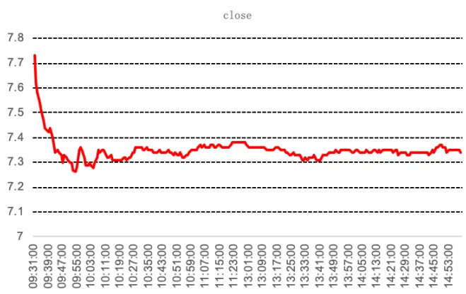

## 2.3、高频量价因子的交易逻辑及其影响方向汇总

下面是我们对这几个高频因子的短期和长期交易逻辑及其影响方向的汇总：

表 2：高频量价因子交易逻辑及影响方向表

| 因子名称 | 交易逻辑 | 高频影响方向 | 低频影响方向 |
| --- | --- | --- | --- |
| 订单失衡(VOI) | 知情交易者拥有尚未反映在资产价格中的信息，如果是正面消息，他们将会决定持有多头头寸，从而增加资产的正向不平衡。且知情交易者信息的准确性程度不同，因此其订单不平衡的绝对值差异越大买压越大，股票价格越趋向于上涨。反之亦然。由于散户存在追涨杀跌以及主力的短时市场操纵造成了低频量价因子的反转特性。 | 正向 | 负向 |
| 订单失衡率(OIR) | 考虑要价与要价订单量之间的比率，该比率表明了潜在买家和卖家在市场上的相对实力，是订单失衡因子的补充。其绝对值越大，买卖压力越大。由于散户存在追涨杀跌以及主力的短时市场操纵造成了低频量价因子的反转特性。 | 正向 | 负向 |
| 市价偏离度(MPB) | 正（负）数量大意味着交易平均接近卖价（买价）。正为卖方发起，未来价格趋向下行；负为买方发起，未来价格趋向上行。 | 负向 | 负向 |

数据来源：wind、中信建投

## 三、高频量价因子和常用因子的相关性

下面我们看下这四个因子和传统因子的相关性，我们检测 VOI1、VOI2、OIR、MPB 这四个因子和常用选股因子的 IC 相关性如下表。

经过统计发现 VOI1 与 MPB 因子和自由流通市值的相关性较高，IC 相关性在 0.5 以上，因此对这两个因子需要做市值中性的处理，而对于 VOI2 和 OIR 则不需要做市值中性。

另外，VOI2 和 ROIC_TTM、ROE_TTM 和 Momentum_12m 三个因子的相关性较强，因此后面也会将 VOI2 对ROIC_TTM（或 ROE_TTM）和 Momentum_12m 做中性化处理。

最后我们看到 OIR 和 Momentum_3m、 Momentum_6m、 Momentum_12m 相关性都很强，我们将 OIR 对Momentum_12m 做中性化处理。

表 3：高频量价因子和常用因子的相关性

| 因子IC相关系数 | V0I1 | V0I2 | 0IR | MPB |
| --- | --- | --- | --- | --- |
| FloatCap | 0.55 | -0.20 | -0.12 | 0.50 |
| EP_TTM | 0.29 | -0.22 | -0.10 | 0.29 |
| BP_LR | -0.01 | 0.39 | 0.42 | -0.04 |
| SP TTM | -0.02 | 0.38 | 0.48 | -0.07 |
| Earnings_SQ_YoY | 0.15 | -0.39 | -0.47 | 0.14 |
| Sales_SQ_YoY | 0.35 | -0.47 | -0.48 | 0.24 |
| ROE_SQ_YoY | 0.15 | -0.34 | -0.32 | 0.05 |
| ROE_TTM | 0.37 | -0.51 | -0.45 | 0.29 |
| ROIC_TTM | 0.35 | -0.56 | -0.49 | 0.27 |
| Momentum_1m | 0.44 | -0.14 | -0.48 | 0.18 |
| Momentum_3m | 0.40 | -0.31 | -0.51 | 0.15 |
| Momentum_6m | 0.36 | -0.42 | -0.60 | 0.18 |
| Momentum_12m | 0.31 | -0.51 | -0.66 | 0.19 |
| AmountAvg_1M | -0.49 | 0.09 | 0.16 | -0.25 |
| TurnoverAvg1M | -0.31 | 0.05 | 0.05 | -0.12 |
| TurnoverAvg3M | -0.39 | 0.03 | 0.06 | -0.17 |
| TurnoverAvg6M | -0.42 | 0.02 | 0.06 | -0.21 |
| Volatility1M | -0.31 | 0.03 | 0.03 | -0.12 |
| Volatility3M | -0.37 | 0.03 | 0.07 | -0.15 |
| Volatility6M | -0.40 | 0.02 | 0.10 | -0.16 |
| Beta_100W | -0.41 | 0.31 | 0.51 | -0.24 |
| V0I1 | 1.00 | -0.07 | -0.35 | 0.56 |
| V0I2 | -0.07 | 1.00 | 0.72 | -0.09 |
| 0IR | -0.35 | 0.72 | 1.00 | -0.14 |
| MPB | 0.56 | -0.09 | -0.14 | 1.00 |

数据来源：wind、中信建投

## 四、高频量价因子测试结果

最后我们对 4 个高频量价因子进行单因子分析（包括 IC 分析和多空收益分析）。具体回测时间为最近 10 年（2010 年 1 月-2019 年 12 月），样本池为全市场，每月底剔除停牌、一字板、上市未满半年和 ST股票，月频调仓。因子做了极值处理（剔除 3 倍标准差之外的样本）和缺失值处理（直接剔除）。VOI1 和 MPB 做了市值和行业中性化处理，VOI2 和 OIR 没做。组合的多空收益分位数用了 10 分位。

## 4.1、VOI1 因子选股效果

首先是 VOI1 因子的效果，因子 IC 均值-2.74%，年化 IR-1.62，年化多空收益 12.45%，夏普比率 1.69，总体选股效果还是比较不错的。

图 7：VOI1因子选股效果

| IC分析 | VOI1 |
| --- | --- |
| IC均值% | -2.74 |
| IC标准差% | 5.86 |
| IR | -0.47 |
| 年化IR | -1.62 |
| 胜率% | 65.83 |
| 多空组合分析 | VOI1 |
| 总收益% | 223.34 |
| 年化收益% | 12.45 |
| 年化波动% | 7.37 |
| 夏普比率 | 1.69 |
| 最大回撤% | 7.22 |
| 收益回撤比 | 1.72 |
| 胜率% | 70.00 |

数据来源：wind、中信建投

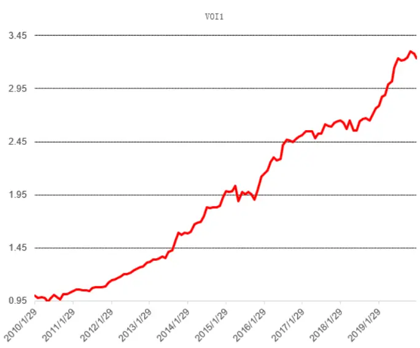

## 4.2、VOI2 因子选股效果

接着我们看下 VOI2 因子的选股效果，因子 IC 均值-3.35%，年化多空收益 14.73%，夏普比率 1.87，总体选股效果比 VOI1 要好。

图 8：VOI2因子选股效果

| IC分析 | VOI2 |
| --- | --- |
| IC均值% | -3.35 |
| IC标准差% | 7.50 |
| IR | -0.45 |
| 年化IR | -1.55 |
| 胜率% | 72.50 |

| 多空组合分析 | VOI2 |
| --- | --- |
| 总收益% | 295.14 |
| 年化收益% | 14.73 |
| 年化波动% | 7.86 |
| 夏普比率 | 1.87 |
| 最大回撤% | 8.19 |
| 收益回撤比 | 1.80 |
| 胜率% | 76.67 |

数据来源：wind、中信建投

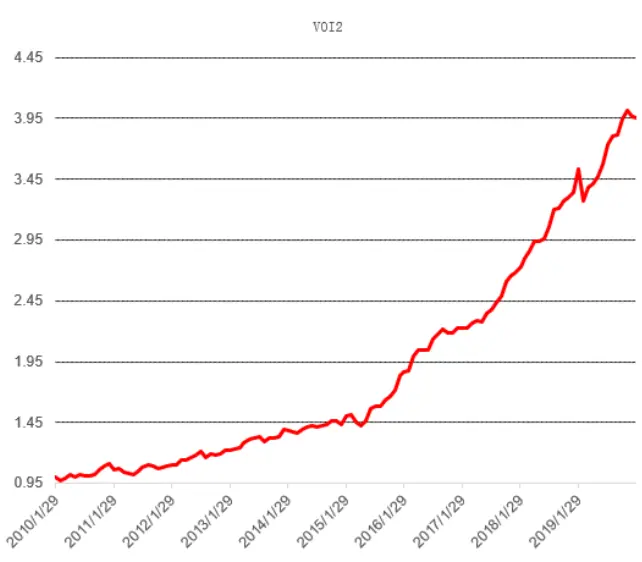

我们再对 VOI2 因子剥离相关性较大的 ROIC_TTM 和 Momentum_12m 因子，即将 VOI2 对 ROIC_TTM 和Momentum_12m 做中性化处理，处理后的因子 IC 均值-3.59%，年化多空收益 15.12%，夏普比率 1.91，选股效果相比 VOI2 进一步提升。

图 9：VOI2(剔除 ROIC_TTM 和 Momentum_12m)因子选股效果

| IC分析 | VOI2_2 |
| --- | --- |
| IC均值% | -3.59 |
| IC标准差% | 7.41 |
| IR | -0.48 |
| 年化IR | -1.68 |
| 胜率% | 70.83 |
| 多空组合分析 | VOI2_2 |
| 总收益% | 308.88 |
| 年化收益% | 15.12 |
| 年化波动% | 7.91 |
| 夏普比率 | 1.91 |
| 最大回撤% | 9.08 |
| 收益回撤比 | 1.67 |
| 胜率% | 73.33 |

数据来源：wind、中信建投

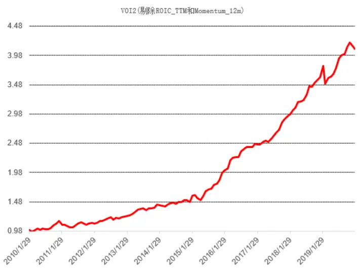

## 4.3、OIR因子选股效果

然后是 OIR 因子的效果，因子 IC 均值-3.7%，年化多空收益 16.05%，选股效果比 VOI1 和 VOI2 因子更好。图 10：OIR因子选股效果

| IC分析 | OIR |
| --- | --- |
| IC均值% | -3.70 |
| IC标准差% | 10.22 |
| IR | -0.36 |
| 年化IR | -1.25 |
| 胜率% | 68.33 |

| 多空组合分析 | OIR |
| --- | --- |
| 总收益% | 343.07 |
| 年化收益% | 16.05 |
| 年化波动% | 11.07 |
| 夏普比率 | 1.45 |
| 最大回撤% | 14.87 |
| 收益回撤比 | 1.08 |
| 胜率% | 70.00 |

数据来源：wind、中信建投

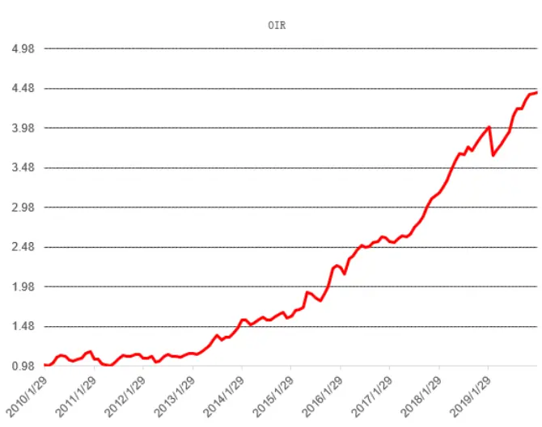

同样我们再对 OIR 因子剥离相关性最大的 Momentum_12m 因子，即将 OIR 对 Momentum_12m 做中性化处理，处理后的因子 IC 均值-4.19%，年化多空收益 17.75%，选股效果相比 OIR 进一步提升。

图 11：OIR (剔除 Momentum_12m)因子选股效果

| IC分析 | OIR_2 |
| --- | --- |
| IC均值% | -4.19 |
| IC标准差% | 9.85 |
| IR | -0.42 |
| 年化IR | -1.47 |
| 胜率% | 69.17 |

| 多空组合分析 | OIR_2 |
| --- | --- |
| 总收益% | 412.20 |
| 年化收益% | 17.75 |
| 年化波动% | 10.72 |
| 夏普比率 | 1.66 |
| 最大回撤% | 12.55 |
| 收益回撤比 | 1.41 |
| 胜率% | 72.50 |

数据来源：wind、中信建投

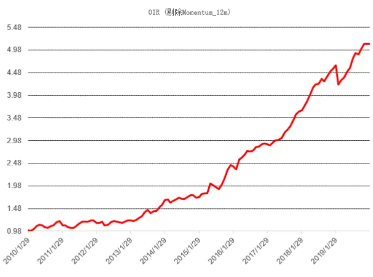

## 4.2、MPB 因子选股效果

最后我们看下 MPB 因子的选股效果，因子 IC 均值-5.23%，年化 IR 为-2.68，年化多空收益达到 21.24%，夏普比率高达 2.68，总体选股效果是所有因子里最好的。主要是这个因子是通过高频价格信息构造的，和之前几个用高频量的信息构造的因子不一样，在高频转低频时不会出现投资逻辑的变化。

图 12：MPB因子选股效果

| IC分析 | MPB |
| --- | --- |
| IC均值% | -5.23 |
| IC标准差% | 6.76 |
| IR | -0.77 |
| 年化IR | -2.68 |
| 胜率% | 79.17 |

| 多空组合分析 | MPB |
| --- | --- |
| 总收益% | 586.22 |
| 年化收益% | 21.24 |
| 年化波动% | 7.94 |
| 夏普比率 | 2.68 |
| 最大回撤% | 4.27 |
| 收益回撤比 | 4.97 |
| 胜率% | 76.67 |

数据来源：wind、中信建投

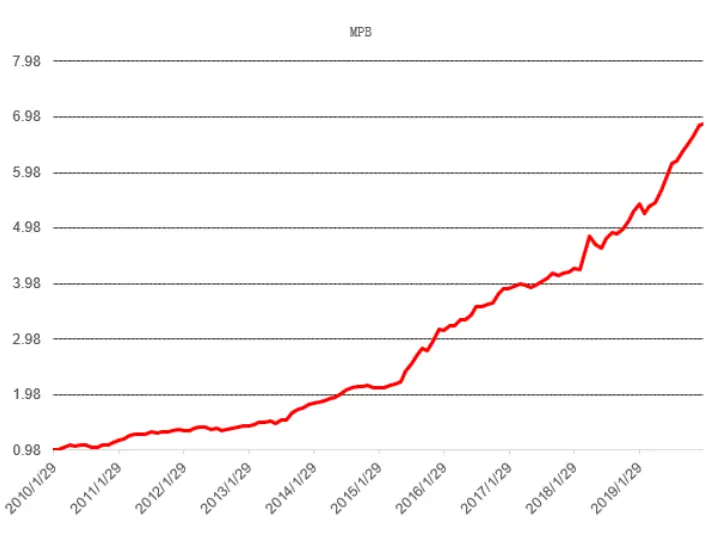

总体来看，这 4 个高频因子的构造方式虽有不同，但总体的选股效果还是不错的。这是我们第一篇高频选股因子的报告，后续我们会继续挖掘一些高频量价数据，希望能够挖掘出与传统因子相关性较低的有效的高频选股因子。

## 五、总结和思考

高频数据中蕴含了丰富的市场交易信息，它能带我们通过数据窥探知情交易者的隐藏信息，也让我们更近距离地感受市场交易者的情绪，从而帮助我们更准确地拿捏市场股票价格的走势。本文利用高频的逻辑挖掘出盘口数据中有价值的信息，并将其处理得到高频因子，最后降为月频的低频选股因子，在后续的因子回测中取得良好的选股效果。

第一部分主要通过高频数据构造出一些高频量价选股因子，首先第一个因子叫订单失衡（VOI 因子）。市场里面不同的交易者可以针对不同股票以他们希望支付的价格提交限价买入或卖出订单,其中订单薄里面蕴含着丰富的市场信息。为了量化这种交易意图，我们看一下委托买入和委托卖出量之间的差异，我们称为订单失衡。第二个因子 OIR（订单失衡率）是另外一个衡量订单不平衡性质的因子，它的统计性质和 VOI 因子相似。我们充分利用盘口各档数据信息，以期得到更加准确的订单失衡比率 OIR。第三个因子叫市价偏离度（MPB 因子）。具体我们对交易是由买方发起还是由卖方发起进行了分类。通过使用数据集中的交易量和成交额信息，我们能够确定两个时间点之间的平均交易价格。

第二部分我们采用具体流程把高频因子转为我们常用的月度低频选股因子。首先因为股票的盘口挂单强弱受到市场总体走势的影响，因此我们需要对各股票进行截面标准化以剔除市场对个股的影响。然后我们把标准化后的分钟因子转换成日因子，我们采用了等权的方法。最后我们把日因子转换成月因子，我们按距离每月最后一个交易日（假设为组合调仓日）的时间远近进行加权，考虑到信息的时效性，距离调仓日越远其信息的有效性越弱，因此用衰减加权的方法对日因子加权。

第三部分我们分析各因子的分钟 IC 均值和月频 IC 均值。低频（月频）量价因子的 IC 绝对值相比高频（分钟）有所降低，一是由于高频信息向低频转换的过程中信息有效性会出现衰减，二是由于部分高频信息对低频策略不适用。但我们看到其高频和低频 IC 都是显著的，因此对低频投资者利用其进行月度换仓策略的构建影响不大。此外，高频的量价因子符合之前构造因子的逻辑，即 VOI1、VOI2 和 OIR 因子与收益率正相关，MPB 因子与收益率负相关。然而将高频量价因子降频后，订单失衡相关因子与股票的长期受益相关性出现了反转。

我们认为 VOI 和 OIR 因子均为量相关的因子，而量的信息在高频结构上会出现欺骗性的现象，我们从以下两点原因来解释。从散户来看，在短期内散户容易存在追高杀跌行为。短期追高，价格上涨，但随着时间的累积，价格会逐渐处于高位，长期来看价格会回落。从主力的角度，主力对市场的短时操纵造成了价格的涨跌。强的买卖压力一般是大单交易造成的，大单交易很可能是主力的“对倒”行为，其目的主要是吸引散户，此时高频因子与收益率呈正相关。但从长期来看，市场价格则会回落，因此造成了低频上因子与收益率呈反向关系。

第四部分检测了这四个因子和传统因子的相关性，我们检测 VOI1、VOI2、OIR、MPB 这四个因子和常用选股因子的 IC 相关性，经过统计发现 VOI1 与 MPB 因子和自由流通市值的相关性较高，IC 相关性在 0.5 以上，因此对这两个因子需要做市值中性的处理，而对于 VOI2 和 OIR 则不需要做市值中性。

第五部分对 4 个高频量价因子进行单因子分析。具体回测时间为最近 10 年（2010 年 1 月-2019 年 12 月），样本池为全市场，月频调仓。VOI1和MPB做了市值和行业中性化处理，VOI2和OIR没做。VOI1因子IC均值-2.74%，年化 IR-1.62，年化多空收益 12.45%，夏普比率 1.69。VOI2 因子 IC 均值-3.35%，年化多空收益 14.73%，夏普比率 1.87。VOI2 因子剥离相关性较大的 ROIC_TTM 和 Momentum_12m 因子后的 IC 均值-3.59%，年化多空收益 15.12%，夏普比率 1.91。OIR 因子 IC 均值-3.7%，年化多空收益 16.05%， OIR 因子剥离相关性最大的 Momentum_12m 因子后的IC均值-4.19%，年化多空收益17.75%。MPB因子IC均值-5.23%，年化IR为-2.68，年化多空收益达到21.24%，夏普比率高达 2.68，总体选股效果是所有因子里最好的。

## 参考文献

Tarun Chordia and Avanidhar Subrahmanyam. Order imbalance and individual stock returns: Theory and evidence. 
Journal of Financial Economics, 72:485-518, 2004.

Han-Ching Huang, Yong-Chern Su, and Yi-Chun Liu. The performance of imbalance-based trading strategy on tender ofer announcement day. Investment Management and Financial Innovations, 11(2):38–46, 2014.

Tarun Chordia, Richard Roll, and Avanidhar Subrahmanyam. Order imbalance,liquidity, and market returns. Journal of Financial Economics, 65:111-130, 2002.

Rama Cont, Arseniy Kukanov, and Sasha Stoikov. The price impact of order book events. Journal of Financial Econometrics, 12(1):47-88, 2014.

## 分析师介绍

丁鲁明：同济大学金融数学硕士，中国准精算师，现任中信建投证券研究发展部金融工程方向负责人，首席分析师。10 年证券从业，历任海通证券研究所金融工程高级研究员、量化资产配置方向负责人；先后从事转债、选股、高频交易、行业配置、大类资产配置等领域的量化策略研究，对大类资产配置、资产择时领域研究深入，创立国内“量化基本面”投研体系。多次荣获团队荣誉：新财富最佳分析师 2009 第 4、2012第 4、2013 第 1、2014 第 3 等；水晶球最佳分析师 2009 第 1、2013 第 1；2018 年 wind金牌分析师第 2 等。

陈升锐： 芝加哥大学金融数学硕士，三年基金公司量化投资研究工作经验，2018 年加入中信建投研究发展部金融工程团队，专注于量化选股研究。2018、2019 年Wind金牌分析师金融工程第 2 名团队成员。

## 评级说明

| 投资评级标准 |  | 评级 | 说明 |
| --- | --- | --- | --- |
| 报告中投资建议涉及的评级标准为报告发布日后6个月内的相对市场表现，也即报告发布日后的6个月内公司股价（或行业指数）相对同期相关证券市场代表性指数的涨跌幅作为基准。A股市场以沪深300指数作为基准；新三板市场以三板成指为基准；香港市场以恒生指数作为基准；美国市场以标普500 指数为基准。 | 股票评级 | 买入 | 相对涨幅15%以上 |
|  |  | 增持 | 相对涨幅 5%—15% |
|  |  | 中性 | 相对涨幅-5%—5%之间 |
|  |  | 减持 | 相对跌幅 5%—15% |
|  |  | 卖出 | 相对跌幅15%以上 |
|  | 行业评级 | 强于大市 | 相对涨幅10%以上 |
|  |  | 中性 | 相对涨幅-10-10%之间 |
|  |  | 弱于大市 | 相对跌幅10%以上 |

## 分析师声明

本报告署名分析师在此声明：（i）以勤勉的职业态度、专业审慎的研究方法，使用合法合规的信息，独立、客观地出具本报告, 结论不受任何第三方的授意或影响。（ii）本人不曾因，不因，也将不会因本报告中的具体推荐意见或观点而直接或间接收到任何形式的补偿。

## 法律主体说明

本报告由中信建投证券股份有限公司及/或其附属机构（以下合称“中信建投”）制作，由中信建投证券股份有限公司在中华人民共和国（仅为本报告目的，不包括香港、澳门、台湾）提供。中信建投证券股份有限公司具有中国证监会许可的投资咨询业务资格，本报告署名分析师所持中国证券业协会授予的证券投资咨询执业资格证书编号已披露在报告首页。

本报告由中信建投（国际）证券有限公司在香港提供。本报告作者所持香港证监会牌照的中央编号已披露在报告首页。

## 一般性声明

本报告由中信建投制作。发送本报告不构成任何合同或承诺的基础，不因接收者收到本报告而视其为中信建投客户。

本报告的信息均来源于中信建投认为可靠的公开资料，但中信建投对这些信息的准确性及完整性不作任何保证。本报告所载观点、评估和预测仅反映本报告出具日该分析师的判断，该等观点、评估和预测可能在不发出通知的情况下有所变更，亦有可能因使用不同假设和标准或者采用不同分析方法而与中信建投其他部门、人员口头或书面表达的意见不同或相反。本报告所引证券或其他金融工具的过往业绩不代表其未来表现。报告中所含任何具有预测性质的内容皆基于相应的假设条件，而任何假设条件都可能随时发生变化并影响实际投资收益。中信建投不承诺、不保证本报告所含具有预测性质的内容必然得以实现。

本报告内容的全部或部分均不构成投资建议。本报告所包含的观点、建议并未考虑报告接收人在财务状况、投资目的、风险偏好等方面的具体情况，报告接收者应当独立评估本报告所含信息，基于自身投资目标、需求、市场机会、风险及其他因素自主做出决策并自行承担投资风险。中信建投建议所有投资者应就任何潜在投资向其税务、会计或法律顾问咨询。不论报告接收者是否根据本报告做出投资决策，中信建投都不对该等投资决策提供任何形式的担保，亦不以任何形式分享投资收益或者分担投资损失。中信建投不对使用本报告所产生的任何直接或间接损失承担责任。

在法律法规及监管规定允许的范围内，中信建投可能持有并交易本报告中所提公司的股份或其他财产权益，也可能在过去 12个月、目前或者将来为本报告中所提公司提供或者争取为其提供投资银行、做市交易、财务顾问或其他金融服务。本报告内容真实、准确、完整地反映了署名分析师的观点，分析师的薪酬无论过去、现在或未来都不会直接或间接与其所撰写报告中的具体观点相联系，分析师亦不会因撰写本报告而获取不当利益。

本报告为中信建投所有。未经中信建投事先书面许可，任何机构和/或个人不得以任何形式转发、翻版、复制、发布或引用本报告全部或部分内容，亦不得从未经中信建投书面授权的任何机构、个人或其运营的媒体平台接收、翻版、复制或引用本报告全部或部分内容。版权所有，违者必究。

## 中信建投证券研究发展部

中信建投（国际）

北京

东城区朝内大街2号凯恒中心B

上海

深圳

福田区益田路 6003 号荣超商务

香港

浦东新区浦东南路 528 号上海证券大厦北塔22楼 2201 室

座 12 层

中环交易广场2期18 楼

中心 B 座 22 层

电话：(8610) 8513-0588

电话：(8621) 6882-1612

电话：（86755）8252-1369

电话：（852）3465-5600

联系人：李星星

联系人：翁起帆

联系人：陈培楷

联系人：刘泓麟

邮箱：lixingxing@csc.com.cn

邮箱：wengqifan@csc.com.cn

邮箱：chenpeikai@csc.com.cn

邮箱：charleneliu@csci.hk