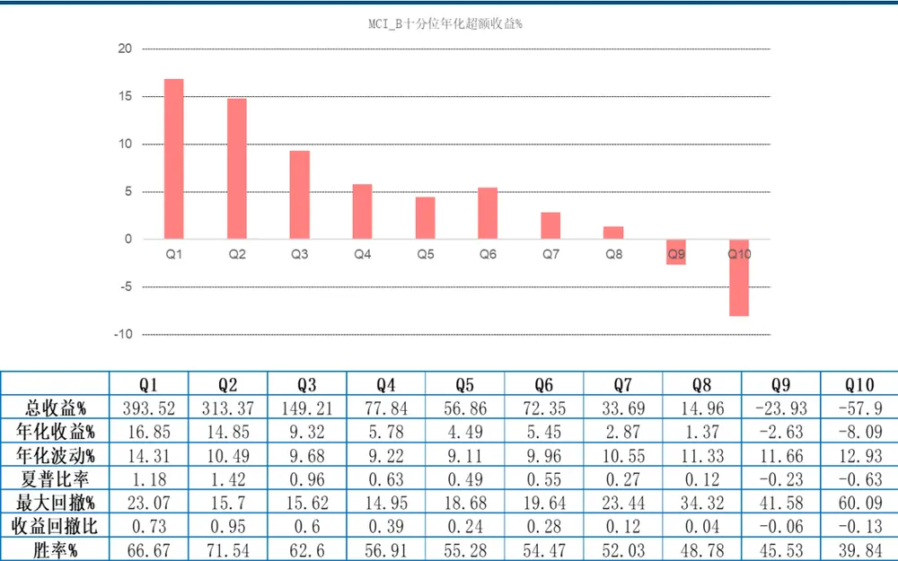
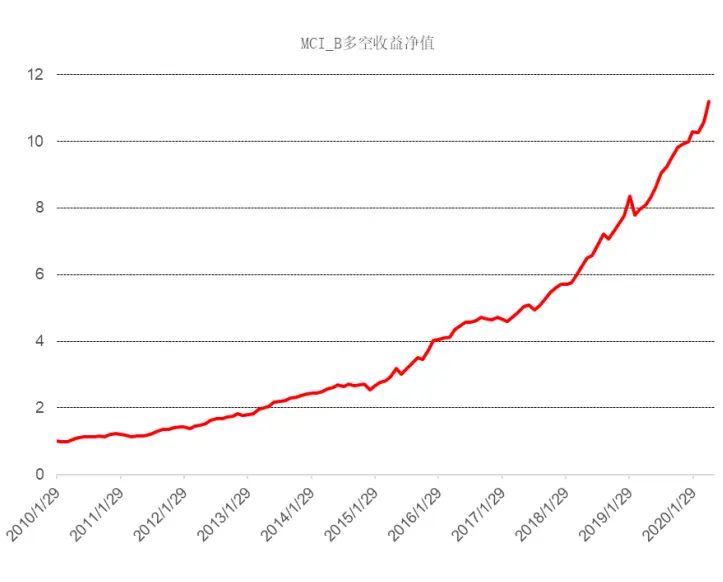
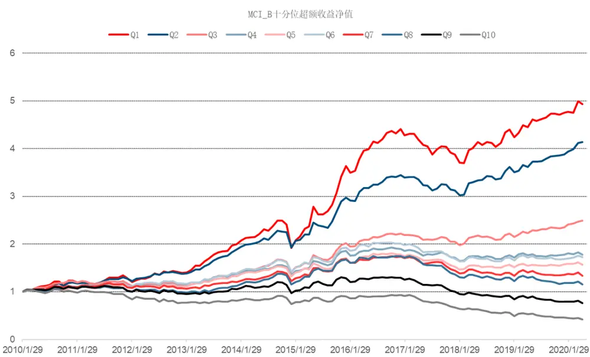
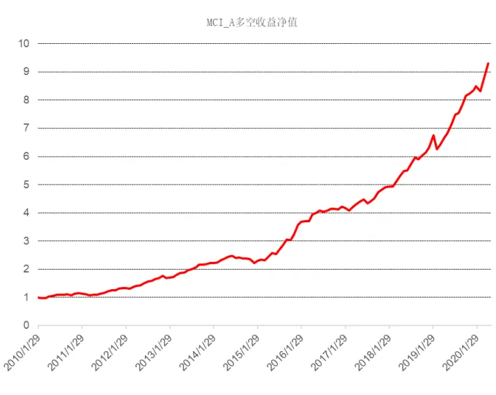
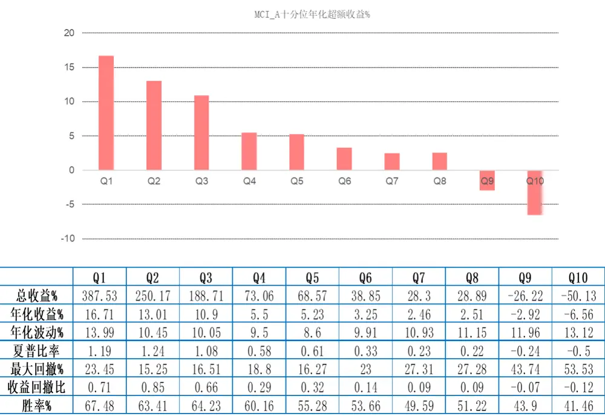
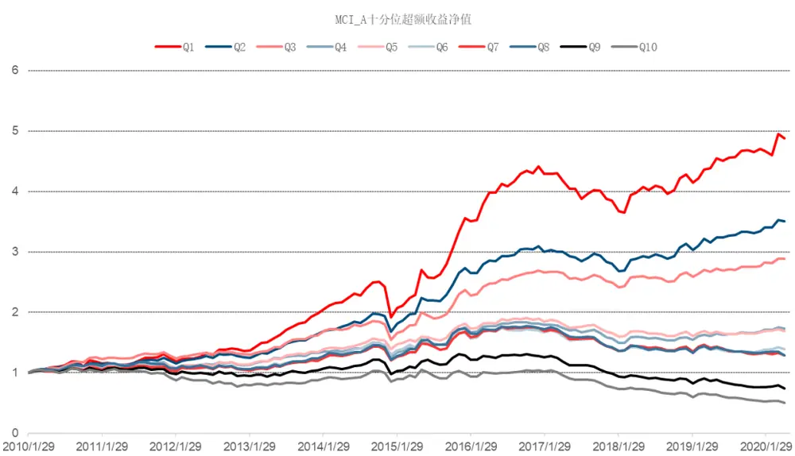
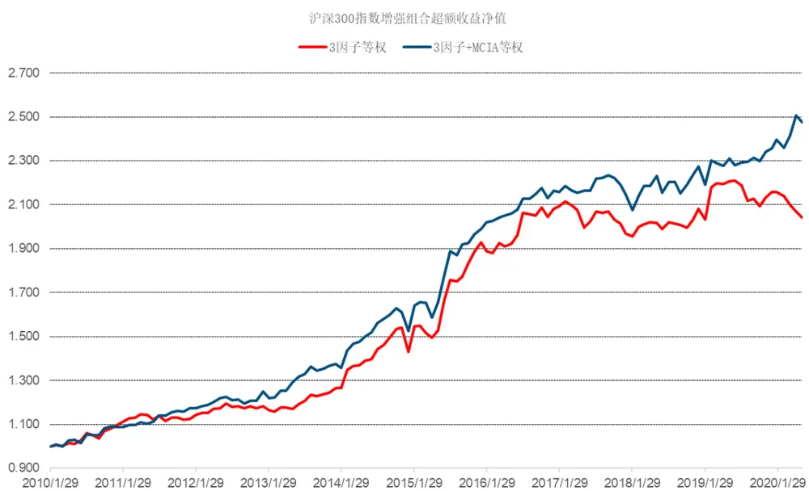
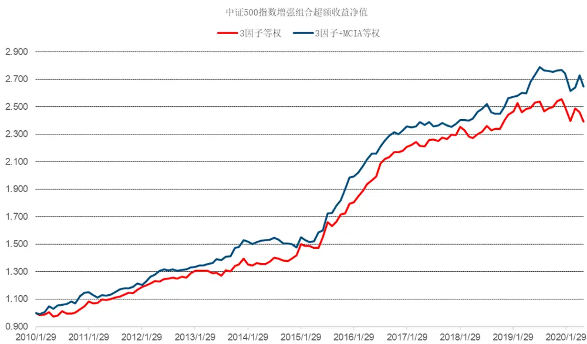

[table_main] 证券研究报告·金融工程深度报告金融衍

# 买卖报单流动性因子构建：

——因子深度研究系列

## 主要结论

## 本文概述

本文利用高频的逻辑挖掘出盘口数据中有价值的信息，并将其处理得到 2 个高频因子（买单流动性因子 $MCI_{B}$ 、卖单流动性因子 $MCI_{A})$ ），最后降为月频的低频选股因子，在单因子回测中取得优秀的选股效果。其中 $MCI_{B}$ 因子 IC 均值 6.89%，年化 IR2.76，年化多空收益 26.58%，夏普比率 2.71，总体选股效果是所有因子里最好的。 $MCI_{A}$ 和 $MCI_{B}$ 均对原来的指数增强模型有显著的提升。

## 买卖报单流动性因子定义

流动性的本质即为立即交易（市价交易）与延时交易（限价交易）之间交易成本的差距，我们将用市价交易成本与限价交易成本之间差值百分比来衡量交易成本。对于限价交易成本，我们用买一报单价格与卖一报单价格的均值 M 作为限价交易成本。对于市价交易成本，我们用买单（卖单）五档报单的报单量加权平均价格 VWAP 作为市价交易成本。最后我们用交易成本除以五档报单的资金总量 DolVol 得到流动性因子MCI，使用买单报单计算得到的因子为买单流动性因子 $MCI_{B}$ （Bid），使用卖单报单计算得到的因子为卖单流动性因子 $MCI_{A}$ （Ask）。

## $MCI_{B}$ 和 $MCI_{A}$ 在高频上分别为正向和负向，在低频上均为正向

从短期来看， $MCI_{B}$ 较大时，发起市价交易的卖方要付出较大的费用卖出股票，说明股票的买压更强，股票较难下跌，所以和未来短期收益是正相关关系。 $MCI_{A}$ 较大时，发起市价交易的买方要付出较大的费用买入股票，说明股票的卖压更强，股票较难上涨，所以和未来短期收益是负相关关系。在高频（分钟）级别上， $MCI_{B}$ 和 ${|MCI_{A}}$ 因子方向和前面逻辑完全一致。在低频（月频）级别上， $MCI_{B}$ 和 $MCI_{A}$ 因子方向均显著为正，主要是流动性因子在长期来看具有风险溢价，因而与未来收益为正向关系。

## $MCI_{B}$ 因子 IC 均值 6.89%，年化多空收益高达 26.58%

我们对 2 个买卖报单流动性因子进行单因子分析。具体回测时间为最近 10 年（2010 年 1 月-2020 年4 月），样本池全市场，月频调仓。因子都做了市值和行业中性化处理。 $MCI_{A}$ 因子 IC 均值 6.56%，年化 IR2.64，年化多空收益 24.32%，夏普比率 2.44。 $MCI_{B}$ 因子 IC 均值 6.89%，年化 IR2.76，年化多空收益 26.58%，夏普比率 2.71，总体选股效果所有因子里最好。

## $MCI_{B}$ 和 ${\mid}MCI_{A}$ 因子对原来指数增强模型有显著的提升

2 个高频买卖报单流动性因子对原来指数增强模型的增强进行分析（包括 IC 分析和相对基准指数的超额收益分析）。具体回测时间为最近 10年（2010 年 1 月-2020年 4 月），样本池为沪深 300 或中证 500，月频调仓。在两个样本池内，2 个因子均对原来的指数增强模型有显著的提升。

# 金融工程研究

。丁鲁明[table

dingluming@csc.com.cn

021-68821623

SAC 执证编号：S1440515020001

陈升锐

chenshengrui @csc.com.cn

021-68821600

SAC 执证编号：S1440519040002

## 发布日期： 2020 年 10 月 23 日

## 相关研究报告

| 20.07.09 | 因子深度研究系列：高频量价选股因子 初探 |
| --- | --- |
| 20.04.02 | 因子深度研究系列：分析师超预期因子 选股策略 |
| 20.01.17 | 因子深度研究系列：分析师预期修正动 量效应选股策略 |
| 19.08.21 | 因子深度研究系列：中信建投一致预期 因子体系搭建 |
| 19.03.28 | 因子深度研究系列：因子衰减在多因子 选股中的应用 |
| 18.08.29 | 因子深度研究系列：Barra 风险模型介绍 及与中信建投选股体系的比较 |
| 18.08.23 | 技术形态选股研究之黎明曙光：深跌反 转形态 |
| 18.08.07 | 量化基本面选股：从逻辑到模型，航空 业投资方法探讨 |
| 18.08.02 | 从相关关系到指数增强——谈 IC 系数 与股票权重的联系 |
| 18.06.08 | 因子深度研究系列：宏观变量控制下的 有效因子轮动 |
| 18.05.18 | 因子深度研究系列：特质波动率纯因子 在 A股的实证与研究 |

## 一、买卖报单流动性因子定义和投资逻辑

## 1.1、买卖报单流动性因子简介

流动性在金融市场中扮演着重要的作用，影响着市场效率和股票价格；在市场的微观结构中，流动性的重要程度尤为凸显。因而流动性是在对股票定价的一个重要因素。一般的研究默认流动性是对称的，如用报单价差 Quote_Spread （卖一价格减去买一价格除以两者均值）等指标衡量流动性时，并没有考虑买卖报单流动性的不对称性。但是，也有理论研究表明，下行市场中的流动性与上行市场中的流动性从根本上是不同的，并强调了区分买方和卖方流动性的重要性；特别是在买卖报单量不平衡的时候。因而在本研究中，我们将根据报单数据分别建立买单流动性因子和卖单流动性因子。

通过交易者是提供还是需求流动性，我们可以将交易者分为流动性的提供者和流动性的需求者。具体来说，当交易者并不急于交易，或是认为价格还会向有利于自己的方向变动时，交易者不愿意付出相应的交易成本，接受对向的现有报单；而是会提交限价交易委托，增加买单或卖单报单量，为市场提供了流动性。而当交易者认为对向的报单价格合适，想要立即执行交易时，交易者会提交市价交易委托，付出一定的交易成本，在对向现有报单的报单价格上执行交易。从上述分析可以看到，流动性的本质即为立即交易（市价交易）与延时交易（限价交易）之间交易成本的差距；特别是资金量较大时，该差异尤为明显。当立即交易相对于延时交易的交易成本为 0 时，说明市场是完美流动的；而交易成本高时，说明流动性差。

因而我们将建立因子来估计该交易成本，来衡量流动性。如上所述，我们将用市价交易成本与限价交易成本之间差值百分比来衡量交易成本。对于限价交易成本，由于交易并未发生，因而我们将假设买卖双方各付一半的交易费用，即用买一报单价格与卖一报单价格的均值 M 作为限价交易成本。

$$
\begin{array}{r}{\overrightarrow{\lambda}\overrightarrow{\lambda}\overrightarrow{\lambda}\overrightarrow{\mu}\vert\dot{\lambda}\dot{\lambda}/\vert\overrightarrow{\mathrm{H}}\mid\overrightarrow{\mathrm{M}}\colon M=\ \frac{P_{A,1}+P_{B,1}}{2}}\end{array}
$$

其中 $P_{A,i}$ 表示第 i 个卖单的价格， $Q_{A,i}$ 表示第 i 个卖单的报单量，下标 A 代表 Ask-side。

对于市价交易成本，我们将对买卖双方分开来衡量。对于资金量较小的订单，一定是在最优的对向报单价格执行，即买一报单价格（市价卖出）或者是卖一报单价格（市价买入）。为了使得流动性差异更为明显，我们假设该市价交易单将执行对向的最优五档报单；基于此，我们将用买单（卖单）五档报单的报单量加权平均价格 VWAP 作为市价交易成本。

总卖单均价 $VWAP_{A}$ ，定义为五档卖单价格的报单量加权平均值：

$$
\begin{array}{r}{VWAP_{A}=\frac{\sum_{i}^{n}P_{A,i}\times Q_{A,i}}{\sum_{i}^{n}Q_{A,i}}=\frac{DolVol_{A}}{\sum_{i}^{n}Q_{A,i}}}\end{array}
$$

其中，总卖单报单金额 $DolVol_{A}$ ，定义为所有卖单报单价格乘以报单量之和，单位统一为万元（n 为单边报单价格的数量，对于我们的数据来说, n=5）：

$$
DolVol_{A}=~\sum_{i}^{n}P_{A,i}\times Q_{A,i}
$$

那么，交易成本即为市价交易成本与限价交易成本之间的差值；为了归一化，对该值取比例。交易成本为（市价交易成本-限价交易成本）/限价交易成本，即 $VWAP_{A}$ 与 M 的差值百分比 $VWAPM_{A}$ ，单位统一为 bps ：

$$
VWAPM_{A}\ =\ \frac{VWAP_{A}-M}{M}
$$

对于卖单报单来说，价格一定高于买卖报单均值（若存在卖单报价低于买单报价的情况，直接进行交易），因而 $VWAPM_{A}$ 大于 $0_{\circ}$ 。而在计算 $\ d_{1}CI_{B}$ 时，由于买单的价格一定低于买卖报单均值，则 $\frac{VWAP_{B}-M}{M}<0$ ，而我们用该数值衡量的交易费用是非负的，因而在计算时，添加上负号，得到一个正值，即：

$$
VWAPM_{B}=-\frac{VWAP_{B}-M}{M}
$$

我们在计算对于市价交易成本时，假设执行了最优五档报单。但是对于不同的股票，不同的时间执行该五档报单所需要的资金量是不同的，对于较大资金量的付出的交易成本自然比较多。因而在这一步，我们要统一资金量，用交易成本除以五档报单的资金总量 DolVol（五档价格乘以报单量之和）。最终得到我们的流动性因子，MCI （立即交易边际成本，marginal cost of immediacy）。使用买单报单计算得到的因子为买单流动性因 $\vec{\mathrm{\mathcal{F}}}MCI_{B}$ （Bid），使用卖单报单计算得到的因子为卖单流动性因子 $MCI_{A}\ (\mathsf{Ask})$ ）。卖单流动性因子 $\begin{array}{r}{MCI_{A}=~\frac{VWAPM_{A}}{DolVol_{A}}}\end{array}$ ；买单流动性因子 $\begin{array}{r}{MCI_{B}=\frac{VWAPM_{B}}{DolVol_{B}}}\end{array}$ 。单位统一为 bps/万元。

在对资金量单位统一为每万元，对交易费用统一单位为 bps 后，对因子的直观解释是，当一个流动性需求者要求根据现有的卖单（买单）立即买入（卖出）一万元股票时，所付出的平均交易费用（用 bps衡量）。对于买单报单来说，买单流动性因子 $MCI_{B}$ 的计算过程与卖单的计算过程基本一致，只要将计算过程中的卖单数据改为买单数据，下标 B 代表 Bid-side 。唯一的区别在于计算 $VWAPM_{B}$ 时，需要将用该数值衡量的交易费用改为正值，因而在计算时，添加上负号，得到一个正值。

## 1.2、买卖报单流动性因子投资逻辑

对于买单流动性因子 $MCI_{B}$ ，其衡量的是发起市价交易的卖方所付出的交易费用；从短期来看， $MCI_{B}$ 较大时，发起市价交易的卖方要付出较大的费用卖出股票，说明股票的买压更强，股票较难下跌，所以和未来短期收益是正相关关系。

对于卖单流动性因子 $MCI_{A}$ ，其衡量的是发起市价交易的买方所付出的交易费用；从短期来看， $MCI_{A}$ 较大时，发起市价交易的买方要付出较大的费用买入股票，说明股票的卖压更强，股票较难上涨，所以和未来短期收益是负相关关系。

根据上述，可以自然的想到，为了综合买卖单流动性对于短期收益的影响，可以做 $MCI_{A}$ 和 $MCI_{B}$ 的差值来衡量买卖双方交易费用的差值，进而代表价格压力。为了消除单位的影响，指标还除以了两者之和。买卖报单流动性不平衡因子定义为： $\begin{array}{r}{MCI_{IMB}=\ \frac{MCI_{B}-MCI_{A}}{MCI_{A}+MCI_{B}}}\end{array}$

买卖报单流动性不平衡因子 $MCI_{IMB}$ 的数据范围为[-1,1]。从短期来看，当 $MCI_{IMB}$ 大于 0 时，说明市价交易的卖方付出的交易费用大于买方，股票更容易以理想的价格买而不容易以理想的价格卖，更容易上涨；当 $MCI_{IMB}$ 小于 0 时，说明市价交易的买方付出的交易费用大于卖方，股票更容易以理想的价格卖而不容易以理想的价格买， 更容易下跌。因而从短期来看， $MCI_{IMB}.$ 与收益负相关。

长期来看， $MCI_{B}$ 和MCI 分别衡量买单和卖单流动性，值越大，说明流动性越差，流动性风险较高，会带有风险溢价，因而与收益正相关。而 $MCI_{IMB}$ 仅衡量了买卖单流动性的差异，不能衡量流动性，更多的是衡量了买卖双方的不平衡性。

## 1.3、买卖报单流动性因子计算实例

下面我们以某天收盘时的贵州茅台、中国银行和金洲慈航的数据来进行因子的计算，并进行对比。首先是贵州茅台的盘口数据。

图 1：贵州茅台盘口数据

| 贵州茅台 600519 1252.26 +0.62% (+7.76) SSE CNY 15:00:00 闭市 融通 + |
| --- |
| 委比 27.18% 委差 0万 |
| 卖五 1253.50 2 卖四 1253.00 14 卖三 1252.71 5 卖二 1252.56 11 卖一 1252.50 2 |
| 买一 1252.26 18 买二 1252.25 1 买三 1252.10 20 买四 1252.03 19 买五 1252.02 1 |

数据来源：wind、中信建投

贵州茅台（此处委托量单位为 1 手）：

买卖单均值 $\begin{array}{r}{M=\ \frac{P_{A,1}+P_{B,1}}{2}=1252.38}\end{array}$

总卖单报单金额 $\begin{array}{r}{DolVol_{A}=\ \sum_{i}^{n}P_{A,i}\times Q_{A,i}=425.96\ \mathcal{H}\mathcal{\vec{I}}\mathcal{\vec{I}}}\end{array}$

总买单报单金额 $\begin{array}{r}{DolVol_{B}=\ \sum_{i}^{n}P_{B,i}\times Q_{B,i}=738.76~\mathcal{H}\mathcal{\vec{I}}\mathcal{\vec{I}}\mathcal{\vec{L}}}\end{array}$

总卖单均价 $\begin{array}{r}{VWAP_{A}=\ \frac{DolVol_{A}}{\sum_{i}^{n}Q_{A,i}}\ =1252.815}\end{array}$

总买单均价 $\begin{array}{r}{\cdot VWAP_{B}=\ \frac{DolVol_{B}}{\sum_{i}^{n}Q_{B,i}}=1252.127}\end{array}$

$$
VWAPM_{A}=\frac{VWAP_{A}-M}{M}=0.035\%=3.5bps
$$

$$
VWAPM_{B}=-\frac{VWAP_{B}-M}{M}=0.020\%=2.0~bps
$$

卖单流动性因子 $\begin{array}{r}{MCI_{A}=\ \frac{VWAPM_{A}}{DolVol_{A}}=8.2\times10^{-3}bps/\mathcal{K}\overline{{\mathcal{T}}}\overline{{\mathcal{T}}}}\end{array}$

买单流动性因子 $\begin{array}{r}{MCI_{B}=\ \frac{-VWAPM_{B}}{DolVol_{B}}=2.7\times10^{-3}bps/\mathrm{\mathcal{H}}\overline{{\mathcal{I}\overline{{\mathcal{L}}}}}}\end{array}$

买卖报单流动性不平衡因子 $\begin{array}{r}{MCI_{IMB}=\ \frac{MCI_{A}-MCI_{B}}{MCI_{A}+MCI_{B}}=0.50}\end{array}$

从上面我们看到茅台的 $MCI_{A}$ 和 $MCI_{B}$ 都很小，流动性成本的数量级在 $10^{-3}bps/\mathcal{F}\overline{{\mathcal{T}}}$ ，可以看出茅台的市场流动性非常好。

然后我们再看下另外一个大市值股票中国银行的流动性指标。

图 2：中国银行盘口数据

| 中国银行 601988 3.46 -1.98% (-0.07) SSE CNY 15:00:00 闭市 融通Δ+ |
| --- |
| 港股(3988) 2.87 (-1.37%) |
| 委比 18.97% 委差 9.84万 卖五 3.50 40195 |
| 卖四 3.49 39303 卖三 3.48 30374 卖二 3.47 71454 卖一 3.46 28773 |
| 买 一 3.45 55772 买二 3.44 83051 买三 3.43 73933 买四 3.42 66720 买五 3.41 29014 |

数据来源：wind、中信建投

中国银行（此处委托量单位为 1 手）：

买卖单均值 $\begin{array}{r}{M=\ \frac{P_{A,1}+P_{B,1}}{2}=3.455}\end{array}$

总卖单报单金额 $\begin{array}{r}{DolVol_{A}=~\sum_{i}^{n}P_{A,i}\times Q_{A,i}=7310.51}\end{array}$ 万元

总买单报单金额 $\begin{array}{r}{DolVol_{B}=~\sum_{i}^{n}P_{B,i}\ \times Q_{B,i}=10588.19}\end{array}$ 万元

总卖单均价 $\begin{array}{r}{VWAP_{A}=\ \frac{DolVol_{A}}{\sum_{i}^{n}Q_{A,i}}=3.480}\end{array}$总买单均价 $\begin{array}{r}{VWAP_{B}=\frac{DolVol_{B}}{\sum_{i}^{n}Q_{B,i}}=3.432}\end{array}$

$$
VWAPM_{A}=\frac{VWAP_{A}-M}{M}=70.6\ :bps
$$

$$
VWAPM_{B}=-\frac{VWAP_{B}-M}{M}=65.8~bps
$$

卖单流动性因子 $\begin{array}{r}{\dot{}MCI_{A}=\ \frac{VWAPM_{A}}{DolVol_{A}}=9.7\times10^{-3}bps/\mathcal{K}\hat{\mathcal{T}}\hat{\mathcal{T}}\overline{{\mathcal{L}}}}\end{array}$

买单流动性因子 $\begin{array}{r}{MCI_{B}=\ \frac{-VWAPM_{B}}{DolVol_{B}}=6.2\times10^{-3}bps/\mathrm{\mathcal{H}}\overline{{\mathcal{T}\overline{{\mathcal{U}}}}}}\end{array}$

$$
\begin{array}{r}\widecheck{\widecheck{\widecheck{\tau}}}\widecheck{\widecheck{\widecheck{\tau}}}\widecheck{\widecheck{\widecheck{\tau}}}\widecheck{\widecheck{\widecheck{\tau}}}\widecheck{\widecheck{\widecheck{\tau}}}\widecheck{\widecheck{\widecheck{\widecheck{\ t}}}}\widecheck{\widecheck{\widecheck{\widecheck{\tau}}}}\widecheck{\widecheck{\widecheck{\widecheck{\tau}}}}\widecheck{\widecheck{\widecheck{\widecheck{\tau}}}}\widecheck{\widecheck{\widecheck{\widecheck{\tau}}}}\widecheck{\widecheck{\widecheck{\widecheck{\widecheck{\tau}}}}}=0.22\widecheck{\widecheck{\widecheck{\widecheck{\tau}}}}\widecheck{\widecheck{\widecheck{\widecheck{\widecheck{\tau}}}}}\widecheck{\widecheck{\widecheck{\widecheck{\widecheck{\widecheck{\tau}}}}}}\widecheck\widecheck{\widecheck{\widecheck{\widecheck{\widecheck{\widecheck{\widecheck{\widecheck{\widecheck{\widecheck{\widecheck{\widecXi}}}}}}}}}}}\widecheck\widecheck{\widecheck{\widecheck{\widecheck{\widecheck{\widecheck{\widecheck{\widecheck{\widecheck{\widecheck{\widecheck{\widecheck{\widecheck}}}}}}}}}}}}\widecheck\widecheck\widecheck{\widecheck{\widecheck{\widecheck{\widecheck{\widecheck{\widecheck{\widecheck{\widecheck{\widecheck{\widecheck{\widecheck{\widecheck}}}}}}}}}}}}\widecheck\widecheck\widecheck\widecheck{\widecheck{\widecheck{\widecheck{\widecheck{\widecheck{\widecheck{\widecheck{\widecheck{\widecheck{\widecheck{\widecheck}}}}}}}}}}}\widecheck\widecheck\widecheck\widecheck\widecheck\widecheck\widecheck\widecheck\widecheck\widecheck\widecheck\widecheck{\widecheck{\widecheck{\wideczeta}}}\end{array}
$$

同样，中国银行的 $MCI_{A}$ 和 $MCI_{B}$ 也都很小，流动性成本的数量级也是在 $10^{-3}bps/\mathcal{F}\mathcal{\overline{{\mathcal{L}}}};$ ，和贵州茅台一样市场流动性也是非常好的。我们看到虽然中国银行和贵州茅台的股价差别很大，但流动性其实相差不大。假设我们用 $VWAPM_{A}$ 和 $VWAPM_{B}$ 来衡量股票的流动性成本的话，中国银行和贵州茅台的流动性成本相差 20 倍，这明显不符合我们的直观感受，因此这也是为什么我们需要对 VMAPM 做资金量的归一化。

最后，我们再看下一个市值比较小的股票——金洲慈航。

图 3：金洲慈航盘口数据

| 金洲慈航 000587 1.25 -4.58% (-0.06) SZSE CNY 15:00:03 闭市 □ + |
| --- |
| 委比 -2.84% 委差 -0.1万 卖五 1.29 2039 |
| 卖四 1.28 6257 卖三 1.27 4624 |
| 卖二 1.26 2175 |
| 卖一 1.25 2213 |
| 买一 1.24 894 |
| 买二 1.23 1149 |
| 买三 1.22 3007 |
| 买四 1.21 2666 |
| 买五 1.20 8635 |

数据来源：wind、中信建投

金洲慈航（此处委托量单位为 1 手）：

金融工程深度报告

买卖单均值 $\begin{array}{r}{M=\ \frac{P_{A,1}+P_{B,1}}{2}=1.245}\end{array}$

总卖单报单金额 $\begin{array}{r}{DolVol_{A}=\ \sum_{i}^{n}P_{A,i}\times Q_{A,i}=220.18\ \mathcal{H}\overrightarrow{\mathcal{I}\mathcal{L}}}\end{array}$

总买单报单金额 $\begin{array}{r}{DolVol_{B}=\ \sum_{i}^{n}P_{B,i}\times Q_{B,i}=197.78~\mathcal{H}\mathcal{\vec{I}}\mathcal{\vec{U}}}\end{array}$

总卖单均价 $\begin{array}{r}{VWAP_{A}=\ \frac{DolVol_{A}}{\sum_{i}^{n}Q_{A,i}}=1.272}\end{array}$

总买单均价 $\begin{array}{r}{VWAP_{B}=\frac{DolVol_{B}}{\sum_{i}^{n}Q_{B,i}}=1.210}\end{array}$

$$
VWAPM_{A}=\frac{VWAP_{A}-M}{M}=218.1bps
$$

$$
VWAPM_{B}=-\frac{VWAP_{B}-M}{M}=284.3\ :bps
$$

卖单流动性因子 $\begin{array}{r}{MCI_{A}=\ \frac{VWAPM_{A}}{DolVol_{A}}=0.99\ :bps/\mathcal{F}\bar{\mathcal{T}}}\end{array}$

买单流动性因子 $\begin{array}{r}{{\cdot}MCI_{B}=\ \frac{-VWAPM_{B}}{DolVol_{B}}=1.44\ :bps/\mathrm{\mathcal{H}}\bar{\mathcal{T}}}\end{array}$

买卖报单流动性不平衡因子 $\begin{array}{r}{MCI_{IMB}=\ \frac{MCI_{A}-MCI_{B}}{MCI_{A}+MCI_{B}}=-0.18}\end{array}$

金洲慈航的 $MCI_{A}$ 和 $|MCI_{B}$ 都在 1bps/万元左右，流动性成本为贵州茅台和中国银行的 1000 倍，因此其市场流动性是非常差的。

## 二、高频转低频的方法和逻辑

## 2.1、高频量价因子转低频的构造方法

我们采用下面的具体流程把高频因子转为我们常用的月度低频选股因子。首先因为股票的盘口挂单强弱受到市场总体走势的影响，因此我们需要对各股票进行截面标准化以剔除市场对个股的影响。下面 $Factor_{i,j,k}$ 为股票 k 第j 天 i 分钟的因子值， $M\_Factor_{i,j,k}$ 为横截面因子均值， $Std\_Factor_{i,j,k}$ 表示横截面因子的标准差：

$$
\widehat{\mathrm{Factor}_{\mathrm{1,l,k}}}=\frac{\mathrm{Factor}_{\mathrm{i,j,k}}-M_{\mathrm{-}}\mathrm{Factor}_{\mathrm{i,j,k}}}{Std_{\mathrm{-}}\mathrm{Factor}_{\mathrm{i,j,k}}}
$$

然后我们把标准化后的分钟因子转换成日因子，我们采用了等权的方法。下面是日因子的构造方法，其中

金融工程深度报告

N 为第j 天总共的分钟数：

$$
\widehat{\mathrm{Factor}_{\mathrm{{J,k}}}}=\frac{\sum\mathrm{Fa\widehat{ctor_{\mathrm{{l,l,k}}}}}}{\mathrm{N}}
$$

最后我们把日因子转换成月因子，我们按距离每月最后一个交易日（假设为组合调仓日）的时间远近进行加权，考虑到信息的时效性，距离调仓日越远其信息的有效性越弱，因此用指数衰减加权的方法对日因子加权。n 为当月交易日天数，j 为当月的第j 个交易日，α 为衰减系数 0.5：

$$
\widehat{Factor}_{j}=\frac{1}{\sum_{j=1}^{n}\alpha^{n-j}}\times\sum_{j=1}^{n}\widehat{Factor}_{j,k}\times\alpha^{n-j}
$$

## 2.2、买卖报单流动性因子高频和低频 IC对比

接下来我们对比下各高频因子的分钟 IC 均值和月频 IC 均值。分钟 IC 均值为各分钟截面下各股票因子值和下一分钟收益率的 IC 值，然后取历史平均值。月频 IC 均值为每月末各股票因子值和下一个月收益率的 IC 值，然后取历史平均值。

表 1：高频买卖报单流动性因子分钟和月频 IC对照表

| 因子 | MCI_A | MCI_B | MCI_IMB |
| --- | --- | --- | --- |
| 分钟IC均值 | -2.80% | 9.44% | -10.69% |
| 月频IC均值 | 6.56% | 6.89% | -0.91% |

数据来源：wind、天软科技、中信建投

由上表可以看出，在高频（分钟）级别上， $MCI_{B}$ 和 $MCI_{A}$ 因子方向和前面逻辑完全一致， $MCI_{A}$ 和未来短期收益为负向关系， $MCI_{B}$ 和未来短期收益为正向关系。

在低频（月频）级别上， $MCI_{B}$ 和 $MCI_{A}$ 因子方向均显著为正，主要是流动性因子在长期来看具有风险溢价，因而与未来收益为正向关系。

## 三、买卖报单流动性因子和常用因子的相关性

下面我们看下这四个因子和传统因子的相关性，我们检测了 MCI_B、MCI_A 两个因子和常用选股因子的因子值平均相关系数如下表。

MCI_B、 MCI_A 两个因子和自由流通市值（LnFloatCap）的相关性很高，因此对于这两个因子的处理需要做市值中性处理。

另外， MCI_B、 MCI_A 两个因子和一个月换手率（AmountAvg_1M）的相关性也较高，因此后面两个因子可以对 AmountAvg_1M 做中性化处理。

最后，我们检测两个因子和常用流动性因子包括非流动因子 ILLIQUID 和买卖报单差价 Quote_Spread 的相关性都不太强。

表 2：买卖报单流动性因子和常用因子的相关性

| 因子值平均相关系数 | MCIB | MCIA |
| --- | --- | --- |
| AmountAvg_1M | -0.53 | -0.53 |
| BP LR | -0.20 | -0.18 |
| Beta_100W | -0.06 | -0.04 |
| EP_TTM | -0.22 | -0.22 |
| Earnings_SQ_YoY | -0.02 | -0.02 |
| LnFloatCap | -0.68 | -0.69 |
| MCI_A | 0.90 | 1.00 |
| MCIB | 1.00 | 0.90 |
| MCI_IMB | -0.19 | 0.14 |
| Momentum_12m | -0.02 | -0.05 |
| Momentum_1m | 0.00 | -0.02 |
| Momentum_24m | -0.04 | -0.07 |
| Momentum_3m | 0.00 | -0.03 |
| Momentum_6m | 0.00 | -0.03 |
| ROA_TTM | -0.08 | -0.10 |
| ROE_SQ_YoY | -0.01 | -0.01 |
| ROE_TTM | -0.12 | -0.13 |
| ROIC_TTM | -0.08 | -0.10 |
| SP_TTM | -0.15 | -0.14 |
| Sales_SQ_YoY | 0.01 | 0.00 |
| TurnoverAvg1M | -0.08 | -0.06 |
| TurnoverAvg3M | -0.05 | -0.03 |
| TurnoverAvg6M | -0.01 | 0.00 |
| Volatility1M | 0.02 | 0.04 |
| Volatility3M | 0.04 | 0.05 |
| Volatility6M | 0.04 | 0.05 |
| illiquid | 0.46 | 0.45 |
| quote_spread | 0.03 | 0.03 |

数据来源：wind、天软科技、中信建投

## 四、买卖报单流动性因子测试结果

然后我们对两个高频买卖报单流动性因子进行单因子分析（包括月度 IC 分析和多空收益分析）。具体回测时间为最近 10 年（2010 年 1 月-2020 年 4 月），样本池为全市场，每月底剔除停牌、一字板、上市未满半年和ST 股票，月频调仓。因子做了极值处理（剔除 3 倍标准差之外的样本）和缺失值处理（直接剔除）。MCI_B 和MCI_A 做了市值和行业中性化处理，组合的多空收益分位数为 10 分位。

## 4.1、MCI_B 因子选股效果

首先是 MCI_B 因子的效果，因子 IC 均值 6.89%，年化 IR2.76，年化多空收益 26.58%，夏普比率 2.71，总体选股效果非常不错。

图 4：MCI_B因子选股效果

| IC分析 | MCI_B |
| --- | --- |
| IC均值% | 6.89 |
| IC标准差% | 8.65 |
| IR | 0.80 |
| 年化IR | 2.76 |
| 胜率% | 79.84 |
| 多空组合分析 | MCI_B |
| 总收益% | 1020.19 |
| 年化收益% | 26.58 |
| 年化波动% | 9.81 |
| 夏普比率 | 2.71 |
| 最大回撤% | 6.84 |
| 收益回撤比 | 3.89 |
| 胜率% | 81.30 |

数据来源：wind、天软科技、中信建投

图 5：MCI_B因子十分位年化超额收益

|  | Q1 | Q2 | Q3 | Q4 | Q5 | Q6 | Q7 | Q8 | Q9 | Q10 |
| --- | --- | --- | --- | --- | --- | --- | --- | --- | --- | --- |
| 总收益% | 393.52 | 313.37 | 149.21 | 77.84 | 56.86 | 72.35 | 33.69 | 14.96 | -23.93 | -57.9 |
| 年化收益% | 16.85 | 14.85 | 9.32 | 5.78 | 4.49 | 5.45 | 2.87 | 1.37 | -2.63 | -8.09 |
| 年化波动% | 14.31 | 10.49 | 9.68 | 9.22 | 9.11 | 9.96 | 10.55 | 11.33 | 11.66 | 12.93 |
| 夏普比率 | 1.18 | 1.42 | 0.96 | 0.63 | 0.49 | 0.55 | 0.27 | 0.12 | -0.23 | -0.63 |
| 最大回撤% | 23.07 | 15.7 | 15.62 | 14.95 | 18.68 | 19.64 | 23.44 | 34.32 | 41.58 | 60.09 |
| 收益回撤比 | 0.73 | 0.95 | 0.6 | 0.39 | 0.24 | 0.28 | 0.12 | 0.04 | -0.06 | -0.13 |
| 胜率% | 66.67 | 71.54 | 62.6 | 56.91 | 55.28 | 54.47 | 52.03 | 48.78 | 45.53 | 39.84 |

数据来源：wind、天软科技、中信建投

图 6：MCI_B十分位超额收益净值

数据来源：wind、天软科技、中信建投

## 4.2、MCI_A 因子选股效果

接着我们看下 MCI_A 因子的选股效果，因子 IC 均值 6.56%，年化 IR2.64，年化多空收益 24.32%，夏普比率2.44，总体选股效果也非常不错。

图 7：VOI2因子选股效果

| IC分析 | MCI_A |
| --- | --- |
| IC均值% | 6.56 |
| IC标准差% | 8.62 |
| IR | 0.76 |
| 年化IR | 2.64 |
| 胜率% | 78.23 |

| 多空组合分析 | MCI_A |
| --- | --- |
| 总收益% | 831.01 |
| 年化收益% | 24.32 |
| 年化波动% | 9.95 |
| 夏普比率 | 2.44 |
| 最大回撤% | 10.67 |
| 收益回撤比 | 2.28 |
| 胜率% | 78.05 |

数据来源：wind、天软科技、中信建投

图 8：MCI_A因子十分位年化超额收益

|  | Q1 | Q2 | Q3 | Q4 | Q5 | Q6 | Q7 | Q8 | Q9 | Q10 |
| --- | --- | --- | --- | --- | --- | --- | --- | --- | --- | --- |
| 总收益% | 387.53 | 250.17 | 188.71 | 73.06 | 68.57 | 38.85 | 28.3 | 28.89 | -26.22 | -50.13 |
| 年化收益% | 16.71 | 13.01 | 10.9 | 5.5 | 5.23 | 3.25 | 2.46 | 2.51 | -2.92 | -6.56 |
| 年化波动% | 13.99 | 10.45 | 10.05 | 9.5 | 8.6 | 9.91 | 10.93 | 11.15 | 11.96 | 13.12 |
| 夏普比率 | 1.19 | 1.24 | 1.08 | 0.58 | 0.61 | 0.33 | 0.23 | 0.22 | -0.24 | -0.5 |
| 最大回撤% | 23.45 | 15.25 | 16.51 | 18.8 | 16.27 | 23 | 27.31 | 27.28 | 43.74 | 53.53 |
| 收益回撤比 | 0.71 | 0.85 | 0.66 | 0.29 | 0.32 | 0.14 | 0.09 | 0.09 | -0.07 | -0.12 |
| 胜率% | 67.48 | 63.41 | 64.23 | 60.16 | 55.28 | 53.66 | 49.59 | 51.22 | 43.9 | 41.46 |

数据来源：wind、天软科技、中信建投

图 9：MCI_A十分位超额收益净值

数据来源：wind、天软科技、中信建投

## 五、买卖报单流动性因子在指数增强中的运用

最后我们对两个高频买卖报单流动性因子对原来指数增强模型的增强进行分析（包括 IC 分析和相对基准指数的超额收益分析）。我们这里包括三个增强组合：

增强组合 1：3 因子等权(EP_TTM,Momentum_1m,TurnoverAvg1M)

## 增强组合2：3因子+MCI_A等权

## (EP_TTM,Momentum_1m,TurnoverAvg1M,MCI_A)

增强组合 3：3 因子+MCI_B 等权(EP_TTM,Momentum_1m,TurnoverAvg1M,MCI_B)

组合 1 为三个常用因子 EP_TTM、Momentum_1m 和 TurnoverAvg1M 的因子等权组合，组合 2 为组合 1 的三个因子加上 MCI_A 做因子等权，组合 3 为组合 1 的三个因子加上 MCI_B 做因子等权。具体回测时间为最近 10年（2010 年 1 月-2020 年 4 月），样本池为沪深 300 或中证 500 指数样本股，每月底剔除停牌、一字板、上市未满半年和 ST 股票，月频调仓。因子做了极值处理（剔除 3 倍标准差之外的样本）和缺失值处理（直接剔除）。MCI_B 和 MCI_A 做了相对基准指数行业中性化处理。组合的多空收益分位数用 10 分位。

首先我们测试三个组合在沪深 300 样本池内的选股效果，从下表可以看到，增强组合 1（3 因子等权）IC 均值 6.08%，年化超额收益 7.16%，夏普比率 0.96，增强组合 2（3 因子+MCI_A 等权）IC 均值 6.00%，年化超额收益 9.17%，夏普比率 1.31，增强组合 3（3 因子+MCI_B 等权）IC 均值 6.35%，年化超额收益 9.32%，夏普比率 1.43，MCI_A 和 MCI_B 两个买卖报单流动性因子均对原来的指数增强模型有显著的提升（年化收益均提升 2%以上）。特别是最近几年，3 因子等权组合相对基准指数已经没有超额收益，说明大部分常用因子在最近几年已经失效，但加上 MCI_A 因子后组合在最近几年仍然贡献超额收益。

表 3：沪深 300指数增强组合对比

| IC分析 | 3因子+MCIA等权 | 3因子+MCIB等权 | 3因子等权 |
| --- | --- | --- | --- |
| IC均值% | 6.00 | 6.35 | 6.08 |
| IC标准差% | 9.54 | 9.52 | 9.77 |
| IR | 0.63 | 0.67 | 0.62 |
| 年化IR | 2.18 | 2.31 | 2.16 |
| 胜率% | 68.55 | 70.97 | 73.39 |

| 超额收益分析% | 3因子+MCIA等权 | 3因子+MCIB等权 | 3因子等权 |
| --- | --- | --- | --- |
| 总收益% | 147.63 | 151.16 | 104.27 |
| 年化收益% | 9.17 | 9.32 | 7.16 |
| 年化波动% | 6.98 | 6.50 | 7.43 |
| 夏普比率 | 1.31 | 1.43 | 0.96 |
| 最大回撤% | 7.13 | 4.47 | 7.60 |
| 收益回撤比 | 1.29 | 2.09 | 0.94 |
| 胜率% | 68.55 | 70.16 | 61.29 |

数据来源：wind、天软科技、中信建投

图 10：沪深 300指数增强组合超额收益净值

数据来源：wind、天软科技、中信建投

然后我们测试各组合在中证 500 样本池内的选股效果，从下表可以看到，增强组合 1（3 因子等权）IC 均值7.46%，年化超额收益 8.81%，夏普比率 1.42，增强组合 2（3 因子+MCI_A 等权）IC 均值 7.63%，年化超额收益9.88%，夏普比率 1.66，增强组合 3（3 因子+MCI_B 等权）IC 均值 7.97%，年化超额收益 9.58%，夏普比率 1.67，MCI_A 和 MCI_B 两个买卖报单流动性因子同样均对原来的指数增强模型有显著的提升，特别是最近几年。

表 4：中证 500指数增强组合对比

| IC分析 | 3因子+MCIA等权 | 3因子+MCIB等权 | 3因子等权 |
| --- | --- | --- | --- |
| IC均值% | 7.63 | 7.97 | 7.46 |
| IC标准差% | 9.71 | 9.79 | 9.42 |
| IR | 0.79 | 0.81 | 0.79 |
| 年化IR | 2.72 | 2.82 | 2.75 |
| 胜率% | 78.23 | 75.81 | 77.42 |
| 超额收益分析% | 3因子+MCIA等权 | 3因子+MCIB等权 | 3因子等权 |
| 总收益% | 164.79 | 157.25 | 139.38 |
| 年化收益% | 9.88 | 9.58 | 8.81 |
| 年化波动% | 5.96 | 5.75 | 6.20 |
| 夏普比率 | 1.66 | 1.67 | 1.42 |
| 最大回撤% | 6.19 | 5.73 | 6.35 |
| 收益回撤比 | 1.60 | 1.67 | 1.39 |
| 胜率% | 70.16 | 72.58 | 67.74 |

数据来源：wind、天软科技、中信建投

图 11：中证 500指数增强组合超额收益净值

数据来源：wind、天软科技、中信建投

## 六、总结和思考

流动性在金融市场中扮演着重要的作用，影响着市场效率和股票价格；在市场的微观结构中，流动性的重要程度尤为凸显。因而流动性是在对股票定价的一个重要因素。一般的研究默认流动性是对称的，但是，也有理论研究表明，下行市场中的流动性与上行市场中的流动性从根本上是不同的，并强调了区分买方和卖方流动性的重要性；特别是在买卖报单量不平衡的时候。因而在本研究中，我们将根据高频报单数据分别建立买单流动性因子和卖单流动性高频因子，最后降为月频的低频选股因子，在后续的因子回测中取得良好的选股效果。

第一部分主要通过高频数据构造出买卖报单流动性因子，流动性的本质为立即交易（市价交易）与延时交易（限价交易）之间交易成本的差距，我们用市价交易成本与限价交易成本之间差值百分比来衡量交易成本，最后，我们统一资金量，用交易成本除以五档报单的资金总量 DolVol（五档价格乘以报单量之和）得到我们的流动性因子，MCI （立即交易边际成本，marginal cost of immediacy）。使用买单报单计算得到的因子为买单流动性因子 MCI_B（Bid），使用卖单报单计算得到的因子为卖单流动性因子 MCI_A（Ask）。

第二部分我们采用具体流程把高频因子转为我们常用的月度低频选股因子。首先因为股票的盘口挂单强弱受到市场总体走势的影响，因此我们需要对各股票进行截面标准化以剔除市场对个股的影响。然后我们把标准化后的分钟因子转换成日因子，我们采用了等权的方法。最后我们把日因子转换成月因子，我们按距离每月最后一个交易日（假设为组合调仓日）的时间远近进行加权，考虑到信息的时效性，距离调仓日越远其信息的有效性越弱，因此用衰减加权的方法对日因子加权。

第三部分我们分析 2 个因子的分钟 IC 均值和月频 IC 均值。对于买单流动性因子 $MCI_{B}$ ，其衡量的是发起市价交易的卖方所付出的交易费用；从短期来看， $MCI_{B}$ 较大时，发起市价交易的卖方要付出较大的费用卖出股票，说明股票的买压更强，股票较难下跌，所以和未来短期收益是正相关关系。对于卖单流动性因子$MCI_{A}$ ，其衡量的是发起市价交易的买方所付出的交易费用；从短期来看， $MCI_{A}$ 较大时，发起市价交易的买方要付出较大的费用买入股票，说明股票的卖压更强，股票较难上涨，所以和未来短期收益是负相关关系。在高频（分钟）级别上， $MCI_{B}$ 和 $MCI_{A}$ 因子方向和前面逻辑完全一致。在低频（月频）级别上， $MCI_{B}$ 和$MCI_{A}$ 因子方向均显著为正，主要是流动性因子在长期来看具有风险溢价，因而与未来收益为正向关系。

第四部分检测了这 2 个因子和传统因子的相关性， $MCI_{B}$ $MCI_{A}$ 两个因子和自由流通市值的相关性很高，因此对于这两个因子的处理需要做市值中性处理。另外， $MCI_{B}.$ $MCI_{A}$ 两个因子和 AmountAvg_1M 相关性较高，因此后面两个因子可以对 AmountAvg_1M 做中性化处理。最后，我们检测两个因子和常用流动性因子包括非流动因子 ILLIQUID 和买卖报单差价 Quote_Spread 的相关性都不太强。

第五部分对 2 个高频买卖报单流动性因子进行单因子分析。具体回测时间为最近 10 年（2010 年 1 月-2020年 4 月），样本池为全市场，月频调仓。两个因子都做了市值和行业中性化处理。 $MCI_{A}$ 因子 IC 均值 6.56%，年化 IR2.64，年化多空收益 24.32%，夏普比率 2.44。 $MCI_{B}$ 因子 IC 均值 6.89%，年化 IR2.76，年化多空收益26.58%，夏普比率2.71，总体选股效果是所有因子里最好的。

第六部分对 2 个高频买卖报单流动性因子对原来指数增强模型的增强进行分析（包括 IC 分析和相对基准指数的超额收益分析）。具体回测时间为最近 10 年（2010 年 1 月-2020 年 4 月），样本池为沪深 300 或中证 500，月频调仓。在两个样本池内，2 个因子均对原来的指数增强模型有显著的提升。

## 参考文献

Michael J.Brennan, Tarun Chordia, and Avanidhar Subrahmanyam. Sell-order liquidity and the cross-section of expected stock returns. Journal of Financial Economics, 105(3):523-541, 2012.

Craig W. Holden, and Stacey Jacobsen. Liquidity Measurement Problems in Fast, Competitive Markets: Expensive and Cheap Solutions. Journal of Finance, 69(4):1747–1785, 2014.

Robert A.Korajczyk, Ronnie Sadka. Pricing the commonality across alternative measures of liquidity. Journal of Financial Economics, 87(1):45-72, 2008.

Ľuboš Pástor, and Robert F. Stambaugh. Liquidity Risk and Expected Stock Returns. Journal of Political Economy, 111(3):642-685, 2003.

## 分析师介绍

丁鲁明：同济大学金融数学硕士，中国准精算师，现任中信建投证券研究发展部金融工程方向负责人，首席分析师。10 年证券从业，历任海通证券研究所金融工程高级研究员、量化资产配置方向负责人；先后从事转债、选股、高频交易、行业配置、大类资产配置等领域的量化策略研究，对大类资产配置、资产择时领域研究深入，创立国内“量化基本面”投研体系。多次荣获团队荣誉：新财富最佳分析师 2009 第 4、2012第 4、2013 第 1、2014 第 3 等；水晶球最佳分析师 2009 第 1、2013 第 1；2018 年 wind金牌分析师第 2 等。

陈升锐： 芝加哥大学金融数学硕士，三年基金公司量化投资研究工作经验，2018 年加入中信建投研究发展部金融工程团队，专注于量化选股研究。2018、2019 年Wind金牌分析师金融工程第 2 名团队成员。

## 评级说明

| 投资评级标准 |  | 评级 | 说明 |
| --- | --- | --- | --- |
| 报告中投资建议涉及的评级标准为报告发布日后6个月内的相对市场表现，也即报告发布日后的6个月内公司股价（或行业指数）相对同期相关证券市场代表性指数的涨跌幅作为基准。A股市场以沪深300指数作为基准；新三板市场以三板成指为基准；香港市场以恒生指数作为基准；美国市场以标普500 指数为基准。 | 股票评级 | 买入 | 相对涨幅15%以上 |
|  |  | 增持 | 相对涨幅 5%—15% |
|  |  | 中性 | 相对涨幅-5%—5%之间 |
|  |  | 减持 | 相对跌幅 5%—15% |
|  |  | 卖出 | 相对跌幅15%以上 |
|  | 行业评级 | 强于大市 | 相对涨幅10%以上 |
|  |  | 中性 | 相对涨幅-10-10%之间 |
|  |  | 弱于大市 | 相对跌幅10%以上 |

## 分析师声明

本报告署名分析师在此声明：（i）以勤勉的职业态度、专业审慎的研究方法，使用合法合规的信息，独立、客观地出具本报告, 结论不受任何第三方的授意或影响。（ii）本人不曾因，不因，也将不会因本报告中的具体推荐意见或观点而直接或间接收到任何形式的补偿。

## 法律主体说明

本报告由中信建投证券股份有限公司及/或其附属机构（以下合称“中信建投”）制作，由中信建投证券股份有限公司在中华人民共和国（仅为本报告目的，不包括香港、澳门、台湾）提供。中信建投证券股份有限公司具有中国证监会许可的投资咨询业务资格，本报告署名分析师所持中国证券业协会授予的证券投资咨询执业资格证书编号已披露在报告首页。

本报告由中信建投（国际）证券有限公司在香港提供。本报告作者所持香港证监会牌照的中央编号已披露在报告首页。

## 一般性声明

本报告由中信建投制作。发送本报告不构成任何合同或承诺的基础，不因接收者收到本报告而视其为中信建投客户。

本报告的信息均来源于中信建投认为可靠的公开资料，但中信建投对这些信息的准确性及完整性不作任何保证。本报告所载观点、评估和预测仅反映本报告出具日该分析师的判断，该等观点、评估和预测可能在不发出通知的情况下有所变更，亦有可能因使用不同假设和标准或者采用不同分析方法而与中信建投其他部门、人员口头或书面表达的意见不同或相反。本报告所引证券或其他金融工具的过往业绩不代表其未来表现。报告中所含任何具有预测性质的内容皆基于相应的假设条件，而任何假设条件都可能随时发生变化并影响实际投资收益。中信建投不承诺、不保证本报告所含具有预测性质的内容必然得以实现。

本报告内容的全部或部分均不构成投资建议。本报告所包含的观点、建议并未考虑报告接收人在财务状况、投资目的、风险偏好等方面的具体情况，报告接收者应当独立评估本报告所含信息，基于自身投资目标、需求、市场机会、风险及其他因素自主做出决策并自行承担投资风险。中信建投建议所有投资者应就任何潜在投资向其税务、会计或法律顾问咨询。不论报告接收者是否根据本报告做出投资决策，中信建投都不对该等投资决策提供任何形式的担保，亦不以任何形式分享投资收益或者分担投资损失。中信建投不对使用本报告所产生的任何直接或间接损失承担责任。

在法律法规及监管规定允许的范围内，中信建投可能持有并交易本报告中所提公司的股份或其他财产权益，也可能在过去 12个月、目前或者将来为本报告中所提公司提供或者争取为其提供投资银行、做市交易、财务顾问或其他金融服务。本报告内容真实、准确、完整地反映了署名分析师的观点，分析师的薪酬无论过去、现在或未来都不会直接或间接与其所撰写报告中的具体观点相联系，分析师亦不会因撰写本报告而获取不当利益。

本报告为中信建投所有。未经中信建投事先书面许可，任何机构和/或个人不得以任何形式转发、翻版、复制、发布或引用本报告全部或部分内容，亦不得从未经中信建投书面授权的任何机构、个人或其运营的媒体平台接收、翻版、复制或引用本报告全部或部分内容。版权所有，违者必究。

## 中信建投

北京

东城区朝内大街2号凯恒中心B

座 12 层

电话：(8610) 8513-0588

联系人：杨洁

邮箱：lixingxing@csc.com.cn

上海

浦东新区浦东南路 528 号上海证券大厦北塔22楼 2201 室电话：(8621) 6882-1612联系人：翁起帆邮箱：wengqifan@csc.com.cn

深圳深圳

福田区益田路 6003 号荣超商务
中心B座 22 层
电话：（86755）8252-1369
联系人：陈培楷
邮箱：chenpeikai@csc.com.cn

中信建投（国际）

香港

中环交易广场2期18 楼

电话：（852）3465-5600

联系人：刘泓麟

邮箱：charleneliu@csci.hk