[table_main] 证券研究报告·金融工程深度报告金融衍

# 高频订单失衡及价差因子：

——因子深度研究系列

## 主要结论

## 本文概述

本文利用高频的逻辑挖掘出盘口数据中有价值的信息，并将其处理得到两大类共 14 个高频因子（逐档订单失衡率类因子、中间价变化率类因子），最后降为月频的低频选股因子，在单因子回测中取得优秀的选股效果。其中 MPC5_neut 因子 IC 均值-7.26%，年化 IR 为-3.09，年化多空收益达到 30.63%，夏普比率高达 2.88，总体选股效果是所有因子里最好的。

## 高频量价选股因子定义

我们通过高频数据构造出一些高频量价选股因子，第一类因子叫逐档订单失衡率（SOIR 类因子），为订单簿各档委托买入和委托卖出量之间的差异占总量的比例。第二类因子叫中间价变化率因子（MPC 类因子），为中间价的短期百分比变化率的均值、日频最大值、日频偏度。

## SOIR和MPC因子在低频化后出现逻辑反转

我们看到 SOIR 类因子在高频上与收益率正相关，MPC1 因子与收益率正相关，MPC5 因子与收益率负相关。然而将高频量价因子降频后，SOIR类因子与 MPC 类因子均与收益率负相关。我们从以下两点原因来解释。从散户来看，在短期内散户容易存在追高杀跌行为。短期追高，价格上涨，但随着时间的累积，价格会逐渐处于高位，长期来看价格会回落。从主力的角度，主力对市场的短时操纵造成了价格的涨跌。强的买卖压力一般是大单交易造成的，大单交易很可能是主力的“对倒”行为，其目的主要是吸引散户，此时高频因子与收益率呈正相关。但从长期来看，市场价格则会回落，因此造成了低频上因子与收益率呈反向关系。

## MPC5_neut 因子 IC 均值-7.26%，年化多空收益高达 30.63%

最后我们对 SOIR 和 MPC 两大类共 14 个高频量价因子进行单因子分析。具体回测时间为最近 10 年（2010 年 1 月-2020 年 7 月），样本池为全市场，月频调仓。SOIR 类因子不做中性化处理，MPC 类因子分别做和不做中性化处理进行对比。其中表现较好的因子有：SOIR3 因子 IC 均值-4.86%，年化 IR-1.63，年化多空收益 20.46%，夏普比率 1.94。SOIR4 因子IC 均值-5.13%，年化 IR-1.95，年化多空收益 21.81%，夏普比率 2.28。SOIR5因子 IC 均值-5.37%，年化 IR-2.29，年化多空收益 21.32%，夏普比率 2.41。MPC1_neut 因子 IC 均值-6.81%，年化 IR-2.87，年化多空收益 26.99%，夏普比率 2.66。MPC5_neut 因子 IC 均值-7.26%，年化 IR-3.09，年化多空收益 30.63%，夏普比率 2.88，总体选股效果是所有因子里最好的，在传统量价因子里面也是罕见的。

# 金融工程研究

。陈升锐[table

chenshengrui @csc.com.cn

021-68821600

SAC 执证编号：S1440519040002

丁鲁明

dingluming@csc.com.cn

021-68821623

SAC 执证编号：S1440515020001

发布日期： 2021 年 01 月 29 日

## 相关研究报告

| 20.10.23 | 因子深度研究系列：买卖报单流动性因 子构建 |
| --- | --- |
| 20.07.09 | 因子深度研究系列：高频量价选股因子 初探 |
| 20.04.02 | 因子深度研究系列：分析师超预期因子 选股策略 |
| 20.01.17 | 因子深度研究系列：分析师预期修正动 量效应选股策略 |
| 19.08.21 | 因子深度研究系列：中信建投一致预期 因子体系搭建 |
| 19.03.28 | 因子深度研究系列：因子衰减在多因子 选股中的应用 |
| 18.08.29 | 因子深度研究系列：Barra风险模型介绍 及与中信建投选股体系的比较 |
| 18.08.23 | 技术形态选股研究之黎明曙光：深跌反 转形态 |
| 18.08.07 | 量化基本面选股：从逻辑到模型，航空 业投资方法探讨 |
| 18.08.02 | 从相关关系到指数增强——谈 IC 系数 与股票权重的联系 |
| 18.06.08 | 因子深度研究系列：宏观变量控制下的 有效因子轮动 |

## 一、高频订单失衡及价差因子定义和投资逻辑

## 1.1、高频订单失衡及价差因子研究引言

日内盘口数据主要包括委托买卖价格以及委托交易量，其反应了当前时刻的市场供给和需求强度。传统的学术研究和高频因子计算中通常只利用到了买一档和卖一档的盘口信息，但实际上，盘口中第一档以外的数据也包含了许多有价值的信息。本文主要利用各档盘口数据来构造订单失衡率因子，比较盘口各档信息对未来股票价格的预测能力，并通过加权合成为一个包含 5 档信息的订单失衡率因子。

另外日内盘口中间价变动的分布中蕴含着对未来价格的预测信息，学术研究表明，市场投资者们可能对盘口中间价的极端变动情况也比较感兴趣，偏度可以反应数据分布偏离均值的程度，而最大值则可以直接刻画数据的极端值，因此本文除了研究盘口中间价的百分比变动的均值，还研究了盘口中间价百分比变动的偏度和最大值因子。

## 1.2、高频量价因子 1（逐档订单失衡率 Step Order Imbalance Ratio）定义和投资逻辑

在第一篇高频量价选股因子研究中（具体参考《因子深度研究系列：高频量价选股因子初探》），我们提出了一个衡量订单不平衡性质的 OIR 因子，在本文中，为了分别研究盘口各档的订单不平衡因子的选股能力，我们提出了 SOIR (i=1,2,3,4,5)这一组逐档订单失衡率因子，其中每个因子仅包含第 i 档的信息。最后，为了充分利用盘口各档数据信息，我们采用衰减加权的方法对 SOIR 加权得到 SOIR 因子，根据对买卖压力的影响力的不同将不同档位赋予相应权重，赋予靠近交易价格档位更高的权重。具体公式如下：

$$
SOIR_{i,t}=\frac{V_{i,t}{}^{B}-V_{i,t}{}^{A}}{V_{i,t}{}^{B}+V_{i,t}{}^{A}}
$$

$$
SOIR_{t}=\frac{\sum_{i=1}^{5}w_{i}SOIR_{i,t}}{\sum_{i=1}^{5}w_{i}}
$$

$$
w=1-(\mathsf{i}-1)/5,\quad\mathsf{i}=1,2,3,4,5
$$

由于订单簿上的委托量反应了交易者们对于股票未来价格的预期，当交易者预期股票未来价格上升，他们将通过下买单持有更多的股票多头头寸，这将导致买盘的委托量增加，反之亦然。因此，买卖盘委托量的不平衡可以反应市场的总体情绪和方向。

SOIR 衡量了买卖委托量不均衡程度在其总量中的占比，同 OIR 一样，SOIR 也采用比率的相对强弱形式，能够区分买卖委托量绝对值差异大但比率小的情况。SOIR 为 SOIR 的衰减加权合成因子，根据学术研究和普遍市场认知，靠近交易价格档位的 SOIR 对后续的收益率的短期解释力应该更强，因此在因子合成时我们赋予靠近交易价格档位的 SOIRi更高权重。另外对比 OIR，SOIR 采用各档订单失衡率的加权，而不是各档加权委托量的失衡率，可以避免某一档订单量过大对总体比率的影响，是对 的一种改进尝试。 反应了盘口各档综合的买卖委托量不均衡程度，SOIR 为正说明市场买压大于卖压，未来价格趋向上涨，且 SOIR 的值越大，上涨的概率越高，反之亦然。

图 1 为 2020 年 7 月 1 日 9 时 57 分股票 A 的盘口情况，根据定义计算出 SOIR = 0.86， SOIR = 0.93， SOIR= 0.68，SOIR4 = -0.31， SOIR5 = 0.20，SOIR = 0.64。可以看出，SOIR1 到 SOIR3 显著为正，释放了较强的买入信号，而 SOIR4和 SOIR5买入信号转弱，且 SOIR4释放了卖出信号，而最终加权后的 SOIR 因子也是有较强的买入信号，该股票在下一分钟的涨幅高达 3.57%。这个例子说明越靠近交易价格档位的影响力更大，在因子合成时应该赋予靠近交易价格的档位更高的权重。

图 1：股票 A 盘口数据

| SZSE CNY 9:57:00 交易中 |
| --- |
| 委比 27.44% 委差 0.14万 |
| 卖五 7.13 583 卖四 7.12 991 卖三 |
| 7.11 191 卖二 7.10 21 卖 7.09 13 |
| 买 7.08 168 买 7.07 592 买三 7.06 1008 买四 |

数据来源：wind、中信建投

另外从全天的分钟频数据来看（图 2），SOIR 分钟因子在当天 9 时 57 分达到高点 0.64，股票 A 在下一分钟上涨了 3.57%，并一路拉升，9 点 59 分时达到涨停。因此这个例子说明了 SOIR 因子短期内对股价有非常显著的正向影响。

图 2：SOIR因子的高频逻辑
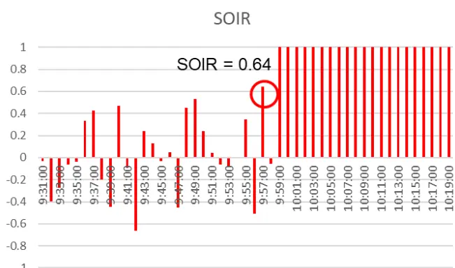
数据来源：wind、中信建投

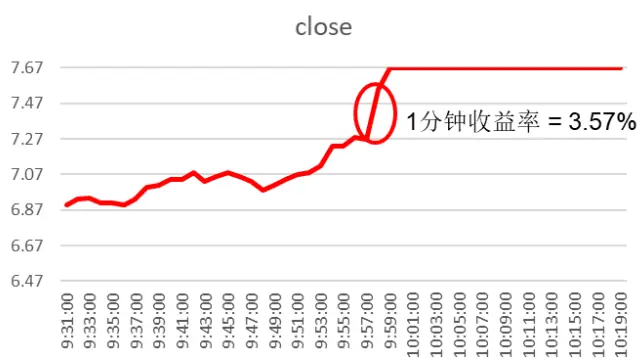

## 1.3、高频量价因子 2 （中间价变化率 Midpoint Price Change）定义和投资逻辑

在限价订单簿市场中，交易者的三种行为可能会引起市场中间价的变动：（1）交易者发起了主动成交，且交易量大于第一档的委托量，使第一档的价格发生改变；（2）交易者撤销了第一档上的全部委托订单；（3）交易者在买一价和卖一价之间新增了新的限价委托订单。

MPC 因子衡量的是市场中间价的短期变动趋势，该趋势刻画了市场交易者的最新交易和挂单撤单行为，反应了市场交易者对股票价格未来走势的最新预期。例如，当市场中间价出现上升时，此时可能是发生了大量的主动买入交易，使得卖一价上升，或是有交易者以高于当前买一价的价格下了限价订单，使得买一价上升，这两种情况都反应了市场交易者对未来股价走势的乐观预期。因此，MPC 为正说明股票未来短期价格趋向上涨，且 MPC 的值越大，其上涨的概率越高，反之亦然。具体公式如下：

$$
MPC_{t,k}=\frac{M_{t}-M_{t-k}}{M_{t-k}}
$$

$$
M_{t}=\frac{P_{t}^{B}+P_{t}^{A}}{2}
$$

$P_{t}^{B}$ 和 $P_{t}^{A}$ 分别为 t 时刻的买一价和卖一价，市场中间价 $M_{t}$ 为买一价和卖一价的平均值。 $M_{t-k}$ 代表 k 分钟前的中间价，在本文中，k 分别取 k = 1, 5， $MPC_{t,k}$ 代表从时刻 t-k 到时刻 t 中间价 $M_{t}$ 的百分比变化率。

图3分别为2020年7月1日9时51分、9时52分股票B的盘口情况，根据定义计算，9时52分的MPC1=2.23%，从图 4 的成交量数据中可以看出，这段时间内盘口中间价的大幅变动是由成交量突增（经过检验是主动买入量突增引起的）造成的。该股票在下一分钟的收益率高达 1.34%。

图 3：股票 B盘口数据

| SZSE CNY 9:51:00 交易中 |
| --- |
| 委比 37.45% 委差 0.44万 |
| 卖五 2.96 289 |
| 卖四 2.95 1563 |
| 卖三 2.94 994 |
| 卖二 2.93 347 |
| 卖一 2.92 445 |
| 买一 2.91 408 |
| 买二 2.90 4849 |
| 买三 2.89 1877 |
| 买四 2.88 323 |
| 买五 2.87 538 |

| SZSE CNY 9:52:00 交易中 |
| --- |
| 委比 -32.81% 委差 -0.82万 |
| 卖五 3.03 9265 卖四 3.02 1949 |
| 卖三 3.01 1823 |
| 卖二 3.00 2718 卖一 2.99 901 |
| 买一 2.97 178 |
| 买二 2.96 3936 买三 2.95 3088 |
| 买四 2.94 661 买五 |

数据来源：wind、中信建投

图 4：股票 B分钟成交量数据
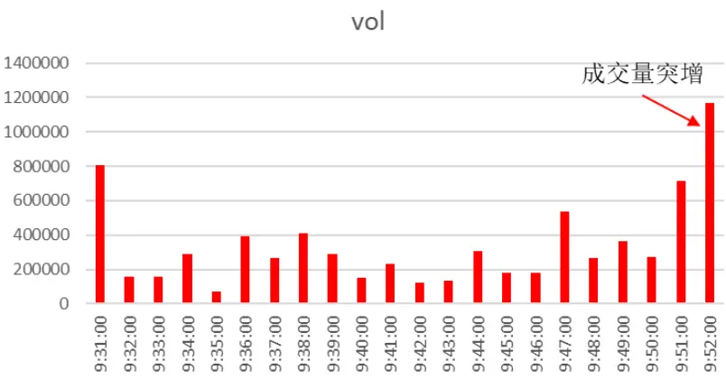
数据来源：wind、中信建投

盘口中间价的大幅增长反映了知情交易者对股票未来走势的乐观预期，MPC1 分钟频因子在 9 时 51 分达到了高点 1.39%，股票 B 在下一分钟涨幅高达 2. 75%，并一路拉升，9 点 53 分时第一次达到涨停。由此可见，MPC1因子在短期内对股价也是有显著的正向影响。

在后续的因子测试中，为观察不同时间间隔参数 k 的效果，我们尝试了 k = 1, 5, 10, 30, 60，经对比发现 k = 5,10, 30, 60 时MPC因子的投资逻辑和选股效果比较接近，且 MPC5相对来说是最优的，因此我们后文只展示 MPC1和 MPC5 的回测结果。

图 5：MPC因子的高频逻辑
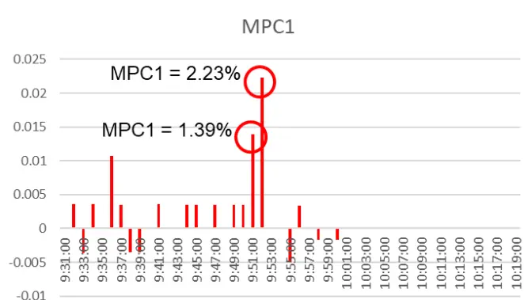

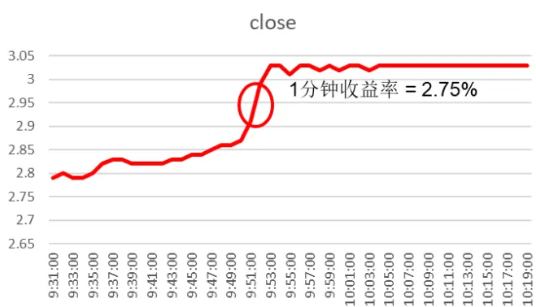
数据来源：wind、中信建投

市场中间价的变动的分布中蕴含着多维度的信息，学术研究表明，市场中间价变动的极端值中可能蕴含着有价值的信息。一般来说，市场中间价的大幅变动一般是由主力的大单交易造成的，我们前面的文章也有分析，大单交易很可能是主力的“对倒”行为，其目的主要是吸引散户，从长期来看，市场价格则会回落，因此长期来看市场中间价的极端变动与股票收益显著负相关。

为刻画市场中间价的极端变动情况，我们构建了分钟频 MPC 因子的日频最大值即 MPCmax 因子，和分钟频MPC 因子的日频偏度即 MPCskew 因子，前者直接描述了中间价的最大变动幅度，MPCmax 越大，则股票长期下跌的概率越大，反之亦然；后者则描述了中间价的极端变动偏离平均值的幅度。MPCskew 越大，则股票长期下跌的概率越大，反之亦然。具体公式如下所示：

$$
MPCmax_{d,k}=max\big\{MPC_{d,t,k},t=k+1,\dots,N_{d}\big\}
$$

$$
MPCskew_{d,k}=\frac{1}{N_d-k-1}\sum_{t=k+1}^{N_d}\left(\frac{MPC_{d,t,k}-\overline{MPC_{d,t,k}}}{\sigma_{d,t,k}}\right)^3
$$

$$
MPC_{d,t,k}=\frac{M_{d,t}-M_{d,t-k}}{M_{d,t-k}}
$$

$MPCmax_{d,k}$ 为日期 d 当天分钟频 $MPC_{t,k}$ 因子的最大值， $MPC_{d,t,k}$ 代表日期 d 的 t 时刻的M $|PC_{t,k}$ 因子， $N_{d}$ 代表日期 d 的交易分钟数。

$MPCskew_{d,k}$ 为日期d当天分钟频M $|PC_{t,k}$ 因子的偏度， $\overline{{MPC_{d,t,k}}}$ 代表日期d当天分钟频 $MPC_{t,k}$ 因子的平均值，$\sigma_{d,t,k}$ 代表日期 d 当天分钟频 $MPC_{t,k}$ 因子的标准差。

下面我们举个例子来说明 MPC1 因子低频化后的反转逻辑（SOIR 因子也是类似逻辑），2020 年 7 月 15 日 14时 30 分，股票 C 的 MPC1 因子突增为 6.09%，表面看是主力的大单主动买入行为，但实际上是主力的“对倒”行为，其目的主要是吸引散户，当价格涨到高位后主力再用早已准备好的小单与散户进行成交，其目的在于拉抬价格以便更好地抛售，我们看到当天的 MPCmax 因子为 6.09%，MPCskew 因子为 9.01，但由右图的走势可见，由于价格被拉高，第二天的股价出现大幅回落。

图 6：高频量价因子的低频逻辑反转例子
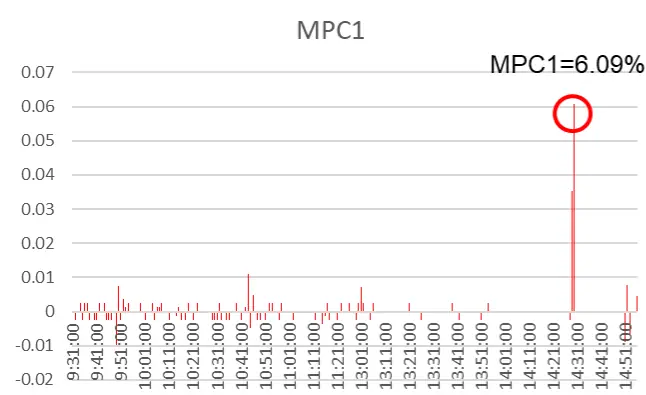
数据来源：wind、中信建投

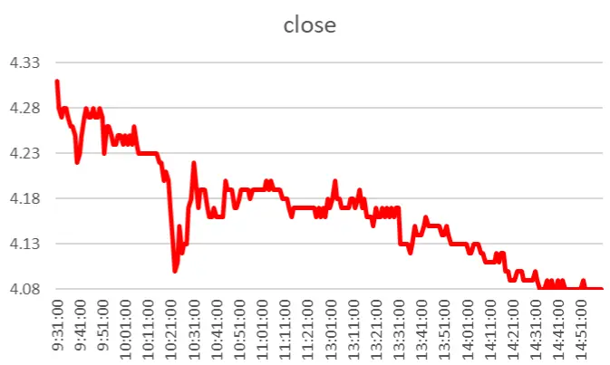

## 二、高频转低频的方法和逻辑

## 2.1、高频量价因子转低频的构造方法

第一节我们主要介绍三类分钟级别的高频因子，下面我们采用具体流程把分钟高频因子转为我们常用的月度低频选股因子。首先因为股票的盘口挂单强弱受到市场总体走势的影响，因此我们需要对各股票进行横截面标准化以剔除市场对个股的影响。下面 $Factor_{i,j,k}$ 为股票 k 第j 天 i 分钟的因子值， $M\_Factor_{i,j,k}$ 为横截面因子均值， $Std\_Factor_{i,j,k}$ 为横截面因子的标准差：

$$
\widehat{\mathrm{Factor_{i,j,k}}}=\frac{\widehat{\mathrm{Factor_{i,j,k}}}-M\_\mathrm{Factor_{i,j,k}}}{\widehat{\mathrm{Std\_Factor_{i,j,k}}}}
$$

然后我们把标准化后的分钟因子转换成日频因子，我们采用了等权的方法。下面是日频因子的构造方法，其中 N 为第j 天总共交易的分钟数：

$$
\widehat{\mathrm{Factor}_{\mathrm{j,k}}}=\frac{\sum\widehat{\mathrm{Factor}_{\mathrm{i,j,k}}}}{\mathrm{N}}
$$

最后我们把日频因子转换成月频因子，我们按距离每月最后一个交易日（假设为组合调仓日）的时间远近进行加权，考虑到信息的时效性，距离调仓日越远其信息的有效性越弱，因此采用衰减加权的方法对日频因子加权。n 为当月交易日天数，j 为当月的第j 个交易日：

$$
\mathrm{F\widehat{actor_{j}}}=\frac{1}{\sum_{j=1}^{n}\frac{\mathrm{j}}{\mathrm{n}}}\times\sum_{j=1}^{n}\mathrm{F\widehat{actor_{j,k}}}\times\frac{\mathrm{j}}{\mathrm{n}}
$$

## 2.2、高频量价因子高频和低频 IC对比

下面我们看下各因子的分钟 IC 均值和月频 IC 均值。由下表可以看出，高频 SOIR 的 IC 值均显著为正，且随着档数的升高 绝对值降低，这一结果符合我们的预期以及学术研究的结论，这也是为什么我们在做因子加权时给 SOIR1 最高的权重，SOIR 最低的权重。另一方面，低频 SOIR 的 IC 值方向出现了反转，这一现象与我们第一篇高频量价选股因子研究提出的 OIR 因子相同，在之前研究中，我们也指出这是由散户存在追涨杀跌以及主力的短时市场操纵引起的，特别是用委托量构造的高频因子均会出现这种反转逻辑。

表 1：SOIR高频和低频因子的 IC对照表

| 因子 | SOIR1 | SOIR2 | SOIR3 | SOIR4 | SOIR5 | SOIR |
| --- | --- | --- | --- | --- | --- | --- |
| 分钟IC均值 | 9.31% | 7.29% | 5.23% | 3.88% | 3.14% | 11.67% |
| 月频IC均值 | -2.68% | -4.18% | -4.86% | -5.13% | -5.37% | -4.57% |

数据来源：wind、中信建投

然后我们看下 MPC 类因子的分钟 IC 均值和月频 IC 均值。高频 MPC1 的 IC 值显著为正，这一结果符合我们的预期，但 MPC5 的 IC 值为负，且不显著。另一方面，低频 MPC1 和 MPC5 的 IC 值均显著为负。

表 2：MPC高频和低频因子的 IC对照表

| 因子 | MPC1 | MPC5 |
| --- | --- | --- |
| 分钟IC均值 | 9.40% | -1.15% |
| 月频IC均值 | -5.36% | -5.83% |

数据来源：wind、中信建投

## 三、高频订单失衡及价差因子和常用因子的相关性

下面我们看下 SOIR 和 MPC 两大类共 14 个高频量价因子和常用选股因子的 IC 相关性。

经过统计，我们发现这些因子和自由流通市值（LnFloatCap）的相关性较低，因此对于这些因子可以不做市值中性的处理。

另外，SOIR 类因子和 BP_LR、SP_TTM 等估值因子与 Momentum_6m、Momentum_12m 等动量反转因子的相关性较高。

最后 MPC1、MPC5 因子和 Momentum_3m、Momentum_6m 等动量反转因子相关性较高，MPC1_max、MPC5_max 因子和 BP_LR、SP_TTM 等估值因子、TurnoverAvg1M、Volatility1M 等技术因子的相关性较高，而MPC1_skew、MPC5_skew 因子和常用因子的相关性均不高。

表 3：高频订单失衡及价差因子和常用因子的相关性

|  | SOIR1 | SOIR2 | SOIR3 | SOIR4 | SOIR5 | SOIR | MPC1 | MPC5 | MPC1_max M | PC5_max | MPC1_skew | MPC5_skew |
| --- | --- | --- | --- | --- | --- | --- | --- | --- | --- | --- | --- | --- |
| EP_TTM | -0.28 | -0.19 | -0.11 | -0.02 | 0.11 | -0.14 | -0.05 | -0.04 | -0.70 | -0.62 | -0.28 | -0.13 |
| BP_LR | -0.72 | -0.66 | -0.51 | -0.29 | 0.01 | -0.56 | -0.08 | -0.08 | -0.64 | -0.58 | -0.27 | 0.09 |
| SP_TTM | -0.65 | -0.60 | -0.47 | -0.27 | 0.00 | -0.51 | -0.08 | -0.08 | -0.71 | -0.64 | -0.27 | 0.08 |
| Earnings_SQ_YoY | 0.31 | 0.34 | 0.33 | 0.28 | 0.19 | 0.34 | 0.08 | 0.09 | -0.22 | -0.21 | -0.17 | -0.29 |
| Sales_SQ_YoY | 0.51 | 0.49 | 0.41 | 0.28 | 0.08 | 0.44 | 0.04 | 0.05 | 0.15 | 0.15 | 0.05 | -0.20 |
| ROE_SQ_YoY | 0.35 | 0.44 | 0.43 | 0.36 | 0.25 | 0.43 | 0.21 | 0.22 | -0.11 | -0.13 | -0.08 | -0.24 |
| ROE_TTM | 0.18 | 0.25 | 0.23 | 0.18 | 0.12 | 0.23 | -0.01 | 0.00 | -0.38 | -0.33 | -0.14 | -0.22 |
| ROA_TTM | 0.45 | 0.49 | 0.42 | 0.29 | 0.11 | 0.44 | 0.03 | 0.03 | -0.14 | -0.13 | -0.05 | -0.28 |
| ROIC_TTM | 0.37 | 0.42 | 0.37 | 0.26 | 0.11 | 0.38 | 0.02 | 0.03 | -0.21 | -0.19 | -0.08 | -0.27 |
| Momentum_1m | 0.14 | 0.40 | 0.48 | 0.51 | 0.50 | 0.42 | 0.83 | 0.84 | 0.25 | 0.25 | 0.37 | 0.37 |
| Momentum_3m | 0.24 | 0.45 | 0.50 | 0.49 | 0.43 | 0.46 | 0.58 | 0.59 | 0.20 | 0.21 | 0.17 | 0.13 |
| Momentum_6m | 0.46 | 0.59 | 0.60 | 0.52 | 0.38 | 0.58 | 0.50 | 0.51 | 0.22 | 0.23 | 0.14 | 0.00 |
| Momentum_12m | 0.57 | 0.67 | 0.64 | 0.53 | 0.35 | 0.64 | 0.42 | 0.43 | 0.25 | 0.25 | 0.12 | -0.05 |
| Momentum_24m | 0.66 | 0.69 | 0.62 | 0.48 | 0.27 | 0.65 | 0.28 | 0.27 | 0.29 | 0.29 | 0.12 | -0.11 |
| LnFloatCap | -0.07 | 0.01 | 0.04 | 0.05 | 0.08 | 0.02 | 0.03 | 0.06 | -0.39 | -0.27 | -0.09 | -0.01 |
| AmountAvg_1M | 0.16 | 0.13 | 0.04 | -0.07 | -0.19 | 0.07 | -0.08 | -0.04 | 0.13 | 0.30 | 0.12 | -0.02 |
| TurnoverAvg1M | 0.41 | 0.27 | 0.12 | -0.06 | -0.27 | 0.18 | -0.05 | -0.04 | 0.80 | 0.85 | 0.33 | 0.02 |
| TurnoverAvg3M | 0.42 | 0.25 | 0.09 | -0.09 | -0.30 | 0.15 | -0.13 | -0.12 | 0.77 | 0.81 | 0.31 | 0.02 |
| TurnoverAvg6M | 0.42 | 0.24 | 0.07 | -0.11 | -0.32 | 0.15 | -0.15 | -0.14 | 0.74 | 0.77 | 0.31 | 0.02 |
| Volatility1M | 0.44 | 0.32 | 0.17 | -0.01 | -0.22 | 0.23 | -0.08 | -0.07 | 0.82 | 0.88 | 0.32 | -0.01 |
| Volatility3M | 0.43 | 0.27 | 0.11 | -0.07 | -0.28 | 0.18 | -0.17 | -0.16 | 0.79 | 0.85 | 0.30 | 0.01 |
| Volatility6M | 0.44 | 0.24 | 0.07 | -0.10 | -0.33 | 0.15 | -0.23 | -0.22 | 0.74 | 0.79 | 0.28 | -0.02 |
| Beta_100W | -0.36 | -0.50 | -0.52 | -0.47 | -0.36 | -0.50 | -0.30 | -0.29 | -0.02 | 0.10 | 0.08 | 0.14 |
| SOIR1 | 1.00 | 0.91 | 0.79 | 0.62 | 0.33 | 0.86 | 0.14 | 0.13 | 0.39 | 0.39 | 0.17 | -0.15 |
| SOIR2 | 0.91 | 1.00 | 0.96 | 0.84 | 0.60 | 0.98 | 0.42 | 0.41 | 0.41 | 0.39 | 0.25 | 0.00 |
| SOIR3 | 0.79 | 0.96 | 1.00 | 0.95 | 0.78 | 0.99 | 0.53 | 0.52 | 0.32 | 0.29 | 0.23 | 0.07 |
| SOIR4 | 0.62 | 0.84 | 0.95 | 1.00 | 0.93 | 0.92 | 0.59 | 0.57 | 0.19 | 0.15 | 0.18 | 0.14 |
| SOIR5 | 0.33 | 0.60 | 0.78 | 0.93 | 1.00 | 0.72 | 0.60 | 0.57 | 0.00 | -0.04 | 0.10 | 0.21 |
| SOIR | 0.86 | 0.98 | 0.99 | 0.92 | 0.72 | 1.00 | 0.46 | 0.45 | 0.34 | 0.32 | 0.22 | 0.02 |
| MPC1 | 0.14 | 0.42 | 0.53 | 0.59 | 0.60 | 0.46 | 1.00 | 0.99 | 0.25 | 0.23 | 0.48 | 0.51 |
| MPC5 | 0.13 | 0.41 | 0.52 | 0.57 | 0.57 | 0.45 | 0.99 | 1.00 | 0.26 | 0.24 | 0.49 | 0.51 |
| MPC1_max | 0.39 | 0.41 | 0.32 | 0.19 | 0.00 | 0.34 | 0.25 | 0.26 | 1.00 | 0.97 | 0.50 | 0.22 |
| MPC5_max | 0.39 | 0.39 | 0.29 | 0.15 | -0.04 | 0.32 | 0.23 | 0.24 | 0.97 | 1.00 | 0.53 | 0.28 |
| MPC1_skew | 0.17 | 0.25 | 0.23 | 0.18 | 0.10 | 0.22 | 0.48 | 0.49 | 0.50 | 0.53 | 1.00 | 0.81 |
| MPC5_skew | -0.15 | 0.00 | 0.07 | 0.14 | 0.21 | 0.02 | 0.51 | 0.51 | 0.22 | 0.28 | 0.81 | 1.00 |

数据来源：wind、中信建投

## 四、高频订单失衡及价差因子测试结果

最后我们对 SOIR 和 MPC 两大类共 14 个高频量价因子进行单因子分析（包括 IC 分析和多空收益分析）。具体回测时间为最近 10 年（2010 年 1 月-2020 年 7 月），样本池为全市场，每月底剔除停牌、一字板、上市未满半年和 ST股票，月频调仓。因子做了极值处理（剔除 3 倍标准差之外的样本）和缺失值处理（直接剔除）。SOIR类因子不做中性化处理， MPC 类因子分别做和不做中性化处理进行对比。组合的多空收益分位数用 10 分位。

## 4.1、SOIR1 因子选股效果

首先是 SOIR1 因子的效果，因子 IC 均值-2.68%，年化 IR-0.94，年化多空收益 8.63%，夏普比率 0.88，总体选股效果较为一般。

图 7：SOIR1因子选股效果

| IC分析 | SOIR1 |
| --- | --- |
| IC均值% | -2.68 |
| IC标准差% | 9.91 |
| IR | -0.27 |
| 年化IR | -0.94 |
| 胜率% | 65.08 |

| 多空组合分析 | SOIR1 |
| --- | --- |
| 总收益% | 138.44 |
| 年化收益% | 8.63 |
| 年化波动% | 9.82 |
| 夏普比率 | 0.88 |
| 最大回撤% | 17.27 |
| 收益回撤比 | 0.5 |
| 胜率% | 62.7 |

数据来源：wind、中信建投

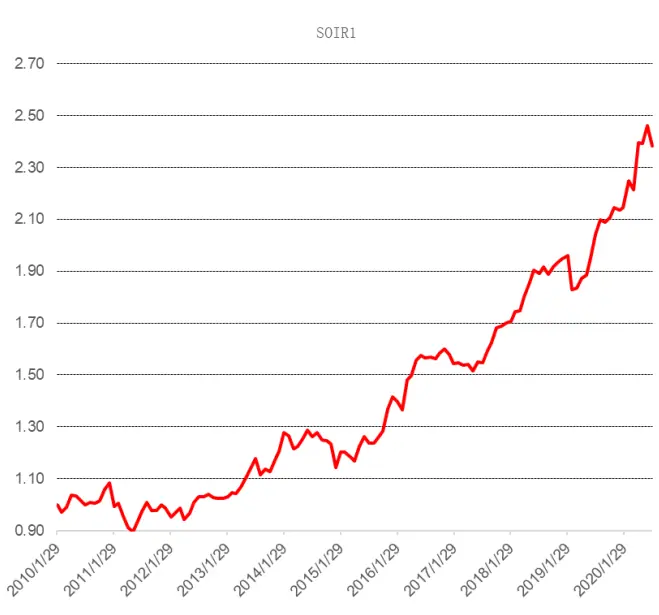

## 4.2、SOIR2 因子选股效果

接着我们看下 SOIR2 因子的选股效果，因子 IC 均值-4.18%，年化 IR-1.27，年化多空收益 17.89%，夏普比率1.52，总体选股效果相比 SOIR1 显著提升，选股效果非常显著。

图 8：SOIR2因子选股效果

| IC分析 | SOIR2 |
| --- | --- |
| IC均值% | -4.18 |
| IC标准差% | 11.42 |
| IR | -0.37 |
| 年化IR | -1.27 |
| 胜率% | 69.05 |

| 多空组合分析 | SOIR2 |
| --- | --- |
| 总收益% | 462.76 |
| 年化收益% | 17.89 |
| 年化波动% | 11.77 |
| 夏普比率 | 1.52 |
| 最大回撤% | 18.89 |
| 收益回撤比 | 0.95 |
| 胜率% | 70.63 |

数据来源：wind、中信建投

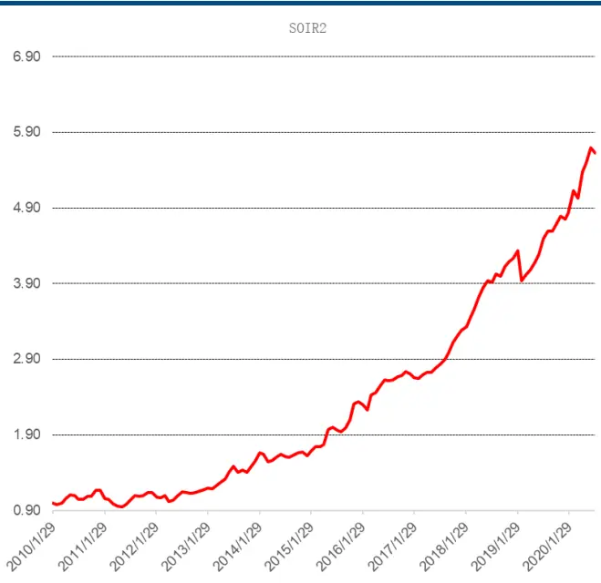

## 4.3、SOIR3 因子选股效果

然后是 SOIR3 因子，因子 IC 均值-4.86%，年化 IR-1.63，年化多空收益 20.46%，夏普比率 1.94，选股效果相比 SOIR1 和 SOIR2 因子进一步提升。

图 9：SOIR3因子选股效果

| IC分析 | SOIR3 |
| --- | --- |
| IC均值% | -4.86 |
| IC标准差% | 10.34 |
| IR | -0.47 |
| 年化IR | -1.63 |
| 胜率% | 70.63 |

| 多空组合分析 | SOIR3 |
| --- | --- |
| 总收益% | 605.86 |
| 年化收益% | 20.46 |
| 年化波动% | 10.57 |
| 夏普比率 | 1.94 |
| 最大回撤% | 13.94 |
| 收益回撤比 | 1.47 |
| 胜率% | 73.02 |

数据来源：wind、中信建投

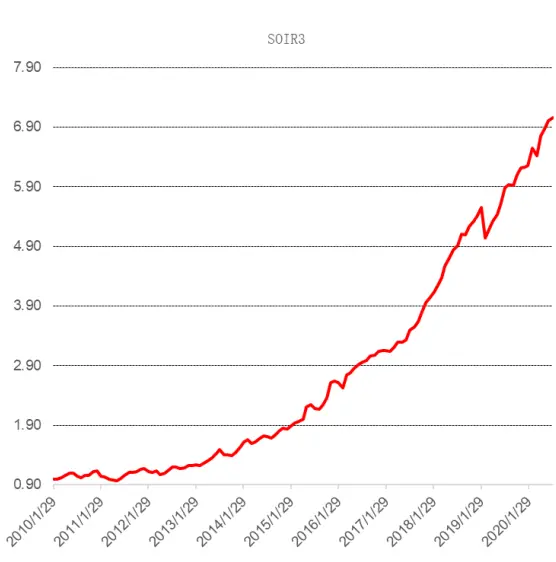

## 4.4、SOIR4 因子选股效果

对于 SOIR4 因子，因子 IC 均值-5.13%，年化 IR-1.95，年化多空收益 21.81%，夏普比率 2.28，选股效果优于SOIR1 到 SOIR3。

图 10：SOIR4因子选股效果

| IC分析 | SOIR4 |
| --- | --- |
| IC均值% | -5.13 |
| IC标准差% | 9.12 |
| IR | -0.56 |
| 年化IR | -1.95 |
| 胜率% | 72.22 |

| 多空组合分析 | SOIR4 |
| --- | --- |
| 总收益% | 693.82 |
| 年化收益% | 21.81 |
| 年化波动% | 9.57 |
| 夏普比率 | 2.28 |
| 最大回撤% | 10.97 |
| 收益回撤比 | 1.99 |
| 胜率% | 77.78 |

数据来源：wind、中信建投

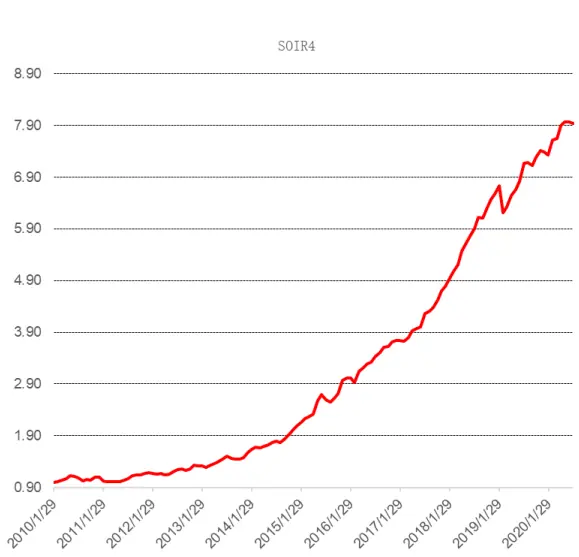

## 4.5、SOIR5 因子选股效果

最后是 SOIR5 因子，因子 IC 均值-5.37%，年化 IR-2.29，年化多空收益 21.32%，夏普比率 2.41，选股效果和SOIR4 比较接近，优于 SOIR1 到 SOIR3。因此，随着交易档位的上升，因子的选股效果基本上也是逐步增强。

图 11：SOIR5因子选股效果

| IC分析 | SOIR5 |
| --- | --- |
| IC均值% | -5.37 |
| IC标准差% | -8.12 |
| IR | 0.66 |
| 年化IR | -2.29 |
| 胜率% | 79.37 |

| 多空组合分析 | SOIR5 |
| --- | --- |
| 总收益% | 660.74 |
| 年化收益% | 21.32 |
| 年化波动% | 8.84 |
| 夏普比率 | 2.41 |
| 最大回撤% | 7.6 |
| 收益回撤比 | 2.8 |
| 胜率% | 78.57 |

数据来源：wind、中信建投

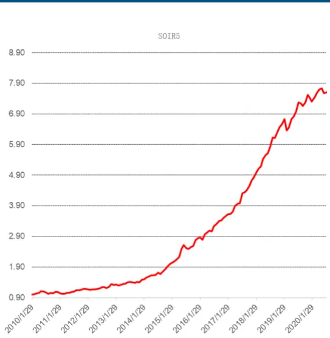

## 4.6、SOIR 因子选股效果

对于加权因子 SOIR，因子 IC 均值-4.57%，年化 IR-1.53，年化多空收益 18.11%，夏普比率 1.7，可以看到合成的 SOIR 因子选股效果低于 SOIR3-SOIR5，这是由于 SOIR1-SOIR2 的表现相对于 SOIR3-SOIR5 更差，但合成时赋予了 SOIR1-SOIR2 更高权重，因此拉低了合成因子的表现。

图 12：SOIR因子选股效果

| IC分析 | SOIR |
| --- | --- |
| IC均值% | -4.57 |
| IC标准差% | 10.38 |
| IR | -0.44 |
| 年化IR | -1.53 |
| 胜率% | 70.63 |

| 多空组合分析 | SOIR |
| --- | --- |
| 总收益% | 473.97 |
| 年化收益% | 18.11 |
| 年化波动% | 10.67 |
| 夏普比率 | 1.7 |
| 最大回撤% | 16.78 |
| 收益回撤比 | 1.08 |
| 胜率% | 70.63 |

数据来源：wind、中信建投

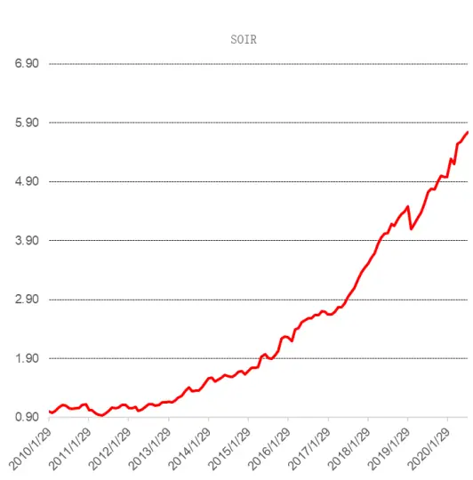

## 4.7、MPC1因子选股效果

对于中间价变化率因子 MPC，首先是 MPC1 因子的选股效果，因子 IC 均值-5.36%，年化 IR-1.54，年化多空收益 19.52%，夏普比率 1.42，选股效果显著。

图 13：MPC1因子选股效果

| IC分析 | MPC1 |
| --- | --- |
| IC均值% | -5.36 |
| IC标准差% | 12.08 |
| IR | -0.44 |
| 年化IR | -1.54 |
| 胜率% | 69.05 |

| 多空组合分析 | MPC1 |
| --- | --- |
| 总收益% | 550.23 |
| 年化收益% | 19.52 |
| 年化波动% | 13.71 |
| 夏普比率 | 1.42 |
| 最大回撤% | 12.15 |
| 收益回撤比 | 1.61 |
| 胜率% | 70.63 |

数据来源：wind、中信建投

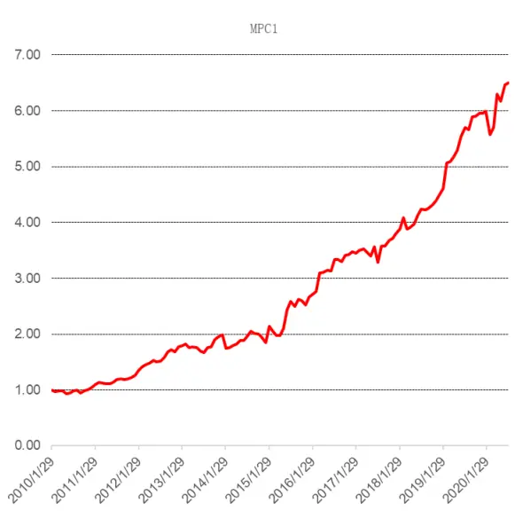

接着我们对 MPC1 因子进行流通市值和行业中性化处理得到 MPC1_neut，因子 IC 均值-6.81%，年化 IR-2.87，年化多空收益 26.99%，夏普比率 2.66，选股效果相比 MPC1 有了非常显著的提升。

图 14：MPC1_neut 因子选股效果

| IC分析 | MPC1_neut |
| --- | --- |
| IC均值% | -6.81 |
| IC标准差% | 8.21 |
| IR | -0.83 |
| 年化IR | -2.87 |
| 胜率% | 80.16 |

| 多空组合分析 | MPC1_neut |
| --- | --- |
| 总收益% | 1129.57 |
| 年化收益% | 26.99 |
| 年化波动% | 10.16 |
| 夏普比率 | 2.66 |
| 最大回撤% | 6.41 |
| 收益回撤比 | 4.21 |
| 胜率% | 78.57 |

数据来源：wind、中信建投

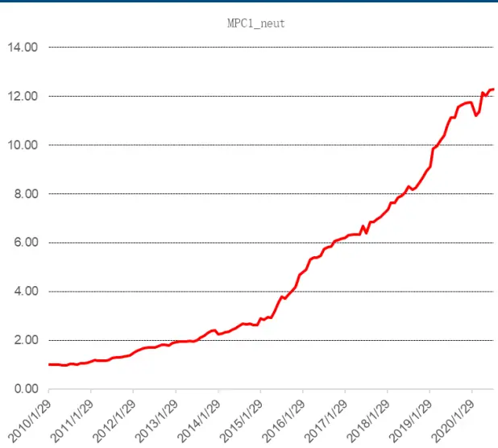

## 4.8、MPC5因子选股效果

对于 MPC5 因子，因子 IC 均值-5.83%，年化 IR-1.70，年化多空收益 22.36%，夏普比率 1.61，选股效果显著。图 15：MPC5因子选股效果

| IC分析 | MPC5 |
| --- | --- |
| IC均值% | -5.83 |
| IC标准差% | 11.89 |
| IR | -0.49 |
| 年化IR | -1.70 |
| 胜率% | 69.84 |

| 多空组合分析 | MPC5 |
| --- | --- |
| 总收益% | 732.07 |
| 年化收益% | 22.36 |
| 年化波动% | 13.86 |
| 夏普比率 | 1.61 |
| 最大回撤% | 12.22 |
| 收益回撤比 | 1.83 |
| 胜率% | 73.02 |

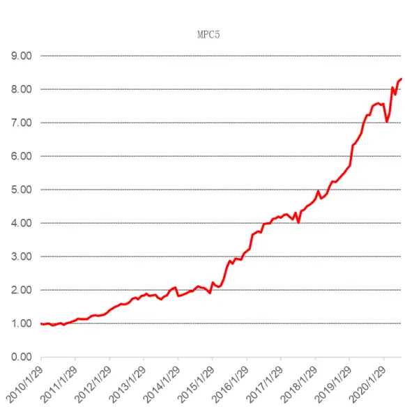
数据来源：wind、中信建投

我们对 MPC5 因子进行流通市值和行业中性化处理得到 MPC5_neut，因子 IC 均值-7.26%，年化 IR-3.09，年化多空收益30.63%，夏普比率2.88，同样选股效果相比MPC5有非常显著的提升。因子的多空年化收益超过30%，在量价因子中是非常罕见的。

图 16：MPC5_neut 因子选股效果

| IC分析 | MPC5_neut |
| --- | --- |
| IC均值% | -7.26 |
| IC标准差% | 8.14 |
| IR | -0.89 |
| 年化IR | -3.09 |
| 胜率% | 82.54 |

| 多空组合分析 | MPC5_neut |
| --- | --- |
| 总收益% | 1425.09 |
| 年化收益% | 30.63 |
| 年化波动% | 10.63 |
| 夏普比率 | 2.88 |
| 最大回撤% | 7.06 |
| 收益回撤比 | 4.2 |
| 胜率% | 81.75 |

数据来源：wind、中信建投

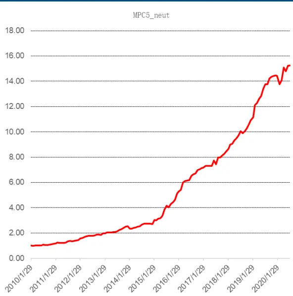

## 4.9、MPC1_max 因子选股效果

MPC1_max 因子，因子 IC 均值-8.10%，年化 IR-2.97，年化多空收益 20.02%，夏普比率 1.68。图 17：MPC1_max 因子选股效果

| IC分析 | MPC1_max |
| --- | --- |
| IC均值% | -8.10 |
| IC标准差% | 9.46 |
| IR | -0.86 |
| 年化IR | -2.97 |
| 胜率% | 84.92 |
| 多空组合分析 | MPC1_max |
| 总收益% | 579.42 |
| 年化收益% | 20.02 |
| 年化波动% | 11.94 |
| 夏普比率 | 1.68 |
| 最大回撤% | 12.06 |
| 收益回撤比 | 1.66 |
| 胜率% | 73.81 |

数据来源：wind、中信建投

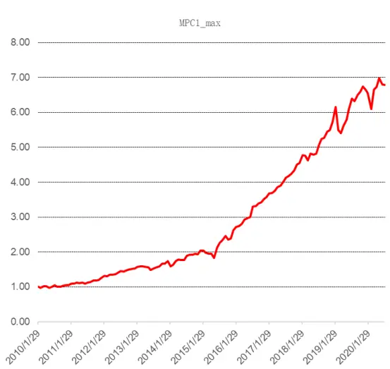

## 4.10、MPC1_skew 因子选股效果

MPC1_skew 因子，因子 IC 均值-5.45%，年化 IR-4.08，年化多空收益 15.32%，夏普比率 2.89。

图 18：MPC1_skew 因子选股效果

| IC分析 | MPC1_skew |
| --- | --- |
| IC均值% | -5.45 |
| IC标准差% | 4.62 |
| IR | -1.18 |
| 年化IR | -4.08 |
| 胜率% | 88.89 |
| 多空组合分析 | MPC1_skew |
| 总收益% | 346.61 |
| 年化收益% | 15.32 |
| 年化波动% | 5.3 |
| 夏普比率 | 2.89 |
| 最大回撤% | 3.77 |
| 收益回撤比 | 4.06 |
| 胜率% | 83.33 |

数据来源：wind、中信建投

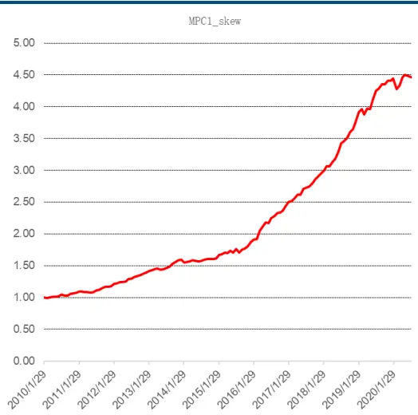

## 4.11、MPC5_max 因子选股效果

MPC5_max 因子，因子 IC 均值-9.39%，年化 IR-3.28，年化多空收益 24.01%，夏普比率 1.94。图 19：MPC5_max 因子选股效果

| IC分析 | MPC5_max |
| --- | --- |
| IC均值% | -9.39 |
| IC标准差% | 9.90 |
| IR | -0.95 |
| 年化IR | -3.28 |
| 胜率% | 84.92 |
| 多空组合分析 | MPC5_max |
| 总收益% | 857.57 |
| 年化收益% | 24.01 |
| 年化波动% | 12.35 |
| 夏普比率 | 1.94 |
| 最大回撤% | 11.78 |
| 收益回撤比 | 2.04 |
| 胜率% | 76.19 |

数据来源：wind、中信建投

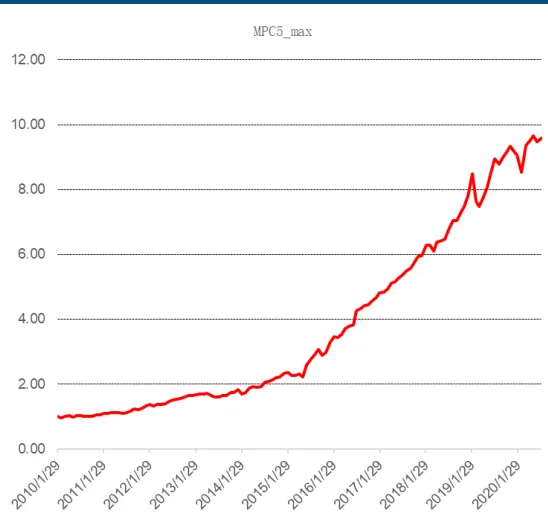

## 4.12、MPC5_skew 因子选股效果

MPC5_skew 因子，因子 IC 均值-6.66%，年化 IR-4.18，年化多空收益 20.67%，夏普比率 3.07。

图 20：MPC1_skew 因子选股效果

| IC分析 | MPC5_skew |
| --- | --- |
| IC均值% | -6.66 |
| IC标准差% | 5.51 |
| IR | -1.21 |
| 年化IR | -4.18 |
| 胜率% | 88.10 |
| 多空组合分析 | MPC5_skew |
| 总收益% | 618.85 |
| 年化收益% | 20.67 |
| 年化波动% | 6.72 |
| 夏普比率 | 3.07 |
| 最大回撤% | 4.47 |
| 收益回撤比 | 4.63 |
| 胜率% | 84.13 |

数据来源：wind、中信建投

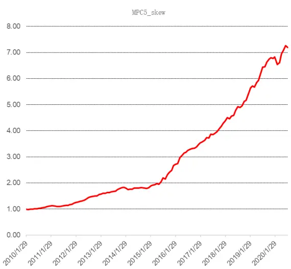

总体来看，对于 SOIR 类因子，除了 SOIR1 之外，其他 SOIR 类因子的表现均非常优秀，IC 均在-4%以上，多空年化收益在 17%以上。基本上是档位越高的 SOIR 因子表现越好（年化收益和夏普比率），合成之后的 SOIR 因子多空年化收益 18.11%，夏普比率 1.7。对于 MPC 类因子，IC 均在-5%以上，最高为 MPC5_max 的-9.39% 。除了 MPC1_skew 之外，其他 MPC 类因子的多空年化收益都在 20%以上，表现最好的是 MPC5_neut 因子，年化多空收益超过 30%(30.63%)，多空收益之高在所有常用因子中也是罕见的。

## 4.13、高频订单失衡及价差因子在指定样本池内的测试结果

我们检测了 SOIR 和 MPC 两大类共 14 个高频量价因子在指定样本池的测试效果，首先在中证 500 指数样本内做测试，下表是各因子的多空收益分析。

表 4：高频订单失衡及价差因子在中证 500样本内的测试结果

| 多空组合分析 | SOIR1 | SOIR2 | SOIR3 | SOIR4 | SOIR5 | SOIR | MPC1 | MPC5 | MPC1_neut | MPC5_neut | MPC5_max | MPC5_skew | MPC1_max | MPC1_skew |
| --- | --- | --- | --- | --- | --- | --- | --- | --- | --- | --- | --- | --- | --- | --- |
| 总收益% | 141.16 | 244.15 | 209.69 | 328.15 | 298.29 | 260.28 | 348.66 | 452.64 | 372.16 | 457.61 | 287.73 | 370.62 | 162.94 | 170.64 |
| 年化收益% | 8.75 | 12.49 | 11.37 | 14.86 | 14.07 | 12.98 | 15.37 | 17.68 | 15.93 | 17.78 | 13.78 | 15.89 | 9.64 | 9.95 |
| 年化波动% | 9.82 | 10.05 | 9.79 | 9.49 | 8.59 | 10.08 | 12.22 | 11.74 | 12.43 | 11.54 | 10.72 | 9.24 | 10.98 | 7.88 |
| 夏普比率 | 0.89 | 1.24 | 1.16 | 1.57 | 1.64 | 1.29 | 1.26 | 1.51 | 1.28 | 1.54 | 1.29 | 1.72 | 0.88 | 1.26 |
| 最大回撤% | 12.99 | 19.67 | 14.91 | 10.08 | 8.66 | 12.89 | 11.72 | 9.95 | 10.93 | 7.97 | 12.09 | 13.02 | 13.87 | 10.14 |
| 收益回撤比 | 0.67 | 0.64 | 0.76 | 1.47 | 1.62 | 1.01 | 1.31 | 1.78 | 1.46 | 2.23 | 1.14 | 1.22 | 0.7 | 0.98 |
| 胜率% | 57.14 | 67.46 | 65.87 | 65.08 | 66.67 | 68.25 | 65.08 | 67.46 | 65.87 | 68.25 | 65.08 | 68.25 | 60.32 | 70.63 |

数据来源：wind、中信建投

我们看到几乎所有因子在中证 500 样本内的年化多空收益都在 10%以上，部分因子在 15%以上，表现最好的仍然是 MPC5 和 MPC5_neut 因子，年化多空收益接近 18%，因此 SOIR 和 MPC 类因子在中证 500 样本内的选股效果仍然非常优秀。

然后我们检测 SOIR 和 MPC 两大类共 14 个高频量价因子在沪深 300 指数样本内的效果（多空收益分析），结果如下表。

表 5：高频订单失衡及价差因子在沪深 300样本内的测试结果

| 多空组合分析SOIR | 1 | SOIR2 | SOIR3 | SOIR4 | SOIR5 | SOIR | MPC1 | MPC5 | MPC1_neut | MPC5_neut | MPC5_max | MPC5_skew | MPC1_max | MPC1_skew |
| --- | --- | --- | --- | --- | --- | --- | --- | --- | --- | --- | --- | --- | --- | --- |
| 总收益% | 97.97 | 153.17 | 178.98 | 134.8 | 154.83 | 191.95 | 168 | 172.36 | 198.19 | 158.12 | 192.04 | 239.69 | 123.11 | 109.93 |
| 年化收益% | 6.72 | 9.25 | 10.26 | 8.47 | 9.32 | 10.74 | 9.84 | 10.01 | 10.97 | 9.45 | 10.75 | 12.35 | 7.94 | 7.32 |
| 年化波动% | 9.38 | 8.53 | 8.23 | 8.93 | 10.43 | 8.28 | 12.82 | 12.26 | 12.04 | 11.53 | 9.01 | 9.64 | 9.2 | 9.74 |
| 夏普比率 | 0.72 | 1.08 | 1.25 | 0.95 | 0.89 | 1.3 | 0.77 | 0.82 | 0.91 | 0.82 | 1.19 | 1.28 | 0.86 | 0.75 |
| 最大回撤% | 13.38 | 15.64 | 11.08 | 17.63 | 13.66 | 9.28 | 22.28 | 15.92 | 13.37 | 12.24 | 16.56 | 9.49 | 17.58 | 21.99 |
| 收益回撤比 | 0.5 | 0.59 | 0.93 | 0.48 | 0.68 | 1.16 | 0.44 | 0.63 | 0.82 | 0.77 | 0.65 | 1.3 | 0.45 | 0.33 |
| 胜率% | 60.32 | 61.11 | 64.29 | 60.32 | 59.52 | 65.08 | 60.32 | 61.11 | 58.73 | 60.32 | 65.08 | 61.11 | 58.73 | 63.49 |

数据来源：wind、中信建投

我们看到大部分因子在沪深300样本内的年化多空收益都接近10%或在10%以上，表现最好的是MPC5_skew因子，年化多空收益达 12.35%，因此 SOIR 和 MPC 类因子在沪深 300 样本内的选股效果也是非常不错的。

## 五、总结和思考

高频数据中蕴含了丰富的市场交易信息，它能带我们通过数据窥探知情交易者的隐藏信息，也让我们更近距离地感受市场交易者的情绪，从而帮助我们更准确地拿捏市场股票价格的走势。本文利用高频的逻辑挖掘出盘口数据中有价值的信息，并将其处理得到高频因子，最后降为月频的低频选股因子，在后续的因子回测中取得良好的选股效果。

第一部分主要通过高频分钟数据构造出一些高频量价选股因子，第一类因子叫逐档订单失衡率（SOIR 类因子），订单簿上的委托量反应了交易者们对于股票未来价格的预期，当交易者预期股票未来价格上升，他们将通过下买单持有股票的多头头寸，这将导致买盘的委托量增加，反之亦然。SOIR 类因子衡量了买卖委托量不均衡程度在其总量中的占比，反应了市场的总体情绪和方向。第二类因子叫中间价变化率因子（MPC 类因子），为中间价的短期百分比变化率的均值、日频最大值、日频偏度，MPC 因子衡量的是市场中间价的短期变动趋势，该趋势刻画了市场交易者的最新交易和挂撤单行为，反应了市场交易者对股票价格未来走势的最新预期。

第二部分我们采用具体流程把高频因子转为我们常用的月度低频选股因子。首先因为股票的盘口挂单强弱受到市场总体走势的影响，因此我们需要对各股票进行截面标准化以剔除市场对个股的影响。然后我们把标准化后的分钟因子转换成日因子，我们采用了等权的方法。最后我们把日因子转换成月因子，我们按距离每月最后一个交易日（假设为组合调仓日）的时间远近进行加权，考虑到信息的时效性，距离调仓日越远其信息的有效性越弱，因此用衰减加权的方法对日因子加权。

第三部分我们分析各因子的分钟 IC 均值和月频 IC 均值。我们看到 SOIR 类因子在高频上与收益率正相关，且随着档数的升高 IC 绝对值降低，这一结果符合我们的预期以及学术研究的结论。MPC1 因子与收益率正相关，MPC5 因子则与收益率负相关，这说明中间价的变动在 1 分钟时为动量效应，5 分钟时则出现反转。然而将高频量价因子降频后，SOIR 类因子与 MPC 类因子均与收益率负相关。

我们从以下两点原因来解释。从散户来看，在短期内散户容易存在追高杀跌行为。短期追高，价格上涨，但随着时间的累积，价格会逐渐处于高位，长期来看价格会回落。从主力的角度，主力对市场的短时操纵造成了价格的涨跌。强的买卖压力一般是大单交易造成的，大单交易很可能是主力的“对倒”行为，其目的主要是吸引散户，此时高频因子与收益率呈正相关。

第四部分我们检测了 SOIR 和 MPC 两大类共 14 个高频量价因子和常用选股因子的 IC 相关性。经过统计发现这些因子和自由流通市值（LnFloatCap）的相关性较低。另外，SOIR 类因子和 BP_LR、SP_TTM 等估值因子与Momentum_6m、Momentum_12m 等动量反转因子的相关性较高。最后我们看到 MPC1、MPC5 因子和Momentum_3m、 Momentum_6m 等动量反转因子相关性较高， MPC1_max、MPC5_max 因子和 BP_LR、SP_TTM等估值因子、TurnoverAvg1M、Volatility1M 等技术因子的相关性较高，而 MPC1_skew、MPC5_skew 因子和常用因子的相关性均不高。

第五部分对 SOIR 和 MPC 两大类共 14 个高频量价因子进行单因子分析。具体回测时间为最近 10 年（2010年 1 月-2020 年 7 月），样本池为全市场，月频调仓。SOIR 类因子不做中性化处理，MPC 类因子分别做和不做中性化处理进行对比。其中表现较好的有：SOIR3 因子 IC 均值-4.86%，年化 IR-1.63，年化多空收益 20.46%，夏普比率 1.94。SOIR4 因子 IC 均值-5.13%，年化 IR-1.95，年化多空收益 21.81%，夏普比率 2.28。SOIR5 因子 IC 均值-5.37%，年化 IR-2.29，年化多空收益 21.32%，夏普比率 2.41。MPC1_neut 因子 IC 均值-6.81%，年化 IR-2.87，年化多空收益 26.99%，夏普比率 2.66。MPC1_max 因子 IC 均值-8.10%，年化 IR-2.97，年化多空收益 20.02%，夏普比率 1.68。MPC5_max 因子 IC 均值-9.39%，年化 IR-3.28，年化多空收益 24.01%，夏普比率 1.94。MPC5_skew 因子 IC 均值-6.66%，年化 IR-4.18，年化多空收益 20.67%，夏普比率 3.07。MPC5_neut 因子 IC 均值-7.26%，年化 IR-3.09，年化多空收益 30.63%，夏普比率 2.88，总体选股效果是所有因子里最好的。

第六部分测试了这些因子在中证 500、沪深 300 样本池内的表现，我们看到几乎所有因子在中证 500 样本内的年化多空收益都在 10%以上，部分因子在 15%以上，表现最好的仍然是 MPC5 和 MPC5_neut 因子，年化多空收益接近 18%。大部分因子在沪深 300 样本内的年化多空收益都接近 10%或在 10%以上，表现最好的是MPC5_skew 因子，年化多空收益达 12.35%，因此 SOIR 和 MPC 类因子在中证 500、沪深 300 样本内的选股效果仍然非常不错。

风险提示：模型为历史数据，存在失效可能。

## 参考文献

Jiang Lei. Order Imbalance, Liquidity, and Market Efficiency: Evidence from the Chinese Stock Market. Managerial and Decision Economics, 32(7): 469-480, 2011.

Roberto Pascual, Bartolomé Pascual-Fuster. The relative contribution of ask and bid quotes to price discovery. Journal of Financial Markets, 20:129–150, 2014.

Turan G.Bali, Nusret Cakici, and Robert F.Whitelaw. Maxing out: Stocks as lotteries and the cross-section of expected returns. Journal of Financial Economics, 99:427-446, 2011.

Diego Amaya, Peter Christoffersen, and Kris Jacobs. Does realized skewness predict the cross-section of equity returns? Journal of Financial Economics, 118:135-167, 2015.

## 分析师介绍

丁鲁明：同济大学金融数学硕士，中国准精算师，现任中信建投证券研究发展部执行总经理，金融工程团队、大类资产配置与基金研究团队首席分析师，中信建投证券基金投顾业务决策委员会成员。具备 12 年证券从业经历，创立国内“量化基本面”投研体系，继承并深入研究经济经典长波体系中的康波周期理论并积极应用于实务，多次对资本市场重大趋势及拐点给出精准预判，对资产配置与经济周期运行具备深刻理解与认知。多次荣获团队荣誉：新财富最佳分析师 2009 第 4、2012 第 4、2013 第 1、2014第 3 等；水晶球最佳分析师 2009 第 1、2013 第 1 等；Wind 金牌分析师 2018 年第 2、2019 年第 2 等。

陈升锐：芝加哥大学金融数学硕士，三年基金公司量化投资研究工作经验，2018 年加入中信建投研究发展部金融工程团队，专注于量化选股研究。2018、2019、2020 年Wind 金牌分析师金融工程第 2 名、第 2 名、第 5 名团队核心成员。

## 评级说明

| 投资评级标准 |  | 评级 | 说明 |
| --- | --- | --- | --- |
| 报告中投资建议涉及的评级标准为报告发布日后6个月内的相对市场表现，也即报告发布日后的6个月内公司股价（或行业指数）相对同期相关证券市场代表性指数的涨跌幅作为基准。A股市场以沪深300指数作为基准；新三板市场以三板成指为基准；香港市场以恒生指数作为基准；美国市场以标普500指数为基准。 | 股票评级 | 买入 | 相对涨幅15%以上 |
|  |  | 增持 | 相对涨幅 5%—15% |
|  |  | 中性 | 相对涨幅-5%—5%之间 |
|  |  | 减持 | 相对跌幅 5%—15% |
|  |  | 卖出 | 相对跌幅15%以上 |
|  | 行业评级 | 强于大市 | 相对涨幅10%以上 |
|  |  | 中性 | 相对涨幅-10-10%之间 |
|  |  | 弱于大市 | 相对跌幅10%以上 |

## 分析师声明

本报告署名分析师在此声明：（i）以勤勉的职业态度、专业审慎的研究方法，使用合法合规的信息，独立、客观地出具本报告, 结论不受任何第三方的授意或影响。（ii）本人不曾因，不因，也将不会因本报告中的具体推荐意见或观点而直接或间接收到任何形式的补偿。

## 法律主体说明

本报告由中信建投证券股份有限公司及/或其附属机构（以下合称“中信建投”）制作，由中信建投证券股份有限公司在中华人民共和国（仅为本报告目的，不包括香港、澳门、台湾）提供。中信建投证券股份有限公司具有中国证监会许可的投资咨询业务资格，本报告署名分析师所持中国证券业协会授予的证券投资咨询执业资格证书编号已披露在报告首页。

本报告由中信建投（国际）证券有限公司在香港提供。本报告作者所持香港证监会牌照的中央编号已披露在报告首页。

## 一般性声明

本报告由中信建投制作。发送本报告不构成任何合同或承诺的基础，不因接收者收到本报告而视其为中信建投客户。

本报告的信息均来源于中信建投认为可靠的公开资料，但中信建投对这些信息的准确性及完整性不作任何保证。本报告所载观点、评估和预测仅反映本报告出具日该分析师的判断，该等观点、评估和预测可能在不发出通知的情况下有所变更，亦有可能因使用不同假设和标准或者采用不同分析方法而与中信建投其他部门、人员口头或书面表达的意见不同或相反。本报告所引证券或其他金融工具的过往业绩不代表其未来表现。报告中所含任何具有预测性质的内容皆基于相应的假设条件，而任何假设条件都可能随时发生变化并影响实际投资收益。中信建投不承诺、不保证本报告所含具有预测性质的内容必然得以实现。

本报告内容的全部或部分均不构成投资建议。本报告所包含的观点、建议并未考虑报告接收人在财务状况、投资目的、风险偏好等方面的具体情况，报告接收者应当独立评估本报告所含信息，基于自身投资目标、需求、市场机会、风险及其他因素自主做出决策并自行承担投资风险。中信建投建议所有投资者应就任何潜在投资向其税务、会计或法律顾问咨询。不论报告接收者是否根据本报告做出投资决策，中信建投都不对该等投资决策提供任何形式的担保，亦不以任何形式分享投资收益或者分担投资损失。中信建投不对使用本报告所产生的任何直接或间接损失承担责任。

在法律法规及监管规定允许的范围内，中信建投可能持有并交易本报告中所提公司的股份或其他财产权益，也可能在过去 12个月、目前或者将来为本报告中所提公司提供或者争取为其提供投资银行、做市交易、财务顾问或其他金融服务。本报告内容真实、准确、完整地反映了署名分析师的观点，分析师的薪酬无论过去、现在或未来都不会直接或间接与其所撰写报告中的具体观点相联系，分析师亦不会因撰写本报告而获取不当利益。

本报告为中信建投所有。未经中信建投事先书面许可，任何机构和/或个人不得以任何形式转发、翻版、复制、发布或引用本报告全部或部分内容，亦不得从未经中信建投书面授权的任何机构、个人或其运营的媒体平台接收、翻版、复制或引用本报告全部或部分内容。版权所有，违者必究。

中信建投证券研究发展部

中信建投（国际）

北京

东城区朝内大街2号凯恒中心B

上海

浦东新区浦东南路 528 号上海

深圳

福田区益田路 6003 号荣超商务

香港

座 12 层

中环交易广场2期18 楼

南塔 2106 室

中心 B 座 22 层

电话：(8610) 8513-0588

电话：(8621) 6882-1612

电话：（86755）8252-1369

电话：（852）3465-5600

联系人：李祉瑶

联系人：翁起帆

联系人：曹莹

联系人：刘泓麟

邮箱：lizhiyao@csc.com.cn

邮箱：wengqifan@csc.com.cn

邮箱：caoying@csc.com.cn

邮箱：charleneliu@csci.hk