[table_main] 证券研究报告·金融工程深度报告金融衍

# 多层次订单失衡及订单斜率因子：

——因子深度研究系列

## 主要结论

## 本文概述

本文利用高频的逻辑挖掘出盘口数据中有价值的信息，并将其处理得到 2 类高频因子（多层次订单失衡OFI、订单斜率因子LogquoteSlope），最后降为月频的低频选股因子，在单因子回测中取得优秀的选股效果。

## 多层次订单失衡及订单斜率因子定义

订单失衡是一个重要的信号，它使我们能够了解市场的总体情绪和方向。我们通过度量不同档位买卖价格和买卖量变化背后的订单影响，可以更准确地量化订单失衡对股价的短期和长期影响。所构造的订单失衡指标可以反映多空双方的主动买卖意愿以及力量抗衡状态。此外，本文还构造了订单斜率指标，用以衡量订单价格变化对订单量变化的敏感性，从另一个角度来提供高频流动性的衡量标准。

## OFI 类因子在高频上为正向，在低频上相关性不大，但取了绝对值的 OFI类因子在月频上为负向

短期内，在买压占优（订单失衡为正）情况下个股会呈现明显的正向收益；在卖压占优（订单失衡为负）情况下个股会呈现明显的负向收益；而在中长期，当买卖压力失衡消失后，股票的超额收益会出现均值回复，这意味着买卖压力失衡带来的超额收益仅仅为短期冲击影响，后期股价会逐步恢复到原状态。我们所构造的 OFI 因子在高频上是推动价格的正向驱动力。因此在高频频上，我们预期 OFI 因子越大，未来短期价格上升的概率越大。而在低频上，OFI 因子是一段时间内订单失衡量的累积值，对股价的影响不大。因此，我们预期 OFI 因子和长期股价的相关性不大。取了绝对值的 OFI 类因子在月频上均显著为负，并且月频 IC 均值随着订单档位的提高而提升。

## MOFI_Weight因子 IC 均值-4.76%，年化 IR-2.55，年化多空收益21.68%；LogQuoteSlope因子的 IC 均值 5.19%，年化多空收益21.09%，多头效果相比OFI类因子更好

我们对多层次订单失衡及订单斜率因子进行单因子分析。具体回测时间为最近 5 年（2014 年 12 月-2020 年 10 月），样本池全市场，月频调仓。因子都做了市值和行业中性化处理。MOFI_Weigℎt因子 IC 均值-4.76%，年化 IR-2.55，年化多空收益 21.68%，夏普比率 2.1，总体选股效果是所有因子里最好的。而LogQuoteSlope因子的 IC 均值 5.19%，年化多空收益21.09%，总体选股效果也非常不错。尽管因子多空收益波动比 OFI 类因子要高，但其多头效果更好，多头效果占多空组合的 70%以上，而 OFI 类因子的多空收益各占 50%。

# 金融工程研究

。陈升锐[table

chenshengrui@csc.com.cn

021-68821600

SAC 执证编号：S1440519040002

丁鲁明

dingluming@csc.com.cn

021-68821623

SAC 执证编号：S1440515020001

发布日期： 2021 年 7 月 7 日

## 相关研究报告

| 21.01.29 | 因子深度研究系列：高频订单失衡及价 差因子 |
| --- | --- |
| 20.10.23 | 因子深度研究系列：买卖报单流动性因 子构建 |
| 20.07.09 | 因子深度研究系列：高频量价选股因子 初探 |
| 20.04.02 | 因子深度研究系列：分析师超预期因子 选股策略 |
| 20.01.17 | 因子深度研究系列：分析师预期修正动 量效应选股策略 |
| 19.08.21 | 因子深度研究系列：中信建投一致预期 因子体系搭建 |
| 19.03.28 | 因子深度研究系列：因子衰减在多因子 选股中的应用 |
| 18.08.29 | 因子深度研究系列：Barra 风险模型介绍 及与中信建投选股体系的比较 |
| 18.08.23 | 技术形态选股研究之黎明曙光：深跌反 转形态 |
| 18.08.07 | 量化基本面选股：从逻辑到模型，航空 业投资方法探讨 |
| 18.08.02 | 从相关关系到指数增强一—谈 IC 系数 与股票权重的联系 |

## 一、多层次订单失衡及订单斜率因子定义和投资逻辑

## 1.1、 多层次订单失衡及订单斜率因子简介

在现代金融市场，交易大部分是通过限价委托订单（limit order book）的形式来完成。由于股票的任何一笔成交价格都是买卖双方撮合的结果，因此，委托订单的买卖价和买卖量直接影响到成交价格的变化。具体而言，如果有投资者择机逢低买入，即股票的买压（买方力量）较大，那么股票在价格低位的成交量相对较大，反之卖压（卖方力量）较大，则股票在价格高位的成交量较大。所以，我们可以根据股票价格和成交量的关系去捕捉股票的买压和卖压。

本文基于盘口数据来分析订单失衡所带来的对股价短期和长期的影响。具体而言，通过度量不同档位买卖价格和买卖量变化背后的订单影响，可以更准确地量化订单失衡对股价的短期和长期影响。所构造的订单失衡指标可以反映多空双方的主动买卖意愿以及力量抗衡状态。此外，本文还构造了订单斜率指标，用以衡量订单价格变化对订单量变化的敏感性，从另一个角度来提供高频流动性的衡量标准。

多层次订单失衡因子的具体构建过程如下：

$$
OFI_{t}=\Delta V_{t}^{B}-\Delta V_{t}^{A}
$$

$$
\Delta V_{t}^{B}=\begin{cases}-V_{t-1}^{B}&P_{t}^{B}<P_{t-1}^{B}\\V_{t}^{B}-V_{t-1}^{B}&P_{t}^{B}=P_{t-1}^{B}\\V_{t}^{B}&P_{t}^{B}>P_{t-1}^{B}\end{cases}\quad,\quad\Delta V_{t}^{A}=\begin{cases}V_{t}^{A}&P_{t}^{A}<P_{t-1}^{A}\\V_{t}^{A}-V_{t-1}^{A}&P_{t}^{A}=P_{t-1}^{A}\\-V_{t-1}^{A}&P_{t}^{A}>P_{t-1}^{A}\end{cases}
$$

$P_{t}^{B}$ 和 $|P_{t}^{A}$ 分别为 t 时刻的买一价和卖一价， $V_{t}^{B}$ 和 $V_{t}^{A}$ 分别是 t 时刻的买一和卖一的委托量。

与之前定义的VOI因子不同，在 t 时刻， VOI因子将当买一价下降和卖一价上升时的订单影响定义为 0，而OFI将订单的影响定义为负向 t-1 时刻买卖委托量。这相当于考虑了 t-1 时刻到 t 时刻间买卖订单取消或移动的变化量，有利于充分把握订单变化信息。

下图举例对OFI因子进行说明。在 n 时刻，卖一价为 $P_{n}^{A}$ ，买一价为 $P_{n}^{B}$ ，此时，中间价为 $P_{n}$ ，且最中间的红蓝柱子分别表示卖一量和买一量。在 n+1 时刻，从卖价端的角度，原卖一量被取消，卖一价上涨至 $P_{n+1}^{A}$ ，中间价上涨至 $P_{n+1}$ 。此时，卖价端的订单失衡为负向 n 时刻的卖一量，而从 $|OFI^{(1)}$ 因子总体来看，卖家端对价格的影响为正向 n 时刻的卖一量。而从买家端的角度，买一价不变，即 $P_{n+1}^{B}=P_{n}^{B}$ ，此时，买价端订单失衡为 n+1 时刻的买一量减去 n 时刻的买一量。

图1： OFI 因子的解释
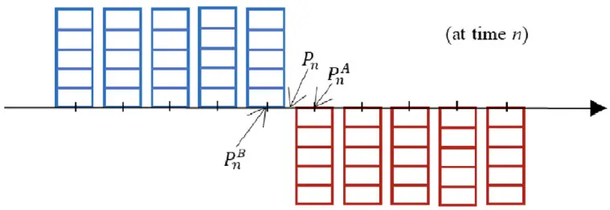

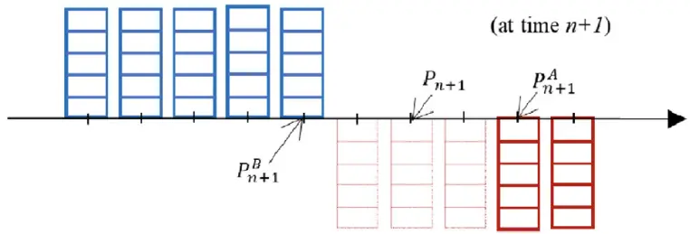
数据来源：wind、中信建投

在传统的 VOI 计算的基础上，将OFI指标扩展到不同档位下进行计算，得到

$$
OFI^{(i)}\quad\mathrm{i}=1,2,3,4,5
$$

分别衡量第 i 档下的订单失衡的潜在影响程度，避免遗漏掉很多有价值的信息。

为充分整合利用盘口数据信息，我们对不同OFI因子进行了合成，得到

$$
MOFI=\sum_{i=1}^{5}OFI^{(i)}\quad,\quad i=1{,}2{,}3{,}4{,}5.
$$

MOFI因子是对不同档位的OFI因子进行等权求和得到的，度量了各个档位订单失衡的简单累积影响。

进一步地，经过后面检测发现高档位的OFI因子选股效果更优，因此第五档的信息含量最高，第一档的信息含量最低，我们提出利用衰减加权的方式对OFI因子进行求和，得到

$$
MOFI\_Weight=\frac{\sum w_{i}\times OFI_{i,t}^{(i)}}{\sum w_{i}}\quad,\quad w_{i}=\frac{i}{5}\quad,\quad i=1,2,3,4,5
$$

最后我们看下订单斜率因子，订单斜率因子的具体构建过程如下：

$$
LogquoteStep_{k}=\frac{\log(A_{k})-\log(B_{k})}{\log(N_{k}^{A})+\log(N_{k}^{B})}
$$

$LogquoteSlope_{k}$ 衡量 k 时刻的订单斜率。其中， $A_{k}$ 和 $B_{k}$ 分别表示卖一价和买一价， $N_{k}^{A}$ 和 $N_{k}^{B}$ 分别表示卖一量和买一量。订单斜率因子衡量的是订单价差对订单量差的敏感度，同时订单量考虑了订单的方向，假设卖为正，买为负，因此卖一量为 $N_{k}^{A}$ ，买一量为 $-N_{k}^{B}$

另一方面，考虑到 $A_{k}$ 和 $B_{k}$ 买卖价格的序列并不是正态分布的，因此，通过取对数得到 $\log(A_{k})$ 和 $\log(B_{k})$ 能够让价格序列接近正态分布，增加因子的平稳性。同样，订单量也采用对数的形式，买量定义为 $log(N_{k}^{A})$ 卖量为 $-log(N_{k}^{B})$ 。具体形象化表述参考图 2。

图 2： LogquoteSlope 因子的解释
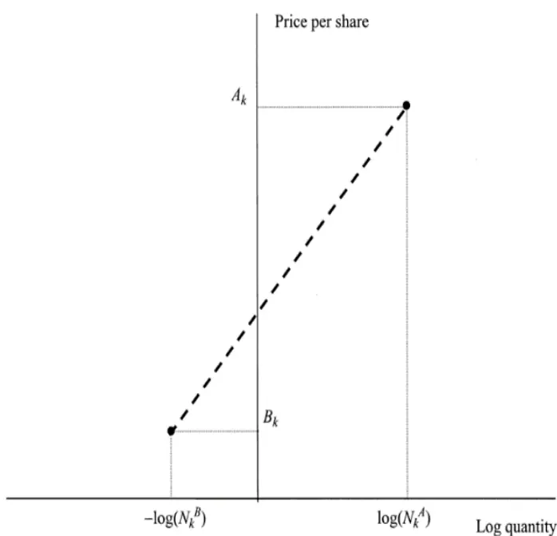
数据来源：wind、中信建投

与 OFI 因子类似，我们也可以将LogquoteSlope指标扩展到不同档位下进行计算，得到

$$
LogquoteSlope^{(i)}\quad i=1,2,3,4,5
$$

分别衡量第 i 档下的订单斜率的潜在信息，避免遗漏掉很多有价值的信息。同时，参考MOFI因子的构建思路，构造出MLogquoteSlope和MLogquoteSlopeWEIGHT。

## 1.2、多层次订单失衡及订单斜率投资逻辑

多层次订单失衡因子逻辑分析如下：

限价订单簿（LOB）允许任何交易者成为金融市场中的做市商。交易者可以针对资产和他们希望支付（接收）的价格提交限价买入（卖出）订单，其中蕴含着丰富的信息。将交易量分类为出价（要价）使我们能够洞悉即将到来的价格变化的方向。为了量化这种交易意图，我们计算出买卖量之间的差异，即订单失衡。订单失衡是一个重要的信号，它使我们能够了解市场的总体情绪和方向。知情交易者鉴于正面（负面）消息或交易者根据市场情绪的好坏，他们将会决定持有多头（或空头）头寸，从而增加资产的不平衡。由于不同时刻知情交易者拥有信息的准确性程度不同和市场交易情绪不同，其订单不平衡程度也有所差异。如果能够在限价订单簿中观察到此现象，市场参与者将能够使用此信息并制定策略以获得正向收益。不同档位的订单信息包含的信息不同，因此，我们区分了不同档位下的订单失衡。

买卖盘订单压力失衡对个股股价有较大影响，但在短期和中长期影响不同。短期内，在买压占优（订单失衡为正）情况下个股会呈现明显的正向收益；在卖压占优（订单失衡为负）情况下个股会呈现明显的负向收益；而在中长期，当买卖压力失衡消失后，股票的超额收益会出现均值回复，这意味着买卖压力失衡带来的超额收益仅仅为短期冲击影响，后期股价会逐步恢复到原状态。我们所构造的OFI因子在高频上是推动价格的正向驱动力。因此在高频频上，我们预期OFI因子越大，未来短期价格上升的概率越大。而在低频上， OFI因子是一段时间内订单失衡量的累积值，对股价的影响不大。因此，我们预期OFI因子和长期股价的相关性不大。

与OFI因子的投资逻辑相似， MOFI因子和MOFI_Weigℎt因子是对各档位上的OFI因子进行信息整合，以得到加权复合角度的订单失衡因子。

订单斜率因子逻辑分析如下：

订单斜率因子其实是一种流动性因子，因子值越大，代表买卖价差越大或者订单量约薄，表明股票的流动性越差,因此其长期具有流动性风险溢价，长期表现越好。

## 二、高频转低频的方法和逻辑

## 2.1、高频量价因子转低频的构造方法

和之前报告保持一致，我们采用下面的具体流程把高频因子转为我们常用的月度低频选股因子。

首先，我们采取等权的方式将分钟因子转换成日因子，具体公式如下所示：

$$
\widehat{\mathrm{Factor}_{\mathrm{j,k}}}=\frac{\sum\widehat{\mathrm{Factor}_{\mathrm{i,j,k}}}}{\mathrm{N}}
$$

其中 N 为第j 天总共的分钟数。

其次，由于各股盘口挂单强弱受到市场总体走势的影响，因此，为了剔除市场趋势的影响，我们对日频因子进行标准化处理。具体的计算公式为：

$$
\widehat{\mathrm{Factor_{j,k}}}=\frac{\mathrm{Factor_{j,k}}-M_{-}\mathrm{Factor_{j,k}}}{\mathrm{Std_{-}Factor_{j,k}}}
$$

其中， $Factor_{j,k}$ 为股票 k 第j 天的因子值， $M\_Factor_{j,k}$ 为横截面因子均值， $Std\_Factor_{j,k}$ 表示横截面因子标准差。

最后，考虑到信息的时效性，距离调仓日越远其信息的有效性越弱，因此用衰减加权的方法对日因子加权。即按距离最后一个交易日的时间远近加权将日因子转换成月因子。具体的计算公式为：

金融工程深度报告

$$
\widehat{\mathrm{Factor}_{\mathrm{j}}}=\frac{1}{\sum_{j=1}^{n}\frac{\mathrm{j}}{\mathrm{n}}}\times\sum_{j=1}^{n}\widehat{\mathrm{Factor}_{\mathrm{j},\mathrm{k}}}\times\frac{\mathrm{j}}{\mathrm{n}}
$$

其中，n 为当月交易日天数，j 为当月的第j 个交易日。

## 2.2、高频和低频因子分析

## 2.2.1、高频订单失衡OFI1 因子高频和低频 IC 对比

由表 1 可以看出，高频的 OFI1 因子符合之前构造因子的逻辑，即订单失衡因子与收益率显著正相关，然而将高频量价因子降频后，订单失衡的因子有效性已经衰减为 0，这也符合我们前面的分析逻辑。

表1： 高频量价因子和低频因子的 IC对照表

| 因子 | OFI1 |
| --- | --- |
| 分钟IC 均值 15.70% |  |
| 月频IC均值 | -0.08% |

数据来源：wind、天软科技、中信建投

## 2.2.2、高频订单失衡OFI1 因子低频特征分析

下图是 OFI1 因子十分位的年化收益，我们发现出现明显的中间强两头弱的现象。因此对于 OFI 类因子我们应该对其求绝对值以获取打分在中间的股票。

图3： 月频 OFI1 因子的十分位选股效果
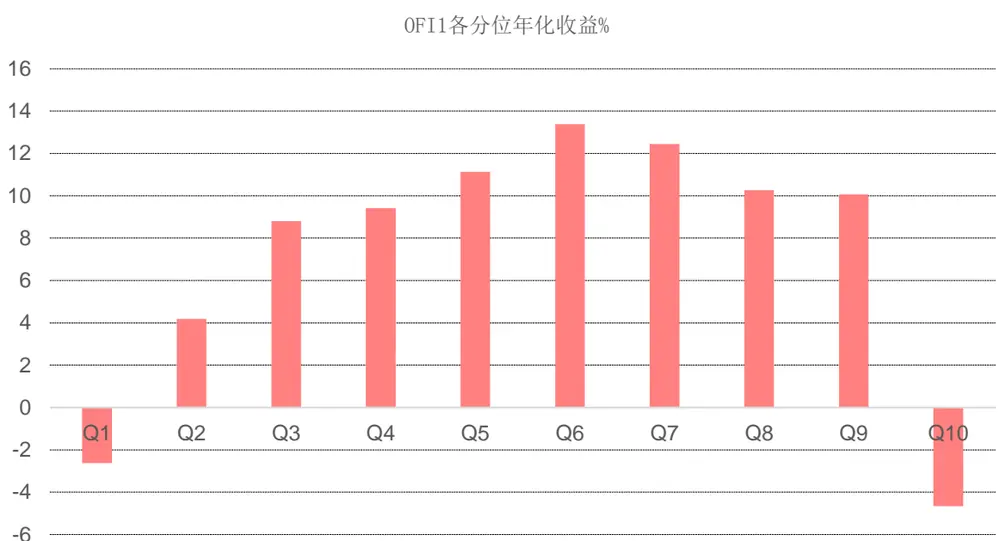
数据来源：wind、中信建投

下面我们看下为什么 Q1 和 Q10 两头的股票表现比较差，我们举两个例子来看下极端因子异动对于未来股票价格走势的影响。下图展示了高频订单失衡 OFI1 因子负向异动与下月股票表现的关系。左图是 2019 年 12月股票 A 的日频因子分布图，我们可以看到从 2019 年 12 月 23 日起股票 A 出现明显的订单失衡负向异动，OFI因子从 0 附近骤降为-31。右图展示了该股票在下月的表现，出现了大幅的下跌。这说明 OFI 因子的负向异动对股票下一个月的下跌有一定的预示作用。

图4： OFI1 因子负向异动与下月股票表现
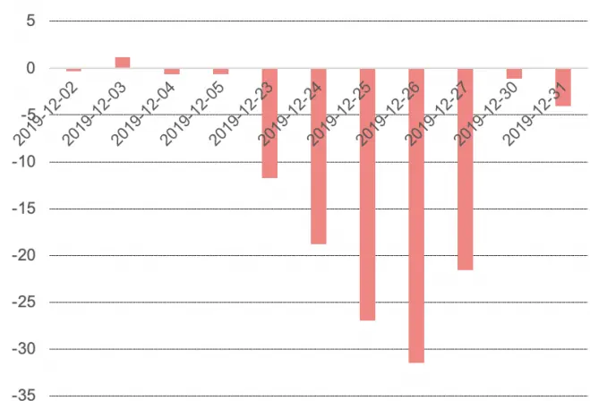

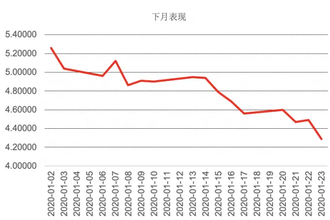
数据来源：wind、中信建投

下图展示了高频订单失衡 OFI1 因子正向异动与下月股票表现的关系。左图是 2018 年 11 月股票 B 的日频因子分布图，我们可以看到从 2018 年 11 月 26 日起股票 B 出现明显的订单失衡正向异动，OFI 因子从 0 附近骤增为 9。右图展示了该股票在下月的表现，出现了大幅的下跌。这说明 OFI 因子出现正向异动的股票下一个月也会出现大幅下跌。

图5： OFI1 因子正向异动与下月股票表现
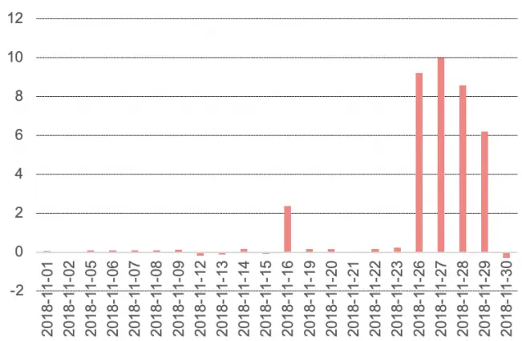
数据来源：wind、中信建投

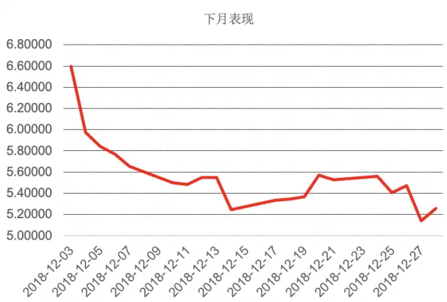

## 2.2.3、多层次订单失衡及订单斜率因子低频 IC 分析

由上节可以看出，OFI 类因子会有明显的中间强两头弱的现象，因此我们对 OFI 因子取绝对值。从下表可以看出，取了绝对值的 OFI 类因子的月频 IC 均值均显著为负，并且月频 IC 均值随着订单档位的提高而不断提升，这和我们上篇报告的 SOIR 因子一样，表明对于订单不平衡类因子来说，高档位的信息在长期来看越有效果，因此我们在对五档因子做加权时，需要对高档位的因子给与更多的权重。

最后， LogquoteSlope因子的月频 IC 显著为正，这也是符合我们之前的逻辑，在长期上有流动性溢价。

表2： 高频量价因子月频 IC对照表

| 因子 | OFI1 | OFI2 | OFI3 | OFI4 | OFI5 | MOFI | MOFI_Weight | LogQuoteSlope |
| --- | --- | --- | --- | --- | --- | --- | --- | --- |
| 月频IC均值 | -3.26% | -4.11% | -4.71% | -4.64% | -5.06% | -4.45% | -4.76% | 5.19% |

数据来源：wind、天软科技、中信建投

## 三、订单失衡因子及斜率因子和常用因子的相关性

下面我们看下订单失衡因子及斜率因子和传统因子的相关性，我们检测了 OFI 类因子以及 LogQuoteSlope因子和常用选股因子的因子值平均相关系数如下表。

OFI 类因子和动量类因子（Momentum_1m、Momentum_3m）的相关性较高。同时，LogQuoteSlope 因子和盈利类因子（ROE_TIM、ROA_TIM、ROIC_TIM）的相关性很高。因此，对于这些因子的处理需要做市值中性处理。

另外， LogQuoteSlope 因子和一个月换手率（AmountAvg_1M）的相关性也较高，因此后面 LogQuoteSlope因子可以对 AmountAvg_1M 做中性化处理。

最后，我们检测到 OFI 类因子间的相关性较强，说明各个 OFI 类因子包含的信息较为相近。

表3： 买卖报单流动性因子和常用因子的相关性

|  | 0FI1 | 0FI2 | 0FI3 | 0FI4 | 0FI5 | MOFI | MOFI_Weight | LogQuoteSlope |
| --- | --- | --- | --- | --- | --- | --- | --- | --- |
| EP_TTM | 0.33 | 0.32 | 0.30 | 0.28 | 0.26 | 0.33 | 0.30 | -0.37 |
| BP_LR | 0.25 | 0.29 | 0.29 | 0.29 | 0.29 | 0.32 | 0.30 | 0.34 |
| SP_TTM | 0.26 | 0.28 | 0.26 | 0.26 | 0.25 | 0.30 | 0.28 | 0.18 |
| Earnings_SQ_YoY | 0.03 | -0.03 | -0.06 | -0.11 | -0.10 | -0.07 | -0.08 | -0.52 |
| Sales_SQ_YoY | -0.07 | -0.10 | -0.10 | -0.14 | -0.12 | -0.15 | -0.13 | -0.62 |
| ROE_SQ_YoY | 0.13 | 0.07 | 0.04 | -0.03 | -0.05 | 0.02 | 0.00 | -0.51 |
| ROE_TTM | 0.23 | 0.17 | 0.17 | 0.14 | 0.11 | 0.17 | 0.15 | -0.68 |
| ROA_TTM | 0.09 | 0.02 | 0.03 | 0.00 | -0.01 | 0.02 | 0.01 | -0.72 |
| ROIC_TTM | 0.12 | 0.05 | 0.05 | 0.02 | 0.00 | 0.05 | 0.04 | -0.71 |
| Momentum_1m | 0.55 | 0.60 | 0.54 | 0.45 | 0.40 | 0.54 | 0.50 | 0.00 |
| Momentum_3m | 0.51 | 0.53 | 0.48 | 0.38 | 0.35 | 0.48 | 0.44 | -0.18 |
| Momentum_6m | 0.46 | 0.46 | 0.43 | 0.37 | 0.33 | 0.43 | 0.41 | -0.37 |
| Momentum_12m | 0.44 | 0.43 | 0.39 | 0.31 | 0.28 | 0.38 | 0.35 | -0.42 |
| Momentum_24m | 0.10 | 0.10 | 0.05 | -0.03 | -0.03 | 0.02 | 0.01 | -0.43 |
| LnFloatCap | 0.38 | 0.45 | 0.48 | 0.45 | 0.45 | 0.45 | 0.46 | -0.68 |
| AmountAvg_1M | 0.24 | 0.39 | 0.46 | 0.46 | 0.48 | 0.40 | 0.45 | -0.83 |
| TurnoverAvg1M | -0.22 | -0.11 | -0.05 | -0.03 | -0.01 | -0.12 | -0.05 | -0.16 |
| TurnoverAvg3M | -0.34 | -0.22 | -0.15 | -0.13 | -0.09 | -0.23 | -0.16 | -0.14 |
| TurnoverAvg6M | -0.37 | -0.27 | -0.20 | -0.16 | -0.13 | -0.27 | -0.20 | -0.14 |
| Volatility1M | -0.25 | -0.14 | -0.07 | -0.05 | -0.01 | -0.15 | -0.09 | -0.16 |
| Volatility3M | -0.34 | -0.22 | -0.15 | -0.11 | -0.06 | -0.22 | -0.15 | -0.18 |
| Volatility6M | -0.40 | -0.28 | -0.20 | -0.13 | -0.08 | -0.27 | -0.18 | -0.21 |
| Beta_100W | -0.13 | -0.09 | -0.01 | 0.06 | 0.09 | -0.01 | 0.04 | 0.02 |
| 0FI1 | 1.00 | 0.90 | 0.78 | 0.67 | 0.56 | 0.85 | 0.75 | -0.05 |
| 0FI2 | 0.90 | 1.00 | 0.97 | 0.89 | 0.82 | 0.97 | 0.94 | -0.11 |
| 0FI3 | 0.78 | 0.97 | 1.00 | 0.96 | 0.90 | 0.98 | 0.98 | -0.17 |
| 0FI4 | 0.67 | 0.89 | 0.96 | 1.00 | 0.97 | 0.95 | 0.99 | -0.16 |
| 0FI5 | 0.56 | 0.82 | 0.90 | 0.97 | 1.00 | 0.89 | 0.95 | -0.17 |
| MOFI | 0.85 | 0.97 | 0.98 | 0.95 | 0.89 | 1.00 | 0.98 | -0.12 |
| MOFI_Weight | 0.75 | 0.94 | 0.98 | 0.99 | 0.95 | 0.98 | 1.00 | -0.16 |
| LogQuoteSlope | -0.05 | -0.11 | -0.17 | -0.16 | -0.17 | -0.12 | -0.16 | 1.00 |

数据来源：wind、天软科技、中信建投

## 四、订单失衡因子及斜率因子测试结果

然后我们对订单失衡因子及斜率因子进行单因子分析（包括月度 IC 分析和多空收益分析）。具体回测时间为最近 5 年（2014 年 12 月-2020 年 10 月），样本池为全市场，每月底剔除停牌、一字板、上市未满半年和 ST股票，月频调仓。因子做了极值处理（剔除 3 倍标准差之外的样本）和缺失值处理（直接剔除）。OFI1、OFI2 和LogQuoteSlope 因子做了市值和行业中性化处理，组合的多空收益分位数为 10 分位。

## 4.1、订单失衡因子选股效果

首先是OFI1因子的效果，因子 IC 均值-3.26%，年化 IR -1.74，年化多空收益 17.07%，夏普比率 1.93。下图是因子的 IC 分析统计、多空组合分析统计和因子多空累计净值。

图6： OFI1 因子选股效果

| IC分析 | OFI1 |
| --- | --- |
| IC均值% | -3.26 |
| IC标准差% | 6.47 |
| IR | -0.50 |
| 年化IR | -1.74 |
| 胜率% | 68.57 |
| 多空组合分析 | OFI1 |
| 总收益% | 150.7 |
| 年化收益% | 17.07 |
| 年化波动% | 8.83 |
| 夏普比率 | 1.93 |
| 最大回撤% | 3.08 |
| 收益回撤比 | 5.54 |
| 胜率% | 67.14 |

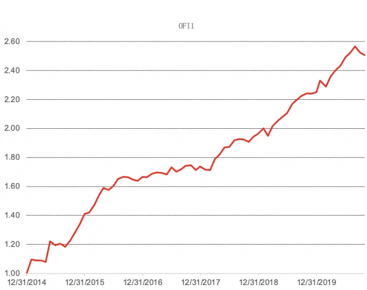
数据来源：wind、天软科技、中信建投

OFI2因子的效果，因子 IC 均值-4.11%，年化 IR -2.25，年化多空收益 16.36%，夏普比率 1.99。

图 7： OFI2 因子选股效果

| IC分析 | OFI2 |
| --- | --- |
| IC均值% | -4.11 |
| IC标准差% | 6.34 |
| IR | -0.65 |
| 年化IR | -2.25 |
| 胜率% | 74.29 |
| 多空组合分析 | OFI2 |
| 总收益% | 142.08 |
| 年化收益% | 16.36 |
| 年化波动% | 8.23 |
| 夏普比率 | 1.99 |
| 最大回撤% | 4.78 |
| 收益回撤比 | 3.42 |
| 胜率% | 74.29 |

数据来源：wind、天软科技、中信建投

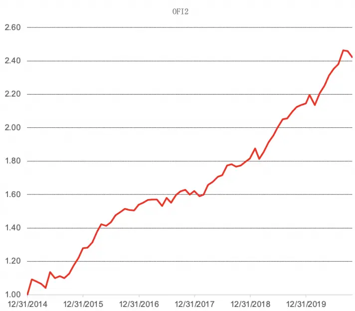

OFI3因子的效果，因子 IC 均值-4.71%，年化 IR -2.51，年化多空收益 20.28%，夏普比率 2.2。

图8： OFI3 因子选股效果

| IC分析 | OFI3 |
| --- | --- |
| IC均值% | -4.71 |
| IC标准差% | 6.50 |
| IR | -0.72 |
| 年化IR | -2.51 |
| 胜率% | 77.14 |
| 多空组合分析 | OFI3 |
| 总收益% | 193.62 |
| 年化收益% | 20.28 |
| 年化波动% | 8.91 |
| 夏普比率 | 2.28 |
| 最大回撤% | 4.33 |
| 收益回撤比 | 4.69 |
| 胜率% | 77.14 |

数据来源：wind、天软科技、中信建投

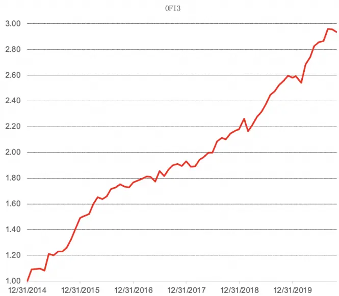

OFI4因子的效果，因子 IC 均值-4.64%，年化 IR -2.48，年化多空收益 19.81%，夏普比率 2.2。

图 9： OFI4 因子选股效果

| IC分析 | OFI4 |
| --- | --- |
| IC均值% | -4.64 |
| IC标准差% | 6.47 |
| IR | -0.72 |
| 年化IR | -2.48 |
| 胜率% | 75.71 |
| 多空组合分析 | OFI4 |
| 总收益% | 186.95 |
| 年化收益% | 19.81 |
| 年化波动% | 9.01 |
| 夏普比率 | 2.2 |
| 最大回撤% | 4.37 |
| 收益回撤比 | 4.53 |
| 胜率% | 68.57 |

数据来源：wind、天软科技、中信建投

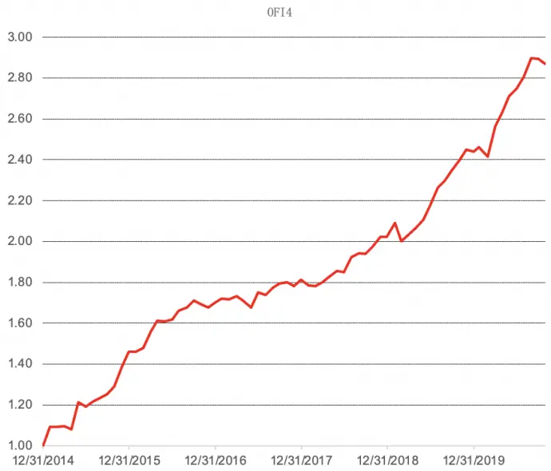

OFI5因子的效果，因子 IC 均值-5.06%，年化 IR -2.60，年化多空收益 21.11%，夏普比率 2.31。

图10： OFI5 因子选股效果

| IC分析 | OFI5 |
| --- | --- |
| IC均值% | -5.06 |
| IC标准差% | 6.74 |
| IR | -0.75 |
| 年化IR | -2.60 |
| 胜率% | 77.14 |
| 多空组合分析 | OFI5 |
| 总收益% | 205.7 |
| 年化收益% | 21.11 |
| 年化波动% | 9.13 |
| 夏普比率 | 2.31 |
| 最大回撤% | 3.85 |
| 收益回撤比 | 5.48 |
| 胜率% | 71.43 |

数据来源：wind、天软科技、中信建投

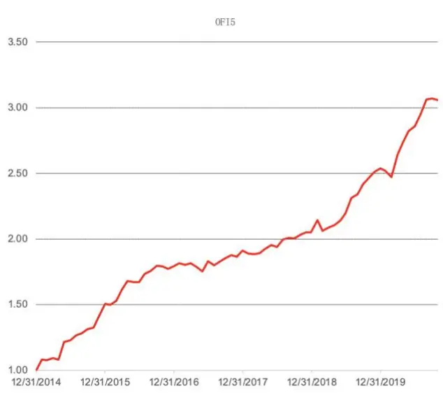

MOFI因子的效果，因子 IC 均值-4.45%，年化 IR -2.40，年化多空收益 19.09%，夏普比率 2.01。

图 11： MOFI 因子选股效果

| IC分析 | MOFI |
| --- | --- |
| IC均值% | -4.45 |
| IC标准差% | 6.42 |
| IR | -0.69 |
| 年化IR | -2.40 |
| 胜率% | 80.00 |
| 多空组合分析 | MOFI |
| 总收益% | 177.03 |
| 年化收益% | 19.09 |
| 年化波动% | 9.5 |
| 夏普比率 | 2.01 |
| 最大回撤% | 4.78 |
| 收益回撤比 | 3.99 |
| 胜率% | 72.86 |

数据来源：wind、天软科技、中信建投

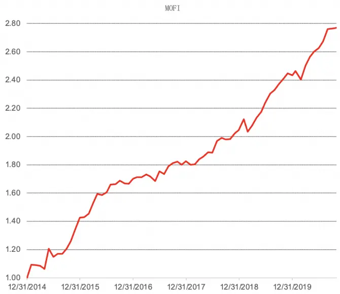

MOFI_Weigℎt因子的效果，因子 IC 均值-4.76%，年化 IR -2.55，年化多空收益 21.68%，夏普比率 2.1。

图 12： MOFI_Weigℎt因子选股效果

| IC分析 | MOFI_Weight |
| --- | --- |
| IC均值% | -4.76 |
| IC标准差% | 6.47 |
| IR | -0.74 |
| 年化IR | -2.55 |
| 胜率% | 78.57 |
| 多空组合分析 | MOFI_Weight |
| 总收益% | 214.17 |
| 年化收益% | 21.68 |
| 年化波动% | 10.31 |
| 夏普比率 | 2.1 |
| 最大回撤% | 4.1 |
| 收益回撤比 | 5.29 |
| 胜率% | 74.29 |

数据来源：wind、天软科技、中信建投

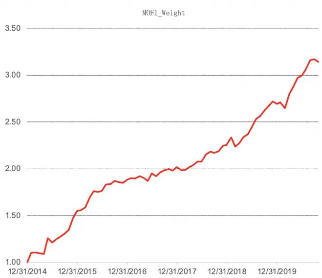

## 4.2、订单斜率因子选股效果

接着我们看下LogQuoteSlope因子的选股效果，因子 IC 均值 5.19%，年化 IR1.56，年化多空收益 21.09%，夏普比率 1.34，总体选股效果也非常不错。尽管因子多空收益波动比 OFI 类因子要高，但其多头效果更好，多头效果占多空组合的 70%以上，而 OFI 类因子的多空收益各占 50%。

图 13： LogQuoteSlope因子选股效果

| IC分析 | LogQuoteSlope |
| --- | --- |
| IC均值% | 5.19 |
| IC标准差% | 11.52 |
| IR | 0.45 |
| 年化IR | 1.56 |
| 胜率% | 68.57 |
| 多空组合分析 | MOFI_Weight |
| 总收益% | 205.4 |
| 年化收益% | 21.09 |
| 年化波动% | 15.78 |
| 夏普比率 | 1.34 |
| 最大回撤% | 19 |
| 收益回撤比 | 1.11 |
| 胜率% | 62.86 |

数据来源：wind、天软科技、中信建投

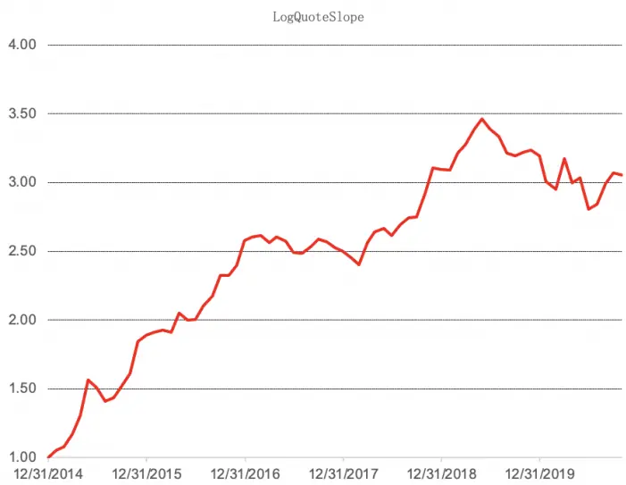

## 五、总结和思考

限价订单簿（LOB）是交易者多空博弈的信息来源，其中的价格与订单量的变化都反映了交易者对于该股票未来价格变化的预期。因而在本研究中，我们将根据高频报单数据分别建立多层次订单失衡和订单斜率高频因子，最后降为月频的低频选股因子，在后续的因子回测中取得良好的选股效果。

第一部分主要通过高频数据构造出多层次订单失衡和订单斜率因子。一方面，订单失衡能够反映市场的总体情绪和方向，因此，本文通过度量不同档位价格和买卖量变化背后的订单影响，更准确地量化订单失衡对股价的短期和长期影响。另一方面，流动性的本质为立即交易（市价交易）与延时交易（限价交易）之间交易成本的差距，我们用订单价格变化对订单量变化的敏感度来衡量流动性，对前期流动性的研究进行了补充。

第二部分我们采用具体转换流程把高频因子转为我们常用的月度低频选股因子。首先我们把标准化后的分钟因子转换成日因子，我们采用了等权的方法。然后因为股票的盘口挂单强弱受到市场总体走势的影响，因此我们需要对各股票进行截面标准化以剔除市场对个股的影响。最后我们把日因子转换成月因子，我们按距离每月最后一个交易日（假设为组合调仓日）的时间远近进行加权，考虑到信息的时效性，距离调仓日越远其信息的有效性越弱，因此用衰减加权的方法对日因子加权。进一步地，我们对高频和低频因子进行了 IC 分析和特征分析。结果发现 OFI 类因子适合对其求绝对值来提升因子的多空选股能力，同时，各个因子在月频 IC 上都表明其与股票未来一个月的收益具有较高的相关性。

第三部分检测了多层次订单失衡及订单斜率因子和传统因子的相关性。OFI 类因子和动量类因子（Momentum_1m、Momentum_3m）的相关性较高。同时，LogQuoteSlope因子和盈利类因子（ROE_TIM、ROA_TIM、ROIC_TIM）的相关性很高。因此，对于这些因子的处理需要做市值中性处理。另外， LogQuoteSlope因子和一个月换手率（AmountAvg_1M）的相关性也较高，因此后面LogQuoteSlope因子可以对 AmountAvg_1M 做中性化处理。最后，我们检测到 OFI 类因子间的相关性较强，说明各个 OFI 类因子包含的信息较为相近。

第四部分对多层次订单失衡及订单斜率因子进行单因子分析。具体回测时间为最近 5 年（2014 年 12 月-2020年 10 月），样本池为全市场，月频调仓。MOFI_Weigℎt因子 IC 均值-4.76%，年化 IR-2.55，年化多空收益 21.68%，夏普比率 2.1，总体选股效果是所有因子里最好的。而LogQuoteSlope因子的 IC 均值 5.19%，年化多空收益21.09%，总体选股效果也非常不错。尽管因子多空收益波动比 OFI 类因子要高，但其多头效果更好，多头效果占多空组合的 70%以上，而 OFI 类因子的多空收益各占 50%。

风险提示：模型失效，历史规律不再重复

## 参考文献

Sim M K , Deng S . Estimation of level-I hidden liquidity using the dynamics of limit order-book[J]. Physica A: Stata Mechanics and its Applications, 540.

Aurélien Alfonsi, Schied A F & A . Optimal execution strategies in limit order books with general shape functions[J]. Quantitative Finance, 2010.

Seppi H D J . Common factors in prices, order flows, and liquidity[J]. Journal of Financial Economics, 2001.

## 分析师介绍

丁鲁明：同济大学金融数学硕士，中国准精算师，现任中信建投证券研究发展部金融工程方向负责人，首席分析师。10 年证券从业，历任海通证券研究所金融工程高级研究员、量化资产配置方向负责人；先后从事转债、选股、高频交易、行业配置、大类资产配置等领域的量化策略研究，对大类资产配置、资产择时领域研究深入，创立国内“量化基本面”投研体系。多次荣获团队荣誉：新财富最佳分析师 2009 第 4、2012第 4、2013 第 1、2014 第 3 等；水晶球最佳分析师 2009 第 1、2013 第 1；2018 年 wind金牌分析师第 2 等。

陈升锐：芝加哥大学金融数学硕士，三年基金公司量化投资研究工作经验，2018 年加入中信建投研究发展部金融工程团队，专注于量化选股研究。2018、2019、2020 年Wind 金牌分析师金融工程第 2 名、第 2 名、第 5 名团队核心成员。

## 评级说明

| 投资评级标准 |  | 评级 | 说明 |
| --- | --- | --- | --- |
| 报告中投资建议涉及的评级标准为报告发布日后6个月内的相对市场表现，也即报告发布日后的6个月内公司股价（或行业指数）相对同期相关证券市场代表性指数的涨跌幅作为基准。A股市场以沪深300指数作为基准；新三板市场以三板成指为基准；香港市场以恒生指数作为基准；美国市场以标普500指数为基准。 | 股票评级 | 买入 | 相对涨幅15%以上 |
|  |  | 增持 | 相对涨幅 5%—15% |
|  |  | 中性 | 相对涨幅-5%—5%之间 |
|  |  | 减持 | 相对跌幅 5%—15% |
|  |  | 卖出 | 相对跌幅15%以上 |
|  | 行业评级 | 强于大市 | 相对涨幅10%以上 |
|  |  | 中性 | 相对涨幅-10-10%之间 |
|  |  | 弱于大市 | 相对跌幅10%以上 |

## 分析师声明

本报告署名分析师在此声明：（i）以勤勉的职业态度、专业审慎的研究方法，使用合法合规的信息，独立、客观地出具本报告, 结论不受任何第三方的授意或影响。（ii）本人不曾因，不因，也将不会因本报告中的具体推荐意见或观点而直接或间接收到任何形式的补偿。

## 法律主体说明

本报告由中信建投证券股份有限公司及/或其附属机构（以下合称“中信建投”）制作，由中信建投证券股份有限公司在中华人民共和国（仅为本报告目的，不包括香港、澳门、台湾）提供。中信建投证券股份有限公司具有中国证监会许可的投资咨询业务资格，本报告署名分析师所持中国证券业协会授予的证券投资咨询执业资格证书编号已披露在报告首页。

本报告由中信建投（国际）证券有限公司在香港提供。本报告作者所持香港证监会牌照的中央编号已披露在报告首页。

## 一般性声明

本报告由中信建投制作。发送本报告不构成任何合同或承诺的基础，不因接收者收到本报告而视其为中信建投客户。

本报告的信息均来源于中信建投认为可靠的公开资料，但中信建投对这些信息的准确性及完整性不作任何保证。本报告所载观点、评估和预测仅反映本报告出具日该分析师的判断，该等观点、评估和预测可能在不发出通知的情况下有所变更，亦有可能因使用不同假设和标准或者采用不同分析方法而与中信建投其他部门、人员口头或书面表达的意见不同或相反。本报告所引证券或其他金融工具的过往业绩不代表其未来表现。报告中所含任何具有预测性质的内容皆基于相应的假设条件，而任何假设条件都可能随时发生变化并影响实际投资收益。中信建投不承诺、不保证本报告所含具有预测性质的内容必然得以实现。

本报告内容的全部或部分均不构成投资建议。本报告所包含的观点、建议并未考虑报告接收人在财务状况、投资目的、风险偏好等方面的具体情况，报告接收者应当独立评估本报告所含信息，基于自身投资目标、需求、市场机会、风险及其他因素自主做出决策并自行承担投资风险。中信建投建议所有投资者应就任何潜在投资向其税务、会计或法律顾问咨询。不论报告接收者是否根据本报告做出投资决策，中信建投都不对该等投资决策提供任何形式的担保，亦不以任何形式分享投资收益或者分担投资损失。中信建投不对使用本报告所产生的任何直接或间接损失承担责任。

在法律法规及监管规定允许的范围内，中信建投可能持有并交易本报告中所提公司的股份或其他财产权益，也可能在过去 12个月、目前或者将来为本报告中所提公司提供或者争取为其提供投资银行、做市交易、财务顾问或其他金融服务。本报告内容真实、准确、完整地反映了署名分析师的观点，分析师的薪酬无论过去、现在或未来都不会直接或间接与其所撰写报告中的具体观点相联系，分析师亦不会因撰写本报告而获取不当利益。

本报告为中信建投所有。未经中信建投事先书面许可，任何机构和/或个人不得以任何形式转发、翻版、复制、发布或引用本报告全部或部分内容，亦不得从未经中信建投书面授权的任何机构、个人或其运营的媒体平台接收、翻版、复制或引用本报告全部或部分内容。版权所有，违者必究。

## 中信建投

中信建投（国际）

北京

东城区朝内大街2号凯恒中心B

上海

深圳

香港

浦东新区浦东南路 528 号上海南塔 2106 室

座 12 层

中环交易广场2期18 楼

中心 B 座 22 层

电话：(8610) 8513-0588

电话：(8621) 6882-1612

电话：（86755）8252-1369

电话：（852）3465-5600

联系人：李祉瑶

联系人：翁起帆

联系人：曹莹

联系人：刘泓麟

邮箱：lizhiyao@csc.com.cn

邮箱：wengqifan@csc.com.cn

邮箱：caoying@csc.com.cn

邮箱：charleneliu@csci.hk