[table_main] 证券研究报告·金融工程深度报告金融衍

# 分析师预期调整事件增强选股策略全攻略——因子深度研究系列

## 主要结论

## 本文概述

分析师预期调整主要包括三方面信息，分别是盈利预期调整、目标价格调整以及投资评级调整。本文利用这三方面信息构建因子和事件，并基于此构建选股策略，从而实现在充分利用分析师预期调整信息的基础上取得优秀的选股效果。其中，主动上调预期叠加盈利预期调整幅度因子增强策略年化收益 33.64%，超额中证 500 的年化收益 29.39%，信息比率 2.32，胜率 71.43%。总体选股效果是所有增强策略里最好的。

## 分析师预期调整介绍

分析师对于自身过去预测的调整往往意味着新信息的到来，而分析师对于不同股票的预测调整力度又能反映出不同股票间的边际改善差异和分析师对于新信息的处理能力。进一步地，基于这种分析师调整幅度的差异能够有利于我们构建选股效果较好的选股因子。我们尝试将分析师预期选股因子与分析师预期调整事件相结合，构建具有“强逻辑”的事件增强选股策略，获得优秀的历史收益表现。

## 分析师盈利预期调整因子年化多空收益 14.93%，夏普比率 1.8，IC 均值 3.96%，年化 IC_IR 达到 2.2

我们以相同分析师在时间序列上的预期调整为基础构建分析师盈利预期调整因子，它反映了市场所有分析师对于股票盈利预期调整的中间水平。我们预期分析师盈利预期调整因子越大，未来短期价格上升的概率越大。分析师盈利预期调整因子的分层效果区分度非常高。不同分组间具有单调的年化超额收益（相对中证全指），并且，Q1 组相对 Q10 组具有将近15%的超额收益（其中 Q1 超过 14%的多头超额收益，Q10 仅不足-1%）。分析师盈利预期调整因子表现出优异的选股能力。因子年化多空收益14.93%，夏普比率 1.8，IC 均值 3.96%，年化 IC_IR 达到 2.2。

## EPS_FY1、EPS_FY2、净利润 FY1 均主动上调预期叠加盈利预期 调整幅度因子增强策略年化收益 33.64%，年化超额29.39%

我们利用分析师盈利预期调整因子分别对分析师目标价上调事件、分析师投资评级上调事件和分析师预期修正动量事件进行增强。即在每月末，按照盈利预期调整幅度因子排序，在事件样本池中选取指标值最大的20 只股票。其中，EPS_FY1、EPS_FY2、净利润 FY1 均主动上调预期叠加盈利预期调整幅度因子增强策略年化收益 33.64%，超额中证 500 的年化收益 29.39%，信息比率 2.32，胜率 71.43%。总体选股效果是所有增强策略里最好的。在最佳选股组合的历史持仓方面，行业层面上，机械、基础化工和医药的行业占比最高；指数层面上，沪深 300、中证 500 和其他股票分别占比 24.53%、27.43%和 48.04%。

# 金融工程研究

。陈升锐[table

chenshengrui @csc.com.cn

021-68821600

SAC 执证编号：S1440519040002

丁鲁明

dingluming@csc.com.cn

021-68821623

SAC 执证编号：S1440515020001

发布日期： 2021 年 08 月 05 日

## 相关研究报告

| 20.07.07 | 因子深度研究系列：多层次订单失衡及 订单斜率因子 |
| --- | --- |
| 21.01.29 | 因子深度研究系列：高频订单失衡及价 差因子 |
| 20.10.23 | 因子深度研究系列：买卖报单流动性因 子构建 |
| 20.07.09 | 因子深度研究系列：高频量价选股因子 初探 |
| 20.04.02 | 因子深度研究系列：分析师超预期因子 选股策略 |
| 20.01.17 | 因子深度研究系列：分析师预期修正动 量效应选股策略 |
| 19.08.21 | 因子深度研究系列：中信建投一致预期 因子体系搭建 |
| 19.03.28 | 因子深度研究系列：因子衰减在多因子 选股中的应用 |
| 18.08.30 | 因子深度研究系列：Barra风险模型介绍 及与中信建投选股体系的比较 |

## 一、分析师预期调整介绍

## 1.1、 分析师预期偏离度与分析师覆盖

我们首先看下分析师最近十年的预期偏离度，可以看出分析师总是倾向于发表乐观看法、避免给出负面观点。分析师预测净利润偏离实际净利润的幅度长期为正，虽然最近几年有所下降，但最高偏离度可达 30%，最低偏离度仍大于 0。这使得单纯利用分析师推荐的信息难以获得超额收益，需要针对分析师预期信息进行深入加工。

图1： 分析师预测净利润偏离实际净利润的幅度
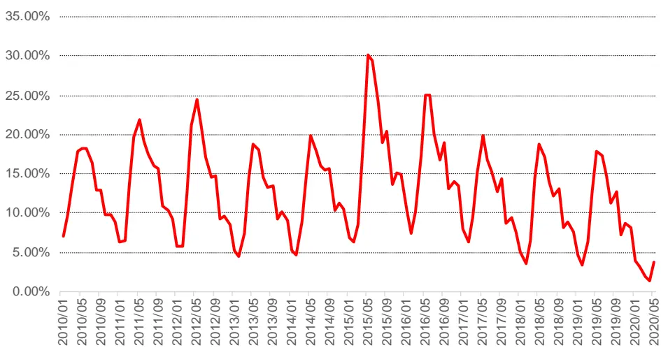
数据来源：wind、中信建投

另外，我们看下分析师预期数据的覆盖度。分析师最近十年在全市场的覆盖率逐年下降，最新已经降至接近 50%，即全市场只有接近一半的股票被覆盖。虽然沪深 300 成分股的覆盖度仍在 90%以上，中证 500 成分股的覆盖度让在 80%以上。整体而言，分析师对于 A 股市场的重点股票均有覆盖，而对中小票的覆盖度则逐年降低。

图2： 分析师在沪深 300、中证 500和全市场的覆盖度
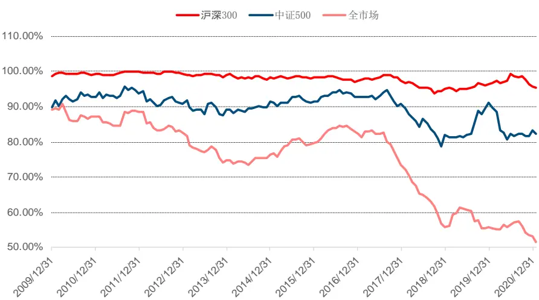
数据来源：wind、中信建投

## 1.2、分析师预期调整

分析师对于自身过去预测的调整往往意味着新信息的到来，而分析师对于不同股票的预测调整幅度可以反映出不同股票间的边际改善差异和分析师对于新信息的处理能力。进一步地，基于这种分析师调整幅度的差异能够有利于我们构建选股效果较好的选股因子。

我们尝试将分析师预期选股因子与分析师预期调整事件相结合，构建具有“强逻辑”的事件增强选股策略，获得优秀的历史收益表现。

分析师预期调整主要包括三方面信息，分别是盈利（净利润）预期调整、目标价格调整以及投资评级调整。本文利用这三方面信息构建因子和事件，并基于此构建选股策略，从而实现在充分利用分析师预期调整信息的基础上取得优秀的选股效果。

图3： 分析师预期调整框架
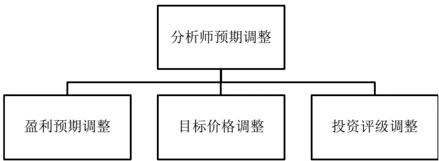
数据来源：wind、中信建投

## 二、分析师盈利预期调整因子

## 2.1、指标构建

首先是分析师预期调整的第一部分内容——盈利预期调整。我们以相同分析师在时间序列上的预期调整为基础构建分析师盈利预期调整因子，定义分析师 i 对于股票 s在时间 t 给出的盈利预期调整指标如下：

$$
Income\_Adjust\_single_{s,i,t}=\frac{forecast\_new_{s,i,t}-forecast\_last_{s,i,t-1}}{forecast\_last_{s,i,t-1}}
$$

其中， $forecast\_last_{s,i,t-1}$ 为分析师 i 上次报告对股票 s 的盈利预期， $forecast\_new_{s,i,t}$ 为分析师 i 本次报告对股票 s 的盈利预期。

在每个月末 T，我们取所有分析师当月对于股票 s 的盈利预期调整幅度的中位数作为最终的分析师盈利预期调整因子值，具体公式如下：

$$
Income\_Adjust_{s,T}=\mathrm{median}\big(Income\_Adjust_{-}single_{s,i,t}\big),\ T-1<t\leq T
$$

其中，i 为所有在本月对股票 s进行盈利预期调整的分析师。分析师盈利预期调整因子反映了市场所有分析师对于股票盈利预期调整的中间水平。

## 2.2、因子表现

## 2.2.1、分层超额收益

从下图可以看出，分析师盈利预期调整因子的分层效果区分度非常高。不同分组间具有单调的年化超额收益（相对中证全指），并且，Q1 组相对 Q10 组具有将近 15%的超额收益（其中 Q1 超过 14%的多头超额收益，Q10 仅不足-1%）。因此这个因子的分层效果非常显著，并且多头效果远远好于空头。

图4： 分析师盈利预期调整因子的分层效果
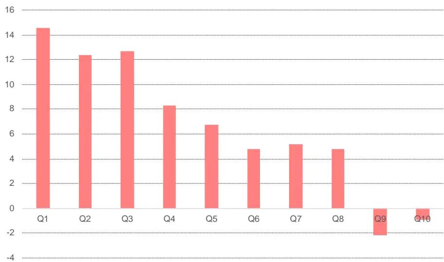
数据来源：wind、中信建投

## 2.2.2、因子绩效表现

分析师盈利预期调整因子表现出优异的选股能力。因子年化多空收益 14.93%，夏普比率 1.8，IC 均值 3.96%，年化 IC_IR 达到 2.2。

图5： 分析师盈利预期调整因子的绩效表现

| IC均值% | 3.96 |
| --- | --- |
| IC标准差% | 6.23 |
| IR | 0.64 |
| 年化IR | 2.20 |
| 胜率% | 74.81 |
| 多空总收益% | 356.59 |
| 年化收益% | 14.93 |
| 年化波动% | 8.31 |
| 夏普比率 | 1.8 |
| 最大回撤% | 10.77 |
| 收益回撤比 | 1.39 |
| 胜率% | 73.28 |

数据来源：wind、中信建投

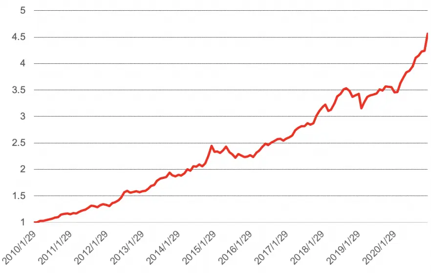

## 三、分析师目标价上调事件

## 3.1、分析师目标价上调事件定义

接着是分析师预期调整的第二部分内容——目标价调整。我们定义分析师将股票目标价上调定义为分析师目标价上调事件。下图首先统计每月事件样本池数量，分析师投资评级上调事件每月样本池平均为 210 只股票。

图6： 分析师目标价上调事件样本池数量月度分布情况
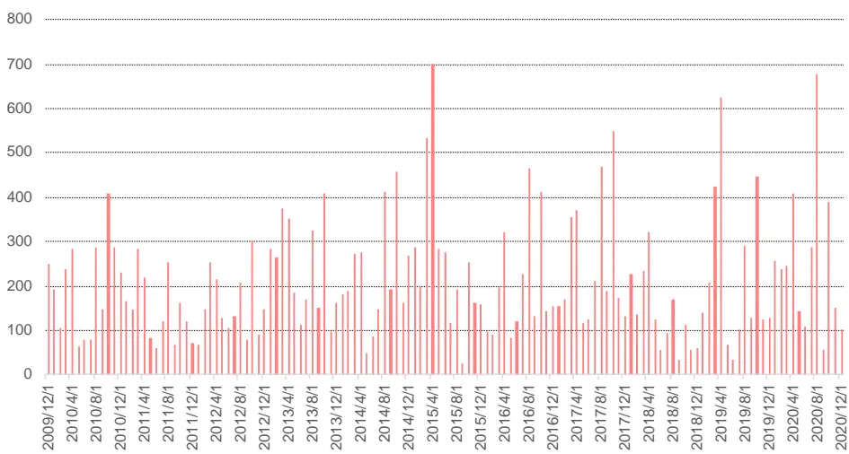
数据来源：wind、中信建投

## 3.2、分析师目标价上调事件表现

我们每月末统计当月存在分析师目标价上调事件样本股未来 1 个月的历史收益表现。下图表可以看出，分析师目标价上调事件年化超额收益（相对中证 500）达 10.65%，超额收益最大回撤-11.64%，具有一定的选股效果。

图7： 分析师目标价上调事件表现
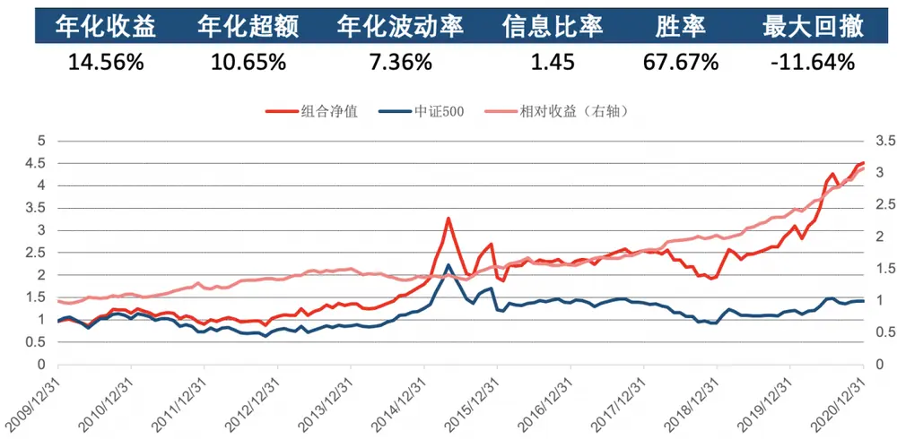
数据来源：wind、中信建投

## 3.3、分析师目标价上调事件增强表现

考虑对分析师目标价上调事件进行增强，我们将目标价上调事件样本根据前面介绍的分析师盈利预期调整因子Income_Adjust 分组，统计各组样本在未来 60 个交易日相对于中证 500 的超额收益率。从下图可以看出，Income_Adjust 因子在事件样本中表现出优秀的分层能力，盈利预期调整幅度越大的股票在未来的相对收益将越高。第五组与第一组的未来 60 日超额收益相差 3.57%。因此表明我们可以用分析师盈利预期调整因子对目标价上调事件做增强。

图8： 分析师目标价上调事件样本池分层结果
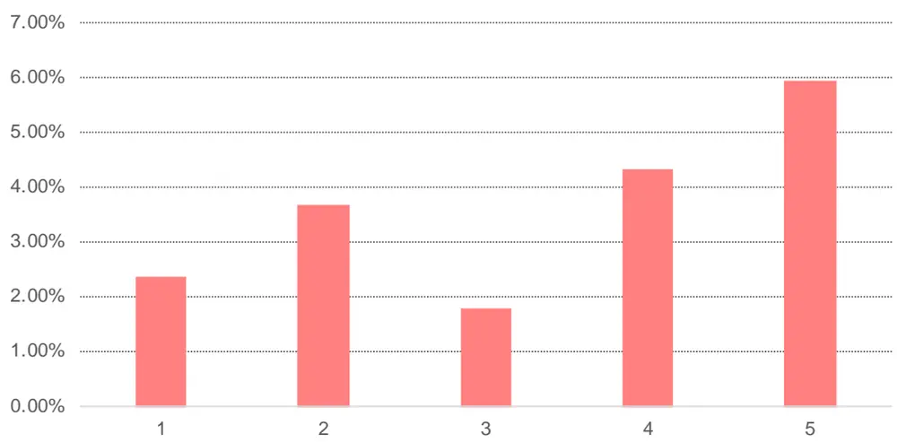
数据来源：wind、中信建投

因此在每月末，我们在目标价上调事件里按照盈利预期调整幅度因子排序，选取指标值最大的 20 只股票，同时剔除 ST 股票、次新股等特殊样本。从图表可以看出，策略表现优异，年化超额收益达 21%，虽然超额回撤较大，但从收益的角度来看增强组合相对初始事件组合有一定程度的增强。

图9： 分析师目标价上调事件增强表现
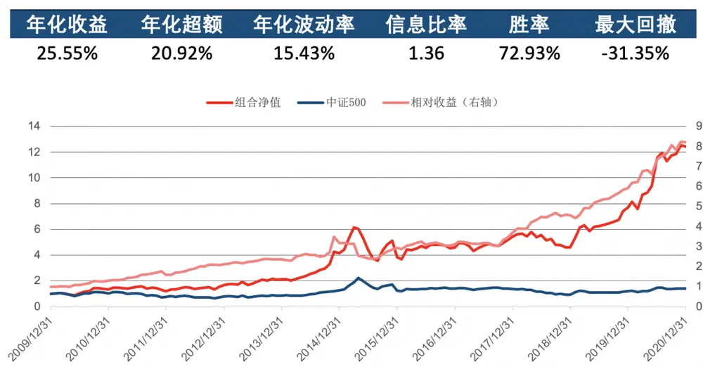
数据来源：wind、中信建投

## 四、分析师投资评级上调事件

## 4.1、分析师投资评级上调事件定义

我们按朝阳永续分析师评级（买入、增持、中性、减持和卖出）进行统计，“买入”评级占比超过 60%，“增持”评级占比接近 40%，其他三种评级的数量较少。因此，在这种大部分都给“买入”和“增持”评级的情况下，我们只选取上调至买入评级的股票。

图10： 分析师各投资评级占比
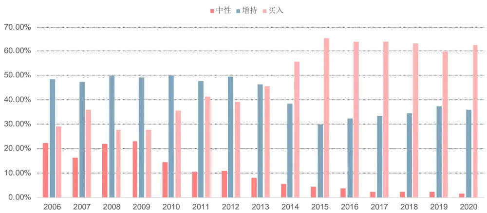
数据来源：wind、中信建投

在前面提到，分析师偏乐观，且增量信息才更具有价值。我们定义分析师将股票从低投资评级上调至买入为分析师投资评级上调事件。下图统计每月上调至买入评级的股票数量，分析师投资评级上调事件每月样本池的均值为 107 只股票。

图11： 分析师评级上调至买入事件样本池数量月度分布情况
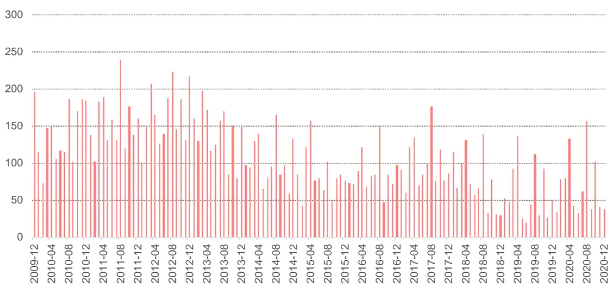
数据来源：wind、中信建投

## 4.2、分析师投资评级上调事件表现

我们每月末统计当月存在分析师投资评级上调事件样本股未来 1 个月的历史收益表现。下图表可以看出，分析师投资评级上调事件也是有一定超额收益，年化超额收益 11%，超额收益最大回撤-6.10%。

图12： 分析师投资评级上调事件表现
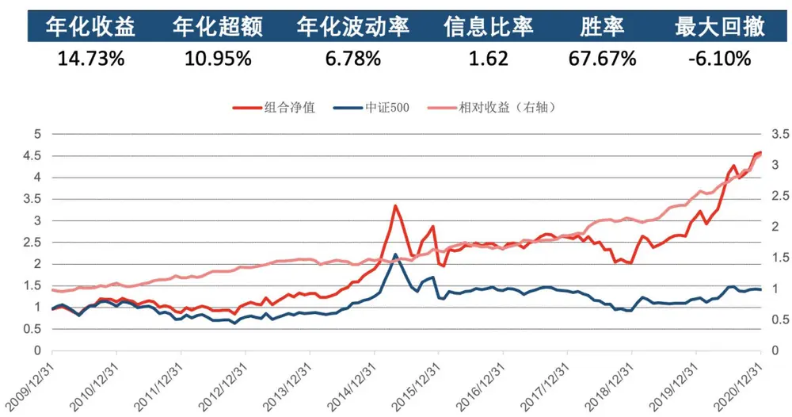
数据来源：wind、中信建投

## 4.3、分析师投资评级上调事件增强表现

同样我们考虑对分析师投资评级上调事件进行增强，我们将评级上调事件样本根据Income_Adjust 因子分组，统计各组样本在未来 60 个交易日相对于中证 500 的超额收益率。从下图可以看出，Income_Adjust 因子在事件样本中表现出优秀的分层效果，盈利预期调整幅度越大的样本在未来的相对收益将越高。第五组与第一组的未来 60 日超额收益相差 3.75%。

图13： 分析师投资评级上调事件样本池分层结果
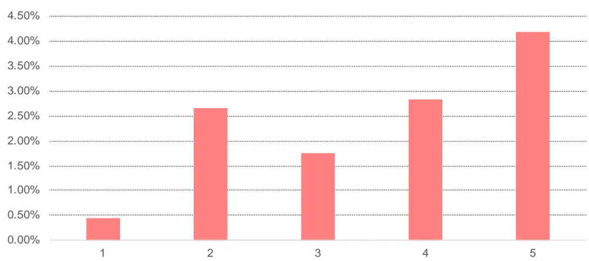
数据来源：wind、中信建投

因此，我们也可以对分析师投资评级上调事件做增强。在每月末，在分析师投资评级上调的股票里面按照盈利预期调整幅度因子排序，选取指标值最大的 20 只股票，同时剔除 ST 股票、次新股等特殊样本。从图表可以看出，策略表现优异。年化超额收益达 23.82%，超额回撤也只有-11%。具体效果比目标价上调事件增强组合更好。

图14： 分析师投资评级上调事件增强表现
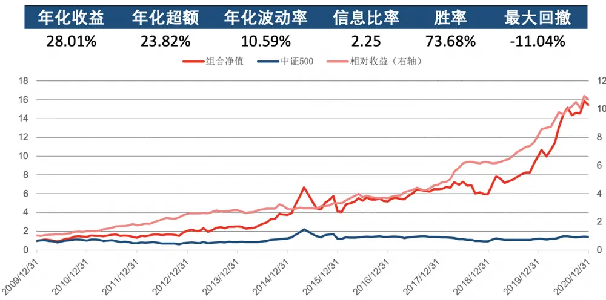
数据来源：wind、中信建投

## 五、分析师预期修正动量事件

## 5.1、分析师预期修正动量事件定义

最后是分析师预期调整的第三个事件——分析师预期修正动量事件，具体可以参考之前的报告《分析师预期修正动量效应选股策略》。下面事件介绍和历史回测部分节选自之前报告的相关内容。

预期修正意为在具体时间段内，分析师或机构对之前预测值的调整。预期调整有一定的趋势性，当新信息出现时，分析师运用该信息领先对自己的预期进行调整，往往会伴随着其他分析师对自己的预测进行同向的调整。在这一过程中，预期均值会随修正趋势变动。具体表现为前一时期均值的调整往往会带动后一期的均值继续向同向调整。为探究这一现象在国内市场是否成立，我们预先选取了预期每股收益,利润总额,营业收入,净利润,营业利润以及目标价格六个指标，并通过分析师覆盖度进行初步筛选。其中，除营业利润之外，其他预期指标覆盖率均值都在 50%以上，且较为平稳。接下来，我们对预期每股收益,利润总额,营业收入,净利润以及目标价格的第一财年一致预期（即平均预期）修正方向进行统计，最后发现预期每股收益、净利润和目标价格的趋势性最强，把其作为选股的候选指标。数据来自朝阳永续数据库。在机构当月未对指标做出预测时，用向前追溯至多半年的预期数据进行填充。

实际上，我们可以进一步将预期的上调细分为两个阶段：在上调第一个阶段，称为 P1 阶段，只有少部分分析师对自己的预期值做出上调，大部分分析师并没做出预期调整，这样可以观察到预期均值出现上升，而分析师间预期的分歧度也开始上升，我们以离散程度来衡量分歧度，即预期离散程度开始上升；而在上调第二个阶段，称为 P2 阶段，其他分析师也会逐渐上调自己的预期，最终所有的分析师预期将会接近一个值，即我们可以观察到预期均值出现上升，而预期离散程度则出现下降。同样，我们可以根据分析师的均值和离散度进一步将预期的下调细分为两个阶段 P3（分析师均值下降，离散程度上升）和 P4（分析师均值下降，离散程度下降）阶段，具体如下图所示：

图15： 分析师预期修正四阶段划分
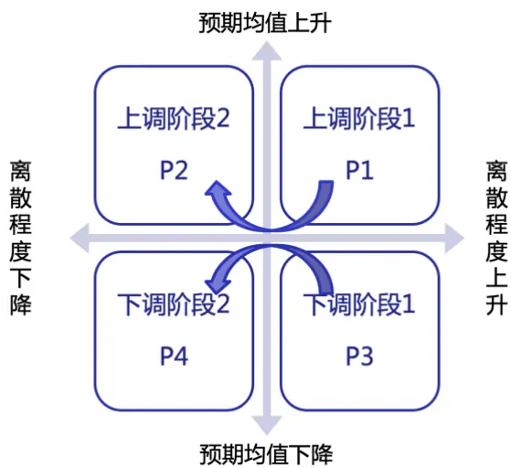
数据来源：wind、中信建投

为验证这一理论在国内市场的可行性，我们选取上面筛选出来的预期 EPS,预期净利润（NP）和预期目标价（TP）三个指标，采用最近一个预测年度的预测值（FY1）来构建组合，并统计组合的年化超额收益、年化超额波动率、超额最大回撤等。

我们 、p1&p2、p2、unchange、p3、p3&p4

等 7 个阶段，每个阶段构建等权资产组合，分别对指标构建超额收益与多头资产组合。

金融工程深度报告

数据选取：选用 2009 年 7 月至 2019 年 7 月十年间（按照之前报告的回测区间），机构覆盖数在 4 个及以上的股票月度数据。

## 5.2、分析师预期修正动量事件表现

下面是预期 EPS 的第一财年分析师预期（FY1）修正选股组合在各个阶段的超额收益统计对比。表现最好的是 P1 阶段的股票，年化超额收益为 12.22%，接下来是 P1&P2 阶段的股票，年化超额收益为 10.48%，然后是 P2阶段的股票，表现最差的是 P3 >p1&p2>p2>预期不变>p4>p3&p4>p3。这也是符合我们的分析

师预期修正理论，即分析师上调对股票有正向影响，分析师下调对股票有负向影响，但从统计结果来看，P3 阶段的股票超额收益仍然为正，这说明了分析师下调对股票的负向影响没有上调对股票的正向影响这么显著，所以之后主要关注分析师上调的股票（主要是 P1 阶段的股票）。

表 1： 预期 EPS FY1超额收益组合

|  | p1 | p1&p2 | p2 | unchange | p3 | p3&p4 | p4 |
| --- | --- | --- | --- | --- | --- | --- | --- |
| 年化收益% | 12.22% | 10.48% | 8.62% | 7.87% | 2.06% | 2.47% | 2.59% |
| 年化波动% | 7.70% | 8.06% | 8.75% | 14.44% | 10.73% | 10.11% | 9.87% |
| 最大回撤% | 7.37% | 10.04% | 11.51% | 21.21% | 18.71% | 17.60% | 17.20% |
| 夏普比率 | 1.59 | 1.30 | 0.98 | 0.54 | 0.19 | 0.24 | 0.26 |

数据来源：wind、中信建投

图16： 预期 EPS FY1超额收益组合
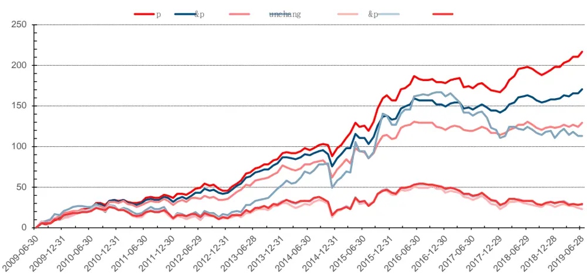
数据来源：wind、中信建投

下面是预期净利润的第一财年分析师预期（FY1）修正选股组合在各个阶段的超额收益统计对比。与预期EPS 类似，表现最好的是 P1 阶段的股票（年化超额为 11.33%），表现最差的是 P3 阶段的股票（年化超额收益为负），因此其分层效果也较好。

表 2： 预期净利润 FY1超额收益组合

|  | p1 | p1&p2 | p2 | unchange | p3 | p3&p4 | p4 |
| --- | --- | --- | --- | --- | --- | --- | --- |
| 年化收益% | 11.33% | 9.95% | 7.93% | 6.61% | -0.42% | 1.42% | 2.69% |
| 年化波动% | 8.95% | 9.03% | 9.43% | 14.99% | 9.53% | 9.20% | 9.42% |
| 最大回撤% | 9.70% | 11.57% | 13.30% | 21.21% | 22.23% | 17.98% | 18.37% |
| 夏普比率 | 1.27 | 1.10 | 0.84 | 0.44 | -0.04 | 0.15 | 0.29 |

数据来源：wind、中信建投

图17： 预期净利润 FY1超额收益组合
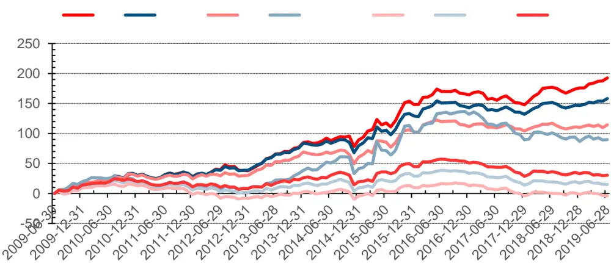
数据来源：wind、中信建投

下面是预期目标价的第一财年分析师预期（FY1）修正选股组合在各个阶段的超额收益统计对比。表现最好的是 P2 阶段的股票（年化超额为 13.03%），表现最差的是 P4 阶段的股票（年化超额收益为 2.68%），因此其选股的分层效果不太显著。主要原因是目标价格是一个范围，我们这边用的是目标价上下限的均值，另外预期目标价不是分析师预测的核心指标，分析师对其预测准确度没有 EPS 和净利润高，因此我们后续不再把预期目标价作为候选指标。

表 3： 预期目标价 FY1超额收益组合

数据来源：wind、中信建投

图18： 预期目标价 FY1超额收益组合
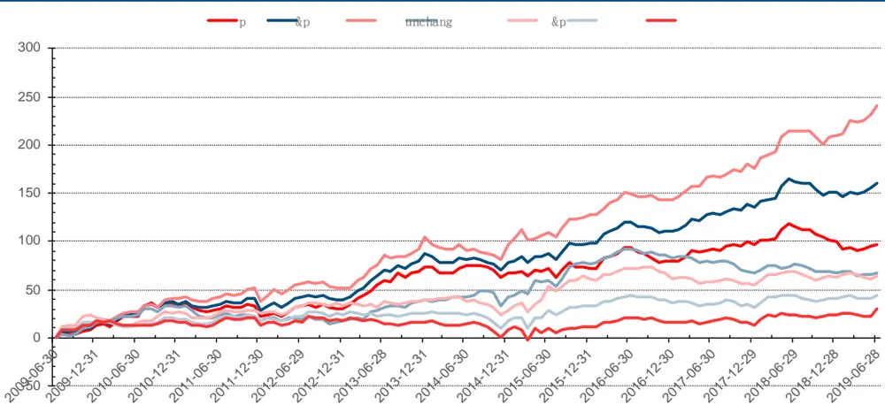
数据来源：wind、中信建投

上面我们主要采用第一财年（FY1）的分析师预期值进行测试，下面我们做一个改进，对预期 EPS、预期净利润两个指标的第二财年（FY2）预测值进行单因子分析，看下其具体效果。

首先是预期 EPS 的第二财年分析师预期（FY2）修正选股组合在各个阶段的超额收益统计对比。表现最好的是 P1 阶段的股票，年化超额收益为 13.38%，这和第一财年分析师预期（FY1）的选股效果比较接近，表现最差的是 P3 阶段的股票，因此 EPSFY2 的分层选股效果仍然比较显著。

表 4： 预期 EPS FY2超额收益组合

| 年化收益% | p1 13.38% | p1&p2 10.77% | p2 7.92% | unchange 7.00% | p3 0.44% | p3&p4 2.12% |
| --- | --- | --- | --- | --- | --- | --- |
| 年化波动% | 8.23% | 8.40% | 8.98% | 14.67% | 10.43% | 3.39% 9.96% 9.90% |
| 最大回撤% | 7.67% | 10.10% | 12.32% | 19.68% | 17.70% 17.47% | 17.92% |
| 夏普比率 | 1.63 | 1.28 | 0.88 | 0.48 | 0.04 0.21 | 0.34 |

数据来源：wind、中信建投

图19： 预期 EPS FY2超额收益组合
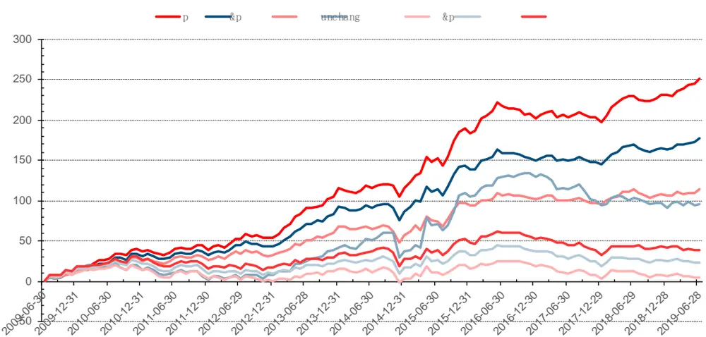
数据来源：wind、中信建投

预期 EPS 第二财年 FY2 超额收益组合的年化收益率为 13.38%，夏普率达到 1.63，两个分析师修正指标的一二财年预测值选股效果比较接近，说明两个财年的预期值修正蕴含着类似信息。

接下来，我们将预期 EPS 两个财年的预测指标进行叠加选股，即选取第一、二财年预期修正所处阶段相同的股票取交集，构建选股组合。

下面是预期 EPS 的第一（FY1）和第二（FY2）财年分析师预期叠加修正选股组合在各个阶段的超额收益统计对比。表现最好的是 P1 阶段的股票，年化超额收益为 16.34%，表现最差的是 P3 阶段的股票，分层选股效果比较显著。

表 5： 预期 EPS FY1FY2叠加超额收益组合

| p1 |  | p1&p2 | p2 | unchange p3 |
| --- | --- | --- | --- | --- |
| 年化收益% 16.34% | 12.27% | 8.10% | 8.56% | -1.24% 0.50% |
| 年化波动% 8.66% | 8.79% | 9.65% | 17.01% |  |
|  |  |  | 11.79% 10.82% 10.53% |  |
| 最大回撤% 6.64% | 9.86% 12.51% | 20.01% | 24.23% 20.30% 20.99% |  |
| 夏普比率 1.89 1.40 0.84 |  |  |  |  |
|  | 0.50 |  |  |  |
|  | -0.11 0.05 0.13 |  |  |  |

数据来源：wind、中信建投

图 20： 预期 EPS FY1 FY2 叠加超额收益组合
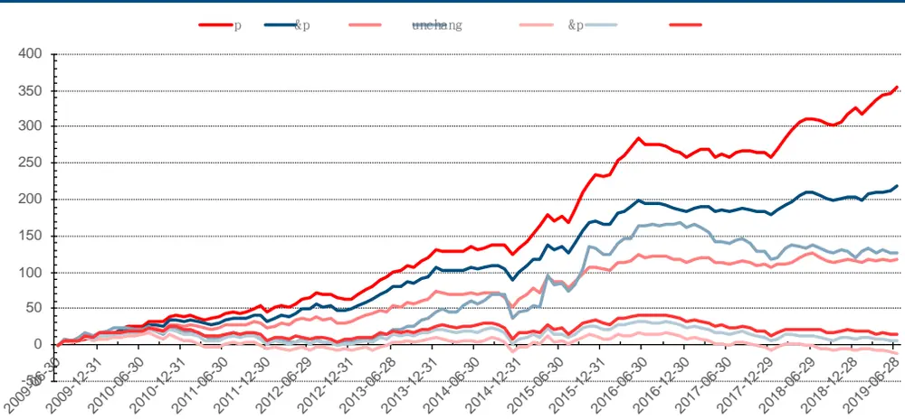
数据来源：wind、中信建投

我们继续做一个改进，假设在 EPS 两财年修正指标叠加选股的基础上，继续叠加其他预测指标进行选股，这边分别在上面 EPSFY1,2 组合基础上继续叠加预期净利润的第一财年和第二财年预测指标，测试效果如下：

下面是第一财年（FY1）、第二财年（FY2）预期 EPS 和第一财年（FY1）预期净利润三个分析师指标叠加修正选股组合在各个阶段的超额收益统计对比。表现最好的是 P1 阶段的股票，表现最差的是 P3 阶段的股票，分层选股效果比较显著。但我们发现三指标 P1 阶段的组合超额收益（16.87%）和不叠加第一财年（FY1）预期净利润的组合超额收益（16.34%）相差不大，其主要原因可能在于预期 EPS 和预期净利润的信息重合度较高，分析师一般在调整股票预期 EPS 同时也会调整预期净利润，因此预期净利润的新增信息不大。

表 6： 预期 EPS FY1,2，预期净利润 FY1 叠加超额收益组合

| 年化收益% | p1 16.87% | p1&p2 12.64% | p2 7.96% | unchange 7.83% | p3 -3.35% | p3&p4 -1.41% |
| --- | --- | --- | --- | --- | --- | --- |
| 年化波动% | 8.69% | 8.74% | 9.72% | 16.98% | 10.65% | -0.25% 10.00% |
| 最大回撤% | 7.22% | 8.93% | 23.89% | 34.35% | 9.73% 27.23% |  |
| 夏普比率 | 1.94 1.45 | 12.78% 0.82 | 0.46 | -0.31 | -0.14 | 22.94% -0.02 |

数据来源：wind、中信建投

图21： 预期 EPS FY1,2，预期净利润 FY1 叠加超额收益组合
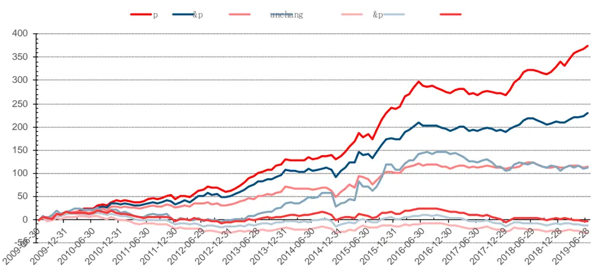
数据来源：wind、中信建投

最后我们选择标红色的组合（EPSFY1、EPSFY2、净利润 FY1 叠加选股组合）作为最终推荐的组合，表现是所有组合里面最好的。

表 7： 组合表现对比

| P1组合超额收益 | EPS FY1 | EPS FY1,2 | EPS FY1,2 NP1 | EPS FY1,2 NP1 1M_Reverse |
| --- | --- | --- | --- | --- |
| 年化收益% | 12.22% | 16.34% | 16.87% | 18.99% |
| 最大回撤% | 7.37% | 6.64% | 7.22% | 14.97% |
| 夏普比率 | 1.59 | 1.89 | 1.94 | 1.7 |

| P1组合多头资产组合 | EPS FY1 | EPS FY1,2 | EPS FY1,2 NP1 | EPS FY1,2 NP1 1M_Reverse |
| --- | --- | --- | --- | --- |
| 年化收益% | 13.16% | 17.59% | 18.07% | 20.03% |
| 最大回撤% | 39.54% | 36.64% | 36.68% | 33.59% |
| 夏普比率 | 0.47 | 0.63 | 0.65 | 0.68 |

| 多空资产组合(P1-P3) | EPS FY1 | EPS FY1,2 | EPS FY1,2 NP1 | EPS FY1,2 NP1 1M_Reverse |
| --- | --- | --- | --- | --- |
| 年化收益% | 9.46% | 17.00% | 20.07% | 36.03% |
| 最大回撤% | 5.84% | 6.53% | 9.47% | 10.01% |
| 夏普比率 | 1.55 | 2.03 | 2.09 | 2.45 |

数据来源：wind、中信建投

最后对这个组合进行样本外跟踪，经过历史样本内回测和样本外跟踪（自 2019 年 7 月 31 日开始样本外跟踪），2009 年 7 月 31 日至 2021 年 1 月 31 日，组合累计绝对收益 676%，相对中证全指累计超额收益 434%，年化超额收益 15.7%，超额收益夏普比率 1.7，超额收益最大回撤 10.8%。

图22： 分析师预期修正选股策略历史绝对收益表现
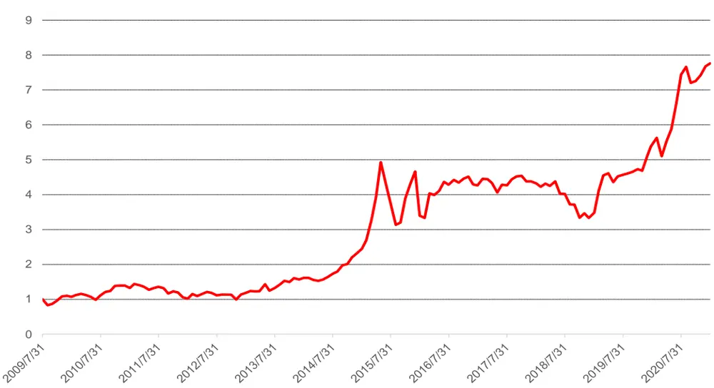
数据来源：wind、中信建投

图23： 分析师预期修正选股策略历史超额收益（相对中证全指）表现
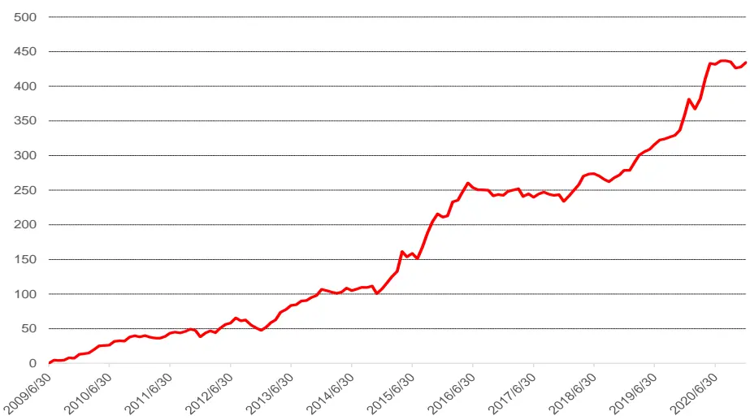
数据来源：wind、中信建投

另外，从 2019 年 7 月开始样本外跟踪（专题报告数据截至 2019 年 7 月），截至 2021 年 1 月底，累计绝对收益 70%，累计超额收益 29%，样本外跟踪 18 个月只有 2 个月超额收益为负，月度胜率 89%，回撤为-2.75%，样本外表现非常优秀。

图 24： 分析师预期修正选股策略样本外跟踪超额收益表现（相对中证全指，2019 年 7 月-2021 年 1 月）
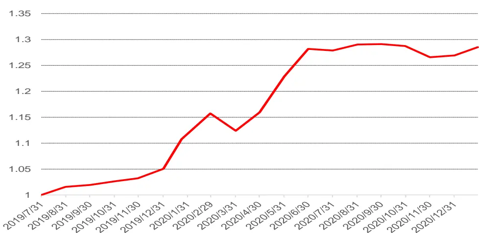
数据来源：wind、中信建投

## 5.3、分析师预期修正动量事件增强表现

下面我们考虑对分析师预期修正上调事件进行增强，和之前的事件增强方法一致，将通过以下两步来完成：

第一，根据前一节思路，利用Income_Adjust 因子对主动上调预期事件样本进行分组，统计各组样本在未来60 日相对于中证 500 的超额收益率。

第二，在每月末，按照盈利预期调整幅度因子排序，选取指标值最大的 20 只股票，构建事件叠加盈利预期调整幅度因子的选股组合。同时剔除 ST 股票、次新股、一字涨跌停等特殊样本股票。

## 5.3.1、EPS FY1 主动上调预期事件

EPS FY1 主动上调预期事件每月样本池数量的均值为 287 只股票。可以看出，分组效果较好，第五组与第一组的未来 60 日超额收益相差 3.93%。然后每个月底在 EPS FY1 主动上调预期事件里精选出盈利预期调整幅度最大的 20 只股票，年化收益超过 30%，年化超额收益达 26.32%，具体效果比前面介绍的传统分析师预期上调组合包括评级上调和目标价上调事件增强组合更好。

图25： EPS FY1 主动上调预期事件样本池分层结果
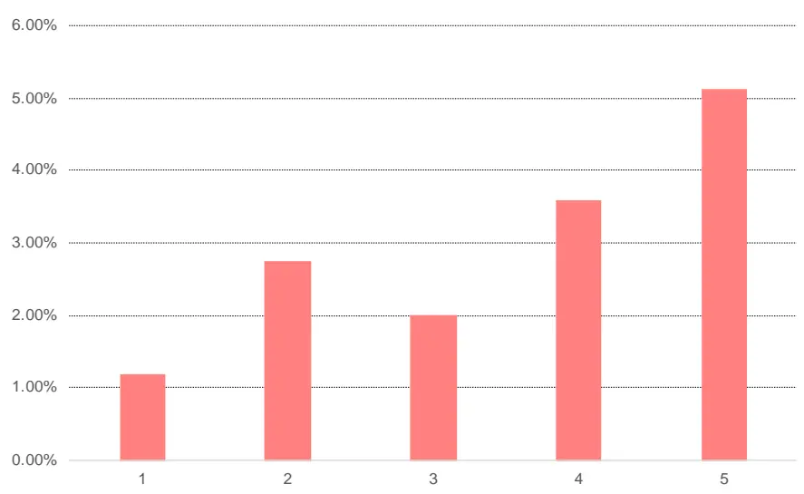
数据来源：wind、中信建投

图26： EPS FY1 主动上调预期事件增强表现
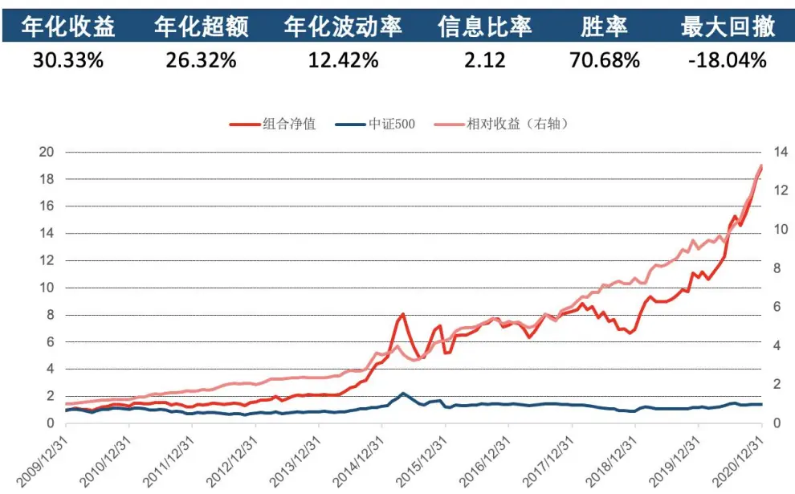
数据来源：wind、中信建投

## 5.3.2、EPS FY2 主动上调预期事件

EPS FY2 主动上调预期事件每月样本池数量的均值为 258 只股票。可以看出，分组效果较好，第五组与第一组的未来 60 日超额收益相差 3.78%。然后每个月底在 EPS FY2 主动上调预期事件里精选出盈利预期调整幅度最大的 20 只股票，年化超额收益达 25.62%。

图27： EPS FY2 主动上调预期事件样本池分层结果
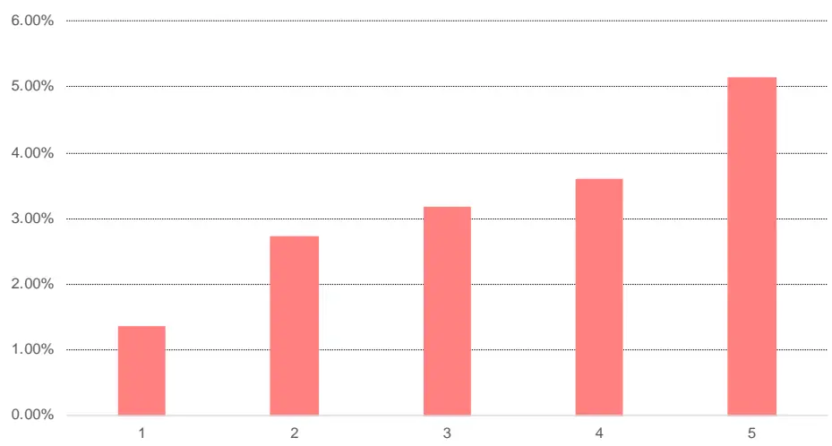
数据来源：wind、中信建投

图28： EPS FY2 主动上调预期事件增强表现
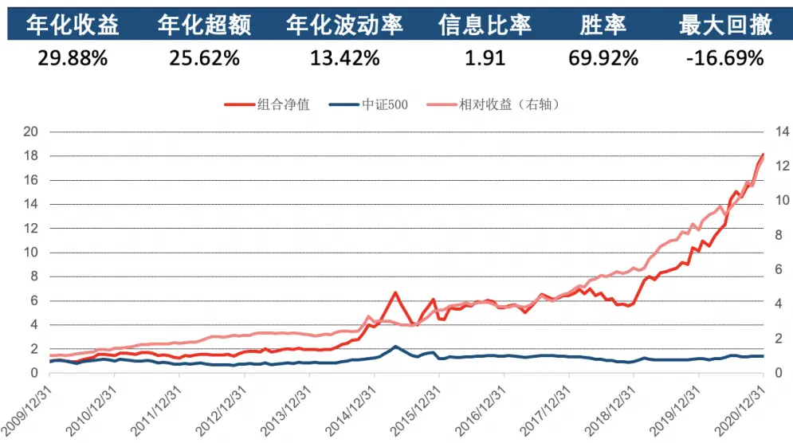
数据来源：wind、中信建投

## 5.3.3、净利润 FY1主动上调预期事件

净利润均主动上调预期事件每月样本池数量的均值为 351 只股票。可以看出，分组效果较好，第五组与第一组的未来 60 日超额收益相差 3.60%。然后每个月底在净利润 FY1 主动上调预期事件里精选出盈利预期调整幅度最大的 20 只股票，年化超额收益达 25.05%。

图29： 净利润 FY1主动上调预期事件样本池分层结果
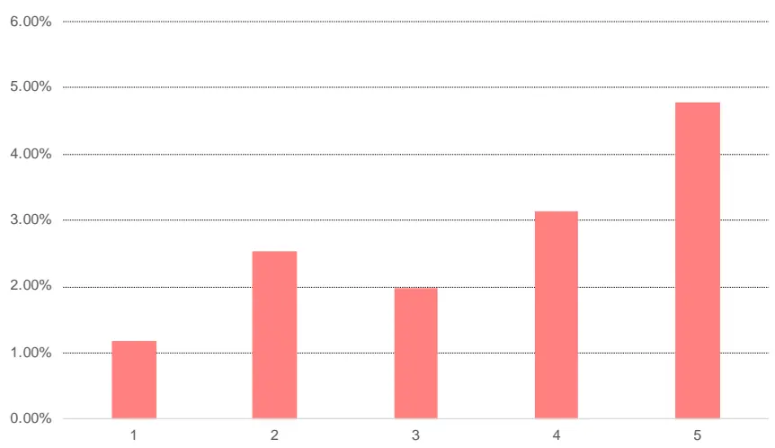
数据来源：wind、中信建投

图30： 净利润 FY1主动上调预期事件增强表现
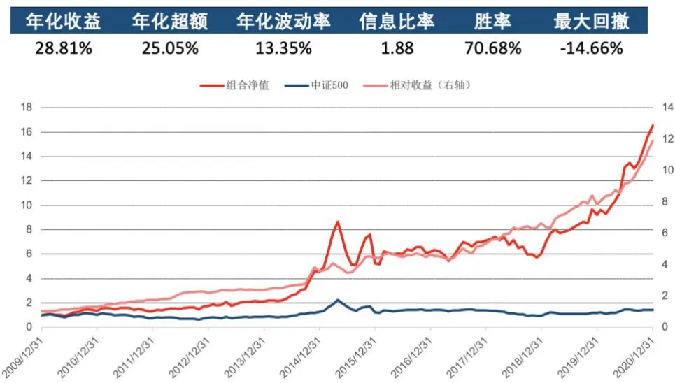
数据来源：wind、中信建投

## 5.3.4、EPS_FY1、EPS_FY2 均主动上调预期事件

EPS_FY1、EPS_FY2 均主动上调预期事件每月样本池数量的均值为 162 只股票。可以看出，分组效果较好，第五组与第一组的未来 60 日超额收益相差 4.05%。然后每个月底在 EPS_FY1、EPS_FY2 均主动上调预期事件里精选出盈利预期调整幅度最大的 20 只股票，年化超额收益超过 30%，超额收益最大回撤只有-12.81%。

图31： EPS_FY1、EPS_FY2均主动上调预期事件样本池分层结果
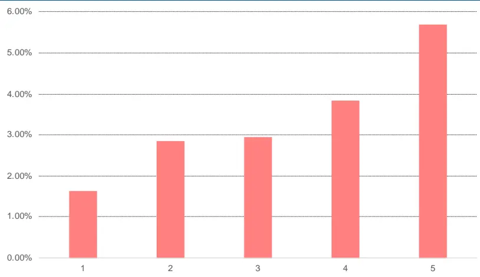
数据来源：wind、中信建投

图 32： EPS_FY1、EPS_FY2 均主动上调预期事件增强表现
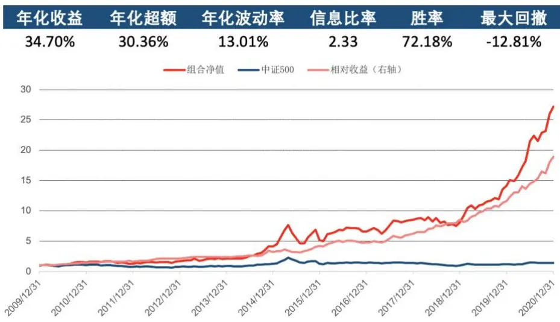
数据来源：wind、中信建投

## 5.3.5、EPS_FY1、EPS_FY2、净利润 FY1 均主动上调预期事件

EPS_FY1、EPS_FY2、净利润 FY1 均主动上调预期事件每月样本池数量的均值为 150 只股票。可以看出，分组效果较好，第五组与第一组的未来 60 日超额收益相差 4.16%。然后每个月底在 EPS_FY1、EPS_FY2、净利润 FY1均主动上调预期事件里精选出盈利预期调整幅度最大的 20 只股票，年化超额收益达 30%，超额收益最大回撤只有-9.6%。这个组合即在跟踪了两年的组合基础上做的增强组合，表现是所有介绍的分析师预期上调事件增强组合里最好的。

图33： EPS_FY1、EPS_FY2、净利润均主动上调预期事件样本池分层结果
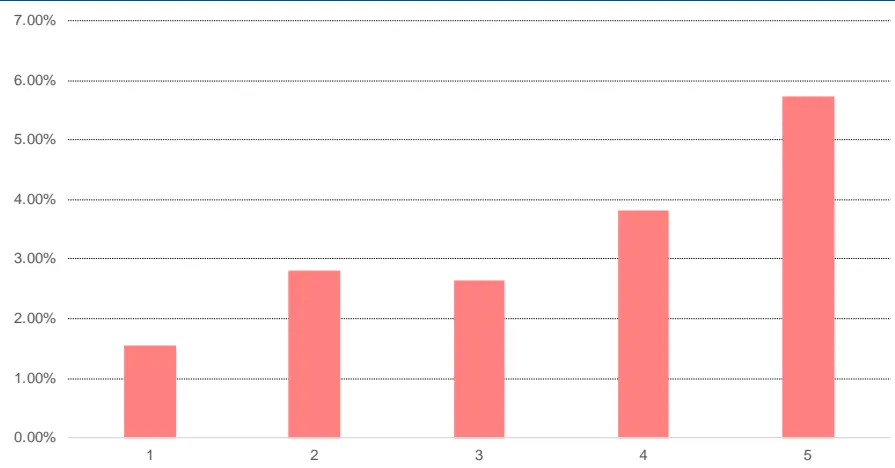
数据来源：wind、中信建投

图34： EPS_FY1、EPS_FY2、净利润均主动上调预期事件增强表现
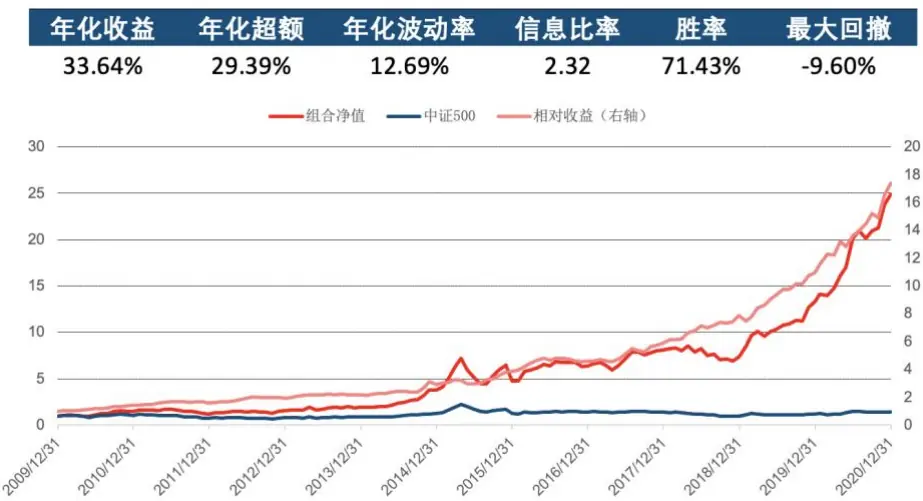
数据来源：wind、中信建投

表 8 汇总了以上所有事件在分析师盈利预期调整幅度因子增强后的结果。可以看出，各个事件在原有的事件基础上都得到了增强，并且 EPS_FY1、EPS_FY2、净利润均主动上调预期事件（标红色）的增强效果是最好的，我们把它作为最终的推荐组合。

表 8： 各事件叠加盈利预期调整幅度因子选股策略

|  | 年化收益 |  | 年化超额 年化波动率 | 信息比率 | 胜率 | 最大回撤 |
| --- | --- | --- | --- | --- | --- | --- |
| 目标价上调事件增强策略 | 25.55% | 20.92% | 15.43% | 1.36 | 72.93% | -31.35% |
| 投资评级上调 | 28.01% | 23.82% | 10.59% | 2.25 | 73.68% | -11.04% |
| EPS FY1主动上调 | 30.33% | 26.32% | 12.42% | 2.12 | 70.68% | -18.04% |
| EPS FY2主动上调 | 29.88% | 25.62% | 13.42% | 1.91 | 69.92% | -16.69% |
| 净利润FY1主动上调 | 28.81% | 25.05% | 13.35% | 1.88 | 70.68% | -14.66% |
| EPS_FY1、EPS_FY2 均主动上调 | 34.70% | 30.36% | 13.01% | 2.33 | 72.18% | -12.81% |
| EPS_FY1、EPS_FY2、 净利润FY1均主动上调 | 33.64% | 29.39% | 12.69% | 2.32 | 71.43% | -9.60% |

数据来源：wind、中信建投

最后我们看下最终推荐组合在各行业上的分布，可以看出机械、化工和医药的股票是最多的，但最高行业权重也只有 7%左右，因此这个组合还是一个比较均衡的组合，没有非常明显的行业偏离。

图35： EPS_FY1、EPS_FY2、净利润均主动上调预期事件增强组合行业分布
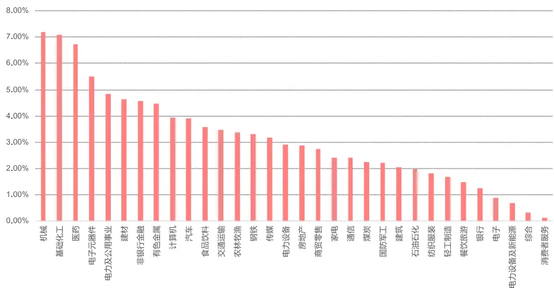
数据来源：wind、中信建投

然后我们看下组合的指数成分股分布，有大概 1/4 的股票属于沪深 300 指数成分股，1/4 的股票属于沪深500 指数成分股，其他股票占一半，因此这个组合也没有明显的市值偏离。

图36： EPS_FY1、EPS_FY2、净利润均主动上调预期事件增强组合指数分布
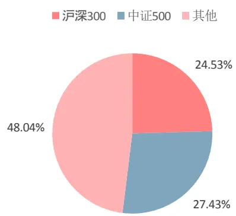
数据来源：wind、中信建投

最后我们统计下组合的分年表现，我们看到最近10年基本上每年相比基准中证500指数均有显著超额收益，超额收益最大回撤也非常低，尤其是 2019 年和 2020 年超额收益达 50%，回撤也非常低。

表 9： EPS_FY1、EPS_FY2、净利润均主动上调预期事件增强组合收益分年统计

|  | 年化收益 | 基准收益 | 年化超额 | 年化波动率 | 信息比率 | 胜率 | 最大回撤 |
| --- | --- | --- | --- | --- | --- | --- | --- |
| 2010 | 50.55% | 10.07% | 37.02% | 9.98% | 3.71 | 83.33% | -0.41% |
| 2011 | -17.88% | -33.83% | 22.79% | 7.19% | 3.17 | 91.67% | -0.79% |
| 2012 | 17.94% | 0.28% | 16.16% | 12.14% | 1.33 | 58.33% | -3.09% |
| 2013 | 28.65% | 16.89% | 10.03% | 7.58% | 1.32 | 58.33% | -2.72% |
| 2014 | 99.87% | 39.01% | 44.59% | 19.29% | 2.31 | 75.00% | -2.30% |
| 2015 | 72.30% | 43.12% | 22.41% | 17.68% | 1.27 | 66.67% | -9.60% |
| 2016 | -2.36% | -17.78% | 18.92% | 11.76% | 1.61 | 58.33% | -5.77% |
| 2017 | 26.54% | -0.20% | 27.20% | 13.53% | 2.01 | 58.33% | -4.92% |
| 2018 | -13.70% | -33.32% | 28.49% | 9.83% | 2.9 | 75.00% | -2.19% |
| 2019 | 84.65% | 26.38% | 45.12% | 12.47% | 3.62 | 83.33% | -4.93% |
| 2020 | 86.69% | 20.87% | 54.15% | 14.20% | 3.81 | 75.00% | -2.87% |
| 全样本 | 33.64% | 3.18% | 29.39% | 12.69% | 2.32 | 71.43% | -9.60% |

数据来源：wind、中信建投

最后我们对组合做了一个敏感性分析。我们分别尝试选取前 到前 的股票，发现选取前 只股票组合是最好的（收益基本最高，回撤相对较小）。但选前 50 只股票的超额收益也有 23%，超额回撤是最低的，因此这个参数也不是非常敏感。但因为我们的事件组合样本池平均为 150 只股票，因此选前 20 只股票相当于选前1/5 或 1/6 的股票，也是比较符合逻辑。

表 10： EPS_FY1、EPS_FY2、净利润均主动上调预期事件增强组合选取股票数量的敏感性分析

|  | 年化收益 | 年化超额 | 年化波动率 | 信息比率 | 胜率 | 最大回撤 |
| --- | --- | --- | --- | --- | --- | --- |
| 前10 | 33.74% | 29.95% | 18.43% | 1.63 | 69.17% | -18.90% |
| 前20 | 33.64% | 29.39% | 12.69% | 2.32 | 71.43% | -9.60% |
| 前30 | 28.73% | 24.60% | 10.38% | 2.37 | 73.68% | -7.21% |
| 前40 | 27.49% | 23.35% | 9.30% | 2.51 | 76.69% | -6.26% |
| 前50 | 27.14% | 23.04% | 8.78% | 2.62 | 78.20% | -6.23% |

数据来源：wind、中信建投

## 六、总结与思考

分析师预期调整主要包括三方面信息，分别是盈利预期调整、目标价格调整以及投资评级调整。本文利用这三方面信息构建因子和事件，并基于此构建选股策略，从而实现在充分利用分析师预期调整信息的基础上取得优秀的选股效果。

第一部分主要介绍了分析师预期调整的基本情况。分析师总是倾向于发表乐观看法、避免给出负面观点。同时，分析师对于 A 股市场的重点股票均有覆盖，而对中小票的覆盖度则逐年降低。分析师对于自身过去预测的调整往往意味着新信息的到来，而分析师对于不同股票的预测调整力度又能反映出不同股票间的边际改善差异和分析师对于新信息的处理能力。基于此，我们尝试将分析师预期选股因子与分析师预期调整事件相结合，构建具有“强逻辑”的事件增强选股策略，获得优秀的历史收益表现。

第二部分我们以相同分析师在时间序列上的预期调整为基础构建分析师盈利预期调整因子，其反映了市场所有分析师对于股票盈利预期调整的中间水平。分析师盈利预期调整因子的分层效果区分度非常高。分析师盈利预期调整因子表现出优异的选股能力。因子年化多空收益 14.93%，夏普比率 1.8，IC 均值 3.96%，年化 IC_IR达到 2.2。

第三部分定义了分析师目标价上调事件，并对分析师目标价上调事件的历史表现和利用分析师盈利预期调整因子增强后的表现进行了分析。发现目标价上调事件叠加盈利预期调整幅度因子选股策略表现优异，年化超额收益达 21%，但回撤较大。

第四部分定义了分析师投资评级上调事件，并对分析师投资评级上调的历史表现和利用分析师盈利预期调整因子增强后的表现进行了分析。发现投资评级上调事件叠加盈利预期调整幅度因子选股策略年化超额收益达23.82%，回撤也只有 11%。

第五部分定义了分析师预期修正动量事件，并对分析师预期修正动量事件的历史表现和利用分析师盈利预期调整因子增强后的表现进行了分析。EPS_FY1、EPS_FY2、净利润 FY1 均主动上调预期叠加盈利预期调整幅度因子选股策略年化超额收益达 29.39%，回撤仅 9.6%，是所有分析师预期上调事件增强组合里面表现最好的。

风险提示：模型失效，历史规律不再重复

## 参考文献

Kim Y , Lobo G J , Song M . Analyst characteristics, timing of forecast revisions, and analyst forecasting ability[J]. 
Journal of Banking & Finance, 2011, 35(8):2158-2168.

Jiang G J , Lu L , Zhu D . The information content of analyst recommendation revisions — Evidence from the Chinese stock market[J]. Pacific-Basin Finance Journal, 2014, 29(sep.):1-17.

Barber, B, Lehavy, R, Mcnichols, M and Trueman, B. “Reassessing the returns to analysts' stock recommendations.” Financial Analysts Journal (2003): 88-96.

Boni, L, and Womack, KL. “Analysts, industries, and price momentum.” Journal of Financial and Quantitative Analysis 41.01 (2006): 85-109.

Irvine, PJ. “The incremental impact of analyst initiation of coverage.” Journal of Corporate Finance 9.4 (2003): 431-451. Jegadeesh, N, and Kim, W. “Value of analyst recommendations: International evidence.” Journal of Financial Markets 9.3 (2006): 274-309.

## 分析师介绍

丁鲁明：同济大学金融数学硕士，中国准精算师，现任中信建投证券研究发展部金融工程方向负责人，首席分析师。10 年证券从业，历任海通证券研究所金融工程高级研究员、量化资产配置方向负责人；先后从事转债、选股、高频交易、行业配置、大类资产配置等领域的量化策略研究，对大类资产配置、资产择时领域研究深入，创立国内“量化基本面”投研体系。多次荣获团队荣誉：新财富最佳分析师 2009 第 4、2012第 4、2013 第 1、2014 第 3 等；水晶球最佳分析师 2009 第 1、2013 第 1；2018 年 wind金牌分析师第 2 等。

陈升锐：芝加哥大学金融数学硕士，三年基金公司量化投资研究工作经验，2018 年加入中信建投研究发展部金融工程团队，专注于量化选股研究。2018、2019、2020 年Wind 金牌分析师金融工程第 2 名、第 2 名、第 5 名团队核心成员。

## 评级说明

| 投资评级标准 |  | 评级 | 说明 |
| --- | --- | --- | --- |
| 报告中投资建议涉及的评级标准为报告发布日后6个月内的相对市场表现，也即报告发布日后的6个月内公司股价（或行业指数）相对同期相关证券市场代表性指数的涨跌幅作为基准。A股市场以沪深300指数作为基准；新三板市场以三板成指为基准；香港市场以恒生指数作为基准；美国市场以标普500指数为基准。 | 股票评级 | 买入 | 相对涨幅15%以上 |
|  |  | 增持 | 相对涨幅 5%—15% |
|  |  | 中性 | 相对涨幅-5%—5%之间 |
|  |  | 减持 | 相对跌幅 5%—15% |
|  |  | 卖出 | 相对跌幅15%以上 |
|  | 行业评级 | 强于大市 | 相对涨幅10%以上 |
|  |  | 中性 | 相对涨幅-10-10%之间 |
|  |  | 弱于大市 | 相对跌幅10%以上 |

## 分析师声明

本报告署名分析师在此声明：（i）以勤勉的职业态度、专业审慎的研究方法，使用合法合规的信息，独立、客观地出具本报告, 结论不受任何第三方的授意或影响。（ii）本人不曾因，不因，也将不会因本报告中的具体推荐意见或观点而直接或间接收到任何形式的补偿。

## 法律主体说明

本报告由中信建投证券股份有限公司及/或其附属机构（以下合称“中信建投”）制作，由中信建投证券股份有限公司在中华人民共和国（仅为本报告目的，不包括香港、澳门、台湾）提供。中信建投证券股份有限公司具有中国证监会许可的投资咨询业务资格，本报告署名分析师所持中国证券业协会授予的证券投资咨询执业资格证书编号已披露在报告首页。

本报告由中信建投（国际）证券有限公司在香港提供。本报告作者所持香港证监会牌照的中央编号已披露在报告首页。

## 一般性声明

本报告由中信建投制作。发送本报告不构成任何合同或承诺的基础，不因接收者收到本报告而视其为中信建投客户。

本报告的信息均来源于中信建投认为可靠的公开资料，但中信建投对这些信息的准确性及完整性不作任何保证。本报告所载观点、评估和预测仅反映本报告出具日该分析师的判断，该等观点、评估和预测可能在不发出通知的情况下有所变更，亦有可能因使用不同假设和标准或者采用不同分析方法而与中信建投其他部门、人员口头或书面表达的意见不同或相反。本报告所引证券或其他金融工具的过往业绩不代表其未来表现。报告中所含任何具有预测性质的内容皆基于相应的假设条件，而任何假设条件都可能随时发生变化并影响实际投资收益。中信建投不承诺、不保证本报告所含具有预测性质的内容必然得以实现。

本报告内容的全部或部分均不构成投资建议。本报告所包含的观点、建议并未考虑报告接收人在财务状况、投资目的、风险偏好等方面的具体情况，报告接收者应当独立评估本报告所含信息，基于自身投资目标、需求、市场机会、风险及其他因素自主做出决策并自行承担投资风险。中信建投建议所有投资者应就任何潜在投资向其税务、会计或法律顾问咨询。不论报告接收者是否根据本报告做出投资决策，中信建投都不对该等投资决策提供任何形式的担保，亦不以任何形式分享投资收益或者分担投资损失。中信建投不对使用本报告所产生的任何直接或间接损失承担责任。

在法律法规及监管规定允许的范围内，中信建投可能持有并交易本报告中所提公司的股份或其他财产权益，也可能在过去 12个月、目前或者将来为本报告中所提公司提供或者争取为其提供投资银行、做市交易、财务顾问或其他金融服务。本报告内容真实、准确、完整地反映了署名分析师的观点，分析师的薪酬无论过去、现在或未来都不会直接或间接与其所撰写报告中的具体观点相联系，分析师亦不会因撰写本报告而获取不当利益。

本报告为中信建投所有。未经中信建投事先书面许可，任何机构和/或个人不得以任何形式转发、翻版、复制、发布或引用本报告全部或部分内容，亦不得从未经中信建投书面授权的任何机构、个人或其运营的媒体平台接收、翻版、复制或引用本报告全部或部分内容。版权所有，违者必究。

## 中信建投

中信建投（国际）

北京

东城区朝内大街2号凯恒中心B

上海

深圳

浦东新区浦东南路 528 号上海南塔 2106 室

香港

座 12 层

中环交易广场2期18 楼

中心 B 座 22 层

电话：(8610) 8513-0588

电话：(8621) 6882-1612

电话：（86755）8252-1369

电话：（852）3465-5600

联系人：李祉瑶

联系人：翁起帆

联系人：曹莹

邮箱：lizhiyao@csc.com.cn

邮箱：wengqifan@csc.com.cn

联系人：刘泓麟

邮箱：caoying@csc.com.cn

邮箱：charleneliu@csci.hk