[table_main] 证券研究报告·金融工程深度报告金融衍

# 券商金股组合深度解析及分析师因子再增强——因子深度研究系列

## 主要结论

## 本文概述

券商金股组合是券商研究所的各个行业组通过调研、访谈和财务分析等主动研究方式选出，并进一步由策略组精选得到的月度最佳推荐组合。一般而言，月度金股组合的数量是 10 只，因此，也称为“十大金股”。本文尝试挖掘券商金股组合中的股票 Alpha，从券商、行业和推荐重合度等角度深度解析券商金股组合的超额收益情况。进一步地，基于所构造的分析师预期因子对券商金股组合进行增强，得到收益稳健且优秀的金股 20组合。从 2018 年至 2021 年3月底，在第五个交易日调仓，根据分析师预期调整类等权因子选取的金股20组合策略年化收益31.36%，超额中证500的年化收益 31.10%，信息比率 1.89，胜率 69.23%。总体选股效果是所有增强策略里最好的。

## 各家券商推荐金股历史平均超额收益（相对中证 500）为 1.84%，券商金股在各中信行业上的平均超额收益为 1.23%

我们从券商、行业和推荐重合度等角度深度解析券商金股组合的超额收益情况。各家券商推荐金股历史平均超额收益（相对中证 500）为 1.84%，中位数为 1.95%。各家券商推荐金股历史平均月度胜率（相对中证 500）为 65.09%，中位数为 66.67%。不同推荐次数的股票池表现无明显差异，因此，无法基于推荐次数来区分股票的收益。券商金股在各中信行业上的平均超额收益为 1.23%，中位数为 1.56%。

## 在每月第五个交易日调仓，根据分析师预期调整类等权因子选取的金股 20组合策略年化收益 31.36%

我们尝试构造了三大类因子，分别是分析师预期调整类因子、市场一致预期调整类因子和纯净的分析师覆盖度类因子，并将分析师预期净利润调整幅度、市场一致预期净利润调整幅度和纯净的分析师覆盖度类因子等权打分得到等权因子。等权因子表现出优异的选股能力。Q1 组相对 Q10组具有超过 21%的超额收益（其中 Q1 超过 16%的多头超额收益，Q10 仅不足-4%）。因子年化多空收益 21.55%，夏普比率 1.69，IC 均值 5.62%，年化 IC_IR 达到 1.80。进一步地，我们发现分析师预期调整类因子在金股股票池的多头超额表现较好。因此，我们利用分析师盈利预期调整因子对券商金股组合进行增强。即在每月第五个交易日调仓，根据分析师预期调整类等权因子选取的金股 20 组合策略年化收益 31.36%，超额中证 500 的年化收益 31.10%，信息比率 1.89，胜率 69.23%。在最佳选股组合的历史持仓方面，行业层面上，电子、基础化工和医药的行业占比最高。

## 券商金股 20 组合样本外跟踪一年绝对收益达 35.18%

我们从 2021 年 3 月底开始样本外跟踪，截至 2022 年 2 月底，金股 20 组合绝对收益达 35.18%，相对中证 500 指数超额收益 24.61%，值得持续关注。

# 金融工程研究

。陈升锐[table

chenshengrui @csc.com.cn

021-68821600

SAC 执证编号：S1440519040002

## 丁鲁明

dingluming@csc.com.cn

021-68821623

SAC 执证编号：S1440515020001

发布日期： 2022 年 04 月 17 日

## 相关研究报告

| 21.08.05 | 因子深度研究系列：分析师预期调整事 件增强选股策略全攻略 |
| --- | --- |
| 21.07.07 | 因子深度研究系列：多层次订单失衡及 订单斜率因子 |
| 21.01.29 | 因子深度研究系列：高频订单失衡及价 差因子 |
| 20.10.23 | 因子深度研究系列：买卖报单流动性因 子构建 |
| 20.07.09 | 因子深度研究系列：高频量价选股因子 初探 |
| 20.04.02 | 因子深度研究系列：分析师超预期因子 选股策略 |
| 20.01.17 | 因子深度研究系列：分析师预期修正动 量效应选股策略 |
| 19.08.21 | 因子深度研究系列：中信建投一致预期 因子体系搭建 |
| 19.03.28 | 因子深度研究系列：因子衰减在多因子 选股中的应用 |
| 18.08.30 | 因子深度研究系列：Barra风险模型介绍 及与中信建投选股体系的比较 |

## 一、券商月度推荐股票组合主要形式

## 1.1、 券商月度推荐股票组合定义

主动研究能够挖掘到很多无法通过量化研究挖掘出的股票 Alpha。近年来，投资者越来越关注明星基金经理的重仓情况以及北向资金的增持情况。本质上，也是希望通过复制组合来分享到主动研究的股票 Alpha。而本文聚焦于来自研究所分析师视角的股票组合——券商金股组合。券商金股组合是券商研究所的各个行业组通过调研、访谈和财务分析等主动研究方式选出，并进一步由策略组精选得到的月度最佳推荐组合。一般而言，月度金股组合的数量是 10 只，因此，也称为“十大金股”。

## 1.2、券商金股的具体形式

本文所采取的券商金股来源于每市，时间段为 2018 年 1 月 1 日至 2021 年 4 月，每月覆盖的券商机构个数平均 34 家机构。下图为每月的券商机构数量，可以看出，券商机构个数从一开始的不到 20 家增长到现在已经有 46 家，说明券商金股已经逐步完善，也将持续影响市场预期。下表为中信建投 2021 年 4 月金股，可以看出单个券商的金股覆盖多个行业，是从各个行业中精选得到的股票。

图1： 每月的券商机构数量
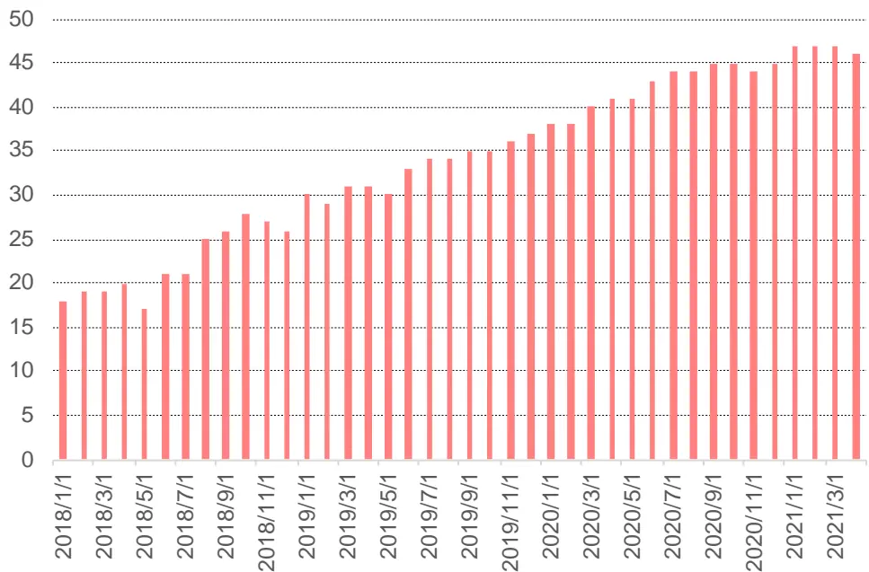
数据来源：wind、每市、中信建投

表1： 中信建投 4月金股

| 股票代码 | 股票名称 | 推荐机构 | 推荐月份 | 所属行业 |
| --- | --- | --- | --- | --- |
| 001914.SZ | 招商积余 | 中信建投金股 | 2021年4月 | 房地产 |
| 000550.SZ | 江铃汽车 | 中信建投金股 | 2021年4月 | 汽车 |
| 000830.SZ | 鲁西化工 | 中信建投金股 | 2021年4月 | 化工 |
| 600176.SH | 中国巨石 | 中信建投金股 | 2021年4月 | 化工 |
| 600258.SH | 首旅酒店 | 中信建投金股 | 2021年4月 | 休闲服务 |
| 600295.SH | 鄂尔多斯 | 中信建投金股 | 2021年4月 | 采掘 |
| 600399.SH | 抚顺特钢 | 中信建投金股 | 2021年4月 | 钢铁 |
| 600416.SH | 湘电股份 | 中信建投金股 | 2021年4月 | 电气设备 |
| 600483.SH | 福能股份 | 中信建投金股 | 2021年4月 | 公用事业 |
| 002078.SZ | 太阳纸业 | 中信建投金股 | 2021年4月 | 轻工制造 |
| 601919.SH | 中远海控 | 中信建投金股 | 2021年4月 | 交通运输 |
| 002230.SZ | 科大讯飞 | 中信建投金股 | 2021年4月 | 计算机 |
| 002415.SZ | 海康威视 | 中信建投金股 | 2021年4月 | 电子 |
| 002444.SZ | 巨星科技 | 中信建投金股 | 2021年4月 | 机械设备 |
| 601908.SH | 京运通 | 中信建投金股 | 2021年4月 | 电气设备 |
| 601677.SH | 明泰铝业 | 中信建投金股 | 2021年4月 | 有色金属 |
| 002612.SZ | 朗姿股份 | 中信建投金股 | 2021年4月 | 纺织服装 |
| 300347.SZ | 泰格医药 | 中信建投金股 | 2021年4月 | 医药生物 |
| 300413.SZ | 芒果超媒 | 中信建投金股 | 2021年4月 | 传媒 |
| 003032.SZ | 传智教育 | 中信建投金股 | 2021年4月 | 传媒 |
| 601658.SH | 邮储银行 | 中信建投金股 | 2021年4月 | 银行 |
| 688665.SH | 四方光电 | 中信建投金股 | 2021年4月 | 机械设备 |
| 688696.SH | 极米科技 | 中信建投金股 | 2021年4月 | 家用电器 |

数据来源：wind、每市、中信建投

## 1.3、本文内容逻辑框架

本文尝试挖掘券商金股组合中的股票 Alpha，从券商、行业和推荐重合度等角度深度解析券商金股组合的超额收益情况。同时，本文提出了三大类分析师预期因子，并分别测试了其在全市场和金股股票池的表现。进一步地，基于所构造的分析师预期因子对券商金股组合进行增强，得到收益稳健且优秀的金股 20 组合。

图2： 各个券商在历史月度上的平均金股覆盖情况
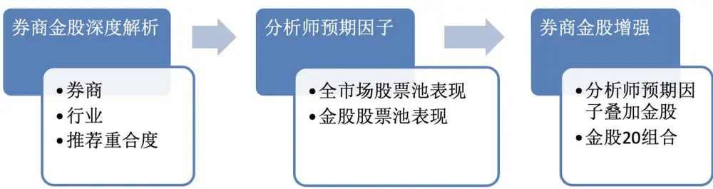
数据来源：wind、中信建投

## 二、券商金股深度解析

## 2.1、各家券商推荐金股情况分析

下图展示了各个券商在历史月度上的平均金股覆盖情况，可以看出，大多数券商的覆盖率在 60%以上，整体覆盖完整。并且，所有券商推荐金股历史平均覆盖率达到 70.68%，历史覆盖率中位数为 82.5%。

图3： 各个券商在历史月度上的平均金股覆盖情况
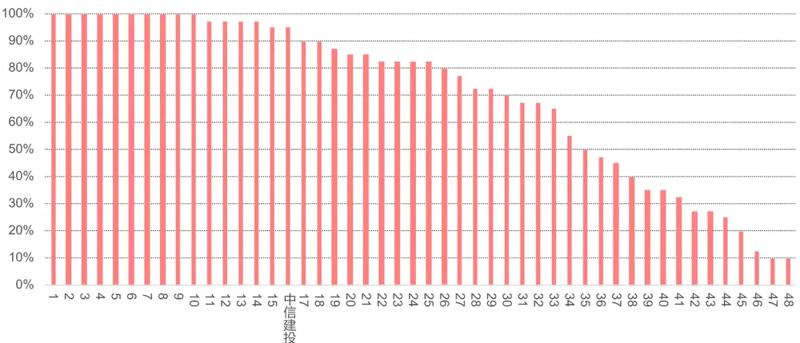
数据来源：wind、每市、中信建投

下图展示了各家券商推荐金股历史平均超额收益情况。各家券商推荐金股历史平均超额收益（相对中证500）为 1.84%，中位数为 1.95%。

图4： 各家券商推荐金股历史超额收益
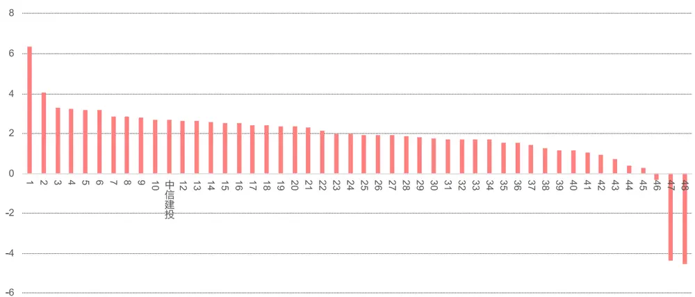
数据来源：wind、每市、中信建投

从下图可以看出，中信建投金股相对中证 500 有出色的超额表现，年化超额收益能够达到 34.23%。

图5： 中信建投金股的超额表现（相对中证 500）
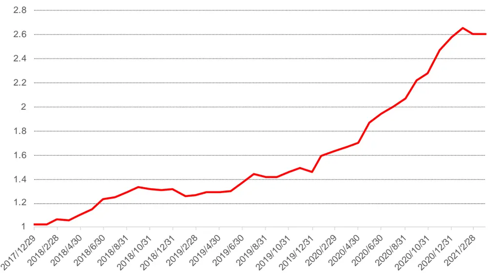
数据来源：wind、每市、中信建投

下图展示了各家券商推荐金股历史月度胜率情况。各家券商推荐金股历史平均月度胜率（相对中证 500）为 65.09%，中位数为 66.67%。

图6： 各家券商推荐金股历史月度胜率（相对中证 500）
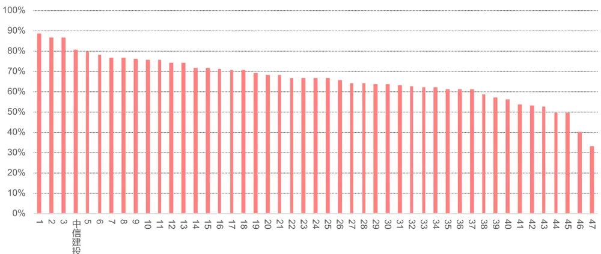
数据来源：wind、每市、中信建投

## 2.2、券商金股推荐次数分析

从下图可以看出，券商金股每月推荐次数为 1、2、3、4 和 5 次以上的个股占比分别为 71.58%、16.58%、6.29%、2.63%和 2.92%。说明各个券商推荐的股票具有较高的独特性。

图7： 券商金股每月推荐次数为 1、2、3、4和 5次以上的个股占比
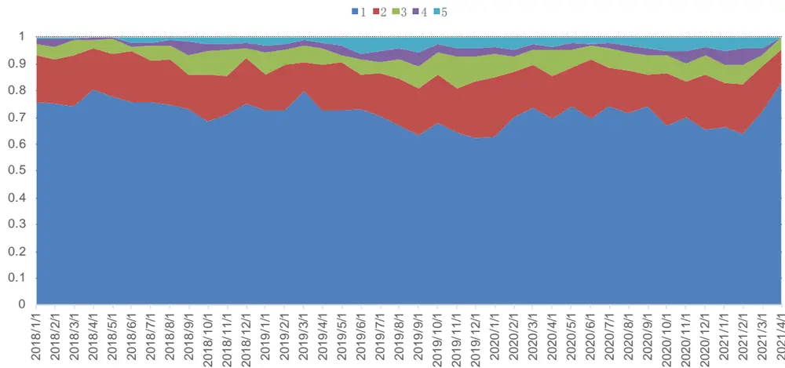
数据来源：wind、每市、中信建投

下图为券商金股每月选取推荐次数为 1、2、3、4 和 5 次以上（相对中证 500）的超额收益，每月初第五个交易日收盘调仓。可以看出，不同推荐次数的股票池表现无明显差异，因此，无法基于推荐次数来区分股票的收益。

图8： 券商金股每月选取推荐次数为 1、2、3、4和 5次以上（相对中证 500）的超额收益
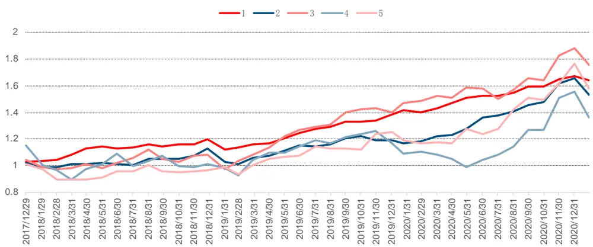
数据来源：wind、每市、中信建投

## 2.3、券商金股推荐行业分析

从下图可以看出，券商金股在各中信行业上的平均覆盖度达到 94.75%，只有纺织服装、煤炭、综合和综合金融行业存在某些月份未被覆盖，说明基本每个月份都有中信各个行业下的券商金股。

图9： 券商金股在各中信行业上的平均覆盖度
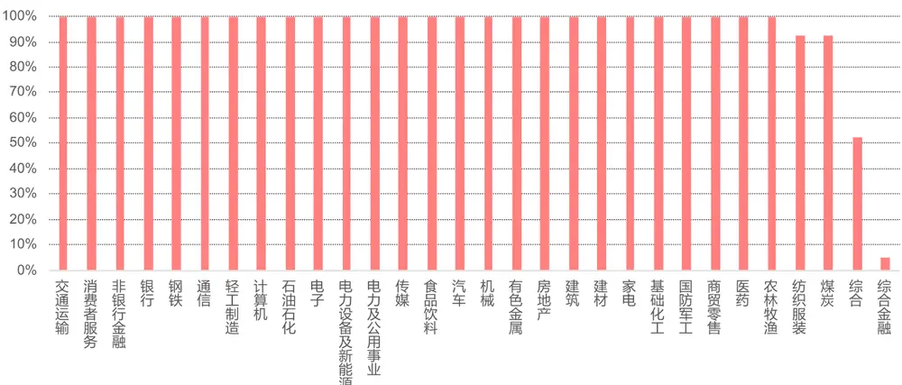
数据来源：wind、每市、中信建投

下图为券商金股在各中信行业上的超额收益。可以看出，券商金股在各中信行业上的平均超额收益为 1.23%，中位数为 1.56%。其中，钢铁、建筑和石油石化的行业超额收益最高，综合金融、纺织服装和综合的行业超额收益最低。可以看出，周期行业的分析师能够推出有较高 Alpha 的股票。

图10： 券商金股在各中信行业上的超额收益
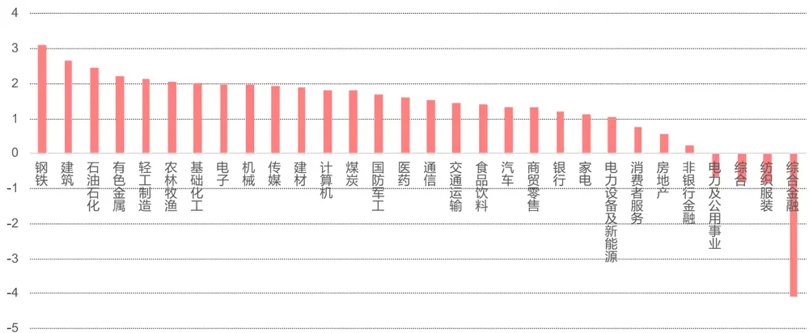
数据来源：wind、每市、中信建投

从下图可以看出，钢铁行业券商金股的超额钢铁行业指数基准收益有较好的历史净值表现。

图11： 钢铁行业的超额收益表现
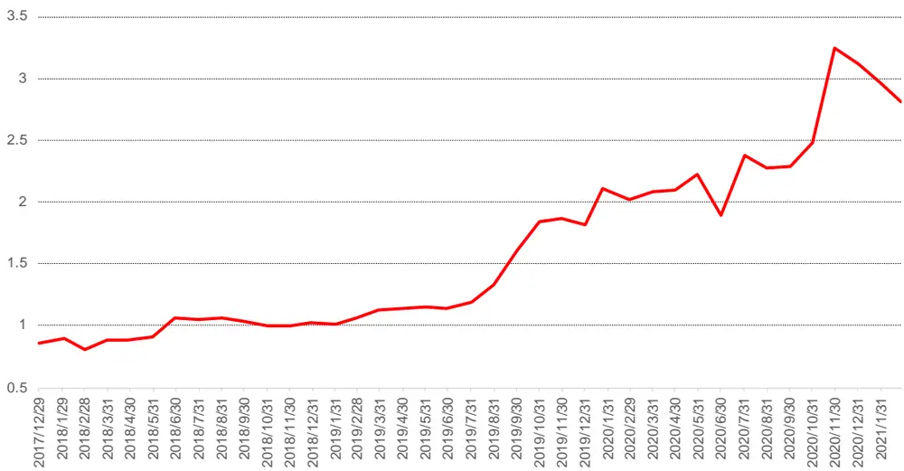
数据来源：wind、每市、中信建投

## 2.4、券商金股组合历史表现

从下图可以看出，券商金股组合每月不重复的平均股票数量为 241 只，其中，2018 年以来的数量逐渐上升，从一开始的每月 150 只的水平，目前能够达到每月 300 只的水平。

图12： 券商金股组合每月不重复的股票数量
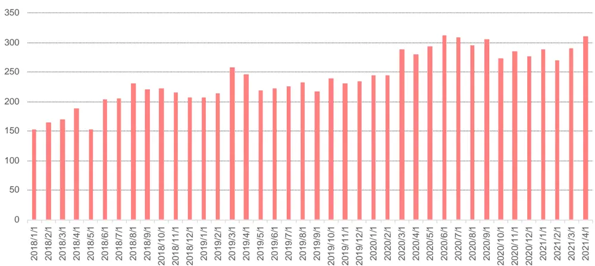
数据来源：wind、每市、中信建投

本文基于券商金股组合每月不重复的股票作为测试样本池，分别测试了样本池在每月末最后一个交易日收盘调仓、每月初第一个交易日收盘调仓和每月初第五个交易日收盘调仓下超额中证 500、沪深 300 和中证全指的表

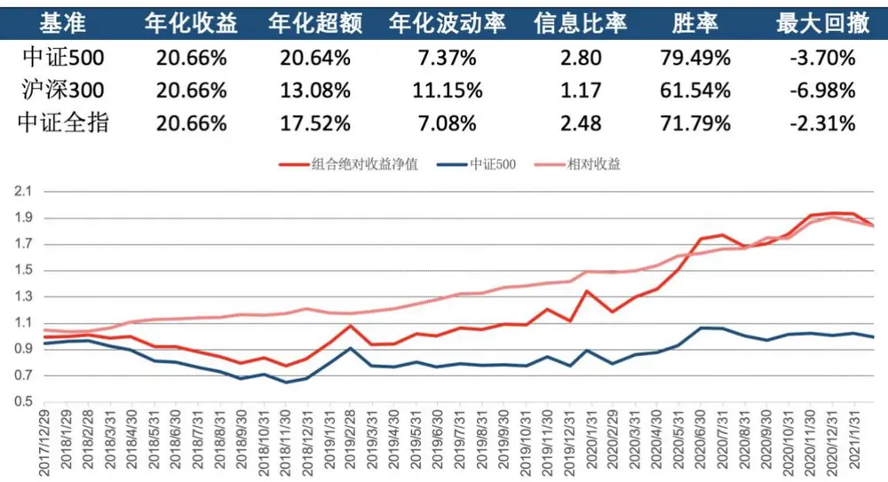

现。从下图可以看出，在每月末最后一个交易日收盘调仓下，券商金股等权组合表现优异。年化超额中证 500、沪深 300 和中证全指分别是 24.56%、16.48%和 21.13%。

图13： 券商金股等权组合表现（每月末最后一个交易日收盘调仓）

| 基准 | 年化收益 | 年化超额 | 年化波动率 | 信息比率 | 胜率 | 最大回撤 |
| --- | --- | --- | --- | --- | --- | --- |
| 中证500 | 24.83% | 24.56% | 7.07% | 3.48 | 92.31% | -3.60% |
| 沪深300 | 24.83% | 16.48% | 9.73% | 1.69 | 66.67% | -4.95% |
| 中证全指 | 24.83% | 21.13% | 6.55% | 3.23 | 82.05% | -1.28% |

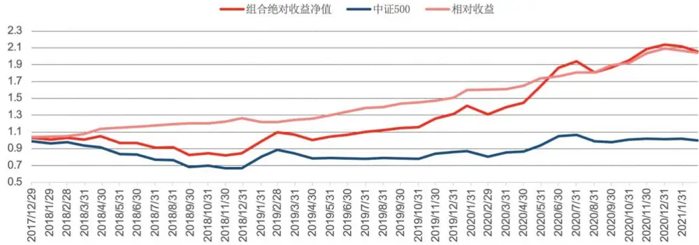
数据来源：wind、每市、中信建投

从下图可以看出，在每月初第一个交易日收盘调仓下，券商金股等权组合表现优异，但相对每月末最后一个交易日收盘调仓，大约衰减了 4%的超额收益。年化超额中证 500、沪深 300 和中证全指分别是 20.64%、13.08%和 17.52%。

图14： 券商金股等权组合表现（每月初第一个交易日收盘调仓）

| 基准 | 年化收益 | 年化超额 | 年化波动率 | 信息比率 | 胜率 | 最大回撤 |
| --- | --- | --- | --- | --- | --- | --- |
| 中证500 | 20.66% | 20.64% | 7.37% | 2.80 | 79.49% | -3.70% |
| 沪深300 | 20.66% | 13.08% | 11.15% | 1.17 | 61.54% | -6.98% |
| 中证全指 | 20.66% | 17.52% | 7.08% | 2.48 | 71.79% | -2.31% |

数据来源：wind、每市、中信建投

从下图可以看出，在每月初第五个交易日收盘调仓下，券商金股等权组合表现良好，但相对每月末最后一个交易日收盘调仓，大约衰减了 10%的超额收益，说明券商金股的信息滞后效应显著。年化超额中证 500、沪深 300和中证全指分别是 15.89%、9.23%和 13.20%。

图15： 券商金股等权组合表现（每月初第五个交易日收盘调仓）

| 基准 | 年化收益 | 年化超额 | 年化波动率 | 信息比率 | 胜率 | 最大回撤 |
| --- | --- | --- | --- | --- | --- | --- |
| 中证500 | 16.11% | 15.89% | 7.78% | 2.04 | 79.49% | -6.50% |
| 沪深300 | 16.11% | 9.23% | 9.38% | 0.98 | 58.97% | -8.25% |
| 中证全指 | 16.11% | 13.20% | 5.51% | 2.40 | 71.79% | -2.81% |

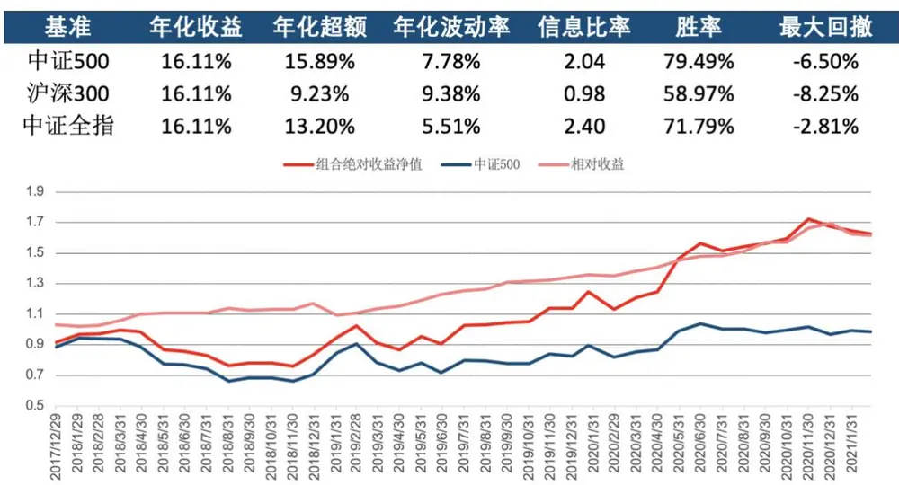
数据来源：wind、每市、中信建投

## 2.5、基于券商金股组合的行业轮动策略

本文选取每月券商组合中个股数量前三的行业构建行业轮动策略组合。从下图可以看出，组合年化超额行业等权指数收益为 10.18%，超额中证 500 的收益为 12.88%，有一定幅度的超额收益。

图16： 行业轮动策略组合效果
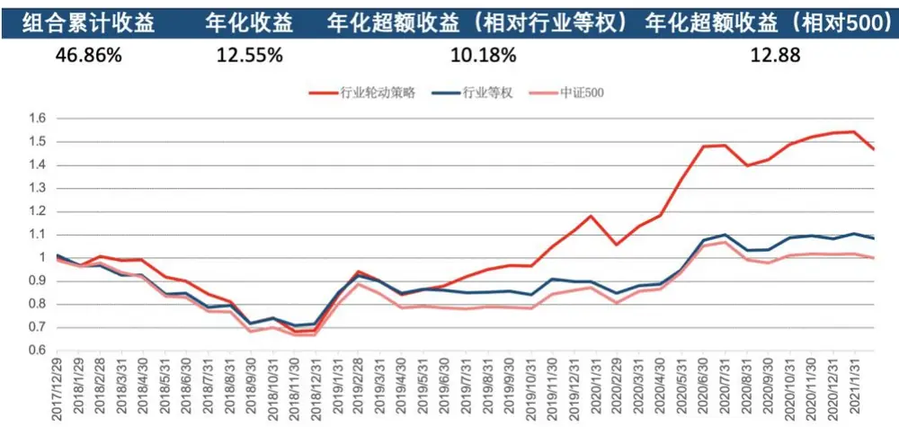
数据来源：wind、每市、中信建投

## 三、分析师预期因子

## 3.1、分析师预期因子综述

本文尝试构造了三大类因子，具体包括：

第一大类：分析师预期调整类因子（分析师预期净利润调整幅度、分析师预期 EPS 调整幅度、分析师预期目标价调整幅度）

第二大类：市场一致预期调整类因子（市场一致预期净利润调整幅度、市场一致预期 EPS 调整幅度、市场一致预期目标价调整幅度）

第三大类：纯净的分析师覆盖度类因子（剥离公司规模、流动性和过去表现的分析师覆盖度因子）

进一步地，我们将分析师预期净利润调整幅度、市场一致预期净利润调整幅度和纯净的分析师覆盖度类因子等权打分得到等权因子。

## 3.2、分析师预期因子定义

## 3.2.1 分析师预期调整类

我们以相同分析师在时间序列上的预期调整为基础构建分析师预期（净利润、EPS、目标价，下文同）调整因子，定义分析师 i 对于股票 s 在时间 t 给出的预期调整指标如下：

$$
Analyst\_Forecast\_Adjust\_single_{s,i,t}=\frac{forecast\_new_{s,i,t}-forecast\_last_{s,i,t-1}}{forecast\_last_{s,i,t-1}}
$$

其中， $forecast\_last_{s,i,t-1}$ 为分析师 i 上次报告对股票 s 的预期， $forecast\_new_{s,i,t}$ 为分析师 i 本次报告对股票 s的预期。我们在之前的报告中提出了基于过去一个月的预期调整构造的 $Income\_Adjust$ 因子。本文发现基于过去三个月的预期调整具有更高的因子覆盖度和更强的因子表现。具体公式如下：

$$
Analyst_{-}Forecast_{-}Adjust_{-}3M_{s,T}=\mathrm{median}\big(Income\_Adjust_{-}single_{s,i,t}\big),\ T-3<t\leq T
$$

其中，i 为所有在过去三个月对股票 s进行预期调整的分析师。

分析师预期调整因子反映了市场所有分析师对于股票预期调整的中间水平。

## 3.2.2 市场一致预期调整类

我们以分析师在时间序列上的预期为基础构建市场一致预期（净利润、EPS、目标价，下文同）调整因子，定义市场对于股票 s在时间 t 给出的预期调整指标如下：

$$
Market_{-}Forecast_{-}Adjust_{s,t}=\frac{Forecast_{-}Mean_{-}New_{s,t-1t}-Forecast_{-}Mean_{-}Old_{s,t-12t-1}}{Forecast_{-}Mean_{-}Old_{s,t-12t-1}}
$$

其中， $Forecast\_Mean\_New_{s,t-1\to t}$ 为在过去一个月（ t−1 → t）市场所有分析师对于股票 s 的预期平均值 ，$Forecast\_Mean\_Old_{s,t-12\to t-1}$ 为在过去十一个月 $\begin{array}{rlr}{\mathrm{~}}&{{}(}&{t-12t-1)}\end{array}$ ）市场所有分析师对于股票 s的预期平均值。

$Forecast\_Mean\_New_{s,t-1\to t}$ 能够反映市场对于股票的新的一致预期，而 $Forecast\_Mean\_Old_{s,t-12t-1}$ 能够反映市场对于股票的旧的一致预期。市场一致预期调整类因子反映了市场所有分析师对于股票一致预期的调整水平。

## 3.2.3 纯净的分析师覆盖度类

传统分析师覆盖度定义为过去三个月市场分析师对于股票的覆盖预测数量，但其选股效果较差。本文尝试使用回归法从规模、流动性和过去表现方面对传统分析师覆盖度进行提纯，得到纯净的分析师覆盖度因子。具体的回归方程如下：

$$
Log\big(1+TOT_{i,m}\big)=\beta_{0}+\beta_{1}SIZE_{i,m}+\beta_{2}TO_{i,m}+\beta_{3}MOMEN_{i,m}+\in_{i,m}
$$

其中，TOT为过去三个月市场分析师对于股票的覆盖预测数量，SIZE 为 Barra 规模因子，TO 为 Barra 流动性因子，MOMEN 为 Barra 动量因子。并以残差作为剥离公司规模、流动性和过去表现的分析师覆盖度因子，即：

$$
CoverPure3M=\in_{i,m}
$$

纯净的分析师覆盖度因子能够较好地反映分析师对于股票的真实关注信息。并且，更高的真实关注度往往意味着更好的未来收益表现。

## 3.3、分析师预期因子测试结果

下面我们对 3 大类分析师预期因子进行单因子分析（包括 IC 分析和多空收益分析），具体参数设计如下：

- 回测时间：最近 10 年（2010 年 1 月-2021 年 3 月）

- 样本池：全市场

- 股票筛选：每月底剔除停牌、一字板、上市未满半年和 ST 股票，月频调仓

- 因子处理：极值处理（剔除 3 倍标准差之外的样本）、缺失值处理（直接剔除）、

- 市值行业中性化处理： 不做中性化处理

- 多空收益分析分位数：10分位

分析师预期净利润调整幅度因子表现出优异的选股能力。Q1 组相对 Q10 组具有 16.6%的超额收益（其中 Q1超过 14%的多头超额收益，Q10 仅-2.02%）。因子年化多空收益 16.07%，夏普比率 1.86，IC 均值 4.25%，年化 IC_IR达到 2.11。

|  |  | IC均值 | 4.10% |
| --- | --- | --- | --- |
|  |  | IC标准差 | 6.69% |
|  |  | IR | 0.61 |
|  |  | 年化IR | 2.13 |
|  |  | 胜率% | 72.39 |
| 总收益% | 270.17 |  |  |
| 年化收益% | 12.44 |  |  |
| 年化波动% | 9.79 |  |  |
| 夏普比率 | 1.27 |  |  |
| 最大回撤% | 17.96 |  |  |
| 收益回撤比 | 0.69 |  |  |
| 胜率% | 73.88 |  |  |

图17： 分析师预期净利润调整因子绩效表现

| IC均值 | 4.25% |
| --- | --- |
| IC标准差 | 6.96% |
| IR | 0.61 |
| 年化IR | 2.11 |
| 胜率% | 75.37 |

| 总收益% | 428.23 |
| --- | --- |
| 年化收益% | 16.07 |
| 年化波动% | 8.63 |
| 夏普比率 | 1.86 |
| 最大回撤% | 9.81 |
| 收益回撤比 | 1.64 |
| 胜率% | 77.61 |

数据来源：朝阳永续、中信建投

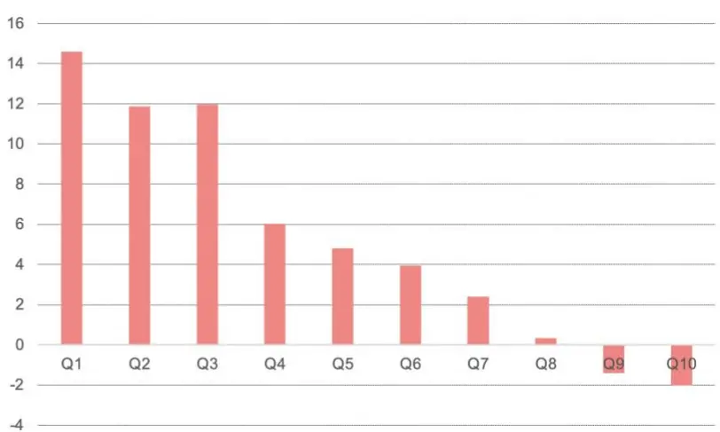

分析师预期 EPS 调整因子表现出优异的选股能力。 Q1 组相对 Q10 组具有将近 14%的超额收益（其中 Q1 有12.27%的多头超额收益，Q10 仅-1.13%）。因子年化多空收益 12.44%，夏普比率 1.27，IC 均值 4.10%，年化 IC_IR达到 2.13。

图18： 分析师预期 EPS调整因子绩效表现
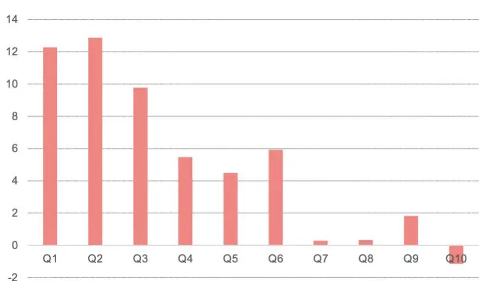
数据来源：朝阳永续、中信建投

分析师预期目标价调整因子表现出良好的选股能力。 Q1 组相对 Q10 组具有将近 12%的超额收益（其中 Q1有 10.69%的多头超额收益，Q10 仅-1.44%）。因子年化多空收益 11.46%，夏普比率 0.89，IC 均值 2.34%，年化 IC_IR达到 0.82。

图19： 分析师预期目标价调整因子绩效表现

| IC均值 | 2.34% |
| --- | --- |
| IC标准差 | 9.93% |
| IR | 0.24 |
| 年化IR | 0.82 |
| 胜率% | 58.21 |

| 总收益% | 235.85 |
| --- | --- |
| 年化收益% | 11.46 |
| 年化波动% | 12.81 |
| 夏普比率 | 0.89 |
| 最大回撤% | 10.98 |
| 收益回撤比 | 1.04 |
| 胜率% | 61.94 |

数据来源：朝阳永续、中信建投

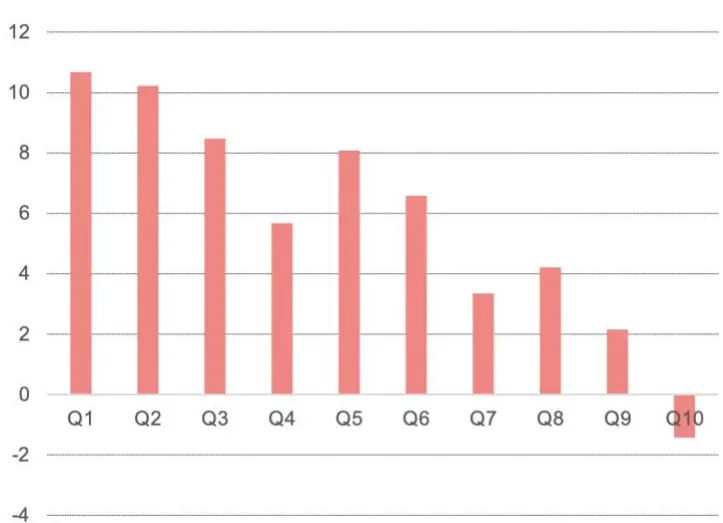

市场一致预期净利润调整因子表现出优异的选股能力。 Q1 组相对 Q10 组具有将近 18%的超额收益（其中Q1 超过 15%的多头超额收益，Q10 仅不足-2%）。因子年化多空收益 17.59%，夏普比率 1.49，IC 均值 4.09%，年化IC_IR 达到 1.41。

图20： 市场一致预期净利润调整因子绩效表现

| IC均值 | 4.09% |
| --- | --- |
| IC标准差 | 10.02% |
| IR | 0.41 |
| 年化IR | 1.41 |
| 胜率% | 67.91 |

| 总收益% | 510.39 |
| --- | --- |
| 年化收益% | 17.59 |
| 年化波动% | 11.78 |
| 夏普比率 | 1.49 |
| 最大回撤% | 19.22 |
| 收益回撤比 | 0.92 |
| 胜率% | 71.64 |

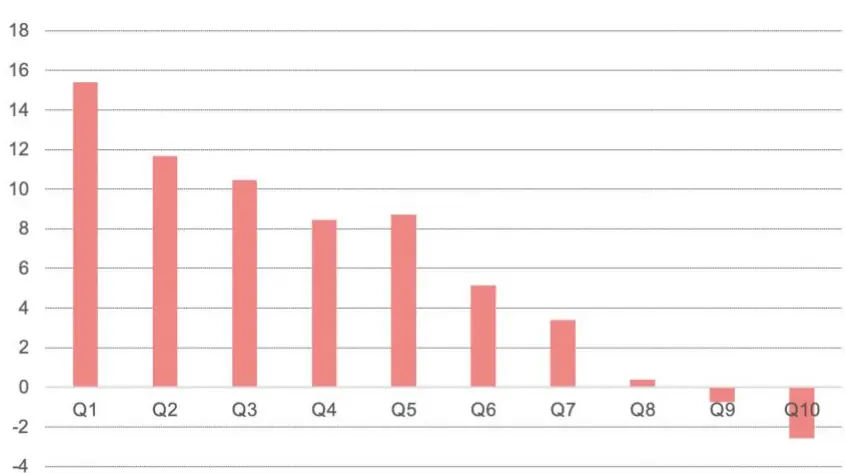
数据来源：朝阳永续、中信建投

市场一致预期 EPS 调整因子表现的选股能力优异。 Q1 组相对 Q10 组具有超过 18%的超额收益（其中 Q1 有15.86%的多头超额收益，Q10 仅-2.58%）。因子年化多空收益 17.92%，夏普比率 1.57，IC 均值 3.77%，年化 IC_IR达到 1.45。

图21： 市场一致预期 EPS调整因子绩效表现

| IC均值 | 3.77% |
| --- | --- |
| IC标准差 | 9.00% |
| IR | 0.42 |
| 年化IR | 1.45 |
| 胜率% | 67.91 |

| 总收益% | 530.31 |
| --- | --- |
| 年化收益% | 17.92 |
| 年化波动% | 11.43 |
| 夏普比率 | 1.57 |
| 最大回撤% | 17.12 |
| 收益回撤比 | 1.05 |
| 胜率% | 70.15 |

数据来源：朝阳永续、中信建投

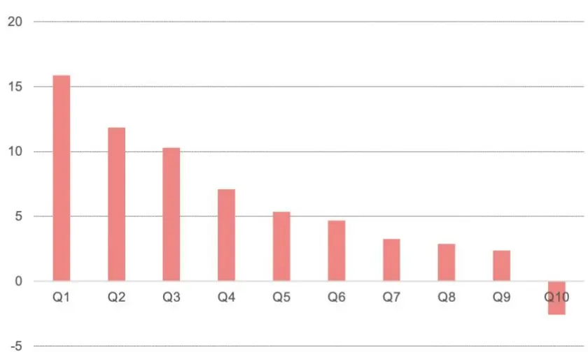

市场一致预期目标价调整因子表现的选股能力一般。 Q1 组相对 Q10 组具有将近 12%的超额收益（其中 Q1有 13.19%的多头超额收益，Q10 仅 1.42%）。因子年化多空收益 10.06%，夏普比率 0.55，IC 均值 2.02%，年化 IC_IR达到 0.49。

图22： 市场一致预期目标价调整因子绩效表现

| IC均值 | 2.02% |
| --- | --- |
| IC标准差 | 14.38% |
| IR | 0.14 |
| 年化IR | 0.49 |
| 胜率% | 56.72 |

| 总收益% | 191.71 |
| --- | --- |
| 年化收益% | 10.06 |
| 年化波动% | 18.28 |
| 夏普比率 | 0.55 |
| 最大回撤% | 29.66 |
| 收益回撤比 | 0.34 |
| 胜率% | 61.94 |

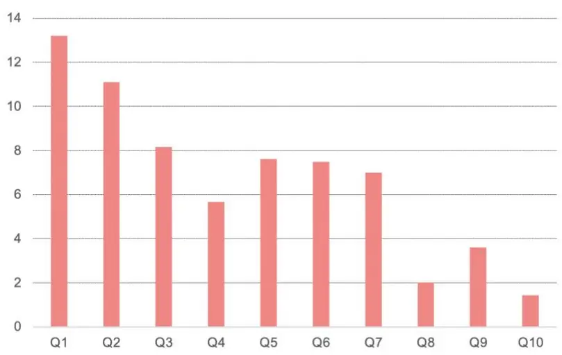
数据来源：朝阳永续、中信建投

纯净的分析师覆盖度因子表现出优异的选股能力。 Q1 组相对 Q10 组具有超过 18%的超额收益（其中 Q1 超过 10%的多头超额收益，Q10 仅不足-8%）。因子年化多空收益 19.58%，夏普比率 1.94，IC 均值 4.10%，年化 IC_IR达到 1.54。

|  |  | IC均值 | 4.10% |
| --- | --- | --- | --- |
|  |  | IC标准差 | 9.23% |
|  |  | IR | 0.44 |
|  |  | 年化IR | 1.54 |
|  |  | 胜率% | 66.42 |
| 总收益% | 636.23 |  |  |
| 年化收益% | 19.58 |  |  |
| 年化波动% | 10.11 |  |  |
| 夏普比率 | 1.94 |  |  |
| 最大回撤% | 9.14 |  |  |
| 收益回撤比 | 2.14 |  |  |
| 胜率% | 70.9 |  |  |

数据来源：朝阳永续、中信建投

图23： 纯净的分析师覆盖度因子绩效表现
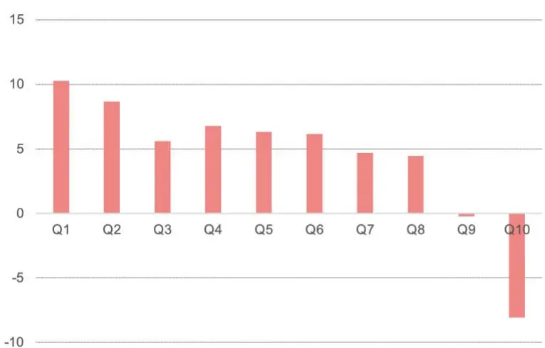

等权因子是分析师预期净利润调整幅度、市场一致预期净利润调整幅度和纯净的分析师覆盖度类因子等权求和得到的因子。从下图可以看出，等权因子表现出优异的选股能力。Q1 组相对 Q10 组具有超过 21%的超额收益（其中 Q1 超过 16%的多头超额收益，Q10 仅不足-4%）。因子年化多空收益 21.55%，夏普比率 1.69，IC 均值 5.62%，年化 IC_IR 达到 1.80。

图 24： 等权因子绩效表现

|  | IC均值 | 5.62% |  |
| --- | --- | --- | --- |
|  | IC标准差 | 10.79% |  |
|  | IR | 0.52 |  |
|  | 年化IR | 1.80 |  |
|  | 胜率% | 73.88 |  |
| 总收益% |  |  | 783.6 |
| 年化收益% |  |  | 21.55 |
| 年化波动% |  |  | 12.74 |
| 夏普比率 |  |  | 1.69 |
| 最大回撤% |  |  | 17.45 |
| 收益回撤比 |  |  | 1.23 |
| 胜率% |  |  | 72.39 |

数据来源：朝阳永续、中信建投

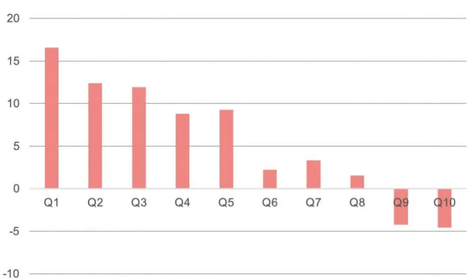

从下图可以看出，等权因子多头组合相对中证全指的超额收益表现出优异的选股能力。

图25： 等权因子多头组合相对中证全指的超额收益表现
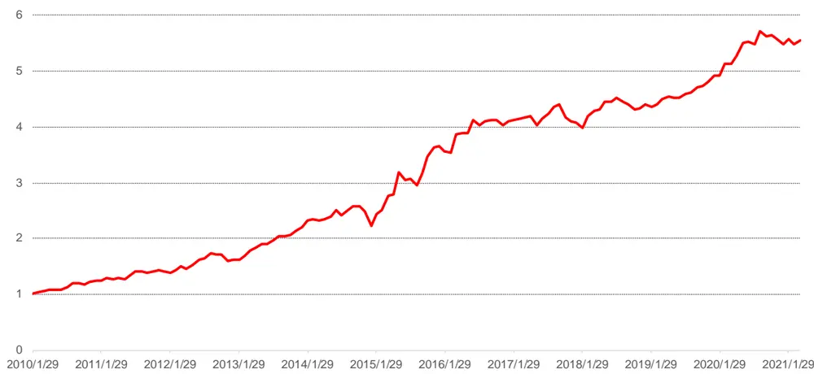
数据来源：朝阳永续、中信建投

## 四、分析师预期因子在券商金股每月推荐组合的增强效果

## 4.1、分析师预期因子在金股组合中单因子测试结果

基于分析师预期因子在金股组合中的单因子测试结果，我们发现分析师预期调整类因子在金股股票池的多头超额表现较好。因此，我们尝试使用所构造的分析师预期调整类因子在金股组合股票池中进行进一步精选，以增强金股组合的收益表现。

我们分别采用分析师预期净利润调整幅度、分析师预期 EPS 调整幅度、分析师预期目标价调整幅度以及这三个因子的等权因子对金股组合进行增强（均采用每月初第五个交易日收盘调仓的方式）。

我们发现分析师预期调整类因子对金股组合的增强效果显著。因此，我们认为分析师预期调整类因子能够在分析师推荐的基础上进一步刻画出分析师对于股票的推荐力度。而股票被推荐的力度越大，那么未来股价上涨的基本面动力就越足。

表2： 分析师预期因子在金股组合中的单因子测试结果

| 因子 | 总收益 | 年化收益 | 年化波动 | 夏普比率 | 最大回撤 | 收益回撤比 | 胜率 |
| --- | --- | --- | --- | --- | --- | --- | --- |
| 分析师预期净利润调整幅度 | 196.80 | 39.76 | 12.32 | 3.23 | 5.62 | 7.08 | 79.49 |
| 分析师预期EPS调整幅度 | 179.69 | 37.23 | 11.90 | 3.13 | 4.47 | 8.33 | 79.49 |
| 分析师预期目标价调整幅度 | 135.10 | 30.09 | 16.63 | 1.81 | 6.41 | 4.69 | 64.10 |
| 市场一致预期净利润调整幅度 | 115.15 | 26.58 | 14.55 | 1.83 | 8.21 | 3.24 | 71.79 |
| 市场一致预期EPS调整幅度 | 126.78 | 28.65 | 14.27 | 2.01 | 7.73 | 3.71 | 71.79 |
| 市场一致预期目标价调整幅度 | 78.78 | 19.57 | 19.83 | 0.99 | 14.17 | 1.38 | 56.41 |
| 纯净的分析师覆盖度 | 90.19 | 21.87 | 10.64 | 2.06 | 6.58 | 3.33 | 74.36 |

数据来源：朝阳永续、每市、中信建投

图26： 金股组合中分析师预期因子多头组合相对中证全指的超额收益表现
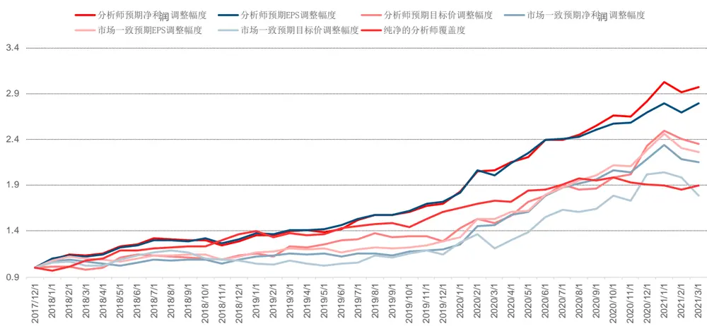
数据来源：朝阳永续、每市、中信建投

## 4.2、分析师预期调整类因子增强金股组合

在每月初第五个交易日，根据上月末的分析师预期净利润调整幅度选取前二十只股票，组合年化超额中证500 收益为 27.34%，信息比率为 1.85。

图27： 分析师预期净利润调整因子增强金股效果
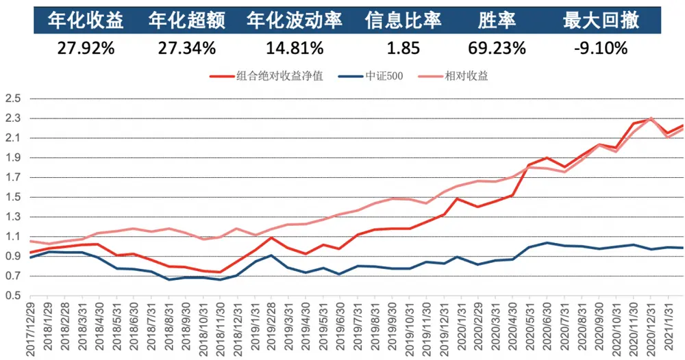
数据来源：朝阳永续、每市、wind、中信建投

在每月初第五个交易日，根据上月末的分析师预期 EPS 调整幅度选取前二十只股票，组合年化超额中证 500收益为 25.34%，信息比率为 1.66。

图28： 分析师预期 EPS调整因子增强金股效果
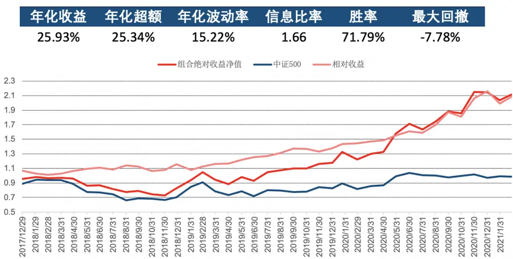
数据来源：朝阳永续、每市、wind、中信建投

在每月初第五个交易日，根据上月末的分析师预期目标价调整幅度选取前二十只股票，组合年化超额中证500 收益为 27.80%，信息比率为 1.46。

图29： 分析师预期目标价调整因子增强金股效果
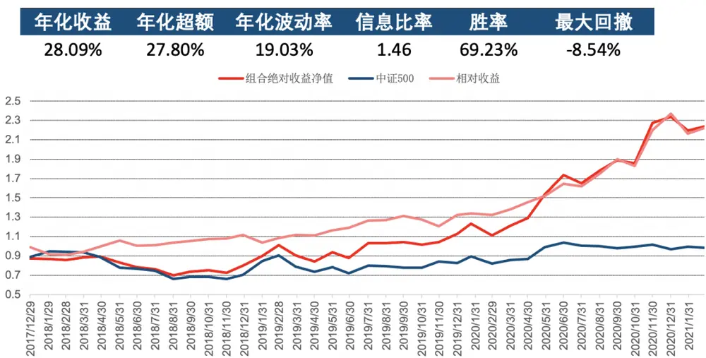
数据来源：朝阳永续、每市、wind、中信建投

我们根据分析师预期调整类等权因子选取前二十只股票，构建出最终的金股 20 组合，在每月末最后一个交易日收盘调仓、每月初第一个交易日收盘调仓和每月初第五个交易日收盘调仓下，组合年化超额中证 500 收益分别为 41.14%、39.41%和 31.10%，信息比率分别为 2.80、2.43 和 1.89。

图30： 分析师预期调整类等权因子增强金股效果
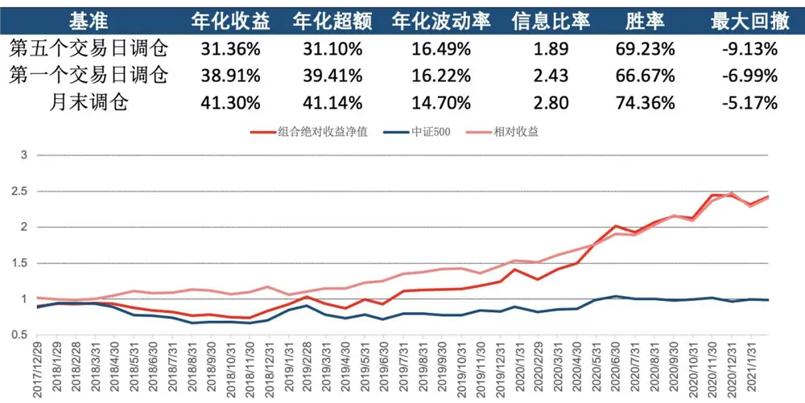
数据来源：朝阳永续、每市、wind、中信建投

## 4.3、金股20 组合收益统计

下图是金股 20 组合的历史每月行业权重的均值分布情况。可以看出，最终的金股 20 组合行业配置相对均衡。

图31： 金股 20组合的历史每月行业权重的均值分布
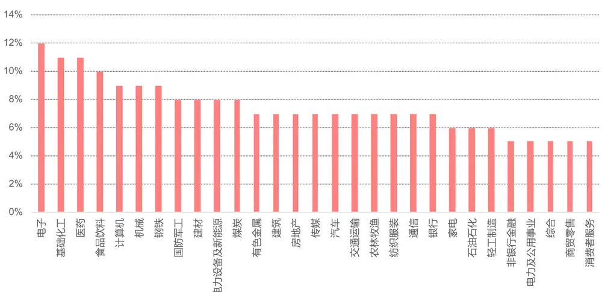
数据来源：朝阳永续、每市、wind、中信建投

下图是金股 20 组合历史持仓的指数覆盖分布情况。可以看出，最终的金股 20 组合在大盘股与小盘股间配置均衡。

图32： 金股 20组合历史持仓的指数覆盖分布情况
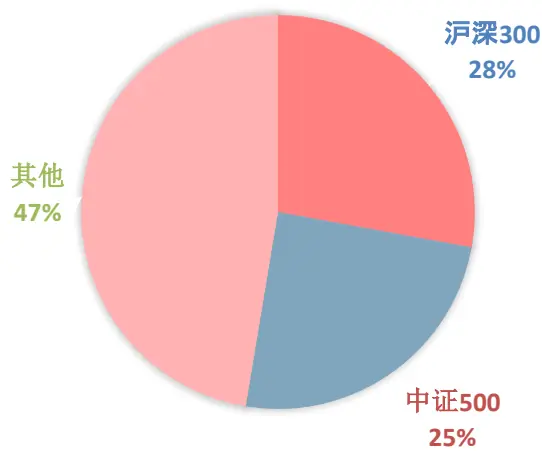
数据来源：朝阳永续、每市、wind、中信建投

下表是在第五个交易日调仓下金股 20 组合的分年统计。可以看出，金股 20 组合在 2019 和 2020 年表现最佳，在 2018 年和 2021 年（截至 2021 年 3 月底）表现略好于中证 500。

表3： 在第五个交易日调仓下金股 20组合的分年统计（截至 2021年 3月底）

|  | 年化收益 | 基准收益 | 年化超额 | 年化波动率 | 信息比率 | 胜率 | 最大回撤 |
| --- | --- | --- | --- | --- | --- | --- | --- |
| 2018 | -25.83% | -33.65% | 9.47% | 11.68% | 0.81 | 58.33% | -5.98% |
| 2019 | 59.37% | 26.80% | 24.36% | 17.22% | 1.42 | 75.00% | -9.13% |
| 2020 | 106.98% | 20.90% | 73.91% | 16.27% | 4.54 | 75.00% | -3.37% |
| 2021 | -3.21% | -11.70% | 7.55% | 25.81% | 0.29 | 66.67% | -7.78% |
| 全样本 | 31.36% | -0.43% | 31.10% | 16.49% | 1.89 | 69.23% | -9.13% |

数据来源：朝阳永续、每市、wind、中信建投

## 4.4、金股20 组合样本外跟踪效果

我们从 2021 年 3 月底开始样本外跟踪，截至 2022 年 2 月底，金股 20 组合绝对收益达 35.18%，相对中证 500指数超额收益 24.61%，值得持续关注。

图33： 金股 20组合样本外跟踪效果（2021 年 3月-2022年 2月）
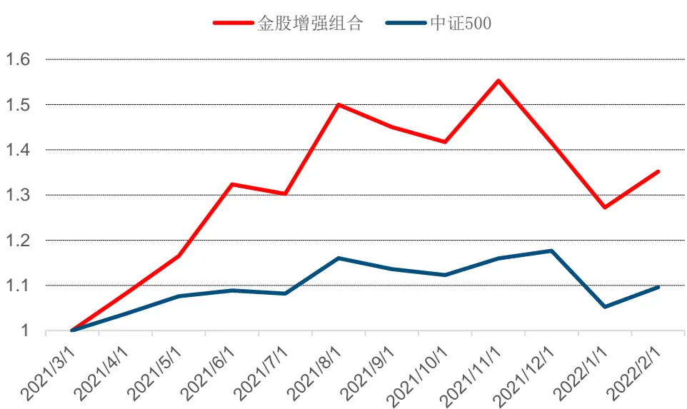
数据来源：朝阳永续、每市、wind、中信建投

## 五、总结与思考

本文尝试挖掘券商金股组合中的股票 Alpha，从券商、行业和推荐重合度等角度深度解析券商金股组合的超额收益情况。同时，本文提出了三大类分析师预期因子，并分别测试了其在全市场和金股股票池的表现。进一步地，基于所构造的分析师预期因子对券商金股组合进行增强，得到收益稳健且优秀的金股 20 组合。

第一部分主要介绍了券商金股组合的定义与具体形式。券商金股组合是券商研究所的各个行业组通过调研、访谈和财务分析等主动研究方式选出，并进一步由策略组精选得到的月度最佳推荐组合。一般而言，月度金股组合的数量是 10 只，因此，也称为“十大金股”。 从 2018 年 1 月 1 日至 2021 年 3 月，每月覆盖的券商机构个数平均 34 家机构。

第二部分我们从券商、行业和推荐重合度等角度深度解析券商金股组合。所有券商推荐金股历史平均覆盖率达到 70.68%，整体覆盖完整。各家券商推荐金股历史平均超额收益（相对中证 500）为 1.84%，平均月度胜率（相对中证 500）为 65.09%。各个券商推荐的股票具有较高的独特性，但不同推荐次数的股票池表现无明显差异，因此，无法基于推荐次数来区分股票的收益。券商金股在各中信行业上的平均覆盖度达到 94.75%，并且在各中信行业上的平均超额收益为 1.23%。另外，券商金股等权组合在每月末最后一个交易日收盘调仓、每月初第一个交易日收盘调仓和每月初第五个交易日收盘调仓下表现优异。但存在较明显的超额收益衰减，说明券商金股的信息滞后效应显著。其中，在每月初第五个交易日收盘调仓下，年化超额中证 500、沪深 300 和中证全指分别是 15.89%、9.23%和 13.20%。

第三部分定义了三大类分析师预期因子，分别是分析师预期调整类因子、市场一致预期调整类因子和纯净的分析师覆盖度类因子。进一步地，我们将分析师预期净利润调整幅度、市场一致预期净利润调整幅度和纯净的分析师覆盖度类因子等权打分得到等权因子。本文对三大类分析师预期因子进行单因子分析，等权因子表现出优异的选股能力。Q1 组相对 Q10 组具有超过 21%的超额收益（其中 Q1 超过 16%的多头超额收益，Q10 仅不足-4%）。因子年化多空收益 21.55%，夏普比率 1.69，IC 均值 5.62%，年化 IC_IR 达到 1.80。

第四部分将分析师预期因子在金股组合中进行单因子测试，进一步地，使用所构造的分析师预期调整类因子在金股组合股票池中进行进一步精选，以增强金股组合的收益表现。本文发现分析师预期调整类因子对金股组合的增强效果显著。因此，我们认为分析师预期调整类因子能够在分析师推荐的基础上进一步刻画出分析师对于股票的推荐力度。而股票被推荐的力度越大，那么未来股价上涨的基本面动力就越足。采用分析师预期净利润调整幅度、分析师预期 EPS 调整幅度和分析师预期目标价调整幅度这三个因子的等权因子对金股组合进行增强得到的金股 20 组合表现最佳。在每月末最后一个交易日收盘调仓、每月初第一个交易日收盘调仓和每月初第五个交易日收盘调仓下，年化超额中证 500 分别为 41.14%、39.41%和 31.10%。并且，金股 20 组合行业配置相对均衡，在大盘股与小盘股间配置均衡。

我们从 2021 年 3 月底开始样本外跟踪，截至 2022 年 2 月底，金股 20 组合绝对收益达 35.18%，相对中证 500指数超额收益 24.61%，值得持续关注。

风险提示：模型失效，历史规律不再重复

## 参考文献

Lee C , So E C . Uncovering expected returns: Information in analyst coverage proxies[J]. Journal of Financial Economics, 2017.

Jiang G J , Lu L , Zhu D . The information content of analyst recommendation revisions — Evidence from the Chinese stock market[J]. Pacific-Basin Finance Journal, 2014, 29(sep.):1-17.

Xl A , Hf B , Shu Y C , et al. Dispersion in analysts' target prices and stock returns[J]. The North American Journal of Economics and Finance, 2021.

Berrada T . Can the variance after-effect distort stock returns?[J]. Swiss Finance Institute Research Paper Series, 2021.

Irvine, PJ. “The incremental impact of analyst initiation of coverage.” Journal of Corporate Finance 9.4 (2003): 431-451. Jegadeesh, N, and Kim, W. “Value of analyst recommendations: International evidence.” Journal of Financial Markets 9.3 (2006): 274-309.

## 分析师介绍

丁鲁明：同济大学金融数学硕士，中国准精算师，现任中信建投证券研究发展部金融工程方向负责人，首席分析师。10 年证券从业，历任海通证券研究所金融工程高级研究员、量化资产配置方向负责人；先后从事转债、选股、高频交易、行业配置、大类资产配置等领域的量化策略研究，对大类资产配置、资产择时领域研究深入，创立国内“量化基本面”投研体系。多次荣获团队荣誉：新财富最佳分析师 2009 第 4、2012第 4、2013 第 1、2014 第 3 等；水晶球最佳分析师 2009 第 1、2013 第 1；2018 年 wind金牌分析师第 2 等。

陈升锐： 芝加哥大学金融数学硕士，三年基金公司量化投资研究工作经验，2018 年加入中信建投研究发展部金融工程团队，现任中信建投研究发展部高级副总裁，专注于量化选股研究。2018、2019、2020 年 Wind 金牌分析师金融工程第 2 名、第 2 名、第 5 名团队核心成员。

## 评级说明

| 投资评级标准 |  | 评级 | 说明 |
| --- | --- | --- | --- |
| 报告中投资建议涉及的评级标准为报告发布日后6个月内的相对市场表现，也即报告发布日后的6个月内公司股价（或行业指数）相对同期相关证券市场代表性指数的涨跌幅作为基准。A股市场以沪深300指数作为基准；新三板市场以三板成指为基准；香港市场以恒生指数作为基准；美国市场以标普500指数为基准。 | 股票评级 | 买入 | 相对涨幅15%以上 |
|  |  | 增持 | 相对涨幅 5%—15% |
|  |  | 中性 | 相对涨幅-5%—5%之间 |
|  |  | 减持 | 相对跌幅 5%—15% |
|  |  | 卖出 | 相对跌幅15%以上 |
|  | 行业评级 | 强于大市 | 相对涨幅10%以上 |
|  |  | 中性 | 相对涨幅-10-10%之间 |
|  |  | 弱于大市 | 相对跌幅10%以上 |

## 分析师声明

本报告署名分析师在此声明：（i）以勤勉的职业态度、专业审慎的研究方法，使用合法合规的信息，独立、客观地出具本报告, 结论不受任何第三方的授意或影响。（ii）本人不曾因，不因，也将不会因本报告中的具体推荐意见或观点而直接或间接收到任何形式的补偿。

## 法律主体说明

本报告由中信建投证券股份有限公司及/或其附属机构（以下合称“中信建投”）制作，由中信建投证券股份有限公司在中华人民共和国（仅为本报告目的，不包括香港、澳门、台湾）提供。中信建投证券股份有限公司具有中国证监会许可的投资咨询业务资格，本报告署名分析师所持中国证券业协会授予的证券投资咨询执业资格证书编号已披露在报告首页。

本报告由中信建投（国际）证券有限公司在香港提供。本报告作者所持香港证监会牌照的中央编号已披露在报告首页。

## 一般性声明

本报告由中信建投制作。发送本报告不构成任何合同或承诺的基础，不因接收者收到本报告而视其为中信建投客户。

本报告的信息均来源于中信建投认为可靠的公开资料，但中信建投对这些信息的准确性及完整性不作任何保证。本报告所载观点、评估和预测仅反映本报告出具日该分析师的判断，该等观点、评估和预测可能在不发出通知的情况下有所变更，亦有可能因使用不同假设和标准或者采用不同分析方法而与中信建投其他部门、人员口头或书面表达的意见不同或相反。本报告所引证券或其他金融工具的过往业绩不代表其未来表现。报告中所含任何具有预测性质的内容皆基于相应的假设条件，而任何假设条件都可能随时发生变化并影响实际投资收益。中信建投不承诺、不保证本报告所含具有预测性质的内容必然得以实现。

本报告内容的全部或部分均不构成投资建议。本报告所包含的观点、建议并未考虑报告接收人在财务状况、投资目的、风险偏好等方面的具体情况，报告接收者应当独立评估本报告所含信息，基于自身投资目标、需求、市场机会、风险及其他因素自主做出决策并自行承担投资风险。中信建投建议所有投资者应就任何潜在投资向其税务、会计或法律顾问咨询。不论报告接收者是否根据本报告做出投资决策，中信建投都不对该等投资决策提供任何形式的担保，亦不以任何形式分享投资收益或者分担投资损失。中信建投不对使用本报告所产生的任何直接或间接损失承担责任。

在法律法规及监管规定允许的范围内，中信建投可能持有并交易本报告中所提公司的股份或其他财产权益，也可能在过去 12个月、目前或者将来为本报告中所提公司提供或者争取为其提供投资银行、做市交易、财务顾问或其他金融服务。本报告内容真实、准确、完整地反映了署名分析师的观点，分析师的薪酬无论过去、现在或未来都不会直接或间接与其所撰写报告中的具体观点相联系，分析师亦不会因撰写本报告而获取不当利益。

本报告为中信建投所有。未经中信建投事先书面许可，任何机构和/或个人不得以任何形式转发、翻版、复制、发布或引用本报告全部或部分内容，亦不得从未经中信建投书面授权的任何机构、个人或其运营的媒体平台接收、翻版、复制或引用本报告全部或部分内容。版权所有，违者必究。

## 中信建投

北京

东城区朝内大街2号凯恒中心B

座 12 层

电话：(8610) 8513-0588

联系人：李祉瑶

邮箱：lizhiyao@csc.com.cn

上海

浦东新区浦东南路 528 号上海证券大厦北塔22楼 2201 室电话：(8621) 6882-1612联系人：翁起帆邮箱：wengqifan@csc.com.cn

深圳

福田区益田路 6003 号荣超商务

中心 B 座 22 层

电话：（86755）8252-1369

联系人：曹莹

邮箱：caoying@csc.com.cn

中信建投（国际）

香港

中环交易广场2期18 楼

电话：（852）3465-5600

联系人：刘泓麟

邮箱：charleneliu@csci.hk