2020 年 12 月 18 日

# 一致预期因子深度挖掘

## 联系信息

陶勤英分析师

SAC 证 书 编 号 ：

S0160517100002

taoqy@ctsec.com 021-68592393

## “逐鹿”Alpha专题报告（一）

王超联系人

wangc@ctsec.com 18221845405

## 相关报告

## 投资要点：

## 一致预期因子简介

分析师一致预期因子是通过将分析师对于上市公司的未来经营状况预测结果进行进一步整理加工，形成对上市公司未来业绩的预期数据。传统因子由于其发布的滞后性以及低频性，当上市公司业绩发生较大变化，并不能及时通过传统财务数据反应。一致预期因子能够有效的弥补此缺陷。

市场对于一致预期因子挖掘的常用的方法主要包括将一致预期因子和传统因子进行线性组合合成大类因子，或者从底层的数据出发，优化加权算法，提高因子表现。

本文主要从遗传规划算法入手，通过提高样本内因子的有效性，挖掘出与传统因子相关性较低的组合因子，通过样本内外回测，表明其有效性。

## 遗传规划算法简介

遗传规划算法是一种从生物演化过程得到灵感的启发式算法，根据用户自定义的适应度和种群，通过个体之间的复制交叉变异，生成最优适应度的种群。

基于遗传规划的因子表达式是将每个表达式作为个体，将因子 IC作为适应度，通过表达式之间的交叉变异复制，自动批量生成优化后的因子，显著提高因子的有效性。

## 因子回测结果

本文展示了基于遗传规划挖掘出的三个合成因子，在 2016 年至 2020年间，回测的年化收益分别为 24.6%，26.7%，25.6%，夏普比率分别为 1.28，1.30，1.31。与传统因子合成方法对比，效果有所提升。

- 风险提示：本文所有模型结果均来自历史数据，不保证模型未来的有效性

谨请参阅尾页重要声明及财通证券股票和行业评级标准

## 1、 引言：多因子模型框架梳理

本章节主要是介绍财通金工多因子选股模型的整体框架。整体框架的流程图如图1所示，主要包括三方数据的接入、清洗、入库，因子挖掘，因子检验，风险模型，组合优化，回测以及业绩归因等模块。

图 1：财通金工股票多因子模型框架
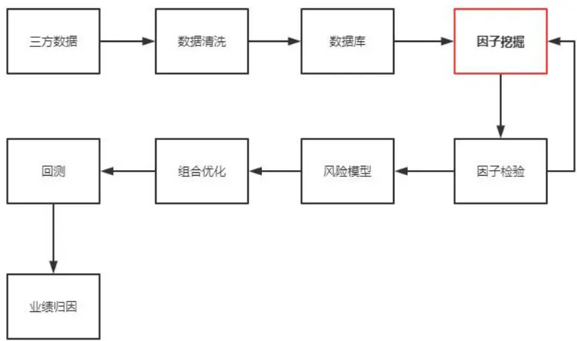
数据来源：财通证券研究所

其中，因子挖掘是整个流程中决定 Alpha 的关键步骤。传统的 Alpha 因子挖掘主要是基于一定的金融知识和经验，总结和结合相应的理论模型对因子进行分析，随着金融市场研究的不断深入，传统 Alpha 因子愈发拥挤，已有因子表现不断弱化。挖掘新的 Alpha 因子需要从模型和数据两方面入手，近年来流行的人工智能算法和另类数据挖掘分别是这两类的代表。本文主要介绍在一致预期因子的基础上利用遗传规划算法进行深度因子挖掘。

## 2、 一致预期因子简介

分析师一致预期因子是通过将分析师对于上市公司的未来经营状况预测结果进行进一步整理加工，形成对上市公司未来业绩的预期数据。传统因子由于其发布的滞后性以及低频性，当上市公司业绩发生较大变化，并不能及时通过传统财务数据反应。一致预期因子能够有效的弥补此缺陷。

一致预期因子的优点在于能够提前预测上市公司未来业绩情况，缺点在于许多小公司没有研究员覆盖，因此存在数据缺失的情况。以中证 800 为例，2019 年上市公司年报发布前一日，一致预期总覆盖的总上市数目为 722，覆盖度占比90.25%。未覆盖的公司的行业分布如下图所示，根据中信一级行业分类，未覆盖的公司主要分布在非银金融（11 家，20.37%），医药（10 家，13.51%），房地产（6 家，15.38%），计算机（6 家，15.38%）。

图2：中证800一致预期数据覆盖度
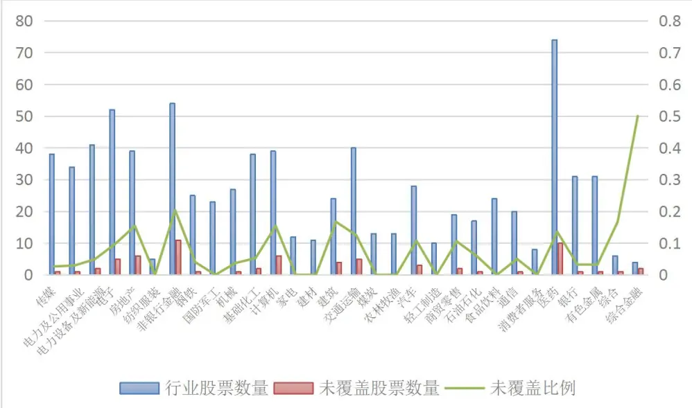
数据来源：WIND, 财通证券研究所

对比后一日财报发布后的真实营业收入数据，整体误差的分布如下图所示。误差小于10%占比为78.96%。需要注意的是，WIND的一致预期数据基准年份调准日是以业绩快报和年报发布日为基础的，因此在对比时，需要对于有业绩快报发布的公司需要按照业绩快报的数据和一致预期数据进行对比。

图3：一致预期营业收入与真实值误差分布
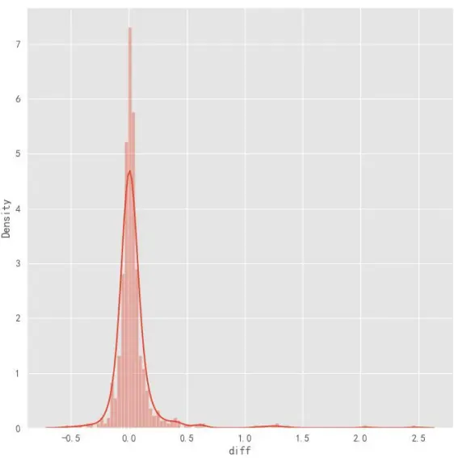
数据来源：WIND, 财通证券研究所

| 表1：营业收入误差分位数 |  |
| --- | --- |
| 分位数 | 误差值 |
| 25% | -2.71% |
| 50% | 0.95% |
| 75% | 5.28% |

数据来源：WIND, 财通证券研究所

可以看出，在中证800内，一致预期数据整体覆盖度和准确率均表现较好。若推广到全A，则覆盖度下降到只有50%左右（2088家）。若无特殊说明，本文之后的所有研究均基于中证800股票池。

## 2.1 一致预期因子与传统财务因子相关性

本文主要使用以下一致预期数据：

| 表2：一致预期数据 |  |  |
| --- | --- | --- |
| 一致预期净利润 | 一致预期净资产收益率 | 一致预期息税前利润 |
| 一致预期每股收益 | 一致预期营业收入 | 一致预期息税折旧摊销前利润 |
| 一致预期市盈率 | 一致预期每股现金流 | 一致预期利润总额 |
| 一致预期PEG | 一致预期每股股利 | 一致预期营业利润 |
| 一致预期市净率 | 一致预期每股净资产 | 一致预期营业成本及附加 |

数据来源：WIND, 财通证券研究所

完整的一致预期数据包括未来三年的预测，但是两年以上的预测值误差较大，且缺失值较多，因此我们选取未来一年的一致预期数据作为研究对象。

在对因子进一步分析之前，我们首先查看因子的完整度，所有分析的样本内数据均为2016年和2017年两年数据。

| 表3：因子值缺失比率 |  |
| --- | --- |
| 一致预期净利润 | 2.3% |
|  | 一致预期每股收益 2.3% |
| 一致预期市盈率 | 2.5% |
| 一致预期PEG | 2.8% |
| 一致预期市净率 | 3.9% |
| 一致预期净资产收益率 | 2.9% |
| 一致预期营业收入 | 2.4% |
| 一致预期每股现金流 | 9.5% |
| 一致预期每股股利 | 15.7% |
| 一致预期每股净资产 | 3.9% |

谨请参阅尾页重要声明及财通证券股票和行业评级标准

| 专题报告 | 证券研究报告 |
| --- | --- |
| 一致预期息税前利润 | 16.2% |
| 一致预期息税折旧摊销前利润 | 13.8% |
| 一致预期利润总额 | 2.6% |
| 一致预期营业利润 | 2.6% |
| 一致预期营业成本及附加 | 7.9% |

数据来源：WIND, 财通证券研究所

CFPS,DPS,EBIT,EBITDA,OPER_COST等因子缺失度较高。在后续因子计算时，对于有缺失值的因子，我们首先采取180日向前填充，对于剩下没有因子值的股票，在横截面予以剔除。

上述因子之间存在一定的相关性，为进一步分析因子之间的相关性，我们加入以下传统财务，估值因子，并分析所有因子之间的相关性。

| 表4：传统因子 |  |
| --- | --- |
| 营业收入 | 股价/每股派息 |
| 净利润 | 当日总市值 |
| 期末摊薄每股收益 | 市净率 |
| 年化净资产收益率 | 市盈率 |

数据来源：WIND, 财通证券研究所

一致预期因子和传统因子之间的相关性如下图所示。所有因子按照相关性大体上可以分为六类，第一类包括每股收益，净资产收益率，每股股利，每股现金流等因子，第二类主要是股价/每股派息和市盈率类因子，第三类为PEG，第四类主要包括市值和净利润类因子，第五类为市净率类因子，第六类为营业收入类因子。

可以看出，传统因子和相应的一致预期因子相关性基本上都在0.8以上。其中一致预期营业收入和营业收入的相关性最高，达到0.94。净利润和一致预期净利润的相关度也达到了0.87。市盈率和一致预期市盈率相关度相对较低，为0.72。表明研究员预测未来PE时对于当前PE估值的考量相对较低。

## 图4：因子相关性

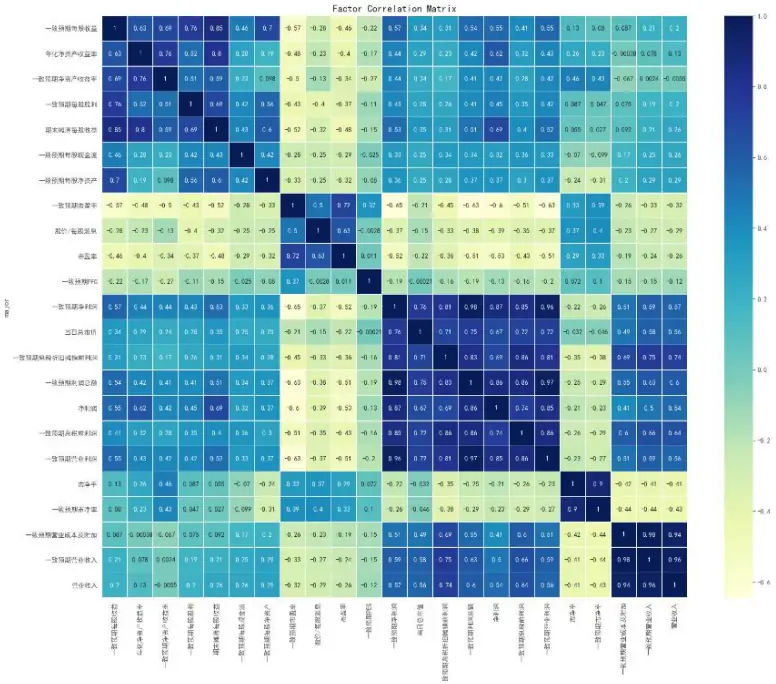
数据来源：WIND, 财通证券研究所

## 2.2 因子 IC 分析

下表列出了所有因子在 2016 年-2017 年 20 日的 IC 信息，按照 2.1 中相关性分类列出，可以看出，在同类因子中，除去营业收入类因子，大部分一致预期因子的表现均好于传统因子。

表5：因子IC分析

|  | IC(20日) | IC标准差 | 年化IR | IC>0占比 |
| --- | --- | --- | --- | --- |
| 一致预期每股收益 | 0.075 | 0.132 | 2.017 | 0.684 |
| 年化净资产收益率 | 0.063 | 0.132 | 1.694 | 0.622 |
| 一致预期净资产收益率 | 0.046 | 0.136 | 1.201 | 0.579 |
| 一致预期每股股利 | 0.081 | 0.123 | 2.338 | 0.705 |
| 期末摊薄每股收益 | 0.075 | 0.132 | 2.017 | 0.639 |
| 一致预期每股现金流 | 0.054 | 0.078 | 2.457 | 0.748 |
| 一致预期每股净资产 | 0.071 | 0.086 | 2.931 | 0.791 |
| 一致预期市盈率 | -0.1 | 0.14 | 2.535 | 0.226 |
| 股价/每股派息 | -0.08 | 0.134 | 2.119 | 0.286 |
| 市盈率 | -0.082 | 0.134 | 2.172 | 0.299 |
| 一致预期PEG | -0.046 | 0.064 | 2.551 | 0.22 |
| 一致预期净利润 | 0.073 | 0.171 | 1.515 | 0.588 |
| 当日总市值 | 0.007 | 0.166 | 0.150 | 0.5 |
| 一致预期息稅折旧摊销前利润 | 0.083 | 0.197 | 1.496 | 0.658 |
| 一致预期利润总额 | 0.072 | 0.173 | 1.477 | 0.607 |
| 净利润 | 0.077 | 0.165 | 1.657 | 0.588 |
| 一致预期息稅前利润 | 0.076 | 0.176 | 1.533 | 0.639 |
| 一致预期营业利润 | 0.069 | 0.17 | 1.441 | 0.609 |
| 市净率 | -0.066 | 0.193 | 1.214 | 0.395 |
| 一致预期市净率 | -0.071 | 0.2 | 1.260 | 0.382 |
| 一致预期营业成本及附加 | 0.057 | 0.163 | 1.241 | 0.654 |
| 一致预期营业收入 | 0.073 | 0.179 | 1.448 | 0.656 |
| 营业收入 | 0.074 | 0.18 | 1.459 | 0.639 |

数据来源：WIND, 财通证券研究所

表中因子的IC绝对值都相对较高，主要原因是由于2016-2017年单边趋势明显，且风格稳定，致使所有因子的IC值都整体偏高。以IC绝对值最高的一致预期市盈率为例，下图分别展示了IC在16到17年和IC时间序列和16到20年的IC时间序列。可以看出，因子IC在18年以后风格发生了剧烈的变化，整体IC的平均值也从开始的-0.1变为-0.031。

图5：2016-2017一致预期市盈率IC
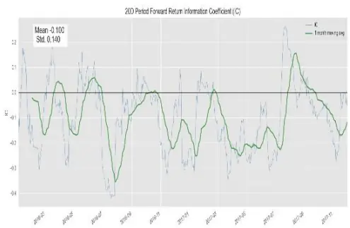
数据来源：WIND, 财通证券研究所

图6：2016-2020一致预期市盈率IC
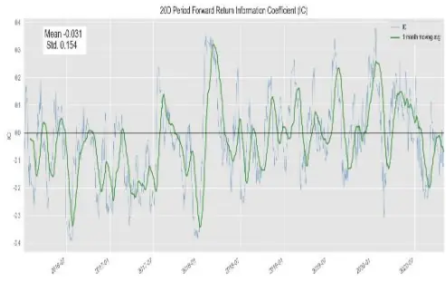
数据来源：WIND, 财通证券研究所

如2.1章节中所述，鉴于一致预期因子和传统因子的高相关性，使用一致预期因子时需要对数据进行谨慎处理。常见的方法包括对底层分析师观点进行再加工，或者将一致预期因子与传统因子进行合成，形成新的复合因子，例如BarraCNE6中的Earnings Variability, Earnings Yield, Dividend Yield, Growth等二级因子均通过此方法合成。

这两种方法各有优劣，第一种方法能够生成出与原有因子相关性较低的因子，但是需要一定的理论依据，随着这种方法不断被使用，潜在能够挖掘出的新因子数量随之减少。第二种方法合成的因子能够提高因子有效性，但是需要对因子做大量处理（计算因子协方差矩阵等），并且由于是线性模型，也存在与传统因子相关性过高的问题，仅能够作为替代使用，并不能加入新的有效信息。

本文我们提出基于遗传规划的因子挖掘方法，能够有效挖掘与现有因子相关度较低的合成因子。

## 3、 遗传规划简介

遗传规划是遗传算法的一种，核心是通过个体之间的复制交叉变异，生成满足适应度函数的最优种群。遗传规划本质上是一种优化算法，具有泛化性强、不易陷入局部最优、智能式搜索、并行化程度高等优点。

遗传规划的基本要素包括以下几点：

## 3.1 编码

常见的遗传规划的对象个体主要为树形表达式，如图 2所示，树形表达式中的叶节点（没有子代的节点）由变量和常量构成，被称为终止符（terminals）,内部节点被称为函数（functions）。终止符和函数统称为原始集合（primitive set）。

树形表达式的第一层的节点被称为根节点，从根节点到所有终止符中最长的路径被称为树的深度，如图 2 所示，ln(x+3)+(x-x*y)这一树形表达式的深度为 3。

图5：树形表达式编码 （以公式ln(x+3)+(x-x*y)为例）
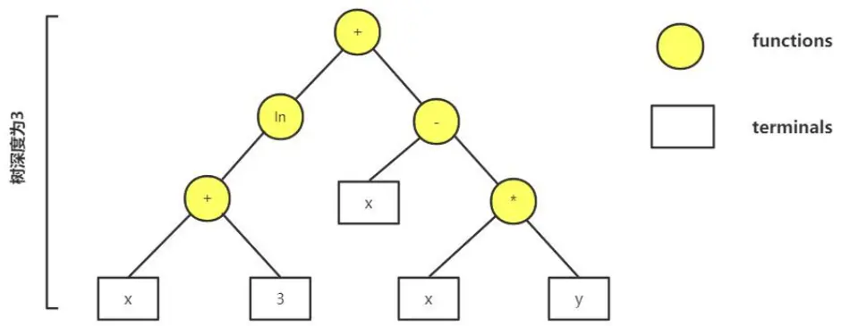
数据来源：财通证券研究所

## 3.2 初始化

初始化是指生成进入程序的指定数量的初代个体的过程。个体的初始化通常是从原始集合中随机取得元素组合生成的，初始化的方法主要有三种：Full方法、Grow方法以及两种方法的结合 Ramped half-and-half 方法。

对树形结构的初始化主要为确定树深度的预设值，三种方法中 Full 方法的限制最为严格，它在初始化时要求所有叶节点到根节点的深度相等且都等于预设的深度值，若树深度为 k，则 Full 初始化生成的个体总节点个数为 2k-1（假设所有functions 均为二元函数）；而 Grow 方法则更加灵活，在节点选择时，它从原始集合中随机选择函数作为叶节点，生成的个体只要满足树的深度等于预设值即可，并不要求所有叶节点的深度相等。

Ramped half-and-half方法生成的树更加多样性，它指定初始生成的个体中一半使用Full 方法，另一半使用 Grow 方法，并且每个个体树的深度只要满足预设范围即可，并不要求等于确定值。

初始化时通常采用 Ramped half-and-half 方法，这样能够确保初代个体的多样性。

## 3.3 选择

“物竞天择，适者生存”选择是指根据某一准则对每一代个体进行筛选，将优秀的个体作为父代繁育下一辈的过程。这一选择的准则被称为个体的适应度（fitness），适应度是衡量个体优劣的指标，根据具体问题，用户需要自定义适应度函数。

常见的选择方法包括锦标赛法（tournament selection）、轮盘法（roulette wheelselection）和 NSGA-II 等。

锦标赛算法是在种群中随机选择 k个个体，再从 k个个体中选择适应度最高的个体作为父代，不断循环此过程，直至达到指定的父代数量为止，该方法的优势在于每次从随机的部分样本中进行选择，在确保物种适应度的同时保留种群的多样性。

轮盘算法则是设定个体被选入下一轮的概率和其适应度成正比，这一方法既有效利用了适应度的特征，也保证了随机性，需要注意的是使用轮盘法时个体的适应度需要满足非负的条件。

NSGA-II 算法更适用于多目标优化，其优点在于可以大幅提升计算效率，通过引入精英选择策略以及拥挤度算子，可以有效保留物种多样性。

## 3.4 遗传

在选择完毕，获取下一代的父代之后，父代需要遗传生成子代，遗传的目的主要是使种群的适应度提高。

遗传的主要方式包括：交叉、变异和复制。遗传规划和传统遗传算法的一个主要区别就在于在遗传算子的不同，遗传规划算子对个体的操作主要作用于子树和节点，通过对子树或者节点的操作生成新的个体。

## 3.4.1 交叉

交叉是指通过取两个父代个体某些特征组合起来生成子代个体。遗传规划中常用的交叉方法为子树单点交叉，随机选择两个父代的节点为交叉点，将父代中两个交叉点以后的子树进行替换，形成两个新的子代。

交叉是遗传过程中主要的方法，相较于变异方法，交叉的父代个体均来自满足选择条件的适应度较高的个体，交换部分特征之后能够有效的确保生成的子代总体的有效性，种群中的有效基因片段也不会丢失。

一个典型的交叉过程如下图所示，需要注意的是，父代的两个个体是原始父代个体的复制，因此对于复制的父代进行的操作并不会影响原始父代个体，原始父代个体的基因信息也得以存储。

图7：交叉
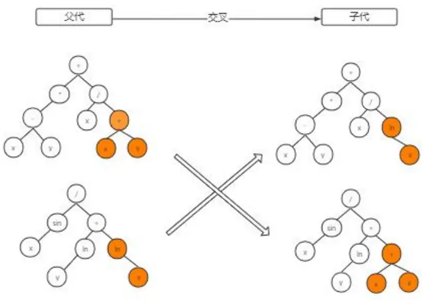
数据来源：财通证券研究所

## 3.4.2 变异

变异是指将父代个体的某一部分进行改变后生成子代个体。变异的主要目的是为了突变产生新的基因片段，再通过一定的选择，使得有益的基因片段得以在种群中保留。但需要注意的是，变异概率过高有可能导致劣币驱逐良币，种群中原有的优秀基因片段丢失。

变异方法主要有单点变异和子树变异。单点变异是在父代的节点中随机选择一个变异点，在原始集合中选择一个同参数的节点进行替换，子树变异是在父代中随机选择一个变异点，将此变异点用随机生成的子树进行替代。下图分别展示了单点变异的子树变异的过程。

图8：单点变异
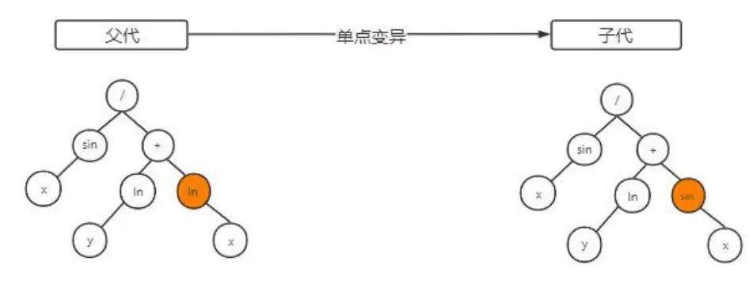
数据来源：财通证券研究所

图9：子树变异
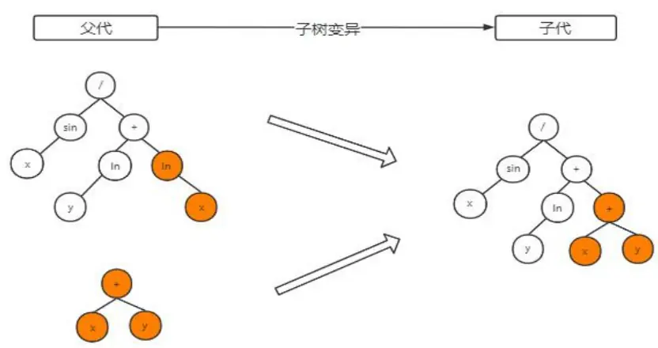
数据来源：财通证券研究所

## 3.4.3 复制

复制是指父代个体直接被完全复制到子代中去，没有任何变化。如果交叉概率p和变异概率q之和不为1，父代将以1-p-q的概率进行复制生成子代。

## 3.5 遗传规划流程

在列举遗传规划的各个要素之后，我们将其放入统一的框架中，典型的遗传规划流程图如下图所示：

图 10：遗传规划流程
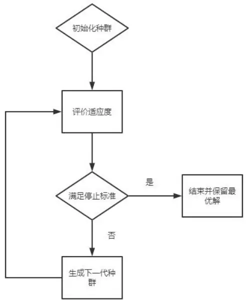
数据来源：财通证券研究所

## 3.6 参数设置

我们采用PYTHON的DEAP包来实现遗传规划算法，相关的参数设置如下表所示:

表 6：参数设置

| 参数名称 | 参数说明 | 参数设置 |
| --- | --- | --- |
| m | 种群中个体的数量 | 100 |
| genHalfAndHalf | Ramped half-and-half |  |
|  | 初始化，树的深度范围设 | [1,3] |
|  | 置 |  |
| selTournament | 锦标赛选择 | 3 |
| cxOnePoint | 子树交叉 |  |
| mutUniform | 单点变异 |  |
| cxpb | 父代交叉概率 | 0.6 |
| mutpb | 父代变异概率 | 0.2 |
| ngen | 进化代数 | 5 |

数据来源：财通证券研究所

函数集选择常见的numpy函数，具体的定义为：

## 表7：函数集

|  | 专题报告 | 证券研究报告 |
| --- | --- | --- |
| np.add(x, y) |  | x+y |
| np.subtract(x, y) |  | x-y |
| np.multiply(x, a) |  | x*a |
| protecteddiv(x, a) |  | x/a |
| np.log(x) |  | In(x) |
| np.reciprocal(x) |  | 1/x |

数据来源：财通证券研究所

由于财务数据往往更新频率较低，一定时间内因子值保持不变，因此这里的函数集我们仅采用传统的运算，并未加入时间序列函数。

适应度函数选取因子20日IC的绝对值，时间范围为2016，2017两年的数据。对于由于异常导致的适应度无法计算的情况，给予适应度一个惩罚结果。

保留最终一代的种群，并将其中适应度最高的个体作为目标因子。

## 4、 结果展示

本章主要对因子结果进行展示。作为对比，我们首先展示了传统方法合成因子的结果。

对于挖掘出的因子，主要展示因子在样本内外的回测表现。回测参数设置具体如下：

回测区间： 2016/01/01-2020/11/30

股票范围：当期中证 800 成分股

调仓频率：月频

手续费：买入万五，卖出万十五

每次调仓时选择因子排名靠前的100 只股票，按照自由流通市值加权构建组合，进行调仓。

## 4.1 传统因子合成

作为与遗传规划算法的对比，我们首先用传统的等权法，IC 加权法和最大化 IC法对每一类因子进行合成。再利用合成的因子进行回测。

合成因子回测的年化收益为：

表 7：合成因子回测年化收益

| 等权法 | IC 加权法 | 最大化 IC 法 |
| --- | --- | --- |

| 专题报告 | 证券研究报告 |
| --- | --- |
| Cluster_1 4.5% | 5.7% 14.9% |
| Cluster_2 6.9% | 6.7% 6.8% |
| Cluster_3 13% | 13.3% 4.6% |
| Cluster_4 7.5% | 8% 7.7% |
| Cluster_5 20.7% | 20.7% 21.3% |

数据来源：WIND, 财通证券研究所

其中 Cluster_1 至 Cluster_5 分别代表 2.1 章节中除去 PEG 的五类因子的合成，分别为营业收入类，PB 类，净利润类，PE 类，EPS类。

下图分别展示 IC 加权表现最好的 EPS类和最大化 IC 法 EPS 类因子的回测结果：

## 4.1.1 IC 加权法 EPS 类合成因子回测结果

因子的具体表达式为：

$$
\begin{array}{rl}{(0.074^{\star}\mathsf{E}\mathsf{S}\mathsf{T}_{-}\mathsf{E}\mathsf{P}\mathsf{S}_{-}\mathsf{NORM})+(0.063^{\star}\mathsf{ROE}_{-}\mathsf{NORM})+(0.045^{\star}\mathsf{E}\mathsf{S}\mathsf{T}_{-}\mathsf{ROE}_{-}\mathsf{NORM})+}&{}\\{(0.077^{\star}\mathsf{E}\mathsf{S}\mathsf{T}_{-}\mathsf{DPS}_{-}\mathsf{NORM})+(0.075^{\star}\mathsf{EPS}_{-}\mathsf{NORM})+(0.056^{\star}\mathsf{E}\mathsf{S}\mathsf{T}_{-}\mathsf{CFPS}_{-}}&{}\\{\mathsf{NORM})+(0.07^{\star}\mathsf{EST}_{-}\mathsf{BPS}_{-}\mathsf{NORM})}&{}\end{array}
$$

其中因子名称以 EST 开头的均为一致预期因子，其余为传统因子。后缀加 NORM表明对因子进行了去极值标准化处理。

因子在样本内外的累计净值，累计超额净值，以及最大回撤如下图所示：

图 11：IC 加权法 EPS 类合成因子回测曲线
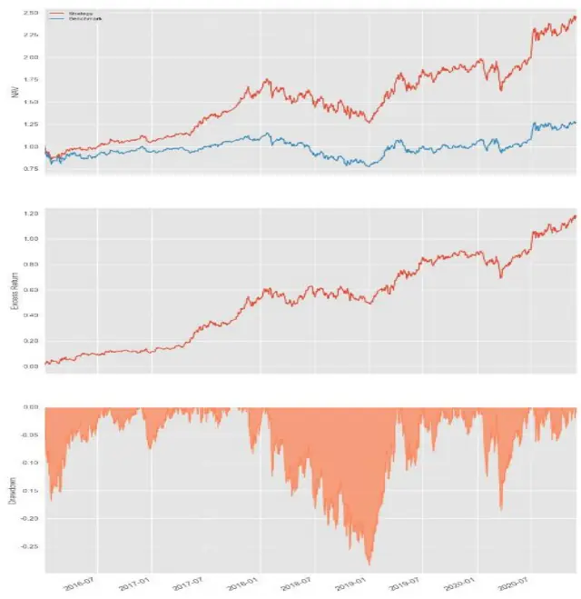
数据来源：WIND, 财通证券研究所

表 8：IC 加权法 EPS 类合成因子回测统计

|  | 专题报告 | 证券研究报告 |
| --- | --- | --- |
| 最大回撤 | 28.4% |  |
| 夏普比率 | 1.152 |  |

数据来源：WIND, 财通证券研究所

## 4.1.2 最大化 IC 法 EPS 类合成因子回测结果

因子的具体表达式为：

$$
\begin{array}{rl}{(-0.027^{\star}\mathsf{EST}_{-}\mathsf{EPS}_{-}\mathsf{NORM})+(}&{0.081^{\star}\mathsf{ROE}_{-}\mathsf{NORM})+(}&{-0.001^{\star}\mathsf{EST}_{-}\mathsf{ROE}_{-}\mathsf{NOR}}\\{\mathsf{M})+(}&{0.04^{\star}\mathsf{EST}_{-}\mathsf{DPS}_{-}\mathsf{NORM})+(0.075^{\star}\mathsf{EPS}_{-}\mathsf{NORM})+(}&{0.018^{\star}\mathsf{EST}_{-}\mathsf{CFPS}_{-}}\\&{\qquad\quad\mathsf{NORM})+(}&{0.063^{\star}\mathsf{EST}_{-}\mathsf{BPS}_{-}\mathsf{NORM})}\end{array}
$$

因子在样本内外的累计净值，累计超额净值，以及最大回撤如下图所示：

图 12：最大化 IC法 EPS 类合成因子回测曲线
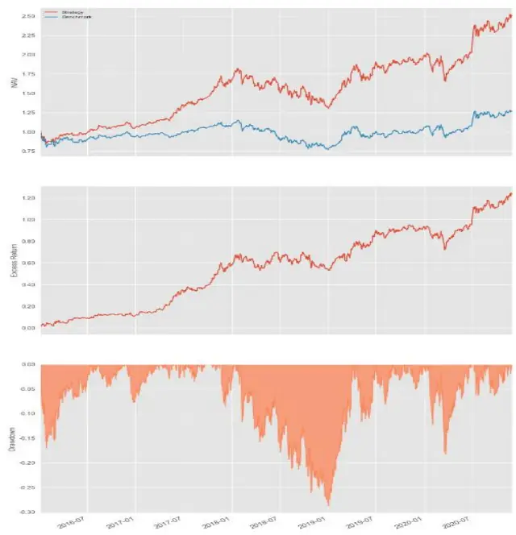
数据来源：WIND, 财通证券研究所

| 表9：最大化IC 法 EPS 类合成因子回测统计 |  |
| --- | --- |
| 年化收益率 | 21.3% |
| 最大回撤 | 28.8% |
| 夏普比率 | 1.176 |

数据来源：WIND, 财通证券研究所

## 4.2 遗传规划因子合成

本章节主要展示遗传规划因子挖掘的回测结果。与传统方法相比，遗传规划的好处在于无需对原始因子做过多处理，我们仅对原始因子进行了必要的空值填充，并没有做标准化处理，因此所有结果均可以按照其字面表达式进行直观理解。

## 4.2.1 因子一结果展示

因子一的具体表达式为：

((EST_NET_PROFIT * EPS) - PE/EST_EPS)/EST_OPER_PROFIT

因子一在样本内外的累计净值，累计超额净值，以及最大回撤如下图所示：

图 13：因子一回测曲线
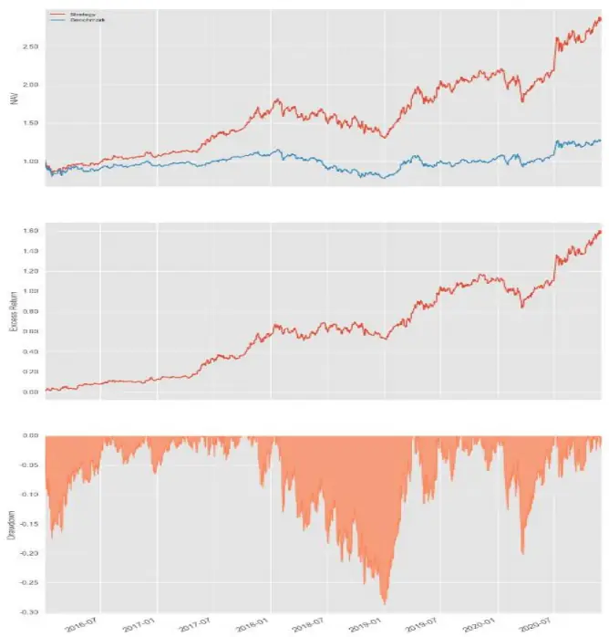
数据来源：WIND, 财通证券研究所

| 表10：因子一回测统计 |  |
| --- | --- |
| 年化收益率 | 24.6% |
| 最大回撤 | 28.8% |
| 夏普比率 | 1.282 |

数据来源：WIND, 财通证券研究所

## 4.2.2 因子二结果展示

因子二的具体表达式为：

$$
{\mathsf{ROE}}+{\mathsf{EST\_GFPS}}-{\mathsf{EST\_PB}}
$$

因子二在样本内外的累计净值，累计超额净值，以及最大回撤如下图所示：

图 14：因子二回测曲线
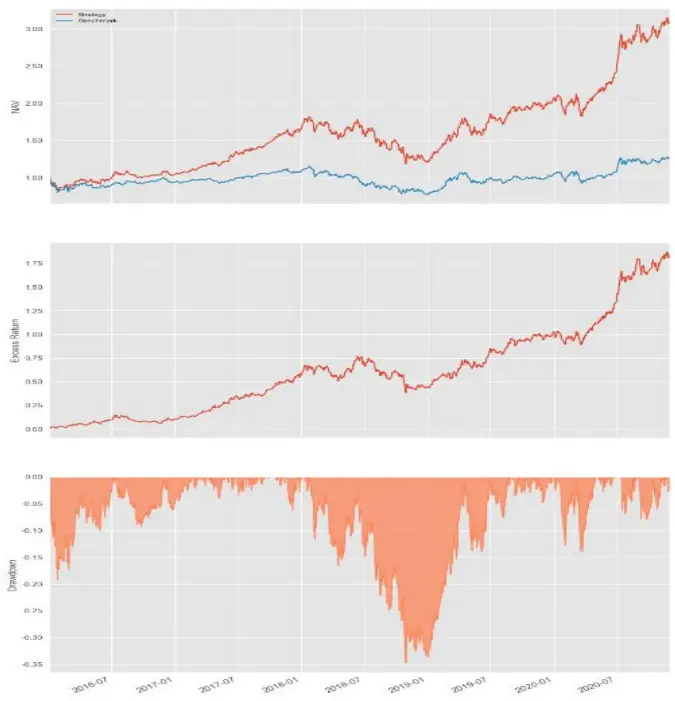
数据来源：WIND, 财通证券研究所

| 表11：因子二回测统计 |  |
| --- | --- |
| 年化收益率 | 26.7% |
| 最大回撤 | 34.7% |
| 夏普比率 | 1.308 |

数据来源：WIND, 财通证券研究所

## 4.2.3 因子三结果展示

因子三的具体表达式为：

ROE + EST_EPS

因子三在样本内外的累计净值，累计超额净值，以及最大回撤如下图所示：

## 图 15：因子三回测曲线

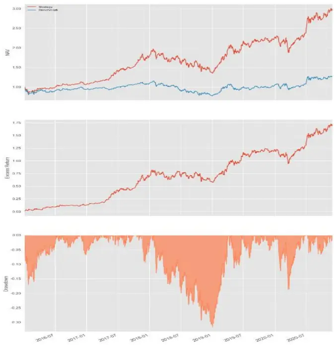
数据来源：WIND, 财通证券研究所

| 表12：因子三回测统计 |  |
| --- | --- |
| 年化收益率 | 25.6% |
| 最大回撤 | 31.6% |
| 夏普比率 | 1.314 |

数据来源：WIND, 财通证券研究所

上文列举的三个基于遗传规划挖掘的因子表达式均比较简洁，便于理解和计算，通过调节遗传规划的参数能够挖掘出表达式深度较高的因子，由于其复杂性本文不做阐述。

## 4.3 结果对比

与传统方法合成的因子对比，无论是年化收益还是夏普比率，均有一定程度的提升。

表 13：结果对比

|  | IC 加权 EPS 类 | 最大 IC EPS 类 | 因子一 | 因子二 | 因子三 |
| --- | --- | --- | --- | --- | --- |
| 年化收益率 | 20.7% | 21.3% | 24.6% | 26.7% | 25.6% |
| 最大回撤 | 28.4% | 28.8% | 28.8% | 34.7% | 31.6% |
| 夏普比率 | 1.152 | 1.176 | 1.282 | 1.308 | 1.314 |

数据来源：WIND, 财通证券研究所

## 5、 总结

本文主要介绍了一致预期因子，通过分析一致预期因子的相关性和 IC 有效性，展示了一致预期因子与传统因子的区别与联系。再通过遗传规划算法，对一致预期因子进行深度挖掘，合成新因子，并且对比了传统方法合成因子与遗传规划合成因子的回测结果，表明遗传规划挖掘因子的有效性。

## 信息披露

## 分析师承诺

作者具有中国证券业协会授予的证券投资咨询执业资格，并注册为证券分析师，具备专业胜任能力，保证报告所采用的数据均来自合规渠道，分析逻辑基于作者的职业理解。本报告清晰地反映了作者的研究观点，力求独立、客观和公正，结论不受任何第三方的授意或影响，作者也不会因本报告中的具体推荐意见或观点而直接或间接收到任何形式的补偿。

## 资质声明

财通证券股份有限公司具备中国证券监督管理委员会许可的证券投资咨询业务资格。

## 公司评级

买入：我们预计未来 6个月内，个股相对大盘涨幅在 15%以上；

增持：我们预计未来 6个月内，个股相对大盘涨幅介于 5%与 15%之间；

中性：我们预计未来 6个月内，个股相对大盘涨幅介于-5%与5%之间；

减持：我们预计未来 6个月内，个股相对大盘涨幅介于-5%与-15%之间；

卖出：我们预计未来 6个月内，个股相对大盘涨幅低于-15%。

## 行业评级

增持：我们预计未来 6个月内，行业整体回报高于市场整体水平 5%以上；

中性：我们预计未来 6个月内，行业整体回报介于市场整体水平-5%与5%之间；

减持：我们预计未来 6个月内，行业整体回报低于市场整体水平-5%以下。

## 免责声明

本报告仅供财通证券股份有限公司的客户使用。本公司不会因接收人收到本报告而视其为本公司的当然客户。

本报告的信息来源于已公开的资料，本公司不保证该等信息的准确性、完整性。本报告所载的资料、工具、意见及推测只提供给客户作参考之用，并非作为或被视为出售或购买证券或其他投资标的邀请或向他人作出邀请。

本报告所载的资料、意见及推测仅反映本公司于发布本报告当日的判断，本报告所指的证券或投资标的价格、价值及投资收入可能会波动。在不同时期，本公司可发出与本报告所载资料、意见及推测不一致的报告。

本公司通过信息隔离墙对可能存在利益冲突的业务部门或关联机构之间的信息流动进行控制。因此，客户应注意，在法律许可的情况下，本公司及其所属关联机构可能会持有报告中提到的公司所发行的证券或期权并进行证券或期权交易，也可能为这些公司提供或者争取提供投资银行、财务顾问或者金融产品等相关服务。在法律许可的情况下，本公司的员工可能担任本报告所提到的公司的董事。

本报告中所指的投资及服务可能不适合个别客户，不构成客户私人咨询建议。在任何情况下，本报告中的信息或所表述的意见均不构成对任何人的投资建议。在任何情况下，本公司不对任何人使用本报告中的任何内容所引致的任何损失负任何责任。

本报告仅作为客户作出投资决策和公司投资顾问为客户提供投资建议的参考。客户应当独立作出投资决策，而基于本报告作出任何投资决定或就本报告要求任何解释前应咨询所在证券机构投资顾问和服务人员的意见；

本报告的版权归本公司所有，未经书面许可，任何机构和个人不得以任何形式翻版、复制、发表或引用，或再次分发给任何其他人，或以任何侵犯本公司版权的其他方式使用。