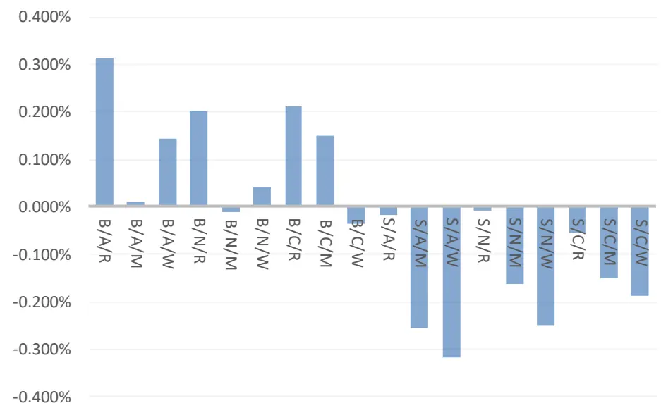
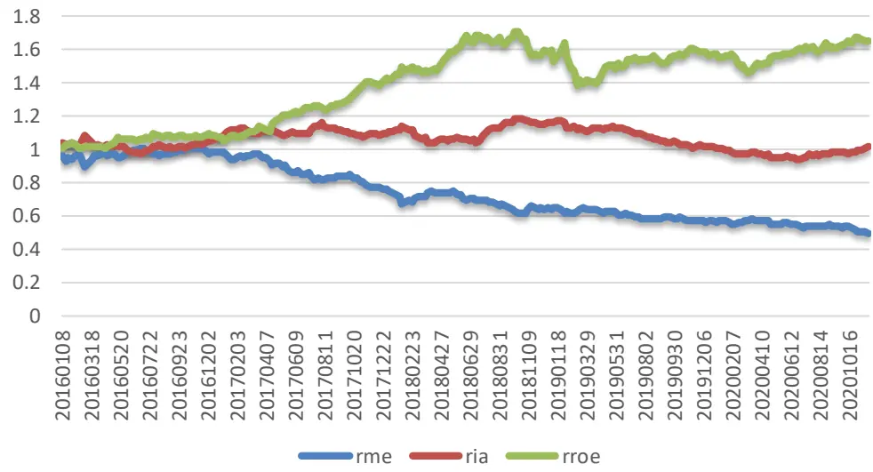
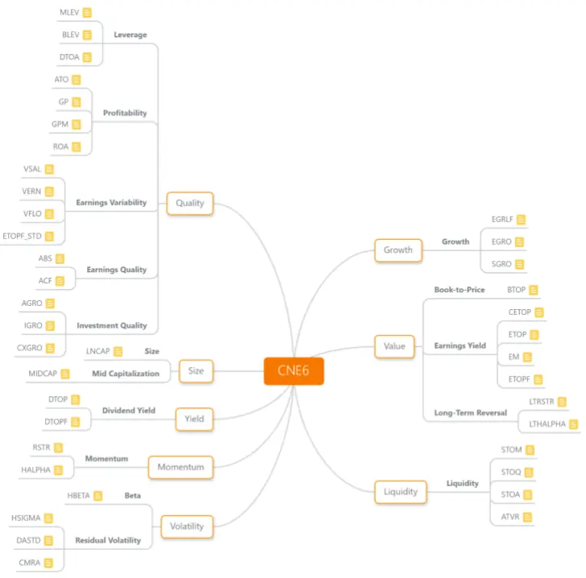
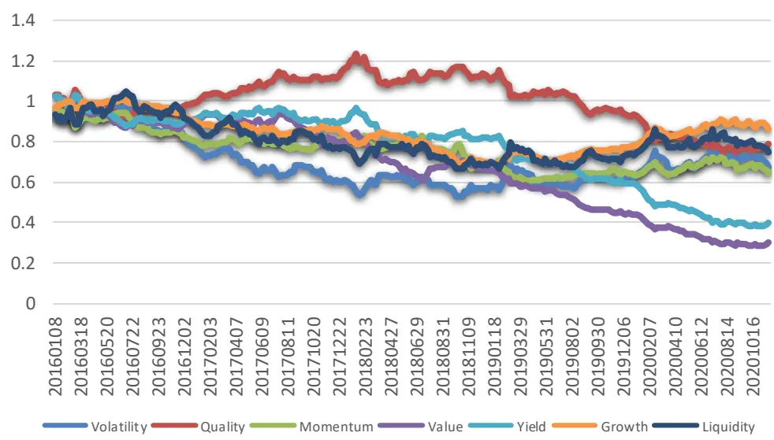
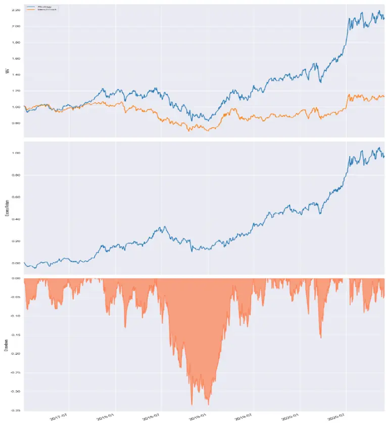

2020 年 01 月 04 日

# q-factor 在 A 股实证及改进

## 联系信息

陶勤英分析师

## “逐鹿”Alpha专题报告（二）

SAC 证书编号：S0160517100002021-68592393
taogy@ctsec. com

taoqy@ctsec.com

王超联系人

wangc@ctsec.com 18221845405

## 相关报告

## 投资要点：

## q 因子模型介绍

q 因子模型是 Hou,Xue and Zhang 三人基于实体经济学 q 理论，提出的金融资产定价模型。q 因子模型主要包含市场风险溢价因子，市值因子，投资因子和盈利因子，通过构建一个 2*3*3 的独立三重多空因子排序，对市场收益来源进行解释。

## q 因子模型在A 股实证

本文通过建立 A 股的 q 因子模型，并用其解释 Barra CNE6 风格因子收益，结果表明，q 因子模型在 A 股对于 Value，Momentum 因子的解释度偏低。

将模型原有的投资因子替换为价值因子，用改进前后两个模型对 A股所有股票收益率进行回归，结果表明改进后的模型对于 A 股股票收益率的解释度有明显提升。

## 模型回测

利用改进后模型的三因子构建组合，进行回测，从 2017 年至 2020年 11 月底，相较于中证全指基准，能够取得年化 25%的超额收益。

- 风险提示：本文所有模型结果均来自历史数据，不保证模型未来的有效性

## 1、 q 因子模型

Hou,Xue and Zhang(2015)从实体经济学 q-理论出发，推导出金融资产定价的 q因子模型。相比于 Fama-French 三因子模型和 Carhart 四因子模型，q 因子模型在美国市场能够解释更多异象因子收益。

## 1.1 理论简介

q 因子模型从一个两期的随机一般均衡模型出发，假设有一个包含许多多样化公司和一个代表家庭的经济体，结合随机折现模型和二次资本调整成本方法，给出了公司预期收益率，投资比例，盈利能力三者之间的关系：

$$
E_{0}[r_{i1}^{s}]=\frac{E_{0}[\Pi_{i1}]}{1+\mathsf{a}(I_{i0}/A_{i0})}
$$

其中 $r_{i1}^{s}$ 为股票在在第一期的收益率， $\Pi_{i1}$ 为公司在第一期的资本回报率， $I_{i0}$ 为公司在第零期的投资， $A_{i0}$ 为公司在第零期的资产，a 为二次调整成本模型中的一个常量。

从上式可以看出，在盈利能力相等的情况下，投资比率高的公司预期回报低于投资比率低的公司。在投资比率相等情况下，盈利能力强的公司预期回报高于盈利能力低的公司。

## 1.2 q 因子模型

虽然 q 因子模型是受q 理论的经济学模型启发得到的，但是q 因子模型在很大程度上是一个简化的经验模型。为了使模型更加符合资产定价模型，q 因子模型最终的表达式为：

$$
r_{t}^{i}-r_{t}^{f}=\alpha_{q}^{i}+\beta MKT_{t}+\beta_{ME}^{i}r_{\mathrm{ME},t}+\beta_{I/A}^{i}r_{I/A,t}+\beta_{ROE}^{i}r_{ROE,t}+\epsilon^{i}
$$

其中 $MKT_{t}$ 为 t 期的市场风险溢价。 $\mathbf{r}_{\mathrm{ME,t}}$ 为市值因子， $r_{I/A,t}$ 为投资因子， $r_{ROE,t}$ 为盈利因子，分别是通过对股票相应的因子值大小进行排序，对首尾组收益相减得到。

本文主要通过构建 A 股的 q 因子模型，检验 q 因子模型在 A股的有效性。

## 2、 q 因子模型在 A 股实证

## 2.1 数据准备

我们选取 2016 年以后的全 A 的周频数据，根据 q 因子模型，将股票按照市值因子，投资因子和收益因子的大小排序，构建 2*3*3 的独立三重排序组合。其中投资因子用总资产变化率代表，收益因子取 ROE 指标构建。

由于 A 股存在明显的壳污染（Liu, J., et al. 2019），在构建市值因子时，剔除掉市值排名后 30%的股票，剩下的股票按照市值排序从大到小排序，前 50%和后 50%分别记为 B/S。按照总资产变化率将股票从大到小排序，将前 30%，中间40%，后 30%记为 A/N/C，按照 ROE 从大到小排序，将前 30%，中间 40%，后 30%记为 R/M/W。通过三组之间的组合构建 18 个股票组合,按照当期的市值加权构建组合，计算组合收益率，记为 X/Y/Z，例如 S/A/R 代表小市值，高投资，高盈利组合收益率。

r ,r ,r 的计算公式分别为：

$$
\begin{aligned}&\mathrm{r}_{\mathrm{ME}}=\left(\mathrm{S}/\mathrm{A}/\mathrm{R}+\mathrm{S}/\mathrm{A}/\mathrm{H}+\mathrm{S}/\mathrm{A}/\mathrm{H}+\mathrm{S}/\mathrm{H}/\mathrm{R}+\mathrm{S}/\mathrm{H}/\mathrm{R}+\mathrm{S}/\mathrm{H}/\mathrm{H}+\mathrm{S}/\mathrm{H}/\mathrm{H}+\mathrm{S}/\mathrm{G}/\mathrm{R}+\mathrm{S}/\mathrm{G}/\mathrm{H}\right.+\\&\left.\mathrm{S}/\mathrm{G}/\mathrm{H}\right)/9-\left(\mathrm{B}/\mathrm{A}/\mathrm{R}+\mathrm{B}/\mathrm{A}/\mathrm{H}+\mathrm{B}/\mathrm{A}/\mathrm{H}+\mathrm{B}/\mathrm{H}/\mathrm{R}+\mathrm{B}/\mathrm{H}/\mathrm{H}+\mathrm{B}/\mathrm{H}/\mathrm{H}+\mathrm{B}/\mathrm{G}/\mathrm{R}+\mathrm{B}/\mathrm{G}/\mathrm{H}\right.\\&+\left.\mathrm{B}/\mathrm{G}/\mathrm{H}\right)/9\\\end{aligned}
$$

$$
\begin{aligned}&r_{1/A}=\left(\mathrm{S/G/R}+\mathrm{S/G/H}+\mathrm{S/G/H}+\mathrm{B/G/R}+\mathrm{B/G/H}+\mathrm{B/G/H}\right)/6-\left(\mathrm{S/A/R}+\mathrm{S/A/H}\right.\\&\left.+\mathrm{S/A/H}+\mathrm{B/A/R}+\mathrm{B/A/H}+\mathrm{B/A/H}\right)\\\end{aligned}
$$

$$
\begin{aligned}&r_{ROE}=\left(\mathrm{S/A/R}+\mathrm{S/W/R}+\mathrm{S/G/R}+\mathrm{S/A/R}+\mathrm{S/H/R}+\mathrm{S/G/R}\right)/6-\left(\mathrm{S/A/R}+\mathrm{S/W/R}+\mathrm{S/G/R}+\mathrm{S/A/R}+\mathrm{S/W/R}+\mathrm{S/G/R}\right)/6\\\end{aligned}
$$

作为简单理解，可以将上述三个因子分别看作小市值与大市值组合收益之差，保守投资与积极投资组合收益之差，高盈利和低盈利组合收益之差。

## 2.2 q 因子模型

首先构建三个因子间的交叉组合 2*3*3 共计 18 个资产组合，组合的收益率平均值和 t 值（newey-west 调整 t 值）分别为：

图 1：周收益率平均值

数据来源：wind, 财通证券研究所

表 1：资产组合收益率显著性

|  | 周收益率平均值 | newey-west t 值 | p 值 |
| --- | --- | --- | --- |
| B/A/R | 0.313%* | 1.664 | 0.096 |
| B/A/M | 0.012% | 0.057 | 0.954 |
| B/A/W | 0.143% | 0.609 | 0.542 |
| B/N/R | 0.204% | 1.405 | 0.160 |
| B/N/M | -0.010% | -0.059 | 0.953 |
| B/N/W | 0.041% | 0.190 | 0.849 |
| B/C/R | 0.211% | 1.222 | 0.222 |
| B/C/M | 0.148% | 0.863 | 0.388 |
| B/C/W | -0.035% | -0.179 | 0.858 |
| S/A/R | -0.017% | -0.071 | 0.944 |
| S/A/M | -0.256% | -1.103 | 0.270 |
| S/A/W | -0.319% | -1.326 | 0.185 |
| S/N/R | -0.009% | -0.044 | 0.965 |
| S/N/M | -0.162% | -0.731 | 0.465 |
| S/N/W | -0.248% | -1.033 | 0.302 |
| S/C/R | -0.053% | -0.259 | 0.795 |
| S/C/M | -0.150% | -0.688 | 0.492 |
| S/C/W | -0.188% | -0.782 | 0.434 |

数据来源：wind, 财通证券研究所

从上表可以看出，只有 B/A/R 资产组合的周收益率 0.313%通过了 10%的显著性水平检验。说明在 A 股 2016 年以后，大市值，高投资，高收益率的股票能取得较为显著的收益率。

根据 18 个资产组合按照上述公式计算市值，投资，盈利因子，rME,rI/A,rROE。可以将 3 个因子分别看作相应因子的多空组合，则组合的累计收益如下图所示：

图 2：多空组合累计收益率

数据来源：wind, 财通证券研究所

可以看出收益因子的正收益明显，市值因子的负收益明显，投资因子的收益率在

A 股表现不是十分明显。

同样，对三个因子组合的收益进行显著性检验：

表 2：因子显著性检验

|  | 周收益率平均值 | newey-west t 值 | p值 |
| --- | --- | --- | --- |
| $R_{ME}$ | -0.270% | -2.877 | 0.004 |
| $\mathsf{R}_{\mathsf{L}/\mathsf{A}}$ | 0.010% | 0.145 | 0.885 |
| $\mathsf{R}_{\mathsf{ROE}}$ | 0.209% | 2.387 | 0.017 |

数据来源：wind, 财通证券研究所

结合累计收益率和因子的显著性，我们可以看出，A 股市值因子在 2016 年以后存在明显的大市值跑赢小市值效应（更准确来讲，是在 2017 年以后）。盈利因子也较为明显，但是投资因子在 A 股并不是十分显著。

在加入市场溢价因子 E[R ]-R 之后便可构成完成的 q 因子模型。下一节我们将测试 q 因子模型在 A 股的有效性。

## 2.3 q 因子模型检验

设计检验方法也是本文的重点，传统的方法包括对股票（组合）的收益率回归，或者选择可比模型进行 GRS 检验。两种方法虽然能够绝对或者相对的评价模型的优劣，但是并不能够直接找出模型的缺陷。

一个优秀的模型应该对于市场的各种风格收益的来源均能够做出有效的分解和解释。我们尝试用 q 因子模型对A 股市场的风格收益进行回归，一方面是为了检验 q 因子模型在A 股的有效性，另一方面，如果q 因子模型对A 股风格因子收益率解释都不够高的话，能够更加直观的找出模型在 A 股的缺陷所在。

对于风格因子收益，我们借鉴 Barra CNE6 的因子定义，构建三级的因子体系，并通过三级因子层层构建出 7 个风格因子（去除市值因子，因子构建过程较为繁琐，且不是本文重点，因此不做过多阐述，有兴趣请关注后续系列报告），将风格因子和市值因子做 2*3 双重独立排序，构建因子的多空组合收益率。需要说明的是，在构建因子时，我们对所有因子均采取从大到小排序的原则，多首空尾，因子收益率的正负号不影响结论。

具体检验方法是通过对风格因子收益率进行回归，分析回归后的 alpha 值，alpha值的显著性，以及整体回归的调整 R2。理论上来讲，假如存在一个“完美”的模型，那模型对于收益率回归后的 alpha 值应为 0，且通过显著性检验，并且回归的 R2 也应该为 1。

图 3：Barra CNE6 因子结构

数据来源：财通证券研究所

## 2.3.1 风格因子收益率

Barra 风格因子累计收益率结果如图所示：

图 4：因子累积收益

数据来源：wind, 财通证券研究所

16 年变现较好的因子为 Value，Yield 以及 Momentum。尤其是 Value 和 Yield 因子，在 19 年大部分因子均发生反转的情况下，两者均保持的较好的稳定性。

对因子收益率进行显著性检验：

表 3：因子收益显著度

|  | Alpha | newey-west t值 p值 |
| --- | --- | --- |
| Volatility | -0.125% | -0.777 0.437 |
| Quality | -0.084% | -0.914 0.361 |
| Momentum | -0.164% | -1.485 0.138 |
| Value | -0.467% | -4.255 0.000 |
| Yield | -0.353% | -3.397 0.001 |
| Growth | -0.053% | -0.703 0.482 |
| Liquidity | -0.090% | -0.619 0.536 |

数据来源：wind, 财通证券研究所

可以看出，Value 和 Yield 两个因子无论是收益水平还是显著性都表现较好。Momentum 因子并没有通过显著性检验，主要是由于动量因子在 19 年前后表现的不是十分稳定。

其余因子的显著性均水平均较低，长期来看，这些因子的表现均不是十分稳定，存在一定的反转效应。

## 2.3.2 风格因子收益率解释

我们尝试用 q 因子模型对上述因子的异常收益来源进行解释，分别对这7 个因子进行回归，回归结果如下表所示，主要展示了回归的 Alpha 值，Alpha 的newey-west 调整后的 t 值和 p 值，以及回归调整后的 R2。

结果表明 q 因子模型对 Volatility，Growth 和 Liquidity 因子有较好的解释度，但是对于 Quality，Momentum，Value，Yield 因子的解释度较差。

表 4：因子解释度

|  | Alpha | newey-west t值 | p值 | AdjR{ |
| --- | --- | --- | --- | --- |
| Volatility | 0.028% | 0.323 | 0.746 | 0.744 |
| Quality | -0.246% | -4.746 | 0.000 | 0.680 |
| Momentum | -0.342% | -3.816 | 0.000 | 0.368 |
| Value | -0.506% | -7.854 | 0.000 | 0.599 |
| Yield | -0.460% | -7.021 | 0.000 | 0.579 |
| Growth | -0.009% | -0.198 | 0.843 | 0.568 |
| Liquidity | 0.066% | 0.782 | 0.434 | 0.709 |

数据来源：wind, 财通证券研究所

通过分析这四个因子的相关性，我们可以看出：

| 表5：因子相关性 |  |  |  |  |
| --- | --- | --- | --- | --- |
|  | Quality | Momentum | Yield | Value |
| Quality | 1 | -0.091 | 0.907 | 0.775 |
| Momentum | -0.091 | 1 | -0.259 | -0.475 |
| Yield | 0.907 | -0.259 | 1 | 0.871 |
| Value | 0.775 | -0.475 | 0.871 | 1 |

数据来源：wind, 财通证券研究所

Quality/Yield 和 Value 因子存在一定的相关性，Quality 和 Yield 之间的相关

性也非常高。因此当模型对其中一个因子解释度较低的话，大概率对其他因子的解释度也较低。

## 2.4 模型改进

根据之前的介绍可以看出，q 因子模型在A 股对于风格因子的收益来源解释度并不是十分有效，尤其是对价值和动量因子，解释度都比较低。为此，我们将 q 因子模型的投资因子替换为价值因子，一方面是由于投资因子本身在 A 股不是非常显著，另一方面是因为模型对价值因子的收益无法解释。虽然模型对动量因子同样解释度不高，但是由于动量效应在 A 股本身不是非常显著，加入模型后模型并未有所提升。因此为了不陷入‘因子大战’的陷阱中，我们尽量对模型做最少的改动，保留原有模型的简洁。

将投资因子替换为价值因子后的因子模型如下：

$$
r_{t}^{i}-r_{t}^{f}=\alpha_{q}^{i}+\beta MKT_{t}+\beta_{ME}^{i}r_{ME,t}+\beta_{ROE}^{i}r_{ROE,t}+\beta_{value}^{i}r_{value,t}+\epsilon^{i}
$$

作为对比，我们分别用两个模型对 A 股所有股票收益率进行回归，比较两个模型的效果，其中 A|α|代表所有股票α绝对值的平均值。

表 6：A 股模型回归结果

|  | A\|α\| | p值平均值 | AdjR²平均值 |
| --- | --- | --- | --- |
| Q因子模型 | 0.383% | 0.461 | 0.332 |
| 改进模型 | 0.391% | 0.336 | 0.441 |

数据来源：wind, 财通证券研究所

改进后的模型，在 A|α|上区别不大，但是显著性水平有所提升，同时模型对于A 股股票收益的整体的解释度有明显提升。

## 3、 模型回测

根据改进模型的三个因子，我们对全市场的股票按照高市值，高 ROE，以及低Value 进行综合打分排序，选择前 100 只股票按照市值加权构建多头组合。组合回测的参数如下：

回测区间： 2017/01/01-2020/11/30

股票范围：沪深全 A

调仓频率：月频

手续费：买入万五，卖出万十五

基准：中证全 A

回测结果如下：

## 图 5：策略回测结果

数据来源：wind, 财通证券研究所

| 表7：回测结果统计 |  |
| --- | --- |
| 年化收益 | 21.62% |
| 年化超额收益 | 25.57% |
| 最大回撤 | 33.64% |
| 夏普比率 | 1.076 |

数据来源：wind, 财通证券研究所

## 4、 总结

本文主要研究了 q 因子模型在A 股的有效性，结果表明，q 因子模型对于A 股的异象收益和股票收益解释度不足，结合 Barra CNE6 风格因子，我们提出了改进的四因子模型，相比于原有的模型解释度有所提升。同时通过对因子组合进行回测，能够取得较为明显的超额收益。

信息披露

分析师承诺

作者具有中国证券业协会授予的证券投资咨询执业资格，并注册为证券分析师，具备专业胜任能力，保证报告所采用的数据均来自合规渠道，分析逻辑基于作者的职业理解。本报告清晰地反映了作者的研究观点，力求独立、客观和公正，结论不受任何第三方的授意或影响，作者也不会因本报告中的具体推荐意见或观点而直接或间接收到任何形式的补偿。

## 资质声明

财通证券股份有限公司具备中国证券监督管理委员会许可的证券投资咨询业务资格。

## 公司评级

买入：我们预计未来 6个月内，个股相对大盘涨幅在 15%以上；

增持：我们预计未来 6个月内，个股相对大盘涨幅介于 5%与 15%之间；

中性：我们预计未来 6个月内，个股相对大盘涨幅介于-5%与 5%之间；

减持：我们预计未来 6个月内，个股相对大盘涨幅介于-5%与-15%之间；

卖出：我们预计未来 6个月内，个股相对大盘涨幅低于-15%。

## 行业评级

增持：我们预计未来 6个月内，行业整体回报高于市场整体水平 5%以上；

中性：我们预计未来 6个月内，行业整体回报介于市场整体水平-5%与 5%之间；

减持：我们预计未来 6个月内，行业整体回报低于市场整体水平-5%以下。

## 免责声明

本报告仅供财通证券股份有限公司的客户使用。本公司不会因接收人收到本报告而视其为本公司的当然客户。

本报告的信息来源于已公开的资料，本公司不保证该等信息的准确性、完整性。本报告所载的资料、工具、意见及推测只提供给客户作参考之用，并非作为或被视为出售或购买证券或其他投资标的邀请或向他人作出邀请。

本报告所载的资料、意见及推测仅反映本公司于发布本报告当日的判断，本报告所指的证券或投资标的价格、价值及投资收入可能会波动。在不同时期，本公司可发出与本报告所载资料、意见及推测不一致的报告。

本公司通过信息隔离墙对可能存在利益冲突的业务部门或关联机构之间的信息流动进行控制。因此，客户应注意，在法律许可的情况下，本公司及其所属关联机构可能会持有报告中提到的公司所发行的证券或期权并进行证券或期权交易，也可能为这些公司提供或者争取提供投资银行、财务顾问或者金融产品等相关服务。在法律许可的情况下，本公司的员工可能担任本报告所提到的公司的董事。

本报告中所指的投资及服务可能不适合个别客户，不构成客户私人咨询建议。在任何情况下，本报告中的信息或所表述的意见均不构成对任何人的投资建议。在任何情况下，本公司不对任何人使用本报告中的任何内容所引致的任何损失负任何责任。

本报告仅作为客户作出投资决策和公司投资顾问为客户提供投资建议的参考。客户应当独立作出投资决策，而基于本报告作出任何投资决定或就本报告要求任何解释前应咨询所在证券机构投资顾问和服务人员的意见；

本报告的版权归本公司所有，未经书面许可，任何机构和个人不得以任何形式翻版、复制、发表或引用，或再次分发给任何其他人，或以任何侵犯本公司版权的其他方式使用。