# “聪明”的资金流向数据

## 联系信息

陶勤英分析师

SAC 证 书 编 号 ：

S0160517100002

taoqy@ctsec.com 021-68592393

## “逐鹿”Alpha专题报告（三）

王超联系人

wangc@ctsec.com 18221845405

## 相关报告

## 投资要点：

## 资金流向因子简介

资金流向是通过 level-2 数据整合计算得到，根据每笔交易的金额大小，挂单顺序及交易方向将所有交易进行分类汇总，能够有效揭示出每一类投资者的投资行为。本文利用因子检验和 NPR 模型两种方法，对资金流向因子进行验证，结果表明，小单和中单的资金流向以及大单开盘资金流向占比的五日累积与未来收益之间存在明显的相关性。

## 因子 IC 检验

因子检验是通过对因子的 IC时间序列进行一系列检验，检验对象主要包括 IC 均值，IC 显著性检验的 p 值和 t 值，IC>0 占比以及 ICIR，验证因子和未来收益之间的相关性。我们对所有基础因子和构建的衍生因子进行检验，结果表明，在基础因子中，中小单资金流向和收益存在明显负相关性，随着金额增大，相关性有所减弱。分时段的资金流向 IC 相对较弱。在构建的衍生因子中，一阶差分后的因子与收益不存在相关性，五日累积因子相对于原始因子，在时间段因子中，大单开盘资金流向占比因子的显著度明显增加。

## NPR 模型

NPR（net purchase ratio）模型是 Lakonishok, J. and I. Lee (2015)为了研究内部人交易对于未来股价的影响提出的模型。本文构建了资金流向的两个 NPR 模型，分别对 4 种类型的 NPR 因子进行了Fama-Macbeth 回归，结果表明，相对于其他因子，小单 NPR 因子的显著性较高。

- 风险提示：本文所有模型结果均来自历史数据，不保证模型未来的有效性。

## 1、 资金流向数据

所有理性交易都是信息驱动的，由于每一类投资者接触到的信息渠道不同，从而导致其交易方式也会有所区别。我们试图从资金流向的信息中挖掘出哪一类交易行为更加‘聪明’。

普通的成交数据包含的信息有限，通过 Level-2 数据计算得到的资金流向数据将其分为小单/中单/大单/超大单，以及主动和被动的买卖单资金流向，能够挖掘许多市场微观结构的交易信息。

本文通过两种方法检验资金流向对于未来收益率的影响。第一种方法是单因子IC 检验，通过分析资金流向因子的 IC 以及 IC 的统计信息，判断因子的有效性。第二种方法借鉴 Lakonishok, J. and I. Lee (2015)文章中的方法，构建净买入比率指标（NPR），通过 Fama-Macbeth 回归检验 NPR 因子的显著性。

结果表明，无论是单因子的检验还是 NPR Fama-Macbeth 因子检验，小单资金流向均与未来收益存在较为明显的负相关性。小单资金流向一般被认为是个人投资者交易偏好，据此可以看出个人投资者交易频繁的股票未来有较高的概率收益较低。

## 1.1 资金流向数据简介

本文采用 WIND 提供的 A 股资金流向数据，是通过 level-2 数据计算得到的。

按照金额大小，每笔成交可以分为小单（<4 万），中单（4 万-20 万），大单（20万-100 万），以及超大单（>100 万）。

按照时间先后顺序，先挂在委托队列上的为被动单，后来的促使成交的委托为主动单，成交价>=卖价为主买，成交价<=买价为主卖。

图 1：资金流向分类
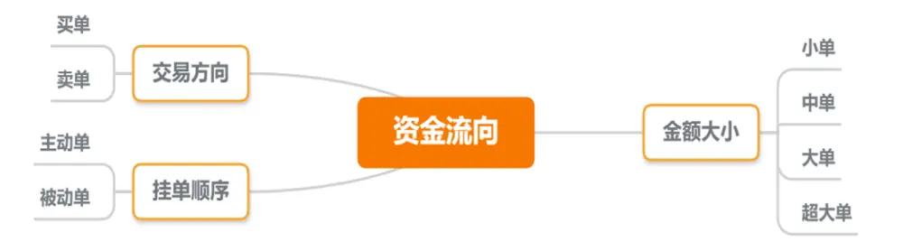
数据来源：财通证券研究所

根据上述原则，将每只股票日内成交明细分别按照成交金额、成交量、成交笔数进行统计，则每日资金流向基础数据包含 4*2*4 + 4*2 （成交笔数未统计主被动信息）共计 40 个因子。

表 1：资金流向基础数据

| 小单 | 中单 | 大单 | 超大单 |
| --- | --- | --- | --- |
| 小单买入单数 | 中单买入单数 | 大单买入单数 | 超大单买入单数 |
| 小单买入金额(仅主动) | 中单买入金额(仅主动) | 大单买入金额(仅主动) | 超大单买入金额(仅主动) |
| 小单买入金额 | 中单买入金额 | 大单买入金额 | 超大单买入金额 |
| 小单买入总量(仅主动) | 中单买入总量(仅主动) | 大单买入总量(仅主动) | 超大单买入总量(仅主动) |
| 小单买入总量 | 中单买入总量 | 大单买入总量 | 超大单买入总量 |
| 小单卖出单数 | 中单卖出单数 | 大单卖出单数 | 超大单卖出单数 |
| 小单卖出金额(仅主动) | 中单卖出金额(仅主动) | 大单卖出金额(仅主动) | 超大单卖出金额(仅主动) |
| 小单卖出金额 | 中单卖出金额 | 大单卖出金额 | 超大单卖出金额 |
| 小单卖出总量(仅主动) | 中单卖出总量(仅主动) | 大单卖出总量(仅主动) | 超大单卖出总量(仅主动) |
| 小单卖出总量 | 中单卖出总量 | 大单卖出总量 | 超大单卖出总量 |

数据来源：财通证券研究所

以买入金额为例，从下图给出了四种类型的买入金额和卖出金额从 17 年至 20 年的中位数时间序列

图 2：买入金额中位数
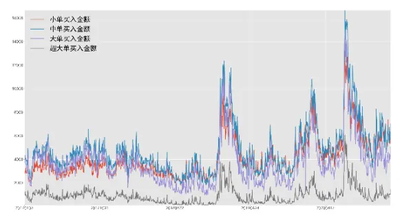
数据来源：WIND,财通证券研究所

图 3：卖出金额中位数
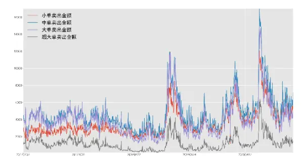
数据来源：WIND,财通证券研究所

可以看出，整体上 A 股资金流向是以中单为主，小单和大单资金相差不大，超大单在卖出资金中占比高于买入占比。

除了上述基础因子，根据买卖方向的差值，可以得到以下因子，共计 4*4=16 个因子。

表 2：资金流向交易方向差值

| 小单 | 中单 | 大单 | 超大单 |
| --- | --- | --- | --- |
| 小单金额差(含主动被动) | 中单金额差(含主动被动) | 大单金额差(含主动被动) | 超大单金额差(含主动被动) |
| 小单金额差(仅主动) | 中单金额差(仅主动) | 大单金额差(仅主动) | 超大单金额差(仅主动) |
| 小单量差(含主动被动) | 中单量差(含主动被动) | 大单量差(含主动被动) | 超大单量差(含主动被动) |
| 小单量差(仅主动) | 中单量差(仅主动) | 大单量差(仅主动) | 超大单量差(仅主动) |

数据来源：财通证券研究所

下图列出了金额差中位数的时间序列，可以看出小单和中单的净流入持续为正，大单和超大单的净流入持续为负，说明 A 股资金在买入时偏好中小单买入，卖出时大单和超大单的比例相对有所提高。

图 4：金额差时间序列
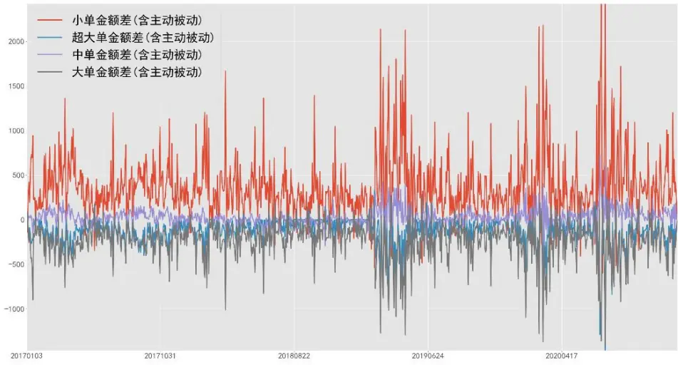
数据来源：WIND,财通证券研究所

将所有大小单进行汇总或者仅汇总大单和超大单，分时间段区分净流入金额和净流入量，可以得到以下共计 18*2=36 个因子。这里开盘和收盘分别指开盘后半小时内及收盘前半小时内的所有资金流向统计数据。

表 3：资金流向时间段统计

| 总计 | 大单+超大单 |
| --- | --- |
| 流入率(金额) | 大单流入率(金额) |
| 流入率(量) | 大单流入率(量) |
| 资金流向占比(金额) | 大单资金流向占比(金额) |
| 资金流向占比(量) | 大单资金流向占比(量) |
| 净流入金额 | 大单净流入金额 |
| 净流入量 | 大单净流入量 |
| 开盘资金流入金额 | 大单开盘资金流入金额 |
| 开盘资金流入量 | 大单开盘资金流入量 |
| 开盘资金流入率(金额) | 大单开盘资金流入率(金额) |
| 开盘资金流入率(量) | 大单开盘资金流入率(量) |
| 开盘资金流向占比(金额) | 大单开盘资金流向占比(量) |
| 开盘资金流向占比(量) | 大单开盘资金流向占比(金额) |
| 尾盘资金流入金额 | 大单尾盘资金流入金额 |
| 尾盘资金流入量 | 大单尾盘资金流入量 |
| 尾盘资金流入率(金额) | 大单尾盘资金流入率(金额) |
| 尾盘资金流入率(量) | 大单尾盘资金流入率(量) |
| 尾盘资金流向占比(金额) | 大单尾盘资金流向占比(金额) |
| 尾盘资金流向占比(量) | 大单尾盘资金流向占比(量) |

数据来源：财通证券研究所

## 2、 资金流向因子检验

单因子 IC 检验能够有效计算因子和未来收益率之间的相关性。本章主要是按照金额大小将因子进行检验。不仅是对原始因子进行检验，同时在原始因子的基础上，构建了一些衍生因子。

本章检验对象主要包括 IC 平均值，IC 平均值检验的 p 值和 t 值，IC>0 占比以及ICIR。

数据的时间区间为 2017 年至 2020 年。样本空间为中证 800，我们同样测试了全A 的因子检验结果，在同样条件下，全 A 的 IC 比中证 800 更为显著，但是不影响本文结论，为了简洁起见，本文仅展示中证 800 的检验结果（如需要全A 结果，请联系作者或者对口销售）。

## 2.1 小单资金流向因子检验

表 4：小单资金流向因子检验

|  | IC | pvalue | tvalue | IC>0 占比 | ICIR |
| --- | --- | --- | --- | --- | --- |
| 小单买入单数 | -0.0326 | 0.0000 | -5.8710 | 0.4118 | 0.4118 |
| 小单买入金额 | -0.0324 | 0.0000 | -5.4017 | 0.4241 | 0.4241 |
| 小单买入金额(仅主动) | -0.0263 | 0.0000 | -4.3457 | 0.4396 | 0.4396 |
| 小单买入总量 | -0.0572 | 0.0000 | -10.0632 | 0.3302 | 0.3302 |
| 小单买入总量(仅主动) | -0.0522 | 0.0000 | -9.2991 | 0.3416 | 0.3416 |
| 小单卖出单数 | -0.0307 | 0.0000 | -5.3079 | 0.4045 | 0.4045 |
| 小单卖出金额 | -0.0294 | 0.0000 | -4.7921 | 0.4200 | 0.4200 |
| 小单卖出金额(仅主动) | -0.0293 | 0.0000 | -4.8250 | 0.4267 | 0.4267 |
| 小单卖出总量 | -0.0543 | 0.0000 | -9.4442 | 0.3323 | 0.3323 |
| 小单卖出总量(仅主动) | -0.0547 | 0.0000 | -9.5744 | 0.3316 | 0.3316 |
| 小单金额差(含主动被动) | -0.0123 | 0.0001 | -3.8180 | 0.4334 | 0.4334 |
| 小单金额差(仅主动) | -0.0034 | 0.1276 | -1.5235 | 0.4788 | 0.4788 |
| 小单量差(含主动被动) | -0.0191 | 0.0000 | -5.9191 | 0.3922 | 0.3922 |
| 小单量差(仅主动) | -0.0025 | 0.2654 | -1.1136 | 0.4809 | 0.4809 |

数据来源：WIND，财通证券研究所

从上表可以看出，整体上买入和卖出的 IC 较为接近，主动和被动的成交 IC 也比较接近，成交量的 IC 明显高于成交金额的 IC，成交金额和成交笔数的 IC 也相差不大。成交金额和成交量差值的 IC 均不明显。

以小单买入总量为例，下图是此因子的 IC 时间序列以及分组收益

图 5：小单资金流向 IC时间序列
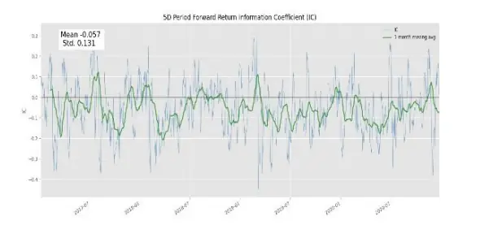
数据来源：WIND，财通证券研究所

图 6：小单资金流向分组收益率
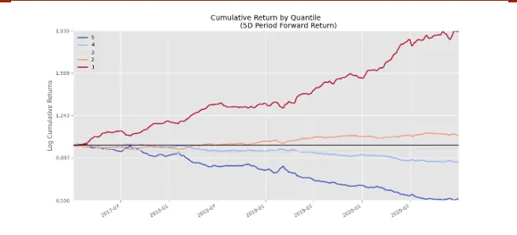
数据来源：WIND，财通证券研究所

小单买入总量的 IC 表现相当稳定，整体胜率达到了 67%，从 17 年至 20 年底，

第一组取得了 93%的收益，第五组的收益为-45%，多空组的收益达到 138%。

2.2 中单资金流向因子检验
表 5：中单资金流向因子检验

|  | IC | pvalue | tvalue | IC>0 占比 | ICIR |
| --- | --- | --- | --- | --- | --- |
| 中单买入单数 | -0.0290 | 0.0000 | -4.7094 | 0.4324 | 0.2032 |
| 中单买入金额 | -0.0285 | 0.0000 | -4.6361 | 0.4293 | 0.2000 |
| 中单买入金额(仅主动) | -0.0268 | 0.0000 | -4.3570 | 0.4293 | 0.1877 |
| 中单买入总量 | -0.0534 | 0.0000 | -9.1938 | 0.3457 | 0.4000 |
| 中单买入总量(仅主动) | -0.0511 | 0.0000 | -8.9390 | 0.3478 | 0.3876 |
| 中单卖出单数 | -0.0300 | 0.0000 | -4.8654 | 0.4252 | 0.2097 |
| 中单卖出金额 | -0.0299 | 0.0000 | -4.8652 | 0.4190 | 0.2098 |
| 中单卖出金额(仅主动) | -0.0315 | 0.0000 | -5.1946 | 0.4277 | 0.2239 |
| 中单卖出总量 | -0.0550 | 0.0000 | -9.4492 | 0.3354 | 0.4108 |
| 中单卖出总量(仅主动) | -0.0566 | 0.0000 | -9.7865 | 0.3295 | 0.4257 |
| 中单金额差(含主动被动) | 0.0018 | 0.2995 | 1.0375 | 0.5088 | 0.0344 |
| 中单金额差(仅主动) | 0.0078 | 0.0054 | 2.7811 | 0.5470 | 0.0941 |
| 中单量差(含主动被动) | 0.0026 | 0.1397 | 1.4771 | 0.5294 | 0.0495 |
| 中单量差(仅主动) | 0.0141 | 0.0000 | 4.5578 | 0.5686 | 0.1610 |

数据来源：WIND，财通证券研究所

以中单卖出总量（仅主动）为例，下图是此因子的 IC 时间序列以及分组收益

图 7：小单资金流向 IC时间序列
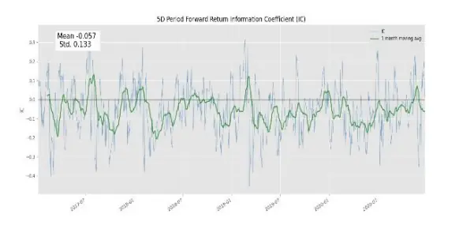
数据来源：WIND，财通证券研究所

图 8：小单资金流向分组收益率
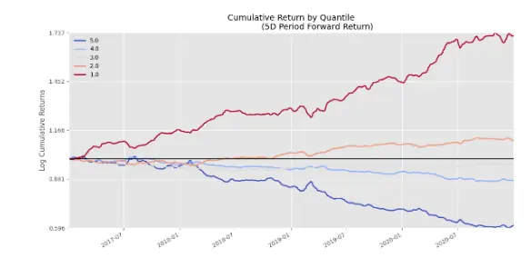
数据来源：WIND，财通证券研究所

中单卖出总量（仅主动）的 IC 表现相当稳定，整体胜率达到了 67%，从 17 年至20 年底，第一组取得了 73%的收益，第五组的收益为-40%，多空组的收益达到113%。

2.3 大单资金流向因子检验
表 6：大单资金流向因子检验

|  | IC | pvalue | tvalue | IC>0 占比 | ICIR |
| --- | --- | --- | --- | --- | --- |
| 大单买入单数 | -0.0221 | 0.0003 | -3.6192 | 0.4448 | 0.1560 |
| 大单买入金额 | -0.0215 | 0.0004 | -3.5186 | 0.4417 | 0.1518 |
| 大单买入金额(仅主动) | -0.0228 | 0.0002 | -3.7778 | 0.4293 | 0.1622 |
| 大单买入总量 | -0.0427 | 0.0000 | -7.3701 | 0.3478 | 0.3200 |
| 大单买入总量(仅主动) | -0.0428 | 0.0000 | -7.4842 | 0.3498 | 0.3231 |
| 大单卖出单数 | -0.0255 | 0.0000 | -4.2306 | 0.4365 | 0.1825 |
| 大单卖出金额 | -0.0246 | 0.0000 | -4.0815 | 0.4365 | 0.1762 |
| 大单卖出金额(仅主动) | -0.0270 | 0.0000 | -4.6025 | 0.4401 | 0.1984 |
| 大单卖出总量 | -0.0462 | 0.0000 | -8.0086 | 0.3519 | 0.3484 |
| 大单卖出总量(仅主动) | -0.0476 | 0.0000 | -8.3055 | 0.3564 | 0.3613 |
| 大单金额差(含主动被动) | 0.0220 | 0.0000 | 8.9911 | 0.6388 | 0.3141 |
| 大单金额差(仅主动) | 0.0104 | 0.0013 | 3.2155 | 0.5583 | 0.1061 |
| 大单量差(含主动被动) | 0.0271 | 0.0000 | 11.1025 | 0.6791 | 0.3940 |
| 大单量差(仅主动) | 0.0164 | 0.0000 | 4.8853 | 0.5924 | 0.1681 |

数据来源：WIND，财通证券研究所

以大单卖出总量（仅主动）为例，下图是此因子的 IC 时间序列以及分组收益

图 9：中单资金流向 IC时间序列
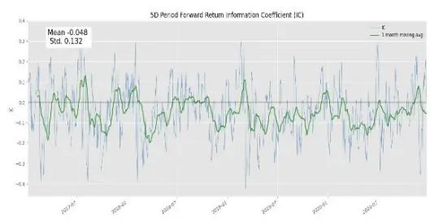
数据来源：WIND，财通证券研究所

图 10：中单资金流向分组收益率
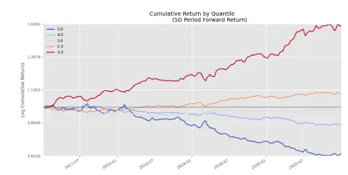
数据来源：WIND，财通证券研究所

大单卖出总量（仅主动）的 IC 表现相当稳定，整体胜率达到了 64%，从 17 年至20 年底，第一组取得了 60%的收益，第五组的收益为-36%，多空组的收益达到96%。

2.4 超大单资金流向因子检验
表 7：超大单资金流向因子检验

|  | IC | pvalue | tvalue | IC>0 占比 | ICIR |
| --- | --- | --- | --- | --- | --- |
| 超大单买入单数 | -0.0225 | 0.0008 | -3.3466 | 0.4508 | 0.1746 |
| 超大单买入金额 | -0.0305 | 0.0001 | -3.9560 | 0.4128 | 0.2169 |
| 超大单买入金额(仅主动) | -0.0303 | 0.0001 | -3.8979 | 0.4079 | 0.2134 |
| 超大单买入总量 | -0.0399 | 0.0000 | -4.5566 | 0.3918 | 0.2903 |
| 超大单买入总量(仅主动) | -0.0395 | 0.0000 | -5.1251 | 0.3477 | 0.2816 |
| 超大单卖出单数 | -0.0424 | 0.0000 | -4.7672 | 0.3606 | 0.3048 |
| 超大单卖出金额 | -0.0202 | 0.0020 | -3.0932 | 0.4607 | 0.1519 |
| 超大单卖出金额(仅主动) | -0.0196 | 0.0028 | -2.9919 | 0.4607 | 0.1471 |
| 超大单卖出总量 | -0.0353 | 0.0000 | -5.4809 | 0.3753 | 0.2710 |
| 超大单卖出总量(仅主动) | -0.0349 | 0.0000 | -5.1203 | 0.3831 | 0.2691 |
| 超大单金额差(含主动被动) | -0.0042 | 0.0979 | -1.6549 | 0.4755 | 0.0565 |
| 超大单金额差(仅主动) | -0.0026 | 0.3712 | -0.8942 | 0.4909 | 0.0303 |
| 超大单量差(含主动被动) | -0.0010 | 0.6929 | -0.3950 | 0.5078 | 0.0136 |
| 超大单量差(仅主动) | 0.0002 | 0.9491 | 0.0638 | 0.5154 | 0.0022 |

数据来源：WIND，财通证券研究所

以超大单卖出单数为例，下图是此因子的IC 时间序列以及分组收益

图 11：大单资金流向 IC时间序列
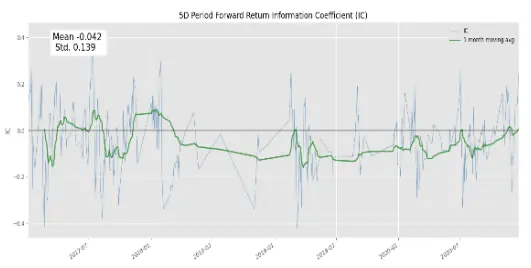
数据来源：WIND，财通证券研究所

图 12：大单资金流向分组收益率
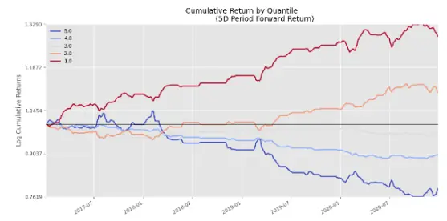
数据来源：WIND，财通证券研究所

超大单卖出单数的IC 表现相当稳定，整体胜率达到了 64%，从 17 年至 20 年底，第一组取得了 28%的收益，第五组的收益为-22%，多空组的收益达到 50%。

2.5 资金流向时间段汇总因子检验
表 8：资金流向时间段因子检验

|  | IC | pvalue | tvalue | IC>0 占比 | ICIR |
| --- | --- | --- | --- | --- | --- |
| 大单净流入量 | 0.0134 | 0.0000 | 4.4130 | 0.5779 | 0.1533 |
| 净流入量 | 0.0120 | 0.0007 | 3.3823 | 0.5583 | 0.1168 |
| 大单开盘资金流入量 | 0.0276 | 0.0000 | 10.4815 | 0.6653 | 0.3787 |
| 开盘资金流入量 | 0.0238 | 0.0000 | 7.8653 | 0.6219 | 0.2652 |
| 大单开盘资金流入金额 | 0.0235 | 0.0000 | 9.1456 | 0.6384 | 0.3231 |
| 开盘资金流入金额 | 0.0193 | 0.0000 | 6.8437 | 0.5919 | 0.2218 |
| 大单净流入金额 | 0.0078 | 0.0106 | 2.5545 | 0.5521 | 0.0872 |
| 大单尾盘资金流入量 | -0.0123 | 0.0000 | -5.0045 | 0.4174 | 0.1705 |
| 尾盘资金流入量 | -0.0092 | 0.0029 | -2.9770 | 0.4579 | 0.1032 |
| 大单尾盘资金流入金额 | -0.0154 | 0.0000 | -6.1437 | 0.3915 | 0.2089 |
| 尾盘资金流入金额 | -0.0139 | 0.0000 | -4.6783 | 0.4361 | 0.1602 |
| 净流入金额 | 0.0061 | 0.0725 | 1.7959 | 0.5459 | 0.0595 |
| 大单开盘资金流入率(量) | 0.0171 | 0.0000 | 7.9145 | 0.6164 | 0.2678 |
| 开盘资金流入率(量) | 0.0157 | 0.0000 | 5.1522 | 0.5733 | 0.1713 |
| 大单开盘资金流入率(金额) | 0.0170 | 0.0000 | 7.8495 | 0.6133 | 0.2654 |
| 开盘资金流入率(金额) | 0.0156 | 0.0000 | 5.1257 | 0.5723 | 0.1704 |
| 大单开盘资金流向占比(量) | 0.0311 | 0.0000 | 10.9590 | 0.6591 | 0.4011 |
| 开盘资金流向占比(量) | 0.0273 | 0.0000 | 8.9888 | 0.6188 | 0.2996 |
| 大单开盘资金流向占比(金额) | 0.0310 | 0.0000 | 10.9522 | 0.6570 | 0.4002 |
| 开盘资金流向占比(金额) | 0.0270 | 0.0000 | 8.8775 | 0.6205 | 0.2958 |
| 大单尾盘资金流入率(量) | -0.0166 | 0.0000 | -7.1985 | 0.3853 | 0.2489 |
| 尾盘资金流入率(量) | -0.0162 | 0.0000 | -5.7256 | 0.4164 | 0.2033 |
| 尾盘资金流入率(金额) | -0.0163 | 0.0000 | -5.7663 | 0.4164 | 0.2047 |
| 大单尾盘资金流入率(金额) | -0.0167 | 0.0000 | -7.2295 | 0.3842 | 0.2500 |
| 大单尾盘资金流向占比(量) | -0.0112 | 0.0000 | -4.2347 | 0.4143 | 0.1445 |
| 尾盘资金流向占比(量) | -0.0087 | 0.0121 | -2.5082 | 0.4538 | 0.0871 |
| 大单尾盘资金流向占比(金额) | -0.0112 | 0.0000 | -4.2507 | 0.4143 | 0.1451 |
| 尾盘资金流向占比(金额) | -0.0089 | 0.0136 | -2.4689 | 0.4493 | 0.0884 |

数据来源：WIND，财通证券研究所

时间段因子 IC 整体表现不如前几章的因子，值得注意的是，相对其他时间段因子，大单开盘因子的表现较好，且与未来收益呈现正相关。

以大单开盘资金流向占比(量)为例，下图是此因子的 IC 时间序列以及分组收益

图 13：超大单资金流向 IC时间序列
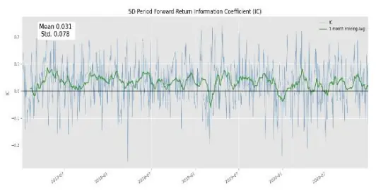
数据来源：WIND，财通证券研究所

图 14：超大单资金流向分组收益率
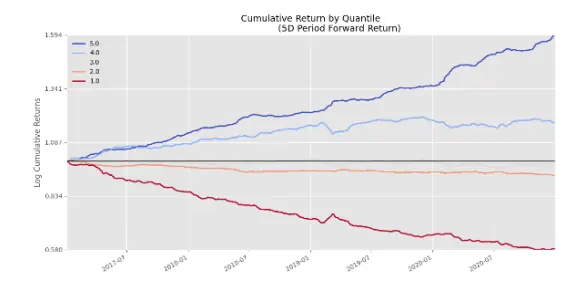
数据来源：WIND，财通证券研究所

大单开盘资金流向占比(量)的 IC 表现相当稳定，整体胜率达到了 66%，从 17 年至 20 年底，第一组取得了 60%的收益，第五组的收益为-42%，多空组的收益达到 102%。

## 2.6 衍生因子检验

上述因子仅仅是单日资金流向，一般情况下，如果存在较大资金建仓的话，会存在一段时间的持续效应，因此我们对上述因子分别做一阶差分和五日累积求和，结果表明一阶差分之后，因子与收益率不存在明显的相关性。五日累积求和因子相较于原始因子，存在明显的规律。

下图列出了单日因子和五日累积因子的 IC 平均值对比，可以看出，基础资金流向因子中， 单日因子的 IC 表现略好于五日累积因子表现。交易差额因子中，五日因子的 IC 表现有了大幅提升。

时间段因子表现不一，总体和开盘因子中，五日累积因子的表现明显好于单日因子，尾盘因子中，单日因子好于五日累积因子。这也从侧面反映了机构主导的资金流向偏好在开盘和尾盘之前调仓。

图 15：五日累积因子对比
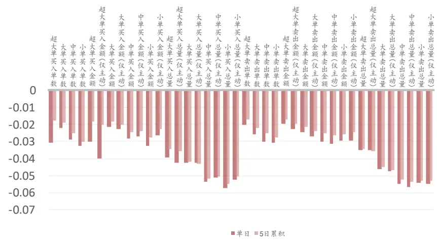
数据来源：WIND，财通证券研究所

图 16：五日累积因子对比
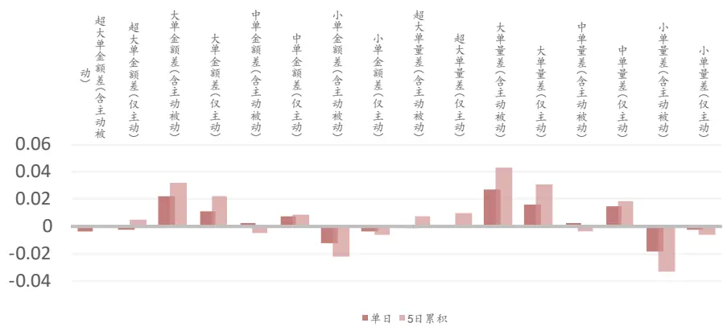
数据来源：WIND，财通证券研究所

图 17：五日累积因子对比
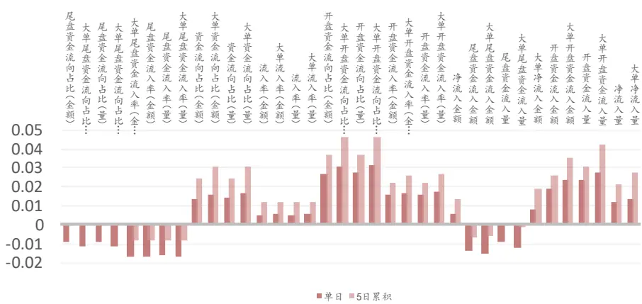
数据来源：WIND，财通证券研究所

## 2.7 单因子检验小结

通过上述结果，可以看出整体上基础因子中小单和中单和收益存在明显的负相关，超大单因子的表现一般。相较于交易金额，交易量的显著性更高。交易差额在所有资金流向中均表现一般。在时间段因子总，大单开盘资金流向占比相较于其他因子有相对明显的正相关性。

通过对比单日因子和五日累积因子的 IC，结果表明五日累积因子在开盘资金流向和交易差额中的表现有明显提升。

## 3、 NPR 模型

NPR（net purchase ratio）模型是 Lakonishok, J. and I. Lee (2015)为了研究内部人交易对于未来股价的影响提出的模型。主要是研究公司高管以及大股东通过公开及私下交易公司股票对于公司未来股价走势的影响。

我们借鉴文章中提出的模型，对其做出部分改进，用来验证不同资金模式对于股价未来走势的影响。首先定义了 NPR 因子：

$$
\mathit{NPR}_{t}=\frac{\sum_{t-\mathrm{T}}^{t}\left(buy_{t}-sell_{t}\right)}{\sum_{t-\mathrm{T}}^{t}\left(buy_{t}+sell_{t}\right)}
$$

其中 $buy_{t}$ 和 $\mathfrak{r}sell_{t}$ 分别为 t 期的买入金额和卖出金额，取T 值为 $5_{\circ}$ 为了区分不同类型资金流向的 NPR，将 buy 和 sell 分别取小单、中单、大单和超大单 4 种类型，这样共得到 4 个 NPR 因子。

为了验证 NPR 因子对于未来股票收益率的影响，借鉴原文中的模型，我们构建以下两个模型：

$$
R_{i}=\alpha_{i}+\beta_{1}LSIZE_{i}+\beta_{2}LBMR_{i}+\beta_{3}PR5_{i}+\beta_{4}PR21_{i}+\beta_{5}NPR_{i}
$$

以及

$$
\begin{aligned}R_{i}=\alpha_{i}+\beta_{1}LSIZE_{i}+\beta_{2}LBMR_{i}+\beta_{3}PR5_{i}+\beta_{4}PR21_{i}+\beta_{5}NPR_{i}+\beta_{6}DPL_{i}\\+\beta_{7}DSL_{i}\end{aligned}
$$

其中 $R_{i}$ 为未来一期的股票收益率， $LMBR_{i}$ 为 i 期的 ln(B/M)的值， $LSIZE_{i}$ 为 i 期ln(SIZE)的大小，分别代表价值和市值因子。 $PR5_{i}和PR21_{i}$ 分别为过去 5 日和 21日的收益率，代表短期和中期动量因子。模型二中的 ${DPL}_{i}$ 和 ${\cdot}DSL_{i}$ 为两个哑变量。是将市值按照大小分为三组，每组中 NPR 最大的 5%的 ${DPL}_{i}$ 为 1，其余为 0。NPR最小的 5%的 $DSL_{i}$ 为 1，其余为 0。

将因子进行去极值和标准化处理之后，将4个类型的NPR因子进行Fama-Macbeth回归，与单因子 IC 检验相比，NPR 模型回归的结果能够将各类型的因子收益率进行剥离，更为有效的展示出各因子对于收益率的影响及其显著性。对比模型一，模型二中的两个哑变量能够控制 NPR 在极端情况下的收益率。

这里的数据采用全 A 从 17 年至 20 年底的数据。选取股票未来5 日的收益率为因变量，滚动回归的结果如下表所示

图18：NPR模型Fama-Macbeth回归结果

|  |  | α | β1 | β2 | β3 | β4 | β5 | β6 | β7 |
| --- | --- | --- | --- | --- | --- | --- | --- | --- | --- |
| 小单 | 1 | 0 | 2.05 | -0.67 | -4.9 | -4.86 | -5.1 |  |  |
|  |  | (-1.61) | (2.52) | (-0.92) | (-8.14) | (-6.67) | (-19.34) |  |  |
|  | 2 | 0.27 | 2.06 | -0.64 | -4.93 | -4.83 | -5.35 | -1.58 | -3.81 |
|  |  | (2.66) | (2.54) | (-0.87) | (-8.29) | (-6.67) | (-16.89) | (-1.23) | (-3.72) |
| 中单 | 1 | 0 | 1.58 | -0.6 | -2.15 | -4.55 | 1.27 |  |  |
|  |  | (-1.61) | (1.97) | (-0.81) | (-3.69) | (-6.21) | (7.7) |  |  |
|  | 2 | 0.1 | 1.56 | -0.59 | -2.14 | -4.55 | 1.4 | -1.48 | -0.46 |
|  |  | (0.97) | (1.94) | (-0.8) | (-3.71) | (-6.25) | (6.79) | (-1.19) | (-0.46) |
| 大单 | 1 | 0 | 1.46 | -0.66 | -2.77 | -4.59 | 1.85 |  |  |
|  |  | (-1.56) | (1.83) | (-0.9) | (-4.82) | (-6.28) | (8.87) |  |  |
|  | 2 | -0.26 | 1.4 | -0.65 | -2.82 | -4.57 | 2.5 | -0.33 | 5.5 |
|  |  | (-2.88) | (1.75) | (-0.89) | (-4.96) | (-6.29) | (10.07) | (-0.31) | (5.96) |
| 超大单 | 1 | 0 | 1.74 | -0.67 | -2.37 | -4.53 | 0.43 |  |  |
|  |  | (-1.62) | (2.15) | (-0.92) | (-4.1) | (-6.19) | (3.41) |  |  |
|  | 2 | -0.08 | 1.74 | -0.67 | -2.37 | -4.51 | 0.49 | 0.52 | 1.11 |
|  |  | (-1.21) | (2.15) | (-0.91) | (-4.13) | (-6.18) | (2.72) | (0.62) | (1.49) |

数据来源：WIND，财通证券研究所

从上表中可以看出，小单的NPR系数相对于其他因子系数更为明显，说明小单NPR系数和收益的相关性更高，这和上一章的IC检验结论相符。同样的，系数的t值分别达到了-19和-16，说明两者均通过了显著性检验。模型二中的DSL系数较为显著，说明小单NPR最小的5%有较为明显的负收益（-3.81%）。

中单，大单和超大单的NPR系数均为正值，说明这些资金流向NPR和收益呈正相关，且相关性相对于其他因子越来越低。其中超大单的相关性与其他因子相比，低了一个量级，显著性也较低。值得注意的是，大单的DSL较为显著，表明大单NPR最小的5%能够取得5.5%的多空收益。

## 4、 总结

本文主要通过单因子检验和 NPR 模型对资金流向因子进行了检验，结果表明，小单资金流向因子与未来收益存在明显负相关。相较于交易金额，交易量的显著性更高。五日累积的资金流向因子检验结果表明，大单开盘资金流向占比因子的IC 较为显著。

## 信息披露

## 分析师承诺

作者具有中国证券业协会授予的证券投资咨询执业资格，并注册为证券分析师，具备专业胜任能力，保证报告所采用的数据均来自合规渠道，分析逻辑基于作者的职业理解。本报告清晰地反映了作者的研究观点，力求独立、客观和公正，结论不受任何第三方的授意或影响，作者也不会因本报告中的具体推荐意见或观点而直接或间接收到任何形式的补偿。

## 资质声明

财通证券股份有限公司具备中国证券监督管理委员会许可的证券投资咨询业务资格。

## 公司评级

买入：我们预计未来 6个月内，个股相对大盘涨幅在 15%以上；

增持：我们预计未来 6个月内，个股相对大盘涨幅介于 5%与 15%之间；

中性：我们预计未来 6个月内，个股相对大盘涨幅介于-5%与 5%之间；

减持：我们预计未来 6个月内，个股相对大盘涨幅介于-5%与-15%之间；

卖出：我们预计未来 6个月内，个股相对大盘涨幅低于-15%。

## 行业评级

增持：我们预计未来 6个月内，行业整体回报高于市场整体水平 5%以上；

中性：我们预计未来 6个月内，行业整体回报介于市场整体水平-5%与 5%之间；

减持：我们预计未来 6个月内，行业整体回报低于市场整体水平-5%以下。

## 免责声明

本报告仅供财通证券股份有限公司的客户使用。本公司不会因接收人收到本报告而视其为本公司的当然客户。

本报告的信息来源于已公开的资料，本公司不保证该等信息的准确性、完整性。本报告所载的资料、工具、意见及推测只提供给客户作参考之用，并非作为或被视为出售或购买证券或其他投资标的邀请或向他人作出邀请。

本报告所载的资料、意见及推测仅反映本公司于发布本报告当日的判断，本报告所指的证券或投资标的价格、价值及投资收入可能会波动。在不同时期，本公司可发出与本报告所载资料、意见及推测不一致的报告。

本公司通过信息隔离墙对可能存在利益冲突的业务部门或关联机构之间的信息流动进行控制。因此，客户应注意，在法律许可的情况下，本公司及其所属关联机构可能会持有报告中提到的公司所发行的证券或期权并进行证券或期权交易，也可能为这些公司提供或者争取提供投资银行、财务顾问或者金融产品等相关服务。在法律许可的情况下，本公司的员工可能担任本报告所提到的公司的董事。

本报告中所指的投资及服务可能不适合个别客户，不构成客户私人咨询建议。在任何情况下，本报告中的信息或所表述的意见均不构成对任何人的投资建议。在任何情况下，本公司不对任何人使用本报告中的任何内容所引致的任何损失负任何责任。

本报告仅作为客户作出投资决策和公司投资顾问为客户提供投资建议的参考。客户应当独立作出投资决策，而基于本报告作出任何投资决定或就本报告要求任何解释前应咨询所在证券机构投资顾问和服务人员的意见；

本报告的版权归本公司所有，未经书面许可，任何机构和个人不得以任何形式翻版、复制、发表或引用，或再次分发给任何其他人，或以任何侵犯本公司版权的其他方式使用。