2021 年 01 月 25 日

# 基于南向资金的选股择时策略

## 联系信息

陶勤英分析师

SAC 证书编号：S0160517100002

taoqy@ctsec.com

## 相关报告

## “逐鹿”Alpha 专题报告（四）

## 投资要点：

## 港股通资金流向分析

通过对港股通资金流向时间序列的分析，可以看出港股通资金流向具有一定的趋势性。分布具有一端厚尾的特征。港股通增量资金持续性不强。

港股通投资者相对更加理性，偏好在 AH 溢价较高的时候投资港股。2021 年连续 14 天净流入超 100 亿港币，无论从规模和持续时间来看，均远超历史上任何一次大规模流入的状况。

## 港股通择时策略

根据港股通资金流向构造择时指标，按照信号对恒生指数进行开仓和平仓，结果表明，此策略能够取得年化 14%的超额收益。

## 港股通选股策略

分别根据港股通每日公布的十大活跃股和持仓数据构建组合，持有固定时长，结果表明，两个策略分别能取得年化 41.3%和 21.7%的超额收益。

## 总结

本文主要分析了南向资金的时间序列特征，以及南向资金与外部因素之间的关系。通过南向资金的资金流向和持仓数据，分别构建了基于南向资金流向的择时策略和选股策略，结果表明，无论是择时还是选股，基于南向资金的策略均能取得较好的收益。

- 风险提示：本文所有模型结果均来自历史数据，不保证模型未来的有效性。

## 1、 港股通简介

港股通包括沪港通和深港通，是内地投资者投资港股的重要渠道。以深港通为例，内地投资者委托内地证券公司，经由深交所在香港设立的证券交易服务公司（SPV），向联交所进行申报，买卖规定范围内的联交所上市的股票。深港通的运行机制如下图所示

图 1：深港通运行机制
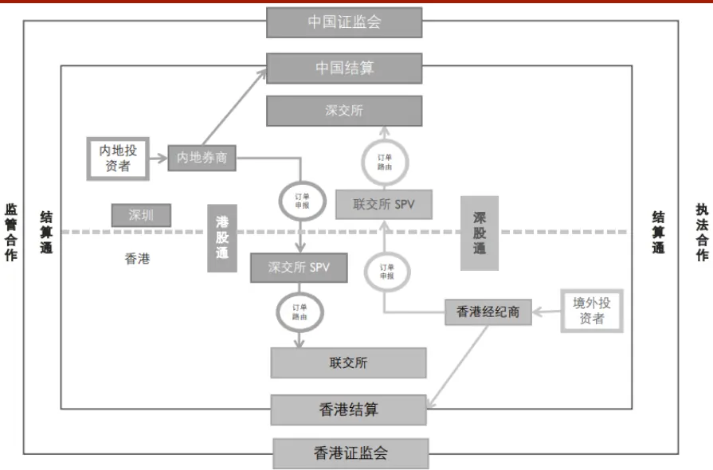
数据来源：深交所官网，财通证券研究所

目前沪港通标的总共 327 只股票，深港通在沪港通的基础上增加了中小市值市场股票，共计 498 只股票。

交易所会在每日盘后公布持仓数据，当天交易十大活跃股票以及当天资金流入流出情况。其中由于港交所 T+2 的交收制度，持仓数据存在 2 天的滞后。相较于其他机构持仓数据，南向资金的持仓数据公布频率更高，包含的信息也更加丰富。本文主要分析南向资金的择时能力和选股能力，分别构建策略。

## 2、 港股通资金流向分析

本章主要分析港股通资金流向时间序列特征以及与外部因素之间的相关性。

## 2.1 港股通资金流向时间序列分析

本节主要对南向资金本身的时间序列进行一定的分析，主要考察其自相关性和分布特征。为此，我们分别展示其自相关系数（ACF），偏自相关系数（PACF）以及分布的分位数图示法（QQ 图）和累积概率图示法（PP 图）。

图 2：资金流向时间序列分析
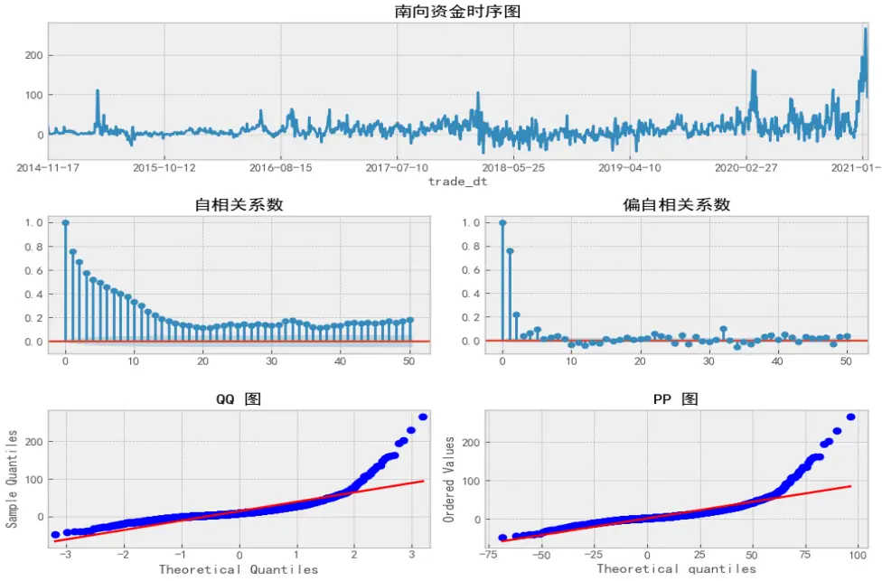
数据来源：WIND，财通证券研究所

南向资金整体的平均值和标准差分别为 13.92 亿和 24.97 亿。从南向资金的自相关系数和偏自相关系数可以看出，南向资金存在明显的自相关性，说明南向资金具有一定的趋势性。从 QQ 图和 PP 图可以看出，南向资金分布一端具有明显的厚尾效应。

图 3：资金流向一阶差分时间序列分析
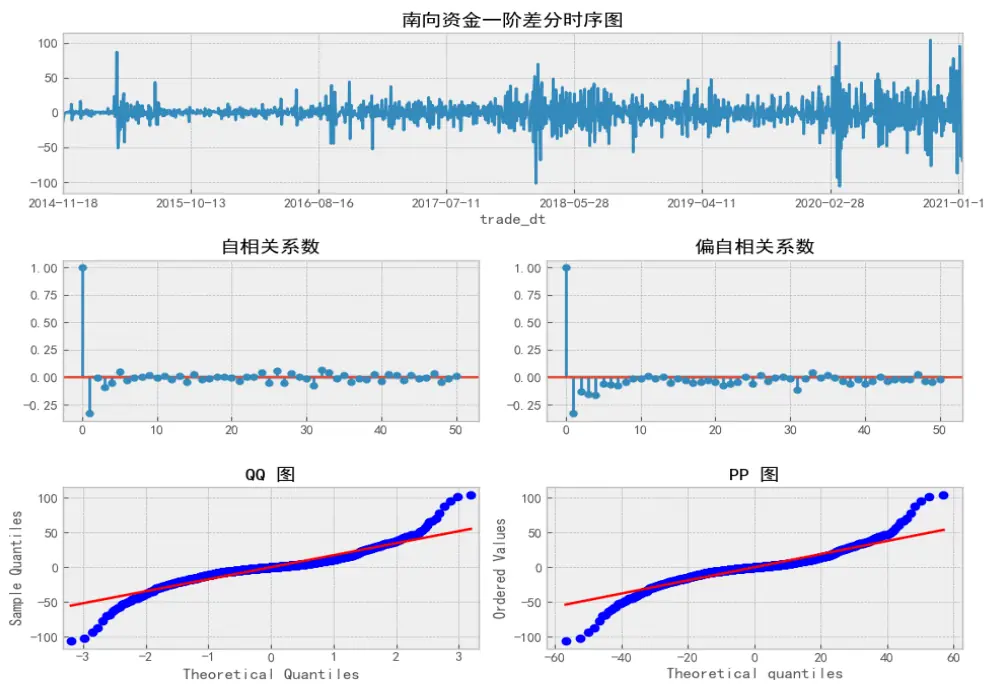
数据来源：WIND，财通证券研究所

对资金流向做一阶差分之后，整体分布基本上围绕在 0 上下波动，增量资金的平均值和标准差分别为 0.05 亿和 17.27 亿。时间序列自相关系数为 1 时，存在一定的负相关性，说明南向资金的增量持续性不高。QQ 图和 PP 图说明增量资金分布具有两端的厚尾效应。

## 2.2 港股通资金流向相关性分析

上章主要讨论了南向资金自身的一些分布特点。本章主要研究与南向资金相关的一些外部特征。

港股通作为连接 A 股和港股的通道，天然的受到两地市场的影响。同时港股通以港币报价，人民币交收的特点同样也会受到人民币汇率的影响。因此，我们分别选择北向资金流向（MHN），美元兑人民币汇率（usdcny），恒生 AH 溢价股指数（AH_premium）,上证指数（000001.SH）以及恒生指数（HSI.HI），分析这些指数和南向资金流向之间的相关性。

图 4：港股通资金流向相关性分析
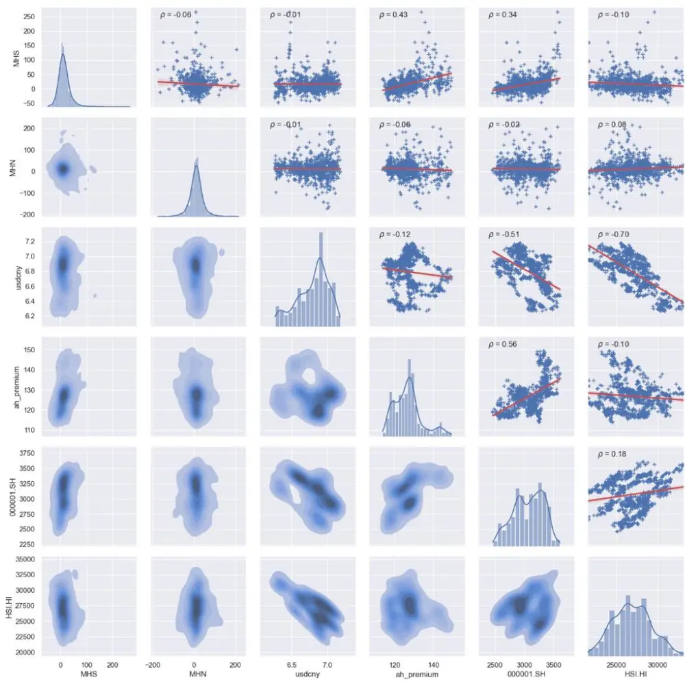
数据来源：WIND,财通证券研究所

从上图可以看出，南向资金与恒生 AH 溢价指数存在明显的正相关性，相应的与上证指数和恒生指数分别存在一定的正相关性和负相关性。说明南向资金背后的投资者相对理性，偏好在 AH 溢价较高的时候投资港股。

反观北向资金，几乎与上述特征均不存在相关性。这可能与其背后的投资者构成较为复杂有关，有国际机构投资者也有借道北向通道的境内投资者，因此其风格更加分散，难以整体分析其投资特征。

下图展示了 AH 溢价指数与南向资金之间的时间序列，可以看出，几乎每一次南向资金大幅流入时，AH 溢价指数均处于相对高位。

图 5：AH溢价指数与南向资金
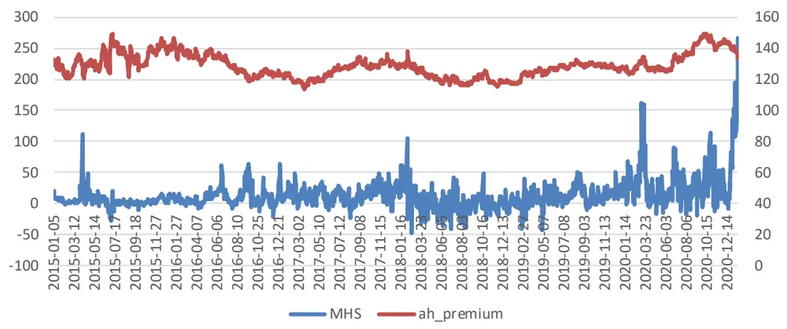
数据来源：WIND，财通证券研究所

历史上南向资金共有 21 次净流入超过 100 亿港币，其中 14 发生在今年，其余 7次分别发生在 15 年4 月A 股牛市期间，18 年2 月恒指的历史高位期间，20年 3月疫情初期，以及 20 年 10 月 AH 溢价历史高位期间。今年连续 14 天的净流入超100 亿无论从持续时间还是金额的绝对值来看，都远超历史上前几次的规模。这与当前 AH 溢价较高，人民币汇率底部反转，国内市场新发权益类基金较多等因素均有一定的相关性。

表 1：南向资金净流入大于 100亿(2021年以前)

|  | MHS | MHN | usdcny | ah_premium | 000001.SH | HSI.HI |
| --- | --- | --- | --- | --- | --- | --- |
| 2015-04-08 | 111.6366 | -40.2101 | 6.2025 | 128 | 3994.811 | 26236.86 |
| 2015-04-09 | 108.3478 | -50.819 | 6.2055 | 123.74 | 3957.534 | 26944.39 |
| 2018-02-05 | 105.9271 | -34.6302 | 6.28795 | 132.91 | 3487.497 | 32245.22 |
| 2020-03-12 | 126.9832 | -83.8038 | 7.03005 | 131.76 | 2923.486 | 24309.07 |
| 2020-03-13 | 161.7071 | -147.263 | 7.00805 | 130.51 | 2887.427 | 24032.91 |
| 2020-03-19 | 159.0605 | -102.204 | 7.10885 | 134.68 | 2702.13 | 21709.13 |
| 2020-10-29 | 113.14 | 17.8639 | 6.7145 | 146.99 | 3272.727 | 24586.6 |
| 平均值 | 126.686 | -63.0094 | 6.651057 | 132.6557 | 3317.944 | 25723.45 |

数据来源：WIND,财通证券研究所

表 2：南向资金净流入大于 100亿(2021年)

|  | MHS | MHN | usdcny | ah_premium | 000001.SH | HSI.HI |
| --- | --- | --- | --- | --- | --- | --- |
| 2021-01-04 | 134.9515 | -5.4191 | 6.4606 | 140.88 | 3502.958 | 27472.81 |
| 2021-01-05 | 107.4338 | -44.4437 | 6.4555 | 140.75 | 3528.677 | 27649.86 |
| 2021-01-06 | 123.9585 | 2.3592 | 6.4622 | 141.54 | 3550.877 | 27692.3 |
| 2021-01-07 | 154.2139 | 32.6307 | 6.47835 | 141.09 | 3576.205 | 27548.52 |
| 2021-01-08 | 134.6156 | 206.1462 | 6.4731 | 139.84 | 3570.108 | 27878.22 |
| 2021-01-11 | 194.8594 | 8.9358 | 6.48 | 137.71 | 3531.498 | 27908.22 |
| 2021-01-12 | 107.5147 | 84.4484 | 6.4615 | 138.35 | 3608.339 | 28276.75 |
| 2021-01-13 | 119.0731 | 27.1215 | 6.46825 | 137.63 | 3598.652 | 28235.6 |
| 2021-01-14 | 146.3478 | 51.0704 | 6.4745 | 136.96 | 3565.905 | 28496.86 |
| 2021-01-15 | 134.3323 | 8.0134 | 6.4805 | 136 | 3566.378 | 28573.86 |
| 2021-01-18 | 229.7064 | 16.3659 | 6.4907 | 135.69 | 3596.224 | 28862.77 |
| 2021-01-19 | 265.9275 | 9.1846 | 6.4785 | 133.86 | 3566.381 | 29642.28 |
| 2021-01-20 | 202.878 | 56.7791 | 6.46200 | 133.43 | 3621.264 | 29927.76 |
| 2021-01-21 | 162.6345 | -20.1978 | 6.48145 | 134.84 | 3606.749 | 29447.85 |
| 平均值 | 158.4605 | 30.92819 | 6.471939 | 137.755 | 3570.73 | 28400.98 |

数据来源：WIND,财通证券研究所

## 2.3 本章小结

本章主要分析了南向资金的特征，以及其与外部因素之间的关系。结果表明，南向资金本身存在一定的趋势性，整体分布具有一端厚尾的特征。资金一阶差分之后相对平稳，说明增量资金的持续性不强。

南向投资者相对更加理性，偏好在 AH 溢价较高的时候投资港股。2021 年连续 14天净流入超 100 亿港币，无论从规模和持续时间来看，均远超历史上任何一次大规模流入的状况。

## 3、 港股通资金流向择时策略

通过上一章的分析，我们可以看出，相比于北向投资者，南向投资者更加理性，且其行为具有一定的趋势性。因此我们希望通过南向资金披露出的信息，构建投资策略，获取超额收益。

首先我们分析南向资金流向与恒指未来收益率之间的关系，从下图可以看出，南向资金与恒生指数未来 N 天的收益率存在明显的正相关性，并且极值分别出现在半个月和一个月的未来收益率上。说明南向资金的确是有相当强的择时能力。

图 6：南向资金与恒指未来收益率相关性
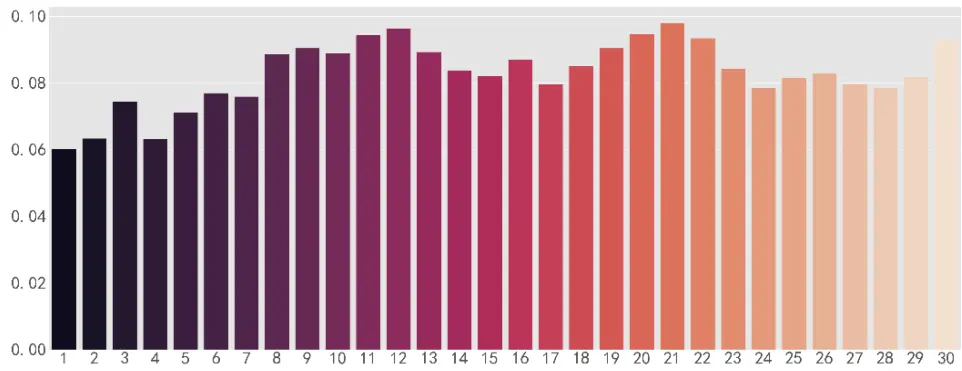
数据来源：WIND，财通证券研究所

据此我们通过南向资金构建恒生的择时指标，构建思路为依据南向资金净流入的时间序列，当此时间序列突破布林带上轨，说明南向资金对后市非常乐观，则次日进行开仓，突破下轨则表明南向资金的避险倾向，次日进行平仓。

图 7：南向资金及其布林带
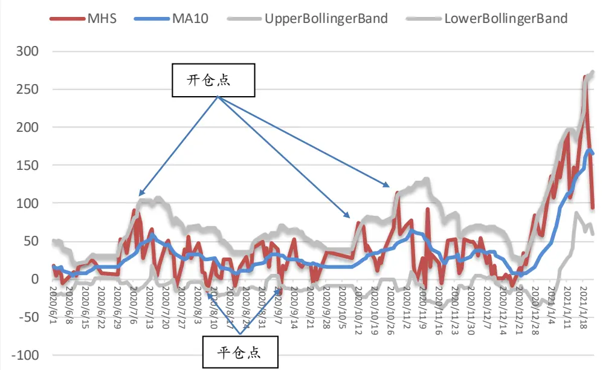
数据来源：WIND，财通证券研究所

本策略唯一需要优化的参数为计算布林带时的时间范围选择，我们选择时间范围参数为 6-16 天，样本内时间段选择 2015 年-2016 年，分别测试其回测收益，具体回测的参数设置如下：

回测区间： 2015/01/01-2016/12/31

标的范围：恒生指数

回测基准：恒生指数

手续费：买入千二，卖出千二

最终结果如下：

| 表3：布林带参数敏感性 |  |  |  |
| --- | --- | --- | --- |
| CAGR | MDD | Stdev | Sharp |
| 6 1.15% | 30.49% | 0.2281 | 0.0991 |
| 7 7.65% | 19.67% | 0.2047 | 0.5269 |
| 8 12.36% | 11.57% | 0.1879 | 0.8875 |
| 9 11.36% | 19.71% | 0.2044 | 0.7681 |
| 10 10.67% | 19.71% | 0.1904 | 0.7626 |
| 11 16.02% | 12.03% | 0.1638 | 1.2759 |
| 12 25.60% | 11.18% | 0.1805 | 1.8126 |
| 13 20.73% | 12.56% | 0.1641 | 1.6261 |
| 14 16.40% | 13.77% | 0.1540 | 1.3784 |
| 15 19.24% | 14.36% | 0.1716 | 1.4579 |

数据来源：WIND，财通证券研究所

可以看出当计算布林带的时间范围为 12 时结果最优，年化收益为 25.60%，夏普比率为 1.81。

根据此参数，最终样本内外（2015 年-2020 年）的回测收益曲线如下：

图 8：择时策略回测收益曲线
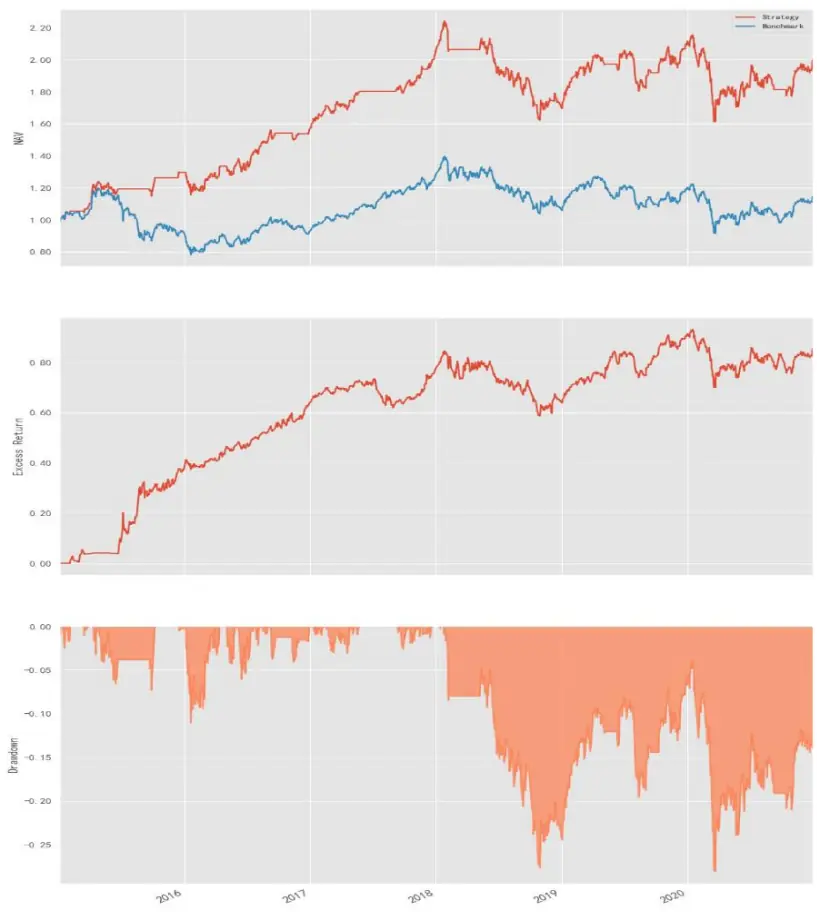
数据来源：WIND，财通证券研究所

| 表4：择时策略回测结果 |  |
| --- | --- |
| CAGR | 12.70% |
| MDD | 28.08% |
| WIN_RATIO | 63.16% |
| Alpha | 14.70% |
| Beta | 0.7225 |
| Stdev | 0.1936 |
| Sharp | 0.8887 |
| IR | 0.9147 |
| TurnOver | 0.1434 |

数据来源：WIND，财通证券研究所

最终样本内外的年化收益率为 12.70%，超额年化 14.7%，择时胜率为 63.16%，夏普比率 0.89。可以看出，此策略的结果表现相当稳健，能够有效规避掉下跌风险且在上涨时密切跟踪指数。说明南向资金背后的参与者择时能力相当突出。

## 4、 港股通资金流向选股策略

港交所自2017年3月20日会在盘后公布港股通当日十大成交活跃股以及在中央结算系统内的持股数量。根据这两个指标我们分别构建基于活跃股和持仓股的选股策略。

## 4.1 基于成交活跃股的选股策略

基于活跃股的策略构建思路根据当日公布的十大成交活跃股，计算当日活跃股的净买入额，选取净买入额大于 0 的股票，根据其净买入额作为权重构建组合，次日买入。

上一章中我们提到了南向资金与未来半个月和一个月恒指收益率的相关性最高，因此持股周期我们分别选择半个月和一个月进行测试。

策略具体回测的参数设置如下：

回测区间： 2017/03/20-2021/01/20

标的范围：港股通标的

回测基准：恒生指数

手续费：买入千二，卖出千二

图 9：活跃成交测率（持股一个月）
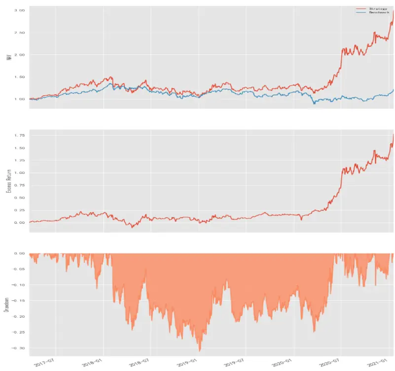
数据来源：WIND，财通证券研究所

图 10：活跃成交测率（持股半个月）
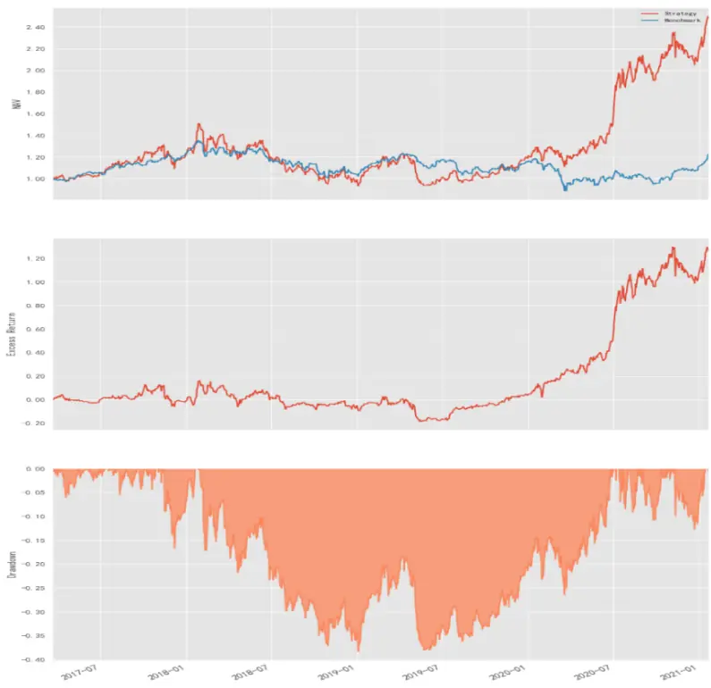
数据来源：WIND，财通证券研究所

表 5：活跃成交策略回测结果

|  | 持仓一个月 | 持仓半个月 |
| --- | --- | --- |
| CAGR | 33.96% | 27.34% |
| MDD | 31.10% | 38.30% |
| Alpha | 47.30% | 33.52% |
| Beta | 1.0535 | 1.0919 |
| Stdev | 0.3322 | 0.3503 |
| Sharp | 1.3821 | 1.1190 |
| IR | 1.3317 | 1.0198 |
| TurnOver | 0.2645 | 0.4779 |

数据来源：WIND，财通证券研究所

可以看出持仓一个月策略的各项指标相当优异，年化收益达到 33.96%，夏普比率为 1.38，作为中低频策略，表现相当优异。

从净值曲线上来看，策略大部分的收益均来自 2020 年以后，远超基准表现。这也从侧面反映了南向资金自 2020 年以后取得了非常高的收益。

策略最新一期（2021-01-22）持仓为：

表 6：成交活跃股策略最新一期持仓

| 股票代码 | 股票名称 持仓权重 |
| --- | --- |
| 0291.HK | 华润啤酒 |
| 3800.HK | 0.27% |
| 0883.HK | 保利协鑫能源 1.43% |
| 0388.HK | 中国海洋石油 1.70% |
| 1211.HK | 香港交易所 4.09% |
| 6969.HK | 比亚迪股份 7.21% 思摩尔国际 |
| 3690.HK | 10.56% 美团-W 19.48% |
| 0700.HK | 腾讯控股 55.27% |

数据来源：财通证券研究所

## 4.2 基于持仓股的选股策略

港交所自 2017 年 3 月开始每日会公布中央结算系统内的持股数量，根据每天持仓变化量，我们可以估算其每日增持金额（持仓变动*VWAP 价格）。需要注意的时，由于港交所实行 T+2 交收制度，因此持仓数据本身会有 2 天的滞后。

在构建策略时，我们根据增持金额选择排名前 20 的股票， 根据其增持金额作为权重构建组合。

回测参数与上节保持一致，分别测试持仓一个月和半个月的结果：

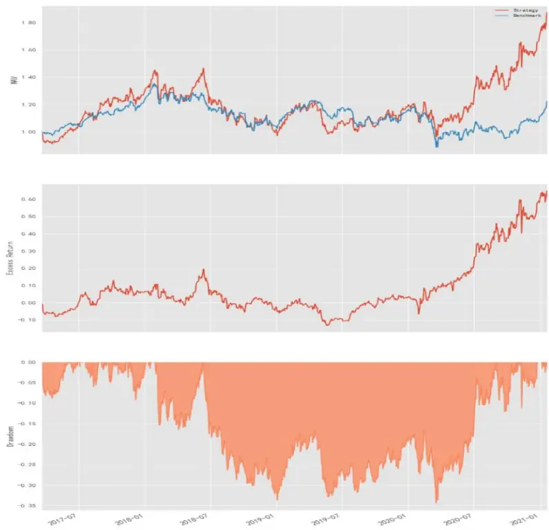
数据来源：WIND，财通证券研究所

图 12：持仓变动策略（持股半个月）
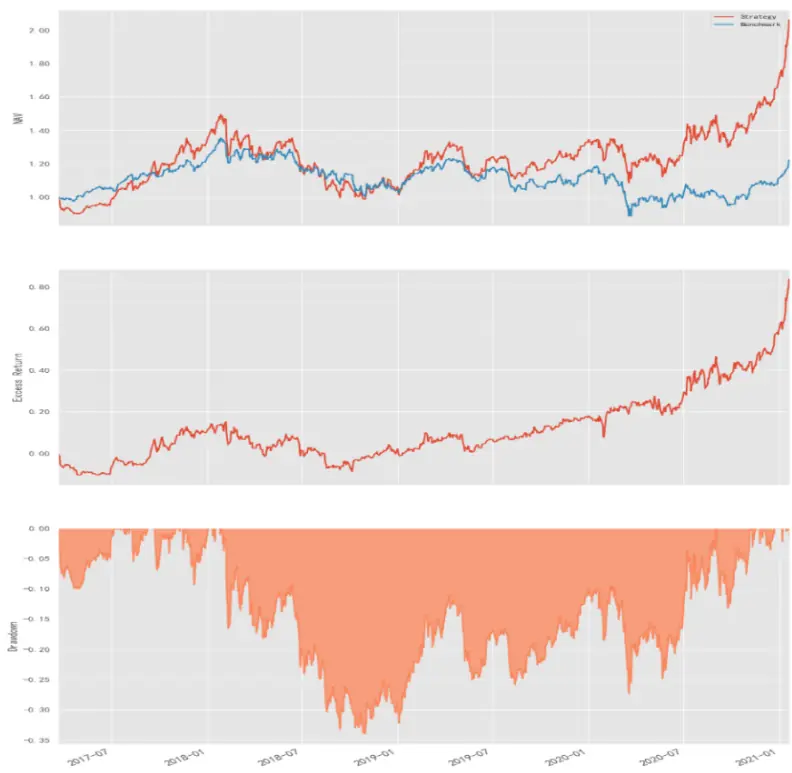
数据来源：WIND，财通证券研究所

表 7：持仓变动策略回测结果

|  | 专题报告 | 证券研究报告 |
| --- | --- | --- |
|  | 持仓一个月 | 持仓半个月 |
| CAGR | 17.60% | 20.83% |
| MDD | 34.43% | 33.97% |
| Alpha | 16.44% | 21.70% |
| Beta | 1.0161 | 1.0147 |
| Stdev | 0.3045 | 0.2995 |
| Sharp | 0.8587 | 0.9998 |
| IR | 0.7333 | 0.9213 |
| TurnOver | 0.2993 | 0.4942 |

数据来源：WIND，财通证券研究所

整体上持仓变动策略的数据表现不如活跃成交股策略，主要是由于持仓数据存在一定的滞后性。相比与一个月持仓，半个月持仓表现更好。从净值曲线上来看，持仓半个月的策略自 18 年低开始，超额收益非常稳健。

策略最新一期（2021-01-22）持仓为：

表 8：持仓股策略最新一起持仓

| 股票代码 | 股票名称 持仓权重 |
| --- | --- |
| 6186.HK | 中国飞鹤 1.66% |
| 1177.HK | 中国生物制药 1.67% |
| 3898.HK | 中车时代电气 1.75% |
| 3800.HK | 保利协鑫能源 1.92% |
| 6618.HK | 京东健康 2.15% |
| 0981.HK |  |
|  | 中芯国际 2.35% |
| 3908.HK 2020.HK | 中金公司 2.37% |
| 0027.HK | 安踏体育 2.38% |
| 银河娱乐 | 2.57% |
| 1801.HK 2269.HK | 信达生物 3.21% |
|  | 药明生物 3.21% 中国移动 |
| 0941.HK | 3.59% |
| 6969.HK | 思摩尔国际 3.71% |
| 2013.HK | 微盟集团 3.85% |
| 0883.HK | 中国海洋石油 4.80% |
| 1299.HK | 友邦保险 5.44% |
| 0388.HK | 香港交易所 6.81% |
| 3690.HK | 美团-W 10.07% |
| 1810.HK 0700.HK | 小米集团-W 10.31% 腾讯控股 26.19% |

数据来源：财通证券研究所

## 5、 总结

本文主要分析了南向资金的时间序列特征，以及南向资金与外部因素之间的关系。通过南向资金的资金流向和持仓数据，分别构建了基于南向资金流向的择时策略和选股策略，结果表明，无论是择时还是选股，基于南向资金的策略均能取得较好的收益。

## 信息披露

## 分析师承诺

作者具有中国证券业协会授予的证券投资咨询执业资格，并注册为证券分析师，具备专业胜任能力，保证报告所采用的数据均来自合规渠道，分析逻辑基于作者的职业理解。本报告清晰地反映了作者的研究观点，力求独立、客观和公正，结论不受任何第三方的授意或影响，作者也不会因本报告中的具体推荐意见或观点而直接或间接收到任何形式的补偿。

## 资质声明

财通证券股份有限公司具备中国证券监督管理委员会许可的证券投资咨询业务资格。

## 公司评级

买入：我们预计未来 6个月内，个股相对大盘涨幅在 15%以上；

增持：我们预计未来 6个月内，个股相对大盘涨幅介于 5%与 15%之间；

中性：我们预计未来 6个月内，个股相对大盘涨幅介于-5%与 5%之间；

减持：我们预计未来 6个月内，个股相对大盘涨幅介于-5%与-15%之间；

卖出：我们预计未来 6个月内，个股相对大盘涨幅低于-15%。

## 行业评级

增持：我们预计未来 6个月内，行业整体回报高于市场整体水平 5%以上；

中性：我们预计未来 6个月内，行业整体回报介于市场整体水平-5%与 5%之间；

减持：我们预计未来 6个月内，行业整体回报低于市场整体水平-5%以下。

## 免责声明

本报告仅供财通证券股份有限公司的客户使用。本公司不会因接收人收到本报告而视其为本公司的当然客户。

本报告的信息来源于已公开的资料，本公司不保证该等信息的准确性、完整性。本报告所载的资料、工具、意见及推测只提供给客户作参考之用，并非作为或被视为出售或购买证券或其他投资标的邀请或向他人作出邀请。

本报告所载的资料、意见及推测仅反映本公司于发布本报告当日的判断，本报告所指的证券或投资标的价格、价值及投资收入可能会波动。在不同时期，本公司可发出与本报告所载资料、意见及推测不一致的报告。

本公司通过信息隔离墙对可能存在利益冲突的业务部门或关联机构之间的信息流动进行控制。因此，客户应注意，在法律许可的情况下，本公司及其所属关联机构可能会持有报告中提到的公司所发行的证券或期权并进行证券或期权交易，也可能为这些公司提供或者争取提供投资银行、财务顾问或者金融产品等相关服务。在法律许可的情况下，本公司的员工可能担任本报告所提到的公司的董事。

本报告中所指的投资及服务可能不适合个别客户，不构成客户私人咨询建议。在任何情况下，本报告中的信息或所表述的意见均不构成对任何人的投资建议。在任何情况下，本公司不对任何人使用本报告中的任何内容所引致的任何损失负任何责任。

本报告仅作为客户作出投资决策和公司投资顾问为客户提供投资建议的参考。客户应当独立作出投资决策，而基于本报告作出任何投资决定或就本报告要求任何解释前应咨询所在证券机构投资顾问和服务人员的意见；

本报告的版权归本公司所有，未经书面许可，任何机构和个人不得以任何形式翻版、复制、发表或引用，或再次分发给任何其他人，或以任何侵犯本公司版权的其他方式使用。