## 2021 年 04 月 11 日 杠杆因子和盈利收益因子的风格轮动

## “逐鹿”Alpha专题报告（五）

## 联系信息

陶勤英分析师

SAC 证书编号：S0160517100002

taoqy@ctsec.com

021-68592393

## 相关报告

## 投资要点：

## 企业盈利周期与信贷周期

企业本身作为宏观经济的组成部分影响经济的运行，同时宏观经济的好坏又决定了企业的运营状况。宏观经济的波动会导致企业收入增长的波动，相比于经济波动，企业增速的波动往往更大，这与企业自身所处行业对于经济的敏感性有关，同时也受到企业自身杠杆的影响。企业盈利受到经济周期的影响，经济周期同时又与信贷周期相互作用。在信贷扩张周期，企业能够充分利用杠杆扩大经营，攫取更多利润。但是，杠杆作为一把双刃剑，在信贷收缩周期，高杠杆企业如果遭遇经营问题，融资往往受限，致使经营恶化加剧，从而引发危机。

## 杠杆因子和盈利收益因子

杠杆因子（leverage）和盈利收益(earnings yield)因子是常见的风格因子。通过对因子做 IC 检验和收益率分析，结果表明，两者存在一定的周期性，并且存在一定的套利空间。

## 风格轮动

构建领先指标、分析指标和因子收益率之间的相关性，根据指标信号对杠杆因子和盈利收益因子进行风格轮动，能够有效提高组合收益率。

- 风险提示：本文所有模型结果均来自历史数据，不保证模型未来的有效性。

## 1、 概述

企业经营状况是由多种因素共同决定的。其中宏观经济环境对于企业的发展至关重要。中国近几年的 GDP 增速稳定在 6%-7%之间，但是企业收入的增速往往具有很大的波动，除了企业所处行业对于经济周期的敏感性之外，企业自身的杠杆也是导致波动增大的一个主要原因。

宏观经济与信贷周期相互影响。经济上行阶段，企业能够充分利用杠杆扩大经营，攫取更多利润。而在经济下行阶段，企业利润下滑，更糟糕的是，企业此时融资往往会遭遇各种困难，使得经营恶化加剧。

本文主要在因子视角下，分析杠杆因子和盈利收益因子风险溢价水平与信贷指标之间的相关性。通过构建信贷领先指标，在杠杆因子和盈利收益因子之间进行风格轮动，从而获取超额收益。

## 2、 企业盈利周期与信贷周期

企业本身作为宏观经济的组成部分影响经济的运行，同时宏观经济的好坏又决定了企业的运营状况。两者的运行息息相关，宏观经济的周期性决定了企业自身的运行也会具有一定的周期效应。

图 1：A 股主板上市公司净利润增速
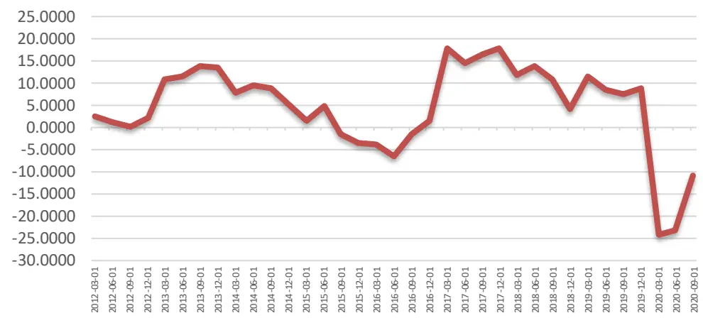
数据来源：WIND, 财通证券研究所

宏观经济的波动会导致企业收入增长的波动，相比于经济波动，企业收入增速的波动往往更大，这与企业自身所处行业对于经济的敏感性有关，同时也受到企业自身杠杆的影响。

对于日常消费板块和可选消费板块，对经济环境的敏感性不尽相同，导致他们在不同的经济环境下，表现会有所差异。对于工业板块和金融板块，由于其自身的经营杠杆和财务杠杆较高，宏观经济的波动传导传导到公司会导致利润增速波动的放大。

图 2：板块盈利增速
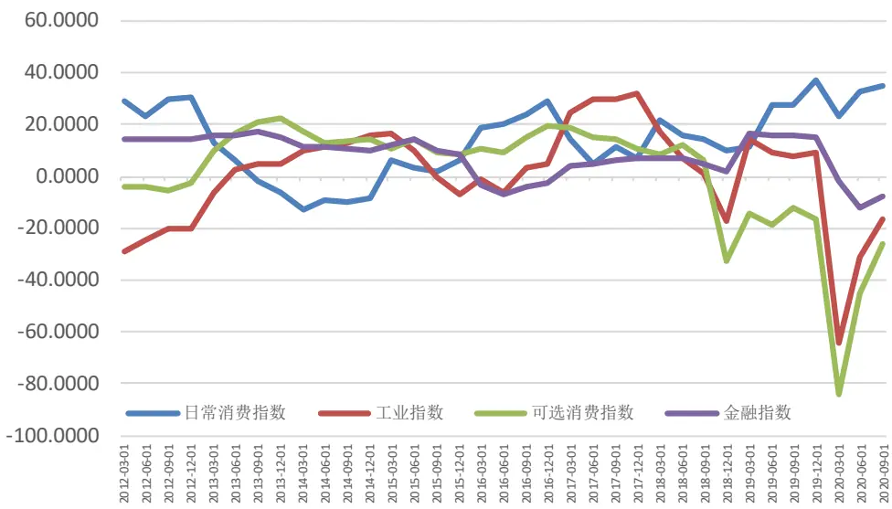
数据来源：WIND，财通证券研究所

企业盈利受到经济周期的影响，经济周期同时又与信贷周期又相互作用。信贷周期，也称资本市场周期，是指一个市场的货币供应量从扩张然后到收缩的时期。信贷周期受到经济环境的影响，当经济处于繁荣时期，企业收入增加，开始债务扩张，货币供应总量不断上升；当经济进入衰退期后，企业经营下滑，融资困难，货币供应收缩。 霍华德·马克斯在《周期》中总结了信贷周期的基本特征：

“经济繁荣带来信贷扩张，信贷扩张导致不明智地滥发贷款，滥发贷款产生重大损失，重大损失让贷款人停止发放贷款，贷款停止就让经济繁荣中止了。就这样一环扣一环，连锁反应无休无止。”

在信贷扩张周期，企业能够充分利用杠杆扩大经营，攫取更多利润。但是，杠杆作为一把双刃剑，在信贷收缩周期，高杠杆企业如果遭遇经营问题，融资往往受限，致使经营恶化加剧，从而引发危机。

从宏观经济到公司经营，整个传导过程需要一定的时间，这个时间上的滞后为我们分析宏观周期对于公司经营的影响提供了研究思路。本文主要在因子视角下，分析杠杆因子和盈利收益因子与信贷指标之间的相关性。通过构建信贷领先指标，在杠杆因子和盈利收益因子之间进行风格轮动。

## 3、 杠杆因子和盈利收益因子

## 3.1、 因子构造

杠杆因子（leverage）和盈利收益(earnings yield)因子是常见的风格因子。本文主要借鉴了 CNE5 的因子说明，具体的构造方法如下：

表 1：因子构造方法

| 大类因子 | 二级因子 | 系数 | 因子说明 |
| --- | --- | --- | --- |
| 杠杆因子 |  | 0.38 | 市场杠杆 |
|  | DTOA | 0.35 | 资产负债率 |
|  | BLEV | 0.27 | 账面杠杆 |
| 盈利收益 因子 | CETOP | 0.66 | 市现率倒数 |
|  | ETOP | 0.34 | 市盈率倒数 |

数据来源：财通证券研究所

其中在计算盈利收益因子时，考虑到因子的覆盖度问题，我们剔除了原有的二级因子 EPFWD。

在合成大类因子之后，对因子做去极值和标准化处理。最终的因子分布为：

图 3：杠杆因子分布
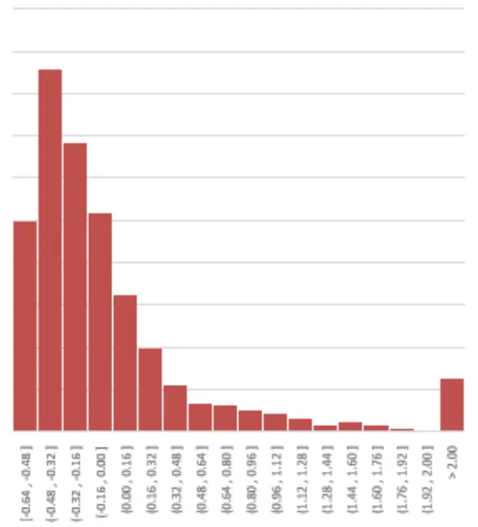
数据来源：WIND, 财通证券研究所

图 4：盈利收益因子分布
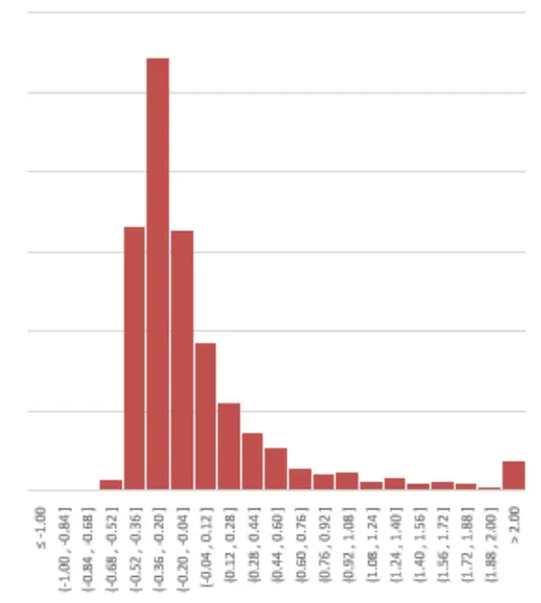
数据来源：WIND, 财通证券研究所

在不同行业中，因子的取值会有明显的不同。下图给出了最新一期不同行业中杠杆因子和盈利收益因子的平均值分布。

可以看出，在大金融板块，包括银行，非银，房地产行业，这些行业中企业具有较高的杠杆。

对于盈利收益因子，传统的周期行业，例如钢铁，煤炭，以及商贸零售，具有较高的盈利收益，一方面是因为近期周期行业的盈利能力表现较好，另一方面，传统周期行业在二级市场估值较低，导致盈利收益也会高于其他行业。

图 5：杠杆因子行业均值分布

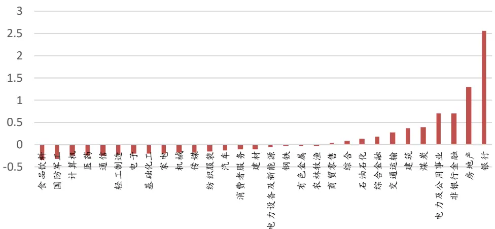
数据来源：WIND, 财通证券研究所

图 6：盈利收益因子行业均值分布
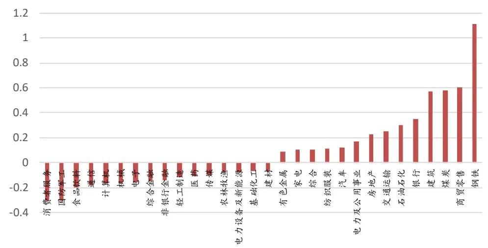
数据来源：WIND, 财通证券研究所

## 3.2、 因子分析

## 3.2.1、 IC 检验

构建全市场股票月频的杠杆因子和盈利收益因子，对两者做 IC 检验，从 2011 年至 2021 年3 月，杠杆因子和盈利收益因子的 IC 分别为-0.013和 0.019，标准差分别为 0.147，0.140。

观察两者 IC 的时间序列可以看出，两个因子存在明显的周期性，且两者的周期基本一致。

IC 振幅存在明显的差异，杠杆因子的负 IC 区间振幅较大，盈利收益在正 IC 区间振幅较大。

上述结论表明，根据两者所处的 IC 正负区间，杠杆因子和盈利收益因子存在一

定的套利空间。

图 7：杠杆因子 IC 分析
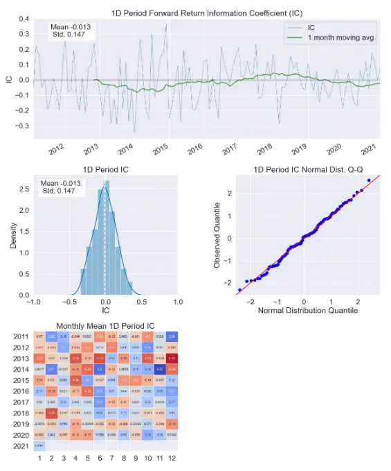
数据来源：WIND，财通证券研究所

图 8：盈利收益因子 IC分析
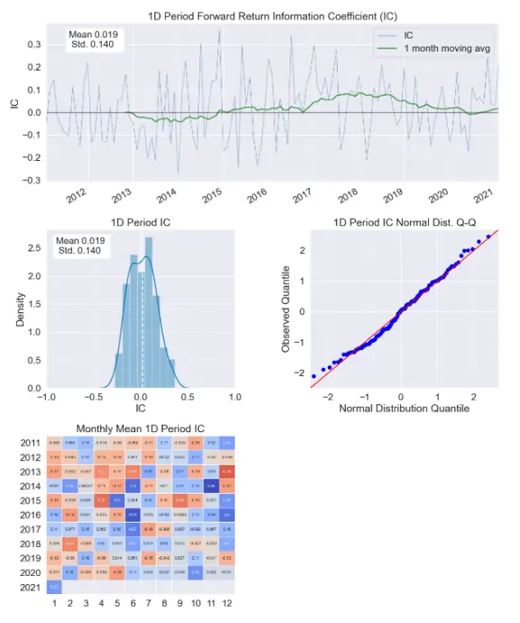
数据来源：WIND, 财通证券研究所

## 3.2.2、 多空收益率检验

为了分析因子在不同时期的表现，将全市场股票按照因子大小进行排序分为十组，根据 IC 平均值正负，取首尾组构建多空组合（杠杆因子组合为小减大，盈利收益因子组合为大减小），组合的收益率如下图所示：

图 9：因子分组多空收益率（IC 方向调整）
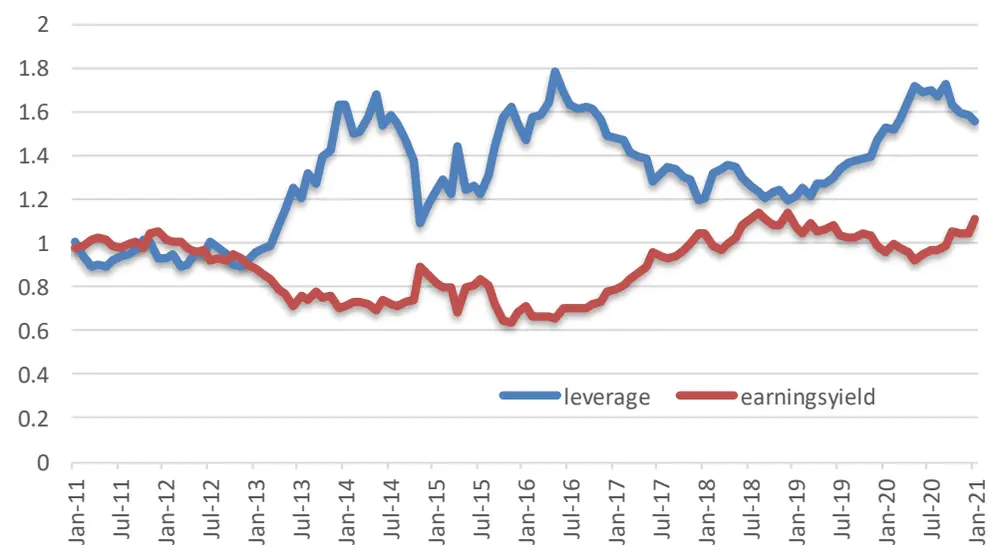
数据来源：WIND，财通证券研究所

可以看出，杠杆因子和盈利收益因子的收益率存在明显的负相关性，两者的负相

关系数为-0.44。同时杠杆因子和盈利收益因子本身的相关性（股票因子暴露的时间序列平均值）只有 0.10，说明因子收益率的负相关性更多的是来自因子本身的内禀属性，并非是由于因子值之间的相关性导致的。

正如本文第一章所述，杠杆因子和盈利收益因子同时受到企业盈利和信贷周期的影响，导致了两者收益率之间存在较强的相关性。

## 4、 风格轮动

杠杆因子和盈利收益因子同时受到信贷周期的影响，同时，从信贷状况传导到公司的经营状况需要一定的时间，时间上的滞后效应为我们研究杠杆因子和盈利收益因子的择时提供了一定的信息。

## 4.1、 指标选取

为了研究宏观指标对于杠杆因子和盈利收益因子的择时效果，我们选取常见的宏观货币相关的指标以及经济相关的指标，共计 86 个，下表列出了部分代表性指标。

需要注意的是，由于指标的单位和频率均不统一，我们将指标做月频处理，对部分带有量纲的非同比指标做同比化处理。

表 2：部分指标列表

| 指标名称 | 频率 | 单位 | 起始时间 | 结束时间 | 更新时间 |
| --- | --- | --- | --- | --- | --- |
| 固定资产投资完成额：累计同比 | 月 | % | 1992-02 | 2021-02 | 2021-03-15 |
| 房地产开发投资完成额：累计同比 | 月 | % | 1999-02 | 2021-02 | 2021-03-15 |
| 社会消费品零售总额：当月同比 | 月 | % | 1995-01 | 2021-02 | 2021-03-15 |
| MO:同比 | 月 | % | 1979-12 | 2021-02 | 2021-03-10 |
| M1：同比 | 月 | % | 1986-12 | 2021-02 | 2021-03-10 |
| M2:同比 | 月 | % | 1986-12 | 2021-02 | 2021-03-10 |
| 金融机构：新增人民币贷款：当月值 | 月 | 亿元 | 2001-01 | 2021-02 | 2021-03-10 |
| 社会融资规模：新增人民币贷款：当月值 | 月 | 亿元 | 2002-01 | 2021-02 | 2021-03-16 |
| 中债国债到期收益率：3个月 | 日 | % | 2002-01-04 | 2021-03-26 | 2021-03-26 |
| 中债国债到期收益率：10年 | 日 | % | 2002-01-04 | 2021-03-26 | 2021-03-26 |
| 中债企业债到期收益率(AAA)：3个月 | 日 | % | 2006-03-01 | 2021-03-26 | 2021-03-26 |
| 中债企业债到期收益率(AAA)：10年 | 日 | % | 2006-03-01 | 2021-03-26 | 2021-03-26 |
| 信用利差(中位数)：全体产业债 | 日 | BP | 2010-01-04 | 2021-03-26 | 2021-03-29 |
| PMI | 月 | % | 2005-01 | 2021-02 | 2021-02-28 |
| PPI：全部工业品：当月同比 | 月 | % | 1996-10 | 2021-02 | 2021-03-10 |
| CPI当月同比 | 月 | % | 1987-01 | 2021-02 | 2021-03-10 |

数据来源：WIND, 财通证券研究所

## 4.2、 领先指标相关性分析

在分析相关性之前，首先对宏观指标做滞后六期处理，滞后六期一方面是因为宏观数据的发布通常存在从半个月到三个月的滞后，滞后六期能够有效避免未来函数，另一方面，正如前文所述，从宏观到公司，整个传导需要一定的时间，滞后六期能够有效提高两者之间的相关性。

为了计算领先指标和因子收益率的相关性，对两者做差分处理，与杠杆因子和盈利收益因子分组收益率相关性较高的指标如下表所示：

表 3：宏观因子相关性

| 因子名称 | 杠杆因子收益率相关性 | 盈利收益因子收益率相 关性 |
| --- | --- | --- |
| 预测平均值：M2：同比 | 0.67 | -0.36 |
| M2:同比 | 0.60 | -0.31 |
| 预测平均值：人民币贷 款：同比 | 0.57 | -0.28 |
| M1：同比 | 0.43 | -0.45 |
| 百城住宅价格指数：同比 上涨城市数 | 0.35 | -0.21 |
| 开工小时数：挖掘机：中 国：当月同比 | 0.27 | -0.21 |
| 固定资产投资完成：累计 同比 | -0.29 | -0.13 |
| 预测平均值：固定资产投 资：累计同比 | -0.30 | -0.15 |
| 中债国债到期收益率：3 个月 | -0.40 | 0.20 |
| 全国主要港口：外贸货 物吞吐量：当月值 | -0.47 | 0.10 |
| 中债企业债到期收益率 (AAA):3个月 | -0.50 | 0.27 |
| 信用利差(中位数)：全体 产业债 | -0.51 | 0.28 |

数据来源：WIND, 财通证券研究所

可以看出，预测平均值:M2：同比和杠杆因子的相关性最高，相关性达到了 0.67，与盈利收益因子的相关性也达到了-0.36。

在不同滞后期下，预测平均值:M2：同比和两者的相关系数的稳定性如下表所示。
整体上随着滞后期数不断增加，与因子收益率的相关性也呈现单调递增的趋势。

表 4：预测平均值：M2：同比不同滞后期数参数稳定性

| 滞后期数 | 杠杆因子收益率相关性 | 盈利收益因子收益率相 |
| --- | --- | --- |
| 0 | 0.48 | 关性 -0.15 |
| 1 | 0.51 | -0.19 |
| 2 | 0.54 | -0.22 |
| 3 | 0.56 | -0.24 |
| 4 | 0.58 | -0.26 |

谨请参阅尾页重要声明及财通证券股票和行业评级标准

| 财通证券 CAITONG SECURITIES |  | 专题报告 | 证券研究报告 |
| --- | --- | --- | --- |
|  | 5 | 0.62 | -0.30 |
|  | 6 | 0.67 | -0.36 |
|  | 7 | 0.71 | -0.41 |
|  | 8 | 0.73 | -0.44 |
|  | 9 | 0.73 | -0.47 |

数据来源：WIND，财通证券研究所

## 4.3、 风格轮动

通过前几章的分析，可以看出杠杆因子和盈利收益因子的风险溢价在不同的信贷周期下会呈现出明显的分化。通过构建基于预测平均值：M2:同比的领先指标，能够有效对杠杆因子和盈利收益因子进行分割轮动。

具体构建思路为，将预测平均值：M2:同比指标滞后六期后，取 MA5 做平滑处理。
当 MA5 环比上升时，选择杠杆因子，反之则选择盈利收益因子。

图 10：因子收益率与 MA5-预测平均值：M2：同比（滞后六期）
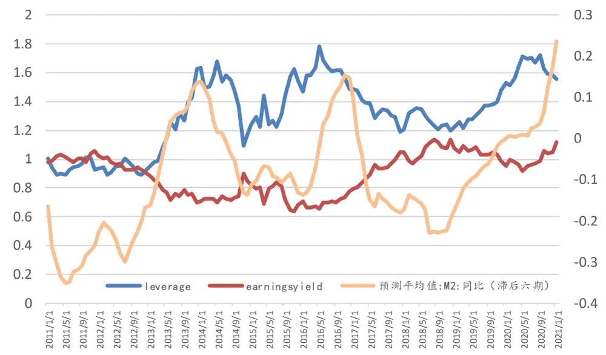
数据来源：WIND, 财通证券研究所

下图分别给出了原始的因子收益率，只对杠杆因子/盈利收益因子单独做因子择时，以及对两者同时做风格轮动的结果。原始因子的分组收益率分别为 55%和 11%，单独做择时的收益率分别为 282%和 139%。对两者同时做风格轮动，收益率达到了 814%。可以看出，通过预测平均值：M2:同比的择时指标，能够大幅提高因子收益率。

图 11：因子分组收益率择时

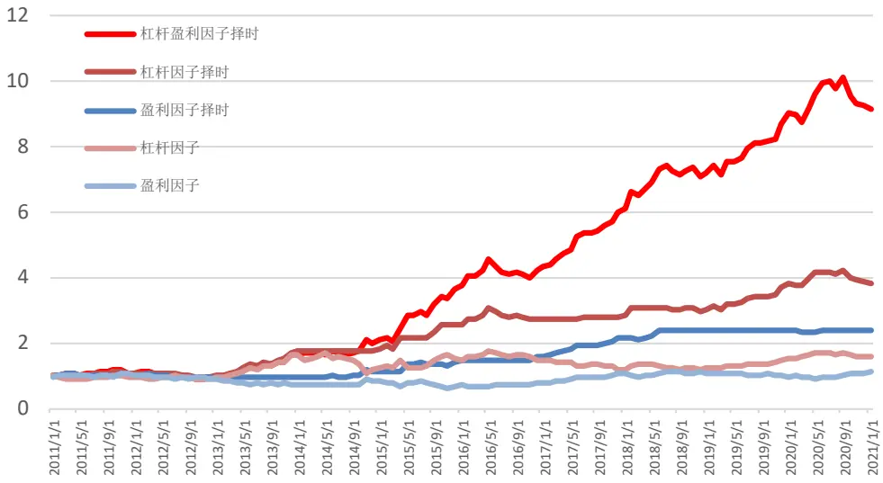
数据来源：财通证券研究所

## 5、 策略回测

在具体投资中，图 7 所示的多空收益由于存在种种限制，难以具体操作，且存在明显的行业暴露。对此，我们采用更为现实的做法，通过对风格约束和行业约束求目标函数下的最优解构建组合。

具体的优化问题为：

maximize

$$
\mu^{T}w
$$

subject to

$$
\begin{aligned}sum(w)&=1\quad\ldots\ldots(1)\\w&\geq0\quad\ldots\ldots(2)\\|w-w_0|&\leq0.01\quad\ldots\ldots(3)\\|f-f_0|&\leq0.01\quad\ldots\ldots(4)\\\ldots\ldots\ldots\ldots(5)&\end{aligned}
$$

上式中（1）（2）约束分别为个股总权重为 1，和禁止做空约束，约束（3）为个股权重偏离基准的上限为 0.01，约束（4）限制了市值和行业暴露偏离小于 0.01，约束（5）为杠杆和盈利收益的风格约束，在信号为正时，要求两者的暴露偏离之和小于-1，反之则要求大于 1，利用此约束，能够有效对杠杆因子和盈利收益因子进行风格轮动。

下图为在中证 500 中利用上述组合优化求得的组合的回测情况。

图 12：回测结果
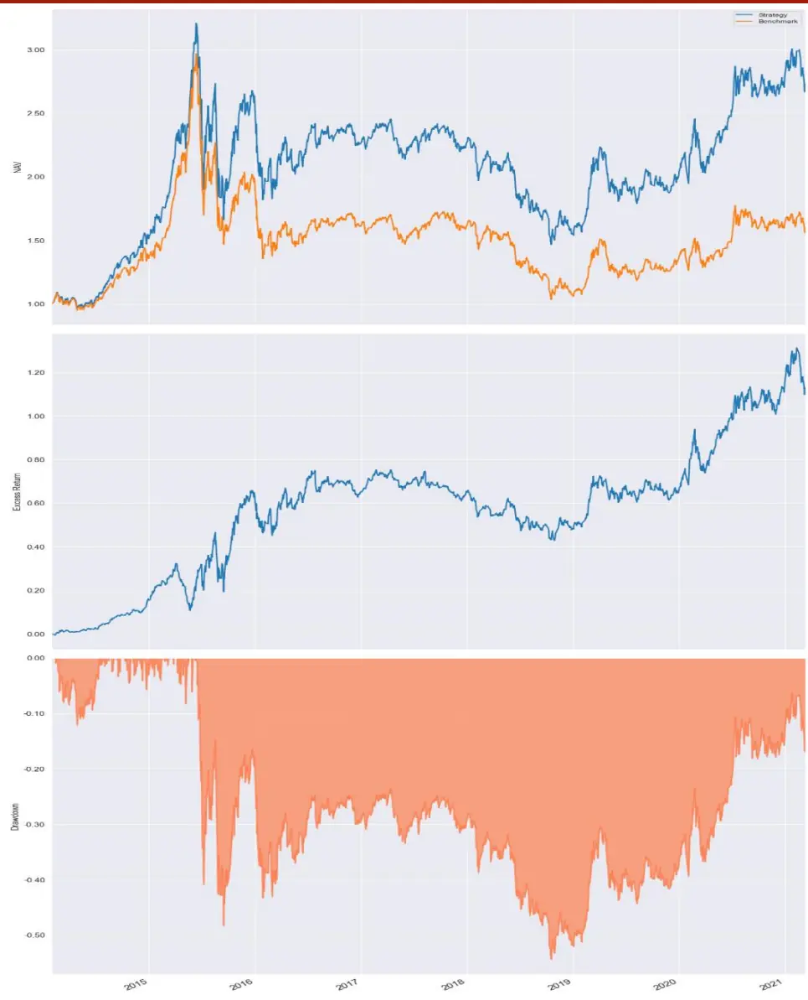
数据来源：WIND， 财通证券研究所

回测的具体参数为：

标的范围： 中证 500

调仓频率： 月频

交易费用： 双边 0.2%

限制涨停买入，跌停卖出，以及成交量过低时交易。

回测的统计结果如下表所示：

| 表5：回测统计结果 |  |
| --- | --- |
| 年化收益 | 15.74% |
| 超额最大回撤 | 18.60% |
| 最大回撤 | 54.30% |
| Alpha | 16.44% |
| Beta | 1.05 |
| 波动率 | 0.36 |
| 夏普比率 | 0.72 |
| IR | 1.39 |

数据来源：WIND, 财通证券研究所

## 6、 总结

本文主要分析了杠杆因子和盈利收益因子之间的相关性、以及同信贷指标之间的关联，通过构建领先指标，对因子做风格轮动。结果表明，利用预测平均值：M2:同比指标构建的择时信号，能够取得良好的超额收益。

## 信息披露

## 分析师承诺

作者具有中国证券业协会授予的证券投资咨询执业资格，并注册为证券分析师，具备专业胜任能力，保证报告所采用的数据均来自合规渠道，分析逻辑基于作者的职业理解。本报告清晰地反映了作者的研究观点，力求独立、客观和公正，结论不受任何第三方的授意或影响，作者也不会因本报告中的具体推荐意见或观点而直接或间接收到任何形式的补偿。

## 资质声明

财通证券股份有限公司具备中国证券监督管理委员会许可的证券投资咨询业务资格。

## 公司评级

买入：我们预计未来 6个月内，个股相对大盘涨幅在 15%以上；

增持：我们预计未来 6个月内，个股相对大盘涨幅介于 5%与 15%之间；

中性：我们预计未来 6个月内，个股相对大盘涨幅介于-5%与 5%之间；

减持：我们预计未来 6个月内，个股相对大盘涨幅介于-5%与-15%之间；

卖出：我们预计未来 6个月内，个股相对大盘涨幅低于-15%。

## 行业评级

增持：我们预计未来 6个月内，行业整体回报高于市场整体水平 5%以上；

中性：我们预计未来 6个月内，行业整体回报介于市场整体水平-5%与 5%之间；

减持：我们预计未来 6个月内，行业整体回报低于市场整体水平-5%以下。

## 免责声明

。本公司不会因接收人收到本报告而视其为本公司的当然客户。

本报告的信息来源于已公开的资料，本公司不保证该等信息的准确性、完整性。本报告所载的资料、工具、意见及推测只提供给客户作参考之用，并非作为或被视为出售或购买证券或其他投资标的邀请或向他人作出邀请。

本报告所载的资料、意见及推测仅反映本公司于发布本报告当日的判断，本报告所指的证券或投资标的价格、价值及投资收入可能会波动。在不同时期，本公司可发出与本报告所载资料、意见及推测不一致的报告。

本公司通过信息隔离墙对可能存在利益冲突的业务部门或关联机构之间的信息流动进行控制。因此，客户应注意，在法律许可的情况下，本公司及其所属关联机构可能会持有报告中提到的公司所发行的证券或期权并进行证券或期权交易，也可能为这些公司提供或者争取提供投资银行、财务顾问或者金融产品等相关服务。在法律许可的情况下，本公司的员工可能担任本报告所提到的公司的董事。

本报告中所指的投资及服务可能不适合个别客户，不构成客户私人咨询建议。在任何情况下，本报告中的信息或所表述的意见均不构成对任何人的投资建议。在任何情况下，本公司不对任何人使用本报告中的任何内容所引致的任何损失负任何责任。

本报告仅作为客户作出投资决策和公司投资顾问为客户提供投资建议的参考。客户应当独立作出投资决策，而基于本报告作出任何投资决定或就本报告要求任何解释前应咨询所在证券机构投资顾问和服务人员的意见；

本报告的版权归本公司所有，未经书面许可，任何机构和个人不得以任何形式翻版、复制、发表或引用，或再次分发给任何其他人，或以任何侵犯本公司版权的其他方式使用。