2021 年 06 月 16 日

## 联系信息

陶勤英分析师

SAC 证书编号：S0160517100002

taoqy@ctsec.com

## 相关报告

“逐鹿”Alpha 专题报告（六）

## 基于北向机构持仓的选股分析

## 投资要点：

## 陆股通

陆股通，包含沪股通和港股通在内，是北向资金即香港股市资金进入内地市场的渠道。

基于参与结算的方式，我们可以将北向资金划分为券商类资金（直接结算参与者结算）与银行类资金（托管商参与者结算）两大类，本文将研究这两大类资金的各项持仓因子对应的不同期限的选股能力，并将选出每日持仓市值最高以及最低的几家机构，研究其对应因子的选股能力。

## 因 子 IC 分析

中央结算系统中提供的原始数据为每天机构的持仓数据，通过进一步加工，我们将数据划分为两大类因子，第一类是不同机构类型的持仓类静态因子，第二类为不同机构类型增持类动态因子，分别对其进行检验。

## 策略回测

基于银行资金持仓市值占比构造的组合自 2018年 7月至 2021年 6月，拥有年化 30.91%的收益率和 1.25 的夏普比率，近一年拥有 51.59%的收益率和 1.90 的夏普比率，该策略相对使用全部北向资金持仓市值占比因子构造的组合有了一定提升，另外使用北向资金一周之内增持市值占比最高的 只个股构建组合，在同样的区间内可以获得年化22.97%的超额收益和1.31的夏普比率；跟踪IC表现最好的摩根士丹利，采用其持仓和增持市值占比分别选取 TOP100个股构建组合，分别取得了 27.78%和 21.78%的超额收益，夏普比率达到了 1.50和 1.38。

- 风险提示：本文所有模型结果均来自历史数据，不保证模型未来的有效性。

谨请参阅尾页重要声明及财通证券股票和行业评级标准

## 1、 引言

陆股通，包含沪股通和港股通在内，是北向资金即香港股市资金进入内地市场的渠道，基于参与结算的方式，我们可以将北向资金划分为券商类资金（直接结算参与者结算）与银行类资金（托管商参与者结算）两大类，本文将研究这两大类资金的各项持仓因子对应的不同期限的选股能力，并将选出每日持仓市值最高的几家机构，研究其对应因子的选股能力。

## 2、 陆股通

随着 A 股市场的不断开放，机构投资者以及借道北向的境外投资者在A 股的占比不断提高。其中机构投资者持股占 A 股流通市值的比例由 2014 年的 28%提高到48%，北向日均交易金额由 2017 年的 1.6%提高到 2021 年的 6.6%。

图 1：机构投资者持仓占 A股流通市值比例
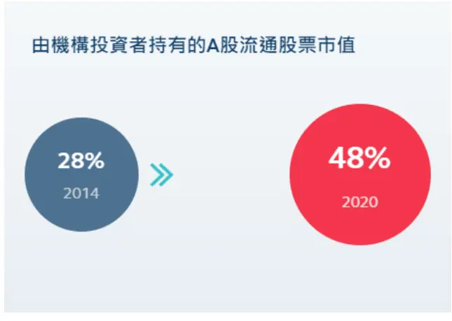
数据来源：HKEX,财通证券研究所

图 2：北向日均交易金额占比
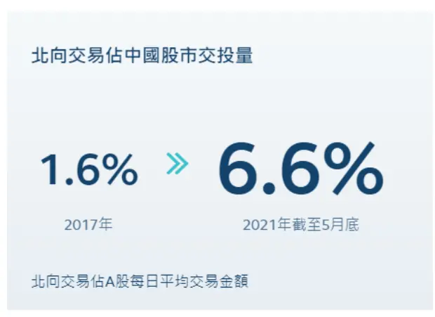
数据来源：HKEX,财通证券研究所

北向日均交易额不断提高，根据港交所统计数据，2021 年 5 月，北向的日均交易额已超过 1000 亿人民币。

图 3：北向日均成交额
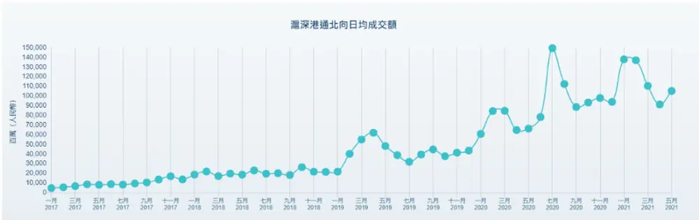
数据来源：HKEX, 财通证券研究所

香港以及境外投资者通过沪股通/深股通（陆股通，中华通）参与 A 股市场交易。以深股通为例，香港/境外投资者委托香港经济商，经由联交所在深圳设立的证券交易服务公司（SPV），向深交所进行申报，买卖规定范围内的深交所上市的股票。

图 4：陆股通运行机制
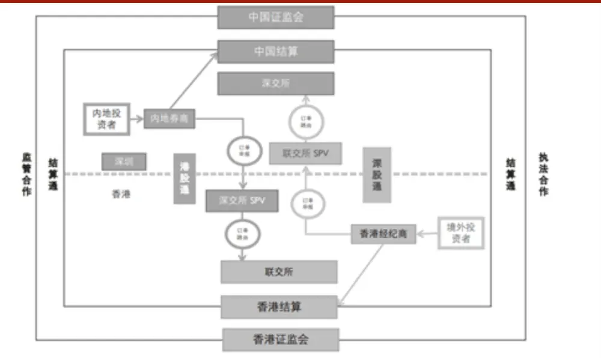
数据来源：深交所，财通证券研究所

目前陆股通可买卖股票的数目为 1436 只，其中沪股通 587 只，深股通 849 只。
具体投资范围如下表所示。

表 1：陆股通投资范围

|  | 沪股通 | 深股通 |
| --- | --- | --- |
| 投资范围 | 上证180成份股； | 深证成份指数和深证中 小创新指数成分股中所 |
|  | 上证380成份股； 有H股同时在联交所上市 | 有市值不少于60亿元的 成份股； |
|  | 及买卖的上交所上市A 股； | 有H股同时在联交所上市 及买卖的深交所上市A |
|  | 不包括： | 股； |
|  | a)不以人民币计价的沪 | 不包括： |
|  | 股 b)被实施风险警示的沪 | a)不以人民币计价的深 股 |
|  | 股 | b)被实施风险警示或除 |
| 标的数量(可买卖) | 587 | 牌安排的深股 849 |

数据来源：HKEX, 财通证券研究所
谨请参阅尾页重要声明及财通证券股票和行业评级标准

北向资金在进行交易时，遵循 A 股的交收周期，即于 T 日进行股份交收，T+1 日进行款项交收。联交所直接自其买卖盘传递系统实时输送陆股通买卖详情至中央结算系统。香港结算会将从中国结算的系统取得的临时结算数据档案与联交所的买卖纪录进行对账，最后结算表于 T 日下午四时后不久提供于相关参与者。

图 5：陆股通结算及交收流程
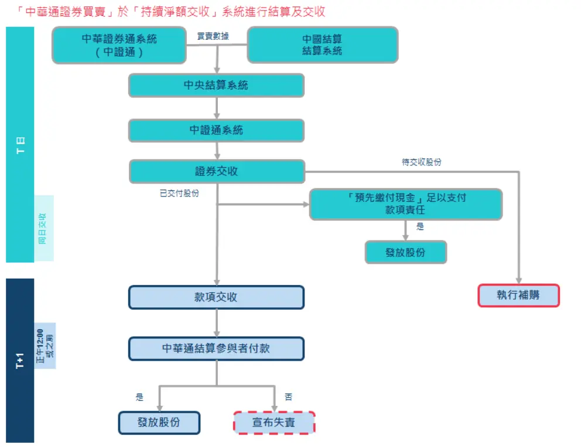
数据来源：HKEX, 财通证券研究所

中央结算系统提供系统内各机构的持仓数据，以平安银行为例，在中央结算系统内，可以查询到最近一个交易日的各机构持仓数据：

图 6：中央结算系统持股数据
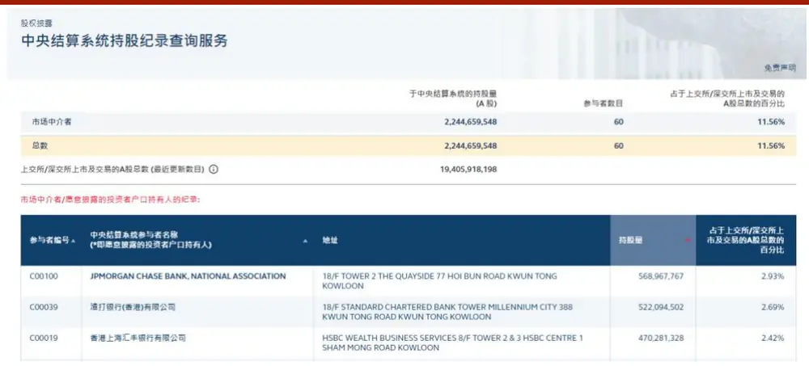
数据来源：HKEX, 财通证券研究所

中央结算系统的参与者可分为五个主要类型，其中超过98%为直接结算参与者和托管商参与者，其中托管商参与者大多为银行类机构，机构代码以字母“C”开头；直接结算参与者以券商类机构为主，机构代码以“B”开头。截至 2021年 5月 19 日，银行类机构托管市值为 2.03 万亿元，券商类机构托管市值为 0.47 万亿元。本文主要分析这两类机构资金的选股能力情况。

图 7：机构托管市值占比
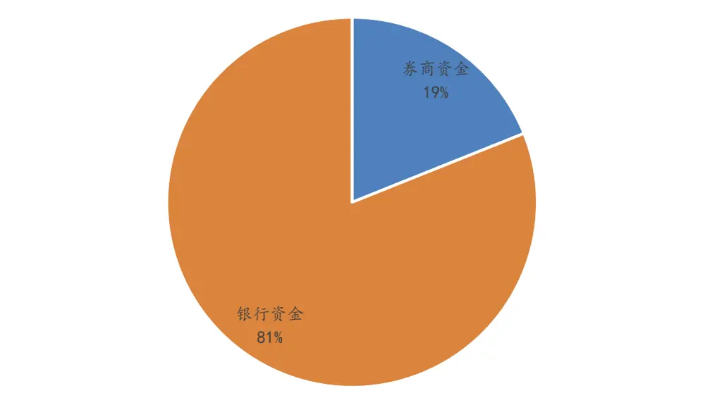
数据来源：WIND，财通证券研究所

## 3、 因子 IC分析

中央结算系统中提供的原始数据为每天机构的持仓数据，通过进一步加工，我们将数据划分为两大类因子，第一类是不同机构类型的持仓类静态因子，第二类为不同机构类型增持类动态因子，分别对其进行检验。

## 3.1 数据介绍

本文选取的数据为 2018.07.03-2021.05.19 陆港通机构持仓数据原始数据包括每日每只股票的机构持仓数量情况，剔除掉其中的港股部分，以及机构代码缺失的机构，总体结果形式如下图所示：

图 8：陆股通机构持仓数据

|  | S_INFO_WINDCODE | S_HOLDER_ENDDATE | S_HOLDER_NAME | S_HOLDER_NUM |  |  |
| --- | --- | --- | --- | --- | --- | --- |
|  |  |  |  |  | S_HOLDER_QUANTITY |  |
|  |  |  |  |  |  | S_HOLDER_QUANTITY |
| 1 | 002631.SZ | 20190418 | 元大证券(香港)有限公司 | B01858 | 30000.0000 |  |
| 2 | 002631.SZ | 20190418 | 海通国际证券有限公司 | B01143 | 20000.0000 |  |
| 3 | 002631.SZ | 20190418 | 工银亚洲证券有限公司 | B01727 | 6500.0000 |  |
| 4 | 002631.SZ | 20190418 | 花旗银行 | C00010 | 300.0000 |  |
| 5 | 002631.SZ | 20190418 | J.P. MORGAN BROKING (HONG KONG) LTD | B01110 | 191.0000 |  |
| 6 | 002631.SZ | 20190418 | 中国国际金融香港证券有限公司 | B01654 | 100.0000 |  |

数据来源：WIND, 财通证券研究所

## 3.2 静态因子

## 3.2.1 持仓市值

根据当日不同机构类型（全部北向，银行类，券商类）的持仓市值，分别计算因子的日频，周频以及月频的 IC 和 ICIR。

表 2：持仓市值因子 ICIR

| 持仓市值 | 资金类型 | IC 均值 | IC 波动率 | IR |
| --- | --- | --- | --- | --- |
| 日频IC | 全部北向资金 | 1.71% | 13.87% | 0.12 |
|  | 银行类资金 | 1.68% | 13.52% | 0.12 |
|  | 券商类资金 | 1.80% | 13.48% | 0.13 |
| 周频IC | 全部北向资金 | 2.57% | 15.93% | 0.16 |
|  | 银行类资金 | 2.56% | 15.56% | 0.16 |
|  | 券商类资金 | 2.73% | 15.51% | 0.18 |
| 月频IC | 全部北向资金 | 3.51% | 16.94% | 0.21 |
|  | 银行类资金 | 3.85% | 16.43% | 0.23 |
|  | 券商类资金 | 3.62% | 16.80% | 0.22 |

数据来源：WIND, 财通证券研究所

图 9：持仓市值因子月均 IC（月频）
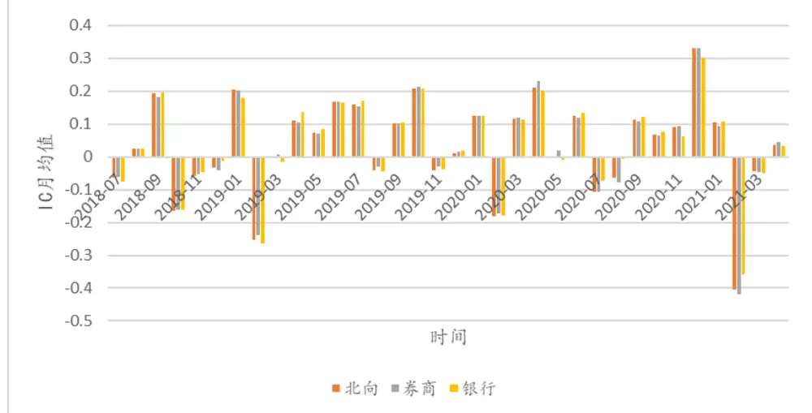
数据来源：WIND， 财通证券研究所

上图展示了每个月平均 IC 表现情况。从图中可以看出，随着 2018 年底北向资金开始大幅进入 A 股市场开始，北向资金有较为稳定的正 IC 表现，结合对不同频度收益的 IC 分析，我们可以发现银行类资金持仓市值在较为长期的收益预测如月频收益中有较好表现，而券商类资金持仓市值则在如日频收益的短期收益预测中有相对优势，而绝对情况来说，北向资金持仓市值情况对较为长期的月频收益预测效果较好。

## 3.2.2 持仓市值占流通市值的比例

根据当日不同机构类型（全部北向，银行类，券商类）的持仓市值占上市公司流通市值比例，分别计算因子的日频，周频以及月频的 IC 和 ICIR

表 3：持仓市值占比因子 ICIR

| 表3：持仓币值占比因子TCIR |  |  |  |
| --- | --- | --- | --- |
| 持仓市值 | 资金类型 IC 均值 | IC 波动率 | IR |
| 日频IC | 全部北向资金 | 1.85% 12.35% | 0.15 |
|  | 银行类资金 1.76% | 12.20% | 0.14 |
|  | 券商类资金 | 1.87% 10.95% | 0.17 |
| 周频IC | 全部北向资金 | 2.82% 14.27% | 0.20 |
|  | 银行类资金 | 2.75% 14.11% | 0.19 |
|  | 券商类资金 | 2.87%% 12.66% | 0.23 |
| 月频IC | 全部北向资金 | 3.64% | 15.1% 0.24 |
|  | 银行类资金 | 4.03% | 13.42% 0.33 |
|  | 券商类资金 | 3.89% 11.86% | 0.33 |

数据来源：WIND, 财通证券研究所

图 10：持仓市值占比因子月均 IC（月频）
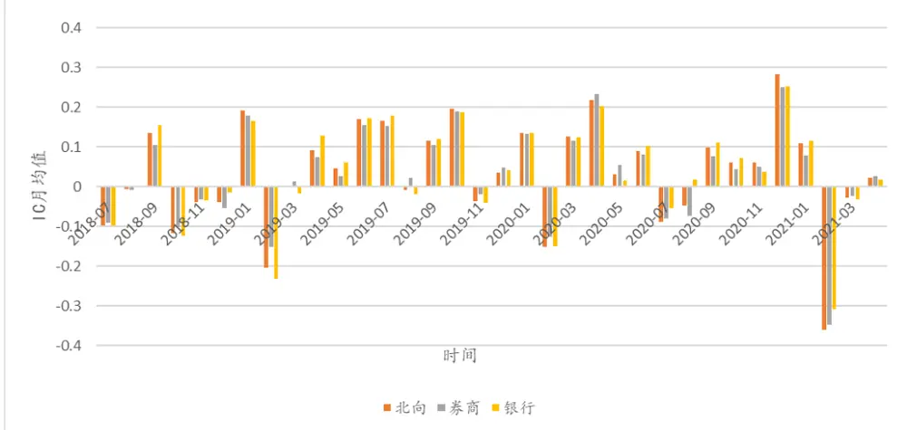
数据来源：WIND， 财通证券研究所

相比于持仓市值因子，持仓市值占比因子有了较为明显的改善，对各个收益频率的预测能力和稳定性都有了提升，由于持仓市值占比更能体现出北向资金对个股的投资的程度，北向资金持仓占比高的个股资金稳定性也有了提升，不会出现频繁地买卖情况，对收益率的预测就有了明显提升。

综合来看两种静态因子对长期收益的预测能力更强，同时期限越长，银行类资金的相对优势也就越明显，持仓市值占比对各个频率的收益预测效果都要好于单纯使用持仓市值，因为其更加合理地反映了北向资金对个股资金结构的影响，同时也更好地体现了北向资金选择倾向。

## 3.3 动态因子

## 3.3.1 增持市值

通过日/周持仓的变化量乘以当日的均价估算机构的增持金额。分别计算因子的日频，周频以及月频的 IC 和 ICIR

表 4：日增持市值因子 ICIR

| 持仓市值 | 资金类型 | IC 均值 | IC 波动率 | IR |
| --- | --- | --- | --- | --- |
| 日频IC | 全部北向资金 | 2.48% | 7.94% | 0.31 |
|  | 银行类资金 | -0.40% | 9.78% | -0.04 |
|  | 券商类资金 | 2.95% | 6.52% | 0.45 |
| 周频IC | 全部北向资金 | 1.66% | 9.02% | 0.18 |
|  | 银行类资金 | -0.27% | 10.30% | -0.03 |
|  | 券商类资金 | 2.22% | 7.83% | 0.28 |
| 月频IC | 全部北向资金 | 1.36% | 9.30% | 0.15 |
|  | 银行类资金 | 0.45% | 10.58% | 0.04 |
|  | 券商类资金 | 1.03% | 8.23% | 0.13 |

数据来源：WIND, 财通证券研究所

表 5：周增持市值因子 ICIR

| 持仓市值 | 资金类型 | IC 均值 | IC 波动率 | IR |
| --- | --- | --- | --- | --- |
| 日频IC | 全部北向资金 | 1.47% | 8.36% | 0.18 |
|  | 银行类资金 | -0.86% | 10.14% | -0.08 |
|  | 券商类资金 | 2.01% | 6.61% | 0.30 |
| 周频IC | 全部北向资金 | 1.47% | 8.25% | 0.18 |
|  | 银行类资金 | -0.27% | 9.98% | -0.03 |
|  | 券商类资金 | 1.63% | 6.54% | 0.25 |

谨请参阅尾页重要声明及财通证券股票和行业评级标准

|  | 全部北向资金 | 0.98% | 7.67% | 0.13 |
| --- | --- | --- | --- | --- |
| 月频IC | 银行类资金 | 0.01% | 9.65% | 0.00 |
|  | 券商类资金 | 0.78% | 6.00% | 0.13 |

数据来源：WIND, 财通证券研究所

图 11：日增持市值因子月均 IC（日频）
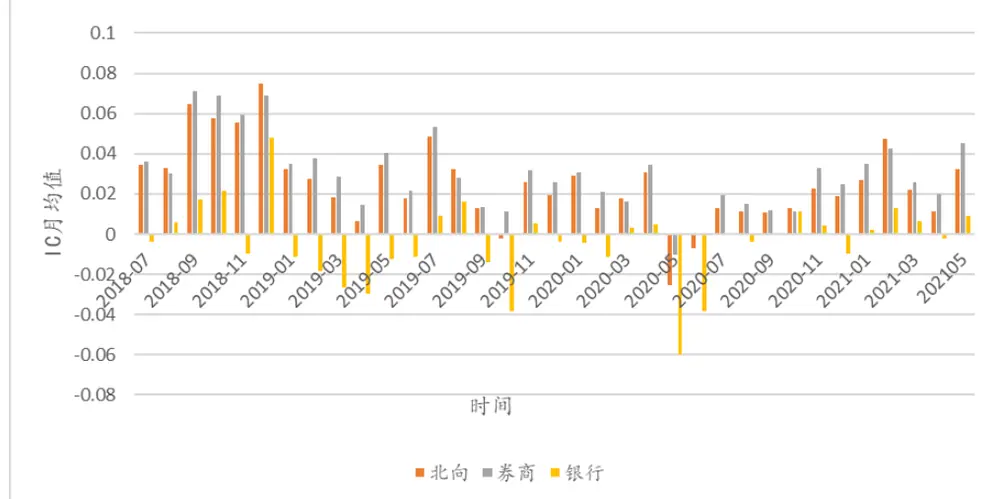
数据来源：WIND， 财通证券研究所

上图展示了每个月平均 IC 表现情况，选取了表现最好的不同资金类型持仓市值对下一日收益的 IC 序列。对比不同收益频率下增持市值的 IC 情况，可以看出增持市值因子对于短期收益的预测能力要优于长期收益，且对比券商类资金和银行类资金也可以发现，券商类资金的增持市值因子在中短期收益预测表现明显好于银行类资金，反映出券商资金投资灵活性更强，银行类资金投资风格偏向长期持有。

## 3.3.2 增持市值占流通市值比例

根据当日不同机构类型（全部北向，银行类，券商类）的日频/周频增持市值占上市公司流通市值比例，分别计算因子的日频，周频以及月频的 IC 和 ICIR

表 6：日增持市值占比因子 ICIR

| 持仓市值 | 资金类型 | IC 均值 | IC 波动率 | IR |
| --- | --- | --- | --- | --- |
| 日频IC | 全部北向资金 | 4.54% | 5.54% | 0.82 |
|  | 银行类资金 | 3.23% | 7.83% | 0.41 |
|  | 券商类资金 | 4.20% | 5.32% | 0.79 |
| 周频IC | 全部北向资金 | 3.58% | 7.13% | 0.50 |
|  | 银行类资金 | 2.40% | 9.32% | 0.26 |
|  |  | 专题报告 证券研究报告 |  |  |
|  | 券商类资金 3.22% | 6.68% | 0.48 |  |
| 月频IC | 全部北向资金 | 2.23% | 7.72% 0.29 |  |
|  | 银行类资金 | 1.72% | 9.69% 0.18 |  |
|  | 券商类资金 | 1.81% | 7.11% 0.25 |  |

数据来源：WIND, 财通证券研究所

表 7：周增持市值占比因子 ICIR

| 持仓市值 | 资金类型 | IC 均值 | IC 波动率 | IR |
| --- | --- | --- | --- | --- |
| 日频IC | 全部北向资金 | 3.30% | 4.93% | 0.67 |
|  | 银行类资金 | 2.19% | 5.92% | 0.37 |
|  | 券商类资金 | 3.16% | 4.70% | 0.67 |
| 周频IC | 全部北向资金 | 3.22% | 4.88% | 0.66 |
|  | 银行类资金 | 2.15% | 6.20% | 0.35 |
|  | 券商类资金 | 2.80% | 4.68% | 0.60 |
| 月频IC | 全部北向资金 | 2.45% | 4.74% | 0.52 |
|  | 银行类资金 | 2.19% | 6.61% | 0.33 |
|  | 券商类资金 | 1.76% | 4.52% | 0.39 |

数据来源：WIND, 财通证券研究所

图 12：日增持市值占比因子月均 IC（日频）
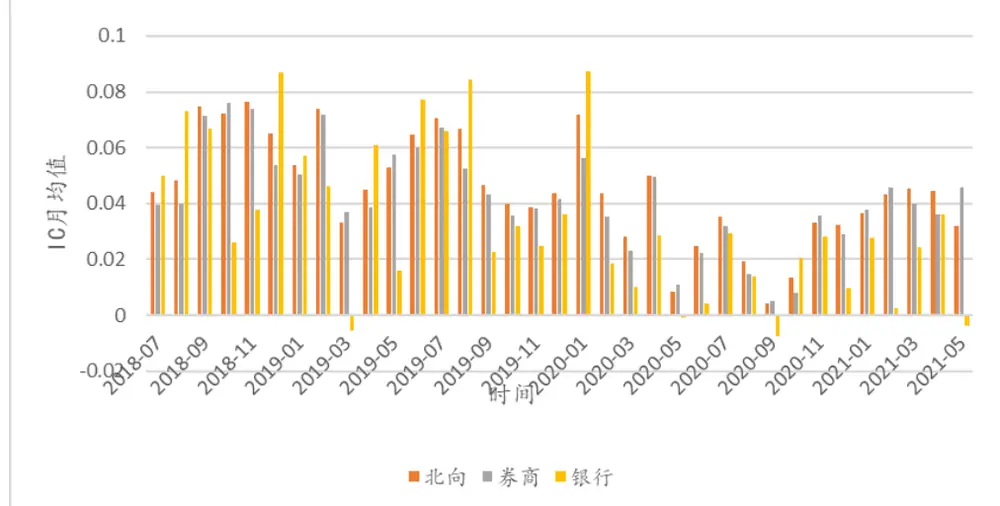
数据来源：WIND， 财通证券研究所

与增持市值因子相比，增持市值占比因子的 ICIR 有了明显提升。在短周期下，

日增持市值占比因子的 ICIR 表现较好，在较长周期下，周增持市值占比因子的ICIR 表现较好。

## 3.3.3 增持比例

增持比例是根据增持市值与持仓市值比例计算得到，分别计算日频/周频因子的日频，周频以及月频的 IC 和 ICIR

| 表8：日增持比例因子ICIR |  |  |  |
| --- | --- | --- | --- |
| 持仓市值 | 资金类型 IC 均值 | IC 波动率 | IR |
| 日频IC | 全部北向资金 3.12% | 7.99% | 0.39 |
|  | 银行类资金 0.16% | 11.00% | 0.01 |
|  | 券商类资金 3.35% | 6.65% | 0.50 |
| 周频IC | 全部北向资金 | 2.56% 7.94% | 0.32 |
|  | 银行类资金 0.35% | 9.55% | 0.04 |
|  | 券商类资金 | 2.62% 7.04% | 0.37 |
| 月频IC | 全部北向资金 | 1.66% 7.38% | 0.22 |
|  | 银行类资金 | 0.26% 8.65% | 0.03 |
|  | 券商类资金 | 1.61% 6.64% | 0.24 |

数据来源：WIND, 财通证券研究所

表 9：周增持比例因子 ICIR

| 持仓市值 | 资金类型 | IC 均值 | IC 波动率 | IR |
| --- | --- | --- | --- | --- |
| 日频IC | 全部北向资金 | 1.81% | 8.21% | 0.22 |
|  | 银行类资金 | -0.97% | 10.74% | -0.09 |
|  | 券商类资金 | 2.27% | 6.52% | 0.35 |
| 周频IC | 全部北向资金 | 1.52% | 7.67% | 0.20 |
|  | 银行类资金 | -0.78% | 10.28% | -0.08 |
|  | 券商类资金 | 1.87% | 6.14% | 0.30 |
| 月频IC | 全部北向资金 | 0.96% | 7.11% | 0.13 |
|  | 银行类资金 | -0.74% | 9.81% | -0.08 |
|  | 券商类资金 | 1.07% | 5.94% | 0.18 |

数据来源：WIND, 财通证券研究所

图 13：日增持市值比例因子月均 IC（日频）
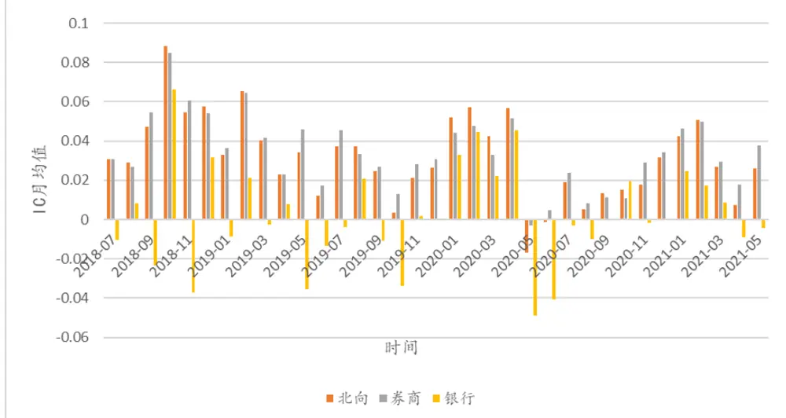
数据来源：WIND， 财通证券研究所

增持市值比例能够更好地反映出资金对个股增持的倾向，同样，增持比例对收益的预测也是在短期收益上表现更佳。

总体来看，动态因子在下一日或下一周这样的短期收益预测中有较好的表现，且可以观察到动态因子 IC 从 2018 年以来逐渐降低，可能是由于一方面 2018 年股市整体表现较差，北向资金的增持会传递更加强劲的市场信号，市场情绪低迷让人们更加关注增持这类短期因子而非持仓类的长期因子；另一方面可能是由于2018 年后北向资金进入 A 股市场数量增加，使得增持操作更加分散化。

对比静态因子和动态因子，可以看出静态因子偏向于长期收益预测，而动态因子偏向于短期预测，对比不同类型的资金也可以发现，券商类资金在短期收益的预测中表现更佳，而银行类资金则在长期收益的预测中拥有更好的 IC，这是由于动态因子调整更加频繁，针对短期资金持股结构的影响更显著，更多地反映了不同资金短期调整的投资意向，而静态的持仓因子更多地反映了资金长期持有股票的意向，对一个月后月收益这样的长期收益更有解释力。

对比不同类型的资金也可以发现银行类和券商类资金在不同因子和收益期限的收益预测中也有明显不同，券商类资金投资更加灵活，偏向于通过短期调仓取得快速收益，故而券商类资金的动态因子以及对下一日收益的预测表现更佳，而银行类资金则倾向于通过长期持有个股进行长期投资，追求更加稳定的收益，故而其静态因子在下月收益这样的长期收益预测中表现更好，且可以看出银行类资金的增持类因子在短期普遍表现一般，这是由于银行类资金的调仓更加侧重于长期收益，所以下一日或一周的收益并不会有太显著的 IC。

投资者在观察北向资金进行投资的过程中要更加关注短期内的券商资金增持信息以及长期内银行或整体北向资金的持仓信息，结合各类资金长期和短期持有特征进行分析投资，以取得更加稳健的收益。例如，每天选取一个月前北向资金持仓市值最高的 100 个个股作为股票池，在股票池中计算股票增持比例对下一日收益的 IC 表现，可以得到 5.7%的 IC，对收益的预测能力大幅提升。

## 3.4 持仓市值最高和最低的机构

除了通过机构类型进行资金分类，我们也可以根据市场上持仓市值最高的龙头机构和市值最低机构的因子对比分析，研究持仓市值不同的机构资金持仓或调仓对市场释放的信息以及其选股能力是否有所不同。

本文选取以上表现最好的几种因子，探究持仓市值最高的 20 家机构以及最低的20 家机构的因子 IC 表现情况。

## 3.4.1 持仓市值占比

截至 2021 年 6 月 11 日，持仓市值排名前十的机构分别为：

表 10：机构持仓情况

| 机构名称 | 持股只数(只) | 持股市值(元) |
| --- | --- | --- |
| 香港上海汇丰银行有限公司 | 1739 | 8002.66亿 |
| 渣打银行(香港)有限公司 | 1474 | 5038.23亿 |
| JPMORGAN CHASE BANK, NATIONAL | 1450 | 4654.09亿 |
| ASSOCIATION |  |  |
| 花旗银行 | 1769 | 2598.18亿 |
| UBS SECURITIES HONG KONG LTD | 1718 | 980.4亿 |
| MORGAN STANLEY HONG KONG | 1764 | 865.14亿 |
| SECURITIES LTD J. P. MORGAN BROKING (HONG KONG) | 2017 |  |
| LTD |  | 655.22亿 |
| MLFE LTD | 1589 | 629.54亿 |
| BNP PARIBAS SECURITIES SERVICES | 1526 | 504.66亿 |
| 中国国际金融香港证券有限公司 | 1596 | 415.81亿 |

数据来源：WIND，财通证券研究所

采用持仓市值最高的机构作为分类标准，计算持仓市值最高的前 N 家机构的股票持仓市值占流通市值比这一因子对下月收益的 IC 表现，结果如下。其中横坐标为 N，左轴为 IR 值，右轴为 IC 均值：

图 14：持仓市值最高的 N家机构持仓市值占比因子ICIR
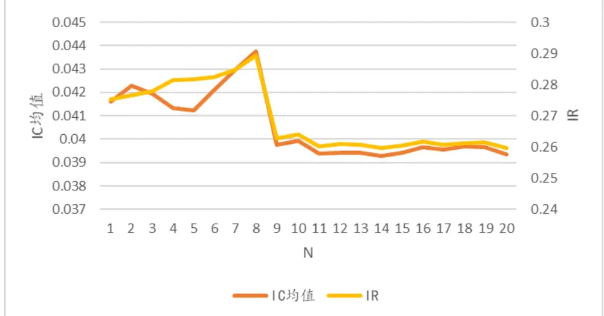
数据来源：WIND，财通证券研究所

可以看出在持仓市值排名 7、8 位的机构对 IC 的贡献比较显著，将处于这一位置的机构列出后发现，发现造成这一结果的主要机构是摩根士丹利，其单独的持仓市值占比 IC 均值可达 6.31%，具体结果如下所示

图 15：摩根士丹利持仓市值占比月频 IC
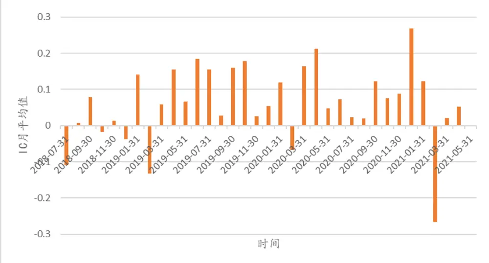
数据来源：WIND， 财通证券研究所

对于持仓市值较低的机构，由于存在大量持股票数量较少的机构，计算 ICIR 会有较大波动，因此，将持股数量小于 50 支的机构进行剔除。对于其余持仓市值最小的机构，其 IC 分布如下：

图 16：市值最小的 N家机构持仓市值比月频IC
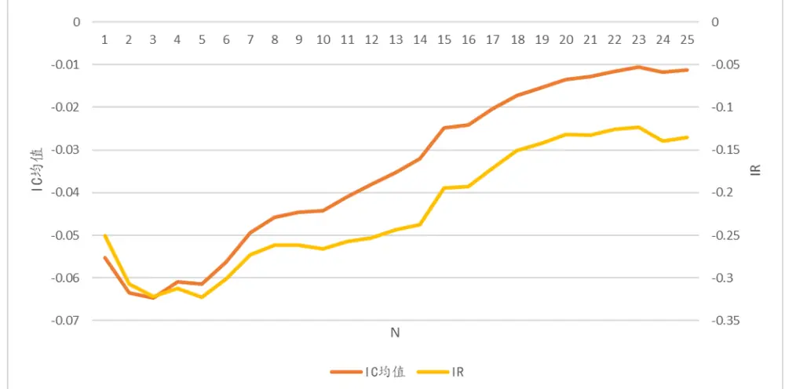
数据来源：WIND，财通证券研究所

## 3.4.2 增持市值占比

使用持仓市值最高和最低的机构持仓情况计算增持市值占比对下一日收益的预测情况，结果如下：

图 17：持仓市值最高的 N家机构增持市值占比日频IC
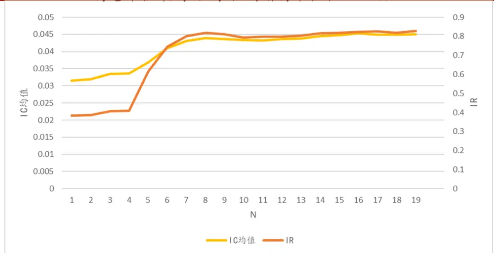
数据来源：WIND，财通证券研究所

可见，增持市值占比因子同样是在持仓市值前 8 家机构时有最好的表现，同样是由于摩根士丹利的影响。

作为对比，下图列出了持仓市值最低的 N 家机构增持市值占比日频 IC 的统计结果。可以看出，持仓市值最低的N 家机构增持市值占比日频因子 IC 非常不显著。

图 18：持仓市值最低的 N家机构增持市值占比日频IC
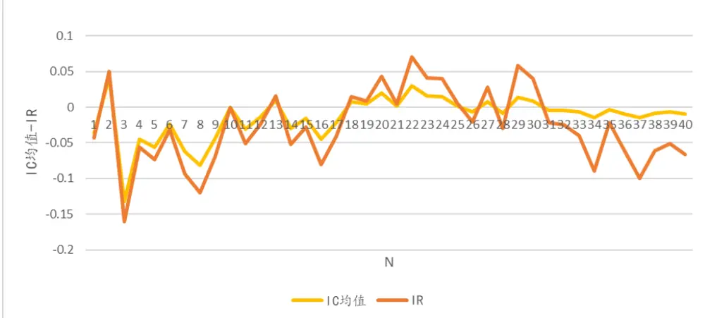
数据来源：WIND， 财通证券研究所

## 3.4.3 增持市值比例

使用持仓市值最高和最低的机构持仓情况计算增持市值比例对下一日收益的预测情况，结果如下：

图 19：持仓市值最高的 N家机构增持市值比例日频率 IC
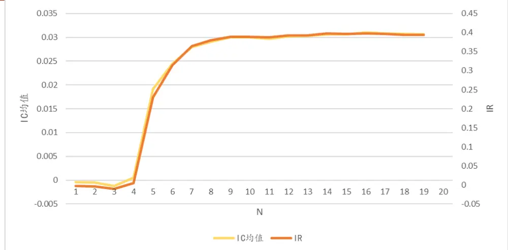
数据来源：WIND， 财通证券研究所

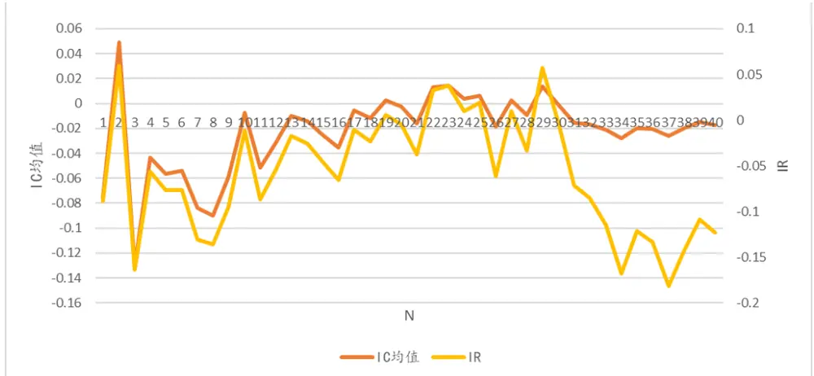
数据来源：WIND， 财通证券研究所

可以看到，在持仓市值最高的机构中，头部四家公司的 IC 并不是非常显著，从第五名开始，IC 有了明显的提升。而对于持仓市值最低的机构，IC 表现的非常不稳定，波动较大。

## 4、 策略回测

回测参数设置如下：

回测区间：2018 年 7 月 31 日-2021 年 4 月 30 日

调仓频率：月度调仓

调仓日期：每个月首个一个交易日

基准：沪深 300 指数

4.1 北向资金持仓市值占流通市值比TOP100
图 21：北向资金持仓市值占流通市值比 TOP100
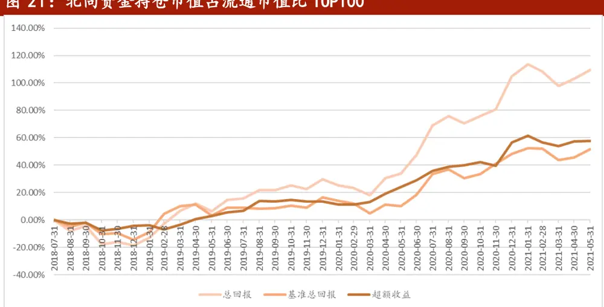
数据来源：WIND, 财通证券研究所

策略统计结果：

| 表11：北向资金持仓市值占流通市值比 TOP100 策略统计 |  |  |  |  |  |
| --- | --- | --- | --- | --- | --- |
| 总收益 | 超额年化收益 | 年化收益 | 年化波动率 | 最大回撤 | 夏普比率 |
| 106.38% | 16.95% | 28.64% | 23.01% | 21.08% | 1.18 |

数据来源：WIND, 财通证券研究所
最新一期持仓权重前 20：

表 12：北向资金持仓市值占流通市值比 TOP100 持仓统计

| 证券代码 | 证券简称 持仓权重 |
| --- | --- |
| 000333.SZ | 美的集团 7.39% |
| 300750.SZ | 宁德时代 6.37% |
| 601888.SH | 中国中免 5.62% |
| 600276.SH | 恒瑞医药 5.55% |
| 000651.SZ | 格力电器 5.33% |
| 000001.SZ | 平安银行 5.01% |
| 601012.SH | 隆基股份 3.75% |
| 300760.SZ | 迈瑞医疗 3.34% |
| 600887.SH | 伊利股份 2.66% |
| 002271.SZ | 东方雨虹 2.30% |
| 300015.SZ | 爱尔眼科 2.23% |
| 600031.SH | 三一重工 2.15% |
| 600309.SH | 万华化学 1.91% |
| 002812.SZ | 恩捷股份 1.86% |
| 300347.SZ | 泰格医药 1.85% |
| 002027.SZ | 分众传媒 1.83% |
| 600406.SH | 国电南瑞 1.75% |
| 300450.SZ | 先导智能 1.65% |
| 300124.SZ | 汇川技术 1.60% |
| 600585.SH | 海螺水泥 1.57% |

数据来源：WIND, 财通证券研究所

4.2 北向资金增持市值占流通市值比TOP100
图 22：北向资金增持市值占流通市值比 TOP100
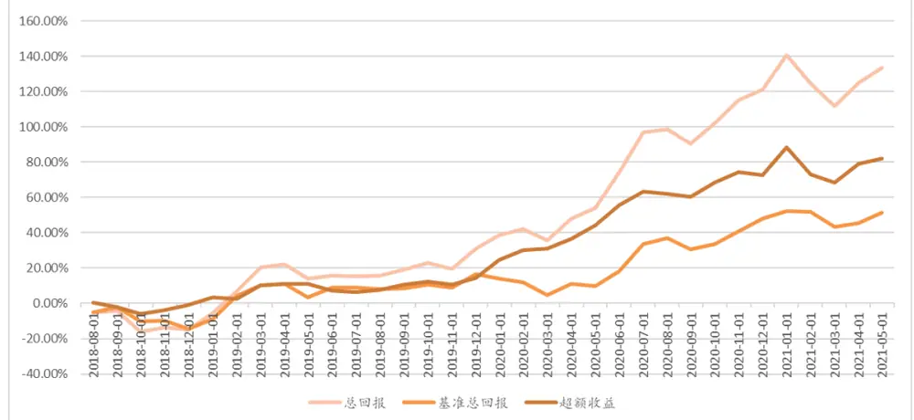
数据来源：WIND, 财通证券研究所

策略统计结果：

| 表13：北向资金增持市值占流通市值比 TOP100 策略统计 |  |  |  |  |  |
| --- | --- | --- | --- | --- | --- |
| 总收益 | 超额年化收益 | 年化收益 | 年化波动率 | 最大回撤 | 夏普比率 |
| 130.98% | 22.97% | 33.83% | 24.68% | 22.35% | 1.31 |

数据来源：WIND, 财通证券研究所

最新一期持仓权重前 20：
表 14：北向资金增持市值占流通市值比 TOP100 持仓统计

| 证券代码 | 证券简称 | 持仓权重 |
| --- | --- | --- |
| 002271.SZ | 东方雨虹 | 11.77% |
| 300059.SZ | 东方财富 | 9.59% |
| 300124.SZ | 汇川技术 | 8.20% |
| 601901.SH | 方正证券 | 6.68% |
| 300012.SZ | 华测检测 | 5.81% |
| 601100.SH | 恒立液压 | 5.21% |
| 300496.SZ | 中科创达 | 3.65% |
| 002371.SZ | 北方华创 | 3.30% |
| 002601.SZ | 龙蟒佰利 | 2.46% |
| 002353.SZ | 杰瑞股份 | 2.33% |
| 603486.SH | 科沃斯 | 2.13% |

谨请参阅尾页重要声明及财通证券股票和行业评级标准

|  | 专题报告 | 证券研究报告 |
| --- | --- | --- |
| 002557.SZ | 洽洽食品 | 2.08% |
| 603799.SH | 华友钴业 | 1.80% |
| 002648.SZ | 卫星石化 | 1.66% |
| 000799.SZ | 酒鬼酒 | 1.57% |
| 601636.SH | 旗滨集团 | 1.50% |
| 300244.SZ | 迪安诊断 | 1.49% |
| 603658.SH | 安图生物 | 1.46% |
| 300308.SZ | 中际旭创 | 1.35% |
| 600845.SH | 宝信软件 | 1.32% |

数据来源：WIND, 财通证券研究所

## 4.3 分类资金持仓市值占流通市值比TOP100

图 23：分类资金持仓市值占比 TOP100
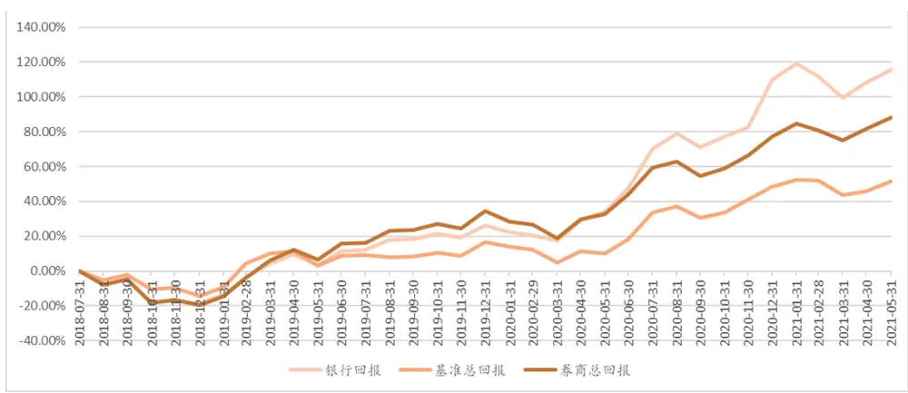
数据来源：WIND, 财通证券研究所
策略统计结果：

| 表 15：分类资金持仓市值占流通市值比 TOP100 策略统计 |  |  |  |  |  |
| --- | --- | --- | --- | --- | --- |
| 资金类 型 | 总收益 | 超额年化 收益 | 年化收益 | 年化波动 率 | 最大回撤 夏普比 率 |
| 银行类 资金 | 115.49% | 18.52% | 30.91% | 23.56% | 21.02% 1.25 |
| 券商类 资金 | 85.95% | 11.27% 24.06% | 21.59% | 20.78% | 1.04 |

谨请参阅尾页重要声明及财通证券股票和行业评级标准

数据来源：WIND, 财通证券研究所

最新一期持仓权重前 20：
表 16：分类资金持仓市值占流通市值比 TOP100 持仓统计

| 证券代码 | 证券简称 | 持仓权重 |
| --- | --- | --- |
| 601888.SH | 中国中免 | 7.25% |
| 300750.SZ | 宁德时代 | 6.99% |
| 000333.SZ | 美的集团 | 6.14% |
| 000001.SZ | 平安银行 | 5.56% |
| 600276.SH | 恒瑞医药 | 5.51% |
| 601012.SH | 隆基股份 | 4.75% |
| 000651.SZ | 格力电器 | 3.89% |
| 300015.SZ | 爱尔眼科 | 3.54% |
| 600031.SH | 三一重工 | 2.95% |
| 300760.SZ | 迈瑞医疗 | 2.88% |
| 600887.SH | 伊利股份 | 2.77% |
| 600309.SH | 万华化学 | 1.93% |
| 002027.SZ | 分众传媒 | 1.69% |
| 600406.SH | 国电南瑞 | 1.66% |
| 300124.SZ | 汇川技术 | 1.57% |
| 600660.SH | 福耀玻璃 | 1.33% |
| 002812.SZ | 恩捷股份 | 1.30% |
| 300347.SZ | 泰格医药 | 1.26% |
| 601100.SH | 恒立液压 | 1.23% |
| 002271.SZ | 东方雨虹 | 1.23% |

数据来源：WIND, 财通证券研究所

## 4.4 摩根士丹利持仓市值比因子

图 24：摩根士丹利持仓市值占比 TOP100 和增持占比 TOP100收益
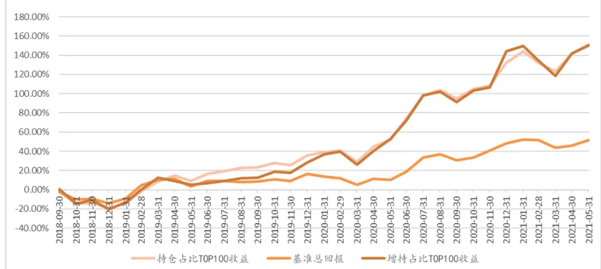
数据来源：WIND, 财通证券研究所

策略统计结果：

表 17：摩根士丹利持仓市值占比 TOP100 和增持占比 TOP100策略统计

| 策略类型总收益 |  | 超额年化 收益 |  | 年化收益年化波动 率 | 最大回撤 | 夏普比 率 |
| --- | --- | --- | --- | --- | --- | --- |
| 持仓占比 TOP100 | 152.12% | 27.78% | 37.94% | 24.24% | 21.71% | 1.50 |
| TOP100 | 增持占比 149.38% | 27.18% | 37.45% | 25.99% | 24.50% | 1.38 |

数据来源：WIND, 财通证券研究所

持仓占比 TOP100 策略最新一期持仓权重前 20：
表 18：摩根士丹利持仓市值占比 TOP100 持仓统计

| 证券代码 | 证券简称 | 持仓权重 |
| --- | --- | --- |
| 300750.SZ | 宁德时代 | 13.36% |
| 603259.SH | 药明康德 | 11.78% |
| 000001.SZ | 平安银行 | 8.86% |
| 002027.SZ | 分众传媒 | 6.37% |
| 002410.SZ | 广联达 | 4.06% |
| 300450.SZ | 先导智能 | 3.69% |
| 300454.SZ | 深信服 | 3.07% |
| 603986.SH | 兆易创新 | 2.55% |
| 600660.SH | 福耀玻璃 | 2.10% |

谨请参阅尾页重要声明及财通证券股票和行业评级标准

|  | 专题报告 | 证券研究报告 |
| --- | --- | --- |
| 300244.SZ | 迪安诊断 | 1.82% |
| 300298.SZ | 三诺生物 | 1.72% |
| 002241.SZ | 歌尔股份 | 1.65% |
| 300124.SZ | 汇川技术 | 1.65% |
| 000799.SZ | 酒鬼酒 | 1.61% |
| 603486.SH | 科沃斯 | 1.52% |
| 300285.SZ | 国瓷材料 | 1.51% |
| 002271.SZ | 东方雨虹 | 1.44% |
| 601636.SH | 旗滨集团 | 1.25% |
| 600176.SH | 中国巨石 | 1.22% |
| 601138.SH | 工业富联 | 1.22% |

数据来源：WIND, 财通证券研究所

## 5、 结论

本文分析了北向资金中细分的各类资金的持仓因子和增持因子与未来股票收益率的相关性，选取了持仓市值、持仓市值占流通市值比例作为静态因子，增持市值、增持市值占比和增持市值比例作为动态因子计算因子与股票收益率的相关性，并且单独分析持仓市值最高的几家大机构的各个因子表现，最终发现对于月度收益的相关性，银行静态因子相关性较好，银行类资金持仓市值占比与下月月收益的 IC 系数达到 4.03%。

基于银行资金持仓市值占比构造的组合自 2018 年7 月至 2021 年6 月，拥有年化30.91%的收益率和 1.25 的夏普比率，近一年拥有 51.59%的收益率和 1.90 的夏普比率，该策略相对使用全部北向资金持仓市值占比因子构造的组合有了一定提升，另外使用北向资金一周之内增持市值占比最高的 100 只个股构建组合，在同样的区间内可以获得年化 22.97%的超额收益和 1.31 的夏普比率，尽管该因子的IC 表现不佳，说明这一因子的有效性更多的体现在头部股票的选择中；跟踪 IC表现最好的摩根士丹利，采用其持仓和增持市值占比分别选取 TOP100 个股构建组合，分别取得了 27.78%和 21.78%的超额收益，夏普比率达到了 1.50和 1.38。

## 信息披露

## 分析师承诺

作者具有中国证券业协会授予的证券投资咨询执业资格，并注册为证券分析师，具备专业胜任能力，保证报告所采用的数据均来自合规渠道，分析逻辑基于作者的职业理解。本报告清晰地反映了作者的研究观点，力求独立、客观和公正，结论不受任何第三方的授意或影响，作者也不会因本报告中的具体推荐意见或观点而直接或间接收到任何形式的补偿。

## 资质声明

财通证券股份有限公司具备中国证券监督管理委员会许可的证券投资咨询业务资格。

## 公司评级

买入：我们预计未来 6个月内，个股相对大盘涨幅在 15%以上；

增持：我们预计未来 6个月内，个股相对大盘涨幅介于 5%与 15%之间；

中性：我们预计未来 6个月内，个股相对大盘涨幅介于-5%与 5%之间；

减持：我们预计未来 6个月内，个股相对大盘涨幅介于-5%与-15%之间；

卖出：我们预计未来 6个月内，个股相对大盘涨幅低于-15%。

## 行业评级

增持：我们预计未来 6个月内，行业整体回报高于市场整体水平 5%以上；

中性：我们预计未来 6个月内，行业整体回报介于市场整体水平-5%与 5%之间；

减持：我们预计未来 6个月内，行业整体回报低于市场整体水平-5%以下。

## 免责声明

。本公司不会因接收人收到本报告而视其为本公司的当然客户。

本报告的信息来源于已公开的资料，本公司不保证该等信息的准确性、完整性。本报告所载的资料、工具、意见及推测只提供给客户作参考之用，并非作为或被视为出售或购买证券或其他投资标的邀请或向他人作出邀请。

本报告所载的资料、意见及推测仅反映本公司于发布本报告当日的判断，本报告所指的证券或投资标的价格、价值及投资收入可能会波动。在不同时期，本公司可发出与本报告所载资料、意见及推测不一致的报告。

本公司通过信息隔离墙对可能存在利益冲突的业务部门或关联机构之间的信息流动进行控制。因此，客户应注意，在法律许可的情况下，本公司及其所属关联机构可能会持有报告中提到的公司所发行的证券或期权并进行证券或期权交易，也可能为这些公司提供或者争取提供投资银行、财务顾问或者金融产品等相关服务。在法律许可的情况下，本公司的员工可能担任本报告所提到的公司的董事。

本报告中所指的投资及服务可能不适合个别客户，不构成客户私人咨询建议。在任何情况下，本报告中的信息或所表述的意见均不构成对任何人的投资建议。在任何情况下，本公司不对任何人使用本报告中的任何内容所引致的任何损失负任何责任。

本报告仅作为客户作出投资决策和公司投资顾问为客户提供投资建议的参考。客户应当独立作出投资决策，而基于本报告作出任何投资决定或就本报告要求任何解释前应咨询所在证券机构投资顾问和服务人员的意见；

本报告的版权归本公司所有，未经书面许可，任何机构和个人不得以任何形式翻版、复制、发表或引用，或再次分发给任何其他人，或以任何侵犯本公司版权的其他方式使用。