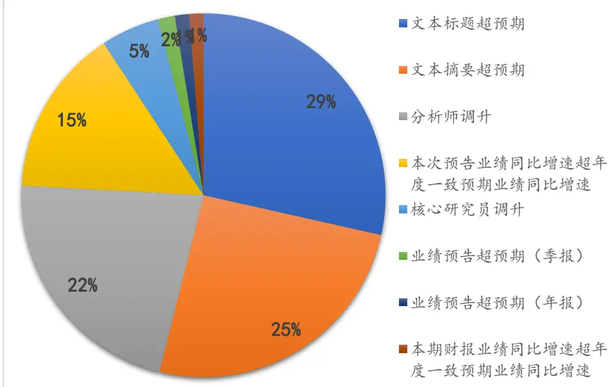
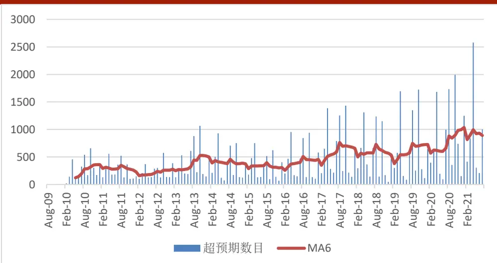
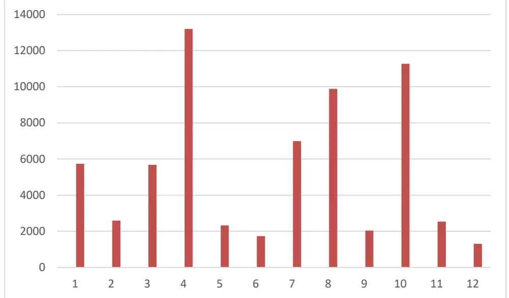
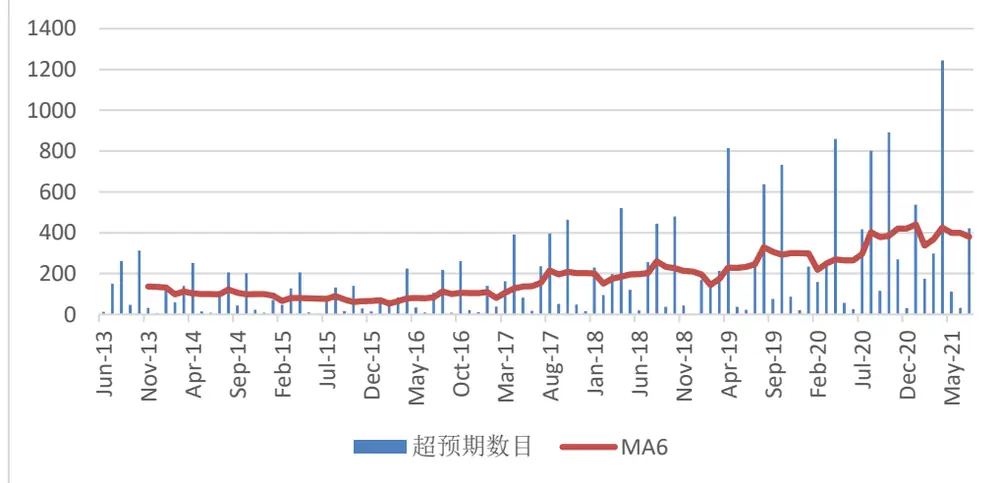
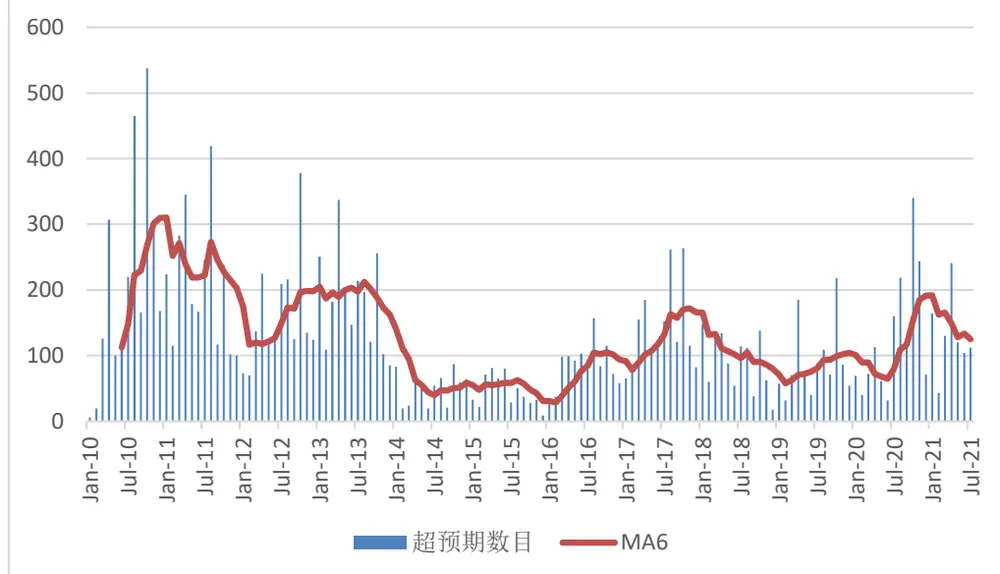
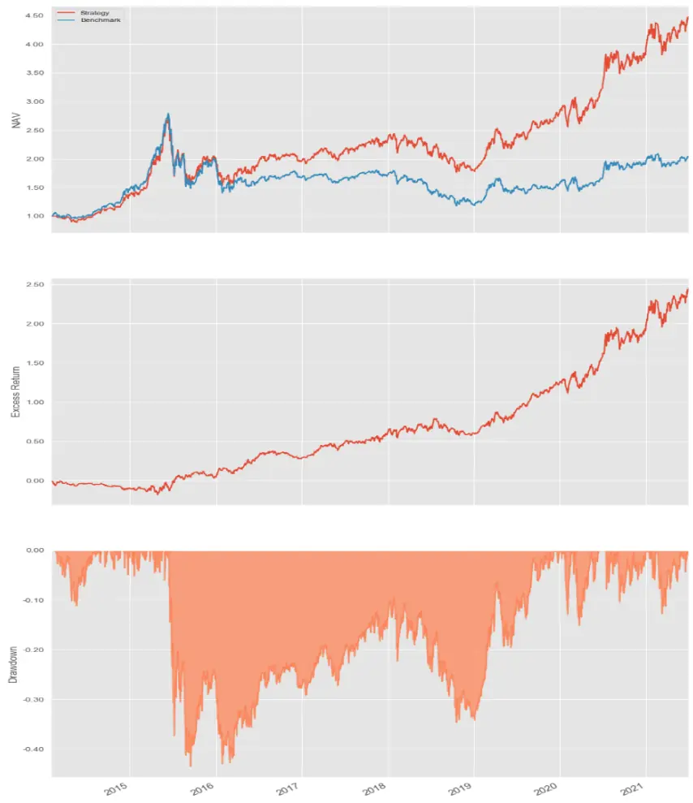
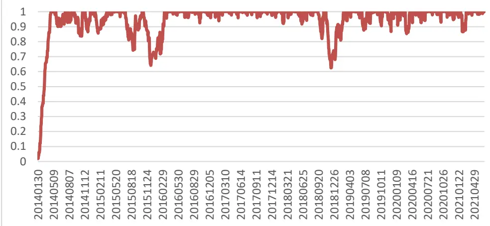
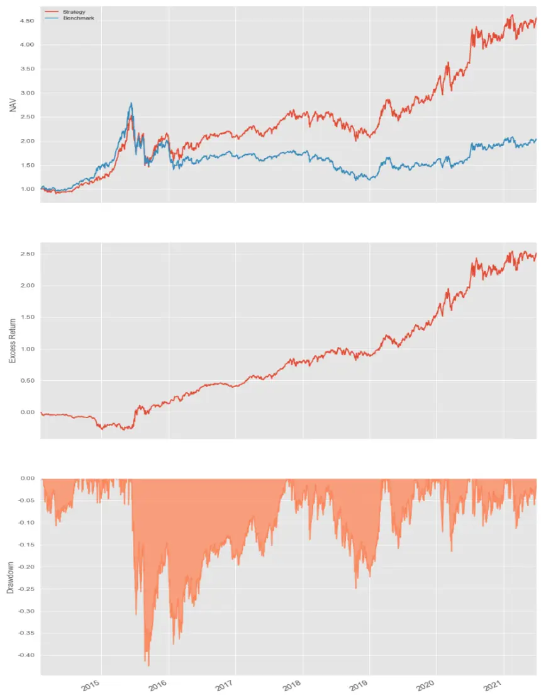
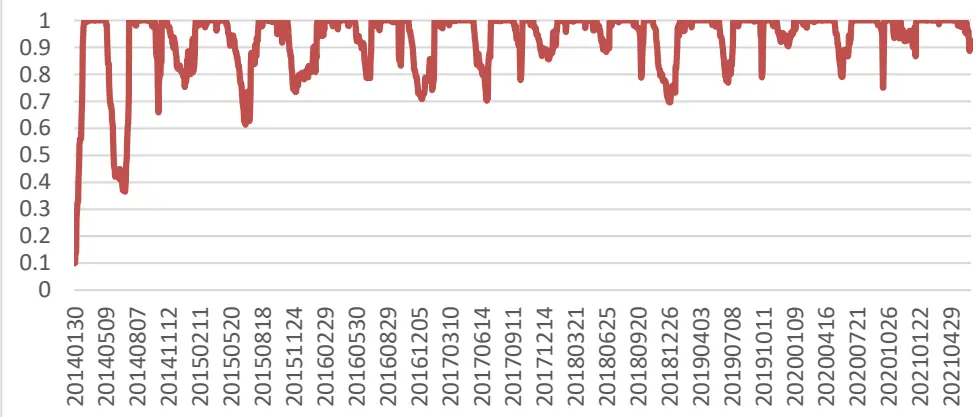

2021 年 07 月 22 日

# 基于超预期的事件驱动策略

## 联系信息

陶勤英分析师

SAC 证 书 编 号 ：

S0160517100002

taoqy@ctsec.com 021-68592393

王超联系人

## “逐鹿”Alpha 专题报告（七）

wangc@ctsec.com 18221845405

## 相关报告

## 投资要点：

## ⚫ 概述

PEAD 现象被认为是稳健的异常因子。通常情况下，PEAD 可以通过财务数据和市场反应两方面构建因子。本文主要通过分析师研究报告的角度，分析 PEAD现象。

## ⚫ 超预期数据

本文采用朝阳永续的可能超预期信息提示数据，分析了八种可能超预期的现象，结果表明：核心研究员调升、分析师调升、文本标题超预期事件发生后一定时间内股票能够取得较为明显的正向收益。

## ⚫ 超预期策略

本文构建了基于分析师调升和文本标题超预期的事件驱动型策略，回测结果表明，两个策略分别能够取得年化 23.33%和 23.45%的收益，超额收益分别为 12.34%和 12.45%。

⚫ 风险提示：本文所有模型结果均来自历史数据，不保证模型未来的有效性。

## 1、 概述

盈余公告后价格漂移(Postearnings-announcement-drift，PEAD)或者称之为盈余惯性 (earning momentum)最早是由Ball and Brown(1968)发现，是指当盈余公告发布后，如果实际盈利高于预期盈利，股票会取得正向的超额收益，反之则取得负向超额收益。

PEAD在多个市场中被证实能取得超额收益，FAMA（1998）在文章中也承认，PEAD 是一个异象因子:

Which anomalies are above suspicion? The post-earnings announcement drift first reported by Ball and Brown (1968) has survived robustness checks, including extension to more recent data (Bernard and Thomas, 1990; Chan et al., 1996).

通常情况下，PEAD现象可以从财务数据和市场反应两个方面进行分析。

财务数据方面，常用的因子主要包括标准化预期外盈利（StandardizedUnexpected Earnings，SUE）或者基于分析师预测的标准化预期外盈利（Standardized Unexpected Earnings based on Analyst Forecasts， SUEAF）。

对于市场反应，常用的因子包括JUMP和EAR，其中JUMP是指公告发布之后的跳空形态，EAR是指公告前后的累计异常收益。

这两类因子均能够取得较好的收益。本文主要从分析师的研究报告的角度，分析盈余公告发布后的超预期策略。通常情况下，在上市公司公布业绩之后，覆盖此上市公司的研究员会对报告做出点评，如果业绩超预期，会在研究报告中有所体现。相比于财务报告和市场反应的超预期分析，研究员的分析更具有专业性，往往能够取得更好的超额收益。

## 2、 超预期数据

本文的研究主要基于朝阳永续的业绩超预期分析数据库。

## 2.1 数据简介

朝阳永续的可能超预期信息提示表通过八种信息提示方式（核心研究员调升，分析师调升，业绩预告超预期（年报），业绩预告超预期（季报），文本标题超预期，文本摘要超预期，本期财报业绩同比增速超年度一致预期业绩同比增速，本次预告业绩同比增速超年度一致预期业绩同比增速）筛选出了所有可能超预期的股票。

这八种信息提示方式的具体分布如下图所示：

图 1：可能超预期类型分布

数据来源：朝阳永续，财通证券研究所

从 2019年8月起，共统计有 65242条可能超预期的纪录，其中文本标题超预期，文本摘要超预期，分析师调升分别占比 29%，25%以及 22%。

以文本标题超预期为例，此类主要是根据研究员发布的公司报告标题中是否含有超预期为判断标准。

图 2：文本标题超预期

中报业绩超预期，公司进入发展新阶段持有

中报业绩超预期，预增71%-84%推荐

收入利润均超预期，产品化逻辑逐步兑现强烈推荐

盈利拐点、费用下降，中报大超预期买入33.70

数据来源：wind,财通证券研究所

文本摘要超预期主要是提取报告摘要中是否含有超预期的关键字：

## 图 3：文本摘要超预期

## 海外经营好转，公司Q3业绩超预期

公司Q3 实现营业收入56.6 亿元，同比增长5.8%：归母净利润7.6亿元，同比下滑9.8%。公司 Q3汇兑损失影响约3.1 亿元（3Q19汇兑收益1.6 亿元），剔除汇兑影响，Q3 业绩同比大增56.7%。公司海外业务好转，Q3 德国FYSAM贡献业绩0.8 亿元，美国公司贡献业绩0.1亿元。剔除汇兑和海外影响，公司前三季度利润总额同比下降0.4%，好于市场预期。

数据来源：wind，财通证券研究所

分析师调升主要是依据此次业绩预测与上次相比是否有所上调：

图 4：分析师调升

车灯行业前景广阔。公司盈利能力持续提升，Q3业绩超预期，上调公司盈利预测，预计2020-2022年EPS分别为3.80元、4.75元、5.71元，对应PE分别为42.7 倍、34.2倍、28.4 倍，维持“增持”评级。

数据来源：wind,财通证券研究所

所有事件在时间序列上的分布如下图示：

图 5：超预期数目

数据来源：朝阳永续，财通证券研究所

随着上市公司的增长，超预期事件也从2010年每月不到500上升到了目前的1000次左右。

按月度聚合，每个月份超预期事件的分布如下：

图 6：超预期事件月度统计

数据来源：朝阳永续，财通证券研究所

超预期事件和财报发布的日期重合度较高，基本集中在 1，3，4，7，8，10月等财报发布月份。

其中文本标题超预期的时间序列分布如下：

图 7：文本标题超预期数目

数据来源：朝阳永续，财通证券研究所

文本标题超预期事件只有在 13年6月份之后才开始有数据。随后从17 年开始逐步增加，目前每个月平均有 400次左右。

分析师调升和核心研究员调升事件的时间序列分布如下：

图 8：分析师调升（包含核心研究员调升）超预期数目

数据来源：朝阳永续，财通证券研究所

在 10，11 年分析师调升事件数目较多，在 14，15 年发生频率较低，随后从 16年开始，逐步回升。

## 2.2 超预期事件收益率统计

对于每一类超预期类型，我们分别计算其发生之后不同期数下的股票收益情况，最终统计的结果如下表所示：

表1：超预期事件后N天平均收益率

|  | 1 | 5 | 10 | 21 | 63 |
| --- | --- | --- | --- | --- | --- |
| 业绩预告超预期（季报） | 0.29% | 0.31% | 0.77% | 0.63% | 6.73% |
| 业绩预告超预期（年报） | 0.93% | 1.24% | 1.93% | 2.91% | 8.41% |
| 核心研究员调升（可能超预期） | 0.50% | 1.41% | 1.72% | 2.22% | 8.88% |
| 分析师调升（可能超预期） | 0.48% | 1.45% | 1.86% | 2.10% | 7.23% |
| 本次预告业绩同比增速超年度一 致预期业绩同比增速 | 0.56% | 0.57% | 0.80% | 1.44% | 2.49% |
| 本期财报业绩同比增速超年度一 致预期业绩同比增速 | 0.61% | 1.72% | 1.27% | -0.15% | 3.35% |
| 文本标题超预期 | 0.64% | 1.42% | 1.76% | 1.68% | 7.54% |
| 文本摘要超预期 | 0.58% | 1.31% | 1.59% | 1.29% | 5.80% |

数据来源：朝阳永续，财通证券研究所

可以看出，业绩预告超预期（年报），核心研究员调升，分析师调升以及文本标题超预期在事件发生后均能取得较高的收益。

由于业绩预告超预期（年报）统计数量较少，仅占比 1%，因此本文不对此类事件进行分析。核心研究员调升占比也相对较低（5%），将此类事件归入分析师调升。因此本文主要关注分析师调升（包含核心研究员调升）以及文本标题超预期两类事件策略。

## 3、 超预期策略

在将因子转换为策略时通常有两种做法，一种是构建组合定期调仓，另一种是事件驱动型的不定期调仓策略。

定期调仓的优势在于操作简单，便于仓位管理。事件驱动的优势在于能够及时利用事件信息，但是对于仓位管理的要求更高。本文主要分析事件驱动型的超预期策略。

事件驱动型策略的难点在于仓位的管理，由于事件发生时间的不确定性，难以保证仓位维持在固定水平。为此，我们设计了一套调仓的逻辑，确保在大部分时间内仓位都能够保证在稳定的区间。

调仓的思路为：首先设置持仓时间的上限 T1，如果标的的持有时间超过T1，则将标的卖出。在事件发生后，将标的纳入样本池，如果此时仓位未达目标仓位，则将样本池中的标的调入，如果仓位已达到或者超过目标仓位，则将所有持有时间超过某一时间 T 的标的进行判断，将收益率最低的一个调出，然后调入样本池中的标的。

在确定好调仓规则之后，接下来需要对策略进行回测，与一般的统计收益率不同，由于存在部分的不可交易情况（涨跌停，停牌等）以及持仓时间的不确定性，为确保回测的严谨性，需要采用事件驱动型的回测引擎进行回测，具体回测的参数设置如下：

1） 回测时间： 20140130-20210630

2）标的池：全A

3）基准：中证全指

4）手续费：双边0.2%

5）撮合设置：收盘价成交，剔除当日ST，停牌股票，涨停不可买入，跌停不可卖出，交易量不可超过当天总交易量的 25%，对科创板和创业板的涨跌停进行相应的调整。

6）策略参数：单只股票 2%上限，等权购入最多 50 只股票，持有时间上限 T1为一个季度，下限T2为一周

分别对分析师调升和文本标题超预期两类事件进行回测，在事件发生后第二天进行交易（确保不存在未来函数）。

## 3.1 分析师调升策略回测

在分析师调升上市公司业绩事件发生后，将此股票纳入股票池，次日买入，最终策略的回测结果如下图所示：

图 9：分析师调升策略回测

数据来源：朝阳永续，财通证券研究所

最上面一张图为策略（红色）和基准（蓝色）的净值曲线。中间为超额收益率曲线。最下面的面积图为回撤情况。

仓位的分布情况如下：

图 10：分析师调升策略仓位

数据来源：朝阳永续，财通证券研究所

策略的统计结果如下：

| 表2：分析师调升策略回测结果 |
| --- |
| CAGR 23.33% |
| ExMDD 18.01% |
| MDD 43.52% |
| Alpha 12.34% |
| Stdev 0.31 |
| Sharp 1.07 |
| IR 1.44 |
| TurnOver 0.22 |

数据来源：朝阳永续，财通证券研究所

分年度收益率统计结果：

| 表3：分析师调升策略分年度收益 |  |  |
| --- | --- | --- |
| 年度 策略收益 | 基准收益 | 超额收益 |
| 2014 38.19% | 47.68% | -9.49% |
| 2015 44.63% | 32.56% | 12.07% |
| 2016 1.57% | -14.41% | 12.84% |
| 2017 17.81% | 2.34% | 15.47% |
| 2018 22.16% | -29.94% | 7.78% |
| 2019 56.57% | 31.11% | 25.47% |
| 2020 39.84% | 24.92% | 14.91% |
| 2021 13.67% | 3.78% | 9.89% |
| 总区间 449.01% | 204.22% | 244.80% |

数据来源：朝阳永续，财通证券研究所

可以看出，除第一年外，其它各年份分析师调升策略均能取得稳定的超额收益。对比超额收益和仓位图可以看出，第一年的负超额收益主要是由于在上涨期间策略还在建仓，未能达到满仓，因此策略收益会受到影响。当策略仓位稳定之后，超额收益也随之稳定。

## 3.2 文本标题超预期策略回测

在研究报告的标题含有超预期的事件发生后，将此股票纳入股票池，次日买入，最终策略的回测结果如下图所示：

图 11：文本标题超预期策略回测

数据来源：朝阳永续，财通证券研究所

仓位的分布情况如下：

图 12：文本标题超预期策略仓位

数据来源：朝阳永续，财通证券研究所

策略的统计结果如下：

| 表4：文本标题超预期策略回测结果 |  |
| --- | --- |
| CAGR | 23.45% |
| ExMDD | 28.60% |
| MDD | 42.45% |
| Alpha | 12.45% |
| Stdev | 0.31 |
| Sharp | 1.07 |
| IR | 1.36 |
| TurnOver | 0.20 |

数据来源：朝阳永续，财通证券研究所

分年度收益率统计结果：
表 5：文本标题超预期策略分年度收益

|  | 基准收益 | 超额收益 |
| --- | --- | --- |
| 年度 策略收益 2014 21.11% | 47.68% | -26.57% |
| 2015 72.37% | 32.56% | 39.81% |
| 2016 0.14% | -14.41% | 14.54% |
| 2017 19.84% | 2.34% | 17.51% |
| 2018 16.13% | -29.94% | 13.80% |
| 2019 47.87% | 31.11% | 16.77% |
| 2020 36.74% | 24.92% | 11.82% |
| 2021 6.41% 总区间 452.11% | 3.78% 204.22% | 2.63% 247.89% |

数据来源：朝阳永续，财通证券研究所

同样，文本标题超预期也存在第一年建仓期间超额为负的情况，并且相比与分析师调升策略，此策略的仓位波动相对较大。整体上策略的换手率和收益相比于分析师调升策略有所提高，超额收益更加稳定，信息比率有所下降。

## 4、 总结

本文主要从研究员报告的角度分析了 PEAD 现象。基于朝阳永续的业绩超预期数据，分析了几类超预期情况的收益率。最终，利用文本标题超预期和分析师调升构建的业绩超预期事件驱动策略，取得了稳健的超额收益。

## 信息披露

## 分析师承诺

作者具有中国证券业协会授予的证券投资咨询执业资格，并注册为证券分析师，具备专业胜任能力，保证报告所采用的数据均来自合规渠道，分析逻辑基于作者的职业理解。本报告清晰地反映了作者的研究观点，力求独立、客观和公正，结论不受任何第三方的授意或影响，作者也不会因本报告中的具体推荐意见或观点而直接或间接收到任何形式的补偿。

## 资质声明

财通证券股份有限公司具备中国证券监督管理委员会许可的证券投资咨询业务资格。

## 公司评级

买入：我们预计未来 6 个月内，个股相对大盘涨幅在 15%以上；

增持：我们预计未来 6 个月内，个股相对大盘涨幅介于 5%与15%之间；

中性：我们预计未来 6 个月内，个股相对大盘涨幅介于-5%与 5%之间；

减持：我们预计未来 6 个月内，个股相对大盘涨幅介于-5%与-15%之间；

卖出：我们预计未来 6 个月内，个股相对大盘涨幅低于-15%。

## 行业评级

增持：我们预计未来 6 个月内，行业整体回报高于市场整体水平 5%以上；

中性：我们预计未来 6 个月内，行业整体回报介于市场整体水平-5%与 5%之间；

减持：我们预计未来 6 个月内，行业整体回报低于市场整体水平-5%以下。

## 免责声明

本报告仅供财通证券股份有限公司的客户使用。本公司不会因接收人收到本报告而视其为本公司的当然客户。

本报告的信息来源于已公开的资料，本公司不保证该等信息的准确性、完整性。本报告所载的资料、工具、意见及推测只提供给客户作参考之用，并非作为或被视为出售或购买证券或其他投资标的邀请或向他人作出邀请。

本报告所载的资料、意见及推测仅反映本公司于发布本报告当日的判断，本报告所指的证券或投资标的价格、价值及投资收入可能会波动。在不同时期，本公司可发出与本报告所载资料、意见及推测不一致的报告。

本公司通过信息隔离墙对可能存在利益冲突的业务部门或关联机构之间的信息流动进行控制。因此，客户应注意，在法律许可的情况下，本公司及其所属关联机构可能会持有报告中提到的公司所发行的证券或期权并进行证券或期权交易，也可能为这些公司提供或者争取提供投资银行、财务顾问或者金融产品等相关服务。在法律许可的情况下，本公司的员工可能担任本报告所提到的公司的董事。

本报告中所指的投资及服务可能不适合个别客户，不构成客户私人咨询建议。在任何情况下，本报告中的信息或所表述的意见均不构成对任何人的投资建议。在任何情况下，本公司不对任何人使用本报告中的任何内容所引致的任何损失负任何责任。

本报告仅作为客户作出投资决策和公司投资顾问为客户提供投资建议的参考。客户应当独立作出投资决策，而基于本报告作出任何投资决定或就本报告要求任何解释前应咨询所在证券机构投资顾问和服务人员的意见；

本报告的版权归本公司所有，未经书面许可，任何机构和个人不得以任何形式翻版、复制、发表或引用，或再次分发给任何其他人，或以任何侵犯本公司版权的其他方式使用。