证券研究报告·金融工程深度

# “逐鹿”Alpha 专题报告（九）

# ——基于 QLIB ALPHA360 的 Temporal Fusion

Transformer 选股模型

## 主要内容

## 简介

本文主要是利用 QLIB 的 ALPHA 360 因子，结合 Temporal FusionTransformer 对中证 500 成份股的未来一日收益率进行预测，将预测结果作为因子，利用 TopKdropN 的方式进行回测，结果表明，与传统的 ICIR 加权的方式对比，TFT 模型能够取得更加优异的结果。并且通过参数的调整，TFT 模型能够在与中长期策略换手率接近的情况下，取得更加优异的表现。

## 数据介绍

QLIB 是微软亚洲研究院开发的开源量化 AI 平台，提供了完整的数据，模型，回测和分析的功能。在数据模块中，除了提供基础的价格和成交量信息外，QLIB 还提供了两套完整的因子系统ALPHA 158 和 ALPHA 360，两者均为量价指标，但是在生成方式上有所区别。

本文对 ALPHA158 和 ALPHA360 的表现进行分析，最终选取表现更好的 ALPHA360 中的 20 个因子作为模型输入。

## 模型介绍

Temporal Fusion Transformer（TFT）是 2021 年由 GOOGLE CLOUDAI 的 Bryan Lim 等人提出的，旨在解决 Transformer 用于时间序列预测的问题。TFT 是一个泛化性能较好的深度学习模型，能够处理静态变量（例如行业分类，商店位置等），观测输入变量（各类自变量输入）以及已知的变量（例如节假日信息等），能够通过共享权重向量输出特征重要性，并且能够做多步预测且输出分位数预测值。

## 模型结果

与传统的 ICIR 加权对比，TFT 模型能够取得更加优异的表现。通过约束不同的换手率，TFT 策略能够取得与中长期策略近似的换手率，并且收益以及稳定性也非常优异， TFT(50,1)能够取得年化 19.57%，超额 15.57%，信息比率 1.74，换手率 4.6 的优异表现。

风险提示：本文所有模型结果均来自历史数据，不保证模型未来的有效性

# 金融工程研究

丁鲁明

dingluming@csc.com.cn

021-68821623

执业证书编号：S1440515020001

王 超 研究助理

wangchaodcq@csc.com.cn

18221845405

发布日期： 2022 年 05 月 24 日

## 市场表现

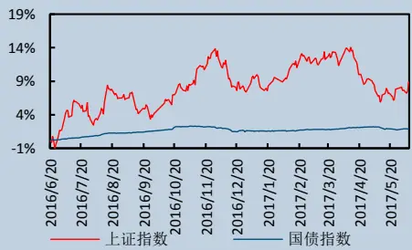

## 相关研究报告

## 一、简介

深度学习在搜索技术，数据挖掘，机器学习，机器翻译，自然语言处理，多媒体学习，语音，推荐和个性化技术，以及其他相关领域都取得了很多成果。深度学习使机器模仿视听和思考等人类的活动，解决了很多复杂的模式识别难题，使得人工智能相关技术取得了很大进步。传统的深度学习网络像 CNN 在图像识别领域有广泛应用，LSTM 在时间序列问题上能够取得较好的表现。随着新模型的不断提出，深度学习在各领域的变现也越来越好。

Transformer 是 google 提出的深度学习网络，近年来在自然语言处理，图像识别，音频处理等领域大放异彩。各类 X-former 层出不穷，都取得了非常优异的表现。Temporal Fusion Transformer 是 2021 年 9 月由GOOGLE CLOUD AI 的 Bryan Lim 等人提出的基于 Transformer 的深度学习模型，是解决 Transformer 在时间序列预测上的一类应用。

QLIB 是微软亚洲研究院开发的开源量化 AI 平台，提供了完整的数据，模型，回测和分析的功能。在数据模块中，除了提供基础的价格和成交量信息外，QLIB 还提供了两套完整的因子系统 ALPHA 158 和 ALPHA 360，两者均为量价指标，但是在生成方式上有所区别。在算法模块中，QLIB 的 Model Zoo 中集成了包含线性模型，GBDT 等线性模型，以及前沿的深度学习模型。在分析模块，QLIB 也提供常见的因子 ICIR 分析以及策略回测功能。

本文主要是利用 QLIB 的 ALPHA 360 因子，结合 Temporal Fusion Transformer 对中证 500 成份股的未来一日收益率进行预测，将预测结果作为因子，利用 TopKdropN 的方式进行回测，结果表明，与传统的 ICIR 加权的方式对比，TFT 模型能够取得更加优异的结果。并且通过参数的调整，TFT 模型能够在与中长期策略换手率接近的情况下，取得更加优异的表现。

## 二、数据介绍

## 2.1 QLIB 简介

本文因子主要采用 QLIB 提供的 ALPHA 158 和 ALPHA 360。 QLIB 是微软亚洲研究院开发的开源量化 AI 平台，提供了完整的数据，模型，回测，分析等功能。

图表1： QLIB 框架
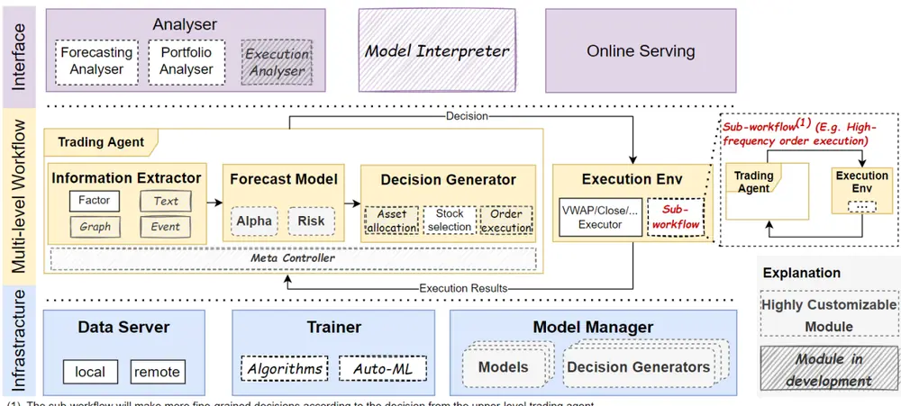
(1) The sub-workflow will make more fine-grained decisions according to the decision from the upper-level trading agent
Qlib : An AI-oriented Quantitative Investment Platform,

框架最底层为基础架构层，基础架构层提供这个框架最底层的研究支持，包含有数据服务模块，训练模块以及模型管理模块。其中数据模块提供高性能的本地数据存储格式。训练模块包括各类经典以及前沿的机器学习和深度学习算法。

中间层为量化投资流程层，是整个框架运行的流程。信息提取模块从原始数据中提取因子/文本/图/事件信息。预测模块主要是生成各类预测信号，决策生成器模块则会根据预测信号生成组合以及订单的信息。以上三个模块是交易单元的主要模块，最终生成的组合以及订单信息会交由执行模块进行算法交易。

最上层为交互层，为用户提供方便的运行接口。分析模块主要提供信号分析，组合分析以及执行结果的分析。

由于本文主要用到的是数据服务模块以及信息提取模块，接下来将对这两部分做深入介绍。对其他模块不再赘述，如若有兴趣，可以参考官方文档，获取相关模块的详细使用方法。

## 2.2 数据简介

## 2.2.1 数据存储

QLIB 的原始数据源主要来自雅虎财经，包含有美股和 A 股数据。数据主要分为三部分进行存储，分别是特征数据，日历信息以及指数成份股信息。

在特征文件夹中，每只股票的信息存储为一个文件夹，在此文件夹内，各个特征单独存储为一个高性能的压缩文件。文件具体结构如下图所示，每个因子值都有固定的存储空间，因此，在每个文件内部只需要记录起始时间以及具体因子值即可。在更新时按照时间顺序向后填充因子。

图表2： 数据存储
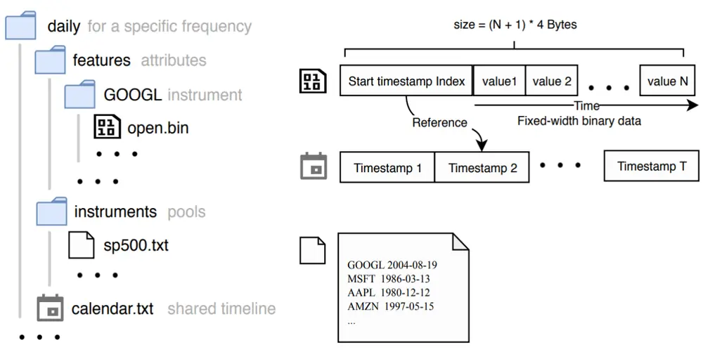
Qlib : An AI-oriented Quantitative Investment Platform

QLIB 同样提供用户自定义的数据源导入接口，按照规定的格式生成原始 CSV 文件，然后利用数据转换的函数即可生成 QLIB 的数据文件。

## 2.2.2 表达式与 ALPHA 因子

在原始数据的基础上，QLIB 提供了丰富的信息提取功能，其中表达式功能是最常用的方法之一。表达式能够方便的定义因子，简化了因子构建的流程。例如，在 QLIB 中定义布林带只需要在代码中直接定义因子：

$$
(\mathsf{MEAN}(\mathsf{Sclose},\mathsf{N})+2^{*}\mathsf{STD}(\mathsf{Sclose},\mathsf{N})-\mathsf{Sclose})/\mathsf{MEAN}(\mathsf{Sclose},\mathsf{N})
$$

其中大写的字符代表算子。而以$开头的字符则代表底层因子。

底层因子除了系统默认的高开低收成交量等数据外，也可由用户自行添加，与其他数据格式保持一致即可。关于算子，QLIB 提供了丰富的算子定义。具体可分为元素运算符和滚动运算符。其中元算运算符包含常见的单目（绝对值，符号，对数……），双目（加，减，乘，除……）以及三目运算法（IF）。滚动运算符包含单时间序列运算（平均值，求和，标准差……）和双时间序列运算（相关性，方差）

图表3： 部分算子列表

| 元素运算符 | 单目 | Abs |
| --- | --- | --- |
|  |  | Sign |
|  |  | Log |
|  | 双目 | Add |
|  |  | Sub |
|  |  | Mul |
|  | 三目 | If |
| 滚动运算符 | 单时间序列 | Mean |
|  |  | Sum |
|  |  | Std |
|  | 双时间序列 | Corr |
|  |  | Cov |

资料来源：Qlib，中信建投

在表达式数据存储时，QLIB 会将表达式解析为语法树的形式，树的每一个子节点都会保存在缓存中，因此在计算新表达式，相同的子节点不必重复计算，能够极大的提高效率。

ALPHA158 和 ALPHA360 是 QLIB 默认的两套因子系统。两者均为量价指标。通过原始的高开低收成交量等数据组合构建而成。两者主要的区别在于 ALPHA158 包含常见的一些技术指标。而 ALPHA360 是通过原始指标两两暴力组合构建的指标。两者分别代表了两类因子挖掘系统，传统技术指标以及暴力构建因子，各有优劣。另外一类因子挖掘的方法是以机器学习为代表的自动合成因子方法，代表方法为遗传规划生成因子，代表因子集为 ALPHA101。具体构建方法可以参考我们之前的研究报告。QLIB 提供了便捷的算子定义以及检验方法，能够方便的集成此因子挖掘方法。

图表4： ALPHA158 与 ALPHA360

| ALPHA158 |  | ALPHA360 |  |
| --- | --- | --- | --- |
| 指标名 | 计算方式 | 指标名 | 计算方式 |
| KMID | ($close-$open)/$open | CLOSE%d | Ref($close, %d)/$close |
| KLEN | ($high-$low)/$open | OPEN%d | Ref($open, % d)/$close |
| KMID2 | ($close-$open)/($high-$low+1e-12) | HIGH%d | Ref($high, %d)/$close |
| KUP | ($high-Greater($open, $close))/$open | LOW%d | Ref($low, %d)/$close |
| KLOW | (Less($open, $close)-$low)/$open | VWAP%d | Ref($vwap, %d)/$close |
| KSFT | (2*$close-$high-$low)/$open | VOLUME%d | Ref($volume, %d)/($volume+1e-12) |

资料来源：Qlib，中信建投

## 三、因子筛选

首先我们用 WIND 的基础数据替换原始框架中的雅虎财经数据。然后利用 QLIB 中的配置文件，计算得到ALPHA158 和 ALPHA360 因子。方便起见，我们分别对 ALPHA158 和 ALPHA360 的因子在测试集内进行检验，选取其中 IR 最高的 20 个因子作为下一步模型的输入。

数据时间范围从 2010 年至 2021 年，样本空间为历史中证 500 成份股，将 2010 年至 2015 年的数据作为测试集。X 为各因子值，Y 为后两日的单日收益率。在测试集中 Alpha158 和 Alpha360 的因子 ICIR 分布为：

图表5： IC绝对值分布
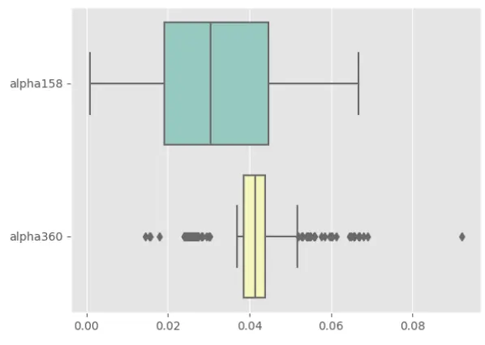
资料来源：WIND，中信建投

图表6： IR 分布
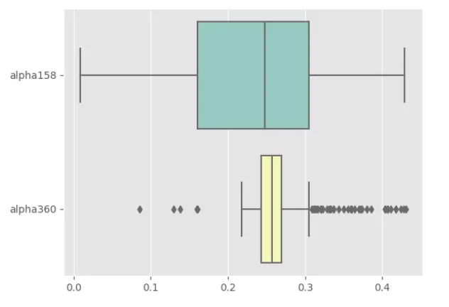
资料来源：WIND，中信建投

从两者的分布可以看出，ALPHA360 由于因子定义较为接近，因此分布的标准差更小。两者 IR 中位数较为接近，从 IC 的分布来看，ALPHA360 的中位数远高于 ALPHA158。

分别选取两者 IR 排名前 20 的因子，ALPHA158 因子 IC 的平均值为 0.055，IR 的平均值为 0.387。ALPHA360因子 IC 的平均值为 0.061，IR 的平均值为 0.391。ALPHA360 无论是整体因子还是头部因子的表现，均好于ALPHA158。因此我们选取 ALPHA360 表现最好的 20 个因子作为我们的模型输入。最终的因子列表为：

图表7： ALPHA360 因子前 20

| 因子名 | IC | IR | 因子名 | IC | IR |
| --- | --- | --- | --- | --- | --- |
| LOW2 | 0.053 | 0.350 | LOW3 | 0.060 | 0.386 |
| LOW6 | 0.058 | 0.355 | LOW5 | 0.065 | 0.403 |
| VWAP3 | 0.056 | 0.360 | VWAP0 | 0.053 | 0.404 |
| VWAP1 | 0.053 | 0.360 | HIGH4 | 0.066 | 0.406 |
| VWAP6 | 0.058 | 0.360 | VWAP5 | 0.066 | 0.407 |
| OPENO | 0.051 | 0.364 | OPEN3 | 0.065 | 0.411 |
| LOW1 | 0.054 | 0.370 | OPEN4 | 0.067 | 0.417 |
| CLOSE6 | 0.060 | 0.371 | CLOSE5 | 0.067 | 0.418 |
| OPEN5 | 0.060 | 0.373 | CLOSE4 | 0.067 | 0.424 |
| HIGH5 | 0.061 | 0.380 | LOW4 | 0.068 | 0.428 |

资料来源：WIND，中信建投

需要说明的是，IC 代表了因子的线性信息，对于深度模型而言，因子的非线性信息尤为重要，因此基于IC 的因子筛选方法并不是最优的选择，传统的树模型等机器学习能够输出因子的重要性，包含了因子的非线性信息，是一种更加有效的筛选方法。

本文之所以选择 IC 的方法，主要是相对传统线性方法以及 TFT 深度学习在模型层面做对比。而传统模型很难处理因子的非线性信息，因此基于传统方法的因子筛选办法是一种更加公平的筛选方法。

## 四、模型介绍

## 4.1 Transformer 简介

自从 GOOGLE 在 2017 年的经典论文 Attention is All You Need 中提出 Transformer 架构以来，在各类 NLP 任务中，Transformer 取得了巨大的成功。不仅如此，随着各类 X-former 的出现，在图像识别，音频处理等领域，Transformer 也被广泛使用。

Transformer 的模型结构如下图所示，整个 Transformer 结果可以分为左边的 encoder 部分以及右边的decoder 部分，两者均是基于 N 个 multi-head attention 模块构建而成，区别在于在 encoder 部分，所有输入均为已知，因此采用并行计算，而在 decoder 部分，信息是按顺序推理得到，因此采用的是所谓 masked multi-head attention，是一种顺序串联的结果。

在 NLP 任务中，文字的位置信息至关重要，因此在对输入做完 embedding 操作之后，需要额外加入位置信息，在 transformer 中是通过位置编码的操作与原始输入拼接得到，从而实现位置信息的保留。

图表8： Transformer 模型结构
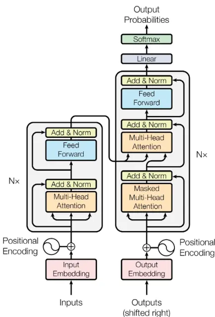
Figure 1: The Transformer - model architecture.
Attention Is All You Need

Transformer 不仅在 NLP 问题上大放异彩，近年来在图像，时间序列等问题上也取得了优异的成绩。以Transformer 和 CNN 在图像识别的表现来看，在数据量较小的情况下，CNN 能够取得更好的表现，而随着数据量不断增大，Transformer 的表现逐渐超越 CNN。这主要是由于 Transformer 是一类泛化能力更强的网络，而泛化能力更强意味着模型需要大量的数据进行训练以达到较好的表现。

图表9： Transformer 对比 CNN
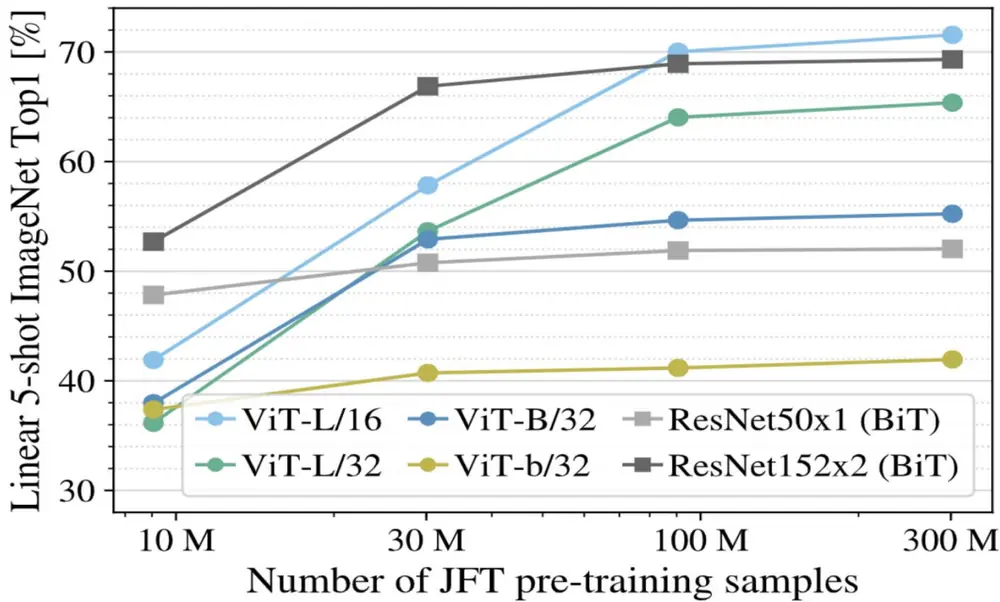
AN IMAGE IS WORTH 16X16 WORDS:TRANSFORMERS FOR IMAGE RECOGNITION AT SCALE

对于时间序列的预测问题，主要模型方法包括经典的 ARIMA 类模型，以及以 LSTM/GRU 为基础的 RNN 网络。近年来 Transformer 模型也被用于时间序列问题，常见的时间序列 Transformer 模型包括 Informer，LogTrans，Pyraformer，FEDformer 等。从网络结构来看，与原始的 Transformer 相比，时间序列 Transformer 主要是从位置编码，注意力机制以及网络架构对原始模型进行改进。在应用方面，时间序列 Transformer 主要应用于时间序列预测，异常点检测以及分类等问题。

图表10： 时间序列 Transformer 分类
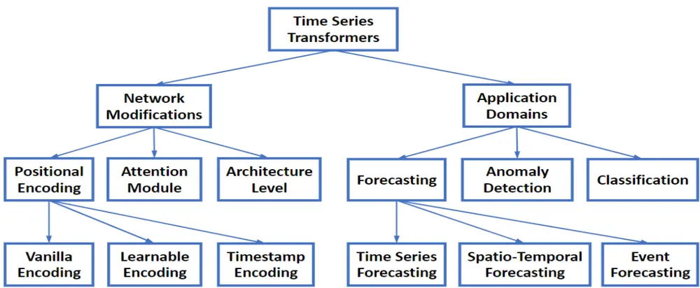
Figure 1: Taxonomy of Transformers for time series modeling from the perspectives of network modifications and application domains.
Transformers in Time Series: A Survey

## 4.2 TFT 模型简介

Temporal Fusion Transformer（TFT）是 2021 年由 GOOGLE CLOUD AI 的 Bryan Lim 等人提出的，旨在解决Transformer 用于时间序列预测的问题。

TFT 是一个泛化性能较好的深度学习模型，与原始 Transformer 模型相比，它具有以下特点：

1） 能够处理静态变量（例如行业分类，商店位置等），观测输入变量（各类自变量输入）以及已知的变量（例如节假日信息等）。

2） 能够输出变量的可解释性

3） 多步预测，预测未来一段时间的输出而非某个时间点的输出

4） 分位数预测，预测每个时间点的分位数输出

图表11： 输入类型
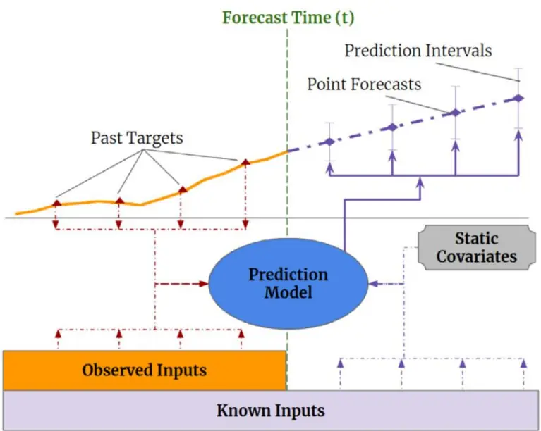
Fig. 1. Illustration of multi-horizon forecasting with static covariates, past observed and a priori-known future time-dependent inputs.
Temporal Fusion Transformers for interpretable multi-horizon time series forecasting

## 4.3 TFT 模型结构

TFT 整个结构可以分为输入层，Encoder 层、Decoder 层和输出层。模型结构如下图所示：

图表12： TFT模型结构
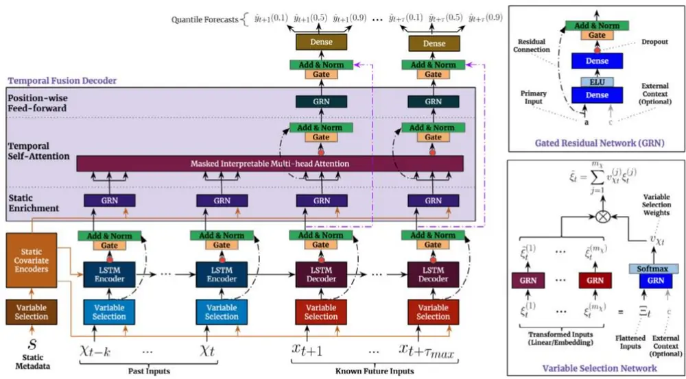
Fig. 2. TFT architecture. TFT inputs static metadata, time-varying past inputs and time-varying a priori known future inputs. Variable Selection is used for judicious selection of the most salient features based on the input. Gated Residual Network blocks enable efficient information flow with skip connections and gating layers. Time-dependent processing is based on LSTMs for local processing, and multi-head attention for integrating information from any time step.
Temporal Fusion Transformers for interpretable multi-horizon time seriesforecasting

在输入层， 类输入分别经过不同的变量筛选网络（ ） 的目的是为了对变量进行加权，通过分配不同的权重，调节变量的重要性。

与传统的 Transformer 不同，TFT 采用 LSTM Encoder，并没有使用 positional encoding + Attention Encoder 的组合。这样做的好处是能够更好的处理输入的时序信息，而缺点是不能够并行计算，限制了模型处理大规模数据的能力。

在 Decoder $\sqrt{\frac{\underset{x}{=}}{\sum}}$ ，为了使模型具有可解释性，在 TFT 中修改了 Multi-head Attention 的结构。在原始的 Multi-head Attention 中，Attention score 定义为：

$$
\mathrm{Attention}(Q,K,V)=A(\pmb{Q},K)V
$$

其中：

$$
A(\pmb{Q},\pmb{K})=\mathrm{Softmax}\big(\pmb{Q}\pmb{K}^{T}/\sqrt{d_{attn}}\big)
$$

Multi-head Attention 为各个子空间内 Attention 的线性组合：

$$
\mathrm{MultiHead}(\pmb{Q},\pmb{K},\pmb{V})=\bigl[\pmb{H}_{1},\dots,\pmb{H}_{m_{H}}\bigr]\pmb{W}_{H}
$$

其中：

$$
\pmb{H}_{h}=\mathsf{Attention}\left(\pmb{Q}\pmb{W}_{Q}^{(h)},\pmb{K}\pmb{W}_{K}^{(h)},\pmb{V}\pmb{W}_{V}^{(h)}\right)
$$

在 TFT 模型中，作者定义了

$$
\mathrm{InterpretableMultiHead}\left(Q,K,V\right)=HW_{H},
$$

其中：

$$
\begin{array}{l}{{{\displaystyle{\widetilde{H}}=\widetilde{A}(Q,K)VW_{V}}}\ ~}\\{{\displaystyle~=\left\{1/H\sum_{h=1}^{m_{H}}A\big(QW_{Q}^{(h)},KW_{K}^{(h)}\big)\right\}VW_{V}}}\\{{\displaystyle~=1/H\sum_{h=1}^{m_{H}}\mathrm{Attention}\big(QW_{Q}^{(h)},KW_{K}^{(h)},VW_{V}\big)}}\end{array}
$$

通过上式可以看出， $\mathsf{W}_{\nabla}$ 为所有子空间内共享的矩阵。V 可以看作是 $\widetilde{\cal A}(0,\mathrm{K})$ 的权重向量，并且各个子空间是通过算数平均得到最终的输出，而并非 Transformer 的线性组合。共享的 $V\mathsf{W}_{\nabla}$ 值，可以作为变量重要性的依据。

在输出层，与传统的回归问题定义的损失函数有所区别，在 TFT 网络中，损失函数为不同分位数下的损失函数加权求和。具体定义为：

$$
\mathcal{L}(\Omega,W)=\sum_{y_{t}\in\Omega}\sum_{q\in\mathcal{Q}}\sum_{\tau=1}^{\tau_{max}}\frac{QL(y_{t},\hat{y}(q,t-\tau,\tau),q)}{M\tau_{max}}
$$

其中：

$$
QL(y,\hat{y},q)=q(y-\hat{y})_{+}+(1-q)(\hat{y}-y)_{+}
$$

$$
(.)_{+}=max(0,.)
$$

在测试集中，整个样本的分位数损失函数可以通过以下方式计算得到：

$$
q-\mathrm{Risk}=\frac{2\sum_{y_{t}\in\widetilde{\Omega}}\sum_{\tau=1}^{\tau_{max}}QL(y_{t},\hat{y}(q,t-\tau,\tau),q)}{\sum_{y_{t}\in\widetilde{\Omega}}\sum_{\tau=1}^{\tau_{max}}|y_{t}|}
$$

在得到不同分位数的误差之后就可以得到不同分位数的预测值。

## 4.4 模型训练

我们采用 QLIB 得到的 ALPHA360 中的 20 个因子作为输入变量，预测变量为后一日的收益率。训练集数据为 2010 年-2015 年中证 500 历史成份股数据，验证集为 2016-2017 年数据，测试集为 2018 年-2021 年数据。

ALPHA360 中的因子均为无量纲因子，对于所有因子均做归一化处理，验证集和测试集在做归一化时统一采用测试集的均值标准差进行处理。

在 QLIB 中集成了一些经典以及前沿的机器学习模型（Model Zoo）,得益于各模块之间耦合度较低，用户可以自行定义模型加入 QLIB 之中。

图表13： Model Zoo

- GBDT based on XGBoost (Tianqi Chen, et al. KDD 2016)

- GBDT based on LightGBM (Guolin Ke, et al. NIPS 2017)

- GBDT based on Catboost (Liudmila Prokhorenkova, et al. NIPS 2018)

- MLP based on pytorch

- LSTM based on pytorch (Sepp Hochreiter, et al. Neural computation 1997)

- GRU based on pytorch (Kyunghyun Cho, et al. 2014)

- ALSTM based on pytorch (Yao Qin, et al. IJCAI 2017)

- GATs based on pytorch (Petar Velickovic, et al. 2017)

- SFM based on pytorch (Liheng Zhang, et al. KDD 2017)

- TFT based on tensorflow (Bryan Lim, et al. International Journal of Forecasting 2019)

- TabNet based on pytorch (Sercan O. Arik, et al. AAAI 2019)

- DoubleEnsemble based on LightGBM (Chuheng Zhang, et al. ICDM 2020)

- TCTS based on pytorch (Xueqing Wu, et al. ICML 2021)

- Transformer based on pytorch (Ashish Vaswani, et al. NeurlPS 2017)

- Localformer based on pytorch (Juyong Jiang, et al.)

- TRA based on pytorch (Hengxu, Dong, et al. KDD 2021)

- TCN based on pytorch (Shaojie Bai, et al. 2018)

- ADARNN based on pytorch (YunTao Du, et al. 2021)

- ADD based on pytorch (Hongshun Tang, et al.2020)

- IGMTF based on pytorch (Wentao Xu, et al.2021)

- HIST based on pytorch (Wentao Xu, et al.2021)

资料来源：OLIB，中信建投

不仅如此，QLIB 将所有上述模型的表现在 ALPHA158 和 ALPHA360 两个数据集上进行了对比。需要注意的是，由于深度学习设计大量的参数，模型设置稍有不同会带来结果的变化，深入理解模型和数据才能够使模型取得更好的表现结果。

图表14： 模型在 ALPHA158 表现

| Model Name | Dataset | IC | ICIR | Rank IC | Rank ICIR | Annualized Return | Information Ratio | Max Drawdown |
| --- | --- | --- | --- | --- | --- | --- | --- | --- |
| TCN(Shaojie Bai, et al.) | Alpha158 | 0.0275±0.00 | 0.2157±0.01 | 0.0411±0.00 | 0.3379±0.01 | 0.0190±0.02 | 0.2887±0.27 | -0.1202±0.03 |
| TabNet(Sercan O. Arik, et al.) Alpha158 |  | 0.0204±0.01 0.1554±0.07 |  |  | 0.0333±0.00 0.2552±0.05 | 0.0227±0.04 | 0.3676±0.54 | -0.1089±0.08 |
| Transformer(Ashish Vaswani, et al.) | Alpha158 | 0.0264±0.00 0.2053±0.02 0.0407±0.00 0.3273±0.02 0.0273±0.02 |  |  |  |  | 0.3970±0.26 | -0.1101±0.02 |
| GRU(Kyunghyun Cho, et al.) | Alpha158(with selected 20 features) | 0.0315±0.00 0.2450±0.04 0.0428±0.00 0.3440±0.03 |  |  |  | 0.0344±0.02 | 0.5160±0.25 | -0.1017±0.02 |
| LSTM(Sepp Hochreiter, et al.) | Alpha158(with selected 20 features) | 0.0318±0.00 | 0.2367±0.04 | 0.0435±0.00 | 0.3389±0.03 | 0.0381±0.03 | 0.5561±0.46 | -0.1207±0.04 |
| Localformer(Juyong Jiang, et al.) | Alpha158 | 0.0356±0.00 | 0.2756±0.03 | 0.0468±0.00 | 0.3784±0.03 | 0.0438±0.02 | 0.6600±0.33 | -0.0952±0.02 |
| SFM(Liheng Zhang, et al.) | Alpha158 | 0.0379±0.00 | 0.2959±0.04 | 0.0464±0.00 | 0.3825±0.04 | 0.0465±0.02 | 0.5672±0.29 | -0.1282±0.03 |
| ALSTM (Yao Qin, et al.) | Alpha158(with selected 20 features) | 0.0362±0.01 | 0.2789±0.06 | 0.0463±0.01 | 0.3661±0.05 | 0.0470±0.03 | 0.6992±0.47 | -0.1072±0.03 |
| GATs (Petar Velickovic, et al.) | Alpha158(with selected 20 features) | 0.0349±0.00 0.2511±0.01 |  |  | 0.0462±0.00 0.3564±0.01 | 0.0497±0.01 | 0.7338±0.19 | -0.0777±0.02 |
| TRA(Hengxu Lin, et al.) | Alpha158(with selected 20 features) | 0.0404±0.00 | 0.3197±0.05 | 0.0490±0.00 | 0.4047±0.04 | 0.0649±0.02 | 1.0091±0.30 | -0.0860±0.02 |
| Linear | Alpha158 | 0.0397±0.00 | 0.3000±0.00 | 0.0472±0.00 | 0.3531±0.00 | 0.0692±0.00 | 0.9209±0.00 | -0.1509±0.00 |
| TRA(Hengxu Lin, et al.) | Alpha158 | 0.0440±0.00 | 0.3535±0.05 | 0.0540±0.00 | 0.4451±0.03 | 0.0718±0.02 | 1.0835±0.35 | -0.0760±0.02 |
| CatBoost(Liudmila Prokhorenkova, et al.) | Alpha158 | 0.0481±0.00 | 0.3366±0.00 | 0.0454±0.00 | 0.3311±0.00 | 0.0765±0.00 | 0.8032±0.01 | -0.1092±0.00 |
| XGBoost(Tianqi Chen, et al.) | Alpha158 | 0.0498±0.00 | 0.3779±0.00 | 0.0505±0.00 | 0.4131±0.00 | 0.0780±0.00 | 0.9070±0.00 | -0.1168±0.00 |
| TFT (Bryan Lim, et al.) | Alpha158(with selected 20 features) | 0.0358±0.00 0.2160±0.03 |  | 0.0116±0.01 | 0.0720±0.03 | 0.0847±0.02 | 0.8131±0.19 | -0.1824±0.03 |
| MLP | Alpha158 | 0.0376±0.00 | 0.2846±0.02 | 0.0429±0.00 | 0.3220±0.01 | 0.0895±0.02 | 1.1408±0.23 | -0.1103±0.02 |
| LightGBM(Guolin Ke, et al.) | Alpha158 | 0.0448±0.00 | 0.3660±0.00 | 0.0469±0.00 | 0.3877±0.00 | 0.0901±0.00 | 1.0164±0.00 | -0.1038±0.00 |
| DoubleEnsemble(Chuheng Zhang, et al.) | Alpha158 | 0.0544±0.00 | 0.4340±0.00 | 0.0523±0.00 | 0.4284±0.01 | 0.1168±0.01 | 1.3384±0.12 | -0.1036±0.01 |

资料来源：QLIB，中信建投

图表15： 模型在 ALPHA360 表现

| Model Name | Dataset | IC | ICIR | Rank IC | Rank ICIR | Annualized Return | Information Ratio | Max Drawdown |
| --- | --- | --- | --- | --- | --- | --- | --- | --- |
| Transformer(Ashish Vaswani, et al.) | Alpha360 | 0.0114±0.00 | 0.0716±0.03 | 0.0327±0.00 | 0.2248±0.02 | -0.0270±0.03 -0.3378±0.37 -0.1653±0.05 |  |  |
| TabNet(Sercan O. Arik, et al.) | Alpha360 | 0.0099±0.00 | 0.0593±0.00 | 0.0290±0.00 | 0.1887±0.00 | -0.0369±0.00-0.3892±0.00-0.2145±0.00 |  |  |
| MLP | Alpha360 | 0.0273±0.00 | 0.1870±0.02 | 0.0396±0.00 | 0.2910±0.02 | 0.0029±0.02 | 0.0274±0.23 | -0.1385±0.03 |
| Localformer(Juyong Jiang, et al.) | Alpha360 | 0.0404±0.00 | 0.2932±0.04 | 0.0542±0.00 | 0.4110±0.03 | 0.0246±0.02 | 0.3211±0.21 | -0.1095±0.02 |
| CatBoost((Liudmila Prokhorenkova, et al.) | Alpha360 | 0.0378±0.00 | 0.2714±0.00 | 0.0467±0.00 | 0.3659±0.00 | 0.0292±0.00 | 0.3781±0.00 | -0.0862±0.00 |
| XGBoost(Tianqi Chen, et al.) | Alpha360 | 0.0394±0.00 | 0.2909±0.00 | 0.0448±0.00 | 0.3679±0.00 | 0.0344±0.00 | 0.4527±0.02 | -0.1004±0.00 |
| DoubleEnsemble(Chuheng Zhang, et al.) | Alpha360 | 0.0404±0.00 | 0.3023±0.00 | 0.0495±0.00 | 0.3898±0.00 | 0.0468±0.01 | 0.6302±0.20 | -0.0860±0.01 |
| LightGBM(Guolin Ke, et al.) | Alpha360 | 0.0400±0.00 | 0.3037±0.00 | 0.0499±0.00 | 0.4042±0.00 | 0.0558±0.00 | 0.7632±0.00 | -0.0659±0.00 |
| TCN(Shaojie Bai, et al.) | Alpha360 | 0.0441±0.00 | 0.3301±0.02 | 0.0519±0.00 | 0.4130±0.01 | 0.0604±0.02 | 0.8295±0.34 | -0.1018±0.03 |
| ALSTM (Yao Qin, et al.) | Alpha360 | 0.0497±0.00 | 0.3829±0.04 | 0.0599±0.00 | 0.4736±0.03 | 0.0626±0.02 | 0.8651±0.31 | -0.0994±0.03 |
| LSTM(Sepp Hochreiter, et al.) | Alpha360 | 0.0448±0.00 | 0.3474±0.04 | 0.0549±0.00 | 0.4366±0.03 | 0.0647±0.03 | 0.8963±0.39 | -0.0875±0.02 |
| ADD | Alpha360 | 0.0430±0.00 | 0.3188±0.04 | 0.0559±0.00 | 0.4301±0.03 | 0.0667±0.02 | 0.8992±0.34 | -0.0855±0.02 |
| GRU(Kyunghyun Cho, et al.) | Alpha360 | 0.0493±0.00 | 0.3772±0.04 | 0.0584±0.00 | 0.4638±0.03 | 0.0720±0.02 | 0.9730±0.33 | -0.0821±0.02 |
| AdaRNN(Yuntao Du, et al.) | Alpha360 | 0.0464±0.01 | 0.3619±0.08 | 0.0539±0.01 | 0.4287±0.06 | 0.0753±0.03 | 1.0200±0.40 | -0.0936±0.03 |
| GATs (Petar Velickovic, et al.) | Alpha360 | 0.0476±0.00 | 0.3508±0.02 | 0.0598±0.00 | 0.4604±0.01 | 0.0824±0.02 | 1.1079±0.26 | -0.0894±0.03 |
| TCTS(Xueqing Wu, et al.) | Alpha360 | 0.0508±0.00 | 0.3931±0.04 | 0.0599±0.00 | 0.4756±0.03 | 0.0893±0.03 | 1.2256±0.36 | -0.0857±0.02 |
| TRA(Hengxu Lin, et al.) | Alpha360 | 0.0485±0.00 | 0.3787±0.03 | 0.0587±0.00 | 0.4756±0.03 | 0.0920±0.03 | 1.2789±0.42 | -0.0834±0.02 |
| IGMTF(Wentao Xu, et al.) | Alpha360 | 0.0480±0.00 | 0.3589±0.02 | 0.0606±0.00 | 0.4773±0.01 | 0.0946±0.02 | 1.3509±0.25 | -0.0716±0.02 |
| HIST(Wentao Xu, et al.) | Alpha360 | 0.0522±0.00 | 0.3530±0.01 | 0.0667±0.00 | 0.4576±0.01 | 0.0987±0.02 | 1.3726±0.27 | -0.0681±0.01 |

资料来源：QLIB，中信建投

QLIB 本身也集成了 TFT 模型，从 ALPHA158 的表现可以看出，TFT 的结果处于所有模型中的中间位置。其中表现最好的模型分别为 DoubleEnsemble 和 HIST。但正如我们所提到的，模型参数设置，因子选择都有可能导致结果的不同，因此以上结果仅供参考。后续我们也将逐步研究不同模型的表现。

本文研究并没有采用 QLIB 框架中的 TFT 模型，而是将 ALPHA 360 因子整合到自行开发的模型框架当中进行训练以及回测。

TFT 模型的输入除了传统的观测变量之外，还能够处理静态变量以及已知未来的变量，我们将日期标签，每周周几，每年第几天，月份等信息作为额外的已知未来变量输入模型。

模型其他参数设置如下：

图表16： TFT模型参数
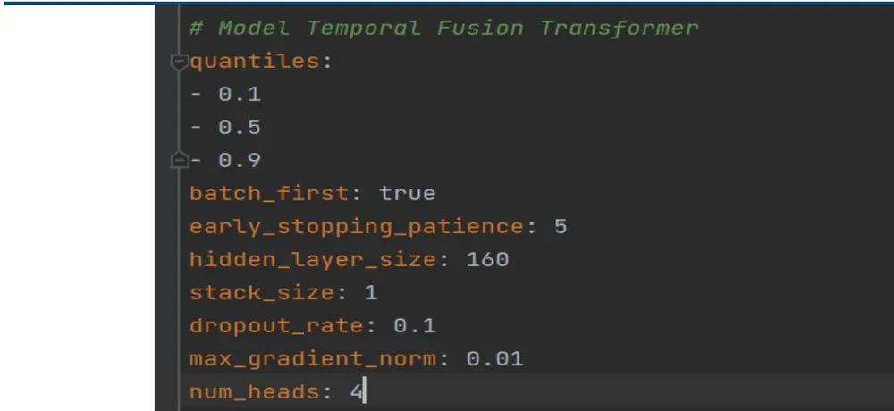
资料来源：中信建投

训练集样本量约为 60 万左右，我们采用 GPU 训练，BATCH SIZE 设为 512，每一个 EPOCH 耗时 20 分钟左右。

图表17： 训练集误差
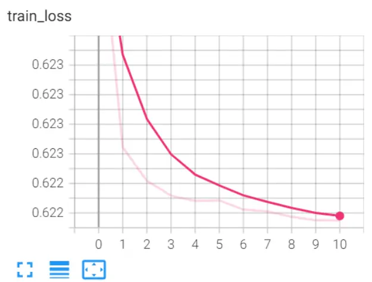
资料来源：WIND，中信建投

图表18： 验证集误差
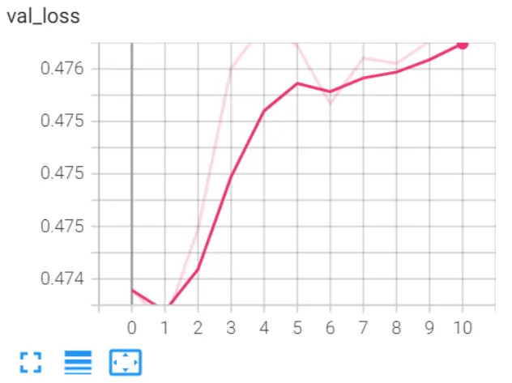
资料来源：WIND，中信建投

从训练集和验证集的误差变化来看，与传统的模型训练最大的不同在于，训练在第二轮就能够达到验证集误差最小。这主要是由于两方面的原因导致的，一是样本量较大， 当采用较小的数据集的话，收敛的 EPOCH随之变大。另外一点主要是由于数据自身的特点决定的，股票收益率属于信噪比极低的数据，并且模式并非一成不变，因此较大的 EPOCH 并不能使网络在样本外取得更优异的表现。

## 五、模型结果

由于我们预测的是未来一日的收益率，属于中高频策略，假如每天全部换仓的话，换手过高，并且对手续费敏感，不太适用于长期投资者。因此我们采用 TopKdropN 的策略，即根据初始信号买入 K 支股票，每天再根据当天的信号，卖出得分最低的 N 支股票，买入得分最高的 N 支股票，通过参数 K 和 N 的调节，可以使收益和换手达到合理区间。

## 5.1 ICIR 加权

作为对比，我们首先采用传统的 ICIR 加权的方法，用 20 个因子合成一个大类因子，然后再根据TopKdropN 的方法构建策略。

策略的具体参数设置如下：

回测区间：20180129-20211231

股票池：中证 500 成份股

基准：中证 500

手续费：双边千 2

加权方式： 等权

策略参数： K=50，N=5

策略的年化收益率为 8.92%，年化超额 4.92%，最大回撤 26.33%，换手率 37.34，信息比率 0.53。从策略的收益曲线可以看出，整体上策略超额收益波动较大，18 年上半年和 20 年下半年策略表现突出，但是在 21年以后，策略的表现较为一般。

图表19： ICIR加权策略净值
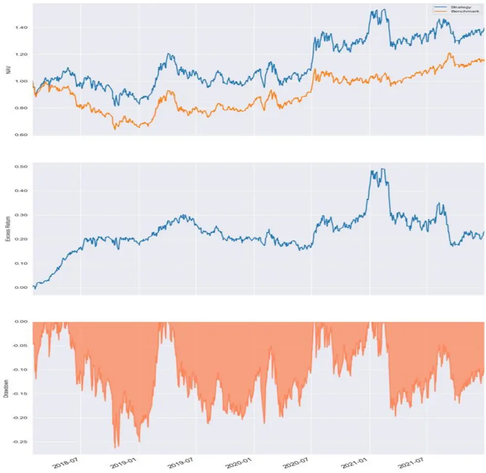
资料来源：WIND，中信建投

图表20： ICIR加权策略统计结果

|  | ICIR 加权 |
| --- | --- |
| CAGR | 8.92% |
| ExMDD | 21.65% |
| MDD | 26.33% |
| Alpha | 4.92% |
| Beta | 1.05 |
| Stdev | 0.26 |
| Sharp | 0.50 |
| IR | 0.53 |
| Turnover | 37.34 |

资料来源：WIND，中信建投

## 5.2 TFT 策略

根据 TFT 模型预测的结果，采用相同的回测设置，策略的表现如下图所示：

图表21： TFT(50,5)策略净值
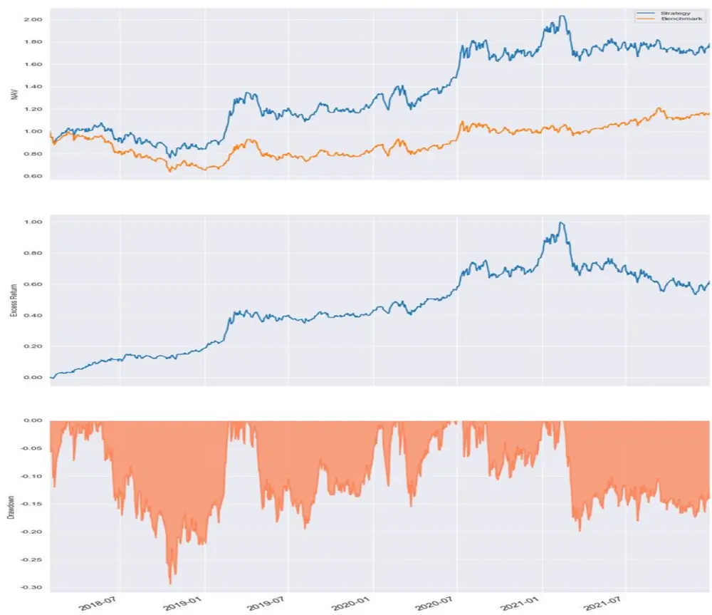
资料来源：WIND，中信建投

相比于传统的 ICIR 加权，TFT 策略的收益率更加稳定，表现也更加优异。策略的年化收益率为 15.94%，年化超额 11.94%，最大回撤 29.43%，换手率 17.36，信息比率 1.22。除了回撤有所增大外，策略在各个维度上均有了大幅提升。策略的最大回撤出现在 18 年下半年，除此之外，在其他时间段，最大回撤基本控制在 15%左右，而与传统方法对比，在 18 年下半年之外，最大回撤基本都在 20%左右，因此整体来看 TFT 能够更好的回撤。从以上对比可以看出，TFT 模型的确能够学习到传统的方式之外的信息。

图表22： TFT(50,5)策略统计结果

|  | TFT 策略 |
| --- | --- |
| CAGR | 15.94% |
| ExMDD | 23.31% |
| MDD | 29.43% |
| Alpha | 11.94% |
| Beta | 1.02 |
| Stdev | 0.25 |
| Sharp | 0.82 |
| IR | 1.22 |
| Turnover | 17.36 |

资料来源：WIND，中信建投

## 5.3 策略优化

中高频策略对于换手率及其敏感，不同换手率下策略的收益可能会有很大的区别，因此我们测试不同 N 下策略的收益和换手率情况：

图表23： 收益率分布
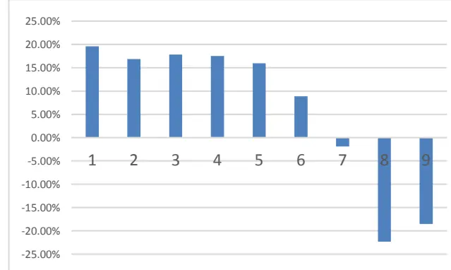
资料来源：WIND，中信建投

图表24： 换手率分布
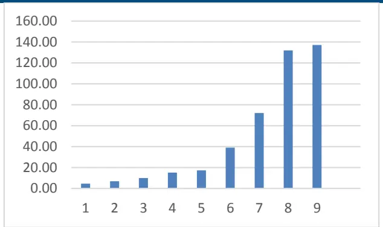
资料来源：WIND，中信建投

可以看出，随着 N 的增加，换手逐步提高，收益逐渐下降。当 N>7 时,换手率超过 70 倍,策略的收益已经不能弥补手续费,导致策略亏损。在 N 较小的情况，换手较低，在 20 倍以内，策略的收益较为稳定。

当 N=1 时，策略的收益最高，策略的年化收益率为 19.57%，年化超额 15.57%，最大回撤 25.99%，换手率4.60，信息比率 1.74。此时换手已经接近中长期持仓策略的换手率，并且策略的收益和稳定性有了明显的提升。从最大回车来看，除去 18 年下半年的最大回车在 26%，其他时间基本都能控制在 10%-15%之间，相比TFT(50,5)的回撤控制更加表现更加突出。

图表25： TFT(50,1)策略净值
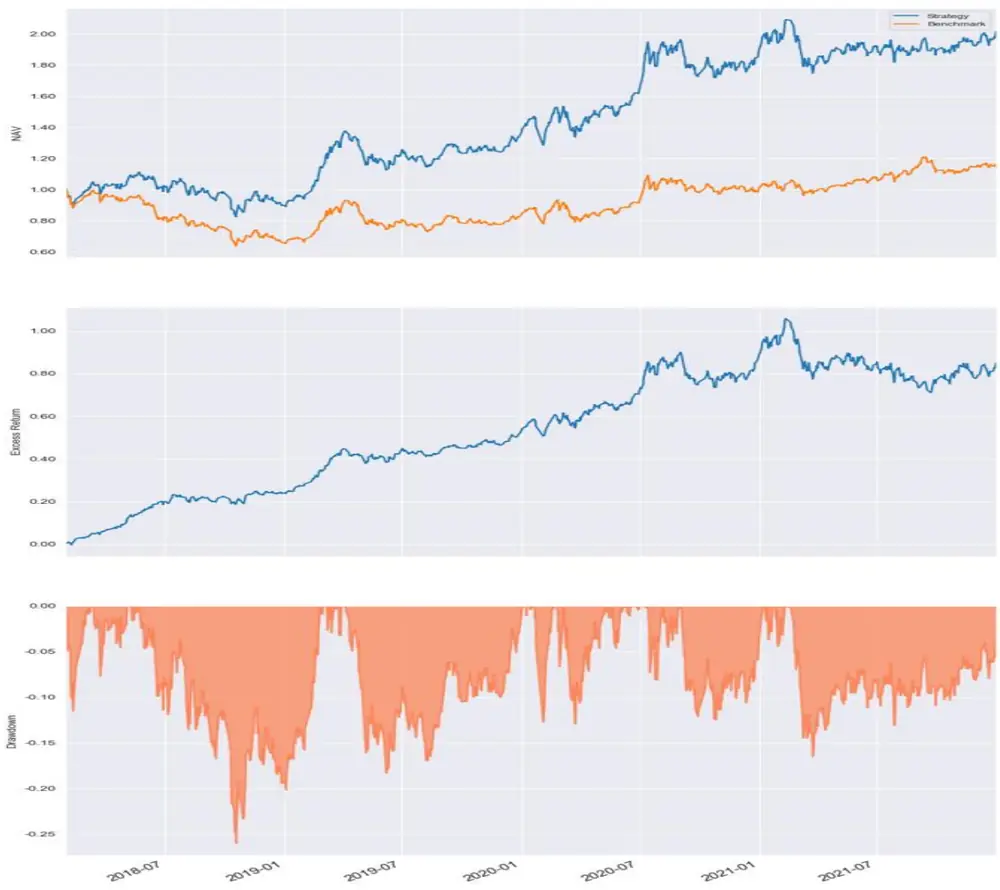
资料来源：WIND，中信建投

图表26： TFT(50,1)策略统计结果

|  | TFT 策略 |
| --- | --- |
| CAGR | 19.57% |
| ExMDD | 16.90% |
| MDD | 25.99% |
| Alpha | 15.57% |
| Beta | 0.99 |
| Stdev | 0.24 |
| Sharp | 1.00 |
| IR | 1.74 |
| Turnover | 4.60 |

资料来源：WIND，中信建投

## 六、结果及讨论

本文通过分析 QLIB 的 ALPHA158 和 ALPHA360 数据，选取 ALPHA360 表现最好的 20 个因子，作为输入，利用 Temporal Fusion Transformer 网络预测股票未来收益率。

从预测结果来看，在模型层面，与传统的 ICIR 加权对比，TFT 模型能够取得更加优异的表现。通过约束不同的换手率，TFT 策略能够取得与中长期策略近似的换手率，并且收益以及稳定性也非常优异。

图表27： 策略对比

|  | ICIR 加权 | TFT (50, 1) |
| --- | --- | --- |
| CAGR | 8.92% | 19.57% |
| ExMDD | 21.65% | 16.90% |
| MDD | 26.33% | 25.99% |
| Alpha | 4.92% | 15.57% |
| Beta | 1.05 | 0.99 |
| Stdev | 0.26 | 0.24 |
| Sharp | 0.50 | 1.00 |
| IR | 0.53 | 1.74 |
| TurnOver | 37.34 | 4.60 |

资料来源：WIND，中信建投

QLIB 提供了非常便捷的数据支持和模型支持，我们后续也将利用 QLIB 和其它的时间序列 Transformer 模型，将其应用于股票市场。

## 分析师介绍

丁鲁明：同济大学金融数学硕士，中国准精算师，现任中信建投证券研究发展部执行总经理，金融工程团队、大类资产配置与基金研究团队首席分析师，中信建投证券基金投顾业务决策委员会成员，上海证券交易所定期专家交流组成员。13 年证券从业，创立国内“量化基本面”投研体系，继承并深入研究经济经典长波体系中的康波周期理论并积极应用于实务，多次对资本市场重大趋势及拐点给出精准预判，对资产配置与经济周期运行具备深刻理解与认知。多次荣获团队荣誉：新财富最佳分析师2009 第 4、2012 第 4、2013 第 1、2014 第 3 等；水晶球最佳分析师 2009 第 1、2013第 1等；Wind金牌分析师 2018年第 2、2019年第 2等、2020年第 4等。

研究助理王 超：南京大学粒子物理博士，曾担任基金公司研究员，券商研究员，有丰富的研究和投资经验，2021 年加入中信建投，主要负责量化多因子选股。

## 评级说明

| 投资评级标准 |  | 评级 | 说明 |
| --- | --- | --- | --- |
| 报告中投资建议涉及的评级标准为报告发布日后6个月内的相对市场表现，也即报告发布日后的6个月内公司股价（或行业指数）相对同期相关证券市场代表性指数的涨跌幅作为基准。A股市场以沪深300指数作为基准；新三板市场以三板成指为基准；香港市场以恒生指数作为基准；美国市场以标普500指数为基准。 | 股票评级 | 买入 | 相对涨幅15%以上 |
|  |  | 增持 | 相对涨幅 5%—15% |
|  |  | 中性 | 相对涨幅-5%—5%之间 |
|  |  | 减持 | 相对跌幅 5%—15% |
|  |  | 卖出 | 相对跌幅15%以上 |
|  | 行业评级 | 强于大市 | 相对涨幅10%以上 |
|  |  | 中性 | 相对涨幅-10-10%之间 |
|  |  | 弱于大市 | 相对跌幅10%以上 |

## 分析师声明

本报告署名分析师在此声明：（i）以勤勉的职业态度、专业审慎的研究方法，使用合法合规的信息，独立、客观地出具本报告, 结论不受任何第三方的授意或影响。（ii）本人不曾因，不因，也将不会因本报告中的具体推荐意见或观点而直接或间接收到任何形式的补偿。

## 法律主体说明

本报告由中信建投证券股份有限公司及/或其附属机构（以下合称“中信建投”）制作，由中信建投证券股份有限公司在中华人民共和国（仅为本报告目的，不包括香港、澳门、台湾）提供。中信建投证券股份有限公司具有中国证监会许可的投资咨询业务资格，本报告署名分析师所持中国证券业协会授予的证券投资咨询执业资格证书编号已披露在报告首页。

本报告由中信建投（国际）证券有限公司在香港提供。本报告作者所持香港证监会牌照的中央编号已披露在报告首页。

## 一般性声明

本报告由中信建投制作。发送本报告不构成任何合同或承诺的基础，不因接收者收到本报告而视其为中信建投客户。

本报告的信息均来源于中信建投认为可靠的公开资料，但中信建投对这些信息的准确性及完整性不作任何保证。本报告所载观点、评估和预测仅反映本报告出具日该分析师的判断，该等观点、评估和预测可能在不发出通知的情况下有所变更，亦有可能因使用不同假设和标准或者采用不同分析方法而与中信建投其他部门、人员口头或书面表达的意见不同或相反。本报告所引证券或其他金融工具的过往业绩不代表其未来表现。报告中所含任何具有预测性质的内容皆基于相应的假设条件，而任何假设条件都可能随时发生变化并影响实际投资收益。中信建投不承诺、不保证本报告所含具有预测性质的内容必然得以实现。

本报告内容的全部或部分均不构成投资建议。本报告所包含的观点、建议并未考虑报告接收人在财务状况、投资目的、风险偏好等方面的具体情况，报告接收者应当独立评估本报告所含信息，基于自身投资目标、需求、市场机会、风险及其他因素自主做出决策并自行承担投资风险。中信建投建议所有投资者应就任何潜在投资向其税务、会计或法律顾问咨询。不论报告接收者是否根据本报告做出投资决策，中信建投都不对该等投资决策提供任何形式的担保，亦不以任何形式分享投资收益或者分担投资损失。中信建投不对使用本报告所产生的任何直接或间接损失承担责任。

在法律法规及监管规定允许的范围内，中信建投可能持有并交易本报告中所提公司的股份或其他财产权益，也可能在过去 个月、目前或者将来为本报告中所提公司提供或者争取为其提供投资银行、做市交易、财务顾问或其他金融服务。本报告内容真实、准确、完整地反映了署名分析师的观点，分析师的薪酬无论过去、现在或未来都不会直接或间接与其所撰写报告中的具体观点相联系，分析师亦不会因撰写本报告而获取不当利益。

本报告为中信建投所有。未经中信建投事先书面许可，任何机构和/或个人不得以任何形式转发、翻版、复制、发布或引用本报告全部或部分内容，亦不得从未经中信建投书面授权的任何机构、个人或其运营的媒体平台接收、翻版、复制或引用本报告全部或部分内容。版权所有，违者必究。

## 中信建投证券研究发展部

中信建投（国际）

北京

东城区朝内大街 2 号凯恒中心

上海

深圳

上海浦东新区浦东南路 528 号南塔 2106 室

B 座 12 层

香港

福田区益田路 6003 号荣超商务

中环交易广场2期18楼

电话：（8610） 8513-0588

中心 B座 22层

电话：（8621） 6882-1600

电话：（86755）8252-1369

电话：（852）3465-5600

联系人：李祉瑶

联系人：翁起帆

邮箱：lizhiyao@csc.com.cn

联系人：曹莹

邮箱：wengqifan@csc.com.cn

联系人：刘泓麟

邮箱：caoying@csc.com.cn

邮箱：charleneliu@csci.hk