证券研究报告·金融工程深度

# “逐鹿”Alpha 专题报告（十一）

——基于限价订单簿数据的 DEEPLOB 模型

## 主要内容

## 简介

近年来，深度学习在寻找庞大样本数据的内在复杂规律上有着出色表现，并被广泛应用于各类领域。而量化领域本身具有数据量多以及模型复杂的特点，因此如何将深度学习应用于量化领域成为行业热点。我们在前期的报告中尝试了使用 TemporalFusion Transformer 结合日频的量价因子对未来的收益进行预测。本文中我们将继续将深度学习模型与高频 level2 数据相结合，对短期收益率进行预测。

## 数据介绍

本文采用米筐提供的 level2 数据，数据采用 blosc 压缩，HDF5存储，单日数据量约为 10G，包含有沪深股票，ETF，LOF 以及可转债的 level2 数据。数据包含逐笔委托(orders)，逐笔成交(trades)和逐笔订单簿(orderbooks)三类信息。我们利用原始的逐笔订单簿数据重构出任意时刻的限价订单簿的截面数据。

## 因子构建

利用重构出的 LOB 数据，选取原始的 40 个量价因子，以及 20个截面类的委托强弱因子和 20 个时间序列类的量化变化率因子。对原始量价因子做进一步处理之后将所有 80 个因子输入模型进行训练。按照收益率阈值 5e-4 将样本分为三个类型，分别定义为涨跌平，作为模型预测目标。

## 模型介绍

DeepLOB 是由 CNN 和 LSTM 构建的深度学习网络，CNN 用于提取特征的空间结构关系，LSTM 用于提取特征的时间序列结构关系。并且充分考虑了网络以及数据之间的相关关系，提取出的高维特征具有一定的经济学含义。

## 训练结果

将 DeepLOB 模型在股票和可转债上进行测试，结果表明，当触发信号参数 N 大于 15 时，股票单次交易的平均收益率超过0.8%，将模型直接应用于可转债，单次交易的平均收益率可以达到 5.55%，收益非常显著。

风险提示：本文所有模型结果均来自历史数据，不保证模型未来的有效性

# 金融工程研究

## 丁鲁明

dingluming@csc.com.cn

021-68821623

执业证书编号：S1440515020001

王 超 研究助理

wangchaodcq@csc.com.cn

18221845405

发布日期： 2022 年 09 月 18 日

## 市场表现

## 相关研究报告

## 一、简介

高频交易是指从极为短暂的市场变化中寻求获利的计算机化交易，由于其稳定的绝对收益，备受市场资金的青睐。高频交易具有交易次数频繁，单次利润较低，中长期收益稳定等特点，然而其局限性在于策略容量相对有限，且交易门槛较高，需要有一定的计算机基础。

高频交易策略主要有做市商策略、市场微观结构策略、事件驱动策略和套利策略等。对于市场微观结构策略，关键点在于对于未来股价走势的判断，传统市场微观结构策略主要用经典模型分析短期的订单属性，盘口数据，交易数据等信息来预测未来的股价走势。

近年来，深度学习在寻找庞大样本数据的内在复杂规律上有着出色表现，并被广泛应用于各类领域，量化领域天然具有数据量较多以及模型复杂的特点，因此如何将深度学习应用于量化行业也成为行业热点。我们在前期的报告中尝试了使用 Temporal Fusion Transformer 结合日频的量价因子对未来的收益进行预测，本文中我们将继续将深度学习模型与高频 level2 数据相结合，对短期收益率进行预测。

## 二、数据介绍

## 2.1 Level2 数据简介

证券市场根据交易机制可大致分为两类：价格驱动型市场和订单驱动型市场。价格驱动型市场中，投资者主要通过做市商来进行买卖报价；驱动型市场中，投资者可跳过做市商直接向交易所发出买卖订单指令，交易所则根据一定的撮合交易规则，对这些订单做出成交或等待的处理，证券的价格即在一次次撮合成交中不断形成与更新。我国沪深股市皆属于订单驱动型市场，2006 年起，上交所和深交所陆续推出了揭示高频交易行情的数据。

Level-1 和 Level-2 是交易所对基本行情和增强行情的一种形象化的表述，Level-2 行情（增强行情）相较于Level-1（基础行情）揭示了更丰富的信息。其中，Level-1 行情主要包括当日的高开低收价、前收价、最新价、当日累计成交数量和金额、以及实时的买卖五个价位的申报价和数量。而 Level-2 在 Level-1 五档盘口的基础上还提供了每个档位上的申报笔数。而两者最大的差异在于，level-1 中仅有分时数据，而 Level-2 数据则包括了逐笔数据，因此 Level-2 数据具有还原出市场的全部实时状态的强大能力。

本文采用米筐提供的 level2 数据，数据采用 blosc 压缩，HDF5 存储，单日数据量约为 10G，包含有沪深股票，ETF，LOF 以及可转债的 level2 数据。数据包含逐笔委托(orders)，逐笔成交(trades)和逐笔订单簿(orderbooks)三类信息。

图表1： 逐笔委托数据概览

|  | seq | timestamp | side | type | quantity | filled_quantity | price | filled_amount | last_traded_timestamp | canceled_timestamp | canceled_seq |
| --- | --- | --- | --- | --- | --- | --- | --- | --- | --- | --- | --- |
| 0 | 0 | 20210104091500590 | 83 | 76 | 1000 | 0 | 58000 | 0 | 0 | 0 | 0 |
| 1 | 1 | 20210104091500590 | 83 | 76 | 1500 | 0 | 56200 | 0 | 0 | 0 | 0 |
| 2 | 2 | 20210104091500590 | 83 | 76 | 555 | 0 | 59500 | 0 | 0 | 0 | 0 |
| 3 | 3 | 20210104091500700 | 83 | 76 | 4300 | 0 | 56300 | 0 | 0 | 0 | 0 |
| 4 | 4 | 20210104091500700 | 83 | 76 | 4200 | 0 | 58800 | 0 | 0 | 0 | 0 |
| .… | .… | . | 11 | …… | . | 1 | . | …… | …… | … | .. |
| 4485 | 8292 | 20210104145913330 | 66 | 76 | 300 | 0 | 54700 | 0 | 0 | 0 | 0 |
| 4486 | 8293 | 20210104145914050 | 66 | 76 | 1900 | 0 | 54700 | 0 | 0 | 0 | 0 |
| 4487 | 8294 | 20210104145932450 | 66 | 76 | 4700 | 4700 | 54800 | 257090000 | 20210104150000990 | 0 | 0 |
| 4488 | 8295 | 20210104145956180 | 66 | 76 | 500 | 0 | 54700 | 0 | 0 | 0 | 0 |
| 4489 | 8296 | 20210104145958650 | 66 | 76 | 300 | 300 | 55300 | 16410000 | 20210104150000990 | 0 | 0 |

资料来源：米筐数据，中信建投

逐笔委托（orders）数据具体存储了所有沪市、深市股票在单个交易日中的委托信息，包括一笔委托订单对应的序列号，提出委托的时间点（精确到毫秒[ms]），买卖方向，委托单类型（市价单或者限价单），委托数量，累计成交量，价格，累积成交额，最后成交时间，撤单时间以及撤单对应序列号等信息。

图表2： 逐笔成交数据概览

|  | seq | timestamp | bid_seq | ask_seq | quantity | price |
| --- | --- | --- | --- | --- | --- | --- |
| 0 | 203 | 20210104092500320 | 202 | 180 | 300 | 54300 |
| 1 | 204 | 20210104092500320 | 198 | 180 | 1000 | 54300 |
| 2 | 205 | 20210104092500320 | 193 | 180 | 100 | 54300 |
| 3 | 206 | 20210104092500320 | 197 | 180 | 200 | 54300 |
| 4 | 207 | 20210104092500320 | 45 | 180 | 100 | 54300 |
| … | … | … | … | .… | … | … |
| 2704 | 8300 | 20210104150000990 | 8296 | 8282 | 300 | 54700 |
| 2705 | 8301 | 20210104150000990 | 8284 | 8282 | 100 | 54700 |
| 2706 | 8302 | 20210104150000990 | 8294 | 8282 | 4399 | 54700 |
| 2707 | 8303 | 20210104150000990 | 8294 | 8287 | 301 | 54700 |
| 2708 | 8304 | 20210104150000990 | 8269 | 8287 | 1699 | 54700 |
| 2709 rows × 6 columns |  |  |  |  |  |  |

资料来源：米筐数据，中信建投

逐笔成交（trades）数据库则存储了所有沪市、深市股票在单个交易日中的成交信息，包括一笔成交对应的序列号，发生的时间点（精确到毫秒[ms]），该笔成交撮合所对应的买单的序号以及卖单的序号，成交数量和成交价格等信息。

图表3： 逐笔订单簿数据概览

| event |  | timestamp | level_at | price | quantity | side | num_orders | buy_upper_price | sell_lower_price | local_timestamp |
| --- | --- | --- | --- | --- | --- | --- | --- | --- | --- | --- |
| 0 | 20210104091500590 |  |  |  |  |  |  |  |  |  |
|  | 73 |  |  | 0 58000 | 1000 | 83 | 1 | 140735340806145 | -1 | 0 |
| 1 | 73 | 20210104091500590 |  | 0 56200 | 1500 | 83 | 1 | 140735340806145 | -1 | 0 |
| 2 | 73 | 20210104091500590 | 2 | 59500 | 555 | 83 | 1 | 140735340806145 | -1 | 0 |
| 3 4 | 73 73 | 20210104091500700 |  | 1 56300 | 4300 | 83 | 1 | 140735340806145 | -1 | 0 |
|  |  | 20210104091500700 |  | 3 58800 | 4200 | 83 | 1 | 140735340806145 | -1 | 0 |
| . 7163 | .. 67 | … | .. |  | … | .… | … | … | . | .. |
| 7164 |  | 20210104150000990 |  | 0 54700 | 2000 | 83 |  | 140735340806145 | -1 | 0 |
| 7165 | 68 | 20210104150000990 |  | 0 54800 | 0 | 66 | 0 | 140735340806145 | -1 | 0 |
|  | 67 67 | 20210104150000990 |  | 0 54700 | 1699 | 83 | 1 | 140735340806145 | -1 | 0 |
| 7166 |  | 20210104150000990 |  | 0 54700 | 14101 | 66 | 10 | 140735340806145 | -1 | 0 |
| 7167 | 68 | 20210104150000990 |  | 0 54700 | 0 | 83 |  | 0 140735340806145 | -1 | 0 |

7168 rows × 10 columns
资料来源：米筐数据，中信建投

逐笔订单簿(orderbooks)数据库具体刻画所有沪市、深市股票在单个交易日中订单簿变动事件，包括订单簿变动的类型（插入/删除/变更），订单簿变动的时间点（精确到毫秒[ms]），对应变更的档位，该档位挂单价，该档位挂单量，买卖方向，该档位的笔数以及价格笼子（买卖方向有效竞价范围）等信息。

## 2.2 数据统计

统计 2022 年第一个交易日沪深股票当日的逐笔订单簿以及逐笔成交所包含的信息量。

图表4： 股票每日订单数据频率分布（逐笔订单簿信息统计）
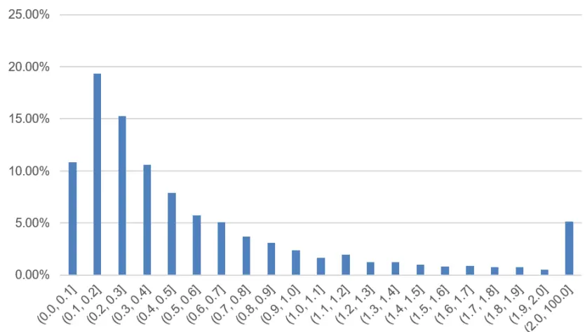

|  | 笔数 | 频率 |
| --- | --- | --- |
| count | 4592 | 4592 |
| mean | 6.85E+04 | 0.21 |
| std | 8.40E+04 | 0.17 |
| min | 9.82E+02 | 14.66 |
| 25% | 2.05E+04 | 0.70 |
| 50% | 4.29E+04 | 0.34 |
| 75% | 8.42E+04 | 0.17 |
| max | 1.24E+06 | 0.01 |

资料来源：米筐数据，中信建投

股票的每日订单薄数据频率存在较大的差异，变动频率最快为 0.01s/笔（124 万条交易记录），最慢为14.66s/笔（982 条交易记录), 中位数为 0.34s/笔（4.29 万条交易记录)。其中，0.1-0.2 内股票占比接近 20%，<0.5s 的股票占比约为 64%。

图表5： 股票每日交易数据频率分布（逐笔交易信息统计）
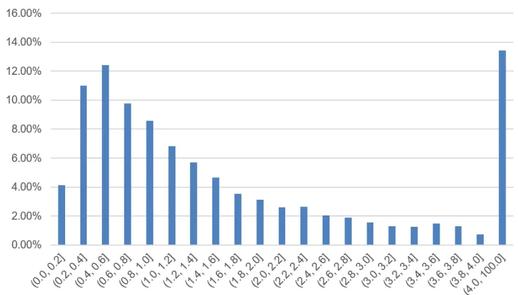

|  | 笔数 | 频率 |
| --- | --- | --- |
| count | 4592 | 4592 |
| mean | 2.07E+04 | 0.70 |
| std | 2.49E+04 | 0.58 |
| min | 8.00E+01 | 180.00 |
| 25% | 6.01E+03 | 2.40 |
| 50% | 1.30E+04 | 1.11 |
| 75% | 2.59E+04 | 0.56 |
| max | 2.69E+05 | 0.05 |

资料来源：米筐数据，中信建投

股票的每日交易频率也呈现出较大差异，交易频率最高为 0.05s/笔（26.9 万条交易记录），最慢为 180.00s/笔（80 条交易记录), 中位数为 1.11s/笔（1.30 万条交易记录)。从频率分布来看，0.4-0.6s 内股票占约 12%，<1s的股票占比约为 46%。

## 2.3 限价订单簿(LOB)重构

逐笔订单簿记录了订单簿的变动事件，每次订单簿发生变动后，相应档位价格和量的变化信息均记录在逐笔订单簿文件中，是一类信息流的概念。对于经典的深度学习模型而言，结构化的数据更容易处理，所谓结构化数据，是指特征具有固定的格式，例如十个档位的委托量和价格数据。因此需要将原始信息流数据还原成具有固定格式的结构化数据。

通过变动信息还原原始订单簿数据本质上就是从一阶差分之后的结果还原原始值，有初始状态的信息即可还原。对于订单簿数据，初始状态显然是各档位均为 0。 经过累计迭代计算之后，可以重构出任意 tick 下的十档的委托量和委托价格数据。

图表6： 订单簿变动信息
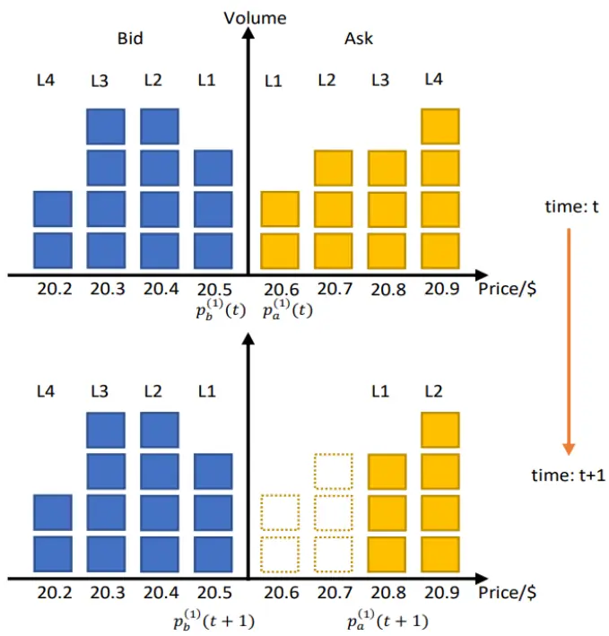
DeepLOB: Deep Convolutional Neural Networks for Limit Order Books

图表7： 限价订单簿数据

|  | b1 b1_v | b1_n | b2 | b2_v | b2_n | b3 b3_v | b3_n | b4 | b4_v | b4_n | b5 | b5_v | b5_n |
| --- | --- | --- | --- | --- | --- | --- | --- | --- | --- | --- | --- | --- | --- |
| 2021-12-31 09:32:42 | 200300 3500 | 6 |  | 200200 28600 | 28 | 200100 40500 | 34 |  | 200000 139300 127 |  | 199900 8100 |  | 6 |
| 2021-12-31 09:32:42 | 200300 3500 | 6 |  | 200200 28600 | 28 | 200100 40500 | 34 |  | 200000 140100 128 |  | 199900 8100 | 6 |  |
| 2021-12-31 09:32:42 | 200300 3500 | 6 |  | 200200 28600 | 28 | 200100 40500 | 34 |  | 200000 140100 128 |  | 199900 8100 |  | 6 |
| 2021-12-31 09:32:42 | 200400 200 | 1 |  | 200300 3500 | 6 | 200200 28600 | 28 |  | 200100 40500 | 34 | 200000 140100 128 |  |  |
| 2021-12-31 09:32:42 | 200300 3500 | 6 |  | 200200 28600 | 28 | 200100 40500 | 34 |  | 200000140100128 |  | 199900 8100 |  | 6 |
| 2021-12-31 09:32:42 | 200300 3500 | 6 |  | 200200 28600 | 28 | 200100 40500 | 34 |  | 200000 140100 128 |  | 199900 8100 |  | 6 |
| 2021-12-31 09:32:42 | 200400 200 | 1 |  | 200300 3500 | 6 | 200200 28600 | 28 |  | 200100 40500 | 34 | 200000 140100 128 |  |  |
| 2021-12-31 09:32:42 | 200300 3500 | 6 |  | 200200 28600 | 28 | 200100 40500 | 34 |  | 200000 140100 128 |  | 199900 8100 |  | 6 |
| 2021-12-31 09:32:42 | 200300 3500 | 6 |  | 200200 28600 | 28 | 200100 40500 | 34 |  | 200000 140100 128 |  | 199900 8100 |  | 6 |
| 2021-12-31 09:32:42 | 200600 500 | 1 |  | 200300 3500 | 6 | 200200 28600 | 28 |  | 200100 40500 | 34 | 200000 140100 128 |  |  |
| 2021-12-31 09:32:42 | 200300 3500 | 6 |  | 200200 28600 | 28 | 200100 40500 | 34 |  | 200000 140100 128 |  | 199900 8100 |  | 6 |
| 2021-12-31 09:32:42 | 200300 3500 | 6 |  | 200200 28600 | 28 | 200100 40500 | 34 |  | 200000 140100 128 |  | 199900 8100 |  | 6 |
| 2021-12-31 09:32:42 | 200300 3500 | 6 |  | 200200 28600 | 28 | 200100 40500 | 34 |  | 200000 140100 128 |  | 199900 8100 |  | 6 |
| 2021-12-31 09:32:42 | 200300 3400 | 6 |  | 200200 28600 | 28 | 200100 40500 | 34 |  | 200000 140100 128 |  | 199900 8100 |  | 6 |
| 2021-12-31 09:32:42 | 200300 3400 | 6 |  | 200200 28600 | 28 | 200100 40500 | 34 |  | 200000 140100 128 |  | 199900 8100 |  | 6 |
| 2021-12-31 09:32:42 | 200300 3400 | 6 |  | 200200 28600 | 28 | 200100 40500 | 34 |  | 200000 140100 128 |  | 199900 8100 |  | 6 |
| 2021-12-31 09:32:42 | 200300 4300 | 7 |  | 200200 28600 | 28 | 200100 40500 | 34 |  | 200000 140100 128 |  | 199900 8100 |  | 6 |
| 2021-12-31 09:32:42 | 200300 4300 | 7 |  | 200200 28600 | 28 | 200100 40500 | 34 |  | 200000 140100 128 |  | 199900 8100 |  | 6 |
| 2021-12-31 09:32:42 | 200500 200 | 1 |  | 200300 4300 | 7 | 200200 28600 | 28 |  | 200100 40500 | 34 | 200000 140100 128 |  |  |
| 2021-12-31 09:32:42 | 200300 4300 | 7 |  | 200200 28600 | 28 | 200100 40500 | 34 |  | 200000 140100 128 |  | 199900 8100 |  | 6 |
| 2021-12-31 09:32:42 | 200300 4300 | 7 |  | 200200 28600 | 28 | 200100 40500 | 34 |  | 200000 140100 128 |  | 199900 8100 |  | 6 |
| 2021-12-31 09:32:43 | 200900 1000 | 1 |  | 200300 4300 | 7 | 200200 28600 | 28 |  | 200100 40500 | 34 | 200000 140100 128 |  |  |

ricequant

## 三、因子构建

## 3.1 高频因子

在重构出 数据之后，需要进一步构建高频因子。一般来讲，高频因子可以分为两大类，截面因子和时间序列因子。截面因子包含我们常见的原始量价因子，盘口相对强弱，价差因子等。时间序列因子构造的方式较多，量价的变化率，量价一阶导，二阶导，资金流，列表击穿，‘spoofing’因子等等。

图表8： 高频因子集合

| TABLE 4 Feature sets |  |  |
| --- | --- | --- |
| Feature set | Description | Details |
| Basic Time-insensitive | $u_{1}=\{P_{i}^{\mathrm{ask}},V_{i}^{\mathrm{ask}},P_{i}^{\mathrm{bid}},V_{i}^{\mathrm{bid}}\}_{i=1}^{n}$ | 10(= n)-level LOB data |
|  | $u_{2}=\{(P_{i}^{\mathrm{ask}}-P_{i}^{\mathrm{bid}}),(P_{i}^{\mathrm{ask}}+P_{i}^{\mathrm{bid}})/2\}_{i=1}^{n}$ | Spread & Mid-price |
|  | $\begin{array}{r}{u_{3}=\{P_{n}^{\mathrm{ask}}-P_{1}^{\mathrm{ask}},P_{1}^{\mathrm{bid}}-P_{n}^{\mathrm{bid}},\|P_{i+1}^{\mathrm{ask}}-P_{i}^{\mathrm{ask}}\|,\|P_{i+1}^{\mathrm{bid}}-P_{i}^{\mathrm{bid}}\|\}_{i+1}^{n}}\end{array}$ | Price differences |
|  | $u_{4}=\left\{{\textstyle\frac{1}{n}}\sum_{i=1}^{n}P_{i}^{\mathrm{ask}},{\textstyle\frac{1}{n}}\sum_{i=1}^{n}P_{i}^{\mathrm{bid}},{\textstyle\frac{1}{n}}\sum_{i=1}^{n}V_{i}^{\mathrm{ask}},{\textstyle\frac{1}{n}}\sum_{i=1}^{n}V_{i}^{\mathrm{bid}}\right\}$ | Price & Volume means |
|  | $u_{5}=\left\{\sum_{i=1}^{n}(P_{i}^{\mathrm{ask}}-P_{i}^{\mathrm{bid}}),\sum_{i=1}^{n}(V_{i}^{\mathrm{ask}}-V_{i}^{\mathrm{bid}})\right\}$ | Accumulated differences |
| Time-sensitive | $u_{6}=\left\{{\mathrm{d}P_{i}^{\mathrm{ask}}}/{\mathrm{d}t},{\mathrm{d}P_{i}^{\mathrm{bid}}}/{\mathrm{d}t},{\mathrm{d}V_{i}^{\mathrm{ask}}}/{\mathrm{d}t},{\mathrm{d}V_{i}^{\mathrm{bid}}}/{\mathrm{d}t}\right\}_{i=1}^{n}$ | Price & Volume derivation |
|  | $u_{7}=\left\{\lambda_{\Delta t}^{1},\lambda_{\Delta t}^{2},\lambda_{\Delta t}^{3},\lambda_{\Delta t}^{4},\lambda_{\Delta t}^{5},\lambda_{\Delta t}^{6}\right\}$ | Average intensity per type |
|  | $\begin{array}{r}{u_{8}=\left\{\mathbf{1}_{\lambda_{\Delta_{t}}^{1}>\lambda_{\Delta_{T}}^{1}},\mathbf{1}_{\lambda_{\Delta_{t}}^{2}>\lambda_{\Delta_{T}}^{2}},\mathbf{1}_{\lambda_{\Delta_{t}}^{3}>\lambda_{\Delta_{T}}^{3}},\mathbf{1}_{\lambda_{\Delta_{t}}^{4}>\lambda_{\Delta_{T}}^{4}},\mathbf{1}_{\lambda_{\Delta_{t}}^{5}>\lambda_{\Delta_{T}}^{5}},\mathbf{1}_{\lambda_{\Delta_{t}}^{6}>\lambda_{\Delta_{T}}^{6}}\right\}}\end{array}$ | Relative intensity comparison |
|  | $u_{9}=\{{\mathrm{d}}\lambda^{1}/{\mathrm{d}}t,{\mathrm{d}}{\lambda^{2}}/{\mathrm{d}}t,{\mathrm{d}}{\lambda^{3}}/{\mathrm{d}}t,{\mathrm{d}}{\lambda^{4}}/{\mathrm{d}}t,{\mathrm{d}}{\lambda^{5}}/{\mathrm{d}}t,{\mathrm{d}}{\lambda^{6}}/{\mathrm{d}}t\}$ | Limit activity acceleration |

Benchmark Dataset for Mid-Price Forecasting of Limit Order Book Data with Machine Learning Methods

本报告选取了 80 个高频因子，其中包括 40 个原始量价因子，20 个横截面类因子以及 20 个时间序列类因子。

由于每只股票的价格以及委托量差异巨大，需要将数据做进一步标准化处理。并且为了更好的提高模型的预测能力，除了原始的量价信息之外，我们也尝试加入一些比较经典的高频因子。

对于量价数据的标准化，一般采用两种方式：z-score 或者 min-max 标准化。需要注意的是，无论采用哪种方式，统计信息（z-score 中的均值，标准差，min-max 中的最小值，最大值）均只能采用历史信息。

两种标准化方式各有优劣，min-max 标准化之后极值较少，但是模型训练效果相对较差。z-score 标准化之后极值较多，尤其是价格数据，直接训练效果也较差，需要做进一步处理。

最终对于价格数据，我们采用当前价格/昨日收盘价的方式标准化，对于委托量数据，采用原始的 z-score方式，均值标准差均来自前一日的统计值。并且将最终的因子值限制在（-1，1）之间。

原始量价因子共计 40 个维度。除了这 40 因子之外，我们加入了 20 个截面因子以及 20 个时间序列因子。

20 个截面因子的定义为：

$$
\sum_{i=1}^{10}\frac{P_{bt}^{i}}{P_{at}^{i}+P_{bt}^{i}},\sum_{i=1}^{10}\frac{V_{bt}^{i}}{V_{at}^{i}+V_{bt}^{i}}
$$

分别代表了量价的盘口订单委托强弱，其中 P 为价格，V 为委托量，b 代表 bid，a 代表 ask，i 代表档位，取值从 1 到 10。

20 个时间序列因子定义为：

$$
\Delta P_{t}^{i},\Delta V_{t}^{i}
$$

代表了量价的变化率，时间长度取 100 个 tick。

## 3.2 标签构建

本文是一个三分类问题，需要将样本按照收益率分为涨跌平三个样本。为了构建分类标签，首先定义基准价格，高频中常见的价格包括中间价以及委托量加权价格，本篇我们采用中间价作为基准。具体定义为买一价和卖一价的平均值。在计算收益率时，取下一个 tick 到之后 101 个 tick 的收益率。

样本内股票的收益率分布如下图所示。从分布可以看出，样本内收益率具有两个特点，首先收益率具有明显的对称性，0.05 和 0.95 分位数下对应的收益率分别为-0.221%和 0.225%，0.15 和 0.85 分位数下对应的收益率分别为-0.093%和 0.093%。其次，收益率为 0 的占比较高，从 0.4 分位数到 0.6 分位数收益率均为 0，说明样本内至少有 20%的样本收益率为 0。

图表9： 收益率分布
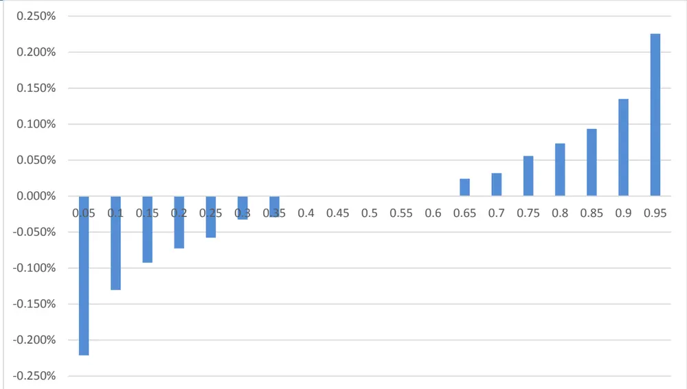
ricequant

为了考虑交易成本，本报告采用三分类的方式，将收益率最低的一组标记为 0，最高的一组标记为 2，中间的样本标记为 1.

在对收益率进行分类时，有相对标签和绝对标签两种方式，相对标签按照股票日内的收益率的 1/3 和 2/3分位数进行分类，但是对于某些股票，由于收益率为 0 占比较高，相对标签分类会出现问题，并且相对分类不符合日内交易的逻辑，日内高频交易追求绝对收益，按照相对标签的分类并不能确保预测收益率为正。

因此，我们采用绝对收益的方式进行分类。收益率的阈值设为 5e-4，对应交易时印花税的收费标准。将收益率大于 5e-4 的样本标价为 2，小于-5e-4 的样本标记为 0，中间的样本标记为 1。0/1/2 样本占比分别为25.6%，49%，25.4%。相对较为均衡。

## 四、模型介绍

## 4.1 DeepLOB 模型

在 DeepLOB: Deep Convolutional Neural Networks for Limit Order Books 一文中，Z. Zhang, S. Zohrenand S. Roberts 等人提出了基于 CNN 和 LSTM 结构的深度学习网络 DeepLOB，用于预测限价订单簿的价格运动。

DeepLOB 的结构可以分为三部分，首先第一部分是一个三层的 CNN 结构，用于捕捉特征的空间结构，提

取高维特征。原始的 DeepLOB 输入为 40 个特征因子，经过 3 层网络之后，将 40 个特征维度压缩到了一个高维特征。

图表10： DeepLOB 模型结构
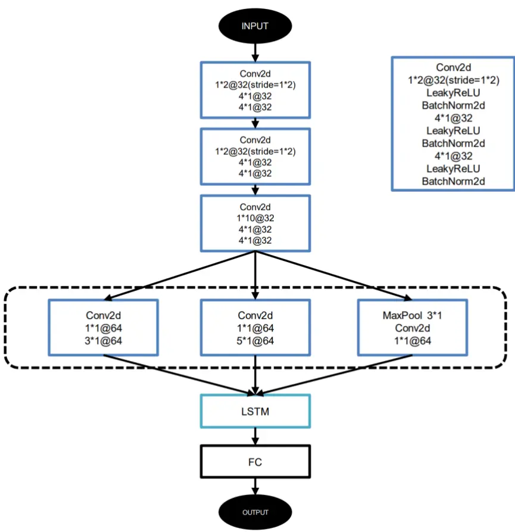
资料来源：中信建投

在原始 40 个因子的基础上，本文新加入了 40 个横截面因子以及时间序列因子，能够有效提高模型的预测能力，为了使经过第一部分网络之后依旧输出 n*1 结构的特征，可以采用加“深”网络或者加“宽”网络的方式实现。

加“深”的 DeepLOB 网络在第一部分加一层 CNN 网络，通过 1*2 的卷积以及 1*2 步长的操作实现特征压缩一倍。保持最终结果宽度不变。

加“宽”的 DeepLOB 网络是将输入分为两个 40 维度特征，分别进入两个三层的 CNN 网络，再将最终的结果拼接，同样能够保证输出宽度不变。

通过对比两者的表现，加“深”的 DeepLOB 效果优于加“宽”的 DeepLOB 结构，原因在于更深的网络能够提取因子更高维度的特征，因此本文我们采用加“深”的 DeepLOB 结构。

图表11： 加“深”DeepLOB
图表12： 加“宽”DeepLOB
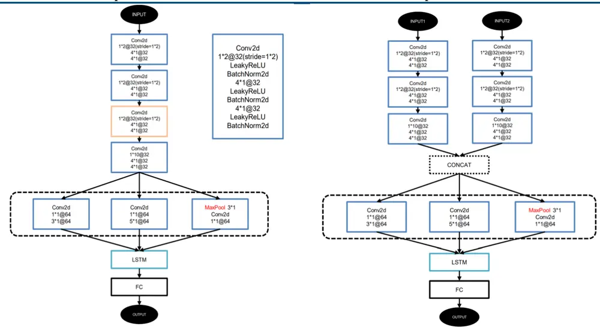
资料来源：中信建投
资料来源：中信建投

第一部分的网络全三层结构一致，均为 1*2 卷积接两个 4*1 卷积。第一层 1*2 的卷积以及 1*2 步长的操作能够确保卷积核的权重 w1 和 w2 分别对应价格和量的权重，实现委买/委卖相应档位的量价线性组合的特征提取。之后的 4*1 卷积实现的时间维度上特征的加权降噪。

第二层和第三层的 1*2 卷积分别提取各个档位的微观价格以及相邻两档的微观价格加权的特征。经过前三层的网络之后，原始的 100*80 特征压缩到了 82*10，再经过第四层的 1*10 卷积，最终将空间维度上 80 个特征压缩到了一个高维特征。

图表13： CNN提取空间高维特征
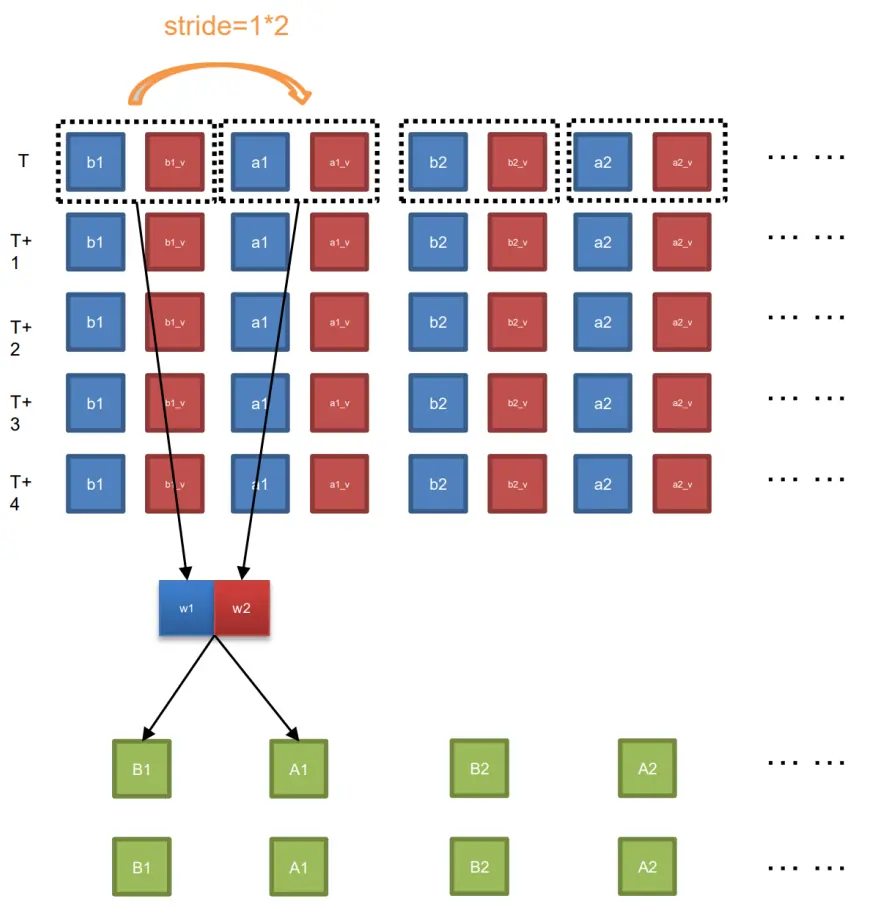
资料来源：中信建投

DeepLOB 第二部分是三个并联的 CNN 网络，与经典的 Inception 网络结构非常类似，加入 1*1 的卷积核能够有效提高网络的非线性表达能力。

经过前两部分网络之后，得到的中间结果是一维的时间序列特征，对于时间序列而言，使用 LSTM 网络能够得到较好的结果。最终经过一个全连接层得到预测结果。

## 4.2 模型训练

训练集的数据采用 2022 年 1 月 4 日至 2022 年 1 月 10 日共 5 天的数据，验证集采用 2022 年 1 月 11 日数据，测试集采用 2022 年 1 月 12 日至 2022 年 1 月 17 日 4 天的数据。

为了减少实际交易冲击成本，股票选择流动性较好的标的，筛选标准为样本内 500 成份股平均换手率最高的十只股票。最终的股票列表为：

图表14： 训练标的

| 股票代码 | 股票简称 |
| --- | --- |
| 300088 | 长信科技 |
| 002603 | 以岭药业 |
| 600466 | 蓝光发展 |
| 000778 | 新兴铸管 |
| 000723 | 美锦能源 |
| 600956 | 新天绿能 |
| 300418 | 昆仑万维 |
| 600158 | 中体产业 |
| 300182 | 捷成股份 |
| 000970 | 中科三环 |

ricequant

这 10 只股票在样本内总共有 17922897 条数据，平均每只股票每天的数据量为 35 万条左右。由于每个样本均为 100 个 tick 的时间序列，为了避免信息过于重复，在采样时每 10 个 tick 采样一次。

训练的损失函数为 CrossEntropyLoss，具体定义为：

$$
\begin{array}{r}{H(p,q)=-\sum_{x}(p(x)logq(x)}\end{array}
$$

优化器为 Adam，学习率设为 1e-4，batch size 为 128，在此 batch size 下，对应的显存占用为 18G 左右，每轮 epoch 训练耗时 12 分钟左右。

最终训练的误差收敛以及准确率情况如下图所示：

图表15： 训练集误差
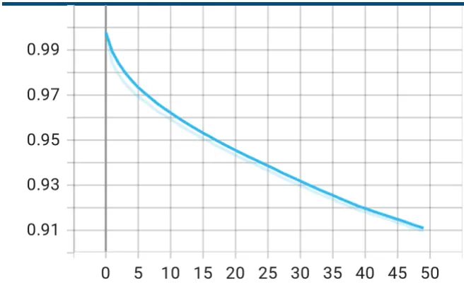
ricequant

图表16： 验证集误差
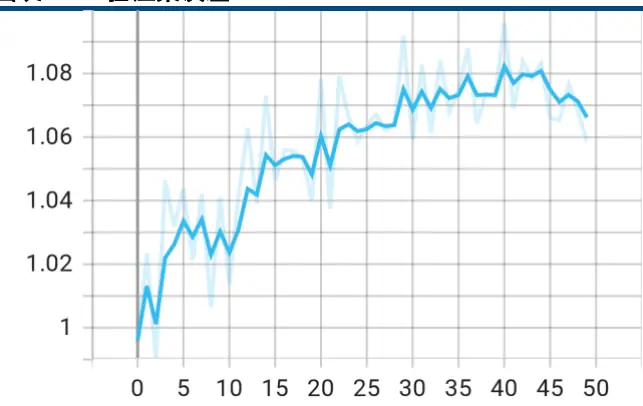
ricequant

金融工程专题报告

图表17： 训练集准确率
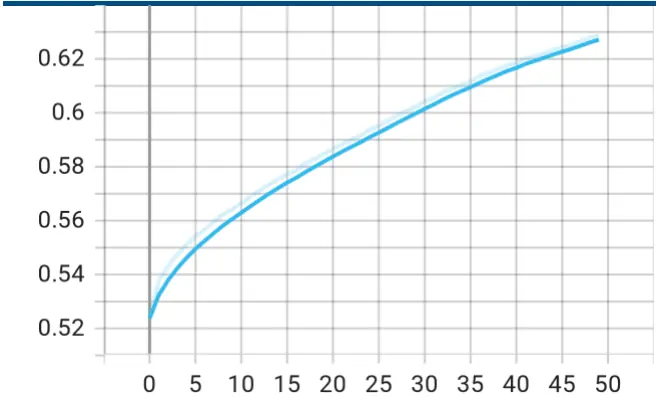
ricequant

图表18： 验证集准确率
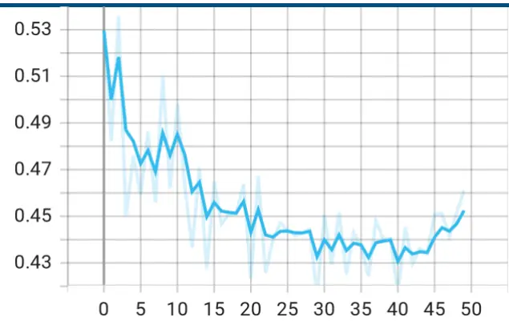
ricequant

与我们之前的报告 Temporal Fusion Transformer 模型相类似，训练集上误差随着训练轮数增大而减小，而在验证集上，很快便得到了模型误差最小的结果。

## 五、训练结果

我们将样本内训练得到的模型应用于样本外的预测，在测试集，我们更关注预测结果是否能够为实际交易带来收益。需要注意的是，我们的预测的每 10 个 tick 预测一次，如果在每次触发信号之后都进行交易，那平均每只股票每天将交易数万次，难以实现。因此在实际测算时，只有当连续 N 次触发相同的信号之后才进行交易。例如连续 N 次预测为 0 时，如果此时没有持仓，开空仓，如果此时有多头仓位，则平多。反之亦然。

## 5.1 股票收益率

首先，将模型应用于训练时的股票在样本外的预测，在连续 N 次触发信号之后进行交易。平均每次交易的平均收益率与参数 N 的关系如下图所示。

当 N 取 6 时，平均每只股票每天交易 90 次，单次交易的平均收益率为 0.11%。当 N 取 20 时，平均每只股票每天交易 2.7 次，单次交易的平均收益率为 1.15%。在 N 小于 15 时，单次交易的平均收益率并不显著，当 N大于 15 之后，单次交易的平均收益率大部分都大于 0.8%，较为显著。

N 代表了日内趋势预测的显著程度，N 越大，说明日内趋势越显著，此时单次交易的收益较高，说明了日内交易具有短期动量效应。

图表19： 股票平均收益率
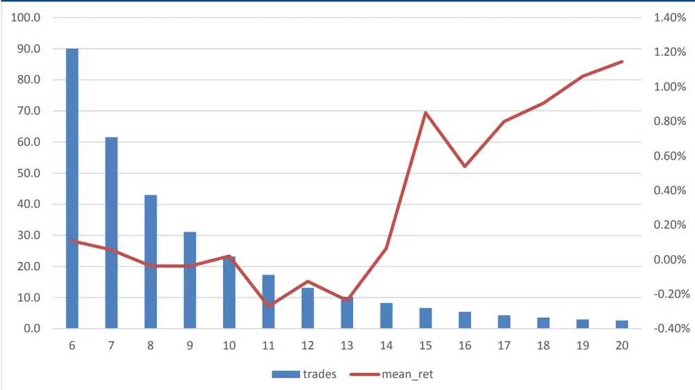
ricequant

图表20： 股票平均收益率

| 信号触发 | 交易次数 | 单次平均收益 |
| --- | --- | --- |
| 6 | 90.0 | 0.11% |
| 7 | 61.6 | 0.06% |
| 8 | 43.0 | -0.04% |
| 9 | 31.1 | -0.04% |
| 10 | 23.2 | 0.02% |
| 11 | 17.3 | -0.27% |
| 12 | 13.1 | -0.13% |
| 13 | 10.3 | -0.24% |
| 14 | 8.3 | 0.07% |
| 15 | 6.7 | 0.85% |
| 16 | 5.4 | 0.54% |
| 17 | 4.3 | 0.80% |
| 18 | 3.6 | 0.90% |
| 19 | 3.0 | 1.06% |
| 20 | 2.7 | 1.15% |

ricequant

上述收益率均为费前收益率，为了综合考量交易次数，交易成本的影响，我们假设股票没有交易限制可以做日内回转交易。

股票的累计收益率如下图所示。可以看出在 N 较小时，累计收益收到交易手续费影响较大，在单边万五（双边千一）的手续费下，N=6 的累计收益率达到 16.8%，而在单边千一的手续费下，N=11 的累计收益率为0.9%。

当 N 大于 15 时，交易手续费对累计收益影响较小，当 N=20 时，单边万五到单边千一的累计收益率差距为 0.2%，此时累计收益率为 6%左右。

图表21： 股票累计收益率
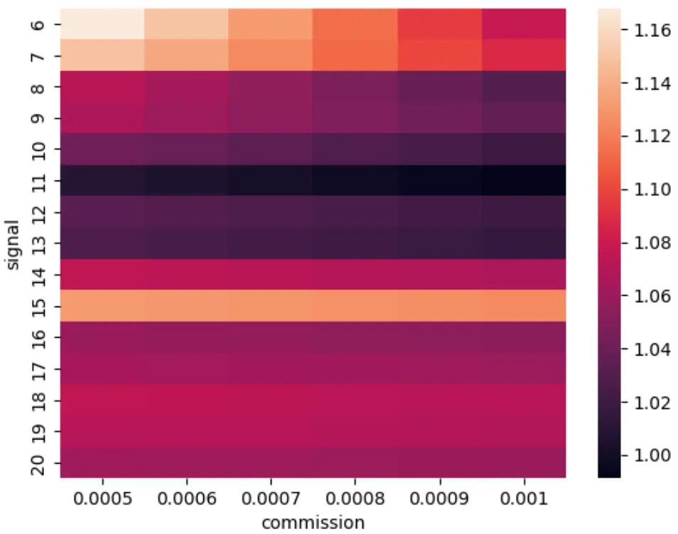
ricequant

图表22： 股票累计收益率

|  | 0.0005 | 0.0006 | 0.0007 | 0.0008 | 0.0009 | 0.001 |
| --- | --- | --- | --- | --- | --- | --- |
| 6 | 116.8% | 115.0% | 113.2% | 111.4% | 109.6% | 107.8% |
| 7 | 114.9% | 113.7% | 112.5% | 111.2% | 110.0% | 108.8% |
| 8 | 107.2% | 106.4% | 105.5% | 104.7% | 103.8% | 102.9% |
| 9 | 106.7% | 106.0% | 105.4% | 104.8% | 104.2% | 103.6% |
| 10 | 104.3% | 103.8% | 103.4% | 102.9% | 102.4% | 102.0% |
| 11 | 100.9% | 100.5% | 100.2% | 99.8% | 99.5% | 99.1% |
| 12 | 103.3% | 103.0% | 102.7% | 102.5% | 102.2% | 102.0% |
| 13 | 102.6% | 102.4% | 102.2% | 102.0% | 101.8% | 101.6% |
| 14 | 107.5% | 107.4% | 107.2% | 107.0% | 106.9% | 106.7% |
| 15 | 113.2% | 113.0% | 112.9% | 112.8% | 112.6% | 112.5% |
| 16 | 105.9% | 105.7% | 105.6% | 105.5% | 105.4% | 105.3% |
| 17 | 106.4% | 106.4% | 106.3% | 106.2% | 106.1% | 106.0% |
| 18 | 107.5% | 107.5% | 107.4% | 107.3% | 107.3% | 107.2% |
| 19 | 107.2% | 107.1% | 107.1% | 107.0% | 107.0% | 106.9% |
| 20 | 106.1% | 106.1% | 106.0% | 106.0% | 105.9% | 105.9% |

ricequant

考虑到实际交易时有一定的滞后性，我们分别测试下一个 tick，下五个 tick 以及下十个 tick 成交时对策略收益的影响。可以看出，当 N 较小，交易频繁时，交易速度对收益率影响较大，当 N 较大时，交易速度对于策略的收益率影响相对较小。

图表23： 交易滞后影响

| N | 滞后 TICK |  | 手续费 | 累计收益率 |
| --- | --- | --- | --- | --- |
| 6 | 1510 |  | 0.1%0.1% | 7.79%5.68% |
|  |  |  | 0.1% | -5.44% |
| 7 | 1510 |  | 0.1%0.1%0.1% | 8.77%3.12%0.00% |
| 8 | 1510 |  | 0.1%0.1%0.1% | 2.94%-5.42%-2.87% |
| 9 | 1510 |  | 0.1%0.1%0.1% | 3.55%-2.01%-0.26% |
| 10 | 1510 |  | 0.1%0.1%0.1% | 1.97%0.23%-0.55% |
| 11 | 1510 |  | 0.1%0.1%0.1% | -0.90%-1.49%-1.37% |
| 12 | 1510 |  | 0.1%0.1%0.1% | 1.93%1.78%1.99% |
| 13 |  | 1510 | 0.1%0.1%0.1% | 1.59%3.87%3.98% |
| 14 | 1 | 150 | 0.1%0.1%0.1% | 6.70%6.18%6.22% |
| 15 |  | 1510 | 0.1%0.1%0.1% | 12.47%11.95%11.87% |
| 16 |  | 1510 | 0.1%0.1%0.1% | 5.20%5.35%5.13% |
| 17 |  | 1510 | 0.1%0.1%0.1% | 5.87%6.22%6.07% |
| 18 | 1510 |  | 0.1%0.1%0.1% | 7.02%6.88%7.15% |
| 19 | 1 | 0 | 0.1%0.1%0.1% | 6.82%6.75%6.76% |
| 20 | 1510 |  | 0.1%0.1%0.1% | 5.87%5.79%5.79% |

ricequant

## 5.2 可转债收益率

为了验证模型的泛化能力，将股票训练得到的模型不做任何微调，直接应用于可转债预测。可转债日内交易不受限制，且交易不收取印花税，非常适合做高频交易。

与股票类似，同样选取样本内平均换手率最高的 10 只可转债，在样本外，可转债的单次交易的平均收益率如下图所示：

图表24： 可转债平均收益率
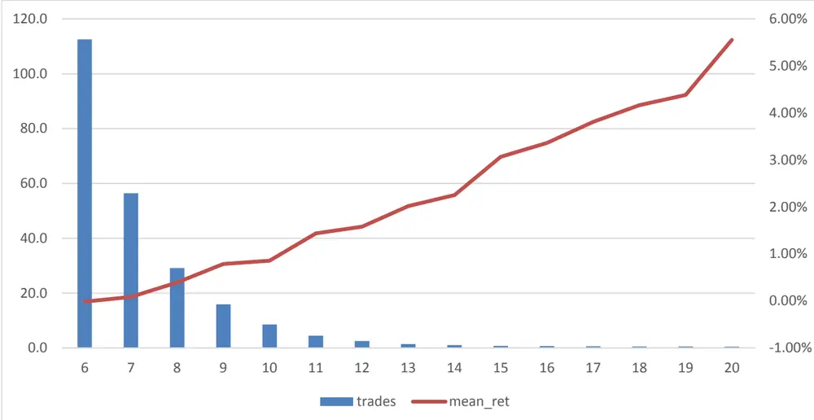
ricequant

图表25： 可转债平均收益率

| 信号触发 | 交易次数 | 单次平均收益 |
| --- | --- | --- |
| 6 | 112.6 | -0.01% |
| 7 | 56.4 | 0.08% |
| 8 | 29.1 | 0.39% |
| 9 | 15.9 | 0.79% |
| 10 | 8.6 | 0.85% |
| 11 | 4.4 | 1.44% |
| 12 | 2.5 | 1.58% |
| 13 | 1.4 | 2.02% |
| 14 | 1.1 | 2.25% |
| 15 | 0.8 | 3.07% |
| 16 | 0.7 | 3.36% |
| 17 | 0.6 | 3.81% |
| 18 | 0.6 | 4.17% |
| 19 | 0.5 | 4.38% |
| 20 | 0.4 | 5.55% |

ricequant

与股票相比，可转债的单次交易收益率更加显著，当 N 取 20 时，单次交易的平均收益率为 5.55%，且随着 N 的增大，平均收益率具有明显的单调性。但是由于可转债信号触发次数较低，当 N 取 20 时，平均每只可转债每天只能交易 0.4 次，交易次数较低。

对于可转债而言，并没有日内交易限制，因此累计收益率为真实可获取的收益率，从下表可以看出，可转债的累计收益率更加稳定。当 N 大于 12 之后，基本上均能够取得 2%左右的累计收益率。

图表26： 可转债累计收益率
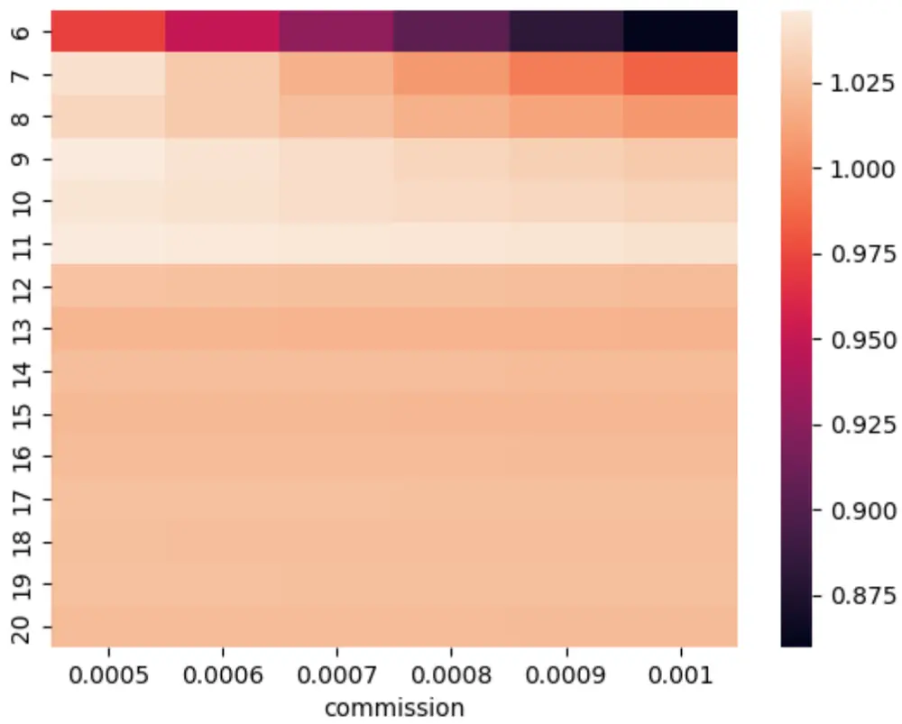
ricequant

图表27： 可转债累计收益率

|  | 0.0005 | 0.0006 | 0.0007 | 0.0008 | 0.0009 | 0.001 |
| --- | --- | --- | --- | --- | --- | --- |
| 6 | 97.22% | 94.97% | 92.72% | 90.47% | 88.22% | 85.97% |
| 7 | 104.10% | 102.98% | 101.85% | 100.72% | 99.59% | 98.46% |
| 8 | 103.60% | 103.01% | 102.43% | 101.85% | 101.27% | 100.68% |
| 9 | 104.55% | 104.23% | 103.91% | 103.59% | 103.28% | 102.96% |
| 10 | 104.29% | 104.12% | 103.95% | 103.78% | 103.60% | 103.43% |
| 11 | 104.62% | 104.53% | 104.44% | 104.35% | 104.26% | 104.18% |
| 12 | 102.59% | 102.54% | 102.49% | 102.44% | 102.39% | 102.34% |
| 13 | 102.05% | 102.02% | 101.99% | 101.96% | 101.94% | 101.91% |
| 14 | 102.42% | 102.40% | 102.38% | 102.36% | 102.34% | 102.32% |
| 15 | 102.17% | 102.16% | 102.14% | 102.13% | 102.11% | 102.10% |
| 16 | 102.33% | 102.31% | 102.30% | 102.29% | 102.27% | 102.26% |
| 17 | 102.54% | 102.52% | 102.51% | 102.50% | 102.49% | 102.47% |
| 18 | 102.44% | 102.43% | 102.41% | 102.40% | 102.39% | 102.38% |
| 19 | 102.52% | 102.51% | 102.50% | 102.49% | 102.48% | 102.47% |
| 20 | 102.32% | 102.31% | 102.30% | 102.29% | 102.28% | 102.28% |

ricequant

模型在可转债上依然具有显著的收益水平，说明模型具有良好的泛化能力。且由于可转债对于高频交易相对较少的限制，此模型非常适合在可转债上进行交易。

## 六、结果及讨论

本文主要通过 level2 的订单簿数据构建了 LOB 数据，结合深度神经网络 DeepLOB 模型，在股票和可转债上进行测试，结果表明，当触发信号参数 N 大于 15 时，股票单次交易的平均收益率超过 0.8%，将模型直接应用于可转债，单次交易的平均收益率可以达到 5.55%，收益非常显著。

## 分析师介绍

丁鲁明：同济大学金融数学硕士，中国准精算师，现任中信建投证券研究发展部执行总经理，金融工程团队、大类资产配置与基金研究团队首席分析师，中信建投证券基金投顾业务决策委员会成员，上海证券交易所定期专家交流组成员。13 年证券从业，创立国内“量化基本面”投研体系，继承并深入研究经济经典长波体系中的康波周期理论并积极应用于实务，多次对资本市场重大趋势及拐点给出精准预判，对资产配置与经济周期运行具备深刻理解与认知。多次荣获团队荣誉：新财富最佳分析师2009 第 4、2012 第 4、2013 第 1、2014 第 3 等；水晶球最佳分析师 2009 第 1、2013第 1等；Wind金牌分析师 2018年第 2、2019年第 2等、2020年第 4等。

研究助理王 超：南京大学粒子物理博士，曾担任基金公司研究员，券商研究员，有丰富的研究和投资经验，2021 年加入中信建投，主要负责量化多因子选股。

## 评级说明

| 投资评级标准 |  | 评级 | 说明 |
| --- | --- | --- | --- |
| 报告中投资建议涉及的评级标准为报告发布日后6个月内的相对市场表现，也即报告发布日后的6个月内公司股价（或行业指数）相对同期相关证券市场代表性指数的涨跌幅作为基准。A股市场以沪深300指数作为基准；新三板市场以三板成指为基准；香港市场以恒生指数作为基准；美国市场以标普500指数为基准。 | 股票评级 | 买入 | 相对涨幅15%以上 |
|  |  | 增持 | 相对涨幅 5%—15% |
|  |  | 中性 | 相对涨幅-5%—5%之间 |
|  |  | 减持 | 相对跌幅 5%—15% |
|  |  | 卖出 | 相对跌幅15%以上 |
|  | 行业评级 | 强于大市 | 相对涨幅10%以上 |
|  |  | 中性 | 相对涨幅-10-10%之间 |
|  |  | 弱于大市 | 相对跌幅10%以上 |

## 分析师声明

本报告署名分析师在此声明：（i）以勤勉的职业态度、专业审慎的研究方法，使用合法合规的信息，独立、客观地出具本报告, 结论不受任何第三方的授意或影响。（ii）本人不曾因，不因，也将不会因本报告中的具体推荐意见或观点而直接或间接收到任何形式的补偿。

## 法律主体说明

本报告由中信建投证券股份有限公司及/或其附属机构（以下合称“中信建投”）制作，由中信建投证券股份有限公司在中华人民共和国（仅为本报告目的，不包括香港、澳门、台湾）提供。中信建投证券股份有限公司具有中国证监会许可的投资咨询业务资格，本报告署名分析师所持中国证券业协会授予的证券投资咨询执业资格证书编号已披露在报告首页。

在遵守适用的法律法规情况下，本报告亦可能由中信建投（国际）证券有限公司在香港提供。本报告作者所持香港证监会牌照的中央编号已披露在报告首页。

## 一般性声明

本报告由中信建投制作。发送本报告不构成任何合同或承诺的基础，不因接收者收到本报告而视其为中信建投客户。

本报告的信息均来源于中信建投认为可靠的公开资料，但中信建投对这些信息的准确性及完整性不作任何保证。本报告所载观点、评估和预测仅反映本报告出具日该分析师的判断，该等观点、评估和预测可能在不发出通知的情况下有所变更，亦有可能因使用不同假设和标准或者采用不同分析方法而与中信建投其他部门、人员口头或书面表达的意见不同或相反。本报告所引证券或其他金融工具的过往业绩不代表其未来表现。报告中所含任何具有预测性质的内容皆基于相应的假设条件，而任何假设条件都可能随时发生变化并影响实际投资收益。中信建投不承诺、不保证本报告所含具有预测性质的内容必然得以实现。

本报告内容的全部或部分均不构成投资建议。本报告所包含的观点、建议并未考虑报告接收人在财务状况、投资目的、风险偏好等方面的具体情况，报告接收者应当独立评估本报告所含信息，基于自身投资目标、需求、市场机会、风险及其他因素自主做出决策并自行承担投资风险。中信建投建议所有投资者应就任何潜在投资向其税务、会计或法律顾问咨询。不论报告接收者是否根据本报告做出投资决策，中信建投都不对该等投资决策提供任何形式的担保，亦不以任何形式分享投资收益或者分担投资损失。中信建投不对使用本报告所产生的任何直接或间接损失承担责任。

在法律法规及监管规定允许的范围内，中信建投可能持有并交易本报告中所提公司的股份或其他财产权益，也可能在过去 12 个月、目前或者将来为本报告中所提公司提供或者争取为其提供投资银行、做市交易、财务顾问或其他金融服务。本报告内容真实、准确、完整地反映了署名分析师的观点，分析师的薪酬无论过去、现在或未来都不会直接或间接与其所撰写报告中的具体观点相联系，分析师亦不会因撰写本报告而获取不当利益。

本报告为中信建投所有。未经中信建投事先书面许可，任何机构和/或个人不得以任何形式转发、翻版、复制、发布或引用本报告全部或部分内容，亦不得从未经中信建投书面授权的任何机构、个人或其运营的媒体平台接收、翻版、复制或引用本报告全部或部分内容。版权所有，违者必究。

## 中信建投证券研究发展部

中信建投（国际）

北京

东城区朝内大街 2 号凯恒中心

上海

深圳

上海浦东新区浦东南路 528 号南塔 2106 室

香港

B 座 12 层

中环交易广场2期18楼

电话：（8610） 8513-0588

福田区益田路 6003 号荣超商务中心 B座 22层

电话：（8621） 6882-1600

电话：（86755）8252-1369

电话：（852）3465-5600

联系人：李祉瑶

联系人：翁起帆

邮箱：lizhiyao@csc.com.cn

联系人：曹莹

联系人：刘泓麟

邮箱：wengqifan@csc.com.cn

邮箱：caoying@csc.com.cn

邮箱：charleneliu@csci.hk