证券研究报告·金融工程深度

# “逐鹿”Alpha 专题报告（十二）

——AlphaZero：基于 AutoML-Zero 的高频数据低频化因子挖掘框架

## 主要内容

## 简介

对于人工智能在因子挖掘中的应用，目前主要还是停留在遗传规模的方法基础上。近几年机器学习发展迅速，以 AutoML 为代表的特征工程以及模型搭建也早以在工业界实现了广泛应用。本文我们尝试将 Google Brain 团队提出的 AutoML-Zero 模型应用与因子挖掘领域，结合实际情况对模型做了相应的修改构建了AlphaZero 框架。

## 背景介绍

如果将目标任务比作搭积木，Auto 实现了机器自动搭建的过程，减少了其中的人工干预。与传统的手工搭建相比，AutoML的结构在使用相同数目积木的情况下，表现更加稳定。但是AutoML 使用的工具是现有的标准化形状的积木，而 AutoML-Zero 更像是采用木头和工具等原材料搭建积木的过程，正因为材料原始，搭建出的结构具有更多的可能性，不仅能够实现标准积木搭建的结构，也能够在标准结构的基础上，生成新的积木形状。

## AlphaZero

与传统的遗传规划以及 AutoML-Zero 相比，AlphaZero 在挖掘的效率以及因子的可解释性上做了更多的优化，首先，我们对所有数据采用了量纲化处理，避免了在因子挖掘中经常出现的不同量纲之间的因子运算，并且我们要求最终生成的因子为无量纲因子，这样使得因子可解释性问题有所缓解。其次，对于合成因子的长度我们也进行了限制，避免了因子计算过于复杂，容易导致的过拟合问题。

## 因子结果

我们展示了三个因子结果，因子的多空年化收益率分别为26.17%，22.51%以及 25.73%

风险提示：进化算法挖掘出的因子是基于历史统计结果的展示，未来有可能发生风格切换导致因子失效的风险。模型运行存在一定的随机性，初始化随机数种子会对结果产生影响，单次运行结果可能会有一定偏差。历史数据的区间选择会对结果产生一定的影响。模型参数的不同会影响最终结果。模型对计算资源要求较高，运算量不足会导致结果存在一定的欠拟合风险。本文所有模型结果均来自历史数据，模型存在统计误差，不保证模型未来的有效性，对投资不构成任何建议。

# 金融工程研究

## 丁鲁明

dingluming@csc.com.cn

021-68821623

执业证书编号：S1440515020001

王 超

wangchaodcq@csc.com.cn

18221845405

执业证书编号：S1440522120002

发布日期： 2022 年 12 月 14 日

## 市场表现

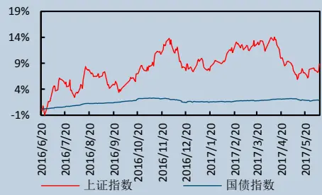

## 相关研究报告

## 一、简介

在量化研究中，因子构建是模型的基石，因子的好坏直接决定了策略的收益率，因此因子挖掘历来是量化研究的重点。传统的经验为主的因子挖掘方式经历几十年的发展，早已进入了瓶颈期，因子拥挤度不断增加，在经历市场风格切换时非常容易发生踩踏，导致大幅回撤。

对于人工智能在因子挖掘中的应用，目前主要还是停留在遗传规模的方法基础上。近几年机器学习发展迅速，以 AutoML 为代表的特征工程以及模型搭建也早已在工业界实现了广泛应用。本文我们尝试将 GoogleBrain 团队提出的 AutoML-Zero 模型应用与因子挖掘领域，结合实际情况对模型做了相应的修改，构建了AlphaZero 框架。

AlphaZero 主要是对因子的可解释性，因子挖掘的效率，以及因子的多样性上做了相应的优化，最终的框架不仅能够应用于批量因子的生成，也能够应用于现有因子的改进。

## 二、背景介绍

## 2.1 AutoML 简介

经典的机器学习任务需要大量的人工干预，主要体现在特征提取，模型构建，算法选择等环节，从模型开发到落地往往需要消耗大量的人力。而 AutoML 的目的是为了尽可能减少人工干预，使机器学习模型实现端到端的自动化过程。

图 1: AutoML 流程
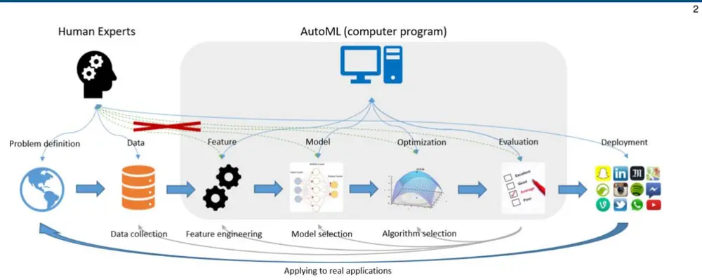
Taking the Human out of Learning Applications:A Survey on Automated Machine Learning[1]

AutoML 涉及的方向较多，主要分为：

## 1) 自动数据清洗

## 2) 自动特征工程

## 3) 超参数优化

## 4) 元学习

## 5) 神经网络架构搜索

其中神经网络架构搜索（Neural Architecture Search，NAS）是近年来研究的热点。NAS 的主要思想是将一个循环神经网络作为控制器，利用给定的基础模块，搭建出一个完整的深度学习网络。整个过程类似于搭积木，以往通过人工搭建的过程交由机器自行构建。通过 NAS 自动搭建的网络能够取得优异的表现，在相同参数条件下，能够取得超越经典网络的表现。

图 2:NASNet 表现
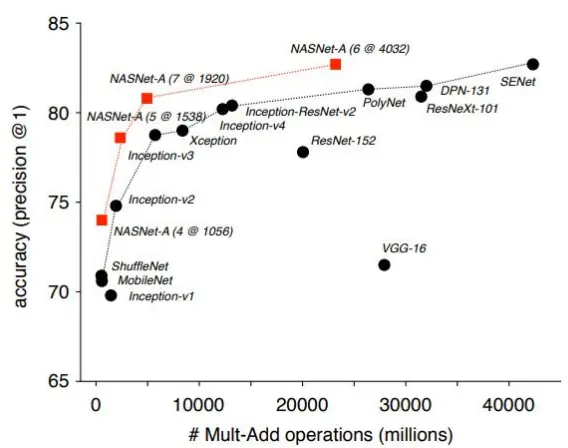
Learning Transferable Architectures for Scalable Image Recognition[2],

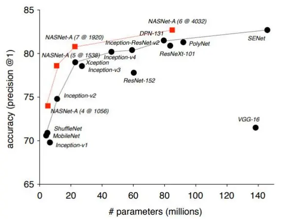

## 2.2 AutoML-Zero 简介

AutoML-Zero[3]是由 Google Brain 的 Real.等人在 2020 年提出算法，能够从零开始用基本的数学操作去搜索机器学习算法。

如果将目标任务比作搭积木，Auto 实现了机器自动搭建的过程，减少了其中的人工干预。与传统的手工搭建相比，AutoML 的结构在使用相同数目积木的情况下，表现更加稳定。但是 AutoML 使用的工具是现有的标准化形状的积木，而 AutoML-Zero 更像是采用木头和工具等原材料搭建积木的过程，正因为材料原始，搭建出的结构具有更多的可能性，不仅能够实现标准积木搭建的结构，也能够在标准结构的基础上，生成新的积木形状。

AutoML-Zero 主要是通过正则化进化算法，将程序内的代码不断变异进化，最终生成目标程序。在原论文中，作者通过在 CIFAR-10 的数据集上训练，发现算法能够不断进化，从线性模型，到损失函数，梯度下降，激活函数等等，实现了完整的 MLP 过程。

(b) Adaptation to fast training.
图 3: AutoML-Zero 算法进化
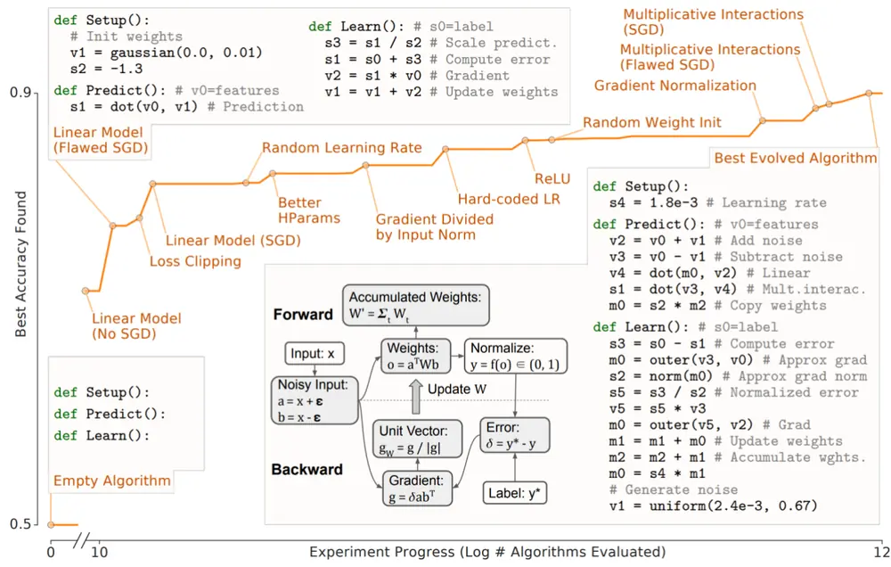
AutoML-Zero: Evolving Machine Learning Algorithms From Scratch[3],

在一些极端情况下， AutoML-Zero 能够进化出 Dropout，学习率衰减，权重矩阵的变换平均值作为学习速率等操作。

图 4:AutoML-Zero 新算法生成
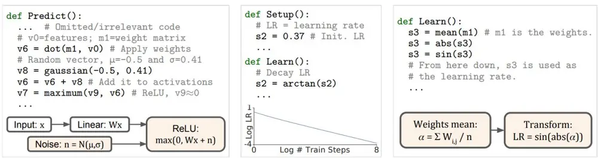
(a) Adaptation to few examples.
(c) Adaptation to multiple classes.
AutoML-Zero: Evolving Machine Learning Algorithms From Scratch[3],

AutoML-Zero 为算法的发现提供了新的思路，未来随着硬件资源的扩展以及搜索空间的优化，AutoML-Zero的潜力将得到更加有效的释放。

## 三、AlphaZero

传统的因子挖掘以人工构建和以遗传规划为代表的机器挖掘为主，我们在之前的报告中也曾尝试过将遗传规划与分析师因子结合进行因子挖掘。

AutoML-Zero 为因子挖掘提供了新的思路，本文我们在 AutoML-Zero 的基础上， 构建了 AlphaZero 的因子挖掘框架。

与所有进化算法面临的问题一样，AlphaZero 同样面临适应度，进化效率以及物种多样性三者之间的不可能三角问题，即不能够同时满足种群适应度较高，进化效率快，以及种群具有较好的多样性的条件。在实际问题中，需要做相应的取舍。在 AlphaZero 中，对于三者我们分别采取了一定的优化，从而能够在较高的效率下实现因子的挖掘。

与传统的遗传规划以及 AutoML-Zero 相比，AlphaZero 在挖掘的效率以及因子的可解释性上做了更多的优化，首先，我们对所有数据采用了量纲化处理，避免了在因子挖掘中经常出现的不同量纲之间的因子运算，并且我们要求最终生成的因子为无量纲因子，这样使得因子可解释性问题有所缓解。其次，对于合成因子的长度我们也进行了限制，避免了因子计算过于复杂，容易导致的过拟合问题。

与 AutoML-Zero 不同的是，由于计算效率的差距，以及金融数据的实际问题，我们并没有简单的四则运算作为基础算子，而是在此基础上，加入了更多因子构建时常用的算子。在搜索空间上，不同于 AutoML-Zero 的无关联搜索，我们限制了所有的变异均需要与原有的代码有关联，即所有在图结构上的改动均与原有的边或者节点相关联。通过这两项改动，能够极大的提高进化的效率。

图 5:进化算法不可能三角
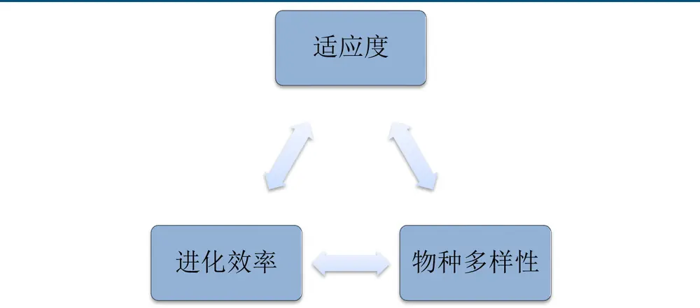
数据来源：中信建投

## 3.1 基础因子及算子

与 AutoML-Zero 类似，我们将基础数据分为三类；

标量 s：常数 2，5，10，20，240（仅用于分钟数据）

向量 v：中证全指日频涨跌幅，振幅，换手率，上涨股票占比

矩阵 m：股票日频最高价，最低价，开盘价，收盘价，成交量；分钟频率最高价，最低价，开盘价，收盘价，成交量

为了使得合成的因子具有一定的可解释性，每类数据都标有相应的量纲（高开低收量纲为元，成交量量纲为手，其他无量纲），在后续计算中，只有特定的量纲之间能够进行合法运算。

所有算子分为三类，分别是元素运算符，时间序列运算符以及横截面运算符。在算子的构建上，尽量选择基础算子，通过个体在搜索空间内的不断进化，构建出最终适应度较高的种群。

表 1:算子集合

| 算子 | 解释 | 量纲 |
| --- | --- | --- |
| 元素运算符 |  |  |
| add(m1, m2) | m1+m2 | 输入相同量纲，输出不改变量纲 |
| subtract(m1, m2) | m1-m2 | 输入相同量纲，输出不改变量纲 |
| protecteddiv(m, v) | m1/v | 输出不改变量纲 |
| sigmoid(m) | 1/(1+pow(e,-m)) | 输出无量纲 |
| 时间序列运算符 |  |  |
| ts_mean(m,s) | 过去v期m的平均值 | 输出不改变量纲 |
| ts_std(m,s) | 过去v期 m的标准差 | 输出不改变量纲 |
| ts_skew(m,s) | 过去v期m的偏度 | 输出无量纲 |
| ts_kurt(m,s) | 过去v期m的峰度 | 输出无量纲 |
| ts_max(m,s) | 过去v期m的最大值 | 输出不改变量纲 |
| ts_min(m,s) | 过去v期m的最小值 | 输出不改变量纲 |
| ts_corr(m1,m2,s) | 过去 v 期 m1 与 m2 的相 关性 | 输入相同量纲，输出不改变量纲 |
| ts_diff(m,s) | 过去v期m的变化 | 输出不改变量纲 |
| ts_delay(m,s) | 过去v期m的值 | 输出不改变量纲 |
| idx_min(m,s) | 过去v期m的最小值的序 号 | 输出无量纲 |
| idx_max(m,s) | 过去v期m的最大值的序 号 | 输出无量纲 |
| interval(m,op,v1,v2) | op(m[v1:v2]) |  |
| 横截面运算符 |  |  |
| cs_norm(m) | m的横截面标准化 | 输出无量纲 |

资料来源：中信建投

在矩阵数据中，存在不同频率的数据，需要首先通过时间序列算子将分钟频率的数据降频的日频，然后进一步进行运算。

与传统的遗传规划不同，在 AutoML-Zero 中，个体不再是树型表达式，而是“程序”（Program）表达式，程序 Program 由三部分构成，分别是设置（Setup）,预测（Predict）以及学习（Learn）。

图 6:程序构成
# sX/vX/mX = scalar/vector/matrix at address X. 
# "gaussian" produces Gaussian IID random numbers. 
def Setup(): 
# Initialize variables. 
m1 = gaussian(-1e-10, 9e-09) # 1st layer weights 
s3 = 4.1 # Set learning rate 
v4 = gaussian(-0.033, 0.01) # 2nd layer weights 
def Predict(): # vO=features 
v6 = dot(m1, v0) # Apply 1st layer weights 
v7 = maximum(0, v6) # Apply ReLU 
s1 = dot(v7, v4) # Compute prediction 
def Learn(): # s0=label 
v3 = heaviside(v6, 1.0) # ReLU gradient 
s1 = s0 - s1 # Compute error 
s2 = s1 * s3 # Scale by learning rate 
v2 = s2 * v3 # Approx. 2nd layer weight delta 
v3 = v2 * v4 # Gradient w.r.t. activations 
m0 = outer(v3, v0) # 1st layer weight delta 
m1 = m1 + mO # Update 1st layer weights 
v4 = v2 + v4 # Update 2nd layer weights
数据来源：中信建投

Program 本质上来讲是一个图的结构，与树型结构相比，图的结构更具有普适性。树的增长受限于节点参数以及节点个数，而图的表达式可以拓展到整个空间。从搜索空间来看，图的搜索空间要远远大于树型表达式的搜索空间，使得 AutoML-Zero 的挖掘的潜力近乎无穷，但是随之也带来了计算效率的问题，如果随机探索，大部分情况下，变异产生的基因均与目标适应度无任何关联，因此如何平衡进化效率与搜索空间是 AutoML-Zero 面临的最大问题。

图 7:树形表达式
图 8:程序表达式
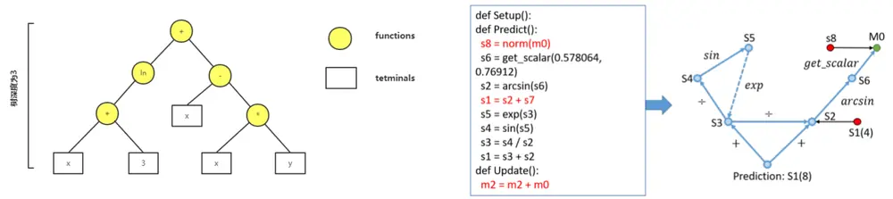
数据来源：中信建投
AlphaEvolve: A Learning Framework to Discover Novel Alphas in Quantitative Investment,中信建投

无论是树型表达式还是图形表达式，最终的目标个体均可表示成单行表达式的形式，即因子的表达式。为

金融工程专题报告

统一表述，下文中所有个体均指代因子，种群指代因子集合，个体进化是指因子的表达式发生部分变异生成新的因子。

## 3.2进化算法

进化算法启发自生物的进化机制，通过个体之间的交叉编译，筛选种群中适应度较高的个体，使得种群整体的适应度增加。常见的进化算法包括遗传算法，遗传规划，进化策略以及进化规划等。进化算法的流程如下图所示，完整的进化流程包括初始化，筛选，繁衍以及终止四个步骤。

图 9:进化算法流程
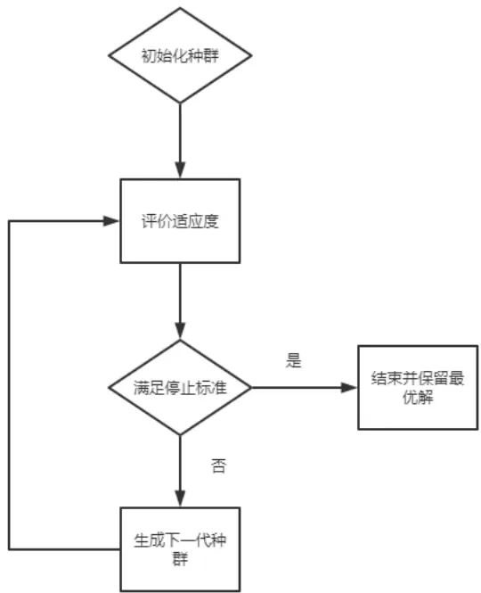
数据来源：中信建投

与 AutoML-Zero 类似，本文采用正则化进化算法，正则化进化，又称衰老进化，是由 Google Brain 的 Rea等人在 2018 年提出的算法。正则化进化模拟了自然界物种进化的规律，种群在进化时首先将年龄最大的个体进行淘汰，然后在剩下的个体中筛选适应度较高的个体作为父代，在繁衍时，父代的基因会进行部分变异生成子代，使得子代既保留了父代大部分基因，又能够再父代的基础上变异出新的基因。此过程循环往复，种群的适应度会不断提高，直至最终达到终止条件。

## 3.2.1热启动初始化

生成种群的第一步是初始化个体，种群个体的数量根据具体情况而定，本文我们选取的种群个体数量为500。

在初始化个体时，采用随机生成的方式生成大部分满足要求的个体，此时的个体表达式均较为简单。为了提高进化速度，在初始种群中加入之前训练中适应度较高的个体。热启动的优点在于能够有效提高种群的进化效率。

热启动的另外一个用途是能够用来进化已有个体，将已有因子与其他简单基因个体构成的种群作为初始化种群，在后续的进化中，已有个体的基因与种群中的其他基因不断发生变异，能够使目标个体的适应度不断增加，在原有个体的基础上生成新的个体。

如下图所示，原始因子为 ts_mean(close,240)/CLOSE，表示日内分钟线 close 的均价与当日收盘价的均价，我们在之前的报告中也曾使用过此因子作为模型的输入，此因子在沪深 300 模型的所有因子重要性中排名第一。利 用 AlphaZero 我 们 可 以 展 示 此 因 子 的 进 化 过 程 ， 首 先 分 子 从 ts_mean(close,240) 进 化 为ts_mean(ts_mean(close,240)，5)，为原始因子的五日平均。第二步，分母从 CLOSE 进化为 CLOSE+LOW，在第三次 进 化 中 ， 分 母 再 次 进 化 为 CLOSE+ts_min(LOW,5) ， 在 最 后 一 次 进 化 中 ， 分 母 变 为CLOSE+ts_std(ts_std(close,240),5)，随着不断进化，因子在样本内的 IC 从 0.057 提升到了 0.064。

图 10:个体进化过程
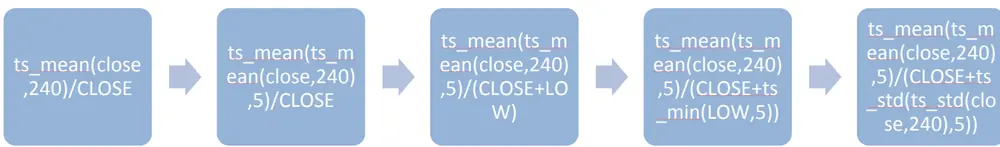
数据来源：中信建投

## 3.2.2个体筛选及适应度

生成初代种群，即初始因子之后，首先需要定义个体的适应度，我们采用因子 IC 的绝对值作为个体适应度函数，IC 的计算方式为因子与 T+1 到 T+2 的收益率在样本内的相关性的平均值。

根据个体的适应度大小，筛选出适应度较高的个体作为下一代个体的父代，变异之后生成下一代带个体。筛选的方法有许多种，包括最优个体，锦标赛法，轮盘法等，最优个体是筛选出种群中适应度最高 个个体，这种方法的优点在于种群的进化速度快，但是容易导致种群的多样性降低，陷入局部最优。轮盘法是根据个体的适应度占比，按照此概率随机筛选出相应的个体，此方法能够确保种群的多样性，但是种群的进化速度较慢。筛选方法中最常用的为锦标赛法，锦标赛算法是在种群中随机选择 k 个个体，再从 k 个个体中选择适应度最高的个体作为父代，不断循环此过程，直至达到指定的父代数量为止，该方法的优势在于每次从随机的部分样本中进行选择，在确保物种适应度的同时保留种群的多样性。

## 3.2.3变异及进化算法

在正则化进化算法中，个体会带有年龄的属性，在每一轮进化的过程中，上一轮筛选出的父代会进行变异生成新的 N 个子代，而上一轮中年龄最大 N 个子代会被剔除，以此确保种群的进化以及适应度的提高。具体的步骤如下：

图 11:正则化进化过程
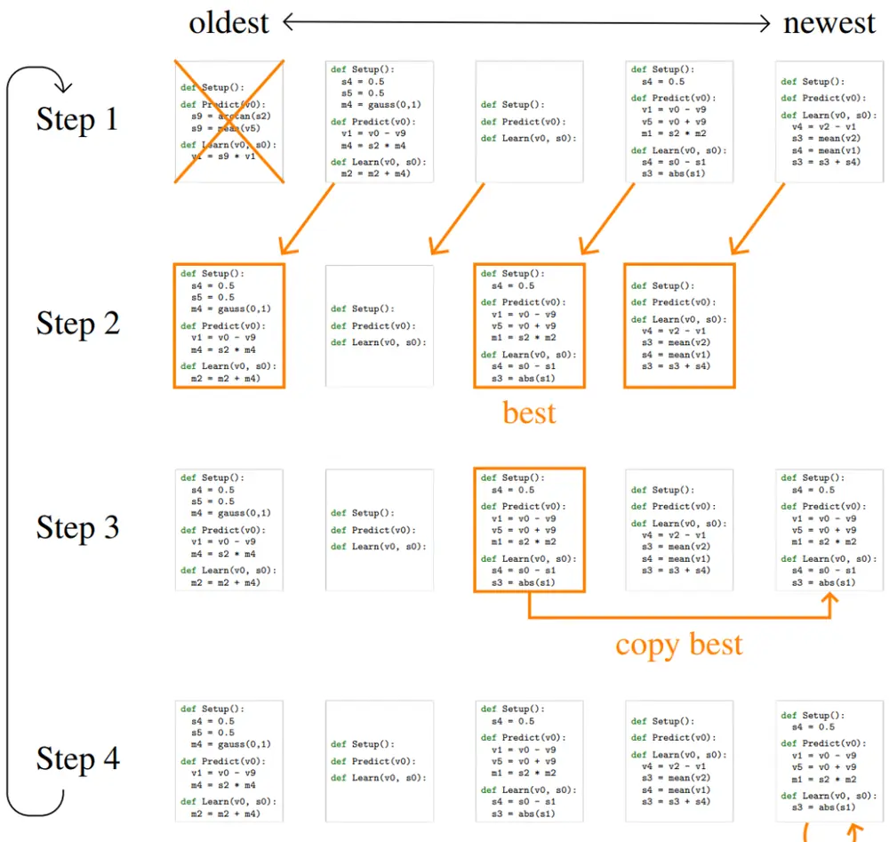
AutoML-Zero: Evolving Machine Learning Algorithms From Scratch,

第一步：将种群中年龄最大的 N 个个体删除

第二步：在剩下的个体中筛选适应度最高的 N 个个体

第三步：将这 N 个个体进行复制

第四步：将这 N 个个体进行变异，生成新一代的种群，循环往复

与传统进化算法相比，正则化进化在变异时，只有个体变异，并没有采用交叉变异的方式。其中个体变异

有三种方式，分别是插入，成分变异，以及节点变异

图 12:个体变异
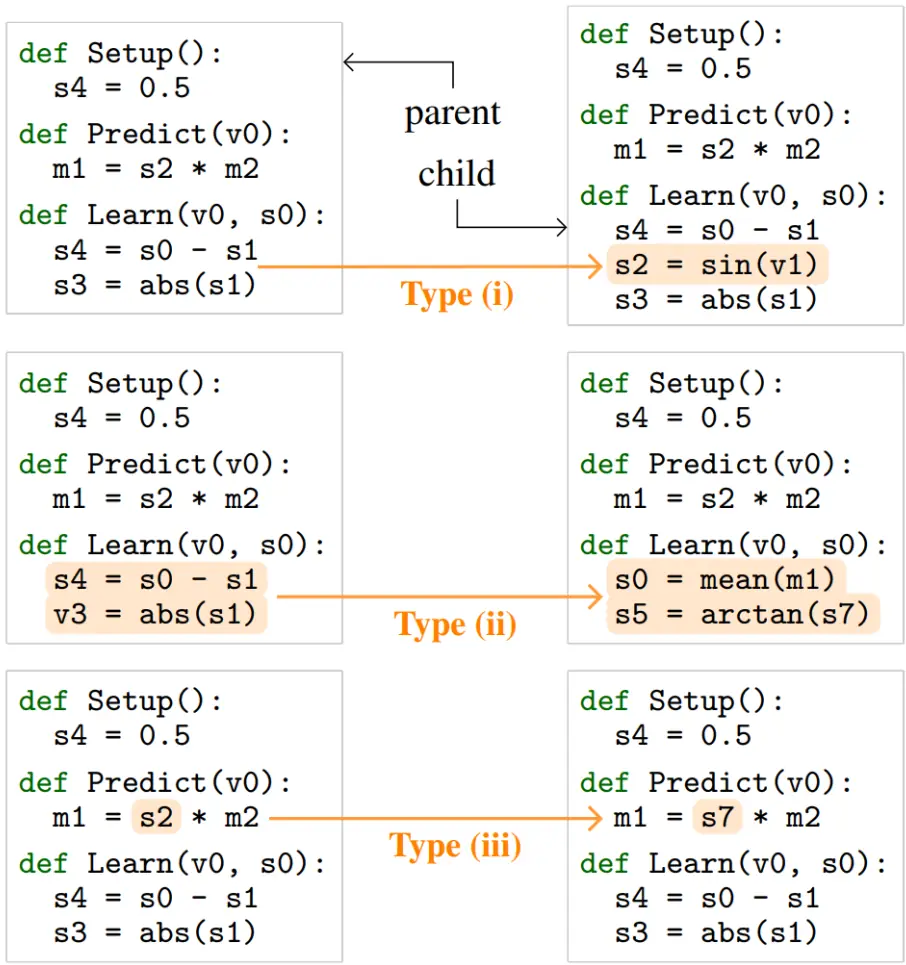
AutoML-Zero: Evolving Machine Learning Algorithms From Scratch,

## 3.2.4退化变异及灾难算法

在进化算法中，面临的最大问题之一是物种多样性问题，适应度过于单一会导致随着进化过程的进行，精英个体的基因会变得非常相似，导致整个种群的多样性降低，此时种群会非常容易陷入局部最优，进化效率降低。有许多相关的工作用于解决物种多样性问题。本文我们引入退化变异以及灾难算法用于缓解物种多样性的问题。

退化变异与插入变异相反，是将某节点向下关联的所有表达式退化为一个节点，目的是为了删除精英个体的某些基因（表达式），使精英个体的基因复杂度降低，从而使一般个体的基因得以保存。

退化变异的主要目的是删除基因片段，而灾难算法的主要目的是删除个体。具体算法为计算个体之间的相似度，对于相似度过高的个体，只保留适应度最高的一个个体，经过灾难算法之后，此时中群内的主导基因不再显著，更有利于种群的多样化进化。但是种群内的个体数量减少，需要补充个体数量，通过加入初代的初始化个体和当前代个体的变异后代两种方式进行补充。

由于种群个体数目众多，相似度计算的复杂度较高，时间复杂度为 O（np2T），其中 T 为时间长度，p 为个体数量，n 为计算次数，为了降低复杂度，我们采用降采样的方式计算相关性，具体思路为，在计算个体相关性时，只随机采样部分时间点(t<<T)的相关性取均值，另外只计算精英个体(q<<p)之间的相似性，且每隔 m 轮启动一次灾难算法，确保精英个体有足够的时间进化。

## 四、因子挖掘结果

对于种群而言，我们更关注整个种群的统计值，下图展示了进化轮数与种群个体的平均 IC 以及最大个体IC 的关系，可以看出，随着轮数增大，种群的平均 IC 会不断增加，而 IC 最大的个体变异导致的 IC 增加存在一定的几率发生，因此会出现几轮不变的情况。

种群的平均 IC 会出现定期下滑的情况，正式由于我们的灾难算法删除了部分相似个体导致的结果，但是很快种群的 IC 会得到恢复。

图 13:种群进化
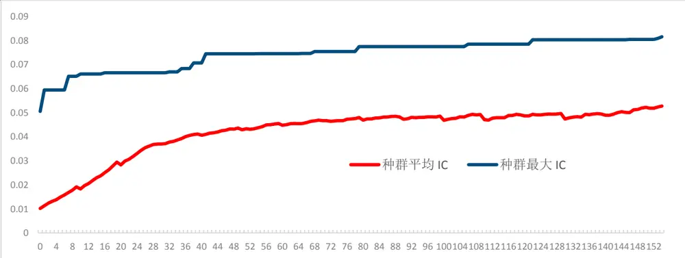
ricequant,

## 4.1 Alpha1

因子一的定义为: ts_norm(cs_norm(HIGH),20)

因子一的定义较为简单，为改进后的反转因子，代表了股票最高价的横截面排序的 20 日时间序列标准化，

排序相对于过去 20 天的排名越低，未来收益越高。

因子的 IC 均值为-0.0366，IR 为 4.38。因子胜率为 61.22%（小于 0 占比）。从 IC 的时间序列来看，因子在大部分时间均处于负向 IC 区间，在 4 月份有过明显的反转。

图 14:因子一 IC
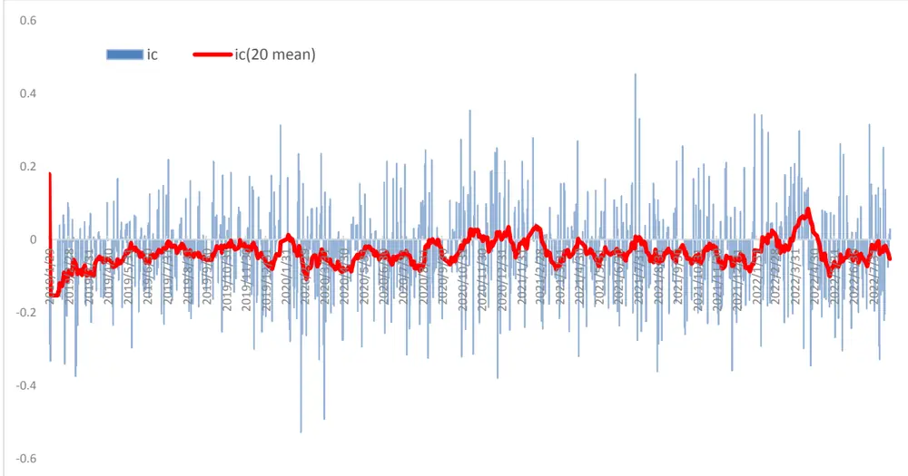
ricequant,

从因子的分组收益率可以看出，多头组自 19 年起，累计收益 118%，空头组的累计收益为-16%，多空年化收益 26.17%，多头组的年化收益为 23.77%。

图 15:因子一分组收益率
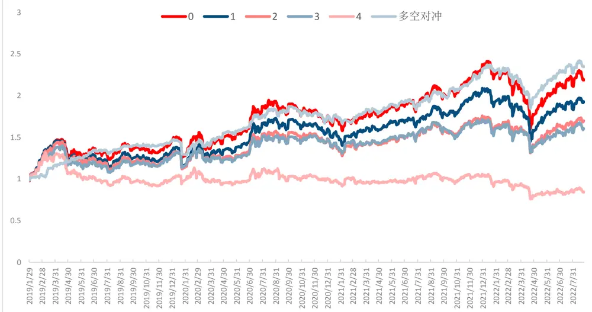
ricequant,

## 4.2 Alpha2

因子二的定义为: ts_max((ts_min(interval(volume, sum, 9:30, 10:00)/VOLUME, 2)+ts_corr(high, volume, 240)), 5)

因子二是开盘后半小时成交量占比的两日最小值与日内的最高价与成交量的相关性求和之后取五日最大值得到的因子，很明显，此因子是由原始开盘后半小时成交量占比因子与最高价成交量相关性两个因子的基因进化得到的合成因子。

因子二的 IC 均值为-0.0367，IR 为 7.33，因子胜率为 68.21%，因子二的稳定性和胜率显著高于因子一。

图 16:因子二 IC
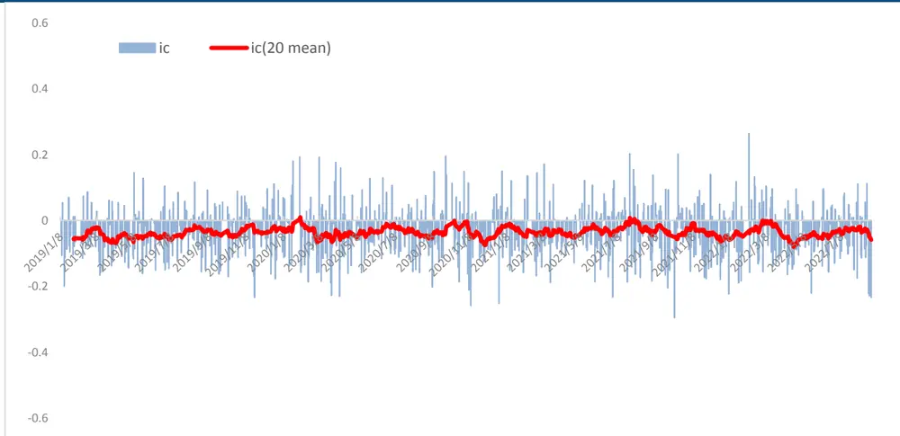
ricequant,

从因子的分组收益率可以看出，多头组自 19 年起，累计收益 103%，空头组的累计收益为-7%，多空年化收益 22.51%，多头组的年化收益为 21.39%。

图 17:因子二分组收益率
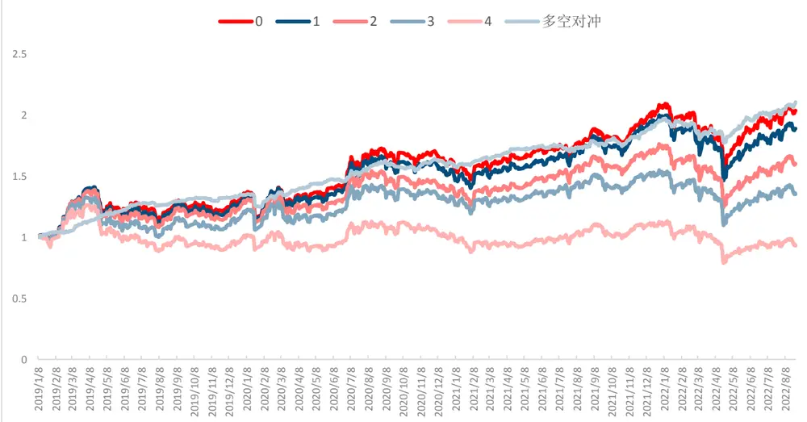
ricequant,

## 4.3 Alpha3

因子三的定义为: ts_max((ts_min(cs_norm(VOLUME), 2) + ts_corr(high, volume, 240), 2)

因子三是横截面标准化的成交量两日最小值与日内的最高价与成交量的相关性求和之后取五日最大值得到的因子，很明显，此因子与因子二相比，部分基因发生了替换，因子二的开盘成交量占比替换成了横截面标准化的成交量。

因子三的 IC 均值为-0.042，IR 为 6.93，因子胜率为 69.90%，因子三的在 IC 以及胜率高于因子二。

图 18:因子三 IC
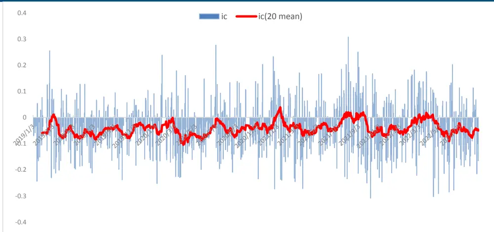
ricequant,

从因子的分组收益率可以看出，多头组自 19 年起，累计收益 109%，空头组的累计收益为-22%，多空年化收益 25.73%，多头组的年化收益为 22.30%。

图 19:因子三分组收益率
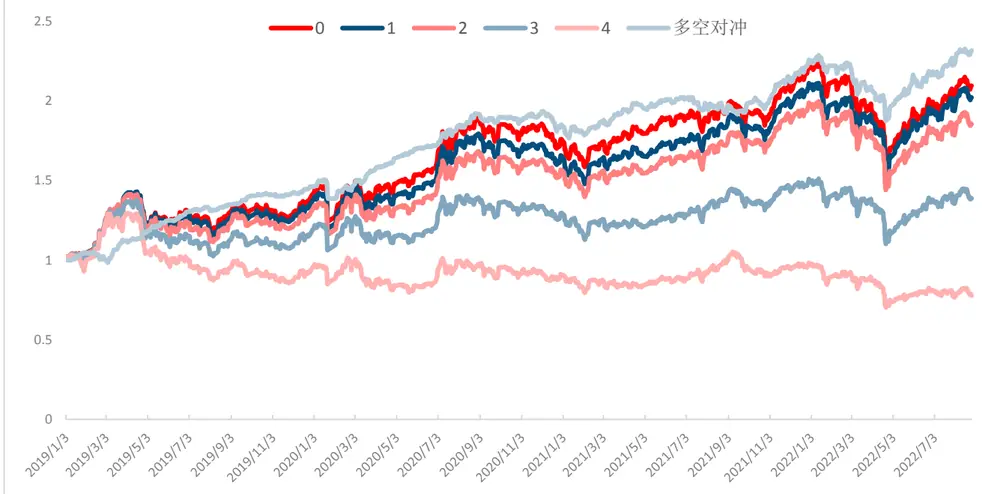
ricequant,

## 五、结果及讨论

本文基于 AutoML-Zero 算法，将其应用到因子挖掘领域构建了 AlphaZero 框架，通过构建基础算子以及因子，结合进化算法进行因子挖掘。

本质上 AutoML-Zero 是在巨大的搜索空间内利用正则化构建程序，为了使其具有更好的适用性，在构建AlphaZero 时，我们限制了搜索空间以及优化了算子结构，提高了进化效率，但是另一方面也限制了所生成程序的可能性。从最终的结果我们也可以看出，挖掘出的因子也是在经典量价因子的基础上进行了一定的变异。

本文只是因子挖掘方法的介绍，关于 AlphaZero 的应用还很广泛，比如批量低相关性因子生成用于模型输入，以及将现有因子和基础基因构成种群进行进化，变异现有因子使其效果提升。

随着计算资源的扩充，以及算法的不断优化，未来 AlphaZero 在因子挖掘上的应用将不断提高。

## 六、参考文献

[1] Yao, Quanming, Mengshuo Wang, Hugo Jair Escalante, Guyon Isabelle, Yi-Qi Hu, Li Yu-Feng, Wei-Wei Tu, Yang Qiang, and Yu Yang. Taking Human out of Learning Applications: A Survey on Automated Machine Learning, 2018.

[2] Zoph, Barret, Vijay Vasudevan, Jonathon Shlens, and Quoc V. Le. “Learning Transferable Architectures for Scalable Image Recognition.” In 2018 IEEE/CVF Conference on Computer Vision and Pattern Recognition, 8697–8710, 2018. https://doi.org/10.1109/CVPR.2018.00907.

[3] Real, Esteban, Chen Liang, David So, and Quoc Le. AutoML-Zero: Evolving Machine Learning Algorithms From Scratch, 2020.

[4] Real, E., Aggarwal, A., Huang, Y., & Le, Q. V. (2019). Regularized Evolution for Image Classifier Architecture Search. Proceedings of the AAAI Conference on Artificial Intelligence, 33(01), 4780-4789. https://doi.org/10.1609/aaai.v33i01.33014780

## 分析师介绍

丁鲁明：同济大学金融数学硕士，中国准精算师，现任中信建投证券研究发展部执行总经理，金融工程团队、大类资产配置与基金研究团队首席分析师，中信建投证券基金投顾业务决策委员会成员，上海证券交易所定期专家交流组成员。13 年证券从业，创立国内“量化基本面”投研体系，继承并深入研究经济经典长波体系中的康波周期理论并积极应用于实务，多次对资本市场重大趋势及拐点给出精准预判，对资产配置与经济周期运行具备深刻理解与认知。多次荣获团队荣誉：新财富最佳分析师2009 第 4、2012 第 4、2013 第 1、2014 第 3 等；水晶球最佳分析师 2009 第 1、2013第 1等；Wind金牌分析师 2018年第 2、2019年第 2等、2020年第 4等。

研究助理王 超：南京大学粒子物理博士，曾担任基金公司研究员，券商研究员，有丰富的研究和投资经验，2021 年加入中信建投，主要负责量化多因子选股。

## 评级说明

| 投资评级标准 |  | 评级 | 说明 |
| --- | --- | --- | --- |
| 报告中投资建议涉及的评级标准为报告发布日后6个月内的相对市场表现，也即报告发布日后的6个月内公司股价（或行业指数）相对同期相关证券市场代表性指数的涨跌幅作为基准。A股市场以沪深300指数作为基准；新三板市场以三板成指为基准；香港市场以恒生指数作为基准；美国市场以标普500指数为基准。 | 股票评级 | 买入 | 相对涨幅15%以上 |
|  |  | 增持 | 相对涨幅 5%—15% |
|  |  | 中性 | 相对涨幅-5%—5%之间 |
|  |  | 减持 | 相对跌幅 5%—15% |
|  |  | 卖出 | 相对跌幅15%以上 |
|  | 行业评级 | 强于大市 | 相对涨幅10%以上 |
|  |  | 中性 | 相对涨幅-10-10%之间 |
|  |  | 弱于大市 | 相对跌幅10%以上 |

## 分析师声明

本报告署名分析师在此声明：（i）以勤勉的职业态度、专业审慎的研究方法，使用合法合规的信息，独立、客观地出具本报告, 结论不受任何第三方的授意或影响。（ii）本人不曾因，不因，也将不会因本报告中的具体推荐意见或观点而直接或间接收到任何形式的补偿。

## 法律主体说明

本报告由中信建投证券股份有限公司及/或其附属机构（以下合称“中信建投”）制作，由中信建投证券股份有限公司在中华人民共和国（仅为本报告目的，不包括香港、澳门、台湾）提供。中信建投证券股份有限公司具有中国证监会许可的投资咨询业务资格，本报告署名分析师所持中国证券业协会授予的证券投资咨询执业资格证书编号已披露在报告首页。

在遵守适用的法律法规情况下，本报告亦可能由中信建投（国际）证券有限公司在香港提供。本报告作者所持香港证监会牌照的中央编号已披露在报告首页。

## 一般性声明

本报告由中信建投制作。发送本报告不构成任何合同或承诺的基础，不因接收者收到本报告而视其为中信建投客户。

本报告的信息均来源于中信建投认为可靠的公开资料，但中信建投对这些信息的准确性及完整性不作任何保证。本报告所载观点、评估和预测仅反映本报告出具日该分析师的判断，该等观点、评估和预测可能在不发出通知的情况下有所变更，亦有可能因使用不同假设和标准或者采用不同分析方法而与中信建投其他部门、人员口头或书面表达的意见不同或相反。本报告所引证券或其他金融工具的过往业绩不代表其未来表现。报告中所含任何具有预测性质的内容皆基于相应的假设条件，而任何假设条件都可能随时发生变化并影响实际投资收益。中信建投不承诺、不保证本报告所含具有预测性质的内容必然得以实现。

本报告内容的全部或部分均不构成投资建议。本报告所包含的观点、建议并未考虑报告接收人在财务状况、投资目的、风险偏好等方面的具体情况，报告接收者应当独立评估本报告所含信息，基于自身投资目标、需求、市场机会、风险及其他因素自主做出决策并自行承担投资风险。中信建投建议所有投资者应就任何潜在投资向其税务、会计或法律顾问咨询。不论报告接收者是否根据本报告做出投资决策，中信建投都不对该等投资决策提供任何形式的担保，亦不以任何形式分享投资收益或者分担投资损失。中信建投不对使用本报告所产生的任何直接或间接损失承担责任。

在法律法规及监管规定允许的范围内，中信建投可能持有并交易本报告中所提公司的股份或其他财产权益，也可能在过去 12 个月、目前或者将来为本报告中所提公司提供或者争取为其提供投资银行、做市交易、财务顾问或其他金融服务。本报告内容真实、准确、完整地反映了署名分析师的观点，分析师的薪酬无论过去、现在或未来都不会直接或间接与其所撰写报告中的具体观点相联系，分析师亦不会因撰写本报告而获取不当利益。

本报告为中信建投所有。未经中信建投事先书面许可，任何机构和/或个人不得以任何形式转发、翻版、复制、发布或引用本报告全部或部分内容，亦不得从未经中信建投书面授权的任何机构、个人或其运营的媒体平台接收、翻版、复制或引用本报告全部或部分内容。版权所有，违者必究。

## 中信建投证券研究发展部

中信建投（国际）

北京

东城区朝内大街 2 号凯恒中心

上海

深圳

香港

上海浦东新区浦东南路 528 号南塔 2106 室

B 座 12 层

中环交易广场2期18楼

电话：（8610） 8513-0588

福田区益田路 6003 号荣超商务中心 B座 22层

电话：（8621） 6882-1600

电话：（86755）8252-1369

电话：（852）3465-5600

联系人：李祉瑶

联系人：翁起帆

邮箱：lizhiyao@csc.com.cn

联系人：曹莹

联系人：刘泓麟

邮箱：wengqifan@csc.com.cn

邮箱：caoying@csc.com.cn

邮箱：charleneliu@csci.hk